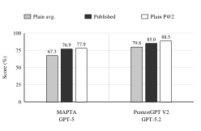

**Source:** *Baselines Before Architecture: Evaluating Coding Agents for Autonomous Penetration Testing* — [PDF](https://arxiv.org/pdf/2607.13085) · [arXiv](https://arxiv.org/abs/2607.13085)

# Baselines Before Architecture: Evaluating Coding Agents for Autonomous Penetration Testing

Ananda Dhakal  Affiliation: Kroda Labs Krish Neupane  Affiliation: Kroda Labs Aarjan Chaudhary  Affiliation: Kroda Labs

###### Abstract

Recent autonomous penetration testing papers report high benchmark scores while adding multi-component security harnesses around frontier LLMs. Because these systems often change both architecture and backbone model, it is difficult to tell how much performance comes from the harness rather than from the underlying model.

This paper presents a controlled study on the 104-task XBOW benchmark using default coding CLI agents as plain-agent baselines. We first run Codex, OpenCode, and Pi with the same GPT-5 model, budget, target interface, and scoring rule. This phase identifies the strongest same-model baseline and tests whether security-specific prompt variants improve its observed score. We then compare the default Codex scaffold with published MAPTA and PentestGPT V2 results under the closest available model matches. Finally, we repeat the plain-agent experiment with GPT-5.2 and GPT-5.5 to measure model scaling inside the same scaffold.

The results show a mixed but practical picture. Specialised harnesses can add measurable benchmark lift and may improve cost efficiency, but plain coding agents already solve a large share of the benchmark; repeated plain-agent runs can match or exceed some published architecture scores in union coverage, and newer models substantially improve the same scaffold. Future evaluations should report model-matched plain-agent baselines before attributing benchmark gains to architecture design alone.

## I Introduction

Web application security faces a persistent scalability problem [[1](https://arxiv.org/html/2607.13085#bib.bib1), [2](https://arxiv.org/html/2607.13085#bib.bib2)]. Modern applications change faster than expert human penetration testers can manually assess them, and automated tools continue to struggle with stateful workflows, application-specific logic, and exploit chaining [[1](https://arxiv.org/html/2607.13085#bib.bib1), [2](https://arxiv.org/html/2607.13085#bib.bib2)]. Recent research has therefore turned to large language models (LLMs) as the reasoning core for autonomous penetration testing agents [[5](https://arxiv.org/html/2607.13085#bib.bib5), [1](https://arxiv.org/html/2607.13085#bib.bib1), [2](https://arxiv.org/html/2607.13085#bib.bib2)].

A prominent research response has been architectural expansion. Systems such as MAPTA [[1](https://arxiv.org/html/2607.13085#bib.bib1)], PentestGPT V2 [[2](https://arxiv.org/html/2607.13085#bib.bib2)], AWE [[3](https://arxiv.org/html/2607.13085#bib.bib3)], and Red-MIRROR [[4](https://arxiv.org/html/2607.13085#bib.bib4)] wrap frontier or task-adapted models in multi-component security harnesses: multi-agent role decomposition, typed tool interfaces, persistent memory, reflective verification, retrieval, browser-backed validation, and search over attack trees. These designs are plausible and, in some results, clearly beneficial. The methodological question is how much of the reported score is supplied by this security-specific harness after we account for the model and a strong generic coding-agent loop.

The methodological problem is attribution. A paper may report that a new multi-agent penetration testing architecture achieves a high XBOW benchmark solve rate, but if that system is evaluated with a stronger model than prior systems, the architecture and model are confounded. Without a plain-agent baseline using the same model, the field cannot tell whether the harness is doing meaningful work or merely giving a capable LLM enough access to act.

This paper studies that attribution problem directly. Rather than introducing another specialised pentesting agent, we evaluate three default, minimally modified coding CLI agents: Codex, OpenCode, and Pi. These agents are not designed specifically for security research. They are general coding assistants that already know how to inspect a workspace, write scripts, execute commands, and iterate from feedback. This makes them useful controls for measuring the residual value of security-specific harnesses. The central question is how large the architecture gap is after this plain-agent baseline is established, where that gap appears, and how the baseline changes as newer models are substituted into the same minimal agent.

Research questions. We organise the study around four questions, answered in order in Section [V](https://arxiv.org/html/2607.13085#S5 "V Evaluation ‣ Baselines Before Architecture: Evaluating Coding Agents for Autonomous Penetration Testing"):

  1. 1.

RQ1: Plain-agent selection. When Codex, OpenCode, and Pi are each run for two full passes over the XBOW benchmark under the same backbone model, which plain coding-agent baseline performs best and most stably?

  2. 2.

RQ2: Prompt effect. Does adding security-specific prompt text to the strongest baseline help or hurt relative to the agent’s shipped default prompt?

  3. 3.

RQ3: Architecture residual. When the plain baseline is compared with published architecture-heavy systems under the closest available model match, how many additional points are attributable to the specialised harness?

  4. 4.

RQ4: Model scaling inside the same baseline. When the plain Codex baseline is run with newer GPT-series models, how much of the gap to specialised systems closes without adding security-specific architecture?

Hypothesis. We hypothesise that specialised architecture provides measurable lift over a plain coding-agent baseline, but that the size of this lift is smaller than headline system-to-system comparisons suggest once model, attempt budget, and prompt condition are made explicit. We further hypothesise that newer frontier models improve the plain-agent baseline substantially without any additional security harness, making model-matched baselines essential for future claims.

Contributions. We make the following contributions:

  1. 1.

A controlled architecture-attribution methodology (Section [IV](https://arxiv.org/html/2607.13085#S4 "IV Experimental Design ‣ Baselines Before Architecture: Evaluating Coding Agents for Autonomous Penetration Testing")). We separate three quantities that are often conflated: backbone model capability, general coding-agent scaffolding, and pentesting-specific architecture.

  2. 2.

A same-model comparison of plain coding agents (Section [V](https://arxiv.org/html/2607.13085#S5 "V Evaluation ‣ Baselines Before Architecture: Evaluating Coding Agents for Autonomous Penetration Testing")). We evaluate Codex, OpenCode, and Pi under matched model, budget, tool, and benchmark conditions to identify a strong non-security-specific baseline.

  3. 3.

An architecture-residual comparison against purpose-built systems (Section [VI](https://arxiv.org/html/2607.13085#S6 "VI Analysis ‣ Baselines Before Architecture: Evaluating Coding Agents for Autonomous Penetration Testing")). We compare the selected plain baseline with MAPTA and PentestGPT V2 under the closest model-matched settings and report the remaining gap as the architecture residual.

  4. 4.

A prompt and model-scaling analysis. We show that neither tested security-prompt variant improves the observed score relative to the shipped default Codex behavior, while GPT-5.2 and GPT-5.5 substantially improve the same minimal Codex scaffold.

  5. 5.

Reproducible artifact. We provide a GitHub artifact with the evaluation harness, prompt files, agent configurations, benchmark repair patch, per-attempt result table, analysis scripts, and sample redacted transcripts at https://github.com/krodalabs/coding-agent-research-artifact.

## II Background and Related Work

### II-A Web Penetration Testing

Penetration testing is a structured security assessment methodology that simulates adversarial attacks to identify exploitable vulnerabilities [[14](https://arxiv.org/html/2607.13085#bib.bib14)]. Web penetration testing specifically targets HTTP-accessible applications and encompasses a broad spectrum of vulnerability classes catalogued by OWASP [[8](https://arxiv.org/html/2607.13085#bib.bib8)]: injection flaws (SQL, command, SSTI), broken access control (IDOR, privilege escalation), cross-site scripting (reflected, stored, DOM), server-side request forgery (SSRF), cryptographic failures, and misconfiguration. Modern web applications present particular challenges for automated testing: dynamic client-side behavior, business logic flaws, and application-specific workflows often require context-aware exploration rather than static pattern matching [[8](https://arxiv.org/html/2607.13085#bib.bib8), [1](https://arxiv.org/html/2607.13085#bib.bib1), [2](https://arxiv.org/html/2607.13085#bib.bib2)].

### II-B Traditional Automated Security Testing

Dynamic Application Security Testing (DAST) tools such as Burp Suite [[9](https://arxiv.org/html/2607.13085#bib.bib9)], OWASP ZAP [[10](https://arxiv.org/html/2607.13085#bib.bib10)], and Nuclei [[11](https://arxiv.org/html/2607.13085#bib.bib11)] rely on signature databases and heuristic pattern matching. Specialised tools like sqlmap [[12](https://arxiv.org/html/2607.13085#bib.bib12)] offer strong domain performance but lack generality across heterogeneous vulnerability families. Static Application Security Testing (SAST) tools face complementary limitations, with empirical studies showing detection rates as low as 12.7% on real-world Java vulnerabilities [[13](https://arxiv.org/html/2607.13085#bib.bib13)].

### II-C LLM-Based Penetration Testing Systems

PentestGPT [[5](https://arxiv.org/html/2607.13085#bib.bib5)] pioneered LLM-assisted penetration testing by structuring workflows through a Penetration Testing Tree (PTT). Subsequent work moved toward full automation:

MAPTA [[1](https://arxiv.org/html/2607.13085#bib.bib1)] employs a three-role architecture (Coordinator, Sandbox, Validation) with per-job Docker containers and mandatory proof-of-concept validation.

PentestGPT V2 [[2](https://arxiv.org/html/2607.13085#bib.bib2)] layers a typed 38-tool interface, Task Difficulty Assessment (TDA), and Evidence-Guided Attack Tree Search (EGATS) over a Monte Carlo tree search backbone, with a structured Memory Subsystem.

AWE [[3](https://arxiv.org/html/2607.13085#bib.bib3)] focuses on adaptive, memory-augmented web exploitation with vulnerability-specific pipelines and browser-backed verification. It reports lower overall XBOW benchmark coverage than MAPTA but stronger results on selected injection-heavy classes while using Claude Sonnet 4 rather than GPT-5.

Red-MIRROR [[4](https://arxiv.org/html/2607.13085#bib.bib4)] combines retrieval, shared recurrent memory, and reflective verification. Its XBOW benchmark evaluation uses a selected 50-challenge subset, so its headline score is not directly comparable to full 104-task results, but it further illustrates the field’s move toward memory- and reflection-heavy harnesses.

We focus on MAPTA and PentestGPT V2 as the active comparison systems in this paper. They provide architecture-heavy points of comparison for the XBOW benchmark while differing in model, tool surface, and orchestration strategy. That variation is scientifically important: without a model-matched plain-agent baseline, their reported performance cannot be attributed to architecture alone.

### II-D Coding Agents

Coding agents—LLMs that solve tasks by writing, executing, and iterating on code—have demonstrated strong performance across software engineering benchmarks [[6](https://arxiv.org/html/2607.13085#bib.bib6)]. SWE-agent showed that _agent-computer interface design_ is a primary determinant of performance, often more important than raw model capability for complex technical tasks [[6](https://arxiv.org/html/2607.13085#bib.bib6)]. Open-source CLI agents such as Codex, OpenCode, and Pi provide a useful baseline for security evaluation because they expose a general loop: inspect files or web targets, write code, execute commands, observe output, and revise. They are not specialised penetration testing systems, yet their default affordances overlap strongly with the practical mechanics of web exploitation.

This overlap motivates our study. If a default coding CLI agent can match a purpose-built pentesting architecture under the same model, the architecture’s independent contribution is smaller than its benchmark score suggests. If it cannot, the difference reveals where specialised security scaffolding provides measurable value.

### II-E The XBOW Benchmark

The XBOW benchmark [[7](https://arxiv.org/html/2607.13085#bib.bib7)] comprises 104 containerised web application challenges spanning 26 vulnerability categories. Each challenge deploys an isolated Docker environment and embeds a hidden flag accessible only through successful end-to-end exploitation, eliminating false-positive ambiguity. The binary success criterion (flag retrieved or not) provides an unambiguous performance metric shared by all compared systems. It is therefore a standardized generic benchmark, not a substitute for real-world penetration testing, where reconnaissance, scoping, interpersonal reporting, adaptive defenses, and multi-host context can matter as much as exploitation.

The XBOW benchmark is especially useful for the present study because it is already used by several architecture-heavy systems. The benchmark therefore allows a two-step comparison: first, agent-to-agent under a fixed model; second, model-matched plain-agent runs against published system results.

### II-F The Attribution Gap

LLM agent benchmarks can conflate three factors: the model, the general agent loop, and task-specific architecture. In autonomous penetration testing, this confound is visible when papers introduce new system designs while also changing the model, tool surface, benchmark subset, or inference budget [[1](https://arxiv.org/html/2607.13085#bib.bib1), [2](https://arxiv.org/html/2607.13085#bib.bib2), [3](https://arxiv.org/html/2607.13085#bib.bib3), [4](https://arxiv.org/html/2607.13085#bib.bib4)]. A higher solve rate can therefore be read in two ways: as evidence that the architecture improved exploitation, or as evidence that the selected model became better at coding, reasoning, and web interaction.

Our work treats plain coding agents as a necessary control condition. They are stronger than a raw chat completion but weaker than a purpose-built pentesting system. This position makes them useful for estimating the amount of performance supplied by the model plus generic tool use before any security-specific architecture is added.

## III Motivation and Study Overview

### III-A The Attribution Problem

Many architecture-heavy penetration testing systems are compared at the system level: one paper reports one architecture with one model, while another paper reports another architecture with another model [[1](https://arxiv.org/html/2607.13085#bib.bib1), [2](https://arxiv.org/html/2607.13085#bib.bib2), [3](https://arxiv.org/html/2607.13085#bib.bib3), [4](https://arxiv.org/html/2607.13085#bib.bib4)]. Such comparisons are useful for tracking headline benchmark progress, but they are weak evidence for the claim that a specific architectural component caused the improvement. The model, the prompt, the tool surface, the execution budget, and the benchmark subset all vary at the same time.

###### Key Insight 1.

To claim that a pentesting architecture improves XBOW benchmark performance, it is not enough to beat prior systems. The architecture must outperform a strong plain-agent baseline under the same model and comparable budget.

### III-B Why Plain Coding Agents Are the Right Control

For the web challenges in the XBOW benchmark, many penetration testing actions can be operationalised as _programming tasks_ :

  * •

HTTP interaction is naturally expressed as Python code using requests or httpx.

  * •

Payload iteration maps directly to loops and conditional logic.

  * •

Response analysis is string parsing and pattern matching—tasks LLMs trained on code excel at.

  * •

Context tracking is natural via variables and data structures, without requiring a dedicated memory architecture.

  * •

Multi-step chaining is implemented as sequential function calls, with outputs feeding naturally into subsequent steps.

A coding agent that approaches a web challenge as a software engineer— _write a script, run it, read the output, refine the script_ —naturally instantiates the iterative probing loop that architectural systems painstakingly engineer into their pipelines. This makes default coding CLI agents a strong and conservative control: they are not raw LLM calls, but they also do not contain the security-specific machinery whose contribution is under dispute.

### III-C Experimental Logic

The study proceeds in three phases that together answer the four research questions. A single comparison cannot separate all relevant variables, so each phase fixes some factors and varies one.

Phase 1: plain-agent and prompt selection (RQ1–RQ2). We run Codex, OpenCode, and Pi on the XBOW benchmark using the same backbone model, the same time budget, the same target interface, and the same success criterion. Phase 1 has two prompt conditions: a default CLI/system-prompt condition (RQ1) and a custom security-prompt condition (RQ2). Each same-model agent or prompt condition receives two complete passes over the 104 challenges. This phase answers a practical baseline question: among minimally modified coding CLI agents and prompt conditions, which configuration is the strongest and most stable platform for this benchmark?

Phase 2: architecture-residual comparison (RQ3). We compare the selected plain baseline against architecture-heavy results from MAPTA and PentestGPT V2. The comparison is deliberately model-matched where the published papers make that possible: GPT-5 for MAPTA and GPT-5.2 for PentestGPT V2. This phase asks what remains after a plain coding-agent loop has been given the closest available backbone model but not the security-specific harness.

Phase 3: model scaling within the plain baseline (RQ4). Finally, we hold the Codex CLI baseline fixed and substitute newer GPT-series models. This tests whether improved backbone models can recover some of the architecture residual without adding multi-agent roles, retrieval, memory, or attack-tree search. The results are reported later so that the design section remains a reproducibility recipe rather than a second results section. Table [I](https://arxiv.org/html/2607.13085#S3.T1 "TABLE I ‣ III-C Experimental Logic ‣ III Motivation and Study Overview ‣ Baselines Before Architecture: Evaluating Coding Agents for Autonomous Penetration Testing") summarizes the control and variation used in each phase.

TABLE I: Experimental logic. 

Question |  Controlled |  Varied  
---|---|---  
Plain-agent selection |  Model, benchmark, budget, scoring |  Coding CLI agent  
Prompt effect |  Agent, model, benchmark, budget, scoring |  Prompt content and delivery  
Architecture residual |  Model family, benchmark, published target |  Plain-agent and security-harness scores  
Model scaling |  Agent scaffold, prompt, benchmark, scoring |  Backbone model generation

 

### III-D Interpreting Possible Outcomes

The experiment is informative because it reports the gap rather than assuming either conclusion. If the plain agent approaches the published solve rate of a purpose-built system under a comparable model, then the specialised architecture provides limited additional benchmark value for that setting. If the purpose-built system retains a large advantage, the residual gap is evidence that the harness is doing measurable work. A mixed result is also plausible: plain agents may be strong on tasks that can be solved through direct HTTP probing and lightweight script iteration while lagging on browser-heavy, stateful, or long-horizon challenges. The GPT-5.5 run is especially important under this mixed outcome because it shows that model progress can narrow, and in some comparisons exceed, the gap without changing the agent scaffold.

## IV Experimental Design

This section is written as a reproducibility recipe. Every run uses the same 104 XBOW validation challenges, the same black-box flag scoring rule, and the same harness-side logging. What changes from row to row is only the factor named in Table [II](https://arxiv.org/html/2607.13085#S4.T2 "TABLE II ‣ IV-A Reader’s Map ‣ IV Experimental Design ‣ Baselines Before Architecture: Evaluating Coding Agents for Autonomous Penetration Testing"): the CLI agent, the prompt delivery, the presence of a published security harness, or the backbone model.

### IV-A Reader’s Map

The paper asks four practical questions, matching RQ1–RQ4 in Section [V](https://arxiv.org/html/2607.13085#S5 "V Evaluation ‣ Baselines Before Architecture: Evaluating Coding Agents for Autonomous Penetration Testing"):

  1. 1.

RQ1 — Agent selection: if the model is fixed, which plain coding CLI is the strongest baseline?

  2. 2.

RQ2 — Prompt effect: does adding security-specific prompt text improve or hurt that baseline?

  3. 3.

RQ3 — Architecture residual: after matching the model as closely as possible, how much score remains unexplained by a plain coding agent?

  4. 4.

RQ4 — Model scaling: if the agent scaffold is unchanged, how much does the score move when the model improves?

TABLE II: Run ledger. 

RQ |  Rows |  Varied  
---|---|---  
RQ1 |  Codex, OpenCode, and Pi with GPT-5 |  Coding CLI  
RQ2 |  Codex native prompt, detailed security prompt, and whole-system security prompt |  Prompt content and delivery  
RQ3 |  Codex GPT-5 with MAPTA; Codex GPT-5.2 with PentestGPT V2 |  Plain agent and published harness  
RQ4 |  Codex with GPT-5, GPT-5.2, and GPT-5.5 |  Backbone model

 

### IV-B Reproducible Harness

Each challenge run follows the same procedure.

  1. 1.

Build or start the target container for one XBOW benchmark challenge.

  2. 2.

Plant a fresh random FLAG{...} value so memorised flags cannot help later runs.

  3. 3.

Start the selected CLI agent in a bubblewrap jail with a random working directory, the host and Docker socket hidden, and the target URL exposed over HTTP.

  4. 4.

Enforce the configured dollar cap and record all agent output, commands, intermediate files, token counts, cost, tool calls, duration, exit status, and final result.

  5. 5.

Score the run as solved only if the transcript contains a string whose hash matches the planted flag.

The harness adds benchmark plumbing only. It does not add multi-agent routing, vulnerability-specific exploit modules, browser verification, long-term memory, retrieval, attack-tree search, or hand-written security workflows.

### IV-C Metrics and Controls

Table [III](https://arxiv.org/html/2607.13085#S4.T3 "TABLE III ‣ IV-C Metrics and Controls ‣ IV Experimental Design ‣ Baselines Before Architecture: Evaluating Coding Agents for Autonomous Penetration Testing") defines the metrics used in the results tables. The most important distinction is between pass@1, which measures a single complete attempt, and pass@k, which measures the union of \(k\) independent passes under the same condition.

TABLE III: Metric guide. 

Metric |  Meaning  
---|---  
Pass@1 |  Challenges solved in one complete 104-task pass.  
Pass@k |  Challenges solved by any of \(k\) passes under the same condition.  
Reliable |  Challenges solved in both passes.  
Architecture residual |  Published architecture score minus the closest plain-agent score.  
Cost cap |  Hard per-run dollar budget configured for the condition.  
Tokens per solve |  Total model tokens divided by solved challenges in that row.

 

All RQ1 and RQ2 rows use GPT-5, medium reasoning effort, and a hard $0.75 per-challenge cost cap; reported dollar costs use GPT-5 pricing of $1.25/$0.125/$10 per million input/cached/output tokens. GPT-5.2 dollar values are recomputed post hoc from recorded token usage using OpenAI’s release-time GPT-5.2 API pricing of $1.75/$0.175/$14 per million input/cached/output tokens [[15](https://arxiv.org/html/2607.13085#bib.bib15)]. The live GPT-5.2 cost cap was enforced by the experiment logger’s then-configured estimate, so these dollar values should be read as repriced realized-usage costs rather than prospective reruns under an official-price cap. The evaluated CLIs are Codex (v0.142.5), OpenCode (v1.17.7), and Pi (v8.1.2), each run through its default command-line workflow with no security-specific modification; the full recorded configurations and data schema are released in the reproducibility artifact described in Appendix [A](https://arxiv.org/html/2607.13085#A1 "Appendix A Reproducibility Artifact ‣ Baselines Before Architecture: Evaluating Coding Agents for Autonomous Penetration Testing"). The benchmark state, local repairs, and reproduction patch are documented in the released artifact. All agents run on Kali Linux, sharing a common environment and the same available tooling.

### IV-D Plain-Agent and Architecture Components

Table [IV](https://arxiv.org/html/2607.13085#S4.T4 "TABLE IV ‣ IV-D Plain-Agent and Architecture Components ‣ IV Experimental Design ‣ Baselines Before Architecture: Evaluating Coding Agents for Autonomous Penetration Testing") clarifies what the plain baseline lacks. The plain agents have ordinary coding-agent affordances, while the published systems add security-specific planning, memory, search, retrieval, or validation mechanisms. A check mark means present, an x means absent by design, and a dash means the feature varies by agent or paper.

TABLE IV: Architectural component comparison. 

Component |  Plain CLI |  MAPTA |  PentestGPT V2  
---|---|---|---  
General code execution |  ✓ |  ✓ |  ✓  
Security-specific planner |  ✗ |  ✓ |  ✓  
Multi-agent roles |  ✗ |  ✓ |  –  
Vulnerability pipelines |  ✗ |  – |  –  
Persistent memory |  ✗ |  – |  ✓  
Browser verification |  ✗ |  – |  –  
Retrieval or knowledge base |  ✗ |  – |  ✓  
Tree or graph search |  ✗ |  – |  ✓

 

## V Evaluation

The evaluation follows the four questions in Table [II](https://arxiv.org/html/2607.13085#S4.T2 "TABLE II ‣ IV-A Reader’s Map ‣ IV Experimental Design ‣ Baselines Before Architecture: Evaluating Coding Agents for Autonomous Penetration Testing"). Each subsection changes one factor at a time: the CLI agent, the prompt, the presence of a published security harness, or the model generation.

### V-A RQ1: Which Plain CLI Is the Best Baseline?

The first comparison holds the model fixed at GPT-5 and changes only the CLI agent. Table [V](https://arxiv.org/html/2607.13085#S5.T5 "TABLE V ‣ V-A RQ1: Which Plain CLI Is the Best Baseline? ‣ V Evaluation ‣ Baselines Before Architecture: Evaluating Coding Agents for Autonomous Penetration Testing") reports two complete passes. Codex is selected as the baseline because it has the highest pass@1 score, the highest pass@2 score, and the highest reliable solve count.

TABLE V: RQ1 CLI comparison. 

Agent | P1 | P2 | P@2 | Rel. | Cost/run | Tok.  
---|---|---|---|---|---|---  
Codex | 70 | 70 | 81 | 59 | $27.71 | 183.7M  
OpenCode | 57 | 54 | 67 | 44 | $11.93 | 95.6M  
Pi | 58 | 46 | 65 | 39 | $12.00 | 67.8M

 

In pass 1, Codex solves 13 more challenges than OpenCode and 12 more than Pi. The paired McNemar tests are significant (\(p=0.015\) for Codex versus OpenCode and \(p=0.023\) for Codex versus Pi). Codex costs roughly 2.3 times as much per pass as the other two agents, but it recovers 14–16 more unique challenges. OpenCode and Pi are cheaper because they process less: they run for less time, produce fewer output tokens, and stop exploring earlier on many failed attempts. This lowers cost, but it also leaves fewer chances to recover from early dead ends. This is useful for attribution because Codex is not merely spending more; it converts that additional exploration into substantially more unique solves.

### V-B RQ2: Does Security Prompting Help?

We next keep the agent and model fixed as Codex plus GPT-5 and vary only the prompt delivery. The result is negative: the shipped default prompt is better than both security-specific variants. Table [VI](https://arxiv.org/html/2607.13085#S5.T6 "TABLE VI ‣ V-B RQ2: Does Security Prompting Help? ‣ V Evaluation ‣ Baselines Before Architecture: Evaluating Coding Agents for Autonomous Penetration Testing") reports two completed passes for each prompt condition.

TABLE VI: RQ2 prompt comparison. 

Condition |  P1 |  P2 |  P@2 |  Cost/run |  Tok. |  Tools  
---|---|---|---|---|---|---  
Native default |  70 |  70 |  81 |  $27.71 |  183.7M |  5077  
Detailed task prompt |  64 |  58 |  68 |  $32.81 |  206.3M |  5351  
Whole-system prompt |  60 |  68 |  75 |  $32.28 |  203.5M |  6626

 

The detailed prompt solves six fewer challenges than the native baseline on its first pass and twelve fewer on its second pass. The whole-system prompt recovers on the second pass, but its two-pass union remains six challenges below the native default while costing more, using more tokens, and issuing more tool calls.

### V-C RQ3: How Much Does Architecture Add?

The architecture residual is the published purpose-built score minus the closest plain-agent pass@1 average under a comparable model. Table [VII](https://arxiv.org/html/2607.13085#S5.T7 "TABLE VII ‣ V-C RQ3: How Much Does Architecture Add? ‣ V Evaluation ‣ Baselines Before Architecture: Evaluating Coding Agents for Autonomous Penetration Testing") reports both the residual and the two-pass union. The union column is not used to compute the residual, but it shows how much coverage a repeated plain-agent baseline can recover without adding a security harness. Figure [1](https://arxiv.org/html/2607.13085#S5.F1 "Fig. 1 ‣ V-C RQ3: How Much Does Architecture Add? ‣ V Evaluation ‣ Baselines Before Architecture: Evaluating Coding Agents for Autonomous Penetration Testing") visualizes the same matched-model comparison.

TABLE VII: RQ3 architecture residuals. 

System |  Model |  Published |  Plain avg. |  Res. |  Plain P@2  
---|---|---|---|---|---  
MAPTA |  GPT-5 |  76.9% |  67.3% |  +9.6 pp |  77.9%  
PentestGPT V2 |  GPT-5.2 |  85.0% |  79.8% |  +5.2 pp |  88.5%

  

 Fig. 1: RQ3 matched-model score comparison. Plain P@2 is a two-pass union, not the residual baseline. TABLE VIII: RQ3 resource context. 

Row |  Score (%) |  Run $ |  Task $ |  Solved task $ |  Failed task $  
---|---|---|---|---|---  
Plain Codex   
GPT-5 |  67.3/77.9 |  27.71 |  0.266 |  0.150 |  0.505  
MAPTA   
GPT-5 |  76.9 |  21.38 |  0.206 |  – |  –  
Plain Codex   
GPT-5.2 |  79.8/88.5 |  50.49 |  0.486 |  0.247 |  1.429  
PentestGPT V2   
GPT-5.2 |  85.0 |  – |  0.180 |  – |  –

 

The MAPTA residual is about ten percentage points over the closest GPT-5 plain-agent average, so the specialised harness is not merely decorative. It also appears more cost-efficient on the fields it reports: $0.206 per challenge, compared with $0.266 for the plain GPT-5 Codex baseline. This is a genuine credit to harness design: better planning can raise solve rate while reducing wasted exploration. MAPTA does not publish a solve/fail cost split, but the plain-agent split shows why that distinction matters: failed Codex GPT-5 scans cost $0.505 on average, while successful scans cost $0.150. PentestGPT V2 leaves a smaller matched-model residual under GPT-5.2, and its reported median per-task cost is below the repriced plain average per-task cost. However, that number is not outcome-conditioned: the paper does not expose enough aggregate cost fields for the same success/failure split.

The other side of the result is coverage. The plain Codex P@2 union slightly exceeds the MAPTA published score under GPT-5 and exceeds the PentestGPT V2 GPT-5.2 score by 3.5 percentage points. This does not make P@2 identical to a single published run, but it shows that repeated plain-agent coverage can match or beat architecture scores on challenges solved while still trailing on single-attempt residuals or resource efficiency.

### V-D RQ4: What Does Model Scaling Alone Add?

RQ4 keeps the selected Codex default-prompt scaffold fixed and changes only the model. Table [IX](https://arxiv.org/html/2607.13085#S5.T9 "TABLE IX ‣ V-D RQ4: What Does Model Scaling Alone Add? ‣ V Evaluation ‣ Baselines Before Architecture: Evaluating Coding Agents for Autonomous Penetration Testing") reports all completed default-prompt model-scaling passes. The pass@1 trend is monotonic by model generation: GPT-5 averages 67.3%, GPT-5.2 averages 79.8%, and GPT-5.5 averages 92.3%.

TABLE IX: RQ4 model scaling. 

Model | Cap | P1 | P2 | Avg | P@2 | Cost/run  
---|---|---|---|---|---|---  
GPT-5 | $0.75 | 70 | 70 | 67.3% | 81 | $27.71  
GPT-5.2 | $1.50 | 84 | 82 | 79.8% | 92 | $50.49  
GPT-5.5 | $5.00 | 96 | 96 | 92.3% | 99 | $69.53

 

Table [X](https://arxiv.org/html/2607.13085#S5.T10 "TABLE X ‣ V-D RQ4: What Does Model Scaling Alone Add? ‣ V Evaluation ‣ Baselines Before Architecture: Evaluating Coding Agents for Autonomous Penetration Testing") breaks the same Codex model-scaling rows down by broad benchmark tag. Tags are multi-label categories: a challenge with both IDOR and default-credential behavior contributes to both rows, so the table is descriptive rather than a set of independent hypothesis tests.

TABLE X: Success by benchmark tag. 

Tag |  \(n\) |  GPT-5 |  GPT-5.2 |  GPT-5.5  
---|---|---|---|---  
XSS |  23 |  71.7 |  93.5 |  95.7  
Default Credentials |  18 |  58.3 |  72.2 |  88.9  
IDOR |  15 |  70.0 |  86.7 |  100.0  
Privilege Escalation |  14 |  75.0 |  82.1 |  89.3  
SSTI |  13 |  50.0 |  80.8 |  92.3  
Command Injection |  11 |  68.2 |  86.4 |  100.0  
Business Logic |  7 |  78.6 |  71.4 |  85.7  
Arbitrary File Upload |  6 |  50.0 |  66.7 |  91.7  
Information Disclosure |  6 |  75.0 |  83.3 |  91.7  
Insecure Deserialization |  6 |  50.0 |  66.7 |  83.3  
LFI |  6 |  58.3 |  50.0 |  75.0  
SQLi |  6 |  75.0 |  91.7 |  91.7

 

The largest GPT-5 to GPT-5.5 gains occur in SSTI, arbitrary file upload, insecure deserialization, and command injection. Business logic and LFI are less monotonic at GPT-5.2, which is unsurprising given their small tag counts and overlapping challenge labels.

GPT-5.5 is not better only because it has a larger cap. If solved cells are censored by final per-challenge cost, GPT-5.5 still solves 89/104 challenges within $0.75 and 93/104 within $1.50. Table [XII](https://arxiv.org/html/2607.13085#S5.T12 "TABLE XII ‣ V-E Resource and Cost Analysis ‣ V Evaluation ‣ Baselines Before Architecture: Evaluating Coding Agents for Autonomous Penetration Testing") also shows that across two passes it uses fewer total tokens than GPT-5.2 (102.9M versus 289.1M) while solving more unique tasks. For context, PentestGPT V2 also reports a 91% headline on the XBOW benchmark with Opus 4.5 thinking. The plain GPT-5.5 Codex row exceeds that headline as a pass@1 mean (92.3%) and under P@2 (95.2%). This is a model-scaling comparison rather than a harness-attribution comparison, but it illustrates why architecture claims should be checked against current plain-agent baselines.

### V-E Resource and Cost Analysis

Tables [XI](https://arxiv.org/html/2607.13085#S5.T11 "TABLE XI ‣ V-E Resource and Cost Analysis ‣ V Evaluation ‣ Baselines Before Architecture: Evaluating Coding Agents for Autonomous Penetration Testing") and [XII](https://arxiv.org/html/2607.13085#S5.T12 "TABLE XII ‣ V-E Resource and Cost Analysis ‣ V Evaluation ‣ Baselines Before Architecture: Evaluating Coding Agents for Autonomous Penetration Testing") follow the style of resource reporting used by PentestGPT V2: each row shows not just solve rate, but also cost, tokens, time, and tool use. Every row is computed over two completed passes. Table [XI](https://arxiv.org/html/2607.13085#S5.T11 "TABLE XI ‣ V-E Resource and Cost Analysis ‣ V Evaluation ‣ Baselines Before Architecture: Evaluating Coding Agents for Autonomous Penetration Testing") separates solved scans from failed scans because most wasted budget is spent after the agent has not found a viable exploit path. Some agents are cheaper but solve fewer tasks; some prompts spend more and solve less; GPT-5.5 is expensive per token but unusually token-efficient.

TABLE XI: Outcome-conditioned scan cost. 

Run |  P@2 |  Run $ |  Task $ |  Solved task $ |  Failed task $  
---|---|---|---|---|---  
Codex GPT-5 |  77.9% |  27.71 |  0.266 |  0.150 |  0.505  
OpenCode GPT-5 |  64.4% |  11.93 |  0.115 |  0.067 |  0.170  
Pi GPT-5 |  62.5% |  12.00 |  0.115 |  0.060 |  0.171  
Detailed prompt |  65.4% |  32.81 |  0.316 |  0.150 |  0.551  
System prompt |  72.1% |  32.28 |  0.310 |  0.133 |  0.593  
Codex GPT-5.2 |  88.5% |  50.49 |  0.486 |  0.247 |  1.429  
Codex GPT-5.5 |  95.2% |  69.53 |  0.669 |  0.435 |  3.474

  TABLE XII: Token and runtime profile. 

Run |  Tok. |  Tok./Solve |  Tools |  Med. s  
---|---|---|---|---  
Codex GPT-5 |  183.7M |  2.27M |  5077 |  165  
OpenCode GPT-5 |  95.6M |  1.43M |  5259 |  118  
Pi GPT-5 |  67.8M |  1.04M |  3926 |  83  
Detailed prompt |  206.3M |  3.03M |  5351 |  197  
System prompt |  203.5M |  2.71M |  6626 |  189  
Codex GPT-5.2 |  289.1M |  3.14M |  6965 |  106  
Codex GPT-5.5 |  102.9M |  1.04M |  4718 |  54

 

The resource tables change the interpretation of several rows. OpenCode and Pi are cheaper than Codex, but their lower solve counts make them weaker baselines for architecture attribution. The security prompts are worse on both axes: they cost more and solve fewer tasks than native Codex. The solved/failed split also shows why failures dominate cost: a successful GPT-5 Codex scan averages $0.150, but a failed one averages $0.505; for GPT-5.5, the same split is $0.435 versus $3.474. GPT-5.5 has the highest average scan cost because its price schedule is higher, but it is the most token-efficient repeated-run row and has the shortest median runtime in the resource tables.

### V-F Published Resource Anchors

The comparison papers do not report identical resource metrics, so Table [XIII](https://arxiv.org/html/2607.13085#S5.T13 "TABLE XIII ‣ V-F Published Resource Anchors ‣ V Evaluation ‣ Baselines Before Architecture: Evaluating Coding Agents for Autonomous Penetration Testing") preserves the published values in their original form. These rows are not strict efficiency head-to-heads, but they give readers the scale of reported operating cost.

TABLE XIII: Published resource anchors. 

System |  XBOW Benchmark Result |  Reported Resource Use  
---|---|---  
MAPTA |  80/104 (76.9%) |  $21.38 total; $0.206 average per challenge; 143.2s median solve time  
PentestGPT V2 |  85% with GPT-5.2 thinking |  12 median LLM calls, 3.2 minutes, and $0.18 median cost per XBOW benchmark task

 

## VI Analysis

### VI-A Architecture Residuals

For each comparison system \(s\), let \(P_{s}\) be the published solve rate of the architecture-heavy system and \(C_{s}\) be the closest model-matched plain-agent solve rate. We define the architecture residual as:

\[\Delta_{s}=P_{s}-C_{s}.\] (1)

A positive residual means the purpose-built system solves more than the plain agent under the closest available model match. A small residual suggests that much of the result may already be explained by the model plus a generic coding-agent scaffold.

TABLE XIV: Residual interpretation. 

Observed Gap |  Interpretation  
---|---  
\(\Delta_{s}\leq 0\) |  Plain coding agent matches or exceeds the specialised system.  
\(0<\Delta_{s}\leq 5\) pp |  Systems are practically comparable; architecture adds little benchmark-visible value.  
\(5<\Delta_{s}\leq 15\) pp |  Architecture may help; category and trace analysis are needed.  
\(\Delta_{s}>15\) pp |  Specialised architecture provides a substantial matched-model advantage.

 

Under this scale, MAPTA shows a meaningful residual over GPT-5 Codex, while PentestGPT V2 shows a smaller residual over GPT-5.2 Codex. In both cases, however, the plain-agent P@2 union reaches or exceeds the published score. The residual and union therefore answer different questions: architecture appears to improve single-attempt efficiency, while repeated plain-agent coverage can close or exceed the challenge-count gap. The GPT-5.5 row is reserved for model-scaling analysis rather than architecture attribution.

### VI-B Variance and Repeatability

The two-pass results show why a single pass should not be overinterpreted. The default Codex GPT-5 runs both solve 70 challenges, but only 59 challenges are solved in both passes. Another 22 challenges flip between solved and unsolved across the two attempts. This is why the paper reports pass@1 for single-attempt capability, reliable solves for repeatability, and pass@2 for stochastic coverage.

### VI-C Where Architecture May Be Adding Value

The residual gaps are most likely to come from mechanisms that a plain coding CLI does not have by design:

  * •

State tracking: long chains involving credentials, cookies, and privilege transitions may benefit from structured memory.

  * •

Search control: attack-tree search or difficulty estimation can stop an agent from overcommitting to a weak path.

  * •

Verification: a separate validation loop can demand exploit evidence rather than plausible narration.

  * •

Browser-heavy tasks: DOM state, JavaScript execution, and visual confirmation can benefit from first-class browser automation.

This interpretation is consistent with PentestGPT V2’s emphasis on difficulty-aware planning and resource analysis, but our result adds a baseline requirement: those mechanisms should be compared against a strong plain coding agent, not only against weaker chat-style or tool-poor baselines.

### VI-D Reproducibility Checklist

Future architecture papers should report:

  * •

exact model name, inference settings, and access date;

  * •

benchmark commit, excluded tasks, and local repairs;

  * •

pass@1, repeated-pass variance, and pass@2 where available;

  * •

wall-clock, token, tool-call, budget/cap, and success/failure cost statistics;

  * •

a model-matched plain coding-agent baseline;

  * •

enough per-challenge traces to support failure analysis.

Without these controls, a headline score can conflate model progress, extra budget, prompt changes, and architecture design.

## VII Discussion

### VII-A Simple Takeaway

The answer is not that harnesses are useless and not that bare agents are enough. The data support a middle position. A plain Codex CLI is already strong: across two-pass default-prompt runs, it averages 67.3% pass@1 on GPT-5, 79.8% on GPT-5.2, and 92.3% on GPT-5.5, with unions rising from 81/104 (77.9%) to 92/104 (88.5%) and then 99/104 (95.2%). However, MAPTA and PentestGPT V2 still show positive matched-model residuals, and MAPTA reports lower cost per challenge than the plain GPT-5 baseline. Architecture can therefore add measurable value even when repeated plain-agent coverage is high.

### VII-B Prompting Is Not a Harness

The custom prompt rows are a useful negative control. If security prompting alone were enough, the detailed prompt or whole-system prompt should have improved Codex. Instead, both completed rows underperform the native default and cost more. Prompt-heavy designs should therefore be compared against the unmodified agent default before being credited as architecture.

### VII-C Model Scaling Can Hide Harness Effects

The GPT-5.5 row shows why model-matched baselines matter. A plain agent with a newer model can outperform older purpose-built headlines even without new security machinery: here, GPT-5.5 Codex exceeds PentestGPT V2’s 91% Opus 4.5 headline. That does not invalidate harness design, but it means harness claims need to be separated from model progress.

### VII-D Threats to Validity

Cross-study attribution. MAPTA and PentestGPT V2 are not rerun inside our infrastructure. Their rows are therefore descriptive comparisons against published results, not direct architectural ablations.

Model–budget confounding and order. RQ4 changes the model and the cost cap together, and the model runs were conducted sequentially rather than randomized. Budget-censored analysis helps, but it cannot fully reproduce the trajectory of a prospectively lower-cap run.

GPT-5.2 repricing. GPT-5.2 runs were live-stopped using the experiment logger’s then-configured placeholder estimate. The paper reports post-hoc official-price costs from the recorded token counts, so GPT-5.2 dollar columns are appropriate for resource accounting but not identical to rerunning the same traces under a prospectively enforced official-price cap.

Two trials. Two passes reveal substantial run-to-run flips, but they are still insufficient for precise per-task probability estimates. Additional repeated trials would tighten confidence intervals, especially for the prompt rows.

Public-benchmark contamination. Random flags prevent literal flag reuse, but they do not rule out prior knowledge of public challenge structure. Held-out targets or semantics-preserving challenge mutations would measure generalization more directly.

Benchmark repairs. Approximately 40 targets required local image or build repairs. The repairs were necessary to run the full validation set, but they make our fork not byte-identical to cross-paper benchmark checkouts.

CLI–model coupling. All plain-agent CLI comparisons use GPT-series models. This may favor Codex because it is designed around OpenAI models and may expose a more mature integration path for them than the other CLIs. A broader replication should include non-GPT models across all three agents.

Scope and egress. The XBOW benchmark is a standardized CTF-style web benchmark, not a full real-world penetration test with reconnaissance, reporting, active defenses, or multiple hosts. The jail blocks host and Docker access, but released aggregate data alone cannot independently audit every network destination the runtime attempted.

## VIII Ethical Considerations

Dual-use responsibility. Autonomous penetration testing research is dual-use. This paper does not introduce a new exploit framework or a new attack architecture; it evaluates existing general-purpose coding agents on an intentionally vulnerable benchmark. We publish the methodology because clear baselines help the community assess capability claims more responsibly. Any use of these methods outside benchmark environments should occur only in authorised security testing with explicit written scope.

Controlled evaluation. All experiments were conducted exclusively against purpose-built, isolated Docker containers provided by the XBOW benchmark. No production systems, third-party infrastructure, or live services were tested at any point during this research.

Responsible disclosure. No previously undisclosed vulnerabilities were discovered. The released artifact includes benchmark harness code, configuration files, aggregate results, per-attempt tables, and a small set of redacted representative traces. Full raw logs are withheld to avoid distributing unnecessary exploit payload collections beyond what is required for reproducibility.

## IX Conclusion

This paper argues for baseline-first evaluation of autonomous penetration-testing agents. On the XBOW benchmark, the default Codex CLI is a strong plain-agent baseline: it solves 70/104 tasks in each of its first two GPT-5 passes and 81/104 (77.9%) under a two-pass union. OpenCode and Pi trail behind in the same matched setting. The two tested security-prompt variants do not improve the observed Codex score in this experiment.

The architecture comparisons show a more nuanced picture than either “the harness does everything” or “the harness does not matter.” MAPTA reports 76.9% with GPT-5, compared with a 67.3% two-pass Codex GPT-5 pass@1 average, leaving a 9.6-point residual under unequal effort and budget settings. It also reports lower average cost per challenge than the plain GPT-5 baseline. With GPT-5.2, the residual against PentestGPT V2’s GPT-5.2-thinking result shrinks to about 5.2 points, and the Codex two-pass union exceeds that published target. With GPT-5.5, the same plain scaffold solves 96/104 tasks in both passes and 99/104 (95.2%) under P@2, exceeding PentestGPT V2’s 91% Opus 4.5 headline as a model-scaling result.

The broader lesson is therefore methodological. Security harnesses can add benchmark lift and may improve cost efficiency, but their contribution should be measured against strong, model-matched plain-agent baselines and separated from backbone model progress.

## References

  * [1] I. David and A. Gervais, “Multi-Agent Penetration Testing AI for the Web,” arXiv:2508.20816, 2025. 
  * [2] G. Deng, Y. Liu, Y. Li, R. Yang, X. Xie, J. Zhang, H. Qiu, and T. Zhang, “What Makes a Good LLM Agent for Real-world Penetration Testing?” arXiv:2602.17622, 2026. 
  * [3] A. S. Jaswal and A. Baghel, “AWE: Adaptive Agents for Dynamic Web Penetration Testing,” arXiv:2603.00960, 2026. 
  * [4] T. V. Khang, N. D. N. Khang, N. H. Khoa, D. T. T. Hien, V.-H. Pham, and P. T. Duy, “Red-MIRROR: Agentic LLM-based Autonomous Penetration Testing with Reflective Verification and Knowledge-augmented Interaction,” arXiv:2603.27127, 2026. 
  * [5] G. Deng, Y. Liu, V. Mayoral-Vilches, P. Liu, Y. Li, Y. Xu, T. Zhang, Y. Liu, M. Pinzger, and S. Rass, “PentestGPT: Evaluating and Harnessing Large Language Models for Automated Penetration Testing,” in Proc. 33rd USENIX Security Symposium, pp. 847–864, 2024. 
  * [6] J. Yang, C. E. Jimenez, O. Press, and K. Narasimhan, “SWE-agent: Agent-Computer Interfaces Enable Automated Software Engineering,” in Advances in Neural Information Processing Systems (NeurIPS), 2024. 
  * [7] XBOW Engineering, “XBOW Validation Benchmarks,” https://github.com/xbow-engineering/validation-benchmarks, Accessed: Dec. 2024. 
  * [8] OWASP Foundation, “OWASP Top 10,” https://owasp.org/Top10/, 2021. 
  * [9] PortSwigger, “Burp Suite Web Vulnerability Scanner,” https://portswigger.net/burp. 
  * [10] OWASP Foundation, “OWASP Zed Attack Proxy (ZAP),” https://www.zaproxy.org/. 
  * [11] ProjectDiscovery, “Nuclei: Fast and Customizable Vulnerability Scanner,” https://github.com/projectdiscovery/nuclei. 
  * [12] D. Stamatis et al., “sqlmap: Automatic SQL Injection and Database Takeover Tool,” https://sqlmap.org/. 
  * [13] K. Li, S. Chen, L. Fan, R. Feng, H. Liu, C. Liu, Y. Liu, and Y. Chen, “Comparison and Evaluation on Static Application Security Testing (SAST) Tools for Java,” in Proc. ESEC/FSE, 2023. 
  * [14] K. Scarfone, M. Souppaya, A. Cody, and A. Orebaugh, “Technical Guide to Information Security Testing and Assessment,” NIST Special Publication 800-115, 2008. 
  * [15] OpenAI, “Introducing GPT-5.2,” https://openai.com/index/introducing-gpt-5-2/, 2026\. 

## Appendix A Reproducibility Artifact

The accompanying GitHub artifact, https://github.com/krodalabs/coding-agent-research-artifact, contains the material needed to inspect or regenerate the reported results: exact prompts, recorded agent configurations, the benchmark repair patch, harness code, the canonical 1,456-row per-attempt table, its data dictionary, analysis scripts, generated paper metrics, and two flag-redacted representative traces.
