**Source:** *An Empirical Study of Harness Design for Coding Agents* — [PDF](https://arxiv.org/pdf/2609.20804) · [arXiv](https://arxiv.org/abs/2609.20804)

1]  

  UMass Amherst 2]  

  3]  

  Emory University 4]  

  UNC Charlotte \contribution[*]Equal contribution \contribution[†]Work completed during internships at Zoom Video Communications \metadata[Emails], ,

# An Empirical Study of Harness Design   
for Coding Agents

Run-Ze Fan  Zihao Zhang  Simin Ma  Yebowen Hu  Shouju Wang    
Kaiqiang Song  Fei Liu  Hamed Zamani  Xiaoyang Wang  Affiliation: [  Affiliation: [  Affiliation: [  Affiliation: [  Email: [runzefan@cs.umass.edu](mailto:runzefan@cs.umass.edu) Email: [zihao.zhang@emory.edu](mailto:zihao.zhang@emory.edu) Email: [Xiaoyang.W@zoom.us](mailto:Xiaoyang.W@zoom.us)

###### Abstract

Coding harnesses shape how autonomous coding agents translate model capabilities into long-horizon software-engineering performance, yet existing work typically evaluates harnesses as monolithic systems, leaving the effectiveness of individual components unclear. To enable component-level comparisons, we study this question with a lightweight coding harness whose execution loop is fixed while three components are varied: planning, action space, and context management. Across four models evaluated on SWE-Bench Verified and Terminal-Bench 2.1, we evaluate 176 matched settings spanning five context-management strategies, four context-window budgets, and targeted ablations of planning and action space. We find that: (1) Context management becomes increasingly valuable as the context-window budget tightens, with most of its benefit coming from preventing context-overflow failures. (2) Staging rule-based elision before LLM-based summarization provides the strongest overall efficiency among the context-management strategies, whereas making elided content recoverable adds machinery that models rarely use and yields no accuracy gain. (3) Planning shifts from an accuracy scaffold for weaker models to a cost saver for stronger models, with little change in accuracy. (4) Predefined tools improve performance for models with weaker bash proficiency, whereas bash-capable models can operate effectively with a bash-only interface and achieve substantially lower cost, especially on command-line-centric tasks. Trajectory-level analysis explains these effects: context management extends execution trajectories without substantially altering agent behavior, planning changes where trajectories stop, and the action space changes the granularity at which code is written. These findings inform model- and budget-aware harness design and provide a modular framework for evaluating future harness components.

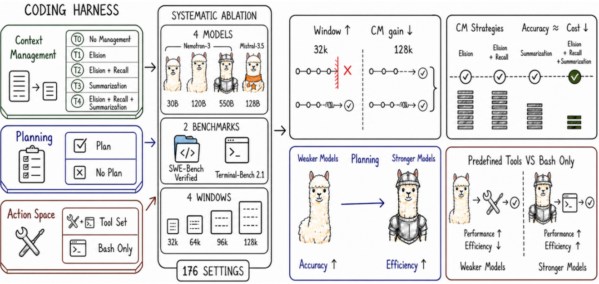

 

Figure 1: Dissecting the coding harness. We systematically ablate context management, planning, and the action space, revealing four conditional effects across context budgets, model capabilities, and task types.

## 1 Introduction

Large language models (LLMs) are increasingly used to resolve real software-engineering tasks autonomously, including closing GitHub issues ([Jimenez et al., 2024](https://arxiv.org/html/2609.20804#bib.bib1)) and completing end-to-end terminal tasks ([Merrill et al., 2026](https://arxiv.org/html/2609.20804#bib.bib2)). This performance is achieved by having LLMs operate inside a coding harness, a software layer whose components intervene on different aspects of agent behavior: a planning scaffold maintains task structure, an action interface determines how model intentions become executable operations, and a context-management policy decides what interaction history remains available under a finite window ([Yang et al., 2024](https://arxiv.org/html/2609.20804#bib.bib3); [Wang et al., 2025](https://arxiv.org/html/2609.20804#bib.bib4); [Rombaut, 2026](https://arxiv.org/html/2609.20804#bib.bib31)). These choices are not incidental implementation details: changing the harness while holding the model fixed can substantially change model performance ([Yang et al., 2024](https://arxiv.org/html/2609.20804#bib.bib3); [Wang et al., 2024](https://arxiv.org/html/2609.20804#bib.bib37); [Lewis, 2026](https://arxiv.org/html/2609.20804#bib.bib36)).

Despite the empirical success of coding harnesses, many existing studies evaluate them as complete systems ([Wang et al., 2025](https://arxiv.org/html/2609.20804#bib.bib4); [Wong et al., 2025](https://arxiv.org/html/2609.20804#bib.bib5); [Xia et al., 2024](https://arxiv.org/html/2609.20804#bib.bib7); [Arora et al., 2024](https://arxiv.org/html/2609.20804#bib.bib30)). For example, a cross-harness evaluation by [Cao et al. (2026)](https://arxiv.org/html/2609.20804#bib.bib6) reports that Claude-Opus-4.5 performs best with OpenHands among the evaluated harnesses, whereas Claude-Sonnet-4.5 performs best with SWE-Agent, suggesting that harness preferences can vary across models. However, comparisons between complete harnesses conflate multiple mechanisms, so a performance difference between two agents does not reveal whether the gain comes from planning, tool design, context management, or their interaction with the underlying model. This raises a research question: Are harness components generally useful across settings, or does each component’s effectiveness depend on model capability, task type, and resource budget? Prior work has examined component interactions and architectural choices across models ([Liu, 2026](https://arxiv.org/html/2609.20804#bib.bib8); [Bogavelli et al., 2025](https://arxiv.org/html/2609.20804#bib.bib18); [Mehtiyev and Assunção, 2026](https://arxiv.org/html/2609.20804#bib.bib20); [Rombaut, 2026](https://arxiv.org/html/2609.20804#bib.bib31)), but has not jointly characterized implementation-level planning, workspace action interfaces, and context-management policies on long-horizon coding tasks across both an explicit context-window sweep and a within-family model-scale axis. As a result, existing evidence does not explain which components account for differences across harnesses or when those components transfer.

To address this challenge, we build a coding harness whose surrounding execution loop remains fixed while varying three central components: planning, action space, and context management. We focus on these components because prior systems identify them as complementary requirements of long-horizon coding agents, with planning maintaining task progress ([Bairi et al., 2024](https://arxiv.org/html/2609.20804#bib.bib38)), the action space translating model intentions into executable workspace operations ([Yang et al., 2024](https://arxiv.org/html/2609.20804#bib.bib3); [Wang et al., 2024](https://arxiv.org/html/2609.20804#bib.bib37)), and context management preserving useful information as trajectories grow ([Packer et al., 2023](https://arxiv.org/html/2609.20804#bib.bib11); [Wu et al., 2025](https://arxiv.org/html/2609.20804#bib.bib14)). Other operational mechanisms, such as permission handling, post-edit diagnostics, and stuck detection, are held fixed to provide a common execution substrate. The planning component maintains an explicit task plan that the model can update throughout a trajectory. The action space exposes either a predefined workspace tool set or a bash-only interface. For context management, we define five strategies. T0 applies no additional cross-turn compaction and terminates when the context window is exceeded. T1 elides stale tool observations. T2 adds external storage and recall_event, making the elided observations recoverable. T3 uses LLM summarization without elision. T4 combines elision, recoverable external storage, and summarization in a staged policy that applies elision before invoking summarization. This modular design allows us to hold the model, task, execution loop, and unablated components fixed while estimating the conditional effect of each implemented intervention.

Using this harness, we evaluate three sizes of Nemotron-3 ([Blakeman et al., 2025](https://arxiv.org/html/2609.20804#bib.bib33)), including 30B, 120B, and 550B, as a within-family capability axis, with Mistral-Medium-3.5-128B ([Mistral AI, 2026](https://arxiv.org/html/2609.20804#bib.bib25)) as a cross-family comparison. We use these models as probes of capability and interaction style, not as permanent optimization targets. Our findings therefore provide transferable diagnostics for future models facing the same context, action space, and planning tradeoffs. We evaluate every model on two complementary long-horizon coding benchmarks: SWE-Bench Verified ([Jimenez et al., 2024](https://arxiv.org/html/2609.20804#bib.bib1)), which tests repository-level issue resolution, and Terminal-Bench 2.1 ([Merrill et al., 2026](https://arxiv.org/html/2609.20804#bib.bib2)), which tests end-to-end terminal task completion. For context management, we compare five strategies under four context-window budgets of 32k, 64k, 96k, and 128k tokens. We separately ablate planning and the action space at a 128k context-window budget with T4 context management strategy, yielding 176 experimental settings. Beyond success rate and cost, we conduct trajectory-level analysis to characterize how each intervention changes task progression, termination behavior, context use, and tool invocation. Our main findings are summarized below:

  * Context management matters most when the context-window budget is tight. It prevents context overflow from prematurely terminating execution, allowing agents to progress to code modification and verification. Its accuracy benefit diminishes as the context window expands. 
  * Staging elision before LLM summarization (T4) provides the strongest efficiency among the context-management strategies. T4 maintains mean success similar to the other managed strategies while controlling peak context and reducing reliance on summarization calls. In contrast, the recall mechanism that makes elision reversible is rarely invoked and does not improve accuracy over elision alone. 
  * Planning changes from an accuracy scaffold to an efficiency aid as model capability increases. For weaker models, planning keeps the trajectory alive long enough to attempt an edit, raising success at additional cost; for the stronger models, it mainly removes redundant post-edit verification, lowering cost with only small changes in accuracy. 
  * Predefined tools improve performance for bash-weak models, while bash-only interfaces reduce cost for bash-capable models. Predefined tools reduce reliance on shell commands, whereas bash-capable models can combine multiple operations per call. The resulting accuracy–cost trade-off varies by task type. 

## 2 Harness Design

To examine how the contribution of each harness component varies across models and computational budgets, we build a lightweight harness from scratch. Many existing harnesses couple implementation choices that are difficult to vary independently. Our modular design allows components to be independently configured and composed, enabling controlled component-level analysis. The harness follows a ReAct loop ([Yao et al., 2022](https://arxiv.org/html/2609.20804#bib.bib21)), with each turn comprising a reasoning step, an action, and an observation (Figure [2](https://arxiv.org/html/2609.20804#S2.F2 "Figure 2 ‣ 2.1 Planning ‣ 2 Harness Design ‣ An Empirical Study of Harness Design for Coding Agents")). We vary three components: planning (§[2.1](https://arxiv.org/html/2609.20804#S2.SS1 "2.1 Planning ‣ 2 Harness Design ‣ An Empirical Study of Harness Design for Coding Agents")), the action space (§[2.2](https://arxiv.org/html/2609.20804#S2.SS2 "2.2 Action space ‣ 2 Harness Design ‣ An Empirical Study of Harness Design for Coding Agents")), and context management (§[2.3](https://arxiv.org/html/2609.20804#S2.SS3 "2.3 Context management ‣ 2 Harness Design ‣ An Empirical Study of Harness Design for Coding Agents")), described below. Other supporting components like, workspace access controls, post-edit diagnostics, and stuck detection remain fixed across ablations to isolate each intervention’s effect.

### 2.1 Planning

Planning provides an explicit, persistent representation of task progress maintained by the model. When enabled, a system instruction defines the protocol (Figure [15](https://arxiv.org/html/2609.20804#S7.F15 "Figure 15 ‣ 7.2 Planning prompts ‣ 7 Harness Prompts ‣ An Empirical Study of Harness Design for Coding Agents")), and a first-turn reminder requests an initial plan before action (Figure [16](https://arxiv.org/html/2609.20804#S7.F16 "Figure 16 ‣ 7.2 Planning prompts ‣ 7 Harness Prompts ‣ An Empirical Study of Harness Design for Coding Agents")). The model maintains this plan through the update_plan tool (Figure [30](https://arxiv.org/html/2609.20804#S8.F30 "Figure 30 ‣ 8.4 Planning and context recall ‣ 8 Tool Descriptions ‣ An Empirical Study of Harness Design for Coding Agents")). Subsequent turns append the plan to the model input without storing it in conversation history (Figure [17](https://arxiv.org/html/2609.20804#S7.F17 "Figure 17 ‣ 7.2 Planning prompts ‣ 7 Harness Prompts ‣ An Empirical Study of Harness Design for Coding Agents")); Appendix [7.2](https://arxiv.org/html/2609.20804#S7.SS2 "7.2 Planning prompts ‣ 7 Harness Prompts ‣ An Empirical Study of Harness Design for Coding Agents") describes how these blocks are assembled at runtime. In the planning-disabled setting, we remove planning instructions, reminders, plan injections, and the tool, while holding the execution loop, action interface, and context management fixed. Therefore, our results estimate the effect of this persistent planning scaffold rather than the effect of planning as a general reasoning strategy.

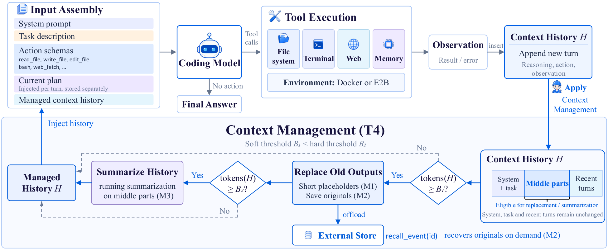

 Figure 2: Overview of the coding harness. Top: the ReAct loop, in which each turn assembles the model input, executes the emitted tool calls in the task container, and appends the observation to the history \(H\). Planning enters through the injected plan, the action space through the exposed schemas, and context management through the history the model sees. Bottom: the T4 strategy. M1–M3 are the three context-management mechanisms. Above the soft threshold \(B_{1}\), bulky middle-region tool outputs are replaced by stubs (M1) and offloaded to an external store recoverable via recall_event (M2); above the hard threshold \(B_{2}\), the oldest middle events are summarized (M3). The preamble and recent turns stay verbatim.

### 2.2 Action space

The action space defines how the agents interact with the environment. The predefined-tool provides read_file, write_file, edit_file, list_files, glob_files, grep_text, web_fetch, and bash, as summarized in Table [1](https://arxiv.org/html/2609.20804#S2.T1 "Table 1 ‣ 2.2 Action space ‣ 2 Harness Design ‣ An Empirical Study of Harness Design for Coding Agents") (system prompt shown in Figure [13](https://arxiv.org/html/2609.20804#S7.F13 "Figure 13 ‣ 7.1 System prompts ‣ 7 Harness Prompts ‣ An Empirical Study of Harness Design for Coding Agents")). Each tool has a typed argument schema and a description specifying its protocol, errors, and side effects; Appendix [8](https://arxiv.org/html/2609.20804#S8 "8 Tool Descriptions ‣ An Empirical Study of Harness Design for Coding Agents") summarizes arguments and read-only status. We exclude web search because SWE-Bench tasks originate from public GitHub issues, and search could expose the corresponding pull request and ground-truth patch ([Cao et al., 2026](https://arxiv.org/html/2609.20804#bib.bib6)). The bash-only setting removes predefined file, search, and web tools, leaving bash for general environment interaction (Figure [14](https://arxiv.org/html/2609.20804#S7.F14 "Figure 14 ‣ 7.1 System prompts ‣ 7 Harness Prompts ‣ An Empirical Study of Harness Design for Coding Agents")). Auxiliary tools controlled by other harness components remain unchanged: with planning enabled in T4/128k, both conditions retain update_plan and recall_event. Appendices [7.1](https://arxiv.org/html/2609.20804#S7.SS1 "7.1 System prompts ‣ 7 Harness Prompts ‣ An Empirical Study of Harness Design for Coding Agents") and [8](https://arxiv.org/html/2609.20804#S8 "8 Tool Descriptions ‣ An Empirical Study of Harness Design for Coding Agents") provide the remaining prompts and tool descriptions. The intervention also changes how workspace modifications are tracked and validated. The predefined file tools enforce read-before-write checks, update the harness file state, and trigger automatic diagnostics after supported edits. The comparison should therefore be interpreted as the effect of the complete action interface, including tool availability, interface instructions, state tracking, and validation support, rather than as the isolated effect of tool count or action granularity.

Table 1: Tools exposed by the harness. Read-only tools do not modify the workspace or harness state and may execute concurrently within a model turn. The bash-only action-space condition removes the predefined workspace tools while retaining bash and the auxiliary tools required by the enabled planning and context-management components. The table lists the principal arguments. Appendix [8](https://arxiv.org/html/2609.20804#S8 "8 Tool Descriptions ‣ An Empirical Study of Harness Design for Coding Agents") reproduces the whole natural-language descriptions.

<table id="S2.T1.6.1" class="ltx_tabular ltx_align_middle">
<tr id="S2.T1.6.1.1" class="ltx_tr">
<td id="S2.T1.6.1.1.1" class="ltx_td ltx_align_left ltx_border_tt">Tool</td>
<td id="S2.T1.6.1.1.2" class="ltx_td ltx_align_center ltx_border_tt">Read-only</td>
<td id="S2.T1.6.1.1.3" class="ltx_td ltx_align_center ltx_border_tt">Principal arguments</td>
<td id="S2.T1.6.1.1.4" class="ltx_td ltx_align_left ltx_border_tt">Description</td></tr>
<tr id="S2.T1.6.1.2" class="ltx_tr">
<td id="S2.T1.6.1.2.1" class="ltx_td ltx_align_center ltx_border_t" colspan="4">File I/O</td></tr>
<tr id="S2.T1.6.1.3" class="ltx_tr">
<td id="S2.T1.6.1.3.1" class="ltx_td ltx_align_left ltx_border_t">read_file</td>
<td id="S2.T1.6.1.3.2" class="ltx_td ltx_align_center ltx_border_t">✓</td>
<td id="S2.T1.6.1.3.3" class="ltx_td ltx_align_center ltx_border_t">path, offset, limit</td>
<td id="S2.T1.6.1.3.4" class="ltx_td ltx_align_left ltx_border_t">Read a file, returned with line numbers</td></tr>
<tr id="S2.T1.6.1.4" class="ltx_tr">
<td id="S2.T1.6.1.4.1" class="ltx_td ltx_align_left">write_file</td>
<td id="S2.T1.6.1.4.2" class="ltx_td ltx_align_center">✗</td>
<td id="S2.T1.6.1.4.3" class="ltx_td ltx_align_center">path, content, overwrite</td>
<td id="S2.T1.6.1.4.4" class="ltx_td ltx_align_left">Create a file or overwrite an existing one</td></tr>
<tr id="S2.T1.6.1.5" class="ltx_tr">
<td id="S2.T1.6.1.5.1" class="ltx_td ltx_align_left">edit_file</td>
<td id="S2.T1.6.1.5.2" class="ltx_td ltx_align_center">✗</td>
<td id="S2.T1.6.1.5.3" class="ltx_td ltx_align_center">path, old_text, new_text, replace_all</td>
<td id="S2.T1.6.1.5.4" class="ltx_td ltx_align_left">Replace an exact string in a file</td></tr>
<tr id="S2.T1.6.1.6" class="ltx_tr">
<td id="S2.T1.6.1.6.1" class="ltx_td ltx_align_center ltx_border_t" colspan="4">Search</td></tr>
<tr id="S2.T1.6.1.7" class="ltx_tr">
<td id="S2.T1.6.1.7.1" class="ltx_td ltx_align_left ltx_border_t">list_files</td>
<td id="S2.T1.6.1.7.2" class="ltx_td ltx_align_center ltx_border_t">✓</td>
<td id="S2.T1.6.1.7.3" class="ltx_td ltx_align_center ltx_border_t">path, recursive</td>
<td id="S2.T1.6.1.7.4" class="ltx_td ltx_align_left ltx_border_t">List the contents of a directory</td></tr>
<tr id="S2.T1.6.1.8" class="ltx_tr">
<td id="S2.T1.6.1.8.1" class="ltx_td ltx_align_left">glob_files</td>
<td id="S2.T1.6.1.8.2" class="ltx_td ltx_align_center">✓</td>
<td id="S2.T1.6.1.8.3" class="ltx_td ltx_align_center">pattern, path</td>
<td id="S2.T1.6.1.8.4" class="ltx_td ltx_align_left">Find files matching a glob pattern</td></tr>
<tr id="S2.T1.6.1.9" class="ltx_tr">
<td id="S2.T1.6.1.9.1" class="ltx_td ltx_align_left">grep_text</td>
<td id="S2.T1.6.1.9.2" class="ltx_td ltx_align_center">✓</td>
<td id="S2.T1.6.1.9.3" class="ltx_td ltx_align_center">query, path, include</td>
<td id="S2.T1.6.1.9.4" class="ltx_td ltx_align_left">Search file contents by regular expression</td></tr>
<tr id="S2.T1.6.1.10" class="ltx_tr">
<td id="S2.T1.6.1.10.1" class="ltx_td ltx_align_center ltx_border_t" colspan="4">Execution</td></tr>
<tr id="S2.T1.6.1.11" class="ltx_tr">
<td id="S2.T1.6.1.11.1" class="ltx_td ltx_align_left ltx_border_t">bash</td>
<td id="S2.T1.6.1.11.2" class="ltx_td ltx_align_center ltx_border_t">✗</td>
<td id="S2.T1.6.1.11.3" class="ltx_td ltx_align_center ltx_border_t">command, timeout_seconds, cwd</td>
<td id="S2.T1.6.1.11.4" class="ltx_td ltx_align_left ltx_border_t">Execute a shell command</td></tr>
<tr id="S2.T1.6.1.12" class="ltx_tr">
<td id="S2.T1.6.1.12.1" class="ltx_td ltx_align_center ltx_border_t" colspan="4">Web</td></tr>
<tr id="S2.T1.6.1.13" class="ltx_tr">
<td id="S2.T1.6.1.13.1" class="ltx_td ltx_align_left ltx_border_t">web_fetch</td>
<td id="S2.T1.6.1.13.2" class="ltx_td ltx_align_center ltx_border_t">✓</td>
<td id="S2.T1.6.1.13.3" class="ltx_td ltx_align_center ltx_border_t">url, format</td>
<td id="S2.T1.6.1.13.4" class="ltx_td ltx_align_left ltx_border_t">Fetch a web page as text or markdown</td></tr>
<tr id="S2.T1.6.1.14" class="ltx_tr">
<td id="S2.T1.6.1.14.1" class="ltx_td ltx_align_center ltx_border_t" colspan="4">Planning</td></tr>
<tr id="S2.T1.6.1.15" class="ltx_tr">
<td id="S2.T1.6.1.15.1" class="ltx_td ltx_align_left ltx_border_t">update_plan</td>
<td id="S2.T1.6.1.15.2" class="ltx_td ltx_align_center ltx_border_t">✗</td>
<td id="S2.T1.6.1.15.3" class="ltx_td ltx_align_center ltx_border_t">plan</td>
<td id="S2.T1.6.1.15.4" class="ltx_td ltx_align_left ltx_border_t">Create or update the stored task plan</td></tr>
<tr id="S2.T1.6.1.16" class="ltx_tr">
<td id="S2.T1.6.1.16.1" class="ltx_td ltx_align_center ltx_border_t" colspan="4">Context management</td></tr>
<tr id="S2.T1.6.1.17" class="ltx_tr">
<td id="S2.T1.6.1.17.1" class="ltx_td ltx_align_left ltx_border_bb ltx_border_t">recall_event</td>
<td id="S2.T1.6.1.17.2" class="ltx_td ltx_align_center ltx_border_bb ltx_border_t">✓</td>
<td id="S2.T1.6.1.17.3" class="ltx_td ltx_align_center ltx_border_bb ltx_border_t">id</td>
<td id="S2.T1.6.1.17.4" class="ltx_td ltx_align_left ltx_border_bb ltx_border_t">Return the verbatim content of a stored event (T2 and T4 only)</td></tr>
</table>

 

### 2.3 Context management

Context management determines how the growing interaction history is represented within a bounded context window. Existing methods are lossy or lossless. Lossy methods such as elision and summarization reduce context but may remove information that becomes useful later ([Xiao et al., 2024](https://arxiv.org/html/2609.20804#bib.bib9); [Jiang et al., 2023](https://arxiv.org/html/2609.20804#bib.bib10); [Wu et al., 2021](https://arxiv.org/html/2609.20804#bib.bib13)), whereas lossless methods preserve recoverability through external storage and retrieval but require additional machinery and rely on the model to retrieve the right information ([Packer et al., 2023](https://arxiv.org/html/2609.20804#bib.bib11); [Park et al., 2023](https://arxiv.org/html/2609.20804#bib.bib12); [Ehrlich and Blackman, 2026](https://arxiv.org/html/2609.20804#bib.bib34); [Xu et al., 2026](https://arxiv.org/html/2609.20804#bib.bib35)). Our harness draws on both families through three composable mechanisms. Elision (M1) replaces the body of a stale tool observation with a short stub. Recall (M2) stores elided observations in the file system and exposes a recall_event tool to read them back on demand, making elision reversible. Summarization (M3) folds older messages into a running natural-language summary. The summary is produced by a separate, tool-free call to the same model under evaluation, using the prompt in Appendix [7.3](https://arxiv.org/html/2609.20804#S7.SS3 "7.3 Context-management prompts ‣ 7 Harness Prompts ‣ An Empirical Study of Harness Design for Coding Agents"). Elision reclaims tokens cheaply but discards detail, recall recovers that detail when needed, and summarization compresses history too old to keep verbatim. We combine them under two token thresholds: soft \(B_{1}\) and hard \(B_{2}\). The preamble (system prompt and initial task description) and a token-budgeted recent window of at least two turns remain verbatim; only the middle region is compacted. Once history exceeds \(B_{1}\), the harness elides bulky tool observations in the middle region, storing originals externally and leaving stubs in their place (M1 and M2). If history still exceeds \(B_{2}\), the harness summarizes the oldest middle events into the running summary (M3). Algorithm [1](https://arxiv.org/html/2609.20804#alg1 "Algorithm 1 ‣ 2.3 Context management ‣ 2 Harness Design ‣ An Empirical Study of Harness Design for Coding Agents") gives the full procedure, and recall_event remains available on every turn. Appendix [7.3](https://arxiv.org/html/2609.20804#S7.SS3 "7.3 Context-management prompts ‣ 7 Harness Prompts ‣ An Empirical Study of Harness Design for Coding Agents") reproduces the summarization prompt and the stub and summary fragments inserted into model input.

Table 2: The five context-management tiers, each enabling a subset of elision (M1), recall (M2), and summarization (M3). 

| M1 | M2 | M3  
---|---|---|---  
Tier 0 | ✗ | ✗ | ✗  
Tier 1 | ✓ | ✗ | ✗  
Tier 2 | ✓ | ✓ | ✗  
Tier 3 | ✗ | ✗ | ✓  
Tier 4 | ✓ | ✓ | ✓

 

To isolate each mechanism’s contribution, we define five policy variants, summarized in Table [2](https://arxiv.org/html/2609.20804#S2.T2 "Table 2 ‣ 2.3 Context management ‣ 2 Harness Design ‣ An Empirical Study of Harness Design for Coding Agents"). Tier 4 is the full three-mechanism configuration described in Algorithm [1](https://arxiv.org/html/2609.20804#alg1 "Algorithm 1 ‣ 2.3 Context management ‣ 2 Harness Design ‣ An Empirical Study of Harness Design for Coding Agents"). Tier 0 disables context management; trajectories that outgrow the window terminate with an error. Tier 1 uses elision alone (M1), replacing stale tool-observation bodies with short stubs and discarding the original content. Tier 2 adds recall (M2): elided observations are stored externally and recoverable via recall_event, making elision reversible. Tier 3 uses summarization alone (M3), folding the middle region into a running summary without elision. Because Tiers 1–3 each have only one action, they operate at the hard threshold \(B_{2}\), whereas Tier 4 elides at \(B_{1}\) and summarizes at \(B_{2}\).

Algorithm 1 Per-turn context management (Tier 4)

1: history \(H\); soft and hard thresholds \(B_{1}<B_{2}\) 

2: append the new think, action, and observation to \(H\) 

3: if the model invoked \(\textsc{recall\_event}(id)\) this turn then

4: read observation \(id\) from the external store back into \(H\) \(\triangleright\) M2 

5: end if

6: keep the preamble and a budget-sized recent window (at least the last two turns) verbatim; let \(M\) be the middle region 

7: if \(\mathrm{tokens}(H)\geq B_{1}\) then

8: for each bulky tool observation in \(M\) do

9: store the original in the external store \(\triangleright\) M2 

10: replace its body with a stub \(\triangleright\) M1 

11: end for

12: if \(\mathrm{tokens}(H)\geq B_{2}\) then

13: summarize the oldest events in \(M\) into a running summary \(\triangleright\) M3 

14: end if

15: end if

16: return \(H\) 

### 2.4 Other components

Beyond the three components mentioned above, the harness includes several supporting components that we hold fixed across all ablations. We highlight the three that are most important below.

##### Safety

Every action that reads or modifies the workspace passes through three gates. A workspace guard resolves each path and rejects any that escapes the project root, including through symlinks. A read-before-write check refuses to edit or overwrite a file that has not been read in the current session, and detects external modification through a content hash. A permission layer then classifies each action as allow, ask, or deny. Tool errors are returned to the model as observations rather than raised, so a failed action never crashes the loop and the model can recover from it.

##### Post-edit diagnostics

After the agent edits or writes a Python file, the harness runs a fast, read-only check on it with ruff, pyflakes, or a syntax-only fallback, and appends the findings to the tool result. This surfaces syntax errors, undefined names, and unused imports immediately, so the model can fix them before spending a turn on the tests.

##### Stuck detection

A turn-based agent can spin, reissuing the same failing action until it exhausts its step budget. The harness monitors the tool log for streaks of identical calls, that is, consecutive calls with the same tool name and arguments. When such a streak reaches a threshold, it injects a one-time reminder to change approach, and when a streak of identical failing calls keeps growing, it ends the run early rather than grinding to the budget limit. The reminder texts and the thresholds are given in Appendix [7.4](https://arxiv.org/html/2609.20804#S7.SS4 "7.4 Stuck-detection prompts ‣ 7 Harness Prompts ‣ An Empirical Study of Harness Design for Coding Agents").

## 3 Experiment

### 3.1 Setup

##### Models.

In our experiments, we use three sizes of the Nemotron-3 family ([Blakeman et al., 2025](https://arxiv.org/html/2609.20804#bib.bib33)) (30B, 120B, and 550B). We additionally include Mistral-Medium-3.5-128B ([Mistral AI, 2026](https://arxiv.org/html/2609.20804#bib.bib25)) from a different model family, to test whether our findings generalize beyond a single family. We price tokens at OpenRouter11 1 <https://openrouter.ai/>, accessed August 2026., per 1M input / output tokens: $0.05 / $0.20 (Nemotron-3-30B), $0.08 / $0.45 (Nemotron-3-120B), $0.50 / $2.20 (Nemotron-3-550B), and $1.50 / $7.50 (Mistral-Medium-3.5).

##### Benchmarks.

We evaluate on two long-horizon coding benchmarks: SWE-Bench Verified ([Jimenez et al., 2024](https://arxiv.org/html/2609.20804#bib.bib1)), comprising 500 human-verified real GitHub issues, and Terminal-Bench 2.1 ([Merrill et al., 2026](https://arxiv.org/html/2609.20804#bib.bib2)), comprising 89 end-to-end tasks in a command-line environment. On both, we report two metrics: the task success rate, the fraction of tasks the agent resolves, and the mean cost per task, priced as described above.

##### Implementation Details

  * Models and serving Three Nemotron-3 models and Mistral-Medium-3.5-128B are served locally with SGLang in BF16 precision. Temperature is set to 0, and top-\(p\) is 0.95. We cap the output at 16,384 tokens per turn. 
  * Harness configuration The harness is built on LangGraph,22 2 <https://www.langchain.com/langgraph> with benchmarks driven through Harbor,33 3 <https://www.harborframework.com/> which owns each task’s container and verifier while the host agent acts on the container. Each task runs for at most 300 steps. For context management, soft and hard context thresholds are 0.6 and 0.85 of the usable window, with the verbatim recent window budgeted at 0.3 and floored at two turns. Tool results are truncated to 24k characters, and up to eight read-only tools may run in parallel per step. Stuck detection issues a reminder after five consecutive identical tool calls or five consecutive identical failing calls, and terminates after eight consecutive identical failing calls. 

##### Ablation Settings.

We evaluate T0–T4 under 32k, 64k, 96k, and 128k context-window budgets, yielding \(20\) settings per model–benchmark pair. All use the predefined tool set with planning enabled. The T4/128k setting serves as the baseline for the remaining component ablations. One matched setting disables planning, and another replaces the predefined tool set with the bash-only interface, with all other components fixed. Planning and the action space are evaluated only under T4/128k. The 20 context-management settings and the two additional component ablations produce 22 settings per model–benchmark pair, for a total of \(176\) experimental settings across four models and two benchmarks. For each benchmark, we define three comparison families: management strategy vs. T0, planning on vs. off, and full tool set vs. bash-only. Within each family, we compare success rates using two-sided exact McNemar tests on task-paired outcomes and apply the Benjamini–Hochberg procedure to control the false discovery rate at 0.05.

### 3.2 Main Results

Table 3: Main results on SWE-Bench Verified, reporting success rate (SR, %) and mean cost per task ($). Each row pairs a context-window budget with a context-management tier: T0 applies no context management, T1 elision alone, T2 elision and recall, T3 summarization alone, and T4 all three mechanisms. The final two rows ablate a single component at the 128k/T4 setting: \(-\)plan disables planning, and bash replaces the structured tool set with a bare shell. Bold marks each model’s highest SR. * denotes a significant difference from the matched baseline under a two-sided exact McNemar test with Benjamini–Hochberg-adjusted \(q<0.05\).

<table id="S3.T3.13.1" class="ltx_tabular ltx_align_middle">
<tr id="S3.T3.13.1.1" class="ltx_tr">
<td id="S3.T3.13.1.1.1" class="ltx_td ltx_border_tt" style="padding-left:4.0pt;padding-right:4.0pt;"></td>
<td id="S3.T3.13.1.1.2" class="ltx_td ltx_border_tt" style="padding-left:4.0pt;padding-right:4.0pt;"></td>
<td id="S3.T3.13.1.1.3" class="ltx_td ltx_align_center ltx_border_tt" style="padding-left:4.0pt;padding-right:4.0pt;" colspan="2">Nemotron-3 30B</td>
<td id="S3.T3.13.1.1.4" class="ltx_td ltx_align_center ltx_border_tt" style="padding-left:4.0pt;padding-right:4.0pt;" colspan="2">Nemotron-3 120B</td>
<td id="S3.T3.13.1.1.5" class="ltx_td ltx_align_center ltx_border_tt" style="padding-left:4.0pt;padding-right:4.0pt;" colspan="2">Nemotron-3 550B</td>
<td id="S3.T3.13.1.1.6" class="ltx_td ltx_align_center ltx_border_tt" style="padding-left:4.0pt;padding-right:4.0pt;" colspan="2">Mistral-3.5-128B</td></tr>
<tr id="S3.T3.13.1.2" class="ltx_tr">
<td id="S3.T3.13.1.2.1" class="ltx_td ltx_align_center" style="padding-left:4.0pt;padding-right:4.0pt;" colspan="2">Setting</td>
<td id="S3.T3.13.1.2.2" class="ltx_td ltx_align_center ltx_border_t" style="padding-left:4.0pt;padding-right:4.0pt;">SR (%)</td>
<td id="S3.T3.13.1.2.3" class="ltx_td ltx_align_center ltx_border_t" style="padding-left:4.0pt;padding-right:4.0pt;">Cost ($)</td>
<td id="S3.T3.13.1.2.4" class="ltx_td ltx_align_center ltx_border_t" style="padding-left:4.0pt;padding-right:4.0pt;">SR (%)</td>
<td id="S3.T3.13.1.2.5" class="ltx_td ltx_align_center ltx_border_t" style="padding-left:4.0pt;padding-right:4.0pt;">Cost ($)</td>
<td id="S3.T3.13.1.2.6" class="ltx_td ltx_align_center ltx_border_t" style="padding-left:4.0pt;padding-right:4.0pt;">SR (%)</td>
<td id="S3.T3.13.1.2.7" class="ltx_td ltx_align_center ltx_border_t" style="padding-left:4.0pt;padding-right:4.0pt;">Cost ($)</td>
<td id="S3.T3.13.1.2.8" class="ltx_td ltx_align_center ltx_border_t" style="padding-left:4.0pt;padding-right:4.0pt;">SR (%)</td>
<td id="S3.T3.13.1.2.9" class="ltx_td ltx_nopad_r ltx_align_center ltx_border_t" style="padding-left:4.0pt;padding-right:4.0pt;">Cost ($)</td></tr>
<tr id="S3.T3.13.1.3" class="ltx_tr">
<td id="S3.T3.13.1.3.1" class="ltx_td ltx_align_left ltx_border_t" style="padding-left:4.0pt;padding-right:4.0pt;" rowspan="5">32K</td>
<td id="S3.T3.13.1.3.2" class="ltx_td ltx_align_center ltx_border_t" style="padding-left:4.0pt;padding-right:4.0pt;">T0</td>
<td id="S3.T3.13.1.3.3" class="ltx_td ltx_align_center ltx_border_t" style="padding-left:4.0pt;padding-right:4.0pt;">09.40</td>
<td id="S3.T3.13.1.3.4" class="ltx_td ltx_align_center ltx_border_t" style="padding-left:4.0pt;padding-right:4.0pt;">0.04</td>
<td id="S3.T3.13.1.3.5" class="ltx_td ltx_align_center ltx_border_t" style="padding-left:4.0pt;padding-right:4.0pt;">11.40</td>
<td id="S3.T3.13.1.3.6" class="ltx_td ltx_align_center ltx_border_t" style="padding-left:4.0pt;padding-right:4.0pt;">0.05</td>
<td id="S3.T3.13.1.3.7" class="ltx_td ltx_align_center ltx_border_t" style="padding-left:4.0pt;padding-right:4.0pt;">06.40</td>
<td id="S3.T3.13.1.3.8" class="ltx_td ltx_align_center ltx_border_t" style="padding-left:4.0pt;padding-right:4.0pt;">0.26</td>
<td id="S3.T3.13.1.3.9" class="ltx_td ltx_align_center ltx_border_t" style="padding-left:4.0pt;padding-right:4.0pt;">12.60</td>
<td id="S3.T3.13.1.3.10" class="ltx_td ltx_nopad_r ltx_align_center ltx_border_t" style="padding-left:4.0pt;padding-right:4.0pt;">0.87</td></tr>
<tr id="S3.T3.13.1.4" class="ltx_tr">
<td id="S3.T3.13.1.4.1" class="ltx_td ltx_align_center" style="padding-left:4.0pt;padding-right:4.0pt;">T1</td>
<td id="S3.T3.13.1.4.2" class="ltx_td ltx_align_center" style="padding-left:4.0pt;padding-right:4.0pt;">20.60*</td>
<td id="S3.T3.13.1.4.3" class="ltx_td ltx_align_center" style="padding-left:4.0pt;padding-right:4.0pt;">0.09</td>
<td id="S3.T3.13.1.4.4" class="ltx_td ltx_align_center" style="padding-left:4.0pt;padding-right:4.0pt;">43.00*</td>
<td id="S3.T3.13.1.4.5" class="ltx_td ltx_align_center" style="padding-left:4.0pt;padding-right:4.0pt;">0.35</td>
<td id="S3.T3.13.1.4.6" class="ltx_td ltx_align_center" style="padding-left:4.0pt;padding-right:4.0pt;">51.40*</td>
<td id="S3.T3.13.1.4.7" class="ltx_td ltx_align_center" style="padding-left:4.0pt;padding-right:4.0pt;">2.57</td>
<td id="S3.T3.13.1.4.8" class="ltx_td ltx_align_center" style="padding-left:4.0pt;padding-right:4.0pt;">64.40*</td>
<td id="S3.T3.13.1.4.9" class="ltx_td ltx_nopad_r ltx_align_center" style="padding-left:4.0pt;padding-right:4.0pt;">2.16</td></tr>
<tr id="S3.T3.13.1.5" class="ltx_tr">
<td id="S3.T3.13.1.5.1" class="ltx_td ltx_align_center" style="padding-left:4.0pt;padding-right:4.0pt;">T2</td>
<td id="S3.T3.13.1.5.2" class="ltx_td ltx_align_center" style="padding-left:4.0pt;padding-right:4.0pt;">20.80*</td>
<td id="S3.T3.13.1.5.3" class="ltx_td ltx_align_center" style="padding-left:4.0pt;padding-right:4.0pt;">0.09</td>
<td id="S3.T3.13.1.5.4" class="ltx_td ltx_align_center" style="padding-left:4.0pt;padding-right:4.0pt;">42.20*</td>
<td id="S3.T3.13.1.5.5" class="ltx_td ltx_align_center" style="padding-left:4.0pt;padding-right:4.0pt;">0.36</td>
<td id="S3.T3.13.1.5.6" class="ltx_td ltx_align_center" style="padding-left:4.0pt;padding-right:4.0pt;">53.60*</td>
<td id="S3.T3.13.1.5.7" class="ltx_td ltx_align_center" style="padding-left:4.0pt;padding-right:4.0pt;">2.70</td>
<td id="S3.T3.13.1.5.8" class="ltx_td ltx_align_center" style="padding-left:4.0pt;padding-right:4.0pt;">66.20*</td>
<td id="S3.T3.13.1.5.9" class="ltx_td ltx_nopad_r ltx_align_center" style="padding-left:4.0pt;padding-right:4.0pt;">2.12</td></tr>
<tr id="S3.T3.13.1.6" class="ltx_tr">
<td id="S3.T3.13.1.6.1" class="ltx_td ltx_align_center" style="padding-left:4.0pt;padding-right:4.0pt;">T3</td>
<td id="S3.T3.13.1.6.2" class="ltx_td ltx_align_center" style="padding-left:4.0pt;padding-right:4.0pt;">23.80*</td>
<td id="S3.T3.13.1.6.3" class="ltx_td ltx_align_center" style="padding-left:4.0pt;padding-right:4.0pt;">0.11</td>
<td id="S3.T3.13.1.6.4" class="ltx_td ltx_align_center" style="padding-left:4.0pt;padding-right:4.0pt;">39.60*</td>
<td id="S3.T3.13.1.6.5" class="ltx_td ltx_align_center" style="padding-left:4.0pt;padding-right:4.0pt;">0.18</td>
<td id="S3.T3.13.1.6.6" class="ltx_td ltx_align_center" style="padding-left:4.0pt;padding-right:4.0pt;">58.40*</td>
<td id="S3.T3.13.1.6.7" class="ltx_td ltx_align_center" style="padding-left:4.0pt;padding-right:4.0pt;">1.25</td>
<td id="S3.T3.13.1.6.8" class="ltx_td ltx_align_center" style="padding-left:4.0pt;padding-right:4.0pt;">63.20*</td>
<td id="S3.T3.13.1.6.9" class="ltx_td ltx_nopad_r ltx_align_center" style="padding-left:4.0pt;padding-right:4.0pt;">2.52</td></tr>
<tr id="S3.T3.13.1.7" class="ltx_tr">
<td id="S3.T3.13.1.7.1" class="ltx_td ltx_align_center" style="padding-left:4.0pt;padding-right:4.0pt;">T4</td>
<td id="S3.T3.13.1.7.2" class="ltx_td ltx_align_center" style="padding-left:4.0pt;padding-right:4.0pt;">21.20*</td>
<td id="S3.T3.13.1.7.3" class="ltx_td ltx_align_center" style="padding-left:4.0pt;padding-right:4.0pt;">0.11</td>
<td id="S3.T3.13.1.7.4" class="ltx_td ltx_align_center" style="padding-left:4.0pt;padding-right:4.0pt;">42.20*</td>
<td id="S3.T3.13.1.7.5" class="ltx_td ltx_align_center" style="padding-left:4.0pt;padding-right:4.0pt;">0.17</td>
<td id="S3.T3.13.1.7.6" class="ltx_td ltx_align_center" style="padding-left:4.0pt;padding-right:4.0pt;">55.60*</td>
<td id="S3.T3.13.1.7.7" class="ltx_td ltx_align_center" style="padding-left:4.0pt;padding-right:4.0pt;">1.45</td>
<td id="S3.T3.13.1.7.8" class="ltx_td ltx_align_center" style="padding-left:4.0pt;padding-right:4.0pt;">63.80*</td>
<td id="S3.T3.13.1.7.9" class="ltx_td ltx_nopad_r ltx_align_center" style="padding-left:4.0pt;padding-right:4.0pt;">2.04</td></tr>
<tr id="S3.T3.13.1.8" class="ltx_tr">
<td id="S3.T3.13.1.8.1" class="ltx_td ltx_align_left ltx_border_t" style="padding-left:4.0pt;padding-right:4.0pt;" rowspan="5">64K</td>
<td id="S3.T3.13.1.8.2" class="ltx_td ltx_align_center ltx_border_t" style="padding-left:4.0pt;padding-right:4.0pt;">T0</td>
<td id="S3.T3.13.1.8.3" class="ltx_td ltx_align_center ltx_border_t" style="padding-left:4.0pt;padding-right:4.0pt;">20.80</td>
<td id="S3.T3.13.1.8.4" class="ltx_td ltx_align_center ltx_border_t" style="padding-left:4.0pt;padding-right:4.0pt;">0.07</td>
<td id="S3.T3.13.1.8.5" class="ltx_td ltx_align_center ltx_border_t" style="padding-left:4.0pt;padding-right:4.0pt;">34.00</td>
<td id="S3.T3.13.1.8.6" class="ltx_td ltx_align_center ltx_border_t" style="padding-left:4.0pt;padding-right:4.0pt;">0.10</td>
<td id="S3.T3.13.1.8.7" class="ltx_td ltx_align_center ltx_border_t" style="padding-left:4.0pt;padding-right:4.0pt;">29.40</td>
<td id="S3.T3.13.1.8.8" class="ltx_td ltx_align_center ltx_border_t" style="padding-left:4.0pt;padding-right:4.0pt;">0.97</td>
<td id="S3.T3.13.1.8.9" class="ltx_td ltx_align_center ltx_border_t" style="padding-left:4.0pt;padding-right:4.0pt;">52.80</td>
<td id="S3.T3.13.1.8.10" class="ltx_td ltx_nopad_r ltx_align_center ltx_border_t" style="padding-left:4.0pt;padding-right:4.0pt;">2.47</td></tr>
<tr id="S3.T3.13.1.9" class="ltx_tr">
<td id="S3.T3.13.1.9.1" class="ltx_td ltx_align_center" style="padding-left:4.0pt;padding-right:4.0pt;">T1</td>
<td id="S3.T3.13.1.9.2" class="ltx_td ltx_align_center" style="padding-left:4.0pt;padding-right:4.0pt;">23.40</td>
<td id="S3.T3.13.1.9.3" class="ltx_td ltx_align_center" style="padding-left:4.0pt;padding-right:4.0pt;">0.09</td>
<td id="S3.T3.13.1.9.4" class="ltx_td ltx_align_center" style="padding-left:4.0pt;padding-right:4.0pt;">45.40*</td>
<td id="S3.T3.13.1.9.5" class="ltx_td ltx_align_center" style="padding-left:4.0pt;padding-right:4.0pt;">0.39</td>
<td id="S3.T3.13.1.9.6" class="ltx_td ltx_align_center" style="padding-left:4.0pt;padding-right:4.0pt;">63.80*</td>
<td id="S3.T3.13.1.9.7" class="ltx_td ltx_align_center" style="padding-left:4.0pt;padding-right:4.0pt;">2.22</td>
<td id="S3.T3.13.1.9.8" class="ltx_td ltx_align_center" style="padding-left:4.0pt;padding-right:4.0pt;">69.00*</td>
<td id="S3.T3.13.1.9.9" class="ltx_td ltx_nopad_r ltx_align_center" style="padding-left:4.0pt;padding-right:4.0pt;">2.65</td></tr>
<tr id="S3.T3.13.1.10" class="ltx_tr">
<td id="S3.T3.13.1.10.1" class="ltx_td ltx_align_center" style="padding-left:4.0pt;padding-right:4.0pt;">T2</td>
<td id="S3.T3.13.1.10.2" class="ltx_td ltx_align_center" style="padding-left:4.0pt;padding-right:4.0pt;">24.40</td>
<td id="S3.T3.13.1.10.3" class="ltx_td ltx_align_center" style="padding-left:4.0pt;padding-right:4.0pt;">0.09</td>
<td id="S3.T3.13.1.10.4" class="ltx_td ltx_align_center" style="padding-left:4.0pt;padding-right:4.0pt;">43.20*</td>
<td id="S3.T3.13.1.10.5" class="ltx_td ltx_align_center" style="padding-left:4.0pt;padding-right:4.0pt;">0.32</td>
<td id="S3.T3.13.1.10.6" class="ltx_td ltx_align_center" style="padding-left:4.0pt;padding-right:4.0pt;">64.60*</td>
<td id="S3.T3.13.1.10.7" class="ltx_td ltx_align_center" style="padding-left:4.0pt;padding-right:4.0pt;">2.17</td>
<td id="S3.T3.13.1.10.8" class="ltx_td ltx_align_center" style="padding-left:4.0pt;padding-right:4.0pt;">67.80*</td>
<td id="S3.T3.13.1.10.9" class="ltx_td ltx_nopad_r ltx_align_center" style="padding-left:4.0pt;padding-right:4.0pt;">2.61</td></tr>
<tr id="S3.T3.13.1.11" class="ltx_tr">
<td id="S3.T3.13.1.11.1" class="ltx_td ltx_align_center" style="padding-left:4.0pt;padding-right:4.0pt;">T3</td>
<td id="S3.T3.13.1.11.2" class="ltx_td ltx_align_center" style="padding-left:4.0pt;padding-right:4.0pt;">26.40*</td>
<td id="S3.T3.13.1.11.3" class="ltx_td ltx_align_center" style="padding-left:4.0pt;padding-right:4.0pt;">0.10</td>
<td id="S3.T3.13.1.11.4" class="ltx_td ltx_align_center" style="padding-left:4.0pt;padding-right:4.0pt;">43.60*</td>
<td id="S3.T3.13.1.11.5" class="ltx_td ltx_align_center" style="padding-left:4.0pt;padding-right:4.0pt;">0.23</td>
<td id="S3.T3.13.1.11.6" class="ltx_td ltx_align_center" style="padding-left:4.0pt;padding-right:4.0pt;">65.80*</td>
<td id="S3.T3.13.1.11.7" class="ltx_td ltx_align_center" style="padding-left:4.0pt;padding-right:4.0pt;">1.78</td>
<td id="S3.T3.13.1.11.8" class="ltx_td ltx_align_center" style="padding-left:4.0pt;padding-right:4.0pt;">68.40*</td>
<td id="S3.T3.13.1.11.9" class="ltx_td ltx_nopad_r ltx_align_center" style="padding-left:4.0pt;padding-right:4.0pt;">2.66</td></tr>
<tr id="S3.T3.13.1.12" class="ltx_tr">
<td id="S3.T3.13.1.12.1" class="ltx_td ltx_align_center" style="padding-left:4.0pt;padding-right:4.0pt;">T4</td>
<td id="S3.T3.13.1.12.2" class="ltx_td ltx_align_center" style="padding-left:4.0pt;padding-right:4.0pt;">25.80*</td>
<td id="S3.T3.13.1.12.3" class="ltx_td ltx_align_center" style="padding-left:4.0pt;padding-right:4.0pt;">0.08</td>
<td id="S3.T3.13.1.12.4" class="ltx_td ltx_align_center" style="padding-left:4.0pt;padding-right:4.0pt;">41.80*</td>
<td id="S3.T3.13.1.12.5" class="ltx_td ltx_align_center" style="padding-left:4.0pt;padding-right:4.0pt;">0.21</td>
<td id="S3.T3.13.1.12.6" class="ltx_td ltx_align_center" style="padding-left:4.0pt;padding-right:4.0pt;">63.40*</td>
<td id="S3.T3.13.1.12.7" class="ltx_td ltx_align_center" style="padding-left:4.0pt;padding-right:4.0pt;">1.78</td>
<td id="S3.T3.13.1.12.8" class="ltx_td ltx_align_center" style="padding-left:4.0pt;padding-right:4.0pt;">66.00*</td>
<td id="S3.T3.13.1.12.9" class="ltx_td ltx_nopad_r ltx_align_center" style="padding-left:4.0pt;padding-right:4.0pt;">2.48</td></tr>
<tr id="S3.T3.13.1.13" class="ltx_tr">
<td id="S3.T3.13.1.13.1" class="ltx_td ltx_align_left ltx_border_t" style="padding-left:4.0pt;padding-right:4.0pt;" rowspan="5">96K</td>
<td id="S3.T3.13.1.13.2" class="ltx_td ltx_align_center ltx_border_t" style="padding-left:4.0pt;padding-right:4.0pt;">T0</td>
<td id="S3.T3.13.1.13.3" class="ltx_td ltx_align_center ltx_border_t" style="padding-left:4.0pt;padding-right:4.0pt;">24.00</td>
<td id="S3.T3.13.1.13.4" class="ltx_td ltx_align_center ltx_border_t" style="padding-left:4.0pt;padding-right:4.0pt;">0.09</td>
<td id="S3.T3.13.1.13.5" class="ltx_td ltx_align_center ltx_border_t" style="padding-left:4.0pt;padding-right:4.0pt;">39.60</td>
<td id="S3.T3.13.1.13.6" class="ltx_td ltx_align_center ltx_border_t" style="padding-left:4.0pt;padding-right:4.0pt;">0.20</td>
<td id="S3.T3.13.1.13.7" class="ltx_td ltx_align_center ltx_border_t" style="padding-left:4.0pt;padding-right:4.0pt;">51.00</td>
<td id="S3.T3.13.1.13.8" class="ltx_td ltx_align_center ltx_border_t" style="padding-left:4.0pt;padding-right:4.0pt;">1.60</td>
<td id="S3.T3.13.1.13.9" class="ltx_td ltx_align_center ltx_border_t" style="padding-left:4.0pt;padding-right:4.0pt;">66.20</td>
<td id="S3.T3.13.1.13.10" class="ltx_td ltx_nopad_r ltx_align_center ltx_border_t" style="padding-left:4.0pt;padding-right:4.0pt;">3.01</td></tr>
<tr id="S3.T3.13.1.14" class="ltx_tr">
<td id="S3.T3.13.1.14.1" class="ltx_td ltx_align_center" style="padding-left:4.0pt;padding-right:4.0pt;">T1</td>
<td id="S3.T3.13.1.14.2" class="ltx_td ltx_align_center" style="padding-left:4.0pt;padding-right:4.0pt;">23.20</td>
<td id="S3.T3.13.1.14.3" class="ltx_td ltx_align_center" style="padding-left:4.0pt;padding-right:4.0pt;">0.09</td>
<td id="S3.T3.13.1.14.4" class="ltx_td ltx_align_center" style="padding-left:4.0pt;padding-right:4.0pt;">43.20</td>
<td id="S3.T3.13.1.14.5" class="ltx_td ltx_align_center" style="padding-left:4.0pt;padding-right:4.0pt;">0.33</td>
<td id="S3.T3.13.1.14.6" class="ltx_td ltx_align_center" style="padding-left:4.0pt;padding-right:4.0pt;">65.00*</td>
<td id="S3.T3.13.1.14.7" class="ltx_td ltx_align_center" style="padding-left:4.0pt;padding-right:4.0pt;">2.25</td>
<td id="S3.T3.13.1.14.8" class="ltx_td ltx_align_center" style="padding-left:4.0pt;padding-right:4.0pt;">68.80</td>
<td id="S3.T3.13.1.14.9" class="ltx_td ltx_nopad_r ltx_align_center" style="padding-left:4.0pt;padding-right:4.0pt;">3.13</td></tr>
<tr id="S3.T3.13.1.15" class="ltx_tr">
<td id="S3.T3.13.1.15.1" class="ltx_td ltx_align_center" style="padding-left:4.0pt;padding-right:4.0pt;">T2</td>
<td id="S3.T3.13.1.15.2" class="ltx_td ltx_align_center" style="padding-left:4.0pt;padding-right:4.0pt;">23.60</td>
<td id="S3.T3.13.1.15.3" class="ltx_td ltx_align_center" style="padding-left:4.0pt;padding-right:4.0pt;">0.09</td>
<td id="S3.T3.13.1.15.4" class="ltx_td ltx_align_center" style="padding-left:4.0pt;padding-right:4.0pt;">45.40*</td>
<td id="S3.T3.13.1.15.5" class="ltx_td ltx_align_center" style="padding-left:4.0pt;padding-right:4.0pt;">0.37</td>
<td id="S3.T3.13.1.15.6" class="ltx_td ltx_align_center" style="padding-left:4.0pt;padding-right:4.0pt;">67.20*</td>
<td id="S3.T3.13.1.15.7" class="ltx_td ltx_align_center" style="padding-left:4.0pt;padding-right:4.0pt;">2.33</td>
<td id="S3.T3.13.1.15.8" class="ltx_td ltx_align_center" style="padding-left:4.0pt;padding-right:4.0pt;">66.20</td>
<td id="S3.T3.13.1.15.9" class="ltx_td ltx_nopad_r ltx_align_center" style="padding-left:4.0pt;padding-right:4.0pt;">3.15</td></tr>
<tr id="S3.T3.13.1.16" class="ltx_tr">
<td id="S3.T3.13.1.16.1" class="ltx_td ltx_align_center" style="padding-left:4.0pt;padding-right:4.0pt;">T3</td>
<td id="S3.T3.13.1.16.2" class="ltx_td ltx_align_center" style="padding-left:4.0pt;padding-right:4.0pt;">23.60</td>
<td id="S3.T3.13.1.16.3" class="ltx_td ltx_align_center" style="padding-left:4.0pt;padding-right:4.0pt;">0.09</td>
<td id="S3.T3.13.1.16.4" class="ltx_td ltx_align_center" style="padding-left:4.0pt;padding-right:4.0pt;">46.20*</td>
<td id="S3.T3.13.1.16.5" class="ltx_td ltx_align_center" style="padding-left:4.0pt;padding-right:4.0pt;">0.36</td>
<td id="S3.T3.13.1.16.6" class="ltx_td ltx_align_center" style="padding-left:4.0pt;padding-right:4.0pt;">66.80*</td>
<td id="S3.T3.13.1.16.7" class="ltx_td ltx_align_center" style="padding-left:4.0pt;padding-right:4.0pt;">2.32</td>
<td id="S3.T3.13.1.16.8" class="ltx_td ltx_align_center" style="padding-left:4.0pt;padding-right:4.0pt;">67.60</td>
<td id="S3.T3.13.1.16.9" class="ltx_td ltx_nopad_r ltx_align_center" style="padding-left:4.0pt;padding-right:4.0pt;">3.12</td></tr>
<tr id="S3.T3.13.1.17" class="ltx_tr">
<td id="S3.T3.13.1.17.1" class="ltx_td ltx_align_center" style="padding-left:4.0pt;padding-right:4.0pt;">T4</td>
<td id="S3.T3.13.1.17.2" class="ltx_td ltx_align_center" style="padding-left:4.0pt;padding-right:4.0pt;">24.80</td>
<td id="S3.T3.13.1.17.3" class="ltx_td ltx_align_center" style="padding-left:4.0pt;padding-right:4.0pt;">0.09</td>
<td id="S3.T3.13.1.17.4" class="ltx_td ltx_align_center" style="padding-left:4.0pt;padding-right:4.0pt;">43.40</td>
<td id="S3.T3.13.1.17.5" class="ltx_td ltx_align_center" style="padding-left:4.0pt;padding-right:4.0pt;">0.30</td>
<td id="S3.T3.13.1.17.6" class="ltx_td ltx_align_center" style="padding-left:4.0pt;padding-right:4.0pt;">66.80*</td>
<td id="S3.T3.13.1.17.7" class="ltx_td ltx_align_center" style="padding-left:4.0pt;padding-right:4.0pt;">1.97</td>
<td id="S3.T3.13.1.17.8" class="ltx_td ltx_align_center" style="padding-left:4.0pt;padding-right:4.0pt;">68.60</td>
<td id="S3.T3.13.1.17.9" class="ltx_td ltx_nopad_r ltx_align_center" style="padding-left:4.0pt;padding-right:4.0pt;">2.85</td></tr>
<tr id="S3.T3.13.1.18" class="ltx_tr">
<td id="S3.T3.13.1.18.1" class="ltx_td ltx_align_left ltx_border_bb ltx_border_t" style="padding-left:4.0pt;padding-right:4.0pt;" rowspan="7">128K</td>
<td id="S3.T3.13.1.18.2" class="ltx_td ltx_align_center ltx_border_t" style="padding-left:4.0pt;padding-right:4.0pt;">T0</td>
<td id="S3.T3.13.1.18.3" class="ltx_td ltx_align_center ltx_border_t" style="padding-left:4.0pt;padding-right:4.0pt;">24.80</td>
<td id="S3.T3.13.1.18.4" class="ltx_td ltx_align_center ltx_border_t" style="padding-left:4.0pt;padding-right:4.0pt;">0.09</td>
<td id="S3.T3.13.1.18.5" class="ltx_td ltx_align_center ltx_border_t" style="padding-left:4.0pt;padding-right:4.0pt;">40.20</td>
<td id="S3.T3.13.1.18.6" class="ltx_td ltx_align_center ltx_border_t" style="padding-left:4.0pt;padding-right:4.0pt;">0.25</td>
<td id="S3.T3.13.1.18.7" class="ltx_td ltx_align_center ltx_border_t" style="padding-left:4.0pt;padding-right:4.0pt;">59.80</td>
<td id="S3.T3.13.1.18.8" class="ltx_td ltx_align_center ltx_border_t" style="padding-left:4.0pt;padding-right:4.0pt;">2.08</td>
<td id="S3.T3.13.1.18.9" class="ltx_td ltx_align_center ltx_border_t" style="padding-left:4.0pt;padding-right:4.0pt;">67.40</td>
<td id="S3.T3.13.1.18.10" class="ltx_td ltx_nopad_r ltx_align_center ltx_border_t" style="padding-left:4.0pt;padding-right:4.0pt;">3.27</td></tr>
<tr id="S3.T3.13.1.19" class="ltx_tr">
<td id="S3.T3.13.1.19.1" class="ltx_td ltx_align_center" style="padding-left:4.0pt;padding-right:4.0pt;">T1</td>
<td id="S3.T3.13.1.19.2" class="ltx_td ltx_align_center" style="padding-left:4.0pt;padding-right:4.0pt;">25.00</td>
<td id="S3.T3.13.1.19.3" class="ltx_td ltx_align_center" style="padding-left:4.0pt;padding-right:4.0pt;">0.10</td>
<td id="S3.T3.13.1.19.4" class="ltx_td ltx_align_center" style="padding-left:4.0pt;padding-right:4.0pt;">44.40</td>
<td id="S3.T3.13.1.19.5" class="ltx_td ltx_align_center" style="padding-left:4.0pt;padding-right:4.0pt;">0.39</td>
<td id="S3.T3.13.1.19.6" class="ltx_td ltx_align_center" style="padding-left:4.0pt;padding-right:4.0pt;">65.20*</td>
<td id="S3.T3.13.1.19.7" class="ltx_td ltx_align_center" style="padding-left:4.0pt;padding-right:4.0pt;">2.47</td>
<td id="S3.T3.13.1.19.8" class="ltx_td ltx_align_center" style="padding-left:4.0pt;padding-right:4.0pt;">68.60</td>
<td id="S3.T3.13.1.19.9" class="ltx_td ltx_nopad_r ltx_align_center" style="padding-left:4.0pt;padding-right:4.0pt;">3.25</td></tr>
<tr id="S3.T3.13.1.20" class="ltx_tr">
<td id="S3.T3.13.1.20.1" class="ltx_td ltx_align_center" style="padding-left:4.0pt;padding-right:4.0pt;">T2</td>
<td id="S3.T3.13.1.20.2" class="ltx_td ltx_align_center" style="padding-left:4.0pt;padding-right:4.0pt;">26.00</td>
<td id="S3.T3.13.1.20.3" class="ltx_td ltx_align_center" style="padding-left:4.0pt;padding-right:4.0pt;">0.10</td>
<td id="S3.T3.13.1.20.4" class="ltx_td ltx_align_center" style="padding-left:4.0pt;padding-right:4.0pt;">45.20*</td>
<td id="S3.T3.13.1.20.5" class="ltx_td ltx_align_center" style="padding-left:4.0pt;padding-right:4.0pt;">0.35</td>
<td id="S3.T3.13.1.20.6" class="ltx_td ltx_align_center" style="padding-left:4.0pt;padding-right:4.0pt;">67.40*</td>
<td id="S3.T3.13.1.20.7" class="ltx_td ltx_align_center" style="padding-left:4.0pt;padding-right:4.0pt;">2.64</td>
<td id="S3.T3.13.1.20.8" class="ltx_td ltx_align_center" style="padding-left:4.0pt;padding-right:4.0pt;">67.00</td>
<td id="S3.T3.13.1.20.9" class="ltx_td ltx_nopad_r ltx_align_center" style="padding-left:4.0pt;padding-right:4.0pt;">3.10</td></tr>
<tr id="S3.T3.13.1.21" class="ltx_tr">
<td id="S3.T3.13.1.21.1" class="ltx_td ltx_align_center" style="padding-left:4.0pt;padding-right:4.0pt;">T3</td>
<td id="S3.T3.13.1.21.2" class="ltx_td ltx_align_center" style="padding-left:4.0pt;padding-right:4.0pt;">23.60</td>
<td id="S3.T3.13.1.21.3" class="ltx_td ltx_align_center" style="padding-left:4.0pt;padding-right:4.0pt;">0.11</td>
<td id="S3.T3.13.1.21.4" class="ltx_td ltx_align_center" style="padding-left:4.0pt;padding-right:4.0pt;">44.00</td>
<td id="S3.T3.13.1.21.5" class="ltx_td ltx_align_center" style="padding-left:4.0pt;padding-right:4.0pt;">0.35</td>
<td id="S3.T3.13.1.21.6" class="ltx_td ltx_align_center" style="padding-left:4.0pt;padding-right:4.0pt;">65.80*</td>
<td id="S3.T3.13.1.21.7" class="ltx_td ltx_align_center" style="padding-left:4.0pt;padding-right:4.0pt;">2.54</td>
<td id="S3.T3.13.1.21.8" class="ltx_td ltx_align_center" style="padding-left:4.0pt;padding-right:4.0pt;">66.60</td>
<td id="S3.T3.13.1.21.9" class="ltx_td ltx_nopad_r ltx_align_center" style="padding-left:4.0pt;padding-right:4.0pt;">3.26</td></tr>
<tr id="S3.T3.13.1.22" class="ltx_tr">
<td id="S3.T3.13.1.22.1" class="ltx_td ltx_align_center" style="padding-left:4.0pt;padding-right:4.0pt;">T4</td>
<td id="S3.T3.13.1.22.2" class="ltx_td ltx_align_center" style="padding-left:4.0pt;padding-right:4.0pt;">25.20</td>
<td id="S3.T3.13.1.22.3" class="ltx_td ltx_align_center" style="padding-left:4.0pt;padding-right:4.0pt;">0.09</td>
<td id="S3.T3.13.1.22.4" class="ltx_td ltx_align_center" style="padding-left:4.0pt;padding-right:4.0pt;">44.00</td>
<td id="S3.T3.13.1.22.5" class="ltx_td ltx_align_center" style="padding-left:4.0pt;padding-right:4.0pt;">0.34</td>
<td id="S3.T3.13.1.22.6" class="ltx_td ltx_align_center" style="padding-left:4.0pt;padding-right:4.0pt;">65.80*</td>
<td id="S3.T3.13.1.22.7" class="ltx_td ltx_align_center" style="padding-left:4.0pt;padding-right:4.0pt;">2.33</td>
<td id="S3.T3.13.1.22.8" class="ltx_td ltx_align_center" style="padding-left:4.0pt;padding-right:4.0pt;">68.60</td>
<td id="S3.T3.13.1.22.9" class="ltx_td ltx_nopad_r ltx_align_center" style="padding-left:4.0pt;padding-right:4.0pt;">3.14</td></tr>
<tr id="S3.T3.13.1.23" class="ltx_tr">
<td id="S3.T3.13.1.23.1" class="ltx_td ltx_align_center ltx_border_t" style="padding-left:4.0pt;padding-right:4.0pt;">T4 w/o plan</td>
<td id="S3.T3.13.1.23.2" class="ltx_td ltx_align_center ltx_border_t" style="padding-left:4.0pt;padding-right:4.0pt;">13.60*</td>
<td id="S3.T3.13.1.23.3" class="ltx_td ltx_align_center ltx_border_t" style="padding-left:4.0pt;padding-right:4.0pt;">0.02</td>
<td id="S3.T3.13.1.23.4" class="ltx_td ltx_align_center ltx_border_t" style="padding-left:4.0pt;padding-right:4.0pt;">46.60</td>
<td id="S3.T3.13.1.23.5" class="ltx_td ltx_align_center ltx_border_t" style="padding-left:4.0pt;padding-right:4.0pt;">0.25</td>
<td id="S3.T3.13.1.23.6" class="ltx_td ltx_align_center ltx_border_t" style="padding-left:4.0pt;padding-right:4.0pt;">67.80</td>
<td id="S3.T3.13.1.23.7" class="ltx_td ltx_align_center ltx_border_t" style="padding-left:4.0pt;padding-right:4.0pt;">3.31</td>
<td id="S3.T3.13.1.23.8" class="ltx_td ltx_align_center ltx_border_t" style="padding-left:4.0pt;padding-right:4.0pt;">69.00</td>
<td id="S3.T3.13.1.23.9" class="ltx_td ltx_nopad_r ltx_align_center ltx_border_t" style="padding-left:4.0pt;padding-right:4.0pt;">4.65</td></tr>
<tr id="S3.T3.13.1.24" class="ltx_tr">
<td id="S3.T3.13.1.24.1" class="ltx_td ltx_align_center ltx_border_bb" style="padding-left:4.0pt;padding-right:4.0pt;">T4 bash only</td>
<td id="S3.T3.13.1.24.2" class="ltx_td ltx_align_center ltx_border_bb" style="padding-left:4.0pt;padding-right:4.0pt;">10.20*</td>
<td id="S3.T3.13.1.24.3" class="ltx_td ltx_align_center ltx_border_bb" style="padding-left:4.0pt;padding-right:4.0pt;">0.03</td>
<td id="S3.T3.13.1.24.4" class="ltx_td ltx_align_center ltx_border_bb" style="padding-left:4.0pt;padding-right:4.0pt;">42.40</td>
<td id="S3.T3.13.1.24.5" class="ltx_td ltx_align_center ltx_border_bb" style="padding-left:4.0pt;padding-right:4.0pt;">0.35</td>
<td id="S3.T3.13.1.24.6" class="ltx_td ltx_align_center ltx_border_bb" style="padding-left:4.0pt;padding-right:4.0pt;">69.40*</td>
<td id="S3.T3.13.1.24.7" class="ltx_td ltx_align_center ltx_border_bb" style="padding-left:4.0pt;padding-right:4.0pt;">1.11</td>
<td id="S3.T3.13.1.24.8" class="ltx_td ltx_align_center ltx_border_bb" style="padding-left:4.0pt;padding-right:4.0pt;">45.40*</td>
<td id="S3.T3.13.1.24.9" class="ltx_td ltx_nopad_r ltx_align_center ltx_border_bb" style="padding-left:4.0pt;padding-right:4.0pt;">1.72</td></tr>
</table>

 

Table 4: Main results on Terminal-Bench 2.1, reporting success rate (SR, %) and mean cost per task ($). Each row pairs a context-window budget with a context-management tier: T0 applies no context management, T1 elision alone, T2 elision and recall, T3 summarization alone, and T4 all three mechanisms. The final two rows ablate a single component at the 128k/T4 setting: \(-\)plan disables planning, and bash replaces the structured tool set with a bare shell. Bold marks each model’s highest SR. * denotes a significant difference from the matched baseline under a two-sided exact McNemar test with Benjamini–Hochberg-adjusted \(q<0.05\).

<table id="S3.T4.13.1" class="ltx_tabular ltx_align_middle">
<tr id="S3.T4.13.1.1" class="ltx_tr">
<td id="S3.T4.13.1.1.1" class="ltx_td ltx_border_tt" style="padding-left:4.0pt;padding-right:4.0pt;"></td>
<td id="S3.T4.13.1.1.2" class="ltx_td ltx_border_tt" style="padding-left:4.0pt;padding-right:4.0pt;"></td>
<td id="S3.T4.13.1.1.3" class="ltx_td ltx_align_center ltx_border_tt" style="padding-left:4.0pt;padding-right:4.0pt;" colspan="2">Nemotron-3 30B</td>
<td id="S3.T4.13.1.1.4" class="ltx_td ltx_align_center ltx_border_tt" style="padding-left:4.0pt;padding-right:4.0pt;" colspan="2">Nemotron-3 120B</td>
<td id="S3.T4.13.1.1.5" class="ltx_td ltx_align_center ltx_border_tt" style="padding-left:4.0pt;padding-right:4.0pt;" colspan="2">Nemotron-3 550B</td>
<td id="S3.T4.13.1.1.6" class="ltx_td ltx_align_center ltx_border_tt" style="padding-left:4.0pt;padding-right:4.0pt;" colspan="2">Mistral-3.5-128B</td></tr>
<tr id="S3.T4.13.1.2" class="ltx_tr">
<td id="S3.T4.13.1.2.1" class="ltx_td ltx_align_center" style="padding-left:4.0pt;padding-right:4.0pt;" colspan="2">Setting</td>
<td id="S3.T4.13.1.2.2" class="ltx_td ltx_align_center ltx_border_t" style="padding-left:4.0pt;padding-right:4.0pt;">SR (%)</td>
<td id="S3.T4.13.1.2.3" class="ltx_td ltx_align_center ltx_border_t" style="padding-left:4.0pt;padding-right:4.0pt;">Cost ($)</td>
<td id="S3.T4.13.1.2.4" class="ltx_td ltx_align_center ltx_border_t" style="padding-left:4.0pt;padding-right:4.0pt;">SR (%)</td>
<td id="S3.T4.13.1.2.5" class="ltx_td ltx_align_center ltx_border_t" style="padding-left:4.0pt;padding-right:4.0pt;">Cost ($)</td>
<td id="S3.T4.13.1.2.6" class="ltx_td ltx_align_center ltx_border_t" style="padding-left:4.0pt;padding-right:4.0pt;">SR (%)</td>
<td id="S3.T4.13.1.2.7" class="ltx_td ltx_align_center ltx_border_t" style="padding-left:4.0pt;padding-right:4.0pt;">Cost ($)</td>
<td id="S3.T4.13.1.2.8" class="ltx_td ltx_align_center ltx_border_t" style="padding-left:4.0pt;padding-right:4.0pt;">SR (%)</td>
<td id="S3.T4.13.1.2.9" class="ltx_td ltx_nopad_r ltx_align_center ltx_border_t" style="padding-left:4.0pt;padding-right:4.0pt;">Cost ($)</td></tr>
<tr id="S3.T4.13.1.3" class="ltx_tr">
<td id="S3.T4.13.1.3.1" class="ltx_td ltx_align_left ltx_border_t" style="padding-left:4.0pt;padding-right:4.0pt;" rowspan="5">32K</td>
<td id="S3.T4.13.1.3.2" class="ltx_td ltx_align_center ltx_border_t" style="padding-left:4.0pt;padding-right:4.0pt;">T0</td>
<td id="S3.T4.13.1.3.3" class="ltx_td ltx_align_center ltx_border_t" style="padding-left:4.0pt;padding-right:4.0pt;">06.74</td>
<td id="S3.T4.13.1.3.4" class="ltx_td ltx_align_center ltx_border_t" style="padding-left:4.0pt;padding-right:4.0pt;">0.04</td>
<td id="S3.T4.13.1.3.5" class="ltx_td ltx_align_center ltx_border_t" style="padding-left:4.0pt;padding-right:4.0pt;">19.10</td>
<td id="S3.T4.13.1.3.6" class="ltx_td ltx_align_center ltx_border_t" style="padding-left:4.0pt;padding-right:4.0pt;">0.09</td>
<td id="S3.T4.13.1.3.7" class="ltx_td ltx_align_center ltx_border_t" style="padding-left:4.0pt;padding-right:4.0pt;">28.09</td>
<td id="S3.T4.13.1.3.8" class="ltx_td ltx_align_center ltx_border_t" style="padding-left:4.0pt;padding-right:4.0pt;">0.26</td>
<td id="S3.T4.13.1.3.9" class="ltx_td ltx_align_center ltx_border_t" style="padding-left:4.0pt;padding-right:4.0pt;">21.35</td>
<td id="S3.T4.13.1.3.10" class="ltx_td ltx_nopad_r ltx_align_center ltx_border_t" style="padding-left:4.0pt;padding-right:4.0pt;">0.76</td></tr>
<tr id="S3.T4.13.1.4" class="ltx_tr">
<td id="S3.T4.13.1.4.1" class="ltx_td ltx_align_center" style="padding-left:4.0pt;padding-right:4.0pt;">T1</td>
<td id="S3.T4.13.1.4.2" class="ltx_td ltx_align_center" style="padding-left:4.0pt;padding-right:4.0pt;">11.24</td>
<td id="S3.T4.13.1.4.3" class="ltx_td ltx_align_center" style="padding-left:4.0pt;padding-right:4.0pt;">0.12</td>
<td id="S3.T4.13.1.4.4" class="ltx_td ltx_align_center" style="padding-left:4.0pt;padding-right:4.0pt;">33.71*</td>
<td id="S3.T4.13.1.4.5" class="ltx_td ltx_align_center" style="padding-left:4.0pt;padding-right:4.0pt;">0.44</td>
<td id="S3.T4.13.1.4.6" class="ltx_td ltx_align_center" style="padding-left:4.0pt;padding-right:4.0pt;">33.33</td>
<td id="S3.T4.13.1.4.7" class="ltx_td ltx_align_center" style="padding-left:4.0pt;padding-right:4.0pt;">1.97</td>
<td id="S3.T4.13.1.4.8" class="ltx_td ltx_align_center" style="padding-left:4.0pt;padding-right:4.0pt;">39.33*</td>
<td id="S3.T4.13.1.4.9" class="ltx_td ltx_nopad_r ltx_align_center" style="padding-left:4.0pt;padding-right:4.0pt;">2.15</td></tr>
<tr id="S3.T4.13.1.5" class="ltx_tr">
<td id="S3.T4.13.1.5.1" class="ltx_td ltx_align_center" style="padding-left:4.0pt;padding-right:4.0pt;">T2</td>
<td id="S3.T4.13.1.5.2" class="ltx_td ltx_align_center" style="padding-left:4.0pt;padding-right:4.0pt;">07.87</td>
<td id="S3.T4.13.1.5.3" class="ltx_td ltx_align_center" style="padding-left:4.0pt;padding-right:4.0pt;">0.12</td>
<td id="S3.T4.13.1.5.4" class="ltx_td ltx_align_center" style="padding-left:4.0pt;padding-right:4.0pt;">25.84</td>
<td id="S3.T4.13.1.5.5" class="ltx_td ltx_align_center" style="padding-left:4.0pt;padding-right:4.0pt;">0.46</td>
<td id="S3.T4.13.1.5.6" class="ltx_td ltx_align_center" style="padding-left:4.0pt;padding-right:4.0pt;">33.33</td>
<td id="S3.T4.13.1.5.7" class="ltx_td ltx_align_center" style="padding-left:4.0pt;padding-right:4.0pt;">1.80</td>
<td id="S3.T4.13.1.5.8" class="ltx_td ltx_align_center" style="padding-left:4.0pt;padding-right:4.0pt;">35.96*</td>
<td id="S3.T4.13.1.5.9" class="ltx_td ltx_nopad_r ltx_align_center" style="padding-left:4.0pt;padding-right:4.0pt;">2.45</td></tr>
<tr id="S3.T4.13.1.6" class="ltx_tr">
<td id="S3.T4.13.1.6.1" class="ltx_td ltx_align_center" style="padding-left:4.0pt;padding-right:4.0pt;">T3</td>
<td id="S3.T4.13.1.6.2" class="ltx_td ltx_align_center" style="padding-left:4.0pt;padding-right:4.0pt;">14.61</td>
<td id="S3.T4.13.1.6.3" class="ltx_td ltx_align_center" style="padding-left:4.0pt;padding-right:4.0pt;">0.11</td>
<td id="S3.T4.13.1.6.4" class="ltx_td ltx_align_center" style="padding-left:4.0pt;padding-right:4.0pt;">22.47</td>
<td id="S3.T4.13.1.6.5" class="ltx_td ltx_align_center" style="padding-left:4.0pt;padding-right:4.0pt;">0.13</td>
<td id="S3.T4.13.1.6.6" class="ltx_td ltx_align_center" style="padding-left:4.0pt;padding-right:4.0pt;">38.20*</td>
<td id="S3.T4.13.1.6.7" class="ltx_td ltx_align_center" style="padding-left:4.0pt;padding-right:4.0pt;">0.74</td>
<td id="S3.T4.13.1.6.8" class="ltx_td ltx_align_center" style="padding-left:4.0pt;padding-right:4.0pt;">42.70*</td>
<td id="S3.T4.13.1.6.9" class="ltx_td ltx_nopad_r ltx_align_center" style="padding-left:4.0pt;padding-right:4.0pt;">1.91</td></tr>
<tr id="S3.T4.13.1.7" class="ltx_tr">
<td id="S3.T4.13.1.7.1" class="ltx_td ltx_align_center" style="padding-left:4.0pt;padding-right:4.0pt;">T4</td>
<td id="S3.T4.13.1.7.2" class="ltx_td ltx_align_center" style="padding-left:4.0pt;padding-right:4.0pt;">17.98*</td>
<td id="S3.T4.13.1.7.3" class="ltx_td ltx_align_center" style="padding-left:4.0pt;padding-right:4.0pt;">0.11</td>
<td id="S3.T4.13.1.7.4" class="ltx_td ltx_align_center" style="padding-left:4.0pt;padding-right:4.0pt;">21.35</td>
<td id="S3.T4.13.1.7.5" class="ltx_td ltx_align_center" style="padding-left:4.0pt;padding-right:4.0pt;">0.14</td>
<td id="S3.T4.13.1.7.6" class="ltx_td ltx_align_center" style="padding-left:4.0pt;padding-right:4.0pt;">32.58</td>
<td id="S3.T4.13.1.7.7" class="ltx_td ltx_align_center" style="padding-left:4.0pt;padding-right:4.0pt;">0.82</td>
<td id="S3.T4.13.1.7.8" class="ltx_td ltx_align_center" style="padding-left:4.0pt;padding-right:4.0pt;">42.70*</td>
<td id="S3.T4.13.1.7.9" class="ltx_td ltx_nopad_r ltx_align_center" style="padding-left:4.0pt;padding-right:4.0pt;">1.88</td></tr>
<tr id="S3.T4.13.1.8" class="ltx_tr">
<td id="S3.T4.13.1.8.1" class="ltx_td ltx_align_left ltx_border_t" style="padding-left:4.0pt;padding-right:4.0pt;" rowspan="5">64K</td>
<td id="S3.T4.13.1.8.2" class="ltx_td ltx_align_center ltx_border_t" style="padding-left:4.0pt;padding-right:4.0pt;">T0</td>
<td id="S3.T4.13.1.8.3" class="ltx_td ltx_align_center ltx_border_t" style="padding-left:4.0pt;padding-right:4.0pt;">11.24</td>
<td id="S3.T4.13.1.8.4" class="ltx_td ltx_align_center ltx_border_t" style="padding-left:4.0pt;padding-right:4.0pt;">0.08</td>
<td id="S3.T4.13.1.8.5" class="ltx_td ltx_align_center ltx_border_t" style="padding-left:4.0pt;padding-right:4.0pt;">20.22</td>
<td id="S3.T4.13.1.8.6" class="ltx_td ltx_align_center ltx_border_t" style="padding-left:4.0pt;padding-right:4.0pt;">0.13</td>
<td id="S3.T4.13.1.8.7" class="ltx_td ltx_align_center ltx_border_t" style="padding-left:4.0pt;padding-right:4.0pt;">30.34</td>
<td id="S3.T4.13.1.8.8" class="ltx_td ltx_align_center ltx_border_t" style="padding-left:4.0pt;padding-right:4.0pt;">0.66</td>
<td id="S3.T4.13.1.8.9" class="ltx_td ltx_align_center ltx_border_t" style="padding-left:4.0pt;padding-right:4.0pt;">30.34</td>
<td id="S3.T4.13.1.8.10" class="ltx_td ltx_nopad_r ltx_align_center ltx_border_t" style="padding-left:4.0pt;padding-right:4.0pt;">1.78</td></tr>
<tr id="S3.T4.13.1.9" class="ltx_tr">
<td id="S3.T4.13.1.9.1" class="ltx_td ltx_align_center" style="padding-left:4.0pt;padding-right:4.0pt;">T1</td>
<td id="S3.T4.13.1.9.2" class="ltx_td ltx_align_center" style="padding-left:4.0pt;padding-right:4.0pt;">14.61</td>
<td id="S3.T4.13.1.9.3" class="ltx_td ltx_align_center" style="padding-left:4.0pt;padding-right:4.0pt;">0.12</td>
<td id="S3.T4.13.1.9.4" class="ltx_td ltx_align_center" style="padding-left:4.0pt;padding-right:4.0pt;">29.21</td>
<td id="S3.T4.13.1.9.5" class="ltx_td ltx_align_center" style="padding-left:4.0pt;padding-right:4.0pt;">0.28</td>
<td id="S3.T4.13.1.9.6" class="ltx_td ltx_align_center" style="padding-left:4.0pt;padding-right:4.0pt;">41.57</td>
<td id="S3.T4.13.1.9.7" class="ltx_td ltx_align_center" style="padding-left:4.0pt;padding-right:4.0pt;">2.11</td>
<td id="S3.T4.13.1.9.8" class="ltx_td ltx_align_center" style="padding-left:4.0pt;padding-right:4.0pt;">37.08*</td>
<td id="S3.T4.13.1.9.9" class="ltx_td ltx_nopad_r ltx_align_center" style="padding-left:4.0pt;padding-right:4.0pt;">2.74</td></tr>
<tr id="S3.T4.13.1.10" class="ltx_tr">
<td id="S3.T4.13.1.10.1" class="ltx_td ltx_align_center" style="padding-left:4.0pt;padding-right:4.0pt;">T2</td>
<td id="S3.T4.13.1.10.2" class="ltx_td ltx_align_center" style="padding-left:4.0pt;padding-right:4.0pt;">11.24</td>
<td id="S3.T4.13.1.10.3" class="ltx_td ltx_align_center" style="padding-left:4.0pt;padding-right:4.0pt;">0.12</td>
<td id="S3.T4.13.1.10.4" class="ltx_td ltx_align_center" style="padding-left:4.0pt;padding-right:4.0pt;">26.97</td>
<td id="S3.T4.13.1.10.5" class="ltx_td ltx_align_center" style="padding-left:4.0pt;padding-right:4.0pt;">0.32</td>
<td id="S3.T4.13.1.10.6" class="ltx_td ltx_align_center" style="padding-left:4.0pt;padding-right:4.0pt;">40.45</td>
<td id="S3.T4.13.1.10.7" class="ltx_td ltx_align_center" style="padding-left:4.0pt;padding-right:4.0pt;">2.35</td>
<td id="S3.T4.13.1.10.8" class="ltx_td ltx_align_center" style="padding-left:4.0pt;padding-right:4.0pt;">37.08</td>
<td id="S3.T4.13.1.10.9" class="ltx_td ltx_nopad_r ltx_align_center" style="padding-left:4.0pt;padding-right:4.0pt;">2.17</td></tr>
<tr id="S3.T4.13.1.11" class="ltx_tr">
<td id="S3.T4.13.1.11.1" class="ltx_td ltx_align_center" style="padding-left:4.0pt;padding-right:4.0pt;">T3</td>
<td id="S3.T4.13.1.11.2" class="ltx_td ltx_align_center" style="padding-left:4.0pt;padding-right:4.0pt;">14.61</td>
<td id="S3.T4.13.1.11.3" class="ltx_td ltx_align_center" style="padding-left:4.0pt;padding-right:4.0pt;">0.12</td>
<td id="S3.T4.13.1.11.4" class="ltx_td ltx_align_center" style="padding-left:4.0pt;padding-right:4.0pt;">26.97</td>
<td id="S3.T4.13.1.11.5" class="ltx_td ltx_align_center" style="padding-left:4.0pt;padding-right:4.0pt;">0.20</td>
<td id="S3.T4.13.1.11.6" class="ltx_td ltx_align_center" style="padding-left:4.0pt;padding-right:4.0pt;">43.82*</td>
<td id="S3.T4.13.1.11.7" class="ltx_td ltx_align_center" style="padding-left:4.0pt;padding-right:4.0pt;">1.61</td>
<td id="S3.T4.13.1.11.8" class="ltx_td ltx_align_center" style="padding-left:4.0pt;padding-right:4.0pt;">42.70*</td>
<td id="S3.T4.13.1.11.9" class="ltx_td ltx_nopad_r ltx_align_center" style="padding-left:4.0pt;padding-right:4.0pt;">2.51</td></tr>
<tr id="S3.T4.13.1.12" class="ltx_tr">
<td id="S3.T4.13.1.12.1" class="ltx_td ltx_align_center" style="padding-left:4.0pt;padding-right:4.0pt;">T4</td>
<td id="S3.T4.13.1.12.2" class="ltx_td ltx_align_center" style="padding-left:4.0pt;padding-right:4.0pt;">13.48</td>
<td id="S3.T4.13.1.12.3" class="ltx_td ltx_align_center" style="padding-left:4.0pt;padding-right:4.0pt;">0.10</td>
<td id="S3.T4.13.1.12.4" class="ltx_td ltx_align_center" style="padding-left:4.0pt;padding-right:4.0pt;">25.84</td>
<td id="S3.T4.13.1.12.5" class="ltx_td ltx_align_center" style="padding-left:4.0pt;padding-right:4.0pt;">0.22</td>
<td id="S3.T4.13.1.12.6" class="ltx_td ltx_align_center" style="padding-left:4.0pt;padding-right:4.0pt;">44.94*</td>
<td id="S3.T4.13.1.12.7" class="ltx_td ltx_align_center" style="padding-left:4.0pt;padding-right:4.0pt;">1.16</td>
<td id="S3.T4.13.1.12.8" class="ltx_td ltx_align_center" style="padding-left:4.0pt;padding-right:4.0pt;">38.20</td>
<td id="S3.T4.13.1.12.9" class="ltx_td ltx_nopad_r ltx_align_center" style="padding-left:4.0pt;padding-right:4.0pt;">2.51</td></tr>
<tr id="S3.T4.13.1.13" class="ltx_tr">
<td id="S3.T4.13.1.13.1" class="ltx_td ltx_align_left ltx_border_t" style="padding-left:4.0pt;padding-right:4.0pt;" rowspan="5">96K</td>
<td id="S3.T4.13.1.13.2" class="ltx_td ltx_align_center ltx_border_t" style="padding-left:4.0pt;padding-right:4.0pt;">T0</td>
<td id="S3.T4.13.1.13.3" class="ltx_td ltx_align_center ltx_border_t" style="padding-left:4.0pt;padding-right:4.0pt;">12.36</td>
<td id="S3.T4.13.1.13.4" class="ltx_td ltx_align_center ltx_border_t" style="padding-left:4.0pt;padding-right:4.0pt;">0.11</td>
<td id="S3.T4.13.1.13.5" class="ltx_td ltx_align_center ltx_border_t" style="padding-left:4.0pt;padding-right:4.0pt;">19.10</td>
<td id="S3.T4.13.1.13.6" class="ltx_td ltx_align_center ltx_border_t" style="padding-left:4.0pt;padding-right:4.0pt;">0.28</td>
<td id="S3.T4.13.1.13.7" class="ltx_td ltx_align_center ltx_border_t" style="padding-left:4.0pt;padding-right:4.0pt;">33.71</td>
<td id="S3.T4.13.1.13.8" class="ltx_td ltx_align_center ltx_border_t" style="padding-left:4.0pt;padding-right:4.0pt;">1.14</td>
<td id="S3.T4.13.1.13.9" class="ltx_td ltx_align_center ltx_border_t" style="padding-left:4.0pt;padding-right:4.0pt;">33.71</td>
<td id="S3.T4.13.1.13.10" class="ltx_td ltx_nopad_r ltx_align_center ltx_border_t" style="padding-left:4.0pt;padding-right:4.0pt;">2.60</td></tr>
<tr id="S3.T4.13.1.14" class="ltx_tr">
<td id="S3.T4.13.1.14.1" class="ltx_td ltx_align_center" style="padding-left:4.0pt;padding-right:4.0pt;">T1</td>
<td id="S3.T4.13.1.14.2" class="ltx_td ltx_align_center" style="padding-left:4.0pt;padding-right:4.0pt;">15.73</td>
<td id="S3.T4.13.1.14.3" class="ltx_td ltx_align_center" style="padding-left:4.0pt;padding-right:4.0pt;">0.14</td>
<td id="S3.T4.13.1.14.4" class="ltx_td ltx_align_center" style="padding-left:4.0pt;padding-right:4.0pt;">22.47</td>
<td id="S3.T4.13.1.14.5" class="ltx_td ltx_align_center" style="padding-left:4.0pt;padding-right:4.0pt;">0.23</td>
<td id="S3.T4.13.1.14.6" class="ltx_td ltx_align_center" style="padding-left:4.0pt;padding-right:4.0pt;">42.70</td>
<td id="S3.T4.13.1.14.7" class="ltx_td ltx_align_center" style="padding-left:4.0pt;padding-right:4.0pt;">2.47</td>
<td id="S3.T4.13.1.14.8" class="ltx_td ltx_align_center" style="padding-left:4.0pt;padding-right:4.0pt;">37.08</td>
<td id="S3.T4.13.1.14.9" class="ltx_td ltx_nopad_r ltx_align_center" style="padding-left:4.0pt;padding-right:4.0pt;">3.00</td></tr>
<tr id="S3.T4.13.1.15" class="ltx_tr">
<td id="S3.T4.13.1.15.1" class="ltx_td ltx_align_center" style="padding-left:4.0pt;padding-right:4.0pt;">T2</td>
<td id="S3.T4.13.1.15.2" class="ltx_td ltx_align_center" style="padding-left:4.0pt;padding-right:4.0pt;">11.24</td>
<td id="S3.T4.13.1.15.3" class="ltx_td ltx_align_center" style="padding-left:4.0pt;padding-right:4.0pt;">0.15</td>
<td id="S3.T4.13.1.15.4" class="ltx_td ltx_align_center" style="padding-left:4.0pt;padding-right:4.0pt;">21.35</td>
<td id="S3.T4.13.1.15.5" class="ltx_td ltx_align_center" style="padding-left:4.0pt;padding-right:4.0pt;">0.37</td>
<td id="S3.T4.13.1.15.6" class="ltx_td ltx_align_center" style="padding-left:4.0pt;padding-right:4.0pt;">43.82*</td>
<td id="S3.T4.13.1.15.7" class="ltx_td ltx_align_center" style="padding-left:4.0pt;padding-right:4.0pt;">2.71</td>
<td id="S3.T4.13.1.15.8" class="ltx_td ltx_align_center" style="padding-left:4.0pt;padding-right:4.0pt;">38.20</td>
<td id="S3.T4.13.1.15.9" class="ltx_td ltx_nopad_r ltx_align_center" style="padding-left:4.0pt;padding-right:4.0pt;">3.12</td></tr>
<tr id="S3.T4.13.1.16" class="ltx_tr">
<td id="S3.T4.13.1.16.1" class="ltx_td ltx_align_center" style="padding-left:4.0pt;padding-right:4.0pt;">T3</td>
<td id="S3.T4.13.1.16.2" class="ltx_td ltx_align_center" style="padding-left:4.0pt;padding-right:4.0pt;">17.98</td>
<td id="S3.T4.13.1.16.3" class="ltx_td ltx_align_center" style="padding-left:4.0pt;padding-right:4.0pt;">0.16</td>
<td id="S3.T4.13.1.16.4" class="ltx_td ltx_align_center" style="padding-left:4.0pt;padding-right:4.0pt;">28.09</td>
<td id="S3.T4.13.1.16.5" class="ltx_td ltx_align_center" style="padding-left:4.0pt;padding-right:4.0pt;">0.32</td>
<td id="S3.T4.13.1.16.6" class="ltx_td ltx_align_center" style="padding-left:4.0pt;padding-right:4.0pt;">34.83</td>
<td id="S3.T4.13.1.16.7" class="ltx_td ltx_align_center" style="padding-left:4.0pt;padding-right:4.0pt;">2.14</td>
<td id="S3.T4.13.1.16.8" class="ltx_td ltx_align_center" style="padding-left:4.0pt;padding-right:4.0pt;">39.33</td>
<td id="S3.T4.13.1.16.9" class="ltx_td ltx_nopad_r ltx_align_center" style="padding-left:4.0pt;padding-right:4.0pt;">2.84</td></tr>
<tr id="S3.T4.13.1.17" class="ltx_tr">
<td id="S3.T4.13.1.17.1" class="ltx_td ltx_align_center" style="padding-left:4.0pt;padding-right:4.0pt;">T4</td>
<td id="S3.T4.13.1.17.2" class="ltx_td ltx_align_center" style="padding-left:4.0pt;padding-right:4.0pt;">13.48</td>
<td id="S3.T4.13.1.17.3" class="ltx_td ltx_align_center" style="padding-left:4.0pt;padding-right:4.0pt;">0.13</td>
<td id="S3.T4.13.1.17.4" class="ltx_td ltx_align_center" style="padding-left:4.0pt;padding-right:4.0pt;">25.84</td>
<td id="S3.T4.13.1.17.5" class="ltx_td ltx_align_center" style="padding-left:4.0pt;padding-right:4.0pt;">0.25</td>
<td id="S3.T4.13.1.17.6" class="ltx_td ltx_align_center" style="padding-left:4.0pt;padding-right:4.0pt;">44.94*</td>
<td id="S3.T4.13.1.17.7" class="ltx_td ltx_align_center" style="padding-left:4.0pt;padding-right:4.0pt;">1.66</td>
<td id="S3.T4.13.1.17.8" class="ltx_td ltx_align_center" style="padding-left:4.0pt;padding-right:4.0pt;">35.96</td>
<td id="S3.T4.13.1.17.9" class="ltx_td ltx_nopad_r ltx_align_center" style="padding-left:4.0pt;padding-right:4.0pt;">2.79</td></tr>
<tr id="S3.T4.13.1.18" class="ltx_tr">
<td id="S3.T4.13.1.18.1" class="ltx_td ltx_align_left ltx_border_bb ltx_border_t" style="padding-left:4.0pt;padding-right:4.0pt;" rowspan="7">128K</td>
<td id="S3.T4.13.1.18.2" class="ltx_td ltx_align_center ltx_border_t" style="padding-left:4.0pt;padding-right:4.0pt;">T0</td>
<td id="S3.T4.13.1.18.3" class="ltx_td ltx_align_center ltx_border_t" style="padding-left:4.0pt;padding-right:4.0pt;">11.24</td>
<td id="S3.T4.13.1.18.4" class="ltx_td ltx_align_center ltx_border_t" style="padding-left:4.0pt;padding-right:4.0pt;">0.12</td>
<td id="S3.T4.13.1.18.5" class="ltx_td ltx_align_center ltx_border_t" style="padding-left:4.0pt;padding-right:4.0pt;">25.84</td>
<td id="S3.T4.13.1.18.6" class="ltx_td ltx_align_center ltx_border_t" style="padding-left:4.0pt;padding-right:4.0pt;">0.27</td>
<td id="S3.T4.13.1.18.7" class="ltx_td ltx_align_center ltx_border_t" style="padding-left:4.0pt;padding-right:4.0pt;">34.83</td>
<td id="S3.T4.13.1.18.8" class="ltx_td ltx_align_center ltx_border_t" style="padding-left:4.0pt;padding-right:4.0pt;">1.65</td>
<td id="S3.T4.13.1.18.9" class="ltx_td ltx_align_center ltx_border_t" style="padding-left:4.0pt;padding-right:4.0pt;">34.83</td>
<td id="S3.T4.13.1.18.10" class="ltx_td ltx_nopad_r ltx_align_center ltx_border_t" style="padding-left:4.0pt;padding-right:4.0pt;">3.32</td></tr>
<tr id="S3.T4.13.1.19" class="ltx_tr">
<td id="S3.T4.13.1.19.1" class="ltx_td ltx_align_center" style="padding-left:4.0pt;padding-right:4.0pt;">T1</td>
<td id="S3.T4.13.1.19.2" class="ltx_td ltx_align_center" style="padding-left:4.0pt;padding-right:4.0pt;">10.11</td>
<td id="S3.T4.13.1.19.3" class="ltx_td ltx_align_center" style="padding-left:4.0pt;padding-right:4.0pt;">0.15</td>
<td id="S3.T4.13.1.19.4" class="ltx_td ltx_align_center" style="padding-left:4.0pt;padding-right:4.0pt;">22.47</td>
<td id="S3.T4.13.1.19.5" class="ltx_td ltx_align_center" style="padding-left:4.0pt;padding-right:4.0pt;">0.40</td>
<td id="S3.T4.13.1.19.6" class="ltx_td ltx_align_center" style="padding-left:4.0pt;padding-right:4.0pt;">40.45</td>
<td id="S3.T4.13.1.19.7" class="ltx_td ltx_align_center" style="padding-left:4.0pt;padding-right:4.0pt;">2.68</td>
<td id="S3.T4.13.1.19.8" class="ltx_td ltx_align_center" style="padding-left:4.0pt;padding-right:4.0pt;">40.45</td>
<td id="S3.T4.13.1.19.9" class="ltx_td ltx_nopad_r ltx_align_center" style="padding-left:4.0pt;padding-right:4.0pt;">3.71</td></tr>
<tr id="S3.T4.13.1.20" class="ltx_tr">
<td id="S3.T4.13.1.20.1" class="ltx_td ltx_align_center" style="padding-left:4.0pt;padding-right:4.0pt;">T2</td>
<td id="S3.T4.13.1.20.2" class="ltx_td ltx_align_center" style="padding-left:4.0pt;padding-right:4.0pt;">16.85</td>
<td id="S3.T4.13.1.20.3" class="ltx_td ltx_align_center" style="padding-left:4.0pt;padding-right:4.0pt;">0.15</td>
<td id="S3.T4.13.1.20.4" class="ltx_td ltx_align_center" style="padding-left:4.0pt;padding-right:4.0pt;">25.84</td>
<td id="S3.T4.13.1.20.5" class="ltx_td ltx_align_center" style="padding-left:4.0pt;padding-right:4.0pt;">0.32</td>
<td id="S3.T4.13.1.20.6" class="ltx_td ltx_align_center" style="padding-left:4.0pt;padding-right:4.0pt;">40.45</td>
<td id="S3.T4.13.1.20.7" class="ltx_td ltx_align_center" style="padding-left:4.0pt;padding-right:4.0pt;">2.37</td>
<td id="S3.T4.13.1.20.8" class="ltx_td ltx_align_center" style="padding-left:4.0pt;padding-right:4.0pt;">37.08</td>
<td id="S3.T4.13.1.20.9" class="ltx_td ltx_nopad_r ltx_align_center" style="padding-left:4.0pt;padding-right:4.0pt;">4.16</td></tr>
<tr id="S3.T4.13.1.21" class="ltx_tr">
<td id="S3.T4.13.1.21.1" class="ltx_td ltx_align_center" style="padding-left:4.0pt;padding-right:4.0pt;">T3</td>
<td id="S3.T4.13.1.21.2" class="ltx_td ltx_align_center" style="padding-left:4.0pt;padding-right:4.0pt;">12.36</td>
<td id="S3.T4.13.1.21.3" class="ltx_td ltx_align_center" style="padding-left:4.0pt;padding-right:4.0pt;">0.16</td>
<td id="S3.T4.13.1.21.4" class="ltx_td ltx_align_center" style="padding-left:4.0pt;padding-right:4.0pt;">26.97</td>
<td id="S3.T4.13.1.21.5" class="ltx_td ltx_align_center" style="padding-left:4.0pt;padding-right:4.0pt;">0.30</td>
<td id="S3.T4.13.1.21.6" class="ltx_td ltx_align_center" style="padding-left:4.0pt;padding-right:4.0pt;">37.08</td>
<td id="S3.T4.13.1.21.7" class="ltx_td ltx_align_center" style="padding-left:4.0pt;padding-right:4.0pt;">2.26</td>
<td id="S3.T4.13.1.21.8" class="ltx_td ltx_align_center" style="padding-left:4.0pt;padding-right:4.0pt;">38.20</td>
<td id="S3.T4.13.1.21.9" class="ltx_td ltx_nopad_r ltx_align_center" style="padding-left:4.0pt;padding-right:4.0pt;">3.65</td></tr>
<tr id="S3.T4.13.1.22" class="ltx_tr">
<td id="S3.T4.13.1.22.1" class="ltx_td ltx_align_center" style="padding-left:4.0pt;padding-right:4.0pt;">T4</td>
<td id="S3.T4.13.1.22.2" class="ltx_td ltx_align_center" style="padding-left:4.0pt;padding-right:4.0pt;">13.48</td>
<td id="S3.T4.13.1.22.3" class="ltx_td ltx_align_center" style="padding-left:4.0pt;padding-right:4.0pt;">0.14</td>
<td id="S3.T4.13.1.22.4" class="ltx_td ltx_align_center" style="padding-left:4.0pt;padding-right:4.0pt;">28.09</td>
<td id="S3.T4.13.1.22.5" class="ltx_td ltx_align_center" style="padding-left:4.0pt;padding-right:4.0pt;">0.28</td>
<td id="S3.T4.13.1.22.6" class="ltx_td ltx_align_center" style="padding-left:4.0pt;padding-right:4.0pt;">44.94*</td>
<td id="S3.T4.13.1.22.7" class="ltx_td ltx_align_center" style="padding-left:4.0pt;padding-right:4.0pt;">2.43</td>
<td id="S3.T4.13.1.22.8" class="ltx_td ltx_align_center" style="padding-left:4.0pt;padding-right:4.0pt;">37.08</td>
<td id="S3.T4.13.1.22.9" class="ltx_td ltx_nopad_r ltx_align_center" style="padding-left:4.0pt;padding-right:4.0pt;">2.22</td></tr>
<tr id="S3.T4.13.1.23" class="ltx_tr">
<td id="S3.T4.13.1.23.1" class="ltx_td ltx_align_center ltx_border_t" style="padding-left:4.0pt;padding-right:4.0pt;">T4 w/o plan</td>
<td id="S3.T4.13.1.23.2" class="ltx_td ltx_align_center ltx_border_t" style="padding-left:4.0pt;padding-right:4.0pt;">08.99</td>
<td id="S3.T4.13.1.23.3" class="ltx_td ltx_align_center ltx_border_t" style="padding-left:4.0pt;padding-right:4.0pt;">0.08</td>
<td id="S3.T4.13.1.23.4" class="ltx_td ltx_align_center ltx_border_t" style="padding-left:4.0pt;padding-right:4.0pt;">28.09</td>
<td id="S3.T4.13.1.23.5" class="ltx_td ltx_align_center ltx_border_t" style="padding-left:4.0pt;padding-right:4.0pt;">0.38</td>
<td id="S3.T4.13.1.23.6" class="ltx_td ltx_align_center ltx_border_t" style="padding-left:4.0pt;padding-right:4.0pt;">46.07</td>
<td id="S3.T4.13.1.23.7" class="ltx_td ltx_align_center ltx_border_t" style="padding-left:4.0pt;padding-right:4.0pt;">2.52</td>
<td id="S3.T4.13.1.23.8" class="ltx_td ltx_align_center ltx_border_t" style="padding-left:4.0pt;padding-right:4.0pt;">39.33</td>
<td id="S3.T4.13.1.23.9" class="ltx_td ltx_nopad_r ltx_align_center ltx_border_t" style="padding-left:4.0pt;padding-right:4.0pt;">3.71</td></tr>
<tr id="S3.T4.13.1.24" class="ltx_tr">
<td id="S3.T4.13.1.24.1" class="ltx_td ltx_align_center ltx_border_bb" style="padding-left:4.0pt;padding-right:4.0pt;">T4 bash only</td>
<td id="S3.T4.13.1.24.2" class="ltx_td ltx_align_center ltx_border_bb" style="padding-left:4.0pt;padding-right:4.0pt;">03.37*</td>
<td id="S3.T4.13.1.24.3" class="ltx_td ltx_align_center ltx_border_bb" style="padding-left:4.0pt;padding-right:4.0pt;">0.02</td>
<td id="S3.T4.13.1.24.4" class="ltx_td ltx_align_center ltx_border_bb" style="padding-left:4.0pt;padding-right:4.0pt;">23.56</td>
<td id="S3.T4.13.1.24.5" class="ltx_td ltx_align_center ltx_border_bb" style="padding-left:4.0pt;padding-right:4.0pt;">0.41</td>
<td id="S3.T4.13.1.24.6" class="ltx_td ltx_align_center ltx_border_bb" style="padding-left:4.0pt;padding-right:4.0pt;">50.56</td>
<td id="S3.T4.13.1.24.7" class="ltx_td ltx_align_center ltx_border_bb" style="padding-left:4.0pt;padding-right:4.0pt;">1.70</td>
<td id="S3.T4.13.1.24.8" class="ltx_td ltx_align_center ltx_border_bb" style="padding-left:4.0pt;padding-right:4.0pt;">43.82</td>
<td id="S3.T4.13.1.24.9" class="ltx_td ltx_nopad_r ltx_align_center ltx_border_bb" style="padding-left:4.0pt;padding-right:4.0pt;">2.75</td></tr>
</table>

 

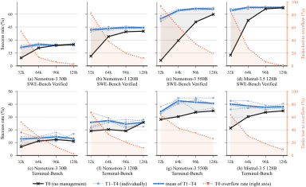

 Figure 3: Success rate and window-overflow rate against the context-window budget. Left axis: success rate; right axis (orange): the fraction of tasks T0 loses to window overflow. In each panel, the black curve shows T0, the light-blue curves show T1–T4 individually, and the solid blue curve shows their mean. Every managed tier overflows on exactly zero tasks at every budget, so a single overflow curve suffices.

##### The value of context management grows as the context-window budget shrinks.

For each model and context-window budget, we define the value of context management as the success-rate gap between the managed tiers (T1–T4) and no management (T0). Averaged across the models, the managed–T0 gap shrinks steadily across 32k, 64k, 96k, and 128k windows: from \(35.7\) to \(15.9\), \(5.5\), and \(2.7\) percentage points on SWE-Bench, and from \(9.5\) to \(7.5\), \(4.8\), and \(2.8\) on Terminal-Bench (Tables [3](https://arxiv.org/html/2609.20804#S3.T3 "Table 3 ‣ 3.2 Main Results ‣ 3 Experiment ‣ An Empirical Study of Harness Design for Coding Agents") and [4](https://arxiv.org/html/2609.20804#S3.T4 "Table 4 ‣ 3.2 Main Results ‣ 3 Experiment ‣ An Empirical Study of Harness Design for Coding Agents")). Figure [3](https://arxiv.org/html/2609.20804#S3.F3 "Figure 3 ‣ 3.2 Main Results ‣ 3 Experiment ‣ An Empirical Study of Harness Design for Coding Agents") shows that the narrowing managed–T0 gap tracks the decline in T0 window-overflow failures as the window increases. Across these budgets, the model-averaged T0 overflow rate falls from \(78.7\%\) to \(8.7\%\) on SWE-Bench and from \(61.0\%\) to \(12.1\%\) on Terminal-Bench, while all managed tiers have zero overflow failures throughout. Thus, context management is valuable largely because it prevents premature truncation when the window binds; as more unmanaged trajectories fit within the window, its marginal accuracy benefit shrinks and becomes more model-dependent.

 

##### T4 offers the best accuracy–cost trade-off among context-management strategies.

Figure [4](https://arxiv.org/html/2609.20804#S3.F4 "Figure 4 ‣ T4 offers the best accuracy–cost trade-off among context-management strategies. ‣ 3.2 Main Results ‣ 3 Experiment ‣ An Empirical Study of Harness Design for Coding Agents") shows that T4 achieves success rates comparable to T1–T3, with the lowest cost in seven of eight model–benchmark panels. To explain this cost profile, we normalize mean peak context by the corresponding nominal context-window budget. Figure [5](https://arxiv.org/html/2609.20804#S3.F5 "Figure 5 ‣ T4 offers the best accuracy–cost trade-off among context-management strategies. ‣ 3.2 Main Results ‣ 3 Experiment ‣ An Empirical Study of Harness Design for Coding Agents")(a) shows that at 32k, T1 and T2 trajectories still reach approximately the full window, whereas T3 and T4 keep peak context substantially below it. Across model–benchmark pairs, T4 has the lowest average peak-context ratio at all four window budgets. Figure [5](https://arxiv.org/html/2609.20804#S3.F5 "Figure 5 ‣ T4 offers the best accuracy–cost trade-off among context-management strategies. ‣ 3.2 Main Results ‣ 3 Experiment ‣ An Empirical Study of Harness Design for Coding Agents")(b) compares M1 elisions and M3 summarization calls. T4 invokes M1 less often than T1 and T2 at 32k and 64k and at comparably low rates at larger windows; it also invokes M3 less often than T3 on average at every budget. Averaged across the eight model–benchmark pairs, T4 has the lowest mean cost per task at every window budget (Figure [5](https://arxiv.org/html/2609.20804#S3.F5 "Figure 5 ‣ T4 offers the best accuracy–cost trade-off among context-management strategies. ‣ 3.2 Main Results ‣ 3 Experiment ‣ An Empirical Study of Harness Design for Coding Agents")(c)). These results suggest that T4’s early elision handles many cases before summarization is needed, reducing costly LLM summarization calls and helping explain its lower cost.

 

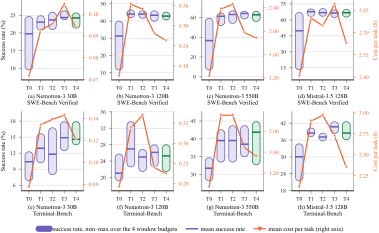

 Figure 4: Success rate and cost across context-management tiers. For each tier, the capsule on the left axis spans the minimum and maximum success rates over the 32k, 64k, 96k, and 128k context-window budgets, and the horizontal bar marks their mean; capsule height therefore indicates sensitivity to the window budget. T4, the default tier, is highlighted in green. The orange line is read against the right axis and reports the mean cost per task over the same four budgets. 

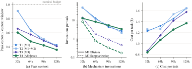

 Figure 5: Context compression, mechanism use, and cost across context-window budgets. Each curve reports the equal-weight mean over four models and two benchmarks. (a) Mean peak context divided by the corresponding nominal context-window budget; lower values indicate more effective context compression. (b) Mean invocations per task for elision (M1) and summarization (M3), shown on a logarithmic scale. Solid curves show M1 invocations for T1, T2, and T4, while dashed curves show M3 invocations for T3 and T4, the only tiers that enable summarization. (c) Mean cost per task in dollars ($).

##### Recall (M2) is rarely used and does not improve accuracy over elision alone.

Recall (M2) makes elision reversible by storing elided observations externally and exposing recall_event for on-demand retrieval. Because T1 and T2 differ only in M2 availability, they provide a matched comparison of its value. Across 32 model–benchmark–window comparisons, T2 outperforms T1 in 15 settings, underperforms in 14, and ties in three; the equal-weight mean difference is \(-0.36\) percentage points (\(+0.40\) on SWE-Bench, \(-1.12\) on Terminal-Bench). Table [13](https://arxiv.org/html/2609.20804#S9.T13 "Table 13 ‣ 9.6 Recall-Event Usage ‣ 9 Trajectory Analysis ‣ An Empirical Study of Harness Design for Coding Agents") shows that recall is rarely invoked. Among the 64 T2 and T4 settings, 36 (\(56.3\%\)) never call recall_event, the median invocation rate is zero, and the equal-weight mean falls from \(0.540\) calls per task at 32k to \(0.069\), \(0.011\), and \(0.007\) at 64k, 96k, and 128k; the 16 planning and action-space settings at T4/128k record no recall calls at all. Recall use is therefore concentrated under the greatest context pressure and almost entirely in Nemotron-3 30B; Nemotron-3 550B and Mistral-Medium-3.5-128B rarely invoke it. Even the heaviest-use configuration, Nemotron-3 30B on Terminal-Bench at 32k under T2, averages \(4.326\) calls per task and scores \(3.37\%\) below T1. These results suggest that lossless storage adds machinery most models seldom use, and retrieving elided observations does not consistently translate into completed tasks.

 

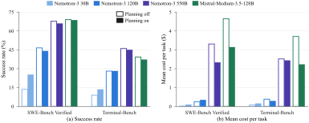

 Figure 6: Absolute performance and cost with and without planning. Bars use T4 context management, a 128k context-window budget, and the full tool set. Within each model pair, the hollow left bar disables planning and the filled right bar enables it; this encoding applies to both panels. (a) reports success rate, and (b) reports mean cost per task.

##### Planning improves success rate for the weaker model and saves cost for the stronger models.

We compare planning on and off under T4/128k with the full tool set (Figure [6](https://arxiv.org/html/2609.20804#S3.F6 "Figure 6 ‣ Recall \(M2\) is rarely used and does not improve accuracy over elision alone. ‣ 3.2 Main Results ‣ 3 Experiment ‣ An Empirical Study of Harness Design for Coding Agents")). For Nemotron-3 30B, planning increases success rate by \(11.6\) percentage points on SWE-Bench and \(4.5\) points on Terminal-Bench, at higher cost on both benchmarks. For Nemotron-3 120B, planning yields no consistent success-rate gain; it increases cost on SWE-Bench but reduces it on Terminal-Bench. For Nemotron-3 550B and Mistral-Medium-3.5-128B, planning reduces cost on both benchmarks, accompanied by small decreases in success rate. On SWE-Bench, their costs fall by approximately \(30\%\) and \(32\%\), respectively, while success rates decrease by \(2.0\) and \(0.4\) percentage points (Tables [3](https://arxiv.org/html/2609.20804#S3.T3 "Table 3 ‣ 3.2 Main Results ‣ 3 Experiment ‣ An Empirical Study of Harness Design for Coding Agents") and [4](https://arxiv.org/html/2609.20804#S3.T4 "Table 4 ‣ 3.2 Main Results ‣ 3 Experiment ‣ An Empirical Study of Harness Design for Coding Agents")). The execution statistics help explain these cost changes (Table [5](https://arxiv.org/html/2609.20804#S3.T5 "Table 5 ‣ Planning improves success rate for the weaker model and saves cost for the stronger models. ‣ 3.2 Main Results ‣ 3 Experiment ‣ An Empirical Study of Harness Design for Coding Agents")). Planning increases turns, tool calls, and average input tokens per call for Nemotron-3 30B on both benchmarks. All three measures decrease for Mistral on both benchmarks and for Nemotron-3 550B on SWE-Bench; the changes for Nemotron-3 550B on Terminal-Bench are smaller. Section [4](https://arxiv.org/html/2609.20804#S4 "4 Analysis ‣ An Empirical Study of Harness Design for Coding Agents") traces these changes to individual trajectories: planning extends Nemotron-3 30B runs that would otherwise terminate before an edit, while the removed turns for Nemotron-3 550B and Mistral-Medium-3.5-128B are largely post-edit verification.

 

Table 5: Percentage change from planning off to planning on at T4, a 128k context-window budget, and the full tool set. Positive values indicate an increase with planning and negative values a decrease. Input tokens avg. is the mean number of input tokens per agent call. 

<table id="S3.T5.5" class="ltx_tabular ltx_centering ltx_align_middle">
<tr id="S3.T5.5.1" class="ltx_tr">
<td id="S3.T5.5.1.1" class="ltx_td ltx_nopad_l ltx_border_tt" style="padding-left:4.0pt;padding-right:4.0pt;"></td>
<td id="S3.T5.5.1.2" class="ltx_td ltx_align_center ltx_border_tt" style="padding-left:4.0pt;padding-right:4.0pt;" colspan="3">SWE-Bench Verified</td>
<td id="S3.T5.5.1.3" class="ltx_td ltx_align_center ltx_border_tt" style="padding-left:4.0pt;padding-right:4.0pt;" colspan="3">Terminal-Bench</td></tr>
<tr id="S3.T5.5.2" class="ltx_tr">
<td id="S3.T5.5.2.1" class="ltx_td ltx_align_left" style="padding-left:4.0pt;padding-right:4.0pt;">Model</td>
<td id="S3.T5.5.2.2" class="ltx_td ltx_align_right ltx_border_t" style="padding-left:4.0pt;padding-right:4.0pt;"># Turns</td>
<td id="S3.T5.5.2.3" class="ltx_td ltx_align_right ltx_border_t" style="padding-left:4.0pt;padding-right:4.0pt;"># Tool Calls</td>
<td id="S3.T5.5.2.4" class="ltx_td ltx_align_right ltx_border_t" style="padding-left:4.0pt;padding-right:4.0pt;"> 

Input Tokens

Avg.
</td>
<td id="S3.T5.5.2.5" class="ltx_td ltx_align_right ltx_border_t" style="padding-left:4.0pt;padding-right:4.0pt;"># Turns</td>
<td id="S3.T5.5.2.6" class="ltx_td ltx_align_right ltx_border_t" style="padding-left:4.0pt;padding-right:4.0pt;"># Tool Calls</td>
<td id="S3.T5.5.2.7" class="ltx_td ltx_nopad_r ltx_align_right ltx_border_t" style="padding-left:4.0pt;padding-right:4.0pt;"> 

Input Tokens

Avg.
</td></tr>
<tr id="S3.T5.5.3" class="ltx_tr">
<td id="S3.T5.5.3.1" class="ltx_td ltx_align_left ltx_border_t" style="padding-left:4.0pt;padding-right:4.0pt;">Nemotron-3 30B</td>
<td id="S3.T5.5.3.2" class="ltx_td ltx_align_right ltx_border_t" style="padding-left:4.0pt;padding-right:4.0pt;">\(+293.2\%\)</td>
<td id="S3.T5.5.3.3" class="ltx_td ltx_align_right ltx_border_t" style="padding-left:4.0pt;padding-right:4.0pt;">\(+474.0\%\)</td>
<td id="S3.T5.5.3.4" class="ltx_td ltx_align_right ltx_border_t" style="padding-left:4.0pt;padding-right:4.0pt;">\(+104.1\%\)</td>
<td id="S3.T5.5.3.5" class="ltx_td ltx_align_right ltx_border_t" style="padding-left:4.0pt;padding-right:4.0pt;">\(+66.7\%\)</td>
<td id="S3.T5.5.3.6" class="ltx_td ltx_align_right ltx_border_t" style="padding-left:4.0pt;padding-right:4.0pt;">\(+83.8\%\)</td>
<td id="S3.T5.5.3.7" class="ltx_td ltx_nopad_r ltx_align_right ltx_border_t" style="padding-left:4.0pt;padding-right:4.0pt;">\(+24.0\%\)</td></tr>
<tr id="S3.T5.5.4" class="ltx_tr">
<td id="S3.T5.5.4.1" class="ltx_td ltx_align_left" style="padding-left:4.0pt;padding-right:4.0pt;">Nemotron-3 120B</td>
<td id="S3.T5.5.4.2" class="ltx_td ltx_align_right" style="padding-left:4.0pt;padding-right:4.0pt;">\(+20.1\%\)</td>
<td id="S3.T5.5.4.3" class="ltx_td ltx_align_right" style="padding-left:4.0pt;padding-right:4.0pt;">\(+42.7\%\)</td>
<td id="S3.T5.5.4.4" class="ltx_td ltx_align_right" style="padding-left:4.0pt;padding-right:4.0pt;">\(+10.3\%\)</td>
<td id="S3.T5.5.4.5" class="ltx_td ltx_align_right" style="padding-left:4.0pt;padding-right:4.0pt;">\(-15.0\%\)</td>
<td id="S3.T5.5.4.6" class="ltx_td ltx_align_right" style="padding-left:4.0pt;padding-right:4.0pt;">\(-23.1\%\)</td>
<td id="S3.T5.5.4.7" class="ltx_td ltx_nopad_r ltx_align_right" style="padding-left:4.0pt;padding-right:4.0pt;">\(-12.0\%\)</td></tr>
<tr id="S3.T5.5.5" class="ltx_tr">
<td id="S3.T5.5.5.1" class="ltx_td ltx_align_left" style="padding-left:4.0pt;padding-right:4.0pt;">Nemotron-3 550B</td>
<td id="S3.T5.5.5.2" class="ltx_td ltx_align_right" style="padding-left:4.0pt;padding-right:4.0pt;">\(-24.3\%\)</td>
<td id="S3.T5.5.5.3" class="ltx_td ltx_align_right" style="padding-left:4.0pt;padding-right:4.0pt;">\(-24.5\%\)</td>
<td id="S3.T5.5.5.4" class="ltx_td ltx_align_right" style="padding-left:4.0pt;padding-right:4.0pt;">\(-12.4\%\)</td>
<td id="S3.T5.5.5.5" class="ltx_td ltx_align_right" style="padding-left:4.0pt;padding-right:4.0pt;">\(+6.8\%\)</td>
<td id="S3.T5.5.5.6" class="ltx_td ltx_align_right" style="padding-left:4.0pt;padding-right:4.0pt;">\(+7.9\%\)</td>
<td id="S3.T5.5.5.7" class="ltx_td ltx_nopad_r ltx_align_right" style="padding-left:4.0pt;padding-right:4.0pt;">\(-1.7\%\)</td></tr>
<tr id="S3.T5.5.6" class="ltx_tr">
<td id="S3.T5.5.6.1" class="ltx_td ltx_align_left ltx_border_bb" style="padding-left:4.0pt;padding-right:4.0pt;">Mistral-Medium-3.5-128B</td>
<td id="S3.T5.5.6.2" class="ltx_td ltx_align_right ltx_border_bb" style="padding-left:4.0pt;padding-right:4.0pt;">\(-23.2\%\)</td>
<td id="S3.T5.5.6.3" class="ltx_td ltx_align_right ltx_border_bb" style="padding-left:4.0pt;padding-right:4.0pt;">\(-23.3\%\)</td>
<td id="S3.T5.5.6.4" class="ltx_td ltx_align_right ltx_border_bb" style="padding-left:4.0pt;padding-right:4.0pt;">\(-15.1\%\)</td>
<td id="S3.T5.5.6.5" class="ltx_td ltx_align_right ltx_border_bb" style="padding-left:4.0pt;padding-right:4.0pt;">\(-22.5\%\)</td>
<td id="S3.T5.5.6.6" class="ltx_td ltx_align_right ltx_border_bb" style="padding-left:4.0pt;padding-right:4.0pt;">\(-21.9\%\)</td>
<td id="S3.T5.5.6.7" class="ltx_td ltx_nopad_r ltx_align_right ltx_border_bb" style="padding-left:4.0pt;padding-right:4.0pt;">\(-13.0\%\)</td></tr>
</table>

  

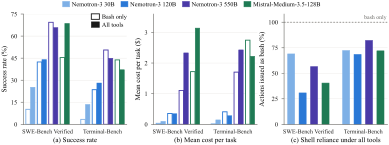

 Figure 7: Effect of the action space. Results compare bash-only with the full tool set under T4 context management, a 128k context-window budget, and planning on. (a) reports success rate, (b) reports mean cost per task, and (c) reports the proportion of tool calls issued through bash when the full tool set is enabled.

##### The predefined tool set scaffolds weaker models, while bash-only can benefit stronger ones.

Under the default T4/128k configuration with planning on, we compare the full tool set against bash-only. Figure [7](https://arxiv.org/html/2609.20804#S3.F7 "Figure 7 ‣ Planning improves success rate for the weaker model and saves cost for the stronger models. ‣ 3.2 Main Results ‣ 3 Experiment ‣ An Empirical Study of Harness Design for Coding Agents") shows that the predefined tool set benefits the weaker Nemotron-3 models most (Tables [3](https://arxiv.org/html/2609.20804#S3.T3 "Table 3 ‣ 3.2 Main Results ‣ 3 Experiment ‣ An Empirical Study of Harness Design for Coding Agents") and [4](https://arxiv.org/html/2609.20804#S3.T4 "Table 4 ‣ 3.2 Main Results ‣ 3 Experiment ‣ An Empirical Study of Harness Design for Coding Agents")). For Nemotron-3 30B, the predefined tool set raises success by 15.0% on SWE-Bench and 10.1% on Terminal-Bench. These gains reflect alignment between the model’s learned action vocabulary and the harness interface. Without predefined tools, the model falls back on tool-call patterns acquired during training rather than translating intended operations into bash. Because the bash-only registry lacks these tools, the harness cannot resolve emitted calls into executable actions. On Terminal-Bench, 66% of bash-only trajectories terminate after such out-of-interface emissions, shortening the average trajectory from 71 to 15 turns. The predefined tool set scaffolds Nemotron-3 30B by exposing an action vocabulary it can invoke reliably. For Nemotron-3 120B, accuracy gains shrink to \(1.6\%\) on SWE-Bench and \(4.5\%\) on Terminal-Bench but accompany more efficient execution. Unlike 30B, 120B does not benefit from longer trajectories: the predefined tool set shortens average runs from \(101\) to \(77\) turns on SWE-Bench and \(96\) to \(70\) on Terminal-Bench without increasing cost. For Nemotron-3 550B, bash-only improves success rate by \(3.6\%\) on SWE-Bench and \(5.6\%\) on Terminal-Bench while reducing cost by \(53\%\) and \(30\%\), respectively. Bash-only trajectories issue \(32\%\) fewer calls on SWE-Bench and \(24\%\) fewer on Terminal-Bench. This is consistent with the model using denser, more composite shell commands rather than distributing work across predefined actions. For this model, the predefined tool set appears to add action-selection and interaction overhead rather than useful scaffolding. Section [4](https://arxiv.org/html/2609.20804#S4 "4 Analysis ‣ An Empirical Study of Harness Design for Coding Agents") examines this shift at the edit level. Mistral-Medium-3.5-128B exposes the workload boundary of this crossover. The full tool set improves success by \(23.2\%\) on SWE-Bench, but bash-only adds \(6.7\%\) on Terminal-Bench. Figure [7](https://arxiv.org/html/2609.20804#S3.F7 "Figure 7 ‣ Planning improves success rate for the weaker model and saves cost for the stronger models. ‣ 3.2 Main Results ‣ 3 Experiment ‣ An Empirical Study of Harness Design for Coding Agents")(c) explains the reversal: with all tools, Mistral issues \(71.9\%\) of Terminal-Bench workspace actions via bash versus \(40.4\%\) on SWE-Bench, while predefined-tool use falls from \(31.4\) to \(13.1\) calls per task. Terminal-Bench is therefore more shell-centric, so removing competing workspace tools better matches the model’s preferred actions; on SWE-Bench, predefined read, search, and edit actions remain important. Additional bash-only failures arise before repair: 32.8% of Mistral’s bash-only SWE-Bench runs end without editing a file, versus 1.2% with the full tool set (Table [12](https://arxiv.org/html/2609.20804#S9.T12 "Table 12 ‣ Planning and the action space are the interventions that change the trajectory. ‣ 9.5 Trajectory-Level Statistics at 128k ‣ 9 Trajectory Analysis ‣ An Empirical Study of Harness Design for Coding Agents")), and among unresolved runs, the share never reaching the correct file rises from 16.0The Mistral result is therefore an accuracy–cost trade-off rather than uniform dominance, showing that the preferred action space depends on both capability and task types.

 

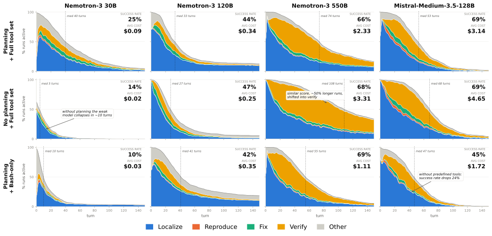

 Figure 8: SWE-Bench trajectory profiles across harness configurations. Columns correspond to models and rows to harness settings, all under T4 context management and a 128k context-window budget. The stacked areas show the fraction of runs still active at each turn, decomposed into Localize, Reproduce, Fix, Verify, and Other behavior. Dashed vertical lines mark the median trajectory length. 

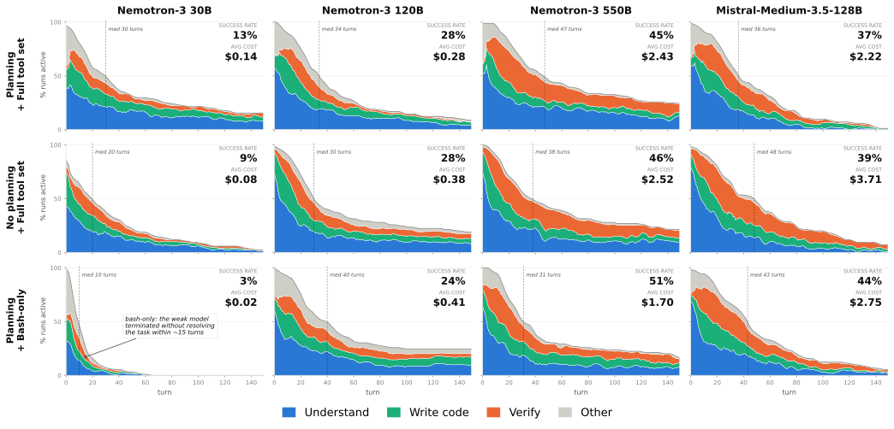

 Figure 9: Terminal-Bench trajectory profiles across harness configurations. Columns correspond to models and rows to harness settings, all under T4 context management and a 128k context-window budget. The stacked areas show the fraction of runs still active at each trajectory step, decomposed into Understand, Write Code, Verify, and Other behavior. Dashed vertical lines mark the median trajectory length.

## 4 Analysis

In this section, we analyze the annotated trajectories to identify the behavioral mechanisms underlying the main results. While the aggregate results establish _which_ harness components matter, they do not explain _how_ these effects arise. Each turn in agent trajectories is labeled with its workflow phase by an LLM judge using the taxonomies in Appendix [9](https://arxiv.org/html/2609.20804#S9 "9 Trajectory Analysis ‣ An Empirical Study of Harness Design for Coding Agents"); the judge’s agreement with human annotators is reported in Appendix [9.2](https://arxiv.org/html/2609.20804#S9.SS2 "9.2 Judge Setup and Human Validation ‣ 9 Trajectory Analysis ‣ An Empirical Study of Harness Design for Coding Agents"). We first show that context management extends execution trajectories without substantially altering agent behavior, motivating its use at T4/128k throughout the remaining analysis. We then examine why planning lengthens trajectories for the weakest model but shortens them for the strongest ones, and how the bash-only interface changes the way actions are expressed.

##### Context management extends execution trajectories without substantially altering agent behavior.

<table id="S4.T6.3.1" class="ltx_tabular ltx_align_middle">
<tr id="S4.T6.3.1.1" class="ltx_tr">
<td id="S4.T6.3.1.1.1" class="ltx_td ltx_border_tt"></td>
<td id="S4.T6.3.1.1.2" class="ltx_td ltx_align_center ltx_border_tt" colspan="2">W/o edit (%)</td>
<td id="S4.T6.3.1.1.3" class="ltx_td ltx_align_center ltx_border_tt" colspan="2">At loc. (%)</td></tr>
<tr id="S4.T6.3.1.2" class="ltx_tr">
<td id="S4.T6.3.1.2.1" class="ltx_td ltx_align_left">Model</td>
<td id="S4.T6.3.1.2.2" class="ltx_td ltx_align_right ltx_border_t">Off</td>
<td id="S4.T6.3.1.2.3" class="ltx_td ltx_align_right ltx_border_t">On</td>
<td id="S4.T6.3.1.2.4" class="ltx_td ltx_align_right ltx_border_t">Off</td>
<td id="S4.T6.3.1.2.5" class="ltx_td ltx_nopad_r ltx_align_right ltx_border_t">On</td></tr>
<tr id="S4.T6.3.1.3" class="ltx_tr">
<td id="S4.T6.3.1.3.1" class="ltx_td ltx_align_left ltx_border_t">Nemotron-3 30B</td>
<td id="S4.T6.3.1.3.2" class="ltx_td ltx_align_right ltx_border_t">68.6</td>
<td id="S4.T6.3.1.3.3" class="ltx_td ltx_align_right ltx_border_t">27.8</td>
<td id="S4.T6.3.1.3.4" class="ltx_td ltx_align_right ltx_border_t">58.4</td>
<td id="S4.T6.3.1.3.5" class="ltx_td ltx_nopad_r ltx_align_right ltx_border_t">10.4</td></tr>
<tr id="S4.T6.3.1.4" class="ltx_tr">
<td id="S4.T6.3.1.4.1" class="ltx_td ltx_align_left">Nemotron-3 120B</td>
<td id="S4.T6.3.1.4.2" class="ltx_td ltx_align_right">15.6</td>
<td id="S4.T6.3.1.4.3" class="ltx_td ltx_align_right">24.4</td>
<td id="S4.T6.3.1.4.4" class="ltx_td ltx_align_right">11.0</td>
<td id="S4.T6.3.1.4.5" class="ltx_td ltx_nopad_r ltx_align_right">17.8</td></tr>
<tr id="S4.T6.3.1.5" class="ltx_tr">
<td id="S4.T6.3.1.5.1" class="ltx_td ltx_align_left">Nemotron-3 550B</td>
<td id="S4.T6.3.1.5.2" class="ltx_td ltx_align_right">1.4</td>
<td id="S4.T6.3.1.5.3" class="ltx_td ltx_align_right">2.4</td>
<td id="S4.T6.3.1.5.4" class="ltx_td ltx_align_right">0.2</td>
<td id="S4.T6.3.1.5.5" class="ltx_td ltx_nopad_r ltx_align_right">0.6</td></tr>
<tr id="S4.T6.3.1.6" class="ltx_tr">
<td id="S4.T6.3.1.6.1" class="ltx_td ltx_align_left ltx_border_bb">Mistral-Medium-3.5-128B</td>
<td id="S4.T6.3.1.6.2" class="ltx_td ltx_align_right ltx_border_bb">2.0</td>
<td id="S4.T6.3.1.6.3" class="ltx_td ltx_align_right ltx_border_bb">1.2</td>
<td id="S4.T6.3.1.6.4" class="ltx_td ltx_align_right ltx_border_bb">1.0</td>
<td id="S4.T6.3.1.6.5" class="ltx_td ltx_nopad_r ltx_align_right ltx_border_bb">0.6</td></tr>
</table>

 

Table 6: SWE-Bench runs terminated without an edit, and the subset stalled at localization (every labeled turn still in the Localize phase of the encoding in Appendix [9](https://arxiv.org/html/2609.20804#S9 "9 Trajectory Analysis ‣ An Empirical Study of Harness Design for Coding Agents")), with planning off and on (T4/128k, full tool set).

At 32k, the tiers differ primarily in trajectory length. Without context management, the proportion of active SWE-Bench runs declines sharply, with median lengths of 20–30 turns across the four models. Most runs terminate during the Localize phase, and few reach Verify (Figure [32](https://arxiv.org/html/2609.20804#S9.F32 "Figure 32 ‣ 9.3.2 Behavior Profiles ‣ 9.3 SWE-Bench Trajectory Results ‣ 9 Trajectory Analysis ‣ An Empirical Study of Harness Design for Coding Agents")). All managed tiers extend execution while largely preserving phase ordering and proportions at comparable turns. Median lengths increase to approximately 50–180 turns, depending on the model and tier, allowing runs to progress to verification. Terminal-Bench exhibits a similar pattern (Figure [36](https://arxiv.org/html/2609.20804#S9.F36 "Figure 36 ‣ 9.4 Terminal-Bench Trajectory Results ‣ 9 Trajectory Analysis ‣ An Empirical Study of Harness Design for Coding Agents")). At 128k, differences across tiers largely diminish. Median trajectory lengths range from 39–42 turns for Nemotron-3 30B and 70–74 turns for Nemotron-3 550B. Re-patch counts differ by fewer than two per task, while the proportion of runs terminating without an edit varies by less than four percentage points for three of the four models (Figures [35](https://arxiv.org/html/2609.20804#S9.F35 "Figure 35 ‣ 9.3.2 Behavior Profiles ‣ 9.3 SWE-Bench Trajectory Results ‣ 9 Trajectory Analysis ‣ An Empirical Study of Harness Design for Coding Agents") and [39](https://arxiv.org/html/2609.20804#S9.F39 "Figure 39 ‣ 9.4 Terminal-Bench Trajectory Results ‣ 9 Trajectory Analysis ‣ An Empirical Study of Harness Design for Coding Agents"); Tables [11](https://arxiv.org/html/2609.20804#S9.T11 "Table 11 ‣ Planning and the action space are the interventions that change the trajectory. ‣ 9.5 Trajectory-Level Statistics at 128k ‣ 9 Trajectory Analysis ‣ An Empirical Study of Harness Design for Coding Agents") and [12](https://arxiv.org/html/2609.20804#S9.T12 "Table 12 ‣ Planning and the action space are the interventions that change the trajectory. ‣ 9.5 Trajectory-Level Statistics at 128k ‣ 9 Trajectory Analysis ‣ An Empirical Study of Harness Design for Coding Agents")). These results indicate that context management primarily extends execution trajectories without substantially altering agent behavior. We therefore fix context management at T4/128k in the remaining analyses to examine how planning and the action space affect trajectory structure.

##### Planning sustains the weakest model’s trajectory long enough to attempt an edit.

Figure [8](https://arxiv.org/html/2609.20804#S3.F8 "Figure 8 ‣ The predefined tool set scaffolds weaker models, while bash-only can benefit stronger ones. ‣ 3.2 Main Results ‣ 3 Experiment ‣ An Empirical Study of Harness Design for Coding Agents") helps explain the performance gain for Nemotron-3 30B. Disabling planning reduces the median SWE-Bench trajectory length from 40 to 5 turns. Without planning, 68.6% of runs terminate without an edit and 58.4% terminate during Localize, compared with 27.8% and 10.4%, respectively, with planning (Table [6](https://arxiv.org/html/2609.20804#S4.T6 "Table 6 ‣ Context management extends execution trajectories without substantially altering agent behavior. ‣ 4 Analysis ‣ An Empirical Study of Harness Design for Coding Agents")). These results suggest that planning helps the least capable model sustain execution through an initial edit attempt, with the additional turns contributing to higher cost. For Nemotron-3 120B, trajectory-length distributions nearly overlap, consistent with the absence of an accuracy gain.

##### Planning shortens SWE-Bench trajectories for stronger models by reducing post-edit verification.

Figure [8](https://arxiv.org/html/2609.20804#S3.F8 "Figure 8 ‣ The predefined tool set scaffolds weaker models, while bash-only can benefit stronger ones. ‣ 3.2 Main Results ‣ 3 Experiment ‣ An Empirical Study of Harness Design for Coding Agents") shows that planning reduces the median trajectory length from 108 to 74 turns for Nemotron-3 550B and from 68 to 53 turns for Mistral-Medium-3.5-128B. The phase composition attributes most of this reduction to verification rather than localization or fixing. Consistently, planning produces little change in the fraction of runs terminating without an edit or failing at file localization (see Tables [12](https://arxiv.org/html/2609.20804#S9.T12 "Table 12 ‣ Planning and the action space are the interventions that change the trajectory. ‣ 9.5 Trajectory-Level Statistics at 128k ‣ 9 Trajectory Analysis ‣ An Empirical Study of Harness Design for Coding Agents") and [10](https://arxiv.org/html/2609.20804#S9.T10 "Table 10 ‣ 9.3.1 Failure-Stage Results ‣ 9.3 SWE-Bench Trajectory Results ‣ 9 Trajectory Analysis ‣ An Empirical Study of Harness Design for Coding Agents")), while substantially reducing turns and tool calls (see Table [11](https://arxiv.org/html/2609.20804#S9.T11 "Table 11 ‣ Planning and the action space are the interventions that change the trajectory. ‣ 9.5 Trajectory-Level Statistics at 128k ‣ 9 Trajectory Analysis ‣ An Empirical Study of Harness Design for Coding Agents")). These results suggest that planning primarily improves stopping behavior by reducing redundant post-edit verification, rather than accelerating localization or repair.

##### Planning’s cost effect on Terminal-Bench depends on how it reshapes the trajectory-length distribution.

Figure [9](https://arxiv.org/html/2609.20804#S3.F9 "Figure 9 ‣ The predefined tool set scaffolds weaker models, while bash-only can benefit stronger ones. ‣ 3.2 Main Results ‣ 3 Experiment ‣ An Empirical Study of Harness Design for Coding Agents") shows that planning has two opposing effects: it extends trajectories that would otherwise terminate prematurely, while truncating the tail of excessively long runs. The balance between these effects determines the model-specific cost changes in Figure [6](https://arxiv.org/html/2609.20804#S3.F6 "Figure 6 ‣ Recall \(M2\) is rarely used and does not improve accuracy over elision alone. ‣ 3.2 Main Results ‣ 3 Experiment ‣ An Empirical Study of Harness Design for Coding Agents")(b). For Nemotron-3 120B, planning truncates the long-running tail and reduces cost by roughly 26%. The effect is smaller for Nemotron-3 550B (3.6%), whose exploratory tail is less compressed, but larger for Mistral-Medium-3.5-128B (about 40%), where both medium- and long-running trajectories shorten. Nemotron-3 30B shows the opposite pattern: by preventing premature termination, planning increases cost by 75%.

Table 7: Action granularity with the full tool set vs. bash-only (planning on, T4/128k): mean re-patches per task (edits to an already-edited file) and median largest edit on SWE-Bench, and the create/replace share of file-writing actions on Terminal-Bench.

<table id="S4.T7.5.1" class="ltx_tabular ltx_align_middle">
<tr id="S4.T7.5.1.1" class="ltx_tr">
<td id="S4.T7.5.1.1.1" class="ltx_td ltx_border_tt"></td>
<td id="S4.T7.5.1.1.2" class="ltx_td ltx_align_center ltx_border_tt" colspan="2">Re-patch</td>
<td id="S4.T7.5.1.1.3" class="ltx_td ltx_align_center ltx_border_tt" colspan="2">Edit lines</td>
<td id="S4.T7.5.1.1.4" class="ltx_td ltx_align_center ltx_border_tt" colspan="2">Create (%)</td></tr>
<tr id="S4.T7.5.1.2" class="ltx_tr">
<td id="S4.T7.5.1.2.1" class="ltx_td ltx_align_left">Model</td>
<td id="S4.T7.5.1.2.2" class="ltx_td ltx_align_right ltx_border_t">Tools</td>
<td id="S4.T7.5.1.2.3" class="ltx_td ltx_align_right ltx_border_t">Bash</td>
<td id="S4.T7.5.1.2.4" class="ltx_td ltx_align_right ltx_border_t">Tools</td>
<td id="S4.T7.5.1.2.5" class="ltx_td ltx_align_right ltx_border_t">Bash</td>
<td id="S4.T7.5.1.2.6" class="ltx_td ltx_align_right ltx_border_t">Tools</td>
<td id="S4.T7.5.1.2.7" class="ltx_td ltx_nopad_r ltx_align_right ltx_border_t">Bash</td></tr>
<tr id="S4.T7.5.1.3" class="ltx_tr">
<td id="S4.T7.5.1.3.1" class="ltx_td ltx_align_left ltx_border_t">Nemotron-3 30B</td>
<td id="S4.T7.5.1.3.2" class="ltx_td ltx_align_right ltx_border_t">3.3</td>
<td id="S4.T7.5.1.3.3" class="ltx_td ltx_align_right ltx_border_t">0.4</td>
<td id="S4.T7.5.1.3.4" class="ltx_td ltx_align_right ltx_border_t">26</td>
<td id="S4.T7.5.1.3.5" class="ltx_td ltx_align_right ltx_border_t">13</td>
<td id="S4.T7.5.1.3.6" class="ltx_td ltx_align_right ltx_border_t">28</td>
<td id="S4.T7.5.1.3.7" class="ltx_td ltx_nopad_r ltx_align_right ltx_border_t">64</td></tr>
<tr id="S4.T7.5.1.4" class="ltx_tr">
<td id="S4.T7.5.1.4.1" class="ltx_td ltx_align_left">Nemotron-3 120B</td>
<td id="S4.T7.5.1.4.2" class="ltx_td ltx_align_right">2.8</td>
<td id="S4.T7.5.1.4.3" class="ltx_td ltx_align_right">2.2</td>
<td id="S4.T7.5.1.4.4" class="ltx_td ltx_align_right">22</td>
<td id="S4.T7.5.1.4.5" class="ltx_td ltx_align_right">24</td>
<td id="S4.T7.5.1.4.6" class="ltx_td ltx_align_right">39</td>
<td id="S4.T7.5.1.4.7" class="ltx_td ltx_nopad_r ltx_align_right">76</td></tr>
<tr id="S4.T7.5.1.5" class="ltx_tr">
<td id="S4.T7.5.1.5.1" class="ltx_td ltx_align_left">Nemotron-3 550B</td>
<td id="S4.T7.5.1.5.2" class="ltx_td ltx_align_right">4.6</td>
<td id="S4.T7.5.1.5.3" class="ltx_td ltx_align_right">1.5</td>
<td id="S4.T7.5.1.5.4" class="ltx_td ltx_align_right">18</td>
<td id="S4.T7.5.1.5.5" class="ltx_td ltx_align_right">54</td>
<td id="S4.T7.5.1.5.6" class="ltx_td ltx_align_right">51</td>
<td id="S4.T7.5.1.5.7" class="ltx_td ltx_nopad_r ltx_align_right">76</td></tr>
<tr id="S4.T7.5.1.6" class="ltx_tr">
<td id="S4.T7.5.1.6.1" class="ltx_td ltx_align_left ltx_border_bb">Mistral-Medium-3.5-128B</td>
<td id="S4.T7.5.1.6.2" class="ltx_td ltx_align_right ltx_border_bb">3.0</td>
<td id="S4.T7.5.1.6.3" class="ltx_td ltx_align_right ltx_border_bb">1.3</td>
<td id="S4.T7.5.1.6.4" class="ltx_td ltx_align_right ltx_border_bb">87</td>
<td id="S4.T7.5.1.6.5" class="ltx_td ltx_align_right ltx_border_bb">68</td>
<td id="S4.T7.5.1.6.6" class="ltx_td ltx_align_right ltx_border_bb">28</td>
<td id="S4.T7.5.1.6.7" class="ltx_td ltx_nopad_r ltx_align_right ltx_border_bb">57</td></tr>
</table>

 

##### Bash-only enables larger code-writing actions and fewer interactions.

Figure [9](https://arxiv.org/html/2609.20804#S3.F9 "Figure 9 ‣ The predefined tool set scaffolds weaker models, while bash-only can benefit stronger ones. ‣ 3.2 Main Results ‣ 3 Experiment ‣ An Empirical Study of Harness Design for Coding Agents") shows this most clearly for Nemotron-3 550B on Terminal-Bench: switching from the full tool set to bash-only shortens the median trajectory from 47 to 31 actions while raising the share of Write-code actions from 16% to 27%, so a larger fraction of a shorter trajectory is spent producing code. This pattern suggests that the shell lets capable models bundle several low-level operations into one command or script, whereas the structured interface spreads the same work across many smaller interactions. Table [7](https://arxiv.org/html/2609.20804#S4.T7 "Table 7 ‣ Planning’s cost effect on Terminal-Bench depends on how it reshapes the trajectory-length distribution. ‣ 4 Analysis ‣ An Empirical Study of Harness Design for Coding Agents") provides the corresponding fine-grained evidence. Across all four models, bash-only reduces repeated patching of already edited files, from 3.3 to 0.4 re-patches for Nemotron-3 30B, 2.8 to 2.2 for 120B, 4.6 to 1.5 for 550B, and 3.0 to 1.3 for Mistral. On Terminal-Bench, bash-only also shifts file-writing toward coarser create-or-replace actions, increasing their share from 28% to 64% for 30B, 39% to 76% for 120B, 51% to 76% for 550B, and 28% to 57% for Mistral. Thus, predefined tools lower the complexity of each individual action, but they often do so by increasing the number of interactions and incremental repair cycles needed to express the same operation.

## 5 Related Work

### 5.1 Coding Agents

The engine of a coding agent is a capable, increasingly code- and agent-specialized language model. Recent frontier models, including Qwen3-Coder ([Cao et al., 2026](https://arxiv.org/html/2609.20804#bib.bib6)), Kimi K2.5 and K2.6 ([Team et al., 2026](https://arxiv.org/html/2609.20804#bib.bib22); [Kimi Team, 2026](https://arxiv.org/html/2609.20804#bib.bib24)), GLM-5 ([Zeng et al., 2026](https://arxiv.org/html/2609.20804#bib.bib23)), and Mistral Medium 3.5 ([Mistral AI, 2026](https://arxiv.org/html/2609.20804#bib.bib25)), are designed or evaluated for code generation and agentic use. Their progress is measured by execution-based benchmarks such as repository-level issue resolution in SWE-Bench ([Jimenez et al., 2024](https://arxiv.org/html/2609.20804#bib.bib1)) and end-to-end command-line task completion in Terminal-Bench ([Merrill et al., 2026](https://arxiv.org/html/2609.20804#bib.bib2)). Because these benchmarks evaluate complete agent systems, their scores conflate model capability with the control loop, action interface, and context-management policy. This motivates controlled comparisons that hold the agent substrate fixed while varying one component.

### 5.2 Coding Harness

A coding harness is the software layer that turns LLMs into agents, comprising the control loop, tool interface, and context management through which they act on a codebase. Such harnesses now drive coding-agent products and frameworks like Claude Code ([Anthropic, 2025](https://arxiv.org/html/2609.20804#bib.bib26)), Codex ([OpenAI, 2025](https://arxiv.org/html/2609.20804#bib.bib27)), OpenCode ([OpenCode, 2025](https://arxiv.org/html/2609.20804#bib.bib28)), and OpenHands ([Wang et al., 2025](https://arxiv.org/html/2609.20804#bib.bib4)). Research on their design has shown that the harness, not the model alone, governs performance ([Yang et al., 2024](https://arxiv.org/html/2609.20804#bib.bib3)). Later systems add long-term memory for the harness ([Wong et al., 2025](https://arxiv.org/html/2609.20804#bib.bib5)) or add task graphs and modular sub-agents ([Chen et al., 2024](https://arxiv.org/html/2609.20804#bib.bib29); [Arora et al., 2024](https://arxiv.org/html/2609.20804#bib.bib30)), and recent surveys catalogue the design space ([Rombaut, 2026](https://arxiv.org/html/2609.20804#bib.bib31)). These systems generally optimize bundled designs. Although several report local ablations, few compare the same implementation-level interventions across model capability and context-window budgets.

A growing body of work therefore ablates coding harnesses to determine which components matter. At the system level, constrained localize, repair, and validate pipelines such as Agentless ([Xia et al., 2024](https://arxiv.org/html/2609.20804#bib.bib7)) and AutoCodeRover ([Zhang et al., 2024](https://arxiv.org/html/2609.20804#bib.bib32)) show that strong performance can be achieved without highly elaborate agent architectures. Finer-grained studies further indicate that the preferred design depends on the model. AgentArch ([Bogavelli et al., 2025](https://arxiv.org/html/2609.20804#bib.bib18)) reports model-specific architecture preferences, while a large trajectory study finds that behavioral differences between coding-agent frameworks change across model generations ([Mehtiyev and Assunção, 2026](https://arxiv.org/html/2609.20804#bib.bib20)). Individual interventions can likewise become less useful or even harmful for stronger models, as observed for prompt-engineering strategies in software engineering ([Wang et al., 2026](https://arxiv.org/html/2609.20804#bib.bib19)). Closest to our work, [Liu (2026)](https://arxiv.org/html/2609.20804#bib.bib8) study prompt-level scaffolding on short-horizon reasoning tasks using a full-factorial design, where context-window pressure is not explicitly examined. We instead study implementation-level planning, workspace action interfaces, and context-management policies over substantially longer coding trajectories, where the context window can become a binding constraint, and explicitly manipulate the available context-window budget. This setting allows us to characterize how the conditional effects of these harness components vary with both model capability and resource availability.

### 5.3 Context Management

As the software-engineering tasks grow more challenging, an agent needs more steps to solve them, which drives its interaction history beyond the model’s context window. Therefore, many studies have proposed context management strategies to balance task performance with context length. First, static methods apply fixed, hand-designed strategies, such as eliding or truncating stale content ([Xiao et al., 2024](https://arxiv.org/html/2609.20804#bib.bib9); [Jiang et al., 2023](https://arxiv.org/html/2609.20804#bib.bib10)), retrieving earlier content on demand from an external store ([Packer et al., 2023](https://arxiv.org/html/2609.20804#bib.bib11); [Park et al., 2023](https://arxiv.org/html/2609.20804#bib.bib12)), and summarizing history into a compact state ([Wu et al., 2021](https://arxiv.org/html/2609.20804#bib.bib13)). Second, dynamic methods train the model, often via reinforcement learning, to manage its own context ([Wu et al., 2025](https://arxiv.org/html/2609.20804#bib.bib14); [Kang et al., 2025](https://arxiv.org/html/2609.20804#bib.bib15); [Li et al., 2026](https://arxiv.org/html/2609.20804#bib.bib16); [Zhang et al., 2026](https://arxiv.org/html/2609.20804#bib.bib17)). Such mechanisms are typically introduced as improvements and evaluated on a single model, which leaves their central dependence uncharacterized. The value of managing context cannot be separated from how much window there is to manage against, nor from whether the model is strong enough to be helped rather than starved by compaction. We characterize this dependence precisely, sweeping the context window from 32k to 128k tokens across two model families and three model sizes.

## 6 Conclusion

We present a controlled empirical study that estimates the conditional effects of three central coding-harness components: context management, planning, and the action space, across four models and two long-horizon coding benchmarks. Context management matters most under tight context-window budgets, and among its policies T4 achieves the lowest aggregate cost at broadly similar success rates by applying rule-based elision before selective LLM summarization. Planning improves success at additional cost for weaker models but mainly reduces cost, with small decreases in success rate, for stronger models. Predefined tools raise success rates for models with weak bash control, whereas bash-only yields higher success at lower cost for bash-capable models, most clearly on shell-centric task types. Trajectory analysis ties each effect to a distinct behavioral change and, through it, to the limitation the component addresses: context management extends execution trajectories without substantially altering agent behavior and is most beneficial under tight context budgets; planning sustains the trajectories of models that abandon tasks too early and trims repeated verification in models that verify too long; and structured tools support models with limited shell proficiency, while bash-only enables capable models to combine multiple code modifications in a single tool call. Harness design is thus a conditional systems problem in which each component should be selected for the target model, task type, and resource budget rather than adopted as a default.

## Limitations

First, our results estimate the conditional effects of the specific harness components and implementations studied here rather than identifying a universally optimal harness. Planning is instantiated through one prompt and update mechanism, and context management follows one threshold-based policy with fixed compaction settings. The action-space intervention is a bundled interface change that jointly varies tool availability, interface-specific prompts, file-state tracking, and automatic post-edit diagnostics, so it does not isolate the effect of tool count or action granularity from the other properties of the interface. Second, the coverage of the design space and the statistical power are limited. Planning and the action space are ablated only under the default T4/128k configuration due to limited computing resources, and a full factorial study would be required to determine whether their effects persist under other combinations of components and context budgets. Each setting is run once per task, and Terminal-Bench contains only 89 tasks, so many Terminal-Bench contrasts do not reach significance under the paired McNemar test; our conclusions there rest on consistent directions across models and budgets rather than on individually significant cells. Last, the external validity of our conclusions is bounded by the models and tasks evaluated. We study three sizes from the Nemotron-3 family and Mistral-Medium-3.5-128B on two long-horizon coding benchmarks, of which SWE-Bench Verified is Python-only. Model size is only an imperfect proxy for capability, since differences in training, prior exposure to tool interfaces, and native shell proficiency may also contribute to the observed trends, as Mistral’s benchmark-dependent interface preference shows. The crossover points reported here should therefore be validated before being transferred to other model families, harness implementations, or task types outside software engineering.

## References

  * Anthropic (2025) Anthropic Claude code.  Note: <https://code.claude.com/docs> Cited by: [§5.2](https://arxiv.org/html/2609.20804#S5.SS2.p1.1 "5.2 Coding Harness ‣ 5 Related Work ‣ An Empirical Study of Harness Design for Coding Agents"). 
  * Arora et al. (2024) D. Arora, A. Sonwane, N. Wadhwa, A. Mehrotra, S. Utpala, R. Bairi, A. Kanade, and N. Natarajan Masai: modular architecture for software-engineering ai agents.  arXiv preprint arXiv:2406.11638.  Cited by: [§1](https://arxiv.org/html/2609.20804#S1.p2.1 "1 Introduction ‣ An Empirical Study of Harness Design for Coding Agents"), [§5.2](https://arxiv.org/html/2609.20804#S5.SS2.p1.1 "5.2 Coding Harness ‣ 5 Related Work ‣ An Empirical Study of Harness Design for Coding Agents"). 
  * Bairi et al. (2024) R. Bairi, A. Sonwane, A. Kanade, V. D. C, A. Iyer, S. Parthasarathy, S. Rajamani, B. Ashok, and S. Shet Codeplan: repository-level coding using llms and planning.  Proceedings of the ACM on Software Engineering 1 (FSE), pp. 675–698.  Cited by: [§1](https://arxiv.org/html/2609.20804#S1.p3.1 "1 Introduction ‣ An Empirical Study of Harness Design for Coding Agents"). 
  * Blakeman et al. (2025) A. Blakeman, A. Grattafiori, A. Basant, A. Gupta, A. Khattar, A. Renduchintala, A. Vavre, A. Shukla, A. Bercovich, A. Ficek, et al. Nvidia nemotron 3: efficient and open intelligence.  arXiv preprint arXiv:2512.20856.  Cited by: [§1](https://arxiv.org/html/2609.20804#S1.p4.1 "1 Introduction ‣ An Empirical Study of Harness Design for Coding Agents"), [§3.1](https://arxiv.org/html/2609.20804#S3.SS1.SSS0.Px1.p1.1 "Models. ‣ 3.1 Setup ‣ 3 Experiment ‣ An Empirical Study of Harness Design for Coding Agents"). 
  * Bogavelli et al. (2025) T. Bogavelli, R. Sharma, and H. Subramani Agentarch: a comprehensive benchmark to evaluate agent architectures in enterprise.  arXiv preprint arXiv:2509.10769.  Cited by: [§1](https://arxiv.org/html/2609.20804#S1.p2.1 "1 Introduction ‣ An Empirical Study of Harness Design for Coding Agents"), [§5.2](https://arxiv.org/html/2609.20804#S5.SS2.p2.1 "5.2 Coding Harness ‣ 5 Related Work ‣ An Empirical Study of Harness Design for Coding Agents"). 
  * Cao et al. (2026) R. Cao, M. Chen, J. Chen, Z. Cui, Y. Feng, B. Hui, Y. Jing, K. Li, M. Li, J. Lin, et al. Qwen3-coder-next technical report.  arXiv preprint arXiv:2603.00729.  Cited by: [§1](https://arxiv.org/html/2609.20804#S1.p2.1 "1 Introduction ‣ An Empirical Study of Harness Design for Coding Agents"), [§2.2](https://arxiv.org/html/2609.20804#S2.SS2.p1.1 "2.2 Action space ‣ 2 Harness Design ‣ An Empirical Study of Harness Design for Coding Agents"), [§5.1](https://arxiv.org/html/2609.20804#S5.SS1.p1.1 "5.1 Coding Agents ‣ 5 Related Work ‣ An Empirical Study of Harness Design for Coding Agents"). 
  * Chen et al. (2024) D. Chen, S. Lin, M. Zeng, D. Zan, J. Wang, A. Cheshkov, J. Sun, H. Yu, G. Dong, A. Aliev, et al. Coder: issue resolving with multi-agent and task graphs.  arXiv preprint arXiv:2406.01304.  Cited by: [§5.2](https://arxiv.org/html/2609.20804#S5.SS2.p1.1 "5.2 Coding Harness ‣ 5 Related Work ‣ An Empirical Study of Harness Design for Coding Agents"). 
  * Ehrlich and Blackman (2026) C. Ehrlich and T. Blackman LCM: lossless context management.  arXiv preprint arXiv:2605.04050.  Cited by: [§2.3](https://arxiv.org/html/2609.20804#S2.SS3.p1.1 "2.3 Context management ‣ 2 Harness Design ‣ An Empirical Study of Harness Design for Coding Agents"). 
  * Jiang et al. (2023) H. Jiang, Q. Wu, C. Lin, Y. Yang, and L. Qiu Llmlingua: compressing prompts for accelerated inference of large language models.  In Proceedings of the 2023 conference on empirical methods in natural language processing,  pp. 13358–13376.  Cited by: [§2.3](https://arxiv.org/html/2609.20804#S2.SS3.p1.1 "2.3 Context management ‣ 2 Harness Design ‣ An Empirical Study of Harness Design for Coding Agents"), [§5.3](https://arxiv.org/html/2609.20804#S5.SS3.p1.1 "5.3 Context Management ‣ 5 Related Work ‣ An Empirical Study of Harness Design for Coding Agents"). 
  * Jimenez et al. (2024) C. E. Jimenez, J. Yang, A. Wettig, S. Yao, K. Pei, O. Press, and K. Narasimhan Swe-bench: can language models resolve real-world github issues?.  In International Conference on Learning Representations,  Vol. 2024, pp. 54107–54157.  Cited by: [§1](https://arxiv.org/html/2609.20804#S1.p1.1 "1 Introduction ‣ An Empirical Study of Harness Design for Coding Agents"), [§1](https://arxiv.org/html/2609.20804#S1.p4.1 "1 Introduction ‣ An Empirical Study of Harness Design for Coding Agents"), [§3.1](https://arxiv.org/html/2609.20804#S3.SS1.SSS0.Px2.p1.1 "Benchmarks. ‣ 3.1 Setup ‣ 3 Experiment ‣ An Empirical Study of Harness Design for Coding Agents"), [§5.1](https://arxiv.org/html/2609.20804#S5.SS1.p1.1 "5.1 Coding Agents ‣ 5 Related Work ‣ An Empirical Study of Harness Design for Coding Agents"). 
  * Kang et al. (2025) M. Kang, W. Chen, D. Han, H. A. Inan, L. Wutschitz, Y. Chen, R. Sim, and S. Rajmohan Acon: optimizing context compression for long-horizon llm agents.  arXiv preprint arXiv:2510.00615.  Cited by: [§5.3](https://arxiv.org/html/2609.20804#S5.SS3.p1.1 "5.3 Context Management ‣ 5 Related Work ‣ An Empirical Study of Harness Design for Coding Agents"). 
  * Kimi Team (2026) Kimi Team Kimi K2.6: advancing open-source coding.  Note: <https://www.kimi.com/blog/kimi-k2-6> Cited by: [§5.1](https://arxiv.org/html/2609.20804#S5.SS1.p1.1 "5.1 Coding Agents ‣ 5 Related Work ‣ An Empirical Study of Harness Design for Coding Agents"). 
  * Lewis (2026) S. Lewis Same model, different harness: different coding-agent results.  arXiv preprint arXiv:2608.26218.  Cited by: [§1](https://arxiv.org/html/2609.20804#S1.p1.1 "1 Introduction ‣ An Empirical Study of Harness Design for Coding Agents"). 
  * Li et al. (2026) M. Li, L. Xu, Q. Tan, L. Ma, H. Song, T. Cao, and Y. Liu Sculptor: empowering llms with cognitive agency via active context management.  In International Conference on Learning Representations,  Vol. 2026, pp. 153411–153440.  Cited by: [§5.3](https://arxiv.org/html/2609.20804#S5.SS3.p1.1 "5.3 Context Management ‣ 5 Related Work ‣ An Empirical Study of Harness Design for Coding Agents"). 
  * Liu (2026) M. Liu More is not always better: cross-component interference in llm agent scaffolding.  arXiv preprint arXiv:2605.05716.  Cited by: [§1](https://arxiv.org/html/2609.20804#S1.p2.1 "1 Introduction ‣ An Empirical Study of Harness Design for Coding Agents"), [§5.2](https://arxiv.org/html/2609.20804#S5.SS2.p2.1 "5.2 Coding Harness ‣ 5 Related Work ‣ An Empirical Study of Harness Design for Coding Agents"). 
  * Mehtiyev and Assunção (2026) T. Mehtiyev and W. Assunção Beyond resolution rates: behavioral drivers of coding agent success and failure.  arXiv preprint arXiv:2604.02547.  Cited by: [§1](https://arxiv.org/html/2609.20804#S1.p2.1 "1 Introduction ‣ An Empirical Study of Harness Design for Coding Agents"), [§5.2](https://arxiv.org/html/2609.20804#S5.SS2.p2.1 "5.2 Coding Harness ‣ 5 Related Work ‣ An Empirical Study of Harness Design for Coding Agents"), [§9.1.2](https://arxiv.org/html/2609.20804#S9.SS1.SSS2.p1.1 "9.1.2 SWE-Bench Behavior Encoding ‣ 9.1 Annotation Schemes ‣ 9 Trajectory Analysis ‣ An Empirical Study of Harness Design for Coding Agents"). 
  * Merrill et al. (2026) M. Merrill, A. Shaw, N. Carlini, B. Li, H. Raj, I. Bercovich, L. Shi, J. Shin, T. Walshe, E. K. Buchanan, et al. Terminal-bench: benchmarking agents on hard, realistic tasks in command line interfaces.  In International Conference on Learning Representations,  Vol. 2026, pp. 40903–40986.  Cited by: [§1](https://arxiv.org/html/2609.20804#S1.p1.1 "1 Introduction ‣ An Empirical Study of Harness Design for Coding Agents"), [§1](https://arxiv.org/html/2609.20804#S1.p4.1 "1 Introduction ‣ An Empirical Study of Harness Design for Coding Agents"), [§3.1](https://arxiv.org/html/2609.20804#S3.SS1.SSS0.Px2.p1.1 "Benchmarks. ‣ 3.1 Setup ‣ 3 Experiment ‣ An Empirical Study of Harness Design for Coding Agents"), [§5.1](https://arxiv.org/html/2609.20804#S5.SS1.p1.1 "5.1 Coding Agents ‣ 5 Related Work ‣ An Empirical Study of Harness Design for Coding Agents"). 
  * Mistral AI (2026) Mistral AI Mistral Medium 3.5.  Note: <https://mistral.ai/news/vibe-remote-agents-mistral-medium-3-5/> Cited by: [§1](https://arxiv.org/html/2609.20804#S1.p4.1 "1 Introduction ‣ An Empirical Study of Harness Design for Coding Agents"), [§3.1](https://arxiv.org/html/2609.20804#S3.SS1.SSS0.Px1.p1.1 "Models. ‣ 3.1 Setup ‣ 3 Experiment ‣ An Empirical Study of Harness Design for Coding Agents"), [§5.1](https://arxiv.org/html/2609.20804#S5.SS1.p1.1 "5.1 Coding Agents ‣ 5 Related Work ‣ An Empirical Study of Harness Design for Coding Agents"). 
  * OpenAI (2025) OpenAI Codex.  Note: <https://openai.com/index/introducing-codex/> Cited by: [§5.2](https://arxiv.org/html/2609.20804#S5.SS2.p1.1 "5.2 Coding Harness ‣ 5 Related Work ‣ An Empirical Study of Harness Design for Coding Agents"). 
  * OpenCode (2025) OpenCode Opencode.  Note: <https://github.com/anomalyco/opencode> Cited by: [§5.2](https://arxiv.org/html/2609.20804#S5.SS2.p1.1 "5.2 Coding Harness ‣ 5 Related Work ‣ An Empirical Study of Harness Design for Coding Agents"). 
  * Packer et al. (2023) C. Packer, S. Wooders, K. Lin, V. Fang, S. G. Patil, I. Stoica, and J. E. Gonzalez Memgpt: towards llms as operating systems.  arXiv preprint arXiv:2310.08560.  Cited by: [§1](https://arxiv.org/html/2609.20804#S1.p3.1 "1 Introduction ‣ An Empirical Study of Harness Design for Coding Agents"), [§2.3](https://arxiv.org/html/2609.20804#S2.SS3.p1.1 "2.3 Context management ‣ 2 Harness Design ‣ An Empirical Study of Harness Design for Coding Agents"), [§5.3](https://arxiv.org/html/2609.20804#S5.SS3.p1.1 "5.3 Context Management ‣ 5 Related Work ‣ An Empirical Study of Harness Design for Coding Agents"). 
  * Park et al. (2023) J. S. Park, J. O’Brien, C. J. Cai, M. R. Morris, P. Liang, and M. S. Bernstein Generative agents: interactive simulacra of human behavior.  In Proceedings of the 36th annual acm symposium on user interface software and technology,  pp. 1–22.  Cited by: [§2.3](https://arxiv.org/html/2609.20804#S2.SS3.p1.1 "2.3 Context management ‣ 2 Harness Design ‣ An Empirical Study of Harness Design for Coding Agents"), [§5.3](https://arxiv.org/html/2609.20804#S5.SS3.p1.1 "5.3 Context Management ‣ 5 Related Work ‣ An Empirical Study of Harness Design for Coding Agents"). 
  * Rombaut (2026) B. Rombaut Inside the scaffold: a source-code taxonomy of coding agent architectures.  arXiv preprint arXiv:2604.03515.  Cited by: [§1](https://arxiv.org/html/2609.20804#S1.p1.1 "1 Introduction ‣ An Empirical Study of Harness Design for Coding Agents"), [§1](https://arxiv.org/html/2609.20804#S1.p2.1 "1 Introduction ‣ An Empirical Study of Harness Design for Coding Agents"), [§5.2](https://arxiv.org/html/2609.20804#S5.SS2.p1.1 "5.2 Coding Harness ‣ 5 Related Work ‣ An Empirical Study of Harness Design for Coding Agents"). 
  * Team et al. (2026) K. Team, T. Bai, Y. Bai, Y. Bao, S. Cai, Y. Cao, Z. Chai, Y. Charles, H. Che, C. Chen, et al. Kimi k2. 5: visual agentic intelligence.  arXiv preprint arXiv:2602.02276.  Cited by: [§5.1](https://arxiv.org/html/2609.20804#S5.SS1.p1.1 "5.1 Coding Agents ‣ 5 Related Work ‣ An Empirical Study of Harness Design for Coding Agents"). 
  * Wang et al. (2026) G. Wang, Z. Sun, S. Ye, Z. Gong, Y. Chen, Y. Zhao, Q. Liang, and D. Hao Do advanced language models eliminate the need for prompt engineering in software engineering?.  ACM Transactions on Software Engineering and Methodology 35 (8), pp. 1–33.  Cited by: [§5.2](https://arxiv.org/html/2609.20804#S5.SS2.p2.1 "5.2 Coding Harness ‣ 5 Related Work ‣ An Empirical Study of Harness Design for Coding Agents"). 
  * Wang et al. (2024) X. Wang, Y. Chen, L. Yuan, Y. Zhang, Y. Li, H. Peng, and H. Ji Executable code actions elicit better llm agents.  arXiv preprint arXiv:2402.01030.  Cited by: [§1](https://arxiv.org/html/2609.20804#S1.p1.1 "1 Introduction ‣ An Empirical Study of Harness Design for Coding Agents"), [§1](https://arxiv.org/html/2609.20804#S1.p3.1 "1 Introduction ‣ An Empirical Study of Harness Design for Coding Agents"). 
  * Wang et al. (2025) X. Wang, B. Li, Y. Song, F. F. Xu, X. Tang, M. Zhuge, J. Pan, Y. Song, B. Li, J. Singh, et al. Openhands: an open platform for ai software developers as generalist agents.  In International Conference on Learning Representations,  Vol. 2025, pp. 65882–65919.  Cited by: [§1](https://arxiv.org/html/2609.20804#S1.p1.1 "1 Introduction ‣ An Empirical Study of Harness Design for Coding Agents"), [§1](https://arxiv.org/html/2609.20804#S1.p2.1 "1 Introduction ‣ An Empirical Study of Harness Design for Coding Agents"), [§5.2](https://arxiv.org/html/2609.20804#S5.SS2.p1.1 "5.2 Coding Harness ‣ 5 Related Work ‣ An Empirical Study of Harness Design for Coding Agents"). 
  * Wong et al. (2025) S. Wong, Z. Qi, Z. Wang, N. Hu, S. Lin, J. Ge, E. Gao, W. Chen, Y. Du, M. Yu, et al. Confucius code agent: scalable agent scaffolding for real-world codebases.  arXiv preprint arXiv:2512.10398.  Cited by: [§1](https://arxiv.org/html/2609.20804#S1.p2.1 "1 Introduction ‣ An Empirical Study of Harness Design for Coding Agents"), [§5.2](https://arxiv.org/html/2609.20804#S5.SS2.p1.1 "5.2 Coding Harness ‣ 5 Related Work ‣ An Empirical Study of Harness Design for Coding Agents"). 
  * Wu et al. (2021) J. Wu, L. Ouyang, D. M. Ziegler, N. Stiennon, R. Lowe, J. Leike, and P. Christiano Recursively summarizing books with human feedback.  arXiv preprint arXiv:2109.10862.  Cited by: [§2.3](https://arxiv.org/html/2609.20804#S2.SS3.p1.1 "2.3 Context management ‣ 2 Harness Design ‣ An Empirical Study of Harness Design for Coding Agents"), [§5.3](https://arxiv.org/html/2609.20804#S5.SS3.p1.1 "5.3 Context Management ‣ 5 Related Work ‣ An Empirical Study of Harness Design for Coding Agents"). 
  * Wu et al. (2025) X. Wu, K. Li, Y. Zhao, L. Zhang, L. Ou, H. Yin, Z. Zhang, X. Yu, D. Zhang, Y. Jiang, et al. Resum: unlocking long-horizon search intelligence via context summarization.  arXiv preprint arXiv:2509.13313.  Cited by: [§1](https://arxiv.org/html/2609.20804#S1.p3.1 "1 Introduction ‣ An Empirical Study of Harness Design for Coding Agents"), [§5.3](https://arxiv.org/html/2609.20804#S5.SS3.p1.1 "5.3 Context Management ‣ 5 Related Work ‣ An Empirical Study of Harness Design for Coding Agents"). 
  * Xia et al. (2024) C. S. Xia, Y. Deng, S. Dunn, and L. Zhang Agentless: demystifying llm-based software engineering agents.  arXiv preprint arXiv:2407.01489.  Cited by: [§1](https://arxiv.org/html/2609.20804#S1.p2.1 "1 Introduction ‣ An Empirical Study of Harness Design for Coding Agents"), [§5.2](https://arxiv.org/html/2609.20804#S5.SS2.p2.1 "5.2 Coding Harness ‣ 5 Related Work ‣ An Empirical Study of Harness Design for Coding Agents"). 
  * Xiao et al. (2024) G. Xiao, Y. Tian, B. Chen, S. Han, and M. Lewis Efficient streaming language models with attention sinks.  In International Conference on Learning Representations,  Vol. 2024, pp. 21875–21895.  Cited by: [§2.3](https://arxiv.org/html/2609.20804#S2.SS3.p1.1 "2.3 Context management ‣ 2 Harness Design ‣ An Empirical Study of Harness Design for Coding Agents"), [§5.3](https://arxiv.org/html/2609.20804#S5.SS3.p1.1 "5.3 Context Management ‣ 5 Related Work ‣ An Empirical Study of Harness Design for Coding Agents"). 
  * Xu et al. (2026) B. Xu, H. Li, and K. Zhang LLM agents are latent context managers: eliciting self-managed context via state proprioception.  arXiv preprint arXiv:2606.30005.  Cited by: [§2.3](https://arxiv.org/html/2609.20804#S2.SS3.p1.1 "2.3 Context management ‣ 2 Harness Design ‣ An Empirical Study of Harness Design for Coding Agents"). 
  * Yang et al. (2024) J. Yang, C. Jimenez, A. Wettig, K. Lieret, S. Yao, K. Narasimhan, and O. Press Swe-agent: agent-computer interfaces enable automated software engineering.  Advances in Neural Information Processing Systems 37, pp. 50528–50652.  Cited by: [§1](https://arxiv.org/html/2609.20804#S1.p1.1 "1 Introduction ‣ An Empirical Study of Harness Design for Coding Agents"), [§1](https://arxiv.org/html/2609.20804#S1.p3.1 "1 Introduction ‣ An Empirical Study of Harness Design for Coding Agents"), [§5.2](https://arxiv.org/html/2609.20804#S5.SS2.p1.1 "5.2 Coding Harness ‣ 5 Related Work ‣ An Empirical Study of Harness Design for Coding Agents"). 
  * Yao et al. (2022) S. Yao, J. Zhao, D. Yu, N. Du, I. Shafran, K. Narasimhan, and Y. Cao React: synergizing reasoning and acting in language models.  arXiv preprint arXiv:2210.03629.  Cited by: [§2](https://arxiv.org/html/2609.20804#S2.p1.1 "2 Harness Design ‣ An Empirical Study of Harness Design for Coding Agents"). 
  * Zeng et al. (2026) A. Zeng, X. Lv, Z. Hou, Z. Du, Q. Zheng, B. Chen, D. Yin, C. Ge, C. Huang, C. Xie, et al. Glm-5: from vibe coding to agentic engineering.  arXiv preprint arXiv:2602.15763.  Cited by: [§5.1](https://arxiv.org/html/2609.20804#S5.SS1.p1.1 "5.1 Coding Agents ‣ 5 Related Work ‣ An Empirical Study of Harness Design for Coding Agents"). 
  * Zhang et al. (2024) Y. Zhang, H. Ruan, Z. Fan, and A. Roychoudhury Autocoderover: autonomous program improvement.  In Proceedings of the 33rd ACM SIGSOFT International Symposium on Software Testing and Analysis,  pp. 1592–1604.  Cited by: [§5.2](https://arxiv.org/html/2609.20804#S5.SS2.p2.1 "5.2 Coding Harness ‣ 5 Related Work ‣ An Empirical Study of Harness Design for Coding Agents"). 
  * Zhang et al. (2026) Y. Zhang, J. Shu, Y. Ma, X. Lin, S. Wu, and J. Sang Memory as action: autonomous context curation for long-horizon agentic tasks.  In Findings of the Association for Computational Linguistics: ACL 2026,  pp. 19149–19164.  Cited by: [§5.3](https://arxiv.org/html/2609.20804#S5.SS3.p1.1 "5.3 Context Management ‣ 5 Related Work ‣ An Empirical Study of Harness Design for Coding Agents"). 

\beginappendix

## 7 Harness Prompts

This section reproduces the fixed prompt blocks used during evaluation and explains how they are assembled under different harness configurations. Each model invocation combines an action-interface-specific base prompt with instructions and reminders supplied by the enabled planning and context-management components. The figures reproduce the fixed text, while runtime-dependent fields, including the workspace path, session information, current plan, elision statistics, stored event identifiers, and running summary, are instantiated separately.

### 7.1 System prompts

The action-space intervention changes both the active tool registry and the interface-specific system instructions. Figure [10](https://arxiv.org/html/2609.20804#S7.F10 "Figure 10 ‣ 7.1 System prompts ‣ 7 Harness Prompts ‣ An Empirical Study of Harness Design for Coding Agents") defines the repository-level workflow used with the predefined tool set and explicitly directs the model toward the corresponding exploration, editing, and verification tools. Figure [11](https://arxiv.org/html/2609.20804#S7.F11 "Figure 11 ‣ 7.1 System prompts ‣ 7 Harness Prompts ‣ An Empirical Study of Harness Design for Coding Agents") preserves the same high-level workflow and safety requirements while replacing references to unavailable predefined tools with interface-independent instructions. Figure [12](https://arxiv.org/html/2609.20804#S7.F12 "Figure 12 ‣ 7.1 System prompts ‣ 7 Harness Prompts ‣ An Empirical Study of Harness Design for Coding Agents") additionally states that every general workspace operation must be expressed through bash, while auxiliary planning and context-management actions remain controlled by their respective components. Figures [13](https://arxiv.org/html/2609.20804#S7.F13 "Figure 13 ‣ 7.1 System prompts ‣ 7 Harness Prompts ‣ An Empirical Study of Harness Design for Coding Agents") and [14](https://arxiv.org/html/2609.20804#S7.F14 "Figure 14 ‣ 7.1 System prompts ‣ 7 Harness Prompts ‣ An Empirical Study of Harness Design for Coding Agents") provide the corresponding procedural rules for the tools exposed in each condition. Consequently, the action-space ablation changes both tool availability and the instructions through which those tools are presented to the model.

  Figure 10: Base system prompt used in every configuration with the full action space. 

  Figure 11: Base system prompt used in the bash-only action-space condition. This prompt replaces Figure [10](https://arxiv.org/html/2609.20804#S7.F10 "Figure 10 ‣ 7.1 System prompts ‣ 7 Harness Prompts ‣ An Empirical Study of Harness Design for Coding Agents") at the bash-only configuration. 

  Figure 12: Additional system block appended in the bash-only configuration. 

  Figure 13: Tool-use rules supplied with the full action space. The block supplements the typed API schemas with instructions for parallel read operations, file modification, shell execution, web access, and recovery from tool errors. 

  Figure 14: Tool-use rules supplied in the bash-only action-space condition. The harness generates this block from the active tool registry that also populates the tools field. In the evaluated action-space ablation, the rules for bash and update_plan remain, while the predefined tools are absent.

### 7.2 Planning prompts

Planning-on is implemented as a persistent scaffold composed of three prompt blocks and an external plan state maintained through update_plan. Figure [15](https://arxiv.org/html/2609.20804#S7.F15 "Figure 15 ‣ 7.2 Planning prompts ‣ 7 Harness Prompts ‣ An Empirical Study of Harness Design for Coding Agents") defines the plan-maintenance protocol at the system level and requires an explicit plan for nontrivial tasks. Figure [16](https://arxiv.org/html/2609.20804#S7.F16 "Figure 16 ‣ 7.2 Planning prompts ‣ 7 Harness Prompts ‣ An Empirical Study of Harness Design for Coding Agents") repeats the initialization requirement only while no plan has been created, encouraging the model to establish the plan before taking another action. Figure [17](https://arxiv.org/html/2609.20804#S7.F17 "Figure 17 ‣ 7.2 Planning prompts ‣ 7 Harness Prompts ‣ An Empirical Study of Harness Design for Coding Agents") serializes the current stored plan into {PLAN} and supplies it anew before each subsequent model invocation rather than appending previous copies to the persistent trajectory. Planning-off removes all three blocks together with the update_plan tool.

  Figure 15: Planning system prompt. It requires the model to create an explicit task plan for nontrivial requests, maintain exactly one active step, and update task status as execution progresses. 

  Figure 16: Planning reminder inserted on the first turn when no plan has yet been created. It requests a call to update_plan before any other action unless the task is trivial or purely informational. 

  Figure 17: Planning reminder inserted before each subsequent model turn. The placeholder is replaced by the current stored plan, which is supplied anew rather than appended to the persistent context history.

### 7.3 Context-management prompts

The context-management templates operate at two stages of the harness. Figure [18](https://arxiv.org/html/2609.20804#S7.F18 "Figure 18 ‣ 7.3 Context-management prompts ‣ 7 Harness Prompts ‣ An Empirical Study of Harness Design for Coding Agents") shows the prompt issued in a separate LLM call when M3 summarization is triggered. The harness supplies the oldest selected middle-region events together with any existing running summary, and the resulting text replaces those events in subsequent agent inputs. Figure [19](https://arxiv.org/html/2609.20804#S7.F19 "Figure 19 ‣ 7.3 Context-management prompts ‣ 7 Harness Prompts ‣ An Empirical Study of Harness Design for Coding Agents") shows how elided observations and the running summary are represented to the task-solving model. T1 receives an unrecoverable elision stub, whereas T2 and T4 additionally receive the stored event identifier required by recall_event. The running summary is inserted immediately after the preserved preamble.

  Figure 18: Prompt used by the summarization mechanism (M3). The harness invokes the same model in a separate call over the oldest selected events in the middle region. The fixed headings support incremental maintenance of the running summary because the previous summary is supplied to the model and revised with the newly selected events. 

  Figure 19: Text fragments inserted by context management. The first two fragments replace an elided observation and report the amount of removed content. The variant used when M2 is enabled also provides the event identifier for recall_event. The third fragment wraps the running summary, which replaces the events it covers and is inserted immediately after the preamble.

### 7.4 Stuck-detection prompts

Stuck detection is enabled identically in every experimental condition and therefore belongs to the fixed execution substrate. The harness defines a streak as the run of most recent tool calls that share the same tool name and byte-identical arguments; a call with different arguments, such as a paginated read at a new offset, ends the streak. Figure [20](https://arxiv.org/html/2609.20804#S7.F20 "Figure 20 ‣ 7.4 Stuck-detection prompts ‣ 7 Harness Prompts ‣ An Empirical Study of Harness Design for Coding Agents") shows the two reminders, selected according to whether the repeated calls merely return an existing result or keep failing in the same way. A reminder is inserted once per streak when the streak reaches five identical calls of any status, or five identical failing calls; at runtime, {TOOL} and {N} are replaced by the repeated tool name and the current streak length. If an identical failing streak continues to eight calls, the run is terminated with a dedicated stop reason rather than running to the step budget. Permission denials do not count as failures for this purpose.

  Figure 20: Reminders used by the stuck-detection mechanism. The harness identifies streaks of calls with the same tool name and arguments and selects the reminder according to whether the calls return the same failure. A reminder is inserted once per streak. Continued growth of an identical failing streak terminates the run before it exhausts the step budget.

## 8 Tool Descriptions

Table [1](https://arxiv.org/html/2609.20804#S2.T1 "Table 1 ‣ 2.2 Action space ‣ 2 Harness Design ‣ An Empirical Study of Harness Design for Coding Agents") summarizes tool availability and principal arguments. Each model-facing tool definition consists of a tool name, a typed argument schema, and a natural-language description. The figures below reproduce the exact description strings used during evaluation, including their usage protocols, error behavior, and side effects. The predefined-tool condition exposes the file, search, execution, and web interfaces, whereas the bash-only condition removes the predefined workspace tools and retains bash. The auxiliary tools update_plan and recall_event are controlled independently by the planning and context-management settings.

### 8.1 File input and output

Figures [21](https://arxiv.org/html/2609.20804#S8.F21 "Figure 21 ‣ 8.1 File input and output ‣ 8 Tool Descriptions ‣ An Empirical Study of Harness Design for Coding Agents")–[23](https://arxiv.org/html/2609.20804#S8.F23 "Figure 23 ‣ 8.1 File input and output ‣ 8 Tool Descriptions ‣ An Empirical Study of Harness Design for Coding Agents") reproduce the three structured file operations available in the predefined-tool condition. Figure [21](https://arxiv.org/html/2609.20804#S8.F21 "Figure 21 ‣ 8.1 File input and output ‣ 8 Tool Descriptions ‣ An Empirical Study of Harness Design for Coding Agents") defines bounded, line-numbered file access and records a complete read in the session-level file state. Figure [22](https://arxiv.org/html/2609.20804#S8.F22 "Figure 22 ‣ 8.1 File input and output ‣ 8 Tool Descriptions ‣ An Empirical Study of Harness Design for Coding Agents") creates new files or performs explicitly authorized full-file replacement, while Figure [23](https://arxiv.org/html/2609.20804#S8.F23 "Figure 23 ‣ 8.1 File input and output ‣ 8 Tool Descriptions ‣ An Empirical Study of Harness Design for Coding Agents") applies byte-exact targeted replacements to existing files. Both mutation tools require an eligible recorded read before modifying an existing file and update the harness file state after success. Equivalent modifications issued through bash do not participate in this state-tracking and automatic-diagnostic path.

  Figure 21: Tool-call description for read_file. 

  Figure 22: Tool-call description for write_file. 

  Figure 23: Tool-call description for edit_file.

### 8.2 Search

Figures [24](https://arxiv.org/html/2609.20804#S8.F24 "Figure 24 ‣ 8.2 Search ‣ 8 Tool Descriptions ‣ An Empirical Study of Harness Design for Coding Agents")–[26](https://arxiv.org/html/2609.20804#S8.F26 "Figure 26 ‣ 8.2 Search ‣ 8 Tool Descriptions ‣ An Empirical Study of Harness Design for Coding Agents") reproduce the three read-only discovery interfaces available in the predefined-tool condition. Figure [24](https://arxiv.org/html/2609.20804#S8.F24 "Figure 24 ‣ 8.2 Search ‣ 8 Tool Descriptions ‣ An Empirical Study of Harness Design for Coding Agents") returns a bounded tree representation of a directory, Figure [25](https://arxiv.org/html/2609.20804#S8.F25 "Figure 25 ‣ 8.2 Search ‣ 8 Tool Descriptions ‣ An Empirical Study of Harness Design for Coding Agents") locates files by path pattern, and Figure [26](https://arxiv.org/html/2609.20804#S8.F26 "Figure 26 ‣ 8.2 Search ‣ 8 Tool Descriptions ‣ An Empirical Study of Harness Design for Coding Agents") searches file contents by regular expression. These tools do not mutate the workspace or file state, may be invoked concurrently when independent, and consistently apply the configured workspace-ignore patterns.

  Figure 24: Tool-call description for list_files. 

  Figure 25: Tool-call description for glob_files. 

  Figure 26: Tool-call description for grep_text.

### 8.3 Execution and web access

Figures [27](https://arxiv.org/html/2609.20804#S8.F27 "Figure 27 ‣ 8.3 Execution and web access ‣ 8 Tool Descriptions ‣ An Empirical Study of Harness Design for Coding Agents") and [28](https://arxiv.org/html/2609.20804#S8.F28 "Figure 28 ‣ 8.3 Execution and web access ‣ 8 Tool Descriptions ‣ An Empirical Study of Harness Design for Coding Agents") show the alternative model-facing descriptions attached to the same shell executor in the two action-space conditions. In both conditions, commands are executed through /bin/sh -c. The predefined-tool description directs common file and search operations toward the structured interfaces, whereas the bash-only description requires all general workspace interaction to be expressed through shell commands and asks the model to validate modifications explicitly. Figure [29](https://arxiv.org/html/2609.20804#S8.F29 "Figure 29 ‣ 8.3 Execution and web access ‣ 8 Tool Descriptions ‣ An Empirical Study of Harness Design for Coding Agents") describes concrete-URL retrieval, which is available only in the predefined-tool condition.

  Figure 27: Tool-call description supplied for bash in the predefined tool-set condition. 

  Figure 28: Replacement model-facing description of bash in the bash-only condition. 

  Figure 29: Tool-call description for web_fetch.

### 8.4 Planning and context recall

The tools in this subsection are auxiliary component interfaces rather than predefined workspace actions. Figure [30](https://arxiv.org/html/2609.20804#S8.F30 "Figure 30 ‣ 8.4 Planning and context recall ‣ 8 Tool Descriptions ‣ An Empirical Study of Harness Design for Coding Agents") describes update_plan, which is exposed whenever planning is enabled and replaces the complete in-memory plan without modifying workspace files. Figure [31](https://arxiv.org/html/2609.20804#S8.F31 "Figure 31 ‣ 8.4 Planning and context recall ‣ 8 Tool Descriptions ‣ An Empirical Study of Harness Design for Coding Agents") describes recall_event, which is exposed only under T2 and T4 and retrieves stored historical content by event identifier. When enabled, both tools remain available under either action-space condition.

  Figure 30: Tool-call description for update_plan. 

  Figure 31: Tool-call description for recall_event.

## 9 Trajectory Analysis

Rather than evaluating harnesses solely by final task success, we decompose each agent trajectory into interpretable behavioral and failure categories. These analyses examine trajectory survival, behavioral composition, action granularity, and the stage at which unresolved runs terminate. We use them to assess whether the observed behavioral changes are consistent with the mechanisms proposed in §[4](https://arxiv.org/html/2609.20804#S4 "4 Analysis ‣ An Empirical Study of Harness Design for Coding Agents"). The appendix is organized around three complementary annotation schemes, followed by judge validation, benchmark-specific trajectory results, summary statistics, recall-event usage, and the full judge prompts.

### 9.1 Annotation Schemes

We use three complementary annotation schemes. Failure-stage attribution identifies the earliest failed stage in unresolved SWE-Bench repair trajectories. The two behavior encodings describe how agents allocate actions across the problem-solving process in SWE-Bench and Terminal Bench.

#### 9.1.1 SWE-Bench Failure-Stage Attribution

For unresolved SWE-Bench trajectories, we assign a failure stage corresponding to the earliest point at which the repair process fails. The stages follow the natural debugging pipeline: file localization, line localization, patch implementation, and verification. Using the earliest-failure convention ensures that downstream symptoms, such as failed tests, do not obscure earlier localization or implementation errors.

#### 9.1.2 SWE-Bench Behavior Encoding

We use SWE-Bench behavior encoding to characterize the agent’s primary workflow purpose at each turn. Building on the trajectory-analysis framework of [Mehtiyev and Assunção (2026)](https://arxiv.org/html/2609.20804#bib.bib20), we assign every turn to one of five phases: localization, reproduction, fixing, verification, and other auxiliary behavior. These labels capture how the agent distributes effort across the debugging process; the five phase symbols and their trajectory sources are summarized in Table [8](https://arxiv.org/html/2609.20804#S9.T8 "Table 8 ‣ 9.1.2 SWE-Bench Behavior Encoding ‣ 9.1 Annotation Schemes ‣ 9 Trajectory Analysis ‣ An Empirical Study of Harness Design for Coding Agents").

Category | Sym. | Meaning | Source in trajectory  
---|---|---|---  
Localize | L | Locate relevant code | file read, grep, glob, list, find  
Reproduce | R | Build/run repro script | create / edit / run a reproduce file  
Fix | F | Patch source | edit on a repository file  
Verify | V | Run validation | test run (pass, fail, or error)  
Other | O | Setup and auxiliary | pip, conda, recall_event, submit, …

 Table 8: SWE-Bench trajectory encoding: five phase symbols.

#### 9.1.3 Terminal-Bench Action-Level Encoding

We use Terminal-Bench action-level encoding to classify the semantic intent of each shell-based action. Unlike the SWE-Bench encoding, which labels whole turns, this scheme labels each tool call individually. We define 10 fine-grained action-type symbols and group them into four higher-level phases: understanding, code writing, verification, and other auxiliary operations. The complete 10-symbol action taxonomy is shown in Table [9](https://arxiv.org/html/2609.20804#S9.T9 "Table 9 ‣ 9.1.3 Terminal-Bench Action-Level Encoding ‣ 9.1 Annotation Schemes ‣ 9 Trajectory Analysis ‣ An Empirical Study of Harness Design for Coding Agents").

<table id="S9.T9.3" class="ltx_tabular ltx_centering ltx_align_middle">
<tr id="S9.T9.3.1" class="ltx_tr">
<td id="S9.T9.3.1.1" class="ltx_td ltx_align_left ltx_border_tt">Category</td>
<td id="S9.T9.3.1.2" class="ltx_td ltx_align_left ltx_border_tt">Symbol</td>
<td id="S9.T9.3.1.3" class="ltx_td ltx_align_left ltx_border_tt">Meaning</td>
<td id="S9.T9.3.1.4" class="ltx_td ltx_nopad_r ltx_align_left ltx_border_tt">Source in trajectory</td></tr>
<tr id="S9.T9.3.2" class="ltx_tr">
<td id="S9.T9.3.2.1" class="ltx_td ltx_align_left ltx_border_t" rowspan="2">Understand</td>
<td id="S9.T9.3.2.2" class="ltx_td ltx_align_left ltx_border_t">I</td>
<td id="S9.T9.3.2.3" class="ltx_td ltx_align_left ltx_border_t">Inspect file content</td>
<td id="S9.T9.3.2.4" class="ltx_td ltx_nopad_r ltx_align_left ltx_border_t">cat, head, tail, less, sed -n</td></tr>
<tr id="S9.T9.3.3" class="ltx_tr">
<td id="S9.T9.3.3.1" class="ltx_td ltx_align_left">S</td>
<td id="S9.T9.3.3.2" class="ltx_td ltx_align_left">Search / discover</td>
<td id="S9.T9.3.3.3" class="ltx_td ltx_nopad_r ltx_align_left">ls, find, grep | rg, which</td></tr>
<tr id="S9.T9.3.4" class="ltx_tr">
<td id="S9.T9.3.4.1" class="ltx_td ltx_align_left ltx_border_t" rowspan="3">Write code</td>
<td id="S9.T9.3.4.2" class="ltx_td ltx_align_left ltx_border_t">C</td>
<td id="S9.T9.3.4.3" class="ltx_td ltx_align_left ltx_border_t">Create (new file)</td>
<td id="S9.T9.3.4.4" class="ltx_td ltx_nopad_r ltx_align_left ltx_border_t">heredoc write, touch, tee to a new path</td></tr>
<tr id="S9.T9.3.5" class="ltx_tr">
<td id="S9.T9.3.5.1" class="ltx_td ltx_align_left">M</td>
<td id="S9.T9.3.5.2" class="ltx_td ltx_align_left">Modify (existing file)</td>
<td id="S9.T9.3.5.3" class="ltx_td ltx_nopad_r ltx_align_left">sed -i, patch, append redirect</td></tr>
<tr id="S9.T9.3.6" class="ltx_tr">
<td id="S9.T9.3.6.1" class="ltx_td ltx_align_left">E</td>
<td id="S9.T9.3.6.2" class="ltx_td ltx_align_left">Environment setup</td>
<td id="S9.T9.3.6.3" class="ltx_td ltx_nopad_r ltx_align_left">pip, apt, conda, make, build</td></tr>
<tr id="S9.T9.3.7" class="ltx_tr">
<td id="S9.T9.3.7.1" class="ltx_td ltx_align_left ltx_border_t" rowspan="3">Verify</td>
<td id="S9.T9.3.7.2" class="ltx_td ltx_align_left ltx_border_t">X</td>
<td id="S9.T9.3.7.3" class="ltx_td ltx_align_left ltx_border_t">Execute own work</td>
<td id="S9.T9.3.7.4" class="ltx_td ltx_nopad_r ltx_align_left ltx_border_t">python foo.py, ./run.sh, compiled binary</td></tr>
<tr id="S9.T9.3.8" class="ltx_tr">
<td id="S9.T9.3.8.1" class="ltx_td ltx_align_left">T</td>
<td id="S9.T9.3.8.2" class="ltx_td ltx_align_left">Test (real framework)</td>
<td id="S9.T9.3.8.3" class="ltx_td ltx_nopad_r ltx_align_left">pytest, unittest, npm test, go test</td></tr>
<tr id="S9.T9.3.9" class="ltx_tr">
<td id="S9.T9.3.9.1" class="ltx_td ltx_align_left">V</td>
<td id="S9.T9.3.9.2" class="ltx_td ltx_align_left">Verify produced artifact</td>
<td id="S9.T9.3.9.3" class="ltx_td ltx_nopad_r ltx_align_left">diff, md5sum, re-read of output file</td></tr>
<tr id="S9.T9.3.10" class="ltx_tr">
<td id="S9.T9.3.10.1" class="ltx_td ltx_align_left ltx_border_bb ltx_border_t" rowspan="2">Other</td>
<td id="S9.T9.3.10.2" class="ltx_td ltx_align_left ltx_border_t">N</td>
<td id="S9.T9.3.10.3" class="ltx_td ltx_align_left ltx_border_t">Navigate</td>
<td id="S9.T9.3.10.4" class="ltx_td ltx_nopad_r ltx_align_left ltx_border_t">cd, pushd, pwd as the sole call</td></tr>
<tr id="S9.T9.3.11" class="ltx_tr">
<td id="S9.T9.3.11.1" class="ltx_td ltx_align_left ltx_border_bb">G</td>
<td id="S9.T9.3.11.2" class="ltx_td ltx_align_left ltx_border_bb">General / other</td>
<td id="S9.T9.3.11.3" class="ltx_td ltx_nopad_r ltx_align_left ltx_border_bb">git, echo, export, rm, shell plumbing, …</td></tr>
</table>

 Table 9: Terminal-Bench trajectory encoding: 10 action-type symbols grouped into four phases. 

### 9.2 Judge Setup and Human Validation

We use LLM-based judges for SWE-Bench turn-purpose classification, SWE-Bench failure-stage attribution, and Terminal-Bench action-purpose classification. The corresponding prompts are reproduced in Figures [40](https://arxiv.org/html/2609.20804#S9.F40 "Figure 40 ‣ 9.7 Judge Prompts ‣ 9 Trajectory Analysis ‣ An Empirical Study of Harness Design for Coding Agents"), [41](https://arxiv.org/html/2609.20804#S9.F41 "Figure 41 ‣ 9.7 Judge Prompts ‣ 9 Trajectory Analysis ‣ An Empirical Study of Harness Design for Coding Agents"), and [42](https://arxiv.org/html/2609.20804#S9.F42 "Figure 42 ‣ 9.7 Judge Prompts ‣ 9 Trajectory Analysis ‣ An Empirical Study of Harness Design for Coding Agents"). All judge calls use GPT-5.5 with reasoning effort set to high and a decoding temperature of 0.6.

We validate the LLM-judge annotations with three human annotators. A sample of 200 trajectories is divided evenly into three non-overlapping splits, one per annotator, with one annotator labeling one more trajectory than the other two; each annotator labels every unit in their split. The validation covers 15,610 labeled units in total, including 5,306 Terminal-Bench action labels, 10,254 SWE-Bench action labels, and 50 SWE-Bench failure-stage diagnoses. For each split and unit type, annotators independently assign labels using the same inventories provided to the LLM judge. We compare the human labels with the judge outputs using raw agreement and Cohen’s \(\kappa\).

Overall judge–human agreement is high across annotators. The per-split overall agreement ranges from 88.7% to 98.4%, with Cohen’s \(\kappa\) ranging from 0.858 to 0.980. Aggregating across the three splits gives approximately 94.2% raw agreement and a weighted mean Cohen’s \(\kappa\) of 0.929. Agreement is especially strong for SWE-Bench action labels, where raw agreement ranges from 92.7% to 99.0% and \(\kappa\) ranges from 0.881 to 0.984. Terminal-Bench action labels also show substantial agreement, with raw agreement ranging from 79.8% to 97.3% and \(\kappa\) ranging from 0.758 to 0.965. For failure-stage diagnosis, agreement remains high, ranging from 87.5% to 100.0%, with \(\kappa\) ranging from 0.813 to 1.000.

These results indicate that the LLM judge is closely aligned with independent human annotations across both benchmark-specific action taxonomies and failure-stage labels. They support the use of judge-produced trajectory annotations for scaling the behavioral analysis in §[4](https://arxiv.org/html/2609.20804#S4 "4 Analysis ‣ An Empirical Study of Harness Design for Coding Agents") to the full set of experimental trajectories.

### 9.3 SWE-Bench Trajectory Results

#### 9.3.1 Failure-Stage Results

The SWE-Bench failure-stage judge is applied only to unresolved trajectories. It receives the issue description, the source files modified by the gold patch, the agent’s source-only patch, and the final portion of the trajectory, and then assigns the earliest stage that was not completed correctly. Table [10](https://arxiv.org/html/2609.20804#S9.T10 "Table 10 ‣ 9.3.1 Failure-Stage Results ‣ 9.3 SWE-Bench Trajectory Results ‣ 9 Trajectory Analysis ‣ An Empirical Study of Harness Design for Coding Agents") reports the resulting distribution over the four stages for every 128k setting. The complementary termination statistics, which are derived from the behavior encodings rather than from the judge and record whether a run edited a file before terminating and which phase it was in when it stopped, are reported separately in Table [12](https://arxiv.org/html/2609.20804#S9.T12 "Table 12 ‣ Planning and the action space are the interventions that change the trajectory. ‣ 9.5 Trajectory-Level Statistics at 128k ‣ 9 Trajectory Analysis ‣ An Empirical Study of Harness Design for Coding Agents").

Three patterns stand out. First, the dominant failure stage shifts with model capability: for Nemotron-3 30B, more than half of unresolved runs fail at file localization, whereas for Nemotron-3 550B and Mistral-Medium-3.5-128B, the majority reach the correct file and lines but fail at patch implementation. Second, removing planning or the predefined tools from Nemotron-3 30B pushes the file-localization share from 56.3% to 73.8% and 76.6%, respectively, consistent with the premature-termination behavior described in §[4](https://arxiv.org/html/2609.20804#S4 "4 Analysis ‣ An Empirical Study of Harness Design for Coding Agents"). Third, the Mistral bash-only setting is the only strong-model configuration in which file-localization failures rise sharply, from 16.0% to 41.4%, which indicates that its 23.2-point drop under bash-only originates mainly before the repair step. Across the context-management tiers, the stage distribution changes little, so the tier comparison at 128k reflects small differences in how many runs fail rather than where they fail.

Table 10: Failure-stage distribution of unresolved SWE-Bench runs at a 128k context-window budget, as assigned by the LLM judge (Figure [41](https://arxiv.org/html/2609.20804#S9.F41 "Figure 41 ‣ 9.7 Judge Prompts ‣ 9 Trajectory Analysis ‣ An Empirical Study of Harness Design for Coding Agents")). _Unres._ is the number of unresolved runs out of 500. The four stage columns give the percentage of unresolved runs whose earliest failed stage is file localization, line localization, patch implementation, or verification, and sum to 100 within each row; the few unresolved runs whose trajectory could not be scanned by the judge (at most three per setting) are excluded from the percentages.

<table id="S9.T10.6.1" class="ltx_tabular ltx_align_middle">
<tr id="S9.T10.6.1.1" class="ltx_tr">
<td id="S9.T10.6.1.1.1" class="ltx_td ltx_border_tt"></td>
<td id="S9.T10.6.1.1.2" class="ltx_td ltx_border_tt"></td>
<td id="S9.T10.6.1.1.3" class="ltx_td ltx_border_tt"></td>
<td id="S9.T10.6.1.1.4" class="ltx_td ltx_align_center ltx_border_tt" colspan="4">Earliest failed stage (%)</td></tr>
<tr id="S9.T10.6.1.2" class="ltx_tr">
<td id="S9.T10.6.1.2.1" class="ltx_td ltx_align_left">Model</td>
<td id="S9.T10.6.1.2.2" class="ltx_td ltx_align_left">Setting</td>
<td id="S9.T10.6.1.2.3" class="ltx_td ltx_align_right">Unres.</td>
<td id="S9.T10.6.1.2.4" class="ltx_td ltx_align_right ltx_border_t">File loc.</td>
<td id="S9.T10.6.1.2.5" class="ltx_td ltx_align_right ltx_border_t">Line loc.</td>
<td id="S9.T10.6.1.2.6" class="ltx_td ltx_align_right ltx_border_t">Patch</td>
<td id="S9.T10.6.1.2.7" class="ltx_td ltx_nopad_r ltx_align_right ltx_border_t">Verif.</td></tr>
<tr id="S9.T10.6.1.3" class="ltx_tr">
<td id="S9.T10.6.1.3.1" class="ltx_td ltx_align_left ltx_border_t" rowspan="7">Nemotron-3 30B</td>
<td id="S9.T10.6.1.3.2" class="ltx_td ltx_align_left ltx_border_t">T0</td>
<td id="S9.T10.6.1.3.3" class="ltx_td ltx_align_right ltx_border_t">376</td>
<td id="S9.T10.6.1.3.4" class="ltx_td ltx_align_right ltx_border_t">51.3</td>
<td id="S9.T10.6.1.3.5" class="ltx_td ltx_align_right ltx_border_t">13.0</td>
<td id="S9.T10.6.1.3.6" class="ltx_td ltx_align_right ltx_border_t">31.9</td>
<td id="S9.T10.6.1.3.7" class="ltx_td ltx_nopad_r ltx_align_right ltx_border_t">3.7</td></tr>
<tr id="S9.T10.6.1.4" class="ltx_tr">
<td id="S9.T10.6.1.4.1" class="ltx_td ltx_align_left">T1</td>
<td id="S9.T10.6.1.4.2" class="ltx_td ltx_align_right">375</td>
<td id="S9.T10.6.1.4.3" class="ltx_td ltx_align_right">49.5</td>
<td id="S9.T10.6.1.4.4" class="ltx_td ltx_align_right">12.6</td>
<td id="S9.T10.6.1.4.5" class="ltx_td ltx_align_right">35.8</td>
<td id="S9.T10.6.1.4.6" class="ltx_td ltx_nopad_r ltx_align_right">2.1</td></tr>
<tr id="S9.T10.6.1.5" class="ltx_tr">
<td id="S9.T10.6.1.5.1" class="ltx_td ltx_align_left">T2</td>
<td id="S9.T10.6.1.5.2" class="ltx_td ltx_align_right">370</td>
<td id="S9.T10.6.1.5.3" class="ltx_td ltx_align_right">54.5</td>
<td id="S9.T10.6.1.5.4" class="ltx_td ltx_align_right">12.5</td>
<td id="S9.T10.6.1.5.5" class="ltx_td ltx_align_right">30.5</td>
<td id="S9.T10.6.1.5.6" class="ltx_td ltx_nopad_r ltx_align_right">2.5</td></tr>
<tr id="S9.T10.6.1.6" class="ltx_tr">
<td id="S9.T10.6.1.6.1" class="ltx_td ltx_align_left">T3</td>
<td id="S9.T10.6.1.6.2" class="ltx_td ltx_align_right">382</td>
<td id="S9.T10.6.1.6.3" class="ltx_td ltx_align_right">55.1</td>
<td id="S9.T10.6.1.6.4" class="ltx_td ltx_align_right">9.2</td>
<td id="S9.T10.6.1.6.5" class="ltx_td ltx_align_right">32.5</td>
<td id="S9.T10.6.1.6.6" class="ltx_td ltx_nopad_r ltx_align_right">3.1</td></tr>
<tr id="S9.T10.6.1.7" class="ltx_tr">
<td id="S9.T10.6.1.7.1" class="ltx_td ltx_align_left">T4</td>
<td id="S9.T10.6.1.7.2" class="ltx_td ltx_align_right">374</td>
<td id="S9.T10.6.1.7.3" class="ltx_td ltx_align_right">56.3</td>
<td id="S9.T10.6.1.7.4" class="ltx_td ltx_align_right">9.1</td>
<td id="S9.T10.6.1.7.5" class="ltx_td ltx_align_right">32.4</td>
<td id="S9.T10.6.1.7.6" class="ltx_td ltx_nopad_r ltx_align_right">2.1</td></tr>
<tr id="S9.T10.6.1.8" class="ltx_tr">
<td id="S9.T10.6.1.8.1" class="ltx_td ltx_align_left ltx_border_t">T4 w/o plan</td>
<td id="S9.T10.6.1.8.2" class="ltx_td ltx_align_right ltx_border_t">432</td>
<td id="S9.T10.6.1.8.3" class="ltx_td ltx_align_right ltx_border_t">73.8</td>
<td id="S9.T10.6.1.8.4" class="ltx_td ltx_align_right ltx_border_t">7.0</td>
<td id="S9.T10.6.1.8.5" class="ltx_td ltx_align_right ltx_border_t">18.1</td>
<td id="S9.T10.6.1.8.6" class="ltx_td ltx_nopad_r ltx_align_right ltx_border_t">1.2</td></tr>
<tr id="S9.T10.6.1.9" class="ltx_tr">
<td id="S9.T10.6.1.9.1" class="ltx_td ltx_align_left">T4 bash only</td>
<td id="S9.T10.6.1.9.2" class="ltx_td ltx_align_right">449</td>
<td id="S9.T10.6.1.9.3" class="ltx_td ltx_align_right">76.6</td>
<td id="S9.T10.6.1.9.4" class="ltx_td ltx_align_right">9.2</td>
<td id="S9.T10.6.1.9.5" class="ltx_td ltx_align_right">13.4</td>
<td id="S9.T10.6.1.9.6" class="ltx_td ltx_nopad_r ltx_align_right">0.9</td></tr>
<tr id="S9.T10.6.1.10" class="ltx_tr">
<td id="S9.T10.6.1.10.1" class="ltx_td ltx_align_left ltx_border_t" rowspan="7">Nemotron-3 120B</td>
<td id="S9.T10.6.1.10.2" class="ltx_td ltx_align_left ltx_border_t">T0</td>
<td id="S9.T10.6.1.10.3" class="ltx_td ltx_align_right ltx_border_t">299</td>
<td id="S9.T10.6.1.10.4" class="ltx_td ltx_align_right ltx_border_t">40.1</td>
<td id="S9.T10.6.1.10.5" class="ltx_td ltx_align_right ltx_border_t">12.5</td>
<td id="S9.T10.6.1.10.6" class="ltx_td ltx_align_right ltx_border_t">45.8</td>
<td id="S9.T10.6.1.10.7" class="ltx_td ltx_nopad_r ltx_align_right ltx_border_t">1.7</td></tr>
<tr id="S9.T10.6.1.11" class="ltx_tr">
<td id="S9.T10.6.1.11.1" class="ltx_td ltx_align_left">T1</td>
<td id="S9.T10.6.1.11.2" class="ltx_td ltx_align_right">278</td>
<td id="S9.T10.6.1.11.3" class="ltx_td ltx_align_right">42.6</td>
<td id="S9.T10.6.1.11.4" class="ltx_td ltx_align_right">12.3</td>
<td id="S9.T10.6.1.11.5" class="ltx_td ltx_align_right">42.2</td>
<td id="S9.T10.6.1.11.6" class="ltx_td ltx_nopad_r ltx_align_right">2.9</td></tr>
<tr id="S9.T10.6.1.12" class="ltx_tr">
<td id="S9.T10.6.1.12.1" class="ltx_td ltx_align_left">T2</td>
<td id="S9.T10.6.1.12.2" class="ltx_td ltx_align_right">274</td>
<td id="S9.T10.6.1.12.3" class="ltx_td ltx_align_right">37.2</td>
<td id="S9.T10.6.1.12.4" class="ltx_td ltx_align_right">13.1</td>
<td id="S9.T10.6.1.12.5" class="ltx_td ltx_align_right">47.4</td>
<td id="S9.T10.6.1.12.6" class="ltx_td ltx_nopad_r ltx_align_right">2.2</td></tr>
<tr id="S9.T10.6.1.13" class="ltx_tr">
<td id="S9.T10.6.1.13.1" class="ltx_td ltx_align_left">T3</td>
<td id="S9.T10.6.1.13.2" class="ltx_td ltx_align_right">280</td>
<td id="S9.T10.6.1.13.3" class="ltx_td ltx_align_right">38.6</td>
<td id="S9.T10.6.1.13.4" class="ltx_td ltx_align_right">11.4</td>
<td id="S9.T10.6.1.13.5" class="ltx_td ltx_align_right">46.8</td>
<td id="S9.T10.6.1.13.6" class="ltx_td ltx_nopad_r ltx_align_right">3.2</td></tr>
<tr id="S9.T10.6.1.14" class="ltx_tr">
<td id="S9.T10.6.1.14.1" class="ltx_td ltx_align_left">T4</td>
<td id="S9.T10.6.1.14.2" class="ltx_td ltx_align_right">280</td>
<td id="S9.T10.6.1.14.3" class="ltx_td ltx_align_right">44.3</td>
<td id="S9.T10.6.1.14.4" class="ltx_td ltx_align_right">8.9</td>
<td id="S9.T10.6.1.14.5" class="ltx_td ltx_align_right">44.6</td>
<td id="S9.T10.6.1.14.6" class="ltx_td ltx_nopad_r ltx_align_right">2.1</td></tr>
<tr id="S9.T10.6.1.15" class="ltx_tr">
<td id="S9.T10.6.1.15.1" class="ltx_td ltx_align_left ltx_border_t">T4 w/o plan</td>
<td id="S9.T10.6.1.15.2" class="ltx_td ltx_align_right ltx_border_t">267</td>
<td id="S9.T10.6.1.15.3" class="ltx_td ltx_align_right ltx_border_t">40.1</td>
<td id="S9.T10.6.1.15.4" class="ltx_td ltx_align_right ltx_border_t">13.5</td>
<td id="S9.T10.6.1.15.5" class="ltx_td ltx_align_right ltx_border_t">43.1</td>
<td id="S9.T10.6.1.15.6" class="ltx_td ltx_nopad_r ltx_align_right ltx_border_t">3.4</td></tr>
<tr id="S9.T10.6.1.16" class="ltx_tr">
<td id="S9.T10.6.1.16.1" class="ltx_td ltx_align_left">T4 bash only</td>
<td id="S9.T10.6.1.16.2" class="ltx_td ltx_align_right">288</td>
<td id="S9.T10.6.1.16.3" class="ltx_td ltx_align_right">42.9</td>
<td id="S9.T10.6.1.16.4" class="ltx_td ltx_align_right">11.1</td>
<td id="S9.T10.6.1.16.5" class="ltx_td ltx_align_right">40.1</td>
<td id="S9.T10.6.1.16.6" class="ltx_td ltx_nopad_r ltx_align_right">5.9</td></tr>
<tr id="S9.T10.6.1.17" class="ltx_tr">
<td id="S9.T10.6.1.17.1" class="ltx_td ltx_align_left ltx_border_t" rowspan="7">Nemotron-3 550B</td>
<td id="S9.T10.6.1.17.2" class="ltx_td ltx_align_left ltx_border_t">T0</td>
<td id="S9.T10.6.1.17.3" class="ltx_td ltx_align_right ltx_border_t">201</td>
<td id="S9.T10.6.1.17.4" class="ltx_td ltx_align_right ltx_border_t">20.9</td>
<td id="S9.T10.6.1.17.5" class="ltx_td ltx_align_right ltx_border_t">13.4</td>
<td id="S9.T10.6.1.17.6" class="ltx_td ltx_align_right ltx_border_t">60.2</td>
<td id="S9.T10.6.1.17.7" class="ltx_td ltx_nopad_r ltx_align_right ltx_border_t">5.5</td></tr>
<tr id="S9.T10.6.1.18" class="ltx_tr">
<td id="S9.T10.6.1.18.1" class="ltx_td ltx_align_left">T1</td>
<td id="S9.T10.6.1.18.2" class="ltx_td ltx_align_right">174</td>
<td id="S9.T10.6.1.18.3" class="ltx_td ltx_align_right">22.4</td>
<td id="S9.T10.6.1.18.4" class="ltx_td ltx_align_right">13.2</td>
<td id="S9.T10.6.1.18.5" class="ltx_td ltx_align_right">61.5</td>
<td id="S9.T10.6.1.18.6" class="ltx_td ltx_nopad_r ltx_align_right">2.9</td></tr>
<tr id="S9.T10.6.1.19" class="ltx_tr">
<td id="S9.T10.6.1.19.1" class="ltx_td ltx_align_left">T2</td>
<td id="S9.T10.6.1.19.2" class="ltx_td ltx_align_right">163</td>
<td id="S9.T10.6.1.19.3" class="ltx_td ltx_align_right">17.2</td>
<td id="S9.T10.6.1.19.4" class="ltx_td ltx_align_right">19.6</td>
<td id="S9.T10.6.1.19.5" class="ltx_td ltx_align_right">58.9</td>
<td id="S9.T10.6.1.19.6" class="ltx_td ltx_nopad_r ltx_align_right">4.3</td></tr>
<tr id="S9.T10.6.1.20" class="ltx_tr">
<td id="S9.T10.6.1.20.1" class="ltx_td ltx_align_left">T3</td>
<td id="S9.T10.6.1.20.2" class="ltx_td ltx_align_right">171</td>
<td id="S9.T10.6.1.20.3" class="ltx_td ltx_align_right">21.1</td>
<td id="S9.T10.6.1.20.4" class="ltx_td ltx_align_right">15.8</td>
<td id="S9.T10.6.1.20.5" class="ltx_td ltx_align_right">57.9</td>
<td id="S9.T10.6.1.20.6" class="ltx_td ltx_nopad_r ltx_align_right">5.3</td></tr>
<tr id="S9.T10.6.1.21" class="ltx_tr">
<td id="S9.T10.6.1.21.1" class="ltx_td ltx_align_left">T4</td>
<td id="S9.T10.6.1.21.2" class="ltx_td ltx_align_right">171</td>
<td id="S9.T10.6.1.21.3" class="ltx_td ltx_align_right">16.4</td>
<td id="S9.T10.6.1.21.4" class="ltx_td ltx_align_right">11.7</td>
<td id="S9.T10.6.1.21.5" class="ltx_td ltx_align_right">64.9</td>
<td id="S9.T10.6.1.21.6" class="ltx_td ltx_nopad_r ltx_align_right">7.0</td></tr>
<tr id="S9.T10.6.1.22" class="ltx_tr">
<td id="S9.T10.6.1.22.1" class="ltx_td ltx_align_left ltx_border_t">T4 w/o plan</td>
<td id="S9.T10.6.1.22.2" class="ltx_td ltx_align_right ltx_border_t">161</td>
<td id="S9.T10.6.1.22.3" class="ltx_td ltx_align_right ltx_border_t">17.5</td>
<td id="S9.T10.6.1.22.4" class="ltx_td ltx_align_right ltx_border_t">16.9</td>
<td id="S9.T10.6.1.22.5" class="ltx_td ltx_align_right ltx_border_t">57.5</td>
<td id="S9.T10.6.1.22.6" class="ltx_td ltx_nopad_r ltx_align_right ltx_border_t">8.1</td></tr>
<tr id="S9.T10.6.1.23" class="ltx_tr">
<td id="S9.T10.6.1.23.1" class="ltx_td ltx_align_left">T4 bash only</td>
<td id="S9.T10.6.1.23.2" class="ltx_td ltx_align_right">153</td>
<td id="S9.T10.6.1.23.3" class="ltx_td ltx_align_right">20.5</td>
<td id="S9.T10.6.1.23.4" class="ltx_td ltx_align_right">14.6</td>
<td id="S9.T10.6.1.23.5" class="ltx_td ltx_align_right">57.0</td>
<td id="S9.T10.6.1.23.6" class="ltx_td ltx_nopad_r ltx_align_right">7.9</td></tr>
<tr id="S9.T10.6.1.24" class="ltx_tr">
<td id="S9.T10.6.1.24.1" class="ltx_td ltx_align_left ltx_border_bb ltx_border_t" rowspan="7">Mistral-Medium-3.5-128B</td>
<td id="S9.T10.6.1.24.2" class="ltx_td ltx_align_left ltx_border_t">T0</td>
<td id="S9.T10.6.1.24.3" class="ltx_td ltx_align_right ltx_border_t">163</td>
<td id="S9.T10.6.1.24.4" class="ltx_td ltx_align_right ltx_border_t">20.2</td>
<td id="S9.T10.6.1.24.5" class="ltx_td ltx_align_right ltx_border_t">12.9</td>
<td id="S9.T10.6.1.24.6" class="ltx_td ltx_align_right ltx_border_t">54.6</td>
<td id="S9.T10.6.1.24.7" class="ltx_td ltx_nopad_r ltx_align_right ltx_border_t">12.3</td></tr>
<tr id="S9.T10.6.1.25" class="ltx_tr">
<td id="S9.T10.6.1.25.1" class="ltx_td ltx_align_left">T1</td>
<td id="S9.T10.6.1.25.2" class="ltx_td ltx_align_right">157</td>
<td id="S9.T10.6.1.25.3" class="ltx_td ltx_align_right">14.7</td>
<td id="S9.T10.6.1.25.4" class="ltx_td ltx_align_right">18.6</td>
<td id="S9.T10.6.1.25.5" class="ltx_td ltx_align_right">60.9</td>
<td id="S9.T10.6.1.25.6" class="ltx_td ltx_nopad_r ltx_align_right">5.8</td></tr>
<tr id="S9.T10.6.1.26" class="ltx_tr">
<td id="S9.T10.6.1.26.1" class="ltx_td ltx_align_left">T2</td>
<td id="S9.T10.6.1.26.2" class="ltx_td ltx_align_right">165</td>
<td id="S9.T10.6.1.26.3" class="ltx_td ltx_align_right">19.4</td>
<td id="S9.T10.6.1.26.4" class="ltx_td ltx_align_right">10.3</td>
<td id="S9.T10.6.1.26.5" class="ltx_td ltx_align_right">63.0</td>
<td id="S9.T10.6.1.26.6" class="ltx_td ltx_nopad_r ltx_align_right">7.3</td></tr>
<tr id="S9.T10.6.1.27" class="ltx_tr">
<td id="S9.T10.6.1.27.1" class="ltx_td ltx_align_left">T3</td>
<td id="S9.T10.6.1.27.2" class="ltx_td ltx_align_right">167</td>
<td id="S9.T10.6.1.27.3" class="ltx_td ltx_align_right">22.8</td>
<td id="S9.T10.6.1.27.4" class="ltx_td ltx_align_right">17.4</td>
<td id="S9.T10.6.1.27.5" class="ltx_td ltx_align_right">52.7</td>
<td id="S9.T10.6.1.27.6" class="ltx_td ltx_nopad_r ltx_align_right">7.2</td></tr>
<tr id="S9.T10.6.1.28" class="ltx_tr">
<td id="S9.T10.6.1.28.1" class="ltx_td ltx_align_left">T4</td>
<td id="S9.T10.6.1.28.2" class="ltx_td ltx_align_right">157</td>
<td id="S9.T10.6.1.28.3" class="ltx_td ltx_align_right">16.0</td>
<td id="S9.T10.6.1.28.4" class="ltx_td ltx_align_right">16.7</td>
<td id="S9.T10.6.1.28.5" class="ltx_td ltx_align_right">60.3</td>
<td id="S9.T10.6.1.28.6" class="ltx_td ltx_nopad_r ltx_align_right">7.1</td></tr>
<tr id="S9.T10.6.1.29" class="ltx_tr">
<td id="S9.T10.6.1.29.1" class="ltx_td ltx_align_left ltx_border_t">T4 w/o plan</td>
<td id="S9.T10.6.1.29.2" class="ltx_td ltx_align_right ltx_border_t">155</td>
<td id="S9.T10.6.1.29.3" class="ltx_td ltx_align_right ltx_border_t">20.3</td>
<td id="S9.T10.6.1.29.4" class="ltx_td ltx_align_right ltx_border_t">17.6</td>
<td id="S9.T10.6.1.29.5" class="ltx_td ltx_align_right ltx_border_t">56.2</td>
<td id="S9.T10.6.1.29.6" class="ltx_td ltx_nopad_r ltx_align_right ltx_border_t">5.9</td></tr>
<tr id="S9.T10.6.1.30" class="ltx_tr">
<td id="S9.T10.6.1.30.1" class="ltx_td ltx_align_left ltx_border_bb">T4 bash only</td>
<td id="S9.T10.6.1.30.2" class="ltx_td ltx_align_right ltx_border_bb">273</td>
<td id="S9.T10.6.1.30.3" class="ltx_td ltx_align_right ltx_border_bb">41.4</td>
<td id="S9.T10.6.1.30.4" class="ltx_td ltx_align_right ltx_border_bb">9.2</td>
<td id="S9.T10.6.1.30.5" class="ltx_td ltx_align_right ltx_border_bb">45.4</td>
<td id="S9.T10.6.1.30.6" class="ltx_td ltx_nopad_r ltx_align_right ltx_border_bb">4.0</td></tr>
</table>

 

#### 9.3.2 Behavior Profiles

Figures [32](https://arxiv.org/html/2609.20804#S9.F32 "Figure 32 ‣ 9.3.2 Behavior Profiles ‣ 9.3 SWE-Bench Trajectory Results ‣ 9 Trajectory Analysis ‣ An Empirical Study of Harness Design for Coding Agents")–[35](https://arxiv.org/html/2609.20804#S9.F35 "Figure 35 ‣ 9.3.2 Behavior Profiles ‣ 9.3 SWE-Bench Trajectory Results ‣ 9 Trajectory Analysis ‣ An Empirical Study of Harness Design for Coding Agents") hold planning and the predefined tool set fixed while varying the context-management tier and context-window budget. Columns correspond to models and rows correspond to T0–T4. At turn \(t\), the total stacked height is the percentage of trajectories that remain active, while the colored bands partition those active trajectories into Localize, Reproduce, Fix, Verify, and Other behavior. Dashed vertical lines indicate median trajectory length, and the upper-right annotations report success rate and mean cost per task. These profiles are descriptive summaries of the agent’s behavior distribution.

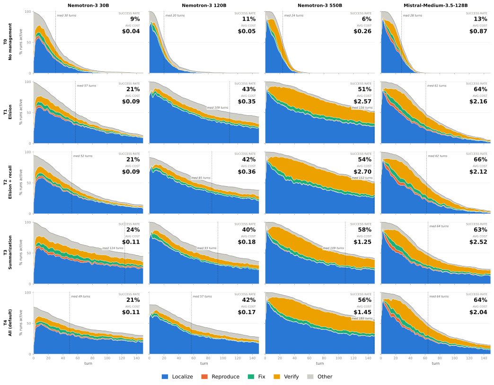

 Figure 32: SWE-Bench trajectory profiles across context-management strategies at 32k. 

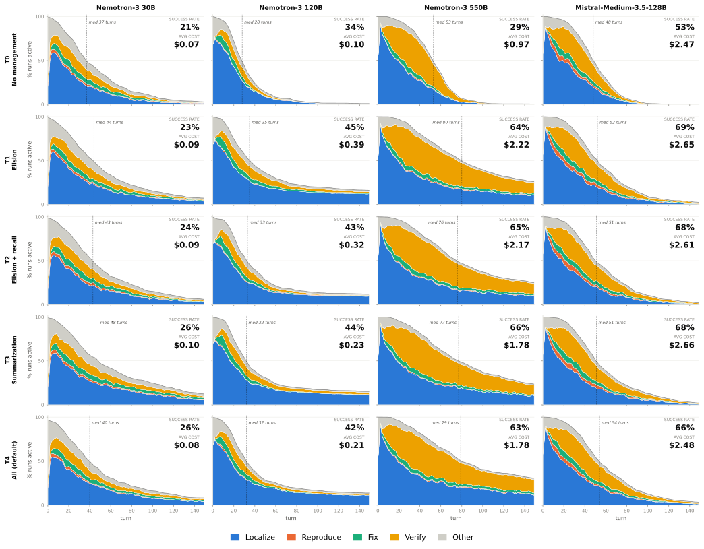

 Figure 33: SWE-Bench trajectory profiles across context-management strategies at 64k. 

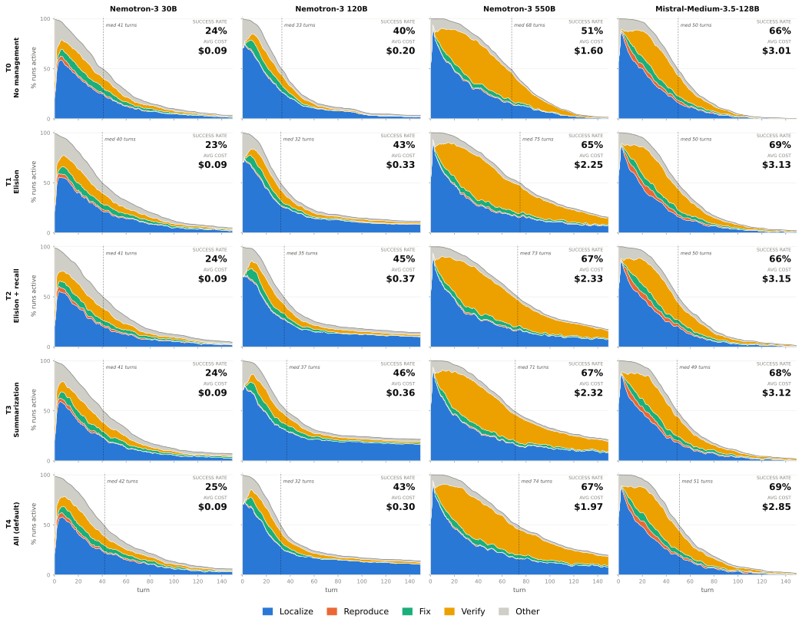

 Figure 34: SWE-Bench trajectory profiles across context-management strategies at 96k. 

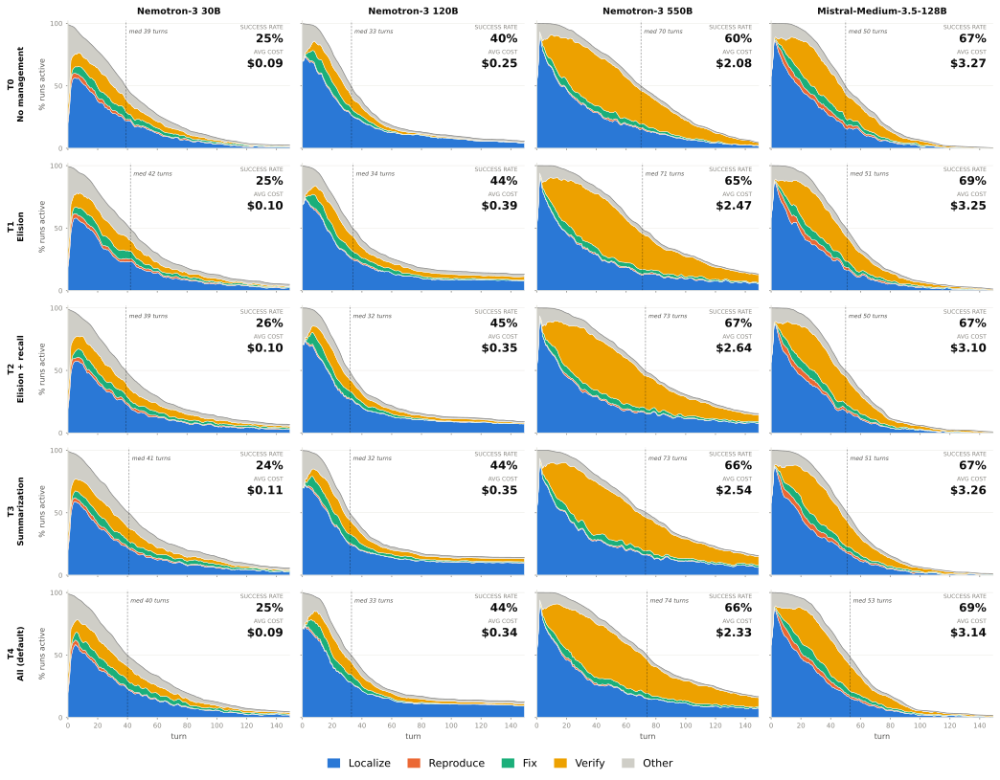

 Figure 35: SWE-Bench trajectory profiles across context-management strategies at 128k.

### 9.4 Terminal-Bench Trajectory Results

Figures [36](https://arxiv.org/html/2609.20804#S9.F36 "Figure 36 ‣ 9.4 Terminal-Bench Trajectory Results ‣ 9 Trajectory Analysis ‣ An Empirical Study of Harness Design for Coding Agents")–[39](https://arxiv.org/html/2609.20804#S9.F39 "Figure 39 ‣ 9.4 Terminal-Bench Trajectory Results ‣ 9 Trajectory Analysis ‣ An Empirical Study of Harness Design for Coding Agents") show the Terminal-Bench trajectory profiles, using the same layout as the SWE-Bench profiles. Columns correspond to models and rows correspond to T0–T4, with planning and the predefined tool set fixed. At turn \(t\), the total height reports the percentage of trajectories that remain active, while the colored bands partition active trajectories into Understand, Write Code, Verify, and Other behavior.

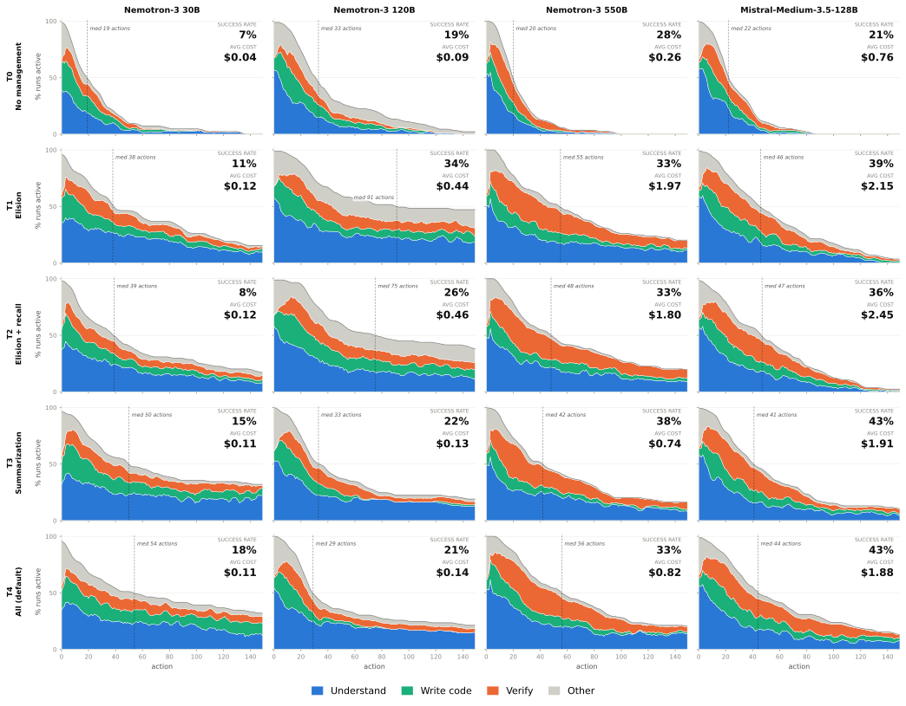

 Figure 36: Terminal-Bench trajectory profiles across context-management strategies at 32k. 

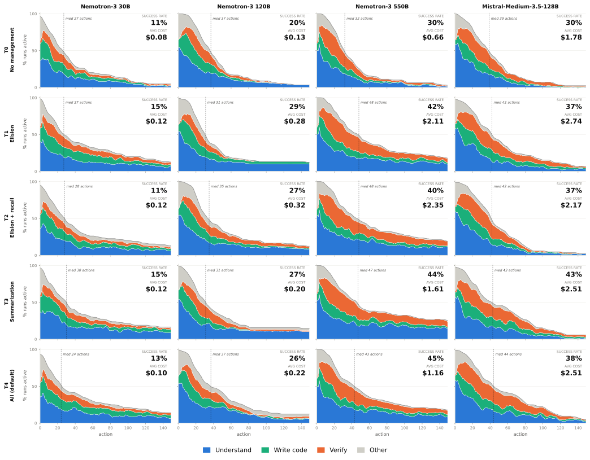

 Figure 37: Terminal-Bench trajectory profiles across context-management strategies at 64k. 

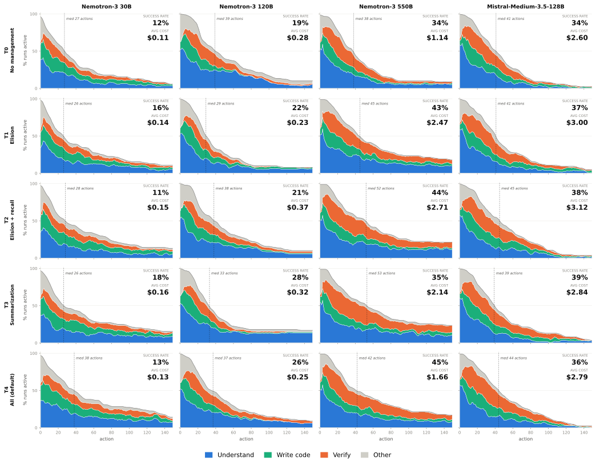

 Figure 38: Terminal-Bench trajectory profiles across context-management strategies at 96k. 

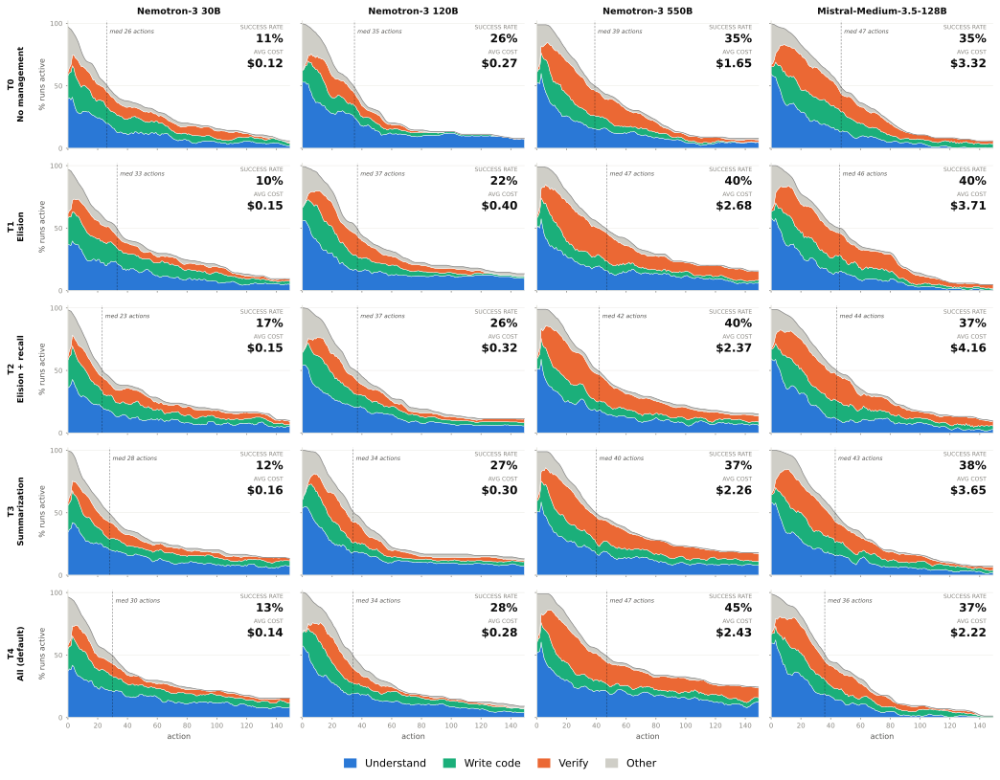

 Figure 39: Terminal-Bench trajectory profiles across context-management strategies at 128k.

### 9.5 Trajectory-Level Statistics at 128k

Tables [11](https://arxiv.org/html/2609.20804#S9.T11 "Table 11 ‣ Planning and the action space are the interventions that change the trajectory. ‣ 9.5 Trajectory-Level Statistics at 128k ‣ 9 Trajectory Analysis ‣ An Empirical Study of Harness Design for Coding Agents") and [12](https://arxiv.org/html/2609.20804#S9.T12 "Table 12 ‣ Planning and the action space are the interventions that change the trajectory. ‣ 9.5 Trajectory-Level Statistics at 128k ‣ 9 Trajectory Analysis ‣ An Empirical Study of Harness Design for Coding Agents") report the complete 128k statistics behind the trajectory-level summaries in the main text. Table [11](https://arxiv.org/html/2609.20804#S9.T11 "Table 11 ‣ Planning and the action space are the interventions that change the trajectory. ‣ 9.5 Trajectory-Level Statistics at 128k ‣ 9 Trajectory Analysis ‣ An Empirical Study of Harness Design for Coding Agents") extends Table [7](https://arxiv.org/html/2609.20804#S4.T7 "Table 7 ‣ Planning’s cost effect on Terminal-Bench depends on how it reshapes the trajectory-length distribution. ‣ 4 Analysis ‣ An Empirical Study of Harness Design for Coding Agents") with trajectory length, tool-call counts, and all five context-management tiers, while Table [12](https://arxiv.org/html/2609.20804#S9.T12 "Table 12 ‣ Planning and the action space are the interventions that change the trajectory. ‣ 9.5 Trajectory-Level Statistics at 128k ‣ 9 Trajectory Analysis ‣ An Empirical Study of Harness Design for Coding Agents") extends Table [6](https://arxiv.org/html/2609.20804#S4.T6 "Table 6 ‣ Context management extends execution trajectories without substantially altering agent behavior. ‣ 4 Analysis ‣ An Empirical Study of Harness Design for Coding Agents") with the remaining tiers, the bash-only ablation, and the corresponding Terminal-Bench columns. The termination stages are read directly off the behavior encodings: on SWE-Bench, a run is counted as terminating without an edit if it contains no Fix turn, and as stalled at localization if, in addition, all of its labeled turns are Localize or Other turns; on Terminal-Bench, the analogous columns use the Write-code phase (Create or Modify actions) and the Understand phase (Inspect or Search actions) of the action-level encoding.

##### Context-management tiers leave the trajectory shape almost unchanged at 128k.

Across T0–T4, the median trajectory length and the mean number of tool calls vary only within a narrow band for every model (Table [11](https://arxiv.org/html/2609.20804#S9.T11 "Table 11 ‣ Planning and the action space are the interventions that change the trajectory. ‣ 9.5 Trajectory-Level Statistics at 128k ‣ 9 Trajectory Analysis ‣ An Empirical Study of Harness Design for Coding Agents")): for Nemotron-3 30B the SWE-Bench median stays between 39 and 42 turns, and for Nemotron-3 550B between 70 and 74 turns, while re-patch counts vary by less than two per task and median edit sizes by a few lines. Termination behavior is similarly stable (Table [12](https://arxiv.org/html/2609.20804#S9.T12 "Table 12 ‣ Planning and the action space are the interventions that change the trajectory. ‣ 9.5 Trajectory-Level Statistics at 128k ‣ 9 Trajectory Analysis ‣ An Empirical Study of Harness Design for Coding Agents")): the fraction of SWE-Bench runs that terminate without an edit varies across tiers by less than four points for three of the four models and by about eight points for Nemotron-3 120B. This stability is why §[4](https://arxiv.org/html/2609.20804#S4 "4 Analysis ‣ An Empirical Study of Harness Design for Coding Agents") extends execution trajectories without substantially altering agent behavior at 128k; the tier-dependent differences appear only when the window binds, as in the 32k profiles (Figures [32](https://arxiv.org/html/2609.20804#S9.F32 "Figure 32 ‣ 9.3.2 Behavior Profiles ‣ 9.3 SWE-Bench Trajectory Results ‣ 9 Trajectory Analysis ‣ An Empirical Study of Harness Design for Coding Agents") and [36](https://arxiv.org/html/2609.20804#S9.F36 "Figure 36 ‣ 9.4 Terminal-Bench Trajectory Results ‣ 9 Trajectory Analysis ‣ An Empirical Study of Harness Design for Coding Agents")).

##### Planning and the action space are the interventions that change the trajectory.

Removing planning collapses the Nemotron-3 30B SWE-Bench trajectory to a median of 5 turns and pushes the without-edit termination rate from 27.8% to 68.6%, whereas for Nemotron-3 550B and Mistral-Medium-3.5-128B it lengthens the trajectory (from 74 to 108 and from 53 to 68 median turns) while leaving the without-edit rate below 3%; these are the two regimes discussed in §[4](https://arxiv.org/html/2609.20804#S4 "4 Analysis ‣ An Empirical Study of Harness Design for Coding Agents"). Bash-only reduces re-patching for all four models, but its effect on edit size is model-dependent: the median largest edit grows from 18 to 54 lines for Nemotron-3 550B, shrinks from 26 to 13 lines for Nemotron-3 30B, is essentially unchanged for Nemotron-3 120B, and decreases from 87 to 68 lines for Mistral-Medium-3.5-128B, whose edits are already large under the predefined tools. On Terminal-Bench, the create-or-replace share of file-writing actions rises under bash-only for every model, and the Nemotron-3 30B bash-only setting has the highest without-code termination rate of any configuration (22.5%), consistent with the out-of-interface tool emissions described in §[3.2](https://arxiv.org/html/2609.20804#S3.SS2 "3.2 Main Results ‣ 3 Experiment ‣ An Empirical Study of Harness Design for Coding Agents").

Table 11: Full action-granularity statistics at a 128k context-window budget, corresponding to Table [7](https://arxiv.org/html/2609.20804#S4.T7 "Table 7 ‣ Planning’s cost effect on Terminal-Bench depends on how it reshapes the trajectory-length distribution. ‣ 4 Analysis ‣ An Empirical Study of Harness Design for Coding Agents"). Rows include T0–T4 context-management tiers with planning and the full tool set, followed by T4 no-planning and bash-only ablations. _Re-patch_ counts edits to already-edited files, _edit lines_ is the median largest edit, and _create share_ is the fraction of Terminal-Bench file-writing actions that create or replace files.

<table id="S9.T11.8.1" class="ltx_tabular ltx_align_middle">
<tr id="S9.T11.8.1.1" class="ltx_tr">
<td id="S9.T11.8.1.1.1" class="ltx_td ltx_border_tt"></td>
<td id="S9.T11.8.1.1.2" class="ltx_td ltx_border_tt"></td>
<td id="S9.T11.8.1.1.3" class="ltx_td ltx_align_center ltx_border_tt" colspan="5">SWE-Bench Verified</td>
<td id="S9.T11.8.1.1.4" class="ltx_td ltx_align_center ltx_border_tt" colspan="3">Terminal-Bench</td></tr>
<tr id="S9.T11.8.1.2" class="ltx_tr">
<td id="S9.T11.8.1.2.1" class="ltx_td ltx_align_left">Model</td>
<td id="S9.T11.8.1.2.2" class="ltx_td ltx_align_left">Setting</td>
<td id="S9.T11.8.1.2.3" class="ltx_td ltx_align_right ltx_border_t">SR (%)</td>
<td id="S9.T11.8.1.2.4" class="ltx_td ltx_align_right ltx_border_t">Med. turns</td>
<td id="S9.T11.8.1.2.5" class="ltx_td ltx_align_right ltx_border_t">Calls</td>
<td id="S9.T11.8.1.2.6" class="ltx_td ltx_align_right ltx_border_t">Re-patch</td>
<td id="S9.T11.8.1.2.7" class="ltx_td ltx_align_right ltx_border_t">Edit lines</td>
<td id="S9.T11.8.1.2.8" class="ltx_td ltx_align_right ltx_border_t">SR (%)</td>
<td id="S9.T11.8.1.2.9" class="ltx_td ltx_align_right ltx_border_t">Med. turns</td>
<td id="S9.T11.8.1.2.10" class="ltx_td ltx_nopad_r ltx_align_right ltx_border_t">Create (%)</td></tr>
<tr id="S9.T11.8.1.3" class="ltx_tr">
<td id="S9.T11.8.1.3.1" class="ltx_td ltx_align_left ltx_border_t" rowspan="7">Nemotron-3 30B</td>
<td id="S9.T11.8.1.3.2" class="ltx_td ltx_align_left ltx_border_t">T0</td>
<td id="S9.T11.8.1.3.3" class="ltx_td ltx_align_right ltx_border_t">24.8</td>
<td id="S9.T11.8.1.3.4" class="ltx_td ltx_align_right ltx_border_t">39</td>
<td id="S9.T11.8.1.3.5" class="ltx_td ltx_align_right ltx_border_t">48.0</td>
<td id="S9.T11.8.1.3.6" class="ltx_td ltx_align_right ltx_border_t">2.0</td>
<td id="S9.T11.8.1.3.7" class="ltx_td ltx_align_right ltx_border_t">22</td>
<td id="S9.T11.8.1.3.8" class="ltx_td ltx_align_right ltx_border_t">11.2</td>
<td id="S9.T11.8.1.3.9" class="ltx_td ltx_align_right ltx_border_t">26</td>
<td id="S9.T11.8.1.3.10" class="ltx_td ltx_nopad_r ltx_align_right ltx_border_t">26.6</td></tr>
<tr id="S9.T11.8.1.4" class="ltx_tr">
<td id="S9.T11.8.1.4.1" class="ltx_td ltx_align_left">T1</td>
<td id="S9.T11.8.1.4.2" class="ltx_td ltx_align_right">25.0</td>
<td id="S9.T11.8.1.4.3" class="ltx_td ltx_align_right">42</td>
<td id="S9.T11.8.1.4.4" class="ltx_td ltx_align_right">54.5</td>
<td id="S9.T11.8.1.4.5" class="ltx_td ltx_align_right">2.7</td>
<td id="S9.T11.8.1.4.6" class="ltx_td ltx_align_right">28</td>
<td id="S9.T11.8.1.4.7" class="ltx_td ltx_align_right">10.1</td>
<td id="S9.T11.8.1.4.8" class="ltx_td ltx_align_right">34</td>
<td id="S9.T11.8.1.4.9" class="ltx_td ltx_nopad_r ltx_align_right">23.0</td></tr>
<tr id="S9.T11.8.1.5" class="ltx_tr">
<td id="S9.T11.8.1.5.1" class="ltx_td ltx_align_left">T2</td>
<td id="S9.T11.8.1.5.2" class="ltx_td ltx_align_right">26.0</td>
<td id="S9.T11.8.1.5.3" class="ltx_td ltx_align_right">39</td>
<td id="S9.T11.8.1.5.4" class="ltx_td ltx_align_right">54.4</td>
<td id="S9.T11.8.1.5.5" class="ltx_td ltx_align_right">2.9</td>
<td id="S9.T11.8.1.5.6" class="ltx_td ltx_align_right">27</td>
<td id="S9.T11.8.1.5.7" class="ltx_td ltx_align_right">16.9</td>
<td id="S9.T11.8.1.5.8" class="ltx_td ltx_align_right">23</td>
<td id="S9.T11.8.1.5.9" class="ltx_td ltx_nopad_r ltx_align_right">27.8</td></tr>
<tr id="S9.T11.8.1.6" class="ltx_tr">
<td id="S9.T11.8.1.6.1" class="ltx_td ltx_align_left">T3</td>
<td id="S9.T11.8.1.6.2" class="ltx_td ltx_align_right">23.6</td>
<td id="S9.T11.8.1.6.3" class="ltx_td ltx_align_right">41</td>
<td id="S9.T11.8.1.6.4" class="ltx_td ltx_align_right">56.0</td>
<td id="S9.T11.8.1.6.5" class="ltx_td ltx_align_right">3.3</td>
<td id="S9.T11.8.1.6.6" class="ltx_td ltx_align_right">24</td>
<td id="S9.T11.8.1.6.7" class="ltx_td ltx_align_right">12.4</td>
<td id="S9.T11.8.1.6.8" class="ltx_td ltx_align_right">28</td>
<td id="S9.T11.8.1.6.9" class="ltx_td ltx_nopad_r ltx_align_right">34.3</td></tr>
<tr id="S9.T11.8.1.7" class="ltx_tr">
<td id="S9.T11.8.1.7.1" class="ltx_td ltx_align_left">T4</td>
<td id="S9.T11.8.1.7.2" class="ltx_td ltx_align_right">25.2</td>
<td id="S9.T11.8.1.7.3" class="ltx_td ltx_align_right">40</td>
<td id="S9.T11.8.1.7.4" class="ltx_td ltx_align_right">54.6</td>
<td id="S9.T11.8.1.7.5" class="ltx_td ltx_align_right">3.3</td>
<td id="S9.T11.8.1.7.6" class="ltx_td ltx_align_right">26</td>
<td id="S9.T11.8.1.7.7" class="ltx_td ltx_align_right">13.5</td>
<td id="S9.T11.8.1.7.8" class="ltx_td ltx_align_right">30</td>
<td id="S9.T11.8.1.7.9" class="ltx_td ltx_nopad_r ltx_align_right">27.5</td></tr>
<tr id="S9.T11.8.1.8" class="ltx_tr">
<td id="S9.T11.8.1.8.1" class="ltx_td ltx_align_left ltx_border_t">T4 w/o plan</td>
<td id="S9.T11.8.1.8.2" class="ltx_td ltx_align_right ltx_border_t">13.6</td>
<td id="S9.T11.8.1.8.3" class="ltx_td ltx_align_right ltx_border_t">5</td>
<td id="S9.T11.8.1.8.4" class="ltx_td ltx_align_right ltx_border_t">9.8</td>
<td id="S9.T11.8.1.8.5" class="ltx_td ltx_align_right ltx_border_t">0.7</td>
<td id="S9.T11.8.1.8.6" class="ltx_td ltx_align_right ltx_border_t">7</td>
<td id="S9.T11.8.1.8.7" class="ltx_td ltx_align_right ltx_border_t">9.0</td>
<td id="S9.T11.8.1.8.8" class="ltx_td ltx_align_right ltx_border_t">20</td>
<td id="S9.T11.8.1.8.9" class="ltx_td ltx_nopad_r ltx_align_right ltx_border_t">24.0</td></tr>
<tr id="S9.T11.8.1.9" class="ltx_tr">
<td id="S9.T11.8.1.9.1" class="ltx_td ltx_align_left">T4 bash only</td>
<td id="S9.T11.8.1.9.2" class="ltx_td ltx_align_right">10.2</td>
<td id="S9.T11.8.1.9.3" class="ltx_td ltx_align_right">10</td>
<td id="S9.T11.8.1.9.4" class="ltx_td ltx_align_right">22.3</td>
<td id="S9.T11.8.1.9.5" class="ltx_td ltx_align_right">0.4</td>
<td id="S9.T11.8.1.9.6" class="ltx_td ltx_align_right">13</td>
<td id="S9.T11.8.1.9.7" class="ltx_td ltx_align_right">3.4</td>
<td id="S9.T11.8.1.9.8" class="ltx_td ltx_align_right">10</td>
<td id="S9.T11.8.1.9.9" class="ltx_td ltx_nopad_r ltx_align_right">64.4</td></tr>
<tr id="S9.T11.8.1.10" class="ltx_tr">
<td id="S9.T11.8.1.10.1" class="ltx_td ltx_align_left ltx_border_t" rowspan="7">Nemotron-3 120B</td>
<td id="S9.T11.8.1.10.2" class="ltx_td ltx_align_left ltx_border_t">T0</td>
<td id="S9.T11.8.1.10.3" class="ltx_td ltx_align_right ltx_border_t">40.2</td>
<td id="S9.T11.8.1.10.4" class="ltx_td ltx_align_right ltx_border_t">33</td>
<td id="S9.T11.8.1.10.5" class="ltx_td ltx_align_right ltx_border_t">48.9</td>
<td id="S9.T11.8.1.10.6" class="ltx_td ltx_align_right ltx_border_t">2.5</td>
<td id="S9.T11.8.1.10.7" class="ltx_td ltx_align_right ltx_border_t">21</td>
<td id="S9.T11.8.1.10.8" class="ltx_td ltx_align_right ltx_border_t">25.8</td>
<td id="S9.T11.8.1.10.9" class="ltx_td ltx_align_right ltx_border_t">35</td>
<td id="S9.T11.8.1.10.10" class="ltx_td ltx_nopad_r ltx_align_right ltx_border_t">57.2</td></tr>
<tr id="S9.T11.8.1.11" class="ltx_tr">
<td id="S9.T11.8.1.11.1" class="ltx_td ltx_align_left">T1</td>
<td id="S9.T11.8.1.11.2" class="ltx_td ltx_align_right">44.4</td>
<td id="S9.T11.8.1.11.3" class="ltx_td ltx_align_right">34</td>
<td id="S9.T11.8.1.11.4" class="ltx_td ltx_align_right">69.5</td>
<td id="S9.T11.8.1.11.5" class="ltx_td ltx_align_right">4.2</td>
<td id="S9.T11.8.1.11.6" class="ltx_td ltx_align_right">19</td>
<td id="S9.T11.8.1.11.7" class="ltx_td ltx_align_right">22.5</td>
<td id="S9.T11.8.1.11.8" class="ltx_td ltx_align_right">37</td>
<td id="S9.T11.8.1.11.9" class="ltx_td ltx_nopad_r ltx_align_right">55.5</td></tr>
<tr id="S9.T11.8.1.12" class="ltx_tr">
<td id="S9.T11.8.1.12.1" class="ltx_td ltx_align_left">T2</td>
<td id="S9.T11.8.1.12.2" class="ltx_td ltx_align_right">45.2</td>
<td id="S9.T11.8.1.12.3" class="ltx_td ltx_align_right">32</td>
<td id="S9.T11.8.1.12.4" class="ltx_td ltx_align_right">57.6</td>
<td id="S9.T11.8.1.12.5" class="ltx_td ltx_align_right">2.8</td>
<td id="S9.T11.8.1.12.6" class="ltx_td ltx_align_right">19</td>
<td id="S9.T11.8.1.12.7" class="ltx_td ltx_align_right">25.8</td>
<td id="S9.T11.8.1.12.8" class="ltx_td ltx_align_right">37</td>
<td id="S9.T11.8.1.12.9" class="ltx_td ltx_nopad_r ltx_align_right">64.2</td></tr>
<tr id="S9.T11.8.1.13" class="ltx_tr">
<td id="S9.T11.8.1.13.1" class="ltx_td ltx_align_left">T3</td>
<td id="S9.T11.8.1.13.2" class="ltx_td ltx_align_right">44.0</td>
<td id="S9.T11.8.1.13.3" class="ltx_td ltx_align_right">32</td>
<td id="S9.T11.8.1.13.4" class="ltx_td ltx_align_right">70.3</td>
<td id="S9.T11.8.1.13.5" class="ltx_td ltx_align_right">4.4</td>
<td id="S9.T11.8.1.13.6" class="ltx_td ltx_align_right">21</td>
<td id="S9.T11.8.1.13.7" class="ltx_td ltx_align_right">27.0</td>
<td id="S9.T11.8.1.13.8" class="ltx_td ltx_align_right">34</td>
<td id="S9.T11.8.1.13.9" class="ltx_td ltx_nopad_r ltx_align_right">36.4</td></tr>
<tr id="S9.T11.8.1.14" class="ltx_tr">
<td id="S9.T11.8.1.14.1" class="ltx_td ltx_align_left">T4</td>
<td id="S9.T11.8.1.14.2" class="ltx_td ltx_align_right">44.0</td>
<td id="S9.T11.8.1.14.3" class="ltx_td ltx_align_right">33</td>
<td id="S9.T11.8.1.14.4" class="ltx_td ltx_align_right">65.8</td>
<td id="S9.T11.8.1.14.5" class="ltx_td ltx_align_right">2.8</td>
<td id="S9.T11.8.1.14.6" class="ltx_td ltx_align_right">22</td>
<td id="S9.T11.8.1.14.7" class="ltx_td ltx_align_right">28.1</td>
<td id="S9.T11.8.1.14.8" class="ltx_td ltx_align_right">34</td>
<td id="S9.T11.8.1.14.9" class="ltx_td ltx_nopad_r ltx_align_right">39.1</td></tr>
<tr id="S9.T11.8.1.15" class="ltx_tr">
<td id="S9.T11.8.1.15.1" class="ltx_td ltx_align_left ltx_border_t">T4 w/o plan</td>
<td id="S9.T11.8.1.15.2" class="ltx_td ltx_align_right ltx_border_t">46.6</td>
<td id="S9.T11.8.1.15.3" class="ltx_td ltx_align_right ltx_border_t">27</td>
<td id="S9.T11.8.1.15.4" class="ltx_td ltx_align_right ltx_border_t">46.0</td>
<td id="S9.T11.8.1.15.5" class="ltx_td ltx_align_right ltx_border_t">3.5</td>
<td id="S9.T11.8.1.15.6" class="ltx_td ltx_align_right ltx_border_t">16</td>
<td id="S9.T11.8.1.15.7" class="ltx_td ltx_align_right ltx_border_t">28.1</td>
<td id="S9.T11.8.1.15.8" class="ltx_td ltx_align_right ltx_border_t">30</td>
<td id="S9.T11.8.1.15.9" class="ltx_td ltx_nopad_r ltx_align_right ltx_border_t">44.7</td></tr>
<tr id="S9.T11.8.1.16" class="ltx_tr">
<td id="S9.T11.8.1.16.1" class="ltx_td ltx_align_left">T4 bash only</td>
<td id="S9.T11.8.1.16.2" class="ltx_td ltx_align_right">42.4</td>
<td id="S9.T11.8.1.16.3" class="ltx_td ltx_align_right">41</td>
<td id="S9.T11.8.1.16.4" class="ltx_td ltx_align_right">84.6</td>
<td id="S9.T11.8.1.16.5" class="ltx_td ltx_align_right">2.2</td>
<td id="S9.T11.8.1.16.6" class="ltx_td ltx_align_right">24</td>
<td id="S9.T11.8.1.16.7" class="ltx_td ltx_align_right">23.6</td>
<td id="S9.T11.8.1.16.8" class="ltx_td ltx_align_right">40</td>
<td id="S9.T11.8.1.16.9" class="ltx_td ltx_nopad_r ltx_align_right">75.9</td></tr>
<tr id="S9.T11.8.1.17" class="ltx_tr">
<td id="S9.T11.8.1.17.1" class="ltx_td ltx_align_left ltx_border_t" rowspan="7">Nemotron-3 550B</td>
<td id="S9.T11.8.1.17.2" class="ltx_td ltx_align_left ltx_border_t">T0</td>
<td id="S9.T11.8.1.17.3" class="ltx_td ltx_align_right ltx_border_t">59.8</td>
<td id="S9.T11.8.1.17.4" class="ltx_td ltx_align_right ltx_border_t">70</td>
<td id="S9.T11.8.1.17.5" class="ltx_td ltx_align_right ltx_border_t">77.0</td>
<td id="S9.T11.8.1.17.6" class="ltx_td ltx_align_right ltx_border_t">3.1</td>
<td id="S9.T11.8.1.17.7" class="ltx_td ltx_align_right ltx_border_t">18</td>
<td id="S9.T11.8.1.17.8" class="ltx_td ltx_align_right ltx_border_t">34.8</td>
<td id="S9.T11.8.1.17.9" class="ltx_td ltx_align_right ltx_border_t">39</td>
<td id="S9.T11.8.1.17.10" class="ltx_td ltx_nopad_r ltx_align_right ltx_border_t">53.8</td></tr>
<tr id="S9.T11.8.1.18" class="ltx_tr">
<td id="S9.T11.8.1.18.1" class="ltx_td ltx_align_left">T1</td>
<td id="S9.T11.8.1.18.2" class="ltx_td ltx_align_right">65.2</td>
<td id="S9.T11.8.1.18.3" class="ltx_td ltx_align_right">71</td>
<td id="S9.T11.8.1.18.4" class="ltx_td ltx_align_right">91.7</td>
<td id="S9.T11.8.1.18.5" class="ltx_td ltx_align_right">3.9</td>
<td id="S9.T11.8.1.18.6" class="ltx_td ltx_align_right">19</td>
<td id="S9.T11.8.1.18.7" class="ltx_td ltx_align_right">40.4</td>
<td id="S9.T11.8.1.18.8" class="ltx_td ltx_align_right">47</td>
<td id="S9.T11.8.1.18.9" class="ltx_td ltx_nopad_r ltx_align_right">31.5</td></tr>
<tr id="S9.T11.8.1.19" class="ltx_tr">
<td id="S9.T11.8.1.19.1" class="ltx_td ltx_align_left">T2</td>
<td id="S9.T11.8.1.19.2" class="ltx_td ltx_align_right">67.4</td>
<td id="S9.T11.8.1.19.3" class="ltx_td ltx_align_right">73</td>
<td id="S9.T11.8.1.19.4" class="ltx_td ltx_align_right">96.4</td>
<td id="S9.T11.8.1.19.5" class="ltx_td ltx_align_right">4.4</td>
<td id="S9.T11.8.1.19.6" class="ltx_td ltx_align_right">19</td>
<td id="S9.T11.8.1.19.7" class="ltx_td ltx_align_right">40.4</td>
<td id="S9.T11.8.1.19.8" class="ltx_td ltx_align_right">42</td>
<td id="S9.T11.8.1.19.9" class="ltx_td ltx_nopad_r ltx_align_right">58.2</td></tr>
<tr id="S9.T11.8.1.20" class="ltx_tr">
<td id="S9.T11.8.1.20.1" class="ltx_td ltx_align_left">T3</td>
<td id="S9.T11.8.1.20.2" class="ltx_td ltx_align_right">65.8</td>
<td id="S9.T11.8.1.20.3" class="ltx_td ltx_align_right">74</td>
<td id="S9.T11.8.1.20.4" class="ltx_td ltx_align_right">95.8</td>
<td id="S9.T11.8.1.20.5" class="ltx_td ltx_align_right">4.2</td>
<td id="S9.T11.8.1.20.6" class="ltx_td ltx_align_right">18</td>
<td id="S9.T11.8.1.20.7" class="ltx_td ltx_align_right">37.1</td>
<td id="S9.T11.8.1.20.8" class="ltx_td ltx_align_right">40</td>
<td id="S9.T11.8.1.20.9" class="ltx_td ltx_nopad_r ltx_align_right">58.6</td></tr>
<tr id="S9.T11.8.1.21" class="ltx_tr">
<td id="S9.T11.8.1.21.1" class="ltx_td ltx_align_left">T4</td>
<td id="S9.T11.8.1.21.2" class="ltx_td ltx_align_right">65.8</td>
<td id="S9.T11.8.1.21.3" class="ltx_td ltx_align_right">74</td>
<td id="S9.T11.8.1.21.4" class="ltx_td ltx_align_right">98.4</td>
<td id="S9.T11.8.1.21.5" class="ltx_td ltx_align_right">4.6</td>
<td id="S9.T11.8.1.21.6" class="ltx_td ltx_align_right">18</td>
<td id="S9.T11.8.1.21.7" class="ltx_td ltx_align_right">44.9</td>
<td id="S9.T11.8.1.21.8" class="ltx_td ltx_align_right">47</td>
<td id="S9.T11.8.1.21.9" class="ltx_td ltx_nopad_r ltx_align_right">50.9</td></tr>
<tr id="S9.T11.8.1.22" class="ltx_tr">
<td id="S9.T11.8.1.22.1" class="ltx_td ltx_align_left ltx_border_t">T4 w/o plan</td>
<td id="S9.T11.8.1.22.2" class="ltx_td ltx_align_right ltx_border_t">67.8</td>
<td id="S9.T11.8.1.22.3" class="ltx_td ltx_align_right ltx_border_t">108</td>
<td id="S9.T11.8.1.22.4" class="ltx_td ltx_align_right ltx_border_t">130.3</td>
<td id="S9.T11.8.1.22.5" class="ltx_td ltx_align_right ltx_border_t">4.6</td>
<td id="S9.T11.8.1.22.6" class="ltx_td ltx_align_right ltx_border_t">19</td>
<td id="S9.T11.8.1.22.7" class="ltx_td ltx_align_right ltx_border_t">46.1</td>
<td id="S9.T11.8.1.22.8" class="ltx_td ltx_align_right ltx_border_t">38</td>
<td id="S9.T11.8.1.22.9" class="ltx_td ltx_nopad_r ltx_align_right ltx_border_t">45.3</td></tr>
<tr id="S9.T11.8.1.23" class="ltx_tr">
<td id="S9.T11.8.1.23.1" class="ltx_td ltx_align_left">T4 bash only</td>
<td id="S9.T11.8.1.23.2" class="ltx_td ltx_align_right">69.4</td>
<td id="S9.T11.8.1.23.3" class="ltx_td ltx_align_right">55</td>
<td id="S9.T11.8.1.23.4" class="ltx_td ltx_align_right">67.1</td>
<td id="S9.T11.8.1.23.5" class="ltx_td ltx_align_right">1.5</td>
<td id="S9.T11.8.1.23.6" class="ltx_td ltx_align_right">54</td>
<td id="S9.T11.8.1.23.7" class="ltx_td ltx_align_right">50.6</td>
<td id="S9.T11.8.1.23.8" class="ltx_td ltx_align_right">31</td>
<td id="S9.T11.8.1.23.9" class="ltx_td ltx_nopad_r ltx_align_right">76.1</td></tr>
<tr id="S9.T11.8.1.24" class="ltx_tr">
<td id="S9.T11.8.1.24.1" class="ltx_td ltx_align_left ltx_border_bb ltx_border_t" rowspan="7">Mistral-Medium-3.5-128B</td>
<td id="S9.T11.8.1.24.2" class="ltx_td ltx_align_left ltx_border_t">T0</td>
<td id="S9.T11.8.1.24.3" class="ltx_td ltx_align_right ltx_border_t">67.4</td>
<td id="S9.T11.8.1.24.4" class="ltx_td ltx_align_right ltx_border_t">50</td>
<td id="S9.T11.8.1.24.5" class="ltx_td ltx_align_right ltx_border_t">56.6</td>
<td id="S9.T11.8.1.24.6" class="ltx_td ltx_align_right ltx_border_t">2.8</td>
<td id="S9.T11.8.1.24.7" class="ltx_td ltx_align_right ltx_border_t">86</td>
<td id="S9.T11.8.1.24.8" class="ltx_td ltx_align_right ltx_border_t">34.8</td>
<td id="S9.T11.8.1.24.9" class="ltx_td ltx_align_right ltx_border_t">47</td>
<td id="S9.T11.8.1.24.10" class="ltx_td ltx_nopad_r ltx_align_right ltx_border_t">34.7</td></tr>
<tr id="S9.T11.8.1.25" class="ltx_tr">
<td id="S9.T11.8.1.25.1" class="ltx_td ltx_align_left">T1</td>
<td id="S9.T11.8.1.25.2" class="ltx_td ltx_align_right">68.6</td>
<td id="S9.T11.8.1.25.3" class="ltx_td ltx_align_right">51</td>
<td id="S9.T11.8.1.25.4" class="ltx_td ltx_align_right">56.6</td>
<td id="S9.T11.8.1.25.5" class="ltx_td ltx_align_right">2.8</td>
<td id="S9.T11.8.1.25.6" class="ltx_td ltx_align_right">86</td>
<td id="S9.T11.8.1.25.7" class="ltx_td ltx_align_right">40.5</td>
<td id="S9.T11.8.1.25.8" class="ltx_td ltx_align_right">46</td>
<td id="S9.T11.8.1.25.9" class="ltx_td ltx_nopad_r ltx_align_right">37.1</td></tr>
<tr id="S9.T11.8.1.26" class="ltx_tr">
<td id="S9.T11.8.1.26.1" class="ltx_td ltx_align_left">T2</td>
<td id="S9.T11.8.1.26.2" class="ltx_td ltx_align_right">67.0</td>
<td id="S9.T11.8.1.26.3" class="ltx_td ltx_align_right">50</td>
<td id="S9.T11.8.1.26.4" class="ltx_td ltx_align_right">55.6</td>
<td id="S9.T11.8.1.26.5" class="ltx_td ltx_align_right">2.7</td>
<td id="S9.T11.8.1.26.6" class="ltx_td ltx_align_right">87</td>
<td id="S9.T11.8.1.26.7" class="ltx_td ltx_align_right">37.1</td>
<td id="S9.T11.8.1.26.8" class="ltx_td ltx_align_right">44</td>
<td id="S9.T11.8.1.26.9" class="ltx_td ltx_nopad_r ltx_align_right">31.7</td></tr>
<tr id="S9.T11.8.1.27" class="ltx_tr">
<td id="S9.T11.8.1.27.1" class="ltx_td ltx_align_left">T3</td>
<td id="S9.T11.8.1.27.2" class="ltx_td ltx_align_right">66.6</td>
<td id="S9.T11.8.1.27.3" class="ltx_td ltx_align_right">51</td>
<td id="S9.T11.8.1.27.4" class="ltx_td ltx_align_right">57.1</td>
<td id="S9.T11.8.1.27.5" class="ltx_td ltx_align_right">2.8</td>
<td id="S9.T11.8.1.27.6" class="ltx_td ltx_align_right">88</td>
<td id="S9.T11.8.1.27.7" class="ltx_td ltx_align_right">38.2</td>
<td id="S9.T11.8.1.27.8" class="ltx_td ltx_align_right">44</td>
<td id="S9.T11.8.1.27.9" class="ltx_td ltx_nopad_r ltx_align_right">22.2</td></tr>
<tr id="S9.T11.8.1.28" class="ltx_tr">
<td id="S9.T11.8.1.28.1" class="ltx_td ltx_align_left">T4</td>
<td id="S9.T11.8.1.28.2" class="ltx_td ltx_align_right">68.6</td>
<td id="S9.T11.8.1.28.3" class="ltx_td ltx_align_right">53</td>
<td id="S9.T11.8.1.28.4" class="ltx_td ltx_align_right">57.8</td>
<td id="S9.T11.8.1.28.5" class="ltx_td ltx_align_right">3.0</td>
<td id="S9.T11.8.1.28.6" class="ltx_td ltx_align_right">87</td>
<td id="S9.T11.8.1.28.7" class="ltx_td ltx_align_right">37.1</td>
<td id="S9.T11.8.1.28.8" class="ltx_td ltx_align_right">36</td>
<td id="S9.T11.8.1.28.9" class="ltx_td ltx_nopad_r ltx_align_right">27.9</td></tr>
<tr id="S9.T11.8.1.29" class="ltx_tr">
<td id="S9.T11.8.1.29.1" class="ltx_td ltx_align_left ltx_border_t">T4 w/o plan</td>
<td id="S9.T11.8.1.29.2" class="ltx_td ltx_align_right ltx_border_t">69.0</td>
<td id="S9.T11.8.1.29.3" class="ltx_td ltx_align_right ltx_border_t">68</td>
<td id="S9.T11.8.1.29.4" class="ltx_td ltx_align_right ltx_border_t">75.3</td>
<td id="S9.T11.8.1.29.5" class="ltx_td ltx_align_right ltx_border_t">3.3</td>
<td id="S9.T11.8.1.29.6" class="ltx_td ltx_align_right ltx_border_t">94</td>
<td id="S9.T11.8.1.29.7" class="ltx_td ltx_align_right ltx_border_t">39.3</td>
<td id="S9.T11.8.1.29.8" class="ltx_td ltx_align_right ltx_border_t">48</td>
<td id="S9.T11.8.1.29.9" class="ltx_td ltx_nopad_r ltx_align_right ltx_border_t">37.3</td></tr>
<tr id="S9.T11.8.1.30" class="ltx_tr">
<td id="S9.T11.8.1.30.1" class="ltx_td ltx_align_left ltx_border_bb">T4 bash only</td>
<td id="S9.T11.8.1.30.2" class="ltx_td ltx_align_right ltx_border_bb">45.4</td>
<td id="S9.T11.8.1.30.3" class="ltx_td ltx_align_right ltx_border_bb">47</td>
<td id="S9.T11.8.1.30.4" class="ltx_td ltx_align_right ltx_border_bb">50.2</td>
<td id="S9.T11.8.1.30.5" class="ltx_td ltx_align_right ltx_border_bb">1.3</td>
<td id="S9.T11.8.1.30.6" class="ltx_td ltx_align_right ltx_border_bb">68</td>
<td id="S9.T11.8.1.30.7" class="ltx_td ltx_align_right ltx_border_bb">43.8</td>
<td id="S9.T11.8.1.30.8" class="ltx_td ltx_align_right ltx_border_bb">43</td>
<td id="S9.T11.8.1.30.9" class="ltx_td ltx_nopad_r ltx_align_right ltx_border_bb">57.0</td></tr>
</table>

 

Table 12: Full termination-stage statistics at a 128k context-window budget, corresponding to Table [6](https://arxiv.org/html/2609.20804#S4.T6 "Table 6 ‣ Context management extends execution trajectories without substantially altering agent behavior. ‣ 4 Analysis ‣ An Empirical Study of Harness Design for Coding Agents"). The termination columns are derived from the behavior encodings in Tables [8](https://arxiv.org/html/2609.20804#S9.T8 "Table 8 ‣ 9.1.2 SWE-Bench Behavior Encoding ‣ 9.1 Annotation Schemes ‣ 9 Trajectory Analysis ‣ An Empirical Study of Harness Design for Coding Agents") and [9](https://arxiv.org/html/2609.20804#S9.T9 "Table 9 ‣ 9.1.3 Terminal-Bench Action-Level Encoding ‣ 9.1 Annotation Schemes ‣ 9 Trajectory Analysis ‣ An Empirical Study of Harness Design for Coding Agents"): _W/o edit_ (_W/o code_) is the fraction of runs that terminate without any Fix turn (without any Create or Modify action), _At loc._ (_At underst._) is the subset of those runs that never progress beyond the Localize phase (the Understand phase, i.e., Inspect and Search actions), apart from Other-phase bookkeeping, and _Edited_ (_Wrote_) is the fraction of runs that did edit source (write code) but remained unresolved.

<table id="S9.T12.11.1" class="ltx_tabular ltx_align_middle">
<tr id="S9.T12.11.1.1" class="ltx_tr">
<td id="S9.T12.11.1.1.1" class="ltx_td ltx_border_tt"></td>
<td id="S9.T12.11.1.1.2" class="ltx_td ltx_border_tt"></td>
<td id="S9.T12.11.1.1.3" class="ltx_td ltx_align_center ltx_border_tt" colspan="4">SWE-Bench Verified</td>
<td id="S9.T12.11.1.1.4" class="ltx_td ltx_align_center ltx_border_tt" colspan="4">Terminal-Bench</td></tr>
<tr id="S9.T12.11.1.2" class="ltx_tr">
<td id="S9.T12.11.1.2.1" class="ltx_td"></td>
<td id="S9.T12.11.1.2.2" class="ltx_td"></td>
<td id="S9.T12.11.1.2.3" class="ltx_td ltx_align_center ltx_border_t" colspan="2">Terminated (%)</td>
<td id="S9.T12.11.1.2.4" class="ltx_td ltx_border_t"></td>
<td id="S9.T12.11.1.2.5" class="ltx_td ltx_border_t"></td>
<td id="S9.T12.11.1.2.6" class="ltx_td ltx_align_center ltx_border_t" colspan="2">Terminated (%)</td>
<td id="S9.T12.11.1.2.7" class="ltx_td ltx_border_t"></td>
<td id="S9.T12.11.1.2.8" class="ltx_td ltx_nopad_r ltx_border_t"></td></tr>
<tr id="S9.T12.11.1.3" class="ltx_tr">
<td id="S9.T12.11.1.3.1" class="ltx_td ltx_align_left">Model</td>
<td id="S9.T12.11.1.3.2" class="ltx_td ltx_align_left">Setting</td>
<td id="S9.T12.11.1.3.3" class="ltx_td ltx_align_right ltx_border_t">W/o edit</td>
<td id="S9.T12.11.1.3.4" class="ltx_td ltx_align_right ltx_border_t">At loc.</td>
<td id="S9.T12.11.1.3.5" class="ltx_td ltx_align_right">Edited</td>
<td id="S9.T12.11.1.3.6" class="ltx_td ltx_align_right">SR (%)</td>
<td id="S9.T12.11.1.3.7" class="ltx_td ltx_align_right ltx_border_t">W/o code</td>
<td id="S9.T12.11.1.3.8" class="ltx_td ltx_align_right ltx_border_t">At underst.</td>
<td id="S9.T12.11.1.3.9" class="ltx_td ltx_align_right">Wrote</td>
<td id="S9.T12.11.1.3.10" class="ltx_td ltx_nopad_r ltx_align_right">SR (%)</td></tr>
<tr id="S9.T12.11.1.4" class="ltx_tr">
<td id="S9.T12.11.1.4.1" class="ltx_td ltx_align_left ltx_border_t" rowspan="7">Nemotron-3 30B</td>
<td id="S9.T12.11.1.4.2" class="ltx_td ltx_align_left ltx_border_t">T0</td>
<td id="S9.T12.11.1.4.3" class="ltx_td ltx_align_right ltx_border_t">26.4</td>
<td id="S9.T12.11.1.4.4" class="ltx_td ltx_align_right ltx_border_t">9.6</td>
<td id="S9.T12.11.1.4.5" class="ltx_td ltx_align_right ltx_border_t">48.8</td>
<td id="S9.T12.11.1.4.6" class="ltx_td ltx_align_right ltx_border_t">24.8</td>
<td id="S9.T12.11.1.4.7" class="ltx_td ltx_align_right ltx_border_t">7.1</td>
<td id="S9.T12.11.1.4.8" class="ltx_td ltx_align_right ltx_border_t">7.1</td>
<td id="S9.T12.11.1.4.9" class="ltx_td ltx_align_right ltx_border_t">81.0</td>
<td id="S9.T12.11.1.4.10" class="ltx_td ltx_nopad_r ltx_align_right ltx_border_t">11.2</td></tr>
<tr id="S9.T12.11.1.5" class="ltx_tr">
<td id="S9.T12.11.1.5.1" class="ltx_td ltx_align_left">T1</td>
<td id="S9.T12.11.1.5.2" class="ltx_td ltx_align_right">24.6</td>
<td id="S9.T12.11.1.5.3" class="ltx_td ltx_align_right">7.0</td>
<td id="S9.T12.11.1.5.4" class="ltx_td ltx_align_right">51.0</td>
<td id="S9.T12.11.1.5.5" class="ltx_td ltx_align_right">25.0</td>
<td id="S9.T12.11.1.5.6" class="ltx_td ltx_align_right">11.9</td>
<td id="S9.T12.11.1.5.7" class="ltx_td ltx_align_right">7.1</td>
<td id="S9.T12.11.1.5.8" class="ltx_td ltx_align_right">77.4</td>
<td id="S9.T12.11.1.5.9" class="ltx_td ltx_nopad_r ltx_align_right">10.1</td></tr>
<tr id="S9.T12.11.1.6" class="ltx_tr">
<td id="S9.T12.11.1.6.1" class="ltx_td ltx_align_left">T2</td>
<td id="S9.T12.11.1.6.2" class="ltx_td ltx_align_right">27.6</td>
<td id="S9.T12.11.1.6.3" class="ltx_td ltx_align_right">10.4</td>
<td id="S9.T12.11.1.6.4" class="ltx_td ltx_align_right">46.0</td>
<td id="S9.T12.11.1.6.5" class="ltx_td ltx_align_right">26.0</td>
<td id="S9.T12.11.1.6.6" class="ltx_td ltx_align_right">3.6</td>
<td id="S9.T12.11.1.6.7" class="ltx_td ltx_align_right">3.6</td>
<td id="S9.T12.11.1.6.8" class="ltx_td ltx_align_right">79.8</td>
<td id="S9.T12.11.1.6.9" class="ltx_td ltx_nopad_r ltx_align_right">16.9</td></tr>
<tr id="S9.T12.11.1.7" class="ltx_tr">
<td id="S9.T12.11.1.7.1" class="ltx_td ltx_align_left">T3</td>
<td id="S9.T12.11.1.7.2" class="ltx_td ltx_align_right">26.2</td>
<td id="S9.T12.11.1.7.3" class="ltx_td ltx_align_right">8.2</td>
<td id="S9.T12.11.1.7.4" class="ltx_td ltx_align_right">50.2</td>
<td id="S9.T12.11.1.7.5" class="ltx_td ltx_align_right">23.6</td>
<td id="S9.T12.11.1.7.6" class="ltx_td ltx_align_right">8.3</td>
<td id="S9.T12.11.1.7.7" class="ltx_td ltx_align_right">3.6</td>
<td id="S9.T12.11.1.7.8" class="ltx_td ltx_align_right">78.6</td>
<td id="S9.T12.11.1.7.9" class="ltx_td ltx_nopad_r ltx_align_right">12.4</td></tr>
<tr id="S9.T12.11.1.8" class="ltx_tr">
<td id="S9.T12.11.1.8.1" class="ltx_td ltx_align_left">T4</td>
<td id="S9.T12.11.1.8.2" class="ltx_td ltx_align_right">27.8</td>
<td id="S9.T12.11.1.8.3" class="ltx_td ltx_align_right">10.4</td>
<td id="S9.T12.11.1.8.4" class="ltx_td ltx_align_right">47.0</td>
<td id="S9.T12.11.1.8.5" class="ltx_td ltx_align_right">25.2</td>
<td id="S9.T12.11.1.8.6" class="ltx_td ltx_align_right">8.3</td>
<td id="S9.T12.11.1.8.7" class="ltx_td ltx_align_right">6.0</td>
<td id="S9.T12.11.1.8.8" class="ltx_td ltx_align_right">77.4</td>
<td id="S9.T12.11.1.8.9" class="ltx_td ltx_nopad_r ltx_align_right">13.5</td></tr>
<tr id="S9.T12.11.1.9" class="ltx_tr">
<td id="S9.T12.11.1.9.1" class="ltx_td ltx_align_left ltx_border_t">T4 w/o plan</td>
<td id="S9.T12.11.1.9.2" class="ltx_td ltx_align_right ltx_border_t">68.6</td>
<td id="S9.T12.11.1.9.3" class="ltx_td ltx_align_right ltx_border_t">58.4</td>
<td id="S9.T12.11.1.9.4" class="ltx_td ltx_align_right ltx_border_t">18.0</td>
<td id="S9.T12.11.1.9.5" class="ltx_td ltx_align_right ltx_border_t">13.6</td>
<td id="S9.T12.11.1.9.6" class="ltx_td ltx_align_right ltx_border_t">10.7</td>
<td id="S9.T12.11.1.9.7" class="ltx_td ltx_align_right ltx_border_t">4.8</td>
<td id="S9.T12.11.1.9.8" class="ltx_td ltx_align_right ltx_border_t">81.0</td>
<td id="S9.T12.11.1.9.9" class="ltx_td ltx_nopad_r ltx_align_right ltx_border_t">9.0</td></tr>
<tr id="S9.T12.11.1.10" class="ltx_tr">
<td id="S9.T12.11.1.10.1" class="ltx_td ltx_align_left">T4 bash only</td>
<td id="S9.T12.11.1.10.2" class="ltx_td ltx_align_right">75.4</td>
<td id="S9.T12.11.1.10.3" class="ltx_td ltx_align_right">47.6</td>
<td id="S9.T12.11.1.10.4" class="ltx_td ltx_align_right">15.0</td>
<td id="S9.T12.11.1.10.5" class="ltx_td ltx_align_right">10.2</td>
<td id="S9.T12.11.1.10.6" class="ltx_td ltx_align_right">22.5</td>
<td id="S9.T12.11.1.10.7" class="ltx_td ltx_align_right">14.6</td>
<td id="S9.T12.11.1.10.8" class="ltx_td ltx_align_right">74.2</td>
<td id="S9.T12.11.1.10.9" class="ltx_td ltx_nopad_r ltx_align_right">3.4</td></tr>
<tr id="S9.T12.11.1.11" class="ltx_tr">
<td id="S9.T12.11.1.11.1" class="ltx_td ltx_align_left ltx_border_t" rowspan="7">Nemotron-3 120B</td>
<td id="S9.T12.11.1.11.2" class="ltx_td ltx_align_left ltx_border_t">T0</td>
<td id="S9.T12.11.1.11.3" class="ltx_td ltx_align_right ltx_border_t">18.6</td>
<td id="S9.T12.11.1.11.4" class="ltx_td ltx_align_right ltx_border_t">16.2</td>
<td id="S9.T12.11.1.11.5" class="ltx_td ltx_align_right ltx_border_t">41.4</td>
<td id="S9.T12.11.1.11.6" class="ltx_td ltx_align_right ltx_border_t">40.2</td>
<td id="S9.T12.11.1.11.7" class="ltx_td ltx_align_right ltx_border_t">11.2</td>
<td id="S9.T12.11.1.11.8" class="ltx_td ltx_align_right ltx_border_t">6.7</td>
<td id="S9.T12.11.1.11.9" class="ltx_td ltx_align_right ltx_border_t">62.9</td>
<td id="S9.T12.11.1.11.10" class="ltx_td ltx_nopad_r ltx_align_right ltx_border_t">25.8</td></tr>
<tr id="S9.T12.11.1.12" class="ltx_tr">
<td id="S9.T12.11.1.12.1" class="ltx_td ltx_align_left">T1</td>
<td id="S9.T12.11.1.12.2" class="ltx_td ltx_align_right">16.6</td>
<td id="S9.T12.11.1.12.3" class="ltx_td ltx_align_right">11.8</td>
<td id="S9.T12.11.1.12.4" class="ltx_td ltx_align_right">39.6</td>
<td id="S9.T12.11.1.12.5" class="ltx_td ltx_align_right">44.4</td>
<td id="S9.T12.11.1.12.6" class="ltx_td ltx_align_right">11.2</td>
<td id="S9.T12.11.1.12.7" class="ltx_td ltx_align_right">6.7</td>
<td id="S9.T12.11.1.12.8" class="ltx_td ltx_align_right">66.3</td>
<td id="S9.T12.11.1.12.9" class="ltx_td ltx_nopad_r ltx_align_right">22.5</td></tr>
<tr id="S9.T12.11.1.13" class="ltx_tr">
<td id="S9.T12.11.1.13.1" class="ltx_td ltx_align_left">T2</td>
<td id="S9.T12.11.1.13.2" class="ltx_td ltx_align_right">21.6</td>
<td id="S9.T12.11.1.13.3" class="ltx_td ltx_align_right">13.0</td>
<td id="S9.T12.11.1.13.4" class="ltx_td ltx_align_right">33.4</td>
<td id="S9.T12.11.1.13.5" class="ltx_td ltx_align_right">45.2</td>
<td id="S9.T12.11.1.13.6" class="ltx_td ltx_align_right">11.2</td>
<td id="S9.T12.11.1.13.7" class="ltx_td ltx_align_right">5.6</td>
<td id="S9.T12.11.1.13.8" class="ltx_td ltx_align_right">62.9</td>
<td id="S9.T12.11.1.13.9" class="ltx_td ltx_nopad_r ltx_align_right">25.8</td></tr>
<tr id="S9.T12.11.1.14" class="ltx_tr">
<td id="S9.T12.11.1.14.1" class="ltx_td ltx_align_left">T3</td>
<td id="S9.T12.11.1.14.2" class="ltx_td ltx_align_right">20.2</td>
<td id="S9.T12.11.1.14.3" class="ltx_td ltx_align_right">13.4</td>
<td id="S9.T12.11.1.14.4" class="ltx_td ltx_align_right">36.2</td>
<td id="S9.T12.11.1.14.5" class="ltx_td ltx_align_right">44.0</td>
<td id="S9.T12.11.1.14.6" class="ltx_td ltx_align_right">12.4</td>
<td id="S9.T12.11.1.14.7" class="ltx_td ltx_align_right">4.5</td>
<td id="S9.T12.11.1.14.8" class="ltx_td ltx_align_right">60.7</td>
<td id="S9.T12.11.1.14.9" class="ltx_td ltx_nopad_r ltx_align_right">27.0</td></tr>
<tr id="S9.T12.11.1.15" class="ltx_tr">
<td id="S9.T12.11.1.15.1" class="ltx_td ltx_align_left">T4</td>
<td id="S9.T12.11.1.15.2" class="ltx_td ltx_align_right">24.4</td>
<td id="S9.T12.11.1.15.3" class="ltx_td ltx_align_right">17.8</td>
<td id="S9.T12.11.1.15.4" class="ltx_td ltx_align_right">31.8</td>
<td id="S9.T12.11.1.15.5" class="ltx_td ltx_align_right">44.0</td>
<td id="S9.T12.11.1.15.6" class="ltx_td ltx_align_right">13.5</td>
<td id="S9.T12.11.1.15.7" class="ltx_td ltx_align_right">9.0</td>
<td id="S9.T12.11.1.15.8" class="ltx_td ltx_align_right">58.4</td>
<td id="S9.T12.11.1.15.9" class="ltx_td ltx_nopad_r ltx_align_right">28.1</td></tr>
<tr id="S9.T12.11.1.16" class="ltx_tr">
<td id="S9.T12.11.1.16.1" class="ltx_td ltx_align_left ltx_border_t">T4 w/o plan</td>
<td id="S9.T12.11.1.16.2" class="ltx_td ltx_align_right ltx_border_t">15.6</td>
<td id="S9.T12.11.1.16.3" class="ltx_td ltx_align_right ltx_border_t">11.0</td>
<td id="S9.T12.11.1.16.4" class="ltx_td ltx_align_right ltx_border_t">38.4</td>
<td id="S9.T12.11.1.16.5" class="ltx_td ltx_align_right ltx_border_t">46.6</td>
<td id="S9.T12.11.1.16.6" class="ltx_td ltx_align_right ltx_border_t">10.1</td>
<td id="S9.T12.11.1.16.7" class="ltx_td ltx_align_right ltx_border_t">6.7</td>
<td id="S9.T12.11.1.16.8" class="ltx_td ltx_align_right ltx_border_t">61.8</td>
<td id="S9.T12.11.1.16.9" class="ltx_td ltx_nopad_r ltx_align_right ltx_border_t">28.1</td></tr>
<tr id="S9.T12.11.1.17" class="ltx_tr">
<td id="S9.T12.11.1.17.1" class="ltx_td ltx_align_left">T4 bash only</td>
<td id="S9.T12.11.1.17.2" class="ltx_td ltx_align_right">24.4</td>
<td id="S9.T12.11.1.17.3" class="ltx_td ltx_align_right">12.4</td>
<td id="S9.T12.11.1.17.4" class="ltx_td ltx_align_right">33.4</td>
<td id="S9.T12.11.1.17.5" class="ltx_td ltx_align_right">42.4</td>
<td id="S9.T12.11.1.17.6" class="ltx_td ltx_align_right">10.1</td>
<td id="S9.T12.11.1.17.7" class="ltx_td ltx_align_right">6.7</td>
<td id="S9.T12.11.1.17.8" class="ltx_td ltx_align_right">66.3</td>
<td id="S9.T12.11.1.17.9" class="ltx_td ltx_nopad_r ltx_align_right">23.6</td></tr>
<tr id="S9.T12.11.1.18" class="ltx_tr">
<td id="S9.T12.11.1.18.1" class="ltx_td ltx_align_left ltx_border_t" rowspan="7">Nemotron-3 550B</td>
<td id="S9.T12.11.1.18.2" class="ltx_td ltx_align_left ltx_border_t">T0</td>
<td id="S9.T12.11.1.18.3" class="ltx_td ltx_align_right ltx_border_t">1.8</td>
<td id="S9.T12.11.1.18.4" class="ltx_td ltx_align_right ltx_border_t">1.6</td>
<td id="S9.T12.11.1.18.5" class="ltx_td ltx_align_right ltx_border_t">38.4</td>
<td id="S9.T12.11.1.18.6" class="ltx_td ltx_align_right ltx_border_t">59.8</td>
<td id="S9.T12.11.1.18.7" class="ltx_td ltx_align_right ltx_border_t">7.9</td>
<td id="S9.T12.11.1.18.8" class="ltx_td ltx_align_right ltx_border_t">2.2</td>
<td id="S9.T12.11.1.18.9" class="ltx_td ltx_align_right ltx_border_t">57.3</td>
<td id="S9.T12.11.1.18.10" class="ltx_td ltx_nopad_r ltx_align_right ltx_border_t">34.8</td></tr>
<tr id="S9.T12.11.1.19" class="ltx_tr">
<td id="S9.T12.11.1.19.1" class="ltx_td ltx_align_left">T1</td>
<td id="S9.T12.11.1.19.2" class="ltx_td ltx_align_right">2.2</td>
<td id="S9.T12.11.1.19.3" class="ltx_td ltx_align_right">0.6</td>
<td id="S9.T12.11.1.19.4" class="ltx_td ltx_align_right">32.6</td>
<td id="S9.T12.11.1.19.5" class="ltx_td ltx_align_right">65.2</td>
<td id="S9.T12.11.1.19.6" class="ltx_td ltx_align_right">3.4</td>
<td id="S9.T12.11.1.19.7" class="ltx_td ltx_align_right">1.1</td>
<td id="S9.T12.11.1.19.8" class="ltx_td ltx_align_right">56.2</td>
<td id="S9.T12.11.1.19.9" class="ltx_td ltx_nopad_r ltx_align_right">40.4</td></tr>
<tr id="S9.T12.11.1.20" class="ltx_tr">
<td id="S9.T12.11.1.20.1" class="ltx_td ltx_align_left">T2</td>
<td id="S9.T12.11.1.20.2" class="ltx_td ltx_align_right">2.4</td>
<td id="S9.T12.11.1.20.3" class="ltx_td ltx_align_right">0.4</td>
<td id="S9.T12.11.1.20.4" class="ltx_td ltx_align_right">30.2</td>
<td id="S9.T12.11.1.20.5" class="ltx_td ltx_align_right">67.4</td>
<td id="S9.T12.11.1.20.6" class="ltx_td ltx_align_right">5.6</td>
<td id="S9.T12.11.1.20.7" class="ltx_td ltx_align_right">2.2</td>
<td id="S9.T12.11.1.20.8" class="ltx_td ltx_align_right">53.9</td>
<td id="S9.T12.11.1.20.9" class="ltx_td ltx_nopad_r ltx_align_right">40.4</td></tr>
<tr id="S9.T12.11.1.21" class="ltx_tr">
<td id="S9.T12.11.1.21.1" class="ltx_td ltx_align_left">T3</td>
<td id="S9.T12.11.1.21.2" class="ltx_td ltx_align_right">2.0</td>
<td id="S9.T12.11.1.21.3" class="ltx_td ltx_align_right">0.4</td>
<td id="S9.T12.11.1.21.4" class="ltx_td ltx_align_right">32.2</td>
<td id="S9.T12.11.1.21.5" class="ltx_td ltx_align_right">65.8</td>
<td id="S9.T12.11.1.21.6" class="ltx_td ltx_align_right">2.2</td>
<td id="S9.T12.11.1.21.7" class="ltx_td ltx_align_right">1.1</td>
<td id="S9.T12.11.1.21.8" class="ltx_td ltx_align_right">60.7</td>
<td id="S9.T12.11.1.21.9" class="ltx_td ltx_nopad_r ltx_align_right">37.1</td></tr>
<tr id="S9.T12.11.1.22" class="ltx_tr">
<td id="S9.T12.11.1.22.1" class="ltx_td ltx_align_left">T4</td>
<td id="S9.T12.11.1.22.2" class="ltx_td ltx_align_right">2.4</td>
<td id="S9.T12.11.1.22.3" class="ltx_td ltx_align_right">0.6</td>
<td id="S9.T12.11.1.22.4" class="ltx_td ltx_align_right">31.8</td>
<td id="S9.T12.11.1.22.5" class="ltx_td ltx_align_right">65.8</td>
<td id="S9.T12.11.1.22.6" class="ltx_td ltx_align_right">2.2</td>
<td id="S9.T12.11.1.22.7" class="ltx_td ltx_align_right">1.1</td>
<td id="S9.T12.11.1.22.8" class="ltx_td ltx_align_right">52.8</td>
<td id="S9.T12.11.1.22.9" class="ltx_td ltx_nopad_r ltx_align_right">44.9</td></tr>
<tr id="S9.T12.11.1.23" class="ltx_tr">
<td id="S9.T12.11.1.23.1" class="ltx_td ltx_align_left ltx_border_t">T4 w/o plan</td>
<td id="S9.T12.11.1.23.2" class="ltx_td ltx_align_right ltx_border_t">1.4</td>
<td id="S9.T12.11.1.23.3" class="ltx_td ltx_align_right ltx_border_t">0.2</td>
<td id="S9.T12.11.1.23.4" class="ltx_td ltx_align_right ltx_border_t">30.8</td>
<td id="S9.T12.11.1.23.5" class="ltx_td ltx_align_right ltx_border_t">67.8</td>
<td id="S9.T12.11.1.23.6" class="ltx_td ltx_align_right ltx_border_t">4.5</td>
<td id="S9.T12.11.1.23.7" class="ltx_td ltx_align_right ltx_border_t">0.0</td>
<td id="S9.T12.11.1.23.8" class="ltx_td ltx_align_right ltx_border_t">49.4</td>
<td id="S9.T12.11.1.23.9" class="ltx_td ltx_nopad_r ltx_align_right ltx_border_t">46.1</td></tr>
<tr id="S9.T12.11.1.24" class="ltx_tr">
<td id="S9.T12.11.1.24.1" class="ltx_td ltx_align_left">T4 bash only</td>
<td id="S9.T12.11.1.24.2" class="ltx_td ltx_align_right">1.6</td>
<td id="S9.T12.11.1.24.3" class="ltx_td ltx_align_right">0.4</td>
<td id="S9.T12.11.1.24.4" class="ltx_td ltx_align_right">29.0</td>
<td id="S9.T12.11.1.24.5" class="ltx_td ltx_align_right">69.4</td>
<td id="S9.T12.11.1.24.6" class="ltx_td ltx_align_right">3.4</td>
<td id="S9.T12.11.1.24.7" class="ltx_td ltx_align_right">1.1</td>
<td id="S9.T12.11.1.24.8" class="ltx_td ltx_align_right">46.1</td>
<td id="S9.T12.11.1.24.9" class="ltx_td ltx_nopad_r ltx_align_right">50.6</td></tr>
<tr id="S9.T12.11.1.25" class="ltx_tr">
<td id="S9.T12.11.1.25.1" class="ltx_td ltx_align_left ltx_border_bb ltx_border_t" rowspan="7">Mistral-Medium-3.5-128B</td>
<td id="S9.T12.11.1.25.2" class="ltx_td ltx_align_left ltx_border_t">T0</td>
<td id="S9.T12.11.1.25.3" class="ltx_td ltx_align_right ltx_border_t">1.6</td>
<td id="S9.T12.11.1.25.4" class="ltx_td ltx_align_right ltx_border_t">0.4</td>
<td id="S9.T12.11.1.25.5" class="ltx_td ltx_align_right ltx_border_t">31.4</td>
<td id="S9.T12.11.1.25.6" class="ltx_td ltx_align_right ltx_border_t">67.4</td>
<td id="S9.T12.11.1.25.7" class="ltx_td ltx_align_right ltx_border_t">8.3</td>
<td id="S9.T12.11.1.25.8" class="ltx_td ltx_align_right ltx_border_t">2.4</td>
<td id="S9.T12.11.1.25.9" class="ltx_td ltx_align_right ltx_border_t">54.8</td>
<td id="S9.T12.11.1.25.10" class="ltx_td ltx_nopad_r ltx_align_right ltx_border_t">34.8</td></tr>
<tr id="S9.T12.11.1.26" class="ltx_tr">
<td id="S9.T12.11.1.26.1" class="ltx_td ltx_align_left">T1</td>
<td id="S9.T12.11.1.26.2" class="ltx_td ltx_align_right">1.8</td>
<td id="S9.T12.11.1.26.3" class="ltx_td ltx_align_right">0.6</td>
<td id="S9.T12.11.1.26.4" class="ltx_td ltx_align_right">29.6</td>
<td id="S9.T12.11.1.26.5" class="ltx_td ltx_align_right">68.6</td>
<td id="S9.T12.11.1.26.6" class="ltx_td ltx_align_right">4.8</td>
<td id="S9.T12.11.1.26.7" class="ltx_td ltx_align_right">1.2</td>
<td id="S9.T12.11.1.26.8" class="ltx_td ltx_align_right">53.6</td>
<td id="S9.T12.11.1.26.9" class="ltx_td ltx_nopad_r ltx_align_right">40.5</td></tr>
<tr id="S9.T12.11.1.27" class="ltx_tr">
<td id="S9.T12.11.1.27.1" class="ltx_td ltx_align_left">T2</td>
<td id="S9.T12.11.1.27.2" class="ltx_td ltx_align_right">2.2</td>
<td id="S9.T12.11.1.27.3" class="ltx_td ltx_align_right">0.8</td>
<td id="S9.T12.11.1.27.4" class="ltx_td ltx_align_right">31.0</td>
<td id="S9.T12.11.1.27.5" class="ltx_td ltx_align_right">67.0</td>
<td id="S9.T12.11.1.27.6" class="ltx_td ltx_align_right">6.0</td>
<td id="S9.T12.11.1.27.7" class="ltx_td ltx_align_right">2.4</td>
<td id="S9.T12.11.1.27.8" class="ltx_td ltx_align_right">57.1</td>
<td id="S9.T12.11.1.27.9" class="ltx_td ltx_nopad_r ltx_align_right">37.1</td></tr>
<tr id="S9.T12.11.1.28" class="ltx_tr">
<td id="S9.T12.11.1.28.1" class="ltx_td ltx_align_left">T3</td>
<td id="S9.T12.11.1.28.2" class="ltx_td ltx_align_right">2.4</td>
<td id="S9.T12.11.1.28.3" class="ltx_td ltx_align_right">1.0</td>
<td id="S9.T12.11.1.28.4" class="ltx_td ltx_align_right">31.2</td>
<td id="S9.T12.11.1.28.5" class="ltx_td ltx_align_right">66.6</td>
<td id="S9.T12.11.1.28.6" class="ltx_td ltx_align_right">6.0</td>
<td id="S9.T12.11.1.28.7" class="ltx_td ltx_align_right">0.0</td>
<td id="S9.T12.11.1.28.8" class="ltx_td ltx_align_right">53.6</td>
<td id="S9.T12.11.1.28.9" class="ltx_td ltx_nopad_r ltx_align_right">38.2</td></tr>
<tr id="S9.T12.11.1.29" class="ltx_tr">
<td id="S9.T12.11.1.29.1" class="ltx_td ltx_align_left">T4</td>
<td id="S9.T12.11.1.29.2" class="ltx_td ltx_align_right">1.2</td>
<td id="S9.T12.11.1.29.3" class="ltx_td ltx_align_right">0.6</td>
<td id="S9.T12.11.1.29.4" class="ltx_td ltx_align_right">30.2</td>
<td id="S9.T12.11.1.29.5" class="ltx_td ltx_align_right">68.6</td>
<td id="S9.T12.11.1.29.6" class="ltx_td ltx_align_right">15.5</td>
<td id="S9.T12.11.1.29.7" class="ltx_td ltx_align_right">4.8</td>
<td id="S9.T12.11.1.29.8" class="ltx_td ltx_align_right">46.4</td>
<td id="S9.T12.11.1.29.9" class="ltx_td ltx_nopad_r ltx_align_right">37.1</td></tr>
<tr id="S9.T12.11.1.30" class="ltx_tr">
<td id="S9.T12.11.1.30.1" class="ltx_td ltx_align_left ltx_border_t">T4 w/o plan</td>
<td id="S9.T12.11.1.30.2" class="ltx_td ltx_align_right ltx_border_t">2.0</td>
<td id="S9.T12.11.1.30.3" class="ltx_td ltx_align_right ltx_border_t">1.0</td>
<td id="S9.T12.11.1.30.4" class="ltx_td ltx_align_right ltx_border_t">29.2</td>
<td id="S9.T12.11.1.30.5" class="ltx_td ltx_align_right ltx_border_t">69.0</td>
<td id="S9.T12.11.1.30.6" class="ltx_td ltx_align_right ltx_border_t">8.3</td>
<td id="S9.T12.11.1.30.7" class="ltx_td ltx_align_right ltx_border_t">6.0</td>
<td id="S9.T12.11.1.30.8" class="ltx_td ltx_align_right ltx_border_t">51.2</td>
<td id="S9.T12.11.1.30.9" class="ltx_td ltx_nopad_r ltx_align_right ltx_border_t">39.3</td></tr>
<tr id="S9.T12.11.1.31" class="ltx_tr">
<td id="S9.T12.11.1.31.1" class="ltx_td ltx_align_left ltx_border_bb">T4 bash only</td>
<td id="S9.T12.11.1.31.2" class="ltx_td ltx_align_right ltx_border_bb">32.8</td>
<td id="S9.T12.11.1.31.3" class="ltx_td ltx_align_right ltx_border_bb">17.8</td>
<td id="S9.T12.11.1.31.4" class="ltx_td ltx_align_right ltx_border_bb">22.0</td>
<td id="S9.T12.11.1.31.5" class="ltx_td ltx_align_right ltx_border_bb">45.4</td>
<td id="S9.T12.11.1.31.6" class="ltx_td ltx_align_right ltx_border_bb">7.9</td>
<td id="S9.T12.11.1.31.7" class="ltx_td ltx_align_right ltx_border_bb">3.4</td>
<td id="S9.T12.11.1.31.8" class="ltx_td ltx_align_right ltx_border_bb">48.3</td>
<td id="S9.T12.11.1.31.9" class="ltx_td ltx_nopad_r ltx_align_right ltx_border_bb">43.8</td></tr>
</table>

 

### 9.6 Recall-Event Usage

Table [13](https://arxiv.org/html/2609.20804#S9.T13 "Table 13 ‣ 9.6 Recall-Event Usage ‣ 9 Trajectory Analysis ‣ An Empirical Study of Harness Design for Coding Agents") reports the complete per-configuration invocation rates used in §[3.2](https://arxiv.org/html/2609.20804#S3.SS2.SSS0.Px3 "Recall \(M2\) is rarely used and does not improve accuracy over elision alone. ‣ 3.2 Main Results ‣ 3 Experiment ‣ An Empirical Study of Harness Design for Coding Agents"). The reported statistic is the mean number of recall_event invocations per task rather than the fraction of trajectories that use recall, because a trajectory may invoke the tool multiple times.

Table 13: Mean number of recall_event calls per task in the recall-enabled context-management strategies (T2 and T4), by model and context-window budget. All 16 planning and action-space ablation configurations at T4/128k record zero calls and are omitted. 

<table id="S9.T13.8" class="ltx_tabular ltx_centering ltx_align_middle">
<tr id="S9.T13.8.1" class="ltx_tr">
<td id="S9.T13.8.1.1" class="ltx_td ltx_nopad_l ltx_border_tt" style="padding-left:4.0pt;padding-right:4.0pt;"></td>
<td id="S9.T13.8.1.2" class="ltx_td ltx_border_tt" style="padding-left:4.0pt;padding-right:4.0pt;"></td>
<td id="S9.T13.8.1.3" class="ltx_td ltx_align_center ltx_border_tt" style="padding-left:4.0pt;padding-right:4.0pt;" colspan="4">SWE-Bench Verified</td>
<td id="S9.T13.8.1.4" class="ltx_td ltx_align_center ltx_border_tt" style="padding-left:4.0pt;padding-right:4.0pt;" colspan="4">Terminal-Bench</td></tr>
<tr id="S9.T13.8.2" class="ltx_tr">
<td id="S9.T13.8.2.1" class="ltx_td ltx_align_left" style="padding-left:4.0pt;padding-right:4.0pt;">Model</td>
<td id="S9.T13.8.2.2" class="ltx_td ltx_align_left" style="padding-left:4.0pt;padding-right:4.0pt;">Tier</td>
<td id="S9.T13.8.2.3" class="ltx_td ltx_align_right ltx_border_t" style="padding-left:4.0pt;padding-right:4.0pt;">32k</td>
<td id="S9.T13.8.2.4" class="ltx_td ltx_align_right ltx_border_t" style="padding-left:4.0pt;padding-right:4.0pt;">64k</td>
<td id="S9.T13.8.2.5" class="ltx_td ltx_align_right ltx_border_t" style="padding-left:4.0pt;padding-right:4.0pt;">96k</td>
<td id="S9.T13.8.2.6" class="ltx_td ltx_align_right ltx_border_t" style="padding-left:4.0pt;padding-right:4.0pt;">128k</td>
<td id="S9.T13.8.2.7" class="ltx_td ltx_align_right ltx_border_t" style="padding-left:4.0pt;padding-right:4.0pt;">32k</td>
<td id="S9.T13.8.2.8" class="ltx_td ltx_align_right ltx_border_t" style="padding-left:4.0pt;padding-right:4.0pt;">64k</td>
<td id="S9.T13.8.2.9" class="ltx_td ltx_align_right ltx_border_t" style="padding-left:4.0pt;padding-right:4.0pt;">96k</td>
<td id="S9.T13.8.2.10" class="ltx_td ltx_nopad_r ltx_align_right ltx_border_t" style="padding-left:4.0pt;padding-right:4.0pt;">128k</td></tr>
<tr id="S9.T13.8.3" class="ltx_tr">
<td id="S9.T13.8.3.1" class="ltx_td ltx_align_left ltx_border_t" style="padding-left:4.0pt;padding-right:4.0pt;">Nemotron-3 30B</td>
<td id="S9.T13.8.3.2" class="ltx_td ltx_align_left ltx_border_t" style="padding-left:4.0pt;padding-right:4.0pt;">T2</td>
<td id="S9.T13.8.3.3" class="ltx_td ltx_align_right ltx_border_t" style="padding-left:4.0pt;padding-right:4.0pt;">0.146</td>
<td id="S9.T13.8.3.4" class="ltx_td ltx_align_right ltx_border_t" style="padding-left:4.0pt;padding-right:4.0pt;">0.004</td>
<td id="S9.T13.8.3.5" class="ltx_td ltx_align_right ltx_border_t" style="padding-left:4.0pt;padding-right:4.0pt;">0.000</td>
<td id="S9.T13.8.3.6" class="ltx_td ltx_align_right ltx_border_t" style="padding-left:4.0pt;padding-right:4.0pt;">0.000</td>
<td id="S9.T13.8.3.7" class="ltx_td ltx_align_right ltx_border_t" style="padding-left:4.0pt;padding-right:4.0pt;">4.326</td>
<td id="S9.T13.8.3.8" class="ltx_td ltx_align_right ltx_border_t" style="padding-left:4.0pt;padding-right:4.0pt;">0.674</td>
<td id="S9.T13.8.3.9" class="ltx_td ltx_align_right ltx_border_t" style="padding-left:4.0pt;padding-right:4.0pt;">0.000</td>
<td id="S9.T13.8.3.10" class="ltx_td ltx_nopad_r ltx_align_right ltx_border_t" style="padding-left:4.0pt;padding-right:4.0pt;">0.045</td></tr>
<tr id="S9.T13.8.4" class="ltx_tr">
<td id="S9.T13.8.4.1" class="ltx_td ltx_nopad_l" style="padding-left:4.0pt;padding-right:4.0pt;"></td>
<td id="S9.T13.8.4.2" class="ltx_td ltx_align_left" style="padding-left:4.0pt;padding-right:4.0pt;">T4</td>
<td id="S9.T13.8.4.3" class="ltx_td ltx_align_right" style="padding-left:4.0pt;padding-right:4.0pt;">0.472</td>
<td id="S9.T13.8.4.4" class="ltx_td ltx_align_right" style="padding-left:4.0pt;padding-right:4.0pt;">0.032</td>
<td id="S9.T13.8.4.5" class="ltx_td ltx_align_right" style="padding-left:4.0pt;padding-right:4.0pt;">0.002</td>
<td id="S9.T13.8.4.6" class="ltx_td ltx_align_right" style="padding-left:4.0pt;padding-right:4.0pt;">0.002</td>
<td id="S9.T13.8.4.7" class="ltx_td ltx_align_right" style="padding-left:4.0pt;padding-right:4.0pt;">2.708</td>
<td id="S9.T13.8.4.8" class="ltx_td ltx_align_right" style="padding-left:4.0pt;padding-right:4.0pt;">0.360</td>
<td id="S9.T13.8.4.9" class="ltx_td ltx_align_right" style="padding-left:4.0pt;padding-right:4.0pt;">0.169</td>
<td id="S9.T13.8.4.10" class="ltx_td ltx_nopad_r ltx_align_right" style="padding-left:4.0pt;padding-right:4.0pt;">0.067</td></tr>
<tr id="S9.T13.8.5" class="ltx_tr">
<td id="S9.T13.8.5.1" class="ltx_td ltx_align_left" style="padding-left:4.0pt;padding-right:4.0pt;">Nemotron-3 120B</td>
<td id="S9.T13.8.5.2" class="ltx_td ltx_align_left" style="padding-left:4.0pt;padding-right:4.0pt;">T2</td>
<td id="S9.T13.8.5.3" class="ltx_td ltx_align_right" style="padding-left:4.0pt;padding-right:4.0pt;">0.206</td>
<td id="S9.T13.8.5.4" class="ltx_td ltx_align_right" style="padding-left:4.0pt;padding-right:4.0pt;">0.008</td>
<td id="S9.T13.8.5.5" class="ltx_td ltx_align_right" style="padding-left:4.0pt;padding-right:4.0pt;">0.004</td>
<td id="S9.T13.8.5.6" class="ltx_td ltx_align_right" style="padding-left:4.0pt;padding-right:4.0pt;">0.000</td>
<td id="S9.T13.8.5.7" class="ltx_td ltx_align_right" style="padding-left:4.0pt;padding-right:4.0pt;">0.250</td>
<td id="S9.T13.8.5.8" class="ltx_td ltx_align_right" style="padding-left:4.0pt;padding-right:4.0pt;">0.000</td>
<td id="S9.T13.8.5.9" class="ltx_td ltx_align_right" style="padding-left:4.0pt;padding-right:4.0pt;">0.000</td>
<td id="S9.T13.8.5.10" class="ltx_td ltx_nopad_r ltx_align_right" style="padding-left:4.0pt;padding-right:4.0pt;">0.000</td></tr>
<tr id="S9.T13.8.6" class="ltx_tr">
<td id="S9.T13.8.6.1" class="ltx_td ltx_nopad_l" style="padding-left:4.0pt;padding-right:4.0pt;"></td>
<td id="S9.T13.8.6.2" class="ltx_td ltx_align_left" style="padding-left:4.0pt;padding-right:4.0pt;">T4</td>
<td id="S9.T13.8.6.3" class="ltx_td ltx_align_right" style="padding-left:4.0pt;padding-right:4.0pt;">0.318</td>
<td id="S9.T13.8.6.4" class="ltx_td ltx_align_right" style="padding-left:4.0pt;padding-right:4.0pt;">0.010</td>
<td id="S9.T13.8.6.5" class="ltx_td ltx_align_right" style="padding-left:4.0pt;padding-right:4.0pt;">0.002</td>
<td id="S9.T13.8.6.6" class="ltx_td ltx_align_right" style="padding-left:4.0pt;padding-right:4.0pt;">0.000</td>
<td id="S9.T13.8.6.7" class="ltx_td ltx_align_right" style="padding-left:4.0pt;padding-right:4.0pt;">0.022</td>
<td id="S9.T13.8.6.8" class="ltx_td ltx_align_right" style="padding-left:4.0pt;padding-right:4.0pt;">0.000</td>
<td id="S9.T13.8.6.9" class="ltx_td ltx_align_right" style="padding-left:4.0pt;padding-right:4.0pt;">0.000</td>
<td id="S9.T13.8.6.10" class="ltx_td ltx_nopad_r ltx_align_right" style="padding-left:4.0pt;padding-right:4.0pt;">0.000</td></tr>
<tr id="S9.T13.8.7" class="ltx_tr">
<td id="S9.T13.8.7.1" class="ltx_td ltx_align_left" style="padding-left:4.0pt;padding-right:4.0pt;">Nemotron-3 550B</td>
<td id="S9.T13.8.7.2" class="ltx_td ltx_align_left" style="padding-left:4.0pt;padding-right:4.0pt;">T2</td>
<td id="S9.T13.8.7.3" class="ltx_td ltx_align_right" style="padding-left:4.0pt;padding-right:4.0pt;">0.000</td>
<td id="S9.T13.8.7.4" class="ltx_td ltx_align_right" style="padding-left:4.0pt;padding-right:4.0pt;">0.000</td>
<td id="S9.T13.8.7.5" class="ltx_td ltx_align_right" style="padding-left:4.0pt;padding-right:4.0pt;">0.000</td>
<td id="S9.T13.8.7.6" class="ltx_td ltx_align_right" style="padding-left:4.0pt;padding-right:4.0pt;">0.000</td>
<td id="S9.T13.8.7.7" class="ltx_td ltx_align_right" style="padding-left:4.0pt;padding-right:4.0pt;">0.022</td>
<td id="S9.T13.8.7.8" class="ltx_td ltx_align_right" style="padding-left:4.0pt;padding-right:4.0pt;">0.000</td>
<td id="S9.T13.8.7.9" class="ltx_td ltx_align_right" style="padding-left:4.0pt;padding-right:4.0pt;">0.000</td>
<td id="S9.T13.8.7.10" class="ltx_td ltx_nopad_r ltx_align_right" style="padding-left:4.0pt;padding-right:4.0pt;">0.000</td></tr>
<tr id="S9.T13.8.8" class="ltx_tr">
<td id="S9.T13.8.8.1" class="ltx_td ltx_nopad_l" style="padding-left:4.0pt;padding-right:4.0pt;"></td>
<td id="S9.T13.8.8.2" class="ltx_td ltx_align_left" style="padding-left:4.0pt;padding-right:4.0pt;">T4</td>
<td id="S9.T13.8.8.3" class="ltx_td ltx_align_right" style="padding-left:4.0pt;padding-right:4.0pt;">0.006</td>
<td id="S9.T13.8.8.4" class="ltx_td ltx_align_right" style="padding-left:4.0pt;padding-right:4.0pt;">0.000</td>
<td id="S9.T13.8.8.5" class="ltx_td ltx_align_right" style="padding-left:4.0pt;padding-right:4.0pt;">0.000</td>
<td id="S9.T13.8.8.6" class="ltx_td ltx_align_right" style="padding-left:4.0pt;padding-right:4.0pt;">0.000</td>
<td id="S9.T13.8.8.7" class="ltx_td ltx_align_right" style="padding-left:4.0pt;padding-right:4.0pt;">0.090</td>
<td id="S9.T13.8.8.8" class="ltx_td ltx_align_right" style="padding-left:4.0pt;padding-right:4.0pt;">0.000</td>
<td id="S9.T13.8.8.9" class="ltx_td ltx_align_right" style="padding-left:4.0pt;padding-right:4.0pt;">0.000</td>
<td id="S9.T13.8.8.10" class="ltx_td ltx_nopad_r ltx_align_right" style="padding-left:4.0pt;padding-right:4.0pt;">0.000</td></tr>
<tr id="S9.T13.8.9" class="ltx_tr">
<td id="S9.T13.8.9.1" class="ltx_td ltx_align_left" style="padding-left:4.0pt;padding-right:4.0pt;">Mistral-Medium-3.5-128B</td>
<td id="S9.T13.8.9.2" class="ltx_td ltx_align_left" style="padding-left:4.0pt;padding-right:4.0pt;">T2</td>
<td id="S9.T13.8.9.3" class="ltx_td ltx_align_right" style="padding-left:4.0pt;padding-right:4.0pt;">0.000</td>
<td id="S9.T13.8.9.4" class="ltx_td ltx_align_right" style="padding-left:4.0pt;padding-right:4.0pt;">0.000</td>
<td id="S9.T13.8.9.5" class="ltx_td ltx_align_right" style="padding-left:4.0pt;padding-right:4.0pt;">0.000</td>
<td id="S9.T13.8.9.6" class="ltx_td ltx_align_right" style="padding-left:4.0pt;padding-right:4.0pt;">0.000</td>
<td id="S9.T13.8.9.7" class="ltx_td ltx_align_right" style="padding-left:4.0pt;padding-right:4.0pt;">0.022</td>
<td id="S9.T13.8.9.8" class="ltx_td ltx_align_right" style="padding-left:4.0pt;padding-right:4.0pt;">0.000</td>
<td id="S9.T13.8.9.9" class="ltx_td ltx_align_right" style="padding-left:4.0pt;padding-right:4.0pt;">0.000</td>
<td id="S9.T13.8.9.10" class="ltx_td ltx_nopad_r ltx_align_right" style="padding-left:4.0pt;padding-right:4.0pt;">0.000</td></tr>
<tr id="S9.T13.8.10" class="ltx_tr">
<td id="S9.T13.8.10.1" class="ltx_td ltx_nopad_l ltx_border_bb" style="padding-left:4.0pt;padding-right:4.0pt;"></td>
<td id="S9.T13.8.10.2" class="ltx_td ltx_align_left ltx_border_bb" style="padding-left:4.0pt;padding-right:4.0pt;">T4</td>
<td id="S9.T13.8.10.3" class="ltx_td ltx_align_right ltx_border_bb" style="padding-left:4.0pt;padding-right:4.0pt;">0.010</td>
<td id="S9.T13.8.10.4" class="ltx_td ltx_align_right ltx_border_bb" style="padding-left:4.0pt;padding-right:4.0pt;">0.000</td>
<td id="S9.T13.8.10.5" class="ltx_td ltx_align_right ltx_border_bb" style="padding-left:4.0pt;padding-right:4.0pt;">0.000</td>
<td id="S9.T13.8.10.6" class="ltx_td ltx_align_right ltx_border_bb" style="padding-left:4.0pt;padding-right:4.0pt;">0.000</td>
<td id="S9.T13.8.10.7" class="ltx_td ltx_align_right ltx_border_bb" style="padding-left:4.0pt;padding-right:4.0pt;">0.045</td>
<td id="S9.T13.8.10.8" class="ltx_td ltx_align_right ltx_border_bb" style="padding-left:4.0pt;padding-right:4.0pt;">0.011</td>
<td id="S9.T13.8.10.9" class="ltx_td ltx_align_right ltx_border_bb" style="padding-left:4.0pt;padding-right:4.0pt;">0.000</td>
<td id="S9.T13.8.10.10" class="ltx_td ltx_nopad_r ltx_align_right ltx_border_bb" style="padding-left:4.0pt;padding-right:4.0pt;">0.000</td></tr>
</table>

 

### 9.7 Judge Prompts

Figures [40](https://arxiv.org/html/2609.20804#S9.F40 "Figure 40 ‣ 9.7 Judge Prompts ‣ 9 Trajectory Analysis ‣ An Empirical Study of Harness Design for Coding Agents"), [41](https://arxiv.org/html/2609.20804#S9.F41 "Figure 41 ‣ 9.7 Judge Prompts ‣ 9 Trajectory Analysis ‣ An Empirical Study of Harness Design for Coding Agents"), and [42](https://arxiv.org/html/2609.20804#S9.F42 "Figure 42 ‣ 9.7 Judge Prompts ‣ 9 Trajectory Analysis ‣ An Empirical Study of Harness Design for Coding Agents") reproduce the full prompts used for SWE-Bench turn-purpose classification, SWE-Bench failure-stage attribution, and Terminal-Bench action-purpose classification.

  Figure 40: LLM-judge prompt used for SWE-Bench trajectory encoding. The judge assigns each turn to one of the five phase symbols in Table [8](https://arxiv.org/html/2609.20804#S9.T8 "Table 8 ‣ 9.1.2 SWE-Bench Behavior Encoding ‣ 9.1 Annotation Schemes ‣ 9 Trajectory Analysis ‣ An Empirical Study of Harness Design for Coding Agents"). 

  Figure 41: LLM-judge prompt used for SWE-Bench failure-stage attribution. For each unresolved trajectory, the judge assigns the earliest failed stage in the repair pipeline: file localization, line localization, patch implementation, or verification.  

  Figure 42: LLM-judge prompt used for Terminal-Bench action-level encoding. The judge assigns each shell-based action to one of the 10 fine-grained action-type symbols in Table [9](https://arxiv.org/html/2609.20804#S9.T9 "Table 9 ‣ 9.1.3 Terminal-Bench Action-Level Encoding ‣ 9.1 Annotation Schemes ‣ 9 Trajectory Analysis ‣ An Empirical Study of Harness Design for Coding Agents").
