# Agentic Coding in the Wild:   
Characterizing GitHub Copilot at Production Scale

Banruo Liu  Note: Work done while interning at Microsoft Azure Research.  Affiliation: UIUC ,  Haoran Qiu  Affiliation: Microsoft Azure Research ,  Íñigo Goiri  Affiliation: Microsoft Azure Research ,  Rodrigo Fonseca  Affiliation: Microsoft Azure Research ,  Ricardo Bianchini  Affiliation: Microsoft Azure and  Esha Choukse  Affiliation: Microsoft Azure Research 

###### Abstract.

AI coding agents (_e.g._ , GitHub Copilot, Claude Code, Codex) interleave multi-step LLM inference with tool execution, creating a workload different from chatbots. We present the first production-scale characterization of this workload using sampled GitHub Copilot traces from June 2026, comprising  3.2M users,  13M sessions,  761M LLM calls, and  95T tokens.

Our analysis reveals distinctive workload properties with important systems implications. For example, agentic coding sessions consist of sparse user-initiated turns, each unfolding into an autonomous agent loop of LLM calls coupled nearly 1:1 with tool execution. This structure yields KV cache hit rates averaging 90% within a turn, but falling to 55% across turn boundaries and drastically invalidated after events like model switches or context compaction. Diverse workflows and user behaviors are observed with variable and long-tailed token consumption, time span, and tool calls. We highlight the difference between quick agentic turnaround times and the minutes-long user idle periods at turn boundaries, and design a lightweight idle-time predictor that captures 86–90% of total idle time, enabling proactive decisions for efficient resource orchestration.

These findings challenge assumptions underlying current LLM-serving systems and provide an empirical foundation for agent-native infrastructure.

## 1\. Introduction

AI coding agents (_e.g._ , GitHub Copilot ([GitHub, 2025](https://arxiv.org/html/2608.00101#bib.bib11)), Claude Code ([Anthropic, 2025](https://arxiv.org/html/2608.00101#bib.bib4)), and OpenAI Codex ([OpenAI, 2025a](https://arxiv.org/html/2608.00101#bib.bib29))) are rapidly becoming a dominant class of modern LLM workloads. Unlike single-turn code completion or chat, these agents autonomously execute complex software-engineering tasks by reading files, searching codebases, making edits, running builds, diagnosing failures, and iteratively refining solutions. As a result, a single task may involve dozens of LLM invocations interleaved with tool execution over minutes or even _hours_. Driven by rapid adoption, millions of developers now delegate their daily tasks to agents that operate with minimal human supervision.

Despite this rapid adoption, there is _no empirical understanding_ of how coding agents behave at production scale. LLM serving systems that underpin these agents (_e.g._ , vLLM ([Kwon et al., 2023](https://arxiv.org/html/2608.00101#bib.bib19)) and SGLang ([Zheng et al., 2024](https://arxiv.org/html/2608.00101#bib.bib45))) were originally designed for a fundamentally different workload: independent, short-lived, stateless requests. Recent work has begun to recognize this mismatch ([Yu et al., 2026](https://arxiv.org/html/2608.00101#bib.bib42); [Luo et al., 2025](https://arxiv.org/html/2608.00101#bib.bib24); [Lin et al., 2024](https://arxiv.org/html/2608.00101#bib.bib21); [Li et al., 2025](https://arxiv.org/html/2608.00101#bib.bib20); [Biswas et al., 2026](https://arxiv.org/html/2608.00101#bib.bib8); [Guo et al., 2026](https://arxiv.org/html/2608.00101#bib.bib13); [Chaudhry et al., 2026](https://arxiv.org/html/2608.00101#bib.bib9); [Liu et al., 2026](https://arxiv.org/html/2608.00101#bib.bib22)). For example, CacheTTL ([Li et al., 2025](https://arxiv.org/html/2608.00101#bib.bib20)) proposes retaining KV-cache state across tool-execution gaps, SAGA ([Guo et al., 2026](https://arxiv.org/html/2608.00101#bib.bib13)) introduces workflow-aware scheduling for agent execution graphs, and Sutradhara ([Biswas et al., 2026](https://arxiv.org/html/2608.00101#bib.bib8)) co-designs agent orchestrators and inference engines. However, these systems are designed and evaluated primarily using synthetic benchmarks (_e.g._ , SWE-bench ([Jimenez et al., 2024](https://arxiv.org/html/2608.00101#bib.bib17))), leaving it unclear whether their assumptions and optimizations reflect the behavior of production coding agents.

Finding | Evidence  
---|---  
Coding agents \(\neq\) chat | 87% agent-initiated; 1:1 LLM:tool ratio  
Cache is session-structured | 90% cached; down to 55% at turn boundaries  
Model switches destroy cache | only 8% cached after switch  
Context compaction is costly | 7.8% of sessions; cache cold-starts  
Turn boundaries signal idle | 4.1 (container) and 2.9 (KV cache) minutes  
Tool failures amplify cost | 9% of turns \(\to\) 4\(\times\) compute via retry loops  
Users are highly heterogeneous | 50× token range across 5 archetypes

 

Table 1. Key findings from GitHub Copilot coding agent traces from June 2026 (sampled 13.5M agent sessions).

Production-scale traces reveal user and agent behaviors that are largely invisible in synthetic evaluations, including the true temporal and structural properties of agent workloads, impact of tool-call failures, retries, and context-compaction mechanisms, and the heterogeneity of real-world developer populations. Such a characterization provides a rigorous, empirical foundation for studying coding agents, enabling researchers to evaluate system designs, identify bottlenecks, and develop optimizations grounded in production deployments rather than synthetic workloads.

Characterizing Production Workloads. We fill this gap with the _first production-scale characterization_ of AI coding agents. Our dataset comprises sampled traces from GitHub Copilot’s coding agent, spanning  13M sessions from over  3.2M users during a week in June 2026 and encompassing  761M LLM calls,  95T tokens, and  775M tool invocations.

This characterization uncovers structural properties of coding-agent workloads that challenge the assumptions underlying current serving infrastructure:

  1. (1)

Self-initiated LLM\(\leftrightarrow\)Tool coupling. Agent execution forms a sequential chain in which tool outputs drive subsequent LLM calls, and 87% of LLM invocations are _agent-initiated_. This tight coupling shifts optimization and scheduling from individual requests to entire sessions.

  2. (2)

Session-structured KV-cache lifecycle. Prompt prefix caching accounts for an average of 90% of tokens within an agent session, but its effectiveness depends strongly on execution structure. Each session consists of multiple turns (a user prompt and the agent’s full autonomous response chain following that), and cache hit rates drop to 55% at these turn boundaries, while model switches cause drastic cache invalidation, pulling hit rates down to a mere 8%. These results elevate KV cache management (including disaggregated caches such as LMCache ([Liu et al., 2025](https://arxiv.org/html/2608.00101#bib.bib23))) to a first-class scheduling concern.

  3. (3)

Context compaction is a critical systems event. Context compaction is triggered in 7.8% of sessions yet affects 44% of total tokens, dropping over 70% of prompt tokens and resetting cache state as severely as a model switch.

  4. (4)

Tool failures amplify compute costs. Tool failures happen in 9% of turns and trigger autonomous retry loops with growing context windows, amplifying compute by up to 4\(\times\). Tool reliability and LLM verification are, therefore, a key determinant of serving efficiency.

  5. (5)

Heterogeneous user population. Five distinct user archetypes span a 50\(\times\) range in token consumption per-turn (23K to 1.1M tokens), exhibiting fundamentally different tool usage, idle-time profiles, session statefulness, and latency sensitivities, which strongly indicates that uniform resource policies are suboptimal.

  6. (6)

Alternating GPU and tool-execution phases. Agent execution naturally alternates between GPU-bound LLM inference and CPU/IO-bound tool execution, creating bimodal idle periods—seconds within turns, minutes across turns—with turn boundaries providing the single most actionable signal for container resource reclaimation and KV-cache eviction/offloading.

[Table 1](https://arxiv.org/html/2608.00101#S1.T1 "In 1. Introduction ‣ Agentic Coding in the Wild: Characterizing GitHub Copilot at Production Scale") summarizes our key findings. Even though some of these observations might not be surprising, our production-scale characterization quantifies their exact impact that informs underlying serving system design.

Summary. Our main contributions are:

  * •

The first characterization of a production AI coding agent workload at scale, revealing how agentic coding differs structurally from single-turn LLM serving ([Section 4](https://arxiv.org/html/2608.00101#S4 "4. Agent Execution Pattern ‣ Agentic Coding in the Wild: Characterizing GitHub Copilot at Production Scale")), with a deep dive into the LLM call and tool call characteristics ([Section 5](https://arxiv.org/html/2608.00101#S5 "5. LLM Footprints ‣ Agentic Coding in the Wild: Characterizing GitHub Copilot at Production Scale") and [Section 7](https://arxiv.org/html/2608.00101#S7 "7. Tools ‣ Agentic Coding in the Wild: Characterizing GitHub Copilot at Production Scale")).

  * •

A quantitative analysis of KV cache lifecycle dynamics—including intra-turn cache accumulation, turn-boundary degradation, model-switch invalidation, and context compaction—that establishes the KV cache as a session-aware schedulable resource ([Section 5.2](https://arxiv.org/html/2608.00101#S5.SS2 "5.2. KV Cache ‣ 5. LLM Footprints ‣ Agentic Coding in the Wild: Characterizing GitHub Copilot at Production Scale") and [Section 6](https://arxiv.org/html/2608.00101#S6 "6. Context Compaction ‣ Agentic Coding in the Wild: Characterizing GitHub Copilot at Production Scale")).

  * •

An empirical study of user archetypes and their differentiated resource needs and workflow patterns, demonstrating that uniform serving policies impose disproportionate costs on the most intensive users ([Section 8](https://arxiv.org/html/2608.00101#S8 "8. Users ‣ Agentic Coding in the Wild: Characterizing GitHub Copilot at Production Scale")).

  * •

An analysis of resource alternation patterns and idle-time distributions, with a lightweight idle-time predictor that identifies turn boundaries as actionable signals for resource lifecycle management ([Section 9](https://arxiv.org/html/2608.00101#S9 "9. Idleness and Resource Reclamation ‣ Agentic Coding in the Wild: Characterizing GitHub Copilot at Production Scale")).

## 2\. Background

### 2.1. AI Coding Agents

AI coding agents ([Anthropic, 2025](https://arxiv.org/html/2608.00101#bib.bib4); [OpenAI, 2025a](https://arxiv.org/html/2608.00101#bib.bib29); [GitHub, 2025](https://arxiv.org/html/2608.00101#bib.bib11)) extend conversational LLMs with the ability to take actions in a software developer environment. Building on the ReAct paradigm ([Yao et al., 2023](https://arxiv.org/html/2608.00101#bib.bib40)), modern foundation models are trained ([Feng et al., 2025](https://arxiv.org/html/2608.00101#bib.bib10)) to invoke tools and reason over tool outputs, enabling them to perform tasks such as file exploration, code search, code editing, test execution, and terminal interaction. The agent iteratively reasons about a task, selects an action, executes a tool, observes the result, and repeats until the task is complete.

In production systems such as GitHub Copilot ([GitHub, 2025](https://arxiv.org/html/2608.00101#bib.bib11)), Claude Code ([Anthropic, 2025](https://arxiv.org/html/2608.00101#bib.bib4)), and OpenAI Codex ([OpenAI, 2025a](https://arxiv.org/html/2608.00101#bib.bib29)), this execution loop runs with minimal human intervention. Tools may execute directly on the user’s workspace or within isolated sandbox environments ([Jain et al., 2025](https://arxiv.org/html/2608.00101#bib.bib15)) depending on the operation and security requirements. A single user request can therefore trigger dozens of LLM calls and tool invocations, forming a tightly coupled workflow that spans both GPU-backed inference and CPU/IO-intensive tool execution.

Table 2. Structural differences between Chatbot vs. Agentic Coding workloads.

Property | Chat/Completion | Coding Agent  
---|---|---  
Calls per interaction | 1 | 15 (median), 40+ (mean)  
Token asymmetry | Moderate | Extreme (68K prompt, 247 output)  
State between calls | Stateless/replay | Tight sequential dependency  
Resource pattern | GPU only | GPU \(\leftrightarrow\) CPU/IO alternation  
Session duration | Seconds | Seconds to minutes or hours  
Failure handling | N/A (manual retry) | Retry loops (48\(\times\) P95 blowup)  
Cache sensitivity | Low (independent) | High (prefix-sharing within loop)  
Autonomy level | User-driven | Agent-driven (87% LLM calls)

 

Difference from Chat. The agentic coding workload differs from single-turn chat (and even multi-turn conversation) in several structural ways that impact serving infrastructure. These differences, summarized in [Table 2](https://arxiv.org/html/2608.00101#S2.T2 "In 2.1. AI Coding Agents ‣ 2. Background ‣ Agentic Coding in the Wild: Characterizing GitHub Copilot at Production Scale"), mean that serving infrastructure designed for chat (_e.g._ , request-level scheduling, LRU cache eviction, and independent request batching) is structurally mismatched to coding-agent workloads. Compared with other agentic applications such as Deep Research ([Zheng et al., 2025](https://arxiv.org/html/2608.00101#bib.bib46); [OpenAI, 2025b](https://arxiv.org/html/2608.00101#bib.bib30)) or Microsoft 365 Copilot ([Microsoft, 2026](https://arxiv.org/html/2608.00101#bib.bib28)), coding agents also exhibit stronger sequential dependencies: later actions often depend on the exact outputs of previous tool executions, limiting opportunities for parallel execution and making end-to-end latency highly sensitive to the performance of individual steps. The remainder of this paper quantifies these characteristics using production traces and derives their implications for systems design.

### 2.2. Serving Infrastructure

LLM Serving. Modern LLM serving systems ([Kwon et al., 2023](https://arxiv.org/html/2608.00101#bib.bib19); [Zheng et al., 2024](https://arxiv.org/html/2608.00101#bib.bib45); [Yu et al., 2022](https://arxiv.org/html/2608.00101#bib.bib41)) are built around a request-response abstraction with three key optimizations: _KV caching_ (storing key-value tensors to avoid recomputation during autoregressive decoding), _prefix caching_ (reusing cached KV states when consecutive requests share a prompt prefix), and _continuous batching_ (dynamically batching requests to maximize GPU utilization). These systems are designed for workloads in which requests are largely independent, short-lived, and stateless from the serving system’s perspective. Multi-turn conversations are supported by replaying conversation history in the prompt, while prefix caching recovers part of the redundant prefill computation across turns. As a result, scheduling, admission control, and cache management are typically performed at the granularity of individual requests rather than workflows.

Agent Serving. Beyond traditional LLM serving, recent work has begun to expose and exploit agentic workflow structure ([Yu et al., 2026](https://arxiv.org/html/2608.00101#bib.bib42); [Luo et al., 2025](https://arxiv.org/html/2608.00101#bib.bib24); [Lin et al., 2024](https://arxiv.org/html/2608.00101#bib.bib21); [Li et al., 2025](https://arxiv.org/html/2608.00101#bib.bib20); [Biswas et al., 2026](https://arxiv.org/html/2608.00101#bib.bib8); [Guo et al., 2026](https://arxiv.org/html/2608.00101#bib.bib13); [Chaudhry et al., 2026](https://arxiv.org/html/2608.00101#bib.bib9); [Ro et al., 2025](https://arxiv.org/html/2608.00101#bib.bib33); [Zhang et al., 2025](https://arxiv.org/html/2608.00101#bib.bib44)). For example, Pythia ([Yu et al., 2026](https://arxiv.org/html/2608.00101#bib.bib42)), Parrot ([Lin et al., 2024](https://arxiv.org/html/2608.00101#bib.bib21)), and Autellix ([Luo et al., 2025](https://arxiv.org/html/2608.00101#bib.bib24)) leverage workflow-aware scheduling for agent execution graphs. CacheTTL ([Li et al., 2025](https://arxiv.org/html/2608.00101#bib.bib20)) retains execution state, including KV caches and agent context across tool-execution gaps. Sutradhara ([Biswas et al., 2026](https://arxiv.org/html/2608.00101#bib.bib8)) co-designs agent orchestrators and inference engines for tool-augmented workloads. These systems suggest that workflow-aware cache management, scheduling, and resource allocation can significantly improve agent performance. However, existing designs are largely motivated and evaluated using synthetic benchmarks (_e.g._ , SWE-bench ([Jimenez et al., 2024](https://arxiv.org/html/2608.00101#bib.bib17))) or small-scale workloads, leaving it unclear whether their assumptions and optimizations reflect the behavior of production coding agents.

## 3\. Dataset and Methodology

### 3.1. At-Scale Production Data Source

We derive our dataset from anonymized telemetry collected from GitHub Copilot’s coding agent in both Visual Studio and VS Code during the first week of June 2026. The telemetry captures structural metadata for every LLM call and tool invocation, including timestamps, durations, input/output token counts (without including reasoning tokens), model names, tool names, and success or failure status. [Table 3](https://arxiv.org/html/2608.00101#S3.T3 "In 3.2. Session Hierarchy ‣ 3. Dataset and Methodology ‣ Agentic Coding in the Wild: Characterizing GitHub Copilot at Production Scale") provides additional details. Overall, the traces include  13.5M sessions from  3.2M individual users, across more than  27 different models and  45 different tools. The sampled traces are taken from multiple regions, but all across the US. Therefore, they only represent three timezones at most.

To protect user and cloud confidentiality, we analyze only a sampled subset of these anonymized traces, except when computing aggregate metrics. We do not collect the prompt text or file content, model outputs, source code, tool arguments, or any user-identifiable information. All identifiers used in our analysis (_e.g._ , user, subscription, machine, IDE instance, and session identifiers) are anonymized. These anonymized identifiers still enable us to link related events across telemetry tables and reconstruct workflow behavior (_e.g._ , concurrent sessions per user and workflow-level execution structure) without exposing user identities or content.

### 3.2. Session Hierarchy

The telemetry uses a three-level hierarchy:

  * •

Session: a coding agent session lifetime.

  * •

User-Turn (or simply Turn): one agentic coding _conversation_ triggered by the user prompt and followed by the agent’s full autonomous response chain. Therefore a single user turn may comprise many LLM calls, depending on the path that the agent takes.

  * •

Step: a single LLM invocation or tool call within a turn; the last step in a turn is always an LLM invocation.

Within each turn, the canonical execution pattern is:

User prompt \(\to\) LLM \(\to\) [LLM | tools \(\to\) LLM]∗ \(\to\) final response

Every turn begins with exactly one user-initiated LLM call; all subsequent LLM invocations or tool calls within the turn are agent-initiated (auto-continued). We present a deeper analysis of the sessions, LLM calls, tool calls, and user behaviors in the subsequent sections.

Table 3. Statistics of the sampled dataset from one week of June 2026 presented in our characterization study. 

Sessions | Turns | # Users | # Models / Tools  
---|---|---|---  
13.5M | 95.1M | 3.2M | 27+ / 45+  
LLM Calls | Tool Calls | Prompt Tokens | Completion Tokens  
760.5M | 774.7M | 44.9T | 39.3B

 

## 4\. Agent Execution Pattern

We first characterize the fundamental execution pattern of the coding agent workload. We show that agentic coding creates a tightly coupled, sequential LLM\(\leftrightarrow\)tool loop with structural properties (_e.g._ , a \(\sim\) 1:1 call ratio, high autonomy, distinct workflow types, and failure-driven compute amplification) that have direct implications for how underlying serving systems must model and schedule agentic coding workload to optimize for efficiency.

### 4.1. Time Series and Diurnal Patterns

Our analysis covers one full week to provide a detailed characterization of coding-agent workloads at production scale.

Aggregated Trends. [Figure 1](https://arxiv.org/html/2608.00101#S4.F1 "In 4.1. Time Series and Diurnal Patterns ‣ 4. Agent Execution Pattern ‣ Agentic Coding in the Wild: Characterizing GitHub Copilot at Production Scale") shows the normalized workload volume during the observation period. All aggregate metrics, including sessions, LLM calls, tool calls, and total-token volume, exhibit highly synchronized behavior and strong diurnal patterns. Activity peaks during daytime hours, reaching approximately \(4\)-\(5\times\) the baseline level, and declines substantially overnight (and during the weekend). [Figure 2](https://arxiv.org/html/2608.00101#S4.F2 "In 4.1. Time Series and Diurnal Patterns ‣ 4. Agent Execution Pattern ‣ Agentic Coding in the Wild: Characterizing GitHub Copilot at Production Scale") further decomposes call volume by prompt length category. While all bins follow the same diurnal rhythm, they do not vary equally: extremely long and long prompts remain comparatively stable across peaks and troughs, whereas medium-length prompts show the largest swings in volume, driving most of the overall diurnal fluctuation.

Per-Session Average Trends. To examine whether coding-agent session patterns change over time, [Figure 3](https://arxiv.org/html/2608.00101#S4.F3 "In 4.1. Time Series and Diurnal Patterns ‣ 4. Agent Execution Pattern ‣ Agentic Coding in the Wild: Characterizing GitHub Copilot at Production Scale") reports per-session average statistics. During weekdays, sessions contain approximately 22–28 LLM calls and 23–29 tool calls on average, while weekend sessions are noticeably more intensive, increasing to roughly 27–33 LLM calls and 28–34 tool calls per session. Prompt-token usage rises from about 1.2M–1.7M tokens during weekdays to 1.9M–2.4M on weekends, while average completion-token usage increases more modestly by 0.1K. We observe the same diurnal and weekday-versus-weekend patterns across P25/P50/P75 percentiles, indicating that this shift toward fewer, more intensive sessions reflects a broad change in typical session behavior.

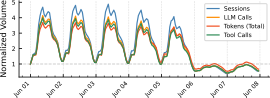

 Figure 1. Traffic trend from uniformly sampled subset of traces over one week in June, 2026. All metrics are sampled from the full population and normalized to day 1 hour 1.  

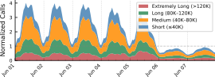

 Figure 2. LLM call volume by prompt length category.  

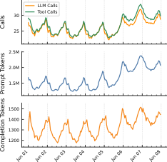

 Figure 3. Per-session average metrics from sampled traces during the data collection period. 

### 4.2. Session-Level Overview

Table 4. Summary of per-session and per-turn statistics to [Figure 4](https://arxiv.org/html/2608.00101#S4.F4 "In 4.2. Session-Level Overview ‣ 4. Agent Execution Pattern ‣ Agentic Coding in the Wild: Characterizing GitHub Copilot at Production Scale"). “Skew” is the mean-to-median ratio.

<table id="S4.T4.5.1" class="ltx_tabular ltx_guessed_headers ltx_align_middle">
<tbody class="ltx_tbody">
<tr id="S4.T4.5.1.1" class="ltx_tr">
<th id="S4.T4.5.1.1.1" class="ltx_td ltx_align_left ltx_th ltx_th_row ltx_border_tt">Metric</th>
<td id="S4.T4.5.1.1.2" class="ltx_td ltx_align_right ltx_border_tt">Median</td>
<td id="S4.T4.5.1.1.3" class="ltx_td ltx_align_right ltx_border_tt">P75</td>
<td id="S4.T4.5.1.1.4" class="ltx_td ltx_align_right ltx_border_tt">P90</td>
<td id="S4.T4.5.1.1.5" class="ltx_td ltx_align_right ltx_border_tt">Mean</td>
<td id="S4.T4.5.1.1.6" class="ltx_td ltx_nopad_r ltx_align_right ltx_border_tt">Skew</td></tr>
<tr id="S4.T4.5.1.2" class="ltx_tr">
<th id="S4.T4.5.1.2.1" class="ltx_td ltx_align_left ltx_th ltx_th_row ltx_border_t" colspan="6"><em id="S4.T4.5.1.2.1.1" class="ltx_emph ltx_font_italic" style="font-size:90%;">Per session</em></th></tr>
<tr id="S4.T4.5.1.3" class="ltx_tr">
<th id="S4.T4.5.1.3.1" class="ltx_td ltx_align_left ltx_th ltx_th_row ltx_border_t">User turns</th>
<td id="S4.T4.5.1.3.2" class="ltx_td ltx_align_right ltx_border_t">3</td>
<td id="S4.T4.5.1.3.3" class="ltx_td ltx_align_right ltx_border_t">7</td>
<td id="S4.T4.5.1.3.4" class="ltx_td ltx_align_right ltx_border_t">15</td>
<td id="S4.T4.5.1.3.5" class="ltx_td ltx_align_right ltx_border_t">6.1</td>
<td id="S4.T4.5.1.3.6" class="ltx_td ltx_nopad_r ltx_align_right ltx_border_t">2.0\(\times\)</td></tr>
<tr id="S4.T4.5.1.4" class="ltx_tr">
<th id="S4.T4.5.1.4.1" class="ltx_td ltx_align_left ltx_th ltx_th_row">LLM calls</th>
<td id="S4.T4.5.1.4.2" class="ltx_td ltx_align_right">15</td>
<td id="S4.T4.5.1.4.3" class="ltx_td ltx_align_right">42.8</td>
<td id="S4.T4.5.1.4.4" class="ltx_td ltx_align_right">100.5</td>
<td id="S4.T4.5.1.4.5" class="ltx_td ltx_align_right">40.6</td>
<td id="S4.T4.5.1.4.6" class="ltx_td ltx_nopad_r ltx_align_right">2.7\(\times\)</td></tr>
<tr id="S4.T4.5.1.5" class="ltx_tr">
<th id="S4.T4.5.1.5.1" class="ltx_td ltx_align_left ltx_th ltx_th_row">Tool invocations</th>
<td id="S4.T4.5.1.5.2" class="ltx_td ltx_align_right">13</td>
<td id="S4.T4.5.1.5.3" class="ltx_td ltx_align_right">45.6</td>
<td id="S4.T4.5.1.5.4" class="ltx_td ltx_align_right">111.4</td>
<td id="S4.T4.5.1.5.5" class="ltx_td ltx_align_right">43.6</td>
<td id="S4.T4.5.1.5.6" class="ltx_td ltx_nopad_r ltx_align_right">3.4\(\times\)</td></tr>
<tr id="S4.T4.5.1.6" class="ltx_tr">
<th id="S4.T4.5.1.6.1" class="ltx_td ltx_align_left ltx_th ltx_th_row">Session duration (min)</th>
<td id="S4.T4.5.1.6.2" class="ltx_td ltx_align_right">4.2</td>
<td id="S4.T4.5.1.6.3" class="ltx_td ltx_align_right">39.5</td>
<td id="S4.T4.5.1.6.4" class="ltx_td ltx_align_right">177.8</td>
<td id="S4.T4.5.1.6.5" class="ltx_td ltx_align_right">62.6</td>
<td id="S4.T4.5.1.6.6" class="ltx_td ltx_nopad_r ltx_align_right">14.9\(\times\)</td></tr>
<tr id="S4.T4.5.1.7" class="ltx_tr">
<th id="S4.T4.5.1.7.1" class="ltx_td ltx_align_left ltx_th ltx_th_row ltx_border_t" colspan="6"><em id="S4.T4.5.1.7.1.1" class="ltx_emph ltx_font_italic" style="font-size:90%;">Per turn</em></th></tr>
<tr id="S4.T4.5.1.8" class="ltx_tr">
<th id="S4.T4.5.1.8.1" class="ltx_td ltx_align_left ltx_th ltx_th_row ltx_border_t">LLM calls</th>
<td id="S4.T4.5.1.8.2" class="ltx_td ltx_align_right ltx_border_t">4.5</td>
<td id="S4.T4.5.1.8.3" class="ltx_td ltx_align_right ltx_border_t">7.9</td>
<td id="S4.T4.5.1.8.4" class="ltx_td ltx_align_right ltx_border_t">15.9</td>
<td id="S4.T4.5.1.8.5" class="ltx_td ltx_align_right ltx_border_t">6.6</td>
<td id="S4.T4.5.1.8.6" class="ltx_td ltx_nopad_r ltx_align_right ltx_border_t">1.8\(\times\)</td></tr>
<tr id="S4.T4.5.1.9" class="ltx_tr">
<th id="S4.T4.5.1.9.1" class="ltx_td ltx_align_left ltx_th ltx_th_row">Tool invocations</th>
<td id="S4.T4.5.1.9.2" class="ltx_td ltx_align_right">4</td>
<td id="S4.T4.5.1.9.3" class="ltx_td ltx_align_right">7.9</td>
<td id="S4.T4.5.1.9.4" class="ltx_td ltx_align_right">21</td>
<td id="S4.T4.5.1.9.5" class="ltx_td ltx_align_right">7.6</td>
<td id="S4.T4.5.1.9.6" class="ltx_td ltx_nopad_r ltx_align_right">2.0\(\times\)</td></tr>
<tr id="S4.T4.5.1.10" class="ltx_tr">
<th id="S4.T4.5.1.10.1" class="ltx_td ltx_align_left ltx_th ltx_th_row">Prompt tokens</th>
<td id="S4.T4.5.1.10.2" class="ltx_td ltx_align_right">227.6K</td>
<td id="S4.T4.5.1.10.3" class="ltx_td ltx_align_right">654.0K</td>
<td id="S4.T4.5.1.10.4" class="ltx_td ltx_align_right">1.50M</td>
<td id="S4.T4.5.1.10.5" class="ltx_td ltx_align_right">582.5K</td>
<td id="S4.T4.5.1.10.6" class="ltx_td ltx_nopad_r ltx_align_right">2.6\(\times\)</td></tr>
<tr id="S4.T4.5.1.11" class="ltx_tr">
<th id="S4.T4.5.1.11.1" class="ltx_td ltx_align_left ltx_th ltx_th_row">Cached tokens</th>
<td id="S4.T4.5.1.11.2" class="ltx_td ltx_align_right">217.2K</td>
<td id="S4.T4.5.1.11.3" class="ltx_td ltx_align_right">621.7K</td>
<td id="S4.T4.5.1.11.4" class="ltx_td ltx_align_right">1.43M</td>
<td id="S4.T4.5.1.11.5" class="ltx_td ltx_align_right">545.3K</td>
<td id="S4.T4.5.1.11.6" class="ltx_td ltx_nopad_r ltx_align_right">2.5\(\times\)</td></tr>
<tr id="S4.T4.5.1.12" class="ltx_tr">
<th id="S4.T4.5.1.12.1" class="ltx_td ltx_align_left ltx_th ltx_th_row">Completion tokens</th>
<td id="S4.T4.5.1.12.2" class="ltx_td ltx_align_right">1.9K</td>
<td id="S4.T4.5.1.12.3" class="ltx_td ltx_align_right">4.6K</td>
<td id="S4.T4.5.1.12.4" class="ltx_td ltx_align_right">9.2K</td>
<td id="S4.T4.5.1.12.5" class="ltx_td ltx_align_right">4.0K</td>
<td id="S4.T4.5.1.12.6" class="ltx_td ltx_nopad_r ltx_align_right">2.1\(\times\)</td></tr>
<tr id="S4.T4.5.1.13" class="ltx_tr">
<th id="S4.T4.5.1.13.1" class="ltx_td ltx_align_left ltx_th ltx_th_row ltx_border_bb">Turn duration (s)</th>
<td id="S4.T4.5.1.13.2" class="ltx_td ltx_align_right ltx_border_bb">63.4</td>
<td id="S4.T4.5.1.13.3" class="ltx_td ltx_align_right ltx_border_bb">163.0</td>
<td id="S4.T4.5.1.13.4" class="ltx_td ltx_align_right ltx_border_bb">392.1</td>
<td id="S4.T4.5.1.13.5" class="ltx_td ltx_align_right ltx_border_bb">396.3</td>
<td id="S4.T4.5.1.13.6" class="ltx_td ltx_nopad_r ltx_align_right ltx_border_bb">6.3\(\times\)</td></tr>
</tbody>
</table>

 

[Figure 4](https://arxiv.org/html/2608.00101#S4.F4 "In 4.2. Session-Level Overview ‣ 4. Agent Execution Pattern ‣ Agentic Coding in the Wild: Characterizing GitHub Copilot at Production Scale") shows the distributions of key session- and turn-level metrics, including LLM calls, tool invocations, token consumption, and duration. [Table 4](https://arxiv.org/html/2608.00101#S4.T4 "In 4.2. Session-Level Overview ‣ 4. Agent Execution Pattern ‣ Agentic Coding in the Wild: Characterizing GitHub Copilot at Production Scale") summarizes per-session and per-turn statistics across the collection period. Session characteristics exhibit strong heavy-tailed behavior, consistent with patterns observed in other cloud workloads ([Shahrad et al., 2020](https://arxiv.org/html/2608.00101#bib.bib34)). The median session contains just 3 user turns, 15 LLM calls, and lasts 4.2 minutes, whereas the mean reaches 6.1 turns, 40.6 LLM calls, and 62.6 minutes, highlighting substantial right skew. By the 75th percentile, sessions already involve more than twice as many user turns and roughly three times as many LLM calls and tool invocations as the median. At the 90th percentile, they reach 15 user turns, over 100 LLM calls, and more than 111 tool invocations. Session duration is especially skewed, with a 14.9\(\times\) mean-to-median ratio and a P90 exceeding three hours, indicating that a small fraction of long-running sessions account for a disproportionate share of coding-agent activity. [Figure 4(b)](https://arxiv.org/html/2608.00101#S4.F4.sf2 "In Figure 4 ‣ 4.2. Session-Level Overview ‣ 4. Agent Execution Pattern ‣ Agentic Coding in the Wild: Characterizing GitHub Copilot at Production Scale") shows that most sessions complete within 10 minutes, yet a persistent heavy tail extends for multiple hours.

At the turn level within each session, the median turn triggers 3 LLM calls and 3 tool invocations, consuming 160.2K prompt tokens and 265 completion tokens. However, the upper tail is substantial: P90 turns require nearly 16 LLM calls, 21 tool invocations, and over 1M prompt tokens. [Figure 4(c)](https://arxiv.org/html/2608.00101#S4.F4.sf3 "In Figure 4 ‣ 4.2. Session-Level Overview ‣ 4. Agent Execution Pattern ‣ Agentic Coding in the Wild: Characterizing GitHub Copilot at Production Scale") shows that the turn durations are likewise highly skewed (6.3\(\times\)), suggesting that a minority of complex turns dominate execution time and token consumption.

This heavy-tail is further modulated by temporal patterns. Weekend sessions are fewer but longer ([Figure 3](https://arxiv.org/html/2608.00101#S4.F3 "In 4.1. Time Series and Diurnal Patterns ‣ 4. Agent Execution Pattern ‣ Agentic Coding in the Wild: Characterizing GitHub Copilot at Production Scale")), with more LLM/tool calls per turn, suggesting developers might undertake more ambitious tasks when uninterrupted ([Figure 5](https://arxiv.org/html/2608.00101#S4.F5 "In 4.2. Session-Level Overview ‣ 4. Agent Execution Pattern ‣ Agentic Coding in the Wild: Characterizing GitHub Copilot at Production Scale")). This differs from prior observations in chatbots, where longer sessions are more common during weekdays ([Anthropic, 2026a](https://arxiv.org/html/2608.00101#bib.bib5)).

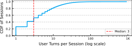

 (a) Number of turns per session.

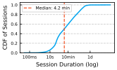

 (b) Session duration.

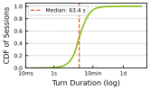

 (c) Turn duration.

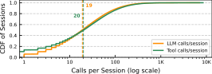

 (d) Number of LLM and tool calls per session.

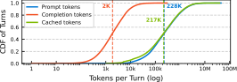

 (e) Token consumption per turn.

Figure 4. Distributions of session and turn metrics. All distributions show a right-skew tail behavior to various extents.  

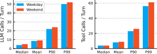

 Figure 5. Comparison of the number of LLM invocations and tool calls per turn during weekdays vs. weekends. 

### 4.3. Execution Structure

The 1:1 LLM\(\leftrightarrow\)Tool Ratio. Across the full population, the ratio of LLM calls to tool invocations is remarkably close to 1:1 (mean 40.6 vs. 43.6 per session, [Figure 4(d)](https://arxiv.org/html/2608.00101#S4.F4.sf4 "In Figure 4 ‣ 4.2. Session-Level Overview ‣ 4. Agent Execution Pattern ‣ Agentic Coding in the Wild: Characterizing GitHub Copilot at Production Scale")). This observation also holds at the _per-turn_ level, as shown in [Figure 6](https://arxiv.org/html/2608.00101#S4.F6 "In 4.3. Execution Structure ‣ 4. Agent Execution Pattern ‣ Agentic Coding in the Wild: Characterizing GitHub Copilot at Production Scale"). The median turn triggers nearly identical numbers of LLM and tool calls, and the CDFs of per-turn LLM calls and tool invocations closely track each other across the entire distribution, except for those LLM-only turns.

This tight coupling reflects the canonical observe \(\rightarrow\) (reason) decide \(\rightarrow\) act loop of agentic systems. Most LLM calls result in a tool action, and most tool results immediately trigger another LLM call. As a result, both “reasoning without action” and “action without reasoning” are rare.

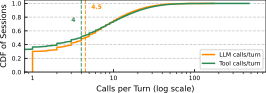

 Figure 6. CDFs of per-turn LLM calls and tool invocations track each other closely, confirming the 1:1 coupling across the entire range in every turn and session. 

 

Agent Autonomy: 87% Auto-Continuation. After a user message, the agent autonomously executes an average of 6.6 LLM calls before returning control, yielding a split of approximately 87% agent-initiated versus 13% user-initiated calls. Thus, most serving load originates from autonomous agent execution rather than direct user interaction. The distribution is highly skewed ([Figure 6](https://arxiv.org/html/2608.00101#S4.F6 "In 4.3. Execution Structure ‣ 4. Agent Execution Pattern ‣ Agentic Coding in the Wild: Characterizing GitHub Copilot at Production Scale")): a small fraction of requests trigger long execution chains that account for a disproportionate share of LLM calls and serving load.

 

LLM Call Parallelism. Although agentic workflows can spawn parallel subtasks, LLM execution is overwhelmingly serial. [Figure 7](https://arxiv.org/html/2608.00101#S4.F7 "In 4.3. Execution Structure ‣ 4. Agent Execution Pattern ‣ Agentic Coding in the Wild: Characterizing GitHub Copilot at Production Scale") shows the distribution of per-turn LLM concurrency. Across all turns, 36.7% are strictly sequential, while the remaining 63.3% exhibit at least some overlap between LLM calls (measured by the overlap of their wall clock times). However, the degree of parallelism is shallow: the median concurrency is only 1.15, and the P90 reaches 1.4. The limited concurrency stems from the dependency structure of agent execution. Most LLM calls consume outputs produced by earlier reasoning steps. When concurrency does occur, it typically arises from independent subtasks or sub-agents (_e.g._ , background agents) that can be evaluated simultaneously. Furthermore, nearly all concurrent calls within a turn invoke the same model, with intra-turn model heterogeneity rarely observed in the traces ([Section 5.4](https://arxiv.org/html/2608.00101#S5.SS4 "5.4. Model Switches ‣ 5. LLM Footprints ‣ Agentic Coding in the Wild: Characterizing GitHub Copilot at Production Scale")).

Examining concurrency throughout turn execution reveals a consistent inverted-U pattern. Turns typically begin with a single reasoning step, after which the agent may briefly launch multiple parallel requests during exploration or information gathering. As execution converges toward a final decision, concurrency collapses back to one because downstream reasoning depends on the results of all preceding branches. Thus, concurrency is concentrated in the middle of turns, while turn starts and endings remain largely sequential. This has two implications: (1) straggler issues can happen when the agent with multiple parallel upstream LLM calls has to wait until all upstream responses are ready before kick-starting the downstream LLM call or tool invocation, and (2) serving systems must handle concurrent KV cache access and updates for 2–3 calls from the _same session_ , not just from different sessions.

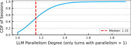

 Figure 7. Measured LLM call parallelism.

 

### 4.4. Workflow Archetypes

Each agentic turn is a dynamically generated workflow based on its specific task content, and not all coding agent workflows follow the same execution pattern. To better understand workflow diversity, we cluster turns using their tool composition, LLM-call depth, token consumption, and execution characteristics. This analysis reveals six major, recurring workflow archetypes shown in [Table 5](https://arxiv.org/html/2608.00101#S4.T5 "In 4.4. Workflow Archetypes ‣ 4. Agent Execution Pattern ‣ Agentic Coding in the Wild: Characterizing GitHub Copilot at Production Scale").

Table 5. Median turn-level workflow archetypes.

Archetype | LLM calls | Description | Share  
---|---|---|---  
Deep-loop read | 9 | 7 tool batches; read-heavy | 30.5%  
LLM-only | 1 | No tools; pure reasoning | 20.2%  
Multi-cycle edit | 5 | Read + edit + build | 19.0%  
Multi-cycle other | 4 | Read-dominant | 13.2%  
Deep-loop w/failures | 36 | 34 batches; retry loops | 9.1%  
Deep-loop run | 7 | Terminal-heavy | 8.1%

 

The largest category (30.5%) is _Deep-loop read_ , consisting of extended code exploration sessions with repeated file retrieval, symbol lookup, and repository navigation. These turns average 9 LLM calls and 7 tool batches, reflecting the iterative process of gathering context before making modifications. At the other extreme, _LLM-only_ turns (20.2%) contain a single LLM call and no tool usage, corresponding to pure reasoning, planning, or explanatory interactions.

Another 19.0% of turns fall into the _Multi-cycle edit_ category, where the agent alternates between reading, modifying, and validating code. These workflows often include edit operations followed by build or test execution, forming short feedback loops between code generation and verification. Similarly, _Deep-loop run_ turns (8.1%) are dominated by terminal interactions, where the agent repeatedly executes commands and reasons about their outputs.

The remaining categories illustrate that coding tasks frequently require iterative refinement. _Multi-cycle other_ turns (13.2%) exhibit multiple rounds of exploration and reasoning without substantial code modification, while _Deep-loop w/failures_ turns (9.1%) contain extended debugging or retry sequences. These turns result in 36 LLM calls (4 times the median), each processing 80K+ tokens including accumulated error output, and 34 tool batches, substantially more than other categories. This failure-driven _compute amplification_ is unique to agentic workloads: in chat, a failed request simply returns an error, but in an agentic loop, a failure triggers an autonomous recovery attempt that can cascade into dozens of additional LLM calls with growing context windows.

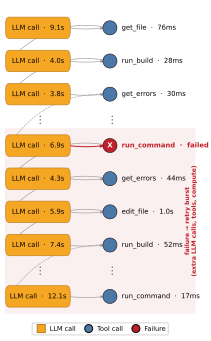

 Figure 8. Timeline of a “Deep-loop w/failures” turn: repeated tool failures trigger autonomous retry loops, generating 36 LLM calls and 35 tool calls in total.

Inspection of individual traces shows that agents often encounter failed builds, incorrect assumptions, missing dependencies, or unexpected execution results, triggering additional reasoning, retries, and tool invocations before converging on a solution. [Figure 8](https://arxiv.org/html/2608.00101#S4.F8 "In 4.4. Workflow Archetypes ‣ 4. Agent Execution Pattern ‣ Agentic Coding in the Wild: Characterizing GitHub Copilot at Production Scale") illustrates one such turn. Rather than following a simple request-response pattern, the agent repeatedly alternates between reasoning, tool execution, diagnosis, and corrective actions. This behavior highlights a key distinction from traditional chatbot workloads: task completion frequently involves trial-and-error and iterative validation rather than a single successful generation.

From a perspective of the serving systems, this workflow diversity creates substantial variability in resource demand. Turns may differ by an order of magnitude in LLM invocations, tool calls, and token consumption depending on how much exploration, validation, and refinement is required. Accurately provisioning and scheduling agentic workloads therefore requires reasoning about workflow progress rather than treating all turns as homogeneous requests. Underlying LLM serving systems must therefore become _workflow-aware_ , tracking execution progress, preserving context across long-running sessions, and optimizing for the evolving resource demands of an entire agentic workflow rather than individual LLM calls in isolation.

 

The remainder of the paper quantifies the resource implications of this workload for the LLM itself ([Section 5](https://arxiv.org/html/2608.00101#S5 "5. LLM Footprints ‣ Agentic Coding in the Wild: Characterizing GitHub Copilot at Production Scale")), context compaction ([Section 6](https://arxiv.org/html/2608.00101#S6 "6. Context Compaction ‣ Agentic Coding in the Wild: Characterizing GitHub Copilot at Production Scale")), tool execution ([Section 7](https://arxiv.org/html/2608.00101#S7 "7. Tools ‣ Agentic Coding in the Wild: Characterizing GitHub Copilot at Production Scale")), and resource idleness ([Section 9](https://arxiv.org/html/2608.00101#S9 "9. Idleness and Resource Reclamation ‣ Agentic Coding in the Wild: Characterizing GitHub Copilot at Production Scale")).

## 5\. LLM Footprints

Having established the session-structured execution pattern, we now zoom in on the LLM calls that dominate agentic sessions. We first characterize the models, token footprints, and time spent in LLM inference ([Section 5.1](https://arxiv.org/html/2608.00101#S5.SS1 "5.1. LLM Call Basics ‣ 5. LLM Footprints ‣ Agentic Coding in the Wild: Characterizing GitHub Copilot at Production Scale")), and then examine the implications for the most expensive shared resource in LLM serving: the KV cache ([Section 5.2](https://arxiv.org/html/2608.00101#S5.SS2 "5.2. KV Cache ‣ 5. LLM Footprints ‣ Agentic Coding in the Wild: Characterizing GitHub Copilot at Production Scale")). While prefix caching within turns is effective (a well-understood mechanism), we identify two _session-structural events_ , turn boundaries ([Section 5.3](https://arxiv.org/html/2608.00101#S5.SS3 "5.3. Cache Degradation at Turn Boundaries ‣ 5. LLM Footprints ‣ Agentic Coding in the Wild: Characterizing GitHub Copilot at Production Scale")) and model switches ([Section 5.4](https://arxiv.org/html/2608.00101#S5.SS4 "5.4. Model Switches ‣ 5. LLM Footprints ‣ Agentic Coding in the Wild: Characterizing GitHub Copilot at Production Scale")), that cause predictable, quantified cache degradation with no analog in standard LLM chat workloads; a third, context compaction, is deferred to [Section 6](https://arxiv.org/html/2608.00101#S6 "6. Context Compaction ‣ Agentic Coding in the Wild: Characterizing GitHub Copilot at Production Scale").

### 5.1. LLM Call Basics

Model Coverage. Our traces span a diverse set of 27 underlying models that stem from a variety of model families, reflecting the heterogeneity of models used by coding agents in production. [Figure 9](https://arxiv.org/html/2608.00101#S5.F9 "In 5.1. LLM Call Basics ‣ 5. LLM Footprints ‣ Agentic Coding in the Wild: Characterizing GitHub Copilot at Production Scale") shows the distribution of inference usage across the top 15 models observed during the study period. The distribution is heavily skewed: the top three models (Model A, B, and C) together account for approximately 53% of all invocations, with Model A alone responsible for 23.7%. Usage then falls off sharply, with the remaining twelve models each contributing 0.6–7.4% of invocations, and the long tail of additional models collectively accounting for 4.4%.

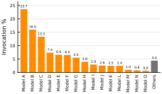

 Figure 9. Distribution of inference usage of top 15 models. 

Token Length Distribution. [Figure 10](https://arxiv.org/html/2608.00101#S5.F10 "In 5.1. LLM Call Basics ‣ 5. LLM Footprints ‣ Agentic Coding in the Wild: Characterizing GitHub Copilot at Production Scale") shows the CDFs of per-call token consumption, broken down into prompt tokens, cached prompt tokens, and completion tokens. The three distributions operate at dramatically different scales. Output (completion) tokens are compact: the median is only 247 tokens, and 88% of calls produce fewer than 1,000 tokens. In contrast, prompt tokens have a median of 68K tokens per call. Cached prompt tokens account for most of this input volume, with a median of 63K tokens, reflecting long system prompts and accumulated conversational context that can be reused through the KV cache. Taken together, these distributions show that agentic LLM calls are overwhelmingly _input-heavy and output-light_ , with a median input-to-output ratio exceeding 275:1. This extreme asymmetry shifts the serving bottleneck from token generation to KV-cache efficiency, a challenge we quantify in [Section 5.2](https://arxiv.org/html/2608.00101#S5.SS2 "5.2. KV Cache ‣ 5. LLM Footprints ‣ Agentic Coding in the Wild: Characterizing GitHub Copilot at Production Scale").

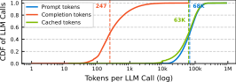

 Figure 10. CDFs of per-call token counts: Prompt tokens (median 68K); Cached prompt tokens (median 63K); output tokens (median 247). The \(>\)275:1 input-to-output ratio makes KV-cache reuse the critical serving lever.  

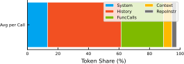

 Figure 11. Token type breakdown for LLM calls. 

[Figure 11](https://arxiv.org/html/2608.00101#S5.F11 "In 5.1. LLM Call Basics ‣ 5. LLM Footprints ‣ Agentic Coding in the Wild: Characterizing GitHub Copilot at Production Scale") further decomposes prompt tokens by source. Conversation history dominates the context window, accounting for 48% of all input tokens on average. Function-call messages contribute another 28%, reflecting the heavy use of tools throughout agent execution. In contrast, the system prompt contributes only 14%, while retrieved repository instructions and other contextual information account for the remaining 10%. Together, history and tool-call traces comprise over 75% of all prompt tokens, indicating that context growth is driven primarily by the agent’s own prior reasoning and actions rather than by static instructions.

Difference Compared to Chat. Compared to the text-only and multimodal LLM API traces reported in prior production studies ([Stojkovic et al., 2025](https://arxiv.org/html/2608.00101#bib.bib35); [Qiu et al., 2025](https://arxiv.org/html/2608.00101#bib.bib32)), coding-agent workloads exhibit dramatically higher per-call token consumption. The median prompt length is significantly higher than the 750 and 1,050 prompt tokens reported for text-only and multimodal LLM calls, respectively. Output lengths are also considerably larger, compared to median completions of only 105 tokens for text workloads and 80 tokens for multimodal workloads. These results highlight the token-intensive nature of coding-agent interactions, where models frequently process large codebases, execution logs, and accumulated context.

 

LLMs Dominating Non-idle Time. [Figure 12](https://arxiv.org/html/2608.00101#S5.F12 "In 5.1. LLM Call Basics ‣ 5. LLM Footprints ‣ Agentic Coding in the Wild: Characterizing GitHub Copilot at Production Scale") breaks down an agentic session wall-clock time into three categories: (1) LLM execution, (2) tool execution, and (3) user idle time between turns. Among all sessions, 6% are single-turn sessions with no user-idle time between turns. For those sessions with both LLM and tool calls, LLM inference dominates session runtime with a median of 87.7%. For multi-turn sessions, user-idle time becomes the major contribution to the total wall clock time, with a median of 80.1%. Among the rest of the session runtime, LLM inference time still dominates tool call with a median of 13.7% vs. 2%.

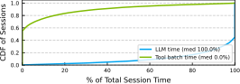

 (a) Single-turn sessions.

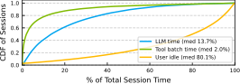

 (b) Multi-turn sessions.

Figure 12. CDF of session wall-clock time spent in LLM execution, tool execution, and user idle periods for single-turn sessions (6% of all sessions) and multi-turn sessions (94%, with user-time in between two turns). 

The dominance of LLM time arises from two factors. First, agentic workflows are highly autonomous ([Section 4.3](https://arxiv.org/html/2608.00101#S4.SS3 "4.3. Execution Structure ‣ 4. Agent Execution Pattern ‣ Agentic Coding in the Wild: Characterizing GitHub Copilot at Production Scale")), producing long sequences of back-to-back model invocations with minimal user involvement. Second, most tool execution overlaps with active LLM windows ([Section 4.3](https://arxiv.org/html/2608.00101#S4.SS3 "4.3. Execution Structure ‣ 4. Agent Execution Pattern ‣ Agentic Coding in the Wild: Characterizing GitHub Copilot at Production Scale")) and therefore contributes little to the end-to-end critical path.

Nevertheless, the distribution is highly skewed. While most sessions spend nearly all of their runtime inside LLM execution, a minority exhibit substantial user idle periods, reflected by the long tail in the user-idle curve. These sessions correspond to workflows where users pause between interactions or revisit an ongoing task after a delay. Tool execution also exhibits a long tail, but remains a secondary contributor compared to LLM inference.

Overall, agentic coding sessions are fundamentally _LLM-bound_ workloads. Optimizing model serving latency directly improves end-to-end completion time for the vast majority of sessions, whereas tool-system optimizations primarily benefit the relatively small fraction of workflows dominated by long-running external operations.

 

### 5.2. KV Cache

The agentic loop creates long-lived sessions with tight sequential dependencies between LLM calls (as we show in [Section 4](https://arxiv.org/html/2608.00101#S4 "4. Agent Execution Pattern ‣ Agentic Coding in the Wild: Characterizing GitHub Copilot at Production Scale")). This section examines how that structure shapes the KV cache: prefix caching within a turn is highly effective, but session-structural events—turn boundaries and model switches—cause predictable, quantified degradation.

Prefix Cache Hit Rate. Each LLM call carries a prompt with a median of 68K tokens, of which a median of 63K tokens are cached (as shown in [Figure 10](https://arxiv.org/html/2608.00101#S5.F10 "In 5.1. LLM Call Basics ‣ 5. LLM Footprints ‣ Agentic Coding in the Wild: Characterizing GitHub Copilot at Production Scale")). This high caching rate reflects that the long system prompts and accumulated turn context lead to large amount of KV cache to reuse across calls. The prompt grows monotonically within a turn as history accumulates, and this growing prefix is inherently cacheable: each successive LLM call extends the prefix by a small footprint, preserving all prior cached state. The result is a cache hit rate of roughly 98% at the median, but this headline number masks a bimodal distribution (as shown in [Figure 13(a)](https://arxiv.org/html/2608.00101#S5.F13.sf1 "In Figure 13 ‣ 5.2. KV Cache ‣ 5. LLM Footprints ‣ Agentic Coding in the Wild: Characterizing GitHub Copilot at Production Scale")): roughly 10% of calls see low reuse (below 20% hit rate), reflecting cold-start calls with minimal prefix to reuse, while the majority cluster at the opposite extreme (over 80% of calls exceed an 90% hit rate), with a steep rise in the CDF between 85–100% indicating that a large fraction of calls approach near-perfect prefix reuse.

The cache hit rate follows a predictable trajectory over the sequence of LLM calls within a turn ([Figure 13(b)](https://arxiv.org/html/2608.00101#S5.F13.sf2 "In Figure 13 ‣ 5.2. KV Cache ‣ 5. LLM Footprints ‣ Agentic Coding in the Wild: Characterizing GitHub Copilot at Production Scale")):

  1. (1)

Call #1: \(\sim\)45% (cold start, first call has the minimal prefix reuse compared to subsequent calls despite prefix caching across sessions for history or system prompts).

  2. (2)

Call #2: jumps to \(\sim\)86% as the system prompt and initial turn history become a stable, reusable prefix.

  3. (3)

Call #3 onward: plateaus at \(\sim\)92–94% (new content added per call offsets the prefix reuse gains, keeping the hit rate flat through call #10), moving forward in a turn.

This high-hit-rate majority is the _baseline_ against which we measure the degradation events below.

 

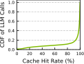

 (a) CDF of cache hit rate.

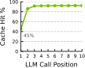

 (b) Cache hit rate progression.

Figure 13. Cache hit rate distribution (left) and its average-rate progression during a turn (right). Rates rise from an average cache hit rate of 45% initially to \(\sim\)90% at plateau as new content offsets prefix reuse gains.

### 5.3. Cache Degradation at Turn Boundaries

Turn boundaries refer to the places where the previous turn has ended and the user sends a new message, resulting in a new autonomous chain of steps. As shown in [Figure 14](https://arxiv.org/html/2608.00101#S5.F14 "In 5.3. Cache Degradation at Turn Boundaries ‣ 5. LLM Footprints ‣ Agentic Coding in the Wild: Characterizing GitHub Copilot at Production Scale"), turn boundaries are the primary source of cache hit rate degradation. The gap between one turn’s last LLM call and the next turn’s first call is typically long relative to intra-turn call spacing, since it spans user idle time (_e.g._ , reacting to the task completion information or thinking about the next task to perform); the serving system’s cache entries are likely evicted after sitting unread for this extended interval, which leads to the same-model drop of \(-\)26% on average.

The cache hit rate decays with the duration of the idle gap between any two turns in a session, as shown in [Figure 15](https://arxiv.org/html/2608.00101#S5.F15 "In 5.3. Cache Degradation at Turn Boundaries ‣ 5. LLM Footprints ‣ Agentic Coding in the Wild: Characterizing GitHub Copilot at Production Scale"). For idle gaps under 2 minutes, the cache hit rate is high and stable, with medians at or above 95% across the <1s through 30s-2m buckets, and the bulk of the distribution sitting well above 70%. Once idle time crosses the 2-10m range, the distribution widens sharply and the median drops to \(\sim\)70%, with a long lower tail reaching down to 0%: sessions in this range are caught mid-eviction, some retaining most of their cache and others losing nearly all of it. Beyond 10 minutes, the collapse is essentially complete, with the 10m-1h and >1h buckets showing medians near 0-5% and an upper quartile that rarely exceeds 20%. This pattern, a stable plateau followed by a sharp cliff between roughly 2 and 10 minutes of idle time, is the signature of a time-based KV cache eviction policy at the serving system.

 

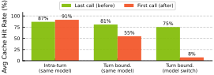

 Figure 14. Cache hit rate in LLM calls before and after turn boundaries. Same-model boundaries cause a \(\downarrow\)26% average drop; model-switch boundaries cause near-complete invalidation (\(\downarrow\)67%). 

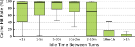

 Figure 15. Cache hit rate drops with inter-turn idle time.

### 5.4. Model Switches

Since a session’s model is fixed for the duration of a turn, model switches only occur at turn boundaries, and when they do, they destroy the cache entirely rather than merely degrading it: a KV cache built for one model’s weights and attention layout cannot be reused by another model. We observe that model switches affect \(\sim\)6.4% of sessions and are predominantly _reactive_ , triggered by errors (36% non-success rate before switches vs. 8% baseline) or by rate limiting. Switches arise from two sources: (1) explicit user intent (the user selects a different model for the next turn) and (2) auto mode, where the system itself reroutes the session, primarily in response to rate limiting or throttling on the currently selected model. [Figure 16](https://arxiv.org/html/2608.00101#S5.F16 "In 5.4. Model Switches ‣ 5. LLM Footprints ‣ Agentic Coding in the Wild: Characterizing GitHub Copilot at Production Scale") breaks down switches by direction (size and family) and outcome.

Manual-to-auto switches are dominated by downgrades (52%), with lateral moves accounting for 35% and upgrades only 13%, consistent with auto mode stepping a session down to a cheaper or more available model once the user relinquishes explicit control. Auto-to-manual switches show the opposite pattern: 51% are upgrades, as users who take back manual control tend to move to a stronger model, while 36% are lateral and only 13% are downgrades.

After a model switch, the average cache hit rate is just 8%, a \(-\)67% average drop compared to \(-\)26% for same-model turn boundaries (as shown in [Figure 14](https://arxiv.org/html/2608.00101#S5.F14 "In 5.3. Cache Degradation at Turn Boundaries ‣ 5. LLM Footprints ‣ Agentic Coding in the Wild: Characterizing GitHub Copilot at Production Scale")); this gap isolates the pure cost of model incompatibility, on top of the eviction loss that all turn boundaries incur.

Since each model switch effectively cold-starts the cache, pinning sessions to a single model would preserve cache continuity. When switches are unavoidable (_e.g._ , throttling-driven), optimization is needed to precompute and stage the new model’s KV cache before switching rather than incurring a synchronous cold-start which imposes significant latency and cost spikes on top of the KV cache eviction loss already incurred at the turn boundary.

 

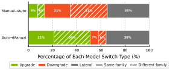

 Figure 16. Composition of model switches by direction. The bars show the share that upgrade to a higher-tier model, downgrade to a lower-tier model, or move laterally to a same-tier model based on model sizes and generations.

## 6\. Context Compaction

As an agentic session runs long, deep exploration, extensive tool output, and accumulated turn history eventually push the prompt toward the model’s context limit. When this happens, the coding agent performs _context compaction_ ([GitHub Copilot, 2026](https://arxiv.org/html/2608.00101#bib.bib12)): it rewrites the prompt, dropping or summarizing older messages, to buy room for the session to continue. Note that because compaction rewrites the prompt prefix, it is a third structural cache event, alongside the turn boundaries and model switches of [Section 5.2](https://arxiv.org/html/2608.00101#S5.SS2 "5.2. KV Cache ‣ 5. LLM Footprints ‣ Agentic Coding in the Wild: Characterizing GitHub Copilot at Production Scale"). Compaction induces an additional LLM request with long-input prefill phase, with generally a long-running decode phase as well.

Table 6. Share of total daily volume attributed to sessions that contain at least one compaction event.

Metric | #Session | Total Tokens | LLM Calls | Tool Calls  
---|---|---|---|---  
Percentage | 7.8% | 44.2% | 37.1% | 38.9%

 

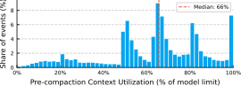

 Figure 17. Distribution of compaction trigger points.

Compaction is rare at the level of an individual call, occurring in just 0.5% of the time, but it affects a meaningful minority of sessions overall. 7.8% of all agent sessions undergo at least one compaction event, rising to 22.6% among long-context sessions (those with \(>\)100K-token prompts), where the pressure on the context window is naturally greater. Despite touching a small share of sessions, compacting sessions are disproportionately heavy: sessions that contain at least one compaction event account for only 7.8% of sessions but 44.2% of total tokens, 37.1% of LLM calls, and 38.9% of tool calls ([Table 6](https://arxiv.org/html/2608.00101#S6.T6 "In 6. Context Compaction ‣ Agentic Coding in the Wild: Characterizing GitHub Copilot at Production Scale")), confirming that compaction concentrates in the longest, most resource-intensive sessions rather than being spread evenly across the workload. Most sessions that compact do so only once (median 1, mean 1.7), though a heavy tail of sessions compacts repeatedly, up to 40 times in the most extreme cases observed in the traces.

Context Compaction Triggers. The context utilization at which compaction fires is not governed by a single fixed threshold. [Figure 17](https://arxiv.org/html/2608.00101#S6.F17 "In 6. Context Compaction ‣ Agentic Coding in the Wild: Characterizing GitHub Copilot at Production Scale") plots the distribution of pre-compaction context utilization, _i.e._ , the fraction of the model’s context limit consumed at the moment compaction is triggered. Rather than concentrating around one value, the distribution indicates multiple thresholds, with pronounced peaks near 50%, 65–66% (the overall median), 80%, and near-100% utilization. This pattern reflects heterogeneity in compaction policy across models and context limits: coding agents appear to trigger compaction at different utilization thresholds for different models, so the aggregate distribution is partly a mixture of several distinct, model-specific triggering rules. However, the multiple peaks are not solely an artifact of aggregating across models, as we still observe multiple distinct trigger points even for a single model.

Context Compaction Latency Overhead. Compaction itself is implemented as a separate LLM call that summarizes the current accumulated context into a condensed representation before the agent resumes execution in the same session. This introduces a non-trivial source of latency: the compaction call requires a long prefill over the full history being summarized, followed by a decode phase to generate the summary, both of which sit squarely on the critical path of the turn. [Figure 18](https://arxiv.org/html/2608.00101#S6.F18 "In 6. Context Compaction ‣ Agentic Coding in the Wild: Characterizing GitHub Copilot at Production Scale") reports the CDF of compaction duration as a percentage of total turn execution time across all observed compaction events. We find that compaction overhead is substantial and highly variable: the median compaction consumes roughly 22% of the turn’s total execution time. The tail is heavy where P90 sits at approximately 34%. This overhead suggests that compaction is not a lightweight housekeeping step, motivating the need for optimizations like incremental compaction or overlapping strategies.

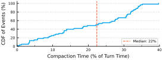

 Figure 18. Distribution of compaction duration.

Context Compaction Impact on KV cache. Beyond the added latency, compaction also perturbs the KV cache: the summarized history invalidates the previously cached prefix, forcing a costly cache-cold prefill on the next turn and eliminating the reuse benefits that prefix caching would otherwise provide. When compaction does occur, it is aggressive: the median event drops 72.8% of prompt tokens, with the middle half of events (P25 to P75) removing between 58% and 81% of tokens, and 6.1% of events dropping 90% or more ([Figure 19](https://arxiv.org/html/2608.00101#S6.F19 "In 6. Context Compaction ‣ Agentic Coding in the Wild: Characterizing GitHub Copilot at Production Scale")). This rewriting comes at a steep cache cost. Sessions typically enter compaction with a near-fully cached prompt, but the rewritten prompt shares little prefix with what came before, and the cache hit rate on the first call after compaction results in a median drop of 66.1% ([Figure 20](https://arxiv.org/html/2608.00101#S6.F20 "In 6. Context Compaction ‣ Agentic Coding in the Wild: Characterizing GitHub Copilot at Production Scale")). The damage is often total: 34.3% of compaction events erase 90% or more of cache hit rate, and 21% erase 99% or more. This places compaction in the same league as a model switch: both events effectively cold-start the cache, but compaction is the one that a serving system triggers as a direct consequence of managing the context window, rather than one imposed by an external routing decision.

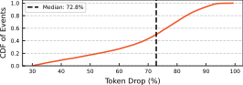

 Figure 19. Distribution of prompt token drop percentage after context compaction. 

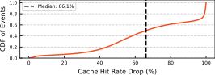

 Figure 20. Distribution of cache hit rate drop percentage after context compaction.

Compaction is therefore a hidden cost of long agentic sessions: the agent fills the context window during deep exploration, triggers compaction, loses nearly all cached state, and then must rebuild the cache from scratch on subsequent calls, incurring both higher latency and higher cost exactly when the session is most complex.

 

## 7\. Tools

Tool execution is the second half of the agentic loop. Although tools account for only a small fraction of session wall-clock time yet contribute a disproportionately large share of prompt tokens ([Section 5.1](https://arxiv.org/html/2608.00101#S5.SS1 "5.1. LLM Call Basics ‣ 5. LLM Footprints ‣ Agentic Coding in the Wild: Characterizing GitHub Copilot at Production Scale")), their usage mix, latency, and failure behavior determine how long the agent stalls waiting on tool outputs before issuing the next LLM call and how much resource residency a session accumulates.

### 7.1. Tool Usage Statistics

Tool Usage Profile. [Figure 21](https://arxiv.org/html/2608.00101#S7.F21 "In 7.1. Tool Usage Statistics ‣ 7. Tools ‣ Agentic Coding in the Wild: Characterizing GitHub Copilot at Production Scale") shows that the coding agent uses 40+ distinct tools, but usage is heavily concentrated. A single tool, get_file, accounts for 35.0% of all invocations, followed by run_command (17.0%) and replace_string (9.8%). The top 11 tools alone account for over 90% of invocations, and the top 27 for 99%, with the long remaining tail of tools together contributing just 4.6% (grouped as “Others” in the figure which are mostly customized tools).

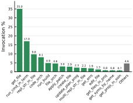

 Figure 21. Most invoked tools and their frequency. 

Tool Execution Times. Tool execution times span several orders of magnitude and exhibit substantial heterogeneity across tool types. Across all tool invocations, the median execution time is only 166 ms (much less than that of LLM calls as shown in [Figure 22](https://arxiv.org/html/2608.00101#S7.F22 "In 7.1. Tool Usage Statistics ‣ 7. Tools ‣ Agentic Coding in the Wild: Characterizing GitHub Copilot at Production Scale")), but the mean reaches 16.7 s, with a P90 of 4.4 s and a P99 of 79 s. The nearly 100\(\times\) gap between the mean and median indicates a heavily right-skewed distribution, where a small fraction of long-running tool invocations dominate aggregate execution time. This tail is dominated by invocations like run_cmd and build/compile commands, rather than lightweight file reads or edits.

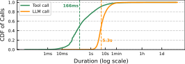

 Figure 22. Distribution of tool call vs. LLM call duration. 

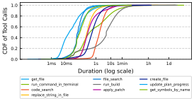

 Figure 23. Distribution of tool execution times grouped by tool types among top 10 most-invoked tools.

[Figure 23](https://arxiv.org/html/2608.00101#S7.F23 "In 7.1. Tool Usage Statistics ‣ 7. Tools ‣ Agentic Coding in the Wild: Characterizing GitHub Copilot at Production Scale") reveals a roughly 320\(\times\) spread in median latency across tools. Read-oriented operations are consistently fast: update_plan_progress, get_symbols_by_name, get_file, and file_search all complete in tens of milliseconds on average, with most requests finishing within a few hundred milliseconds. These tools dominate agent activity (_e.g._ , get_file alone accounts for 35% of all tool invocations), making low-latency information retrieval a critical component of agent execution.

Mutating tools exhibit intermediate latency characteristics. Operations like replace_string_in_file, apply_patch, and create_file cluster around 0.25–0.6 s median latency. Their relatively narrow distributions suggest that code modification costs are largely bounded by file-system operations rather than external dependencies.

In contrast, execution-oriented tools dominate the latency tail. run_command_in_terminal and run_build exhibit extremely heavy-tailed behavior, with median latencies of only hundreds of milliseconds to a few seconds, yet mean latencies of 68 s and 78 s, respectively. Their P99 latencies reach several hundred seconds, indicating that a small number of long-running or stalled commands account for a disproportionate fraction of tool execution time. These tools are the primary source of tail latency in agentic workflows despite representing only a small fraction of total tool invocations.

Success and Failure Behavior. For the purpose of resource orchestration, the key property is not raw frequency but the tool’s _execution time variance_ and _failure behavior_. Read and search tools, such as get_file and code_search, complete in tens to low hundreds of milliseconds and succeed nearly universally, close to 100% of the time. Execution and mutation tools behave very differently: run_command, run_build, and edit_file show the steepest drops in success rate in our traces, falling to roughly 73%, and their durations are both longer and far more variable, ranging from tens of milliseconds to over 10 s even in the successful case ([Figure 24](https://arxiv.org/html/2608.00101#S7.F24 "In 7.1. Tool Usage Statistics ‣ 7. Tools ‣ Agentic Coding in the Wild: Characterizing GitHub Copilot at Production Scale")).

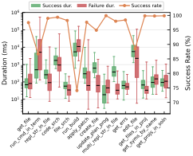

 Figure 24. Tool execution duration by success/failure status. Failed execution tools typically takes longer at tail and has a higher variance compared to successful ones.

Across nearly every tool, the failure-duration distribution sits above and is wider than the success-duration distribution, and the effect is most extreme for run_cmd_in_terminal: a failed invocation takes 48\(\times\) longer at P95 than a successful one. This creates extended blocking gaps where the agent waits for tool results before issuing the next LLM call. While failed executions frequently yield the error messages and diagnostics needed for the agent to make progress, they introduce longer dependency chains that amplify resource residency times across the workflow.

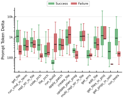

 Figure 25. Tokens added from tool call outputs grouped by success/failure status of tool execution.

Added Prompt Tokens from Tool Outputs. Beyond wall-clock time, tool invocations also differ substantially in how many prompt tokens they inject into the agent’s context, and this cost is not uniform across success and failure states ([Figure 25](https://arxiv.org/html/2608.00101#S7.F25 "In 7.1. Tool Usage Statistics ‣ 7. Tools ‣ Agentic Coding in the Wild: Characterizing GitHub Copilot at Production Scale")). For most read-oriented and mutation tools such as get_file, code_search, and apply_patch, successful and failed calls contribute a broadly similar number of tokens, with failures occasionally trending lower since error responses are often terse compared to full file or search contents. One clearest exception to this pattern is run_build: successful builds return minimal output (a median of roughly 60 tokens), whereas failed builds inject substantially more context, often 7–8\(\times\) more at the median, consistent with compilers emitting verbose diagnostics, stack traces, or error logs on failure. This compounds the latency effect described above—failed run_build calls are both slower and more context-expensive, doubly taxing the agent loop. The opposite pattern appears for run_tests, where successful runs report richer token deltas (_e.g._ , coverage or per-test summaries) while failures return less output.

 

### 7.2. Runtime Parallelism

Tool Call Parallelism. Tool invocation is also predominantly sequential, although noticeably more parallel than LLM execution. [Figure 26](https://arxiv.org/html/2608.00101#S7.F26 "In 7.2. Runtime Parallelism ‣ 7. Tools ‣ Agentic Coding in the Wild: Characterizing GitHub Copilot at Production Scale") shows the distribution of per-turn tool parallelism. Across all tool batches, 93% contain a single tool invocation, while only 7% dispatch multiple tools concurrently. Among the parallel batches, the median width is 2 tools and 87.5% contain at most 3 tools, indicating that most parallelism is shallow despite a long tail that reaches 108 concurrent tool invocations.

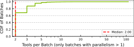

 Figure 26. Tool call concurrency during a turn. 93% of batches contain a single tool (issued in batches), but a power-law tail extends to 80+ parallel tools. 

Parallelism is concentrated in read-only operations. [Figure 27](https://arxiv.org/html/2608.00101#S7.F27 "In 7.2. Runtime Parallelism ‣ 7. Tools ‣ Agentic Coding in the Wild: Characterizing GitHub Copilot at Production Scale") shows that tools such as get_file and get_symbols are frequently batched together, allowing agents to gather information from multiple sources simultaneously. In contrast, write and execution tools (_e.g._ , run_command and run_build) are rarely parallelized because they modify shared state or produce side effects that require serialization for correctness.

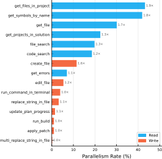

 Figure 27. Per-tool parallelism for the 15 most-invoked tools. Bars show each tool’s _parallelism rate_ (_i.e._ , the fraction of its invocations issued in a parallelized batch). The annotation at the end of each bar (_e.g._ , \(1.9\times\)) is the tool’s _average batch size_. Read/lookup tools are frequently batched; write/run-command tools are almost always serial.

The prevalence of small read-only batches suggests that agents already exploit parallelism when exploring code bases, but only conservatively. Given that information-gathering phases account for a substantial fraction of turns, more batching of independent read operations could reduce wall-clock latency without introducing consistency risks. At the same time, the rarity of large parallel batches indicates that existing serving systems need not optimize for extreme tool fan-out in the common case.

 

LLM-Tool Overlap. LLM-tool parallelism ([Biswas et al., 2026](https://arxiv.org/html/2608.00101#bib.bib8); [Xu et al., 2024](https://arxiv.org/html/2608.00101#bib.bib38)) has been applied to hide tool execution fully or partially behind ongoing LLM inference. [Figure 28](https://arxiv.org/html/2608.00101#S7.F28 "In 7.2. Runtime Parallelism ‣ 7. Tools ‣ Agentic Coding in the Wild: Characterizing GitHub Copilot at Production Scale") partitions tool-batch execution time into _overlapped_ intervals (executing while at least one LLM call is active) and _independent_ intervals (executing outside any LLM call time window).

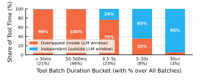

 Figure 28. Fraction of tool execution time that overlaps with an active LLM call, grouped by tool-batch duration.

Short tool batches are almost completely shadowed by LLM execution. For batches shorter than 500 ms, over 99% of tool time overlaps with an active LLM call. Even for 0.5–5 s batches, 76% of execution time remains hidden. Only long-running tool batches become visible on the critical path: for 5–30 s batches, 65% of tool time occurs independently of LLM execution, while for 30 s+ batches nearly all (95%) tool time lies outside LLM windows.

This overlap pattern reveals a sharp gap between per-call and aggregate behavior. By batch _count_ , overlap is pervasive: 97% of tool batches run at least partially inside an LLM window, and the many short-lived information-gathering calls are almost fully hidden behind ongoing model inference.

Table 7. User types depending on the coding agent usage. Values are per-user medians.

User type | % Users | Sessions | Turns | Tools per Turn | Tokens per Turn | Description  
---|---|---|---|---|---|---  
Readers | 41.7 | 2 | 6 | 4.8 | 203K | Mostly reads/searches  
Coders | 30.4 | 5 | 50 | 6.2 | 417K | Balanced read+edit+exec  
Terminal users | 11.0 | 2 | 7 | 4.0 | 213K | Mostly terminal calls  
Deep-loop users | 9.2 | 2 | 6 | 20.0 | 1.1M | Long agentic loops  
Chat-only users | 7.6 | 1 | 2 | 0.0 | 23K | 100% Q&A turns; no tools

 

In terms of the aggregate _wall-clock time_ , however, overlap barely dents tool execution: only 7.7% of total tool time is actually hidden inside LLM windows, while the remaining 92% sits on the critical path. This is because the long-tail of large, long-running tools, such as builds, test executions, or external commands, dominates total tool wall-clock time and is largely _not_ overlapped, materially affecting the session wall-clock time that end users perceive.

 

## 8\. Users

Linking sessions through anonymized user identifiers lets us characterize how the usage is distributed across the developer population, how different user behaviors translate into distinct resource footprint usage over time, and what these differences imply for serving-system SLOs.

### 8.1. User Archetypes

[Table 7](https://arxiv.org/html/2608.00101#S7.T7 "In 7.2. Runtime Parallelism ‣ 7. Tools ‣ Agentic Coding in the Wild: Characterizing GitHub Copilot at Production Scale") groups users into five behavioral archetypes based on their per-turn tool/llm-call mix and token consumptions (values are per-user medians).

Readers (41.7%). The largest group runs short sessions (median 2 sessions, 6 turns) dominated by file reads and code searches, consuming a modest 203K tokens per turn (median). These users primarily use the coding agent for information retrieval, _e.g._ , exploring unfamiliar codebases, looking up API signatures, or gathering context before making a decision. Their sessions are fast and stateless from a resource perspective: fast and parallel tool execution (read tools complete in tens of milliseconds), slightly longer tool outputs, and overall short session durations.

Coders (30.4%). The most engaged group by session volume, with a median of 5 sessions and 50 turns per user during the observation period. Coders balance reads, edits, and executions at 417K tokens per turn and 6.2 tools per turn, reflecting the full software-engineering workflow: gather context, modify code, validate via build or test.

Terminal Users (11.0%). These users lean heavily on command execution (run_command_in_terminal), with a median of 4.0 tools per turn and 213K tokens per turn. Their sessions are characterized by highly variable tool/command latency: terminal commands range from near-instant to minutes-long builds or test suites, creating unpredictable idle patterns that complicate resource scheduling.

Deep-loop Users (9.2%). The most resource-intensive user type, running long autonomous loops with 20.0 tools per turn and 1.1M tokens per turn—5\(\times\) the token consumption of readers and 2.6\(\times\) that of coders. Despite having only 2 median sessions and 6 turns per user, each turn generates substantial serving load due to the extended chains of LLM\(\leftrightarrow\)tool interactions. These users delegate complex, multi-step tasks (large refactors, cross-file migrations, debugging sessions) and rely on the agent’s autonomy to iterate without intervention. As shown in Figure [29](https://arxiv.org/html/2608.00101#S8.F29 "Figure 29 ‣ 8.1. User Archetypes ‣ 8. Users ‣ Agentic Coding in the Wild: Characterizing GitHub Copilot at Production Scale"), the deep-loop users show more activity during the weekends compared to weekdays, as compared to the other archetypes. This leads to overall higher tool calls per turn during the weekends.

Chat-only Users (7.6%). These users never invoke tools, issuing pure question-and-answer turns at just 23K tokens per turn. With a median of 1 session and 2 turns, they represent the lightest workload—closer to a traditional chatbot interaction than an agentic coding workflow.

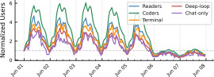

 Figure 29. Users of different types varying with time.  

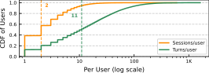

 Figure 30. Distribution of the number of sessions and turns per user during the data collection period. 

### 8.2. Resource Concentration

Consumption is heavily concentrated across users. [Figure 30](https://arxiv.org/html/2608.00101#S8.F30 "In 8.1. User Archetypes ‣ 8. Users ‣ Agentic Coding in the Wild: Characterizing GitHub Copilot at Production Scale") shows that the per-user session and turn counts are strongly right-skewed: most users run only a handful of sessions (median of 2 sessions per user, P90 of 8), while a small fraction of highly active developers accumulate hundreds of turns (median of 11 turns per user, P90 of 74). [Figure 31](https://arxiv.org/html/2608.00101#S8.F31 "In 8.3. Implications for Serving Infrastructure ‣ 8. Users ‣ Agentic Coding in the Wild: Characterizing GitHub Copilot at Production Scale") shows the same concentration in token consumption, where total prompt tokens dominate completion tokens by orders of magnitude (median of 3.2M vs. 33K tokens per user, respectively) and a minority of users account for a disproportionate share of the total token volume (P90 of 38M prompt tokens and 282K completion tokens per user). Together, these distributions indicate that a small subset of intensive users (_i.e._ , Coders and Deep-loop users) drives the bulk of serving load, echoing the heavy-tailed behaviors.

### 8.3. Implications for Serving Infrastructure

The cost of a cache miss (eviction followed by re-prefill) varies by over an order of magnitude across archetypes: for Deep-loop users, a single miss requires re-prefilling a median of 1.1M tokens, whereas the same event for Chat-only users only requires a prefill for 23K tokens. This 50\(\times\) disparity in per-miss cost means that a uniform KV-cache eviction timeout imposes disproportionate a latency tax on the most resource-intensive user segments. Beyond cache cost, Coders and Terminal users accumulate significant session state (modified files, running processes, environment variables, build artifacts) within their tool-execution containers, making premature container reclamation expensive; Readers and Chat-only users maintain minimal state and can be cold-started with negligible overhead. Together, these differences motivate a _tiered SLO model_ for agent serving:

  1. (1)

Retention priority: Deep-loop and Coder sessions should receive higher KV-cache retention priority due to their large re-prefill cost and higher probability of near-term reuse compared to the other types.

  2. (2)

Eviction aggressiveness and container lifecycle: Chat-only and Reader sessions can be evicted after short idle timeouts, without meaningful latency penalty, freeing memory for higher-priority sessions. Terminal and Coder users require stateful container management (checkpointing rather than termination), while Reader containers can be cold-started freely.

  3. (3)

Capacity planning: The heavy-tailed user distribution means that per-user fair-share policies must account for the 50\(\times\) token-consumption gap between Chat-only and Deep-loop users to avoid both starvation of intensive users and over-provisioning for light users.

 

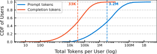

 Figure 31. Distribution of total prompt token and completion token consumption per user. 

## 9\. Idleness and Resource Reclamation

The agentic loop alternates between GPU-bound LLM inference and CPU/IO-bound tool execution, creating idle windows per session on each resource type. This section quantifies idle-time distributions and identifies actionable signals for resource lifecycle management. The central finding is that _turn boundaries_ are the most effective signal for container sleeping (when tool execution is done in sandbox containers) and KV cache eviction/offloading.

### 9.1. Idle Time Distributions

Coding agent workflows naturally alternate among LLM inference, tool execution, and user input, leaving different resources temporarily unused. To quantify these opportunities for resource reclamation, we define and estimate idle time from the perspective of each resource, assuming tool execution occurs inside sandbox containers.

  * •

Container idle: the elapsed time between two consecutive tool invocations. During this interval, the agent is processing tool outputs through one or more LLM calls, leaving the tool-execution container idle.

  * •

KV-cache idle: the elapsed time between two consecutive LLM calls. During this interval, the agent is executing tools or waiting for user input, while the corresponding KV cache remains allocated but unused.

Table 8. Resource idle time distributions. 

<table id="S9.T8.5" class="ltx_tabular ltx_centering ltx_guessed_headers ltx_align_middle">
<tbody class="ltx_tbody">
<tr id="S9.T8.5.1" class="ltx_tr">
<td id="S9.T8.5.1.1" class="ltx_td ltx_border_tt"></td>
<th id="S9.T8.5.1.2" class="ltx_td ltx_align_center ltx_th ltx_th_column ltx_border_tt" colspan="2">Intra-Turn</th>
<th id="S9.T8.5.1.3" class="ltx_td ltx_align_center ltx_th ltx_th_column ltx_border_tt" colspan="2">Cross-Turn</th></tr>
<tr id="S9.T8.5.2" class="ltx_tr">
<th id="S9.T8.5.2.1" class="ltx_td ltx_align_left ltx_th ltx_th_column">Resource</th>
<th id="S9.T8.5.2.2" class="ltx_td ltx_align_right ltx_th ltx_th_column ltx_border_t">P50</th>
<th id="S9.T8.5.2.3" class="ltx_td ltx_align_right ltx_th ltx_th_column ltx_border_t">P95</th>
<th id="S9.T8.5.2.4" class="ltx_td ltx_align_right ltx_th ltx_th_column ltx_border_t">P50</th>
<th id="S9.T8.5.2.5" class="ltx_td ltx_nopad_r ltx_align_center ltx_th ltx_th_column ltx_border_t">P95</th></tr>
<tr id="S9.T8.5.3" class="ltx_tr">
<td id="S9.T8.5.3.1" class="ltx_td ltx_align_left ltx_border_t">Container</td>
<td id="S9.T8.5.3.2" class="ltx_td ltx_align_right ltx_border_t">5.8s</td>
<td id="S9.T8.5.3.3" class="ltx_td ltx_align_right ltx_border_t">44s</td>
<td id="S9.T8.5.3.4" class="ltx_td ltx_align_right ltx_border_t">243s (4.1 min)</td>
<td id="S9.T8.5.3.5" class="ltx_td ltx_nopad_r ltx_align_center ltx_border_t">5,424s (\(\sim\)90 min)</td></tr>
<tr id="S9.T8.5.4" class="ltx_tr">
<td id="S9.T8.5.4.1" class="ltx_td ltx_align_left ltx_border_bb">KV cache</td>
<td id="S9.T8.5.4.2" class="ltx_td ltx_align_right ltx_border_bb">1.2s</td>
<td id="S9.T8.5.4.3" class="ltx_td ltx_align_right ltx_border_bb">37s</td>
<td id="S9.T8.5.4.4" class="ltx_td ltx_align_right ltx_border_bb">172s (2.9 min)</td>
<td id="S9.T8.5.4.5" class="ltx_td ltx_nopad_r ltx_align_center ltx_border_bb">4,500s (\(\sim\)75 min)</td></tr>
</tbody>
</table>

 

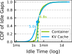

 (a) CDF of KV cache and (tool) container idle time.

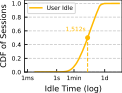

 (b) CDF of user idle time (that happens between two turns).

Figure 32. Idle time distribution.

[Figure 32(a)](https://arxiv.org/html/2608.00101#S9.F32.sf1 "In Figure 32 ‣ 9.1. Idle Time Distributions ‣ 9. Idleness and Resource Reclamation ‣ Agentic Coding in the Wild: Characterizing GitHub Copilot at Production Scale") shows the CDF of all idle intervals observed in any turns across sampled agentic sessions. Container idle times (green) are concentrated around a few seconds, with a median of 6.8 s, reflecting the time required for the LLM to process tool outputs and determine the next action. In contrast, KV-cache idle times (blue) are substantially shorter at the median (5.0 s), and nearly one-third of consecutive LLM calls occur with negligible idle time between them. This behavior arises because many agentic iterations contain lightweight tools whose execution completes almost immediately, allowing KV cache reuse with little delay.

User Idle Time between Turns. Both distributions exhibit heavy tails extending to hours. These long idle periods are caused by gaps that span turn boundaries, where the agent waits for user input before continuing the workflow. [Figure 32(b)](https://arxiv.org/html/2608.00101#S9.F32.sf2 "In Figure 32 ‣ 9.1. Idle Time Distributions ‣ 9. Idleness and Resource Reclamation ‣ Agentic Coding in the Wild: Characterizing GitHub Copilot at Production Scale") isolates this effect by plotting user idle time between turns. The median user idle time is 1,512 s (25.2 minutes), with a long tail extending beyond one day (users picking up an unattended session the next day), indicating that user activity time dominates the largest idle intervals observed.

To separate autonomous agent execution from user-driven pauses, we classify each idle interval as either _intra-turn_ (entirely within an agent turn) or _cross-turn_ (spanning a turn boundary). Table [8](https://arxiv.org/html/2608.00101#S9.T8 "Table 8 ‣ 9.1. Idle Time Distributions ‣ 9. Idleness and Resource Reclamation ‣ Agentic Coding in the Wild: Characterizing GitHub Copilot at Production Scale") shows the resulting breakdown. More than 90% of idle intervals are intra-turn, with median durations of only 5.8 s for containers and 1.2 s for KV caches. In contrast, the relatively small fraction of cross-turn intervals (8–9%) have median durations of 243 s and 172 s, respectively, over two orders of magnitude larger.

This sharp separation suggests that turn boundaries provide a natural signal for resource lifecycle management. Intra-turn idle periods are typically too short to justify sleeping containers or evicting KV caches, as reclamation overheads would frequently exceed the idle duration itself. Cross-turn idle periods, however, are long enough to amortize state migration and restoration costs, making them attractive opportunities for container hibernation and KV-cache offloading.

 

### 9.2. Turn Boundaries as Reclamation Signals

A turn boundary identifies _when_ a session may become reclaimable, but not _how long_ it will remain idle: reclaiming too eagerly forces a costly session reload on the next turn, while too late wastes resources that could serve other sessions. We therefore train a lightweight idle-time predictor that estimates, at each turn boundary, how long the session is likely to stay idle before the next turn arrives.

Input Features. Each completed turn is summarized by _turn-level_ features (duration, LLM calls, tokens, tool time, failures, success rate), _session-level_ features (turn index, elapsed time, prior idle gap, average idle so far), and _temporal_ features (_e.g._ , is_weekday). [Figure 33(a)](https://arxiv.org/html/2608.00101#S9.F33.sf1 "In Figure 33 ‣ 9.2. Turn Boundaries as Reclamation Signals ‣ 9. Idleness and Resource Reclamation ‣ Agentic Coding in the Wild: Characterizing GitHub Copilot at Production Scale") shows that session-level features dominate: average accumulated idle duration and turn index together account for over half of total importance, followed by previous idle duration and LLM success rate, while per-call features like token counts contribute little.

Prediction Formulation. Rather than predicting a single point estimate of idle duration, the predictor outputs a survival curve \(S(t)=\Pr(\text{idle}>t)\) (_e.g._ , the probability of idle time is greater than \(t\) seconds). This formulation lets a resource manager pick an operating point — e.g., “evict KV cache once \(\Pr(\text{idle}>60\mathrm{s})\) drops below some threshold” — without retraining, and lets the system cheaply refine its estimate as time passes: once \(t_{0}\) seconds have elapsed without a new turn arriving, the conditional survival probability is recomputed in closed form as \(S(t\mid\text{idle}>t_{0})=S(t)/S(t_{0})\), requiring no additional efforts.

Training Data. We train on turn-level traces sampled from all agent sessions: 150K sessions from a one-week window for training and 50K sessions from the following week for evaluation, so that the reported accuracy avoids overfitting.

Predictor Architecture. We use LightGBM ([Ke et al., 2017](https://arxiv.org/html/2608.00101#bib.bib18)) quantile regressors trained on log idle time, with one model per target quantile (12 quantiles, each a 400-tree gradient-boosted ensemble). The full model ensemble is roughly 2MB in size so offline training takes under a minute on the 150K training dataset with a single 16-vCPU AMD EPYC 7763 node; convergence is fast because gradient-boosted trees on \(O(10)\) tabular features need comparatively little data per tree. At inference time, evaluating all 12 models to reconstruct a survival curve takes under 3 ms per turn boundary, making it cheap enough to invoke at every turn boundary in the fleet.

Prediction Accuracy. For the binary task of predicting whether an idle gap will exceed 60 seconds, the predictor achieves ROC-AUC 0.73, compared to 0.5 for an always-positive baseline and 0.58 for a heuristic that uses only the previous idle gap. We swept possible model variants (_e.g._ , decision trees), and ROC-AUC changed only marginally across them, suggesting that additional model complexity is unlikely to help without richer input signals about past turns.

[Figure 33(b)](https://arxiv.org/html/2608.00101#S9.F33.sf2 "In Figure 33 ‣ 9.2. Turn Boundaries as Reclamation Signals ‣ 9. Idleness and Resource Reclamation ‣ Agentic Coding in the Wild: Characterizing GitHub Copilot at Production Scale") shows how prediction quality evolves as more time elapses after a turn boundary without a new turn arriving, evaluated at operating points from 30 seconds up to 30 minutes. Both accuracy and F1 score decline as the elapsed window grows: from roughly 80–88% at 30 seconds to 25–43% at 30 minutes, mainly due to the extreme skewness for longer idle time after 300 seconds.

Despite this, the fraction of total idle time correctly captured by the predictor (Captured idle time) stays consistently high, between 86% and 90% across time. This gap between decaying pointwise accuracy and stable captured idle time is the key property that makes the predictor useful in practice: even when the model cannot pinpoint exactly how long a session will remain idle, it reliably identifies _that_ the session will remain idle long enough to be worth reclaiming.

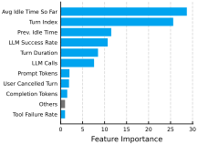

 (a) Feature importance for idleness prediction.

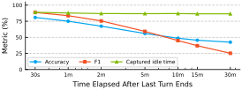

 (b) Prediction accuracy as time elapses.

Figure 33. Idle time prediction evaluation.

### 9.3. Multiplexing Opportunity based on Predictions

For agent serving platforms where LLM inference runs on a shared GPU cluster and tool execution runs in containers/sandboxes with either dedicated CPU cluster (_e.g._ , Kubernetes ([Microsoft, 2025a](https://arxiv.org/html/2608.00101#bib.bib26); [Amazon Web Services, 2025](https://arxiv.org/html/2608.00101#bib.bib3))) or FaaS services ([Amazon, 2025](https://arxiv.org/html/2608.00101#bib.bib2); [Microsoft, 2025b](https://arxiv.org/html/2608.00101#bib.bib27)), compute is multiplexed across all sessions system-wide. Therefore, two separate resources are schedulable: the session’s KV cache footprint, and the container/sandbox running its tool execution.

KV Cache Footprint. The KV cache is typically the binding constraint on serving capacity, and turn structure gives a real signal for managing it. Within a turn, the session’s KV cache should be retained in GPU memory, or at least within the node with high priority: the next call is imminent (median KV idle time of just 1.2 s), and evicting it would immediately force a costly recompute. At a turn boundary, the session enters an idle period (often long duration, median \(\sim\)25 minutes), making it the natural point to _deprioritize_ that session’s cache for offloading to DRAM or disk, freeing GPU memory for other sessions’ actively-growing caches.

This idle-duration prediction is actionable even at the API level, without backend control over cache eviction: the predicted idle time itself becomes the scheduling signal. Existing cache retention is time-bounded, _e.g._ , the default limit for Claude models is 300s (5 min) ([Anthropic, 2026b](https://arxiv.org/html/2608.00101#bib.bib6)), so a session idling past this window is evicted and recomputed regardless of when the next turn actually arrives. When the predictor indicates idle time straddling this cutoff, the provider can issue a cheap keep-alive request just before the deadline, refreshing the cache entry and avoiding a full recompute.

Tool Container. The tool-execution container is the second resource, and here the opportunity is closer to the traditional notion of reclaiming idle capacity ([Wang et al., 2021](https://arxiv.org/html/2608.00101#bib.bib37)) or keep-alive policies in serverless computing ([Shahrad et al., 2020](https://arxiv.org/html/2608.00101#bib.bib34)): while a session waits on its next LLM call, idle containers could be suspended or its capacity lent to another session’s tool execution, since containers, unlike GPU compute, are not pooled across sessions by the underlying infrastructure. The same turn-boundary signal applies: within a turn, tool calls follow in quick succession and the container should stay warm, while across turns, the idle gap is long enough to justify sleeping or reclaiming it.

## 10\. Related Work

Workload Characterization Studies. Our work follows the tradition of production workload characterization studies that have shaped systems design. Shahrad et al. ([Shahrad et al., 2020](https://arxiv.org/html/2608.00101#bib.bib34)) characterized Azure Functions traces to derive cold-start policies. Philly ([Jeon et al., 2019](https://arxiv.org/html/2608.00101#bib.bib16)) and Helios ([Hu et al., 2021](https://arxiv.org/html/2608.00101#bib.bib14)) characterized deep learning cluster workloads. POLCA ([Patel et al., 2024](https://arxiv.org/html/2608.00101#bib.bib31)) studied GPU power workloads at Azure scale. Our study extends this tradition to the emerging class of AI agent workloads, providing the first production-scale characterization of a coding assistant.

Coding Agent Benchmarks. SWE-bench ([Jimenez et al., 2024](https://arxiv.org/html/2608.00101#bib.bib17)) evaluates coding agents on real GitHub issues but provides a fixed benchmark of 2,294 tasks—not a production workload characterization. OpenHands ([Wang et al., 2024](https://arxiv.org/html/2608.00101#bib.bib36)) and SWE-agent ([Yang et al., 2024](https://arxiv.org/html/2608.00101#bib.bib39)) are open-source agent frameworks studied in controlled settings. Majgaonkar et al. ([Majgaonkar et al., 2025](https://arxiv.org/html/2608.00101#bib.bib25)) analyze code agent trajectories on SWE-bench, finding that failed trajectories are longer and more variable—consistent with our production finding of failure-driven retry loops. None of these papers studies real production workloads at the scale we present.

Coding Agent Characterization. Yuan et al. ([Yuan et al., 2026](https://arxiv.org/html/2608.00101#bib.bib43)) characterize benchmarked ReAct agents, showing decode-dominated execution under high context-cache reuse. Agent Arena ([Arena Team, 2026](https://arxiv.org/html/2608.00101#bib.bib7)) analyzes in-the-wild agent interactions for causal evaluation. TraceLab ([Zhu et al., 2026](https://arxiv.org/html/2608.00101#bib.bib47)) releases 4.3K Claude Code and Codex traces from 43 developers, finding autonomous loops, prefix-token cost, idle gaps, and heavy-tailed tool latency. Our study complements these efforts with production-scale GitHub Copilot traces spanning 13M sessions and 3.2M users, covering diverse coding agent usage and user population.

## 11\. Limitations and Future Work

No quality signals. Without prompt/response content, we cannot correlate infrastructure efficiency with task completion quality. A joint analysis of resource consumption and task success rate would enable quality-aware scheduling.

No server-side view. The traces we present are client-side. Server-side metrics (_e.g._ , GPU utilization, queue depth, batch size, and memory pressure) would enable end-to-end optimization rather than inference from client-observed latencies. However, going into such details can easily erode model-level and serving-engine confidentiality.

Evolving workload. The coding agent is rapidly evolving: new tools, new models, and new autonomy strategies appear weekly. While our characterization results are observed to remain consistent from January to June 2026, longitudinal tracking on GitHub Copilot Agent is needed to understand how the workload characteristics such as LLM call parallelism may drift in the future.

## 12\. Conclusion

In this paper, we characterized the production coding-agent workloads of GitHub Copilot. The characterization unearthed several key observations on the LLM\(\leftrightarrow\)tool execution loop, agentic workflow types, KV-cache lifecycle, and resource idleness. With session-level features, we proposed a lightweight idle-time predictor for turn-boundary resource reclamation, which is able to capture 86–90% of idle time. Alongside the characterization results, we discuss their systems design implications, including session-aware scheduling, cache lifecycle management, adaptive compaction, and archetype-aware SLOs. We plan to release sanitized traces from our characterization data to the public soon.

## References

  * Amazon (2025) Amazon. 2025.  AWS Lambda.  <https://aws.amazon.com/lambda/>. 
  * Amazon Web Services (2025) Amazon Web Services. 2025.  Elastic Kubernetes Service (EKS).  <https://aws.amazon.com/eks/>. 
  * Anthropic (2025) Anthropic. 2025.  Claude Code.  <https://docs.anthropic.com/en/docs/claude-code>. 
  * Anthropic (2026a) Anthropic. 2026a.  Anthropic Economic Index report: Cadences.  <https://www.anthropic.com/research/economic-index-june-2026-report>. 
  * Anthropic (2026b) Anthropic. 2026b.  Prompt Caching.  <https://platform.claude.com/docs/en/build-with-claude/prompt-caching>.  Claude Platform Documentation. Accessed: 2026-07-09. 
  * Arena Team (2026) Arena Team. 2026.  Agent Arena: Causal Evaluation of Agents in the Real World.  <https://arena.ai/blog/agent-arena-methodology>.  Arena Blog. 
  * Biswas et al. (2026) Samriddhi Biswas, Sagar Goel, Ranjita Mohan, Samarth Khare, Ranjita Ramjee, and Mohit Bansal. 2026.  Sutradhara: Orchestrator-Engine Co-Design for Tool-Based Agentic Inference.  _arXiv preprint arXiv:2601.12967_ (2026). 
  * Chaudhry et al. (2026) Gohar Irfan Chaudhry, Esha Choukse, Haoran Qiu, Íñigo Goiri, Rodrigo Fonseca, Adam Belay, and Ricardo Bianchini. 2026.  Murakkab: Resource-efficient agentic workflow orchestration in cloud platforms. In _Proceedings of the 20th USENIX Symposium on Operating Systems Design and Implementation (OSDI)_. 
  * Feng et al. (2025) Jiazhan Feng, Shijue Huang, Xingwei Qu, Ge Zhang, Yujia Qin, Baoquan Zhong, Chengquan Jiang, Jinxin Chi, and Wanjun Zhong. 2025.  ReTool: Reinforcement learning for strategic tool use in LLMs.  _arXiv preprint arXiv:2504.11536_ (2025). 
  * GitHub (2025) GitHub. 2025.  GitHub Copilot.  <https://github.com/features/copilot>. 
  * GitHub Copilot (2026) GitHub Copilot. 2026.  GitHub Copilot CLI Context Management and Compaction.  <https://docs.github.com/en/copilot/concepts/agents/copilot-cli/context-management>.  GitHub Docs. Accessed: 2026-07-09. 
  * Guo et al. (2026) Dongxin Guo, Jikun Wu, and Siu Ming Yiu. 2026.  SAGA: Workflow-Atomic Scheduling for AI Agent Inference on GPU Clusters.  _arXiv preprint arXiv:2605.00528_ (2026). 
  * Hu et al. (2021) Qinghao Hu, Peng Sun, Shengen Yan, Yonggang Wen, and Tianwei Zhang. 2021.  Characterization and Prediction of Deep Learning Workloads in Large-Scale GPU Datacenters. In _Proceedings of the International Conference for High Performance Computing, Networking, Storage and Analysis (SC)_. 
  * Jain et al. (2025) Naman Jain, Alex Gu, Wen-Ding Li, Fanjia Yan, Tianjun Zhang, Sida Wang, Armando Solar-Lezama, Koushik Sen, and Ion Stoica. 2025.  LiveCodeBench: Holistic and contamination free evaluation of large language models for code. In _International Conference on Learning Representations_ , Vol. 2025. 58791–58831. 
  * Jeon et al. (2019) Myeongjae Jeon, Shivaram Venkataraman, Amar Phanishayee, Junjie Qian, Wencong Xiao, and Fan Yang. 2019.  Analysis of Large-Scale Multi-Tenant GPU Clusters for DNN Training Workloads. In _Proceedings of the 2019 USENIX Annual Technical Conference (ATC)_. 
  * Jimenez et al. (2024) Carlos E Jimenez, John Yang, Alexander Wettig, Shunyu Yao, Kexin Pei, Ofir Press, and Karthik Narasimhan. 2024.  SWE-bench: Can Language Models Resolve Real-World GitHub Issues?  _arXiv preprint arXiv:2310.06770_ (2024). 
  * Ke et al. (2017) Guolin Ke, Qi Meng, Thomas Finley, Taifeng Wang, Wei Chen, Weidong Ma, Qiwei Ye, and Tie-Yan Liu. 2017.  LightGBM: A highly efficient gradient boosting decision tree.  _Advances in neural information processing systems_ 30 (2017). 
  * Kwon et al. (2023) Woosuk Kwon, Zhuohan Li, Siyuan Zhuang, Ying Sheng, Lianmin Zheng, Cody Hao Yu, Joseph E Gonzalez, Hao Zhang, and Ion Stoica. 2023.  vLLM: Efficient Memory Management for Large Language Model Serving with PagedAttention. In _Proceedings of the 29th Symposium on Operating Systems Principles (SOSP)_. 
  * Li et al. (2025) Hanchen Li, Azalia Mirhoseini, and Ion Stoica. 2025.  Efficient Agentic LLM Inference with KV Cache Retention.  _arXiv preprint arXiv:2511.02230_ (2025). 
  * Lin et al. (2024) Chaofan Lin, Zhenhua Han, Chengruidong Zhang, Yuqing Yang, Fan Liu, Chen Chen, and Lili Qiu. 2024.  Parrot: Efficient Serving of LLM-based Applications with Semantic Variable.  _Proceedings of the 18th USENIX Symposium on Operating Systems Design and Implementation (OSDI)_ (2024). 
  * Liu et al. (2026) Banruo Liu, Wei-Yu Lin, Minghao Fang, Yihan Jiang, and Fan Lai. 2026.  Compass: SLO-aware Query Planner for Compound AI Serving at Scale.  arXiv:2504.16397 [cs.DB] <https://arxiv.org/abs/2504.16397>
  * Liu et al. (2025) Yuhan Liu, Yihua Cheng, Jiayi Yao, Yuwei An, Xiaokun Chen, Shaoting Feng, Yuyang Huang, Samuel Shen, Rui Zhang, Kuntai Du, et al. 2025\.  LMCache: An efficient KV cache layer for enterprise-scale LLM inference.  _arXiv preprint arXiv:2510.09665_ (2025). 
  * Luo et al. (2025) Michael Luo, Xiaoxiang Shi, Colin Cai, Tianjun Zhang, Justin Wong, Yichuan Wang, Chi Wang, Yanping Huang, Zhifeng Chen, Joseph E Gonzalez, et al. 2025\.  Autellix: An efficient serving engine for LLM agents as general programs.  _arXiv preprint arXiv:2502.13965_ (2025). 
  * Majgaonkar et al. (2025) Prateek Majgaonkar et al. 2025\.  Understanding Code Agent Behaviour: An Empirical Study.  _arXiv preprint arXiv:2511.00197_ (2025). 
  * Microsoft (2025a) Microsoft. 2025a.  Azure Kubernetes Service (AKS).  <https://azure.microsoft.com/en-us/services/kubernetes-service/>. 
  * Microsoft (2025b) Microsoft. 2025b.  Serverless on Azure.  <https://azure.microsoft.com/en-us/solutions/serverless>. 
  * Microsoft (2026) Microsoft. 2026.  Microsoft 365 Copilot AI for Enterprise Productivity.  <https://www.microsoft.com/en-us/microsoft-365-copilot/enterprise>. 
  * OpenAI (2025a) OpenAI. 2025a.  Codex.  <https://openai.com/index/codex/>. 
  * OpenAI (2025b) OpenAI. 2025b.  Introducing Deep Research.  <https://openai.com/index/introducing-deep-research/>. 
  * Patel et al. (2024) Pratyush Patel, Esha Choukse, Chaojie Zhang, Íñigo Goiri, Brijesh Warrier, Nithish Mahalingam, and Ricardo Bianchini. 2024.  Characterizing Power Management Opportunities for LLMs in the Cloud. In _Proceedings of the 29th ACM International Conference on Architectural Support for Programming Languages and Operating Systems, Volume 3_ (La Jolla, CA, USA) _(ASPLOS ’24)_. Association for Computing Machinery, New York, NY, USA, 207–222.  [doi:10.1145/3620666.3651329](https://doi.org/10.1145/3620666.3651329)
  * Qiu et al. (2025) Haoran Qiu, Anish Biswas, Zihan Zhao, Jayashree Mohan, Alind Khare, Esha Choukse, Íñigo Goiri, Zeyu Zhang, Haiying Shen, Chetan Bansal, Ramachandran Ramjee, and Rodrigo Fonseca. 2025.  ModServe: Modality- and Stage-Aware Resource Disaggregation for Scalable Multimodal Model Serving. In _Proceedings of the 2025 ACM Symposium on Cloud Computing (SoCC 2025)_ (Virtual). Association for Computing Machinery, New York, NY, USA. 
  * Ro et al. (2025) Yeonju Ro, Haoran Qiu, Íñigo Goiri, Rodrigo Fonseca, Ricardo Bianchini, Aditya Akella, Zhangyang Wang, Mattan Erez, and Esha Choukse. 2025.  Sherlock: Reliable and Efficient Agentic Workflow Execution.  _arXiv preprint arXiv:2511.00330_ (2025). 
  * Shahrad et al. (2020) Mohammad Shahrad, Rodrigo Fonseca, Íñigo Goiri, Gohar Chaudhry, Paul Batum, Jason Cooke, Eduardo Laureano, Colby Tresness, Mark Russinovich, and Ricardo Bianchini. 2020.  Serverless in the Wild: Characterizing and Optimizing the Serverless Workload at a Large Cloud Provider. In _Proceedings of the 2020 USENIX Annual Technical Conference (ATC)_. 
  * Stojkovic et al. (2025) Jovan Stojkovic, Chaojie Zhang, Íñigo Goiri, Josep Torrellas, and Esha Choukse. 2025.  DynamoLLM: Designing LLM inference clusters for performance and energy efficiency. In _2025 IEEE International Symposium on High Performance Computer Architecture (HPCA)_. IEEE, 1348–1362. 
  * Wang et al. (2024) Xingyao Wang et al. 2024\.  OpenHands: An Open Platform for AI Software Developers as Generalist Agents.  _arXiv preprint arXiv:2407.16741_ (2024). 
  * Wang et al. (2021) Yawen Wang, Kapil Arya, Marios Kogias, Manohar Vanga, Aditya Bhandari, Neeraja J Yadwadkar, Siddhartha Sen, Sameh Elnikety, Christos Kozyrakis, and Ricardo Bianchini. 2021.  SmartHarvest: Harvesting idle CPUs safely and efficiently in the cloud. In _Proceedings of the Sixteenth European Conference on Computer Systems_. 1–16. 
  * Xu et al. (2024) Yechen Xu, Xinhao Kong, Tingjun Chen, and Danyang Zhuo. 2024.  Conveyor: Efficient tool-aware LLM serving with tool partial execution.  _arXiv preprint arXiv:2406.00059_ (2024). 
  * Yang et al. (2024) John Yang, Carlos E Jimenez, Alexander Wettig, Kilian Liber, Karthik Narasimhan, and Ofir Press. 2024.  SWE-agent: Agent-Computer Interfaces Enable Automated Software Engineering.  _arXiv preprint arXiv:2405.15793_ (2024). 
  * Yao et al. (2023) Shunyu Yao, Jeffrey Zhao, Dian Yu, Nan Du, Izhak Shafran, Karthik Narasimhan, and Yuan Cao. 2023.  ReAct: Synergizing Reasoning and Acting in Language Models.  _arXiv preprint arXiv:2210.03629_ (2023). 
  * Yu et al. (2022) Gyeong-In Yu, Joo Seong Jeong, Geon-Woo Kim, Soojeong Kim, and Byung-Gon Chun. 2022.  Orca: A Distributed Serving System for Transformer-Based Generative Models. In _Proceedings of the 16th USENIX Symposium on Operating Systems Design and Implementation (OSDI)_. 
  * Yu et al. (2026) Shan Yu, Junyi Shu, Yuanjiang Ni, Kun Qian, Xue Li, Yang Wang, Jinyuan Zhang, Ziyi Xu, Shuo Yang, Lingjun Zhu, et al. 2026\.  Pythia: Exploiting Workflow Predictability for Efficient Agent-Native LLM Serving.  _arXiv preprint arXiv:2604.25899_ (2026). 
  * Yuan et al. (2026) Yichao Yuan, Ankita Nayak, Souvik Kundu, and Nishil Talati. 2026.  Agentic AI Workload Characteristics.  _arXiv preprint arXiv:2605.26297_ (2026). 
  * Zhang et al. (2025) Wei Zhang, Zhiyu Wu, Yi Mu, Rui Ning, Banruo Liu, Nikhil Sarda, Myungjin Lee, and Fan Lai. 2025.  JITServe: SLO-aware LLM Serving with Imprecise Request Information.  arXiv:2504.20068 [cs.DC] <https://arxiv.org/abs/2504.20068>
  * Zheng et al. (2024) Lianmin Zheng, Liangsheng Yin, Zhiqiang Xie, Chuyue Sun, Jeff Huang, Cody Hao Yu, Shi Cao, Christos Kober, Liang Shi, Ziniu Wu, et al. 2024\.  SGLang: Efficient Execution of Structured Language Model Programs.  _arXiv preprint arXiv:2312.07104_ (2024). 
  * Zheng et al. (2025) Yuxiang Zheng, Dayuan Fu, Xiangkun Hu, Xiaojie Cai, Lyumanshan Ye, Pengrui Lu, and Pengfei Liu. 2025.  DeepResearcher: Scaling deep research via reinforcement learning in real-world environments. In _Proceedings of the 2025 Conference on Empirical Methods in Natural Language Processing_. 414–431. 
  * Zhu et al. (2026) Kan Zhu, Mathew Jacob, Chenxi Ma, Yi Pan, Stephanie Wang, Arvind Krishnamurthy, and Baris Kasikci. 2026.  TraceLab: Characterizing Coding Agent Workloads for LLM Serving.  arXiv:2606.30560 [cs.LG] <https://arxiv.org/abs/2606.30560>

