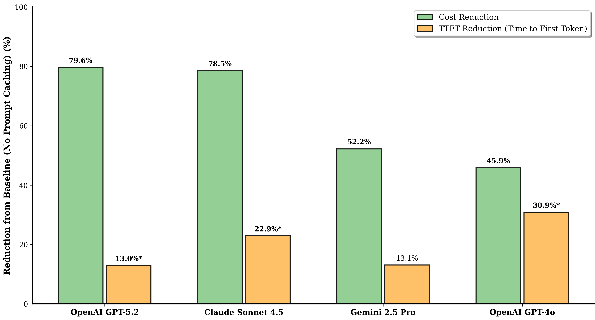
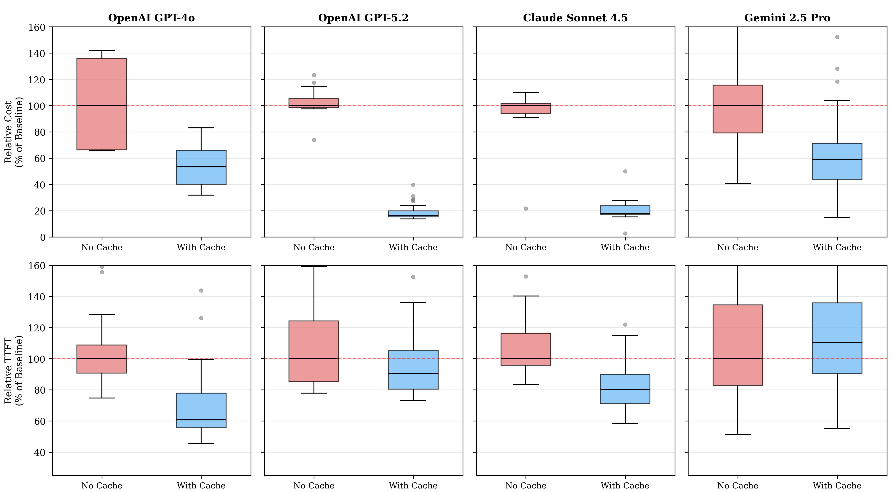
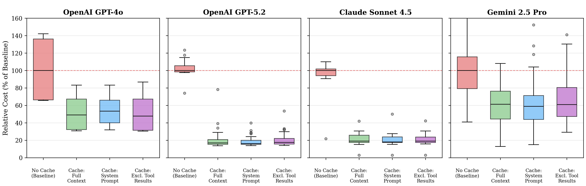
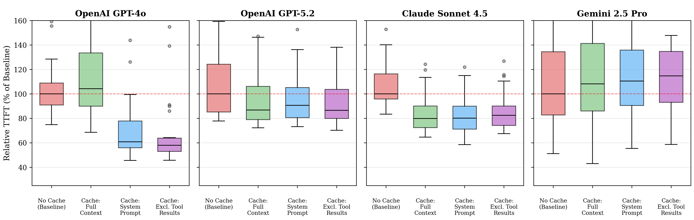
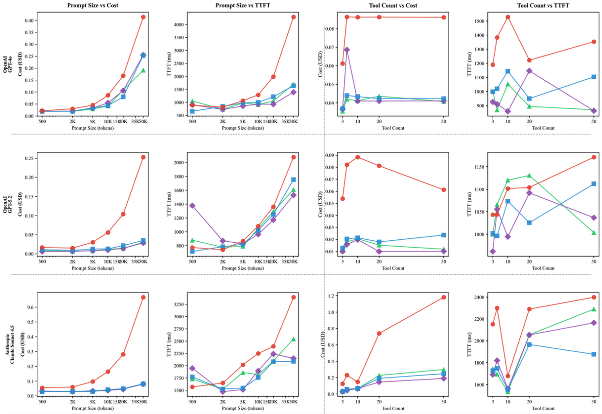
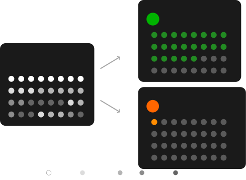
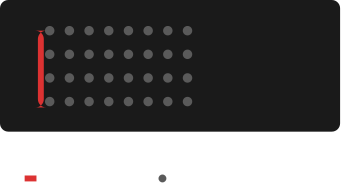
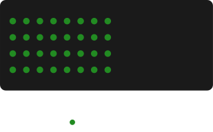
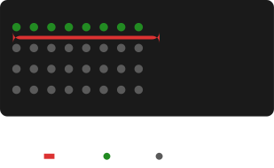
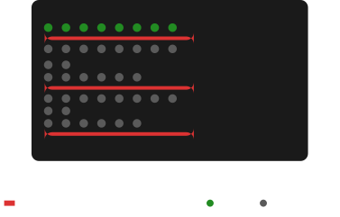

**Source:** *Don't Break the Cache: An Evaluation of Prompt Caching for Long-Horizon Agentic Tasks* — [PDF](https://arxiv.org/pdf/2601.06007) · [arXiv](https://arxiv.org/abs/2601.06007)

# Don’t Break the Cache: An Evaluation of Prompt Caching   
for Long-Horizon Agentic Tasks

Elias Lumer  Affiliation: PricewaterhouseCoopers, U.S.  Correspondence to: [elias.lumer@pwc.com](mailto:elias.lumer@pwc.com) Faheem Nizar  Affiliation: PricewaterhouseCoopers, U.S.  Akshaya Jangiti  Affiliation: PricewaterhouseCoopers, U.S.  Kevin Frank  Affiliation: PricewaterhouseCoopers, U.S.  Anmol Gulati  Affiliation: PricewaterhouseCoopers, U.S.  Mandar Phadate  Affiliation: PricewaterhouseCoopers, U.S.  Vamse Kumar Subbiah  Affiliation: PricewaterhouseCoopers, U.S. 

###### Abstract

Recent advancements in Large Language Model (LLM) agents have enabled complex multi-turn agentic tasks requiring extensive tool calling, where conversations can span dozens of API calls with increasingly large context windows. However, although major LLM providers offer prompt caching to reduce cost and latency, its benefits for agentic workloads remain underexplored in the research literature. To our knowledge, no prior work quantifies these cost savings or compares caching strategies for multi-turn agentic tasks. We present a comprehensive evaluation of prompt caching across three major LLM providers (OpenAI, Anthropic, and Google) and compare three caching strategies, including full context caching, system prompt only caching, and caching that excludes dynamic tool results. We evaluate on DeepResearch Bench, a multi-turn agentic benchmark where agents autonomously execute real-world web search tool calls to answer complex research questions, measuring both API cost and time to first token (TTFT) across over 500 agent sessions with 10,000-token system prompts. Our results demonstrate that prompt caching reduces API costs by 41-80% and improves time to first token by 13-31% across providers. We find that strategic prompt cache block control, such as placing dynamic content at the end of the system prompt, avoiding dynamic traditional function calling, and excluding dynamic tool results, provides more consistent benefits than naive full-context caching, which can paradoxically increase latency. An ablation study across prompt sizes (500-50,000 tokens) and tool call counts (3-50) demonstrates universal linear cost and TTFT benefits, after the provider caching token minimum, and reveal provider-specific strategy discrepancies across variants. We provide nuanced discussion and guidance for implementing prompt caching in production agentic systems.

###### Keywords: 

Prompt Caching, Large Language Models, Agentic AI, Tool Calling, API Optimization 

PricewaterhouseCoopers, U.S.

## 1 Introduction

Recent advancements in Large Language Model (LLM) agents have enabled complex, long-horizon agentic tasks that require extensive tool calling across multi-turn conversations ([Ji, 2025](https://arxiv.org/html/2601.06007#bib.bib34)). Through function calling, LLM agents can invoke APIs, execute web searches, interact with databases, and perform domain-specific actions on behalf of users. As these agentic workloads grow in complexity, conversations can span dozens of API calls with context windows accumulating tens of thousands of tokens, leading to significant costs and latency overhead. To address this, major LLM providers including OpenAI, Anthropic, and Google offer prompt caching, a feature that reuses previously computed key-value (KV) tensors from attention layers to avoid redundant computation on repeated prompt prefixes ([OpenAI, 2026](https://arxiv.org/html/2601.06007#bib.bib28); [Anthropic, 2026](https://arxiv.org/html/2601.06007#bib.bib29); [Google Cloud, 2026a](https://arxiv.org/html/2601.06007#bib.bib30)).

 Figure 1:  Prompt caching benefits (best cache mode per model). Percentage reduction in API cost and time to first token (TTFT) relative to a no-cache baseline. Asterisks denote statistically significant TTFT improvements (\(p<0.05\)). 

While providers offer reduced pricing for cached input tokens, the benefits of prompt caching in real-world agentic workloads remain under-explored in the research literature. Existing work on KV cache optimization focuses primarily on inference-level memory management and compression ([Kwon et al., 2023](https://arxiv.org/html/2601.06007#bib.bib37); [Ge et al., 2023](https://arxiv.org/html/2601.06007#bib.bib38); [Shi et al., 2024](https://arxiv.org/html/2601.06007#bib.bib39)), rather than evaluating the enterprise-grade prompt caching features offered through provider APIs. Concurrent work has audited prompt caching across providers to detect timing side-channel vulnerabilities ([Gu et al., 2025](https://arxiv.org/html/2601.06007#bib.bib17)), but to our knowledge, no prior work has quantified the cost benefits of prompt caching or compared caching strategies for agentic workloads. This gap is particularly significant given the recent proliferation of long-running agents for deep research, coding assistance, and autonomous task completion, where prompt caching could substantially reduce operational costs and improve user experience through faster response times.

In this paper, we present the first comprehensive evaluation of prompt caching strategies for long-horizon agentic tasks across three LLM providers (OpenAI, Anthropic, and Google) using four flagship models (Figure [1](https://arxiv.org/html/2601.06007#S1.F1 "Figure 1 ‣ 1 Introduction ‣ Don’t Break the Cache: An Evaluation of Prompt Cachingfor Long-Horizon Agentic Tasks")). We compare three caching strategies, including full context caching, system prompt only caching, and caching that excludes dynamic tool results. We evaluate on DeepResearch Bench ([Du et al., 2025](https://arxiv.org/html/2601.06007#bib.bib41)), a multi-turn agentic benchmark where agents autonomously execute web search tool calls to answer research questions. Our evaluation spans 500 agent sessions with 10,000-token system prompts, measuring both API cost and time to first token (TTFT) across all conditions.

Our evaluation reveals three key findings:

Prompt caching delivers substantial and consistent cost savings across all providers: All four models tested show statistically significant cost reductions when prompt caching is enabled. Cost savings range from 41% to 80% across providers. These savings are consistent across all three caching strategies, demonstrating that prompt caching provides reliable cost benefits regardless of the specific caching approach employed.

Latency improvements vary significantly across providers and require careful strategy selection: Time to first token improvements range from 13% to 31% across providers, though latency variance differs substantially between providers. Notably, the cache strategy that maximizes cost savings does not always maximize latency improvement, highlighting the importance of strategy selection based on optimization goals.

Strategic cache boundary control outperforms naive full-context caching: Providers abstract much of the caching mechanism, automatically triggering cache creation when token thresholds are exceeded. However, naively enabling full-context caching can paradoxically increase latency, as dynamic tool calls and results may trigger cache writes for content that will not be reused across sessions. By strategically controlling cache boundaries, such as caching only the system prompt or explicitly excluding tool results, practitioners can ensure that only stable, reusable content is cached. Our results show that system prompt only caching provides the most consistent benefits across both cost and latency dimensions.

## 2 Background

### 2.1 KV Cache and LLM Inference

Large Language Model inference consists of two distinct phases: the prefill phase, where the model processes the input prompt and generates attention key-value (KV) tensors, and the decode phase, where the model autoregressively generates output tokens ([Pope et al., 2022](https://arxiv.org/html/2601.06007#bib.bib36)). During prefill, the model computes attention over the entire input sequence, producing KV tensors that capture the contextual representations needed for subsequent generation. These KV tensors are stored in the KV cache and reused during decoding to avoid redundant computation, enabling efficient token-by-token generation ([Not Lain, 2025](https://arxiv.org/html/2601.06007#bib.bib35)).

This has motivated extensive research on KV cache optimization, including memory management techniques such as PagedAttention ([Kwon et al., 2023](https://arxiv.org/html/2601.06007#bib.bib37)), which applies paging-style memory management to reduce fragmentation and waste. Other approaches focus on KV cache compression through selective retention of important tokens ([Ge et al., 2023](https://arxiv.org/html/2601.06007#bib.bib38)), storage-compute tradeoffs ([Jin et al., 2024](https://arxiv.org/html/2601.06007#bib.bib40)), and shared prefix optimization for high-throughput inference ([Juravsky et al., 2024](https://arxiv.org/html/2601.06007#bib.bib2); [Wu and others, 2024](https://arxiv.org/html/2601.06007#bib.bib1); [Sun et al., 2025](https://arxiv.org/html/2601.06007#bib.bib23); [Zhou et al., 2024](https://arxiv.org/html/2601.06007#bib.bib21)).

### 2.2 Prompt Caching in Provider APIs

While KV caching is a general inference optimization technique, prompt caching refers to the productized, provider-managed features that reuse KV tensors across API requests when prompts share common prefixes ([OpenAI, 2026](https://arxiv.org/html/2601.06007#bib.bib28); [Gim et al., 2024](https://arxiv.org/html/2601.06007#bib.bib27)). By caching the KV tensors from the prefill phase, providers can skip redundant computation when subsequent requests begin with the same content, reducing both latency and cost for users.

Major LLM providers have implemented prompt caching with varying approaches. OpenAI offers automatic prompt caching on GPT-4o and newer models, where caching activates automatically for prompts exceeding a minimum token threshold, with cache hits occurring only for exact prefix matches ([OpenAI, 2026](https://arxiv.org/html/2601.06007#bib.bib28); [OpenAI, 2024a](https://arxiv.org/html/2601.06007#bib.bib31)). Anthropic provides developer-controlled caching through explicit cache breakpoints, allowing users to specify which portions of their prompt should be cached, with configurable time-to-live (TTL) options ([Anthropic, 2026](https://arxiv.org/html/2601.06007#bib.bib29); [Anthropic, 2025b](https://arxiv.org/html/2601.06007#bib.bib32)). Google offers both implicit caching, which activates automatically with no guaranteed cost savings, and explicit context caching, where developers create and reference caches with guaranteed discounts ([Google Cloud, 2026a](https://arxiv.org/html/2601.06007#bib.bib30); [Kilpatrick, 2025](https://arxiv.org/html/2601.06007#bib.bib33)).

Implementation details such as minimum token thresholds (typically 1,024-4,096 tokens depending on model, see Table [4](https://arxiv.org/html/2601.06007#A1.T4 "Table 4 ‣ Appendix A Prompt caching pricing at time of evaluation ‣ Don’t Break the Cache: An Evaluation of Prompt Cachingfor Long-Horizon Agentic Tasks")), TTL durations (ranging from 5 minutes to 24 hours), and pricing structures vary across providers and are subject to change ([PromptHub, 2025](https://arxiv.org/html/2601.06007#bib.bib42); [Microsoft Azure AI, 2025](https://arxiv.org/html/2601.06007#bib.bib26)). These differences have practical implications for cache hit rates and cost optimization. Recent work has audited prompt caching across 17 providers, demonstrating that cache hits produce measurable TTFT reductions and identifying security vulnerabilities from timing side-channels ([Gu et al., 2025](https://arxiv.org/html/2601.06007#bib.bib17)). However, their focus on security auditing using synthetic prompts and smaller, older generation models does not compare caching strategies or evaluate cost and latency benefits for long-running agentic tasks on modern flagship models.

### 2.3 Agentic Workloads and Context Engineering

Recent advances in LLM agents have enabled complex, long-horizon tasks that extend far beyond single-turn question answering. Modern agentic applications including deep research assistants, coding agents such as Claude Code and Cursor, and autonomous task completion systems like Manus routinely execute 30-50 or more tool calls within a single session ([Ji, 2025](https://arxiv.org/html/2601.06007#bib.bib34); [Du et al., 2025](https://arxiv.org/html/2601.06007#bib.bib41); [Mialon et al., 2023](https://arxiv.org/html/2601.06007#bib.bib46); [Zhou et al., 2023](https://arxiv.org/html/2601.06007#bib.bib47); [Drouin et al., 2024](https://arxiv.org/html/2601.06007#bib.bib48); [Wei et al., 2025](https://arxiv.org/html/2601.06007#bib.bib45)). In such workflows, each tool call adds content to the conversation context, including the tool invocation, execution results, and the model’s subsequent reasoning, causing context windows to grow rapidly throughout the session.

This growth presents challenges for prompt caching ([Guan et al., 2026](https://arxiv.org/html/2601.06007#bib.bib24); [Laban et al., 2025](https://arxiv.org/html/2601.06007#bib.bib25)). Recent work has proposed solutions for multi-turn caching scenarios ([Jeong and Ahn, 2025](https://arxiv.org/html/2601.06007#bib.bib3); [Yan et al., 2025](https://arxiv.org/html/2601.06007#bib.bib15)). Unlike static question-answering scenarios where prompts are largely predetermined, agentic workloads feature dynamic, session-specific content that accumulates unpredictably. Tool results often contain user-specific data that will not benefit other sessions, and the interleaving of static system prompts with dynamic tool outputs complicates cache reuse. Context engineering strategies have emerged to manage these challenges, including treating external storage as extended memory and structuring prompts to maximize cache efficiency ([Ji, 2025](https://arxiv.org/html/2601.06007#bib.bib34); [Lumer et al., 2025a](https://arxiv.org/html/2601.06007#bib.bib52)). However, the effectiveness of prompt caching across different caching strategies in agentic workloads has not been comprehensively evaluated. Our work addresses this gap by measuring cost and latency benefits across controlled caching strategies on a multi-turn agentic benchmark.

## 3 Methodology

### 3.1 Experimental Setup

We evaluate prompt caching across three major LLM providers: OpenAI, Anthropic, and Google. For each provider, we select flagship models: GPT-5.2 from OpenAI, Claude Sonnet 4.5 from Anthropic, and Gemini 2.5 Pro from Google. We additionally include GPT-4o to examine caching behavior across model generations. All selected models support prompt caching through their respective APIs.

We use DeepResearch Bench ([Du et al., 2025](https://arxiv.org/html/2601.06007#bib.bib41)) as our evaluation benchmark, a multi-turn agentic benchmark where agents autonomously execute web search tool calls to answer complex research questions. We selected this benchmark over alternatives such as other deep research benchmarks ([FutureSearch: Bosse et al., 2025](https://arxiv.org/html/2601.06007#bib.bib44); [Li et al., 2025](https://arxiv.org/html/2601.06007#bib.bib49)) due to its focus on tool-intensive agentic workflows and real-world 100 PhD-level research tasks, each crafted by domain experts across 22 fields. We implement our research agent using Deep Agents ([LangChain, 2025](https://arxiv.org/html/2601.06007#bib.bib53)), one of various open source libraries for creating long-running agents ([Anthropic, 2025a](https://arxiv.org/html/2601.06007#bib.bib4); [OpenAI, 2025](https://arxiv.org/html/2601.06007#bib.bib5); [Google, 2025](https://arxiv.org/html/2601.06007#bib.bib6); [Microsoft, 2023a](https://arxiv.org/html/2601.06007#bib.bib7); [Microsoft, 2026](https://arxiv.org/html/2601.06007#bib.bib8); [Microsoft, 2023b](https://arxiv.org/html/2601.06007#bib.bib9); [CrewAI, 2023](https://arxiv.org/html/2601.06007#bib.bib10); [LlamaIndex, 2022](https://arxiv.org/html/2601.06007#bib.bib11); [Hugging Face, 2024](https://arxiv.org/html/2601.06007#bib.bib12); [OpenAI, 2024b](https://arxiv.org/html/2601.06007#bib.bib13); [Agno, 2026](https://arxiv.org/html/2601.06007#bib.bib14)). Each agent session begins with a research question and the agent iteratively calls a web search tool to gather information before synthesizing a comprehensive response. This benchmark reflects realistic agentic workloads where context windows grow dynamically through tool invocations and results.

For each model, we conduct 40 independent agent sessions per cache condition, with each session answering a unique research question from the benchmark. Sessions use a 10,000-token system prompt containing agent instructions for deep research, including guidance on tool usage, question decomposition, and report synthesis. Each session starts with a fresh context, ensuring that cache benefits are measured within individual multi-turn conversations rather than across sessions.

 Figure 2:  Prompt caching impact for normalized cost and time to first token (TTFT). Results use the system prompt only caching strategy. The no-cache baseline is normalized to 100% and lower values indicate better performance. 

### 3.2 Cache Mode Implementation

We implement four cache conditions to systematically evaluate prompt caching strategies (see Appendix [C](https://arxiv.org/html/2601.06007#A3 "Appendix C Cache Strategy Implementations ‣ Don’t Break the Cache: An Evaluation of Prompt Cachingfor Long-Horizon Agentic Tasks"), Figures [6](https://arxiv.org/html/2601.06007#A3.F6 "Figure 6 ‣ C.1 No Cache \(Baseline\) ‣ Appendix C Cache Strategy Implementations ‣ Don’t Break the Cache: An Evaluation of Prompt Cachingfor Long-Horizon Agentic Tasks")–[9](https://arxiv.org/html/2601.06007#A3.F9 "Figure 9 ‣ C.4 Exclude Tool Results Caching ‣ Appendix C Cache Strategy Implementations ‣ Don’t Break the Cache: An Evaluation of Prompt Cachingfor Long-Horizon Agentic Tasks") for visual illustrations). To control cache boundaries precisely, we use unique identifiers (UUIDs) to break the cache at specific points in the prompt, ensuring that content after the UUID is not cached from previous requests.

No Cache (Baseline): A UUID is prepended to the beginning of the system prompt, breaking the cache immediately and forcing the model to recompute all tokens. This serves as our baseline condition where no caching benefits are realized. In real-world agentic tasks, this symbolizes including dynamic content, such as timestamps and user information, to the system prompt on inference time ([Ji, 2025](https://arxiv.org/html/2601.06007#bib.bib34)).

Full Context Caching: No UUIDs are added, allowing the provider’s caching mechanism to operate automatically. OpenAI and Google enable prompt caching automatically for eligible requests, while Anthropic requires explicit cache breakpoints in the API request. This condition represents naive caching where practitioners enable the feature without additional optimization.

System Prompt Only Caching: A UUID is appended to the end of the system prompt, breaking the cache at this boundary. This ensures that only the static system prompt is cached, while the dynamic conversation history, tool calls, and tool results are recomputed on each request.

Exclude Tool Results Caching: UUIDs are appended both after the system prompt and after each tool result. This strategy ensures that tool results, which are dynamic and session-specific, do not contribute to the cache. We found this dual-UUID approach necessary because provider-level KV cache handling can vary, and explicit boundaries provide more predictable caching behavior.

### 3.3 Evaluation Protocol

We measure two primary metrics across all conditions: API cost and time to first token (TTFT).

Cost: We calculate cost using token counts reported in API responses, distinguishing between standard input tokens, cached input tokens (cache reads), and cache creation tokens (cache writes). Each token type is multiplied by the corresponding provider pricing (see Appendix [A](https://arxiv.org/html/2601.06007#A1 "Appendix A Prompt caching pricing at time of evaluation ‣ Don’t Break the Cache: An Evaluation of Prompt Cachingfor Long-Horizon Agentic Tasks"), Table [3](https://arxiv.org/html/2601.06007#A1.T3 "Table 3 ‣ Appendix A Prompt caching pricing at time of evaluation ‣ Don’t Break the Cache: An Evaluation of Prompt Cachingfor Long-Horizon Agentic Tasks")) to compute total cost per session. Cost is aggregated across all API calls within a session.

Time to first token (TTFT): We measure TTFT using streaming responses, recording the time from request initiation to receipt of the first response chunk. TTFT captures the latency improvement from skipping prefill computation on cached tokens, making it the most relevant latency metric for prompt caching evaluation.

Prior to each experimental condition, we execute warmup calls to prime the cache and record cache creation tokens separately from evaluation runs. Between conditions for different cache modes, we wait sufficient time (exceeding 24 hours) to ensure cache entries expire based on provider TTL policies, preventing cross-condition cache contamination.

### 3.4 Statistical Analysis

We compare each cache condition against the no-cache baseline using independent samples t-tests. Statistical significance is determined at \(\alpha=0.05\). For each model and cache mode, we report mean cost, mean TTFT, percentage improvement over baseline, and p-values. Sample sizes are \(n=40\) per condition for all models.

## 4 Results

### 4.1 Overall Results

Table [1](https://arxiv.org/html/2601.06007#S4.T1 "Table 1 ‣ 4.1 Overall Results ‣ 4 Results ‣ Don’t Break the Cache: An Evaluation of Prompt Cachingfor Long-Horizon Agentic Tasks") summarizes the prompt caching benefits across all four models using the best-performing cache mode for each model. All experiments show statistically significant improvements (\(p<0.05\)). Cost savings range from 41% to 80% across models, while time to first token improvements range from 6% to 31%.

Table 1: Prompt caching benefits using the best-performing cache mode for each. Cost savings and TTFT improvement are relative to the no-cache baseline. Bold indicates highest value per metric. 

Model | Cache Mode | Cost \(\downarrow\) | TTFT \(\downarrow\)  
---|---|---|---  
OpenAI GPT-5.2 | Excl. Tool Results | 79.6% | 13.0%  
Claude Sonnet 4.5 | System Prompt | 78.5% | 22.9%  
Gemini 2.5 Pro | System Prompt | 41.4% | 6.1%  
OpenAI GPT-4o | System Prompt | 45.9% | 30.9%

 

### 4.2 Cost Reduction

Table 2: Full comparison of cache modes across all models. Cost savings and TTFT improvement are relative to the no-cache baseline. Negative TTFT values indicate regression. 

<table id="S4.T2.5" class="ltx_tabular ltx_centering ltx_guessed_headers ltx_align_middle">
<thead class="ltx_thead">
<tr id="S4.T2.5.1" class="ltx_tr">
<th id="S4.T2.5.1.1" class="ltx_td ltx_align_left ltx_th ltx_th_column ltx_th_row ltx_border_tt">Model</th>
<th id="S4.T2.5.1.2" class="ltx_td ltx_align_left ltx_th ltx_th_column ltx_th_row ltx_border_tt">Cache Mode</th>
<th id="S4.T2.5.1.3" class="ltx_td ltx_align_center ltx_th ltx_th_column ltx_border_tt">Cost <math id="S4.T2.m1" class="ltx_Math" alttext="\downarrow" display="inline" intent=":literal"><semantics><mo stretchy="false">↓</mo><annotation encoding="application/x-tex">\downarrow</annotation></semantics></math></th>
<th id="S4.T2.5.1.4" class="ltx_td ltx_align_center ltx_th ltx_th_column ltx_border_tt">TTFT <math id="S4.T2.m2" class="ltx_Math" alttext="\downarrow" display="inline" intent=":literal"><semantics><mo stretchy="false">↓</mo><annotation encoding="application/x-tex">\downarrow</annotation></semantics></math></th></tr>
</thead>
<tbody class="ltx_tbody">
<tr id="S4.T2.5.2" class="ltx_tr">
<th id="S4.T2.5.2.1" class="ltx_td ltx_align_left ltx_th ltx_th_row ltx_border_t" rowspan="4">OpenAI GPT-5.2</th>
<th id="S4.T2.5.2.2" class="ltx_td ltx_align_left ltx_th ltx_th_row ltx_border_t">No Cache (Baseline)</th>
<td id="S4.T2.5.2.3" class="ltx_td ltx_align_center ltx_border_t">—</td>
<td id="S4.T2.5.2.4" class="ltx_td ltx_align_center ltx_border_t">—</td></tr>
<tr id="S4.T2.5.3" class="ltx_tr">
<th id="S4.T2.5.3.1" class="ltx_td ltx_align_left ltx_th ltx_th_row">Full Context</th>
<td id="S4.T2.5.3.2" class="ltx_td ltx_align_center">79.3%</td>
<td id="S4.T2.5.3.3" class="ltx_td ltx_align_center">9.5%</td></tr>
<tr id="S4.T2.5.4" class="ltx_tr">
<th id="S4.T2.5.4.1" class="ltx_td ltx_align_left ltx_th ltx_th_row">System Prompt</th>
<td id="S4.T2.5.4.2" class="ltx_td ltx_align_center">81.4%</td>
<td id="S4.T2.5.4.3" class="ltx_td ltx_align_center">10.5%</td></tr>
<tr id="S4.T2.5.5" class="ltx_tr">
<th id="S4.T2.5.5.1" class="ltx_td ltx_align_left ltx_th ltx_th_row">Excl. Tool Results</th>
<td id="S4.T2.5.5.2" class="ltx_td ltx_align_center">79.6%</td>
<td id="S4.T2.5.5.3" class="ltx_td ltx_align_center">13.0%</td></tr>
<tr id="S4.T2.5.6" class="ltx_tr">
<th id="S4.T2.5.6.1" class="ltx_td ltx_align_left ltx_th ltx_th_row ltx_border_t" rowspan="4">Claude Sonnet 4.5</th>
<th id="S4.T2.5.6.2" class="ltx_td ltx_align_left ltx_th ltx_th_row ltx_border_t">No Cache (Baseline)</th>
<td id="S4.T2.5.6.3" class="ltx_td ltx_align_center ltx_border_t">—</td>
<td id="S4.T2.5.6.4" class="ltx_td ltx_align_center ltx_border_t">—</td></tr>
<tr id="S4.T2.5.7" class="ltx_tr">
<th id="S4.T2.5.7.1" class="ltx_td ltx_align_left ltx_th ltx_th_row">Full Context</th>
<td id="S4.T2.5.7.2" class="ltx_td ltx_align_center">77.8%</td>
<td id="S4.T2.5.7.3" class="ltx_td ltx_align_center">21.8%</td></tr>
<tr id="S4.T2.5.8" class="ltx_tr">
<th id="S4.T2.5.8.1" class="ltx_td ltx_align_left ltx_th ltx_th_row">System Prompt</th>
<td id="S4.T2.5.8.2" class="ltx_td ltx_align_center">78.5%</td>
<td id="S4.T2.5.8.3" class="ltx_td ltx_align_center">22.9%</td></tr>
<tr id="S4.T2.5.9" class="ltx_tr">
<th id="S4.T2.5.9.1" class="ltx_td ltx_align_left ltx_th ltx_th_row">Excl. Tool Results</th>
<td id="S4.T2.5.9.2" class="ltx_td ltx_align_center">78.1%</td>
<td id="S4.T2.5.9.3" class="ltx_td ltx_align_center">20.9%</td></tr>
<tr id="S4.T2.5.10" class="ltx_tr">
<th id="S4.T2.5.10.1" class="ltx_td ltx_align_left ltx_th ltx_th_row ltx_border_t" rowspan="4">Gemini 2.5 Pro</th>
<th id="S4.T2.5.10.2" class="ltx_td ltx_align_left ltx_th ltx_th_row ltx_border_t">No Cache (Baseline)</th>
<td id="S4.T2.5.10.3" class="ltx_td ltx_align_center ltx_border_t">—</td>
<td id="S4.T2.5.10.4" class="ltx_td ltx_align_center ltx_border_t">—</td></tr>
<tr id="S4.T2.5.11" class="ltx_tr">
<th id="S4.T2.5.11.1" class="ltx_td ltx_align_left ltx_th ltx_th_row">Full Context</th>
<td id="S4.T2.5.11.2" class="ltx_td ltx_align_center">38.3%</td>
<td id="S4.T2.5.11.3" class="ltx_td ltx_align_center">6.0%</td></tr>
<tr id="S4.T2.5.12" class="ltx_tr">
<th id="S4.T2.5.12.1" class="ltx_td ltx_align_left ltx_th ltx_th_row">System Prompt</th>
<td id="S4.T2.5.12.2" class="ltx_td ltx_align_center">41.4%</td>
<td id="S4.T2.5.12.3" class="ltx_td ltx_align_center">6.1%</td></tr>
<tr id="S4.T2.5.13" class="ltx_tr">
<th id="S4.T2.5.13.1" class="ltx_td ltx_align_left ltx_th ltx_th_row">Excl. Tool Results</th>
<td id="S4.T2.5.13.2" class="ltx_td ltx_align_center">27.8%</td>
<td id="S4.T2.5.13.3" class="ltx_td ltx_align_center">-2.9%</td></tr>
<tr id="S4.T2.5.14" class="ltx_tr">
<th id="S4.T2.5.14.1" class="ltx_td ltx_align_left ltx_th ltx_th_row ltx_border_bb ltx_border_t" rowspan="4">OpenAI GPT-4o</th>
<th id="S4.T2.5.14.2" class="ltx_td ltx_align_left ltx_th ltx_th_row ltx_border_t">No Cache (Baseline)</th>
<td id="S4.T2.5.14.3" class="ltx_td ltx_align_center ltx_border_t">—</td>
<td id="S4.T2.5.14.4" class="ltx_td ltx_align_center ltx_border_t">—</td></tr>
<tr id="S4.T2.5.15" class="ltx_tr">
<th id="S4.T2.5.15.1" class="ltx_td ltx_align_left ltx_th ltx_th_row">Full Context</th>
<td id="S4.T2.5.15.2" class="ltx_td ltx_align_center">47.8%</td>
<td id="S4.T2.5.15.3" class="ltx_td ltx_align_center">-8.8%</td></tr>
<tr id="S4.T2.5.16" class="ltx_tr">
<th id="S4.T2.5.16.1" class="ltx_td ltx_align_left ltx_th ltx_th_row">System Prompt</th>
<td id="S4.T2.5.16.2" class="ltx_td ltx_align_center">45.9%</td>
<td id="S4.T2.5.16.3" class="ltx_td ltx_align_center">30.9%</td></tr>
<tr id="S4.T2.5.17" class="ltx_tr">
<th id="S4.T2.5.17.1" class="ltx_td ltx_align_left ltx_th ltx_th_row ltx_border_bb">Excl. Tool Results</th>
<td id="S4.T2.5.17.2" class="ltx_td ltx_align_center ltx_border_bb">46.8%</td>
<td id="S4.T2.5.17.3" class="ltx_td ltx_align_center ltx_border_bb">28.1%</td></tr>
</tbody>
</table>

 

 (a) Normalized cost distribution by cache mode

 (b) Normalized TTFT distribution by cache mode

Figure 3: Normalized cost and TTFT distributions by model and cache strategy. Baseline = 100%, lower is better. Cost savings are consistent across strategies - TTFT varies, with full-context caching sometimes underperforming selective strategies.

Prompt caching delivers substantial cost reductions across all providers and cache strategies. As shown in Table [2](https://arxiv.org/html/2601.06007#S4.T2 "Table 2 ‣ 4.2 Cost Reduction ‣ 4 Results ‣ Don’t Break the Cache: An Evaluation of Prompt Cachingfor Long-Horizon Agentic Tasks") and Figure [2](https://arxiv.org/html/2601.06007#S3.F2 "Figure 2 ‣ 3.1 Experimental Setup ‣ 3 Methodology ‣ Don’t Break the Cache: An Evaluation of Prompt Cachingfor Long-Horizon Agentic Tasks"), all cache modes achieve cost savings compared to the no-cache baseline for all four models. Cost reductions range from 79-81% for GPT-5.2, 78-79% for Claude Sonnet 4.5, 46-48% for GPT-4o, and 28-41% for Gemini 2.5 Pro depending on the cache mode selected. The consistency of cost savings across cache strategies suggests that the primary driver of cost reduction is caching the large system prompt, which remains stable across all requests within a session. Additional caching of conversation history and tool calls provides marginal incremental benefit for cost, as these components are smaller relative to the system prompt in our experimental setup.

Time to first token improvements show greater variation across providers compared to cost savings. GPT-4o shows 28-31% improvement with system prompt only and exclude tool results strategies, while full context caching exhibits a slight regression of 8.8%, suggesting that caching dynamic content can introduce overhead that negates latency benefits. Claude Sonnet 4.5 demonstrates consistent TTFT improvements across all cache strategies, ranging from 20.9% to 22.9%, including full context caching. This indicates that provider implementations differ in how they handle dynamic content caching. GPT-5.2 shows 13.0% improvement with the exclude tool results strategy, while Gemini 2.5 Pro shows 6.1% improvement with system prompt only caching. TTFT measurements exhibit natural variance due to factors including server load, network conditions, and provider infrastructure. This variance is reflected in the box plot distributions in Figure [3](https://arxiv.org/html/2601.06007#S4.F3 "Figure 3 ‣ 4.2 Cost Reduction ‣ 4 Results ‣ Don’t Break the Cache: An Evaluation of Prompt Cachingfor Long-Horizon Agentic Tasks").

### 4.3 Cache Strategy Comparison

Figure [3](https://arxiv.org/html/2601.06007#S4.F3 "Figure 3 ‣ 4.2 Cost Reduction ‣ 4 Results ‣ Don’t Break the Cache: An Evaluation of Prompt Cachingfor Long-Horizon Agentic Tasks") presents normalized cost and TTFT distributions across all four cache strategies for each model. The results reveal important differences in how cache strategies perform across providers.

For cost optimization, all three caching strategies (full context, system prompt only, and exclude tool results) provide similar benefits within each model. The differences between strategies are typically within 2-4 percentage points, indicating that the system prompt, which is cached in all strategies, drives the majority of cost savings.

For latency optimization, the choice of cache strategy has a more pronounced impact. System prompt only caching and exclude tool results caching consistently outperform full context caching for TTFT improvement. For some models, full context caching shows no improvement or slight regression, while other strategies achieve 28-31% improvement. The likely explanation is that full context caching triggers cache writes for dynamic tool calls and results, introducing overhead that offsets the benefits of cache reads.

## 5 Discussion

### 5.1 Strategic Cache Boundary Control

Our results demonstrate that strategic control over cache boundaries is essential for maximizing prompt caching benefits in agentic workloads. The key insight is that providers abstract much of the underlying caching mechanism, automatically triggering cache creation when token thresholds are exceeded. Without explicit boundary control, this automatic behavior can cache dynamic, session-specific content that will not be reused, leading to cache write overhead without corresponding read benefits.

The most effective strategy is to ensure that only stable, reusable content is cached. In agentic applications, the system prompt is the most stable component, containing agent instructions, tool definitions, and persona guidelines that remain constant across sessions. Conversation history, tool calls, and tool results are dynamic and session-specific, making them poor candidates for cross-session caching. Practitioners should avoid including dynamic values in the system prompt itself. Common patterns that inadvertently break the cache include timestamps, datetime strings, session identifiers, or user-specific information embedded in the system prompt. If such dynamic information is necessary, it should be placed at the end of the system prompt to maximize the cacheable prefix. This ensures that the majority of the system prompt benefits from cache hits while only the dynamic suffix requires recomputation ([Ji, 2025](https://arxiv.org/html/2601.06007#bib.bib34)).

Similarly, dynamic function calling can break the cache when tool definitions change between requests. Modern agentic systems increasingly leverage dynamic tool discovery through protocols such as the Model Context Protocol (MCP) ([Model Context Protocol, 2026](https://arxiv.org/html/2601.06007#bib.bib54)), where available tools may vary based on connected servers or runtime context ([Lumer et al., 2025a](https://arxiv.org/html/2601.06007#bib.bib52)). When tool definitions are included in the prompt, any change to the available tool set invalidates the cached prefix. A practical strategy is to maintain a fixed set of general-purpose, reusable functions while implementing dynamic capabilities through code generation rather than traditional function calling ([Ji, 2025](https://arxiv.org/html/2601.06007#bib.bib34); [Wang et al., 2024](https://arxiv.org/html/2601.06007#bib.bib55)). Prior methods of dynamic function calling can prevent prompt caching usage ([Lumer et al., 2024](https://arxiv.org/html/2601.06007#bib.bib50); [Lumer et al., 2025b](https://arxiv.org/html/2601.06007#bib.bib51)).

### 5.2 Tool Call Caching Considerations

For long-running agentic sessions with 30-50+ tool calls, practitioners may consider caching tool calls and results to reduce costs. However, cache creation incurs overhead on the first request, which is only amortized if subsequent requests benefit from cache reads. For tool calls that produce variable results or are unlikely to be repeated, caching provides no benefit and may introduce overhead.

Common context management strategies can interact poorly with tool call caching. Techniques such as summarizing or pruning old tool calls ([Ji, 2025](https://arxiv.org/html/2601.06007#bib.bib34)) break cached representations, making tool call caching counterproductive. The emerging pattern is to maintain a stable system prompt that benefits from caching while treating tool calls as dynamic content that may be managed throughout the session.

### 5.3 Provider Implementation Variability

Provider implementations of prompt caching differ in important ways that affect practical deployment. Minimum token thresholds for cache eligibility range from 1,024 to 4,096 tokens depending on the provider and model (see Appendix [A](https://arxiv.org/html/2601.06007#A1 "Appendix A Prompt caching pricing at time of evaluation ‣ Don’t Break the Cache: An Evaluation of Prompt Cachingfor Long-Horizon Agentic Tasks")). Time-to-live (TTL) durations vary from 5 minutes to 24 hours, affecting whether cached content remains available across user sessions. Some providers offer automatic caching that activates without developer intervention, while others require explicit API parameters to enable caching. Enterprise deployments may also leverage dedicated caching infrastructure ([Liu et al., 2024](https://arxiv.org/html/2601.06007#bib.bib16); [Cheng et al., 2024](https://arxiv.org/html/2601.06007#bib.bib18); [Yao et al., 2025](https://arxiv.org/html/2601.06007#bib.bib19); [Cheng et al., 2025](https://arxiv.org/html/2601.06007#bib.bib20)) to further optimize performance. These implementation details are subject to change and practitioners should consult current provider documentation when designing caching strategies.

Our results reflect natural variance in API response times due to factors including server load, geographic distribution, and infrastructure differences across providers. When evaluating prompt caching benefits, practitioners should conduct experiments representative of their workloads and usage patterns rather than relying solely on published benchmarks. Practitioners should be aware of security considerations, as recent work has demonstrated that prompt caching can introduce timing side-channels that may leak information about cached content ([Wu et al., 2025](https://arxiv.org/html/2601.06007#bib.bib22); [Gu et al., 2025](https://arxiv.org/html/2601.06007#bib.bib17)).

## 6 Ablation Study

To understand how prompt caching benefits scale with workload characteristics, we conduct an ablation study examining two key dimensions: prompt size and tool call count. These experiments isolate the factors that drive caching effectiveness and inform practitioners which workload characteristics benefit most from prompt caching. Figure [4](https://arxiv.org/html/2601.06007#S6.F4 "Figure 4 ‣ 6 Ablation Study ‣ Don’t Break the Cache: An Evaluation of Prompt Cachingfor Long-Horizon Agentic Tasks") presents ablation results across three models and cache strategies.

 Figure 4: Ablation results by prompt size (left) and tool count (right). Rows: GPT-4o, GPT-5.2, Claude Sonnet 4.5. Cost savings (columns 1, 3) are consistent across strategies vs. baseline (red). TTFT (columns 2, 4) varies more, below caching thresholds and at high counts.

### 6.1 Ablation by Prompt Size

We evaluate prompt caching across six prompt sizes: 500, 2,000, 5,000, 10,000, 20,000, and 50,000 tokens. For each size and model, we measure median cost and time to first token (TTFT) across all cache strategies. Notably, the 500-token condition falls below the minimum threshold required for prompt caching to activate (1,024 tokens for OpenAI and Anthropic, 4,096 tokens for Google; see Table [4](https://arxiv.org/html/2601.06007#A1.T4 "Table 4 ‣ Appendix A Prompt caching pricing at time of evaluation ‣ Don’t Break the Cache: An Evaluation of Prompt Cachingfor Long-Horizon Agentic Tasks")), serving as a control condition where caching cannot provide benefits.

As shown in the left columns of Figure [4](https://arxiv.org/html/2601.06007#S6.F4 "Figure 4 ‣ 6 Ablation Study ‣ Don’t Break the Cache: An Evaluation of Prompt Cachingfor Long-Horizon Agentic Tasks"), cost savings scale linearly with prompt size across all models and are universally positive at every prompt size tested. At 50,000 tokens, GPT-5.2 achieves 89% cost savings (from $0.253 to $0.029), Claude Sonnet 4.5 achieves 88% savings (from $0.667 to $0.080), and GPT-4o achieves 54% savings (from $0.414 to $0.192). TTFT improvements are also most pronounced at large context sizes, with GPT-4o showing 60% improvement (from 4,290ms to 1,699ms) at 50,000 tokens.

At smaller prompt sizes (500-2,000 tokens), cost savings remain positive but modest, typically ranging from 10-45%. However, TTFT results at small prompt sizes reveal an important nuance: at 500 tokens, which falls below the minimum caching threshold, GPT-4o, GPT-5.2, and Claude Sonnet 4.5 show TTFT regressions of 10-18%. This is expected behavior, as the caching mechanism cannot activate below the threshold, and any observed latency differences reflect server variance rather than caching benefits. At prompt sizes above the threshold (2,000+ tokens), TTFT improvements become positive and scale with prompt size.

### 6.2 Ablation by Tool Count

We evaluate prompt caching across five tool call counts: 3, 5, 10, 20, and 50 tool calls per session. For each configuration, we measure median cost and TTFT across cache strategies. The results (Figure [4](https://arxiv.org/html/2601.06007#S6.F4 "Figure 4 ‣ 6 Ablation Study ‣ Don’t Break the Cache: An Evaluation of Prompt Cachingfor Long-Horizon Agentic Tasks")) demonstrate that cost savings remain consistent regardless of the number of tool calls in a session. GPT-5.2 maintains approximately 77-81% cost savings across all tool counts, while GPT-4o achieves 42-53% savings. This consistency indicates that the number of tool calls does not substantially affect the cost benefits of prompt caching. TTFT results for the tool count ablation show greater variance compared to the main study. While GPT-4o shows consistent TTFT improvements across all tool counts (16-36%), other models exhibit mixed results. Claude Sonnet 4.5 shows diminishing TTFT returns at higher tool counts (from 19% improvement at 3 tools to 5% at 50 tools). This increased variance likely reflects server load fluctuations during the ablation experiments, as the main study (Section [4](https://arxiv.org/html/2601.06007#S4 "4 Results ‣ Don’t Break the Cache: An Evaluation of Prompt Cachingfor Long-Horizon Agentic Tasks")) showed more consistent TTFT improvements with lower variance.

### 6.3 Discussion

Cost savings are universally positive. Across all models, prompt sizes, and tool counts tested, prompt caching consistently reduces API costs. This finding provides practitioners with confidence that enabling prompt caching will reliably reduce costs regardless of workload characteristics.

Prompt size drives caching benefits more than tool count. Cost savings scale linearly with prompt size (from 10-45% at 500 tokens to 54-89% at 50,000 tokens), while remaining stable across tool counts (typically within 10 percentage points). This indicates the cacheable prefix length, primarily determined by the system prompt, is the dominant factor in caching effectiveness. Practitioners should focus on maximizing system prompt size within architectural constraints rather than optimizing around tool call patterns.

TTFT improvements require meeting minimum thresholds. The TTFT regressions at 500 tokens highlight the importance of meeting provider-specific thresholds (Table [4](https://arxiv.org/html/2601.06007#A1.T4 "Table 4 ‣ Appendix A Prompt caching pricing at time of evaluation ‣ Don’t Break the Cache: An Evaluation of Prompt Cachingfor Long-Horizon Agentic Tasks")). When prompts fall below these thresholds, caching cannot activate. The ablation study exhibits higher TTFT variance than the main study, reflecting the challenges of measuring latency in production API environments where server load and infrastructure changes introduce noise. Practitioners should conduct representative experiments for their workloads rather than relying on published benchmarks.

## 7 Conclusion

We present the first comprehensive evaluation of prompt caching for long-horizon agentic tasks across three major LLM providers. Our results demonstrate that prompt caching reduces API costs by 41 to 80% and improves TTFT by 13 to 31%. Strategic cache boundary control, such as caching only system prompts while excluding dynamic tool results, provides more consistent benefits than naive full context caching, which can paradoxically increase latency. These findings provide actionable guidance for deploying prompt caching in production agentic systems.

## References

  * Agno (2026) Agno Agno: framework for building ai agents and agentic workflows.  Note: Accessed: 2026-01-08 External Links: [Link](https://github.com/agno-agi/agno) Cited by: [§3.1](https://arxiv.org/html/2601.06007#S3.SS1.p2.1 "3.1 Experimental Setup ‣ 3 Methodology ‣ Don’t Break the Cache: An Evaluation of Prompt Cachingfor Long-Horizon Agentic Tasks"). 
  * Anthropic (2025a) Anthropic Claude agent sdk (python): sdk for building claude-powered agents.  Note: Accessed: 2026-01-08 External Links: [Link](https://github.com/anthropics/claude-agent-sdk-python) Cited by: [§3.1](https://arxiv.org/html/2601.06007#S3.SS1.p2.1 "3.1 Experimental Setup ‣ 3 Methodology ‣ Don’t Break the Cache: An Evaluation of Prompt Cachingfor Long-Horizon Agentic Tasks"). 
  * Anthropic (2025b) Anthropic Prompt caching with Claude.  Note: Claude Blog External Links: [Link](https://claude.com/blog/prompt-caching) Cited by: [§2.2](https://arxiv.org/html/2601.06007#S2.SS2.p2.1 "2.2 Prompt Caching in Provider APIs ‣ 2 Background ‣ Don’t Break the Cache: An Evaluation of Prompt Cachingfor Long-Horizon Agentic Tasks"). 
  * Anthropic (2026) Anthropic Prompt caching.  Note: Claude DocsAccessed 2026-01-07 External Links: [Link](https://platform.claude.com/docs/en/build-with-claude/prompt-caching) Cited by: [Table 3](https://arxiv.org/html/2601.06007#A1.T3 "In Appendix A Prompt caching pricing at time of evaluation ‣ Don’t Break the Cache: An Evaluation of Prompt Cachingfor Long-Horizon Agentic Tasks"), [Table 4](https://arxiv.org/html/2601.06007#A1.T4 "In Appendix A Prompt caching pricing at time of evaluation ‣ Don’t Break the Cache: An Evaluation of Prompt Cachingfor Long-Horizon Agentic Tasks"), [§1](https://arxiv.org/html/2601.06007#S1.p1.1 "1 Introduction ‣ Don’t Break the Cache: An Evaluation of Prompt Cachingfor Long-Horizon Agentic Tasks"), [§2.2](https://arxiv.org/html/2601.06007#S2.SS2.p2.1 "2.2 Prompt Caching in Provider APIs ‣ 2 Background ‣ Don’t Break the Cache: An Evaluation of Prompt Cachingfor Long-Horizon Agentic Tasks"). 
  * Cheng et al. (2024) Y. Cheng, K. Du, J. Yao, and J. Jiang Do large language models need a content delivery network?.  arXiv preprint arXiv:2409.13761.  Cited by: [§5.3](https://arxiv.org/html/2601.06007#S5.SS3.p1.1 "5.3 Provider Implementation Variability ‣ 5 Discussion ‣ Don’t Break the Cache: An Evaluation of Prompt Cachingfor Long-Horizon Agentic Tasks"). 
  * Cheng et al. (2025) Y. Cheng, Y. Liu, J. Yao, Y. An, X. Chen, S. Feng, Y. Huang, S. Shen, K. Du, and J. Jiang LMCache: an efficient kv cache layer for enterprise-scale llm inference.  arXiv preprint arXiv:2510.09665.  Cited by: [§5.3](https://arxiv.org/html/2601.06007#S5.SS3.p1.1 "5.3 Provider Implementation Variability ‣ 5 Discussion ‣ Don’t Break the Cache: An Evaluation of Prompt Cachingfor Long-Horizon Agentic Tasks"). 
  * CrewAI (2023) CrewAI CrewAI: framework for orchestrating collaborative, autonomous ai agents.  Note: Accessed: 2026-01-08 External Links: [Link](https://github.com/crewAIInc/crewAI) Cited by: [§3.1](https://arxiv.org/html/2601.06007#S3.SS1.p2.1 "3.1 Experimental Setup ‣ 3 Methodology ‣ Don’t Break the Cache: An Evaluation of Prompt Cachingfor Long-Horizon Agentic Tasks"). 
  * Drouin et al. (2024) A. Drouin, M. Gasse, M. Caccia, I. H. Laradji, M. Del Verme, T. Marty, L. Boisvert, M. Thakkar, Q. Cappart, D. Vazquez, N. Chapados, and A. Lacoste WorkArena: How Capable Are Web Agents at Solving Common Knowledge Work Tasks?.  External Links: 2403.07718, [Document](https://dx.doi.org/10.48550/arXiv.2403.07718), [Link](https://arxiv.org/abs/2403.07718) Cited by: [§2.3](https://arxiv.org/html/2601.06007#S2.SS3.p1.1 "2.3 Agentic Workloads and Context Engineering ‣ 2 Background ‣ Don’t Break the Cache: An Evaluation of Prompt Cachingfor Long-Horizon Agentic Tasks"). 
  * Du et al. (2025) M. Du, B. Xu, C. Zhu, X. Wang, and Z. Mao DeepResearch bench: a comprehensive benchmark for deep research agents.  External Links: 2506.11763, [Link](https://arxiv.org/abs/2506.11763) Cited by: [§1](https://arxiv.org/html/2601.06007#S1.p3.1 "1 Introduction ‣ Don’t Break the Cache: An Evaluation of Prompt Cachingfor Long-Horizon Agentic Tasks"), [§2.3](https://arxiv.org/html/2601.06007#S2.SS3.p1.1 "2.3 Agentic Workloads and Context Engineering ‣ 2 Background ‣ Don’t Break the Cache: An Evaluation of Prompt Cachingfor Long-Horizon Agentic Tasks"), [§3.1](https://arxiv.org/html/2601.06007#S3.SS1.p2.1 "3.1 Experimental Setup ‣ 3 Methodology ‣ Don’t Break the Cache: An Evaluation of Prompt Cachingfor Long-Horizon Agentic Tasks"). 
  * FutureSearch: Bosse et al. (2025) N. I. FutureSearch: Bosse, J. Evans, R. G. Gambee, D. Hnyk, P. Mühlbacher, L. Phillips, D. Schwarz, and J. Wildman Deep Research Bench: Evaluating AI Web Research Agents.  External Links: 2506.06287, [Document](https://dx.doi.org/10.48550/arXiv.2506.06287), [Link](https://arxiv.org/abs/2506.06287) Cited by: [§3.1](https://arxiv.org/html/2601.06007#S3.SS1.p2.1 "3.1 Experimental Setup ‣ 3 Methodology ‣ Don’t Break the Cache: An Evaluation of Prompt Cachingfor Long-Horizon Agentic Tasks"). 
  * Ge et al. (2023) S. Ge, Y. Zhang, L. Liu, M. Zhang, J. Han, and J. Gao Model Tells You What to Discard: Adaptive KV Cache Compression for LLMs.  arXiv preprint arXiv:2310.01801.  Note: ICLR 2024 (as listed on arXiv) External Links: 2310.01801, [Document](https://dx.doi.org/10.48550/arXiv.2310.01801), [Link](https://arxiv.org/abs/2310.01801) Cited by: [§1](https://arxiv.org/html/2601.06007#S1.p2.1 "1 Introduction ‣ Don’t Break the Cache: An Evaluation of Prompt Cachingfor Long-Horizon Agentic Tasks"), [§2.1](https://arxiv.org/html/2601.06007#S2.SS1.p2.1 "2.1 KV Cache and LLM Inference ‣ 2 Background ‣ Don’t Break the Cache: An Evaluation of Prompt Cachingfor Long-Horizon Agentic Tasks"). 
  * Gim et al. (2024) I. Gim, G. Chen, S. Lee, N. Sarda, A. Khandelwal, and L. Zhong Prompt Cache: Modular Attention Reuse for Low-Latency Inference.  Proceedings of Machine Learning and Systems (MLSys) 6.  Note: arXiv:2311.04934 Cited by: [§2.2](https://arxiv.org/html/2601.06007#S2.SS2.p1.1 "2.2 Prompt Caching in Provider APIs ‣ 2 Background ‣ Don’t Break the Cache: An Evaluation of Prompt Cachingfor Long-Horizon Agentic Tasks"). 
  * Google Cloud (2026a) Google Cloud Context caching overview.  Note: Generative AI on Vertex AI DocumentationAccessed 2026-01-07 External Links: [Link](https://docs.cloud.google.com/vertex-ai/generative-ai/docs/context-cache/context-cache-overview) Cited by: [Table 4](https://arxiv.org/html/2601.06007#A1.T4 "In Appendix A Prompt caching pricing at time of evaluation ‣ Don’t Break the Cache: An Evaluation of Prompt Cachingfor Long-Horizon Agentic Tasks"), [§1](https://arxiv.org/html/2601.06007#S1.p1.1 "1 Introduction ‣ Don’t Break the Cache: An Evaluation of Prompt Cachingfor Long-Horizon Agentic Tasks"), [§2.2](https://arxiv.org/html/2601.06007#S2.SS2.p2.1 "2.2 Prompt Caching in Provider APIs ‣ 2 Background ‣ Don’t Break the Cache: An Evaluation of Prompt Cachingfor Long-Horizon Agentic Tasks"). 
  * Google Cloud (2026b) Google Cloud Prompt caching (Anthropic Claude models on Vertex AI).  Note: Vertex AI DocumentationLast updated 2026-01-02 UTC (accessed 2026-01-07) External Links: [Link](https://docs.cloud.google.com/vertex-ai/generative-ai/docs/partner-models/claude/prompt-caching) Cited by: [Table 3](https://arxiv.org/html/2601.06007#A1.T3 "In Appendix A Prompt caching pricing at time of evaluation ‣ Don’t Break the Cache: An Evaluation of Prompt Cachingfor Long-Horizon Agentic Tasks"). 
  * Google (2025) Google Agent development kit (adk): open-source framework for building multi-agent applications.  Note: Accessed: 2026-01-08 External Links: [Link](https://github.com/google/adk-docs) Cited by: [§3.1](https://arxiv.org/html/2601.06007#S3.SS1.p2.1 "3.1 Experimental Setup ‣ 3 Methodology ‣ Don’t Break the Cache: An Evaluation of Prompt Cachingfor Long-Horizon Agentic Tasks"). 
  * Gu et al. (2025) C. Gu, X. L. Li, R. Kuditipudi, P. Liang, and T. Hashimoto Auditing prompt caching in language model apis.  External Links: 2502.07776, [Link](https://arxiv.org/abs/2502.07776) Cited by: [§1](https://arxiv.org/html/2601.06007#S1.p2.1 "1 Introduction ‣ Don’t Break the Cache: An Evaluation of Prompt Cachingfor Long-Horizon Agentic Tasks"), [§2.2](https://arxiv.org/html/2601.06007#S2.SS2.p3.1 "2.2 Prompt Caching in Provider APIs ‣ 2 Background ‣ Don’t Break the Cache: An Evaluation of Prompt Cachingfor Long-Horizon Agentic Tasks"), [§5.3](https://arxiv.org/html/2601.06007#S5.SS3.p2.1 "5.3 Provider Implementation Variability ‣ 5 Discussion ‣ Don’t Break the Cache: An Evaluation of Prompt Cachingfor Long-Horizon Agentic Tasks"). 
  * Guan et al. (2026) S. Guan, J. Wang, J. Bian, B. Zhu, J. Lou, and H. Xiong Evaluating llm-based agents for multi-turn conversations: a survey.  External Links: 2503.22458, [Link](https://arxiv.org/abs/2503.22458) Cited by: [§2.3](https://arxiv.org/html/2601.06007#S2.SS3.p2.1 "2.3 Agentic Workloads and Context Engineering ‣ 2 Background ‣ Don’t Break the Cache: An Evaluation of Prompt Cachingfor Long-Horizon Agentic Tasks"). 
  * Hugging Face (2024) Hugging Face Smolagents: a simple, code-first library for building agents.  Note: Accessed: 2026-01-08 External Links: [Link](https://github.com/huggingface/smolagents) Cited by: [§3.1](https://arxiv.org/html/2601.06007#S3.SS1.p2.1 "3.1 Experimental Setup ‣ 3 Methodology ‣ Don’t Break the Cache: An Evaluation of Prompt Cachingfor Long-Horizon Agentic Tasks"). 
  * Jeong and Ahn (2025) J. Jeong and J. Ahn Accelerating llm serving for multi-turn dialogues with efficient resource management.  In Proceedings of the 30th ACM International Conference on Architectural Support for Programming Languages and Operating Systems, Volume 2,  pp. 1–15.  External Links: ISBN 9798400710797, [Link](https://doi.org/10.1145/3676641.3716245) Cited by: [§2.3](https://arxiv.org/html/2601.06007#S2.SS3.p2.1 "2.3 Agentic Workloads and Context Engineering ‣ 2 Background ‣ Don’t Break the Cache: An Evaluation of Prompt Cachingfor Long-Horizon Agentic Tasks"). 
  * Ji (2025) Y. “. Ji Context Engineering for AI Agents: Lessons from Building Manus.  Note: Manus Blog External Links: [Link](https://manus.im/blog/Context-Engineering-for-AI-Agents-Lessons-from-Building-Manus) Cited by: [§1](https://arxiv.org/html/2601.06007#S1.p1.1 "1 Introduction ‣ Don’t Break the Cache: An Evaluation of Prompt Cachingfor Long-Horizon Agentic Tasks"), [§2.3](https://arxiv.org/html/2601.06007#S2.SS3.p1.1 "2.3 Agentic Workloads and Context Engineering ‣ 2 Background ‣ Don’t Break the Cache: An Evaluation of Prompt Cachingfor Long-Horizon Agentic Tasks"), [§2.3](https://arxiv.org/html/2601.06007#S2.SS3.p2.1 "2.3 Agentic Workloads and Context Engineering ‣ 2 Background ‣ Don’t Break the Cache: An Evaluation of Prompt Cachingfor Long-Horizon Agentic Tasks"), [§3.2](https://arxiv.org/html/2601.06007#S3.SS2.p2.1 "3.2 Cache Mode Implementation ‣ 3 Methodology ‣ Don’t Break the Cache: An Evaluation of Prompt Cachingfor Long-Horizon Agentic Tasks"), [§5.1](https://arxiv.org/html/2601.06007#S5.SS1.p2.1 "5.1 Strategic Cache Boundary Control ‣ 5 Discussion ‣ Don’t Break the Cache: An Evaluation of Prompt Cachingfor Long-Horizon Agentic Tasks"), [§5.1](https://arxiv.org/html/2601.06007#S5.SS1.p3.1 "5.1 Strategic Cache Boundary Control ‣ 5 Discussion ‣ Don’t Break the Cache: An Evaluation of Prompt Cachingfor Long-Horizon Agentic Tasks"), [§5.2](https://arxiv.org/html/2601.06007#S5.SS2.p2.1 "5.2 Tool Call Caching Considerations ‣ 5 Discussion ‣ Don’t Break the Cache: An Evaluation of Prompt Cachingfor Long-Horizon Agentic Tasks"). 
  * Jin et al. (2024) S. Jin, X. Liu, Q. Zhang, and Z. M. Mao Compute Or Load KV Cache? Why Not Both?.  arXiv preprint arXiv:2410.03065.  External Links: 2410.03065, [Document](https://dx.doi.org/10.48550/arXiv.2410.03065), [Link](https://arxiv.org/abs/2410.03065) Cited by: [§2.1](https://arxiv.org/html/2601.06007#S2.SS1.p2.1 "2.1 KV Cache and LLM Inference ‣ 2 Background ‣ Don’t Break the Cache: An Evaluation of Prompt Cachingfor Long-Horizon Agentic Tasks"). 
  * Juravsky et al. (2024) J. Juravsky, B. Brown, R. Ehrlich, D. Y. Fu, C. Ré, and A. Mirhoseini HydraGen: High-Throughput LLM Inference with Shared Prefixes.  arXiv preprint arXiv:2402.05099.  External Links: [Link](https://arxiv.org/abs/2402.05099) Cited by: [§2.1](https://arxiv.org/html/2601.06007#S2.SS1.p2.1 "2.1 KV Cache and LLM Inference ‣ 2 Background ‣ Don’t Break the Cache: An Evaluation of Prompt Cachingfor Long-Horizon Agentic Tasks"). 
  * Kilpatrick (2025) L. Kilpatrick Gemini 2.5 Models now support implicit caching.  Note: Google Developers Blog External Links: [Link](https://developers.googleblog.com/en/gemini-2-5-models-now-support-implicit-caching/) Cited by: [§2.2](https://arxiv.org/html/2601.06007#S2.SS2.p2.1 "2.2 Prompt Caching in Provider APIs ‣ 2 Background ‣ Don’t Break the Cache: An Evaluation of Prompt Cachingfor Long-Horizon Agentic Tasks"). 
  * Kwon et al. (2023) W. Kwon, Z. Li, S. Zhuang, Y. Sheng, L. Zheng, C. H. Yu, J. E. Gonzalez, H. Zhang, and I. Stoica Efficient Memory Management for Large Language Model Serving with PagedAttention.  arXiv preprint arXiv:2309.06180.  External Links: 2309.06180, [Document](https://dx.doi.org/10.48550/arXiv.2309.06180), [Link](https://arxiv.org/abs/2309.06180) Cited by: [§1](https://arxiv.org/html/2601.06007#S1.p2.1 "1 Introduction ‣ Don’t Break the Cache: An Evaluation of Prompt Cachingfor Long-Horizon Agentic Tasks"), [§2.1](https://arxiv.org/html/2601.06007#S2.SS1.p2.1 "2.1 KV Cache and LLM Inference ‣ 2 Background ‣ Don’t Break the Cache: An Evaluation of Prompt Cachingfor Long-Horizon Agentic Tasks"). 
  * Laban et al. (2025) P. Laban, H. Hayashi, Y. Zhou, and J. Neville LLMs get lost in multi-turn conversation.  External Links: 2505.06120, [Link](https://arxiv.org/abs/2505.06120) Cited by: [§2.3](https://arxiv.org/html/2601.06007#S2.SS3.p2.1 "2.3 Agentic Workloads and Context Engineering ‣ 2 Background ‣ Don’t Break the Cache: An Evaluation of Prompt Cachingfor Long-Horizon Agentic Tasks"). 
  * LangChain (2025) LangChain DeepAgents: a library for building complex multi-step agents.  Note: Accessed: 2026-01-08 External Links: [Link](https://github.com/langchain-ai/deepagents) Cited by: [§3.1](https://arxiv.org/html/2601.06007#S3.SS1.p2.1 "3.1 Experimental Setup ‣ 3 Methodology ‣ Don’t Break the Cache: An Evaluation of Prompt Cachingfor Long-Horizon Agentic Tasks"). 
  * Li et al. (2025) M. Li, Y. Zeng, Z. Cheng, C. Ma, and K. Jia ReportBench: Evaluating Deep Research Agents via Academic Survey Tasks.  External Links: 2508.15804, [Document](https://dx.doi.org/10.48550/arXiv.2508.15804), [Link](https://arxiv.org/abs/2508.15804) Cited by: [§3.1](https://arxiv.org/html/2601.06007#S3.SS1.p2.1 "3.1 Experimental Setup ‣ 3 Methodology ‣ Don’t Break the Cache: An Evaluation of Prompt Cachingfor Long-Horizon Agentic Tasks"). 
  * Liu et al. (2024) Y. Liu, H. Li, Y. Cheng, S. Ray, Y. Huang, Q. Zhang, K. Du, J. Yao, S. Lu, G. Ananthanarayanan, et al. Cachegen: kv cache compression and streaming for fast large language model serving.  In Proceedings of the ACM SIGCOMM 2024 Conference,  pp. 38–56.  Cited by: [§5.3](https://arxiv.org/html/2601.06007#S5.SS3.p1.1 "5.3 Provider Implementation Variability ‣ 5 Discussion ‣ Don’t Break the Cache: An Evaluation of Prompt Cachingfor Long-Horizon Agentic Tasks"). 
  * LlamaIndex (2022) LlamaIndex LlamaIndex: framework for building llm-powered agents over your data.  Note: Accessed: 2026-01-08 External Links: [Link](https://github.com/run-llama/llama_index) Cited by: [§3.1](https://arxiv.org/html/2601.06007#S3.SS1.p2.1 "3.1 Experimental Setup ‣ 3 Methodology ‣ Don’t Break the Cache: An Evaluation of Prompt Cachingfor Long-Horizon Agentic Tasks"). 
  * Lumer et al. (2025a) E. Lumer, A. Gulati, F. Nizar, D. Hedroits, A. Mehta, H. Hwangbo, V. K. Subbiah, P. H. Basavaraju, and J. A. Burke Tool and Agent Selection for Large Language Model Agents in Production: A Survey.  Preprints.  External Links: [Document](https://dx.doi.org/10.20944/preprints202512.1050.v1), [Link](https://doi.org/10.20944/preprints202512.1050.v1) Cited by: [§2.3](https://arxiv.org/html/2601.06007#S2.SS3.p2.1 "2.3 Agentic Workloads and Context Engineering ‣ 2 Background ‣ Don’t Break the Cache: An Evaluation of Prompt Cachingfor Long-Horizon Agentic Tasks"), [§5.1](https://arxiv.org/html/2601.06007#S5.SS1.p3.1 "5.1 Strategic Cache Boundary Control ‣ 5 Discussion ‣ Don’t Break the Cache: An Evaluation of Prompt Cachingfor Long-Horizon Agentic Tasks"). 
  * Lumer et al. (2025b) E. Lumer, A. Gulati, V. K. Subbiah, P. H. Basavaraju, and J. A. Burke ScaleMCP: Dynamic and Auto-Synchronizing Model Context Protocol Tools for LLM Agents.  External Links: 2505.06416, [Link](https://arxiv.org/abs/2505.06416) Cited by: [§5.1](https://arxiv.org/html/2601.06007#S5.SS1.p3.1 "5.1 Strategic Cache Boundary Control ‣ 5 Discussion ‣ Don’t Break the Cache: An Evaluation of Prompt Cachingfor Long-Horizon Agentic Tasks"). 
  * Lumer et al. (2024) E. Lumer, V. K. Subbiah, J. A. Burke, P. H. Basavaraju, and A. Huber Toolshed: Scale Tool-Equipped Agents with Advanced RAG-Tool Fusion and Tool Knowledge Bases.  External Links: 2410.14594, [Link](https://arxiv.org/abs/2410.14594) Cited by: [§5.1](https://arxiv.org/html/2601.06007#S5.SS1.p3.1 "5.1 Strategic Cache Boundary Control ‣ 5 Discussion ‣ Don’t Break the Cache: An Evaluation of Prompt Cachingfor Long-Horizon Agentic Tasks"). 
  * Mialon et al. (2023) G. Mialon, C. Fourrier, C. Swift, T. Wolf, Y. LeCun, and T. Scialom GAIA: a benchmark for General AI Assistants.  External Links: 2311.12983, [Document](https://dx.doi.org/10.48550/arXiv.2311.12983), [Link](https://arxiv.org/abs/2311.12983) Cited by: [§2.3](https://arxiv.org/html/2601.06007#S2.SS3.p1.1 "2.3 Agentic Workloads and Context Engineering ‣ 2 Background ‣ Don’t Break the Cache: An Evaluation of Prompt Cachingfor Long-Horizon Agentic Tasks"). 
  * Microsoft Azure AI (2025) Microsoft Azure AI Prompt caching in Azure OpenAI Service (Foundry Models).  Note: Microsoft Learn Documentation External Links: [Link](https://learn.microsoft.com/en-us/azure/ai-foundry/openai/how-to/prompt-caching) Cited by: [§2.2](https://arxiv.org/html/2601.06007#S2.SS2.p3.1 "2.2 Prompt Caching in Provider APIs ‣ 2 Background ‣ Don’t Break the Cache: An Evaluation of Prompt Cachingfor Long-Horizon Agentic Tasks"). 
  * Microsoft (2023a) Microsoft AutoGen: a programming framework for agentic ai.  Note: Accessed: 2026-01-08 External Links: [Link](https://github.com/microsoft/autogen) Cited by: [§3.1](https://arxiv.org/html/2601.06007#S3.SS1.p2.1 "3.1 Experimental Setup ‣ 3 Methodology ‣ Don’t Break the Cache: An Evaluation of Prompt Cachingfor Long-Horizon Agentic Tasks"). 
  * Microsoft (2023b) Microsoft Semantic kernel: model-agnostic sdk for building ai agents and multi-agent systems.  Note: Accessed: 2026-01-08 External Links: [Link](https://github.com/microsoft/semantic-kernel) Cited by: [§3.1](https://arxiv.org/html/2601.06007#S3.SS1.p2.1 "3.1 Experimental Setup ‣ 3 Methodology ‣ Don’t Break the Cache: An Evaluation of Prompt Cachingfor Long-Horizon Agentic Tasks"). 
  * Microsoft (2026) Microsoft Agent framework: sdk for building, orchestrating, and deploying ai agents and multi-agent workflows.  Note: Accessed: 2026-01-08 External Links: [Link](https://github.com/microsoft/agent-framework) Cited by: [§3.1](https://arxiv.org/html/2601.06007#S3.SS1.p2.1 "3.1 Experimental Setup ‣ 3 Methodology ‣ Don’t Break the Cache: An Evaluation of Prompt Cachingfor Long-Horizon Agentic Tasks"). 
  * Model Context Protocol (2026) Model Context Protocol What is the model context protocol (mcp)?.  Note: <https://modelcontextprotocol.io/docs/getting-started/intro>Accessed: 2025-10-15 Cited by: [§5.1](https://arxiv.org/html/2601.06007#S5.SS1.p3.1 "5.1 Strategic Cache Boundary Control ‣ 5 Discussion ‣ Don’t Break the Cache: An Evaluation of Prompt Cachingfor Long-Horizon Agentic Tasks"). 
  * Not Lain (2025) Not Lain KV Caching Explained: Optimizing Transformer Inference Efficiency.  Note: Hugging Face Blog (Community Article) External Links: [Link](https://huggingface.co/blog/not-lain/kv-caching) Cited by: [§2.1](https://arxiv.org/html/2601.06007#S2.SS1.p1.1 "2.1 KV Cache and LLM Inference ‣ 2 Background ‣ Don’t Break the Cache: An Evaluation of Prompt Cachingfor Long-Horizon Agentic Tasks"). 
  * OpenAI (2024a) OpenAI Prompt Caching in the API.  Note: OpenAI Blog External Links: [Link](https://openai.com/index/api-prompt-caching/) Cited by: [§2.2](https://arxiv.org/html/2601.06007#S2.SS2.p2.1 "2.2 Prompt Caching in Provider APIs ‣ 2 Background ‣ Don’t Break the Cache: An Evaluation of Prompt Cachingfor Long-Horizon Agentic Tasks"). 
  * OpenAI (2024b) OpenAI Swarm: educational framework exploring ergonomic, lightweight multi-agent orchestration.  Note: Accessed: 2026-01-08 External Links: [Link](https://github.com/openai/swarm) Cited by: [§3.1](https://arxiv.org/html/2601.06007#S3.SS1.p2.1 "3.1 Experimental Setup ‣ 3 Methodology ‣ Don’t Break the Cache: An Evaluation of Prompt Cachingfor Long-Horizon Agentic Tasks"). 
  * OpenAI (2025) OpenAI OpenAI agents sdk (python): a lightweight framework for multi-agent workflows.  Note: Accessed: 2026-01-08 External Links: [Link](https://github.com/openai/openai-agents-python) Cited by: [§3.1](https://arxiv.org/html/2601.06007#S3.SS1.p2.1 "3.1 Experimental Setup ‣ 3 Methodology ‣ Don’t Break the Cache: An Evaluation of Prompt Cachingfor Long-Horizon Agentic Tasks"). 
  * OpenAI (2026) OpenAI Prompt caching.  Note: OpenAI API DocumentationAccessed 2026-01-07 External Links: [Link](https://platform.openai.com/docs/guides/prompt-caching) Cited by: [Table 3](https://arxiv.org/html/2601.06007#A1.T3 "In Appendix A Prompt caching pricing at time of evaluation ‣ Don’t Break the Cache: An Evaluation of Prompt Cachingfor Long-Horizon Agentic Tasks"), [Table 4](https://arxiv.org/html/2601.06007#A1.T4 "In Appendix A Prompt caching pricing at time of evaluation ‣ Don’t Break the Cache: An Evaluation of Prompt Cachingfor Long-Horizon Agentic Tasks"), [§1](https://arxiv.org/html/2601.06007#S1.p1.1 "1 Introduction ‣ Don’t Break the Cache: An Evaluation of Prompt Cachingfor Long-Horizon Agentic Tasks"), [§2.2](https://arxiv.org/html/2601.06007#S2.SS2.p1.1 "2.2 Prompt Caching in Provider APIs ‣ 2 Background ‣ Don’t Break the Cache: An Evaluation of Prompt Cachingfor Long-Horizon Agentic Tasks"), [§2.2](https://arxiv.org/html/2601.06007#S2.SS2.p2.1 "2.2 Prompt Caching in Provider APIs ‣ 2 Background ‣ Don’t Break the Cache: An Evaluation of Prompt Cachingfor Long-Horizon Agentic Tasks"). 
  * Pope et al. (2022) R. Pope, S. Douglas, A. Chowdhery, J. Devlin, J. Bradbury, A. Levskaya, J. Heek, K. Xiao, S. Agrawal, and J. Dean Efficiently Scaling Transformer Inference.  arXiv preprint arXiv:2211.05102.  External Links: 2211.05102, [Document](https://dx.doi.org/10.48550/arXiv.2211.05102), [Link](https://arxiv.org/abs/2211.05102) Cited by: [§2.1](https://arxiv.org/html/2601.06007#S2.SS1.p1.1 "2.1 KV Cache and LLM Inference ‣ 2 Background ‣ Don’t Break the Cache: An Evaluation of Prompt Cachingfor Long-Horizon Agentic Tasks"). 
  * PromptHub (2025) PromptHub Prompt Caching with OpenAI, Anthropic, and Google Models.  Note: PromptHub BlogLast updated Aug 12, 2025 (accessed 2026-01-07) External Links: [Link](https://www.prompthub.us/blog/prompt-caching-with-openai-anthropic-and-google-models) Cited by: [§2.2](https://arxiv.org/html/2601.06007#S2.SS2.p3.1 "2.2 Prompt Caching in Provider APIs ‣ 2 Background ‣ Don’t Break the Cache: An Evaluation of Prompt Cachingfor Long-Horizon Agentic Tasks"). 
  * Shi et al. (2024) L. Shi, H. Zhang, Y. Yao, Z. Li, and H. Zhao Keep the Cost Down: A Review on Methods to Optimize LLM’s KV-Cache Consumption.  arXiv preprint arXiv:2407.18003.  Note: COLM 2024 (as listed on arXiv) External Links: 2407.18003, [Document](https://dx.doi.org/10.48550/arXiv.2407.18003), [Link](https://arxiv.org/abs/2407.18003) Cited by: [§1](https://arxiv.org/html/2601.06007#S1.p2.1 "1 Introduction ‣ Don’t Break the Cache: An Evaluation of Prompt Cachingfor Long-Horizon Agentic Tasks"). 
  * Sun et al. (2025) H. Sun, L. Chang, W. Bao, S. Zheng, N. Zheng, X. Liu, H. Dong, Y. Chi, and B. Chen ShadowKV: kv cache in shadows for high-throughput long-context llm inference.  External Links: 2410.21465, [Link](https://arxiv.org/abs/2410.21465) Cited by: [§2.1](https://arxiv.org/html/2601.06007#S2.SS1.p2.1 "2.1 KV Cache and LLM Inference ‣ 2 Background ‣ Don’t Break the Cache: An Evaluation of Prompt Cachingfor Long-Horizon Agentic Tasks"). 
  * Wang et al. (2024) X. Wang, Y. Chen, L. Yuan, Y. Zhang, Y. Li, H. Peng, and H. Ji Executable code actions elicit better llm agents.  External Links: 2402.01030, [Link](https://arxiv.org/abs/2402.01030) Cited by: [§5.1](https://arxiv.org/html/2601.06007#S5.SS1.p3.1 "5.1 Strategic Cache Boundary Control ‣ 5 Discussion ‣ Don’t Break the Cache: An Evaluation of Prompt Cachingfor Long-Horizon Agentic Tasks"). 
  * Wei et al. (2025) J. Wei, Z. Sun, S. Papay, S. McKinney, J. Han, I. Fulford, H. W. Chung, A. T. Passos, W. Fedus, and A. Glaese BrowseComp: A Simple Yet Challenging Benchmark for Browsing Agents.  External Links: 2504.12516, [Document](https://dx.doi.org/10.48550/arXiv.2504.12516), [Link](https://arxiv.org/abs/2504.12516) Cited by: [§2.3](https://arxiv.org/html/2601.06007#S2.SS3.p1.1 "2.3 Agentic Workloads and Context Engineering ‣ 2 Background ‣ Don’t Break the Cache: An Evaluation of Prompt Cachingfor Long-Horizon Agentic Tasks"). 
  * Wu et al. (2025) G. Wu, Z. Zhang, Y. Zhang, W. Wang, J. Niu, Y. Wu, and Y. Zhang I Know What You Asked: Prompt Leakage via KV-Cache Sharing in Multi-Tenant LLM Serving.  In Proceedings of the Network and Distributed System Security Symposium (NDSS),  San Diego, CA, USA.  External Links: [Document](https://dx.doi.org/10.14722/ndss.2025.241772), [Link](https://dx.doi.org/10.14722/ndss.2025.241772) Cited by: [§5.3](https://arxiv.org/html/2601.06007#S5.SS3.p2.1 "5.3 Provider Implementation Variability ‣ 5 Discussion ‣ Don’t Break the Cache: An Evaluation of Prompt Cachingfor Long-Horizon Agentic Tasks"). 
  * Wu et al. (2024) H. Wu et al. Layer-Condensed KV Cache for Efficient Inference of Large Language Models.  In Proceedings of the 62nd Annual Meeting of the Association for Computational Linguistics (ACL),  External Links: [Link](https://aclanthology.org/2024.acl-long.602/) Cited by: [§2.1](https://arxiv.org/html/2601.06007#S2.SS1.p2.1 "2.1 KV Cache and LLM Inference ‣ 2 Background ‣ Don’t Break the Cache: An Evaluation of Prompt Cachingfor Long-Horizon Agentic Tasks"). 
  * Yan et al. (2025) J. Yan, W. Ni, L. Chen, X. Lin, P. Cheng, Z. Qin, and K. Ren ContextCache: context-aware semantic cache for multi-turn queries in large language models.  External Links: 2506.22791, [Link](https://arxiv.org/abs/2506.22791) Cited by: [§2.3](https://arxiv.org/html/2601.06007#S2.SS3.p2.1 "2.3 Agentic Workloads and Context Engineering ‣ 2 Background ‣ Don’t Break the Cache: An Evaluation of Prompt Cachingfor Long-Horizon Agentic Tasks"). 
  * Yao et al. (2025) J. Yao, H. Li, Y. Liu, S. Ray, Y. Cheng, Q. Zhang, K. Du, S. Lu, and J. Jiang CacheBlend: fast large language model serving for rag with cached knowledge fusion.  In Proceedings of the Twentieth European Conference on Computer Systems,  pp. 94–109.  External Links: [Link](https://doi.org/10.1145/3689031.3696098), [Document](https://dx.doi.org/10.1145/3689031.3696098) Cited by: [§5.3](https://arxiv.org/html/2601.06007#S5.SS3.p1.1 "5.3 Provider Implementation Variability ‣ 5 Discussion ‣ Don’t Break the Cache: An Evaluation of Prompt Cachingfor Long-Horizon Agentic Tasks"). 
  * Zhou et al. (2023) S. Zhou, F. F. Xu, H. Zhu, X. Zhou, R. Lo, A. Sridhar, X. Cheng, T. Ou, Y. Bisk, D. Fried, U. Alon, and G. Neubig WebArena: A Realistic Web Environment for Building Autonomous Agents.  Note: v4 last revised Apr 16, 2024 External Links: 2307.13854, [Document](https://dx.doi.org/10.48550/arXiv.2307.13854), [Link](https://arxiv.org/abs/2307.13854) Cited by: [§2.3](https://arxiv.org/html/2601.06007#S2.SS3.p1.1 "2.3 Agentic Workloads and Context Engineering ‣ 2 Background ‣ Don’t Break the Cache: An Evaluation of Prompt Cachingfor Long-Horizon Agentic Tasks"). 
  * Zhou et al. (2024) Z. Zhou, X. Ning, K. Hong, T. Fu, J. Xu, S. Li, Y. Lou, L. Wang, Z. Yuan, X. Li, S. Yan, G. Dai, X. Zhang, Y. Dong, and Y. Wang A survey on efficient inference for large language models.  External Links: 2404.14294, [Link](https://arxiv.org/abs/2404.14294) Cited by: [§2.1](https://arxiv.org/html/2601.06007#S2.SS1.p2.1 "2.1 KV Cache and LLM Inference ‣ 2 Background ‣ Don’t Break the Cache: An Evaluation of Prompt Cachingfor Long-Horizon Agentic Tasks"). 

## Appendix A Prompt caching pricing at time of evaluation

Table 3:  Token pricing as of early January 2026, used in our cost analysis (USD per 1M tokens unless otherwise noted). “Cached input” refers to cache-hit tokens. “Cache write” denotes cache creation costs when explicitly priced. Google additionally charges for context cache storage ($4.50 per million tokens per hour), which is accounted for separately in our analysis. Pricing reflects public provider documentation at the time of evaluation. ([OpenAI, 2026](https://arxiv.org/html/2601.06007#bib.bib28); [Anthropic, 2026](https://arxiv.org/html/2601.06007#bib.bib29); [Google Cloud, 2026b](https://arxiv.org/html/2601.06007#bib.bib43)) 

Provider |  Model | Input | Output | Cached | Write  
---|---|---|---|---|---  
OpenAI |  GPT-4o | 2.50 | 10.00 | 1.25 | —  
OpenAI |  GPT-5.2 | 1.75 | 14.00 | 0.175 | —  
Anthropic |  Claude Sonnet 4.5 | 3.00 | 15.00 | 0.30 | 3.75  
Google |  Gemini 2.5 Pro (\(\leq\)200K) | 1.25 | 10.00 | 0.125 | —  
Google |  Gemini 2.5 Pro (\(>\)200K) | 2.50 | 15.00 | 0.250 | —

  Table 4:  Minimum prompt length (in tokens) required for prompt caching to apply, as of early January 2026. Prompts shorter than these thresholds cannot benefit from caching, even when caching features are enabled. Thresholds reflect public provider documentation at the time of evaluation. ([OpenAI, 2026](https://arxiv.org/html/2601.06007#bib.bib28); [Anthropic, 2026](https://arxiv.org/html/2601.06007#bib.bib29); [Google Cloud, 2026a](https://arxiv.org/html/2601.06007#bib.bib30)) 

Provider |  Model | Min. Tokens  
---|---|---  
OpenAI |  GPT-4o | 1,024  
OpenAI |  GPT-5.2 | 1,024  
Anthropic |  Claude Sonnet 4.5 | 1,024  
Google |  Gemini 2.5 Pro | 4,096

 

## Appendix B Prompt Caching Mechanism

Figure [5](https://arxiv.org/html/2601.06007#A2.F5 "Figure 5 ‣ Appendix B Prompt Caching Mechanism ‣ Don’t Break the Cache: An Evaluation of Prompt Cachingfor Long-Horizon Agentic Tasks") illustrates the fundamental mechanism underlying prompt caching. When a request is processed, the system checks whether the prompt prefix matches previously cached content. A cache hit occurs when the entire prefix matches exactly, allowing the system to reuse previously computed KV tensors (shown in green). A cache miss occurs when any token differs from the cached content, even at the very beginning (shown with an orange indicator), forcing complete recomputation of all tokens (shown in gray).

  Figure 5:  Prompt caching requires exact prefix matches. Different shades represent message types in agentic conversations: brightest (system prompt), light gray (human messages), medium gray (AI messages), darker gray (tool calls), and darkest (tool results). Cache hit: The prompt prefix matches a previously seen request exactly, so cached KV tensors are reused (green) and only new tokens appended at the end require computation (gray). Cache miss: Any difference in the prefix—even a single token at the beginning (orange)—prevents cache reuse, forcing full recomputation of all tokens (gray). 

## Appendix C Cache Strategy Implementations

The following figures illustrate the four cache strategies evaluated in this work. Since prompt caching operates on exact prefix matches, we use UUIDs (indicated by red bars) to control cache boundaries. Static content placed before the UUID forms the cacheable prefix; content after the UUID varies between requests and prevents prefix matches beyond that point.

### C.1 No Cache (Baseline)

  Figure 6: No Cache (Baseline): A unique UUID prepended to the start of the system prompt ensures no prefix match is possible with any prior request, forcing full recomputation of all tokens every time.

### C.2 Full Context Caching

  Figure 7: Full Context Caching: No UUIDs are added, allowing the provider to automatically cache the entire prompt prefix. However, this may cache dynamic content (e.g., tool results) that varies between sessions, potentially triggering cache writes without corresponding cache hits.

### C.3 System Prompt Only Caching

  Figure 8: System Prompt Only Caching: A UUID appended after the system prompt breaks the cacheable prefix at this boundary. The static system prompt (placed at the beginning) benefits from prefix caching, while dynamic conversation content (placed after) is recomputed each request.

### C.4 Exclude Tool Results Caching

  Figure 9: Exclude Tool Results Caching: UUIDs are appended after the system prompt and after each tool result to break the cacheable prefix at these boundaries. This prevents session-specific tool results from being cached, avoiding cache writes for content unlikely to produce future cache hits. Furthermore, this mirrors cache-breaking context engineering strategies that prune or summarize past tool calls.
