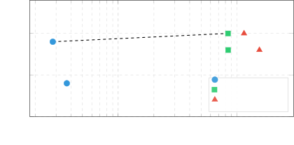
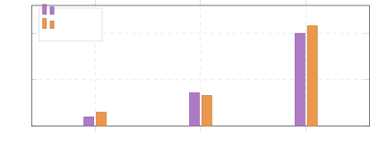

**Source:** *The Scaffold Effect in Coding Agents: Harness Choice as a Hidden Variable in Coding-Agent Evaluation* — [PDF](https://arxiv.org/pdf/2607.22585) · [arXiv](https://arxiv.org/abs/2607.22585)

# The Scaffold Effect in Coding Agents:   
Harness Choice as a Hidden Variable in Coding-Agent Evaluation

Naman Vats  Affiliation: Sentient Labs Oleg Golev  Affiliation: Sentient Labs Correspondence to: [{naman, oleg}@sentient.xyz](mailto:)

###### Abstract

Public leaderboards for coding agents typically rank systems by model name and pass rate, while the surrounding _harness_ —the scaffold that issues tools, manages context, and decides when to stop—is often under-specified. Model-to-model comparison is valid when the harness is fixed; when it varies, performance and efficiency conflate model and scaffold effects. We evaluate Qwen 3.6 Plus and MiniMax M2.5 across three open-source harnesses (Goose, OpenCode, OpenHands-SDK) on a stratified 50-task subset of Terminal-Bench Pro. Harness choice induces up to a \(\mathbf{40\times}\) difference in tokens per solved task, while paired within-model pass-rate differences remain 0–8 percentage points (95% paired-task bootstrap CIs include zero except for the largest gap). Failure fingerprints replicate across models (REASON for Goose, VERIFY/MAX_TURNS for OpenHands-SDK, idle-loop/TIME for OpenCode), indicating harness-level biases that are largely model-independent. For _human-centered coding-agent evaluation_ , model name alone is an incomplete comparison unit: harness–model pairs determine real-world cost, latency, and oversight burden—no-action turns are a per-task wait tax, not just a token tax. We therefore recommend selecting harness–model pairs by pass rate under token/latency budgets, and reporting token usage, latency, and full harness specifications alongside any model comparison. We release anonymized configs, raw trial logs, aggregated snapshots, and analysis scripts.

###### Keywords: 

coding agents, evaluation, harness, scaffold, terminal-bench, human-centered AI

## 1 Introduction

Coding-agent leaderboards have become the dominant benchmark for tracking progress in AI software development. They rank entries by model name, with the surrounding agent harness either undisclosed, varied to maximize per-row score, or implicitly treated as a controlled constant. From a _human-centered_ view of coding agents, this raises a pragmatic concern: a developer choosing an agent for daily work cares about cost per resolved task, time-to-completion, and how much oversight is needed to keep the agent productive. None of those are recovered from a model-only score.

The intuition that harness matters is not new. The Terminal-Bench 2.0 paper ([Merrill et al., 2026](https://arxiv.org/html/2607.22585#bib.bib6)) reports Claude Opus 4.5 at 52.1% with one harness and 57.8% with another, while consuming 256.9M versus 3.9M input tokens respectively, a 65\(\times\) token difference for a 5.7-point accuracy gain. This paper systematizes that observation into a controlled study and asks: when the model is held fixed and only the harness varies, how large are the differences a deployer should expect, and what kinds of differences are they?

#### Contributions.

  1. Across 300 trials (3 harnesses \(\times\) 2 agentic coding models \(\times\) 50 Terminal-Bench Pro tasks), we measure a \(\mathbf{40\times}\) gap in tokens per solved task; paired pass-rate differences stay within 0–8 pp (95% paired-task bootstrap CIs include zero for all but the largest pairwise gap). 
  2. We show the harness-specific failure-mode fingerprint replicates across both models, identifying it as a scaffold property rather than a model property. 
  3. We provide a mechanistic proxy linking _no-action turns_ (turns in which the agent neither edits a file nor issues a new command) to the cost gap, and frame these as a per-task _oversight tax_ that a human-in-the-loop user must absorb. 
  4. We argue the unit of comparison for human-centered coding-agent evaluation should be the _harness–model pair_ , not the model alone, and include anonymized configs and raw trial data as supplementary material.11 1 <https://anonymous.4open.science/r/scaffold-effects-dl4c-supp/>

## 2 Related Work

#### Coding-agent benchmarks.

Terminal-Bench ([Merrill et al., 2026](https://arxiv.org/html/2607.22585#bib.bib6)) evaluates agents on realistic command-line tasks requiring compilation, environment setup, and iterative debugging. Terminal-Bench Pro ([Wang et al., 2025a](https://arxiv.org/html/2607.22585#bib.bib11); [Alibaba, 2026](https://arxiv.org/html/2607.22585#bib.bib2))22 2 We follow the dataset-requested citation listed on the Terminal-Bench Pro Hugging Face card ([Wang et al., 2025a](https://arxiv.org/html/2607.22585#bib.bib11)); the benchmark is introduced as a component of that broader paper. The benchmark artifact itself is released by Alibaba at <https://github.com/alibaba/terminal-bench-pro> ([Alibaba, 2026](https://arxiv.org/html/2607.22585#bib.bib2)). extends this to 400 tasks across 8 domains with higher test coverage (\(\sim\)28 tests per task). SWE-bench ([Jimenez et al., 2024](https://arxiv.org/html/2607.22585#bib.bib5)) and successors note that scaffold choice affects scores but treat it as a confound to control rather than a phenomenon to study. Our 50-task subset of Terminal-Bench Pro covers 8 archetypes (BUG, BUILD, DATA, IMPL, ML, PUZZLE, SEC, SYS).

#### Agent scaffolding and evaluation reliability.

[Wang et al. (2024)](https://arxiv.org/html/2607.22585#bib.bib10) argue that agents are systems rather than models, but do not quantify the efficiency impact across harnesses on a fixed task set with a fixed model. The OpenHands platform paper ([Wang et al., 2025b](https://arxiv.org/html/2607.22585#bib.bib12)) introduces a composable SDK for production software-engineering agents. Goose ([Agentic AI Foundation (2026), originally Block, Inc.](https://arxiv.org/html/2607.22585#bib.bib1)) (originally Block, Inc., now Agentic AI Foundation) and OpenCode ([OpenCode Contributors, 2026](https://arxiv.org/html/2607.22585#bib.bib8)) are widely deployed open-source coding agents. Harbor ([Harbor Framework Team, 2026](https://arxiv.org/html/2607.22585#bib.bib3)) provides a unified evaluation framework supporting these harnesses with a single task manifest, which we use as our execution infrastructure.

#### Cost, oversight, and human-centered evaluation.

Token efficiency has been studied for long-context benchmarks ([Hsieh et al., 2024](https://arxiv.org/html/2607.22585#bib.bib4)) but not systematically for agentic coding evaluation. The DL4C call for “Interaction-Aware Benchmarks” explicitly asks for metrics beyond task completion that capture interaction quality, oversight burden, and verifiability. Our study contributes a controlled per-task measurement of these properties: tokens, turns, idle time, and failure-mode mix.

## 3 Experimental Setup

### 3.1 Tasks

We use Terminal-Bench Pro ([Wang et al., 2025a](https://arxiv.org/html/2607.22585#bib.bib11); [Alibaba, 2026](https://arxiv.org/html/2607.22585#bib.bib2)), selecting 50 tasks from the 200-task public set via stratified random sampling across 8 domain categories (Table [1](https://arxiv.org/html/2607.22585#S3.T1 "Table 1 ‣ 3.1 Tasks ‣ 3 Experimental Setup ‣ The Scaffold Effect in Coding Agents:Harness Choice as a Hidden Variable in Coding-Agent Evaluation")). All tasks have deterministic evaluation via pytest suites. Tasks were first categorized by GPT-4o-mini classification of each task’s instruction.md; per-category counts follow the source-set distribution, and tasks within each category were drawn randomly.

Table 1: Task distribution across 8 archetypes (\(n=50\)). 

Cat. | Count | Description  
---|---|---  
BUG | 8 | Bug fix / debug  
BUILD | 6 | Build / compile / env setup  
DATA | 7 | Data transformation / parsing  
IMPL | 8 | Fresh implementation  
ML | 8 | ML / model training / eval  
PUZZLE | 5 | Puzzle / game solving  
SEC | 6 | Security / forensics / recovery  
SYS | 2 | System / service configuration

 

### 3.2 Models

Two recent strong agentic coding models, accessed through the OpenRouter API:

  * Qwen 3.6 Plus (Alibaba Cloud): hybrid linear-attention MoE with always-on chain-of-thought; reported 61.6 on Terminal-Bench 2.0 versus Claude Opus 4.5 at 59.3 ([Qwen Team, 2026](https://arxiv.org/html/2607.22585#bib.bib9)). 
  * MiniMax M2.5: 228.7B-parameter MoE, 10B active; reported 80.2% on SWE-bench Verified ([MiniMax, 2026](https://arxiv.org/html/2607.22585#bib.bib7)). 

### 3.3 Harnesses

Three open-source coding-agent harnesses with distinct scaffolding philosophies:

  * Goose ([Agentic AI Foundation (2026), originally Block, Inc.](https://arxiv.org/html/2607.22585#bib.bib1)): heavyweight IDE agent with eager file-tree pre-injection. 
  * OpenCode ([OpenCode Contributors, 2026](https://arxiv.org/html/2607.22585#bib.bib8)): persistent tool-loop coding agent; no automatic context pre-loading. 
  * OpenHands-SDK ([Wang et al., 2025b](https://arxiv.org/html/2607.22585#bib.bib12)): micro-agent architecture with sub-agent delegation, internal retry, and explicit verification steps. 

All three are natively supported by Harbor and were run with identical task manifests.

### 3.4 Standardization Protocol

Held constant: verbatim Terminal-Bench Pro instruction; native test suite; Daytona sandbox per task; 900-second wall-time cap per trial; OpenRouter as the model gateway. The _system prompt template_ was held _largely identical_ across the three harnesses: same operating principles, same non-negotiables, the same shared four-skill operational playbook (build-and-env, deep-debug, terminal-investigation, test-driven-solve), and the same task instruction. Only a short harness-specific “Using your tools” paragraph and turn/iteration vocabulary differ. Maximum turns: 40 for Goose and OpenHands-SDK (passed through agent kwargs); OpenCode does not expose a turn-budget flag through Harbor and is bounded only by the wall-time cap. We intentionally evaluate each harness as a deployable system under its native control surface; _exposed_ budget controls are part of the scaffold being studied, not nuisance parameters to equalize. What was _not_ standardized, and constitutes the phenomenon under study, is each harness’s native tool API, automatic context pre-loading, and internal retry/sub-agent logic.

### 3.5 Metrics

For each trial we collect: solved (bool), turns_used, tokens_total, avg_no_action_turns (turns where no file was modified _and_ no new shell command was issued; we treat this as a _proxy_ for oversight burden, since a reasoning-only turn could in principle still be useful), hit_turn_budget_count, wall_seconds, and a post-hoc failure_category from a 6-class taxonomy (REASON, VERIFY, TIME, MAX_TURNS, HANG, ERROR; classification rule in Appendix [A](https://arxiv.org/html/2607.22585#A1 "Appendix A Failure Classification Decision Tree ‣ The Scaffold Effect in Coding Agents:Harness Choice as a Hidden Variable in Coding-Agent Evaluation")). Bootstrap uncertainty is reported as 95% paired-task bootstrap intervals (\(B=10{,}000\)) for both pass rate and tokens per solved task.

#### Token accounting.

Tokens come from a layered fallback in our analysis pipeline. For OpenCode and OpenHands-SDK we use the harness-emitted ATIF total of prompt + completion + cached tokens (input/output split available). For Goose we use the harness’s total-only field (Goose does not expose a per-direction split through Harbor’s standard interface). tokens_total is the sum the caller is billed for; we do not normalize across providers because the harness-reported number is the deployment-relevant quantity. _Tokens per solved task is amortized_ : the cell-wide sum of tokens_total divided by the cell’s solved count, \(\sum_{t\in\text{cell}}\texttt{tokens\_total}_{t}/|\{t:\texttt{solved}_{t}\}|\). Failed and infrastructure-error trials _are_ included in the numerator (their tokens count); HANG and ERROR trials that exit before any LLM call simply contribute 0. This is the cost a deployer absorbs per successful task, not the cost of a successful trial alone.

#### Provider settings.

All trials route through the OpenRouter API. We use each model’s default OpenRouter sampling (no explicit temperature, top_p, or max_tokens override; whichever defaults the provider applies); no provider-routing override; no harness-level retries on tool-call failure. Infrastructure failures (sandbox quota, image build) are classified as ERROR and counted in the denominator of the cell (\(n=50\)) but not as solved.

#### Task selection.

The 50 tasks were drawn from the 200-task public set _before_ any harness or model was run; no task was removed after results were observed. Categorization used GPT-4o-mini classification of each task’s instruction.md. The full categorization output and the 50 task IDs are included as supplementary material.

## 4 Results

### 4.1 Pass Rate

Table [2](https://arxiv.org/html/2607.22585#S4.T2 "Table 2 ‣ 4.1 Pass Rate ‣ 4 Results ‣ The Scaffold Effect in Coding Agents:Harness Choice as a Hidden Variable in Coding-Agent Evaluation") reports per-cell pass rates with 95% paired-task bootstrap CIs. Within a model, the harness range is 2–8 pp; across models within a harness it is 4–10 pp. The pairwise differences with their CIs are: at most \(-8.0\) pp (Goose vs. OpenCode on MiniMax, 95% CI \([-18.0,0.0]\)), \(-2.0\) pp (Goose vs. OpenCode on Qwen, \([-12.0,+8.0]\)), and \(0.0\) pp between OpenCode and OpenHands-SDK on either model. At \(n=50\), most pairwise pass-rate differences are not statistically distinguishable from zero.

Table 2: Pass rates with 95% paired-task bootstrap CIs (\(B{=}10{,}000\), \(n=50\) per cell). 

Harness | Qwen 3.6 Plus | MiniMax M2.5  
---|---|---  
Goose | 48.0% [34.0, 62.0] | 38.0% [24.0, 52.0]  
OpenCode | 50.0% [36.0, 64.0] | 46.0% [32.0, 60.0]  
OpenHands-SDK | 50.0% [36.0, 64.0] | 46.0% [32.0, 60.0]

 

### 4.2 Token Cost per Solved Task

Table [3](https://arxiv.org/html/2607.22585#S4.T3 "Table 3 ‣ OpenCode budget-control sensitivity. ‣ 4.2 Token Cost per Solved Task ‣ 4 Results ‣ The Scaffold Effect in Coding Agents:Harness Choice as a Hidden Variable in Coding-Agent Evaluation") reports tokens per solved task, the primary efficiency metric. The ordering is identical for both models: Goose \(\ll\) OpenHands-SDK \(<\) OpenCode. OpenCode consumes approximately 40\(\times\) more tokens per solved task than Goose, while pass-rate differences remain within the 0–8 pp harness range above. The gap is _not_ driven by OpenCode running more turns: average turn counts are 21–27 for OpenCode versus 18–25 for Goose (\(\sim\)1.2\(\times\), well within Goose’s 40-turn cap). The per-task token gap is therefore not primarily attributable to turn-count differences; it more likely reflects per-turn context growth, tool serialization, and harness-specific token accounting.

#### Bootstrap robustness.

95% paired-task bootstrap CIs (\(B{=}10{,}000\)) on tokens per solved task are: Goose Qwen [21K, 40K]; Goose MM [25K, 61K]; OpenHands Qwen [610K, 1.21M]; OpenHands MM [537K, 1.35M]; OpenCode Qwen [733K, 1.84M]; OpenCode MM [1.01M, 2.50M]. Goose’s CI upper bound (40–61K) sits well below OpenCode’s CI lower bound (733K–1.01M), so the order-of-magnitude gap is robust to bootstrap uncertainty.

#### OpenCode budget-control sensitivity.

Because OpenCode lacks a turn-budget flag, we check whether the cost gap could be an artefact of long runs. Of OpenCode trials with recorded turn counts, 88% (Qwen, 42/48) and 71% (MiniMax, 34/48) stayed below 40 turns; the maximum observed turn count was 67–69. A 40-turn cap (matching Goose and OpenHands-SDK) would therefore truncate \(\sim\)12–29% of OpenCode trials, mostly already in the failure tail. The 40\(\times\) token gap does not come from OpenCode running unboundedly long; it comes from per-turn token volume.

Table 3: Tokens per solved task and average turns. Lower is better. 

Harness | Model | Tok/Solve | \(\times\)Goose | Avg. Turns  
---|---|---|---|---  
Goose | Qwen | 28,142 | \(1.0\) | 17.96  
Goose | MiniMax | 36,950 | \(1.0\) | 25.25  
OpenHands | Qwen | 841,201 | \(29.9\) | 25.95  
OpenHands | MiniMax | 843,286 | \(22.8\) | 24.19  
OpenCode | Qwen | 1,147,740 | \(40.8\) | 21.71  
OpenCode | MiniMax | 1,546,977 | \(41.9\) | 27.46

 

### 4.3 Pareto Frontier: Pass Rate vs. Token Cost

  Figure 1: Pareto plot: pass rate (y) vs. tokens per solved task (x, log). Goose dominates the frontier; OpenCode is Pareto-dominated for both models. The pass-rate spread is small (38–50%); the cost spread is two orders of magnitude.

Figure [1](https://arxiv.org/html/2607.22585#S4.F1 "Figure 1 ‣ 4.3 Pareto Frontier: Pass Rate vs. Token Cost ‣ 4 Results ‣ The Scaffold Effect in Coding Agents:Harness Choice as a Hidden Variable in Coding-Agent Evaluation") plots both axes on the same panel. Goose lies on the Pareto frontier for both models. No point dominates it on cost-at-equal-or-better-pass-rate. OpenCode is Pareto-dominated by both Goose (on cost, with comparable pass rate) and OpenHands-SDK (on cost, with the same pass rate).

### 4.4 No-Action Turns

  Figure 2: Average no-action turns per task. OpenCode exhibits 10\(\times\) more no-action turns than Goose, regardless of model. This pattern is consistent with the 40\(\times\) token gap through compounding context accumulation.

OpenCode averages 2.0–2.16 no-action turns per task versus 0.2–0.3 for Goose, a 10\(\times\) ratio that replicates across both models. Each no-action turn carries a full context window of input tokens due to message-history accumulation, so two such turns per task at average positions \(\sim 10\) and \(\sim 20\) each waste thousands of tokens. We frame this as the per-task _idle-turn tax_ : a developer running OpenCode interactively absorbs both the dollar cost and the wall-clock latency of these idle loops.

### 4.5 Failure-Mode Fingerprints

Table [4](https://arxiv.org/html/2607.22585#S4.T4 "Table 4 ‣ 4.5 Failure-Mode Fingerprints ‣ 4 Results ‣ The Scaffold Effect in Coding Agents:Harness Choice as a Hidden Variable in Coding-Agent Evaluation") reports the 6-class failure breakdown per cell. Three distinct fingerprints emerge that replicate across both models:

  * Goose: REASON-dominated. 20/15 REASON failures (Qwen/MiniMax) with zero VERIFY. When stuck, Goose stops rather than commit to a wrong solution. The low avg_no_action_turns (0.2/0.3) confirms decisive action. 
  * OpenHands-SDK: VERIFY + MAX_TURNS. 6/8 VERIFY and 6/6 MAX_TURNS. hit_turn_budget_count is 8/9, exceeding the MAX_TURNS classification of 6/6 because runs that hit the budget while also raising an exception are routed to HANG by the decision tree (Appendix [A](https://arxiv.org/html/2607.22585#A1 "Appendix A Failure Classification Decision Tree ‣ The Scaffold Effect in Coding Agents:Harness Choice as a Hidden Variable in Coding-Agent Evaluation")). 
  * OpenCode: TIME + idle spinning. 5/10 TIME and 4/1 HANG, with zero VERIFY. OpenCode shows 0/0 MAX_TURNS because the harness lacks a turn-budget flag through Harbor (Section [3.4](https://arxiv.org/html/2607.22585#S3.SS4 "3.4 Standardization Protocol ‣ 3 Experimental Setup ‣ The Scaffold Effect in Coding Agents:Harness Choice as a Hidden Variable in Coding-Agent Evaluation")); runs that would manifest as MAX_TURNS under Goose or OpenHands-SDK instead surface here as TIME or HANG. 

Table 4: Failure-category counts per cell, \(n=50\). Columns: Sv=solved, Rs=REASON, Vf=VERIFY, Tm=TIME, MT=MAX_TURNS, Hg=HANG, Er=ERROR. 

Harness | Model | Sv | Rs | Vf | Tm | MT | Hg | Er  
---|---|---|---|---|---|---|---|---  
Goose | Qwen | 23 | 20 | 0 | 3 | 1 | 2 | 1  
Goose | MiniMax | 17 | 15 | 0 | 7 | 8 | 2 | 1  
OpenCode | Qwen | 25 | 15 | 0 | 5 | 0 | 4 | 1  
OpenCode | MiniMax | 22 | 16 | 0 | 10 | 0 | 1 | 1  
OpenHands | Qwen | 25 | 3 | 6 | 5 | 6 | 4 | 1  
OpenHands | MiniMax | 21 | 1 | 8 | 6 | 6 | 7 | 1

 

### 4.6 Pass Rate by Task Category

Table [5](https://arxiv.org/html/2607.22585#S4.T5 "Table 5 ‣ 4.6 Pass Rate by Task Category ‣ 4 Results ‣ The Scaffold Effect in Coding Agents:Harness Choice as a Hidden Variable in Coding-Agent Evaluation") pools both models per cell and reports pass rate per (category, harness). Differences are mostly small, but one is conspicuous: on IMPL (fresh implementation), OpenHands-SDK substantially outperforms Goose and OpenCode (69% vs. 38%/38%). All three harnesses struggle on SEC (8–17%) and fail completely on SYS (0%). For the remaining categories, harness rank order is unstable across categories, a useful caveat for any per-category leaderboard.

Table 5: Pass rate by task category (pooled over both models, \(n=2{\times}|\text{cat}|\) trials per harness). 

Cat. | #Tasks | Goose | OpenCode | OpenHands  
---|---|---|---|---  
BUG | 8 | 62% | 75% | 62%  
BUILD | 6 | 50% | 50% | 42%  
DATA | 7 | 57% | 71% | 64%  
IMPL | 8 | 38% | 38% | 69%  
ML | 8 | 56% | 56% | 44%  
PUZZLE | 5 | 30% | 30% | 40%  
SEC | 6 | 8% | 17% | 17%  
SYS | 2 | 0% | 0% | 0%

 

### 4.7 Summary of Harness vs. Model Effects

Table 6: Comparative impact of harness choice vs. model upgrade. 

Variable | Harness | Model upgrade  
---|---|---  
Pass rate (paired) | 0–8 pp | 4–10 pp  
Tokens/solved task | 40\(\times\) | 1.0–1.3\(\times\)  
Failure profile | fingerprint | consistent  
No-action turns | 10\(\times\) | \(<\)1.1\(\times\)

 

Pass-rate effects of harness and model upgrade are of comparable magnitude and within bootstrap noise at \(n=50\). The cost-side asymmetry is overwhelming: harness choice shifts tokens-per-solved-task by 40\(\times\), while upgrading the model barely moves it (1.0–1.3\(\times\)).

## 5 Discussion

### 5.1 What the Cost Gap Means for a Human User

The 40\(\times\) token gap is not just an accounting artefact; it has direct consequences for the developer who runs these agents in the loop:

  * Dollar cost. For one model and one task, \(\sim\)40\(\times\) more tokens means \(\sim\)40\(\times\) more API spend, all else equal. This dominates the 1–2\(\times\) price spread between the strongest current models. 
  * Wall-clock time. OpenCode’s no-action turns are not silent: each one is a round-trip API call the user waits through. With \(\sim\)2 idle turns per task, the user pays a per-task _wait tax_ on top of the dollar tax. 
  * Oversight burden. A user supervising the agent has to read or skim the idle turns to confirm they were not destructive. “Re-reading the same file three times” is cheap for the model but expensive for the human reviewer. 

### 5.2 What the Failure Fingerprints Mean

The three harnesses have systematically different failure modes regardless of which model they run:

  * Goose stops cleanly when stuck (REASON-dominated, zero VERIFY). A user gets an honest “I cannot do this” rather than a plausible-but-wrong patch. 
  * OpenHands-SDK persists toward closure, accepting plausible-but-incorrect solutions (VERIFY) or running out of iterations (MAX_TURNS). A user must then verify outputs more carefully. 
  * OpenCode commits only to solutions that pass tests (zero VERIFY), but more often exhausts the wall-time cap (TIME, HANG). A user pays in time and tokens, but the agent’s positive verdicts can be trusted. 

For human-centered coding-agent evaluation, this is a richer signal than pass rate alone: each fingerprint implies a different oversight discipline.

### 5.3 Implications for Benchmark Reporting

We recommend that coding-agent leaderboards adopt harness–model pairs as the unit of evaluation, with three first-class metrics alongside pass rate: tokens per solved task, average no-action turns per task, and the failure-category vector. Reporting only pass rate against model name conflates two independent sources of variance and discards the cost and oversight signals that determine whether a coding agent is actually deployable.

## 6 Limitations

  * Sample size. \(n=50\) tasks; with one task corresponding to 2 percentage points, several pass-rate effects we observe are within bootstrap noise. We treat them as descriptive rather than statistically definitive. 
  * Token accounting asymmetry. Goose totals are reported without an input/output breakdown via Harbor’s standard interface. The 40\(\times\) ratio is robust to this: it is anchored in totals, which Goose does report. Per-direction comparisons, however, are not available for Goose. 
  * Turn-budget asymmetry. Goose and OpenHands-SDK enforce a 40-turn cap; OpenCode is bounded only by the 900-second wall-time cap, because OpenCode does not expose a turn-budget flag through Harbor. “Turn” is also harness-defined and may include differing numbers of internal LLM calls per harness. 
  * Three harnesses, two models. The harness-specific findings should not be assumed to generalize to all scaffold architectures or to commercial closed-source agent products that we did not evaluate. 
  * Provider defaults may evolve. OpenRouter and the upstream provider defaults (sampling parameters, route selection, model version) can shift between runs; exact replication requires pinning the provider route and sampling settings that were in effect at our run time. The released run metadata records the settings available at execution time. 

## 7 Conclusion

We present controlled evidence that harness choice introduces a \(\mathbf{40\times}\) token-cost difference and harness-specific failure fingerprints in coding-agent evaluation, while shifting paired pass rate by at most 8 percentage points. Both replicate independently across two recent models. For the human-centered coding-agent agenda, this argues that the unit of evaluation should be the _harness–model pair_ , with cost, idle-turn, and failure-mode signals reported alongside pass rate. We include anonymized configs, raw trial logs, aggregated snapshots, and analysis scripts as supplementary material.

## Data and Code Availability

Anonymized harness configurations, raw Harbor trial logs, aggregated snapshots, and the analysis pipeline are available at <https://anonymous.4open.science/r/scaffold-effects-dl4c-supp/>, frozen for the duration of review.

## Impact Statement

This paper presents work whose goal is to advance the field of Machine Learning, specifically the evaluation of coding agents. By showing that scaffold choice drives a \(40\times\) token-cost gap and harness-specific failure profiles, we hope to encourage benchmark reporting that surfaces deployment cost and oversight burden, which directly affects the dollar cost, latency, and supervisory effort a human developer absorbs when using these systems. We see no specific ethical concern beyond those generally associated with releasing evaluation tooling and trial logs for coding agents.

## References

  * Agentic AI Foundation (2026) (originally Block, Inc.) Agentic AI Foundation (originally Block, Inc.).  Goose: An open-source, extensible ai agent, 2026.  URL <https://github.com/aaif-goose/goose>. 
  * Alibaba (2026) Alibaba.  Terminal-Bench Pro.  GitHub repository, 2026.  URL <https://github.com/alibaba/terminal-bench-pro>. 
  * Harbor Framework Team (2026) Harbor Framework Team.  Harbor: A framework for evaluating and optimizing agents and models in container environments, 2026.  URL <https://github.com/harbor-framework/harbor>. 
  * Hsieh et al. (2024) Hsieh, C.-P., Sun, S., Kriman, S., et al.  RULER: What’s the real context size of your long-context language models?  _arXiv preprint arXiv:2404.06654_ , 2024. 
  * Jimenez et al. (2024) Jimenez, C. E., Yang, J., Wettig, A., et al.  SWE-bench: Can language models resolve real-world GitHub issues?  In _International Conference on Learning Representations_ , 2024. 
  * Merrill et al. (2026) Merrill, M. A., Shaw, A. G., Carlini, N., Li, B., Raj, H., Bercovich, I., Shi, L., et al.  Terminal-bench: Benchmarking agents on hard, realistic tasks in command line interfaces.  _arXiv preprint arXiv:2601.11868_ , 2026. 
  * MiniMax (2026) MiniMax.  Minimax m2.5: Built for real-world productivity.  Hugging Face Model Card, 2026.  URL <https://huggingface.co/MiniMaxAI/MiniMax-M2.5>. 
  * OpenCode Contributors (2026) OpenCode Contributors.  Opencode: The open source coding agent, 2026.  URL <https://github.com/anomalyco/opencode>. 
  * Qwen Team (2026) Qwen Team.  Qwen3.6-plus: Towards real world agents, 2026.  URL <https://qwen.ai/blog?id=qwen3.6>. 
  * Wang et al. (2024) Wang, L., Ma, C., Feng, X., et al.  A survey on large language model based autonomous agents.  _Frontiers of Computer Science_ , 18(6):186345, 2024. 
  * Wang et al. (2025a) Wang, W., Xu, X., Xu, X., et al.  Let it flow: Agentic crafting on rock and roll, building the ROME model within an open agentic learning ecosystem.  _arXiv preprint arXiv:2512.24873_ , 2025a. 
  * Wang et al. (2025b) Wang, X., Rosenberg, S., Michelini, J., Smith, C., Tran, H., Nyst, E., Malhotra, R., Zhou, X., Chen, V., Brennan, R., and Neubig, G.  The openhands software agent SDK: A composable and extensible foundation for production agents.  _arXiv preprint arXiv:2511.03690_ , 2025b. 

## Appendix A Failure Classification Decision Tree

Failure classification is exception-first and matches the analysis pipeline (analysis/collect.py, _classify_failure). The ordered rules are:

  1. If exception_type is non-null, map by exception class: AgentTimeoutError \(\to\) TIME (the 900-second per-trial agent.timeout_sec fired); NonZeroAgentExitCodeError, AgentSetupError \(\to\) HANG; DaytonaAuthorizationError, EnvironmentBuildError, RewardFileNotFoundError, parse errors \(\to\) ERROR. 
  2. Else if solved\(=\)true \(\to\) SOLVED. 
  3. Else if hit_turn_budget\(=\)true \(\to\) MAX_TURNS. (hit_turn_budget is turns_used\(\geq\)max_turns; only Goose and OpenHands-SDK pass a turn cap to Harbor, so OpenCode never produces this category.) 
  4. Else if finish_called\(=\)true \(\to\) VERIFY (agent declared done but the verifier failed). 
  5. Otherwise \(\to\) REASON (agent stopped voluntarily without claiming completion). 

This classification has no separate wall-time threshold; TIME is set by the AgentTimeoutError alone, which fires at the 900-second cap. A 20% random sample was manually reviewed for consistency.

## Appendix B Selected 50 Task IDs

The 50 evaluation tasks (alphabetical):

advanced-json-to-rfc4180-csv-converter, advanced-poker-hand-classifier, analyze-and-run-encoded-payload, analyze-arm-shellcode-network-connections, analyze-fen-with-stockfish, apache-log-security-analyzer, automate-blind-graph-mapping, bash-ddos-traffic-analyzer, bash-tree-diff-sync, benchmark-gcc-opt-levels, boot-debian-qemu-with-ssh-check, build-arm64-qemu-linux-with-custom-message, build-coq-from-source, build-graphicsmagick-1-3-45, build-grpc-user-profile-service, build-nginx-1-24-production-server, compare-lasso-ridge-elasticnet, compare-lasso-ridge-gene-expression, compute-best-chess-move-san, configure-localhost-ssh-key-login, consolidate-valid-prod-credentials, count-claude-tokens-medical-papers, count-unique-person-names-conll2003, debug-bst-segfault-with-gdb, decode-go-ctf-credentials, decrypt-and-restore-backup-fragments, detect-c-feature-flags, diagnose-and-repair-broken-pip-installation, find-invalid-blockchain-transactions, fix-docker-python-dependency-conflicts, fix-game-server-turn-race-condition, fix-nameerrors-using-aliases-mapping, fix-neural-net-weight-init, fix-numpy-einsum-optimize-compatibility, implement-lz77-file-compressor, implement-tensor-parallel-matmul, migrate-fortran-mcsim-to-gfortran, migrate-make-to-cmake-build, mongodb-sales-aggregation-engine, repair-broken-shell-data-pipeline, restore-broken-pip-installation, sanitize-jinja2-ssti-templates, simulate-2d-sampling-with-acceptance-stats, solve-chess-mate-in-two, solve-colossal-cave-350-score, solve-escape-room-puzzle-server, solve-train-shunting-puzzle, train-fasttext-style-subword-embeddings, train-fraud-detection-model, train-sarsa-taxi-agent.

## Appendix C Failure Examples (One per Category)

  * REASON. train-fasttext-style-subword-embeddings (goose/qwen): 10 turns, 16.8K tokens, 237s; agent stops voluntarily.
  * VERIFY. simulate-2d-sampling-with-acceptance-stats (openhands-sdk/qwen): 18 turns, 272K tokens; finish_called=true but tests fail.
  * TIME. detect-c-feature-flags (goose/qwen): 28 turns, 943s, AgentTimeoutError.
  * MAX_TURNS. solve-colossal-cave-350-score (goose/qwen): 40 turns, 296s, no solution.
  * HANG. restore-broken-pip-installation (goose/qwen): 0 productive turns; harness exits via NonZeroAgentExitCodeError during sandbox setup.
  * ERROR. build-arm64-qemu-linux-with-custom-message (openhands-sdk/qwen): 6s, DaytonaAuthorizationError due to CPU quota; infrastructure failure.

