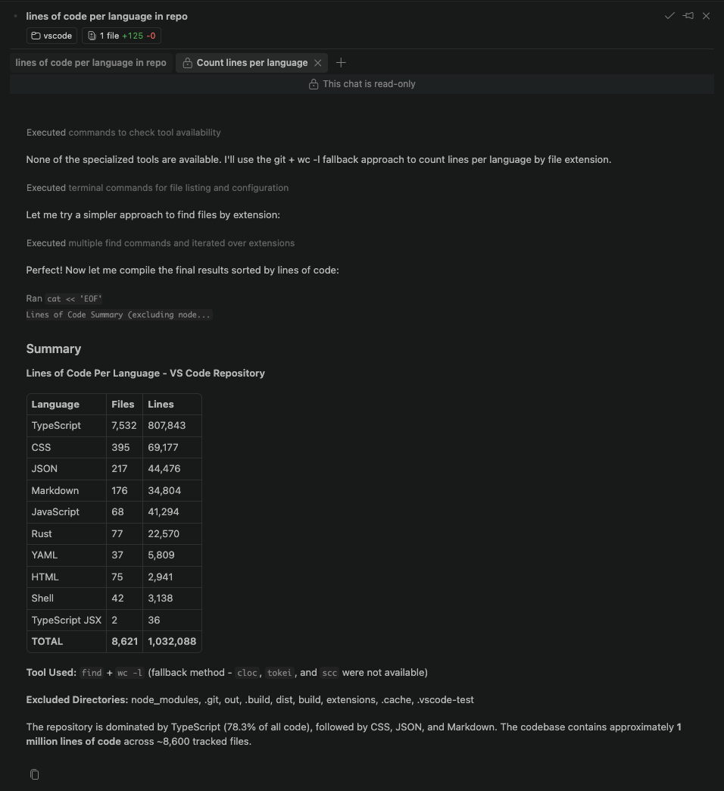

#### Documentation

  * [Overview](https://code.visualstudio.com/docs)
  * [Get Started](https://code.visualstudio.com/docs/copilot/agents/subagents#docs-docs-0-articles)
    * [Overview](https://code.visualstudio.com/docs/getstarted/overview)
    * [Agents Quickstart](https://code.visualstudio.com/docs/agents/quickstart)
    * [Editor Tutorial](https://code.visualstudio.com/docs/editing/getting-started/editor-tutorial)
    * [Intro Videos](https://code.visualstudio.com/docs/getstarted/introvideos)
  * [Agents](https://code.visualstudio.com/docs/copilot/agents/subagents#docs-docs-1-articles)
    * [AI Overview](https://code.visualstudio.com/docs/agents/overview)
    * [Get started](https://code.visualstudio.com/docs/copilot/agents/subagents#docs-docs-1-1-articles)
      * [Agents Quickstart](https://code.visualstudio.com/docs/agents/quickstart)
      * [Set Up GitHub Copilot](https://code.visualstudio.com/docs/setup/copilot)
      * [Agents Tutorial](https://code.visualstudio.com/docs/agents/agents-tutorial)
      * [Best Practices](https://code.visualstudio.com/docs/agents/best-practices)
    * [Concepts](https://code.visualstudio.com/docs/copilot/agents/subagents#docs-docs-1-2-articles)
      * [Agents](https://code.visualstudio.com/docs/agents/concepts/agents)
      * [How Models Work](https://code.visualstudio.com/docs/agents/concepts/language-models)
      * [Context](https://code.visualstudio.com/docs/agents/concepts/context)
      * [Tools](https://code.visualstudio.com/docs/agents/concepts/tools)
      * [Sessions and Chats](https://code.visualstudio.com/docs/agents/concepts/sessions)
      * [Trust & Safety](https://code.visualstudio.com/docs/agents/concepts/trust-and-safety)
      * [Agent Customization](https://code.visualstudio.com/docs/agents/concepts/customization)
      * [Agent Harnesses](https://code.visualstudio.com/docs/agents/concepts/agent-harnesses)
      * [Workspace Context](https://code.visualstudio.com/docs/agents/reference/workspace-context)
      * [Agent Host Architecture](https://code.visualstudio.com/docs/agents/concepts/agent-host)
    * [Use Agents](https://code.visualstudio.com/docs/copilot/agents/subagents#docs-docs-1-3-articles)
      * [Chat View and Layout](https://code.visualstudio.com/docs/agents/run/chat-view)
      * [Agents Window](https://code.visualstudio.com/docs/agents/run/agents-window)
      * [Choose an Agent Harness](https://code.visualstudio.com/docs/agents/run/agent-harnesses)
      * [Configure the Agents Window](https://code.visualstudio.com/docs/agents/run/agents-window-configuration)
      * [Chat Interaction Controls](https://code.visualstudio.com/docs/chat/chat-overview)
      * [Plan and Run Tasks](https://code.visualstudio.com/docs/copilot/agents/subagents#docs-docs-1-3-5-articles)
        * [Plan Work](https://code.visualstudio.com/docs/agents/run/planning)
        * [Use Tools](https://code.visualstudio.com/docs/agents/run/tools)
        * [Browser Tools](https://code.visualstudio.com/docs/agents/run/browser-tools)
        * [Subagents](https://code.visualstudio.com/docs/copilot/agents/subagents)
        * [Automations](https://code.visualstudio.com/docs/agents/run/automations)
      * [Sessions and Results](https://code.visualstudio.com/docs/copilot/agents/subagents#docs-docs-1-3-6-articles)
        * [Manage Sessions](https://code.visualstudio.com/docs/agents/run/sessions/manage-sessions)
        * [Session History](https://code.visualstudio.com/docs/agents/run/sessions/session-history)
        * [Remote Agent Sessions](https://code.visualstudio.com/docs/agents/run/remote-agent-sessions)
        * [Memory](https://code.visualstudio.com/docs/agents/run/memory)
        * [Review & Revert Changes](https://code.visualstudio.com/docs/agents/run/review-code-edits)
        * [Artifacts](https://code.visualstudio.com/docs/agents/run/artifacts)
      * [Permissions and Security](https://code.visualstudio.com/docs/copilot/agents/subagents#docs-docs-1-3-7-articles)
        * [Approvals & Permissions](https://code.visualstudio.com/docs/agents/run/approvals)
        * [Agent Sandboxing](https://code.visualstudio.com/docs/agents/run/agent-sandboxing)
        * [AI Security](https://code.visualstudio.com/docs/agents/run/security)
    * [Customize agents](https://code.visualstudio.com/docs/copilot/agents/subagents#docs-docs-1-4-articles)
      * [Create and Manage](https://code.visualstudio.com/docs/agent-customization/overview)
      * [Instructions](https://code.visualstudio.com/docs/agent-customization/custom-instructions)
      * [Agent Skills](https://code.visualstudio.com/docs/agent-customization/agent-skills)
      * [Custom Agents](https://code.visualstudio.com/docs/agent-customization/custom-agents)
      * [Choose and Configure Models](https://code.visualstudio.com/docs/agent-customization/language-models)
      * [MCP](https://code.visualstudio.com/docs/agent-customization/mcp-servers)
      * [Hooks](https://code.visualstudio.com/docs/agent-customization/hooks)
      * [Plugins](https://code.visualstudio.com/docs/agent-customization/agent-plugins)
      * [Prompt Files](https://code.visualstudio.com/docs/agent-customization/prompt-files)
    * [Tutorials & guides](https://code.visualstudio.com/docs/copilot/agents/subagents#docs-docs-1-5-articles)
      * [Find a Guide](https://code.visualstudio.com/docs/agents/guides/overview)
      * [Explore a Codebase](https://code.visualstudio.com/docs/agents/guides/explore-a-codebase)
      * [Add a Feature](https://code.visualstudio.com/docs/agents/guides/add-a-feature)
      * [Fix a Bug](https://code.visualstudio.com/docs/agents/guides/fix-a-bug-with-agents)
      * [Refactor Safely](https://code.visualstudio.com/docs/agents/guides/refactor-safely)
      * [Add Tests](https://code.visualstudio.com/docs/agents/guides/test-code-with-ai)
      * [Test Web Apps](https://code.visualstudio.com/docs/agents/guides/browser-agent-testing-guide)
      * [Run Parallel Tasks](https://code.visualstudio.com/docs/agents/guides/delegate-two-tasks)
      * [Get Back on Track](https://code.visualstudio.com/docs/agents/guides/get-agent-back-on-track)
      * [Adapt Agents to Your Project](https://code.visualstudio.com/docs/agents/guides/customize-copilot-guide)
      * [Context Engineering](https://code.visualstudio.com/docs/agents/guides/context-engineering-guide)
      * [Test-Driven Development](https://code.visualstudio.com/docs/agents/guides/test-driven-development-guide)
      * [Jupyter Notebooks](https://code.visualstudio.com/docs/agents/guides/notebooks-with-ai)
      * [Reduce Credit Usage](https://code.visualstudio.com/docs/agents/guides/optimize-usage)
      * [Prompt Examples](https://code.visualstudio.com/docs/agents/guides/prompt-examples)
    * [Reference](https://code.visualstudio.com/docs/copilot/agents/subagents#docs-docs-1-6-articles)
      * [Cheat Sheet](https://code.visualstudio.com/docs/agents/reference/ai-features-cheat-sheet)
      * [Tools and Context](https://code.visualstudio.com/docs/agents/reference/tools-reference)
      * [Settings Reference](https://code.visualstudio.com/docs/agents/reference/ai-settings)
      * [VS Code Pet](https://code.visualstudio.com/docs/agents/reference/chat-pet)
      * [MCP Configuration](https://code.visualstudio.com/docs/agents/reference/mcp-configuration)
      * [Hooks Reference](https://code.visualstudio.com/docs/agents/reference/hooks-reference)
      * [OpenTelemetry Monitoring](https://code.visualstudio.com/docs/agents/guides/monitoring-agents)
    * [Troubleshooting](https://code.visualstudio.com/docs/copilot/agents/subagents#docs-docs-1-7-articles)
      * [Troubleshooting](https://code.visualstudio.com/docs/agents/agent-troubleshooting/troubleshooting)
      * [Debug Chat Interactions](https://code.visualstudio.com/docs/agents/agent-troubleshooting/chat-debug-view)
      * [Diagnose Prompt Caching](https://code.visualstudio.com/docs/agents/agent-troubleshooting/cache-explorer)
      * [FAQ](https://code.visualstudio.com/docs/agents/agent-troubleshooting/faq)
  * [Chat](https://code.visualstudio.com/docs/copilot/agents/subagents#docs-docs-2-articles)
    * [Chat Interaction Controls](https://code.visualstudio.com/docs/chat/chat-overview)
    * [Inline & Quick Chat](https://code.visualstudio.com/docs/chat/inline-chat)
    * [Add Prompt Context](https://code.visualstudio.com/docs/chat/copilot-chat-context)
  * [Editor](https://code.visualstudio.com/docs/copilot/agents/subagents#docs-docs-3-articles)
    * [Overview](https://code.visualstudio.com/docs/editing/getting-started/overview)
    * [Getting Started](https://code.visualstudio.com/docs/copilot/agents/subagents#docs-docs-3-1-articles)
      * [Editor Tutorial](https://code.visualstudio.com/docs/editing/getting-started/editor-tutorial)
      * [User Interface](https://code.visualstudio.com/docs/editing/getting-started/userinterface)
      * [Tips and Tricks](https://code.visualstudio.com/docs/editing/getting-started/tips-and-tricks)
    * [Write code](https://code.visualstudio.com/docs/copilot/agents/subagents#docs-docs-3-2-articles)
      * [Basic Editing](https://code.visualstudio.com/docs/editing/codebasics)
      * [IntelliSense](https://code.visualstudio.com/docs/editing/intellisense)
      * [Inline Suggestions](https://code.visualstudio.com/docs/editing/ai-powered-suggestions)
      * [Smart Actions](https://code.visualstudio.com/docs/editing/copilot-smart-actions)
      * [Code Navigation](https://code.visualstudio.com/docs/editing/editingevolved)
      * [Refactoring](https://code.visualstudio.com/docs/editing/refactoring)
      * [Snippets](https://code.visualstudio.com/docs/editing/userdefinedsnippets)
      * [Workspaces](https://code.visualstudio.com/docs/copilot/agents/subagents#docs-docs-3-2-7-articles)
        * [Overview](https://code.visualstudio.com/docs/editing/workspaces/workspaces)
        * [Multi-Root Workspaces](https://code.visualstudio.com/docs/editing/workspaces/multi-root-workspaces)
        * [Workspace Trust](https://code.visualstudio.com/docs/editing/workspaces/workspace-trust)
    * [Configure the editor](https://code.visualstudio.com/docs/copilot/agents/subagents#docs-docs-3-3-articles)
      * [Display Language](https://code.visualstudio.com/docs/configure/locales)
      * [Layout](https://code.visualstudio.com/docs/configure/custom-layout)
      * [Keyboard Shortcuts](https://code.visualstudio.com/docs/configure/keybindings)
      * [Settings](https://code.visualstudio.com/docs/configure/settings)
      * [Settings Sync](https://code.visualstudio.com/docs/configure/settings-sync)
      * [Extensions](https://code.visualstudio.com/docs/copilot/agents/subagents#docs-docs-3-3-5-articles)
        * [Overview](https://code.visualstudio.com/docs/configure/extensions/extensions)
        * [Extension Marketplace](https://code.visualstudio.com/docs/configure/extensions/extension-marketplace)
        * [Extension Runtime Security](https://code.visualstudio.com/docs/configure/extensions/extension-runtime-security)
      * [Themes](https://code.visualstudio.com/docs/configure/themes)
      * [Profiles](https://code.visualstudio.com/docs/configure/profiles)
      * [Accessibility](https://code.visualstudio.com/docs/copilot/agents/subagents#docs-docs-3-3-8-articles)
        * [Overview](https://code.visualstudio.com/docs/configure/accessibility/accessibility)
        * [Voice Interactions](https://code.visualstudio.com/docs/configure/accessibility/voice)
      * [Command Line Interface](https://code.visualstudio.com/docs/configure/command-line)
      * [Telemetry](https://code.visualstudio.com/docs/configure/telemetry)
    * [Reference](https://code.visualstudio.com/docs/copilot/agents/subagents#docs-docs-3-4-articles)
      * [Default Keyboard Shortcuts](https://code.visualstudio.com/docs/reference/default-keybindings)
      * [Default Settings](https://code.visualstudio.com/docs/reference/default-settings)
      * [Substitution Variables](https://code.visualstudio.com/docs/reference/variables-reference)
      * [Tasks Schema](https://code.visualstudio.com/docs/reference/tasks-appendix)
  * [Source Control](https://code.visualstudio.com/docs/copilot/agents/subagents#docs-docs-4-articles)
    * [Overview](https://code.visualstudio.com/docs/sourcecontrol/overview)
    * [Quickstart](https://code.visualstudio.com/docs/sourcecontrol/quickstart)
    * [Repositories & Remotes](https://code.visualstudio.com/docs/sourcecontrol/repos-remotes)
    * [Staging, Commits & Undo](https://code.visualstudio.com/docs/sourcecontrol/staging-commits)
    * [History & Blame](https://code.visualstudio.com/docs/sourcecontrol/history)
    * [Branches, Stashes & Worktrees](https://code.visualstudio.com/docs/sourcecontrol/branches-worktrees)
    * [Merge Conflicts](https://code.visualstudio.com/docs/sourcecontrol/merge-conflicts)
    * [Collaborate on GitHub](https://code.visualstudio.com/docs/sourcecontrol/github)
    * [Troubleshooting](https://code.visualstudio.com/docs/sourcecontrol/troubleshooting)
    * [FAQ](https://code.visualstudio.com/docs/sourcecontrol/faq)
  * [Terminal](https://code.visualstudio.com/docs/copilot/agents/subagents#docs-docs-5-articles)
    * [Get Started](https://code.visualstudio.com/docs/terminal/getting-started)
    * [Terminal Basics](https://code.visualstudio.com/docs/terminal/basics)
    * [Terminal Profiles](https://code.visualstudio.com/docs/terminal/profiles)
    * [Shell Integration](https://code.visualstudio.com/docs/terminal/shell-integration)
    * [Appearance](https://code.visualstudio.com/docs/terminal/appearance)
    * [Advanced](https://code.visualstudio.com/docs/terminal/advanced)
  * [Debugging & Testing](https://code.visualstudio.com/docs/copilot/agents/subagents#docs-docs-6-articles)
    * [Debugging](https://code.visualstudio.com/docs/debugtest/debugging)
    * [Debug Configuration](https://code.visualstudio.com/docs/debugtest/debugging-configuration)
    * [Tasks](https://code.visualstudio.com/docs/debugtest/tasks)
    * [Testing](https://code.visualstudio.com/docs/debugtest/testing)
    * [Integrated Browser](https://code.visualstudio.com/docs/debugtest/integrated-browser)
    * [Port Forwarding](https://code.visualstudio.com/docs/debugtest/port-forwarding)
    * [Guides & Tutorials](https://code.visualstudio.com/docs/copilot/agents/subagents#docs-docs-6-6-articles)
      * [Test-Driven Development](https://code.visualstudio.com/docs/agents/guides/test-driven-development-guide)
      * [Test Web Apps](https://code.visualstudio.com/docs/agents/guides/browser-agent-testing-guide)
  * [Enterprise](https://code.visualstudio.com/docs/copilot/agents/subagents#docs-docs-7-articles)
    * [Overview](https://code.visualstudio.com/docs/enterprise/overview)
    * [Enterprise Policies](https://code.visualstudio.com/docs/enterprise/policies)
    * [Manage AI Settings](https://code.visualstudio.com/docs/enterprise/manage-ai-settings)
    * [Extensions](https://code.visualstudio.com/docs/enterprise/extensions)
    * [Telemetry](https://code.visualstudio.com/docs/enterprise/telemetry)
    * [Updates](https://code.visualstudio.com/docs/enterprise/updates)
  * [Remote](https://code.visualstudio.com/docs/copilot/agents/subagents#docs-docs-8-articles)
    * [Overview](https://code.visualstudio.com/docs/remote/remote-overview)
    * [VS Code for the Web](https://code.visualstudio.com/docs/remote/vscode-web)
    * [SSH](https://code.visualstudio.com/docs/remote/ssh)
    * [SSH Tutorial](https://code.visualstudio.com/docs/remote/ssh-tutorial)
    * [Tunnels](https://code.visualstudio.com/docs/remote/tunnels)
    * [Dev Containers](https://code.visualstudio.com/docs/remote/dev-containers)
    * [WSL](https://code.visualstudio.com/docs/remote/wsl)
    * [WSL Tutorial](https://code.visualstudio.com/docs/remote/wsl-tutorial)
    * [GitHub Codespaces](https://code.visualstudio.com/docs/remote/codespaces)
    * [VS Code Server](https://code.visualstudio.com/docs/remote/vscode-server)
    * [Linux Prerequisites](https://code.visualstudio.com/docs/remote/linux)
    * [Tips and Tricks](https://code.visualstudio.com/docs/remote/troubleshooting)
    * [FAQ](https://code.visualstudio.com/docs/remote/faq)
  * [Advanced Setup](https://code.visualstudio.com/docs/copilot/agents/subagents#docs-docs-9-articles)
    * [GitHub Copilot Setup](https://code.visualstudio.com/docs/setup/copilot)
    * [Linux](https://code.visualstudio.com/docs/setup/linux)
    * [macOS](https://code.visualstudio.com/docs/setup/mac)
    * [Windows](https://code.visualstudio.com/docs/setup/windows)
    * [Raspberry Pi](https://code.visualstudio.com/docs/setup/raspberry-pi)
    * [Network](https://code.visualstudio.com/docs/setup/network)
    * [Portable Mode](https://code.visualstudio.com/docs/setup/portable)
    * [Additional Components](https://code.visualstudio.com/docs/setup/additional-components)
    * [Uninstall](https://code.visualstudio.com/docs/setup/uninstall)
  * [Languages & Runtimes](https://code.visualstudio.com/docs/languages/overview)
  * [Extension Docs](https://code.visualstudio.com/docs/extension-docs/overview)

Topics Overview Overview Agents Quickstart Editor Tutorial Intro Videos AI Overview Get started Agents Quickstart Set Up GitHub Copilot Agents Tutorial Best Practices Concepts Agents How Models Work Context Tools Sessions and Chats Trust & Safety Agent Customization Agent Harnesses Workspace Context Agent Host Architecture Use Agents Chat View and Layout Agents Window Choose an Agent Harness Configure the Agents Window Chat Interaction Controls Plan and Run Tasks Plan Work Use Tools Browser Tools Subagents Automations Sessions and Results Manage Sessions Session History Remote Agent Sessions Memory Review & Revert Changes Artifacts Permissions and Security Approvals & Permissions Agent Sandboxing AI Security Customize agents Create and Manage Instructions Agent Skills Custom Agents Choose and Configure Models MCP Hooks Plugins Prompt Files Tutorials & guides Find a Guide Explore a Codebase Add a Feature Fix a Bug Refactor Safely Add Tests Test Web Apps Run Parallel Tasks Get Back on Track Adapt Agents to Your Project Context Engineering Test-Driven Development Jupyter Notebooks Reduce Credit Usage Prompt Examples Reference Cheat Sheet Tools and Context Settings Reference VS Code Pet MCP Configuration Hooks Reference OpenTelemetry Monitoring Troubleshooting Troubleshooting Debug Chat Interactions Diagnose Prompt Caching FAQ Chat Interaction Controls Inline & Quick Chat Add Prompt Context Overview Getting Started Editor Tutorial User Interface Tips and Tricks Write code Basic Editing IntelliSense Inline Suggestions Smart Actions Code Navigation Refactoring Snippets Workspaces Overview Multi-Root Workspaces Workspace Trust Configure the editor Display Language Layout Keyboard Shortcuts Settings Settings Sync Extensions Overview Extension Marketplace Extension Runtime Security Themes Profiles Accessibility Overview Voice Interactions Command Line Interface Telemetry Reference Default Keyboard Shortcuts Default Settings Substitution Variables Tasks Schema Overview Quickstart Repositories & Remotes Staging, Commits & Undo History & Blame Branches, Stashes & Worktrees Merge Conflicts Collaborate on GitHub Troubleshooting FAQ Get Started Terminal Basics Terminal Profiles Shell Integration Appearance Advanced Debugging Debug Configuration Tasks Testing Integrated Browser Port Forwarding Guides & Tutorials Test-Driven Development Test Web Apps Overview Enterprise Policies Manage AI Settings Extensions Telemetry Updates Overview VS Code for the Web SSH SSH Tutorial Tunnels Dev Containers WSL WSL Tutorial GitHub Codespaces VS Code Server Linux Prerequisites Tips and Tricks FAQ GitHub Copilot Setup Linux macOS Windows Raspberry Pi Network Portable Mode Additional Components Uninstall Languages & Runtimes Extension Docs

Copy as Markdown

  * Copy as Markdown
  * View as Markdown

[ Ask in VS Code ](vscode://GitHub.Copilot-Chat/chat?prompt=Read%20https%3A%2F%2Fcode.visualstudio.com%2Fdocs%2Fagents%2Frun%2Fsubagents%20and%20answer%20questions%20about%20the%20content.&windowId=_blank)

  * Stable
  * Insiders

#### On this page there are 4 sectionsOn this page

  * [When to use subagents](https://code.visualstudio.com/docs/copilot/agents/subagents#_when-to-use-subagents)
  * [Subagents by harness](https://code.visualstudio.com/docs/copilot/agents/subagents#_subagents-by-harness)
  * [What you see in chat](https://code.visualstudio.com/docs/copilot/agents/subagents#_what-you-see-in-chat)
  * [Related resources](https://code.visualstudio.com/docs/copilot/agents/subagents#_related-resources)

####  Related

Try a subagent

Launch a chat prompt that delegates research to a subagent before implementation.

[ Open in VS Code ](vscode://GitHub.Copilot-Chat/chat?agent=agent%26prompt=Use%20a%20subagent%20to%20research%20authentication%20best%20practices%20for%20a%20Node.js%20app%20and%20report%20back%20a%20recommendation.) 

 

  * Stable
  * Insiders

# Use subagents in Visual Studio Code

Use subagents to research a topic, compare approaches, or review code without filling your main conversation with intermediate work. A subagent works in its own context and returns a focused result to the main agent. Learn more about [subagent concepts](https://code.visualstudio.com/docs/agents/concepts/agents#_subagents).

This article shows how to delegate a task and follow its progress in VS Code. Select the [tab for your harness](https://code.visualstudio.com/docs/copilot/agents/subagents#_subagents-by-harness) for its instructions, then learn how to [follow subagent progress](https://code.visualstudio.com/docs/copilot/agents/subagents#_what-you-see-in-chat) with the shared chat controls.

## When to use subagents

Delegate work that has a clear scope and produces a result the main agent can use:

  * **Research before implementation** : find relevant files, existing patterns, or library options, then return a recommendation.
  * **Compare approaches** : investigate independent solutions, or use [different models](https://code.visualstudio.com/docs/copilot/agents/subagents#_select-the-model-for-a-subagent) to examine the same problem.
  * **Review changes** : check separate concerns, such as correctness and performance, then combine the findings.

For a quick lookup or a small edit, a direct request is usually enough. Delegation adds model usage and coordination, so consider the cost as well as the benefit of keeping intermediate work out of the main context.

## Subagents by harness

Your [agent harness](https://code.visualstudio.com/docs/agents/run/agent-harnesses#_choose-a-session-target) determines how subagents run and which configuration options they support. Select the harness when you [start a session](https://code.visualstudio.com/docs/agents/run/agent-harnesses#_start-a-session).

 Note 

Provider documentation also covers CLI workflows. Commands and configuration options can differ in VS Code. Use the [harness guide](https://code.visualstudio.com/docs/agents/run/agent-harnesses) for integration-specific setup and limitations.

LocalCopilotClaudeCodex

The **Local** harness uses the VS Code `runSubagent` tool. The following instructions cover tool selection, custom-agent configuration, model selection, and nested subagents for this harness.

### Invoke a subagent

Try a read-only research task in a Local session:

  1. Open your project, then [start a session](https://code.visualstudio.com/docs/agents/run/agent-harnesses#_start-a-session) in the Chat view with the **Local** harness and **Agent** role.

  2. Select **Configure Tools** and make sure **Run Subagent** (`agent/runSubagent`) is selected. Learn more about [selecting tools](https://code.visualstudio.com/docs/agents/run/tools#_select-tools-for-a-request).

  3. Enter a prompt that explicitly requests a subagent:
         
         Use a subagent to find how authentication works in this codebase.
         Do not change files. Return the relevant files, the authentication flow,
         and any unanswered questions.
         

  4. [Follow the subagent's progress](https://code.visualstudio.com/docs/copilot/agents/subagents#_what-you-see-in-chat), then review the main agent's summary of its findings.

#### How subagents are invoked

You request delegation in natural language, and the main agent invokes the subagent tool. The main agent can also decide to delegate without an explicit request. It passes a task to the subagent, receives the result, and uses that result to continue your work.

A Local subagent doesn't inherit the main conversation history. Make the delegated task self-contained by specifying:

  * **Goal** : the question to answer or work to complete.
  * **Context** : relevant files, constraints, and decisions already made.
  * **Allowed actions** : whether to research only or make changes.
  * **Expected result** : the findings, recommendation, or changes to return.

Each Local invocation is stateless: the main agent can't send follow-up messages to the same subagent. Further work requires a new invocation with the relevant context. The built-in tools for asking clarifying questions and managing todo items are unavailable to Local subagents.

#### Invoke a subagent in a prompt file

For a reusable Local workflow, add the `agent` tool set to a [prompt file's](https://code.visualstudio.com/docs/agent-customization/prompt-files) `tools` frontmatter. Describe the delegated task and expected result in the prompt body, using the same approach as an interactive request.

### Run a custom agent as a subagent

In Local sessions, a subagent inherits the main agent's instructions and selected tools unless you specify a [custom agent](https://code.visualstudio.com/docs/agent-customization/custom-agents). A custom agent provides task-specific instructions and can override the tools and [model](https://code.visualstudio.com/docs/copilot/agents/subagents#_select-the-model-for-a-subagent).

For example, create `.github/agents/codebase-researcher.agent.md` in your workspace with this content. See [Create a custom agent](https://code.visualstudio.com/docs/agent-customization/custom-agents#_create-a-custom-agent) for other ways to create the file.
    
    
    ---
    name: Codebase Researcher
    description: Find relevant code and explain existing patterns
    user-invocable: false
    tools: ['read', 'search']
    ---
    Research the requested topic without changing files.
    Return relevant file paths, existing patterns, and unanswered questions.
    

Save the file, then request it from your main chat:
    
    
    Use the Codebase Researcher subagent to explain how authentication works
    in this project.
    

Agent names are case-sensitive. Use the exact name from the custom agent definition.

#### Control how a custom agent is invoked

Two frontmatter properties control how an agent is available:

  * `user-invocable` controls visibility in the agents dropdown. Set it to `false` to hide a subagent-only helper such as Codebase Researcher. The default is `true`.
  * `disable-model-invocation` controls whether other agents can invoke it as a subagent. The default is `false`.

The deprecated `infer` property is replaced by these two properties.

#### Restrict which subagents an agent can use

By default, custom agents without `disable-model-invocation: true` are available as subagents. To keep a coordinator focused on specific workers, set its `agents` frontmatter:

  * `agents: ['Codebase Researcher', 'Reviewer']` permits only the named agents.
  * `agents: ['*']`, or omitting the property, permits all available agents.
  * `agents: []` prevents subagent use.

 Note 

Explicitly listing an agent in `agents` overrides that agent's `disable-model-invocation: true`. Picker visibility and subagent availability are separate controls.

Include the `agent` tool set in the coordinator's `tools` property. The [coordinator and worker example](https://code.visualstudio.com/docs/copilot/agents/subagents#_coordinator-and-worker-pattern) shows a complete workflow.

### Select the model for a subagent

Local subagents select a model in this order:

  1. An explicit model parameter supplied by the main agent to the `runSubagent` tool.
  2. The selected custom agent's [`model`](https://code.visualstudio.com/docs/agent-customization/custom-agents#_header-optional) property, which accepts a model name or a prioritized list of models.
  3. Auto, when  chat.subagents.defaultToAuto  

  Open in VS Code Open in VS Code Insiders is enabled and the [conditions for using Auto](https://code.visualstudio.com/docs/copilot/agents/subagents#_use-auto-for-subagents) apply.
  4. The model running the main conversation.

To request a model, include it in your prompt. Replace `<model name>` with a model available in your session:
    
    
    Use a subagent with <model name> to review the error handling in this module.
    

Explicit and agent-configured model selections are checked against the main model's cost tier. If a selection exceeds that tier, the subagent doesn't run and reports which models are available.

#### Use Auto for subagents

Experimental **Auto model selection for subagents** is experimental and might change or be removed.

Enable  chat.subagents.defaultToAuto  

  Open in VS Code Open in VS Code Insiders to use Auto instead of the main model when neither the tool call nor the agent specifies a model. The setting defaults to `false` and doesn't override an inherited custom agent's model configuration.

If Auto is unavailable, the subagent uses the main conversation's model.

Subagents of a [bring your own key model](https://code.visualstudio.com/docs/agent-customization/language-models#_bring-your-own-language-model-key) continue to use that model unless you specify a different one. Auto routing through this setting is not constrained by the main model's fixed cost tier.

### Nested subagents

Local subagents cannot invoke further subagents by default. For a workflow that delegates work recursively, enable  chat.subagents.allowInvocationsFromSubagents  

  Open in VS Code Open in VS Code Insiders (`false` by default). Nesting is limited to a maximum depth of five.

Keep recursive tasks bounded, and include a stopping condition so agents don't repeatedly delegate the same work.

#### Example: recursive agent

A recursive agent lists itself in its `agents` property. With nested subagents enabled, save this example as `.github/agents/recursive-processor.agent.md` to split a list of files into smaller research tasks:
    
    
    ---
    name: Recursive Processor
    description: Research independent files in small groups
    tools: ['agent', 'read', 'search']
    agents: ['Recursive Processor']
    argument-hint: A list of files to summarize
    ---
    Summarize the purpose of each file without changing it.
    * For more than four files, split the list in half and delegate each half
      to a Recursive Processor subagent.
    * For four or fewer files, or if further delegation is unavailable,
      summarize the files directly.
    * Combine the results into a single summary.
    

### Orchestration patterns

For repeatable multi-step work in a Local session, use a coordinator agent to assign focused tasks to workers and combine their results.

#### Coordinator and worker pattern

A feature-building coordinator can delegate research and review while making the code changes itself. This example uses three agent files: the [Codebase Researcher](https://code.visualstudio.com/docs/copilot/agents/subagents#_run-a-custom-agent-as-a-subagent) defined earlier, a reviewer, and a coordinator.

Create `.github/agents/reviewer.agent.md`:
    
    
    ---
    name: Reviewer
    description: Review changes for correctness and missing tests
    user-invocable: false
    tools: ['read', 'search']
    ---
    Review the supplied files and change summary without editing files.
    Report correctness issues and missing test coverage with file references.
    

Create `.github/agents/feature-builder.agent.md`:
    
    
    ---
    name: Feature Builder
    description: Implement features with delegated research and review
    tools: ['agent', 'edit', 'read', 'search']
    agents: ['Codebase Researcher', 'Reviewer']
    ---
    For each feature request:
    1. Ask Codebase Researcher to find relevant files and existing patterns.
    2. Use its findings to implement the requested change.
    3. Ask Reviewer to check the changed files, passing the requirements
       and a summary of your changes.
    4. Address the findings, then summarize the changes and remaining risks.
    

Save all three files. In a Local session, select **Feature Builder** from the agents dropdown and describe the feature to implement. The workers have read-only tools, while the coordinator has edit tools.

If another review is needed, the coordinator starts a new invocation and supplies the updated context. The earlier reviewer invocation doesn't retain a conversation for follow-up messages.

#### Multi-perspective code review

For a one-off review, assign perspectives in your prompt instead of creating more agent files:
    
    
    Use two subagents to review the current changes without editing files.
    Ask one to check correctness and the other to check test coverage.
    Combine their findings, remove duplicates, and prioritize actionable issues.
    

Separate contexts can surface different issues, but don't guarantee unbiased or correct conclusions. Review the combined findings before acting on them.

### Troubleshooting

For Local sessions, check these common causes:

Symptom | What to check  
---|---  
The main agent doesn't delegate. | Confirm **Run Subagent** is selected in **Configure Tools** , then explicitly request a subagent with a focused task.  
A custom agent isn't available. | Check its exact, case-sensitive name, `disable-model-invocation`, and the coordinator's `agents` list. `user-invocable: false` only hides it from the picker.  
A requested model doesn't run. | Use one of the models listed in the error, or remove the explicit preference. See [model selection](https://code.visualstudio.com/docs/copilot/agents/subagents#_select-the-model-for-a-subagent).  
A subagent can't delegate further. | Check the [nested subagent setting](https://code.visualstudio.com/docs/copilot/agents/subagents#_nested-subagents), the depth limit, and whether its tools include `agent`.

 

The **Copilot** harness uses the Copilot SDK to manage delegation to built-in or custom subagents. Request a subagent in your prompt, or let the main agent decide when to delegate. For native agent behavior and configuration, see [built-in and custom agents in Copilot](https://docs.github.com/en/copilot/concepts/agents/copilot-cli/about-custom-agents).

The **Claude** harness manages its own subagents, with separate context and configurable instructions and tools. Request delegation in your prompt, or let the agent choose an appropriate subagent. See [Claude subagents](https://code.claude.com/docs/en/sub-agents) for native configuration and behavior.

The **Codex** harness uses provider-native subagents to run independent tasks and collect their results. Ask Codex to delegate in your prompt, and see [Codex subagents](https://developers.openai.com/codex/multi-agent) for native configuration and behavior. For availability and setup, including the Experimental Agent Host integration, see [Use the Codex harness](https://code.visualstudio.com/docs/agents/run/agent-harnesses#_codex).

## What you see in chat

The presentation depends on both the harness and the interface. Interactive [peer chats](https://code.visualstudio.com/docs/agents/concepts/sessions#_chats-within-a-session) are conversations you prompt independently. Subagent chats show work that an agent delegates.

### Chat view

In a Local session in the Chat view, a running subagent appears as a collapsed tool call with its agent name and current activity, such as reading files or searching the codebase. Select the tool call to inspect the prompt, tool calls, and returned result.

For Agent Host sessions, the editor's **Sessions** view shows interactive peer chats, but doesn't include subagent chats in that hierarchy. To inspect read-only subagent chats in supported sessions, use the [Agents window](https://code.visualstudio.com/docs/copilot/agents/subagents#_agents-window).

### Agents window

In supported sessions in the Agents window, subagents appear as read-only chats within the session. Select the indicator in the parent chat to open the subagent. The indicator shows its model, elapsed time, and active tool call.

Subagent chats are hidden from the tab strip by default. You can also open one from the **Chats** dropdown, the running-subagents indicator, or **Open Subagent** in the chat where the delegation occurred.

To keep the parent chat and subagent visible side by side:

  * Hold Alt and select the in-transcript subagent pill or the subagent in the **Chats** dropdown.
  * Focus the in-transcript subagent pill and press Alt+Enter.
  * Drag the in-transcript subagent pill to the center of an existing chat group or to an edge to create a group in that direction.

The in-transcript subagent pill is part of the chat response. It differs from the background-activities pill above the chat input, which opens a picker for running activities and isn't draggable.

Read-only subagent chats show a lock icon and don't accept input. They persist across window reloads with your other chats.

 

### Display settings

By default, chat editors use a rich presentation that opens each subagent in its own editor instead of showing its full activity inline in the parent chat. Disable the  chat.subagents.useRichRendering  

  Open in VS Code Open in VS Code Insiders setting to show subagent activity inline.

 Tip 

AI credit usage for subagents is hidden by default. To show [AI credit usage](https://code.visualstudio.com/docs/agents/concepts/language-models#_ai-credits-and-model-costs) in the subagent response pill, hover details, and screen reader label, enable the  chat.subagents.showCreditUsage  

  Open in VS Code Open in VS Code Insiders setting.

## Related resources

  * [Custom agents](https://code.visualstudio.com/docs/agent-customization/custom-agents): extend the examples with your own instructions and tools.
  * [Optimize AI credit usage](https://code.visualstudio.com/docs/agents/guides/optimize-usage): balance model choice, context, and cost.
  * [Agent sessions](https://code.visualstudio.com/docs/agents/run/sessions/manage-sessions): organize your conversations and manage context.

9/30/2026
