**Source:** *Token Reduction Is Not Cost Reduction* — [PDF](https://arxiv.org/pdf/2607.12161) · [arXiv](https://arxiv.org/abs/2607.12161)

# Token Reduction Is Not Cost Reduction:   
An Empirical Study of End-to-End Efficiency   
in API-Based Coding Agents

Sarel Weinberger  Affiliation: PointFive Email: [sarel.weinberger@pointfive.co](mailto:) Amir Hozez  Affiliation: PointFive Email: [amir@pointfive.co](mailto:)

July 2026

###### Abstract

Token-reduction tools for coding agents are often evaluated by the number of tokens they remove, but token count alone does not determine end-to-end inference cost. We evaluate context- and tool-output reduction in Claude Code using paired, provider-billed coding tasks, measuring task success, cache traffic, agent behavior, and cost. Across the experiments, tool-output reduction was not a reliable predictor of lower billed cost. The most aggressive compression setup reduced delivered tool-output tokens by 38.4% but increased billed cost by 6.8%. Cost decomposition shows that prompt-cache traffic accounts for most measured input-side cost, limiting the fraction of spend directly addressable by tool-output compression. We also find that compression can alter the agent trajectory by inducing additional retrieval, diagnosis, testing, or turns, offsetting local token savings. In a SWE-bench-derived Go subset, aggressive compression also reduced task completion. These results show that token reduction alone is an inadequate proxy for cost reduction in tool-heavy coding agents. Efficiency should therefore be evaluated using success-adjusted end-to-end cost, including cache behavior, trajectory changes, and correctness.

## 1 Introduction

API-based coding agents such as Claude Code [[3](https://arxiv.org/html/2607.12161#bib.bib3)], SWE-agent [[33](https://arxiv.org/html/2607.12161#bib.bib33)], and OpenHands [[29](https://arxiv.org/html/2607.12161#bib.bib29)] operate by iteratively invoking tools—shell commands, file reads, searches, test runs—and feeding the resulting text back into a large language model. Each turn re-transmits an ever-growing context: repository excerpts, prior tool outputs, test logs, diffs, and conversation history. This context growth has motivated several optimization approaches: deterministic command-output compressors, query-aware retrieval rankers, semantic and structural code search, and API-boundary proxies that rewrite payloads in flight.

Nearly all of these layers are evaluated by some form of _tokens removed_ : compression ratios on captured command outputs, recall-at-budget on retrieval corpora, or preserved-marker counts on synthetic fixtures. This study tests whether tokens removed predicts the provider-billed cost of completing a task successfully in the evaluated workloads. The paired-campaign results show that token reduction alone is an incomplete predictor of that outcome.

Three mechanisms invalidate this simple equivalence. First, modern serving stacks bill cached context at discounted rates [[2](https://arxiv.org/html/2607.12161#bib.bib2), [14](https://arxiv.org/html/2607.12161#bib.bib14), [20](https://arxiv.org/html/2607.12161#bib.bib20)]; in the workloads we measure, the large majority of the reconstructed spend is prompt-cache traffic whose price per token is 10–125% of the nominal input price, so removing text from it saves far less than a token count suggests. Second, an agent is a closed loop: if compression removes context the model later needs, the model can search again, re-read files, or take extra diagnostic turns, and those added turns re-transmit the _entire_ context prefix. Third, compression can make transformed outputs incompatible with downstream consumers other than the model—in one failure mode we analyze, ranked search summaries were piped into shell counting pipelines that expected raw grep lines, producing incorrect answers without an explicit error.

We therefore separate six measurement layers that are frequently conflated: (1) component-level compression ratios; (2) retrieval-quality metrics; (3) model-visible context reduction; (4) billed API-token reduction; (5) end-to-end task success; and (6) cost per successful execution. Using a completed evidence audit over all retained campaign artifacts (transcripts, ledgers, manifests, gate traces, and analysis code), we place every system for which artifacts exist—baseline Claude Code, RTK, the RTK-ML architecture, Headroom, a vendor CLI compressor, the ml_lexical engine, Caveman, and lexical, embedding-based, structural, and union retrieval—at the highest evidence layer its artifacts support, and we report end-to-end results only where paired, actually-billed campaigns exist.

#### Scale of the broader program.

The results reported here emerged from a substantially larger research and development effort: across the broader program, exploratory, superseded, tuning, failure-analysis, and infrastructure experiments consumed API resources well beyond the campaigns analyzed here. This paper does not treat that broader spend as a statistical sample. Instead, it reports in detail the controlled campaigns for which tasks, configurations, provider-returned usage, success judgments, transcripts, and analysis artifacts were retained and could be audited; those auditable campaigns comprise the roughly 5,500 billed executions reconciled in the campaign inventory ([table 4](https://arxiv.org/html/2607.12161#S5.T4 "In 5.1 Campaign hierarchy ‣ 5 Experimental Methodology ‣ Token Reduction Is Not Cost Reduction:An Empirical Study of End-to-End Efficiencyin API-Based Coding Agents"), Appendix [A.2](https://arxiv.org/html/2607.12161#A1.SS2 "A.2 Campaign reconciliation ‣ Appendix A Reproducibility Appendix ‣ Token Reduction Is Not Cost Reduction:An Empirical Study of End-to-End Efficiencyin API-Based Coding Agents")). We disclose the broader experimental investment to convey the scale of the search process, while restricting quantitative claims to the smaller evidence set that satisfies the study’s reproducibility and statistical requirements.11 1 The broader development expenditure is contextual and is excluded from all sample sizes, confidence intervals, cost decompositions, and system comparisons in this paper. No repository ledger aggregates it, and this paper reports no absolute spend figures.

#### Research questions.

  * RQ1. Which components dominate the billed cost of API-based coding agents in realistic paired workloads? 
  * RQ2. How much of that cost is addressable by tool-output compression and retrieval-context reduction? 
  * RQ3. Do component-level compression and retrieval gains predict end-to-end task efficiency? 
  * RQ4. How do model tier, effort level, task family, and trajectory structure mediate system effects? 
  * RQ5. What benchmark design is required for trustworthy token-efficiency claims? 

#### Contributions.

  1. A calibrated cost decomposition for API-based coding agents: a four-component decomposition that reproduces most individual bills with a median per-run residual of \(\approx\)1%, showing that cache creation and reads accounted for \(\approx\)87% of the reconstructed cost (\(\approx\)80% of the actual bill), alongside an explicitly quantified 8.7% dollar-weighted residual that the retained telemetry cannot attribute ([section 6](https://arxiv.org/html/2607.12161#S6 "6 Aggregate Cost Composition ‣ Token Reduction Is Not Cost Reduction:An Empirical Study of End-to-End Efficiencyin API-Based Coding Agents")). A per-component attribution of billed cost ([table 1](https://arxiv.org/html/2607.12161#S2.T1 "In 2.3 Empirical cost composition ‣ 2 Cost Composition of API-Based Coding Agents ‣ Token Reduction Is Not Cost Reduction:An Empirical Study of End-to-End Efficiencyin API-Based Coding Agents")) shows that the surfaces a user-side layer can modify account for only \(\approx\)6% of cost, placing the estimated upper bound for visible-token compression at \(\approx\)5% under the measured cost decomposition. 
  2. A large paired, provider-billed comparison of context-reduction layers for coding agents—the primary campaign alone spans 2,908 runs, 103 tasks, 7 repositories, 3 models, up to 5 effort levels, and 4 arms from identical fresh working copies with block-randomized order, within a measurement program of 5,493 billed executions (5,123 of them in append-only cost ledgers), plus 8,263 zero-inference-cost component evaluations ([section 5](https://arxiv.org/html/2607.12161#S5 "5 Experimental Methodology ‣ Token Reduction Is Not Cost Reduction:An Empirical Study of End-to-End Efficiencyin API-Based Coding Agents")). 
  3. Direct evidence that token reduction and cost reduction decouple: a 38.4% reduction in estimated raw tool-output tokens coexisting with a \(+6.8\%\) paired cost increase, and a near-zero per-task correlation (\(r=0.15\)) between tool-output reduction and billed-cost change ([section 7](https://arxiv.org/html/2607.12161#S7 "7 End-to-End Results ‣ Token Reduction Is Not Cost Reduction:An Empirical Study of End-to-End Efficiencyin API-Based Coding Agents")). 
  4. A trajectory- and phase-level account of initial cost reductions and downstream cost increases, built from 13,620 deterministically classified assistant turns ([section 10](https://arxiv.org/html/2607.12161#S10 "10 Trajectory and Phase Efficiency ‣ Token Reduction Is Not Cost Reduction:An Empirical Study of End-to-End Efficiencyin API-Based Coding Agents")). 
  5. Two documented compression-safety failure modes—shell-pipeline incompatibility with ranked search output, and alteration of the verbatim edit anchors that patch application depends on—together with the mitigations that fixed them ([sections 11](https://arxiv.org/html/2607.12161#S11 "11 Failure Modes and Safety Constraints ‣ Token Reduction Is Not Cost Reduction:An Empirical Study of End-to-End Efficiencyin API-Based Coding Agents") and [7.4](https://arxiv.org/html/2607.12161#S7.SS4 "7.4 Single-shot grounded-completion study \(separate harness\) ‣ 7 End-to-End Results ‣ Token Reduction Is Not Cost Reduction:An Empirical Study of End-to-End Efficiencyin API-Based Coding Agents")). 
  6. A single-shot grounded-completion study on SWE-bench-derived Go tasks in which byte-exact context grounding was associated with the largest observed solve-rate improvement (1/29 to 5/29), while three tasks solved by the grounded raw arm were not solved by the grounded compressed arm and no task showed the reverse pattern (exact paired \(p=0.25\); descriptively higher cost per solve under compression; [section 7.4](https://arxiv.org/html/2607.12161#S7.SS4 "7.4 Single-shot grounded-completion study \(separate harness\) ‣ 7 End-to-End Results ‣ Token Reduction Is Not Cost Reduction:An Empirical Study of End-to-End Efficiencyin API-Based Coding Agents")). 
  7. A layered evidence taxonomy and benchmark-design recommendations for future token-efficiency claims ([sections 12](https://arxiv.org/html/2607.12161#S12 "12 Limits of Component-Level Benchmarks ‣ Token Reduction Is Not Cost Reduction:An Empirical Study of End-to-End Efficiencyin API-Based Coding Agents") and [15](https://arxiv.org/html/2607.12161#S15 "15 Recommendations for Benchmark Design ‣ Token Reduction Is Not Cost Reduction:An Empirical Study of End-to-End Efficiencyin API-Based Coding Agents")). 

## 2 Cost Composition of API-Based Coding Agents

### 2.1 Terminology

We use the following terms throughout; they are deliberately not interchangeable.

Uncached input tokens
    

Prompt tokens processed at the full input price (provider usage field input_tokens).

Cache-creation tokens
    

Prompt tokens written into the provider’s prompt cache (usage field cache_creation_input_tokens), billed at a multiplier of the input price.

Cache-read tokens
    

Prompt tokens served from the prompt cache (cache_read_input_tokens), billed at a discount.

Generated output tokens
    

Tokens produced by the model (output_tokens), including visible text and tool-call arguments.

Tool-use block
    

A structured tool invocation emitted by the model within an assistant turn.

Raw tool output
    

The bytes a tool actually produced before any compression layer (observable in these campaigns only for the RTK arms, via the hook-side ledger).

Delivered (model-visible) tool output
    

The text that reached the model after any compression or ranking layer. Raw and delivered tool-output token counts are estimates from RTK’s embedded local BPE tokenizer (tiktoken o200k_base tables), not the provider tokenizer.

Turn
    

One assistant message; a run’s _trajectory length_ is its number of turns.

Cost per run / per successful execution
    

Billed dollars per run; and _cost per successful execution_ : total billed cost across all executions in an arm divided by the number of successful executions; repeated executions of the same underlying task remain separate attempts. We use _success-adjusted cost_ for the broader concept, and we do not report a per-unique-task estimator.

Raw shell output, delivered tool output, and generated output tokens are three different quantities; conflating any two of them produces most of the inflated savings claims we discuss in [section 12](https://arxiv.org/html/2607.12161#S12 "12 Limits of Component-Level Benchmarks ‣ Token Reduction Is Not Cost Reduction:An Empirical Study of End-to-End Efficiencyin API-Based Coding Agents").

### 2.2 Formal cost model

Let a run consume \(T_{\mathrm{unc}}\) uncached input tokens, \(T_{\mathrm{cw}}\) cache-creation tokens, \(T_{\mathrm{cr}}\) cache-read tokens, and \(T_{\mathrm{out}}\) generated tokens, on a model with input price \(p_{\mathrm{in}}\) and output price \(p_{\mathrm{out}}\) (USD per \(10^{6}\) tokens). The billed cost recorded per run is the provider’s total_cost_usd; our reconstruction is

\[\begin{aligned}
 & \widehat{C}\;=\;\frac{1}{10^{6}}\Bigl(T_{\mathrm{unc}}\,p_{\mathrm{in}}\;+\;T_{\mathrm{cw}}\,\mu_{\mathrm{w}}\,p_{\mathrm{in}}\;+\;T_{\mathrm{cr}}\,\mu_{\mathrm{r}}\,p_{\mathrm{in}}\;+\;T_{\mathrm{out}}\,p_{\mathrm{out}}\Bigr), &  & \text{(1)}
\end{aligned}\]

 

with cache multipliers \(\mu_{\mathrm{w}}\) (write) and \(\mu_{\mathrm{r}}\) (read). Calibration against the billed amounts ([section 6.1](https://arxiv.org/html/2607.12161#S6.SS1 "6.1 Calibration of the decomposition ‣ 6 Aggregate Cost Composition ‣ Token Reduction Is Not Cost Reduction:An Empirical Study of End-to-End Efficiencyin API-Based Coding Agents")) selects the provider’s published standard prices—Haiku 4.5 at published list prices per million input/output tokens—with \(\mu_{\mathrm{r}}=0.1\) and \(\mu_{\mathrm{w}}=1.25\) (the five-minute cache TTL) [[4](https://arxiv.org/html/2607.12161#bib.bib4), [2](https://arxiv.org/html/2607.12161#bib.bib2)].

Cost per successful execution (CPS) for an arm \(a\) over runs \(R_{a}\) with success set \(S_{a}\) (its successful executions) is

\[\begin{aligned}
 & \mathrm{CPS}_{a}\;=\;\frac{\sum_{r\in R_{a}}C_{r}}{\lvert S_{a}\rvert}. &  & \text{(2)}
\end{aligned}\]

 

For a reduction layer \(j\), we distinguish its _addressable share_ \(A_{j}\)—the fraction of \(\widehat{C}\) attributable to context that layer \(j\) is able to modify (for a tool-output compressor, the delivered tool text and its downstream cache traffic)—from its _realized saving_ , the paired change in billed cost,

\[\begin{aligned}
 & \Delta C_{j}\;=\;\mathbb{E}_{\text{tasks}}\bigl[\,\overline{C}^{\,(j)}_{t}-\overline{C}^{\,(\mathrm{base})}_{t}\,\bigr], &  & \text{(3)}
\end{aligned}\]

 

estimated over paired blocks ([section 5](https://arxiv.org/html/2607.12161#S5 "5 Experimental Methodology ‣ Token Reduction Is Not Cost Reduction:An Empirical Study of End-to-End Efficiencyin API-Based Coding Agents")). The two differ by a _trajectory term_ : added or removed turns change every component of [Equation 1](https://arxiv.org/html/2607.12161#S2.E1 "In 2.2 Formal cost model ‣ 2 Cost Composition of API-Based Coding Agents ‣ Token Reduction Is Not Cost Reduction:An Empirical Study of End-to-End Efficiencyin API-Based Coding Agents") because each turn re-transmits the context prefix. Writing \(\Delta\mathrm{turns}_{j}\) for the paired change in trajectory length, the _success-adjusted net effect_ of a layer is the paired change in \(\mathrm{CPS}\), which can be negative (a saving) only if per-turn savings exceed the combined trajectory and success penalties. This is the quantity we use as the primary decision metric.

#### Marginal cost of a delivered tool token.

A simplified marginal model estimates the addressable share. A delivered tool-output token inserted into the prompt at turn \(t\) incurs (per \(10^{6}\) tokens)

\[\begin{aligned}
 & C_{\text{tool-token},t}\;=\;\mu_{\mathrm{w}}\,p_{\mathrm{in}}\;+\;N_{\text{future reads},t}\;\mu_{\mathrm{r}}\,p_{\mathrm{in}}, &  & \text{(4)}
\end{aligned}\]

 

where \(\mu_{\mathrm{w}}=1.25\) is the observed five-minute cache-write tier, \(\mu_{\mathrm{r}}=0.1\), and \(N_{\text{future reads},t}\) is the number of later model calls that reuse the cached prefix containing the token. Its first cache creation is priced _above_ ordinary input; later reuse is discounted. An early token is therefore more addressable than a late one: with the authoritative campaign’s mean trajectory of \(\approx\)4.5 assistant turns, a token delivered on the first turn is re-read on \(\approx\)3.5 subsequent calls and costs \(\approx(1.25+0.35)\,p_{\mathrm{in}}=1.60\,p_{\mathrm{in}}\), versus \(1.25\,p_{\mathrm{in}}\) for a final-turn token—and removing an early token also removes its future reads. A removed token can additionally alter trajectory length itself, so addressability depends on turn position and future reuse, not on token count alone. The retained telemetry does not record, per token, the turn of entry and the number of later calls that reused it, so we present [eq. 4](https://arxiv.org/html/2607.12161#S2.E4 "In Marginal cost of a delivered tool token. ‣ 2.2 Formal cost model ‣ 2 Cost Composition of API-Based Coding Agents ‣ Token Reduction Is Not Cost Reduction:An Empirical Study of End-to-End Efficiencyin API-Based Coding Agents") as a bounded conceptual model; exact per-token addressability measurement is future work.

### 2.3 Empirical cost composition

[Figure 3](https://arxiv.org/html/2607.12161#S2.F3 "In 2.3 Empirical cost composition ‣ 2 Cost Composition of API-Based Coding Agents ‣ Token Reduction Is Not Cost Reduction:An Empirical Study of End-to-End Efficiencyin API-Based Coding Agents") and [table 7](https://arxiv.org/html/2607.12161#S6.T7 "In 6.2 Billed cost decomposition ‣ 6 Aggregate Cost Composition ‣ Token Reduction Is Not Cost Reduction:An Empirical Study of End-to-End Efficiencyin API-Based Coding Agents") summarize the descriptive result: in the evaluated workloads, generated output is a small minority of cost, and cache creation plus cache reads account for approximately 87% of the reconstructed four-component cost—about 80% of the actual bill, with a further 8.7% of the bill left unattributed by the reconstruction (shown explicitly as a fifth category). These are empirical averages from the coding-agent workloads evaluated in this study, not industry averages; denominators, uncertainty, and caveats are given in [section 6](https://arxiv.org/html/2607.12161#S6 "6 Aggregate Cost Composition ‣ Token Reduction Is Not Cost Reduction:An Empirical Study of End-to-End Efficiencyin API-Based Coding Agents").

[Table 1](https://arxiv.org/html/2607.12161#S2.T1 "In 2.3 Empirical cost composition ‣ 2 Cost Composition of API-Based Coding Agents ‣ Token Reduction Is Not Cost Reduction:An Empirical Study of End-to-End Efficiencyin API-Based Coding Agents") states the same constraint from the perspective of a user-side optimization layer, independently of the treatment comparisons: _which_ cost-bearing components such a layer can modify. When the benchmark bill is attributed to the agent component that generated each measured or inferred contribution, the two surfaces a user-side layer cannot reach—the harness base (system prompt and tool definitions) and hidden model thinking with its unattributed replay residual—together carry \(\approx\)94.0% of cost. Every component a layer _can_ modify (tool outputs, tool-call arguments, retrieved file content, injected context, conversation history) sums to \(\approx\)6.0%. That 6% is the absolute bound under full deletion of every accessible token; since a run must retain sufficient information to succeed, the estimated upper bound for visible-token compression is \(\approx\)5% of cost under the measured decomposition. The arms evaluated in this study primarily modified tool outputs, i.e. \(\approx\)3.3% of cost. This table provides the cost context for the end-to-end results: even complete removal of the accessible component would leave most billed cost attributable to components the layer does not control.

Table 1: Cost attribution by agent component (benchmark corpus: 1,212 end-to-end child sessions, 11,773 API requests, reconstructed from stored transcripts under a calibrated tokenizer; usage fields exact, component attribution measured, hidden-thinking and cache attribution inferred). “Accessible” marks surfaces a user-side layer can modify. Shares are of the corpus totals; columns sum to 100% within rounding. 

Component | % context | % cache reads | % cost | Accessible?  
---|---|---|---|---  
Harness base (system prompt + tool defs) | 71.6 | 92.0 | 74.7 | No  
Hidden thinking + unattributed residual | 21.8 | 0.0 | 19.4 | Not directly  
Tool outputs (Bash, tests, Git, edits) | 3.5 | 4.4 | 3.3 | Yes (primary surface)  
Tool-call arguments (model-emitted JSON) | 1.6 | 1.9 | 1.4 | Yes (untested alone)  
Retrieved files (Read, web) | 0.9 | 1.0 | 0.8 | Yes  
Conversation history (user + assistant) | 0.5 | 0.7 | 0.5 | Yes  
Not directly modifiable total | 93.4 | 92.0 | 94.0 |   
Accessible total | 6.5 | 8.0 | 6.0 |

 

[Figure 1](https://arxiv.org/html/2607.12161#S2.F1 "In 2.3 Empirical cost composition ‣ 2 Cost Composition of API-Based Coding Agents ‣ Token Reduction Is Not Cost Reduction:An Empirical Study of End-to-End Efficiencyin API-Based Coding Agents") renders the same attribution graphically, and [fig. 2](https://arxiv.org/html/2607.12161#S2.F2 "In 2.3 Empirical cost composition ‣ 2 Cost Composition of API-Based Coding Agents ‣ Token Reduction Is Not Cost Reduction:An Empirical Study of End-to-End Efficiencyin API-Based Coding Agents") shows what the evaluated compressors actually removed on each accessible surface: the largest observed tool-output reduction in the campaign—RTK-ML’s \(-38.4\%\) of raw tool-output tokens ([section 7.2](https://arxiv.org/html/2607.12161#S7.SS2 "7.2 Token reduction versus cost reduction ‣ 7 End-to-End Results ‣ Token Reduction Is Not Cost Reduction:An Empirical Study of End-to-End Efficiencyin API-Based Coding Agents"))—amounts to \(\approx\)1.3% of total cost, the shipped RTK’s \(-1.3\%\) to \(\approx\)0.04%, and no evaluated layer modified the remaining accessible components.

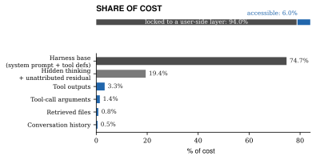

 Figure 1: Cost attribution by agent component ([table 1](https://arxiv.org/html/2607.12161#S2.T1 "In 2.3 Empirical cost composition ‣ 2 Cost Composition of API-Based Coding Agents ‣ Token Reduction Is Not Cost Reduction:An Empirical Study of End-to-End Efficiencyin API-Based Coding Agents") as a graphic; benchmark corpus). Gray components are not directly modifiable by a user-side optimization layer (94.0% of cost); blue components are accessible (6.0%). The estimated upper bound for visible-token compression is \(\approx\)5% of cost. 

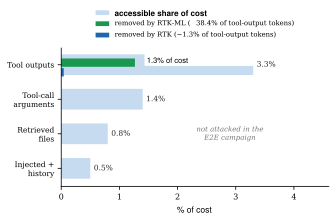

 Figure 2: Realized reduction per accessible component. Light bars: each component’s share of cost. Overlaid bars: the share actually removed by the evaluated hook layers, applying the hook-side ledger’s raw-vs-delivered tool-output reduction (\(-38.4\%\) RTK-ML, \(-1.3\%\) RTK; [section 7.2](https://arxiv.org/html/2607.12161#S7.SS2 "7.2 Token reduction versus cost reduction ‣ 7 End-to-End Results ‣ Token Reduction Is Not Cost Reduction:An Empirical Study of End-to-End Efficiencyin API-Based Coding Agents")) to the tool-output share. Even the campaign’s largest observed reduction reaches \(\approx\)1.3% of cost—and that arm’s paired billed cost was _higher_ than baseline ([table 8](https://arxiv.org/html/2607.12161#S7.T8 "In 7.1 Aggregate outcomes ‣ 7 End-to-End Results ‣ Token Reduction Is Not Cost Reduction:An Empirical Study of End-to-End Efficiencyin API-Based Coding Agents")). 

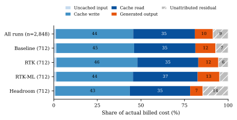

 Figure 3: Cost decomposition as shares of _actual billed_ cost (n=2,848 analyzed runs; component prices as in [eq. 1](https://arxiv.org/html/2607.12161#S2.E1 "In 2.2 Formal cost model ‣ 2 Cost Composition of API-Based Coding Agents ‣ Token Reduction Is Not Cost Reduction:An Empirical Study of End-to-End Efficiencyin API-Based Coding Agents")). The hatched fifth segment is the unattributed billed-cost residual (billed minus reconstructed). Numbers inside segments are percentages; run-bootstrap 95% CIs for every segment are in [table 7](https://arxiv.org/html/2607.12161#S6.T7 "In 6.2 Billed cost decomposition ‣ 6 Aggregate Cost Composition ‣ Token Reduction Is Not Cost Reduction:An Empirical Study of End-to-End Efficiencyin API-Based Coding Agents"). Normalized four-component shares appear in Appendix [A.3](https://arxiv.org/html/2607.12161#A1.SS3 "A.3 Normalized four-component shares ‣ Appendix A Reproducibility Appendix ‣ Token Reduction Is Not Cost Reduction:An Empirical Study of End-to-End Efficiencyin API-Based Coding Agents").

## 3 Optimization Surfaces and Architectures

Context-reduction systems differ in _where_ they act on the agent loop, what they can see, and whether their transformations are reversible. [Table 2](https://arxiv.org/html/2607.12161#S3.T2 "In 3 Optimization Surfaces and Architectures ‣ Token Reduction Is Not Cost Reduction:An Empirical Study of End-to-End Efficiencyin API-Based Coding Agents") summarizes the systems studied or audited here; evidence levels refer to the layered taxonomy of [section 12](https://arxiv.org/html/2607.12161#S12 "12 Limits of Component-Level Benchmarks ‣ Token Reduction Is Not Cost Reduction:An Empirical Study of End-to-End Efficiencyin API-Based Coding Agents") (L1–L8).

Table 2: System architecture and evidence matrix. “Billed E2E” means paired end-to-end campaigns with provider-billed cost and deterministic task scoring exist in the retained artifacts. Evidence levels: L1 compression ratio, L2 retrieval/preservation quality, L3 model-visible context change, L4 production-path activation, L5 task success, L6 billed cost, L7 cost per successful execution, L8 trajectory/failure analysis.

System | Surface | Visibility | Reversible | Prod. wiring | Evidence  
---|---|---|---|---|---  
Baseline Claude Code | — (reference) | full harness | — | shipped | L4–L8  
RTK | PreToolUse hook; CLI proxy | raw+delivered tool I/O | rules only | shipped | L1–L8  
RTK-ML | hook + flag-gated gate stack | raw+delivered tool I/O | byte-equiv. on covered disabled paths | benchmark build | L1–L8  
Headroom v0.27.0 | API-boundary proxy | opaque (black box) | unknown | shipped (OSS) | L5–L8  
Vendor CLI compressor | CLI output compressor | external; not run here | n/a | external | vendor claims only  
ml_lexical engine | query-aware rank/pack engine | component harness | fail-open | research code | L1–L2  
Caveman | agent-prose compressor | component harness | preservation contract | not registered | L1–L2  
Lexical ranking | candidate re-ranker (gate 4) | candidates | reorder only | flag-gated | L2, L4  
Embedding ranking | BGE sidecar re-ranker (gate 5) | candidates | reorder only | flag-gated | L4 (active, not decisive)  
Structural (ast-grep) | AST-anchored retrieval (gate 8) | focus hints | additive only | flag-gated | L2, L4  
Union/hybrid retrieval | lexical\(\cup\)embedding | candidates | reorder only | component harness | L2

 

#### Hook-based compression (RTK).

RTK installs a PreToolUse hook that rewrites eligible shell commands to route through a CLI proxy; the proxy applies YAML-configured, strategy-based compression to the command’s output before it reaches the model. RTK is the shipped deterministic layer. The _RTK-ML_ architecture adds nine independently flag-gated capabilities on top: (1) query propagation from the user prompt into the proxied command; (2) retrieval routing of search-type commands (grep, rg, find, ls, …) into a grouped, ranked _search-group_ representation; (3) query-aware deterministic re-ranking; (4) a lexical scoring leg; (5) an embedding scoring leg backed by a loopback BGE sidecar [[30](https://arxiv.org/html/2607.12161#bib.bib30)]; (6) a task-family router that classifies the context; (7) a preserve gate that bypasses compression entirely for high-recall families; (8) structural retrieval using ast-grep [[5](https://arxiv.org/html/2607.12161#bib.bib5)] to inject focus-file hints; and (9) a session-scoped focus cache. All nine are off by default, and the disabled paths covered by the dedicated equivalence tests were byte-equivalent; a safety router (default-on) prevents semantic stages from touching sensitive tool output, and a stdout-consumer guard ([section 11](https://arxiv.org/html/2607.12161#S11 "11 Failure Modes and Safety Constraints ‣ Token Reduction Is Not Cost Reduction:An Empirical Study of End-to-End Efficiencyin API-Based Coding Agents")) suppresses ranking when the command’s stdout feeds another program.

#### API-boundary proxying (Headroom).

Headroom [[15](https://arxiv.org/html/2607.12161#bib.bib15)] interposes on the provider API endpoint via ANTHROPIC_BASE_URL and optimizes payloads in flight. Its observed configuration in these campaigns was token-mode optimization with caching enabled and code-aware mode disabled. Because it is a black box to our harness, we can measure its billed effects and trajectories but cannot attribute them to internal mechanisms; we therefore avoid causal claims about _why_ it behaves as it does.

#### Deterministic CLI compression (external vendor tool).

One audited system is a commercially distributed deterministic command-output compressor from an unaffiliated vendor. The retained artifacts contain only that vendor’s own per-category claimed savings (75–80% for git diff, git log, ls, grep), embedded as reference literals in a benchmark harness. No same-harness, paired, actually-billed end-to-end run of it exists in the artifacts, so it appears in this paper only as a related architectural approach.

#### Query-aware research engine (ml_lexical).

The ml_lexical engine is an implemented research architecture combining chunking, lexical and cosine ranking, packing with protected regions, and a BGE embedding sidecar. Its evidence is component-level retrieval quality only ([section 4](https://arxiv.org/html/2607.12161#S4 "4 Benchmarks and Datasets ‣ Token Reduction Is Not Cost Reduction:An Empirical Study of End-to-End Efficiencyin API-Based Coding Agents")); it has no end-to-end task-success or billed cost evidence.

#### Agent-prose compression (Caveman).

Caveman compresses LLM-generated prose (never tool output) under an explicit preservation contract (paths, line numbers, test names, error types, metrics, and code blocks are kept verbatim). It is not registered in any production strategy table; its evidence is a seven-fixture component study ([section 4](https://arxiv.org/html/2607.12161#S4 "4 Benchmarks and Datasets ‣ Token Reduction Is Not Cost Reduction:An Empirical Study of End-to-End Efficiencyin API-Based Coding Agents")).

## 4 Benchmarks and Datasets

[Table 3](https://arxiv.org/html/2607.12161#S4.T3 "In 4 Benchmarks and Datasets ‣ Token Reduction Is Not Cost Reduction:An Empirical Study of End-to-End Efficiencyin API-Based Coding Agents") maps every benchmark used in the underlying research program to what it does and does not measure. Two properties matter most: whether the benchmark observes _end-to-end task success_ , and whether its costs are _actually billed_ rather than reconstructed.

Table 3: Benchmark capability matrix. “Billing” distinguishes: provider-returned usage with execution-result cost cross-checked against the pricing schedule (billed+usage); cost reconstructed from provider-returned token counts (tokens); billed cost recovered from frozen reports, ledgers, or traces (billed, with the source named); and length-based estimates (est.).

Benchmark | \(n\) used | Gold / success metric | Level | Billing |  Key limitation  
---|---|---|---|---|---  
ContextBench [[10](https://arxiv.org/html/2607.12161#bib.bib10)] | 36 sweep runs / 7,510 rows; 50 (policy study) | gold-span token survival | component | tokens |  no task success; dataset revision unrecorded  
LoCoEval [[1](https://arxiv.org/html/2607.12161#bib.bib1)] | 50 (preservation; retained) | reference-answer survival | component | est. (len/4) |  judge unavailable; preservation proxy only  
InterCode-proxy [[32](https://arxiv.org/html/2607.12161#bib.bib32)] | 24 obs. / 240 rows (12 MBPP [[6](https://arxiv.org/html/2607.12161#bib.bib6)] \(\times\) pass/bug) | marker recall \(\geq\)95% | component | tokens |  interactive task success blocked (no container runtime)  
Structural retrieval | 8 tasks / 38 queries | test-grounded def-site gold | component | tokens |  agent success not measured  
Caveman fixtures | 7 synthetic | critical-marker drops | component | tokens |  synthetic; not production traffic  
ContextBench-Go grounded E2E | 29 rows \(\times\) 4 arms | patch applies + tests resolve | E2E (single-shot) | billed (usage) |  one model; single-shot shape ([section 7.4](https://arxiv.org/html/2607.12161#S7.SS4 "7.4 Single-shot grounded-completion study \(separate harness\) ‣ 7 End-to-End Results ‣ Token Reduction Is Not Cost Reduction:An Empirical Study of End-to-End Efficiencyin API-Based Coding Agents"))  
SWE-bench_Pro Go agent smoke | 4\(\times\)4 + 18 trials | patch apply / resolve | E2E (single-shot) | billed (report-derived) |  0 applies context-only; smoke scale  
IC-SWE flask pilot | 3 tasks \(\times\) 4 modes | FAIL_TO_PASS flips | E2E (single-shot) | billed (trace-derived) |  n=3, single repo; labeled pilot  
Comprehensive E2E pilot | 21 tasks \(\times\) 4 systems | pytest exit + diff constraints | E2E | billed (report-derived) |  single model, 1 repetition  
Large-session campaign | 529 sessions, 3 tasks | pytest exit | E2E | billed (ledger) |  different RTK binary lineage  
Authoritative campaign | 103 tasks, 2,908 runs | deterministic judges | E2E | billed+usage (cross-checked) |  Claude-Code-specific harness  
Codex Headroom replication | 40 tasks \(\times\) 2 arms (+12\(\times\)2 pilot) | deterministic graders | E2E | tokens (reconstructed) |  different agent (Codex CLI); transcribed from frozen report ([section 9](https://arxiv.org/html/2607.12161#S9 "9 Cross-Agent Replication on Codex ‣ Token Reduction Is Not Cost Reduction:An Empirical Study of End-to-End Efficiencyin API-Based Coding Agents"))

 

#### Limits of gold-context preservation as an agent metric.

Component benchmarks score a compressor against human- or test-annotated _gold_ context. Four mechanisms can cause gold-context preservation metrics to diverge from agent outcomes. (i) Agents can _recover_ : if a needed line is removed, the model can search again or re-read the file, converting a preservation failure into a trajectory cost rather than a task failure. (ii) Agents can _succeed without the gold_ : prior knowledge or inference over remaining context is often sufficient. (iii) Agents can _fail with the gold_ : receiving the right lines does not guarantee correct edits. (iv) Retrieval is one stage of a multi-stage trajectory; a single extra diagnosis-and-retry loop re-transmits the full context prefix and can eliminate the nominal savings of a much larger compression ([section 10](https://arxiv.org/html/2607.12161#S10 "10 Trajectory and Phase Efficiency ‣ Token Reduction Is Not Cost Reduction:An Empirical Study of End-to-End Efficiencyin API-Based Coding Agents")). Long-context research documents related gaps between context presence and context use [[23](https://arxiv.org/html/2607.12161#bib.bib23), [7](https://arxiv.org/html/2607.12161#bib.bib7)].

#### Suite-level benchmarks and created corpora.

Beyond the benchmarks above, the program built and ran a family of suite-level corpora: a 159-case command-output compression corpus (cmdcompress) with 34 paired live-API cases, privacy-redaction and intent-classification suites (privacybench, observer_intent), retrieval-mode and output-compression exercises, and a path-coverage suite proving which changed code each arm actually executes. It also _created_ the synthetic task fixtures the end-to-end campaigns run on: seven scripted repository tasks for the pilot harness, fourteen fixture suites (343 files, including 150/400-test pass/fail suites and bulk-output generators) for the comprehensive campaign, three synthetic large repositories (911 files) for the long-session marathons, seeded synthetic monorepos with committed ground truth for Stages 1–2 and the authoritative campaign, the 7 Caveman prose fixtures, and the 24-observation captured pytest corpus. Appendix [A.12](https://arxiv.org/html/2607.12161#A1.SS12 "A.12 Created benchmark corpora and synthetic fixtures ‣ Appendix A Reproducibility Appendix ‣ Token Reduction Is Not Cost Reduction:An Empirical Study of End-to-End Efficiencyin API-Based Coding Agents") inventories all of them with sizes and paths.

#### SWE-bench lineage.

The grounded-completion program ([section 7.4](https://arxiv.org/html/2607.12161#S7.SS4 "7.4 Single-shot grounded-completion study \(separate harness\) ‣ 7 End-to-End Results ‣ Token Reduction Is Not Cost Reduction:An Empirical Study of End-to-End Efficiencyin API-Based Coding Agents")) draws its tasks from SWE-bench-derived corpora: the ContextBench-Go rows are Multi-SWE-bench Go instances [[36](https://arxiv.org/html/2607.12161#bib.bib36)] exposed through the ContextBench loader, the agent smoke ran on the Contextbench/SWE-bench_Pro dataset [[11](https://arxiv.org/html/2607.12161#bib.bib11)], and the IC-SWE pilot uses SWE-bench Python repositories at pinned base commits [[19](https://arxiv.org/html/2607.12161#bib.bib19)]. Task success is scored by whether the row’s FAIL_TO_PASS tests flip to passing after the agent’s patch applies.

#### Snapshots.

The authoritative campaign is fully frozen (task manifests, six pinned repository SHAs plus a seeded synthetic monorepo, sha256-pinned binaries, gzipped transcripts). The component-benchmark side is weaker: the ContextBench dataset revision hash was not recorded (row identifiers are retained), and parts of the LoCoEval artifacts were written to volatile temporary directories. Appendix [A.9](https://arxiv.org/html/2607.12161#A1.SS9 "A.9 Dataset snapshots ‣ Appendix A Reproducibility Appendix ‣ Token Reduction Is Not Cost Reduction:An Empirical Study of End-to-End Efficiencyin API-Based Coding Agents") lists the exact snapshot state per dataset.

## 5 Experimental Methodology

### 5.1 Campaign hierarchy

The underlying research program produced several campaign generations ([table 4](https://arxiv.org/html/2607.12161#S5.T4 "In 5.1 Campaign hierarchy ‣ 5 Experimental Methodology ‣ Token Reduction Is Not Cost Reduction:An Empirical Study of End-to-End Efficiencyin API-Based Coding Agents")). The program’s evidence classes are reconciled exactly in Appendix [A.2](https://arxiv.org/html/2607.12161#A1.SS2 "A.2 Campaign reconciliation ‣ Appendix A Reproducibility Appendix ‣ Token Reduction Is Not Cost Reduction:An Empirical Study of End-to-End Efficiencyin API-Based Coding Agents"): 5,123 executions recorded in append-only runtime cost ledgers (guarded re-executions such as the Stage-1 post-guard rerun and the two separately-billed long-session sibling campaigns counted at their true cost); 8 costsmoke executions whose count derives from the suite results file rather than a per-run ledger; and 362 billed single-shot trials whose reported or trace-reconstructed spend is itemized in [table 5](https://arxiv.org/html/2607.12161#S5.T5 "In 5.1 Campaign hierarchy ‣ 5 Experimental Methodology ‣ Token Reduction Is Not Cost Reduction:An Empirical Study of End-to-End Efficiencyin API-Based Coding Agents") (analyzed in [section 7.4](https://arxiv.org/html/2607.12161#S7.SS4 "7.4 Single-shot grounded-completion study \(separate harness\) ‣ 7 End-to-End Results ‣ Token Reduction Is Not Cost Reduction:An Empirical Study of End-to-End Efficiencyin API-Based Coding Agents")). The combined measured program therefore comprises 5,493 billed executions, 8,263 zero-inference-cost component evaluations, and a free deterministic gate-activation proof (Stage 0). Later campaigns supersede earlier ones where they overlap. [Table 4](https://arxiv.org/html/2607.12161#S5.T4 "In 5.1 Campaign hierarchy ‣ 5 Experimental Methodology ‣ Token Reduction Is Not Cost Reduction:An Empirical Study of End-to-End Efficiencyin API-Based Coding Agents") lists them with their role in this paper. All quantitative end-to-end claims in [Sections 6](https://arxiv.org/html/2607.12161#S6 "6 Aggregate Cost Composition ‣ Token Reduction Is Not Cost Reduction:An Empirical Study of End-to-End Efficiencyin API-Based Coding Agents"), [7](https://arxiv.org/html/2607.12161#S7 "7 End-to-End Results ‣ Token Reduction Is Not Cost Reduction:An Empirical Study of End-to-End Efficiencyin API-Based Coding Agents"), [8](https://arxiv.org/html/2607.12161#S8 "8 Heterogeneity by Model, Effort, and Task Family ‣ Token Reduction Is Not Cost Reduction:An Empirical Study of End-to-End Efficiencyin API-Based Coding Agents") and [10](https://arxiv.org/html/2607.12161#S10 "10 Trajectory and Phase Efficiency ‣ Token Reduction Is Not Cost Reduction:An Empirical Study of End-to-End Efficiencyin API-Based Coding Agents") come from the _authoritative campaign_ unless explicitly labeled otherwise; the long-session campaign is reported separately because it used an earlier experimental configuration and must not be pooled with the authoritative campaign; earlier pilots are cited only for provenance and for the failure analysis of [section 11](https://arxiv.org/html/2607.12161#S11 "11 Failure Modes and Safety Constraints ‣ Token Reduction Is Not Cost Reduction:An Empirical Study of End-to-End Efficiencyin API-Based Coding Agents").

Table 4: Campaign inventory and role, entire measurement program. Execution counts are totaled from each campaign’s append-only runtime cost ledger (every billed execution counted once, including guarded re-executions); analysis populations de-duplicate rescored rows separately. The authoritative campaign comprises a base phase and a pre-specified expansion (new hash-frozen holdout) analyzed jointly. Stage 0 is a free deterministic proof and is excluded from the paid total.

Campaign | Runs | Models | Systems |  Role in this paper  
---|---|---|---|---  
E2E smoke pilot | 32 | Haiku 4.5 | 4 |  provenance only  
Small comparison (costsmoke) | 8d | Opus 4.8 | 4 |  suite-level; superseded on compression axis  
Comprehensive E2E pilot | 96 | Haiku 4.5 | 4(+4 modes) |  Headroom 18/21 discussion ([appendix B](https://arxiv.org/html/2607.12161#A2 "Appendix B Reconciliation of the Headroom 18/21 Record ‣ Token Reduction Is Not Cost Reduction:An Empirical Study of End-to-End Efficiencyin API-Based Coding Agents"))  
Expanded statistical (API) | 112 | Opus 4.8 | 4 |  component-level; compression at scale  
Large-session (2-system gen.) | 133 | Opus 4.8 | 2 |  earlier generation, superseded by 4-system  
Large-session campaign | 529 | Opus 4.8 | 4 |  long-session evidence; separate binary lineage  
Large-session attribution | 60 | Opus 4.8 | 4 |  attribution follow-up (same lineage)  
Stage 1 (pre-guard + rerun) | 911 | Haiku 4.5 | 5 |  pipeline-incompatibility analysis + post-guard rerun  
Stage 2 (paid, post-guard) | 342 | Haiku, Sonnet | 4 |  guard validation; model-reversal observation  
Authoritative campaign | 2,908 | Haiku, Sonnet, Opus | 4 |  all primary results  
Single-shot grounding program | 362 | Sonnet 4.6 | (see [table 5](https://arxiv.org/html/2607.12161#S5.T5 "In 5.1 Campaign hierarchy ‣ 5 Experimental Methodology ‣ Token Reduction Is Not Cost Reduction:An Empirical Study of End-to-End Efficiencyin API-Based Coding Agents")) |  anchor alteration + grounding study ([section 7.4](https://arxiv.org/html/2607.12161#S7.SS4 "7.4 Single-shot grounded-completion study \(separate harness\) ‣ 7 End-to-End Results ‣ Token Reduction Is Not Cost Reduction:An Empirical Study of End-to-End Efficiencyin API-Based Coding Agents"))  
Paid total | 5,493 | — | — |  Stage 0 adds 4 free checks; d = count derived from suite results, no per-run ledger

 

Table 5: The single-shot grounded-completion and agent-smoke program (companion bench harness; claude-sonnet-4-6; billed anthropic_api_usage). Trials are (row \(\times\) arm) agent calls; \(\sim\) marks report-approximate or trace-derived spend.

Experiment (single-shot, Sonnet 4.6) | Trials |  Result  
---|---|---  
SWE-bench_Pro agent smoke | 16 |  oracle 2/4 resolved; Claude patches generated, 0 applied  
ContextBench-Go C3/D3/D3b/E investigation | 84 |  Phase E (n=40 x 2 arms): raw 2/40 vs compressed 1/40 resolved; apply 27/40 vs 15/40  
SWE-bench_Pro Go probe+confirm | 18 |  0/18 applied, 0 solved (context-only agent, no verbatim anchors)  
G2 grounded 4-arm (29 oracle rows) | 116 |  grounded raw 5/29 solved; 3 rows solved only by grounded raw, 0 only by grounded compressed (exact paired p=0.25)  
Family-routing E2E validation | 116 |  preserve 83% vs aggressive 48% apply; grounded preserve 6 solves  
IC-SWE flask agent pilot | 12 |  0/3 all modes; hybrid-lexical 34.7% savings, 67% patch-apply  
Program subtotal | 362 |  plus 8,263 zero-inference-cost component evaluation rows

 

### 5.2 Design of the authoritative campaign

#### Arms.

(1)  _Baseline_ : Claude Code 2.1.201 with no layers. (2)  _RTK v0.44.1_ : the open-source RTK hook layer used for all RTK experiments in this paper. (3)  _RTK-ML_ : the flag-gated architecture at the guard commit, all nine gates enabled, safety router in enforce mode, BGE embedding sidecar health-checked before every batch. (4)  _Headroom v0.27.0_ via ANTHROPIC_BASE_URL. Binary sha256 hashes and exact provenance are in Appendix [A.8](https://arxiv.org/html/2607.12161#A1.SS8 "A.8 System provenance ‣ Appendix A Reproducibility Appendix ‣ Token Reduction Is Not Cost Reduction:An Empirical Study of End-to-End Efficiencyin API-Based Coding Agents"). All RTK rows in the paper refer to v0.44.1. The post-hoc Opus-medium replication uses the same RTK version and is reported separately only because it was run after the main campaign under Claude Code 2.1.220 ([appendix C](https://arxiv.org/html/2607.12161#A3 "Appendix C Post-Hoc Opus-Medium Replication: RTK v0.44.1 ‣ Token Reduction Is Not Cost Reduction:An Empirical Study of End-to-End Efficiencyin API-Based Coding Agents")).

#### Tasks and repositories.

103 analyzed tasks across 24 defined families (23 with analyzed tasks; the one family without an analyzed task contained only the excluded defective task) ([section 8](https://arxiv.org/html/2607.12161#S8 "8 Heterogeneity by Model, Effort, and Task Family ‣ Token Reduction Is Not Cost Reduction:An Empirical Study of End-to-End Efficiencyin API-Based Coding Agents")) over 7 repositories: six pinned open-source repositories (click, cobra, express, flask, gin, requests) and a seeded synthetic monorepo. Tasks are frozen in pre-specified, hash-frozen manifests with per-task judges (deterministic answer/regex/test checks), allowed/forbidden file constraints, timeouts, and design attributes (difficulty, retrieval mode, session band, output band).

#### Pairing and randomization.

The unit of execution is a _block_ : one task \(\times\) model \(\times\) effort \(\times\) repetition, in which all four arms run from identical fresh working copies in randomized order. Runs execute in an isolated per-run $HOME with a scrubbed environment (all CLAUDE*/ANTHROPIC* and compression-layer variables removed except the API key), fixed harness settings (project-only setting sources so no user hooks load), per-run budget caps, and a global spend cap enforced under a lock.

#### Models and effort.

Claude Haiku 4.5, Claude Sonnet 5, and Claude Opus 4.8, at effort levels low/medium/high/xhigh/max for Haiku and low/high for Sonnet and Opus (unmeasured cells are reported as such, never imputed; [section 8](https://arxiv.org/html/2607.12161#S8 "8 Heterogeneity by Model, Effort, and Task Family ‣ Token Reduction Is Not Cost Reduction:An Empirical Study of End-to-End Efficiencyin API-Based Coding Agents")).

#### Measurement.

Cost is the provider-billed total_cost_usd from the harness JSON output (field cost_source equal to actual_billed on every analyzed run). For every execution, total_cost_usd was obtained from the Claude Code/API execution result and independently cross-checked against the provider-returned usage fields and the applicable Anthropic pricing schedule; it was not estimated from text length or local token heuristics. Usage tokens come from the provider usage object; success is scored by the frozen deterministic judges; gate activation is read from per-run gate traces; raw-vs-delivered tool tokens come from the hook-side ledger (RTK arms only), counted with an embedded local BPE tokenizer (estimates, not provider token counts). Every transcript is retained gzipped, enabling the turn-level ledgers and phase analysis of [section 10](https://arxiv.org/html/2607.12161#S10 "10 Trajectory and Phase Efficiency ‣ Token Reduction Is Not Cost Reduction:An Empirical Study of End-to-End Efficiencyin API-Based Coding Agents").

#### Pre-specification and split roles.

The campaign design, arms, tasks, judges, and analysis plan were frozen in hash-pinned manifests and pre-specification documents before execution (the expansion added a new frozen holdout before its spend). There was no public, independently timestamped preregistration; we therefore use “pre-specified” throughout rather than “pre-registered.” Findings are labeled by provenance: development/base-split observations (which also drove the guard fix and judge repairs), frozen-holdout confirmations ([table 9](https://arxiv.org/html/2607.12161#S7.T9 "In 7.1 Aggregate outcomes ‣ 7 End-to-End Results ‣ Token Reduction Is Not Cost Reduction:An Empirical Study of End-to-End Efficiencyin API-Based Coding Agents")), pooled estimates, and exploratory strata.

#### Exclusions and integrity.

Analysis rows are de-duplicated keep-last per run id (rescored rows are appended, never overwritten), restricted to completed non-infrastructure-failure runs, and exclude one manifest-flagged defective task and the calibration split: 2,848 analyzed runs out of 2,908 executed. Five judge-defect classes found before the holdout were fixed and rescored symmetrically across all arms from stored outputs, with the full append-only row history retained.

### 5.3 Prompt-cache carryover between arms (threat to validity)

Because the measured outcome is directly affected by provider-side prompt caching, within-block cache carryover is a first-order threat: all four arms of a block run the same task from identical working copies, per-run $HOME isolation does not isolate the provider’s cache, and the median gap between consecutive runs in a block is 10.8 s (p90 28.6 s; 100% of the 2,136 consecutive pairs fall inside the five-minute cache TTL). A TTL-separated re-analysis is therefore impossible on this data — carryover cannot be ruled out by temporal separation. Three retained-data checks bound the concern ([table 6](https://arxiv.org/html/2607.12161#S5.T6 "In 5.3 Prompt-cache carryover between arms \(threat to validity\) ‣ 5 Experimental Methodology ‣ Token Reduction Is Not Cost Reduction:An Empirical Study of End-to-End Efficiencyin API-Based Coding Agents"); full numbers in the reproducibility package). First, the design is exactly balanced at the margins: each arm ran 712 times in total and each block position contains exactly 712 runs (arm-by-position cell counts vary 147–221 under randomization, which is not stratified by position). Second, the primary paired deltas do not depend on relative order: for every arm, the delta measured when the arm ran _before_ baseline is statistically indistinguishable from the delta when it ran _after_ (all order-difference CIs cross zero). Third, later block positions show no cache-write deflation—mean cache-creation tokens at positions 1–3 are 3.7% _higher_ than at position 0, the opposite of what shared-prefix reuse would produce, and mean cost varies non-monotonically by position (a 9% spread). Randomized order limits systematic bias by construction, and these checks detect no order signature in cost, cache traffic, or success; they do not prove carryover is absent, and we carry the point as a limitation.

Table 6: Order-sensitivity check for the main 2,848-run campaign: paired per-task cost delta vs. baseline, split by whether the arm executed before or after baseline within its randomized block. All order-difference CIs cross zero. The post-hoc RTK v0.44.1 Opus-medium replication is not pooled into this table because it is a different campaign ([appendix C](https://arxiv.org/html/2607.12161#A3 "Appendix C Post-Hoc Opus-Medium Replication: RTK v0.44.1 ‣ Token Reduction Is Not Cost Reduction:An Empirical Study of End-to-End Efficiencyin API-Based Coding Agents")). 

Arm | \(\Delta\)% (arm first) | \(\Delta\)% (arm after) | Order difference (%) [95% CI] | \(n_{T}\)  
---|---|---|---|---  
RTK v0.44.1 | -4.41 | -1.57 | -2.84 [-9.54, +3.75] | 101/99  
RTK-ML | +11.53 | +4.04 | +7.49 [-2.32, +18.01] | 99/101  
Headroom v0.27.0 | +47.31 | +49.69 | -2.40 [-17.57, +12.02] | 102/99

 

### 5.4 Statistical procedure

The task is the unit of inference for comparative arm effects. Descriptive cost-composition and reconstruction intervals use run-level resampling and are not interpreted as task-level treatment-effect inference. For any comparative metric we form paired within-block differences (arm minus baseline), average them within task, and bootstrap over tasks (10,000 resamples, fixed seed) for 95% confidence intervals; the expansion analysis additionally reports repository-clustered bootstrap intervals and leave-one-repository-out sensitivity for the same contrasts. Resampling units by analysis: arm comparisons use the task-clustered bootstrap; cost-composition shares and the reconstruction residual use a run-level bootstrap (descriptive only; run-level resampling does not account for repeated-task dependence); repository sensitivity uses a repository-clustered bootstrap; grounded paired outcomes use an exact paired analysis; exploratory task-family cells are descriptive or task-bootstrap as flagged in each table. Repeated runs of the same task are never treated as independent: intraclass correlation of cost across repetitions was 0.37–0.55 depending on arm, giving Kish effective sample sizes of roughly 38–45 tasks per arm despite 712 runs per arm. Family-level results are exploratory screening: the underlying campaign screened families by whether task-clustered bootstrap intervals excluded zero, but no per-contrast \(p\)-values were computed, so no false-discovery-rate control is claimed; we report family-level effect sizes with confidence intervals and label them exploratory. Cells with fewer than six tasks are flagged unstable and reported as exploratory. We report effect sizes with confidence intervals and avoid binary significance language where power is insufficient. Failed tasks are never dropped from cost aggregates, and lower cost caused by early failure is not treated as efficiency: cost per successful execution ([eq. 2](https://arxiv.org/html/2607.12161#S2.E2 "In 2.2 Formal cost model ‣ 2 Cost Composition of API-Based Coding Agents ‣ Token Reduction Is Not Cost Reduction:An Empirical Study of End-to-End Efficiencyin API-Based Coding Agents")) keeps failed runs in the numerator.

## 6 Aggregate Cost Composition

### 6.1 Calibration of the decomposition

Applying [eq. 1](https://arxiv.org/html/2607.12161#S2.E1 "In 2.2 Formal cost model ‣ 2 Cost Composition of API-Based Coding Agents ‣ Token Reduction Is Not Cost Reduction:An Empirical Study of End-to-End Efficiencyin API-Based Coding Agents") with the provider’s published standard prices and the five-minute cache-write multiplier (\(\mu_{\mathrm{w}}{=}1.25\), \(\mu_{\mathrm{r}}{=}0.1\)) reproduces the billed cost of individual runs with median per-run residuals of \(+0.9\%\) (Haiku, \(n{=}1{,}748\)), \(+0.0\%\) (Sonnet, \(n{=}948\)), and \(+0.2\%\) (Opus, \(n{=}152\)). Alternative configurations are rejected by the same calibration: the one-hour cache multiplier leaves \(-23\)% to \(-33\)% median residuals, and Sonnet 5 introductory pricing leaves \(+33\%\) unexplained—so the campaign was billed at standard prices under the five-minute cache tier.

The median residual and the aggregate residual answer different questions, and the distinction matters for all reported results in this paper. The four-component model is accurate for most _individual_ runs (the median residuals above), but the _dollar-weighted aggregate_ residual is \(+8.7\%\) of total billed spend (95% CI [7.2, 10.1]; by arm: baseline \(+7.1\%\), RTK \(+5.5\%\), RTK-ML \(+4.9\%\), Headroom \(+14.5\%\))—an economically material share that cannot be explained by the small median. A post-hoc per-model analysis (script scripts/extract_thinking_addressability.py; retained run records only) localizes it. On Sonnet 5 the four components account for the bill at both measured efforts (residual \(+0.2\%\)), so its aggregate output_tokens appear to include thinking charges. On Haiku 4.5 the residual rises monotonically with the thinking-effort setting—from 11.0% to 18.3% of the cell’s bill per run (rising monotonically; implied \(+753\) to \(+1{,}283\) tokens at the output price)—while measured output (\(\approx\)780/run), cache volumes, and turn counts stay flat. Cache-tier and turn-count explanations are ruled out by those flat covariates, and secondary-model auxiliary calls contribute only a smaller, flat component (residual 5.2% for one-model vs. 7.2% for two-model runs): the effort-scaling component is therefore _thinking-consistent_ , and on this model thinking charges sit inside the residual rather than the measured output component. Opus 4.8 cells are too small to conclude (n=24/90). Provider usage semantics are thus not uniform across models in this harness—the same aggregate field appears to include thinking on Sonnet 5 and exclude it on Haiku 4.5. The reconstruction therefore does _not_ account for every billed dollar, and all reported shares are reported against the actual bill with the residual shown explicitly; the “generated output” component is _measured_ output. The larger Headroom residual is an observation, not evidence of any particular internal mechanism.

### 6.2 Billed cost decomposition

Table 7: Cost decomposition as shares of _actual billed_ cost with run-bootstrap 95% CIs, by slice, including the unattributed residual (billed minus reconstructed). Population: 2,848 analyzed runs from the main campaign; the RTK row therefore refers to RTK v0.44.1 in the main campaign; the post-hoc Opus-medium cells are reported separately. Cache write plus cache read is \(\approx\)80% of the bill (\(\approx\)87% of the reconstructed four-component cost). Normalized four-component shares for finer slices are in Appendix [A.3](https://arxiv.org/html/2607.12161#A1.SS3 "A.3 Normalized four-component shares ‣ Appendix A Reproducibility Appendix ‣ Token Reduction Is Not Cost Reduction:An Empirical Study of End-to-End Efficiencyin API-Based Coding Agents").

Slice | Uncached | Cache write | Cache read | Output | Unattributed residual  
---|---|---|---|---|---  
All runs | 1.3 [1.1, 1.5] | 44.3 [43.2, 45.3] | 35.4 [34.5, 36.3] | 10.4 [10.0, 10.9] | 8.7 [7.2, 10.1]  
Baseline | 1.4 [1.0, 1.8] | 44.7 [42.9, 46.4] | 35.2 [33.6, 36.6] | 11.7 [10.7, 12.6] | 7.1 [4.6, 10.1]  
RTK v0.44.1 | 1.5 [1.1, 2.0] | 46.4 [44.7, 48.2] | 35.0 [33.5, 36.5] | 11.5 [10.7, 12.4] | 5.5 [3.0, 8.4]  
RTK-ML | 1.4 [1.0, 1.8] | 44.0 [42.2, 46.1] | 37.1 [35.2, 38.8] | 12.6 [11.6, 13.6] | 4.9 [2.9, 7.4]  
Headroom | 0.9 [0.6, 1.1] | 42.8 [40.4, 45.4] | 34.6 [32.6, 36.8] | 7.3 [6.6, 7.9] | 14.5 [11.0, 18.0]

 

Across all 2,848 analyzed runs ([table 7](https://arxiv.org/html/2607.12161#S6.T7 "In 6.2 Billed cost decomposition ‣ 6 Aggregate Cost Composition ‣ Token Reduction Is Not Cost Reduction:An Empirical Study of End-to-End Efficiencyin API-Based Coding Agents"), [fig. 3](https://arxiv.org/html/2607.12161#S2.F3 "In 2.3 Empirical cost composition ‣ 2 Cost Composition of API-Based Coding Agents ‣ Token Reduction Is Not Cost Reduction:An Empirical Study of End-to-End Efficiencyin API-Based Coding Agents")), as shares of the _actual bill_ : cache creation 44.3% (CI [43.2, 45.3]), cache reads 35.4% [34.5, 36.3], generated output 10.4% [10.0, 10.9], uncached input 1.3% [1.1, 1.5], and unattributed residual 8.7% [7.2, 10.1]. Equivalently, cache creation and cache reads accounted for approximately 87% of the reconstructed four-component cost (48.5% and 38.7% of \(\widehat{C}\)) and about 80% of the bill itself. The mean run carried \(\approx\)117k cache-read tokens and \(\approx\)12k cache-creation tokens against only \(\approx\)715 generated tokens.

This composition, rather than any property of a specific compression layer, is the paper’s main explanatory result for RQ1. A system may remove a large fraction of a particular tool output while changing only a small fraction of total billed cost because that output may represent only a small part of the complete prompt-cache and trajectory cost.

Slice-level analysis provides additional detail (normalized four-component shares; Appendix [A.3](https://arxiv.org/html/2607.12161#A1.SS3 "A.3 Normalized four-component shares ‣ Appendix A Reproducibility Appendix ‣ Token Reduction Is Not Cost Reduction:An Empirical Study of End-to-End Efficiencyin API-Based Coding Agents")). Failed runs shift spend toward cache reads (43.5% vs. 38.6% of \(\widehat{C}\) on successes) and generated output (14.1% vs. 11.3%)—a pattern consistent with additional re-reading or recovery behavior. Long sessions raise the output share from 7.4% (short) to 18.4% and nearly triple cache-read tokens per run. Headroom’s profile has the lowest output share (8.5%) and the highest cache share of any arm; the tested configuration was associated with higher cache-side usage; Opus is the only model with a material uncached-input share (11.3%). Because cache reads are billed at \(0.1\times\) input price, the _addressable_ saving from removing one delivered tool token is an order of magnitude smaller than nominal token counts suggest once that token has entered the cached prefix—and is then re-read on subsequent turns at the discounted rate. Consequently, end-to-end agent cost cannot be inferred from a simple input-versus-output token decomposition (RQ2).

## 7 End-to-End Results

### 7.1 Aggregate outcomes

Table 8: Aggregate end-to-end results, authoritative campaign (per arm: 712 runs, 103 tasks). CPS = cost per successful execution ([eq. 2](https://arxiv.org/html/2607.12161#S2.E2 "In 2.2 Formal cost model ‣ 2 Cost Composition of API-Based Coding Agents ‣ Token Reduction Is Not Cost Reduction:An Empirical Study of End-to-End Efficiencyin API-Based Coding Agents")). \(\Delta\)cost is the paired per-task billed-cost change vs. baseline as % of the baseline mean, task-clustered bootstrap 95% CI; \(\Delta\)succ. is the paired success change in percentage points. 

System | Runs | Succ. (%) | Turns | \(\Delta\)cost (%) | \(\Delta\)succ. (pp)  
---|---|---|---|---|---  
Baseline Claude Code | 712 | 96.2 | 4.46 | — | —  
RTK v0.44.1 | 712 | 96.4 | 4.32 | -2.7 [-5.6, -0.1] | -0.2 [-2.9, +1.9]  
RTK-ML | 712 | 97.5 | 4.69 | +6.8 [+2.8, +11.3] | +0.9 [-0.6, +2.5]  
Headroom v0.27.0 | 712 | 97.8 | 4.20 | +48.4 [+42.3, +55.0] | +1.4 [-0.2, +3.1]

 

[Table 8](https://arxiv.org/html/2607.12161#S7.T8 "In 7.1 Aggregate outcomes ‣ 7 End-to-End Results ‣ Token Reduction Is Not Cost Reduction:An Empirical Study of End-to-End Efficiencyin API-Based Coding Agents") reports the primary end-to-end comparison. No success-rate difference was detected within the precision of the campaign (all paired success CIs cross zero; RTK-ML \(+0.9\) pp [-0.6, +2.5], Headroom \(+1.4\) pp [-0.2, +3.1]); the study was not designed as a formal non-inferiority trial, and the high baseline success rate (96–98%) limits sensitivity to small performance losses ([section 14](https://arxiv.org/html/2607.12161#S14 "14 Limitations ‣ Token Reduction Is Not Cost Reduction:An Empirical Study of End-to-End Efficiencyin API-Based Coding Agents")). Costs, by contrast, separate clearly: RTK v0.44.1 is slightly lower than baseline (\(-2.7\%\), CI [-5.6, -0.1]); the RTK-ML build is a small net cost (\(+6.8\%\), CI [+2.8, +11.3]); and Headroom carries a large, consistent cost increase (\(+48.4\%\), CI [+42.3, +55.0]). The expansion analysis confirmed the Headroom and RTK-ML-vs-RTK orderings under repository-clustered intervals and leave-one-repository-out sensitivity. [Table 9](https://arxiv.org/html/2607.12161#S7.T9 "In 7.1 Aggregate outcomes ‣ 7 End-to-End Results ‣ Token Reduction Is Not Cost Reduction:An Empirical Study of End-to-End Efficiencyin API-Based Coding Agents") separates the frozen-holdout estimates from the pooled ones: the Headroom cost increase (\(+47.3\%\) [+35.2, +59.2]) and the RTK-ML cost (\(+9.1\%\) [+2.4, +16.9]) are confirmed on the holdout alone, whereas RTK v0.44.1’s small saving is a pooled estimate whose holdout-only interval crosses zero (\(-2.3\%\) [-7.4, +2.1])—it should be read as suggestive, not holdout-confirmed. A post-hoc paired replication extended RTK v0.44.1 to cells the main campaign did not measure—Opus 4.8 and Opus 5 at medium effort. RTK v0.44.1 changed billed cost by \(-2.9\%\) [-18.8, +9.3] on Opus 4.8 and by \(+2.5\%\) [-6.1, +12.0] on Opus 5; pooled across those cells the change was \(-0.1\%\) [-9.3, +7.8]. The corresponding CPS ratios are 0.933 [0.795, 1.073], 1.025 [0.941, 1.123], and 0.979 [0.896, 1.066] pooled ([tables 10](https://arxiv.org/html/2607.12161#S7.T10 "In 7.3 Cost per successful execution ‣ 7 End-to-End Results ‣ Token Reduction Is Not Cost Reduction:An Empirical Study of End-to-End Efficiencyin API-Based Coding Agents") and [C](https://arxiv.org/html/2607.12161#A3 "Appendix C Post-Hoc Opus-Medium Replication: RTK v0.44.1 ‣ Token Reduction Is Not Cost Reduction:An Empirical Study of End-to-End Efficiencyin API-Based Coding Agents")).

Table 9: Frozen-holdout-only vs. pooled paired billed-cost change vs. baseline. Findings first observed during development and confirmed on the frozen holdout are distinguished from pooled estimates. 

Arm | Frozen holdout only | Pooled (development + holdout)  
---|---|---  
RTK v0.44.1 | -2.3% [-7.4, +2.1] (\(n_{T}\)=27) | -2.7% [-5.6, -0.1] (\(n_{T}\)=103)  
RTK-ML | +9.1% [+2.4, +16.9] (\(n_{T}\)=27) | +6.8% [+2.8, +11.3] (\(n_{T}\)=103)  
Headroom v0.27.0 | +47.3% [+35.2, +59.2] (\(n_{T}\)=27) | +48.4% [+42.3, +55.0] (\(n_{T}\)=103)

 

### 7.2 Token reduction versus cost reduction

The hook-side ledger makes raw-vs-delivered tool output observable for the RTK arms. Over the campaign, the RTK-ML arm reduced estimated raw tool-output tokens from 5.62M to 3.46M delivered (\(-38.4\%\)), while RTK delivered essentially raw output (\(-1.3\%\)). Raw and delivered counts are produced by RTK’s hook-side ledger using an embedded local BPE tokenizer (tiktoken o200k_base merge tables), not the provider tokenizer, so we report them as estimates; the reduction percentage compares like-for-like counts under the same tokenizer. Yet the RTK-ML arm’s paired billed cost was _higher_ than baseline and RTK’s was marginally lower. At the task level ([fig. 4](https://arxiv.org/html/2607.12161#S7.F4 "In 7.2 Token reduction versus cost reduction ‣ 7 End-to-End Results ‣ Token Reduction Is Not Cost Reduction:An Empirical Study of End-to-End Efficiencyin API-Based Coding Agents")), observed tool-output reduction was a weak, unstable predictor of paired billed-cost change: Pearson \(r=0.154\) [-0.051, +0.356], Spearman \(\rho=0.013\) [-0.082, +0.339] over 100 Haiku tasks; the Pearson interval crosses zero, the point estimate rises to \(0.24\) when the five highest-reduction tasks are removed, and it is \(0.13\) [-0.09, +0.36] on the 68 tasks where the gate actually routed output. Two caveats bound the interpretation. First, reduction is concentrated: 87 of 100 tasks saw under 0.1% reduction, and the four tasks in the 5–20% band show a _positive_ mean cost change (\(+24.7\%\) [+6.3, +46.0]; binned means in [fig. 4](https://arxiv.org/html/2607.12161#S7.F4 "In 7.2 Token reduction versus cost reduction ‣ 7 End-to-End Results ‣ Token Reduction Is Not Cost Reduction:An Empirical Study of End-to-End Efficiencyin API-Based Coding Agents")). Second, observed reduction is endogenous—the optimized arm can issue different commands and different trajectories, so raw-output exposure is partly determined by the model’s own actions, and the compression percentage is not an externally assigned treatment dose. We therefore read \(r\) descriptively: in this evaluated Haiku task set, per-task observed tool-output reduction was a weak predictor of paired billed-cost change; this does not establish that compression cannot affect cost. Answering RQ3, component-level reduction did not predict end-to-end cost movement in these workloads. The phase analysis ([section 10](https://arxiv.org/html/2607.12161#S10 "10 Trajectory and Phase Efficiency ‣ Token Reduction Is Not Cost Reduction:An Empirical Study of End-to-End Efficiencyin API-Based Coding Agents")) identifies trajectory patterns consistent with a possible mechanism: the realized saving ([eq. 3](https://arxiv.org/html/2607.12161#S2.E3 "In 2.2 Formal cost model ‣ 2 Cost Composition of API-Based Coding Agents ‣ Token Reduction Is Not Cost Reduction:An Empirical Study of End-to-End Efficiencyin API-Based Coding Agents")) is small once cache prices and added turns are accounted for—retrieval-stage savings were real but small at cache prices, and were offset downstream by added diagnosis, testing, and re-retrieval turns.

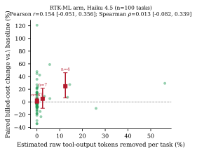

 Figure 4: Per-task estimated raw tool-output reduction (local BPE tokenizer) vs. paired billed-cost change (RTK-ML arm, Haiku 4.5; each point one task, \(n=100\); task means over paired blocks; red squares: binned means with bootstrap 95% CIs). Pearson \(r=0.154\) [-0.051, +0.356]; Spearman \(\rho=0.013\) [-0.082, +0.339] (task bootstrap, 10,000 resamples, seed 7). Observed reduction is endogenous to the arm’s own trajectory, not an assigned dose.

### 7.3 Cost per successful execution

Table 10: Billed-cost change and cost per successful execution ([eq. 2](https://arxiv.org/html/2607.12161#S2.E2 "In 2.2 Formal cost model ‣ 2 Cost Composition of API-Based Coding Agents ‣ Token Reduction Is Not Cost Reduction:An Empirical Study of End-to-End Efficiencyin API-Based Coding Agents")), with task-bootstrap 95% CIs. Top: main-campaign estimates for RTK v0.44.1, RTK-ML, and Headroom, followed by the post-hoc RTK v0.44.1 medium-effort replication on Opus 4.8 and Opus 5. Bottom: model-level CPS indices; \(n_{T}\) = unique tasks, s/r = successes/runs (u = fewer than six tasks; main-campaign Opus 4.8 cells rest on 38 runs each and are based on smaller samples; r = post-hoc replication campaign, medium effort, 52 tasks, Claude Code 2.1.220, [appendix C](https://arxiv.org/html/2607.12161#A3 "Appendix C Post-Hoc Opus-Medium Replication: RTK v0.44.1 ‣ Token Reduction Is Not Cost Reduction:An Empirical Study of End-to-End Efficiencyin API-Based Coding Agents")). Failed runs remain in the cost numerator.

System | Scope | \(\Delta\) billed cost [95% CI] | CPS ratio [95% CI] | Succ./runs  
---|---|---|---|---  
Baseline Claude Code | main campaign | reference | 1.000 | 685/712  
RTK v0.44.1 | main campaign | \(-2.7\%\) [-5.6,-0.1] | 0.968 [0.937,1.004] | 686/712  
RTK-ML | main campaign | \(+6.8\%\) [+2.8,+11.3] | 1.051 [1.006,1.100] | 694/712  
Headroom v0.27.0 | main campaign | \(+48.4\%\) [+42.3,+55.0] | 1.464 [1.397,1.531] | 696/712  
RTK v0.44.1r | Opus 4.8 | \(\mathbf{-2.9\%}\) [-18.8,+9.3] | 0.933 [0.795,1.073] | 51/52  
RTK v0.44.1r | Opus 5 | \(\mathbf{+2.5\%}\) [-6.1,+12.0] | 1.025 [0.941,1.123] | 51/52  
RTK v0.44.1r | pooled | \(-0.1\%\) [-9.3,+7.8] | 0.979 [0.896,1.066] | 102/104

 

System | Model | CPS index vs. model baseline [95% CI] | \(n_{T}\) | s/r  
---|---|---|---|---  
Baseline Claude Code | Haiku 4.5 | 1.000 [0.863, 1.156] | 103 | 412/437  
Baseline Claude Code | Sonnet 5 | 1.000 [0.886, 1.142] | 103 | 235/237  
Baseline Claude Code | Opus 4.8 | 1.000 [0.828, 1.187] | 30 | 38/38  
Baseline Claude Code | Opus 5r | 1.000 [0.849, 1.172] | 52 | 51/52  
RTK v0.44.1 (main) | Haiku 4.5 | 0.989 [0.858, 1.151] | 103 | 415/437  
RTK v0.44.1 (main) | Sonnet 5 | 0.967 [0.873, 1.076] | 103 | 234/237  
RTK v0.44.1 (main) | Opus 4.8 | 0.931 [0.797, 1.079] | 30 | 37/38  
RTK v0.44.1 (medium) | Opus 4.8r | 0.933 [0.795, 1.073] | 52 | 51/52  
RTK v0.44.1 (medium) | Opus 5r | 1.025 [0.941, 1.123] | 52 | 51/52  
RTK-ML | Haiku 4.5 | 0.981 [0.855, 1.129] | 103 | 426/437  
RTK-ML | Sonnet 5 | 1.096 [0.945, 1.277] | 103 | 231/237  
RTK-ML | Opus 4.8 | 1.202 [0.909, 1.553] | 30 | 37/38  
Headroom v0.27.0 | Haiku 4.5 | 1.474 [1.277, 1.715] | 103 | 422/437  
Headroom v0.27.0 | Sonnet 5 | 1.420 [1.285, 1.570] | 103 | 236/237  
Headroom v0.27.0 | Opus 4.8 | 1.673 [1.359, 1.997] | 30 | 38/38

 

[Table 10](https://arxiv.org/html/2607.12161#S7.T10 "In 7.3 Cost per successful execution ‣ 7 End-to-End Results ‣ Token Reduction Is Not Cost Reduction:An Empirical Study of End-to-End Efficiencyin API-Based Coding Agents") and [fig. 5](https://arxiv.org/html/2607.12161#S7.F5 "In 7.3 Cost per successful execution ‣ 7 End-to-End Results ‣ Token Reduction Is Not Cost Reduction:An Empirical Study of End-to-End Efficiencyin API-Based Coding Agents") give the primary success-adjusted metric with its uncertainty. In the main campaign, RTK v0.44.1 has a CPS ratio of 0.968 [0.937, 1.004]; RTK-ML is 1.051 [1.006, 1.100] and Headroom is 1.464 [1.397, 1.531]. The post-hoc medium-effort replication uses the same RTK v0.44.1. There, Opus 4.8 shows a \(-2.9\%\) billed-cost change [-18.8, +9.3] and CPS ratio 0.933 [0.795, 1.073]; Opus 5 shows a \(+2.5\%\) billed-cost change [-6.1, +12.0] and CPS ratio 1.025 [0.941, 1.123]. Pooled across both post-hoc cells, billed cost changes by \(-0.1\%\) [-9.3, +7.8] and CPS is 0.979 [0.896, 1.066]. On every model measured in the main campaign, Headroom’s cost per successful execution is the highest (67% above baseline on Opus 4.8). [Figure 6](https://arxiv.org/html/2607.12161#S7.F6 "In 7.3 Cost per successful execution ‣ 7 End-to-End Results ‣ Token Reduction Is Not Cost Reduction:An Empirical Study of End-to-End Efficiencyin API-Based Coding Agents") shows the run-level relationship between trajectory length and billed cost that drives these aggregates: cost grows with turns on every arm, so any layer that adds turns must overcome that growth before its per-turn savings show up as net savings.

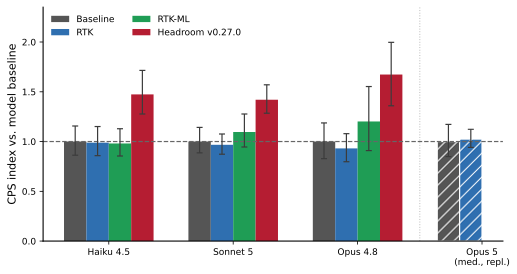

 Figure 5: Cost per successful execution by system and model (whiskers: task-bootstrap 95% CIs; 10,000 resamples, seed 7; success and run counts in [table 10](https://arxiv.org/html/2607.12161#S7.T10 "In 7.3 Cost per successful execution ‣ 7 End-to-End Results ‣ Token Reduction Is Not Cost Reduction:An Empirical Study of End-to-End Efficiencyin API-Based Coding Agents")). The hatched Opus 5 group is the post-hoc medium-effort RTK v0.44.1 replication cell (CPS 1.025, 95% CI [0.941, 1.123]); the Opus 4.8 medium-effort replication value is reported in [tables 10](https://arxiv.org/html/2607.12161#S7.T10 "In 7.3 Cost per successful execution ‣ 7 End-to-End Results ‣ Token Reduction Is Not Cost Reduction:An Empirical Study of End-to-End Efficiencyin API-Based Coding Agents") and [26](https://arxiv.org/html/2607.12161#A3.T26 "Table 26 ‣ Design. ‣ Appendix C Post-Hoc Opus-Medium Replication: RTK v0.44.1 ‣ Token Reduction Is Not Cost Reduction:An Empirical Study of End-to-End Efficiencyin API-Based Coding Agents"). 

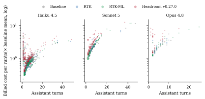

 Figure 6: Billed cost vs. trajectory length (assistant turns) per run, by model (n=2,848 runs; log-scaled cost). Each added turn re-transmits the cached prefix, so trajectory changes dominate per-turn savings.

### 7.4 Single-shot grounded-completion study (separate harness)

A companion program ran a _single-shot_ SEARCH/REPLACE coding agent (claude-sonnet-4-6, billed anthropic_api_usage) over SWE-bench-derived Go tasks in the benchmark worktree harness ([table 5](https://arxiv.org/html/2607.12161#S5.T5 "In 5.1 Campaign hierarchy ‣ 5 Experimental Methodology ‣ Token Reduction Is Not Cost Reduction:An Empirical Study of End-to-End Efficiencyin API-Based Coding Agents")). It is not a Claude Code campaign—one model, one shot, small \(n\)—but it is the only place in the artifact record where _task success under compression_ is measured jointly with a grounding intervention, and it illustrates a broader risk for edit formats that depend on verbatim anchors.

#### Compression can alter verbatim edit anchors.

On the full ContextBench-Go population (40 rows \(\times\) {raw, compressed}), the compressed arm cut billable tokens by 73% and cost by 59%, yet lost patch-_applicability_ on a net 12 rows (raw applied 27/40, compressed 15/40; failure mix edit_apply_failed 20 vs. 12): SEARCH/REPLACE editing requires the agent to reproduce a code anchor byte-for-byte, and aggressive compression rewrote or dropped exactly those spans. Resolved tasks were 2/40 (raw) vs. 1/40 (compressed), and on the 10-row subset where both arms applied, solve rate was equal (1–1). The observed deficit was concentrated in patch applicability; the experiment does not isolate whether compression also affected reasoning quality. The causal chain for application failures is mechanical: the model receives context, emits an edit whose SEARCH block must match the on-disk file byte-for-byte, and application precedes any test; compression that rewrites, omits, normalizes, or reorders the anchored span fails the patch even when the intended change is conceptually correct. The failure taxonomy therefore separates four states—evidence loss before reasoning, reasoning failure, edit-application failure, and test failure after successful application—and the observed failure mix moves between them: under grounding, edit_apply_failed decreased (17\(\to\)5 on the compressed arm) and tests_failed became the dominant residual (genuine reasoning limits). A context-only agent on SWE-bench_Pro Go rows applied 0/18 patches, a pattern consistent with the same anchor-availability limitation. The frozen report itself warns against the “successes-per-million-tokens” framing under which the compressed arm would appear superior: with 1 vs. 2 solves on non-overlapping subsets, that ratio metric inverts the verdict while obscuring the reduction in patch-application rate.

#### Effect of byte-exact grounding.

Phase G2 re-ran 29 oracle-resolved rows across four arms, adding a _grounding_ prelude—byte-exact \(\pm\)30-line windows read from the prepared repository at the gold-context file paths—ahead of the (raw or compressed) broad context ([table 11](https://arxiv.org/html/2607.12161#S7.T11 "In Effect of byte-exact grounding. ‣ 7.4 Single-shot grounded-completion study \(separate harness\) ‣ 7 End-to-End Results ‣ Token Reduction Is Not Cost Reduction:An Empirical Study of End-to-End Efficiencyin API-Based Coding Agents")). Grounding lifted apply rates from 76% to 90% (raw) and from 31% to 83% (compressed) and produced the program’s first nonzero solve-rate improvement: 5/29 for grounded raw at the lowest observed cost per resolved row among the arms. Under grounding, the compressed arm’s solves were a strict subset of the raw arm’s: three tasks solved by the grounded raw arm were not solved by the grounded compressed arm, while no task showed the reverse pattern ([table 12](https://arxiv.org/html/2607.12161#S7.T12 "In Effect of byte-exact grounding. ‣ 7.4 Single-shot grounded-completion study \(separate harness\) ‣ 7 End-to-End Results ‣ Token Reduction Is Not Cost Reduction:An Empirical Study of End-to-End Efficiencyin API-Based Coding Agents")). With only three discordant pairs the paired contrast is not statistically resolvable (exact two-sided \(p=0.25\)), and per-row costs were not retained, so no confidence interval can be attached to the per-resolved-row cost ratio; descriptively, the compressed grounded arm produced fewer solves at a higher observed cost per resolved row (2.08\(\times\) the raw arm’s) even though its cost _per attempted row_ was 17% lower—compression reduced per-attempt spend while reducing application probability, while observed cost per resolved row increased. These counts are small; we report them as evidence about the mechanism, not as a stable general result. A family-routing variant of the same design showed the preserve policy ([section 3](https://arxiv.org/html/2607.12161#S3 "3 Optimization Surfaces and Architectures ‣ Token Reduction Is Not Cost Reduction:An Empirical Study of End-to-End Efficiencyin API-Based Coding Agents"), gate 7) preserving this content type: preserve vs. aggressive compression applied 83% vs. 48% context-only, with evidence-loss failures 5 vs. 15, and grounded-preserve solving most (6) at the lowest observed cost per resolved row of the family study.

Table 11: Phase G2 grounded-completion results (29 oracle-resolved ContextBench-Go rows per arm, single-shot, claude-sonnet-4-6, billed usage; token-reconstructed costs reported as indices). In this small study, the largest observed improvement was associated with grounding; under grounding, the compressed arm produced descriptively fewer solves at higher observed cost per resolved row ([table 12](https://arxiv.org/html/2607.12161#S7.T12 "In Effect of byte-exact grounding. ‣ 7.4 Single-shot grounded-completion study \(separate harness\) ‣ 7 End-to-End Results ‣ Token Reduction Is Not Cost Reduction:An Empirical Study of End-to-End Efficiencyin API-Based Coding Agents")). 

Arm | Applied | Resolved | Billable tok | Cost index  
---|---|---|---|---  
raw context-only | 22/29 (76%) | 1 (3.4%) | 114,658 | 1.00\(\times\)  
compressed context-only | 9/29 (31%) | 1 (3.4%) | 37,157 | 0.45\(\times\)  
grounded raw | 26/29 (90%) | 5 (17.2%) | 347,231 | 2.18\(\times\)  
grounded compressed | 24/29 (83%) | 2 (6.9%) | 276,531 | 1.82\(\times\)

  Table 12: Paired task outcomes and cost decomposition in the grounded study (29 rows; grounded raw vs. grounded compressed). With three discordant pairs, the exact two-sided \(p\) is 0.25; the comparison is descriptive. Per-row costs were not retained, so uncertainty for the per-resolved-row cost cannot be computed. 

Paired outcome (29 rows) | Count  
---|---  
Solved by both arms | 2  
Solved only by grounded raw | 3  
Solved only by grounded compressed | 0  
Solved by neither | 24  
Exact two-sided \(p\) (discordant pairs) | 0.25  
Cost per attempted row (compressed vs. raw) | 0.83\(\times\) raw  
Cost per applied patch (compressed vs. raw) | 0.90\(\times\) raw  
Cost per resolved row (compressed vs. raw) | 2.08\(\times\) raw

 

#### Scope limits.

These are single-shot trials: the agent cannot search again or recover, so the recovery-loop dynamics of [section 10](https://arxiv.org/html/2607.12161#S10 "10 Trajectory and Phase Efficiency ‣ Token Reduction Is Not Cost Reduction:An Empirical Study of End-to-End Efficiencyin API-Based Coding Agents") are structurally invisible here (the IC-SWE pilot records them explicitly as not_measured). Sample sizes are small (solve counts of five and two), one model (Sonnet 4.6) and one edit format (SEARCH/REPLACE) were used, tasks are SWE-bench-derived Go rows, and one compression configuration was evaluated. These results should not be generalized beyond this experimental setting. We interpret this program as evidence about the mechanism—what the evaluated compression configuration does to edit anchors, and what grounding does to apply rates—not as a system ranking; its direction is consistent with the paired multi-turn campaigns.

### 7.5 Long-session evidence (separate lineage)

A separate long-session program (Opus 4.8; three long-horizon code-change tasks on synthetic large repositories; paired design) provides the long-session view: a 529-session main campaign, preceded by a superseded 133-session two-system generation and followed by a 60-session attribution follow-up, all separately billed (disjoint session identifiers), with the caveat that its RTK “current” arm was built from an earlier binary lineage (the pre-RTK-ML observer build), so its results must not be merged with [table 8](https://arxiv.org/html/2607.12161#S7.T8 "In 7.1 Aggregate outcomes ‣ 7 End-to-End Results ‣ Token Reduction Is Not Cost Reduction:An Empirical Study of End-to-End Efficiencyin API-Based Coding Agents"). There, RTK was cost-neutral (\(-1.3\%\), n.s.), the observer-lineage build was \(6.5\%\) _more_ expensive (CI [1.5, 11.7]), and Headroom was \(60.9\%\) more expensive, with 131/132 task success. The qualitative pattern—no consistent cost reduction from compression on long sessions and substantial proxy overhead—is consistent with the authoritative campaign.

## 8 Heterogeneity by Model, Effort, and Task Family

### 8.1 Model \(\times\) effort

Table 13: Model \(\times\) effort matrix: paired billed-cost change vs. baseline (% of same-cell baseline mean; task-clustered bootstrap 95% CI; \(n\) = paired tasks). Cells never measured in any campaign are stated as such, not imputed.

<table id="S8.T13.2" class="ltx_tabular ltx_centering ltx_figure_panel ltx_guessed_headers ltx_align_middle">
<tbody class="ltx_tbody">
<tr id="S8.T13.2.1" class="ltx_tr">
<th id="S8.T13.2.1.1" class="ltx_td ltx_align_left ltx_th ltx_th_row ltx_border_tt" style="padding-left:2.6pt;padding-right:2.6pt;">Model</th>
<th id="S8.T13.2.1.2" class="ltx_td ltx_align_left ltx_th ltx_th_row ltx_border_tt" style="padding-left:2.6pt;padding-right:2.6pt;">Effort</th>
<td id="S8.T13.2.1.3" class="ltx_td ltx_align_center ltx_border_tt" style="padding-left:2.6pt;padding-right:2.6pt;">RTK v0.44.1 \(\Delta\)%</td>
<td id="S8.T13.2.1.4" class="ltx_td ltx_align_center ltx_border_tt" style="padding-left:2.6pt;padding-right:2.6pt;">RTK-ML \(\Delta\)%</td>
<td id="S8.T13.2.1.5" class="ltx_td ltx_align_center ltx_border_tt" style="padding-left:2.6pt;padding-right:2.6pt;">Headroom \(\Delta\)%</td></tr>
<tr id="S8.T13.2.2" class="ltx_tr">
<th id="S8.T13.2.2.1" class="ltx_td ltx_align_left ltx_th ltx_th_row ltx_border_t" style="padding-left:2.6pt;padding-right:2.6pt;">Haiku 4.5</th>
<th id="S8.T13.2.2.2" class="ltx_td ltx_align_left ltx_th ltx_th_row ltx_border_t" style="padding-left:2.6pt;padding-right:2.6pt;">low</th>
<td id="S8.T13.2.2.3" class="ltx_td ltx_align_center ltx_border_t" style="padding-left:2.6pt;padding-right:2.6pt;">+7.0 [-2.7, +19.1] (76)</td>
<td id="S8.T13.2.2.4" class="ltx_td ltx_align_center ltx_border_t" style="padding-left:2.6pt;padding-right:2.6pt;">+6.8 [-2.0, +18.3] (76)</td>
<td id="S8.T13.2.2.5" class="ltx_td ltx_align_center ltx_border_t" style="padding-left:2.6pt;padding-right:2.6pt;">+55.3 [+40.6, +72.8] (76)</td></tr>
<tr id="S8.T13.2.3" class="ltx_tr">
<th id="S8.T13.2.3.1" class="ltx_td ltx_align_left ltx_th ltx_th_row" style="padding-left:2.6pt;padding-right:2.6pt;">Haiku 4.5</th>
<th id="S8.T13.2.3.2" class="ltx_td ltx_align_left ltx_th ltx_th_row" style="padding-left:2.6pt;padding-right:2.6pt;">medium</th>
<td id="S8.T13.2.3.3" class="ltx_td ltx_align_center" style="padding-left:2.6pt;padding-right:2.6pt;">-3.8 [-14.9, +5.9] (20)u</td>
<td id="S8.T13.2.3.4" class="ltx_td ltx_align_center" style="padding-left:2.6pt;padding-right:2.6pt;">+32.9 [+6.2, +69.5] (20)u</td>
<td id="S8.T13.2.3.5" class="ltx_td ltx_align_center" style="padding-left:2.6pt;padding-right:2.6pt;">+110.2 [+41.1, +197.8] (20)u</td></tr>
<tr id="S8.T13.2.4" class="ltx_tr">
<th id="S8.T13.2.4.1" class="ltx_td ltx_align_left ltx_th ltx_th_row" style="padding-left:2.6pt;padding-right:2.6pt;">Haiku 4.5</th>
<th id="S8.T13.2.4.2" class="ltx_td ltx_align_left ltx_th ltx_th_row" style="padding-left:2.6pt;padding-right:2.6pt;">high</th>
<td id="S8.T13.2.4.3" class="ltx_td ltx_align_center" style="padding-left:2.6pt;padding-right:2.6pt;">-2.6 [-11.5, +5.7] (103)</td>
<td id="S8.T13.2.4.4" class="ltx_td ltx_align_center" style="padding-left:2.6pt;padding-right:2.6pt;">-1.6 [-12.5, +7.3] (103)</td>
<td id="S8.T13.2.4.5" class="ltx_td ltx_align_center" style="padding-left:2.6pt;padding-right:2.6pt;">+47.9 [+34.6, +62.3] (103)</td></tr>
<tr id="S8.T13.2.5" class="ltx_tr">
<th id="S8.T13.2.5.1" class="ltx_td ltx_align_left ltx_th ltx_th_row" style="padding-left:2.6pt;padding-right:2.6pt;">Haiku 4.5</th>
<th id="S8.T13.2.5.2" class="ltx_td ltx_align_left ltx_th ltx_th_row" style="padding-left:2.6pt;padding-right:2.6pt;">xhigh</th>
<td id="S8.T13.2.5.3" class="ltx_td ltx_align_center" style="padding-left:2.6pt;padding-right:2.6pt;">-10.5 [-31.4, +2.5] (20)u</td>
<td id="S8.T13.2.5.4" class="ltx_td ltx_align_center" style="padding-left:2.6pt;padding-right:2.6pt;">-8.7 [-50.6, +20.1] (20)u</td>
<td id="S8.T13.2.5.5" class="ltx_td ltx_align_center" style="padding-left:2.6pt;padding-right:2.6pt;">+46.4 [+28.2, +66.2] (20)u</td></tr>
<tr id="S8.T13.2.6" class="ltx_tr">
<th id="S8.T13.2.6.1" class="ltx_td ltx_align_left ltx_th ltx_th_row" style="padding-left:2.6pt;padding-right:2.6pt;">Haiku 4.5</th>
<th id="S8.T13.2.6.2" class="ltx_td ltx_align_left ltx_th ltx_th_row" style="padding-left:2.6pt;padding-right:2.6pt;">max</th>
<td id="S8.T13.2.6.3" class="ltx_td ltx_align_center" style="padding-left:2.6pt;padding-right:2.6pt;">-9.9 [-32.2, +11.8] (20)u</td>
<td id="S8.T13.2.6.4" class="ltx_td ltx_align_center" style="padding-left:2.6pt;padding-right:2.6pt;">-21.2 [-40.6, -4.8] (20)u</td>
<td id="S8.T13.2.6.5" class="ltx_td ltx_align_center" style="padding-left:2.6pt;padding-right:2.6pt;">+9.0 [-13.6, +30.6] (20)u</td></tr>
<tr id="S8.T13.2.7" class="ltx_tr">
<th id="S8.T13.2.7.1" class="ltx_td ltx_align_left ltx_th ltx_th_row" style="padding-left:2.6pt;padding-right:2.6pt;">Sonnet 5</th>
<th id="S8.T13.2.7.2" class="ltx_td ltx_align_left ltx_th ltx_th_row" style="padding-left:2.6pt;padding-right:2.6pt;">low</th>
<td id="S8.T13.2.7.3" class="ltx_td ltx_align_center" style="padding-left:2.6pt;padding-right:2.6pt;">+10.3 [-3.4, +32.8] (20)u</td>
<td id="S8.T13.2.7.4" class="ltx_td ltx_align_center" style="padding-left:2.6pt;padding-right:2.6pt;">+1.2 [-5.7, +8.1] (20)u</td>
<td id="S8.T13.2.7.5" class="ltx_td ltx_align_center" style="padding-left:2.6pt;padding-right:2.6pt;">+80.8 [+49.0, +116.9] (20)u</td></tr>
<tr id="S8.T13.2.8" class="ltx_tr">
<th id="S8.T13.2.8.1" class="ltx_td ltx_align_left ltx_th ltx_th_row" style="padding-left:2.6pt;padding-right:2.6pt;">Sonnet 5</th>
<th id="S8.T13.2.8.2" class="ltx_td ltx_align_left ltx_th ltx_th_row" style="padding-left:2.6pt;padding-right:2.6pt;">high</th>
<td id="S8.T13.2.8.3" class="ltx_td ltx_align_center" style="padding-left:2.6pt;padding-right:2.6pt;">-4.9 [-10.9, +0.1] (103)</td>
<td id="S8.T13.2.8.4" class="ltx_td ltx_align_center" style="padding-left:2.6pt;padding-right:2.6pt;">+8.3 [+3.0, +14.4] (103)</td>
<td id="S8.T13.2.8.5" class="ltx_td ltx_align_center" style="padding-left:2.6pt;padding-right:2.6pt;">+39.5 [+32.9, +46.5] (103)</td></tr>
<tr id="S8.T13.2.9" class="ltx_tr">
<th id="S8.T13.2.9.1" class="ltx_td ltx_align_left ltx_th ltx_th_row" style="padding-left:2.6pt;padding-right:2.6pt;">Opus 4.8</th>
<th id="S8.T13.2.9.2" class="ltx_td ltx_align_left ltx_th ltx_th_row" style="padding-left:2.6pt;padding-right:2.6pt;">low</th>
<td id="S8.T13.2.9.3" class="ltx_td ltx_align_center" style="padding-left:2.6pt;padding-right:2.6pt;">-2.8 [-13.7, +7.3] (8)u</td>
<td id="S8.T13.2.9.4" class="ltx_td ltx_align_center" style="padding-left:2.6pt;padding-right:2.6pt;">+34.8 [-6.2, +109.6] (8)u</td>
<td id="S8.T13.2.9.5" class="ltx_td ltx_align_center" style="padding-left:2.6pt;padding-right:2.6pt;">+81.1 [+41.3, +123.8] (8)u</td></tr>
<tr id="S8.T13.2.10" class="ltx_tr">
<th id="S8.T13.2.10.1" class="ltx_td ltx_align_left ltx_th ltx_th_row" style="padding-left:2.6pt;padding-right:2.6pt;">Opus 4.8</th>
<th id="S8.T13.2.10.2" class="ltx_td ltx_align_left ltx_th ltx_th_row" style="padding-left:2.6pt;padding-right:2.6pt;">mediumr</th>
<td id="S8.T13.2.10.3" class="ltx_td ltx_align_center" style="padding-left:2.6pt;padding-right:2.6pt;">-2.9 [-18.8, +9.3] (52)</td>
<td id="S8.T13.2.10.4" class="ltx_td ltx_align_center" style="padding-left:2.6pt;padding-right:2.6pt;" colspan="2"><em id="S8.T13.2.10.4.1" class="ltx_emph ltx_font_italic" style="font-size:70%;">not arms of the replication</em></td></tr>
<tr id="S8.T13.2.11" class="ltx_tr">
<th id="S8.T13.2.11.1" class="ltx_td ltx_align_left ltx_th ltx_th_row" style="padding-left:2.6pt;padding-right:2.6pt;">Opus 4.8</th>
<th id="S8.T13.2.11.2" class="ltx_td ltx_align_left ltx_th ltx_th_row" style="padding-left:2.6pt;padding-right:2.6pt;">high</th>
<td id="S8.T13.2.11.3" class="ltx_td ltx_align_center" style="padding-left:2.6pt;padding-right:2.6pt;">-11.0 [-23.1, -2.2] (30)</td>
<td id="S8.T13.2.11.4" class="ltx_td ltx_align_center" style="padding-left:2.6pt;padding-right:2.6pt;">+12.4 [-6.8, +34.7] (30)</td>
<td id="S8.T13.2.11.5" class="ltx_td ltx_align_center" style="padding-left:2.6pt;padding-right:2.6pt;">+63.7 [+37.5, +91.7] (30)</td></tr>
<tr id="S8.T13.2.12" class="ltx_tr">
<th id="S8.T13.2.12.1" class="ltx_td ltx_align_left ltx_th ltx_th_row" style="padding-left:2.6pt;padding-right:2.6pt;">Opus 5</th>
<th id="S8.T13.2.12.2" class="ltx_td ltx_align_left ltx_th ltx_th_row" style="padding-left:2.6pt;padding-right:2.6pt;">mediumr</th>
<td id="S8.T13.2.12.3" class="ltx_td ltx_align_center" style="padding-left:2.6pt;padding-right:2.6pt;">+2.5 [-6.1, +12.0] (52)</td>
<td id="S8.T13.2.12.4" class="ltx_td ltx_align_center" style="padding-left:2.6pt;padding-right:2.6pt;" colspan="2"><em id="S8.T13.2.12.4.1" class="ltx_emph ltx_font_italic" style="font-size:70%;">not arms of the replication</em></td></tr>
<tr id="S8.T13.2.13" class="ltx_tr">
<th id="S8.T13.2.13.1" class="ltx_td ltx_align_left ltx_th ltx_th_row" style="padding-left:2.6pt;padding-right:2.6pt;">Sonnet 5</th>
<th id="S8.T13.2.13.2" class="ltx_td ltx_align_left ltx_th ltx_th_row" style="padding-left:2.6pt;padding-right:2.6pt;">med./xhigh/max</th>
<td id="S8.T13.2.13.3" class="ltx_td ltx_align_center" style="padding-left:2.6pt;padding-right:2.6pt;" colspan="3"><em id="S8.T13.2.13.3.1" class="ltx_emph ltx_font_italic" style="font-size:70%;">not measured in any campaign</em></td></tr>
<tr id="S8.T13.2.14" class="ltx_tr">
<th id="S8.T13.2.14.1" class="ltx_td ltx_align_left ltx_th ltx_th_row" style="padding-left:2.6pt;padding-right:2.6pt;">Opus 4.8</th>
<th id="S8.T13.2.14.2" class="ltx_td ltx_align_left ltx_th ltx_th_row" style="padding-left:2.6pt;padding-right:2.6pt;">xhigh/max</th>
<td id="S8.T13.2.14.3" class="ltx_td ltx_align_center" style="padding-left:2.6pt;padding-right:2.6pt;" colspan="3"><em id="S8.T13.2.14.3.1" class="ltx_emph ltx_font_italic" style="font-size:70%;">not measured in any campaign</em></td></tr>
<tr id="S8.T13.2.15" class="ltx_tr">
<th id="S8.T13.2.15.1" class="ltx_td ltx_align_left ltx_th ltx_th_row ltx_border_bb" style="padding-left:2.6pt;padding-right:2.6pt;">Opus 5</th>
<th id="S8.T13.2.15.2" class="ltx_td ltx_align_left ltx_th ltx_th_row ltx_border_bb" style="padding-left:2.6pt;padding-right:2.6pt;">low/high/xhigh/max</th>
<td id="S8.T13.2.15.3" class="ltx_td ltx_align_center ltx_border_bb" style="padding-left:2.6pt;padding-right:2.6pt;" colspan="3"><em id="S8.T13.2.15.3.1" class="ltx_emph ltx_font_italic" style="font-size:70%;">not measured in any campaign</em></td></tr>
</tbody>
</table>

 

  * u exploratory stratum (\(n{=}20\) tasks or fewer; the campaign’s power analysis flags such cells and the expansion analysis found arm\(\times\)effort interactions not significant).
  * r post-hoc RTK v0.44.1 replication ([appendix C](https://arxiv.org/html/2607.12161#A3 "Appendix C Post-Hoc Opus-Medium Replication: RTK v0.44.1 ‣ Token Reduction Is Not Cost Reduction:An Empirical Study of End-to-End Efficiencyin API-Based Coding Agents")): 52 family-stratified tasks, medium effort, Claude Code 2.1.220. RTK-ML and Headroom were not arms of that campaign.

[Table 13](https://arxiv.org/html/2607.12161#S8.T13 "In 8.1 Model × effort ‣ 8 Heterogeneity by Model, Effort, and Task Family ‣ Token Reduction Is Not Cost Reduction:An Empirical Study of End-to-End Efficiencyin API-Based Coding Agents") and [fig. 7](https://arxiv.org/html/2607.12161#S8.F7 "In 8.1 Model × effort ‣ 8 Heterogeneity by Model, Effort, and Task Family ‣ Token Reduction Is Not Cost Reduction:An Empirical Study of End-to-End Efficiencyin API-Based Coding Agents") present all nine main-campaign model–effort cells, plus two post-hoc medium-effort RTK v0.44.1 cells (Opus 4.8 and Opus 5) contributed by the replication campaign. Three observations are relevant. First, Headroom’s cost increase is positive in every observed cell (\(+9.0\%\) to \(+110.2\%\)). Second, RTK effects hover in single digits and flip sign between cells; the expansion campaign’s interaction tests found neither arm\(\times\)model nor arm\(\times\)effort effects significant, and specifically retired the apparent effort flips—e.g., the RTK-ML Haiku-medium cell at \(+32.9\%\) [+6.2, +69.5] against the Haiku-max cell at \(-21.2\%\)—as small-sample artifacts of 20-task exploratory strata. We therefore do not promote any effort-conditioned deployment rule. Third, coverage is incomplete by design and budget: Sonnet 5 was never run at medium, xhigh, or max effort in any campaign, and Opus 4.8 at xhigh or max; the medium-effort Opus cells shown in the model–effort table are the post-hoc RTK v0.44.1 replication results. All other cells are absent from every figure and table rather than estimated.

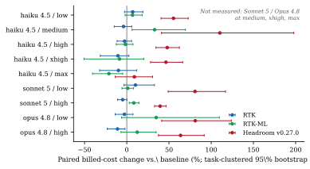

 Figure 7: Paired billed-cost change vs. baseline by main-campaign model–effort cell (task-clustered 95% CIs). This figure shows the main campaign only; the post-hoc RTK v0.44.1 Opus-medium cells are reported in [tables 13](https://arxiv.org/html/2607.12161#S8.T13 "In 8.1 Model × effort ‣ 8 Heterogeneity by Model, Effort, and Task Family ‣ Token Reduction Is Not Cost Reduction:An Empirical Study of End-to-End Efficiencyin API-Based Coding Agents") and [26](https://arxiv.org/html/2607.12161#A3.T26 "Table 26 ‣ Design. ‣ Appendix C Post-Hoc Opus-Medium Replication: RTK v0.44.1 ‣ Token Reduction Is Not Cost Reduction:An Empirical Study of End-to-End Efficiencyin API-Based Coding Agents"). Unmeasured main-campaign cells are annotated, not imputed.

### 8.2 Task families

Table 14: Task-family effects for families with \(\geq\)3 analyzed tasks: paired billed-cost change vs. baseline (% of family baseline mean; task-clustered bootstrap 95% CI). One- and two-task families are exploratory and reported in Appendix [A.4](https://arxiv.org/html/2607.12161#A1.SS4 "A.4 One- and two-task families \(exploratory\) ‣ Appendix A Reproducibility Appendix ‣ Token Reduction Is Not Cost Reduction:An Empirical Study of End-to-End Efficiencyin API-Based Coding Agents"). Families are descriptive decompositions, not pre-specified contrasts. 

Task family | \(n_{T}\) | RTK \(\Delta\)% | RTK-ML \(\Delta\)% | Headroom \(\Delta\)%  
---|---|---|---|---  
lexical_search | 19 | -0.7 [-4.1, +2.4] | -2.3 [-5.2, -0.3] | +63.0 [+48.7, +79.4]  
symbol_location | 14 | +1.2 [-1.7, +4.6] | +3.6 [-0.7, +8.6] | +51.9 [+37.3, +69.9]  
dependency_tracing | 13 | -6.7 [-15.2, -0.2] | +1.9 [-4.1, +8.2] | +60.2 [+41.3, +80.2]  
semantic_search | 11 | -3.2 [-12.6, +5.2] | +12.4 [-1.4, +28.2] | +50.7 [+28.9, +69.1]  
architecture | 7 | +1.3 [-7.2, +9.3] | -0.8 [-6.6, +6.0] | +57.1 [+33.1, +86.5]  
long_session | 6 | -4.0 [-9.6, +3.0] | +4.7 [-9.5, +16.0] | +44.6 [+24.2, +65.1]  
multi_file_debug | 4 | -9.7 [-20.7, +1.4] | +25.0 [-2.2, +52.2] | +37.7 [+12.5, +64.5]  
feature_impl | 3 | +3.9 [-9.9, +17.4] | +7.3 [-9.6, +21.6] | +36.2 [+31.6, +40.0]  
negative_control | 3 | -1.5 [-2.4, -0.6] | -2.9 [-6.9, -0.7] | +81.7 [+30.7, +147.1]  
root_cause_log | 3 | -2.1 [-3.3, -0.1] | +2.3 [-2.1, +9.3] | +46.4 [+21.4, +95.1]  
shell_pipeline | 3 | -1.5 [-2.1, -0.7] | -1.0 [-2.1, +0.2] | +50.9 [+36.5, +79.6]  
structured_data | 3 | -1.0 [-10.6, +4.5] | +7.7 [-4.9, +31.7] | +43.0 [+31.9, +62.4]

 

Across the 23 analyzed families (12 with \(\geq\)3 tasks in [table 14](https://arxiv.org/html/2607.12161#S8.T14 "In 8.2 Task families ‣ 8 Heterogeneity by Model, Effort, and Task Family ‣ Token Reduction Is Not Cost Reduction:An Empirical Study of End-to-End Efficiencyin API-Based Coding Agents"); the remainder in Appendix [A.4](https://arxiv.org/html/2607.12161#A1.SS4 "A.4 One- and two-task families \(exploratory\) ‣ Appendix A Reproducibility Appendix ‣ Token Reduction Is Not Cost Reduction:An Empirical Study of End-to-End Efficiencyin API-Based Coding Agents"); [fig. 8](https://arxiv.org/html/2607.12161#S8.F8 "In 8.2 Task families ‣ 8 Heterogeneity by Model, Effort, and Task Family ‣ Token Reduction Is Not Cost Reduction:An Empirical Study of End-to-End Efficiencyin API-Based Coding Agents") shows all), Headroom’s cost delta is positive in _all_ of them (range \(+14.7\%\) to \(+82.4\%\)). RTK effects are family-heterogeneous: RTK shows its strongest savings on dependency tracing and multi-file debugging; RTK-ML saves modestly on bulk lexical retrieval and shell pipelines while increasing cost on semantic search and multi-file debugging. The double-digit RTK-ML cells are all one-to-four-task families and are labeled exploratory. Session length is the strongest task-side moderator of cost composition ([table 7](https://arxiv.org/html/2607.12161#S6.T7 "In 6.2 Billed cost decomposition ‣ 6 Aggregate Cost Composition ‣ Token Reduction Is Not Cost Reduction:An Empirical Study of End-to-End Efficiencyin API-Based Coding Agents")); the expansion analysis found retrieval-mode and output-band interactions not significant. The overall answer to RQ4 is that system effects are _composition-dependent and heterogeneous_ : the earlier campaign’s lower cost for RTK-ML on the weaker-model, bulk-retrieval-heavy mix did not generalize as a model-monotonic pattern on the broader read-only mix.

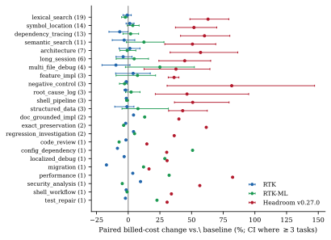

 Figure 8: Paired billed-cost change by task family (task counts in parentheses; CIs where \(\geq\)3 tasks). Headroom is right of zero in every family; RTK effects change sign across families.

## 9 Cross-Agent Replication on Codex

A subsequent replication campaign (codex_headroom_replication40_20260715_v1) tested whether the Headroom cost signal transfers to a different agent harness: the Codex CLI with gpt-5.6-luna at low reasoning effort. All numbers in this section are transcribed from that campaign’s frozen replication report; its artifacts (frozen task manifest, sources lock, budget ledger, per-pair results, raw run telemetry) are retained in the Codex campaign tree, which is separate from this paper’s artifact release. Provider-billed cost is unavailable in Codex telemetry, so costs here are _reconstructed from provider-returned token counts at list prices_ —evidence class “tokens,” not “billed,” in the terms of [table 3](https://arxiv.org/html/2607.12161#S4.T3 "In 4 Benchmarks and Datasets ‣ Token Reduction Is Not Cost Reduction:An Empirical Study of End-to-End Efficiencyin API-Based Coding Agents").

#### Design.

Forty tasks were sampled deterministically (seed 20260715) from the frozen 110-task pool after excluding all 12 tasks of the original Codex pilot, giving a disjoint sample. Two arms—baseline and a fixture-preserving, isolated Headroom-only configuration—ran in randomized order within every paired block: 80 new paid runs in 40 complete pairs, with zero paid retries. Benchmark commit, tasks, prompts, graders, fixtures, and success criteria were unchanged from the pilot. Activation evidence is complete: all 40 Headroom runs retained a live proxy WebSocket request, and all 40 baseline runs were isolated from the proxy.

Table 15: Codex replication, Headroom-only vs. baseline (40 disjoint task pairs; costs reconstructed from provider token counts; differences are Headroom relative to baseline). Transcribed from the frozen replication report. 

Metric | Baseline | Headroom-only | Difference  
---|---|---|---  
Task success | 39/40 | 39/40 | 0 discordant pairs  
Reconstructed cost | — | — | \(-12.49\%\)  
Cost per successful task | — | — | \(-12.49\%\)  
Input tokens | — | — | \(-10.88\%\)  
Cached input tokens | — | — | \(-8.33\%\)  
Output tokens | — | — | \(+6.63\%\)  
Reasoning tokens | — | — | \(+31.30\%\)  
Completed shell calls | 71 | 76 | \(+7.04\%\)  
Delivered shell-output bytes | — | — | \(+3.67\%\)  
Wall time | — | — | \(+238.52\%\)

 

#### Result.

Both arms passed 39/40 tasks with no discordant correctness outcome (both failed the same task, returning the same incorrect frozen-fixture subject). Headroom’s reconstructed cost was 12.49% lower than baseline, and identically so per successful task. The paired per-task change averaged \(-14.76\%\) (median \(-19.49\%\)); Headroom was cheaper on 35 of 40 tasks. The saving came from lower input and cached-input token volumes— _not_ from measured output compression: Headroom again reported zero compressed tokens across all runs, so the difference is an observed proxy/cache/trajectory effect, not a demonstrated consequence of its compression counter. The lower reconstructed cost was accompanied by higher latency: wall time more than tripled (\(+238.5\%\)), and output tokens, reasoning tokens, shell calls, and delivered shell-output bytes all increased.

#### Combined Codex evidence.

Pooling this disjoint replication descriptively with the original 12-task pilot gives 52 task pairs: 51/52 success on both arms and a \(-14.35\%\) reconstructed-cost difference. The larger sample strengthens the association between this Headroom configuration and lower reconstructed Codex cost at equal task success; it does not establish that compression caused the saving, and latency remains a severe regression.

#### Cross-campaign 12-task slice: Headroom vs. RTK.

The original 12 pilot tasks can be matched by task identifier to the same tasks in a later patched-RTK Codex campaign. This is a cross-campaign comparison— each treatment has its own concurrent baseline, not a randomized simultaneous three-arm design. Against its own baseline, Headroom was cheaper by 19.53% (cheaper on 11/12 tasks, 12/12 success); RTK was cheaper by 10.45% (cheaper on 5/12, 11/12 success—its one failure was a known counting regression in which compacted output changed a required count). Within this matched slice Headroom shows the larger observed cost reduction, but the cross-campaign design prevents attributing the difference solely to treatment. The RTK slice also has a distributional limitation: the mean reduction reflects a minority of tasks (cheaper on 5 of 12, more expensive on the rest), so the mean does not represent a stable per-task reduction. Distribution-level analysis on Codex—median and tail behavior, and whether the improving minority is identifiable in advance—remains open.

#### Integrity notes.

Eight pairs initially returned a grader exit-127 because the campaign judge PATH exposed only python3; no paid run was repeated—all 16 retained worktrees passed the unchanged graders offline under the pinned test environment. One baseline telemetry heuristic flagged the word “headroom” in the campaign’s directory path; preflight configuration, commands, environment, and zero proxy requests establish this as a path-name false positive. One local Headroom process failed before proxy readiness and before any API request; the failure record is retained with the campaign artifacts, and the installation was repaired from the same pinned commit before the paid campaign began.

#### Interpretation.

On Claude Code, the tested Headroom configuration was the study’s largest cost increase (CPS ratio 1.464); on Codex, an isolated Headroom-only configuration was associated with a 12–14% reconstructed-cost _saving_ at equal success. The sign reversal across harnesses, with zero compressor activity in both, is additional evidence for the paper’s main conclusion: context-layer effects are properties of the layer–harness–model–workload combination, not of the layer alone, and must be measured end to end in each deployment.

## 10 Trajectory and Phase Efficiency

### 10.1 Phase taxonomy and validation

Every retained transcript of the base campaign was decomposed into assistant turns and each turn assigned one of eight phases (orientation, retrieval, diagnosis, planning, implementation, testing/debug, verification, final response) plus an ambiguous/mixed catch-all, using a frozen deterministic priority rule (edits win over tests, tools over text; no model calls). The ledger covers 13,620 classified turns from 1,120 base campaign runs. A manual implementation audit independently reproduced 40/40 sampled rule assignments, and 2.0% of turns (187/9,523 in the audited slice) fell into the ambiguous class. The audit validates that the deterministic rules were applied as specified; it does not establish that the labels match independent human judgments of cognitive phase. Mixed tool-using turns are forced into mutually exclusive categories, so the taxonomy characterizes observable turn behavior, not latent reasoning; a blind semantic validation by independent annotators was not performed and is listed as a limitation. The near-zero planning share is primarily a property of the frozen classifier, which assigns mixed tool-using turns to other phases; it should not be read as evidence that planning is absent from coding agents. Expansion-split phase claims require regeneration from the retained transcripts, which has not been performed; all phase numbers here are base-campaign numbers.

### 10.2 Where generated tokens go

Table 16: Share of generated (output) tokens by phase and arm (characterization split; 10,376 turns). Retrieval plus diagnosis account for \(\approx\)58–61% of generated tokens on every arm. 

Phase | Baseline | RTK | RTK-ML | Headroom  
---|---|---|---|---  
P1 orientation | 6.3 | 6.2 | 5.6 | 5.0  
P2 retrieval | 35.1 | 35.4 | 34.5 | 36.5  
P3 diagnosis | 23.7 | 23.8 | 24.1 | 24.5  
P4 planning | 0.0 | 0.1 | 0.0 | 0.0  
P5 implementation | 27.0 | 26.6 | 28.8 | 25.6  
P6 testing/debug | 1.3 | 1.3 | 1.7 | 1.2  
P7 verification | 0.8 | 0.9 | 1.1 | 0.8  
P8 final response | 3.3 | 3.3 | 2.7 | 3.2  
ambiguous/mixed | 2.5 | 2.5 | 1.4 | 3.3

 

[Table 16](https://arxiv.org/html/2607.12161#S10.T16 "In 10.2 Where generated tokens go ‣ 10 Trajectory and Phase Efficiency ‣ Token Reduction Is Not Cost Reduction:An Empirical Study of End-to-End Efficiencyin API-Based Coding Agents") and [fig. 9](https://arxiv.org/html/2607.12161#S10.F9 "In 10.2 Where generated tokens go ‣ 10 Trajectory and Phase Efficiency ‣ Token Reduction Is Not Cost Reduction:An Empirical Study of End-to-End Efficiencyin API-Based Coding Agents") show that coarse phase-token shares were similar across arms under the frozen turn-level taxonomy: retrieval \(\approx\)35% (33–36%), diagnosis \(\approx\)24%, implementation 26–29%. Retrieval plus diagnosis account for approximately 58% of generated tokens (58.8%/59.2%/58.6%/60.9% across the four arms). Within this campaign and under the frozen turn-level taxonomy, the arms differed less in coarse phase composition than in the measured cost and context volume associated with those phases (delivered tool bytes and the cache traffic they induce).

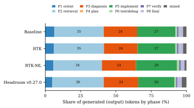

 Figure 9: Generated-token composition by phase (characterization split; 10,376 turns). Coarse phase-token shares were similar across arms under the frozen turn-level taxonomy.

### 10.3 Phase-level cost changes

Table 17: Phase-resolved paired cost deltas vs. baseline (percent of the baseline mean run cost; billed cost allocated to turns by price-weighted token usage; base-campaign phase ledger). The RTK arms save in retrieval (P2); the RTK-ML arm shows downstream cost increases that offset the retrieval-phase reduction. 

Phase | RTK \(\Delta\) | RTK-ML \(\Delta\) | Headroom \(\Delta\)  
---|---|---|---  
P1 orientation | +0.53 | +1.39 | +11.40  
P2 retrieval | -3.07 | -1.96 | +18.14  
P3 diagnosis | -0.99 | +4.83 | +17.81  
P4 planning | +6.19 | -0.29 | -3.29  
P5 implementation | -0.15 | +7.87 | +0.51  
P6 testing/debug | +0.24 | +10.94 | +12.72  
P7 verification | +0.22 | +3.57 | +3.51  
P8 final response | -0.20 | -0.29 | +3.59  
ambiguous/mixed | +1.68 | +6.77 | +15.15

 

The phase-resolved cost decomposition ([table 17](https://arxiv.org/html/2607.12161#S10.T17 "In 10.3 Phase-level cost changes ‣ 10 Trajectory and Phase Efficiency ‣ Token Reduction Is Not Cost Reduction:An Empirical Study of End-to-End Efficiencyin API-Based Coding Agents")) shows both the RTK arms first diverging from baseline at the retrieval phase with lower cost, while Headroom diverges at orientation already—its higher cache-read usage is concentrated in the early phases (62% of it accumulates before the first edit) and reaches roughly \(+180\)k cache-read tokens per run by the final phase. For the RTK-ML arm, downstream cost increases are approximately four times the retrieval-phase reduction: added diagnosis, implementation, testing/debug, and ambiguous-turn cost, a later first edit (\(+0.94\) turns), more post-edit retrieval re-entries (\(+0.32\)/run), and more repeated-search tokens (\(+301\)/run). RTK is the only arm with downstream behavior closest to baseline and slightly _earlier_ first edits (\(-0.60\) turns, \(-0.26\) re-entries). These are observed associations from the frozen ledgers, not causal decompositions.

Two milestone measurements provide additional detail ([fig. 10](https://arxiv.org/html/2607.12161#S10.F10 "In 10.3 Phase-level cost changes ‣ 10 Trajectory and Phase Efficiency ‣ Token Reduction Is Not Cost Reduction:An Empirical Study of End-to-End Efficiencyin API-Based Coding Agents")). Median cache-read context at the first code edit is essentially identical for baseline and both RTK arms (\(\approx\)25.7–25.9k tokens) but 49% higher for Headroom (38.7k). And on Haiku—the model where the RTK-ML compression surface is largest—the median estimated delivered tool-token count before the first edit was 442 for the RTK-ML arm versus 579 for baseline, approximately 24% lower, with heavy upper tails (a frozen campaign report characterized the reduction as roughly twofold, but its exact metric, population, and denominator could not be reconstructed from the retained artifacts, so we report only the auditable per-run ledger median), while on Sonnet the same arm reached milestones \(\approx\)0.4 turns later. On Haiku, reduced delivered retrieval was achievable without a later first-edit milestone, but it did not translate into net billed savings after trajectory effects were included.

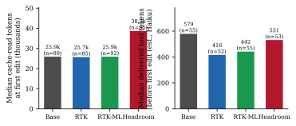

 Figure 10: Left: median cache-read context at the first code edit (runs with an implementation phase, base splits, all models). Right: median estimated delivered tool tokens before the first edit (Haiku runs; bytes/4 estimate). Headroom has \(\approx\)49% more cache-read context at the first edit; the RTK arms match baseline context at the same milestone.

## 11 Failure Modes and Safety Constraints

#### Pipeline incompatibility with downstream shell consumers.

One safety-relevant failure mode in the artifact record was discovered in the first paid gate campaign: when retrieval routing was enabled, _every_ genuine gates-on task failure (4 of 4) followed the same pattern—the agent piped proxied search output into a shell counting pipeline (grep … | cut -d: -f1 | sort | uniq -c), which then parsed the ranked _search-group summary_ instead of raw file:line:content matches and produced invalid answers (e.g., src/8 instead of a file name). Tool tokens on that campaign fell 40.3% while gates-on success fell to 93.3% against 100% for every other arm: an example in which lower tool-token counts coincided with lower task success because the transformed output was incompatible with the downstream consumer. The fix marks a rewritten command segment as a _stdout consumer_ whenever its stdout feeds a pipe or a stdout redirect; the proxy then skips ranking for that segment (output stays byte-preserving) and records the skip in the gate trace. Stderr and stdin redirects still rank; command substitution was already never rewritten. In subsequent campaigns the guard suppressed 42% (Haiku) and 30% (Sonnet) of otherwise-eligible routes, and in the authoritative campaign it recorded 339/150/28 skips against 521/208/26 routes on Haiku/Sonnet/Opus. The corrected reruns superseded the earlier aggregate result. The observed failure motivates a content-dependent policy: dense, task-critical evidence such as tracebacks, test output, structured shell streams, and patch anchors should be handled differently from redundant retrieval context.

#### Edit-anchor alteration under compression.

The grounded-completion study ([section 7.4](https://arxiv.org/html/2607.12161#S7.SS4 "7.4 Single-shot grounded-completion study \(separate harness\) ‣ 7 End-to-End Results ‣ Token Reduction Is Not Cost Reduction:An Empirical Study of End-to-End Efficiencyin API-Based Coding Agents")) documents a second failure mode: aggressive compression of retrieved code strips the byte-exact spans that SEARCH/REPLACE patch application depends on, reducing patch application by approximately 44% (27/40 \(\to\) 15/40; 83% vs. 48% in the family study) despite a large reduction in token metrics (\(-73\%\) billable). The mitigation that worked was content-aware: the task-family preserve gate bypasses compression for high-recall and grounded-editing families, and byte-exact grounding windows restore anchors outright (apply 31% \(\to\) 83% on the compressed arm).

#### Other observed failure modes.

(i)  _Over-compression followed by additional agent work_ : removed context that the model still needed returned as repeated searches and diagnosis re-reads ([section 10](https://arxiv.org/html/2607.12161#S10 "10 Trajectory and Phase Efficiency ‣ Token Reduction Is Not Cost Reduction:An Empirical Study of End-to-End Efficiencyin API-Based Coding Agents")); the additional searches and diagnosis turns incur normal trajectory costs. (ii)  _Early failure can have low measured cost_ : a run that fails quickly can cost less than successful runs; all aggregates here therefore report success alongside cost and use cost per successful execution for decisions. (iii)  _Inactive code paths can invalidate comparisons_ : a free pre-campaign check proved the gate environment variables are inert in RTK (byte-identical output on the covered test paths, no gate trace) and that the gate build changes bytes only when enabled (11,050 B raw grep vs. 2,570 B search-group on the fixture)—without such activation proofs, an “optimized” arm can be equivalent to the baseline without detection. (iv)  _Component benchmarks can encourage unsafe optimization_ : the pytest-rule example in [section 12](https://arxiv.org/html/2607.12161#S12 "12 Limits of Component-Level Benchmarks ‣ Token Reduction Is Not Cost Reduction:An Empirical Study of End-to-End Efficiencyin API-Based Coding Agents") shows a preservation gate catching a compression rule that scored well on savings while dropping task-critical markers.

#### Gate activation summary.

[Table 18](https://arxiv.org/html/2607.12161#S11.T18 "In 11.1 Performance degradation under context reduction ‣ 11 Failure Modes and Safety Constraints ‣ Token Reduction Is Not Cost Reduction:An Empirical Study of End-to-End Efficiencyin API-Based Coding Agents") condenses the per-gate activation evidence: every gate is off by default, and the disabled paths covered by the dedicated equivalence tests were byte-equivalent; the embedding, structural, and focus-cache paths were enabled and operational in the authoritative campaign (zero sidecar outages), but no task was identified in which any of them was uniquely decisive—activation is not effect.

### 11.1 Performance degradation under context reduction

The observed performance-degradation evidence, ordered by directness, is:

  1. Binary task-success degradation. The pre-guard Stage-1 campaign: 93.3% vs. 100% success (4/4 failures from pipeline incompatibility). The grounded study: three tasks solved by grounded raw were not solved by grounded compressed, none reverse (exact paired \(p=0.25\); descriptive). The authoritative campaign detected no aggregate success-rate degradation, but baseline success was 96–98%, limiting sensitivity to small differences, and the study was not a non-inferiority design; its intervals still permit small losses or gains. 
  2. Patch-application degradation. 27/40 \(\to\) 15/40 applies under compression (Phase E); 83% vs. 48% preserve-vs-aggressive in the family study; edit_apply_failed 20 vs. 12. 
  3. Evidence/marker degradation. The pre-fix pytest rule scored 31.9% savings at only 56.1% marker recall; ContextBench one-size-aggressive reached 39.8% savings with substantial context loss on 45 of 50 conversations. 
  4. Trajectory degradation. RTK-ML: later first edit (\(+0.94\) turns), more post-edit retrieval re-entries (\(+0.32\)/run), more repeated-search tokens (\(+301\)/run), downstream phase-cost increase ([table 17](https://arxiv.org/html/2607.12161#S10.T17 "In 10.3 Phase-level cost changes ‣ 10 Trajectory and Phase Efficiency ‣ Token Reduction Is Not Cost Reduction:An Empirical Study of End-to-End Efficiencyin API-Based Coding Agents")). 
  5. Structured-consumer incompatibility. The stdout-pipeline failure above: compression altered program-consumed shell-output semantics, not model comprehension. 
  6. Unmeasured quality dimensions. Code maintainability, patch quality beyond test outcomes, partial correctness, latent bug introduction, reasoning quality, and human review effort were not measured in any campaign; success here is deterministic test/judge outcome only. 

Table 18: Gate-activation matrix for RTK-ML’s nine gates (condensed). “Fired” cites the authoritative campaign traces (routes/query-propagations/guard-skips on Haiku/Sonnet/Opus: 521/208/26, 916/395/57, 339/150/28; all comparator arms 0/0/0).

Gate | Default | Fired in E2E | Output-changing |  Observed effect  
---|---|---|---|---  
1 Query propagation | off | yes (916/395/57) | no (signal only) |  enables gates 2–5  
2 Retrieval routing | off | yes (521/208/26) | yes (search-group) |  primary compression surface  
3 Query-aware ranking | off | yes | yes (reorder) |  with gates 4–5  
4 Lexical leg | off | yes | yes (reorder) |  deterministic scoring  
5 Embedding leg (BGE) | off | active, healthy | in principle |  no decisive per-task signature  
6 Task-family router | off | active | no (routing var) |  guards BGE exposure  
7 Family preserve | off | active | yes (raw bypass) |  protects exact-byte tasks  
8 Structural (ast-grep) | off | active | indirect (hints) |  no measurable signature  
9 Focus cache | off | active | no (latency only) |  no measurable signature  
— Safety router | enforce | on | no (this layout) |  future-guards sensitive output  
— Stdout-consumer guard | auto w/ gate 2 | yes (339/150/28 skips) | prevents downstream incompatibility |  fixes [section 11](https://arxiv.org/html/2607.12161#S11 "11 Failure Modes and Safety Constraints ‣ Token Reduction Is Not Cost Reduction:An Empirical Study of End-to-End Efficiencyin API-Based Coding Agents") failure

 

## 12 Limits of Component-Level Benchmarks

The artifact record contains component-level results for every retrieval and compression approach studied; none of them, alone, would have predicted the end-to-end outcomes of [section 7](https://arxiv.org/html/2607.12161#S7 "7 End-to-End Results ‣ Token Reduction Is Not Cost Reduction:An Empirical Study of End-to-End Efficiencyin API-Based Coding Agents").

#### ContextBench (gold-context survival).

On the 50-conversation policy study, an oracle per-task-type policy achieved 12.3% savings at 95.2% recall with 0/50 severe drops; a one-size conservative policy achieved 7.1% at 95.7% recall with 7/50 severe failures; and a one-size aggressive policy reached 39.8% savings with substantial context loss on 45 of 50 conversations. The relevant comparison is oracle-vs-fixed rather than the absolute numbers: safe savings are policy-dependent and modest. These are retrieval-quality proxies; the study records no task success.

#### LoCoEval (long-history preservation).

The retained runs are a preservation-only proxy (reference-answer token survival after compressing long conversations); the pipeline’s LLM-judge stage was unavailable, and token savings above the counting API’s size cap fall back to length/4 estimates. We cite it only as evidence that deterministic command-level compression does not affect conversational history, which it was not designed to modify,and that long-history compression requires its own track.

#### InterCode-proxy (dense diagnostic evidence).

On 24 pytest observations (12 MBPP tasks \(\times\) pass/bug), the original deterministic pytest rule scored 31.9% savings at only 56.1% marker recall—dropping task-critical traceback lines; after a preservation-first fix, the rule scores 15.3% savings at 99.2% marker recall with zero critical drops. Reducing nominal savings from 31.9% to 15.3% _doubled_ the fidelity of the evidence the model needs; interactive task-success evaluation remained blocked by the missing container runtime.

#### Structural retrieval (candidate quality).

On 8 repository tasks (38 query rows) with test-grounded gold, plain ripgrep [[13](https://arxiv.org/html/2607.12161#bib.bib13)] returned a mean 310.9 matches / 2,905 tokens per query at 0.66 precision, against 170.9 / 2,090 at 0.995 for the ast-grep hybrid; on the 14 point-definition queries the contrast is 75.6 matches / 752.8 tokens / 0.44 precision vs. 17.2 / 335.4 / 0.99. Under a 150-token budget, gold survival was 28.6% (ripgrep) vs. 85.7% (structural). This demonstrates candidate-quality improvement, not end-to-end task-success improvement: agent-level evaluation was not performed.

#### Caveman (agent-prose compression).

On seven synthetic fixtures, Caveman achieved 22.61% real-token savings (721\(\to\)558 tokens by provider count; 25.84% by bytes—bytes overstate token savings) with zero critical-marker drops. It is a constrained component study on synthetic prose, not an end-to-end coding-agent result.

#### Embedding retrieval.

The BGE embedding leg was enabled, health-checked, and outage-free throughout the authoritative campaign, and its component-level union configurations improved recall-at-savings on ContextBench slices; but no evaluated task shows a decisive embedding-attributable effect in the gate traces. Successful activation is not measured task-success improvement.

#### Task success at component scale.

Even where the component harness could measure task success directly ([section 7.4](https://arxiv.org/html/2607.12161#S7.SS4 "7.4 Single-shot grounded-completion study \(separate harness\) ‣ 7 End-to-End Results ‣ Token Reduction Is Not Cost Reduction:An Empirical Study of End-to-End Efficiencyin API-Based Coding Agents")), the evaluated compression configuration showed no positive solve-level improvement in that small single-shot study, and a plausible-looking ratio metric (successes per million tokens) would have reversed the comparison; ratio metrics over tiny, non-overlapping success sets are a reporting hazard, not evidence.

#### Implication.

Recall is not task success; marker preservation is not task success; candidate precision is not task success; synthetic critical-drop tests are not task success; bytes removed are not billed savings; and shorter context can cause longer trajectories. Each component metric is useful for preliminary evaluation—the InterCode fix and the stdout-consumer guard both came from component-level failures—but claims about economic efficiency require end-to-end, success-adjusted, actually-billed evaluation. [Figure 11](https://arxiv.org/html/2607.12161#S12.F11 "In Implication. ‣ 12 Limits of Component-Level Benchmarks ‣ Token Reduction Is Not Cost Reduction:An Empirical Study of End-to-End Efficiencyin API-Based Coding Agents") summarizes the evidence taxonomy we propose: L1 compression ratio, L2 preservation/retrieval quality, L3 model-visible context change, L4 production-path activation, L5 task success, L6 billed cost, L7 cost per successful execution, L8 trajectory-and-failure analysis.

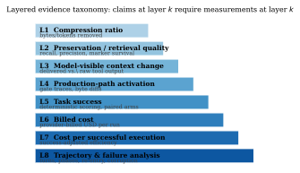

 Figure 11: Layered evidence taxonomy for token-efficiency claims. Every system in [table 2](https://arxiv.org/html/2607.12161#S3.T2 "In 3 Optimization Surfaces and Architectures ‣ Token Reduction Is Not Cost Reduction:An Empirical Study of End-to-End Efficiencyin API-Based Coding Agents") is placed at the highest layer its retained artifacts support.

## 13 Discussion

#### Addressable cost share.

The cost composition in [Section 6](https://arxiv.org/html/2607.12161#S6 "6 Aggregate Cost Composition ‣ Token Reduction Is Not Cost Reduction:An Empirical Study of End-to-End Efficiencyin API-Based Coding Agents") places an upper bound on the effect of any tool-output layer: generated output is \(\approx\)11% of the reconstructed cost (\(\approx\)10% of the bill), uncached input \(\approx\)1%, and the remainder of the reconstruction (\(\approx\)87%; about 80% of the actual bill, with the 8.7% dollar-weighted residual unattributed) is cache traffic priced at 10–125% of the input rate. A layer that modifies only delivered tool text can affect only a subset of cache-read traffic, which is already discounted \(10\times\). Positive end-to-end cost savings therefore require compression that does not induce offsetting trajectory changes. The largest observed cost increases (Headroom’s \(+48\%\) and the RTK-ML arm’s downstream cost increase) were associated with trajectory and cache effects rather than generated output alone.

#### Stage distribution versus stage cost.

In these campaigns and under the frozen turn-level taxonomy, coarse phase-token shares were similar across arms while phase _prices_ moved. This suggests evaluating interventions by phase-specific cost changes across retrieval, diagnosis, implementation, and verification, including repeated transitions into earlier phases.

#### Addressable versus framework-owned cache.

The cache-dominated bill does not imply a large compression opportunity. In the baseline arm, the first API call already reads 16.5k/23.2k/14.4k cached tokens (Haiku/Sonnet/Opus) before any run content exists—a pre-existing shared framework prefix—giving a measured lower bound of 76%/83%/85% of all cache-read volume that is framework-owned rather than user-addressable. Delivered tool output averages only \(\approx\)2,122/417/520 estimated tokens per run, of which \(\approx\)36% (Haiku) flows through the hook-rewritable shell route. Bounded scenarios for hook-addressable cache dollars: conservative \(\approx\)4% of cache dollars (shell-only surface), central \(\approx\)12% on Haiku (\(\approx\)3% Sonnet, \(\approx\)5% Opus), upper \(\approx\)25–30% (all incremental non-assistant content). The observed results show that the RTK-ML arm removed 38% of estimated shell tool-output tokens yet showed cache volumes no lower than baseline (writes \(+3\%\), reads \(+4.7\%\) per run)—downstream trajectory changes offset the reduction in delivered content. The addressable share also _falls_ with trajectory length (tool volume grows 1.7\(\times\) from short to 7+-turn runs while cache reads grow 5.7\(\times\)). Exact attribution would require per-request source labeling (system prompt, tool schemas, user prompt, assistant history, tool output, hook-injected text, framework metadata) for every cache write and read; that instrumentation does not exist in the retained campaign.

#### Heterogeneity across systems.

No system dominated. RTK v0.44.1 was near cost-neutral in the aggregate campaign, with no detected success-rate reduction at that study’s precision (its byte-preserving passthrough when rules do not match also limits its maximum possible savings; and its small pooled saving is not holdout-confirmed, [table 9](https://arxiv.org/html/2607.12161#S7.T9 "In 7.1 Aggregate outcomes ‣ 7 End-to-End Results ‣ Token Reduction Is Not Cost Reduction:An Empirical Study of End-to-End Efficiencyin API-Based Coding Agents")). The RTK-ML stack achieved model-visible reduction but increased net cost on the aggregate workload; cost reductions occurred primarily in tasks dominated by bulk lexical retrieval and on Haiku. The tested Headroom v0.27.0 configuration showed higher billed cost on the measured workloads without a detected success-rate difference; the study cannot generalize to other configurations or versions. Model and effort mattered less than task composition; none of the arm\(\times\)model or arm\(\times\)effort interactions survived the expansion analysis.

#### Content-type policies.

The safest observed behaviors are content-aware: preserve-by-default for dense evidence (tracebacks, test output, exact-byte tasks), compress redundant retrieval, never transform streams consumed by other programs. The additional complexity of semantic rankers may be justified where lexical signals are insufficient; the structural results suggest AST-anchored retrieval produced the strongest component-level precision result, but it awaits end-to-end validation.

#### Association vs. mechanism.

Our black-box observations of Headroom (cache-read growth concentrated in early phases, higher re-entry, the largest billed-vs-usage residual) are associations that are consistent with several mechanisms (payload transformation, request handling, retry behavior); we cannot distinguish them without instrumenting the proxy. Similarly, the RTK-ML downstream cost increase is an observed pattern in the frozen ledgers, not a proven causal chain.

## 14 Limitations

#### Authoritative campaign.

One agent harness (Claude Code) and one provider’s billing model, prices, and cache semantics at one point in time (dollar results embed July-2026 prices; token quantities are reported alongside). Three model families, but Sonnet 5 and Opus 4.8 were not measured at medium/xhigh/max effort, and Opus cells are thin (8–30 paired tasks). Baseline success rates were 96–98%, limiting sensitivity to small differences; the study was not designed as a formal non-inferiority trial, and no pre-specified non-inferiority margin exists: success intervals still permit small positive or negative differences, and small performance losses may be undetectable. Raw (pre-layer) tool-output boundaries are unobservable for baseline and Headroom. All within-block runs fall inside the provider’s five-minute cache TTL, so cross-arm cache carryover cannot be excluded by temporal separation ([section 5.3](https://arxiv.org/html/2607.12161#S5.SS3 "5.3 Prompt-cache carryover between arms \(threat to validity\) ‣ 5 Experimental Methodology ‣ Token Reduction Is Not Cost Reduction:An Empirical Study of End-to-End Efficiencyin API-Based Coding Agents")); randomization balance and null order-interactions are the available evidence. The cost reconstruction leaves an 8.7% dollar-weighted aggregate residual, with per-model usage for possible secondary calls not persisted. Judges are deterministic scripts; graded quality is not measured.

#### Thinking tokens.

Thinking tokens were not exposed separately by the API and telemetry used in these campaigns and therefore cannot be reconstructed from the retained artifacts; reasoning-token usage was not separately observable; generated output and observable diagnosis-phase behavior provide only partial behavioral indicators and are not direct measurements of latent reasoning. Post-hoc evidence ([section 6.1](https://arxiv.org/html/2607.12161#S6.SS1 "6.1 Calibration of the decomposition ‣ 6 Aggregate Cost Composition ‣ Token Reduction Is Not Cost Reduction:An Empirical Study of End-to-End Efficiencyin API-Based Coding Agents")) indicates the exposure differs by model: Sonnet 5’s aggregate usage reconciles with its bill (\(+0.2\%\)), while Haiku 4.5 carries an effort-scaling, thinking-consistent charge inside the disclosed residual; cross-model decompositions should not assume uniform usage-field semantics.

#### Headroom.

One tested version (0.27.0) and one configuration (token mode, caching enabled, code-aware disabled); black-box internals; raw-vs-delivered output unobservable; the largest unexplained billing residual (\(+14.5\%\)). Results cannot be generalized to other configurations or versions.

#### Vendor CLI compressor and ml_lexical.

The vendor CLI compressor has no same-harness end-to-end evidence (vendor-claimed figures only). The ml_lexical engine has component-level retrieval evidence but no billed task-success study.

#### Caveman.

Seven synthetic fixtures; no production wiring; no real-traffic evaluation.

#### Grounded single-shot study.

One model (Sonnet 4.6); small \(n\) (solve counts of five and two; exact paired \(p=0.25\)); no recovery loop; SEARCH/REPLACE-specific edit application; SWE-bench-derived Go tasks; one compression configuration; per-row costs not retained (no uncertainty for the per-resolved-row cost); the IC-SWE pilot’s cost is trace-derived.

#### Phase analysis.

Deterministic rules validated by an implementation audit, not by blind semantic annotation; mutually exclusive labels force mixed turns into single categories; planning is structurally undercounted; base-campaign splits only.

#### Campaign composition.

The long-session campaign used a different experimental configuration and is reported separately throughout. The task mix is weighted toward retrieval, navigation, and debugging; generalization beyond Claude Code and the tested workloads is not established. All RTK experiments reported in this paper use v0.44.1. A post-hoc paired replication on additional Opus medium-effort cells reproduced the aggregate near-null pattern ([appendix C](https://arxiv.org/html/2607.12161#A3 "Appendix C Post-Hoc Opus-Medium Replication: RTK v0.44.1 ‣ Token Reduction Is Not Cost Reduction:An Empirical Study of End-to-End Efficiencyin API-Based Coding Agents")), though on a half-size task sample and a newer harness version (Claude Code 2.1.220).

#### Interactive sessions (unmeasured extrapolation).

All end-to-end dollar results come from single-prompt benchmark runs, whose context is dominated by the framework prefix: the user-accessible surface (tool outputs, tool-call arguments, retrieved files, injected context, conversation history) is \(\approx\)6% of cost, which places the estimated upper bound for a user-side compression layer at \(\approx\)5% of cost under the measured decomposition—and the share of that surface the evaluated layers actually captured makes the estimated realized effect smaller (\(\approx\)30% capture on the modified surface). A companion composition analysis of 41 interactive developer sessions (3,991 API requests, reconstructed from retained Claude Code telemetry under the same tokenizer calibration) finds a materially different mix: the framework base falls to \(\approx\)8% of input tokens and the user-accessible surface grows to roughly 30% of modeled cost, dominated by tool-call arguments (\(\approx\)26% of input), injected CLAUDE.md/reminder text (\(\approx\)10%), and bulkier tool outputs and file reads. Holding the benchmark capture rate constant, the same arithmetic scales the realized-savings bound from \(\approx\)1.5% to \(\approx\)9% of modeled cost in interactive sessions. We report this as an upper bound on an _unmeasured_ setting, not a forecast: the countervailing effects measured in this paper (added thinking, added turns) can grow with the same surface, no per-session ROI instrumentation exists for interactive conversations, and the capture-rate transfer is an assumption. Measuring this setting directly—with per-session ROI instrumentation and an empirical interactive capture rate—is a high-priority follow-up, alongside isolated measurement of tool-call arguments, end-to-end evaluation of retrieval and conversation-history compression, and the Codex distributional analysis noted in [section 9](https://arxiv.org/html/2607.12161#S9 "9 Cross-Agent Replication on Codex ‣ Token Reduction Is Not Cost Reduction:An Empirical Study of End-to-End Efficiencyin API-Based Coding Agents").

## 15 Recommendations for Benchmark Design

A trustworthy token-efficiency benchmark for coding agents should report, per paired task: task success; actual billed cost; cache-creation, cache-read, uncached-input, and generated tokens; turns and tool calls; raw and delivered tool volume where observable; retries and failures with exclusion policy; production-path activation proof; model and effort; task family; cost per successful execution; and confidence intervals with the clustering unit stated. Aggregates that omit any of these can lead to failure modes documented above (early-failure “savings”, inactive-path comparisons, trajectory-blind ratios).

Because content types fail differently, we recommend separate tracks rather than one blended score: (i) redundant bulk retrieval; (ii) long-history memory; (iii) dense diagnostic evidence (tests, tracebacks, logs) with preservation gates; (iv) structural code search; and (v) full end-to-end software tasks with success-adjusted billing as the terminal metric. Component tracks (i)–(iv) remain essential as screens and for failure analysis—they found both safety bugs reported here—but claims about _efficiency_ should be licensed only by track (v).

## 16 Related Work

#### Coding-agent benchmarks.

SWE-bench and its verified subset [[19](https://arxiv.org/html/2607.12161#bib.bib19), [25](https://arxiv.org/html/2607.12161#bib.bib25)] established repository-level issue resolution as the standard end-to-end coding task; InterCode [[32](https://arxiv.org/html/2607.12161#bib.bib32)] standardized interactive coding with execution feedback; HumanEval and MBPP [[9](https://arxiv.org/html/2607.12161#bib.bib9), [6](https://arxiv.org/html/2607.12161#bib.bib6)] anchor function-level synthesis. Agent harnesses around these benchmarks [[33](https://arxiv.org/html/2607.12161#bib.bib33), [29](https://arxiv.org/html/2607.12161#bib.bib29), [28](https://arxiv.org/html/2607.12161#bib.bib28), [34](https://arxiv.org/html/2607.12161#bib.bib34)] report success and sometimes token counts, but rarely billed cost with cache decomposition; \(\tau\)-bench [[35](https://arxiv.org/html/2607.12161#bib.bib35)] adds user-interaction realism. Our contribution is complementary: a cost-composition and evidence-standard study over paired arms of the same harness. Many prior systems are primarily evaluated with component-level metrics, while fewer report paired task success, provider-returned usage, trajectory length, and success-adjusted dollar cost together; [table 19](https://arxiv.org/html/2607.12161#S16.T19 "In Coding-agent benchmarks. ‣ 16 Related Work ‣ Token Reduction Is Not Cost Reduction:An Empirical Study of End-to-End Efficiencyin API-Based Coding Agents") maps representative prior work onto the evidence layers of [section 12](https://arxiv.org/html/2607.12161#S12 "12 Limits of Component-Level Benchmarks ‣ Token Reduction Is Not Cost Reduction:An Empirical Study of End-to-End Efficiencyin API-Based Coding Agents").

Table 19: Evidence dimensions reported by representative prior work vs. this study. Many prior systems are primarily evaluated with component-level metrics; entries reflect the cited papers’ primary evaluations, not all follow-up work. TS = task success.

Work | Compression/recall | Model-visible ctx | TS | Cost evidence | Trajectory | Success-adj. cost  
---|---|---|---|---|---|---  
LLMLingua / LongLLMLingua [[17](https://arxiv.org/html/2607.12161#bib.bib17), [18](https://arxiv.org/html/2607.12161#bib.bib18)] | ✓ | ✓ | QA acc. | — | — | —  
Selective Context [[22](https://arxiv.org/html/2607.12161#bib.bib22)] | ✓ | ✓ | QA acc. | — | — | —  
Gist tokens [[24](https://arxiv.org/html/2607.12161#bib.bib24)] | ✓ | ✓ | — | — | — | —  
RepoCoder [[37](https://arxiv.org/html/2607.12161#bib.bib37)] | recall | ✓ | completion | — | — | —  
SWE-bench / SWE-agent [[19](https://arxiv.org/html/2607.12161#bib.bib19), [33](https://arxiv.org/html/2607.12161#bib.bib33)] | — | — | ✓ | — | partial | —  
InterCode [[32](https://arxiv.org/html/2607.12161#bib.bib32)] | — | — | ✓ | — | turns | —  
\(\tau\)-bench [[35](https://arxiv.org/html/2607.12161#bib.bib35)] | — | — | ✓ | — | ✓ | —  
FrugalGPT [[8](https://arxiv.org/html/2607.12161#bib.bib8)] | — | — | ✓ | API prices | — | partial  
Prompt Cache / vLLM [[14](https://arxiv.org/html/2607.12161#bib.bib14), [20](https://arxiv.org/html/2607.12161#bib.bib20)] | — | — | — | latency only | — | —  
This study | ✓ | ✓ | ✓ | billed+usage | ✓ | ✓

 

#### Long context and retrieval.

Long-context evaluation shows that models use long inputs unevenly [[23](https://arxiv.org/html/2607.12161#bib.bib23), [7](https://arxiv.org/html/2607.12161#bib.bib7)], and that retrieval remains competitive with long-context reading [[31](https://arxiv.org/html/2607.12161#bib.bib31)]; retrieval-augmented generation [[21](https://arxiv.org/html/2607.12161#bib.bib21)] and repository-level retrieval for code [[37](https://arxiv.org/html/2607.12161#bib.bib37), [16](https://arxiv.org/html/2607.12161#bib.bib16), [12](https://arxiv.org/html/2607.12161#bib.bib12)] motivate the ranking legs studied here, with BGE embeddings [[30](https://arxiv.org/html/2607.12161#bib.bib30)] as the semantic backbone and ast-grep [[5](https://arxiv.org/html/2607.12161#bib.bib5)] for structural search.

#### Context compression.

Prompt- and context-compression methods [[17](https://arxiv.org/html/2607.12161#bib.bib17), [18](https://arxiv.org/html/2607.12161#bib.bib18), [22](https://arxiv.org/html/2607.12161#bib.bib22), [24](https://arxiv.org/html/2607.12161#bib.bib24)] optimize token counts at fixed quality, typically measured by downstream QA accuracy rather than billed agent cost. Our results argue that for agents, such component gains must additionally clear cache-pricing and trajectory effects before they become savings.

#### Serving economics and cost-aware inference.

Prompt caching and attention reuse [[14](https://arxiv.org/html/2607.12161#bib.bib14), [20](https://arxiv.org/html/2607.12161#bib.bib20)] changed the price structure this paper measures; provider documentation specifies the billed multipliers [[2](https://arxiv.org/html/2607.12161#bib.bib2), [4](https://arxiv.org/html/2607.12161#bib.bib4)]. Cost-aware cascades and routing [[8](https://arxiv.org/html/2607.12161#bib.bib8)] and the efficiency survey of [Wan et al. [27]](https://arxiv.org/html/2607.12161#bib.bib27) study model choice as an optimization variable; we study context policy as an optimization variable and show that its billed effect is dominated by cache and trajectory terms. Tool-use foundations [[26](https://arxiv.org/html/2607.12161#bib.bib26)] underlie the agent loop whose economics we measure.

## 17 Conclusion

Token compression and cost reduction are not interchangeable quantities. In 2,848 paired, provider-billed coding-agent runs, cache creation and cache reads dominated the reconstructed cost composition (\(\approx\)87% of the four-component reconstruction; \(\approx\)80% of the actual bill, with an explicitly quantified 8.7% unattributed residual), generated output was a minority share, and removing an estimated 38% of raw tool output coexisted with a \(+6.8\%\) paired cost increase as trajectory changes—extra diagnosis, testing, and re-retrieval turns—offset the retrieval-stage savings. Component benchmarks were indispensable for finding safety failures (traceback truncation, shell-pipeline incompatibility) but did not predict end-to-end outcomes; per-task tool-output reduction was a weak, unstable predictor of billed-cost change. Effective context policy in these workloads is task-, content-, model-, and effort-aware: preserve dense evidence, compress redundant retrieval, never transform program-consumed streams, and evaluate every claim at the level that matters—end-to-end, success-adjusted, actually-billed cost. A cross-agent replication provides additional evidence: the same Headroom family that showed the largest cost increase on Claude Code (CPS ratio 1.464) was associated with a 12–14% reconstructed-cost _saving_ at equal success on Codex, with zero compressor activity in both settings and a tripled wall time ([section 9](https://arxiv.org/html/2607.12161#S9 "9 Cross-Agent Replication on Codex ‣ Token Reduction Is Not Cost Reduction:An Empirical Study of End-to-End Efficiencyin API-Based Coding Agents")). Efficiency-layer effects are properties of the layer–harness–model–workload combination. No system we measured is universally best, and we make no such claim. The principal methodological contribution is the proposed measurement standard.

## Disclosure

The authors are affiliated with PointFive. The authors are not the developers of Headroom. All arms were built and configured by the authors: the evaluated hook-based layers were compiled from source by the authors (Appendix [A.8](https://arxiv.org/html/2607.12161#A1.SS8 "A.8 System provenance ‣ Appendix A Reproducibility Appendix ‣ Token Reduction Is Not Cost Reduction:An Empirical Study of End-to-End Efficiencyin API-Based Coding Agents") records the commits and binary hashes), and Headroom ran its open-source distribution with default proxy settings (token mode, caching enabled, code-aware mode disabled) with no vendor guidance; no external vendor was given an opportunity to verify any configuration. To reduce evaluation bias, the study uses frozen task manifests, symmetric deterministic judges, randomized arm order, retained transcripts, append-only ledgers, and released analysis artifacts; these controls reduce but do not eliminate the risks inherent in author-configured evaluation.

## Artifact Availability

This paper is accompanied by a benchmark-and-data release (a partial artifact release): the benchmark harness and deterministic judges, frozen task manifests and pre-specification documents, arm and run provenance (including pinned binary hashes), fixture builders with pinned repository SHAs, the campaign analysis scripts, and the derived run-level datasets (per-run metadata with provider usage and billed cost, the append-only cost ledger, per-turn and per-tool-call ledgers, phase assignments, and machine-readable statistical outputs). Raw transcripts are withheld because they embed third-party repository content and proxied system payloads; derived per-turn ledgers are released in their place, so the statistical results are computationally reproducible from the release while raw-trace re-audits are not. The release contains no paper text or result descriptions; the paper’s LaTeX sources and its figure/table generation scripts accompany the arXiv submission. The release is available at <https://github.com/PointFiveLabs/ai-efficiency-benchmark> (immutable release tag v1.0.0), licensed under CC BY 4.0. The Codex replication artifacts ([section 9](https://arxiv.org/html/2607.12161#S9 "9 Cross-Agent Replication on Codex ‣ Token Reduction Is Not Cost Reduction:An Empirical Study of End-to-End Efficiencyin API-Based Coding Agents")) are retained in their own campaign tree and are not part of this release. We do not claim full reproducibility of the campaigns themselves, which would require re-running paid API workloads.

## References

  * [1] Anonymous.  LoCoEval: Long-conversation evaluation pipeline.  <https://anonymous.4open.science/r/LoCoEval>, 2026.  Anonymized research artifact; accessed 2026-06. 
  * [2] Anthropic.  Prompt caching — claude developer platform documentation.  <https://platform.claude.com/docs/en/build-with-claude/prompt-caching>, 2026a.  Accessed 2026-07. 
  * [3] Anthropic.  Claude code documentation.  <https://code.claude.com/docs>, 2026b.  Accessed 2026-07. 
  * [4] Anthropic.  Claude developer platform pricing.  <https://platform.claude.com/docs/en/pricing>, 2026c.  Accessed 2026-07. 
  * [5] ast-grep contributors.  ast-grep: A CLI tool for code structural search, lint, and rewriting.  <https://ast-grep.github.io>, 2026.  Version 0.43.0; accessed 2026-07. 
  * [6] Jacob Austin, Augustus Odena, Maxwell Nye, Maarten Bosma, Henryk Michalewski, David Dohan, et al.  Program synthesis with large language models.  _arXiv preprint arXiv:2108.07732_ , 2021. 
  * [7] Yushi Bai, Xin Lv, Jiajie Zhang, Hongchang Lyu, Jiankai Tang, Zhidian Huang, Zhengxiao Du, Xiao Liu, Aohan Zeng, Lei Hou, Yuxiao Dong, Jie Tang, and Juanzi Li.  LongBench: A bilingual, multitask benchmark for long context understanding.  In _Proceedings of the 62nd Annual Meeting of the Association for Computational Linguistics (ACL)_ , 2024.  arXiv:2308.14508. 
  * [8] Lingjiao Chen, Matei Zaharia, and James Zou.  FrugalGPT: How to use large language models while reducing cost and improving performance.  _arXiv preprint arXiv:2305.05176_ , 2023. 
  * [9] Mark Chen, Jerry Tworek, Heewoo Jun, Qiming Yuan, Henrique Ponde de Oliveira Pinto, Jared Kaplan, et al.  Evaluating large language models trained on code.  _arXiv preprint arXiv:2107.03374_ , 2021. 
  * [10] ContextBench contributors.  ContextBench dataset.  Hugging Face dataset Contextbench/ContextBench, configuration contextbench_verified, 2026a.  Dataset revision hash not recorded in the retained artifacts; row identifiers listed in the reproducibility appendix. 
  * [11] ContextBench contributors.  SWE-bench_pro dataset (go split).  Hugging Face dataset Contextbench/SWE-bench_Pro, test split, 2026b.  Accessed 2026-05; Go rows selected by repository language. 
  * [12] Zhangyin Feng, Daya Guo, Duyu Tang, Nan Duan, Xiaocheng Feng, Ming Gong, Linjun Shou, Bing Qin, Ting Liu, Daxin Jiang, and Ming Zhou.  CodeBERT: A pre-trained model for programming and natural languages.  In _Findings of the Association for Computational Linguistics: EMNLP 2020_ , 2020. 
  * [13] Andrew Gallant.  ripgrep: Recursively search directories for a regex pattern.  <https://github.com/BurntSushi/ripgrep>, 2026.  Accessed 2026-07. 
  * [14] In Gim, Guojun Chen, Seung-seob Lee, Nikhil Sarda, Anurag Khandelwal, and Lin Zhong.  Prompt cache: Modular attention reuse for low-latency inference.  In _Proceedings of Machine Learning and Systems (MLSys)_ , 2024. 
  * [15] Headroom Labs.  Headroom: An API-boundary context optimization proxy.  <https://github.com/headroomlabs-ai/headroom>, 2026.  Version 0.27.0; open-source distribution; accessed 2026-07. 
  * [16] Hamel Husain, Ho-Hsiang Wu, Tiferet Gazit, Miltiadis Allamanis, and Marc Brockschmidt.  CodeSearchNet challenge: Evaluating the state of semantic code search.  _arXiv preprint arXiv:1909.09436_ , 2019. 
  * [17] Huiqiang Jiang, Qianhui Wu, Chin-Yew Lin, Yuqing Yang, and Lili Qiu.  LLMLingua: Compressing prompts for accelerated inference of large language models.  In _Proceedings of the 2023 Conference on Empirical Methods in Natural Language Processing (EMNLP)_ , 2023. 
  * [18] Huiqiang Jiang, Qianhui Wu, Xufang Luo, Dongsheng Li, Chin-Yew Lin, Yuqing Yang, and Lili Qiu.  LongLLMLingua: Accelerating and enhancing LLMs in long context scenarios via prompt compression.  In _Proceedings of the 62nd Annual Meeting of the Association for Computational Linguistics (ACL)_ , 2024. 
  * [19] Carlos E. Jimenez, John Yang, Alexander Wettig, Shunyu Yao, Kexin Pei, Ofir Press, and Karthik Narasimhan.  SWE-bench: Can language models resolve real-world GitHub issues?  In _International Conference on Learning Representations (ICLR)_ , 2024.  arXiv:2310.06770. 
  * [20] Woosuk Kwon, Zhuohan Li, Siyuan Zhuang, Ying Sheng, Lianmin Zheng, Cody Hao Yu, Joseph Gonzalez, Hao Zhang, and Ion Stoica.  Efficient memory management for large language model serving with PagedAttention.  In _Proceedings of the 29th Symposium on Operating Systems Principles (SOSP)_ , 2023. 
  * [21] Patrick Lewis, Ethan Perez, Aleksandra Piktus, Fabio Petroni, Vladimir Karpukhin, Naman Goyal, et al.  Retrieval-augmented generation for knowledge-intensive NLP tasks.  In _Advances in Neural Information Processing Systems (NeurIPS)_ , 2020. 
  * [22] Yucheng Li, Bo Dong, Frank Guerin, and Chenghua Lin.  Compressing context to enhance inference efficiency of large language models.  In _Proceedings of the 2023 Conference on Empirical Methods in Natural Language Processing (EMNLP)_ , 2023. 
  * [23] Nelson F. Liu, Kevin Lin, John Hewitt, Ashwin Paranjape, Michele Bevilacqua, Fabio Petroni, and Percy Liang.  Lost in the middle: How language models use long contexts.  _Transactions of the Association for Computational Linguistics_ , 12:157–173, 2024. 
  * [24] Jesse Mu, Xiang Lisa Li, and Noah Goodman.  Learning to compress prompts with gist tokens.  In _Advances in Neural Information Processing Systems (NeurIPS)_ , 2023. 
  * [25] OpenAI.  Introducing SWE-bench Verified.  <https://openai.com/index/introducing-swe-bench-verified/>, 2024.  Accessed 2026-07. 
  * [26] Timo Schick, Jane Dwivedi-Yu, Roberto Dessì, Roberta Raileanu, Maria Lomeli, Eric Hambro, Luke Zettlemoyer, Nicola Cancedda, and Thomas Scialom.  Toolformer: Language models can teach themselves to use tools.  In _Advances in Neural Information Processing Systems (NeurIPS)_ , 2023. 
  * [27] Zhongwei Wan, Xin Wang, Che Liu, Samiul Alam, Yu Zheng, Jiachen Liu, Zhongnan Qu, Shen Yan, Yi Zhu, Quanlu Zhang, Mosharaf Chowdhury, and Mi Zhang.  Efficient large language models: A survey.  _Transactions on Machine Learning Research_ , 2024.  arXiv:2312.03863. 
  * [28] Xingyao Wang, Yangyi Chen, Lifan Yuan, Yizhe Zhang, Yunzhu Li, Hao Peng, and Heng Ji.  Executable code actions elicit better LLM agents.  In _International Conference on Machine Learning (ICML)_ , 2024a.  arXiv:2402.01030. 
  * [29] Xingyao Wang, Boxuan Li, Yufan Song, Frank F. Xu, Xiangru Tang, Mingchen Zhuge, et al.  OpenHands: An open platform for AI software developers as generalist agents.  _arXiv preprint arXiv:2407.16741_ , 2024b. 
  * [30] Shitao Xiao, Zheng Liu, Peitian Zhang, and Niklas Muennighoff.  C-Pack: Packaged resources to advance general Chinese embedding.  _arXiv preprint arXiv:2309.07597_ , 2023.  BGE embedding model family. 
  * [31] Peng Xu, Wei Ping, Xianchao Wu, Lawrence McAfee, Chen Zhu, Zihan Liu, Sandeep Subramanian, Evelina Bakhturina, Mohammad Shoeybi, and Bryan Catanzaro.  Retrieval meets long context large language models.  In _International Conference on Learning Representations (ICLR)_ , 2024.  arXiv:2310.03025. 
  * [32] John Yang, Akshara Prabhakar, Karthik Narasimhan, and Shunyu Yao.  InterCode: Standardizing and benchmarking interactive coding with execution feedback.  In _Advances in Neural Information Processing Systems (NeurIPS)_ , 2023.  arXiv:2306.14898. 
  * [33] John Yang, Carlos E. Jimenez, Alexander Wettig, Kilian Lieret, Shunyu Yao, Karthik Narasimhan, and Ofir Press.  SWE-agent: Agent-computer interfaces enable automated software engineering.  _Advances in Neural Information Processing Systems (NeurIPS)_ , 2024\.  arXiv:2405.15793. 
  * [34] Shunyu Yao, Jeffrey Zhao, Dian Yu, Nan Du, Izhak Shafran, Karthik Narasimhan, and Yuan Cao.  ReAct: Synergizing reasoning and acting in language models.  In _International Conference on Learning Representations (ICLR)_ , 2023. 
  * [35] Shunyu Yao, Noah Shinn, Pedram Razavi, and Karthik Narasimhan.  \(\tau\)-bench: A benchmark for tool-agent-user interaction in real-world domains.  _arXiv preprint arXiv:2406.12045_ , 2024. 
  * [36] Daoguang Zan, Zhirong Huang, Wei Liu, Hanwu Chen, et al.  Multi-SWE-bench: A multilingual benchmark for issue resolving.  _arXiv preprint arXiv:2504.02605_ , 2025. 
  * [37] Fengji Zhang, Bei Chen, Yue Zhang, Jacky Keung, Jin Liu, Daoguang Zan, Yi Mao, Jian-Guang Lou, and Weizhu Chen.  RepoCoder: Repository-level code completion through iterative retrieval and generation.  In _Proceedings of the 2023 Conference on Empirical Methods in Natural Language Processing (EMNLP)_ , 2023. 

## Appendix A Reproducibility Appendix

### A.1 Artifact map and campaign hierarchy

The study is based on retained transcripts, ledgers, manifests, gate traces, source code, and generated analysis files; no paid runs were executed for the paper-writing audit. The evidence index is the audit directory research/token_efficiency_paper_gap_audit/ (fifteen deliverables plus gap_evidence.json, composition_data.json, family_matrix.json, phase_shares.json, and four evidence-miner reports). The authoritative campaign lives in research/benchmark_validation_campaign_20260707/ with deliverables/EXPANSION_FINAL_REPORT.md as its final report; its raw ledgers are results.jsonl (2,977 rows), ledger_turns.jsonl (13,620), ledger_tool_calls.jsonl (7,097), phase_assignments.jsonl (13,620), COST_LEDGER.csv, and the frozen manifests. Earlier campaigns: research/full_benchmark_campaign_20260705_150132_full/ (Stage 0), research/full_benchmark_campaign_20260701_133214/ (Stages 1–2), and the early-generation campaigns and long-session campaign under the companion research tree’s benchmark_comparison/ directory. Component benchmarks and the single-shot grounding program live in the benchmark worktree (cli/ harnesses; outputs/agent_pilot/, outputs/ast_retrieval/, outputs/intercode_proxy/) and the companion outputs tree (outputs/contextbench/ sweeps, outputs/locoeval/, outputs/caveman/, the cb_e2e_* phase reports, benchmark_sweep_2026-06-07.md, TEST_RESULTS_SUMMARY.md, and contextbench_agent_smoke.md); their extraction into this paper is scripts/extract_bench_program.py \(\to\) data/bench_program.json.

### A.2 Campaign reconciliation

Table 20: Exact construction of the global execution and spend totals, by evidence class.

Evidence class | Executions |  Basis  
---|---|---  
Runtime cost ledgers | 5,123 |  append-only per-run ledgers (validation, Stages 1–2 incl. rerun, pilot, comprehensive, three long-session campaigns, expanded API)  
Suite-results derived | 8 |  costsmoke: 4 tools \(\times\) 2 cases from the suite results file (no per-run ledger)  
Report/trace derived | 362 |  single-shot grounding program (frozen phase reports; IC-SWE pilot cost derived from trace token fields)  
Billed total | 5,493 |   
Component evaluations | 8,263 |  token-counting / estimator basis, no billed inference  
Deterministic checks | 4 |  Stage-0 gate byte-diff proof

 

The costsmoke comparison is an independent early campaign (not a subset or duplicate of any other row); its spend is recorded in its suite results file, and its execution count (4 tools \(\times\) 2 cases) is derived from that file rather than from a runtime ledger. The IC-SWE pilot’s cost is derived from per-turn token fields in its trajectory traces at Sonnet 4.6 prices. All other totals sum append-only per-run ledger rows.

### A.3 Normalized four-component shares

The table below restates the cost composition over the four-component reconstruction denominator (the one used by earlier drafts), excluding the billed residual.

Table 21: Normalized four-component shares (% of the reconstructed \(\widehat{C}\), excluding the billed residual), by slice — the denominator used by earlier drafts and by finer slices (models, efforts, sessions, outcomes, families). Billed-basis shares including the residual are in [table 7](https://arxiv.org/html/2607.12161#S6.T7 "In 6.2 Billed cost decomposition ‣ 6 Aggregate Cost Composition ‣ Token Reduction Is Not Cost Reduction:An Empirical Study of End-to-End Efficiencyin API-Based Coding Agents").

Slice | Uncached input | Cache write | Cache read | Generated output  
---|---|---|---|---  
All runs | 1.4 [1.2, 1.6] | 48.5 [47.6, 49.3] | 38.7 [38.0, 39.5] | 11.4 [11.0, 11.9]  
Baseline | 1.5 [1.1, 2.0] | 48.1 [46.6, 49.6] | 37.8 [36.6, 39.0] | 12.6 [11.6, 13.6]  
RTK | 1.6 [1.2, 2.1] | 49.1 [47.7, 50.4] | 37.0 [36.0, 38.1] | 12.2 [11.4, 13.1]  
RTK-ML | 1.5 [1.1, 1.9] | 46.3 [44.5, 48.1] | 39.0 [37.4, 40.5] | 13.2 [12.3, 14.2]  
Headroom | 1.0 [0.7, 1.3] | 50.0 [48.1, 52.1] | 40.4 [38.8, 42.1] | 8.5 [7.9, 9.2]  
Successful runs | 1.4 [1.2, 1.6] | 48.7 [47.8, 49.6] | 38.6 [37.9, 39.3] | 11.3 [10.9, 11.8]  
Failed runs | 0.7 [0.0, 1.6] | 41.7 [36.2, 48.3] | 43.5 [38.7, 47.7] | 14.1 [12.0, 15.8]  
Short sessions | 1.6 [1.3, 1.9] | 56.8 [55.8, 57.8] | 34.1 [33.4, 34.9] | 7.4 [7.1, 7.8]  
Long sessions | 1.6 [1.1, 2.2] | 38.8 [36.7, 40.8] | 41.1 [38.9, 43.5] | 18.4 [17.0, 19.7]

 

### A.4 One- and two-task families (exploratory)

The table below lists the exploratory family cells excluded from the main-text family comparison.

Table 22: Task families with fewer than three analyzed tasks (descriptive only; no CIs; do not compare against the well-powered families of [table 14](https://arxiv.org/html/2607.12161#S8.T14 "In 8.2 Task families ‣ 8 Heterogeneity by Model, Effort, and Task Family ‣ Token Reduction Is Not Cost Reduction:An Empirical Study of End-to-End Efficiencyin API-Based Coding Agents")). 

Task family | \(n_{T}\) | RTK \(\Delta\)% | RTK-ML \(\Delta\)% | Headroom \(\Delta\)%  
---|---|---|---|---  
doc_grounded_impl | 2 | +4.2s | +13.0s | +40.0s  
exact_preservation | 2 | -2.0s | -3.6s | +61.6s  
regression_investigation | 2 | +4.2s | +5.0s | +36.3s  
code_review | 1 | -1.8s | -7.2s | +14.7s  
config_dependency | 1 | -8.5s | +50.8s | +30.4s  
localized_debug | 1 | -3.2s | +28.9s | +30.7s  
migration | 1 | -17.2s | +12.1s | +16.4s  
performance | 1 | +3.6s | +32.3s | +82.4s  
security_analysis | 1 | +9.7s | -4.7s | +56.5s  
shell_workflow | 1 | -1.6s | -0.9s | +34.1s  
test_repair | 1 | -2.2s | +22.7s | +30.7s

 

### A.5 Result-to-claim traceability

The table below maps each primary claim to its artifact, script, population, and provenance class.

Table 23: Primary claims mapped to artifacts, scripts, populations, and provenance class (PS = pre-specified analysis on the frozen campaign; HC = holdout-confirmed; PL = pooled; EX = exploratory; DS = descriptive; RP = transcribed from a frozen external replication report).

Claim | Data / script | Population | CI method | Class  
---|---|---|---|---  
Billed-basis cost shares + residual | revision_analyses r1 / extract_revision_analyses.py | 2,848 runs | run bootstrap (2k, seed 7) | PS/DS  
8.7% aggregate residual | revision_analyses r1 | 2,848 runs | run bootstrap | DS  
\(+6.8\%\) RTK-ML cost | paper_data paired_overall / extract_paper_data.py | 103 tasks | task bootstrap (10k, seed 7) | PL (HC: \(+9.1\%\))  
\(-2.7\%\) RTK cost | paper_data paired_overall | 103 tasks | task bootstrap | PL only (holdout CI crosses 0)  
\(+48.4\%\) Headroom cost | paper_data paired_overall | 103 tasks | task bootstrap | PL (HC: \(+47.3\%\))  
Success differences (CIs cross 0) | paper_data paired_overall | 103 tasks | task bootstrap | PS  
38.4% estimated raw tool-output reduction (local BPE tokenizer) | paper_data aggregate_by_arm | RTK-arm ledger | — | DS  
\(r=0.154\) reduction–cost | revision_analyses r4 | 100 Haiku tasks | task bootstrap | EX/DS  
Applies 27/40 vs 15/40 | bench_program (Phase E report) | 40 rows \(\times\) 2 | exact counts | DS  
Grounded 5/29 vs 2/29 | revision_analyses r6 | 29 rows | exact paired \(p=0.25\) | DS  
Phase shares | paper_data phase_shares | 10,376 turns | — | DS  
Re-entry / first-edit deltas | phase ledger reports | base splits | — | DS  
Pipeline-incompatibility failures (4/4) | stage1 failure report | stage-1 | exact counts | DS  
Cost-per-success ratios | revision_analyses r2 | 103 tasks | task bootstrap | PS  
Order-sensitivity nulls | revision_analyses r3 | 2,848 runs | task bootstrap | PS (sensitivity)  
Haiku effort-scaling residual (thinking-consistent) | thinking_addressability / extract_thinking_addressability.py | non-Headroom runs by effort | — | DS/EX  
\(\geq\)76–85% framework-prefix share of cache reads | thinking_addressability | baseline runs + turn ledger | — | DS (lower bound)  
\(-12.49\%\) Codex Headroom cost, 39/40 both arms | Codex replication report (external tree) | 40 disjoint task pairs | — | RP  
\(-14.35\%\) combined 52-pair Codex difference | Codex replication report (external tree) | 52 task pairs | — | RP (descriptive pooling)

 

### A.6 Coverage, formulas, and unavailable fields

Model\(\times\)effort coverage of the main campaign is exactly nine cells of [Table 13](https://arxiv.org/html/2607.12161#S8.T13 "In 8.1 Model × effort ‣ 8 Heterogeneity by Model, Effort, and Task Family ‣ Token Reduction Is Not Cost Reduction:An Empirical Study of End-to-End Efficiencyin API-Based Coding Agents"). The post-hoc replication campaign ([appendix C](https://arxiv.org/html/2607.12161#A3 "Appendix C Post-Hoc Opus-Medium Replication: RTK v0.44.1 ‣ Token Reduction Is Not Cost Reduction:An Empirical Study of End-to-End Efficiencyin API-Based Coding Agents")) adds two medium-effort Opus cells for RTK v0.44.1; those same cells are also reported in [tables 10](https://arxiv.org/html/2607.12161#S7.T10 "In 7.3 Cost per successful execution ‣ 7 End-to-End Results ‣ Token Reduction Is Not Cost Reduction:An Empirical Study of End-to-End Efficiencyin API-Based Coding Agents") and [26](https://arxiv.org/html/2607.12161#A3.T26 "Table 26 ‣ Design. ‣ Appendix C Post-Hoc Opus-Medium Replication: RTK v0.44.1 ‣ Token Reduction Is Not Cost Reduction:An Empirical Study of End-to-End Efficiencyin API-Based Coding Agents"). Sonnet 5 at medium/xhigh/max and Opus 4.8 at xhigh/max were never measured. Billed cost is provider total_cost_usd; reconstruction follows [eq. 1](https://arxiv.org/html/2607.12161#S2.E1 "In 2.2 Formal cost model ‣ 2 Cost Composition of API-Based Coding Agents ‣ Token Reduction Is Not Cost Reduction:An Empirical Study of End-to-End Efficiencyin API-Based Coding Agents") with the published per-model list prices, \(\mu_{\mathrm{r}}{=}0.1\), \(\mu_{\mathrm{w}}{=}1.25\); the calibration table (standard vs. introductory prices, 5-minute vs. 1-hour multipliers) is in the audit’s COST_FIELDS_AND_FORMULAS.md. Fields unavailable in the retained artifacts: separately-exposed thinking tokens; per-tool-call dollars; per-model usage splits within a run; raw tool-output boundaries for baseline/Headroom; time-to-first-correct-file; Stage-1 transcripts (deleted post-harvest); expansion-split phase ledgers (regenerable from retained gzipped transcripts).

### A.7 Exclusion policy

Billing totals ([table 4](https://arxiv.org/html/2607.12161#S5.T4 "In 5.1 Campaign hierarchy ‣ 5 Experimental Methodology ‣ Token Reduction Is Not Cost Reduction:An Empirical Study of End-to-End Efficiencyin API-Based Coding Agents")) count every ledger row (each row is one billed execution); analysis populations apply, separately: keep-last dedupe per run_id; require status=completed and no infrastructure failure; drop the calibration split; drop the one manifest-flagged defective task (a holdout refactor whose file constraints contradicted its edit requirements); judge-defect fixes applied symmetrically by rescoring stored outputs, with append-only history. Result: 2,848 analyzed of 2,908 executed runs.

### A.8 System provenance

Table 24: System versions and provenance (authoritative campaign). 

System | Version |  Provenance  
---|---|---  
Claude Code | 2.1.201 |  official extension native binary  
RTK | v0.44.1 |  open-source RTK distribution (<https://github.com/rtk-ai/rtk>); same version used throughout the reported RTK experiments  
RTK-ML | guarded release build |  authors’ branch build; all gate flags on; safety router enforce  
Headroom | 0.27.0 |  pip distribution; ANTHROPIC_BASE_URL proxy  
Embedding sidecar | bge-small-en-v1.5 |  offline HF cache (HF_HUB_OFFLINE=1); loopback only

 

Gate activation: routes/query-propagations/skips of 521/916/339 (Haiku), 208/395/150 (Sonnet), 26/57/28 (Opus) on the RTK-ML arm and exactly zero on all comparator arms; free-fixture byte proof 11,050 B \(\to\)2,570 B with gates on, byte-identical with gates off, and byte-identical with all gate variables set on RTK (gate-env inert).

### A.9 Dataset snapshots

Frozen: task manifests (45 base + expansion; 103 analyzed), six repository pin files (click 16fc00e2…, cobra ad460ea8…, express ba006766…, flask 36e4a824…, gin 34dac209…, requests 4c800e9a…), seeded synthetic monorepo builders, gzipped transcripts for every authoritative run. Weaker: the ContextBench Hugging Face revision hash was not recorded (n=10 row identifiers retained: 445, 4, 138, 210, 135, 324, 307, 492, 454, 198); LoCoEval hop files were fetched on demand; the 50-row preservation results are retained in the companion outputs tree while some intermediate artifacts resided in temporary directories; several component reports cross-reference a sibling research tree by absolute path.

### A.10 Statistical procedure and regeneration

Statistics follow [section 5.4](https://arxiv.org/html/2607.12161#S5.SS4 "5.4 Statistical procedure ‣ 5 Experimental Methodology ‣ Token Reduction Is Not Cost Reduction:An Empirical Study of End-to-End Efficiencyin API-Based Coding Agents") (task-clustered pairing; 10,000 bootstrap resamples, seed 7; repository-clustered and leave-one-repository-out variants; exploratory family screening by CI indicators (no \(p\)-values, no FDR control claimed); ICC/Kish effective sample sizes; \(n<6\) cells flagged). All tables and figures in this paper regenerate offline with:

> python3 scripts/extract_paper_data.py   
> python3 scripts/extract_bench_program.py   
> python3 scripts/extract_thinking_addressability.py   
> python3 scripts/make_tables.py   
> python3 scripts/make_figures.py   
> make paper 

### A.11 Integrity statement

No tracked production file was modified during the audit. The generated research outputs were written under the untracked research directory. Pre-existing untracked directories require separate session-start evidence and are not themselves proof of audit modifications. No paid API experiments were run for the audit or for this paper; every quantitative statement derives from retained artifacts of the completed campaigns.

### A.12 Created benchmark corpora and synthetic fixtures

Table 25: Benchmark suites run and synthetic corpora created by the measurement program (companion research trees; counts from the retained artifacts).

Corpus / suite | Size |  Role  
---|---|---  
Pilot task fixtures (benchmark_comparison/e2e/fixtures) | 7 tasks, 17 files |  scripted bugfix, navigation, log, feature, refactor, regression, and retrieval tasks  
Comprehensive fixtures | 14 suites, 343 files |  pass/fail test suites (40–400 tests), bulk-output and grep-tree generators  
Long-session repositories | 3 repos, 911 files |  synthetic large repos (small/std/large) for marathon sessions  
Stage 1–2 seeded fixtures | in-code + monorepo |  deterministic builders, committed ground truth  
Authoritative synthetic monorepo | seeded, 2 builders |  build_synth.py \+ extension; ground-truth JSON  
cmdcompress corpus | 159 cases (11 families) |  command-output compression at scale; 34 live-API cases  
Output-compression cases | 113 files |  observer vs. RTK behavioral cases + runtime proof  
privacybench / observer_intent / retrieval-modes / go-retrieval | suite-level |  redaction, intent top-1, retrieval-mode exercisers  
InterCode captured corpus | 24 observations (240 rows) |  real pytest tracebacks, 12 MBPP tasks \(\times\) pass/bug  
Caveman fixtures | 7 synthetic + 12-row control |  agent-prose compression skill measurement  
ContextBench sweep grid | 36 runs, 7,510 rows |  top-\(k\)/top-\(p\)/adaptive/matrix policy sweeps  
Benchmark manifests | 8 + 21 + 3 + 103 tasks |  frozen task definitions across campaign generations

 

## Appendix B Reconciliation of the Headroom 18/21 Record

An early 21-task pilot produced an apparent contradiction between “18/21” and “21/21” for Headroom. The two values refer to different outcomes: 18/21 is Headroom’s _task-success_ count in that pilot; 21/21 is its _runs-completed_ count in the same campaign—the same denominator with two different numerators. No retained source claims 21/21 task success. In that pilot (single model, one repetition), the Headroom arm completed 21/21 runs and passed 18/21 tasks against the baseline’s 10/21; the source report itself flags this as a candidate proxy confound requiring replication, since an API-boundary proxy can also alter request handling. The subsequent authoritative campaign did not reproduce a success advantage (success deltas’ CIs cross zero; [Table 8](https://arxiv.org/html/2607.12161#S7.T8 "In 7.1 Aggregate outcomes ‣ 7 End-to-End Results ‣ Token Reduction Is Not Cost Reduction:An Empirical Study of End-to-End Efficiencyin API-Based Coding Agents")) and established a per-task cost increase positive in all 23 analyzed task families (\(+14.7\%\) to \(+82.4\%\); [Table 14](https://arxiv.org/html/2607.12161#S8.T14 "In 8.2 Task families ‣ 8 Heterogeneity by Model, Effort, and Task Family ‣ Token Reduction Is Not Cost Reduction:An Empirical Study of End-to-End Efficiencyin API-Based Coding Agents")) and in every observed model–effort cell (\(+9.0\%\) to \(+110.2\%\); [table 13](https://arxiv.org/html/2607.12161#S8.T13 "In 8.1 Model × effort ‣ 8 Heterogeneity by Model, Effort, and Task Family ‣ Token Reduction Is Not Cost Reduction:An Empirical Study of End-to-End Efficiencyin API-Based Coding Agents")).

## Appendix C Post-Hoc Opus-Medium Replication: RTK v0.44.1

After the main campaign was frozen, we ran an additional paired replication using the same RTK version reported throughout this paper, v0.44.1, to cover two model–effort cells absent from the main design: Claude Opus 4.8 and Claude Opus 5 at medium effort. The purpose of this replication is therefore coverage, not a comparison between RTK versions.

#### Design.

Baseline and RTK v0.44.1 were compared on 52 of the 103 analyzed tasks, drawn by family-stratified round-robin over all 23 analyzed families (seed 20260730), with unchanged frozen manifests and deterministic judges. Both models were run at _medium_ effort. The comparison comprises 104 paired task–model blocks (52 per model; 208 baseline/RTK runs used in the reported pairwise analysis), all completed with zero infrastructure failures. The harness was Claude Code 2.1.220 rather than 2.1.201, constant across the reported pair, and the same per-run isolation protocol was used: fresh working copies, per-run fake $HOME, scrubbed environment, project-only setting sources, and per-run budget caps. Hook activation is directly observable in the retained transcripts: RTK rewrote commands in 68 of its 104 runs; the remainder issued no rewrite-eligible shell commands.

Table 26: Post-hoc RTK v0.44.1 Opus-medium replication (104 paired blocks, 52 tasks; 208 baseline/RTK runs in the reported pairwise analysis). Billed cost; paired per-task change vs. baseline as % of the baseline mean, task-clustered bootstrap 95% CIs, 10,000 resamples. 

Arm | Model | \(n\) pairs | \(\Delta\)cost vs. baseline | Success (arm/base) | CPS ratio  
---|---|---|---|---|---  
RTK v0.44.1 | Opus 4.8 | 52 | \(-2.9\%\) [-18.8, +9.3] | 98.1% / 94.2% | 0.933 [0.795, 1.073]  
RTK v0.44.1 | Opus 5 | 52 | \(+2.5\%\) [-6.1, +12.0] | 98.1% / 98.1% | 1.025 [0.941, 1.123]  
RTK v0.44.1 | pooled | 104 | \(-0.1\%\) [-9.3, +7.8] | 98.1% / 96.2% | 0.979 [0.896, 1.066]

 

#### Result.

The two models have opposite point estimates: RTK v0.44.1 is \(-2.9\%\) [-18.8, +9.3] on Opus 4.8 and \(+2.5\%\) [-6.1, +12.0] on Opus 5. Pooled across the two medium-effort cells, the paired billed-cost change is \(-0.1\%\) (CI [-9.3, +7.8]) with CPS ratio 0.979 [0.896, 1.066]. All intervals cross the null. These results extend the main RTK v0.44.1 evidence to previously unmeasured Opus medium-effort cells; they do not support a model-independent cost saving. Replication artifacts (runner, per-run results, cost ledger, and machine-readable statistics) are retained in the replication campaign tree.

## Appendix D Evidence Boundaries by System

Table 27: Publishable vs. unsupported claims by system (condensed from the audit’s evidence-boundary and unpublishable-claims deliverables).

System |  Supported by retained evidence |  Not supported  
---|---|---  
Baseline / RTK / RTK-ML / Headroom |  paired billed cost, success, trajectories, activation |  causal internals for Headroom; universal rankings  
Vendor CLI compressor |  architectural description; vendor-claimed category savings, labeled as claims |  any measured E2E, cost, or success figure  
ml_lexical engine |  implemented architecture; component retrieval quality with real token counts |  E2E benefit, task success, production traffic  
Caveman |  22.6% real-token savings, 0 critical drops, \(n{=}7\) synthetic fixtures |  production impact, real traffic, task success  
Embedding leg |  activation, health, component recall configurations |  measured task-success improvement  
Structural retrieval |  candidate precision/token/gold-survival gains |  end-to-end task-success improvement  
ContextBench/LoCoEval |  preservation-proxy results with stated caveats |  prediction of agent behavior or billed savings

 

Table 28: Reproducibility matrix (condensed). 

Control / gap |  Detail | Status  
---|---|---  
Env scrubbing, fake $HOME, project-only settings |  per-run isolation in all paid campaigns | in place  
Binary sha256 pins + frozen manifests |  arms and tasks | in place  
Append-only rescoring + dedupe loaders |  audit trail retained | in place  
Offline regeneration of all statistics |  frozen analysis scripts over shipped ledgers | in place  
Provider nondeterminism |  mitigated by repetitions, ICC/ESS reported | inherent  
Stage-1 transcripts |  deleted post-harvest | permanent gap  
Pricing drift |  dollars embed July-2026 prices; tokens reported alongside | inherent  
Expansion-split phase ledgers |  regenerable from retained transcripts | pending  
Cross-tree absolute paths in component reports |  sibling research tree | documented

 
