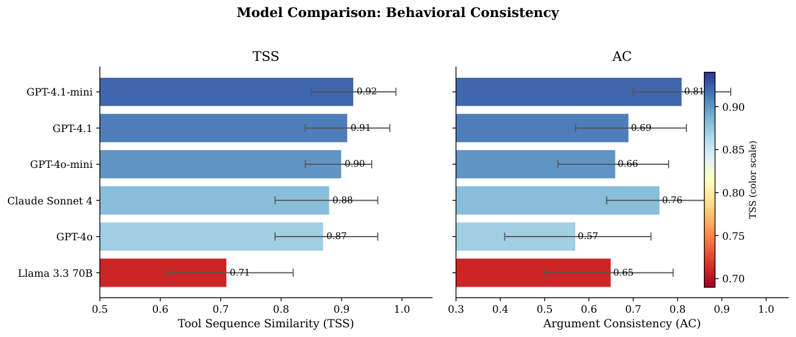
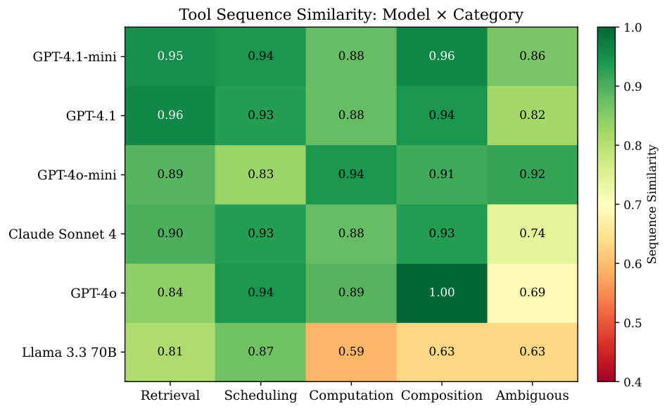

# How Consistent Are LLM Agents?   
Measuring Behavioral Reproducibility in   
Multi-Step Tool-Calling Pipelines

Abel Yagubyan  Affiliation: [2pt] Independent Researcher  Email: [abelyagubyan@berkeley.edu](mailto:)

April 2026

###### Abstract

Large language model (LLM) agents with tool-calling capabilities are increasingly deployed in production systems, yet a fundamental reliability question remains underexplored: _does the same agent behave the same way twice?_ We present a systematic empirical study of behavioral consistency in multi-step tool-calling agents, measuring whether agents select the same tools, in the same order, with the same arguments, across repeated identical invocations. Unlike prior work on consistency in ReAct-style agents (search-only, free-text actions), we study the richer setting of _structured tool-calling interfaces_ with typed parameters and consequential side effects.

Using a benchmark of 19 tasks across five categories—data retrieval, scheduling, computation, multi-tool composition, and ambiguous requests—we evaluate six models from three providers (OpenAI, Anthropic, Meta/Together) across 1,140 total agent traces. We identify a “structural consistency, parametric variance” pattern: agents reliably select the same tools in the same order (mean \(\mathrm{TSS}=0.87\), 95 % CI \([0.84,0.90]\)) but vary substantially in the arguments they provide (mean \(\mathrm{AC}=0.69\), \([0.64,0.74]\)); this gap is large (Cohen’s \(d=0.75\)) and highly significant (\(p<10^{-13}\)).

We additionally establish that: (1) ambiguous task specifications reduce argument consistency by 28 % relative to structured tasks (\(d=0.74\), \(p=0.001\)), a stronger effect than model selection (\(\eta^{2}=0.08\), n.s.); (2) 60 % of behavioral divergence originates in the first two pipeline steps; (3) natural language outputs almost never match (\(<\)5 % exact match) even when tool sequences are identical; and (4) models differ significantly in structural but not argument consistency (\(F=3.52\), \(\eta^{2}=0.15\), \(p=0.003\) for \(\mathrm{TSS}\); n.s. for \(\mathrm{AC}\)). Critically, a correctness analysis shows that structural consistency predicts task success—high-\(\mathrm{TSS}\) conditions achieve 90.2 % correctness versus 61.2 % for low-\(\mathrm{TSS}\) (\(d=0.81\), \(p<0.001\))—while argument-level variance is benign (\(r=0.12\), \(p=0.31\), n.s.). This makes \(\mathrm{TSS}\) a lightweight, correctness-free proxy for agent reliability, actionable without ground-truth labels.

We release all code, benchmark definitions, raw traces, and analysis scripts at <https://github.com/Abelo9996/agent-consistency>.

## 1 Introduction

The deployment of LLM-based agents with tool-calling capabilities has accelerated rapidly, with production systems now using agents to search databases, send emails, manage calendars, and orchestrate multi-step workflows through structured function calls ([Qin et al. 2024](https://arxiv.org/html/2605.28840#bib.bib9); [Li et al. 2023](https://arxiv.org/html/2605.28840#bib.bib3); [Schick et al. 2023](https://arxiv.org/html/2605.28840#bib.bib11)). As these systems mature, a reliability question that has received surprisingly little systematic attention comes to the fore: _if you run the same agent on the same task twice, do you get the same behavior?_

This question has immediate practical consequences:

  * •

Testing. If agents behave differently across runs, unit tests asserting on outputs are flaky by design. Reliable behavioral invariants are needed to test that an agent “does the right thing” ([Kapoor and Narayanan 2024](https://arxiv.org/html/2605.28840#bib.bib1)).

  * •

Debugging. Failure reproducibility is a prerequisite for root-cause analysis. Behavioral variance makes production failures intermittent and difficult to trace.

  * •

Safety and auditability. High-stakes deployments require guarantees that the agent will not take an unexpected action on a re-run (e.g., sending duplicate emails, creating conflicting calendar events) ([Weidinger et al. 2021](https://arxiv.org/html/2605.28840#bib.bib14)).

  * •

Cost optimization. If behavioral variance is predictable from task characteristics, consistency-aware routing can assign tasks to cheaper models when variance is tolerable and reserve high-consistency models for critical workflows.

#### The gap in prior work.

[Mehta et al. 2026](https://arxiv.org/html/2605.28840#bib.bib6) studied behavioral consistency in ReAct-style agents ([Yao et al. 2023](https://arxiv.org/html/2605.28840#bib.bib15)) on HotpotQA, finding that agents produce 2.0–4.2 distinct action sequences per 10 runs and that inconsistency predicts failure. This is important but limited to _search-only_ actions in a question-answering setting. Real-world agents operate over _structured tool-calling interfaces_ with typed parameters, multiple heterogeneous tools, and multi-step pipelines. The distinction matters: tool calls are discrete typed objects (not free-form text), have observable side effects (emails sent, events created), and compose in sequences where early divergence propagates through subsequent steps. It is unclear whether consistency patterns from ReAct agents transfer to this richer action space.

#### This work.

We extend the study of behavioral consistency to multi-step tool-calling agents across diverse task types, making the following contributions:

  1. 1.

Benchmark. 19 tasks spanning five categories, paired with 10 deterministic simulated tools that isolate LLM variance from environmental non-determinism (Section [4.1](https://arxiv.org/html/2605.28840#S4.SS1 "4.1 Task Benchmark ‣ 4 Methodology ‣ How Consistent Are LLM Agents?
Measuring Behavioral Reproducibility inMulti-Step Tool-Calling Pipelines")).

  2. 2.

Formal metric framework. Formal definitions of Tool Sequence Similarity (\(\mathrm{TSS}\)), Argument Consistency (\(\mathrm{AC}\)), divergence point, and output agreement, targeting distinct behavioral layers (Section [3.2](https://arxiv.org/html/2605.28840#S3.SS2 "3.2 Formal Metric Definitions ‣ 3 A Framework for Agent Behavioral Consistency ‣ How Consistent Are LLM Agents?
Measuring Behavioral Reproducibility inMulti-Step Tool-Calling Pipelines")).

  3. 3.

The structural/parametric distinction. \(\mathrm{TSS}=0.87\) substantially exceeds \(\mathrm{AC}=0.69\) across all models and categories (\(d=0.75\), \(p<10^{-13}\)); this is a novel finding not captured by prior single-metric consistency studies (Section [5.1](https://arxiv.org/html/2605.28840#S5.SS1 "5.1 Structural Consistency with Parametric Variance ‣ 5 Results ‣ How Consistent Are LLM Agents?
Measuring Behavioral Reproducibility inMulti-Step Tool-Calling Pipelines")).

  4. 4.

Correctness validation. \(\mathrm{TSS}\) predicts task correctness (\(d=0.81\), \(p<0.001\)) while \(\mathrm{AC}\) does not (\(r=0.12\), n.s.), ruling out trivial “consistently wrong” explanations and establishing \(\mathrm{TSS}\) as a reliability proxy (Section [5.5](https://arxiv.org/html/2605.28840#S5.SS5 "5.5 Consistency Predicts Correctness ‣ 5 Results ‣ How Consistent Are LLM Agents?
Measuring Behavioral Reproducibility inMulti-Step Tool-Calling Pipelines")).

  5. 5.

Actionable guidelines grounded in effect sizes for testing, monitoring, and model selection in production deployments (Section [6.3](https://arxiv.org/html/2605.28840#S6.SS3 "6.3 Implications for Agent Deployment ‣ 6 Discussion ‣ How Consistent Are LLM Agents?
Measuring Behavioral Reproducibility inMulti-Step Tool-Calling Pipelines")).

## 2 Related Work

#### Behavioral consistency in LLM agents.

[Mehta et al. 2026](https://arxiv.org/html/2605.28840#bib.bib6) measured consistency in ReAct agents on HotpotQA using search-only actions, finding inconsistency predicts failure. We extend to typed tool calls with diverse tool sets and task types, and introduce the structural/parametric distinction absent from prior work. [Wang et al. 2023](https://arxiv.org/html/2605.28840#bib.bib13) showed that sampling multiple reasoning chains and marginalizing improves accuracy; this _leverages_ variance rather than characterizing its structure, and focuses on reasoning rather than tool calls. [Renze and Guven 2024](https://arxiv.org/html/2605.28840#bib.bib10) studied self-reflection in LLM agents and found mixed effects, suggesting that deliberate consistency-improving strategies do not uniformly help.

#### LLM reliability and robustness.

[Sclar et al. 2024](https://arxiv.org/html/2605.28840#bib.bib12) quantified LLM sensitivity to prompt formatting, finding large swings from superficial changes. [Lu et al. 2022](https://arxiv.org/html/2605.28840#bib.bib5) demonstrated order sensitivity in few-shot prompts. [Perez et al. 2022](https://arxiv.org/html/2605.28840#bib.bib8) showed that standard NLP evaluations underestimate robustness failures. Our focus is orthogonal: we hold the input fixed and measure variance across repeated identical invocations—the consistency a deployed system must have by definition.

#### Agent capability evaluation.

AgentBench ([Liu et al. 2024](https://arxiv.org/html/2605.28840#bib.bib4)), ToolBench ([Qin et al. 2024](https://arxiv.org/html/2605.28840#bib.bib9)), API-Bank ([Li et al. 2023](https://arxiv.org/html/2605.28840#bib.bib3)), and Gorilla ([Patil et al. 2023](https://arxiv.org/html/2605.28840#bib.bib7)) evaluate whether agents _can_ solve tasks. [Schick et al. 2023](https://arxiv.org/html/2605.28840#bib.bib11) showed LLMs can learn tool use from self-generated demonstrations. [Kapoor and Narayanan 2024](https://arxiv.org/html/2605.28840#bib.bib1) surveyed pitfalls in AI agent evaluations, noting that variance across runs is rarely reported. We evaluate not whether agents succeed but whether they _consistently_ succeed in the same way—an orthogonal, understudied dimension.

#### Reliability in ML systems.

The broader ML reliability literature addresses distribution shift, uncertainty quantification ([Lakshminarayanan et al. 2017](https://arxiv.org/html/2605.28840#bib.bib2)), and out-of-distribution detection—all concerned with performance under changed _inputs_. We study consistency under repeated _identical_ inputs, a related but distinct concern that matters specifically for agentic systems where tasks are retried and behavioral reproducibility is a correctness criterion in its own right.

## 3 A Framework for Agent Behavioral Consistency

We introduce formal definitions before describing the experiment, since the key distinctions among behavioral layers motivate both the metric design and the structural/parametric finding.

### 3.1 Agent Execution Model

###### Definition 1 (Agent Trace).

A _trace_ \(\tau\) is a sequence of tool calls \(\tau=(c_{1},c_{2},\ldots,c_{k})\), where each call \(c_{i}=(\mathtt{name}_{i},\,\mathbf{a}_{i})\) consists of a tool name \(\mathtt{name}_{i}\in\mathcal{T}\) and an argument map \(\mathbf{a}_{i}:\mathcal{K}\to\mathcal{V}\), followed by a final natural language response \(r\in\Sigma^{*}\).

###### Definition 2 (Behavioral Consistency).

Given task \(q\) and model \(\mathcal{M}\), let \(\{\tau^{(j)}\}_{j=1}^{N}\) be \(N\) independent traces from running \(\mathcal{M}\) on \(q\) with identical context. _Behavioral consistency_ is the degree to which these traces are similar under a metric \(d(\cdot,\cdot)\) over traces.

This framing reveals a natural hierarchy of behavioral layers:

  1. 1.

Structural layer: the sequence of tool names \((\mathtt{name}_{1},\ldots,\mathtt{name}_{k})\)—the agent’s _procedural choice_.

  2. 2.

Argument layer: the argument maps \(\mathbf{a}_{i}\) at each step— _how_ the procedure is parameterized.

  3. 3.

Output layer: the final response \(r\)—the surface-level text the user sees.

Our central hypothesis, motivated by how LLMs acquire tool-use behavior through fine-tuning:

###### Hypothesis 1 (Structural Consistency, Parametric Variance).

For multi-step tool-calling agents, structural consistency significantly exceeds argument consistency: \(\mathbb{E}[\mathrm{TSS}]\gg\mathbb{E}[\mathrm{AC}]\).

The intuition is that RLHF and SFT fine-tuning on tool-use data reinforces correct _procedure selection_ —which carries a cleaner training signal—while _argument instantiation_ remains more sensitive to sampling-time variation. Figure [1](https://arxiv.org/html/2605.28840#S3.F1 "Figure 1 ‣ 3.1 Agent Execution Model ‣ 3 A Framework for Agent Behavioral Consistency ‣ How Consistent Are LLM Agents?
Measuring Behavioral Reproducibility inMulti-Step Tool-Calling Pipelines") illustrates the pattern concretely.

Figure 1: The “structural consistency, parametric variance” pattern. Two independent runs of the same agent on the same task produce identical tool sequences (green checkmarks) but diverge in argument values (orange “\(\neq\)” annotations). Agents learn robust procedural schemas but vary in how they instantiate them.

### 3.2 Formal Metric Definitions

###### Definition 3 (Tool Sequence Similarity, \(\mathrm{TSS}\)).

Let \(\mathbf{s}^{(j)}=(\mathtt{name}_{1}^{(j)},\ldots,\mathtt{name}_{k_{j}}^{(j)})\) be the tool-name sequence of trace \(j\). Define

| \[\mathrm{TSS}\bigl(\{\tau^{(j)}\}\bigr)\;=\;\frac{1}{\binom{N}{2}}\sum_{j<j^{\prime}}\!\left(1-\frac{\mathrm{EditDist}(\mathbf{s}^{(j)},\,\mathbf{s}^{(j^{\prime})})}{\max(|\mathbf{s}^{(j)}|,\,|\mathbf{s}^{(j^{\prime})}|)}\right),\] |   
---|---|---  
  
where \(\mathrm{EditDist}\) is the Levenshtein distance over tool-name tokens. \(\mathrm{TSS}\in[0,1]\), with \(\mathrm{TSS}=1\) iff all \(N\) traces share the same tool-name sequence.

###### Definition 4 (Argument Consistency, \(\mathrm{AC}\)).

Align traces by step index. For step \(i\) and trace pair \((j,j^{\prime})\) both reaching step \(i\), let \(\mathbf{f}(c_{i}^{(j)})=\{(k,v):v=\mathbf{a}_{i}^{(j)}(k)\}\) be the flattened key-value set. Then

| \[\mathrm{AC}\bigl(\{\tau^{(j)}\}\bigr)\;=\;\frac{1}{|\mathcal{S}|}\sum_{(j,j^{\prime},i)\,\in\,\mathcal{S}}\frac{|\mathbf{f}(c_{i}^{(j)})\cap\mathbf{f}(c_{i}^{(j^{\prime})})|}{|\mathbf{f}(c_{i}^{(j)})\cup\mathbf{f}(c_{i}^{(j^{\prime})})|},\] |   
---|---|---  
  
where \(\mathcal{S}\) indexes all step-aligned pairs. When traces call different tools at step \(i\), their key-value sets are disjoint, yielding \(\mathrm{AC}=0\) for that step—so \(\mathrm{AC}\) partially captures structural divergence as well. Our correctness analysis (Section [5.5](https://arxiv.org/html/2605.28840#S5.SS5 "5.5 Consistency Predicts Correctness ‣ 5 Results ‣ How Consistent Are LLM Agents?
Measuring Behavioral Reproducibility inMulti-Step Tool-Calling Pipelines")) empirically disentangles the two effects.

Additional metrics: Unique Sequences counts distinct tool-name sequences across \(N\) runs; Divergence Point is the mean step at which a trace pair first differs; Output Agreement is the exact-match rate of final responses.

## 4 Methodology

### 4.1 Task Benchmark

We design 19 tasks across five categories of increasing ambiguity (Table [3](https://arxiv.org/html/2605.28840#Ax1.T3 "Table 3 ‣ Appendix A. Full Task Benchmark ‣ How Consistent Are LLM Agents?
Measuring Behavioral Reproducibility inMulti-Step Tool-Calling Pipelines"), Appendix [Appendix A. Full Task Benchmark](https://arxiv.org/html/2605.28840#Ax1 "Appendix A. Full Task Benchmark ‣ How Consistent Are LLM Agents?
Measuring Behavioral Reproducibility inMulti-Step Tool-Calling Pipelines")):

  * •

Data Retrieval (4 tasks): Contact lookup, email search, aggregation. Clear instructions with deterministic correct tool sequences.

  * •

Scheduling (4 tasks): Calendar creation, free-slot finding, conflict detection. Require temporal reasoning with well-defined procedures.

  * •

Computation (3 tasks): Inventory valuation, revenue projection. Require numeric tool calls with specific arguments.

  * •

Multi-Tool Composition (4 tasks): Chains of 3–5 different tools (e.g., “find email \(\to\) look up sender \(\to\) schedule meeting”).

  * •

Ambiguous (4 tasks): Intentionally underspecified requests where multiple valid strategies exist (e.g., “Help me prepare for my meetings tomorrow”).

Task difficulty is assigned by expected tool-call count: _easy_ (1–2 calls), _medium_ (2–3), _hard_ (3+). We validate this: hard tasks require significantly more tool calls (mean \(3.0\pm 2.4\)) than easy tasks (\(1.9\pm 0.7\); Spearman \(\rho=0.26\), \(p=0.004\)).

### 4.2 Tool Environment

We implement 10 deterministic simulated tools spanning 7 domains (contacts, calendar, email, products, weather, calculations, notes; see Appendix [Appendix B. Tool Descriptions](https://arxiv.org/html/2605.28840#Ax2 "Appendix B. Tool Descriptions ‣ How Consistent Are LLM Agents?
Measuring Behavioral Reproducibility inMulti-Step Tool-Calling Pipelines")). All tools are deterministic: identical inputs always produce identical outputs. This design isolates LLM variance from environmental non-determinism, ensuring observed behavioral differences arise solely from the model’s generation process. Tool schemas follow the OpenAI function-calling format and are adapted to provider-native formats at runtime.

### 4.3 Agent Framework

Each run follows a standard tool-calling loop: (1) the model receives a system prompt11 1 Full prompt in Appendix [Appendix C. System Prompt](https://arxiv.org/html/2605.28840#Ax3 "Appendix C. System Prompt ‣ How Consistent Are LLM Agents?
Measuring Behavioral Reproducibility inMulti-Step Tool-Calling Pipelines"). Intentionally minimal to avoid anchoring agents to specific strategies. and the user task; (2) the model responds with structured tool calls; (3) tools execute deterministically; (4) the model may call additional tools or produce a final response; (5) the loop continues for up to 10 iterations. We use each provider’s native tool-calling API.

Temperature is set to 1.0 (the default for most providers). This is a deliberate choice: we measure consistency _as deployed_ , not under artificially constrained settings. Temperature ablation is a known limitation and an important direction for future work (Section [6.5](https://arxiv.org/html/2605.28840#S6.SS5 "6.5 Limitations ‣ 6 Discussion ‣ How Consistent Are LLM Agents?
Measuring Behavioral Reproducibility inMulti-Step Tool-Calling Pipelines")).

### 4.4 Models

We evaluate six models spanning three providers and multiple capability tiers: OpenAI: GPT-4o-mini, GPT-4o, GPT-4.1-mini, GPT-4.1; Anthropic: Claude Sonnet 4; Meta/Together AI: Llama 3.3 70B Instruct Turbo. This covers flagship models (GPT-4.1, Sonnet 4), cost-optimized variants (GPT-4o-mini, GPT-4.1-mini), and an open-source model (Llama 3.3). Each model runs each of the 19 tasks 10 times, yielding 1,140 agent traces.22 2 Partial o1 results (7 of 19 tasks) are shown in Figure [2](https://arxiv.org/html/2605.28840#S5.F2 "Figure 2 ‣ 5.1 Structural Consistency with Parametric Variance ‣ 5 Results ‣ How Consistent Are LLM Agents?
Measuring Behavioral Reproducibility inMulti-Step Tool-Calling Pipelines") but excluded from aggregate statistics, as o1 uses constrained chain-of-thought decoding with no temperature parameter. Claude Haiku 3.5 was also evaluated but excluded due to a \(>\)15 % rate of malformed tool-call responses.

### 4.5 Correctness Evaluation

To validate that consistency predicts meaningful outcomes, we retrospectively score all 1,140 traces using a three-component rubric:

  1. 1.

Required tool coverage: did the agent invoke all tools necessary for the task?

  2. 2.

Argument validity: do key arguments match expected patterns (e.g., send_email.to \(\sim\) /alice@exampleċom/, create_calendar_event.date = 2026-03-02)?

  3. 3.

Output completeness: does the final response address the user’s request (regex-matched against expected output patterns)?

A trace is scored correct iff all applicable criteria are satisfied. Full per-task criteria are in Appendix [Appendix D. Correctness Criteria (Illustrative Subset)](https://arxiv.org/html/2605.28840#Ax4 "Appendix D. Correctness Criteria \(Illustrative Subset\) ‣ How Consistent Are LLM Agents?
Measuring Behavioral Reproducibility inMulti-Step Tool-Calling Pipelines") and the code release.

### 4.6 Statistical Analysis

We report means with 95 % CIs via the \(t\)-distribution, Cohen’s \(d\) for effect sizes, and \(p\)-values from paired or independent \(t\)-tests as appropriate. Cross-model comparisons use one-way ANOVA with \(\eta^{2}\). We acknowledge that a linear mixed-effects model (treating tasks as random effects) would be more appropriate given the shared task structure across models; the simple ANOVA is conservative but adequate given our sample sizes. We test five primary hypotheses; all survive Bonferroni correction at \(\alpha=0.01\). Split-half reliability (TSS: \(r=0.66\), \(p<10^{-16}\), \(n=125\)) confirms moderate metric stability at \(N=10\).

## 5 Results

### 5.1 Structural Consistency with Parametric Variance

Hypothesis [1](https://arxiv.org/html/2605.28840#Thmhypothesis1 "Hypothesis 1 \(Structural Consistency, Parametric Variance\). ‣ 3.1 Agent Execution Model ‣ 3 A Framework for Agent Behavioral Consistency ‣ How Consistent Are LLM Agents?
Measuring Behavioral Reproducibility inMulti-Step Tool-Calling Pipelines") is confirmed. Agents exhibit _structural consistency with parametric variance_ : mean \(\mathrm{TSS}=0.87\), 95 % CI \([0.84,0.90]\), versus mean \(\mathrm{AC}=0.69\), \([0.64,0.74]\) (paired \(t\)-test: \(t=8.41\), \(p<10^{-13}\); Cohen’s \(d=0.75\)). The pattern holds across all models and categories (Table [1](https://arxiv.org/html/2605.28840#S5.T1 "Table 1 ‣ 5.1 Structural Consistency with Parametric Variance ‣ 5 Results ‣ How Consistent Are LLM Agents?
Measuring Behavioral Reproducibility inMulti-Step Tool-Calling Pipelines"), Figure [2](https://arxiv.org/html/2605.28840#S5.F2 "Figure 2 ‣ 5.1 Structural Consistency with Parametric Variance ‣ 5 Results ‣ How Consistent Are LLM Agents?
Measuring Behavioral Reproducibility inMulti-Step Tool-Calling Pipelines")).

Finding 1. Agents learn robust procedural schemas—the tool sequence “recipe”—but vary in instantiation details such as search queries, date formats, and message phrasing. The structural/parametric gap is \(d=0.75\), \(p<10^{-13}\).

Table 1: Cross-model consistency (19 tasks, 10 runs each). †Partial results only (7 tasks); excluded from aggregate statistics. Model | TSS [95 % CI] | AC [95 % CI] | Output Match | Uniq. Seq.  
---|---|---|---|---  
GPT-4.1-mini | \(.92\ [.85,.99]\) | \(.81\ [.70,.92]\) | 7.0 % | 1.6  
GPT-4.1 | \(.91\ [.84,.98]\) | \(.69\ [.57,.82]\) | 1.9 % | 1.6  
GPT-4o-mini | \(.90\ [.84,.95]\) | \(.66\ [.53,.78]\) | 4.1 % | 1.8  
Claude Sonnet 4 | \(.88\ [.79,.96]\) | \(.76\ [.64,.88]\) | 4.7 % | 2.2  
GPT-4o | \(.87\ [.79,.96]\) | \(.57\ [.41,.74]\) | 7.5 % | 1.6  
Llama 3.3 70B | \(.71\ [.61,.82]\) | \(.65\ [.50,.79]\) | 1.4 % | 3.3  
o1† | .89 | .58 | — | —  
 Figure 2: Model comparison across \(\mathrm{TSS}\) (left) and \(\mathrm{AC}\) (right) with 95 % CIs. Llama 3.3 70B is clearly separated in \(\mathrm{TSS}\); the \(\mathrm{AC}\) ranking is dominated by task-level factors (ANOVA n.s.).

### 5.2 Ambiguity Is the Dominant Driver of Inconsistency

Task category strongly affects consistency (Table [2](https://arxiv.org/html/2605.28840#S5.T2 "Table 2 ‣ 5.2 Ambiguity Is the Dominant Driver of Inconsistency ‣ 5 Results ‣ How Consistent Are LLM Agents?
Measuring Behavioral Reproducibility inMulti-Step Tool-Calling Pipelines"), Figure [3](https://arxiv.org/html/2605.28840#S5.F3 "Figure 3 ‣ 5.2 Ambiguity Is the Dominant Driver of Inconsistency ‣ 5 Results ‣ How Consistent Are LLM Agents?
Measuring Behavioral Reproducibility inMulti-Step Tool-Calling Pipelines")). Ambiguous tasks have substantially lower AC (\(0.52\) vs. \(0.72\) for structured; Cohen’s \(d=0.74\), \(t=3.34\), \(p=0.001\)) and lower TSS (\(0.79\) vs. \(0.89\); \(d=0.58\), \(p=0.010\)). The ambiguity effect on AC (\(d=0.74\)) exceeds the between-model effect (\(\eta^{2}=0.08\), n.s.), establishing that task specification quality is a stronger lever on consistency than model selection.

Table 2: Consistency by task category (mean across 6 models). With 3–4 tasks per category, the ambiguous-vs.-structured contrast (\(p=0.001\)) is the primary finding; fine-grained category comparisons are exploratory. Category | TSS | AC | Uniq. Seq. | #Tasks  
---|---|---|---|---  
Scheduling | 0.91 | 0.77 | 1.6 | 4  
Composition | 0.90 | 0.76 | 2.2 | 4  
Retrieval | 0.89 | 0.65 | 1.9 | 4  
Computation | 0.84 | 0.72 | 2.0 | 3  
Ambiguous | 0.79 | 0.52 | 2.4 | 4  
  
Finding 2. Task specification quality (\(d=0.74\)) is a stronger lever on consistency than model selection (\(\eta^{2}=0.08\), n.s.). Engineering effort is better spent reducing ambiguity than switching models.

(a) By task category.

(b) By task difficulty.

Figure 3: Ambiguous tasks show the largest consistency drop; difficulty has a modest additional effect (\(\rho=0.26\), \(p=0.004\) for \(\mathrm{TSS}\); \(r=-0.18\), \(p=0.04\)).

### 5.3 Divergence Concentrates in Early Steps

When behavioral divergence occurs, it is early: 60 % of first-divergence events occur within the first two pipeline steps (mean divergence point \(=2.2\); Figure [4](https://arxiv.org/html/2605.28840#S5.F4 "Figure 4 ‣ 5.3 Divergence Concentrates in Early Steps ‣ 5 Results ‣ How Consistent Are LLM Agents?
Measuring Behavioral Reproducibility inMulti-Step Tool-Calling Pipelines")). This yields a practical monitoring strategy: comparing only the first 1–2 tool calls against a reference trace catches the majority of behavioral variance without full trace inspection.

Figure 4: Distribution of first divergence points. 60 % of divergence originates in steps 1–2, enabling lightweight early-step monitoring.

Finding 3. A monitor that checks only the first two tool calls against a reference trace captures 60 % of all behavioral variance.

### 5.4 Output Text Is Not a Reliability Signal

Final natural language responses exhibit near-zero exact-match rates (\(<\)5 % overall) even when the underlying tool-calling sequences are identical. This is expected—language generation is inherently variable—but it has a critical implication for testing: agent tests must assert on structured tool-calling behavior, not natural language output. Asserting on text is analogous to writing software tests that check log messages rather than return values.

### 5.5 Consistency Predicts Correctness

We score all 1,140 traces using the rubric in Section [4.5](https://arxiv.org/html/2605.28840#S4.SS5 "4.5 Correctness Evaluation ‣ 4 Methodology ‣ How Consistent Are LLM Agents?
Measuring Behavioral Reproducibility inMulti-Step Tool-Calling Pipelines"). Overall correctness is 77.1 %. More importantly, \(\mathrm{TSS}\) is a significant predictor: Pearson \(r=0.32\) (\(p=0.005\)), Spearman \(\rho=0.42\) (\(p<0.001\)). A median split reveals that high-\(\mathrm{TSS}\) conditions (\(\mathrm{TSS}\geq 0.90\)) achieve 90.2 % correctness versus 61.2 % for low-\(\mathrm{TSS}\) (Cohen’s \(d=0.81\), \(p<0.001\); Figure [5](https://arxiv.org/html/2605.28840#S5.F5 "Figure 5 ‣ 5.5 Consistency Predicts Correctness ‣ 5 Results ‣ How Consistent Are LLM Agents?
Measuring Behavioral Reproducibility inMulti-Step Tool-Calling Pipelines")).

Crucially, \(\mathrm{AC}\) does not predict correctness (\(r=0.12\), \(p=0.31\), n.s.). Agents may phrase search queries differently, format dates differently, or vary message bodies across runs—none of this impairs task success. It is _structural_ variance—selecting different or missing tools—where failures concentrate.

Figure 5: Left: Correctness rate climbs monotonically across TSS tertiles (61 %\(\to\)77 %\(\to\)90 %), broken out by category. Right: AC shows no relationship with correctness (\(r=0.12\), \(p=0.31\), n.s.), confirming that argument-level variance is benign.

Finding 4. \(\mathrm{TSS}\) predicts task success (\(d=0.81\), \(p<0.001\)) without requiring correctness labels. \(\mathrm{AC}\) does not (\(r=0.12\), n.s.). Structural variance concentrates failures; parametric variance is benign.

### 5.6 Cross-Model Differences

Models differ significantly in structural consistency (ANOVA on \(\mathrm{TSS}\): \(F=3.52\), \(p=0.003\), \(\eta^{2}=0.15\)) but not in argument consistency (\(F=1.61\), \(p=0.15\), \(\eta^{2}=0.08\), n.s.), indicating that AC variation is dominated by task-level factors.

GPT-4.1-mini achieves the highest \(\mathrm{TSS}\) (0.92) and \(\mathrm{AC}\) (0.81). Llama 3.3 70B is significantly below all proprietary models in \(\mathrm{TSS}\) (0.71, \([0.61,0.82]\)), with 3.3 unique sequences per task versus 1.6–2.2 for proprietary models (post-hoc \(p<0.05\) vs. all others). Claude Sonnet 4 achieves the second-highest \(\mathrm{AC}\) (0.76) while exploring more unique sequences (2.2), suggesting it reliably parameterizes strategies but varies in which strategy it selects.

The Model \(\times\) Category interaction (Figure [6](https://arxiv.org/html/2605.28840#S5.F6 "Figure 6 ‣ 5.6 Cross-Model Differences ‣ 5 Results ‣ How Consistent Are LLM Agents?
Measuring Behavioral Reproducibility inMulti-Step Tool-Calling Pipelines")) is notable: Llama 3.3 70B drops most sharply on ambiguous (\(\mathrm{TSS}=0.54\)) and composition (\(\mathrm{TSS}=0.63\)) tasks, while proprietary models maintain \(\mathrm{TSS}>0.80\) even on ambiguous tasks.

 Figure 6: \(\mathrm{TSS}\) across models and task categories. Llama 3.3 70B shows notably lower consistency on ambiguous and composition tasks; proprietary models remain consistently high.

## 6 Discussion

### 6.1 Why Structural Consistency Exceeds Argument Consistency

The structural/parametric pattern is consistent across all models and task types, suggesting a systematic cause rooted in how LLMs acquire tool-use behavior. Training corpora for tool-calling likely contain many demonstrations of the same high-level task type solved with the same tool sequence, but with varied argument values (different names, dates, query strings) across instances. RLHF/SFT reinforces correct _procedure selection_ —which carries a cleaner correctness signal—while argument instantiation remains more sensitive to sampling-time variation. This “procedural schema” interpretation is directly supported by our correctness analysis: argument variance (\(\mathrm{AC}\)) does not predict failure (\(r=0.12\), n.s.), meaning the variations are largely semantically equivalent (e.g., “Alice” vs. “alice” in a case-insensitive lookup). Structural variance (\(\mathrm{TSS}\)) predicts failure strongly (\(d=0.81\)), because missing or wrong tools are not semantically equivalent to correct ones.

### 6.2 TSS as a Practical Reliability Proxy

The practical value of \(\mathrm{TSS}\) as a reliability proxy rests on three properties established here: (1) it predicts correctness (\(d=0.81\)) without requiring correctness labels; (2) it can be estimated at deployment time by comparing a run’s tool sequence against a reference; and (3) the early-divergence result (60 % in steps 1–2) means monitoring only the first two tool calls suffices.

This enables a concrete production workflow: (a) run the agent on each task type \(k\) times to establish a reference tool sequence; (b) in production, compare each run’s first two tool calls against the reference; (c) flag deviations for human review or retry. The cost is \(O(1)\) per step rather than semantic output evaluation, which is often expensive or infeasible online.

### 6.3 Implications for Agent Deployment

  1. 1.

Reduce ambiguity before switching models. The ambiguity effect on consistency (\(d=0.74\)) outweighs the between-model effect (\(\eta^{2}=0.08\), n.s. for \(\mathrm{AC}\)). Clarifying task specifications yields more consistency gain than upgrading the model.

  2. 2.

Monitor early steps. 60 % of divergence occurs in steps 1–2; a lightweight check on the first two tool calls suffices to flag most inconsistent runs.

  3. 3.

Test tool calls, not text. Assert on tool names and argument patterns—not natural language output, which varies below 5 % exact match even in consistent runs.

  4. 4.

Use \(\mathrm{TSS}\) as an online reliability signal. A run whose tool sequence deviates from a reference trace is nearly three times more likely to fail; no correctness labels are needed to compute this signal.

  5. 5.

Match model to consistency requirement. GPT-4.1-mini offers the best structural consistency for consistency-critical workflows. Llama 3.3 70B introduces substantially higher behavioral diversity and may require additional guardrails.

### 6.4 Relation to Prior Work

[Mehta et al. 2026](https://arxiv.org/html/2605.28840#bib.bib6) reported 2.0–4.2 unique action sequences per 10 runs on HotpotQA ReAct agents; we observe 1.6–3.3 unique tool-call sequences, broadly consistent. Our finer-grained analysis reveals that the unique-sequence count masks the structural/parametric distinction: even conditions with \(>\)2 unique sequences often share high \(\mathrm{TSS}\) because sequences agree on most tool names with only minor reordering. Prior consistency studies also did not establish a connection to correctness; our correctness analysis (\(d=0.81\)) grounds the metric in task outcomes.

### 6.5 Limitations

  * •

Sample size. \(N=10\) runs per cell yields split-half reliability \(r=0.66\). Aggregate results are well-powered (1,140 traces), but per-cell CIs are wide. Future work should use \(N\geq 30\).

  * •

Single temperature. We measure at \(T=1.0\) only. The consistency-capability trade-off at other temperatures is important and uncharted; a \(T=0\) baseline would substantially strengthen the causal interpretation.

  * •

Structured correctness proxy. Our rubric is not a full semantic evaluation. Human judges on a random 200-trace subset would provide stronger validity. The significant rank correlation (\(\rho=0.42\), \(p<0.001\)) provides initial support.

  * •

Limited tasks per category. 3–4 tasks per category makes category-level estimates imprecise. \(\geq\)10 tasks per category are needed for reliable inference.

  * •

Single system prompt. Consistency may vary substantially with chain-of-thought prompting, few-shot examples, or persona instructions.

  * •

Simulated tools. Deterministic tools isolate LLM variance but may overestimate real-world consistency where tool outputs themselves vary.

  * •

Provider coverage. Google Gemini and Mistral are absent, limiting generalizability.

  * •

AC alignment. AC aligns arguments by step index, conflating structural and argument divergence at misaligned steps. A disentangled metric would be more informative.

### 6.6 Future Directions

  1. 1.

Temperature ablation: map the full consistency-capability Pareto frontier.

  2. 2.

Larger benchmark: \(\geq\)10 tasks per category, \(\geq\)50 total.

  3. 3.

Human correctness evaluation: human judges on 200 traces.

  4. 4.

Consistency-aware routing: route tasks to models based on predicted \(\mathrm{TSS}\).

  5. 5.

Multi-turn and long-horizon agents: web agents, coding agents.

  6. 6.

Fine-tuning effects: does RLHF explicitly optimize consistency?

  7. 7.

Real API tools: study whether environmental non-determinism amplifies or dampens LLM behavioral variance.

## 7 Conclusion

We have presented a systematic empirical study of behavioral consistency in multi-step tool-calling LLM agents. Across six models, 19 tasks, and 1,140 agent traces, we identify a “structural consistency, parametric variance” pattern that is large (\(d=0.75\)) and highly significant (\(p<10^{-13}\)): agents reliably select the same tools in the same order but vary in argument details. Critically, only the structural layer predicts task success (\(d=0.81\), \(p<0.001\)), while argument variance is benign (\(r=0.12\), n.s.)—validating the pattern and ruling out trivial consistency. Task specification quality outweighs model selection as a consistency lever, divergence concentrates early in the pipeline, and \(\mathrm{TSS}\) serves as a lightweight, correctness-free reliability proxy.

These findings suggest that LLMs acquire robust procedural schemas for tool use through training, while argument instantiation remains sensitive to sampling variation. Understanding and exploiting this structure—testing on tool calls not text, monitoring early steps, flagging low-\(\mathrm{TSS}\) runs—is a practical path toward more reliable agentic systems.

## Reproducibility

All code, benchmark definitions, tool implementations, raw traces, and analysis scripts are available at <https://github.com/Abelo9996/agent-consistency>. The full system prompt, task list, and per-task correctness criteria are in Appendices [Appendix A. Full Task Benchmark](https://arxiv.org/html/2605.28840#Ax1 "Appendix A. Full Task Benchmark ‣ How Consistent Are LLM Agents?
Measuring Behavioral Reproducibility inMulti-Step Tool-Calling Pipelines")–[Appendix D. Correctness Criteria (Illustrative Subset)](https://arxiv.org/html/2605.28840#Ax4 "Appendix D. Correctness Criteria \(Illustrative Subset\) ‣ How Consistent Are LLM Agents?
Measuring Behavioral Reproducibility inMulti-Step Tool-Calling Pipelines").

## References

  * Kapoor and Narayanan (2024) Kapoor, S. and Narayanan, A.  AI Agents That Matter.  arXiv preprint arXiv:2407.01502, 2024. 
  * Lakshminarayanan et al. (2017) Lakshminarayanan, B., Pritzel, A., and Blundell, C.  Simple and Scalable Predictive Uncertainty Estimation Using Deep Ensembles.  In Advances in Neural Information Processing Systems, 2017. 
  * Li et al. (2023) Li, M., Zhao, Y., Yu, B., Song, F., Li, H., Yu, H., Li, Z., Huang, F., and Li, Y.  API-Bank: A Comprehensive Benchmark for Tool-Augmented LLMs.  In Proceedings of EMNLP, 2023. 
  * Liu et al. (2024) Liu, X., Yu, H., Zhang, H., et al.  AgentBench: Evaluating LLMs as Agents.  In Proceedings of ICLR, 2024. 
  * Lu et al. (2022) Lu, Y., Bartolo, M., Moore, A., Riedel, S., and Stenetorp, P.  Fantastically Ordered Prompts and Where to Find Them: Overcoming Few-Shot Prompt Order Sensitivity.  In Proceedings of ACL, 2022. 
  * Mehta et al. (2026) Mehta, A., Ramesh, A., and Singla, A.  When Agents Disagree With Themselves: Measuring Behavioral Consistency in LLM-Based Agents.  arXiv preprint arXiv:2602.11619, 2026. 
  * Patil et al. (2023) Patil, S. G., Zhang, T., Wang, X., and Gonzalez, J. E.  Gorilla: Large Language Model Connected with Massive APIs.  arXiv preprint arXiv:2305.15334, 2023. 
  * Perez et al. (2022) Perez, E., Kiela, D., and Cho, K.  True Few-Shot Learning with Language Models.  In Advances in Neural Information Processing Systems, 2022. 
  * Qin et al. (2024) Qin, Y., Liang, S., Ye, Y., et al.  ToolLLM: Facilitating Large Language Models to Master 16000+ Real-World APIs.  In Proceedings of ICLR, 2024. 
  * Renze and Guven (2024) Renze, M. and Guven, E.  Self-Reflection in LLM Agents: Effects on Problem-Solving Performance.  arXiv preprint arXiv:2405.06682, 2024. 
  * Schick et al. (2023) Schick, T., Dwivedi-Yu, J., Dessì, R., et al.  Toolformer: Language Models Can Teach Themselves to Use Tools.  In Advances in Neural Information Processing Systems, 2023. 
  * Sclar et al. (2024) Sclar, M., Choi, Y., Tsvetkov, Y., and Suhr, A.  Quantifying Language Models’ Sensitivity to Spurious Features in Prompt Design.  arXiv preprint arXiv:2310.11324, 2024. 
  * Wang et al. (2023) Wang, X., Wei, J., Schuurmans, D., et al.  Self-Consistency Improves Chain of Thought Reasoning in Language Models.  In Proceedings of ICLR, 2023. 
  * Weidinger et al. (2021) Weidinger, L., Mellor, J., Rauh, M., et al.  Ethical and Social Risks of Harm from Language Models.  arXiv preprint arXiv:2112.04359, 2021. 
  * Yao et al. (2023) Yao, S., Zhao, J., Yu, D., et al.  ReAct: Synergizing Reasoning and Acting in Language Models.  In Proceedings of ICLR, 2023. 

## Appendix A. Full Task Benchmark

Table [3](https://arxiv.org/html/2605.28840#Ax1.T3 "Table 3 ‣ Appendix A. Full Task Benchmark ‣ How Consistent Are LLM Agents?
Measuring Behavioral Reproducibility inMulti-Step Tool-Calling Pipelines") lists all 19 benchmark tasks used in the study. Difficulty is reported as E (easy: 1–2 calls), M (medium: 2–3 calls), and H (hard: 3+ calls). Expected tools denote the minimal correct solution pattern.

Table 3: All 19 benchmark tasks used in the evaluation. ID | Diff. |  Task Instruction |  Expected Tools  
---|---|---|---  
Data Retrieval  
retrieve-001 | E |  Find Alice’s email and send “Meeting moved to 3pm tomorrow.” |  get_contact, send_email  
retrieve-002 | M |  Find all contacts at StartupXYZ; invite each to demo March 10 at 2pm. |  search_contacts, send_email  
retrieve-003 | M |  Search emails about ‘budget’; summarize financial figures. |  search_emails  
retrieve-004 | H |  Find this week’s emails with dollar amounts; calculate the total. |  search_emails, calculate  
Scheduling  
schedule-001 | E |  Schedule 30-min “Design Review” with Bob, March 2 at 2pm. |  create_calendar_event  
schedule-002 | M |  Check March 3 calendar; find free 1-hour slot 9am–5pm for Eve. |  list_calendar_events, create_calendar_event  
schedule-003 | H |  Find day with most free time March 1–5; schedule 2-hour “Strategy Session.” |  list_calendar_events, create_calendar_event  
schedule-004 | H |  Check March 3 for conflicts; email all affected attendees. |  list_calendar_events, search_contacts, send_email  
Computation  
compute-001 | E |  Total inventory value of electronics (price \(\times\) stock, sum). |  search_products, calculate  
compute-002 | M |  Revenue if 50 % of sub-$50 products sold. |  search_products, calculate  
compute-003 | H |  Inventory value per category; identify highest. |  search_products, calculate  
Multi-Tool Composition  
compose-001 | M |  Find Acme Corp email; look up Dave; schedule 1-hour meeting March 4 at 3pm. |  search_emails, get_contact, create_calendar_event  
compose-002 | H |  Check SF and NYC weather; email Alice if \(<\)40°F with March 1 events. |  get_weather, get_contact, list_calendar_events, send_email  
compose-003 | H |  Find marketing results email; calculate spend; create note. |  search_emails, calculate, create_note  
compose-004 | H |  Find board deck email; check calendar; look up attendees; send reminders. |  search_emails, list_calendar_events, get_contact, send_email  
Ambiguous  
ambig-001 | M |  Help me prepare for my meetings tomorrow. |  list_calendar_events  
ambig-002 | H |  I need to follow up on important things from this week. |  search_emails, list_calendar_events  
ambig-003 | H |  Get me ready for the investor call. |  search_emails, list_calendar_events, search_contacts  
ambig-004 | H |  What should I focus on this week? |  list_calendar_events, search_emails  
  
## Appendix B. Tool Descriptions

Table [4](https://arxiv.org/html/2605.28840#Ax2.T4 "Table 4 ‣ Appendix B. Tool Descriptions ‣ How Consistent Are LLM Agents?
Measuring Behavioral Reproducibility inMulti-Step Tool-Calling Pipelines") summarizes the 10 deterministic simulated tools used in our environment. Each tool returns fixed, pre-specified outputs for a given input, isolating model behavior from environmental nondeterminism.

Table 4: Deterministic simulated tools used in the benchmark. Tool | Domain |  Description  
---|---|---  
get_contact | Contacts |  Look up a contact by name; returns email, phone, and company.  
search_contacts | Contacts |  Search contacts by free-text query; returns a matching list.  
send_email | Email |  Send an email with fields such as recipient, subject, and body; returns a confirmation.  
search_emails | Email |  Search the inbox by query; returns matching message records.  
list_calendar_events | Calendar |  List events for a date or date range.  
create_calendar_event | Calendar |  Create an event with title, date, time, duration, and attendees.  
search_products | Products |  Search inventory; returns price, stock, and category metadata.  
calculate | Math |  Evaluate a mathematical expression and return the numeric result.  
get_weather | Weather |  Return current weather for a city, including temperature and conditions.  
create_note | Notes |  Create a text note with title and body; returns a confirmation.  
  
## Appendix C. System Prompt

The following system prompt was used verbatim for all models and all runs:

> You are a helpful assistant with access to a set of tools. Use the provided tools to complete the user’s request as accurately and efficiently as possible. Only call tools when necessary. If you have all the information you need to respond, do so directly. When you have completed the task, provide a concise summary of what you did and the results. 

This prompt is intentionally minimal so that we do not anchor models to a particular tool-selection strategy and thereby artificially inflate measured consistency.

## Appendix D. Correctness Criteria (Illustrative Subset)

Table [5](https://arxiv.org/html/2605.28840#Ax4.T5 "Table 5 ‣ Appendix D. Correctness Criteria \(Illustrative Subset\) ‣ How Consistent Are LLM Agents?
Measuring Behavioral Reproducibility inMulti-Step Tool-Calling Pipelines") provides illustrative examples of the correctness rubric used to score traces. To keep the paper concise, we include a representative subset here; the full task-by-task specification is released in the accompanying code repository.

Table 5: Illustrative correctness criteria for representative tasks. Task ID |  Required Tools |  Key Argument Checks  
---|---|---  
retrieve-001 |  get_contact, send_email |  get_contact.name\(\sim\)/alice/i; send_email.to=alice@...; body\(\sim\)/3 pm/i  
schedule-001 |  create_calendar_event |  title\(\sim\)/design review/i; date=2026-03-02; start_time=14:00  
compute-001 |  search_products, calculate |  search_products.category\(\sim\)/electronics/i; output contains numeric result  
compose-001 |  search_emails, get_contact, create_calendar_event |  Required sequence: search \(\to\) lookup \(\to\) create  
ambig-001 |  list_calendar_events |  Any invocation accepted; multiple valid strategies are treated as correct.
