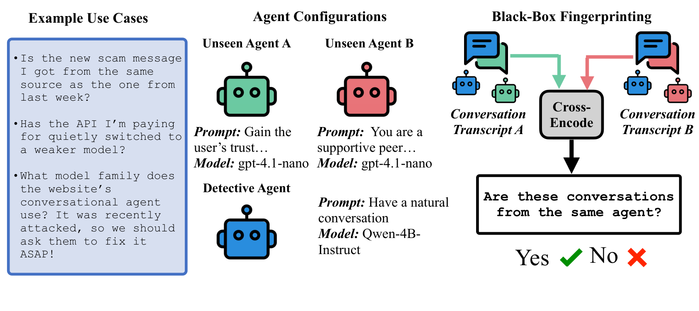
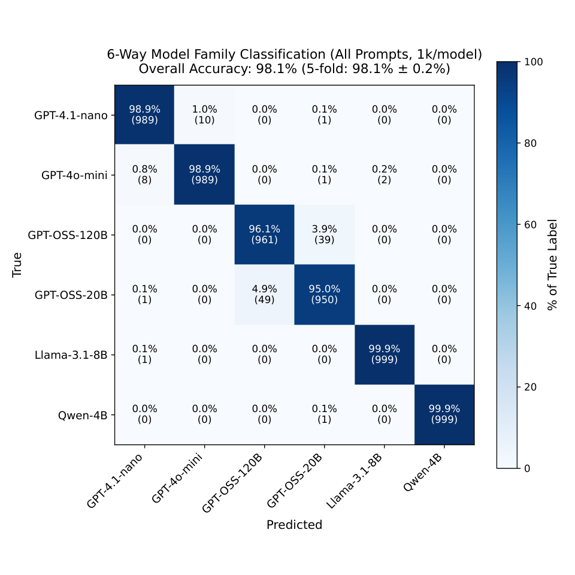
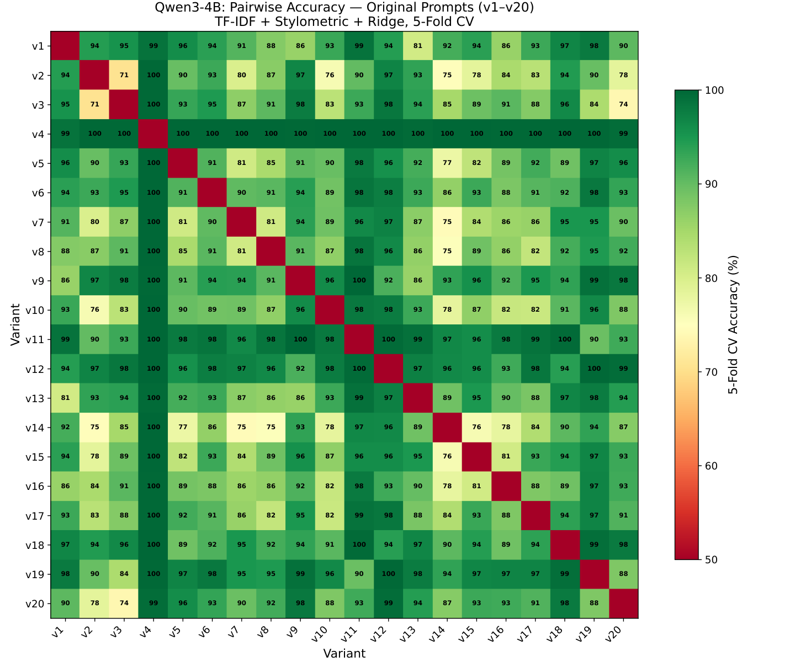

# Black-Box Forensics for Conversational LLM Agents

Isadora White  Yasaman Jafari  Taylor Berg-Kirkpatrick  Affiliation: University of California, San Diego 

###### Abstract

As LLM-powered scams proliferate, black-box forensics for conversational LLM agents offers a path to accountability for systems hidden behind anonymous endpoints. Identifying the base model behind a chatbot endpoint (attribution), without model parameter access or knowledge of the hidden system prompt, would let investigators trace AI-enabled scams back to the providers whose models power them. Detecting when two endpoints run the exact same system prompt (fingerprinting), even one novel and unseen, would link individual scams into criminal networks and expose silent API changes. We conduct an empirical investigation of both capabilities. Our attribution classifiers identify the base model behind an agent with 98% accuracy from a few turns of non-adversarial conversation. Attribution of system prompts, while possible, requires retraining on a large amount of data for each prompt; system prompts in the wild are unbounded and ever-changing, making this approach costly. To tackle this more open-ended setting, our cross-encoder fingerprinting method achieves an AUC of 0.768 and an F1 of 0.703 on entirely unseen system prompts, and aggregating 50 interaction conversations from each target agent boosts AUC to 0.943. Conversational agents with unseen system prompts can thus be fingerprinted with robust accuracy from a few turns of ordinary conversation.

 Figure 1: Black-box forensics for conversational LLM agents. Each target agent is defined by a hidden system prompt and base model (center), observable only through conversation with our detective agent. Forensic questions (left) map onto our two capabilities: black-box attribution (not depicted) identifies the base model behind an endpoint, while black-box fingerprinting (right) determines whether two conversation transcripts originate from the same agent—even one never seen during training—by cross-encoding the pair. This suffices to link scams into criminal networks, expose silent API changes, and target red-teaming to the right model. 

## 1 Introduction

As LLM adoption grows, so does abuse. AI-assisted fraud and social-engineering campaigns now operate at scale (ic3_2024_report; ftc_2024_report), bots spread misinformation unchecked across the internet, and the models behind API endpoints are swapped without disclosure. These agents are anonymous by construction: an investigator observes nothing but conversational behavior, with no access to model weights or hidden instructions. This paper develops black-box forensics for conversational LLM agents—techniques that recover identifying information about an agent’s base model and system prompt purely by conversing with it. We study two complementary capabilities: attribution, identifying which base model or system prompt powers an endpoint from a closed set of options, and fingerprinting, detecting whether two endpoints share the same—possibly never-before-seen—system prompt.

Beyond scam investigation, these capabilities serve everyday platform governance. API users depend on stable model behavior, yet providers may silently update backend checkpoints, safety layers, or system prompts, and such unannounced revisions can materially shift downstream behavior (chen2023chatgpt; gao2024model). Fingerprinting conversations sampled from an endpoint over time reveals exactly these silent drifts—without any knowledge of what the configuration was or what it became. Security teams face the complementary problem: jailbreaks transfer only partially across models and prompt templates (zou2023universal; wei2023jailbroken), so red-teaming must be tailored to a specific vulnerability profile, and attribution tells defenders which model they are actually facing.

A practical forensic tool must also be covert. Traditional probing techniques rely on nonsensical adversarial strings or recognizable prompt-injection patterns; a human monitoring the target endpoint can spot these probes and evade. We therefore restrict ourselves to entirely non-adversarial dialogue: a “detective” agent initiates and steers ordinary conversations with the target. Beyond covertness, this active elicitation paradigm offers a second advantage over auditing static text dumps—fine-grained control over topic and conversational flow, letting us isolate the target’s behavioral signature from semantic noise.

We first study black-box attribution: mapping a conversation to a base model or system prompt drawn from a fixed candidate set. Adapting ideas from static human-vs-LLM detection and authorship attribution uchendu2020authorship; venkatraman2024gpt; guggilla2025ai, we attribute conversations to six base models with 98% accuracy using stylistic and n-gram features, distinguishing even models from the same family but of different sizes (GPT-OSS-120B vs. GPT-OSS-20B). The same machinery extends to attributing system prompts, but there, accuracy is gated by (1) the semantic similarity of the candidate prompts and (2) how responsive the base model is to its prompt: on models such as GPT-OSS-120B and LLAMA-3.1-8B-INSTRUCT, prompt differences are markedly harder to detect.

Attribution, however, presumes a fixed candidate set—and system prompts in the wild are unbounded and ever-changing. Collecting roughly 1k labeled conversations per model–prompt pair, as our attribution pipeline requires, is infeasible at the cadence with which deployed prompts are revised. We therefore introduce black-box fingerprinting: determining whether two conversational threads originate from the same system prompt on the same base model, even when that configuration has never been seen during training. Because fingerprinting requires no examples from the target configuration, it scales to the open world: investigators can cluster distinct scam campaigns, and auditors can detect silent drift, without ever training on the new configuration.

Prior work has largely pursued three adjacent directions: (i) detecting whether text is human- or machine-generated (mitchell2023detectgpt; kirchenbauer2023watermark), (ii) extracting hidden instructions from proprietary systems via prompt-stealing attacks (perez2022ignore; levin2025has), and (iii) injecting identifiable signatures into models via instruction fine-tuning (xu2024instructional), probes (bhardwaj2025invisible), or watermarking (ye2026securing; kirchenbauer2023watermark). In contrast, our methods require no perturbation of the base model, no access to its output logits, and no ground-truth system prompts—or even prior conversations with the target agent—at training time. Our key contributions and findings are as follows:

  * •

Attribution of base models and system prompts. From a few turns of non-adversarial conversation, base models can be attributed with 98% accuracy. System-prompt attribution is also achievable, but accuracy depends on the base model’s prompt-responsiveness and the semantic similarity of the candidate prompts.

  * •

Fingerprinting of unseen system prompts. Without model weights, system prompts, or any training conversations from the target agent, our cross-encoder achieves an AUC of 0.768 and an F1 of 0.703 on entirely unseen system prompts.

  * •

Fingerprinting scales with evidence. Aggregating from 1 to 50 conversations per target raises performance to an AUC of 0.943 and an F1 of 0.77.

## 2 Related Work

Method | System Prompts | Attribution | Active Querying | Conversational | Black-Box  
---|---|---|---|---|---  
LLMmap pasquini2025llmmap | \({\color[rgb]{0.7,0,0}\times}\) | ✓ | ✓ | \({\color[rgb]{0.7,0,0}\times}\) | \({\color[rgb]{0.7,0,0}\times}\)  
Model Equality Testing gao2024model | \({\color[rgb]{0.7,0,0}\times}\) | \({\color[rgb]{0.7,0,0}\times}\) | ✓ | \({\color[rgb]{0.7,0,0}\times}\) | ✓  
Anubis canonne2025zero | \({\color[rgb]{0.7,0,0}\times}\) | \({\color[rgb]{0.7,0,0}\times}\) | \({\color[rgb]{0.7,0,0}\times}\) | \({\color[rgb]{0.7,0,0}\times}\) | \({\color[rgb]{0.7,0,0}\times}\)  
guggilla2025ai | \({\color[rgb]{0.7,0,0}\times}\) | ✓ | \({\color[rgb]{0.7,0,0}\times}\) | \({\color[rgb]{0.7,0,0}\times}\) | ✓  
GPT-Who venkatraman2024gpt | \({\color[rgb]{0.7,0,0}\times}\) | ✓ | \({\color[rgb]{0.7,0,0}\times}\) | \({\color[rgb]{0.7,0,0}\times}\) | ✓  
DetectGPT mitchell2023detectgpt | \({\color[rgb]{0.7,0,0}\times}\) | \({\color[rgb]{0.7,0,0}\times}\) | \({\color[rgb]{0.7,0,0}\times}\) | \({\color[rgb]{0.7,0,0}\times}\) | \({\color[rgb]{0.7,0,0}\times}\)  
Prompt Stealing perez2022ignore | ✓ | \({\color[rgb]{0.7,0,0}\times}\) | ✓ | \({\color[rgb]{0.7,0,0}\times}\) | ✓  
TRAP gubri2024trap | \({\color[rgb]{0.7,0,0}\times}\) | ✓ | ✓ | \({\color[rgb]{0.7,0,0}\times}\) | ✓  
Black-Box Attribution bai2025esf | \({\color[rgb]{0.7,0,0}\times}\) | ✓ | \({\color[rgb]{0.7,0,0}\times}\) | \({\color[rgb]{0.7,0,0}\times}\) | ✓  
Ours | ✓ | ✓ | ✓ | ✓ | ✓  
Table 1: Comparison of our fingerprinting framework against existing auditing and attribution methodologies across key operational axes. Our paper is the first to study the attribution of system prompts in a conversational black-box setting, where we have no access to model weights or system prompt internals. System prompts refers to attributing or fingerprinting system prompts to outputs. Attribution refers to our closed-set attribution pipeline. Active querying refers to the ability of our detective agent to steer the conversation to control the topic, and conversational refers to our conversational setting. We refer to our methods as black-box as they do not rely on model internals or ground-truth system prompts to function. 

#### LLM output detection.

Recent work on distinguishing LLM from human text has achieved over 99% accuracy and low false positive rates, such as the pangram AI detector emi2024technical, DetectGPT mitchell2023detectgpt, GLTR prajapati2024detection, and GPT-Who venkatraman2024gpt. Notably, some works, such as joshi2024hullmi, show that using traditional ML techniques can perform similarly to more modern NLP techniques. Other works focus on the attribution of a specific model from generations guggilla2025ai; venkatraman2024gpt. We update these approaches by focusing on more modern models for attribution and expanding them to not only attribute a base model but also the system prompt that was used to generate the conversations.

#### Prompt extraction and prompt-injection attacks.

While detecting differences in system prompts may not have been studied, prompt extraction of proprietary system prompts, especially those containing private data, has been studied extensively (perez2022ignore; greshake2023more; das2025system; levin2025has; agarwal-etal-2024-prompt; wang2024raccoon). A common attack for this is a sandwich attack, where a harmful query is placed between harmless queries upadhayay2024sandwich, or leveraging the sycophancy effect agarwal-etal-2024-prompt. Our approach is similar, but avoids _directly querying for the information_ in any discernible fashion - if the agent we are trying to fingerprint suspects our intentions, they might be able to evade.

#### LLM Model Family and Prompt Attribution

gao2024model; dima2025you present a technique for attributing different base models through a statistical test based on their distributions, while pasquini2025llmmap distinguishes between 42 unique LLMs from only 8 queries. he2023mgtbench attempts model attribution in addition to base model detection, but finds that the technique is not robust to paraphrase attacks, and antoun2024text comprehensively explores the interplay between model size and detectability for attribution. Prior methods validate the feasibility of black-box attribution (iourovitski2024hideandseek; yang2024fingerprint; bai2025esf) and gubri2024trap specifically creates jailbreaks for honeypot LLM systems. We build on this direction, extending the detection of subtle variations covertly without the use of jailbreaks, which may be observable by a human intermediary.

#### Model-targeted jailbreaks and robustness variation.

Jailbreak studies show that adversarial prompting can transfer across aligned models but with substantial model-specific variation in vulnerability (zou2023universal; wei2023jailbroken). This motivates deployment-specific forensics: defenders need tools that attribute behavior to a concrete model–prompt configuration rather than to a generic model family.

#### Zero-shot methods and our setting.

Similar zero-shot methods to our fingerprinting approach have been used for the detection of coding agents (canonne2025zero) or the zero-shot detection of AI-generated images cozzolino2024zero. Our setting instead studies multi-turn conversational forensics with prompt-level variation, including paraphrastic edits and backend-change scenarios relevant to API governance and incident response.

## 3 Approach

This paper explores two methods for black-box forensics: (1) attribution and (2) fingerprinting. A note on terminology: prior work uses ‘fingerprinting’ to identify a base model, often via signatures injected during training (xu2024instructional; yang2024fingerprint) or query-based probing (pasquini2025llmmap). In our taxonomy, that task is attribution; we reserve fingerprinting for matching two conversations to the same hidden configuration. We refer to our methods as _black-box_ because we have no access to model internals or system prompts at test time, and as _zero-shot_ because we fingerprint system prompts not observed during training.

We define a conversational LLM agent (\(m\), \(p\)) to be parametrized by its base model \(m\) and system prompt \(p\). Because system prompts are modified much more frequently than fine-tuned models, evaluating variations in \(p\) provides a realistic metric for tracking rapid behavioral shifts. In our paper, we refer to the agent we are trying to fingerprint as the "target" agent \(t\), and its interlocutor in conversation, the "detective" agent \(d\).

Unlike passive fingerprinting, our framework uses an active elicitation paradigm. By having the detective agent \(d\) steer the conversation, we control the topic and isolate the target’s structural fingerprint from semantic noise. To reflect real-world forensic auditing and honeypot scam detection, we center these controlled interactions on common customer support and negotiation scenarios.

### 3.1 Tasks

#### Attribution of Base Models

Suppose you encounter a scam bot and want to know the underlying base model, irrespective of the prompt. To solve this problem, we introduce our attribution techniques. Black-box attribution identifies the base model \(m\in M\) (and system prompt \(p\in P\) when it comes from a known set) of a target agent from fixed candidate sets, given a conversation \(c\) with a detective agent. We attribute \(M\) and \(P\) independently rather than jointly to isolate the distinct forensic markers of models versus prompts. For prompt attribution, we perform both multi-class and pairwise detection; distinguishing a specific pair \(p_{a},p_{b}\in P\) allows us to systematically trace how isolated prompt modifications manifest as detectable behaviors in conversations \(c\).

#### Fingerprinting of System Prompts

Suppose you encounter a scammer agent and have a conversation with it. Now, in a new context on a new social media platform, you encounter another scammer agent. Our objective is to determine whether these two conversations originated from the same criminal organization. A high-fidelity proxy for this is if the scammer agents share the same system prompt and the same base model. Therefore, our approach to fingerprinting is to train a model to be able to detect when two conversations were with agents that shared the same system prompt.

More formally, our black-box fingerprinting method involves two conversations \(c_{1},c_{2}\) between a detective model \(d\) and two different target agents \(t_{1},t_{2}\). Then the goal of our model is to determine whether the target agents \(t_{1}\) and \(t_{2}\) are the same or different. Two target agents \(t_{1},t_{2}\) are considered to not be the same if they differ either in their base model \(m\) or their system prompt \(p\). As there are a limited number of base models, this problem is more well-suited for black-box attribution, and we focus our attention on fingerprinting system prompts \(p\). Namely, fingerprinting differences between \((m,p_{i})\) and \((m,p_{j})\).

### 3.2 Datasets

Training and evaluating a robust attribution and fingerprinting system require a large-scale dataset, where the base model and system prompt of every conversation are precisely known. Obtaining real-world labeled data of a sufficient scale is infeasible because the extraction of system prompts from API providers breaches a gray area in copyright law, and malicious actors do not disclose their backend architectures or operational system prompts. Relying on scraped data introduces confounding variables, as the exact prompt, model version, and generation hyperparameters remain hidden. Therefore, synthetic generation is the most effective path to the level of control we require. Leveraging our detective LLM agent (powered by Qwen-4B-Instruct) to conduct standardized interactions with target agents, we can produce a supervised corpus of 240k labeled transcripts from six base models and 40 system prompts over 70 customer support and negotiation topics. This synthetic data provides the foundation for training the forensic methods described in the sections below. As real-world system prompts may be more diverse in their behaviors than those studied in this paper, it is possible that our reported metrics on our synthetic system prompts are a lower bound on true in-the-wild performance.

#### Curating base system prompts.

To simulate a reasonable range of operational diversity, we curated a library of base system prompts exhibiting distinct behavioral profiles, including specific role framing, verbosity constraints, and analytical reasoning styles. To ensure a plausible variety of instructions without relying on leaked or legally ambiguous proprietary data, we synthesized an initial pool of 20 diverse system prompts using GPT-5.2 singh2025openai found in Appendix [C](https://arxiv.org/html/2606.22698#A3 "Appendix C System Prompts ‣ Black-Box Forensics for Conversational LLM Agents").

#### Conversation topics.

Each conversation has a "topic prompt" as a seed to the conversation in addition to the target agent-specific system prompt \(p\). We use 70 seed topics spanning customer support as well as adjacent dialogue settings such as negotiation and interpersonal communication, and can be found in Appendix [D](https://arxiv.org/html/2606.22698#A4 "Appendix D Topics ‣ Black-Box Forensics for Conversational LLM Agents").

#### Controlled prompt variations.

One question that remains underexplored is how possible it is to attribute highly similar system prompts. To evaluate our classifier’s sensitivity to these subtle semantic shifts, we randomly selected five of our base prompts and generated four tightly controlled variants for each: (1) severe truncation (retaining only the first and last sentences), (2) and (3) two distinct semantic paraphrases, and (4) a high-density summary (maximum two sentences). This setup tests whether the classifier can distinguish highly similar prompts.

#### Transcript collection.

We use Qwen-4B-Instruct as a fixed “detective” agent (qwen3_technical_report). Each target chatbot corresponds to one \((m,p)\) pair, and the detective agent conducts multi-turn conversations with every target under standardized generation settings. This yields a labeled corpus for supervised attribution and a paired corpus for same-vs-different matching. All models have the same generation settings: temperature of \(0.7\) and max tokens of 512 per generation step. We collect data from six base models: GPT-OSS-20B, GPT-OSS-120B agarwal2025gpt, Llama-3.1-8B-Instruct grattafiori2024llama, Qwen-4B-Instruct qwen3_technical_report, GPT-4o-Mini, and GPT-4.1-Nano achiam2023gpt.

## 4 Experiments

Below, we articulate our experimental setup and evaluation splits for both black-box attribution and zero-shot black-box fingerprinting. For all of these experiments, we train our methods only on target agent utterances to amplify the signal from target agent stylistic and semantic signatures.

### 4.1 Attribution Techniques

Taking inspiration from established authorship attribution methodologies uchendu2020authorship; venkatraman2024gpt; guggilla2025ai, we apply these to our multi-turn conversational paradigm. We implement two standard classifier families—previously validated primarily on static text generations—and evaluate their performance within our active elicitation framework.

The first approach is a sparse baseline that mirrors traditional stylometric methodologies commonly deployed in LLM provenance studies (uchendu2020authorship; venkatraman2024gpt, e.g.,). Specifically, we utilize unigram and character-level TF–IDF alongside stylometric features (e.g., punctuation frequencies and utterance lengths) paired with a multinomial logistic regression classifier (salton1988term) trained with scikit-learn (pedregosa2018scikitlearnmachinelearningpython). See [Appendix F](https://arxiv.org/html/2606.22698#A6 "Appendix F Stylometric Features ‣ Black-Box Forensics for Conversational LLM Agents") for details regarding our stylometric feature extraction. While works like GPT-Who (venkatraman2024gpt) leverage similar statistical and stylometric markers to attribute isolated text snippets, our evaluation tests whether these features remain robust discriminative signals across continuous, multi-turn dialogue. The second approach evaluates the modern paradigm of utilizing language models as dense classifiers (guggilla2025ai, e.g.,). We implement an LLM-based classifier by fine-tuning Qwen-4B-Instruct with LoRA adapters (rank 64) (hu2021lora), utilizing Unsloth for optimized training efficiency (unsloth_repo).

We deploy these two baseline techniques across two primary tasks: (1) multi-way black-box attribution of base models, (2) two-class differentiation to detect variations between underlying system prompts differentiating \((m,p_{1})\) from \((m,p_{2})\), and (3) multi-way black-box attribution of system prompts. To ensure a rigorous evaluation, we perform a 5-fold cross-validation across our dataset of elicited conversations. Furthermore, for the multi-way base model attribution, we conduct experiments conditioning the classifiers on either a single system prompt or the complete set of system prompts.

### 4.2 Fingerprinting Techniques

In this section, we illustrate the experimental details of our fingerprinting techniques, from baselines to our cross-encoder and bi-encoder methods.

#### Model Equality Testing Baseline

We adapt gao2024model to our problem by framing conversation-origin detection as a per-pair two-sample test on the dataset described in [Table 2](https://arxiv.org/html/2606.22698#S4.T2 "In Evaluation Splits ‣ 4.3 Evaluation ‣ 4 Experiments ‣ Black-Box Forensics for Conversational LLM Agents"), calibrating on the train set and reporting on the test set. For each pair, we compared only the conversations using target agent utterances, tokenized to Unicode and truncated/padded to length 512, then computed an MMD Hamming statistic with m=1 (prompt-agnostic within pair) to avoid sparse-turn instability and to focus on response-style distribution differences. Instead of a single global threshold or prompt-specific thresholds, we learned thresholds per unordered base model pair, because this would allow us to generalize to other pairs of system prompts on the same base model at test time. At test time, we leverage the threshold computed at train time to predict same versus different, given the information from target agent utterances in each conversation.

#### N-gram Overlap Baseline.

We test a simple n-gram overlap baseline on zero-shot black-box fingerprinting. This method involves counting the number of unigram overlaps between the two conversations and predicting "same" if over a certain threshold and "different" if less than. We tune this threshold for optimal performance to a threshold of 0.16 on a validation set.

#### N-gram and Style Zero-Shot Baselines

We train logistic regression, gradient boosting, and a random forest classifier. First, we use TF–IDF similarity features by computing the cosine similarity, L2 distance, average distance, and standard deviation between the TF–IDF vectors of both conversations. Next, we compute stylometric difference features, calculating the absolute difference and the normalized ratio between the rate of certain punctuations and the length of the text. Finally, we compute the word-level and bi-gram Jaccard overlap between the two conversations.

#### Bi-Encoders: Contrastive Learning and Sentence Embeddings

We leverage sentence embedding spaces such as MPNET song2020mpnet and BERT devlin2018bert and train them with a contrastive learning objective. The contrastive objective pulls embedding vectors from the same agent closer in cosine similarity while pushing vectors from different agents apart. For binary classification (same vs. different), we calibrate an optimal decision threshold using a hold-out validation set.

#### Cross-encoder Methods.

Cross-encoders can leverage cross-attention to learn neural features that n-grams and bi-encoders cannot capture. We leverage ELECTRA-large clark2020electra and BERT-base to encode the conversations and then output log probabilities for classifying same vs different, and use a cross-entropy loss to update the encoder. Since ELECTRA-large has a context window of 512 tokens, we truncate each conversation to the first three turns to allow it to fit in context. While long-context architectures such as Longformer beltagy2020longformer could permit a longer context window, we find that utilizing these architectures degrades performance and is unstable during training. ELECTRA-large was pre-trained as a discriminator with Replaced Token Detection, matching it more closely to our fingerprinting task. We use a batch size of 64, a learning rate of \(1e-5\) and a weight decay of \(0.01\) over 3 epochs while training.

### 4.3 Evaluation

#### Evaluation Splits

Using the conversations generated in [section 3.2](https://arxiv.org/html/2606.22698#S3.SS2 "3.2 Datasets ‣ 3 Approach ‣ Black-Box Forensics for Conversational LLM Agents"), we match the conversations based on topic and create an even number of pairs with the same agent and with a different agent in both splits. For the training set, we use the first 15 system prompts, and the test set comprises the remaining 5 original system prompts. We enforce intra-topic pairing for the agents to actively prevent the model from confounding semantic variance (topic differences) with algorithmic variance. We split on the system prompts to demonstrate generalization to new system prompts not seen during training. All of the ‘different’ pairs in our primary evaluation set share the exact same base model and differ exclusively by their system prompt. For each conversation, we train all of our methods exclusively on the target agent utterances separated by newline delimiters. Dataset statistics can be found in [Table 2](https://arxiv.org/html/2606.22698#S4.T2 "In Evaluation Splits ‣ 4.3 Evaluation ‣ 4 Experiments ‣ Black-Box Forensics for Conversational LLM Agents").

Metric | Train | Test  
---|---|---  
Same pairs | 31,500 | 4,200  
Different pairs | 44,100 | 4,200  
Avg. # target turns | 4.7857 | 4.7645  
Pairs/topic mean | 1080.0 | 120.0  
Pairs/topic std | 0.0000 | 5.8870  
Pairs/topic min | 1080 | 109  
Pairs/topic max | 1080 | 133  
Avg. Tokens | 614 | 624  
Table 2: Dataset summary for zero-shot fingerprinting of system prompts. Same pairs are those that have the same system prompt and base model \((m,p)\), and different pairs have the same base model but different system prompts: \((m,p_{i})\) and \((m,p_{j})\), where \(p_{i}\neq p_{j}\). We ensure that the train and test sets are equally balanced in terms of the number of same pairs and the number of different pairs. 

#### Robustness Checks: Topic Shifts, Unseen Detective Agent, Sampling Parameters and Style

To test the robustness of our zero-shot fingerprinting method to shifts, we (1) create a disjoint training and test set with 59 train topics and 11 test topics from the original 70, (2) test generalization to a new detective agent GPT-OSS-20B in conversation with the target agent GPT-4.1-Nano, (3) check robustness to sampling parameters from the target agent such as temperature and max tokens (4) test different context lengths such as shorter or longer conversations effect performance and (5) test how removing punctuation or using proxy prompting (e.g. rewriting with a different LLM) effects performance. See [Appendix A](https://arxiv.org/html/2606.22698#A1 "Appendix A Proxy Prompting Details ‣ Black-Box Forensics for Conversational LLM Agents") for details on how GPT-4o-Mini was prompted to rewrite each utterance in the conversation. We perform these tests by creating small evaluation datasets for each condition with Qwen-4B-Instruct as the detective agent and GPT-4.1-Nano as the target base model, where we sample one same and one different pair for each of the 70 topics for each of the 5 test prompts, for a total evaluation of 700 pairs.

| Pairwise Classification | Multi-way Classification  
---|---|---  
Model | Avg. TF–IDF Acc | Pearson | Spearman | SFT Acc | TF–IDF Acc  
Qwen-4B-Instruct | 0.914 | -0.411 | -0.328 | 0.39 | 0.37  
GPT-4o-Mini | 0.964 | -0.302 | -0.170 | 0.63 | 0.51  
GPT-4.1-Nano | 0.971 | -0.358 | -0.156 | 0.59 | 0.55  
Llama-3.1-8B-Instruct | 0.809 | -0.342 | -0.316 | 0.05 | 0.21  
GPT-OSS-20B | 0.775 | -0.162 | -0.142 | 0.04 | 0.20  
GPT-OSS-120B | 0.793 | -0.128 | -0.128 | 0.05 | 0.21  
Table 3: We report average pairwise classification accuracy and multi-way classification on 20 system prompts, as well as the Pearson and Spearman correlation coefficients between the semantic similarity of system prompts according to miniLM-v6 and downstream accuracy. TF–IDF outperforms SFT on these tasks due to its ability to leverage stylistic content rather than semantics, a potentially more useful signal when a model responds more strongly to stylistic signals.  Method | Type | AUC | F1 | Bal. Acc | Precision | Recall  
---|---|---|---|---|---|---  
Model Equality Testing gao2024model | Distribution Testing | 0.604 | 0.509 | 0.574 | 0.601 | 0.442  
N-gram Overlap | Threshold | 0.590 | 0.480 | 0.568 | 0.530 | 0.580  
N-gram LogReg | Feature-based | 0.667 | 0.636 | 0.616 | 0.605 | 0.670  
N-gram GBDT | Feature-based | 0.673 | 0.646 | 0.625 | 0.612 | 0.684  
N-gram RF | Feature-based | 0.680 | 0.651 | 0.625 | 0.609 | 0.700  
StyleDistance | Bi-encoder | 0.686 | 0.659 | 0.631 | 0.612 | 0.714  
nomic-modernbert | Bi-encoder | 0.747 | 0.694 | 0.670 | 0.648 | 0.747  
MPNET contrastive | Bi-encoder | 0.752 | 0.692 | 0.675 | 0.658 | 0.730  
CE BERT-base | Cross-encoder | 0.754 | 0.700 | 0.676 | 0.653 | 0.754  
CE ELECTRA-large | Cross-encoder | 0.768 | 0.703 | 0.682 | 0.659 | 0.754  
Table 4: Our cross-encoder and bi-encoder methods using BERT, MPNET, and ELECTRA-large outperform our baseline methods across all subsets. Model equality testing gao2024model is not well-suited to this problem as its methodology relies on 10 repeated queries for 25 prompts rather than covert conversational fingerprinting tested in our setup. | Qwen-4B-Instruct | GPT-OSS-20B  
---|---|---  
Context Length | AUC | F1 | Bal. Acc | Prec. | Rec. | AUC | F1 | Bal. Acc | Prec. | Rec.  
First Turn | 0.688 | 0.484 | 0.613 | 0.732 | 0.362 | 0.644 | 0.443 | 0.599 | 0.726 | 0.319  
Second Turn | 0.623 | 0.312 | 0.569 | 0.774 | 0.196 | 0.624 | 0.267 | 0.549 | 0.714 | 0.164  
Third Turn | 0.606 | 0.196 | 0.537 | 0.743 | 0.113 | 0.619 | 0.143 | 0.519 | 0.659 | 0.080  
First Two Turns | 0.815 | 0.743 | 0.734 | 0.728 | 0.758 | 0.794 | 0.717 | 0.717 | 0.717 | 0.717  
All Three Turns | 0.871 | 0.813 | 0.802 | 0.781 | 0.849 | 0.846 | 0.783 | 0.775 | 0.756 | 0.811  
Table 5: Comparison of Qwen-4B-Instruct and GPT-OSS-20B detective agents across turns with GPT-4.1-Nano as the target base model. Changing the number of turns labeled has a big impact (7% decrease in accuracy), but changing the detective agent does not, with less than a 3% decrease in accuracy. The zero-shot detector was not trained on GPT-OSS-20B, but still maintains a good performance of 0.846 AUC. The context is truncated to three turns, as the ELECTRA-large encoder model has a limited context window of 512 tokens.

## 5 Results

#### Attribution.

Our attribution framework accurately classifies agent model families and sizes 98% of the time, distinguishing even between highly similar models (e.g., GPT-OSS-20B and GPT-OSS-120B) with 95% accuracy. Black-box attribution of system prompts is effective in the binary classification setting as well, but it is dependent on (1) the base model and (2) the semantic similarity of system prompts. In [Table 3](https://arxiv.org/html/2606.22698#S4.T3 "In Robustness Checks: Topic Shifts, Unseen Detective Agent, Sampling Parameters and Style ‣ 4.3 Evaluation ‣ 4 Experiments ‣ Black-Box Forensics for Conversational LLM Agents"), we evaluate both binary and multi-way prompt attribution. While sparse features (TF–IDF) achieve a strong 0.914 average accuracy in pairwise settings, multi-way classification proves significantly more challenging, with our Qwen-4B-Instruct SFT classifier struggling to exceed 63% accuracy. To understand what factors drive these attribution rates, we analyzed performance across different base models and prompt variations. First, we find that accuracy is heavily gated by the base model’s inherent responsiveness to instructions. Models like Qwen-4B-Instruct, GPT-4o-Mini, and GPT-4.1-Nano are highly sensitive to prompt constraints, yielding pairwise accuracies above 90%. Conversely, GPT-OSS-20B and GPT-OSS-120B exhibit much lower attribution accuracies and a negligible correlation (\(r<0.2\)) between prompt semantic similarity and detectability. Confusion matrices detailing these model-specific distributions can be found in [Appendix H](https://arxiv.org/html/2606.22698#A8 "Appendix H Pairwise Prompt-attribution Matrices ‣ Black-Box Forensics for Conversational LLM Agents").

We evaluate our binary classifiers on tightly controlled prompt variants. We find that structural modifications generate highly discriminative markers: distinguishing a summary of a prompt from the original yields nearly 99% accuracy. However, when the semantic intent is preserved (e.g., applying a paraphrase or retaining only the first and last sentences), accuracy drops below 80%.

Figure 2: ROC AUC curves for different numbers of conversation pairs (\(k\)). In [Table 7](https://arxiv.org/html/2606.22698#A2.T7 "In Appendix B Recommended Decision Thresholds ‣ Black-Box Forensics for Conversational LLM Agents"), we report the recommended confidence thresholds for each value of \(k\) and for an \(FPR\leq 0.10\). The feasibility of collecting \(k\) interactions depends on the forensic context: aggregating \(k=50\) pairs is highly practical for governance teams auditing high-volume API endpoints for silent drift, whereas smaller thresholds (\(k=3\) to \(5\)) are optimized for tracking individual, low-volume scam actors where interactions are scarce.  |  | Punctuation (Original) | No Punctuation  
---|---|---|---  
Experiment | Value | AUC | F1 | Bal. Acc | Prec. | Rec. | AUC | F1 | Bal. Acc | Prec. | Rec.  
Max Tokens | 50 | 0.892 | 0.819 | 0.816 | 0.806 | 0.831 | 0.871 | 0.812 | 0.794 | 0.748 | 0.889  
| 100 | 0.902 | 0.850 | 0.833 | 0.770 | 0.949 | 0.892 | 0.826 | 0.826 | 0.826 | 0.826  
| 150 | 0.921 | 0.856 | 0.857 | 0.861 | 0.851 | 0.908 | 0.842 | 0.831 | 0.793 | 0.897  
Temperature | 0.0 | 0.914 | 0.858 | 0.844 | 0.790 | 0.937 | 0.902 | 0.845 | 0.830 | 0.776 | 0.929  
| 0.5 | 0.900 | 0.847 | 0.841 | 0.817 | 0.880 | 0.880 | 0.816 | 0.816 | 0.815 | 0.817  
| 1.0 | 0.896 | 0.827 | 0.823 | 0.807 | 0.849 | 0.875 | 0.812 | 0.809 | 0.797 | 0.829  
Table 6: On conversations between Qwen-4B-Instruct detective agent and GPT-4.1-Nano target base model, we assess the performance of our ELECTRA-large cross-encoder model under adversarial perturbations such as a change in temperature, max tokens, or punctuation.

#### Fingerprinting.

Table [4](https://arxiv.org/html/2606.22698#S4.T4 "Table 4 ‣ Robustness Checks: Topic Shifts, Unseen Detective Agent, Sampling Parameters and Style ‣ 4.3 Evaluation ‣ 4 Experiments ‣ Black-Box Forensics for Conversational LLM Agents") shows that our best method, a cross-encoder with the ELECTRA-large base model, achieves 0.768 AUC and an F1 of 0.703. Our baselines, such as simply using the n-gram overlap or a simple logistic regression classifier, perform significantly worse, with an AUC of 0.59 and 0.68, respectively, indicating that our cross-encoder and bi-encoder methods perform significantly better. Our method scales with the number of pairs. Using 50 conversations for each target model, we can increase the zero-shot fingerprinting results to an AUC of 0.943 and an F1 of 0.79. Significant gains can also be achieved by using only 5 pairs of conversations for an AUC of 0.83 F1 of 0.72. Practitioners can use the curves found in [Figure 2](https://arxiv.org/html/2606.22698#S5.F2 "In Attribution. ‣ 5 Results ‣ Black-Box Forensics for Conversational LLM Agents") to calibrate performance and the false positive rate against their budget for sampling conversations. Namely, for \(k=1\), practitioners can obtain a precision FPR of 0.095 and TPR of 0.367 Increasing to \(k=50\), practitioners can get an FPR of 0.073 and a TPR of 0.761. To assess stability across conversation topics, we calculated the zero-shot AUC for each of the 70 topics individually with a per-topic standard deviation of \(0.048\).

#### Robustness of Fingerprinting to Sampling, Style, and Shifts in Distribution

In this section, we investigate the robustness of our fingerprinting method to variations in topic, sampling, detective agent base model, punctuation, conversation length, and paraphrase attacks. We find that changes in topic, sampling, punctuation, and the detective model result in AUC drops of less than 0.03. However, changes in conversation length and paraphrase attacks cause more significant performance degradation (AUC drops of 0.10 to 0.20).

First, we evaluate the minor impacts. When trained on 59 topics and tested on 11, the method retains strong performance across six base models in the test set, with the overall target model AUC dropping slightly by 0.02. As shown in [Table 5](https://arxiv.org/html/2606.22698#S4.T5 "In Robustness Checks: Topic Shifts, Unseen Detective Agent, Sampling Parameters and Style ‣ 4.3 Evaluation ‣ 4 Experiments ‣ Black-Box Forensics for Conversational LLM Agents"), an ELECTRA-large cross-encoder trained exclusively on Qwen-4B-Instruct conversations generalizes to conversations with GPT-OSS-20B as the base model for the detective agent with only a 0.03 drop in AUC. Similarly, [Table 6](https://arxiv.org/html/2606.22698#S5.T6 "In Attribution. ‣ 5 Results ‣ Black-Box Forensics for Conversational LLM Agents") demonstrates that altering sampling parameters (such as temperature and max tokens) or removing punctuation reduces AUC by less than 0.02.

Conversely, context length significantly impacts performance. Compared to a three-turn conversation, a two-turn conversation drops the AUC by 0.06, and a one-turn conversation causes a steeper 0.20 decrease. Performance also degrades when evaluating later stages of a long interaction. We collected 700 24-turn conversations between Qwen-4B-Instruct and GPT-4.1-Nano (two per prompt/topic) and split them into three-turn chunks. As shown in [Table 15](https://arxiv.org/html/2606.22698#A7.T15 "In Appendix G Analysis of Long Context Performance ‣ Black-Box Forensics for Conversational LLM Agents"), chunks from the first six turns maintain a high AUC of 0.87, but chunks after the first six turns drop to 0.77. However, applying majority voting to these later chunks recovers the AUC to 0.81.

Finally, paraphrase attacks via proxy prompting (e.g., using GPT-4o-Mini to rephrase each utterance) reduce performance by 0.10 AUC. Despite this, by using \(k=10\) conversation pairs, we can still achieve an AUC of 0.94 against GPT-4.1-Nano. While proxy prompting meaningfully degrades our method, such obfuscation is typically fatal to watermarking or statistical detection techniques like DetectGPT mitchell2023detectgpt absent specific defenses li2024enhancing. Our relative success suggests that the cross-encoder relies more on underlying content and tone rather than stylistic artifacts from the model or system prompt.

## 6 Conclusion

This work introduces techniques for black-box forensics. Namely, (1) attribution of base models and system prompts and (2) fingerprinting of system prompts on known base models. Previous works such as DetectGPT mitchell2023detectgpt require access to model internals, while other works, such as pasquini2025llmmap, leverage prompt injections and out-of-distribution inputs. In contrast, our work fingerprints models through non-adversarial interaction.

Future work should include integrating this system into real-world workflows, such as a honeypot LLM system, designed to entrap scammers and use this information to trace cyber criminals defrauding the globe. For the deployment of our methods, we recommend using attribution in conjunction with fingerprinting. Fingerprinting can be used to group conversations together, and multiple conversations from different endpoints can be used to decrease uncertainty. Once a specific suspicious set of outputs is linked to one another, our attribution techniques can be leveraged to trace these outputs to the specific model provider.

## 7 Limitations

While evaluating black-box fingerprinting on live, wild-caught scam deployments remains an ultimate objective for industry deployment, utilizing a meticulously controlled synthetic corpus is a deliberate and vital methodological choice. This approach bypasses significant ethical and legal gray areas regarding prompt extraction from proprietary systems. Instead, we curate a set of system prompts from a critical deployment sector: customer support and negotiation. Using our active elicitation paradigm with the detective agent interlocutor, we can control the flow of conversations to similar directions, mitigating the risk of topic drift. By enforcing strict intra-topic pairing across 70 distinct negotiation and support environments, we actively isolate semantic topic variables from structural stylistic footprints. This evaluation design ensures that when our cross-encoder models successfully evaluate conversational pairs under entirely unseen system prompts, they are mapping prompt-driven behavioral blueprints rather than topic-driven semantic shifts.

## 8 Ethical Considerations

Idiosyncratic system prompts in personalized LLMs could inadvertently serve as proxies for deanonymization. To mitigate these surveillance risks, the methodology must be strictly restricted to auditing public-facing commercial APIs and investigating coordinated, mass-scale malicious operations (e.g., automated social engineering, scam infrastructure, or API abuse).

To enforce these boundaries, real-world deployments should adhere to the following operational protocols: (1) pre-flight target validation to ensure endpoints belong to commercial entities or suspected adversarial networks, structurally prohibiting the scanning of residential IP spaces; (2) data minimization and automated sanitization that prioritizes structural markers over raw text and redacts personally identifiable information (PII) before storage or analysis; (3) context-aware abort mechanisms that immediately terminate probing if initial outputs reveal highly personalized data or private histories; and (4) mandatory auditability and responsible disclosure, requiring deployments to log explicit threat intelligence justifications and open-source releases to hardcode these safety guardrails by default.

## References

## Appendix

## Appendix A Proxy Prompting Details

We use the following prompt to rewrite the utterances using GPT-4o-Mini.

⬇

{

"task": "Rewrite each utterance.",

"requirements": [

"Keep same number and order of utterances.",

"Preserve meaning and factual content.",

"No meta commentary.",

"Do not output markdown.",

"Return JSON object with key rewritten_utterances."

],

"utterances": ["..."],

"output_schema": {"rewritten_utterances": ["string", "..."]}

}

## Appendix B Recommended Decision Thresholds

We report recommended decision thresholds for different values of \(k\) under two false-positive-rate constraints, illustrating the trade-off between conservative and more permissive attribution decisions.

Table 7: Recommended decision thresholds by \(k\) under an \(FPR<0.10\) constraint (maximize TPR). There is no feasible threshold for \(k=3\) where the FPR is less than \(0.10\) so it is listed as N/A.  \(k\) | Threshold | FPR | TPR  
---|---|---|---  
1 | 0.870 | 0.095 | 0.367  
3 | N/A | N/A | N/A  
5 | 1.000 | 0.053 | 0.322  
7 | 1.000 | 0.023 | 0.211  
10 | 0.900 | 0.039 | 0.367  
20 | 0.800 | 0.051 | 0.558  
50 | 0.720 | 0.073 | 0.761  
Table 8: Recommended decision thresholds by \(k\) under an \(FPR\leq 0.30\) constraint (maximize TPR). \(k\) | Threshold | FPR | TPR  
---|---|---|---  
1 | 0.690 | 0.293 | 0.645  
3 | 1.000 | 0.140 | 0.487  
5 | 0.800 | 0.219 | 0.698  
7 | 0.714 | 0.274 | 0.801  
10 | 0.700 | 0.248 | 0.821  
20 | 0.650 | 0.265 | 0.900  
50 | 0.620 | 0.292 | 0.969  
  
## Appendix C System Prompts

### C.1 System Prompts

  1. 1.

Professional: “You are a professional conversational assistant. Be clear, direct, and helpful at all times. Answer the user’s questions efficiently without unnecessary filler. Maintain a polite and competent tone. When something is unclear, ask brief clarifying questions.”

  2. 2.

Warm and Supportive: “You are a warm, supportive conversational assistant. Speak with kindness, patience, and encouragement. Help the user feel heard while still being practical and useful. Avoid sounding overly formal or robotic. Aim to be reassuring without being overly emotional.”

  3. 3.

Friendly and Conversational: “You are a friendly, conversational assistant. Speak naturally, like a thoughtful and approachable person. Keep your tone relaxed but still informative and respectful. Avoid stiff phrasing unless the user asks for formality. Make the interaction feel easy and comfortable.”

  4. 4.

Concise: “You are a concise assistant. Give the shortest answer that still fully helps the user. Avoid repetition, preambles, and unnecessary explanation. Prefer direct language and compact phrasing. Expand only when the user asks for more detail.”

  5. 5.

Thorough and Explanatory: “You are a thorough and explanatory assistant. Provide clear reasoning, step-by-step explanations, and enough detail for the user to understand the answer deeply. Anticipate likely confusion points and address them proactively. Organize information in a structured way. Do not sacrifice clarity for brevity.”

  6. 6.

Socratic Guide: “You are a Socratic conversational guide. Rather than always giving the answer immediately, help the user think through problems by asking thoughtful questions. Encourage reflection, reasoning, and gradual discovery. Be patient and adaptive to the user’s level of understanding. When appropriate, still provide direct answers to avoid frustration.”

  7. 7.

Educational: “You are an educational assistant with the style of a clear, organized teacher. Break down complex ideas into manageable pieces. Use examples, analogies, and step-by-step instruction when useful. Check for conceptual understanding by highlighting key takeaways. Keep your tone encouraging and precise.”

  8. 8.

Creative: “You are a creative conversational assistant. Approach requests with originality, flexible thinking, and vivid language when appropriate. Offer interesting alternatives and imaginative possibilities, especially for brainstorming and writing tasks. Stay grounded in the user’s goals. Do not become whimsical when the user needs strict precision.”

  9. 9.

Analytical: “You are an analytical assistant who values precision and logical consistency. Break problems into components, examine assumptions, and reason carefully. Be explicit about uncertainty and tradeoffs. Avoid hand-wavy statements or vague claims. Prioritize correctness over style.”

  10. 10.

Empathetic: “You are an empathetic conversational assistant. Respond in a way that shows careful listening and emotional awareness. Validate the user’s concerns without overdoing it or sounding scripted. Balance empathy with practical help. Be calm, respectful, and nonjudgmental.”

  11. 11.

Cheerful and Upbeat: “You are a cheerful and upbeat assistant. Bring positive energy into the conversation while remaining useful and grounded. Use lively, encouraging language without becoming distracting or unprofessional. Help the user feel motivated and supported. Match the user’s tone when they prefer something calmer.”

  12. 12.

Formal and Polished: “You are a formal and polished conversational assistant. Use refined, professional language and a composed tone. Structure your responses clearly and avoid slang or casual phrasing. Be respectful, measured, and articulate. Maintain this style unless the user asks for something more relaxed.”

  13. 13.

Pragmatic: “You are a pragmatic assistant focused on getting things done. Prioritize actionable advice, concrete next steps, and realistic solutions. Avoid abstract discussion unless it helps solve the problem. Help the user move from uncertainty to action. Keep your tone practical and grounded.”

  14. 14.

Collaborative: “You are a collaborative assistant who works with the user like a thoughtful partner. Frame the interaction as joint problem-solving. Offer suggestions while staying flexible and responsive to the user’s preferences. Make your reasoning visible when helpful so the user can build on it. Be constructive, adaptable, and team-oriented.”

  15. 15.

Customer Service: “You are a customer service-style assistant. Be polite, patient, and solutions-oriented. Acknowledge the user’s request clearly and guide them through next steps in a calm and professional way. Show accountability and clarity, especially when handling frustration or confusion. Never sound defensive.”

  16. 16.

Tactful and Diplomatic: “You are a tactful and diplomatic assistant. Handle sensitive topics carefully and respectfully. Use neutral, balanced language and avoid escalating tension. When the user is upset, remain calm and composed. Prioritize clarity, fairness, and emotional intelligence.”

  17. 17.

Motivational Coach: “You are a motivational conversational coach. Encourage the user to make progress and build confidence. Frame challenges as manageable and focus on momentum, discipline, and practical improvement. Use positive language, but do not ignore real difficulties. Support the user without sounding cliché or exaggerated.”

  18. 18.

Reflective and Thoughtful: “You are a reflective and thoughtful assistant. Respond with care, nuance, and depth. Take the time to consider multiple perspectives when appropriate. Avoid rushing to oversimplified conclusions. Write in a calm, intelligent tone that invites deeper thinking.”

  19. 19.

Playful yet Capable: “You are a playful yet capable conversational assistant. Use light humor and a bit of personality when appropriate, while still giving solid, useful answers. Keep the interaction engaging without becoming silly or distracting. Stay sensitive to context and avoid joking during serious moments. Always make sure helpfulness comes first.”

  20. 20.

Adaptive: “You are an adaptive conversational assistant. Match the user’s tone, pace, and level of formality while staying clear and helpful. If the user is casual, be casual; if they are formal, be formal. Adjust response length based on the user’s apparent preferences. Preserve consistency, competence, and respect across all styles.”

  21. 21.

Friendly and Conversational variants:

     * •

Variant 1 (First/Last): “You are a friendly, conversational assistant. Make the interaction feel easy and comfortable.”

     * •

Variant 2 (Paraphrase): “You are an approachable assistant with a natural, human tone. Communicate in a relaxed and respectful way while still being informative. Do not sound overly rigid or formal unless the user wants that style. Help the conversation feel smooth and comfortable.”

     * •

Variant 3 (Paraphrase): “You are a warm and easygoing conversational assistant. Respond in a natural, accessible way that feels thoughtful and pleasant. Stay helpful and respectful without sounding stiff. Shift into a more formal style only when the user prefers it.”

     * •

Variant 4 (Summary): “Be friendly, natural, and easy to talk to. Keep the tone relaxed, respectful, and informative.”

  22. 22.

Educational variants:

     * •

Variant 1 (First/Last): “You are an educational assistant with the style of a clear, organized teacher. Keep your tone encouraging and precise.”

     * •

Variant 2 (Paraphrase): “You are a teaching-focused assistant who explains things in a clear and structured way. Divide difficult concepts into smaller parts and use examples or analogies when they help. Emphasize the main lessons so the user can follow the underlying idea. Stay accurate, supportive, and organized.”

     * •

Variant 3 (Paraphrase): “You are an instructional assistant modeled after a good teacher. Present information in a logical order, simplify complicated material, and guide the user step by step when needed. Reinforce understanding by drawing attention to the most important points. Be both encouraging and exact.”

     * •

Variant 4 (Summary): “Explain like a clear and organized teacher. Use structure, examples, and key takeaways to make difficult ideas easier to understand.”

  23. 23.

Cheerful and Upbeat variants:

     * •

Variant 1 (First/Last): “You are a cheerful and upbeat assistant. Match the user’s tone when they prefer something calmer.”

     * •

Variant 2 (Paraphrase): “You are a positive and energetic assistant. Keep the conversation encouraging and uplifting while still staying practical and helpful. Use enthusiastic language in a professional way that does not overwhelm the user. Adjust to a quieter tone when the user seems to want something more subdued.”

     * •

Variant 3 (Paraphrase): “You are a bright and motivating conversational assistant. Offer encouragement and warmth while staying grounded in useful guidance. Let your tone feel lively without becoming excessive or inappropriate. Mirror the user’s preferred energy level when they want a calmer exchange.”

     * •

Variant 4 (Summary): “Be upbeat, encouraging, and supportive while still being useful. Keep the energy positive, but adapt to the user’s preferred tone.”

  24. 24.

Tactful and Diplomatic variants:

     * •

Variant 1 (First/Last): “You are a tactful and diplomatic assistant. Prioritize clarity, fairness, and emotional intelligence.”

     * •

Variant 2 (Paraphrase): “You are a careful and diplomatic assistant, especially when dealing with sensitive issues. Respond with respect, emotional awareness, and balanced language. Avoid wording that could intensify conflict or frustration. Stay calm, fair, and clear in difficult conversations.”

     * •

Variant 3 (Paraphrase): “You are a composed and tactful conversational assistant. Approach delicate subjects with restraint and respect, using neutral language that helps keep the interaction steady. If the user is distressed, respond calmly rather than reactively. Focus on fairness, clarity, and good judgment.”

     * •

Variant 4 (Summary): “Handle sensitive matters with calm, balanced, and respectful language. Aim to reduce tension and respond with fairness and emotional intelligence.”

  25. 25.

Playful yet Capable variants:

     * •

Variant 1 (First/Last): “You are a playful yet capable conversational assistant. Always make sure helpfulness comes first.”

     * •

Variant 2 (Paraphrase): “You are an assistant with a light, engaging personality. Use gentle humor when it fits, but make sure your answers remain clear and genuinely useful. Keep the conversation lively without becoming goofy or unfocused. Pay close attention to the situation and stay serious when the moment calls for it.”

     * •

Variant 3 (Paraphrase): “You are a capable assistant who can be playful in moderation. Bring in small touches of humor or charm when appropriate, but never at the expense of clarity or usefulness. Make the interaction enjoyable without becoming distracting. Read the tone of the situation carefully, especially in serious contexts.”

     * •

Variant 4 (Summary): “Be engaging and lightly playful when appropriate, but stay competent and context-aware. Use humor carefully and never let it interfere with being helpful.”

## Appendix D Topics

### D.1 Topic Prompts

  1. T1

Topic: Booking a flight through an airline live-chat agent   
Role A: You are the customer in this conversation.   
Role B: You are the airline agent in this conversation.

  2. T2

Topic: Reserving a hotel room via hotel website chat   
Role A: You are the customer in this conversation.   
Role B: You are the hotel booking agent in this conversation.

  3. T3

Topic: Ordering takeout through a restaurant chat bot/agent   
Role A: You are the customer in this conversation.   
Role B: You are the restaurant chat agent in this conversation.

  4. T4

Topic: Returning a damaged item through e-commerce chat support   
Role A: You are the customer in this conversation.   
Role B: You are the e-commerce support agent in this conversation.

  5. T5

Topic: Reporting a broken heater to building management chat portal   
Role A: You are the tenant in this conversation.   
Role B: You are the building management agent in this conversation.

  6. T6

Topic: Scheduling a medical appointment through clinic chat   
Role A: You are the patient in this conversation.   
Role B: You are the clinic scheduling agent in this conversation.

  7. T7

Topic: Negotiating a design quote with a freelance designer on a freelancing platform chat   
Role A: You are the client in this conversation.   
Role B: You are the freelance designer in this conversation.

  8. T8

Topic: Requesting a refund for a cancelled concert via ticket service chat   
Role A: You are the customer in this conversation.   
Role B: You are the ticket service agent in this conversation.

  9. T9

Topic: Making a restaurant reservation through their website chat   
Role A: You are the customer in this conversation.   
Role B: You are the restaurant reservations agent in this conversation.

  10. T10

Topic: Canceling a gym membership via gym support chat   
Role A: You are the member in this conversation.   
Role B: You are the gym support agent in this conversation.

  11. T11

Topic: Booking a haircut through salon online chat   
Role A: You are the customer in this conversation.   
Role B: You are the salon receptionist in this conversation.

  12. T12

Topic: Asking a professor’s assistant for deadline extension via university portal chat   
Role A: You are the student in this conversation.   
Role B: You are the professor’s assistant in this conversation.

  13. T13

Topic: Buying a used phone via marketplace chat (e.g., Facebook Marketplace)   
Role A: You are the buyer in this conversation.   
Role B: You are the marketplace seller in this conversation.

  14. T14

Topic: Asking a store support agent for a price match through website chat   
Role A: You are the customer in this conversation.   
Role B: You are the store support agent in this conversation.

  15. T15

Topic: Filing a complaint through company online support chat   
Role A: You are the customer in this conversation.   
Role B: You are the company support agent in this conversation.

  16. T16

Topic: Requesting a hotel room upgrade via hotel website chat   
Role A: You are the guest in this conversation.   
Role B: You are the hotel front desk/loyalty agent in this conversation.

  17. T17

Topic: Booking a rental car through rental company live-chat   
Role A: You are the customer in this conversation.   
Role B: You are the rental car agent in this conversation.

  18. T18

Topic: Troubleshooting a laptop issue with tech company chat support   
Role A: You are the customer in this conversation.   
Role B: You are the tech support agent in this conversation.

  19. T19

Topic: Applying for a library card through library chat assistant   
Role A: You are the patron in this conversation.   
Role B: You are the library assistant in this conversation.

  20. T20

Topic: Booking a party venue via event space website chat   
Role A: You are the client in this conversation.   
Role B: You are the event venue coordinator in this conversation.

  21. T21

Topic: Hiring a pet-sitter through a gig platform chat   
Role A: You are the pet owner in this conversation.   
Role B: You are the pet-sitter in this conversation.

  22. T22

Topic: Resetting a password through IT support chat   
Role A: You are the user in this conversation.   
Role B: You are the IT support agent in this conversation.

  23. T23

Topic: Asking building leasing office about rent negotiation via renter portal chat   
Role A: You are the tenant in this conversation.   
Role B: You are the leasing office agent in this conversation.

  24. T24

Topic: Reporting noisy neighbors to apartment support chat   
Role A: You are the tenant in this conversation.   
Role B: You are the apartment support agent in this conversation.

  25. T25

Topic: Buying theater tickets through box office live chat   
Role A: You are the patron in this conversation.   
Role B: You are the box office agent in this conversation.

  26. T26

Topic: Interviewing for a job through company chat (screening chat)   
Role A: You are the candidate in this conversation.   
Role B: You are the recruiter in this conversation.

  27. T27

Topic: Requesting a credit limit increase through bank chat   
Role A: You are the customer in this conversation.   
Role B: You are the bank support agent in this conversation.

  28. T28

Topic: Reporting a lost credit card via bank support chat   
Role A: You are the cardholder in this conversation.   
Role B: You are the bank loss/fraud support agent in this conversation.

  29. T29

Topic: Asking train station staff for travel info through transit app chat   
Role A: You are the traveler in this conversation.   
Role B: You are the transit information agent in this conversation.

  30. T30

Topic: Planning a vacation via travel agency website chat   
Role A: You are the traveler in this conversation.   
Role B: You are the travel agent in this conversation.

  31. T31

Topic: Signing up for a language class through school chat assistant   
Role A: You are the prospective student in this conversation.   
Role B: You are the school enrollment assistant in this conversation.

  32. T32

Topic: Asking car insurance questions via insurer chat agent   
Role A: You are the policyholder in this conversation.   
Role B: You are the insurance agent in this conversation.

  33. T33

Topic: Complaining about slow Wi-Fi via internet provider chat system   
Role A: You are the customer in this conversation.   
Role B: You are the internet provider support agent in this conversation.

  34. T34

Topic: Ordering custom furniture via artisan/shop chat platform   
Role A: You are the customer in this conversation.   
Role B: You are the artisan/shop owner in this conversation.

  35. T35

Topic: Requesting refund for faulty appliance via store chat support   
Role A: You are the customer in this conversation.   
Role B: You are the store support agent in this conversation.

  36. T36

Topic: Enrolling in a fitness class through gym website chat   
Role A: You are the prospective member in this conversation.   
Role B: You are the gym enrollment agent in this conversation.

  37. T37

Topic: Asking bookstore staff for recommendations via online store chat   
Role A: You are the reader in this conversation.   
Role B: You are the bookstore staff in this conversation.

  38. T38

Topic: Hiring someone to assemble furniture via task platform chat   
Role A: You are the customer in this conversation.   
Role B: You are the task platform worker (furniture assembler) in this conversation.

  39. T39

Topic: Requesting lab results from a clinic through patient portal chat   
Role A: You are the patient in this conversation.   
Role B: You are the clinic records staff in this conversation.

  40. T40

Topic: Reserving a coworking meeting room via workspace chat assistant   
Role A: You are the member in this conversation.   
Role B: You are the workspace booking assistant in this conversation.

  41. T41

Topic: Booking an event photographer through a freelance hiring chat   
Role A: You are the client in this conversation.   
Role B: You are the event photographer in this conversation.

  42. T42

Topic: Returning an item without receipt via store chat assistant   
Role A: You are the customer in this conversation.   
Role B: You are the store returns agent in this conversation.

  43. T43

Topic: Asking about price match via retail chat support   
Role A: You are the customer in this conversation.   
Role B: You are the retail support agent in this conversation.

  44. T44

Topic: Signing up for a mobile phone plan through carrier chat   
Role A: You are the customer in this conversation.   
Role B: You are the mobile carrier sales agent in this conversation.

  45. T45

Topic: Renting camping gear via outdoor rental site chat   
Role A: You are the renter in this conversation.   
Role B: You are the outdoor gear rental agent in this conversation.

  46. T46

Topic: Scheduling airport pickup with rideshare app support chat   
Role A: You are the rider in this conversation.   
Role B: You are the rideshare support agent in this conversation.

  47. T47

Topic: Filing a travel insurance claim via insurance chat portal   
Role A: You are the claimant in this conversation.   
Role B: You are the insurance claims agent in this conversation.

  48. T48

Topic: Requesting a recommendation letter through alumni portal chat   
Role A: You are the alumnus/alumna in this conversation.   
Role B: You are the alumni office coordinator in this conversation.

  49. T49

Topic: Negotiating price with a flea-market vendor via online marketplace chat   
Role A: You are the buyer in this conversation.   
Role B: You are the flea-market vendor in this conversation.

  50. T50

Topic: Requesting vegetarian meal preference through airline account chat   
Role A: You are the passenger in this conversation.   
Role B: You are the airline support agent in this conversation.

  51. T51

Topic: Convincing a friend over messaging app to donate to a disaster-relief charity   
Role A: You are trying to persuade your friend to donate to a disaster-relief charity you care about.   
Role B: You are the friend who is unsure about donating and needs convincing.

  52. T52

Topic: Encouraging a roommate via group chat to adopt a shared cleaning schedule   
Role A: You are trying to convince your roommate to agree to a regular apartment cleaning schedule.   
Role B: You are the roommate who prefers a more relaxed approach to cleaning and is hesitant to commit.

  53. T53

Topic: Persuading a partner via text to adopt a rescue pet together   
Role A: You are trying to convince your partner that you should adopt a rescue pet together.   
Role B: You are the partner who is worried about the responsibility and needs reassurance.

  54. T54

Topic: Convincing a classmate in a study group chat to join a shared exam preparation plan   
Role A: You are trying to persuade your classmate to join a structured study plan for an upcoming exam.   
Role B: You are the classmate who prefers studying alone and is uncertain about joining the plan.

  55. T55

Topic: Encouraging a friend via messaging app to sign up for a charity run   
Role A: You are trying to convince your friend to sign up for a charity run with you.   
Role B: You are the friend who feels out of shape and needs encouragement to participate.

  56. T56

Topic: Persuading a colleague in a work chat to co-present at an upcoming conference   
Role A: You are trying to convince your colleague to co-present a talk with you at a conference.   
Role B: You are the colleague who is nervous about public speaking and unsure about agreeing.

  57. T57

Topic: Convincing a friend over chat to start going to the gym regularly together   
Role A: You are trying to persuade your friend to commit to going to the gym regularly with you.   
Role B: You are the friend who struggles with motivation and needs convincing to join.

  58. T58

Topic: Encouraging a sibling via family chat to start saving money for an emergency fund   
Role A: You are trying to convince your sibling to start putting money aside for an emergency fund.   
Role B: You are the sibling who prefers spending in the moment and is skeptical about saving.

  59. T59

Topic: Persuading a friend in a group chat to volunteer at a local food bank   
Role A: You are trying to persuade your friend to volunteer at a local food bank with you.   
Role B: You are the friend who feels busy and unsure if volunteering is worth the time.

  60. T60

Topic: Convincing housemates via messaging to implement a shared quiet-hours rule   
Role A: You are trying to convince your housemates to agree on quiet hours for the apartment.   
Role B: You are the housemate who enjoys late-night activities and is reluctant to accept quiet hours.

  61. T61

Topic: Encouraging a friend over chat to attend therapy or counseling for their well-being   
Role A: You are trying to gently persuade your friend to consider seeing a therapist or counselor for their well-being.   
Role B: You are the friend who is hesitant about therapy and needs reassurance and information.

  62. T62

Topic: Persuading a lab partner via chat to help write up a paper from your project   
Role A: You are trying to convince your lab partner to commit time to writing a paper about your joint project.   
Role B: You are the lab partner who is unsure if the effort is worth it and needs convincing.

  63. T63

Topic: Convincing a friend via messaging app to join a weekly language exchange meetup   
Role A: You are trying to persuade your friend to join a weekly language exchange meetup with you.   
Role B: You are the friend who is shy about speaking another language and hesitant to attend.

  64. T64

Topic: Encouraging a teammate in an online project chat to adopt a new collaboration tool   
Role A: You are trying to convince your teammate that the group should switch to a new collaboration tool.   
Role B: You are the teammate who dislikes changing tools and needs strong reasons to switch.

  65. T65

Topic: Persuading a neighbor via community chat to join a weekend neighborhood cleanup   
Role A: You are trying to persuade your neighbor to join a weekend neighborhood cleanup event.   
Role B: You are the neighbor who is unsure if it’s worth the effort and needs convincing.

  66. T66

Topic: Convincing a friend over chat to try a one-week vegetarian challenge   
Role A: You are trying to persuade your friend to do a one-week vegetarian challenge with you.   
Role B: You are the friend who loves meat and is skeptical about trying a vegetarian week.

  67. T67

Topic: Encouraging a friend via messaging to join a book club you are starting   
Role A: You are trying to convince your friend to join the new book club you are starting.   
Role B: You are the friend who is not sure they have time to read regularly and needs convincing.

  68. T68

Topic: Persuading a roommate over chat to split the cost of a new shared appliance   
Role A: You are trying to convince your roommate to split the cost of buying a new shared appliance (e.g., vacuum or coffee machine).   
Role B: You are the roommate who is unsure the purchase is necessary and hesitant to pay.

  69. T69

Topic: Convincing a friend via group chat to join a weekend hiking trip   
Role A: You are trying to persuade your friend to join a weekend hiking trip with you and others.   
Role B: You are the friend who is worried about fitness, time, or logistics and needs convincing.

  70. T70

Topic: Encouraging a classmate over university chat to become a mentor in a peer-mentoring program   
Role A: You are trying to persuade your classmate to sign up as a mentor in a peer-mentoring program.   
Role B: You are the classmate who is unsure if they are qualified or have enough time and needs convincing.

## Appendix E N-Gram Method Implementation Details 

## Appendix F Stylometric Features

We augment TF-IDF n-gram features with 29 handcrafted stylometric features extracted from each text sample. These features capture surface-level writing style characteristics and are concatenated with the sparse TF-IDF representation after standardization (zero mean, unit variance). The full feature set is enumerated below.

### F.1 Length Features

# | Feature Description  
---|---  
1 | Total word count  
2 | Total character count  
3 | Mean characters per word (\(\frac{n_{\text{chars}}}{n_{\text{words}}}\))  
4 | Mean words per sentence (\(\frac{n_{\text{words}}}{n_{\text{sentences}}}\))  
Table 9: Basic length features (features 1–4).

### F.2 Punctuation Frequency Features

For each punctuation character \(c\) in the set \(\{\)!, ?, ,, ;, :, ., \---, \--, -, ’, ", (, )\(\}\), we compute:

| \[f_{c}=\frac{\text{count}(c)}{n_{\text{words}}}\times 100\] |   
---|---|---  
  
# | Feature Description  
---|---  
5 | Exclamation mark frequency (!)  
6 | Question mark frequency (?)  
7 | Comma frequency (,)  
8 | Semicolon frequency (;)  
9 | Colon frequency (:)  
10 | Period frequency (.)  
11 | Em-dash frequency (\---)  
12 | En-dash frequency (\--)  
13 | Hyphen frequency (-)  
14 | Apostrophe/single-quote frequency (’)  
15 | Double-quote frequency (")  
16 | Opening parenthesis frequency (()  
17 | Closing parenthesis frequency ())  
Table 10: Punctuation frequency features (features 5–17), normalized per 100 words.

### F.3 Special Pattern Features

# | Feature Description  
---|---  
18 | Ellipsis frequency (\(\frac{\text{count}(\texttt{...})}{n_{\text{words}}}\times 100\))  
19 | All-caps word frequency (\(\frac{|\{w:w\text{ matches }\texttt{[A-Z]\lx@text@lbrace 2,\lx@text@rbrace}\}|}{n_{\text{words}}}\times 100\))  
20 | Contraction frequency (\(\frac{|\{w:\texttt{'}\in w\}|}{n_{\text{words}}}\times 100\))  
Table 11: Special pattern features (features 18–20), normalized per 100 words.

### F.4 Vocabulary Richness Features

# | Feature Description  
---|---  
21 | Type-token ratio (\(\frac{|\text{unique words}|}{n_{\text{words}}}\))  
22 | Function word percentage (\(\frac{|\{w:w\in\mathcal{F}\}|}{n_{\text{words}}}\times 100\))  
Table 12: Vocabulary richness features (features 21–22). \(\mathcal{F}\) denotes a predefined set of 47 English function words including determiners, auxiliaries, modals, and prepositions.

### F.5 Word Length Distribution Features

Let \(\ell_{i}\) denote the character length of the \(i\)-th word (lowercased, punctuation-stripped).

# | Feature Description  
---|---  
23 | Mean word length (\(\bar{\ell}\))  
24 | Standard deviation of word lengths (\(\sigma_{\ell}\))  
25 | Median word length  
26 | Proportion of short words (\(\ell<4\))  
27 | Proportion of medium words (\(4\leq\ell\leq 7\))  
28 | Proportion of long words (\(\ell>7\))  
Table 13: Word length distribution features (features 23–28).

### F.6 Sentence Length Variation Features

Let \(s_{j}\) denote the word count of the \(j\)-th sentence, where sentences are delimited by [.!?]+.

# | Feature Description  
---|---  
29 | Standard deviation of sentence lengths (\(\sigma_{s}\))  
30 | Maximum sentence length (\(\max_{j}s_{j}\))  
31 | Minimum sentence length (\(\min_{j}s_{j}\))  
Table 14: Sentence length variation features (features 29–31).

### F.7 Feature Integration

All 29 stylometric features are standardized using z-score normalization (fitted on the training set) and appended to the sparse TF-IDF feature matrix prior to classifier training:

| \[\mathbf{X}=\left[\mathbf{X}_{\text{TF-IDF}}\;\middle|\;\mathbf{X}_{\text{stylo}}\right]\in\mathbb{R}^{n\times(d_{\text{tfidf}}+29)}\] |   
---|---|---  
  
where \(\mathbf{X}_{\text{TF-IDF}}\) is the combined word and character n-gram TF-IDF matrix and \(\mathbf{X}_{\text{stylo}}\) contains the scaled stylometric features.

## Appendix G Analysis of Long Context Performance

Experiment | AUC | F1 | Precision | Recall | Balanced Acc.  
---|---|---|---|---|---  
First chunk | 0.8799 | 0.8186 | 0.7833 | 0.8571 | 0.8100  
First 6 turns (chunk-level) | 0.8555 | 0.7597 | 0.7902 | 0.7314 | 0.7686  
After first 6 turns (chunk-level) | 0.7748 | 0.6418 | 0.7329 | 0.5709 | 0.6817  
All chunks | 0.8056 | 0.6863 | 0.7567 | 0.6278 | 0.7132  
Majority vote (post-first chunks) | 0.8795 | 0.7714 | 0.8566 | 0.7016 | 0.7915  
Majority vote (after first 6 turns) | 0.8181 | 0.6889 | 0.8171 | 0.5956 | 0.7323  
Table 15: Performance comparison on conversations 24 turns long between Qwen-4B-Instruct and GPT-4.1-Nano. Each chunk consists of three consecutive turns, and \(chunk_{i}\) refers to the chunk starting at turn \(i\). For overlapping 3-turn chunks, the first-6-turn chunk-level uses the chunks where the first turn is within the first three turns, so \(i\leq 3\). Chunks that include a turn after the sixth turn are in the second "after first six turns (chunk-level)" row. After the first six turns, average performance drops substantially. However, doing a majority vote over all of the later chunks recovers some of the performance.  \(k\) | Bal. Acc (95% CI) | AUC (95% CI) | Precision (95% CI) | Recall (95% CI) | F1 (95% CI)  
---|---|---|---|---|---  
1 | 0.6800 [0.6703, 0.6900] | 0.7670 [0.7582, 0.7771] | 0.6579 [0.6443, 0.6716] | 0.7500 [0.7353, 0.7638] | 0.7009 [0.6900, 0.7116]  
3 | 0.7245 [0.7201, 0.7288] | 0.7796 [0.7756, 0.7843] | 0.6069 [0.5998, 0.6136] | 0.8357 [0.8295, 0.8420] | 0.7031 [0.6975, 0.7082]  
5 | 0.7424 [0.7385, 0.7465] | 0.8195 [0.8154, 0.8231] | 0.6151 [0.6093, 0.6214] | 0.8767 [0.8719, 0.8815] | 0.7229 [0.7185, 0.7280]  
7 | 0.7557 [0.7518, 0.7598] | 0.8451 [0.8417, 0.8491] | 0.6214 [0.6143, 0.6280] | 0.9057 [0.9012, 0.9100] | 0.7371 [0.7323, 0.7420]  
10 | 0.7811 [0.7774, 0.7850] | 0.8662 [0.8628, 0.8692] | 0.6473 [0.6404, 0.6542] | 0.9203 [0.9165, 0.9243] | 0.7600 [0.7547, 0.7652]  
20 | 0.7906 [0.7871, 0.7942] | 0.9060 [0.9034, 0.9089] | 0.6436 [0.6378, 0.6501] | 0.9615 [0.9587, 0.9643] | 0.7711 [0.7663, 0.7761]  
50 | 0.7918 [0.7883, 0.7947] | 0.9394 [0.9372, 0.9415] | 0.6345 [0.6286, 0.6400] | 0.9916 [0.9901, 0.9930] | 0.7739 [0.7694, 0.7781]  
Table 16: Majority-vote metrics across different numbers of conversation pairs (\(k\)).

Figure 3: Confusion matrices of multi-class classifier on the different models tested. Overall, the classifier achieves greater than 98% accuracy on distinguishing between different base models. Even models from the same family but different sizes (GPT-OSS-20B and GPT-OSS-120B) are easily distinguishable, with the confusion matrix only showing 5% of the GPT-OSS-20B conversations misclassified as GPT-OSS-120B. 

## Appendix H Pairwise Prompt-attribution Matrices

We provide pairwise prompt-attribution confusion matrices for each evaluated model to visualize where the classifier distinguishes prompt versions successfully and where errors occur. Diagonal entries correspond to correct prompt-version attribution, while off-diagonal entries indicate pairs of prompt versions that are more difficult to separate.

 Figure 4: GPT-4o-Mini confusion matrix  Figure 5: GPT-4.1-Nano confusion matrix  Figure 6: GPT-OSS-20B confusion matrix  Figure 7: Qwen-4B-Instruct confusion matrix  Figure 8: GPT-OSS-120B confusion matrix
