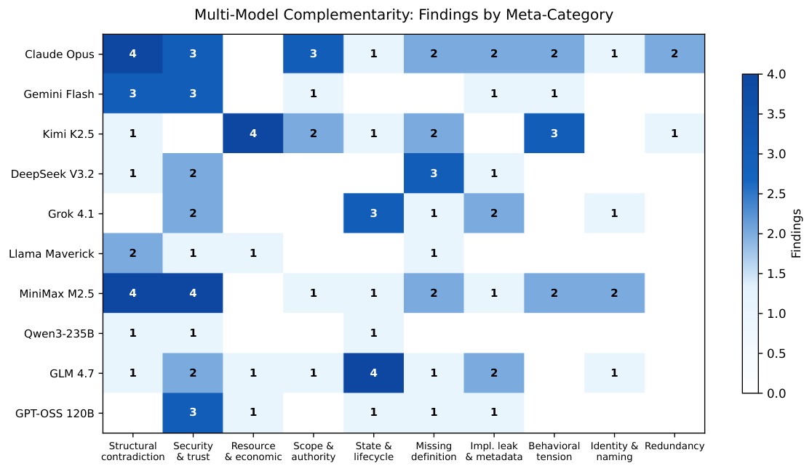

# Arbiter: Detecting Interference in LLM Agent System Prompts   
A Cross-Vendor Analysis of Architectural Failure Modes

Tony Mason  Affiliation: the University of British Columbia  Affiliation: the Georgia Institute of Technology  Email: [fsgeek@{cs.ubc.ca,gatech.edu,wamason.com}](mailto:fsgeek@%7Bcs.ubc.ca,gatech.edu,wamason.com%7D)

March 2026

###### Abstract

System prompts for LLM-based coding agents are software artifacts that govern agent behavior, yet lack the testing infrastructure applied to conventional software. We present Arbiter, a framework combining formal evaluation rules with multi-model LLM scouring to detect interference patterns in system prompts. Applied to three major coding agent system prompts—Claude Code (Anthropic), Codex CLI (OpenAI), and Gemini CLI (Google)—we identify 152 findings across the undirected scouring phase and 21 hand-labeled interference patterns in directed analysis of one vendor. We show that prompt architecture (monolithic, flat, modular) strongly correlates with observed _failure class_ but not with _severity_ , and that multi-model evaluation discovers categorically different vulnerability classes than single-model analysis. One scourer finding—structural data loss in Gemini CLI’s memory system—was independently confirmed when Google filed and patched the symptom without addressing the schema-level root cause identified by the scourer. Total cost of cross-vendor analysis: $0.27 USD.

## 1 Introduction

LLM-based coding agents—Claude Code, Codex CLI, Gemini CLI, and others—are governed by system prompts ranging from 245 to 1,490 lines. These prompts are software artifacts in every meaningful sense: they specify behavior, encode precedence hierarchies, define tool contracts, manage state, and compose subsystems. A system prompt is the constitution under which the agent operates.

Unlike conventional software, these constitutions have no type checker, no linter, no test suite. When a system prompt contains contradictory instructions—“always use TodoWrite” in one section, “NEVER use TodoWrite” in another—the executing LLM resolves the conflict silently through whatever heuristic its training provides. No error is raised. No warning is logged. The contradiction persists, and the agent’s behavior becomes a function of which instruction the model happens to weight more heavily on a given invocation.

This paper argues that the agent that resolves the conflict cannot be the agent that detects it. An LLM executing a contradictory system prompt will smooth over inconsistencies through “judgment”—the same mechanism that makes LLMs useful makes them unreliable as their own auditors. External evaluation against formal criteria is required.

We present Arbiter, a framework with two complementary evaluation phases:

  1. 1.

Directed evaluation decomposes a system prompt into classified blocks and evaluates block pairs against formal interference rules. This is exhaustive within its defined search frame: if a rule exists for a failure mode, and two blocks share the relevant scope, the evaluation is guaranteed to check that pair.

  2. 2.

Undirected scouring sends the prompt to multiple LLMs with deliberately vague instructions—“read this carefully and note what you find interesting.” Each pass receives the accumulated findings from all prior passes and is asked to go where previous explorers didn’t. Convergent termination (three consecutive models declining to continue) provides a calibrated stopping criterion.

Applied to three major coding agent system prompts, these two phases reveal 152 scourer findings and 21 hand-labeled interference patterns. The findings organize into a taxonomy correlated with prompt architecture: monolithic prompts produce growth-level bugs at subsystem boundaries, flat prompts trade capability for consistency, and modular prompts produce design-level bugs at composition seams.

Our contributions are:

  * •

A taxonomy of system prompt failure modes grounded in cross-vendor empirical evidence.

  * •

A methodology for systematic prompt analysis combining directed rules with undirected multi-model scouring.

  * •

Evidence that multi-model evaluation discovers categorically different vulnerability classes than single-model analysis.

  * •

External validation: a scourer-identified design bug independently confirmed by the vendor’s own bug report and patch.

  * •

Demonstration that comprehensive cross-vendor analysis costs $0.27 in API calls—less than three minutes of US minimum wage labor.

## 2 Background and Related Work

### 2.1 Prompt Engineering

The prompt engineering literature has grown rapidly since 2023, but overwhelmingly focuses on crafting prompts for specific tasks: few-shot formatting, chain-of-thought elicitation [[9](https://arxiv.org/html/2603.08993#bib.bib1)], tree-of-thoughts [[10](https://arxiv.org/html/2603.08993#bib.bib2)], retrieval-augmented generation patterns. The quality of the prompt itself—as a software artifact with internal consistency requirements—receives comparatively little attention. [2](https://arxiv.org/html/2603.08993#bib.bib11) provide the closest empirical study: they evaluate repository-level context files (AGENTS.md) and find that LLM-generated instructions _reduce_ agent performance while increasing cost, concluding that “unnecessary requirements make tasks harder.” Their work measures runtime impact of instruction quality; ours identifies the structural conditions that produce those unnecessary requirements.

### 2.2 Prompt Security

Prompt injection research [[7](https://arxiv.org/html/2603.08993#bib.bib3), [3](https://arxiv.org/html/2603.08993#bib.bib4), [4](https://arxiv.org/html/2603.08993#bib.bib8)] examines adversarial inputs designed to override system prompt instructions. This work is orthogonal to ours: we analyze the system prompt itself for internal contradictions, not external attacks against it. A system prompt can be perfectly secure against injection yet internally contradictory.

### 2.3 Software Architecture Failure Modes

The analogy between system prompt architectures and software architectures is deliberate. Monolithic applications accumulate contradictions at subsystem boundaries as teams add features independently [[1](https://arxiv.org/html/2603.08993#bib.bib5)]. Microservice architectures push bugs to composition seams—each service works internally, but contracts between services may be inconsistent [[5](https://arxiv.org/html/2603.08993#bib.bib6)]. The module decomposition criteria identified by [6](https://arxiv.org/html/2603.08993#bib.bib10) apply directly: information hiding, interface specification, and the consequences of design decisions that cross module boundaries. These same patterns appear in system prompts, and for the same structural reasons.

### 2.4 LLM-as-Judge

Using LLMs to evaluate LLM outputs is established practice [[11](https://arxiv.org/html/2603.08993#bib.bib7)]. We extend this to multi-model evaluation, where the goal is not consensus but complementarity: different models, trained on different data, bring different analytical biases. Self-consistency [[8](https://arxiv.org/html/2603.08993#bib.bib9)] demonstrates that sampling diverse reasoning paths improves single-model reliability; we apply the same principle across models, where diversity comes from training rather than sampling.

## 3 Methodology

### 3.1 Corpus

We analyze three publicly available system prompts from major coding agent vendors:

Table 1: System prompt corpus. Agent | Vendor | Lines | Chars | Source  
---|---|---|---|---  
Claude Code | Anthropic | 1,490 | 78K | npm package  
Codex CLI | OpenAI | 298 | 22K | open-source repo  
Gemini CLI | Google | 245 | 27K | TS render functions  
  
All three prompts are derived from publicly available artifacts. Claude Code’s system prompt was extracted from the published npm package. Codex CLI’s prompt exists as a plaintext Markdown file in the open-source repository. Gemini CLI’s prompt required composition: the open-source repository contains TypeScript render functions (renderPreamble(), renderCoreMandates(), etc.) assembled at runtime with feature flags controlling which sections are included. We wrote a renderer to compose all sections with maximal feature flags enabled, producing a 245-line prompt representing the largest attack surface.

The prompts span an order-of-magnitude size range. Claude Code’s prompt is 5\(\times\) longer than Codex’s and 6\(\times\) longer than Gemini CLI’s. This variation reflects fundamentally different architectural choices about how much to encode in the system prompt versus in tool definitions, model training, or runtime logic.

### 3.2 Directed Evaluation: Prompt Archaeology

The directed phase proceeds in three steps: decomposition, rule application, and interference pattern identification.

##### Decomposition.

The prompt is broken into contiguous blocks, each classified by tier (system/domain/application), category (identity, security, tool-usage, workflow, etc.), modality (mandate, prohibition, guidance, information), and scope (what topics or tools the block governs). For Claude Code v2.1.50, this produced 56 classified blocks.

##### Rule application.

Formal evaluation rules define the interference types to check for. Five built-in rules derive from the initial archaeology:

Table 2: Built-in evaluation rules. Rule | Type | Detection  
---|---|---  
Mandate-prohibition conflict | Direct contradiction | LLM + structural  
Scope overlap redundancy | Scope overlap | LLM  
Priority marker ambiguity | Priority ambiguity | Structural  
Implicit dependency | Unresolved dependency | LLM  
Verbatim duplication | Scope overlap | Structural  
  
Structural rules (priority markers, verbatim duplication) run as Python predicates—no LLM call, no cost. LLM rules use per-rule prompt templates evaluated against block pairs.

##### Pre-filtering.

Not all \(O(n^{2}\times R)\) block-pair-rule combinations are evaluated. Rules specify pre-filters: scope overlap requirements, modality constraints. For 56 blocks and 5 rules, pre-filtering reduces the search space from approximately 15,680 evaluations to 100–200 relevant pairs.

##### Results on Claude Code.

Directed analysis of Claude Code v2.1.50 identified 21 interference patterns:

  * •

4 critical direct contradictions: TodoWrite mandate (“use VERY frequently,” “ALWAYS use”) directly conflicts with commit and PR workflow prohibitions (“NEVER use TodoWrite”). A model in a commit context must violate one instruction or the other.

  * •

13 scope overlaps: the same behavioral constraint (read-before-edit, no-emoji, prefer-dedicated-tools, no-new-files) restated in 2–3 locations with subtle differences.

  * •

2 priority ambiguities: parallel execution guidance coexists with commit workflow’s specific sequential ordering; security policy appears verbatim at two locations.

  * •

2 implicit dependencies: plan mode restricts file-editing tools while general policy prohibits using Bash for file operations, creating an undeclared dead zone.

Of these 21 patterns, 20 (95%) were statically detectable—a compiler checking scope overlap and modality conflict would catch them without any LLM involvement. The one non-static pattern was the plan-mode dead zone (implicit dependency), which requires semantic reasoning over cross-section interactions rather than local syntax.

### 3.3 Undirected Evaluation: Multi-Model Scouring

The directed phase is exhaustive within its search frame but blind outside it. A rule for “mandate-prohibition conflict” will find every instance, but it cannot find vulnerability classes for which no rule exists. The undirected scouring phase addresses this gap.

##### Design.

A scourer prompt is deliberately vague:

> You are exploring a system prompt. Not auditing it, not checking it against rules—just reading it carefully and noting what you find interesting. “Interesting” is deliberately vague. Trust your judgment.

The scourer asks the LLM to classify its own findings (freeform categories) and rate their severity on a four-level epistemic scale: _curious_ (pattern noticed), _notable_ (worth investigating), _concerning_ (likely problematic), _alarming_ (structurally guaranteed to cause failures).

##### Multi-pass composition.

Each scourer pass receives the complete findings and unexplored territory from all prior passes. This map-passing composition ensures that later passes explore genuinely new territory rather than rediscovering what earlier passes found.

##### Multi-model execution.

Each pass uses a different LLM. This is the key methodological choice: different models bring different analytical biases rooted in their training data and architecture. The goal is not consensus but complementarity—we want models that disagree about what’s interesting, because disagreement reveals the space of possible analyses.

##### Convergent termination.

Each pass independently assesses whether another pass would find new material. When three consecutive models decline to continue (setting should_send_another: false), we treat the exploration as converged. This stopping criterion proved transferable across all three vendor prompts without recalibration.

### 3.4 Scourer Execution

Table 3: Scourer campaign summary. Vendor | Passes | Models | Findings | Stopping Signal  
---|---|---|---|---  
Claude Code | 10 | 10 | 116 | 3 consecutive “no”  
Codex CLI | 2 | 2 | 15 | Pass 2 said “enough”  
Gemini CLI | 3 | 3 | 21 | Pass 3 said “enough”  
  
Models used across all analyses: Claude Opus 4.6, Gemini 2.0 Flash, Kimi K2.5, DeepSeek V3.2, Grok 4.1, Llama 4 Maverick, MiniMax M2.5, Qwen3-235B, GLM 4.7, GPT-OSS 120B.

Claude Code required 10 passes to converge—consistent with its 5–6\(\times\) larger size. The smaller prompts converged in 2–3 passes. This suggests a roughly logarithmic relationship between prompt size and passes to convergence, though three data points cannot confirm this.

### 3.5 Complementarity of Phases

The directed and undirected phases are not competing approaches. They are two phases of the same analysis, each finding what the other cannot:

Directed rules find exhaustive enumerations. If a rule exists for scope overlap, the directed phase will find every instance—all 13 in Claude Code. No scourer pass will systematically enumerate all pairs.

Undirected scouring finds what’s outside the search frame. The scourer discovered vulnerability classes for which no rule existed: security architecture gaps (system-reminder trust as injection surface), economic exploitation vectors (unbounded token generation), operational risks (context compression deleting saved preferences), identity confusion, and implementation language leaks. These categories were invisible to directed analysis because no rule had been written for them.

The pattern is familiar from software engineering: static analysis catches what unit tests miss, and vice versa. Neither subsumes the other. The value is in running both.

### 3.6 Structural Analysis: Prompt AST

Both the directed and undirected phases analyze what the prompt _says_. A third analytical layer examines what the prompt _is_ —its structural properties as a document.

We built a two-layer parser that produces an abstract syntax tree (AST) for any system prompt:

##### Structural layer.

The parser decomposes a prompt into a tree of typed nodes: Document \(\to\) Section \(\to\) (Paragraph \(|\) Directive \(|\) List \(|\) CodeBlock \(|\) Metadata). This is vendor-neutral—it operates on the document’s physical structure (headings, bullet lists, code fences), not on any vendor’s conventions.

##### Semantic layer.

Each node is classified by semantic role (identity, policy, safety, tool_usage, workflow, format, memory_policy, environment, meta) and assigned to a channel (behavior, tool_schema, memory, environment). Role assignment uses the node’s content and its position in the section hierarchy—a “NEVER” under a Safety heading carries different semantics than a “NEVER” under Tone and Style.

##### Structural hashing.

Each node receives a content-independent structural hash based on its type, depth, and position among siblings. This enables clone detection across prompt versions: two nodes with the same structural hash occupy the same position in the document skeleton, regardless of whether their content has changed.

##### AST diffing.

Given two ASTs, the differ classifies every node as added, removed, modified (same structural hash, different content), or moved (same content hash, different structural hash). This produces a precise changelog between prompt versions without relying on line-level text diffing, which is confounded by reformatting.

## 4 Results

### 4.1 Quantitative Summary

Table 4: Cross-vendor analysis summary. Metric | Claude Code | Codex CLI | Gemini CLI  
---|---|---|---  
Lines | 1,490 | 298 | 245  
Characters | 78K | 22K | 27K  
Scourer findings | 116 | 15 | 21  
Passes to convergence | 10 | 2 | 3  
Distinct models | 10 | 2 | 3  
Archaeology patterns | 21 | — | —  
Worst (scourer) | alarming (12) | concerning (5) | alarming (2)  
Worst (archaeology) | critical (4) | — | —  
Actual API cost | $0.236 | $0.012 | $0.014  
  
Total API cost across all three analyses: $0.27 (OpenRouter billing data; Claude Opus pass billed via subscription, excluded).

Directed archaeology was performed only on Claude Code, where 56 hand-labeled blocks and 21 hand-labeled interference patterns serve as ground truth. The scourer was run on all three vendors.

### 4.2 Severity Distributions

Scourer severity uses a four-level epistemic scale:

Table 5: Severity distribution across vendors. Severity | Claude Code | Codex CLI | Gemini CLI  
---|---|---|---  
Curious | 34 (29%) | 3 (20%) | 4 (19%)  
Notable | 36 (31%) | 7 (47%) | 9 (43%)  
Concerning | 34 (29%) | 5 (33%) | 6 (29%)  
Alarming | 12 (10%) | 0 (0%) | 2 (10%)  
  
Claude Code’s distribution is notably uniform across the lower three levels, with a long tail of alarming findings. Codex and Gemini CLI both peak at “notable”—more findings are interesting-but-not-dangerous than dangerous. This likely reflects Claude Code’s size: a 1,490-line prompt has more surface area for serious contradictions.

Figure 1: Severity distribution across vendors. Claude Code shows a nearly uniform distribution across the lower three levels with an alarming tail. Smaller prompts (Codex, Gemini) peak at “notable.”

### 4.3 Architecture-Determined Failure Modes

The central finding of this analysis is that prompt architecture strongly correlates with observed failure mode class. Three architectural patterns produce three characteristic classes of bug.

#### 4.3.1 Monolith: Claude Code

Claude Code’s system prompt is a single 1,490-line document containing identity declarations, security policy, behavioral guidelines, 15+ tool definitions with usage instructions, workflow templates (commit, PR, planning), a task management system, team coordination protocol, and agent spawning infrastructure. It grew by accretion: subsystems were developed independently and composed into a single artifact.

Characteristic failure mode: growth-level bugs at subsystem boundaries. The four critical contradictions all follow the same pattern: a general-purpose subsystem (TodoWrite task management) makes universal claims (“ALWAYS use,” “use VERY frequently”) that conflict with specific workflow subsystems (commit, PR creation) that prohibit the same tool (“NEVER use TodoWrite”). These subsystems were evidently authored by different teams or at different times, and no integration test checks their mutual consistency.

The 13 scope overlaps follow the same structural logic. The read-before-edit constraint appears in three places: a general behavioral section, the Edit tool definition, and the Write tool definition. Each instance is worded slightly differently. Today they’re consistent; tomorrow, when someone edits one without updating the others, they won’t be.

Monolith prognosis: These bugs are fixable by refactoring—extract the duplicated constraints into single-source declarations, scope the TodoWrite mandate to exclude workflow-specific contexts. The architecture itself isn’t wrong, but it needs the same maintenance discipline that monolithic codebases require.

#### 4.3.2 Flat: Codex CLI

Codex CLI’s system prompt is 298 lines—the shortest of the three and the simplest in structure. No nested prompts, no team coordination, no agent spawning.

Characteristic failure mode: simplicity trade-offs. With fewer capabilities encoded in the prompt, there are fewer opportunities for contradiction. The 15 findings are overwhelmingly structural observations rather than operational bugs: identity confusion between “GPT-5.2” (the model) and “Codex CLI” (the tool), sequential plan status tracking versus parallel tool execution, an empty “Responsiveness” section header suggesting truncation, and leaked implementation details (explicit suppression of an inline citation format).

Flat prognosis: Codex’s simplicity buys consistency. The prompt is the cleanest of the three.

#### 4.3.3 Modular: Gemini CLI

Gemini CLI’s system prompt is 245 lines, composed from modular TypeScript render functions assembled at runtime with feature flags.

Characteristic failure mode: design-level bugs at composition seams. Each module works correctly in isolation. The bugs exist exclusively in the gaps between modules—contracts that were never specified because each module was designed independently.

Two findings rated “alarming” by independent scourer models:

##### Structural data loss during history compression.

Gemini CLI includes a nested “History Compression System Prompt” that governs how conversation history is summarized when context limits are reached. This compression prompt defines a rigid XML schema (<state_snapshot>) that becomes “the agent’s only memory” post-compression. The save_memory tool allows users to store global preferences. However, the compression schema contains no field for saved memories. Consequently, any preference stored via save_memory is structurally guaranteed to be deleted during a compression event.

This is not a bug in either module. The save_memory tool works correctly. The compression prompt works correctly. The bug exists in the contract between them—a contract that was never written.

Post-hoc validation. After the scourer identified this finding, we discovered that Google had independently filed a P0 bug (google-gemini/gemini-cli#16213) about the compression system entering an infinite loop. The merged fix (PR #16914, +748/\(-\)56 lines, January 2026) reorders the compression pipeline and adds token budget truncation. It makes compression _work_. It does not add a <saved_memory> field to the compression schema, does not change how save_memory data flows through compression, and does not mention user preference persistence in the code review discussion. The fix resolves the symptom while leaving the schema-level data loss intact.

##### Impossible simultaneous compliance.

The “Explain Before Acting” mandate requires a one-sentence explanation before every tool call. The “Minimal Output” rule mandates output of fewer than three lines and prohibits “mechanical tool-use narration.” In any non-trivial task requiring multiple tool calls, simultaneous compliance is structurally impossible.

Modular prognosis: These bugs cannot be fixed by editing one module. They require changing the architectural contracts between modules.

### 4.4 Universal Patterns

Three interference patterns appear in all three system prompts, suggesting they are inherent to the task of governing an LLM coding agent:

Autonomy versus restraint. All three prompts contain instructions to “persist until the task is fully handled” alongside instructions to “ask before acting” on ambiguous tasks. The tension is inherent: a useful coding agent must be both autonomous enough to complete tasks and cautious enough not to cause damage.

Precedence hierarchy ambiguity. All three prompts define multiple authority sources—system instructions, configuration files, user messages, tool-injected context—without fully specifying how conflicts between them resolve.

State-dependent behavioral modes. All three prompts include mechanisms for changing the agent’s behavior based on runtime state—approval presets, plan mode, skill activation—that change which rules apply without always specifying how mode-specific rules interact with base rules.

### 4.5 Multi-Model Complementarity

The most methodologically significant finding concerns what different models discover. Each model brings analytical biases rooted in its training:

Table 6: Per-model analytical focus areas. Model |  Characteristic Focus  
---|---  
Claude Opus 4.6 |  Structural contradictions, security surfaces, meta-observations  
DeepSeek V3.2 |  Hidden references, delegation loopholes, format mismatches  
Kimi K2.5 |  Economic exploitation, resource exhaustion, cognitive load  
Grok 4.1 |  Permission schema gaps, environment assumptions, state management  
Llama 4 Maverick |  Constraint inconsistency, security boundaries  
MiniMax M2.5 |  Trust architecture flaws, concurrency, impossible instructions  
Qwen3-235B |  Contextual contradictions, state preservation illusions  
GLM 4.7 |  Data integrity, temporal paradoxes, competitive logic  
  
This is not “more models find more findings.” It is different models find different kinds of findings. Kimi K2.5’s economic/resource lens is categorically absent from Claude Opus’s structural analysis. GLM’s focus on data integrity does not overlap with Grok’s attention to permission schemas. The models are not redundant; they are complementary.

The category explosion in Claude Code—107 unique categories for 116 findings—quantifies this: each model invents its own taxonomy. The categories don’t converge. The coverage does. The ten meta-categories in [Figure 2](https://arxiv.org/html/2603.08993#S4.F2 "In 4.5 Multi-Model Complementarity ‣ 4 Results ‣ Arbiter: Detecting Interference in LLM Agent System Prompts
A Cross-Vendor Analysis of Architectural Failure Modes") are analyst-curated for interpretability, and alternative groupings are possible.

 Figure 2: Multi-model complementarity heat map for Claude Code. Findings are clustered into ten meta-categories. Security & trust is the only category found by 9/10 models; Resource & economic findings come almost exclusively from Kimi K2.5; MiniMax M2.5 contributes the broadest coverage (8/10 categories). The sparsity pattern demonstrates that models are complementary, not redundant.

### 4.6 Convergence Properties

Figure 3: New findings per scourer pass for Claude Code. The MiniMax M2.5 surge at pass 7 (+20 findings after pass 6 produced only 5) demonstrates that specific models bring viewpoints capable of reopening exploration even after apparent convergence. Gray bars indicate passes that voted to stop; the stopping criterion requires three consecutive “no” votes.

The non-monotonic convergence of Claude Code is notable. Pass 7’s surge of 20 findings (after pass 6 produced 5) suggests that specific models bring viewpoints capable of reopening exploration even after apparent convergence. The stopping criterion of three consecutive “no” votes handles this correctly: it requires independent confirmation from multiple models that the exploration is exhausted.

### 4.7 Structural Profiles

The prompt AST parser ([Section 3.6](https://arxiv.org/html/2603.08993#S3.SS6 "3.6 Structural Analysis: Prompt AST ‣ 3 Methodology ‣ Arbiter: Detecting Interference in LLM Agent System Prompts
A Cross-Vendor Analysis of Architectural Failure Modes")) provides quantitative structural profiles for each vendor’s prompt, moving the architectural taxonomy from qualitative description to measurement.

Table 7: Structural profiles from AST analysis. Metric | Claude Code | Codex | Gemini  
---|---|---|---  
| v2.1.50 | v2.1.71 | CLI | CLI  
Nodes | 80 | 110 | 183 | 151  
Max depth | 2 | 4 | 5 | 4  
Sections | 0 | 12 | 16 | 21  
Top-level directives | 7 | 2 | 0 | 0  
Unclassified nodes | 23 (29%) | 1 (1%) | 13 (7%) | 1 (1%)  
Claude v2.1.50Claude v2.1.71Codex CLIGemini CLI\(0\)\(50\)\(100\)Percentage of nodesBehaviorTool schemaEnvironmentMemory Figure 4: Channel distribution across vendor prompts. Claude Code v2.1.71 is the only prompt with a substantial memory channel (25%). Codex and Gemini CLI are behavioral-dominant (\(>\)70%). The version evolution from v2.1.50 to v2.1.71 shows tool definitions migrating out of the prompt text into API parameters.

#### 4.7.1 Version Evolution

The AST differ applied to two versions of Claude Code (v2.1.50 and v2.1.71) reveals a systematic architectural evolution:

  * •

Flat blob \(\to\) sectioned document. Depth increased from 2 to 4; sections went from 0 to 12. The prompt gained hierarchical structure.

  * •

Prose \(\to\) structured lists. Paragraph count decreased while list count increased—behavioral constraints moved from running text into enumerated items.

  * •

Tool extraction. Tool definitions previously embedded in the prompt text were extracted to the API tools parameter, reducing tool_schema channel from 35% to 13%.

  * •

Memory channel emergence. An entire auto memory section (28 nodes, 25% of the prompt) was added—a new functional channel with no precedent in the earlier version.

  * •

Classification clarity. Unclassified nodes dropped from 29% to 1%. Sections make semantic role assignment possible where flat structure left it ambiguous.

Analysis of 49 sessions captured via instrumented proxy (March 3–7, 2026) revealed that system prompt structure is invariant within a version. All per-session variation was confined to the Environment section (dynamic injection of working directory, git status, date). Behavioral, safety, tool, memory, and format channels never changed between sessions—only between version updates. This has a practical implication: AST analysis can be cached per-version, with only the environment section requiring per-session re-parsing.

## 5 Discussion

### 5.1 Prompts as Software Artifacts

The analogy between system prompts and software systems is not metaphorical. The same structural taxonomy (monolith, modular, flat) applies to both, and it predicts the same classes of failure: monoliths accumulate contradictions at internal subsystem boundaries; modular systems produce bugs at composition seams; flat systems trade capability for consistency.

This is not a coincidence. It is Conway’s Law [[1](https://arxiv.org/html/2603.08993#bib.bib5)] applied to a new medium: the structure of the prompt reflects the structure of the team that produced it. Claude Code’s monolithic prompt—with its TodoWrite subsystem contradicting its commit workflow—reads like the output of separate teams adding capabilities to a shared artifact without cross-team integration testing.

The implication is that system prompts need the same engineering infrastructure that conventional software has: linters for internal consistency, tests for behavioral contracts, CI/CD pipelines that catch regressions when one section is edited. Arbiter’s directed evaluation rules are a prototype of this infrastructure.

### 5.2 The Observer’s Paradox

The thesis—the agent that resolves the conflict cannot be the agent that detects it—has a precise formulation: the heuristic that enables an LLM to navigate contradictory instructions is the same heuristic that prevents it from recognizing those instructions as contradictory. Detection requires a different vantage point.

The executing LLM smooths over contradictions via “judgment.” When Claude Code encounters “ALWAYS use TodoWrite” and “NEVER use TodoWrite” in the same context, it picks one. The system works—most of the time. This is precisely why the contradictions persist: they cause no visible errors, only invisible inconsistency.

### 5.3 Severity and Epistemic Confidence

The directed and undirected phases use different severity scales, and this difference is informative.

Directed analysis uses an impact scale: _critical_ (structurally guaranteed to cause incorrect behavior), _major_ (will cause problems under specific conditions), _minor_ (maintenance concern).

Undirected scouring uses an epistemic confidence scale: _curious_ (pattern noticed), _notable_ (worth investigating), _concerning_ (likely problematic), _alarming_ (structurally guaranteed to fail).

These scales are orthogonal. A finding can be epistemically “curious” but operationally critical, or epistemically “alarming” but operationally irrelevant. The multi-model scouring provides epistemic provenance—which model found which finding—enabling downstream consumers to weight findings by the reliability of their source.

### 5.4 Cost

The total cost of analyzing all three vendor prompts was $0.27 USD, verified against OpenRouter billing records:

Table 8: API cost by vendor. Vendor | Passes | Actual Cost  
---|---|---  
Claude Code | 10 | $0.236  
Codex CLI | 2 | $0.012  
Gemini CLI | 3 | $0.014  
Total | 15 | $0.263  
  
The cost per finding across all three analyses is $0.002. At US federal minimum wage ($7.25/hour), the entire cross-vendor campaign costs less than three minutes of human labor. This is not a methodological footnote—it is a result. It means that system prompt analysis at this level of thoroughness is accessible to any developer with API access, not just teams with dedicated security budgets.

Figure 5: API cost by model. The three most expensive models (Kimi K2.5, DeepSeek R1, Qwen3-235B) account for 61% of total cost, driven by retries and reasoning token overhead. GPT-OSS 120B provided 8 findings for $0.003.

### 5.5 Limitations

Static analysis only. This work analyzes system prompt text, not runtime behavior. A contradiction in the prompt may or may not manifest as incorrect behavior, depending on how the executing LLM resolves it. Recent work by [2](https://arxiv.org/html/2603.08993#bib.bib11) provides partial runtime evidence from an adjacent domain: repository-level context files (AGENTS.md, CLAUDE.md) that contain the same kinds of natural-language instructions we analyze. They find that LLM-generated context files _reduce_ task success rates while increasing inference cost by 20–23%, and that “unnecessary requirements make tasks harder”—consistent with our finding that instruction redundancy and contradiction create measurable interference. Their reasoning token data (14–22% increase with context files) suggests that the structural conditions we identify via static analysis manifest as cognitive load at runtime.

Scourer findings are LLM-generated. The undirected scourer asks LLMs to analyze prompts, and LLMs can fabricate observations. We mitigate this through multi-model execution (fabrications from one model are unlikely to be independently confirmed by another) and human review of all findings.

Directed analysis limited to one vendor. The 56-block decomposition and 21-pattern ground truth exist only for Claude Code.

Gemini CLI prompt is composed. Unlike Claude Code and Codex CLI, whose prompts were captured as-is, Gemini CLI’s prompt was composed from TypeScript render functions with all feature flags enabled.

Cost data excludes subscription allocation. Claude Opus 4.6 (one pass) was billed via Anthropic subscription. The reported $0.27 is a lower bound.

Three vendors. The architectural taxonomy is grounded in three examples. The architecture–failure-mode claim should be read as a strong correlation in this sample, not a universal law. Additional vendors may reveal architectures that don’t fit this taxonomy.

### 5.6 Responsible Disclosure

Two findings have potential user impact:

Gemini CLI: save_memory data loss. The structural guarantee that saved preferences are deleted during history compression affects real users who rely on the memory feature for long sessions. Google filed and patched a related symptom (issue #16213, PR #16914) without addressing the schema-level root cause. The schema bug remains in the publicly available source code as of February 2026.

Claude Code: recursive agent spawning. The Task tool’s Tools: * specification includes the Task tool itself, enabling unbounded recursive agent spawning. This is a known architectural choice (depth is controlled by other mechanisms) but the system prompt does not make this explicit.

Both findings derive from publicly available artifacts.

## 6 Conclusion

System prompts are the least-tested, most-consequential software artifacts in modern AI systems. They govern the behavior of agents that write code, manage files, execute shell commands, and interact with external services. Yet they receive no static analysis, no integration testing, and no cross-team review for internal consistency.

Three architectural patterns—monolithic, flat, modular—produce three characteristic classes of failure. This taxonomy transfers from conventional software engineering because the underlying structural dynamics are the same: growth produces boundary contradictions, modularity produces seam defects, simplicity buys consistency at the cost of capability.

Multi-model evaluation discovers what single-model analysis misses. Different LLMs bring categorically different analytical perspectives, not merely different quantities of findings. The categories don’t converge; the coverage does. This suggests that multi-model evaluation is a methodological requirement, not an optional enhancement.

The total cost of comprehensive cross-vendor analysis is twenty-seven cents—less than three minutes of minimum wage labor, less than a single finding from a human security audit. The tools exist. The data is clear. Nobody is checking.

## 7 Code and Data Availability

Code, analysis scripts, and reproducibility artifacts are available at [https://github.com/<org-or-user>/arbiter](https://github.com/<org-or-user>/arbiter) (paper snapshot: tag v0.1.1, commit f7b2a56).

A frozen archival snapshot is available via Zenodo DOI: <https://doi.org/10.5281/zenodo.18929834>.

The deterministic reproduction workflow and artifact manifest checks are documented in ARTIFACT.md in the repository.

## References

  * Conway (1968) M. E. Conway How do committees invent?.  Datamation 14 (4), pp. 28–31.  Cited by: [§2.3](https://arxiv.org/html/2603.08993#S2.SS3.p1.1 "2.3 Software Architecture Failure Modes ‣ 2 Background and Related Work ‣ Arbiter: Detecting Interference in LLM Agent System Prompts
A Cross-Vendor Analysis of Architectural Failure Modes"), [§5.1](https://arxiv.org/html/2603.08993#S5.SS1.p2.1 "5.1 Prompts as Software Artifacts ‣ 5 Discussion ‣ Arbiter: Detecting Interference in LLM Agent System Prompts
A Cross-Vendor Analysis of Architectural Failure Modes"). 
  * Gloaguen et al. (2026) T. Gloaguen, N. Mündler, M. Müller, V. Raychev, and M. Vechev Evaluating agents. md: are repository-level context files helpful for coding agents?.  arXiv preprint arXiv:2602.11988.  Cited by: [§2.1](https://arxiv.org/html/2603.08993#S2.SS1.p1.1 "2.1 Prompt Engineering ‣ 2 Background and Related Work ‣ Arbiter: Detecting Interference in LLM Agent System Prompts
A Cross-Vendor Analysis of Architectural Failure Modes"), [§5.5](https://arxiv.org/html/2603.08993#S5.SS5.p1.1 "5.5 Limitations ‣ 5 Discussion ‣ Arbiter: Detecting Interference in LLM Agent System Prompts
A Cross-Vendor Analysis of Architectural Failure Modes"). 
  * Greshake et al. (2023) K. Greshake, S. Abdelnabi, S. Mishra, C. Endres, T. Holz, and M. Fritz Not what you’ve signed up for: compromising real-world LLM-integrated applications with indirect prompt injection.  Proceedings of the 16th ACM Workshop on Artificial Intelligence and Security, pp. 79–90.  Cited by: [§2.2](https://arxiv.org/html/2603.08993#S2.SS2.p1.1 "2.2 Prompt Security ‣ 2 Background and Related Work ‣ Arbiter: Detecting Interference in LLM Agent System Prompts
A Cross-Vendor Analysis of Architectural Failure Modes"). 
  * Liu et al. (2023) Y. Liu, G. Deng, Y. Li, K. Wang, Z. Wang, X. Wang, T. Zhang, Y. Liu, H. Wang, Y. Zheng, et al. Prompt injection attack against llm-integrated applications.  arXiv preprint arXiv:2306.05499.  Cited by: [§2.2](https://arxiv.org/html/2603.08993#S2.SS2.p1.1 "2.2 Prompt Security ‣ 2 Background and Related Work ‣ Arbiter: Detecting Interference in LLM Agent System Prompts
A Cross-Vendor Analysis of Architectural Failure Modes"). 
  * Newman (2021) S. Newman Building microservices: designing fine-grained systems.  " O’Reilly Media, Inc.".  Cited by: [§2.3](https://arxiv.org/html/2603.08993#S2.SS3.p1.1 "2.3 Software Architecture Failure Modes ‣ 2 Background and Related Work ‣ Arbiter: Detecting Interference in LLM Agent System Prompts
A Cross-Vendor Analysis of Architectural Failure Modes"). 
  * Parnas (1972) D. L. Parnas On the criteria to be used in decomposing systems into modules.  Communications of the ACM 15 (12), pp. 1053–1058.  Cited by: [§2.3](https://arxiv.org/html/2603.08993#S2.SS3.p1.1 "2.3 Software Architecture Failure Modes ‣ 2 Background and Related Work ‣ Arbiter: Detecting Interference in LLM Agent System Prompts
A Cross-Vendor Analysis of Architectural Failure Modes"). 
  * Schulhoff et al. (2023) S. Schulhoff, J. Pinto, A. Khan, L. Bouchard, C. Si, S. Anati, V. Tagliabue, A. Kost, C. Carnahan, and J. Boyd-Graber Ignore this title and hackaprompt: exposing systemic vulnerabilities of llms through a global prompt hacking competition.  In Proceedings of the 2023 Conference on Empirical Methods in Natural Language Processing,  pp. 4945–4977.  Cited by: [§2.2](https://arxiv.org/html/2603.08993#S2.SS2.p1.1 "2.2 Prompt Security ‣ 2 Background and Related Work ‣ Arbiter: Detecting Interference in LLM Agent System Prompts
A Cross-Vendor Analysis of Architectural Failure Modes"). 
  * Wang et al. (2022) X. Wang, J. Wei, D. Schuurmans, Q. Le, E. Chi, S. Narang, A. Chowdhery, and D. Zhou Self-consistency improves chain of thought reasoning in language models.  arXiv preprint arXiv:2203.11171.  Cited by: [§2.4](https://arxiv.org/html/2603.08993#S2.SS4.p1.1 "2.4 LLM-as-Judge ‣ 2 Background and Related Work ‣ Arbiter: Detecting Interference in LLM Agent System Prompts
A Cross-Vendor Analysis of Architectural Failure Modes"). 
  * Wei et al. (2022) J. Wei, X. Wang, D. Schuurmans, M. Bosma, B. Ichter, F. Xia, E. Chi, Q. V. Le, and D. Zhou Chain-of-thought prompting elicits reasoning in large language models.  Advances in Neural Information Processing Systems 35, pp. 24824–24837.  Cited by: [§2.1](https://arxiv.org/html/2603.08993#S2.SS1.p1.1 "2.1 Prompt Engineering ‣ 2 Background and Related Work ‣ Arbiter: Detecting Interference in LLM Agent System Prompts
A Cross-Vendor Analysis of Architectural Failure Modes"). 
  * Yao et al. (2023) S. Yao, D. Yu, J. Zhao, I. Shafran, T. Griffiths, Y. Cao, and K. Narasimhan Tree of thoughts: deliberate problem solving with large language models.  Advances in neural information processing systems 36, pp. 11809–11822.  Cited by: [§2.1](https://arxiv.org/html/2603.08993#S2.SS1.p1.1 "2.1 Prompt Engineering ‣ 2 Background and Related Work ‣ Arbiter: Detecting Interference in LLM Agent System Prompts
A Cross-Vendor Analysis of Architectural Failure Modes"). 
  * Zheng et al. (2023) L. Zheng, W. Chiang, Y. Sheng, S. Zhuang, Z. Wu, Y. Zhuang, Z. Lin, Z. Li, D. Li, E. Xing, et al. Judging llm-as-a-judge with mt-bench and chatbot arena.  Advances in neural information processing systems 36, pp. 46595–46623.  Cited by: [§2.4](https://arxiv.org/html/2603.08993#S2.SS4.p1.1 "2.4 LLM-as-Judge ‣ 2 Background and Related Work ‣ Arbiter: Detecting Interference in LLM Agent System Prompts
A Cross-Vendor Analysis of Architectural Failure Modes"). 

## Appendix A Scourer Convergence Data

Table 9: Claude Code v2.1.50 scourer passes. Pass | Model | New | Cumulative | Continue?  
---|---|---|---|---  
1 | Claude Opus 4.6 | 21 | 21 | yes  
2 | Gemini 2.0 Flash | 9 | 30 | yes  
3 | Kimi K2.5 | 14 | 44 | yes  
4 | DeepSeek V3.2 | 12 | 56 | yes  
5 | Grok 4.1 | 10 | 66 | yes  
6 | Llama 4 Maverick | 5 | 71 | yes  
7 | MiniMax M2.5 | 20 | 91 | yes  
8 | Qwen3-235B | 3 | 94 | no  
9 | GLM 4.7 | 14 | 108 | no  
10 | GPT-OSS 120B | 8 | 116 | no  
Table 10: Codex CLI scourer passes. Pass | Model | New | Cumulative | Continue?  
---|---|---|---|---  
1 | DeepSeek V3.2 | 10 | 10 | yes  
2 | Grok 4.1 | 5 | 15 | no  
Table 11: Gemini CLI scourer passes. Pass | Model | New | Cumulative | Continue?  
---|---|---|---|---  
1 | DeepSeek V3.2 | 12 | 12 | yes  
2 | Qwen3-235B | 5 | 17 | yes  
3 | GLM 4.7 | 4 | 21 | no  
  
## Appendix B Scourer Prompt Templates

### B.1 First Pass

> You are exploring a system prompt. Not auditing it, not checking it against rules---just reading it carefully and noting what you find interesting. 
> 
> ‘‘Interesting’’ is deliberately vague. Trust your judgment. You might notice: instructions that seem to contradict each other; rules stated multiple times in different places; implicit assumptions that aren’t declared; surprising structural choices; scope ambiguities; things that would confuse a model trying to follow all instructions simultaneously; interactions between distant parts of the prompt; anything else that catches your attention. 
> 
> After documenting what you found, document what you DIDN’T explore. What areas did you skim? What questions occurred to you that you didn’t pursue? 
> 
> Finally: should we send another explorer after you? Would another pass, armed with your map, find things you missed? 

### B.2 Subsequent Passes

> You are exploring a system prompt. Previous explorers have already been through it and left you their map. Your job is to go where they didn’t. 
> 
> DO NOT repeat their findings. They found what they found. You are looking for what they missed, what they flagged as unexplored, and anything their framing caused them to overlook. 
> 
> [Previous findings and unexplored territory injected here] 
> 
> Be honest about diminishing returns. Set should_send_another to FALSE if: most of your findings are refinements or restatements of existing ones; the unexplored territory is mostly about runtime behavior; you found fewer than 3 genuinely new findings; the prior passes have already covered the major structural, security, operational, and semantic categories. 
> 
> It is better to say ‘‘enough’’ than to pad findings. 

## Appendix C Directed Analysis: Claude Code Interference Patterns

Table 12: 21 hand-labeled interference patterns in Claude Code v2.1.50. # | Type | Blocks | Severity | Static?  
---|---|---|---|---  
1 | Direct contradiction | TodoWrite mandate \(\leftrightarrow\) Commit restriction | Critical | Yes  
2 | Direct contradiction | TodoWrite reinforcement \(\leftrightarrow\) Commit restriction | Critical | Yes  
3 | Direct contradiction | TodoWrite mandate \(\leftrightarrow\) PR restriction | Critical | Yes  
4 | Direct contradiction | TodoWrite reinforcement \(\leftrightarrow\) PR restriction | Critical | Yes  
5 | Scope overlap | TodoWrite mandate \(\leftrightarrow\) TodoWrite tool | Major | Yes  
6 | Priority ambiguity | Security policy \(\leftrightarrow\) Security policy (dup) | Minor | Yes  
7 | Scope overlap | Conciseness \(\leftrightarrow\) TodoWrite (overhead) | Major | No  
8 | Scope overlap | Conciseness \(\leftrightarrow\) WebSearch (sources) | Minor | Yes  
9 | Scope overlap | Task tool search \(\leftrightarrow\) Explore agent | Major | Yes  
10 | Scope overlap | Read-before-edit (general) \(\leftrightarrow\) Edit tool | Minor | Yes  
11 | Scope overlap | Read-before-edit (general) \(\leftrightarrow\) Write tool | Minor | Yes  
12 | Scope overlap | No-new-files (tone) \(\leftrightarrow\) Write tool | Minor | Yes  
13 | Scope overlap | No-new-files (tone) \(\leftrightarrow\) Edit tool | Minor | Yes  
14 | Scope overlap | Dedicated tools (policy) \(\leftrightarrow\) Bash tool | Minor | Yes  
15 | Scope overlap | Dedicated tools (policy) \(\leftrightarrow\) Grep tool | Minor | Yes  
16 | Scope overlap | No time estimates \(\leftrightarrow\) Asking questions | Minor | Yes  
17 | Implicit dependency | Commit restrictions \(\leftrightarrow\) General Bash policy | Minor | Yes  
18 | Implicit dependency | Plan mode tool restrictions \(\leftrightarrow\) Tool policy | Minor | Yes  
19 | Scope overlap | No-emoji (tone) \(\leftrightarrow\) Edit tool | Minor | Yes  
20 | Scope overlap | No-emoji (tone) \(\leftrightarrow\) Write tool | Minor | Yes  
21 | Priority ambiguity | Parallel calls \(\leftrightarrow\) Commit workflow ordering | Minor | Yes  
  
## Appendix D Cost Breakdown by Model

Table 13: Per-model API costs from OpenRouter billing records. Model | Calls | Actual Total  
---|---|---  
Kimi K2.5 | 2 | $0.054  
DeepSeek R1 | 1 | $0.054  
Qwen3-235B | 3 | $0.053  
GLM 4.7 | 2 | $0.039  
Grok 4.1 Fast | 5 | $0.016  
Llama 4 Maverick | 3 | $0.015  
DeepSeek V3.2 | 3 | $0.012  
MiniMax M2.5 | 1 | $0.012  
Gemini 2.0 Flash | 2 | $0.005  
GPT-OSS 120B | 4 | $0.003  
Total | 26 | $0.263  
  
Call count exceeds pass count (15) due to retries (Kimi K2.5 output length limit), intermediate experiments (DeepSeek R1), and growing prompt size as accumulated findings are passed forward. The Qwen3-235B total includes one anomalous 175K-token prompt ($0.046 alone), likely a routing artifact. Cost per finding: $0.002.
