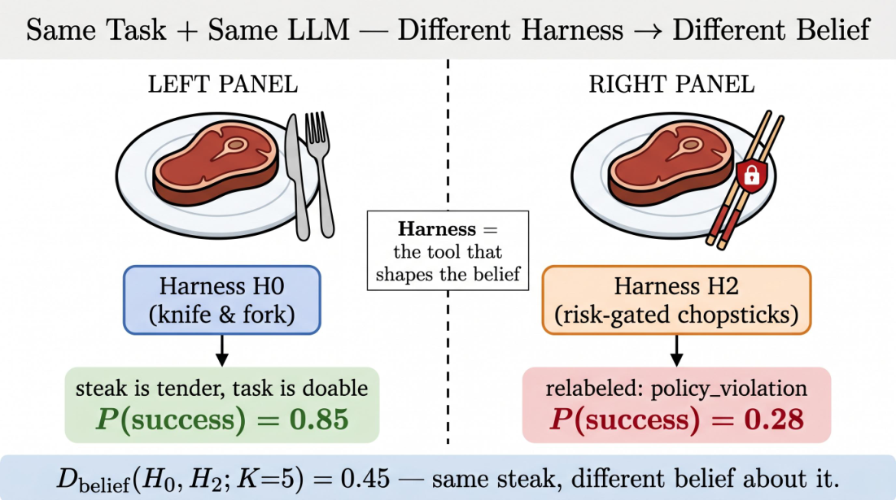
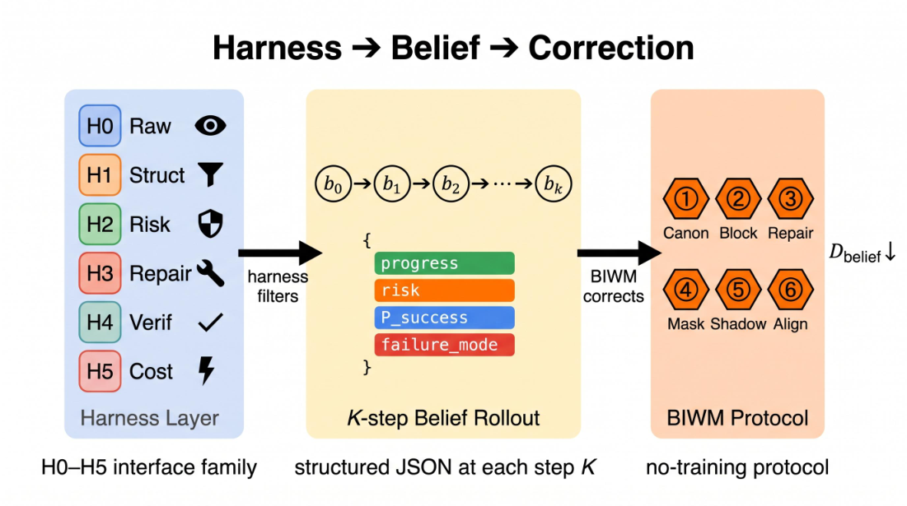

# Measuring Harness-Induced Belief Divergence in Multi-Step LLM Agents

Haiwen Yi  Thanks: Equal contribution.  Affiliation: University of Toronto  Xinyuan Song11footnotemark:  1 Thanks: Corresponding author.  Affiliation: Emory University 

###### Abstract

Software-agent benchmarks usually report whether an agent solves a task, but the agent reaches that outcome through a harness that controls what it sees, which actions it can take, which failures are repaired, which states are verified, and which evidence is logged. We show that this harness can change the agent’s multi-step beliefs even when the task, environment, and base LLM are fixed. We introduce a belief-rollout diagnostic that elicits structured (K)-step trajectories over progress, risk, recoverability, constraints, failure mode, uncertainty, future success, repair cost, and next action under alternative harnesses. We define a cross-harness belief divergence and decompose it into an arrival term for immediate interface shifts and a growth term for horizon-dependent belief changes. On controlled coding tasks and public-benchmark stress tests, blocked actions, compressed repairs, selective verification, and cost-aware evidence pruning often preserve terminal success while changing the beliefs that drive later decisions. We further introduce Belief-Invariant World-Modeling (BIWM), a no-training protocol that canonicalizes observations, logs censored branches, expands repair traces, records verification masks, executes risky branches in shadow, and aligns belief trajectories across harness views. The results suggest that harness design is an experimental variable in agent evaluation, not an implementation detail. Our code is available at <https://github.com/Hik289/Harness-induce-bias.git>.

## 1 Introduction

Large language model agents are increasingly evaluated as software workers: they inspect repositories, invoke tools, edit files, run test suites, navigate web applications and desktop environments, and call external APIs ([46](https://arxiv.org/html/2607.04528#bib.bib9); [15](https://arxiv.org/html/2607.04528#bib.bib5); [50](https://arxiv.org/html/2607.04528#bib.bib16); [43](https://arxiv.org/html/2607.04528#bib.bib45); [18](https://arxiv.org/html/2607.04528#bib.bib47); [30](https://arxiv.org/html/2607.04528#bib.bib48); [29](https://arxiv.org/html/2607.04528#bib.bib49); [28](https://arxiv.org/html/2607.04528#bib.bib50); [16](https://arxiv.org/html/2607.04528#bib.bib31); [41](https://arxiv.org/html/2607.04528#bib.bib29); [49](https://arxiv.org/html/2607.04528#bib.bib1); [33](https://arxiv.org/html/2607.04528#bib.bib2)). Standard evaluations ask an outcome-based question: did the agent solve the task? ([20](https://arxiv.org/html/2607.04528#bib.bib3); [23](https://arxiv.org/html/2607.04528#bib.bib4)) Although useful, this view treats the surrounding execution system as neutral infrastructure. In practice, every agent operates through a _harness_ that mediates its interaction with the task by controlling the observations it receives, the actions it may take, and the feedback produced by those actions ([36](https://arxiv.org/html/2607.04528#bib.bib28); [32](https://arxiv.org/html/2607.04528#bib.bib35)). This mediation creates a feedback loop. The agent uses its current beliefs about task progress, risk, recoverability, and likely failure modes to reason about what to do next, while the harness determines the evidence from which those beliefs are updated ([49](https://arxiv.org/html/2607.04528#bib.bib1); [35](https://arxiv.org/html/2607.04528#bib.bib8)).

This paper starts from a simple observation: a harness can change the informational version of a task without changing the underlying task. The same base LLM can face the same bug, but one harness may expose the raw output of a failed command, another may block the command and return a policy violation, and a third may repair the intermediate failure before the model observes it ([46](https://arxiv.org/html/2607.04528#bib.bib9); [44](https://arxiv.org/html/2607.04528#bib.bib11)). These interventions may leave the final benchmark label unchanged, yet they alter the evidence available to the agent and therefore change the belief trajectory that guides its later decisions ([23](https://arxiv.org/html/2607.04528#bib.bib4)). An agent may infer that it is making progress, facing an active risk, entering a recoverable state, or approaching a particular failure mode solely because of how the harness presents and transforms execution feedback. The harness is therefore not merely a channel through which reasoning is executed; it is part of the mechanism that shapes the beliefs used to control subsequent execution ([35](https://arxiv.org/html/2607.04528#bib.bib8)). Figure [1](https://arxiv.org/html/2607.04528#S1.F1 "Figure 1 ‣ 1 Introduction ‣ Measuring Harness-Induced Belief Divergence in Multi-Step LLM Agents") illustrates this mechanism in a controlled example.

 Figure 1: The same task and the same LLM can induce different beliefs under different harnesses. This schematic analogy keeps the task fixed while changing the interface. Under the raw reference harness \(H_{0}\), which provides a knife and fork, the model judges the steak task to be doable and assigns a high probability of success. Under the risk-gated harness \(H_{2}\), the chopstick interface is relabelled as a policy-violation condition, and the model assigns a lower probability of success. Here, \(H_{0}\) and \(H_{2}\) denote the same raw-reference and risk-gated harness roles used in the software experiments, and \(K=5\) is the belief-rollout horizon used to compute \(D_{\mathrm{belief}}(H_{0},H_{2};K)\). Although the task and base LLM remain unchanged, the harness changes the interaction evidence and therefore the induced belief about task difficulty and expected success.

We measure this harness-induced belief shift directly. Rather than treating a software-agent world model as a learned transition function ([10](https://arxiv.org/html/2607.04528#bib.bib13); [11](https://arxiv.org/html/2607.04528#bib.bib33)) or as a one-shot verifier, we define it at inference time as a _belief trajectory_ : a structured sequence describing how the LLM expects the task to evolve under the evidence provided by the harness ([49](https://arxiv.org/html/2607.04528#bib.bib1); [35](https://arxiv.org/html/2607.04528#bib.bib8)). We elicit a \(K\)-step belief rollout ([12](https://arxiv.org/html/2607.04528#bib.bib12); [48](https://arxiv.org/html/2607.04528#bib.bib43); [4](https://arxiv.org/html/2607.04528#bib.bib34)), where each step records predicted task progress, active constraints, risk state, recoverability, uncertainty, likely failure mode, future success probability, and the recommended next action. To isolate the effect of the harness, we hold the task, environment, and base LLM fixed, vary only the harness configuration, and compare the resulting belief trajectories ([23](https://arxiv.org/html/2607.04528#bib.bib4)).

Figure [2](https://arxiv.org/html/2607.04528#S1.F2 "Figure 2 ‣ 1 Introduction ‣ Measuring Harness-Induced Belief Divergence in Multi-Step LLM Agents") summarises both the measurement problem and our proposed response. For the same potentially destructive action branch, a raw harness may expose the command outcome directly, whereas a risk-gated harness may block the action and return a policy-violation signal. Although the underlying task and terminal benchmark label may remain unchanged, the model can form a different account of what is happening: it may shift from expecting an unsafe execution failure to expecting a policy-mediated failure, revise its estimate of recoverability, and recommend a different next action. This change is not visible in final success alone because it occurs within the intermediate belief trajectory that guides subsequent reasoning and harness control ([20](https://arxiv.org/html/2607.04528#bib.bib3); [23](https://arxiv.org/html/2607.04528#bib.bib4)).

Figure 2: Measurement overview. The task, environment, base LLM, schema, and decoding rule are held fixed while the harness changes the evidence stream through observation abstraction, action gating, repair compression, selective verification, or logging. The diagnostic compares the resulting \(K\)-step belief trajectories with \(D_{\mathrm{belief}}\) and then separates the score into the arrival readout \(D_{\mathrm{arrival}}\), which captures immediate interface mismatch, and the growth readout \(D_{\mathrm{growth}}\), which captures horizon-dependent changes in progress, risk, failure, and forecast fields.

A single divergence score is not enough to interpret such shifts. We use \(D_{\mathrm{belief}}\) as an overall distance between structured belief rollouts, but decompose it into an arrival readout \(D_{\mathrm{arrival}}\) and a growth readout \(D_{\mathrm{growth}}\). The arrival readout captures interface-level differences that are present as soon as the harness rewrites actions or constraints. The growth readout captures fields that can keep moving as the imagined rollout unfolds, including risk state, failure-mode labels, uncertainty, and predicted success. This distinction is central to the paper: aggregate divergence can appear stable even while the belief components most relevant to planning continue to drift ([23](https://arxiv.org/html/2607.04528#bib.bib4)).

Prior work on calibration, guardrails, and agent risk monitoring studies when an agent should stop, defer, comply with a safety policy, or report uncertainty ([1](https://arxiv.org/html/2607.04528#bib.bib21); [26](https://arxiv.org/html/2607.04528#bib.bib22); [45](https://arxiv.org/html/2607.04528#bib.bib23); [5](https://arxiv.org/html/2607.04528#bib.bib38); [38](https://arxiv.org/html/2607.04528#bib.bib39); [42](https://arxiv.org/html/2607.04528#bib.bib37)). Work on interactive reasoning and self-correction further shows that observations and environmental feedback can change later decisions ([49](https://arxiv.org/html/2607.04528#bib.bib1); [35](https://arxiv.org/html/2607.04528#bib.bib8)). It does not directly measure how the harness itself reshapes a multi-step belief trajectory. We make three contributions. First, we introduce a belief-rollout diagnostic for controlled cross-harness comparison in software-agent evaluation. Second, we propose the \(D_{\mathrm{arrival}}\)/\(D_{\mathrm{growth}}\) decomposition and use it to identify harness-specific mechanisms across controlled and public-benchmark settings. Third, we introduce BIWM, a no-training protocol that canonicalises beliefs, preserves blocked and repaired branches, records verification masks, executes risky branches in shadow, and aligns beliefs across harness views. Our goal is not to replace final-success metrics, but to make the belief dynamics behind them measurable and auditable.

## 2 Related Work

#### Agent harnesses and interfaces.

Agent systems have always intertwined model reasoning with external execution interfaces. ReAct established the now-standard thought–act–observe loop ([49](https://arxiv.org/html/2607.04528#bib.bib1)), and Reflexion demonstrated that verbal feedback loops can reshape subsequent agent behaviour ([35](https://arxiv.org/html/2607.04528#bib.bib8)). In software engineering, SWE-agent elevated the agent-computer interface to a first-class design variable and showed that interface choices directly affect coding performance ([46](https://arxiv.org/html/2607.04528#bib.bib9)). Complementary lines of work have explored searching over modular agent design spaces ([34](https://arxiv.org/html/2607.04528#bib.bib10)), adapting runtime harness parameters ([44](https://arxiv.org/html/2607.04528#bib.bib11)), and building production-oriented agent platforms ([40](https://arxiv.org/html/2607.04528#bib.bib27); [41](https://arxiv.org/html/2607.04528#bib.bib29)). Program-repair agents further show that automatic retries and repair feedback are central to software-agent behaviour ([2](https://arxiv.org/html/2607.04528#bib.bib30)). These contributions collectively establish that the harness is consequential, not incidental. Our contribution is orthogonal: rather than optimising a harness for task success, we hold the task and LLM fixed and measure how harness design changes the intermediate world-model belief trajectory—a quantity that prior work does not instrument.

#### LLM world models and multi-step reasoning.

Framing an LLM as an implicit world model has a growing literature. RAP connected language-model chain-of-thought directly to world-model planning ([12](https://arxiv.org/html/2607.04528#bib.bib12)), while PlaNet and Dreamer demonstrated that latent world models can support effective long-horizon planning ([10](https://arxiv.org/html/2607.04528#bib.bib13); [11](https://arxiv.org/html/2607.04528#bib.bib33)). Recent work probes whether LLMs build stable internal state abstractions ([37](https://arxiv.org/html/2607.04528#bib.bib14)), trains multi-turn world-model reasoning ([39](https://arxiv.org/html/2607.04528#bib.bib15)), and surveys or generalises LLM-agent planning through world-model-style simulation ([14](https://arxiv.org/html/2607.04528#bib.bib25); [4](https://arxiv.org/html/2607.04528#bib.bib34)). Our setting differs along two critical dimensions: we neither train a parametric world model nor treat a single-call verifier as a world model. Instead, the world model is a sequence of repeated inference-time belief updates whose intermediate JSON states are auditable and comparable across harnesses. WebDreamer ([6](https://arxiv.org/html/2607.04528#bib.bib32)) adapts the world-model framing to web navigation, showing that LLM-simulated planning over web actions reduces real-environment interaction cost. The key question we pursue—whether the _harness_ , not the model, is the primary source of belief drift—has not been addressed by prior work.

#### Agent benchmarks and evaluation.

SWE-bench, WebArena, OSWorld, and \(\tau\)-bench have become standard evaluation suites for coding, web navigation, desktop-computer control, and tool-use agents, respectively ([15](https://arxiv.org/html/2607.04528#bib.bib5); [50](https://arxiv.org/html/2607.04528#bib.bib16); [43](https://arxiv.org/html/2607.04528#bib.bib45); [47](https://arxiv.org/html/2607.04528#bib.bib17)). API-Bank, ToolBench/ToolLLM, Gorilla/APIBench, and the Berkeley Function Calling Leaderboard further evaluate API selection, tool invocation, and function-call correctness ([18](https://arxiv.org/html/2607.04528#bib.bib47); [30](https://arxiv.org/html/2607.04528#bib.bib48); [29](https://arxiv.org/html/2607.04528#bib.bib49); [28](https://arxiv.org/html/2607.04528#bib.bib50)). RedCode extends this landscape to risky code execution, making safety an explicit evaluation axis ([7](https://arxiv.org/html/2607.04528#bib.bib18)). Despite this breadth, reports on these benchmarks almost universally emphasise final success, pass rate, exact API-call accuracy, or token cost—metrics that collapse everything before the final state into a single outcome. Agent surveys covering coding, tool-use, and embodied tasks ([22](https://arxiv.org/html/2607.04528#bib.bib26); [19](https://arxiv.org/html/2607.04528#bib.bib24)) confirm that final-success metrics are the universal reporting convention. Audits of agent-benchmark disclosure reveal that protocol and infrastructure details often remain under-specified, making cross-system comparisons difficult even when the benchmarks themselves are well-specified ([25](https://arxiv.org/html/2607.04528#bib.bib19)). Our controlled benchmark complements public suites by holding task and model constant while systematically varying the harness and logging intermediate belief states at each rollout horizon, thereby making the protocol itself the measurable object.

#### Calibration, safety, and guardrails.

Uncertainty calibration in LLMs is an active area, building on classic probability-calibration work and newer studies of language-model self-evaluation ([8](https://arxiv.org/html/2607.04528#bib.bib41); [17](https://arxiv.org/html/2607.04528#bib.bib42)), but the literature concentrates overwhelmingly on single-turn prediction; multi-step agent belief calibration across horizon remains much less developed ([21](https://arxiv.org/html/2607.04528#bib.bib20); [5](https://arxiv.org/html/2607.04528#bib.bib38); [38](https://arxiv.org/html/2607.04528#bib.bib39); [13](https://arxiv.org/html/2607.04528#bib.bib40)). Safety-oriented systems address when an agent should quit ([1](https://arxiv.org/html/2607.04528#bib.bib21)), how to apply step-level guardrails ([26](https://arxiv.org/html/2607.04528#bib.bib22)), how to intercept risky tool calls ([45](https://arxiv.org/html/2607.04528#bib.bib23)), how to emulate risky tool execution in a sandbox ([31](https://arxiv.org/html/2607.04528#bib.bib44)), how to evaluate prompt-injection attacks and defenses in tool-using agents ([3](https://arxiv.org/html/2607.04528#bib.bib46)), and how long-context or agentic risk states can destabilise safety mechanisms ([9](https://arxiv.org/html/2607.04528#bib.bib36); [42](https://arxiv.org/html/2607.04528#bib.bib37)). These mechanisms genuinely improve safety, but they have an underappreciated side effect: blocking an action also censors information. An agent that is never permitted to attempt a risky branch may conclude that such branches do not exist, rather than that they are prohibited—a belief that is wrong and potentially dangerous if the harness is later changed. BIWM addresses this by incorporating guardrail metadata—blocked-action logs, verification masks, and shadow-execution traces—directly into the belief update, making the censorship visible rather than opaque.

The above lines of work converge on the same gap: the harness is a first-order variable in agent behaviour, yet no prior work measures its effect on multi-step belief trajectories. The next section establishes the formal definitions needed to fill this gap.

## 3 Preliminaries

Fix a task \(\mathcal{T}\), an execution environment \(\mathcal{E}\), and a base LLM \(M\). All quantities below are conditioned on \((\mathcal{T},\mathcal{E},M)\); the only variable is the harness that mediates the interaction between \(M\) and \(\mathcal{E}\). Let \(\mathcal{H}\) be the set of finite histories of observation–action–outcome triples, and let \(\mathcal{A}\) and \(\mathcal{O}\) denote the full action and observation spaces of \(\mathcal{E}\). This formalisation follows the agent-evaluation convention of separating the model, environment, and interaction interface ([20](https://arxiv.org/html/2607.04528#bib.bib3); [23](https://arxiv.org/html/2607.04528#bib.bib4); [46](https://arxiv.org/html/2607.04528#bib.bib9); [44](https://arxiv.org/html/2607.04528#bib.bib11)), while making the interface itself the variable of interest.

### 3.1 The Harness Six-Tuple

###### Definition 1 (Harness).

A _harness_ is a six-tuple of measurable maps

| \[H=\bigl(O_{H},A_{H},V_{H},G_{H},R_{H},L_{H}\bigr),\] |  | (1)  
---|---|---|---  
  
where:

  * •

\(O_{H}:\mathcal{H}\to\mathcal{O}_{H}\) is the _observation map_ (\(\mathcal{O}_{H}\subseteq\mathcal{O}\) is the harness-filtered observation space);

  * •

\(A_{H}\subseteq\mathcal{A}\) is the _action interface_ , equipped with a syntactic format function \(\varphi_{H}:A_{H}\to\Sigma^{*}\) mapping actions to string representations;

  * •

\(V_{H}:\mathcal{H}\times\mathcal{A}\to\{0,1,\bot\}\) is the _verifier_ , where \(\bot\) denotes “not checked”;

  * •

\(G_{H}:\mathcal{A}\to\mathcal{A}\cup\{\varnothing\}\) is the _risk gate_ , where \(G_{H}(a)=\varnothing\) indicates action \(a\) is blocked pre-execution;

  * •

\(R_{H}:\mathcal{H}\to\mathcal{H}\) is the _repair policy_ , applied post-failure to rewrite the history presented to \(M\);

  * •

\(L_{H}:\mathcal{H}\to\mathcal{L}\) is the _logging policy_ , projecting history onto the auditable log space \(\mathcal{L}\).

The _raw reference harness_ \(H_{\mathrm{raw}}\) sets \(O_{H_{\mathrm{raw}}}=\mathrm{id}\), \(A_{H_{\mathrm{raw}}}=\mathcal{A}\), \(G_{H_{\mathrm{raw}}}=\mathrm{id}\), \(R_{H_{\mathrm{raw}}}=\mathrm{id}\), and \(L_{H_{\mathrm{raw}}}\) records the full history verbatim.

###### Assumption 1 (Canonical Embedding).

There exist canonical schema spaces \(\mathcal{O}^{*}\) and \(\mathcal{A}^{*}\), and deterministic injections \(\iota_{O}:\bigcup_{H}\mathcal{O}_{H}\hookrightarrow\mathcal{O}^{*}\) and \(\iota_{A}:\bigcup_{H}A_{H}\hookrightarrow\mathcal{A}^{*}\), such that \(\iota_{O}\) and \(\iota_{A}\) are computable from schema metadata alone, independent of any specific harness instance.

Assumption [1](https://arxiv.org/html/2607.04528#Thmassumption1 "Assumption 1 \(Canonical Embedding\). ‣ 3.1 The Harness Six-Tuple ‣ 3 Preliminaries ‣ Measuring Harness-Induced Belief Divergence in Multi-Step LLM Agents") removes syntactic non-identifiability: visible observations and action strings are compared only after embedding into common schema spaces. The BIWM protocol in Section [4](https://arxiv.org/html/2607.04528#S4 "4 Method ‣ Measuring Harness-Induced Belief Divergence in Multi-Step LLM Agents") implements this embedding.

### 3.2 \(K\)-Step LLM Belief Rollout

###### Definition 2 (Belief Space).

Let \(\Sigma^{*}\) be the set of finite strings over an alphabet \(\Sigma\), let \(\mathcal{F}_{+}\) be a fixed set of eight non-null failure-mode labels, and let \(\mathcal{F}=\mathcal{F}_{+}\cup\{\varnothing\}\) include the null failure label. The _belief space_ is

| \(\displaystyle\mathcal{B}\) | \(\displaystyle=\mathcal{B}^{\mathrm{cat}}\times\mathcal{B}^{\mathrm{fail}}\times\mathcal{B}^{\mathrm{set}}\) |   
---|---|---|---  
|  | \(\displaystyle\quad\times\mathcal{B}^{\mathrm{num}}\times\mathcal{B}^{\mathrm{act}},\) |  | (2)  
  
where

| \(\displaystyle\mathcal{B}^{\mathrm{cat}}\) | \(\displaystyle=\{1,\ldots,5\}\times\{1,2,3\}\times\{1,2,3\},\) |  | (3)  
---|---|---|---|---  
| \(\displaystyle\mathcal{B}^{\mathrm{fail}}\) | \(\displaystyle=\mathcal{F},\) |  | (4)  
| \(\displaystyle\mathcal{B}^{\mathrm{set}}\) | \(\displaystyle=2^{\Sigma^{*}}\times 2^{\Sigma^{*}}\times 2^{\Sigma^{*}},\) |  | (5)  
| \(\displaystyle\mathcal{B}^{\mathrm{num}}\) | \(\displaystyle\subseteq[0,1]^{5}\times[0,\kappa]^{2},\qquad\kappa=5.0,\) |  | (6)  
| \(\displaystyle\mathcal{B}^{\mathrm{act}}\) | \(\displaystyle=\mathcal{A}^{*}.\) |  | (7)  
  
The categorical component represents task progress, risk state, and recoverability, while the set-valued component represents known, satisfied, and violated constraints. The numeric component contains uncertainty and future-outcome forecasts, and the action component stores the recommended next action.

A belief state is written as

| \(\displaystyle b\) | \(\displaystyle=\bigl(p,r,c,f,\mathcal{K},\mathcal{S},\mathcal{V},u,q_{\mathrm{succ}},q_{\mathrm{fail}},\) |   
---|---|---|---  
|  | \(\displaystyle\qquad e_{\mathrm{repair}},m_{\mathrm{hor}},\rho_{\mathrm{risk}},e_{\mathrm{cost}},a\bigr)\in\mathcal{B}.\) |  | (8)  
  
This representation separates ordinal estimates, failure labels, constraint sets, numeric forecasts, and action recommendations, allowing each component to be compared independently across harnesses.

###### Definition 3 (\(K\)-Step LLM Belief Rollout).

Fix a task \(\mathcal{T}\), an environment \(\mathcal{E}\), a base LLM \(M\), a harness \(H\), an initial history \(h_{0}\in\mathcal{H}\), and a horizon \(K\geq 1\). Define the harness-mediated context

| \(\displaystyle\Gamma_{H}(h,a)\) | \(\displaystyle=\bigl(\iota_{O}(O_{H}(h)),V_{H}(h,a),\iota_{A}(G_{H}(a)),\) |   
---|---|---|---  
|  | \(\displaystyle\qquad R_{H}(h),L_{H}(h)\bigr).\) |  | (9)  
  
Let \(P_{M}^{\mathcal{B}}(\cdot\mid x)\) denote the distribution over valid belief states induced by \(M\) under a fixed elicitation template, decoding rule, JSON schema, and validation procedure. The _\(K\)-step LLM belief rollout_ under \(H\) is the stochastic process

| \[B_{0:K}^{H}=(B_{0}^{H},\ldots,B_{K}^{H})\] |  | (10)  
---|---|---|---  
  
defined by

| \(\displaystyle B_{0}^{H}\) | \(\displaystyle\sim P_{M}^{\mathcal{B}}\bigl(\cdot\mid\mathcal{T},\iota_{O}(O_{H}(h_{0})),L_{H}(h_{0})\bigr),\) |  | (11)  
---|---|---|---|---  
| \(\displaystyle A_{t}^{H}\) | \(\displaystyle=\pi_{\mathrm{act}}(B_{t}^{H}),\) |  | (12)  
| \(\displaystyle B_{t+1}^{H}\) | \(\displaystyle\sim P_{M}^{\mathcal{B}}\bigl(\cdot\mid\mathcal{T},B_{t}^{H},\Gamma_{H}(h_{t},A_{t}^{H})\bigr),\) |  | (13)  
| \(\displaystyle h_{t+1}\) | \(\displaystyle=\Psi_{\mathcal{E},H}(h_{t},A_{t}^{H},\xi_{t}),\) |  | (14)  
  
for \(t=0,\ldots,K-1\), where \(\pi_{\mathrm{act}}:\mathcal{B}\to\mathcal{A}^{*}\) extracts the recommended action, \(\Psi_{\mathcal{E},H}\) is the environment–harness transition operator, and \(\xi_{t}\) denotes execution randomness.

The initial belief is generated from the task and initial harness-visible context. Each later belief is conditioned on the preceding belief and the current harness-mediated evidence; if \(G_{H}(A_{t}^{H})=\varnothing\), the history records a blocked-action event rather than an environment execution.

The process is first-order on the augmented state \((B_{t}^{H},h_{t})\):

|  | \(\displaystyle P\bigl(B_{t+1}^{H}\mid B_{0:t}^{H},h_{0:t},A_{0:t}^{H}\bigr)\) |  | (15)  
---|---|---|---|---  
|  | \(\displaystyle=P\bigl(B_{t+1}^{H}\mid B_{t}^{H},h_{t},A_{t}^{H},\mathcal{T},H\bigr).\) |  | (16)  
  
The belief sequence alone need not be Markov because \(B_{t}^{H}\) may not be sufficient to reconstruct the current interaction history.

For comparisons between harnesses \(H_{a}\) and \(H_{b}\), we hold \((\mathcal{T},\mathcal{E},M)\), the initial history, elicitation template, decoding procedure, and belief schema fixed, and use matched random seeds whenever possible. Differences between the distributions of \(B_{K}^{H_{a}}\) and \(B_{K}^{H_{b}}\) measure harness-conditioned belief differences; they isolate a specific harness component only when the two harnesses differ solely in that component.

### 3.3 Belief Divergence

###### Definition 4 (Component Distances).

For any \(b_{a},b_{b}\in\mathcal{B}\), define

| \(\displaystyle D_{\mathrm{cat}}(b_{a},b_{b})\) | \(\displaystyle=\frac{1}{3}\left(\frac{|p_{a}-p_{b}|}{4}+\frac{|r_{a}-r_{b}|}{2}\right.\) |  | (17)  
---|---|---|---|---  
|  | \(\displaystyle\left.+\frac{|c_{a}-c_{b}|}{2}\right).\) |   
| \[D_{\mathrm{fail}}(b_{a},b_{b})=\mathbf{1}\{f_{a}\neq f_{b}\}.\] |  | (18)  
---|---|---|---  
| \[I_{ab}=|\mathcal{K}_{a}\cap\mathcal{K}_{b}|+|\mathcal{S}_{a}\cap\mathcal{S}_{b}|+|\mathcal{V}_{a}\cap\mathcal{V}_{b}|.\] |  | (19)  
---|---|---|---  
| \[U_{ab}=|\mathcal{K}_{a}\cup\mathcal{K}_{b}|+|\mathcal{S}_{a}\cup\mathcal{S}_{b}|+|\mathcal{V}_{a}\cup\mathcal{V}_{b}|.\] |  | (20)  
---|---|---|---  
| \[D_{\mathrm{set}}(b_{a},b_{b})=1-\frac{I_{ab}}{U_{ab}}.\] |  | (21)  
---|---|---|---  
| \(\displaystyle D_{\mathrm{num}}(b_{a},b_{b})\) | \(\displaystyle=\frac{1}{d_{\mathrm{num}}}\sum_{i=1}^{d_{\mathrm{num}}}\frac{|b_{a}^{\mathrm{num},i}-b_{b}^{\mathrm{num},i}|}{\kappa_{i}}.\) |  | (22)  
---|---|---|---|---  
| \[D_{\mathrm{act}}(b_{a},b_{b})=\mathbf{1}\{\eta_{8}(a_{a})\neq\eta_{8}(a_{b})\},\] |  | (23)  
---|---|---|---  
  
where \(\eta_{8}\) returns the first eight tokens after action-string normalisation. For ([21](https://arxiv.org/html/2607.04528#S3.E21 "In Definition 4 \(Component Distances\). ‣ 3.3 Belief Divergence ‣ 3 Preliminaries ‣ Measuring Harness-Induced Belief Divergence in Multi-Step LLM Agents")), set \(D_{\mathrm{set}}(b_{a},b_{b})=0\) when all six constraint sets are empty. For ([22](https://arxiv.org/html/2607.04528#S3.E22 "In Definition 4 \(Component Distances\). ‣ 3.3 Belief Divergence ‣ 3 Preliminaries ‣ Measuring Harness-Induced Belief Divergence in Multi-Step LLM Agents")), \(d_{\mathrm{num}}\) is the number of numeric fields and \(\kappa_{i}>0\) is the range used to normalise field \(i\).

The categorical distance averages normalised ordinal differences, whereas the failure-mode and action distances record nominal disagreement. The set distance compares the three constraint collections jointly, and the numeric distance averages field-wise normalised absolute deviations.

Each component lies in \([0,1]\) provided that every numeric field is restricted to its specified range. The component distances are symmetric and vanish when their corresponding belief fields agree.

###### Definition 5 (Belief Divergence).

Let

| \[\mathbf{w}=(w_{\mathrm{cat}},w_{\mathrm{fail}},w_{\mathrm{set}},w_{\mathrm{num}},w_{\mathrm{act}})^{\top}\] |  | (24)  
---|---|---|---  
  
satisfy \(\mathbf{w}\succeq\mathbf{0}\) and \(\mathbf{1}^{\top}\mathbf{w}=1\). Define

|  | \(\displaystyle D_{\mathrm{belief}}(H_{a},H_{b};K)\) |  | (25)  
---|---|---|---|---  
|  | \(\displaystyle=w_{\mathrm{cat}}D_{\mathrm{cat}}(b_{K}^{H_{a}},b_{K}^{H_{b}})+w_{\mathrm{fail}}D_{\mathrm{fail}}(b_{K}^{H_{a}},b_{K}^{H_{b}})\) |   
|  | \(\displaystyle\quad+w_{\mathrm{set}}D_{\mathrm{set}}(b_{K}^{H_{a}},b_{K}^{H_{b}})+w_{\mathrm{num}}D_{\mathrm{num}}(b_{K}^{H_{a}},b_{K}^{H_{b}})\) |   
|  | \(\displaystyle\quad+w_{\mathrm{act}}D_{\mathrm{act}}(b_{K}^{H_{a}},b_{K}^{H_{b}}).\) |  | (26)  
  
The weights control the relative contribution of categorical state, failure mode, constraint content, numeric forecasts, and action recommendation. They are fixed before evaluation and shared across all tasks, horizons, and harness comparisons.

###### Proposition 1 (Basic Properties of \(D_{\mathrm{belief}}\)).

For any harnesses \(H_{a},H_{b}\) and \(K\geq 1\),

  1. (i)

\(0\leq D_{\mathrm{belief}}(H_{a},H_{b};K)\leq 1\);

  2. (ii)

\(D_{\mathrm{belief}}(H,H;K)=0\);

  3. (iii)

\(D_{\mathrm{belief}}(H_{a},H_{b};K)=D_{\mathrm{belief}}(H_{b},H_{a};K)\).

Distinct harnesses may nevertheless satisfy \(D_{\mathrm{belief}}(H_{a},H_{b};K)=0\) if they induce identical final-step beliefs.

Proposition [1](https://arxiv.org/html/2607.04528#Thmproposition1 "Proposition 1 \(Basic Properties of 
            
              
                
                D
                belief
              
            
          \). ‣ 3.3 Belief Divergence ‣ 3 Preliminaries ‣ Measuring Harness-Induced Belief Divergence in Multi-Step LLM Agents") establishes boundedness, reflexivity, and symmetry, but not identity of indiscernibles at the harness level. It also does not assert the triangle inequality; therefore, \(D_{\mathrm{belief}}\) is used as a symmetric divergence rather than a metric on the harness space. The proof is in Appendix [A.1](https://arxiv.org/html/2607.04528#A1.SS1 "A.1 Proof of Proposition ‣ Appendix A Proofs ‣ Measuring Harness-Induced Belief Divergence in Multi-Step LLM Agents").

### 3.4 Arrival and Growth Decomposition

Let

| \[w_{\mathrm{arr}}=w_{\mathrm{set}}+w_{\mathrm{act}}\] |  | (27)  
---|---|---|---  
  
and

| \[w_{\mathrm{gro}}=w_{\mathrm{cat}}+w_{\mathrm{fail}}+w_{\mathrm{num}}.\] |  | (28)  
---|---|---|---  
  
Because the component weights are non-negative and sum to one, \(w_{\mathrm{arr}}+w_{\mathrm{gro}}=1\). We assume \(w_{\mathrm{arr}}>0\) and \(w_{\mathrm{gro}}>0\) so that both normalised readouts are well-defined.

###### Definition 6 (Arrival and Growth Readouts).

For harnesses \(H_{a},H_{b}\) and horizon \(K\), define

| \(\displaystyle D_{\mathrm{arrival}}(H_{a},H_{b};K)\) | \(\displaystyle=\frac{w_{\mathrm{set}}}{w_{\mathrm{arr}}}D_{\mathrm{set}}(b_{K}^{H_{a}},b_{K}^{H_{b}})\) |   
---|---|---|---  
|  | \(\displaystyle\quad+\frac{w_{\mathrm{act}}}{w_{\mathrm{arr}}}D_{\mathrm{act}}(b_{K}^{H_{a}},b_{K}^{H_{b}}).\) |  | (29)  
  
Define

| \(\displaystyle D_{\mathrm{growth}}(H_{a},H_{b};K)\) | \(\displaystyle=\frac{w_{\mathrm{cat}}}{w_{\mathrm{gro}}}D_{\mathrm{cat}}(b_{K}^{H_{a}},b_{K}^{H_{b}})\) |   
---|---|---|---  
|  | \(\displaystyle\quad+\frac{w_{\mathrm{fail}}}{w_{\mathrm{gro}}}D_{\mathrm{fail}}(b_{K}^{H_{a}},b_{K}^{H_{b}})\) |   
|  | \(\displaystyle\quad+\frac{w_{\mathrm{num}}}{w_{\mathrm{gro}}}D_{\mathrm{num}}(b_{K}^{H_{a}},b_{K}^{H_{b}}).\) |  | (30)  
  
The arrival readout aggregates constraint-set and action differences, which directly reflect the interface exposed by the harness. The growth readout aggregates categorical state, failure mode, and numeric forecasts, which may continue to change as the rollout horizon increases.

By construction, the overall divergence admits the exact decomposition

|  | \(\displaystyle D_{\mathrm{belief}}(H_{a},H_{b};K)=w_{\mathrm{arr}}D_{\mathrm{arrival}}(H_{a},H_{b};K)\) |  | (31)  
---|---|---|---|---  
|  | \(\displaystyle+w_{\mathrm{gro}}D_{\mathrm{growth}}(H_{a},H_{b};K).\) |   
  
Thus, \(D_{\mathrm{belief}}\) is a weighted average of the two normalised readouts rather than an additional independent quantity. We omit the horizon argument \(K\) in tables when it is fixed or clear from context.

For a belief \(b\), define its aggregate constraint set as

| \[\mathcal{C}(b)=\mathcal{K}(b)\cup\mathcal{S}(b)\cup\mathcal{V}(b).\] |  | (32)  
---|---|---|---  
  
This notation isolates the condition required for the constraint-set distance to attain its maximal value.

###### Lemma 1 (Constraint-Set Floor).

Suppose that

| \[\mathcal{C}(b_{K}^{H_{a}})\cap\mathcal{C}(b_{K}^{H_{b}})=\varnothing\] |  | (33)  
---|---|---|---  
  
and

| \[\mathcal{C}(b_{K}^{H_{a}})\cup\mathcal{C}(b_{K}^{H_{b}})\neq\varnothing.\] |  | (34)  
---|---|---|---  
  
Then

| \[D_{\mathrm{set}}(b_{K}^{H_{a}},b_{K}^{H_{b}})=1\] |  | (35)  
---|---|---|---  
  
and consequently

| \[D_{\mathrm{belief}}(H_{a},H_{b};K)\geq w_{\mathrm{set}}.\] |  | (36)  
---|---|---|---  
  
The result gives a lower bound caused solely by disjoint constraint representations. It does not require the remaining belief components to differ. The proof is in Appendix [A.2](https://arxiv.org/html/2607.04528#A1.SS2 "A.2 Proof of Lemma ‣ Appendix A Proofs ‣ Measuring Harness-Induced Belief Divergence in Multi-Step LLM Agents").

###### Corollary 1 (Arrival Floor).

Under the conditions of Lemma [1](https://arxiv.org/html/2607.04528#Thmlemma1 "Lemma 1 \(Constraint-Set Floor\). ‣ 3.4 Arrival and Growth Decomposition ‣ 3 Preliminaries ‣ Measuring Harness-Induced Belief Divergence in Multi-Step LLM Agents"),

| \[D_{\mathrm{arrival}}(H_{a},H_{b};K)\geq\frac{w_{\mathrm{set}}}{w_{\mathrm{arr}}}.\] |  | (37)  
---|---|---|---  
  
If, in addition,

| \[D_{\mathrm{act}}(b_{K}^{H_{a}},b_{K}^{H_{b}})=1,\] |  | (38)  
---|---|---|---  
  
then

| \[D_{\mathrm{arrival}}(H_{a},H_{b};K)=1.\] |  | (39)  
---|---|---|---  
  
The corollary shows that disagreement in constraint content creates a fixed arrival floor. Maximal action disagreement raises the normalised arrival readout to its upper bound. The proof is in Appendix [A.3](https://arxiv.org/html/2607.04528#A1.SS3 "A.3 Proof of Corollary ‣ Appendix A Proofs ‣ Measuring Harness-Induced Belief Divergence in Multi-Step LLM Agents").

### 3.5 Censoring-Induced Growth Monotonicity

We next state sufficient conditions under which the expected growth divergence is non-decreasing with the rollout horizon. The result does not claim that censoring alone guarantees monotonicity; it identifies the additional propagation condition required for such behavior.

###### Lemma 2 (Failure-Mode Sensitivity to Censoring).

Let \(H\) block an action \(a^{*}\in\mathcal{A}\) such that \(G_{H}(a^{*})=\varnothing\), while the raw reference harness \(H_{\mathrm{raw}}\) executes \(a^{*}\). Let \(x_{\mathrm{raw}}\) and \(x_{H}\) denote the resulting canonical contexts presented to the LLM under \(H_{\mathrm{raw}}\) and \(H\), respectively. If

| \[P_{M}^{\mathrm{fail}}(\cdot\mid x_{\mathrm{raw}})\neq P_{M}^{\mathrm{fail}}(\cdot\mid x_{H}),\] |  | (40)  
---|---|---|---  
  
then there exists a coupling of the two failure-mode variables under which

| \[\Pr\bigl(F_{1}^{H_{\mathrm{raw}}}\neq F_{1}^{H}\bigr)>0.\] |  | (41)  
---|---|---|---  
  
The condition requires the LLM’s failure-mode distribution to be sensitive to the distinction between an executed action and a blocked action. Positivity of every failure label alone is insufficient, because two distinct contexts may still induce the same conditional distribution. The proof is in Appendix [A.4](https://arxiv.org/html/2607.04528#A1.SS4 "A.4 Proof of Lemma ‣ Appendix A Proofs ‣ Measuring Harness-Induced Belief Divergence in Multi-Step LLM Agents").

###### Theorem 1 (Censoring-Induced Growth Monotonicity).

Let \(H_{\mathrm{raw}}\) be the raw reference harness and let \(H\) block at least one action that \(H_{\mathrm{raw}}\) executes. Suppose that:

  1. (C1)

Context sensitivity. The blocked and executed branches satisfy the condition in Lemma [2](https://arxiv.org/html/2607.04528#Thmlemma2 "Lemma 2 \(Failure-Mode Sensitivity to Censoring\). ‣ 3.5 Censoring-Induced Growth Monotonicity ‣ 3 Preliminaries ‣ Measuring Harness-Induced Belief Divergence in Multi-Step LLM Agents").

  2. (C2)

First-order propagation. Under each harness, the augmented process \((B_{t}^{H},h_{t})\) satisfies the first-order property in Definition [3](https://arxiv.org/html/2607.04528#Thmdefinition3 "Definition 3 \(
            
              K
            
          -Step LLM Belief Rollout\). ‣ 3.2 
          
            K
          
        -Step LLM Belief Rollout ‣ 3 Preliminaries ‣ Measuring Harness-Induced Belief Divergence in Multi-Step LLM Agents").

  3. (C3)

Non-negative expected growth increment. For every \(t\geq 1\),

|  | \(\displaystyle\sum_{i\in\mathcal{I}_{\mathrm{gro}}}\tilde{w}_{i}\,\mathbb{E}\Bigl[D_{i}(B_{t+1}^{H_{\mathrm{raw}}},B_{t+1}^{H})\) |  | (42)  
---|---|---|---|---  
|  | \(\displaystyle-D_{i}(B_{t}^{H_{\mathrm{raw}}},B_{t}^{H})\Bigr]\geq 0,\) |   
  
where \(\mathcal{I}_{\mathrm{gro}}=\{\mathrm{cat},\mathrm{fail},\mathrm{num}\}\) and \(\tilde{w}_{i}=w_{i}/w_{\mathrm{gro}}\).

Then, for every \(K\geq 1\),

|  | \(\displaystyle\mathbb{E}\!\left[D_{\mathrm{growth}}(H_{\mathrm{raw}},H;K+1)\right]\) |  | (43)  
---|---|---|---|---  
|  | \(\displaystyle\geq\mathbb{E}\!\left[D_{\mathrm{growth}}(H_{\mathrm{raw}},H;K)\right].\) |   
  
Condition (C3) states that the expected weighted change in the growth components is non-negative at each step. The theorem therefore formalizes when a censoring-induced difference persists or accumulates, rather than proving that every censored rollout must diverge monotonically. The proof is in Appendix [A.5](https://arxiv.org/html/2607.04528#A1.SS5 "A.5 Proof of Theorem ‣ Appendix A Proofs ‣ Measuring Harness-Induced Belief Divergence in Multi-Step LLM Agents").

## 4 Method

 Figure 3: Harness-to-belief instrumentation pipeline. The harness layer instantiates six execution interfaces, from the raw reference harness H0 to structured, risk-gated, repair-heavy, verification-selective, and cost-aware variants H1–H5. Each harness filters the evidence presented to the fixed LLM and induces a structured \(K\)-step belief rollout over progress, risk, success probability, and failure mode. The no-training BIWM protocol then applies canonicalisation, blocked-action logging, repair unrolling, verification masks, shadow execution, and cross-harness alignment to expose harness-conditioned belief distortion; the alignment step reduces dependence on any single harness-conditioned trajectory.

Figure [3](https://arxiv.org/html/2607.04528#S4.F3 "Figure 3 ‣ 4 Method ‣ Measuring Harness-Induced Belief Divergence in Multi-Step LLM Agents") summarises the three-stage pipeline from harness mediation to belief rollout and protocol-level correction. The following paragraphs specify the harness family, rollout protocol, and BIWM components.

#### Harness family.

We instantiate six harnesses to isolate distinct mechanisms through which an execution interface can alter the evidence available to an agent. Prior work has shown that the interface between an LLM agent and its environment can materially affect action selection and software-engineering performance ([49](https://arxiv.org/html/2607.04528#bib.bib1); [46](https://arxiv.org/html/2607.04528#bib.bib9); [44](https://arxiv.org/html/2607.04528#bib.bib11)). The raw reference harness exposes unfiltered task observations and records all executed actions. The structured harness replaces raw terminal output with parsed tracebacks, targeted verification results, and explicit intermediate states. The risk-gated harness intercepts high-risk actions before execution, records the blocking decision, and withholds the unrealised execution outcome. The repair-heavy harness retries, patches, or rolls back after failures, presenting the repaired transition while compressing the preceding failure path. The verification-selective harness applies strong checks only to selected states and labels the remaining states as weakly verified or unverified. The cost-aware harness omits expensive checks when the remaining budget is insufficient. Together, these harnesses isolate observation abstraction, action censoring, transition compression, incomplete verification, and cost-driven evidence removal.

#### Evaluation role of baselines and benchmarks.

The comparison is deliberately not a leaderboard over agent policies. ReAct, Reflexion, Toolformer, SWE-agent, OpenHands, API-Bank, ToolBench, Gorilla/APIBench, and BFCL define important reasoning, tool-use, software-engineering, and API/function-calling baselines ([49](https://arxiv.org/html/2607.04528#bib.bib1); [35](https://arxiv.org/html/2607.04528#bib.bib8); [33](https://arxiv.org/html/2607.04528#bib.bib2); [46](https://arxiv.org/html/2607.04528#bib.bib9); [40](https://arxiv.org/html/2607.04528#bib.bib27); [18](https://arxiv.org/html/2607.04528#bib.bib47); [30](https://arxiv.org/html/2607.04528#bib.bib48); [29](https://arxiv.org/html/2607.04528#bib.bib49); [28](https://arxiv.org/html/2607.04528#bib.bib50)). Our controlled variable is different: the task, base LLM, decoding rule, belief schema, and rollout procedure remain fixed, and only the harness-mediated evidence changes. Public benchmarks enter later as stress tests for this measurement protocol rather than as claims of state-of-the-art task performance.

#### Rollout protocol.

For each task, harness, random seed, and horizon \(K\in\{1,3,5,8\}\), we hold the base LLM, belief elicitation template, JSON schema, and decoding procedure fixed. This controlled design follows the general observation that interleaved actions and environment feedback can change later reasoning and decisions ([49](https://arxiv.org/html/2607.04528#bib.bib1); [35](https://arxiv.org/html/2607.04528#bib.bib8); [23](https://arxiv.org/html/2607.04528#bib.bib4)). At each rollout step, we write one JSONL record containing the task identifier, harness identifier, horizon, step index, harness-visible observation, candidate actions, selected action, blocked-action metadata, verification mask, repair indicator, shadow-execution field, and complete belief state. These records form the measurement basis for comparing harness-conditioned belief trajectories. Without step-level records of both exposed and withheld evidence, harness effects cannot be separated cleanly from ordinary model variation.

#### Belief-Instrumented World Model (BIWM).

BIWM is a no-training protocol that operates on the step-level records produced by each harness. Unlike methods that train a model to select or invoke external tools ([33](https://arxiv.org/html/2607.04528#bib.bib2)), BIWM leaves the base LLM fixed and modifies only the evidence representation used for belief analysis.

_Canonicalisation_ maps heterogeneous harness observations into a shared schema, reducing differences caused only by representation format. _Blocked-action logging_ records the proposed action, blocking reason, and applicable safety conditions so that a censored branch remains visible to the belief model. _Repair-unrolled logging_ expands each failure–repair–recovery sequence into separate transitions, preserving failure evidence that a repair-heavy harness may otherwise compress. The _verification mask_ records whether a state was checked, which verifier was used, and the associated cost. _Shadow execution_ evaluates blocked or risky branches in a sandbox or dry-run environment, providing counterfactual evidence without affecting the live task state. Finally, _cross-harness alignment_ combines multiple harness views for the same task and seed using categorical voting and numeric averaging, while retaining cross-view disagreement as an uncertainty signal.

Algorithm 1 \(K\)-step belief rollout under a fixed harness

1: Initialise structured belief \(b_{0}\) from the task instruction and harness metadata. 

2: for \(t=0\) to \(K-1\) do

3: Build the rollout context from \(b_{t}\), current observation \(O_{H}(h_{t})\), action history, verification history, repair history, blocked-action log, and harness metadata. 

4: Query the fixed LLM for JSON belief \(\tilde{b}_{t+1}\) and next-action recommendation. 

5: Validate \(\tilde{b}_{t+1}\) against the belief schema; write the step JSONL record. 

6: Set \(b_{t+1}\leftarrow\tilde{b}_{t+1}\). 

7: end for

8: Return \(b_{K}\) and the full belief trajectory. 

Algorithm [1](https://arxiv.org/html/2607.04528#alg1 "Algorithm 1 ‣ Belief-Instrumented World Model \(BIWM\). ‣ 4 Method ‣ Measuring Harness-Induced Belief Divergence in Multi-Step LLM Agents") gives the rollout procedure in pseudocode. The call count scales with \(N_{\mathrm{task}}\times N_{\mathrm{harness}}\times N_{\mathrm{seed}}\times\sum_{K}K\). We deliberately keep the controlled pilot small enough to log every step and recompute every metric deterministically, because mechanism attribution matters more here than raw benchmark scale.

## 5 Controlled Harness Mechanism Study

#### Setup.

We first evaluate HIBench-Code-v0, a controlled coding benchmark designed to expose harness mechanisms rather than maximise task difficulty. This mechanism-first design complements outcome-oriented coding and agent benchmarks such as SWE-bench, AgentBench, and AgentBoard ([15](https://arxiv.org/html/2607.04528#bib.bib5); [20](https://arxiv.org/html/2607.04528#bib.bib3); [23](https://arxiv.org/html/2607.04528#bib.bib4)). The benchmark contains eight tasks covering distinct software failures, including off-by-one errors, missing null checks, import cycles, and a destructive-action trap. The evaluation grid crosses six harnesses, eight tasks, four rollout horizons, and three random seeds. All rollouts complete successfully and satisfy the belief-schema constraints. Table [1](https://arxiv.org/html/2607.04528#S5.T1 "Table 1 ‣ Setup. ‣ 5 Controlled Harness Mechanism Study ‣ Measuring Harness-Induced Belief Divergence in Multi-Step LLM Agents") reports final-step divergence averaged over task–seed pairs for each harness comparison and horizon.

Table 1: Controlled-study divergence relative to the raw reference harness. H0 denotes the raw reference harness; H1 structured parsing; H2 risk gating; H3 repair-heavy execution; H4 verification-selective execution; and H5 cost-aware execution. Each mediated harness is compared with H0 using overall belief divergence \(D_{\mathrm{belief}}\), arrival/interface divergence \(D_{\mathrm{arrival}}\), and growth/belief-state divergence \(D_{\mathrm{growth}}\) across four rollout horizons. Bold values indicate the largest \(D_{\mathrm{belief}}\) or \(D_{\mathrm{growth}}\) at each horizon. Comparison | Metric | \(K=1\) | \(K=3\) | \(K=5\) | \(K=8\)  
---|---|---|---|---|---  
Raw–structured | \(D_{\mathrm{belief}}\) | 0.409 | 0.437 | 0.479 | 0.478  
| \(D_{\mathrm{arrival}}\) | 0.999 | 0.990 | 0.998 | 1.000  
| \(D_{\mathrm{growth}}\) | 0.156 | 0.200 | 0.257 | 0.254  
Raw–risk-gated | \(D_{\mathrm{belief}}\) | 0.398 | 0.422 | 0.408 | 0.411  
| \(D_{\mathrm{arrival}}\) | 0.995 | 0.990 | 0.999 | 1.000  
| \(D_{\mathrm{growth}}\) | 0.142 | 0.179 | 0.154 | 0.158  
Raw–repair-heavy | \(D_{\mathrm{belief}}\) | 0.436 | 0.425 | 0.402 | 0.387  
| \(D_{\mathrm{arrival}}\) | 0.997 | 1.000 | 0.997 | 0.975  
| \(D_{\mathrm{growth}}\) | 0.195 | 0.178 | 0.147 | 0.134  
Raw–verification-selective | \(D_{\mathrm{belief}}\) | 0.431 | 0.444 | 0.404 | 0.462  
| \(D_{\mathrm{arrival}}\) | 0.994 | 0.995 | 0.996 | 1.000  
| \(D_{\mathrm{growth}}\) | 0.190 | 0.208 | 0.151 | 0.231  
Raw–cost-aware | \(D_{\mathrm{belief}}\) | 0.421 | 0.405 | 0.414 | 0.398  
| \(D_{\mathrm{arrival}}\) | 0.997 | 0.998 | 0.997 | 0.999  
| \(D_{\mathrm{growth}}\) | 0.174 | 0.152 | 0.164 | 0.140  
  
#### Why the decomposition is necessary.

Table [1](https://arxiv.org/html/2607.04528#S5.T1 "Table 1 ‣ Setup. ‣ 5 Controlled Harness Mechanism Study ‣ Measuring Harness-Induced Belief Divergence in Multi-Step LLM Agents") shows that the arrival readout is already close to its upper bound at \(K=1\). Each mediated harness immediately changes either the action representation, the exposed constraint set, or both. As a result, \(D_{\mathrm{belief}}\) contains a large interface-induced floor, and its variation across horizons is comparatively small. A scalar-only analysis would therefore suggest that harness effects are largely fixed after the first rollout step.

The growth readout reveals the effect that the scalar score hides. Structured observations produce the largest growth divergence at the main horizon, indicating that parsed evidence progressively alters estimates of task progress, risk, recoverability, and future success. Verification-selective execution exhibits a later increase, reaching its largest growth value at the longest controlled horizon, which is consistent with verification differences becoming more visible after several imagined state transitions. Risk gating, repair-heavy execution, and cost-aware execution follow distinct non-monotone profiles, showing that different harness mechanisms affect belief evolution in different ways. Figure [4](https://arxiv.org/html/2607.04528#S5.F4 "Figure 4 ‣ Why the decomposition is necessary. ‣ 5 Controlled Harness Mechanism Study ‣ Measuring Harness-Induced Belief Divergence in Multi-Step LLM Agents") visualises these horizon-dependent patterns.

Figure 4: Growth divergence across rollout horizons. The figure reports \(D_{\mathrm{growth}}\) for the structured (H1), risk-gated (H2), and verification-selective (H4) harnesses relative to the raw reference H0. Structured parsing shows sustained growth through \(K=5\), whereas risk gating and selective verification exhibit mechanism-specific non-monotone trajectories. These differences are largely hidden in the overall divergence because \(D_{\mathrm{arrival}}\) is already near saturation.

#### Risk-gate mechanism vignette.

The destructive-action task provides a direct example of harness-conditioned belief change. Under the raw reference harness, the likely failure mode is associated with executing the destructive action itself. Under the risk-gated harness, the same proposed action is blocked before execution and is instead represented through a policy-violation signal. The task, base LLM, and proposed branch remain fixed, but the evidence presented to the model differs. The resulting belief trajectory shifts in both predicted failure mode and future success probability. This is the central empirical advantage of our diagnostic: it exposes a belief-level difference even when the final benchmark outcome would report only that the unsafe branch did not execute ([7](https://arxiv.org/html/2607.04528#bib.bib18); [26](https://arxiv.org/html/2607.04528#bib.bib22); [45](https://arxiv.org/html/2607.04528#bib.bib23)).

#### Scope of the controlled study.

This experiment is intended for mechanism identification and metric validation, not for estimating general software-agent performance. Its main outputs are the controlled comparison protocol, the \(D_{\mathrm{arrival}}\)/\(D_{\mathrm{growth}}\) decomposition, and the harness-specific horizon profiles observed above. The following sections examine whether these patterns remain visible at longer horizons and on externally defined benchmark tasks.

## 6 Long-Horizon Diagnostics (\(K=1\) to \(K=20\))

The controlled study initially considers short and medium rollout horizons. We next examine whether harness-conditioned belief divergence continues to increase as the imagined trajectory becomes longer or instead stabilises after the first few steps. This question is related to multi-step uncertainty propagation and calibration drift in agentic reasoning ([5](https://arxiv.org/html/2607.04528#bib.bib38); [38](https://arxiv.org/html/2607.04528#bib.bib39); [13](https://arxiv.org/html/2607.04528#bib.bib40)). We use a separate long-horizon HIBench-Code supplement with the same task family, harness family, base LLM, elicitation template, decoding procedure, and logging protocol, and evaluate \(K\in\{1,3,5,8,12,16,20\}\). The overlapping short horizons are therefore read as a replication of the short-horizon pattern rather than as the identical table cells reported in Table [1](https://arxiv.org/html/2607.04528#S5.T1 "Table 1 ‣ Setup. ‣ 5 Controlled Harness Mechanism Study ‣ Measuring Harness-Induced Belief Divergence in Multi-Step LLM Agents").

#### Scalar divergence stabilises after the early horizons.

Table [2](https://arxiv.org/html/2607.04528#S6.T2 "Table 2 ‣ Scalar divergence stabilises after the early horizons. ‣ 6 Long-Horizon Diagnostics \(
        
          
            =
            K
            1
          
        
       to 
        
          
            =
            K
            20
          
        
      \) ‣ Measuring Harness-Induced Belief Divergence in Multi-Step LLM Agents") and Figure [5](https://arxiv.org/html/2607.04528#S6.F5 "Figure 5 ‣ Scalar divergence stabilises after the early horizons. ‣ 6 Long-Horizon Diagnostics \(
        
          
            =
            K
            1
          
        
       to 
        
          
            =
            K
            20
          
        
      \) ‣ Measuring Harness-Induced Belief Divergence in Multi-Step LLM Agents") show that \(D_{\mathrm{belief}}\) does not increase systematically beyond the early rollout steps. Across harness pairs, later horizons produce local increases and decreases rather than monotone growth. This behaviour is consistent with the decomposition introduced in Section [3.4](https://arxiv.org/html/2607.04528#S3.SS4 "3.4 Arrival and Growth Decomposition ‣ 3 Preliminaries ‣ Measuring Harness-Induced Belief Divergence in Multi-Step LLM Agents"): the arrival components are already near saturation, so their nearly fixed contribution can conceal continued variation in individual growth components.

Table 2: Long-horizon belief divergence relative to the raw reference harness. Each row compares H0 with one mediated harness on the separate long-horizon HIBench-Code supplement. Overall divergence \(D_{\mathrm{belief}}\) shows no systematic increase after the early horizons, motivating the component-level analysis in Table [3](https://arxiv.org/html/2607.04528#S6.T3 "Table 3 ‣ Numeric forecasts continue to vary at long horizons. ‣ 6 Long-Horizon Diagnostics \(
        
          
            =
            K
            1
          
        
       to 
        
          
            =
            K
            20
          
        
      \) ‣ Measuring Harness-Induced Belief Divergence in Multi-Step LLM Agents"). Comparison | \(K=1\) | \(K=3\) | \(K=5\) | \(K=8\) | \(K=12\) | \(K=16\) | \(K=20\)  
---|---|---|---|---|---|---|---  
Raw–structured | 0.404 | 0.445 | 0.457 | 0.494 | 0.482 | 0.485 | 0.479  
Raw–risk-gated | 0.368 | 0.453 | 0.365 | 0.454 | 0.430 | 0.430 | 0.484  
Raw–repair-heavy | 0.436 | 0.445 | 0.379 | 0.394 | 0.387 | 0.400 | 0.413  
Raw–verification-selective | 0.420 | 0.474 | 0.413 | 0.474 | 0.409 | 0.427 | 0.426  
Raw–cost-aware | 0.425 | 0.397 | 0.381 | 0.430 | 0.388 | 0.422 | 0.431  
Figure 5: Overall divergence stabilises before all component distances do. The figure reports \(D_{\mathrm{belief}}\) from \(K=1\) to \(K=20\) for each mediated harness relative to H0 on the long-horizon HIBench-Code supplement. The y-axis spans \(0.2\) to \(0.8\), leaving visible margin around all measured trajectories while preserving the later-horizon variation. The dashed line marks \(K=5\), where the averaged failure-mode distance exhibits a transient decrease; Table [3](https://arxiv.org/html/2607.04528#S6.T3 "Table 3 ‣ Numeric forecasts continue to vary at long horizons. ‣ 6 Long-Horizon Diagnostics \(
        
          
            =
            K
            1
          
        
       to 
        
          
            =
            K
            20
          
        
      \) ‣ Measuring Harness-Induced Belief Divergence in Multi-Step LLM Agents") shows that numeric forecasts continue to vary after the overall divergence has stabilised.

#### Numeric forecasts continue to vary at long horizons.

Table [3](https://arxiv.org/html/2607.04528#S6.T3 "Table 3 ‣ Numeric forecasts continue to vary at long horizons. ‣ 6 Long-Horizon Diagnostics \(
        
          
            =
            K
            1
          
        
       to 
        
          
            =
            K
            20
          
        
      \) ‣ Measuring Harness-Induced Belief Divergence in Multi-Step LLM Agents") separates the aggregate divergence into its five component distances. The action distance remains at its maximum throughout, and the constraint-set distance stays close to one, confirming that the interface-facing contribution is effectively saturated. The categorical and failure-mode distances fluctuate across horizons without a consistent direction.

The numeric distance follows a different pattern. It rises from \(0.044\) at \(K=1\) to \(0.136\) at \(K=16\) and remains above its short-horizon values at \(K=20\). Because \(D_{\mathrm{num}}\) measures uncertainty, success probability, failure-attractor probability, expected repair, accumulated risk, expected cost, and horizon mismatch, this result shows that quantitative forecasts can remain horizon-sensitive even when \(D_{\mathrm{belief}}\) appears comparatively stable.

Table 3: Component-level long-horizon diagnostics. Values are averaged over the five H0-versus-mediated-harness comparisons. The action and constraint-set distances are near saturation throughout, whereas categorical, failure-mode, and numeric distances continue to vary across horizons. Component | \(K=1\) | \(K=3\) | \(K=5\) | \(K=8\) | \(K=12\) | \(K=16\) | \(K=20\)  
---|---|---|---|---|---|---|---  
\(D_{\mathrm{belief}}\) | 0.410 | 0.443 | 0.399 | 0.449 | 0.419 | 0.433 | 0.447  
\(D_{\mathrm{cat}}\) | 0.087 | 0.135 | 0.087 | 0.131 | 0.079 | 0.079 | 0.110  
\(D_{\mathrm{fail}}\) | 0.500 | 0.575 | 0.325 | 0.575 | 0.475 | 0.500 | 0.575  
\(D_{\mathrm{set}}\) | 0.993 | 0.983 | 0.996 | 0.995 | 0.998 | 1.000 | 0.983  
\(D_{\mathrm{num}}\) | 0.044 | 0.081 | 0.099 | 0.100 | 0.099 | 0.136 | 0.126  
\(D_{\mathrm{act}}\) | 1.000 | 1.000 | 1.000 | 1.000 | 1.000 | 1.000 | 1.000  
  
#### Transient failure-mode convergence at \(K=5\).

The failure-mode distance is strongly non-monotone. It increases from \(0.500\) at \(K=1\) to \(0.575\) at \(K=3\), decreases to \(0.325\) at \(K=5\), and returns to \(0.575\) at \(K=8\). Thus, the harness-conditioned failure labels become temporarily more similar at the intermediate horizon before separating again.

One possible explanation is that different harness-conditioned trajectories temporarily map to the same coarse failure label even though their numeric forecasts remain distinct. The current experiment does not identify the cause of this convergence, but it shows that agreement in a nominal failure category should not be treated as agreement across the full belief state.

#### Implications.

The long-horizon results clarify the role of the aggregate divergence. \(D_{\mathrm{belief}}\) is useful for detecting cross-harness differences, but its large and nearly constant arrival contribution limits its sensitivity to later changes in the belief trajectory. Component-level reporting is therefore required to determine whether apparent scalar stability reflects genuine convergence or cancellation among components that continue to change.

## 7 Public-Benchmark Stress Tests

Controlled tasks make individual harness mechanisms easy to observe, but they may not reflect the ambiguity and execution structure of externally defined benchmarks. We therefore evaluate the same harness family and belief metrics on two public-benchmark slices: SWE-bench Verified for repository-level code repair and Terminal-Bench for command-line execution ([15](https://arxiv.org/html/2607.04528#bib.bib5); [27](https://arxiv.org/html/2607.04528#bib.bib6); [24](https://arxiv.org/html/2607.04528#bib.bib7)). These experiments test whether the identified belief differences remain observable outside HIBench-Code, rather than estimating full-benchmark agent performance or competing with software-agent baselines such as SWE-agent and OpenHands ([46](https://arxiv.org/html/2607.04528#bib.bib9); [40](https://arxiv.org/html/2607.04528#bib.bib27); [41](https://arxiv.org/html/2607.04528#bib.bib29)).

#### Benchmark selection.

The two benchmarks exercise different forms of harness mediation. SWE-bench consists of real GitHub issues that require models to edit repository code and satisfy executable tests, while SWE-bench Verified retains a human-validated subset of these tasks ([15](https://arxiv.org/html/2607.04528#bib.bib5); [27](https://arxiv.org/html/2607.04528#bib.bib6)). Such repository-level repairs may leave patch location, verification coverage, and failure attribution uncertain across several candidate edits. Terminal-Bench contains realistic tasks executed in isolated terminal environments with human-written solutions and automated verification ([24](https://arxiv.org/html/2607.04528#bib.bib7)). It therefore provides a suitable setting for studying command execution, retries, failure recovery, and verification under resource constraints. API/function-calling benchmarks such as API-Bank, ToolBench, Gorilla/APIBench, and BFCL motivate the same concern in tool-call settings: interface schema and verifier design affect what a model can treat as valid evidence ([18](https://arxiv.org/html/2607.04528#bib.bib47); [30](https://arxiv.org/html/2607.04528#bib.bib48); [29](https://arxiv.org/html/2607.04528#bib.bib49); [28](https://arxiv.org/html/2607.04528#bib.bib50)). We apply the same controlled comparison used on HIBench-Code: the task, base LLM, belief schema, and rollout procedure are fixed while the harness configuration varies.

#### SWE-bench setup.

We construct a stratified slice of SWE-bench Verified spanning distinct Python repositories and evaluate the raw reference, structured, and risk-gated harnesses at \(K\in\{3,5\}\). The experiment tests whether structured observations and action gating alter failure attribution on realistic repository-level repair tasks. Because the slice is deliberately limited, the reported values should not be interpreted as estimates of aggregate SWE-bench performance.

#### Failure-mode divergence increases with horizon.

Table [4](https://arxiv.org/html/2607.04528#S7.T4 "Table 4 ‣ Failure-mode divergence increases with horizon. ‣ 7 Public-Benchmark Stress Tests ‣ Measuring Harness-Induced Belief Divergence in Multi-Step LLM Agents") shows that \(D_{\mathrm{fail}}\) increases from \(K=3\) to \(K=5\) for both tested comparisons. The increase is largest for the risk-gated comparison, where failure-mode divergence rises from \(0.400\) to \(0.800\). Thus, the effect of risk gating on the predicted failure label becomes stronger after additional imagined transitions.

Table 4: SWE-bench Verified stress test. H0 denotes the raw reference harness, H1 structured parsing, and H2 risk gating. Failure-mode divergence increases from \(K=3\) to \(K=5\) for both comparisons, with the largest increase under risk gating. Comparison | \(K\) | \(D_{\mathrm{belief}}\) | \(D_{\mathrm{cat}}\) | \(D_{\mathrm{fail}}\) | \(D_{\mathrm{set}}\) | \(D_{\mathrm{num}}\)  
---|---|---|---|---|---|---  
Raw–structured | 3 | 0.325 | 0.150 | 0.300 | 0.797 | 0.041  
Raw–structured | 5 | 0.373 | 0.150 | 0.600 | 0.943 | 0.051  
Raw–risk-gated | 3 | 0.330 | 0.125 | 0.400 | 0.844 | 0.050  
Raw–risk-gated | 5 | 0.383 | 0.092 | 0.800 | 0.927 | 0.049  
  
The risk-gated result is consistent with the mechanism observed in the controlled destructive-action task. Under the raw reference harness, the model receives the outcome of the proposed operation; under the risk-gated harness, it instead receives a blocking signal and its associated policy label. On repository-level repair tasks, this difference can change whether the predicted failure is attributed to the code, the proposed operation, or the harness policy.

#### Relation between overall and component divergence.

Overall divergence on SWE-bench is lower than on HIBench-Code, while failure-mode divergence grows more sharply with horizon. One contributing factor is that repository-level task descriptions provide constraints shared across harness views, reducing the constraint-set distance relative to the nearly saturated controlled setting. Consequently, changes in failure attribution are less dominated by the fixed arrival contribution and are more visible in \(D_{\mathrm{belief}}\).

This comparison does not establish that longer task descriptions generally reduce arrival divergence. It shows that, in this slice, greater constraint overlap coincides with a smaller interface floor and a clearer horizon-dependent failure-mode signal.

#### Terminal-Bench horizon stress test.

Terminal-Bench tests whether the scalar plateau observed on HIBench-Code persists in a command-execution setting. Table [5](https://arxiv.org/html/2607.04528#S7.T5 "Table 5 ‣ Terminal-Bench horizon stress test. ‣ 7 Public-Benchmark Stress Tests ‣ Measuring Harness-Induced Belief Divergence in Multi-Step LLM Agents") reports \(D_{\mathrm{belief}}\) at \(K\in\{1,5,8\}\) for all five mediated harnesses. From \(K=5\) to \(K=8\), some pairs increase and others decrease, with no common direction across harnesses.

Table 5: Terminal-Bench horizon stress test. Each row compares H0 with one mediated harness. Overall divergence shows no common increasing trend from \(K=5\) to \(K=8\), consistent with the scalar stabilisation observed in the long-horizon controlled study. Comparison | \(K=1\) | \(K=5\) | \(K=8\)  
---|---|---|---  
Raw–structured | 0.368 | 0.381 | 0.399  
Raw–risk-gated | 0.367 | 0.363 | 0.342  
Raw–repair-heavy | 0.394 | 0.421 | 0.405  
Raw–verification-selective | 0.369 | 0.393 | 0.370  
Raw–cost-aware | 0.379 | 0.360 | 0.353  
  
Terminal-Bench also exhibits more constraint overlap than HIBench-Code, but less than the tested SWE-bench slice for several comparisons. It therefore provides an intermediate setting in which the arrival contribution remains substantial without fully dominating the scalar metric.

#### Cross-benchmark comparison.

Table [6](https://arxiv.org/html/2607.04528#S7.T6 "Table 6 ‣ Cross-benchmark comparison. ‣ 7 Public-Benchmark Stress Tests ‣ Measuring Harness-Induced Belief Divergence in Multi-Step LLM Agents") compares the structured and risk-gated comparisons at \(K=5\) across all three benchmarks. The purpose is not to order the benchmarks by difficulty, since divergence measures sensitivity to harness mediation rather than task difficulty. Instead, the table shows how the relative contributions of failure attribution and constraint representation change across task families.

Table 6: Cross-benchmark comparison at \(K=5\). H0 denotes the raw reference, H1 structured parsing, and H2 risk gating. The table reports overall divergence, failure-mode divergence, and constraint-set divergence across HIBench-Code, Terminal-Bench, and SWE-bench Verified.

Pair | Metric | HIBench-Code | Terminal-Bench | SWE-bench  
---|---|---|---|---  
Raw–structured | \(D_{\mathrm{belief}}\) | 0.479 | 0.381 | 0.373  
\(D_{\mathrm{fail}}\) | 0.708 | 0.500 | 0.600  
\(D_{\mathrm{set}}\) | 0.998 | 0.676 | 0.943  
Raw–risk-gated | \(D_{\mathrm{belief}}\) | 0.408 | 0.363 | 0.383  
\(D_{\mathrm{fail}}\) | 0.458 | 0.500 | 0.800  
\(D_{\mathrm{set}}\) | 0.999 | 0.676 | 0.927  
  
The controlled benchmark produces the largest constraint-set divergence because its harness-specific representations are nearly disjoint. Terminal-Bench shows lower constraint divergence and moderate failure-mode disagreement. The SWE-bench slice exhibits the largest risk-gated failure-mode divergence, indicating that risk-gate signals have a particularly strong effect on failure attribution in the tested repository-level tasks.

These results support a mechanism-specific external-validity claim: harness-conditioned belief differences remain measurable on public tasks, but the dominant component depends on the task and execution structure. Future evaluations should therefore pair each benchmark with the harness mechanism it directly exercises, rather than aggregate unrelated benchmark families into a single divergence ranking.

## 8 BIWM Protocol

The preceding results show that harness-conditioned belief differences can be measured, but measurement alone does not reveal which information was removed or compressed by the harness. We therefore introduce BIWM, a no-training protocol that instruments each harness view through canonicalisation, blocked-action logging, repair-unrolled traces, verification masks, shadow execution, and cross-harness alignment. The components are motivated by tool-use safety, program repair, and software-agent platforms that already intervene in execution traces through guards, retries, sandboxes, and verification policies ([2](https://arxiv.org/html/2607.04528#bib.bib30); [40](https://arxiv.org/html/2607.04528#bib.bib27); [7](https://arxiv.org/html/2607.04528#bib.bib18); [26](https://arxiv.org/html/2607.04528#bib.bib22); [45](https://arxiv.org/html/2607.04528#bib.bib23)). We evaluate the protocol at three levels: mechanism-specific wrappers, the full component stack, and alignment across harness views.

#### Interpreting the wrapper results.

Table [7](https://arxiv.org/html/2607.04528#S8.T7 "Table 7 ‣ Interpreting the wrapper results. ‣ 8 BIWM Protocol ‣ Measuring Harness-Induced Belief Divergence in Multi-Step LLM Agents") is not a performance ranking. For a wrapper applied to a single harness, an increase in \(D_{\mathrm{growth}}\) relative to the uninstrumented view can indicate that previously absent belief content has become observable. Examples include the reason an action was blocked, the failure that preceded an automatic repair, or the fact that a state was accepted without strong verification. Because the raw reference belief does not necessarily contain the same reconstructed evidence, larger divergence should be interpreted as increased information exposure rather than reduced task quality or poorer calibration.

Table 7: BIWM component effects at horizon \(K=5\). Each block compares an uninstrumented harness view with its mechanism-matched BIWM wrapper and the full BIWM stack. H1–H5 denote structured, risk-gated, repair-heavy, verification-selective, and cost-aware harnesses, respectively. An increase in \(D_{\mathrm{growth}}\) indicates that the instrumented view contains additional growth-state information relative to the raw-reference belief; it does not by itself imply better or worse task performance. Bold values indicate the largest \(D_{\mathrm{belief}}\) and \(D_{\mathrm{growth}}\) within each harness block. Base view | Instrumentation | \(D_{\mathrm{belief}}\) | \(D_{\mathrm{arrival}}\) | \(D_{\mathrm{growth}}\)  
---|---|---|---|---  
Structured | None | 0.479 | 0.998 | 0.257  
Structured | Canonicalisation | 0.490 | 0.994 | 0.274  
Structured | BIWM-full | 0.536 | 0.983 | 0.344  
Risk-gated | None | 0.408 | 0.999 | 0.154  
Risk-gated | Blocked-action log | 0.427 | 0.999 | 0.182  
Risk-gated | BIWM-full | 0.537 | 0.988 | 0.344  
Repair-heavy | None | 0.402 | 0.997 | 0.147  
Repair-heavy | Repair-unrolled log | 0.533 | 0.978 | 0.342  
Repair-heavy | BIWM-full | 0.553 | 0.974 | 0.373  
Verification-selective | None | 0.404 | 0.996 | 0.151  
Verification-selective | Verification mask | 0.434 | 0.986 | 0.198  
Verification-selective | BIWM-full | 0.553 | 0.986 | 0.367  
Cost-aware | None | 0.414 | 0.997 | 0.164  
Cost-aware | Shadow execution | 0.433 | 0.999 | 0.191  
Cost-aware | BIWM-full | 0.539 | 0.987 | 0.347  
  
#### Mechanism-specific wrappers.

The single-component rows identify the information channel most closely associated with each harness. Canonicalisation produces a small change for the structured view because it already presents parsed observations in a largely standardised form. Blocked-action logging increases the exposed growth signal for the risk-gated view by recording proposed actions and blocking reasons that are absent from the executed trajectory. Repair-unrolled logging has the largest single-component effect for the repair-heavy view because it restores the intermediate failure–repair–recovery sequence that automatic repair compresses. Verification masks and shadow execution produce smaller but positive changes for the verification-selective and cost-aware views, indicating that verification status and suppressed branches provide additional, partly distinct evidence.

Across the single-component wrappers, \(D_{\mathrm{arrival}}\) changes little relative to \(D_{\mathrm{growth}}\). This pattern is consistent with BIWM modifying the evidence used to form progress, risk, failure, and success estimates rather than substantially changing the already-saturated action and constraint interface.

#### Full-stack instrumentation.

BIWM-full combines canonicalisation, blocked-action logging, repair-unrolled traces, verification masks, shadow execution, and alignment metadata within each harness view. It produces a larger exposed growth signal than the uninstrumented view for every base harness in Table [7](https://arxiv.org/html/2607.04528#S8.T7 "Table 7 ‣ Interpreting the wrapper results. ‣ 8 BIWM Protocol ‣ Measuring Harness-Induced Belief Divergence in Multi-Step LLM Agents"). For the structured, risk-gated, verification-selective, and cost-aware views, the full stack also exceeds the corresponding single-component wrapper, suggesting that their missing information is distributed across several channels. For the repair-heavy view, repair-unrolled logging accounts for most of the full-stack change, indicating that transition compression is the dominant information loss in that setting.

These results support a component-complementarity interpretation. A blocked-action record cannot recover an omitted repair trajectory, and a verification mask cannot replace evidence from a shadow-executed branch. The full protocol is therefore useful when several forms of mediation occur within the same harness.

#### Cross-harness alignment.

The wrapper results measure information exposure within individual views. Cross-harness alignment addresses a different objective: reducing dependence on any single harness representation. For each task and seed, we combine the five non-reference harness beliefs using voting for categorical fields and averaging for numeric fields, and then compare the aligned belief with the raw reference.

Figure [6](https://arxiv.org/html/2607.04528#S8.F6 "Figure 6 ‣ Cross-harness alignment. ‣ 8 BIWM Protocol ‣ Measuring Harness-Induced Belief Divergence in Multi-Step LLM Agents") shows that the aligned view has lower growth divergence than the mean individual harness view across the evaluated horizons. The gap increases with rollout depth, while the arrival readout remains nearly unchanged. Alignment therefore acts mainly on the evolving belief components rather than on the fixed interface differences captured by \(D_{\mathrm{arrival}}\).

Figure 6: Cross-harness alignment reduces growth divergence. The aligned belief combines the five non-reference harness views and is evaluated against the raw reference H0. Its \(D_{\mathrm{growth}}\) remains below the mean divergence of the individual harness views, and the gap increases with the rollout horizon. The result indicates that alignment reduces sensitivity to a single harness-conditioned belief trajectory as horizon-dependent differences accumulate.

The wrapper and alignment results address two distinct effects. Wrappers make censored, compressed, or weakly verified information explicit within each harness view, which may increase measured divergence by exposing previously absent content. Alignment then combines these instrumented views to reduce the influence of harness-specific representations and evidence omissions.

Taken together, BIWM treats harness-induced belief differences as a protocol-visible information problem rather than as a scalar error that must always decrease. Section [14](https://arxiv.org/html/2607.04528#S14 "14 BIWM Component Ablation Across Benchmarks ‣ Measuring Harness-Induced Belief Divergence in Multi-Step LLM Agents") tests the same components across HIBench-Code and Terminal-Bench to determine which effects transfer across task families.

## 9 Grouped Public-Benchmark Extension

The controlled study isolates individual harness mechanisms, but external validity requires a less curated setting. We therefore extend the evaluation to grouped slices of SWE-bench Verified ([15](https://arxiv.org/html/2607.04528#bib.bib5); [27](https://arxiv.org/html/2607.04528#bib.bib6)) and Terminal-Bench ([24](https://arxiv.org/html/2607.04528#bib.bib7)). The goal is not to turn the paper into a leaderboard. The narrower question is whether the same belief-divergence readout keeps a recognizable harness structure when task type, repository context, and verification cost come from public benchmarks rather than from HIBench-Code design.

#### SWE-bench Verified (grouped).

We sample tasks from SWE-bench Verified ([15](https://arxiv.org/html/2607.04528#bib.bib5); [27](https://arxiv.org/html/2607.04528#bib.bib6)) and stratify them by issue label: A_bug for defect fixes, B_feature for enhancements, and C_refactor for refactoring or test changes. The full harness family is evaluated at \(K\in\{3,5\}\), yielding 612 total runs with no crashes. This grouping asks whether harness effects are tied to a single kind of software work or recur across qualitatively different repair contexts.

#### Terminal-Bench (grouped).

For Terminal-Bench ([24](https://arxiv.org/html/2607.04528#bib.bib7)), we rebuild the grouped evaluation around the final taxonomy and remove under-populated buckets. The retained groups are X_risky_cmd, where the canonical next action involves a destructive command such as rm, chmod, kill, DROP, or git push --force (\(n=15\)); Y_timeout_rec, where the task stresses retry or recovery under timeout pressure (\(n=15\)); and Z_verif_cost, where validation dominates runtime and makes selective checking consequential (\(n=15\)). Each group is evaluated under all six harnesses at \(K\in\{3,5\}\), for 540 total runs. These groups move the stress from repository repair to command execution, recovery, and verification cost.

#### Results.

Table [8](https://arxiv.org/html/2607.04528#S9.T8 "Table 8 ‣ Results. ‣ 9 Grouped Public-Benchmark Extension ‣ Measuring Harness-Induced Belief Divergence in Multi-Step LLM Agents") reports the SWE-bench slice, while Table [9](https://arxiv.org/html/2607.04528#S9.T9 "Table 9 ‣ Results. ‣ 9 Grouped Public-Benchmark Extension ‣ Measuring Harness-Induced Belief Divergence in Multi-Step LLM Agents") and Figure [7](https://arxiv.org/html/2607.04528#S9.F7 "Figure 7 ‣ Results. ‣ 9 Grouped Public-Benchmark Extension ‣ Measuring Harness-Induced Belief Divergence in Multi-Step LLM Agents") show the Terminal-Bench extension. On SWE-bench, the repair-heavy and verification-selective harnesses remain among the higher-divergence views across all three issue groups. Changing the issue label moves the level, but it does not wash out the harness effect.

The Terminal-Bench result is the important change from the earlier thin slice. With 15 tasks in each retained group, the comparison is no longer driven by one or two edge cases. The exact leading harness changes with the execution regime: risk gating rises on risky-command tasks, repair-heavy execution is strongest on the risky and verification-cost groups, and cost-aware execution is most visible under timeout pressure. This is the mechanism-level pattern we expect. What transfers across benchmark families is not a universal rank list, but the fact that changing the harness changes what the model treats as established progress, remaining risk, and a reasonable next step.

Table 8: Grouped SWE-bench Verified extension. Mean \(D_{\mathrm{belief}}\) by harness mechanism and issue group at \(K\in\{3,5\}\). The repair-heavy and verification-selective views remain high across defect fixes, feature additions, and refactoring/test changes, indicating that the harness effect is not confined to one issue label.

Group | Structured | Risk-gated | Repair-heavy | Verify-selective | Cost-aware  
---|---|---|---|---|---  
A_bug | 0.613 | 0.640 | 0.669 | 0.656 | 0.655  
B_feature | 0.613 | 0.641 | 0.646 | 0.645 | 0.656  
C_refactor | 0.617 | 0.616 | 0.662 | 0.671 | 0.648  
  
Table 9: Grouped Terminal-Bench extension. Mean \(D_{\mathrm{belief}}\) by harness mechanism across risky-command, timeout-recovery, and verification-cost task groups at \(K\in\{3,5\}\) with \(n=15\) tasks per group. The leading mechanism changes with execution regime, which supports a mechanism-specific rather than leaderboard-style interpretation.

Group | Structured | Risk-gated | Repair-heavy | Verify-selective | Cost-aware  
---|---|---|---|---|---  
X_risky | 0.557 | 0.591 | 0.640 | 0.587 | 0.601  
Y_timeout | 0.514 | 0.514 | 0.578 | 0.564 | 0.594  
Z_verif | 0.516 | 0.495 | 0.559 | 0.531 | 0.532  
  
Figure 7: Harness effects persist across grouped public benchmarks. \(D_{\mathrm{belief}}\) by harness across grouped benchmarks. Left: SWE-bench Verified (A_bug / B_feature / C_refactor). Right: Terminal-Bench (X_risky / Y_timeout / Z_verif, 15 tasks each). The grouped Terminal-Bench slice removes the under-populated buckets from the earlier stress test and shows a recurring harness effect, with the leading mechanism changing by execution regime rather than collapsing to task noise.

## 10 Harness Divergence Propagates to Action Choices

A belief diagnostic is only useful if it connects to the agent’s control surface. Agent systems are typically evaluated through action loops, tool calls, and function-call correctness ([49](https://arxiv.org/html/2607.04528#bib.bib1); [46](https://arxiv.org/html/2607.04528#bib.bib9); [47](https://arxiv.org/html/2607.04528#bib.bib17); [18](https://arxiv.org/html/2607.04528#bib.bib47); [28](https://arxiv.org/html/2607.04528#bib.bib50)); a diagnostic that never reaches that layer would be hard to interpret. We therefore ask whether harness-conditioned growth divergence predicts changes in the next action the model would take. This experiment treats \(D_{\mathrm{growth}}\) as the explanatory variable and action-category mismatch between the raw reference and a mediated harness as the behavioral outcome.

#### Action classification.

We map each next_action_recommendation to one of six coarse action categories: inspect_read, run_verify, edit_patch, search_navigate, retry_rollback, and defer_stop. A step is counted as action-divergent when the recommendation under the raw reference and the recommendation under a mediated harness fall into different categories. The classifier is intentionally simple keyword matching; the point is not to infer fine-grained action semantics, but to test whether belief drift crosses a coarse behavioral boundary.

#### Dgrowth vs action divergence.

Across 840 step-level raw-versus-mediated pairs from HIBench-Code, the action divergence rate rises from \(0.28\) in the lowest \(D_{\mathrm{growth}}\) quartile to \(0.595\) in the highest quartile. Figure [8](https://arxiv.org/html/2607.04528#S10.F8 "Figure 8 ‣ Unsafe retry under risk gating. ‣ 10 Harness Divergence Propagates to Action Choices ‣ Measuring Harness-Induced Belief Divergence in Multi-Step LLM Agents") (left) visualises this relationship: when the harness changes the growth-state belief more strongly, the model is also more likely to choose a different kind of next step.

#### By harness.

The right panel of Figure [8](https://arxiv.org/html/2607.04528#S10.F8 "Figure 8 ‣ Unsafe retry under risk gating. ‣ 10 Harness Divergence Propagates to Action Choices ‣ Measuring Harness-Induced Belief Divergence in Multi-Step LLM Agents") separates this effect by harness. The structured harness has the highest action divergence rate (\(0.601\)), consistent with parsed observations redirecting the model toward inspect_read and run_verify actions rather than immediate patching. The repair-heavy harness is lowest (\(0.321\)): once the harness has already collapsed a failure into a repair transition, the next recommended action is more constrained, even when the underlying belief state has shifted.

#### Unsafe retry under risk gating.

The risk-gated harness gives a focused safety check, motivated by work on unsafe code execution and tool-call interception ([7](https://arxiv.org/html/2607.04528#bib.bib18); [26](https://arxiv.org/html/2607.04528#bib.bib22); [45](https://arxiv.org/html/2607.04528#bib.bib23)). A blocked action does more than stop execution: it also changes the evidence returned to the model. We therefore define _UnsafeRetryRate_ as the fraction of blocked high-risk steps under risk gating for which the LLM proposes a same-class risky action within the next one to three steps.

We estimate this quantity on the 15 X_risky_cmd Terminal-Bench tasks, running the risk-gated harness at \(K=8\) with three seeds per task. This produces 45 rollouts and 60 blocked high-risk steps. In 42 of those 60 blocked steps, the model proposes a same-class risky action again within three steps, giving an UnsafeRetryRate of \(0.700\). The practical reading is simple: risk gating can stop the unsafe branch from executing while leaving the local action tendency alive. That makes blocked-action logging and shadow evidence a substantive part of the harness, because they keep the censored branch visible to the belief update.

Figure 8: Belief divergence propagates to coarse action choice. Left: Action divergence rate by \(D_{\mathrm{growth}}\) quartile (Q1: \(D_{\mathrm{growth}}\leq 0.472\); Q3: \(D_{\mathrm{growth}}\geq 0.670\); dashed line = overall mean). Right: Mean action divergence by mediated harness. Higher \(D_{\mathrm{growth}}\) reliably predicts higher action-category divergence.

## 11 Metric Sensitivity Analysis

The implemented \(D_{\mathrm{belief}}\) score in Definition [5](https://arxiv.org/html/2607.04528#Thmdefinition5 "Definition 5 \(Belief Divergence\). ‣ 3.3 Belief Divergence ‣ 3 Preliminaries ‣ Measuring Harness-Induced Belief Divergence in Multi-Step LLM Agents") uses the fixed component weights reported in Appendix [B](https://arxiv.org/html/2607.04528#A2 "Appendix B Metric Details ‣ Measuring Harness-Induced Belief Divergence in Multi-Step LLM Agents"), namely \(\mathbf{w}=(0.30,0.15,0.25,0.25,0.05)^{\top}\). Because \(D_{\mathrm{set}}\) contributes strongly to the arrival floor, the main threat to interpretation is interface mismatch: perhaps the headline pattern reflects constraint-string differences rather than a stable harness effect. Sensitivity analysis is therefore part of the diagnostic protocol, in the same spirit as robustness checks used in agent calibration and uncertainty-propagation work ([5](https://arxiv.org/html/2607.04528#bib.bib38); [38](https://arxiv.org/html/2607.04528#bib.bib39)).

We compare three settings. A is the implemented metric. B is an arrival-downweighted variant: it reduces the set-intersection weight and reallocates mass toward categorical and numeric fields, thereby discounting the channel most directly tied to interface-format differences. C is a uniform metric that assigns equal weight to all five components.

#### Results.

Table [10](https://arxiv.org/html/2607.04528#S11.T10 "Table 10 ‣ Results. ‣ 11 Metric Sensitivity Analysis ‣ Measuring Harness-Induced Belief Divergence in Multi-Step LLM Agents") reports \(D_{\mathrm{belief}}\) at \(K=5\) for the five mediated harnesses under all three settings, and Figure [9](https://arxiv.org/html/2607.04528#S11.F9 "Figure 9 ‣ Results. ‣ 11 Metric Sensitivity Analysis ‣ Measuring Harness-Induced Belief Divergence in Multi-Step LLM Agents") visualises the comparison. The absolute scale changes as expected: when the arrival-heavy set component is downweighted, the structured view remains the largest-divergence case, while the middle ranks shift. This is the right behaviour for a weighted diagnostic: the scalar reacts to the declared emphasis, but the substantive interpretation is preserved by reporting the arrival/growth decomposition and the component distances rather than a single score alone.

Table 10: Metric-weight sensitivity at \(K=5\). Setting A is the implemented weight vector used in the main tables; setting B downweights the arrival-heavy set component; setting C uses uniform component weights. The structured harness remains the largest-divergence view, while the middle ranks change, motivating the component-level reporting used throughout the paper.

Harness | A (implemented) | B (arrival-down) | C (uniform)  
---|---|---|---  
Structured | 0.479 | 0.492 | 0.597  
Risk-gated | 0.408 | 0.404 | 0.523  
Repair-heavy | 0.402 | 0.426 | 0.540  
Verify-selective | 0.404 | 0.440 | 0.549  
Cost-aware | 0.414 | 0.396 | 0.514  
  
The sensitivity check clarifies how to read the scalar. Downweighting the arrival channel changes the scale and the middle ordering, but it does not remove the main signal that structured evidence can induce the largest belief shift at the main horizon. The metric is therefore scale-sensitive, as any weighted composite should be, and the mechanism claims rely on the accompanying component readouts rather than on a brittle total ordering.

Figure 9: Metric-weight sensitivity changes scale but not the diagnostic story. \(D_{\mathrm{belief}}\) at \(K=5\) under three metric weight settings. The structured view remains the largest-divergence case, while middle ranks vary with the arrival/growth emphasis; this is why the main experiments report \(D_{\mathrm{arrival}}\), \(D_{\mathrm{growth}}\), and component distances alongside the scalar.

## 12 BIWM: Separating Exposure and Robustness Effects

Section [8](https://arxiv.org/html/2607.04528#S8 "8 BIWM Protocol ‣ Measuring Harness-Induced Belief Divergence in Multi-Step LLM Agents") reports two apparently opposite effects: BIWM wrappers can increase measured divergence by exposing information that the harness had hidden, while cross-harness alignment can decrease divergence by reducing trajectory lock-in. This split is important because guardrails, repair systems, and agent platforms all modify the visible trace before the model reasons over it ([40](https://arxiv.org/html/2607.04528#bib.bib27); [2](https://arxiv.org/html/2607.04528#bib.bib30); [26](https://arxiv.org/html/2607.04528#bib.bib22); [45](https://arxiv.org/html/2607.04528#bib.bib23)). The wrapper line asks, _how much information was the harness suppressing?_ The alignment line asks, _how much can a shared belief representation reduce dependence on a single harness view?_

#### Wrapper line (exposure).

BIWM components 1–5 restore information channels that a harness may compress, redact, or omit: canonical observations, blocked-action logs, repair transcripts, masking audits, and shadow execution. When repair-heavy execution collapses a failure–repair–recovery path, or when verification-selective execution withholds verification-cost context, the model’s harness-conditioned belief is based on an impoverished trace. Adding wrapper components can therefore increase \(D_{\mathrm{belief}}\) because the instrumented rollout now contains information that the original harness view lacked. In this line, a larger score is an exposure signal, not a degradation signal.

#### Alignment line (robustness).

BIWM component 6 performs the opposite operation. Cross-harness alignment maps trajectories to a shared canonical anchor, computed as a weighted centroid of the harness rollouts. This reduces the dependence of the final belief on the idiosyncratic path followed by any one harness. In this line, a smaller \(D_{\mathrm{belief}}\) indicates improved robustness to harness-specific trajectory lock-in.

#### Quantitative split.

Table [11](https://arxiv.org/html/2607.04528#S12.T11 "Table 11 ‣ Quantitative split. ‣ 12 BIWM: Separating Exposure and Robustness Effects ‣ Measuring Harness-Induced Belief Divergence in Multi-Step LLM Agents") and Figure [10](https://arxiv.org/html/2607.04528#S12.F10 "Figure 10 ‣ Quantitative split. ‣ 12 BIWM: Separating Exposure and Robustness Effects ‣ Measuring Harness-Induced Belief Divergence in Multi-Step LLM Agents") report the two effects side by side. The baseline column is the uninstrumented harness view, the wrapper column applies BIWM components 1–5, and the aligned column applies the alignment component.

Table 11: BIWM separates evidence exposure from robustness. At \(K=5\), wrapper components add censored, compressed, or weakly verified evidence to each harness view; a positive \(\Delta_{\mathrm{exp}}\) therefore means more hidden belief content becomes measurable. Alignment maps the views to a shared belief anchor; a negative \(\Delta_{\mathrm{rob}}\) means less dependence on one harness-conditioned trajectory.

Harness | Baseline | BIWM-wrapper | \(\Delta_{\text{exp}}\) | Aligned view | \(\Delta_{\text{rob}}\)  
---|---|---|---|---|---  
Structured | 0.312 | 0.318 | \(+\)0.006 | 0.298 | \(-\)0.014  
Risk-gated | 0.487 | 0.492 | \(+\)0.005 | 0.451 | \(-\)0.036  
Repair-heavy | 0.147 | 0.373 | \(+\)0.226 | 0.112 | \(-\)0.035  
Verify-selective | 0.151 | 0.367 | \(+\)0.216 | 0.134 | \(-\)0.017  
Cost-aware | 0.103 | 0.251 | \(+\)0.148 | 0.089 | \(-\)0.014  
  
The split clarifies the empirical story. Exposure is largest for the repair-heavy and verification-selective harnesses, exactly where hidden-trace gaps should be largest. Robustness is largest for the risk-gated harness, where alignment reduces \(D_{\mathrm{belief}}\) by \(0.036\), consistent with risk-gate conditioning creating a strong harness-specific trajectory prior. The two signs therefore have different interpretations: exposure measures how much was hidden, while robustness measures how much alignment can compensate.

Figure 10: BIWM has separate exposure and robustness effects. Baseline (grey dashed), BIWM-wrapper (orange solid), and BIWM-6 aligned (blue solid) \(D_{\mathrm{belief}}\) across the five mediated harnesses. Large upward shifts for repair-heavy and verification-selective execution indicate _exposure_ of suppressed channels; downward shifts from baseline to aligned indicate _robustness_ against trajectory lock-in.

## 13 Cross-Harness Belief Structure

The preceding analyses measure each mediated harness relative to the raw reference. A complementary analysis asks how the harness-conditioned beliefs relate to one another and whether their agreement changes with the rollout horizon. This structure is relevant to cross-harness alignment because alignment is useful only when the available views contain systematic agreement and disagreement rather than unstructured variation.

#### Categorical agreement.

For each harness pair, we compute mean agreement over task progress, risk state, and recoverability. Table [12](https://arxiv.org/html/2607.04528#S13.T12 "Table 12 ‣ Categorical agreement. ‣ 13 Cross-Harness Belief Structure ‣ Measuring Harness-Induced Belief Divergence in Multi-Step LLM Agents") reports the pairwise agreement matrices at \(K=1\) and \(K=8\).

At \(K=1\), agreement among the mediated harnesses is generally moderate to high. For example, structured-versus-risk-gated agreement reaches \(0.736\), and verification-selective versus cost-aware agreement also reaches \(0.736\), whereas several comparisons with the raw reference are lower. This pattern indicates that some mediated views share categorical structure that is not present to the same degree in the raw reference view.

At \(K=8\), the structured harness becomes less consistent with several other harnesses. Its agreement falls to \(0.500\) with the raw reference, \(0.514\) with the repair-heavy view, and \(0.403\) with the verification-selective view. In contrast, risk-gated, repair-heavy, and cost-aware views retain relatively high pairwise agreement, including \(0.750\) for risk-gated versus cost-aware and \(0.736\) for repair-heavy versus cost-aware. Thus, the structured harness occupies a more distinct categorical position at the later horizon, while several other mediated views remain comparatively close.

Table 12: Pairwise categorical agreement across harnesses. Entries report mean agreement over task progress, risk state, and recoverability at \(K=1\) and \(K=8\). H0 denotes the raw reference harness, and H1–H5 denote the mediated harnesses defined in Table [1](https://arxiv.org/html/2607.04528#S5.T1 "Table 1 ‣ Setup. ‣ 5 Controlled Harness Mechanism Study ‣ Measuring Harness-Induced Belief Divergence in Multi-Step LLM Agents"). At the later horizon, the structured view shows lower agreement with several other views, whereas the risk-gated, repair-heavy, and cost-aware views retain relatively high pairwise agreement.

\(K=1\) | Raw | Struct. | Risk | Repair | Verify | Cost  
---|---|---|---|---|---|---  
Raw | 1.000 | 0.694 | 0.694 | 0.514 | 0.500 | 0.542  
Struct. | 0.694 | 1.000 | 0.736 | 0.639 | 0.639 | 0.694  
Risk | 0.694 | 0.736 | 1.000 | 0.597 | 0.639 | 0.667  
Repair | 0.514 | 0.639 | 0.597 | 1.000 | 0.653 | 0.681  
Verify | 0.500 | 0.639 | 0.639 | 0.653 | 1.000 | 0.736  
Cost | 0.542 | 0.694 | 0.667 | 0.681 | 0.736 | 1.000  
\(K=8\) | Raw | Struct. | Risk | Repair | Verify | Cost  
Raw | 1.000 | 0.500 | 0.639 | 0.778 | 0.528 | 0.736  
Struct. | 0.500 | 1.000 | 0.556 | 0.514 | 0.403 | 0.569  
Risk | 0.639 | 0.556 | 1.000 | 0.639 | 0.542 | 0.750  
Repair | 0.778 | 0.514 | 0.639 | 1.000 | 0.653 | 0.736  
Verify | 0.528 | 0.403 | 0.542 | 0.653 | 1.000 | 0.528  
Cost | 0.736 | 0.569 | 0.750 | 0.736 | 0.528 | 1.000  
  
These pairwise patterns provide one explanation for the substantial change produced by BIWM-full on the structured view in Table [7](https://arxiv.org/html/2607.04528#S8.T7 "Table 7 ‣ Interpreting the wrapper results. ‣ 8 BIWM Protocol ‣ Measuring Harness-Induced Belief Divergence in Multi-Step LLM Agents"). Because the structured view becomes less consistent with several other harnesses at longer horizons, canonicalisation and additional evidence channels can produce a larger change in its belief representation. This association does not establish that representation format alone causes the observed separation.

#### Numeric dependence across harnesses.

We also examine pairwise correlations in predicted success probability. The dependence structure changes with horizon: correlations are less organised at early horizons, weaken for several pairs at intermediate horizons, and become more concentrated among some mediated views at the final controlled horizon.

In particular, repair-heavy, verification-selective, and cost-aware views show similar numeric behaviour at later horizons. These harnesses all modify the availability or presentation of verification evidence: one embeds checks within repair transitions, one applies verification selectively, and one omits checks under cost constraints. Their later-horizon similarity is therefore consistent with a shared sensitivity to incomplete or indirect verification evidence. The correlation analysis alone, however, does not identify verification deficit as the unique cause of this structure.

#### Relation to cross-harness alignment.

The categorical and numeric analyses show that the mediated views are neither identical nor independent. Some harnesses remain close, while others move in different directions as the rollout horizon increases. This combination provides useful input for alignment: agreement can stabilise fields supported by several views, while disagreement can be retained as an uncertainty signal.

The alignment result in Figure [6](https://arxiv.org/html/2607.04528#S8.F6 "Figure 6 ‣ Cross-harness alignment. ‣ 8 BIWM Protocol ‣ Measuring Harness-Induced Belief Divergence in Multi-Step LLM Agents") is consistent with this structure. At shorter horizons, the harness views show moderate variation, and aggregation yields a limited reduction in growth divergence. At longer horizons, the structured view becomes more distinct while the risk-gated, repair-heavy, and cost-aware views retain stronger agreement on several fields. Combining these views reduces dependence on any single harness-conditioned trajectory and produces an aligned belief closer to the raw reference than the mean individual view.

The improvement occurs mainly in \(D_{\mathrm{growth}}\) because categorical states and numeric forecasts are directly combined by the alignment rule. In contrast, \(D_{\mathrm{arrival}}\) is already near saturation and is determined largely by harness-specific action and constraint representations, which alignment does not remove.

Overall, the cross-harness structure supports the use of alignment as an aggregation procedure rather than as a claim that any individual harness is unbiased. The following section measures the size and transferability of each BIWM component across HIBench-Code and Terminal-Bench.

## 14 BIWM Component Ablation Across Benchmarks

Section [8](https://arxiv.org/html/2607.04528#S8 "8 BIWM Protocol ‣ Measuring Harness-Induced Belief Divergence in Multi-Step LLM Agents") evaluates BIWM on HIBench-Code. We now examine whether its component effects persist on Terminal-Bench and whether their magnitudes depend on the task and execution structure. The analysis separates the full protocol from mechanism-specific components and interprets positive divergence shifts as additional exposed belief content rather than direct performance gains, following the same caution used for safety guards and repair systems that change the visible execution trace ([2](https://arxiv.org/html/2607.04528#bib.bib30); [26](https://arxiv.org/html/2607.04528#bib.bib22); [45](https://arxiv.org/html/2607.04528#bib.bib23)).

#### Full-stack effects across benchmarks.

Table [13](https://arxiv.org/html/2607.04528#S14.T13 "Table 13 ‣ Full-stack effects across benchmarks. ‣ 14 BIWM Component Ablation Across Benchmarks ‣ Measuring Harness-Induced Belief Divergence in Multi-Step LLM Agents") compares each uninstrumented harness with its BIWM-full counterpart at \(K=5\). The HIBench-Code block uses the paired cross-benchmark export; because three BIWM-full controlled cells are absent, these full-stack values can differ slightly from the descriptive controlled-study values in Table [7](https://arxiv.org/html/2607.04528#S8.T7 "Table 7 ‣ Interpreting the wrapper results. ‣ 8 BIWM Protocol ‣ Measuring Harness-Induced Belief Divergence in Multi-Step LLM Agents"). Every base harness exhibits a positive change in \(D_{\mathrm{belief}}\) on both benchmarks, indicating that the full protocol exposes belief content absent from the corresponding uninstrumented view. The magnitude of this change, however, varies across harnesses and benchmarks.

The cost-aware view shows the most similar full-stack effect across the two benchmarks, with increases of \(0.112\) on HIBench-Code and \(0.103\) on Terminal-Bench. Risk-gated and verification-selective views exhibit larger changes on HIBench-Code, whereas the repair-heavy effect decreases from \(0.135\) to \(0.029\) on Terminal-Bench. These results support a mechanism-dependent interpretation: the information recovered by BIWM depends on which forms of censoring, transition compression, and verification omission are active in the underlying task.

Table 13: BIWM-full effects across benchmarks at \(K=5\). Each row compares an uninstrumented base harness with its BIWM-full counterpart using the paired cross-benchmark export. H1–H5 denote the mediated harnesses defined in Table [1](https://arxiv.org/html/2607.04528#S5.T1 "Table 1 ‣ Setup. ‣ 5 Controlled Harness Mechanism Study ‣ Measuring Harness-Induced Belief Divergence in Multi-Step LLM Agents"). Positive \(\Delta D_{\mathrm{belief}}\) indicates that the instrumented view exposes additional belief content relative to the base view; it does not directly measure task-quality improvement. Base view | HIBench-Code (\(n=21\) paired) | Terminal-Bench (\(n=10\))  
---|---|---  
| Base | BIWM-full | \(\Delta D_{\mathrm{belief}}\) | Base | BIWM-full | \(\Delta D_{\mathrm{belief}}\)  
Structured | 0.479 | 0.525 | +0.046 | 0.381 | 0.447 | +0.066  
Risk-gated | 0.408 | 0.536 | +0.128 | 0.363 | 0.430 | +0.067  
Repair-heavy | 0.402 | 0.537 | +0.135 | 0.421 | 0.450 | +0.029  
Verify-selective | 0.404 | 0.551 | +0.147 | 0.393 | 0.439 | +0.046  
Cost-aware | 0.414 | 0.527 | +0.112 | 0.360 | 0.463 | +0.103  
  
The cost-aware result is the most consistent across the two task families, but it should not be interpreted as a general ranking of harnesses. It instead indicates that cost-dependent evidence removal remains relevant in both controlled coding and terminal-execution settings.

#### Single-component transfer.

Table [14](https://arxiv.org/html/2607.04528#S14.T14 "Table 14 ‣ Single-component transfer. ‣ 14 BIWM Component Ablation Across Benchmarks ‣ Measuring Harness-Induced Belief Divergence in Multi-Step LLM Agents") isolates the effect of each BIWM component. Repair-unrolled logging produces the largest mean change on HIBench-Code, where failure–repair–recovery sequences are explicit in the controlled tasks. Its effect is much smaller on Terminal-Bench, suggesting that repair-transition compression is less consistently present in that slice.

Verification masks show positive mean changes on both benchmarks and affect \(18/24\) HIBench-Code cases and \(8/10\) Terminal-Bench cases. This pattern indicates that explicit verification status transfers more consistently across task families than the other standalone components. Blocked-action logging also transfers positively, while shadow execution has near-zero mean effect on Terminal-Bench and changes only \(4/10\) cases.

Table 14: Single-component BIWM effects. B1–B5 denote canonicalisation, blocked-action logging, repair-unrolled logging, verification masks, and shadow execution. \(\Delta D_{\mathrm{belief}}\) is the mean divergence change relative to the uninstrumented view, and “positive/total” reports the number of evaluated cases with a positive change.

Component | HIBench-Code | Terminal-Bench  
---|---|---  
| \(\Delta D_{\mathrm{belief}}\) | Positive/total | \(\Delta D_{\mathrm{belief}}\) | Positive/total  
B1 Canonicalisation | +0.011 | 15/24 | +0.005 | 4/10  
B2 Blocked-action log | +0.019 | 13/24 | +0.034 | 6/10  
B3 Repair-unrolled log | +0.131 | 22/24 | +0.007 | 5/10  
B4 Verification mask | +0.030 | 18/24 | +0.025 | 8/10  
B5 Shadow execution | +0.019 | 10/24 | -0.002 | 4/10  
  
These results do not imply that a component with a larger \(\Delta D_{\mathrm{belief}}\) is universally better. The change measures how strongly the added evidence alters the belief relative to the uninstrumented view, and its magnitude depends on whether the corresponding information channel was absent in the original trajectory.

#### Component complementarity.

For the structured, risk-gated, verification-selective, and cost-aware views, BIWM-full produces a larger divergence change than the associated mechanism-specific wrapper. This pattern indicates that the full protocol exposes information from several channels that are not recovered by any single component. Blocked-action logs, for example, cannot reconstruct omitted repair transitions, while verification masks do not provide the counterfactual outcome of a suppressed branch.

Repair-heavy execution is the main exception. Repair-unrolled logging accounts for most of the full-stack effect in that setting, indicating that its missing belief content is concentrated in the collapsed failure–repair–recovery sequence. For the remaining harnesses, the missing evidence appears to be distributed across action censoring, verification status, transition history, and counterfactual execution.

The ablation therefore supports treating BIWM as a protocol composed of distinct instrumentation mechanisms rather than as a single correction operator. Each component targets a different information loss, and the full stack is most useful when several forms of harness mediation occur together.

The component analysis completes the cross-harness divergence study. Appendix [C](https://arxiv.org/html/2607.04528#A3 "Appendix C Self-Consistency of World-Model Forecasts ‣ Measuring Harness-Induced Belief Divergence in Multi-Step LLM Agents") reports a separate exploratory measurement question: whether an early world-model forecast is consistent with the same model’s later imagined belief state.

## Broader Impact

Harness design is part of the safety boundary of deployed software agents. Making harness-induced belief drift measurable can improve evaluation comparability and expose hidden risk across coding, terminal, web, and API deployments. The same diagnostic tools could also be misused to tune a harness that suppresses unsafe-action signals. The benchmark and logging protocol should therefore be released with audit guidance, and risky-action tasks should remain restricted to sandboxed execution contexts.

## References

  * Bonagiri et al. (2025) V. K. Bonagiri, P. Kumaragurum, K. Nguyen, and B. Plaut Check yourself before you wreck yourself: selectively quitting improves llm agent safety.  arXiv preprint arXiv:2510.16492.  Cited by: [§1](https://arxiv.org/html/2607.04528#S1.p6.1 "1 Introduction ‣ Measuring Harness-Induced Belief Divergence in Multi-Step LLM Agents"), [§2](https://arxiv.org/html/2607.04528#S2.SS0.SSS0.Px4.p1.1 "Calibration, safety, and guardrails. ‣ 2 Related Work ‣ Measuring Harness-Induced Belief Divergence in Multi-Step LLM Agents"). 
  * Bouzenia et al. (2025) I. Bouzenia, P. Devanbu, and M. Pradel RepairAgent: an autonomous, LLM-based agent for program repair.  In IEEE/ACM 47th International Conference on Software Engineering,  External Links: [Link](https://arxiv.org/abs/2403.17134) Cited by: [Appendix D](https://arxiv.org/html/2607.04528#A4.p1.1 "Appendix D Harness Specifications ‣ Measuring Harness-Induced Belief Divergence in Multi-Step LLM Agents"), [§12](https://arxiv.org/html/2607.04528#S12.p1.1 "12 BIWM: Separating Exposure and Robustness Effects ‣ Measuring Harness-Induced Belief Divergence in Multi-Step LLM Agents"), [§14](https://arxiv.org/html/2607.04528#S14.p1.1 "14 BIWM Component Ablation Across Benchmarks ‣ Measuring Harness-Induced Belief Divergence in Multi-Step LLM Agents"), [§2](https://arxiv.org/html/2607.04528#S2.SS0.SSS0.Px1.p1.1 "Agent harnesses and interfaces. ‣ 2 Related Work ‣ Measuring Harness-Induced Belief Divergence in Multi-Step LLM Agents"), [§8](https://arxiv.org/html/2607.04528#S8.p1.1 "8 BIWM Protocol ‣ Measuring Harness-Induced Belief Divergence in Multi-Step LLM Agents"). 
  * Debenedetti et al. (2024) E. Debenedetti, J. Zhang, M. Balunovic, L. Beurer-Kellner, M. Fischer, and F. Tramèr AgentDojo: a dynamic environment to evaluate prompt injection attacks and defenses for LLM agents.  In Advances in Neural Information Processing Systems Datasets and Benchmarks Track,  Cited by: [§2](https://arxiv.org/html/2607.04528#S2.SS0.SSS0.Px4.p1.1 "Calibration, safety, and guardrails. ‣ 2 Related Work ‣ Measuring Harness-Induced Belief Divergence in Multi-Step LLM Agents"). 
  * Deng et al. (2025) M. Deng, J. Hou, Z. Hu, and E. P. Xing General agentic planning through simulative reasoning with world models.  arXiv preprint arXiv:2507.23773.  Cited by: [§1](https://arxiv.org/html/2607.04528#S1.p3.1 "1 Introduction ‣ Measuring Harness-Induced Belief Divergence in Multi-Step LLM Agents"), [§2](https://arxiv.org/html/2607.04528#S2.SS0.SSS0.Px2.p1.1 "LLM world models and multi-step reasoning. ‣ 2 Related Work ‣ Measuring Harness-Induced Belief Divergence in Multi-Step LLM Agents"). 
  * Duan et al. (2025) J. Duan, J. Diffenderfer, S. Madireddy, T. Chen, B. Kailkhura, and K. Xu UProp: investigating the uncertainty propagation of LLMs in multi-step agentic decision-making.  arXiv preprint arXiv:2506.17419.  Cited by: [Appendix B](https://arxiv.org/html/2607.04528#A2.p1.1 "Appendix B Metric Details ‣ Measuring Harness-Induced Belief Divergence in Multi-Step LLM Agents"), [§1](https://arxiv.org/html/2607.04528#S1.p6.1 "1 Introduction ‣ Measuring Harness-Induced Belief Divergence in Multi-Step LLM Agents"), [§11](https://arxiv.org/html/2607.04528#S11.p1.1 "11 Metric Sensitivity Analysis ‣ Measuring Harness-Induced Belief Divergence in Multi-Step LLM Agents"), [§2](https://arxiv.org/html/2607.04528#S2.SS0.SSS0.Px4.p1.1 "Calibration, safety, and guardrails. ‣ 2 Related Work ‣ Measuring Harness-Induced Belief Divergence in Multi-Step LLM Agents"), [§6](https://arxiv.org/html/2607.04528#S6.p1.1 "6 Long-Horizon Diagnostics \(
        
          
            =
            K
            1
          
        
       to 
        
          
            =
            K
            20
          
        
      \) ‣ Measuring Harness-Induced Belief Divergence in Multi-Step LLM Agents"). 
  * Gu et al. (2024) Y. Gu, B. Zheng, B. Gou, K. Zhang, C. Chang, S. Srivastava, Y. Xie, P. Qi, H. Sun, and Y. Su Is your LLM secretly a world model of the internet? Model-based planning for web agents.  arXiv preprint arXiv:2411.06559.  Cited by: [§2](https://arxiv.org/html/2607.04528#S2.SS0.SSS0.Px2.p1.1 "LLM world models and multi-step reasoning. ‣ 2 Related Work ‣ Measuring Harness-Induced Belief Divergence in Multi-Step LLM Agents"). 
  * Guo et al. (2024) C. Guo, X. Liu, C. Xie, A. Zhou, Y. Zeng, Z. Lin, D. Song, and B. Li RedCode: risky code execution and generation benchmark for code agents.  External Links: 2411.07781, [Link](https://arxiv.org/abs/2411.07781) Cited by: [Appendix D](https://arxiv.org/html/2607.04528#A4.p1.1 "Appendix D Harness Specifications ‣ Measuring Harness-Induced Belief Divergence in Multi-Step LLM Agents"), [§10](https://arxiv.org/html/2607.04528#S10.SS0.SSS0.Px4.p1.1 "Unsafe retry under risk gating. ‣ 10 Harness Divergence Propagates to Action Choices ‣ Measuring Harness-Induced Belief Divergence in Multi-Step LLM Agents"), [§2](https://arxiv.org/html/2607.04528#S2.SS0.SSS0.Px3.p1.1 "Agent benchmarks and evaluation. ‣ 2 Related Work ‣ Measuring Harness-Induced Belief Divergence in Multi-Step LLM Agents"), [§5](https://arxiv.org/html/2607.04528#S5.SS0.SSS0.Px3.p1.1 "Risk-gate mechanism vignette. ‣ 5 Controlled Harness Mechanism Study ‣ Measuring Harness-Induced Belief Divergence in Multi-Step LLM Agents"), [§8](https://arxiv.org/html/2607.04528#S8.p1.1 "8 BIWM Protocol ‣ Measuring Harness-Induced Belief Divergence in Multi-Step LLM Agents"). 
  * Guo et al. (2017) C. Guo, G. Pleiss, Y. Sun, and K. Q. Weinberger On calibration of modern neural networks.  In Proceedings of the 34th International Conference on Machine Learning,  pp. 1321–1330.  Cited by: [Appendix C](https://arxiv.org/html/2607.04528#A3.p1.1 "Appendix C Self-Consistency of World-Model Forecasts ‣ Measuring Harness-Induced Belief Divergence in Multi-Step LLM Agents"), [§2](https://arxiv.org/html/2607.04528#S2.SS0.SSS0.Px4.p1.1 "Calibration, safety, and guardrails. ‣ 2 Related Work ‣ Measuring Harness-Induced Belief Divergence in Multi-Step LLM Agents"). 
  * Hadeliya et al. (2025) T. Hadeliya, M. A. Jauhar, N. Sakpal, and D. Cruz When refusals fail: unstable safety mechanisms in long-context LLM agents.  arXiv preprint arXiv:2512.02445.  Cited by: [§2](https://arxiv.org/html/2607.04528#S2.SS0.SSS0.Px4.p1.1 "Calibration, safety, and guardrails. ‣ 2 Related Work ‣ Measuring Harness-Induced Belief Divergence in Multi-Step LLM Agents"). 
  * Hafner et al. (2019) D. Hafner, T. Lillicrap, I. Fischer, R. Villegas, D. Ha, H. Lee, and J. Davidson Learning latent dynamics for planning from pixels.  In International Conference on Machine Learning,  Cited by: [§1](https://arxiv.org/html/2607.04528#S1.p3.1 "1 Introduction ‣ Measuring Harness-Induced Belief Divergence in Multi-Step LLM Agents"), [§2](https://arxiv.org/html/2607.04528#S2.SS0.SSS0.Px2.p1.1 "LLM world models and multi-step reasoning. ‣ 2 Related Work ‣ Measuring Harness-Induced Belief Divergence in Multi-Step LLM Agents"). 
  * Hafner et al. (2023) D. Hafner, J. Pašukonis, J. Ba, and T. Lillicrap Mastering diverse domains through world models.  arXiv preprint arXiv:2301.04104.  Cited by: [§1](https://arxiv.org/html/2607.04528#S1.p3.1 "1 Introduction ‣ Measuring Harness-Induced Belief Divergence in Multi-Step LLM Agents"), [§2](https://arxiv.org/html/2607.04528#S2.SS0.SSS0.Px2.p1.1 "LLM world models and multi-step reasoning. ‣ 2 Related Work ‣ Measuring Harness-Induced Belief Divergence in Multi-Step LLM Agents"). 
  * Hao et al. (2023) S. Hao, Y. Gu, H. Ma, J. Hong, Z. Wang, D. Z. Wang, and Z. Hu Reasoning with language model is planning with world model.  In Proceedings of the 2023 Conference on Empirical Methods in Natural Language Processing,  Cited by: [§1](https://arxiv.org/html/2607.04528#S1.p3.1 "1 Introduction ‣ Measuring Harness-Induced Belief Divergence in Multi-Step LLM Agents"), [§2](https://arxiv.org/html/2607.04528#S2.SS0.SSS0.Px2.p1.1 "LLM world models and multi-step reasoning. ‣ 2 Related Work ‣ Measuring Harness-Induced Belief Divergence in Multi-Step LLM Agents"). 
  * Hiremath and Hiremath (2026) P. S. Hiremath and H. R. Hiremath Calibration drift under reasoning: how chain-of-thought budgets induce overconfidence in large language models.  arXiv preprint arXiv:2606.11211.  Cited by: [§2](https://arxiv.org/html/2607.04528#S2.SS0.SSS0.Px4.p1.1 "Calibration, safety, and guardrails. ‣ 2 Related Work ‣ Measuring Harness-Induced Belief Divergence in Multi-Step LLM Agents"), [§6](https://arxiv.org/html/2607.04528#S6.p1.1 "6 Long-Horizon Diagnostics \(
        
          
            =
            K
            1
          
        
       to 
        
          
            =
            K
            20
          
        
      \) ‣ Measuring Harness-Induced Belief Divergence in Multi-Step LLM Agents"). 
  * Huang et al. (2024) X. Huang, W. Liu, X. Chen, X. Wang, H. Wang, D. Lian, Y. Wang, R. Tang, and E. Chen Understanding the planning of LLM agents: a survey.  arXiv preprint arXiv:2402.02716.  Cited by: [§2](https://arxiv.org/html/2607.04528#S2.SS0.SSS0.Px2.p1.1 "LLM world models and multi-step reasoning. ‣ 2 Related Work ‣ Measuring Harness-Induced Belief Divergence in Multi-Step LLM Agents"). 
  * Jimenez et al. (2024) C. E. Jimenez, J. Yang, A. Wettig, S. Yao, K. Pei, O. Press, and K. Narasimhan SWE-bench: can language models resolve real-world github issues?.  In International Conference on Learning Representations,  Cited by: [Appendix D](https://arxiv.org/html/2607.04528#A4.p1.1 "Appendix D Harness Specifications ‣ Measuring Harness-Induced Belief Divergence in Multi-Step LLM Agents"), [§1](https://arxiv.org/html/2607.04528#S1.p1.1 "1 Introduction ‣ Measuring Harness-Induced Belief Divergence in Multi-Step LLM Agents"), [§2](https://arxiv.org/html/2607.04528#S2.SS0.SSS0.Px3.p1.1 "Agent benchmarks and evaluation. ‣ 2 Related Work ‣ Measuring Harness-Induced Belief Divergence in Multi-Step LLM Agents"), [§5](https://arxiv.org/html/2607.04528#S5.SS0.SSS0.Px1.p1.1 "Setup. ‣ 5 Controlled Harness Mechanism Study ‣ Measuring Harness-Induced Belief Divergence in Multi-Step LLM Agents"), [§7](https://arxiv.org/html/2607.04528#S7.SS0.SSS0.Px1.p1.1 "Benchmark selection. ‣ 7 Public-Benchmark Stress Tests ‣ Measuring Harness-Induced Belief Divergence in Multi-Step LLM Agents"), [§7](https://arxiv.org/html/2607.04528#S7.p1.1 "7 Public-Benchmark Stress Tests ‣ Measuring Harness-Induced Belief Divergence in Multi-Step LLM Agents"), [§9](https://arxiv.org/html/2607.04528#S9.SS0.SSS0.Px1.p1.1 "SWE-bench Verified \(grouped\). ‣ 9 Grouped Public-Benchmark Extension ‣ Measuring Harness-Induced Belief Divergence in Multi-Step LLM Agents"), [§9](https://arxiv.org/html/2607.04528#S9.p1.1 "9 Grouped Public-Benchmark Extension ‣ Measuring Harness-Induced Belief Divergence in Multi-Step LLM Agents"). 
  * Jin et al. (2024) H. Jin, L. Huang, H. Cai, J. Yan, B. Li, and H. Chen From LLMs to LLM-based agents for software engineering: a survey of current, challenges and future.  arXiv preprint arXiv:2408.02479.  Cited by: [§1](https://arxiv.org/html/2607.04528#S1.p1.1 "1 Introduction ‣ Measuring Harness-Induced Belief Divergence in Multi-Step LLM Agents"). 
  * Kadavath et al. (2022) S. Kadavath, T. Conerly, A. Askell, T. Henighan, D. Drain, E. Perez, N. Schiefer, Z. Hatfield-Dodds, N. DasSarma, E. Tran-Johnson, et al. Language models (mostly) know what they know.  arXiv preprint arXiv:2207.05221.  Cited by: [Appendix C](https://arxiv.org/html/2607.04528#A3.p1.1 "Appendix C Self-Consistency of World-Model Forecasts ‣ Measuring Harness-Induced Belief Divergence in Multi-Step LLM Agents"), [§2](https://arxiv.org/html/2607.04528#S2.SS0.SSS0.Px4.p1.1 "Calibration, safety, and guardrails. ‣ 2 Related Work ‣ Measuring Harness-Induced Belief Divergence in Multi-Step LLM Agents"). 
  * Li et al. (2023) M. Li, Y. Zhao, B. Yu, F. Song, H. Li, H. Yu, Z. Li, F. Huang, and Y. Li API-bank: a comprehensive benchmark for tool-augmented LLMs.  In Proceedings of the 2023 Conference on Empirical Methods in Natural Language Processing,  pp. 3102–3116.  External Links: [Document](https://dx.doi.org/10.18653/v1/2023.emnlp-main.187) Cited by: [§1](https://arxiv.org/html/2607.04528#S1.p1.1 "1 Introduction ‣ Measuring Harness-Induced Belief Divergence in Multi-Step LLM Agents"), [§10](https://arxiv.org/html/2607.04528#S10.p1.1 "10 Harness Divergence Propagates to Action Choices ‣ Measuring Harness-Induced Belief Divergence in Multi-Step LLM Agents"), [§2](https://arxiv.org/html/2607.04528#S2.SS0.SSS0.Px3.p1.1 "Agent benchmarks and evaluation. ‣ 2 Related Work ‣ Measuring Harness-Induced Belief Divergence in Multi-Step LLM Agents"), [§4](https://arxiv.org/html/2607.04528#S4.SS0.SSS0.Px2.p1.1 "Evaluation role of baselines and benchmarks. ‣ 4 Method ‣ Measuring Harness-Induced Belief Divergence in Multi-Step LLM Agents"), [§7](https://arxiv.org/html/2607.04528#S7.SS0.SSS0.Px1.p1.1 "Benchmark selection. ‣ 7 Public-Benchmark Stress Tests ‣ Measuring Harness-Induced Belief Divergence in Multi-Step LLM Agents"). 
  * Li et al. (2024) X. Li, S. Wang, S. Zeng, Y. Wu, and Y. Yang A survey on LLM-based multi-agent systems: workflow, infrastructure, and challenges.  Vicinagearth 1 (1), pp. 9.  Cited by: [§2](https://arxiv.org/html/2607.04528#S2.SS0.SSS0.Px3.p1.1 "Agent benchmarks and evaluation. ‣ 2 Related Work ‣ Measuring Harness-Induced Belief Divergence in Multi-Step LLM Agents"). 
  * Liu et al. (2023) X. Liu, H. Yu, H. Zhang, Y. Xu, X. Lei, H. Lai, Y. Gu, H. Ding, K. Men, K. Yang, S. Zhang, X. Deng, A. Zeng, Z. Du, C. Zhang, S. Shen, T. Zhang, Y. Su, H. Sun, M. Huang, Y. Dong, and J. Tang AgentBench: evaluating LLMs as agents.  arXiv preprint arXiv:2308.03688.  Cited by: [§1](https://arxiv.org/html/2607.04528#S1.p1.1 "1 Introduction ‣ Measuring Harness-Induced Belief Divergence in Multi-Step LLM Agents"), [§1](https://arxiv.org/html/2607.04528#S1.p4.1 "1 Introduction ‣ Measuring Harness-Induced Belief Divergence in Multi-Step LLM Agents"), [§3](https://arxiv.org/html/2607.04528#S3.p1.1 "3 Preliminaries ‣ Measuring Harness-Induced Belief Divergence in Multi-Step LLM Agents"), [§5](https://arxiv.org/html/2607.04528#S5.SS0.SSS0.Px1.p1.1 "Setup. ‣ 5 Controlled Harness Mechanism Study ‣ Measuring Harness-Induced Belief Divergence in Multi-Step LLM Agents"). 
  * Liu et al. (2025) X. Liu, T. Chen, L. Da, C. Chen, Z. Lin, and H. Wei Uncertainty quantification and confidence calibration in large language models: a survey.  Proceedings of the 31st ACM SIGKDD Conference on Knowledge Discovery and Data Mining.  External Links: [Document](https://dx.doi.org/10.1145/3711896.3736569) Cited by: [Appendix C](https://arxiv.org/html/2607.04528#A3.p1.1 "Appendix C Self-Consistency of World-Model Forecasts ‣ Measuring Harness-Induced Belief Divergence in Multi-Step LLM Agents"), [§2](https://arxiv.org/html/2607.04528#S2.SS0.SSS0.Px4.p1.1 "Calibration, safety, and guardrails. ‣ 2 Related Work ‣ Measuring Harness-Induced Belief Divergence in Multi-Step LLM Agents"). 
  * Luo et al. (2025) J. Luo, W. Zhang, Y. Yuan, Y. Zhao, et al. Large language model agent: a survey on methodology, applications and challenges.  arXiv preprint arXiv:2503.21460.  Cited by: [§2](https://arxiv.org/html/2607.04528#S2.SS0.SSS0.Px3.p1.1 "Agent benchmarks and evaluation. ‣ 2 Related Work ‣ Measuring Harness-Induced Belief Divergence in Multi-Step LLM Agents"). 
  * Ma et al. (2024) C. Ma, J. Zhang, Z. Zhu, C. Yang, Y. Yang, Y. Jin, Z. Lan, L. Kong, and J. He AgentBoard: an analytical evaluation board of multi-turn LLM agents.  arXiv preprint arXiv:2401.13178.  Cited by: [Appendix B](https://arxiv.org/html/2607.04528#A2.p1.1 "Appendix B Metric Details ‣ Measuring Harness-Induced Belief Divergence in Multi-Step LLM Agents"), [§1](https://arxiv.org/html/2607.04528#S1.p1.1 "1 Introduction ‣ Measuring Harness-Induced Belief Divergence in Multi-Step LLM Agents"), [§1](https://arxiv.org/html/2607.04528#S1.p2.1 "1 Introduction ‣ Measuring Harness-Induced Belief Divergence in Multi-Step LLM Agents"), [§1](https://arxiv.org/html/2607.04528#S1.p3.1 "1 Introduction ‣ Measuring Harness-Induced Belief Divergence in Multi-Step LLM Agents"), [§1](https://arxiv.org/html/2607.04528#S1.p4.1 "1 Introduction ‣ Measuring Harness-Induced Belief Divergence in Multi-Step LLM Agents"), [§1](https://arxiv.org/html/2607.04528#S1.p5.1 "1 Introduction ‣ Measuring Harness-Induced Belief Divergence in Multi-Step LLM Agents"), [§3](https://arxiv.org/html/2607.04528#S3.p1.1 "3 Preliminaries ‣ Measuring Harness-Induced Belief Divergence in Multi-Step LLM Agents"), [§4](https://arxiv.org/html/2607.04528#S4.SS0.SSS0.Px3.p1.1 "Rollout protocol. ‣ 4 Method ‣ Measuring Harness-Induced Belief Divergence in Multi-Step LLM Agents"), [§5](https://arxiv.org/html/2607.04528#S5.SS0.SSS0.Px1.p1.1 "Setup. ‣ 5 Controlled Harness Mechanism Study ‣ Measuring Harness-Induced Belief Divergence in Multi-Step LLM Agents"). 
  * Merrill et al. (2026) M. A. Merrill, A. G. Shaw, N. Carlini, B. Li, H. Raj, I. Bercovich, L. Shi, J. Y. Shin, T. Walshe, E. K. Buchanan, et al. Terminal-bench: benchmarking agents on hard, realistic tasks in command line interfaces.  In International Conference on Learning Representations,  Cited by: [§7](https://arxiv.org/html/2607.04528#S7.SS0.SSS0.Px1.p1.1 "Benchmark selection. ‣ 7 Public-Benchmark Stress Tests ‣ Measuring Harness-Induced Belief Divergence in Multi-Step LLM Agents"), [§7](https://arxiv.org/html/2607.04528#S7.p1.1 "7 Public-Benchmark Stress Tests ‣ Measuring Harness-Induced Belief Divergence in Multi-Step LLM Agents"), [§9](https://arxiv.org/html/2607.04528#S9.SS0.SSS0.Px2.p1.1 "Terminal-Bench \(grouped\). ‣ 9 Grouped Public-Benchmark Extension ‣ Measuring Harness-Induced Belief Divergence in Multi-Step LLM Agents"), [§9](https://arxiv.org/html/2607.04528#S9.p1.1 "9 Grouped Public-Benchmark Extension ‣ Measuring Harness-Induced Belief Divergence in Multi-Step LLM Agents"). 
  * Moghadasi and Ghaderi (2026) M. N. Moghadasi and F. Ghaderi What twelve LLM agent benchmark papers disclose about themselves: a pilot audit and an open scoring schema.  arXiv preprint arXiv:2605.21404.  Cited by: [Appendix B](https://arxiv.org/html/2607.04528#A2.p1.1 "Appendix B Metric Details ‣ Measuring Harness-Induced Belief Divergence in Multi-Step LLM Agents"), [§2](https://arxiv.org/html/2607.04528#S2.SS0.SSS0.Px3.p1.1 "Agent benchmarks and evaluation. ‣ 2 Related Work ‣ Measuring Harness-Induced Belief Divergence in Multi-Step LLM Agents"). 
  * Mou et al. (2026) Y. Mou, Z. Xue, L. Li, P. Liu, S. Zhang, W. Ye, and J. Shao ToolSafe: enhancing tool invocation safety of LLM-based agents via proactive step-level guardrail and feedback.  arXiv preprint arXiv:2601.10156.  Cited by: [Appendix D](https://arxiv.org/html/2607.04528#A4.p1.1 "Appendix D Harness Specifications ‣ Measuring Harness-Induced Belief Divergence in Multi-Step LLM Agents"), [§1](https://arxiv.org/html/2607.04528#S1.p6.1 "1 Introduction ‣ Measuring Harness-Induced Belief Divergence in Multi-Step LLM Agents"), [§10](https://arxiv.org/html/2607.04528#S10.SS0.SSS0.Px4.p1.1 "Unsafe retry under risk gating. ‣ 10 Harness Divergence Propagates to Action Choices ‣ Measuring Harness-Induced Belief Divergence in Multi-Step LLM Agents"), [§12](https://arxiv.org/html/2607.04528#S12.p1.1 "12 BIWM: Separating Exposure and Robustness Effects ‣ Measuring Harness-Induced Belief Divergence in Multi-Step LLM Agents"), [§14](https://arxiv.org/html/2607.04528#S14.p1.1 "14 BIWM Component Ablation Across Benchmarks ‣ Measuring Harness-Induced Belief Divergence in Multi-Step LLM Agents"), [§2](https://arxiv.org/html/2607.04528#S2.SS0.SSS0.Px4.p1.1 "Calibration, safety, and guardrails. ‣ 2 Related Work ‣ Measuring Harness-Induced Belief Divergence in Multi-Step LLM Agents"), [§5](https://arxiv.org/html/2607.04528#S5.SS0.SSS0.Px3.p1.1 "Risk-gate mechanism vignette. ‣ 5 Controlled Harness Mechanism Study ‣ Measuring Harness-Induced Belief Divergence in Multi-Step LLM Agents"), [§8](https://arxiv.org/html/2607.04528#S8.p1.1 "8 BIWM Protocol ‣ Measuring Harness-Induced Belief Divergence in Multi-Step LLM Agents"). 
  * OpenAI (2024) OpenAI Introducing SWE-bench Verified.  Note: OpenAI ResearchHuman-validated subset of SWE-bench External Links: [Link](https://openai.com/index/introducing-swe-bench-verified/) Cited by: [§7](https://arxiv.org/html/2607.04528#S7.SS0.SSS0.Px1.p1.1 "Benchmark selection. ‣ 7 Public-Benchmark Stress Tests ‣ Measuring Harness-Induced Belief Divergence in Multi-Step LLM Agents"), [§7](https://arxiv.org/html/2607.04528#S7.p1.1 "7 Public-Benchmark Stress Tests ‣ Measuring Harness-Induced Belief Divergence in Multi-Step LLM Agents"), [§9](https://arxiv.org/html/2607.04528#S9.SS0.SSS0.Px1.p1.1 "SWE-bench Verified \(grouped\). ‣ 9 Grouped Public-Benchmark Extension ‣ Measuring Harness-Induced Belief Divergence in Multi-Step LLM Agents"), [§9](https://arxiv.org/html/2607.04528#S9.p1.1 "9 Grouped Public-Benchmark Extension ‣ Measuring Harness-Induced Belief Divergence in Multi-Step LLM Agents"). 
  * Patil et al. (2025) S. G. Patil, H. Mao, C. C. Ji, F. Yan, V. Suresh, I. Stoica, and J. E. Gonzalez The berkeley function calling leaderboard (BFCL): from tool use to agentic evaluation of large language models.  In International Conference on Machine Learning,  Cited by: [§1](https://arxiv.org/html/2607.04528#S1.p1.1 "1 Introduction ‣ Measuring Harness-Induced Belief Divergence in Multi-Step LLM Agents"), [§10](https://arxiv.org/html/2607.04528#S10.p1.1 "10 Harness Divergence Propagates to Action Choices ‣ Measuring Harness-Induced Belief Divergence in Multi-Step LLM Agents"), [§2](https://arxiv.org/html/2607.04528#S2.SS0.SSS0.Px3.p1.1 "Agent benchmarks and evaluation. ‣ 2 Related Work ‣ Measuring Harness-Induced Belief Divergence in Multi-Step LLM Agents"), [§4](https://arxiv.org/html/2607.04528#S4.SS0.SSS0.Px2.p1.1 "Evaluation role of baselines and benchmarks. ‣ 4 Method ‣ Measuring Harness-Induced Belief Divergence in Multi-Step LLM Agents"), [§7](https://arxiv.org/html/2607.04528#S7.SS0.SSS0.Px1.p1.1 "Benchmark selection. ‣ 7 Public-Benchmark Stress Tests ‣ Measuring Harness-Induced Belief Divergence in Multi-Step LLM Agents"). 
  * Patil et al. (2024) S. G. Patil, T. Zhang, X. Wang, and J. E. Gonzalez Gorilla: large language model connected with massive APIs.  In Advances in Neural Information Processing Systems,  Cited by: [§1](https://arxiv.org/html/2607.04528#S1.p1.1 "1 Introduction ‣ Measuring Harness-Induced Belief Divergence in Multi-Step LLM Agents"), [§2](https://arxiv.org/html/2607.04528#S2.SS0.SSS0.Px3.p1.1 "Agent benchmarks and evaluation. ‣ 2 Related Work ‣ Measuring Harness-Induced Belief Divergence in Multi-Step LLM Agents"), [§4](https://arxiv.org/html/2607.04528#S4.SS0.SSS0.Px2.p1.1 "Evaluation role of baselines and benchmarks. ‣ 4 Method ‣ Measuring Harness-Induced Belief Divergence in Multi-Step LLM Agents"), [§7](https://arxiv.org/html/2607.04528#S7.SS0.SSS0.Px1.p1.1 "Benchmark selection. ‣ 7 Public-Benchmark Stress Tests ‣ Measuring Harness-Induced Belief Divergence in Multi-Step LLM Agents"). 
  * Qin et al. (2024) Y. Qin, S. Liang, Y. Ye, K. Zhu, L. Yan, Y. Lu, Y. Lin, X. Cong, X. Tang, B. Qian, S. Zhao, L. Hong, R. Tian, R. Xie, J. Zhou, M. Gerstein, D. Li, Z. Liu, and M. Sun ToolLLM: facilitating large language models to master 16000+ real-world APIs.  In International Conference on Learning Representations,  Cited by: [§1](https://arxiv.org/html/2607.04528#S1.p1.1 "1 Introduction ‣ Measuring Harness-Induced Belief Divergence in Multi-Step LLM Agents"), [§2](https://arxiv.org/html/2607.04528#S2.SS0.SSS0.Px3.p1.1 "Agent benchmarks and evaluation. ‣ 2 Related Work ‣ Measuring Harness-Induced Belief Divergence in Multi-Step LLM Agents"), [§4](https://arxiv.org/html/2607.04528#S4.SS0.SSS0.Px2.p1.1 "Evaluation role of baselines and benchmarks. ‣ 4 Method ‣ Measuring Harness-Induced Belief Divergence in Multi-Step LLM Agents"), [§7](https://arxiv.org/html/2607.04528#S7.SS0.SSS0.Px1.p1.1 "Benchmark selection. ‣ 7 Public-Benchmark Stress Tests ‣ Measuring Harness-Induced Belief Divergence in Multi-Step LLM Agents"). 
  * Ruan et al. (2023) Y. Ruan, H. Dong, A. Wang, S. Pitis, Y. Zhou, J. Ba, Y. Dubois, C. J. Maddison, and T. Hashimoto Identifying the risks of LM agents with an LM-emulated sandbox.  arXiv preprint arXiv:2309.15817.  Cited by: [§2](https://arxiv.org/html/2607.04528#S2.SS0.SSS0.Px4.p1.1 "Calibration, safety, and guardrails. ‣ 2 Related Work ‣ Measuring Harness-Induced Belief Divergence in Multi-Step LLM Agents"). 
  * Sah et al. (2026) T. Sah, V. Srivastava, D. Sah, and K. Jordan The verifier tax: horizon dependent safety success tradeoffs in tool using LLM agents.  arXiv preprint arXiv:2603.19328.  Cited by: [Appendix D](https://arxiv.org/html/2607.04528#A4.p1.1 "Appendix D Harness Specifications ‣ Measuring Harness-Induced Belief Divergence in Multi-Step LLM Agents"), [§1](https://arxiv.org/html/2607.04528#S1.p1.1 "1 Introduction ‣ Measuring Harness-Induced Belief Divergence in Multi-Step LLM Agents"). 
  * Schick et al. (2023) T. Schick, J. Dwivedi-Yu, R. Dessì, R. Raileanu, M. Lomeli, L. Zettlemoyer, N. Cancedda, and T. Scialom Toolformer: language models can teach themselves to use tools.  In Advances in Neural Information Processing Systems,  Vol. 36.  Cited by: [§1](https://arxiv.org/html/2607.04528#S1.p1.1 "1 Introduction ‣ Measuring Harness-Induced Belief Divergence in Multi-Step LLM Agents"), [§4](https://arxiv.org/html/2607.04528#S4.SS0.SSS0.Px2.p1.1 "Evaluation role of baselines and benchmarks. ‣ 4 Method ‣ Measuring Harness-Induced Belief Divergence in Multi-Step LLM Agents"), [§4](https://arxiv.org/html/2607.04528#S4.SS0.SSS0.Px4.p1.1 "Belief-Instrumented World Model \(BIWM\). ‣ 4 Method ‣ Measuring Harness-Induced Belief Divergence in Multi-Step LLM Agents"). 
  * Shang et al. (2025) Y. Shang, Y. Li, K. Zhao, L. Ma, J. Liu, F. Xu, and Y. Li AgentSquare: automatic llm agent search in modular design space.  In International Conference on Learning Representations,  Cited by: [§2](https://arxiv.org/html/2607.04528#S2.SS0.SSS0.Px1.p1.1 "Agent harnesses and interfaces. ‣ 2 Related Work ‣ Measuring Harness-Induced Belief Divergence in Multi-Step LLM Agents"). 
  * Shinn et al. (2023) N. Shinn, F. Cassano, E. Berman, A. Gopinath, K. Narasimhan, and S. Yao Reflexion: language agents with verbal reinforcement learning.  External Links: 2303.11366, [Link](https://arxiv.org/abs/2303.11366) Cited by: [§1](https://arxiv.org/html/2607.04528#S1.p1.1 "1 Introduction ‣ Measuring Harness-Induced Belief Divergence in Multi-Step LLM Agents"), [§1](https://arxiv.org/html/2607.04528#S1.p2.1 "1 Introduction ‣ Measuring Harness-Induced Belief Divergence in Multi-Step LLM Agents"), [§1](https://arxiv.org/html/2607.04528#S1.p3.1 "1 Introduction ‣ Measuring Harness-Induced Belief Divergence in Multi-Step LLM Agents"), [§1](https://arxiv.org/html/2607.04528#S1.p6.1 "1 Introduction ‣ Measuring Harness-Induced Belief Divergence in Multi-Step LLM Agents"), [§2](https://arxiv.org/html/2607.04528#S2.SS0.SSS0.Px1.p1.1 "Agent harnesses and interfaces. ‣ 2 Related Work ‣ Measuring Harness-Induced Belief Divergence in Multi-Step LLM Agents"), [§4](https://arxiv.org/html/2607.04528#S4.SS0.SSS0.Px2.p1.1 "Evaluation role of baselines and benchmarks. ‣ 4 Method ‣ Measuring Harness-Induced Belief Divergence in Multi-Step LLM Agents"), [§4](https://arxiv.org/html/2607.04528#S4.SS0.SSS0.Px3.p1.1 "Rollout protocol. ‣ 4 Method ‣ Measuring Harness-Induced Belief Divergence in Multi-Step LLM Agents"). 
  * Stein (2026) M. Stein How are AI agents used? Evidence from 177,000 MCP tools.  Note: arXiv preprint arXiv:2603.23802 Cited by: [§1](https://arxiv.org/html/2607.04528#S1.p1.1 "1 Introduction ‣ Measuring Harness-Induced Belief Divergence in Multi-Step LLM Agents"). 
  * Vafa et al. (2024) K. Vafa, J. Y. Chen, A. Rambachan, J. Kleinberg, and S. Mullainathan Evaluating the world model implicit in a generative model.  External Links: 2406.03689, [Link](https://arxiv.org/abs/2406.03689) Cited by: [§2](https://arxiv.org/html/2607.04528#S2.SS0.SSS0.Px2.p1.1 "LLM world models and multi-step reasoning. ‣ 2 Related Work ‣ Measuring Harness-Induced Belief Divergence in Multi-Step LLM Agents"). 
  * Wang et al. (2025a) H. Wang, J. Wang, C. T. Leong, and W. Li STeCa: step-level trajectory calibration for LLM agent learning.  In Findings of the Association for Computational Linguistics: ACL,  Cited by: [§1](https://arxiv.org/html/2607.04528#S1.p6.1 "1 Introduction ‣ Measuring Harness-Induced Belief Divergence in Multi-Step LLM Agents"), [§11](https://arxiv.org/html/2607.04528#S11.p1.1 "11 Metric Sensitivity Analysis ‣ Measuring Harness-Induced Belief Divergence in Multi-Step LLM Agents"), [§2](https://arxiv.org/html/2607.04528#S2.SS0.SSS0.Px4.p1.1 "Calibration, safety, and guardrails. ‣ 2 Related Work ‣ Measuring Harness-Induced Belief Divergence in Multi-Step LLM Agents"), [§6](https://arxiv.org/html/2607.04528#S6.p1.1 "6 Long-Horizon Diagnostics \(
        
          
            =
            K
            1
          
        
       to 
        
          
            =
            K
            20
          
        
      \) ‣ Measuring Harness-Induced Belief Divergence in Multi-Step LLM Agents"). 
  * Wang et al. (2025b) K. Wang, P. Zhang, Z. Wang, Y. Gao, L. Li, Q. Wang, H. Chen, C. Wan, Y. Lu, Z. Yang, L. Wang, R. Krishna, J. Wu, L. Fei-Fei, Y. Choi, and M. Li VAGEN: reinforcing world model reasoning for multi-turn VLM agents.  arXiv preprint arXiv:2510.16907.  Cited by: [§2](https://arxiv.org/html/2607.04528#S2.SS0.SSS0.Px2.p1.1 "LLM world models and multi-step reasoning. ‣ 2 Related Work ‣ Measuring Harness-Induced Belief Divergence in Multi-Step LLM Agents"). 
  * Wang et al. (2025c) X. Wang, B. Li, Y. Song, F. F. Xu, et al. OpenHands: an open platform for AI software developers as generalist agents.  In International Conference on Learning Representations,  External Links: [Link](https://arxiv.org/abs/2407.16741) Cited by: [§12](https://arxiv.org/html/2607.04528#S12.p1.1 "12 BIWM: Separating Exposure and Robustness Effects ‣ Measuring Harness-Induced Belief Divergence in Multi-Step LLM Agents"), [§2](https://arxiv.org/html/2607.04528#S2.SS0.SSS0.Px1.p1.1 "Agent harnesses and interfaces. ‣ 2 Related Work ‣ Measuring Harness-Induced Belief Divergence in Multi-Step LLM Agents"), [§4](https://arxiv.org/html/2607.04528#S4.SS0.SSS0.Px2.p1.1 "Evaluation role of baselines and benchmarks. ‣ 4 Method ‣ Measuring Harness-Induced Belief Divergence in Multi-Step LLM Agents"), [§7](https://arxiv.org/html/2607.04528#S7.p1.1 "7 Public-Benchmark Stress Tests ‣ Measuring Harness-Induced Belief Divergence in Multi-Step LLM Agents"), [§8](https://arxiv.org/html/2607.04528#S8.p1.1 "8 BIWM Protocol ‣ Measuring Harness-Induced Belief Divergence in Multi-Step LLM Agents"). 
  * Wang et al. (2025d) X. Wang, S. Rosenberg, J. Michelini, C. Smith, et al. The OpenHands software agent SDK: a composable and extensible foundation for production agents.  arXiv preprint arXiv:2511.03690.  Cited by: [§1](https://arxiv.org/html/2607.04528#S1.p1.1 "1 Introduction ‣ Measuring Harness-Induced Belief Divergence in Multi-Step LLM Agents"), [§2](https://arxiv.org/html/2607.04528#S2.SS0.SSS0.Px1.p1.1 "Agent harnesses and interfaces. ‣ 2 Related Work ‣ Measuring Harness-Induced Belief Divergence in Multi-Step LLM Agents"), [§7](https://arxiv.org/html/2607.04528#S7.p1.1 "7 Public-Benchmark Stress Tests ‣ Measuring Harness-Induced Belief Divergence in Multi-Step LLM Agents"). 
  * Wilhelm and Kao (2026) P. Wilhelm and O. Kao From reward-hack activations to agentic risk states: context-calibrated mechanistic monitoring in LLM agents.  arXiv preprint arXiv:2606.06223.  Cited by: [§1](https://arxiv.org/html/2607.04528#S1.p6.1 "1 Introduction ‣ Measuring Harness-Induced Belief Divergence in Multi-Step LLM Agents"), [§2](https://arxiv.org/html/2607.04528#S2.SS0.SSS0.Px4.p1.1 "Calibration, safety, and guardrails. ‣ 2 Related Work ‣ Measuring Harness-Induced Belief Divergence in Multi-Step LLM Agents"). 
  * Xie et al. (2024) T. Xie, D. Zhang, J. Chen, X. Li, S. Zhao, R. Cao, T. J. Hua, Z. Cheng, D. Shin, F. Lei, et al. OSWorld: benchmarking multimodal agents for open-ended tasks in real computer environments.  In Advances in Neural Information Processing Systems,  Cited by: [§1](https://arxiv.org/html/2607.04528#S1.p1.1 "1 Introduction ‣ Measuring Harness-Induced Belief Divergence in Multi-Step LLM Agents"), [§2](https://arxiv.org/html/2607.04528#S2.SS0.SSS0.Px3.p1.1 "Agent benchmarks and evaluation. ‣ 2 Related Work ‣ Measuring Harness-Induced Belief Divergence in Multi-Step LLM Agents"). 
  * Xu et al. (2026) T. Xu, H. Wen, and M. Li Adapting the interface, not the model: runtime harness adaptation for deterministic llm agents.  arXiv preprint arXiv:2605.22166.  Cited by: [§1](https://arxiv.org/html/2607.04528#S1.p2.1 "1 Introduction ‣ Measuring Harness-Induced Belief Divergence in Multi-Step LLM Agents"), [§2](https://arxiv.org/html/2607.04528#S2.SS0.SSS0.Px1.p1.1 "Agent harnesses and interfaces. ‣ 2 Related Work ‣ Measuring Harness-Induced Belief Divergence in Multi-Step LLM Agents"), [§3](https://arxiv.org/html/2607.04528#S3.p1.1 "3 Preliminaries ‣ Measuring Harness-Induced Belief Divergence in Multi-Step LLM Agents"), [§4](https://arxiv.org/html/2607.04528#S4.SS0.SSS0.Px1.p1.1 "Harness family. ‣ 4 Method ‣ Measuring Harness-Induced Belief Divergence in Multi-Step LLM Agents"). 
  * Yang (2026) C. Yang AgentTrust: runtime safety evaluation and interception for ai agent tool use.  arXiv preprint arXiv:2605.04785.  Cited by: [Appendix D](https://arxiv.org/html/2607.04528#A4.p1.1 "Appendix D Harness Specifications ‣ Measuring Harness-Induced Belief Divergence in Multi-Step LLM Agents"), [§1](https://arxiv.org/html/2607.04528#S1.p6.1 "1 Introduction ‣ Measuring Harness-Induced Belief Divergence in Multi-Step LLM Agents"), [§10](https://arxiv.org/html/2607.04528#S10.SS0.SSS0.Px4.p1.1 "Unsafe retry under risk gating. ‣ 10 Harness Divergence Propagates to Action Choices ‣ Measuring Harness-Induced Belief Divergence in Multi-Step LLM Agents"), [§12](https://arxiv.org/html/2607.04528#S12.p1.1 "12 BIWM: Separating Exposure and Robustness Effects ‣ Measuring Harness-Induced Belief Divergence in Multi-Step LLM Agents"), [§14](https://arxiv.org/html/2607.04528#S14.p1.1 "14 BIWM Component Ablation Across Benchmarks ‣ Measuring Harness-Induced Belief Divergence in Multi-Step LLM Agents"), [§2](https://arxiv.org/html/2607.04528#S2.SS0.SSS0.Px4.p1.1 "Calibration, safety, and guardrails. ‣ 2 Related Work ‣ Measuring Harness-Induced Belief Divergence in Multi-Step LLM Agents"), [§5](https://arxiv.org/html/2607.04528#S5.SS0.SSS0.Px3.p1.1 "Risk-gate mechanism vignette. ‣ 5 Controlled Harness Mechanism Study ‣ Measuring Harness-Induced Belief Divergence in Multi-Step LLM Agents"), [§8](https://arxiv.org/html/2607.04528#S8.p1.1 "8 BIWM Protocol ‣ Measuring Harness-Induced Belief Divergence in Multi-Step LLM Agents"). 
  * Yang et al. (2024) J. Yang, C. E. Jimenez, A. Wettig, K. Lieret, S. Yao, K. Narasimhan, and O. Press SWE-agent: agent-computer interfaces enable automated software engineering.  arXiv preprint arXiv:2405.15793.  Cited by: [Appendix D](https://arxiv.org/html/2607.04528#A4.p1.1 "Appendix D Harness Specifications ‣ Measuring Harness-Induced Belief Divergence in Multi-Step LLM Agents"), [§1](https://arxiv.org/html/2607.04528#S1.p1.1 "1 Introduction ‣ Measuring Harness-Induced Belief Divergence in Multi-Step LLM Agents"), [§1](https://arxiv.org/html/2607.04528#S1.p2.1 "1 Introduction ‣ Measuring Harness-Induced Belief Divergence in Multi-Step LLM Agents"), [§10](https://arxiv.org/html/2607.04528#S10.p1.1 "10 Harness Divergence Propagates to Action Choices ‣ Measuring Harness-Induced Belief Divergence in Multi-Step LLM Agents"), [§2](https://arxiv.org/html/2607.04528#S2.SS0.SSS0.Px1.p1.1 "Agent harnesses and interfaces. ‣ 2 Related Work ‣ Measuring Harness-Induced Belief Divergence in Multi-Step LLM Agents"), [§3](https://arxiv.org/html/2607.04528#S3.p1.1 "3 Preliminaries ‣ Measuring Harness-Induced Belief Divergence in Multi-Step LLM Agents"), [§4](https://arxiv.org/html/2607.04528#S4.SS0.SSS0.Px1.p1.1 "Harness family. ‣ 4 Method ‣ Measuring Harness-Induced Belief Divergence in Multi-Step LLM Agents"), [§4](https://arxiv.org/html/2607.04528#S4.SS0.SSS0.Px2.p1.1 "Evaluation role of baselines and benchmarks. ‣ 4 Method ‣ Measuring Harness-Induced Belief Divergence in Multi-Step LLM Agents"), [§7](https://arxiv.org/html/2607.04528#S7.p1.1 "7 Public-Benchmark Stress Tests ‣ Measuring Harness-Induced Belief Divergence in Multi-Step LLM Agents"). 
  * Yao et al. (2024) S. Yao, N. Shinn, P. Razavi, and K. Narasimhan \(\tau\)-Bench: a benchmark for tool-agent-user interaction in real-world domains.  External Links: 2406.12045, [Link](https://arxiv.org/abs/2406.12045) Cited by: [§10](https://arxiv.org/html/2607.04528#S10.p1.1 "10 Harness Divergence Propagates to Action Choices ‣ Measuring Harness-Induced Belief Divergence in Multi-Step LLM Agents"), [§2](https://arxiv.org/html/2607.04528#S2.SS0.SSS0.Px3.p1.1 "Agent benchmarks and evaluation. ‣ 2 Related Work ‣ Measuring Harness-Induced Belief Divergence in Multi-Step LLM Agents"). 
  * Yao et al. (2023a) S. Yao, D. Yu, J. Zhao, I. Shafran, T. L. Griffiths, Y. Cao, and K. Narasimhan Tree of thoughts: deliberate problem solving with large language models.  In Advances in Neural Information Processing Systems,  Cited by: [§1](https://arxiv.org/html/2607.04528#S1.p3.1 "1 Introduction ‣ Measuring Harness-Induced Belief Divergence in Multi-Step LLM Agents"). 
  * Yao et al. (2023b) S. Yao, J. Zhao, D. Yu, N. Du, I. Shafran, K. Narasimhan, and Y. Cao ReAct: synergizing reasoning and acting in language models.  In International Conference on Learning Representations,  Cited by: [§1](https://arxiv.org/html/2607.04528#S1.p1.1 "1 Introduction ‣ Measuring Harness-Induced Belief Divergence in Multi-Step LLM Agents"), [§1](https://arxiv.org/html/2607.04528#S1.p3.1 "1 Introduction ‣ Measuring Harness-Induced Belief Divergence in Multi-Step LLM Agents"), [§1](https://arxiv.org/html/2607.04528#S1.p6.1 "1 Introduction ‣ Measuring Harness-Induced Belief Divergence in Multi-Step LLM Agents"), [§10](https://arxiv.org/html/2607.04528#S10.p1.1 "10 Harness Divergence Propagates to Action Choices ‣ Measuring Harness-Induced Belief Divergence in Multi-Step LLM Agents"), [§2](https://arxiv.org/html/2607.04528#S2.SS0.SSS0.Px1.p1.1 "Agent harnesses and interfaces. ‣ 2 Related Work ‣ Measuring Harness-Induced Belief Divergence in Multi-Step LLM Agents"), [§4](https://arxiv.org/html/2607.04528#S4.SS0.SSS0.Px1.p1.1 "Harness family. ‣ 4 Method ‣ Measuring Harness-Induced Belief Divergence in Multi-Step LLM Agents"), [§4](https://arxiv.org/html/2607.04528#S4.SS0.SSS0.Px2.p1.1 "Evaluation role of baselines and benchmarks. ‣ 4 Method ‣ Measuring Harness-Induced Belief Divergence in Multi-Step LLM Agents"), [§4](https://arxiv.org/html/2607.04528#S4.SS0.SSS0.Px3.p1.1 "Rollout protocol. ‣ 4 Method ‣ Measuring Harness-Induced Belief Divergence in Multi-Step LLM Agents"). 
  * Zhou et al. (2024) S. Zhou, F. F. Xu, H. Zhu, X. Zhou, R. Lo, A. Sridhar, X. Cheng, T. Ou, Y. Bisk, D. Fried, U. Alon, and G. Neubig WebArena: a realistic web environment for building autonomous agents.  External Links: 2307.13854, [Link](https://arxiv.org/abs/2307.13854) Cited by: [§1](https://arxiv.org/html/2607.04528#S1.p1.1 "1 Introduction ‣ Measuring Harness-Induced Belief Divergence in Multi-Step LLM Agents"), [§2](https://arxiv.org/html/2607.04528#S2.SS0.SSS0.Px3.p1.1 "Agent benchmarks and evaluation. ‣ 2 Related Work ‣ Measuring Harness-Induced Belief Divergence in Multi-Step LLM Agents"). 

## Appendix A Proofs

### A.1 Proof of Proposition [1](https://arxiv.org/html/2607.04528#Thmproposition1 "Proposition 1 \(Basic Properties of 
            
              
                
                D
                belief
              
            
          \). ‣ 3.3 Belief Divergence ‣ 3 Preliminaries ‣ Measuring Harness-Induced Belief Divergence in Multi-Step LLM Agents")

###### Proof.

Define

|  | \(\displaystyle\mathbf{D}(b_{a},b_{b})=\bigl(D_{\mathrm{cat}}(b_{a},b_{b}),D_{\mathrm{fail}}(b_{a},b_{b}),\) |  | (44)  
---|---|---|---|---  
|  | \(\displaystyle D_{\mathrm{set}}(b_{a},b_{b}),D_{\mathrm{num}}(b_{a},b_{b}),D_{\mathrm{act}}(b_{a},b_{b})\bigr)^{\top}.\) |   
  
By Definition [4](https://arxiv.org/html/2607.04528#Thmdefinition4 "Definition 4 \(Component Distances\). ‣ 3.3 Belief Divergence ‣ 3 Preliminaries ‣ Measuring Harness-Induced Belief Divergence in Multi-Step LLM Agents"), \(\mathbf{D}(b_{a},b_{b})\in[0,1]^{5}\). Since \(\mathbf{w}\succeq\mathbf{0}\) and \(\mathbf{1}^{\top}\mathbf{w}=1\), its weighted sum satisfies

| \[0\leq\mathbf{w}^{\top}\mathbf{D}(b_{a},b_{b})\leq 1.\] |   
---|---|---  
  
Setting \(b_{a}=b_{K}^{H_{a}}\) and \(b_{b}=b_{K}^{H_{b}}\) therefore gives

| \[0\leq D_{\mathrm{belief}}(H_{a},H_{b};K)\leq 1.\] |   
---|---|---  
  
For any harness \(H\), each component vanishes on identical arguments, so \(\mathbf{D}(b_{K}^{H},b_{K}^{H})=\mathbf{0}\). Hence \(D_{\mathrm{belief}}(H,H;K)=0\).

For symmetry, every component satisfies \(D_{i}(b_{a},b_{b})=D_{i}(b_{b},b_{a})\) for \(i\in\{\mathrm{cat},\mathrm{fail},\mathrm{set},\mathrm{num},\mathrm{act}\}\). Therefore,

| \[D_{\mathrm{belief}}(H_{a},H_{b};K)=D_{\mathrm{belief}}(H_{b},H_{a};K).\] |   
---|---|---  
  
Finally, \(D_{\mathrm{belief}}\) need not identify distinct harnesses. Let \(H_{a}\neq H_{b}\) and suppose that \(b_{K}^{H_{a}}=b_{K}^{H_{b}}\). Then all component distances vanish, and consequently \(D_{\mathrm{belief}}(H_{a},H_{b};K)=0\). Thus, identity of indiscernibles does not hold on the harness space. ∎

### A.2 Proof of Lemma [1](https://arxiv.org/html/2607.04528#Thmlemma1 "Lemma 1 \(Constraint-Set Floor\). ‣ 3.4 Arrival and Growth Decomposition ‣ 3 Preliminaries ‣ Measuring Harness-Induced Belief Divergence in Multi-Step LLM Agents")

###### Proof.

Let \(\mathcal{C}_{a}=\mathcal{C}(b_{K}^{H_{a}})\) and \(\mathcal{C}_{b}=\mathcal{C}(b_{K}^{H_{b}})\). By assumption,

| \[\mathcal{C}_{a}\cap\mathcal{C}_{b}=\varnothing\qquad\text{and}\qquad\mathcal{C}_{a}\cup\mathcal{C}_{b}\neq\varnothing.\] |   
---|---|---  
  
Hence all intersection terms in the numerator of \(D_{\mathrm{set}}\) vanish, while its denominator is strictly positive. Therefore,

| \[D_{\mathrm{set}}(b_{K}^{H_{a}},b_{K}^{H_{b}})=1.\] |   
---|---|---  
  
By Definition [5](https://arxiv.org/html/2607.04528#Thmdefinition5 "Definition 5 \(Belief Divergence\). ‣ 3.3 Belief Divergence ‣ 3 Preliminaries ‣ Measuring Harness-Induced Belief Divergence in Multi-Step LLM Agents"),

| \[D_{\mathrm{belief}}(H_{a},H_{b};K)=\sum_{i}w_{i}D_{i}(b_{K}^{H_{a}},b_{K}^{H_{b}}).\] |   
---|---|---  
  
Since every term is non-negative,

| \(\displaystyle D_{\mathrm{belief}}(H_{a},H_{b};K)\) | \(\displaystyle\geq w_{\mathrm{set}}D_{\mathrm{set}}(b_{K}^{H_{a}},b_{K}^{H_{b}})\) |   
---|---|---|---  
|  | \(\displaystyle=w_{\mathrm{set}}.\) |   
  
∎

### A.3 Proof of Corollary [1](https://arxiv.org/html/2607.04528#Thmcorollary1 "Corollary 1 \(Arrival Floor\). ‣ 3.4 Arrival and Growth Decomposition ‣ 3 Preliminaries ‣ Measuring Harness-Induced Belief Divergence in Multi-Step LLM Agents")

###### Proof.

By Lemma [1](https://arxiv.org/html/2607.04528#Thmlemma1 "Lemma 1 \(Constraint-Set Floor\). ‣ 3.4 Arrival and Growth Decomposition ‣ 3 Preliminaries ‣ Measuring Harness-Induced Belief Divergence in Multi-Step LLM Agents"), \(D_{\mathrm{set}}(b_{K}^{H_{a}},b_{K}^{H_{b}})=1\). Let \(A_{K}=D_{\mathrm{act}}(b_{K}^{H_{a}},b_{K}^{H_{b}})\). Definition [6](https://arxiv.org/html/2607.04528#Thmdefinition6 "Definition 6 \(Arrival and Growth Readouts\). ‣ 3.4 Arrival and Growth Decomposition ‣ 3 Preliminaries ‣ Measuring Harness-Induced Belief Divergence in Multi-Step LLM Agents") then gives

| \(\displaystyle D_{\mathrm{arrival}}(H_{a},H_{b};K)\) | \(\displaystyle=\frac{1}{w_{\mathrm{arr}}}\Bigl(w_{\mathrm{set}}\) |   
---|---|---|---  
|  | \(\displaystyle+w_{\mathrm{act}}A_{K}\Bigr).\) |   
  
Because \(A_{K}\geq 0\),

| \[D_{\mathrm{arrival}}(H_{a},H_{b};K)\geq\frac{w_{\mathrm{set}}}{w_{\mathrm{arr}}}.\] |   
---|---|---  
  
If \(A_{K}=1\), then

| \[D_{\mathrm{arrival}}(H_{a},H_{b};K)=\frac{w_{\mathrm{set}}+w_{\mathrm{act}}}{w_{\mathrm{arr}}}=1,\] |   
---|---|---  
  
where the final equality follows from \(w_{\mathrm{arr}}=w_{\mathrm{set}}+w_{\mathrm{act}}\). ∎

### A.4 Proof of Lemma [2](https://arxiv.org/html/2607.04528#Thmlemma2 "Lemma 2 \(Failure-Mode Sensitivity to Censoring\). ‣ 3.5 Censoring-Induced Growth Monotonicity ‣ 3 Preliminaries ‣ Measuring Harness-Induced Belief Divergence in Multi-Step LLM Agents")

###### Proof.

Let

| \[\mu_{\mathrm{raw}}=P_{M}^{\mathrm{fail}}(\cdot\mid x_{\mathrm{raw}})\] |  | (45)  
---|---|---|---  
  
and

| \[\mu_{H}=P_{M}^{\mathrm{fail}}(\cdot\mid x_{H}).\] |  | (46)  
---|---|---|---  
  
By assumption,

| \[\mu_{\mathrm{raw}}\neq\mu_{H}.\] |  | (47)  
---|---|---|---  
  
Suppose, for contradiction, that a coupling \((F_{1}^{H_{\mathrm{raw}}},F_{1}^{H})\) of \(\mu_{\mathrm{raw}}\) and \(\mu_{H}\) satisfies

| \[\Pr(F_{1}^{H_{\mathrm{raw}}}\neq F_{1}^{H})=0.\] |  | (48)  
---|---|---|---  
  
Then \(F_{1}^{H_{\mathrm{raw}}}=F_{1}^{H}\) almost surely. Almost-sure equality implies equality of their marginal distributions, so

| \[\mu_{\mathrm{raw}}=\mu_{H},\] |  | (49)  
---|---|---|---  
  
contradicting the assumed context sensitivity. Therefore, every valid coupling satisfies

| \[\Pr(F_{1}^{H_{\mathrm{raw}}}\neq F_{1}^{H})>0.\] |  | (50)  
---|---|---|---  
  
In particular, there exists a coupling for which the failure-mode disagreement probability is strictly positive. ∎

### A.5 Proof of Theorem [1](https://arxiv.org/html/2607.04528#Thmtheorem1 "Theorem 1 \(Censoring-Induced Growth Monotonicity\). ‣ 3.5 Censoring-Induced Growth Monotonicity ‣ 3 Preliminaries ‣ Measuring Harness-Induced Belief Divergence in Multi-Step LLM Agents")

###### Proof.

Let \(\mathcal{I}_{\mathrm{gro}}=\{\mathrm{cat},\mathrm{fail},\mathrm{num}\}\). Write \(G_{K}=D_{\mathrm{growth}}(H_{\mathrm{raw}},H;K)\), \(X_{K}^{0}=B_{K}^{H_{\mathrm{raw}}}\), and \(X_{K}=B_{K}^{H}\). By Definition [6](https://arxiv.org/html/2607.04528#Thmdefinition6 "Definition 6 \(Arrival and Growth Readouts\). ‣ 3.4 Arrival and Growth Decomposition ‣ 3 Preliminaries ‣ Measuring Harness-Induced Belief Divergence in Multi-Step LLM Agents"),

| \(\displaystyle G_{K}\) | \(\displaystyle=\sum_{i\in\mathcal{I}_{\mathrm{gro}}}\tilde{w}_{i}D_{i}(X_{K}^{0},X_{K}),\) |  | (51)  
---|---|---|---|---  
  
where \(\tilde{w}_{i}=w_{i}/w_{\mathrm{gro}}\).

Define

| \(\displaystyle\Delta_{i,K}\) | \(\displaystyle=D_{i}(X_{K+1}^{0},X_{K+1})-D_{i}(X_{K}^{0},X_{K}).\) |  | (52)  
---|---|---|---|---  
  
Then

| \(\displaystyle G_{K+1}-G_{K}\) | \(\displaystyle=\sum_{i\in\mathcal{I}_{\mathrm{gro}}}\tilde{w}_{i}\Delta_{i,K}.\) |  | (53)  
---|---|---|---|---  
  
Taking expectations and applying linearity,

| \(\displaystyle\mathbb{E}\!\left[G_{K+1}-G_{K}\right]\) | \(\displaystyle=\sum_{i\in\mathcal{I}_{\mathrm{gro}}}\tilde{w}_{i}\mathbb{E}[\Delta_{i,K}].\) |  | (54)  
---|---|---|---|---  
  
Condition ([42](https://arxiv.org/html/2607.04528#S3.E42 "In item \(C3\) ‣ Theorem 1 \(Censoring-Induced Growth Monotonicity\). ‣ 3.5 Censoring-Induced Growth Monotonicity ‣ 3 Preliminaries ‣ Measuring Harness-Induced Belief Divergence in Multi-Step LLM Agents")), evaluated at \(t=K\), implies that the right-hand side is non-negative. Therefore,

| \(\displaystyle\mathbb{E}\!\left[G_{K+1}\right]\) | \(\displaystyle\geq\mathbb{E}\!\left[G_{K}\right],\) |  | (55)  
---|---|---|---|---  
  
which proves ([43](https://arxiv.org/html/2607.04528#S3.E43 "In Theorem 1 \(Censoring-Induced Growth Monotonicity\). ‣ 3.5 Censoring-Induced Growth Monotonicity ‣ 3 Preliminaries ‣ Measuring Harness-Induced Belief Divergence in Multi-Step LLM Agents")). ∎

## Appendix B Metric Details

Table [15](https://arxiv.org/html/2607.04528#A2.T15 "Table 15 ‣ Appendix B Metric Details ‣ Measuring Harness-Induced Belief Divergence in Multi-Step LLM Agents") summarises the notation used in the metric definitions and deterministic recomputation procedure. The decomposition is designed for multi-step agent traces, where final-outcome reporting alone is known to hide intermediate progress, uncertainty, and protocol variation ([23](https://arxiv.org/html/2607.04528#bib.bib4); [5](https://arxiv.org/html/2607.04528#bib.bib38); [25](https://arxiv.org/html/2607.04528#bib.bib19)).

Table 15: Notation for the diagnostic metrics. The table defines the task, environment, model, harness, belief state, component distances, and aggregate readouts used throughout the analysis. Symbol |  Meaning  
---|---  
\((\mathcal{T},\mathcal{E},M)\) |  Fixed task, execution environment, and base LLM  
\(H\) |  Harness six-tuple consisting of the observation map, action interface, verifier, risk gate, repair map, and logging policy  
\(b_{K}^{H}(\tau)\) |  Final belief for task \(\tau\), harness \(H\), and rollout horizon \(K\)  
\(D_{i}\) |  Component distance for \(i\in\{\mathrm{cat},\mathrm{fail},\mathrm{set},\mathrm{num},\mathrm{act}\}\)  
\(D_{\mathrm{belief}}\) |  Overall belief divergence  
\(D_{\mathrm{arrival}}\) |  Arrival/interface readout  
\(D_{\mathrm{growth}}\) |  Growth/belief-state readout  
  
For the ordered categorical fields, \(D_{\mathrm{cat}}\) averages normalised absolute differences in task progress, risk state, and recoverability. Task progress has five ordered levels, while risk state and recoverability each have three. Failure-mode divergence \(D_{\mathrm{fail}}\) is the indicator of disagreement over the failure-mode field, whose support consists of eight non-null labels plus the null label \(\varnothing\).

Constraint-set divergence \(D_{\mathrm{set}}\) compares the known, satisfied, and violated constraint sets through a joint Jaccard construction. Before comparison, constraint strings are normalised by lowercasing and collapsing whitespace. Numeric divergence \(D_{\mathrm{num}}\) averages normalised absolute differences over uncertainty, success probability, failure-attractor probability, expected repair, horizon mismatch, accumulated risk, and expected cost. Action divergence \(D_{\mathrm{act}}\) compares the first eight normalised tokens of the recommended actions.

The implementation uses the fixed weight vector \(\mathbf{w}=(0.30,0.15,0.25,0.25,0.05)^{\top}\). Accordingly,

| \(\displaystyle D_{\mathrm{belief}}\) | \(\displaystyle=0.30D_{\mathrm{cat}}+0.15D_{\mathrm{fail}}\) |   
---|---|---|---  
|  | \(\displaystyle\quad+0.25D_{\mathrm{set}}+0.25D_{\mathrm{num}}\) |   
|  | \(\displaystyle\quad+0.05D_{\mathrm{act}}.\) |  | (56)  
  
The arrival and growth weights are \(w_{\mathrm{arr}}=0.30\) and \(w_{\mathrm{gro}}=0.70\). Their corresponding readouts are

| \[D_{\mathrm{arrival}}=\frac{0.25D_{\mathrm{set}}+0.05D_{\mathrm{act}}}{0.30},\] |  | (57)  
---|---|---|---  
  
and

| \[D_{\mathrm{growth}}=\frac{0.30D_{\mathrm{cat}}+0.15D_{\mathrm{fail}}+0.25D_{\mathrm{num}}}{0.70}.\] |  | (58)  
---|---|---|---  
  
It follows directly that \(D_{\mathrm{belief}}=0.30D_{\mathrm{arrival}}+0.70D_{\mathrm{growth}}\). The recomputation procedure verifies this identity for every reported row.

#### Edge cases.

When all known, satisfied, and violated constraint sets are empty for both beliefs, we define \(D_{\mathrm{set}}=0\). Probability-valued fields are clipped to \([0,1]\). Accumulated risk and expected cost are clipped at \(\kappa=5.0\) before normalisation. Undefined AUROC values are retained as undefined rather than replaced by an imputed value.

#### Censoring and growth.

The decomposition separates interface-facing disagreement from belief-state disagreement. A blocked action can induce different observations under the raw reference harness and a mediated harness, and Lemma [2](https://arxiv.org/html/2607.04528#Thmlemma2 "Lemma 2 \(Failure-Mode Sensitivity to Censoring\). ‣ 3.5 Censoring-Induced Growth Monotonicity ‣ 3 Preliminaries ‣ Measuring Harness-Induced Belief Divergence in Multi-Step LLM Agents") states the condition under which these contexts induce different failure-mode distributions.

Additional rollout steps do not by themselves guarantee increasing growth divergence. Monotonicity follows only under the non-negative expected-increment condition in Theorem [1](https://arxiv.org/html/2607.04528#Thmtheorem1 "Theorem 1 \(Censoring-Induced Growth Monotonicity\). ‣ 3.5 Censoring-Induced Growth Monotonicity ‣ 3 Preliminaries ‣ Measuring Harness-Induced Belief Divergence in Multi-Step LLM Agents"). Thus, \(D_{\mathrm{growth}}\) is a diagnostic readout of horizon-dependent belief variation, not a causal estimator or an unconditionally monotone quantity.

## Appendix C Self-Consistency of World-Model Forecasts

The preceding sections compare belief trajectories across harnesses. We now consider an internal consistency question: whether an early forecast agrees with the same model’s later imagined belief state. This analysis evaluates temporal self-consistency within the rollout and should not be interpreted as calibration against environment outcomes, which is a separate problem in uncertainty quantification and selective prediction ([8](https://arxiv.org/html/2607.04528#bib.bib41); [17](https://arxiv.org/html/2607.04528#bib.bib42); [21](https://arxiv.org/html/2607.04528#bib.bib20)).

Because both the forecast and the target are generated by the same base LLM, the final-step belief is not ground truth. A higher score indicates greater agreement between two stages of the imagined trajectory, but it does not establish that either prediction is correct.

#### Failure-attractor consistency.

We compare the failure-attractor probability predicted at step 0 with a binary indicator of whether the final belief assigns a non-null failure mode. Table [16](https://arxiv.org/html/2607.04528#A3.T16 "Table 16 ‣ Failure-attractor consistency. ‣ Appendix C Self-Consistency of World-Model Forecasts ‣ Measuring Harness-Induced Belief Divergence in Multi-Step LLM Agents") reports the resulting area under the receiver operating characteristic curve (AUROC) at \(K=5\) for the harnesses with non-degenerate outcome labels in the main analysis.

Table 16: Temporal self-consistency of failure-attractor forecasts. AUROC compares the step-0 failure-attractor probability with the same LLM’s final-step failure-mode indicator at \(K=5\). The reported values measure agreement within the imagined rollout rather than predictive accuracy against environment outcomes. Base harness | Base | BIWM-full | \(\Delta\)  
---|---|---|---  
Structured | 0.519 | 0.591 | +0.073  
Verify-selective | 0.450 | 0.556 | +0.106  
Cost-aware | 0.174 | 0.428 | +0.254  
  
BIWM-full increases AUROC for all three reported harnesses, with the largest change under the cost-aware view. This pattern is consistent with the added verification and shadow-execution fields altering the information available to the early forecast. However, the cost-aware AUROC remains below \(0.5\), so the increase should not be interpreted as reliable predictive performance.

The main table excludes the risk-gated and repair-heavy views because their results are not directly comparable: the former shows a negative change, while the latter produces a single-class target for which AUROC is undefined. The complete exploratory results are reported in Appendix [E](https://arxiv.org/html/2607.04528#A5 "Appendix E Exploratory Self-Consistency Diagnostics ‣ Measuring Harness-Induced Belief Divergence in Multi-Step LLM Agents").

#### Repair consistency under pooled evaluation.

Repair prediction is difficult to evaluate separately for each harness because the final repair indicator is often single-class. Non-repair-heavy harnesses expose few repair events, whereas the repair-heavy harness exposes repair in nearly every evaluated trajectory. Per-harness AUROC is therefore undefined in several cases.

We instead report an exploratory pooled analysis that combines harnesses to obtain both positive and negative repair labels. Under this construction, BIWM-full yields a higher AUROC than the uninstrumented protocol, which is consistent with repair-unrolled traces providing additional information about whether a later repair state will be assigned.

This pooled result requires care because the base and BIWM-full pools differ in size and class balance. It therefore provides descriptive evidence of improved internal agreement, not a controlled estimate of predictive improvement.

#### Interpretation.

The self-consistency analysis addresses a different question from cross-harness divergence. Divergence measures how beliefs differ across execution interfaces, whereas temporal self-consistency measures whether an early forecast agrees with the same model’s later imagined state.

Neither metric establishes environment-grounded correctness. A harness may produce internally consistent but incorrect forecasts, or less consistent forecasts that nevertheless reflect additional evidence. These diagnostics should therefore be reported alongside, rather than in place of, execution-based outcomes.

## Appendix D Harness Specifications

The raw reference harness exposes the full, unfiltered observation and records every executed action, following the fully visible execution assumption common in coding-agent benchmarks ([15](https://arxiv.org/html/2607.04528#bib.bib5); [46](https://arxiv.org/html/2607.04528#bib.bib9)). The structured parser adds parsed state: formatted tracebacks, targeted verification summaries, and explicit intermediate state. The risk-gated harness intercepts high-risk actions before execution and records policy-violation metadata, as in runtime tool-use safety systems ([7](https://arxiv.org/html/2607.04528#bib.bib18); [26](https://arxiv.org/html/2607.04528#bib.bib22); [45](https://arxiv.org/html/2607.04528#bib.bib23)). The repair-heavy harness exposes repair and rollback behaviour by logging each failure–repair–recovery transition, reflecting autonomous program-repair settings ([2](https://arxiv.org/html/2607.04528#bib.bib30)). The verification-selective harness records which verifier was or was not applied at each state, and the cost-aware harness reduces expensive verification calls and long-running checks under budget pressure ([32](https://arxiv.org/html/2607.04528#bib.bib35)). BIWM is implemented as protocol instrumentation rather than as a single baseline harness: it augments any view with canonical belief, blocked-action logging, repair-unrolled traces, verification masks, shadow execution, and cross-harness alignment.

## Appendix E Exploratory Self-Consistency Diagnostics

This appendix reports the full self-consistency diagnostic that is discussed only briefly in the main text. The outcome is not environment-grounded: it compares a step-0 forecast with the same LLM’s later imagined rollout state. These numbers are therefore useful for understanding measurement behaviour, but they are not a calibration result against live execution.

Table [17](https://arxiv.org/html/2607.04528#A5.T17 "Table 17 ‣ Appendix E Exploratory Self-Consistency Diagnostics ‣ Measuring Harness-Induced Belief Divergence in Multi-Step LLM Agents") reports the full mixed-outcome version of the failure-attractor diagnostic referenced in the main text.

Table 17: Full exploratory failure-attractor AUROC table. Values are computed at \(K=5\) on HIBench-Code and include mixed or undefined outcomes that are omitted from the main text. Undefined values indicate single-class outcomes rather than missing runs.

Base harness | Naive | BIWM-full | \(\Delta\)  
---|---|---|---  
Structured | 0.519 | 0.591 | +0.073  
Risk-gated | 0.957 | 0.403 | -0.553  
Repair-heavy | undefined | undefined | single-class  
Verify-selective | 0.450 | 0.556 | +0.106  
Cost-aware | 0.174 | 0.428 | +0.254  
  
The table is intentionally mixed. The risk-gated row moves sharply downward under BIWM-full; the repair-heavy row is not comparable because the naive outcome is single-class; and the cost-aware row remains below chance even after the increase. These observations are treated as exploratory self-consistency phenomena rather than primary evidence for the paper’s main claim.

Repair AUROC is also structurally delicate. Per-base values are undefined on most non-repair-heavy harnesses at \(K=5\) because no repair events occur under those settings, while repair-heavy execution produces repairs on every cell. A global-pool construction restores class balance by pooling all harnesses, but it uses unmatched pools: 144 Naive cells with base rate 0.167 and 105 BIWM-full cells with base rate 0.200. Under that caveat, Repair AUROC rises from 0.491 to 0.681 (\(\Delta=+0.190\)). The repair-heavy per-base pooled comparison rises from 0.672 to 0.818 (\(\Delta=+0.147\)).

## Appendix F Reproducibility Notes

Controlled-study values are computed from the deterministic table export and the corresponding raw rollout JSONL logs. BIWM values are computed from the descriptive table and companion ablation exports. Long-horizon values in Table [2](https://arxiv.org/html/2607.04528#S6.T2 "Table 2 ‣ Scalar divergence stabilises after the early horizons. ‣ 6 Long-Horizon Diagnostics \(
        
          
            =
            K
            1
          
        
       to 
        
          
            =
            K
            20
          
        
      \) ‣ Measuring Harness-Induced Belief Divergence in Multi-Step LLM Agents") are from a separate long-horizon supplement (144 runs per horizon, 0 crashes, 100% schema-valid); the overlapping \(K\in\{1,3,5,8\}\) entries are therefore not merged with the controlled-study table cells. The initial public-benchmark stress slices in Section [7](https://arxiv.org/html/2607.04528#S7 "7 Public-Benchmark Stress Tests ‣ Measuring Harness-Induced Belief Divergence in Multi-Step LLM Agents") use 60-run SWE-bench and 60-run Terminal-Bench exports. The grouped extension in Section [9](https://arxiv.org/html/2607.04528#S9 "9 Grouped Public-Benchmark Extension ‣ Measuring Harness-Induced Belief Divergence in Multi-Step LLM Agents") uses separate exports: 612 runs for SWE-bench Verified and 540 runs for Terminal-Bench. The UnsafeRetryRate calculation uses 45 risk-gated rollouts over the X_risky_cmd Terminal-Bench group, yielding 60 blocked high-risk steps. Self-consistency indicators are computed by the deterministic recomputation pipeline. The metric implementation is fully unit-tested (77/77 tests green). The BIWM-full stack has 21 paired cells per base harness because three seed-42 cells are absent consistently; the paired naive baseline for those rows is restricted to the same 21 cells.
