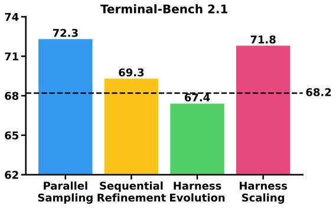
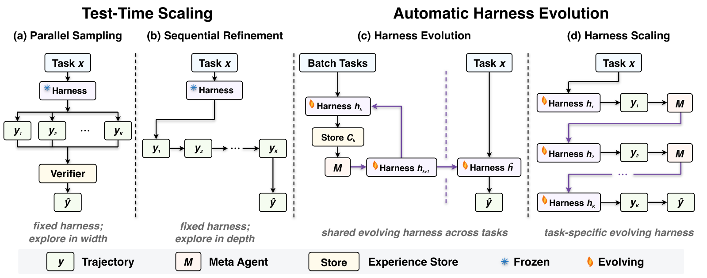
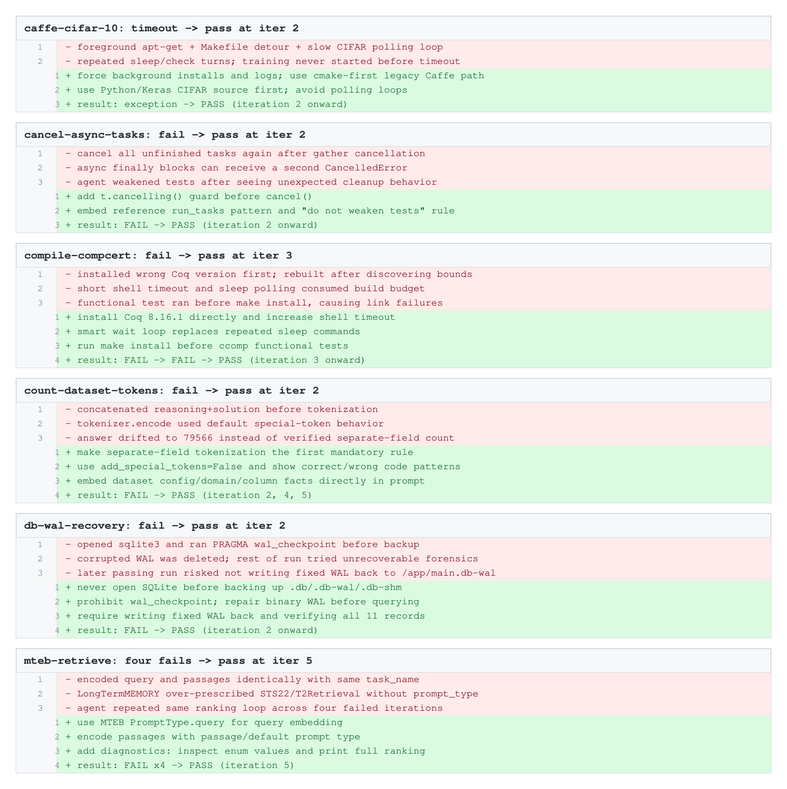

**Source:** *Rethinking the Evaluation of Harness Evolution for Agents* — [PDF](https://arxiv.org/pdf/2607.12227) · [arXiv](https://arxiv.org/abs/2607.12227)

# Rethinking the Evaluation of Harness   
Evolution for Agents

Yike Wang Huaisheng Zhu11footnotemark:  1 Zhengyu Hu Yige Yuan Zhengyu Chen ††thanks: equal contribution Affiliation:  Allen Institute for AI  Affiliation: University of Washington  Affiliation: Independent  Shakti Senthil Hannaneh Hajishirzi Yulia Tsvetkov Pradeep Dasigi Teng Xiao11footnotemark:  1 Email: [yikewang@cs.washington.edu, zhuhs1998@gmail.com, tengxiao01@gmail.com](mailto:) Affiliation:  Allen Institute for AI  Affiliation: University of Washington 

###### Abstract

We revisit the evaluation of automatic harness evolution for LLM agents. Existing harness evolution methods use unit test cases to search for harness configurations and then report final performance on the same public benchmark. This protocol raises two fundamental concerns. First, harness evolution is itself an iterative search procedure that repeatedly evaluates and revises candidate harnesses using task feedback. As in agentic test-time scaling, it should therefore be compared with simple task-level search baselines under matched feedback and inference budgets to determine whether its gains arise from improved harness design or from additional search alone. Second, because the search and the final evaluation share the same benchmark, the reported gains risk overfitting to that specific task set. To address these concerns, we conduct an extensive evaluation comparing harness evolution with simple test-time scaling and discovery baselines under comparable feedback and inference budgets, and also evaluate evolved harnesses on held-out tasks to assess whether the discovered improvements generalize. Experiments on Terminal-Bench 2.1 with GPT-5.4 and Claude Opus 4.6 show that automatic harness evolution does not consistently outperform simple test-time scaling methods and exhibits limited generalization. Our results raise important questions about the effectiveness of automatic harness evolution and highlight the need for fairer evaluation protocols and benchmarks for automatic harness design. Our code is available at <https://github.com/rethinking-harness-evolution>.

## 1 Introduction

Large language model (LLM) agents increasingly rely on external harnesses to interact with complex environments ([Yang et al., 2024](https://arxiv.org/html/2607.12227#bib.bib7); [Merrill et al., 2026](https://arxiv.org/html/2607.12227#bib.bib6)). A harness defines the prompts, tools, memory, verification routines, and control logic through which a model observes tasks and acts ([Lopopolo, 2026](https://arxiv.org/html/2607.12227#bib.bib5)). Prior work shows that harness engineering can substantially affect agent performance even with a fixed model ([Trivedy, 2026](https://arxiv.org/html/2607.12227#bib.bib1)), yet it remains largely manual: developers inspect trajectories, diagnose failures, and revise the harness. This has motivated automatic harness evolution, in which agents improve external harnesses ([Lee et al., 2026](https://arxiv.org/html/2607.12227#bib.bib4); [Lin et al., 2026](https://arxiv.org/html/2607.12227#bib.bib2); [Zhang et al., 2026](https://arxiv.org/html/2607.12227#bib.bib3)). These methods typically follow a search loop: analyze prior trajectories, scores, and failures; propose modifications; evaluate them on benchmark tasks; and repeat ([Lee et al., 2026](https://arxiv.org/html/2607.12227#bib.bib4); [Zhang et al., 2026](https://arxiv.org/html/2607.12227#bib.bib3)).

However, the evaluation of harness evolution needs further consideration. In many studies ([Lee et al., 2026](https://arxiv.org/html/2607.12227#bib.bib4); [Lin et al., 2026](https://arxiv.org/html/2607.12227#bib.bib2); [Zhang et al., 2026](https://arxiv.org/html/2607.12227#bib.bib3)), harness search uses verifier feedback from benchmark tasks, and the final harness is then evaluated on the same public benchmark, such as Terminal-Bench ([Merrill et al., 2026](https://arxiv.org/html/2607.12227#bib.bib6)). This setup makes it important to compare harness evolution against test-time scaling baselines: methods that spend additional computation on the evaluation tasks themselves, for example through parallel sampling, sequential refinement, or task-level revision using verifier feedback ([Snell et al., 2024](https://arxiv.org/html/2607.12227#bib.bib16); [Li et al., 2026](https://arxiv.org/html/2607.12227#bib.bib17); [Novikov et al., 2025](https://arxiv.org/html/2607.12227#bib.bib15)). These baselines test whether harness evolution provides benefits beyond simply allocating more search budget to the evaluation tasks under comparable feedback and inference budgets. The existing evaluation protocol therefore leaves a fundamental question unresolved: Does harness evolution yield generalizable improvements in harness design, or are its gains primarily due to repeated sampling? Moreover, when the tasks used for search overlap with those used for evaluation ([Lee et al., 2026](https://arxiv.org/html/2607.12227#bib.bib4)), observed gains may reflect adaptation to task-specific patterns rather than improvements in harness design that are transferable to held-out tasks.

 Figure 1: Average pass@1 without access to unit test feedback, averaged across Claude Opus 4.6, GPT-5.4, and GPT-5.4 mini. The dashed line indicates the performance of the initial harness. Harness evolution algorithms fail to outperform simple test-time scaling baselines.

In this paper, we revisit the evaluation of automatic harness evolution for language model agents. We compare parallel sampling, sequential refinement, and harness evolution under a controlled budget protocol that specifies what feedback each method receives, how it allocates inference compute, and whether it modifies task trajectories or the harness itself. We evaluate these methods on Terminal-Bench 2.1 with multiple models and find that automatic harness evolution does not consistently outperform simple test-time scaling baselines. For instance, as summarized in Figure [1](https://arxiv.org/html/2607.12227#S1.F1 "Figure 1 ‣ 1 Introduction ‣ Rethinking the Evaluation of Harness Evolution for Agents"), when unit test cases are unavailable, harness evolution underperforms simple test-time scaling baselines on average across Claude Opus 4.6, GPT-5.4, and GPT-5.4 mini. As shown in our experiments [4.3](https://arxiv.org/html/2607.12227#S4.SS3 "4.3 With Unit Test Cases, Automatic Harness Evolution Underperforms Test-Time Scaling ‣ 4 Experiments ‣ Rethinking the Evaluation of Harness Evolution for Agents"), when the same task set is used for both harness evolution and final evaluation, reported gains can overstate true harness improvements, as they may reflect adaptation to the evaluation instances rather than generalizable harness design. This highlights the need for evaluation protocols that separate optimization feedback from final measurement and compare against test-time scaling baselines.

## 2 Related Work

#### Test-time Scaling

Test-time scaling refers to improving a language model’s outputs by allocating additional computation at inference, without modifying the model weights ([Snell et al., 2024](https://arxiv.org/html/2607.12227#bib.bib16)). Existing work falls into two broad categories: parallel sampling ([Wang et al., 2022](https://arxiv.org/html/2607.12227#bib.bib9); [Brown et al., 2024](https://arxiv.org/html/2607.12227#bib.bib10)) and sequential refinement ([Madaan et al., 2023](https://arxiv.org/html/2607.12227#bib.bib8)). Parallel sampling draws multiple candidate answers independently and aggregates them by voting or verifier reranking. Sequential refinement generates answers iteratively, conditioning each attempt on prior ones to revise earlier reasoning. In this work, we argue that test-time scaling methods serve as strong and meaningful baselines for harness evolution algorithms.

#### Automatic Harness Evolution

A growing body of work improves agent performance without retraining the underlying model by optimizing the external scaffold around the model. Early efforts target a single editable surface: prompt and instruction optimizers tune prompts, demonstrations, or language-model programs from execution feedback ([Khattab et al., 2023](https://arxiv.org/html/2607.12227#bib.bib12); [Opsahl-Ong et al., 2024](https://arxiv.org/html/2607.12227#bib.bib14); [Yuksekgonul et al., 2025](https://arxiv.org/html/2607.12227#bib.bib13); [Agrawal et al., 2025](https://arxiv.org/html/2607.12227#bib.bib11)), while in-context methods accumulate experience as natural language artifacts that the model can reuse at inference time ([Zhao et al., 2024](https://arxiv.org/html/2607.12227#bib.bib18); [Zhang et al., 2025](https://arxiv.org/html/2607.12227#bib.bib19)). These approaches show that agent experience can be externalized outside model weights, but they typically optimize one component at a time. A more recent line treats the full harness as the object of search. Meta-Harness ([Lee et al., 2026](https://arxiv.org/html/2607.12227#bib.bib4)) searches over harness code using prior source code, scores, and execution traces. Agentic Harness Engineering ([Lin et al., 2026](https://arxiv.org/html/2607.12227#bib.bib2)) evolves prompts, tools, middleware, skills, and long-term memory through an observability-driven loop. AEVO ([Zhang et al., 2026](https://arxiv.org/html/2607.12227#bib.bib3)) views agentic evolution itself as an interactive environment and edits the procedure or agent context that controls future search. Our work revisits the evaluation of automatic harness evolution. We compare harness evolution against simple test-time scaling baselines under matched feedback and inference budgets, and evaluate whether evolved harnesses transfer to held-out tasks from the same benchmark.

## 3 Rethinking the Evaluation of Harness Evolution

In this section, we formalize the evaluation of harness evolution under a unified budget view. The goal is to make explicit whether performance gains reflect reusable harness improvement or test-time discovery over the evaluated tasks. Given a fixed agent policy, a task distribution, and a compute budget, each method is specified by what it updates and what feedback it observes. We consider four methods: parallel sampling, sequential refinement, harness evolution, and harness scaling. They spend the budget on independent trajectories, trajectory revisions, shared harness updates across tasks, and task-specific harness updates, respectively. We first introduce the common notation, and then describe each method in Sections [3.2](https://arxiv.org/html/2607.12227#S3.SS2 "3.2 Parallel Sampling ‣ 3 Rethinking the Evaluation of Harness Evolution ‣ Rethinking the Evaluation of Harness Evolution for Agents")–[3.5](https://arxiv.org/html/2607.12227#S3.SS5 "3.5 Harness Scaling ‣ 3 Rethinking the Evaluation of Harness Evolution ‣ Rethinking the Evaluation of Harness Evolution for Agents").

 Figure 2: Test-time scaling and automatic harness evolution algorithms. We compare four approaches under a unified budget, emphasizing what feedback the agent receives, how it spends its budget, and whether it modifies the trajectories or the harness.

### 3.1 Preliminary

Let \(\pi_{\theta}\) denote the agent policy and let \(x\) denote a task drawn from a task distribution \(\mathcal{X}\). Executing the agent on \(x\) using the harness \(h\) yields a trajectory \(y\), the full sequence of states, actions, and observations, which we write as \(y\sim\pi_{\theta}(\cdot\mid x;h)\). When a unit test case \(g\) is available, we define an outcome \(R(y,g)\in\{0,1\}\) that returns \(1\) exactly when the trajectory solves the task. Every method below consumes a compute budget \(K\) and returns a final trajectory \(\hat{y}\) for each task \(x\sim\mathcal{X}\).

We also define a summarization map \(\Phi\), realized by the same underlying model as the policy. The map \(\Phi\) summarizes an experience store into a form that a downstream agent can consume, such as recurring failures, redundant attempts, or cost, so that subsequent refinement or editing steps can diagnose why earlier attempts underperformed and avoid repeating edits.

### 3.2 Parallel Sampling

Parallel sampling (Figure [2](https://arxiv.org/html/2607.12227#S3.F2 "Figure 2 ‣ 3 Rethinking the Evaluation of Harness Evolution ‣ Rethinking the Evaluation of Harness Evolution for Agents") (a)) is a representative test-time scaling method that generates multiple trajectories in parallel ([Wang et al., 2022](https://arxiv.org/html/2607.12227#bib.bib9); [Brown et al., 2024](https://arxiv.org/html/2607.12227#bib.bib10)). Specifically, we draw \(K\) trajectories independently from the policy using a fixed harness \(h\),

\[\begin{aligned}
 & y_{1},\dots,y_{K}\sim\pi_{\theta}(\cdot\mid x;h), & 
\end{aligned}\]

 

such that exploration is spread across \(K\) mutually independent attempts. Increasing \(K\) expands the reachable action space, thereby improving the likelihood that the agent explores at least one trajectory that contains a correct solution. We consider two settings. First, when unit test cases are not available, selection instead relies on model self-selection, where the model is asked to choose the best candidate among the sampled solutions. Let \(J\) be a self judge realized by the agent itself, and we return the highest scoring candidate,

\[\begin{aligned}
 & \hat{y}=\operatorname*{arg\,max}_{k\leq K}J(y_{k}). & 
\end{aligned}\]

 

Second, we assume access to unit test cases, which provide verifiable signals that can be used directly to select the final response. In this case, we set \(\hat{y}\) to any trajectory accepted by the outcome,

\[\begin{aligned}
 & \hat{y}\in\{\,y_{k}:R(y_{k},g)=1\,\}. & 
\end{aligned}\]

 

### 3.3 Sequential Refinement

In contrast to parallel sampling, sequential refinement ([Madaan et al., 2023](https://arxiv.org/html/2607.12227#bib.bib8)) (Figure [2](https://arxiv.org/html/2607.12227#S3.F2 "Figure 2 ‣ 3 Rethinking the Evaluation of Harness Evolution ‣ Rethinking the Evaluation of Harness Evolution for Agents") (b)) allocates the budget to depth, extending the interaction horizon so that each trajectory builds on the last. In this process, the model leverages prior reasoning experience and explores alternative solution paths to guide refinement in subsequent turns. To realize this process, we sample the first trajectory directly based on the prompt,

\[\begin{aligned}
 & y_{1}\sim\pi_{\theta}(\cdot\mid x;h), & 
\end{aligned}\]

 

and for \(k=2,\dots,K\), we condition the next trajectory on the previous one, which lets the agent reflect on and revise its prior attempt, using the same fixed harness \(h\). When no unit test case is available, the agent reads the previous trajectory alone,

\[\begin{aligned}
 & y_{k}\sim\pi_{\theta}\big(\cdot\mid x,\ \Phi(y_{k-1});\ h\big), & 
\end{aligned}\]

 

and we return the final trajectory in the sequence, \(\hat{y}=y_{K}\).

When a unit test case is available, we expose both the trajectory and its outcome, so that the agent can refine against the signal for the next turn’s response,

\[\begin{aligned}
 & y_{k}\sim\pi_{\theta}\big(\cdot\mid x,\ \Phi(y_{k-1},R(y_{k-1},g));\ h\big). & 
\end{aligned}\]

 

In this case, we return any trajectory accepted by the outcome,

\[\begin{aligned}
 & \hat{y}\in\{\,y_{k}:R(y_{k},g)=1\,\}. & 
\end{aligned}\]

 

### 3.4 Harness Evolution

Harness evolution methods ([Lee et al., 2026](https://arxiv.org/html/2607.12227#bib.bib4); [Lin et al., 2026](https://arxiv.org/html/2607.12227#bib.bib2); [Zhang et al., 2026](https://arxiv.org/html/2607.12227#bib.bib3)) (Figure [2](https://arxiv.org/html/2607.12227#S3.F2 "Figure 2 ‣ 3 Rethinking the Evaluation of Harness Evolution ‣ Rethinking the Evaluation of Harness Evolution for Agents") (c)) retain the iterative loop of sequential refinement but allocate budget to the harness surrounding the policy rather than to trajectories alone, and optimize across a task distribution rather than fitting to one task. We draw a batch of tasks \(\{x^{(i)}\}_{i=1}^{n}\sim\mathcal{X}\) and initialize the experience store with them, \(\mathcal{C}_{0}=\{x^{(i)}\}_{i=1}^{n}\). At round \(k\) we sample \(m\) rollouts per task under the current harness,

\[\begin{aligned}
 & y_{k}^{(i,j)}\sim\pi_{\theta}\big(\cdot\mid x^{(i)};\,h_{k}\big),\qquad i=1,\dots,n,\quad j=1,\dots,m. & 
\end{aligned}\]

 

Each round then contributes one piece of evidence

\[\begin{aligned}
 & e_{k}=\big(h_{k},\ \{y_{k}^{(i,j)}\}_{i,j}\big),\qquad\mathcal{C}_{k}=\mathcal{C}_{k-1}\cup\{e_{k}\}, & 
\end{aligned}\]

 

recording the harness and the rollouts it produced across the batch. When unit test cases are available for each task, the evidence also carries the outcome of every rollout, so that

\[\begin{aligned}
 & e_{k}=\big(h_{k},\ \{y_{k}^{(i,j)}\}_{i,j},\ \{R(y_{k}^{(i,j)},g^{(i)})\}_{i,j}\big). & 
\end{aligned}\]

 

A meta agent \(\mathcal{M}\) drives the search. It reads an observation \(\Phi(\mathcal{C}_{k-1})\) of the accumulated store and emits the next harness,

\[\begin{aligned}
 & h_{k}=\mathcal{M}\big(\Phi(\mathcal{C}_{k-1})\big),\qquad k=2,\dots,K, & 
\end{aligned}\]

 

starting from a seed harness \(h_{1}\). The search optimizes the harness toward expected success on the task distribution, or on a held-out distribution,

\[\begin{aligned}
 & h^{\star}=\operatorname*{arg\,max}_{h}\ \mathbb{E}_{x\sim\mathcal{X}}\big[\,R(y,g)\,\big],\qquad y\sim\pi_{\theta}(\cdot\mid x;\,h). & 
\end{aligned}\]

 

When no unit test cases are available, we take the most evolved harness, \(\hat{h}=h_{K}\); when unit test cases are available, we select the harness in the store with the highest aggregate outcome, estimated on the task batch or a held-out set,

\[\begin{aligned}
 & \hat{h}=\operatorname*{arg\,max}_{k\leq K}\bar{R}(h_{k}),\qquad\bar{R}(h_{k})=\frac{1}{nm}\sum_{i=1}^{n}\sum_{j=1}^{m}R\big(y_{k}^{(i,j)},g^{(i)}\big). & 
\end{aligned}\]

 

We then sample the final trajectory for the target task \(x\) under this harness, \(\hat{y}\sim\pi_{\theta}(\cdot\mid x;\,\hat{h})\).

We instantiate harness evolution with AHE ([Lin et al., 2026](https://arxiv.org/html/2607.12227#bib.bib2)), with its explore agent disabled so that improvements come from evolving the harness on feedback rather than from retrieving benchmark-specific harnesses externally. See Appendix [A](https://arxiv.org/html/2607.12227#A1 "Appendix A Experimental Details ‣ Rethinking the Evaluation of Harness Evolution for Agents") for details.

### 3.5 Harness Scaling

To further investigate whether harness improvements arise from reusable design or from additional test-time computation, we introduce _harness scaling_ (Figure [2](https://arxiv.org/html/2607.12227#S3.F2 "Figure 2 ‣ 3 Rethinking the Evaluation of Harness Evolution ‣ Rethinking the Evaluation of Harness Evolution for Agents") (d)), a harness-level analogue of test-time scaling. Whereas harness evolution aims to improve a harness across a set of tasks and produce a reusable design, harness scaling adapts the harness for a single evaluation instance by allocating additional inference budget to harness revision. In this sense, harness scaling can be viewed as instance-guided harness adaptation, in contrast to dataset-guided harness evolution. From an initial harness \(h_{1}\), we sample for each task

\[\begin{aligned}
 & y_{1}\sim\pi_{\theta}(\cdot\mid x;h_{1}). & 
\end{aligned}\]

 

After observing each trajectory, the agent updates the harness through a meta agent \(\mathcal{M}\) instantiated by the same underlying model, and then resamples under the updated harness. When no unit test case is available, the update conditions on the task, the previous harness, and the previous trajectory,

\[\begin{aligned}
 & h_{k}=\mathcal{M}\big(x,\ \Phi(h_{k-1},y_{k-1})\big),\qquad y_{k}\sim\pi_{\theta}(\cdot\mid x;h_{k}),\qquad k=2,\dots,K, & 
\end{aligned}\]

 

and the latest trajectory is returned \(\hat{y}=y_{K}\).

When a unit test case is available, the update also conditions on the outcome of the previous trajectory,

\[\begin{aligned}
 & h_{k}=\mathcal{M}\big(x,\ \Phi(h_{k-1},y_{k-1},R(y_{k-1},g))\big),\qquad y_{k}\sim\pi_{\theta}(\cdot\mid x;h_{k}),\qquad k=2,\dots,K, & 
\end{aligned}\]

 

so that the meta agent can revise the harness against the signal. We return any trajectory accepted by the outcome,

\[\begin{aligned}
 & \hat{y}\in\{\,y_{k}:R(y_{k},g)=1\,\}. & 
\end{aligned}\]

 

## 4 Experiments

In this section, we study whether automatic harness evolution outperforms simple test-time discovery under comparable feedback and inference budgets. We examine three settings: without unit test cases (Section [4.2](https://arxiv.org/html/2607.12227#S4.SS2 "4.2 Without Unit Test Cases, Automatic Harness Evolution Underperforms Test-Time Scaling ‣ 4 Experiments ‣ Rethinking the Evaluation of Harness Evolution for Agents")), with them (Section [4.3](https://arxiv.org/html/2607.12227#S4.SS3 "4.3 With Unit Test Cases, Automatic Harness Evolution Underperforms Test-Time Scaling ‣ 4 Experiments ‣ Rethinking the Evaluation of Harness Evolution for Agents")), and a generalization setting with disjoint search and evaluation tasks (Section [4.4](https://arxiv.org/html/2607.12227#S4.SS4 "4.4 Harness Evolution Fails to Generalize Beyond Training Tasks ‣ 4 Experiments ‣ Rethinking the Evaluation of Harness Evolution for Agents")). Across all three, we find that harness evolution does not consistently outperform simple test-time discovery, and that its advantage does not generalize when the search and evaluation tasks are disjoint.

### 4.1 Experimental Setup

#### Benchmark and Models

Following prior work ([Lee et al., 2026](https://arxiv.org/html/2607.12227#bib.bib4); [Lin et al., 2026](https://arxiv.org/html/2607.12227#bib.bib2); [Zhang et al., 2026](https://arxiv.org/html/2607.12227#bib.bib3)), we evaluate on Terminal-Bench 2.1 ([Merrill et al., 2026](https://arxiv.org/html/2607.12227#bib.bib6)), a verified revision of Terminal-Bench 2.0. It repairs 28 of the 89 tasks, correcting external dependency drift, resource budget mismatches, and instructions misaligned with their tests, while keeping the suite at 89 terminal tasks, providing a more accurate assessment of code agents. We experiment with three frontier models: Claude Opus 4.6, GPT-5.4, and GPT-5.4 mini. Unless otherwise noted, every model is run with a maximum generation budget of 128k tokens and a high reasoning effort setting. To reduce variance from stochastic rollouts, all results are averaged over two independent runs.

#### Implementation

To ensure a fair comparison, both Harness Scaling and Harness Evolution are initialized with the same initial harness used in AHE ([Lin et al., 2026](https://arxiv.org/html/2607.12227#bib.bib2)), denoted by \(h_{1}\). We also use this harness as the fixed harness \(h\) for Parallel Sampling and Sequential Refinement. For AHE, we sample one rollout per task for each harness, setting \(m=1\), to match the rollout budget across methods. We use a compute budget of \(K=5\) across methods.

### 4.2 Without Unit Test Cases, Automatic Harness Evolution Underperforms Test-Time Scaling

Method | Claude Opus 4.6 | GPT-5.4 | GPT-5.4 mini | Average  
---|---|---|---|---  
direct sampling using initial harness | 69.9 | 75.3 | 59.4 | 68.2  
Test-Time Scaling |  |  |  |   
Parallel Sampling | 74.7 | 79.2 | 62.9 | 72.3  
Sequential Refinement | 73.0 | 73.0 | 61.8 | 69.3  
Automatic Harness Evolution |  |  |  |   
Harness Evolution | 71.4 | 69.7 | 61.3 | 67.4  
Harness Scaling | 76.0 | 78.1 | 61.2 | 71.8

 

Table 1: Experimental results on Terminal-Bench 2.1 when unit test cases are unavailable. All results report pass@1. Best results in bold and second best in underline. Under this setting, automatic harness evolution algorithms underperform simple test-time scaling methods.

We first present results in the setting where unit test cases are unavailable. In this setting, the agent must rely solely on its own generated trajectories to revise either its solution trajectory or its harness. For parallel methods, the final answer is selected by a self judge over multiple sampled candidates. For sequential methods, the final answer is taken from the last refinement step. This setting therefore tests whether the agent can improve through self evaluation alone, rather than through explicit correctness signals.

Table [1](https://arxiv.org/html/2607.12227#S4.T1 "Table 1 ‣ 4.2 Without Unit Test Cases, Automatic Harness Evolution Underperforms Test-Time Scaling ‣ 4 Experiments ‣ Rethinking the Evaluation of Harness Evolution for Agents") shows the results. Overall, automatic harness evolution does not deliver a stronger performance gain than test-time scaling methods, and its effectiveness varies substantially across models. Parallel Sampling is the most consistent approach, improving the average score from 68.2 to 72.3 and yielding gains on all three models. Sequential Refinement provides only a marginal average improvement of 1.1 points and even slightly degrades GPT-5.4 relative to direct sampling. In contrast, Harness Evolution fails to outperform the direct sampling baseline on average. The degradation is most pronounced on GPT-5.4, where performance drops sharply from 75.3 to 69.7, indicating that iterative harness revision can actively hurt a strong model when the revision process is guided only by the agent’s own judgment. Harness Scaling partially closes this gap, reaching the best single result on Claude Opus 4.6 and a competitive average of 71.8.

Taken together, these results suggest that, in the absence of unit test cases, even very strong agents struggle to reliably extract useful learning signals from their own trajectories to revise the harness. Self generated feedback is noisy, and sequential revision based on such feedback risks compounding early mistakes. Simpler parallel sampling proves more effective in this feedback limited setting. This indicates that harness revision likely requires a reliable external correctness signal to ground the revision process.

### 4.3 With Unit Test Cases, Automatic Harness Evolution Underperforms Test-Time Scaling

<table id="S4.T2.3.1" class="ltx_tabular ltx_align_middle">
<tr id="S4.T2.3.1.1" class="ltx_tr">
<td id="S4.T2.3.1.1.1" class="ltx_td ltx_border_tt"></td>
<td id="S4.T2.3.1.1.2" class="ltx_td ltx_align_center ltx_border_tt" colspan="2">Claude Opus 4.6</td>
<td id="S4.T2.3.1.1.3" class="ltx_td ltx_align_center ltx_border_tt" colspan="2">GPT-5.4</td>
<td id="S4.T2.3.1.1.4" class="ltx_td ltx_align_center ltx_border_tt" colspan="2">Average</td></tr>
<tr id="S4.T2.3.1.2" class="ltx_tr">
<td id="S4.T2.3.1.2.1" class="ltx_td ltx_align_left">Method</td>
<td id="S4.T2.3.1.2.2" class="ltx_td ltx_align_center ltx_border_t">pass@1</td>
<td id="S4.T2.3.1.2.3" class="ltx_td ltx_align_center ltx_border_t">pass@5</td>
<td id="S4.T2.3.1.2.4" class="ltx_td ltx_align_center ltx_border_t">pass@1</td>
<td id="S4.T2.3.1.2.5" class="ltx_td ltx_align_center ltx_border_r ltx_border_t">pass@5</td>
<td id="S4.T2.3.1.2.6" class="ltx_td ltx_align_center ltx_border_t">pass@1</td>
<td id="S4.T2.3.1.2.7" class="ltx_td ltx_align_center ltx_border_t">pass@5</td></tr>
<tr id="S4.T2.3.1.3" class="ltx_tr">
<td id="S4.T2.3.1.3.1" class="ltx_td ltx_align_left ltx_border_t">direct sampling using initial harness</td>
<td id="S4.T2.3.1.3.2" class="ltx_td ltx_align_center ltx_border_t">69.9</td>
<td id="S4.T2.3.1.3.3" class="ltx_td ltx_align_center ltx_border_t">-</td>
<td id="S4.T2.3.1.3.4" class="ltx_td ltx_align_center ltx_border_t">75.9</td>
<td id="S4.T2.3.1.3.5" class="ltx_td ltx_align_center ltx_border_r ltx_border_t">-</td>
<td id="S4.T2.3.1.3.6" class="ltx_td ltx_align_center ltx_border_t">72.9</td>
<td id="S4.T2.3.1.3.7" class="ltx_td ltx_align_center ltx_border_t">-</td></tr>
<tr id="S4.T2.3.1.4" class="ltx_tr">
<td id="S4.T2.3.1.4.1" class="ltx_td ltx_align_left ltx_border_t">Test-Time Scaling</td>
<td id="S4.T2.3.1.4.2" class="ltx_td ltx_border_t"></td>
<td id="S4.T2.3.1.4.3" class="ltx_td ltx_border_t"></td>
<td id="S4.T2.3.1.4.4" class="ltx_td ltx_border_t"></td>
<td id="S4.T2.3.1.4.5" class="ltx_td ltx_border_r ltx_border_t"></td>
<td id="S4.T2.3.1.4.6" class="ltx_td ltx_border_t"></td>
<td id="S4.T2.3.1.4.7" class="ltx_td ltx_border_t"></td></tr>
<tr id="S4.T2.3.1.5" class="ltx_tr">
<td id="S4.T2.3.1.5.1" class="ltx_td ltx_align_left">     Parallel Sampling</td>
<td id="S4.T2.3.1.5.2" class="ltx_td ltx_align_center">84.8</td>
<td id="S4.T2.3.1.5.3" class="ltx_td ltx_align_center">84.8</td>
<td id="S4.T2.3.1.5.4" class="ltx_td ltx_align_center">87.1</td>
<td id="S4.T2.3.1.5.5" class="ltx_td ltx_align_center ltx_border_r">87.1</td>
<td id="S4.T2.3.1.5.6" class="ltx_td ltx_align_center">86.0</td>
<td id="S4.T2.3.1.5.7" class="ltx_td ltx_align_center">86.0</td></tr>
<tr id="S4.T2.3.1.6" class="ltx_tr">
<td id="S4.T2.3.1.6.1" class="ltx_td ltx_align_left">     Sequential Refinement</td>
<td id="S4.T2.3.1.6.2" class="ltx_td ltx_align_center">83.1</td>
<td id="S4.T2.3.1.6.3" class="ltx_td ltx_align_center">90.4</td>
<td id="S4.T2.3.1.6.4" class="ltx_td ltx_align_center">85.4</td>
<td id="S4.T2.3.1.6.5" class="ltx_td ltx_align_center ltx_border_r">93.3</td>
<td id="S4.T2.3.1.6.6" class="ltx_td ltx_align_center">84.3</td>
<td id="S4.T2.3.1.6.7" class="ltx_td ltx_align_center">91.8</td></tr>
<tr id="S4.T2.3.1.7" class="ltx_tr">
<td id="S4.T2.3.1.7.1" class="ltx_td ltx_align_left ltx_border_t">Automatic Harness Evolution</td>
<td id="S4.T2.3.1.7.2" class="ltx_td ltx_border_t"></td>
<td id="S4.T2.3.1.7.3" class="ltx_td ltx_border_t"></td>
<td id="S4.T2.3.1.7.4" class="ltx_td ltx_border_t"></td>
<td id="S4.T2.3.1.7.5" class="ltx_td ltx_border_r ltx_border_t"></td>
<td id="S4.T2.3.1.7.6" class="ltx_td ltx_border_t"></td>
<td id="S4.T2.3.1.7.7" class="ltx_td ltx_border_t"></td></tr>
<tr id="S4.T2.3.1.8" class="ltx_tr">
<td id="S4.T2.3.1.8.1" class="ltx_td ltx_align_left">     Harness Evolution</td>
<td id="S4.T2.3.1.8.2" class="ltx_td ltx_align_center">73.0</td>
<td id="S4.T2.3.1.8.3" class="ltx_td ltx_align_center">83.2</td>
<td id="S4.T2.3.1.8.4" class="ltx_td ltx_align_center">78.6</td>
<td id="S4.T2.3.1.8.5" class="ltx_td ltx_align_center ltx_border_r">89.3</td>
<td id="S4.T2.3.1.8.6" class="ltx_td ltx_align_center">75.8</td>
<td id="S4.T2.3.1.8.7" class="ltx_td ltx_align_center">86.2</td></tr>
<tr id="S4.T2.3.1.9" class="ltx_tr">
<td id="S4.T2.3.1.9.1" class="ltx_td ltx_align_left ltx_border_bb">     Harness Scaling</td>
<td id="S4.T2.3.1.9.2" class="ltx_td ltx_align_center ltx_border_bb">83.1</td>
<td id="S4.T2.3.1.9.3" class="ltx_td ltx_align_center ltx_border_bb">89.9</td>
<td id="S4.T2.3.1.9.4" class="ltx_td ltx_align_center ltx_border_bb">82.0</td>
<td id="S4.T2.3.1.9.5" class="ltx_td ltx_align_center ltx_border_bb ltx_border_r">88.8</td>
<td id="S4.T2.3.1.9.6" class="ltx_td ltx_align_center ltx_border_bb">82.6</td>
<td id="S4.T2.3.1.9.7" class="ltx_td ltx_align_center ltx_border_bb">89.3</td></tr>
</table>

 

Table 2: Experimental results on Terminal-Bench 2.1 when unit test cases are available. Best results in bold and second best in underline. Automatic harness evolution algorithms still underperform test-time scaling baselines in this setting, on both pass@1 and pass@5.

Second, we compare all methods under the setting where unit test cases are available. In this case, the unit test cases are used both as feedback for iterative refinement and as an oracle for selecting the final trajectory. Because oracle selection allows the best candidate among multiple sampled trajectories to be identified, reporting pass@5 becomes meaningful alongside pass@1, and we therefore report both metrics under this setting.

As shown in Table [2](https://arxiv.org/html/2607.12227#S4.T2 "Table 2 ‣ 4.3 With Unit Test Cases, Automatic Harness Evolution Underperforms Test-Time Scaling ‣ 4 Experiments ‣ Rethinking the Evaluation of Harness Evolution for Agents"), we observe a similar trend under this setting. All test-time scaling and automatic harness evolution methods substantially improve over direct sampling with the initial harness, confirming that unit test feedback helps regardless of the mechanism. However, neither Harness Evolution nor Harness Scaling outperforms the simpler baselines on either metric. On pass@1, Harness Evolution barely improves over direct sampling, while Parallel Sampling achieves the best average of 86.0. On pass@5, Sequential Refinement remains the strongest method with an average of 91.8, surpassing Harness Evolution (86.2) and Harness Scaling (89.3) on both models.

If harness revision genuinely produced better harnesses, we would expect the improvement to be reflected in pass@1. Instead, the benefit only materializes when we can select among multiple trajectories. This suggests that existing harness evolution algorithms do not reliably enable the agent to solve previously unsolved tasks through improved harness design. Rather, their gains largely stem from making multiple attempts, an effect that Parallel Sampling and Sequential Refinement achieve more directly and more effectively. This further indicates that refining solutions is a more productive use of extra compute than revising the harness itself.

### 4.4 Harness Evolution Fails to Generalize Beyond Training Tasks

Method | Claude Opus 4.6 | GPT-5.4 | Average  
---|---|---|---  
direct sampling using initial harness | 63.3 | 72.1 | 67.7  
Harness Evolution | 64.5 (+1.2) | 72.1 (+0.0) | 68.3 (+0.6)

 

Table 3: Experimental results on Terminal-Bench 2.1 with disjoint search and evaluation tasks. We perform Harness Evolution on a training set with unit test cases, select the resulting harness based on validation performance, and report pass@1 on the test set. Compared with the pass@1 test results using the initial harness, Harness Evolution yields no significant gains, suggesting limited generalization and a strong tendency to overfit the search set.

Third, we evaluate the generalization ability of Harness Evolution, namely whether a harness evolved on one set of tasks can transfer to unseen tasks. Specifically, we split Terminal-Bench 2.1 into 45 training tasks, 10 validation tasks, and 34 held-out test tasks. We run Harness Evolution on the training set, select the best evolved harness based on validation performance, and evaluate it on the test set. The other three methods are not directly applicable in this setting, since they rely on instance-level scaling or refinement rather than producing a reusable artifact.

As shown in Table [3](https://arxiv.org/html/2607.12227#S4.T3 "Table 3 ‣ 4.4 Harness Evolution Fails to Generalize Beyond Training Tasks ‣ 4 Experiments ‣ Rethinking the Evaluation of Harness Evolution for Agents"), the evolved harness yields only marginal gains over the initial harness on the test set: it improves Claude Opus 4.6 by a mere 1.2 points and brings no improvement at all on GPT-5.4, resulting in an average gain of just 0.6 points. This stands in sharp contrast to the improvements Harness Evolution achieves when evaluated on the same tasks it is optimized on, as reported in the previous experiments. The discrepancy suggests that the revisions discovered during evolution encode task-specific shortcuts rather than genuinely better harness design principles. In other words, current harness evolution algorithms exhibit limited generalization ability and appear prone to severe overfitting to the training tasks.

## 5 Discussion

### 5.1 Rational Harness Edits but Marginal Gains

To understand where the gains and limits of automatic harness evolution come from, we take a closer look at the trajectories produced by Harness Evolution and Harness Scaling. Specifically, we examine what the meta agent modifies at each iteration, which changes are kept or rolled back, and which failure classes the changes target. We find that while the meta agent makes rational, well motivated edits across the prompt, middleware, and tool layers, a stable core of hard tasks remains unaffected, and the resulting improvements stay limited beyond simple test-time discovery baselines.

#### Harness Evolution

Under Harness Evolution, the meta agent’s first move is usually at the prompt layer, adding behavioral rules to the system prompt and long-term memory that target recurring failure classes, such as instructions to produce deliverables early with greater budget awareness, to copy fragile state before mutating it, and to recheck task constraints before finishing. When such advisory text plateaus, the meta agent escalates to runtime enforcement through middleware, such as turn budget trackers that remind the agent to ship output once turn or time thresholds are reached, truncation of oversized tool outputs, and finalization gates that block completion when deliverables are missing or unverified. It also edits the tool layer, correcting misleading tool guidance and injecting recovery hints at command execution time.

#### Harness Scaling

The dominant modification pattern in Harness Scaling is to encode knowledge about specific failures from previous rollouts into the next iteration’s prompt or long-term memory. For example, the meta agent records known bugs, implementation templates, verification checks, file paths, and command sequences for particular tasks. It also frequently improves workflow efficiency. Many changes replace repeated polling, exploratory commands, or slow setup sequences with compact command plans: batching installation and verification commands, skipping unnecessary environment detection, allowing longer shell timeouts for slow package installations, and prescribing workflows with explicit message budgets (Appendix [B](https://arxiv.org/html/2607.12227#A2 "Appendix B Case Study ‣ Rethinking the Evaluation of Harness Evolution for Agents")). These changes are especially helpful for tasks where the agent already knew the correct high level solution but lost time or failed due to timeouts, excessive polling, or incomplete setup. Another common class of edits strengthens verification behavior. The meta agent adds syntax checks, unit tests, or local checks that mimic the verifier before final submission.

Despite the breadth of these modifications, the overall improvement remains limited relative to test-time discovery baselines. The core issue is that most edits memorize fixes rather than distilling strategies. Much of this information is precisely what a competent agent can rediscover through exploration within a single rollout, so persisting it in the harness saves time on tasks the agent could already solve but rarely converts failures into successes. Meanwhile, the stable core of hard failures, which stem from deep domain reasoning demands or constraints outside harness control, remains unaffected by accumulated knowledge, and the growing volume of persistent prompt text introduces context bloat that can offset the remaining gains.

### 5.2 Task Difficulty and Harness Sensitivity as Factors

Following prior work, we evaluate all algorithms on Terminal-Bench and find that automatic harness evolution is often less effective than simple methods that scale computation at test time. While this may simply reflect that current models are not yet capable enough to revise the entire harness, in which case stronger priors could help, we offer two additional explanations for this result. First, agents already achieve relatively high scores on Terminal-Bench, and the small set of remaining failures may stem from limitations in the underlying model rather than deficiencies in the harness. Second, Terminal-Bench may simply not be very sensitive to harness design: a minimal setup consisting of a shell tool and a basic prompt already suffices for most solvable tasks, so performance is bottlenecked by the model’s reasoning rather than by the surrounding scaffolding. Modifying prompts, tool configurations, or middleware therefore yields only marginal gains.

These observations suggest that the value of automatic harness evolution is likely task dependent. We therefore encourage future work to study its effectiveness on benchmarks that satisfy two conditions: (1) the tasks are difficult enough that current agents leave substantial headroom for improvement, and (2) performance depends heavily on the harness, as when specialized tools, skills, or workflows are crucial to success. Under these conditions, a better harness can effectively expand the set of problems an agent can solve.

## 6 Conclusions

We study how automatic harness design for LLM agents is evaluated and observe that current methods commonly use feedback from unit test cases to search over harness configurations, then report final performance on the same public benchmark. This practice conflates genuine advances in harness design with simple baselines that perform discovery at test time, and introduces a risk of overfitting. Comparing automatic harness evolution against test-time discovery baselines under a unified budget, we find that it does not consistently outperform these baselines and that its gains generalize poorly beyond the training distribution. These findings suggest that current evidence for automatic harness evolution should be interpreted with caution, highlighting the need for fairer evaluation protocols for automatic harness design.

## References

  * Agrawal et al. (2025) L. A. Agrawal, S. Tan, D. Soylu, N. Ziems, R. Khare, K. Opsahl-Ong, A. Singhvi, H. Shandilya, M. J. Ryan, M. Jiang, et al. Gepa: reflective prompt evolution can outperform reinforcement learning.  arXiv preprint arXiv:2507.19457.  Cited by: [§2](https://arxiv.org/html/2607.12227#S2.SS0.SSS0.Px2.p1.1 "Automatic Harness Evolution ‣ 2 Related Work ‣ Rethinking the Evaluation of Harness Evolution for Agents"). 
  * Brown et al. (2024) B. Brown, J. Juravsky, R. Ehrlich, R. Clark, Q. V. Le, C. Ré, and A. Mirhoseini Large language monkeys: scaling inference compute with repeated sampling.  arXiv preprint arXiv:2407.21787.  Cited by: [§2](https://arxiv.org/html/2607.12227#S2.SS0.SSS0.Px1.p1.1 "Test-time Scaling ‣ 2 Related Work ‣ Rethinking the Evaluation of Harness Evolution for Agents"), [§3.2](https://arxiv.org/html/2607.12227#S3.SS2.p1.1 "3.2 Parallel Sampling ‣ 3 Rethinking the Evaluation of Harness Evolution ‣ Rethinking the Evaluation of Harness Evolution for Agents"). 
  * Khattab et al. (2023) O. Khattab, A. Singhvi, P. Maheshwari, Z. Zhang, K. Santhanam, S. Vardhamanan, S. Haq, A. Sharma, T. T. Joshi, H. Moazam, et al. Dspy: compiling declarative language model calls into self-improving pipelines.  arXiv preprint arXiv:2310.03714.  Cited by: [§2](https://arxiv.org/html/2607.12227#S2.SS0.SSS0.Px2.p1.1 "Automatic Harness Evolution ‣ 2 Related Work ‣ Rethinking the Evaluation of Harness Evolution for Agents"). 
  * Lee et al. (2026) Y. Lee, R. Nair, Q. Zhang, K. Lee, O. Khattab, and C. Finn Meta-harness: end-to-end optimization of model harnesses.  arXiv.  External Links: 2603.28052, [Document](https://dx.doi.org/10.48550/arXiv.2603.28052), [Link](http://arxiv.org/abs/2603.28052) Cited by: [§1](https://arxiv.org/html/2607.12227#S1.p1.1 "1 Introduction ‣ Rethinking the Evaluation of Harness Evolution for Agents"), [§1](https://arxiv.org/html/2607.12227#S1.p2.1 "1 Introduction ‣ Rethinking the Evaluation of Harness Evolution for Agents"), [§2](https://arxiv.org/html/2607.12227#S2.SS0.SSS0.Px2.p1.1 "Automatic Harness Evolution ‣ 2 Related Work ‣ Rethinking the Evaluation of Harness Evolution for Agents"), [§3.4](https://arxiv.org/html/2607.12227#S3.SS4.p1.1 "3.4 Harness Evolution ‣ 3 Rethinking the Evaluation of Harness Evolution ‣ Rethinking the Evaluation of Harness Evolution for Agents"), [§4.1](https://arxiv.org/html/2607.12227#S4.SS1.SSS0.Px1.p1.1 "Benchmark and Models ‣ 4.1 Experimental Setup ‣ 4 Experiments ‣ Rethinking the Evaluation of Harness Evolution for Agents"). 
  * Li et al. (2026) X. Li, R. Ming, P. Setlur, A. Paladugu, A. Tang, H. Kang, S. Shao, R. Jin, and C. Xiong Benchmark test-time scaling of general llm agents.  arXiv preprint arXiv:2602.18998.  Cited by: [§1](https://arxiv.org/html/2607.12227#S1.p2.1 "1 Introduction ‣ Rethinking the Evaluation of Harness Evolution for Agents"). 
  * Lin et al. (2026) J. Lin, S. Liu, C. Pan, L. Lin, S. Dou, Z. Xi, X. Huang, H. Yan, Z. Han, T. Gui, et al. Agentic harness engineering: observability-driven automatic evolution of coding-agent harnesses.  arXiv preprint arXiv:2604.25850.  Cited by: [§A.2](https://arxiv.org/html/2607.12227#A1.SS2.p1.1 "A.2 Summarization Map ‣ Appendix A Experimental Details ‣ Rethinking the Evaluation of Harness Evolution for Agents"), [§1](https://arxiv.org/html/2607.12227#S1.p1.1 "1 Introduction ‣ Rethinking the Evaluation of Harness Evolution for Agents"), [§1](https://arxiv.org/html/2607.12227#S1.p2.1 "1 Introduction ‣ Rethinking the Evaluation of Harness Evolution for Agents"), [§2](https://arxiv.org/html/2607.12227#S2.SS0.SSS0.Px2.p1.1 "Automatic Harness Evolution ‣ 2 Related Work ‣ Rethinking the Evaluation of Harness Evolution for Agents"), [§3.4](https://arxiv.org/html/2607.12227#S3.SS4.p1.1 "3.4 Harness Evolution ‣ 3 Rethinking the Evaluation of Harness Evolution ‣ Rethinking the Evaluation of Harness Evolution for Agents"), [§3.4](https://arxiv.org/html/2607.12227#S3.SS4.p3.1 "3.4 Harness Evolution ‣ 3 Rethinking the Evaluation of Harness Evolution ‣ Rethinking the Evaluation of Harness Evolution for Agents"), [§4.1](https://arxiv.org/html/2607.12227#S4.SS1.SSS0.Px1.p1.1 "Benchmark and Models ‣ 4.1 Experimental Setup ‣ 4 Experiments ‣ Rethinking the Evaluation of Harness Evolution for Agents"), [§4.1](https://arxiv.org/html/2607.12227#S4.SS1.SSS0.Px2.p1.1 "Implementation ‣ 4.1 Experimental Setup ‣ 4 Experiments ‣ Rethinking the Evaluation of Harness Evolution for Agents"). 
  * Lopopolo (2026) R. Lopopolo Harness engineering: leveraging codex in an agent-first world.  External Links: [Link](https://openai.com/zh-Hans-CN/index/harness-engineering/) Cited by: [§1](https://arxiv.org/html/2607.12227#S1.p1.1 "1 Introduction ‣ Rethinking the Evaluation of Harness Evolution for Agents"). 
  * Madaan et al. (2023) A. Madaan, N. Tandon, P. Gupta, S. Hallinan, L. Gao, S. Wiegreffe, U. Alon, N. Dziri, S. Prabhumoye, Y. Yang, et al. Self-refine: iterative refinement with self-feedback.  Advances in Neural Information Processing Systems 36, pp. 46534–46594.  Cited by: [§2](https://arxiv.org/html/2607.12227#S2.SS0.SSS0.Px1.p1.1 "Test-time Scaling ‣ 2 Related Work ‣ Rethinking the Evaluation of Harness Evolution for Agents"), [§3.3](https://arxiv.org/html/2607.12227#S3.SS3.p1.1 "3.3 Sequential Refinement ‣ 3 Rethinking the Evaluation of Harness Evolution ‣ Rethinking the Evaluation of Harness Evolution for Agents"). 
  * Merrill et al. (2026) M. A. Merrill, A. G. Shaw, N. Carlini, B. Li, H. Raj, I. Bercovich, L. Shi, J. Y. Shin, T. Walshe, E. K. Buchanan, et al. Terminal-bench: benchmarking agents on hard, realistic tasks in command line interfaces.  arXiv preprint arXiv:2601.11868.  Cited by: [§1](https://arxiv.org/html/2607.12227#S1.p1.1 "1 Introduction ‣ Rethinking the Evaluation of Harness Evolution for Agents"), [§1](https://arxiv.org/html/2607.12227#S1.p2.1 "1 Introduction ‣ Rethinking the Evaluation of Harness Evolution for Agents"), [§4.1](https://arxiv.org/html/2607.12227#S4.SS1.SSS0.Px1.p1.1 "Benchmark and Models ‣ 4.1 Experimental Setup ‣ 4 Experiments ‣ Rethinking the Evaluation of Harness Evolution for Agents"). 
  * Novikov et al. (2025) A. Novikov, N. Vũ, M. Eisenberger, E. Dupont, P. Huang, A. Z. Wagner, S. Shirobokov, B. Kozlovskii, F. J. Ruiz, A. Mehrabian, et al. Alphaevolve: a coding agent for scientific and algorithmic discovery.  arXiv preprint arXiv:2506.13131.  Cited by: [§1](https://arxiv.org/html/2607.12227#S1.p2.1 "1 Introduction ‣ Rethinking the Evaluation of Harness Evolution for Agents"). 
  * Opsahl-Ong et al. (2024) K. Opsahl-Ong, M. J. Ryan, J. Purtell, D. Broman, C. Potts, M. Zaharia, and O. Khattab Optimizing instructions and demonstrations for multi-stage language model programs.  In Proceedings of the 2024 Conference on Empirical Methods in Natural Language Processing,  pp. 9340–9366.  Cited by: [§2](https://arxiv.org/html/2607.12227#S2.SS0.SSS0.Px2.p1.1 "Automatic Harness Evolution ‣ 2 Related Work ‣ Rethinking the Evaluation of Harness Evolution for Agents"). 
  * Snell et al. (2024) C. Snell, J. Lee, K. Xu, and A. Kumar Scaling llm test-time compute optimally can be more effective than scaling model parameters.  arXiv preprint arXiv:2408.03314.  Cited by: [§1](https://arxiv.org/html/2607.12227#S1.p2.1 "1 Introduction ‣ Rethinking the Evaluation of Harness Evolution for Agents"), [§2](https://arxiv.org/html/2607.12227#S2.SS0.SSS0.Px1.p1.1 "Test-time Scaling ‣ 2 Related Work ‣ Rethinking the Evaluation of Harness Evolution for Agents"). 
  * Trivedy (2026) V. Trivedy Improving deep agents with harness engineering.  External Links: [Link](https://www.langchain.com/blog/improving-deep-agents-with-harness-engineering) Cited by: [§1](https://arxiv.org/html/2607.12227#S1.p1.1 "1 Introduction ‣ Rethinking the Evaluation of Harness Evolution for Agents"). 
  * Wang et al. (2022) X. Wang, J. Wei, D. Schuurmans, Q. Le, E. Chi, S. Narang, A. Chowdhery, and D. Zhou Self-consistency improves chain of thought reasoning in language models.  arXiv preprint arXiv:2203.11171.  Cited by: [§2](https://arxiv.org/html/2607.12227#S2.SS0.SSS0.Px1.p1.1 "Test-time Scaling ‣ 2 Related Work ‣ Rethinking the Evaluation of Harness Evolution for Agents"), [§3.2](https://arxiv.org/html/2607.12227#S3.SS2.p1.1 "3.2 Parallel Sampling ‣ 3 Rethinking the Evaluation of Harness Evolution ‣ Rethinking the Evaluation of Harness Evolution for Agents"). 
  * Yang et al. (2024) J. Yang, C. Jimenez, A. Wettig, K. Lieret, S. Yao, K. Narasimhan, and O. Press Swe-agent: agent-computer interfaces enable automated software engineering.  Advances in Neural Information Processing Systems 37, pp. 50528–50652.  Cited by: [§1](https://arxiv.org/html/2607.12227#S1.p1.1 "1 Introduction ‣ Rethinking the Evaluation of Harness Evolution for Agents"). 
  * Yuksekgonul et al. (2025) M. Yuksekgonul, F. Bianchi, J. Boen, S. Liu, P. Lu, Z. Huang, C. Guestrin, and J. Zou Optimizing generative ai by backpropagating language model feedback.  Nature 639 (8055), pp. 609–616.  Cited by: [§2](https://arxiv.org/html/2607.12227#S2.SS0.SSS0.Px2.p1.1 "Automatic Harness Evolution ‣ 2 Related Work ‣ Rethinking the Evaluation of Harness Evolution for Agents"). 
  * Zhang et al. (2026) J. Zhang, Y. Gu, J. Ruan, M. Song, Y. Peng, Z. Han, J. Xiang, Z. Wang, C. Yang, Y. Ouyang, et al. Harnessing agentic evolution.  arXiv preprint arXiv:2605.13821.  Cited by: [§1](https://arxiv.org/html/2607.12227#S1.p1.1 "1 Introduction ‣ Rethinking the Evaluation of Harness Evolution for Agents"), [§1](https://arxiv.org/html/2607.12227#S1.p2.1 "1 Introduction ‣ Rethinking the Evaluation of Harness Evolution for Agents"), [§2](https://arxiv.org/html/2607.12227#S2.SS0.SSS0.Px2.p1.1 "Automatic Harness Evolution ‣ 2 Related Work ‣ Rethinking the Evaluation of Harness Evolution for Agents"), [§3.4](https://arxiv.org/html/2607.12227#S3.SS4.p1.1 "3.4 Harness Evolution ‣ 3 Rethinking the Evaluation of Harness Evolution ‣ Rethinking the Evaluation of Harness Evolution for Agents"), [§4.1](https://arxiv.org/html/2607.12227#S4.SS1.SSS0.Px1.p1.1 "Benchmark and Models ‣ 4.1 Experimental Setup ‣ 4 Experiments ‣ Rethinking the Evaluation of Harness Evolution for Agents"). 
  * Zhang et al. (2025) Q. Zhang, C. Hu, S. Upasani, B. Ma, F. Hong, V. Kamanuru, J. Rainton, C. Wu, M. Ji, H. Li, et al. Agentic context engineering: evolving contexts for self-improving language models.  arXiv preprint arXiv:2510.04618.  Cited by: [§2](https://arxiv.org/html/2607.12227#S2.SS0.SSS0.Px2.p1.1 "Automatic Harness Evolution ‣ 2 Related Work ‣ Rethinking the Evaluation of Harness Evolution for Agents"). 
  * Zhao et al. (2024) A. Zhao, D. Huang, Q. Xu, M. Lin, Y. Liu, and G. Huang Expel: llm agents are experiential learners.  In Proceedings of the AAAI Conference on Artificial Intelligence,  Vol. 38, pp. 19632–19642.  Cited by: [§2](https://arxiv.org/html/2607.12227#S2.SS0.SSS0.Px2.p1.1 "Automatic Harness Evolution ‣ 2 Related Work ‣ Rethinking the Evaluation of Harness Evolution for Agents"). 

## Appendix A Experimental Details

### A.1 Initial Harness

All four methods initialize the code agent from an identical minimal harness: the model is granted access to a single bash tool and nothing else, without skills, middleware, or persistent memory.

### A.2 Summarization Map

To distill actionable evidence from raw rollout trajectories, we employ the Agent Debugger, a summarization agent introduced in the AHE framework [[Lin et al., 2026](https://arxiv.org/html/2607.12227#bib.bib2)]. Given multiple traces collected for each task, the Agent Debugger frames the trajectories as a navigable environment of files, where each trajectory message resides in its own file and is explored through generic shell and scripting tools. Traces that share the same query are grouped into a single environment, and the debugger is tasked with identifying the root cause of each failure or the pattern behind each success. Its findings are written to an analysis report for every task, annotated with pass or fail status, and then aggregated into a benchmark level overview that serves as an entry point for downstream analysis. The original traces remain available in both raw and lightly processed form, so claims in the reports can be verified on demand. All of this content is exposed as files that support progressive disclosure, which reduces token consumption while preserving access to full detail when needed.

### A.3 Agentic Harness Engineering (AHE)

#### Explore Agent

AHE ordinarily couples two components: an explore agent that retrieves harnesses tuned for the benchmark under evaluation from external sources, and an evolution loop that proposes and refines the harness from the feedback collected on the benchmark itself. Because the explore agent imports benchmark-specific harnesses rather than discovering improvements from feedback, it conflates reusable harness evolution with retrieval of solutions already fitted to the evaluation tasks. We therefore disable it and retain only the propose and refine loop, so that every reported gain is attributable to evolution over the feedback signal rather than to externally sourced, benchmark-specific harnesses.

### A.4 Configuration

The full configuration used throughout is listed in Table [4](https://arxiv.org/html/2607.12227#A1.T4 "Table 4 ‣ pass@k ‣ A.5 Evaluation Metrics ‣ Appendix A Experimental Details ‣ Rethinking the Evaluation of Harness Evolution for Agents"); these values come from a snapshot of the reference run and remain fixed in every experiment. Each rollout executes in its own freshly provisioned E2B remote sandbox.

### A.5 Evaluation Metrics

#### pass@1

Our primary metric is pass@1. Let \(\mathcal{D}\) denote the task set with \(k\) rollouts per task, and let \(r_{i,j}\in\{0,1\}\) denote the binary reward of rollout \(j\) on task \(i\). The pass@1 score is the average reward over all rollouts:

\[\begin{aligned}
 & \mathrm{pass@1}\;=\;\frac{1}{k\,\lvert\mathcal{D}\rvert}\sum_{i=1}^{\lvert\mathcal{D}\rvert}\sum_{j=1}^{k}r_{i,j}. &  & \text{(1)}
\end{aligned}\]

 

Rollouts that terminate on an infrastructure exception, such as a sandbox crash or an API timeout, are scored as \(r=0\) rather than excluded from the average.

#### pass@k

To measure how much repeated sampling helps, we additionally report pass@\(k\), the fraction of tasks solved by at least one of the \(k\) rollouts, in the setting where unit test cases are available (Section [4.3](https://arxiv.org/html/2607.12227#S4.SS3 "4.3 With Unit Test Cases, Automatic Harness Evolution Underperforms Test-Time Scaling ‣ 4 Experiments ‣ Rethinking the Evaluation of Harness Evolution for Agents")):

\[\begin{aligned}
 & \mathrm{pass@}k\;=\;\frac{1}{\lvert\mathcal{D}\rvert}\sum_{i=1}^{\lvert\mathcal{D}\rvert}\max_{j\in\{1,\dots,k\}}r_{i,j}. &  & \text{(2)}
\end{aligned}\]

 

The same scoring convention applies: rollouts lost to infrastructure exceptions count as failures. Since a single success suffices for a task to count as solved, pass@5 upper bounds pass@1, and the gap between the two reflects the variance of the agent across independent attempts.

Agent | Hyperparameter | Value  
---|---|---  
Code Agent | Model | Claude Opus 4.6 / GPT-5.4 / GPT-5.4 mini  
| Reasoning effort | high  
| Max context | 200,000 tokens  
| Max generation per turn | 128,000 tokens  
| Max model turns | 300  
Agent Debugger | Model | Claude Opus 4.6 / GPT-5.4 / GPT-5.4 mini  
| Reasoning effort | high  
| Max context | 200,000 tokens  
| Max generation per turn | 128,000 tokens  
| Max model turns | 25  
| Context compaction threshold | 0.75  
| Retry attempts | 3  
| Retry backoff | 2.0 s  
Meta Agent | Model | Claude Opus 4.6 / GPT-5.4 / GPT-5.4 mini  
| Reasoning effort | high  
| Max context | 200,000 tokens  
| Max generation per turn | 128,000 tokens  
| Max model turns | 500  
| Context compaction threshold | 0.75

 Table 4: Experiment configurations.

## Appendix B Case Study

Figure [3](https://arxiv.org/html/2607.12227#A2.F3 "Figure 3 ‣ Appendix B Case Study ‣ Rethinking the Evaluation of Harness Evolution for Agents") presents representative examples of the modifications the meta agent applies to the harness. These modifications target recurring weaknesses observed in failed rollouts, including fragile setup and build procedures, wasteful polling loops and short shell timeouts, unsafe cleanup behavior, unpinned dependency versions, incorrect assumptions about data formats, destructive inspection of state that must be preserved, misconfigured embedding prompt types, and attempts by the agent to weaken tests. Notably, many fixes take the form of task-specific rules and facts embedded directly into the prompt, such as prescribed command orderings and verified dataset properties, echoing our earlier observation that edits tend to memorize fixes rather than distill general strategies. As discussed in Section [5.1](https://arxiv.org/html/2607.12227#S5.SS1 "5.1 Rational Harness Edits but Marginal Gains ‣ 5 Discussion ‣ Rethinking the Evaluation of Harness Evolution for Agents"), however, although these edits are individually reasonable, the stable core of hard failures remains unaffected.

 Figure 3: Examples of harness modifications made in Harness Scaling.
