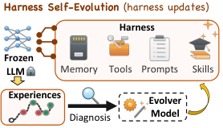
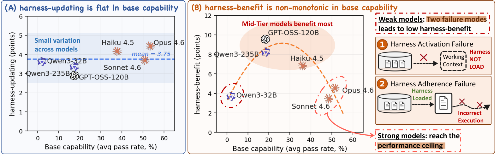
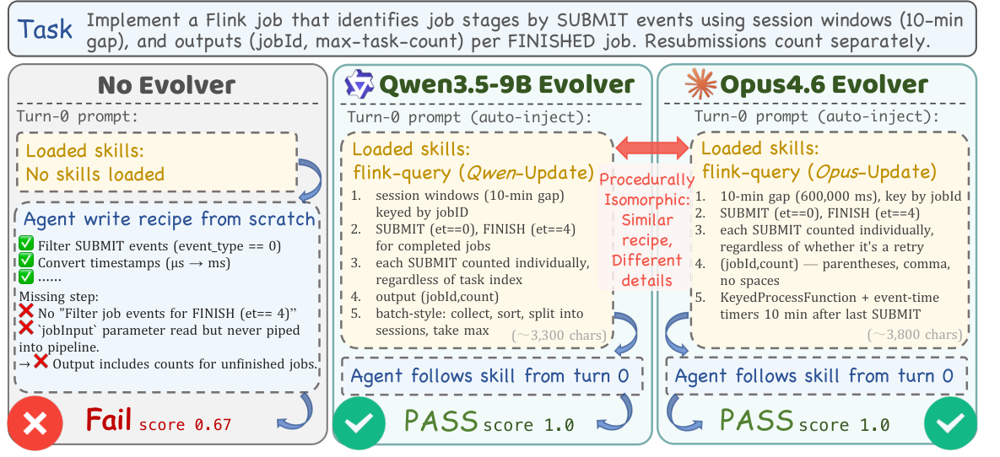
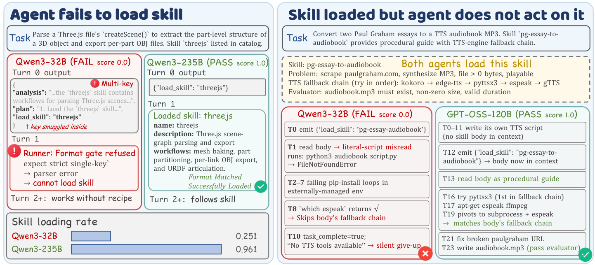

# Harness Updating Is Not Harness Benefit: Disentangling Evolution Capabilities in Self-Evolving LLM Agents

Minhua Lin ††thanks: Both authors contributed equally to this paper. Affiliation: The Pennsylvania State University  Email: [luhanqin@amazon.com](mailto:) Juncheng Wu11footnotemark:  1 Affiliation: UC Santa Cruz  Zijun Wang  Affiliation: UC Santa Cruz  Zhan Shi  Affiliation: Amazon  Yisi Sang  Affiliation: Amazon  Bing He  Affiliation: Amazon  Zewen Liu  Affiliation: Emory University  Tianxin Wei  Affiliation: UIUC  Zongyu Wu  Affiliation: The Pennsylvania State University  Zhiwei Zhang  Affiliation: The Pennsylvania State University  Dakuo Wang  Affiliation: Northeastern University{mfl5681,szw494}@psu.edu; {jwu418}@ucsc.edu;  Xiang Zhang  Affiliation: The Pennsylvania State University  Benoit Dumoulin  Affiliation: Amazon  Cihang Xie  Affiliation: UC Santa Cruz  Yuyin Zhou  Affiliation: UC Santa Cruz  Suhang Wang  Affiliation: The Pennsylvania State University  Hanqing Lu  Affiliation: Amazon 

###### Abstract

LLM agents are increasingly deployed as systems built around editable external harnesses, including prompts, skills, memories and tools, that shape task execution without changing model parameters. Harness self-evolution adapts such agents by updating these harnesses from execution evidence. Yet it remains unclear whether a model’s _base capability_ in task-solving predicts its capabilities in harness self-evolution: which models produce useful harness updates, and which actually benefit from them? We analyze two harness self-evolution capabilities: (i) _harness-updating_ , the capability to produce useful persistent harness updates from execution evidence; (ii) _harness-benefit_ , the capability to benefit from updated harnesses during task solving. Our analysis reveals two findings. First, _harness-updating is flat in base capability_ : models from different capability tiers produce harness updates that lead to surprisingly similar gains; even Qwen3.5-9B’s updates yield gains comparable to those of Claude Opus 4.6. Second, _harness-benefit is non-monotonic in base capability_ : weak-tier models benefit little from updated harnesses, mid-tier models benefit most, and strong-tier models benefit less than mid-tier. We trace low gains at the weak tier to two failure modes: weak-tier models may fail to activate relevant harness artifacts, or activate them but fail to follow them faithfully. These findings suggest investing capability budget in the task-solving agent rather than the evolver, and targeting harness invocation and long-horizon instruction following in agent training. Our source code is publicly available at [here](https://github.com/A-EVO-Lab/a-evolve/tree/release/harness-evolution).

## 1 Introduction

Large language models (LLMs) [Radford et al. (2018)](https://arxiv.org/html/2605.30621#bib.bib1); [Touvron et al. (2023)](https://arxiv.org/html/2605.30621#bib.bib2) have become a general-purpose foundation for language understanding [Hendrycks et al. (2020)](https://arxiv.org/html/2605.30621#bib.bib32), reasoning [Wang et al. (2025)](https://arxiv.org/html/2605.30621#bib.bib33), and task solving [Zhou et al. (2025)](https://arxiv.org/html/2605.30621#bib.bib35). Increasingly, they also power _agentic systems_ that interact with external environments, call tools, operate software interfaces, and complete long-horizon tasks [Yang et al. (2024b)](https://arxiv.org/html/2605.30621#bib.bib5); [Merrill et al. (2026)](https://arxiv.org/html/2605.30621#bib.bib34). In these settings, system behavior depends not only on the underlying model but also on an external _agent harness_ : prompts [Wei et al. (2022)](https://arxiv.org/html/2605.30621#bib.bib36), skills [Xia et al. (2026)](https://arxiv.org/html/2605.30621#bib.bib37), memories [Yan et al. (2025)](https://arxiv.org/html/2605.30621#bib.bib38), tools [Qin et al. (2024)](https://arxiv.org/html/2605.30621#bib.bib39), etc., that shape how the model observes, reasons, acts, and recovers from errors. Improving an agentic system increasingly means refining not only the foundation model, but also the editable harness around it.

 Figure 1: Overview of harness self-evolution.    
Figure 2: Overview of our findings. (i) _Harness-updating is flat in base capability_. Models across capability tiers produce harness updates that yield similar gains. (ii) _Harness-benefit is non-monotonic in base capability_. Mid-tier models benefit most, while weak-tier models benefit little due to failures in harness activation and adherence. 

In current practice, harnesses are typically designed by hand. However, such manual design is brittle in deployment-time environments: task distributions shift, edge cases appear, and useful procedures are discovered only after the system interacts with real tasks. A natural response is to update the harness automatically from execution evidence: failures, feedback, trajectories, and successful procedures can be written back into the harness and reused on future tasks. We refer to this setting as _harness evolution_ (Fig. [1](https://arxiv.org/html/2605.30621#S1.F1 "Figure 1 ‣ 1 Introduction ‣ Harness Updating Is Not Harness Benefit: Disentangling Evolution Capabilities in Self-Evolving LLM Agents")): the model weights remain fixed, while the external agent harness is revised over time. Recent self-evolving agent methods [Madaan et al. (2023)](https://arxiv.org/html/2605.30621#bib.bib8); [Wu et al. (2025)](https://arxiv.org/html/2605.30621#bib.bib27); [Agrawal et al. (2026)](https://arxiv.org/html/2605.30621#bib.bib10); [Xia et al. (2026)](https://arxiv.org/html/2605.30621#bib.bib37); [Lin et al. (2026b)](https://arxiv.org/html/2605.30621#bib.bib11) pursue this approach across diverse harness components and have shown end-task improvements over non-evolving baselines. In these works, harness updates are typically produced by an LLM from execution evidence; we refer to this update role as the _evolver_.

Despite this rapid progress, evaluation of these methods still asks an end-to-end question: does a self-evolution method effectively improve agent performance? This question is important, but it hides the source of improvement. The gain may come from the _evolver_ producing higher-quality harness updates, or from the task-solving agent using the updated harnesses more effectively during task solving. End-to-end scores cannot disentangle these contributions, leaving two practical questions open: _which models produce useful harness updates, and which models benefit most from them?_

To answer these questions, we analyze two evolution capabilities a model exercises in harness self-evolution across three agentic benchmarks and seven LLMs: _harness-updating_ , the capability to produce useful harness updates from execution evidence; and _harness-benefit_ , the capability to benefit from updated harnesses during task solving. A model exercises harness-updating as the evolver, and harness-benefit as the task-solving agent. We conduct comprehensive experiments by pairing seven LLMs, spanning open-source and closed-source families across capability tiers, as agents and evolvers on three representative agentic benchmarks. Our analysis reveals two systematic decouplings between harness-evolution capabilities and _base capability_ , namely, a model’s task-solving capability without harness evolution (Fig. [2](https://arxiv.org/html/2605.30621#S1.F2 "Figure 2 ‣ 1 Introduction ‣ Harness Updating Is Not Harness Benefit: Disentangling Evolution Capabilities in Self-Evolving LLM Agents")).

First, harness-updating is flat in base capability. When we fix the task-solving agent and vary the evolver model, models from different capability tiers produce harness updates that lead to surprisingly similar gains, and no evolver dominates across all substrates. Our case studies further show that even the Qwen3.5-9B evolver produces harness updates whose downstream gains match those of Claude Opus 4.6, despite a large gap in base capability.

Second, harness-benefit is non-monotonic across base-capability tiers. Mid-tier models (e.g., GPT-OSS-120B) benefit most from updated harness, and strong-tier models (e.g., Claude Opus 4.6) reach the performance ceiling and benefit less. The weak-tier end, however, is not explained by the same ceiling argument: with the largest headroom above their base capability, models like Qwen3-32B might be expected to benefit most, yet they benefit the least. Our in-depth analysis identifies two failure modes that explain this weak-tier gap: (i) _harness activation failure_ : weak models often _fail to invoke_ relevant harness artifacts (e.g., skills) during task-solving; and (ii) _harness adherence failure_ : even when the harness is loaded, weak models _fail to adhere_ to it due to weak instruction-following over long-horizon tasks.

These findings translate into design guidance for harness self-evolution systems. _(i) Allocate capability budget to the task-solving agent, not the evolver_ : the harness-updating gap across evolvers is at most 3.1 percentage points on any benchmark, so scaling up the evolver yields limited returns; post-evolution performance varies much more with the task-solving agent than with the evolver. _(ii) Bake harness invocation into agent training_ : weak-tier models often fail to load the harness at all (e.g., 25% load rate for Qwen3-32B against \(\approx 96\%\) for strong models), so harness invocation should be treated as a first-class learned skill. _(iii) Strengthen long-horizon instruction following_ : even when loaded, weak-tier adherence decays across the trajectory over four times more steeply than strong models, making sustained instruction following a second key target for downstream agent training.

## 2 Related Work

Harness engineering. An LLM agent combines a frozen backbone with an external _harness_ that mediates reasoning, tool use, memory access, and environment interaction [Yao et al. (2022)](https://arxiv.org/html/2605.30621#bib.bib4); [Yang et al. (2024b)](https://arxiv.org/html/2605.30621#bib.bib5); [Ning et al. (2026)](https://arxiv.org/html/2605.30621#bib.bib22). Recent work treats the harness as a first-class design object, differing mainly in the type of artifact exposed to the agent. Prompts and instructions provide natural-language guidance [Zhou et al. (2022)](https://arxiv.org/html/2605.30621#bib.bib42); [Pan et al. (2026)](https://arxiv.org/html/2605.30621#bib.bib21); tools expose external services and define how agents discover, invoke, and validate them [Hou et al. (2025)](https://arxiv.org/html/2605.30621#bib.bib45); [Qin et al. (2024)](https://arxiv.org/html/2605.30621#bib.bib39); [Liu et al. (2025)](https://arxiv.org/html/2605.30621#bib.bib44); [Lin et al. (2026a)](https://arxiv.org/html/2605.30621#bib.bib50); memory stores prior observations, facts, and strategies for later retrieval [Ouyang et al. (2025)](https://arxiv.org/html/2605.30621#bib.bib24); [Xu et al. (2026)](https://arxiv.org/html/2605.30621#bib.bib43); [Fang et al. (2026)](https://arxiv.org/html/2605.30621#bib.bib51); skills package reusable procedures into callable modules [Li et al. (2026b)](https://arxiv.org/html/2605.30621#bib.bib12); [Liu et al. (2026)](https://arxiv.org/html/2605.30621#bib.bib41); and code treats the harness itself as executable source that can be optimized by an agentic proposer [Lee et al. (2026)](https://arxiv.org/html/2605.30621#bib.bib26). These works establish harnesses as editable agent state. Our work shifts the focus from harness representation to model capabilities in updating and benefiting from harnesses. More details are in Appendix [A.1](https://arxiv.org/html/2605.30621#A1.SS1 "A.1 Harness Engineering ‣ Appendix A Full Details of Related Works ‣ Harness Updating Is Not Harness Benefit: Disentangling Evolution Capabilities in Self-Evolving LLM Agents").

Self-evolution of LLM agents. Beyond _what_ the harness contains, a complementary line asks how it is _updated_ from execution experience. Early systems adapt agents through episode- or task-level language feedback: verbal self-reflection [Shinn et al. (2023)](https://arxiv.org/html/2605.30621#bib.bib7) and iterative self-feedback [Madaan et al. (2023)](https://arxiv.org/html/2605.30621#bib.bib8) improve later attempts by feeding lessons back into context. More recent methods make persistent harness components the unit of self-evolution, updating prompts [Agarwal et al. (2024)](https://arxiv.org/html/2605.30621#bib.bib46); [Zhang et al. (2025b)](https://arxiv.org/html/2605.30621#bib.bib23); [Agrawal et al. (2026)](https://arxiv.org/html/2605.30621#bib.bib10), memories [Wu et al. (2025)](https://arxiv.org/html/2605.30621#bib.bib27); [Zhang et al. (2025a)](https://arxiv.org/html/2605.30621#bib.bib47); [Lin et al. (2026c)](https://arxiv.org/html/2605.30621#bib.bib40), skills [Xia et al. (2026)](https://arxiv.org/html/2605.30621#bib.bib37); [Alzubi et al. (2026)](https://arxiv.org/html/2605.30621#bib.bib49); [Yang et al. (2026)](https://arxiv.org/html/2605.30621#bib.bib53), or tools [Chen et al. (2025)](https://arxiv.org/html/2605.30621#bib.bib48); [Li et al. (2026a)](https://arxiv.org/html/2605.30621#bib.bib31) from execution traces. Collectively, these methods show that writing execution experience back into the harness can improve downstream task performance. However, evaluations in this line typically report the end-to-end gain of one update procedure paired with one target agent on one substrate [Li et al. (2026b)](https://arxiv.org/html/2605.30621#bib.bib12); [Jiang et al. (2026)](https://arxiv.org/html/2605.30621#bib.bib13); [Wei et al. (2025)](https://arxiv.org/html/2605.30621#bib.bib14). Such scores conflate three sources of improvement: the agent’s base capability, the evolver’s _harness-updating_ , and the agent’s _harness-benefit_. Our work complements these methods with a controlled analysis that varies task-solving agents and evolvers independently, measures harness-updating and harness-benefit separately, and tests whether either tracks base capability. More details in Appendix [A.2](https://arxiv.org/html/2605.30621#A1.SS2 "A.2 Self Evolution of LLM agents ‣ Appendix A Full Details of Related Works ‣ Harness Updating Is Not Harness Benefit: Disentangling Evolution Capabilities in Self-Evolving LLM Agents").

## 3 Harness-Evolution Capabilities

To explore the evolution capabilities in harness self-evolution, we consider harness self-evolution, which adapts an LLM agent by updating the external harness around a fixed model during task execution: the agent attempts a stream of tasks and the harness is updated based on the agent’s execution evidence. In this section, we formalize the harness-evolution protocol and define two evolution capabilities: _harness-updating_ , the ability to produce useful harness updates, and _harness-benefit_ , the ability to benefit from updated harnesses.

### 3.1 Preliminaries: Harness State and Evolver

Agent Harness. We use _agent harness_ to denote the external, non-parametric context and infrastructure through which an LLM is deployed for task execution [Yao et al. (2022)](https://arxiv.org/html/2605.30621#bib.bib4); [Ning et al. (2026)](https://arxiv.org/html/2605.30621#bib.bib22); [Lee et al. (2026)](https://arxiv.org/html/2605.30621#bib.bib26). Formally, at evolution step \(t\), the LLM agent is defined as:

| \[A_{t}=(f,H_{t}),\] |  | (1)  
---|---|---|---  
  
where \(f\) is the agent’s model backbone and \(H_{t}\) is the harness state after step \(t\). Following common harness self-evolution settings [Zhou et al. (2026)](https://arxiv.org/html/2605.30621#bib.bib28); [Lin et al. (2026b)](https://arxiv.org/html/2605.30621#bib.bib11), we keep \(f\) fixed and only update editable components of \(H_{t}\) (e.g., prompts, skills, memories), and fix other components such as tool interfaces and execution policies.

Evolver. An _evolver_ is the update procedure that converts the agent’s execution evidence into harness updates, where recent self-evolving agent systems [Yang et al. (2024a)](https://arxiv.org/html/2605.30621#bib.bib30); [Yuksekgonul et al. (2024)](https://arxiv.org/html/2605.30621#bib.bib29); [Xia et al. (2026)](https://arxiv.org/html/2605.30621#bib.bib37); [Agrawal et al. (2026)](https://arxiv.org/html/2605.30621#bib.bib10) increasingly instantiate this procedure with LLM agents. Formally, given the previous harness \(H_{t-1}\) and the accumulated execution evidence \(\mathcal{D}_{t}\) at step \(t\), the evolver \(e\) proposes a harness update and applies it to \(H_{t-1}\) to obtain the next harness:

| \(\displaystyle\Delta H_{t}\) | \(\displaystyle=e(H_{t-1},\mathcal{D}_{t}),\) |  | (2)  
---|---|---|---|---  
| \(\displaystyle H_{t}\) | \(\displaystyle=\mathrm{Apply}(H_{t-1},\Delta H_{t}).\) |   
  
where \(\mathrm{Apply}\) denotes the commit operation to apply \(\Delta H_{t}\) to \(H_{t-1}\).

### 3.2 Evolution Protocol

Following common harness self-evolution pipelines [Ouyang et al. (2025)](https://arxiv.org/html/2605.30621#bib.bib24); [Agrawal et al. (2026)](https://arxiv.org/html/2605.30621#bib.bib10), we formalize the protocol as an iterative loop between task-solving and harness evolution. Starting from an initial harness \(H_{0}\), the protocol iterates for \(T\) steps. At each step, the agent runs on a batch of tasks, collects execution evidence, and the evolver updates the harness for the next step. Formally, given an agent \(A_{t-1}=(f,H_{t-1})\) and a task batch \(\mathcal{X}_{t}\) at step \(t\), \(A_{t-1}\) attempts to solve each task \(x\in\mathcal{X}_{t}\) and output:

| \[(\tau_{t,x},y_{t,x})=\mathrm{Solve}(A_{t-1},x)\] |  | (3)  
---|---|---|---  
  
where \(\tau_{t,x}\) is the execution trajectory and \(y_{t,x}\) is the final output. The execution evidence \(\mathcal{D}_{t}\) is then:

| \[\mathcal{D}_{t}=\{(x,\tau_{t,x},y_{t,x}):x\in\mathcal{X}_{t}\}.\] |  | (4)  
---|---|---|---  
  
The evolver produces the updated harness \(H_{t}\) from \(H_{t-1}\) and \(\mathcal{D}_{t}\) as in Eq. [2](https://arxiv.org/html/2605.30621#S3.E2 "Equation 2 ‣ 3.1 Preliminaries: Harness State and Evolver ‣ 3 Harness-Evolution Capabilities ‣ Harness Updating Is Not Harness Benefit: Disentangling Evolution Capabilities in Self-Evolving LLM Agents"), yielding the next agent \(A_{t}=(f,H_{t})\). This loop repeats for \(T\) steps, producing the final harness \(H_{T}\).

### 3.3 Capability Metrics

To analyze which models produce useful harness updates and which models benefit from them, we formally define three metrics to measure both harness-evolution capabilities (i.e., _harness-updating_ and _harness-benefit_) along with each model’s _base capability_.

Base Capability and Evolution Gain. Given a task set \(\mathcal{X}=\bigcup_{t=1}^{T}\mathcal{X}_{t}\), the _base capability_ of a model \(f\) is the task-solving performance of the initial agent \(A_{0}=(f,H_{0})\) on \(\mathcal{X}\):

| \[M_{\text{base}}(f)=J_{\mathcal{X}}(f,H_{0}),\] |  | (5)  
---|---|---|---  
  
where \(J_{\mathcal{X}}(f,H)\) is the scoring function that measures the performance of agent \((f,H)\) on \(\mathcal{X}\).

Given a model \(f\) and an evolver \(e\), let \(H_{T}^{(f,e)}\) denote the final harness produced after evolution with \(f\) as the agent and \(e\) as the evolver for \(T\) steps starting from \(H_{0}\). We further define the _pairwise evolution gain_ as the improvement of a specific agent–evolver pairing \((f,e)\) over the agent’s task-solving performance before evolution:

| \[\Delta(f,e)=J_{\mathcal{X}}(f,H_{T}^{(f,e)})-M_{\text{base}}(f).\] |  | (6)  
---|---|---|---  
  
Harness-updating Capability. The _harness-updating capability_ of an evolver \(e\) is its ability to produce harness updates that improve agents’ task-solving. Formally, this is defined as the mean pairwise gain across an anchor agent set \(\mathcal{F}^{\star}\):

| \[\Delta_{\text{update}}(e)=\frac{1}{|\mathcal{F}^{\star}|}\sum_{f\in\mathcal{F}^{\star}}\Delta(f,e).\] |  | (7)  
---|---|---|---  
  
Harness-benefit Capability. The _harness-benefit capability_ of a model \(f\) is its maximum gain in task-solving performance from harness self-evolution. In practice, we estimate this as the maximum pairwise gain across a fixed anchor evolver set \(\mathcal{E}^{\star}\):

| \[\Delta_{\text{benefit}}(f)=\max_{e\in\mathcal{E}^{\star}}\Delta(f,e).\] |  | (8)  
---|---|---|---  
  
## 4 Experiments

In this section, we empirically analyze the two harness-evolution capabilities defined in Sec. [3](https://arxiv.org/html/2605.30621#S3 "3 Harness-Evolution Capabilities ‣ Harness Updating Is Not Harness Benefit: Disentangling Evolution Capabilities in Self-Evolving LLM Agents"). We present the evolver-side analysis of harness-updating capability in Sec. [4.2](https://arxiv.org/html/2605.30621#S4.SS2 "4.2 Evolver-side Analysis ‣ 4 Experiments ‣ Harness Updating Is Not Harness Benefit: Disentangling Evolution Capabilities in Self-Evolving LLM Agents"), and the agent-side analysis of harness-benefit capability in Sec. [4.3](https://arxiv.org/html/2605.30621#S4.SS3 "4.3 Agent-side Analysis ‣ 4 Experiments ‣ Harness Updating Is Not Harness Benefit: Disentangling Evolution Capabilities in Self-Evolving LLM Agents")

### 4.1 Experimental Setup

Datasets. We evaluate on three representative agentic benchmarks: SWE-bench Verified (SWE) [Jimenez et al. (2024)](https://arxiv.org/html/2605.30621#bib.bib3) for software engineering, MCP-Atlas (MCP) [Bandi et al. (2026)](https://arxiv.org/html/2605.30621#bib.bib6) for tool use over real MCP servers, and SkillsBench (SB) [Li et al. (2026b)](https://arxiv.org/html/2605.30621#bib.bib12) for skill-based execution across diverse domains. More details of these datasets are in Appendix [B.1](https://arxiv.org/html/2605.30621#A2.SS1 "B.1 Dataset Details ‣ Appendix B Experimental Setup Details ‣ Harness Updating Is Not Harness Benefit: Disentangling Evolution Capabilities in Self-Evolving LLM Agents").

Figure 3: Harness-updating capability (\(\Delta_{\text{update}}\)) of each evolver. Evolvers are grouped by model family (Claude, Qwen, GPT-OSS). The best and worst evolver, marked in bold within each panel, change with the benchmark.

Models. We use seven LLM backbones, spanning open-source and closed-source families across capability tiers. For the agent-side analysis, we use six models: Claude Opus 4.6 [Anthropic (2026a)](https://arxiv.org/html/2605.30621#bib.bib16), Claude Sonnet 4.6 [Anthropic (2026b)](https://arxiv.org/html/2605.30621#bib.bib17), Claude Haiku 4.5 [Anthropic (2025)](https://arxiv.org/html/2605.30621#bib.bib15), Qwen3-235B-A22B and Qwen3-32B [Yang et al. (2025)](https://arxiv.org/html/2605.30621#bib.bib18), and GPT-OSS-120B [Agarwal et al. (2025)](https://arxiv.org/html/2605.30621#bib.bib20). For the evolver-side analysis, we use the same six models plus Qwen3.5-9B [Qwen (2026)](https://arxiv.org/html/2605.30621#bib.bib19), the smallest model in this paper, to test whether a substantially smaller open model can still produce useful harness updates.

Evaluation Protocol. We report three metrics defined in Sec. [3.3](https://arxiv.org/html/2605.30621#S3.SS3 "3.3 Capability Metrics ‣ 3 Harness-Evolution Capabilities ‣ Harness Updating Is Not Harness Benefit: Disentangling Evolution Capabilities in Self-Evolving LLM Agents"): base capability \(M_{\mathrm{base}}(f)\), harness-updating gain \(\Delta_{\mathrm{update}}(e)\), and harness-benefit gain \(\Delta_{\mathrm{benefit}}(f)\). To calculate them, we use pass rate as the primary metric for \(J_{\mathcal{X}}\) on three benchmarks. We consider an in-situ evaluation setting: each task in \(\mathcal{X}_{t}\) is scored under \(H_{t-1}\) before its evidence is used to produce \(H_{t}\). The final results are reported by aggregating per-task scores over the task stream. Further details are in Appendix [B.3](https://arxiv.org/html/2605.30621#A2.SS3 "B.3 Metrics ‣ Appendix B Experimental Setup Details ‣ Harness Updating Is Not Harness Benefit: Disentangling Evolution Capabilities in Self-Evolving LLM Agents").

Implementation Details. We instantiate the evolution protocol in Sec. [3.2](https://arxiv.org/html/2605.30621#S3.SS2 "3.2 Evolution Protocol ‣ 3 Harness-Evolution Capabilities ‣ Harness Updating Is Not Harness Benefit: Disentangling Evolution Capabilities in Self-Evolving LLM Agents") with a fixed solve-evolve loop. For a fair comparison, we fix the prompt template for both agents and evolvers, along with the trajectory window, across all agent-evolver pairs; only the LLM backbone varies. All pairs within a benchmark start from the same initial harness \(H_{0}\) and task stream \(\mathcal{X}\), share the same evolution budget \(\beta\) and per-task turn limit. The evolvable components are skills for SWE-bench Verified and SkillsBench, and skills, prompts, and memories for MCP-Atlas. Other details such as prompt templates are in Appendix [B.4](https://arxiv.org/html/2605.30621#A2.SS4 "B.4 Implementation Details ‣ Appendix B Experimental Setup Details ‣ Harness Updating Is Not Harness Benefit: Disentangling Evolution Capabilities in Self-Evolving LLM Agents").

### 4.2 Evolver-side Analysis

To understand how harness-updating capability varies across LLMs, we fix the task-solving agents and vary the evolver over the seven LLMs in Sec. [4.1](https://arxiv.org/html/2605.30621#S4.SS1 "4.1 Experimental Setup ‣ 4 Experiments ‣ Harness Updating Is Not Harness Benefit: Disentangling Evolution Capabilities in Self-Evolving LLM Agents"). Specifically, we use three representative LLMs, Opus 4.6, Sonnet 4.6, and Qwen3-235B, as the anchor agents in \(\mathcal{F}^{\star}\). For each evolver \(e\), we report \(\Delta_{\mathrm{update}}(e)\), defined in Sec. [3.3](https://arxiv.org/html/2605.30621#S3.SS3 "3.3 Capability Metrics ‣ 3 Harness-Evolution Capabilities ‣ Harness Updating Is Not Harness Benefit: Disentangling Evolution Capabilities in Self-Evolving LLM Agents"), across the three benchmarks in Fig. [3](https://arxiv.org/html/2605.30621#S4.F3 "Figure 3 ‣ 4.1 Experimental Setup ‣ 4 Experiments ‣ Harness Updating Is Not Harness Benefit: Disentangling Evolution Capabilities in Self-Evolving LLM Agents"). Full pass-rate results for all agent-evolver pairings are in Appendix [C.1](https://arxiv.org/html/2605.30621#A3.SS1 "C.1 Additional Results for Observation 1 ‣ Appendix C Evolver-side Analysis Details in Sec. ‣ Harness Updating Is Not Harness Benefit: Disentangling Evolution Capabilities in Self-Evolving LLM Agents").

Observation 1: Harness-updating is flat in base capability. Fig. [3](https://arxiv.org/html/2605.30621#S4.F3 "Figure 3 ‣ 4.1 Experimental Setup ‣ 4 Experiments ‣ Harness Updating Is Not Harness Benefit: Disentangling Evolution Capabilities in Self-Evolving LLM Agents") shows two patterns: (i) _The spread of \(\Delta_{\text{update}}\) across evolvers is narrow_. The gap between the best and worst evolver is at most 3.1 percentage points (pp) on any benchmark, and no model wins across benchmarks. Qwen3-235B illustrates this reshuffling: it leads on SWE (8.2 pp) but ranks last on MCP (0.6 pp). (ii) _Model scale is not predictive_. The smallest evolver, Qwen3.5-9B, posts the highest gain on SB (3.8 pp), exceeding both Opus 4.6 (2.3 pp) and Qwen3-235B (1.5 pp).

Case Study: the 9B evolver writes a skill procedurally isomorphic to Opus’s. To understand the mechanism behind these comparable gains, we examine a representative SkillsBench task flink-query in detail. We fix the task-solving agent backbone at Opus 4.6 and compare its trajectories under three evolver conditions (Fig. [4](https://arxiv.org/html/2605.30621#S4.F4 "Figure 4 ‣ 4.2 Evolver-side Analysis ‣ 4 Experiments ‣ Harness Updating Is Not Harness Benefit: Disentangling Evolution Capabilities in Self-Evolving LLM Agents")): no evolver, Qwen3.5-9B as evolver, and Opus 4.6 as evolver. We observe that without an evolved skill, the agent omits the FINISH-event filter and fail to solve this task (scores 0.67); with a skill injected by either Qwen3.5-9B or Opus 4.6, the same agent solves the task successfully (score 1.0). Inspecting the two skills, we find they are procedurally isomorphic, prescribing the same sequence of steps and differing only in surface details of implementation and verbosity. The 9B open-source evolver thus reaches the same procedural content as the frontier evolver. Full details of the skill contents and analysis are in Appendix [C.2](https://arxiv.org/html/2605.30621#A3.SS2 "C.2 More Details of the Case Study ‣ Appendix C Evolver-side Analysis Details in Sec. ‣ Harness Updating Is Not Harness Benefit: Disentangling Evolution Capabilities in Self-Evolving LLM Agents").

 Figure 4: Comparison of harness updated by Qwen3.5-9B and Claude Opus 4.6. We compare an Opus 4.6 agent on the SkillsBench flink-query task under three conditions: no evolved skill (left, score 0.67), a skill evolved by Qwen3.5-9B (center, score 1.0), and a skill evolved by Opus 4.6 (right, score 1.0). Both evolved skills encode procedurally similar guidance and enable the same agent to solve the task. 

Observation 2: Post-evolution score is dominated by models’ base capability, not evolver identity. To understand the relative contribution of task-solving agents and evolvers to post-evolution performance, we plot the task-solving performances of three LLMs (Opus 4.6, Sonnet 4.6, Qwen3-235B) in \(\mathcal{F}^{\star}\) under the updated harnesses from seven LLMs in Sec. [4.1](https://arxiv.org/html/2605.30621#S4.SS1 "4.1 Experimental Setup ‣ 4 Experiments ‣ Harness Updating Is Not Harness Benefit: Disentangling Evolution Capabilities in Self-Evolving LLM Agents") as the evolvers against each agents’ base capability. Results on MCP-Atlas are shown in Fig. [5](https://arxiv.org/html/2605.30621#S4.F5 "Figure 5 ‣ 4.2 Evolver-side Analysis ‣ 4 Experiments ‣ Harness Updating Is Not Harness Benefit: Disentangling Evolution Capabilities in Self-Evolving LLM Agents"). We observe: (i) _Within-agent spread is much smaller than between-agent gap._ The within-agent spread across seven evolvers is at most 5.1 pp (Qwen3-235B), small against the 36.0 pp gap between the Opus and Qwen3-235B base capabilities. The pattern persists on SWE and SB. (ii) _Extreme pairing still favors strong agents._ Even pairing the weakest anchor agent with its best-performing evolver against the strongest anchor agent with its worst-performing evolver, the strong agent still leads by 18.6 to 35.2 pp on every benchmark. Both patterns also persist on SWE and SB datasets (Appendix [C.3](https://arxiv.org/html/2605.30621#A3.SS3 "C.3 Additional Results for Observation 2 ‣ Appendix C Evolver-side Analysis Details in Sec. ‣ Harness Updating Is Not Harness Benefit: Disentangling Evolution Capabilities in Self-Evolving LLM Agents")). Post-evolution performance is therefore bottlenecked on the agent side, not the evolver side, motivating the agent-side analysis in Sec. [4.3](https://arxiv.org/html/2605.30621#S4.SS3 "4.3 Agent-side Analysis ‣ 4 Experiments ‣ Harness Updating Is Not Harness Benefit: Disentangling Evolution Capabilities in Self-Evolving LLM Agents").

Figure 5: MCP post-evolution scores: for each anchor agent every blue dot is one of seven evolved scores and the black tick is the no-evolve baseline. Within-agent variation across evolvers is small relative to between-agent variation in base capability.

Take-away. Allocate capability budget to the task-solving agent, not the evolver: (i) \(\Delta_{\text{update}}\) varies by at most 3.1 pp across evolvers on any benchmark, and (ii) post-evolution score is dominated by the agent’s base capability.

### 4.3 Agent-side Analysis

To understand how _harness-benefit_ capability varies across LLMs, we fix the evolvers and vary the task-solving agent over the LLM backbones in Sec. [4.1](https://arxiv.org/html/2605.30621#S4.SS1 "4.1 Experimental Setup ‣ 4 Experiments ‣ Harness Updating Is Not Harness Benefit: Disentangling Evolution Capabilities in Self-Evolving LLM Agents"): Opus 4.6, Sonnet 4.6, Haiku 4.5, Qwen3-235B, Qwen3-32B, and GPT-OSS-120B. We use Opus 4.6, Sonnet 4.6, and Qwen3-235B as the three anchor evolvers, denoted by \(\mathcal{E}^{\star}\). For each agent \(f\), we report \(\Delta_{\mathrm{benefit}}(f)\), defined in Sec. [3.3](https://arxiv.org/html/2605.30621#S3.SS3 "3.3 Capability Metrics ‣ 3 Harness-Evolution Capabilities ‣ Harness Updating Is Not Harness Benefit: Disentangling Evolution Capabilities in Self-Evolving LLM Agents"), in Tab. [1](https://arxiv.org/html/2605.30621#S4.T1 "Table 1 ‣ 4.3 Agent-side Analysis ‣ 4 Experiments ‣ Harness Updating Is Not Harness Benefit: Disentangling Evolution Capabilities in Self-Evolving LLM Agents") and Fig. [6](https://arxiv.org/html/2605.30621#S4.F6 "Figure 6 ‣ 4.3 Agent-side Analysis ‣ 4 Experiments ‣ Harness Updating Is Not Harness Benefit: Disentangling Evolution Capabilities in Self-Evolving LLM Agents"). The full pass-rate results for all agent-evolver pairings are in Tab. [7](https://arxiv.org/html/2605.30621#A3.T7 "Table 7 ‣ C.2 More Details of the Case Study ‣ Appendix C Evolver-side Analysis Details in Sec. ‣ Harness Updating Is Not Harness Benefit: Disentangling Evolution Capabilities in Self-Evolving LLM Agents") in Appendix [D.2](https://arxiv.org/html/2605.30621#A4.SS2 "D.2 More results of Δ_"benefit" in Sec. ‣ Appendix D Agent-side Analysis Details in Sec. ‣ Harness Updating Is Not Harness Benefit: Disentangling Evolution Capabilities in Self-Evolving LLM Agents").

Observation 1: \(\Delta_{\mathrm{benefit}}\) is non-monotonic in base capability. As shown in Tab. [1](https://arxiv.org/html/2605.30621#S4.T1 "Table 1 ‣ 4.3 Agent-side Analysis ‣ 4 Experiments ‣ Harness Updating Is Not Harness Benefit: Disentangling Evolution Capabilities in Self-Evolving LLM Agents") and Fig. [6](https://arxiv.org/html/2605.30621#S4.F6 "Figure 6 ‣ 4.3 Agent-side Analysis ‣ 4 Experiments ‣ Harness Updating Is Not Harness Benefit: Disentangling Evolution Capabilities in Self-Evolving LLM Agents"), \(\Delta_{\mathrm{benefit}}\) does not increase monotonically with base capability. On SWE, the gain peaks at Qwen3-235B (19.3 pp), while the weaker Qwen3-32B gains only 4.4 pp and the stronger Opus 4.6 gains only 2.6 pp. On MCP, the peak shifts to GPT-OSS-120B (7.0 pp), again with lower gains at both ends of the base-capability scale. This pattern has different explanations at the two ends of the capability scale. At the high-capability end, smaller gains are consistent with a ceiling effect: strong models already solve many tasks under the initial harness, leaving less room for further improvement. However, at the low-capability end, smaller gains reflect a different bottleneck, which we diagnose next.

Table 1: Base pass rate (%) and harness-benefit \(\Delta_{\mathrm{benefit}}\) (pp) across benchmarks. Each row is one LLM backbone used as the task-solving agent. Bold marks the largest \(\Delta_{\mathrm{benefit}}\) within each benchmark. | SWE | MCP | SB  
---|---|---|---  
Model | Base | \(\Delta\) | Base | \(\Delta\) | Base | \(\Delta\)  
Qwen3-32B | 3.6 | 4.4 | 3.6 | 1.0 | 0.0 | 5.8  
Qwen3-235B | 20.7 | 19.3 | 25.0 | 4.3 | 4.7 | 1.1  
GPT-OSS-120B | 26.2 | 15.8 | 28.0 | 7.0 | 0.0 | 7.0  
Haiku 4.5 | 66.0 | 2.4 | 42.4 | 3.6 | 5.8 | 15.1  
Sonnet 4.6 | 73.2 | 2.8 | 54.0 | 3.2 | 24.4 | 3.5  
Opus 4.6 | 74.2 | 2.6 | 61.0 | 3.6 | 25.6 | 5.8  
Figure 6: \(\Delta_{\mathrm{benefit}}\) versus base pass rate on SWE. Each point is one LLM backbone used as the task-solving agent; points are connected in ascending base pass rate. MCP and SB analogues are in Appendix [D.2](https://arxiv.org/html/2605.30621#A4.SS2 "D.2 More results of Δ_"benefit" in Sec. ‣ Appendix D Agent-side Analysis Details in Sec. ‣ Harness Updating Is Not Harness Benefit: Disentangling Evolution Capabilities in Self-Evolving LLM Agents").

Observation 2: Weak-tier models derive low \(\Delta_{\text{benefit}}\) due to two failure modes. To understand why the weak-tier models with low base capabilities receive low \(\Delta_{\text{benefit}}\), we conduct an in-depth analysis on SkillsBench and identify two complementary failure modes: _harness activation_ and _harness adherence_ , which is illustrated in Fig. [7](https://arxiv.org/html/2605.30621#S4.F7 "Figure 7 ‣ 4.3 Agent-side Analysis ‣ 4 Experiments ‣ Harness Updating Is Not Harness Benefit: Disentangling Evolution Capabilities in Self-Evolving LLM Agents").

The first mode is _harness activation failure_ : weak-tier models often fail to bring relevant harness artifacts, such as skills, into their working context. To quantify this on SkillsBench, we report each agent’s _skill-load rate (SLR)_ , the fraction of its trajectories in which it actively loads at least one skill into its context. Tab. [2](https://arxiv.org/html/2605.30621#S4.T2 "Table 2 ‣ 4.3 Agent-side Analysis ‣ 4 Experiments ‣ Harness Updating Is Not Harness Benefit: Disentangling Evolution Capabilities in Self-Evolving LLM Agents") shows that the skill-load rate is near ceiling for Opus 4.6, Sonnet 4.6, and Qwen3-235B (0.957–0.961), but drops to 0.446 for GPT-OSS-120B and 0.251 for Qwen3-32B. The left panel of Fig. [7](https://arxiv.org/html/2605.30621#S4.F7 "Figure 7 ‣ 4.3 Agent-side Analysis ‣ 4 Experiments ‣ Harness Updating Is Not Harness Benefit: Disentangling Evolution Capabilities in Self-Evolving LLM Agents") illustrates this activation failure. Specifically, Qwen3-32B identifies the relevant skill, but embeds the loading request inside a broader action rather than issuing it as a standalone skill-loading action. The SkillsBench environment therefore does not treat it as a valid load request, so the skill body never enters context.

The second mode is _harness adherence failure_ : even when relevant harness artifacts are loaded, weak-tier models often fail to follow their guidance faithfully during task solving. We quantify this failure with the _Harness-Following Rate_ (HFR), computed over trajectories in which at least one skill is loaded. For each skill-loaded task-solving trajectory, an LLM judge determines whether the task-solving model follows the loaded skill’s guidance. HFR is the fraction of skill-loaded trajectories judged as following the skill. Appendix [D.3](https://arxiv.org/html/2605.30621#A4.SS3 "D.3 Judge Details for Harness-Following Rate ‣ Appendix D Agent-side Analysis Details in Sec. ‣ Harness Updating Is Not Harness Benefit: Disentangling Evolution Capabilities in Self-Evolving LLM Agents") provides details of the judge pipeline. Tab. [2](https://arxiv.org/html/2605.30621#S4.T2 "Table 2 ‣ 4.3 Agent-side Analysis ‣ 4 Experiments ‣ Harness Updating Is Not Harness Benefit: Disentangling Evolution Capabilities in Self-Evolving LLM Agents") reports HFR together with two complementary metrics: _SLR_ , which measures harness activation, and _pass-when-loaded (LPR)_ , which measures the pass rate among that model’s skill-loaded trajectories. We observe two patterns. (i) _Strong-tier models exhibit much higher harness adherence than weak-tier models._ Opus 4.6 reaches an HFR of 0.757, while Qwen3-32B reaches only 0.142. (ii) _Loading the harness is not sufficient for benefiting from it._ Qwen3-235B provides the cleanest separation between activation and adherence: its skill-load rate is 0.961, nearly identical to Opus 4.6, yet its HFR is only 0.350. Its pass-when-loaded rate mirrors this gap, at 0.022 compared with 0.177 for Opus 4.6. The pg-essay-to-audiobook case in the right panel of Fig. [7](https://arxiv.org/html/2605.30621#S4.F7 "Figure 7 ‣ 4.3 Agent-side Analysis ‣ 4 Experiments ‣ Harness Updating Is Not Harness Benefit: Disentangling Evolution Capabilities in Self-Evolving LLM Agents") illustrates this adherence failure. Qwen3-32B successfully loads the procedural skill, but treats the guidance as a ready-made script rather than a procedure to follow. After the first attempt fails, it terminates instead of trying the alternative steps prescribed by the skill. More details of the analysis are in Appendix [D.1](https://arxiv.org/html/2605.30621#A4.SS1 "D.1 Case Studies for the Two Agent-Side Failure Modes ‣ Appendix D Agent-side Analysis Details in Sec. ‣ Harness Updating Is Not Harness Benefit: Disentangling Evolution Capabilities in Self-Evolving LLM Agents").

 Figure 7: Two harness-benefit failure modes for Qwen3-32B on SkillsBench. Left (threejs): _harness activation failure_ , where an invalid multi-key load action prevents the skill body from entering context. Right (pg-essay-to-audiobook): _harness adherence failure_ , where the skill is loaded but the agent treats it as a literal script and skips the prescribed fallback chain. Table 2: Per-model activation, adherence, and outcome metrics on SkillsBench. SLR: fraction of a model’s trajectories in which at least one skill is loaded into context. HFR: fraction of skill-loaded trajectories judged as following the loaded skill’s guidance. LPR: pass rate among the model’s skill-loaded trajectories. Models are sorted by base capability on SkillsBench. Model | SLR | HFR | LPR  
---|---|---|---  
Qwen3-32B | 0.251 | 0.142 | 0.023  
GPT-OSS-120B | 0.446 | 0.442 | 0.040  
Haiku 4.5 | 0.794 | 0.600 | 0.099  
Qwen3-235B | 0.961 | 0.350 | 0.022  
Sonnet 4.6 | 0.959 | 0.730 | 0.145  
Opus 4.6 | 0.957 | 0.757 | 0.177  
  
Diagnosis: Weak instruction following over long-horizon execution. To test whether harness adherence degrades as a trajectory unfolds, we conduct a phase-level adherence analysis. An LLM judge assigns a 0–1 adherence score at different execution stages, with details provided in Appendix [D.4](https://arxiv.org/html/2605.30621#A4.SS4 "D.4 Judge Details for Phase-Level Adherence Score ‣ Appendix D Agent-side Analysis Details in Sec. ‣ Harness Updating Is Not Harness Benefit: Disentangling Evolution Capabilities in Self-Evolving LLM Agents"). We use Qwen3-32B, GPT-OSS-120B, and Opus 4.6 as representative weak-, mid-, and strong-tier models, respectively. Tab. [3](https://arxiv.org/html/2605.30621#S4.T3 "Table 3 ‣ 4.3 Agent-side Analysis ‣ 4 Experiments ‣ Harness Updating Is Not Harness Benefit: Disentangling Evolution Capabilities in Self-Evolving LLM Agents") reports three representative phases, after harness loading, at the trajectory midpoint, and at final validation, with scores averaged over judged trajectories for each model. We observe that Qwen3-32B drops sharply from 0.52 after harness loading to 0.13 at final validation, while GPT-OSS-120B drops more moderately from 0.67 to 0.43. In contrast, Opus 4.6 remains stable, from 0.89 to 0.80. This graded drift suggests a long-horizon instruction-following bottleneck: weaker models progressively lose adherence as the trajectory unfolds, rather than merely misreading the harness at load time.

Table 3: Per-phase adherence scores for representative weak-, mid-, and strong-tier models (Qwen3-32B, GPT-OSS-120B, and Opus 4.6). Bold and underlining mark the best and worst score in each phase. Trajectory Phase | Qwen3-32B | GPT-OSS | Opus 4.6  
---|---|---|---  
| (weak) | (mid) | (strong)  
Harness loaded | 0.52 | 0.67 | 0.89  
Mid turn | 0.22 | 0.48 | 0.79  
Final turn | 0.13 | 0.43 | 0.80  
drift (load \(\to\) final) | -0.39 | -0.24 | -0.09  
  
Take-away. Agent training should target harness-benefit along two axes. (i) _Bake harness invocation into training_ : weak-tier models have low skill-load rates (25.1% for Qwen3-32B vs. \(\approx 96\%\) for strong-tier models), so agents must learn to reliably bring relevant harness artifacts into context. _(ii) Strengthen long-horizon instruction following_ : even after loading the harness, weak-tier models lose adherence over the trajectory (Qwen3-32B drifts from 0.52 to 0.13), so agents must learn to sustain harness guidance over long-horizon tasks.

## 5 Conclusion

We analyze harness self-evolution by decomposing it into two model capabilities distinct from base capability: _harness-updating_ , the capability to produce harness updates, and _harness-benefit_ , the capability to benefit from updated harnesses during task solving. Across seven LLMs and three benchmarks, harness-updating is flat in base capability: models across capability tiers produce updates that yield similar gains, and even the Qwen3.5-9B evolver induces gains comparable to Claude Opus 4.6. In contrast, harness-benefit is non-monotonic in base capability: weak-tier models gain little, traced to two failure modes: failing to activate relevant harness artifacts and failing to follow them faithfully once activated. These findings motivate investing capability budget in the agent rather than the evolver, and targeting agent training at harness invocation and long-horizon instruction following.

## 6 Limitations

Our study focuses on harness self-evolution, where model weights remain fixed and adaptation occurs through updates to external harness artifacts. We do not evaluate parametric fine-tuning, reinforcement learning of model weights, or hybrid adaptation methods that combine weight updates with harness updates. Our model set is representative but not exhaustive: we include open-source and closed-source models across multiple capability tiers, but a broader model grid would further clarify how harness-updating and harness-benefit vary with model family, scale, training recipe, and deployment cost.

## 7 Ethics Statement

This work studies LLM agents that update persistent external harnesses from execution evidence. All experiments are conducted on benchmark tasks, and we do not collect or process private user data. However, harness self-evolution raises broader deployment concerns because updated harnesses may persist across future tasks. Incorrect lessons, unsafe tool-use rules, biased instructions, or sensitive information could be written into the harness and reused by later agents. In our evaluation, harness updates are logged, and evolvers are constrained from modifying evaluation scripts or updating model weights. These controls make the benchmark setting auditable, but they do not by themselves guarantee safety in open deployments. Real-world harness self-evolution systems should treat privacy, consent for data retention, update reversibility, auditability, and human oversight as first-class design requirements.

## References

  * Agarwal et al. (2024) E. Agarwal, J. Singh, V. Dani, R. Magazine, T. Ganu, and A. Nambi Promptwizard: task-aware prompt optimization framework.  arXiv preprint arXiv:2405.18369.  Cited by: [§A.2](https://arxiv.org/html/2605.30621#A1.SS2.p2.1 "A.2 Self Evolution of LLM agents ‣ Appendix A Full Details of Related Works ‣ Harness Updating Is Not Harness Benefit: Disentangling Evolution Capabilities in Self-Evolving LLM Agents"), [§2](https://arxiv.org/html/2605.30621#S2.p2.1 "2 Related Work ‣ Harness Updating Is Not Harness Benefit: Disentangling Evolution Capabilities in Self-Evolving LLM Agents"). 
  * Agarwal et al. (2025) S. Agarwal, L. Ahmad, J. Ai, S. Altman, A. Applebaum, E. Arbus, R. K. Arora, Y. Bai, B. Baker, H. Bao, et al. Gpt-oss-120b & gpt-oss-20b model card.  arXiv preprint arXiv:2508.10925.  Cited by: [§B.2](https://arxiv.org/html/2605.30621#A2.SS2.p1.1 "B.2 Models ‣ Appendix B Experimental Setup Details ‣ Harness Updating Is Not Harness Benefit: Disentangling Evolution Capabilities in Self-Evolving LLM Agents"), [§4.1](https://arxiv.org/html/2605.30621#S4.SS1.p2.1 "4.1 Experimental Setup ‣ 4 Experiments ‣ Harness Updating Is Not Harness Benefit: Disentangling Evolution Capabilities in Self-Evolving LLM Agents"). 
  * Agrawal et al. (2026) L. A. Agrawal, S. Tan, D. Soylu, N. Ziems, R. Khare, K. Opsahl-Ong, A. Singhvi, H. Shandilya, M. J. Ryan, M. Jiang, C. Potts, K. Sen, A. Dimakis, I. Stoica, D. Klein, M. Zaharia, and O. Khattab GEPA: reflective prompt evolution can outperform reinforcement learning.  In The Fourteenth International Conference on Learning Representations,  External Links: [Link](https://openreview.net/forum?id=RQm2KQTM5r) Cited by: [§A.2](https://arxiv.org/html/2605.30621#A1.SS2.p2.1 "A.2 Self Evolution of LLM agents ‣ Appendix A Full Details of Related Works ‣ Harness Updating Is Not Harness Benefit: Disentangling Evolution Capabilities in Self-Evolving LLM Agents"), [§1](https://arxiv.org/html/2605.30621#S1.p2.1 "1 Introduction ‣ Harness Updating Is Not Harness Benefit: Disentangling Evolution Capabilities in Self-Evolving LLM Agents"), [§2](https://arxiv.org/html/2605.30621#S2.p2.1 "2 Related Work ‣ Harness Updating Is Not Harness Benefit: Disentangling Evolution Capabilities in Self-Evolving LLM Agents"), [§3.1](https://arxiv.org/html/2605.30621#S3.SS1.p2.2 "3.1 Preliminaries: Harness State and Evolver ‣ 3 Harness-Evolution Capabilities ‣ Harness Updating Is Not Harness Benefit: Disentangling Evolution Capabilities in Self-Evolving LLM Agents"), [§3.2](https://arxiv.org/html/2605.30621#S3.SS2.p1.1 "3.2 Evolution Protocol ‣ 3 Harness-Evolution Capabilities ‣ Harness Updating Is Not Harness Benefit: Disentangling Evolution Capabilities in Self-Evolving LLM Agents"). 
  * Alzubi et al. (2026) S. Alzubi, N. Provenzano, J. Bingham, W. Chen, and T. Vu Evoskill: automated skill discovery for multi-agent systems.  arXiv preprint arXiv:2603.02766.  Cited by: [§A.2](https://arxiv.org/html/2605.30621#A1.SS2.p2.1 "A.2 Self Evolution of LLM agents ‣ Appendix A Full Details of Related Works ‣ Harness Updating Is Not Harness Benefit: Disentangling Evolution Capabilities in Self-Evolving LLM Agents"), [§2](https://arxiv.org/html/2605.30621#S2.p2.1 "2 Related Work ‣ Harness Updating Is Not Harness Benefit: Disentangling Evolution Capabilities in Self-Evolving LLM Agents"). 
  * Anthropic (2025) Anthropic Claude haiku 4.5 system card.  External Links: [Link](https://www-cdn.anthropic.com/7aad69bf12627d42234e01ee7c36305dc2f6a970.pdf) Cited by: [§B.2](https://arxiv.org/html/2605.30621#A2.SS2.p1.1 "B.2 Models ‣ Appendix B Experimental Setup Details ‣ Harness Updating Is Not Harness Benefit: Disentangling Evolution Capabilities in Self-Evolving LLM Agents"), [§4.1](https://arxiv.org/html/2605.30621#S4.SS1.p2.1 "4.1 Experimental Setup ‣ 4 Experiments ‣ Harness Updating Is Not Harness Benefit: Disentangling Evolution Capabilities in Self-Evolving LLM Agents"). 
  * Anthropic (2026a) Anthropic Claude opus 4.6 system card.  External Links: [Link](https://www-cdn.anthropic.com/6a5fa276ac68b9aeb0c8b6af5fa36326e0e166dd.pdf) Cited by: [§B.2](https://arxiv.org/html/2605.30621#A2.SS2.p1.1 "B.2 Models ‣ Appendix B Experimental Setup Details ‣ Harness Updating Is Not Harness Benefit: Disentangling Evolution Capabilities in Self-Evolving LLM Agents"), [§4.1](https://arxiv.org/html/2605.30621#S4.SS1.p2.1 "4.1 Experimental Setup ‣ 4 Experiments ‣ Harness Updating Is Not Harness Benefit: Disentangling Evolution Capabilities in Self-Evolving LLM Agents"). 
  * Anthropic (2026b) Anthropic Claude sonnet 4.6 system card.  External Links: [Link](https://www-cdn.anthropic.com/bbd8ef16d70b7a1665f14f306ee88b53f686aa75.pdf) Cited by: [§B.2](https://arxiv.org/html/2605.30621#A2.SS2.p1.1 "B.2 Models ‣ Appendix B Experimental Setup Details ‣ Harness Updating Is Not Harness Benefit: Disentangling Evolution Capabilities in Self-Evolving LLM Agents"), [§4.1](https://arxiv.org/html/2605.30621#S4.SS1.p2.1 "4.1 Experimental Setup ‣ 4 Experiments ‣ Harness Updating Is Not Harness Benefit: Disentangling Evolution Capabilities in Self-Evolving LLM Agents"). 
  * Bandi et al. (2026) C. Bandi, B. Hertzberg, G. Boo, T. Polakam, J. Da, S. Hassaan, M. Sharma, A. Park, E. Hernandez, D. Rambado, et al. MCP-atlas: a large-scale benchmark for tool-use competency with real mcp servers.  arXiv preprint arXiv:2602.00933.  Cited by: [2nd item](https://arxiv.org/html/2605.30621#A2.I1.i2.p1.1.1 "In B.1 Dataset Details ‣ Appendix B Experimental Setup Details ‣ Harness Updating Is Not Harness Benefit: Disentangling Evolution Capabilities in Self-Evolving LLM Agents"), [2nd item](https://arxiv.org/html/2605.30621#A2.I2.i2.p1.1 "In B.3 Metrics ‣ Appendix B Experimental Setup Details ‣ Harness Updating Is Not Harness Benefit: Disentangling Evolution Capabilities in Self-Evolving LLM Agents"), [§4.1](https://arxiv.org/html/2605.30621#S4.SS1.p1.1 "4.1 Experimental Setup ‣ 4 Experiments ‣ Harness Updating Is Not Harness Benefit: Disentangling Evolution Capabilities in Self-Evolving LLM Agents"). 
  * Chen et al. (2025) G. Chen, Z. Zhang, X. Cong, F. Guo, Y. Wu, Y. Lin, W. Feng, and Y. Wang Learning evolving tools for large language models.  In The Thirteenth International Conference on Learning Representations,  External Links: [Link](https://openreview.net/forum?id=wtrDLMFU9v) Cited by: [§A.2](https://arxiv.org/html/2605.30621#A1.SS2.p2.1 "A.2 Self Evolution of LLM agents ‣ Appendix A Full Details of Related Works ‣ Harness Updating Is Not Harness Benefit: Disentangling Evolution Capabilities in Self-Evolving LLM Agents"), [§2](https://arxiv.org/html/2605.30621#S2.p2.1 "2 Related Work ‣ Harness Updating Is Not Harness Benefit: Disentangling Evolution Capabilities in Self-Evolving LLM Agents"). 
  * Fang et al. (2026) J. Fang, X. Deng, H. Xu, Z. Jiang, Y. Tang, Z. Xu, S. Deng, Y. Yao, M. Wang, S. Qiao, H. Chen, and N. Zhang LightMem: lightweight and efficient memory-augmented generation.  In The Fourteenth International Conference on Learning Representations,  External Links: [Link](https://openreview.net/forum?id=dyJ0GWpjJB) Cited by: [§A.1](https://arxiv.org/html/2605.30621#A1.SS1.p1.1 "A.1 Harness Engineering ‣ Appendix A Full Details of Related Works ‣ Harness Updating Is Not Harness Benefit: Disentangling Evolution Capabilities in Self-Evolving LLM Agents"), [§2](https://arxiv.org/html/2605.30621#S2.p1.1 "2 Related Work ‣ Harness Updating Is Not Harness Benefit: Disentangling Evolution Capabilities in Self-Evolving LLM Agents"). 
  * Hendrycks et al. (2020) D. Hendrycks, C. Burns, S. Basart, A. Zou, M. Mazeika, D. Song, and J. Steinhardt Measuring massive multitask language understanding.  arXiv preprint arXiv:2009.03300.  Cited by: [§1](https://arxiv.org/html/2605.30621#S1.p1.1 "1 Introduction ‣ Harness Updating Is Not Harness Benefit: Disentangling Evolution Capabilities in Self-Evolving LLM Agents"). 
  * Hou et al. (2025) X. Hou, Y. Zhao, S. Wang, and H. Wang Model context protocol (mcp): landscape, security threats, and future research directions.  ACM Transactions on Software Engineering and Methodology.  Cited by: [§A.1](https://arxiv.org/html/2605.30621#A1.SS1.p1.1 "A.1 Harness Engineering ‣ Appendix A Full Details of Related Works ‣ Harness Updating Is Not Harness Benefit: Disentangling Evolution Capabilities in Self-Evolving LLM Agents"), [§2](https://arxiv.org/html/2605.30621#S2.p1.1 "2 Related Work ‣ Harness Updating Is Not Harness Benefit: Disentangling Evolution Capabilities in Self-Evolving LLM Agents"). 
  * Jiang et al. (2026) S. Jiang, L. Ma, Z. Hong, K. Wang, Z. Lu, S. Chen, J. Zhang, T. Pan, W. Zhou, J. Liang, et al. SEA-eval: a benchmark for evaluating self-evolving agents beyond episodic assessment.  arXiv preprint arXiv:2604.08988.  Cited by: [§A.2](https://arxiv.org/html/2605.30621#A1.SS2.p3.1 "A.2 Self Evolution of LLM agents ‣ Appendix A Full Details of Related Works ‣ Harness Updating Is Not Harness Benefit: Disentangling Evolution Capabilities in Self-Evolving LLM Agents"), [§2](https://arxiv.org/html/2605.30621#S2.p2.1 "2 Related Work ‣ Harness Updating Is Not Harness Benefit: Disentangling Evolution Capabilities in Self-Evolving LLM Agents"). 
  * Jimenez et al. (2024) C. E. Jimenez, J. Yang, A. Wettig, S. Yao, K. Pei, O. Press, and K. Narasimhan Swe-bench: can language models resolve real-world github issues?.  In International Conference on Learning Representations,  Vol. 2024, pp. 54107–54157.  Cited by: [1st item](https://arxiv.org/html/2605.30621#A2.I1.i1.p1.1.1 "In B.1 Dataset Details ‣ Appendix B Experimental Setup Details ‣ Harness Updating Is Not Harness Benefit: Disentangling Evolution Capabilities in Self-Evolving LLM Agents"), [1st item](https://arxiv.org/html/2605.30621#A2.I2.i1.p1.1 "In B.3 Metrics ‣ Appendix B Experimental Setup Details ‣ Harness Updating Is Not Harness Benefit: Disentangling Evolution Capabilities in Self-Evolving LLM Agents"), [§4.1](https://arxiv.org/html/2605.30621#S4.SS1.p1.1 "4.1 Experimental Setup ‣ 4 Experiments ‣ Harness Updating Is Not Harness Benefit: Disentangling Evolution Capabilities in Self-Evolving LLM Agents"). 
  * Lee et al. (2026) Y. Lee, R. Nair, Q. Zhang, K. Lee, O. Khattab, and C. Finn Meta-harness: end-to-end optimization of model harnesses.  arXiv preprint arXiv:2603.28052.  Cited by: [§A.1](https://arxiv.org/html/2605.30621#A1.SS1.p1.1 "A.1 Harness Engineering ‣ Appendix A Full Details of Related Works ‣ Harness Updating Is Not Harness Benefit: Disentangling Evolution Capabilities in Self-Evolving LLM Agents"), [§2](https://arxiv.org/html/2605.30621#S2.p1.1 "2 Related Work ‣ Harness Updating Is Not Harness Benefit: Disentangling Evolution Capabilities in Self-Evolving LLM Agents"), [§3.1](https://arxiv.org/html/2605.30621#S3.SS1.p1.1 "3.1 Preliminaries: Harness State and Evolver ‣ 3 Harness-Evolution Capabilities ‣ Harness Updating Is Not Harness Benefit: Disentangling Evolution Capabilities in Self-Evolving LLM Agents"). 
  * Li et al. (2026a) H. Li, S. Yang, W. Qi, S. Zhao, R. Hua, M. Song, X. Yang, and C. Peng Yunjue agent tech report: a fully reproducible, zero-start in-situ self-evolving agent system for open-ended tasks.  arXiv preprint arXiv:2601.18226.  Cited by: [§A.2](https://arxiv.org/html/2605.30621#A1.SS2.p2.1 "A.2 Self Evolution of LLM agents ‣ Appendix A Full Details of Related Works ‣ Harness Updating Is Not Harness Benefit: Disentangling Evolution Capabilities in Self-Evolving LLM Agents"), [§2](https://arxiv.org/html/2605.30621#S2.p2.1 "2 Related Work ‣ Harness Updating Is Not Harness Benefit: Disentangling Evolution Capabilities in Self-Evolving LLM Agents"). 
  * Li et al. (2026b) X. Li, W. Chen, Y. Liu, S. Zheng, X. Chen, Y. He, Y. Li, B. You, H. Shen, J. Sun, et al. SkillsBench: benchmarking how well agent skills work across diverse tasks.  arXiv preprint arXiv:2602.12670.  Cited by: [§A.1](https://arxiv.org/html/2605.30621#A1.SS1.p1.1 "A.1 Harness Engineering ‣ Appendix A Full Details of Related Works ‣ Harness Updating Is Not Harness Benefit: Disentangling Evolution Capabilities in Self-Evolving LLM Agents"), [§A.2](https://arxiv.org/html/2605.30621#A1.SS2.p3.1 "A.2 Self Evolution of LLM agents ‣ Appendix A Full Details of Related Works ‣ Harness Updating Is Not Harness Benefit: Disentangling Evolution Capabilities in Self-Evolving LLM Agents"), [3rd item](https://arxiv.org/html/2605.30621#A2.I1.i3.p1.1.1 "In B.1 Dataset Details ‣ Appendix B Experimental Setup Details ‣ Harness Updating Is Not Harness Benefit: Disentangling Evolution Capabilities in Self-Evolving LLM Agents"), [3rd item](https://arxiv.org/html/2605.30621#A2.I2.i3.p1.1 "In B.3 Metrics ‣ Appendix B Experimental Setup Details ‣ Harness Updating Is Not Harness Benefit: Disentangling Evolution Capabilities in Self-Evolving LLM Agents"), [§B.4](https://arxiv.org/html/2605.30621#A2.SS4.p2.1 "B.4 Implementation Details ‣ Appendix B Experimental Setup Details ‣ Harness Updating Is Not Harness Benefit: Disentangling Evolution Capabilities in Self-Evolving LLM Agents"), [§2](https://arxiv.org/html/2605.30621#S2.p1.1 "2 Related Work ‣ Harness Updating Is Not Harness Benefit: Disentangling Evolution Capabilities in Self-Evolving LLM Agents"), [§2](https://arxiv.org/html/2605.30621#S2.p2.1 "2 Related Work ‣ Harness Updating Is Not Harness Benefit: Disentangling Evolution Capabilities in Self-Evolving LLM Agents"), [§4.1](https://arxiv.org/html/2605.30621#S4.SS1.p1.1 "4.1 Experimental Setup ‣ 4 Experiments ‣ Harness Updating Is Not Harness Benefit: Disentangling Evolution Capabilities in Self-Evolving LLM Agents"). 
  * Lin et al. (2026a) M. Lin, E. Dai, H. Liu, X. Tang, Y. Yan, Z. Dai, J. Zeng, Z. Zhang, F. Wang, H. Gao, C. Luo, X. Zhang, Q. He, and S. Wang How far are LLMs from professional poker players? revisiting game-theoretic reasoning with agentic tool use.  In The Fourteenth International Conference on Learning Representations,  External Links: [Link](https://openreview.net/forum?id=vV54ShHvGi) Cited by: [§A.1](https://arxiv.org/html/2605.30621#A1.SS1.p1.1 "A.1 Harness Engineering ‣ Appendix A Full Details of Related Works ‣ Harness Updating Is Not Harness Benefit: Disentangling Evolution Capabilities in Self-Evolving LLM Agents"), [§2](https://arxiv.org/html/2605.30621#S2.p1.1 "2 Related Work ‣ Harness Updating Is Not Harness Benefit: Disentangling Evolution Capabilities in Self-Evolving LLM Agents"). 
  * Lin et al. (2026b) M. Lin, H. Lu, Z. Shi, B. He, R. Mao, Z. Zhang, Z. Wu, X. Tang, H. Liu, Z. Dai, R. Zhang, X. Zhang, S. Wang, B. Dumoulin, and J. Pei Position: agentic evolution is the path to evolving LLMs.  In First Workshop on Agent Skills,  External Links: [Link](https://openreview.net/forum?id=9ypfISYVNZ) Cited by: [§1](https://arxiv.org/html/2605.30621#S1.p2.1 "1 Introduction ‣ Harness Updating Is Not Harness Benefit: Disentangling Evolution Capabilities in Self-Evolving LLM Agents"), [§3.1](https://arxiv.org/html/2605.30621#S3.SS1.p1.2 "3.1 Preliminaries: Harness State and Evolver ‣ 3 Harness-Evolution Capabilities ‣ Harness Updating Is Not Harness Benefit: Disentangling Evolution Capabilities in Self-Evolving LLM Agents"). 
  * Lin et al. (2025) M. Lin, Z. Wu, Z. Xu, H. Liu, X. Tang, Q. He, C. Aggarwal, X. Zhang, and S. Wang A comprehensive survey on reinforcement learning-based agentic search: foundations, roles, optimizations, evaluations, and applications.  arXiv preprint arXiv:2510.16724.  Cited by: [§A.1](https://arxiv.org/html/2605.30621#A1.SS1.p1.1 "A.1 Harness Engineering ‣ Appendix A Full Details of Related Works ‣ Harness Updating Is Not Harness Benefit: Disentangling Evolution Capabilities in Self-Evolving LLM Agents"). 
  * Lin et al. (2026c) M. Lin, Z. Zhang, H. Lu, H. Liu, X. Tang, Q. He, X. Zhang, and S. Wang MemMA: coordinating the memory cycle through multi-agent reasoning and in-situ self-evolution.  arXiv preprint arXiv:2603.18718.  Cited by: [§A.2](https://arxiv.org/html/2605.30621#A1.SS2.p2.1 "A.2 Self Evolution of LLM agents ‣ Appendix A Full Details of Related Works ‣ Harness Updating Is Not Harness Benefit: Disentangling Evolution Capabilities in Self-Evolving LLM Agents"), [§2](https://arxiv.org/html/2605.30621#S2.p2.1 "2 Related Work ‣ Harness Updating Is Not Harness Benefit: Disentangling Evolution Capabilities in Self-Evolving LLM Agents"). 
  * Liu et al. (2026) D. Liu, Z. Li, H. Du, X. Wu, S. Gui, Y. Kuang, and L. Sun Graph of skills: dependency-aware structural retrieval for massive agent skills.  arXiv preprint arXiv:2604.05333.  Cited by: [§A.1](https://arxiv.org/html/2605.30621#A1.SS1.p1.1 "A.1 Harness Engineering ‣ Appendix A Full Details of Related Works ‣ Harness Updating Is Not Harness Benefit: Disentangling Evolution Capabilities in Self-Evolving LLM Agents"), [§2](https://arxiv.org/html/2605.30621#S2.p1.1 "2 Related Work ‣ Harness Updating Is Not Harness Benefit: Disentangling Evolution Capabilities in Self-Evolving LLM Agents"). 
  * Liu et al. (2025) W. Liu, X. Huang, X. Zeng, S. Yu, D. Li, S. Wang, W. Gan, Z. Liu, Y. Yu, Z. WANG, et al. Toolace: winning the points of llm function calling.  In International Conference on Learning Representations,  Vol. 2025, pp. 41359–41381.  Cited by: [§A.1](https://arxiv.org/html/2605.30621#A1.SS1.p1.1 "A.1 Harness Engineering ‣ Appendix A Full Details of Related Works ‣ Harness Updating Is Not Harness Benefit: Disentangling Evolution Capabilities in Self-Evolving LLM Agents"), [§2](https://arxiv.org/html/2605.30621#S2.p1.1 "2 Related Work ‣ Harness Updating Is Not Harness Benefit: Disentangling Evolution Capabilities in Self-Evolving LLM Agents"). 
  * Madaan et al. (2023) A. Madaan, N. Tandon, P. Gupta, S. Hallinan, L. Gao, S. Wiegreffe, U. Alon, N. Dziri, S. Prabhumoye, Y. Yang, et al. Self-refine: iterative refinement with self-feedback.  Advances in neural information processing systems 36, pp. 46534–46594.  Cited by: [§A.2](https://arxiv.org/html/2605.30621#A1.SS2.p1.1 "A.2 Self Evolution of LLM agents ‣ Appendix A Full Details of Related Works ‣ Harness Updating Is Not Harness Benefit: Disentangling Evolution Capabilities in Self-Evolving LLM Agents"), [§1](https://arxiv.org/html/2605.30621#S1.p2.1 "1 Introduction ‣ Harness Updating Is Not Harness Benefit: Disentangling Evolution Capabilities in Self-Evolving LLM Agents"), [§2](https://arxiv.org/html/2605.30621#S2.p2.1 "2 Related Work ‣ Harness Updating Is Not Harness Benefit: Disentangling Evolution Capabilities in Self-Evolving LLM Agents"). 
  * Merrill et al. (2026) M. A. Merrill, A. G. Shaw, N. Carlini, B. Li, H. Raj, I. Bercovich, L. Shi, J. Y. Shin, T. Walshe, E. K. Buchanan, et al. Terminal-bench: benchmarking agents on hard, realistic tasks in command line interfaces.  arXiv preprint arXiv:2601.11868.  Cited by: [3rd item](https://arxiv.org/html/2605.30621#A2.I2.i3.p1.1 "In B.3 Metrics ‣ Appendix B Experimental Setup Details ‣ Harness Updating Is Not Harness Benefit: Disentangling Evolution Capabilities in Self-Evolving LLM Agents"), [§1](https://arxiv.org/html/2605.30621#S1.p1.1 "1 Introduction ‣ Harness Updating Is Not Harness Benefit: Disentangling Evolution Capabilities in Self-Evolving LLM Agents"). 
  * Ning et al. (2026) X. Ning, K. Tieu, D. Fu, T. Wei, Z. Li, Y. Bei, J. Zou, M. Ai, Z. Liu, T. Li, et al. Code as agent harness.  arXiv preprint arXiv:2605.18747.  Cited by: [§A.1](https://arxiv.org/html/2605.30621#A1.SS1.p1.1 "A.1 Harness Engineering ‣ Appendix A Full Details of Related Works ‣ Harness Updating Is Not Harness Benefit: Disentangling Evolution Capabilities in Self-Evolving LLM Agents"), [§2](https://arxiv.org/html/2605.30621#S2.p1.1 "2 Related Work ‣ Harness Updating Is Not Harness Benefit: Disentangling Evolution Capabilities in Self-Evolving LLM Agents"), [§3.1](https://arxiv.org/html/2605.30621#S3.SS1.p1.1 "3.1 Preliminaries: Harness State and Evolver ‣ 3 Harness-Evolution Capabilities ‣ Harness Updating Is Not Harness Benefit: Disentangling Evolution Capabilities in Self-Evolving LLM Agents"). 
  * Ouyang et al. (2025) S. Ouyang, J. Yan, I. Hsu, Y. Chen, K. Jiang, Z. Wang, R. Han, L. T. Le, S. Daruki, X. Tang, et al. Reasoningbank: scaling agent self-evolving with reasoning memory.  arXiv preprint arXiv:2509.25140.  Cited by: [§A.1](https://arxiv.org/html/2605.30621#A1.SS1.p1.1 "A.1 Harness Engineering ‣ Appendix A Full Details of Related Works ‣ Harness Updating Is Not Harness Benefit: Disentangling Evolution Capabilities in Self-Evolving LLM Agents"), [§2](https://arxiv.org/html/2605.30621#S2.p1.1 "2 Related Work ‣ Harness Updating Is Not Harness Benefit: Disentangling Evolution Capabilities in Self-Evolving LLM Agents"), [§3.2](https://arxiv.org/html/2605.30621#S3.SS2.p1.1 "3.2 Evolution Protocol ‣ 3 Harness-Evolution Capabilities ‣ Harness Updating Is Not Harness Benefit: Disentangling Evolution Capabilities in Self-Evolving LLM Agents"). 
  * Pan et al. (2026) L. Pan, L. Zou, S. Guo, J. Ni, and H. Zheng Natural-language agent harnesses.  arXiv preprint arXiv:2603.25723.  Cited by: [§A.1](https://arxiv.org/html/2605.30621#A1.SS1.p1.1 "A.1 Harness Engineering ‣ Appendix A Full Details of Related Works ‣ Harness Updating Is Not Harness Benefit: Disentangling Evolution Capabilities in Self-Evolving LLM Agents"), [§2](https://arxiv.org/html/2605.30621#S2.p1.1 "2 Related Work ‣ Harness Updating Is Not Harness Benefit: Disentangling Evolution Capabilities in Self-Evolving LLM Agents"). 
  * Qin et al. (2024) Y. Qin, S. Liang, Y. Ye, K. Zhu, L. Yan, Y. Lu, Y. Lin, X. Cong, X. Tang, B. Qian, et al. Toolllm: facilitating large language models to master 16000+ real-world apis.  In International Conference on Learning Representations,  Vol. 2024, pp. 9695–9717.  Cited by: [§A.1](https://arxiv.org/html/2605.30621#A1.SS1.p1.1 "A.1 Harness Engineering ‣ Appendix A Full Details of Related Works ‣ Harness Updating Is Not Harness Benefit: Disentangling Evolution Capabilities in Self-Evolving LLM Agents"), [§1](https://arxiv.org/html/2605.30621#S1.p1.1 "1 Introduction ‣ Harness Updating Is Not Harness Benefit: Disentangling Evolution Capabilities in Self-Evolving LLM Agents"), [§2](https://arxiv.org/html/2605.30621#S2.p1.1 "2 Related Work ‣ Harness Updating Is Not Harness Benefit: Disentangling Evolution Capabilities in Self-Evolving LLM Agents"). 
  * Qwen (2026) T. Qwen Qwen3.5: accelerating productivity with native multimodal agents.  External Links: [Link](https://qwen.ai/blog?id=qwen3.5) Cited by: [§B.2](https://arxiv.org/html/2605.30621#A2.SS2.p1.1 "B.2 Models ‣ Appendix B Experimental Setup Details ‣ Harness Updating Is Not Harness Benefit: Disentangling Evolution Capabilities in Self-Evolving LLM Agents"), [§4.1](https://arxiv.org/html/2605.30621#S4.SS1.p2.1 "4.1 Experimental Setup ‣ 4 Experiments ‣ Harness Updating Is Not Harness Benefit: Disentangling Evolution Capabilities in Self-Evolving LLM Agents"). 
  * Radford et al. (2018) A. Radford, K. Narasimhan, T. Salimans, I. Sutskever, et al. Improving language understanding by generative pre-training.  Cited by: [§1](https://arxiv.org/html/2605.30621#S1.p1.1 "1 Introduction ‣ Harness Updating Is Not Harness Benefit: Disentangling Evolution Capabilities in Self-Evolving LLM Agents"). 
  * Shinn et al. (2023) N. Shinn, F. Cassano, A. Gopinath, K. Narasimhan, and S. Yao Reflexion: language agents with verbal reinforcement learning.  Advances in neural information processing systems 36, pp. 8634–8652.  Cited by: [§A.2](https://arxiv.org/html/2605.30621#A1.SS2.p1.1 "A.2 Self Evolution of LLM agents ‣ Appendix A Full Details of Related Works ‣ Harness Updating Is Not Harness Benefit: Disentangling Evolution Capabilities in Self-Evolving LLM Agents"), [§2](https://arxiv.org/html/2605.30621#S2.p2.1 "2 Related Work ‣ Harness Updating Is Not Harness Benefit: Disentangling Evolution Capabilities in Self-Evolving LLM Agents"). 
  * Touvron et al. (2023) H. Touvron, T. Lavril, G. Izacard, X. Martinet, M. Lachaux, T. Lacroix, B. Rozière, N. Goyal, E. Hambro, F. Azhar, et al. Llama: open and efficient foundation language models.  arXiv preprint arXiv:2302.13971.  Cited by: [§1](https://arxiv.org/html/2605.30621#S1.p1.1 "1 Introduction ‣ Harness Updating Is Not Harness Benefit: Disentangling Evolution Capabilities in Self-Evolving LLM Agents"). 
  * Wang et al. (2023) G. Wang, Y. Xie, Y. Jiang, A. Mandlekar, C. Xiao, Y. Zhu, L. Fan, and A. Anandkumar Voyager: an open-ended embodied agent with large language models.  arXiv preprint arXiv:2305.16291.  Cited by: [§A.2](https://arxiv.org/html/2605.30621#A1.SS2.p2.1 "A.2 Self Evolution of LLM agents ‣ Appendix A Full Details of Related Works ‣ Harness Updating Is Not Harness Benefit: Disentangling Evolution Capabilities in Self-Evolving LLM Agents"). 
  * Wang et al. (2025) R. Wang, R. Wang, Y. Shen, C. Wu, Q. Zhou, and R. Chandra Evaluation of llms for mathematical problem solving.  arXiv preprint arXiv:2506.00309.  Cited by: [§1](https://arxiv.org/html/2605.30621#S1.p1.1 "1 Introduction ‣ Harness Updating Is Not Harness Benefit: Disentangling Evolution Capabilities in Self-Evolving LLM Agents"). 
  * Wang et al. (2024) Z. Z. Wang, J. Mao, D. Fried, and G. Neubig Agent workflow memory.  arXiv preprint arXiv:2409.07429.  Cited by: [§A.2](https://arxiv.org/html/2605.30621#A1.SS2.p2.1 "A.2 Self Evolution of LLM agents ‣ Appendix A Full Details of Related Works ‣ Harness Updating Is Not Harness Benefit: Disentangling Evolution Capabilities in Self-Evolving LLM Agents"). 
  * Wei et al. (2022) J. Wei, X. Wang, D. Schuurmans, M. Bosma, F. Xia, E. Chi, Q. V. Le, D. Zhou, et al. Chain-of-thought prompting elicits reasoning in large language models.  Advances in neural information processing systems 35, pp. 24824–24837.  Cited by: [§1](https://arxiv.org/html/2605.30621#S1.p1.1 "1 Introduction ‣ Harness Updating Is Not Harness Benefit: Disentangling Evolution Capabilities in Self-Evolving LLM Agents"). 
  * Wei et al. (2025) T. Wei, N. Sachdeva, B. Coleman, Z. He, Y. Bei, X. Ning, M. Ai, Y. Li, J. He, E. H. Chi, et al. Evo-memory: benchmarking llm agent test-time learning with self-evolving memory.  arXiv preprint arXiv:2511.20857.  Cited by: [§A.2](https://arxiv.org/html/2605.30621#A1.SS2.p3.1 "A.2 Self Evolution of LLM agents ‣ Appendix A Full Details of Related Works ‣ Harness Updating Is Not Harness Benefit: Disentangling Evolution Capabilities in Self-Evolving LLM Agents"), [§2](https://arxiv.org/html/2605.30621#S2.p2.1 "2 Related Work ‣ Harness Updating Is Not Harness Benefit: Disentangling Evolution Capabilities in Self-Evolving LLM Agents"). 
  * Wu et al. (2025) R. Wu, X. Wang, J. Mei, P. Cai, D. Fu, C. Yang, L. Wen, X. Yang, Y. Shen, Y. Wang, et al. Evolver: self-evolving llm agents through an experience-driven lifecycle.  arXiv preprint arXiv:2510.16079.  Cited by: [§A.2](https://arxiv.org/html/2605.30621#A1.SS2.p2.1 "A.2 Self Evolution of LLM agents ‣ Appendix A Full Details of Related Works ‣ Harness Updating Is Not Harness Benefit: Disentangling Evolution Capabilities in Self-Evolving LLM Agents"), [§1](https://arxiv.org/html/2605.30621#S1.p2.1 "1 Introduction ‣ Harness Updating Is Not Harness Benefit: Disentangling Evolution Capabilities in Self-Evolving LLM Agents"), [§2](https://arxiv.org/html/2605.30621#S2.p2.1 "2 Related Work ‣ Harness Updating Is Not Harness Benefit: Disentangling Evolution Capabilities in Self-Evolving LLM Agents"). 
  * Xia et al. (2026) P. Xia, J. Chen, H. Wang, J. Liu, K. Zeng, Y. Wang, S. Han, Y. Zhou, X. Zhao, H. Chen, et al. Skillrl: evolving agents via recursive skill-augmented reinforcement learning.  arXiv preprint arXiv:2602.08234.  Cited by: [§A.2](https://arxiv.org/html/2605.30621#A1.SS2.p2.1 "A.2 Self Evolution of LLM agents ‣ Appendix A Full Details of Related Works ‣ Harness Updating Is Not Harness Benefit: Disentangling Evolution Capabilities in Self-Evolving LLM Agents"), [§1](https://arxiv.org/html/2605.30621#S1.p1.1 "1 Introduction ‣ Harness Updating Is Not Harness Benefit: Disentangling Evolution Capabilities in Self-Evolving LLM Agents"), [§1](https://arxiv.org/html/2605.30621#S1.p2.1 "1 Introduction ‣ Harness Updating Is Not Harness Benefit: Disentangling Evolution Capabilities in Self-Evolving LLM Agents"), [§2](https://arxiv.org/html/2605.30621#S2.p2.1 "2 Related Work ‣ Harness Updating Is Not Harness Benefit: Disentangling Evolution Capabilities in Self-Evolving LLM Agents"), [§3.1](https://arxiv.org/html/2605.30621#S3.SS1.p2.2 "3.1 Preliminaries: Harness State and Evolver ‣ 3 Harness-Evolution Capabilities ‣ Harness Updating Is Not Harness Benefit: Disentangling Evolution Capabilities in Self-Evolving LLM Agents"). 
  * Xu et al. (2026) W. Xu, Z. Liang, K. Mei, H. Gao, J. Tan, and Y. Zhang A-mem: agentic memory for llm agents.  Advances in Neural Information Processing Systems 38, pp. 17577–17604.  Cited by: [§A.1](https://arxiv.org/html/2605.30621#A1.SS1.p1.1 "A.1 Harness Engineering ‣ Appendix A Full Details of Related Works ‣ Harness Updating Is Not Harness Benefit: Disentangling Evolution Capabilities in Self-Evolving LLM Agents"), [§2](https://arxiv.org/html/2605.30621#S2.p1.1 "2 Related Work ‣ Harness Updating Is Not Harness Benefit: Disentangling Evolution Capabilities in Self-Evolving LLM Agents"). 
  * Yan et al. (2025) S. Yan, X. Yang, Z. Huang, E. Nie, Z. Ding, Z. Li, X. Ma, J. Bi, K. Kersting, J. Z. Pan, et al. Memory-r1: enhancing large language model agents to manage and utilize memories via reinforcement learning.  arXiv preprint arXiv:2508.19828.  Cited by: [§1](https://arxiv.org/html/2605.30621#S1.p1.1 "1 Introduction ‣ Harness Updating Is Not Harness Benefit: Disentangling Evolution Capabilities in Self-Evolving LLM Agents"). 
  * Yang et al. (2025) A. Yang, A. Li, B. Yang, B. Zhang, B. Hui, B. Zheng, B. Yu, C. Gao, C. Huang, C. Lv, et al. Qwen3 technical report.  arXiv preprint arXiv:2505.09388.  Cited by: [§B.2](https://arxiv.org/html/2605.30621#A2.SS2.p1.1 "B.2 Models ‣ Appendix B Experimental Setup Details ‣ Harness Updating Is Not Harness Benefit: Disentangling Evolution Capabilities in Self-Evolving LLM Agents"), [§4.1](https://arxiv.org/html/2605.30621#S4.SS1.p2.1 "4.1 Experimental Setup ‣ 4 Experiments ‣ Harness Updating Is Not Harness Benefit: Disentangling Evolution Capabilities in Self-Evolving LLM Agents"). 
  * Yang et al. (2024a) C. Yang, X. Wang, Y. Lu, H. Liu, Q. V. Le, D. Zhou, and X. Chen Large language models as optimizers.  In International Conference on Learning Representations,  Vol. 2024, pp. 12028–12068.  Cited by: [§3.1](https://arxiv.org/html/2605.30621#S3.SS1.p2.2 "3.1 Preliminaries: Harness State and Evolver ‣ 3 Harness-Evolution Capabilities ‣ Harness Updating Is Not Harness Benefit: Disentangling Evolution Capabilities in Self-Evolving LLM Agents"). 
  * Yang et al. (2024b) J. Yang, C. E. Jimenez, A. Wettig, K. Lieret, S. Yao, K. Narasimhan, and O. Press Swe-agent: agent-computer interfaces enable automated software engineering.  Advances in Neural Information Processing Systems 37, pp. 50528–50652.  Cited by: [§A.1](https://arxiv.org/html/2605.30621#A1.SS1.p1.1 "A.1 Harness Engineering ‣ Appendix A Full Details of Related Works ‣ Harness Updating Is Not Harness Benefit: Disentangling Evolution Capabilities in Self-Evolving LLM Agents"), [§1](https://arxiv.org/html/2605.30621#S1.p1.1 "1 Introduction ‣ Harness Updating Is Not Harness Benefit: Disentangling Evolution Capabilities in Self-Evolving LLM Agents"), [§2](https://arxiv.org/html/2605.30621#S2.p1.1 "2 Related Work ‣ Harness Updating Is Not Harness Benefit: Disentangling Evolution Capabilities in Self-Evolving LLM Agents"). 
  * Yang et al. (2026) Y. Yang, J. Li, Q. Pan, B. Zhan, Y. Cai, L. Du, J. Zhou, K. Chen, Q. Chen, X. Li, et al. Autoskill: experience-driven lifelong learning via skill self-evolution.  arXiv preprint arXiv:2603.01145.  Cited by: [§2](https://arxiv.org/html/2605.30621#S2.p2.1 "2 Related Work ‣ Harness Updating Is Not Harness Benefit: Disentangling Evolution Capabilities in Self-Evolving LLM Agents"). 
  * Yao et al. (2022) S. Yao, J. Zhao, D. Yu, N. Du, I. Shafran, K. Narasimhan, and Y. Cao React: synergizing reasoning and acting in language models.  arXiv preprint arXiv:2210.03629.  Cited by: [§A.1](https://arxiv.org/html/2605.30621#A1.SS1.p1.1 "A.1 Harness Engineering ‣ Appendix A Full Details of Related Works ‣ Harness Updating Is Not Harness Benefit: Disentangling Evolution Capabilities in Self-Evolving LLM Agents"), [§2](https://arxiv.org/html/2605.30621#S2.p1.1 "2 Related Work ‣ Harness Updating Is Not Harness Benefit: Disentangling Evolution Capabilities in Self-Evolving LLM Agents"), [§3.1](https://arxiv.org/html/2605.30621#S3.SS1.p1.1 "3.1 Preliminaries: Harness State and Evolver ‣ 3 Harness-Evolution Capabilities ‣ Harness Updating Is Not Harness Benefit: Disentangling Evolution Capabilities in Self-Evolving LLM Agents"). 
  * Yuksekgonul et al. (2024) M. Yuksekgonul, F. Bianchi, J. Boen, S. Liu, Z. Huang, C. Guestrin, and J. Zou Textgrad: automatic" differentiation" via text.  arXiv preprint arXiv:2406.07496.  Cited by: [§3.1](https://arxiv.org/html/2605.30621#S3.SS1.p2.2 "3.1 Preliminaries: Harness State and Evolver ‣ 3 Harness-Evolution Capabilities ‣ Harness Updating Is Not Harness Benefit: Disentangling Evolution Capabilities in Self-Evolving LLM Agents"). 
  * Zhang et al. (2025a) G. Zhang, H. Ren, C. Zhan, Z. Zhou, J. Wang, H. Zhu, W. Zhou, and S. Yan Memevolve: meta-evolution of agent memory systems.  arXiv preprint arXiv:2512.18746.  Cited by: [§A.2](https://arxiv.org/html/2605.30621#A1.SS2.p2.1 "A.2 Self Evolution of LLM agents ‣ Appendix A Full Details of Related Works ‣ Harness Updating Is Not Harness Benefit: Disentangling Evolution Capabilities in Self-Evolving LLM Agents"), [§2](https://arxiv.org/html/2605.30621#S2.p2.1 "2 Related Work ‣ Harness Updating Is Not Harness Benefit: Disentangling Evolution Capabilities in Self-Evolving LLM Agents"). 
  * Zhang et al. (2025b) Q. Zhang, C. Hu, S. Upasani, B. Ma, F. Hong, V. Kamanuru, J. Rainton, C. Wu, M. Ji, H. Li, et al. Agentic context engineering: evolving contexts for self-improving language models.  arXiv preprint arXiv:2510.04618.  Cited by: [§A.2](https://arxiv.org/html/2605.30621#A1.SS2.p2.1 "A.2 Self Evolution of LLM agents ‣ Appendix A Full Details of Related Works ‣ Harness Updating Is Not Harness Benefit: Disentangling Evolution Capabilities in Self-Evolving LLM Agents"), [§2](https://arxiv.org/html/2605.30621#S2.p2.1 "2 Related Work ‣ Harness Updating Is Not Harness Benefit: Disentangling Evolution Capabilities in Self-Evolving LLM Agents"). 
  * Zhao et al. (2024) A. Zhao, D. Huang, Q. Xu, M. Lin, Y. Liu, and G. Huang Expel: llm agents are experiential learners.  In Proceedings of the AAAI Conference on Artificial Intelligence,  Vol. 38, pp. 19632–19642.  Cited by: [§A.2](https://arxiv.org/html/2605.30621#A1.SS2.p1.1 "A.2 Self Evolution of LLM agents ‣ Appendix A Full Details of Related Works ‣ Harness Updating Is Not Harness Benefit: Disentangling Evolution Capabilities in Self-Evolving LLM Agents"). 
  * Zhou et al. (2026) C. Zhou, H. Chai, W. Chen, Z. Guo, R. Shan, Y. Song, T. Xu, Y. Yang, A. Yu, W. Zhang, et al. Externalization in llm agents: a unified review of memory, skills, protocols and harness engineering.  arXiv preprint arXiv:2604.08224.  Cited by: [§3.1](https://arxiv.org/html/2605.30621#S3.SS1.p1.2 "3.1 Preliminaries: Harness State and Evolver ‣ 3 Harness-Evolution Capabilities ‣ Harness Updating Is Not Harness Benefit: Disentangling Evolution Capabilities in Self-Evolving LLM Agents"). 
  * Zhou et al. (2025) X. Zhou, X. Wang, Y. He, Y. Wu, R. Zou, Y. Cheng, Y. Xie, W. Liu, H. Zhao, Y. Xu, et al. Engibench: a benchmark for evaluating large language models on engineering problem solving.  arXiv preprint arXiv:2509.17677.  Cited by: [§1](https://arxiv.org/html/2605.30621#S1.p1.1 "1 Introduction ‣ Harness Updating Is Not Harness Benefit: Disentangling Evolution Capabilities in Self-Evolving LLM Agents"). 
  * Zhou et al. (2022) Y. Zhou, A. I. Muresanu, Z. Han, K. Paster, S. Pitis, H. Chan, and J. Ba Large language models are human-level prompt engineers.  In The eleventh international conference on learning representations,  Cited by: [§A.1](https://arxiv.org/html/2605.30621#A1.SS1.p1.1 "A.1 Harness Engineering ‣ Appendix A Full Details of Related Works ‣ Harness Updating Is Not Harness Benefit: Disentangling Evolution Capabilities in Self-Evolving LLM Agents"), [§2](https://arxiv.org/html/2605.30621#S2.p1.1 "2 Related Work ‣ Harness Updating Is Not Harness Benefit: Disentangling Evolution Capabilities in Self-Evolving LLM Agents"). 

## Appendix A Full Details of Related Works

In this section, we provide the full version of the related works in Sec. [2](https://arxiv.org/html/2605.30621#S2 "2 Related Work ‣ Harness Updating Is Not Harness Benefit: Disentangling Evolution Capabilities in Self-Evolving LLM Agents").

### A.1 Harness Engineering

LLM agents are increasingly deployed as compound systems in which a frozen model is surrounded by external artifacts that shape reasoning, tool use, memory access, skill invocation, and environment interaction. We refer to this external layer as the agent harness. Prior work studies several forms of harness artifacts. Prompts encode standing behavioral rules, task policies, and reasoning procedures in natural language [Zhou et al. (2022)](https://arxiv.org/html/2605.30621#bib.bib42); [Yao et al. (2022)](https://arxiv.org/html/2605.30621#bib.bib4); [Yang et al. (2024b)](https://arxiv.org/html/2605.30621#bib.bib5); [Pan et al. (2026)](https://arxiv.org/html/2605.30621#bib.bib21). Tools expose external services and specify the action schemas, invocation formats, and validation rules through which agents interact with them [Hou et al. (2025)](https://arxiv.org/html/2605.30621#bib.bib45); [Qin et al. (2024)](https://arxiv.org/html/2605.30621#bib.bib39); [Liu et al. (2025)](https://arxiv.org/html/2605.30621#bib.bib44); [Lin et al. (2025)](https://arxiv.org/html/2605.30621#bib.bib54); [Lin et al. (2026a)](https://arxiv.org/html/2605.30621#bib.bib50). Memory stores prior observations, facts, task outcomes, and reusable strategies for later retrieval or consolidation [Ouyang et al. (2025)](https://arxiv.org/html/2605.30621#bib.bib24); [Xu et al. (2026)](https://arxiv.org/html/2605.30621#bib.bib43); [Fang et al. (2026)](https://arxiv.org/html/2605.30621#bib.bib51). Skills package reusable procedures into callable modules or task-specific guidance artifacts, as studied in skill benchmarks and skill-library systems [Li et al. (2026b)](https://arxiv.org/html/2605.30621#bib.bib12); [Liu et al. (2026)](https://arxiv.org/html/2605.30621#bib.bib41). Code treats the harness itself as executable source that can implement tools, validators, orchestration logic, and prompt assembly [Ning et al. (2026)](https://arxiv.org/html/2605.30621#bib.bib22); [Lee et al. (2026)](https://arxiv.org/html/2605.30621#bib.bib26).

These works establish harnesses as editable agent state rather than passive context. Our work is complementary: instead of proposing a new harness representation, we analyze the model capabilities involved in updating harness artifacts and benefiting from the resulting updates.

### A.2 Self Evolution of LLM agents

Beyond _what_ the harness contains, a complementary line asks how harness artifacts are updated from execution experience. Early systems operate at the task-attempt level. Reflexion [Shinn et al. (2023)](https://arxiv.org/html/2605.30621#bib.bib7) stores verbal self-reflections from prior attempts, Self-Refine [Madaan et al. (2023)](https://arxiv.org/html/2605.30621#bib.bib8) iteratively improves outputs through self-feedback, and ExpeL [Zhao et al. (2024)](https://arxiv.org/html/2605.30621#bib.bib52) extracts reusable natural-language insights from training trajectories for later retrieval. These methods show that language feedback can improve future behavior, but the persistent artifact is usually a single textual reflection or lesson, rather than a structured, multi-component harness state.

More recent methods make persistent harness components the unit of self-evolution. Prompt-level methods update natural-language instructions or prompt programs: PromptWizard [Agarwal et al. (2024)](https://arxiv.org/html/2605.30621#bib.bib46) refines prompts through feedback-driven critique and synthesis, ACE [Zhang et al. (2025b)](https://arxiv.org/html/2605.30621#bib.bib23) evolves contextual playbooks through structured generation, reflection, and curation, and GEPA [Agrawal et al. (2026)](https://arxiv.org/html/2605.30621#bib.bib10) evolves prompts through trajectory-level reflection. Memory-level methods write experience into persistent stores that can be retrieved, refined, or reorganized across future tasks: EvolveR [Wu et al. (2025)](https://arxiv.org/html/2605.30621#bib.bib27) connects offline strategy distillation with online retrieval, MemEvolve [Zhang et al. (2025a)](https://arxiv.org/html/2605.30621#bib.bib47) studies meta-evolution of agent memory systems, and MemMA [Lin et al. (2026c)](https://arxiv.org/html/2605.30621#bib.bib40) improves long-horizon memory through construction, retrieval, and feedback-driven repair. Skill- and workflow-level methods package successful behavior into reusable procedures: Voyager [Wang et al. (2023)](https://arxiv.org/html/2605.30621#bib.bib9) accumulates executable skills, AWM [Wang et al. (2024)](https://arxiv.org/html/2605.30621#bib.bib25) induces workflows from successful trajectories, SkillRL [Xia et al. (2026)](https://arxiv.org/html/2605.30621#bib.bib37) recursively expands a skill library through reinforcement learning, and EvoSkill [Alzubi et al. (2026)](https://arxiv.org/html/2605.30621#bib.bib49) studies automated skill discovery from agent experience. Tool-level self-evolution further allows agents to synthesize, revise, or accumulate tools and tool-use knowledge over time [Chen et al. (2025)](https://arxiv.org/html/2605.30621#bib.bib48); [Li et al. (2026a)](https://arxiv.org/html/2605.30621#bib.bib31).

Collectively, these methods show that writing execution experience back into persistent harness components can improve downstream task performance. However, their evaluations typically report the end-to-end gain of one update procedure paired with one agent on one benchmark [Li et al. (2026b)](https://arxiv.org/html/2605.30621#bib.bib12); [Jiang et al. (2026)](https://arxiv.org/html/2605.30621#bib.bib13); [Wei et al. (2025)](https://arxiv.org/html/2605.30621#bib.bib14). Such scores often conflate multiple sources of improvement: the agent’s base capability under the initial harness, the evolver’s _harness-updating_ capability in producing useful harness updates, and the agent’s _harness-benefit_ capability in acting on those updates. Our work complements this line with a controlled capability analysis: we vary agents and evolvers independently, measure harness-updating and harness-benefit separately, and test whether either capability simply tracks base capability.

Table 4: Dataset statistics. \(N_{b}\) is the number of tasks; the rightmost column lists the static resources each task exposes to the agent. Substrate | \(N_{b}\) | #Domains |  Resources per task  
---|---|---|---  
SWE-bench Verified | \(500\) | \(12\) repositories |  Codebase snapshot, issue description, hidden test suite  
MCP-Atlas | \(500\) | \(36\) MCP servers |  \(220\) tools (shared across servers); \(3\)–\(6\) tool calls required per task  
SkillsBench | \(86\) | \(11\) task domains |  Workspace files, deterministic verifier  
  
## Appendix B Experimental Setup Details

### B.1 Dataset Details

We evaluate on three representative agentic benchmarks that cover complementary agent capabilities: long-horizon code repair with SWE-bench Verified, multi-server tool orchestration with MCP-Atlas, and skill-based execution across diverse domains with SkillsBench. Dataset statistics are in Tab. [4](https://arxiv.org/html/2605.30621#A1.T4 "Table 4 ‣ A.2 Self Evolution of LLM agents ‣ Appendix A Full Details of Related Works ‣ Harness Updating Is Not Harness Benefit: Disentangling Evolution Capabilities in Self-Evolving LLM Agents"):

  * •

SWE-bench Verified [Jimenez et al. (2024)](https://arxiv.org/html/2605.30621#bib.bib3). This is a human-validated subset of SWE-bench containing \(500\) tasks drawn from real GitHub issues across \(12\) popular Python repositories. Each task provides a codebase snapshot and an issue description; the solver must produce a patch that resolves the issue. A task passes if its patch satisfies the hidden test suite associated with the issue. We use the full \(500\)-task subset.

  * •

MCP-Atlas [Bandi et al. (2026)](https://arxiv.org/html/2605.30621#bib.bib6). This is a benchmark for multi-server tool-use competency over real Model Context Protocol servers. Each task is a natural-language request whose completion requires the solver to identify and orchestrate \(3\)–\(6\) tool calls across \(36\) real MCP servers exposing \(220\) tools. Scoring uses a claims-based rubric that awards credit per factual claim satisfied in the final answer; we report pass rate as the fraction of tasks for which all claims are satisfied. We use the \(500\)-task public subset released by the authors.

  * •

SkillsBench [Li et al. (2026b)](https://arxiv.org/html/2605.30621#bib.bib12). This is a \(86\)-task benchmark spanning \(11\) domains (e.g., software, data analysis, document processing, audio synthesis) with a deterministic per-task verifier. Each task provides workspace files and a natural-language instruction; the agent must complete the task using the workspace and any skills available in its harness. The native benchmark ships with curated skills, but in our setup the no-evolution baseline starts from an empty skill set, and evolved cells use only the skills produced by the evolver from earlier in-situ tasks.

### B.2 Models

We use seven LLM backbones, spanning open-source and closed-source families across capability tiers. The closed-source models are Claude Opus 4.6 [Anthropic (2026a)](https://arxiv.org/html/2605.30621#bib.bib16), Claude Sonnet 4.6 [Anthropic (2026b)](https://arxiv.org/html/2605.30621#bib.bib17), and Claude Haiku 4.5 [Anthropic (2025)](https://arxiv.org/html/2605.30621#bib.bib15). The open-source models are Qwen3-235B-A22B and Qwen3-32B [Yang et al. (2025)](https://arxiv.org/html/2605.30621#bib.bib18), Qwen3.5-9B [Qwen (2026)](https://arxiv.org/html/2605.30621#bib.bib19), and GPT-OSS-120B [Agarwal et al. (2025)](https://arxiv.org/html/2605.30621#bib.bib20).

For the agent-side analysis, we use the six LLMs (Opus 4.6, Sonnet 4.6, Haiku 4.5, Qwen3-235B-A22B, Qwen3-32B, GPT-OSS-120B) as task-solving agent backbones. For the evolver-side analysis, we use all seven models, including Qwen3.5-9B (the smallest model in our paper), to test whether a substantially smaller open model can still produce useful harness updates. Across all experiments we query each model through its official API or inference endpoint; no model weights are updated during evolution.

### B.3 Metrics

Scoring function. For all four metrics in §[3.3](https://arxiv.org/html/2605.30621#S3.SS3 "3.3 Capability Metrics ‣ 3 Harness-Evolution Capabilities ‣ Harness Updating Is Not Harness Benefit: Disentangling Evolution Capabilities in Self-Evolving LLM Agents"), we use pass rate as the scoring function \(J_{\mathcal{X}}\): each task \(x\in\mathcal{X}\) receives a per-task score from the benchmark’s grader, and \(J_{\mathcal{X}}\) is the mean over \(\mathcal{X}\). Pass rates and average scores are reported in percent; gains are reported in percentage points.

Per-benchmark scoring. The scoring function \(J_{\mathcal{X}}\) instantiates the standard grading procedure of each benchmark:

  * •

SWE-bench Verified [Jimenez et al. (2024)](https://arxiv.org/html/2605.30621#bib.bib3): per-task binary resolved score (1 if the submitted patch passes the designated fail-to-pass and pass-to-pass test suite, 0 otherwise). The mean over tasks is the standard pass rate.

  * •

MCP-Atlas [Bandi et al. (2026)](https://arxiv.org/html/2605.30621#bib.bib6): per-task claim-fulfillment score in \([0,1]\), computed as the fraction of reference claims satisfied by the agent’s final answer. We report both the strict pass rate (mean of binarized per-task scores) and the average claim-fulfillment score (mean of continuous per-task scores).

  * •

SkillsBench [Li et al. (2026b)](https://arxiv.org/html/2605.30621#bib.bib12): per-task binary score averaged over \(5\) trials following Terminal-Bench [Merrill et al. (2026)](https://arxiv.org/html/2605.30621#bib.bib34). We report the average score (mean across tasks and trials) as the primary metric.

For each benchmark, \(J_{\mathcal{X}}\) in the metric definitions of §[3.3](https://arxiv.org/html/2605.30621#S3.SS3 "3.3 Capability Metrics ‣ 3 Harness-Evolution Capabilities ‣ Harness Updating Is Not Harness Benefit: Disentangling Evolution Capabilities in Self-Evolving LLM Agents") refers to the mean of these per-task scores aggregated over the task stream.

In-situ evaluation. We evaluate in an in-situ setting: the same task stream \(\mathcal{X}=\bigcup_{t=1}^{T}\mathcal{X}_{t}\) that drives evolution also serves as the evaluation set. Concretely, at step \(t\), each task \(x\in\mathcal{X}_{t}\) is scored under the harness \(H_{t-1}\) at the time of its attempt; the score is locked in before \((\tau_{t,x},y_{t,x})\) enters \(\mathcal{D}_{t}\) and produces \(H_{t}\). The pass rate of any individual task is thus not influenced by harness updates derived from that task itself.

Table 5: Full evolver-side matrix. Within each benchmark block, entries under the three anchor agents are pass rates (%) for that agent-evolver pairing; the \(\Delta_{\text{update}}\) column reports the corresponding harness-updating score (pp); see Sec. [3.3](https://arxiv.org/html/2605.30621#S3.SS3 "3.3 Capability Metrics ‣ 3 Harness-Evolution Capabilities ‣ Harness Updating Is Not Harness Benefit: Disentangling Evolution Capabilities in Self-Evolving LLM Agents"). The None row is the no-evolution baseline. Bold and underlining in the \(\Delta_{\mathrm{update}}\) column mark the best and worst evolvers, respectively.

Evolver | Opus 4.6 | Sonnet 4.6 | Qwen3-235B | \(\Delta_{\text{update}}\)  
---|---|---|---|---  
_SWE_  
None | 74.2 | 73.2 | 20.7 | —  
Opus 4.6 | 76.4 | 76.0 | 38.0 | 7.4  
Sonnet 4.6 | 76.8 | 75.6 | 37.8 | 7.4  
Haiku 4.5 | 77.8 | 74.8 | 39.4 | 8.0  
Qwen3-235B | 76.6 | 76.0 | 40.0 | 8.2  
Qwen3-32B | 76.2 | 75.4 | 39.8 | 7.8  
Qwen3.5-9B | 76.4 | 73.2 | 38.8 | 6.8  
GPT-OSS-120B | 75.2 | 75.6 | 35.0 | 5.9  
_MCP_  
None | 61.0 | 54.0 | 25.0 | —  
Opus 4.6 | 64.4 | 57.2 | 29.3 | 3.6  
Sonnet 4.6 | 64.6 | 57.0 | 26.1 | 2.6  
Haiku 4.5 | 64.4 | 58.2 | 24.2 | 2.3  
Qwen3-235B | 61.6 | 55.8 | 24.3 | 0.6  
Qwen3-32B | 63.8 | 57.4 | 25.7 | 2.3  
Qwen3.5-9B | 62.6 | 55.6 | 24.9 | 1.0  
GPT-OSS-120B | 62.6 | 55.6 | 27.6 | 1.9  
_SB_  
None | 25.6 | 24.4 | 4.7 | —  
Opus 4.6 | 30.2 | 27.9 | 3.5 | 2.3  
Sonnet 4.6 | 29.1 | 25.6 | 3.5 | 1.2  
Haiku 4.5 | 31.4 | 25.6 | 5.8 | 2.7  
Qwen3-235B | 31.4 | 22.1 | 5.8 | 1.5  
Qwen3-32B | 30.2 | 22.1 | 4.6 | 0.7  
Qwen3.5-9B | 26.7 | 31.4 | 8.1 | 3.8  
GPT-OSS-120B | 31.4 | 22.1 | 5.8 | 1.5  
  
### B.4 Implementation Details

Evolvable Harness Artifacts The editable harness scope is benchmark-specific. SWE-bench Verified and SkillsBench allow edits only to the skills directory, while MCP-Atlas additionally allows edits to prompts/system.md and append-only updates to memory/ JSONL files. The tools/ directory and evaluation files are read-only for all benchmarks. These permissions are passed to the evolver at each cycle; the evolver system prompt itself is fixed across benchmarks and model backbones.

Task-solving Agent Prompt Templates. Within each benchmark, all task-solving agents use the same system prompt; only the task-specific user prompt varies across tasks. For SWE-bench Verified, the solver prompt (Tab. [8](https://arxiv.org/html/2605.30621#A4.T8 "Table 8 ‣ D.4 Judge Details for Phase-Level Adherence Score ‣ Appendix D Agent-side Analysis Details in Sec. ‣ Harness Updating Is Not Harness Benefit: Disentangling Evolution Capabilities in Self-Evolving LLM Agents")) is an 828-byte procedural guide that scopes the agent to GitHub-issue patching and encourages minimal, focused edits. For MCP-Atlas, the solver prompt (Tab. [9](https://arxiv.org/html/2605.30621#A4.T9 "Table 9 ‣ D.4 Judge Details for Phase-Level Adherence Score ‣ Appendix D Agent-side Analysis Details in Sec. ‣ Harness Updating Is Not Harness Benefit: Disentangling Evolution Capabilities in Self-Evolving LLM Agents")) is a 1,309-byte API-agent guide that instructs the agent to satisfy task queries through tool calls and not ask the user for clarification. For SkillsBench, we follow the original setting [Li et al. (2026b)](https://arxiv.org/html/2605.30621#bib.bib12) to use no system prompt for the task-solving agent.

Evolver Prompt Template. All evolver backbones use the same system prompt, shown in Tab. [10](https://arxiv.org/html/2605.30621#A4.T10 "Table 10 ‣ D.4 Judge Details for Phase-Level Adherence Score ‣ Appendix D Agent-side Analysis Details in Sec. ‣ Harness Updating Is Not Harness Benefit: Disentangling Evolution Capabilities in Self-Evolving LLM Agents"). At each evolution cycle, the user message follows a fixed wrapper containing the cycle index, the writable-scope block, and the canonicalized execution-evidence payload. Thus, across benchmarks and model backbones, the prompt format is fixed; only the task evidence and benchmark-specific writable scope vary.

## Appendix C Evolver-side Analysis Details in Sec. [4.2](https://arxiv.org/html/2605.30621#S4.SS2 "4.2 Evolver-side Analysis ‣ 4 Experiments ‣ Harness Updating Is Not Harness Benefit: Disentangling Evolution Capabilities in Self-Evolving LLM Agents")

### C.1 Additional Results for Observation 1

Tab. [5](https://arxiv.org/html/2605.30621#A2.T5 "Table 5 ‣ B.3 Metrics ‣ Appendix B Experimental Setup Details ‣ Harness Updating Is Not Harness Benefit: Disentangling Evolution Capabilities in Self-Evolving LLM Agents") reports the pass rate of each anchor agent (Opus 4.6, Sonnet 4.6, Qwen3-235B) under each evolver on the three benchmarks, alongside the resulting \(\Delta_{\text{update}}\). These are the per-cell numbers underlying the bars in Fig. [3](https://arxiv.org/html/2605.30621#S4.F3 "Figure 3 ‣ 4.1 Experimental Setup ‣ 4 Experiments ‣ Harness Updating Is Not Harness Benefit: Disentangling Evolution Capabilities in Self-Evolving LLM Agents").

Figure 8: Post-evolution scores across evolvers for anchor agents on SWE (left) and SB (right) datasets. Each anchor task-solving agent is instantiated with a different LLM backbone: Opus 4.6, Sonnet 4.6, or Qwen3-235B. Blue dots show scores obtained with the seven evolvers, and the black tick marks the no-evolution baseline. Table 6: Extreme agent-evolver pairings across benchmarks. For each benchmark, \(W\) is the weakest anchor task-solving agent and \(S\) is the strongest anchor task-solving agent. We pair \(W\) with its best-performing evolver and \(S\) with its worst-performing evolver among the seven evolvers. Scores are pass rates (%); the gap is the strong-agent score minus the weak-agent score, reported in percentage points (pp). | SWE | MCP | SB  
---|---|---|---  
weak anchor agent \(W\) | Q3-235B | Q3-235B | Q3-235B  
best evolver for \(W\) | Q3-235B | Opus | Q3.5-9B  
score of \(W\) with best evolver | 40.0 | 29.3 | 8.1  
strong anchor agent \(S\) | Opus | Opus | Opus  
worst evolver for \(S\) | GPT-OSS | Q3-235B | Q3.5-9B  
score of \(S\) with worst evolver | 75.2 | 61.6 | 26.7  
gap: strong-worst minus weak-best (pp) | 35.2 | 32.3 | 18.6  
  
### C.2 More Details of the Case Study

We elaborate on the case study from Sec. [4.2](https://arxiv.org/html/2605.30621#S4.SS2 "4.2 Evolver-side Analysis ‣ 4 Experiments ‣ Harness Updating Is Not Harness Benefit: Disentangling Evolution Capabilities in Self-Evolving LLM Agents"). We examine the SkillsBench task flink-query with the agent backbone fixed at Opus 4.6, comparing its trajectories under three evolver conditions (Fig. [4](https://arxiv.org/html/2605.30621#S4.F4 "Figure 4 ‣ 4.2 Evolver-side Analysis ‣ 4 Experiments ‣ Harness Updating Is Not Harness Benefit: Disentangling Evolution Capabilities in Self-Evolving LLM Agents")): no evolver, Qwen3.5-9B as evolver, and Opus 4.6 as evolver. Without an evolver, the agent omits the FINISH-event filter and scores 0.67; with either evolved skill injected at turn 0, the same agent solves the task (score 1.0).

Inspecting the two evolved skills, we find that they encode the same five problem-solving steps:

  * •

Filter SUBMIT events.

  * •

Filter FINISH events.

  * •

Count each SUBMIT separately.

  * •

Emit (jobId, count).

  * •

Apply a 10-minute session window.

The two skills differ only in implementation surface details: Qwen3.5-9B specifies the gap as 10 minutes with manual batch sessionization, while Opus 4.6 specifies 10 minutes with a KeyedProcessFunction. Despite these surface differences, both skills yield identical downstream pass rates (1.0) when injected into the same Opus 4.6 agent.

Table 7: Full agent-side matrix underlying \(\Delta_{\text{benefit}}\). Each cell reports pass rate (%) for a task-solving model under a given evolver. The None row is the no-evolution baseline. \(\Delta_{\text{benefit}}\) is the maximum gain over None across the three anchor evolvers, reported in percentage points (pp). Bold marks the largest \(\Delta_{\text{benefit}}\) value in each benchmark block, and underlining marks the smallest.

Benchmark | Evolver | Qwen3-32B | Qwen3-235B | GPT-OSS-120B | Haiku 4.5 | Sonnet 4.6 | Opus 4.6  
---|---|---|---|---|---|---|---  
SWE-bench Verified | None | 3.6 | 20.7 | 26.2 | 66.0 | 73.2 | 74.2  
Opus 4.6 | 8.0 | 38.0 | 37.2 | 65.0 | 76.0 | 76.4  
Sonnet 4.6 | 7.6 | 37.8 | 37.6 | 68.4 | 75.6 | 76.8  
Qwen3-235B | 8.0 | 40.0 | 42.0 | 65.4 | 76.0 | 76.6  
\(\Delta_{\text{benefit}}\) | 4.4 | 19.3 | 15.8 | 2.4 | 2.8 | 2.6  
MCP-Atlas | None | 3.6 | 25.0 | 28.0 | 42.4 | 54.0 | 61.0  
Opus 4.6 | 4.6 | 29.3 | 35.0 | 46.0 | 57.2 | 64.4  
Sonnet 4.6 | 4.0 | 26.1 | 32.0 | 42.8 | 57.0 | 64.6  
Qwen3-235B | 2.8 | 24.3 | 29.1 | 41.0 | 55.8 | 61.6  
\(\Delta_{\text{benefit}}\) | 1.0 | 4.3 | 7.0 | 3.6 | 3.2 | 3.6  
SkillsBench | None | 0.0 | 4.7 | 0.0 | 5.8 | 24.4 | 25.6  
Opus 4.6 | 3.5 | 3.5 | 7.0 | 20.9 | 27.9 | 30.2  
Sonnet 4.6 | 3.5 | 3.5 | 4.6 | 18.6 | 25.6 | 29.1  
Qwen3-235B | 5.8 | 5.8 | 7.0 | 15.1 | 22.1 | 31.4  
\(\Delta_{\text{benefit}}\) | 5.8 | 1.1 | 7.0 | 15.1 | 3.5 | 5.8  
  
Figure 9: \(\Delta_{\text{benefit}}\) versus base pass rate on MCP (left) and SB (right) datasets. Each point corresponds to one LLM backbone used as the task-solving agent; points are connected in ascending base pass rate.

### C.3 Additional Results for Observation 2

This subsection extends Observation 2 in Sec. [4.2](https://arxiv.org/html/2605.30621#S4.SS2 "4.2 Evolver-side Analysis ‣ 4 Experiments ‣ Harness Updating Is Not Harness Benefit: Disentangling Evolution Capabilities in Self-Evolving LLM Agents") to the other two benchmarks, SWE-bench Verified and SkillsBench. We observe the same two patterns: within-agent variation across evolvers remains smaller than between-agent differences in base capability, and even extreme agent-evolver pairings still favor the stronger agent.

Within-agent spread versus between-agent gap. Fig. [8](https://arxiv.org/html/2605.30621#A3.F8 "Figure 8 ‣ C.1 Additional Results for Observation 1 ‣ Appendix C Evolver-side Analysis Details in Sec. ‣ Harness Updating Is Not Harness Benefit: Disentangling Evolution Capabilities in Self-Evolving LLM Agents") extends the post-evolution score view of Fig. [5](https://arxiv.org/html/2605.30621#S4.F5 "Figure 5 ‣ 4.2 Evolver-side Analysis ‣ 4 Experiments ‣ Harness Updating Is Not Harness Benefit: Disentangling Evolution Capabilities in Self-Evolving LLM Agents") to SWE and SB. On SWE, the largest within-agent spread across seven evolvers is 5.0 pp, attained by Qwen3-235B. On SB, the largest spread is 9.3 pp, attained by Sonnet 4.6, whose evolved scores range from 22.1% to 31.4%. By comparison, the base-capability gap between Opus 4.6 and Qwen3-235B is 53.5 pp on SWE and 20.9 pp on SB. Thus, the between-agent gap exceeds the within-agent spread by a factor of 11 on SWE and 2.2 on SB. SB is the tightest of the three benchmarks, but the same inequality still holds.

Extreme pairings across benchmarks. Tab. [6](https://arxiv.org/html/2605.30621#A3.T6 "Table 6 ‣ C.1 Additional Results for Observation 1 ‣ Appendix C Evolver-side Analysis Details in Sec. ‣ Harness Updating Is Not Harness Benefit: Disentangling Evolution Capabilities in Self-Evolving LLM Agents") compares the weakest anchor agent \(W\) paired with its best-performing evolver against the strongest anchor agent \(S\) paired with its worst-performing evolver, separately for each benchmark. Even under this unfavorable comparison for the strong agent, \(S\) still outperforms \(W\) by 18.6 to 35.2 pp on every benchmark. On SB, the same evolver, Qwen3.5-9B, appears on both sides of the comparison, because it is the best evolver for Qwen3-235B and the worst evolver for Opus 4.6. This reinforces the main conclusion that post-evolution performance is dominated more by the task-solving agent than by evolver identity.

## Appendix D Agent-side Analysis Details in Sec. [4.3](https://arxiv.org/html/2605.30621#S4.SS3 "4.3 Agent-side Analysis ‣ 4 Experiments ‣ Harness Updating Is Not Harness Benefit: Disentangling Evolution Capabilities in Self-Evolving LLM Agents")

### D.1 Case Studies for the Two Agent-Side Failure Modes

We elaborate on the two failure cases in Fig. [7](https://arxiv.org/html/2605.30621#S4.F7 "Figure 7 ‣ 4.3 Agent-side Analysis ‣ 4 Experiments ‣ Harness Updating Is Not Harness Benefit: Disentangling Evolution Capabilities in Self-Evolving LLM Agents"), both produced by Qwen3-32B on SkillsBench under the same harness and runner.

Activation Failure: threejs. At turn 0, Qwen3-32B correctly identifies the relevant skill, but instead of emitting load_skill as a standalone action, it produces a single multi-key JSON action that bundles analysis (free-form reasoning), plan (a step list), and load_skill. The SkillsBench format gate accepts only single-key actions and rejects this composite as malformed. The skill body never enters the agent’s context, and the agent proceeds without the procedural guidance the harness was meant to provide. The failure is at the action-protocol layer: the agent knows which skill to load, but cannot translate that intent into the runner’s expected format.

Adherence Failure: pg-essay-to-audiobook. The loaded skill prescribes a TTS-fallback chain: try a primary text-to-speech route, then fall back to alternative routes if the primary fails. Qwen3-32B successfully loads the skill at turn 0, but treats the chain as a literal script to execute rather than a contingent procedure. The first prescribed step hits a FileNotFoundError on turn 1; the agent then continues through subsequent turns without ever invoking the fallback steps. By turn 10, the agent emits task_complete:true despite the absence of a valid task output, ending the trajectory below grader threshold. The failure is at the procedural-execution layer: the agent has loaded the skill but does not follow its contingent structure under unexpected runtime conditions.

Common pattern. Both cases show that Qwen3-32B’s weak-tier deficits are not in task understanding (it identifies the right skill in threejs; it follows the skill’s first step in pg-essay-to-audiobook) but in protocol-level and procedural execution. This pattern is consistent with the activation and adherence trends in Tab. [2](https://arxiv.org/html/2605.30621#S4.T2 "Table 2 ‣ 4.3 Agent-side Analysis ‣ 4 Experiments ‣ Harness Updating Is Not Harness Benefit: Disentangling Evolution Capabilities in Self-Evolving LLM Agents") and the per-phase drift in Tab. [3](https://arxiv.org/html/2605.30621#S4.T3 "Table 3 ‣ 4.3 Agent-side Analysis ‣ 4 Experiments ‣ Harness Updating Is Not Harness Benefit: Disentangling Evolution Capabilities in Self-Evolving LLM Agents"): weak-tier models do not fail to read the harness, they fail to _operate_ under it.

### D.2 More results of \(\Delta_{\text{benefit}}\) in Sec. [4.3](https://arxiv.org/html/2605.30621#S4.SS3 "4.3 Agent-side Analysis ‣ 4 Experiments ‣ Harness Updating Is Not Harness Benefit: Disentangling Evolution Capabilities in Self-Evolving LLM Agents")

Full Agent-Evolver Pass Rate. Tab. [7](https://arxiv.org/html/2605.30621#A3.T7 "Table 7 ‣ C.2 More Details of the Case Study ‣ Appendix C Evolver-side Analysis Details in Sec. ‣ Harness Updating Is Not Harness Benefit: Disentangling Evolution Capabilities in Self-Evolving LLM Agents") reports the full pass-rate matrix underlying the \(\Delta_{\text{benefit}}\) values in Tab. [1](https://arxiv.org/html/2605.30621#S4.T1 "Table 1 ‣ 4.3 Agent-side Analysis ‣ 4 Experiments ‣ Harness Updating Is Not Harness Benefit: Disentangling Evolution Capabilities in Self-Evolving LLM Agents"). For each benchmark and task-solving model, we report the no-evolution baseline and the pass rate under each of the three anchor evolvers, \(\mathcal{E}^{\star}=\{\text{Opus~4.6},\text{Sonnet~4.6},\text{Qwen3-235B}\}\). The \(\Delta_{\text{benefit}}\) row gives the maximum gain over the None baseline across these anchor evolvers.

Analysis on SB and MCP datasets. Fig. [9](https://arxiv.org/html/2605.30621#A3.F9 "Figure 9 ‣ C.2 More Details of the Case Study ‣ Appendix C Evolver-side Analysis Details in Sec. ‣ Harness Updating Is Not Harness Benefit: Disentangling Evolution Capabilities in Self-Evolving LLM Agents") reports the MCP and SB analogues of Fig. [6](https://arxiv.org/html/2605.30621#S4.F6 "Figure 6 ‣ 4.3 Agent-side Analysis ‣ 4 Experiments ‣ Harness Updating Is Not Harness Benefit: Disentangling Evolution Capabilities in Self-Evolving LLM Agents"). We observe two patterns:

  * •

The MCP trend is still non-monotonic, but milder. On MCP-Atlas, \(\Delta_{\text{benefit}}\) peaks at GPT-OSS-120B (7.0 pp at 28.0% base pass rate), and decreases toward both weaker and stronger models. This mirrors the SWE trend, but with a smaller gain range.

  * •

The SB trend is noisier in the low-base regime. On SkillsBench, several models start from very low base pass rates: Qwen3-32B and GPT-OSS-120B start at 0.0%, Qwen3-235B at 4.7%, and Haiku 4.5 at 5.8%. Haiku 4.5 reaches the largest SB gain (15.1 pp), while Qwen3-235B gains only 1.1 pp despite a similar low base rate. Thus, SWE and MCP provide the clearest evidence for the non-monotonic harness-benefit pattern, while SB suggests that the low-base regime can be more variable across task domains.

### D.3 Judge Details for Harness-Following Rate

We use an LLM judge to measure whether an agent follows a loaded harness artifact during task solving. All judged trajectories are blinded by replacing model identifiers with the placeholder <MODEL>. Claude Sonnet 4.6 is used as the judge model.

Harness-Following Rate. For each SkillsBench trajectory in which at least one skill is loaded, the judge receives the loaded skill body and the agent trajectory. The judge first converts the skill body into a locked rubric of atomic procedural instructions, and then checks whether the trajectory follows that rubric. A trajectory is marked as following the skill if the judge determines that the required guidance is carried out in the trajectory. The Harness-Following Rate (HFR) measures whether a model follows a skill once the skill is loaded. Let \(N_{f}^{\mathrm{load}}\) denote the number of skill-loaded trajectories for model \(f\), and \(N_{f}^{\mathrm{follow}}\) the subset judged as following the loaded skill. Then

| \[\mathrm{HFR}(f)=\frac{N_{f}^{\mathrm{follow}}}{N_{f}^{\mathrm{load}}}.\] |   
---|---|---  
  
The prompt templates used for rubric extraction and trajectory judging are shown in Tab. [12](https://arxiv.org/html/2605.30621#A4.T12 "Table 12 ‣ D.4 Judge Details for Phase-Level Adherence Score ‣ Appendix D Agent-side Analysis Details in Sec. ‣ Harness Updating Is Not Harness Benefit: Disentangling Evolution Capabilities in Self-Evolving LLM Agents") and [13](https://arxiv.org/html/2605.30621#A4.T13 "Table 13 ‣ D.4 Judge Details for Phase-Level Adherence Score ‣ Appendix D Agent-side Analysis Details in Sec. ‣ Harness Updating Is Not Harness Benefit: Disentangling Evolution Capabilities in Self-Evolving LLM Agents").

### D.4 Judge Details for Phase-Level Adherence Score

In addition to trajectory-level HFR, we conduct a separate phase-level adherence analysis for Tab. [3](https://arxiv.org/html/2605.30621#S4.T3 "Table 3 ‣ 4.3 Agent-side Analysis ‣ 4 Experiments ‣ Harness Updating Is Not Harness Benefit: Disentangling Evolution Capabilities in Self-Evolving LLM Agents"). This analysis uses a separate judge prompt from the HFR pipeline (Tab. [13](https://arxiv.org/html/2605.30621#A4.T13 "Table 13 ‣ D.4 Judge Details for Phase-Level Adherence Score ‣ Appendix D Agent-side Analysis Details in Sec. ‣ Harness Updating Is Not Harness Benefit: Disentangling Evolution Capabilities in Self-Evolving LLM Agents")), with Claude Sonnet 4.6 as the LLM judge. The input is the same fixed rubric and blinded trajectory used for HFR judging. The judge partitions each trajectory into three reference phases: _harness loaded_ , _mid turn_ , and _final turn_. For each phase, it assigns a 0–1 adherence score measuring how closely the agent follows the loaded harness guidance during that stage of execution. These phase-level scores are used only to analyze adherence drift over long-horizon execution and are reported separately from HFR. The phase-adherence prompt is shown in Tab. [14](https://arxiv.org/html/2605.30621#A4.T14 "Table 14 ‣ D.4 Judge Details for Phase-Level Adherence Score ‣ Appendix D Agent-side Analysis Details in Sec. ‣ Harness Updating Is Not Harness Benefit: Disentangling Evolution Capabilities in Self-Evolving LLM Agents").

Table 8: Task-sovling agent-side seed system prompt for SWE-bench Verified. SWE-Bench Verified solver seed prompt You are an expert software engineer tasked with resolving GitHub issues by producing code patches. Approach 1. Understand the issue: Read the issue description carefully. Identify the root cause. 2. Locate relevant code: Use search tools to find the files and functions involved. 3. Plan the fix: Think step-by-step about what needs to change and why. 4. Implement the fix: Make minimal, precise edits. Avoid unnecessary changes. 5. Verify: Run existing tests to confirm the fix works and doesn’t break anything. Guidelines • Prefer small, focused patches over large rewrites. • Always check for edge cases the issue description mentions. • If the issue includes a reproduction script, use it to verify your fix. • When in doubt, look at how similar patterns are handled elsewhere in the codebase. Table 9: Task-solving agent-side seed system prompt for MCP-Atlas. MCP-Atlas solver seed prompt You are an expert API agent that completes tasks by making precise tool calls via the Model Context Protocol (MCP). Approach 1. Understand the task: Read the task description and identify what needs to be accomplished. 2. Review available tools: Check the tool schemas to understand available operations and their parameters. 3. Plan the call sequence: Determine which tools to call and in what order. 4. Execute: Make tool calls with correctly formatted JSON parameters. 5. Validate: Check the return values and handle errors gracefully. Guidelines • NEVER ask the user for clarification. You must use the available tools to find all information needed to complete the task. If the task mentions calendar events, schedules, or appointments, use the calendar/workspace tools to look them up. • Always validate parameters against the tool’s JSON schema before calling. • Use the most specific tool available for the task. • Handle pagination for list operations. • Chain tool calls logically: use output from one call as input to the next. • If a tool call fails, read the error message carefully before retrying. • When the task references personal data (calendar events, files, databases, memory), always query the relevant tools first to retrieve that data before answering. Table 10: Fixed system prompt for the evolver. The prompt is held constant across all evolver backbones and benchmarks; benchmark-specific permissions determine which workspace artifacts are writable. Evolver system prompt You are an evolver for an LLM agent. Your goal is to improve the agent’s future task-solving performance by editing permitted harness artifacts in its workspace. The workspace may contain the following artifact directories: • prompts/: standing instructions and system prompts. • skills/: reusable skill definitions and procedural knowledge. • memory/: persistent observations and high-level lessons. • tools/: tool implementations and interfaces. At each evolution cycle, you will receive execution evidence from recent task attempts, including trajectories, outputs, and benchmark feedback. Analyze this evidence to identify recurring failures, reusable procedures, and opportunities to improve the harness. You may use the provided workspace bash tool to inspect and edit files. Only modify artifacts that are permitted by the workspace-permission block in the user message. Do not modify evaluation scripts, hidden tests, model weights, or files outside the permitted workspace scope. When updating the harness: • Prefer concise, reusable updates over task-specific patches. • Create or revise skills only when they are likely to help future tasks. • Keep prompts and memory entries actionable and non-redundant. • Use precise file edits and inspect your changes before finishing. Table 11: Per-evolution user message template for the evolver. The wrapper is fixed across all benchmarks and LLM backbones. Evolver per-cycle user message template Workspace scope. [A benchmark-specific permission block specifies which harness artifacts may be edited. SWE-bench Verified and SkillsBench allow edits to skills/. MCP-Atlas allows edits to prompts/ and skills/, and append-only updates to memory/. The tools/ directory is read-only for all benchmarks.] Execution evidence. [The message includes a canonicalized JSON payload containing the current batch’s task identifiers, trajectories, outputs, scores, and grader feedback.] Editing instructions. [The evolver is instructed to: • analyze the evidence for recurring failures and reusable patterns; • edit only artifacts allowed by the workspace scope; • prefer small, targeted harness updates over broad rewrites; • use the workspace tool to inspect and modify files; • check the resulting changes before finishing. ] Table 12: The prompt template used for rubric extraction of the HFR pipeline. HFR Stage 1: Locked Rubric Extraction Role: You are auditing a procedural skill document used by an LLM agent. You will output a strict JSON rubric that captures the imperative procedural instructions of the skill, suitable for downstream automated adherence judging. Output JSON only, no prose. Input: The full body of one SKILL.md file (placeholder {skill_body}, inserted between <SKILL_BODY> and </SKILL_BODY> delimiters in the user message). Task: 1. Identify procedural instructions directly entailed by imperative or normative language in SKILL_BODY. Do NOT extract advice, rationale, examples, or motivational text as instructions. 2. For each instruction, provide: • id: stable identifier (e.g., "step_1"). • source_span: EXACT quoted text from SKILL_BODY that grounds this instruction (must be a substring of SKILL_BODY, max 250 characters). • text: paraphrased instruction in one imperative sentence. • type: "required" (must execute) \(\mid\) "conditional" (must execute if trigger occurs) \(\mid\) "optional". • trigger: for conditional only; describe the condition (e.g., "if pip install fails"). null otherwise. • success_criteria: one-sentence test for a FOLLOWED verdict. • violation_criteria: one-sentence test for a VIOLATED verdict (commission or omission). Constraints: Aim for 3–8 instructions. Do not pad with low-salience items. Reject SKILL_BODY content that is purely descriptive or motivational. Output format (JSON only): ⬇ { "skill_id": "<skill folder name>", "instructions": [ { "id": "step_1", "source_span": "...", "text": "...", "type": "required|conditional|optional", "trigger": null, "success_criteria": "...", "violation_criteria": "..." } ] } Table 13: The prompt template used for the trajectory judging of the HFR pipeline. HFR Stage 2: Per-Cell Adherence + Phase Classification Role: You are evaluating an LLM agent trajectory against a fixed procedural rubric. Apply the rubric exactly as given; do not add or remove instructions. The trajectory is BLINDED: every occurrence of a model-family token (Claude, Opus, Sonnet, Haiku, Qwen, GPT-OSS) has been replaced with the literal string <MODEL>. Score adherence based on observable actions only. Output JSON only, no prose. Inputs: The Stage 1 rubric JSON (placeholder {rubric_json}, inserted between <RUBRIC> and </RUBRIC>) and the blinded trajectory text (placeholder {trajectory_text}, inserted between <TRAJECTORY> and </TRAJECTORY>, formatted as a sequence of Turn \(i\) / INPUT / OUTPUT blocks). Verdicts. For each instruction in RUBRIC, classify the trajectory as one of: • FOLLOWED: the trajectory explicitly satisfies success_criteria. Cite turn_idx and quote the action. • VIOLATED_COMMISSION: the trajectory took an action that directly contradicts the instruction. Cite turn_idx and quote the action. • VIOLATED_OMISSION: the instruction is required (or its conditional trigger occurred), the trajectory ran long enough to act on it, but did not. Cite the latest turn_idx by which the omission was clear. • REQUIRED_BUT_UNOBSERVED: the instruction is required but the trajectory terminated too early to observe whether it would have been followed. • NOT_APPLICABLE: conditional instruction whose trigger did not occur, or optional instruction the agent chose not to take. • INSUFFICIENT_EVIDENCE: trajectory is ambiguous; cannot determine. Violation timing (required for any VIOLATED_COMMISSION or VIOLATED_OMISSION verdict): • violation_earliest_possible_turn: smallest turn_idx where the trajectory could have first violated this instruction. • violation_confirmed_turn: turn_idx where the violation became unambiguous. • violation_type: "commission" \(\mid\) "omission" \(\mid\) "premature_stop" \(\mid\) "wrong_strategy". Output format (JSON only): ⬇ { "verdicts": [ {"instruction_id": "step_1", "verdict": "FOLLOWED|VIOLATED_COMMISSION|VIOLATED_OMISSION|REQUIRED_BUT_UNOBSERVED|NOT_APPLICABLE|INSUFFICIENT_EVIDENCE", "turn_idx": <int or null>, "evidence": "quoted action or omission description"} ], "violations": [ {"instruction_id": "step_1", "violation_type": "commission|omission|premature_stop|wrong_strategy", "earliest_possible_turn": <int>, "confirmed_turn": <int>} ], "summary": "1-sentence neutral description" } Table 14: The prompt template used for the phase-level adherence analysis (Tab. [3](https://arxiv.org/html/2605.30621#S4.T3 "Table 3 ‣ 4.3 Agent-side Analysis ‣ 4 Experiments ‣ Harness Updating Is Not Harness Benefit: Disentangling Evolution Capabilities in Self-Evolving LLM Agents")), produced by a judge call separate from the HFR judge in Tab. [13](https://arxiv.org/html/2605.30621#A4.T13 "Table 13 ‣ D.4 Judge Details for Phase-Level Adherence Score ‣ Appendix D Agent-side Analysis Details in Sec. ‣ Harness Updating Is Not Harness Benefit: Disentangling Evolution Capabilities in Self-Evolving LLM Agents"). Phase-Adherence Judge Role: You are evaluating how closely an LLM agent adheres to a fixed procedural rubric across the successive phases of its trajectory. Apply the rubric exactly as given; do not add or remove instructions. The trajectory is BLINDED: every model-family token has been replaced with <MODEL>. Judge adherence from observable actions only. Output JSON only, no prose. Inputs: The locked rubric JSON ({rubric_json}) and the blinded trajectory ({trajectory_text}). Task. Partition the trajectory into five turn-position phases: skill_loaded \(=\) turn 1; first_action \(=\) first action turn after; midpoint \(=\) middle 50% of turns; pre_final \(=\) last 25% excluding the final turn; final_validation \(=\) final turn. For each phase, output one adherence score in \([0,1]\) measuring how well the agent’s actions within that phase’s turns follow the rubric instructions in scope during that phase. A score of 1.0 means every in-scope, observable rubric instruction in that phase was followed; 0.0 means none were. Output format (JSON only): ⬇ { "phase_adherence": { "harness_loaded": 0.0, "first_action": 0.0, "midpoint": 0.0, "pre_final": 0.0, "final_validation": 0.0 }, "rationale": "1-sentence neutral description of where adherence shifts" }

## Appendix E Information about AI Assistants

We used an OpenAI LLM (GPT-5.5) as a writing and formatting assistant. In particular, it helped refine grammar and phrasing, improve clarity, and suggest edits to figure/table captions and layout (e.g., column alignment, caption length, placement). The LLM did not contribute to research ideation, experimental design, implementation, data analysis, or technical content beyond surface-level edits. All outputs were reviewed and edited by the authors, who take full responsibility for the final text and visuals.
