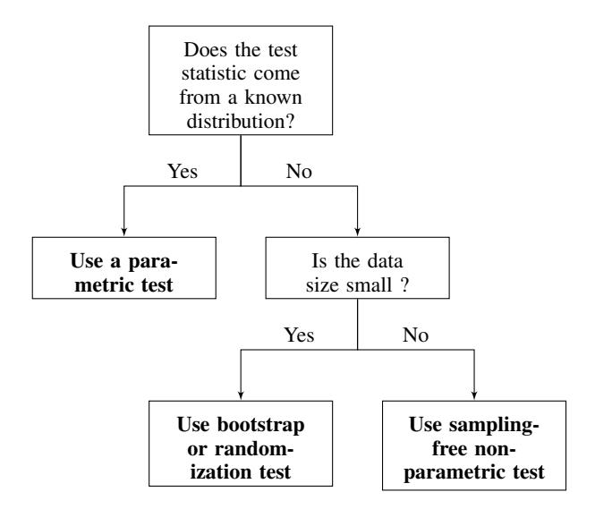

# The Hitchhiker's Guide to Testing Statistical Significance in Natural Language Processing

Rotem Dror Gili Baumer Segev Shlomov Roi Reichart

Faculty of Industrial Engineering and Management, Technion, IIT

{rtmdrr@campus|sgbaumer@campus|segevs@campus|roiri}.technion.ac.il

### Abstract

Statistical significance testing is a standard statistical tool designed to ensure that experimental results are not coincidental. In this opinion/theoretical paper we discuss the role of statistical significance testing in Natural Language Processing (NLP) research. We establish the fundamental concepts of significance testing and discuss the specific aspects of NLP tasks, experimental setups and evaluation measures that affect the choice of significance tests in NLP research. Based on this discussion, we propose a simple practical protocol for statistical significance test selection in NLP setups and accompany this protocol with a brief survey of the most relevant tests. We then survey recent empirical papers published in ACL and TACL during 2017 and show that while our community assigns great value to experimental results, statistical significance testing is often ignored or misused. We conclude with a brief discussion of open issues that should be properly addressed so that this important tool can be applied in NLP research in a statistically sound manner[1](#page-0-0) .

# 1 Introduction

The field of Natural Language Processing (NLP) has recently made great progress due to the data revolution that has made abundant amounts of textual data from a variety of languages and linguistic domains (newspapers, scientific journals, social media etc.) available. This, together with the emergence of a new generation of computing resources and the related development of Deep Neural Network models, have resulted in dramatic improvements in the capabilities of NLP algorithms.

The extended reach of NLP algorithms has also resulted in NLP papers giving much more emphasis to the experiment and result sections by showing comparisons between multiple algorithms on various datasets from different languages and domains. This emphasis on empirical results highlights the role of statistical significance testing in NLP research: if we rely on empirical evaluation to validate our hypotheses and reveal the correct language processing mechanisms, we better be sure that our results are not coincidental.

This paper aims to discuss the various aspects of proper statistical significance testing in NLP and to provide a simple and sound guide to the way this important tool should be used. We also discuss the particular challenges of statistical significance in the context of language processing tasks.

To facilitate a clear and coherent presentation, our (somewhat simplified) model of an NLP paper is one that presents a new algorithm and makes the hypothesis that this algorithm is better than a previous strong algorithm, which serves as the baseline. This hypothesis is verified in experiments where the two algorithms are applied to the same datasets (test sets), reasoning that if one algorithm is consistently better than the other, hopefully with a sufficiently large margin, then it should also be better on future, currently unknown, datasets. Yet, the experimental differences might be coincidental. Here comes statistical significance testing into the picture: we have to make sure that the probability of falsely concluding that one algorithm is better than the other is very small.

We note that in this paper we do not deal with the problem of drawing valid conclusions from multiple comparisons between algorithms across a large number of datasets , a.k.a. replicability analysis (see [\(Dror et al.,](#page-8-0) [2017\)](#page-8-0)). Instead, our focus is on a single comparison: how can we make sure that the difference between the two algorithms, as

1The code for all statistical tests detailed in this paper is found on: [https://github.com/rtmdrr/](https://github.com/rtmdrr/testSignificanceNLP.git) [testSignificanceNLP.git](https://github.com/rtmdrr/testSignificanceNLP.git)

observed in an individual comparison, is not coincidental. Statistical significance testing of each individual comparison is the basic building block of replicability analysis – its accurate performance is a pre-condition for any multiple dataset analysis.

Statistical significance testing (§ [2\)](#page-1-0) is a well researched problem in the statistical literature. However, the unique structured nature of natural language data is reflected in specialized evaluation measures such as BLEU (machine translation, [\(Pa](#page-9-0)[pineni et al.,](#page-9-0) [2002\)](#page-9-0)), ROUGE (extractive summarization, [\(Lin,](#page-8-1) [2004\)](#page-8-1)), UAS and LAS (dependency parsing, [\(Kubler et al.](#page-8-2) ¨ , [2009\)](#page-8-2)). The distribution of these measures is of great importance to statistical significance testing. Moreover, certain properties of NLP datasets and the community's evaluation standards also affect the way significance testing should be performed. An NLP-specific discussion of significance testing is hence in need.

In § [3](#page-2-0) we discuss the considerations to be made in order to select the proper statistical significance test in NLP setups. We propose a simple decision tree algorithm for this purpose, and survey the prominent significance tests – parametric and nonparametric – for NLP tasks and data.

In § [4](#page-6-0) we survey the current evaluation and significance testing practices of the community. We provide statistics collected from the long papers of the latest ACL proceedings [\(Barzilay and Kan,](#page-8-3) [2017\)](#page-8-3) as well as from the papers published in the TACL journal during 2017. Our analysis reveals that there is still a room for improvement in the way statistical significance is used in papers published in our top-tier publication venues. Particularly, a large portion of the surveyed papers do not test the significance of their results, or use incorrect tests for this purpose.

Finally, in § [5](#page-7-0) we discuss open issues. A particularly challenging problem is that while most significance tests assume the test set consists of independent observations, most NLP datasets consist of dependent data points. For example, many NLP standard evaluation sets consist of sentences coming from the same source (e.g. newspaper) or document (e.g. newspaper article) or written by the same author. Unfortunately, the nature of these dependencies is hard to characterize, let alone to quantify. Another important problem is how to test significance when cross-validation, a popular evaluation methodology in NLP papers, is performed.

Besides its practical value, we hope this paper

will encourage further research into the role of statistical significance testing in NLP and on the questions that still remain open.

# 2 Preliminaries

In this section we provide the required preliminaries for our discussion. We start with a formal definition of statistical significance testing and proceed with an overview of the prominent evaluation measures in NLP.

#### 2.1 Statistical Significance Testing

In this paper we focus on the setup where the performance of two algorithms, A and B, on a dataset X, is compared using an evaluation measure M. Let us denote M(ALG, X) as the value of the evaluation measure M when algorithm ALG is applied to the dataset X. Without loss of generality, we assume that higher values of the measure are better. We define the difference in performance between the two algorithms according to the measure M on the dataset X as:

$$\delta(X) = \mathcal{M}(A, X) - \mathcal{M}(B, X). \tag{1}$$

In this paper we will refer to δ(X) as our test statistic. Using this notation we formulate the following statistical hypothesis testing problem:[2](#page-1-1)

$$H_0: \delta(X) \le 0$$
  
$$H_1: \delta(X) > 0.$$

In order to decide whether or not to reject the null hypothesis, that is reaching the conclusion that δ(X) is indeed greater than 0, we usually compute a p−value for the test. The p−value is defined as the probability, under the null hypothesis H0, of obtaining a result equal to or more extreme than what was actually observed. For the one-sided hypothesis testing defined here, the p−value is defined as:

$$Pr(\delta(X) \ge \delta_{observed}|H_0).$$

Where δobserved is the performance difference between the algorithms (according to M) when applied to X. The smaller the p-value, the higher the significance, or, in other words, the stronger

2 For simplicity we consider a one-sided hypothesis, it can be easily re-formulated as a double-sided hypothesis.

the indication provided by the data that the nullhypothesis, H0, does not hold. In order to decide whether H0 should be rejected, the researcher should pre-define an arbitrary, fixed threshold value α, a.k.a *the significance level*. Only if p−value < α then the null hypothesis is rejected.

In significance (or hypothesis) testing we consider two error types. *Type* I *error* refers to the case where the null hypothesis is rejected when it is actually true. *Type* II *error* refers to the case where the null hypothesis is not rejected although it should be. A common approach in hypothesis testing is to choose a test that guarantees that the probability of making a type I error is upper bounded by the test significance level α, mentioned above, while achieving the highest possible *power*: i.e. the lowest possible probability of making a type II error.

# 2.2 Evaluation Measures in NLP

| Evaluation     | ACL 17      | TACL 17     |
|----------------|-------------|-------------|
| Measure        |             |             |
| F-scores       | 78 (39.8%)  | 9 (25.71%)  |
| Accuracy       | 67 (34.18%) | 13 (37.14%) |
| Precision/     | 44 (22.45%) | 6 (17.14%)  |
| Recall         |             |             |
| BLEU           | 26 (13.27%) | 4 (11.43%)  |
| ROUGE          | 12 (6.12%)  | 0 (0%)      |
| Pearson/ Spear | 4 (2.04%)   | 6 (17.14%)  |
| man correla |             |             |
| tions          |             |             |
| Perplexity     | 7 (3.57%)   | 2 (5.71%)   |
| METEOR         | 6 (3.06%)   | 1 (2.86%)   |
| UAS+LAS        | 1 (0.51%)   | 3 (8.57%)   |

Table 1: The most common evaluation measures in (long) ACL and TACL 2017 papers, ordered by ACL frequency. For each measure we present the total number of papers where it is used and the fraction of papers in the corresponding venue.

In order to draw valid conclusions from the experiments formulated in § [2.1](#page-1-2) it is crucial to apply the correct statistical significance test. In § [3](#page-2-0) we explain that the choice of the significance test is based, among other considerations, on the distribution of the test statistics, δ(X). From equation [1](#page-1-3) it is clear that δ(X) depends on the evaluation measure M. We hence turn to discuss the evaluation measures employed in NLP.

In § [4](#page-6-0) we analyze the (long) ACL and TACL

2017 papers, and observe that the most commonly used evaluation measures are the 12 measures that appear in Table [1.](#page-2-1) Notice that seven of these measures: Accuracy, Precision, Recall, F-score, Pearson and Spearman correlations and Perplexity, are not specific to NLP. The other five measures: BLEU [\(Papineni et al.,](#page-9-0) [2002\)](#page-9-0), ROUGE [\(Lin,](#page-8-1) [2004\)](#page-8-1), METEOR [\(Banerjee and Lavie,](#page-8-4) [2005\)](#page-8-4), UAS and LAS [\(Kubler et al.](#page-8-2) ¨ , [2009\)](#page-8-2), are unique measures that were developed for NLP applications. BLEU and METEOR are standard evaluation measures for machine translation, ROUGE for extractive summarization, and UAS and LAS for dependency parsing. While UAS and LAS are in fact accuracy measures, BLEU, ROUGE and METEOR are designed for tasks where there are several possible outputs - a characteristic property of several NLP tasks. In machine translation, for example, a sentence in one language can be translated in multiple ways to another language. Consequently, BLEU takes an n-gram based approach on the surface forms, while METEOR considers only unigram matches but uses stemming and controls for synonyms.

All 12 measures return a real number, either in [0, 1] or in R. Notice though that accuracy may reflect an average over a set of categorical scores (observations), e.g., in document-level binary sentiment analysis where every document is tagged as either positive or negative. In other cases, the individual observations are also continuous. For example, when comparing two dependency parsers, we may want to understand how likely it is, given our results, that one parser will do better than the other on a new sentence. In such a case we will consider the sentence-level UAS or LAS differences between the two parsers on all the sentences in the test set. Such sentence level UAS or LAS scores - the individual observations to be considered in the significance test - are real-valued.

With the basic concepts clarified, we are ready to discuss the considerations to be made when choosing a statistical significance test.

### 3 Statistical Significance in NLP

The goal of this section is to detail the considerations involved in the selection of a statistical significance test for an NLP application. Based on these considerations we provide a practical recipe that can be applied in order to make a good choice. In order to make this paper a practical guide for the community, we also provide a short description of the significance tests that are most relevant for NLP setups.

#### 3.1 Parametric vs. Non-parametric Tests

As noted above, a major consideration in the selection of a statistical significance test is the distribution of the test statistic, δ(X), under the null hypothesis. If the distribution is known, then the suitable test will come from the family of *parametric tests*, that uses this distribution in order to achieve powerful results (i.e., low probability of making a type II error, see § [2\)](#page-1-0). If the distribution is unknown then any assumption made by a test may lead to erroneous conclusions and hence we should rely on *non-parametric tests* that do not make any such assumption. While non-parametric tests may be less powerful than their parametric counterparts, they do not make unjustified assumptions and are hence statistically sound even when the test statistic distribution is unknown.

But how can one know the test statistic distribution? One possibility is to apply tests designed to evaluate the distribution of a sample of observations. For example, the Shapiro-Wilk test [\(Shapiro and Wilk,](#page-9-1) [1965\)](#page-9-1) tests the null hypothesis that a sample comes from a normally distributed population, the Kolmogorov-Smirnov test quantifies the distance between the empirical distribution function of the sample and the cumulative distribution function of the reference distribution, and the Anderson-Darling test [\(Anderson and Dar](#page-8-5)[ling,](#page-8-5) [1954\)](#page-8-5) tests whether a given sample of data is drawn from a given probability distribution. As discussed below, there seems to be other heuristics that are used in practice but are not often mentioned in research papers.

In what follows we discuss the prominent parametric and non-parametric tests for NLP setups. Based on this discussion we end this section with a simple decision tree that aims to properly guide the significance test choice process.

#### 3.2 Prominent Significance Tests

#### 3.2.1 Parametric Tests

Parametric significance tests assume that the test statistic is distributed according to a known distribution with defined parameters, typically the normal distribution. While this assumption may be hard to verify (see discussion above), when it holds, these parametric tests have stronger statistical power compared to non-parametric tests that do not make this assumption [\(Fisher,](#page-8-6) [1937\)](#page-8-6).

Here we discuss the prominent parametric test for NLP setups - the paired student's t-test.

Paired Student's t-test This test assesses whether the population means of two sets of measurements differ from each other, and is based on the assumption that both samples come from a normal distribution [\(Fisher,](#page-8-6) [1937\)](#page-8-6).

In practice, t-test is often applied with evaluation measures such as accuracy, UAS and LAS, that compute the mean number of correct predictions per input example. When comparing two dependency parsers, for example, we can apply the test to check if the averaged difference of their UAS scores is significantly larger than zero, which can serve as an indication that one parser is better than the other.

Although we have not seen this discussed in NLP papers, we believe that the decision to use the t-test with these measures is based on the Central Limit Theorem (CLT). CLT establishes that, in most situations, when independent random variables are added, their properly normalized sum tends toward a normal distribution even if the original variables themselves are not normally distributed. That is, accuracy measures in structured tasks tend to be normally distributed when the number individual predictions (e.g. number of words in a sentence when considering sentencelevel UAS) is large enough.

One case where it is theoretically justified to employ the t-test is described in [\(Sethuraman,](#page-9-2) [1963\)](#page-9-2). The authors prove that for large enough data, the sampling distribution of a certain function of the Pearson's correlation coefficient follows the Student's t-distribution with n − 2 degrees of freedom. With the recent surge in word similarity research with word embedding models, this result is of importance to our community.

For other evaluation measures, such as F-score, BLEU, METEOR and ROUGE that do not compute means, the common practice is to assume that they are not normally distributed [\(Yeh,](#page-9-3) [2000;](#page-9-3) [Berg-Kirkpatrick et al.,](#page-8-7) [2012\)](#page-8-7). We believe this issue requires a further investigation and suggest that it may be best to rely on the normality tests discussed in § [3.1](#page-3-0) when deciding whether or not to employ the t-test.

# 3.2.2 Non-parametric Tests

When the test statistic distribution is unknown, non-parametric significance testing should be used. The non-parametric tests that are commonly used in NLP setups can be divided into two families that differ with respect to their statistical power and computational complexity.

The first family consists of tests that do not consider the actual values of the evaluation measures. The second family do consider the values of the measures: it tests repeatedly sample from the test data, and estimates the p-value based on the test statistic values in the samples. We refer to the first family as the family of *sampling-free* tests and to the second as the family of *sampling-based* tests.

The two families of tests reflect different preferences with respect to the balance between statistical power and computational efficiency. Sampling-free tests do not consider the evaluation measure values, only higher level statistics of the results such as the number of cases in which each of the algorithms performs better than the other. Consequently, their statistical power is lower than that of sampling-based tests that do consider the evaluation measure values. Sampling-based tests, however, compensate for the lack of distributional assumptions over the data with re-sampling – a computationally intensive procedure. Samplingbased methods are hence not the optimal candidates for very large datasets.

We consider here four commonly used sampling-free tests: the sign test and two of its variants, and the wilcoxon signed-rank test.

Sign test This test tests whether matched pair samples are drawn from distributions with equal medians. The test statistic is the number of examples for which algorithm A is better than algorithm B, and the null hypothesis states that given a new pair of measurements (e.g. evaluations (ai , bi) of the two algorithms on a new test example), then ai and bi are equally likely to be larger than the other [\(Gibbons and Chakraborti,](#page-8-8) [2011\)](#page-8-8).

The sign test has limited practical implications since it only checks if algorithm A is better than B and ignores the extent of the difference. Yet, it has been used in a variety of NLP papers (e.g. [\(Collins et al.,](#page-8-9) [2005;](#page-8-9) [Chan et al.,](#page-8-10) [2007;](#page-8-10) [Rush et al.,](#page-9-4) [2012\)](#page-9-4)). The assumptions of this test is that the data samples are i.i.d, the differences come from a continuous distribution (not necessarily normal) and that the values are ordered.

The next test is a special case of the sign test for binary classification (or a two-tailed sign test).

McNemar's test [\(McNemar,](#page-8-11) [1947\)](#page-8-11) This test is designed for paired nominal observations (binary labels). The test is applied to a 2 × 2 contingency table, which tabulates the outcomes of two algorithms on a sample of n examples. The null hypothesis for this test states that the marginal probability for each outcome (label one or label two) is the same for both algorithms. That is, when applying both algorithms on the same data we would expect them to be correct/incorrect on the same proportion of items. Under the null hypothesis, with a sufficiently large number of disagreements between the algorithms, the test statistic has a distribution of χ 2 with one degree of freedom. This test is appropriate for binary classification tasks, and has been indeed used in such NLP works (e.g. sentiment classificaiton, [\(Blitzer et al.,](#page-8-12) [2006;](#page-8-12) [Ziser and Reichart,](#page-9-5) [2017\)](#page-9-5)). The Cochran's Q test [\(Cochran,](#page-8-13) [1950\)](#page-8-13) generalizes the McNemar's test for multi-class classification setups.

The sign test and its variants consider only pairwise ranks: which algorithm performs better on each test example. In NLP setups, however, we also have access to the evaluation measure values, and this allows us to rank the differences between the algorithms. The Wilcoxon signed-rank test makes use of such a rank and hence, while it does not consider the evaluation measure values, it is more powerful than the sign test and its variants.

Wilcoxon signed-rank test [\(Wilcoxon,](#page-9-6) [1945\)](#page-9-6) Like the sign test variants, this test is used when comparing two matched samples (e.g. UAS values of two dependency parsers on a set of sentences). Its null hypothesis is that the differences follow a symmetric distribution around zero. First, the absolute values of the differences are ranked. Then, each rank gets a sign according to the sign of the difference. The Wilcoxon test statistic sums these signed ranks. The test is actually applicable for most NLP setups and it has been used widely (e.g. [\(Søgaard et al.,](#page-9-7) [2014;](#page-9-7) [Søgaard,](#page-9-8) [2013;](#page-9-8) [Yang and](#page-9-9) [Mitchell,](#page-9-9) [2017\)](#page-9-9)) due to its improved power compared to the sign test variants.

As noted above, sampling-free tests trade statistical power for efficiency. Sampling-based methods take the opposite approach. This family includes two main methods: permutation/randomization tests [\(Noreen,](#page-8-14) [1989\)](#page-8-14) and the paired bootstrap [\(Efron and Tibshirani,](#page-8-15) [1994\)](#page-8-15).

Pitman's permutation test This test estimates the test statistic distribution under the null hypothesis by calculating the values of this statistic under all possible labellings (permutations) of the test set. The (two-sided) p-value of the test is calculated as the proportion of these permutations where the absolute difference was greater than or equal to the absolute value of the difference in the output of the algorithm.

Obviously, permutation tests are computationally intensive due to the exponentially large number of possible permutations. In practice, approximate randomization tests are used where a pre-defined limited number of permutations are drawn from the space of all possible permutations, without replacements (see, e.g. [\(Riezler and](#page-9-10) [Maxwell,](#page-9-10) [2005\)](#page-9-10) in the context of machine translation). The bootstrap test [\(Efron and Tibshirani,](#page-8-15) [1994\)](#page-8-15) is based on a closely related idea.

Paired bootstrap test This test is very similar to approximate randomization of the permutation test, with the difference that the sampling is done with replacements (i.e., an example from the original test data can appear more than once in a sample). The idea of bootstrap is to use the samples as surrogate populations, for the purpose of approximating the sampling distribution of the statistic. The p-value is calculated in a similar manner to the permutation test.

Bootstrap was used with a variety of NLP tasks, including machine translation, text summarization and semantic parsing (e.g. [\(Koehn,](#page-8-16) [2004;](#page-8-16) [Li et al.,](#page-8-17) [2017;](#page-8-17) [Wu et al.,](#page-9-11) [2017;](#page-9-11) [Ouchi et al.,](#page-8-18) [2017\)](#page-8-18)). The test is less effective for small test sets, as it assumes that the test set distribution does not deviate too much from the population distribution.

Clearly, Sampling-based methods are computationally intensive and can be intractable for large datasets, even with modern computing power. In such cases, sampling-free methods form an available alternative.

#### 3.3 Significance Test Selection

With the discussion of significance test families - parametric vs. non-parametric (§ [3.1\)](#page-3-0), and the properties of the actual significance tests (§ [3.2\)](#page-3-1) we are now ready to provide a simple recipe for significance test selection in NLP setups. The decision tree in Figure [1](#page-5-0) provides an illustration.

Figure 1: Decision tree for statistical significance test selection.

If the distribution of the test statistic is known, then parametric tests are most appropriate. These tests are more statistically powerful and less computationally intensive compared to their non-parametric counterparts. The stronger statistical power of parametric tests stems from the stronger, parametric assumptions they make, while the higher computational demand of some non-parametric tests is the result of their sampling process.

When the distribution of the test statistic is unknown, the first non-parametric family of choice is that of sampling-based tests. These tests consider the actual values of the evaluation measures and are not restricted to higher order properties (e.g. ranks) of the observed values – their statistical power is hence higher. As noted in [\(Riezler](#page-9-10) [and Maxwell,](#page-9-10) [2005\)](#page-9-10), in the case where the distributional assumptions of the parametric tests are violated, sampling-based tests have more statistical power than parametric tests.

Nonetheless, sampling-based tests are computationally intensive – the exact permutation test, for example, requires the generation of all 2 n data permutations (where n is the number of points in the dataset). To overcome this, approximate randomization can be used, as was done, e.g., by [Yeh](#page-9-3) [\(2000\)](#page-9-3) for test sets of more than 20 points. The other alternative for very large datasets are sampling-free tests that are less powerful but are computationally feasible.

In what follows we check whether recent ACL and TACL papers follow these guidelines.

# 4 Survey of ACL and TACL papers

| General Statistics            | ACL '17 | TACL '17 |
|-------------------------------|---------|----------|
| Total number of pa   | 196     | 37       |
| pers                          |         |          |
| # relevant (experimen         | 180     | 33       |
| tal) papers                   |         |          |
| # different tasks             | 36      | 15       |
| # different evaluation        | 24      | 19       |
| measures                      |         |          |
| Average number of       | 2.34    | 2.1      |
| measures per paper            |         |          |
| # papers that do not          | 117     | 15       |
| report significance           |         |          |
| # papers that report | 63      | 18       |
| significance                  |         |          |
| # papers that report | 6       | 0        |
| significance but use    |         |          |
| the wrong statistical   |         |          |
| test                          |         |          |
| # papers that report | 21      | 3        |
| significance but do not       |         |          |
| mention the test name         |         |          |
| # papers that have to         | 110     | 19       |
| report replicability          |         |          |
| # papers that report | 3       | 4        |
| replicability                 |         |          |
| # papers that perform         | 23      | 5        |
| cross validation              |         |          |

Table 2: Statistical significance statistics for empirical ACL and TACL 2017 papers.

We analyzed the long papers from the proceedings of the 55th Annual Meeting of the Association for Computational Linguistics (ACL17, [\(Barzilay and Kan,](#page-8-3) [2017\)](#page-8-3)), a total of 196 papers, and the papers from the Transactions of the Association of Computational Linguistics journal (TACL17), Volume 5, Issue 1, a total of 37 papers. We have focused on empirical papers where at least one comparison between methods was performed.

Table [2](#page-6-1) presents the main results from our survey. The top part of the table presents general statistics of our dataset. In both conference and journal papers, the variety of different NLP tasks is quite large: 36 tasks in ACL 2017 and 15 tasks in TACL. Interestingly, in almost every paper in our survey the researchers chose to analyze their results using more than one evaluation measure,

| Statistical Test | ACL '17 | TACL '17 |
|------------------|---------|----------|
| Bootstrap        | 6       | 1        |
| t-test           | 17      | 2        |
| Wilcoxon         | 3       | 0        |
| Chi square       | 3       | 1        |
| Randomization    | 3       | 1        |
| McNemar          | 2       | 3        |
| Sign             | 2       | 3        |
| Permutation      | 1       | 4        |

Table 3: Number of times each of the prominent statistical significance tests in ACL and TACL 2017 papers was used. 42 ACL and 15 TACL papers reported the significance test name. 5 ACL papers mentioned an unrecognized test name.

with an average of 2.34 (ACL) and 2.1 (TACL). Table [1](#page-2-1) presents the most common of these evaluation measures.

The lower part of Table [2](#page-6-1) depicts the disturbing reality of statistical significance testing in our research community. Out of the 180 experimental long papers of ACL 2017, only 63 papers included a statistical significance test. Moreover, out of these 63 papers 21 did not mention the name of the significance test they employed. Of the 42 papers that did mention the name of the significance test, 6 used the wrong test according to the considerations discussed in § [3.](#page-2-0) [3](#page-6-2) In TACL, where the review process is presumably more strict and of higher quality, out of 33 experimental papers, 15 did not include statistical significance testing, and all the papers that report significance and mentioned the name of the test used a valid test.

While this paper focuses on the correct choice of a significance test, we also checked whether the papers in our sample account for the effect of multiple hypothesis testing when testing statistical significance (see [\(Dror et al.,](#page-8-0) [2017\)](#page-8-0)). When testing multiple hypotheses, as in the case of comparing the participating algorithms across a large number of datasets, the probability of making one or more false claims may be very high, even if the probability of drawing an erroneous conclusion in each individual comparison is small. In ACL 2017, out

3We considered the significance test to be inappropriate in three cases: 1. Using the t-test when the evaluation measure is not an average measure; 2. Using the t-test for a classification task (i.e. when the observations are categorical rather then continuous), even if the evaluation measure is an average measure; and 3. Using a Boostrap test with a small test set size.

of 110 papers that used multiple datasets only 3 corrected for multiplicity (all using the Bonferroni correction). In TACL, the situation is slightly better with 4 papers correcting for multiplicity out of 19 that should have done that.

Regarding the statistical tests that were used in the papers that did report significance (Table [3\)](#page-6-3), in ACL 2017 most of the papers used the Student's t-test that assumes the data is i.i.d and that the test statistics are normally distributed. As discussed in § [3](#page-2-0) this is not the case in many NLP applications. Gladly, in TACL, t-test is not as prominent.

One final note is about the misuse of the word significant. We noticed that in a considerable number of papers this word was used as a synonym for words such as important, considerable, meaningful, substantial, major, notable etc. We believe that we should be more careful when using this word, ideally keeping its statistical sense and using other, more general words to indicate a substantial impact.

We close this discussion with two important open issues.

### 5 Open Questions

In this section we would like to point on two issues that remain open even after our investigation. We hope that bringing these issues to the attention of the research community will encourage our fellow researchers to come up with appropriate solutions.

The first open issue is that of *dependent observations*. An assumption shared by the statistical significance tests described in § [3,](#page-2-0) that are commonly used in NLP setups, is that the data samples are independent and identically distributed. This assumption, however, is rarely true in NLP setups.

For example, the popular WSJ Penn Treebank corpus [\(Marcus et al.,](#page-8-19) [1993\)](#page-8-19) consists of 2,499 articles from a three year Wall Street Journal (WSJ) collection of 98,732 stories. Obviously, some of the sentences included in the corpus come from the same article, were written by the same author or were reviewed before publication by the same editor. As another example, many sentences in the Europarl parallel corpus [\(Koehn,](#page-8-20) [2005\)](#page-8-20) that is very popular in the machine translation literature are taken from the same parliament discussion. An independence assumption between the sentences in these corpora is not likely to hold.

This dependence between test examples violates the conditions under which the theoretical guarantees of the various tests were developed. The impact of this phenomenon on our results is hard to quantify, partly because it is hard to quantify the nature of the dependence between test set examples in NLP datasets. Some papers are even talking about abandoning the null hypothesis statistical significance test approach due to this hard-to-meet assumption [\(Koplenig,](#page-8-21) [2017;](#page-8-21) [McShane et al.,](#page-8-22) [2017;](#page-8-22) [Carver,](#page-8-23) [1978;](#page-8-23) [Leek et al.,](#page-8-24) [2017\)](#page-8-24). In our opinion, this calls for a future collaboration with statisticians in order to better understand the extent to which existing popular significance tests are relevant for NLP, and to develop alternative tests if necessary.

Another issue that deserves some thought is that of cross-validation. To increase the validity of reported results, it is customary in NLP papers to create a number of random splits of the experimental corpus into train, development and test portions (see Table [2\)](#page-6-1). For each such split (fold), the tested algorithms are trained and tuned on the training and development datasets, respectively, and their results on the test data are recorded. The final reported result is typically the average of the test set results across the splits. Some papers also report the fraction of the folds for which one algorithm was better than the others. While cross-validation is surely a desired practice, it is challenging to report statistical significance when it is employed. Particularly, the test sets of the different folds are obviously not independent – their content is even likely to overlap.

One solution we would like to propose here is based on replicability analysis [\(Dror et al.,](#page-8-0) [2017\)](#page-8-0). This paper proposes a statistical significance framework for multiple comparisons performed with dependent test sets, using the KBonferroni estimator for the number of datasets with significant effect. One statistically sound way to test for significance when a cross-validation protocol is employed is hence to calculate the pvalue for each fold separately, and then to perform replicability analysis for dependent datasets with KBonferroni. Only if this analysis rejects the null hypothesis in all folds (or in more than a predefined threshold number of folds), the results should be declared significant. Here again, further statistical investigation may lead to additional, potentially better, solutions.

# 6 Conclusions

We discussed the use of significance testing in NLP. We provided the main considerations for significance test selection, and proposed a simple test selection protocol. We then surveyed the state of significance testing in recent top venue papers and concluded with open issues. We hope this paper will serve as a guide for NLP researchers and, not less importantly, that it will encourage discussions and collaborations that will contribute to the soundness and correctness of our research.

### References

- Theodore W Anderson and Donald A Darling. 1954. A test of goodness of fit. *Journal of the American statistical association* 49(268):765–769.
- Satanjeev Banerjee and Alon Lavie. 2005. Meteor: An automatic metric for mt evaluation with improved correlation with human judgments. In *Proceedings of the acl workshop on intrinsic and extrinsic evaluation measures for machine translation and/or summarization*.
- Regina Barzilay and Min-Yen Kan. 2017. Proceedings of the 55th annual meeting of the association for computational linguistics (volume 1: Long papers). In *Proceedings of ACL*.
- Taylor Berg-Kirkpatrick, David Burkett, and Dan Klein. 2012. An empirical investigation of statistical significance in nlp. In *Proceedings of EMNLP-CoNLL*.
- John Blitzer, Ryan McDonald, and Fernando Pereira. 2006. Domain adaptation with structural correspondence learning. In *Proceedings of EMNLP*.
- Ronald Carver. 1978. The case against statistical significance testing. *Harvard Educational Review* 48(3):378–399.
- Yee Seng Chan, Hwee Tou Ng, and David Chiang. 2007. Word sense disambiguation improves statistical machine translation. In *Proceedings of ACL*.
- William G Cochran. 1950. The comparison of percentages in matched samples. *Biometrika* 37(3/4):256– 266.
- Michael Collins, Philipp Koehn, and Ivona Kucerova. 2005. Clause restructuring for statistical machine translation. In *Proceedings of ACL*.
- Rotem Dror, Gili Baumer, Marina Bogomolov, and Roi Reichart. 2017. Replicability analysis for natural language processing: Testing significance with multiple datasets. *Transactions of the Association for Computational Linguistics* 5:471–486.

- Bradley Efron and Robert J Tibshirani. 1994. *An introduction to the bootstrap*. CRC press.
- Ronald Aylmer Fisher. 1937. *The design of experiments*. Oliver And Boyd; Edinburgh; London.
- Jean Dickinson Gibbons and Subhabrata Chakraborti. 2011. Nonparametric statistical inference. In *International encyclopedia of statistical science*, Springer, pages 977–979.
- Philipp Koehn. 2004. Statistical significance tests for machine translation evaluation. In *Proceedings of EMNLP*.
- Philipp Koehn. 2005. Europarl: A parallel corpus for statistical machine translation. In *Proceedings of the MT summit*.
- Alexander Koplenig. 2017. Against statistical significance testing in corpus linguistics. *Corpus Linguistics and Linguistic Theory* .
- Sandra Kubler, Ryan McDonald, and Joakim Nivre. ¨ 2009. Dependency parsing. *Synthesis Lectures on Human Language Technologies* 1(1):1–127.
- Jeff Leek, Blakeley B McShane, Andrew Gelman, David Colquhoun, Michele B Nuijten, and Steven N ` Goodman. 2017. Five ways to fix statistics. *Nature* 551(7682):557–559.
- Junhui Li, Deyi Xiong, Zhaopeng Tu, Muhua Zhu, Min Zhang, and Guodong Zhou. 2017. Modeling source syntax for neural machine translation. In *Proceedings of ACL*.
- Chin-Yew Lin. 2004. Rouge: A package for automatic evaluation of summaries. In *Text Summarization Branches Out: Proceedings of the ACL-04 Workshop*.
- Mitchell P Marcus, Mary Ann Marcinkiewicz, and Beatrice Santorini. 1993. Building a large annotated corpus of english: The penn treebank. *Computational linguistics* 19(2):313–330.
- Quinn McNemar. 1947. Note on the sampling error of the difference between correlated proportions or percentages. *Psychometrika* 12(2):153–157.
- Blakeley B McShane, David Gal, Andrew Gelman, Christian Robert, and Jennifer L Tackett. 2017. Abandon statistical significance. *arXiv preprint arXiv:1709.07588* .
- Eric W Noreen. 1989. *Computer intensive methods for hypothesis testing: An introduction*. Wiley, New York.
- Hiroki Ouchi, Hiroyuki Shindo, and Yuji Matsumoto. 2017. Neural modeling of multi-predicate interactions for japanese predicate argument structure analysis. In *Proceedings of ACL*.

- Kishore Papineni, Salim Roukos, Todd Ward, and Wei-Jing Zhu. 2002. Bleu: a method for automatic evaluation of machine translation. In *Proceedings of ACL*.
- Stefan Riezler and John T Maxwell. 2005. On some pitfalls in automatic evaluation and significance testing for mt. In *Proceedings of the ACL workshop on intrinsic and extrinsic evaluation measures for machine translation and/or summarization*.
- Alexander Rush, Roi Reichart, Michael Collins, and Amir Globerson. 2012. Improved parsing and pos tagging using inter-sentence consistency constraints. In *Proceedings of EMNLP-CoNLL*.
- J Sethuraman. 1963. *The Advanced Theory of Statistics, Volume 2: Inference and Relationship*. JSTOR.
- Samuel Sanford Shapiro and Martin B Wilk. 1965. An analysis of variance test for normality (complete samples). *Biometrika* 52(3/4):591–611.
- Anders Søgaard. 2013. Estimating effect size across datasets. In *Proceedings of NAACL-HLT*.
- Anders Søgaard, Anders Johannsen, Barbara Plank, Dirk Hovy, and Hector Mart ´ ´ınez Alonso. 2014. What's in a p-value in nlp? In *Proceedings of CoNLL*.
- Frank Wilcoxon. 1945. Individual comparisons by ranking methods. *Biometrics bulletin* 1(6):80–83.
- Shuangzhi Wu, Dongdong Zhang, Nan Yang, Mu Li, and Ming Zhou. 2017. Sequence-to-dependency neural machine translation. In *Proceedings of ACL*.
- Bishan Yang and Tom Mitchell. 2017. Leveraging knowledge bases in lstms for improving machine reading. In *Proceedings of ACL*.
- Alexander Yeh. 2000. More accurate tests for the statistical significance of result differences. In *Proceedings of COLING*.
- Yftah Ziser and Roi Reichart. 2017. Neural structural correspondence learning for domain adaptation. In *Proceedings of CoNLL 2017*.