# Revisiting Checkpoint Averaging for Neural Machine Translation

Yingbo Gao Christian Herold Zijian Yang Hermann Ney

Human Language Technology and Pattern Recognition Group Computer Science Department RWTH Aachen University D-52056 Aachen, Germany

{ygao|herold|zyang|ney}@cs.rwth-aachen.de

## Abstract

Checkpoint averaging is a simple and effective method to boost the performance of converged neural machine translation models. The calculation is cheap to perform and the fact that the translation improvement almost comes for free, makes it widely adopted in neural machine translation research. Despite the popularity, the method itself simply takes the mean of the model parameters from several checkpoints, the selection of which is mostly based on empirical recipes without many justifications. In this work, we revisit the concept of checkpoint averaging and consider several extensions. Specifically, we experiment with ideas such as using different checkpoint selection strategies, calculating weighted average instead of simple mean, making use of gradient information and fine-tuning the interpolation weights on development data. Our results confirm the necessity of applying checkpoint averaging for optimal performance, but also suggest that the landscape between the converged checkpoints is rather flat and not much further improvement compared to simple averaging is to be obtained.

### 1 Introduction

Checkpoint averaging is a simple method to improve model performance at low computational cost. The procedure is straightforward: select some model checkpoints, average the model parameters, and obtain a better model. Because of its simplicity and effectiveness, it is widely used in neural machine translation (NMT), e.g. in the original Transformer paper [\(Vaswani et al.,](#page-5-0) [2017\)](#page-5-0), in systems participating in public machine translation (MT) evaluations such as Conference on Machine Translation (WMT) [\(Barrault et al.,](#page-4-0) [2021\)](#page-4-0) and the International Conference on Spoken Language Translation (IWSLT) [\(Anastasopoulos et al.,](#page-4-1) [2022\)](#page-4-1): [Barrault et al.](#page-4-0) [\(2021\)](#page-4-0); [Erdmann et al.](#page-4-2) [\(2021\)](#page-4-2); [Li et al.](#page-5-1) [\(2021\)](#page-5-1); [Subramanian et al.](#page-5-2) [\(2021\)](#page-5-2); [Tran](#page-5-3) [et al.](#page-5-3) [\(2021\)](#page-5-3); [Wang et al.](#page-6-0) [\(2021b\)](#page-6-0); [Wei et al.](#page-6-1) [\(2021\)](#page-6-1);

[Di Gangi et al.](#page-4-3) [\(2019\)](#page-4-3); [Li et al.](#page-5-4) [\(2022\)](#page-5-4), and in numerous MT research papers [\(Junczys-Dowmunt](#page-4-4) [et al.,](#page-4-4) [2016;](#page-4-4) [Shaw et al.,](#page-5-5) [2018;](#page-5-5) [Liu et al.,](#page-5-6) [2018;](#page-5-6) [Zhao et al.,](#page-6-2) [2019;](#page-6-2) [Kim et al.,](#page-5-7) [2021\)](#page-5-7). Apart from NMT, checkpoint averaging also finds applications in Transformer-based automatic speech recognition models [\(Karita et al.,](#page-4-5) [2019;](#page-4-5) [Dong et al.,](#page-4-6) [2018;](#page-4-6) [Higuchi et al.,](#page-4-7) [2020;](#page-4-7) [Tian et al.,](#page-5-8) [2020;](#page-5-8) [Wang et al.,](#page-6-3) [2020\)](#page-6-3). Despite the popularity of the method, the recipes in each work are rather empirical and do not differ much except in how many and exactly which checkpoints are averaged.

In this work, we revisit the concept of checkpoint averaging and consider several extensions. We examine the straightforward hyperparameters like the number of checkpoints to average, the checkpoint selection strategy and the mean calculation itself. Because the gradient information is often available at the time of checkpointing, we also explore the idea of using this piece of information. Additionally, we experiment with the idea of fine-tuning the interpolation weights of the checkpoints on development data. As reported in countless works, we confirm that the translation performance improvement can be robustly obtained with checkpoint averaging. However, our results suggest that the landscape between the converged checkpoints is rather flat, and it is hard to squeeze out further performance improvements with advanced tricks.

## 2 Related Work

The idea of combining multiple models for more stable and potentially better prediction is not new in statistical learning [\(Dietterich,](#page-4-8) [2000;](#page-4-8) [Dong et al.,](#page-4-9) [2020\)](#page-4-9). In NMT, ensembling, more specifically, ensembling systems with different architectures is shown to be helpful [\(Stahlberg et al.,](#page-5-9) [2019;](#page-5-9) [Rosendahl et al.,](#page-5-10) [2019;](#page-5-10) [Zhang and van Genabith,](#page-6-4) [2019\)](#page-6-4). In contrary, checkpoint averaging uses checkpoints from the same training run with the same neural network (NN) architecture. Compared

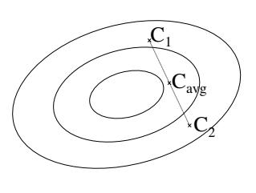

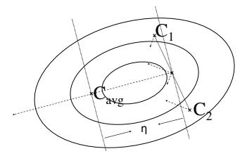

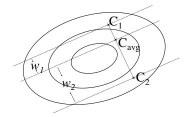

(a) vanilla

(b) using gradient information

(c) optimized on development data

Figure 1: An illustration of checkpoint averaging and our extensions. The isocontour plot illustrates some imaginary loss surface. C1 and C2 are model parameters from two checkpoints.  $C_{avg}$  denotes the averaged parameters. In (a), the mean of the C1 and C2 is taken. In (b), the dashed arrows refer to the gradients (could also include the momentum terms) stored in the checkpoints, and a further step (with step size  $\eta$ ) is taken. In (c), a NN is parametrized with the interpolation weights  $w_1$  and  $w_2$ , and the weights are learned on the development data.

to ensembling, checkpoint averaging is cheaper to calculate and does not require one to store and query multiple models at test time. The distinction can also be made from the perspective of the interpolation space, i.e. model parameter space for checkpoint averaging, and posterior probability space for ensembling. As a trade-off, the performance boost from checkpoint averaging is typically smaller than ensembling (Liu et al., 2018).

In the literature, Chen et al. (2017) study the use of checkpoints from the same training run for ensembling; Smith (2017) proposes cyclic learning rate schedules to improve accuracy and convergence; Huang et al. (2017) propose to use a cyclic learning rate to obtain snapshots of the same model during training and ensemble them in the probability space; Izmailov et al. (2018) perform model parameter averaging on-the-fly during training and argue for better generalization in this way; Popel and Bojar (2018) discuss empirical findings related to checkpoint averaging for NMT; Zhang et al. (2020) and Karita et al. (2021) maintain an exponential moving average during model training; Wang et al. (2021a) propose a boosting algorithm and ensemble checkpoints in the probability space; Matena and Raffel (2021) exploit the Fisher information matrix to calculate weighted average of model parameters. Here, we are interested in the interpolation happening in the model parameter space, and therefore restrain ourselves from further discussing topics like ensembling or continuing training on the development data.

#### 3 Methodology

In this section, we discuss extensions to checkpoint averaging considered in this work. An intuitive illustration is shown in Fig.1.

#### 3.1 Extending Vanilla Checkpoint Averaging

The vanilla checkpointing is straightforward and can be expressed as in Eq.1. Here,  $\theta$  denotes the model parameters and  $\hat{\theta}$  is the averaged parameters. k is a running index in number of checkpoints K, and  $\mathcal{S}$ , where |S|=K, is a set of checkpoint indices selected by some specific strategy, e.g. top-K or last-K. In the vanilla case,  $w_k=\frac{1}{K}$ , i.e. uniform weights are used.

$$\hat{\boldsymbol{\theta}} = \sum_{k \in \mathcal{S}} w_k \boldsymbol{\theta}_k \tag{1}$$

As shown in Eq.2, we further consider non-uniform weights and propose to use softmax-normalized logarithm of development set perplexities (DEVPPL) with temperature  $\tau$  as interpolation weights. We define w in this way such that it is in the probability space.

$$w_k = \frac{\exp(-\tau \log \text{DEVPPL}_k)}{\sum_{k' \in \mathcal{S}} \exp(-\tau \log \text{DEVPPL}_{k'})}$$
 (2)

#### 3.2 Making Use of Gradient Information

Nowadays, NMT models are commonly trained with stated optimizers like Adam (Kingma and Ba, 2015). To provide the "continue-training" utility, the gradients of the most recent batch are therefore also saved. Shown in Eq.3, we can therefore take a further step in the parameter space during checkpoint averaging to make use of this information. Here,  $\eta$  is the step size and  $\frac{1}{K} \sum_{k \in \mathcal{S}} \nabla_{\theta} L(\theta_k)$  is the mean of the gradients stored in the checkpoints.

$$\hat{\boldsymbol{\theta}} = \sum_{k \in \mathcal{S}} w_k \boldsymbol{\theta}_k - \eta \frac{1}{K} \sum_{k \in \mathcal{S}} \nabla_{\boldsymbol{\theta}} L(\boldsymbol{\theta}_k)$$
 (3)

#### 3.3 Optimization on Development Data

In addition to using DEVPPL, one can optimize the interpolation weights directly on the development data. Specifically, to ensure normalization, we re-parameterize the model with the logits gk in a softmax function, initialized at zero and updated via one-step gradient descent, with step size η, on development data to avoid overfitting. As shown in Eq[.4,](#page-2-0) wk is the normalized interpolation weights. Note that we refrain from updating the raw model parameters θk from each checkpoint but only update the logits gk. Here, L refers to the cross entropy loss of the re-parametrized NN on the development data.

$$w_k = \frac{\exp g_k}{\sum_{k' \in \mathcal{S}} \exp g_{k'}}$$

$$g_{k,0} = 0, \quad g_{k,1} = -\eta \nabla_{g_k} L(g_{k,0}; \boldsymbol{\theta}_1, ..., \boldsymbol{\theta}_K)$$
(4)

## 4 Experiments

We re-implement Transformer [\(Vaswani et al.,](#page-5-0) [2017\)](#page-5-0) using PyTorch [\(Paszke et al.,](#page-5-16) [2019\)](#page-5-16) and experiment on IWSLT14 German-, Russian-, and Spanish-to-English (de-en, ru-en, es-en), and WMT16 English-to-Romanian, WMT14 Englishto-German, WMT19 Chinese-to-English (en-ro, ende, zh-en) datasets. Due to limited length, we only present representative results on de-en in this section. Results on other language pairs can be found in the appendix and the trends are similar to that reported in this section. Note that, in the experiments below, the test BLEU scores are under consideration. However, we argue that it is not critical because checkpoint averaging is a vetted trick to boost system performance and our goal is to better understand the parameter space and not to obtain "the state-of-the-art" in some public scoreboard.

In Fig[.2,](#page-2-1) we plot the BLEU [\(Papineni et al.,](#page-5-17) [2002\)](#page-5-17) scores versus increasing K, where the previous K checkpoints starting from the best checkpoint (in terms of DEVPPL) are selected. As can be seen, initial BLEU improvements are obtained but as worse and worse checkpoints are included, the BLEU score drops as expected.

In Fig[.3,](#page-2-2) ranking all checkpoints by their DE-VPPL, the top-K checkpoints are selected for averaging. Notice that up to K = 40, the DEVPPL is still around 5, whereas in the last-K case, significantly worse checkpoints (the early checkpoints) are already included in the interpolation. It can be

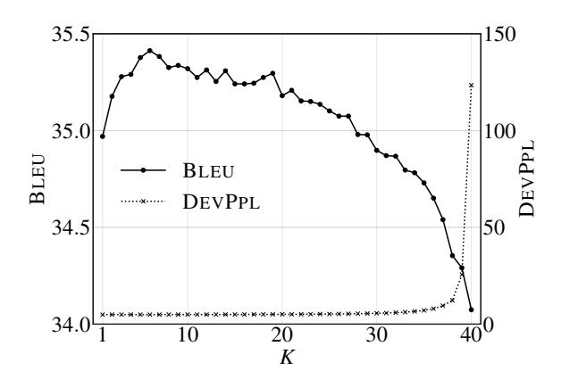

Figure 2: Last-K simple mean on de-en.

seen that the final BLEU score is much less sensitive to the choice of K in this case. Of course the final performance also relies on the checkpointing settings (e.g. the checkpointing frequency) but it is clear from the comparison that one should prefer to include checkpoints with better DEVPPL.

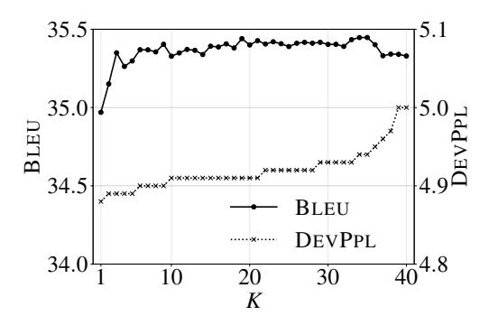

Figure 3: Top-K simple mean on de-en.

In Fig[.4,](#page-3-0) we plot the BLEU scores against the temperature τ in Eq[.2.](#page-1-2) Here, we select last-K checkpoints as in Fig[.2](#page-2-1) to artificially include some bad-performing checkpoints. Two sanity checks can be done here. When τ is very small, uniform weights are used and the performance is close to the vanilla last-40 case. When τ is very large, one-hot weights are used and the performance is close to that of the best checkpoint. We observe that using the DEVPPL-dependent weights results in similar performance increase compared to the vanilla case, meaning that the checkpoint selections can be automated by selecting a proper τ .

Next, we study how the system performance changes with the step size used in the one-shot gradient update (Fig[.1b](#page-1-0) and Eq[.3\)](#page-1-3). As shown in Fig[.5,](#page-3-1) we interpolate three systems selecting top-K checkpoints with K = 2, K = 5 and K = 10, respectively. Here, temperature τ = 100. In line

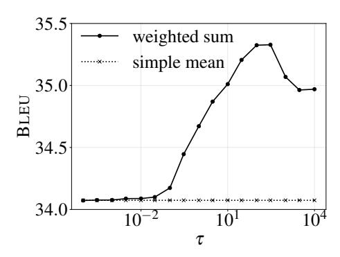

Figure 4: Last-40 weighted sum on de-en.

with the results in Fig.2 and Fig.3, the models with K=5 and K=10 are slightly better than the model with K=2. However, as the step size  $\eta$  increases, the BLEU score quickly drops as the averaged model diverges further away from the initial mean. It is clear from the figure that nothing is gained in terms of BLEU during the  $\eta$  scan. In other words, these results suggest a very flat surface along the direction of averaged gradients.

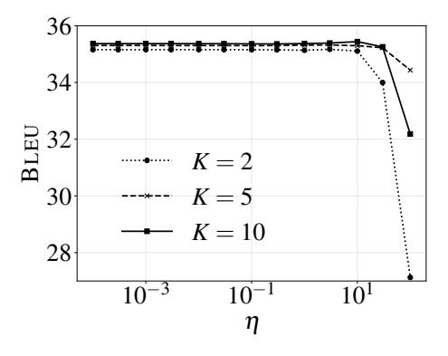

Figure 5: One-shot gradient update of top-K weighted sum with  $\tau=100$  on de-en.

To investigate if optimization on the development data would work, we implement Eq.4 and sweep over step size  $\eta$ . As shown in Fig.6, the gradient update on the weights move the model towards the best checkpoint ( $\theta_0$  here), and  $w_0$  increases to 1.0 with large enough  $\eta$ . There is, however, little improvement to be obtained along the path. Note that this is the restricted case (Eq.4) where only interpolation weights are allowed to change and model parameters are not updated.

Given the results so far, it is clear that although a small boost of BLEU score can be robustly obtained in various checkpoint averaging settings, it is hard to squeeze out any further improvement with the extensions considered here. We therefore perform a grid search over the interpolation

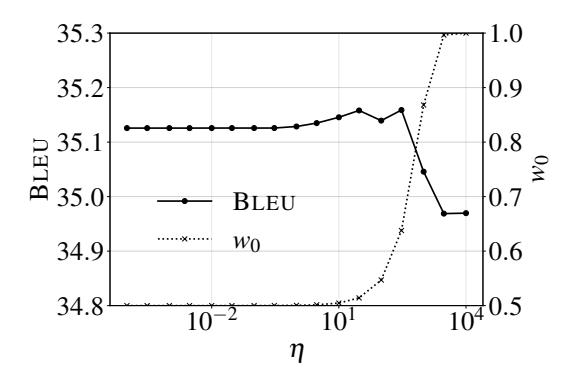

Figure 6: Optimization of interpolation weights  $w_k$  on development data with K=2 on de-en.

weights  $w_k$  with K=3, to examine the landscape between the checkpoints. Shown in Fig.7, is the intersection of  $w_1 + w_2 + w_3 = 1, 0 \le w_k \le 1$  in the space of the interpolation weights. From the figure, except when really close to the vertices, i.e.  $(w_1, w_2, w_3) = (1, 0, 0)$  or (0, 1, 0) or (0, 0, 1), the surface is rather flat with small fluctuations here and there. Considered together with the previous results, this suggests that the gradient direction in the flat area may be unreliable and not much improvement is to be gained by further tuning the interpolation weights. Of course one could argue that in higher dimensions the surface could look different by moving off of the  $\sum_{k \in \mathcal{S}} w_k = 1$  hyperplain, but we think it is unlikely to be helpful as Fig.5 is a counter-evidence at hand.

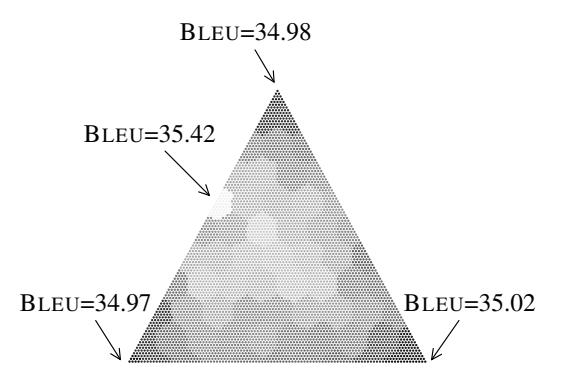

Figure 7: Neighborhood of the top-3 checkpoints on de-en. The hexagons are artifacts from plotting because a denser grid of points is used in the plot than in checkpoint averaging and the dots are colored by querying the nearest neighbor in the checkpoint averaging grid.

#### 5 Conclusion

We consider checkpoint averaging, a simple and effective method in neural machine translation to boost system performance. Specifically, we examine different checkpoint selection strategies, calcu-

late weighted average, make use of gradient information and optimize the interpolation weights. We confirm the robust improvements from checkpoint averaging and that the checkpoint selection can be automated with the weighted average scheme. However, by closely looking at the landscape between the checkpoints, we find the surface to be rather flat and conclude that tuning in the space of the interpolation weights may not be a meaningful direction to squeeze out further improvements.

## Acknowledgements

This work was partially supported by the project HYKIST funded by the German Federal Ministry of Health on the basis of a decision of the German Federal Parliament (Bundestag) under funding ID ZMVI1-2520DAT04A, and by NeuroSys which, as part of the initiative "Clusters4Future", is funded by the Federal Ministry of Education and Research BMBF (03ZU1106DA).

### References

- Antonios Anastasopoulos, Loïc Barrault, Luisa Bentivogli, Marcely Zanon Boito, Ondˇrej Bojar, Roldano Cattoni, Anna Currey, Georgiana Dinu, Kevin Duh, Maha Elbayad, Clara Emmanuel, Yannick Estève, Marcello Federico, Christian Federmann, Souhir Gahbiche, Hongyu Gong, Roman Grundkiewicz, Barry Haddow, Benjamin Hsu, Dávid Javorský, Vera Kloudová, Surafel Lakew, Xutai Ma, Prashant ˘ Mathur, Paul McNamee, Kenton Murray, Maria Nadejde, Satoshi Nakamura, Matteo Negri, Jan ˇ Niehues, Xing Niu, John Ortega, Juan Pino, Elizabeth Salesky, Jiatong Shi, Matthias Sperber, Sebastian Stüker, Katsuhito Sudoh, Marco Turchi, Yogesh Virkar, Alexander Waibel, Changhan Wang, and Shinji Watanabe. 2022. [Findings of the IWSLT](https://doi.org/10.18653/v1/2022.iwslt-1.10) [2022 evaluation campaign.](https://doi.org/10.18653/v1/2022.iwslt-1.10) In *Proceedings of the 19th International Conference on Spoken Language Translation (IWSLT 2022)*, pages 98–157, Dublin, Ireland (in-person and online). Association for Computational Linguistics.
- Loic Barrault, Ondrej Bojar, Fethi Bougares, Rajen Chatterjee, Marta R. Costa-jussa, Christian Federmann, Mark Fishel, Alexander Fraser, Markus Freitag, Yvette Graham, Roman Grundkiewicz, Paco Guzman, Barry Haddow, Matthias Huck, Antonio Jimeno Yepes, Philipp Koehn, Tom Kocmi, Andre Martins, Makoto Morishita, and Christof Monz, editors. 2021. *[Proceedings of the Sixth Conference on Ma](https://aclanthology.org/2021.wmt-1)[chine Translation](https://aclanthology.org/2021.wmt-1)*. Association for Computational Linguistics, Online.
- Hugh Chen, Scott Lundberg, and Su-In Lee. 2017. Checkpoint ensembles: Ensemble methods from a single training process. *arXiv preprint arXiv:1710.03282*.

- Mattia A. Di Gangi, Matteo Negri, Viet Nhat Nguyen, Amirhossein Tebbifakhr, and Marco Turchi. 2019. [Data augmentation for end-to-end speech translation:](https://aclanthology.org/2019.iwslt-1.14) [FBK@IWSLT '19.](https://aclanthology.org/2019.iwslt-1.14) In *Proceedings of the 16th International Conference on Spoken Language Translation*, Hong Kong. Association for Computational Linguistics.
- Thomas G Dietterich. 2000. Ensemble methods in machine learning. In *International workshop on multiple classifier systems*, pages 1–15. Springer.
- Linhao Dong, Shuang Xu, and Bo Xu. 2018. Speechtransformer: a no-recurrence sequence-to-sequence model for speech recognition. In *2018 IEEE International Conference on Acoustics, Speech and Signal Processing (ICASSP)*, pages 5884–5888. IEEE.
- Xibin Dong, Zhiwen Yu, Wenming Cao, Yifan Shi, and Qianli Ma. 2020. A survey on ensemble learning. *Frontiers of Computer Science*, 14(2):241–258.
- Grant Erdmann, Jeremy Gwinnup, and Tim Anderson. 2021. [Tune in: The afrl wmt21 news-translation](https://aclanthology.org/2021.wmt-1.5) [systems.](https://aclanthology.org/2021.wmt-1.5) In *Proceedings of the Sixth Conference on Machine Translation*, pages 110–116, Online. Association for Computational Linguistics.
- Yosuke Higuchi, Shinji Watanabe, Nanxin Chen, Tetsuji Ogawa, and Tetsunori Kobayashi. 2020. [Mask](https://doi.org/10.21437/Interspeech.2020-2404) [ctc: Non-autoregressive end-to-end asr with ctc and](https://doi.org/10.21437/Interspeech.2020-2404) [mask predict.](https://doi.org/10.21437/Interspeech.2020-2404) *Proceedings of the Annual Conference of the International Speech Communication Association, INTERSPEECH*, 2020-October:3655–3659. Publisher Copyright: © 2020 ISCA; 21st Annual Conference of the International Speech Communication Association, INTERSPEECH 2020 ; Conference date: 25-10-2020 Through 29-10-2020.
- Gao Huang, Yixuan Li, Geoff Pleiss, Zhuang Liu, John E. Hopcroft, and Kilian Q. Weinberger. 2017. [Snapshot ensembles: Train 1, get M for free.](http://arxiv.org/abs/1704.00109) *CoRR*, abs/1704.00109.
- Pavel Izmailov, Dmitrii Podoprikhin, Timur Garipov, Dmitry P. Vetrov, and Andrew Gordon Wilson. 2018. [Averaging weights leads to wider optima and better](http://auai.org/uai2018/proceedings/papers/313.pdf) [generalization.](http://auai.org/uai2018/proceedings/papers/313.pdf) In *Proceedings of the Thirty-Fourth Conference on Uncertainty in Artificial Intelligence, UAI 2018, Monterey, California, USA, August 6-10, 2018*, pages 876–885. AUAI Press.
- Marcin Junczys-Dowmunt, Tomasz Dwojak, and Hieu Hoang. 2016. [Is neural machine translation ready](https://aclanthology.org/2016.iwslt-1.5) [for deployment? a case study on 30 translation di](https://aclanthology.org/2016.iwslt-1.5)[rections.](https://aclanthology.org/2016.iwslt-1.5) In *Proceedings of the 13th International Conference on Spoken Language Translation*, Seattle, Washington D.C. International Workshop on Spoken Language Translation.
- Shigeki Karita, Nanxin Chen, Tomoki Hayashi, Takaaki Hori, Hirofumi Inaguma, Ziyan Jiang, Masao Someki, Nelson Yalta, Ryuichi Yamamoto, Xiao fei Wang, Shinji Watanabe, Takenori Yoshimura, and Wangyou Zhang. 2019. A comparative study on

- transformer vs rnn in speech applications. *2019 IEEE Automatic Speech Recognition and Understanding Workshop (ASRU)*, pages 449–456.
- Shigeki Karita, Yotaro Kubo, Michiel Bacchiani, and Llion Jones. 2021. A comparative study on neural architectures and training methods for japanese speech recognition. In *Interspeech*.
- Young Jin Kim, Ammar Ahmad Awan, Alexandre Muzio, Andres Felipe Cruz Salinas, Liyang Lu, Amr Hendy, Samyam Rajbhandari, Yuxiong He, and Hany Hassan Awadalla. 2021. Scalable and efficient moe training for multitask multilingual models. *arXiv preprint arXiv:2109.10465*.
- Diederik P. Kingma and Jimmy Ba. 2015. [Adam: A](http://arxiv.org/abs/1412.6980) [method for stochastic optimization.](http://arxiv.org/abs/1412.6980) In *3rd International Conference on Learning Representations, ICLR 2015, San Diego, CA, USA, May 7-9, 2015, Conference Track Proceedings*.
- Zongyao Li, Jiaxin Guo, Daimeng Wei, Hengchao Shang, Minghan Wang, Ting Zhu, Zhanglin Wu, Zhengzhe Yu, Xiaoyu Chen, Lizhi Lei, Hao Yang, and Ying Qin. 2022. [HW-TSC's participation in](https://doi.org/10.18653/v1/2022.iwslt-1.33) [the IWSLT 2022 isometric spoken language transla](https://doi.org/10.18653/v1/2022.iwslt-1.33)[tion.](https://doi.org/10.18653/v1/2022.iwslt-1.33) In *Proceedings of the 19th International Conference on Spoken Language Translation (IWSLT 2022)*, pages 361–368, Dublin, Ireland (in-person and online). Association for Computational Linguistics.
- Zuchao Li, Masao Utiyama, Eiichiro Sumita, and Hai Zhao. 2021. [Miss@wmt21: Contrastive learning](https://aclanthology.org/2021.wmt-1.12)[reinforced domain adaptation in neural machine trans](https://aclanthology.org/2021.wmt-1.12)[lation.](https://aclanthology.org/2021.wmt-1.12) In *Proceedings of the Sixth Conference on Machine Translation*, pages 154–161, Online. Association for Computational Linguistics.
- Yuchen Liu, Long Zhou, Yining Wang, Yang Zhao, Jiajun Zhang, and Chengqing Zong. 2018. A comparable study on model averaging, ensembling and reranking in nmt. In *Natural Language Processing and Chinese Computing*, pages 299–308, Cham. Springer International Publishing.
- Michael Matena and Colin Raffel. 2021. Merging models with fisher-weighted averaging. *arXiv preprint arXiv:2111.09832*.
- Kishore Papineni, Salim Roukos, Todd Ward, and Wei-Jing Zhu. 2002. [Bleu: a method for automatic evalu](https://doi.org/10.3115/1073083.1073135)[ation of machine translation.](https://doi.org/10.3115/1073083.1073135) In *Proceedings of the 40th Annual Meeting of the Association for Computational Linguistics*, pages 311–318, Philadelphia, Pennsylvania, USA. Association for Computational Linguistics.
- Adam Paszke, Sam Gross, Francisco Massa, Adam Lerer, James Bradbury, Gregory Chanan, Trevor Killeen, Zeming Lin, Natalia Gimelshein, Luca Antiga, Alban Desmaison, Andreas Kopf, Edward Yang, Zachary DeVito, Martin Raison, Alykhan Tejani, Sasank Chilamkurthy, Benoit Steiner, Lu Fang, Junjie Bai, and Soumith Chintala. 2019. [Pytorch:](http://papers.neurips.cc/paper/9015-pytorch-an-imperative-style-high-performance-deep-learning-library.pdf)

- [An imperative style, high-performance deep learning](http://papers.neurips.cc/paper/9015-pytorch-an-imperative-style-high-performance-deep-learning-library.pdf) [library.](http://papers.neurips.cc/paper/9015-pytorch-an-imperative-style-high-performance-deep-learning-library.pdf) In H. Wallach, H. Larochelle, A. Beygelzimer, F. d'Alché-Buc, E. Fox, and R. Garnett, editors, *Advances in Neural Information Processing Systems 32*, pages 8024–8035. Curran Associates, Inc.
- Martin Popel and Ondˇrej Bojar. 2018. Training tips for the transformer model. *arXiv preprint arXiv:1804.00247*.
- Jan Rosendahl, Christian Herold, Yunsu Kim, Miguel Graça, Weiyue Wang, Parnia Bahar, Yingbo Gao, and Hermann Ney. 2019. The rwth aachen university machine translation systems for wmt 2019. In *Proceedings of the Fourth Conference on Machine Translation (Volume 2: Shared Task Papers, Day 1)*, pages 349–355.
- Peter Shaw, Jakob Uszkoreit, and Ashish Vaswani. 2018. [Self-attention with relative position representations.](https://doi.org/10.18653/v1/N18-2074) In *Proceedings of the 2018 Conference of the North American Chapter of the Association for Computational Linguistics: Human Language Technologies, Volume 2 (Short Papers)*, pages 464–468, New Orleans, Louisiana. Association for Computational Linguistics.
- Leslie N Smith. 2017. Cyclical learning rates for training neural networks. In *2017 IEEE winter conference on applications of computer vision (WACV)*, pages 464–472. IEEE.
- Felix Stahlberg, Danielle Saunders, Adrià de Gispert, and Bill Byrne. 2019. [CUED@WMT19:EWC&LMs.](https://doi.org/10.18653/v1/W19-5340) In *Proceedings of the Fourth Conference on Machine Translation (Volume 2: Shared Task Papers, Day 1)*, pages 364–373, Florence, Italy. Association for Computational Linguistics.
- Sandeep Subramanian, Oleksii Hrinchuk, Virginia Adams, and Oleksii Kuchaiev. 2021. [Nvidia nemo's](https://aclanthology.org/2021.wmt-1.18) [neural machine translation systems for english](https://aclanthology.org/2021.wmt-1.18)[german and english-russian news and biomedical](https://aclanthology.org/2021.wmt-1.18) [tasks at wmt21.](https://aclanthology.org/2021.wmt-1.18) In *Proceedings of the Sixth Conference on Machine Translation*, pages 197–204, Online. Association for Computational Linguistics.
- Zhengkun Tian, Jiangyan Yi, Jianhua Tao, Ye Bai, Shuai Zhang, and Zhengqi Wen. 2020. [Spike-triggered](https://doi.org/10.21437/Interspeech.2020-2086) [non-autoregressive transformer for end-to-end speech](https://doi.org/10.21437/Interspeech.2020-2086) [recognition.](https://doi.org/10.21437/Interspeech.2020-2086) In *Interspeech 2020, 21st Annual Conference of the International Speech Communication Association, Virtual Event, Shanghai, China, 25-29 October 2020*, pages 5026–5030. ISCA.
- Chau Tran, Shruti Bhosale, James Cross, Philipp Koehn, Sergey Edunov, and Angela Fan. 2021. [Facebook ai's](https://aclanthology.org/2021.wmt-1.19) [wmt21 news translation task submission.](https://aclanthology.org/2021.wmt-1.19) In *Proceedings of the Sixth Conference on Machine Translation*, pages 205–215, Online. Association for Computational Linguistics.
- Ashish Vaswani, Noam Shazeer, Niki Parmar, Jakob Uszkoreit, Llion Jones, Aidan N Gomez, Ł ukasz Kaiser, and Illia Polosukhin. 2017. [Attention is all](https://proceedings.neurips.cc/paper/2017/file/3f5ee243547dee91fbd053c1c4a845aa-Paper.pdf)

- [you need.](https://proceedings.neurips.cc/paper/2017/file/3f5ee243547dee91fbd053c1c4a845aa-Paper.pdf) In *Advances in Neural Information Processing Systems*, volume 30. Curran Associates, Inc.
- Feng Wang, Guoyizhe Wei, Qiao Liu, Jinxiang Ou, Hairong Lv, et al. 2021a. Boost neural networks by checkpoints. *Advances in Neural Information Processing Systems*, 34:19719–19729.
- Longyue Wang, Mu Li, Fangxu Liu, Shuming Shi, Zhaopeng Tu, Xing Wang, Shuangzhi Wu, Jiali Zeng, and Wen Zhang. 2021b. [Tencent translation system](https://aclanthology.org/2021.wmt-1.20) [for the wmt21 news translation task.](https://aclanthology.org/2021.wmt-1.20) In *Proceedings of the Sixth Conference on Machine Translation*, pages 216–224, Online. Association for Computational Linguistics.
- Yongqiang Wang, Abdelrahman Mohamed, Duc Le, Chunxi Liu, Alex Xiao, Jay Mahadeokar, Hongzhao Huang, Andros Tjandra, Xiaohui Zhang, Frank Zhang, Christian Fuegen, Geoffrey Zweig, and Michael L. Seltzer. 2020. Transformer-based acoustic modeling for hybrid speech recognition. *ICASSP 2020 - 2020 IEEE International Conference on Acoustics, Speech and Signal Processing (ICASSP)*, pages 6874–6878.
- Daimeng Wei, Zongyao Li, Zhanglin Wu, Zhengzhe Yu, Xiaoyu Chen, Hengchao Shang, Jiaxin Guo, Minghan Wang, Lizhi Lei, Min Zhang, Hao Yang, and Ying Qin. 2021. [Hw-tsc's participation in the wmt](https://aclanthology.org/2021.wmt-1.21) [2021 news translation shared task.](https://aclanthology.org/2021.wmt-1.21) In *Proceedings of the Sixth Conference on Machine Translation*, pages 225–231, Online. Association for Computational Linguistics.
- Jingyi Zhang and Josef van Genabith. 2019. [DFKI-](https://doi.org/10.18653/v1/W19-5350)[NMT submission to the WMT19 news translation](https://doi.org/10.18653/v1/W19-5350) [task.](https://doi.org/10.18653/v1/W19-5350) In *Proceedings of the Fourth Conference on Machine Translation (Volume 2: Shared Task Papers, Day 1)*, pages 440–444, Florence, Italy. Association for Computational Linguistics.
- Yu Zhang, James Qin, Daniel S. Park, Wei Han, Chung-Cheng Chiu, Ruoming Pang, Quoc V. Le, and Yonghui Wu. 2020. Pushing the limits of semisupervised learning for automatic speech recognition. *ArXiv*, abs/2010.10504.
- Guangxiang Zhao, Xu Sun, Jingjing Xu, Zhiyuan Zhang, and Liangchen Luo. 2019. Muse: Parallel multi-scale attention for sequence to sequence learning. *arXiv preprint arXiv:1911.09483*.

### Appendix A Additional Results

As mentioned, only results on de-en are reported in Sec[.4.](#page-2-3) In this section, further results on the other datasets are shown.

The data statistics are summarized in Tab[.1.](#page-7-0)

| vocab | train pairs | test pairs |
|-------|-------------|------------|
| 10k   | 150k        | 5.5k       |
| 10k   | 160k        | 6.8k       |
| 10k   | 170k        | 5.6k       |
| 20k   | 0.6M        | 2.0k       |
| 44k   | 4.0M        | 3.0k       |
| 47k   | 17.0M       | 4.0k       |
|       |             |            |

Table 1: Statistics of the datasets.

Fig[.8](#page-7-1) shows the last-K simple mean BLEU and DEVPPL curves on ru-en. As can be seen, the degredation of the interpolated models starts to happen when checkpoints with worse perplexities are included into the mixture.

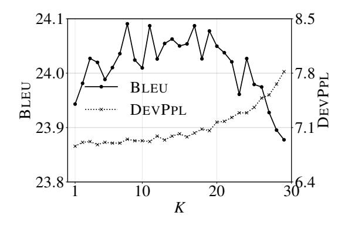

Figure 8: Last-K simple mean on ru-en.

Fig[.9](#page-7-2) shows the top-K simple mean BLEU and DEVPPL curves on es-en. Note that when all checkpoints are of decent DEVPPL, the BLEU score of the averaged model is more stable.

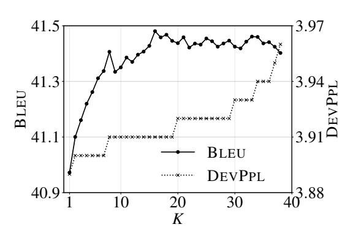

Figure 9: Top-K simple mean on es-en.

Fig[.10](#page-7-3) shows the top-10 weighted sum on en-ro.

Earlier in Fig[.4,](#page-3-0) we select last-40 checkpoints to include some bad-performing checkpoints. Here, the top-10 checkpoints are selected and it is clear from the figure that there is not much to be gained when tuning the interpolation weight via the temperature hyperparameter τ .

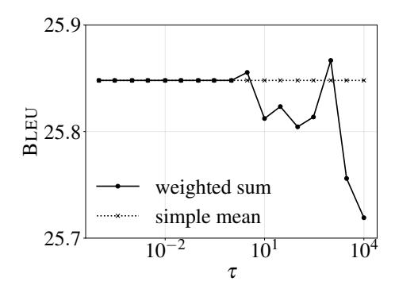

Figure 10: Top-10 weighted sum on en-ro.

In Fig[.11,](#page-7-4) we plot the neighborhood of three checkpoints on en-de. Here, One good checkpoint and two relatively worse checkpoints are included to show the difference compared with Fig[.7.](#page-3-3) As can be seen, the area near the good checkpoint is overall brighter and the region closer to the two worse checkpoints is darker. Although noise is visible from the plot, it is clear that there is not a specific optima where the BLEU score of the checkpoint-averaged model is significantly better.

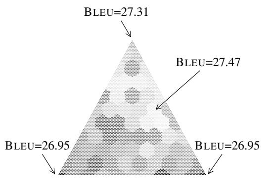

Figure 11: Neighborhood of three checkpoints on en-de. One good checkpoint and two relatively worse checkpoints are included to show the difference compared with Fig[.7.](#page-3-3) No post-processing of splitting hyphenated compound words is done (See [https://](https://github.com/tensorflow/tensor2tensor/blob/master/tensor2tensor/utils/get_ende_bleu.sh) [github.com/tensorflow/tensor2tensor/](https://github.com/tensorflow/tensor2tensor/blob/master/tensor2tensor/utils/get_ende_bleu.sh) [blob/master/tensor2tensor/utils/get\\_](https://github.com/tensorflow/tensor2tensor/blob/master/tensor2tensor/utils/get_ende_bleu.sh) [ende\\_bleu.sh](https://github.com/tensorflow/tensor2tensor/blob/master/tensor2tensor/utils/get_ende_bleu.sh).). The hexagons are artifacts from plotting because a denser grid of points is used in the plot than in checkpoint averaging and the dots are colored by querying the nearest neighbor in the checkpoint averaging grid.

In Fig[.12,](#page-8-0) we further plot the neighborhood of three checkpoints on zh-en. Here, two good checkpoint and one relatively worse checkpoint are included to show the difference compared with Fig[.7.](#page-3-3) From the figure, it can be seen that, overall, the interpolation closer to the two good checkpoints is better than when the worse checkpoint has a larger weight. Although +0.4% absolute BLEU score improvement is possible, there is no further improvement to be gained when tuning the interpolation weights.

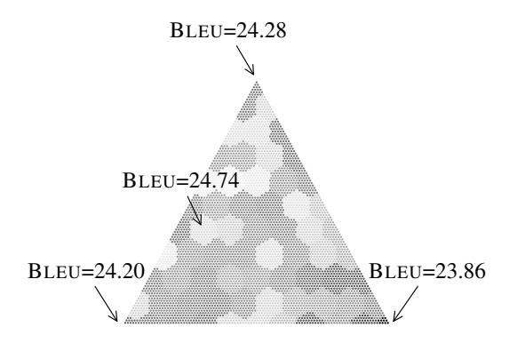

Figure 12: Neighborhood of three checkpoints on zh-en. Two good checkpoint and one relatively worse checkpoint are included to show the difference compared with Fig[.7.](#page-3-3) The hexagons are artifacts from plotting because a denser grid of points is used in the plot than in checkpoint averaging and the dots are colored by querying the nearest neighbor in the checkpoint averaging grid.