**Source:** *Loss Surfaces, Mode Connectivity, and Fast Ensembling of DNNs* — [PDF](https://arxiv.org/pdf/1802.10026) · [arXiv](https://arxiv.org/abs/1802.10026)

# Loss Surfaces, Mode Connectivity,   
and Fast Ensembling of DNNs

Timur Garipov Pavel Izmailov Dmitrii Podoprikhin Dmitry Vetrov Andrew Gordon Wilson Thanks:  Equal contribution.  Samsung AI Center in Moscow, Skolkovo Institute of Science and Technology, Cornell University, Samsung-HSE Laboratory, National Research University Higher School of Economics, National Research University Higher School of Economics

###### Abstract

The loss functions of deep neural networks are complex and their geometric properties are not well understood. We show that the optima of these complex loss functions are in fact connected by simple curves over which training and test accuracy are nearly constant. We introduce a training procedure to discover these high-accuracy pathways between modes. Inspired by this new geometric insight, we also propose a new ensembling method entitled Fast Geometric Ensembling (FGE). Using FGE we can train high-performing ensembles in the time required to train a single model. We achieve improved performance compared to the recent state-of-the-art Snapshot Ensembles, on CIFAR-10, CIFAR-100, and ImageNet.

## 1 Introduction

The loss surfaces of deep neural networks (DNNs) are highly non-convex and can depend on millions of parameters. The geometric properties of these loss surfaces are not well understood. Even for simple networks, the number of local optima and saddle points is large and can grow exponentially in the number of parameters [[2](https://arxiv.org/html/1802.10026#bib.bib2), [3](https://arxiv.org/html/1802.10026#bib.bib3), [4](https://arxiv.org/html/1802.10026#bib.bib4)]. Moreover, the loss is high along a line segment connecting two optima [[8](https://arxiv.org/html/1802.10026#bib.bib8), [17](https://arxiv.org/html/1802.10026#bib.bib17), e.g.,]. These two observations suggest that the local optima are isolated.

In this paper, we provide a new training procedure which can in fact find paths of near-constant accuracy between the modes of large deep neural networks. Furthermore, we show that for a wide range of architectures we can find these paths in the form of a simple polygonal chain of two line segments. Consider, for example, Figure [1](https://arxiv.org/html/1802.10026#S1.F1 "Figure 1 ‣ 1 Introduction ‣ Loss Surfaces, Mode Connectivity, and Fast Ensembling of DNNs"), which illustrates the ResNet-164 \(\ell_{2}\)-regularized cross-entropy train loss on CIFAR-100, through three different planes. We form each two dimensional plane by all affine combinations of three weight vectors.11 1 Suppose we have three weight vectors \(w_{1},w_{2},w_{3}\). We set \(u=(w_{2}-w_{1})\), \(v=(w_{3}-w_{1})-\langle w_{3}-~w_{1},w_{2}-~w_{1}\rangle/\|w_{2}-w_{1}\|^{2}\cdot(w_{2}-w_{1})\). Then the normalized vectors \(\hat{u}=u/\|u\|\), \(\hat{v}=v/\|v\|\) form an orthonormal basis in the plane containing \(w_{1},w_{2},w_{3}\). To visualize the loss in this plane, we define a Cartesian grid in the basis \(\hat{u},\hat{v}\) and evaluate the networks corresponding to each of the points in the grid. A point \(P\) with coordinates \((x,y)\) in the plane would then be given by \(P=w_{1}+x\cdot\hat{u}+y\cdot\hat{v}\).

The left panel shows a plane defined by three independently trained networks. In this plane, all optima are isolated, which corresponds to the standard intuition. However, the middle and right panels show two different paths of near-constant loss between the modes in weight space, discovered by our proposed training procedure. The endpoints of these paths are the two independently trained DNNs corresponding to the two lower modes on the left panel.

We believe that this geometric discovery has major implications for research into multilayer networks, including (1) improving the efficiency, reliability, and accuracy of training, (2) creating better ensembles, and (3) deriving more effective posterior approximation families in Bayesian deep learning. Indeed, in this paper we are inspired by this geometric insight to propose a new ensembling procedure that can efficiently discover multiple high-performing but diverse deep neural networks.

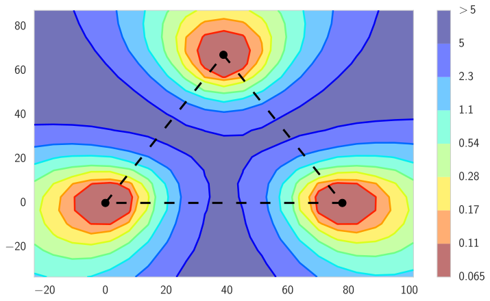

 

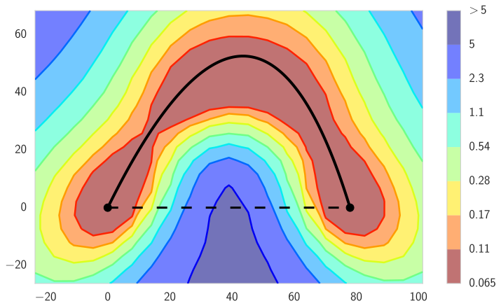

 

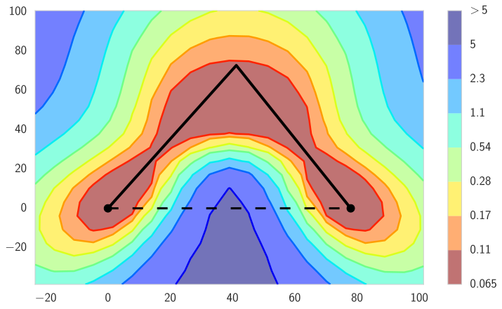

 

Figure 1:  The \(\ell_{2}\)-regularized cross-entropy train loss surface of a ResNet-164 on CIFAR-100, as a function of network weights in a two-dimensional subspace. In each panel, the horizontal axis is fixed and is attached to the optima of two independently trained networks. The vertical axis changes between panels as we change planes (defined in the main text). Left: Three optima for independently trained networks. Middle and Right: A quadratic Bezier curve, and a polygonal chain with one bend, connecting the lower two optima on the left panel along a path of near-constant loss. Notice that in each panel a direct linear path between each mode would incur high loss.

In particular, our contributions include:

  * The discovery that the local optima for modern deep neural networks are connected by very simple curves, such as a polygonal chain with only one bend. 
  * A new method that finds such paths between two local optima, such that the train loss and test error remain low along these paths. 
  * Using the proposed method we demonstrate that such mode connectivity holds for a wide range of modern deep neural networks, on key benchmarks such as CIFAR-100. We show that these paths correspond to meaningfully different representations that can be efficiently ensembled for increased accuracy. 
  * Inspired by these observations, we propose Fast Geometric Ensembling (FGE), which outperforms the recent state-of-the-art Snapshot Ensembles [[13](https://arxiv.org/html/1802.10026#bib.bib13)], on CIFAR-10 and CIFAR-100, using powerful deep neural networks such as VGG-16, Wide ResNet-28-10, and ResNet-164. On ImageNet we achieve \(0.56\%\) top-\(1\) error-rate improvement for a pretrained ResNet-50 model by running FGE for only \(5\) epochs. 
  * We release the code for reproducing the results in this paper at   
<https://github.com/timgaripov/dnn-mode-connectivity>

The rest of the paper is organized as follows. Section [2](https://arxiv.org/html/1802.10026#S2 "2 Related Work ‣ Loss Surfaces, Mode Connectivity, and Fast Ensembling of DNNs") discusses existing literature on DNN loss geometry and ensembling techniques. Section [3](https://arxiv.org/html/1802.10026#S3 "3 Finding Paths between Modes ‣ Loss Surfaces, Mode Connectivity, and Fast Ensembling of DNNs") introduces the proposed method to find the curves with low train loss and test error between local optima, which we investigate empirically in Section [4](https://arxiv.org/html/1802.10026#S4 "4 Curve Finding Experiments ‣ Loss Surfaces, Mode Connectivity, and Fast Ensembling of DNNs"). Section [5](https://arxiv.org/html/1802.10026#S5 "5 Fast Geometric Ensembling ‣ Loss Surfaces, Mode Connectivity, and Fast Ensembling of DNNs") then introduces our proposed ensembling technique, FGE, which we empirically compare to the alternatives in Section [6](https://arxiv.org/html/1802.10026#S6 "6 Fast Geometric Ensembling Experiments ‣ Loss Surfaces, Mode Connectivity, and Fast Ensembling of DNNs"). Finally, in Section [7](https://arxiv.org/html/1802.10026#S7 "7 Discussion and Future Work ‣ Loss Surfaces, Mode Connectivity, and Fast Ensembling of DNNs") we discuss connections to other fields and directions for future work.

Note that we interleave two sections where we make methodological proposals (Sections [3](https://arxiv.org/html/1802.10026#S3 "3 Finding Paths between Modes ‣ Loss Surfaces, Mode Connectivity, and Fast Ensembling of DNNs"), [5](https://arxiv.org/html/1802.10026#S5 "5 Fast Geometric Ensembling ‣ Loss Surfaces, Mode Connectivity, and Fast Ensembling of DNNs")), with two sections where we perform experiments (Sections [4](https://arxiv.org/html/1802.10026#S4 "4 Curve Finding Experiments ‣ Loss Surfaces, Mode Connectivity, and Fast Ensembling of DNNs"), [6](https://arxiv.org/html/1802.10026#S6 "6 Fast Geometric Ensembling Experiments ‣ Loss Surfaces, Mode Connectivity, and Fast Ensembling of DNNs")). Our key methodological proposal for ensembling, FGE, is in Section [5](https://arxiv.org/html/1802.10026#S5 "5 Fast Geometric Ensembling ‣ Loss Surfaces, Mode Connectivity, and Fast Ensembling of DNNs").

## 2 Related Work

Despite the success of deep learning across many application domains, the loss surfaces of deep neural networks are not well understood. These loss surfaces are an active area of research, which falls into two distinct categories.

The first category explores the local structure of minima found by SGD and its modifications. Researchers typically distinguish sharp and wide local minima, which are respectively found by using large and small mini-batch sizes during training. [Hochreiter and Schmidhuber 1997](https://arxiv.org/html/1802.10026#bib.bib12) and [Keskar et al. 2017](https://arxiv.org/html/1802.10026#bib.bib17), for example, claim that flat minima lead to strong generalization, while sharp minima deliver poor results on the test dataset. However, recently [Dinh et al. 2017](https://arxiv.org/html/1802.10026#bib.bib5) argue that most existing notions of flatness cannot directly explain generalization. To better understand the local structure of DNN loss minima, [Li et al. 2017](https://arxiv.org/html/1802.10026#bib.bib20) proposed a new visualization method for the loss surface near the minima found by SGD. Applying the method for a variety of different architectures, they showed that the loss surfaces of modern residual networks are seemingly smoother than those of VGG-like models.

The other major category of research considers global loss structure. One of the main questions in this area is how neural networks are able to overcome poor local optima. [Choromanska et al. 2015](https://arxiv.org/html/1802.10026#bib.bib3) investigated the link between the loss function of a simple fully-connected network and the Hamiltonian of the spherical spin-glass model. Under strong simplifying assumptions they showed that the values of the investigated loss function at local optima are within a well-defined bound. In other research, [Lee et al. 2016a](https://arxiv.org/html/1802.10026#bib.bib18) showed that under mild conditions gradient descent almost surely converges to a local minimizer and not a saddle point, starting from a random initialization.

In recent work [Freeman and Bruna 2017](https://arxiv.org/html/1802.10026#bib.bib7) theoretically show that local minima of a neural network with one hidden layer and ReLU activations can be connected with a curve along which the loss is upper-bounded by a constant that depends on the number of parameters of the network and the “smoothness of the data”. Their theoretical results do not readily generalize to multilayer networks. Using a dynamic programming approach they empirically construct a polygonal chain for a CNN on MNIST and an RNN on PTB next word prediction. However, in more difficult settings such as AlexNet on CIFAR-10 their approach struggles to achieve even the modest test accuracy of \(80\%\). Moreover, they do not consider ensembling.

By contrast, we propose a much simpler training procedure that can find near-constant accuracy polygonal chains with only one bend between optima, even on a range of modern state-of-the-art architectures. Inspired by properties of the loss function discovered by our procedure, we also propose a new state-of-the-art ensembling method that can be trained in the time required to train a single DNN, with compelling performance on many key benchmarks (e.g., 96.4% accuracy on CIFAR-10).

[Xie et al. 2013](https://arxiv.org/html/1802.10026#bib.bib26) proposed a related ensembling approach that gathers outputs of neural networks from different epochs at the end of training to stabilize final predictions. More recently, [Huang et al. 2017](https://arxiv.org/html/1802.10026#bib.bib13) proposed _snapshot ensembles_ , which use a cosine cyclical learning rate [[21](https://arxiv.org/html/1802.10026#bib.bib21)] to save “snapshots” of the model during training at times when the learning rate achieves its minimum. In our experiments, we compare our geometrically inspired approach to [Huang et al. 2017](https://arxiv.org/html/1802.10026#bib.bib13), showing improved performance.

[Draxler et al. 2018](https://arxiv.org/html/1802.10026#bib.bib6) simultaneously and independently discovered the existence of curves connecting local optima in DNN loss landscapes. To find these curves they used a different approach inspired by the Nudged Elastic Band method [[16](https://arxiv.org/html/1802.10026#bib.bib16)] from quantum chemistry.

## 3 Finding Paths between Modes

We describe a new method to minimize the training error along a path that connects two points in the space of DNN weights. Section [3.1](https://arxiv.org/html/1802.10026#S3.SS1 "3.1 Connection Procedure ‣ 3 Finding Paths between Modes ‣ Loss Surfaces, Mode Connectivity, and Fast Ensembling of DNNs") introduces this general procedure for arbitrary parametric curves, and Section [3.2](https://arxiv.org/html/1802.10026#S3.SS2 "3.2 Example Parametrizations ‣ 3 Finding Paths between Modes ‣ Loss Surfaces, Mode Connectivity, and Fast Ensembling of DNNs") describes polygonal chains and Bezier curves as two example parametrizations of such curves. In the supplementary material, we discuss the computational complexity of the proposed approach and how to apply batch normalization at test time to points on these curves. We note that after curve finding experiments in Section [4](https://arxiv.org/html/1802.10026#S4 "4 Curve Finding Experiments ‣ Loss Surfaces, Mode Connectivity, and Fast Ensembling of DNNs"), we make our _key methodological proposal for ensembling_ in Section [5](https://arxiv.org/html/1802.10026#S5 "5 Fast Geometric Ensembling ‣ Loss Surfaces, Mode Connectivity, and Fast Ensembling of DNNs").

### 3.1 Connection Procedure

Let \(\hat{w}_{1}\) and \(\hat{w}_{2}\) in \(\mathbb{R}^{|net|}\) be two sets of weights corresponding to two neural networks independently trained by minimizing any user-specified loss \(\mathcal{L}(w)\), such as the cross-entropy loss. Here, \(|net|\) is the number of weights of the DNN. Moreover, let \(\phi_{\theta}:[0,1]\rightarrow\mathbb{R}^{|net|}\) be a continuous piecewise smooth parametric curve, with parameters \(\theta\), such that \(\phi_{\theta}(0)=\hat{w}_{1},~~\phi_{\theta}(1)=\hat{w}_{2}\).

To find a path of high accuracy between \(\hat{w}_{1}\) and \(\hat{w}_{2}\), we propose to find the parameters \(\theta\) that minimize the expectation over a uniform distribution on the curve, \(\hat{\ell}(\theta)\):

\[\begin{aligned}
 & \hat{\ell}(\theta)=\frac{\int{\cal L(\phi_{\theta})}d\phi_{\theta}}{\int d\phi_{\theta}}=\frac{\int\limits_{0}^{1}{\cal L}(\phi_{\theta}(t))\|\phi^{\prime}_{\theta}(t)\|dt}{\int\limits_{0}^{1}\|\phi^{\prime}_{\theta}(t)\|dt}=\int\limits_{0}^{1}\mathcal{L}(\phi_{\theta}(t))q_{\theta}(t)dt=\mathbb{E}_{t\sim q_{\theta}(t)}\Big[\mathcal{L}(\phi_{\theta}(t))\Big], &  & \text{(1)}
\end{aligned}\]

 

where the distribution \(q_{\theta}(t)\) on \(t\in[0,1]\) is defined as: \(q_{\theta}(t)=\|\phi_{\theta}^{\prime}(t)\|\cdot\left(\int\limits_{0}^{1}\|\phi_{\theta}^{\prime}(t)\|dt\right)^{-1}.\) The numerator of ([1](https://arxiv.org/html/1802.10026#S3.E1 "In 3.1 Connection Procedure ‣ 3 Finding Paths between Modes ‣ Loss Surfaces, Mode Connectivity, and Fast Ensembling of DNNs")) is the line integral of the loss \(\mathcal{L}\) on the curve, and the denominator \(\int_{0}^{1}\|\phi^{\prime}_{\theta}(t)\|dt\) is the normalizing constant of the uniform distribution on the curve defined by \(\phi_{\theta}(\cdot)\). Stochastic gradients of \(\hat{\ell}(\theta)\) in Eq. ([1](https://arxiv.org/html/1802.10026#S3.E1 "In 3.1 Connection Procedure ‣ 3 Finding Paths between Modes ‣ Loss Surfaces, Mode Connectivity, and Fast Ensembling of DNNs")) are generally intractable since \(q_{\theta}(t)\) depends on \(\theta\). Therefore we also propose a more computationally tractable loss

\[\begin{aligned}
 & \ell(\theta)=\int_{0}^{1}\mathcal{L}(\phi_{\theta}(t))dt=\mathbb{E}_{t\sim U(0,1)}\mathcal{L}(\phi_{\theta}(t)), &  & \text{(2)}
\end{aligned}\]

 

where \(U(0,1)\) is the uniform distribution on \([0,1]\). The difference between ([1](https://arxiv.org/html/1802.10026#S3.E1 "In 3.1 Connection Procedure ‣ 3 Finding Paths between Modes ‣ Loss Surfaces, Mode Connectivity, and Fast Ensembling of DNNs")) and ([2](https://arxiv.org/html/1802.10026#S3.E2 "In 3.1 Connection Procedure ‣ 3 Finding Paths between Modes ‣ Loss Surfaces, Mode Connectivity, and Fast Ensembling of DNNs")) is that the latter is an expectation of the loss \(\mathcal{L}(\phi_{\theta}(t))\) with respect to a uniform distribution on \(t\in[0,1]\), while ([1](https://arxiv.org/html/1802.10026#S3.E1 "In 3.1 Connection Procedure ‣ 3 Finding Paths between Modes ‣ Loss Surfaces, Mode Connectivity, and Fast Ensembling of DNNs")) is an expectation with respect to a uniform distribution on the curve. The two losses coincide, for example, when \(\phi_{\theta}(\cdot)\) defines a polygonal chain with two line segments of equal length and the parametrization of each of the two segments is linear in \(t\).

To minimize ([2](https://arxiv.org/html/1802.10026#S3.E2 "In 3.1 Connection Procedure ‣ 3 Finding Paths between Modes ‣ Loss Surfaces, Mode Connectivity, and Fast Ensembling of DNNs")), at each iteration we sample \(\tilde{t}\) from the uniform distribution \(U(0,1)\) and make a gradient step for \(\theta\) with respect to the loss \(\mathcal{L}(\phi_{\theta}(\tilde{t}))\). This way we obtain unbiased estimates of the gradients of \(\ell(\theta)\), as

\[\begin{aligned}
 & \nabla_{\theta}\mathcal{L}(\phi_{\theta}(\tilde{t}))\simeq\mathbb{E}_{t\sim U(0,1)}\nabla_{\theta}\mathcal{L}(\phi_{\theta}(t))=\nabla_{\theta}\mathbb{E}_{t\sim U(0,1)}\mathcal{L}(\phi_{\theta}(t))=\nabla_{\theta}\ell(\theta). & 
\end{aligned}\]

 

We repeat these updates until convergence.

### 3.2 Example Parametrizations

#### Polygonal chain

The simplest parametric curve we consider is the polygonal chain (see Figure [1](https://arxiv.org/html/1802.10026#S1.F1 "Figure 1 ‣ 1 Introduction ‣ Loss Surfaces, Mode Connectivity, and Fast Ensembling of DNNs"), right). The trained networks \(\hat{w}_{1}\) and \(\hat{w}_{2}\) serve as the endpoints of the chain and the bends of the chain are the parameters \(\theta\) of the curve parametrization. Consider the simplest case of a chain with one bend \(\theta\). Then

\[\begin{aligned}
 & \phi_{\theta}(t)=\left\{\begin{array}[]{ll}2\left(t\theta+(0.5-t)\hat{w}_{1}\right),&\hskip-5.69046pt0\leq t\leq 0.5\\
2\left((t-0.5)\hat{w}_{2}+(1-t)\theta\right),&\hskip-5.69046pt0.5\leq t\leq 1.\end{array}\right. & 
\end{aligned}\]

 

#### Bezier curve

A Bezier curve (see Figure [1](https://arxiv.org/html/1802.10026#S1.F1 "Figure 1 ‣ 1 Introduction ‣ Loss Surfaces, Mode Connectivity, and Fast Ensembling of DNNs"), middle) provides a convenient parametrization of smooth paths with given endpoints. A quadratic Bezier curve \(\phi_{\theta}(t)\) with endpoints \(\hat{w}_{1}\) and \(\hat{w}_{2}\) is given by

\[\begin{aligned}
 & \phi_{\theta}(t)=(1-t)^{2}\hat{w}_{1}+2t(1-t)\theta+t^{2}\hat{w}_{2},~~0\leq t\leq 1. & 
\end{aligned}\]

 

These formulas naturally generalize for \(n\) bends \(\theta~=~\{w_{1},w_{2},\ldots,w_{n}\}\) (see supplement).

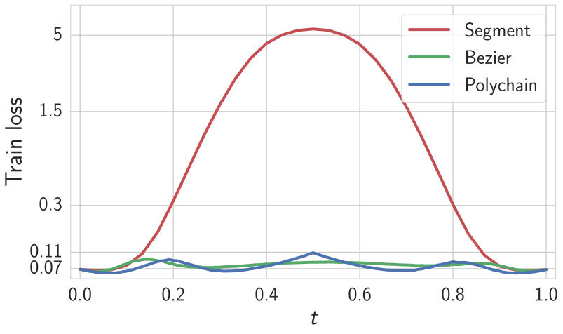

 

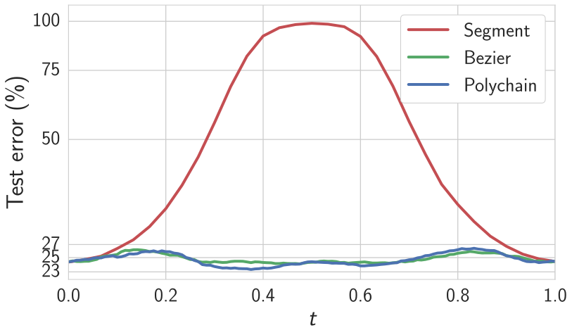

 

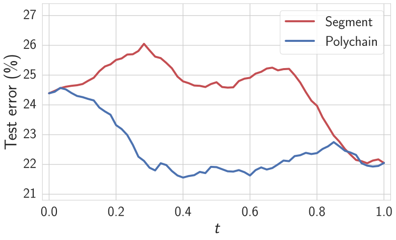

 

Figure 2:  The \(\ell_{2}\)-regularized cross-entropy train loss (left) and test error (middle) as a function of the point on the curves \(\phi_{\theta}(t)\) found by the proposed method (ResNet-164 on CIFAR-100). Right: Error of the two-network ensemble consisting of the endpoint \(\phi_{\theta}(0)\) of the curve and the point \(\phi_{\theta}(t)\) on the curve (CIFAR-100, ResNet-164). “Segment” is a line segment connecting two modes found by SGD. “Polychain” is a polygonal chain connecting the same endpoints. 

## 4 Curve Finding Experiments

We show that the proposed training procedure in Section [3](https://arxiv.org/html/1802.10026#S3 "3 Finding Paths between Modes ‣ Loss Surfaces, Mode Connectivity, and Fast Ensembling of DNNs") does indeed find high accuracy paths connecting different modes, across a range of architectures and datasets. Moreover, we further investigate the properties of these curves, showing that they correspond to meaningfully different representations that can be ensembled for improved accuracy. We use these insights to propose an improved ensembling procedure in Section [5](https://arxiv.org/html/1802.10026#S5 "5 Fast Geometric Ensembling ‣ Loss Surfaces, Mode Connectivity, and Fast Ensembling of DNNs"), which we empirically validate in Section [6](https://arxiv.org/html/1802.10026#S6 "6 Fast Geometric Ensembling Experiments ‣ Loss Surfaces, Mode Connectivity, and Fast Ensembling of DNNs").

In particular, we test VGG-\(16\) [[24](https://arxiv.org/html/1802.10026#bib.bib24)], a \(28\)-layer Wide ResNet with widening factor \(10\) [[27](https://arxiv.org/html/1802.10026#bib.bib27)] and a \(158\)-layer ResNet [[11](https://arxiv.org/html/1802.10026#bib.bib11)] on CIFAR-10, and VGG-\(16\), \(164\)-layer ResNet-bottleneck [[11](https://arxiv.org/html/1802.10026#bib.bib11)] on CIFAR-100. For CIFAR-10 and CIFAR-100 we use the same standard data augmentation as [Huang et al. 2017](https://arxiv.org/html/1802.10026#bib.bib13). We provide additional results, including detailed experiments for fully connected and recurrent networks, in the supplement.

For each model and dataset we train two networks with different random initializations to find two modes. Then we use the proposed algorithm of Section [3](https://arxiv.org/html/1802.10026#S3 "3 Finding Paths between Modes ‣ Loss Surfaces, Mode Connectivity, and Fast Ensembling of DNNs") to find a path connecting these two modes in the weight space with a quadratic Bezier curve and a polygonal chain with one bend. We also connect the two modes with a line segment for comparison. In all experiments we optimize the loss ([2](https://arxiv.org/html/1802.10026#S3.E2 "In 3.1 Connection Procedure ‣ 3 Finding Paths between Modes ‣ Loss Surfaces, Mode Connectivity, and Fast Ensembling of DNNs")), as for Bezier curves the gradient of loss ([1](https://arxiv.org/html/1802.10026#S3.E1 "In 3.1 Connection Procedure ‣ 3 Finding Paths between Modes ‣ Loss Surfaces, Mode Connectivity, and Fast Ensembling of DNNs")) is intractable, and for polygonal chains we found loss ([2](https://arxiv.org/html/1802.10026#S3.E2 "In 3.1 Connection Procedure ‣ 3 Finding Paths between Modes ‣ Loss Surfaces, Mode Connectivity, and Fast Ensembling of DNNs")) to be more stable.

Figures [1](https://arxiv.org/html/1802.10026#S1.F1 "Figure 1 ‣ 1 Introduction ‣ Loss Surfaces, Mode Connectivity, and Fast Ensembling of DNNs") and [2](https://arxiv.org/html/1802.10026#S3.F2 "Figure 2 ‣ Bezier curve ‣ 3.2 Example Parametrizations ‣ 3 Finding Paths between Modes ‣ Loss Surfaces, Mode Connectivity, and Fast Ensembling of DNNs") show the results of the proposed mode connecting procedure for ResNet-164 on CIFAR-100. Here _loss_ refers to \(\ell_{2}\)-regularized cross-entropy loss. For both the Bezier curve and polygonal chain, train loss (Figure [2](https://arxiv.org/html/1802.10026#S3.F2 "Figure 2 ‣ Bezier curve ‣ 3.2 Example Parametrizations ‣ 3 Finding Paths between Modes ‣ Loss Surfaces, Mode Connectivity, and Fast Ensembling of DNNs"), left) and test error (Figure [2](https://arxiv.org/html/1802.10026#S3.F2 "Figure 2 ‣ Bezier curve ‣ 3.2 Example Parametrizations ‣ 3 Finding Paths between Modes ‣ Loss Surfaces, Mode Connectivity, and Fast Ensembling of DNNs"), middle) are indeed nearly constant. In addition, we provide plots of train error and test loss in the supplementary material. In the supplement, we also include a comprehensive table summarizing all path finding experiments on CIFAR-10 and CIFAR-100 for VGGs, ResNets and Wide ResNets, as well as fully connected networks and recurrent neural networks, which follow the same general trends. In the supplementary material we also show that the connecting curves can be found consistently as we vary the number of parameters in the network, although the ratio of the arclength for the curves to the length of the line segment connecting the same endpoints decreases with increasing parametrization. In the supplement, we also measure the losses ([1](https://arxiv.org/html/1802.10026#S3.E1 "In 3.1 Connection Procedure ‣ 3 Finding Paths between Modes ‣ Loss Surfaces, Mode Connectivity, and Fast Ensembling of DNNs")) and ([2](https://arxiv.org/html/1802.10026#S3.E2 "In 3.1 Connection Procedure ‣ 3 Finding Paths between Modes ‣ Loss Surfaces, Mode Connectivity, and Fast Ensembling of DNNs")) for all the curves we constructed, and find that the values of the two losses are very close, suggesting that the loss ([2](https://arxiv.org/html/1802.10026#S3.E2 "In 3.1 Connection Procedure ‣ 3 Finding Paths between Modes ‣ Loss Surfaces, Mode Connectivity, and Fast Ensembling of DNNs")) is a good practical approximation to the loss ([1](https://arxiv.org/html/1802.10026#S3.E1 "In 3.1 Connection Procedure ‣ 3 Finding Paths between Modes ‣ Loss Surfaces, Mode Connectivity, and Fast Ensembling of DNNs")).

The constant-error curves connecting two given networks discovered by the proposed method are not unique. We trained two different polygonal chains with the same endpoints and different random seeds using VGG-16 on CIFAR-10. We then measured the Euclidean distance between the turning points of these curves. For VGG-16 on CIFAR-10 this distance is equal to \(29.6\) and the distance between the endpoints is \(50\), showing that the curves are not unique. In this instance, we expect the distance between turning points to be less than the distance between endpoints, since the locations of the turning points were initialized to the same value (the center of the line segment connecting the endpoints).

Although high accuracy connecting curves can often be very simple, such as a polygonal chain with only one bend, we note that line segments _directly_ connecting two modes generally incur high error. For VGG-16 on CIFAR-10 the test error goes up to \(90\%\) in the center of the segment. For ResNet-158 and Wide ResNet-28-10 the worst errors along direct line segments are still high, but relatively less, at \(80\%\) and \(66\%\), respectively. This finding suggests that the loss surfaces of state-of-the-art residual networks are indeed more regular than those of classical models like VGG, in accordance with the observations in [Li et al. 2017](https://arxiv.org/html/1802.10026#bib.bib20).

In this paper we focus on connecting pairs of networks trained using the same hyper-parameters, but from different random initializations. Building upon our work, [Gotmare et al. 2018](https://arxiv.org/html/1802.10026#bib.bib9) have recently shown that our mode connectivity approach applies to pairs of networks trained with different batch sizes, optimizers, data augmentation strategies, weight decays and learning rate schemes.

To motivate the ensembling procedure proposed in the next section, we now examine how far we need to move along a connecting curve to find a point that produces substantially different, but still useful, predictions. Let \(\hat{w}_{1}\) and \(\hat{w}_{2}\) be two distinct sets of weights corresponding to optima obtained by independently training a DNN two times. We have shown that there exists a path connecting \(\hat{w}_{1}\) and \(\hat{w}_{2}\) with high test accuracy. Let \(\phi_{\theta}(t)\), \(t\in[0,1]\) parametrize this path with \(\phi_{\theta}(0)=\hat{w}_{1}\), \(\phi_{\theta}(1)=\hat{w}_{2}\). We investigate the performance of an ensemble of two networks: the endpoint \(\phi_{\theta}(0)\) of the curve and a point \(\phi_{\theta}(t)\) on the curve corresponding to \(t\in[0,1]\). Figure [2](https://arxiv.org/html/1802.10026#S3.F2 "Figure 2 ‣ Bezier curve ‣ 3.2 Example Parametrizations ‣ 3 Finding Paths between Modes ‣ Loss Surfaces, Mode Connectivity, and Fast Ensembling of DNNs") (right) shows the test error of this ensemble as a function of \(t\), for a ResNet-164 on CIFAR-100. The test error starts decreasing at \(t\approx 0.1\) and for \(t\geq 0.4\) the error of an ensemble is already as low as the error of an ensemble of the two independently trained networks used as the endpoints of the curve. Thus even by moving away from the endpoint by a relatively small distance along the curve we can find a network that produces meaningfully different predictions from the network at the endpoint. This result also demonstrates that these curves do not exist only due to degenerate parametrizations of the network (such as rescaling on either side of a ReLU); instead, points along the curve correspond to meaningfully different representations of the data that can be ensembled for improved performance. In the supplementary material we show how to create trivially connecting curves that do not have this property.

## 5 Fast Geometric Ensembling

In this section, we introduce a practical ensembling procedure, Fast Geometric Ensembling (FGE), motivated by our observations about mode connectivity.

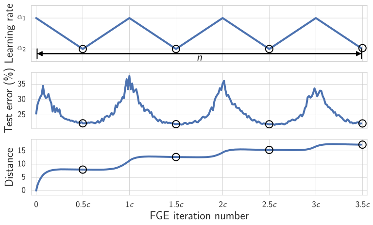

 

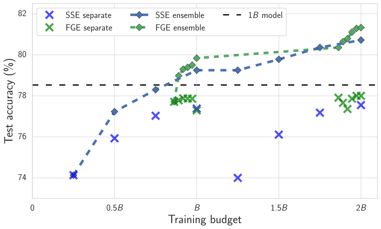

 

Figure 3:  Left: Plot of the learning rate (Top), test error (Middle) and distance from the initial value \(\hat{w}\) (Bottom) as a function of iteration for FGE with Preactivation-ResNet-164 on CIFAR-100. Circles indicate the times when we save models for ensembling. Right: Ensemble performance of FGE and SSE (Snapshot Ensembles) as a function of training time, using ResNet-164 on CIFAR-100 (\(B=150\) epochs). Crosses represent the performance of separate “snapshot” models, and diamonds show the performance of the ensembles constructed of all models available by the given time. 

In the previous section, we considered ensembling along mode connecting curves. Suppose now we instead only have one set of weights \(\hat{w}\) corresponding to a mode of the loss. We cannot explicitly construct a path \(\phi_{\theta}(\cdot)\) as before, but we know that multiple paths passing through \(\hat{w}\) exist, and it is thus possible to move away from \(\hat{w}\) in the weight space without increasing the loss. Further, we know that we can find diverse networks providing meaningfully different predictions by making relatively small steps in the weight space (see Figure [2](https://arxiv.org/html/1802.10026#S3.F2 "Figure 2 ‣ Bezier curve ‣ 3.2 Example Parametrizations ‣ 3 Finding Paths between Modes ‣ Loss Surfaces, Mode Connectivity, and Fast Ensembling of DNNs"), right).

Inspired by these observations, we propose the Fast Geometric Ensembling (FGE) method that aims to find diverse networks with relatively small steps in the weight space, without leaving a region that corresponds to low test error.

While inspired by mode connectivity, FGE does not rely on explicitly finding a connecting curve, and thus does not require pre-trained endpoints, and so can be trained in the time required to train a _single_ network.

Let us describe Fast Geometric Ensembling. First, we initialize a copy of the network with weights \(w\) set equal to the weights of the trained network \(\hat{w}\). Now, to force \(w\) to move away from \(\hat{w}\) without substantially decreasing the prediction accuracy we adopt a cyclical learning rate schedule \(\alpha(\cdot)\) (see Figure [3](https://arxiv.org/html/1802.10026#S5.F3 "Figure 3 ‣ 5 Fast Geometric Ensembling ‣ Loss Surfaces, Mode Connectivity, and Fast Ensembling of DNNs"), left), with the learning rate at iteration \(i=1,2,\ldots\) defined as

\[\begin{aligned}
 & \begin{gathered}\alpha(i)=\left\{\begin{array}[]{ll}(1-2t(i))\alpha_{1}+2t(i)\alpha_{2}&0<t(i)\leq\frac{1}{2}\\
(2-2t(i))\alpha_{2}+(2t(i)-1)\alpha_{1}&\frac{1}{2}<t(i)\leq 1\\
\end{array}\right.,\end{gathered} & 
\end{aligned}\]

 

where \(t(i)=\frac{1}{c}(\bmod(i-1,c)+1)\), the learning rates are \(\alpha_{1}>\alpha_{2}\), and the number of iterations in one cycle is given by even number \(c\). Here by iteration we mean processing one mini-batch of data. We can train the network \(w\) using the standard \(\ell_{2}\)-regularized cross-entropy loss function (or any other loss that can be used for DNN training) with the proposed learning rate schedule for \(n\) iterations. In the middle of each learning rate cycle when the learning rate reaches its minimum value \(\alpha(i)=\alpha_{2}\) (which corresponds to \(\bmod(i-1,c)+1=c/2,t(i)=\frac{1}{2}\)) we collect the checkpoints of weights \(w\). When the training is finished we ensemble the collected models. An outline of the algorithm is provided in the supplement.

Figure [3](https://arxiv.org/html/1802.10026#S5.F3 "Figure 3 ‣ 5 Fast Geometric Ensembling ‣ Loss Surfaces, Mode Connectivity, and Fast Ensembling of DNNs") (left) illustrates the adopted learning rate schedule. During the periods when the learning rate is large (close to \(\alpha_{1}\)), \(w\) is exploring the weight space doing larger steps but sacrificing the test error. When the learning rate is small (close to \(\alpha_{2}\)), \(w\) is in the exploitation phase in which the steps become smaller and the test error goes down. The cycle length is usually about \(2\) to \(4\) epochs, so that the method efficiently balances exploration and exploitation with relatively-small steps in the weight space that are still sufficient to gather diverse and meaningful networks for the ensemble.

To find a good initialization \(\hat{w}\) for the proposed procedure, we first train the network with the standard learning rate schedule (the schedule used to train single DNN models) for about \(80\%\) of the time required to train a single model. After this pre-training is finished we initialize FGE with \(\hat{w}\) and run the proposed fast ensembling algorithm for the remaining computational budget. In order to get more diverse samples, one can run the algorithm described above several times for a smaller number of iterations initializing from different checkpoints saved during training of \(\hat{w}\), and then ensemble all of the models gathered across these runs.

Cyclical learning rates have also recently been considered in [Smith and Topin 2017](https://arxiv.org/html/1802.10026#bib.bib25) and [Huang et al. 2017](https://arxiv.org/html/1802.10026#bib.bib13). Our proposed method is perhaps most closely related to Snapshot Ensembles [[13](https://arxiv.org/html/1802.10026#bib.bib13)], but has several distinctive features, inspired by our geometric insights. In particular, Snapshot Ensembles adopt cyclical learning rates with cycle length on the scale of \(20\) to \(40\) epochs from the beginning of the training as they are trying to do large steps in the weight space. However, according to our analysis of the curves it is sufficient to do relatively small steps in the weight space to get diverse networks, so we only employ cyclical learning rates with a small cycle length on the scale of \(2\) to \(4\) epochs in the last stage of the training. As illustrated in Figure [3](https://arxiv.org/html/1802.10026#S5.F3 "Figure 3 ‣ 5 Fast Geometric Ensembling ‣ Loss Surfaces, Mode Connectivity, and Fast Ensembling of DNNs") (left), the step sizes made by FGE between saving two models (that is the euclidean distance between sets of weights of corresponding models in the weight space) are on the scale of \(7\) for Preactivation-ResNet-164 on CIFAR-100. For Snapshot Ensembles for the same model the distance between two snapshots is on the scale of \(40\). We also use a piecewise linear cyclical learning rate schedule following [Smith and Topin 2017](https://arxiv.org/html/1802.10026#bib.bib25) as opposed to the cosine schedule in Snapshot Ensembles.

## 6 Fast Geometric Ensembling Experiments

Table 1: Error rates (\(\%\)) on CIFAR-100 and CIFAR-10 datasets for different ensembling techniques and training budgets. The best results for each dataset, architecture, and budget are bolded.  

<table id="S6.T1.4" class="ltx_tabular ltx_centering ltx_guessed_headers ltx_align_middle">
<thead class="ltx_thead">
<tr id="S6.T1.4.1" class="ltx_tr">
<th id="S6.T1.4.1.1" class="ltx_td ltx_th ltx_th_row ltx_border_tt"></th>
<th id="S6.T1.4.1.2" class="ltx_td ltx_th ltx_th_column ltx_th_row ltx_border_tt"></th>
<th id="S6.T1.4.1.3" class="ltx_td ltx_align_center ltx_th ltx_th_column ltx_border_tt" colspan="3">CIFAR-100</th>
<th id="S6.T1.4.1.4" class="ltx_td ltx_align_center ltx_th ltx_th_column ltx_border_tt" colspan="3">CIFAR-10</th></tr>
<tr id="S6.T1.4.2" class="ltx_tr">
<th id="S6.T1.4.2.1" class="ltx_td ltx_align_center ltx_th ltx_th_column ltx_th_row">DNN (Budget)</th>
<th id="S6.T1.4.2.2" class="ltx_td ltx_align_left ltx_th ltx_th_column ltx_th_row">method</th>
<th id="S6.T1.4.2.3" class="ltx_td ltx_align_center ltx_th ltx_th_column ltx_border_t">\(1B\)</th>
<th id="S6.T1.4.2.4" class="ltx_td ltx_align_center ltx_th ltx_th_column ltx_border_t">\(2B\)</th>
<th id="S6.T1.4.2.5" class="ltx_td ltx_align_center ltx_th ltx_th_column ltx_border_t">\(3B\)</th>
<th id="S6.T1.4.2.6" class="ltx_td ltx_align_center ltx_th ltx_th_column ltx_border_t">\(1B\)</th>
<th id="S6.T1.4.2.7" class="ltx_td ltx_align_center ltx_th ltx_th_column ltx_border_t">\(2B\)</th>
<th id="S6.T1.4.2.8" class="ltx_td ltx_align_center ltx_th ltx_th_column ltx_border_t">\(3B\)</th></tr>
</thead>
<tbody class="ltx_tbody">
<tr id="S6.T1.4.3" class="ltx_tr">
<th id="S6.T1.4.3.1" class="ltx_td ltx_align_center ltx_th ltx_th_row ltx_border_t" rowspan="3">VGG-16 (\(200\))</th>
<th id="S6.T1.4.3.2" class="ltx_td ltx_align_left ltx_th ltx_th_row ltx_border_t">Ind</th>
<td id="S6.T1.4.3.3" class="ltx_td ltx_align_center ltx_border_t">\(27.4\pm 0.1\)</td>
<td id="S6.T1.4.3.4" class="ltx_td ltx_align_center ltx_border_t">\(25.28\)</td>
<td id="S6.T1.4.3.5" class="ltx_td ltx_align_center ltx_border_t">\(24.45\)</td>
<td id="S6.T1.4.3.6" class="ltx_td ltx_align_center ltx_border_t">\(6.75\pm 0.16\)</td>
<td id="S6.T1.4.3.7" class="ltx_td ltx_align_center ltx_border_t">\(5.89\)</td>
<td id="S6.T1.4.3.8" class="ltx_td ltx_align_center ltx_border_t">\(5.9\)</td></tr>
<tr id="S6.T1.4.4" class="ltx_tr">
<th id="S6.T1.4.4.1" class="ltx_td ltx_align_left ltx_th ltx_th_row">SSE</th>
<td id="S6.T1.4.4.2" class="ltx_td ltx_align_center">\(26.4\pm 0.1\)</td>
<td id="S6.T1.4.4.3" class="ltx_td ltx_align_center">\(25.16\)</td>
<td id="S6.T1.4.4.4" class="ltx_td ltx_align_center">\(24.69\)</td>
<td id="S6.T1.4.4.5" class="ltx_td ltx_align_center">\(6.57\pm 0.12\)</td>
<td id="S6.T1.4.4.6" class="ltx_td ltx_align_center">\(6.19\)</td>
<td id="S6.T1.4.4.7" class="ltx_td ltx_align_center">\(5.95\)</td></tr>
<tr id="S6.T1.4.5" class="ltx_tr">
<th id="S6.T1.4.5.1" class="ltx_td ltx_align_left ltx_th ltx_th_row">FGE</th>
<td id="S6.T1.4.5.2" class="ltx_td ltx_align_center">\(\mathbf{25.7\pm 0.1}\)</td>
<td id="S6.T1.4.5.3" class="ltx_td ltx_align_center">\(\mathbf{24.11}\)</td>
<td id="S6.T1.4.5.4" class="ltx_td ltx_align_center">\(\mathbf{23.54}\)</td>
<td id="S6.T1.4.5.5" class="ltx_td ltx_align_center">\(\mathbf{6.48\pm 0.09}\)</td>
<td id="S6.T1.4.5.6" class="ltx_td ltx_align_center">\(\mathbf{5.82}\)</td>
<td id="S6.T1.4.5.7" class="ltx_td ltx_align_center">\(\mathbf{5.66}\)</td></tr>
<tr id="S6.T1.4.6" class="ltx_tr">
<th id="S6.T1.4.6.1" class="ltx_td ltx_align_center ltx_th ltx_th_row ltx_border_t" rowspan="3">ResNet-164 (\(150\))</th>
<th id="S6.T1.4.6.2" class="ltx_td ltx_align_left ltx_th ltx_th_row ltx_border_t">Ind</th>
<td id="S6.T1.4.6.3" class="ltx_td ltx_align_center ltx_border_t">\(21.5\pm 0.4\)</td>
<td id="S6.T1.4.6.4" class="ltx_td ltx_align_center ltx_border_t">\(19.04\)</td>
<td id="S6.T1.4.6.5" class="ltx_td ltx_align_center ltx_border_t">\(18.59\)</td>
<td id="S6.T1.4.6.6" class="ltx_td ltx_align_center ltx_border_t">\(4.72\pm 0.1\)</td>
<td id="S6.T1.4.6.7" class="ltx_td ltx_align_center ltx_border_t">\(\mathbf{4.1}\)</td>
<td id="S6.T1.4.6.8" class="ltx_td ltx_align_center ltx_border_t">\(\mathbf{3.77}\)</td></tr>
<tr id="S6.T1.4.7" class="ltx_tr">
<th id="S6.T1.4.7.1" class="ltx_td ltx_align_left ltx_th ltx_th_row">SSE</th>
<td id="S6.T1.4.7.2" class="ltx_td ltx_align_center">\(20.9\pm 0.2\)</td>
<td id="S6.T1.4.7.3" class="ltx_td ltx_align_center">\(19.28\)</td>
<td id="S6.T1.4.7.4" class="ltx_td ltx_align_center">\(18.91\)</td>
<td id="S6.T1.4.7.5" class="ltx_td ltx_align_center">\(4.66\pm 0.02\)</td>
<td id="S6.T1.4.7.6" class="ltx_td ltx_align_center">\(4.37\)</td>
<td id="S6.T1.4.7.7" class="ltx_td ltx_align_center">\(4.3\)</td></tr>
<tr id="S6.T1.4.8" class="ltx_tr">
<th id="S6.T1.4.8.1" class="ltx_td ltx_align_left ltx_th ltx_th_row">FGE</th>
<td id="S6.T1.4.8.2" class="ltx_td ltx_align_center">\(\mathbf{20.2\pm 0.1}\)</td>
<td id="S6.T1.4.8.3" class="ltx_td ltx_align_center">\(\mathbf{18.67}\)</td>
<td id="S6.T1.4.8.4" class="ltx_td ltx_align_center">\(\mathbf{18.21}\)</td>
<td id="S6.T1.4.8.5" class="ltx_td ltx_align_center">\(\mathbf{4.54\pm 0.05}\)</td>
<td id="S6.T1.4.8.6" class="ltx_td ltx_align_center">\(4.21\)</td>
<td id="S6.T1.4.8.7" class="ltx_td ltx_align_center">\(3.98\)</td></tr>
<tr id="S6.T1.4.9" class="ltx_tr">
<th id="S6.T1.4.9.1" class="ltx_td ltx_align_center ltx_th ltx_th_row ltx_border_bb ltx_border_t" rowspan="3">WRN-28-10 (\(200\))</th>
<th id="S6.T1.4.9.2" class="ltx_td ltx_align_left ltx_th ltx_th_row ltx_border_t">Ind</th>
<td id="S6.T1.4.9.3" class="ltx_td ltx_align_center ltx_border_t">\(19.2\pm 0.2\)</td>
<td id="S6.T1.4.9.4" class="ltx_td ltx_align_center ltx_border_t">\(17.48\)</td>
<td id="S6.T1.4.9.5" class="ltx_td ltx_align_center ltx_border_t">\(17.01\)</td>
<td id="S6.T1.4.9.6" class="ltx_td ltx_align_center ltx_border_t">\(3.82\pm 0.1\)</td>
<td id="S6.T1.4.9.7" class="ltx_td ltx_align_center ltx_border_t">\(3.4\)</td>
<td id="S6.T1.4.9.8" class="ltx_td ltx_align_center ltx_border_t">\(\mathbf{3.31}\)</td></tr>
<tr id="S6.T1.4.10" class="ltx_tr">
<th id="S6.T1.4.10.1" class="ltx_td ltx_align_left ltx_th ltx_th_row">SSE</th>
<td id="S6.T1.4.10.2" class="ltx_td ltx_align_center">\(17.9\pm 0.2\)</td>
<td id="S6.T1.4.10.3" class="ltx_td ltx_align_center">\(17.3\)</td>
<td id="S6.T1.4.10.4" class="ltx_td ltx_align_center">\(16.97\)</td>
<td id="S6.T1.4.10.5" class="ltx_td ltx_align_center">\(3.73\pm 0.04\)</td>
<td id="S6.T1.4.10.6" class="ltx_td ltx_align_center">\(3.54\)</td>
<td id="S6.T1.4.10.7" class="ltx_td ltx_align_center">\(3.55\)</td></tr>
<tr id="S6.T1.4.11" class="ltx_tr">
<th id="S6.T1.4.11.1" class="ltx_td ltx_align_left ltx_th ltx_th_row ltx_border_bb">FGE</th>
<td id="S6.T1.4.11.2" class="ltx_td ltx_align_center ltx_border_bb">\(\mathbf{17.7\pm 0.2}\)</td>
<td id="S6.T1.4.11.3" class="ltx_td ltx_align_center ltx_border_bb">\(\mathbf{16.95}\)</td>
<td id="S6.T1.4.11.4" class="ltx_td ltx_align_center ltx_border_bb">\(\mathbf{16.88}\)</td>
<td id="S6.T1.4.11.5" class="ltx_td ltx_align_center ltx_border_bb">\(\mathbf{3.65\pm 0.1}\)</td>
<td id="S6.T1.4.11.6" class="ltx_td ltx_align_center ltx_border_bb">\(\mathbf{3.38}\)</td>
<td id="S6.T1.4.11.7" class="ltx_td ltx_align_center ltx_border_bb">\(3.52\)</td></tr>
</tbody>
</table>

 

In this section we compare the proposed Fast Geometric Ensembling (FGE) technique against ensembles of independently trained networks (Ind), and SnapShot Ensembles (SSE) [[13](https://arxiv.org/html/1802.10026#bib.bib13)], a recent state-of-the-art fast ensembling approach.

For the ensembling experiments we use a \(164\)-layer Preactivation-ResNet in addition to the VGG-16 and Wide ResNet-28-10 models. Links for implementations to these models can be found in the supplement.

We compare the accuracy of each method as a function of computational budget. For each network architecture and dataset we denote the number of epochs required to train a single model as \(B\). For a \(kB\) budget, we run each of Ind, FGE and SSE \(k\) times from random initializations and ensemble the models gathered from the \(k\) runs. In our experiments we set \(B=200\) for VGG-16 and Wide ResNet-28-10 (WRN-28-10) models, and \(B=150\) for ResNet-164, since \(150\) epochs is typically sufficient to train this model. We note the runtime per epoch for FGE, SSE, and Ind is the same, and so the total computation associated with \(kB\) budgets is the same for all ensembling approaches.

For Ind, we use an initial learning rate of 0.1 for ResNet and Wide ResNet, and 0.05 for VGG. For FGE, with VGG we use cycle length \(c=2\) epochs, and a total of \(22\) models in the final ensemble. With ResNet and Wide ResNet we use \(c=4\) epochs, and the total number of models in the final ensemble is \(12\) for Wide ResNets and \(6\) for ResNets. For VGG we set the learning rates to \(\alpha_{1}=10^{-2}\), \(\alpha_{2}=5\cdot 10^{-4}\); for ResNet and Wide ResNet models we set \(\alpha_{1}=5\cdot 10^{-2}\), \(\alpha_{2}=5\cdot 10^{-4}\). . For SSE, we followed [Huang et al. 2017](https://arxiv.org/html/1802.10026#bib.bib13) and varied the initial learning rate \(\alpha_{0}\) and number of snapshots per run \(M\). We report the best results we achieved, which corresponded to \(\alpha_{0}=0.1,M=4\) for ResNet, \(\alpha_{0}=0.1,M=5\) for Wide ResNet, and \(\alpha_{0}=0.05,M=5\) for VGG. The total number of models in the FGE ensemble is constrained by network choice and computational budget. Further experimental details are in the supplement.

Table [1](https://arxiv.org/html/1802.10026#S6.T1 "Table 1 ‣ 6 Fast Geometric Ensembling Experiments ‣ Loss Surfaces, Mode Connectivity, and Fast Ensembling of DNNs") summarizes the results of the experiments. In all conducted experiments FGE outperforms SSE, particularly as we increase the computational budget. The performance improvement against Ind is most noticeable for CIFAR-100. With a large number of classes, any two models are less likely to make the same predictions. Moreover, there will be greater uncertainty over which representation one should use on CIFAR-100, since the number of classes is increased tenfold from CIFAR-10, but the number of training examples is held constant. Thus smart ensembling strategies will be especially important on this dataset. Indeed in all experiments on CIFAR-100, FGE outperformed all other methods. On CIFAR-10, FGE consistently improved upon SSE for all budgets and architectures. FGE also improved against Ind for all training budgets with VGG, but is more similar in performance to Ind on CIFAR-10 when using ResNets.

Figure [3](https://arxiv.org/html/1802.10026#S5.F3 "Figure 3 ‣ 5 Fast Geometric Ensembling ‣ Loss Surfaces, Mode Connectivity, and Fast Ensembling of DNNs") (right) illustrates the results for Preactivation-ResNet-164 on CIFAR-100 for one and two training budgets. The training budget \(B\) is \(150\) epochs. Snapshot Ensembles use a cyclical learning rate from the beginning of the training and they gather the models for the ensemble throughout training. To find a good initialization we run standard independent training for the first \(125\) epochs before applying FGE. In this case, the whole ensemble is gathered over the following \(22\) epochs (\(126\)-\(147\)) to fit in the budget of each of the two runs. During these \(22\) epochs FGE is able to gather diverse enough networks to outperform Snapshot Ensembles both for \(1B\) and \(2B\) budgets.

Diversity of predictions of the individual networks is crucial for the ensembling performance [[19](https://arxiv.org/html/1802.10026#bib.bib19), e.g.,]. We note that the diversity of the networks averaged by FGE is lower than that of completely independently trained networks. Specifically, two independently trained ResNet-164 on CIFAR-100 make different predictions on \(19.97\%\) of test objects, while two networks from the same FGE run make different predictions on \(14.57\%\) of test objects. Further, performance of individual networks averaged by FGE is slightly lower than that of fully trained networks (e.g. \(78.0\%\) against \(78.5\%\) on CIFAR100 for ResNet-164). However, for a given computational budget FGE can propose many more high-performing networks than independent training, leading to better ensembling performance (see Table [1](https://arxiv.org/html/1802.10026#S6.T1 "Table 1 ‣ 6 Fast Geometric Ensembling Experiments ‣ Loss Surfaces, Mode Connectivity, and Fast Ensembling of DNNs")).

### 6.1 ImageNet

ImageNet ILSVRC-2012 [[23](https://arxiv.org/html/1802.10026#bib.bib23)] is a large-scale dataset containing \(1.2\) million training images and \(50000\) validation images divided into \(1000\) classes.

CIFAR-100 is the primary focus of our ensemble experiments. However, we also include ImageNet results for the proposed FGE procedure, using a ResNet-50 architecture. We used a pretrained model with top-\(1\) test error of \(23.87\) to initialize the FGE procedure. We then ran FGE for \(5\) epochs with a cycle length of \(2\) epochs and with learning rates \(\alpha_{1}=10^{-3}\), \(\alpha_{2}=10^{-5}\). The top-\(1\) test error-rate of the final ensemble was \(23.31\). Thus, in just \(5\) epochs we could improve the accuracy of the model by \(0.56\) using FGE. The final ensemble contains \(4\) models (including the pretrained one). Despite the harder setting of only \(5\) epochs to construct an ensemble, FGE performs comparably to the best result reported by [Huang et al. 2017](https://arxiv.org/html/1802.10026#bib.bib13) on ImageNet, \(23.33\) error, which was also achieved using a ResNet-50.

## 7 Discussion and Future Work

We have shown that the optima of deep neural networks are connected by simple pathways, such as a polygonal chain with a single bend, with near constant accuracy. We introduced a training procedure to find these pathways, with a user-specific curve of choice. We were inspired by these insights to propose a practical new ensembling approach, Fast Geometric Ensembling, which achieves state-of-the-art results on CIFAR-10, CIFAR-100, and ImageNet.

There are so many exciting future directions for this research. At a high level we have shown that even though the loss surfaces of deep neural networks are very complex, there is relatively simple structure connecting different optima. Indeed, we can now move towards thinking about valleys of low loss, rather than isolated modes.

These valleys could inspire new directions for approximate Bayesian inference, such as stochastic MCMC approaches which could now jump along these bridges between modes, rather than getting stuck exploring a single mode. One could similarly derive new proposal distributions for variational inference, exploiting the flatness of these pathways. These geometric insights could also be used to accelerate the convergence, stability and accuracy of optimization procedures like SGD, by helping us understand the trajectories along which the optimizer moves, and making it possible to develop procedures which can now search in more structured spaces of high accuracy. One could also use these paths to construct methods which are more robust to adversarial attacks, by using an arbitrary collection of diverse models described by a high accuracy curve, returning the predictions of a different model for each query from an adversary. We can also use this new property to create better visualizations of DNN loss surfaces. Indeed, using the proposed training procedure, we were able to produce new types of visualizations showing the connectivity of modes, which are normally depicted as isolated. We also could continue to build on the new training procedure we proposed here, to find curves with particularly desirable properties, such as diversity of networks. Indeed, we could start to use entirely new loss functions, such as line and surface integrals of cross-entropy across structured regions of weight space.

#### Acknowledgements.

Timur Garipov was supported by Ministry of Education and Science of the Russian Federation (grant 14.756.31.0001). Timur Garipov and Dmitrii Podoprikhin were supported by Samsung Research, Samsung Electronics. Andrew Gordon Wilson and Pavel Izmailov were supported by Facebook Research and NSF IIS-1563887.

## References

  * Abadi et al. [2016] Martín Abadi, Ashish Agarwal, Paul Barham, Eugene Brevdo, Zhifeng Chen, Craig Citro, Greg S Corrado, Andy Davis, Jeffrey Dean, Matthieu Devin, et al.  Tensorflow: Large-scale machine learning on heterogeneous distributed systems.  _arXiv preprint arXiv:1603.04467_ , 2016. 
  * Auer et al. [1996] Peter Auer, Mark Herbster, and Manfred K Warmuth.  Exponentially many local minima for single neurons.  In _Advances in Neural Information Processing Systems_ , pages 316–322, 1996. 
  * Choromanska et al. [2015] Anna Choromanska, Mikael Henaff, Michael Mathieu, Gérard Ben Arous, and Yann LeCun.  The loss surfaces of multilayer networks.  In _Artificial Intelligence and Statistics_ , pages 192–204, 2015\. 
  * Dauphin et al. [2014] Yann N Dauphin, Razvan Pascanu, Caglar Gulcehre, Kyunghyun Cho, Surya Ganguli, and Yoshua Bengio.  Identifying and attacking the saddle point problem in high-dimensional non-convex optimization.  In _Advances in Neural Information Processing Systems_ , pages 2933–2941, 2014. 
  * Dinh et al. [2017] Laurent Dinh, Razvan Pascanu, Samy Bengio, and Yoshua Bengio.  Sharp minima can generalize for deep nets.  In Doina Precup and Yee Whye Teh, editors, _Proceedings of the 34th International Conference on Machine Learning_ , volume 70 of _Proceedings of Machine Learning Research_ , pages 1019–1028, International Convention Centre, Sydney, Australia, 06–11 Aug 2017. PMLR.  URL <http://proceedings.mlr.press/v70/dinh17b.html>. 
  * Draxler et al. [2018] Felix Draxler, Kambis Veschgini, Manfred Salmhofer, and Fred Hamprecht.  Essentially no barriers in neural network energy landscape.  In Jennifer Dy and Andreas Krause, editors, _Proceedings of the 35th International Conference on Machine Learning_ , volume 80 of _Proceedings of Machine Learning Research_ , pages 1309–1318, Stockholmsmässan, Stockholm Sweden, 10–15 Jul 2018. PMLR.  URL <http://proceedings.mlr.press/v80/draxler18a.html>. 
  * Freeman and Bruna [2017] C Daniel Freeman and Joan Bruna.  Topology and geometry of half-rectified network optimization.  _International Conference on Learning Representations_ , 2017. 
  * Goodfellow et al. [2015] Ian J Goodfellow, Oriol Vinyals, and Andrew M Saxe.  Qualitatively characterizing neural network optimization problems.  _International Conference on Learning Representations_ , 2015. 
  * Gotmare et al. [2018] Akhilesh Gotmare, Nitish Shirish Keskar, Caiming Xiong, and Richard Socher.  Using mode connectivity for loss landscape analysis.  _arXiv preprint arXiv:1806.06977_ , 2018. 
  * Guo et al. [2017] Chuan Guo, Geoff Pleiss, Yu Sun, and Kilian Q Weinberger.  On calibration of modern neural networks.  In _International Conference on Machine Learning_ , pages 1321–1330, 2017. 
  * He et al. [2016] Kaiming He, Xiangyu Zhang, Shaoqing Ren, and Jian Sun.  Deep residual learning for image recognition.  In _Proceedings of the IEEE conference on computer vision and pattern recognition_ , pages 770–778, 2016. 
  * Hochreiter and Schmidhuber [1997] Sepp Hochreiter and Jürgen Schmidhuber.  Flat minima.  _Neural Computation_ , 9(1):1–42, 1997. 
  * Huang et al. [2017] Gao Huang, Yixuan Li, Geoff Pleiss, Zhuang Liu, John E Hopcroft, and Kilian Q Weinberger.  Snapshot ensembles: Train 1, get m for free.  _International Conference on Learning Representations_ , 2017. 
  * Ioffe and Szegedy [2015] Sergey Ioffe and Christian Szegedy.  Batch normalization: Accelerating deep network training by reducing internal covariate shift.  In _International Conference on Machine Learning_ , pages 448–456, 2015. 
  * Izmailov et al. [2018] Pavel Izmailov, Dmitrii Podoprikhin, Timur Garipov, Dmitry Vetrov, and Andrew Gordon Wilson.  Averaging weights leads to wider optima and better generalization.  _arXiv preprint arXiv:1803.05407_ , 2018. 
  * Jonsson et al. [1998] Hannes Jonsson, Greg Mills, and Karsten W Jacobsen.  Nudged elastic band method for finding minimum energy paths of transitions.  _Classical and quantum dynamics in condensed phase simulations_ , 1998\. 
  * Keskar et al. [2017] Nitish Shirish Keskar, Dheevatsa Mudigere, Jorge Nocedal, Mikhail Smelyanskiy, and Ping Tak Peter Tang.  On large-batch training for deep learning: Generalization gap and sharp minima.  _International Conference on Learning Representations_ , 2017. 
  * Lee et al. [2016a] Jason D Lee, Max Simchowitz, Michael I Jordan, and Benjamin Recht.  Gradient descent only converges to minimizers.  In _Conference on Learning Theory_ , pages 1246–1257, 2016a. 
  * Lee et al. [2016b] Stefan Lee, Senthil Purushwalkam Shiva Prakash, Michael Cogswell, Viresh Ranjan, David Crandall, and Dhruv Batra.  Stochastic multiple choice learning for training diverse deep ensembles.  In _Advances in Neural Information Processing Systems_ , pages 2119–2127, 2016b. 
  * Li et al. [2017] Hao Li, Zheng Xu, Gavin Taylor, and Tom Goldstein.  Visualizing the loss landscape of neural nets.  _arXiv preprint arXiv:1712.09913_ , 2017. 
  * Loshchilov and Hutter [2017] Ilya Loshchilov and Frank Hutter.  Sgdr: Stochastic gradient descent with warm restarts.  _International Conference on Learning Representations_ , 2017. 
  * Marcus et al. [1993] Mitchell P Marcus, Mary Ann Marcinkiewicz, and Beatrice Santorini.  Building a large annotated corpus of english: The penn treebank.  _Computational linguistics_ , 19(2):313–330, 1993\. 
  * Russakovsky et al. [2012] Olga Russakovsky, Jia Deng, Hao Su, Jonathan Krause, Sanjeev Satheesh, Sean Ma, Zhiheng Huang, Andrej Karpathy, Aditya Khosla, Michael Bernstein, et al.  Imagenet large scale visual recognition challenge.  _International Journal of Computer Vision_ , 115(3):211–252, 2012. 
  * Simonyan and Zisserman [2014] Karen Simonyan and Andrew Zisserman.  Very deep convolutional networks for large-scale image recognition.  _arXiv preprint arXiv:1409.1556_ , 2014. 
  * Smith and Topin [2017] Leslie N Smith and Nicholay Topin.  Exploring loss function topology with cyclical learning rates.  _arXiv preprint arXiv:1702.04283_ , 2017. 
  * Xie et al. [2013] Jingjing Xie, Bing Xu, and Zhang Chuang.  Horizontal and vertical ensemble with deep representation for classification.  _arXiv preprint arXiv:1306.2759_ , 2013. 
  * Zagoruyko and Komodakis [2016] Sergey Zagoruyko and Nikos Komodakis.  Wide residual networks.  In _BMVC_ , 2016. 

## Appendix A Supplementary Material

We organize the supplementary material as follows. Section [A.1](https://arxiv.org/html/1802.10026#A1.SS1 "A.1 Computational complexity of curve finding ‣ Appendix A Supplementary Material ‣ Loss Surfaces, Mode Connectivity, and Fast Ensembling of DNNs") discusses the computational complexity of the proposed curve finding method. Section [A.2](https://arxiv.org/html/1802.10026#A1.SS2 "A.2 Batch Normalization ‣ Appendix A Supplementary Material ‣ Loss Surfaces, Mode Connectivity, and Fast Ensembling of DNNs") describes how to apply batch normalization at test time to points on curves connecting pairs of local optima. Section [A.3](https://arxiv.org/html/1802.10026#A1.SS3 "A.3 Formulas for curves with 
          
            n
          
         bends ‣ Appendix A Supplementary Material ‣ Loss Surfaces, Mode Connectivity, and Fast Ensembling of DNNs") provides formulas for a polygonal chain and Bezier curve with \(n\) bends. Section [A.4](https://arxiv.org/html/1802.10026#A1.SS4 "A.4 Curve Finding Experiments ‣ Appendix A Supplementary Material ‣ Loss Surfaces, Mode Connectivity, and Fast Ensembling of DNNs") provides details and results of experiments on curve finding and contains a table summarizing all path finding experiments. Section [A.5](https://arxiv.org/html/1802.10026#A1.SS5 "A.5 Train loss and test accuracy surfaces ‣ Appendix A Supplementary Material ‣ Loss Surfaces, Mode Connectivity, and Fast Ensembling of DNNs") provides additional visualizations of the train loss and test accuracy surfaces. Section [A.6](https://arxiv.org/html/1802.10026#A1.SS6 "A.6 Curve Ensembling ‣ Appendix A Supplementary Material ‣ Loss Surfaces, Mode Connectivity, and Fast Ensembling of DNNs") contains details on curve ensembling experiments. Section [A.7](https://arxiv.org/html/1802.10026#A1.SS7 "A.7 The Effects of Increasing Parametrization ‣ Appendix A Supplementary Material ‣ Loss Surfaces, Mode Connectivity, and Fast Ensembling of DNNs") describes experiments on relation between mode connectivity and the number of parameters in the networks. Section [A.8](https://arxiv.org/html/1802.10026#A1.SS8 "A.8 Trivial connecting curves ‣ Appendix A Supplementary Material ‣ Loss Surfaces, Mode Connectivity, and Fast Ensembling of DNNs") discusses a trivial construction of curves connecting two modes, where points on the curve represent reparameterization of the endpoints, unlike the curves in the main text. Section [A.9](https://arxiv.org/html/1802.10026#A1.SS9 "A.9 Fast geometric ensembling experiments ‣ Appendix A Supplementary Material ‣ Loss Surfaces, Mode Connectivity, and Fast Ensembling of DNNs") provides details of experiments on FGE. Finally, Section [A.10](https://arxiv.org/html/1802.10026#A1.SS10 "A.10 Polygonal chain connecting FGE proposals ‣ Appendix A Supplementary Material ‣ Loss Surfaces, Mode Connectivity, and Fast Ensembling of DNNs") describes pathways traversed by FGE.

### A.1 Computational complexity of curve finding

The forward pass of the proposed method consists of two steps: computing the point \(\phi_{\theta}(t)\) and then passing a mini-batch of data through the DNN corresponding to this point. Similarly, the backward pass consists of first computing the gradient of the loss with respect to \(\phi_{\theta}(t)\), and then multiplying the result by the Jacobian \(\frac{\partial\phi_{\theta}}{\partial\theta}\). The second step of the forward pass and the first step of the backward pass are exactly the same as the forward and backward pass in the training of a single DNN model. The additional computational complexity of the procedure compared to single model training comes from the first step of the forward pass and the second step of the backward pass and in general depends on the parametrization \(\phi_{\theta}(\cdot)\) of the curve.

In our experiments we use curve parametrizations of a specific form. The general formula for a curve with one bend is given by

\[\begin{aligned}
 & \phi_{\theta}(t)=\hat{w}_{1}\cdot c_{1}(t)+\theta\cdot c(t)+\hat{w}_{2}\cdot c_{2}(t). & 
\end{aligned}\]

 

Here the parameters of the curve are given by \(\theta\in\mathbb{R}^{|net|}\) and coefficients \(c_{1},c_{2},c:[0,1]\to\mathbb{R}\).

For this family of curves the computational complexity of the first step of the method is \(\mathcal{O}(|net|)\), as we only need to compute a weighted sum of \(\hat{w}_{1}\), \(\hat{w}_{2}\) and \(\theta\in\mathbb{R}^{|net|}\). The Jacobian matrix

\[\begin{aligned}
 & \frac{\partial\phi_{\theta}(t)}{\partial\theta}=c(t)\cdot I, & 
\end{aligned}\]

 

thus the additional computational complexity of the backward pass is also \(\mathcal{O}(|net|)\), as we only need to multiply the gradient with respect to \(\phi_{\theta}(t)\) by a scalar. Thus, the total additional computational complexity is \(\mathcal{O}(|net|)\). In practice we observe that the gap in time-complexity between one epoch of training a single model and one epoch of the proposed method with the same network architecture is usually below \(50\%\).

### A.2 Batch Normalization

Batch normalization ([Ioffe and Szegedy 2015](https://arxiv.org/html/1802.10026#bib.bib14)) is essential to modern deep learning architectures. Batch normalization re-parametrizes the output of each layer as

\[\begin{aligned}
 & \hat{x}=\gamma\frac{x-\mu(x)}{\sigma(x)+\epsilon}+\beta, & 
\end{aligned}\]

 

where \(\mu(x)\) and \(\sigma(x)\) are the mean and standard deviation of the output \(x\), \(\epsilon>0\) is a constant for numerical stability and \(\gamma\) and \(\beta\) are free parameters. During training, \(\mu(x)\) and \(\sigma(x)\) are computed separately for each mini-batch and at test time statistics aggregated during training are used.

When connecting two DNNs that use batch normalization, along a curve \(\phi(t)\), we compute \(\mu(x)\) and \(\sigma(x)\) for any given \(t\) over mini-batches during training, as usual. In order to apply batch-normalization to a network on the curve at the test stage we compute these statistics with one additional pass over the data, as running averages for these networks are not collected during training.

### A.3 Formulas for curves with \(n\) bends

For \(n\) bends \(\theta=\{w_{1},w_{2},\ldots,w_{n}\}\), the parametrization of a polygonal chain connecting points \(w_{0},w_{n+1}\) is given by

\[\begin{aligned}
 & \phi_{\theta}(t)=(n+1)\cdot\left(\left(t-\frac{i}{n+1}\right)\cdot w_{i+1}+\left(\frac{i+1}{n+1}-t\right)\cdot w_{i}\right), & 
\end{aligned}\]

 

for \(\frac{i}{n+1}\leq t\leq\frac{i+1}{n+1}\) and \(0\leq i\leq n\).

For \(n\) bends \(\theta=\{w_{1},w_{2},\ldots,w_{n}\}\), the parametrization of a Bezier curve connecting points \(w_{0}\) and \(w_{n+1}\) is given by

\[\begin{aligned}
 & \phi_{\theta}(t)=\sum\limits_{i=0}^{n+1}w_{i}C_{n+1}^{i}t^{i}(1-t)^{n+1-i} & 
\end{aligned}\]

 

### A.4 Curve Finding Experiments

Table 2: The properties of loss and error values along the found curves for different architectures and tasks 

<table id="A1.T2.2" class="ltx_tabular ltx_centering ltx_align_middle">
<tbody class="ltx_tbody">
<tr id="A1.T2.2.1" class="ltx_tr">
<td id="A1.T2.2.1.1" class="ltx_td ltx_align_center ltx_border_tt" colspan="2">Model</td>
<td id="A1.T2.2.1.2" class="ltx_td ltx_align_center ltx_border_tt">Length</td>
<td id="A1.T2.2.1.3" class="ltx_td ltx_align_center ltx_border_tt" colspan="4">Train Loss</td>
<td id="A1.T2.2.1.4" class="ltx_td ltx_align_center ltx_border_tt" colspan="3">Train Error (%)</td>
<td id="A1.T2.2.1.5" class="ltx_td ltx_align_center ltx_border_tt" colspan="3">Test Error (%)</td></tr>
<tr id="A1.T2.2.2" class="ltx_tr">
<td id="A1.T2.2.2.1" class="ltx_td ltx_align_left ltx_border_t">DNN</td>
<td id="A1.T2.2.2.2" class="ltx_td ltx_align_left ltx_border_t">Curve</td>
<td id="A1.T2.2.2.3" class="ltx_td ltx_align_left ltx_border_t">Ratio</td>
<td id="A1.T2.2.2.4" class="ltx_td ltx_align_left ltx_border_t">Min</td>
<td id="A1.T2.2.2.5" class="ltx_td ltx_align_left ltx_border_t">Int</td>
<td id="A1.T2.2.2.6" class="ltx_td ltx_align_left ltx_border_t">Mean</td>
<td id="A1.T2.2.2.7" class="ltx_td ltx_align_left ltx_border_t">Max</td>
<td id="A1.T2.2.2.8" class="ltx_td ltx_align_left ltx_border_t">Min</td>
<td id="A1.T2.2.2.9" class="ltx_td ltx_align_left ltx_border_t">Int</td>
<td id="A1.T2.2.2.10" class="ltx_td ltx_align_left ltx_border_t">Max</td>
<td id="A1.T2.2.2.11" class="ltx_td ltx_align_left ltx_border_t">Min</td>
<td id="A1.T2.2.2.12" class="ltx_td ltx_align_left ltx_border_t">Int</td>
<td id="A1.T2.2.2.13" class="ltx_td ltx_align_left ltx_border_t">Max</td></tr>
<tr id="A1.T2.2.3" class="ltx_tr">
<td id="A1.T2.2.3.1" class="ltx_td ltx_align_center ltx_border_t" colspan="13">MNIST</td></tr>
<tr id="A1.T2.2.4" class="ltx_tr">
<td id="A1.T2.2.4.1" class="ltx_td ltx_align_left ltx_border_t">FC</td>
<td id="A1.T2.2.4.2" class="ltx_td ltx_align_left ltx_border_t">Single</td>
<td id="A1.T2.2.4.3" class="ltx_td ltx_align_left ltx_border_t">—</td>
<td id="A1.T2.2.4.4" class="ltx_td ltx_align_left ltx_border_t">\(0.018\)</td>
<td id="A1.T2.2.4.5" class="ltx_td ltx_align_left ltx_border_t">—</td>
<td id="A1.T2.2.4.6" class="ltx_td ltx_align_left ltx_border_t">—</td>
<td id="A1.T2.2.4.7" class="ltx_td ltx_align_left ltx_border_t">\(0.018\)</td>
<td id="A1.T2.2.4.8" class="ltx_td ltx_align_left ltx_border_t">\(0.01\)</td>
<td id="A1.T2.2.4.9" class="ltx_td ltx_align_left ltx_border_t">—</td>
<td id="A1.T2.2.4.10" class="ltx_td ltx_align_left ltx_border_t">\(0.01\)</td>
<td id="A1.T2.2.4.11" class="ltx_td ltx_align_left ltx_border_t">\(1.46\)</td>
<td id="A1.T2.2.4.12" class="ltx_td ltx_align_left ltx_border_t">—</td>
<td id="A1.T2.2.4.13" class="ltx_td ltx_align_left ltx_border_t">\(1.5\)</td></tr>
<tr id="A1.T2.2.5" class="ltx_tr">
<td id="A1.T2.2.5.1" class="ltx_td ltx_align_left">FC</td>
<td id="A1.T2.2.5.2" class="ltx_td ltx_align_left">Segment</td>
<td id="A1.T2.2.5.3" class="ltx_td ltx_align_left">\(1\)</td>
<td id="A1.T2.2.5.4" class="ltx_td ltx_align_left">\(0.018\)</td>
<td id="A1.T2.2.5.5" class="ltx_td ltx_align_left">\(0.252\)</td>
<td id="A1.T2.2.5.6" class="ltx_td ltx_align_left">\(0.252\)</td>
<td id="A1.T2.2.5.7" class="ltx_td ltx_align_left">\(0.657\)</td>
<td id="A1.T2.2.5.8" class="ltx_td ltx_align_left">\(0.01\)</td>
<td id="A1.T2.2.5.9" class="ltx_td ltx_align_left">\(0.53\)</td>
<td id="A1.T2.2.5.10" class="ltx_td ltx_align_left">\(2.13\)</td>
<td id="A1.T2.2.5.11" class="ltx_td ltx_align_left">\(1.45\)</td>
<td id="A1.T2.2.5.12" class="ltx_td ltx_align_left">\(1.96\)</td>
<td id="A1.T2.2.5.13" class="ltx_td ltx_align_left">\(3.18\)</td></tr>
<tr id="A1.T2.2.6" class="ltx_tr">
<td id="A1.T2.2.6.1" class="ltx_td ltx_align_left">FC</td>
<td id="A1.T2.2.6.2" class="ltx_td ltx_align_left">Bezier</td>
<td id="A1.T2.2.6.3" class="ltx_td ltx_align_left">\(1.58\)</td>
<td id="A1.T2.2.6.4" class="ltx_td ltx_align_left">\(0.016\)</td>
<td id="A1.T2.2.6.5" class="ltx_td ltx_align_left">\(0.02\)</td>
<td id="A1.T2.2.6.6" class="ltx_td ltx_align_left">\(0.02\)</td>
<td id="A1.T2.2.6.7" class="ltx_td ltx_align_left">\(0.024\)</td>
<td id="A1.T2.2.6.8" class="ltx_td ltx_align_left">\(0.01\)</td>
<td id="A1.T2.2.6.9" class="ltx_td ltx_align_left">\(0.02\)</td>
<td id="A1.T2.2.6.10" class="ltx_td ltx_align_left">\(0.04\)</td>
<td id="A1.T2.2.6.11" class="ltx_td ltx_align_left">\(1.46\)</td>
<td id="A1.T2.2.6.12" class="ltx_td ltx_align_left">\(1.52\)</td>
<td id="A1.T2.2.6.13" class="ltx_td ltx_align_left">\(1.56\)</td></tr>
<tr id="A1.T2.2.7" class="ltx_tr">
<td id="A1.T2.2.7.1" class="ltx_td ltx_align_left">FC</td>
<td id="A1.T2.2.7.2" class="ltx_td ltx_align_left">Polychain</td>
<td id="A1.T2.2.7.3" class="ltx_td ltx_align_left">\(1.73\)</td>
<td id="A1.T2.2.7.4" class="ltx_td ltx_align_left">\(0.013\)</td>
<td id="A1.T2.2.7.5" class="ltx_td ltx_align_left">\(0.022\)</td>
<td id="A1.T2.2.7.6" class="ltx_td ltx_align_left">\(0.022\)</td>
<td id="A1.T2.2.7.7" class="ltx_td ltx_align_left">\(0.029\)</td>
<td id="A1.T2.2.7.8" class="ltx_td ltx_align_left">\(0\)</td>
<td id="A1.T2.2.7.9" class="ltx_td ltx_align_left">\(0.03\)</td>
<td id="A1.T2.2.7.10" class="ltx_td ltx_align_left">\(0.07\)</td>
<td id="A1.T2.2.7.11" class="ltx_td ltx_align_left">\(1.46\)</td>
<td id="A1.T2.2.7.12" class="ltx_td ltx_align_left">\(1.51\)</td>
<td id="A1.T2.2.7.13" class="ltx_td ltx_align_left">\(1.58\)</td></tr>
<tr id="A1.T2.2.8" class="ltx_tr">
<td id="A1.T2.2.8.1" class="ltx_td ltx_align_center ltx_border_t" colspan="13">CIFAR-10</td></tr>
<tr id="A1.T2.2.9" class="ltx_tr">
<td id="A1.T2.2.9.1" class="ltx_td ltx_align_left ltx_border_t">3conv3fc</td>
<td id="A1.T2.2.9.2" class="ltx_td ltx_align_left ltx_border_t">Single</td>
<td id="A1.T2.2.9.3" class="ltx_td ltx_align_left ltx_border_t">—</td>
<td id="A1.T2.2.9.4" class="ltx_td ltx_align_left ltx_border_t">\(0.05\)</td>
<td id="A1.T2.2.9.5" class="ltx_td ltx_align_left ltx_border_t">—</td>
<td id="A1.T2.2.9.6" class="ltx_td ltx_align_left ltx_border_t">—</td>
<td id="A1.T2.2.9.7" class="ltx_td ltx_align_left ltx_border_t">\(0.05\)</td>
<td id="A1.T2.2.9.8" class="ltx_td ltx_align_left ltx_border_t">\(0.06\)</td>
<td id="A1.T2.2.9.9" class="ltx_td ltx_align_left ltx_border_t">—</td>
<td id="A1.T2.2.9.10" class="ltx_td ltx_align_left ltx_border_t">\(0.06\)</td>
<td id="A1.T2.2.9.11" class="ltx_td ltx_align_left ltx_border_t">\(12.3\)</td>
<td id="A1.T2.2.9.12" class="ltx_td ltx_align_left ltx_border_t">—</td>
<td id="A1.T2.2.9.13" class="ltx_td ltx_align_left ltx_border_t">\(12.36\)</td></tr>
<tr id="A1.T2.2.10" class="ltx_tr">
<td id="A1.T2.2.10.1" class="ltx_td ltx_align_left">3conv3fc</td>
<td id="A1.T2.2.10.2" class="ltx_td ltx_align_left">Segment</td>
<td id="A1.T2.2.10.3" class="ltx_td ltx_align_left">\(1\)</td>
<td id="A1.T2.2.10.4" class="ltx_td ltx_align_left">\(0.05\)</td>
<td id="A1.T2.2.10.5" class="ltx_td ltx_align_left">\(1.124\)</td>
<td id="A1.T2.2.10.6" class="ltx_td ltx_align_left">\(1.124\)</td>
<td id="A1.T2.2.10.7" class="ltx_td ltx_align_left">\(2.416\)</td>
<td id="A1.T2.2.10.8" class="ltx_td ltx_align_left">\(0.06\)</td>
<td id="A1.T2.2.10.9" class="ltx_td ltx_align_left">\(35.69\)</td>
<td id="A1.T2.2.10.10" class="ltx_td ltx_align_left">\(88.24\)</td>
<td id="A1.T2.2.10.11" class="ltx_td ltx_align_left">\(12.28\)</td>
<td id="A1.T2.2.10.12" class="ltx_td ltx_align_left">\(43.3\)</td>
<td id="A1.T2.2.10.13" class="ltx_td ltx_align_left">\(88.27\)</td></tr>
<tr id="A1.T2.2.11" class="ltx_tr">
<td id="A1.T2.2.11.1" class="ltx_td ltx_align_left">3conv3fc</td>
<td id="A1.T2.2.11.2" class="ltx_td ltx_align_left">Bezier</td>
<td id="A1.T2.2.11.3" class="ltx_td ltx_align_left">\(1.30\)</td>
<td id="A1.T2.2.11.4" class="ltx_td ltx_align_left">\(0.034\)</td>
<td id="A1.T2.2.11.5" class="ltx_td ltx_align_left">\(0.038\)</td>
<td id="A1.T2.2.11.6" class="ltx_td ltx_align_left">\(0.037\)</td>
<td id="A1.T2.2.11.7" class="ltx_td ltx_align_left">\(0.05\)</td>
<td id="A1.T2.2.11.8" class="ltx_td ltx_align_left">\(0.05\)</td>
<td id="A1.T2.2.11.9" class="ltx_td ltx_align_left">\(0.1\)</td>
<td id="A1.T2.2.11.10" class="ltx_td ltx_align_left">\(0.2\)</td>
<td id="A1.T2.2.11.11" class="ltx_td ltx_align_left">\(12.06\)</td>
<td id="A1.T2.2.11.12" class="ltx_td ltx_align_left">\(12.7\)</td>
<td id="A1.T2.2.11.13" class="ltx_td ltx_align_left">\(13.66\)</td></tr>
<tr id="A1.T2.2.12" class="ltx_tr">
<td id="A1.T2.2.12.1" class="ltx_td ltx_align_left">3conv3fc</td>
<td id="A1.T2.2.12.2" class="ltx_td ltx_align_left">Polychain</td>
<td id="A1.T2.2.12.3" class="ltx_td ltx_align_left">\(1.67\)</td>
<td id="A1.T2.2.12.4" class="ltx_td ltx_align_left">\(0.04\)</td>
<td id="A1.T2.2.12.5" class="ltx_td ltx_align_left">\(0.044\)</td>
<td id="A1.T2.2.12.6" class="ltx_td ltx_align_left">\(0.044\)</td>
<td id="A1.T2.2.12.7" class="ltx_td ltx_align_left">\(0.05\)</td>
<td id="A1.T2.2.12.8" class="ltx_td ltx_align_left">\(0.06\)</td>
<td id="A1.T2.2.12.9" class="ltx_td ltx_align_left">\(0.15\)</td>
<td id="A1.T2.2.12.10" class="ltx_td ltx_align_left">\(0.31\)</td>
<td id="A1.T2.2.12.11" class="ltx_td ltx_align_left">\(12.17\)</td>
<td id="A1.T2.2.12.12" class="ltx_td ltx_align_left">\(12.68\)</td>
<td id="A1.T2.2.12.13" class="ltx_td ltx_align_left">\(13.31\)</td></tr>
<tr id="A1.T2.2.13" class="ltx_tr">
<td id="A1.T2.2.13.1" class="ltx_td ltx_align_left ltx_border_t">VGG-16</td>
<td id="A1.T2.2.13.2" class="ltx_td ltx_align_left ltx_border_t">Single</td>
<td id="A1.T2.2.13.3" class="ltx_td ltx_align_left ltx_border_t">—</td>
<td id="A1.T2.2.13.4" class="ltx_td ltx_align_left ltx_border_t">\(0.04\)</td>
<td id="A1.T2.2.13.5" class="ltx_td ltx_align_left ltx_border_t">—</td>
<td id="A1.T2.2.13.6" class="ltx_td ltx_align_left ltx_border_t">—</td>
<td id="A1.T2.2.13.7" class="ltx_td ltx_align_left ltx_border_t">\(0.04\)</td>
<td id="A1.T2.2.13.8" class="ltx_td ltx_align_left ltx_border_t">\(0\)</td>
<td id="A1.T2.2.13.9" class="ltx_td ltx_align_left ltx_border_t">—</td>
<td id="A1.T2.2.13.10" class="ltx_td ltx_align_left ltx_border_t">\(0.01\)</td>
<td id="A1.T2.2.13.11" class="ltx_td ltx_align_left ltx_border_t">\(6.87\)</td>
<td id="A1.T2.2.13.12" class="ltx_td ltx_align_left ltx_border_t">—</td>
<td id="A1.T2.2.13.13" class="ltx_td ltx_align_left ltx_border_t">\(7.01\)</td></tr>
<tr id="A1.T2.2.14" class="ltx_tr">
<td id="A1.T2.2.14.1" class="ltx_td ltx_align_left">VGG-16</td>
<td id="A1.T2.2.14.2" class="ltx_td ltx_align_left">Segment</td>
<td id="A1.T2.2.14.3" class="ltx_td ltx_align_left">\(1\)</td>
<td id="A1.T2.2.14.4" class="ltx_td ltx_align_left">\(0.039\)</td>
<td id="A1.T2.2.14.5" class="ltx_td ltx_align_left">\(1.759\)</td>
<td id="A1.T2.2.14.6" class="ltx_td ltx_align_left">\(1.759\)</td>
<td id="A1.T2.2.14.7" class="ltx_td ltx_align_left">\(2.569\)</td>
<td id="A1.T2.2.14.8" class="ltx_td ltx_align_left">\(0\)</td>
<td id="A1.T2.2.14.9" class="ltx_td ltx_align_left">\(61.43\)</td>
<td id="A1.T2.2.14.10" class="ltx_td ltx_align_left">\(90\)</td>
<td id="A1.T2.2.14.11" class="ltx_td ltx_align_left">\(6.87\)</td>
<td id="A1.T2.2.14.12" class="ltx_td ltx_align_left">\(63.75\)</td>
<td id="A1.T2.2.14.13" class="ltx_td ltx_align_left">\(90\)</td></tr>
<tr id="A1.T2.2.15" class="ltx_tr">
<td id="A1.T2.2.15.1" class="ltx_td ltx_align_left">VGG-16</td>
<td id="A1.T2.2.15.2" class="ltx_td ltx_align_left">Bezier</td>
<td id="A1.T2.2.15.3" class="ltx_td ltx_align_left">\(1.55\)</td>
<td id="A1.T2.2.15.4" class="ltx_td ltx_align_left">\(0.028\)</td>
<td id="A1.T2.2.15.5" class="ltx_td ltx_align_left">\(0.03\)</td>
<td id="A1.T2.2.15.6" class="ltx_td ltx_align_left">\(0.03\)</td>
<td id="A1.T2.2.15.7" class="ltx_td ltx_align_left">\(0.04\)</td>
<td id="A1.T2.2.15.8" class="ltx_td ltx_align_left">\(0\)</td>
<td id="A1.T2.2.15.9" class="ltx_td ltx_align_left">\(0.01\)</td>
<td id="A1.T2.2.15.10" class="ltx_td ltx_align_left">\(0.02\)</td>
<td id="A1.T2.2.15.11" class="ltx_td ltx_align_left">\(6.59\)</td>
<td id="A1.T2.2.15.12" class="ltx_td ltx_align_left">\(6.77\)</td>
<td id="A1.T2.2.15.13" class="ltx_td ltx_align_left">\(7.01\)</td></tr>
<tr id="A1.T2.2.16" class="ltx_tr">
<td id="A1.T2.2.16.1" class="ltx_td ltx_align_left">VGG-16</td>
<td id="A1.T2.2.16.2" class="ltx_td ltx_align_left">Polychain</td>
<td id="A1.T2.2.16.3" class="ltx_td ltx_align_left">\(1.83\)</td>
<td id="A1.T2.2.16.4" class="ltx_td ltx_align_left">\(0.025\)</td>
<td id="A1.T2.2.16.5" class="ltx_td ltx_align_left">\(0.031\)</td>
<td id="A1.T2.2.16.6" class="ltx_td ltx_align_left">\(0.031\)</td>
<td id="A1.T2.2.16.7" class="ltx_td ltx_align_left">\(0.045\)</td>
<td id="A1.T2.2.16.8" class="ltx_td ltx_align_left">\(0\)</td>
<td id="A1.T2.2.16.9" class="ltx_td ltx_align_left">\(0.01\)</td>
<td id="A1.T2.2.16.10" class="ltx_td ltx_align_left">\(0.04\)</td>
<td id="A1.T2.2.16.11" class="ltx_td ltx_align_left">\(6.54\)</td>
<td id="A1.T2.2.16.12" class="ltx_td ltx_align_left">\(6.89\)</td>
<td id="A1.T2.2.16.13" class="ltx_td ltx_align_left">\(7.28\)</td></tr>
<tr id="A1.T2.2.17" class="ltx_tr">
<td id="A1.T2.2.17.1" class="ltx_td ltx_align_left ltx_border_t">ResNet-158</td>
<td id="A1.T2.2.17.2" class="ltx_td ltx_align_left ltx_border_t">Single</td>
<td id="A1.T2.2.17.3" class="ltx_td ltx_align_left ltx_border_t">—</td>
<td id="A1.T2.2.17.4" class="ltx_td ltx_align_left ltx_border_t">\(0.015\)</td>
<td id="A1.T2.2.17.5" class="ltx_td ltx_align_left ltx_border_t">—</td>
<td id="A1.T2.2.17.6" class="ltx_td ltx_align_left ltx_border_t">—</td>
<td id="A1.T2.2.17.7" class="ltx_td ltx_align_left ltx_border_t">\(0.015\)</td>
<td id="A1.T2.2.17.8" class="ltx_td ltx_align_left ltx_border_t">\(0.02\)</td>
<td id="A1.T2.2.17.9" class="ltx_td ltx_align_left ltx_border_t">—</td>
<td id="A1.T2.2.17.10" class="ltx_td ltx_align_left ltx_border_t">\(0.02\)</td>
<td id="A1.T2.2.17.11" class="ltx_td ltx_align_left ltx_border_t">\(5.56\)</td>
<td id="A1.T2.2.17.12" class="ltx_td ltx_align_left ltx_border_t">—</td>
<td id="A1.T2.2.17.13" class="ltx_td ltx_align_left ltx_border_t">\(5.74\)</td></tr>
<tr id="A1.T2.2.18" class="ltx_tr">
<td id="A1.T2.2.18.1" class="ltx_td ltx_align_left">ResNet-158</td>
<td id="A1.T2.2.18.2" class="ltx_td ltx_align_left">Segment</td>
<td id="A1.T2.2.18.3" class="ltx_td ltx_align_left">\(1\)</td>
<td id="A1.T2.2.18.4" class="ltx_td ltx_align_left">\(0.013\)</td>
<td id="A1.T2.2.18.5" class="ltx_td ltx_align_left">\(0.551\)</td>
<td id="A1.T2.2.18.6" class="ltx_td ltx_align_left">\(0.551\)</td>
<td id="A1.T2.2.18.7" class="ltx_td ltx_align_left">\(2.613\)</td>
<td id="A1.T2.2.18.8" class="ltx_td ltx_align_left">\(0\)</td>
<td id="A1.T2.2.18.9" class="ltx_td ltx_align_left">\(16.37\)</td>
<td id="A1.T2.2.18.10" class="ltx_td ltx_align_left">\(81.41\)</td>
<td id="A1.T2.2.18.11" class="ltx_td ltx_align_left">\(5.57\)</td>
<td id="A1.T2.2.18.12" class="ltx_td ltx_align_left">\(20.79\)</td>
<td id="A1.T2.2.18.13" class="ltx_td ltx_align_left">\(80.00\)</td></tr>
<tr id="A1.T2.2.19" class="ltx_tr">
<td id="A1.T2.2.19.1" class="ltx_td ltx_align_left">ResNet-158</td>
<td id="A1.T2.2.19.2" class="ltx_td ltx_align_left">Bezier</td>
<td id="A1.T2.2.19.3" class="ltx_td ltx_align_left">\(2.13\)</td>
<td id="A1.T2.2.19.4" class="ltx_td ltx_align_left">\(0.013\)</td>
<td id="A1.T2.2.19.5" class="ltx_td ltx_align_left">\(0.017\)</td>
<td id="A1.T2.2.19.6" class="ltx_td ltx_align_left">\(0.018\)</td>
<td id="A1.T2.2.19.7" class="ltx_td ltx_align_left">\(0.022\)</td>
<td id="A1.T2.2.19.8" class="ltx_td ltx_align_left">\(0\)</td>
<td id="A1.T2.2.19.9" class="ltx_td ltx_align_left">\(0.02\)</td>
<td id="A1.T2.2.19.10" class="ltx_td ltx_align_left">\(0.07\)</td>
<td id="A1.T2.2.19.11" class="ltx_td ltx_align_left">\(5.48\)</td>
<td id="A1.T2.2.19.12" class="ltx_td ltx_align_left">\(5.82\)</td>
<td id="A1.T2.2.19.13" class="ltx_td ltx_align_left">\(6.24\)</td></tr>
<tr id="A1.T2.2.20" class="ltx_tr">
<td id="A1.T2.2.20.1" class="ltx_td ltx_align_left">ResNet-158</td>
<td id="A1.T2.2.20.2" class="ltx_td ltx_align_left">Polychain</td>
<td id="A1.T2.2.20.3" class="ltx_td ltx_align_left">\(3.48\)</td>
<td id="A1.T2.2.20.4" class="ltx_td ltx_align_left">\(0.013\)</td>
<td id="A1.T2.2.20.5" class="ltx_td ltx_align_left">\(0.017\)</td>
<td id="A1.T2.2.20.6" class="ltx_td ltx_align_left">\(0.017\)</td>
<td id="A1.T2.2.20.7" class="ltx_td ltx_align_left">\(0.047\)</td>
<td id="A1.T2.2.20.8" class="ltx_td ltx_align_left">\(0\)</td>
<td id="A1.T2.2.20.9" class="ltx_td ltx_align_left">\(0.05\)</td>
<td id="A1.T2.2.20.10" class="ltx_td ltx_align_left">\(0.139\)</td>
<td id="A1.T2.2.20.11" class="ltx_td ltx_align_left">\(5.48\)</td>
<td id="A1.T2.2.20.12" class="ltx_td ltx_align_left">\(5.88\)</td>
<td id="A1.T2.2.20.13" class="ltx_td ltx_align_left">\(7.35\)</td></tr>
<tr id="A1.T2.2.21" class="ltx_tr">
<td id="A1.T2.2.21.1" class="ltx_td ltx_align_left ltx_border_t">WRN-10-28</td>
<td id="A1.T2.2.21.2" class="ltx_td ltx_align_left ltx_border_t">Single</td>
<td id="A1.T2.2.21.3" class="ltx_td ltx_align_left ltx_border_t">—</td>
<td id="A1.T2.2.21.4" class="ltx_td ltx_align_left ltx_border_t">\(0.033\)</td>
<td id="A1.T2.2.21.5" class="ltx_td ltx_align_left ltx_border_t">—</td>
<td id="A1.T2.2.21.6" class="ltx_td ltx_align_left ltx_border_t">—</td>
<td id="A1.T2.2.21.7" class="ltx_td ltx_align_left ltx_border_t">\(0.035\)</td>
<td id="A1.T2.2.21.8" class="ltx_td ltx_align_left ltx_border_t">\(0\)</td>
<td id="A1.T2.2.21.9" class="ltx_td ltx_align_left ltx_border_t">—</td>
<td id="A1.T2.2.21.10" class="ltx_td ltx_align_left ltx_border_t">\(0\)</td>
<td id="A1.T2.2.21.11" class="ltx_td ltx_align_left ltx_border_t">\(4.49\)</td>
<td id="A1.T2.2.21.12" class="ltx_td ltx_align_left ltx_border_t">—</td>
<td id="A1.T2.2.21.13" class="ltx_td ltx_align_left ltx_border_t">\(4.56\)</td></tr>
<tr id="A1.T2.2.22" class="ltx_tr">
<td id="A1.T2.2.22.1" class="ltx_td ltx_align_left">WRN-10-28</td>
<td id="A1.T2.2.22.2" class="ltx_td ltx_align_left">Segment</td>
<td id="A1.T2.2.22.3" class="ltx_td ltx_align_left">\(1\)</td>
<td id="A1.T2.2.22.4" class="ltx_td ltx_align_left">\(0.033\)</td>
<td id="A1.T2.2.22.5" class="ltx_td ltx_align_left">\(0.412\)</td>
<td id="A1.T2.2.22.6" class="ltx_td ltx_align_left">\(0.412\)</td>
<td id="A1.T2.2.22.7" class="ltx_td ltx_align_left">\(2.203\)</td>
<td id="A1.T2.2.22.8" class="ltx_td ltx_align_left">\(0\)</td>
<td id="A1.T2.2.22.9" class="ltx_td ltx_align_left">\(5.44\)</td>
<td id="A1.T2.2.22.10" class="ltx_td ltx_align_left">\(65.62\)</td>
<td id="A1.T2.2.22.11" class="ltx_td ltx_align_left">\(4.49\)</td>
<td id="A1.T2.2.22.12" class="ltx_td ltx_align_left">\(10.55\)</td>
<td id="A1.T2.2.22.13" class="ltx_td ltx_align_left">\(66.6\)</td></tr>
<tr id="A1.T2.2.23" class="ltx_tr">
<td id="A1.T2.2.23.1" class="ltx_td ltx_align_left">WRN-10-28</td>
<td id="A1.T2.2.23.2" class="ltx_td ltx_align_left">Bezier</td>
<td id="A1.T2.2.23.3" class="ltx_td ltx_align_left">\(1.83\)</td>
<td id="A1.T2.2.23.4" class="ltx_td ltx_align_left">\(0.03\)</td>
<td id="A1.T2.2.23.5" class="ltx_td ltx_align_left">\(0.033\)</td>
<td id="A1.T2.2.23.6" class="ltx_td ltx_align_left">\(0.038\)</td>
<td id="A1.T2.2.23.7" class="ltx_td ltx_align_left">\(0.038\)</td>
<td id="A1.T2.2.23.8" class="ltx_td ltx_align_left">\(0\)</td>
<td id="A1.T2.2.23.9" class="ltx_td ltx_align_left">\(0.01\)</td>
<td id="A1.T2.2.23.10" class="ltx_td ltx_align_left">\(0.04\)</td>
<td id="A1.T2.2.23.11" class="ltx_td ltx_align_left">\(4.4\)</td>
<td id="A1.T2.2.23.12" class="ltx_td ltx_align_left">\(4.62\)</td>
<td id="A1.T2.2.23.13" class="ltx_td ltx_align_left">\(4.83\)</td></tr>
<tr id="A1.T2.2.24" class="ltx_tr">
<td id="A1.T2.2.24.1" class="ltx_td ltx_align_left">WRN-10-28</td>
<td id="A1.T2.2.24.2" class="ltx_td ltx_align_left">Polychain</td>
<td id="A1.T2.2.24.3" class="ltx_td ltx_align_left">\(1.95\)</td>
<td id="A1.T2.2.24.4" class="ltx_td ltx_align_left">\(0.026\)</td>
<td id="A1.T2.2.24.5" class="ltx_td ltx_align_left">\(0.029\)</td>
<td id="A1.T2.2.24.6" class="ltx_td ltx_align_left">\(0.029\)</td>
<td id="A1.T2.2.24.7" class="ltx_td ltx_align_left">\(0.037\)</td>
<td id="A1.T2.2.24.8" class="ltx_td ltx_align_left">\(0\)</td>
<td id="A1.T2.2.24.9" class="ltx_td ltx_align_left">\(0\)</td>
<td id="A1.T2.2.24.10" class="ltx_td ltx_align_left">\(0\)</td>
<td id="A1.T2.2.24.11" class="ltx_td ltx_align_left">\(4.38\)</td>
<td id="A1.T2.2.24.12" class="ltx_td ltx_align_left">\(6.93\)</td>
<td id="A1.T2.2.24.13" class="ltx_td ltx_align_left">\(10.38\)</td></tr>
<tr id="A1.T2.2.25" class="ltx_tr">
<td id="A1.T2.2.25.1" class="ltx_td ltx_align_center ltx_border_t" colspan="13">CIFAR-100</td></tr>
<tr id="A1.T2.2.26" class="ltx_tr">
<td id="A1.T2.2.26.1" class="ltx_td ltx_align_left ltx_border_t">VGG-16</td>
<td id="A1.T2.2.26.2" class="ltx_td ltx_align_left ltx_border_t">Single</td>
<td id="A1.T2.2.26.3" class="ltx_td ltx_align_left ltx_border_t">—</td>
<td id="A1.T2.2.26.4" class="ltx_td ltx_align_left ltx_border_t">\(0.14\)</td>
<td id="A1.T2.2.26.5" class="ltx_td ltx_align_left ltx_border_t">—</td>
<td id="A1.T2.2.26.6" class="ltx_td ltx_align_left ltx_border_t">—</td>
<td id="A1.T2.2.26.7" class="ltx_td ltx_align_left ltx_border_t">\(0.141\)</td>
<td id="A1.T2.2.26.8" class="ltx_td ltx_align_left ltx_border_t">\(0.05\)</td>
<td id="A1.T2.2.26.9" class="ltx_td ltx_align_left ltx_border_t">—</td>
<td id="A1.T2.2.26.10" class="ltx_td ltx_align_left ltx_border_t">\(0.06\)</td>
<td id="A1.T2.2.26.11" class="ltx_td ltx_align_left ltx_border_t">\(29.44\)</td>
<td id="A1.T2.2.26.12" class="ltx_td ltx_align_left ltx_border_t">—</td>
<td id="A1.T2.2.26.13" class="ltx_td ltx_align_left ltx_border_t">\(29.94\)</td></tr>
<tr id="A1.T2.2.27" class="ltx_tr">
<td id="A1.T2.2.27.1" class="ltx_td ltx_align_left">VGG-16</td>
<td id="A1.T2.2.27.2" class="ltx_td ltx_align_left">Segment</td>
<td id="A1.T2.2.27.3" class="ltx_td ltx_align_left">\(1\)</td>
<td id="A1.T2.2.27.4" class="ltx_td ltx_align_left">\(0.137\)</td>
<td id="A1.T2.2.27.5" class="ltx_td ltx_align_left">\(3.606\)</td>
<td id="A1.T2.2.27.6" class="ltx_td ltx_align_left">\(3.606\)</td>
<td id="A1.T2.2.27.7" class="ltx_td ltx_align_left">\(4.941\)</td>
<td id="A1.T2.2.27.8" class="ltx_td ltx_align_left">\(0.04\)</td>
<td id="A1.T2.2.27.9" class="ltx_td ltx_align_left">\(73.25\)</td>
<td id="A1.T2.2.27.10" class="ltx_td ltx_align_left">\(99\)</td>
<td id="A1.T2.2.27.11" class="ltx_td ltx_align_left">\(29.44\)</td>
<td id="A1.T2.2.27.12" class="ltx_td ltx_align_left">\(80.59\)</td>
<td id="A1.T2.2.27.13" class="ltx_td ltx_align_left">\(99.01\)</td></tr>
<tr id="A1.T2.2.28" class="ltx_tr">
<td id="A1.T2.2.28.1" class="ltx_td ltx_align_left">VGG-16</td>
<td id="A1.T2.2.28.2" class="ltx_td ltx_align_left">Bezier</td>
<td id="A1.T2.2.28.3" class="ltx_td ltx_align_left">\(1.52\)</td>
<td id="A1.T2.2.28.4" class="ltx_td ltx_align_left">\(0.095\)</td>
<td id="A1.T2.2.28.5" class="ltx_td ltx_align_left">\(0.107\)</td>
<td id="A1.T2.2.28.6" class="ltx_td ltx_align_left">\(0.105\)</td>
<td id="A1.T2.2.28.7" class="ltx_td ltx_align_left">\(0.141\)</td>
<td id="A1.T2.2.28.8" class="ltx_td ltx_align_left">\(0.03\)</td>
<td id="A1.T2.2.28.9" class="ltx_td ltx_align_left">\(0.08\)</td>
<td id="A1.T2.2.28.10" class="ltx_td ltx_align_left">\(0.18\)</td>
<td id="A1.T2.2.28.11" class="ltx_td ltx_align_left">\(29.28\)</td>
<td id="A1.T2.2.28.12" class="ltx_td ltx_align_left">\(30.49\)</td>
<td id="A1.T2.2.28.13" class="ltx_td ltx_align_left">\(31.23\)</td></tr>
<tr id="A1.T2.2.29" class="ltx_tr">
<td id="A1.T2.2.29.1" class="ltx_td ltx_align_left">VGG-16</td>
<td id="A1.T2.2.29.2" class="ltx_td ltx_align_left">Polychain</td>
<td id="A1.T2.2.29.3" class="ltx_td ltx_align_left">\(1.64\)</td>
<td id="A1.T2.2.29.4" class="ltx_td ltx_align_left">\(0.118\)</td>
<td id="A1.T2.2.29.5" class="ltx_td ltx_align_left">\(0.139\)</td>
<td id="A1.T2.2.29.6" class="ltx_td ltx_align_left">\(0.139\)</td>
<td id="A1.T2.2.29.7" class="ltx_td ltx_align_left">\(0.2\)</td>
<td id="A1.T2.2.29.8" class="ltx_td ltx_align_left">\(0.04\)</td>
<td id="A1.T2.2.29.9" class="ltx_td ltx_align_left">\(0.19\)</td>
<td id="A1.T2.2.29.10" class="ltx_td ltx_align_left">\(0.39\)</td>
<td id="A1.T2.2.29.11" class="ltx_td ltx_align_left">\(29.33\)</td>
<td id="A1.T2.2.29.12" class="ltx_td ltx_align_left">\(30.13\)</td>
<td id="A1.T2.2.29.13" class="ltx_td ltx_align_left">\(30.92\)</td></tr>
<tr id="A1.T2.2.30" class="ltx_tr">
<td id="A1.T2.2.30.1" class="ltx_td ltx_align_left ltx_border_t">ResNet-164</td>
<td id="A1.T2.2.30.2" class="ltx_td ltx_align_left ltx_border_t">Single</td>
<td id="A1.T2.2.30.3" class="ltx_td ltx_align_left ltx_border_t">—</td>
<td id="A1.T2.2.30.4" class="ltx_td ltx_align_left ltx_border_t">\(0.079\)</td>
<td id="A1.T2.2.30.5" class="ltx_td ltx_align_left ltx_border_t">—</td>
<td id="A1.T2.2.30.6" class="ltx_td ltx_align_left ltx_border_t">—</td>
<td id="A1.T2.2.30.7" class="ltx_td ltx_align_left ltx_border_t">\(0.08\)</td>
<td id="A1.T2.2.30.8" class="ltx_td ltx_align_left ltx_border_t">\(0.06\)</td>
<td id="A1.T2.2.30.9" class="ltx_td ltx_align_left ltx_border_t">—</td>
<td id="A1.T2.2.30.10" class="ltx_td ltx_align_left ltx_border_t">\(0.09\)</td>
<td id="A1.T2.2.30.11" class="ltx_td ltx_align_left ltx_border_t">\(24.41\)</td>
<td id="A1.T2.2.30.12" class="ltx_td ltx_align_left ltx_border_t">—</td>
<td id="A1.T2.2.30.13" class="ltx_td ltx_align_left ltx_border_t">\(24.4\)</td></tr>
<tr id="A1.T2.2.31" class="ltx_tr">
<td id="A1.T2.2.31.1" class="ltx_td ltx_align_left">ResNet-164</td>
<td id="A1.T2.2.31.2" class="ltx_td ltx_align_left">Segment</td>
<td id="A1.T2.2.31.3" class="ltx_td ltx_align_left">\(1\)</td>
<td id="A1.T2.2.31.4" class="ltx_td ltx_align_left">\(0.076\)</td>
<td id="A1.T2.2.31.5" class="ltx_td ltx_align_left">\(1.844\)</td>
<td id="A1.T2.2.31.6" class="ltx_td ltx_align_left">\(1.844\)</td>
<td id="A1.T2.2.31.7" class="ltx_td ltx_align_left">\(5.53\)</td>
<td id="A1.T2.2.31.8" class="ltx_td ltx_align_left">\(0.06\)</td>
<td id="A1.T2.2.31.9" class="ltx_td ltx_align_left">\(38.03\)</td>
<td id="A1.T2.2.31.10" class="ltx_td ltx_align_left">\(98.65\)</td>
<td id="A1.T2.2.31.11" class="ltx_td ltx_align_left">\(24.4\)</td>
<td id="A1.T2.2.31.12" class="ltx_td ltx_align_left">\(53.69\)</td>
<td id="A1.T2.2.31.13" class="ltx_td ltx_align_left">\(98.83\)</td></tr>
<tr id="A1.T2.2.32" class="ltx_tr">
<td id="A1.T2.2.32.1" class="ltx_td ltx_align_left">ResNet-164</td>
<td id="A1.T2.2.32.2" class="ltx_td ltx_align_left">Bezier</td>
<td id="A1.T2.2.32.3" class="ltx_td ltx_align_left">\(1.87\)</td>
<td id="A1.T2.2.32.4" class="ltx_td ltx_align_left">\(0.074\)</td>
<td id="A1.T2.2.32.5" class="ltx_td ltx_align_left">\(0.083\)</td>
<td id="A1.T2.2.32.6" class="ltx_td ltx_align_left">\(0.084\)</td>
<td id="A1.T2.2.32.7" class="ltx_td ltx_align_left">\(0.098\)</td>
<td id="A1.T2.2.32.8" class="ltx_td ltx_align_left">\(0.05\)</td>
<td id="A1.T2.2.32.9" class="ltx_td ltx_align_left">\(0.28\)</td>
<td id="A1.T2.2.32.10" class="ltx_td ltx_align_left">\(0.96\)</td>
<td id="A1.T2.2.32.11" class="ltx_td ltx_align_left">\(24.15\)</td>
<td id="A1.T2.2.32.12" class="ltx_td ltx_align_left">\(24.99\)</td>
<td id="A1.T2.2.32.13" class="ltx_td ltx_align_left">\(26.1\)</td></tr>
<tr id="A1.T2.2.33" class="ltx_tr">
<td id="A1.T2.2.33.1" class="ltx_td ltx_align_left ltx_border_bb">ResNet-164</td>
<td id="A1.T2.2.33.2" class="ltx_td ltx_align_left ltx_border_bb">Polychain</td>
<td id="A1.T2.2.33.3" class="ltx_td ltx_align_left ltx_border_bb">\(2.56\)</td>
<td id="A1.T2.2.33.4" class="ltx_td ltx_align_left ltx_border_bb">\(0.067\)</td>
<td id="A1.T2.2.33.5" class="ltx_td ltx_align_left ltx_border_bb">\(0.078\)</td>
<td id="A1.T2.2.33.6" class="ltx_td ltx_align_left ltx_border_bb">\(0.078\)</td>
<td id="A1.T2.2.33.7" class="ltx_td ltx_align_left ltx_border_bb">\(0.109\)</td>
<td id="A1.T2.2.33.8" class="ltx_td ltx_align_left ltx_border_bb">\(0.06\)</td>
<td id="A1.T2.2.33.9" class="ltx_td ltx_align_left ltx_border_bb">\(0.28\)</td>
<td id="A1.T2.2.33.10" class="ltx_td ltx_align_left ltx_border_bb">\(0.85\)</td>
<td id="A1.T2.2.33.11" class="ltx_td ltx_align_left ltx_border_bb">\(23.98\)</td>
<td id="A1.T2.2.33.12" class="ltx_td ltx_align_left ltx_border_bb">\(24.92\)</td>
<td id="A1.T2.2.33.13" class="ltx_td ltx_align_left ltx_border_bb">\(26.12\)</td></tr>
</tbody>
</table>

  Table 3: The value of perplexity along the found curves for PTB dataset 

<table id="A1.T3.2" class="ltx_tabular ltx_centering ltx_guessed_headers ltx_align_middle">
<thead class="ltx_thead">
<tr id="A1.T3.2.1" class="ltx_tr">
<th id="A1.T3.2.1.1" class="ltx_td ltx_align_center ltx_th ltx_th_column ltx_th_row ltx_border_tt" colspan="2">Model</th>
<th id="A1.T3.2.1.2" class="ltx_td ltx_align_center ltx_th ltx_th_column ltx_border_tt" colspan="2">Train</th>
<th id="A1.T3.2.1.3" class="ltx_td ltx_align_center ltx_th ltx_th_column ltx_border_tt" colspan="2">Validation</th>
<th id="A1.T3.2.1.4" class="ltx_td ltx_align_center ltx_th ltx_th_column ltx_border_tt" colspan="2">Test</th></tr>
<tr id="A1.T3.2.2" class="ltx_tr">
<th id="A1.T3.2.2.1" class="ltx_td ltx_align_left ltx_th ltx_th_column ltx_th_row ltx_border_t">DNN</th>
<th id="A1.T3.2.2.2" class="ltx_td ltx_align_left ltx_th ltx_th_column ltx_th_row ltx_border_t">Curve</th>
<th id="A1.T3.2.2.3" class="ltx_td ltx_align_left ltx_th ltx_th_column ltx_border_t">Min</th>
<th id="A1.T3.2.2.4" class="ltx_td ltx_align_left ltx_th ltx_th_column ltx_border_t">Max</th>
<th id="A1.T3.2.2.5" class="ltx_td ltx_align_left ltx_th ltx_th_column ltx_border_t">Min</th>
<th id="A1.T3.2.2.6" class="ltx_td ltx_align_left ltx_th ltx_th_column ltx_border_t">Max</th>
<th id="A1.T3.2.2.7" class="ltx_td ltx_align_left ltx_th ltx_th_column ltx_border_t">Min</th>
<th id="A1.T3.2.2.8" class="ltx_td ltx_align_left ltx_th ltx_th_column ltx_border_t">Max</th></tr>
<tr id="A1.T3.2.3" class="ltx_tr">
<th id="A1.T3.2.3.1" class="ltx_td ltx_align_center ltx_th ltx_th_column ltx_th_row ltx_border_t" colspan="8">PTB</th></tr>
</thead>
<tbody class="ltx_tbody">
<tr id="A1.T3.2.4" class="ltx_tr">
<th id="A1.T3.2.4.1" class="ltx_td ltx_align_left ltx_th ltx_th_row ltx_border_t">RNN</th>
<th id="A1.T3.2.4.2" class="ltx_td ltx_align_left ltx_th ltx_th_row ltx_border_t">Single</th>
<td id="A1.T3.2.4.3" class="ltx_td ltx_align_left ltx_border_t">\(37.5\)</td>
<td id="A1.T3.2.4.4" class="ltx_td ltx_align_left ltx_border_t">\(39.2\)</td>
<td id="A1.T3.2.4.5" class="ltx_td ltx_align_left ltx_border_t">\(82.7\)</td>
<td id="A1.T3.2.4.6" class="ltx_td ltx_align_left ltx_border_t">\(83.1\)</td>
<td id="A1.T3.2.4.7" class="ltx_td ltx_align_left ltx_border_t">\(78.7\)</td>
<td id="A1.T3.2.4.8" class="ltx_td ltx_align_left ltx_border_t">\(78.9\)</td></tr>
<tr id="A1.T3.2.5" class="ltx_tr">
<th id="A1.T3.2.5.1" class="ltx_td ltx_align_left ltx_th ltx_th_row">RNN</th>
<th id="A1.T3.2.5.2" class="ltx_td ltx_align_left ltx_th ltx_th_row">Segment</th>
<td id="A1.T3.2.5.3" class="ltx_td ltx_align_left">\(37.5\)</td>
<td id="A1.T3.2.5.4" class="ltx_td ltx_align_left">\(596.3\)</td>
<td id="A1.T3.2.5.5" class="ltx_td ltx_align_left">\(82.7\)</td>
<td id="A1.T3.2.5.6" class="ltx_td ltx_align_left">\(682.1\)</td>
<td id="A1.T3.2.5.7" class="ltx_td ltx_align_left">\(78.7\)</td>
<td id="A1.T3.2.5.8" class="ltx_td ltx_align_left">\(615.7\)</td></tr>
<tr id="A1.T3.2.6" class="ltx_tr">
<th id="A1.T3.2.6.1" class="ltx_td ltx_align_left ltx_th ltx_th_row ltx_border_bb">RNN</th>
<th id="A1.T3.2.6.2" class="ltx_td ltx_align_left ltx_th ltx_th_row ltx_border_bb">Bezier</th>
<td id="A1.T3.2.6.3" class="ltx_td ltx_align_left ltx_border_bb">\(29.8\)</td>
<td id="A1.T3.2.6.4" class="ltx_td ltx_align_left ltx_border_bb">\(39.2\)</td>
<td id="A1.T3.2.6.5" class="ltx_td ltx_align_left ltx_border_bb">\(82.7\)</td>
<td id="A1.T3.2.6.6" class="ltx_td ltx_align_left ltx_border_bb">\(88.7\)</td>
<td id="A1.T3.2.6.7" class="ltx_td ltx_align_left ltx_border_bb">\(78.7\)</td>
<td id="A1.T3.2.6.8" class="ltx_td ltx_align_left ltx_border_bb">\(84.0\)</td></tr>
</tbody>
</table>

 

 

 

 

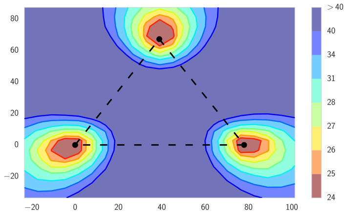

 

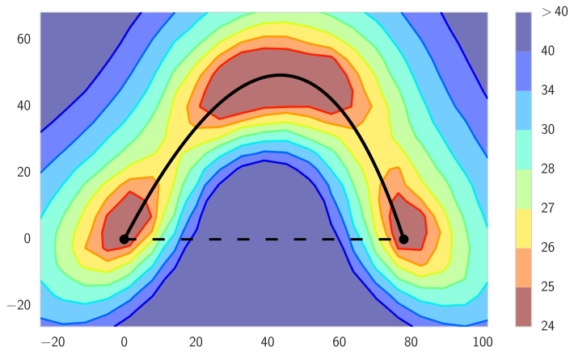

 

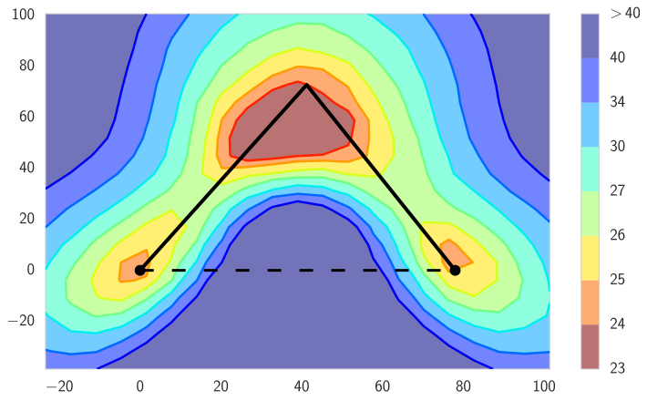

 

Figure 4:  The \(\ell_{2}\)-regularized cross-entropy train loss (Top) and test error (Bottom) surfaces of a deep residual network (ResNet-164) on CIFAR-100. Left: Three optima for independently trained networks. Middle and Right: A quadratic Bezier curve, and a polygonal chain with one bend, connecting the lower two optima on the left panel along a path of near-constant loss. Notice that in each panel, a direct linear path between each mode would incur high loss.

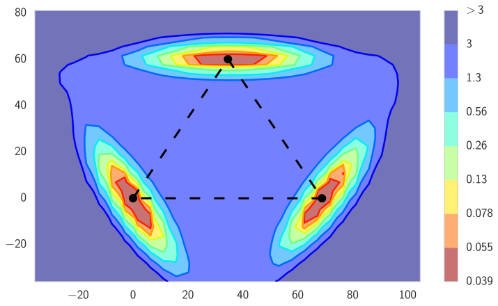

 

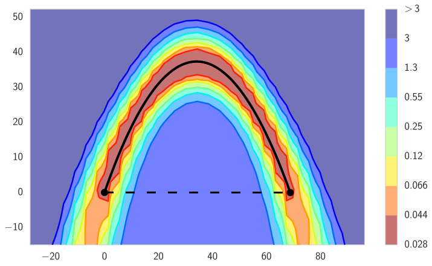

 

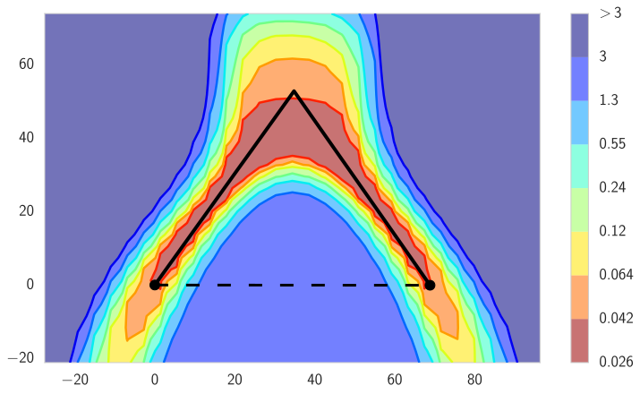

 

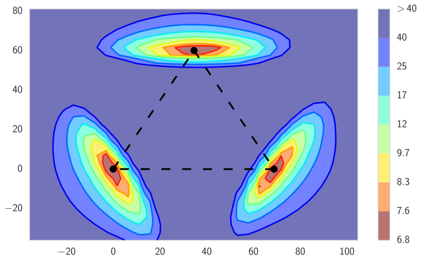

 

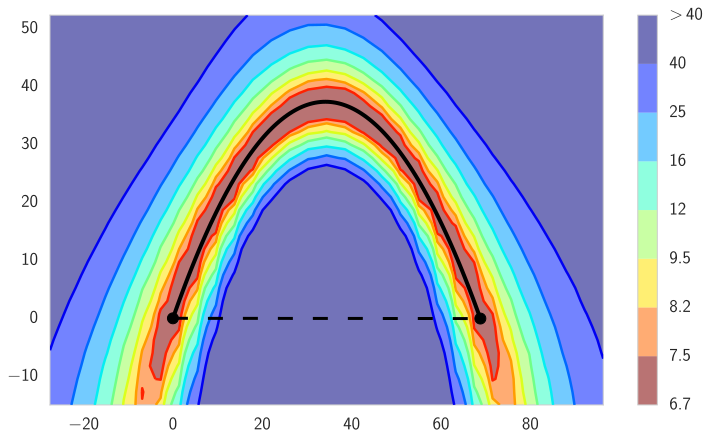

 

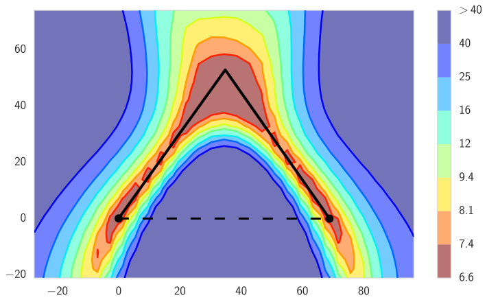

 

Figure 5:  Same as Fig. [4](https://arxiv.org/html/1802.10026#A1.F4 "Figure 4 ‣ A.4 Curve Finding Experiments ‣ Appendix A Supplementary Material ‣ Loss Surfaces, Mode Connectivity, and Fast Ensembling of DNNs") for VGG-16 on CIFAR-10. 

All experiments on curve finding were conducted with TensorFlow ([Abadi et al. 2016](https://arxiv.org/html/1802.10026#bib.bib1)) and as baseline models we used the following implementations:

  * ResNet-bottleneck-\(164\) and Wide ResNet-28-10 (<https://github.com/tensorflow/models/tree/master/research/resnet>); 
  * ResNet-158 (<https://github.com/tensorflow/models/tree/master/official/resnet>); 
  * A reimplementation of VGG-16 without batch-normalization from (<https://github.com/pytorch/vision/blob/master/torchvision/models/vgg.py>); 

Table [2](https://arxiv.org/html/1802.10026#A1.T2 "Table 2 ‣ A.4 Curve Finding Experiments ‣ Appendix A Supplementary Material ‣ Loss Surfaces, Mode Connectivity, and Fast Ensembling of DNNs") summarizes the results of the curve finding experiments with all datasets and architectures. For each of the models we report the properties of loss and the error on the train and test datasets. For each of these metrics we report 3 values: “Max” is the maximum values of the metric along the curve, “Int” is a numerical approximation of the integral \({\int{\mbox{$<$metric$>$}(\phi_{\theta})}d\phi_{\theta}}/{\int d\phi_{\theta}},\) where \(<\)metric\(>\) represents the train loss or the error on the train or test dataset and “Min” is the minimum value of the error on the curve. “Int” represents a mean over a uniform distribution on the curve, and for the train loss it coincides with the loss (\(1\)) in the paper. We use an equally-spaced grid with \(121\) points on \([0,1]\) to estimate the values of “Min”, “Max”, “Int”. For “Int” we use the trapezoidal rule to estimate the integral. For each dataset and architecture we report the performance of single models used as the endpoints of the curve as “Single”, the performance of a line segment connecting the two single networks as “Segment”, the performance of a quadratic Bezier curve as “Bezier” and the performance of a polygonal chain with one bend as “Polychain”. Finally, for each curve we report the ratio of its length to the length of a line segment connecting the two modes.

We also examined the quantity “Mean” defined as \(\int{<\mbox{metric}>(\phi_{\theta}(t))}dt\), which coincides with the loss (\(2\)) from the paper, but in all our experiments it is nearly equal to “Int”.

Besides convolutional and fully-connected architectures we also apply our approach to RNN architecture on next word prediction task, PTB dataset ([Marcus et al. 1993](https://arxiv.org/html/1802.10026#bib.bib22)). As a base model we used the implementation available at <https://www.tensorflow.org/tutorials/recurrent>. As the main loss we consider perplexity. The results are presented in Table [3](https://arxiv.org/html/1802.10026#A1.T3 "Table 3 ‣ A.4 Curve Finding Experiments ‣ Appendix A Supplementary Material ‣ Loss Surfaces, Mode Connectivity, and Fast Ensembling of DNNs").

### A.5 Train loss and test accuracy surfaces

In this section we provide additional visualizations. Fig. [4](https://arxiv.org/html/1802.10026#A1.F4 "Figure 4 ‣ A.4 Curve Finding Experiments ‣ Appendix A Supplementary Material ‣ Loss Surfaces, Mode Connectivity, and Fast Ensembling of DNNs") and Fig. [5](https://arxiv.org/html/1802.10026#A1.F5 "Figure 5 ‣ A.4 Curve Finding Experiments ‣ Appendix A Supplementary Material ‣ Loss Surfaces, Mode Connectivity, and Fast Ensembling of DNNs") show visualizations of the train loss and test accuracy for ResNet-\(164\) on CIFAR-100 and VGG-\(16\) on CIFAR-10.

### A.6 Curve Ensembling

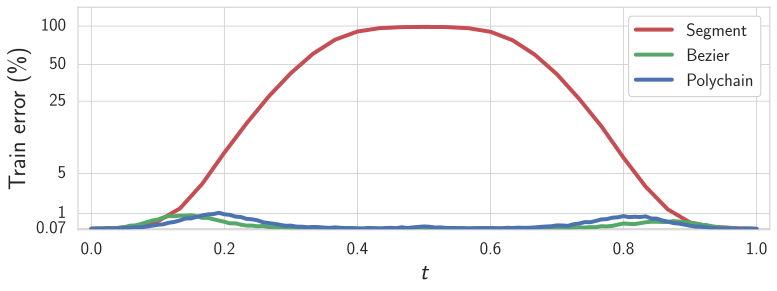

 

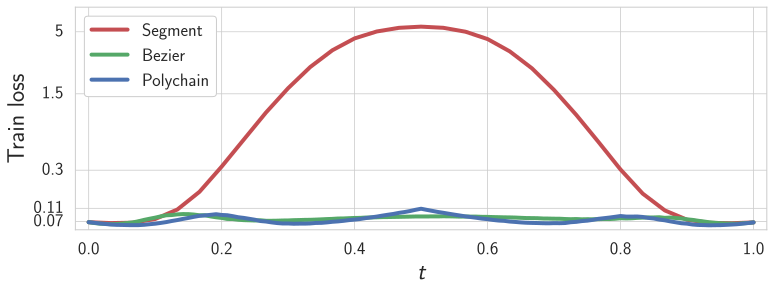

 

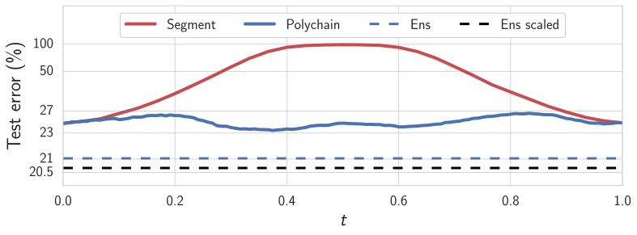

 

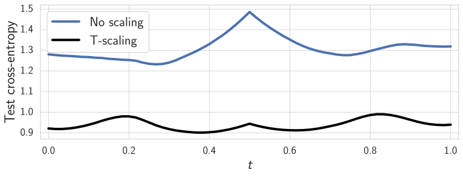

 

Figure 6: Error as a function of the point on the curves \(\phi_{\theta}(t)\) found by the proposed method, using a ResNet-164 on CIFAR-100. Top left: train error. Bottom left: test error; dashed lines correspond to quality of ensemble constructed from curve points before and after logits rescaling. Top right: train loss (\(\ell_{2}\) regularized cross-entropy). Bottom right: cross-entropy before and after logits rescaling for the polygonal chain.

Here we explore ensembles constructed from points sampled from these high accuracy curves. In particular, we train a polygonal chain with one bend connecting two independently trained ResNet-164 networks on CIFAR-100 and construct an ensemble of networks corresponding to \(50\) points placed on an equally-spaced grid on the curve. The resulting ensemble had \(21.03\%\) error-rate on the test dataset. The error-rate of the ensemble constructed from the endpoints of the curve was \(22.0\%\). An ensemble of three independently trained networks has an error rate of \(21.01\%\). Thus, the ensemble of the networks on the curve outperformed an ensemble of its endpoints implying that the curves found by the proposed method are actually passing through diverse networks that produce predictions different from those produced by the endpoints of the curve. Moreover, the ensemble based on the polygonal chain has the same number of parameters as three independent networks, and comparable performance.

Furthermore, we can improve the ensemble on the chain without adding additional parameters or computational expense, by accounting for the pattern of increased training and test loss towards the centres of the linear paths shown in Figure [6](https://arxiv.org/html/1802.10026#A1.F6 "Figure 6 ‣ A.6 Curve Ensembling ‣ Appendix A Supplementary Material ‣ Loss Surfaces, Mode Connectivity, and Fast Ensembling of DNNs"). While the training and test accuracy are relatively constant, the pattern of loss, shared across train and test sets, indicates overconfidence away from the three points defining the curve: in this region, networks tend to output probabilities closer to \(1\), sometimes with the wrong answers. This overconfidence decreases the performance of ensembles constructed from the networks sampled on the curves. In order to correct for this overconfidence and improve the ensembling performance we use temperature scaling [[10](https://arxiv.org/html/1802.10026#bib.bib10)], which is inversely proportional to the loss. Figure [6](https://arxiv.org/html/1802.10026#A1.F6 "Figure 6 ‣ A.6 Curve Ensembling ‣ Appendix A Supplementary Material ‣ Loss Surfaces, Mode Connectivity, and Fast Ensembling of DNNs"), bottom right, illustrates the test loss of ResNet-164 on CIFAR-100 before and after temperature scaling. After rescaling the predictions of the networks, the test loss along the curve decreases and flattens. Further, the test error-rate of the ensemble constructed from the points on the curve went down from \(21.03\%\) to \(20.7\%\) after applying the temperature scaling, outperforming \(3\) independently trained networks.

However, directly ensembling on the curves requires manual intervention for temperature scaling, and an additional pass over the training data for each of the networks (\(50\) in this case) at test time to perform batch normalization as described in section [A.2](https://arxiv.org/html/1802.10026#A1.SS2 "A.2 Batch Normalization ‣ Appendix A Supplementary Material ‣ Loss Surfaces, Mode Connectivity, and Fast Ensembling of DNNs"). Moreover, we also need to train at least two networks for the endpoints of the curve.

### A.7 The Effects of Increasing Parametrization

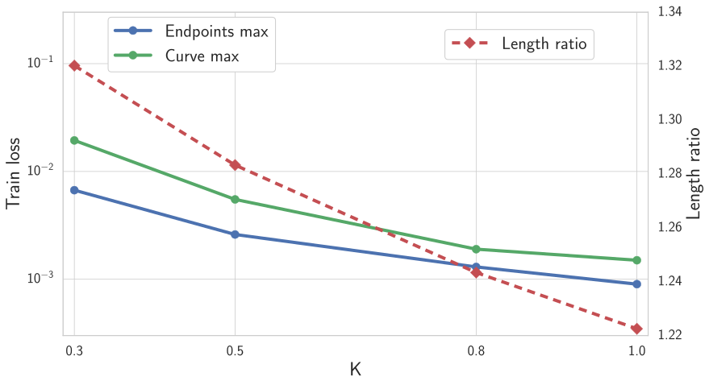

 Figure 7:  The worst train loss along the curve, maximum of the losses of the endpoints, and the ratio of the length of the curve and the line segment connecting the two modes, as a function of the scaling factor \(K\) of the sizes of fully-connected layers. 

One possible factor that influences the connectedness of a local minima set is the overparameterization of neural networks. In this section, we investigate the relation between the observed connectedness of the local optima and the number of parameters (weights) in the neural network. We start with a network that has three convolutional layers followed by three fully-connected layers, where each layer has \(1000K\) neurons. We vary \(K\in\{0.3,0.5,0.8,1\}\), and for each value of \(K\) we train two networks that we connect with a Bezier curve using the proposed procedure.

For each value of \(K\), Figure [7](https://arxiv.org/html/1802.10026#A1.F7 "Figure 7 ‣ A.7 The Effects of Increasing Parametrization ‣ Appendix A Supplementary Material ‣ Loss Surfaces, Mode Connectivity, and Fast Ensembling of DNNs") shows the worst training loss along the curve, maximum of losses of the endpoints, and the ratio of the length of the curve and the line segment connecting the two modes. Increasing the number of parameters we are able to reduce the difference between the worst value of the loss along the curve and the loss of single models used as the endpoints. The ratio of the length of the found curve and the length of the line segment connecting the two modes also decreases monotonically with \(K\). This result is intuitive, since a greater parametrization allows for more flexibility in how we can navigate the loss surfaces.

### A.8 Trivial connecting curves

For convolutional networks with ReLU activations and without batch normalization we can construct a path connecting two points in weight space such that the accuracy of each point on the curve (excluding the origin of the weight space) is at least as good as the minimum of the accuracies of the endpoints. Unlike the paths found by our procedure, these paths are trivial and merely exploit redundancies in the parametrization. Also, the training loss goes up substantially along these curves. Below we give a construction of such paths.

Let \(\hat{w}_{1}\) and \(\hat{w}_{2}\) be two sets of weights. This path of interest consists of two parts. The first part connects the point \(\hat{w}_{1}\) with \(0\) and the second one connects the point \(\hat{w}_{2}\) with \(0\). We describe only the first part \(\phi(t)\) of the path, such that \(\phi(0)=0,\phi(1)=\hat{w}_{1}\), as the second part is completely analogous. Let the weights of the network \(\hat{w}_{1}\) be \(\{W_{i},b_{i}\}_{1\leq i\leq n}\) where \(W_{i},b_{i}\) are the weights and biases of the \(i\)-th layer, and \(n\) is the total number of layers. Throughout the derivation we consider the inputs of the network fixed. The output of the \(i\)-th layer \(o_{i}=W_{i}\mbox{ReLU}(o_{i-1})+b_{i}\), \(1\leq i\leq n\), where \(i=0\) corresponds to the first layer and \(i=n\) corresponds to logits (the outputs of the last layer). We construct \(\phi(t)=\{W_{i}(t),b_{i}(t)\}_{1\leq i\leq n}\) in the following way. We set \(W_{i}(t)=W_{i}t\) and \(b_{i}(t)=b_{i}t^{i}.\) It is easy to see that logits of the network with weights \(\phi(t)\) are equal to \(o_{n}(t)=t^{n}o_{n}\) for all \(t>0\). Note that the predicted labels corresponding to the logits \(o_{n}(t)\) and \(o_{n}\) are the same, so the accuracy of all networks corresponding to \(t>0\) is the same.

Algorithm 1 Fast Geometric Ensembling

0: weights \(\hat{w}\), LR bounds \(\alpha_{1},\alpha_{2}\),cycle length \(c\) (even), number of iterations \(n\) 

0: ensemble

\(w\leftarrow\hat{w}\) {Initialize weight with \(\hat{w}\)} 

\(\mbox{ensemble}\leftarrow[~]\) 

for \(i\leftarrow 1,2,\ldots,n\) do

\(\alpha\leftarrow\alpha(i)\) {Calculate LR for the iteration} 

\(w\leftarrow w-\alpha\nabla\mathcal{L}_{i}(w)\) {Stochastic gradient update} 

if \(\bmod(i,c)=c/2\) then

\(\mbox{ensemble}\leftarrow\mbox{ensemble}+[w]\) {Collect weights} 

end if

end for

### A.9 Fast geometric ensembling experiments

Alg. [1](https://arxiv.org/html/1802.10026#alg1 "Algorithm 1 ‣ A.8 Trivial connecting curves ‣ Appendix A Supplementary Material ‣ Loss Surfaces, Mode Connectivity, and Fast Ensembling of DNNs") provides an outline of the algorithm. As baseline models we used the following implementations:

  * VGG-16 (<https://github.com/pytorch/vision/blob/master/torchvision/models/vgg.py>); 
  * Preactivation-ResNet-164 (<https://github.com/bearpaw/pytorch-classification/blob/master/models/cifar/preresnet.py>); 
  * ResNet-50 ImageNet (<https://github.com/pytorch/vision/blob/master/torchvision/models/resnet.py>); 
  * Wide ResNet-28-10 (<https://github.com/meliketoy/wide-resnet.pytorch/blob/master/networks/wide_resnet.py>); 

For the FGE (Fast Geometric Ensembling) strategy on ResNet we run the FGE routine summarized in Alg. \(1\) after epoch \(125\) of the usual (same as Ind) training for \(22\) epochs. The total training time is thus \(125+22=147\) epochs. For VGG and Wide ResNet models we run the pre-training procedure for \(156\) epochs to initialize FGE. Then we run FGE for \(22\) epochs starting from checkpoints corresponding to epochs \(120\) and \(156\) and ensemble all the gathered models. The total training time is thus \(156+22+22=200\) epochs. For VGG we use cycle length \(c=2\) epochs, which means that the total number of models in the final ensemble is \(22\). For ResNet and Wide ResNet we use \(c=4\) epochs, and the total number of models in the final ensemble is \(12\) for Wide ResNets and \(6\) for ResNets.

### A.10 Polygonal chain connecting FGE proposals

In order to better understand the trajectories followed by FGE we construct a polygonal chain connecting the points that FGE ensembles. Suppose we run FGE for \(n\) learning rate cycles obtaining \(n\) points \(w_{1},w_{2},\ldots,w_{n}\) in the weight space that correspond to the lowest values of the learning rate. We then consider the polygonal chain consisting of the line segments connecting \(w_{i}\) to \(w_{i+1}\) for \(i=1,\ldots,n-1\). We plot test accuracy and train error along this polygonal chain in Figure [8](https://arxiv.org/html/1802.10026#A1.F8 "Figure 8 ‣ A.10 Polygonal chain connecting FGE proposals ‣ Appendix A Supplementary Material ‣ Loss Surfaces, Mode Connectivity, and Fast Ensembling of DNNs"). We observe that along this curve both train loss and test error remain low, agreeing with our intuition that FGE follows the paths of low loss and error. Surprisingly, we find that the points on the line segments connecting the weights \(w_{i},w_{i+1}\) have lower train loss and test error than \(w_{i}\) and \(w_{i+1}\). See [Izmailov et al. 2018](https://arxiv.org/html/1802.10026#bib.bib15) for a detailed discussion of this phenomenon.

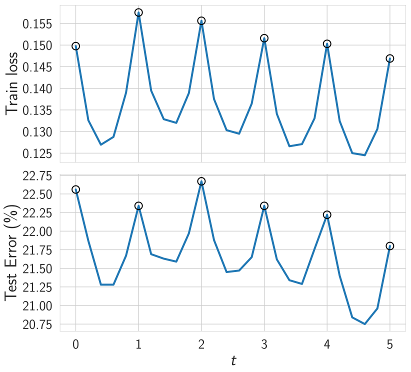

 Figure 8:  Train loss and test error along the polygonal chain connecting the sequence of points ensembled in FGE. The plot is generated using PreResNet-164 on CIFAR 100. Circles indicate the bends on the polygonal chain, i.e. the networks ensembled in FGE. 
