# Exponential Moving Average of Weights   
in Deep Learning: Dynamics and Benefits

Daniel Morales-Brotons danimoralesbrotons@gmail.com Affiliation: EPFL Thijs Vogels  Affiliation: EPFL Hadrien Hendrikx hadrien.hendrikx@inria.fr Affiliation: Centre Inria de l’Univ. Grenoble Alpes, CNRS, LJK, Grenoble, France

###### Abstract

Weight averaging of Stochastic Gradient Descent (SGD) iterates is a popular method for training deep learning models. While it is often used as part of complex training pipelines to improve generalization or serve as a ‘teacher’ model, weight averaging lacks proper evaluation on its own. In this work, we present a systematic study of the Exponential Moving Average (EMA) of weights. We first explore the training dynamics of EMA, give guidelines for hyperparameter tuning, and highlight its good early performance, partly explaining its success as a teacher. We also observe that EMA requires less learning rate decay compared to SGD since averaging naturally reduces noise, introducing a form of implicit regularization. Through extensive experiments, we show that EMA solutions differ from last-iterate solutions. EMA models not only generalize better but also exhibit improved i) robustness to noisy labels, ii) prediction consistency, iii) calibration and iv) transfer learning. Therefore, we suggest that an EMA of weights is a simple yet effective plug-in to improve the performance of deep learning models.

## 1 Introduction

The performance of modern deep learning models is tightly linked to their training. In order to converge to a good solution, reducing the noise coming from stochastic updates is eventually required. For example, Stochastic Gradient Descent (SGD) ([Robbins & Monro 1951](https://arxiv.org/html/2411.18704#bib.bib50); [Bottou 2010](https://arxiv.org/html/2411.18704#bib.bib5)) needs a carefully tuned learning rate and decay schedule, while adaptive variants such as Adam ([Kingma & Ba 2014](https://arxiv.org/html/2411.18704#bib.bib29)) essentially decay the learning rate based on gradients retrieved: while a large learning rate is initially required to obtain fast training and good generalization, only when the learning rate is low enough does the model actually converge to a good solution. In an orthogonal approach to learning rate decay, a standard way to reduce noise in _convex_ optimization is (tail) averaging ([Polyak & Juditsky 1992](https://arxiv.org/html/2411.18704#bib.bib48)): if SGD stops making progress because of stochastic noise, a more accurate solution can be retrieved despite high learning rates by averaging the last iterates.

While the theoretical gains of averaging are less clear in the non-convex setting, weight averaging (WA) is also popular in deep learning, and has been explored primarily in two ways: WA inside the training loop as a teacher model, and WA outside the training loop to improve generalization. In the first case, an Exponential Moving Average (EMA) of parameters is used as a teacher in Student-Teacher frameworks, for example in popular representation learning methods ([Tarvainen & Valpola 2017](https://arxiv.org/html/2411.18704#bib.bib56); [Grill et al. 2020](https://arxiv.org/html/2411.18704#bib.bib16)). The averaged model provides more accurate and consistent predictions during training, which the student uses for training. For the second case, Stochastic Weight Averaging (SWA) ([Izmailov et al. 2018](https://arxiv.org/html/2411.18704#bib.bib23)) uses an average of multiple checkpoints along the SGD trajectory to improve the generalization of the final model, arguing that it finds flatter solutions than SGD. Note that SWA does not affect optimization since the averaged model is not used in the training loop.

Despite the popularity of EMA teachers, the properties of EMA models have not been studied thoroughly. Previous works that use EMA ([Grill et al. 2020](https://arxiv.org/html/2411.18704#bib.bib16); [He et al. 2020](https://arxiv.org/html/2411.18704#bib.bib21)) mainly justify its effectiveness by enhanced consistency and stability of predictions during training, and often mix EMA with other mechanisms as part of a complex framework, making it impossible to disentangle the impact of averaging. EMA has mainly been used as a teacher, leaving aside the potential of EMA itself to improve the final solution in favor of SWA.

In this work, we focus on EMA models outside of the training loop, exploring their training dynamics and benefits in generalization and beyond. By doing so, we unveil new reasons why EMA are such good teachers: we find that the solutions reached when reducing stochastic noise by averaging are different than by learning rate decay. They improve in robustness to label noise, calibration, prediction consistency and transfer learning. In a nutshell, we ask the following question:

What are the properties of weight averaging when training deep neural networks?

To answer this question, we empirically study weight averaging during a (momentum) SGD trajectory by means of an Exponential Moving Average (EMA). More specifically, if the SGD models form a trajectory \((\mathbf{x}_{t})_{t\geq 0}\), the corresponding EMA models would be obtained by taking, for some \(\alpha\in[0,1]\):

| \[\mathbf{x}^{\rm EMA}_{0}=\mathbf{x}_{0},\text{ and }\mathbf{x}^{\rm EMA}_{t+1}=\alpha\,\mathbf{x}^{\rm EMA}_{t}+(1-\alpha)\,\mathbf{x}_{t+1}.\] |  | (1)  
---|---|---|---  
  
Keeping an EMA model is simple, has minimal overhead, and can easily be plugged into any existing pipeline. We study EMA models outside of the training loop, such that they have no effect on the underlying SGD trajectory. We split our study in two parts, described in the two paragraphs below.

Training dynamics of EMA (Sec. [3](https://arxiv.org/html/2411.18704#S3 "3 Insights on Weight Averaging during Training ‣ Exponential Moving Average of Weights in Deep Learning: Dynamics and Benefits")). We find that weight averaging reduces noise in the model parameters compared to SGD and can replace the last phase of learning rate decay, while at the same time enabling implicit regularization via stochastic noise. More specifically, (i) While last-iterate SGD requires decaying the learning rate to nearly \(0\) for convergence, averaging reduces noise and yields good solutions under reasonably high learning rates, which we argue promotes learning more general representations. We propose a one-shot tuning of the strength of implicit regularization by using cosine annealing of the learning rate and early stopping. (ii) We highlight the impressive performance of EMA in the early stages of training and postulate this observation as a key reason for the success of popular EMA teachers. Combined with early stopping, the EMA model can reduce the compute budget by sparing the last phase of SGD training at low learning rates. (iii) We look into Batch Normalization (BN) in EMA models and find that it is the limiting factor when choosing the EMA decay. If BN statistics are recomputed, larger averaging windows can be used and actually may improve further generalization.

Properties of the final EMA model (Sec. [4](https://arxiv.org/html/2411.18704#S4 "4 Results ‣ Exponential Moving Average of Weights in Deep Learning: Dynamics and Benefits")). We find that the solutions reached with EMA and early stopping are different from the baseline solution obtained by last-iterate momentum SGD, and conjecture that this is due to implicit regularization via stochastic noise, obtained through the use of larger step-sizes. More specifically, (i) in extensive experiments on image classification tasks we find a consistent improvement in generalization using an EMA model. (ii) We also find a great improvement in robustness to label noise in training data, as the implicit regularization largely prevents memorization of wrong labels. A simple EMA model proves to be competitive with specialized methods for robust training to label noise. (iii) We compare the EMA model to the SGD baseline in a number of other metrics and find that it improves considerably in calibration, prediction consistency and transfer learning.

## 2 Related Work

Weight averaging during deep learning training is already a popular method that leads to better practical performances. Yet, it lacks a systematic study, since contributions are mostly scattered in domain-specific literature. Besides, the use of weight averaging is often justified by alleged intuitive properties which are rarely investigated in isolation. In this section, we review different areas in which weight averaging is used, along with the corresponding alleged folklore benefits. We then test them, as well as give alternative explanations for why weight averaging is useful in the remaining sections.

Weight averaging to improve generalization. Averaging the iterates during a trajectory has a long history in stochastic approximation ([Ruppert 1988](https://arxiv.org/html/2411.18704#bib.bib51); [Polyak 1990](https://arxiv.org/html/2411.18704#bib.bib47); [Polyak & Juditsky 1992](https://arxiv.org/html/2411.18704#bib.bib48)), and its correct use and understanding have been an active area of research ([Bach & Moulines 2011](https://arxiv.org/html/2411.18704#bib.bib2); [Dieuleveut et al. 2017](https://arxiv.org/html/2411.18704#bib.bib11); [Lakshminarayanan & Szepesvari 2018](https://arxiv.org/html/2411.18704#bib.bib32); [Mücke et al. 2019](https://arxiv.org/html/2411.18704#bib.bib40); [Gadat & Panloup 2023](https://arxiv.org/html/2411.18704#bib.bib14)). Geometric averaging (EMA but with more weights on old iterates) can also be connected with a form of explicit regularization [Neu & Rosasco 2018](https://arxiv.org/html/2411.18704#bib.bib41). Yet, these methods assume quadratic or (strongly) convex objectives, and so do not apply to deep learning training.

In deep learning, a popular averaging method is Stochastic Weight Averaging (SWA) ([Izmailov et al. 2018](https://arxiv.org/html/2411.18704#bib.bib23)). SWA keeps a uniform average of checkpoints during the final epochs of an SGD trajectory, while holding a reasonably high and constant learning rate. SWA is argued to find flatter solutions than SGD, thus generalizing better to unseen data. A potential explanation is that the loss function near a minimum is often asymmetric, sharp in some directions and flat in others. While SGD tends to land near a sharp ascent, averaging iterates biases solutions towards a flat region ([He et al. 2019](https://arxiv.org/html/2411.18704#bib.bib19)).

Many extensions of SWA have been proposed for specialized tasks ([Gupta et al. 2020](https://arxiv.org/html/2411.18704#bib.bib18); [Li et al. 2022](https://arxiv.org/html/2411.18704#bib.bib36); [Kaddour 2022](https://arxiv.org/html/2411.18704#bib.bib26)), and in particular semi-supervised learning ([Athiwaratkun et al. 2019](https://arxiv.org/html/2411.18704#bib.bib1)), low-precision training ([Yang et al. 2019](https://arxiv.org/html/2411.18704#bib.bib59)) and domain generalization ([Cha et al. 2021](https://arxiv.org/html/2411.18704#bib.bib8)). The latter introduces enhancements such as dense averaging (_i.e._ , every iteration) and overfit-aware sampling by tracking validation loss. The flatness argument has also been leveraged for robustness: weight averaging on top of adversarial training helps finding flatter minima and boosts adversarial robustness. This has been shown using both SWA ([Chen et al. 2021](https://arxiv.org/html/2411.18704#bib.bib9)) and EMA ([Gowal et al. 2020](https://arxiv.org/html/2411.18704#bib.bib15); [Rebuffi et al. 2021](https://arxiv.org/html/2411.18704#bib.bib49)). EMA has also been studied in minimax optimization, with applications to GANs ([Yaz et al. 2019](https://arxiv.org/html/2411.18704#bib.bib60)). Furthermore, many works use averaging as part of their implementation but do not emphasize it or discuss its effect. Such works are hard to review since they are not explicitly listed as working on averaging, but include for instance [Berthelot et al. 2019](https://arxiv.org/html/2411.18704#bib.bib3); [Sohn et al. 2020](https://arxiv.org/html/2411.18704#bib.bib55); [Oord et al. 2018](https://arxiv.org/html/2411.18704#bib.bib44); [Oquab et al. 2023](https://arxiv.org/html/2411.18704#bib.bib45), which rely on EMA or uniform averaging, sometimes replacing the decay of learning rate. [Sanyal et al. 2023](https://arxiv.org/html/2411.18704#bib.bib53) use weight averaging to improve results of LLMs pre-training. Finally, [Sandler et al. 2023](https://arxiv.org/html/2411.18704#bib.bib52) provide an analytical model the behavior of the high-dimensional vector of parameters along an SGD trajectory, showing an improvement in generalization and finding an equivalence between averaging and learning rate decay.

Weight averaging in Student-Teacher methods. Consistency training is a popular technique for learning with unlabeled data ([Laine & Aila 2016](https://arxiv.org/html/2411.18704#bib.bib30); [Berthelot et al. 2019](https://arxiv.org/html/2411.18704#bib.bib3)), based on generating pseudo-labels during training, often through a teacher model, which does not receive gradient updates. Mean Teacher ([Tarvainen & Valpola 2017](https://arxiv.org/html/2411.18704#bib.bib56)) first proposed to use an EMA of model weights as a teacher, such that \(\theta^{\prime}=\textrm{EMA}(\theta)\), in a method for semi-supervised image classification. EMA has since become a popular choice for teacher models, used for tasks such as semi-supervised semantic segmentation ([French et al. 2019](https://arxiv.org/html/2411.18704#bib.bib13)), unsupervised domain adaptation ([Hoyer et al. 2022](https://arxiv.org/html/2411.18704#bib.bib22)), continual adaptation ([Wang et al. 2022](https://arxiv.org/html/2411.18704#bib.bib57)), and robustness to label noise [Liu et al. 2020](https://arxiv.org/html/2411.18704#bib.bib37); [Nguyen et al. 2019](https://arxiv.org/html/2411.18704#bib.bib42). On the other hand, SWA requires recomputing batch norm (BN) statistics for the averaged model with a full pass over the train set, thus making it unfit for its online use (_e.g._ , as teacher). While these works find that EMA teachers are beneficial and provide accurate pseudo-labels, they do not specifically study the properties of EMA models.

In self-supervised learning, EMA plays a central role in a handful of popular frameworks. BYOL ([Grill et al. 2020](https://arxiv.org/html/2411.18704#bib.bib16)) employs consistency training with an EMA teacher (_a.k.a._ self-distillation) to learn visual representations from unsupervised data. MoCo ([He et al. 2020](https://arxiv.org/html/2411.18704#bib.bib21)) rebrands the EMA teacher as a momentum encoder and proposes a student-teacher framework with a contrastive learning objective. CURL ([Laskin et al. 2020](https://arxiv.org/html/2411.18704#bib.bib33)) applies the same idea to learn unsupervised representations for reinforcement learning. These methods attribute the effectiveness of EMA to smoother changes in target representations, maintaining consistency and stability, rather than the quality of the representations. DINO ([Caron et al. 2021](https://arxiv.org/html/2411.18704#bib.bib7)) explores self-distillation in Transformers and studies, for the first time, the training dynamics of the EMA teacher, including the key observation that the teacher consistently outperforms the student during training.

In summary, weight averaging is a key component of student-teacher methods. EMA is generally preferred over other averaging methods (such as SWA) to avoid recomputing BN stats. In this work, we investigate the relation between averaging window and BN statistics, and show that this is actually only the case for short averaging windows.

## 3 Insights on Weight Averaging during Training

Although EMA models are built from SGD iterates, their dynamics during training and final solutions are very different. We argue that EMA is a simple, lightweight and effective plug-in to SGD training.

### 3.1 Training with EMA

Computation overhead. The overhead of using an EMA of weights outside of the training loop is generally very low, as it only requires keeping a running average of parameters and possibly evaluating every epoch. Moreover, the running average can be updated every \(T\) steps instead of after every parameter update. We set \(T=16\) by default and find no difference to \(T=1\) in the results. In terms of computation, the optimization step remains the dominant factor by orders of magnitude. In terms of memory, keeping an additional set of weights is feasible for most deep learning models used in practice, other than foundation models. For example, a ResNet-50 (23.7M parameters) requires 90.43 MB of storage.

Hyperparameters tuning. There are two main sources of potential tuning overhead when training averaging models: 1) deciding on the averaging window and 2) tuning the final learning rate, a sensible hyperparameter crucial for the final performance. The averaging window for an EMA is determined by the decay factor \(\alpha\). An EMA naturally avoids the need for (1), since we can simultaneously keep multiple EMA models with different decays to compare different averaging windows. We prevent (2) by using cosine annealing of the learning rate and finding the best early stopping epoch on a validation set. This allows us to search for (1) and (2) on the go, training only once. Admittedly, keeping multiple EMAs (say, \(M\)) to avoid tuning does increase the overhead by a factor \(M\), but it is still a tiny fraction of the computation time for small enough values (_e.g._ , \(M=5\)). With this scheme, we need to decide on epoch budget, number and selection of EMA decays, and to search for the best initial learning rate, as usual for regular training of DNNs.

### 3.2 Implicit Regularization with SGD Noise and Learning Rate Schedule

Noisy SGD updates are argued to bias solutions towards flatter regions that are believed to generalize better, partly explaining the success of deep learning ([Keskar et al. 2016](https://arxiv.org/html/2411.18704#bib.bib28)). This implicit regularization effect makes a case for large learning rates and small mini-batches ([Pesme et al. 2021](https://arxiv.org/html/2411.18704#bib.bib46); [Even et al. 2023](https://arxiv.org/html/2411.18704#bib.bib12)). Nonetheless, standard training of DNNs requires decaying the learning rate to reduce stochastic noise and converge to a good solution. Averaging during training is an alternative way of to reduce noise in SGD iterates and reach a good solution without too much learning rate decay. This allows to freely tune the final learning rate to control the strength of implicit regularization, while still converging to a good solution within the neighborhood.

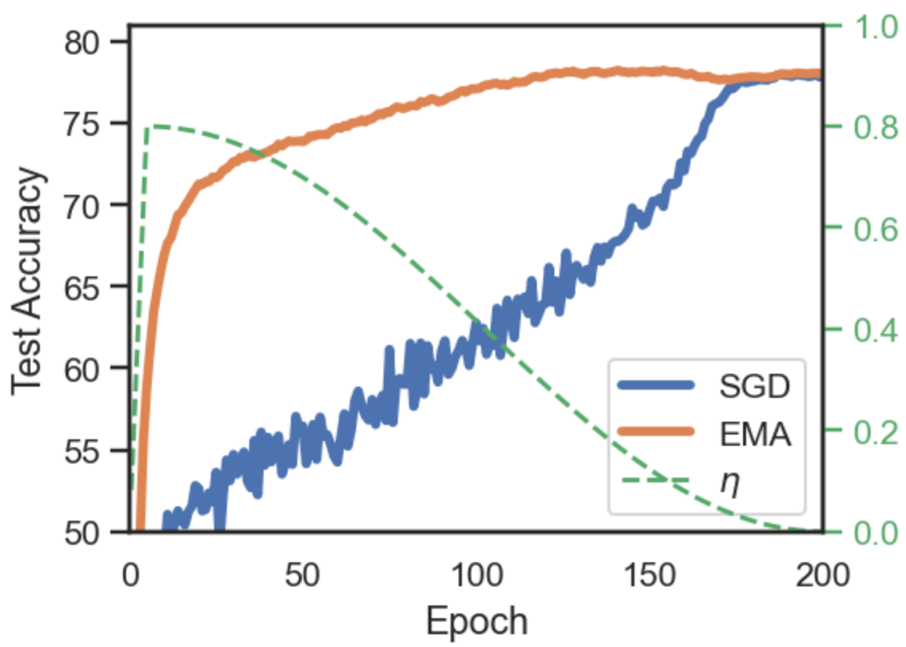 (a) EMA vs SGD 

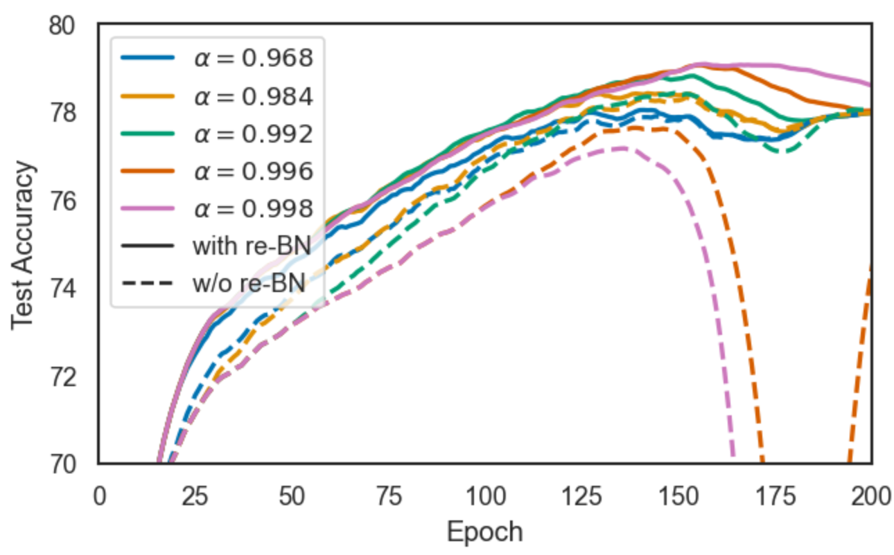 (b) EMA by decay \(\alpha\), with vs w/o recomputing BN stats

Figure 1: CIFAR-100 on ResNet-18. Left: EMA vs SGD baseline, and learning rate (\(\eta\)). EMA is the best among the 5 EMA models at any given epoch, without recomputing BN stats (i.e. the maximum among EMA models plotted on [1(b)](https://arxiv.org/html/2411.18704#S3.F1.sf2 "In Figure 1 ‣ 3.2 Implicit Regularization with SGD Noise and Learning Rate Schedule ‣ 3 Insights on Weight Averaging during Training ‣ Exponential Moving Average of Weights in Deep Learning: Dynamics and Benefits")). We observe that EMA dominates momentum SGD and has a good performance since early on. EMA peaks at epoch 150, at the optimal \(\eta\), and then deteriorates. Right: Breakdown of the 5 EMA models per decay (with and without BN recomputation after every epoch). EMAs with the largest averaging windows fail unless BN stats are recomputed. Sliding window of 5 used for smoothing. All results are the mean of 3 runs.

We demonstrate the dynamics of EMA models in Fig. [1(a)](https://arxiv.org/html/2411.18704#S3.F1.sf1 "In Figure 1 ‣ 3.2 Implicit Regularization with SGD Noise and Learning Rate Schedule ‣ 3 Insights on Weight Averaging during Training ‣ Exponential Moving Average of Weights in Deep Learning: Dynamics and Benefits"), where we use a continuous decaying of the learning rate \(\eta\) with cosine annealing and track the validation accuracy of the EMA model to find the best early stopping epoch (for implementation details see Sec. [4.1](https://arxiv.org/html/2411.18704#S4.SS1 "4.1 Experimental Setup ‣ 4 Results ‣ Exponential Moving Average of Weights in Deep Learning: Dynamics and Benefits")). The EMA accuracy of Fig. [1(a)](https://arxiv.org/html/2411.18704#S3.F1.sf1 "In Figure 1 ‣ 3.2 Implicit Regularization with SGD Noise and Learning Rate Schedule ‣ 3 Insights on Weight Averaging during Training ‣ Exponential Moving Average of Weights in Deep Learning: Dynamics and Benefits") is the maximum among the 5 EMA models with different decays, plotted in Fig. [1(b)](https://arxiv.org/html/2411.18704#S3.F1.sf2 "In Figure 1 ‣ 3.2 Implicit Regularization with SGD Noise and Learning Rate Schedule ‣ 3 Insights on Weight Averaging during Training ‣ Exponential Moving Average of Weights in Deep Learning: Dynamics and Benefits"), which is dominated by \(\alpha=0.998\) at the maximum. We first highlight that the EMA model outperforms SGD throughout training. We also observe that the best EMA model is obtained when averaging updates with a reasonably high learning rate, benefiting from a stronger implicit regularization. The EMA accuracy rises fast at first, then slowly increases as \(\eta\) is continuously decayed (and so does the strength of regularization), peaks at epoch \(150\), and finally deteriorates as \(\eta\) is decayed further. Early stopping while sweeping through the learning rate values allows for a one-shot tuning of the regularization strength. Finally, the EMA model matches the SGD sequence when the iterates don’t advance (\(\eta\rightarrow 0)\). For more examples of EMA dynamics, see Fig. [3](https://arxiv.org/html/2411.18704#S4.F3 "Figure 3 ‣ 4.3 Label Noise ‣ 4 Results ‣ Exponential Moving Average of Weights in Deep Learning: Dynamics and Benefits") and App. [A](https://arxiv.org/html/2411.18704#A1 "Appendix A Additional examples of EMA training dynamics ‣ Exponential Moving Average of Weights in Deep Learning: Dynamics and Benefits"). As we will see in Sec. [4](https://arxiv.org/html/2411.18704#S4 "4 Results ‣ Exponential Moving Average of Weights in Deep Learning: Dynamics and Benefits"), the solutions reached by EMA and SGD are different: the implicit regularization of averaging improves generalization and promotes learning more general representations.

We emphasize that the EMA solutions not only generalize similarly or better than SGD, but also require fewer training epochs. In our experiments with cosine annealing, early stopping for EMA was always at \(<\nicefrac{{3}}{{4}}\) of the epochs budget (see App. [B](https://arxiv.org/html/2411.18704#A2 "Appendix B Additional results ‣ Exponential Moving Average of Weights in Deep Learning: Dynamics and Benefits")). This suggests that the last phase of SGD training is mostly wasteful, as the iterates are already around a good solution that cannot be accessed (without averaging) because of stochastic noise. With averaging, there is no need to decay the learning rate that much, and the entire last phase of training can be spared.

### 3.3 EMA in early training

The noise reduction of weight averaging does not only improve the generalization of the final model, but all throughout training. A key difference in the training dynamics of EMA and SGD models is the early-stage performance: EMA models are very effective early in training, as shown in Fig. [1(a)](https://arxiv.org/html/2411.18704#S3.F1.sf1 "In Figure 1 ‣ 3.2 Implicit Regularization with SGD Noise and Learning Rate Schedule ‣ 3 Insights on Weight Averaging during Training ‣ Exponential Moving Average of Weights in Deep Learning: Dynamics and Benefits"). Its remarkable performance after just a few epochs partly explains the success of EMA teachers. While popular self-supervised methods ([Grill et al. 2020](https://arxiv.org/html/2411.18704#bib.bib16); [He et al. 2020](https://arxiv.org/html/2411.18704#bib.bib21)) attribute the benefit of a slow-moving average to an improved consistency between predictions during training, we argue that the improved quality of the EMA representations also plays a crucial role in their frameworks. Thanks to noise reduction from averaging, the EMA model can achieve notable performances while keeping a large learning rate for fast progress. Student-teacher frameworks leverage this fact and distill knowledge from the EMA teacher.

Instead of knowledge distillation, a tempting idea is to regularly bootstrap the SGD model with EMA parameters. We investigate this (see App. [C](https://arxiv.org/html/2411.18704#A3 "Appendix C Bootstrapping on EMA ‣ Exponential Moving Average of Weights in Deep Learning: Dynamics and Benefits")), but conclude that bootstrapping with the EMA does not offer any benefit. The EMA model is simply a good point within the local neighborhood of the latest iterates. After bootstrapping, noisy SGD updates quickly take over and deteriorate the model performance. Therefore, distillation methods are a more effective way of leveraging EMA’s early performance to improve training.

### 3.4 Batch Norm Statistics and EMA decay

Batch Normalization (BN) presents a challenge for weight averaging. By default, the EMA model uses BN statistics (mean and standard deviation of each activation) from the current batch, but the cross-sample dependency may harm generalization. [Cai et al. 2021](https://arxiv.org/html/2411.18704#bib.bib6) improve EMA teachers by keeping a moving average of the BN statistics of the student, which we use in our implementation. SWA ([Izmailov et al. 2018](https://arxiv.org/html/2411.18704#bib.bib23)) on the other hand recomputes BN statistics for the final averaged model with an additional full pass over the train data after training. For the online use of an EMA model, however, recomputing BN stats during training would imply a significant overhead.

We investigate the optimal averaging window size (_i.e._ , decay \(\alpha\)) for EMA and find different behaviors for the running average of model parameters and of BN stats. In particular, model parameters tolerate larger averaging window sizes than BN statistics. As shown in Fig. [1(b)](https://arxiv.org/html/2411.18704#S3.F1.sf2 "In Figure 1 ‣ 3.2 Implicit Regularization with SGD Noise and Learning Rate Schedule ‣ 3 Insights on Weight Averaging during Training ‣ Exponential Moving Average of Weights in Deep Learning: Dynamics and Benefits"), the EMA model can diverge when a very slow decay (_i.e._ , large \(\alpha\)) is used. Interestingly, if we recompute the BN stats of that same EMA model (once after every epoch) we recover full performance, indicating that it is BN that breaks an EMA model as we increase the size of the averaging window. In fact, if recomputing BN stats, averaging weights tends to benefit from using very large averaging windows. We also observe that recomputing BN stats always improves generalization.

The EMA decay is usually set to \(\alpha\in[0.9,0.9999]\), and the optimal value will be task dependent. For an online use of EMA, when recomputing BN stats periodically may be undesirable, a faster decay may be used to avoid divergence. On the other hand, when averaging to improve final performance, it is preferable to use a slower decay and recompute BN stats after training. Models that do not use BN (_e.g._ , VGG-16, Transformer models) naturally avoid this problem.

## 4 Results

### 4.1 Experimental Setup

We perform experiments on several image classification datasets (CIFAR-10, CIFAR-100, Tiny-ImageNet ([Le & Yang 2015](https://arxiv.org/html/2411.18704#bib.bib34))) with various network architectures (ResNet-18 ([He et al. 2016](https://arxiv.org/html/2411.18704#bib.bib20)), WideResNet-28-10 ([Zagoruyko & Komodakis 2016](https://arxiv.org/html/2411.18704#bib.bib61)), VGG-16 ([Simonyan & Zisserman 2014](https://arxiv.org/html/2411.18704#bib.bib54))). We always use SGD with Nesterov Momentum of \(0.9\) for training ([Loshchilov & Hutter 2017](https://arxiv.org/html/2411.18704#bib.bib38)). The epochs, batch size and weight decay are fixed (see details in App. [F](https://arxiv.org/html/2411.18704#A6 "Appendix F Detailed experimental setup ‣ Exponential Moving Average of Weights in Deep Learning: Dynamics and Benefits")). For the learning rate schedule, we use a linear warmup during the first 5 epochs and then decay with cosine annealing, and search for the best initial learning rate. We always report the mean of 3 independent runs.

To perform a rigorous study, we stress the importance of using a hold-out set for hyperparameter selection. Unfortunately, most image classification benchmarks do not include a standard validation set. We define random \(80/20\) splits of the training set for train and validation respectively and perform hyperparameter optimization on the validation set, including the early stopping epoch for EMA (without BN stats recomputation). Finally, we train on the full training data using the selected hyperparameters and evaluate on the test set. Note that early stopping is not tuned again on the test set. Also note that most methods would technically require this train/evaluation split: the best step-size for SGD should be selected on a validation set for instance. We explicitly use one here instead of choosing the best performance on the test set (as is often done) since our EMA training pipeline also relies on early stopping, which could be misleading if chosen directly on the test set.

The EMA introduces one hyperparameter, the decay rate \(\alpha\), which governs how fast the moving average forgets past iterations. Since the EMA is outside of the training loop, we can optimize \(\alpha\) in a single training run by keeping 5 parallel EMA models. We fix the decays to \(\alpha\in[0.968,0.984,0.992,0.996,0.998]\), and use an EMA sampling period of \(T=16\) steps, to reduce the overhead at no cost in performance. Note that using \(T>1\) affects the effective decay, which becomes \(\alpha^{\nicefrac{{1}}{{T}}}\) (_e.g._ , \(0.984^{1/16}\approx 0.999\)). We also use a decay warm-up for a faster EMA update in the first epochs, as \(\min(\alpha,\frac{t+1}{t+10})\) at time \(t\). For EMA’s BN statistics we follow [Cai et al. 2021](https://arxiv.org/html/2411.18704#bib.bib6).

In our experiments, we compare Baseline against EMA. We refer as Baseline to the momentum SGD model on which we perform the EMA. For the EMA we consider two different early stopping epochs: at best validation accuracy and lowest validation loss, which are often not aligned and produce solutions with different properties. In both cases, we report the EMA with the largest decay (\(\alpha=0.998\)) and recompute BN stats once after training. In App. [B](https://arxiv.org/html/2411.18704#A2 "Appendix B Additional results ‣ Exponential Moving Average of Weights in Deep Learning: Dynamics and Benefits") we report the full results including the two EMA variants with and without BN recompute.

### 4.2 Generalization 

We start by investigating the performance of EMA models in terms of test accuracy. We find that averaging with EMA improves generalization, always outperforming the SGD baseline. This is not unexpected, as the generalization benefit of (uniform) averaging is well-known in deep learning ([Izmailov et al. 2018](https://arxiv.org/html/2411.18704#bib.bib23)). Nonetheless, to the best of our knowledge, we are the first to show this for EMA.

In Table [1](https://arxiv.org/html/2411.18704#S4.T1 "Table 1 ‣ 4.2 Generalization ‣ 4 Results ‣ Exponential Moving Average of Weights in Deep Learning: Dynamics and Benefits") we report test accuracy and test loss for the momentum SGD baseline and its EMA, early stopped either at the epoch of best accuracy or lowest loss. We emphasize two takeaways. Firstly, EMA performs consistently better than the baseline. We also perform and report SWA experiments, which bring a generalization improvement approximately similar to EMA, with no weight averaging method performing clearly better. Secondly, the EMA model with the lowest loss does not correspond to the model with highest accuracy, as the early stopping point to minimize the loss is always earlier (see App. [B](https://arxiv.org/html/2411.18704#A2 "Appendix B Additional results ‣ Exponential Moving Average of Weights in Deep Learning: Dynamics and Benefits")). As we discuss in the next sections, the EMA with the lowest loss outperforms the best accuracy EMA in other metrics (_e.g._ , calibration, prediction consistency, transferability), suggesting a trade-off between maximizing these metrics or model accuracy.

Table 1: Test accuracy and loss on a baseline model and its EMA. The EMA model consistently outperforms the baseline in accuracy and loss, and the same is true for SWA. The best and second-best accuracies are split between EMA and SWA, with no averaging method performing clearly better. We explore EMA with two early stopping criteria: best accuracy and lowest loss. EMA models’ BN statistics are recomputed once.  Dataset |  Architecture | Baseline | EMA (acc.) | EMA (loss) | SWA  
---|---|---|---|---|---  
|  | Acc. | Loss | Acc. | Loss | Acc. | Loss | Acc.  
CIFAR-100 |  ResNet-18 | 77.63 \(\pm\) 0.14 | 1.02 | 78.55 \(\pm\) 0.28 | 0.84 | 78.07 \(\pm\) 0.29 | 0.82 | 78.69 \(\pm\) 0.25  
|  VGG-16 | 72.82 \(\pm\) 0.17 | 1.77 | 73.64 \(\pm\) 0.13 | 1.13 | 72.3 \(\pm\) 0.19 | 1.06 | 73.28 \(\pm\) 0.19  
|  WRN-28-10 | 81.07 \(\pm\) 0.12 | 0.78 | 82.72 \(\pm\) 0.16 | 0.67 | 81.90 \(\pm\) 0.16 | 0.64 | 82.71 \(\pm\) 0.19  
CIFAR-10 |  ResNet-18 | 95.25 \(\pm\) 0.11 | 0.22 | 95.62 \(\pm\) 0.11 | 0.15 | 95.46 \(\pm\) 0.18 | 0.15 | 95.75 \(\pm\) 0.13  
TinyImageNet |  ResNet-18 | 66.03 \(\pm\) 0.26 | 1.60 | 67.97 \(\pm\) 0.14 | 1.35 | 67.06 \(\pm\) 0.18 | 1.36 | 68.11 \(\pm\) 0.2  
  
### 4.3 Label Noise 

In this section, we study the case of training with label noise, _i.e._ , with a fraction of the training set wrongly annotated. We perform experiments on the benchmarks of CIFAR-10N and CIFAR-100N ([Wei et al. 2022](https://arxiv.org/html/2411.18704#bib.bib58)), two datasets with human annotator label noise of approximately \(40\%\).

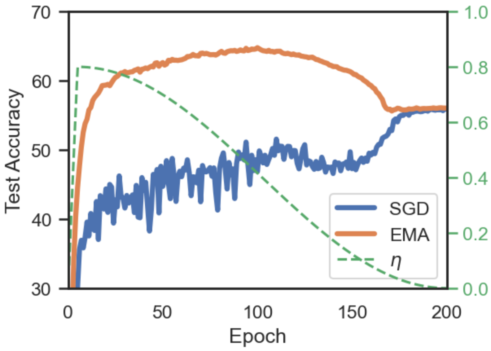 Figure 3: CIFAR-100N on ResNet-34. EMA vs SGD baseline, and learning rate \(\eta\). EMA dominates SGD throughout training and peaks at epoch 100 (\(\eta=0.4\)), greatly outperforming the best SGD model (\(+9.65\) pp). Training on data with 40% of label noise, evaluating on clean test set, mean of 3 runs, \(\alpha=0.998\). Method CIFAR-10N CIFAR-100N DivideMix 92.56 \(\pm\) 0.42 71.13 \(\pm\) 0.48 PES(semi) 92.68 \(\pm\) 0.22 70.36 \(\pm\) 0.33 ELR+ 91.09 \(\pm\) 1.6 66.70 \(\pm\) 0.07 EMA (acc.) 86.71 \(\pm\) 0.17 65.15 \(\pm\) 0.20 CAL 85.36 \(\pm\) 0.16 61.73 \(\pm\) 0.42 CORES 83.60 \(\pm\) 0.53 61.15 \(\pm\) 0.73 Co-Teaching 83.83 \(\pm\) 0.13 60.30 \(\pm\) 0.27 JoCor 83.37 \(\pm\) 0.30 59.97 \(\pm\) 0.24 ELR 83.58 \(\pm\) 1.13 58.94 \(\pm\) 0.92 Negative-LS 82.99 \(\pm\) 0.36 58.59 \(\pm\) 0.98 Co-Teaching+ 83.26 \(\pm\) 0.17 57.88 \(\pm\) 0.24 CORES* 91.66 \(\pm\) 0.09 55.72 \(\pm\) 0.42 … … … CE (standard) 77.69 \(\pm\) 1.55 55.50 \(\pm\) 0.66 Table 4: Selection of best-performing methods on CIFAR-10N (Worse) and CIFAR-100N, with \(40\%\) label noise in train data, using a ResNet-34. Ours is highlighted, all other results are from [Wei et al. 2022](https://arxiv.org/html/2411.18704#bib.bib58). Leaderboard available at <http://www.yliuu.com/web-cifarN/Leaderboard.html>

Interestingly, we find that the effect of implicit regularization is magnified in the presence of label noise. In Fig. [3](https://arxiv.org/html/2411.18704#S4.F3 "Figure 3 ‣ 4.3 Label Noise ‣ 4 Results ‣ Exponential Moving Average of Weights in Deep Learning: Dynamics and Benefits") we observe that the EMA model performs best when averaging iterates at a relatively high learning rate. The EMA model peaks at \(65.15\%\) accuracy at epoch 100, with a learning rate around \(0.4\), and then decays until it plateaus at \(55.5\%\) at the end of training. Eventually, when the learning rate is decayed low enough, the model fits (_i.e._ , memorizes) all the noisy labels and reaches 100% train accuracy (App. [E.1](https://arxiv.org/html/2411.18704#A5.SS1 "E.1 Memorization of noisy labels ‣ Appendix E Additional Label Noise Experiments ‣ Exponential Moving Average of Weights in Deep Learning: Dynamics and Benefits")), but generalizes worse. Memorization in the EMA occurs as the learning rate is decayed, and not due to continued training (App. [E.2](https://arxiv.org/html/2411.18704#A5.SS2 "E.2 Continued training at constant Learning Rate ‣ Appendix E Additional Label Noise Experiments ‣ Exponential Moving Average of Weights in Deep Learning: Dynamics and Benefits")). An explanation for the outstanding performance of EMA is that the regularizing effect of stochastic noise effectively prevents fitting the noisy labels, while it allows learning of general patterns in the data.

We compare our results to the leaderboard for robust training to label noise (see Tab. [3](https://arxiv.org/html/2411.18704#S4.F3 "Figure 3 ‣ 4.3 Label Noise ‣ 4 Results ‣ Exponential Moving Average of Weights in Deep Learning: Dynamics and Benefits")). The performance of the EMA under label noise not only is a good example of the effect of implicit regularization, but it is actually a competitive method with the state-of-the-art, despite its striking simplicity. The leading methods in Tab. [3](https://arxiv.org/html/2411.18704#S4.F3 "Figure 3 ‣ 4.3 Label Noise ‣ 4 Results ‣ Exponential Moving Average of Weights in Deep Learning: Dynamics and Benefits") are complex specialized frameworks, often computationally demanding. Most of them, including the top-performing DivideMix ([Li et al. 2020](https://arxiv.org/html/2411.18704#bib.bib35)), train two networks simultaneously while refining labels based on their predictions, and use advanced augmentation strategies such as MixUp. In contrast, we do not adopt any specialized technique or data augmentation, we only keep an EMA model on top of vanilla momentum SGD training. Despite its simplicity, EMA outperforms multiple specialized methods and gets reasonably close to the state-of-the-art. We believe this can be particularly relevant when the presence or the level of label noise is unknown. While specialized (costly) methods need to be justified by heavy label noise, (lightweight) EMA can simply be adopted by default.

### 4.4 Prediction consistency

Training deep neural networks includes multiple sources of randomness, such as batch ordering, initialization and data augmentations. As a result, two independent runs (with exact same algorithm, architecture, training data and hyperparamter configuration) can converge to very different solutions. Even if their accuracy is usually similar, the resulting models will differ in many predictions of individual samples ([Jiang et al. 2021b](https://arxiv.org/html/2411.18704#bib.bib25); [Bhojanapalli et al. 2021](https://arxiv.org/html/2411.18704#bib.bib4)). This prediction disagreement, also known as churn, poses a challenge for reproducibility and repeatability in deep learning. Moreover, in real-world systems where the production model is often replaced, it is desirable that the new model, expected to be ever so slightly more accurate, makes predictions consistent with previous models – that is, has a low predictive churn ([Jiang et al. 2021a](https://arxiv.org/html/2411.18704#bib.bib24)).

We denote the churn between two functions \(f_{\theta_{1}}\) and \(f_{\theta_{2}}\) as the fraction of test samples with different prediction, the lower the better. That is, \(\frac{1}{N}\sum_{n=1}^{N}\mathbbm{1}[f_{\theta_{1}}(x_{n})\neq f_{\theta_{2}}(x_{n})]\) for the \(N\) samples in the test set, where \(f(x_{n})\) is the top-class predicted. We also propose to use the Jensen-Shannon (JS) divergence as a metric for prediction consistency, which considers the difference in the entire class probability vector. The JS divergence is a symmetrized version of the Kullback–Leibler (KL) divergence defined as \(\textrm{JS}(\textbf{p}\|\textbf{q})=\nicefrac{{1}}{{2}}\,\textrm{KL}(\textbf{p}\|\textbf{m})+\nicefrac{{1}}{{2}}\,\textrm{KL}(\textbf{q}\|\textbf{m})\), where \(\textbf{m}=\nicefrac{{1}}{{2}}(\textbf{p}+\textbf{q})\).

A few attempts have been made to reduce churn with algorithmic variations ([Bhojanapalli et al. 2021](https://arxiv.org/html/2411.18704#bib.bib4); [Jiang et al. 2021a](https://arxiv.org/html/2411.18704#bib.bib24); [Madhyastha & Jain 2019](https://arxiv.org/html/2411.18704#bib.bib39)). In our experiments, we train 3 models on independent runs with different seeds and measure the pair-wise churn and JS divergence between their predictions. In Table [5](https://arxiv.org/html/2411.18704#S4.T5 "Table 5 ‣ 4.4 Prediction consistency ‣ 4 Results ‣ Exponential Moving Average of Weights in Deep Learning: Dynamics and Benefits") we compare the prediction consistency of the SGD baseline with the EMA model of lowest validation loss (BN stats recomputed). Using EMA brings a great improvement in consistency between predictions, even outperforming the state of the art ([Bhojanapalli et al. 2021](https://arxiv.org/html/2411.18704#bib.bib4)), a specialized method that uses co-distillation and has a \(\times 2\) training cost. The EMA model consistently reduces the classification churn across different datasets and architectures. Note that we gain a large factor in prediction agreement, as most samples are already correctly predicted by both models, and so don’t move. We also find a consistent improvement in the continuous metric of JS divergence.

Table 5: Prediction consistency results, measured by Churn and JS divergence, the lower the better. Using an EMA model substantially improves the consistency of predictions between independent runs, achieving a lower churn than methods designed specifically for this goal. |  | Test Acc. | Churn | JS divergence  
---|---|---|---|---  
|  | Baseline | Method | Baseline | Method | Baseline | Method  
Method: EMA (lowest loss) |   
CIFAR-100 |  ResNet-18 | 77.63 | 78.07 | 18.84 \(\pm\) 0.28 | 11.69 \(\pm\) 0.3 | 0.32 \(\pm\) 0.01 | 0.09 \(\pm\) 0.01  
|  WRN-2810 | 81.07 | 81.90 | 15.69 \(\pm\) 0.09 | 8.88 \(\pm\) 0.04 | 0.10 \(\pm\) 0.0 | 0.055 \(\pm\) 0.0  
|  VGG-16 | 72.82 | 72.08 | 23.7 \(\pm\) 0.2 | 20.07 \(\pm\) 0.21 | 0.67 \(\pm\) 0.02 | 0.13 \(\pm\) 0.01  
CIFAR-10 |  ResNet-18 | 95.25 | 95.46 | 3.78 \(\pm\) 0.19 | 2.71 \(\pm\) 0.09 | 0.017 \(\pm\) 0.0 | 0.013 \(\pm\) 0.0  
Tiny-ImageNet |  ResNet-18 | 66.03 | 67.05 | 29.36 \(\pm\) 0.19 | 15.32 \(\pm\) 0.13 | 0.85 \(\pm\) 0.0 | 0.14 \(\pm\) 0.0  
Method: Co-distillation KL ([Bhojanapalli et al. 2021](https://arxiv.org/html/2411.18704#bib.bib4)) |   
CIFAR-100 |  ResNet-56 | 73.26 | 76.53 | 26.77 \(\pm\) 0.26 | 17.09 \(\pm\) 0.3 | - | -  
CIFAR-10 |  ResNet-56 | 93.97 | 94.63 | 5.72 \(\pm\) 0.18 | 4.21 \(\pm\) 0.15 | - | -  
  
### 4.5 Transfer Learning

In order to assess the quality and generalizability of the learned representations, we test their ability to transfer to other datasets. We investigate whether the implicit regularization effect from stochastic noise promotes the learning of more general representations that generalize across datasets, instead of relying on patterns specific to the training distribution.

We evaluate transfer learning via linear evaluation, similarly to [Chen et al. 2020](https://arxiv.org/html/2411.18704#bib.bib10). We use a frozen pretrained model as a feature extractor, all layers but for the last one, and add a linear classification head for another dataset on top. Then, we train the classification head for 50 epochs with SGD with Nesterov momentum of \(0.9\), without weight decay and with a tuned learning rate of \(0.01\) without warmup. We do not use EMA on the classification head.

We find that the EMA models learn more general representations which better transfer to other datasets, compared to the SGD baseline. Table [6](https://arxiv.org/html/2411.18704#S4.T6 "Table 6 ‣ 4.5 Transfer Learning ‣ 4 Results ‣ Exponential Moving Average of Weights in Deep Learning: Dynamics and Benefits") shows the results for linear evaluation on the frozen feature extractors, demonstrating that EMA models’ representations are more linearly separable when transferred to other tasks. For example, an EMA model pretrained on TinyImagenet achieves a linear evaluation accuracy of 57.78% on CIFAR-100, while the SGD baseline, the same model without EMA, only achieves 52.77%. This result shows that simply adding weight averaging to SGD readily improves the transferability of the features learned. Interestingly, EMA with early stopping at the epoch of lowest validation loss often outperforms the epoch of best accuracy, likely because of early stopping, which is also known as an effective form of implicit regularization.

As expected, since we only train a linear layer, the accuracy of linear evaluation is far from the supervised performance when training an entire model from scratch. Nonetheless, we believe that our results are insightful for understanding the differences between averaged solutions and SGD solutions decaying learning rate to zero, showcasing how averaging promotes the learning of more general representations.

Table 6: Linear evaluation on CIFAR-10/100 with a frozen ResNet-18 backbone pretrained on another dataset. Mean and std deviation for 3 seeds. The significant improvements in accuracy using EMA pretrained models indicates that the representations learned are more general and transferable.  Pretraining on: | Tiny-ImageNet | CIFAR-100 | Tiny-ImageNet | CIFAR-10  
---|---|---|---|---  
Linear eval on: | CIFAR-10 | CIFAR-100  
Baseline | \(74.61\pm 0.26\) | \(82.10\pm 0.21\) | \(52.77\pm 0.15\) | \(33.72\pm 1.67\)  
EMA (best accuracy) | \(78.70\pm 0.45\) | \(84.03\pm 1.07\) | \(57.30\pm 0.39\) | \(\textbf{37.09}\pm 1.06\)  
EMA (lowest loss) | \(\textbf{79.13}\pm 0.76\) | \(\textbf{85.02}\pm 0.03\) | \(\textbf{57.78}\pm 0.09\) | \(36.09\pm 0.86\)  
Supervised | \(95.25\pm 0.11\) | \(77.63\pm 0.14\)  
  
### 4.6 Calibration

Calibration of a model is the property that the predicted probabilities reflect the true likelihood of the ground-truth. While calibrated models are important for high-stakes decision making, for example in medical domains, modern deep neural networks are generally not well-calibrated. Multiple methods have been proposed to improve calibration. [Guo et al. 2017](https://arxiv.org/html/2411.18704#bib.bib17) use a post-hoc temperature scaling tuned on a hold-out set. Deep ensembles are also known to improve uncertainty estimation and calibration ([Lakshminarayanan et al. 2017](https://arxiv.org/html/2411.18704#bib.bib31); [Jiang et al. 2021b](https://arxiv.org/html/2411.18704#bib.bib25)), but are an expensive solution. Another class of methods directly optimize for low calibration error during training with auxiliary objectives ([Karandikar et al. 2021](https://arxiv.org/html/2411.18704#bib.bib27)).

In Table [7](https://arxiv.org/html/2411.18704#S4.T7 "Table 7 ‣ 4.6 Calibration ‣ 4 Results ‣ Exponential Moving Average of Weights in Deep Learning: Dynamics and Benefits") we report the test accuracy and calibration error for a baseline model, trained on SGD with Nesterov momentum, and its EMA. We use the Expected Calibration Error (ECE) metric, widely used in the literature. We fix the number of bins to \(M=100\) and compute ECE with equal-mass binning ([Nixon et al. 2019](https://arxiv.org/html/2411.18704#bib.bib43)). We also report ECE after temperature scaling (TS) as proposed by ([Guo et al. 2017](https://arxiv.org/html/2411.18704#bib.bib17)). We train on an 80% split of the full training dataset, tune the temperature in the remaining 20% hold-out set, and evaluate on test. For the EMA we use early stopping at the epoch of lowest loss and recompute BN stats after training.

We find that using an EMA considerably reduces the calibration error across all models and datasets tried, compared to the SGD baseline. The improvement that EMA brings seems to be orthogonal to the popular post-hoc operation of temperature scaling, which corrects for an average over/under-confidence. Combining temperature scaling and EMA generally yields the best calibration. We hypothesize that a temporal ensemble of model weights represents a high diversity of solutions, which leads to an improved uncertainty estimation.

Table 7: Expected Calibration Error (ECE) and ECE after Temperature Scaling (TS) results, lower is better. EMA consistently provides better calibrated predictions than the SGD baseline. |  | Baseline | EMA  
---|---|---|---  
ResNet-18 CIFAR-100 |  Accuracy | \(75.83\pm 0.05\) | \(76.31\pm 0.28\)  
ECE | \(11.75\pm 0.76\) | \(9.46\pm 0.26\)  
ECE w/ TS | \(4.67\pm 0.65\) | \(\textbf{3.13}\pm 0.15\)  
VGG-16 CIFAR-100 |  Accuracy | 70.57 \(\pm\) 0.11 | 70.46 \(\pm\) 0.18  
ECE | \(20.57\) \(\pm\) 0.12 | \(8.12\pm 2.1\)  
ECE with TS | \(12.17\pm 0.07\) | \(\textbf{3.64}\pm 0.55\)  
WideResNet-28-10 CIFAR-100 |  Accuracy | 79.29 \(\pm\) 0.07 | 80.12 \(\pm\) 0.28  
ECE | \(6.38\) \(\pm\) 0.25 | \(6.20\) \(\pm\) 0.53  
ECE w/ TS | \(5.60\) \(\pm\) 0.1 | 3.37\(\pm\) 0.23  
ResNet-18 CIFAR-10 |  Accuracy | \(94.54\) \(\pm\) 0.22 | \(95.01\) \(\pm\) 0.08  
ECE | \(3.58\) \(\pm\) 0.22 | \(1.99\)\(\pm\) 0.18  
ECE w/ TS | \(1.99\) \(\pm\) 0.18 | 1.04\(\pm\) 0.14  
ResNet-18 Tiny-ImageNet |  Accuracy | \(63.74\) \(\pm\) 0.12 | \(65.81\) \(\pm\) 0.2  
ECE | \(12.62\) \(\pm\) 0.2 | \(8.88\) \(\pm\) 0.27  
ECE w/ TS | 3.35 \(\pm\) 0.11 | \(3.57\) \(\pm\) 0.29  
  
## 5 Conclusion

In this work, we have performed a thorough study of weight averaging in deep learning through EMA models, that was lacking in the literature despite its extensive use. We set the goal to answer "What are the properties of weight averaging when training deep neural networks?". While providing a comprehensive understanding of weight averaging in non-convex objectives is a difficult task, we make a first step and gather multiple insights stemming from a rigorous empirical study. We split our contributions in two categories: exploration of training dynamics (Section [3](https://arxiv.org/html/2411.18704#S3 "3 Insights on Weight Averaging during Training ‣ Exponential Moving Average of Weights in Deep Learning: Dynamics and Benefits")) and properties of the final EMA model (Section [4](https://arxiv.org/html/2411.18704#S4 "4 Results ‣ Exponential Moving Average of Weights in Deep Learning: Dynamics and Benefits")).

Regarding training dynamics, we first propose a framework to limit the overhead induced by keeping multiple EMA models and tuning the decay rate in one-shot (Section [3.1](https://arxiv.org/html/2411.18704#S3.SS1 "3.1 Training with EMA ‣ 3 Insights on Weight Averaging during Training ‣ Exponential Moving Average of Weights in Deep Learning: Dynamics and Benefits")). We show that averaging with EMA reduces the noise of SGD iterates and allows to maintain high learning rates. In turn, averaging iterates with high stochastic noise leads to a form of implicit regularization that favors learning more general representations (Section [3.2](https://arxiv.org/html/2411.18704#S3.SS2 "3.2 Implicit Regularization with SGD Noise and Learning Rate Schedule ‣ 3 Insights on Weight Averaging during Training ‣ Exponential Moving Average of Weights in Deep Learning: Dynamics and Benefits")). At the same time, it also allows to spare training epochs by trading noise reduction by learning rate annealing with averaging. Finally, we highlight the striking early performance of EMA models, partly explaining their success as teachers (Section [3.3](https://arxiv.org/html/2411.18704#S3.SS3 "3.3 EMA in early training ‣ 3 Insights on Weight Averaging during Training ‣ Exponential Moving Average of Weights in Deep Learning: Dynamics and Benefits")), and we show that too large averaging windows cannot be used for EMA teachers, since they require recomputing Batch Norm statistics (Section [3.4](https://arxiv.org/html/2411.18704#S3.SS4 "3.4 Batch Norm Statistics and EMA decay ‣ 3 Insights on Weight Averaging during Training ‣ Exponential Moving Average of Weights in Deep Learning: Dynamics and Benefits")).

Regarding the final EMA models, we show how they differ from SGD last-iterate solutions and bring an array of benefits. Not only do EMA models generalize better than SGD, on a par with other weight averaging literature methods such as SWA (Section [4.2](https://arxiv.org/html/2411.18704#S4.SS2 "4.2 Generalization ‣ 4 Results ‣ Exponential Moving Average of Weights in Deep Learning: Dynamics and Benefits")), but weight averaging also brings robustness to label noise, beating many specialized methods with a much less complex algorithm (Section [4.3](https://arxiv.org/html/2411.18704#S4.SS3 "4.3 Label Noise ‣ 4 Results ‣ Exponential Moving Average of Weights in Deep Learning: Dynamics and Benefits")). EMA models also improve consistency of predictions across different training runs (Section [4.4](https://arxiv.org/html/2411.18704#S4.SS4 "4.4 Prediction consistency ‣ 4 Results ‣ Exponential Moving Average of Weights in Deep Learning: Dynamics and Benefits")), produce more general and transferable representations (Section [4.5](https://arxiv.org/html/2411.18704#S4.SS5 "4.5 Transfer Learning ‣ 4 Results ‣ Exponential Moving Average of Weights in Deep Learning: Dynamics and Benefits")), and are better calibrated (Section [4.6](https://arxiv.org/html/2411.18704#S4.SS6 "4.6 Calibration ‣ 4 Results ‣ Exponential Moving Average of Weights in Deep Learning: Dynamics and Benefits")).

Admittedly, one limitation of this empirical study is its sole focus on image classification benchmarks. In this work we chose to focus on image classification and explore a wide range of properties of EMA models for this task. The task of image classification has for a long time been a cornerstone for developments in deep learning research, offering mature and trusted benchmarks to compare methods. Nonetheless, it does not guarantee that the properties of EMA models hold for other tasks, which is yet to be explored and remains as future work.

In conclusion, we postulate EMA of weights as an extremely simple yet effective plug-in to improve performance of deep learning models in multiple fronts. We believe this empirical study has immediate practical value, providing a solid case and guidelines for practitioners to add EMA on top of their existing pipelines, while it also sheds some light on the training dynamics of EMA models, which despite their extended use was not covered in the literature.

## References

  * Athiwaratkun et al. (2019) Ben Athiwaratkun, Marc Finzi, Pavel Izmailov, and Andrew Gordon Wilson.  There are many consistent explanations of unlabeled data: Why you should average.  In _7th International Conference on Learning Representations, ICLR 2019_ , 2019. 
  * Bach & Moulines (2011) Francis Bach and Eric Moulines.  Non-asymptotic analysis of stochastic approximation algorithms for machine learning.  _Advances in neural information processing systems_ , 24, 2011. 
  * Berthelot et al. (2019) David Berthelot, Nicholas Carlini, Ian Goodfellow, Nicolas Papernot, Avital Oliver, and Colin A Raffel.  Mixmatch: A holistic approach to semi-supervised learning.  _Advances in neural information processing systems_ , 32, 2019. 
  * Bhojanapalli et al. (2021) Srinadh Bhojanapalli, Kimberly Wilber, Andreas Veit, Ankit Singh Rawat, Seungyeon Kim, Aditya Menon, and Sanjiv Kumar.  On the reproducibility of neural network predictions.  _arXiv preprint arXiv:2102.03349_ , 2021. 
  * Bottou (2010) Léon Bottou.  Large-scale machine learning with stochastic gradient descent.  In _Proceedings of COMPSTAT’2010: 19th International Conference on Computational StatisticsParis France, August 22-27, 2010 Keynote, Invited and Contributed Papers_ , pp. 177–186. Springer, 2010. 
  * Cai et al. (2021) Zhaowei Cai, Avinash Ravichandran, Subhransu Maji, Charless Fowlkes, Zhuowen Tu, and Stefano Soatto.  Exponential moving average normalization for self-supervised and semi-supervised learning.  In _Proceedings of the IEEE/CVF Conference on Computer Vision and Pattern Recognition_ , pp. 194–203, 2021. 
  * Caron et al. (2021) Mathilde Caron, Hugo Touvron, Ishan Misra, Hervé Jégou, Julien Mairal, Piotr Bojanowski, and Armand Joulin.  Emerging properties in self-supervised vision transformers.  In _Proceedings of the IEEE/CVF international conference on computer vision_ , pp. 9650–9660, 2021. 
  * Cha et al. (2021) Junbum Cha, Sanghyuk Chun, Kyungjae Lee, Han-Cheol Cho, Seunghyun Park, Yunsung Lee, and Sungrae Park.  Swad: Domain generalization by seeking flat minima.  _Advances in Neural Information Processing Systems_ , 34:22405–22418, 2021. 
  * Chen et al. (2021) Tianlong Chen, Zhenyu Zhang, Sijia Liu, Shiyu Chang, and Zhangyang Wang.  Robust overfitting may be mitigated by properly learned smoothening.  In _International Conference on Learning Representations_ , 2021. 
  * Chen et al. (2020) Ting Chen, Simon Kornblith, Mohammad Norouzi, and Geoffrey Hinton.  A simple framework for contrastive learning of visual representations.  In _International conference on machine learning_ , pp. 1597–1607. PMLR, 2020. 
  * Dieuleveut et al. (2017) Aymeric Dieuleveut, Nicolas Flammarion, and Francis Bach.  Harder, better, faster, stronger convergence rates for least-squares regression.  _The Journal of Machine Learning Research_ , 18(1):3520–3570, 2017. 
  * Even et al. (2023) Mathieu Even, Scott Pesme, Suriya Gunasekar, and Nicolas Flammarion.  (s) gd over diagonal linear networks: Implicit regularisation, large stepsizes and edge of stability.  _arXiv preprint arXiv:2302.08982_ , 2023. 
  * French et al. (2019) Geoff French, Samuli Laine, Timo Aila, Michal Mackiewicz, and Graham Finlayson.  Semi-supervised semantic segmentation needs strong, varied perturbations.  _arXiv preprint arXiv:1906.01916_ , 2019. 
  * Gadat & Panloup (2023) Sébastien Gadat and Fabien Panloup.  Optimal non-asymptotic analysis of the ruppert–polyak averaging stochastic algorithm.  _Stochastic Processes and their Applications_ , 156:312–348, 2023. 
  * Gowal et al. (2020) Sven Gowal, Chongli Qin, Jonathan Uesato, Timothy Mann, and Pushmeet Kohli.  Uncovering the limits of adversarial training against norm-bounded adversarial examples.  _arXiv preprint arXiv:2010.03593_ , 2020. 
  * Grill et al. (2020) Jean-Bastien Grill, Florian Strub, Florent Altché, Corentin Tallec, Pierre Richemond, Elena Buchatskaya, Carl Doersch, Bernardo Avila Pires, Zhaohan Guo, Mohammad Gheshlaghi Azar, et al.  Bootstrap your own latent-a new approach to self-supervised learning.  _Advances in neural information processing systems_ , 33:21271–21284, 2020. 
  * Guo et al. (2017) Chuan Guo, Geoff Pleiss, Yu Sun, and Kilian Q Weinberger.  On calibration of modern neural networks.  In _International conference on machine learning_ , pp. 1321–1330. PMLR, 2017. 
  * Gupta et al. (2020) Vipul Gupta, Santiago Akle Serrano, and Dennis DeCoste.  Stochastic weight averaging in parallel: Large-batch training that generalizes well.  In _International Conference on Learning Representations_ , 2020. 
  * He et al. (2019) Haowei He, Gao Huang, and Yang Yuan.  Asymmetric valleys: Beyond sharp and flat local minima.  _Advances in neural information processing systems_ , 32, 2019. 
  * He et al. (2016) Kaiming He, Xiangyu Zhang, Shaoqing Ren, and Jian Sun.  Deep residual learning for image recognition.  In _Proceedings of the IEEE conference on computer vision and pattern recognition_ , pp. 770–778, 2016. 
  * He et al. (2020) Kaiming He, Haoqi Fan, Yuxin Wu, Saining Xie, and Ross Girshick.  Momentum contrast for unsupervised visual representation learning.  In _Proceedings of the IEEE/CVF conference on computer vision and pattern recognition_ , pp. 9729–9738, 2020. 
  * Hoyer et al. (2022) Lukas Hoyer, Dengxin Dai, and Luc Van Gool.  Daformer: Improving network architectures and training strategies for domain-adaptive semantic segmentation.  In _Proceedings of the IEEE/CVF Conference on Computer Vision and Pattern Recognition_ , pp. 9924–9935, 2022. 
  * Izmailov et al. (2018) Pavel Izmailov, Dmitrii Podoprikhin, Timur Garipov, Dmitry Vetrov, and Andrew Gordon Wilson.  Averaging weights leads to wider optima and better generalization.  In _34th Conference on Uncertainty in Artificial Intelligence 2018, UAI 2018_ , pp. 876–885. Association For Uncertainty in Artificial Intelligence (AUAI), 2018. 
  * Jiang et al. (2021a) Heinrich Jiang, Harikrishna Narasimhan, Dara Bahri, Andrew Cotter, and Afshin Rostamizadeh.  Churn reduction via distillation.  _arXiv preprint arXiv:2106.02654_ , 2021a. 
  * Jiang et al. (2021b) Yiding Jiang, Vaishnavh Nagarajan, Christina Baek, and J Zico Kolter.  Assessing generalization of sgd via disagreement.  _arXiv preprint arXiv:2106.13799_ , 2021b. 
  * Kaddour (2022) Jean Kaddour.  Stop wasting my time! saving days of imagenet and bert training with latest weight averaging.  _arXiv preprint arXiv:2209.14981_ , 2022. 
  * Karandikar et al. (2021) Archit Karandikar, Nicholas Cain, Dustin Tran, Balaji Lakshminarayanan, Jonathon Shlens, Michael C Mozer, and Becca Roelofs.  Soft calibration objectives for neural networks.  _Advances in Neural Information Processing Systems_ , 34:29768–29779, 2021. 
  * Keskar et al. (2016) Nitish Shirish Keskar, Dheevatsa Mudigere, Jorge Nocedal, Mikhail Smelyanskiy, and Ping Tak Peter Tang.  On large-batch training for deep learning: Generalization gap and sharp minima.  _arXiv preprint arXiv:1609.04836_ , 2016. 
  * Kingma & Ba (2014) Diederik P Kingma and Jimmy Ba.  Adam: A method for stochastic optimization.  _arXiv preprint arXiv:1412.6980_ , 2014. 
  * Laine & Aila (2016) Samuli Laine and Timo Aila.  Temporal ensembling for semi-supervised learning.  _arXiv preprint arXiv:1610.02242_ , 2016. 
  * Lakshminarayanan et al. (2017) Balaji Lakshminarayanan, Alexander Pritzel, and Charles Blundell.  Simple and scalable predictive uncertainty estimation using deep ensembles.  _Advances in neural information processing systems_ , 30, 2017. 
  * Lakshminarayanan & Szepesvari (2018) Chandrashekar Lakshminarayanan and Csaba Szepesvari.  Linear stochastic approximation: How far does constant step-size and iterate averaging go?  In _International Conference on Artificial Intelligence and Statistics_ , pp. 1347–1355. PMLR, 2018. 
  * Laskin et al. (2020) Michael Laskin, Aravind Srinivas, and Pieter Abbeel.  Curl: Contrastive unsupervised representations for reinforcement learning.  In _International Conference on Machine Learning_ , pp. 5639–5650. PMLR, 2020. 
  * Le & Yang (2015) Ya Le and Xuan Yang.  Tiny imagenet visual recognition challenge.  _CS 231N_ , 7(7):3, 2015. 
  * Li et al. (2020) Junnan Li, Richard Socher, and Steven C.H. Hoi.  Dividemix: Learning with noisy labels as semi-supervised learning.  In _International Conference on Learning Representations_ , 2020. 
  * Li et al. (2022) Tao Li, Zhehao Huang, Qinghua Tao, Yingwen Wu, and Xiaolin Huang.  Trainable weight averaging for fast convergence and better generalization.  _arXiv preprint arXiv:2205.13104_ , 2022. 
  * Liu et al. (2020) Sheng Liu, Jonathan Niles-Weed, Narges Razavian, and Carlos Fernandez-Granda.  Early-learning regularization prevents memorization of noisy labels.  _Advances in neural information processing systems_ , 33:20331–20342, 2020. 
  * Loshchilov & Hutter (2017) Ilya Loshchilov and Frank Hutter.  Sgdr: Stochastic gradient descent with warm restarts.  _International Conference on Learning Representations_ , 2017. 
  * Madhyastha & Jain (2019) Pranava Madhyastha and Rishabh Jain.  On model stability as a function of random seed.  _arXiv preprint arXiv:1909.10447_ , 2019. 
  * Mücke et al. (2019) Nicole Mücke, Gergely Neu, and Lorenzo Rosasco.  Beating sgd saturation with tail-averaging and minibatching.  _Advances in Neural Information Processing Systems_ , 32, 2019. 
  * Neu & Rosasco (2018) Gergely Neu and Lorenzo Rosasco.  Iterate averaging as regularization for stochastic gradient descent.  In _Conference On Learning Theory_ , pp. 3222–3242. PMLR, 2018\. 
  * Nguyen et al. (2019) Duc Tam Nguyen, Chaithanya Kumar Mummadi, Thi Phuong Nhung Ngo, Thi Hoai Phuong Nguyen, Laura Beggel, and Thomas Brox.  Self: Learning to filter noisy labels with self-ensembling.  _arXiv preprint arXiv:1910.01842_ , 2019. 
  * Nixon et al. (2019) Jeremy Nixon, Michael W Dusenberry, Linchuan Zhang, Ghassen Jerfel, and Dustin Tran.  Measuring calibration in deep learning.  In _CVPR workshops_ , volume 2, 2019. 
  * Oord et al. (2018) Aaron Oord, Yazhe Li, Igor Babuschkin, Karen Simonyan, Oriol Vinyals, Koray Kavukcuoglu, George Driessche, Edward Lockhart, Luis Cobo, Florian Stimberg, et al.  Parallel wavenet: Fast high-fidelity speech synthesis.  In _International conference on machine learning_ , pp. 3918–3926. PMLR, 2018. 
  * Oquab et al. (2023) Maxime Oquab, Timothée Darcet, Theo Moutakanni, Huy V. Vo, Marc Szafraniec, Vasil Khalidov, Pierre Fernandez, Daniel Haziza, Francisco Massa, Alaaeldin El-Nouby, Russell Howes, Po-Yao Huang, Hu Xu, Vasu Sharma, Shang-Wen Li, Wojciech Galuba, Mike Rabbat, Mido Assran, Nicolas Ballas, Gabriel Synnaeve, Ishan Misra, Herve Jegou, Julien Mairal, Patrick Labatut, Armand Joulin, and Piotr Bojanowski.  Dinov2: Learning robust visual features without supervision, 2023. 
  * Pesme et al. (2021) Scott Pesme, Loucas Pillaud-Vivien, and Nicolas Flammarion.  Implicit bias of sgd for diagonal linear networks: a provable benefit of stochasticity.  _Advances in Neural Information Processing Systems_ , 34:29218–29230, 2021. 
  * Polyak (1990) Boris T Polyak.  New stochastic approximation type procedures.  _Automat. i Telemekh_ , 7(98-107):2, 1990. 
  * Polyak & Juditsky (1992) Boris T Polyak and Anatoli B Juditsky.  Acceleration of stochastic approximation by averaging.  _SIAM journal on control and optimization_ , 30(4):838–855, 1992. 
  * Rebuffi et al. (2021) Sylvestre-Alvise Rebuffi, Sven Gowal, Dan Andrei Calian, Florian Stimberg, Olivia Wiles, and Timothy A Mann.  Data augmentation can improve robustness.  _Advances in Neural Information Processing Systems_ , 34:29935–29948, 2021. 
  * Robbins & Monro (1951) Herbert Robbins and Sutton Monro.  A stochastic approximation method.  _The annals of mathematical statistics_ , pp. 400–407, 1951. 
  * Ruppert (1988) David Ruppert.  Efficient estimations from a slowly convergent robbins-monro process.  Technical report, Cornell University Operations Research and Industrial Engineering, 1988. 
  * Sandler et al. (2023) Mark Sandler, Andrey Zhmoginov, Max Vladymyrov, and Nolan Miller.  Training trajectories, mini-batch losses and the curious role of the learning rate, 2023. 
  * Sanyal et al. (2023) Sunny Sanyal, Atula Neerkaje, Jean Kaddour, Abhishek Kumar, and Sujay Sanghavi.  Early weight averaging meets high learning rates for llm pre-training, 2023. 
  * Simonyan & Zisserman (2014) Karen Simonyan and Andrew Zisserman.  Very deep convolutional networks for large-scale image recognition.  _arXiv preprint arXiv:1409.1556_ , 2014. 
  * Sohn et al. (2020) Kihyuk Sohn, David Berthelot, Nicholas Carlini, Zizhao Zhang, Han Zhang, Colin A Raffel, Ekin Dogus Cubuk, Alexey Kurakin, and Chun-Liang Li.  Fixmatch: Simplifying semi-supervised learning with consistency and confidence.  _Advances in neural information processing systems_ , 33:596–608, 2020. 
  * Tarvainen & Valpola (2017) Antti Tarvainen and Harri Valpola.  Mean teachers are better role models: Weight-averaged consistency targets improve semi-supervised deep learning results.  _Advances in neural information processing systems_ , 30, 2017. 
  * Wang et al. (2022) Qin Wang, Olga Fink, Luc Van Gool, and Dengxin Dai.  Continual test-time domain adaptation.  In _Proceedings of the IEEE/CVF Conference on Computer Vision and Pattern Recognition_ , pp. 7201–7211, 2022. 
  * Wei et al. (2022) Jiaheng Wei, Zhaowei Zhu, Hao Cheng, Tongliang Liu, Gang Niu, and Yang Liu.  Learning with noisy labels revisited: A study using real-world human annotations.  In _International Conference on Learning Representations_ , 2022.  URL <https://openreview.net/forum?id=TBWA6PLJZQm>. 
  * Yang et al. (2019) Guandao Yang, Tianyi Zhang, Polina Kirichenko, Junwen Bai, Andrew Gordon Wilson, and Chris De Sa.  Swalp: Stochastic weight averaging in low precision training.  In _International Conference on Machine Learning_ , pp. 7015–7024. PMLR, 2019. 
  * Yaz et al. (2019) Yasin Yaz, Chuan-Sheng Foo, Stefan Winkler, Kim-Hui Yap, Georgios Piliouras, Vijay Chandrasekhar, et al.  The unusual effectiveness of averaging in gan training.  In _International Conference on Learning Representations_ , 2019. 
  * Zagoruyko & Komodakis (2016) Sergey Zagoruyko and Nikos Komodakis.  Wide residual networks.  _arXiv preprint arXiv:1605.07146_ , 2016. 

## Appendix A Additional examples of EMA training dynamics

In this section, we provide additional examples of EMA training dynamics, always compared to the momentum SGD baseline, as described in Sec. [4.1](https://arxiv.org/html/2411.18704#S4.SS1 "4.1 Experimental Setup ‣ 4 Results ‣ Exponential Moving Average of Weights in Deep Learning: Dynamics and Benefits"). We first discuss the EMA dynamics when the learning rate is decayed in steps, instead of continuously. Then, we provide results on other datasets and network architectures with cosine annealing of the learning rate.

### A.1 EMA dynamics with a step decay

In Sec. [3.2](https://arxiv.org/html/2411.18704#S3.SS2 "3.2 Implicit Regularization with SGD Noise and Learning Rate Schedule ‣ 3 Insights on Weight Averaging during Training ‣ Exponential Moving Average of Weights in Deep Learning: Dynamics and Benefits") we discussed the EMA training dynamics when using cosine annealing for the decay of the learning rate. The benefit of a continuous decay is that, since the learning rate controls the strength of implicit regularization, we can tune the level of regularization in the EMA model in one-shot with early stopping. In practice, a very common learning rate schedule is to use a step decay. In Fig. [4](https://arxiv.org/html/2411.18704#A1.F4 "Figure 4 ‣ A.1 EMA dynamics with a step decay ‣ Appendix A Additional examples of EMA training dynamics ‣ Exponential Moving Average of Weights in Deep Learning: Dynamics and Benefits") we plot the test accuracy during training when reducing the learning rate by a factor of 5 at epochs \([60,120,160]\). In this case the EMA model does not outperform the SGD baseline, it only matches its performance towards the end of training, when the learning rate is small enough so that the two models become effectively the same. This is due to a suboptimal choice of the strength of implicit regularization, which we propose to solve with the one-shot tuning by combining cosine decay and early stopping.

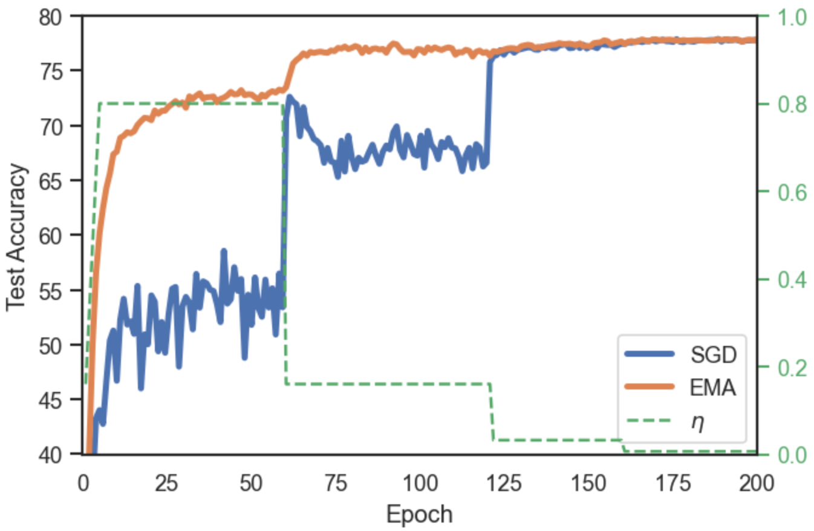 Figure 4: CIFAR-100 on ResNet-18, with step decay of the learning rate by a factor of 5 at epochs \([60,120,160]\). At each epoch we report the best EMA out of the 5 parallel EMAs kept, and do not recompute BN stats.

### A.2 EMA dynamics with cosine decay

In this section we include the remaining plots of test accuracy during training for the datasets and architectures that we have based our experiments on. While the evolution of test accuracy during training is different for each case, in all of them we see the same general pattern: the EMA model peaks well before the end of training, when averaging at a higher learning rate \(\eta\). As \(\eta\) is decreased too much, the effect of implicit regularization is reduced in the EMA and it deteriorates.

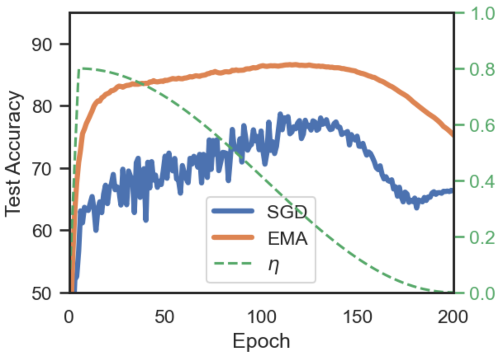 (a) CIFAR-10-N (40% noise) on ResNet-34

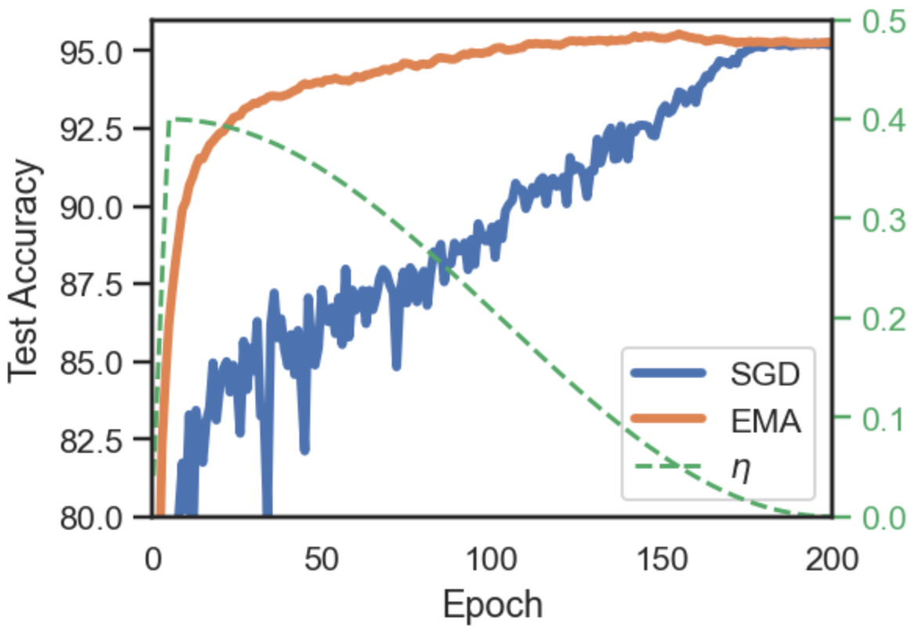 (b) CIFAR-10, ResNet-18

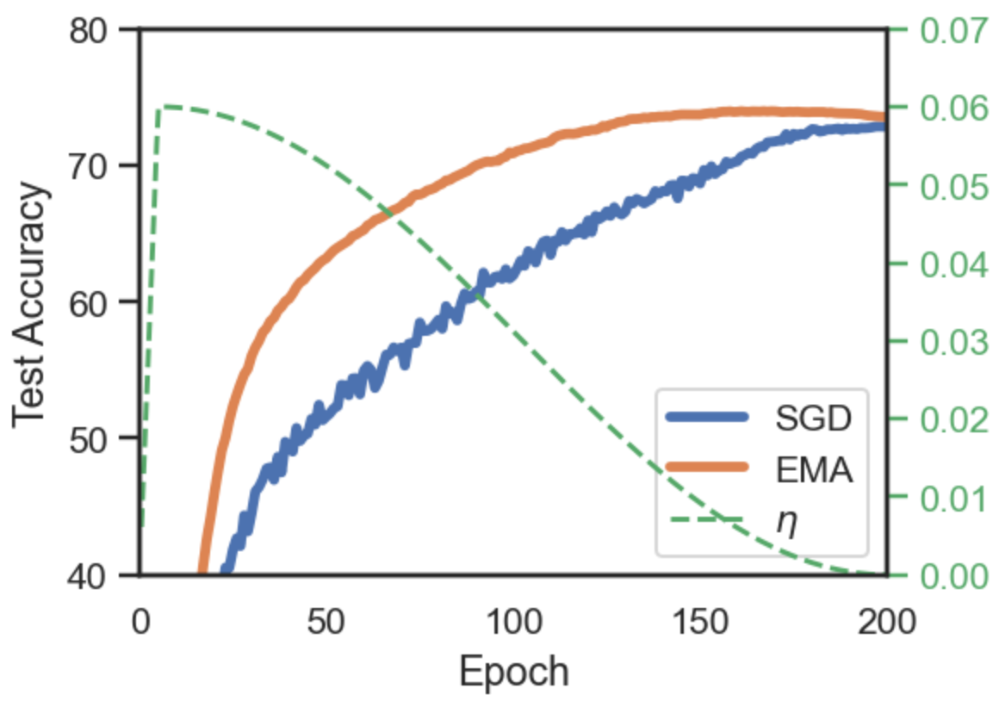 (c) CIFAR-100, VGG-16

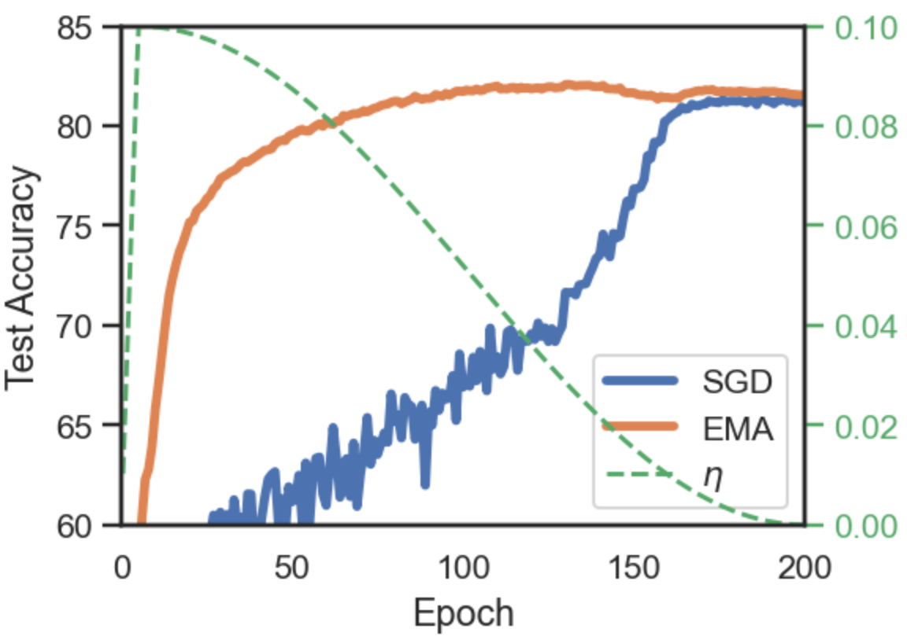 (d) CIFAR-100, WideResNet-28-10

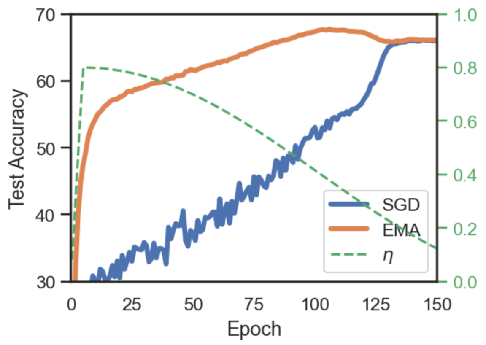 (e) Tiny-ImageNet, ResNet-18

Figure 5: EMA and momentum SGD training dynamics for the different datasets and models used in our work. Learning rate (\(\mu\)) follows a cosine annealing. Training on the full dataset, results are mean of 3 runs. At each epoch we report the best EMA out of the 5 parallel EMAs kept and do not recompute BN stats.

## Appendix B Additional results

In this section, we provide additional results as well as the standard deviation for all results reported in the main text. We also include the results when training on an 80% split of train data, to perform hyperparameter tuning (including early stopping epoch) on the remaining 20% hold-out split. In Table [8](https://arxiv.org/html/2411.18704#A2.T8 "Table 8 ‣ Appendix B Additional results ‣ Exponential Moving Average of Weights in Deep Learning: Dynamics and Benefits") we have a summary of test accuracy and loss in the 80% of training data. The table also includes the average early stopping epoch for EMA among the 3 seeds. Table [8](https://arxiv.org/html/2411.18704#A2.T8 "Table 8 ‣ Appendix B Additional results ‣ Exponential Moving Average of Weights in Deep Learning: Dynamics and Benefits") complements Table [1](https://arxiv.org/html/2411.18704#S4.T1 "Table 1 ‣ 4.2 Generalization ‣ 4 Results ‣ Exponential Moving Average of Weights in Deep Learning: Dynamics and Benefits"), which is the subsequent training with 100% of data.

Table 8: Summary of results training on 80% of data. Including epochs to highlight the early stopping and wasteful training of SGD Architecture | Dataset | Baseline | EMA (best acc.) | EMA (lowest loss)  
---|---|---|---|---  
|  | Acc. | Loss | Epoch | Acc. | Loss | Epoch | Acc. | Loss | Epoch  
ResNet-18 | C-100 | 75.83 | 1.09 | 198 | 76.75 | 0.96 | 146 | 76.31 | 0.90 | 124.6  
VGG-16 | C-100 | 70.57 | 1.96 | 191.6 | 71.61 | 1.30 | 149.6 | 70.46 | 1.18 | 118  
WRN-28-10 | C-100 | 79.29 | 0.86 | 182 | 80.69 | 0.76 | 126.6 | 80.12 | 0.72 | 82  
ResNet-18 | C-10 | 94.54 | 0.24 | 189 | 95.06 | 0.19 | 149.3 | 95.01 | 0.17 | 125  
ResNet-18 | TinyIN | 63.74 | 1.68 | 148.3 | 66.23 | 1.49 | 101 | 65.81 | 1.45 | 91.3  
  
In the remaining section provide the full results (for both training on 80% and 100% splits) for all the experiments run, namely:

  * •

ResNet-18 on CIFAR-100

  * •

WideResNet-18 on CIFAR-100

  * •

VGG-16 on CIFAR-100

  * •

ResNet-18 on CIFAR-10

  * •

ResNet-18 on Tiny-ImageNet

  * •

ResNet-34 on CIFAR-100-N (label noise)

  * •

ResNet-34 on CIFAR-10-N (label noise)

We report 5 models: the base momentum SGD sequence, its EMA early stopping at best accuracy and lowest loss, as well as the same models after recomputing BN statistics. Other than the mean and standard deviation of the results over 3 independent runs, in Tables [9](https://arxiv.org/html/2411.18704#A2.T9 "Table 9 ‣ Appendix B Additional results ‣ Exponential Moving Average of Weights in Deep Learning: Dynamics and Benefits")-[22](https://arxiv.org/html/2411.18704#A2.T22 "Table 22 ‣ Appendix B Additional results ‣ Exponential Moving Average of Weights in Deep Learning: Dynamics and Benefits") we also include the best early stopping epochs, EMA decays and learning rates for each of the runs.

Table 9: ResNet-18 on CIFAR-100 results for 3 runs. Training on 80% split, evaluation on hold-out 20% split. (BN) denotes recomputation of Batch Norm statistics | SGD | EMA (acc.) | EMA (loss) | EMA (acc.) (BN) | EMA (loss) (BN)  
---|---|---|---|---|---  
Val Acc. | \(75.83\pm 0.05\) | \(76.14\pm 0.21\) | \(75.95\pm 0.29\) | \(76.75\pm 0.31\) | \(76.31\pm 0.28\)  
Val Loss | \(1.09\pm 0.04\) | \(0.99\pm 0.04\) | \(0.89\pm 0.0\) | \(0.96\pm 0.03\) | \(0.9\pm 0.01\)  
Pred Disagr. | \(19.49\pm 0.25\) | \(16.95\pm 0.65\) | \(14.82\pm 0.07\) | \(14.04\pm 0.27\) | \(12.78\pm 0.28\)  
Pred JS div | \(0.299\pm 0.007\) | \(0.243\pm 0.019\) | \(0.14\pm 0.007\) | \(0.157\pm 0.015\) | \(0.107\pm 0.01\)  
ECE | \(11.75\pm 0.76\) | \(10.96\pm 0.84\) | \(8.39\pm 0.09\) | \(11.0\pm 0.37\) | \(9.46\pm 0.26\)  
ECE with TS | \(4.67\pm 0.65\) | \(4.17\pm 0.74\) | \(2.72\pm 0.13\) | \(4.39\pm 0.49\) | \(3.13\pm 0.15\)  
epochs | \([200,197,199]\) | \([143,139,156]\) | \([133,112,129]\) | \([143,139,156]\) | \([133,112,129]\)  
EMA decay | 0 | \([0.984,0.984,0.968]\) | \([0.984,0.984,0.984]\) | \(0.998\) | \(0.998\)  
LR | [1.2, 0.8, 1.2] | [1.2, 0.8, 1.2] | [1.2, 0.8, 1.2] | [1.2, 0.8, 1.2] | [1.2, 0.8, 1.2]  
Table 10: ResNet-18 on CIFAR-100 results for 3 runs. Training on full training set. (BN) denotes recomputation of Batch Norm statistics | SGD | EMA (acc.) | EMA (loss) | EMA (acc.) (BN) | EMA (loss) (BN)  
---|---|---|---|---|---  
Test Accuracy | \(77.63\pm 0.14\) | \(77.99\pm 0.04\) | \(77.69\pm 0.28\) | \(78.54\pm 0.28\) | \(78.07\pm 0.29\)  
Test Loss | \(1.02\pm 0.03\) | \(0.84\pm 0.03\) | \(0.81\pm 0.01\) | \(0.84\pm 0.02\) | \(0.82\pm 0.0\)  
Pred Disagr. | \(18.84\pm 0.28\) | \(14.27\pm 0.08\) | \(13.24\pm 0.05\) | \(12.22\pm 0.24\) | \(11.69\pm 0.3\)  
Pred JS div | \(0.325\pm 0.007\) | \(0.156\pm 0.01\) | \(0.113\pm 0.007\) | \(0.124\pm 0.012\) | \(0.087\pm 0.003\)  
ECE | \(11.47\pm 0.76\) | \(8.51\pm 1.04\) | \(6.86\pm 0.69\) | \(8.99\pm 0.68\) | \(7.96\pm 0.48\)  
ECE with TS | \(7.16\pm 1.09\) | \(6.39\pm 0.69\) | \(5.2\pm 0.63\) | \(6.98\pm 0.64\) | \(5.77\pm 0.66\)  
epochs | [200, 200, 200] | [143, 139, 155] | [133, 112, 147] | [143, 139, 155] | [133, 112, 147]  
EMA decay | 0 | [0.992, 0.992, 0.992] | [0.992, 0.984, 0.992] | 0.998 | 0.998  
LR | [1.2, 0.8, 1.2] | [1.2, 0.8, 1.2] | [1.2, 0.8, 1.2] | [1.2, 0.8, 1.2] | [1.2, 0.8, 1.2]  
Table 11: WideResNet-28-10 on CIFAR-100 results for 3 runs. Training on 80% split, evaluation on hold-out 20% split. (BN) denotes recomputation of Batch Norm statistics | SGD | EMA (acc.) | EMA (loss) | EMA (acc.) (BN) | EMA (loss) (BN)  
---|---|---|---|---|---  
Val Accuracy | \(79.29\pm 0.07\) | \(79.91\pm 0.21\) | \(79.19\pm 0.56\) | \(80.69\pm 0.23\) | \(80.12\pm 0.28\)  
Val Loss | \(0.86\pm 0.01\) | \(0.82\pm 0.01\) | \(0.78\pm 0.01\) | \(0.76\pm 0.01\) | \(0.72\pm 0.01\)  
Pred Disagr. | \(17.31\pm 0.24\) | \(13.44\pm 0.24\) | \(11.92\pm 0.21\) | \(11.43\pm 0.11\) | \(10.88\pm 0.04\)  
Pred JS div | \(0.108\pm 0.002\) | \(0.135\pm 0.011\) | \(0.094\pm 0.006\) | \(0.095\pm 0.003\) | \(0.069\pm 0.003\)  
ECE | \(6.38\pm 0.25\) | \(8.66\pm 0.07\) | \(6.32\pm 0.73\) | \(8.44\pm 0.06\) | \(6.2\pm 0.53\)  
ECE with TS | \(5.6\pm 0.1\) | \(3.26\pm 0.22\) | \(3.29\pm 0.03\) | \(2.99\pm 0.05\) | \(3.37\pm 0.23\)  
epochs | [175, 175, 196] | [126, 131, 123] | [70, 84, 92] | [126, 131, 123] | [70, 84, 92]  
EMA decay | 0 | [0.992, 0.984, 0.984] | [0.992, 0.984, 0.984] | 0.998 | 0.998  
LR | \([0.1,0.1,0.1]\) | \([0.1,0.1,0.1]\) |  |  |   
Table 12: WideResNet-28-10 on CIFAR-100 results for 3 runs. Training on full training set. (BN) denotes recomputation of Batch Norm statistics | SGD | EMA (acc.) | EMA (loss) | EMA (acc.) (BN) | EMA (loss) (BN)  
---|---|---|---|---|---  
Test Accuracy | \(81.07\pm 0.12\) | \(81.88\pm 0.09\) | \(81.09\pm 0.32\) | \(82.73\pm 0.16\) | \(81.91\pm 0.33\)  
Test Loss | \(0.78\pm 0.01\) | \(0.72\pm 0.01\) | \(0.69\pm 0.0\) | \(0.67\pm 0.01\) | \(0.64\pm 0.0\)  
Pred Disagr. | \(15.69\pm 0.09\) | \(11.62\pm 0.2\) | \(10.35\pm 0.41\) | \(9.95\pm 0.21\) | \(8.88\pm 0.04\)  
Pred JS div | \(0.1\pm 0.002\) | \(0.117\pm 0.005\) | \(0.078\pm 0.009\) | \(0.079\pm 0.002\) | \(0.055\pm 0.002\)  
ECE | \(4.88\pm 0.1\) | \(8.06\pm 0.29\) | \(6.52\pm 0.25\) | \(6.78\pm 0.29\) | \(5.03\pm 0.29\)  
ECE with TS | \(8.24\pm 0.5\) | \(4.33\pm 0.18\) | \(4.05\pm 0.13\) | \(3.37\pm 0.31\) | \(2.91\pm 0.04\)  
epochs | [200, 200, 200] | [126, 131, 123] | [70, 84, 92] | [126, 131, 123] | [70, 84, 92]  
EMA decay | 0 | [0.984, 0.992, 0.992] | [0.984, 0.992, 0.984] | 0.998 | 0.998  
LR | \([0.1,0.1,0.1]\) | \([0.1,0.1,0.1]\) | \([0.1,0.1,0.1]\) | \([0.1,0.1,0.1]\) |   
Table 13: VGG-16 on CIFAR-100 results for 3 runs. Training on 80% split, evaluation on hold-out 20% split. (BN) denotes recomputation of Batch Norm statistics | SGD | EMA (acc.) | EMA (loss)  
---|---|---|---  
Val Accuracy | \(70.57\pm 0.11\) | \(71.61\pm 0.25\) | \(70.46\pm 0.18\)  
Val Loss | \(1.96\pm 0.02\) | \(1.3\pm 0.03\) | \(1.18\pm 0.03\)  
Pred Disagr. | \(26.0\pm 0.36\) | \(22.76\pm 0.07\) | \(23.21\pm 0.66\)  
Pred JS div | \(0.829\pm 0.023\) | \(0.322\pm 0.021\) | \(0.233\pm 0.024\)  
ECE | \(20.57\pm 0.12\) | \(14.49\pm 0.65\) | \(8.12\pm 2.1\)  
ECE with TS | \(12.17\pm 0.07\) | \(4.63\pm 0.44\) | \(3.64\pm 0.55\)  
epochs | [199, 186, 190] | [150, 146, 153] | [113, 121, 120]  
EMA decay | 0 | [0.998, 0.998, 0.998] | [0.996, 0.984, 0.998]  
LR | \([0.05,0.05,0.05]\) | \([0.05,0.05,0.05]\) | \([0.05,0.05,0.05]\)  
Table 14: VGG-16 on CIFAR-100 results for 3 runs. Training on full training set. The only difference with (BN) in this case, since VGG-16 does not have BN, is the use of the larger decay | SGD | EMA (acc.) | EMA (loss) | EMA (acc.) (BN) | EMA (loss) (BN)  
---|---|---|---|---|---  
Test Accuracy | \(72.82\pm 0.17\) | \(73.64\pm 0.13\) | \(72.3\pm 0.19\) | \(73.62\pm 0.13\) | \(72.08\pm 0.06\)  
Test Loss | \(1.77\pm 0.03\) | \(1.17\pm 0.04\) | \(1.1\pm 0.01\) | \(1.13\pm 0.02\) | \(1.06\pm 0.01\)  
Pred Disagr. | \(23.7\pm 0.2\) | \(21.42\pm 0.15\) | \(22.12\pm 0.17\) | \(20.89\pm 0.25\) | \(20.07\pm 0.21\)  
Pred JS div | \(0.676\pm 0.023\) | \(0.28\pm 0.016\) | \(0.234\pm 0.01\) | \(0.238\pm 0.006\) | \(0.134\pm 0.005\)  
ECE | \(19.06\pm 0.24\) | \(13.04\pm 1.09\) | \(9.1\pm 0.4\) | \(12.29\pm 0.56\) | \(5.66\pm 0.74\)  
ECE with TS | \(15.85\pm 0.2\) | \(8.72\pm 1.04\) | \(4.89\pm 0.26\) | \(8.01\pm 0.51\) | \(3.15\pm 0.25\)  
epochs | [200, 200, 200] | [149, 146, 149] | [113, 121, 120] | [149, 146, 149] | [113, 121, 120]  
EMA decay | 0 | [0.996, 0.998, 0.996] | [0.984, 0.992, 0.984] | 0.998 | 0.998  
Table 15: ResNet-18 on CIFAR-10 results for 3 runs. Training on 80% split, evaluation on hold-out 20% split. (BN) denotes recomputation of Batch Norm statistics | SGD | EMA (acc.) | EMA (loss) | EMA (acc.) (BN) | EMA (loss) (BN)  
---|---|---|---|---|---  
Val Accuracy | \(94.54\pm 0.22\) | \(94.77\pm 0.16\) | \(94.61\pm 0.12\) | \(95.06\pm 0.15\) | \(95.01\pm 0.08\)  
Val Loss | \(0.24\pm 0.01\) | \(0.21\pm 0.02\) | \(0.19\pm 0.01\) | \(0.19\pm 0.02\) | \(0.17\pm 0.0\)  
Pred Disagr. | \(4.5\pm 0.13\) | \(4.12\pm 0.32\) | \(3.57\pm 0.15\) | \(3.5\pm 0.29\) | \(2.99\pm 0.06\)  
Pred JS div | \(0.017\pm 0.0\) | \(0.054\pm 0.028\) | \(0.018\pm 0.003\) | \(0.04\pm 0.018\) | \(0.013\pm 0.001\)  
ECE | \(3.58\pm 0.22\) | \(3.01\pm 0.49\) | \(2.47\pm 0.24\) | \(2.65\pm 0.56\) | \(1.99\pm 0.18\)  
ECE with TS | \(1.99\pm 0.18\) | \(1.58\pm 0.35\) | \(1.18\pm 0.13\) | \(1.44\pm 0.29\) | \(1.04\pm 0.14\)  
epochs | [187, 184, 196] | [160, 162, 126] | [124, 139, 113] | [160, 162, 126] | [124, 139, 113]  
EMA decay | 0 | [0.992, 0.984, 0.992] | [0.968, 0.992, 0.992] | 0.998 | 0.998  
LR | [0.4, 0.8, 0.4] | [0.4, 0.8, 0.4] | [0.4, 0.8, 0.4] | [0.4, 0.8, 0.4] | [0.4, 0.8, 0.4]  
Table 16: ResNet-18 on CIFAR-10 results for 3 runs. Training on full training set. (BN) denotes recomputation of Batch Norm statistics | SGD | EMA (acc.) | EMA (loss) | EMA (acc.) (BN) | EMA (loss) (BN)  
---|---|---|---|---|---  
Test Accuracy | \(95.25\pm 0.11\) | \(95.39\pm 0.07\) | \(95.24\pm 0.04\) | \(95.62\pm 0.11\) | \(95.46\pm 0.18\)  
Test Loss | \(0.22\pm 0.0\) | \(0.19\pm 0.02\) | \(0.16\pm 0.0\) | \(0.17\pm 0.02\) | \(0.15\pm 0.0\)  
Pred Disagr. | \(3.78\pm 0.19\) | \(3.35\pm 0.15\) | \(3.01\pm 0.18\) | \(3.03\pm 0.14\) | \(2.71\pm 0.09\)  
Pred JS div | \(0.017\pm 0.0\) | \(0.044\pm 0.021\) | \(0.013\pm 0.0\) | \(0.034\pm 0.016\) | \(0.01\pm 0.0\)  
ECE | \(3.2\pm 0.09\) | \(2.62\pm 0.4\) | \(2.03\pm 0.16\) | \(2.33\pm 0.43\) | \(1.7\pm 0.06\)  
ECE with TS | \(2.46\pm 0.08\) | \(1.94\pm 0.35\) | \(1.56\pm 0.1\) | \(1.69\pm 0.38\) | \(1.2\pm 0.09\)  
epochs | [200, 200, 200] | [160, 162, 126] | [124, 139, 113] | [160, 162, 126] | [124, 139, 113]  
EMA decay | 0 | [0.992, 0.996, 0.992] | [0.992, 0.992, 0.992] | 0.998 | 0.998  
LR | [0.4, 0.8, 0.4] | [0.4, 0.8, 0.4] | [0.4, 0.8, 0.4] | [0.4, 0.8, 0.4] | [0.4, 0.8, 0.4]  
Table 17: ResNet-18 on Tiny-ImageNet results for 3 runs. Training on 80% split, evaluation on hold-out 20% split. (BN) denotes recomputation of Batch Norm statistics | SGD | EMA (acc.) | EMA (loss) | EMA (acc.) (BN) | EMA (loss) (BN)  
---|---|---|---|---|---  
Val Accuracy | \(63.74\pm 0.12\) | \(65.04\pm 0.18\) | \(65.29\pm 0.13\) | \(66.23\pm 0.11\) | \(65.81\pm 0.2\)  
Val Loss | \(1.68\pm 0.01\) | \(1.48\pm 0.02\) | \(1.45\pm 0.0\) | \(1.49\pm 0.01\) | \(1.45\pm 0.01\)  
Pred Disagr. | \(30.66\pm 0.09\) | \(22.94\pm 0.46\) | \(21.65\pm 0.57\) | \(19.3\pm 0.18\) | \(18.16\pm 0.08\)  
Pred JS div | \(0.785\pm 0.01\) | \(0.354\pm 0.015\) | \(0.269\pm 0.01\) | \(0.276\pm 0.011\) | \(0.199\pm 0.006\)  
ECE | \(12.62\pm 0.2\) | \(9.22\pm 0.5\) | \(6.23\pm 0.17\) | \(10.68\pm 0.31\) | \(8.88\pm 0.27\)  
ECE with TS | \(3.35\pm 0.11\) | \(3.21\pm 0.04\) | \(4.68\pm 0.15\) | \(3.26\pm 0.1\) | \(3.57\pm 0.29\)  
epochs | [147, 150, 148] | [103, 99, 101] | [92, 90, 92] | [103, 99, 101] | [92, 90, 92]  
EMA decay | 0 | [0.992, 0.992, 0.992] | [0.992, 0.984, 0.984] | 0.998 | 0.998  
Table 18: ResNet-18 on Tiny-ImageNet results for 3 runs. Training on full training set. (BN) denotes recomputation of Batch Norm statistics | SGD | EMA (acc.) | EMA (loss) | EMA (acc.) (BN) | EMA (loss) (BN)  
---|---|---|---|---|---  
Test Accuracy | \(66.03\pm 0.26\) | \(67.56\pm 0.16\) | \(66.51\pm 0.28\) | \(67.97\pm 0.14\) | \(67.06\pm 0.18\)  
Test Loss | \(1.6\pm 0.01\) | \(1.34\pm 0.0\) | \(1.36\pm 0.01\) | \(1.35\pm 0.01\) | \(1.36\pm 0.0\)  
Pred Disagr. | \(29.36\pm 0.19\) | \(19.84\pm 0.28\) | \(19.89\pm 0.04\) | \(16.67\pm 0.24\) | \(15.35\pm 0.13\)  
Pred JS div | \(0.85\pm 0.003\) | \(0.261\pm 0.009\) | \(0.23\pm 0.012\) | \(0.192\pm 0.005\) | \(0.14\pm 0.001\)  
ECE | \(13.09\pm 0.07\) | \(6.47\pm 0.39\) | \(4.94\pm 0.19\) | \(8.31\pm 0.32\) | \(7.14\pm 0.33\)  
ECE with TS | \(5.97\pm 0.05\) | \(5.4\pm 0.28\) | \(3.93\pm 0.2\) | \(5.43\pm 0.39\) | \(4.07\pm 0.26\)  
epochs | [150, 150, 150] | [103, 99, 101] | [92, 89, 92] | [103, 99, 101] | [92, 89, 92]  
EMA decay | 0 | [0.992, 0.992, 0.992] | [0.968, 0.984, 0.984] | 0.998 | 0.998  
Table 19: ResNet-34 on CIFAR-100-N (40% noisy labels) results for 3 runs. Training on 80% split, evaluation on hold-out 20% split. (BN) denotes recomputation of Batch Norm statistics | SGD | EMA (acc.) | EMA (loss) | EMA (acc.) (BN) | EMA (loss) (BN)  
---|---|---|---|---|---  
Val Accuracy | \(54.37\pm 0.18\) | \(61.95\pm 0.07\) | \(61.89\pm 0.43\) | \(63.09\pm 0.13\) | \(62.76\pm 0.28\)  
Val Loss | \(2.43\pm 0.02\) | \(1.37\pm 0.02\) | \(1.37\pm 0.01\) | \(1.32\pm 0.01\) | \(1.32\pm 0.01\)  
Pred Disagr. | \(38.81\pm 0.1\) | \(23.04\pm 0.56\) | \(20.0\pm 0.09\) | \(19.04\pm 0.36\) | \(17.26\pm 0.23\)  
Pred JS div | \(0.606\pm 0.006\) | \(0.082\pm 0.006\) | \(0.048\pm 0.002\) | \(0.061\pm 0.002\) | \(0.044\pm 0.001\)  
ECE | \(23.89\pm 0.05\) | \(2.9\pm 0.28\) | \(4.03\pm 0.2\) | \(5.07\pm 0.44\) | \(3.53\pm 0.19\)  
ECE with TS | \(7.29\pm 0.28\) | \(14.41\pm 0.3\) | \(16.43\pm 0.25\) | \(11.1\pm 0.34\) | \(12.91\pm 0.33\)  
epochs | [196, 192, 184] | [91, 82, 85] | [60, 63, 51] | [91, 82, 85] | [60, 63, 51]  
EMA decay | 0 | [0.968, 0.968, 0.984] | [0.984, 0.984, 0.968] | 0.998 | 0.998  
Table 20: ResNet-34 on CIFAR-100-N (40% noisy labels) results for 3 runs. Training on full training set. (BN) denotes recomputation of Batch Norm statistics | SGD | EMA (acc.) | EMA (loss) | EMA (acc.) (BN) | EMA (loss) (BN)  
---|---|---|---|---|---  
Test Accuracy | \(55.47\pm 0.35\) | \(64.18\pm 0.18\) | \(62.95\pm 0.34\) | \(65.15\pm 0.2\) | \(63.95\pm 0.12\)  
Test Loss | \(2.43\pm 0.03\) | \(1.28\pm 0.01\) | \(1.33\pm 0.01\) | \(1.23\pm 0.0\) | \(1.27\pm 0.01\)  
Pred Disagr. | \(38.03\pm 0.21\) | \(18.2\pm 0.18\) | \(18.48\pm 0.32\) | \(15.17\pm 0.1\) | \(14.87\pm 0.3\)  
Pred JS div | \(0.67\pm 0.006\) | \(0.045\pm 0.002\) | \(0.039\pm 0.002\) | \(0.036\pm 0.001\) | \(0.031\pm 0.001\)  
ECE | \(24.76\pm 0.44\) | \(4.36\pm 0.36\) | \(5.65\pm 0.29\) | \(3.24\pm 0.11\) | \(3.14\pm 0.07\)  
ECE with TS | \(17.1\pm 0.44\) | \(11.72\pm 0.42\) | \(13.81\pm 0.21\) | \(9.8\pm 0.38\) | \(11.32\pm 0.4\)  
epochs | [200, 200, 200] | [91, 82, 85] | [61, 64, 52] | [91, 82, 85] | [61, 64, 52]  
EMA decay | 0 | [0.984, 0.984, 0.984] | [0.968, 0.984, 0.968] | 0.998 | 0.998  
Table 21: ResNet-34 on CIFAR-10-N (Worse, 40% noisy labels) results for 3 runs. Training on 80% split, evaluation on hold-out 20% split. (BN) denotes recomputation of Batch Norm statistics | SGD | EMA (acc.) | EMA (loss) | EMA (acc.) (BN) | EMA (loss) (BN)  
---|---|---|---|---|---  
Val Accuracy | \(66.22\pm 0.47\) | \(85.09\pm 0.14\) | \(85.04\pm 0.25\) | \(85.49\pm 0.12\) | \(85.57\pm 0.32\)  
Val Loss | \(2.03\pm 0.05\) | \(0.64\pm 0.01\) | \(0.65\pm 0.0\) | \(0.55\pm 0.01\) | \(0.57\pm 0.0\)  
Pred Disagr. | \(37.2\pm 0.41\) | \(6.54\pm 0.2\) | \(6.38\pm 0.09\) | \(5.7\pm 0.46\) | \(5.28\pm 0.25\)  
Pred JS div | \(0.152\pm 0.002\) | \(0.001\pm 0.0\) | \(0.001\pm 0.0\) | \(0.001\pm 0.0\) | \(0.0\pm 0.0\)  
ECE | \(24.85\pm 0.53\) | \(24.48\pm 0.38\) | \(25.07\pm 0.09\) | \(18.29\pm 0.32\) | \(19.07\pm 0.14\)  
ECE with TS | \(22.74\pm 0.51\) | \(31.17\pm 0.32\) | \(31.91\pm 0.01\) | \(30.21\pm 0.36\) | \(30.96\pm 0.13\)  
epochs | [200, 200, 200] | [124, 109, 117] | [98, 98, 102] | [124, 109, 117] | [98, 98, 102]  
EMA decay | 0 | [0.996, 0.984, 0.992] | [0.984, 0.984, 0.984] | 0.998 | 0.998  
Table 22: ResNet-34 on CIFAR-10-N (Worse, 40% noisy labels) results for 3 runs. Training on full training set. (BN) denotes recomputation of Batch Norm statistics | SGD | EMA (acc.) | EMA (loss) | EMA (acc.) (BN) | EMA (loss) (BN)  
---|---|---|---|---|---  
Test Accuracy | \(78.09\pm 0.23\) | \(86.4\pm 0.13\) | \(86.19\pm 0.12\) | \(86.71\pm 0.17\) | \(86.35\pm 0.09\)  
Test Loss | \(0.82\pm 0.02\) | \(0.64\pm 0.0\) | \(0.66\pm 0.0\) | \(0.56\pm 0.0\) | \(0.57\pm 0.0\)  
Pred Disagr. | \(23.29\pm 0.42\) | \(7.46\pm 0.17\) | \(7.55\pm 0.53\) | \(6.63\pm 0.28\) | \(5.62\pm 0.18\)  
Pred JS div | \(0.006\pm 0.0\) | \(0.001\pm 0.0\) | \(0.001\pm 0.0\) | \(0.001\pm 0.0\) | \(0.001\pm 0.0\)  
ECE | \(20.79\pm 2.31\) | \(21.66\pm 0.2\) | \(23.26\pm 0.38\) | \(15.86\pm 0.64\) | \(17.62\pm 0.42\)  
ECE with TS | \(30.22\pm 0.75\) | \(32.93\pm 0.08\) | \(33.3\pm 0.22\) | \(30.94\pm 0.34\) | \(31.77\pm 0.37\)  
epochs | [111, 118, 113] | [124, 109, 117] | [98, 98, 102] | [124, 109, 117] | [98, 98, 102]  
EMA decay | 0 | [0.996, 0.984, 0.984] | [0.984, 0.992, 0.968] | 0.998 | 0.998  
  
## Appendix C Bootstrapping on EMA

In Figure [6](https://arxiv.org/html/2411.18704#A3.F6 "Figure 6 ‣ Appendix C Bootstrapping on EMA ‣ Exponential Moving Average of Weights in Deep Learning: Dynamics and Benefits") we compare the normal EMA usage (_i.e._ , to apply a slow-moving average of the SGD sequence, always outside the training loop) vs. bootstrapping the SGD model (_i.e._ , student) once per epoch with the averaged parameters of the EMA. As the EMA model performs better in the early stages of training, we test whether using it to bootstrap the training parameters expedites training. Nonetheless, we find the opposite effect, bootstrapping not only does not help but it actually decreases performance. In the figure we can see how both the student model and EMA model validation accuracy during training are worse than without bootstrap. The same is true for the final validation accuracy of both the student, as regular momentum SGD achieves \(75.83\%\) and the bootstrapped SGD only \(74.47\%\). A tentative explanation for the failure of bootstrapping SGD with its EMA, is that the EMA model is only a good point in the local neighborhood of the SGD sequence (as it reduces the noise), and not an advancement into a better neighborhood of the landscape, which is what ultimately is important to achieve a better final model.

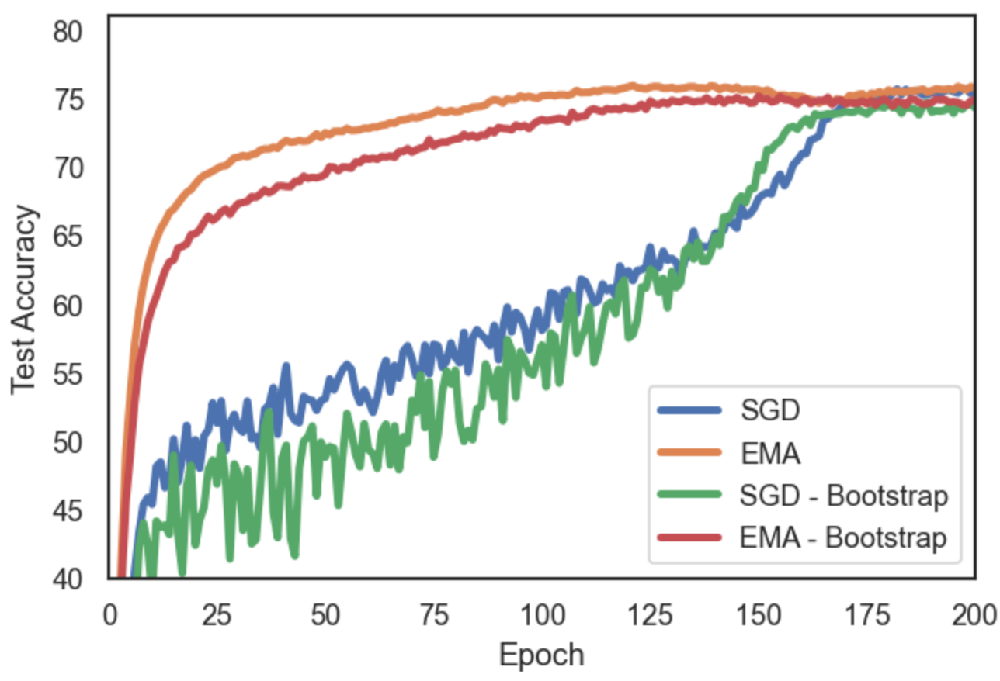 Figure 6: CIFAR-100 on ResNet-18, training on 80% split and evaluation on hold-out 20% split. The EMA is sampled every \(T=16\) steps and has a decay \(\alpha=0.992\). We compare the performance of regular SGD baseline (and its EMA) to a bootstrapped SGD (and its EMA). In particular, we bootstrap the SGD iterate with the EMA weights once every epoch.

## Appendix D Learning rate tuning for SGD vs EMA

We explore the choice of learning rate for EMA and SGD, and investigate if the optimal value is significantly different. Despite the differences in dynamics and final solution between the EMA and the base SGD sequence, we find an alignment when tuning the initial learning rate. During our hyperparameter search we find the same best initial learning rate \(\eta\) for both sequences. We hypothesize that the tuning of the learning rate affects mostly the early training stage, which allows for fast progress and benefits generalization, and is not dependent on the technique used to reduce noise for convergence at the end of training (either decaying \(\eta\) or averaging). In Fig. [7](https://arxiv.org/html/2411.18704#A4.F7 "Figure 7 ‣ Appendix D Learning rate tuning for SGD vs EMA ‣ Exponential Moving Average of Weights in Deep Learning: Dynamics and Benefits") we plot the evolution of validation accuracy during training. We observe a trend where the lower learning rate has a better accuracy in the first epochs, but peaks lower than higher learning rates.

Table 23: CIFAR-100 Validation Accuracy for SGD and EMA for different initial learning rates \(\eta\). We train on 80% split of training data and use the remaining 20% hold-out set for evaluation.

\(\eta\) | SGD Acc. | EMA Acc.  
---|---|---  
0.4 | 75.3 | 75.4  
0.8 | 75.8 | 76.1  
1.2 | 75.9 | 76.1  
1.6 | 75.1 | 75.7  
(a) ResNet-18

\(\eta\) | SGD Acc. | EMA Acc.  
---|---|---  
0.05 | 78.3 | 79.5  
0.1 | 79.0 | 80.0  
0.2 | 79.0 | 79.8  
0.4 | 76.9 | 77.5  
(b) WideResNet-28-10

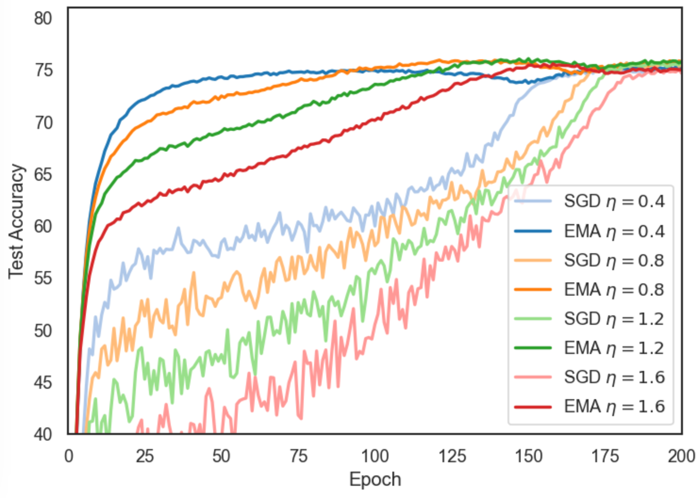 Figure 7: SGD and EMA validation accuracy for different initial values of learning rate \(\eta\).

## Appendix E Additional Label Noise Experiments

### E.1 Memorization of noisy labels

We validate this explanation with Fig. [8](https://arxiv.org/html/2411.18704#A5.F8 "Figure 8 ‣ E.1 Memorization of noisy labels ‣ Appendix E Additional Label Noise Experiments ‣ Exponential Moving Average of Weights in Deep Learning: Dynamics and Benefits"), where we see that the memorization of noisy labels is lower in the EMA model with respect to train accuracy on the clean labels. For instance, when EMA reaches \(90\%\) clean accuracy at epoch \(99\), it has memorized \(28.8\%\) of the noisy labels, while for the SGD model, in epoch \(142\), the noisy accuracy was of \(68.2\%\). Another interesting observation is that the best EMA performance is reached at epoch 100, which is when its memorization of noise starts to increase rapidly.

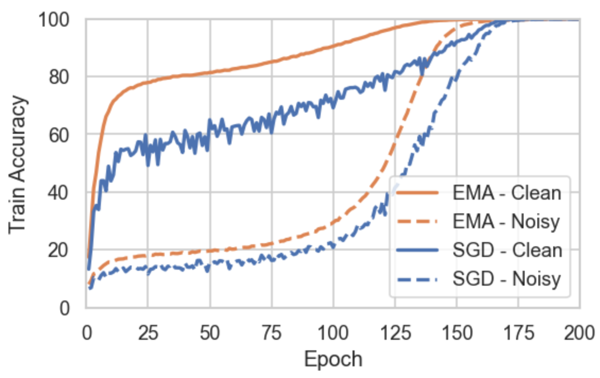 Figure 8: CIFAR-100N on ResNet-34. Accuracy on training data during training, split into Noisy (\(40\%\) of data wrong labels) Clean (remaining \(60\%\)). Both models end up by memorizing all of the noisy labels, but the EMA model fits less noise relative the accuracy on the clean samples.

### E.2 Continued training at constant Learning Rate

In the experiments training with label noise (Sec. [4.3](https://arxiv.org/html/2411.18704#S4.SS3 "4.3 Label Noise ‣ 4 Results ‣ Exponential Moving Average of Weights in Deep Learning: Dynamics and Benefits")) we found that the effect of implicit regularization in the EMA was very large, preventing memorization of noisy labels and improving test accuracy. However, to make sure that memorization and overfitting occur due to the decay of the learning rate, and not simply because of continued training, we perform the following ablation study. We present the test accuracy during training for a model with learning rate decay vs keeping the learning rate constant after the best epoch.

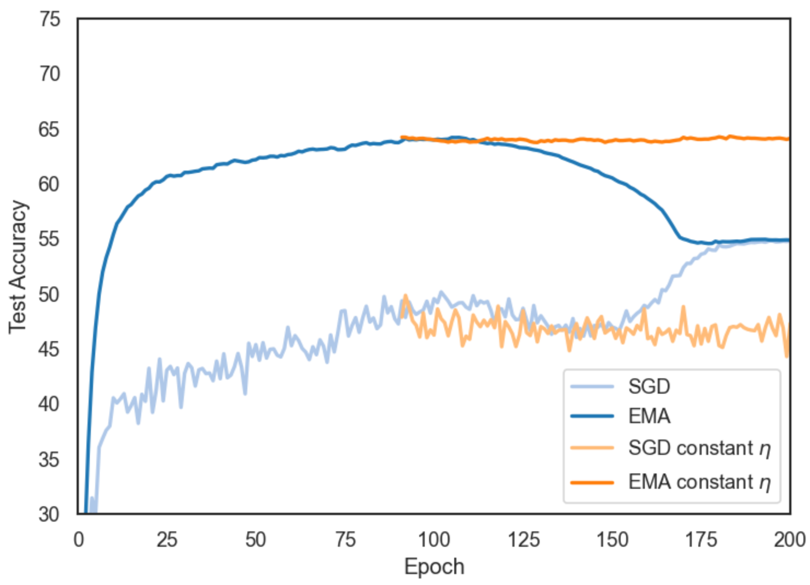 Figure 9: Test Accuracy with constant learning rate after stopping epoch (for EMA (acc.)) vs with cosine decay. Overfitting is due to learning rate decay, not continued training. Experiments with ResNet-18 on Cifar-100 (40% noise) full training set. Sliding window of 5 for smoothing of curves.

## Appendix F Detailed experimental setup

Our experimental set up follows these steps for hyperparameter tuning:

  * •

Split train set into train/validation as 80/20.

  * •

Tune hyperparamters (learning rate, early stopping epochs) on validation set. Note that for EMA we distinguish between two early stopping criteria: best accuracy and lowest loss.

  * •

Finally, train again on 100% on train data using the hyperparameters found on the validation set. Report final performance on the test set, which was not used for hyperparameter tuning. Note that this should be done for all deep learning methods, even if it is often not the case.

We fix the number of training epochs, batch size and weight decay. As for the EMA, we search for the best decay by keeping 5 parallel EMAs with \(\tau\in[0.968,0.984,0.992,0.996,0.998]\). We warmup the EMA decay in the first steps as \(\min(\alpha,\frac{t+1}{t+10})\). EMA sampling every of \(T=16\) steps (note that this affects the effective decay, see below). In Table [24](https://arxiv.org/html/2411.18704#A6.T24 "Table 24 ‣ Appendix F Detailed experimental setup ‣ Exponential Moving Average of Weights in Deep Learning: Dynamics and Benefits") we include a summary of the hyperparamter configuration. The best values for the hyperparmeters tuned on the validation set are reported in App. [B](https://arxiv.org/html/2411.18704#A2 "Appendix B Additional results ‣ Exponential Moving Average of Weights in Deep Learning: Dynamics and Benefits"). For all experiments, we report the mean of 3 independent runs.

Setting | Value  
---|---  
Optimizer | SGD with Nesterov momentum  
Momentum | 0.9  
Learning rate | Tuned on validation set  
Early stopping epochs | Tuned on validation set  
Weight Decay | ResNet: \(1\text{\times}{10}^{-4}\). WideResNet, VGG-16: \(5\text{\times}{10}^{-4}\)  
Batch size | 128  
Epochs | CIFAR-10/100: 200. Tiny-ImageNet: 150  
EMA decays | \([0.968,0.984,0.992,0.996,0.998]\)  
EMA sampling period | \(T=16\)  
Table 24: Summary of hyperparamter configuration

The decay rate \(\alpha\) for the exponential moving average governs how fast past iterations are forgotten. For the use of EMA in deep learning, we find empirically that sampling at a period \(T>1\) can reduce overhead without impact on the results. We use \(T=16\) in our implementation. However, it is important to note that changing the sampling period will affect the decay (past iterates will be reweighted once every \(T\) steps only). For this reason, to keep the same effective decay rate, the decay of the EMA sequence has to be updated as \(\alpha^{\prime}=\alpha^{T}\). In Tab. [25](https://arxiv.org/html/2411.18704#A6.T25 "Table 25 ‣ Appendix F Detailed experimental setup ‣ Exponential Moving Average of Weights in Deep Learning: Dynamics and Benefits") we include a summary of the decay rates we used at \(T=16\) and their equivalent decay rate if sampling at \(T=1\).

Table 25: Equivalence of EMA decay rate \(\alpha\) for different sampling periods. \(T=1\) | \(T=16\)  
---|---  
0.999875 | 0.998  
0.99975 | 0.996  
0.9995 | 0.992  
0.999 | 0.984  
0.998 | 0.968  
  
## Appendix G Sensitivity analysis to EMA decay rate \(\alpha\)

The decay rate \(\alpha\) is a key hyperparameter in EMA models. In this section we include a sensitivity analysis for the range of decay rates explored, which are \(\tau\in[0.968,0.984,0.992,0.996,0.998]\). We chose this range, asymptotically approaching 1, since previous works and early experiments have shown that the best averaged models have very large averaging windows, corresponding to slow decays with \(\alpha\rightarrow 1\). It is important to note that we use a sampling of \(T=16\), which affects the effective decay rate (see Appendix [F](https://arxiv.org/html/2411.18704#A6 "Appendix F Detailed experimental setup ‣ Exponential Moving Average of Weights in Deep Learning: Dynamics and Benefits")).

In Table [26](https://arxiv.org/html/2411.18704#A7.T26 "Table 26 ‣ Appendix G Sensitivity analysis to EMA decay rate 
        
          α ‣ Exponential Moving Average of Weights in Deep Learning: Dynamics and Benefits") we report the best accuracy for each decay when training on CIFAR-100 with a ResNet-18. This corresponds to Fig. [1(b)](https://arxiv.org/html/2411.18704#S3.F1.sf2 "In Figure 1 ‣ 3.2 Implicit Regularization with SGD Noise and Learning Rate Schedule ‣ 3 Insights on Weight Averaging during Training ‣ Exponential Moving Average of Weights in Deep Learning: Dynamics and Benefits"), which we include again here (Fig. [10](https://arxiv.org/html/2411.18704#A7.F10 "Figure 10 ‣ Appendix G Sensitivity analysis to EMA decay rate 
        
          α ‣ Exponential Moving Average of Weights in Deep Learning: Dynamics and Benefits")) for the convenience of the reader.

The main takeaway from Table [26](https://arxiv.org/html/2411.18704#A7.T26 "Table 26 ‣ Appendix G Sensitivity analysis to EMA decay rate 
        
          α ‣ Exponential Moving Average of Weights in Deep Learning: Dynamics and Benefits") is that the slower the decay, the later it reaches its peak performance and the higher the accuracy is. However, note that this includes Batch Norm recomputation after every epoch; if Batch Norm is not recomputed the best decay is faster. In Section [3.4](https://arxiv.org/html/2411.18704#S3.SS4 "3.4 Batch Norm Statistics and EMA decay ‣ 3 Insights on Weight Averaging during Training ‣ Exponential Moving Average of Weights in Deep Learning: Dynamics and Benefits") we discussed this phenomenon: the model weights are more robust to large averaging windows than BN statistics.

Decay rate \(\alpha\) | Best test accuracy | Epoch  
---|---|---  
0.968 | 78.04 ± 0.19 | 137  
0.984 | 78.42 ± 0.22 | 140  
0.992 | 78.81 ± 0.16 | 152  
0.996 | 79.02 ± 0.19 | 156  
0.998 | 79.06 ± 0.14 | 166  
Table 26: Best accuracy and epoch when it was reached for the EMA models with BN recomputation plotted in Fig. [10](https://arxiv.org/html/2411.18704#A7.F10 "Figure 10 ‣ Appendix G Sensitivity analysis to EMA decay rate 
        
          α ‣ Exponential Moving Average of Weights in Deep Learning: Dynamics and Benefits").  Figure 10: Breakdown of the 5 EMA models per decay (with and without BN recomputation after every epoch). EMAs with the largest averaging windows fail unless BN stats are recomputed. Sliding window of 5 used for smoothing. All results are the mean of 3 runs.
