**Source:** *Early Weight Averaging meets High Learning Rates for LLM Pre-training* — [PDF](https://arxiv.org/pdf/2306.03241) · [arXiv](https://arxiv.org/abs/2306.03241)

# Early Weight Averaging meets High Learning Rates for LLM Pre-training

Sunny Sanyal Thanks: These authors contributed equally to this work. Correspondence to sanyal.sunny@utexas.edu  Affiliation: UT Austin  Atula Neerkaje11footnotemark:  1 Affiliation: UT Austin  Jean Kaddour Affiliation: UCL  Abhishek Kumar Affiliation: Google DeepMind  Sujay Sanghavi Affiliation: UT Austin 

###### Abstract

Training Large Language Models (LLMs) incurs significant cost; hence, any strategy that accelerates model convergence is helpful. In this paper, we investigate the ability of a simple idea – checkpoint averaging along the trajectory of a training run – to improve both convergence and generalization quite early during training. Here we show that models trained with high learning rates observe higher gains due to checkpoint averaging. Furthermore, these gains are amplified when checkpoints are sampled with considerable spacing in training steps. Our training recipe outperforms conventional training and popular checkpoint averaging baselines such as exponential moving average (EMA) and stochastic moving average (SWA). We evaluate our training recipe by pre-training LLMs, where high learning rates are inherently preferred due to extremely large batch sizes. Specifically, we pre-trained nanoGPT-2 models of varying sizes—small (125M), medium (335M), and large (770M)—on the OpenWebText dataset, comprised of 9B tokens. Additionally, we present results for publicly available Pythia LLMs, ranging from 1B to 12B, which were trained on the PILE-deduped dataset containing 207B tokens. Code is available at <https://github.com/sanyalsunny111/Early_Weight_Avg>.

## 1 Introduction

Large Language Models (LLMs) have made a significant leap from billion to trillion scale, both in terms of parameters [[5](https://arxiv.org/html/2306.03241#bib.bib5), [31](https://arxiv.org/html/2306.03241#bib.bib31)] and pre-training data size [[11](https://arxiv.org/html/2306.03241#bib.bib11)] [[37](https://arxiv.org/html/2306.03241#bib.bib37), [38](https://arxiv.org/html/2306.03241#bib.bib38)]. This surge in both data and model size has rendered LLM pre-training increasingly slow and resource-intensive. For instance, a Llama 2 70B model trained with 2T tokens took 1720K GPU hours to train. To accelerate the training process, it is a popular practice in LLM pre-training [[3](https://arxiv.org/html/2306.03241#bib.bib3), [37](https://arxiv.org/html/2306.03241#bib.bib37)] to utilize exceptionally large batch sizes, thereby ensuring maximal GPU utilization. The usage of large batch sizes requires scaling the learning rates proportional to it’s batchsize [[9](https://arxiv.org/html/2306.03241#bib.bib9)], [[18](https://arxiv.org/html/2306.03241#bib.bib18)] for SGD or proportional to the square root of it’s batch size for adaptive gradient methods [[24](https://arxiv.org/html/2306.03241#bib.bib24)]. Overall, high learning rates are preferred when utilizing large batch sizes.

In this paper, our goal is to improve the test generalization (log perplexity) of LLM pre-training while reducing the number of training steps, all without increasing the compute budget. To achieve this, we first demonstrate that: (a) models trained with higher learning rates exhibit greater improvements when averaged along the training trajectory, and (b) averaging distant model weights from a single training trajectory further amplifies these gains. We integrate these two insights to adapt LAWA (LAtest Weight Averaging) [[14](https://arxiv.org/html/2306.03241#bib.bib14)]—a technique that performs checkpoint averaging throughout a training trajectory using a sliding window—for pre-training LLMs.

We evaluate our methodology by pre-training nanoGPT-2 models of various scales, specifically 125M (small), 355M (medium), and 770M (large), using the OpenWebText dataset, which comprises 9B tokens. The experiments with nanoGPT-2 are conducted in a controlled environment to gain a deeper understanding of our training recipe. Furthermore, we extend our evaluation to publicly available Pythia LLMs [[3](https://arxiv.org/html/2306.03241#bib.bib3)], which include model sizes of 1B, 2.8B, 6.9B, and 12B, trained using 207B tokens. Our experiments with Pythia LLMs aim to demonstrate the impact of our work on real-world LLMs.

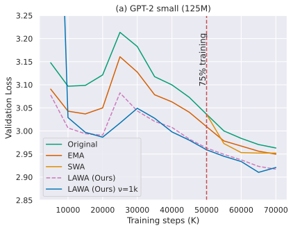

 (a) 

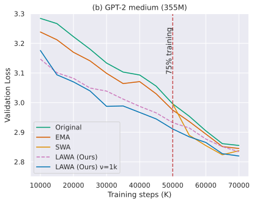

 (b) 

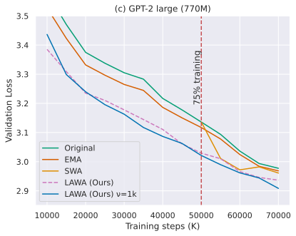

 (c) 

Figure 1: Across all model sizes, LAWA achieves faster convergence and generalizes better in comparison to original pretraining run and other baseline averaging schemes. Validation loss on OpenWebText with 70K training steps; (a) GPT2-small (125M) with Original is 2.963, EMA is 2.949, SWA is 2.952 and LAWA (ours-best) is 2.917, (b) GPT2-medium (355M) with Original is 2.855, EMA is 2.845, SWA is 2.837 and LAWA (ours-best) is 2.819, and (c) GPT2-large (770M) with Original is 2.977, EMA is 2.968, SWA is 2.961 and LAWA (ours-best) is 2.908.

#### Main Contributions.

In summary, our findings are as follows,

  1. We empirically show that models trained with high learning rate (LR) show pronounced gains over original training on performing checkpoint averaging very early on during training (Figure [2](https://arxiv.org/html/2306.03241#S1.F2 "Figure 2 ‣ Paper outline. ‣ 1 Introduction ‣ Early Weight Averaging meets High Learning Rates for LLM Pre-training")). This gain further amplifies when we sample distant checkpoints in the training run (Figure [1](https://arxiv.org/html/2306.03241#S1.F1 "Figure 1 ‣ 1 Introduction ‣ Early Weight Averaging meets High Learning Rates for LLM Pre-training")). We provide a intuitive explanation of this phenomenon in Section [2](https://arxiv.org/html/2306.03241#S2 "2 Intuition and Method ‣ Early Weight Averaging meets High Learning Rates for LLM Pre-training"). 
  2. We observe that the training trajectory of LAWA closely mimics that of a model being trained with a low LR. The primary advantage of LAWA is that it allows LLMs to be trained with high LR without compromising generalization (Section [4](https://arxiv.org/html/2306.03241#S4 "4 Results ‣ Early Weight Averaging meets High Learning Rates for LLM Pre-training")). 
  3. We show that LAWA improves test generalization with fewer training steps compared to original training starting very early on during training; for both nanoGPT-2 and Pythia LLMs (Figure [1](https://arxiv.org/html/2306.03241#S1.F1 "Figure 1 ‣ 1 Introduction ‣ Early Weight Averaging meets High Learning Rates for LLM Pre-training") and Figures [5](https://arxiv.org/html/2306.03241#S4.F5 "Figure 5 ‣ LLMs trained with higher LRs observe higher gains with LAWA. ‣ 4.1 Exploring LLM pre-training with nanoGPT-2 at small scale ‣ 4 Results ‣ Early Weight Averaging meets High Learning Rates for LLM Pre-training")-[8](https://arxiv.org/html/2306.03241#S4.F8 "Figure 8 ‣ 4.2 Scaling to Billion parameter Pythia LLMs ‣ 4 Results ‣ Early Weight Averaging meets High Learning Rates for LLM Pre-training")). LAWA also improves zero-shot performance for nanoGPT-2 and Pythia LLMs, as shown in Table [2](https://arxiv.org/html/2306.03241#S4.T2 "Table 2 ‣ LLMs trained with higher LRs observe higher gains with LAWA. ‣ 4.1 Exploring LLM pre-training with nanoGPT-2 at small scale ‣ 4 Results ‣ Early Weight Averaging meets High Learning Rates for LLM Pre-training"), [3](https://arxiv.org/html/2306.03241#S4.T3 "Table 3 ‣ LLMs trained with higher LRs observe higher gains with LAWA. ‣ 4.1 Exploring LLM pre-training with nanoGPT-2 at small scale ‣ 4 Results ‣ Early Weight Averaging meets High Learning Rates for LLM Pre-training"). 
  4. We compare our recipe with conventional training and popular baselines such as Exponential Moving Average - EMA [[35](https://arxiv.org/html/2306.03241#bib.bib35)] and Stochastic Weight Averaging - SWA [[12](https://arxiv.org/html/2306.03241#bib.bib12)]. These baselines were not originally proposed or evaluated for LLM pre-training, but we adapt them to set meaningful baselines. Our training recipe outperforms conventional pre-training, EMA, and SWA. 
  5. Additionally, we perform a preliminary investigation of early weight averaging for a diffusion model for image generation (specifically, a 422M sized UNet model trained with the standard DDPM objective [[10](https://arxiv.org/html/2306.03241#bib.bib10)]). We observe thematically similar improvements (evaluated by the FID metric) as shown in Figure [9](https://arxiv.org/html/2306.03241#S4.F9 "Figure 9 ‣ 4.3 Improved Zero-shot performance ‣ 4 Results ‣ Early Weight Averaging meets High Learning Rates for LLM Pre-training"). 

#### Paper outline.

The structure of the remainder of this paper is as follows: Initially, we introduce the problem with a simple example and explain the intuition behind our approach in Section [2](https://arxiv.org/html/2306.03241#S2 "2 Intuition and Method ‣ Early Weight Averaging meets High Learning Rates for LLM Pre-training"). This is followed by a detailed description of our experimental setup in Section [3](https://arxiv.org/html/2306.03241#S3 "3 Experimental Setup ‣ Early Weight Averaging meets High Learning Rates for LLM Pre-training"), and the presentation of our main findings in Section [4](https://arxiv.org/html/2306.03241#S4 "4 Results ‣ Early Weight Averaging meets High Learning Rates for LLM Pre-training"). Subsequently, we compare our work with previous studies in Section [5](https://arxiv.org/html/2306.03241#S5 "5 Related work ‣ Early Weight Averaging meets High Learning Rates for LLM Pre-training"). The paper concludes with a summary of our key findings and suggests possible avenues for future research.

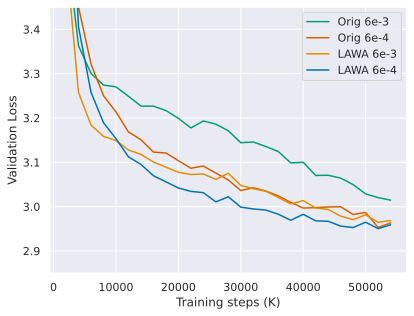

 (a) 

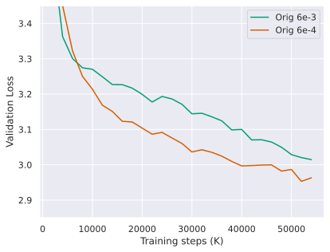

 (b) 

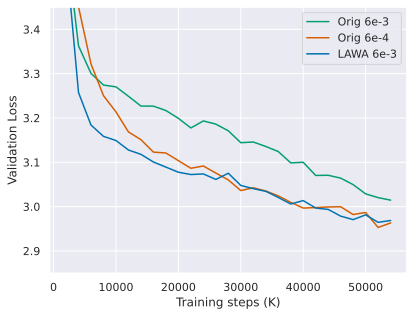

 (c) 

Figure 2: We compare two independently trained nanoGPT-2 (125M) models with LR \(=[\mathsf{6\times 10^{-3}},\mathsf{6\times 10^{-4}}]\) on OpenWebText data. (a) Pre-training curve with and without LAWA. LLMs trained with higher LR observes higher gain due to LAWA. (b) The model trained with a high LR generalizes poorly compared to its counterpart trained with low/tuned LR. (c) The generalization gap caused by the high LR is effectively mitigated by LAWA.

## 2 Intuition and Method

### 2.1 Toy Setting

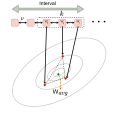

 Figure 3: LAWA illustration: Given weights \(\mathsf{W}_{1},\mathsf{W}_{2},...\mathsf{W_{k}}\) from a high LR trajectory separated by k-stepsize (\(\nu\), Algorithm [1](https://arxiv.org/html/2306.03241#algorithm1 "Algorithm 1 ‣ 3 Experimental Setup ‣ Early Weight Averaging meets High Learning Rates for LLM Pre-training")), LAWA computes \(\mathsf{W}_{avg}\) at a given step.22 2 Note that \(\mathsf{W}\) refers to the set of weights \(\{w_{1},w_{2},...\}\).

We explain the setting using a simple toy problem of minimizing a two-dimensional loss function, represented as \(L(w_{1},w_{2})\), where \(w_{1}\) and \(w_{2}\) are the parameters of the model. In this scenario, there exists an optimal batch size, \(\mathcal{B}_{0}\), and an optimal learning rate, \(\eta_{0}\), that minimizes the loss function. Assuming, for reasons outlined in Section [1](https://arxiv.org/html/2306.03241#S1 "1 Introduction ‣ Early Weight Averaging meets High Learning Rates for LLM Pre-training"), we are compelled to use a batch size, \(\mathcal{B}\), and a learning rate, \(\eta\), such that both are significantly larger than their optimal counterparts, i.e., \(\mathcal{B}\gg\mathcal{B}_{0}\) and \(\eta\gg\eta_{0}\) respectively. Suppose also that the loss function \(L(w_{1},w_{2})\) exhibits a much higher curvature along \(w_{1}\), as compared to \(w_{2}\). It is widely known that the updates from the AdamW optimizer are mostly uniform across all weight dimensions [[23](https://arxiv.org/html/2306.03241#bib.bib23)]. When \(\eta\gg\eta_{0}\) the weight updates of \(w_{2}\) will be accelerated, however this will cause oscillations along \(w_{1}\) which in a long run adversely affects the convergence of \(w_{1}\). A naive approach to mitigate this problem is to use a smaller LR or decay LR to 0, which might hinder progress in flatter regions. It is conceivable that a LLM might exhibit extremely heterogeneous curvatures exacerbating this issue during pre-training.

### 2.2 Intuition of Our Approach

#### Optimization Viewpoint.

We propose performing checkpoint averaging of model weights relatively early during training with high learning rates (\(\eta\)). The rationale behind this step stems from the fact that checkpoint averaging serves as a surrogate to LR decay, as demonstrated by [Sandler et al. 2023](https://arxiv.org/html/2306.03241#bib.bib33). However, this surrogate LR decay is decoupled from the weight update during optimization, as checkpoint averaging is conducted in a post-hoc manner. Employing this simple technique, we mitigate the oscillations in \(w_{1}\) while swiftly traversing through \(w_{2}\), achieving enhanced generalization in fewer training steps as illustrated in Figure [2](https://arxiv.org/html/2306.03241#footnote2 "footnote 2 ‣ Figure 3 ‣ 2.1 Toy Setting ‣ 2 Intuition and Method ‣ Early Weight Averaging meets High Learning Rates for LLM Pre-training").

#### Diversity Viewpoint.

The practice of averaging the weights of model checkpoints is broadly recognized as being functionally analogous to ensembling [[12](https://arxiv.org/html/2306.03241#bib.bib12), [40](https://arxiv.org/html/2306.03241#bib.bib40)]. In model ensembling literature it is well established that diverse models improve the performance of the ensemble [[19](https://arxiv.org/html/2306.03241#bib.bib19)]. Therefore, it is fair to assume that this principle also applies to model averaging as well. In our context, we define the diversity of a model at two distinct training steps, \(\frac{1}{N}\sum_{i=1}^{N}\mathbf{1}\left[y_{i}^{\mathsf{W}_{1}}\neq y_{i}^{\mathsf{W}_{2}}\right]\) which calculates the number of disagreements between the two checkpoints. This equation computes the number of samples from the same held-out set where the checkpoint \(\mathsf{W}_{1}\) disagrees with checkpoint \(\mathsf{W}_{2}\). A recent study by [Athiwaratkun et al. 2018a](https://arxiv.org/html/2306.03241#bib.bib1) has demonstrated that a higher LR can result in the generation of diverse model checkpoints. We observed (Figure [1](https://arxiv.org/html/2306.03241#S1.F1 "Figure 1 ‣ 1 Introduction ‣ Early Weight Averaging meets High Learning Rates for LLM Pre-training")) that this phenomenon can be further amplified by sampling far apart checkpoints in terms of training step. We combine both these insights to induce diversity in our checkpoints.

### 2.3 LAWA: LAtest Weight Averaging

We explain the Latest Weight Averaging (LAWA) algorithm below along with a python-style pseudo code (Algorithm [1](https://arxiv.org/html/2306.03241#algorithm1 "Algorithm 1 ‣ 3 Experimental Setup ‣ Early Weight Averaging meets High Learning Rates for LLM Pre-training")). As shown in Figure [2](https://arxiv.org/html/2306.03241#footnote2 "footnote 2 ‣ Figure 3 ‣ 2.1 Toy Setting ‣ 2 Intuition and Method ‣ Early Weight Averaging meets High Learning Rates for LLM Pre-training"), LAWA maintains a first in first out (FIFO) queue of periodically sampled checkpoints with a large number of intervening steps (\(\nu\)) in between two succesive samples. We adapt LAWA for our setting with minor modifications. Specifically, we introduce \(\mathsf{k\_stepsize}\) (\(\nu\)), and decoupled \(\mathsf{interval}\) and \(\mathsf{k}\) to effectively sample distant checkpoints in the training run. The original LAWA algorithm [[14](https://arxiv.org/html/2306.03241#bib.bib14)] assumes \(\mathsf{interval}\) = \(\mathsf{k}\).

 

## 3 Experimental Setup

Algorithm 1 LAWA: Pytorch-style pseudocode

⬇

def LAWA(ckpts, interval, k, k_stepsize):

# ckpts: list of checkpoints

# k: number of checkpoints to average

# k_stepsize: distance in training steps between checkpoints

averaged_ckpts = []

for i in range(0, len(ckpts), interval):

start_idx = i - k

end_idx = i - 1

# select last k checkpoints

# with k_stepsize between each checkpoint.

selected_ckpts = ckpts[end_idx-k+1:end_idx+1:k_stepsize]

avg = average(selected_ckpts)

averaged_ckpts.append(avg)

return averaged_ckpts

#### NanoGPT-2 Experiments.

We conduct all our experiments utilizing autoregressive decoder-style Large Language Models (LLMs), specifically nanoGPT-2 and Pythia LLMs. We utilize three distinct sizes of nanoGPT-2 models: small (125M), medium (355M), and large (770M). We train nanoGPT-2 models from scratch using the OpenWebText dataset, which includes 9 billion training tokens and 4.4 million validation tokens. Throughout the experiments, we maintain a consistent sequence length of 1024 and a fixed batch size of 131K tokens per batch, the latter being the maximum batch size accommodated by our GPUs. The configurations for the model and pre-training were adapted from Sophia’s [[23](https://arxiv.org/html/2306.03241#bib.bib23)] AdamW baseline, with adjustments made to the learning rate and batch size to align with our specific needs. Notably, we trained all the models with learning rates that were ten times higher and batch sizes that were twice as large compared to the configurations in [[23](https://arxiv.org/html/2306.03241#bib.bib23)], where the learning rate was tuned through a grid search. We compare LAWA with the original pre-training recipe, EMA [[35](https://arxiv.org/html/2306.03241#bib.bib35)], and SWA [[12](https://arxiv.org/html/2306.03241#bib.bib12)], which we adapt for LLMs. For EMA, we set the decay to 0.9 as per [[14](https://arxiv.org/html/2306.03241#bib.bib14)] and update the EMA model at every step, which is a standard practice. For SWA, we adhere to the original pre-training procedure until 75% completion, after which SWA training is initiated with a new SWA scheduler (cosine annealing). We compute the SWA uniform average every 10 steps.

#### Pythia Experiments.

The Pythia LLMs are publicly available in the Pythia suite [[3](https://arxiv.org/html/2306.03241#bib.bib3)]. We report results on Pythia-1B, Pythia-2.8B, Pythia-6.9B, and Pythia-12B; Table.[1](https://arxiv.org/html/2306.03241#S3.T1 "Table 1 ‣ Pythia Experiments. ‣ 3 Experimental Setup ‣ Early Weight Averaging meets High Learning Rates for LLM Pre-training") summarizes the details of these models. For our experiments, we use intermediate model checkpoints; saved after every 1000 update steps. The models are trained by [Biderman et al. 2023](https://arxiv.org/html/2306.03241#bib.bib3) on the PILE dataset [[8](https://arxiv.org/html/2306.03241#bib.bib8)], a publicly available, curated collection of English text corpus of size 800GB. The original PILE dataset is curated using 5 different genres of data namely, academia, internet, prose, dialogue and miscellaneous. The PILE dataset contains 300 billion tokens prior to deduplication, and this number reduces to 207 billion tokens after the deduplication process. Our experiments use Pythia models trained with PILE-deduped dataset, as such models tend to memorize less [[21](https://arxiv.org/html/2306.03241#bib.bib21)]. The batch size for all the Pythia models was set at 2.09 million tokens and the learning rate was scaled following [[44](https://arxiv.org/html/2306.03241#bib.bib44)].

Model Size | Layers | Hidden Size | Heads | Learning Rate | Equivalent Models  
---|---|---|---|---|---  
125M | 12 | 12 | 768 | \(6.0\times 10^{-3}\) | nanoGPT-2 (small)  
335M | 24 | 1024 | 16 | \(3.0\times 10^{-3}\) | nanoGPT-2 (medium)  
770 M | 36 | 1280 | 20 | \(2.0\times 10^{-3}\) | nanoGPT-2 (large)  
1.0 B | 16 | 2048 | 8 | \(3.0\times 10^{-4}\) | —  
2.8 B | 32 | 2560 | 32 | \(1.6\times 10^{-4}\) | GPT-Neo 2.7B, OPT-2.7B  
6.9 B | 32 | 4096 | 32 | \(1.2\times 10^{-4}\) | OPT-6.7B  
12 B | 36 | 5120 | 40 | \(1.2\times 10^{-4}\) | —

 Table 1: Overview of models and their architecture from the nanoGPT-2 suite and Pythia suite [[3](https://arxiv.org/html/2306.03241#bib.bib3)] used in our experiments. The model nomenclature for Pythia LLMs is pythia-xx with model size. Models marked as “equivalent” have the same architecture and number of non-embedding parameters. 

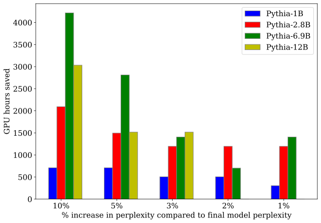

 Figure 4: LAWA saves significant amount of GPU hours compared to original training. We compare the savings in GPU hours as a function of increase in final perplexity, i.e. perplexity achieved at 141K training step by the original checkpoint. This plot is created using a held out set from the training subset PILE-philosophy papers.

#### Evaluation

We evaluate the language modelling performance of nanoGPT-2 models pre-trained for 70K steps using log perplexity (perplexity and loss used interchangeably) on the held-out/val set. For nanoGPT-2 we use the moving window \(\mathsf{interval}=\text{1K}\), \(\mathsf{k}\) = 5 and we sample checkpoints \(\mathsf{interval}=\text{200,1K}\) apart for LAWA. Next we analyze the original training trajectories of Pythia LLMs and demonstrate the improvements achieved in test generalization using \(\mathsf{LAWA}\). We also present zero-shot evaluation results on Lambada OpenAI [[27](https://arxiv.org/html/2306.03241#bib.bib27)], SciQ [[39](https://arxiv.org/html/2306.03241#bib.bib39)], AI2 Reasoning Challenge-easy (ARC-e) [[6](https://arxiv.org/html/2306.03241#bib.bib6)], and Wikitext [[25](https://arxiv.org/html/2306.03241#bib.bib25)]. We evaluate 4 Pythia LLMs using the intermediate model checkpoints on a subset of the test and validation dataset following the methodology prescribed by [[42](https://arxiv.org/html/2306.03241#bib.bib42)]. For the purpose of evaluation we use the open source library lm-evaluation harness33 3 https://github.com/EleutherAI/lm-evaluation-harness. We select representative subsets from the diverse genres encompassed by the full PILE validation and test dataset. This subset comprises PILE-philosophy papers, PILE-bookcorpus2, and PILE-YouTube subtitles datasets.

We conduct zero-shot evaluation on the Pythia LLMs. For zero-shot evaluation we provide a natural language description of the downstream task, along with a textual example. The models then generate responses that are either open-ended or discriminatively select a proposed answer. This evaluation setup serves as a robust academic benchmark, as it assesses Pythia models of various scales on reasonably large PILE subsets and downstream datasets, both in terms of test performance and zero-shot. For both the test generalization and zero-shot experiments, we evaluate model checkpoints starting 21K steps to 141K steps (recall that subsequent checkpoints are 1K steps apart). Moreover, we choose to slide the averaging window at 3K steps (i.e. \(\mathsf{interval}=\text{3K}\)) and average last \(\mathsf{k}\) intermediate checkpoints as discussed in LAWA algorithm (Algorithm [1](https://arxiv.org/html/2306.03241#algorithm1 "Algorithm 1 ‣ 3 Experimental Setup ‣ Early Weight Averaging meets High Learning Rates for LLM Pre-training")). Our selection of LAWA parameters such as \(\mathsf{k}\) = 5 and start step = 21K are based on the experiments discussed in Section [B.1](https://arxiv.org/html/2306.03241#A2.SS1 "B.1 Ablations ‣ Appendix B Supplementary Experiments and Results ‣ Early Weight Averaging meets High Learning Rates for LLM Pre-training").

## 4 Results

### 4.1 Exploring LLM pre-training with nanoGPT-2 at small scale

#### LLMs trained with higher LRs observe higher gains with LAWA.

We ran controlled experiments to better understand the correlation between LR and gains due to checkpoint averaging. Initially we train nanoGPT-2 small with two different LRs \((\mathsf{6\times 10^{-3}},\mathsf{6\times 10^{-4}})\), keeping batch size and all relevant hyperparameters the same. \(\mathsf{6\times 10^{-4}}\) is the assumed optimal LR computed using a grid search reported in [[23](https://arxiv.org/html/2306.03241#bib.bib23)]. Subsequently, we pre-trained the same model using an LR of \(\mathsf{6\times 10^{-3}}\), which is tenfold higher in magnitude than the former. As shown in Figure [2](https://arxiv.org/html/2306.03241#S1.F2 "Figure 2 ‣ Paper outline. ‣ 1 Introduction ‣ Early Weight Averaging meets High Learning Rates for LLM Pre-training")(a), models trained with higher LR observe higher gains compared to its counterpart trained with lower LR due to post hoc checkpoint averaging in LAWA. From Figure [2](https://arxiv.org/html/2306.03241#S1.F2 "Figure 2 ‣ Paper outline. ‣ 1 Introduction ‣ Early Weight Averaging meets High Learning Rates for LLM Pre-training")(b) we observe that the model trained with a higher LR converges faster but compromises on generalization, a phenomenon also observed by [[16](https://arxiv.org/html/2306.03241#bib.bib16)]. The gap in generalization is effectively mitigated by checkpoint averaging through LAWA, as shown in Figure [2](https://arxiv.org/html/2306.03241#S1.F2 "Figure 2 ‣ Paper outline. ‣ 1 Introduction ‣ Early Weight Averaging meets High Learning Rates for LLM Pre-training")(c). Interestingly, we note that the training trajectory of LAWA approximates that of a model trained with a lower LR. This is an important insight: checkpoint averaging acts as a surrogate for LR decay, thereby enabling the model to be trained with a higher LR. In practical LLM pre-training scenarios, where conducting a grid search is challenging due to the model’s size, adopting our proposed training recipe could be advantageous. One might select a higher LR (that doesn’t cause divergence) and train an LLM faster without compromising much generalization compared to conventional pre-training strategy.

<table id="S4.T2.2.1" class="ltx_tabular ltx_guessed_headers ltx_align_middle">
<thead class="ltx_thead">
<tr id="S4.T2.2.1.1" class="ltx_tr">
<th id="S4.T2.2.1.1.1" class="ltx_td ltx_align_left ltx_th ltx_th_column ltx_border_tt" style="padding-left:3.0pt;padding-right:3.0pt;" rowspan="2">Models</th>
<th id="S4.T2.2.1.1.2" class="ltx_td ltx_align_center ltx_th ltx_th_column ltx_border_tt" style="padding-left:3.0pt;padding-right:3.0pt;" colspan="2">Steps</th>
<th id="S4.T2.2.1.1.3" class="ltx_td ltx_align_center ltx_th ltx_th_column ltx_border_tt" style="padding-left:3.0pt;padding-right:3.0pt;" colspan="2">Lambada openai</th>
<th id="S4.T2.2.1.1.4" class="ltx_td ltx_align_center ltx_th ltx_th_column ltx_border_tt" style="padding-left:3.0pt;padding-right:3.0pt;" colspan="2">ARC-easy</th>
<th id="S4.T2.2.1.1.5" class="ltx_td ltx_align_center ltx_th ltx_th_column ltx_border_tt" style="padding-left:3.0pt;padding-right:3.0pt;" colspan="2">SciQ</th>
<th id="S4.T2.2.1.1.6" class="ltx_td ltx_align_center ltx_th ltx_th_column ltx_border_tt" style="padding-left:3.0pt;padding-right:3.0pt;" colspan="2">BoolQ</th>
<th id="S4.T2.2.1.1.7" class="ltx_td ltx_align_center ltx_th ltx_th_column ltx_border_tt" style="padding-left:3.0pt;padding-right:3.0pt;" colspan="2">Average</th></tr>
<tr id="S4.T2.2.1.2" class="ltx_tr">
<th id="S4.T2.2.1.2.1" class="ltx_td ltx_th ltx_th_column ltx_border_t" style="padding-left:3.0pt;padding-right:3.0pt;"></th>
<th id="S4.T2.2.1.2.2" class="ltx_td ltx_th ltx_th_column ltx_border_t" style="padding-left:3.0pt;padding-right:3.0pt;"></th>
<th id="S4.T2.2.1.2.3" class="ltx_td ltx_align_center ltx_th ltx_th_column ltx_border_t" style="padding-left:3.0pt;padding-right:3.0pt;">LAWA</th>
<th id="S4.T2.2.1.2.4" class="ltx_td ltx_align_center ltx_th ltx_th_column ltx_border_t" style="padding-left:3.0pt;padding-right:3.0pt;">Original</th>
<th id="S4.T2.2.1.2.5" class="ltx_td ltx_align_center ltx_th ltx_th_column ltx_border_t" style="padding-left:3.0pt;padding-right:3.0pt;">LAWA</th>
<th id="S4.T2.2.1.2.6" class="ltx_td ltx_align_center ltx_th ltx_th_column ltx_border_t" style="padding-left:3.0pt;padding-right:3.0pt;">Original</th>
<th id="S4.T2.2.1.2.7" class="ltx_td ltx_align_center ltx_th ltx_th_column ltx_border_t" style="padding-left:3.0pt;padding-right:3.0pt;">LAWA</th>
<th id="S4.T2.2.1.2.8" class="ltx_td ltx_align_center ltx_th ltx_th_column ltx_border_t" style="padding-left:3.0pt;padding-right:3.0pt;">Original</th>
<th id="S4.T2.2.1.2.9" class="ltx_td ltx_align_center ltx_th ltx_th_column ltx_border_t" style="padding-left:3.0pt;padding-right:3.0pt;">LAWA</th>
<th id="S4.T2.2.1.2.10" class="ltx_td ltx_align_center ltx_th ltx_th_column ltx_border_t" style="padding-left:3.0pt;padding-right:3.0pt;">Original</th>
<th id="S4.T2.2.1.2.11" class="ltx_td ltx_align_center ltx_th ltx_th_column ltx_border_t" style="padding-left:3.0pt;padding-right:3.0pt;">LAWA</th>
<th id="S4.T2.2.1.2.12" class="ltx_td ltx_align_center ltx_th ltx_th_column ltx_border_t" style="padding-left:3.0pt;padding-right:3.0pt;">Original</th></tr>
</thead>
<tbody class="ltx_tbody">
<tr id="S4.T2.2.1.3" class="ltx_tr">
<td id="S4.T2.2.1.3.1" class="ltx_td ltx_align_left ltx_border_t" style="padding-left:3.0pt;padding-right:3.0pt;">nanoGPT-2(125M)</td>
<td id="S4.T2.2.1.3.2" class="ltx_td ltx_border_t" style="padding-left:3.0pt;padding-right:3.0pt;"></td>
<td id="S4.T2.2.1.3.3" class="ltx_td ltx_align_left ltx_border_t" style="padding-left:3.0pt;padding-right:3.0pt;">50 K</td>
<td id="S4.T2.2.1.3.4" class="ltx_td ltx_align_center ltx_border_t" style="padding-left:3.0pt;padding-right:3.0pt;">33.77</td>
<td id="S4.T2.2.1.3.5" class="ltx_td ltx_align_center ltx_border_t" style="padding-left:3.0pt;padding-right:3.0pt;">27.65</td>
<td id="S4.T2.2.1.3.6" class="ltx_td ltx_align_center ltx_border_t" style="padding-left:3.0pt;padding-right:3.0pt;">44.65</td>
<td id="S4.T2.2.1.3.7" class="ltx_td ltx_align_center ltx_border_t" style="padding-left:3.0pt;padding-right:3.0pt;">44.07</td>
<td id="S4.T2.2.1.3.8" class="ltx_td ltx_align_center ltx_border_t" style="padding-left:3.0pt;padding-right:3.0pt;">74.10</td>
<td id="S4.T2.2.1.3.9" class="ltx_td ltx_align_center ltx_border_t" style="padding-left:3.0pt;padding-right:3.0pt;">71.60</td>
<td id="S4.T2.2.1.3.10" class="ltx_td ltx_align_center ltx_border_t" style="padding-left:3.0pt;padding-right:3.0pt;">52.08</td>
<td id="S4.T2.2.1.3.11" class="ltx_td ltx_align_center ltx_border_t" style="padding-left:3.0pt;padding-right:3.0pt;">48.26</td>
<td id="S4.T2.2.1.3.12" class="ltx_td ltx_align_center ltx_border_t" style="padding-left:3.0pt;padding-right:3.0pt;">51.15</td>
<td id="S4.T2.2.1.3.13" class="ltx_td ltx_align_center ltx_border_t" style="padding-left:3.0pt;padding-right:3.0pt;">47.89</td></tr>
<tr id="S4.T2.2.1.4" class="ltx_tr">
<td id="S4.T2.2.1.4.1" class="ltx_td" style="padding-left:3.0pt;padding-right:3.0pt;"></td>
<td id="S4.T2.2.1.4.2" class="ltx_td" style="padding-left:3.0pt;padding-right:3.0pt;"></td>
<td id="S4.T2.2.1.4.3" class="ltx_td ltx_align_left" style="padding-left:3.0pt;padding-right:3.0pt;">70 K</td>
<td id="S4.T2.2.1.4.4" class="ltx_td ltx_align_center" style="padding-left:3.0pt;padding-right:3.0pt;">35.57</td>
<td id="S4.T2.2.1.4.5" class="ltx_td ltx_align_center" style="padding-left:3.0pt;padding-right:3.0pt;">33.57</td>
<td id="S4.T2.2.1.4.6" class="ltx_td ltx_align_center" style="padding-left:3.0pt;padding-right:3.0pt;">44.65</td>
<td id="S4.T2.2.1.4.7" class="ltx_td ltx_align_center" style="padding-left:3.0pt;padding-right:3.0pt;">44.36</td>
<td id="S4.T2.2.1.4.8" class="ltx_td ltx_align_center" style="padding-left:3.0pt;padding-right:3.0pt;">75.8</td>
<td id="S4.T2.2.1.4.9" class="ltx_td ltx_align_center" style="padding-left:3.0pt;padding-right:3.0pt;">74.6</td>
<td id="S4.T2.2.1.4.10" class="ltx_td ltx_align_center" style="padding-left:3.0pt;padding-right:3.0pt;">54.31</td>
<td id="S4.T2.2.1.4.11" class="ltx_td ltx_align_center" style="padding-left:3.0pt;padding-right:3.0pt;">54.43</td>
<td id="S4.T2.2.1.4.12" class="ltx_td ltx_align_center" style="padding-left:3.0pt;padding-right:3.0pt;">52.5</td>
<td id="S4.T2.2.1.4.13" class="ltx_td ltx_align_center" style="padding-left:3.0pt;padding-right:3.0pt;">51.74</td></tr>
<tr id="S4.T2.2.1.5" class="ltx_tr">
<td id="S4.T2.2.1.5.1" class="ltx_td ltx_align_left ltx_border_t" style="padding-left:3.0pt;padding-right:3.0pt;">nanoGPT-2(335M)</td>
<td id="S4.T2.2.1.5.2" class="ltx_td ltx_border_t" style="padding-left:3.0pt;padding-right:3.0pt;"></td>
<td id="S4.T2.2.1.5.3" class="ltx_td ltx_align_left ltx_border_t" style="padding-left:3.0pt;padding-right:3.0pt;">50 K</td>
<td id="S4.T2.2.1.5.4" class="ltx_td ltx_align_center ltx_border_t" style="padding-left:3.0pt;padding-right:3.0pt;">35.88</td>
<td id="S4.T2.2.1.5.5" class="ltx_td ltx_align_center ltx_border_t" style="padding-left:3.0pt;padding-right:3.0pt;">30.95</td>
<td id="S4.T2.2.1.5.6" class="ltx_td ltx_align_center ltx_border_t" style="padding-left:3.0pt;padding-right:3.0pt;">44.74</td>
<td id="S4.T2.2.1.5.7" class="ltx_td ltx_align_center ltx_border_t" style="padding-left:3.0pt;padding-right:3.0pt;">44.28</td>
<td id="S4.T2.2.1.5.8" class="ltx_td ltx_align_center ltx_border_t" style="padding-left:3.0pt;padding-right:3.0pt;">75.8</td>
<td id="S4.T2.2.1.5.9" class="ltx_td ltx_align_center ltx_border_t" style="padding-left:3.0pt;padding-right:3.0pt;">72.9</td>
<td id="S4.T2.2.1.5.10" class="ltx_td ltx_align_center ltx_border_t" style="padding-left:3.0pt;padding-right:3.0pt;">50.76</td>
<td id="S4.T2.2.1.5.11" class="ltx_td ltx_align_center ltx_border_t" style="padding-left:3.0pt;padding-right:3.0pt;">50.49</td>
<td id="S4.T2.2.1.5.12" class="ltx_td ltx_align_center ltx_border_t" style="padding-left:3.0pt;padding-right:3.0pt;">49.72</td>
<td id="S4.T2.2.1.5.13" class="ltx_td ltx_align_center ltx_border_t" style="padding-left:3.0pt;padding-right:3.0pt;">51.72</td></tr>
<tr id="S4.T2.2.1.6" class="ltx_tr">
<td id="S4.T2.2.1.6.1" class="ltx_td" style="padding-left:3.0pt;padding-right:3.0pt;"></td>
<td id="S4.T2.2.1.6.2" class="ltx_td" style="padding-left:3.0pt;padding-right:3.0pt;"></td>
<td id="S4.T2.2.1.6.3" class="ltx_td ltx_align_left" style="padding-left:3.0pt;padding-right:3.0pt;">70 K</td>
<td id="S4.T2.2.1.6.4" class="ltx_td ltx_align_center" style="padding-left:3.0pt;padding-right:3.0pt;">36.95</td>
<td id="S4.T2.2.1.6.5" class="ltx_td ltx_align_center" style="padding-left:3.0pt;padding-right:3.0pt;">33.59</td>
<td id="S4.T2.2.1.6.6" class="ltx_td ltx_align_center" style="padding-left:3.0pt;padding-right:3.0pt;">45.96</td>
<td id="S4.T2.2.1.6.7" class="ltx_td ltx_align_center" style="padding-left:3.0pt;padding-right:3.0pt;">45.33</td>
<td id="S4.T2.2.1.6.8" class="ltx_td ltx_align_center" style="padding-left:3.0pt;padding-right:3.0pt;">75.2</td>
<td id="S4.T2.2.1.6.9" class="ltx_td ltx_align_center" style="padding-left:3.0pt;padding-right:3.0pt;">74.2</td>
<td id="S4.T2.2.1.6.10" class="ltx_td ltx_align_center" style="padding-left:3.0pt;padding-right:3.0pt;">52.94</td>
<td id="S4.T2.2.1.6.11" class="ltx_td ltx_align_center" style="padding-left:3.0pt;padding-right:3.0pt;">51.62</td>
<td id="S4.T2.2.1.6.12" class="ltx_td ltx_align_center" style="padding-left:3.0pt;padding-right:3.0pt;">52.76</td>
<td id="S4.T2.2.1.6.13" class="ltx_td ltx_align_center" style="padding-left:3.0pt;padding-right:3.0pt;">51.18</td></tr>
<tr id="S4.T2.2.1.7" class="ltx_tr">
<td id="S4.T2.2.1.7.1" class="ltx_td ltx_align_left ltx_border_t" style="padding-left:3.0pt;padding-right:3.0pt;">nanoGPT-2(770M)</td>
<td id="S4.T2.2.1.7.2" class="ltx_td ltx_border_t" style="padding-left:3.0pt;padding-right:3.0pt;"></td>
<td id="S4.T2.2.1.7.3" class="ltx_td ltx_align_left ltx_border_t" style="padding-left:3.0pt;padding-right:3.0pt;">50 K</td>
<td id="S4.T2.2.1.7.4" class="ltx_td ltx_align_center ltx_border_t" style="padding-left:3.0pt;padding-right:3.0pt;">31.28</td>
<td id="S4.T2.2.1.7.5" class="ltx_td ltx_align_center ltx_border_t" style="padding-left:3.0pt;padding-right:3.0pt;">28.08</td>
<td id="S4.T2.2.1.7.6" class="ltx_td ltx_align_center ltx_border_t" style="padding-left:3.0pt;padding-right:3.0pt;">42.21</td>
<td id="S4.T2.2.1.7.7" class="ltx_td ltx_align_center ltx_border_t" style="padding-left:3.0pt;padding-right:3.0pt;">40.99</td>
<td id="S4.T2.2.1.7.8" class="ltx_td ltx_align_center ltx_border_t" style="padding-left:3.0pt;padding-right:3.0pt;">65.2</td>
<td id="S4.T2.2.1.7.9" class="ltx_td ltx_align_center ltx_border_t" style="padding-left:3.0pt;padding-right:3.0pt;">65.1</td>
<td id="S4.T2.2.1.7.10" class="ltx_td ltx_align_center ltx_border_t" style="padding-left:3.0pt;padding-right:3.0pt;">58.17</td>
<td id="S4.T2.2.1.7.11" class="ltx_td ltx_align_center ltx_border_t" style="padding-left:3.0pt;padding-right:3.0pt;">51.1</td>
<td id="S4.T2.2.1.7.12" class="ltx_td ltx_align_center ltx_border_t" style="padding-left:3.0pt;padding-right:3.0pt;">49.21</td>
<td id="S4.T2.2.1.7.13" class="ltx_td ltx_align_center ltx_border_t" style="padding-left:3.0pt;padding-right:3.0pt;">46.31</td></tr>
<tr id="S4.T2.2.1.8" class="ltx_tr">
<td id="S4.T2.2.1.8.1" class="ltx_td ltx_border_bb" style="padding-left:3.0pt;padding-right:3.0pt;"></td>
<td id="S4.T2.2.1.8.2" class="ltx_td ltx_border_bb" style="padding-left:3.0pt;padding-right:3.0pt;"></td>
<td id="S4.T2.2.1.8.3" class="ltx_td ltx_align_left ltx_border_bb" style="padding-left:3.0pt;padding-right:3.0pt;">70 K</td>
<td id="S4.T2.2.1.8.4" class="ltx_td ltx_align_center ltx_border_bb" style="padding-left:3.0pt;padding-right:3.0pt;">33.51</td>
<td id="S4.T2.2.1.8.5" class="ltx_td ltx_align_center ltx_border_bb" style="padding-left:3.0pt;padding-right:3.0pt;">29.92</td>
<td id="S4.T2.2.1.8.6" class="ltx_td ltx_align_center ltx_border_bb" style="padding-left:3.0pt;padding-right:3.0pt;">43.6</td>
<td id="S4.T2.2.1.8.7" class="ltx_td ltx_align_center ltx_border_bb" style="padding-left:3.0pt;padding-right:3.0pt;">42.72</td>
<td id="S4.T2.2.1.8.8" class="ltx_td ltx_align_center ltx_border_bb" style="padding-left:3.0pt;padding-right:3.0pt;">68.2</td>
<td id="S4.T2.2.1.8.9" class="ltx_td ltx_align_center ltx_border_bb" style="padding-left:3.0pt;padding-right:3.0pt;">67.7</td>
<td id="S4.T2.2.1.8.10" class="ltx_td ltx_align_center ltx_border_bb" style="padding-left:3.0pt;padding-right:3.0pt;">56.39</td>
<td id="S4.T2.2.1.8.11" class="ltx_td ltx_align_center ltx_border_bb" style="padding-left:3.0pt;padding-right:3.0pt;">52.6</td>
<td id="S4.T2.2.1.8.12" class="ltx_td ltx_align_center ltx_border_bb" style="padding-left:3.0pt;padding-right:3.0pt;">50.42</td>
<td id="S4.T2.2.1.8.13" class="ltx_td ltx_align_center ltx_border_bb" style="padding-left:3.0pt;padding-right:3.0pt;">48.23</td></tr>
</tbody>
</table>

 

Table 2: The zero-shot performance of nanoGPT-2 LLMs on academic question answering and knowledge assessment downstream tasks is improved by LAWA. The checkpoints derived using our recipe require fewer steps to reach higher zero-shot performance than the checkpoints derived using original training.

<table id="S4.T3.2.1" class="ltx_tabular ltx_align_middle">
<tbody class="ltx_tbody">
<tr id="S4.T3.2.1.1" class="ltx_tr">
<td id="S4.T3.2.1.1.1" class="ltx_td ltx_align_center ltx_border_ttt" style="padding-left:3.0pt;padding-right:3.0pt;">Models</td>
<td id="S4.T3.2.1.1.2" class="ltx_td ltx_align_center ltx_border_ttt" style="padding-left:3.0pt;padding-right:3.0pt;" colspan="2">Steps</td>
<td id="S4.T3.2.1.1.3" class="ltx_td ltx_align_center ltx_border_tt" style="padding-left:3.0pt;padding-right:3.0pt;" colspan="2">Lambada openai</td>
<td id="S4.T3.2.1.1.4" class="ltx_td ltx_align_center ltx_border_tt" style="padding-left:3.0pt;padding-right:3.0pt;" colspan="2">SciQ</td>
<td id="S4.T3.2.1.1.5" class="ltx_td ltx_align_center ltx_border_tt" style="padding-left:3.0pt;padding-right:3.0pt;" colspan="2">WikiText(\(\downarrow\))</td>
<td id="S4.T3.2.1.1.6" class="ltx_td ltx_align_center ltx_border_tt" style="padding-left:3.0pt;padding-right:3.0pt;" colspan="2">ARC-easy</td>
<td id="S4.T3.2.1.1.7" class="ltx_td ltx_border_tt" style="padding-left:3.0pt;padding-right:3.0pt;"></td></tr>
<tr id="S4.T3.2.1.2" class="ltx_tr">
<td id="S4.T3.2.1.2.1" class="ltx_td" style="padding-left:3.0pt;padding-right:3.0pt;"></td>
<td id="S4.T3.2.1.2.2" class="ltx_td ltx_border_t" style="padding-left:3.0pt;padding-right:3.0pt;"></td>
<td id="S4.T3.2.1.2.3" class="ltx_td ltx_border_t" style="padding-left:3.0pt;padding-right:3.0pt;"></td>
<td id="S4.T3.2.1.2.4" class="ltx_td ltx_align_center ltx_border_t" style="padding-left:3.0pt;padding-right:3.0pt;">LAWA</td>
<td id="S4.T3.2.1.2.5" class="ltx_td ltx_align_center ltx_border_t" style="padding-left:3.0pt;padding-right:3.0pt;">Original</td>
<td id="S4.T3.2.1.2.6" class="ltx_td ltx_align_center ltx_border_t" style="padding-left:3.0pt;padding-right:3.0pt;">LAWA</td>
<td id="S4.T3.2.1.2.7" class="ltx_td ltx_align_center ltx_border_t" style="padding-left:3.0pt;padding-right:3.0pt;">Original</td>
<td id="S4.T3.2.1.2.8" class="ltx_td ltx_align_center ltx_border_t" style="padding-left:3.0pt;padding-right:3.0pt;">LAWA</td>
<td id="S4.T3.2.1.2.9" class="ltx_td ltx_align_center ltx_border_t" style="padding-left:3.0pt;padding-right:3.0pt;">Original</td>
<td id="S4.T3.2.1.2.10" class="ltx_td ltx_align_center ltx_border_t" style="padding-left:3.0pt;padding-right:3.0pt;">LAWA</td>
<td id="S4.T3.2.1.2.11" class="ltx_td ltx_align_center ltx_border_t" style="padding-left:3.0pt;padding-right:3.0pt;">Original</td>
<td id="S4.T3.2.1.2.12" class="ltx_td" style="padding-left:3.0pt;padding-right:3.0pt;"></td></tr>
<tr id="S4.T3.2.1.3" class="ltx_tr">
<td id="S4.T3.2.1.3.1" class="ltx_td ltx_align_center" style="padding-left:3.0pt;padding-right:3.0pt;" rowspan="4">Pythia-1B</td>
<td id="S4.T3.2.1.3.2" class="ltx_td" style="padding-left:3.0pt;padding-right:3.0pt;"></td>
<td id="S4.T3.2.1.3.3" class="ltx_td ltx_align_center" style="padding-left:3.0pt;padding-right:3.0pt;">48 K</td>
<td id="S4.T3.2.1.3.4" class="ltx_td ltx_align_center" style="padding-left:3.0pt;padding-right:3.0pt;">50.32</td>
<td id="S4.T3.2.1.3.5" class="ltx_td ltx_align_center" style="padding-left:3.0pt;padding-right:3.0pt;">46.85</td>
<td id="S4.T3.2.1.3.6" class="ltx_td ltx_align_center" style="padding-left:3.0pt;padding-right:3.0pt;">84.6</td>
<td id="S4.T3.2.1.3.7" class="ltx_td ltx_align_center" style="padding-left:3.0pt;padding-right:3.0pt;">84.3</td>
<td id="S4.T3.2.1.3.8" class="ltx_td ltx_align_center" style="padding-left:3.0pt;padding-right:3.0pt;">18.34</td>
<td id="S4.T3.2.1.3.9" class="ltx_td ltx_align_center" style="padding-left:3.0pt;padding-right:3.0pt;">19.33</td>
<td id="S4.T3.2.1.3.10" class="ltx_td ltx_align_center" style="padding-left:3.0pt;padding-right:3.0pt;">54.50</td>
<td id="S4.T3.2.1.3.11" class="ltx_td ltx_align_center" style="padding-left:3.0pt;padding-right:3.0pt;">54.25</td>
<td id="S4.T3.2.1.3.12" class="ltx_td" style="padding-left:3.0pt;padding-right:3.0pt;"></td></tr>
<tr id="S4.T3.2.1.4" class="ltx_tr">
<td id="S4.T3.2.1.4.1" class="ltx_td" style="padding-left:3.0pt;padding-right:3.0pt;"></td>
<td id="S4.T3.2.1.4.2" class="ltx_td ltx_align_center" style="padding-left:3.0pt;padding-right:3.0pt;">60 K</td>
<td id="S4.T3.2.1.4.3" class="ltx_td ltx_align_center" style="padding-left:3.0pt;padding-right:3.0pt;">50.77</td>
<td id="S4.T3.2.1.4.4" class="ltx_td ltx_align_center" style="padding-left:3.0pt;padding-right:3.0pt;">47.00</td>
<td id="S4.T3.2.1.4.5" class="ltx_td ltx_align_center" style="padding-left:3.0pt;padding-right:3.0pt;">84.6</td>
<td id="S4.T3.2.1.4.6" class="ltx_td ltx_align_center" style="padding-left:3.0pt;padding-right:3.0pt;">84.4</td>
<td id="S4.T3.2.1.4.7" class="ltx_td ltx_align_center" style="padding-left:3.0pt;padding-right:3.0pt;">17.91</td>
<td id="S4.T3.2.1.4.8" class="ltx_td ltx_align_center" style="padding-left:3.0pt;padding-right:3.0pt;">18.82</td>
<td id="S4.T3.2.1.4.9" class="ltx_td ltx_align_center" style="padding-left:3.0pt;padding-right:3.0pt;">55.18</td>
<td id="S4.T3.2.1.4.10" class="ltx_td ltx_align_center" style="padding-left:3.0pt;padding-right:3.0pt;">54.50</td>
<td id="S4.T3.2.1.4.11" class="ltx_td" style="padding-left:3.0pt;padding-right:3.0pt;"></td></tr>
<tr id="S4.T3.2.1.5" class="ltx_tr">
<td id="S4.T3.2.1.5.1" class="ltx_td" style="padding-left:3.0pt;padding-right:3.0pt;"></td>
<td id="S4.T3.2.1.5.2" class="ltx_td ltx_align_center" style="padding-left:3.0pt;padding-right:3.0pt;">105 K</td>
<td id="S4.T3.2.1.5.3" class="ltx_td ltx_align_center" style="padding-left:3.0pt;padding-right:3.0pt;">57.84</td>
<td id="S4.T3.2.1.5.4" class="ltx_td ltx_align_center" style="padding-left:3.0pt;padding-right:3.0pt;">56.39</td>
<td id="S4.T3.2.1.5.5" class="ltx_td ltx_align_center" style="padding-left:3.0pt;padding-right:3.0pt;">86.1</td>
<td id="S4.T3.2.1.5.6" class="ltx_td ltx_align_center" style="padding-left:3.0pt;padding-right:3.0pt;">86.3</td>
<td id="S4.T3.2.1.5.7" class="ltx_td ltx_align_center" style="padding-left:3.0pt;padding-right:3.0pt;">16.83</td>
<td id="S4.T3.2.1.5.8" class="ltx_td ltx_align_center" style="padding-left:3.0pt;padding-right:3.0pt;">17.12</td>
<td id="S4.T3.2.1.5.9" class="ltx_td ltx_align_center" style="padding-left:3.0pt;padding-right:3.0pt;">56.77</td>
<td id="S4.T3.2.1.5.10" class="ltx_td ltx_align_center" style="padding-left:3.0pt;padding-right:3.0pt;">56.27</td>
<td id="S4.T3.2.1.5.11" class="ltx_td" style="padding-left:3.0pt;padding-right:3.0pt;"></td></tr>
<tr id="S4.T3.2.1.6" class="ltx_tr">
<td id="S4.T3.2.1.6.1" class="ltx_td" style="padding-left:3.0pt;padding-right:3.0pt;"></td>
<td id="S4.T3.2.1.6.2" class="ltx_td ltx_align_center" style="padding-left:3.0pt;padding-right:3.0pt;">141 K</td>
<td id="S4.T3.2.1.6.3" class="ltx_td ltx_align_center" style="padding-left:3.0pt;padding-right:3.0pt;">58.99</td>
<td id="S4.T3.2.1.6.4" class="ltx_td ltx_align_center" style="padding-left:3.0pt;padding-right:3.0pt;">58.68</td>
<td id="S4.T3.2.1.6.5" class="ltx_td ltx_align_center" style="padding-left:3.0pt;padding-right:3.0pt;">86.7</td>
<td id="S4.T3.2.1.6.6" class="ltx_td ltx_align_center" style="padding-left:3.0pt;padding-right:3.0pt;">87.6</td>
<td id="S4.T3.2.1.6.7" class="ltx_td ltx_align_center" style="padding-left:3.0pt;padding-right:3.0pt;">16.50</td>
<td id="S4.T3.2.1.6.8" class="ltx_td ltx_align_center" style="padding-left:3.0pt;padding-right:3.0pt;">16.71</td>
<td id="S4.T3.2.1.6.9" class="ltx_td ltx_align_center" style="padding-left:3.0pt;padding-right:3.0pt;">58.33</td>
<td id="S4.T3.2.1.6.10" class="ltx_td ltx_align_center" style="padding-left:3.0pt;padding-right:3.0pt;">58.16</td>
<td id="S4.T3.2.1.6.11" class="ltx_td" style="padding-left:3.0pt;padding-right:3.0pt;"></td></tr>
<tr id="S4.T3.2.1.7" class="ltx_tr">
<td id="S4.T3.2.1.7.1" class="ltx_td ltx_align_center ltx_border_t" style="padding-left:3.0pt;padding-right:3.0pt;" rowspan="4">Pythia-2.8B</td>
<td id="S4.T3.2.1.7.2" class="ltx_td ltx_border_t" style="padding-left:3.0pt;padding-right:3.0pt;"></td>
<td id="S4.T3.2.1.7.3" class="ltx_td ltx_align_center ltx_border_t" style="padding-left:3.0pt;padding-right:3.0pt;">48 K</td>
<td id="S4.T3.2.1.7.4" class="ltx_td ltx_align_center ltx_border_t" style="padding-left:3.0pt;padding-right:3.0pt;">63.5</td>
<td id="S4.T3.2.1.7.5" class="ltx_td ltx_align_center ltx_border_t" style="padding-left:3.0pt;padding-right:3.0pt;">61.9</td>
<td id="S4.T3.2.1.7.6" class="ltx_td ltx_align_center ltx_border_t" style="padding-left:3.0pt;padding-right:3.0pt;">86.5</td>
<td id="S4.T3.2.1.7.7" class="ltx_td ltx_align_center ltx_border_t" style="padding-left:3.0pt;padding-right:3.0pt;">85.6</td>
<td id="S4.T3.2.1.7.8" class="ltx_td ltx_align_center ltx_border_t" style="padding-left:3.0pt;padding-right:3.0pt;">14.60</td>
<td id="S4.T3.2.1.7.9" class="ltx_td ltx_align_center ltx_border_t" style="padding-left:3.0pt;padding-right:3.0pt;">15.37</td>
<td id="S4.T3.2.1.7.10" class="ltx_td ltx_align_center ltx_border_t" style="padding-left:3.0pt;padding-right:3.0pt;">61.4</td>
<td id="S4.T3.2.1.7.11" class="ltx_td ltx_align_center ltx_border_t" style="padding-left:3.0pt;padding-right:3.0pt;">60.6</td>
<td id="S4.T3.2.1.7.12" class="ltx_td ltx_border_t" style="padding-left:3.0pt;padding-right:3.0pt;"></td></tr>
<tr id="S4.T3.2.1.8" class="ltx_tr">
<td id="S4.T3.2.1.8.1" class="ltx_td" style="padding-left:3.0pt;padding-right:3.0pt;"></td>
<td id="S4.T3.2.1.8.2" class="ltx_td ltx_align_center" style="padding-left:3.0pt;padding-right:3.0pt;">60 K</td>
<td id="S4.T3.2.1.8.3" class="ltx_td ltx_align_center" style="padding-left:3.0pt;padding-right:3.0pt;">64.3</td>
<td id="S4.T3.2.1.8.4" class="ltx_td ltx_align_center" style="padding-left:3.0pt;padding-right:3.0pt;">63.8</td>
<td id="S4.T3.2.1.8.5" class="ltx_td ltx_align_center" style="padding-left:3.0pt;padding-right:3.0pt;">86.8</td>
<td id="S4.T3.2.1.8.6" class="ltx_td ltx_align_center" style="padding-left:3.0pt;padding-right:3.0pt;">86.3</td>
<td id="S4.T3.2.1.8.7" class="ltx_td ltx_align_center" style="padding-left:3.0pt;padding-right:3.0pt;">14.17</td>
<td id="S4.T3.2.1.8.8" class="ltx_td ltx_align_center" style="padding-left:3.0pt;padding-right:3.0pt;">14.87</td>
<td id="S4.T3.2.1.8.9" class="ltx_td ltx_align_center" style="padding-left:3.0pt;padding-right:3.0pt;">62.7</td>
<td id="S4.T3.2.1.8.10" class="ltx_td ltx_align_center" style="padding-left:3.0pt;padding-right:3.0pt;">62.1</td>
<td id="S4.T3.2.1.8.11" class="ltx_td" style="padding-left:3.0pt;padding-right:3.0pt;"></td></tr>
<tr id="S4.T3.2.1.9" class="ltx_tr">
<td id="S4.T3.2.1.9.1" class="ltx_td" style="padding-left:3.0pt;padding-right:3.0pt;"></td>
<td id="S4.T3.2.1.9.2" class="ltx_td ltx_align_center" style="padding-left:3.0pt;padding-right:3.0pt;">105 K</td>
<td id="S4.T3.2.1.9.3" class="ltx_td ltx_align_center" style="padding-left:3.0pt;padding-right:3.0pt;">64.77</td>
<td id="S4.T3.2.1.9.4" class="ltx_td ltx_align_center" style="padding-left:3.0pt;padding-right:3.0pt;">63.14</td>
<td id="S4.T3.2.1.9.5" class="ltx_td ltx_align_center" style="padding-left:3.0pt;padding-right:3.0pt;">87.7</td>
<td id="S4.T3.2.1.9.6" class="ltx_td ltx_align_center" style="padding-left:3.0pt;padding-right:3.0pt;">87.4</td>
<td id="S4.T3.2.1.9.7" class="ltx_td ltx_align_center" style="padding-left:3.0pt;padding-right:3.0pt;">12.91</td>
<td id="S4.T3.2.1.9.8" class="ltx_td ltx_align_center" style="padding-left:3.0pt;padding-right:3.0pt;">13.08</td>
<td id="S4.T3.2.1.9.9" class="ltx_td ltx_align_center" style="padding-left:3.0pt;padding-right:3.0pt;">63.67</td>
<td id="S4.T3.2.1.9.10" class="ltx_td ltx_align_center" style="padding-left:3.0pt;padding-right:3.0pt;">63.04</td>
<td id="S4.T3.2.1.9.11" class="ltx_td" style="padding-left:3.0pt;padding-right:3.0pt;"></td></tr>
<tr id="S4.T3.2.1.10" class="ltx_tr">
<td id="S4.T3.2.1.10.1" class="ltx_td" style="padding-left:3.0pt;padding-right:3.0pt;"></td>
<td id="S4.T3.2.1.10.2" class="ltx_td ltx_align_center" style="padding-left:3.0pt;padding-right:3.0pt;">141 K</td>
<td id="S4.T3.2.1.10.3" class="ltx_td ltx_align_center" style="padding-left:3.0pt;padding-right:3.0pt;">65.47</td>
<td id="S4.T3.2.1.10.4" class="ltx_td ltx_align_center" style="padding-left:3.0pt;padding-right:3.0pt;">65.26</td>
<td id="S4.T3.2.1.10.5" class="ltx_td ltx_align_center" style="padding-left:3.0pt;padding-right:3.0pt;">88.8</td>
<td id="S4.T3.2.1.10.6" class="ltx_td ltx_align_center" style="padding-left:3.0pt;padding-right:3.0pt;">88.6</td>
<td id="S4.T3.2.1.10.7" class="ltx_td ltx_align_center" style="padding-left:3.0pt;padding-right:3.0pt;">12.59</td>
<td id="S4.T3.2.1.10.8" class="ltx_td ltx_align_center" style="padding-left:3.0pt;padding-right:3.0pt;">12.70</td>
<td id="S4.T3.2.1.10.9" class="ltx_td ltx_align_center" style="padding-left:3.0pt;padding-right:3.0pt;">64.68</td>
<td id="S4.T3.2.1.10.10" class="ltx_td ltx_align_center" style="padding-left:3.0pt;padding-right:3.0pt;">64.56</td>
<td id="S4.T3.2.1.10.11" class="ltx_td" style="padding-left:3.0pt;padding-right:3.0pt;"></td></tr>
<tr id="S4.T3.2.1.11" class="ltx_tr">
<td id="S4.T3.2.1.11.1" class="ltx_td ltx_align_center ltx_border_t" style="padding-left:3.0pt;padding-right:3.0pt;" rowspan="4">Pythia-6.9B</td>
<td id="S4.T3.2.1.11.2" class="ltx_td ltx_border_t" style="padding-left:3.0pt;padding-right:3.0pt;"></td>
<td id="S4.T3.2.1.11.3" class="ltx_td ltx_align_center ltx_border_t" style="padding-left:3.0pt;padding-right:3.0pt;">48 K</td>
<td id="S4.T3.2.1.11.4" class="ltx_td ltx_align_center ltx_border_t" style="padding-left:3.0pt;padding-right:3.0pt;">65.8</td>
<td id="S4.T3.2.1.11.5" class="ltx_td ltx_align_center ltx_border_t" style="padding-left:3.0pt;padding-right:3.0pt;">62.3</td>
<td id="S4.T3.2.1.11.6" class="ltx_td ltx_align_center ltx_border_t" style="padding-left:3.0pt;padding-right:3.0pt;">88.7</td>
<td id="S4.T3.2.1.11.7" class="ltx_td ltx_align_center ltx_border_t" style="padding-left:3.0pt;padding-right:3.0pt;">88.0</td>
<td id="S4.T3.2.1.11.8" class="ltx_td ltx_align_center ltx_border_t" style="padding-left:3.0pt;padding-right:3.0pt;">13.55</td>
<td id="S4.T3.2.1.11.9" class="ltx_td ltx_align_center ltx_border_t" style="padding-left:3.0pt;padding-right:3.0pt;">14.25</td>
<td id="S4.T3.2.1.11.10" class="ltx_td ltx_align_center ltx_border_t" style="padding-left:3.0pt;padding-right:3.0pt;">63.7</td>
<td id="S4.T3.2.1.11.11" class="ltx_td ltx_align_center ltx_border_t" style="padding-left:3.0pt;padding-right:3.0pt;">62.9</td>
<td id="S4.T3.2.1.11.12" class="ltx_td ltx_border_t" style="padding-left:3.0pt;padding-right:3.0pt;"></td></tr>
<tr id="S4.T3.2.1.12" class="ltx_tr">
<td id="S4.T3.2.1.12.1" class="ltx_td" style="padding-left:3.0pt;padding-right:3.0pt;"></td>
<td id="S4.T3.2.1.12.2" class="ltx_td ltx_align_center" style="padding-left:3.0pt;padding-right:3.0pt;">60 K</td>
<td id="S4.T3.2.1.12.3" class="ltx_td ltx_align_center" style="padding-left:3.0pt;padding-right:3.0pt;">67.1</td>
<td id="S4.T3.2.1.12.4" class="ltx_td ltx_align_center" style="padding-left:3.0pt;padding-right:3.0pt;">64.6</td>
<td id="S4.T3.2.1.12.5" class="ltx_td ltx_align_center" style="padding-left:3.0pt;padding-right:3.0pt;">88.6</td>
<td id="S4.T3.2.1.12.6" class="ltx_td ltx_align_center" style="padding-left:3.0pt;padding-right:3.0pt;">89.0</td>
<td id="S4.T3.2.1.12.7" class="ltx_td ltx_align_center" style="padding-left:3.0pt;padding-right:3.0pt;">13.04</td>
<td id="S4.T3.2.1.12.8" class="ltx_td ltx_align_center" style="padding-left:3.0pt;padding-right:3.0pt;">13.61</td>
<td id="S4.T3.2.1.12.9" class="ltx_td ltx_align_center" style="padding-left:3.0pt;padding-right:3.0pt;">64.1</td>
<td id="S4.T3.2.1.12.10" class="ltx_td ltx_align_center" style="padding-left:3.0pt;padding-right:3.0pt;">62.9</td>
<td id="S4.T3.2.1.12.11" class="ltx_td" style="padding-left:3.0pt;padding-right:3.0pt;"></td></tr>
<tr id="S4.T3.2.1.13" class="ltx_tr">
<td id="S4.T3.2.1.13.1" class="ltx_td" style="padding-left:3.0pt;padding-right:3.0pt;"></td>
<td id="S4.T3.2.1.13.2" class="ltx_td ltx_align_center" style="padding-left:3.0pt;padding-right:3.0pt;">105 K</td>
<td id="S4.T3.2.1.13.3" class="ltx_td ltx_align_center" style="padding-left:3.0pt;padding-right:3.0pt;">68.05</td>
<td id="S4.T3.2.1.13.4" class="ltx_td ltx_align_center" style="padding-left:3.0pt;padding-right:3.0pt;">67.78</td>
<td id="S4.T3.2.1.13.5" class="ltx_td ltx_align_center" style="padding-left:3.0pt;padding-right:3.0pt;">91.1</td>
<td id="S4.T3.2.1.13.6" class="ltx_td ltx_align_center" style="padding-left:3.0pt;padding-right:3.0pt;">91.2</td>
<td id="S4.T3.2.1.13.7" class="ltx_td ltx_align_center" style="padding-left:3.0pt;padding-right:3.0pt;">11.92</td>
<td id="S4.T3.2.1.13.8" class="ltx_td ltx_align_center" style="padding-left:3.0pt;padding-right:3.0pt;">12.07</td>
<td id="S4.T3.2.1.13.9" class="ltx_td ltx_align_center" style="padding-left:3.0pt;padding-right:3.0pt;">67.88</td>
<td id="S4.T3.2.1.13.10" class="ltx_td ltx_align_center" style="padding-left:3.0pt;padding-right:3.0pt;">67.08</td>
<td id="S4.T3.2.1.13.11" class="ltx_td" style="padding-left:3.0pt;padding-right:3.0pt;"></td></tr>
<tr id="S4.T3.2.1.14" class="ltx_tr">
<td id="S4.T3.2.1.14.1" class="ltx_td" style="padding-left:3.0pt;padding-right:3.0pt;"></td>
<td id="S4.T3.2.1.14.2" class="ltx_td ltx_align_center" style="padding-left:3.0pt;padding-right:3.0pt;">141 K</td>
<td id="S4.T3.2.1.14.3" class="ltx_td ltx_align_center" style="padding-left:3.0pt;padding-right:3.0pt;">69.08</td>
<td id="S4.T3.2.1.14.4" class="ltx_td ltx_align_center" style="padding-left:3.0pt;padding-right:3.0pt;">68.85</td>
<td id="S4.T3.2.1.14.5" class="ltx_td ltx_align_center" style="padding-left:3.0pt;padding-right:3.0pt;">92.0</td>
<td id="S4.T3.2.1.14.6" class="ltx_td ltx_align_center" style="padding-left:3.0pt;padding-right:3.0pt;">91.7</td>
<td id="S4.T3.2.1.14.7" class="ltx_td ltx_align_center" style="padding-left:3.0pt;padding-right:3.0pt;">11.61</td>
<td id="S4.T3.2.1.14.8" class="ltx_td ltx_align_center" style="padding-left:3.0pt;padding-right:3.0pt;">11.70</td>
<td id="S4.T3.2.1.14.9" class="ltx_td ltx_align_center" style="padding-left:3.0pt;padding-right:3.0pt;">68.13</td>
<td id="S4.T3.2.1.14.10" class="ltx_td ltx_align_center" style="padding-left:3.0pt;padding-right:3.0pt;">67.80</td>
<td id="S4.T3.2.1.14.11" class="ltx_td" style="padding-left:3.0pt;padding-right:3.0pt;"></td></tr>
<tr id="S4.T3.2.1.15" class="ltx_tr">
<td id="S4.T3.2.1.15.1" class="ltx_td ltx_align_center ltx_border_bb ltx_border_t" style="padding-left:3.0pt;padding-right:3.0pt;" rowspan="4">Pythia-12B</td>
<td id="S4.T3.2.1.15.2" class="ltx_td ltx_border_t" style="padding-left:3.0pt;padding-right:3.0pt;"></td>
<td id="S4.T3.2.1.15.3" class="ltx_td ltx_align_center ltx_border_t" style="padding-left:3.0pt;padding-right:3.0pt;">48 K</td>
<td id="S4.T3.2.1.15.4" class="ltx_td ltx_align_center ltx_border_t" style="padding-left:3.0pt;padding-right:3.0pt;">66.8</td>
<td id="S4.T3.2.1.15.5" class="ltx_td ltx_align_center ltx_border_t" style="padding-left:3.0pt;padding-right:3.0pt;">65.4</td>
<td id="S4.T3.2.1.15.6" class="ltx_td ltx_align_center ltx_border_t" style="padding-left:3.0pt;padding-right:3.0pt;">89.7</td>
<td id="S4.T3.2.1.15.7" class="ltx_td ltx_align_center ltx_border_t" style="padding-left:3.0pt;padding-right:3.0pt;">88.8</td>
<td id="S4.T3.2.1.15.8" class="ltx_td ltx_align_center ltx_border_t" style="padding-left:3.0pt;padding-right:3.0pt;">13.09</td>
<td id="S4.T3.2.1.15.9" class="ltx_td ltx_align_center ltx_border_t" style="padding-left:3.0pt;padding-right:3.0pt;">13.35</td>
<td id="S4.T3.2.1.15.10" class="ltx_td ltx_align_center ltx_border_t" style="padding-left:3.0pt;padding-right:3.0pt;">66.4</td>
<td id="S4.T3.2.1.15.11" class="ltx_td ltx_align_center ltx_border_t" style="padding-left:3.0pt;padding-right:3.0pt;">65.1</td>
<td id="S4.T3.2.1.15.12" class="ltx_td ltx_border_t" style="padding-left:3.0pt;padding-right:3.0pt;"></td></tr>
<tr id="S4.T3.2.1.16" class="ltx_tr">
<td id="S4.T3.2.1.16.1" class="ltx_td" style="padding-left:3.0pt;padding-right:3.0pt;"></td>
<td id="S4.T3.2.1.16.2" class="ltx_td ltx_align_center" style="padding-left:3.0pt;padding-right:3.0pt;">60 K</td>
<td id="S4.T3.2.1.16.3" class="ltx_td ltx_align_center" style="padding-left:3.0pt;padding-right:3.0pt;">67.8</td>
<td id="S4.T3.2.1.16.4" class="ltx_td ltx_align_center" style="padding-left:3.0pt;padding-right:3.0pt;">66.2</td>
<td id="S4.T3.2.1.16.5" class="ltx_td ltx_align_center" style="padding-left:3.0pt;padding-right:3.0pt;">90.3</td>
<td id="S4.T3.2.1.16.6" class="ltx_td ltx_align_center" style="padding-left:3.0pt;padding-right:3.0pt;">90.5</td>
<td id="S4.T3.2.1.16.7" class="ltx_td ltx_align_center" style="padding-left:3.0pt;padding-right:3.0pt;">12.54</td>
<td id="S4.T3.2.1.16.8" class="ltx_td ltx_align_center" style="padding-left:3.0pt;padding-right:3.0pt;">12.76</td>
<td id="S4.T3.2.1.16.9" class="ltx_td ltx_align_center" style="padding-left:3.0pt;padding-right:3.0pt;">67.3</td>
<td id="S4.T3.2.1.16.10" class="ltx_td ltx_align_center" style="padding-left:3.0pt;padding-right:3.0pt;">60.1</td>
<td id="S4.T3.2.1.16.11" class="ltx_td" style="padding-left:3.0pt;padding-right:3.0pt;"></td></tr>
<tr id="S4.T3.2.1.17" class="ltx_tr">
<td id="S4.T3.2.1.17.1" class="ltx_td" style="padding-left:3.0pt;padding-right:3.0pt;"></td>
<td id="S4.T3.2.1.17.2" class="ltx_td ltx_align_center" style="padding-left:3.0pt;padding-right:3.0pt;">105 K</td>
<td id="S4.T3.2.1.17.3" class="ltx_td ltx_align_center" style="padding-left:3.0pt;padding-right:3.0pt;">71.06</td>
<td id="S4.T3.2.1.17.4" class="ltx_td ltx_align_center" style="padding-left:3.0pt;padding-right:3.0pt;">70.65</td>
<td id="S4.T3.2.1.17.5" class="ltx_td ltx_align_center" style="padding-left:3.0pt;padding-right:3.0pt;">91.6</td>
<td id="S4.T3.2.1.17.6" class="ltx_td ltx_align_center" style="padding-left:3.0pt;padding-right:3.0pt;">91.9</td>
<td id="S4.T3.2.1.17.7" class="ltx_td ltx_align_center" style="padding-left:3.0pt;padding-right:3.0pt;">11.17</td>
<td id="S4.T3.2.1.17.8" class="ltx_td ltx_align_center" style="padding-left:3.0pt;padding-right:3.0pt;">11.33</td>
<td id="S4.T3.2.1.17.9" class="ltx_td ltx_align_center" style="padding-left:3.0pt;padding-right:3.0pt;">69.78</td>
<td id="S4.T3.2.1.17.10" class="ltx_td ltx_align_center" style="padding-left:3.0pt;padding-right:3.0pt;">69.31</td>
<td id="S4.T3.2.1.17.11" class="ltx_td" style="padding-left:3.0pt;padding-right:3.0pt;"></td></tr>
<tr id="S4.T3.2.1.18" class="ltx_tr">
<td id="S4.T3.2.1.18.1" class="ltx_td ltx_border_bb" style="padding-left:3.0pt;padding-right:3.0pt;"></td>
<td id="S4.T3.2.1.18.2" class="ltx_td ltx_align_center ltx_border_bb" style="padding-left:3.0pt;padding-right:3.0pt;">141 K</td>
<td id="S4.T3.2.1.18.3" class="ltx_td ltx_align_center ltx_border_bb" style="padding-left:3.0pt;padding-right:3.0pt;">71.56</td>
<td id="S4.T3.2.1.18.4" class="ltx_td ltx_align_center ltx_border_bb" style="padding-left:3.0pt;padding-right:3.0pt;">71.00</td>
<td id="S4.T3.2.1.18.5" class="ltx_td ltx_align_center ltx_border_bb" style="padding-left:3.0pt;padding-right:3.0pt;">92.8</td>
<td id="S4.T3.2.1.18.6" class="ltx_td ltx_align_center ltx_border_bb" style="padding-left:3.0pt;padding-right:3.0pt;">92.3</td>
<td id="S4.T3.2.1.18.7" class="ltx_td ltx_align_center ltx_border_bb" style="padding-left:3.0pt;padding-right:3.0pt;">10.84</td>
<td id="S4.T3.2.1.18.8" class="ltx_td ltx_align_center ltx_border_bb" style="padding-left:3.0pt;padding-right:3.0pt;">10.91</td>
<td id="S4.T3.2.1.18.9" class="ltx_td ltx_align_center ltx_border_bb" style="padding-left:3.0pt;padding-right:3.0pt;">70.58</td>
<td id="S4.T3.2.1.18.10" class="ltx_td ltx_align_center ltx_border_bb" style="padding-left:3.0pt;padding-right:3.0pt;">70.74</td>
<td id="S4.T3.2.1.18.11" class="ltx_td ltx_border_bb" style="padding-left:3.0pt;padding-right:3.0pt;"></td></tr>
</tbody>
</table>

 

Table 3: LAWA improves zero shot performance of Pythia LLMs on academic question answering and knowledge assessment downstream tasks starting very early on in the training. The checkpoints derived using LAWA requires less steps to reach higher zero-shot performance than the checkpoints derived using original training. We indicate the scores in bold font when the performance of LAWA surpasses the final score (at 141K steps) obtained using the original training or achieves comparable performance significantly earlier, specifically at 105K steps.

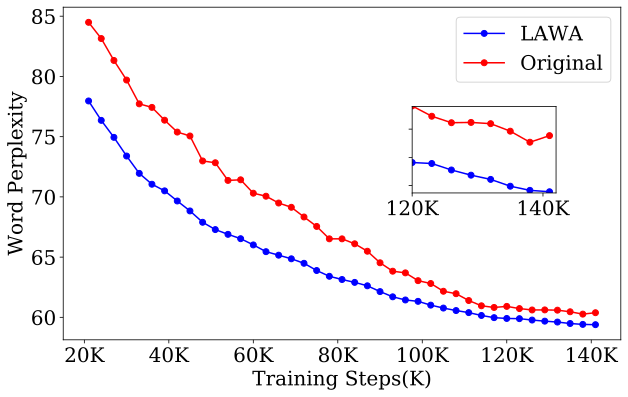

 (a) Philpapers

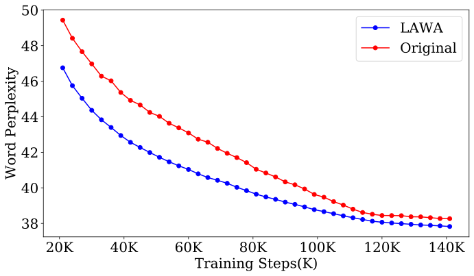

 (b) Bookcorpus2

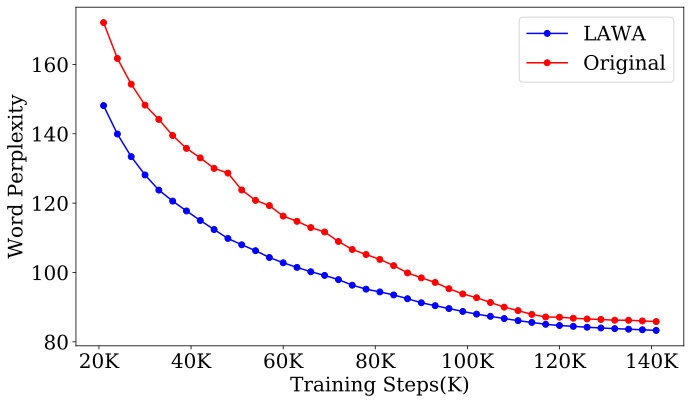

 (c) Youtube Subtitles

Figure 5: LAWA speeds up convergence for Pythia-1B on subset of tasks from the original pretraining dataset i.e. PILE. We present the original and the LAWA training trajectories for 3 different tasks from PILE namely philpapers, bookcorpus2 and youtube subtitles.

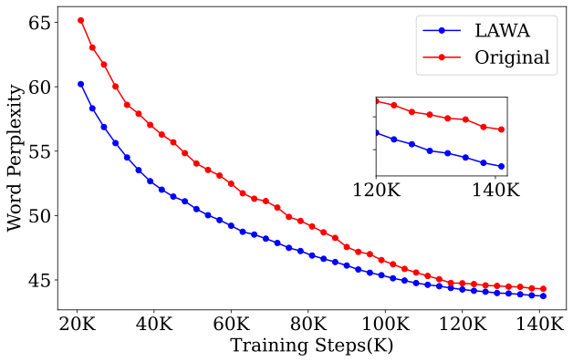

 (a) Philpapers

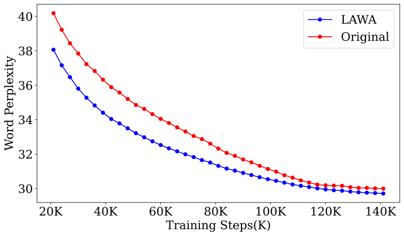

 (b) BookCorpus2

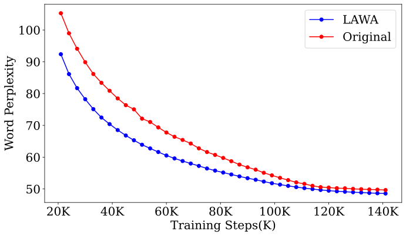

 (c) Youtube Subtitles

Figure 6: LAWA speeds up convergence for Pythia-2.8B on subset of tasks from the original pretraining dataset i.e. PILE.. We present the original and the LAWA training trajectories for 3 different tasks from PILE namely philpapers, bookcorpus2 and youtube subtitles. 

#### LAWA improves test generalization in fewer training steps compared to original pre-training and relevant baselines.

LAWA clearly outperforms the original pre-training run starting very early on during training, as shown in Figure [1](https://arxiv.org/html/2306.03241#S1.F1 "Figure 1 ‣ 1 Introduction ‣ Early Weight Averaging meets High Learning Rates for LLM Pre-training"). Since we employed a reasonably high LRs for all the nanoGPT-2 LLMs, we observe higher gains in the early-mid stages of pre-training, and the gains start diminishing towards the final stages due to the LR scheduler that continuously decays the weight throughout the training cycle. Additionally LAWA also outperforms important baselines such as EMA and SWA. LAWA clearly has an edge over EMA throughout all training phases. Our experiments also reveal that applying SWA during the early stages of training leads to divergence (Figure [11](https://arxiv.org/html/2306.03241#A2.F11 "Figure 11 ‣ B.2 Early-SWA Experiments ‣ Appendix B Supplementary Experiments and Results ‣ Early Weight Averaging meets High Learning Rates for LLM Pre-training")). Consequently, LAWA outshines SWA in both performance and ease of implementation.

#### The gains due to LAWA amplifies with far checkpoint averaging.

As shown in Figure [1](https://arxiv.org/html/2306.03241#S1.F1 "Figure 1 ‣ 1 Introduction ‣ Early Weight Averaging meets High Learning Rates for LLM Pre-training"), LAWA with higher \(\mathsf{k\_stepsize}\) (\(\nu\)) performs better particularly for larger models. Intuitively, we believe that the diversity between nearby checkpoints might be very low given that larger models learn faster [[22](https://arxiv.org/html/2306.03241#bib.bib22)]. Hence, one needs to sample more distant checkpoints for larger models. This observation is also consistent with billion-parameter Pythia LLMs, as shown in Figure [10](https://arxiv.org/html/2306.03241#A2.F10 "Figure 10 ‣ Appendix B Supplementary Experiments and Results ‣ Early Weight Averaging meets High Learning Rates for LLM Pre-training").

### 4.2 Scaling to Billion parameter Pythia LLMs

Figures [5](https://arxiv.org/html/2306.03241#S4.F5 "Figure 5 ‣ LLMs trained with higher LRs observe higher gains with LAWA. ‣ 4.1 Exploring LLM pre-training with nanoGPT-2 at small scale ‣ 4 Results ‣ Early Weight Averaging meets High Learning Rates for LLM Pre-training") and [6](https://arxiv.org/html/2306.03241#S4.F6 "Figure 6 ‣ LLMs trained with higher LRs observe higher gains with LAWA. ‣ 4.1 Exploring LLM pre-training with nanoGPT-2 at small scale ‣ 4 Results ‣ Early Weight Averaging meets High Learning Rates for LLM Pre-training") illustrate that the checkpoints derived using LAWA demonstrate better test generalization than the checkpoints saved during original training for the Pythia-1B and Pythia-2.8B models i.e. (moderate size LLMs). In Figures [7](https://arxiv.org/html/2306.03241#S4.F7 "Figure 7 ‣ 4.2 Scaling to Billion parameter Pythia LLMs ‣ 4 Results ‣ Early Weight Averaging meets High Learning Rates for LLM Pre-training") and [8](https://arxiv.org/html/2306.03241#S4.F8 "Figure 8 ‣ 4.2 Scaling to Billion parameter Pythia LLMs ‣ 4 Results ‣ Early Weight Averaging meets High Learning Rates for LLM Pre-training"), we observe significant improvements in test generalization during early-mid training regime and minor improvements towards the end for both Pythia-6.9B and Pythia-12B models. All the LAWA LLMs achieve lower perplexity with lesser training steps compared to the original training trajectory, thereby saving significant amount of GPU hours (Figure [4](https://arxiv.org/html/2306.03241#S3.F4 "Figure 4 ‣ Pythia Experiments. ‣ 3 Experimental Setup ‣ Early Weight Averaging meets High Learning Rates for LLM Pre-training")), subsequent training costs and ingested training data. The savings are computed based on Table [4](https://arxiv.org/html/2306.03241#A3.T4 "Table 4 ‣ Appendix C Amount of Compute ‣ Early Weight Averaging meets High Learning Rates for LLM Pre-training") in the appendix. Additionally, LAWA proves beneficial in situations where training similar models from scratch is necessary but can only be conducted over a limited number of training steps due to strict compute budgets.

To analyze the phenomenon wherein moderate size LLMs exibit higher gains compared to their larger counterparts in test performance across both early-mid and final training trajectories, we delve into the Pythia suite’s training methodologies. The authors of Pythia suite [[3](https://arxiv.org/html/2306.03241#bib.bib3)] report that they have used an exceptionally large batch size (2M tokens) and learning rate for Pythia-1B and Pythia-2.8B models to expedite the convergence. For the larger Pythia models, such as Pythia-6.9B and Pythia-12B, learning rates are reduced to \(1.2\times 10^{-4}\) while maintaining the batch sizes to 2M tokens, in line with prior work. Overall we observe thematically similar trends with the nanoGPT-2 experiments.

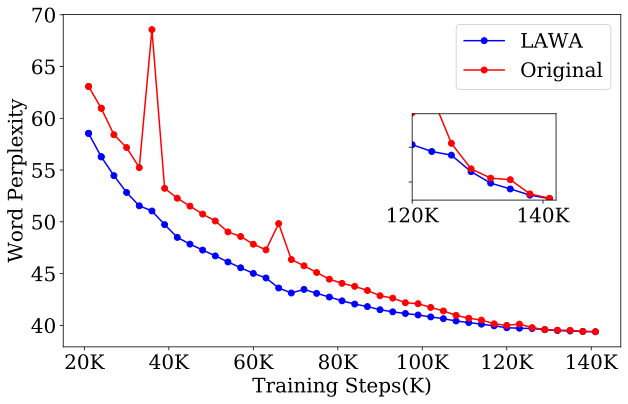

 (a) Philpapers

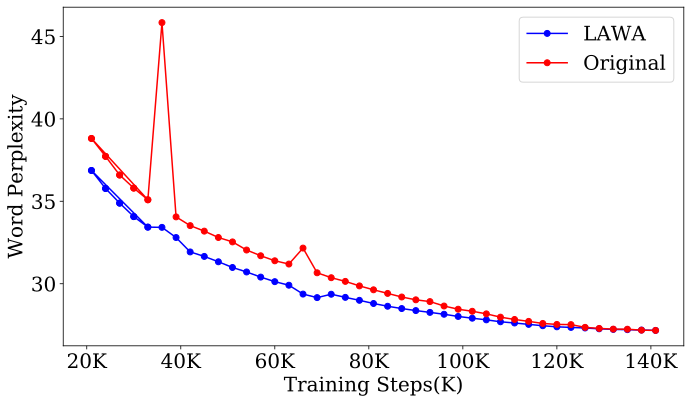

 (b) BookCorpus2

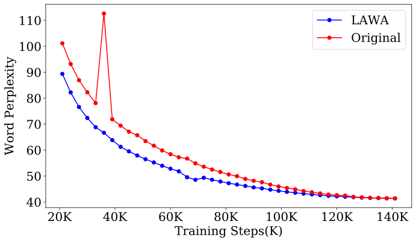

 (c) Youtube Subtitles

Figure 7: LAWA speeds up convergence for Pythia-6.9B on subset of tasks from the original pretraining dataset i.e. PILE. We present the original and the LAWA training trajectories for 3 different tasks from PILE namely philpapers, bookcorpus2 and youtube subtitles.

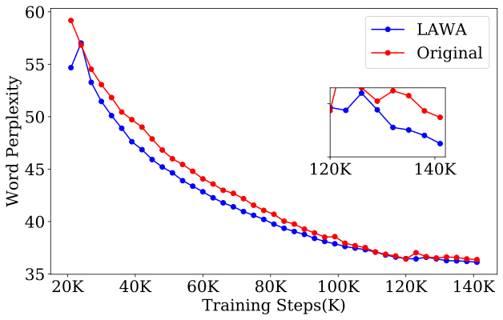

 (a) Philpapers

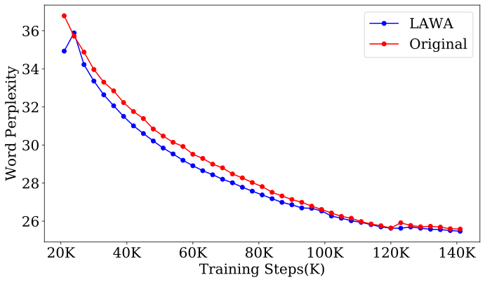

 (b) BookCorpus2

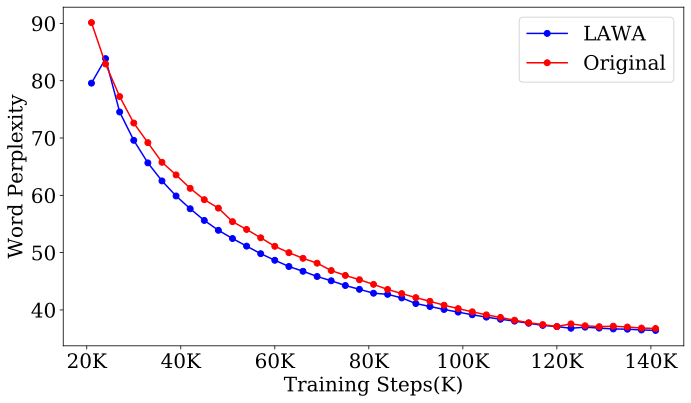

 (c) Youtube Subtitles

Figure 8: LAWA speeds up convergence for Pythia-12B on subset of tasks from the original pretraining dataset i.e. PILE. We present the original and the LAWA training trajectories for 3 different tasks from PILE namely philpapers, bookcorpus2 and youtube subtitles.

Recent work [[15](https://arxiv.org/html/2306.03241#bib.bib15), [44](https://arxiv.org/html/2306.03241#bib.bib44), [37](https://arxiv.org/html/2306.03241#bib.bib37), [7](https://arxiv.org/html/2306.03241#bib.bib7), [41](https://arxiv.org/html/2306.03241#bib.bib41)] report loss spikes– brief degradations in the performance along a training trajectory when scaling up the model size, batch size, and learning rate. In our evaluations, we observe two perplexity spikes (Figure [7](https://arxiv.org/html/2306.03241#S4.F7 "Figure 7 ‣ 4.2 Scaling to Billion parameter Pythia LLMs ‣ 4 Results ‣ Early Weight Averaging meets High Learning Rates for LLM Pre-training")). Interestingly, we find that LAWA mitigates the spikes during evaluation quite effectively. This can be intuitively explained by the smoothing effect – average out the outliers to fit the trend – resulting from averaging checkpoint weights over a range of steps that are far apart. Note that since we have sampled the checkpoints at an interval of 3K for LAWA, we may have inadvertently overlooked some checkpoints exhibiting loss spikes in models other than Pythia-6.9B. [7](https://arxiv.org/html/2306.03241#S4.F7 "Figure 7 ‣ 4.2 Scaling to Billion parameter Pythia LLMs ‣ 4 Results ‣ Early Weight Averaging meets High Learning Rates for LLM Pre-training")

### 4.3 Improved Zero-shot performance

LAWA enhances the zero-shot performance of both nanoGPT-2 and Pythia LLMs (Table [2](https://arxiv.org/html/2306.03241#S4.T2 "Table 2 ‣ LLMs trained with higher LRs observe higher gains with LAWA. ‣ 4.1 Exploring LLM pre-training with nanoGPT-2 at small scale ‣ 4 Results ‣ Early Weight Averaging meets High Learning Rates for LLM Pre-training")). In the nanoGPT-2 models, we assess zero-shot performance at 50K and 70K steps, revealing that the checkpoints generated using LAWA at 50K consistently outperform original checkpoints—derived from conventional at 50K training steps (always) and also at 70K training (in the majority of instances).

For Pythia LLMs LAWA improves the zero-shot performance in several ways. First, we observe that zero-shot performance of early-mid checkpoints (48K, 60K) achieves higher performance almost consistently, regardless of the scale as shown in Table [3](https://arxiv.org/html/2306.03241#S4.T3 "Table 3 ‣ LLMs trained with higher LRs observe higher gains with LAWA. ‣ 4.1 Exploring LLM pre-training with nanoGPT-2 at small scale ‣ 4 Results ‣ Early Weight Averaging meets High Learning Rates for LLM Pre-training"). For instance, the LAWA Pythia-1B checkpoint evaluated at 24K steps on the Lambada OpenAI task achieves higher accuracy than the original checkpoint evaluated at the 48K step. We note that the checkpoints derived using LAWA also exhibit improvements in the later stages of training (105K,141K) on the majority of tasks, highlighted by the bolded numbers in Table [3](https://arxiv.org/html/2306.03241#S4.T3 "Table 3 ‣ LLMs trained with higher LRs observe higher gains with LAWA. ‣ 4.1 Exploring LLM pre-training with nanoGPT-2 at small scale ‣ 4 Results ‣ Early Weight Averaging meets High Learning Rates for LLM Pre-training"). Moreover, we consistently witness gains until 105K steps across all models, which constitutes approximately 75% of the total training steps. Therefore our recipe proves to be beneficial in a compute optimal LLM training scenario where early stopping is employed at 75% of total training. Additionally, we find that our LAWA derived checkpoints of Pythia-6.9B reach the final accuracy/perplexity on multiple downstream tasks considerably earlier, specifically at the 105K step mark. Intuitively, we know that higher zero-shot performance on various different downstream tasks is associated with low perplexity in language modelling during training, a correlation that is mathematically substantiated [[34](https://arxiv.org/html/2306.03241#bib.bib34)]. Therefore, all the observations we made in Section [4.1](https://arxiv.org/html/2306.03241#S4.SS1 "4.1 Exploring LLM pre-training with nanoGPT-2 at small scale ‣ 4 Results ‣ Early Weight Averaging meets High Learning Rates for LLM Pre-training") naturally apply to zero-shot performance as well.

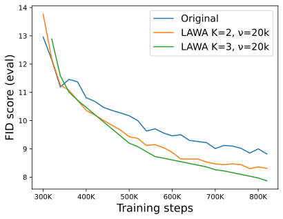

 Figure 9: LAWA speeds up the convergence for Image diffusion model, measured in terms of FID on the evaluation set for ImageNet-128x128.

### 4.4 Diffusion models

We also experiment with image diffusion models to gauge the effectiveness of LAWA on generative models beyond language. The underlying model is a 422M parameter UNet [[32](https://arxiv.org/html/2306.03241#bib.bib32), [10](https://arxiv.org/html/2306.03241#bib.bib10)] trained with \(\epsilon\)-prediction objective and standard cosine schedule [[10](https://arxiv.org/html/2306.03241#bib.bib10)] on ImageNet 128x128 dataset. The model was trained with the Adam [[17](https://arxiv.org/html/2306.03241#bib.bib17)] optimizer using a learning rate of 1e-4. Figure [9](https://arxiv.org/html/2306.03241#S4.F9 "Figure 9 ‣ 4.3 Improved Zero-shot performance ‣ 4 Results ‣ Early Weight Averaging meets High Learning Rates for LLM Pre-training") shows the FID on the evaluation set for the baseline checkpoints and LAWA averaging over the baseline checkpoints. Note that the baseline checkpoints themselves are obtained using the Exponential Moving Average (EMA) with decay rate of 0.9999 over the training trajectory, following the standard practice in training diffusion models. It is noteworthy that LAWA checkpoint averaging improves the FID over the already EMA’ed checkpoints. We defer a more thorough empirical investigation of LAWA for the family of diffusion models to future work.

## 5 Related work

#### Weight Averaging (WA)

has been studied and employed since the 1960s, predominantly in simple linear [[20](https://arxiv.org/html/2306.03241#bib.bib20)] and convex settings [[28](https://arxiv.org/html/2306.03241#bib.bib28), [26](https://arxiv.org/html/2306.03241#bib.bib26)]. Recent WA approaches in deep learning can be broadly classified into two categories; First, approaches that simultaneously trains multiple models with different initialization and hyper-parameters [[40](https://arxiv.org/html/2306.03241#bib.bib40), [30](https://arxiv.org/html/2306.03241#bib.bib30), [13](https://arxiv.org/html/2306.03241#bib.bib13), [29](https://arxiv.org/html/2306.03241#bib.bib29)] to later average them for better generalization. Second, approaches that focus on improving generalization of the final model or models close to convergence [[36](https://arxiv.org/html/2306.03241#bib.bib36), [12](https://arxiv.org/html/2306.03241#bib.bib12), [2](https://arxiv.org/html/2306.03241#bib.bib2), [43](https://arxiv.org/html/2306.03241#bib.bib43), [4](https://arxiv.org/html/2306.03241#bib.bib4)]. Stochastic WA (\(\mathsf{SWA}\)) [[12](https://arxiv.org/html/2306.03241#bib.bib12)] employs a similar technique of averaging checkpoints along training trajectories but only works in the later stages of training (i.e. post 75% of the training run) with a new LR scheduler. This unsual halting and restarting the training with SWA with a new schedular limits its integration. We also show that SWA when applied early on during training diverges (Section [B.2](https://arxiv.org/html/2306.03241#A2.SS2 "B.2 Early-SWA Experiments ‣ Appendix B Supplementary Experiments and Results ‣ Early Weight Averaging meets High Learning Rates for LLM Pre-training")). Our recipe focuses on getting early gains through early averaging and can be generally applied to a wide range of training regimes. We expand the key differences of our work with SWA in Appendix [A](https://arxiv.org/html/2306.03241#A1 "Appendix A Additional Related Work ‣ Early Weight Averaging meets High Learning Rates for LLM Pre-training").

## 6 Conclusion and Future Work

In this paper we investigated a LLM pre-training setting where the LR is significantly higher than what is conventionally used. This scenario is particularly practical as LLMs are often trained using numerous GPUs in parallel, necessitating higher batch sizes for optimal GPU utilization. Here we introduce early weight averaging throughout the training trajectory utilizing LAWA. Our findings indicate that this strategy enables LLMs to generalize more effectively in fewer steps compared to the original pre-training scheme, and key baselines as demonstrated using nanoGPT-2 and Pythia models. Looking forward we see several extensions of our work in the realm of federated fine-tuning and continual training of intermediate checkpoints.

## References

  * Athiwaratkun et al. [2018a] Ben Athiwaratkun, Marc Finzi, Pavel Izmailov, and A. Wilson.  There are many consistent explanations of unlabeled data: Why you should average.  _International Conference on Learning Representations_ , 2018a. 
  * Athiwaratkun et al. [2018b] Ben Athiwaratkun, Marc Finzi, Pavel Izmailov, and Andrew Gordon Wilson.  Improving consistency-based semi-supervised learning with weight averaging.  _arXiv preprint arXiv:1806.05594_ , 2(9):11, 2018b. 
  * Biderman et al. [2023] Stella Biderman, Hailey Schoelkopf, Quentin Anthony, Herbie Bradley, Kyle O’Brien, Eric Hallahan, Mohammad Aflah Khan, Shivanshu Purohit, USVSN Sai Prashanth, Edward Raff, Aviya Skowron, Lintang Sutawika, and Oskar van der Wal.  Pythia: A suite for analyzing large language models across training and scaling.  _arXiv preprint arXiv: Arxiv-2304.01373_ , 2023. 
  * Cha et al. [2021] Junbum Cha, Sanghyuk Chun, Kyungjae Lee, Han-Cheol Cho, Seunghyun Park, Yunsung Lee, and Sungrae Park.  Swad: Domain generalization by seeking flat minima.  _Advances in Neural Information Processing Systems_ , 34:22405–22418, 2021. 
  * Chowdhery et al. [2022] Aakanksha Chowdhery, Sharan Narang, Jacob Devlin, Maarten Bosma, Gaurav Mishra, Adam Roberts, Paul Barham, Hyung Won Chung, Charles Sutton, Sebastian Gehrmann, Parker Schuh, Kensen Shi, Sasha Tsvyashchenko, Joshua Maynez, Abhishek Rao, Parker Barnes, Yi Tay, Noam Shazeer, Vinodkumar Prabhakaran, Emily Reif, Nan Du, Ben Hutchinson, Reiner Pope, James Bradbury, Jacob Austin, Michael Isard, Guy Gur-Ari, Pengcheng Yin, Toju Duke, Anselm Levskaya, Sanjay Ghemawat, Sunipa Dev, Henryk Michalewski, Xavier Garcia, Vedant Misra, Kevin Robinson, Liam Fedus, Denny Zhou, Daphne Ippolito, David Luan, Hyeontaek Lim, Barret Zoph, Alexander Spiridonov, Ryan Sepassi, David Dohan, Shivani Agrawal, Mark Omernick, Andrew M. Dai, Thanumalayan Sankaranarayana Pillai, Marie Pellat, Aitor Lewkowycz, Erica Moreira, Rewon Child, Oleksandr Polozov, Katherine Lee, Zongwei Zhou, Xuezhi Wang, Brennan Saeta, Mark Diaz, Orhan Firat, Michele Catasta, Jason Wei, Kathy Meier-Hellstern, Douglas Eck, Jeff Dean, Slav Petrov, and Noah Fiedel.  Palm: Scaling language modeling with pathways.  _GOOGLE_ , 2022. 
  * Clark et al. [2018] Peter Clark, Isaac Cowhey, Oren Etzioni, Tushar Khot, Ashish Sabharwal, Carissa Schoenick, and Oyvind Tafjord.  Think you have solved question answering? try arc, the ai2 reasoning challenge.  _ArXiv_ , abs/1803.05457, 2018. 
  * Dey et al. [2023] Nolan Dey, Gurpreet Gosal, Zhiming, Chen, Hemant Khachane, William Marshall, Ribhu Pathria, Marvin Tom, and Joel Hestness.  Cerebras-gpt: Open compute-optimal language models trained on the cerebras wafer-scale cluster.  _arXiv preprint arXiv: Arxiv-2304.03208_ , 2023. 
  * Gao et al. [2020] Leo Gao, Stella Biderman, Sid Black, Laurence Golding, Travis Hoppe, Charles Foster, Jason Phang, Horace He, Anish Thite, Noa Nabeshima, Shawn Presser, and Connor Leahy.  The pile: An 800gb dataset of diverse text for language modeling.  _arXiv preprint arXiv: Arxiv-2101.00027_ , 2020. 
  * Goyal et al. [2017] Priya Goyal, Piotr Dollár, Ross Girshick, Pieter Noordhuis, Lukasz Wesolowski, Aapo Kyrola, Andrew Tulloch, Yangqing Jia, and Kaiming He.  Accurate, large minibatch sgd: Training imagenet in 1 hour.  _arXiv preprint arXiv: Arxiv-1706.02677_ , 2017. 
  * Ho et al. [2020] Jonathan Ho, Ajay Jain, and Pieter Abbeel.  Denoising diffusion probabilistic models.  _Advances in Neural Information Processing Systems_ , 33:6840–6851, 2020. 
  * Hoffmann et al. [2022] Jordan Hoffmann, Sebastian Borgeaud, Arthur Mensch, Elena Buchatskaya, Trevor Cai, Eliza Rutherford, Diego de Las Casas, Lisa Anne Hendricks, Johannes Welbl, Aidan Clark, et al.  Training compute-optimal large language models.  _arXiv preprint arXiv:2203.15556_ , 2022. 
  * Izmailov et al. [2018] Pavel Izmailov, Dmitrii Podoprikhin, Timur Garipov, Dmitry P. Vetrov, and Andrew Gordon Wilson.  Averaging weights leads to wider optima and better generalization.  In Amir Globerson and Ricardo Silva (eds.), _Proceedings of the Thirty-Fourth Conference on Uncertainty in Artificial Intelligence, UAI 2018, Monterey, California, USA, August 6-10, 2018_ , pp. 876–885. AUAI Press, 2018.  URL <http://auai.org/uai2018/proceedings/papers/313.pdf>. 
  * Jolicoeur-Martineau et al. [2023] Alexia Jolicoeur-Martineau, Emy Gervais, Kilian Fatras, Yan Zhang, and Simon Lacoste-Julien.  Population parameter averaging (papa).  _arXiv preprint arXiv: Arxiv-2304.03094_ , 2023. 
  * Kaddour [2022] Jean Kaddour.  Stop wasting my time! saving days of imagenet and bert training with latest weight averaging.  _arXiv preprint arXiv:2209.14981_ , 2022. 
  * Kaplan et al. [2020] Jared Kaplan, Sam McCandlish, Tom Henighan, Tom B Brown, Benjamin Chess, Rewon Child, Scott Gray, Alec Radford, Jeffrey Wu, and Dario Amodei.  Scaling laws for neural language models.  _arXiv preprint arXiv:2001.08361_ , 2020. 
  * Kaur et al. [2022] Simran Kaur, Jérémy E. Cohen, and Zachary Chase Lipton.  On the maximum hessian eigenvalue and generalization.  _ICBINB_ , 2022.  doi: 10.48550/arXiv.2206.10654. 
  * Kingma & Ba [2014] Diederik P Kingma and Jimmy Ba.  Adam: A method for stochastic optimization.  _arXiv preprint arXiv:1412.6980_ , 2014. 
  * Krizhevsky [2014] Alex Krizhevsky.  One weird trick for parallelizing convolutional neural networks.  _arXiv preprint arXiv: 1404.5997_ , 2014. 
  * Lakshminarayanan et al. [2016] Balaji Lakshminarayanan, A. Pritzel, and C. Blundell.  Simple and scalable predictive uncertainty estimation using deep ensembles.  _NIPS_ , 2016. 
  * Lakshminarayanan & Szepesvari [2018] Chandrashekar Lakshminarayanan and Csaba Szepesvari.  Linear stochastic approximation: How far does constant step-size and iterate averaging go?  In _International Conference on Artificial Intelligence and Statistics_ , pp. 1347–1355. PMLR, 2018. 
  * Lee et al. [2021] Katherine Lee, Daphne Ippolito, Andrew Nystrom, Chiyuan Zhang, Douglas Eck, Chris Callison-Burch, and Nicholas Carlini.  Deduplicating training data makes language models better.  _arXiv preprint arXiv: Arxiv-2107.06499_ , 2021. 
  * Li et al. [2020] Zhuohan Li, Eric Wallace, Sheng Shen, Kevin Lin, K. Keutzer, D. Klein, and Joseph Gonzalez.  Train large, then compress: Rethinking model size for efficient training and inference of transformers.  _International Conference On Machine Learning_ , 2020. 
  * Liu et al. [2023] Hong Liu, Zhiyuan Li, David Hall, Percy Liang, and Tengyu Ma.  Sophia: A scalable stochastic second-order optimizer for language model pre-training.  _arXiv preprint arXiv: 2305.14342_ , 2023. 
  * Malladi et al. [2022] Sadhika Malladi, Kaifeng Lyu, A. Panigrahi, and Sanjeev Arora.  On the sdes and scaling rules for adaptive gradient algorithms.  _Neural Information Processing Systems_ , 2022.  doi: 10.48550/arXiv.2205.10287. 
  * Merity et al. [2016] Stephen Merity, Caiming Xiong, James Bradbury, and Richard Socher.  Pointer sentinel mixture models, 2016.  URL <https://arxiv.org/abs/1609.07843>. 
  * Neu & Rosasco [2018] Gergely Neu and Lorenzo Rosasco.  Iterate averaging as regularization for stochastic gradient descent.  In _Conference On Learning Theory_ , pp. 3222–3242. PMLR, 2018. 
  * Paperno et al. [2016] Denis Paperno, Germán Kruszewski, Angeliki Lazaridou, Q. N. Pham, R. Bernardi, Sandro Pezzelle, Marco Baroni, Gemma Boleda, and R. Fernández.  The lambada dataset: Word prediction requiring a broad discourse context.  _Annual Meeting Of The Association For Computational Linguistics_ , 2016.  doi: 10.18653/v1/P16-1144. 
  * Polyak & Juditsky [1992] Boris T Polyak and Anatoli B Juditsky.  Acceleration of stochastic approximation by averaging.  _SIAM journal on control and optimization_ , 30(4):838–855, 1992. 
  * [29] Alexandre Rame, Kartik Ahuja, Jianyu Zhang, Matthieu Cord, Leon Bottou, and David Lopez-Paz.  Model ratatouille: Recycling diverse models for out-of-distribution generalization. 
  * Rame et al. [2022] Alexandre Rame, Matthieu Kirchmeyer, Thibaud Rahier, Alain Rakotomamonjy, patrick gallinari, and Matthieu Cord.  Diverse weight averaging for out-of-distribution generalization.  In Alice H. Oh, Alekh Agarwal, Danielle Belgrave, and Kyunghyun Cho (eds.), _Advances in Neural Information Processing Systems_ , 2022.  URL <https://openreview.net/forum?id=tq_J_MqB3UB>. 
  * Ren et al. [2023] Xiaozhe Ren, Pingyi Zhou, Xinfan Meng, Xinjing Huang, Yadao Wang, Weichao Wang, Pengfei Li, Xiaoda Zhang, A. V. Podolskiy, G. Arshinov, A. Bout, Irina Piontkovskaya, Jiansheng Wei, Xin Jiang, Teng Su, Qun Liu, and Jun Yao.  Pangu-\(\Sigma\): Towards trillion parameter language model with sparse heterogeneous computing.  _ARXIV.ORG_ , 2023.  doi: 10.48550/arXiv.2303.10845. 
  * Ronneberger et al. [2015] Olaf Ronneberger, Philipp Fischer, and Thomas Brox.  U-net: Convolutional networks for biomedical image segmentation.  In _Medical Image Computing and Computer-Assisted Intervention–MICCAI 2015: 18th International Conference, Munich, Germany, October 5-9, 2015, Proceedings, Part III 18_ , pp. 234–241. Springer, 2015. 
  * Sandler et al. [2023] Mark Sandler, Andrey Zhmoginov, Max Vladymyrov, and Nolan Miller.  Training trajectories, mini-batch losses and the curious role of the learning rate.  _arXiv preprint arXiv:2301.02312_ , 2023. 
  * Saunshi et al. [2020] Nikunj Saunshi, Sadhika Malladi, and Sanjeev Arora.  A mathematical exploration of why language models help solve downstream tasks.  _International Conference On Learning Representations_ , 2020. 
  * Szegedy et al. [2015] Christian Szegedy, Vincent Vanhoucke, Sergey Ioffe, Jonathon Shlens, and Z. Wojna.  Rethinking the inception architecture for computer vision.  _Computer Vision And Pattern Recognition_ , 2015.  doi: 10.1109/CVPR.2016.308. 
  * Tarvainen & Valpola [2017] Antti Tarvainen and Harri Valpola.  Mean teachers are better role models: Weight-averaged consistency targets improve semi-supervised deep learning results.  _Advances in neural information processing systems_ , 30, 2017. 
  * Touvron et al. [2023a] Hugo Touvron, Thibaut Lavril, Gautier Izacard, Xavier Martinet, Marie-Anne Lachaux, Timothée Lacroix, Baptiste Rozière, Naman Goyal, Eric Hambro, Faisal Azhar, Aurelien Rodriguez, Armand Joulin, Edouard Grave, and Guillaume Lample.  Llama: Open and efficient foundation language models.  _ARXIV_ , 2023a. 
  * Touvron et al. [2023b] Hugo Touvron, Louis Martin, Kevin Stone, Peter Albert, Amjad Almahairi, Yasmine Babaei, Nikolay Bashlykov, Soumya Batra, Prajjwal Bhargava, Shruti Bhosale, Dan Bikel, Lukas Blecher, Cristian Canton Ferrer, Moya Chen, Guillem Cucurull, David Esiobu, Jude Fernandes, Jeremy Fu, Wenyin Fu, Brian Fuller, Cynthia Gao, Vedanuj Goswami, Naman Goyal, Anthony Hartshorn, Saghar Hosseini, Rui Hou, Hakan Inan, Marcin Kardas, Viktor Kerkez, Madian Khabsa, Isabel Kloumann, Artem Korenev, Punit Singh Koura, Marie-Anne Lachaux, Thibaut Lavril, Jenya Lee, Diana Liskovich, Yinghai Lu, Yuning Mao, Xavier Martinet, Todor Mihaylov, Pushkar Mishra, Igor Molybog, Yixin Nie, Andrew Poulton, Jeremy Reizenstein, Rashi Rungta, Kalyan Saladi, Alan Schelten, Ruan Silva, Eric Michael Smith, Ranjan Subramanian, Xiaoqing Ellen Tan, Binh Tang, Ross Taylor, Adina Williams, Jian Xiang Kuan, Puxin Xu, Zheng Yan, Iliyan Zarov, Yuchen Zhang, Angela Fan, Melanie Kambadur, Sharan Narang, Aurelien Rodriguez, Robert Stojnic, Sergey Edunov, and Thomas Scialom.  Llama 2: Open foundation and fine-tuned chat models.  _arXiv preprint arXiv: 2307.09288_ , 2023b. 
  * Welbl et al. [2017] Johannes Welbl, Nelson F. Liu, and Matt Gardner.  Crowdsourcing multiple choice science questions.  _ArXiv_ , abs/1707.06209, 2017. 
  * Wortsman et al. [2022] Mitchell Wortsman, Gabriel Ilharco, Samir Ya Gadre, Rebecca Roelofs, Raphael Gontijo-Lopes, Ari S Morcos, Hongseok Namkoong, Ali Farhadi, Yair Carmon, Simon Kornblith, et al.  Model soups: averaging weights of multiple fine-tuned models improves accuracy without increasing inference time.  In _International Conference on Machine Learning_ , pp. 23965–23998. PMLR, 2022. 
  * Wortsman et al. [2023] Mitchell Wortsman, Tim Dettmers, Luke Zettlemoyer, Ari Morcos, Ali Farhadi, and Ludwig Schmidt.  Stable and low-precision training for large-scale vision-language models.  _arXiv preprint arXiv: Arxiv-2304.13013_ , 2023. 
  * Xia et al. [2022] M. Xia, Mikel Artetxe, Chunting Zhou, Xi Victoria Lin, Ramakanth Pasunuru, Danqi Chen, Luke Zettlemoyer, and V. Stoyanov.  Training trajectories of language models across scales.  _ARXIV.ORG_ , 2022.  doi: 10.48550/arXiv.2212.09803. 
  * Yang et al. [2019] Guandao Yang, Tianyi Zhang, Polina Kirichenko, Junwen Bai, Andrew Gordon Wilson, and Chris De Sa.  Swalp: Stochastic weight averaging in low precision training.  In _International Conference on Machine Learning_ , pp. 7015–7024. PMLR, 2019. 
  * Zhang et al. [2022] Susan Zhang, Stephen Roller, Naman Goyal, Mikel Artetxe, Moya Chen, Shuohui Chen, Christopher Dewan, Mona Diab, Xian Li, Xi Victoria Lin, Todor Mihaylov, Myle Ott, Sam Shleifer, Kurt Shuster, Daniel Simig, Punit Singh Koura, Anjali Sridhar, Tianlu Wang, and Luke Zettlemoyer.  Opt: Open pre-trained transformer language models.  _ARXIV.ORG_ , 2022. 

Supplementary Materials: Appendix

## Contents

  * [A](https://arxiv.org/html/2306.03241#A1 "Appendix A Additional Related Work ‣ Early Weight Averaging meets High Learning Rates for LLM Pre-training"): Additional Related Work. 
  * [B](https://arxiv.org/html/2306.03241#A2 "Appendix B Supplementary Experiments and Results ‣ Early Weight Averaging meets High Learning Rates for LLM Pre-training"): Supplementary Experiments and Results. 
  * [C](https://arxiv.org/html/2306.03241#A3 "Appendix C Amount of Compute ‣ Early Weight Averaging meets High Learning Rates for LLM Pre-training"): Compute Details. 

## Appendix A Additional Related Work

This section serves as a supplement to the main related work detailed in Section [5](https://arxiv.org/html/2306.03241#S5 "5 Related work ‣ Early Weight Averaging meets High Learning Rates for LLM Pre-training"). Here we further elaborate on a prior work-SWA, and highlight the key differences of LAWA in the backdrop of training LLMs. SWA [[12](https://arxiv.org/html/2306.03241#bib.bib12)] is a checkpoint averaging scheme similar to LAWA but is extensively used in vision settings. In this paper we adapt SWA (also EMA) for LLM pre-training setting and presented it as a key baseline. The major differences of our recipe and SWA are listed below.

  * In the SWA approach the checkpoints are averaged post 75% of regular training, i.e. close to convergence. This phase of training is termed as SWA training. Moreover the gain in generalization through SWA method is achieved at the end of training. In contrast, LAWA averages checkpoints very early on during training (post 10-15% of training) and achieves gains in test and zero-shot generalization with fewer training steps (less than 100% TB). SWA when applied early on during training performs poorly due to divergence of the training curve as shown in Figure [11](https://arxiv.org/html/2306.03241#A2.F11 "Figure 11 ‣ B.2 Early-SWA Experiments ‣ Appendix B Supplementary Experiments and Results ‣ Early Weight Averaging meets High Learning Rates for LLM Pre-training"). 
  * SWA modifies the learning rate scheduler mid-training and requires different learning rate schedulers for different architectures. Additionally, for models employing batch normalization, it necessitates a full pass over the entire dataset to update batch normalization statistics. LAWA is free from these constraints and is simpler to implement for large scale training. 

## Appendix B Supplementary Experiments and Results

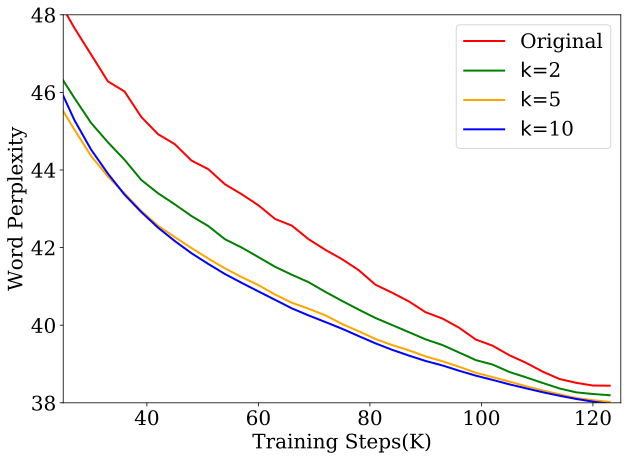

 (a) 

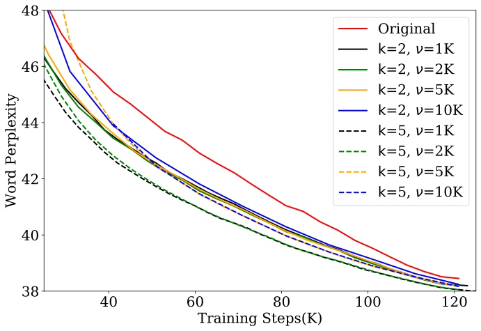

 (b) 

Figure 10: Ablations studying test performance as a function of (a) number of checkpoints to be averaged \(\mathsf{k}=\{\text{2, 5, 10}\}\) at \(\nu=\text{1K}\), (b) distance of checkpoints to be averaged \(\nu=\{\text{1K, 2K, 5K, 10K}\}\) at \(\mathsf{k}=\{2,5\}\). The checkpoints used for ablations is Pythia-1B.

### B.1 Ablations

We perform ablations to better understand the interplay between the performance of number of checkpoints to be averaged \(\boldsymbol{\theta}^{\text{LAWA}}_{t}\) with varying \(\mathsf{k}\) and distance between averaged checkpoints \(\nu\) in training. We study the Pythia-1B model with held-out subset of PILE-bookcorpus2. Additionally, we also provide training trajectory of Pythia-1B model on a subset of PILE datasets much earlier than 21K steps (refer Section [B](https://arxiv.org/html/2306.03241#A2 "Appendix B Supplementary Experiments and Results ‣ Early Weight Averaging meets High Learning Rates for LLM Pre-training")).

#### Test Performance with varying \(\mathsf{k}\) and fixed \(\nu=1\texttt{K}\).

We investigate the impact of varying \(\mathsf{k}\) on the model’s test performance, while keeping \(\nu\) constant at 1K. Our aim is to determine the optimal number of checkpoints to include in the average when selecting the latest \(\mathsf{k}\) checkpoints following the LAWA approach. As outlined in Section [3](https://arxiv.org/html/2306.03241#S3 "3 Experimental Setup ‣ Early Weight Averaging meets High Learning Rates for LLM Pre-training"), the Pythia checkpoints are saved at a frequency of 1K, so we have maintained \(\nu\) at 1K for this analysis. From Figure [10](https://arxiv.org/html/2306.03241#A2.F10 "Figure 10 ‣ Appendix B Supplementary Experiments and Results ‣ Early Weight Averaging meets High Learning Rates for LLM Pre-training")(a), it is apparent that a smaller \(\mathsf{k}\) could be detrimental, but performance remains fairly stable for reasonably large \(\mathsf{k}\) values. Consequently, for our LLM experiments, we opted for \(\mathsf{k}=5\) since \(\mathsf{k}=10\) tends to occupy a substantial amount of disk space, especially for larger models such as Pythia-12B.

#### Test Performance with varying \(\nu\) for \(\mathsf{k}=\{2,5\}\).

Memory requirements remain a key bottleneck in saving model checkpoints throughout the training trajectory particularly for extremely large billion parameter models. Therefore, it is very interesting to know how far away checkpoints in a training trajectory can be averaged? We investigate this question with far checkpoint averaging at \(\nu=\{\text{1K, 2K, 5K, 10K}\}\) training steps apart for \(\mathsf{k}=\{2,5\}\). As shown in Figure [10](https://arxiv.org/html/2306.03241#A2.F10 "Figure 10 ‣ Appendix B Supplementary Experiments and Results ‣ Early Weight Averaging meets High Learning Rates for LLM Pre-training")(b), we observe for both \(\mathsf{k}=2\) and \(\mathsf{k}=5\), we find that averaging more recent checkpoints (keeping \(\nu\) small) works better than averaging stale weights (higher \(\nu\)). For instance LAWA using \(\mathsf{k}=5\) and \(\nu=\{\text{1K, 2K}\}\) consistently performed better than against LAWA with other parameters. Overall, we empirically find that a moderate number of checkpoints (\(\mathsf{k}=5\)) saved in smaller frequencies (\(\nu=\text{1K}\)) works best.

### B.2 Early-SWA Experiments

Stochastic Weight Averaging [[12](https://arxiv.org/html/2306.03241#bib.bib12)] has previously shown gains for smaller models, particularly in late stages of training (typically \(>75\%\)). We experimented with initializing SWA in early stages of training. As shown in Figure [11](https://arxiv.org/html/2306.03241#A2.F11 "Figure 11 ‣ B.2 Early-SWA Experiments ‣ Appendix B Supplementary Experiments and Results ‣ Early Weight Averaging meets High Learning Rates for LLM Pre-training"), we observe that it diverges quickly - showing that SWA does not provide any gains earlier in training.

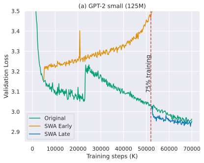

 (a) 

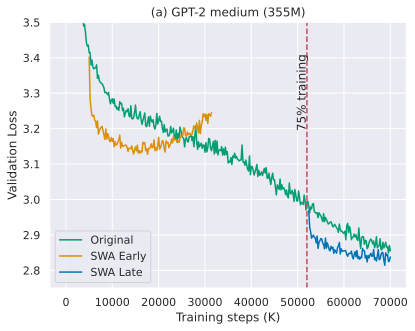

 (b) 

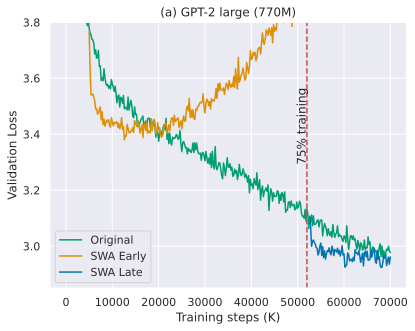

 (c) 

Figure 11: Across all model sizes (125M, 355M, 770M), we observe that the early version of stochastic weight averaging diverges, in contrast to the originally proposed late version. Algorithm 2 Pytorch-style pseudocode of EMA/SWA

⬇

def EMA_SWA(ckpt, alpha, step_size, init_point):

"""

␣␣␣␣ckpt:␣list␣of␣data␣points␣(could␣be␣checkpoints␣or␣any␣data␣series)

␣␣␣␣alpha:␣smoothing␣factor,␣0␣<␣alpha␣<=␣1.␣If␣alpha␣<␣0,␣enables␣SWA.

␣␣␣␣step_size:␣How␣often␣to␣calculate␣average.␣Typically␣set␣to␣1␣for␣EMA.

␣␣␣␣init_point:␣Step␣after␣which␣to␣start␣averaging.␣Typically␣0␣for␣EMA.

␣␣␣␣"""

# Initialize the series with the first data point

series = [ckpt[0]]

n_models = 1

for i in range(1, len(ckpt)):

# Calculate EMA/SWA

if i%step_size==0 and i>init_point:

if alpha < 0:

factor = n_models/(n_models + 1)

value = (1 - factor) * series[i-1] + factor * ckpt[i]

n_models += 1

else:

value = (1 - alpha) * series[i-1] + alpha * ckpt[i]

series.append(value)

return series

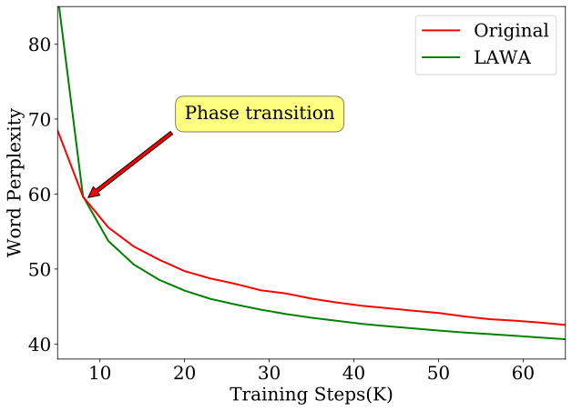

 (a) BookCorpus2

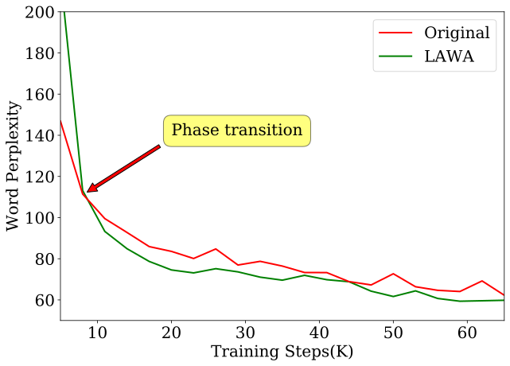

 (b) Enron Emails

Figure 12: Early weight averaging doesn’t work at the very beginning of the training but works reasonably early during the training process. Here we compare original and LAWA early training trajectories for Pythia-1B model on 2 different tasks namely bookcorpus2 and enron emails using held out set.

### B.3 Phase Transition and Linear Mode Connectivity

Averaging very initially i.e. before 8K steps during training may not always yield beneficial results (Figure [12](https://arxiv.org/html/2306.03241#A2.F12 "Figure 12 ‣ B.2 Early-SWA Experiments ‣ Appendix B Supplementary Experiments and Results ‣ Early Weight Averaging meets High Learning Rates for LLM Pre-training")). However, the technique does start showing efficacy fairly early in the training process. We highlight this phenomenon by presenting experimental results with the Pythia-1B model using a held-out set of PILE-bookcorpus2 and PILE-enron emails. We observe that LAWA trajectory undergoes a phase transition at the 8K training step. Beyond this transition, significant improvements in test performance can be seen. Such a phase transition may not occur for all Pythia LLMs. Following this phenomenon we presented our results starting 21K steps in Figures [5](https://arxiv.org/html/2306.03241#S4.F5 "Figure 5 ‣ LLMs trained with higher LRs observe higher gains with LAWA. ‣ 4.1 Exploring LLM pre-training with nanoGPT-2 at small scale ‣ 4 Results ‣ Early Weight Averaging meets High Learning Rates for LLM Pre-training")-[8](https://arxiv.org/html/2306.03241#S4.F8 "Figure 8 ‣ 4.2 Scaling to Billion parameter Pythia LLMs ‣ 4 Results ‣ Early Weight Averaging meets High Learning Rates for LLM Pre-training"). We further examine this phenomenon through the lens of linear mode connectivity.

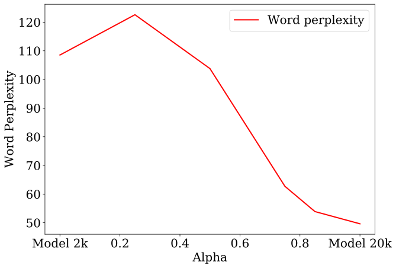

 (a) 

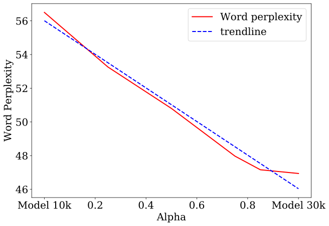

 (b) 

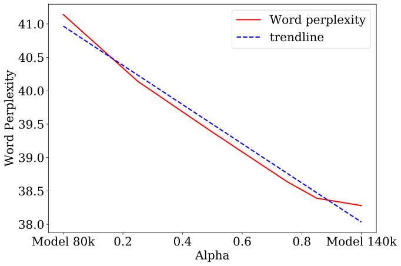

 (c) 

Figure 13: The model checkpoints attains linear mode connectivity quite early but not at the very beginning of the training process. We plot word perplexity as a function of the model derived from the convex combination of 2 different checkpoints i.e. \(\boldsymbol{\theta}_{\text{LMC}}\) at \(\mathsf{\alpha}=\{\text{0, 0.2, 0.4, 0.6, 0.8, 1}\}\).

In (a) we see an error barrier that means model checkpoint at 2K and 20K are not linear mode connected, whereas both (b) and (c) shows the checkpoints under consideration are linear model connected.

To better comprehend the linear model connectivity of checkpoints, we perform a convex combination of model checkpoints at different training stages. For instance, a model checkpoint at 2K and 20K can be combined in this manner: \(\alpha\times\boldsymbol{\theta}_{2k}+(1-\alpha)\times\boldsymbol{\theta}_{20k}\). In Fig. 10, we plot word perplexity as a function of \(\alpha\) using PILE-bookcorpus2. Here we observe that initially the model checkpoints are not linear mode connected. However, based on the evaluated checkpoints shown in Figure [13](https://arxiv.org/html/2306.03241#A2.F13 "Figure 13 ‣ B.3 Phase Transition and Linear Mode Connectivity ‣ Appendix B Supplementary Experiments and Results ‣ Early Weight Averaging meets High Learning Rates for LLM Pre-training"), we posit that the model checkpoint attains linear mode connectivity (LMC) quite early and maintains this property until the end of training.

## Appendix C Amount of Compute

We compute the savings in GPU hours based on the Table. 6 of Pythia suite [[3](https://arxiv.org/html/2306.03241#bib.bib3)] as shown below.

Model Size | GPU Count | Total GPU hours required  
---|---|---  
1.0 B | 64 | 4,830  
2.8 B | 64 | 14,240  
6.9 B | 128 | 33,500  
12 B | 256 | 72,300  
Total |  | 136,070

 Table 4: Table from [[3](https://arxiv.org/html/2306.03241#bib.bib3)]. Model sizes in the Pythia suite, number of GPUs used during training, and the total number of GPU hours, calculated as (iteration time (s) \(\times\) number of iterations \(\times\) number of GPUs \(\div\) 3600 s/hour). All GPUs are A100s with 40GB of memory.
