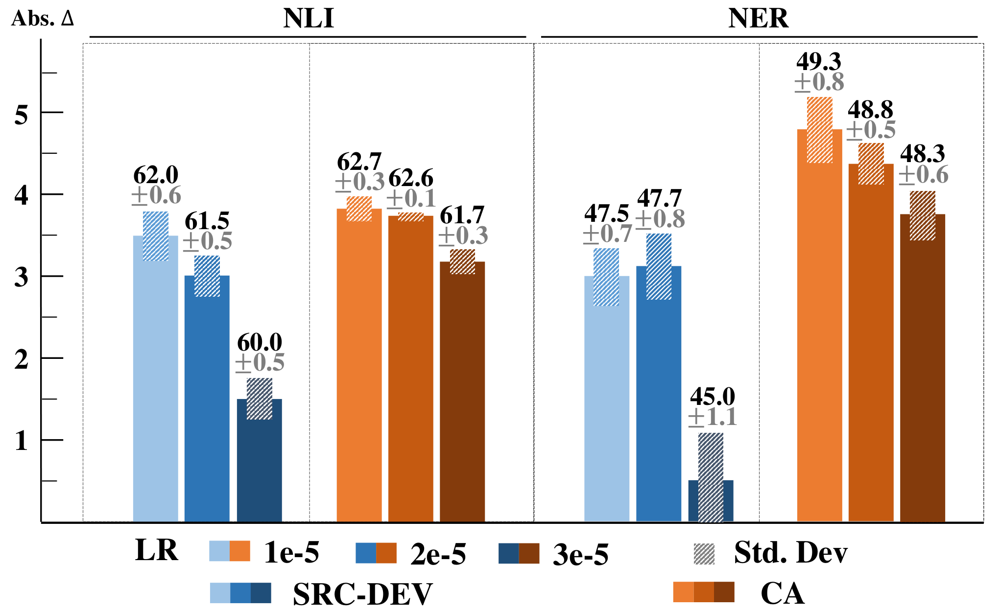

# Free Lunch: Robust Cross-Lingual Transfer   
via Model Checkpoint Averaging

Fabian David Schmidt  Affiliation:  Center For Artificial Intelligence and Data Science, University of Würzburg, Germany  Ivan Vulić  Affiliation:  Language Technology Lab, University of Cambridge, UK{fabian.schmidt, goran.glavas}@uni-wuerzburg.deiv250@cam.ac.uk Goran Glavaš  Affiliation:  Center For Artificial Intelligence and Data Science, University of Würzburg, Germany 

###### Abstract

Massively multilingual language models have displayed strong performance in zero-shot (zs-xlt) and few-shot (fs-xlt) cross-lingual transfer setups, where models fine-tuned on task data in a source language are transferred without any or with only a few annotated instances to the target language(s). However, current work typically overestimates model performance as fine-tuned models are frequently evaluated at model checkpoints that generalize best to validation instances in the target languages. This effectively violates the main assumptions of ‘true’ zs-xlt and fs-xlt. Such xlt setups require robust methods that do not depend on labeled target language data for validation and model selection. In this work, aiming to improve the robustness of ‘true’ zs-xlt and fs-xlt, we propose a simple and effective method that averages different checkpoints (i.e., model snapshots) during task fine-tuning. We conduct exhaustive zs-xlt and fs-xlt experiments across higher-level semantic tasks (NLI, extractive QA) and lower-level token classification tasks (NER, POS). The results indicate that averaging model checkpoints yields systematic and consistent performance gains across diverse target languages in all tasks. Importantly, it simultaneously substantially desensitizes xlt to varying hyperparameter choices in the absence of target language validation. We also show that checkpoint averaging benefits performance when further combined with run averaging (i.e., averaging the parameters of models fine-tuned over independent runs).

## 1 Introduction and Motivation

Massively multilingual transformers (MMT) such as mBERT ([Devlin et al. 2019](https://arxiv.org/html/2305.16834#bib.bib10)) and XLM-R ([Conneau et al. 2020](https://arxiv.org/html/2305.16834#bib.bib8)) have become the main driver of multilingual NLP research. When fine-tuned on sizable task data in a high-resource source language, typically English, MMTs demonstrate cross-lingual transfer capabilities ([Pires et al. 2019](https://arxiv.org/html/2305.16834#bib.bib32)) in zero-shot (zs-xlt; without any task-annotated instances in the target language) and few-shot (fs-xlt; only a few task-annotated instances/shots available in the target language) transfer setups ([Hu et al. 2020](https://arxiv.org/html/2305.16834#bib.bib18); [Lauscher et al. 2020](https://arxiv.org/html/2305.16834#bib.bib24)). However, recent work has shown that both cross-lingual transfer (xlt) paradigms are subject to large variation in xlt performance, especially if the target language is typologically distant to the source ([Keung et al. 2020](https://arxiv.org/html/2305.16834#bib.bib22); [Zhao et al. 2021](https://arxiv.org/html/2305.16834#bib.bib51); [Schmidt et al. 2022](https://arxiv.org/html/2305.16834#bib.bib36)).

The protocols for model selection in previous xlt work vary broadly, which exacerbates the comparison of reported xlt results. Some studies (i) do not sufficiently discuss their protocol ([Conneau et al. 2020](https://arxiv.org/html/2305.16834#bib.bib8); [Xu et al. 2022](https://arxiv.org/html/2305.16834#bib.bib48)), while others (ii) tune hyperparameters on the English development splits ([Hu et al. 2020](https://arxiv.org/html/2305.16834#bib.bib18); [Wu and Dredze 2020b](https://arxiv.org/html/2305.16834#bib.bib46)), or even (iii) perform model selection on the target-language validation sets ([Luo et al. 2021](https://arxiv.org/html/2305.16834#bib.bib27); [Fang et al. 2021](https://arxiv.org/html/2305.16834#bib.bib13); [Zhao et al. 2021](https://arxiv.org/html/2305.16834#bib.bib51)). Assuming the availability of sufficiently large target-language validation sets for hyperparameter-tuning and model selection is unrealistic and violates the assumption of a true zs-xlt and fs-xlt setup [Perez et al. 2021](https://arxiv.org/html/2305.16834#bib.bib30); [Schmidt et al. 2022](https://arxiv.org/html/2305.16834#bib.bib36). On the other hand, model selection on English validation data often does not correlate well with target-language performance ([Keung et al. 2020](https://arxiv.org/html/2305.16834#bib.bib22)).

Furthermore, benchmarking new and emerging xlt approaches with existing methods is even more challenging when the code or models from prior work are not publicly available (e.g., [Wei et al. 2021](https://arxiv.org/html/2305.16834#bib.bib41); [Xu et al. 2022](https://arxiv.org/html/2305.16834#bib.bib48)).11 1 Even when they are available, conducting comparative evaluations incurs an overhead of navigating an unfamiliar code base and potentially higher runtime. We therefore seek methods that reliably improve zs-xlt and fs-xlt irrespective of the underlying model and the transfer paradigm, are easy to implement, inexpensive to evaluate, robust to varying hyperparameters, and applicable to true xlt setups where the existence of any target-language validation data cannot be assumed nor guaranteed.

In this work, we propose a simple and effective method of checkpoint averaging (ca) that satisfies all the desiderata above. The principal idea is to save model snapshots at periodic intervals during fine-tuning and then average the weights of the multiple single-run snapshots (i.e., checkpoints) prior to xlt evaluation. A similar procedure has been successfully adopted, for instance, in computer vision ([Huang et al. 2017](https://arxiv.org/html/2305.16834#bib.bib19)), other NLP domains such as machine translation ([Vaswani et al. 2017](https://arxiv.org/html/2305.16834#bib.bib37); [Gao et al. 2022](https://arxiv.org/html/2305.16834#bib.bib15), inter alia), and speech processing ([Dong et al. 2018](https://arxiv.org/html/2305.16834#bib.bib11); [Karita et al. 2019](https://arxiv.org/html/2305.16834#bib.bib21), inter alia); however, it has not investigated nor adequately leveraged in xlt, notorious for its sensitivity to different choices of shots and hyperparameters.

Averaging model weights can be extended to merging last or multiple model snapshots from multiple model runs in a straightforward manner. As we show later, within-run snapshot averaging performs comparable, or even better in individual experiments, than the computationally more expensive ensembling of last snapshots of multiple models (i.e., from different training runs).

Contributions. (1) To the best of our knowledge, we are the first to extensively benchmark and analyze ca for both zs-xlt and fs-xlt; we do this on a range of higher-level semantic (NLI, extractive QA) and lower-level token classification tasks (NER, POS). ca yields two benefits in true xlt setups, coming for ‘free’ (i.e., at no additional computation cost): the transfer performance (i) improves consistently, and (ii) it becomes much less sensitive to varying hyperparameters. (2) We shed more light on averaging models across runs (i.e., ensembling). We first confirm that standard plain ensembling (i.e., averaging the models across multiple runs) does not improve over single runs for natural language understanding tasks ([Wortsman et al. 2022](https://arxiv.org/html/2305.16834#bib.bib44)). We then illustrate that sizable gains from run averaging (ra) are unlocked only once models are constrained a priori to converge to more structurally similar sets of parameters. We also show that averaging the averaged checkpoints as opposed to averaging only the final models further benefits performance. Further, (3) for multilingual fs-xlt, we benchmark ca against the established gradient surgery method (gs), which aims to better align gradients between languages in a batch during training for improved fs-xlt ([Xu and Murray 2022](https://arxiv.org/html/2305.16834#bib.bib47)). We demonstrate that the intricate and hyperparameter-conditioned gs performs subpar to the simple ca. Finally, (4) we validate that benefits of ca, ra, and their combinations extend to a variety of experimental settings for xlt, across a large number of different languages.

## 2 Background and Related Work

Zero-Shot and Few-Shot xlt. Modern multilingual and cross-lingual NLP is underpinned by the MMTs like mBERT ([Devlin et al. 2019](https://arxiv.org/html/2305.16834#bib.bib10)), XLM(-R) ([Lample and Conneau 2019](https://arxiv.org/html/2305.16834#bib.bib23); [Conneau et al. 2020](https://arxiv.org/html/2305.16834#bib.bib8)), or mT5 ([Xue et al. 2021](https://arxiv.org/html/2305.16834#bib.bib49)), pretrained via language modeling (LM) objectives on web-scale corpora for 100+ languages. The MMTs support xlt by semantically aligning representation spaces across multiple languages. ([Hu et al. 2020](https://arxiv.org/html/2305.16834#bib.bib18); [Cao et al. 2020](https://arxiv.org/html/2305.16834#bib.bib6)). However, some languages ‘are more equal than others’ in the MMTs’ representation spaces [Wu and Dredze 2020a](https://arxiv.org/html/2305.16834#bib.bib45), and the expected quality of xlt is highly dependent on (i) the pretraining data size for the target languages, as well as on (ii) the degree of linguistic and typological (dis)similarity between the source and the target ([Lauscher et al. 2020](https://arxiv.org/html/2305.16834#bib.bib24); [Ruder et al. 2021](https://arxiv.org/html/2305.16834#bib.bib35)).

Prior work on zs-xlt thus typically aims at better aligning the language-specific subspaces for xlt. For instance, modular approaches such as adapters ([Pfeiffer et al. 2020](https://arxiv.org/html/2305.16834#bib.bib31); [Ansell et al. 2021](https://arxiv.org/html/2305.16834#bib.bib4)) and sparse subnetworks ([Ansell et al. 2022](https://arxiv.org/html/2305.16834#bib.bib3); [Foroutan et al. 2022](https://arxiv.org/html/2305.16834#bib.bib14)) extend MMT to new languages by assigning a small number of language-specific parameters (i.e., modules) that can be combined with the base MMT. Another strand of work utilizes signals from word translations or parallel data aiming to tie cross-lingual representations of languages of interest closer together ([Wang et al. 2019b](https://arxiv.org/html/2305.16834#bib.bib40); [Wu and Dredze 2020b](https://arxiv.org/html/2305.16834#bib.bib46); [Hu et al. 2021](https://arxiv.org/html/2305.16834#bib.bib17)).

Research on fs-xlt empirically validated that using even a handful of labeled instances in the target language along with source-language instances can considerably improve xlt beyond zs-xlt ([Lauscher et al. 2020](https://arxiv.org/html/2305.16834#bib.bib24); [Zhao et al. 2021](https://arxiv.org/html/2305.16834#bib.bib51); [Xu and Murray 2022](https://arxiv.org/html/2305.16834#bib.bib47); [Schmidt et al. 2022](https://arxiv.org/html/2305.16834#bib.bib36)). fs-xlt can be stabilized and improved with (i) joint training on source- and target-language data ([Schmidt et al. 2022](https://arxiv.org/html/2305.16834#bib.bib36)) or (ii) the so-called gradient surgery approach (gs) which ‘de-conflicts’ gradients between instances belonging to different languages within a training batch ([Xu and Murray 2022](https://arxiv.org/html/2305.16834#bib.bib47)).

In general, the methods that aim to boost xlt suffer from issues such as incurring large computational costs [Xu and Murray 2022](https://arxiv.org/html/2305.16834#bib.bib47); [Schmidt et al. 2022](https://arxiv.org/html/2305.16834#bib.bib36), require additional task-annotated data [Lauscher et al. 2020](https://arxiv.org/html/2305.16834#bib.bib24), and other external data (e.g., parallel data), which limits their wider portability to a multitude of possible tasks, domains, and languages [Ponti et al. 2019](https://arxiv.org/html/2305.16834#bib.bib33).

Averaging Model Weights. As a method that is simultaneously easy to implement and inexpensive to evaluate, averaging model weights has found successful application in areas such as computer vision ([Huang et al. 2017](https://arxiv.org/html/2305.16834#bib.bib19); [Izmailov et al. 2018](https://arxiv.org/html/2305.16834#bib.bib20); [Wortsman et al. 2022](https://arxiv.org/html/2305.16834#bib.bib44)), machine translation ([Vaswani et al. 2017](https://arxiv.org/html/2305.16834#bib.bib37); [Gao et al. 2022](https://arxiv.org/html/2305.16834#bib.bib15)), and speech processing ([Dong et al. 2018](https://arxiv.org/html/2305.16834#bib.bib11); [Karita et al. 2019](https://arxiv.org/html/2305.16834#bib.bib21)). The approaches can be clustered over two core axes: (i) what checkpoints to select to average model snapshots, (ii) and how to aggregate the selected model snapshots.

Stochastic weight averaging (swa) leverages in-training ca to guide gradient descent towards a better generalization ([Izmailov et al. 2018](https://arxiv.org/html/2305.16834#bib.bib20)).22 2 However, swa is incompatible with adaptive optimizers and does not improve text classification over AdamW ([Loshchilov and Hutter 2019](https://arxiv.org/html/2305.16834#bib.bib26)). See <https://github.com/timgaripov/swa/issues/6> and <https://discuss.huggingface.co/t/improvements-with-swa/858>. ca has been proven to benefit machine translation ([Vaswani et al. 2017](https://arxiv.org/html/2305.16834#bib.bib37); [Gao et al. 2022](https://arxiv.org/html/2305.16834#bib.bib15)). [Popel and Bojar 2018](https://arxiv.org/html/2305.16834#bib.bib34) recommend taking a large number of model snapshots at broad intervals. ‘Model souping’ (soup) refers to averaging distinct runs with varying hyperparameters to further improve performance in computer vision tasks ([Wortsman et al. 2022](https://arxiv.org/html/2305.16834#bib.bib44)). In monolingual NLP contexts, [Wang et al. 2022](https://arxiv.org/html/2305.16834#bib.bib39) simultaneously train multiple adapters with consistency constraints, allocating \(2\)-\(10\times\) more time to their total training than what would be allocated to training only a single task adapter for GLUE tasks ([Wang et al. 2019a](https://arxiv.org/html/2305.16834#bib.bib38)). In contrast, we do not expand training time or computational resources in our work. [Wang et al. 2022](https://arxiv.org/html/2305.16834#bib.bib39) also show that subsequent adapter averaging outperforms conventional logit ensembling.

Checkpoint selection and weighting schemes are typically devised based on validation sets ([Wortsman et al. 2022](https://arxiv.org/html/2305.16834#bib.bib44); [Matena and Raffel 2022](https://arxiv.org/html/2305.16834#bib.bib28)). One strategy is to select the \(k\) checkpoints that perform best on the validation set ([Wortsman et al. 2022](https://arxiv.org/html/2305.16834#bib.bib44)), where \(k\) is a tunable hyperparameter. [Matena and Raffel 2022](https://arxiv.org/html/2305.16834#bib.bib28) show that the Fisher information matrix can be exploited to compute a weighted average of models to boost transfer across tasks.

In this work, we show that even (arguably) naive hyperparameter-free strategies to average model snapshots improve both zs-xlt and fs-xlt, and make transfer much more robust. They operate without any target-language validation data, do not increase computational demands, and even often exceed the performance of the best individual model selected using target-language validation.

## 3 Methodology

Motivated by the success of weight averaging discussed in §[2](https://arxiv.org/html/2305.16834#S2 "2 Background and Related Work ‣ Free Lunch: Robust Cross-Lingual Transfer via Model Checkpoint Averaging"), we hypothesize that the approach might also prove effective for xlt: weight averaging should ‘denoisify’ idiosyncratic variation in weights of different model snapshots, which should in turn stabilize training and improve transfer.

In particular, we propose checkpoint averaging (ca) and run averaging (ra) of model snapshots for zs-xlt and fs-xlt. For ca, we first initialize the model with the parameters of the pretrained MMT: we refer to this set of parameters as \(\theta_{0}\). We then fine-tune the MMT for \(T\) steps on the task data. We store the model weights \(k\) times at a regular interval of \(\frac{T}{k}\) training steps. Before inference, we then re-initialize the model with the averaged weights \(\frac{1}{k}\sum_{j=1}^{k}{\theta_{j}}=\bar{\theta}\), and then use the averaged parameter set \(\bar{\theta}\) for inference.

Run averaging (ra) denotes the straightforward extension of ca to average model snapshots taken at checkpoints across \(R\) independent training runs. For ra, we put forth and evaluate two different variants. First, we can average only the model snapshots taken at the last checkpoint of each individual run. The parameters at inference for this variant, termed ra-last are then computed as \(\frac{1}{R}\sum_{i=1}^{R}\theta_{k}^{i}\). Here, \(\theta_{k}^{i}\) denotes the final (i.e., \(k\)-th) model snapshot at the end of run \(i\), \(i=1,\ldots,R\). The second variant, termed ra-ca, combines ca with ra: we average all \(k\) model snapshots per run over all \(R\) independent runs. Effectively, we average over all \(k\cdot R\) different model snapshots. The final set of model parameters used for inference is then computed as \(\frac{1}{R}\sum_{j=1}^{R}\bar{\theta}^{i}\).

Checkpoint Selection. We only evaluate straightforward ca and ra strategies and dispose of more involved weighting schemes. Such schemes would require (i) either target-language validation data violating the true xlt setup or (ii) rely on the validation data of the source language, which often yields subpar xlt performance ([Keung et al. 2020](https://arxiv.org/html/2305.16834#bib.bib22)).

Ensuring Alignment for Run Averaging. Prior work hinted that ‘plain’ off-the-shelf ra does not improve over individual models (carefully selected on validation data) on monolingual sequence classification tasks ([Wortsman et al. 2022](https://arxiv.org/html/2305.16834#bib.bib44)).33 3 See Table J.1 in ([Wortsman et al. 2022](https://arxiv.org/html/2305.16834#bib.bib44)). We suspect that the different random-uniform initialized classifiers from different runs draw models into unrelated training trajectories, which might also have a detrimental effect on zs-xlt.44 4 PyTorch defaults to random-uniform initialization for linear layers ([He et al. 2015](https://arxiv.org/html/2305.16834#bib.bib16)). Pairs of random high-dimensional vectors, i.e., classifiers, are orthogonal and do not systemically align across self-contained individual runs. We have verified this hypothesis empirically in our preliminary experiments.

Put simply, independent models converge to output representations that are orthogonal. This in turn neutralizes potential benefits of ra, since the sets of checkpoints across runs are mutually ‘too distant’ to complement each other. We address this shortcoming in two steps. We first fine-tune the model on the task in a standard fashion, yielding the first single run. We then re-train the model \(R\) times, but now we freeze all the classifiers of the \(R\) models to the parameters to which the initial run converged. This boosts alignment of the parameters of the models’ respective Transformer ‘bodies’. Importantly, this procedure is not required in fs-xlt, as we initialize all models with the same monolingually (source language) fine-tuned weights \(\theta_{k}\), which ensures comparability across fs-xlt runs.55 5 For fs-xlt, in our preliminary experiments we did not find variation in performance if we freeze the original classifiers stemming from monolingual English training. We observe that classifiers hardly change, as measured by the cosine similarity of classifier weights between the monolingual and multilingual checkpoints (\(\geq 0.98\)).

## 4 Experimental Setup

Tasks and Languages. We follow prior work [Hu et al. 2020](https://arxiv.org/html/2305.16834#bib.bib18); [Lauscher et al. 2020](https://arxiv.org/html/2305.16834#bib.bib24); [Xu and Murray 2022](https://arxiv.org/html/2305.16834#bib.bib47); [Schmidt et al. 2022](https://arxiv.org/html/2305.16834#bib.bib36) and evaluate zs-xlt and fs-xlt on benchmarks that require nuanced syntactic and semantic understanding for effective cross-lingual transfer, outlined in what follows.66 6 Please refer to Appendix [A.1](https://arxiv.org/html/2305.16834#A1.SS1 "A.1 Reproduction Details ‣ Appendix A Appendix ‣ Free Lunch: Robust Cross-Lingual Transfer via Model Checkpoint Averaging") for detailed descriptions and references of datasets by task. We always use English as the source language.

Natural Language Inference (NLI). We evaluate zs-xlt on a broad range of typologically and geographically diverse NLI datasets spanning a total 37 languages: XNLI ([Conneau et al. 2018](https://arxiv.org/html/2305.16834#bib.bib9)), IndicXNLI ([Aggarwal et al. 2022](https://arxiv.org/html/2305.16834#bib.bib2)), JampatoisNLI ([Armstrong et al. 2022](https://arxiv.org/html/2305.16834#bib.bib5)), and AmericasNLI (AmNLI) [Ebrahimi et al. 2021](https://arxiv.org/html/2305.16834#bib.bib12). For fs-xlt experiments, we rely on 7 languages from AmericasNLI which come with sizable validation and test sets: Aymara (aym), Bribri (bzd), Guarani (gn), Quechua (quy), Raramuri (tar), Shipibo-Konibo (shp), Wixarika (hch). We feed the output [CLS] token of the embedded hypothesis-premise pair into the classifier.

Extractive QA (TyDiQA-GoldP). TyDiQA-GoldP consists of questions that can always be extracted from the provided gold passage ([Clark et al. 2020](https://arxiv.org/html/2305.16834#bib.bib7)). Our fs-xlt experiments enclose all languages: Arabic (ar), Bengali (bn), Finnish (fi), Indonesian (id), Korean (ko), Russian (ru), Swahili (sw), and Telegu (te). The embeddings of a question-passage pair are fed into a span classifier that predicts the start and the end of the answer.

Named Entity Recognition (NER). We evaluate xlt on a broad set of 24 languages from WikiANN ([Pan et al. 2017](https://arxiv.org/html/2305.16834#bib.bib29)) and 10 African languages from MasakhaNER ([Adelani et al. 2021](https://arxiv.org/html/2305.16834#bib.bib1)). We choose a subset of 9 heterogeneous languages for fs-xlt: Arabic (ar), Finnish (fi), Hungarian (hu), Swahili (sw), Tamil (ta), Turkish (tr), Urdu (ur), Vietnamese (vi), and Chinese (zh). The token representations of a sequence are fed into the classifier.

POS Tagging (POS). We use the UD treebanks ([Zeman et al. 2020](https://arxiv.org/html/2305.16834#bib.bib50)) and evaluate zs-xlt on 32 languages from the XTREME benchmark ([Hu et al. 2020](https://arxiv.org/html/2305.16834#bib.bib18)).77 7 We omit Kazakh, Thai, Yoruba, and Tagalog from zs-xlt results, since these languages do not comprise validation data to measure trg-dev. fs-xlt experiments include the following typologically diverse language sample: Arabic (ar), Basque (eu), Chinese (zh), Finnish (fi), German (de), Indonesian (id), Japanese (ja), Turkish (tr), and Urdu (ur). The model architecture exactly matches the one used for NER.

Training Setup. XLM-R\({}_{\text{base}}\) is the main MMT in our xlt experiments ([Wolf et al. 2020](https://arxiv.org/html/2305.16834#bib.bib43); [Conneau et al. 2020](https://arxiv.org/html/2305.16834#bib.bib8)).88 8 We empirically validated that our zs-xlt & fs-xlt scores match those from other xlt work with similar hyperparameters ([Wu and Dredze 2020b](https://arxiv.org/html/2305.16834#bib.bib46); [Hu et al. 2021](https://arxiv.org/html/2305.16834#bib.bib17); [Schmidt et al. 2022](https://arxiv.org/html/2305.16834#bib.bib36); [Xu and Murray 2022](https://arxiv.org/html/2305.16834#bib.bib47)).,99 9 We preliminarily evaluated ZS-XLT experiments with XLM-V\({}_{\text{base}}\) and XLM-R\({}_{\text{large}}\), for which the results closely mimic the trends of our main results presented in Table [1](https://arxiv.org/html/2305.16834#S5.T1 "Table 1 ‣ 5 Results and Discussion ‣ Free Lunch: Robust Cross-Lingual Transfer via Model Checkpoint Averaging"). We train models for 10 epochs with AdamW ([Loshchilov and Hutter 2019](https://arxiv.org/html/2305.16834#bib.bib26)), weight decay of \(0.05\), the learning rate set to \(2e^{-5}\) with a linear schedule of 10% linear warm-up and decay, and mixed precision, unless stated otherwise.1010 10 We follow [Schmidt et al. 2022](https://arxiv.org/html/2305.16834#bib.bib36) and keep hyperparameters fixed, except during ablations focusing directly on hyperparameter variation, where we analyse the impact of the number of epochs, checkpoints sampling frequency, learning rates, and scheduler. We simply take model snapshots at the end of each epoch.1111 11 The TyDiQA-GoldP English training portion only comprises 3,696 instances which is why we train zs-xlt models for 20 epochs. Given the size of English MNLI, we train models in fs-xlt for 1 epoch. We save snapshots at 10% of steps in an epoch. The maximum input sequence length is 256 subwords for NLI, 384 with a stride of 128 for TyDiQA, and 512 for NER and POS. We fine-tune models for zs-xlt in batches of 32 instances. In fs-xlt experiments, we train with 4 examples per language in one batch.

fs-xlt Setup. We follow [Schmidt et al. 2022](https://arxiv.org/html/2305.16834#bib.bib36) and compute a loss for examples of one language and subsequently average language-specific losses with equal weighting into a single loss. We furthermore compare against the gradient surgery (gs), the state-of-the-art approach for boosting multilingual fs-xlt ([Xu and Murray 2022](https://arxiv.org/html/2305.16834#bib.bib47)). For gs, we randomly exclude one language in a batch from training. We then apply gs for the remaining languages with respect to the held-out language.1212 12 We exclude the hyperparameter \(\alpha\) denotes the share of batches that actually apply gs from our replication of gs, since ‘the values of \(\alpha\) are selected empirically’ [Xu and Murray 2022](https://arxiv.org/html/2305.16834#bib.bib47), which again violates the ‘true’ fs-xlt setup.

Data Sampling and Shots. For fs-xlt experiments, we train models with \(s\in\{5,10,50,100,250\}\) target-language shots. The training and validation splits for TyDiQA-GoldP and AmNLI are sampled from the original training and validation sets, respectively. NER and POS datasets offer sizable training portions from which we sample the ‘few’ training shots.

Random Seeds. For zs-xlt, we initially execute 5 single runs with distinct random seeds. We then run 5 more runs per each classifier we keep frozen from the initial runs. For fs-xlt, we sample 5 diverse sets of \(s\) shots, for each of which we conduct 5 differently seeded runs for ra.

Evaluation Metrics. We report average scores computed with the following metrics: accuracy for NLI, span-\(F_{1}\) score for TyDiQA-GoldP and token-level \(F_{1}\) for NER and POS. In order to analyze robustness and sensitivity of results across different tasks and model variants, we also track and report the standard deviation over runs.

Model Variants in Evaluation. Beyond the proposed averaging strategies ca, ra-ca, and ra-last (see §[3](https://arxiv.org/html/2305.16834#S3 "3 Methodology ‣ Free Lunch: Robust Cross-Lingual Transfer via Model Checkpoint Averaging")), we also evaluate other transfer variants outlined in what follows. last simply evaluates the model snapshot at the final checkpoint of a single run. src-dev selects the checkpoint with the corresponding model snapshot that maximizes the source-language validation metric ([Hu et al. 2020](https://arxiv.org/html/2305.16834#bib.bib18)). trg-dev violates the assumption of true xlt and assumes that the best checkpoint for xlt can be selected using a validation set in the target language ([Keung et al. 2020](https://arxiv.org/html/2305.16834#bib.bib22)). This ‘upper-bound’ single-run variant is not directly comparable to the other variants and is used for analysis purposes.1313 13 Note that, for all considered tasks and languages, the number of validation instances would always yield much more pronounced gains if used for training rather than for model selection ([Schmidt et al. 2022](https://arxiv.org/html/2305.16834#bib.bib36)). Unlike other variants in our comparisons, trg-dev also requires maintaining up to \(k\) models as the selected models might vary across different target languages.

For zs-xlt, run-averaging is additionally evaluated with the ‘model soups’ approach [Wortsman et al. 2022](https://arxiv.org/html/2305.16834#bib.bib44) (termed soup). It comprises 5 runs spanned by varying the learning rates \(\{1,2,3\}e^{{-}5}\) paired with a binary switch of using or not using a learning scheduler with 10% warm-up.1414 14 We exclude the configuration which uses the learning rate of \(3e^{{-}5}\) without a scheduler as it may diverge due to a large learning rate; this leaves the total of 6-1=5 configurations for the soup averaging. Corresponding single-run zs-xlt results for these configurations are in Table [5](https://arxiv.org/html/2305.16834#A1.T5 "Table 5 ‣ A.1 Reproduction Details ‣ Appendix A Appendix ‣ Free Lunch: Robust Cross-Lingual Transfer via Model Checkpoint Averaging").

## 5 Results and Discussion

Single Run Ensemble zs-xlt last src-dev trg-dev ca ra-ca ra-last soup-ca soup-last Task ø \(\sigma\) ø \(\sigma\) ø \(\sigma\) ø \(\sigma\) ø \(\sigma\) ø \(\sigma\) ø \(\sigma\) ø \(\sigma\) NLI \(61.8\) \(\pm 0.3\) \(61.9\) \(\pm 0.3\) \(62.3\) \(\pm 0.2\) \(62.8\) \(\pm 0.1\) \(63.5\) \(\pm 0.2\) \(63.0\) \(\pm 0.3\) \(63.6\) \(\pm 0.4\) \(63.2\) \(\pm 0.4\) TyDiQA \(54.2\) \(\pm 0.7\) \(54.8\) \(\pm 1.0\) \(56.5\) \(\pm 0.5\) \(54.9\) \(\pm 0.2\) \(54.3\) \(\pm 0.5\) \(55.1\) \(\pm 0.5\) \(54.3\) \(\pm 0.4\) \(55.9\) \(\pm 0.1\) NER \(47.1\) \(\pm 0.9\) \(47.4\) \(\pm 1.1\) \(51.0\) \(\pm 1.4\) \(49.3\) \(\pm 0.9\) \(50.0\) \(\pm 0.2\) \(48.4\) \(\pm 0.2\) \(50.3\) \(\pm 0.4\) \(48.8\) \(\pm 0.4\) POS \(68.1\) \(\pm 0.5\) \(68.1\) \(\pm 0.6\) \(68.8\) \(\pm 0.5\) \(68.0\) \(\pm 0.4\) \(68.0\) \(\pm 0.4\) \(68.2\) \(\pm 0.5\) \(67.8\) \(\pm 0.3\) \(67.8\) \(\pm 0.3\)

Table 1: Mean (ø) & std. deviation (\(\sigma\)) of zs-xlt across 5 seeds: last uses the final model. src-dev (trg-dev) selects the model on a source (target) language dev set. ca averages all checkpoints of a run. ra-ca (ra-last) averages all (last) checkpoints of 5 runs. soups average runs with 5 sets of hyperparameters. For details, see §[4](https://arxiv.org/html/2305.16834#S4 "4 Experimental Setup ‣ Free Lunch: Robust Cross-Lingual Transfer via Model Checkpoint Averaging"). Best metric by group underlined, best overall metric in bold.

The full results for each task, dataset, and language are available in Appendix [A.2](https://arxiv.org/html/2305.16834#A1.SS2 "A.2 Full Results ‣ Table 5 ‣ A.1 Reproduction Details ‣ Appendix A Appendix ‣ Free Lunch: Robust Cross-Lingual Transfer via Model Checkpoint Averaging"). In what follows, we analyse results top-down, by type of transfer, between single runs and ensembling, along metrics, and finally datasets.

zs-xlt. Table [1](https://arxiv.org/html/2305.16834#S5.T1 "Table 1 ‣ 5 Results and Discussion ‣ Free Lunch: Robust Cross-Lingual Transfer via Model Checkpoint Averaging") summarizes the main of zs-xlt results. We verify that our results align with relevant work for respective tasks and datasets ([Hu et al. 2021](https://arxiv.org/html/2305.16834#bib.bib17); [Wu and Dredze 2020b](https://arxiv.org/html/2305.16834#bib.bib46)).

Single Run. Model snapshot selection based on the development set of the source language (src-dev) slightly but consistently improves over the last model snapshot (last), albeit with higher variance. ca steadily outperforms both last and src-dev, and often with significantly lower variance across runs. On higher-level tasks (NLI), ca even performs on a par with snapshot selection based on target language validation data (trg-dev), a setup that violates true zs-xlt. The trg-dev strategy performs best by sizable margin on POS & NER because those test sets include a much larger number of target languages. In such a setup, trg-dev selects – for each of the many target languages – a snapshot tailored to a concrete language. The fact that all fair snapshot selection strategies (i.e., all except trg-dev) yield similar performance on POS suggests performance saturation when transferring from English with a single model.

Ensembling. On tasks other than POS, ensembling (i.e., run averaging) substantially boosts zs-xlt, but only if applied with our proposed training curriculum (see “Ensuring Alignment for Run Averaging” in §[3](https://arxiv.org/html/2305.16834#S3 "3 Methodology ‣ Free Lunch: Robust Cross-Lingual Transfer via Model Checkpoint Averaging")). The results indicate that within-run ca is generally beneficial for ensembling too, with {ra, soup}-ca, in which average checkpoint-averages of individual runs, often brings gains over {ra, soup}-last, in which we average only the last model snapshots of each run. NER in particular seems to benefit from ca prior to either run-averaging (ra) or souping (i.e., averaging of runs with different hyperparameters).

Overall, our results indicate that ca eliminates the need for model selection in zs-xlt. For a single run (i.e., fixed random seed) ca clearly outperforms src-dev– from the zs-xlt perspective, this means that there is no need for a development set in the source language. In ensembling, ra-ca performs on a par with soup-ca and soup-last, and better than any single run with optimal hyperparameters (cf. Table [5](https://arxiv.org/html/2305.16834#A1.T5 "Table 5 ‣ A.1 Reproduction Details ‣ Appendix A Appendix ‣ Free Lunch: Robust Cross-Lingual Transfer via Model Checkpoint Averaging")), suggesting that it removes the need for hyperparameter optimization. ca could likely be further improved by weeding out poorly performing checkpoints. This primarily facilitates zs-xlt for tasks with small training datasets, such as TyDiQA. If target-language shots are available (cf. fs-xlt), i.e. trg-dev, models are best trained on all shots for xlt ([Schmidt et al. 2022](https://arxiv.org/html/2305.16834#bib.bib36)).

fs-xlt Single Run Ensemble last gs-last src-dev trg-dev ca ra-ca ra-last Task Shots ø \(\sigma\) ø \(\sigma\) ø \(\sigma\) ø \(\sigma\) ø \(\sigma\) ø \(\sigma\) ø \(\sigma\) \(5\) \(37.0\) \(\pm 1.3\) \(37.5\) \(\pm 1.8\) \(36.9\) \(\pm 1.3\) \(38.3\) \(\pm 1.8\) \(37.6\) \(\pm 1.4\) \(38.3\) \(\pm 1.1\) \(38.2\) \(\pm 1.0\) \(10\) \(38.6\) \(\pm 2.4\) \(38.5\) \(\pm 3.0\) \(38.5\) \(\pm 2.4\) \(39.7\) \(\pm 2.8\) \(39.1\) \(\pm 2.7\) \(39.4\) \(\pm 2.7\) \(39.1\) \(\pm 2.5\) NLI \(50\) \(43.9\) \(\pm 1.7\) \(43.8\) \(\pm 1.7\) \(43.9\) \(\pm 1.9\) \(44.3\) \(\pm 1.4\) \(44.4\) \(\pm 1.9\) \(45.0\) \(\pm 1.6\) \(44.6\) \(\pm 2.1\) \(100\) \(45.9\) \(\pm 0.3\) \(45.9\) \(\pm 0.5\) \(45.9\) \(\pm 0.4\) \(46.0\) \(\pm 0.6\) \(46.5\) \(\pm 0.5\) \(47.0\) \(\pm 0.8\) \(46.8\) \(\pm 0.6\) \(250\) \(49.7\) \(\pm 0.6\) \(49.7\) \(\pm 0.6\) \(49.5\) \(\pm 0.8\) \(49.5\) \(\pm 0.7\) \(50.1\) \(\pm 0.6\) \(50.5\) \(\pm 0.3\) \(50.4\) \(\pm 0.3\) \(5\) \(57.9\) \(\pm 0.8\) \(57.9\) \(\pm 0.3\) \(57.8\) \(\pm 0.9\) \(59.3\) \(\pm 0.5\) \(59.0\) \(\pm 0.9\) \(60.0\) \(\pm 0.9\) \(59.6\) \(\pm 0.6\) \(10\) \(60.4\) \(\pm 0.8\) \(60.6\) \(\pm 0.8\) \(60.0\) \(\pm 0.6\) \(61.0\) \(\pm 0.6\) \(61.4\) \(\pm 0.8\) \(62.1\) \(\pm 0.9\) \(62.1\) \(\pm 0.8\) TyDiQA \(50\) \(66.0\) \(\pm 0.9\) \(65.9\) \(\pm 1.0\) \(65.5\) \(\pm 0.9\) \(66.2\) \(\pm 0.7\) \(66.7\) \(\pm 0.9\) \(67.4\) \(\pm 1.0\) \(67.0\) \(\pm 0.9\) \(100\) \(68.2\) \(\pm 0.6\) \(68.3\) \(\pm 0.6\) \(68.0\) \(\pm 0.6\) \(68.3\) \(\pm 0.4\) \(68.9\) \(\pm 0.5\) \(69.3\) \(\pm 0.5\) \(69.3\) \(\pm 0.4\) \(250\) \(71.5\) \(\pm 0.5\) \(71.6\) \(\pm 0.6\) \(71.2\) \(\pm 0.7\) \(71.5\) \(\pm 0.5\) \(72.0\) \(\pm 0.5\) \(72.4\) \(\pm 0.5\) \(72.3\) \(\pm 0.6\) \(5\) \(67.6\) \(\pm 0.9\) \(67.1\) \(\pm 1.5\) \(67.5\) \(\pm 0.9\) \(68.7\) \(\pm 0.9\) \(69.1\) \(\pm 1.0\) \(70.3\) \(\pm 1.0\) \(69.7\) \(\pm 1.0\) \(10\) \(70.8\) \(\pm 0.9\) \(70.7\) \(\pm 0.8\) \(70.8\) \(\pm 0.8\) \(71.5\) \(\pm 0.9\) \(72.2\) \(\pm 0.8\) \(73.3\) \(\pm 0.9\) \(72.8\) \(\pm 0.8\) NER \(50\) \(77.1\) \(\pm 0.4\) \(77.1\) \(\pm 0.4\) \(77.0\) \(\pm 0.3\) \(77.3\) \(\pm 0.3\) \(78.0\) \(\pm 0.4\) \(78.8\) \(\pm 0.3\) \(78.6\) \(\pm 0.3\) \(100\) \(78.9\) \(\pm 0.3\) \(78.8\) \(\pm 0.2\) \(78.9\) \(\pm 0.3\) \(79.0\) \(\pm 0.3\) \(79.6\) \(\pm 0.3\) \(80.2\) \(\pm 0.2\) \(80.0\) \(\pm 0.3\) \(250\) \(81.2\) \(\pm 0.2\) \(81.2\) \(\pm 0.1\) \(81.2\) \(\pm 0.2\) \(81.2\) \(\pm 0.2\) \(81.7\) \(\pm 0.2\) \(82.2\) \(\pm 0.2\) \(82.1\) \(\pm 0.2\) \(5\) \(76.8\) \(\pm 0.2\) \(76.9\) \(\pm 0.4\) \(76.8\) \(\pm 0.2\) \(77.1\) \(\pm 0.2\) \(77.1\) \(\pm 0.2\) \(77.5\) \(\pm 0.2\) \(77.7\) \(\pm 0.2\) \(10\) \(79.2\) \(\pm 0.2\) \(79.2\) \(\pm 0.2\) \(79.1\) \(\pm 0.2\) \(79.2\) \(\pm 0.1\) \(79.4\) \(\pm 0.2\) \(79.7\) \(\pm 0.2\) \(79.9\) \(\pm 0.1\) POS \(50\) \(83.8\) \(\pm 0.1\) \(83.8\) \(\pm 0.1\) \(83.8\) \(\pm 0.1\) \(83.8\) \(\pm 0.1\) \(84.0\) \(\pm 0.1\) \(84.3\) \(\pm 0.1\) \(84.4\) \(\pm 0.1\) \(100\) \(85.3\) \(\pm 0.1\) \(85.4\) \(\pm 0.1\) \(85.3\) \(\pm 0.2\) \(85.3\) \(\pm 0.2\) \(85.5\) \(\pm 0.1\) \(85.8\) \(\pm 0.1\) \(85.8\) \(\pm 0.1\) \(250\) \(86.9\) \(\pm 0.1\) \(86.9\) \(\pm 0.1\) \(86.9\) \(\pm 0.1\) \(86.9\) \(\pm 0.1\) \(87.1\) \(\pm 0.1\) \(87.3\) \(\pm 0.1\) \(87.3\) \(\pm 0.0\)

Table 2: Average (ø) & std. deviation (\(\sigma\)) of fs-xlt ran on 5 sets of \(s\) shots for 5 seeds each: last selects the final checkpoint. src-dev (trg-dev) performs early stopping on a source (target) language validation set. ca averages all checkpoints of a single run. ra-ca (ra-last) averages all (last) checkpoints of all runs. For details, see §[4](https://arxiv.org/html/2305.16834#S4 "4 Experimental Setup ‣ Free Lunch: Robust Cross-Lingual Transfer via Model Checkpoint Averaging"). Best metric by group underlined, best overall metric in bold. 

fs-xlt. Few-shot transfer results are shown in Table [2](https://arxiv.org/html/2305.16834#S5.T2 "Table 2 ‣ 5 Results and Discussion ‣ Free Lunch: Robust Cross-Lingual Transfer via Model Checkpoint Averaging"). We ensure that the results can, wherever possible, be directly compared to prior work ([Xu and Murray 2022](https://arxiv.org/html/2305.16834#bib.bib47); [Schmidt et al. 2022](https://arxiv.org/html/2305.16834#bib.bib36)).

Single Run. Unlike in zs-xlt, last and src-dev result in almost identical fs-xlt performance, since they now most often select the same checkpoint. We confirm the findings of [Schmidt et al. 2022](https://arxiv.org/html/2305.16834#bib.bib36) in two regards: (1) last gets closer to or even exceeds the oracle trg-dev as we increase the number of target-language shots; (2) using available target-language shots for training is better than leveraging them for model selection (compare, e.g., trg-dev with 50 shots against last with 100 shots). Unlike in zs-xlt, in fs-xlt ca most often surpasses the oracle trg-dev, since all target languages (with few shots) are now part of training. The gains over trg-dev are particularly pronounced for TyDiQA and NER and generally larger for the smaller number of shots. ca’s gains over legitimate selection strategies (last and src-dev) are even more pronounced.

Replication of Gradient Surgery (GS). We do not find that gs-last ([Xu and Murray 2022](https://arxiv.org/html/2305.16834#bib.bib47)) improves fs-xlt, if training batches are balanced across all target languages ([Schmidt et al. 2022](https://arxiv.org/html/2305.16834#bib.bib36)).1515 15 gs-last and gs-src-dev yield virtually same results. We believe the gains that [Xu and Murray 2022](https://arxiv.org/html/2305.16834#bib.bib47) report originate from the fact that, due to their small batch size (\(2\)-\(4\)), individual batches only couple English examples with those from only 1-3 target languages by accumulating the gradients across batches to update the model only when 32 examples are seen.1616 16 Code available at: <https://github.com/fe1ixxu/Mixed-Gradient-Few-Shot> They effectively apply gs on many ‘oracle’ languages instead of only one before a parameter update (cf. Algorithm 1 of [Xu and Murray 2022](https://arxiv.org/html/2305.16834#bib.bib47)). We thus believe that gs mostly offsets the within-batch imbalance between languages in the original experiments. Our replication further illustrates how challenging it is to reproduce the xlt results from prior work. Besides differing implementations, hidden effects – such as within-batch per-language imbalance in gs training, or other opaque hyperparameters – hinder replication.

Ensembling. ra-ca and ra-last average 5 runs with different random seeds for each of five different shot setups (\(\{5,...,250\}\)). Ensembling again brings gains, especially in configurations with smaller numbers of shots. The gains even extend to POS, a simple and saturated task on which it is otherwise difficult to improve performance. ca is beneficial in fs-xlt ensembling too, with ra-ca at least matching, and often notably outperforming ra-last. Overall, the fs-xlt results corroborate the effectiveness of ca that we noted in zs-xlt.

### 5.1 Further Analyses and Discussion

 Figure 1: zs-xlt: src-dev vs. ca across various learning rates without a scheduler.

NLI TyDiQA NER POS last s-dev t-dev ca last s-dev t-dev ca last s-dev t-dev ca last s-dev t-dev ca S B ø \(\sigma\) ø \(\sigma\) ø \(\sigma\) ø \(\sigma\) ø \(\sigma\) ø \(\sigma\) ø \(\sigma\) ø \(\sigma\) ø \(\sigma\) ø \(\sigma\) ø \(\sigma\) ø \(\sigma\) ø \(\sigma\) ø \(\sigma\) ø \(\sigma\) ø \(\sigma\) 0 ½ \(62.1\) \(0.2\) \(62.3\) \(0.2\) \(62.6\) \(0.2\) \(62.8\) \(0.1\) \(54.4\) \(1.3\) \(54.0\) \(1.2\) \(55.4\) \(0.6\) \(52.7\) \(0.7\) \(48.8\) \(0.5\) \(48.8\) \(0.5\) \(50.4\) \(1.1\) \(49.3\) \(0.9\) \(67.9\) \(0.3\) \(67.9\) \(0.3\) \(68.2\) \(0.3\) \(67.7\) \(0.3\) \(1\) \(61.8\) \(0.3\) \(61.9\) \(0.3\) \(62.3\) \(0.2\) \(62.8\) \(0.1\) \(54.2\) \(0.7\) \(54.8\) \(1.1\) \(56.5\) \(0.5\) \(54.9\) \(0.2\) \(47.1\) \(0.9\) \(47.4\) \(1.1\) \(51.0\) \(1.4\) \(49.3\) \(0.9\) \(68.1\) \(0.5\) \(68.1\) \(0.6\) \(68.8\) \(0.5\) \(68.0\) \(0.4\) \(2\) \(61.3\) \(0.2\) \(61.2\) \(0.2\) \(62.3\) \(0.1\) \(62.4\) \(0.2\) \(54.8\) \(0.4\) \(54.6\) \(0.8\) \(56.5\) \(0.5\) \(55.0\) \(0.6\) \(47.0\) \(0.7\) \(46.9\) \(0.7\) \(51.5\) \(0.6\) \(49.1\) \(0.6\) \(67.8\) \(0.5\) \(67.9\) \(0.4\) \(69.3\) \(0.3\) \(68.1\) \(0.4\) 10 ½ \(38.4\) \(2.3\) \(38.5\) \(2.3\) \(38.9\) \(2.7\) \(38.8\) \(2.5\) \(60.1\) \(0.4\) \(59.8\) \(0.4\) \(60.4\) \(0.3\) \(60.7\) \(0.6\) \(71.3\) \(1.0\) \(71.3\) \(1.0\) \(71.7\) \(0.9\) \(72.1\) \(0.8\) \(79.0\) \(0.2\) \(79.0\) \(0.2\) \(79.0\) \(0.2\) \(79.1\) \(0.3\) \(1\) \(38.6\) \(2.4\) \(38.5\) \(2.4\) \(39.7\) \(2.8\) \(39.1\) \(2.7\) \(60.4\) \(0.8\) \(60.0\) \(0.6\) \(61.0\) \(0.6\) \(61.4\) \(0.8\) \(70.8\) \(0.9\) \(70.8\) \(0.8\) \(71.5\) \(0.9\) \(72.2\) \(0.8\) \(79.2\) \(0.2\) \(79.1\) \(0.1\) \(79.2\) \(0.1\) \(79.4\) \(0.2\) \(2\) \(38.7\) \(2.6\) \(38.9\) \(2.9\) \(39.6\) \(2.7\) \(39.3\) \(3.0\) \(60.8\) \(0.8\) \(60.2\) \(1.0\) \(61.6\) \(0.7\) \(62.2\) \(0.7\) \(70.5\) \(0.9\) \(70.4\) \(0.9\) \(71.7\) \(1.0\) \(72.2\) \(0.8\) \(79.1\) \(0.2\) \(79.1\) \(0.2\) \(79.4\) \(0.1\) \(79.6\) \(0.1\) 250 ½ \(49.9\) \(0.7\) \(49.9\) \(0.6\) \(49.5\) \(0.7\) \(50.1\) \(0.8\) \(71.6\) \(0.4\) \(71.1\) \(0.4\) \(71.3\) \(0.4\) \(71.7\) \(0.5\) \(81.2\) \(0.1\) \(81.1\) \(0.2\) \(81.3\) \(0.2\) \(81.7\) \(0.1\) \(86.9\) \(0.1\) \(86.9\) \(0.1\) \(86.9\) \(0.1\) \(87.0\) \(0.1\) \(1\) \(49.7\) \(0.6\) \(49.5\) \(0.8\) \(49.5\) \(0.7\) \(50.1\) \(0.6\) \(71.5\) \(0.5\) \(71.2\) \(0.7\) \(71.5\) \(0.5\) \(72.0\) \(0.1\) \(81.2\) \(0.2\) \(81.2\) \(0.2\) \(81.2\) \(0.2\) \(81.7\) \(0.1\) \(86.9\) \(0.1\) \(86.9\) \(0.1\) \(86.9\) \(0.1\) \(87.1\) \(0.1\) \(2\) \(50.0\) \(0.7\) \(49.1\) \(0.6\) \(49.7\) \(0.8\) \(50.5\) \(0.8\) \(71.7\) \(0.6\) \(71.3\) \(0.5\) \(71.8\) \(0.3\) \(72.6\) \(0.5\) \(81.1\) \(0.2\) \(81.1\) \(0.2\) \(81.2\) \(0.2\) \(81.9\) \(0.1\) \(86.8\) \(0.1\) \(86.8\) \(0.1\) \(86.8\) \(0.1\) \(87.1\) \(0.1\)

Table 3: Ablation of budget (B) on xlt: ½ (2) B perform half (double) the steps and half (double) the checkpoints of 1 B. zs-xlt & fs-xlt experiments are not comparable. s-dev = src-dev, t-dev = trg-dev. 

Single Run Ensemble last ca ra-ca ra-last Task Shots ø ø ø ø NLI \(5\) \(61.4\) \(62.2\) \(62.9\) \(62.7\) \(10\) \(61.7\) \(62.5\) \(63.2\) \(62.9\) \(50\) \(62.6\) \(63.3\) \(64.0\) \(63.8\) \(100\) \(62.9\) \(63.6\) \(64.3\) \(64.1\) \(250\) \(63.1\) \(63.7\) \(64.4\) \(64.1\) NER \(5\) \(21.8\) \(23.6\) \(24.1\) \(23.0\) \(10\) \(23.2\) \(25.0\) \(25.9\) \(24.5\) \(50\) \(26.2\) \(28.4\) \(29.1\) \(27.5\) \(100\) \(27.7\) \(29.5\) \(30.1\) \(29.0\) \(250\) \(29.9\) \(32.1\) \(33.0\) \(31.4\)

Table 4: zs-xlt with multilingual models of Table [2](https://arxiv.org/html/2305.16834#S5.T2 "Table 2 ‣ 5 Results and Discussion ‣ Free Lunch: Robust Cross-Lingual Transfer via Model Checkpoint Averaging").

To test the robustness of ca, we run additional ablations: we compare zs-xlt results for models trained (1) with different learning rates; and (2) under different computational budgets.

Hyperparameters for zs-xlt. We repeat zs-xlt experiments with LRs of \(\{1,2,3\}e^{{-}5}\), with and without a scheduler of 10% warm-up and subsequent decay (5 runs for each combination). Figure [1](https://arxiv.org/html/2305.16834#S5.F1 "Figure 1 ‣ 5.1 Further Analyses and Discussion ‣ 5 Results and Discussion ‣ Free Lunch: Robust Cross-Lingual Transfer via Model Checkpoint Averaging") summarizes the findings for src-dev and ca on NLI and NER (complete results are in Table [5](https://arxiv.org/html/2305.16834#A1.T5 "Table 5 ‣ A.1 Reproduction Details ‣ Appendix A Appendix ‣ Free Lunch: Robust Cross-Lingual Transfer via Model Checkpoint Averaging") in the Appendix). In comparison with src-dev, ca reduces the variance in results between runs with different learning rates as well within different runs with the same learning rate for both tasks. This yields further benefits. ca, unlike src-dev, allows for zs-xlt performance to depend much less on the selection of learning rates, rendering hyperparameter tuning less important for the final performance. This also in part explains why ra-ca further improves over ra-last: it averages more robust models from individual runs (cf. ‘soups‘ in Table [1](https://arxiv.org/html/2305.16834#S5.T1 "Table 1 ‣ 5 Results and Discussion ‣ Free Lunch: Robust Cross-Lingual Transfer via Model Checkpoint Averaging")). This ablation contributes to the explanation of why zs-xlt results greatly differ in the literature ([Keung et al. 2020](https://arxiv.org/html/2305.16834#bib.bib22)). For example, with learning rate scheduling, last deteriorates much more severely than src-dev (especially at higher learning rates). This again stresses the need for strategies such as ca that stabilize xlt performance across runs and hyperparameters.

Training Duration for xlt. Table [3](https://arxiv.org/html/2305.16834#S5.T3 "Table 3 ‣ 5.1 Further Analyses and Discussion ‣ 5 Results and Discussion ‣ Free Lunch: Robust Cross-Lingual Transfer via Model Checkpoint Averaging") presents experiments for zs-xlt and fs-xlt with \(\{10,250\}\) shots, in which we halve and double the number of training steps.1717 17 For zs-xlt in TyDiQA-GoldP, we increase the number of epochs from 20 to 30. In zs-xlt, the takeaways align with the original experiments of Table [1](https://arxiv.org/html/2305.16834#S5.T1 "Table 1 ‣ 5 Results and Discussion ‣ Free Lunch: Robust Cross-Lingual Transfer via Model Checkpoint Averaging"). For fs-xlt, ca gains further ground relative to last and src-dev in prolonged training. This particularly proves true when only 10 shots per target language are available. Performance may be further improved by distributing the added compute budget more diversely. Rather than doubling the steps along a single trajectory that well converges in the original compute budget (i.e., 1 B), averaging two runs likely mitigates unfavorable variation within the snapshots of each run. Our ra-variants in the main fs-xlt results in Table [2](https://arxiv.org/html/2305.16834#S5.T2 "Table 2 ‣ 5 Results and Discussion ‣ Free Lunch: Robust Cross-Lingual Transfer via Model Checkpoint Averaging") hint at that this likely proves true in fs-xlt as averaging across runs consistently yielded sizable improvements. We however leave such experiments to future work.

zs-xlt for Multilingual Models. We additionally test the behaviour of multilingual models – trained on large source-language dataset and a multilingual dataset consisting of few-shots of target languages (included in fs-xlt training) – in zs-xlt to few remaining unseen languages: (1) for NLI – 3 languages from AmNLI ([Ebrahimi et al. 2021](https://arxiv.org/html/2305.16834#bib.bib12)), all languages from JampatoisNLI ([Armstrong et al. 2022](https://arxiv.org/html/2305.16834#bib.bib5)) and IndicXNLI ([Aggarwal et al. 2022](https://arxiv.org/html/2305.16834#bib.bib2)); (2) for NER, all languages from MasakhaNER ([Adelani et al. 2021](https://arxiv.org/html/2305.16834#bib.bib1)). Table [4](https://arxiv.org/html/2305.16834#S5.T4 "Table 4 ‣ 5.1 Further Analyses and Discussion ‣ 5 Results and Discussion ‣ Free Lunch: Robust Cross-Lingual Transfer via Model Checkpoint Averaging") summarizes the results of this experiment. We again observe similar trends. Within a single run, ca yields large gains, now even more pronounced with more multilingual shots. ra-ca continues to generally outperform ra-last in the ensembling setup. Interestingly, for NER, single-run ca even outperforms the ra-last ensemble. Results of this realistic transfer of a multilingually trained model to a new (unseen) language confirms the utility of model averaging in xlt.

## 6 Conclusion

It is hard to meaningfully compare prior work on xlt: experimental setups are opaque and models are (often unreportedly) selected based on performance on English development data or even target-language instances. On the one hand, selecting models based on target-language performance violates the ‘zero-shot’ assumption of zs-xlt and overestimates performance in both zs-xlt and fs-xlt. Model selection on source-language data, on the other hand, has been proven unreliable [Keung et al. 2020](https://arxiv.org/html/2305.16834#bib.bib22). Further, reproducing existing work on xlt is unwieldy: even if code and models are available, replication incurs a significant overhead in terms of integration efforts and computing resources. In this work, we propose to average checkpoints (ca) stored periodically in training as a simple, computationally cheap, and effective baseline for xlt that remedies for all of the above. We show that (1) ca consistently improves both zs-xlt and fs-xlt over model selection based on source-language data xlt baselines and (2) brings stability in performance across different runs. Further, we propose a curriculum training that involves freezing of classifier’s parameters, allowing ca benefits to propagate to ensembling, i.e., averaging of models from independent runs. We hope that future works adopts ca as a competitive and robust baseline. This would lead to more transparency and fairness in xlt evaluation, leading to more trustworthy results.

## Limitations

The primary weakness of ‘fairly’ averaging model weights for xlt is that sensible checkpoints need to be averaged. This manifests, for instance, in hyperparameter ablation for zs-xlt on TyDiQA-GoldP. TyDiQA-GoldP is a complex task with merely 3,696 training instances that observes unusual training dynamics. On such a dataset, the early checkpoints often underperform models that (nearly) have converged, especially if training utilizes low learning rates with schedulers. Here, src-dev could be used to weed out underperforming checkpoints, such that ca then always exceeds the baseline that performs model selection on source-language validation data. Whenever the English training portion is sizable – like in our other tasks – checkpoint averaging is consistently beneficial. Our experiments also demonstrate that xlt behaves differently by task. Averaging checkpoints consequently might affect other tasks differently like, for instance, document classification that reason about long contexts or retrieval tasks like Tatoeba that jointly require sequence- and word-level semantics. Another dimension we did not explore further due to a limited compute budget is how to ensure best that monolingual models are aligned for run averaging. For instance, it may not be required or even desirable to keep classifiers frozen throughout the second step of our proposed training curriculum (§[3](https://arxiv.org/html/2305.16834#S3 "3 Methodology ‣ Free Lunch: Robust Cross-Lingual Transfer via Model Checkpoint Averaging")), as we would ideally also want to average out idiosyncratic noise of the original classifier.

## Acknowledgments

We thank the state of Baden-Württemberg for its support through access to the bwHPC. Ivan Vulić is supported by a personal Royal Society University Research Fellowship ‘Inclusive and Sustainable Language Technology for a Truly Multilingual World’ (no 221137; 2022–).

## References

  * Adelani et al. (2021) David Ifeoluwa Adelani, Jade Abbott, Graham Neubig, Daniel D’souza, Julia Kreutzer, Constantine Lignos, Chester Palen-Michel, Happy Buzaaba, Shruti Rijhwani, Sebastian Ruder, Stephen Mayhew, Israel Abebe Azime, Shamsuddeen H. Muhammad, Chris Chinenye Emezue, Joyce Nakatumba-Nabende, Perez Ogayo, Aremu Anuoluwapo, Catherine Gitau, Derguene Mbaye, Jesujoba Alabi, Seid Muhie Yimam, Tajuddeen Rabiu Gwadabe, Ignatius Ezeani, Rubungo Andre Niyongabo, Jonathan Mukiibi, Verrah Otiende, Iroro Orife, Davis David, Samba Ngom, Tosin Adewumi, Paul Rayson, Mofetoluwa Adeyemi, Gerald Muriuki, Emmanuel Anebi, Chiamaka Chukwuneke, Nkiruka Odu, Eric Peter Wairagala, Samuel Oyerinde, Clemencia Siro, Tobius Saul Bateesa, Temilola Oloyede, Yvonne Wambui, Victor Akinode, Deborah Nabagereka, Maurice Katusiime, Ayodele Awokoya, Mouhamadane MBOUP, Dibora Gebreyohannes, Henok Tilaye, Kelechi Nwaike, Degaga Wolde, Abdoulaye Faye, Blessing Sibanda, Orevaoghene Ahia, Bonaventure F. P. Dossou, Kelechi Ogueji, Thierno Ibrahima DIOP, Abdoulaye Diallo, Adewale Akinfaderin, Tendai Marengereke, and Salomey Osei. 2021.  [MasakhaNER: Named entity recognition for African languages](https://doi.org/10.1162/tacl_a_00416).  _Transactions of the Association for Computational Linguistics_ , 9:1116–1131. 
  * Aggarwal et al. (2022) Divyanshu Aggarwal, Vivek Gupta, and Anoop Kunchukuttan. 2022.  [Indicxnli: Evaluating multilingual inference for indian languages](https://doi.org/10.48550/ARXIV.2204.08776). 
  * Ansell et al. (2022) Alan Ansell, Edoardo Ponti, Anna Korhonen, and Ivan Vulić. 2022.  [Composable sparse fine-tuning for cross-lingual transfer](https://doi.org/10.18653/v1/2022.acl-long.125).  In _Proceedings of the 60th Annual Meeting of the Association for Computational Linguistics (Volume 1: Long Papers)_ , pages 1778–1796, Dublin, Ireland. Association for Computational Linguistics. 
  * Ansell et al. (2021) Alan Ansell, Edoardo Maria Ponti, Jonas Pfeiffer, Sebastian Ruder, Goran Glavaš, Ivan Vulić, and Anna Korhonen. 2021.  [MAD-G: Multilingual adapter generation for efficient cross-lingual transfer](https://doi.org/10.18653/v1/2021.findings-emnlp.410).  In _Findings of the Association for Computational Linguistics: EMNLP 2021_ , pages 4762–4781, Punta Cana, Dominican Republic. Association for Computational Linguistics. 
  * Armstrong et al. (2022) Ruth-Ann Armstrong, John Hewitt, and Christopher Manning. 2022.  [Jampatoisnli: A jamaican patois natural language inference dataset](https://doi.org/10.48550/ARXIV.2212.03419). 
  * Cao et al. (2020) Steven Cao, Nikita Kitaev, and Dan Klein. 2020.  [Multilingual alignment of contextual word representations](https://openreview.net/forum?id=r1xCMyBtPS).  In _International Conference on Learning Representations_. 
  * Clark et al. (2020) Jonathan H. Clark, Eunsol Choi, Michael Collins, Dan Garrette, Tom Kwiatkowski, Vitaly Nikolaev, and Jennimaria Palomaki. 2020.  [TyDi QA: A benchmark for information-seeking question answering in typologically diverse languages](https://doi.org/10.1162/tacl_a_00317).  _Transactions of the Association for Computational Linguistics_ , 8:454–470. 
  * Conneau et al. (2020) Alexis Conneau, Kartikay Khandelwal, Naman Goyal, Vishrav Chaudhary, Guillaume Wenzek, Francisco Guzmán, Edouard Grave, Myle Ott, Luke Zettlemoyer, and Veselin Stoyanov. 2020.  [Unsupervised cross-lingual representation learning at scale](https://www.aclweb.org/anthology/2020.acl-main.747).  In _Proceedings of the 58th Annual Meeting of the Association for Computational Linguistics_ , pages 8440–8451, Online. Association for Computational Linguistics. 
  * Conneau et al. (2018) Alexis Conneau, Ruty Rinott, Guillaume Lample, Adina Williams, Samuel R. Bowman, Holger Schwenk, and Veselin Stoyanov. 2018.  Xnli: Evaluating cross-lingual sentence representations.  In _Proceedings of the 2018 Conference on Empirical Methods in Natural Language Processing_. Association for Computational Linguistics. 
  * Devlin et al. (2019) Jacob Devlin, Ming-Wei Chang, Kenton Lee, and Kristina Toutanova. 2019.  [BERT: Pre-training of deep bidirectional transformers for language understanding](https://doi.org/10.18653/v1/N19-1423).  In _Proceedings of the 2019 Conference of the North American Chapter of the Association for Computational Linguistics: Human Language Technologies, Volume 1 (Long and Short Papers)_ , pages 4171–4186, Minneapolis, Minnesota. Association for Computational Linguistics. 
  * Dong et al. (2018) Linhao Dong, Shuang Xu, and Bo Xu. 2018.  [Speech-transformer: A no-recurrence sequence-to-sequence model for speech recognition](https://doi.org/10.1109/ICASSP.2018.8462506).  In _2018 IEEE International Conference on Acoustics, Speech and Signal Processing (ICASSP)_ , pages 5884–5888. 
  * Ebrahimi et al. (2021) Abteen Ebrahimi, Manuel Mager, Arturo Oncevay, Vishrav Chaudhary, Luis Chiruzzo, Angela Fan, John Ortega, Ricardo Ramos, Annette Rios, Ivan Vladimir, Gustavo A. Gim énez-Lugo, Elisabeth Mager, Graham Neubig, Alexis Palmer, Rolando A. Coto Solano, Ngoc Thang Vu, and Katharina Kann. 2021\.  [Americasnli: Evaluating zero-shot natural language understanding of pretrained multilingual models in truly low-resource languages](http://arxiv.org/abs/2104.08726).  _CoRR_ , abs/2104.08726. 
  * Fang et al. (2021) Yuwei Fang, Shuohang Wang, Zhe Gan, Siqi Sun, and Jingjing Liu. 2021.  [Filter: An enhanced fusion method for cross-lingual language understanding](https://doi.org/10.1609/aaai.v35i14.17512).  _Proceedings of the AAAI Conference on Artificial Intelligence_ , 35(14):12776–12784. 
  * Foroutan et al. (2022) Negar Foroutan, Angelika Romanou, Stéphane Massonnet, Rémi Lebret, and Karl Aberer. 2022.  [Multilingual text summarization on financial documents](https://aclanthology.org/2022.fnp-1.7).  In _Proceedings of the 4th Financial Narrative Processing Workshop @LREC2022_ , pages 53–58, Marseille, France. European Language Resources Association. 
  * Gao et al. (2022) Yingbo Gao, Christian Herold, Zijian Yang, and Hermann Ney. 2022.  [Revisiting checkpoint averaging for neural machine translation](https://aclanthology.org/2022.findings-aacl.18).  In _Findings of the Association for Computational Linguistics: AACL-IJCNLP 2022_ , pages 188–196, Online only. Association for Computational Linguistics. 
  * He et al. (2015) Kaiming He, Xiangyu Zhang, Shaoqing Ren, and Jian Sun. 2015.  [Delving deep into rectifiers: Surpassing human-level performance on imagenet classification](https://doi.org/10.1109/ICCV.2015.123).  In _2015 IEEE International Conference on Computer Vision (ICCV)_ , pages 1026–1034. 
  * Hu et al. (2021) Junjie Hu, Melvin Johnson, Orhan Firat, Aditya Siddhant, and Graham Neubig. 2021\.  [Explicit alignment objectives for multilingual bidirectional encoders](https://doi.org/10.18653/v1/2021.naacl-main.284).  In _Proceedings of the 2021 Conference of the North American Chapter of the Association for Computational Linguistics: Human Language Technologies_ , pages 3633–3643, Online. Association for Computational Linguistics. 
  * Hu et al. (2020) Junjie Hu, Sebastian Ruder, Aditya Siddhant, Graham Neubig, Orhan Firat, and Melvin Johnson. 2020.  Xtreme: A massively multilingual multi-task benchmark for evaluating cross-lingual generalisation.  In _International Conference on Machine Learning_ , pages 4411–4421. PMLR. 
  * Huang et al. (2017) Gao Huang, Yixuan Li, Geoff Pleiss, Zhuang Liu, John E. Hopcroft, and Kilian Q. Weinberger. 2017.  [Snapshot ensembles: Train 1, get m for free](https://openreview.net/forum?id=BJYwwY9ll).  In _International Conference on Learning Representations_. 
  * Izmailov et al. (2018) Pavel Izmailov, Dmitrii Podoprikhin, Timur Garipov, Dmitry Vetrov, and Andrew Gordon Wilson. 2018.  Averaging weights leads to wider optima and better generalization.  In _34th Conference on Uncertainty in Artificial Intelligence 2018, UAI 2018_ , 34th Conference on Uncertainty in Artificial Intelligence 2018, UAI 2018, pages 876–885. Association For Uncertainty in Artificial Intelligence (AUAI).  Funding Information: Acknowledgements. This work was supported by NSF IIS-1563887, Samsung Research, Samsung Electronics and Russian Science Foundation grant 17-11-01027. We also thank Vadim Bereznyuk for helpful comments. Funding Information: This work was supported by NSF IIS-1563887, Samsung Research, Samsung Electronics and Russian Science Foundation grant 17-11-01027. We also thank Vadim Bereznyuk for helpful comments. Publisher Copyright: © 34th Conference on Uncertainty in Artificial Intelligence 2018. All rights reserved.; 34th Conference on Uncertainty in Artificial Intelligence 2018, UAI 2018 ; Conference date: 06-08-2018 Through 10-08-2018. 
  * Karita et al. (2019) Shigeki Karita, Nanxin Chen, Tomoki Hayashi, Takaaki Hori, Hirofumi Inaguma, Ziyan Jiang, Masao Someki, Nelson Yalta, Ryuichi Yamamoto, Xiao fei Wang, Shinji Watanabe, Takenori Yoshimura, and Wangyou Zhang. 2019.  A comparative study on transformer vs rnn in speech applications.  _2019 IEEE Automatic Speech Recognition and Understanding Workshop (ASRU)_ , pages 449–456. 
  * Keung et al. (2020) Phillip Keung, Yichao Lu, Julian Salazar, and Vikas Bhardwaj. 2020.  [Don’t use English dev: On the zero-shot cross-lingual evaluation of contextual embeddings](https://doi.org/10.18653/v1/2020.emnlp-main.40).  In _Proceedings of the 2020 Conference on Empirical Methods in Natural Language Processing (EMNLP)_ , pages 549–554, Online. Association for Computational Linguistics. 
  * Lample and Conneau (2019) Guillaume Lample and Alexis Conneau. 2019.  Cross-lingual language model pretraining.  _Advances in Neural Information Processing Systems (NeurIPS)_. 
  * Lauscher et al. (2020) Anne Lauscher, Vinit Ravishankar, Ivan Vulić, and Goran Glavaš. 2020.  [From zero to hero: On the limitations of zero-shot language transfer with multilingual Transformers](https://doi.org/10.18653/v1/2020.emnlp-main.363).  In _Proceedings of the 2020 Conference on Empirical Methods in Natural Language Processing (EMNLP)_ , pages 4483–4499, Online. Association for Computational Linguistics. 
  * Lhoest et al. (2021) Quentin Lhoest, Albert Villanova del Moral, Yacine Jernite, Abhishek Thakur, Patrick von Platen, Suraj Patil, Julien Chaumond, Mariama Drame, Julien Plu, Lewis Tunstall, Joe Davison, Mario Šaško, Gunjan Chhablani, Bhavitvya Malik, Simon Brandeis, Teven Le Scao, Victor Sanh, Canwen Xu, Nicolas Patry, Angelina McMillan-Major, Philipp Schmid, Sylvain Gugger, Clément Delangue, Théo Matussière, Lysandre Debut, Stas Bekman, Pierric Cistac, Thibault Goehringer, Victor Mustar, François Lagunas, Alexander Rush, and Thomas Wolf. 2021.  [Datasets: A community library for natural language processing](https://doi.org/10.18653/v1/2021.emnlp-demo.21).  In _Proceedings of the 2021 Conference on Empirical Methods in Natural Language Processing: System Demonstrations_ , pages 175–184, Online and Punta Cana, Dominican Republic. Association for Computational Linguistics. 
  * Loshchilov and Hutter (2019) Ilya Loshchilov and Frank Hutter. 2019.  [Decoupled weight decay regularization](https://openreview.net/forum?id=Bkg6RiCqY7).  In _7th International Conference on Learning Representations, ICLR 2019, New Orleans, LA, USA, May 6-9, 2019_. OpenReview.net. 
  * Luo et al. (2021) Fuli Luo, Wei Wang, Jiahao Liu, Yijia Liu, Bin Bi, Songfang Huang, Fei Huang, and Luo Si. 2021.  [VECO: Variable and flexible cross-lingual pre-training for language understanding and generation](https://doi.org/10.18653/v1/2021.acl-long.308).  In _Proceedings of the 59th Annual Meeting of the Association for Computational Linguistics and the 11th International Joint Conference on Natural Language Processing (Volume 1: Long Papers)_ , pages 3980–3994, Online. Association for Computational Linguistics. 
  * Matena and Raffel (2022) Michael S Matena and Colin Raffel. 2022.  [Merging models with fisher-weighted averaging](https://openreview.net/forum?id=LSKlp_aceOC).  In _Advances in Neural Information Processing Systems_. 
  * Pan et al. (2017) Xiaoman Pan, Boliang Zhang, Jonathan May, Joel Nothman, Kevin Knight, and Heng Ji. 2017.  [Cross-lingual name tagging and linking for 282 languages](https://doi.org/10.18653/v1/P17-1178).  In _Proceedings of the 55th Annual Meeting of the Association for Computational Linguistics (Volume 1: Long Papers)_ , pages 1946–1958, Vancouver, Canada. Association for Computational Linguistics. 
  * Perez et al. (2021) Ethan Perez, Douwe Kiela, and Kyunghyun Cho. 2021.  [True few-shot learning with language models](https://proceedings.neurips.cc/paper/2021/hash/5c04925674920eb58467fb52ce4ef728-Abstract.html).  In _Advances in Neural Information Processing Systems 34: Annual Conference on Neural Information Processing Systems 2021, NeurIPS 2021, December 6-14, 2021, virtual_ , pages 11054–11070. 
  * Pfeiffer et al. (2020) Jonas Pfeiffer, Ivan Vulić, Iryna Gurevych, and Sebastian Ruder. 2020.  [MAD-X: An Adapter-Based Framework for Multi-Task Cross-Lingual Transfer](https://doi.org/10.18653/v1/2020.emnlp-main.617).  In _Proceedings of the 2020 Conference on Empirical Methods in Natural Language Processing (EMNLP)_ , pages 7654–7673, Online. Association for Computational Linguistics. 
  * Pires et al. (2019) Telmo Pires, Eva Schlinger, and Dan Garrette. 2019.  [How multilingual is multilingual BERT?](https://doi.org/10.18653/v1/P19-1493) In _Proceedings of the 57th Annual Meeting of the Association for Computational Linguistics_ , pages 4996–5001, Florence, Italy. Association for Computational Linguistics. 
  * Ponti et al. (2019) Edoardo Maria Ponti, Helen O’Horan, Yevgeni Berzak, Ivan Vulić, Roi Reichart, Thierry Poibeau, Ekaterina Shutova, and Anna Korhonen. 2019.  [Modeling language variation and universals: A survey on typological linguistics for natural language processing](https://doi.org/10.1162/coli_a_00357).  _Computational Linguistics_ , 45(3):559–601. 
  * Popel and Bojar (2018) Martin Popel and Ondrej Bojar. 2018.  [Training tips for the transformer model](http://ufal.mff.cuni.cz/pbml/110/art-popel-bojar.pdf).  _Prague Bull. Math. Linguistics_ , 110:43–70. 
  * Ruder et al. (2021) Sebastian Ruder, Noah Constant, Jan Botha, Aditya Siddhant, Orhan Firat, Jinlan Fu, Pengfei Liu, Junjie Hu, Dan Garrette, Graham Neubig, and Melvin Johnson. 2021\.  [XTREME-R: Towards more challenging and nuanced multilingual evaluation](https://doi.org/10.18653/v1/2021.emnlp-main.802).  In _Proceedings of the 2021 Conference on Empirical Methods in Natural Language Processing_ , pages 10215–10245, Online and Punta Cana, Dominican Republic. Association for Computational Linguistics. 
  * Schmidt et al. (2022) Fabian David Schmidt, Ivan Vulić, and Goran Glavaš. 2022.  [Don’t stop fine-tuning: On training regimes for few-shot cross-lingual transfer with multilingual language models](https://aclanthology.org/2022.emnlp-main.736).  In _Proceedings of the 2022 Conference on Empirical Methods in Natural Language Processing_ , pages 10725–10742, Abu Dhabi, United Arab Emirates. Association for Computational Linguistics. 
  * Vaswani et al. (2017) Ashish Vaswani, Noam Shazeer, Niki Parmar, Jakob Uszkoreit, Llion Jones, Aidan N Gomez, Ł ukasz Kaiser, and Illia Polosukhin. 2017.  [Attention is all you need](https://proceedings.neurips.cc/paper/2017/file/3f5ee243547dee91fbd053c1c4a845aa-Paper.pdf).  In _Advances in Neural Information Processing Systems_ , volume 30. Curran Associates, Inc. 
  * Wang et al. (2019a) Alex Wang, Amanpreet Singh, Julian Michael, Felix Hill, Omer Levy, and Samuel R. Bowman. 2019a.  [GLUE: A multi-task benchmark and analysis platform for natural language understanding](https://openreview.net/forum?id=rJ4km2R5t7).  In _International Conference on Learning Representations_. 
  * Wang et al. (2022) Yaqing Wang, Sahaj Agarwal, Subhabrata Mukherjee, Xiaodong Liu, Jing Gao, Ahmed Hassan Awadallah, and Jianfeng Gao. 2022.  [Adamix: Mixture-of-adaptations for parameter-efficient model tuning](https://aclanthology.org/emnlp-22-ingestion/2022.emnlp-main.388/).  In _Proceedings of the 2022 Conference on Empirical Methods in Natural Language Processing_ , page 5744–5760, Abu Dhabi, United Arab Emirates. Association for Computational Linguistics. 
  * Wang et al. (2019b) Yuxuan Wang, Wanxiang Che, Jiang Guo, Yijia Liu, and Ting Liu. 2019b.  [Cross-lingual BERT transformation for zero-shot dependency parsing](https://doi.org/10.18653/v1/D19-1575).  In _Proceedings of the 2019 Conference on Empirical Methods in Natural Language Processing and the 9th International Joint Conference on Natural Language Processing (EMNLP-IJCNLP)_ , pages 5721–5727, Hong Kong, China. Association for Computational Linguistics. 
  * Wei et al. (2021) Xiangpeng Wei, Rongxiang Weng, Yue Hu, Luxi Xing, Heng Yu, and Weihua Luo. 2021\.  [On learning universal representations across languages](https://openreview.net/forum?id=Uu1Nw-eeTxJ).  In _International Conference on Learning Representations_. 
  * Williams et al. (2018) Adina Williams, Nikita Nangia, and Samuel Bowman. 2018.  [A broad-coverage challenge corpus for sentence understanding through inference](http://aclweb.org/anthology/N18-1101).  In _Proceedings of the 2018 Conference of the North American Chapter of the Association for Computational Linguistics: Human Language Technologies, Volume 1 (Long Papers)_ , pages 1112–1122. Association for Computational Linguistics. 
  * Wolf et al. (2020) Thomas Wolf, Lysandre Debut, Victor Sanh, Julien Chaumond, Clement Delangue, Anthony Moi, Pierric Cistac, Tim Rault, Remi Louf, Morgan Funtowicz, Joe Davison, Sam Shleifer, Patrick von Platen, Clara Ma, Yacine Jernite, Julien Plu, Canwen Xu, Teven Le Scao, Sylvain Gugger, Mariama Drame, Quentin Lhoest, and Alexander Rush. 2020.  [Transformers: State-of-the-art natural language processing](https://doi.org/10.18653/v1/2020.emnlp-demos.6).  In _Proceedings of the 2020 Conference on Empirical Methods in Natural Language Processing: System Demonstrations_ , pages 38–45, Online. Association for Computational Linguistics. 
  * Wortsman et al. (2022) Mitchell Wortsman, Gabriel Ilharco, Samir Ya Gadre, Rebecca Roelofs, Raphael Gontijo-Lopes, Ari S Morcos, Hongseok Namkoong, Ali Farhadi, Yair Carmon, Simon Kornblith, and Ludwig Schmidt. 2022.  [Model soups: averaging weights of multiple fine-tuned models improves accuracy without increasing inference time](https://proceedings.mlr.press/v162/wortsman22a.html).  In _Proceedings of the 39th International Conference on Machine Learning_ , volume 162 of _Proceedings of Machine Learning Research_ , pages 23965–23998. PMLR. 
  * Wu and Dredze (2020a) Shijie Wu and Mark Dredze. 2020a.  [Are all languages created equal in multilingual BERT?](https://doi.org/10.18653/v1/2020.repl4nlp-1.16) In _Proceedings of the 5th Workshop on Representation Learning for NLP_ , pages 120–130, Online. Association for Computational Linguistics. 
  * Wu and Dredze (2020b) Shijie Wu and Mark Dredze. 2020b.  [Do explicit alignments robustly improve multilingual encoders?](https://doi.org/10.18653/v1/2020.emnlp-main.362) In _Proceedings of the 2020 Conference on Empirical Methods in Natural Language Processing (EMNLP)_ , pages 4471–4482, Online. Association for Computational Linguistics. 
  * Xu and Murray (2022) Haoran Xu and Kenton Murray. 2022.  [Por qué não utiliser alla språk? mixed training with gradient optimization in few-shot cross-lingual transfer](https://doi.org/10.18653/v1/2022.findings-naacl.157).  In _Findings of the Association for Computational Linguistics: NAACL 2022_ , pages 2043–2059, Seattle, United States. Association for Computational Linguistics. 
  * Xu et al. (2022) Runxin Xu, Fuli Luo, Baobao Chang, Songfang Huang, and Fei Huang. 2022.  [S4-tuning: A simple cross-lingual sub-network tuning method](https://doi.org/10.18653/v1/2022.acl-short.58).  In _Proceedings of the 60th Annual Meeting of the Association for Computational Linguistics (Volume 2: Short Papers)_ , pages 530–537, Dublin, Ireland. Association for Computational Linguistics. 
  * Xue et al. (2021) Linting Xue, Noah Constant, Adam Roberts, Mihir Kale, Rami Al-Rfou, Aditya Siddhant, Aditya Barua, and Colin Raffel. 2021.  [mT5: A massively multilingual pre-trained text-to-text transformer](https://doi.org/10.18653/v1/2021.naacl-main.41).  In _Proceedings of the 2021 Conference of the North American Chapter of the Association for Computational Linguistics: Human Language Technologies_ , pages 483–498, Online. Association for Computational Linguistics. 
  * Zeman et al. (2020) Daniel Zeman, Joakim Nivre, et al. 2020.  [Universal dependencies 2.7](http://hdl.handle.net/11234/1-3424).  LINDAT/CLARIAH-CZ digital library at the Institute of Formal and Applied Linguistics (ÚFAL), Faculty of Mathematics and Physics, Charles University. 
  * Zhao et al. (2021) Mengjie Zhao, Yi Zhu, Ehsan Shareghi, Ivan Vulić, Roi Reichart, Anna Korhonen, and Hinrich Schütze. 2021.  [A closer look at few-shot crosslingual transfer: The choice of shots matters](https://doi.org/10.18653/v1/2021.acl-long.447).  In _Proceedings of the 59th Annual Meeting of the Association for Computational Linguistics and the 11th International Joint Conference on Natural Language Processing (Volume 1: Long Papers)_ , pages 5751–5767, Online. Association for Computational Linguistics. 

## Appendix A Appendix

### A.1 Reproduction Details

Code. Our code is available at: <https://github.com/fdschmidt93/free-lunch-xlt>

Model architectures. All models rely on the AutoModelFor{SequenceClassification, TokenClassification, QuestionAnswering} of xlm-roberta-base implementations fitting the corresponding task of the transformers library ([Wolf et al. 2020](https://arxiv.org/html/2305.16834#bib.bib43)).

Compute Requirements. All the experiments were run on a single V100 with 32GB VRAM. The total required GPU time (training & evaluation) per run for zs-xlt is c.2.75 hours and fs-xlt 5 hours on average. We repeated each set of experiments at least 5 (and up to 25) times to reliably measure mean and standard deviation of performance. For zs-xlt, we trained, per task, 5 initial models, 25 \(\times\) 2 additional models to evaluate ra and soups (i.e. 5 varying classification heads, cf §[3](https://arxiv.org/html/2305.16834#S3 "3 Methodology ‣ Free Lunch: Robust Cross-Lingual Transfer via Model Checkpoint Averaging")), and 20 further models per configuration for each hyperparameter ablation. We trained 25 models per \(s\) shots in fs-xlt (i.e. 5 sets of different \(s\) shots with 5 runs each). We roughly estimate that total GPU time accumulates to 6,400 hours across all experiments.

Further Dataset Details. All datasets are accessed via the datasets library ([Lhoest et al. 2021](https://arxiv.org/html/2305.16834#bib.bib25)). We sub-sample shots for datasets that do not comprise a training split for fs-xlt experiments as follows. We first randomly shuffle the validation split with one of seed \(s\in\{42,\dots,46\}\) with the built-in datasets shuffle method and then gather the initial \(\{5,10,50,100,250\}\) instances as training shots for our xlt experiments. We then validate our models on the the \(|N_{D}|-500\) remaining instances to measure trg-dev performance.

Natural Language Inference (NLI). As is custom, we use the sizable training split of [MNLI](https://huggingface.co/datasets/glue) ([Williams et al. 2018](https://arxiv.org/html/2305.16834#bib.bib42)) as our high-resource training dataset with 393K training instances for English. The source-language validation split is the development portion of [XNLI](https://huggingface.co/datasets/xnli) [Conneau et al. 2018](https://arxiv.org/html/2305.16834#bib.bib9). We furthermore evaluate on [IndicXNLI](https://huggingface.co/datasets/Divyanshu/indicxnli) ([Aggarwal et al. 2022](https://arxiv.org/html/2305.16834#bib.bib2)), [JampatoisNLI](https://github.com/fdschmidt93/free-lunch-xlt/blob/master/trident-xtreme/jampatois_dataset.py) ([Armstrong et al. 2022](https://arxiv.org/html/2305.16834#bib.bib5)), and [AmericasNLI](https://huggingface.co/datasets/americas_nli) (AmNLI) [Ebrahimi et al. 2021](https://arxiv.org/html/2305.16834#bib.bib12).

Extractive QA (TyDiQA-GoldP). For [TyDiQA-GoldP](https://github.com/fdschmidt93/free-lunch-xlt/blob/master/trident-xtreme/tydiqa_goldp_dataset.py), we sub-sample training and validation instances as per the procedure noted above from all the training sets and use the official validation splits for testing ([Clark et al. 2020](https://arxiv.org/html/2305.16834#bib.bib7)). We compute src-dev on the bases of the 440 ‘test’ set instances of English, as the training split merely comprises 3,696 instances. This favors src-dev compared to other selection strategies based on the source language, as another 10% of the training data are used for early stopping.

Named Entity Recognition (NER). As with other tasks, we access both [WikiANN](https://huggingface.co/datasets/wikiann) and [MasakhaNER](https://huggingface.co/datasets/masakhaner) via the Huggingface [datasets](https://github.com/huggingface/datasets) library ([Lhoest et al. 2021](https://arxiv.org/html/2305.16834#bib.bib25)). We train monolingual models for zs-xlt on the English training portion of Wikiann.

POS Tagging (POS). We use the UD treebanks ([Zeman et al. 2020](https://arxiv.org/html/2305.16834#bib.bib50)) and evaluate zs-xlt on 32 languages from the [XTREME](https://huggingface.co/datasets/xtreme) benchmark ([Hu et al. 2020](https://arxiv.org/html/2305.16834#bib.bib18)). We omit Kazakh, Thai, Yoruba, and Tagalog from zs-xlt results, since these languages do not comprise validation data to measure trg-dev.

Sample Implementation. The below exemplary code is a simple implementation to average the state_dict of identical PyTorch models. The resulting averaged parameter can the been used to reinitialize the model with model.load_state_dict(state_dict).

⬇

import torch

def average_weights( 

state_dicts: list[dict[str, torch.Tensor]] 

) -> dict[str, torch.Tensor]: 

"""Avg. state_dicts of models

with same architecture.""" 

avg_state_dict = {} 

K = len(state_dicts) 

for ( 

name, 

params, 

) in avg_state_dict.items(): 

if params.is_floating_point(): 

avg_state_dict[name] = params / K

for state_dict in state_dicts[1:]: 

for ( 

name, 

params, 

) in avg_state_dict.items(): 

if params.is_floating_point(): 

avg_state_dict[name] += ( 

state_dict[name] / K

) 

return avg_state_dict

### A.2 Full Results

last src-dev trg-dev ca Scheduler None \(10\%\) None \(10\%\) None \(10\%\) None \(10\%\) LR ø \(\sigma\) ø \(\sigma\) ø \(\sigma\) ø \(\sigma\) ø \(\sigma\) ø \(\sigma\) ø \(\sigma\) ø \(\sigma\) NLI \(1e{-}5\) 61.0 \(\pm\)0.2 61.9 \(\pm\)0.2 62.0 \(\pm\)0.6 62.4 \(\pm\)0.4 62.7 \(\pm\)0.2 63.1 \(\pm\)0.6 62.7 \(\pm\)0.3 62.7 \(\pm\)0.1 \(2e{-}5\) 59.6 \(\pm\)0.4 61.8 \(\pm\)0.3 61.5 \(\pm\)0.5 61.9 \(\pm\)0.3 62.6 \(\pm\)0.4 62.5 \(\pm\)0.2 62.6 \(\pm\)0.1 62.8 \(\pm\)0.1 \(3e{-}5\) 57.3 \(\pm\)0.3 61.1 \(\pm\)0.3 60.0 \(\pm\)0.5 61.2 \(\pm\)0.4 61.7 \(\pm\)0.8 62.4 \(\pm\)0.2 61.7 \(\pm\)0.3 62.7 \(\pm\)0.3 QA \(1e{-}5\) 52.8 \(\pm\)1.1 51.9 \(\pm\)1.0 52.2 \(\pm\)1.2 52.4 \(\pm\)1.0 54.2 \(\pm\)0.7 53.9 \(\pm\)0.7 52.4 \(\pm\)1.4 50.9 \(\pm\)0.4 \(2e{-}5\) 55.7 \(\pm\)1.0 54.2 \(\pm\)0.7 56.2 \(\pm\)1.0 54.8 \(\pm\)1.0 57.2 \(\pm\)0.2 56.5 \(\pm\)0.5 56.5 \(\pm\)0.4 54.9 \(\pm\)0.2 \(3e{-}5\) 55.8 \(\pm\)1.3 55.3 \(\pm\)1.5 55.7 \(\pm\)1.1 55.5 \(\pm\)1.3 57.8 \(\pm\)0.7 57.2 \(\pm\)0.9 57.6 \(\pm\)0.5 55.6 \(\pm\)1.0 NER \(1e{-}5\) 47.2 \(\pm\)2.1 48.7 \(\pm\)0.6 47.5 \(\pm\)0.7 48.7 \(\pm\)1.0 51.1 \(\pm\)1.2 51.9 \(\pm\)1.2 49.3 \(\pm\)0.8 49.7 \(\pm\)0.7 \(2e{-}5\) 46.5 \(\pm\)2.6 47.1 \(\pm\)0.9 47.7 \(\pm\)0.8 47.4 \(\pm\)1.1 51.3 \(\pm\)1.5 51.0 \(\pm\)1.4 48.8 \(\pm\)0.5 49.3 \(\pm\)0.9 \(3e{-}5\) 44.7 \(\pm\)0.5 46.2 \(\pm\)1.2 45.0 \(\pm\)1.1 46.5 \(\pm\)1.2 49.7 \(\pm\)1.3 50.3 \(\pm\)1.3 48.3 \(\pm\)0.6 48.6 \(\pm\)1.0 POS \(1e{-}5\) 65.5 \(\pm\)0.7 66.4 \(\pm\)0.4 66.0 \(\pm\)0.8 66.4 \(\pm\)0.4 68.5 \(\pm\)0.4 68.5 \(\pm\)0.2 65.8 \(\pm\)0.5 66.0 \(\pm\)0.5 \(2e{-}5\) 65.4 \(\pm\)0.5 66.3 \(\pm\)0.6 66.0 \(\pm\)0.9 66.3 \(\pm\)0.6 69.1 \(\pm\)0.6 68.8 \(\pm\)0.5 66.2 \(\pm\)0.7 66.2 \(\pm\)0.5 \(3e{-}5\) 65.9 \(\pm\)0.2 66.3 \(\pm\)0.4 65.9 \(\pm\)0.8 66.3 \(\pm\)0.4 69.4 \(\pm\)0.5 69.1 \(\pm\)0.4 66.4 \(\pm\)0.2 66.4 \(\pm\)0.4

Table 5: Ablation of hyperparameters on zs-xlt: last selects the final checkpoint. src-dev (trg-dev) performs early stopping on a source (target) language validation set. ca averages all checkpoints of a single run.

#### A.2.1 zs-xlt Results

Languages ar bg de el es fr hi ru sw th tr ur vi zh Total Metric ø \(\sigma\) ø \(\sigma\) ø \(\sigma\) ø \(\sigma\) ø \(\sigma\) ø \(\sigma\) ø \(\sigma\) ø \(\sigma\) ø \(\sigma\) ø \(\sigma\) ø \(\sigma\) ø \(\sigma\) ø \(\sigma\) ø \(\sigma\) ø \(\sigma\) last 71.1 0.5 76.8 0.4 75.2 0.5 74.8 0.6 77.9 0.3 77.2 0.4 68.9 0.6 74.9 0.3 61.7 0.4 70.8 0.5 71.2 0.2 64.1 0.6 73.7 0.5 73.4 0.4 72.3 0.2 src-dev 71.3 0.6 77.2 0.6 75.4 0.6 74.9 0.7 78.2 0.4 77.5 0.4 69.3 0.6 75.0 0.3 61.9 0.5 71.2 0.8 71.3 0.4 64.5 0.8 74.0 0.4 73.7 0.4 72.5 0.4 trg-dev 71.4 0.7 77.4 0.6 75.8 1.1 75.2 0.6 78.5 0.9 77.7 0.5 69.6 0.8 75.5 0.4 63.7 1.0 71.8 0.6 71.9 0.7 65.3 0.9 74.9 0.6 73.9 0.9 73.1 0.5 ca 72.2 0.4 78.0 0.3 76.7 0.4 76.0 0.4 79.3 0.4 78.4 0.4 70.3 0.4 76.0 0.3 64.1 0.2 72.1 0.5 72.6 0.3 65.6 0.5 74.8 0.5 74.2 0.6 73.6 0.3 ra-ca 72.7 0.2 78.8 0.1 77.2 0.2 76.6 0.4 80.0 0.1 79.2 0.3 71.2 0.3 76.6 0.2 65.3 0.2 72.9 0.4 73.6 0.4 66.3 0.2 75.4 0.2 74.8 0.3 74.3 0.2 ra-last 72.6 0.4 78.5 0.4 76.9 0.4 76.2 0.4 79.6 0.3 78.9 0.3 70.7 0.5 76.4 0.2 63.9 0.5 72.2 0.4 73.0 0.5 65.9 0.4 75.1 0.5 74.7 0.4 73.9 0.3 soup-ca 72.9 0.5 78.8 0.4 77.4 0.8 76.9 0.6 80.0 0.2 79.1 0.4 71.3 0.6 76.7 0.8 65.4 0.4 73.1 0.5 73.6 0.5 66.7 0.6 75.6 0.5 74.7 0.5 74.4 0.5 soup-last 72.7 0.4 78.2 0.6 76.9 0.8 76.4 0.6 79.5 0.4 78.7 0.3 70.9 0.8 76.1 0.8 63.1 0.5 72.7 0.5 72.9 0.4 66.2 0.6 75.2 0.7 74.6 0.5 73.9 0.5

Table 6: zs-xlt to XNLI ([Conneau et al. 2018](https://arxiv.org/html/2305.16834#bib.bib9)).

Languages aym bzd gn hch quy shp tar cni nah oto Total Metric ø \(\sigma\) ø \(\sigma\) ø \(\sigma\) ø \(\sigma\) ø \(\sigma\) ø \(\sigma\) ø \(\sigma\) ø \(\sigma\) ø \(\sigma\) ø \(\sigma\) ø \(\sigma\) last 38.7 2.1 40.1 1.3 40.3 1.2 38.2 1.0 38.1 1.2 40.4 1.0 37.9 1.5 39.7 1.4 42.7 1.4 39.7 1.7 39.6 0.7 src-dev 38.6 2.0 40.3 1.5 40.4 1.4 37.8 0.8 38.7 1.3 40.4 1.0 38.2 1.3 39.8 1.1 42.6 1.2 39.4 1.6 39.6 0.7 trg-dev 39.3 1.6 41.1 1.7 41.6 1.8 38.4 0.8 39.4 1.6 42.2 1.2 38.7 2.0 41.5 1.4 44.0 1.6 39.4 1.7 40.6 0.9 ca 38.5 1.4 40.5 0.9 41.3 1.3 38.3 0.9 38.9 1.4 41.7 0.9 38.8 1.2 39.6 0.9 43.0 1.4 40.0 1.3 40.1 0.6 ra-ca 38.6 0.7 40.7 0.4 41.9 0.7 37.6 0.6 38.5 0.7 41.7 0.3 38.6 0.7 39.9 1.0 43.4 0.3 39.9 0.5 40.1 0.2 ra-last 38.7 0.7 40.2 1.0 41.0 0.6 37.5 0.3 38.7 0.8 40.7 0.3 38.4 1.3 39.3 0.8 44.6 0.4 38.7 0.7 39.8 0.2 soup-ca 38.5 0.7 40.7 0.5 41.8 0.8 38.1 0.5 38.5 0.9 42.7 1.0 39.0 0.7 40.1 0.8 43.9 0.9 38.8 0.2 40.2 0.3 soup-last 38.8 0.8 40.7 0.9 41.6 0.9 38.4 0.9 38.4 0.7 42.0 0.3 39.0 1.1 40.5 1.2 44.6 0.8 38.7 0.7 40.3 0.5

Table 7: zs-xlt to AmNLI ([Ebrahimi et al. 2021](https://arxiv.org/html/2305.16834#bib.bib12)).

Languages as bn gu hi kn ml mr or pa ta te Total Metric ø \(\sigma\) ø \(\sigma\) ø \(\sigma\) ø \(\sigma\) ø \(\sigma\) ø \(\sigma\) ø \(\sigma\) ø \(\sigma\) ø \(\sigma\) ø \(\sigma\) ø \(\sigma\) ø \(\sigma\) last 61.8 0.5 69.3 0.3 69.3 0.5 73.3 0.3 70.2 0.6 70.1 0.3 68.1 0.3 67.6 0.5 68.6 0.4 69.2 0.4 68.5 0.6 68.7 0.2 src-dev 61.8 0.6 69.6 0.4 69.6 0.6 73.5 0.5 70.3 0.5 70.2 0.4 68.3 0.5 67.8 0.4 69.0 0.6 69.4 0.5 68.9 0.7 69.0 0.3 trg-dev 62.8 1.1 70.8 0.6 70.2 0.7 74.4 0.9 70.8 0.5 71.0 0.3 69.0 0.7 68.4 0.7 69.5 0.8 70.4 0.5 69.5 0.7 69.7 0.4 ca 64.0 0.3 71.1 0.5 70.8 0.3 74.8 0.5 71.6 0.3 71.5 0.2 69.4 0.4 69.1 0.2 70.6 0.3 70.6 0.2 70.1 0.4 70.3 0.2 ra-ca 65.2 0.2 71.9 0.2 71.6 0.3 76.0 0.4 72.9 0.2 72.4 0.2 70.2 0.2 70.1 0.3 71.3 0.2 71.4 0.4 71.1 0.4 71.3 0.2 ra-last 64.2 0.6 71.1 0.3 70.8 0.2 75.4 0.6 72.2 0.6 71.7 0.5 69.5 0.4 69.4 0.4 70.6 0.4 70.6 0.4 70.2 0.6 70.5 0.4 soup-ca 65.3 0.3 72.4 0.3 71.9 0.4 76.2 0.7 73.0 0.6 72.7 0.3 70.3 0.6 70.4 0.2 71.6 0.2 71.8 0.4 71.2 0.3 71.5 0.4 soup-last 64.0 0.3 71.5 0.4 71.0 0.4 75.6 0.7 72.4 0.4 72.0 0.4 69.8 0.3 69.5 0.4 70.6 0.2 71.0 0.5 70.4 0.2 70.7 0.3

Table 8: zs-xlt to IndicXNLI ([Aggarwal et al. 2022](https://arxiv.org/html/2305.16834#bib.bib2)).

Languages ar bn fi id ko ru sw te Total Metric ø \(\sigma\) ø \(\sigma\) ø \(\sigma\) ø \(\sigma\) ø \(\sigma\) ø \(\sigma\) ø \(\sigma\) ø \(\sigma\) ø \(\sigma\) last 61.0 0.5 43.3 1.3 59.9 1.3 69.7 0.6 44.1 2.8 59.0 0.9 54.0 2.3 42.6 7.3 54.2 0.7 src-dev 62.1 0.9 44.2 1.7 59.8 1.0 69.2 0.8 45.0 2.8 59.3 0.8 53.9 1.9 44.6 4.7 54.8 1.0 trg-dev 63.9 1.2 45.7 2.8 60.1 0.5 71.5 0.3 46.0 0.9 60.2 0.9 56.9 1.6 47.8 3.7 56.5 0.5 ca 61.8 0.5 45.0 2.0 58.4 0.9 70.1 0.9 45.7 1.8 58.5 0.7 55.6 1.5 43.9 5.0 54.9 0.2 ra-ca 60.6 1.0 44.2 1.3 56.9 0.6 70.6 0.6 45.1 1.4 58.0 0.9 55.9 0.8 43.1 4.6 54.3 0.5 ra-last 61.4 0.8 44.5 1.1 59.6 0.9 70.9 0.8 45.7 2.1 60.1 0.7 55.7 1.1 42.6 4.7 55.1 0.5 soup-ca 60.3 1.0 43.3 1.8 56.9 0.9 70.0 0.8 45.4 1.3 57.6 1.3 56.2 1.0 44.6 4.1 54.3 0.4 soup-last 62.5 1.0 44.6 2.8 60.3 0.6 71.3 0.5 46.2 1.1 60.0 0.9 56.0 1.6 46.2 4.1 55.9 0.1

Table 9: zs-xlt to TyDiQA-GoldP ([Clark et al. 2020](https://arxiv.org/html/2305.16834#bib.bib7)).

Languages amh hau ibo kin lug luo pcm swa wol yor Total Metric ø \(\sigma\) ø \(\sigma\) ø \(\sigma\) ø \(\sigma\) ø \(\sigma\) ø \(\sigma\) ø \(\sigma\) ø \(\sigma\) ø \(\sigma\) ø \(\sigma\) ø \(\sigma\) last 30.7 1.2 38.1 2.5 13.6 4.1 10.5 2.7 12.0 3.5 9.9 1.8 39.6 2.1 47.8 0.6 9.7 2.2 11.5 2.7 22.3 1.8 src-dev 30.3 0.8 38.0 2.7 14.4 5.1 11.1 3.2 13.0 4.4 10.4 2.6 40.1 2.2 47.7 1.0 10.3 3.1 11.1 3.6 22.6 2.4 trg-dev 33.7 2.1 42.6 5.1 22.0 5.8 16.2 4.2 21.4 6.3 14.5 2.8 43.7 2.8 52.3 3.1 15.6 3.9 19.3 3.9 28.1 3.3 ca 32.9 1.5 39.7 3.6 15.8 3.9 12.1 2.9 15.1 4.0 13.1 3.0 41.8 1.1 49.8 1.0 11.3 1.9 11.5 2.6 24.3 2.2 ra-ca 34.6 0.8 40.0 1.0 16.2 2.2 12.3 1.1 16.2 1.4 15.1 1.5 42.6 1.0 50.3 0.8 10.8 1.3 12.6 2.2 25.1 0.9 ra-last 33.1 1.2 39.4 0.1 14.3 2.1 10.7 0.7 12.7 0.9 11.9 0.7 40.9 1.2 49.0 0.6 9.5 0.8 11.9 2.2 23.3 0.8 soup-ca 35.8 1.3 40.2 0.9 17.0 2.2 12.7 1.2 16.3 1.8 15.5 1.7 43.3 1.0 51.2 1.4 12.1 1.9 13.6 1.4 25.8 1.1 soup-last 33.5 1.8 39.2 0.8 16.0 2.1 11.4 1.6 14.5 1.0 12.8 1.8 41.3 1.2 49.4 1.7 11.2 1.1 12.5 1.6 24.2 1.2

Table 10: zs-xlt to MasakhaNER ([Adelani et al. 2021](https://arxiv.org/html/2305.16834#bib.bib1)).

Languages am ar ay bg de el es fi fr he hi hu ig Metric ø \(\sigma\) ø \(\sigma\) ø \(\sigma\) ø \(\sigma\) ø \(\sigma\) ø \(\sigma\) ø \(\sigma\) ø \(\sigma\) ø \(\sigma\) ø \(\sigma\) ø \(\sigma\) ø \(\sigma\) ø \(\sigma\) last 41.7 3.5 42.8 2.2 34.4 3.4 78.2 0.4 70.5 0.6 73.5 0.4 67.6 4.2 73.5 0.6 77.9 1.2 53.4 0.5 65.7 1.3 74.4 0.8 42.2 3.3 src-dev 41.9 3.2 43.6 3.0 36.2 2.1 78.4 0.4 70.7 0.4 73.4 0.8 67.1 4.5 73.6 0.4 77.7 1.4 53.6 0.5 66.2 0.8 74.5 0.9 42.6 3.4 trg-dev 42.4 2.0 49.4 3.0 37.7 2.0 79.1 0.7 71.4 0.9 74.8 0.9 73.2 2.3 73.9 0.4 78.3 1.3 54.7 1.1 68.7 1.7 75.5 0.6 45.2 2.2 ca 44.8 2.3 46.9 2.7 39.2 0.8 79.2 0.5 71.2 0.6 75.1 0.5 69.4 3.2 73.5 0.4 78.2 0.9 54.7 0.6 67.8 1.4 75.4 0.5 44.7 3.1 ra-ca 43.2 1.4 47.4 2.1 39.5 0.4 79.5 0.3 71.6 0.3 76.1 0.3 70.1 1.6 73.6 0.3 78.9 0.5 55.7 0.3 67.8 0.6 76.0 0.4 46.3 1.1 ra-last 42.4 1.9 43.6 1.2 34.8 2.9 79.1 0.1 71.5 0.2 75.5 0.3 70.1 1.3 74.2 0.4 79.6 0.3 55.2 0.3 66.9 0.9 76.0 0.5 43.9 1.8 soup-ca 43.4 1.4 47.8 0.8 39.1 0.5 79.6 0.3 71.5 0.4 76.0 0.3 71.0 1.2 73.4 0.7 78.9 0.6 55.6 0.3 68.2 0.9 75.8 0.4 47.1 1.3 soup-last 42.0 2.2 45.4 0.6 34.7 2.1 79.8 0.1 71.5 0.5 75.6 0.6 71.8 1.1 74.1 0.7 79.4 0.6 55.2 0.9 67.6 1.4 76.0 0.4 44.6 2.2

Table 11: zs-xlt to WikiANN ([Pan et al. 2017](https://arxiv.org/html/2305.16834#bib.bib29)).

Languages ja qu ru rw sw ta te tr ur vi yo Total Metric ø \(\sigma\) ø \(\sigma\) ø \(\sigma\) ø \(\sigma\) ø \(\sigma\) ø \(\sigma\) ø \(\sigma\) ø \(\sigma\) ø \(\sigma\) ø \(\sigma\) ø \(\sigma\) ø \(\sigma\) last 16.7 1.0 52.9 2.4 65.8 1.6 57.2 3.8 61.6 1.7 58.0 1.3 51.0 1.5 66.6 2.5 53.1 7.4 69.5 0.4 29.8 4.1 57.4 0.7 src-dev 17.0 1.6 53.9 1.7 65.7 1.9 56.7 3.8 61.7 2.8 57.9 1.6 51.7 1.0 66.4 2.7 53.2 7.2 69.7 1.3 30.5 5.6 57.7 0.9 trg-dev 18.3 1.3 54.6 1.8 66.8 1.5 58.6 2.1 64.7 1.2 60.3 0.9 54.5 2.0 68.5 1.6 62.8 7.0 71.4 0.6 48.2 1.5 60.5 0.8 ca 17.3 1.1 56.1 1.2 65.6 1.5 51.0 4.5 64.2 1.8 59.9 1.0 53.7 0.7 67.5 2.1 59.2 5.4 71.5 0.4 45.4 5.0 59.6 0.6 ra-ca 16.9 0.9 55.2 1.6 66.0 0.6 52.6 2.1 64.8 0.6 61.3 0.3 55.4 0.9 68.7 0.7 61.7 2.8 72.4 0.7 47.3 6.2 60.3 0.1 ra-last 16.5 0.8 55.5 1.2 66.7 0.6 57.6 1.3 61.4 1.8 60.7 0.1 54.4 0.3 69.0 0.5 56.8 1.7 71.4 0.9 28.6 4.0 58.8 0.2 soup-ca 17.9 0.6 55.7 2.9 65.5 0.5 51.6 1.4 65.0 1.2 61.4 0.7 55.8 0.5 68.7 0.5 62.4 3.5 72.1 0.3 49.3 4.0 60.5 0.2 soup-last 18.5 0.8 53.4 1.7 66.5 0.3 54.0 3.0 62.4 0.9 61.4 1.0 55.3 0.7 68.4 0.6 57.8 3.7 71.9 0.4 29.9 2.8 59.0 0.2

Languages Afrikaans Arabic Basque Bulgarian Chinese Dutch Estonian Finnish French German Greek Metric ø \(\sigma\) ø \(\sigma\) ø \(\sigma\) ø \(\sigma\) ø \(\sigma\) ø \(\sigma\) ø \(\sigma\) ø \(\sigma\) ø \(\sigma\) ø \(\sigma\) ø \(\sigma\) last 86.8 0.4 70.3 1.3 55.4 1.9 85.9 1.1 29.3 6.4 88.1 0.2 80.5 1.3 76.8 1.6 75.5 1.1 86.7 0.6 57.8 1.6 src-dev 86.8 0.5 70.3 1.3 55.4 1.9 85.9 1.0 29.5 6.4 88.2 0.2 80.5 1.3 76.8 1.6 75.4 1.0 86.7 0.6 57.7 1.6 trg-dev 86.9 0.6 71.1 1.2 56.0 2.0 86.4 0.9 34.5 5.8 88.2 0.3 80.9 1.2 77.2 1.2 76.1 0.9 87.1 0.4 58.2 1.5 ca 86.9 0.4 69.9 1.3 55.2 2.0 85.7 1.1 30.5 6.2 88.2 0.1 80.2 1.4 76.2 1.4 75.7 0.9 86.5 0.5 57.6 1.4 ra-ca 86.9 0.2 70.1 1.5 53.8 1.5 84.9 0.8 29.5 4.3 88.2 0.3 79.5 1.1 75.7 1.0 75.6 1.0 86.1 0.3 58.2 1.0 ra-last 86.8 0.3 70.4 1.5 54.4 1.6 85.2 0.8 28.0 4.1 88.3 0.2 80.0 1.0 76.5 1.0 75.3 0.9 86.4 0.3 58.8 0.9 soup-ca 86.8 0.2 69.8 1.4 53.7 1.2 84.7 0.9 27.8 3.3 88.2 0.3 79.2 1.1 75.4 1.0 75.5 1.0 86.0 0.3 58.1 1.1 soup-last 86.9 0.3 70.0 1.3 54.1 1.3 85.0 0.8 25.1 2.8 88.2 0.3 79.7 1.2 76.1 1.3 75.0 0.8 86.3 0.2 58.7 1.1

Table 12: zs-xlt to UDPOS as per XTREME benchmark \((1/2)\) ([Hu et al. 2020](https://arxiv.org/html/2305.16834#bib.bib18)).

Languages Hebrew Hindi Hungarian Indonesian Italian Japanese Kazakh Korean Marathi Persian Portuguese Metric ø \(\sigma\) ø \(\sigma\) ø \(\sigma\) ø \(\sigma\) ø \(\sigma\) ø \(\sigma\) ø \(\sigma\) ø \(\sigma\) ø \(\sigma\) ø \(\sigma\) ø \(\sigma\) last 75.1 1.7 67.3 1.7 75.1 2.1 71.5 0.2 85.7 0.9 21.6 4.5 63.1 1.8 36.8 1.8 73.2 1.4 66.9 1.2 88.8 0.3 src-dev 75.0 1.7 67.4 1.8 75.1 2.1 71.5 0.2 85.7 0.8 21.7 4.5 63.1 1.7 36.9 1.8 73.3 1.3 66.8 1.2 88.8 0.3 trg-dev 76.0 1.0 67.8 1.7 75.3 1.9 71.5 0.2 85.9 0.8 25.4 3.0 – – 37.3 1.8 72.9 1.5 67.3 1.1 89.1 0.2 ca 75.5 1.1 66.4 1.8 74.0 1.9 71.5 0.2 85.4 0.9 22.5 4.0 62.5 1.7 36.3 1.6 73.0 1.4 66.6 1.1 88.9 0.3 ra-ca 75.7 1.2 66.7 2.5 74.4 1.9 71.6 0.1 85.3 1.0 22.5 3.3 61.9 1.2 35.8 1.0 72.0 0.6 67.0 1.1 89.0 0.2 ra-last 75.2 1.4 67.5 2.7 75.5 1.7 71.6 0.1 85.6 0.8 21.3 2.8 62.6 1.0 36.4 1.0 72.0 1.6 67.3 1.2 89.0 0.2 soup-ca 75.6 1.1 66.6 2.4 74.0 1.7 71.7 0.1 85.1 0.9 21.5 2.3 61.7 1.0 35.6 1.0 71.2 1.2 66.7 1.0 89.0 0.2 soup-last 74.7 1.3 67.4 2.8 74.9 1.7 71.6 0.1 85.3 0.8 18.8 1.5 62.3 1.0 36.0 1.1 71.8 1.3 66.9 1.0 89.0 0.3

Languages Russian Spanish Tagalog Tamil Telugu Thai Turkish Urdu Vietnamese Yoruba Total Metric ø \(\sigma\) ø \(\sigma\) ø \(\sigma\) ø \(\sigma\) ø \(\sigma\) ø \(\sigma\) ø \(\sigma\) ø \(\sigma\) ø \(\sigma\) ø \(\sigma\) ø \(\sigma\) last 83.0 0.7 88.0 0.5 88.8 1.2 44.2 1.5 70.6 1.9 42.1 4.3 59.9 1.8 55.5 0.9 57.5 0.4 22.7 0.8 66.6 0.8 src-dev 83.0 0.7 88.0 0.5 88.9 0.9 44.1 1.5 70.6 1.8 42.2 4.4 59.9 1.8 55.5 0.9 57.5 0.3 22.6 0.8 66.6 0.9 trg-dev 83.4 0.6 88.4 0.5 – – 44.6 1.1 70.4 1.9 – – 60.7 1.6 55.9 0.9 57.9 0.2 – – 69.0 0.7 ca 83.0 0.7 88.0 0.4 89.0 0.5 43.9 1.2 70.0 1.6 43.9 4.4 59.5 1.7 54.9 0.7 57.6 0.4 22.4 0.9 66.5 0.9 ra-ca 82.7 0.8 88.2 0.5 89.0 0.7 43.7 1.1 70.3 0.9 42.8 4.1 59.2 1.4 54.6 0.5 57.8 0.4 22.5 0.7 66.3 0.5 ra-last 82.8 0.6 88.2 0.5 89.2 0.5 44.3 0.8 70.7 0.7 40.6 3.6 59.7 1.3 54.9 0.7 57.7 0.4 23.3 0.1 66.4 0.5 soup-ca 82.6 0.8 88.2 0.6 89.1 0.7 43.8 1.2 70.3 0.4 41.8 3.2 58.9 1.3 54.7 0.6 57.8 0.4 22.1 0.7 66.0 0.4 soup-last 82.7 0.6 88.2 0.6 89.4 0.7 43.9 1.1 70.8 0.7 38.4 2.6 59.4 1.5 54.9 0.6 57.6 0.3 22.8 0.3 66.0 0.3

Table 13: zs-xlt to UDPOS as per XTREME benchmark \((1/2)\) ([Hu et al. 2020](https://arxiv.org/html/2305.16834#bib.bib18)).

#### A.2.2 fs-xlt Results

Languages Shots aym bzd gn hch quy shp tar Total Metric ø \(\sigma\) ø \(\sigma\) ø \(\sigma\) ø \(\sigma\) ø \(\sigma\) ø \(\sigma\) ø \(\sigma\) ø \(\sigma\) 5 36.4 1.7 38.2 2.0 37.7 1.3 36.2 2.0 36.3 1.9 38.6 2.4 35.4 1.5 37.0 0.3 10 37.8 2.4 39.9 2.8 40.2 3.2 37.5 2.5 37.5 2.4 39.4 2.2 37.6 3.4 38.6 0.4 last 50 42.9 1.9 45.3 2.2 45.1 2.3 41.9 1.6 44.1 3.0 45.4 1.8 42.4 2.5 43.9 0.3 100 45.2 1.6 48.7 2.3 47.1 1.6 43.0 1.3 45.4 1.8 46.3 1.7 45.6 1.9 45.9 0.3 250 49.6 1.9 54.5 1.8 50.1 2.0 44.8 1.5 49.6 1.6 49.4 1.0 49.4 2.1 49.7 0.2 5 36.3 1.7 38.0 2.1 37.6 1.3 36.1 2.0 36.2 1.9 38.4 2.2 35.4 1.4 36.9 0.3 10 37.8 2.3 39.8 2.8 40.1 3.1 37.7 2.5 37.4 2.4 39.3 2.2 37.6 3.4 38.5 0.4 src-dev 50 43.0 1.9 45.3 2.1 45.2 2.5 41.8 1.8 44.3 3.0 45.4 1.9 42.5 2.8 43.9 0.2 100 45.1 1.6 48.7 2.3 46.9 1.8 42.9 1.4 45.5 1.8 46.4 1.7 45.7 1.8 45.9 0.4 250 49.7 1.8 54.4 1.6 50.3 1.9 44.5 1.7 49.5 1.5 49.3 1.3 49.1 2.1 49.5 0.4 5 37.6 2.1 39.4 1.8 39.3 2.4 37.1 2.4 37.8 2.6 40.0 2.6 36.8 2.2 38.3 0.4 10 39.1 3.0 40.6 2.3 41.8 3.6 38.7 2.9 38.6 2.7 40.8 2.6 38.5 3.5 39.7 0.2 trg-dev 50 44.0 1.8 45.9 2.1 45.8 2.0 41.6 1.8 44.5 2.5 45.4 1.9 42.9 2.4 44.3 0.2 100 45.4 1.6 48.8 2.3 46.9 2.1 43.0 1.1 45.6 1.5 46.3 1.3 46.1 1.8 46.0 0.3 250 50.0 1.8 53.9 2.0 50.0 2.2 44.5 1.5 49.6 1.4 49.2 1.7 48.9 2.1 49.5 0.3 5 37.1 1.6 38.9 1.7 38.4 1.3 36.6 1.8 36.7 1.9 39.6 2.5 36.0 1.7 37.6 0.3 10 38.2 2.3 40.9 2.5 40.8 3.5 38.0 2.5 38.1 2.3 40.0 2.2 37.9 3.7 39.1 0.3 ca 50 43.6 1.9 45.7 2.4 45.5 2.3 42.3 1.7 44.6 2.6 45.7 1.9 43.2 2.6 44.4 0.2 100 45.8 1.4 49.2 2.5 48.0 1.6 43.1 1.4 46.0 1.2 47.1 1.2 46.4 1.8 46.5 0.2 250 50.3 2.1 55.3 2.0 50.6 1.9 44.8 1.5 50.0 1.4 50.3 1.1 49.6 1.9 50.1 0.1 5 37.6 1.3 39.8 1.3 39.3 1.2 37.5 1.5 37.1 1.4 40.1 2.1 36.5 1.7 38.3 1.1 10 38.6 2.5 41.9 2.7 40.2 3.7 38.2 2.1 38.5 2.3 40.6 2.0 37.9 4.4 39.4 2.7 ra-ca 50 44.4 1.8 46.4 2.4 46.1 1.3 43.1 2.0 44.6 2.1 46.7 1.5 43.4 2.8 45.0 1.6 100 46.1 0.8 49.6 2.7 48.4 1.9 43.7 1.1 46.6 1.3 48.2 1.5 46.7 2.2 47.0 0.8 250 50.5 2.2 55.9 2.2 51.6 1.9 44.6 1.5 50.2 1.1 51.2 0.3 49.7 2.4 50.5 0.3 5 37.7 0.9 39.9 1.2 38.9 1.2 37.5 1.6 37.1 1.3 39.9 2.4 36.1 1.4 38.2 1.0 10 38.2 2.0 41.5 2.7 40.3 3.2 37.8 2.1 37.9 1.9 40.0 2.3 38.0 4.6 39.1 2.5 ra-last 50 43.9 2.1 46.1 2.6 45.9 1.8 42.3 2.6 44.2 3.2 46.6 1.6 43.2 2.9 44.6 2.1 100 45.7 0.8 49.1 3.0 47.9 1.7 43.0 0.9 46.7 1.7 48.7 1.7 46.6 1.9 46.8 0.6 250 50.5 1.8 55.7 2.0 51.3 1.8 44.9 2.0 49.8 1.8 50.9 0.2 49.9 2.3 50.4 0.3

Table 14: Multilingual fs-xlt to 7 languages of AmNLI ([Ebrahimi et al. 2021](https://arxiv.org/html/2305.16834#bib.bib12)).

Languages Shots ar bn fi id ko ru sw te Total Metric ø \(\sigma\) ø \(\sigma\) ø \(\sigma\) ø \(\sigma\) ø \(\sigma\) ø \(\sigma\) ø \(\sigma\) ø \(\sigma\) ø \(\sigma\) 5 61.3 12.4 49.1 2.2 61.6 1.3 72.2 1.1 51.8 2.1 61.1 2.1 60.0 1.7 46.4 4.2 57.9 0.8 10 65.3 2.8 51.1 2.6 62.8 1.7 72.7 1.1 53.0 3.0 62.3 1.4 61.5 1.7 54.9 5.0 60.4 0.3 last 50 69.7 1.1 59.3 3.3 66.7 2.0 74.6 1.0 57.4 2.0 64.3 0.8 68.3 1.4 68.1 3.3 66.0 0.2 100 71.6 1.5 62.0 2.1 68.8 1.3 75.7 1.1 58.9 2.1 65.8 0.8 71.2 1.8 71.4 2.8 68.2 0.1 250 74.2 0.9 67.1 2.0 71.7 0.6 77.9 0.8 61.7 1.4 68.4 1.1 75.1 1.4 76.4 1.5 71.5 0.1 5 61.1 12.4 49.2 2.3 61.2 1.7 71.8 1.1 51.5 1.7 61.0 1.8 59.7 1.7 47.0 4.2 57.8 0.6 10 64.3 3.1 51.5 2.3 62.1 1.9 72.2 1.3 52.5 2.8 61.8 1.6 61.0 1.8 54.9 5.2 60.0 0.1 src-dev 50 69.1 1.2 58.6 3.0 65.9 2.3 74.2 1.1 57.1 1.9 63.7 1.2 67.6 1.6 67.9 3.4 65.5 0.3 100 71.2 1.7 61.9 2.3 68.7 1.3 75.5 1.2 58.6 1.9 65.5 0.8 70.8 1.5 71.7 2.6 68.0 0.2 250 74.1 1.2 65.9 2.3 71.4 0.6 77.7 0.9 61.3 1.5 68.2 1.2 74.5 2.2 76.2 1.5 71.2 0.2 5 64.6 1.3 50.2 2.5 62.1 1.1 72.5 1.0 51.6 1.8 61.6 1.7 60.6 1.7 51.3 4.1 59.3 0.2 10 65.8 2.2 52.1 2.2 63.1 1.7 73.2 1.1 53.4 2.6 62.4 1.4 61.4 1.9 56.6 4.0 61.0 0.4 trg-dev 50 70.3 1.0 59.4 3.3 66.7 2.0 74.4 1.0 57.2 2.0 64.3 0.9 68.3 1.1 68.8 2.8 66.2 0.2 100 72.1 1.5 62.1 2.6 68.6 1.0 75.9 0.9 58.6 2.1 65.8 0.8 71.5 1.2 71.9 2.4 68.3 0.1 250 74.6 1.1 66.7 2.5 71.6 0.6 77.9 1.0 61.6 2.0 68.3 1.1 74.9 1.1 76.5 1.5 71.5 0.3 5 62.4 10.1 51.1 2.1 62.0 1.2 72.7 1.2 52.8 1.4 62.1 1.7 60.8 1.6 48.1 5.0 59.0 0.6 10 65.9 2.7 53.4 2.1 63.0 1.6 73.5 0.9 54.2 2.2 63.1 1.4 62.0 1.6 55.9 4.6 61.4 0.2 ca 50 70.5 0.8 60.7 2.7 66.9 2.1 74.9 0.9 58.1 2.1 65.0 0.8 68.5 1.1 68.7 3.5 66.7 0.1 100 72.6 1.4 63.9 1.8 69.2 1.0 76.2 1.0 59.2 1.9 66.7 0.8 71.1 1.3 72.2 2.8 68.9 0.1 250 75.2 1.1 67.6 2.3 71.9 0.5 78.4 0.8 61.9 1.2 69.2 0.9 75.2 1.4 76.6 1.6 72.0 0.1 5 64.7 0.8 52.9 1.8 62.5 0.9 73.1 1.2 53.5 1.2 62.6 1.5 61.7 1.2 49.0 6.0 60.0 0.9 10 67.2 2.2 54.6 1.0 63.5 1.7 74.0 1.4 54.5 1.9 63.9 1.5 62.7 2.0 56.5 4.9 62.1 0.9 ra-ca 50 71.2 0.6 62.7 3.0 67.3 2.4 75.5 0.6 58.9 1.8 65.5 0.9 68.8 0.9 69.4 3.7 67.4 1.0 100 73.2 1.3 64.7 2.3 69.5 0.9 76.3 0.9 59.5 2.1 67.3 0.9 71.4 1.2 72.5 3.3 69.3 0.5 250 75.9 1.2 68.9 1.9 72.2 0.6 78.6 0.7 62.0 1.6 69.3 0.5 75.3 1.5 77.1 1.9 72.4 0.5 5 64.8 1.1 51.0 2.2 63.0 0.9 73.1 0.9 53.4 1.5 62.3 2.1 61.4 1.5 48.2 5.4 59.6 0.6 10 67.3 1.7 54.1 1.3 63.7 1.6 74.1 0.6 54.4 2.4 63.6 1.2 63.4 2.1 56.0 4.7 62.1 0.8 ra-last 50 71.0 0.5 60.6 3.0 67.3 2.6 75.1 1.0 58.7 2.3 65.2 0.8 69.2 0.6 69.2 3.7 67.0 0.9 100 72.8 1.7 64.6 2.0 69.3 1.2 76.3 0.7 59.8 2.0 66.8 0.5 72.2 1.1 72.3 3.3 69.3 0.4 250 75.4 1.4 68.8 2.5 72.1 0.4 78.5 0.5 62.2 1.0 69.0 1.0 75.4 1.4 77.0 2.0 72.3 0.6

Table 15: Multilingual fs-xlt to 8 languages of TyDiQA-GoldP ([Clark et al. 2020](https://arxiv.org/html/2305.16834#bib.bib7)).

Languages shots ar fi hu sw ta tr ur vi zh Total Metric ø \(\sigma\) ø \(\sigma\) ø \(\sigma\) ø \(\sigma\) ø \(\sigma\) ø \(\sigma\) ø \(\sigma\) ø \(\sigma\) ø \(\sigma\) ø \(\sigma\) 5 68.6 2.2 76.2 1.2 77.4 1.0 69.2 6.5 63.5 2.8 73.1 3.2 71.0 3.2 74.9 1.8 34.1 5.2 67.6 0.1 10 70.0 2.1 77.4 1.0 78.8 0.7 77.2 5.3 66.9 2.0 77.1 2.0 76.9 2.2 75.9 1.5 37.0 4.7 70.8 0.4 last 50 73.9 1.1 81.2 0.6 81.9 0.5 84.8 0.9 72.9 1.3 83.4 0.7 82.6 1.4 79.1 1.5 53.8 2.0 77.1 0.1 100 75.4 1.0 82.5 0.4 83.1 0.4 86.4 0.9 74.5 1.5 84.7 0.4 84.3 0.9 80.3 0.6 58.5 1.0 78.9 0.1 250 78.3 0.9 83.7 0.2 84.9 0.6 88.0 0.7 76.9 0.9 86.1 0.4 86.0 0.7 82.1 0.8 64.5 0.9 81.2 0.1 5 68.5 2.1 76.2 1.2 77.3 1.0 69.3 6.2 63.3 2.8 73.1 3.2 71.1 3.2 74.8 1.8 34.1 5.2 67.5 0.1 10 70.0 2.1 77.4 1.0 78.8 0.8 77.3 5.3 66.9 2.0 77.0 2.1 76.9 2.2 75.8 1.7 37.0 4.6 70.8 0.4 src-dev 50 73.8 1.2 81.2 0.7 81.9 0.5 84.7 1.0 72.7 1.3 83.4 0.7 82.8 1.3 79.1 1.4 53.8 2.2 77.0 0.1 100 75.4 1.0 82.5 0.4 83.1 0.5 86.4 0.9 74.5 1.4 84.7 0.4 84.2 0.9 80.3 0.6 58.6 1.0 78.9 0.1 250 78.3 0.9 83.7 0.2 84.9 0.6 88.1 0.7 76.9 1.0 86.1 0.4 86.0 0.7 82.1 0.8 64.5 0.8 81.2 0.0 5 69.3 1.8 76.4 1.2 77.8 0.6 70.5 6.3 64.4 2.2 74.3 2.1 73.4 2.5 75.7 1.5 37.1 3.9 68.7 0.1 10 70.8 1.3 77.7 1.0 79.1 0.7 78.0 5.6 67.8 1.4 77.5 1.5 77.5 1.3 76.2 1.4 39.3 3.4 71.5 0.1 trg-dev 50 74.3 0.8 81.3 0.6 82.0 0.5 84.8 0.8 72.8 1.3 83.5 0.6 82.9 1.1 79.3 1.2 55.0 1.9 77.3 0.1 100 75.7 0.9 82.4 0.5 83.3 0.4 86.4 0.9 74.5 1.5 84.7 0.4 84.3 0.8 80.5 0.7 59.0 0.9 79.0 0.1 250 78.3 0.9 83.7 0.1 85.0 0.5 88.0 0.6 76.6 1.0 86.1 0.4 86.0 0.7 82.3 0.8 64.7 0.8 81.2 0.1 5 70.0 1.9 77.0 1.2 78.7 0.7 70.2 6.6 65.5 2.3 74.9 2.3 72.8 2.7 76.5 1.4 36.1 5.4 69.1 0.2 10 71.5 1.8 78.5 1.0 80.1 0.5 77.8 5.6 68.7 1.2 78.4 1.4 78.4 1.6 77.3 1.3 39.1 4.1 72.2 0.1 ca 50 75.1 0.9 82.0 0.6 82.8 0.5 85.2 0.8 74.0 1.0 84.3 0.6 83.4 1.2 80.0 1.1 55.3 1.7 78.0 0.1 100 76.5 0.9 83.1 0.4 83.9 0.5 86.8 0.9 75.3 1.3 85.4 0.4 84.9 0.8 81.2 0.6 59.6 0.7 79.6 0.1 250 78.9 0.7 84.2 0.2 85.5 0.4 88.3 0.7 77.5 0.8 86.6 0.3 86.3 0.8 83.0 0.7 65.1 0.8 81.7 0.1 5 71.6 1.1 77.6 1.3 79.5 0.5 70.4 7.5 67.5 1.6 75.9 2.0 74.3 2.0 77.7 1.3 38.2 5.7 70.3 1.0 10 73.1 0.9 79.0 1.1 80.8 0.3 78.4 6.1 70.2 1.0 79.2 1.0 79.8 1.0 78.2 1.4 41.0 4.3 73.3 0.9 ra-ca 50 76.4 0.8 82.7 0.7 83.3 0.5 85.6 0.6 75.0 0.5 84.8 0.5 83.7 1.2 81.0 1.1 56.3 1.5 78.8 0.3 100 77.2 0.6 83.6 0.3 84.4 0.4 87.3 0.8 75.8 1.0 85.9 0.3 85.1 0.7 81.9 0.6 60.5 0.7 80.2 0.2 250 79.6 0.8 84.6 0.2 85.9 0.4 88.7 0.4 78.1 0.8 87.1 0.3 86.9 0.9 83.6 0.7 65.6 0.9 82.2 0.2 5 71.4 1.7 77.4 1.3 79.1 0.6 69.4 7.0 66.9 2.0 75.1 2.7 73.9 1.6 76.7 1.5 37.7 6.3 69.7 1.0 10 72.9 1.0 78.8 1.1 80.3 0.4 77.7 5.8 69.6 1.1 78.9 1.0 79.4 1.0 77.5 1.4 40.3 4.6 72.8 0.8 ra-last 50 76.0 0.7 82.6 0.6 83.0 0.5 85.5 0.8 75.1 0.3 84.7 0.6 83.7 1.2 80.4 1.4 56.0 1.4 78.6 0.3 100 76.9 0.9 83.5 0.3 84.2 0.4 86.8 0.8 75.9 1.1 85.9 0.4 85.1 0.7 81.5 0.6 60.3 0.9 80.0 0.3 250 79.6 0.8 84.6 0.1 85.7 0.6 88.4 0.8 77.9 1.0 87.0 0.3 86.8 0.6 83.2 0.7 65.8 0.8 82.1 0.2

Table 16: Multilingual fs-xlt to 9 languages WikiANN ([Pan et al. 2017](https://arxiv.org/html/2305.16834#bib.bib29)).

Languages shots Arabic Basque Chinese Finnish German Indonesian Japanese Turkish Urdu Total Metric ø \(\sigma\) ø \(\sigma\) ø \(\sigma\) ø \(\sigma\) ø \(\sigma\) ø \(\sigma\) ø \(\sigma\) ø \(\sigma\) ø \(\sigma\) ø \(\sigma\) 5 81.3 1.2 72.8 1.5 65.8 1.6 83.8 0.6 88.8 0.3 73.1 0.6 76.0 2.3 69.3 1.6 80.7 1.1 76.8 0.1 10 83.4 0.6 76.4 1.1 68.7 1.8 84.8 0.4 89.6 0.4 74.3 0.3 79.0 1.0 72.7 0.9 83.6 0.7 79.2 0.1 last 50 85.8 0.4 83.3 0.6 78.9 0.7 87.6 0.4 91.9 0.3 76.6 0.3 85.4 0.5 77.0 0.7 87.7 0.4 83.8 0.0 100 86.6 0.2 86.2 0.5 81.8 0.5 88.6 0.3 93.2 0.4 77.2 0.2 86.8 0.4 78.3 0.5 89.1 0.3 85.3 0.0 250 87.4 0.2 89.3 0.4 85.1 0.2 90.1 0.3 94.7 0.1 77.6 0.3 88.1 0.2 79.4 0.3 90.4 0.2 86.9 0.0 5 81.3 1.3 72.8 1.5 65.7 1.6 83.8 0.6 88.8 0.3 73.1 0.7 76.0 2.3 69.3 1.7 80.6 1.1 76.8 0.1 10 83.4 0.6 76.4 1.1 68.7 1.8 84.8 0.4 89.6 0.4 74.3 0.3 79.0 1.0 72.6 0.9 83.6 0.7 79.1 0.1 src-dev 50 85.7 0.4 83.3 0.5 78.9 0.7 87.6 0.4 91.9 0.3 76.6 0.3 85.4 0.5 76.9 0.9 87.6 0.4 83.8 0.0 100 86.6 0.2 86.2 0.5 81.8 0.5 88.6 0.3 93.2 0.4 77.2 0.2 86.8 0.4 78.3 0.5 89.1 0.3 85.3 0.0 250 87.4 0.1 89.3 0.4 85.1 0.2 90.1 0.3 94.7 0.1 77.6 0.3 88.1 0.2 79.4 0.3 90.4 0.2 86.9 0.0 5 81.4 1.0 73.4 1.3 66.0 1.7 83.9 0.5 89.0 0.3 73.2 0.7 76.2 2.1 70.1 1.3 81.0 1.0 77.1 0.1 10 83.3 0.6 76.8 1.0 68.9 1.6 84.8 0.4 89.8 0.3 74.3 0.3 79.0 1.1 72.7 0.8 83.7 0.7 79.2 0.0 trg-dev 50 85.8 0.4 83.5 0.5 78.9 0.8 87.6 0.4 92.0 0.3 76.5 0.3 85.3 0.5 77.0 0.5 87.7 0.4 83.8 0.0 100 86.6 0.2 86.3 0.5 81.8 0.4 88.6 0.4 93.2 0.4 77.1 0.2 86.7 0.5 78.3 0.5 89.0 0.3 85.3 0.0 250 87.4 0.1 89.3 0.4 85.1 0.2 90.1 0.2 94.7 0.1 77.6 0.3 88.1 0.3 79.4 0.3 90.4 0.2 86.9 0.0 5 81.5 1.2 73.5 1.3 66.2 1.7 83.9 0.5 88.7 0.2 73.1 0.6 76.2 2.3 69.3 1.4 81.0 1.0 77.1 0.1 10 83.6 0.5 77.1 0.9 69.1 1.7 84.9 0.4 89.5 0.3 74.3 0.2 79.2 1.2 72.7 0.8 84.0 0.6 79.4 0.0 ca 50 85.9 0.3 84.0 0.5 79.2 0.7 87.8 0.5 91.9 0.3 76.6 0.3 85.5 0.4 77.3 0.5 88.0 0.4 84.0 0.0 100 86.7 0.2 86.8 0.5 82.3 0.4 88.8 0.4 93.2 0.3 77.2 0.2 86.9 0.4 78.6 0.4 89.3 0.2 85.5 0.0 250 87.5 0.1 89.7 0.4 85.4 0.2 90.3 0.2 94.8 0.1 77.6 0.2 88.2 0.2 79.7 0.2 90.5 0.2 87.1 0.0 5 81.6 1.2 74.4 1.2 67.2 1.6 84.1 0.4 88.8 0.2 73.2 0.7 76.9 2.4 69.6 1.4 81.6 1.1 77.5 0.2 10 83.8 0.5 77.9 1.0 69.7 1.6 85.2 0.3 89.6 0.3 74.3 0.1 79.7 1.3 73.0 0.8 84.4 0.5 79.7 0.2 ra-ca 50 86.1 0.3 84.6 0.5 79.8 0.7 88.0 0.5 92.0 0.3 76.6 0.4 85.7 0.4 77.6 0.5 88.3 0.4 84.3 0.1 100 86.8 0.2 87.3 0.5 82.7 0.4 89.1 0.3 93.3 0.4 77.3 0.2 87.1 0.4 78.9 0.3 89.5 0.2 85.8 0.1 250 87.6 0.1 90.1 0.4 85.7 0.2 90.5 0.3 94.8 0.1 77.7 0.2 88.5 0.0 79.9 0.2 90.7 0.2 87.3 0.1 5 81.7 1.3 74.3 1.3 67.6 1.5 84.4 0.5 88.9 0.2 73.2 0.6 77.3 2.3 70.0 1.4 81.6 1.1 77.7 0.2 10 83.8 0.5 77.9 1.1 70.0 1.7 85.4 0.4 89.7 0.4 74.4 0.2 80.0 1.1 73.4 0.7 84.4 0.5 79.9 0.1 ra-last 50 86.1 0.3 84.5 0.4 80.0 0.6 88.1 0.4 92.0 0.3 76.7 0.3 85.9 0.4 77.7 0.5 88.2 0.4 84.4 0.1 100 86.9 0.1 87.3 0.5 82.8 0.4 89.1 0.3 93.3 0.4 77.3 0.1 87.3 0.4 78.9 0.4 89.5 0.2 85.8 0.1 250 87.7 0.1 90.0 0.4 85.8 0.2 90.5 0.3 94.9 0.1 77.7 0.3 88.6 0.0 79.9 0.3 90.7 0.2 87.3 0.0

Table 17: Multilingual fs-xlt to 9 languages of UDPOS ([Zeman et al. 2020](https://arxiv.org/html/2305.16834#bib.bib50); [Hu et al. 2020](https://arxiv.org/html/2305.16834#bib.bib18)).
