# Robust fine-tuning of zero-shot models

Mitchell Wortsman∗† Gabriel Ilharco∗† Jong Wook Kim§ Mike Li‡

Simon Kornblith Rebecca Roelofs Raphael Gontijo-Lopes

Hannaneh Hajishirzi†◦ Ali Farhadi?† Hongseok Namkoong?‡ Ludwig Schmidt†<sup>M</sup>

#### Abstract

Large pre-trained models such as CLIP or ALIGN offer consistent accuracy across a range of data distributions when performing zero-shot inference (i.e., without fine-tuning on a specific dataset). Although existing fine-tuning methods substantially improve accuracy on a given target distribution, they often reduce robustness to distribution shifts. We address this tension by introducing a simple and effective method for improving robustness while fine-tuning: ensembling the weights of the zero-shot and fine-tuned models (WiSE-FT). Compared to standard fine-tuning, WiSE-FT provides large accuracy improvements under distribution shift, while preserving high accuracy on the target distribution. On ImageNet and five derived distribution shifts, WiSE-FT improves accuracy under distribution shift by 4 to 6 percentage points (pp) over prior work while increasing ImageNet accuracy by 1.6 pp. WiSE-FT achieves similarly large robustness gains (2 to 23 pp) on a diverse set of six further distribution shifts, and accuracy gains of 0.8 to 3.3 pp compared to standard fine-tuning on seven commonly used transfer learning datasets. These improvements come at no additional computational cost during fine-tuning or inference.

## 1 Introduction

A foundational goal of machine learning is to develop models that work reliably across a broad range of data distributions. Over the past few years, researchers have proposed a variety of distribution shifts on which current algorithmic approaches to enhance robustness yield little to no gains [\[97,](#page-18-0) [70\]](#page-16-0). While these negative results highlight the difficulty of learning robust models, large pre-trained models such as CLIP [\[82\]](#page-17-0), ALIGN [\[45\]](#page-15-0) and BASIC [\[77\]](#page-17-1) have recently demonstrated unprecedented robustness to these challenging distribution shifts. The success of these models points towards pre-training on large, heterogeneous datasets as a promising direction for increasing robustness. However, an important caveat is that these robustness improvements are largest in the zero-shot setting, i.e., when the model performs inference without fine-tuning on a specific target distribution.

In a concrete application, a zero-shot model can be fine-tuned on extra application-specific data, which often yields large performance gains on the target distribution. However, in the experiments of Radford et al. [\[82\]](#page-17-0) and Pham et al. [\[77\]](#page-17-1), fine-tuning comes at the cost of robustness: across several natural distribution shifts, the accuracy of their fine-tuned models is lower than that of the original zero-shot model. This leads to a natural question:

Can zero-shot models be fine-tuned without reducing accuracy under distribution shift?

As pre-trained models are becoming a cornerstone of machine learning, techniques for fine-tuning them on downstream applications are increasingly important. Indeed, the question of robustly fine-tuning pre-trained

<sup>∗</sup>?These authors contributed equally.

<sup>†</sup>University of Washington §OpenAI ‡Columbia University Google Research, Brain Team

<sup>◦</sup>Allen Institute for Artificial Intelligence <sup>M</sup>Toyota Research Institute

Code provided at <https://github.com/mlfoundations/wise-ft>.

<span id="page-1-0"></span>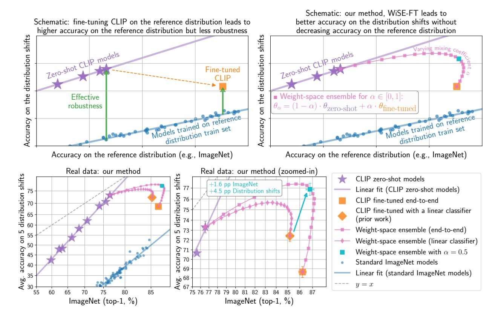

Figure 1: (**Top left**) Zero-shot CLIP models exhibit moderate accuracy on the reference distribution (x-axis, the target for fine-tuning) and high effective robustness (accuracy on the distribution shifts beyond the baseline models). In contrast, standard fine-tuning—either end-to-end or with a linear classifier (final layer)—attains higher accuracy on the reference distribution but less effective robustness. (**Top right**) Our method linearly interpolates between the zero-shot and fine-tuned models with a mixing coefficient  $\alpha \in [0, 1]$ . (**Bottom**) On five distribution shifts derived from ImageNet (ImageNetV2, ImageNet-R, ImageNet Sketch, ObjectNet, and ImageNet-A), WiSE-FT improves average accuracy relative to both the zero-shot and fine-tuned models while maintaining or improving accuracy on ImageNet.

models has recently also been raised as an open problem by several authors [3, 9, 82, 77]. Andreassen et al. [3] explored several fine-tuning approaches but found that none yielded models with improved robustness at high accuracy. Furthermore, Taori et al. [97] demonstrated that no current algorithmic robustness interventions provide consistent gains across the distribution shifts where zero-shot models excel.

In this paper, we conduct an empirical investigation to understand and improve fine-tuning of zero-shot models from a distributional robustness perspective. We begin by measuring how different fine-tuning approaches (last-layer vs. end-to-end fine-tuning, hyperparameter changes, etc.) affect the accuracy under distribution shift of the resulting fine-tuned models. Our empirical analysis uncovers two key issues in the standard fine-tuning process. First, the robustness of fine-tuned models varies substantially under even small changes in hyperparameters, but the best hyperparameters cannot be inferred from accuracy on the target distribution alone. Second, more aggressive fine-tuning (e.g., using a larger learning rate) yields larger accuracy improvements on the target distribution, but can also reduce accuracy under distribution shift by a large amount.

Motivated by the above concerns, we propose a robust way of fine-tuning zero-shot models that addresses the aforementioned trade-off and achieves the best of both worlds: increased performance under distribution shift

while maintaining or even improving accuracy on the target distribution relative to standard fine-tuning. In addition, our method simplifies the choice of hyperparameters in the fine-tuning process.

Our method (Figure [1\)](#page-1-0) has two steps: first, we fine-tune the zero-shot model on the target distribution. Second, we combine the original zero-shot and fine-tuned models by linearly interpolating between their weights, which we refer to as weight-space ensembling. Interpolating model parameters is a classical idea in convex optimization dating back decades (e.g., see [\[84,](#page-17-2) [79\]](#page-17-3)). Here, we empirically study model interpolation for non-convex models from the perspective of distributional robustness. Interestingly, linear interpolation in weight-space still succeeds despite the non-linearity in the activation functions of the neural networks.

Weight-space ensembles for fine-tuning (WiSE-FT) substantially improve accuracy under distribution shift compared to prior work while maintaining high performance on the target distribution. Concretely, on ImageNet [\[17\]](#page-13-0) and five of the natural distribution shifts studied by Radford et al. [\[82\]](#page-17-0), WiSE-FT applied to standard end-to-end fine-tuning improves accuracy under distribution shift by 4 to 6 percentage points (pp) over prior work while maintaining or improving the ImageNet accuracy of the fine-tuned CLIP model. Relative to the zero-shot model, WiSE-FT improves accuracy under distribution shift by 1 to 9 pp. Moreover, WiSE-FT improves over a range of alternative approaches such as regularization and evaluating at various points throughout fine-tuning. These robustness gains come at no additional computational cost during fine-tuning or inference.

While our investigation centers around CLIP, we observe similar trends for other zero-shot models including ALIGN [\[45\]](#page-15-0), BASIC [\[77\]](#page-17-1), and a ViT model pre-trained on JFT [\[21\]](#page-13-1). For instance, WiSE-FT improves the ImageNet accuracy of a fine-tuned BASIC-L model by 0.4 pp, while improving average accuracy under distribution shift by 2 to 11 pp.

To understand the robustness gains of WiSE-FT, we first study WiSE-FT when fine-tuning a linear classifier (last layer) as it is more amenable to analysis. In this linear case, our procedure is equivalent to ensembling the outputs of two models, and experiments point towards the complementarity of model predictions as a key property. For end-to-end fine-tuning, we connect our observations to earlier work on the phenomenology of deep learning. Neyshabur et al. [\[73\]](#page-16-1) found that end-to-end fine-tuning the same model twice yielded two different solutions that were connected via a linear path in weight-space along which error remains low, known as linear mode connectivity [\[25\]](#page-13-2). Our observations suggest a similar phenomenon along the path generated by WiSE-FT, but the exact shape of the loss landscape and connection between error on the target and shifted distributions are still open problems.

In addition to the aforementioned ImageNet distribution shifts, WiSE-FT consistently improves robustness on a diverse set of six additional distribution shifts including: (i) geographic shifts in satellite imagery and wildlife recognition (WILDS-FMoW, WILDS-iWildCam) [\[49,](#page-15-1) [13,](#page-13-3) [6\]](#page-12-2), (ii) reproductions of the popular image classification dataset CIFAR-10 with a distribution shift (CIFAR-10.1 and CIFAR-10.2) [\[83,](#page-17-4) [62\]](#page-16-2), and (iii) datasets with distribution shift induced by temporal perturbations in videos (ImageNet-Vid-Robust and YTBB-Robust) [\[88\]](#page-17-5). Beyond the robustness perspective, WiSE-FT also improves accuracy compared to standard fine-tuning, reducing the relative error rate by 4-49% on a range of seven datasets: ImageNet, CIFAR-10, CIFAR-100 [\[54\]](#page-15-2), Describable Textures [\[14\]](#page-13-4), Food-101 [\[10\]](#page-13-5), SUN397 [\[103\]](#page-18-1), and Stanford Cars [\[53\]](#page-15-3). Even when fine-tuning data is scarce, reflecting many application scenarios, we find that WiSE-FT improves performance.

Overall, WiSE-FT is simple, universally applicable in the problems we studied, and can be implemented in a few lines of code. Hence we encourage its adoption for fine-tuning zero-shot models.

# <span id="page-2-0"></span>2 Background and experimental setup

Our experiments compare the performance of zero-shot models, corresponding fine-tuned models, and models produced by WiSE-FT. To measure robustness, we contrast model accuracy on two related but different

<span id="page-3-1"></span>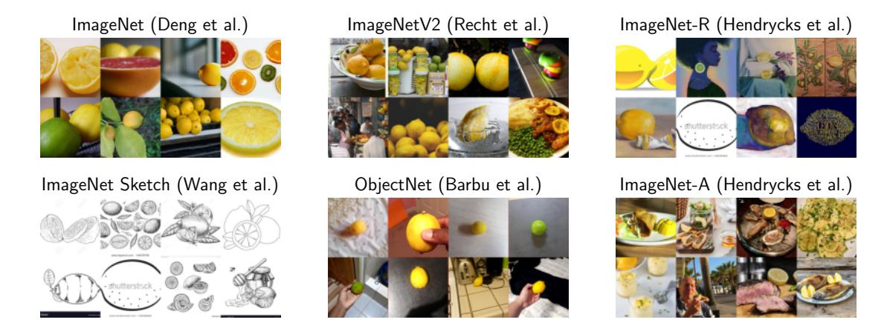

Figure 2: Samples of the class *lemon*, from the reference distribution ImageNet [17] and the derived distribution shifts considered in our main experiments: ImageNet-V2 [83], ImageNet-R [37], ImageNet Sketch [100], ObjectNet [4], and ImageNet-A [38].

distributions, a reference distribution  $\mathcal{D}_{ref}$  which is the target for fine-tuning, and shifted distribution  $\mathcal{D}_{shift}$ . We assume both distributions have test sets for evaluation, and  $\mathcal{D}_{ref}$  has an associated training set  $\mathcal{S}_{ref}^{tr}$  which is typically used for training or fine-tuning. The goal for a model is to achieve both high accuracy and consistent performance on the two distributions  $\mathcal{D}_{ref}$  and  $\mathcal{D}_{shift}$ . This is a natural goal as humans often achieve similar accuracy across the distribution shifts in our study [89].

For a model f, we let  $\mathsf{Acc}_{\mathsf{ref}}(f)$  and  $\mathsf{Acc}_{\mathsf{shift}}(f)$  refer to classification accuracy on the reference and shifted test sets, respectively. We consider k-way image classification, where  $x_i$  is an image with corresponding label  $y_i \in \{1, ..., k\}$ . The outputs of f are k-dimensional vectors of non-normalized class scores.

**Distribution shifts.** Taori et al. [97] categorized distribution shifts into two broad categories: (i) *synthetic*, e.g.,  $\ell_{\infty}$ -adversarial examples or artificial changes in image contrast, brightness, etc. [35, 8, 7, 29, 2]; and (ii) *natural*, where samples are not perturbed after acquisition and changes in data distributions arise through naturally occurring variations in lighting, geographic location, crowdsourcing process, image styles, etc. [97, 83, 37, 38, 49]. Following Radford et al. [81], our focus here is on natural distribution shifts as they are more representative of the real world when no active adversary is present. Specifically, we present our key results for five natural distribution shifts derived from ImageNet (i.e.,  $\mathcal{S}_{\text{ref}}^{\text{tr}}$  is ImageNet):

- ImageNet-V2 (IN-V2) [83], a reproduction of the ImageNet test set with distribution shift
- ImageNet-R (IN-R) [37], renditions (e.g., sculptures, paintings) for 200 ImageNet classes
- ImageNet Sketch (IN-Sketch) [100], which contains sketches instead of natural images
- ObjectNet [4], a test set of objects in various scenes with 113 classes overlapping with ImageNet
- ImageNet-A (IN-A) [38], a test set of natural images misclassified by a ResNet-50 [34] for 200 ImageNet classes.

Figure 2 illustrates the five distribution shifts.

Effective robustness and scatter plots. To compare the robustness of models with different accuracies on the reference distribution, we follow the *effective robustness* framework introduced by Taori et al. [97]. Effective robustness quantifies robustness as accuracy *beyond a baseline* trained only on the reference distribution.

<span id="page-3-0"></span> $<sup>^{1}\</sup>mathcal{D}_{\mathrm{ref}}$  and  $\mathcal{D}_{\mathrm{shift}}$  are sometimes referred to as in-distribution (ID) and out-of-distribution (OOD). In this work, we include evaluations of zero-shot models, which are not trained on data from the reference distribution, so referring to  $\mathcal{D}_{\mathrm{ref}}$  would be imprecise. For clarity, we avoid the ID/OOD terminology.

A useful tool for studying (effective) robustness are scatter plots that illustrate model performance under distribution shift [83, 97]. These scatter plots display accuracy on the reference distribution on the x-axis and accuracy under distribution shift on the y-axis, i.e., a model f is shown as a point  $(\mathsf{Acc}_{\mathsf{ref}}(f), \mathsf{Acc}_{\mathsf{shift}}(f))$  Figure 1 exemplifies these scatter plots with both schematics and real data. For the distribution shifts we study, accuracy on the reference distribution is a reliable predictor of accuracy under distribution shift [97, 70]. In other words, there exists a function  $\beta:[0,1]\to[0,1]$  such that  $\mathsf{Acc}_{\mathsf{shift}}(f)$  approximately equals  $\beta(\mathsf{Acc}_{\mathsf{ref}}(f))$  for models f trained on the train set  $\mathcal{S}^{\mathsf{tr}}_{\mathsf{ref}}$ . Effective robustness [97] is accuracy beyond this baseline, defined formally as  $\rho(f) = \mathsf{Acc}_{\mathsf{shift}}(f) - \beta(\mathsf{Acc}_{\mathsf{ref}}(f))$ .

In the corresponding scatter plots, effective robustness is vertical movement above expected accuracy under distribution shift (Figure 1, top). Effective robustness thereby disentangles accuracy changes on the reference distribution from the effect of robustness interventions. When we say that a model is robust to distribution shift, we mean that effective robustness is positive. Taori et al. [97] observed that no algorithmic robustness intervention consistently achieves substantial effective robustness across the distribution shifts in Figure 2—the first method to do so was zero-shot CLIP. Empirically, when applying logit (or probit) axis scaling, models trained on the reference distribution approximately lie on a linear trend [97, 70]. As in Taori et al. [97], we apply logit axis scaling and show 95% Clopper-Pearson confidence intervals for the accuracies of select points.

Zero-shot models and CLIP. We primarily explore CLIP models [82], although we also investigate other zero-shot models including ALIGN [45], BASIC [77] and a ViT model pre-trained on JFT [21]. Zero-shot models exhibit effective robustness and lie on a qualitatively different linear trend (Figure 1). CLIP-like models are pre-trained using image-caption pairs from the web. Given a set of image-caption pairs  $\{(x_1, s_1)..., (x_B, s_B)\}$ , CLIP-like models train an image-encoder g and text-encoder h such that the similarity  $\langle g(x_i), h(s_i) \rangle$  is maximized relative to unaligned pairs. CLIP-like models perform zero-shot k-way classification given an image x and class names  $C = \{c_1, ..., c_k\}$  by matching x with potential captions. For instance, using caption  $s_i =$  "a photo of a  $\{c_i\}$ " for each class i, the zero-shot model predicts the class via  $\arg \max_j \langle g(x), h(s_j) \rangle$ . Equivalently, one can construct  $\mathbf{W}_{\text{zero-shot}} \in \mathbb{R}^{d \times k}$  with columns  $h(s_j)$  and compute outputs  $f(x) = g(x)^{\top} \mathbf{W}_{\text{zero-shot}}$ . Unless explicitly mentioned, our experiments use the CLIP model ViT-L/140336px, although all CLIP models are displayed in our scatter plots (additional details provided in Appendix D.1).

# <span id="page-4-1"></span>3 Weight-space ensembles for fine-tuning

This section describes and motivates our proposed method, WiSE-FT, which consists of two simple steps. First, we fine-tune the zero-shot model on application-specific data. Second, we combine the original zero-shot and fine-tuned models by linearly interpolating between their weights, also referred to as weight-space ensembling. WiSE-FT can be implemented in a few lines of PyTorch, and we provide example code in Appendix A.

The zero-shot model excels under distribution shift while standard fine-tuning achieves high accuracy on the reference distribution. Our motivation is to combine these two models into one that achieves the best of both worlds. Weight-space ensembles are a natural choice as they ensemble without extra computational cost. Moreover, previous work has suggested that interpolation in weight space may improve performance when models share part of their optimization trajectory [43, 73].

Step 1: Standard fine-tuning. As in Section 2, we let  $\mathcal{S}_{\text{ref}}^{\text{tr}}$  denote the dataset used for fine-tuning and g denote the image encoder used by CLIP. We are now explicit in writing  $g(x, \mathbf{V}_{\text{enc}})$  where x is an input image and  $\mathbf{V}_{\text{enc}}$  are the parameters of the encoder g. Standard fine-tuning considers the model  $f(x,\theta) = g(x,\mathbf{V}_{\text{enc}})^{\top}\mathbf{W}_{\text{classifier}}$  where  $\mathbf{W}_{\text{classifier}} \in \mathbb{R}^{d \times k}$  is the classification head and  $\theta = [\mathbf{V}_{\text{enc}}, \mathbf{W}_{\text{classifier}}]$ 

<span id="page-4-0"></span><sup>&</sup>lt;sup>2</sup>For improved accuracy, the embedding of a few candidate captions are averaged, e.g.,  $s_i^{(1)}$ ="a photo of a  $\{c_i\}$ " and  $s_i^{(2)}$ ="a picture of a  $\{c_i\}$ " (referred to as prompt ensembling [82]).

are the parameters of f. We then solve arg min<sup>θ</sup> nP (xi,yi)∈Str ref `(f(x<sup>i</sup> , θ), yi) + λR(θ) o where ` is the crossentropy loss and R is a regularization term (e.g., weight decay). We consider the two most common variants of fine-tuning: end-to-end, where all values of θ are modified, and fine-tuning only a linear classifier, where Venc is fixed at the value learned during pre-training. Appendices [D.2](#page-44-1) and [D.3](#page-45-0) provide additional details.

Step 2: Weight-space ensembling. For a mixing coefficient α ∈ [0, 1], we consider the weight-space ensemble between the zero-shot model with parameters θ<sup>0</sup> and the model obtained via standard fine-tuning with parameters θ1. The predictions of the weight-space ensemble wse are given by

<span id="page-5-0"></span>
$$wse(x,\alpha) = f(x,(1-\alpha)\cdot\theta_0 + \alpha\cdot\theta_1) , \qquad (1)$$

i.e., we use the element-wise weighted average of the zero-shot and fined-tuned parameters. When fine-tuning only the linear classifier, weight-space ensembling is equivalent to the traditional output-space ensemble [\[20,](#page-13-6) [11,](#page-13-7) [26\]](#page-14-5) (1 − α) · f(x, θ0) + α · f(x, θ1) since Equation [1](#page-5-0) decomposes as (1 − α) · g(x, Venc) <sup>&</sup>gt;Wzero-shot + α · g(x, Venc) <sup>&</sup>gt;Wclassifier.

As neural networks are non-linear with respect to their parameters, ensembling all layers—as we do when end-to-end fine-tuning—typically fails, achieving no better accuracy than a randomly initialized neural network [\[25\]](#page-13-2). However, as similarly observed by previous work where part of the optimization trajectory is shared [\[43,](#page-15-4) [25,](#page-13-2) [73\]](#page-16-1), we find that the zero-shot and fine-tuned models are connected by a linear path in weight-space along which accuracy remains high (explored further in Section [5.2\)](#page-9-0).

Remarkably, as we show in Section [4,](#page-5-1) WiSE-FT improves accuracy under distribution shift while maintaining high performance on the reference distribution relative to fine-tuned models. These improvements come without any additional computational cost as a single set of weights is used.

## <span id="page-5-1"></span>4 Results

This section presents our key experimental findings. First, we show that WiSE-FT boosts the accuracy of a fine-tuned CLIP model on five ImageNet distribution shifts studied by Radford et al. [\[82\]](#page-17-0), while maintaining or improving ImageNet accuracy. Next, we present additional experiments, including more distribution shifts, the effect of hyperparameters, accuracy improvements on the reference distribution, and experiments in the low-data regime. Finally, we demonstrate that our findings are more broadly applicable by exploring WiSE-FT for BASIC [\[77\]](#page-17-1), ALIGN [\[45\]](#page-15-0), and a ViT-H/14 [\[21\]](#page-13-1) model pre-trained on JFT-300M [\[93\]](#page-18-3).

<span id="page-5-2"></span>Main results: ImageNet and associated distribution shifts. As illustrated in Figure [1,](#page-1-0) when the mixing coefficient α varies from 0 to 1, wse(·, α) is able to simultaneously improve accuracy on both the reference and shifted distributions. A breakdown for each dataset is shown in Appendix [C.1.](#page-20-1) Table [1](#page-6-0) presents our main results on ImageNet and five derived distribution shifts. WiSE-FT (end-to-end, α=0.5) outperforms numerous strong models in both average accuracy under distribution shift and the average accuracy on the reference and shifted distributions. While future work may lead to more sophisticated strategies for choosing the mixing coefficient α, α=0.5 yields close to optimal performance across a range of experiments. Hence, we recommend α=0.5 when no domain knowledge is available. Appendix [B](#page-20-2) further explores the effect of α. Moreover, results for twelve additional backbones are shown in Appendix [C.](#page-20-3)

Robustness on additional distribution shifts. Beyond the five distribution shifts derived from ImageNet, WiSE-FT consistently improves robustness on a diverse set of further distributions shifts including geographic shifts in satellite imagery and wildlife recognition (WILDS-FMoW [\[49,](#page-15-1) [13\]](#page-13-3), WILDS-iWildCam [\[49,](#page-15-1) [6\]](#page-12-2)), reproductions of the popular image classification dataset CIFAR-10 [\[54\]](#page-15-2) with a distribution shift (CIFAR-10.1 [\[83\]](#page-17-4) and CIFAR-10.2 [\[62\]](#page-16-2)), and datasets with distribution shift induced by temporal perturbations in videos (ImageNet-Vid-Robust and YTBB-Robust [\[89\]](#page-17-6)). Concretely, WiSE-FT (α=0.5) improves performance under distribution shift by 3.5, 6.2, 1.7, 2.1, 9.0 and 23.2 pp relative to the fine-tuned solution while decreasing performance on the reference distribution by at most 0.3 pp (accuracy on the reference distribution often improves). In contrast to the ImageNet distribution shifts, the zero-shot model initially achieves less than

<span id="page-6-0"></span>

|                       |                |       |      |           | Avg        | Avg  |        |              |
|-----------------------|----------------|-------|------|-----------|------------|------|--------|--------------|
|                       | IN (reference) | IN-V2 | IN-R | IN-Sketch | ObjectNet* | IN-A | shifts | ref., shifts |
| CLIP ViT-L/140336px   |                |       |      |           |            |      |        |              |
| Zero-shot [82]        | 76.2           | 70.1  | 88.9 | 60.2      | 70.0       | 77.2 | 73.3   | 74.8         |
| Fine-tuned LC [82]    | 85.4           | 75.9  | 84.2 | 57.4      | 66.2       | 75.3 | 71.8   | 78.6         |
| Zero-shot (PyTorch)   | 76.6           | 70.5  | 89.0 | 60.9      | 69.1       | 77.7 | 73.4   | 75.0         |
| Fine-tuned LC (ours)  | 85.2           | 75.8  | 85.3 | 58.7      | 67.2       | 76.1 | 72.6   | 78.9         |
| Fine-tuned E2E (ours) | 86.2           | 76.8  | 79.8 | 57.9      | 63.3       | 65.4 | 68.6   | 77.4         |
| WiSE-FT (ours)        |                |       |      |           |            |      |        |              |
| LC, $\alpha = 0.5$    | 83.7           | 76.3  | 89.6 | 63.0      | 70.7       | 79.7 | 75.9   | 79.8         |
| LC, optimal $\alpha$  | 85.3           | 76.9  | 89.8 | 63.0      | 70.7       | 79.7 | 75.9   | 80.2         |
| E2E, $\alpha$ =0.5    | 86.8           | 79.5  | 89.4 | 64.7      | 71.1       | 79.9 | 76.9   | 81.8         |
| E2E, optimal $\alpha$ | 87.1           | 79.5  | 90.3 | 65.0      | 72.1       | 81.0 | 77.4   | 81.9         |

Table 1: Accuracy of various methods on ImageNet and derived distribution shifts for CLIP ViT-L/14@336px [82]. E2E: end-to-end; LC: linear classifier. Avg shifts displays the mean performance among the five distribution shifts, while Avg reference, shifts shows the average of ImageNet (reference) and Avg shifts. For optimal  $\alpha$ , we choose the single mixing coefficient that maximizes the column. Results for additional models are provided in Appendix C.7.

30% accuracy on the WILDS distribution shifts, and WiSE-FT provides improvements regardless. Appendix C.2 (Figure 9 and Table 6) includes more detailed results.

Hyperparameter variation and alternatives. As illustrated by Figure 3, moderate changes in standard hyperparameters such as the learning rate or the number of epochs can substantially affect performance under distribution shift. Moreover, these performance differences cannot be detected reliably from model performance on reference data alone. For instance, while training for 10 epochs with learning rate  $3 \cdot 10^{-5}$  and  $3 \cdot 10^{-6}$  lead to a small accuracy difference on ImageNet (0.3 pp), accuracy under distribution shift varies by as much as 8 pp.

Furthermore, tuning hyperparameters on ImageNet data can also reduce robustness. For instance, while moving from small to moderate learning rates  $(10^{-7} \text{ to } 3 \cdot 10^{-5})$  improves performance on ImageNet by 5 pp, it also deteriorates accuracy under distribution shift by 8 pp.

WiSE-FT addresses this brittleness of hyperparameter tuning: even when using a learning rate  $3 \cdot 10^{-5}$  where standard fine-tuning leads to low robustness, applying WiSE-FT removes the trade-off between accuracy on the reference and shifted distributions. The models which can be achieved by varying  $\alpha$  are as good or better than those achievable by other hyperparameter configurations. Then, instead of searching over a wide range of hyperparameters, only  $\alpha$  needs to be considered. Moreover, evaluating different values of  $\alpha$  does not require training new models.

There is no hyperparameter in Figure 3 which can be varied to match or exceed the optimal curve produced by WiSE-FT. In our experiments, this frontier is reached only through methods that average model weights, either using WiSE-FT or with a more sophisticated averaging scheme: keeping an exponential moving average of all model iterates (EMA, [95]). Comparisons with EMA are detailed in Appendix C.3.2.

Additional comparisons are also presented in Appendix C.3, including distillation, additional regularization, and CoOp [112]. Finally, Appendix C.4 recreates Figure 3 with stronger data augmentation and finds similar trends.

Accuracy gains on reference distributions. Beyond robustness to distribution shift, Table 2 demonstrates that WiSE-FT also improves accuracy after fine-tuning on seven datasets. When fine-tuning end-to-end

<sup>\*</sup>Although this table considers ImageNet class names, ObjectNet provides alternative class names which can improve the performance of zero-shot CLIP by 2.3 percentage points (Appendix D.4).

<span id="page-7-0"></span>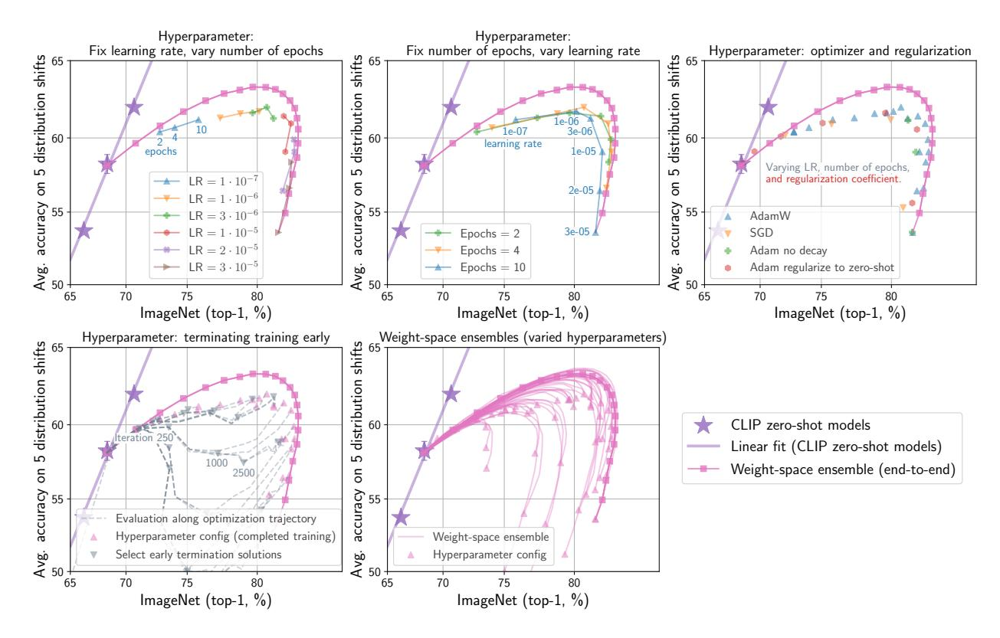

Figure 3: The robustness of fine-tuned models varies substantially under even small changes in hyperparameters. Applying WiSE-FT addresses this brittleness and can remove the trade-off between accuracy on the reference and shifted distributions. Results shown for CLIP ViT-B/16 fine-tuned with cosine-annealing learning rate schedule and all models in the top left and top middle plots are fine-tuned with AdamW [61]. Moreover, regularize to zero-shot appends the regularizer  $\lambda \|\theta - \theta_0\|_2^2$  to the fine-tuning objective, where  $\theta_0$  are the parameters of the zero-shot model.

on ImageNet, CIFAR-10, CIFAR-100, Describable Textures, Food-101, SUN397, and Stanford Cars, WiSE-FT reduces relative error by 4 to 49%. Even though standard fine-tuning directly optimizes for high accuracy on the reference distribution, WiSE-FT achieves better performance. Appendix C.5 includes more details, including explorations in the low-data regime.

Beyond CLIP. Figure 4 illustrates that WiSE-FT is generally applicable to zero-shot models beyond CLIP, and beyond models pre-trained contrastively with image-text pairs. First, we interpolate between the weights of the zero-shot and fine-tuned BASIC-L model [77], finding that  $\alpha$ =0.5 improves average accuracy on five distribution shifts derived from ImageNet by over 7 pp while improving ImageNet accuracy by 0.4 pp relative to the fine-tuned BASIC-L model (a per-dataset breakdown is provided in Figure 24 and Table 12 of the Appendix). As in Pham et al. [77], the model is fine-tuned using a contrastive loss and half of the ImageNet training data. WiSE-FT provides improvements on both reference and shifted distributions, despite these experimental differences.

Next, we consider the application of WiSE-FT to a ViT-H/14 model [21] pre-trained on JFT-300M [93], where the zero-shot classifier is constructed by manually identifying a class correspondence (details provided in Section C.7.2). WiSE-FT improves performance under distribution shift over both the zero-shot and fine-tuned models. When  $\alpha$ =0.8, WiSE-FT outperforms the fine-tuned model by 2.2 pp on distribution shifts, while maintaining ImageNet performance within 0.2 pp of the fine-tuned model. This result demonstrates that WiSE-FT can be successfully applied even to models which do not use contrastive image-text pre-training.

<span id="page-8-0"></span>

|                          | ImageNet    | CIFAR10     | CIFAR100    | Cars        | DTD         | SUN397      | Food101     |
|--------------------------|-------------|-------------|-------------|-------------|-------------|-------------|-------------|
| Standard fine-tuning     | 86.2        | 98.6        | 92.2        | 91.6        | 81.9        | 80.7        | 94.4        |
| WiSE-FT ( $\alpha$ =0.5) | 86.8 (+0.6) | 99.3 (+0.7) | 93.3 (+1.1) | 93.3 (+1.7) | 84.6 (+2.8) | 83.2 (+2.5) | 96.1 (+1.6) |
| WiSE-FT (opt. $\alpha$ ) | 87.1 (+0.9) | 99.5 (+0.8) | 93.4 (+1.2) | 93.6 (+2.0) | 85.2 (+3.3) | 83.3 (+2.6) | 96.2 (+1.8) |

Table 2: Beyond robustness, WiSE-FT can improve accuracy after fine-tuning on several datasets.

<span id="page-8-1"></span>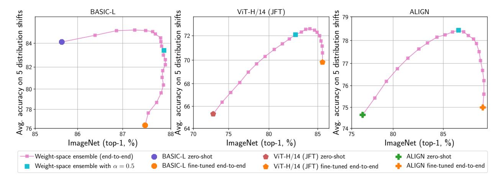

Figure 4: WiSE-FT applied to BASIC-L [77], a ViT-H/14 [21] model pre-trained on JFT-300M [93] and ALIGN [45].

Finally, we apply WiSE-FT to the ALIGN model of Jia et al. [45], which is similar to CLIP but is pre-trained with a different dataset, finding similar trends.

## 5 Discussion

This section further analyzes the empirical phenomena we have observed so far. We begin with the case where only the final linear layer is fine-tuned and predictions from the weight-space ensemble can be factored into the outputs of the zero-shot and fine-tuned model. Next, we connect our observations regarding end-to-end fine-tuning with earlier work on the phenomenology of deep learning.

#### 5.1 Zero-shot and fine-tuned models are complementary

In this section, we find that the zero-shot and fine-tuned models have diverse predictions, both on reference and shifted distributions. Moreover, while the fine-tuned models are more confident on the reference distribution, the reverse is true under distribution shift.

**Zero-shot and fine-tuned models are diverse.** In certain cases, ensemble accuracy is correlated with diversity among the constituents [57, 30]. If two models make coincident mistakes, so will their ensemble, and no benefit will be gained from combining them. Here, we explore two measures of diversity: *prediction diversity*, which measures the fraction of examples for which two classifiers disagree but one is correct; and *Centered Kernel Alignment Complement*, the complement of CKA [51]. Additional diversity measures and details are provided in Appendix E. In Figure 5 (left), we show that the zero-shot and fine-tuned models are diverse both on the reference and shifted distributions, despite sharing the same backbone. As a point of comparison, we include avg. diversity measures between two linear classifiers fine-tuned with random splits on half of ImageNet.<sup>3</sup> denoted in orange in Figure 5.

<span id="page-8-2"></span><sup>&</sup>lt;sup>3</sup>Two linear classifiers fine-tuned on the same data converge to similar solutions, resulting in negligible diversity. As a stronger baseline, we fine-tune classifiers on different subsets of ImageNet, with half of the data.

<span id="page-9-1"></span>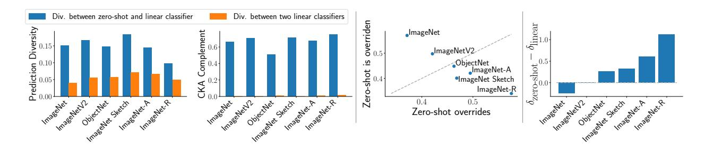

Figure 5: (Left) Zero-shot and fine-tuned models exhibit diversity in their predictions. (Middle) On most distribution shifts, the zero-shot model overrides the linear classifier more than it is overridden. The reverse is true for ImageNet (reference). (Right) Similarly, zero-shot models are more confident under distribution shift, while the reverse is true on the reference distribution. The margin  $\delta_f$  measures the average difference between the largest and second largest unormalized output for classifier f

Models are more confident where they excel. In order for the ensemble model to be effective, it should leverage each model's expertise based on which distribution the data is from. Here, we empirically show that this occurs on a number of datasets we consider. First, we examine the cases where the models being ensembled disagree. We say the zero-shot model overrides the fine-tuned model if their predictions disagree and the zero-shot prediction matches that of the weight-space ensemble. Similarly, if models disagree and the linear classifier prediction matches the ensemble, we say the zero-shot is overridden. Figure 5 (middle) shows the fraction of samples where the zero-shot model overrides and is overridden by the fine-tuned linear classifier for  $\alpha$ =0.5. Other than ImageNetV2, which was collected to closely reproduce ImageNet, the zero-shot model overrides the linear classifier more than it is overridden on the distribution shifts.

Additionally, we are interested in measuring model confidence. Recall that we are ensembling quantities before a softmax is applied, so we avoid criteria that use probability vectors, e.g., Guo et al. [33]. Instead, we consider the margin  $\delta$  between the largest and second largest output of each classifier. Figure 5 (right) shows that the zero-shot model is more confident in its predictions under distribution shift, while the reverse is true on the reference distribution.

#### <span id="page-9-0"></span>5.2 An error landscape perspective

We now turn to empirical phenomena we observe when weight-space ensembling all layers in the network. Specifically, this section formalizes our observations and details related phenomena. Recall that the weight-space ensemble of  $\theta_0$  and  $\theta_1$  is given by  $f(x, (1-\alpha) \cdot \theta_0 + \alpha \cdot \theta_1)$  (Equation 1).

For a distribution  $\mathcal{D}$  and model f, let  $\mathsf{Acc}_{\mathcal{D},f}(\theta)$  denote the expected accuracy of f evaluated with parameters  $\theta$  on distribution  $\mathcal{D}$ .

<span id="page-9-2"></span>**Observation 1:** As illustrated in Figure 6, on ImageNet and the five associated distribution shifts we consider

$$\mathsf{Acc}_{\mathcal{D},f}((1-\alpha)\cdot\theta_0 + \alpha\cdot\theta_1) \ \geq \ (1-\alpha)\cdot\mathsf{Acc}_{\mathcal{D},f}(\theta_0) + \alpha\cdot\mathsf{Acc}_{\mathcal{D},f}(\theta_1) \tag{2}$$

for all  $\alpha \in [0,1]$ .

Note that equation 2 uses the baseline of linearly interpolating between the accuracies of the two endpoints, which is always achievable by using weights  $\theta_1$  with probability  $\alpha$  and using model  $\theta_0$  otherwise. In the case where the accuracy of both endpoints are similar, Equation 2 is equivalent to the definition of Linear Mode Connectivity of Frankle et al. [25].

To assist in contextualizing Observation 1, we review related phenomena. Neural networks are nonlinear, hence weight-space ensembles only achieve good performance in exceptional cases—interpolating the weights of two networks trained from a random initialization results in no better accuracy than a random classifier

<span id="page-10-0"></span>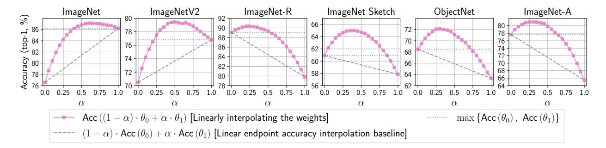

Figure 6: On ImageNet and the main distribution shifts we consider, linearly interpolating between the weights of  $\theta_0$  and  $\theta_1$  exceeds the baseline of linearly interpolating the accuracies of the two models for all  $\alpha$  (Observation 1). Moreover, there exists an  $\alpha$  for which WiSE-FT outperforms both the zero-shot and fine-tuned models (Observation 2).

[25]. Linear mode connectivity has been observed by Frankle et al. [25]; Izmailov et al. [43] when part of the training trajectory is shared, and by Neyshabur et al. [73] when two models are fine-tuned with a shared initialization. In particular, the observations of Neyshabur et al. [73] may elucidate why weight-space ensembles attain high accuracy in the setting we consider, as they suggest that fine-tuning remains in a region where solutions are connected by a linear path along which error remains low. Instead of considering the weight-space ensemble of two fine-tuned models, we consider the weight-space ensemble of the *pre-trained* and fine-tuned models. This is only possible for a pre-trained model capable of zero-shot inference such as CLIP.

**Observation 2:** As illustrated by Figure 6, on ImageNet and the five associated distribution shifts we consider, weight-space ensembling (end-to-end) may outperform both the zero-shot and fine-tuned models, i.e., there exists an  $\alpha$  for which  $\mathsf{Acc}_{\mathcal{D},f}((1-\alpha)\cdot\theta_0+\alpha\cdot\theta_1) \geq \max\{\mathsf{Acc}_{\mathcal{D},f}(\theta_0),\,\mathsf{Acc}_{\mathcal{D},f}(\theta_1)\}.$ 

We are not the first to observe that when interpolating between models, the accuracy of models along the path may exceed that of either endpoint [43, 73, 102]. Neyshabur et al. [73] conjecture that interpolation could produce solutions closer to the true center of a basin. In contrast to Neyshabur et al. [73], we interpolate between models which observe different data.

## 6 Related work

Robustness. Understanding how models perform under distribution shift remains an important goal, as real world models may encounter data from new environments [80, 98]. Previous work has studied model behavior under synthetic [35, 99, 65, 29, 23, 2] and natural distribution shift [37, 49, 100, 4, 38]. Interventions used for synthetic shifts do not typically provide robustness to many natural distribution shifts [97]. In contrast, accuracy on the reference distribution is often a reliable predictor for accuracy under distribution shift [106, 69, 97, 94, 70]. On the other hand, D'Amour et al. [16] show that accuracy under certain distribution shifts cannot be reliably inferred from accuracy on the reference distribution. We observe a similar phenomenon when fine-tuning with different hyperparameters (Section 4, Figure 3).

Pre-training and transfer learning. Pre-training on large amounts of data is a powerful technique for building high-performing machine learning systems [90, 21, 50, 107, 81, 12]. One increasingly popular class of vision models are those pre-trained with auxiliary language supervision, which can be used for zero-shot inference [18, 86, 111, 82, 45, 77, 109]. When pre-trained models are adapted to a specific distribution through standard fine-tuning, effective robustness deteriorates at convergence [3]. In natural language processing, previous work proposed stable fine-tuning methods that incur computational overhead [46, 113], alleviating problems such as representational collapse [1]. More generally, a variety of methods have attempted to mitigate catastrophic forgetting [67]. Kirkpatrick et al. [48]; Zenke et al. [108] explored weighted quadratic

regularization for sequential learning. Xuhong et al. [\[105\]](#page-18-12) showed that, for fine-tuning, the simple quadratic regularization explored in Section [4](#page-5-1) performs best, while Lubana et al. [\[63\]](#page-16-7) explored the connection between quadratic regularization and interpolation. Andreassen et al. [\[3\]](#page-12-0) found that many approaches from continual learning do not provide robustness to multiple natural distribution shifts. Finally, Li et al. [\[59\]](#page-16-8) investigate the effect of fine-tuning hyperparameters on performance.

Traditional (output-space) ensembles. Traditional ensemble methods, which we refer to as output-space ensembles, combine the predictions (outputs) of many classifiers [\[20,](#page-13-6) [5,](#page-12-8) [11,](#page-13-7) [27,](#page-14-8) [58,](#page-15-10) [26\]](#page-14-5). Typically, output-space ensembles outperform individual classifiers and provide uncertainty estimates under distribution shift that are more callibrated than baselines [\[58,](#page-15-10) [75,](#page-16-9) [92\]](#page-17-11). In contrast to these works, we consider the ensemble of two models which have observed different data. Output-space ensembles require more computational resources as they require a separate pass through each model. Compared to an ensemble of 15 models trained on the same dataset, Mustafa et al. [\[72\]](#page-16-10) find an improvement of 0.8–1.6 pp under distribution shift (on ImageNetV2, ImageNet-R, ObjectNet, and ImageNet-A) by ensembling a similar number of models pre-trained on different datasets. In contrast, we see an improvement of 2–15 pp from ensembling two models. Moreover, as we ensemble in weight-space, no extra compute is required compared to a single model.

Weight-space ensembles. Weight-space ensembles linearly interpolate between the weights of different models [\[25,](#page-13-2) [64,](#page-16-11) [32,](#page-14-9) [95\]](#page-18-4). For example, Izmailov et al. [\[43\]](#page-15-4) average checkpoints saved throughout training for improved performance. Indeed, averaging the weights along the training trajectory is a central method in optimization [\[84,](#page-17-2) [78,](#page-17-12) [74\]](#page-16-12). For instance, Zhang et al. [\[110\]](#page-19-4) propose optimizing with a set of fast and slow weights, where every k steps, these two sets of weights are averaged and a new trajectory begins. Here, we revisit these techniques from a distributional robustness perspective and consider the weight-space ensemble of models which have observed different data.

Concurrent and subsequent work. Topics including robust fine-tuning, ensembles for improved robustness, and interpolating the weights of fine-tuned models are studied in concurrent and subsequent work. Kumar et al. [\[55\]](#page-15-11) observe that fine-tuning end-to-end often results in higher accuracy on the reference distribution but lower accuracy under distribution shift, compared to linear classifier fine-tuning. To address this, Kumar et al. [\[55\]](#page-15-11) first fine-tune a linear classifier and use this as the initialization for end-to-end fine-tuning. We consider fine-tuning zero-shot models, and so we begin with a classifier (i.e., the zero-shot classifier) which we are using as the initialization for end-to-end fine-tuning. In a separate work, Kumar et al. [\[56\]](#page-15-12) find that calibrated output-space ensembles can be used to mitigate accuracy trade-offs. In Figures [10](#page-26-1) and [25](#page-44-2) of the Appendix, we observe that it is possible to mitigate accuracy trade-offs with output-space ensembles even without calibration.

Hewitt et al. [\[40\]](#page-14-10) explore the application of output-space ensembles and distillation to mitigate accuracy trade-offs which arise in fine-tuning models for natural language generation. Hewitt et al. [\[40\]](#page-14-10) observe that output-space ensembles mainly outperform distillation, which we observe for a separate domain in Figure [13](#page-28-0) of the Appendix. Gontijo-Lopes et al. [\[31\]](#page-14-11) explore output-space ensembles of models across hyper-parameters, architectures, frameworks, and datasets. They find that specializing in subdomains of data leads to high ensemble performance. Finally, Matena and Raffel [\[66\]](#page-16-13) introduce a method of combining models in weight-space that goes beyond linear interpolation with a single mixing-coefficient as employed in WiSE-FT. Specifically, Matena and Raffel [\[66\]](#page-16-13) employ Fisher information as a measure of per-parameter importance. While their experiments do not examine accuracy under distribution shift, their goal of combining differing expertise into one shared model is well aligned with ours.

# 7 Limitations, impact, and conclusion

Limitations. While we expect our findings to be more broadly applicable to other domains such as natural language processing, our investigation here is limited to image classification. Exploring fine-tuning for object detection and natural language processing are interesting directions for future work. Moreover, although the interpolation parameter setting α=0.5 provides good overall performance, we leave the question of finding the optimal α for specific target distributions to future work.

Impact. Radford et al. [\[82\]](#page-17-0) and Brown et al. [\[12\]](#page-13-10) extensively discuss the broader impact of large zero-shot models and identify potential causes of harm including model biases and potential malicious uses such as surveillance systems. WiSE-FT is a fine-tuning method that builds on such models, and thus may perpetuate their negative impact.

Conclusion. WiSE-FT can substantially improve performance under distribution shift with minimal or no loss in accuracy on the target distribution compared to standard fine-tuning. We view WiSE-FT as a first step towards more sophisticated fine-tuning schemes and anticipate that future work will continue to leverage the robustness of zero-shot models for building more reliable neural networks.

## Acknowledgements

We thank Anders Andreassen, Tim Dettmers, Jesse Dodge, Katie Everett, Samir Gadre, Ari Holtzman, Sewon Min, Mohammad Norouzi, Nam Pho, Ben Poole, Sarah Pratt, Alec Radford, Jon Shlens, and Rohan Taori for helpful discussions and draft feedback, Hyak at UW for computing support, Rosanne Liu for fostering the collaboration, and Basil Mustafa for providing an earlier version of the mapping between JFT and ImageNet classes. This work is in part supported by NSF IIS 1652052, IIS 17303166, DARPA N66001-19-2-4031, DARPA W911NF-15-1-0543 and gifts from Allen Institute for Artificial Intelligence.

# References

- <span id="page-12-7"></span>[1] Armen Aghajanyan, Akshat Shrivastava, Anchit Gupta, Naman Goyal, Luke Zettlemoyer, and Sonal Gupta. Better fine-tuning by reducing representational collapse. In International Conference on Learning Representations (ICLR), 2021. <https://openreview.net/forum?id=OQ08SN70M1V>.
- <span id="page-12-6"></span>[2] Michael A Alcorn, Qi Li, Zhitao Gong, Chengfei Wang, Long Mai, Wei-Shinn Ku, and Anh Nguyen. Strike (with) a pose: Neural networks are easily fooled by strange poses of familiar objects. In Conference on Computer Vision and Pattern Recognition (CVPR), 2019. <https://arxiv.org/abs/1811.11553>.
- <span id="page-12-0"></span>[3] Anders Andreassen, Yasaman Bahri, Behnam Neyshabur, and Rebecca Roelofs. The evolution of out-ofdistribution robustness throughout fine-tuning, 2021. <https://arxiv.org/abs/2106.15831>.
- <span id="page-12-3"></span>[4] Andrei Barbu, David Mayo, Julian Alverio, William Luo, Christopher Wang, Dan Gutfreund, Josh Tenenbaum, and Boris Katz. Objectnet: A large-scale bias-controlled dataset for pushing the limits of object recognition models. In Advances in Neural Information Processing Systems (NeurIPS), 2019. URL [https://proceedings.](https://proceedings.neurips.cc/paper/2019/file/97af07a14cacba681feacf3012730892-Paper.pdf) [neurips.cc/paper/2019/file/97af07a14cacba681feacf3012730892-Paper.pdf](https://proceedings.neurips.cc/paper/2019/file/97af07a14cacba681feacf3012730892-Paper.pdf).
- <span id="page-12-8"></span>[5] Eric Bauer and Ron Kohavi. An empirical comparison of voting classification algorithms: Bagging, boosting, and variants. Machine learning, 1999. <https://link.springer.com/article/10.1023/A:1007515423169>.
- <span id="page-12-2"></span>[6] Sara Beery, Arushi Agarwal, Elijah Cole, and Vighnesh Birodkar. The iwildcam 2021 competition dataset. In Conference on Computer Vision and Pattern Recognition (CVPR) FGVC8 Workshop, 2021. [https://arxiv.](https://arxiv.org/abs/2105.03494) [org/abs/2105.03494](https://arxiv.org/abs/2105.03494).
- <span id="page-12-5"></span>[7] Battista Biggio and Fabio Roli. Wild patterns: Ten years after the rise of adversarial machine learning. Pattern Recognition, 2018. <https://arxiv.org/abs/1712.03141>.
- <span id="page-12-4"></span>[8] Battista Biggio, Igino Corona, Davide Maiorca, Blaine Nelson, Nedim Srndi´c, Pavel Laskov, Giorgio Giacinto, ˇ and Fabio Roli. Evasion attacks against machine learning at test time. In Joint European conference on machine learning and knowledge discovery in databases, 2013. <https://arxiv.org/abs/1708.06131>.
- <span id="page-12-1"></span>[9] Rishi Bommasani, Drew A Hudson, Ehsan Adeli, Russ Altman, Simran Arora, Sydney von Arx, Michael S Bernstein, Jeannette Bohg, Antoine Bosselut, Emma Brunskill, et al. On the opportunities and risks of foundation models, 2021. <https://arxiv.org/abs/2108.07258>.

- <span id="page-13-5"></span>[10] Lukas Bossard, Matthieu Guillaumin, and Luc Van Gool. Food-101–mining discriminative components with random forests. In European Conference on Computer Vision (ECCV), 2014. [https://data.vision.ee.ethz.](https://data.vision.ee.ethz.ch/cvl/datasets_extra/food-101/) [ch/cvl/datasets\\_extra/food-101/](https://data.vision.ee.ethz.ch/cvl/datasets_extra/food-101/).
- <span id="page-13-7"></span>[11] Leo Breiman. Bagging predictors. Machine learning, 1996. [https://link.springer.com/article/10.1007/](https://link.springer.com/article/10.1007/BF00058655) [BF00058655](https://link.springer.com/article/10.1007/BF00058655).
- <span id="page-13-10"></span>[12] Tom Brown, Benjamin Mann, Nick Ryder, Melanie Subbiah, Jared D Kaplan, Prafulla Dhariwal, Arvind Neelakantan, Pranav Shyam, Girish Sastry, Amanda Askell, Sandhini Agarwal, Ariel Herbert-Voss, et al. Language models are few-shot learners. In Advances in Neural Information Processing Systems (NeurIPS), 2020. <https://arxiv.org/abs/2005.14165>.
- <span id="page-13-3"></span>[13] Gordon Christie, Neil Fendley, James Wilson, and Ryan Mukherjee. Functional map of the world. In Conference on Computer Vision and Pattern Recognition (CVPR), 2018. <https://arxiv.org/abs/1711.07846>.
- <span id="page-13-4"></span>[14] Mircea Cimpoi, Subhransu Maji, Iasonas Kokkinos, Sammy Mohamed, and Andrea Vedaldi. Describing textures in the wild. In Conference on Computer Vision and Pattern Recognition (CVPR), 2014. [https:](https://arxiv.org/abs/1311.3618) [//arxiv.org/abs/1311.3618](https://arxiv.org/abs/1311.3618).
- <span id="page-13-14"></span>[15] Jeremy Cohen, Elan Rosenfeld, and Zico Kolter. Certified adversarial robustness via randomized smoothing. In International Conference on Machine Learning (ICML), 2019. <https://arxiv.org/abs/1902.02918>.
- <span id="page-13-9"></span>[16] Alexander D'Amour, Katherine Heller, Dan Moldovan, Ben Adlam, Babak Alipanahi, Alex Beutel, Christina Chen, Jonathan Deaton, Jacob Eisenstein, Matthew D Hoffman, et al. Underspecification presents challenges for credibility in modern machine learning, 2020. <https://arxiv.org/abs/2011.03395>.
- <span id="page-13-0"></span>[17] Jia Deng, Wei Dong, Richard Socher, Li-Jia Li, Kai Li, and Li Fei-Fei. Imagenet: A large-scale hierarchical image database. In Conference on Computer Vision and Pattern Recognition, 2009. [https://ieeexplore.ieee.](https://ieeexplore.ieee.org/document/5206848) [org/document/5206848](https://ieeexplore.ieee.org/document/5206848).
- <span id="page-13-11"></span>[18] Karan Desai and Justin Johnson. Virtex: Learning visual representations from textual annotations. In Conference on Computer Vision and Pattern Recognition (CVPR), 2021. <https://arxiv.org/abs/2006.06666>.
- <span id="page-13-12"></span>[19] Terrance DeVries and Graham W Taylor. Improved regularization of convolutional neural networks with cutout, 2017. <https://arxiv.org/abs/1708.04552>.
- <span id="page-13-6"></span>[20] Thomas G Dietterich. Ensemble methods in machine learning. In International workshop on multiple classifier systems, 2000. [https://link.springer.com/chapter/10.1007/3-540-45014-9\\_1](https://link.springer.com/chapter/10.1007/3-540-45014-9_1).
- <span id="page-13-1"></span>[21] Alexey Dosovitskiy, Lucas Beyer, Alexander Kolesnikov, Dirk Weissenborn, Xiaohua Zhai, Thomas Unterthiner, Mostafa Dehghani, Matthias Minderer, Georg Heigold, Sylvain Gelly, Jakob Uszkoreit, and Neil Houlsby. An image is worth 16x16 words: Transformers for image recognition at scale. In International Conference on Learning Representations (ICLR), 2021. <https://arxiv.org/abs/2010.11929>.
- <span id="page-13-13"></span>[22] Logan Engstrom, Brandon Tran, Dimitris Tsipras, Ludwig Schmidt, and Aleksander Madry. Exploring the landscape of spatial robustness. In International Conference on Machine Learning (ICML), 2019. [https:](https://arxiv.org/abs/1712.02779) [//arxiv.org/abs/1712.02779](https://arxiv.org/abs/1712.02779).
- <span id="page-13-8"></span>[23] Kevin Eykholt, Ivan Evtimov, Earlence Fernandes, Bo Li, Amir Rahmati, Chaowei Xiao, Atul Prakash, Tadayoshi Kohno, and Dawn Song. Robust physical-world attacks on deep learning visual classification. In Conference on Computer Vision and Pattern Recognition (CVPR), 2018. <https://arxiv.org/abs/1707.08945>.
- <span id="page-13-15"></span>[24] Stanislav Fort, Gintare Karolina Dziugaite, Mansheej Paul, Sepideh Kharaghani, Daniel M Roy, and Surya Ganguli. Deep learning versus kernel learning: an empirical study of loss landscape geometry and the time evolution of the neural tangent kernel. In Advances in Neural Information Processing Systems (NeurIPS), 2020. <https://arxiv.org/abs/2010.15110>.
- <span id="page-13-2"></span>[25] Jonathan Frankle, Gintare Karolina Dziugaite, Daniel Roy, and Michael Carbin. Linear mode connectivity and the lottery ticket hypothesis. In International Conference on Machine Learning (ICML), 2020. [https:](https://arxiv.org/abs/1912.05671) [//arxiv.org/abs/1912.05671](https://arxiv.org/abs/1912.05671).

- <span id="page-14-5"></span>[26] Yoav Freund and Robert E Schapire. A decision-theoretic generalization of on-line learning and an application to boosting. Journal of Computer and System Sciences, 1997. [https://www.sciencedirect.com/science/](https://www.sciencedirect.com/science/article/pii/S002200009791504X) [article/pii/S002200009791504X](https://www.sciencedirect.com/science/article/pii/S002200009791504X).
- <span id="page-14-8"></span>[27] Jerome Friedman, Trevor Hastie, Robert Tibshirani, et al. The elements of statistical learning. Springer series in statistics New York, 2001.
- <span id="page-14-12"></span>[28] Robert Geirhos, Patricia Rubisch, Claudio Michaelis, Matthias Bethge, Felix A Wichmann, and Wieland Brendel. Imagenet-trained cnns are biased towards texture; increasing shape bias improves accuracy and robustness. In International Conference on Learning Representations (ICLR), 2018. <https://arxiv.org/abs/1811.12231>.
- <span id="page-14-3"></span>[29] Robert Geirhos, Carlos R Medina Temme, Jonas Rauber, Heiko H Sch¨utt, Matthias Bethge, and Felix A Wichmann. Generalisation in humans and deep neural networks. In Advances in Neural Information Processing Systems (NeurIPS), 2018. <https://arxiv.org/abs/1808.08750>.
- <span id="page-14-6"></span>[30] Raphael Gontijo-Lopes, Yann Dauphin, and Ekin D Cubuk. No one representation to rule them all: Overlapping features of training methods, 2021. <https://arxiv.org/abs/2007.01434>.
- <span id="page-14-11"></span>[31] Raphael Gontijo-Lopes, Yann Dauphin, and Ekin D. Cubuk. No one representation to rule them all: overlapping features of training methods, 2021. <https://arxiv.org/abs/2110.12899>.
- <span id="page-14-9"></span>[32] Ian J Goodfellow, Oriol Vinyals, and Andrew M Saxe. Qualitatively characterizing neural network optimization problems. In International Conference on Learning Representations (ICLR), 2014. [https://arxiv.org/abs/](https://arxiv.org/abs/1412.6544) [1412.6544](https://arxiv.org/abs/1412.6544).
- <span id="page-14-7"></span>[33] Chuan Guo, Geoff Pleiss, Yu Sun, and Kilian Q Weinberger. On calibration of modern neural networks. In International Conference on Machine Learning (ICML), 2017. <https://arxiv.org/abs/1706.04599>.
- <span id="page-14-4"></span>[34] Kaiming He, Xiangyu Zhang, Shaoqing Ren, and Jian Sun. Deep residual learning for image recognition. In Conference on Computer Vision and Pattern Recognition (CVPR), 2016. <https://arxiv.org/abs/1512.03385>.
- <span id="page-14-2"></span>[35] Dan Hendrycks and Thomas Dietterich. Benchmarking neural network robustness to common corruptions and perturbations. International Conference on Learning Representations (ICLR), 2019. [https://arxiv.org/abs/](https://arxiv.org/abs/1903.12261) [1903.12261](https://arxiv.org/abs/1903.12261).
- <span id="page-14-13"></span>[36] Dan Hendrycks, Norman Mu, Ekin D. Cubuk, Barret Zoph, Justin Gilmer, and Balaji Lakshminarayanan. AugMix: A simple data processing method to improve robustness and uncertainty. In International Conference on Learning Representations (ICLR), 2020. <https://arxiv.org/abs/1912.02781>.
- <span id="page-14-0"></span>[37] Dan Hendrycks, Steven Basart, Norman Mu, Saurav Kadavath, Frank Wang, Evan Dorundo, Rahul Desai, Tyler Zhu, Samyak Parajuli, Mike Guo, Dawn Song, Jacob Steinhardt, and Justin Gilmer. The many faces of robustness: A critical analysis of out-of-distribution generalization. International Conference on Computer Vision (ICCV), 2021. <https://arxiv.org/abs/2006.16241>.
- <span id="page-14-1"></span>[38] Dan Hendrycks, Kevin Zhao, Steven Basart, Jacob Steinhardt, and Dawn Song. Natural adversarial examples. Conference on Computer Vision and Pattern Recognition (CVPR), 2021. <https://arxiv.org/abs/1907.07174>.
- <span id="page-14-14"></span>[39] Matteo Hessel, David Budden, Fabio Viola, Mihaela Rosca, Eren Sezener, and Tom Hennigan. Optax: composable gradient transformation and optimisation, in jax!, 2020. URL <http://github.com/deepmind/optax>.
- <span id="page-14-10"></span>[40] John Hewitt, Xiang Lisa Li, Sang Michael Xie, Benjamin Newman, and Percy Liang. Ensembles and cocktails: Robust finetuning for natural language generation. In NeurIPS 2021 Workshop on Distribution Shifts, 2021. <https://openreview.net/forum?id=qXucB21w1C3>.
- <span id="page-14-15"></span>[41] Geoffrey Hinton, Oriol Vinyals, and Jeff Dean. Distilling the knowledge in a neural network. In Advances in Neural Information Processing Systems (NeurIPS) Deep Learning Workshop, 2015. [https://arxiv.org/abs/](https://arxiv.org/abs/1503.02531) [1503.02531](https://arxiv.org/abs/1503.02531).
- <span id="page-14-16"></span>[42] Tin Kam Ho. The random subspace method for constructing decision forests. IEEE transactions on pattern analysis and machine intelligence, 1998. <https://ieeexplore.ieee.org/document/709601>.

- <span id="page-15-4"></span>[43] Pavel Izmailov, Dmitrii Podoprikhin, Timur Garipov, Dmitry Vetrov, and Andrew Gordon Wilson. Averaging weights leads to wider optima and better generalization. In Conference on Uncertainty in Artificial Intelligence (UAI), 2018. <https://arxiv.org/abs/1803.05407>.
- <span id="page-15-15"></span>[44] Arthur Jacot, Franck Gabriel, and Cl´ement Hongler. Neural tangent kernel: Convergence and generalization in neural networks. In Advances in Neural Information Processing Systems (NeurIPS), 2018. [https://arxiv.org/](https://arxiv.org/abs/1806.07572) [abs/1806.07572](https://arxiv.org/abs/1806.07572).
- <span id="page-15-0"></span>[45] Chao Jia, Yinfei Yang, Ye Xia, Yi-Ting Chen, Zarana Parekh, Hieu Pham, Quoc V Le, Yunhsuan Sung, Zhen Li, and Tom Duerig. Scaling up visual and vision-language representation learning with noisy text supervision. In International Conference on Machine Learning (ICML), 2021. <https://arxiv.org/abs/2102.05918>.
- <span id="page-15-8"></span>[46] Haoming Jiang, Pengcheng He, Weizhu Chen, Xiaodong Liu, Jianfeng Gao, and Tuo Zhao. Smart: Robust and efficient fine-tuning for pre-trained natural language models through principled regularized optimization. In Association for Computational Linguistics (ACL), 2019. <https://arxiv.org/abs/1911.03437>.
- <span id="page-15-13"></span>[47] Diederik P Kingma and Jimmy Ba. Adam: A method for stochastic optimization. arXiv preprint arXiv:1412.6980, 2014.
- <span id="page-15-9"></span>[48] James Kirkpatrick, Razvan Pascanu, Neil Rabinowitz, Joel Veness, Guillaume Desjardins, Andrei A Rusu, Kieran Milan, John Quan, Tiago Ramalho, Agnieszka Grabska-Barwinska, et al. Overcoming catastrophic forgetting in neural networks. Proceedings of the national academy of sciences (PNAS), 2017. [https://arxiv.](https://arxiv.org/abs/1612.00796) [org/abs/1612.00796](https://arxiv.org/abs/1612.00796).
- <span id="page-15-1"></span>[49] Pang Wei Koh, Shiori Sagawa, Henrik Marklund, Sang Michael Xie, Marvin Zhang, Akshay Balsubramani, Weihua Hu, Michihiro Yasunaga, Richard Lanas Phillips, Irena Gao, Tony Lee, Etienne David, Ian Stavness, Wei Guo, Berton A. Earnshaw, Imran S. Haque, Sara Beery, Jure Leskovec, Anshul Kundaje, Emma Pierson, Sergey Levine, Chelsea Finn, and Percy Liang. WILDS: A benchmark of in-the-wild distribution shifts. In International Conference on Machine Learning (ICML), 2021. <https://arxiv.org/abs/2012.07421>.
- <span id="page-15-7"></span>[50] Alexander Kolesnikov, Lucas Beyer, Xiaohua Zhai, Joan Puigcerver, Jessica Yung, Sylvain Gelly, and Neil Houlsby. Big transfer (bit): General visual representation learning. In European Conference on Computer Vision (ECCV), 2020. <https://arxiv.org/abs/1912.11370>.
- <span id="page-15-6"></span>[51] Simon Kornblith, Mohammad Norouzi, Honglak Lee, and Geoffrey Hinton. Similarity of neural network representations revisited. In International Conference on Machine Learning (ICML), 2019. [https://arxiv.](https://arxiv.org/abs/1905.00414) [org/abs/1905.00414](https://arxiv.org/abs/1905.00414).
- <span id="page-15-14"></span>[52] Simon Kornblith, Jonathon Shlens, and Quoc V Le. Do better imagenet models transfer better? In Conference on Computer Vision and Pattern Recognition (CVPR), 2019. <https://arxiv.org/abs/1805.08974>.
- <span id="page-15-3"></span>[53] Jonathan Krause, Michael Stark, Jia Deng, and Li Fei-Fei. 3d object representations for fine-grained categorization. In International Conference on Computer Vision (ICCV) Workshops, 2013. [https://ieeexplore.ieee.org/](https://ieeexplore.ieee.org/document/6755945) [document/6755945](https://ieeexplore.ieee.org/document/6755945).
- <span id="page-15-2"></span>[54] Alex Krizhevsky, Geoffrey Hinton, et al. Learning multiple layers of features from tiny images, 2009. [https:](https://www.cs.toronto.edu/~kriz/learning-features-2009-TR.pdf) [//www.cs.toronto.edu/~kriz/learning-features-2009-TR.pdf](https://www.cs.toronto.edu/~kriz/learning-features-2009-TR.pdf).
- <span id="page-15-11"></span>[55] Ananya Kumar, Aditi Raghunathan, Robbie Jones, Tengyu Ma, and Percy Liang. Fine-tuning distorts pretrained features and underperforms out-of-distribution, 2021. <https://openreview.net/forum?id=UYneFzXSJWh>.
- <span id="page-15-12"></span>[56] Ananya Kumar, Aditi Raghunathan, Tengyu Ma, and Percy Liang. Calibrated ensembles: A simple way to mitigate ID-OOD accuracy tradeoffs. In NeurIPS 2021 Workshop on Distribution Shifts, 2021. [https:](https://openreview.net/forum?id=dmDE-9e9F_x) [//openreview.net/forum?id=dmDE-9e9F\\_x](https://openreview.net/forum?id=dmDE-9e9F_x).
- <span id="page-15-5"></span>[57] Ludmila I Kuncheva and Christopher J Whitaker. Measures of diversity in classifier ensembles and their relationship with the ensemble accuracy. Machine learning, 2003. <https://doi.org/10.1023/A:1022859003006>.
- <span id="page-15-10"></span>[58] Balaji Lakshminarayanan, Alexander Pritzel, and Charles Blundell. Simple and scalable predictive uncertainty estimation using deep ensembles. In Advances in Neural Information Processing Systems (NeurIPS), 2017. <https://arxiv.org/abs/1612.01474>.

- <span id="page-16-8"></span>[59] Hao Li, Pratik Chaudhari, Hao Yang, Michael Lam, Avinash Ravichandran, Rahul Bhotika, and Stefano Soatto. Rethinking the hyperparameters for fine-tuning. In International Conference on Learning Representations (ICLR), 2020. <https://arxiv.org/abs/2002.11770>.
- <span id="page-16-15"></span>[60] Ilya Loshchilov and Frank Hutter. Sgdr: Stochastic gradient descent with warm restarts. In International Conference on Learning Representations (ICLR), 2016. <https://arxiv.org/abs/1608.03983>.
- <span id="page-16-3"></span>[61] Ilya Loshchilov and Frank Hutter. Decoupled weight decay regularization. In International Conference on Learning Representations (ICLR), 2019. <https://openreview.net/forum?id=Bkg6RiCqY7>.
- <span id="page-16-2"></span>[62] Shangyun Lu, Bradley Nott, Aaron Olson, Alberto Todeschini, Hossein Vahabi, Yair Carmon, and Ludwig Schmidt. Harder or different? a closer look at distribution shift in dataset reproduction. In International Conference on Machine Learning (ICML) Workshop on Uncertainty and Robustness in Deep Learning, 2020. <http://www.gatsby.ucl.ac.uk/~balaji/udl2020/accepted-papers/UDL2020-paper-101.pdf>.
- <span id="page-16-7"></span>[63] Ekdeep Singh Lubana, Puja Trivedi, Danai Koutra, and Robert P. Dick. How do quadratic regularizers prevent catastrophic forgetting: The role of interpolation, 2021. <https://arxiv.org/abs/2102.02805>.
- <span id="page-16-11"></span>[64] James Lucas, Juhan Bae, Michael R Zhang, Stanislav Fort, Richard Zemel, and Roger Grosse. Analyzing monotonic linear interpolation in neural network loss landscapes. In International Conference on Machine Learning (ICML), 2021. <https://arxiv.org/abs/2104.11044>.
- <span id="page-16-4"></span>[65] Aleksander Madry, Aleksandar Makelov, Ludwig Schmidt, Dimitris Tsipras, and Adrian Vladu. Towards deep learning models resistant to adversarial attacks. In International Conference on Learning Representations (ICLR), 2017. <https://arxiv.org/abs/1706.06083>.
- <span id="page-16-13"></span>[66] Michael Matena and Colin Raffel. Merging models with fisher-weighted averaging, 2021. [https://arxiv.org/](https://arxiv.org/abs/2111.09832) [abs/2111.09832](https://arxiv.org/abs/2111.09832).
- <span id="page-16-6"></span>[67] Michael McCloskey and Neal J. Cohen. Catastrophic interference in connectionist networks: The sequential learning problem. Psychology of Learning and Motivation, 1989. [https://www.sciencedirect.com/science/](https://www.sciencedirect.com/science/article/pii/S0079742108605368) [article/pii/S0079742108605368](https://www.sciencedirect.com/science/article/pii/S0079742108605368).
- <span id="page-16-16"></span>[68] Mary L McHugh. Interrater reliability: the kappa statistic. Biochemia medica, 2012.
- <span id="page-16-5"></span>[69] John Miller, Karl Krauth, Benjamin Recht, and Ludwig Schmidt. The effect of natural distribution shift on question answering models. In International Conference on Machine Learning (ICML), 2020. [https:](https://arxiv.org/abs/2004.14444) [//arxiv.org/abs/2004.14444](https://arxiv.org/abs/2004.14444).
- <span id="page-16-0"></span>[70] John P Miller, Rohan Taori, Aditi Raghunathan, Shiori Sagawa, Pang Wei Koh, Vaishaal Shankar, Percy Liang, Yair Carmon, and Ludwig Schmidt. Accuracy on the line: on the strong correlation between out-ofdistribution and in-distribution generalization. In International Conference on Machine Learning (ICML), 2021. <https://arxiv.org/abs/2107.04649>.
- <span id="page-16-14"></span>[71] Rafael M¨uller, Simon Kornblith, and Geoffrey Hinton. When does label smoothing help? In Advances in Neural Information Processing Systems (NeurIPS), 2019. <https://arxiv.org/abs/1906.02629>.
- <span id="page-16-10"></span>[72] Basil Mustafa, Carlos Riquelme, Joan Puigcerver, Andr´e Susano Pinto, Daniel Keysers, and Neil Houlsby. Deep ensembles for low-data transfer learning, 2020. <https://arxiv.org/abs/2010.06866>.
- <span id="page-16-1"></span>[73] Behnam Neyshabur, Hanie Sedghi, and Chiyuan Zhang. What is being transferred in transfer learning? In Advances in Neural Information Processing Systems (NeurIPS), 2020. <https://arxiv.org/abs/2008.11687>.
- <span id="page-16-12"></span>[74] Alex Nichol, Joshua Achiam, and John Schulman. On first-order meta-learning algorithms, 2018. [https:](https://arxiv.org/abs/1803.02999) [//arxiv.org/abs/1803.02999](https://arxiv.org/abs/1803.02999).
- <span id="page-16-9"></span>[75] Yaniv Ovadia, Emily Fertig, Jie Ren, Zachary Nado, David Sculley, Sebastian Nowozin, Joshua V Dillon, Balaji Lakshminarayanan, and Jasper Snoek. Can you trust your model's uncertainty? evaluating predictive uncertainty under dataset shift. In Advances in Neural Information Processing Systems (NeurIPS), 2019. <https://arxiv.org/abs/1906.02530>.

- <span id="page-17-15"></span>[76] Adam Paszke, Sam Gross, Francisco Massa, Adam Lerer, James Bradbury, Gregory Chanan, Trevor Killeen, Zeming Lin, Natalia Gimelshein, Luca Antiga, et al. Pytorch: An imperative style, high-performance deep learning library. In Advances in Neural Information Processing Systems (NeurIPS), 2019. [https://arxiv.org/](https://arxiv.org/abs/1912.01703) [abs/1912.01703](https://arxiv.org/abs/1912.01703).
- <span id="page-17-1"></span>[77] Hieu Pham, Zihang Dai, Golnaz Ghiasi, Hanxiao Liu, Adams Wei Yu, Minh-Thang Luong, Mingxing Tan, and Quoc V. Le. Combined scaling for zero-shot transfer learning, 2021. <https://arxiv.org/abs/2111.10050>.
- <span id="page-17-12"></span>[78] Boris T Polyak and Anatoli B Juditsky. Acceleration of stochastic approximation by averaging. SIAM journal on control and optimization, 1992. <https://epubs.siam.org/doi/abs/10.1137/0330046?journalCode=sjcodc>.
- <span id="page-17-3"></span>[79] Boris Teodorovich Polyak. New method of stochastic approximation type. Automation and remote control, 1990.
- <span id="page-17-8"></span>[80] Joaquin Qui˜nonero-Candela, Masashi Sugiyama, Neil D Lawrence, and Anton Schwaighofer. Dataset shift in machine learning. Mit Press, 2009.
- <span id="page-17-7"></span>[81] Alec Radford, Jeffrey Wu, Rewon Child, David Luan, Dario Amodei, and Ilya Sutskever. Language Models are Unsupervised Multitask Learners, 2019. <https://openai.com/blog/better-language-models/>.
- <span id="page-17-0"></span>[82] Alec Radford, Jong Wook Kim, Chris Hallacy, Aditya Ramesh, Gabriel Goh, Sandhini Agarwal, Girish Sastry, Amanda Askell, Pamela Mishkin, Jack Clark, Gretchen Krueger, and Ilya Sutskever. Learning transferable visual models from natural language supervision. In International Conference on Machine Learning (ICML), 2021. <https://arxiv.org/abs/2103.00020>.
- <span id="page-17-4"></span>[83] Benjamin Recht, Rebecca Roelofs, Ludwig Schmidt, and Vaishaal Shankar. Do ImageNet classifiers generalize to ImageNet? In International Conference on Machine Learning (ICML), 2019. [https://arxiv.org/abs/1902.](https://arxiv.org/abs/1902.10811) [10811](https://arxiv.org/abs/1902.10811).
- <span id="page-17-2"></span>[84] David Ruppert. Efficient estimations from a slowly convergent robbins-monro process, 1988. [https://ecommons.](https://ecommons.cornell.edu/handle/1813/8664) [cornell.edu/handle/1813/8664](https://ecommons.cornell.edu/handle/1813/8664).
- <span id="page-17-13"></span>[85] Hadi Salman, Greg Yang, Jerry Li, Pengchuan Zhang, Huan Zhang, Ilya Razenshteyn, and Sebastien Bubeck. Provably robust deep learning via adversarially trained smoothed classifiers. In Advances in Neural Information Processing Systems (NeurIPS), 2019. <https://arxiv.org/abs/1906.04584>.
- <span id="page-17-10"></span>[86] Mert Bulent Sariyildiz, Julien Perez, and Diane Larlus. Learning visual representations with caption annotations. In European Conference on Computer Vision (ECCV), 2020. <https://arxiv.org/abs/2008.01392>.
- <span id="page-17-14"></span>[87] Ali Shafahi, Mahyar Najibi, Amin Ghiasi, Zheng Xu, John Dickerson, Christoph Studer, Larry S Davis, Gavin Taylor, and Tom Goldstein. Adversarial training for free! In Advances in Neural Information Processing Systems (NeurIPS), 2019. <https://arxiv.org/abs/1904.12843>.
- <span id="page-17-5"></span>[88] Vaishaal Shankar, Achal Dave, Rebecca Roelofs, Deva Ramanan, Benjamin Recht, and Ludwig Schmidt. Do image classifiers generalize across time?, 2019. <https://arxiv.org/abs/1906.02168>.
- <span id="page-17-6"></span>[89] Vaishaal Shankar, Rebecca Roelofs, Horia Mania, Alex Fang, Benjamin Recht, and Ludwig Schmidt. Evaluating machine accuracy on imagenet. In International Conference on Machine Learning (ICML), 2020. [http:](http://proceedings.mlr.press/v119/shankar20c/shankar20c.pdf) [//proceedings.mlr.press/v119/shankar20c/shankar20c.pdf](http://proceedings.mlr.press/v119/shankar20c/shankar20c.pdf).
- <span id="page-17-9"></span>[90] Ali Sharif Razavian, Hossein Azizpour, Josephine Sullivan, and Stefan Carlsson. Cnn features off-the-shelf: an astounding baseline for recognition. In Proceedings of the IEEE conference on computer vision and pattern recognition workshops, 2014. <https://arxiv.org/abs/1403.6382>.
- <span id="page-17-16"></span>[91] David B Skalak et al. The sources of increased accuracy for two proposed boosting algorithms. In American Association for Artificial Intelligence (AAAI), Integrating Multiple Learned Models Workshop, 1996. [https:](https://citeseerx.ist.psu.edu/viewdoc/download?doi=10.1.1.40.2269&rep=rep1&type=pdf) [//citeseerx.ist.psu.edu/viewdoc/download?doi=10.1.1.40.2269&rep=rep1&type=pdf](https://citeseerx.ist.psu.edu/viewdoc/download?doi=10.1.1.40.2269&rep=rep1&type=pdf).
- <span id="page-17-11"></span>[92] Asa Cooper Stickland and Iain Murray. Diverse ensembles improve calibration. In International Conference on Machine Learning (ICML) Workshop on Uncertainty and Robustness in Deep Learning, 2020. [https:](https://arxiv.org/abs/2007.04206) [//arxiv.org/abs/2007.04206](https://arxiv.org/abs/2007.04206).

- <span id="page-18-3"></span>[93] Chen Sun, Abhinav Shrivastava, Saurabh Singh, and Abhinav Gupta. Revisiting unreasonable effectiveness of data in deep learning era. In International Conference on Computer Vision (ICCV), 2017. [https://arxiv.](https://arxiv.org/abs/1707.02968) [org/abs/1707.02968](https://arxiv.org/abs/1707.02968).
- <span id="page-18-9"></span>[94] Pei Sun, Henrik Kretzschmar, Xerxes Dotiwalla, Aurelien Chouard, Vijaysai Patnaik, Paul Tsui, James Guo, Yin Zhou, Yuning Chai, Benjamin Caine, et al. Scalability in perception for autonomous driving: Waymo open dataset. In Conference on Computer Vision and Pattern Recognition (CVPR), 2020. [https:](https://arxiv.org/abs/1912.04838) [//arxiv.org/abs/1912.04838](https://arxiv.org/abs/1912.04838).
- <span id="page-18-4"></span>[95] Christian Szegedy, Vincent Vanhoucke, Sergey Ioffe, Jon Shlens, and Zbigniew Wojna. Rethinking the inception architecture for computer vision. In Conference on Computer Vision and Pattern Recognition (CVPR), 2016. <https://arxiv.org/abs/1512.00567>.
- <span id="page-18-15"></span>[96] Mingxing Tan and Quoc Le. Efficientnet: Rethinking model scaling for convolutional neural networks. In International Conference on Machine Learning (ICML), 2019. [https://proceedings.mlr.press/v97/tan19a/](https://proceedings.mlr.press/v97/tan19a/tan19a.pdf) [tan19a.pdf](https://proceedings.mlr.press/v97/tan19a/tan19a.pdf).
- <span id="page-18-0"></span>[97] Rohan Taori, Achal Dave, Vaishaal Shankar, Nicholas Carlini, Benjamin Recht, and Ludwig Schmidt. Measuring robustness to natural distribution shifts in image classification. In Advances in Neural Information Processing Systems (NeurIPS), 2020. <https://arxiv.org/abs/2007.00644>.
- <span id="page-18-6"></span>[98] Antonio Torralba and Alexei A Efros. Unbiased look at dataset bias. In Conference on Computer Vision and Pattern Recognition (CVPR), 2011. [https://people.csail.mit.edu/torralba/publications/datasets\\_](https://people.csail.mit.edu/torralba/publications/datasets_cvpr11.pdf) [cvpr11.pdf](https://people.csail.mit.edu/torralba/publications/datasets_cvpr11.pdf).
- <span id="page-18-7"></span>[99] Florian Tram`er, Alexey Kurakin, Nicolas Papernot, Ian Goodfellow, Dan Boneh, and Patrick McDaniel. Ensemble adversarial training: Attacks and defenses. In International Conference on Learning Representations (ICLR), 2017. <https://arxiv.org/abs/1705.07204>.
- <span id="page-18-2"></span>[100] Haohan Wang, Songwei Ge, Zachary Lipton, and Eric P Xing. Learning robust global representations by penalizing local predictive power. In Advances in Neural Information Processing Systems (NeurIPS), 2019. <https://arxiv.org/abs/1905.13549>.
- <span id="page-18-13"></span>[101] Ross Wightman. Pytorch image models. <https://github.com/rwightman/pytorch-image-models>, 2019.
- <span id="page-18-5"></span>[102] Mitchell Wortsman, Maxwell C Horton, Carlos Guestrin, Ali Farhadi, and Mohammad Rastegari. Learning neural network subspaces. In International Conference on Machine Learning (ICML), 2021. [https://arxiv.](https://arxiv.org/abs/2102.10472) [org/abs/2102.10472](https://arxiv.org/abs/2102.10472).
- <span id="page-18-1"></span>[103] Jianxiong Xiao, Krista A Ehinger, James Hays, Antonio Torralba, and Aude Oliva. Sun database: Exploring a large collection of scene categories. International Journal of Computer Vision, 2016. [https://link.springer.](https://link.springer.com/article/10.1007/s11263-014-0748-y) [com/article/10.1007/s11263-014-0748-y](https://link.springer.com/article/10.1007/s11263-014-0748-y).
- <span id="page-18-14"></span>[104] Qizhe Xie, Minh-Thang Luong, Eduard Hovy, and Quoc V Le. Self-training with noisy student improves imagenet classification. In Conference on Computer Vision and Pattern Recognition (CVPR), 2020. [https:](https://arxiv.org/abs/1911.04252) [//arxiv.org/abs/1911.04252](https://arxiv.org/abs/1911.04252).
- <span id="page-18-12"></span>[105] LI Xuhong, Yves Grandvalet, and Franck Davoine. Explicit inductive bias for transfer learning with convolutional networks. In International Conference on Machine Learning (ICML), 2018. [https://arxiv.org/abs/1802.](https://arxiv.org/abs/1802.01483) [01483](https://arxiv.org/abs/1802.01483).
- <span id="page-18-8"></span>[106] Chhavi Yadav and L´eon Bottou. Cold case: The lost mnist digits. In Advances in Neural Information Processing Systems (NeurIPS), 2019. <https://arxiv.org/abs/1905.10498>.
- <span id="page-18-10"></span>[107] I Zeki Yalniz, Herv´e J´egou, Kan Chen, Manohar Paluri, and Dhruv Mahajan. Billion-scale semi-supervised learning for image classification, 2019. <https://arxiv.org/abs/1905.00546>.
- <span id="page-18-11"></span>[108] Friedemann Zenke, Ben Poole, and Surya Ganguli. Continual learning through synaptic intelligence. In International Conference on Machine Learning (ICML), 2017. <https://arxiv.org/abs/1703.04200>.

- <span id="page-19-2"></span>[109] Xiaohua Zhai, Xiao Wang, Basil Mustafa, Andreas Steiner, Daniel Keysers, Alexander Kolesnikov, and Lucas Beyer. Lit: Zero-shot transfer with locked-image text tuning, 2021. <https://arxiv.org/abs/2111.07991>.
- <span id="page-19-4"></span>[110] Michael R Zhang, James Lucas, Geoffrey Hinton, and Jimmy Ba. Lookahead optimizer: k steps forward, 1 step back. In Advances in Neural Information Processing Systems (NeurIPS), 2019. [https://arxiv.org/abs/1907.](https://arxiv.org/abs/1907.08610) [08610](https://arxiv.org/abs/1907.08610).
- <span id="page-19-1"></span>[111] Yuhao Zhang, Hang Jiang, Yasuhide Miura, Christopher D Manning, and Curtis P Langlotz. Contrastive learning of medical visual representations from paired images and text, 2020. <https://arxiv.org/abs/2010.00747>.
- <span id="page-19-0"></span>[112] Kaiyang Zhou, Jingkang Yang, Chen Change Loy, and Ziwei Liu. Learning to prompt for vision-language models, 2021. <https://arxiv.org/abs/2109.01134>.
- <span id="page-19-3"></span>[113] Chen Zhu, Yu Cheng, Zhe Gan, Siqi Sun, Tom Goldstein, and Jingjing Liu. Freelb: Enhanced adversarial training for natural language understanding. In International Conference on Learning Representations (ICLR), 2020. <https://arxiv.org/abs/1909.11764>.

# <span id="page-20-0"></span>A Pseudocode for WiSE-FT

#### Algorithm 1 Pytorch pseudocode for WiSE-FT

```
def wse(model, zeroshot_checkpoint, finetuned_checkpoint, alpha):
   # load state dicts from checkpoints
   theta_0 = torch.load(zeroshot_checkpoint)["state_dict"]
   theta_1 = torch.load(finetuned_checkpoint)["state_dict"]
   # make sure checkpoints are compatible
   assert set(theta_0.keys()) == set(theta_1.keys())
   # interpolate between all weights in the checkpoints
   theta = {
       key: (1-alpha) * theta_0[key] + alpha * theta_1[key]
       for key in theta_0.keys()
   }
   # update the model (in-place) according to the new weights
   model.load_state_dict(theta)
def wise_ft(model, dataset, zeroshot_checkpoint, alpha, hparams):
   # load the zero-shot weights
   theta_0 = torch.load(zeroshot_checkpoint)["state_dict"]
   model.load_state_dict(theta_0)
   # standard fine-tuning
   finetuned_checkpoint = finetune(model, dataset, hparams)
   # perform weight-space ensembling (in-place)
   wse(model, zeroshot_checkpoint, finetuned_checkpoint, alpha)
```

# <span id="page-20-2"></span>B Mixing coefficient

Table [3](#page-21-0) compares the performance of WiSE-FT using a fixed mixing coefficient α=0.5 with the fixed optimal mixing coefficient. On ImageNet and the five derived distribution shifts, the average performance of the optimal α is 0 to 0.4 percentage points better than that of α=0.5. Due to its simplicity and effectiveness, we recommend using α=0.5 when no domain knowledge is available. Finding the optimal value of the mixing coefficient for any distribution is an interesting question for future work. Unlike other hyperparameters, no re-training is required to test different α, so tuning is relatively cheap.

# <span id="page-20-3"></span>C Additional experiments

This section supplements the results of Section [4.](#page-5-1) First, in Section [C.1](#page-20-1) we provide a breakdown of Figure [1](#page-1-0) for each distribution shift. Next, in Section [C.2](#page-25-0) we provide effective robustness scatter plots for six additional distribution shifts, finding WiSE-FT to provide consistent improvements under distribution shift without any loss in performance on the reference distribution. Section [C.3](#page-25-2) compares WiSE-FT with additional alternatives including distillation and CoOp [\[112\]](#page-19-0). Beyond robustness, Section [C.5](#page-30-0) demonstrates that WiSE-FT can provide accuracy improvements on reference data, with a focus on the low-data regime. Section [C.6](#page-35-0) showcases that the accuracy improvements under distribution shift are not isolated to large models, finding similar trends across scales of pre-training computes. Section [C.7](#page-36-0) explores the application of WiSE-FT for additional models such as ALIGN [\[45\]](#page-15-0), a ViT-H/14 model pre-trained on JFT [\[21\]](#page-13-1) and BASIC [\[77\]](#page-17-1). Finally, Section [C.8](#page-44-3) ensembles zero-shot CLIP with an independently trained classifier.

## <span id="page-20-1"></span>C.1 Breakdown of CLIP experiments on ImageNet

In contrast to Figures [1](#page-1-0) and [4,](#page-8-1) where our key experimental results for ImageNet and five derived distribution shifts are averaged, we now display the results separately for each distribution shift. Results are provided in Figures [7,](#page-21-1) [8.](#page-22-0)

<span id="page-21-0"></span>

|                                 |           |       | Avg  | Avg       |           |      |        |              |
|---------------------------------|-----------|-------|------|-----------|-----------|------|--------|--------------|
|                                 | IN (ref.) | IN-V2 | IN-R | IN-Sketch | ObjectNet | IN-A | shifts | ref., shifts |
| ViT-B/16, end-to-end            | 0.9       | 0.4   | 1.4  | 0.2       | 0.4       | 2.4  | 0.5    | 0.0          |
| ViT-B/16, linear classifier     | 1.8       | 0.6   | 1.2  | 0.1       | 0.2       | 0.6  | 0.1    | 0.2          |
| ViT-L/14@336, end-to-end        | 0.3       | 0.0   | 0.9  | 0.3       | 1.0       | 1.1  | 0.5    | 0.1          |
| ViT-L/14@336, linear classifier | 1.6       | 0.6   | 0.2  | 0.0       | 0.0       | 0.0  | 0.0    | 0.4          |

Table 3: Difference in performance (percentage points) between WiSE-FT using the optimal mixing coefficient and a fixed value of  $\alpha$ =0.5 for CLIP ViT-B/16 and ViT-L/14@336. For each cell in the table, the optimal mixing coefficient  $\alpha$  is chosen individually such that the corresponding metric is maximized. Results for all mixing coefficients are available in Tables 4 and 5. Avg shifts displays the mean performance among the five distribution shifts, while Avg reference, shifts shows the average of ImageNet (reference) and Avg shifts.

To assist in contextualizing the results, the scatter plots we display also show a wide range of machine learning models from a comprehensive testbed of evaluations [97, 70], including: models trained on  $\mathcal{S}_{\mathcal{D}}^{\text{tr}}$  (standard training); models trained on additional data and fine-tuned using  $\mathcal{S}_{\mathcal{D}}^{\text{tr}}$  (trained with more data); and models trained using various existing robustness interventions, e.g. special data augmentation [19, 22, 28, 36] or adversarially robust models [65, 15, 85, 87].

Additionally, Tables 4 and 5 show the performance of WiSE-FT for various values of the mixing coefficient  $\alpha$  on ImageNet and five derived distribution shifts, for CLIP ViT-L/140336 and the ViT-B/16 model.

<span id="page-21-1"></span>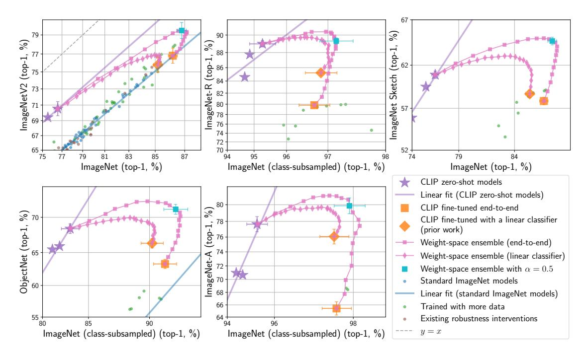

Figure 7: A per-dataset breakdown of the key experimental results (Figure 1). WiSE-FT improves accuracy on ImageNet and five derived distribution shifts. Standard ImageNet models, models trained with more data, and existing robustness interventions are from the testbed of Taori et al. [97].

<span id="page-22-0"></span>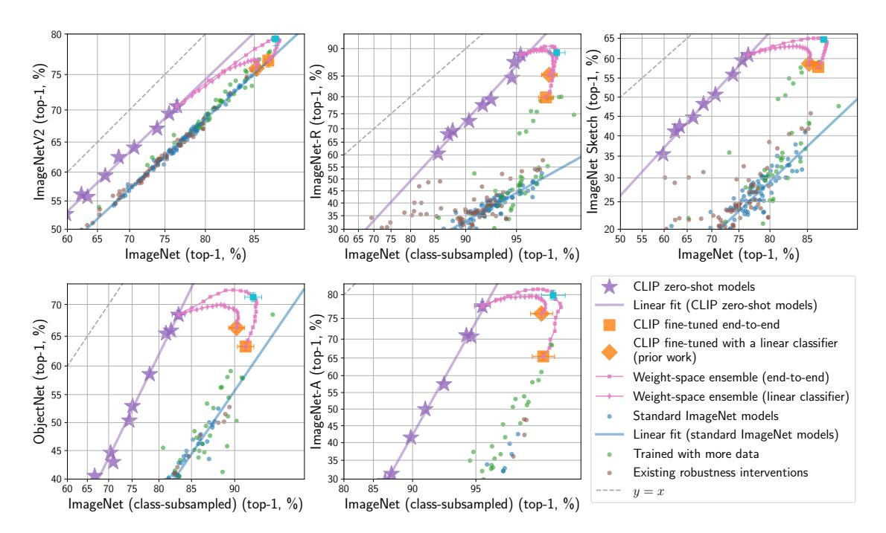

Figure 8: A zoomed-out version of Figure 7. WiSE-FT improves accuracy on ImageNet and five derived distribution shifts. Standard ImageNet models, models trained with more data, and existing robustness interventions are from the testbed of Taori et al. [97].

<span id="page-23-0"></span>

| WiSE-FT, end-to-end<br>α=0.00<br>α=0.05<br>α=0.10<br>α=0.15<br>α=0.20<br>α=0.25<br>α=0.30 | IN (ref.)<br>76.6<br>78.7<br>80.4<br>81.9<br>83.2<br>84.2<br>85.1 | IN-V2<br>70.5<br>72.6<br>74.2<br>75.4<br>76.5 | IN-R<br>89.0<br>89.6<br>89.9<br>90.1 | Distribution shifts<br>IN-Sketch<br>60.9<br>62.2 | ObjectNet<br>68.5<br>69.5 | IN-A<br>77.6 | Avg<br>shifts | Avg<br>ref., shifts |
|-------------------------------------------------------------------------------------------|-------------------------------------------------------------------|-----------------------------------------------|--------------------------------------|--------------------------------------------------|---------------------------|--------------|---------------|---------------------|
|                                                                                           |                                                                   |                                               |                                      |                                                  |                           |              |               |                     |
|                                                                                           |                                                                   |                                               |                                      |                                                  |                           |              |               |                     |
|                                                                                           |                                                                   |                                               |                                      |                                                  |                           |              | 73.3          | 74.9                |
|                                                                                           |                                                                   |                                               |                                      |                                                  |                           | 79.0         | 74.6          | 76.7                |
|                                                                                           |                                                                   |                                               |                                      | 63.1                                             | 70.4                      | 79.8         | 75.5          | 78.0                |
|                                                                                           |                                                                   |                                               |                                      | 63.8                                             | 71.1                      | 80.4         | 76.2          | 79.1                |
|                                                                                           |                                                                   |                                               | 90.3                                 | 64.3                                             | 71.6                      | 80.8         | 76.7          | 80.0                |
|                                                                                           |                                                                   | 77.5                                          | 90.3                                 | 64.6                                             | 72.1                      | 81.0         | 77.1          | 80.7                |
|                                                                                           |                                                                   | 78.3                                          | 90.3                                 | 64.9                                             | 72.1                      | 81.0         | 77.3          | 81.2                |
| α=0.35                                                                                    | 85.7                                                              | 78.7                                          | 90.1                                 | 65.0                                             | 72.0                      | 81.0         | 77.4          | 81.6                |
| α=0.40                                                                                    | 86.2                                                              | 79.2                                          | 89.9                                 | 65.0                                             | 71.9                      | 80.7         | 77.3          | 81.8                |
| α=0.45                                                                                    | 86.6                                                              | 79.4                                          | 89.6                                 | 64.9                                             | 71.6                      | 80.6         | 77.2          | 81.9                |
| α=0.50                                                                                    | 86.8                                                              | 79.5                                          | 89.4                                 | 64.7                                             | 71.1                      | 79.9         | 76.9          | 81.8                |
| α=0.55                                                                                    | 87.0                                                              | 79.3                                          | 88.9                                 | 64.5                                             | 70.7                      | 79.1         | 76.5          | 81.8                |
| α=0.60                                                                                    | 87.1                                                              | 79.2                                          | 88.5                                 | 64.1                                             | 70.1                      | 78.2         | 76.0          | 81.5                |
| α=0.65                                                                                    | 87.1                                                              | 79.3                                          | 87.8                                 | 63.6                                             | 69.6                      | 77.4         | 75.5          | 81.3                |
| α=0.70                                                                                    | 87.1                                                              | 79.1                                          | 87.0                                 | 63.1                                             | 68.9                      | 76.5         | 74.9          | 81.0                |
| α=0.75                                                                                    | 87.0                                                              | 78.8                                          | 86.1                                 | 62.5                                             | 68.1                      | 75.2         | 74.1          | 80.5                |
| α=0.80                                                                                    | 86.9                                                              | 78.4                                          | 85.1                                 | 61.7                                             | 67.4                      | 73.8         | 73.3          | 80.1                |
| α=0.85                                                                                    | 86.8                                                              | 78.0                                          | 84.0                                 | 61.0                                             | 66.4                      | 72.0         | 72.3          | 79.5                |
| α=0.90                                                                                    | 86.7                                                              | 77.6                                          | 82.8                                 | 60.0                                             | 65.5                      | 69.9         | 71.2          | 79.0                |
| α=0.95                                                                                    | 86.5                                                              | 77.2                                          | 81.3                                 | 59.0                                             | 64.3                      | 67.7         | 69.9          | 78.2                |
| α=1.00                                                                                    | 86.2                                                              | 76.8                                          | 79.8                                 | 57.9                                             | 63.3                      | 65.4         | 68.6          | 77.4                |
| WiSE-FT, linear classifier                                                                |                                                                   |                                               |                                      |                                                  |                           |              |               |                     |
| α=0.00                                                                                    | 76.6                                                              | 70.5                                          | 89.0                                 | 60.9                                             | 69.1                      | 77.7         | 73.4          | 75.0                |
| α=0.05                                                                                    | 77.6                                                              | 71.3                                          | 89.2                                 | 61.3                                             | 69.3                      | 78.3         | 73.9          | 75.8                |
| α=0.10                                                                                    | 78.4                                                              | 72.1                                          | 89.4                                 | 61.7                                             | 69.6                      | 78.8         | 74.3          | 76.3                |
| α=0.15                                                                                    | 79.3                                                              | 72.8                                          | 89.5                                 | 62.1                                             | 70.0                      | 79.0         | 74.7          | 77.0                |
| α=0.20                                                                                    | 80.0                                                              | 73.5                                          | 89.6                                 | 62.4                                             | 70.3                      | 79.3         | 75.0          | 77.5                |
| α=0.25                                                                                    | 80.8                                                              | 74.1                                          | 89.7                                 | 62.6                                             | 70.5                      | 79.5         | 75.3          | 78.0                |
| α=0.30                                                                                    | 81.5                                                              | 74.8                                          | 89.7                                 | 62.8                                             | 70.7                      | 79.5         | 75.5          | 78.5                |
| α=0.35                                                                                    | 82.1                                                              | 75.4                                          | 89.8                                 | 62.9                                             | 70.7                      | 79.6         | 75.7          | 78.9                |
| α=0.40                                                                                    | 82.7                                                              | 75.8                                          | 89.7                                 | 63.0                                             | 70.7                      | 79.6         | 75.8          | 79.2                |
| α=0.45                                                                                    | 83.2                                                              | 76.1                                          | 89.7                                 | 63.0                                             | 70.7                      | 79.6         | 75.8          | 79.5                |
| α=0.50                                                                                    | 83.7                                                              | 76.3                                          | 89.6                                 | 63.0                                             | 70.7                      | 79.7         | 75.9          | 79.8                |
| α=0.55                                                                                    | 84.1                                                              | 76.5                                          | 89.5                                 | 62.9                                             | 70.5                      | 79.6         | 75.8          | 79.9                |
| α=0.60                                                                                    | 84.4                                                              | 76.7                                          | 89.3                                 | 62.7                                             | 70.3                      | 79.5         | 75.7          | 80.1                |
| α=0.65                                                                                    | 84.7                                                              | 76.8                                          | 89.1                                 | 62.6                                             | 70.1                      | 79.4         | 75.6          | 80.2                |
| α=0.70                                                                                    | 85.0                                                              | 76.9                                          | 88.9                                 | 62.3                                             | 69.9                      | 79.1         | 75.4          | 80.2                |
| α=0.75                                                                                    | 85.1                                                              | 76.8                                          | 88.4                                 | 61.9                                             | 69.7                      | 78.9         | 75.1          | 80.1                |
| α=0.80                                                                                    | 85.3                                                              | 76.9                                          | 87.9                                 | 61.4                                             | 69.3                      | 78.5         | 74.8          | 80.0                |
| α=0.85                                                                                    | 85.3                                                              | 76.7                                          | 87.4                                 | 60.9                                             | 68.8                      | 78.1         | 74.4          | 79.8                |
| α=0.90                                                                                    | 85.3                                                              | 76.4                                          | 86.8                                 | 60.3                                             | 68.4                      | 77.3         | 73.8          | 79.5                |
| α=0.95                                                                                    | 85.3                                                              | 76.2                                          | 86.1                                 | 59.5                                             | 67.7                      | 76.8         | 73.3          | 79.3                |
| α=1.00                                                                                    | 85.2                                                              | 75.8                                          | 85.3                                 | 58.7                                             | 67.2                      | 76.1         | 72.6          | 78.9                |

Table 4: WiSE-FT accuracy on the reference and shifted distributions for various values of the mixing coefficient α. Results shown for CLIP ViT-L/14@336. Note that α=0.0 corresponds to the zero-shot model, while α = 1.0 corresponds to standard fine-tuning. Avg shifts displays the mean performance among the five distribution shifts, while Avg reference, shifts shows the average of ImageNet (reference) and Avg shifts.

<span id="page-24-0"></span>

|                            |           |       |      | Distribution shifts |           |      | Avg    | Avg          |
|----------------------------|-----------|-------|------|---------------------|-----------|------|--------|--------------|
|                            | IN (ref.) | IN-V2 | IN-R | IN-Sketch           | ObjectNet | IN-A | shifts | ref., shifts |
| WiSE-FT, end-to-end        |           |       |      |                     |           |      |        |              |
| α=0.00                     | 68.3      | 61.9  | 77.6 | 48.2                | 53.0      | 49.8 | 58.1   | 63.2         |
| α=0.05                     | 70.7      | 64.0  | 78.6 | 49.6                | 54.5      | 51.5 | 59.6   | 65.2         |
| α=0.10                     | 72.9      | 65.7  | 79.4 | 50.8                | 55.7      | 52.5 | 60.8   | 66.8         |
| α=0.15                     | 74.8      | 67.2  | 79.9 | 51.7                | 56.6      | 53.5 | 61.8   | 68.3         |
| α=0.20                     | 76.4      | 68.7  | 80.1 | 52.5                | 57.1      | 54.2 | 62.5   | 69.5         |
| α=0.25                     | 77.8      | 69.9  | 80.1 | 53.1                | 57.4      | 54.6 | 63.0   | 70.4         |
| α=0.30                     | 78.9      | 70.6  | 80.1 | 53.6                | 57.5      | 54.6 | 63.3   | 71.1         |
| α=0.35                     | 79.7      | 71.5  | 79.9 | 53.9                | 57.6      | 54.3 | 63.4   | 71.5         |
| α=0.40                     | 80.5      | 72.1  | 79.6 | 54.1                | 57.7      | 53.8 | 63.5   | 72.0         |
| α=0.45                     | 81.2      | 72.4  | 79.3 | 54.0                | 57.5      | 53.2 | 63.3   | 72.2         |
| α=0.50                     | 81.7      | 72.8  | 78.7 | 53.9                | 57.3      | 52.2 | 63.0   | 72.3         |
| α=0.55                     | 82.1      | 73.0  | 78.0 | 53.8                | 56.6      | 51.4 | 62.6   | 72.3         |
| α=0.60                     | 82.4      | 72.9  | 77.2 | 53.4                | 56.2      | 50.0 | 61.9   | 72.2         |
| α=0.65                     | 82.6      | 73.1  | 76.3 | 53.0                | 55.5      | 48.9 | 61.4   | 72.0         |
| α=0.70                     | 82.6      | 73.2  | 75.2 | 52.4                | 55.0      | 47.4 | 60.6   | 71.6         |
| α=0.75                     | 82.6      | 73.1  | 73.9 | 51.8                | 54.3      | 46.0 | 59.8   | 71.2         |
| α=0.80                     | 82.5      | 72.8  | 72.7 | 51.0                | 53.5      | 44.6 | 58.9   | 70.7         |
| α=0.85                     | 82.3      | 72.4  | 71.1 | 50.0                | 52.7      | 42.9 | 57.8   | 70.0         |
| α=0.90                     | 82.1      | 72.0  | 69.5 | 48.9                | 51.7      | 40.9 | 56.6   | 69.3         |
| α=0.95                     | 81.7      | 71.5  | 67.7 | 47.6                | 50.7      | 38.8 | 55.3   | 68.5         |
| α=1.00                     | 81.3      | 70.9  | 65.6 | 46.3                | 49.6      | 36.7 | 53.8   | 67.5         |
| WiSE-FT, linear classifier |           |       |      |                     |           |      |        |              |
| α=0.00                     | 68.4      | 62.6  | 77.6 | 48.2                | 53.8      | 50.0 | 58.4   | 63.4         |
| α=0.05                     | 69.9      | 63.7  | 77.9 | 48.9                | 54.2      | 50.6 | 59.1   | 64.5         |
| α=0.10                     | 71.3      | 64.8  | 78.2 | 49.5                | 54.7      | 51.0 | 59.6   | 65.5         |
| α=0.15                     | 72.5      | 65.8  | 78.4 | 50.0                | 55.1      | 51.1 | 60.1   | 66.3         |
| α=0.20                     | 73.6      | 66.6  | 78.4 | 50.5                | 55.3      | 51.5 | 60.5   | 67.0         |
| α=0.25                     | 74.7      | 67.4  | 78.4 | 50.8                | 55.3      | 51.8 | 60.7   | 67.7         |
| α=0.30                     | 75.6      | 68.0  | 78.3 | 51.1                | 55.4      | 51.7 | 60.9   | 68.2         |
| α=0.35                     | 76.4      | 68.8  | 78.2 | 51.3                | 55.5      | 51.6 | 61.1   | 68.8         |
| α=0.40                     | 77.1      | 69.0  | 77.8 | 51.3                | 55.5      | 51.4 | 61.0   | 69.0         |
| α=0.45                     | 77.7      | 69.4  | 77.6 | 51.3                | 55.4      | 51.3 | 61.0   | 69.3         |
| α=0.50                     | 78.2      | 69.9  | 77.2 | 51.2                | 55.3      | 51.2 | 61.0   | 69.6         |
| α=0.55                     | 78.6      | 70.1  | 76.7 | 51.0                | 55.0      | 50.9 | 60.7   | 69.7         |
| α=0.60                     | 79.0      | 70.2  | 76.1 | 50.8                | 54.7      | 50.5 | 60.5   | 69.8         |
| α=0.65                     | 79.3      | 70.4  | 75.7 | 50.4                | 54.5      | 50.1 | 60.2   | 69.8         |
| α=0.70                     | 79.6      | 70.4  | 75.2 | 50.1                | 54.2      | 49.9 | 60.0   | 69.8         |
| α=0.75                     | 79.7      | 70.4  | 74.6 | 49.7                | 53.9      | 49.5 | 59.6   | 69.7         |
| α=0.80                     | 79.8      | 70.5  | 73.9 | 49.3                | 53.6      | 49.0 | 59.3   | 69.5         |
| α=0.85                     | 79.9      | 70.4  | 73.2 | 48.7                | 53.3      | 48.6 | 58.8   | 69.3         |
| α=0.90                     | 80.0      | 70.3  | 72.4 | 48.1                | 52.8      | 47.8 | 58.3   | 69.2         |
| α=0.95                     | 79.9      | 70.1  | 71.7 | 47.5                | 52.6      | 46.9 | 57.8   | 68.8         |
| α=1.00                     | 79.9      | 69.8  | 70.8 | 46.9                | 52.1      | 46.4 | 57.2   | 68.6         |

Table 5: WiSE-FT accuracy on the reference and shifted distributions for various values of the mixing coefficient α. Results shown for CLIP ViT-B/16. Note that α=0.0 corresponds to the zero-shot model, while α = 1.0 corresponds to standard fine-tuning. Avg shifts displays the mean performance among the five distribution shifts, while Avg reference, shifts shows the average of ImageNet (reference) and Avg shifts.

<span id="page-25-1"></span>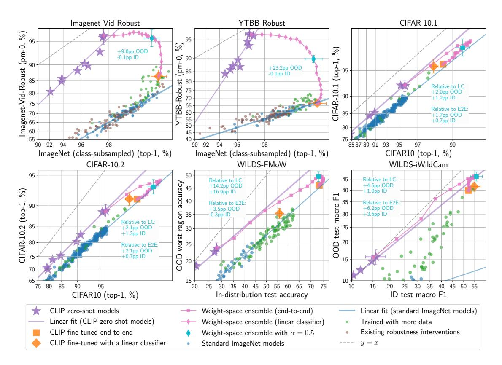

Figure 9: WiSE-FT improves accuracy under distribution shift relative to standard fine-tuning on ImageNet-Vid-Robust, YTBB-Robust [88], CIFAR-10.1 [83], CIFAR-10.2 [62], WILDS-FMoW [49, 13], and WILDS-iWildCam [49, 6].

#### <span id="page-25-0"></span>C.2 Robustness on additional distribution shifts

Figure 9 displays the effective robustness scatter plots for the six additional distribution shifts discussed in Section 4 (analogous results provided in Table 6).

Concretely, we consider: (i) ImageNet-Vid-Robust and YTBB-Robust, datasets with distribution shift induced by temporal perturbations in videos [88]; (ii) CIFAR-10.1 [83] and CIFAR-10.2 [62], reproductions of the popular image classification dataset CIFAR-10 [54] with a distribution shift; (iii) WILDS-FMoW, a satellite image recognition task where the test set has a geographic and temporal distribution shift [49, 13]; (iv) WILDS-iWildCam, a wildlife recognition task where the test set has a geographic distribution shift [49, 6].

## <span id="page-25-2"></span>C.3 Comparison with alternative methods

We now extend Section 4 and compare WiSE-FT to additional methods of fine-tuning. We begin with contrasting the weight-space and output-space ensemble. Next, we show the that varying the decay parameter of an exponential moving average also moves along the curve produced by WiSE-FT. Finally, we compare with additional methods when fine-tuning only a linear classifier including distillation and various forms of regularization.

<span id="page-26-0"></span>

|                                       | Zero-shot | Fine-tuned | WiSE-FT, $\alpha$ =0.5 | WiSE-FT, optimal $\alpha$ |
|---------------------------------------|-----------|------------|------------------------|---------------------------|
| ImageNet-Vid-Robust (pm-0)            | 95.9      | 86.5       | 95.5                   | 96.5                      |
| YTBBRobust (pm-0)                     | 95.8      | 66.5       | 89.7                   | 96.0                      |
| CIFAR-10.1 (top-1)                    | 92.5      | 95.9       | 97.6                   | 98.0                      |
| CIFAR-10.2 (top-1)                    | 88.8      | 91.3       | 93.4                   | 94.4                      |
| WILDS-FMoW: ID test (accuracy)        | 28.0      | 73.3       | 73.0                   | 74.8                      |
| WILDS-FMoW: OOD worst region accuracy | 23.8      | 46.0       | 49.5                   | 49.7                      |
| WILDS-iWildCam: ID test macro F1      | 15.1      | 52.1       | 55.8                   | 55.8                      |
| WILDS-iWildCam: OOD test macro F1     | 15.5      | 39.9       | 46.1                   | 46.4                      |

<span id="page-26-1"></span>Table 6: WiSE-FT improves results on ImageNet-Vid-Robust, YTBB-Robust [88], CIFAR-10.1 [83], CIFAR-10.2 [62], WILDS-FMoW [49, 13], and WILDS-iWildCam [49, 6]. Reported numbers are percentages. This is the corresponding table for Figure 9. This table displays results for fine-tuning only a linear classifier for ImageNet-Vid-Robust and YTBBRobust and end-to-end fine-tuning for the remainder.

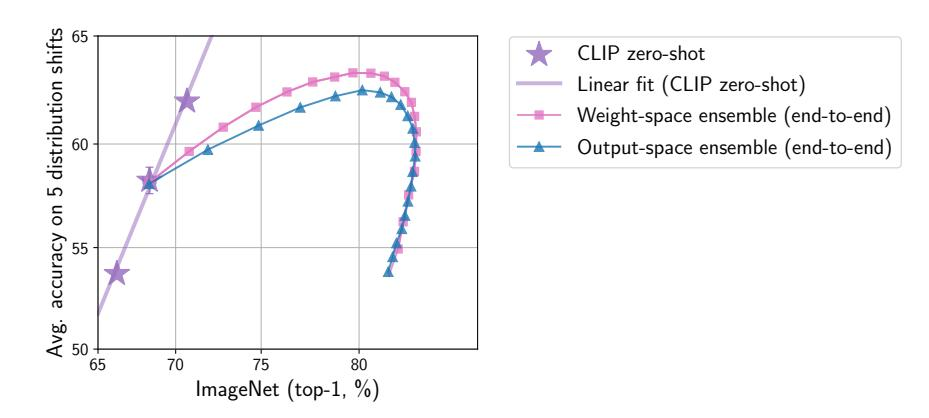

Figure 10: Comparing the weight-space ensemble  $f(x, (1-\alpha) \cdot \theta_0 + \alpha \cdot \theta_1)$  with the output-space ensemble  $(1-\alpha)f(x,\theta_0) + \alpha \cdot f(x,\theta_1)$  when fine-tuning end-to-end with learning rate  $3 \cdot 10^{-5}$ . Note that the output-space ensemble requires 2x compute.

#### C.3.1 Output-space ensembles

Figure 10 compares the weight-space ensemble  $f(x, (1-\alpha) \cdot \theta_0 + \alpha \cdot \theta_1)$  with the output-space ensemble  $(1-\alpha)f(x,\theta_0) + \alpha \cdot f(x,\theta_1)$ . Both exhibit a favorable trend, though the output-space ensemble requires twice as much compute. Section F further explores the relation between the weight-space and output-space ensemble.

<span id="page-27-1"></span>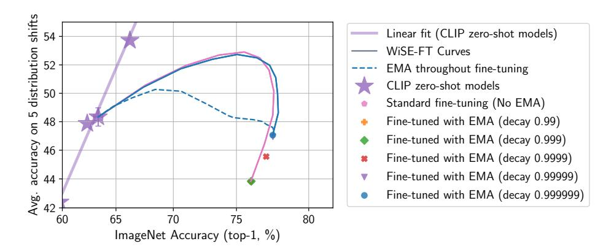

Figure 11: Results for the debiased variant of EMA described in Appendix C.3.2. EMA improves accuracy on both ImageNet and on the distribution shifts, and further applying WiSE-FT to EMA solutions can improve robustness. The solutions with no EMA, decay 0.99, and decay 0.999 are overlapping in the plot, as are the solutions with decay 0.99999 and 0.999999.

<span id="page-27-2"></span>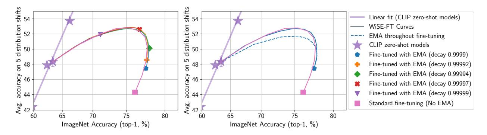

Figure 12: Results for the variant of EMA biased towards the initialization, described in Appendix C.3.2. Varying the EMA decay  $\beta$  moves along the curve produced by WiSE-FT. Applying WiSE-FT to EMA solutions moves further along the curve produced by WiSE-FT.

#### <span id="page-27-0"></span>C.3.2 Comparison to exponential moving averages

Weight-averaging along the trajectory can improve the performance of models. For instance, Szegedy et al. [95] use a running average of the model parameters for their Inception-v2 model. The exponential moving average (EMA) is a standard technique for keeping a running average of model parameters and is implemented in libraries such as Optax [39] and Pytorch ImageNet Models [101].

This section explores two variants of EMA for model parameters  $\theta \in \mathbb{R}^n$ . The first variant is a debiased EMA, where debiasing is done as in Kingma and Ba [47] (Algorithm 1). For each iteration  $t \in \{1, ..., T\}$  let  $\theta_t \in \mathbb{R}^n$  be the model parameters at step t and let  $\mu_t \in \mathbb{R}^n$  be the EMA at step t. For t = 0,  $\mu_0 \leftarrow 0$ , otherwise  $\mu_t \leftarrow \beta \cdot \mu_{t-1} + (1-\beta) \cdot \theta_t$  where  $\beta$  is a decay hyperparameter. The final debiased EMA is given by  $\mu_T/(1-\beta^T)$ . Results for various decay hyperparameters are illustrated by Figure 11.

Next, we explore a variant of EMA that is biased towards the initialization  $\theta_0$ . As before,  $\mu_t \leftarrow \beta \cdot \mu_{t-1} + (1-\beta) \cdot \theta_t$ . However  $\mu_0$  is now initialized to be  $\theta_0$ , instead of zeros. Moreover, at the end of fine-tuning we use the biased estimate  $\mu_T$ . Results for this variant are illustrated by Figure 12.

Section 4 (Figure 3) showed that decreasing learning rate, training epochs, or early stopping leads to solutions that lie below the curve produced by WiSE-FT. On the other hand, using an exponential moving average

<span id="page-28-0"></span>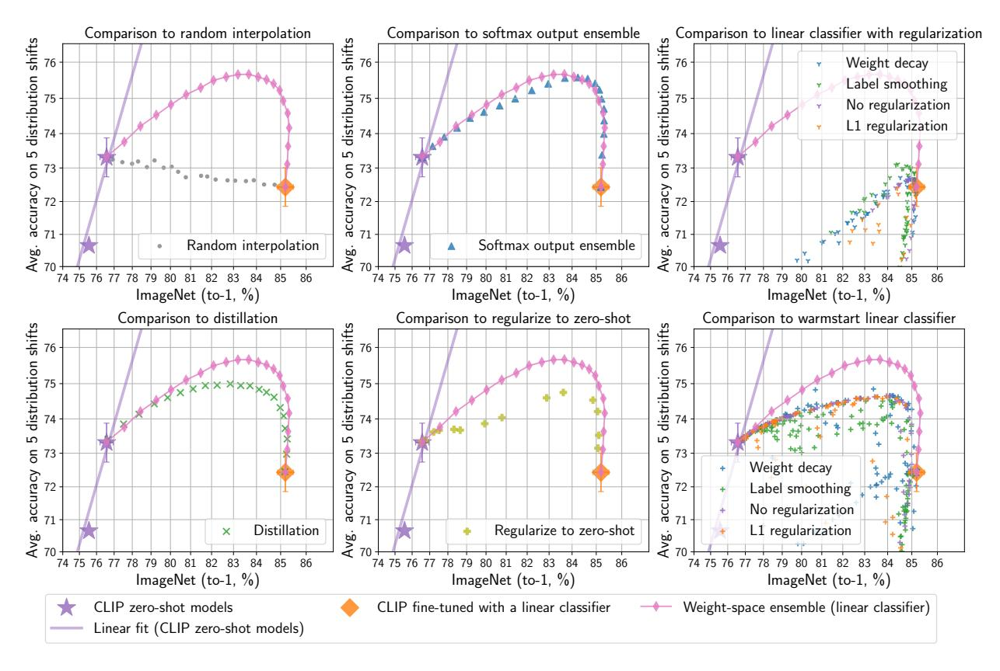

Figure 13: Accuracy on the reference and shifted distributions of WiSE-FT and the alternatives described in Section C.3.3.

(EMA) and varying the EMA decay  $\beta$  can move along or slightly outside or along the curve produced by WiSE-FT. For instance, solutions using the second EMA variant follow the WiSE-FT curve. Indeed, applying WiSE-FT with mixing coefficient  $1 - \beta^T$  to the debiased EMA variant exactly recovers the second EMA variant described above. Moreover, further applying WiSE-FT to EMA solutions (i.e., interpolating the weights of the zero-shot model with the EMA solution) can lead to additional robustness. We also evaluate EMA along the fine-tuning trajectory, finding improved performance under distribution shift for the variant biased towards the initialization. For the debiased EMA, each model along the trajectory is debiased by  $1/(1-\beta^t)$ . As shown in Figures 11,12, evaluations along the trajectory underperform solutions generated by applying WiSE-FT.

## <span id="page-28-1"></span>C.3.3 Additional comparisons when fine-tuning a linear classifier

We compare against several additional alternatives when fine-tuning only a linear classifier. As this setting is computationally cheaper compared to end-to-end, it allows for comprehensive experimentation. Many of the examined approaches exhibit a concave trend in effective robustness plots, although WiSE-FT matches methods requiring more compute or offers better performance (Figure 13).

**Random interpolation.** This method uses either the zero-shot or fine-tuned linear classifier depending on a (biased) coin flip. For hyperparameter  $\alpha \in [0,1]$  outputs are computed as  $(1-\xi) \cdot f(x,\theta_0) + \xi \cdot f(x,\theta_1)$  where  $\xi$  is a Bernoulli( $\alpha$ ) random variable. For this method and all others with a hyperparameter  $\alpha \in [0,1]$  we evaluate models for  $\alpha \in \{0,0.05,0.1,...,1\}$ .

Ensembling softmax outputs. Instead of ensembling in weight space, this method combines softmax probabilities assigned by the zero-shot and fine-tuned linear classifier. Concretely, for hyperparameter  $\alpha \in [0,1]$  outputs are computed as  $(1-\alpha) \cdot \text{softmax}(f(x,\theta_0)) + \alpha \cdot \text{softmax}(f(x,\theta_1))$ . This method performs comparably to weight-space ensembling but requires slightly more compute.

Linear classifier with various regularizers. We explore fine-tuning linear classifiers with four regularization strategies: no regularization, weight decay, L1 regularization, and label smoothing [71]. Linear classifiers are trained with mini-batch optimization, using the AdamW optimizer [61, 76] with a cosine-annealing learning rate schedule [60]. This method is significantly faster and less memory-intensive than the L-BFGS implementation used by Radford et al. [82] at ImageNet scale with similar accuracy. Additional details on hyperparameters and more analyses are provided in Appendix D.3.

Two variants of this method are shown in Figure 13, one for which the linear classifier is initialized randomly and another for which the linear classifier is initialized with the zero-shot weights (denoted warmstart). If the convex problem is solved then the initialization does not play a role. However we are using mini-batch optimization and, in certain cases, terminating training before an optimum is reached.

**Distillation.** Network distillation [41] trains one network to match the outputs of another. We use this technique to fine-tune while matching the outputs of the zero-shot model with weights  $\theta_0$ . For a hyperparameter  $\alpha \in [0, 1]$  and cross-entropy loss  $\ell$  we fine-tune  $\theta$  according to the minimization objective

$$\sum_{(x_i, y_i) \in \mathcal{S}_{\mathcal{D}}^{tr}} (1 - \alpha) \cdot \ell(f(x_i, \theta), y_i) + \alpha \cdot \ell(f(x_i, \theta), f(x_i, \theta_0)) . \tag{3}$$

Regularization towards zero-shot. We train a linear classifier with an additional regularization term which penalizes movement from the zero-shot classifier's weights. For a hyperparameter  $\lambda \in \{1 \cdot 10^{-8}, 5 \cdot 10^{-8}, 1 \cdot 10^{7}, ..., 5 \cdot 10^{2}\}$  we add the regularization term  $\lambda \|\mathbf{W} - \mathbf{W}_{\text{zero-shot}}\|_{F}^{2}$  where  $\mathbf{W}$  is the linear classifier being fine-tuned. In most cases this method performs slightly worse than distillation.

Finally, Figure 14 and Table 7 demonstrate that WiSE-FT achieves better accuracy than the recently proposed CoOp method [112] on ImageNet and four derived distribution shifts. Instead of fine-tuning network parameters, CoOp instead learns continuous embedding for the language prompts. We note that CoOp and WiSE-FT could be used in conjunction in future work. We compare with the ViT-B/16 section in Table 7 of Zhou et al. [112]. For comparison we use the same CLIP model as CoOp and also train only on 16 images per class. When end-to-end fine-tuning we use 10 epochs and learning rate  $10^{-5}$ .

#### <span id="page-29-0"></span>C.4 Changes in data augmentation

In the majority of our experiments we follow Radford et al. [82] in using minimal data augmentation. However, Figure 14 recreates Figure 3 with the default ImageNet train augmentation used in PyTorch ImageNet Models [101], which includes random cropping, horizontal flipping and color jitter. As shown in Figure 14, we find similar trends with this stronger data augmentation. Further investigating the effect of data augmentation remains an interesting direction for future work.

<span id="page-29-1"></span>

|                                                                                                      | ImageNet (IN)           | INV2  | IN-R                    | IN-A  | IN Sketch               |
|------------------------------------------------------------------------------------------------------|-------------------------|-------|-------------------------|-------|-------------------------|
| CoOp [112]<br>WiSE-FT (linear classifiere, $\alpha = 0.5$ )<br>WiSE-FT (end-to-end, $\alpha = 0.5$ ) | 71.73<br>73.02<br>72.38 | 65.19 | 75.28<br>77.63<br>78.47 | 49.81 | 47.89<br>49.09<br>49.72 |

Table 7: Comparing WiSE-FT with CoOp [112]. Both methods fine-tune the ViT-B/16 CLIP model on 16 examples per class of ImageNet. Also see Figure 14.

<span id="page-30-1"></span>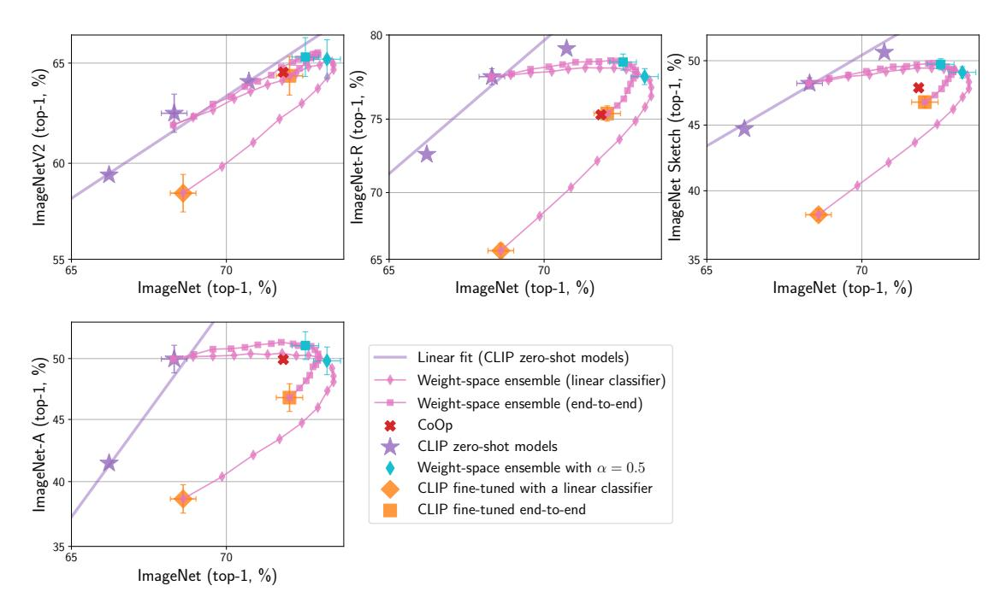

Figure 14: Comparing WiSE-FT with CoOp [112]. Both methods fine-tune the ViT-B/16 CLIP model on 16 examples per class of ImageNet.

## <span id="page-30-0"></span>C.5 Accuracy improvements on reference datasets

Beyond robustness, Figure 16 demonstrates that WiSE-FT can provide accuracy improvements on ImageNet and a number of datasets considered by Kornblith et al. [52]: CIFAR-10, CIFAR-100 [54], Describable Textures [14], Food-101 [10], SUN397 [103], and Stanford Cars [53]. This is surprising as standard fine-tuning optimizes for low error on the reference distribution. Figure 16 supplements Table 2 by providing accuracy information for all mixing coefficients  $\alpha$ .

In many application-specific scenarios, only a small amount of data is available for fine-tuning. Accordingly, we examine the performance of WiSE-FT when only k examples per class are used for fine-tuning on the seven aforementioned datasets ( $k = \{1, 5, 10, 25, 50\}$ ). In contrast with Figure 16, we now fine-tune only the linear classifier allowing for comprehensive experiments. Average results are shown in Figure 17, while Figures 18 and 19 provide a breakdown for all datasets.

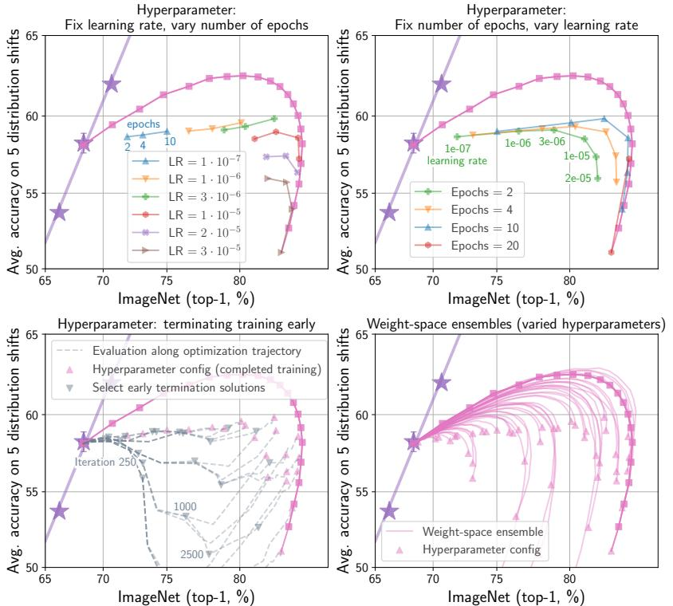

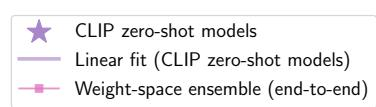

Figure 14. The robustness of fine-tuned models varies substantially under even small changes in hyperparameters. Applying WiSE-FT addresses this brittleness and can remove the trade-off between accuracy on the reference and shifted distributions. Results shown for CLIP ViT-B/16 fine-tuned with cosine-annealing learning rate schedule and ImageNet data augmentation from Pytorch ImageNet Models [101].

<span id="page-31-1"></span><span id="page-31-0"></span>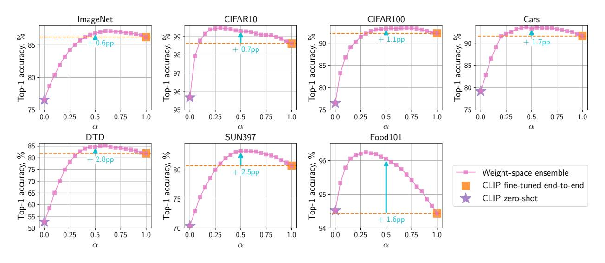

Figure 16: The accuracy of WiSE-FT (end-to-end) with mixing coefficient  $\alpha$  on ImageNet and a number of datasets considered by Kornblith et al. [52]: CIFAR-10, CIFAR-100 [54], Describable Textures [14], Food-101 [10], SUN397 [103], and Stanford Cars [53].

<span id="page-32-0"></span>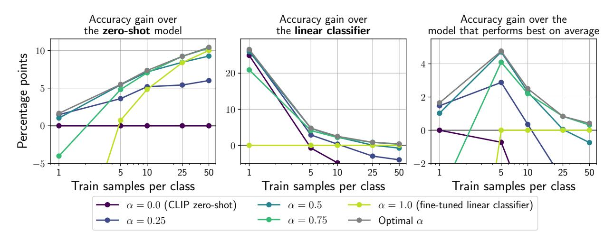

Figure 17: WiSE-FT can improve accuracy over the linear classifier and zero-shot model in the low data regime. On the x-axis we consider k = {1, 5, 10, 25, 50} examples per class for fine-tuning. On the y-axis we display accuracy improvements of WiSE-FT averaged over seven datasets [\[17,](#page-13-0) [54,](#page-15-2) [14,](#page-13-4) [10,](#page-13-5) [103,](#page-18-1) [53\]](#page-15-3). For k = 1, the zero-shot model outperforms the fine-tuned linear classifier, and ensembles closer to the zero-shot model (small α) yield high performance. When more data is available, the reverse is true, and higher values of α improve performance. Figures [18](#page-33-0) and [19](#page-34-0) display a breakdown for all datasets.

<span id="page-33-0"></span>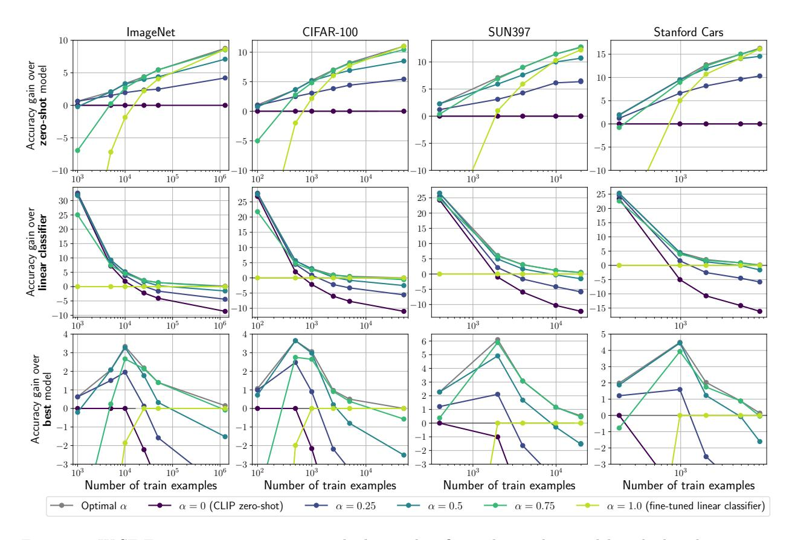

Figure 18: WiSE-FT improves accuracy over the linear classifier and zero-shot model in the low data regime. On the x-axis we consider  $k = \{1, 5, 10, 25, 50\}$  examples per class and the full training set. On the y-axis we consider the accuracy improvement of WiSE-FT over the **(top)** zero-shot model, **(middle)** fine-tuned linear classifier, and **(bottom)** best of the zero-shot and fine-tuned linear classifier.

<span id="page-34-0"></span>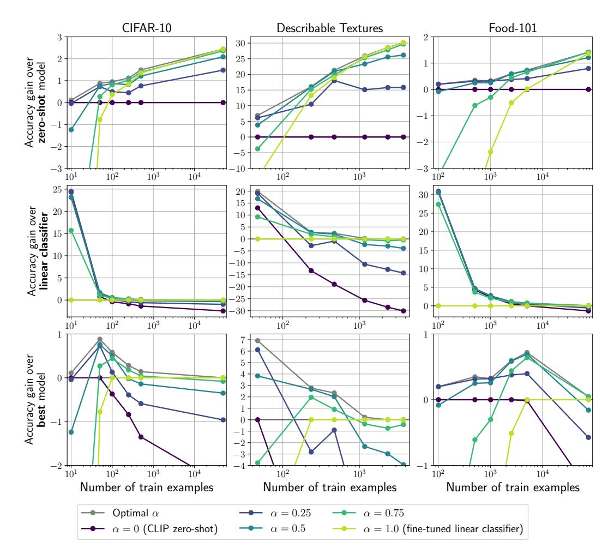

Figure 19: WiSE-FT improves accuracy over the linear classifier and zero-shot model in the low data regime. On the x-axis we consider  $k = \{1, 5, 10, 25, 50\}$  examples per class and the full training set. On the y-axis we consider the accuracy improvement of WiSE-FT over the **(top)** zero-shot model, **(middle)** fine-tuned linear classifier, and **(bottom)** best of the zero-shot and fine-tuned linear classifier.

<span id="page-35-1"></span>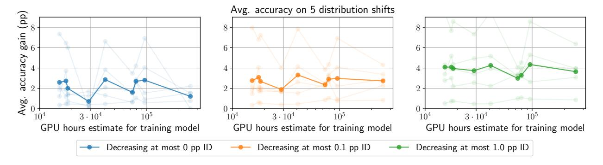

Figure 20: WiSE-FT provides benefits for all CLIP models. Accuracy under distribution shift can be improved relative to the linear classifier with less than  $\epsilon \in \{0, 0.1, 1\}$  percentage points (pp) loss in accuracy on the reference distribution, across orders of magnitude of training compute. The CLIP model RN50x64 requires the most GPU hours to train.

<span id="page-35-2"></span>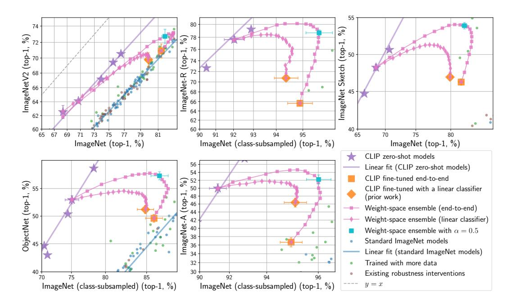

Figure 21: WiSE-FT improves accuracy on the reference and shifted distributions for numerous distribution shifts with a smaller CLIP ViT-B/16 model.

## <span id="page-35-0"></span>C.6 Robustness across scales of pre-training compute

The strong correlation between standard test accuracy and accuracy under distribution shift holds from low to high performing models. This offers the opportunity to explore robustness for smaller, easy to run models. Our exploration began with the lowest accuracy CLIP models and similar trends held at scale. Figure 20 shows improved accuracy under distribution shift with minimal loss on reference performance across orders of magnitude of pre-training compute with WiSE-FT when fine-tuning a linear classifier. Moreover, in Figure 21 we recreate the experimental results for ImageNet and five associated distribution shifts with a smaller CLIP ViT-B/16 model, finding similar trends. Recall that unless otherwise mentioned our experiments use the larger CLIP model (ViT-L/14@336px).

<span id="page-36-1"></span>

|                            |           |       | I    | Distribution | shifts            |      | Avg    | Avg          |
|----------------------------|-----------|-------|------|--------------|-------------------|------|--------|--------------|
|                            | IN (ref.) | IN-V2 | IN-R | IN-Sketch    | ${\bf ObjectNet}$ | IN-A | shifts | ref., shifts |
| CLIP ViT-B/16 [82]         |           |       |      |              |                   |      |        |              |
| Zero-shot                  | 68.3      | 61.9  | 77.6 | 48.2         | 53.0              | 49.8 | 58.1   | 63.2         |
| Standard fine-tuning       | 81.3      | 70.9  | 65.6 | 46.3         | 49.6              | 36.7 | 53.8   | 67.5         |
| WiSE-FT ( $\alpha$ =0.5)   | 81.7      | 72.8  | 78.7 | 53.9         | 57.3              | 52.2 | 63.0   | 72.3         |
| WiSE-FT (opt. $\alpha$ )   | 82.6      | 73.2  | 80.1 | 54.1         | 57.7              | 54.6 | 63.5   | 72.3         |
| CLIP ViT-L/140336px [82]   |           |       |      |              |                   |      |        |              |
| Zero-shot                  | 76.6      | 70.5  | 89.0 | 60.9         | 68.5              | 77.6 | 73.3   | 74.9         |
| Standard fine-tuning       | 86.2      | 76.8  | 79.8 | 57.9         | 63.3              | 65.4 | 68.6   | 77.4         |
| WiSE-FT ( $\alpha$ =0.5)   | 86.8      | 79.5  | 89.4 | 64.7         | 71.1              | 79.9 | 76.9   | 81.8         |
| Wise-ft (opt. $\alpha$ )   | 87.1      | 79.5  | 90.3 | 65.0         | 72.1              | 81.0 | 77.4   | 81.9         |
| ALIGN [45]                 |           |       |      |              |                   |      |        |              |
| Zero-shot                  | 76.4      | 70.1  | 92.1 | 67.9         | 67.2              | 75.9 | 74.6   | 75.5         |
| Standard fine-tuning       | 88.2      | 80.1  | 88.5 | 69.1         | 61.0              | 76.3 | 75.0   | 81.6         |
| WiSE-FT ( $\alpha$ =0.5)   | 86.3      | 79.2  | 93.0 | 71.1         | 67.8              | 81.0 | 78.4   | 82.3         |
| WiSE-FT (opt. $\alpha$ )   | 88.3      | 80.4  | 93.3 | 71.1         | 68.6              | 81.0 | 78.4   | 82.8         |
| JFT pre-trained ViT-H [21] |           |       |      |              |                   |      |        |              |
| Zero-shot                  | 72.9      | 66.1  | 85.9 | 57.0         | 59.2              | 58.4 | 65.3   | 69.1         |
| Standard fine-tuning       | 85.4      | 77.6  | 84.9 | 62.8         | 63.1              | 60.8 | 69.8   | 77.6         |
| WiSE-FT ( $\alpha$ =0.5)   | 82.9      | 75.4  | 89.3 | 63.8         | 65.8              | 66.2 | 72.1   | 77.5         |
| WiSE-FT (opt. $\alpha$ )   | 85.4      | 77.8  | 89.3 | 64.5         | 66.0              | 66.6 | 72.5   | 78.6         |
| BASIC-M [77]               |           |       |      |              |                   |      |        |              |
| Zero-shot                  | 81.4      | 74.1  | 90.6 | 67.4         | 73.5              | 66.7 | 74.5   | 78.0         |
| Standard fine-tuning       | 86.2      | 77.8  | 84.9 | 64.3         | 75.3              | 63.7 | 73.2   | 79.7         |
| WiSE-FT ( $\alpha$ =0.5)   | 85.6      | 78.5  | 90.2 | 68.6         | 78.0              | 71.1 | 77.3   | 81.4         |
| WiSE-FT (opt. $\alpha$ )   | 86.2      | 78.6  | 91.1 | 68.8         | 78.0              | 71.4 | 77.4   | 81.4         |
| BASIC-L [77]               |           |       |      |              |                   |      |        |              |
| Zero-shot                  | 85.6      | 80.5  | 95.7 | 76.2         | 82.3              | 85.7 | 84.1   | 84.8         |
| Standard fine-tuning       | 87.5      | 79.8  | 84.3 | 68.0         | 77.4              | 72.1 | 76.3   | 81.9         |
| WiSE-FT ( $\alpha$ =0.5)   | 87.9      | 81.6  | 94.5 | 73.6         | 84.1              | 83.2 | 83.4   | 85.7         |
| WiSE-FT (opt. $\alpha$ )   | 87.9      | 82.1  | 96.0 | 76.5         | 84.9              | 86.5 | 85.0   | 86.2         |

Table 8: WiSE-FT accuracy on ImageNet and derived distribution shifts for various models fine-tuned end-to-end. Avg shifts displays the mean performance among the five distribution shifts, while Avg reference, shifts shows the average of ImageNet (reference) and Avg shifts. For optimal  $\alpha$ , we choose the single mixing coefficient that maximizes the column.

#### <span id="page-36-0"></span>C.7 WiSE-FT and additional models

Table 8 summarizes the results for the main models we study, CLIP, ALIGN, BASIC and a ViT model pre-trained on JFT. Details are provided in the subsequent sections.

#### C.7.1 ALIGN

In addition to CLIP, we show WiSE-FT to be effective for an additional zero-shot model, ALIGN [45]. Results are shown in Figure 22 and Table 9. End-to-end fine-tuning is performed using AdamW, which we found to perform slightly better than SGD + momentum. The model is fine-tuned for 40,000 steps with a batch size of 512, a maximum learning rate of  $5 \times 10^{-6}$ , and weight decay of 0.1. The learning rate schedule consisted of 500 steps of linear warmup followed by cosine decay. The linear classifier is trained using L-BFGS and no label smoothing. All models are evaluated on  $360 \times 360$  pixel crops obtained by taking the central 87.5% square region of the test set images. For end-to-end fine-tuning, we take  $299 \times 299$  pixel Inception-style random crops from the original ImageNet images during training; for linear classifier training, we use the same

<span id="page-37-0"></span>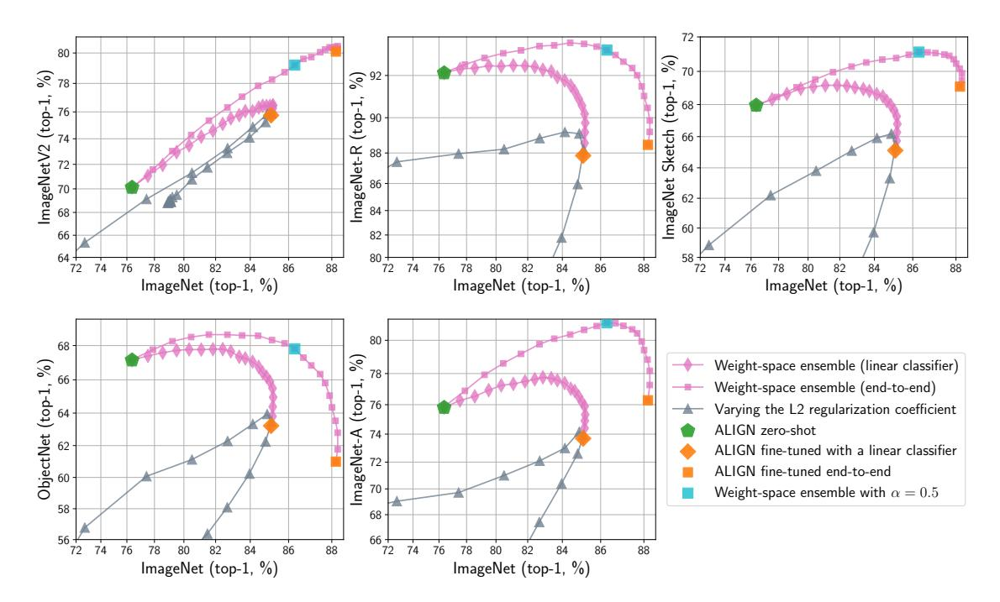

Figure 22: WiSE-FT applied to ALIGN [45]. We also show the effect of varying the L2 regularization strength for linear classifier fine-tuning.

preprocessing as at evaluation time. The weights of the zero-shot model are calibrated using temperature scaling on the ImageNet training set before performing WiSE-FT.

<span id="page-38-0"></span>

|                            |                |       |      | Distribution shifts |           |      | Avg    | Avg               |
|----------------------------|----------------|-------|------|---------------------|-----------|------|--------|-------------------|
|                            | IN (reference) | IN-V2 | IN-R | IN-Sketch           | ObjectNet | IN-A | shifts | reference, shifts |
| WiSE-FT, end-to-end        |                |       |      |                     |           |      |        |                   |
| α=0.00                     | 76.4           | 70.1  | 92.1 | 67.9                | 67.2      | 75.9 | 74.6   | 75.5              |
| α=0.05                     | 77.9           | 71.6  | 92.5 | 68.5                | 67.8      | 76.9 | 75.5   | 76.7              |
| α=0.10                     | 79.2           | 73.0  | 92.7 | 69.0                | 68.2      | 77.9 | 76.2   | 77.7              |
| α=0.15                     | 80.5           | 74.3  | 92.9 | 69.5                | 68.5      | 78.6 | 76.8   | 78.7              |
| α=0.20                     | 81.6           | 75.4  | 93.0 | 70.0                | 68.6      | 79.2 | 77.2   | 79.4              |
| α=0.25                     | 82.7           | 76.3  | 93.2 | 70.3                | 68.6      | 79.8 | 77.6   | 80.2              |
| α=0.30                     | 83.5           | 77.1  | 93.2 | 70.5                | 68.6      | 80.1 | 77.9   | 80.7              |
| α=0.35                     | 84.4           | 77.8  | 93.3 | 70.7                | 68.6      | 80.3 | 78.1   | 81.2              |
| α=0.40                     | 85.2           | 78.3  | 93.3 | 70.8                | 68.3      | 80.6 | 78.3   | 81.8              |
| α=0.45                     | 85.8           | 78.8  | 93.2 | 71.0                | 68.1      | 80.8 | 78.4   | 82.1              |
| α=0.50                     | 86.3           | 79.2  | 93.0 | 71.1                | 67.8      | 81.0 | 78.4   | 82.3              |
| α=0.55                     | 86.7           | 79.6  | 92.8 | 71.1                | 67.3      | 81.0 | 78.4   | 82.6              |
| α=0.60                     | 87.1           | 79.7  | 92.6 | 71.1                | 66.8      | 80.8 | 78.2   | 82.7              |
| α=0.65                     | 87.5           | 80.0  | 92.3 | 71.0                | 66.3      | 80.6 | 78.0   | 82.8              |
| α=0.70                     | 87.7           | 80.2  | 92.0 | 70.9                | 65.8      | 80.4 | 77.9   | 82.8              |
| α=0.75                     | 87.9           | 80.4  | 91.5 | 70.7                | 65.1      | 79.9 | 77.5   | 82.7              |
| α=0.80                     | 88.0           | 80.3  | 91.1 | 70.5                | 64.3      | 79.4 | 77.1   | 82.5              |
| α=0.85                     | 88.2           | 80.4  | 90.5 | 70.2                | 63.5      | 78.9 | 76.7   | 82.5              |
| α=0.90                     | 88.3           | 80.4  | 89.9 | 69.9                | 62.8      | 78.2 | 76.2   | 82.2              |
| α=0.95                     | 88.3           | 80.3  | 89.2 | 69.5                | 61.8      | 77.3 | 75.6   | 81.9              |
| α=1.00                     | 88.2           | 80.1  | 88.5 | 69.1                | 61.0      | 76.3 | 75.0   | 81.6              |
| WiSE-FT, linear classifier |                |       |      |                     |           |      |        |                   |
| α=0.00                     | 76.4           | 70.1  | 92.1 | 68.0                | 67.2      | 75.8 | 74.6   | 75.5              |
| α=0.05                     | 77.5           | 71.1  | 92.3 | 68.3                | 67.4      | 76.3 | 75.1   | 76.3              |
| α=0.10                     | 78.6           | 72.0  | 92.3 | 68.6                | 67.6      | 76.5 | 75.4   | 77.0              |
| α=0.15                     | 79.5           | 73.0  | 92.4 | 69.0                | 67.7      | 76.9 | 75.8   | 77.7              |
| α=0.20                     | 80.3           | 73.5  | 92.4 | 69.1                | 67.8      | 77.3 | 76.0   | 78.2              |
| α=0.25                     | 81.1           | 74.2  | 92.4 | 69.2                | 67.8      | 77.3 | 76.2   | 78.7              |
| α=0.30                     | 81.8           | 74.6  | 92.4 | 69.2                | 67.8      | 77.5 | 76.3   | 79.0              |
| α=0.35                     | 82.4           | 75.1  | 92.4 | 69.1                | 67.8      | 77.6 | 76.4   | 79.4              |
| α=0.40                     | 82.9           | 75.5  | 92.2 | 69.0                | 67.7      | 77.8 | 76.4   | 79.7              |
| α=0.45                     | 83.4           | 75.8  | 92.2 | 68.9                | 67.4      | 77.7 | 76.4   | 79.9              |
| α=0.50                     | 83.7           | 76.1  | 91.9 | 68.8                | 67.3      | 77.6 | 76.3   | 80.0              |
| α=0.55                     | 84.1           | 76.0  | 91.8 | 68.6                | 67.1      | 77.4 | 76.2   | 80.2              |
| α=0.60                     | 84.5           | 76.3  | 91.6 | 68.5                | 66.8      | 77.0 | 76.0   | 80.2              |
| α=0.65                     | 84.7           | 76.4  | 91.3 | 68.2                | 66.4      | 76.9 | 75.8   | 80.2              |
| α=0.70                     | 84.9           | 76.4  | 91.0 | 68.0                | 66.2      | 76.5 | 75.6   | 80.2              |
| α=0.75                     | 85.1           | 76.4  | 90.6 | 67.6                | 65.9      | 76.2 | 75.3   | 80.2              |
| α=0.80                     | 85.2           | 76.4  | 90.2 | 67.3                | 65.5      | 75.9 | 75.1   | 80.2              |
| α=0.85                     | 85.2           | 76.5  | 89.7 | 66.8                | 65.0      | 75.3 | 74.7   | 80.0              |
| α=0.90                     | 85.2           | 76.3  | 89.2 | 66.3                | 64.4      | 74.9 | 74.2   | 79.7              |
| α=0.95                     | 85.2           | 76.0  | 88.6 | 65.7                | 63.8      | 74.4 | 73.7   | 79.5              |
|                            |                |       |      |                     | 63.2      | 73.7 | 73.1   | 79.1              |

Table 9: WiSE-FT accuracy on the reference and shifted distributions for various values of the mixing coefficient α. Results shown for ALIGN, fine-tuned end-to-end (top) and with a linear classifier (bottom). Note that α=0.0 corresponds to the zero-shot model, while α = 1.0 corresponds to standard fine-tuning. Avg shifts displays the mean performance among the five distribution shifts, while Avg reference, shifts shows the average of ImageNet (reference) and Avg shifts.

<span id="page-39-1"></span>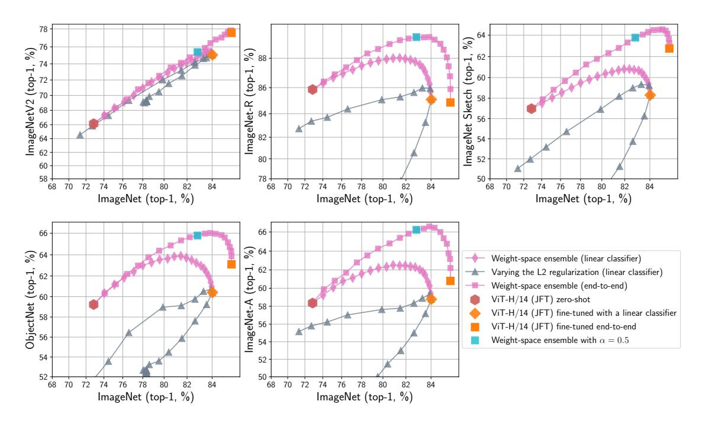

Figure 23: WiSE-FT applied to ViT-H/14 [21] pre-trained on JFT. We also show the effect of varying the L2 regularization strength for linear classifier fine-tuning.

#### <span id="page-39-0"></span>C.7.2 JFT pre-training

We also investigate whether WiSE-FT can provide gains for models trained using a standard image classification objective on the JFT-300M dataset [93]. Results are shown in Figure 23 and Table 10. For 973/1000 ImageNet classes, we were able to manually identify a corresponding class from the 18K classes in JFT. We use this mapping between ImageNet and JFT classes to obtain zero-shot ImageNet weights from the final layer weights of the pre-trained ViT-H/14 model from Dosovitskiy et al. [21]. We also train a linear classifier on the fixed penultimate layer of the same ViT-H/14 model using L-BFGS without label smoothing with softmax cross-entropy loss, and fine-tune end-to-end using AdamW with maximum learning rate  $5 \cdot 10^{-6}$  and weight decay 0.1 for 20k iterations at batch size 512 with sigmoid cross-entropy loss. As for CLIP models, our learning rate schedule consists of 500 steps of linear warmup followed by cosine decay. All ViT-H/14 models are trained and evaluated on  $224 \times 224$  pixel images. For fair evaluation, we prevent fine-tuned solutions from predicting the 27 classes with no plausible corresponding JFT class at all points on the WiSE-FT curve but still include these points in the denominator when computing accuracy.

<span id="page-40-0"></span>

|                            | Distribution shifts<br>Avg<br>Avg |       |      |           |           |      |        |              |  |  |
|----------------------------|-----------------------------------|-------|------|-----------|-----------|------|--------|--------------|--|--|
|                            | IN (ref.)                         | IN-V2 | IN-R | IN-Sketch | ObjectNet | IN-A | shifts | ref., shifts |  |  |
| WiSE-FT, edn-to-end        |                                   |       |      |           |           |      |        |              |  |  |
| α=0.00                     | 72.9                              | 66.1  | 85.9 | 57.0      | 59.2      | 58.4 | 65.3   | 69.1         |  |  |
| α=0.05                     | 74.1                              | 67.3  | 86.4 | 57.9      | 60.4      | 59.9 | 66.4   | 70.2         |  |  |
| α=0.10                     | 75.3                              | 68.3  | 86.9 | 58.8      | 61.2      | 60.8 | 67.2   | 71.2         |  |  |
| α=0.15                     | 76.5                              | 69.5  | 87.4 | 59.7      | 62.2      | 61.7 | 68.1   | 72.3         |  |  |
| α=0.20                     | 77.5                              | 70.8  | 87.9 | 60.5      | 63.0      | 62.8 | 69.0   | 73.2         |  |  |
| α=0.25                     | 78.5                              | 71.6  | 88.3 | 61.2      | 63.8      | 63.5 | 69.7   | 74.1         |  |  |
| α=0.30                     | 79.6                              | 72.5  | 88.6 | 61.8      | 64.4      | 64.3 | 70.3   | 74.9         |  |  |
| α=0.35                     | 80.6                              | 73.5  | 88.9 | 62.3      | 64.9      | 64.8 | 70.9   | 75.8         |  |  |
| α=0.40                     | 81.5                              | 74.1  | 89.1 | 62.8      | 65.3      | 65.4 | 71.3   | 76.4         |  |  |
| α=0.45                     | 82.2                              | 74.8  | 89.2 | 63.3      | 65.6      | 65.8 | 71.7   | 77.0         |  |  |
| α=0.50                     | 82.9                              | 75.4  | 89.3 | 63.8      | 65.8      | 66.2 | 72.1   | 77.5         |  |  |
| α=0.55                     | 83.4                              | 75.9  | 89.3 | 64.0      | 66.0      | 66.3 | 72.3   | 77.8         |  |  |
| α=0.60                     | 83.9                              | 76.4  | 89.3 | 64.3      | 66.0      | 66.6 | 72.5   | 78.2         |  |  |
| α=0.65                     | 84.3                              | 76.8  | 89.1 | 64.5      | 65.9      | 66.4 | 72.5   | 78.4         |  |  |
| α=0.70                     | 84.7                              | 77.1  | 88.9 | 64.5      | 65.8      | 66.0 | 72.5   | 78.6         |  |  |
| α=0.75                     | 84.9                              | 77.4  | 88.5 | 64.5      | 65.6      | 65.3 | 72.3   | 78.6         |  |  |
| α=0.80                     | 85.2                              | 77.6  | 88.1 | 64.4      | 65.2      | 64.8 | 72.0   | 78.6         |  |  |
| α=0.85                     | 85.3                              | 77.8  | 87.5 | 64.1      | 64.7      | 63.8 | 71.6   | 78.4         |  |  |
| α=0.90                     | 85.4                              | 77.8  | 86.8 | 63.7      | 64.4      | 63.2 | 71.2   | 78.3         |  |  |
| α=0.95                     | 85.4                              | 77.8  | 85.9 | 63.3      | 63.9      | 62.2 | 70.6   | 78.0         |  |  |
| α=1.00                     | 85.4                              | 77.6  | 84.9 | 62.8      | 63.1      | 60.8 | 69.8   | 77.6         |  |  |
| WiSE-FT, linear classifier |                                   |       |      |           |           |      |        |              |  |  |
| α=0.00                     | 72.9                              | 66.1  | 85.9 | 57.0      | 59.2      | 58.4 | 65.3   | 69.1         |  |  |
| α=0.05                     | 74.0                              | 67.3  | 86.3 | 57.5      | 60.3      | 59.2 | 66.1   | 70.0         |  |  |
| α=0.10                     | 75.1                              | 68.3  | 86.7 | 58.1      | 61.2      | 60.1 | 66.9   | 71.0         |  |  |
| α=0.15                     | 76.1                              | 69.1  | 87.0 | 58.5      | 61.8      | 60.8 | 67.4   | 71.8         |  |  |
| α=0.20                     | 77.1                              | 70.0  | 87.3 | 59.0      | 62.4      | 61.1 | 68.0   | 72.5         |  |  |
| α=0.25                     | 78.0                              | 71.0  | 87.5 | 59.5      | 63.0      | 61.6 | 68.5   | 73.2         |  |  |
| α=0.30                     | 78.8                              | 71.7  | 87.7 | 59.8      | 63.3      | 61.9 | 68.9   | 73.8         |  |  |
| α=0.35                     | 79.6                              | 72.2  | 87.8 | 60.1      | 63.6      | 62.2 | 69.2   | 74.4         |  |  |
| α=0.40                     | 80.3                              | 72.9  | 87.9 | 60.4      | 63.6      | 62.3 | 69.4   | 74.8         |  |  |
| α=0.45                     | 80.9                              | 73.4  | 88.0 | 60.5      | 63.8      | 62.5 | 69.6   | 75.2         |  |  |
| α=0.50                     | 81.5                              | 73.8  | 88.0 | 60.7      | 63.9      | 62.5 | 69.8   | 75.7         |  |  |
| α=0.55                     | 81.9                              | 74.1  | 88.0 | 60.8      | 63.7      | 62.5 | 69.8   | 75.8         |  |  |
| α=0.60                     | 82.4                              | 74.4  | 87.9 | 60.8      | 63.5      | 62.4 | 69.8   | 76.1         |  |  |
| α=0.65                     | 82.8                              | 74.7  | 87.8 | 60.7      | 63.2      | 62.3 | 69.7   | 76.2         |  |  |
| α=0.70                     | 83.1                              | 75.0  | 87.6 | 60.7      | 63.0      | 62.0 | 69.7   | 76.4         |  |  |
| α=0.75                     | 83.4                              | 75.2  | 87.4 | 60.5      | 62.7      | 61.8 | 69.5   | 76.5         |  |  |
| α=0.80                     | 83.6                              | 75.4  | 87.1 | 60.2      | 62.4      | 61.4 | 69.3   | 76.4         |  |  |
| α=0.85                     | 83.7                              | 75.4  | 86.7 | 59.8      | 61.9      | 60.7 | 68.9   | 76.3         |  |  |
| α=0.90                     | 83.9                              | 75.4  | 86.3 | 59.4      | 61.4      | 60.3 | 68.6   | 76.2         |  |  |
| α=0.95                     | 84.0                              | 75.3  | 85.7 | 58.9      | 61.0      | 59.4 | 68.1   | 76.0         |  |  |
| α=1.00                     | 84.0                              | 75.1  | 85.1 | 58.3      | 60.4      | 58.8 | 67.5   | 75.8         |  |  |

Table 10: WiSE-FT accuracy on the reference and shifted distributions for various values of the mixing coefficient α. Results shown for ViT-H/14 pre-trained on JFT-300M, fine-tuned end-to-end (top) and with a linear classifier (bottom). Note that α=0.0 corresponds to the zero-shot model, while α = 1.0 corresponds to standard fine-tuning. Avg shifts displays the mean performance among the five distribution shifts, while Avg reference, shifts shows the average of ImageNet (reference) and Avg shifts.

#### C.7.3 BASIC

We apply WiSE-FT to BASIC [77], fine-tuning both the image and text encoder with a contrastive loss on half of the ImageNet training data, as in Pham et al. [77]. Results are shown in Figure 24 and Tables 11 and 12.

<span id="page-41-0"></span>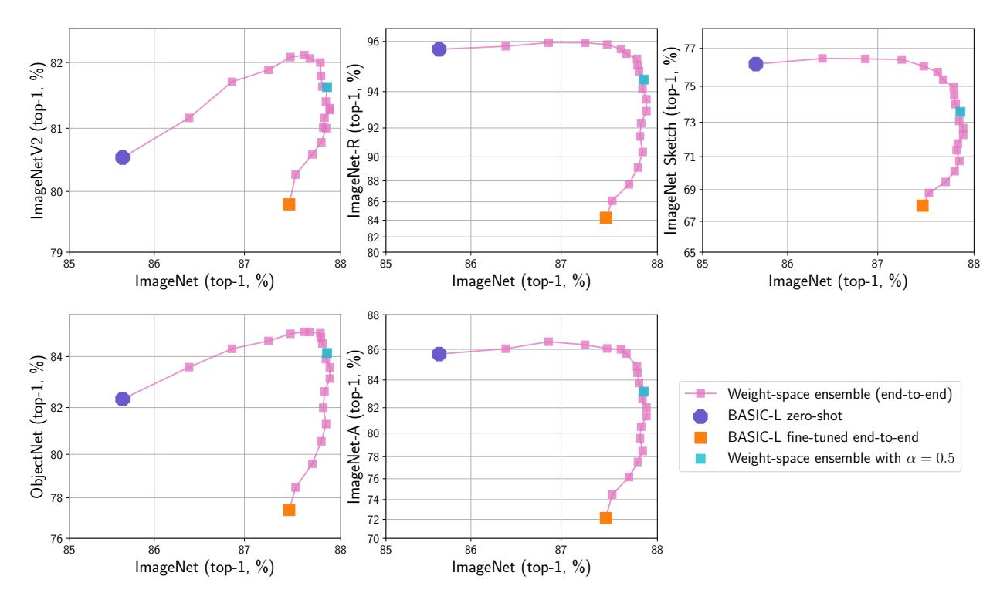

Figure 24: WiSE-FT improves accuracy relative to the fine-tuned model on ImageNet and five derived distribution shifts for BASIC-L [77] using ImageNet class names to construct the zero-shot classifier.

<span id="page-42-0"></span>

|        |           |       |      | Distribution shifts |           |      | Avg    | Avg          |
|--------|-----------|-------|------|---------------------|-----------|------|--------|--------------|
|        | IN (ref.) | IN-V2 | IN-R | IN-Sketch           | ObjectNet | IN-A | shifts | ref., shifts |
| α=0.00 | 81.4      | 74.1  | 90.6 | 67.4                | 73.5      | 66.7 | 74.5   | 78.0         |
| α=0.05 | 82.2      | 75.0  | 90.8 | 67.9                | 74.6      | 67.8 | 75.2   | 78.7         |
| α=0.10 | 82.8      | 75.9  | 90.9 | 68.2                | 75.4      | 68.5 | 75.8   | 79.3         |
| α=0.15 | 83.3      | 76.4  | 91.0 | 68.4                | 76.2      | 69.3 | 76.3   | 79.8         |
| α=0.20 | 83.8      | 76.8  | 91.0 | 68.6                | 76.9      | 70.0 | 76.7   | 80.2         |
| α=0.25 | 84.1      | 77.1  | 91.1 | 68.7                | 77.4      | 70.5 | 77.0   | 80.5         |
| α=0.30 | 84.5      | 77.4  | 91.0 | 68.8                | 77.7      | 70.8 | 77.1   | 80.8         |
| α=0.35 | 84.9      | 77.9  | 90.8 | 68.8                | 77.8      | 71.3 | 77.3   | 81.1         |
| α=0.40 | 85.2      | 78.1  | 90.7 | 68.7                | 77.9      | 71.3 | 77.3   | 81.2         |
| α=0.45 | 85.4      | 78.3  | 90.5 | 68.7                | 78.0      | 71.4 | 77.4   | 81.4         |
| α=0.50 | 85.6      | 78.5  | 90.2 | 68.6                | 78.0      | 71.1 | 77.3   | 81.4         |
| α=0.55 | 85.8      | 78.5  | 89.9 | 68.4                | 78.0      | 70.6 | 77.1   | 81.4         |
| α=0.60 | 85.9      | 78.4  | 89.5 | 68.1                | 78.0      | 70.5 | 76.9   | 81.4         |
| α=0.65 | 86.0      | 78.5  | 89.1 | 67.7                | 77.8      | 70.3 | 76.7   | 81.3         |
| α=0.70 | 86.1      | 78.5  | 88.8 | 67.3                | 77.6      | 69.7 | 76.4   | 81.2         |
| α=0.75 | 86.2      | 78.6  | 88.4 | 67.0                | 77.3      | 69.2 | 76.1   | 81.2         |
| α=0.80 | 86.2      | 78.5  | 87.8 | 66.6                | 77.1      | 68.3 | 75.7   | 81.0         |
| α=0.85 | 86.2      | 78.5  | 87.2 | 66.0                | 76.7      | 67.5 | 75.2   | 80.7         |
| α=0.90 | 86.2      | 78.4  | 86.5 | 65.5                | 76.2      | 66.4 | 74.6   | 80.4         |
| α=0.95 | 86.2      | 78.2  | 85.7 | 65.0                | 75.8      | 65.3 | 74.0   | 80.1         |
| α=1.00 | 86.2      | 77.8  | 84.9 | 64.3                | 75.3      | 63.7 | 73.2   | 79.7         |

Table 11: WiSE-FT accuracy on the reference and shifted distributions for various values of the mixing coefficient α. Results shown for BASIC-M using ImageNet class names. Note that α=0.0 corresponds to the zero-shot model, while α = 1.0 corresponds to standard fine-tuning. Avg shifts displays the mean performance among the five distribution shifts, while Avg reference, shifts shows the average of ImageNet (reference) and Avg shifts.

<span id="page-43-0"></span>

|        |           |       |      | Distribution shifts |           |      | Avg    | Avg          |
|--------|-----------|-------|------|---------------------|-----------|------|--------|--------------|
|        | IN (ref.) | IN-V2 | IN-R | IN-Sketch           | ObjectNet | IN-A | shifts | ref., shifts |
| α=0.00 | 85.6      | 80.5  | 95.7 | 76.2                | 82.3      | 85.7 | 84.1   | 84.8         |
| α=0.05 | 86.4      | 81.2  | 95.8 | 76.5                | 83.6      | 86.0 | 84.6   | 85.5         |
| α=0.10 | 86.9      | 81.7  | 96.0 | 76.5                | 84.3      | 86.5 | 85.0   | 86.0         |
| α=0.15 | 87.3      | 81.9  | 96.0 | 76.4                | 84.6      | 86.3 | 85.0   | 86.2         |
| α=0.20 | 87.5      | 82.1  | 95.9 | 76.1                | 84.8      | 86.1 | 85.0   | 86.2         |
| α=0.25 | 87.6      | 82.1  | 95.7 | 75.8                | 84.9      | 86.0 | 84.9   | 86.2         |
| α=0.30 | 87.7      | 82.1  | 95.6 | 75.4                | 84.9      | 85.7 | 84.7   | 86.2         |
| α=0.35 | 87.8      | 82.0  | 95.4 | 75.0                | 84.9      | 84.9 | 84.4   | 86.1         |
| α=0.40 | 87.8      | 81.8  | 95.1 | 74.5                | 84.7      | 84.5 | 84.1   | 85.9         |
| α=0.45 | 87.8      | 81.6  | 94.9 | 74.0                | 84.5      | 83.8 | 83.8   | 85.8         |
| α=0.50 | 87.9      | 81.6  | 94.5 | 73.6                | 84.1      | 83.2 | 83.4   | 85.7         |
| α=0.55 | 87.8      | 81.4  | 94.1 | 73.1                | 83.9      | 82.6 | 83.0   | 85.4         |
| α=0.60 | 87.9      | 81.3  | 93.6 | 72.7                | 83.6      | 82.0 | 82.6   | 85.2         |
| α=0.65 | 87.9      | 81.3  | 93.0 | 72.3                | 83.2      | 81.3 | 82.2   | 85.1         |
| α=0.70 | 87.8      | 81.2  | 92.3 | 71.8                | 82.7      | 80.5 | 81.7   | 84.8         |
| α=0.75 | 87.8      | 81.0  | 91.5 | 71.4                | 82.0      | 79.6 | 81.1   | 84.4         |
| α=0.80 | 87.9      | 81.0  | 90.4 | 70.7                | 81.3      | 78.5 | 80.4   | 84.2         |
| α=0.85 | 87.8      | 80.8  | 89.1 | 70.1                | 80.6      | 77.5 | 79.6   | 83.7         |
| α=0.90 | 87.7      | 80.6  | 87.7 | 69.5                | 79.6      | 76.1 | 78.7   | 83.2         |
| α=0.95 | 87.5      | 80.3  | 86.1 | 68.8                | 78.5      | 74.5 | 77.6   | 82.5         |
| α=1.00 | 87.5      | 79.8  | 84.3 | 68.0                | 77.4      | 72.1 | 76.3   | 81.9         |

Table 12: WiSE-FT accuracy on the reference and shifted distributions for various values of the mixing coefficient α. Results shown for BASIC-L using ImageNet class names. Note that α=0.0 corresponds to the zero-shot model, while α = 1.0 corresponds to standard fine-tuning. Avg shifts displays the mean performance among the five distribution shifts, while Avg reference, shifts shows the average of ImageNet (reference) and Avg shifts.

<span id="page-44-2"></span>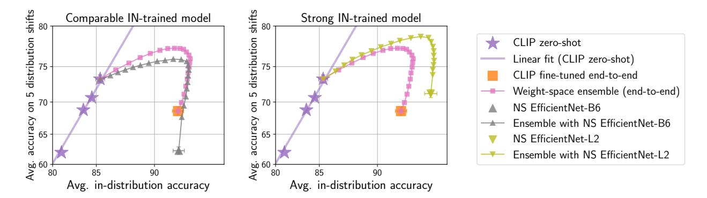

Figure 25: Ensembling with a zero-shot model improves accuracy under distribution shift of an independently trained model. (Left) Output-space ensembling with an independently trained model (NoisyStudent EfficientNet-B6) with comparable performance to the end-to-end fine-tuned model on the reference distribution. (Right) Output-space ensembling with an independently trained model with strong performance on the reference distribution (NoisyStudent EfficientNet-L2). Results averaged over the five distribution shifts as in Figure 1.

#### <span id="page-44-3"></span>C.8 Ensembling zero-shot CLIP with independently trained models

So far we have shown that a zero-shot model can be used to improve performance under distribution shift of the derived fine-tuned model. Here, we investigate whether this improvement is specific to fine-tuned models. On the contrary, we find that the performance under distribution shift of *independently trained models* improves when ensembling with robust models. Note that in the general case where the models being ensembled have different architectures, we are unable to perform weight-space ensembling; instead, we ensemble the outputs of each model. This increases the computational cost of inference, in contrast to the results shown in Section 4.

Concretely, we ensemble zero-shot CLIP with two Noisy Student EfficientNet models [104, 96]: (i) EfficientNet-B6 (Figure 25, left), with performance on the reference distribution comparable to the end-to-end fine-tuned CLIP model; and (ii) EfficientNet-L2 (Figure 25, right), the strongest model available on PyTorch ImageNet Models [101]. In both cases, we observe substantial improvements from ensembling—13.6 pp and 6.9 pp in average accuracy under distribution shift without reducing performance on the reference dataset. Further results are shown in Table 13.

# D Experimental details

#### <span id="page-44-0"></span>D.1 CLIP zero-shot

This section extends Section 2 with more details on inference with the CLIP zero-shot model. First, in all settings we use the CLIP model ViT-L/14@336px, except when explicitly mentioned otherwise. Second, CLIP learns a temperature parameter which is factored into the learned weight matrix  $W_{zero-shot}$  described in Section 2. Finally, to construct  $W_{zero-shot}$  we ensemble the 80 prompts provided by CLIP at https://github.com/openai/CLIP. However, we manually engineer prompts for five datasets: WILDS-FMoW, WILDS-iWildCam, Stanford Cars, Describable Textures and Food-101, which are found in the code.

#### <span id="page-44-1"></span>D.2 End-to-end fine-tuning

Two important experimental details for end-to-end fine-tuning are as follows:

<span id="page-45-1"></span>

|                       |                |       |      | Distribution shifts |           |      | Avg    | Avg               |
|-----------------------|----------------|-------|------|---------------------|-----------|------|--------|-------------------|
|                       | IN (reference) | IN-V2 | IN-R | IN-Sketch           | ObjectNet | IN-A | shifts | reference, shifts |
| CLIP                  |                |       |      |                     |           |      |        |                   |
| End-to-end fine-tuned | 86.2           | 76.8  | 79.8 | 57.9                | 63.3      | 65.4 | 68.6   | 77.4              |
| WSE (α=0.75)          | 87.0           | 78.8  | 86.1 | 62.5                | 68.1      | 75.2 | 74.1   | 80.5              |
| WSE (α=0.5)           | 86.8           | 79.5  | 89.4 | 64.7                | 71.1      | 79.9 | 76.9   | 81.8              |
| WSE (α=0.4)           | 86.2           | 79.2  | 89.9 | 65.0                | 71.9      | 80.7 | 77.3   | 81.8              |
| WSE (optimal α)       | 87.1           | 79.5  | 90.3 | 65.0                | 72.1      | 81.0 | 77.6   | 82.3              |
| NS EfficientNet-B6    |                |       |      |                     |           |      |        |                   |
| No ensemble           | 86.5           | 77.7  | 65.6 | 47.8                | 58.3      | 62.3 | 62.3   | 74.4              |
| OSE (α=0.75)          | 87.0           | 78.8  | 86.4 | 56.7                | 66.5      | 75.9 | 72.9   | 80.0              |
| OSE (α=0.5)           | 86.2           | 78.7  | 89.2 | 63.8                | 69.3      | 78.6 | 75.9   | 81.1              |
| OSE (α=0.4)           | 84.3           | 77.2  | 89.5 | 63.8                | 69.7      | 79.0 | 75.8   | 80.0              |
| OSE (optimal α)       | 87.1           | 79.3  | 89.7 | 63.8                | 69.7      | 79.3 | 76.4   | 81.8              |
| NS EfficientNet-L2    |                |       |      |                     |           |      |        |                   |
| No ensemble           | 88.3           | 80.8  | 74.6 | 47.6                | 69.8      | 84.7 | 71.5   | 79.9              |
| OSE (α=0.75)          | 88.6           | 81.6  | 88.0 | 53.4                | 72.2      | 87.1 | 76.5   | 82.5              |
| OSE (α=0.5)           | 87.4           | 80.6  | 90.2 | 63.4                | 73.1      | 86.5 | 78.8   | 83.1              |
| OSE (α=0.4)           | 85.2           | 78.5  | 90.5 | 63.9                | 72.6      | 86.0 | 78.3   | 81.8              |
| OSE (optimal α)       | 88.6           | 81.7  | 90.5 | 63.9                | 73.1      | 87.1 | 79.3   | 83.9              |

Table 13: Accuracy of various independently trained models ensembled with CLIP on ImageNet and derived distribution shifts. OSE denotes output-space ensembling. Avg shifts displays the mean performance among the five distribution shifts, while Avg reference, shifts shows the average of ImageNet (reference) and Avg shifts.

- We initialize the final classification layer with the zero-shot classifier used by CLIP. We scale the zeroshot classifier weights by the temperature parameter of the pre-trained CLIP model at initialization, and do not include a temperature parameter during fine-tuning.
- As the zero-shot classifier expects the outputs of the image-encoder g to be normalized, we continue to normalize the outputs of g during fine-tuning.

When fine-tuning end-to-end, unless otherwise mentioned, we use the AdamW optimizer [\[61,](#page-16-3) [76\]](#page-17-15) and choose the largest batch size such that the model fits into 8 GPUs (512 for ViT-B/16). Unless otherwise mentioned, we use the default PyTorch AdamW hyperparameters β<sup>1</sup> = 0.9, β<sup>2</sup> = 0.999, = 10<sup>−</sup><sup>8</sup> , weight decay of 0.1 and a cosine-annealing learning rate schedule [\[60\]](#page-16-15) with 500 warm-up steps. Unless otherwise mentioned we use a learning rate of 3 <sup>×</sup> <sup>10</sup><sup>−</sup><sup>5</sup> , gradient clipping at global norm 1 and fine-tune for a total of 10 epochs. Additionally, unless otherwise mentioned we use the same data augmentations as [\[82\]](#page-17-0), randomly cropping a square from resized images with the largest dimension being 336 pixels for ViT-L/14@336px and 224 for the remaining models.

## <span id="page-45-0"></span>D.3 Fine-tuning a linear classifier

This section extends the description of linear classifier training from Appendix [C.3](#page-25-2) with details on hyperparameters and additional analyses. In each of the four regularization strategies—no regularization, weight decay, L1 regularization, and label smoothing—we run 64 hyperparameter configurations. For each trial, mini-batch size is drawn uniformly from {64, <sup>128</sup>, <sup>256</sup>} and learning rate is set to 10<sup>−</sup><sup>β</sup> with <sup>β</sup> chosen uniformly at random from the range [0, 6]. Hyperparameters for each regularization strategy are as follows: (i) The weight decay coefficient is set to 10<sup>−</sup><sup>λ</sup> where λ is chosen uniformly at random from [0, 4] for each trial; (ii) The L1 regularization coefficient is set to 10<sup>−</sup><sup>λ</sup> where λ is chosen uniformly at random from [4, 8] for each trial; (iii) The label smoothing [\[71\]](#page-16-14) coefficient λ is chosen uniformly at random from [0, 0.25] for each trial. The linear classifier used for ensembling attains the best performance in-distribution. The hyperparameters

<span id="page-46-2"></span>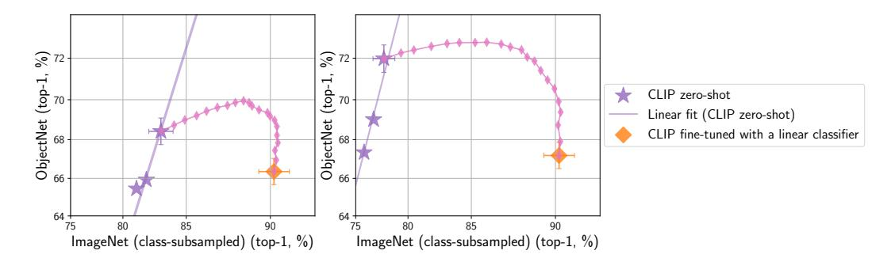

Figure 26: Effective robustness scatter plots for ObjectNet, with and without adapting to class shift. **Left:** Using ImageNet class names to construct the zero-shot classifier. **Right:** Using ObjectNet class names to construct the zero-shot classifier.

from this trial are then used in the distillation and regularization experiments described in Appendix C.3. In the low-data regime (Section C.5), this process is repeated for each k and dataset.

When training linear classifiers with k images per class as in Section C.5 the maximum number of epochs T is scaled approximately inversely proportional to the amount of data removed (e.g., with half the data we train for twice as many epochs so the number of iterations is consistent). To choose the T we use default PyTorch AdamW hyperparameters (learning rate 0.001, weight decay 0.01) and double the number of epochs until performance saturates. For each random hyperparameter run we choose the epochs uniformly from  $\{1, ..., T\}$ .

## <span id="page-46-0"></span>D.4 ObjectNet

The zero-shot models in Table 1 use the ImageNet class names instead of the ObjectNet class names. However, this adaptation to class shift improves performance by 2.3% [82]. Out of the five datasets used for the majority of the experiments in Section 3, ObjectNet is the only dataset for which this is possible. In Figure 26 we compare weight-space ensembles with and without adaptation to class shift.

# <span id="page-46-1"></span>E Diversity measures

Let  $S = \{(x^{(i)}, y^{(i)}), 1 \leq i \leq N\}$  be a classification set with input data  $x^{(i)}$  and labels  $y^{(i)} \in \{1, ..., C\}$ , where C is the number of classes. A classifier f is a function that maps inputs x to logits  $f(x) \in \mathbb{R}^C$ , yielding predictions  $\hat{y} = \arg\max_{1 \leq c \leq C} f(x)_c$ . We consider measures of diversity  $\mathcal{M}(f, g, S)$  between two classifiers f and g and the dataset S. For simplicity,  $\hat{y}_f^{(i)}$  is used to denote the predictions from classifier f given inputs  $x^{(i)}$  (and similarly for g).

**Prediction Diversity (PD).** One of the most intuitive ways to measure diversity between pairs of classifiers is to compute the fraction of samples where they disagree while one is correct [42, 91]. Formally, the prediction diversity PD is defined as:

<span id="page-46-3"></span>
$$PD(f, g, \mathcal{S}) = \frac{1}{N} \sum_{1 \le i \le N} \mathbb{1} \left[ d_f \lor d_g \right], \tag{4}$$

where

$$d_f = \left(\hat{y}_f^{(i)} = y^{(i)} \land \hat{y}_g^{(i)} \neq y^{(i)}\right). \tag{5}$$

$$d_g = \left(\hat{y}_f^{(i)} \neq y^{(i)} \land \hat{y}_g^{(i)} = y^{(i)}\right). \tag{6}$$

Cohen's Kappa Complement (CC). Cohen's kappa coefficient is a measure of agreement between two annotators [68]. Here, we use it's complement as a diversity measure between two classifiers:

<span id="page-47-0"></span>
$$CC(f, g, S) = 1 - \frac{p_o - p_e}{1 - p_e} = \frac{1 - p_o}{1 - p_e},$$
 (7)

where  $p_e$  is the expected agreement between the classifiers and  $p_o$  is the empirical probability of agreement. Formally, if  $n_{f,k}$  is the number of samples where classifier f predicted label k (i.e.  $n_{f,k} = \sum_{1 \le i \le N} \mathbb{1}[\hat{y}_f^i = k]$ ), then:

$$p_e = \frac{1}{N^2} \sum_{1 \le c \le C} n_{f,c} n_{g,c}, \quad p_o = \frac{1}{N} \sum_{1 \le i \le N} \mathbb{1}[\hat{y}_f^i = \hat{y}_g^i]$$
 (8)

**KL Divergence (KL).** The Kullback-Leibler divergence measures how different a probability distribution is from another. Let  $p_f^{(i)} = \operatorname{softmax} \left( f(x^{(i)}) \right)$  for a classifier f, and let  $p_{f,c}^{(i)}$  be the probability assigned to class c. We consider the average KL-divergence over all samples as a diversity measure:

<span id="page-47-1"></span>
$$KL(f, g, S) = \frac{1}{N} \sum_{1 \le i \le N} \sum_{1 \le c \le C} p_{f, c}^{(i)} \log \left( \frac{p_{f, c}^{(i)}}{p_{g, c}^{(i)}} \right).$$
(9)

Centered Kernel Alignment Complement (CKAC). CKA is a similarity measure that compares two different sets of high-dimensional representations [51]. It is commonly used for comparing representations of two neural networks, or determining correspondences between two hidden layers of the same network. CKA measures the agreement between two matrices containing the pair-wise similarities of all samples in a dataset, where each matrix is constructed according to the representations of a model. More formally, let  $S \in \mathbb{R}^{N \times d}$  denote the d-dimensional features for all samples in a dataset S, pre-processed to center the columns. For two models f and g yielding similarity matrices  $S_f$  and  $S_g$ , CKA is defined as:

$$CKA(f, g, S) = \frac{||S_g^{\top} S_f||_F^2}{||S_f^{\top} S_f||_F ||S_g^{\top} S_g||_F},$$
(10)

<span id="page-47-2"></span>where  $||S||_F$  denotes the Frobenius norm of the matrix S. Larger CKA values indicate larger similarities between the representations of the two models, and thus, smaller diversity. We define the diversity measure CKAC as:

$$CKAC = 1 - CKA. \tag{11}$$

Note that CKAC is computationally expensive to compute for large datasets. For this reason, in our experiments with distributions larger than 10,000 samples, we randomly sample 10,000 to compute this measure.

**Diversity across different architectures** We extend Figure 5 to show results for all combinations of diversity measures, datasets, and CLIP models. Similarly to before, the baselines compares models with the same encoder, with two linear classifiers trained on different subsets of ImageNet with half of the data. Results are shown in Figures 27-30.

<span id="page-48-0"></span>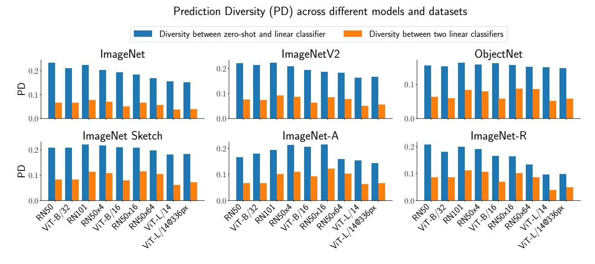

Figure 27: Prediction Diversity (PD) for multiple datasets and CLIP models (Equation [4\)](#page-46-3).

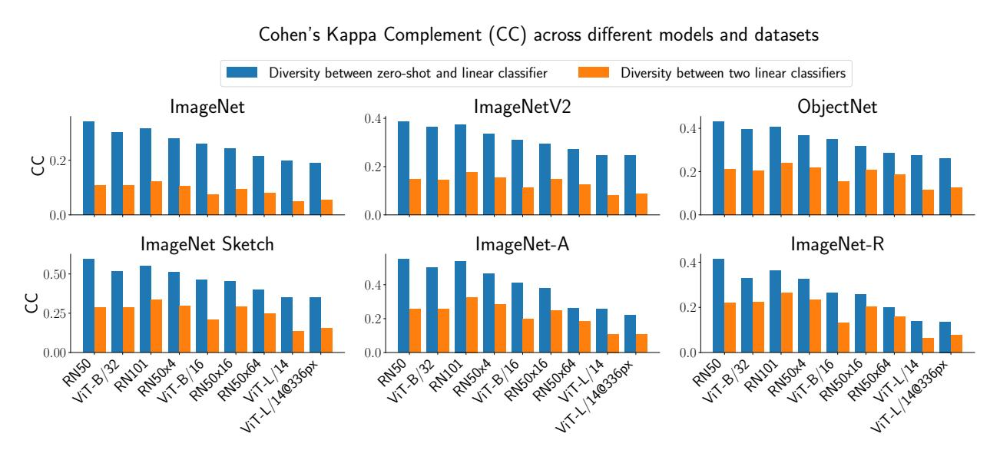

Figure 28: Cohen's Kappa Complement (CC) for multiple datasets and CLIP models (Equation [7\)](#page-47-0).

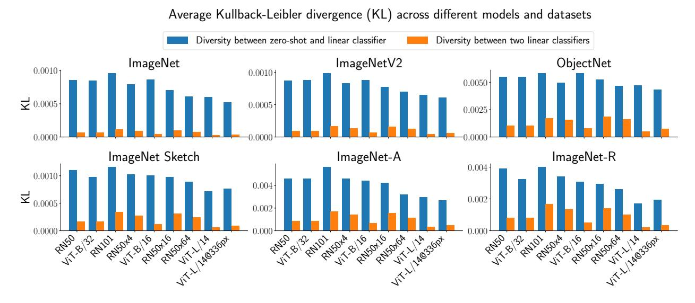

Figure 29: Average KL Divergence (KL) for multiple datasets and CLIP models (Equation 9).

<span id="page-49-0"></span>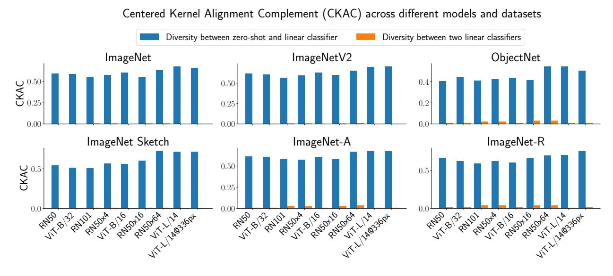

Figure 30: Central Kernel Alignment Complement (CKAC) for multiple datasets and CLIP models (Equation 11).

# <span id="page-50-0"></span>F When do weight-space ensembles approximate output-space ensembles?

In practice we observe a difference between weight-space and output-space ensembling. However, it is worth noting that these two methods of ensembling are not as different as they initially appear. In certain regimes a weight-space ensemble approximates the corresponding output-space ensemble—for instance, when training is well approximated by a linear expansion, referred to as the NTK regime [44]. Fort et al. [24] find that a linear expansion becomes more accurate in the later phase of neural network training, a phase which closely resembles fine-tuning.

Consider the set  $\Theta = \{(1 - \alpha)\theta_0 + \alpha\theta_1 : \alpha \in [0, 1]\}$  consisting of all  $\theta$  which lie on the linear path between  $\theta_0$  and  $\theta_1$ .

**Proposition 1.** When  $f(\theta) = f(\theta_0) + \nabla f(\theta_0)^{\top} (\theta - \theta_0)$  for all  $\theta \in \Theta$ , the weight- and output-space ensemble of  $\theta_0$  and  $\theta_1$  are equivalent.

*Proof.* We may begin with the weight-space ensemble and retrieve the output-space ensemble

$$f((1-\alpha)\theta_0 + \alpha\theta_1) \tag{12}$$

$$= f(\theta_0) + \nabla f(\theta_0)^{\top} ((1 - \alpha)\theta_0 + \alpha\theta_1 - \theta_0)$$
(13)

$$= f(\theta_0) + \alpha \nabla f(\theta_0)^{\mathsf{T}} (\theta_1 - \theta_0) \tag{14}$$

$$= f(\theta_0) + \alpha \nabla f(\theta_0)^{\mathsf{T}} (\theta_1 - \theta_0) + \alpha f(\theta_0) - \alpha f(\theta_0)$$
(15)

$$= (1 - \alpha)f(\theta_0) + \alpha \left( f(\theta_0) + \nabla f(\theta_0)^{\mathsf{T}} (\theta_1 - \theta_0) \right)$$
(16)

$$= (1 - \alpha)f(\theta_0) + \alpha f(\theta_1) \tag{17}$$

where the first and final line follow by the linearity assumption.