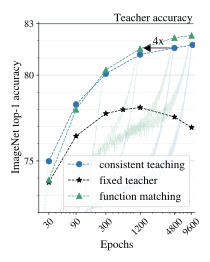
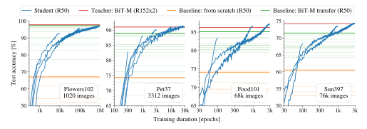
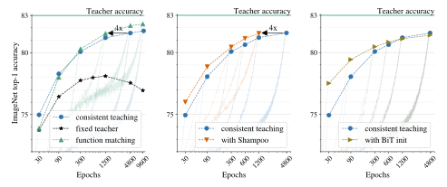
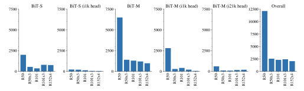

# Knowledge distillation: A good teacher is patient and consistent

<span id="page-0-1"></span>Lucas Beyer\* Xiaohua Zhai\* Amélie Royer\*† Larisa Markeeva\*‡ Rohan Anil Alexander Kolesnikov\* Google Research, Brain Team

{lbeyer,xzhai,akolesnikov}@google.com

#### **Abstract**

There is a growing discrepancy in computer vision between large-scale models that achieve state-of-the-art performance and models that are affordable in practical applications. In this paper we address this issue and significantly bridge the gap between these two types of models. Throughout our empirical investigation we do not aim to necessarily propose a new method, but strive to identify a robust and effective recipe for making state-of-the-art large scale models affordable in practice. We demonstrate that, when performed correctly, knowledge distillation can be a powerful tool for reducing the size of large models without compromising their performance. In particular, we uncover that there are certain implicit design choices, which may drastically affect the effectiveness of distillation. Our key contribution is the explicit identification of these design choices, which were not previously articulated in the literature. We back up our findings by a comprehensive empirical study, demonstrate compelling results on a wide range of vision datasets and, in particular, obtain a state-of-the-art ResNet-50 model for ImageNet, which achieves 82.8% top-1 accuracy.<sup>2</sup>

#### 1. Introduction

Large-scale vision models currently dominate many areas of computer vision. Recent state-of-the-art models for image classification [7, 23, 40, 42, 49], object detection [8, 27] or semantic segmentation [53] push model size to the limits allowed by modern hardware. Despite their impressive performance, these models are rarely used in practice due to high computational costs. Instead, practitioners typically use much smaller models, such as ResNet-50 [23] or MobileNet [15], which are order(s) of magnitude cheaper to run. According to the download counts of five BiT models



Figure 1. We demonstrate that distillation works the best when we train *patiently* for a large number of epochs and provide *consistent* image views to teacher and student models (green and blue lines). This can be contrasted to a popular setting of distilling with precomputed teacher targets (black line), which works much worse.

from *Tensorflow Hub*, the smallest ResNet-50 [12] model has been downloaded for significantly more times than the larger ones. As a result, many recent improvements in vision do not translate to real-world applications.

To address this problem, we concentrate on the following task: given a specific application and a large model that performs very well on it, we aim to compress the model to a smaller and more efficient architecture without compromising performance. There are two widely used paradigms that target this task: model pruning [19] and knowledge distillation [13]. *Model pruning* reduces the large model's size by stripping away its parts. This procedure can be restrictive in

<sup>\*</sup>equal contribution

<sup>†</sup> work done at Google, while being a PhD student in IST Austria.

<sup>&</sup>lt;sup>‡</sup> work done at Google, while being a PhD student in Skoltech.

<span id="page-0-0"></span><sup>&</sup>lt;sup>2</sup>We provide code and models in the big\_vision codebase [3].

<span id="page-1-0"></span>practice: first, it does not allow changing the model family, say from a ResNet to a MobileNet. Second, there may be architecture-dependent challenges, *e.g*. if the model uses group normalization [\[47\]](#page-9-4), pruning channels may result in the need to dynamically re-balance channel groups.

Instead, we concentrate on the *knowledge distillation* approach which does not suffer from these drawbacks. The idea behind knowledge distillation is to "distill" a *teacher model*, in our case a large and cumbersome model or ensemble of models, into a small and efficient *student model*. This works by forcing the student's predictions (or internal activations) to match those of the *teacher*, thus naturally allowing a change in the model family as part of compression. We closely follow the original distillation setup from [\[13\]](#page-8-8) and find it surprisingly effective when done right: We interpret distillation as a task of matching the *functions* implemented by the teacher and student, as illustrated in Figure [2.](#page-2-0) With this interpretation, we discover two principles of knowledge distillation for model compression. First, teacher and student should process the exact same input image views or, more specifically, same crop and augmentations. Second, we want the functions to match on a large number of support points to generalize well. Using an aggressive variant of mixup [\[52\]](#page-9-5), we can generate support points outside the original image manifold. With this in mind, we experimentally demonstrate that consistent image views, aggressive augmentations and very long training schedules are the key to make *model compression via knowledge distillation* work well in practice.

Despite the apparent simplicity of our findings, there are multiple reasons that may commonly prevent researchers (and practitioners) from making the design choices that we suggest. First, it is tempting to precompute the teacher's activations for an image offline once to save compute, especially for very large teachers. As we will show, this fixed teacher approach does not work well. Second, knowledge distillation is also commonly used in different contexts (other than model compression), where authors recommend different or even opposite design choices [\[41,](#page-9-6)[49,](#page-9-2)[51\]](#page-9-7), see Figure [2.](#page-2-0) Third, knowledge distillation requires an atypically large number of epochs to reach best performance, much more than commonly used for supervised training. Finally, choices which may look suboptimal in training of regular length often end up being best for long runs, and vice-versa.

In our empirical study, we mostly concentrate on compressing the large BiT-ResNet-152x2 from [\[23\]](#page-8-1) that was pretrained on the ImageNet-21k dataset [\[37\]](#page-9-8) and fine-tuned to the relevant datasets of interest. We distill it to a standard ResNet-50 architecture [\[12\]](#page-8-6) (but replace batch normalization with group normalization) on a range of small and mid-sized datasets without compromising accuracy. We also achieve very strong results on the ImageNet [\[36\]](#page-9-9) dataset: with a total number of 9600 epochs for distillation, we set the new ResNet-50 SOTA 82.8% on ImageNet. This is 4.4% better than the ResNet-50 model from [\[23\]](#page-8-1), and 2.2% better than the best ResNet-50 model in the literature, which uses a more complex setup [\[38\]](#page-9-10). Finally, we demonstrate that our distillation recipe also works when simultaneously compressing and changing the model family, *e.g*. BiT-ResNet architecture to the MobileNet architecture.

# 2. Experimental setup

In this section, we introduce the experimental setup and benchmarks we use throughout the paper. Given a largescale vision model (the *teacher*, or T) with high accuracy on a particular task, we aim to compress this model to a much smaller model (the *student*, or S) without compromising its performance. Our compression recipe relies on knowledge distillation, as introduced in [\[13\]](#page-8-8), and a careful investigation of several key ingredients in the training setup.

Datasets, metrics and evaluation protocol. We conduct experiments on five popular image classification datasets: *flowers102* [\[31\]](#page-9-11), *pets* [\[33\]](#page-9-12), *food101* [\[21\]](#page-8-9), *sun397* [\[48\]](#page-9-13) and *ILSVRC-2012* ("ImageNet") [\[36\]](#page-9-9). These datasets span diverse image classification scenarios; In particular, they vary in the number of classes, from 37 to 1000 classes, and total number of training images, from 1020 to 1281167 training images. This allows us to verify our distillation recipe for a broad range of practical settings and ensure its robustness.

As a metric, we always report classification accuracy. For all datasets, we perform design choices and hyperparameters selection using a *validation* split, and report final results on the *test* set. These splits are defined in the appendix [E.](#page-10-0)

Teacher and student models. Throughout the paper, we opt for using pre-trained teacher models from BiT [\[23\]](#page-8-1), which provides a large collection of ResNet models pretrained on ILSVRC-2012 and ImageNet-21k datasets, with state-of-the-art accuracy. The only significant differences between BiT-ResNets and standard ResNets is their use of group normalization layer [\[47\]](#page-9-4) and weight standardization [\[34\]](#page-9-14), which are used instead of batch normalization [\[17\]](#page-8-10).

In particular, we concentrate on the BiT-M-R152x2 architecture: a BiT-ResNet-152x2 (152 layers, 'x2' indicates the width multiplier) pretrained on ImageNet-21k. This model demonstrates excellent performance on a variety of vision benchmarks and it is still manageable to run extensive ablation studies with it. It is highly expensive to deploy (requires roughly 10x more compute than the standard ResNet-50), and thus effective compression of this model is of practical importance. For the student's architecture, we use a BiT-ResNet-50 variant, referred to as ResNet-50 for brevity.

Distillation loss. We use the KL-divergence between the teacher's pt, and the student's p<sup>s</sup> predicted class probability vectors as a distillation loss, as was originally introduced in [\[13\]](#page-8-8). We do not use any additional loss term with respect

<span id="page-2-2"></span><span id="page-2-0"></span>

Figure 2. Schematic illustrations of various design choices when doing knowledge distillation. Left: *Teacher* receives a fixed image, while *student* receives a random augmentation. Center-left: *Teacher* and *student* receive independent image augmentations. Center-right: *Teacher* and *student* receive consistent image augmentations plus the input image manifold is extended by including linear segments between pairs of images (known as *mixup* [52] augmentation).

to the original dataset's hard labels:

$$KL(p_t||p_s) = \sum_{i \in C} \left[ -p_{t,i} \log p_{s,i} + p_{t,i} \log p_{t,i} \right], \quad (1)$$

where  $\mathcal C$  is a set of classes. Also, as in [13], we introduce a temperature parameter T, which is used to adjust the entropy of the predicted softmax-probability distributions before they are used in the loss computation:  $p_s \propto \exp(\frac{\log p_s}{T})$  and  $p_t \propto \exp(\frac{\log p_t}{T})$ .

Training setup. For optimization, we train our models with the Adam optimizer [22] with default parameters, except for the initial learning rate that is part of our hyperparameter exploration. We use a cosine learning rate schedule [28] without warm restarts. We also sweep over the weight decay loss coefficient for all our experiments (for which we use a "decoupled" weight decay convention [29]). To stabilize training we enable gradient clipping with a threshold of 1.0 on the global L2-norm of a gradient. Finally, we use batch size 512 for all our experiments, except for models trained on ImageNet, where we train with batch size 4096. For the remaining hyperparameters, we discuss their sweeping range together with corresponding experiments in the next section.

One additional important component of our recipe is the *mixup* data augmentation strategy [52]. In particular, we introduce a mixup variant in our "function matching" strategy (see Section 3.1.1), in which we use "agressive" mixing coefficients sampled uniformly from [0,1], which can be seen as an extreme case of the originally proposed sampling from  $\beta$ -distribution.

Unless explicitly specified otherwise, for prepossessing we use an "inception-style" crop [39] and then resize images to a fixed square size. Furthermore, in order to make our ex-

tensive analysis computationally feasible (overall we trained dozens of thousands of models), we use relatively low input resolution and resize input images to  $128 \times 128$  size, except for our ImageNet experiments, that use the standard input  $224 \times 224$  resolution.

For all our experiments we use Google Cloud TPU accelerators [20]. We also report our batch sizes, epochs or total number of update steps, which allow to estimate resource requirements for any particular experiment of interest. Code and checkpoints are made publicly available [3].

#### 3. Distillation for model compression

# <span id="page-2-1"></span>3.1. Investigating the "consistent and patient teacher" hypothesis

In this section, we perform an experimental verification of our hypothesis formulated in the introduction and visualised in Figure 2, that distillation works best when seen as function matching, *i.e.* when the student and teacher see consistent views of the input images, synthetically "filled" via mixup, and when *student is trained* using long training schedule (i.e. the "teacher" is patient).

To make sure that our findings are robust, we perform a very thorough analysis on four small and medium scale datasets, namely *Flowers102* [31] (1020 training images), *Pets* [33] (3312 training images), *Food101* [21] (about 68k training images), and *SUN397* [48] (76k training images).

In an effort to remove any confounding factors, for each individual distillation setting we sweep over all combinations of learning rates  $\{0.0003, 0.001, 0.003, 0.01\}$ , weight decays  $\{1 \cdot 10^{-5}, 3 \cdot 10^{-5}, 1 \cdot 10^{-4}, 3 \cdot 10^{-4}, 1 \cdot 10^{-3}\}$ , and distillation temperatures  $\{1, 2, 5, 10\}$ . In all reported figures,

<span id="page-3-2"></span><span id="page-3-1"></span>

Figure 3. Experimental validation of the "consistency" requirement on the *Flowers102* dataset. Colors match different knowledge distillation design choices as introduced in Figure 2 and Section 3.1.1. Note that while the fixed teacher settings achieve significantly lower distillation loss, they lead to students which do not generalize well. In contrast, consistent teaching and function matching approaches lead to significantly higher student performance. Similar results on more datasets are reported in Appendix C.

we show every single run as a low opacity curve, and highlight the one with the best final validation accuracy. We provide corresponding test accuracies in Appendix A.

#### <span id="page-3-0"></span>3.1.1 Importance of "consistent" teaching

First, we demonstrate that the consistency criterion, *i.e.* student and teacher seeing the same views, is the only way of performing distillation which reaches peak student performance across all datasets consistently. For this study, we define multiple distillation configurations which correspond to instantiations of all four options sketched in Figure 2, with the same color coding:

- Fixed teacher. We explore several options where the teacher's predictions are constant for a given image (precomputed target). The simplest (and worst) method is fix/rs, where the image is just resized to 224<sup>2</sup>px for both student and teacher. fix/cc follows a more common approach of using a fixed central crop for the teacher and a mild random crop for the student. fix/ic\_ens is a heavy data augmentation approach where the teacher's prediction is the average of 1k inception crops, which we verified to improve the teacher's performance. The student also uses random inception crops. The two latter settings are similar to the input noise strategy from the "noisy student" paper [49].
- Independent noise. We instantiate this common strategy in two ways: ind/rc computes two independent mild random crops for the teacher and student respectively, while ind/ic uses the heavier inception crop instead. A similar setup was used in [41].
- Consistent teaching. In this approach, we randomly crop the image only once, either with mild random cropping (same/rc) or heavy inception crop (same/ic),

and use this same crop for the input to both the student and the teacher.

• Function matching. This approach extends consistent teaching, by expanding an input manifold of images through mixup (mix), and, again, providing consistent inputs to the student and the teacher. For brevity, we sometimes refer to this approach as "FunMatch".

Figure 3 shows 10 000 epoch training curves on *Flowers102* dataset in all of these configurations. These results clearly show that "consistency" is the key: all "inconsistent" distillation settings plateau at a lower score, while consistent settings increase student performance significantly, with the function matching approach working the best. Furthermore, the training losses show that, for such small datasets, using a fixed teacher leads to strong overfitting. In contrast, function matching never reaches such loss on the training set while generalizing much better to the validation set. Due to space constraints, we show analogous results for other datasets and training durations in Appendix C.

#### 3.1.2 Importance of "patient" teaching

One can interpret distillation as a variant of supervised learning, where labels (potentially soft) are provided by a strong *teacher* model. This is especially true when the *teacher* predictions are (pre)computed for a single image view. This approach inherits all problems of the standard supervised learning, e.g. aggressive data augmentations may distort actual image label, while less aggressive augmentations may cause overfitting.

However, things change if we interpret distillation as function matching, and, crucially, make sure to provide consistent inputs to the *student* and *teacher*. In this case we can be very aggressive with image augmentations: even if an image view is too distorted, we still will make a progress

<span id="page-4-1"></span><span id="page-4-0"></span>

Figure 4. One needs patience along with consistency when doing distillation. Eventually, the teacher will be matched; this is true across various datasets of different scale.

towards matching the relevant functions on this input. Thus, we can be more opportunistic with augmentations and avoid overfitting by doing aggressive image augmentations and, if true, optimize for very long time until the *student*'s function comes close to the *teacher*'s.

We empirically confirm our intuition in Figure 4, where for each dataset we show the evolution of test accuracy during training of the best function matching student (according to validation), for different amounts of training epochs. The teacher is shown as a red line and is always reached eventually, after a much larger number of epochs than one would ever use in a supervised training setup. Crucially, there is no overfitting even when we optimize for a 1M epochs.

We also trained and tuned two more baselines for reference: training a ResNet-50 from scratch using the dataset original hard labels, as well as transferring a ResNet-50 that was pre-trained on ImageNet-21k. For both of these baselines, we heavily tune learning rate and weight decay as described in Section 3.1. The model trained from scratch using the original labels is substantially outperformed by our student. The transfer model fares much better, but is eventually also outperformed.

Notably, training for a relatively short but common duration of 100 epochs leads to much worse performance than the transfer baseline. Overall, the ResNet-50 student patiently and consistently matches the very strong but much more expensive ResNet-152x2 teacher across the board.

#### 3.2. Scaling up to ImageNet

Based on our insights from the previous sections, we now investigate how the proposed distillation recipe scales to the widely used and more challenging ImageNet dataset [36]. Following the same protocol as before, in Figure 5 (left), we report student accuracy curves throughout training for

three distillation settings: (1) fixed teacher, (2) consistent teaching and (3) function matching. For reference, our base teacher model reaches a top-1 accuracy of 83.0%. Fixed teacher again suffers from long training schedules, and starts overfitting after 600 epochs. In contrast, the consistent teaching approaches continuously improves performance as the training duration increases. From this we can conclude that consistency is a key to make distillation work on ImageNet, similar to the behaviors on the previously discussed small and mid-sized datasets.

Compared to simple consistent teaching, function matching performs slightly worse with short schedules, which likely happens due to underfitting. But when we increase the length of training schedule, the improvement of function matching becomes apparent: for instance with only 1200 epochs, it is able to match the performance of consistent teaching at 4800 epochs, thus saving 75% compute resource. Finally, for the longest run of function matching we experimented on, the vanilla **ResNet-50** student architecture achieves **82.31**% top-1 accuracy on ImageNet.

#### 3.3. Distilling across different input resolutions

So far, we have assumed that both the *student* and *teacher* receive the same standard input resolution of 224px. However, it is possible to pass images of different resolution to the student and the teacher, while still being consistent: one simply has to perform the crop on the original high-resolution image, and subsequently resize it differently for the student and the teacher: their views will be consistent, albeit at different resolutions. This insight can be leveraged for learning from a better, higher resolution, teacher [23, 43], but also for training a smaller, faster student [2]. We investigate both directions: first, following [2], we train a ResNet-50 student with an input resolution of 160px while leaving the teacher

<span id="page-5-1"></span><span id="page-5-0"></span>

Figure 5. **Left**: Top-1 accuracy on ImageNet of three distillation setups: (1) fixed teacher; (2) consistent teaching; (3) function matching ("FunMatch"). Light color curves show accuracy throughout training, while the solid scatter plots are the final results. The student with a fixed teacher eventually saturates and overfits to it. Both consistent teaching and function matching do not exhibit overfitting or saturation. **Middle**: Reducing the optimization cost, via *Shampoo* **1** preconditioning; with 1200 epochs, it is able to match the baseline trained for 4800 epochs. **Right**: Initializing *student* with pre-trained weights improves short training runs, but harms for the longest schedules.

resolution unchanged (224px). This results in a twice faster model, which still achieves remarkable 80.49% top-1 accuracy (see Table 1), compared to the best published 78.8% at this resolution using an array of modifications [2].

Second, following [23], we distill a teacher that was finetuned at a resolution of 384px (and attains 83.7% top-1 accuracy), this time leaving the student resolution unchanged, *i.e.* consuming a 224px input image. Compared to the baseline teacher, this provides a modest but consistent improvement across the board, as shown in Table 1.

# 3.4. Optimization: A second order preconditioner (\*\*1) improves training efficiency

We observe that optimization efficacy creates a computational bottleneck for our distillation recipe with "function matching" perspective due to long training schedules. Intuitively, we believe that optimization difficulties stem from the fact that it is much harder to fit a general *function* with multivariate outputs, rather than fixed image-level labels. Thus, we conduct an initial exploration, whether more powerful optimizers can do a much better job at our task.

To this end, we change the underlying optimizer from Adam to Shampoo [1], with the second order preconditioner. In Figure 5 (middle) we observe that Shampoo achieves the same test accuracy reached by Adam at 4800 epochs in just 1200 epochs, and with minimal step time overhead. And, in general, we observe consistent improvement over Adam in all our experimental settings. Experimental details on the Shampoo optimizer are provided in the Appendix D.

# 3.5. Optimization: A good initialization improves short runs but eventually falls behind

Motivated by transfer learning literature [11,23] and [38], where a good initialization is able to significantly shorten the training cost and achieve a better solution, we try to initialize the student model with a pre-trained BiT-M-ResNet50 weights and show the results in Figure 5 (right).

The BiT-M initialization improves more than 2% when the distillation duration is short. However, the gap closes when the training schedule is long enough. Our observation is similar to the conclusion of [11]. Starting from 1200 epochs, distilling from scratch matches the BiT-M initializated student, and slightly overtakes it for 4800 epochs.

#### 3.6. Distilling across different model families

Going beyond using different input resolutions for student and teacher, nothing in principle prevents us from using architectures of different families entirely, as our consistent patient teacher approach still applies in this setting. This allows us to efficiently transfer knowledge from stronger and more complex teachers, e.g. ensembles, while keeping the simple architecture of a ResNet50 student, but also transfer the state-of-the-art performance of large ResNet models to more efficient architectures e.g. MobileNet. We demonstrate this via two experiments. First, we use an ensemble of two models as teacher and show that this further improves performance. Second, we train a MobileNet v3 [14] student and obtain the best reported MobileNet v3 model to date.

MobileNet student. We use MobileNet v3 (Large) as a

<span id="page-6-2"></span><span id="page-6-0"></span>Table 1. Top-1 test accuracy for different teacher/student input resolutions (rows) and number of training epochs (columns).

| Experiment  | 300   | 1200  | 4800  | 9600  |
|-------------|-------|-------|-------|-------|
| T224 → S224 | 80.30 | 81.54 | 82.18 | 82.31 |
| T224 → S160 | 78.17 | 79.61 | N/A   | 80.49 |
| T384 → S224 | 80.46 | 81.82 | 82.33 | 82.64 |

student, for most experiments we opt for the variant which uses GroupNorm (with the default of 8 groups) instead of BatchNorm. We do not use any of the training tricks used in the original paper,we simply perform function matching. Our student reaches 74.60% after 300 epochs, and 76.31% after 1200 epochs, resulting in the best published MobileNet v3 model. More results are in the Appendix [A.](#page-10-2)

Ensemble teacher. We now try a better teacher: we create a model which consists of averaging the logits from our default teacher at 224px resolution, and our teacher at 384px resolution from the previous section. This is a different, though closely related, type of teacher which is significantly more powerful but also slower. This teacher's student is better than our default teacher's student at every duration we tried (Appendix [A\)](#page-10-2) and, after 9600 epochs, reaches a new state-of-the-art top-1 ImageNet accuracy of 82.82%.

#### 3.7. Comparison to the results from literature.

Now, when we introduced our key experiments, we compare our best ResNet-50 models to the best ResNet-50 models available in the literature, see Table [2.](#page-6-1) In particular, for 224 × 224 input resolution we compare against the original ResNet-50 model from [\[12\]](#page-8-6), BiT-M-ResNet-50 pretrained on ImageNet-21k dataset [\[37\]](#page-9-8) and previous state-of-the-art model from [\[38\]](#page-9-10). For 160 × 160 input resolution we compare against very recent and competitive model from [\[2\]](#page-8-13). We observe that our distillation recipe leads the state-of-the-art performance in both cases and by a significant margin.

#### 3.8. Distilling on the "out-of-domain" data

By looking at knowledge distillation as "function matching", one can draw a reasonable hypothesis that distillation can be done on arbitrary image inputs. In this section we investigate this hypothesis.

We conduct experiments on *pets* and *sun397* datasets. We use our distillation recipe to distill *pets* and *sun397* models using out-of-domain images from the *food101* and *ImageNet* datasets and, for the reference results, also run distillation with "in-domain" images from *pets* and *sun397* datasets.

Figure [6](#page-7-0) summarizes our results. First we observe that distilling using in-domain data works the best. Somewhat surprisingly, even if the images are completely unrelated,

<span id="page-6-1"></span>Table 2. Comparison of our best and literature ResNet models. The metric is accuracy on ImageNet test split (officially *val* split).

| Model                   | Arch. | Res. | Accuracy |
|-------------------------|-------|------|----------|
| "Revisiting ResNet" [2] | R50   | 160  | 78.8%    |
| FunMatch (T224)         | R50   | 160  | 80.5%    |
| Original ResNet [12]    | R50   | 224  | 77.2%    |
| BiT-M-R50 [23]          | R50   | 224  | 78.4%    |
| Meal-v2 [38]            | R50   | 224  | 80.7%    |
| FunMatch (T384+224)     | R50   | 224  | 82.8%    |
| "Revisiting ResNet" [2] | R152  | 224  | 82.8%    |

distillation still works to some extent, though results get worse. This, for example, means that the *student* model can learn to classify pets with roughly 30% accuracy by only seeing food images (softly) labeled as breeds of pets. Finally, if distillation images are somewhat related or overlapping with the actual "in-domain" images (e.g. Pets and ImageNet, or sun397 and ImageNet), then results can be as good (or almost as good) as using "in-domain" data, but extra long optimization schedule may be required.

#### 3.9. Finetuning ResNet-50 with augmentations

To make sure that our observed state-of-the-art distillation results are not an artifact of our well-tuned training setup, namely very long schedule and aggressive mixup augmentations, we train corresponding baseline ResNet-50 models. More specifically, we reuse the distillation training setup for supervised training on ImageNet dataset without distillation loss. To further strengthen our baseline, we additionally try SGD optimizer with momentum, which is known to often work better for ImageNet than Adam optimizer.

Results are shown in Figure [7.](#page-7-0) We observe that training with labels and without distillation loss leads to significantly worse results and starts to overfit for long training schedules. Thus, we conclude that distillation is necessary to make our training recipe work well.

# 4. Related work

There are many paradigms for compressing neural networks. One of them is pruning, where the general idea is to discard parts of the trained model while making it much more efficient and incurring little or no sacrifise in performance. Model pruning comes in many different flavours: it can be unstructured (*i.e*. focus on pruning individual connections) or structured (*i.e*. focus on pruning larger building blocks, e.g. whole channels). It can also come with or without an additional finetuning step, or be iterative or not. Balanced and fair discussion of this topic goes beyond the scope of this paper, so we refer interested reader to recent overviews

<span id="page-7-1"></span><span id="page-7-0"></span>


Figure 6. Distilling *pet* and *sun397* datasets on different data sources. Results indicate that distilling on completely unrelated images works to some extent, even though final results are relatively low. Distilling on "in-domain" data is the best and distilling on related/overlapping images can work reasonably well, but may require extra long training schedule.

Figure 7. Baseline ResNet-50 models trained from scratch with labels vs with the ResNet-152x2 teacher.

as a starting point [4, 45].

**Knowledge distillation** [13] is a technique for transferring knowledge from one model (teacher) to another (student), by optimizing a student model to match certain outputs (or intermediate activations) of a teacher model. This technique is used in numerous distinct contexts, such as semisupervised learning [41,49] or even self-supervised learning [9]. In this paper we only consider knowledge distillation as a tool for model compression. The efficiency of distillation has been showcased in numerous works, e.g. [5, 35], under different depth/width patterns of the student and teacher architectures, and even combined with other compression techniques [30]. Notably, MEAL [38] proposes to distill an ensemble of large ResNet teachers to a smaller ResNet student with an adversarial loss and achieves strong results. The main difference of our work to similar works on knowledge distillation for compression, is that our method is simultaneously the simplest and best performing: we do not introduce any new components, but rather discover that correct training setup is sufficient to attain state-of-the art results.

Weights quantization [18, 26, 32, 46] and decomposition [6, 10, 24, 44] aim to accelerate and reduce the memory footprint of CNNs by replacing large matrices operations with their lightweight approximations. This line of research is largely orthogonal to this work and can generally be combined with the method from this paper, especially during for the final model deployment stage. We leave exploration of this topic for future research.

Finally, there is a line of work, which approaches our goal (compact and high performing models) from a different angle, by focusing on **altering the architecture** and getting good compact models trained from scratch, so there is no need to compress large models. Some notable examples include ResNeXt [50], Squeeze-and-Excitation Networks [16]

and Selective Kernel [25], which propose modifications that improve model accuracy for a fixed compute budget. These improvements are complementary to the research question tackled in this paper and can be compounded.

#### 5. Conclusion

Instead of proposing a new method for model compression, we closely look at the existing common knowledge distillation process and identify how to make it work really well in the context of model compression. Our key findings stem from a specific interpretation of knowledge distillation: we propose to see it as a function matching task. This is not the typical view of knowledge distillation, as normally it is seen as "a strong *teacher* generates better (soft) labels that are useful for training a better and smaller *student* model".

Based on our interpretation we simultaneously incorporate three ingredients: (i) make sure that *teacher* and *student* always get identical inputs, including noise, (ii) introduce aggressive data augmentations to enrich the input image manifold (through mixup) and (iii) use very long training schedules. Even though each component of our recipe may seem trivial, our experiments show that one has to apply all of them jointly to get top results.

We attain very strong empirical results for compressing very large models to the more practical ResNet-50 architecture. We believe that they are very useful from a practical point of view and are a very strong baseline for future research on compressing large-scale models.

**Acknowledgements.** We thank Daniel Keysers and Frances Hubis for their valuable feedback on this paper; Ilya Tolstikhin and the Google Brain team at large for providing a supportive research environment.

# References

- <span id="page-8-14"></span>[1] Rohan Anil, Vineet Gupta, Tomer Koren, Kevin Regan, and Yoram Singer. Scalable second order optimization for deep learning. *arXiv preprint arXiv:2002.09018*, 2021. [6,](#page-5-1) [11](#page-10-4)
- <span id="page-8-13"></span>[2] Irwan Bello, William Fedus, Xianzhi Du, Ekin D Cubuk, Aravind Srinivas, Tsung-Yi Lin, Jonathon Shlens, and Barret Zoph. Revisiting resnets: Improved training and scaling strategies. *arXiv preprint arXiv:2103.07579*, 2021. [5,](#page-4-1) [6,](#page-5-1) [7](#page-6-2)
- <span id="page-8-5"></span>[3] Lucas Beyer, Xiaohua Zhai, and Alexander Kolesnikov. Big vision. [https://github.com/google-research/](https://github.com/google-research/big_vision) [big\\_vision](https://github.com/google-research/big_vision), 2022. [1,](#page-0-1) [3,](#page-2-2) [11](#page-10-4)
- <span id="page-8-17"></span>[4] Davis Blalock, Jose Javier Gonzalez Ortiz, Jonathan Frankle, and John Guttag. What is the state of neural network pruning? *arXiv preprint arXiv:2003.03033*, 2020. [8](#page-7-1)
- <span id="page-8-19"></span>[5] Jang Hyun Cho and Bharath Hariharan. On the efficacy of knowledge distillation. In *International Conference on Computer Vision (ICCV)*, 2019. [8](#page-7-1)
- <span id="page-8-22"></span>[6] Emily Denton, Wojciech Zaremba, Joan Bruna, Yann LeCun, and Rob Fergus. Exploiting linear structure within convolutional networks for efficient evaluation. In *Conference on Neural Information Processing Systems (NeurIPS)*, 2014. [8](#page-7-1)
- <span id="page-8-0"></span>[7] Alexey Dosovitskiy, Lucas Beyer, Alexander Kolesnikov, Dirk Weissenborn, Xiaohua Zhai, Thomas Unterthiner, Mostafa Dehghani, Matthias Minderer, Georg Heigold, Sylvain Gelly, Jakob Uszkoreit, and Neil Houlsby. An image is worth 16x16 words: Transformers for image recognition at scale. In *International Conference on Computer Vision (ICCV)*, 2021. [1](#page-0-1)
- <span id="page-8-2"></span>[8] Golnaz Ghiasi, Yin Cui, Aravind Srinivas, Rui Qian, Tsung-Yi Lin, Ekin D Cubuk, Quoc V Le, and Barret Zoph. Simple copy-paste is a strong data augmentation method for instance segmentation. *arXiv preprint arXiv:2012.07177*, 2020. [1](#page-0-1)
- <span id="page-8-18"></span>[9] Jean-Bastien Grill, Florian Strub, Florent Altche, Corentin ´ Tallec, Pierre H Richemond, Elena Buchatskaya, Carl Doersch, Bernardo Avila Pires, Zhaohan Daniel Guo, Mohammad Gheshlaghi Azar, et al. Bootstrap your own latent: A new approach to self-supervised learning. *arXiv preprint arXiv:2006.07733*, 2020. [8](#page-7-1)
- <span id="page-8-23"></span>[10] Julia Gusak, Maksym Kholiavchenko, Evgeny Ponomarev, Larisa Markeeva, Philip Blagoveschensky, Andrzej Cichocki, and Ivan Oseledets. Automated multi-stage compression of neural networks. In *Proceedings of the IEEE/CVF International Conference on Computer Vision Workshops*, 2019. [8](#page-7-1)
- <span id="page-8-15"></span>[11] Kaiming He, Ross Girshick, and Piotr Dollar. Rethinking im- ´ agenet pre-training. *arXiv preprint arXiv:1811.08883*, 2018. [6](#page-5-1)
- <span id="page-8-6"></span>[12] Kaiming He, Xiangyu Zhang, Shaoqing Ren, and Jian Sun. Deep residual learning for image recognition. In *Conference on Computer Vision and Pattern Recognition (CVPR)*, 2016. [1,](#page-0-1) [2,](#page-1-0) [7](#page-6-2)
- <span id="page-8-8"></span>[13] Geoffrey Hinton, Oriol Vinyals, and Jeffrey Dean. Distilling the knowledge in a neural network. In *NeurIPS Deep Learning and Representation Learning Workshop*, 2015. [1,](#page-0-1) [2,](#page-1-0) [3,](#page-2-2) [8](#page-7-1)
- <span id="page-8-16"></span>[14] Andrew Howard, Mark Sandler, Grace Chu, Liang-Chieh Chen, Bo Chen, Mingxing Tan, Weijun Wang, Yukun Zhu,

- Ruoming Pang, Vijay Vasudevan, et al. Searching for mobilenetv3. In *Conference on Computer Vision and Pattern Recognition (CVPR)*, 2019. [6](#page-5-1)
- <span id="page-8-4"></span>[15] Andrew G Howard, Menglong Zhu, Bo Chen, Dmitry Kalenichenko, Weijun Wang, Tobias Weyand, Marco Andreetto, and Hartwig Adam. Mobilenets: Efficient convolutional neural networks for mobile vision applications. *arXiv preprint arXiv:1704.04861*, 2017. [1](#page-0-1)
- <span id="page-8-25"></span>[16] J. Hu, L. Shen, and G. Sun. Squeeze-and-excitation networks. In *Conference on Computer Vision and Pattern Recognition (CVPR)*, pages 7132–7141, 2018. [8](#page-7-1)
- <span id="page-8-10"></span>[17] Sergey Ioffe and Christian Szegedy. Batch normalization: Accelerating deep network training by reducing internal covariate shift. In *International Conference on Machine Learing (ICML)*, 2015. [2](#page-1-0)
- <span id="page-8-20"></span>[18] Benoit Jacob, Skirmantas Kligys, Bo Chen, Menglong Zhu, Matthew Tang, Andrew Howard, Hartwig Adam, and Dmitry Kalenichenko. Quantization and training of neural networks for efficient integer-arithmetic-only inference. In *Conference on Computer Vision and Pattern Recognition (CVPR)*, pages 2704–2713, 2018. [8](#page-7-1)
- <span id="page-8-7"></span>[19] Steven A. Janowsky. Pruning versus clipping in neural networks. *Phys. Rev. A*, 39, 1989. [1](#page-0-1)
- <span id="page-8-12"></span>[20] Norman P Jouppi, Cliff Young, Nishant Patil, David Patterson, Gaurav Agrawal, Raminder Bajwa, Sarah Bates, Suresh Bhatia, Nan Boden, Al Borchers, et al. In-datacenter performance analysis of a tensor processing unit. In *Proceedings of the 44th annual international symposium on computer architecture*, 2017. [3](#page-2-2)
- <span id="page-8-9"></span>[21] Parneet Kaur, Karan Sikka, and Ajay Divakaran. Combining weakly and webly supervised learning for classifying food images. *arXiv preprint arXiv:1712.08730*, 2017. [2,](#page-1-0) [3](#page-2-2)
- <span id="page-8-11"></span>[22] Diederik P. Kingma and Jimmy Ba. Adam: A method for stochastic optimization. In *International Conference on Learning Representations (ICLR)*, 2015. [3](#page-2-2)
- <span id="page-8-1"></span>[23] Alexander Kolesnikov, Lucas Beyer, Xiaohua Zhai, Joan Puigcerver, Jessica Yung, Sylvain Gelly, and Neil Houlsby. Big transfer (bit): General visual representation learning. In *International Conference on Computer Vision (ICCV)*, 2020. [1,](#page-0-1) [2,](#page-1-0) [5,](#page-4-1) [6,](#page-5-1) [7](#page-6-2)
- <span id="page-8-24"></span>[24] Vadim Lebedev, Yaroslav Ganin, Maksim Rakhuba, Ivan Oseledets, and Victor Lempitsky. Speeding-up convolutional neural networks using fine-tuned cp-decomposition. In *International Conference on Learning Representations (ICLR)*, 2014. [8](#page-7-1)
- <span id="page-8-26"></span>[25] Xiang Li, Wenhai Wang, Xiaolin Hu, and Jian Yang. Selective kernel networks. In *Conference on Computer Vision and Pattern Recognition (CVPR)*, 2019. [8](#page-7-1)
- <span id="page-8-21"></span>[26] Darryl Lin, Sachin Talathi, and Sreekanth Annapureddy. Fixed point quantization of deep convolutional networks. In *International Conference on Machine Learing (ICML)*, pages 2849–2858, 2016. [8](#page-7-1)
- <span id="page-8-3"></span>[27] Ze Liu, Yutong Lin, Yue Cao, Han Hu, Yixuan Wei, Zheng Zhang, Stephen Lin, and Baining Guo. Swin transformer: Hierarchical vision transformer using shifted windows. *arXiv preprint arXiv:2103.14030*, 2021. [1](#page-0-1)

- <span id="page-9-15"></span>[28] Ilya Loshchilov and Frank Hutter. SGDR: Stochastic gradient descent with warm restarts. In *International Conference on Learning Representations (ICLR)*, 2017. [3](#page-2-2)
- <span id="page-9-16"></span>[29] Ilya Loshchilov and Frank Hutter. Decoupled weight decay regularization. In *International Conference on Learning Representations (ICLR)*, 2019. [3](#page-2-2)
- <span id="page-9-21"></span>[30] A. K. Mishra and Debbie Marr. Apprentice: Using knowledge distillation techniques to improve low-precision network accuracy. In *International Conference on Learning Representations (ICLR)*, 2018. [8](#page-7-1)
- <span id="page-9-11"></span>[31] Maria-Elena Nilsback and Andrew Zisserman. Delving deeper into the whorl of flower segmentation. In *British Machine Vision Conference (BMVC)*, 2007. [2,](#page-1-0) [3](#page-2-2)
- <span id="page-9-22"></span>[32] Eunhyeok Park, Junwhan Ahn, and Sungjoo Yoo. Weightedentropy-based quantization for deep neural networks. In *Conference on Computer Vision and Pattern Recognition (CVPR)*, pages 5456–5464, 2017. [8](#page-7-1)
- <span id="page-9-12"></span>[33] Omkar M. Parkhi, Andrea Vedaldi, Andrew Zisserman, and C. V. Jawahar. Cats and dogs. In *Conference on Computer Vision and Pattern Recognition (CVPR)*, 2012. [2,](#page-1-0) [3](#page-2-2)
- <span id="page-9-14"></span>[34] Siyuan Qiao, Huiyu Wang, Chenxi Liu, Wei Shen, and Alan Yuille. Micro-batch training with batch-channel normalization and weight standardization. *arXiv preprint arXiv:1903.10520*, 2019. [2](#page-1-0)
- <span id="page-9-20"></span>[35] Adriana Romero, Samira Ebrahimi Kahou, Polytechnique Montreal, Y. Bengio, Universit ´ e De Montr ´ eal, Adriana ´ Romero, Nicolas Ballas, Samira Ebrahimi Kahou, Antoine Chassang, Carlo Gatta, and Yoshua Bengio. Fitnets: Hints for thin deep nets. In *International Conference on Learning Representations (ICLR)*, 2015. [8](#page-7-1)
- <span id="page-9-9"></span>[36] Olga Russakovsky, Jia Deng, Hao Su, Jonathan Krause, Sanjeev Satheesh, Sean Ma, Zhiheng Huang, Andrej Karpathy, Aditya Khosla, Michael Bernstein, Alexander C. Berg, and Li Fei-Fei. ImageNet Large Scale Visual Recognition Challenge. *International Journal of Computer Vision (IJCV)*, 2015. [2,](#page-1-0) [5](#page-4-1)
- <span id="page-9-8"></span>[37] Olga Russakovsky, Jia Deng, Hao Su, Jonathan Krause, Sanjeev Satheesh, Sean Ma, Zhiheng Huang, Andrej Karpathy, Aditya Khosla, Michael Bernstein, et al. Imagenet large scale visual recognition challenge. *International Journal of Computer Vision (IJCV)*, 2015. [2,](#page-1-0) [7](#page-6-2)
- <span id="page-9-10"></span>[38] Zhiqiang Shen and Marios Savvides. MEAL V2: Boosting vanilla Resnet-50 to 80%+ top-1 accuracy on ImageNet without tricks. *arXiv preprint arXiv:2009.08453*, 2020. [2,](#page-1-0) [6,](#page-5-1) [7,](#page-6-2) [8](#page-7-1)
- <span id="page-9-17"></span>[39] Christian Szegedy, Wei Liu, Yangqing Jia, Pierre Sermanet, Scott Reed, Dragomir Anguelov, Dumitru Erhan, Vincent Vanhoucke, and Andrew Rabinovich. Going deeper with convolutions. In *Conference on Computer Vision and Pattern Recognition (CVPR)*, 2015. [3](#page-2-2)
- <span id="page-9-0"></span>[40] Mingxing Tan and Quoc V. Le. Efficientnet: Rethinking model scaling for convolutional neural networks. In *International Conference on Machine Learing (ICML)*, 2019. [1](#page-0-1)
- <span id="page-9-6"></span>[41] Antti Tarvainen and Harri Valpola. Mean teachers are better role models: Weight-averaged consistency targets improve semi-supervised deep learning results. In *Conference on Neural Information Processing Systems (NeurIPS)*, 2017. [2,](#page-1-0) [4,](#page-3-2) [8](#page-7-1)

- <span id="page-9-1"></span>[42] Ilya Tolstikhin, Neil Houlsby, Alexander Kolesnikov, Lucas Beyer, Xiaohua Zhai, Thomas Unterthiner, Jessica Yung, Andreas Steiner, Daniel Keysers, Jakob Uszkoreit, Mario Lucic, and Alexey Dosovitskiy. Mlp-mixer: An all-mlp architecture for vision. *arXiv preprint arXiv:2105.01601*, 2021. [1](#page-0-1)
- <span id="page-9-18"></span>[43] Hugo Touvron, Andrea Vedaldi, Matthijs Douze, and Herve´ Jegou. Fixing the train-test resolution discrepancy. In ´ *Conference on Neural Information Processing Systems (NeurIPS)*, 2019. [5](#page-4-1)
- <span id="page-9-24"></span>[44] Chaoqi Wang, Roger Grosse, Sanja Fidler, and Guodong Zhang. Eigendamage: Structured pruning in the kroneckerfactored eigenbasis. In *International Conference on Machine Learing (ICML)*, pages 6566–6575, 2019. [8](#page-7-1)
- <span id="page-9-19"></span>[45] Huan Wang, Can Qin, Yulun Zhang, and Yun Fu. Emerging paradigms of neural network pruning. *arXiv preprint arXiv:2103.06460*, 2021. [8](#page-7-1)
- <span id="page-9-23"></span>[46] Hao Wu, Patrick Judd, Xiaojie Zhang, Mikhail Isaev, and Paulius Micikevicius. Integer quantization for deep learning inference: Principles and empirical evaluation. *arXiv preprint arXiv:2004.09602*, 2020. [8](#page-7-1)
- <span id="page-9-4"></span>[47] Yuxin Wu and Kaiming He. Group normalization. In *European Conference on Computer Vision (ECCV)*, 2018. [2](#page-1-0)
- <span id="page-9-13"></span>[48] Jianxiong Xiao, James Hays, Krista A. Ehinger, Aude Oliva, and Antonio Torralba. Sun database: Large-scale scene recognition from abbey to zoo. In *Conference on Computer Vision and Pattern Recognition (CVPR)*, 2010. [2,](#page-1-0) [3](#page-2-2)
- <span id="page-9-2"></span>[49] Qizhe Xie, Minh-Thang Luong, Eduard Hovy, and Quoc V Le. Self-training with noisy student improves imagenet classification. In *Conference on Computer Vision and Pattern Recognition (CVPR)*, pages 10687–10698, 2020. [1,](#page-0-1) [2,](#page-1-0) [4,](#page-3-2) [8](#page-7-1)
- <span id="page-9-25"></span>[50] S. Xie, R. Girshick, P. Dollar, Z. Tu, and K. He. Aggregated ´ residual transformations for deep neural networks. In *Conference on Computer Vision and Pattern Recognition (CVPR)*, 2017. [8](#page-7-1)
- <span id="page-9-7"></span>[51] Sangdoo Yun, Seong Joon Oh, Byeongho Heo, Dongyoon Han, Junsuk Choe, and Sanghyuk Chun. Re-labeling imagenet: from single to multi-labels, from global to localized labels. In *Conference on Computer Vision and Pattern Recognition (CVPR)*, 2021. [2](#page-1-0)
- <span id="page-9-5"></span>[52] Hongyi Zhang, Moustapha Cisse, Yann N. Dauphin, and David Lopez-Paz. mixup: Beyond empirical risk minimization. In *International Conference on Learning Representations (ICLR)*, 2018. [2,](#page-1-0) [3](#page-2-2)
- <span id="page-9-3"></span>[53] Barret Zoph, Golnaz Ghiasi, Tsung-Yi Lin, Yin Cui, Hanxiao Liu, Ekin D Cubuk, and Quoc V Le. Rethinking pre-training and self-training. *Conference on Neural Information Processing Systems (NeurIPS)*, 2020. [1](#page-0-1)

# <span id="page-10-4"></span><span id="page-10-2"></span>A. Full results tables

We provide a full summary of our experiments on ImageNet in Table [3,](#page-11-0) with a dash "-" marking settings we did not deem necessary to run, as the cost outweights the potential insights.

Furthermore, Table [4](#page-12-0) gives numerical results for the models shown in Figure [4,](#page-4-0) our best models (according to validation) on the four smaller datasets at 128px resolution, together with baselines and the teacher.

# B. BiT models download statistics

In Figure [8,](#page-11-1) we show the download statistics for models with different sizes: ResNet50, ResNet50x3, ResNet101, ResNet101x3 and ResNet152x4. It's clear that the smallest ResNet50 model is the most used, with a significant gap compared to the other models. The practitioners' behavior motivates our work of getting the best possible ResNet50 model.

# <span id="page-10-1"></span>C. More consistency plots

In Figures [9](#page-13-0) to [12,](#page-16-0) we show the "consistency" plots (cf Figure [3](#page-3-1) in the main paper) for all datasets and across all training durations. It is noteworthy that (relatively) short runs may provide deceptive signal on the best method, and only with the addition of "patience", *e.g*. when distilling for a long time, does it become clear that the full function-matching approach is the best choice.

# <span id="page-10-3"></span>D. Shampoo optimization details

For all experiments the learning rate schedule was a linear warm-up up to 1800 steps followed by a quadratic decay towards zero. Overhead of Shampoo is quite minimal due blocking trick (each preconditioner is atmost 128x128) and inverse is run in a distributed manner across the TPU cores every step, with nesterov momentum. These settings are identical to the the training recipe in [\[1\]](#page-8-14) for training a ResNet-50 architecture on ImageNet from scratch efficiently at large batch sizes. All experiments uses weight decay of 0.000375.

# <span id="page-10-0"></span>E. Training, validation and test splits

Throughout our experiments we rely on the *tensorflow datasets* library[3](#page-10-5) to access all datasets. A huge advantage of this library is that it enables a unified and reproducible way to access diverse datasets. To this end, we report our *train*, *validation* and *test* splits (following the library's notation) in Table [5.](#page-12-1)

# F. Configuration file for ImageNet distillation

We present the configuration for performing distillation on ImageNet following the big vision [\[3\]](#page-8-5) conventions.

```
1 def get_config():
2 config = mlc.ConfigDict()
4 config.dataset = 'imagenet2012'
5 config.train_split = 'train[:98%]'
6 config.num_classes = 1000
8 config.batch_size = 4096
9 config.num_epochs = 1200
10 config.shuffle_buffer_size = 250_000
12 config.log_training_steps = 50
13 config.checkpoint_steps = 1000
14 config.keep_checkpoint_steps = 20000
16 # Model section
17 config.student_name = 'bit_paper'
18 config.student = dict(depth=50, width=1)
20 config.teachers = ['prof_m']
21 config.prof_m_name = 'bit_paper'
22 config.prof_m_init = 'FILENAME'
23 config.prof_m = dict(depth=152, width=2)
25 pp_common = (
26 '|value_range(-1, 1)'
27 '|onehot(1000, key="{lbl}", key_result="
      labels")'
28 '|keep("image", "labels")'
29 )
30 config.pp_train = (
31 'decode_jpeg_and_inception_crop(224)|flip_lr'
32 + pp_common.format(lbl='label')
33 )
34 ppv = 'decode|{crop}' + pp_common
36 config.mixup = dict(p=1.0, n=2)
38 # Distillation settings
39 config.distance = 'kl'
40 config.distance_kw = dict(t=1.0)
42 # Optimizer section
43 config.grad_clip_norm = 1.0
44 config.optax_name = 'scale_by_adam'
45 config.optax = dict(mu_dtype='bfloat16')
47 config.lr = 0.03
48 config.wd = 0.0003
49 config.schedule = dict(warmup_steps=5000,
      decay_type='cosine')
51 # Eval section shortened for brevity,
52 # see code release for full details.
53 minitrain_split = 'train[:2%]'
54 minival_split = 'train[99%:]'
55 val_split = 'validation'
57 return config
```

Listing 1. Full config for ImageNet distillation.

<span id="page-10-5"></span><sup>3</sup><https://www.tensorflow.org/datasets>

<span id="page-11-0"></span>Table 3. Summary of all ImageNet distillation runs. Numbers represent top-1 accuracy on the validation set. By default, the student is always a ResNet50 and the teacher is BiT-M-R152x2.

| Experiment                         | 30ep  | 90ep  | 300ep | 600ep | 1200ep | 4800ep | 9600ep |
|------------------------------------|-------|-------|-------|-------|--------|--------|--------|
| Best from labels                   | -     | 76.59 | 78.08 | -     | 78.15  | 76.59  | -      |
| Fixed teacher                      | 73.75 | 76.45 | 77.76 | 77.99 | 78.11  | 77.56  | 76.95  |
| consistent teacher                 | 74.95 | 78.05 | 80.08 | 80.63 | 81.15  | 81.58  | 81.76  |
| function matching (FunMatch)       | 73.89 | 78.00 | 80.30 | 81.17 | 81.54  | 82.18  | 82.31  |
| consistent teacher                 | 75.45 | 78.79 | 80.54 | 81.11 | 81.44  | -      | -      |
| function matching                  | 75.12 | 78.70 | 80.63 | -     | 81.67  | -      | -      |
| T224 → S160 (consistent teacher)   | 71.38 | 75.57 | 78.01 | -     | -      | -      | -      |
| T224 → S160 (function matching)    | 70.22 | 75.34 | 78.17 | 79.07 | 79.61  | 0.10   | 80.49  |
| FunMatch: T384 → S224              | -     | -     | 80.46 | -     | 81.82  | 82.33  | 82.64  |
| FunMatch: T384+224 → S224          | -     | -     | -     | -     | 82.12  | 82.71  | 82.82  |
| FunMatch: MobileNet v3 (GN)        | -     | -     | 74.60 | -     | 76.31  | 76.84  | 76.97  |
| FunMatch: MobileNet v3 (GN, 2T)    | -     | -     | 74.85 | -     | 76.51  | -      | -      |
| FunMatch: MobileNet v3 (GN, Small) | -     | -     | 65.61 | -     | 67.57  | -      | -      |
| FunMatch: MobileNet v3 (BN)        | -     | -     | 72.32 | -     | 73.51  | -      | -      |
| FunMatch: MobileNet v3 (BN, 2T)    | -     | -     | 73.28 | -     | -      | -      | -      |
| Figure 5 (right): BiT-M-R50 init   | 77.52 | 79.43 | 80.47 | 80.83 | 81.11  | 81.45  | -      |
| Figure 7: SGDM                     | -     | 76.59 | 76.38 | -     | 74.93  | 73.48  | -      |
| Figure 7: Adam                     | -     | 74.92 | 74.55 | -     | 73.47  | 70.66  | -      |
| Figure 7: SGDM + Mixup             | -     | 76.18 | 78.06 | -     | 75.01  | 71.40  | -      |
| Figure 7: Adam + Mixup             | -     | 76.17 | 78.08 | -     | 78.15  | 76.59  | -      |

<span id="page-11-1"></span>

Figure 8. BiT models download statistics according to <https://tfhub.dev/google/collections/bit>. "BiT-S"/"BiT-M" denotes the BiT model for feature extraction, while the figures with a mention of "head" correspond to the classifiers. The rightmost overall plot shows the total download counts for each size. It is clear that ResNet-50 is by far the most widely used model.

Table 4. Tabular representation of the results from Figure [4.](#page-4-0)

<span id="page-12-0"></span>

| Model                      | Epochs    | Final Test Acc | T  | LR                 | WD                  |  |
|----------------------------|-----------|----------------|----|--------------------|---------------------|--|
| Flowers102                 |           |                |    |                    |                     |  |
| ResNet-50x1 student        | 1000      | 77.51%         | 10 | 0.003              | 0.001               |  |
| ResNet-50x1 student        | 10 000    | 92.83%         | 10 | 0.003              | 0.0003              |  |
| ResNet-50x1 student        | 100 000   | 95.54%         | 1  | 0.001              | 0.0001              |  |
| ResNet-50x1 student        | 1 000 000 | 96.93%         | 1  | 0.0003             | 1e-05               |  |
| ResNet-152x2 teacher       | -         | 97.82%         | -  | -                  | -                   |  |
| Best transfer ResNet50     | 10 000    | 97.50%         |    | LR=0.01, Mixup=0.0 |                     |  |
| Best from-scratch ResNet50 | 10 000    | 66.38%         |    | LR=0.01, Mixup=1.0 |                     |  |
|                            |           | Pet37          |    |                    |                     |  |
| ResNet-50x1 student        | 300       | 82.75%         | 2  | 0.01               | 1e-05               |  |
| ResNet-50x1 student        | 1000      | 88.01%         | 5  | 0.01               | 0.001               |  |
| ResNet-50x1 student        | 3000      | 90.08%         | 10 | 0.003              | 0.0003              |  |
| ResNet-50x1 student        | 10 000    | 90.98%         | 2  | 0.001              | 0.0001              |  |
| ResNet-50x1 student        | 30 000    | 91.06%         | 2  | 0.003              | 1e-05               |  |
| ResNet-152x2 teacher       | -         | 91.03%         | -  | -                  | -                   |  |
| Best transfer ResNet50     | 10 000    | 88.20%         |    |                    | LR=0.001, Mixup=1.0 |  |
| Best from-scratch ResNet50 | 10 000    | 74.24%         |    | LR=0.01, Mixup=1.0 |                     |  |
| Food101                    |           |                |    |                    |                     |  |
| ResNet-50x1 student        | 100       | 83.29%         | 10 | 0.01               | 0.001               |  |
| ResNet-50x1 student        | 1000      | 86.64%         | 10 | 0.001              | 0.0003              |  |
| ResNet-50x1 student        | 3000      | 87.20%         | 5  | 0.01               | 0.0001              |  |
| ResNet-152x2 teacher       | -         | 86.24%         | -  | -                  | -                   |  |
| Best transfer ResNet50     | 1000      | 85.05%         |    |                    | LR=0.001, Mixup=1.0 |  |
| Best from-scratch ResNet50 | 1000      | 74.56%         |    | LR=0.01, Mixup=1.0 |                     |  |
| Sun397                     |           |                |    |                    |                     |  |
| ResNet-50x1 student        | 100       | 68.28%         | 10 | 0.01               | 0.001               |  |
| ResNet-50x1 student        | 1000      | 73.46%         | 10 | 0.003              | 0.0001              |  |
| ResNet-50x1 student        | 3000      | 74.26%         | 10 | 0.01               | 3e-05               |  |
| ResNet-152x2 teacher       | -         | 74.22%         | -  | -                  | -                   |  |
| Best transfer ResNet50     | 1000      | 71.61%         |    |                    | LR=0.001, Mixup=1.0 |  |
| Best from-scratch ResNet50 | 1000      | 60.63%         |    | LR=0.01, Mixup=1.0 |                     |  |

<span id="page-12-1"></span>Table 5. *Train*, *validation* and *test* splits. Split definitions follow notation from the *tensorflow datasets* library and can be directly used to access relevant data splits using the library.

| Dataset    | train split | validation split | test split |
|------------|-------------|------------------|------------|
| Flowers102 | train       | validation       | test       |
| Pets37     | train[:90%] | train[90%:]      | test       |
| Food101    | train[:90%] | train[90%:]      | test       |
| Sun397     | train       | validation       | test       |
| ImageNet   | train[:98%] | train[98%:]      | validation |

<span id="page-13-0"></span>

Figure 9. Consistency plots for the Flowers102 dataset, when training for 1 000 epochs, 10 000 epochs, and 100 000 epochs, from top to bottom respectively.


Figure 10. Consistency plots for the Pet37 dataset, when training for  $1\,000$  epochs,  $3\,000$  epochs,  $10\,000$  epochs, and  $30\,000$  epochs, from top to bottom respectively.


Figure 11. Consistency plots for the Food101 dataset, when training for 100 epochs, 1 000 epochs, and 3 000 epochs, from top to bottom respectively.

<span id="page-16-0"></span>

Figure 12. Consistency plots for the SUN397 dataset, when training for 100 epochs, 1 000 epochs, and 3 000 epochs, from top to bottom respectively.