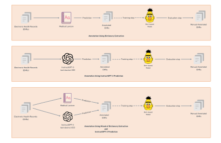
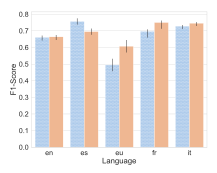
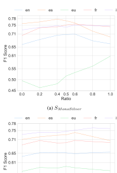

# Large Language Models as Instructors: A Study on Multilingual Clinical Entity Extraction

Simon Meoni Inria/Arkhn Paris, France simon.meoni@arkhn.com

Théo Ryffel Arkhn Paris, France theo@arkhn.com

Éric de la Clergerie Inria Paris, France Eric.De\_La\_Clergerie@inria.fr

# Abstract

In clinical and other specialized domains, data are scarce due to their confidential nature. This lack of data is a major problem when finetuning language models. Nevertheless, very large language models (LLMs) are promising for the medical domain but cannot be used directly in healthcare facilities due to data confidentiality issues. We explore an approach of annotating training data with LLMs to train smaller models more adapted to our problem. We show that this method yields promising results for information extraction tasks.

### 1 Introduction

Clinical notes contain the interactions between the patient and healthcare staff. Professionals record their impressions, observations, and various medical procedures performed. Despite the computerization of clinical documents, notes should remain fairly expressive and in a free format to save time for healthcare personnel and allow for the description of unusual situations [\(Rosenbloom et al.,](#page-9-0) [2011\)](#page-9-0). Moreover, a large amount of crucial information is exclusively contained in clinical notes. According to a study by [Escudié et al.](#page-8-0) [\(2017\)](#page-8-0), approximately 80% of patient phenotypes (a set of observable biological and physical characteristics that can characterize a disease) are present only in free text. These documents are difficult to use without advanced methods such as deep learning in NLP. The use of such methods requires the collection and annotation of a significant amount of medical data. However, [Fries et al.](#page-8-1) [\(2022\)](#page-8-1) proposes the term "*dataset debt*," highlighting that learning data in the biomedical field is poorly accessible, poorly documented, and opaque as to its reusability in a commercial or a hospital context. According to the article, only 13% of the 167 analyzed datasets are accessible and downloadable, 22% use a standard structured format, and 40% are in the public domain. In recent years, large language models

(LLMs) have proved their ability to perform a wide range of tasks with high accuracy in a zero-shot or a few-shots contexts. This trend holds great potential for clinical NLP, as preliminary results show promise for information extraction tasks [\(Agrawal](#page-8-2) [et al.,](#page-8-2) [2022\)](#page-8-2). However, the clinical domain presents unique challenges due to the confidential and linguistically specific nature of its data, which can make collection and annotation time-consuming and expensive. Using LLMs for efficient information extraction without training data could be attractive, but it raises confidentiality concerns. The model deployment should be controllable, and the model's predictions should evolve to fit a specific and changing annotation guideline. Most multilingual LLMs are not freely available [\(Scao et al.,](#page-9-1) [2022;](#page-9-1) [Ouyang et al.,](#page-9-2) [2022;](#page-9-2) [Thoppilan et al.,](#page-9-3) [2022\)](#page-9-3), to the best of our knowledge, only BLOOM is opensource and deployable in a custom infrastructure. The computing resources to use these models remains challenging for healthcare establishments.

One approach to address these issues is to distil LLMs into a smaller model via weak supervision. Weak supervision has recently gained community attention because it alleviates the annotation task. This technique refers to annotating datasets using rule-based, heuristic, dictionary extraction or more advanced methods and then training the smaller model on this dataset. In the same way, knowledge distillation aims to transfer knowledge from a master model to a student model. It has often been used to compress large-scale models to improve memory footprint and the inference speed [\(Li et al.,](#page-9-4) [2021\)](#page-9-4). Moreover, student models trained through knowledge distillation can be more easily monitored and versioned. Hosting them increases the healthcare centre's sovereignty, and they become more compliant with existing privacy policies, as input data or predictions don't leave the building.

### 2 Motivation and Contributions

We study the use of LLMs in the knowledge distillation technique via weak supervision in the Multilingual Clinical domain, especially in clinical entity extraction. We extend the [Agrawal et al.](#page-8-2) [\(2022\)](#page-8-2) study in the sense that we propose an in-depth study of the use of InstructGPT-3 to annotate a training dataset. Our work[1](#page-1-0) mainly aims to compare the annotation quality using weak supervision tasks on a smaller model (Figure [1\)](#page-2-0). Finally, we propose to combine annotations provided by InstructGPT-3 and the dictionary extraction method.

This takes form in these contributions:

- We show that InstructGPT-3 distillation (Figure [1](#page-2-0) middle) is a competitive technique compared to classic weak-supervision techniques in a multilingual clinical domain;
- We propose a weak supervision approach (Figure [1](#page-2-0) bottom) that combines annotations from dictionary extraction and InstructGPT-3, which outperform the approach with only InstructGPT-3 annotation.

### 3 Related Works

Weak Supervision deep learning approach has achieved remarkable success in several domains beyond NLP [\(Zhang et al.,](#page-10-0) [2022\)](#page-10-0). However, the main bottleneck is collecting massively annotated data. To address this issue, weak supervision replaces ground-truth annotation with automatic annotation based on heuristic rules, gazetteers or constraints linguistic rules to address. Some techniques called *distant supervision* exploit semantic links from knowledge bases or ontologies [\(Lison et al.,](#page-9-5) [2021\)](#page-9-5). [Karamanolakis et al.](#page-9-6) [\(2021\)](#page-9-6) proposes an iterative self-training method to combine classic weak supervision and inference of the learning model to extract entities not covered by the initial heuristic rules. In the clinical domain, weak supervision has already been used for specific use cases [\(Cusick](#page-8-3) [et al.,](#page-8-3) [2021;](#page-8-3) [Fries et al.,](#page-8-4) [2021;](#page-8-4) [Wang et al.,](#page-10-1) [2019\)](#page-10-1).

Clinical Language Models In the clinical context, some specific terms are underrepresented or absent in the general domain. As a result, the clinical NLP community has pretrained Language Models (LMs) [\(Alsentzer et al.,](#page-8-5) [2019;](#page-8-5) [Lee et al.,](#page-9-7) [2020;](#page-9-7) [Alsentzer et al.,](#page-8-5) [2019\)](#page-8-5) over domain-specific

corpora (i.e. MIMIC-III [\(Johnson et al.,](#page-9-8) [2016\)](#page-9-8), Pubmed abstracts). These models could be trained from scratch or from checkpoint to specialize a domain-agnostic model [\(Gururangan et al.,](#page-8-6) [2020\)](#page-8-6).

Though, the performance gains are marginal compared to the general language model. The structure and the abbreviated text present in clinical notes hurt performance. Instead of pretraining a specialized clinical model, machine learning practitioners can fine-tune agnostic-domain LLMs such as the GPT family of models or T5 on the clinical task. Fine-tuned general-purpose models have proven effective in clinical question-answering, protected health information de-identification, and relation extraction [\(Lehman et al.,](#page-9-9) [2023\)](#page-9-9). But this approach requires an important infrastructure and a regular re-finetuning if the data distribution of the EHR shifts. Nevertheless, some LLMs have been trained from scratch over clinical domainspecific notes such as GatorTron [\(Yang et al.,](#page-10-2) [2022\)](#page-10-2), BioGPT [\(Luo et al.,](#page-9-10) [2022\)](#page-9-10) or ClinicalT5 [\(Lu et al.,](#page-9-11) [2022\)](#page-9-11) who achieved promising performance on several tasks. Additionally, in-context learning with agnostic LLMs such as InstructGPT-3 [\(Ouyang](#page-9-2) [et al.,](#page-9-2) [2022\)](#page-9-2) where no weight is modified shows good results [\(Agrawal et al.,](#page-8-2) [2022;](#page-8-2) [Brown et al.,](#page-8-7) [2020\)](#page-8-7) and outperforms specialized smaller models on several clinical tasks.

Prompt-based Method Prompt-based learning for generative language model treats a downstream task as a language modelling problem where a language model predicts the next tokens of the instruction given a textual prompt [\(Sainz et al.,](#page-9-12) [2021\)](#page-9-12).

In this paradigm, instead of fine-tuning a model to a downstream task (*"pre-train, fine-tune and predict"*), we manipulate the behaviour of a pretrained LM using an appropriate prompt to give the desired output (*"pre-train, prompt and predict"*). *prompt engineering* explores the most suitable prompt method applied to a LM to solve a task. This way, an unsupervised pre-trained LM can be used for many tasks [\(Liu et al.,](#page-9-13) [2023\)](#page-9-13).

Among these methods, *in-context learning* is the most popular method for information extraction, question-answering or sentiment analysis. In the clinical domain, some works exist on information retrieval and question-answering. The prompt contains three components: the examples' template, the set of examples and the ordering of prompts, such as present in Figure [5.](#page-10-3) The aim is to provide some training examples in the prompt before the

<span id="page-1-0"></span><sup>1</sup> codebase: <https://github.com/arkhn/bio-nlp2023>.

<span id="page-2-0"></span>

Figure 1: The different workflows we experiment with. The last workflow used a combination of InstructGPT-3 and dictionary annotations; we tested different proportions of these annotations as described in [5.2.](#page-4-0)

test example. However, the chosen examples and their ordering and the format could impact performance [\(Zhao et al.,](#page-10-4) [2021\)](#page-10-4); these three components must be tuned to optimize performance.

In another way, we can cite works around the chain of thoughts (CoT). This encourages the LLM to explain its reasoning to get more accurate results, especially in mathematical and logical reasoning [\(Wei et al.,](#page-10-5) [2022;](#page-10-5) [Cobbe et al.,](#page-8-8) [2021\)](#page-8-8). This technique could be used with reason edited manually in the prompt or with two separate prompts where the first involves a reasoning task, then concatenated with the second prompt involving the main tasks.

Other techniques involve generated knowledge similar to CoT. Instead of reasoning, the first prompt generates potentially useful information associated with the tasks concatenated in the final prompt [\(Liu et al.,](#page-9-14) [2022\)](#page-9-14).

### 4 Method

### 4.1 Creating Annotations and Knowledge Distillation via Weak Supervision

Annotation Extraction from LLM Output Our study is inspired by the method developed in this paper [\(Agrawal et al.,](#page-8-2) [2022\)](#page-8-2). Their works benchmark how InstructGPT-3 [\(Ouyang et al.,](#page-9-2) [2022\)](#page-9-2) per-

form clinical NLP tasks in English. They show that InstructGPT-3 performs well in several clinical tasks. They introduce 3 new datasets to benchmark few-shot clinical information extraction to achieve this. Also, they introduce *guided prompt design* to induce easy-to-structure output with resolvers (or parsers) to convert the output into a structured prediction easily. Our work differs in the following:

- 1. Our studies areas are knowledge distillation via weak supervision and the improvement of this technique combining annotations from LLMs and dictionary extraction;
- 2. our methods are applied in a multilingual context, the initial work was only done in English;
- 3. we focus on the clinical entities extraction task based on the E3C dataset guidelines.

In this work, the LLM is used only as a predictor; we only query the model, no additional fine-tuning step has been realized, and we can only access inference parameters such as temperature, top p, frequency or presence penalty. We set the *temperature* and *top p* to 0 to control randomness and have a deterministic behaviour. So as not to penalize repetitions, we set the *presence penalty* and

frequency penalty to 0. We use an InstructGPT-3 model (text-davinci-003) (Ouyang et al., 2022) to infer the whole annotations for all our experiments. We provide the model with an instruction concatenated by the example to be predicted (Figure 5). The output of InstructGPT-3 is a string of characters that we must structure to align the predicted clinical entities with the initial text (Figure 2).

The task is to annotate the words (or tokens) of a sentence  $x \in \Sigma^*$  with a set of labels such that  $L = \{O, B_{\text{clin}}, I_{\text{clin}}\}$  where O denotes a word in the text without a label,  $B_{clin}$  the first word of a clinical entity and  $I_{clin}$  the following words according to the format IOB (Ramshaw and Marcus, 1995). The goal is to identify the labels O,  $B_{clin}$ ,  $I_{clin}$  and their character offsets in the sentence x. The task output is defined as  $\hat{y} = [y_1, y_2, \dots, y_n] \in Y$ , where  $\hat{y}$  is the set of predicted annotations, and  $y_i = \langle s_i, e_i, l_i \rangle$  such that  $s_i$  is the start offset,  $e_i$  is the end offset and  $l_i \in L$  of the  $i^{th}$  annotation.

As mentioned, a prompt-based method requires concatenating a template  $t \in \Sigma^*$  with our sentence x to give our prompt, such as p = concat(t,x). We produce our output  $o \in \Sigma^*$  from our LLM model  $\Phi$  such as  $o = \Phi(p, \theta_h)$ , where  $\theta_h$  represents the set of hyperparameters (temperature, top p, frequence penalty, presence penalty).

Then, we structure o such as  $\Sigma^* \to Y$  using a simple string-matching function to produce a set of labels  $\hat{y}$  where r is our resolver applying the string matching function:  $r(o, x) = \hat{y}$ .

Knowledge Distillation via Weak Supervision Finally, the annotations generated via InstructGPT-3 prediction are used as a training dataset to fine-tune a smaller language model to a NER downstream task. For smaller language models, we limit our study to encoder models as mentioned in Table 1.

### 4.2 Prompting

We prime the model with three annotated data points, each corresponding to a sentence from our corpus (Table 2). For each language, we try 3 sets of data points. For each of them, we test the F1-Score performance of InstructGPT-3 on the test dataset (**gold standard**), and we select the set with the best F1-Score to perform prediction on the unannotated dataset. We insert keywords associated with the E3C guideline definition of the clinical entities into prompts. We add guidance to explicit the response structure to facilitate parsing

the output (Agrawal et al., 2022) (Figure 5.2).

### 5 Experiments

#### 5.1 Dataset

We use the annotated E3C multilingual dataset (Magnini et al., 2020) for our experiments, consisting of two annotation types: temporal and clinical entities. The languages supported are English (en), Basque (eu), Spanish (es), French (fr) and Italian (it). Clinical entities are identified as patient disorders which could map to the UMLS meta thesaurus. The annotators have linked extracted clinical entities and UMLS concepts. In our experiments, we only extract clinical entities without mapping UMLS concepts. The E3C dataset is organized into 3 layers. A layer consists of a subset of files from each language annotated in a certain way (manually, semi-automatically) depending on the layer:

- the first layer (gold standard) consists of the full manual annotation; we used this layer as a test set for our experiments;
- The second layer consists of semi-automatic annotation; we use this layer as a train set with the initial annotation or the annotation inferred by InstructGPT-3. Moreover, we have access to two states of this layer; the first is the layer entirely annotated with dictionary extraction (silver); the second is a subset of this layer (only 10%) that has been fixed manually (silver with fixed annotations). The dictionary contains terms from UMLS and terms extracted from gold standard;
- Finally, the third layer (layer 3) is unannotated, which we don't use for our experiments.

As mentioned above, the E3C dataset is well-suited for our weak-supervision studies. But, the dataset has limited data in its various layers (Table 2). To address this limitation, we divide **silver** into five parts using 5-fold cross-validation. For **silver with fixed annotations**, we use the entire data as the training set. Our experiments employ multiple models for each language and relied solely on xlm-roberta-base in a multilingual context. The results presented in our work are an aggregation of the means and standard deviations across models and folds. However, each experiment result and model are reported in Appendix 7.

```
x = \text{'The patient had presented a progressive deterioration of the general condition,} a fever and night sweats.' p = concat(t,x) o = \Phi(p,\theta_h) = \text{'-"fever"} -\text{"night sweats"'} r(o,x) = [ (\text{The},0,3,O), (\text{patient},4,11,O), \ldots, \\ (\text{fever},72,77,B_{clin}), (\text{and},79,82,O), \\ (\text{night},83,87,B_{clin}), (\text{sweats},88,94,I_{clin}), \ldots ]
```

Figure 2: our method's prediction and structuring steps on an example. The t template is illustrated in Figure 5.

<span id="page-4-2"></span>

| Language | Models                                                                                                                                  |
|----------|-----------------------------------------------------------------------------------------------------------------------------------------|
| en       | emilyalsentzer/Bio_ClinicalBERT (Alsentzer et al., 2019)<br>roberta-base (Liu et al., 2019)<br>xlm-roberta-base (Conneau et al., 2019)  |
| es       | BSC-LT/roberta-base-biomedical-es (Carrino et al., 2022)<br>dccuchile/bert-base-spanish-wwm-cased (Cã et al., 2020)<br>xlm-roberta-base |
| eu       | ixa-ehu/berteus-base-cased (Agerri et al., 2020)<br>xlm-roberta-base                                                                    |
| fr       | Dr-BERT/DrBERT-7GB (Labrak et al., 2023)<br>camembert-base (Martin et al., 2019)<br>xlm-roberta-base                                    |
| it       | dbmdz/bert-base-italian-cased (Schweter, 2020) xlm-roberta-base                                                                         |

Table 1: The models used for each language during our experiments. We mention in this table the name of the model in the huggingface model repository

### <span id="page-4-0"></span>5.2 Experimental Setup

We conduct experiments on the clinical entity extraction tasks. For each language, we use models mentioned in Table 1 as a student model for the knowledge distillation step. We conduct our experiments we use five different dataset settings. For Monolingual Setting  $(S_{MonoSilver})$ , Gold Setting  $(S_{MonoGold})$ ,  $S_{MonoSilver} \cap S_{MonoGold}$   $(S_{MonoGold} \cap MonoSilver)$  and each language, we use the silver of the corresponding language. For the Multilingual Setting  $(S_{MultiSilver})$  and each language, we concatenate the silver of the whole languages in E3C to constitute the train set. Finally, for all settings and each language, we test our method on the gold standard of the language we experiment with.

• Monolingual Setting  $(S_{MonoSilver})$ : We use a ratio r to control the mix of annotations, with r representing the proportion of annotations from dictionary extraction and (1-r) representing the proportion of annotations

from InstructGPT-3. If r=1, the models are trained using only InstructGPT-3 annotations, while if r=0, the models are trained exclusively with dictionary extraction annotations. We test and compare the performance of the trained models using various ratio values of r.

- Gold Setting  $(S_{MonoGold})$ : we use silver with fixed annotations as the train set, and we compare encoder models trained on manually corrected annotation (r=0) and an encoder model trained on the same subset but using InstructGPT-3 prediction annotations (r=1);
- S<sub>MonoGold ∩ MonoSilver</sub>: we use silver as the train set. Still, we replace weak-supervision annotations with the annotation fixed in silver with fixed annotations. So, a small part of the InstructGPT-3 prediction annotations and the dictionary extraction annotations has been replaced by manual annotations;
- Multilingual Setting ( $S_{MultiSilver}$ ): we use the same setting as  $S_{MonoSilver}$  except we are on multilingual training context. For this setting, our trained models are multilingual language models. We use xlm-roberta-base.

#### 5.3 Results

InstructGPT-3 Prediction Analysis For silver, we observe that InstructGPT-3 extracts more entities than original extraction (Table 2). This trend is reduced in English and Spanish even if we observed a more important quantity of  $I_{clin}$  in tokens annotated by InstructGPT-3 for all languages. For silver with fixed annotations, the quantity of tokens annotated by both methods (InstructGPT-3 vs

<span id="page-5-0"></span>

| Language | Layer     | Tokens | $B_{\epsilon}$ | din  | $I_c$ | lin  | $B_{clin} + I_{clin}$ |      |  |
|----------|-----------|--------|----------------|------|-------|------|-----------------------|------|--|
|          |           |        | Gold           | GPT  | Gold  | GPT  | Gold                  | GPT  |  |
| en       | $l_2$     | 58520  | 2134           | 1438 | 1036  | 1595 | 3170                  | 3033 |  |
|          | $l_{val}$ | 6646   | 254            | 149  | 137   | 130  | 391                   | 279  |  |
| es       | $l_2$     | 57065  | 2625           | 2245 | 1298  | 1857 | 3923                  | 4102 |  |
|          | $l_{val}$ | 6291   | 329            | 236  | 269   | 159  | 598                   | 395  |  |
| eu       | $l_2$     | 18365  | 482            | 800  | 63    | 482  | 545                   | 1282 |  |
|          | $l_{val}$ | 4819   | 327            | 207  | 245   | 143  | 572                   | 350  |  |
| fr       | $l_2$     | 59998  | 2013           | 2402 | 840   | 2239 | 2853                  | 4641 |  |
|          | $l_{val}$ | 6452   | 267            | 295  | 244   | 225  | 511                   | 520  |  |
| it       | $l_2$     | 60248  | 1643           | 2099 | 793   | 1628 | 2436                  | 3727 |  |
|          | $l_{val}$ | 6538   | 224            | 223  | 147   | 199  | 371                   | 422  |  |

Table 2: The number of annotated tokens for each annotation type for the **silver**  $(l_2)$  and **silver with fixed annotations**  $(l_{val})$ . The notation *Gold* corresponds to the original extraction, and the notation *GPT* correspond to the InstructGPT-3 annotation.

<span id="page-5-1"></span>

| Language | F1-Score      |                  |  |  |  |  |
|----------|---------------|------------------|--|--|--|--|
|          | InstructGPT-3 | distilled models |  |  |  |  |
| en       | 0.71          | $0.66 \pm 0.01$  |  |  |  |  |
| es       | 0.74          | $0.70 \pm 0.02$  |  |  |  |  |
| eu       | 0.60          | $0.61 \pm 0.04$  |  |  |  |  |
| fr       | 0.74          | $0.75\pm0.01$    |  |  |  |  |
| it       | 0.63          | $0.75\pm0.01$    |  |  |  |  |

Table 3: The mean F1-score of the models for each language in E3C using **gold standard** as evaluation set. We evaluate the direct output of InstructGPT-3 and the aggregated mean score of each model for each language listed in Table 1 using  $S_{MonoSilver}$  with  $r \in \{0,1\}$  and InstructGPT-3 annotation as a train set.

manually corrected annotation) is relatively equivalent.

Knowledge Distillation Evaluation We compare the distilled model and InstructGPT-3 on the gold standard (Table 3). Distillation is beneficial in terms of performance for Basque, French and Italian. Moreover, we denote a remarkable gap between InstructGPT-3 (0.63) and distilled models (0.75) in Italian. Spanish and English have reversed trends: InstructGPT-3 performs better than distilled models. This echoed the exception we observed in the InstructGPT-3 Prediction Analysis paragraph.

 $S_{MonoSilver}$  with  $r \in \{0,1\}$  If we compare the global F1-Score (Table 4), the distilled models (r=1) perform better than the weak-supervised models (r=0) trained. In detail, distilled models display a better recall and recognizes multi-word clinical terms more easily. Still, this flexibility, balanced by the too-biased detection of false positive

<span id="page-5-2"></span>

Figure 3: A graph with the mean F1-score of the models on the y-axis and the different language on the x-axis for the  $S_{MonoSilver}$  with  $r \in \{0,1\}$ . The orange bar represents the distilled models F1-Scores whereas the dotted blue bars represent the weak-supervised models F1-score.

terms, lowered the precision score. In comparing distilled models versus weak-supervised models (Figure 3), we note a noticeable performance gain of almost 0.1 in Basque, followed by French and Italian. In English, the F1-score of both models is relatively equivalent. For Spanish, the weak-supervised models outperformed the distilled models and still has our highest F1-Score.

 $S_{MonoGold}$  The amount of annotated tokens in silver with fixed annotations is relatively small compared to silver (Figure 2). This hurts the result (Table 4) of the distilled models (0.61 with silver with fixed annotations vs 0.70 with silver) in contrast to the weak-supervised models, where performance has gained 0.03 (0.70 with silver with fixed annotations vs 0.67 with silver). The weak-supervised models performance is relatively better than the distilled models. Moreover, the distilled models recall performance seems to be affected by the small amount of data and annotated tokens (0.68 for  $S_{MonoSilver}$  with r=1 vs 0.58 for  $S_{MonoGold}$  with r=1).

 $S_{MonoGold \cap MonoSilver}$  The results (Table 4) show better performance for both models when we mix a slight quantity of manually annotated data with **silver**. The *distilled models* outperforms the *weak-supervised models* with a gain of 0.03. In both cases, the F1-Score gain is due to the improvement of the recall: we obtain a gain of 0.05 compared to the  $S_{MonoSilver}$  with  $r \in \{0, 1\}$ .

 $S_{MonoSilver}$  For all languages except Basque, we obtained better results when we mixed weak supervised and InstructGPT-3 annotations. The local optimum for these languages is reached when  $r \in [0.4, 0.6]$  (Figure 4). The Basque doesn't follow this trend; using a dataset with only InstructGPT-3 annotations (where r=1) gives the best result among all tried r values.

 $S_{MultiSilver}$  Using a multilingual train set and LM (xlm-roberta-base) gives inferior results compared to  $S_{MonoSilver}$  (Table 5). Though we obtain better results in Italian than the  $S_{MonoSilver}$  (+0.01); the optimum is set to r=0.8. In the other case, mixing annotations described in 5.2 don't affect results as observed in  $S_{MonoSilver}$  due to the noise generated by the multilingual nature of the train set.

#### 5.4 Discussion

Our experiments using the E3C dataset demonstrate the potential of knowledge distillation and weak supervision in the context of clinical entity extraction tasks. We observe that distilled models outperform classic weak supervision approaches, especially in Basque, French, and Italian languages. However, we notice some interesting trends in English and Spanish that require further analysis.

The trend is reversed in Spanish, with the weaksupervised models performing better than the distilled ones. For all the models we trained for Spanish (Table 1), we don't distinguish any difference between monolingual, agnostic domain, multilingual, or medical monolingual language models. One possible explanation for these trends is the difference in data sources. While the corpora for other languages come from the Pan African Journal or Pubmed, the Spanish corpus is sourced from the SPACCC corpus. The clinical entity distribution and semantic differences from this source could bias our results. Moreover, additional data cleaning has been applied to layer 1, such as sentence and punctuation removal and capitalization, which may reinforce this difference between the languages.

In English, the difference in performance between distilled and weak-supervised models is relatively small compared to other languages. This can be attributed to the superior quality of annotations in the **silver**. The English lexicon resource (supplied by the UMLS meta-thesaurus and terms extracted in **gold standard**) employed for mapping clinical entities in the text is likely more exten-

<span id="page-6-0"></span>

0.75 0.71 0.65 0.50 0.45 0.0 0.2 0.4 0.5 0.6 0.8 1.0 Ratio (b) S<sub>MultiSilver</sub>

Figure 4: The line plots with the mean F1-score of the models on the y-axis and the ratio of dictionary annotations and annotations via InstructGPT-3 on the x-axis for  $S_{MonoSilver}$  and  $S_{MultiSilver}$  as described in 5.2. A ratio of r=0 indicates the presence of only dictionary annotations, while a ratio of r=1 corresponds to exclusively InstructGPT-3 annotations. Each coloured line represents the result for a language

sive and precise than those accessible for other languages with fewer linguistic resources.

Furthermore,  $S_{MonoSilver}$  reveals that combining annotations from Dictionary extraction and InstructGPT-3 marginally outperforms when r=1. Integrating various annotation sources shows promise and typically enhances model generalization. However, in the case of Basque,  $S_{MonoSilver}$  does not yield the best results when we have only InstructGPT-3 annotations (r=1). As we raise the ratio r, we observe a gradual improvement in F1-score. It can be explained by the original annotations from **silver** in Basque was created using a low-resource lexicon. As shown in Table 2, only 63  $I_{clin}$  tokens were initially anno-

<span id="page-7-0"></span>

| Setting                          | F1-S            | Score           | Prec            | eision          | Recall          |                 |  |
|----------------------------------|-----------------|-----------------|-----------------|-----------------|-----------------|-----------------|--|
|                                  | r = 1           | r = 0           | r = 1           | r = 0           | r = 1           | r = 0           |  |
| $S_{MonoSilver}$                 | $0.70 \pm 0.06$ | $0.67 \pm 0.09$ | $0.73 \pm 0.03$ | $0.78 \pm 0.09$ | $0.68 \pm 0.09$ | $0.63 \pm 0.10$ |  |
| $S_{MonoGold}$                   | $0.61 \pm 0.09$ | $0.70 \pm 0.06$ | $0.72 \pm 0.03$ | $0.75 \pm 0.04$ | $0.58 \pm 0.10$ | $0.69 \pm 0.05$ |  |
| $S_{MonoGold} \cap {MonoSilver}$ | $0.73 \pm 0.03$ | $0.71 \pm 0.08$ | $0.74 \pm 0.04$ | $0.78 \pm 0.05$ | $0.73 \pm 0.06$ | $0.68 \pm 0.08$ |  |

Table 4: The F1-score, Precision and the Recall for the different settings in section 5.2. r=1 corresponds to the distilled models and the r=0 corresponds to the weak-supervised models.

<span id="page-7-1"></span>

| Setting                            | F1-Score $r_{max}$                 | Precision $r_{max}$                           | Recall $r_{max}$                |
|------------------------------------|------------------------------------|-----------------------------------------------|---------------------------------|
| $S_{MonoSilver} \ S_{MultiSilver}$ | $0.72 \pm 0.06$<br>$0.69 \pm 0.06$ | $0.75 \pm 0.02$ <b>0.79</b> $\pm$ <b>0.03</b> | $0.71 \pm 0.08$ $0.65 \pm 0.08$ |

Table 5: The F1-score, Precision, and Recall for  $S_{MonoSilver}$  and  $S_{MultiSilver}$  as described in Section 5.2. The scores are aggregated across languages, with  $r_{max}$  representing the optimal value of r.

tated, in contrast to 482 tokens for InstructGPT-3 annotations.

In the case of  $S_{MultiSilver}$ , we did not observe any significant results. The performance of Spanish, Italian, and French languages either experienced a slight improvement or was unaffected by the multilingual composition of the training dataset. However, this setting negatively impacted English and Basque. The predominance of Romance languages in the dataset could be the cause.

Moreover, Basque is a distinct and isolated language with unique linguistic structures. The other languages in the training dataset are linguistically distant, which may introduce noise during the training process and consequently affect the performance of the Basque model.

Another interesting observation is that InstructGPT-3 extracts almost twice as many entities as the original extraction method (Figure 2). This trend is more pronounced in **silver**, while the number of annotated tokens in **silver with fixed annotations** is almost equivalent between both annotation sets, likely due to human validation. This difference could be explained by the fact that InstructGPT-3 has no access to the guidelines, and the prompt mentioned to extract "disorders," "disease," or "symptoms" is less restrictive than the E3C guideline annotation.

Our results highlight the potential of knowledge distillation and weak supervision for clinical entity extraction, particularly for languages with more limited resources. Though, data sources, annotation quality, and the comprehensiveness of linguistic resources influence the performance of these methods. Further research is needed to address these challenges and improve our methods.

#### 6 Limitation

One limitation of our study is the small size of the test set, which may impact the generalizability of our results. Additionally, we restrained our work on clinical entity extraction; in future work, we would investigate more in several tasks using the E3C temporality layer to cover a task of Name Entity Recognition and Relation Extraction tasks.

Finally, the E3C guidelines have been designed for clinical entity extraction and entity-linking via UMLS entities. After the first step of manual annotation, some spans of the entities have been modified to fit as close as possible to the semantical concepts found in UMLS (Magnini et al., 2020). For instance, clinical entities could be split into separate disorder concepts, and the extent of a disorder candidate could be reduced to fit with a concept. These biases could induce additional difficulties in finding the correct span for a given model.

### 7 Conclusion

Our results demonstrate that the knowledge distillation with InstructGPT-3 outperforms the dictionary supervision for extracting clinical entities.

We show that mixing these approaches to build a training dataset brings diversity to the annotations and improves the distilled model performance.

Weak-supervision approach with LLMs is relatively promising for creating a training dataset. This reduces the annotation cost and, at the same time, focuses the manual annotation on the test set, which is one of the most prominent parts of high-stake domains like healthcare. Furthermore, the interest of the approach is also to fine-tune a small to medium-sized LM that may be used locally without the leak of confidential medical data and with a reduced energy cost. In a low-resource context, such as Basque, LLMs offer a competitive alter-

native to the classic weak supervision technique, which requires linguistic resources.

Furthermore, we aim to investigate advanced techniques to combine various annotations by incorporating confidence measures from the different predictions. Using other LLMs predictions and ensemble, the difference could be pertinent because the annotation diversity can improve a model's performance, as we observed on SM onoSilver (Figure [4\)](#page-6-0). Additionally, we will consider utilising performance metrics (such as recall and precision) to decide which type of annotations (begin or innertokens) to retain for each prediction method.

Finally, adapting CoT or generated knowledge [\(Wei et al.,](#page-10-5) [2022;](#page-10-5) [Cobbe et al.,](#page-8-8) [2021\)](#page-8-8) for clinical entity extraction could improve LLM's precision. To our knowledge, none of these techniques has been adapted to clinical information retrieval. We could craft a prompt with different annotation steps through different examples. At each annotation step, we describe a precise instruction and its result. For example, incorporating the three steps of the E3C annotation into the prompt could help encourage the LLM to better adhere to the guideline.

## References

- <span id="page-8-12"></span>Rodrigo Agerri, Iñaki San Vicente, Jon Ander Campos, Ander Barrena, Xabier Saralegi, Aitor Soroa, and Eneko Agirre. 2020. [Give your Text Representation](https://arxiv.org/abs/2004.00033v2) [Models some Love: the Case for Basque.](https://arxiv.org/abs/2004.00033v2) *LREC 2020 - 12th International Conference on Language Resources and Evaluation, Conference Proceedings*, pages 4781–4788.
- <span id="page-8-2"></span>Monica Agrawal, Stefan Hegselmann, Hunter Lang, Yoon Kim, and David Sontag. 2022. [Large Lan](http://arxiv.org/abs/2205.12689)[guage Models are Few-Shot Clinical Information Ex](http://arxiv.org/abs/2205.12689)[tractors.](http://arxiv.org/abs/2205.12689) *Association for Computational Linguistics*, pages 1998–2022.
- <span id="page-8-5"></span>Emily Alsentzer, John R. Murphy, Willie Boag, Wei-Hung Weng, Di Jin, Tristan Naumann, and Matthew B. A. McDermott. 2019. [Publicly Available Clinical](https://doi.org/10.48550/arxiv.1904.03323) [BERT Embeddings.](https://doi.org/10.48550/arxiv.1904.03323) *Association for Computational Linguistics*, pages 72–78.
- <span id="page-8-7"></span>Tom B Brown, Benjamin Mann, Nick Ryder, Melanie Subbiah, Jared Kaplan, Prafulla Dhariwal, Arvind Neelakantan, Pranav Shyam, Girish Sastry, Amanda Askell, Sandhini Agarwal, Ariel Herbert-Voss, Gretchen Krueger, Tom Henighan, Rewon Child, Aditya Ramesh, Daniel M Ziegler, Jeffrey Wu, Clemens Winter, Christopher Hesse, Mark Chen, Eric Sigler, Mateusz Litwin, Scott Gray, Benjamin Chess, Jack Clark, Christopher Berner, Sam Mccandlish, Alec Radford, Ilya Sutskever, and Dario Amodei Openai. 2020. Language Models are Few-Shot Learners.

- *Advances in neural information processing systems*, 33:1877–1901.
- <span id="page-8-11"></span>José Cã, Gabriel Chaperon, Rodrigo Fuentes, Jou-Hui Ho, Hojin Kang, and Jorge Pérez. 2020. [SPANISH](https://github.com/josecannete/spanish-corpora) [PRE-TRAINED BERT MODEL AND EVALUA-](https://github.com/josecannete/spanish-corpora)[TION DATA.](https://github.com/josecannete/spanish-corpora) *ICLR*, pages 1–10.
- <span id="page-8-10"></span>Casimiro Pio Carrino, Jordi Armengol-Estapé, Asier Gutiérrez-Fandiño, Joan Llop-Palao, Marc Pàmies, Aitor Gonzalez-Agirre, and Marta Villegas. 2022. [Pretrained Biomedical Language Models for Clini](https://zenodo.org/record/3562536)[cal NLP in Spanish.](https://zenodo.org/record/3562536) *Association for Computational Linguistics*, pages 193–199.
- <span id="page-8-8"></span>Karl Cobbe, Vineet Kosaraju, Mohammad Bavarian, Mark Chen, Heewoo Jun, Lukasz Kaiser, Matthias Plappert, Jerry Tworek, Jacob Hilton, Reiichiro Nakano, Christopher Hesse, and John Schulman. 2021. [Training Verifiers to Solve Math Word Prob](https://doi.org/10.48550/arxiv.2110.14168)[lems.](https://doi.org/10.48550/arxiv.2110.14168)
- <span id="page-8-9"></span>Alexis Conneau, Kartikay Khandelwal, Naman Goyal, Vishrav Chaudhary, Guillaume Wenzek, Francisco Guzmán, Edouard Grave, Myle Ott, Luke Zettlemoyer, and Veselin Stoyanov. 2019. [Unsupervised](https://doi.org/10.18653/v1/2020.acl-main.747) [Cross-lingual Representation Learning at Scale.](https://doi.org/10.18653/v1/2020.acl-main.747) *Proceedings of the Annual Meeting of the Association for Computational Linguistics*, pages 8440–8451.
- <span id="page-8-3"></span>Marika Cusick, Prakash Adekkanattu, Thomas R. Campion, Evan T. Sholle, Annie Myers, Samprit Banerjee, George Alexopoulos, Yanshan Wang, and Jyotishman Pathak. 2021. [Using weak supervision and deep](https://doi.org/10.1016/J.JPSYCHIRES.2021.01.052) [learning to classify clinical notes for identification](https://doi.org/10.1016/J.JPSYCHIRES.2021.01.052) [of current suicidal ideation.](https://doi.org/10.1016/J.JPSYCHIRES.2021.01.052) *Journal of Psychiatric Research*, 136:95–102.
- <span id="page-8-0"></span>Jean-Baptiste Escudié, Bastien Rance, Georgia Malamut, Sherine Khater, Anita Burgun, Christophe Cellier, and Anne-Sophie Jannot. 2017. [A novel data](https://doi.org/10.1186/s12911-017-0537-y{�})[driven workflow combining literature and electronic](https://doi.org/10.1186/s12911-017-0537-y{�}) [health records to estimate comorbidities burden for a](https://doi.org/10.1186/s12911-017-0537-y{�}) [specific disease: a case study on autoimmune comor](https://doi.org/10.1186/s12911-017-0537-y{�})[bidities in patients with celiac disease.](https://doi.org/10.1186/s12911-017-0537-y{�}) *BMC Medical Informatics and Decision Making*, 17(1):140.
- <span id="page-8-4"></span>Jason A. Fries, Ethan Steinberg, Saelig Khattar, Scott L. Fleming, Jose Posada, Alison Callahan, and Nigam H. Shah. 2021. [Ontology-driven weak supervision](https://doi.org/10.1038/s41467-021-22328-4) [for clinical entity classification in electronic health](https://doi.org/10.1038/s41467-021-22328-4) [records.](https://doi.org/10.1038/s41467-021-22328-4) *Nature Communications*, 12(1).
- <span id="page-8-1"></span>Jason Alan Fries, Natasha Seelam, Gabriel Altay, Leon Weber, Myungsun Kang, Debajyoti Datta, Ruisi Su, Samuele Garda, Bo Wang, Simon Ott, Matthias Samwald, and Wojciech Kusa. 2022. [Dataset Debt in](https://github.com/google/BIG-bench) [Biomedical Language Modeling.](https://github.com/google/BIG-bench) *Workshop on Challenges & Perspectives in Creating Large Language Models*, 5:137–145.
- <span id="page-8-6"></span>Suchin Gururangan, Ana Marasovícmarasovíc, Swabha Swayamdipta, Kyle Lo, Iz Beltagy, Doug Downey, and Noah Smith. 2020. [Don't Stop Pretraining:](https://github.com/allenai/dont-stop-pretraining) [Adapt Language Models to Domains and Tasks.](https://github.com/allenai/dont-stop-pretraining) *58th*

- *Annual Meeting of the Association for Computational Linguistics*, pages 8342–8360.
- <span id="page-9-8"></span>Alistair E.W. Johnson, Tom J. Pollard, Lu Shen, Li Wei H. Lehman, Mengling Feng, Mohammad Ghassemi, Benjamin Moody, Peter Szolovits, Leo Anthony Celi, and Roger G. Mark. 2016. [MIMIC-III,](https://doi.org/10.1038/SDATA.2016.35) [a freely accessible critical care database.](https://doi.org/10.1038/SDATA.2016.35) *Scientific data*, 3.
- <span id="page-9-6"></span>Giannis Karamanolakis, Subhabrata Mukherjee, Guoqing Zheng, and Ahmed Hassan Awadallah. 2021. [Self-Training with Weak Supervision.](https://doi.org/10.18653/v1/2021.naacl-main.66) *Association for Computational Linguistics*, pages 845–863.
- <span id="page-9-18"></span>Yanis Labrak, Adrien Bazoge, Richard Dufour, Mickael Rouvier, Emmanuel Morin, Béatrice Daille, and Pierre-Antoine Gourraud. 2023. [DrBERT: A Ro](https://arxiv.org/abs/2304.00958v1)[bust Pre-trained Model in French for Biomedical and](https://arxiv.org/abs/2304.00958v1) [Clinical domains.](https://arxiv.org/abs/2304.00958v1) *Association for Computational Linguistics*.
- <span id="page-9-7"></span>Jinhyuk Lee, Wonjin Yoon, Sungdong Kim, Donghyeon Kim, Sunkyu Kim, Chan Ho So, and Jaewoo Kang. 2020. [BioBERT: A pre-trained biomedical language](https://doi.org/10.1093/bioinformatics/btz682) [representation model for biomedical text mining.](https://doi.org/10.1093/bioinformatics/btz682) *Bioinformatics*, 36(4):1234–1240.
- <span id="page-9-9"></span>Eric Lehman, Evan Hernandez, Diwakar Mahajan, Jonas Wulff, Micah J. Smith, Zachary Ziegler, Daniel Nadler, Peter Szolovits, Alistair Johnson, and Emily Alsentzer. 2023. [Do We Still Need Clinical Language](http://arxiv.org/abs/2302.08091) [Models?](http://arxiv.org/abs/2302.08091) *arXiv preprint arXiv:2302.08091*.
- <span id="page-9-4"></span>Lei Li, Yankai Lin, Shuhuai Ren, Peng Li, Jie Zhou, and Xu Sun. 2021. [Dynamic Knowledge Distillation](https://github.com/) [for Pre-trained Language Models.](https://github.com/) *Association for Computational Linguistics*, pages 379–389.
- <span id="page-9-5"></span>Pierre Lison, Jeremy Barnes, and Aliaksandr Hubin. 2021. [skweak: Weak Supervision Made Easy for](https://github.com/NorskRegnesentral/skweak) [NLP.](https://github.com/NorskRegnesentral/skweak) *arXiv preprint arXiv:2104.09683*.
- <span id="page-9-14"></span>Jiacheng Liu, Alisa Liu, Ximing Lu, Sean Welleck, Peter West, Ronan Le Bras, Yejin Choi, Hannaneh Hajishirzi, and Paul G Allen. 2022. [Generated Knowl](https://doi.org/10.18653/V1/2022.ACL-LONG.225)[edge Prompting for Commonsense Reasoning.](https://doi.org/10.18653/V1/2022.ACL-LONG.225) *Association for Computational Linguistics*, 1:3154–3169.
- <span id="page-9-13"></span>Pengfei Liu, Weizhe Yuan, Zhengbao Jiang, Hiroaki Hayashi, Graham Neubig, Jinlan Fu, W Yuan, Z Jiang, H Hayashi, G Neubig, and J Fu. 2023. [Pre](https://doi.org/10.1145/3560815)[train, Prompt, and Predict: A Systematic Survey of](https://doi.org/10.1145/3560815) [Prompting Methods in Natural Language Processing.](https://doi.org/10.1145/3560815) *ACM Computing Surveys*, 55(9):1–35.
- <span id="page-9-17"></span>Yinhan Liu, Myle Ott, Naman Goyal, Jingfei Du, Mandar Joshi, Danqi Chen, Omer Levy, Mike Lewis, Luke Zettlemoyer, Veselin Stoyanov, and Paul G Allen. 2019. [RoBERTa: A Robustly Op](https://arxiv.org/abs/1907.11692v1)[timized BERT Pretraining Approach.](https://arxiv.org/abs/1907.11692v1) *arXiv preprint arXiv:1907.11692*.
- <span id="page-9-11"></span>Qiuhao Lu, Dejing Dou, and Thien Huu Nguyen. 2022. [ClinicalT5: A Generative Language Model for Clini](https://aclanthology.org/2022.findings-emnlp.398)[cal Text.](https://aclanthology.org/2022.findings-emnlp.398)

- <span id="page-9-10"></span>Renqian Luo, Liai Sun, Yingce Xia, Tao Qin, Sheng Zhang, Hoifung Poon, and Tie-Yan Liu. 2022. [BioGPT: Generative Pre-trained Transformer for](https://doi.org/10.1093/bib/bbac409) [Biomedical Text Generation and Mining.](https://doi.org/10.1093/bib/bbac409) *Briefings in bioinformatics*, 23(6).
- <span id="page-9-16"></span>Bernardo Magnini, Begoña Altuna, Alberto Lavelli, Manuela Speranza, and Roberto Zanoli. 2020. [The](https://doi.org/10.4000/BOOKS.AACCADEMIA.8663) [E3C Project: Collection and Annotation of a Multi](https://doi.org/10.4000/BOOKS.AACCADEMIA.8663)[lingual Corpus of Clinical Cases.](https://doi.org/10.4000/BOOKS.AACCADEMIA.8663) *CEUR Workshop Proceedings*, 2769.
- <span id="page-9-19"></span>Louis Martin, Benjamin Muller, Pedro Javier Ortiz Suárez, Yoann Dupont, Laurent Romary, Éric Villemonte de la Clergerie, Djamé Seddah, and Benoît Sagot. 2019. [CamemBERT: a Tasty French Lan](https://doi.org/10.18653/v1/2020.acl-main.645)[guage Model.](https://doi.org/10.18653/v1/2020.acl-main.645) *Association for Computational Linguistics*, pages 7203–7219.
- <span id="page-9-2"></span>Long Ouyang, Jeff Wu, Xu Jiang, Diogo Almeida, Carroll L. Wainwright, Pamela Mishkin, Chong Zhang, Sandhini Agarwal, Katarina Slama, Alex Ray, John Schulman, Jacob Hilton, Fraser Kelton, Luke Miller, Maddie Simens, Amanda Askell, Peter Welinder, Paul Christiano, Jan Leike, and Ryan Lowe. 2022. [Training language models to follow instructions with](https://doi.org/10.48550/arxiv.2203.02155) [human feedback.](https://doi.org/10.48550/arxiv.2203.02155) *Advances in Neural Information Processing Systems*.
- <span id="page-9-15"></span>Lance A. Ramshaw and Mitchell P. Marcus. 1995. [Text Chunking using Transformation-Based Learn](https://doi.org/10.48550/arxiv.cmp-lg/9505040)[ing.](https://doi.org/10.48550/arxiv.cmp-lg/9505040) *Third Workshop on Very Large Corpora*, pages 157–176.
- <span id="page-9-0"></span>S. Trent Rosenbloom, Joshua C. Denny, Hua Xu, Nancy Lorenzi, William W. Stead, and Kevin B. Johnson. 2011. [Data from clinical notes: A perspective on](https://doi.org/10.1136/JAMIA.2010.007237) [the tension between structure and flexible documen](https://doi.org/10.1136/JAMIA.2010.007237)[tation.](https://doi.org/10.1136/JAMIA.2010.007237) *Journal of the American Medical Informatics Association*, 18(2):181–186.
- <span id="page-9-12"></span>Oscar Sainz, Oier Lopez de Lacalle, Gorka Labaka, Ander Barrena, and Eneko Agirre. 2021. [Label Ver](https://doi.org/10.48550/arxiv.2109.03659)[balization and Entailment for Effective Zero- and](https://doi.org/10.48550/arxiv.2109.03659) [Few-Shot Relation Extraction.](https://doi.org/10.48550/arxiv.2109.03659) *EMNLP 2021 - 2021 Conference on Empirical Methods in Natural Language Processing, Proceedings*, pages 1199–1212.
- <span id="page-9-1"></span>Teven Le Scao, Angela Fan, Christopher Akiki, Ellie Pavlick, and et al. 2022. [BLOOM: A 176B-](https://doi.org/10.48550/arxiv.2211.05100)[Parameter Open-Access Multilingual Language](https://doi.org/10.48550/arxiv.2211.05100) [Model.](https://doi.org/10.48550/arxiv.2211.05100) *arXiv preprint arXiv:2211.05100*.
- <span id="page-9-20"></span>Stefan Schweter. 2020. [Italian BERT and ELECTRA](https://doi.org/10.5281/zenodo.4263142) [models.](https://doi.org/10.5281/zenodo.4263142)
- <span id="page-9-3"></span>Romal Thoppilan, Daniel De Freitas, Jamie Hall, Noam Shazeer, Apoorv Kulshreshtha, Heng-Tze Cheng, Alicia Jin, Taylor Bos, Leslie Baker, Yu Du, Yaguang Li, Hongrae Lee Huaixiu, Steven Zheng, Amin Ghafouri, Marcelo Menegali, Yanping Huang, Maxim Krikun, Dmitry Lepikhin, James Qin, Dehao Chen, Yuanzhong Xu, Zhifeng Chen, Adam Roberts, Maarten Bosma, Vincent Zhao, Yanqi Zhou, Chung-Ching Chang, Igor Krivokon, Will Rusch, Marc

Pickett, Pranesh Srinivasan, Laichee Man, Kathleen Meier-Hellstern, Meredith Ringel, Morris Tulsee, Doshi Renelito, Delos Santos, Toju Duke, Johnny Soraker, Ben Zevenbergen, Vinodkumar Prabhakaran, Mark Diaz, Ben Hutchinson, Kristen Olson, Alejandra Molina, Erin Hoffman-John, Josh Lee, Lora Aroyo, Ravi Rajakumar, Alena Butryna, Matthew Lamm, Viktoriya Kuzmina, Joe Fenton, Aaron Cohen, Rachel Bernstein, Ray Kurzweil, Blaise Aguera-Arcas, Claire Cui, Marian Croak, Ed Chi, and Quoc Le Google. 2022. LaMDA: Language Models for Dialog Applications. *arXiv preprint arXiv:2201.08239*.

<span id="page-10-1"></span>Yanshan Wang, Sunghwan Sohn, Sijia Liu, Feichen Shen, Liwei Wang, Elizabeth J. Atkinson, Shreyasee Amin, and Hongfang Liu. 2019. [A clinical text clas](https://doi.org/10.1186/S12911-018-0723-6/FIGURES/4)[sification paradigm using weak supervision and deep](https://doi.org/10.1186/S12911-018-0723-6/FIGURES/4) [representation.](https://doi.org/10.1186/S12911-018-0723-6/FIGURES/4) *BMC Medical Informatics and Decision Making*, 19(1):1–13.

<span id="page-10-5"></span>Jason Wei, Xuezhi Wang, Dale Schuurmans, Maarten Bosma, Brian Ichter, Fei Xia, Ed Chi, Quoc Le, and Denny Zhou. 2022. [Chain of Thought Prompt](http://arxiv.org/abs/2201.11903)[ing Elicits Reasoning in Large Language Models.](http://arxiv.org/abs/2201.11903) *NeurIPS*.

<span id="page-10-2"></span>Xi Yang, Aokun Chen, Nima PourNejatian, Hoo Chang Shin, Kaleb E. Smith, Christopher Parisien, Colin Compas, Cheryl Martin, Anthony B. Costa, Mona G. Flores, Ying Zhang, Tanja Magoc, Christopher A. Harle, Gloria Lipori, Duane A. Mitchell, William R. Hogan, Elizabeth A. Shenkman, Jiang Bian, and Yonghui Wu. 2022. [A large language model for elec](https://doi.org/10.1038/s41746-022-00742-2)[tronic health records.](https://doi.org/10.1038/s41746-022-00742-2) *npj Digital Medicine*, 5(1).

<span id="page-10-0"></span>Jieyu Zhang, Cheng-Yu Hsieh, Yue Yu, Chao Zhang, and Alexander Ratner. 2022. [A Survey on Pro](https://doi.org/10.48550/arxiv.2202.05433)[grammatic Weak Supervision.](https://doi.org/10.48550/arxiv.2202.05433) *arXiv preprint arXiv:2202.05433*.

<span id="page-10-4"></span>Tony Z. Zhao, Eric Wallace, Shi Feng, Dan Klein, and Sameer Singh. 2021. [Calibrate Before Use: Improv](https://doi.org/10.48550/arxiv.2102.09690)[ing Few-Shot Performance of Language Models.](https://doi.org/10.48550/arxiv.2102.09690) *International Conference on Machine Learning*.

### <span id="page-10-6"></span>Appendix

```
by the appearance of angiomatous plaques on the
extract the exact match of disorders, diseases or
Input: At the same time, the patient had presented
a progressive alteration of the general condition,
a fever and night sweats
extract the exact match of disorders, diseases
- "progressive alteration of the general condition"
and ferritin level was 900µg/l
or symptoms mentioned in the text or
return None if there is no clinical entity:
of any pathological events, in particular
skin rash, gastrointestinal disorders, jaundice,
extract the exact match of disorders, diseases
```

Figure 5: An example of the prompt used in our experiment. The formatted examples are shown in blue , while the formatted examples to predict are shown in orange . The instructions are shown in purple , and the guidance, as used in [Agrawal et al.](#page-8-2) [\(2022\)](#page-8-2), is shown in green . For all languages, instruction is still in English, but the formatted examples are in the source language.

| Language | Model                                                                                          | F1-Score                                              |                                                       |  |  |  |
|----------|------------------------------------------------------------------------------------------------|-------------------------------------------------------|-------------------------------------------------------|--|--|--|
|          |                                                                                                | r = 1                                                 | r = 0                                                 |  |  |  |
| en       | emilyalsentzer/Bio_ClinicalBERT<br>roberta-base<br>xlm-roberta-base                            | $0.66 \pm 0.01$ $0.67 \pm 0.01$ $0.66 \pm 0.01$       | $0.68 \pm 0.01$<br>$0.65 \pm 0.01$<br>$0.65 \pm 0.01$ |  |  |  |
| es       | BSC-LT/roberta-base-biomedical-es<br>dccuchile/bert-base-spanish-wwm-cased<br>xlm-roberta-base | $0.72 \pm 0.01$<br>$0.69 \pm 0.01$<br>$0.68 \pm 0.02$ | $0.78 \pm 0.01 \\ 0.76 \pm 0.01 \\ 0.73 \pm 0.01$     |  |  |  |
| eu       | ixa-ehu/berteus-base-cased<br>xlm-roberta-base                                                 | $0.60 \pm 0.03 \\ 0.61 \pm 0.04$                      | $0.54 \pm 0.03$<br>$0.47 \pm 0.01$                    |  |  |  |
| fr       | Dr-BERT/DrBERT-7GB<br>camembert-base<br>xlm-roberta-base                                       | $0.74 \pm 0.01 \\ 0.75 \pm 0.01 \\ 0.74 \pm 0.01$     | $0.70 \pm 0.01$<br>$0.69 \pm 0.04$<br>$0.72 \pm 0.02$ |  |  |  |
| it       | dbmdz/bert-base-italian-cased<br>xlm-roberta-base                                              | $0.74 \pm 0.01 \\ 0.75 \pm 0.01$                      | $0.73 \pm 0.00$<br>$0.72 \pm 0.02$                    |  |  |  |

Table 6: This table reports the F1-Scores for the different models and annotation ratios  $r \in \{0, 1\}$  for  $S_{MonoSilver}$  described in Section 5.2.

| Language | Model                                 | F1-Score |       |  |  |
|----------|---------------------------------------|----------|-------|--|--|
|          |                                       | r = 1    | r = 0 |  |  |
| en       | emilyalsentzer/Bio_ClinicalBERT       | 0.60     | 0.65  |  |  |
|          | roberta-base                          | 0.61     | 0.70  |  |  |
|          | xlm-roberta-base                      | 0.43     | 0.69  |  |  |
| es       | BSC-LT/roberta-base-biomedical-es     | 0.71     | 0.78  |  |  |
|          | dccuchile/bert-base-spanish-wwm-cased | 0.70     | 0.77  |  |  |
|          | xlm-roberta-base                      | 0.62     | 0.73  |  |  |
| eu       | ixa-ehu/berteus-base-cased            | 0.54     | 0.72  |  |  |
|          | xlm-roberta-base                      | 0.51     | 0.68  |  |  |
| fr       | Dr-BERT/DrBERT-7GB                    | 0.73     | 0.75  |  |  |
|          | camembert-base                        | 0.71     | 0.60  |  |  |
|          | xlm-roberta-base                      | 0.68     | 0.68  |  |  |
| it       | dbmdz/bert-base-italian-cased         | 0.63     | 0.70  |  |  |
|          | xlm-roberta-base                      | 0.55     | 0.57  |  |  |

Table 7: This table reports the F1-Scores for the different models and annotation ratios  $r \in \{0,1\}$  for  $S_{MonoGold}$  described in Section 5.2.

| Language | Model                                                                                          | F1-Score                                              |                                                       |  |  |  |
|----------|------------------------------------------------------------------------------------------------|-------------------------------------------------------|-------------------------------------------------------|--|--|--|
|          |                                                                                                | r = 1                                                 | r = 0                                                 |  |  |  |
| en       | emilyalsentzer/Bio_ClinicalBERT<br>roberta-base<br>xlm-roberta-base                            | $0.70 \pm 0.01 \\ 0.70 \pm 0.01 \\ 0.67 \pm 0.01$     | $0.69 \pm 0.01$<br>$0.68 \pm 0.01$<br>$0.67 \pm 0.01$ |  |  |  |
| es       | BSC-LT/roberta-base-biomedical-es<br>dccuchile/bert-base-spanish-wwm-cased<br>xlm-roberta-base | $0.77 \pm 0.02$<br>$0.76 \pm 0.01$<br>$0.76 \pm 0.01$ | $0.80 \pm 0.01 \\ 0.78 \pm 0.00 \\ 0.76 \pm 0.01$     |  |  |  |
| eu       | ixa-ehu/berteus-base-cased<br>xlm-roberta-base                                                 | $0.70 \pm 0.03$ $0.70 \pm 0.01$                       | $0.72 \pm 0.02$ $0.57 \pm 0.09$                       |  |  |  |
| fr       | Dr-BERT/DrBERT-7GB<br>camembert-base<br>xlm-roberta-base                                       | $0.75 \pm 0.01 \\ 0.76 \pm 0.01 \\ 0.74 \pm 0.01$     | $0.73 \pm 0.02$<br>$0.74 \pm 0.01$<br>$0.69 \pm 0.04$ |  |  |  |
| it       | dbmdz/bert-base-italian-cased<br>xlm-roberta-base                                              | $0.75 \pm 0.01 \\ 0.74 \pm 0.00$                      | $0.75 \pm 0.01 \\ 0.74 \pm 0.01$                      |  |  |  |

Table 8: This table reports F1-Scores for different models and annotation ratios  $r \in \{0,1\}$  for  $S_{MonoGold \cap MonoSilver}$  described in Section 5.2.

| Language | Model                                 | $r_{max}$ |                 | r = 1           |                 |                 | $r_{max}$       |                 |                 | r = 0           |                 |
|----------|---------------------------------------|-----------|-----------------|-----------------|-----------------|-----------------|-----------------|-----------------|-----------------|-----------------|-----------------|
|          |                                       |           | F1-Score        | Precision       | Recall          | F1-Score        | Precision       | Recall          | F1-Score        | Precision       | Recall          |
| en       | xlm-roberta-base                      | 0.5       | $0.65 \pm 0.01$ | $0.72 \pm 0.01$ | $0.63 \pm 0.01$ | $0.71 \pm 0.01$ | $0.71 \pm 0.03$ | $0.71 \pm 0.02$ | $0.66 \pm 0.01$ | $0.68 \pm 0.03$ | $0.64 \pm 0.02$ |
|          | roberta-base                          | 0.4       | $0.65 \pm 0.01$ | $0.72 \pm 0.01$ | $0.62 \pm 0.02$ | $0.71 \pm 0.01$ | $0.72 \pm 0.01$ | $0.71 \pm 0.03$ | $0.67 \pm 0.01$ | $0.70 \pm 0.01$ | $0.65 \pm 0.01$ |
|          | emilyalsentzer/Bio_ClinicalBERT       | 0.6       | $0.68\pm0.01$   | $0.73\pm0.01$   | $0.66\pm0.02$   | $0.72\pm0.01$   | $0.75\pm0.02$   | $0.70\pm0.02$   | $0.66\pm0.01$   | $0.71\pm0.02$   | $0.63 \pm 0.01$ |
| es       | xlm-roberta-base                      | 0.4       | $0.73 \pm 0.01$ | $0.80 \pm 0.01$ | $0.70 \pm 0.01$ | $0.76 \pm 0.01$ | $0.77 \pm 0.02$ | $0.76 \pm 0.02$ | $0.68 \pm 0.02$ | $0.74 \pm 0.02$ | $0.65 \pm 0.04$ |
|          | dccuchile/bert-base-spanish-wwm-cased | 0.4       | $0.76 \pm 0.01$ | $0.81 \pm 0.01$ | $0.73 \pm 0.02$ | $0.78 \pm 0.00$ | $0.80 \pm 0.02$ | $0.76 \pm 0.02$ | $0.69 \pm 0.01$ | $0.72 \pm 0.02$ | $0.66 \pm 0.03$ |
|          | BSC-LT/roberta-base-biomedical-es     | 0.4       | $0.78 \pm 0.01$ | $0.82 \pm 0.01$ | $0.75 \pm 0.01$ | $0.79 \pm 0.01$ | $0.80 \pm 0.04$ | $0.79 \pm 0.03$ | $0.72 \pm 0.01$ | $0.75 \pm 0.02$ | $0.69 \pm 0.02$ |
| eu       | xlm-roberta-base                      | 1         | $0.47 \pm 0.01$ | $0.63 \pm 0.14$ | $0.44 \pm 0.01$ | -               | -               | -               | $0.61 \pm 0.04$ | $0.73 \pm 0.02$ | $0.56 \pm 0.05$ |
|          | ixa-ehu/berteus-base-cased            | 1         | $0.54 \pm 0.03$ | $0.91 \pm 0.01$ | $0.49 \pm 0.02$ | -               | -               | -               | $0.60 \pm 0.03$ | $0.74 \pm 0.02$ | $0.54 \pm 0.03$ |
| fr       | xlm-roberta-base                      | 0.4       | $0.72 \pm 0.02$ | $0.80 \pm 0.02$ | $0.67 \pm 0.03$ | $0.75 \pm 0.01$ | $0.75 \pm 0.02$ | $0.75 \pm 0.02$ | $0.74 \pm 0.01$ | $0.74 \pm 0.02$ | $0.74 \pm 0.02$ |
|          | camembert-base                        | 0.6       | $0.69 \pm 0.04$ | $0.83 \pm 0.00$ | $0.64 \pm 0.04$ | $0.76 \pm 0.00$ | $0.79 \pm 0.01$ | $0.74 \pm 0.01$ | $0.75 \pm 0.01$ | $0.74 \pm 0.01$ | $0.76 \pm 0.01$ |
|          | Dr-BERT/DrBERT-7GB                    | 0.6       | $0.70\pm0.01$   | $0.84\pm0.00$   | $0.64\pm0.01$   | $0.76\pm0.01$   | $0.76\pm0.01$   | $0.77\pm0.01$   | $0.74\pm0.01$   | $0.77 \pm 0.04$ | $0.73 \pm 0.04$ |
| it       | xlm-roberta-base                      | 0.6       | $0.72 \pm 0.02$ | $0.78 \pm 0.02$ | $0.70 \pm 0.04$ | $0.75 \pm 0.02$ | $0.76 \pm 0.02$ | $0.76 \pm 0.02$ | $0.75 \pm 0.01$ | $0.75 \pm 0.02$ | $0.75 \pm 0.02$ |
|          | dbmdz/bert-base-italian-cased         | 0.8       | $0.73 \pm 0.00$ | $0.76 \pm 0.02$ | $0.73 \pm 0.02$ | $0.75 \pm 0.00$ | $0.72 \pm 0.02$ | $0.81 \pm 0.02$ | $0.74 \pm 0.01$ | $0.70 \pm 0.02$ | $0.81 \pm 0.02$ |

Table 9: This table presents F1-Scores, Precision, and Recall for different models at annotation ratios  $r \in \{0,1\}$  and at the optimal r value,  $r_{max}$  for  $S_{MonoSilver}$ , as described in Section 5.2.

| Language | Model            | $r_{max}$ | r = 1           |                 |                 |                 | $r_{max}$       |                 | r = 0           |                 |                 |
|----------|------------------|-----------|-----------------|-----------------|-----------------|-----------------|-----------------|-----------------|-----------------|-----------------|-----------------|
|          |                  |           | F1-Score        | Precision       | Recall          | F1-Score        | Precision       | Recall          | F1-Score        | Precision       | Recall          |
| en       | xlm-roberta-base | 1         | $0.64 \pm 0.01$ | $0.74 \pm 0.01$ | $0.60 \pm 0.01$ | -               | -               | -               | $0.66 \pm 0.03$ | $0.75 \pm 0.03$ | $0.62 \pm 0.05$ |
| es       | xlm-roberta-base | 0.6       | $0.71 \pm 0.01$ | $0.82 \pm 0.01$ | $0.65 \pm 0.02$ | $0.74 \pm 0.01$ | $0.83 \pm 0.02$ | $0.69 \pm 0.02$ | $0.71 \pm 0.01$ | $0.80 \pm 0.03$ | $0.65 \pm 0.02$ |
| eu       | xlm-roberta-base | 0.5       | $0.57 \pm 0.02$ | $0.86 \pm 0.02$ | $0.51 \pm 0.02$ | $0.59 \pm 0.02$ | $0.79 \pm 0.02$ | $0.54 \pm 0.02$ | $0.57 \pm 0.01$ | $0.76 \pm 0.04$ | $0.51 \pm 0.01$ |
| fr       | xlm-roberta-base | 0.6       | $0.69 \pm 0.02$ | $0.83 \pm 0.01$ | $0.62 \pm 0.02$ | $0.71 \pm 0.01$ | $0.81 \pm 0.02$ | $0.65 \pm 0.02$ | $0.70 \pm 0.02$ | $0.80 \pm 0.02$ | $0.64 \pm 0.03$ |
| it       | xlm-roberta-base | 0.8       | $0.73 \pm 0.01$ | $0.78\pm0.01$   | $0.71\pm0.01$   | $0.76\pm0.01$   | $0.76\pm0.01$   | $0.77 \pm 0.02$ | $0.76\pm0.01$   | $0.75\pm0.03$   | $0.78 \pm 0.02$ |

Table 10: This table presents F1-Scores, Precision, and Recall for different models at annotation ratios  $r \in \{0,1\}$  and at the optimal r value,  $r_{max}$  for  $S_{MultiSilver}$ , as described in Section 5.2.