# Dataset Cartography:   
Mapping and Diagnosing Datasets with Training Dynamics

Swabha Swayamdipta†Roy Schwartz‡Nicholas Lourie† ††thanks: ˜˜Work done at the Allen Institute for AI. Email: [yizhongw@cs.washington.edu](mailto:yizhongw@cs.washington.edu) Yizhong Wang  Affiliation: Paul G. Allen School of Computer Science & Engineering, University of Washington, Seattle, WA, USA{swabhas,nicholasl}@allenai.org roys@cs.huji.ac.il Email: [hannaneh@cs.washington.edu](mailto:hannaneh@cs.washington.edu) Hannaneh Hajishirzi  Email: [noah@cs.washington.edu](mailto:noah@cs.washington.edu) Noah A. Smith  Email: [yejin@cs.washington.edu](mailto:yejin@cs.washington.edu) Yejin Choi†Allen Institute for Artificial Intelligence, Seattle, WA, USA‡The Hebrew University of Jerusalem, Israel 

###### Abstract

Large datasets have become commonplace in NLP research. However, the increased emphasis on data quantity has made it challenging to assess the quality of data. We introduce Data Maps—a model-based tool to characterize and diagnose datasets. We leverage a largely ignored source of information: the behavior of the model on individual instances during training (_training dynamics_) for building data maps. This yields two intuitive measures for each example—the model’s confidence in the true class, and the variability of this confidence across epochs—obtained in a single run of training. Experiments across four datasets show that these model-dependent measures reveal three distinct regions in the data map, each with pronounced characteristics. First, our data maps show the presence of ambiguous regions with respect to the model, which contribute the most towards out-of-distribution generalization. Second, the most populous regions in the data are easy to learn for the model, and play an important role in model optimization. Finally, data maps uncover a region with instances that the model finds hard to learn; these often correspond to labeling errors. Our results indicate that a shift in focus from quantity to quality of data could lead to robust models and improved out-of-distribution generalization.

## 1 Introduction

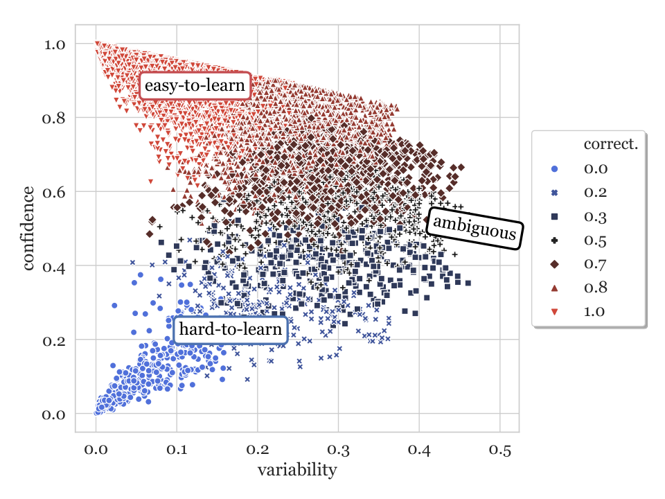 Figure 1:  Data map for SNLI train set, based on a RoBERTa-large classifier. The \(x\)-axis shows \(\mathbf{variability}\) and \(y\)-axis, the \(\mathbf{confidence}\); the colors/shapes indicate \(\mathbf{correctness}\). The top-left corner of the data map (low \(\mathbf{variability}\), high \(\mathbf{confidence}\)) corresponds to easy-to-learn examples, the bottom-left corner (low \(\mathbf{variability}\), low \(\mathbf{confidence}\)) corresponds to hard-to-learn examples, and examples on the right (with high \(\mathbf{variability}\)) are ambiguous; all definitions are with respect to the RoBERTa-large model. The modal group in the data is formed by the easy-to-learn regions. For clarity we only plot 25K random samples from the SNLI train set. Fig. [8(b)](https://arxiv.org/html/2009.10795#A3.F8.sf2 "In Figure 8 ‣ C.1 Effect of Encoder in building Data Maps ‣ Appendix C Additional Data Maps ‣ Dataset Cartography:Mapping and Diagnosing Datasets with Training Dynamics") in App. §[C](https://arxiv.org/html/2009.10795#A3 "Appendix C Additional Data Maps ‣ Dataset Cartography:Mapping and Diagnosing Datasets with Training Dynamics") shows the same map in greater relief. 

The creation of large labeled datasets has fueled the advance of AI [Russakovsky et al. (2015)](https://arxiv.org/html/2009.10795#bib.bib51); [Antol et al. (2015)](https://arxiv.org/html/2009.10795#bib.bib1) and NLP in particular [Bowman et al. (2015)](https://arxiv.org/html/2009.10795#bib.bib5); [Rajpurkar et al. (2016)](https://arxiv.org/html/2009.10795#bib.bib49). The common belief is that the more abundant the labeled data, the higher the likelihood of learning diverse phenomena, which in turn leads to models that generalize well. In practice, however, out-of-distribution (OOD) generalization remains a challenge [Yogatama et al. (2019)](https://arxiv.org/html/2009.10795#bib.bib71); [Linzen (2020)](https://arxiv.org/html/2009.10795#bib.bib38); and, while recent large pretrained language models help, they fail to close this gap [Hendrycks et al. (2020)](https://arxiv.org/html/2009.10795#bib.bib21). This urges a closer look at datasets, where not all examples might contribute equally towards learning [Vodrahalli et al. (2018)](https://arxiv.org/html/2009.10795#bib.bib63). However, the scale of data can make this assessment challenging. How can we automatically characterize data instances with respect to their role in achieving good performance in- and out-of- distribution? Answering this question may take us a step closer to bridging the gap between dataset collection and broader task objectives.

Drawing analogies from cartography, we propose to find coordinates for instances within the broader trends of a dataset. We introduce _data maps_ : a model-based tool for contextualizing examples in a dataset. We construct coordinates for data maps by leveraging training dynamics—the behavior of a model as training progresses. We consider the mean and standard deviation of the gold label probabilities, predicted for each example across training epochs; these are referred to as \(\mathbf{confidence}\) and \(\mathbf{variability}\), respectively (§[2](https://arxiv.org/html/2009.10795#S2 "2 Mapping Datasets with Training Dynamics ‣ Dataset Cartography:Mapping and Diagnosing Datasets with Training Dynamics")).

Fig. [1](https://arxiv.org/html/2009.10795#S1.F1 "Figure 1 ‣ 1 Introduction ‣ Dataset Cartography:Mapping and Diagnosing Datasets with Training Dynamics") shows the data map for the SNLI dataset [Bowman et al. (2015)](https://arxiv.org/html/2009.10795#bib.bib5) constructed using the RoBERTa-large model [Liu et al. (2019)](https://arxiv.org/html/2009.10795#bib.bib39). The map reveals three distinct regions in the dataset: a region with instances whose true class probabilities fluctuate frequently during training (high \(\mathbf{variability}\)), and are hence ambiguous for the model; a region with easy-to-learn instances that the model predicts correctly and consistently (high \(\mathbf{confidence}\), low \(\mathbf{variability}\)); and a region with hard-to-learn instances with low \(\mathbf{confidence}\), low \(\mathbf{variability}\), many of which we find are mislabeled during annotation .11 1 All terms are defined with respect to the model. Similar regions are observed across three other datasets: MultiNLI [Williams et al. (2018)](https://arxiv.org/html/2009.10795#bib.bib67), WinoGrande [Sakaguchi et al. (2020)](https://arxiv.org/html/2009.10795#bib.bib52) and SQuAD [Rajpurkar et al. (2016)](https://arxiv.org/html/2009.10795#bib.bib49), with respect to respective RoBERTa-large classifiers.

We further investigate the above regions by training models exclusively on examples from each region (§[3](https://arxiv.org/html/2009.10795#S3 "3 Data Selection using Data Maps ‣ Dataset Cartography:Mapping and Diagnosing Datasets with Training Dynamics")). Training on ambiguous instances promotes generalization to OOD test sets, with little or no effect on in-distribution (ID) performance.22 2 We define out-of-distribution (OOD) test sets as those which are collected independently of the original dataset, and ID test sets as those which are sampled from it. Our data maps also reveal that datasets contain a majority of easy-to-learn instances, which are not as critical for ID or OOD performance, but without any such instances, training could fail to converge (§[4](https://arxiv.org/html/2009.10795#S4 "4 Role of Easy-to-Learn Instances ‣ Dataset Cartography:Mapping and Diagnosing Datasets with Training Dynamics")). In §[5](https://arxiv.org/html/2009.10795#S5 "5 Detecting Mislabeled Examples ‣ Dataset Cartography:Mapping and Diagnosing Datasets with Training Dynamics"), we show that hard-to-learn instances frequently correspond to labeling errors. Lastly, we discuss connections between our measures and uncertainty measures (§[6](https://arxiv.org/html/2009.10795#S6 "6 Training Dynamics as Uncertainty Measures ‣ Dataset Cartography:Mapping and Diagnosing Datasets with Training Dynamics")).

Our findings indicate that data maps could serve as effective tools to diagnose large datasets, at the reasonable cost of training a model on them. Locating different regions within the data might pave the way for constructing higher quality datasets., and ultimately models that generalize better. Our code and higher resolution visualizations are publicly available.33 3 <https://github.com/allenai/cartography>

## 2 Mapping Datasets with Training Dynamics

Our goal is to construct Data Maps for datasets to help visualize a dataset with respect to a model, as well as understand the contributions of different groups of instances towards that model’s learning. Intuitively, instances that a model always predicts correctly are different from those it almost never does, or those on which it vacillates. For building such maps, each instance in the dataset must be contextualized in the larger set. We consider one contextualization approach, based on statistics arising from the behavior of the training procedure across time, or the “training dynamics”. We formally define our notations (§[2.1](https://arxiv.org/html/2009.10795#S2.SS1 "2.1 Training Dynamics ‣ 2 Mapping Datasets with Training Dynamics ‣ Dataset Cartography:Mapping and Diagnosing Datasets with Training Dynamics")) and describe our data maps (§[2.2](https://arxiv.org/html/2009.10795#S2.SS2 "2.2 Data Maps ‣ 2 Mapping Datasets with Training Dynamics ‣ Dataset Cartography:Mapping and Diagnosing Datasets with Training Dynamics")).

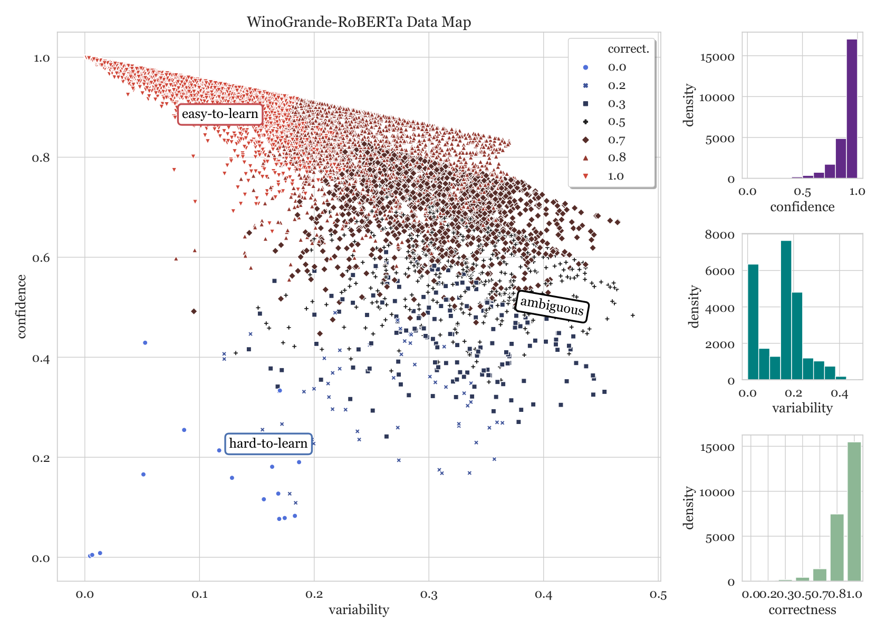 Figure 2:  Data map for the WinoGrande [Sakaguchi et al. (2020)](https://arxiv.org/html/2009.10795#bib.bib52) train set, based on a RoBERTa-large classifier, with the same axes as Fig. [1](https://arxiv.org/html/2009.10795#S1.F1 "Figure 1 ‣ 1 Introduction ‣ Dataset Cartography:Mapping and Diagnosing Datasets with Training Dynamics"). Density plots for the three different measures based on training dynamics are shown towards the right. Hard-to-learn regions have lower density in WinoGrande, compared to SNLI, perhaps as a result of a rigorous validation of collected annotations. However, manual errors remain, which we showcase in Tab. [1](https://arxiv.org/html/2009.10795#S2.T1 "Table 1 ‣ 2.2 Data Maps ‣ 2 Mapping Datasets with Training Dynamics ‣ Dataset Cartography:Mapping and Diagnosing Datasets with Training Dynamics") as well as in Section §[5](https://arxiv.org/html/2009.10795#S5 "5 Detecting Mislabeled Examples ‣ Dataset Cartography:Mapping and Diagnosing Datasets with Training Dynamics"). The plot shows only 25K train examples for clarity, and is best viewed enlarged. 

### 2.1 Training Dynamics

Consider a training dataset of size \(N\), \(\mathcal{D}=\{(\boldsymbol{x},y^{*})_{i}\}_{i=1}^{N}\) where the \(i\)th instance consists of the observation, \(\boldsymbol{x}_{i}\) and its true label under the task, \(y^{*}_{i}\). Our method assumes a particular model (family) whose parameters are selected to minimize empirical risk using a particular algorithm.44 4 In this paper, the model is RoBERTa [Liu et al. (2019)](https://arxiv.org/html/2009.10795#bib.bib39), currently established as a strong performer across many tasks. We assume the model defines a probability distribution over labels given an observation. We assume a stochastic gradient-based optimization procedure is used, with training instances randomly ordered at each epoch, across \(E\) epochs.

The training dynamics of instance \(i\) are defined as statistics calculated across the \(E\) epochs. The values of these measures then serve as coordinates in our map. The first measure aims to capture how confidently the learner assigns the true label to the observation, based on its probability distribution. We define \(\mathbf{confidence}\) as the mean model probability of the true label (\(y^{*}_{i}\)) across epochs:

| \(\displaystyle\hat{\mu}_{i}\) | \(\displaystyle=\frac{1}{E}\sum_{e=1}^{E}p_{\boldsymbol{\theta}^{(e)}}(y^{*}_{i}\mid\boldsymbol{x}_{i})\) |   
---|---|---|---  
  
where \(p_{\boldsymbol{\theta}^{(e)}}\) denotes the model’s probability with parameters \(\boldsymbol{\theta}^{(e)}\) at the end of the \(e^{\text{th}}\) epoch.55 5 Note that \(\hat{\mu}_{i}\) is with respect to the true label \(y^{*}_{i}\), not the probability assigned to the model’s highest-scoring label (as used in active learning, for example). In some cases we also consider a coarser, and perhaps more intuitive statistic, the fraction of times the model correctly labels \(\boldsymbol{x}_{i}\) across epochs, named \(\mathbf{correctness}\); this score only has \(1+E\) possible values. Intuitively, a high-\(\mathbf{confidence}\) instance is “easier” for the given learner.

Lastly, we also consider \(\mathbf{variability}\), which measures the spread of \(p_{\boldsymbol{\theta}^{(e)}}(y^{*}_{i}\mid\boldsymbol{x}_{i})\) across epochs, using the standard deviation:

| \(\displaystyle\hat{\sigma}_{i}=\) | \(\displaystyle\sqrt{\frac{\sum_{e=1}^{E}\left(p_{\boldsymbol{\theta}^{(e)}}(y^{*}_{i}\mid\boldsymbol{x}_{i})-\hat{\mu}_{i}\right)^{2}}{E}}\) |   
---|---|---|---  
  
Note that \(\mathbf{variability}\) also depends on the gold label, \(y^{*}_{i}\). A given instance to which the model assigns the same label consistently (whether accurately or not) will have low \(\mathbf{variability}\); one which the model is indecisive about across training, will have high \(\mathbf{variability}\).

Finally, we observe that \(\mathbf{confidence}\) and \(\mathbf{variability}\) are fairly stable across different parameter initializations.66 6 The average Pearson correlation coefficient between five random seeds’ resulting training runs is 0.75 or higher (for both measures, on WinoGrande). Training dynamics can be computed at different granularities, such as steps vs. epochs; see App. [A.1](https://arxiv.org/html/2009.10795#A1.SS1 "A.1 Training Dynamics Computation ‣ Appendix A Supplemental Material ‣ Dataset Cartography:Mapping and Diagnosing Datasets with Training Dynamics").

### 2.2 Data Maps

We construct data maps for four large datasets: WinoGrande [Sakaguchi et al. (2020)](https://arxiv.org/html/2009.10795#bib.bib52)—a cloze-style task for commonsense reasoning, two NLI datasets (SNLI; [Bowman et al., 2015](https://arxiv.org/html/2009.10795#bib.bib5); and MultiNLI; [Williams et al., 2018](https://arxiv.org/html/2009.10795#bib.bib67)), and QNLI, which is a sentence-level question answering task derived from SQuAD [Rajpurkar et al. (2016)](https://arxiv.org/html/2009.10795#bib.bib49). All data maps are built with models based on RoBERTa-large architectures. Details on the model and datasets can be found in App. §[A.2](https://arxiv.org/html/2009.10795#A1.SS2 "A.2 Datasets ‣ Appendix A Supplemental Material ‣ Dataset Cartography:Mapping and Diagnosing Datasets with Training Dynamics") and §[A.3](https://arxiv.org/html/2009.10795#A1.SS3 "A.3 Experimental Settings ‣ Appendix A Supplemental Material ‣ Dataset Cartography:Mapping and Diagnosing Datasets with Training Dynamics").

Fig. [1](https://arxiv.org/html/2009.10795#S1.F1 "Figure 1 ‣ 1 Introduction ‣ Dataset Cartography:Mapping and Diagnosing Datasets with Training Dynamics") presents the data map for the SNLI dataset. As is evident, the data follows a bell-shaped curve with respect to \(\mathbf{confidence}\) and \(\mathbf{variability}\); \(\mathbf{correctness}\) further determines discrete regions therein. The vast majority of instances belong to the high \(\mathbf{confidence}\) and low \(\mathbf{variability}\) region of the map (Fig. [1](https://arxiv.org/html/2009.10795#S1.F1 "Figure 1 ‣ 1 Introduction ‣ Dataset Cartography:Mapping and Diagnosing Datasets with Training Dynamics"), top-left). The model consistently predicts such instances correctly with high confidence; thus, we refer to them as easy-to-learn (for the model). A second, smaller group is formed by instances with low \(\mathbf{variability}\) and low \(\mathbf{confidence}\) (Fig. [1](https://arxiv.org/html/2009.10795#S1.F1 "Figure 1 ‣ 1 Introduction ‣ Dataset Cartography:Mapping and Diagnosing Datasets with Training Dynamics"), bottom-left corner). Since such instances are seldom predicted correctly during training, we refer to them as hard-to-learn (for the model). The third notable group contains ambiguous examples, or those with high \(\mathbf{variability}\) (Fig. [1](https://arxiv.org/html/2009.10795#S1.F1 "Figure 1 ‣ 1 Introduction ‣ Dataset Cartography:Mapping and Diagnosing Datasets with Training Dynamics"), right-hand side); the model tends to be indecisive about these instances, such that they may or may not correspond to high \(\mathbf{confidence}\) or \(\mathbf{correctness}\). We refer to such instances as ambiguous (to the model).

|  Instance | Option1 | Option2  
---|---|---|---  
easy-to-learn |  The man chose to buy the roses instead of the carnations because the __ were more beautiful. | roses* | carnations  
|  We enjoyed the meeting tonight but not the play as the __ was rather dull. | meeting | play*  
hard-to-learn |  Jason got into a deep financial hole, unlike Joel, because __ managed their fortune poorly. | Jason+ | Joel*  
|  In the mornings, Aaron can hit the snooze button a lot, and Samuel can’t. __ has to be at work at 10 am. | Aaron* | Samuel-  
|  Amy’s handwriting was meticulous, while Cynthia’s handwriting was often sloppy, because __ was careless about their work. | Amy* | Cynthia+  
ambiguous |  The dog ran up to Leslie and away from Lawrence because __ had soap for the dog to take a bath. | Leslie- | Lawrence*  
|  Kayla dated many more people at once than Betty, because __ was in an exclusive relationship. | Kayla* | Betty+  
Table 1:  Examples from the WinoGrande train set from different regions in the data map, with gold standard* labels. Our best assessment of the correct+ and equally plausible- labels are highlighted. 

Fig. [2](https://arxiv.org/html/2009.10795#S2.F2 "Figure 2 ‣ 2 Mapping Datasets with Training Dynamics ‣ Dataset Cartography:Mapping and Diagnosing Datasets with Training Dynamics") shows the data map for WinoGrande, which exhibits high structural similarity to the SNLI data map (Fig. [1](https://arxiv.org/html/2009.10795#S1.F1 "Figure 1 ‣ 1 Introduction ‣ Dataset Cartography:Mapping and Diagnosing Datasets with Training Dynamics")). The most remarkable difference between the maps is in the density of the hard-to-learn region, which is much lower for WinoGrande, as is evident from the histograms below. One explanation for this might be that WinoGrande labels were rigorously validated post annotation. App. §[C](https://arxiv.org/html/2009.10795#A3 "Appendix C Additional Data Maps ‣ Dataset Cartography:Mapping and Diagnosing Datasets with Training Dynamics") includes data maps for all four datasets, with respect to RoBERTa-large, in greater relief.

Different model architectures trained on a given dataset could be effectively compared using data maps, as an alternative to standard quantitative evaluation methods. App. §[C](https://arxiv.org/html/2009.10795#A3 "Appendix C Additional Data Maps ‣ Dataset Cartography:Mapping and Diagnosing Datasets with Training Dynamics") includes data maps for WinoGrande (Fig. [9(b)](https://arxiv.org/html/2009.10795#A3.F9.sf2 "In Figure 9 ‣ C.1 Effect of Encoder in building Data Maps ‣ Appendix C Additional Data Maps ‣ Dataset Cartography:Mapping and Diagnosing Datasets with Training Dynamics")) and SNLI (Fig. [10](https://arxiv.org/html/2009.10795#A3.F10 "Figure 10 ‣ C.1 Effect of Encoder in building Data Maps ‣ Appendix C Additional Data Maps ‣ Dataset Cartography:Mapping and Diagnosing Datasets with Training Dynamics") and Fig. [11](https://arxiv.org/html/2009.10795#A3.F11 "Figure 11 ‣ C.1 Effect of Encoder in building Data Maps ‣ Appendix C Additional Data Maps ‣ Dataset Cartography:Mapping and Diagnosing Datasets with Training Dynamics")) based on other (somewhat weaker) architectures. While data maps based on similar architectures have similar appearance, the regions to which a given instance belongs might vary. Data maps for weaker architectures still display similar regions, but the regions are not as distinct as those in RoBERTa based data maps.

Tab. [1](https://arxiv.org/html/2009.10795#S2.T1 "Table 1 ‣ 2.2 Data Maps ‣ 2 Mapping Datasets with Training Dynamics ‣ Dataset Cartography:Mapping and Diagnosing Datasets with Training Dynamics") shows examples from WinoGrande belonging to the different regions defined above. easy-to-learn examples are straightforward for the model, as well as for humans. In contrast, most hard-to-learn and some ambiguous examples could be challenging for humans (see green highlights in Tab. [1](https://arxiv.org/html/2009.10795#S2.T1 "Table 1 ‣ 2.2 Data Maps ‣ 2 Mapping Datasets with Training Dynamics ‣ Dataset Cartography:Mapping and Diagnosing Datasets with Training Dynamics")), which might explain why the model shows lower \(\mathbf{confidence}\) on them. These categories could be harder for models either because of labeling errors (blue highlights) or simply because the model is indecisive about the correct label. See App. §[A.4](https://arxiv.org/html/2009.10795#A1.SS4 "A.4 SNLI Qualitative Analysis ‣ Appendix A Supplemental Material ‣ Dataset Cartography:Mapping and Diagnosing Datasets with Training Dynamics") for similar examples from SNLI.

The next four sections include a diagnosis of the different data regions defined above. The effect of training models on each region on both in- and out-of-distribution performance is studied in §[3](https://arxiv.org/html/2009.10795#S3 "3 Data Selection using Data Maps ‣ Dataset Cartography:Mapping and Diagnosing Datasets with Training Dynamics"). The effect of selecting decreasing amounts of data is discussed in §[4](https://arxiv.org/html/2009.10795#S4 "4 Role of Easy-to-Learn Instances ‣ Dataset Cartography:Mapping and Diagnosing Datasets with Training Dynamics"). We investigate the presence of mislabeled instances in the hard-to-learn regions of the data maps in §[5](https://arxiv.org/html/2009.10795#S5 "5 Detecting Mislabeled Examples ‣ Dataset Cartography:Mapping and Diagnosing Datasets with Training Dynamics"). Lastly, we demonstrate connections between training dynamics measures and measures of uncertainty in §[6](https://arxiv.org/html/2009.10795#S6 "6 Training Dynamics as Uncertainty Measures ‣ Dataset Cartography:Mapping and Diagnosing Datasets with Training Dynamics").

## 3 Data Selection using Data Maps

Data maps reveal distinct regions in datasets; it is natural to wonder what roles do instances from different regions play in learning and generalization. We answer this empirically by training models exclusively on instances selected from distinct regions, followed by standard in-distribution (ID), as well as out-of-distribution (OOD) evaluation.

Our strategy is straightforward---we train the model from scratch on a subset of the training data selected by ranking instances based on the different training dynamics measures.77 7 Hyperparameters are also tuned from scratch (App. §[A.3](https://arxiv.org/html/2009.10795#A1.SS3 "A.3 Experimental Settings ‣ Appendix A Supplemental Material ‣ Dataset Cartography:Mapping and Diagnosing Datasets with Training Dynamics")). We hypothesize that ambiguous and hard-to-learn regions could be the most informative for learning, since these examples are the most challenging for the model [Shrivastava et al. (2016)](https://arxiv.org/html/2009.10795#bib.bib57). We compare these two settings to RoBERTa-large models trained on data subsets, selected using several other methods. All subsets considered contain 33% of the training data (to control for the effect of train data size on performance).

#### Baselines

The two most natural baselines are those where all data is used (100% train), and where a 33% random sample is used (random). Our second set of baselines considers subsets which are the most easy-to-learn for the model (high-\(\mathbf{confidence}\)), and those that the model is most decisive about (low-\(\mathbf{variability}\)), which comprises a mixture of easy-to-learn and hard-to-learn examples. We also consider baselines based on high- and low-\(\mathbf{correctness}\). Finally, we also compare with our implementation of the following methods for data selection from prior work (discussed in §[7](https://arxiv.org/html/2009.10795#S7 "7 Related Work ‣ Dataset Cartography:Mapping and Diagnosing Datasets with Training Dynamics")): forgetting [Toneva et al. (2018)](https://arxiv.org/html/2009.10795#bib.bib61), AFLite [LeBras et al. (2020)](https://arxiv.org/html/2009.10795#bib.bib33), AL-uncertainty [Joshi et al. (2009)](https://arxiv.org/html/2009.10795#bib.bib25), and AL-greedyK [Sener and Savarese (2018)](https://arxiv.org/html/2009.10795#bib.bib53).

|  | WinoG. Val. (ID) | WSC (OOD)  
---|---|---|---  
| 100% train | 79.70.2 | 86.00.1  
33% train | random | 73.31.3 | 85.60.4  
high-\(\mathbf{correctness}\) | 70.80.6 | 84.10.4  
high-\(\mathbf{confidence}\) | 69.40.5 | 83.90.5  
low-\(\mathbf{variability}\) | 70.11.0 | 83.71.4  
forgetting | 75.51.3 | 84.80.7  
AL-uncertainty | 75.70.8 | 85.70.8  
AL-greedyK | 74.20.4 | 86.50.5  
AFLite | 76.80.8 | 86.60.6  
low-\(\mathbf{correctness}\) | 78.20.6 | 86.30.6  
hard-to-learn | 77.91.3 | 87.20.7  
ambiguous | 78.70.4 | 87.60.6  
Table 2:  ID and OOD accuracies for RoBERTa-large models trained on different selections of WinoGrande. Reported values are averaged over 3 random seeds, with s.d. reported as a subscript. Selection of 33% training instances with highest \(\mathbf{variability}\) (ambiguous) achieves the best OOD performance, outperforming all other baselines from this work, as well as prior work.  | SNLI | MultiNLI  
---|---|---  
| ID | NLI Diagnostics (OOD) | ID (Val.) | NLI Diagnostics (OOD)  
|  | Test | Lex. | PAS | LS | Kno. | All | Mat. | MisM. | Lex. | PAS | LS | Kno. | All  
| 100% train | 92.0 | 54.6 | 67.9 | 62.7 | 52.1 | 61.8 | 90.2 | 90.1 | 59.9 | 68.4 | 67.3 | 57.8 | 65.0  
33% train | random | 91.3 | 53.0 | 66.8 | 59.7 | 50.7 | 60.4 | 89.8 | 89.2 | 59.3 | 69.6 | 66.5 | 56.3 | 64.6  
hard-to-learn | 91.8 | 55.2 | 69.1 | 63.2 | 51.7 | 62.0 | 89.5 | 89.7 | 59.3 | 68.9 | 69.5 | 58.8 | 65.3  
ambiguous | 92.2 | 58.5 | 67.9 | 64.1 | 54.2 | 63.5 | 90.1 | 89.3 | 63.5 | 71.0 | 68.9 | 59.2 | 66.9  
Table 3:  ID and OOD accuracies for RoBERTa-large models trained on different selections of SNLI and MultiNLI; we report the best performance over 3 random seeds (see Appendix §[B](https://arxiv.org/html/2009.10795#A2 "Appendix B Additional Results ‣ Dataset Cartography:Mapping and Diagnosing Datasets with Training Dynamics") for SNLI validation results). ambiguous and hard-to-learn subsets of data promote OOD generalization, at minimal degradation of ID performance. OOD performance improves across all fine-grained linguistic categories in the NLI Diagnostics set.  | In-dist. | Out-of-dist.  
---|---|---  
|  | QNLI Val. | Adversarial SQuAD  
| 100% train | 93.70.3 | 81.70.6  
33% train | random | 92.70.3 | 78.30.4  
hard-to-learn | 93.30.2 | 83.30.6  
ambiguous | 93.80.3 | 83.90.2  
Table 4:  QNLI performance on ID validation and OOD test sets, showing substantial improvements in the latter with a third of the original data. Reported values are averaged over 3 random seeds, with s.d. as subscripts. 

#### Results

We test our selections on the same datasets from the previous section—WinoGrande, SNLI, MultiNLI and QNLI. We report ID validation performance, and OOD performance on test sets either created independently of the dataset (NLI Diagnostics [Wang et al. (2019)](https://arxiv.org/html/2009.10795#bib.bib64) for SNLI and MultiNLI, and WSC [Levesque et al. (2011)](https://arxiv.org/html/2009.10795#bib.bib35) for WinoGrande), or specifically to be adversarial to the dataset (Adversarial SQuAD [Jia and Liang (2017)](https://arxiv.org/html/2009.10795#bib.bib24) for QNLI); see App. §[A.2](https://arxiv.org/html/2009.10795#A1.SS2 "A.2 Datasets ‣ Appendix A Supplemental Material ‣ Dataset Cartography:Mapping and Diagnosing Datasets with Training Dynamics") for details.

Tab. [2](https://arxiv.org/html/2009.10795#S3.T2 "Table 2 ‣ Baselines ‣ 3 Data Selection using Data Maps ‣ Dataset Cartography:Mapping and Diagnosing Datasets with Training Dynamics") shows our results on WinoGrande.88 8 The official test set for WinoGrande has been filtered with AFLite, making ID evaluation more challenging than OOD. However, we apply all our selection methods (including the AFLite selection) on WinoGrande’s unfiltered training data. Training on the most ambiguous data results in the best OOD performance, exceeding that of 100% train, even with just a third of the data. A similar effect is seen with hard-to-learn, as well as its coarse-grained counterpart, low-\(\mathbf{correctness}\). In each of the three cases, ID performance is also higher than all other 33% baselines, though we observe some degradation compared to the full training set; this is expected as with larger amounts of data models tend to fit the dataset distribution rather than the task [Torralba and Efros (2011)](https://arxiv.org/html/2009.10795#bib.bib62). The only selection methods that underperform the random baseline are forgetting, and the ones where we select data the model is highly confident and decisive about (high-\(\mathbf{confidence}\), high-\(\mathbf{correctness}\), and low-\(\mathbf{variability}\)). The latter pattern, as well as our overall results, highlight the important role played by examples which are challenging for the model, i.e., ambiguous and hard-to-learn examples.

Given that our selection methods outperform baselines from prior work, we only report random and 100% train selection baselines on the remaining datasets, where we see similar trends. Tab. [3](https://arxiv.org/html/2009.10795#S3.T3 "Table 3 ‣ Baselines ‣ 3 Data Selection using Data Maps ‣ Dataset Cartography:Mapping and Diagnosing Datasets with Training Dynamics") shows results for SNLI and MultiNLI, where the random selection baseline is already within 1% of the 100% train baseline.99 9 The ID performance of all models exceeds human accuracy (88%) for SNLI. However, the difference in ID and OOD performance in SNLI is quite high, showing that there is still room for improvement in the NLI task. Selecting 33% of the most ambiguous examples achieves even better ID performance, within 0.2% of the 100% train baseline, while exceeding OOD performance substantially on each of the linguistic categories in the NLI Diagnostics test set.1010 10 While MultiNLI-mismatched is technically out-of-domain, performance is close to matched (ID). While hard-to-learn does not perform as well as ambiguous on most cases, it still matches or outperforms the 100% train baseline on OOD test sets. Tab. [4](https://arxiv.org/html/2009.10795#S3.T4 "Table 4 ‣ Baselines ‣ 3 Data Selection using Data Maps ‣ Dataset Cartography:Mapping and Diagnosing Datasets with Training Dynamics") shows a similar trend for QNLI, where we gain over 2% performance on the OOD Adversarial SQuAD test set, with minimal loss in ID accuracy.

Figure 3:  ID (left) and OOD (centre) WinoGrande performance with increasing % of ambiguous (and randomly-sampled) training data. RoBERTa-large optimization fails when trained on small amounts (\(<\) 25%) of the most ambiguous data (results correspond to majority baseline performance and are not shown here, for better visibility). (Right) Replacing small amounts of ambiguous examples from the 17% subset with easy-to-learn examples results in successful optimization and ID improvements, at the cost of decreased OOD accuracy. All reported performances are averaged over 3 random seeds. 

Overall, regions revealed by data maps provide ways to substantially improve OOD performance across datasets. Regional selections of data not only improve model generalization, but also do so using substantially less data, providing a method to potentially speed up training. We note, however, that discovering such examples requires computing training dynamics, which involves training a model on the full dataset. Future directions involve building more efficient data maps, to better fulfill the training speedup potential.

## 4 Role of Easy-to-Learn Instances

Data maps uncover ambiguous regions, small subsets from which lead to improved OOD performance, with minimal degradation of ID performance (§[3](https://arxiv.org/html/2009.10795#S3 "3 Data Selection using Data Maps ‣ Dataset Cartography:Mapping and Diagnosing Datasets with Training Dynamics")). We next investigate how performance is affected as we vary the size of the ambiguous subsets. We retrain our model with subsets containing the top 50%, 33%, 25%, 17%, 10%, 5% and 1% ambiguous instances of WinoGrande (Fig. [3](https://arxiv.org/html/2009.10795#S3.F3 "Figure 3 ‣ Results ‣ 3 Data Selection using Data Maps ‣ Dataset Cartography:Mapping and Diagnosing Datasets with Training Dynamics"), left and center). Large ambiguous subsets (25% or more) result in high ID and OOD performance. Surprisingly however, for smaller ambiguous subsets (17% or less), the model performs at chance level, despite random restarts.1111 11 This is common for large models trained on small datasets [Devlin et al. (2019)](https://arxiv.org/html/2009.10795#bib.bib10); [Phang et al. (2018)](https://arxiv.org/html/2009.10795#bib.bib46); [Dodge et al. (2020)](https://arxiv.org/html/2009.10795#bib.bib12). In contrast, a baseline that randomly selects subsets of similar sizes is able to learn (while naturally performing worse as data decreases, eventually failing at 1%). This indicates that ambiguous instances alone might be insufficient for learning.

Given that the model barely struggles with easy-to-learn instances (by definition), we next replace some ambiguous examples with easy-to-learn examples in the 17% most ambiguous subset. Interestingly, replacing just a tenth of the ambiguous data with easy-to-learn instances, the model not only successfully learns, but also outperforms the random selection baseline’s ID performance (Fig. [3](https://arxiv.org/html/2009.10795#S3.F3 "Figure 3 ‣ Results ‣ 3 Data Selection using Data Maps ‣ Dataset Cartography:Mapping and Diagnosing Datasets with Training Dynamics") right). This indicates that for successful optimization, it is important to include easier-to-learn instances. However, with too many replacements, performance starts decreasing again; this trend was seen in the previous section with the high-\(\mathbf{confidence}\) baseline (Tab. [2](https://arxiv.org/html/2009.10795#S3.T2 "Table 2 ‣ Baselines ‣ 3 Data Selection using Data Maps ‣ Dataset Cartography:Mapping and Diagnosing Datasets with Training Dynamics")). OOD performance shows a similar trend, but matches or is worse than the baseline. Selection of the optimal balance of easy-to-learn and ambiguous examples in low data regimes is an open problem; we defer this exploration to future work.

## 5 Detecting Mislabeled Examples

Crowdsourced datasets are often subject to noise attributed to incorrect labeled annotations [Sheng et al. (2008)](https://arxiv.org/html/2009.10795#bib.bib56); [Krishna et al. (2016)](https://arxiv.org/html/2009.10795#bib.bib29); [Ekambaram et al. (2017)](https://arxiv.org/html/2009.10795#bib.bib13), which may lead to training models that are not representative of the task at hand. Recent studies have shown that over-parameterized neural networks can fit the incorrect labels blindly [Zhang et al. (2017)](https://arxiv.org/html/2009.10795#bib.bib72), which might hurt their generalization ability [Hu et al. (2020)](https://arxiv.org/html/2009.10795#bib.bib23). For large datasets, identifying mislabeled examples can be prohibitively expensive. Our data maps provide a semi-automated method to identify such mislabeled instances, without significantly more effort than simply training a model on the data. We hypothesize that hard-to-learn examples—those with low \(\mathbf{confidence}\)—might be mislabeled, as has also been suggested in prior work [Manning (2011)](https://arxiv.org/html/2009.10795#bib.bib41); [Toneva et al. (2018)](https://arxiv.org/html/2009.10795#bib.bib61).

Figure 4:  Retraining WinoGrande with 1% noised (label-flipped) data changes the training dynamics of the noisy examples. After retraining, there is a noticeable distributional shift towards lower \(\mathbf{confidence}\), with some shift towards higher \(\mathbf{variability}\) as well. 

To verify this hypothesis, we design an experimental setting where we artificially inject noise in the training data, by flipping the labels of 1% of the training data for WinoGrande. Motivated by our qualitative analysis (Tab [1](https://arxiv.org/html/2009.10795#S2.T1 "Table 1 ‣ 2.2 Data Maps ‣ 2 Mapping Datasets with Training Dynamics ‣ Dataset Cartography:Mapping and Diagnosing Datasets with Training Dynamics")), we select the candidates for flipping from the easy-to-learn region—this minimizes the risk of selecting already mislabeled examples. We retrain RoBERTa with the partly noised data, and recompute \(\mathbf{confidence}\) and \(\mathbf{variability}\) of all instances. Fig. [4](https://arxiv.org/html/2009.10795#S5.F4 "Figure 4 ‣ 5 Detecting Mislabeled Examples ‣ Dataset Cartography:Mapping and Diagnosing Datasets with Training Dynamics") shows the training dynamics measures, before and after re-training. Flipped instances move to the lower \(\mathbf{confidence}\) regions after retraining, with some movement towards higher \(\mathbf{variability}\). This indicates that perhaps the hard-to-learn region (low \(\mathbf{confidence}\)) of the map contains other mislabeled instances. We next explore a simple method to automatically detect such instances.

#### Automatic Noise Detection

We train a linear model to classify examples as mislabeled (noise) or not, using a single feature: the \(\mathbf{confidence}\) score from the retrained RoBERTa model on WinoGrande. This model is trained using a balanced training set for this task by sampling equal numbers of noisy (label-flipped) and clean examples from the original train set. This simple classifier is quite effective---a sanity check evaluation on a similarly constructed test set yields 100% F1.1212 12 A similar experiment with only \(\mathbf{variability}\) scores as features resulted in a much poorer classifier—70% F1.

Next, we run the trained noise classifier on the entire original training set, with features extracted from the original training dynamics measures (computed without added noise). We first observe that despite training on a balanced dataset, our classifier predicts only a few examples as mislabeled—only 31 WinoGrande instances (out a total of 40K). A similar experiment on SNLI results in 15K noisy examples (out of 500K). These results are encouraging and follow our intuitions that most instances in data are indeed labeled “correctly”. Indeed, WinoGrande contains a lower portion of noisy examples, as indicated by our data maps (Fig. [2](https://arxiv.org/html/2009.10795#S2.F2 "Figure 2 ‣ 2 Mapping Datasets with Training Dynamics ‣ Dataset Cartography:Mapping and Diagnosing Datasets with Training Dynamics")).

We further investigated these trends via a human evaluation on the output of the classifier. We created an evaluation set by randomly selecting 50 instances from each predicted class as per our classifier. Two of the authors re-annotated these 100 instances (without access to the original or predicted labels); some instances were annotated as too ambiguous for the authors. After discussions to resolve their differences, both annotators agreed on 96% of the instances in each dataset. Using our annotations as a new gold standard, we found that for WinoGrande, 67% of the instances predicted as noisy by the linear classifier are indeed either mislabeled or ambiguous, compared to only 13% of the ones predicted as correctly labeled. Similar patterns are observed for SNLI (76% vs. 4%).

Our results demonstrate the potential of using data maps as a tool to ‘‘clean-up’’ datasets, by identifying mislabeled or ambiguous instances.1313 13 In preliminary experiments, retraining WinoGrande after removal of noise did not yield a large difference in performance, given the relatively small amount of noise. Notably, our results were obtained using a simple method; this encourages exploration of methods that might lead to more accurate noise-detectors.

## 6 Training Dynamics as Uncertainty Measures

We introduced data maps, and used training dynamics measures as coordinates for data points in §[2](https://arxiv.org/html/2009.10795#S2 "2 Mapping Datasets with Training Dynamics ‣ Dataset Cartography:Mapping and Diagnosing Datasets with Training Dynamics"). We now take a closer look at these measures, and find intuitive connections with measures of _uncertainty_. When a model fails to predict the correct label, the error may come from ambiguity inherent to the example (_intrinsic uncertainty_), but it may also come from the model’s limitations (often referred to as _model uncertainty_).1414 14 These are also sometimes called the _aleatoric_ and _epistemic_ uncertainty, respectively [Gal (2016)](https://arxiv.org/html/2009.10795#bib.bib15). To understand how examples contribute to a dataset, it is important to separate these two sources of error.

We start by studying the relationship between intrinsic uncertainty and our training dynamics measures. Human agreement can serve as a proxy for intrinsic uncertainty. We estimate human agreement using the multiple human annotations available in SNLI’s development set.1515 15 Only SNLI dev. and test set have multiple annotations on all instances. We obtain training dynamics with RoBERTa-large run on train and dev. combined. For each annotator, we compute whether they agree with the majority label from the other four, breaking ties randomly and then averaging over annotators.1616 16 Normally, this provides the minimum-variance unbiased estimate, though SNLI’s development set throws away examples without a majority, which introduces some bias.,1717 17 Note that the model only has seen the majority vote, while we take into account all annotator labels to quantify agreement.

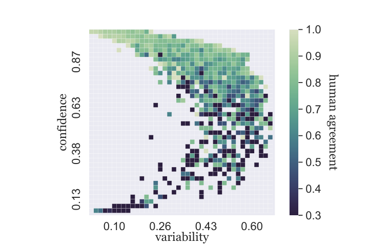 Figure 5:  Visualizing human agreement on the SNLI (dev. set only) data map reveals its strong relationship to \(\mathbf{confidence}\). Each cell in the heatmap bins examples based on \(\mathbf{confidence}\) and \(\mathbf{variability}\), then colors the cell by the mean human agreement. 

Fig. [5](https://arxiv.org/html/2009.10795#S6.F5 "Figure 5 ‣ 6 Training Dynamics as Uncertainty Measures ‣ Dataset Cartography:Mapping and Diagnosing Datasets with Training Dynamics") visualizes the relation between our training dynamics measures (\(\mathbf{confidence}\) and \(\mathbf{variability}\)) and human agreement, averaged over the examples. We observe a strong relationship between human agreement and \(\mathbf{confidence}\): high \(\mathbf{confidence}\) indicates high agreement between annotators, while low \(\mathbf{confidence}\) often indicates disagreement on the example. In contrast, once \(\mathbf{confidence}\) is known, \(\mathbf{variability}\) does not provide much information about the agreement.

The connection between our second measure, \(\mathbf{variability}\), and model uncertainty is more straightforward: \(\mathbf{variability}\), by definition, captures exactly the uncertainty of the model. See App. [B.1](https://arxiv.org/html/2009.10795#A2.SS1 "B.1 Training Dynamics vs. Dropout ‣ Appendix B Additional Results ‣ Dataset Cartography:Mapping and Diagnosing Datasets with Training Dynamics") for an additional discussion (with empirical justifications) on connections between training dynamics measures and dropout-based [Srivastava et al. (2014)](https://arxiv.org/html/2009.10795#bib.bib59), first-principles uncertainty estimates.

These relations are further supported by previous work, which showed that deep ensembles provide well-calibrated uncertainty estimates [Lakshminarayanan et al. (2017)](https://arxiv.org/html/2009.10795#bib.bib32); [Gustafsson et al. (2019)](https://arxiv.org/html/2009.10795#bib.bib19); [Snoek et al. (2019)](https://arxiv.org/html/2009.10795#bib.bib58). Generally, such approaches ensemble models trained from scratch; while ensembles of training checkpoints lose some diversity [Fort et al. (2019)](https://arxiv.org/html/2009.10795#bib.bib14), they offer a cheaper alternative capturing some of the benefits [Chen et al. (2017a)](https://arxiv.org/html/2009.10795#bib.bib7). Future work will involve investigation of such alternatives for building data maps.

## 7 Related Work

Our work builds data maps using training dynamics measures for scoring data instances. Loss landscapes [Xing et al. (2018)](https://arxiv.org/html/2009.10795#bib.bib70) are similar to training dynamics, but also consider variables from the stochastic optimization algorithm. [Toneva et al. (2018)](https://arxiv.org/html/2009.10795#bib.bib61) also use training dynamics to find train examples which are frequently “forgotten”, i.e., misclassified during a later epoch of training, despite being classified correctly earlier; our \(\mathbf{correctness}\) metric provides similar discrete scores, and results in models with better performance. Variants of such approaches address catastrophic forgetting, and are useful for analyzing data instances [Pan et al. (2020)](https://arxiv.org/html/2009.10795#bib.bib44); [Krymolowski (2002)](https://arxiv.org/html/2009.10795#bib.bib30).

Prior work has proposed other criteria to score instances. AFLite [LeBras et al. (2020)](https://arxiv.org/html/2009.10795#bib.bib33) is an adversarial filtering algorithm which ranks instances based on their “predictability”, i.e. the ability of simple linear classifiers to predict them correctly. While AFLite, among others [Li and Vasconcelos (2019)](https://arxiv.org/html/2009.10795#bib.bib37); [Gururangan et al. (2018)](https://arxiv.org/html/2009.10795#bib.bib18), advocate removing “easy” instances from the dataset, our work shows that easy-to-learn instances can be useful. Similar intuitions have guided other work such as curriculum learning [Bengio et al. (2009)](https://arxiv.org/html/2009.10795#bib.bib3) and self-paced learning [Kumar et al. (2010)](https://arxiv.org/html/2009.10795#bib.bib31); [Lee and Grauman (2011)](https://arxiv.org/html/2009.10795#bib.bib34) where all examples are prioritized based on their “difficulty”.

Other approaches have used training loss [Han et al. (2018)](https://arxiv.org/html/2009.10795#bib.bib20); [Arazo et al. (2019)](https://arxiv.org/html/2009.10795#bib.bib2); [Shen and Sanghavi (2019)](https://arxiv.org/html/2009.10795#bib.bib55), confidence [Hovy et al. (2013)](https://arxiv.org/html/2009.10795#bib.bib22), and meta-learning [Ren et al. (2018)](https://arxiv.org/html/2009.10795#bib.bib50), to differentiate instances within datasets. Perhaps our measures are the closest to those from [Chang et al. (2017)](https://arxiv.org/html/2009.10795#bib.bib6); they propose prediction variance and threshold closeness—which correspond to \(\mathbf{variability}\) and \(\mathbf{confidence}\), respectively.1818 18 They also consider confidence intervals; our preliminary experiments, with and without, yielded similar results. However, they use these measures to reweight all instances, similar to sampling effective batches in online learning [Loshchilov and Hutter (2016)](https://arxiv.org/html/2009.10795#bib.bib40). Our work, instead, does a hard selection for the purpose of studying different groups within data.

Our methods are also reminiscent of active learning methods ([Settles, 2009](https://arxiv.org/html/2009.10795#bib.bib54); [Peris and Casacuberta, 2018](https://arxiv.org/html/2009.10795#bib.bib45); [P.V.S and Meyer, 2019](https://arxiv.org/html/2009.10795#bib.bib48)), such as uncertainty sampling [Lewis and Gale (1994)](https://arxiv.org/html/2009.10795#bib.bib36) which selects (unlabeled) data points, which a model trained on a small labeled subset, has least confidence in, or predicts as farthest (in vector space, based on cosine similarity) ([Sener and Savarese, 2018](https://arxiv.org/html/2009.10795#bib.bib53); [Wolf, 2011](https://arxiv.org/html/2009.10795#bib.bib68)). Our approach uses labeled data for selection, similar to core-set selection approaches [Wei et al. (2013)](https://arxiv.org/html/2009.10795#bib.bib66). Active learning approaches could be used in conjunction with data maps to create better datasets, similar to approaches proposed in [Mishra et al. (2020)](https://arxiv.org/html/2009.10795#bib.bib42). For instance, creating datasets with more ambiguous examples (with respect to a given model) could make it beneficial for OOD generalization.

Data error detection also involves instance scoring. Influence functions [Koh and Liang (2017)](https://arxiv.org/html/2009.10795#bib.bib28), forgetting events [Toneva et al. (2018)](https://arxiv.org/html/2009.10795#bib.bib61), cross validation [Chen et al. (2019)](https://arxiv.org/html/2009.10795#bib.bib8), Shapely values [Ghorbani and Zou (2019)](https://arxiv.org/html/2009.10795#bib.bib17), and the area-under-margin metric [Pleiss et al. (2020)](https://arxiv.org/html/2009.10795#bib.bib47) have all been used to identify mislabeled examples. Some approaches avoid hard examples altogether [Bottou et al. (2005)](https://arxiv.org/html/2009.10795#bib.bib4); [Northcutt et al. (2017)](https://arxiv.org/html/2009.10795#bib.bib43) to reduce fit to noisy data. Our use of training dynamics to locate mislabeled examples involves minimal additional effort beyond training a model on the dataset.

## 8 Conclusion

We presented data maps: an automatic method to visualize and diagnose large datasets using training dynamics. Our data maps for four different datasets reveal similar terrains in each dataset: groups of ambiguous instances useful for high performance, easy-to-learn instances which aid optimization, and hard-to-learn instances which often correspond to data errors. While our maps are based on RoBERTa-large, the methods to build them are model-agnostic (App. §[C.1](https://arxiv.org/html/2009.10795#A3.SS1 "C.1 Effect of Encoder in building Data Maps ‣ Appendix C Additional Data Maps ‣ Dataset Cartography:Mapping and Diagnosing Datasets with Training Dynamics")). Our work shows the effectiveness of simple training dynamics measures based on mean and standard deviation; exploration of more sophisticated measures to build data maps is an exciting future direction. Data maps not only help diagnose and make better use of existing datasets, but also hold potential for guiding the construction of new datasets. Moreover, data maps could facilitate comparison of different model architectures trained on a given dataset, resulting in alternative evaluation methodologies. Our implementation is publicly available to facilitate such efforts.1919 19 <https://github.com/allenai/cartography>

## Acknowledgements

This research was supported in part by DARPA under the MCS program through NIWC Pacific (N66001-19-2-4031) grant, and by the Allen Distinguished Investigator Award. We thank the anonymous reviewers, and our colleagues from AI2 and UWNLP, especially Ana Marasović, and Suchin Gururangan, for their helpful feedback.

## References

  * Antol et al. (2015) Stanislaw Antol, Aishwarya Agrawal, Jiasen Lu, Margaret Mitchell, Dhruv Batra, C. Lawrence Zitnick, and Devi Parikh. 2015.  [VQA: Visual Question Answering](https://arxiv.org/abs/1505.00468).  In _ICCV_. 
  * Arazo et al. (2019) Eric Arazo, Diego Ortego, Paul Albert, Noel O’Connor, and Kevin Mcguinness. 2019\.  [Unsupervised label noise modeling and loss correction](https://arxiv.org/abs/1904.11238).  In _ICML_ , pages 312–321. 
  * Bengio et al. (2009) Yoshua Bengio, Jérôme Louradour, Ronan Collobert, and Jason Weston. 2009\.  [Curriculum learning](https://dl.acm.org/doi/abs/10.1145/1553374.1553380).  In _ICML_. 
  * Bottou et al. (2005) Léon Bottou, Jason Weston, and Gökhan H Bakir. 2005.  [Breaking SVM complexity with Cross-Training](https://papers.nips.cc/paper/2695-breaking-svm-complexity-with-cross-training).  In _NeurIPS_ , pages 81–88. MIT Press. 
  * Bowman et al. (2015) Samuel R. Bowman, Gabor Angeli, Christopher Potts, and Christopher D. Manning. 2015\.  [A large annotated corpus for learning natural language inference](https://doi.org/10.18653/v1/D15-1075).  In _Proceedings of the 2015 Conference on Empirical Methods in Natural Language Processing_ , pages 632–642, Lisbon, Portugal. Association for Computational Linguistics. 
  * Chang et al. (2017) Haw-Shiuan Chang, Erik Learned-Miller, and Andrew McCallum. 2017.  [Active bias: Training more accurate neural networks by emphasizing high variance samples](http://papers.nips.cc/paper/6701-active-bias-training-more-accurate-neural-networks-by-emphasizing-high-variance-samples).  In _NeurIPS_ , pages 1002–1012. 
  * Chen et al. (2017a) Hugh Chen, Scott Lundberg, and Su-In Lee. 2017a.  [Checkpoint ensembles: Ensemble methods from a single training process](https://arxiv.org/abs/1710.03282).  ArXiv:1710.03282. 
  * Chen et al. (2019) Pengfei Chen, Benben Liao, Guangyong Chen, and Shengyu Zhang. 2019.  [Understanding and utilizing deep neural networks trained with noisy labels](https://arxiv.org/abs/1905.05040).  In _ICML_ , volume 97 of _Proceedings of Machine Learning Research_ , pages 1062–1070. PMLR. 
  * Chen et al. (2017b) Qian Chen, Xiaodan Zhu, Zhen-Hua Ling, Si Wei, Hui Jiang, and Diana Inkpen. 2017b.  [Enhanced LSTM for natural language inference](https://doi.org/10.18653/v1/P17-1152).  In _Proceedings of the 55th Annual Meeting of the Association for Computational Linguistics (Volume 1: Long Papers)_ , pages 1657–1668, Vancouver, Canada. Association for Computational Linguistics. 
  * Devlin et al. (2019) Jacob Devlin, Ming-Wei Chang, Kenton Lee, and Kristina Toutanova. 2019.  [BERT: Pre-training of deep bidirectional transformers for language understanding](https://doi.org/10.18653/v1/N19-1423).  In _NAACL_. 
  * Dodge et al. (2019) Jesse Dodge, Suchin Gururangan, Dallas Card, Roy Schwartz, and Noah A. Smith. 2019\.  [Show your work: Improved reporting of experimental results](https://arxiv.org/abs/1909.03004).  In _EMNLP_. 
  * Dodge et al. (2020) Jesse Dodge, Gabriel Ilharco, Roy Schwartz, Ali Farhadi, Hannaneh Hajishirzi, and Noah A. Smith. 2020.  [Fine-tuning pretrained language models: Weight initializations, data orders, and early stopping](https://arxiv.org/abs/2002.06305).  arXiv:2002.06305. 
  * Ekambaram et al. (2017) R. Ekambaram, D. B. Goldgof, and L. O. Hall. 2017.  [Finding label noise examples in large scale datasets](https://ieeexplore.ieee.org/document/8122985/).  In _SMC_ , pages 2420–2424. 
  * Fort et al. (2019) Stanislav Fort, Huiyi Hu, and Balaji Lakshminarayanan. 2019.  [Deep ensembles: A loss landscape perspective](https://arxiv.org/abs/1912.02757).  ArXiv preprint arXiv:1912.02757. 
  * Gal (2016) Yarin Gal. 2016.  [_Uncertainty in Deep Learning_](http://mlg.eng.cam.ac.uk/yarin/thesis/thesis.pdf).  Ph.D. thesis, University of Cambridge. 
  * Gal and Ghahramani (2016) Yarin Gal and Zoubin Ghahramani. 2016.  [Dropout as a bayesian approximation: Representing model uncertainty in deep learning](http://proceedings.mlr.press/v48/gal16.html).  In _ICML_ , volume 48, pages 1050–1059. PMLR. 
  * Ghorbani and Zou (2019) Amirata Ghorbani and James Zou. 2019.  [Data shapley: Equitable valuation of data for machine learning](http://arxiv.org/abs/1904.02868). 
  * Gururangan et al. (2018) Suchin Gururangan, Swabha Swayamdipta, Omer Levy, Roy Schwartz, Samuel Bowman, and Noah A. Smith. 2018.  [Annotation artifacts in natural language inference data](https://doi.org/10.18653/v1/N18-2017).  In _Proceedings of the 2018 Conference of the North American Chapter of the Association for Computational Linguistics: Human Language Technologies, Volume 2 (Short Papers)_ , pages 107–112, New Orleans, Louisiana. Association for Computational Linguistics. 
  * Gustafsson et al. (2019) Fredrik K Gustafsson, Martin Danelljan, and Thomas B Schön. 2019.  [Evaluating scalable bayesian deep learning methods for robust computer vision](https://arxiv.org/abs/1906.01620).  ArXiv preprint arXiv:1906.01620. 
  * Han et al. (2018) Bo Han, Quanming Yao, Xingrui Yu, Gang Niu, Miao Xu, Weihua Hu, Ivor W. Tsang, and Masashi Sugiyama. 2018.  [Co-teaching: Robust training of deep neural networks with extremely noisy labels](https://arxiv.org/abs/1804.06872).  In _NeurIPS_ , pages 8536–8546. 
  * Hendrycks et al. (2020) Dan Hendrycks, Xiaoyuan Liu, Eric Wallace, Adam Dziedzic, Rishabh Krishnan, and Dawn Song. 2020.  [Pretrained transformers improve out-of-distribution robustness](https://arxiv.org/abs/2004.06100).  ArXiv preprint arXiv:2004.06100. 
  * Hovy et al. (2013) Dirk Hovy, Taylor Berg-Kirkpatrick, Ashish Vaswani, and Eduard Hovy. 2013.  [Learning whom to trust with MACE](https://www.aclweb.org/anthology/N13-1132).  In _Proceedings of the 2013 Conference of the North American Chapter of the Association for Computational Linguistics: Human Language Technologies_ , pages 1120–1130, Atlanta, Georgia. Association for Computational Linguistics. 
  * Hu et al. (2020) Wei Hu, Zhiyuan Li, and Dingli Yu. 2020.  [Simple and effective regularization methods for training on noisily labeled data with generalization guarantee](https://arxiv.org/abs/1905.11368).  In _ICLR_. OpenReview.net. 
  * Jia and Liang (2017) Robin Jia and Percy Liang. 2017.  [Adversarial examples for evaluating reading comprehension systems](https://doi.org/10.18653/v1/D17-1215).  In _Proceedings of the 2017 Conference on Empirical Methods in Natural Language Processing_ , pages 2021–2031, Copenhagen, Denmark. Association for Computational Linguistics. 
  * Joshi et al. (2009) Ajay J Joshi, Fatih Porikli, and Nikolaos Papanikolopoulos. 2009.  [Multi-class active learning for image classification](https://ieeexplore.ieee.org/abstract/document/5206627).  In _CVPR_ , pages 2372–2379. IEEE. 
  * Kaplan et al. (2020) Jared Kaplan, Sam McCandlish, Tom Henighan, Tom B. Brown, Benjamin Chess, Rewon Child, Scott Gray, Alec Radford, Jeffrey Wu, and Dario Amodei. 2020.  [Scaling laws for neural language models](http://arxiv.org/abs/2001.08361). 
  * Kingma and Ba (2014) Diederik P. Kingma and Jimmy Ba. 2014.  [Adam: A method for stochastic optimization](https://arxiv.org/abs/1412.6980).  ArXiv:1412.6980. 
  * Koh and Liang (2017) Pang Wei Koh and Percy Liang. 2017.  [Understanding black-box predictions via influence functions](https://dl.acm.org/doi/10.5555/3305381.3305576).  In _ICML_ , pages 1885–1894. JMLR. org. 
  * Krishna et al. (2016) Ranjay A. Krishna, Kenji Hata, Stephanie Chen, Joshua Kravitz, David A. Shamma, Fei-Fei Li, and Michael S. Bernstein. 2016.  [Embracing error to enable rapid crowdsourcing](https://arxiv.org/pdf/1602.04506).  In _CHI_ , pages 3167–3179. ACM. 
  * Krymolowski (2002) Yuval Krymolowski. 2002.  [Distinguishing easy and hard instances](https://www.aclweb.org/anthology/W02-2015).  In _COLING_. 
  * Kumar et al. (2010) M Pawan Kumar, Benjamin Packer, and Daphne Koller. 2010.  [Self-paced learning for latent variable models](https://papers.nips.cc/paper/3923-self-paced-learning-for-latent-variable-models).  In _NeurIPS_ , pages 1189–1197. 
  * Lakshminarayanan et al. (2017) Balaji Lakshminarayanan, Alexander Pritzel, and Charles Blundell. 2017.  [Simple and scalable predictive uncertainty estimation using deep ensembles](http://papers.nips.cc/paper/7219-simple-and-scalable-predictive-uncertainty-estimation-using-deep-ensembles).  In _NeurIPS_ , pages 6402–6413. 
  * LeBras et al. (2020) Ronan LeBras, Swabha Swayamdipta, Chandra Bhagavatula, Rowan Zellers, Matthew E. Peters, Ashish Sabharwal, and Yejin Choi. 2020.  [Adversarial filters of dataset biases](https://arxiv.org/abs/2002.04108).  In _ICML_. 
  * Lee and Grauman (2011) Yong Jae Lee and Kristen Grauman. 2011.  [Learning the easy things first: Self-paced visual category discovery](https://ieeexplore.ieee.org/document/5995523).  _CVPR_ , pages 1721–1728. 
  * Levesque et al. (2011) Hector J Levesque, Ernest Davis, and Leora Morgenstern. 2011.  [The Winograd schema challenge](https://www.aaai.org/ocs/index.php/KR/KR12/paper/viewPaper/4492).  In _AAAI_ , volume 46, page 47. 
  * Lewis and Gale (1994) David D. Lewis and William A. Gale. 1994.  [A sequential algorithm for training text classifiers](https://arxiv.org/abs/cmp-lg/9407020).  In _SIGIR_ , SIGIR ’94, page 3–12, Berlin, Heidelberg. Springer-Verlag. 
  * Li and Vasconcelos (2019) Yi Li and Nuno Vasconcelos. 2019.  [REPAIR: Removing representation bias by dataset resampling](https://doi.org/10.1109/cvpr.2019.00980).  IEEE. 
  * Linzen (2020) Tal Linzen. 2020.  [How can we accelerate progress towards human-like linguistic generalization?](https://arxiv.org/abs/2005.00955) In _ACL_. 
  * Liu et al. (2019) Yinhan Liu, Myle Ott, Naman Goyal, Jingfei Du, Mandar S. Joshi, Danqi Chen, Omer Levy, Mike Lewis, Luke S. Zettlemoyer, and Veselin Stoyanov. 2019.  [RoBERTa: A robustly optimized BERT pretraining approach](https://arxiv.org/abs/1907.11692).  ArXiv:1907.11692. 
  * Loshchilov and Hutter (2016) Ilya Loshchilov and Frank Hutter. 2016.  [Online batch selection for faster training of neural networks](https://arxiv.org/abs/1511.06343).  In _ICLR_. 
  * Manning (2011) Christopher D. Manning. 2011.  [Part-of-speech tagging from 97% to 100%: Is it time for some linguistics?](https://dl.acm.org/doi/10.5555/1964799.1964816) In _CICLing_ , CICLing’11, page 171–189, Berlin, Heidelberg. Springer-Verlag. 
  * Mishra et al. (2020) Swaroop Mishra, Anjana Arunkumar, Bhavdeep Sachdeva, Chris Bryan, and Chitta Baral. 2020.  [DQI: Measuring Data Quality in NLP](https://arxiv.org/abs/2005.00816). 
  * Northcutt et al. (2017) Curtis G. Northcutt, Tailin Wu, and Isaac L. Chuang. 2017.  [Learning with confident examples: Rank pruning for robust classification with noisy labels](http://arxiv.org/abs/1705.01936). 
  * Pan et al. (2020) Pingbo Pan, Siddharth Swaroop, Alexander Immer, Runa Eschenhagen, Richard E. Turner, and Mohammad Emtiyaz Khan. 2020.  [Continual deep learning by functional regularisation of memorable past](https://arxiv.org/abs/2004.14070). 
  * Peris and Casacuberta (2018) Álvaro Peris and Francisco Casacuberta. 2018.  [Active learning for interactive neural machine translation of data streams](https://doi.org/10.18653/v1/K18-1015).  In _CoNLL_ , pages 151–160. 
  * Phang et al. (2018) Jason Phang, Thibault Févry, and Samuel R. Bowman. 2018.  [Sentence encoders on STILTs: Supplementary training on intermediate labeled-data tasks](https://arxiv.org/abs/1811.01088).  arXiv:1811.01088. 
  * Pleiss et al. (2020) Geoff Pleiss, Tianyi Zhang, Ethan R. Elenberg, and Kilian Q. Weinberger. 2020.  [Identifying mislabeled data using the area under the margin ranking](https://arxiv.org/abs/2001.10528). 
  * P.V.S and Meyer (2019) Avinesh P.V.S and Christian M. Meyer. 2019.  [Data-efficient neural text compression with interactive learning](https://doi.org/10.18653/v1/N19-1262).  In _NAACL_ , pages 2543–2554. Association for Computational Linguistics. 
  * Rajpurkar et al. (2016) Pranav Rajpurkar, Jian Zhang, Konstantin Lopyrev, and Percy Liang. 2016.  [SQuAD: 100, 000+ questions for machine comprehension of text](https://www.aclweb.org/anthology/D16-1264).  In _EMNLP_. 
  * Ren et al. (2018) Mengye Ren, Wenyuan Zeng, Bin Yang, and Raquel Urtasun. 2018.  [Learning to reweight examples for robust deep learning](http://arxiv.org/abs/1803.09050). 
  * Russakovsky et al. (2015) Olga Russakovsky, Jia Deng, Hao Su, Jonathan Krause, Sanjeev Satheesh, Sean Ma, Zhiheng Huang, Andrej Karpathy, Aditya Khosla, Michael Bernstein, Alexander C. Berg, and Li Fei-Fei. 2015.  [ImageNet Large Scale Visual Recognition Challenge](https://doi.org/10.1007/s11263-015-0816-y).  _IJCV_. 
  * Sakaguchi et al. (2020) Keisuke Sakaguchi, Ronan Le Bras, Chandra Bhagavatula, and Yejin Choi. 2020.  [Winogrande: An adversarial winograd schema challenge at scale](https://arxiv.org/abs/1907.10641).  In _AAAI_. 
  * Sener and Savarese (2018) Ozan Sener and Silvio Savarese. 2018.  [Active learning for convolutional neural networks: A core-set approach](https://openreview.net/forum?id=H1aIuk-RW).  In _ICLR_. 
  * Settles (2009) Burr Settles. 2009.  [Active learning literature survey](http://burrsettles.com/pub/settles.activelearning.pdf).  Technical report, University of Wisconsin-Madison Department of Computer Sciences. 
  * Shen and Sanghavi (2019) Yanyao Shen and Sujay Sanghavi. 2019.  [Learning with bad training data via iterative trimmed loss minimization](https://arxiv.org/abs/1810.11874).  In _ICML_ , pages 5739–5748. 
  * Sheng et al. (2008) Victor S Sheng, Foster Provost, and Panagiotis G Ipeirotis. 2008.  [Get another label? improving data quality and data mining using multiple, noisy labelers](https://dl.acm.org/doi/abs/10.1145/1401890.1401965).  In _SIGKDD_ , pages 614–622. 
  * Shrivastava et al. (2016) Abhinav Shrivastava, Abhinav Gupta, and Ross Girshick. 2016.  [Training region-based object detectors with online hard example mining](https://www.cv-foundation.org/openaccess/content_cvpr_2016/html/Shrivastava_Training_Region-Based_Object_CVPR_2016_paper.html).  In _CVPR_ , pages 761–769. 
  * Snoek et al. (2019) Jasper Snoek, Yaniv Ovadia, Emily Fertig, Balaji Lakshminarayanan, Sebastian Nowozin, D Sculley, Joshua Dillon, Jie Ren, and Zachary Nado. 2019.  [Can you trust your model’s uncertainty? evaluating predictive uncertainty under dataset shift](http://papers.nips.cc/paper/9547-can-you-trust-your-models-uncertainty-evaluating-predictive-uncertainty-under-dataset-shift).  In _NeurIPS_ , pages 13969–13980. 
  * Srivastava et al. (2014) Nitish Srivastava, Geoffrey Hinton, Alex Krizhevsky, Ilya Sutskever, and Ruslan Salakhutdinov. 2014.  [Dropout: a simple way to prevent neural networks from overfitting](https://jmlr.org/papers/v15/srivastava14a.html).  _The journal of machine learning research_ , 15(1):1929–1958. 
  * Talmor et al. (2019) Alon Talmor, Yanai Elazar, Yoav Goldberg, and Jonathan Berant. 2019.  [olmpics - on what language model pre-training captures](https://arxiv.org/abs/1912.13283).  ArXiv:1912.13283. 
  * Toneva et al. (2018) Mariya Toneva, Alessandro Sordoni, Remi Tachet des Combes, Adam Trischler, Yoshua Bengio, and Geoffrey J Gordon. 2018.  [An empirical study of example forgetting during deep neural network learning](https://openreview.net/forum?id=BJlxm30cKm).  In _ICLR_. 
  * Torralba and Efros (2011) Antonio Torralba and Alexei A Efros. 2011.  [Unbiased look at dataset bias](https://ieeexplore.ieee.org/abstract/document/5995347).  In _CVPR 2011_ , pages 1521–1528. IEEE. 
  * Vodrahalli et al. (2018) Kailas Vodrahalli, Ke Li, and Jitendra Malik. 2018.  [Are all training examples created equal? an empirical study](https://arxiv.org/abs/1811.12569).  ArXiv:1811.12569. 
  * Wang et al. (2019) Alex Wang, Yada Pruksachatkun, Nikita Nangia, Amanpreet Singh, Julian Michael, Felix Hill, Omer Levy, and Samuel R. Bowman. 2019.  [SuperGLUE: A stickier benchmark for general-purpose language understanding systems](https://arxiv.org/abs/1905.00537).  In _NeurIPS_. 
  * Wang et al. (2018) Alex Wang, Amanpreet Singh, Julian Michael, Felix Hill, Omer Levy, and Samuel Bowman. 2018.  [GLUE: A multi-task benchmark and analysis platform for natural language understanding](https://doi.org/10.18653/v1/W18-5446).  In _Proceedings of the 2018 EMNLP Workshop BlackboxNLP: Analyzing and Interpreting Neural Networks for NLP_ , pages 353–355, Brussels, Belgium. Association for Computational Linguistics. 
  * Wei et al. (2013) Kai Wei, Yuzong Liu, Katrin Kirchhoff, and Jeff Bilmes. 2013.  [Using document summarization techniques for speech data subset selection](https://www.aclweb.org/anthology/N13-1086/).  In _Proceedings of the 2013 Conference of the North American Chapter of the Association for Computational Linguistics: Human Language Technologies_ , pages 721–726. 
  * Williams et al. (2018) Adina Williams, Nikita Nangia, and Samuel Bowman. 2018.  [A broad-coverage challenge corpus for sentence understanding through inference](https://doi.org/10.18653/v1/N18-1101).  In _Proceedings of the 2018 Conference of the North American Chapter of the Association for Computational Linguistics: Human Language Technologies, Volume 1 (Long Papers)_ , pages 1112–1122, New Orleans, Louisiana. Association for Computational Linguistics. 
  * Wolf (2011) Gert W Wolf. 2011.  [Facility location: concepts, models, algorithms and case studies. series: Contributions to management science](https://www.tandfonline.com/doi/abs/10.1080/13658816.2010.528422?journalCode=tgis20).  _IJGIS_ , 25(2):331–333. 
  * Wolf et al. (2019) Thomas Wolf, Lysandre Debut, Victor Sanh, Julien Chaumond, Clement Delangue, Anthony Moi, Pierric Cistac, Tim Rault, R’emi Louf, Morgan Funtowicz, and Jamie Brew. 2019.  [Huggingface’s transformers: State-of-the-art natural language processing](https://arxiv.org/abs/1910.03771).  ArXiv:1910.03771. 
  * Xing et al. (2018) Chen Xing, Devansh Arpit, Christos Tsirigotis, and Yoshua Bengio. 2018.  [A walk with SGD](https://arxiv.org/abs/1802.08770). 
  * Yogatama et al. (2019) Dani Yogatama, Cyprien de Masson d’Autume, Jerome Connor, Tomas Kocisky, Mike Chrzanowski, Lingpeng Kong, Angeliki Lazaridou, Wang Ling, Lei Yu, Chris Dyer, et al. 2019.  [Learning and evaluating general linguistic intelligence](https://arxiv.org/abs/2005.00955).  ArXiv preprint arXiv:1901.11373. 
  * Zhang et al. (2017) Chiyuan Zhang, Samy Bengio, Moritz Hardt, Benjamin Recht, and Oriol Vinyals. 2017\.  [Understanding deep learning requires rethinking generalization](https://arxiv.org/abs/1611.03530).  In _ICLR_. OpenReview.net. 

## Appendix A Supplemental Material

### A.1 Training Dynamics Computation

Both \(\mathbf{confidence}\) and \(\mathbf{variability}\) are computed across epochs, but could alternatively be computed over other granularities, e.g. over every few steps of optimization. This might enable more efficient computation of the same. However, care must be taken to ignore the first few steps till optimization stabilizes. In our experiments, we considered all epochs including the first to compute the training dynamics, since the first epoch contains multiple steps of optimization for large training sets.

Moreover, it is possible to stop training early, or before the training converges for computing training dynamics. This early burn-out scheme results in \(\mathbf{confidence}\) and \(\mathbf{variability}\) measures which correlate well with \(\mathbf{confidence}\) and \(\mathbf{variability}\) (see Fig. [6](https://arxiv.org/html/2009.10795#A1.F6 "Figure 6 ‣ SNLI and MultiNLI ‣ A.2 Datasets ‣ Appendix A Supplemental Material ‣ Dataset Cartography:Mapping and Diagnosing Datasets with Training Dynamics")). For our experiments, we use later burn-outs corresponding to model convergence.

### A.2 Datasets

This appendix provides further details on datasets. We perform our experimental evaluation on four large datasets, each with at least 10K instances. Sizes of the different datasets are reported in Tab. [5](https://arxiv.org/html/2009.10795#A1.T5 "Table 5 ‣ QNLI ‣ A.2 Datasets ‣ Appendix A Supplemental Material ‣ Dataset Cartography:Mapping and Diagnosing Datasets with Training Dynamics"). Instances in each of the original datasets are labeled by crowdworkers, whereas the OOD test sets are either manually or semi-automatically created. The performance in each case is reported as accuracy.

#### WinoGrande

This dataset contains a large scale crowd-sourced collection of Winograd schema challenge (WSC [Levesque et al., 2011](https://arxiv.org/html/2009.10795#bib.bib35)) style questions. Commonsense reasoning is required to select an entity from a pair of entities to complete a sentence. Following [Sakaguchi et al. (2020)](https://arxiv.org/html/2009.10795#bib.bib52), we use the multiple choice architecture based on RoBERTa [Liu et al. (2019)](https://arxiv.org/html/2009.10795#bib.bib39). For OOD evaluation, we use the validation set from the original WSC as provided under the SuperGLUE benchmark [Wang et al. (2019)](https://arxiv.org/html/2009.10795#bib.bib64). We used a rule-based method to convert WSC validation and training data to the cloze-style format followed in WinoGrande, removing all the repetitions included in the training data. Figure [2](https://arxiv.org/html/2009.10795#S2.F2 "Figure 2 ‣ 2 Mapping Datasets with Training Dynamics ‣ Dataset Cartography:Mapping and Diagnosing Datasets with Training Dynamics") shows the data map for WinoGrande.

#### SNLI and MultiNLI

The task of natural language inference involves prediction of the relationship between a premise and hypothesis sentence pair. The label determines whether the hypothesis entails, contradicts or is neutral to the premise. We experiment with the Stanford natural language inference (SNLI) dataset [Bowman et al. (2015)](https://arxiv.org/html/2009.10795#bib.bib5) and its multi-genre counterpart, MultiNLI [Williams et al. (2018)](https://arxiv.org/html/2009.10795#bib.bib67).2020 20 For MultiNLI, we use the version released under the GLUE benchmark [Wang et al. (2018)](https://arxiv.org/html/2009.10795#bib.bib65). Several challenge sets have been proposed to evaluate models OOD. As an OOD test set, we consider NLI diagnostics [Wang et al. (2018)](https://arxiv.org/html/2009.10795#bib.bib65) which contains a set of hand-crafted examples designed to demonstrate NLI model performance on several fine-grained semantic categories, such as lexical semantics, logical reasoning, predicate argument structure and commonsense knowledge. In addition, we also report performance on the OOD mismatched MultiNLI validation set. Figure [8(a)](https://arxiv.org/html/2009.10795#A3.F8.sf1 "In Figure 8 ‣ C.1 Effect of Encoder in building Data Maps ‣ Appendix C Additional Data Maps ‣ Dataset Cartography:Mapping and Diagnosing Datasets with Training Dynamics") shows the data map for MultiNLI.

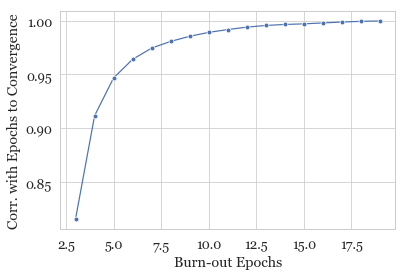 Figure 6: Pearson correlation coefficient of instance \(\mathbf{variability}\) on WinoGrande between training dynamics when model is trained to convergence and when model is stopped early. The high correlation indicates that training till convergence is not required to compute a good approximation of the training dynamics. 

#### QNLI

[Rajpurkar et al. (2016)](https://arxiv.org/html/2009.10795#bib.bib49) proposed the SQuAD dataset containing question and document pairs, where the answer to the question is a span in the document. The QNLI dataset, provided as part of the GLUE benchmark [Wang et al. (2018)](https://arxiv.org/html/2009.10795#bib.bib65) reformulates this as a sentence-level binary classification task. Here, the goal is to determine if a candidate sentence from the document contains the answer to the given question. As an OOD test set, we consider the Adversarial SQuAD challenge set [Jia and Liang (2017)](https://arxiv.org/html/2009.10795#bib.bib24) where distractor sentences are added to the document to confound the model. We automatically convert this to the QNLI format. Figure [9(a)](https://arxiv.org/html/2009.10795#A3.F9.sf1 "In Figure 9 ‣ C.1 Effect of Encoder in building Data Maps ‣ Appendix C Additional Data Maps ‣ Dataset Cartography:Mapping and Diagnosing Datasets with Training Dynamics") shows the data map for QNLI.

| In-dist. | Out-of-dist.  
---|---|---  
| Train | Val. | Test | Test  
WinoGrande | 40399 | 1268 | - | 424  
SNLI | 549368 | 9843 | 9825 | 1105  
MultiNLI | 392703 | 9816 | 9833 | 1105  
QNLI | 104744 | 5464 | - | 5324  
Table 5:  Dataset sizes. ID test set in MultiNLI is the mismatched validation set, which we did not use for validation, but as test. We did not use the provided test sets in WinoGrande and QNLI, rather report OOD performance for both cases. 

### A.3 Experimental Settings

For each of our classifiers, we minimize cross entropy with the Adam optimizer [Kingma and Ba (2014)](https://arxiv.org/html/2009.10795#bib.bib27) following the AdamW learning rate schedule from PyTorch2121 21 [pytorch.org](https://pytorch.org). Each experiment is run with 3 random seeds and a learning rate2222 22 Learning rate is chosen using a log-uniform sampling strategy from the range (5e-6, 2e-5). chosen using the AllenTune package [Dodge et al. (2019)](https://arxiv.org/html/2009.10795#bib.bib11). Initializations greatly affect performance, as noted in [Dodge et al. (2020)](https://arxiv.org/html/2009.10795#bib.bib12). WinoGrande and SNLI RoBERTa-large models are trained for 6 epochs, and MultiNLI and QNLI are trained for 5 epochs each. Each experiment is performed on a single Quadro RTX 8000 GPU. Based on the available GPU memory, our experiments on all datasets use a batch size of 96, except for WinoGrande, where a batch size of 64 is used. Our implementation uses the Huggingface Transformers library [Wolf et al. (2019)](https://arxiv.org/html/2009.10795#bib.bib69). For the active learning baselines, we train a acquisition model using RoBERTa-large on a randomly sampled 1% subset of the full training set.

### A.4 SNLI Qualitative Analysis

Qualitative samples from different regions of the SNLI data map are provided in Tab. [6](https://arxiv.org/html/2009.10795#A1.T6 "Table 6 ‣ A.4 SNLI Qualitative Analysis ‣ Appendix A Supplemental Material ‣ Dataset Cartography:Mapping and Diagnosing Datasets with Training Dynamics").

|  Premise |  Hypothesis | Gold Label | Our Assessment  
---|---|---|---|---  
ambiguous |  A mom is feeding two babies. |  A mom is giving her children carrots to eat. | Contradiction- | Neutral  
Smiling woman in a blue apron standing in front of a pile of bags and boxes. |  The woman is wearing a red dress. | Neutral |   
hard-to-learn |  Photographers take pictures of a girl sitting in a street. |  The photographer is taking a picture of a boy. | Entailment- | Contradiction  
A group of men in a blue car driving on the track. |  One woman is driving the blue car. | Entailment- | Contradiction  
Pedestrians walking down the street passing The Temple Bar. |  The pedestrians are outside. | Contradiction- | Entailment  
easy-to-learn |  Four musicians play their instruments on the street while a young man on a bike stands by to listen. |  a kid in a car goes through a drive thru | Contradiction |   
A girl sits with excavating tools examining a rock. |  Two men writing a draft of a speech. | Contradiction |   
Table 6:  Examples from SNLI belonging to different regions in the data map. Cases where authors disagree with the gold standard are highlighted in blue-. 

## Appendix B Additional Results

Results on the SNLI validation set are provided in Tab. [7](https://arxiv.org/html/2009.10795#A2.T7 "Table 7 ‣ Appendix B Additional Results ‣ Dataset Cartography:Mapping and Diagnosing Datasets with Training Dynamics").

|  | SNLI Val. (In-dist.)  
---|---|---  
| 100% train | 93.1  
33% train | random | 92.1  
hard-to-learn | 92.6  
ambiguous | 92.9  
Table 7:  SNLI validation performance comparing different selection methods. Reported numbers are the best of 3 runs across different seeds. 

### B.1 Training Dynamics vs. Dropout

To empirically test the hypothesis that \(\mathbf{confidence}\) and \(\mathbf{variability}\) from the training dynamics respectively quantify intrinsic and model uncertainty, we compare \(\mathbf{confidence}\) and \(\mathbf{variability}\) against an established method of capturing intrinsic and model uncertainty from the literature based on dropout [Srivastava et al. (2014)](https://arxiv.org/html/2009.10795#bib.bib59). Dropout can be seen as variational Bayesian inference [Gal and Ghahramani (2016)](https://arxiv.org/html/2009.10795#bib.bib16), with predictions from different dropout masks corresponding to predictions sampled from the posterior. Thus, \(\mathbf{confidence}\) and \(\mathbf{variability}\) computed from sampled dropout predictions measure the average and standard deviation of the gold label’s probability under the posterior—quantifying the intrinsic and model uncertainty in a principled way.

We computed \(\mathbf{confidence}\) and \(\mathbf{variability}\) from both training dynamics and dropout on WinoGrande’s development set.2323 23 To compute training dynamics, we trained a model on the combined training and development sets for WinoGrande. In contrast, the dropout model was trained only on WinoGrande’s training set then run on development, to avoid over-fitting and provide higher quality uncertainty estimates. Figure [7](https://arxiv.org/html/2009.10795#A2.F7 "Figure 7 ‣ B.1 Training Dynamics vs. Dropout ‣ Appendix B Additional Results ‣ Dataset Cartography:Mapping and Diagnosing Datasets with Training Dynamics") visualizes a regression analysis of the relationship between \(\mathbf{confidence}\) and \(\mathbf{variability}\) from training dynamics and dropout. \(\mathbf{confidence}\) from training dynamics and dropout correlate between 0.450 and 0.452 for Pearson’s \(r\) at 95% confidence. Likewise, \(\mathbf{variability}\) from training dynamics and dropout share a Pearson’s \(r\) from 0.390 to 0.393 at 95% confidence. Thus, the training dynamics empirically demonstrate a positive, predictive relationship with these first-principles estimates of the intrinsic and model uncertainty. Compared to dropout, however, training dynamics have the pragmatic advantage that all information required to calculate them is already available from training, without additional work or computation.

Figure 7:  The \(\mathbf{confidence}\) (left) and \(\mathbf{variability}\) (right) from sampled dropout predictions correlate positively with those from the training dynamics on WinoGrande (dev. set). Shaded regions are bootstrapped 95% confidence intervals for the regression line. 

## Appendix C Additional Data Maps

All the data maps have been provided in Fig. [8](https://arxiv.org/html/2009.10795#A3.F8 "Figure 8 ‣ C.1 Effect of Encoder in building Data Maps ‣ Appendix C Additional Data Maps ‣ Dataset Cartography:Mapping and Diagnosing Datasets with Training Dynamics") and Fig. [9](https://arxiv.org/html/2009.10795#A3.F9 "Figure 9 ‣ C.1 Effect of Encoder in building Data Maps ‣ Appendix C Additional Data Maps ‣ Dataset Cartography:Mapping and Diagnosing Datasets with Training Dynamics").

### C.1 Effect of Encoder in building Data Maps

While training dynamics are inherently model dependent, data maps can be built for any model, and might reveal similar structures. Since models can be of varying capacities with respect to a task or dataset, instances might receive different co-ordinates on data maps built based on different models. For instance, BERT is known to be worse at reasoning than RoBERTa [Sakaguchi et al. (2020)](https://arxiv.org/html/2009.10795#bib.bib52); [Talmor et al. (2019)](https://arxiv.org/html/2009.10795#bib.bib60), and RoBERTa being a larger model is likely very sample efficient [Kaplan et al. (2020)](https://arxiv.org/html/2009.10795#bib.bib26). However, the overall structure of data maps based on different models remains the same; Fig. [9(b)](https://arxiv.org/html/2009.10795#A3.F9.sf2 "In Figure 9 ‣ C.1 Effect of Encoder in building Data Maps ‣ Appendix C Additional Data Maps ‣ Dataset Cartography:Mapping and Diagnosing Datasets with Training Dynamics") shows the data map built for WinoGrande using a BERT-large classifier.

Four different architectures for the SNLI dataset are compared in Fig. [10](https://arxiv.org/html/2009.10795#A3.F10 "Figure 10 ‣ C.1 Effect of Encoder in building Data Maps ‣ Appendix C Additional Data Maps ‣ Dataset Cartography:Mapping and Diagnosing Datasets with Training Dynamics") and Fig. [11](https://arxiv.org/html/2009.10795#A3.F11 "Figure 11 ‣ C.1 Effect of Encoder in building Data Maps ‣ Appendix C Additional Data Maps ‣ Dataset Cartography:Mapping and Diagnosing Datasets with Training Dynamics").

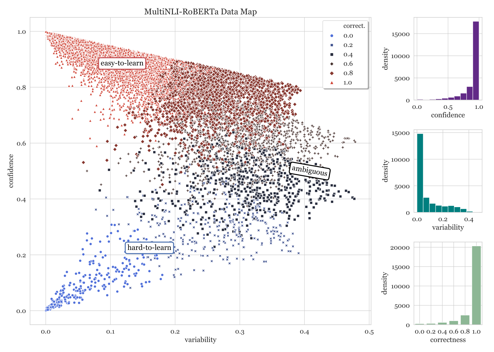 (a) Data Map for MultiNLI [Williams et al. (2018)](https://arxiv.org/html/2009.10795#bib.bib67) and density plots for different measures based on training dynamics (below). For clarity we only use 50K random samples from MultiNLI in the scatter plot. Trends are very similar to SNLI, even though MultiNLI contains samples from diverse genres. 

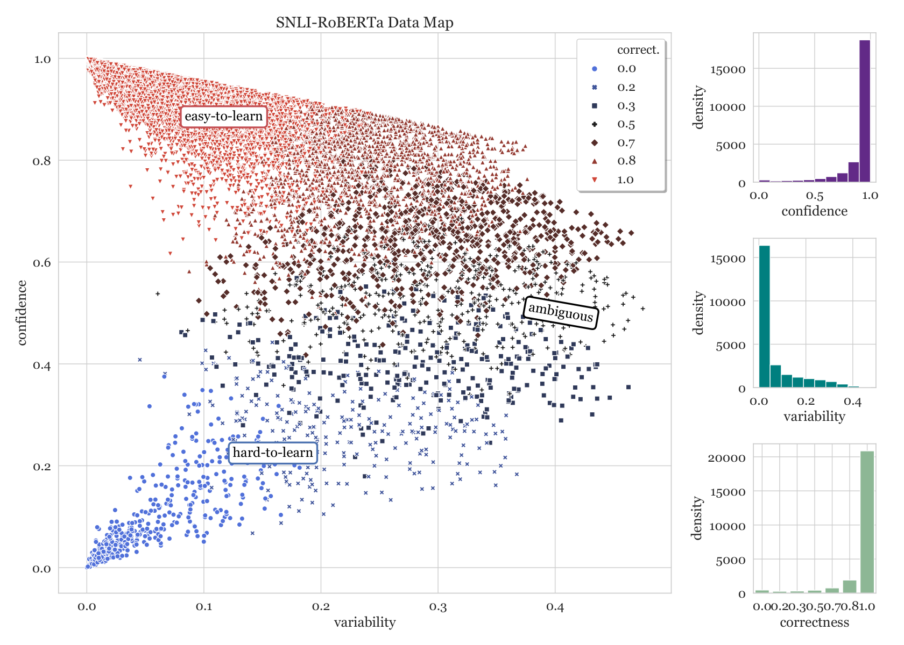 (b) (Left) Data Map for SNLI, same as Fig. [1](https://arxiv.org/html/2009.10795#S1.F1 "Figure 1 ‣ 1 Introduction ‣ Dataset Cartography:Mapping and Diagnosing Datasets with Training Dynamics"), provided here in greater relief again for comparison with other datasets. SNLI is larger than all other datasets, and thus has a higher density of easy-to-learn examples. (Right) Densities of the above statistics across the entire dataset; examples which are easy-to-learn (for RoBERTa) form the vast majority of SNLI. 

Figure 8: Data maps for *NLI datasets; each data map plots 25K instances, for clarity.

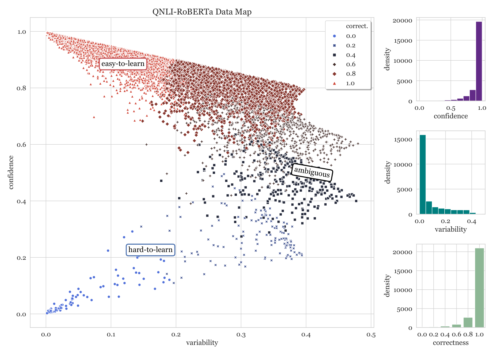 (a)  Data map for the sentence-level SQuAD dataset, QNLI (left) and density plots for different measures based on training dynamics (right). Unlike other datasets, QNLI has fewer instances with low \(\mathbf{variability}\) and \(\mathbf{confidence}\) close to 0.5. 

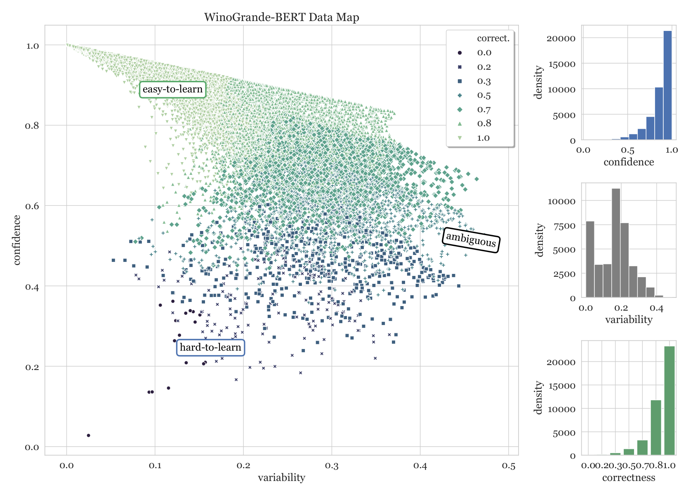 (b)  Data map for WinoGrande built based on a BERT-large [Devlin et al. (2019)](https://arxiv.org/html/2009.10795#bib.bib10) model. While similar regions can be seen as a WinoGrande-RoBERTa data map (Fig. [2](https://arxiv.org/html/2009.10795#S2.F2 "Figure 2 ‣ 2 Mapping Datasets with Training Dynamics ‣ Dataset Cartography:Mapping and Diagnosing Datasets with Training Dynamics")), the densities of different regions can be different. Moreover the same instances might be mapped to different regions across maps. 

Figure 9: Additional data maps, each plotting 25K instances, for clarity.

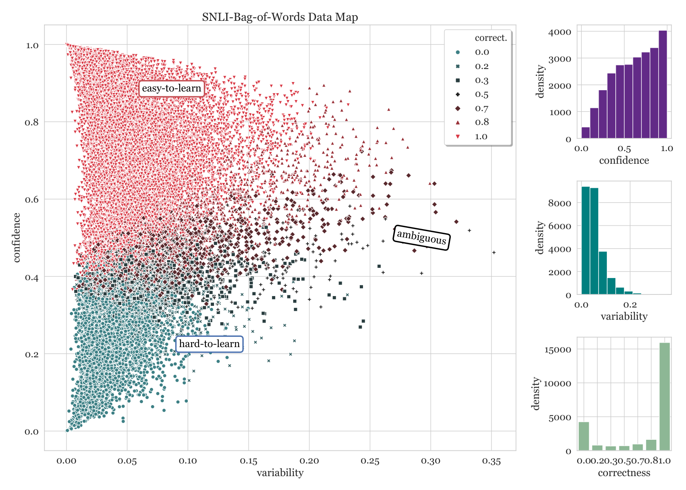

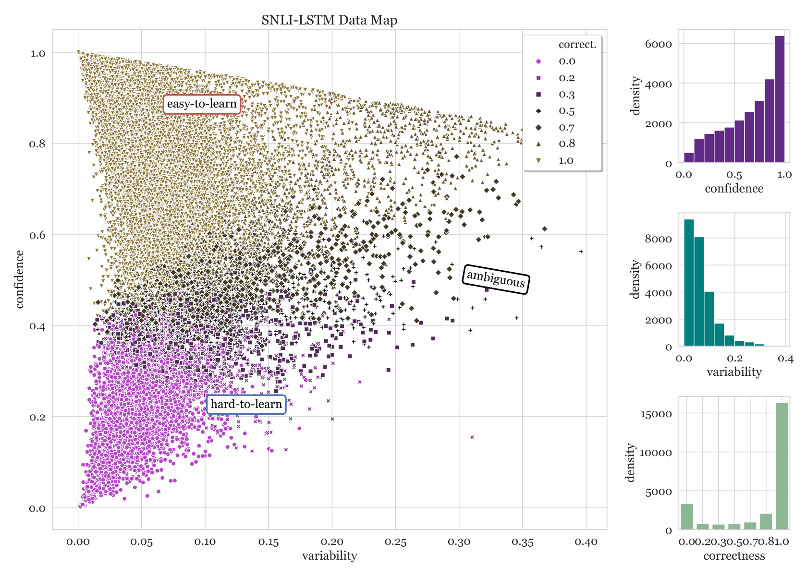

Figure 10: Data maps for SNLI based on non-RoBERTa (and weaker) architectures—bag of words (BoW; Top) and LSTMs (Bottom). Although these maps exhibit bell-shaped curves, similar to the RoBERTa data map for SNLI in [8(b)](https://arxiv.org/html/2009.10795#A3.F8.sf2 "In Figure 8 ‣ C.1 Effect of Encoder in building Data Maps ‣ Appendix C Additional Data Maps ‣ Dataset Cartography:Mapping and Diagnosing Datasets with Training Dynamics"), the curvature is somewhat smaller. The spread of the data is larger across the regions, which are not as distinct as in the RoBERTa data map. These shapes could be attributed to these architectures being weaker (and hence unable to overfit to data) than those involving representations from large, pretrained language models. Each data map plots 25K instances, for clarity, and are best viewed enlarged. 

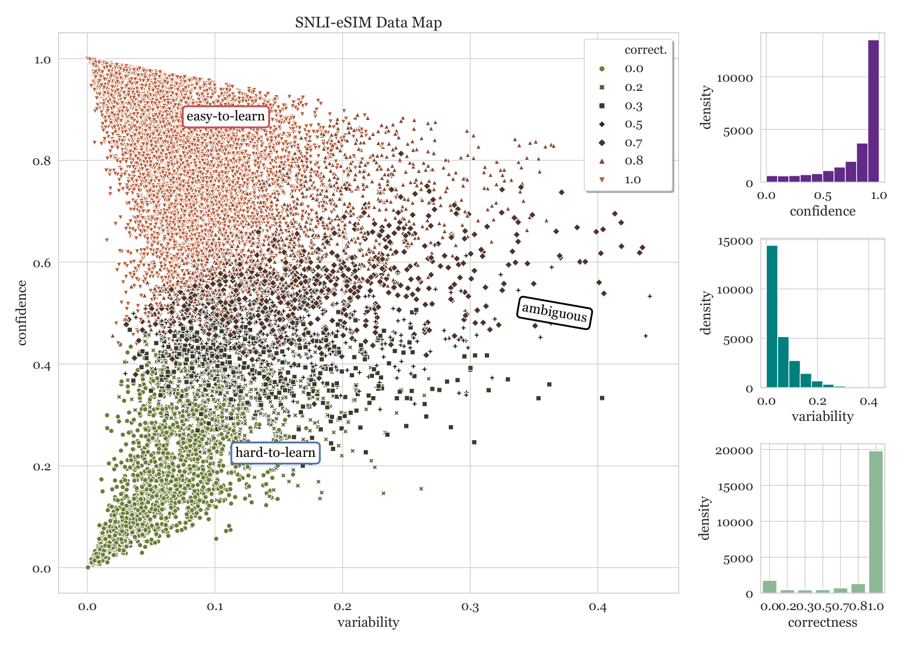

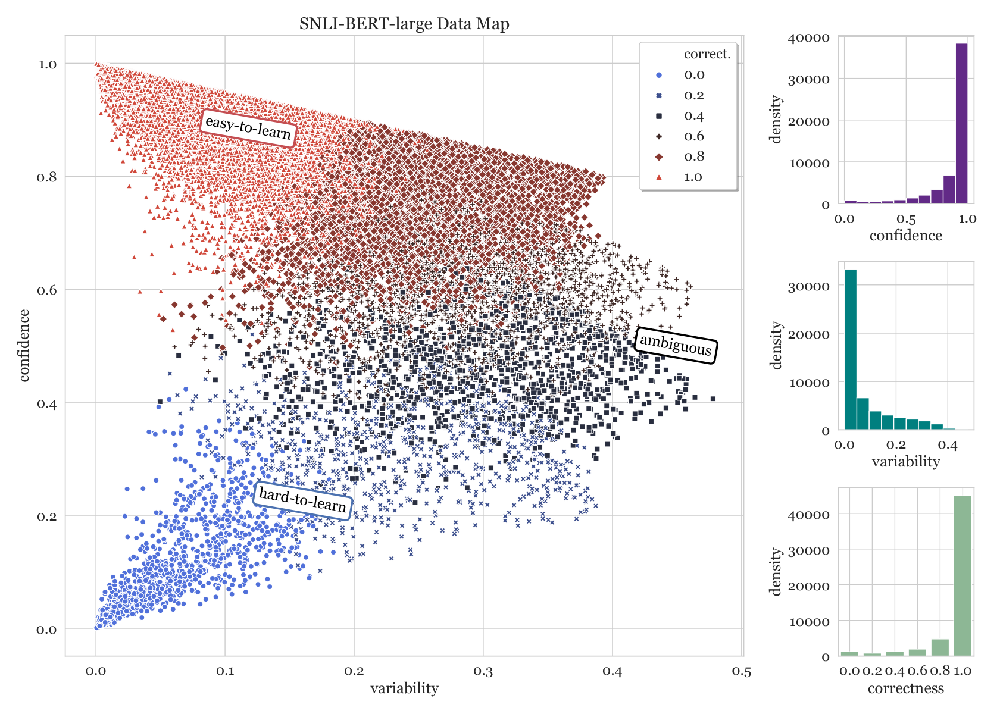

Figure 11: Data maps for SNLI based on other (weaker) architectures—bag of words eSim [Chen et al. (2017b)](https://arxiv.org/html/2009.10795#bib.bib9) (Top) and BERT-large (Bottom). Although these maps exhibit bell-shaped curves, similar to the RoBERTa data map for SNLI in [8(b)](https://arxiv.org/html/2009.10795#A3.F8.sf2 "In Figure 8 ‣ C.1 Effect of Encoder in building Data Maps ‣ Appendix C Additional Data Maps ‣ Dataset Cartography:Mapping and Diagnosing Datasets with Training Dynamics"), the curvature is somewhat smaller for eSIM. The spread of the data is larger across the regions, which are not as distinct as in the RoBERTa data map. Each data map plots 25K instances, for clarity, and are best viewed enlarged. 
