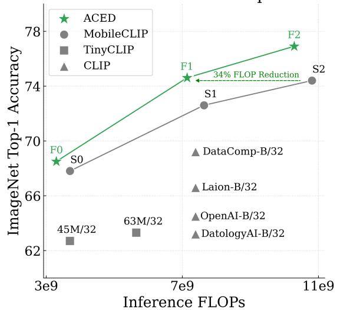
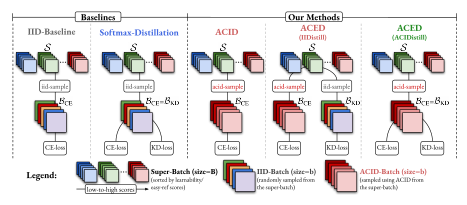
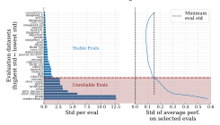
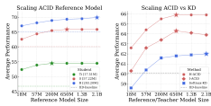
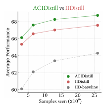
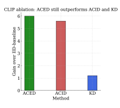
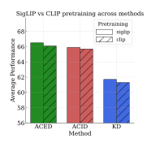
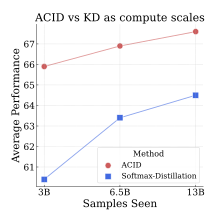
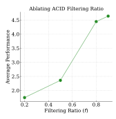
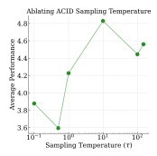

# Active Data Curation Effectively Distills Large-Scale Multimodal Models

Vishaal Udandarao\* 3,4‡ Nikhil Parthasarathy\*2 Muhammad Ferjad Naeem1 Talfan Evans2 Samuel Albanie2 Federico Tombari1 Yongqin Xian1† Alessio Tonioni1† Olivier J. Henaff ´ 2† 1Google 2Google DeepMind 3Tubingen AI Center, University of T ¨ ubingen ¨ 4University of Cambridge

# Abstract

*Knowledge distillation (KD) is the de facto standard for compressing large-scale multimodal models into smaller ones. Prior works have explored ever more complex KD strategies involving different objectives, teacher-ensembles, and weight inheritance. In this work, we explore an alternative, yet simple approach—active data curation as effective distillation for contrastive multimodal pretraining. Our simple online batch selection method, ACID, outperforms strong KD baselines across various model-, data- and computeconfigurations. Further, we find such an active curation strategy to in fact be complementary to standard KD, and can be effectively combined to train highly performant inferenceefficient models. Our simple and scalable pretraining framework, ACED, achieves state-of-the-art results across 27 zeroshot classification and image-text retrieval tasks with upto 11% less inference FLOPs. We further demonstrate that ACED yields strong vision-encoders for training generative multimodal models, outperforming larger vision encoders on image-captioning and visual question-answering tasks.*

## 1. Introduction

Deploying multimodal foundation models [\[14\]](#page-8-0) like CLIP [\[119\]](#page-12-0) on edge devices is challenging due to their high inference costs and memory footprints. This motivates the need for smaller, inference-efficient models that retain the performance of their larger counterparts. *Knowledge distillation (KD)* [\[65\]](#page-10-0) is a classic model compression technique—a method for transferring knowledge from a large-scale "teacher" model into a smaller "student" model, via matching student and teacher logits, features or activations. KD has been extensively deployed for creating small, performant models like Gemma-2 [\[148\]](#page-13-0), Phi-3 [\[4\]](#page-8-1), Gemini-1.5 Flash [\[126\]](#page-12-1), and SD3-Turbo [\[136\]](#page-13-1).

Figure 1. Performance-Inference Frontier. Our *ACED* models (Active Curation with Explicit Distillation, see Sec. [3\)](#page-1-0), achieve a new pareto frontier for performance (measured by ImageNet top-1 zero-shot validation accuracy) vs. inference GFLOPs.

Here, our primary goal is to downscale contrastive visionlanguage models , without compromising downstream performance. Prior works in this domain focus on complex KD strategies as the key solution—the current SoTA (Tiny-CLIP [\[173\]](#page-14-0) and MobileCLIP [\[155\]](#page-14-1)) use combinations of methods such as strong data-augmentation policies, multiteacher ensembles, synthetic captions, weight-inheritance, weight-pruning, and bespoke model architectures.

In this work, we seek a simplified approach. Specifically, we propose using *active data curation as an effective strategy for distilling large vision-language models (VLMs)* into smaller and more FLOP-efficient multimodal models.

Our method, *ACID* (Active Curation as Implicit Distillation), automatically selects samples that reduce the performance gap between a small *student* model and a larger *reference* model. Under appropriate conditions, we find this is a surprisingly effective distillation approach. To the best of our knowledge, this is a novel finding since prior works in

\*equal contribution †equal supervision ‡work done while interning at Google correspondence to: vishaal.udandarao@bethgelab.org or nikparth@google.com

data curation assume that larger models can not be used to select data for smaller ones, due to the *capacity gap* [\[48,](#page-9-0) [107\]](#page-12-2). Through a novel theoretical interpretation and extensive experiments, instead, we demonstrate that *ACID* is not only effective but also improves over standard KD, exhibiting more favourable scaling with respect to training compute. We also conduct careful ablation studies that uncover factors influencing the quality of the trained student model, including, reference model capacity and training dataset.

After comprehensively demonstrating the effectiveness of data curation as an alternative to KD , we further show how the two can be profitably combined to further improve performance. This suggests that the *information distilled to the smaller model through each approach is complementary*.

Based on this finding, we propose our final pretraining recipe, *ACED* (ACID with Explicit Distillation), andtrain very strong FLOP-efficient image-text contrastive models. Our method, absent bespoke components such as efficient architectures or data-augmentations, outperforms SoTA CLIP and SigLIP models with greater FLOP-efficiency at inference-time and shows a significant improvement over 27 downstream tasks against these prior SoTA FLOPefficient models [\[155,](#page-14-1) [173\]](#page-14-0). We further demonstrate that our *ACED* vision-encoders provide strong backbones for generative multimodal models, outperforming larger and FLOP-inefficient vision-encoders on image-captioning and visual-question-answering (VQA) tasks.

# 2. Related Work

Multimodal Data Curation. Recent works have emphasised the importance of data quality for multimodal pretraining [\[41,](#page-9-1) [48,](#page-9-0) [106,](#page-12-3) [109,](#page-12-4) [153\]](#page-13-2). Specifically, offline curation of noisy web-scale data can result in large pretraining efficiency gains [\[1,](#page-8-2) [2,](#page-8-3) [19,](#page-8-4) [20,](#page-8-5) [42,](#page-9-2) [69,](#page-10-1) [101,](#page-11-0) [103,](#page-11-1) [160,](#page-14-2) [169,](#page-14-3) [178\]](#page-15-0). However, these static methods that pre-filter data do not take into account the training dynamics of the current learner model. As a result, there have been many recent attempts to introduce *online batch selection* criteria that account for the current state of the learner (*e.g.*, at each step select training samples that have the largest learner loss) [\[67,](#page-10-2) [70,](#page-10-3) [73,](#page-10-4) [100,](#page-11-2) [137,](#page-13-3) [143,](#page-13-4) [170,](#page-14-4) [177,](#page-14-5) [197\]](#page-15-1). The RHO-Loss [\[107\]](#page-12-2) goes further to consider current learner state and a pretrained data-selector (reference) model. This criterion has since been used in many efforts to improve the efficiency of foundation model pretraining [\[17,](#page-8-6) [31,](#page-9-3) [34,](#page-9-4) [35,](#page-9-5) [39,](#page-9-6) [66\]](#page-10-5). As these methods seek to improve pretraining efficiency, the pretrained reference models that are used as *data selectors are typically smaller than the learner models they are used to train* [\[34,](#page-9-4) [35,](#page-9-5) [42\]](#page-9-2). In fact, many works have shown that increasing reference model size can potentially hurt learner model performance [\[42,](#page-9-2) [48,](#page-9-0) [186\]](#page-15-2) . Our work tells a different story, finding that *large data selectors can effectively curate data for inference-time FLOP-efficient learner models*.

Knowledge Distillation. First introduced by Bucilua et al. ˇ [\[18\]](#page-8-7) and further popularized by Ba and Caruana [\[7\]](#page-8-8), Hinton [\[65\]](#page-10-0), knowledge distillation (KD) is a classic technique for transferring knowledge from a larger model (*teacher*) to a smaller one (*student*) by optimizing the student to match outputs of the teacher. Such methods have been used for compressing large models in unimodal tasks like imageclassification [\[12,](#page-8-9) [25,](#page-9-7) [113,](#page-12-5) [149,](#page-13-5) [158,](#page-14-6) [165\]](#page-14-7) and language representation learning [\[5,](#page-8-10) [55,](#page-10-6) [76,](#page-10-7) [95,](#page-11-3) [134,](#page-13-6) [146,](#page-13-7) [179\]](#page-15-3). Further works have extended KD to use teacher-ensembles [\[21,](#page-8-11) [37,](#page-9-8) [105,](#page-12-6) [135,](#page-13-8) [141,](#page-13-9) [145,](#page-13-10) [185,](#page-15-4) [200\]](#page-15-5), and different distillation training objectives [\[68,](#page-10-8) [92,](#page-11-4) [122,](#page-12-7) [147,](#page-13-11) [151,](#page-13-12) [175,](#page-14-8) [196\]](#page-15-6).

Most relevant to our work, there are a number of recent efforts to distill CLIP models. SF-CLIP [\[133\]](#page-13-13) explores masked distillation, while MobileCLIP [\[155\]](#page-14-1) uses multi-teacher contrastive-KD, synthetic captions, and data-augmentations. TinyCLIP [\[173\]](#page-14-0) proposes a weight inheritance method combined with an affinity-mimicking strategy. An empirical study (CLIP-KD [\[180\]](#page-15-7)) also has explored different objective functions for effectively distilling CLIP models, across different scales. Finally, CLIP-CID [\[183\]](#page-15-8) uses an image semantic balancing strategy coupled with cluster-instance discrimination for better teacher-to-student knowledge transfer during the KD process. We compare against all of these methods in our experimental results in Sec. [4.](#page-4-0)

Accelerating Knowledge Distillation. Prior works have investigated accelerating vanilla KD using active learning in small-scale settings [\[83,](#page-11-5) [163,](#page-14-9) [176\]](#page-14-10). However, these approaches require a costly iterative process, involving synthetic generation, followed by active sample selection to produce pseudo-labels from a teacher model, thereby limiting their scalability. Other works have studied data-selection methods for improving KD, typically using uncertaintybased data, logit and feature selection [\[59,](#page-10-9) [90,](#page-11-6) [97,](#page-11-7) [123,](#page-12-8) [130,](#page-13-14) [161,](#page-14-11) [162,](#page-14-12) [172,](#page-14-13) [199\]](#page-15-9), contextual retrieval and sample augmentation from a large data pool [\[50,](#page-10-10) [71,](#page-10-11) [94,](#page-11-8) [98,](#page-11-9) [118,](#page-12-9) [191\]](#page-15-10), or influence-function based sample selection [\[83,](#page-11-5) [184\]](#page-15-11). Contrary to these works, others suggest that vanilla knowledge distillation is optimal in "infinite-data regimes" [\[12,](#page-8-9) [57\]](#page-10-12). Surprisingly, these studies operate primarily in the unimodal image/text classification regime, and none have been scaled to multimodal foundation model training.

We showcase, for the first time, that *simple data selection using online batch selection outperforms standard KD for pretraining multimodal models*. We further study the optimal strategies for combining vanilla KD and active data curation in order to best leverage their complementary strengths.

# 3. Methods

### 3.1. Preliminaries

Contrastive Vision-Language Pretraining. We follow standard multimodal pretraining frameworks like CLIP [\[119\]](#page-12-0)

and SigLIP [190]. We assume a large pretraining dataset  $\mathcal{D}$ , containing image-text pairs. Our goal is to train a two-tower VLM with parameters  $\theta$  whose image-encoder  $f^{\text{ting}}$  and text-encoder  $f^{\text{txt}}$  are initialized from scratch. At each training step, we sample a mini-batch,  $\mathcal{B} = \{x_1, \ldots, x_b\}$ , where  $x_i = (I_i, T_i)$  denotes the  $i^{\text{th}}$  image-text pair in the minibatch and b denotes the batch-size. We then encode and normalize the embeddings of each image-text pair in the minibatch as  $z_i^{\text{img}} = \frac{f^{\text{img}}(I_i|\theta)}{\|f^{\text{img}}(I_i|\theta)\|_2}$  and  $z_i^{\text{txt}} = \frac{f^{\text{txt}}(T_i|\theta)}{\|f^{\text{txt}}(T_i|\theta)\|_2}$ . The pairwise similarities  $l_{ij}(\theta) = \alpha z_i^{\text{img}} \cdot z_j^{\text{txt}} + \beta$ , where  $\alpha, \beta$  are learnable inverse-temperature and offset hyperparameters, can be converted into pairwise probabilities with a row- or column-wise softmax as follows,

$$p_{ij}^{\text{img}\to\text{txt}} = \exp(l_{ij}) / \sum_{k=1}^{b} \exp(l_{ik})$$
 (1)

$$p_{ij}^{\text{txt}\to \text{img}} = \exp(l_{ij}) / \sum_{k=1}^{b} \exp(l_{ki})$$
 (2)

or  $p_{ij}^{\rm sig} = \sigma(l_{ij})$  with a sigmoid operation. The contrastive image-text losses align embeddings of paired images and texts  $(z_i^{\rm img}, z_i^{\rm txt})$ , while pushing apart embeddings of mismatched images and texts  $(z_i^{\rm img}, z_{j \neq i}^{\rm txt})$ . There are two widely used contrastive variants i.e.,  $\mathcal{L}_{\rm softmax}$  for CLIP [119] and  $\mathcal{L}_{\rm sigmoid}$  for SigLIP [190], both of which can be framed as  $\mathcal{L}(x_i;\mathcal{B}) = -\sum_{j=1}^b y_j(x_i) \log p_{ij} = \mathrm{CE}[y(x_i);p(x_i)]$  for a suitable choice of binary labels y and probabilities p, where CE is the standard cross-entropy loss (see Appendix B for details). By default, we use the sigmoid variant as it is more scalable, but also run ablations with the softmax variant.

Contrastive Distillation. Given the student  $\theta$  and a pretrained teacher model  $\theta_{\text{teacher}}$ , our aim is to distill the contrastive logit matrix from teacher to student. Formally, given a data-batch  $\mathcal{B}$ , we extract teacher embeddings  $(z_i^{\text{img}}, z_i^{\text{txt}})(\theta_{\text{teacher}})$  and student embeddings  $(z_i^{\text{img}}, z_i^{\text{txt}})(\theta)$ , yielding pairwise similarities  $l_{ij}(\theta_{\text{teacher}})$  and  $l_{ij}(\theta)$  for the teacher and student respectively. Let p and q be the pairwise probabilities induced by teacher and student similarities (Eqs. (1) and (2)). Our knowledge distillation (KD) objective is simply the cross-entropy loss between these distributions:

$$\mathcal{L}_{\text{dist}}(x_i; \mathcal{B}) = \text{KD}[p(x_i), q(x_i)] = -\frac{1}{2} \sum_{j=1}^{b} \left( p_{i,j}^{\text{img} \to \text{txt}} \log q_{i,j}^{\text{img} \to \text{txt}} + p_{i,j}^{\text{txt} \to \text{img}} \log q_{i,j}^{\text{txt} \to \text{img}} \right)$$
(3)

which has previously been explored in unimodal [45, 181] and multimodal contexts [183].

#### 3.2. ACID: Active Curation as Implicit Distillation

**Setup.** We refer to the small model we aim to train as the *student* model, with parameters  $\theta$ . Given an imagetext pretraining dataset  $\mathcal{D}$ , the straightforward training approach is to sample uniformly random batches of data  $\mathcal{B}$  (of size b), from  $\mathcal{D}$  at each step t, and minimize  $\mathcal{L} \in \{\mathcal{L}_{\text{softmax}}, \mathcal{L}_{\text{sigmoid}}\}$ . We refer to this baseline strategy, minimizing  $\hat{\mathcal{L}} = \frac{1}{b} \sum_{x_i \sim \mathcal{U}[\mathcal{D}]} \mathcal{L}(x_i; \mathcal{B})$  as the *IID-baseline* ( $\theta_{\text{IID}}$ )

Active Data Curation employs a smarter way to select batches, using a pretrained *reference* model  $\theta_{ref}$ . At each step t, we select a sub-batch  $\mathcal{B}$  (size b) from a much larger superbatch  $\mathcal{S}$  (size B) according to an *active selection distribution*  $\mathcal{A}[\mathcal{S}]$ . We use two main criteria for scoring sub-batches  $\mathcal{B}$ , following prior work in prioritized sampling [34, 107].

- 1. Easy-reference scoring uses the loss-values of the reference  $\theta_{\rm ref}$  to preferentially sample batches that are easy for  $\theta_{\rm ref}$ :  $s^{\rm easy\_ref}(\mathcal{B}|\theta_{\rm ref}) = -\mathcal{L}(\mathcal{B}|\theta_{\rm ref})$ .
- 2. Learnability scoring uses the difference in loss-values of the current student  $\theta$  and the reference  $\theta_{ref}$  to give high scores to learnable batches i.e., batches that are easy for the reference but difficult for the current student:  $s^{\text{learn}}(\mathcal{B}|\theta, \theta_{\text{ref}}) = \mathcal{L}(\mathcal{B}|\theta) - \mathcal{L}(\mathcal{B}|\theta_{\text{ref}})$ .

Prior model-based online batch curation methods used reference models that were of the same size or smaller than the model being trained. This was because of (1) training efficiency: since data-selection was originally used to reduce training set sizes, reference models were chosen to be small so as to reduce compute overhead, and (2) unlearnable prioritization: intuitively, samples that are easily learned (and thus prioritized) by a high-capacity reference might be unlearnable for the lower-capacity learner. Indeed Mindermann et al. [107] observed little effect when increasing reference model capacity, a key limitation of their original method.

Active Data Curation as Implicit Distillation (ACID). We now show formally that active curation can be cast as "implicit distillation" and should benefit from larger reference models. The model now minimizes  $\hat{\mathcal{L}} = \frac{1}{b} \sum_{x_i \sim \mathcal{A}[\mathcal{S}]} \mathcal{L}(x_i; \mathcal{B})$ , which in expectation is  $\mathcal{E} = \mathbb{E}[\hat{\mathcal{L}}] = \sum_{x \in \mathcal{D}} a(x) \mathcal{L}(x; \mathcal{B})$  given that super-batches  $\mathcal{S}$  are sampled uniformly. Recall that  $\mathcal{L}(x; \mathcal{B}) = -\sum_{i=1}^b y_i(x) \log q_i(x)$ , where  $y_i$  are the labels of the contrastive task and  $q_i$  are the probabilities induced by the pairwise similarities of the student  $\theta$ . Let  $p_i$  be the probabilities induced by the reference model  $\theta_{\text{ref}}$ . In the case of easy-reference scoring and the softmax loss,  $a(x) = \frac{1}{Z} \exp \sum_{i=1}^b y_i(x) \log p_i(x) = \frac{1}{Z} p_{i^*}(x)$  where  $i^*$  is the index of the one-hot label y(x). We derive the following equality (see Appendix  $\mathbb C$  for details),

$$\mathcal{E}_{\text{easy-ref}} = \frac{1}{Z} \sum_{x \in \mathcal{D}} \text{KD}[p(x) \cdot y(x); q(x)]. \tag{4}$$

This demonstrates that by curating data according to the

Figure 2. **Different Method Configurations.** We depict all the different method configurations that we consider in our work. Each method can be independently recovered from the unified objective  $\mathcal{L}_{\text{full}}$  in Sec. 3.3. The iid-sample and acid-sample boxes denote the IID-sampling and our *ACID* online batch-selection sampling schemes respectively. For more details, refer to Sec. 3.

reference model  $\theta_{\rm ref}$ , we implicitly distill its knowledge via a novel data-driven objective, using a combination of model predictions and real labels as targets. Model predictions and real labels have independent sources of noise: false labels can occur due to human error, whereas models may underfit due to biases in training or architecture. As a result, retaining targets where the reference model and labels agree allows for mutual denoising of model predictions and data labels.

Moreover, this suggests that in contrast to the standard active learning paradigm, in which reference models are similarly-sized or smaller than the student model [34, 107], ACID should instead benefit from pretrained reference models  $\theta_{\rm ref}$  that are larger than the student model  $\theta$  for scoring. While counter-intuitive from an active learning perspective, this configuration is natural given our new perspective of active data curation as an implicit form of distillation.

### Learnability-based Data Curation is Hard Distillation.

When using learnability-based prioritization, the active selection distribution  $\mathcal{A}$  factorizes as  $a^{\mathrm{learn}} = \frac{1}{Z} \exp(s^{\mathrm{learn}}) = \frac{1}{Z} \exp[\mathcal{L}(\cdot|\theta) - \mathcal{L}(\cdot|\theta_{\mathrm{ref}})] = a^{\mathrm{easy-ref}} \cdot a^{\mathrm{hard-learn}}$  where  $a^{\mathrm{hard-learn}} = \frac{1}{Z} \exp[\mathcal{L}(\cdot|\theta)]$  prioritizes examples with high loss according to the student. Since easy-reference prioritization yields implicit distillation (*I-ACID*, Eq. (4)), learnability prioritization yields

$$\mathcal{E}_{\text{learn}} = \frac{1}{Z} \sum_{x \in \mathcal{D}} a^{\text{hard-learn}}(x) \text{KD}[p(x) \cdot y(x); q(x)]$$
 (5)

i.e. implicit distillation on hard examples ("H-ACID") according to the student (see Appendix C for details). Prioritizing high-loss examples has been shown to reliably accelerate learning in settings where targets are high-quality [100], as is the case with the combined targets in our ACID.

Joint Batch Sampling. Implementing our ACID method requires sampling examples x from  $\mathcal{A}[S]$  where  $a(x|\mathcal{B}) = \exp(-\mathcal{L}(x|\mathcal{B}, \theta_{\text{ref}}))$  for ACID or  $a(x|\mathcal{B})$  $\exp(\mathcal{L}(x|\mathcal{B},\theta) - \mathcal{L}(x|\mathcal{B},\theta_{\text{ref}}))$  for Hard-ACID. As such, sampling from A[S] requires jointly selecting examples in a batch. Following Evans et al. [35] we utilise an iterative approach which incrementally populates the batch conditioned on already-sampled examples. Specifically, this algorithm uses n iterations of a blocked Gibbs sampling approach. Given a subset of data-samples  $\mathcal{B}_i$  at iteration i, we compute the conditional batch-scores of all other candidate samples in the super-batch that have not yet been added to the minibatch  $\mathcal{B}_i$ ,  $s^{\text{easy\_ref}}(\{\mathcal{B}_i, x\})/s^{\text{learn}}(\{\mathcal{B}_i, x\}) \forall x \in \mathcal{S} - \mathcal{B}_i$ , then sample a chunk  $\{x_k\}$  of size  $\frac{b}{n}$  according to these scores independently, and append to the constructed mini-batch,  $\mathcal{B}_{i+1} = \mathcal{B}_i \cup \{x_k\}$ . The first chunk  $\mathcal{B}_1$  is sampled using the independent scores  $s^{\text{easy\_ref}}(\{x\})/s^{\text{learn}}(\{x\})$ . The final sampled mini-batch is yielded after n iterations,  $\mathcal{B}=\mathcal{B}_n$  (see Evans et al. [35] for more details). Note that the ratio of the super-batch size and the mini-batch size determines how aggressively our data selection method filters out samples from the super-batch—we quantify this with the filtering ratio,  $f=1-\frac{b}{B}$ . The larger the filtering ratio f, the stronger is the data selection process at each training step.

#### 3.3. ACED: Active Curation & Explicit Distillation

Towards explicit knowledge-transfer. ACID introduces an active curation strategy without using any auxiliary objective beyond the contrastive loss. This induces an implicit form of knowledge transfer from the larger reference model to the small student model. To augment this implicit transfer with an explicit distillation objective, we propose *ACED*, <u>ACID</u> with Explicit Disillation, which effectively combines ACID

| Method          | $\lambda$ | $\mathcal{B}_{\text{CE}}$ | $\mathcal{B}_{\text{KD}}$ | Effective Batch-Size per Iteration |
|-----------------|-----------|---------------------------|---------------------------|------------------------------------|
| IID-Baseline    | =0        | IID                       | _                         | b                                  |
| Softmax-KD      | >0        | IID                       | IID                       | b                                  |
| I-ACID          | =0        | I-ACID                    | _                         | b                                  |
| H-ACID          | =0        | H-ACID                    | _                         | b                                  |
| ACED-IIDistill  | >0        | H-ACID                    | IID                       | 2b                                 |
| ACED-ACIDistill | >0        | H-ACID                    | H-ACID                    | b                                  |

Table 1. **Method Instantiations** recovered from our unified objective (see Sec. 3.3), by specifying data-selection strategies across different batches and hyperparameter values. We further indicate the effective mini-batch size per-iteration used by each method, and colour-code different methods for easy referencing from Sec. 4.

with a softmax contrastive distillation loss (see Eq. (3)).

A unified objective. We now propose a general loss formulation that can flexibly model different instantiations of all our training methods (*IID-Baseline*, *ACID*, *ACED*, and *Softmax-KD*) under one unified objective. At each step t, we first sample the super-batch  $\mathcal{S}$  based on the required final mini-batch size b and filtering ratio f (super-batch size is  $B = \frac{b}{1-f}$ ). We then sample two mini-batches from  $\mathcal{S}$ —the data mini-batch used for training the contrastive loss ( $\mathcal{B}_{CE}$ ) and the mini-batch used for distillation ( $\mathcal{B}_{KD}$ ). The two minibatches can either be sampled using our *ACID* sampling scheme or random IID sampling. Our overall objective is written as,  $\mathcal{L}_{full} = \mathcal{L}_{softmax/sigmoid}[\mathcal{B}_{CE}] + \lambda \cdot \mathcal{L}_{dist}[\mathcal{B}_{KD}]$ .

Tab. 1 and Fig. 2 depict how we can instantiate  $\mathcal{L}_{\text{full}}$  to recover different methods and baselines—we colour-code different methods to enable easy cross-referencing later from Sec. 4. Our IID-Baseline only uses the contrastive loss trained on an IID-sampled batch. Our implicit distillation methods ( $\{I/H\}$ -ACID) also use only the contrastive loss but train on actively selected data-batches. For *Softmax*-*KD*, we only sample an IID batch and use that same batch for both contrastive and distillation losses ( $\mathcal{B}_{CE} = \mathcal{B}_{dist}$ ). For our combined ACED method, we have two schemes—(1) ACIDistill which samples a single mini-batch from S using *H-ACID*, using that for both contrastive and distillation training ( $\mathcal{B}_{CE} = \mathcal{B}_{KD}$ ), and (2) *IIDistill* which samples  $\mathcal{B}_{CE}$ using *H-ACID* and  $\mathcal{B}_{KD}$  using IID sampling. For both *ACED* methods, we only use the *H-ACID* sampling scheme as empirically it is more performant than *I-ACID* (see Fig. 4).

#### 4. Experiments

#### 4.1. Implementation Details

Model Architecture and Sizes. Unless otherwise specified, we use standard ViT-S [33] and BERT-small [32] models as our student image-text encoders. For some student ablations, we also use (ViT-Ti image, Ti text) and (ViT-B image, B text) configurations. For our references and teachers, we sweep over different sizes—(ViT-Ti, Ti), (ViT-S, S), (ViT-B, B), (ViT-L, L), (ViT-H, H), and (ViT-g, g) for (image, text) encoders respectively. We pretrain all our models ( $\theta_{\text{teacher}}$ ,

StableEval: Removing Unreliable Evals

Figure 3. **StableEval: a reliable set of multimodal evaluations.** (*left*) Variability across random pretraining seeds of individual evaluations. (*right*) Variability of average performance across incrementally larger sets of evaluations, starting from the most reliable.

 $\theta_{\rm ref}$ ,  $\theta$ ) from scratch. For more details, refer to Appendix F.

**Pretraining Datasets.** We use the popular DataComp-1B [48] dataset for pretraining all our student models. For training our reference and teacher models, we sweep over four different datasets—WebLI-curated++ [35], WebLI-1B [24], LAION-400M [138], and DataComp-1B [48].

Evaluation Protocol: StableEval. We evaluate our models on a diverse set of benchmarks including zero-shot classification and image-text retrieval datasets following prior multimodal pretraining works [48, 84, 178]. However, many works select non-standardized sets of evaluations and fail to sufficiently justify the reliability of the evaluations they use. To rigorously define an evaluation suite, we collate a standard list of 34 candidate evaluations and conduct a systematic analysis of their reliability. By repeating the same canonical pretraining run multiple times (e.g., CLIP pretraining on DataComp with the exact same data ordering, see Appendix A for details), we evaluate the variability of each metric across random seeds. In Fig. 3 (left), we find an extreme range in variability across evaluations (stds from 0.15% to 12.5%) which hinders comparisons among different methods. Inspired loosely by the continuous inversevariance weighting (IVW) method for minimizing variance of aggregated random variables [58], we develop a method for choosing a discrete, stable subset of relevant evaluations. We compute the variability of a progressively growing set of evaluations, starting from least variable and incrementally adding more variable ones, in ascending order. For a subset of size N,  $std(E_1...E_N) = \sqrt{\frac{1}{N^2} \sum_i var(E_i)}$ . Because of the  $1/N^2$  scaling, adding more datasets decreases the variability of the average (Fig. 3 (right)) to a critical point. However, adding highly variable evaluations outweighs this term, increasing the average variability. We limit the evaluation set to remain highly reliable (i.e. with lower variability

Figure 4. **Scaling behaviour of** *ACID*. (*left*) We scale up the reference model used for training each student (Ti, S and B) with *H-ACID*—there is an optimal scaling relationship (best reference for each student marked with \*) between student and reference sizes. (*right*) Our *H-ACID* and *I-ACID* comprehensively outperform *Softmax-KD* across all teacher scales. Importantly, our *ACID*s outperform the IID baseline even for tiny reference models, whereas *Softmax-KD* struggles to improve over IID with smaller teachers.

than the most reliable individual evaluation (<0.15)) while still including as many evaluations possible to maximize coverage and diversity, yielding the 27 StableEval set.

Training Configurations. Unless otherwise specified, we train for 3 billion total samples seen, with a batch-size of b=32, 678 with the sigmoid contrastive loss (Eq. (7)). The image-encoder takes images resized to  $(256 \times 256)$  without additional augmentations. The text-encoder uses a sentencepiece tokenizer [80] trained on English-C4 [120], with a vocabulary size of 32,000. We truncate all text captions to the first 64 tokens. For most experiments, we use an rsqrt learning rate scheduler [189], with a peak learning-rate of 0.001, and linear-warmup and linear-cooldown applied for 10% of total steps. By default, we use a filtering ratio of f=0.8 when using ACID sampling, leading to a superbatch-size of B=163,840. We sweep over  $\lambda$ ={0.5,1.0,2.0} for finding the optimal loss-weight for the Softmax-KD loss (Eq. (3)). For more details, refer to Appendix E.

#### 4.2. ACID is an effective distillation method

#### 4.2.1. Scaling behaviour

To study the efficacy of *ACID* as an effective distillation method, we first conduct a scaling study as the reference/teacher model size is increased. We use Hard-*ACID* as our sampling scheme, and start with three fixed student models, Ti, S and B. We train each student by sweeping over (Ti, S, B, L, H and g) reference model sizes. Each reference model is trained on the WebLI-curated++ dataset for 2B samples seen, to ensure that the only difference across the experimental sweep is the size of the reference. Fig. 4 (left) showcases the scaling behaviour of each of the trained students, as the reference model is scaled up. We observe that across all student and reference models, our *ACID* method always outperforms the IID-baseline (dotted lines). Moreover, we note that the best reference-student combination (high-

lighted with \*) changes as we scale up the student sizes—the B reference is best for the Ti student, L reference for S student, and g reference for B student. This suggests an optimal reference-student capacity ratio—we can continue scaling up the reference model for ACID sampling until we hit this capacity ratio, beyond which performance saturates.

In Fig. 4 (right), we compare the scaling behaviour of our *ACID* variants (both I- and H-) with the *Softmax-KD* baseline, using an S student model. We note that across all reference/teacher scales, our *ACID* methods are more effective at distilling the knowledge into the smaller S student. Moreover, both versions of our method outperform the IID baseline, even when using a smaller Ti reference model. Contrarily, *Softmax-KD* only benefits when using much larger teacher models—this further demonstrates the scalability and flexibility of our *ACID* distillation. Since *H-ACID* demonstrates better scaling than *I-ACID*, we use that as our default in all further sections, and refer to it as our canonical *ACID* (dropping the H- for better readability).

#### 4.2.2. ACID outperforms standard distillation

Having demonstrated the favourable scaling behaviour of *ACID* vs. *Softmax-KD* using a single teacher/reference model dataset, we next demonstrate that *ACID* outperforms explicit distillation across different teacher/reference pretraining datasets, objective functions, and student model sizes.

**Reference/Teacher Training Dataset.** In Fig. 5 (left), we sweep over two different pretraining datasets for the references/teachers. We train an L-sized teacher/reference for 2B samples seen on WebLI-curated++ and WebLI. Using these models as teacher/reference, we train S students with *ACID*, that strongly outperform *Softmax-KD* for both datasets.

Different Distillation Objectives. Prior works have explored several different objectives for multimodal distillation, beyond standard Softmax-KD. Here, we compare our ACID method to some of these, including a Sigmoid-KD loss [173] and a Feature-Matching KD loss [180] (see Appendix D for more details). Further, the SoTA multimodal distillation method, CLIP-KD [180], advocates combining these losses for best performance. We therefore also compare against two combination methods—Softmax+Sigmoid and Softmax+Feature-Matching. In Fig. 5 (center), we show that ACID, without any additional complexity, still comprehensively outperforms all of the other distillation objectives. **Different Student Sizes.** Finally, we also sweep across student sizes—Ti, S, and B. From Fig. 5 (right), we again observe that our ACID substantially improves over Softmax-KD. Interestingly, we note that our ACID method is more effective for smaller students (Ti, S) than the larger B student, whereas this is the opposite for the *Softmax-KD* baseline.

#### 4.3. ACED: ACID and KD are complementary

**Combining ACID and Softmax-Distillation—Why?** Theoretically in Sec. 3.2, we show *ACID* is in fact a form of

Figure 5. *ACID* significantly outperforms KD. *(left)* We vary the training dataset of the reference/teacher model, and use *the same pretrained model* as the reference for *ACID* and teacher for KD—across all configurations, we note strong gains for *ACID*. *(center)* Across different distillation objectives and a full hyperparameter sweep for optimal KD conditions, *ACID* is still the best performing method by large margins. *(right) ACID* further outperforms KD across three different student sizes.

Figure 6. ACED for improved distillation. *(left)* Despite *ACID* outperforming KD across most benchmarks, it still suffers on 4 out of 27 evals (potentially due to filtering out data). This motivates that combining *ACID* and *KD* would enable a stronger, more robust model. *(right)* Our combined *ACED* indeed outperforms both *ACID* and *KD*, even when using an ensemble of teacher/reference models for *ACID* and *KD*, showcasing its generality.

implicit distillation, yet the exact form of this objective is

different from traditional distillation. As a result, here we ask if this form of distillation (although stronger than traditional KD) is in fact complementary to standard distillation. This line of inquiry is further supported by an empirical finding shown in Fig. [6](#page-6-1) *(left)*—while *ACID* outperforms *Softmax-KD* by more than 5% on tasks like COCO and Flickr retrieval, it underperforms *Softmax-KD* on more finegrained evaluations like Cars and DTD. This suggests that despite the implicit distillation performed by *ACID*, having an explicit distillation objective should further provide wider benefits. *ACED*—How to combine? We now discuss strategies for combining *ACID* and *Softmax-KD*. The simple strategy, *ACIDistill*, samples a training batch using *ACID* and applies both the contrastive and softmax-distillation loss on that batch. The alternative, *IIDistill*, samples two batches independently, one with *ACID* sampling and the other IID sampled, and applies the distillation loss on the IID batch while the contrastive loss is applied on the *ACID* batch. We study the scaling behaviour of both strategies by training ViT-S students with WebLI-L teachers and WebLI-curated++-

references, for 3B, 6.5B and 13B samples seen. We observe *ACIDistill* showcases better performance across all compute budget scales (see Appendix [H.1\)](#page-25-0). Hence, going forward, we use *ACIDistill* as the default strategy for combining *ACID* and *Softmax-KD*, and refer to that as our main *ACED* method. How well does ACED perform? We now compare our optimal *ACED* method from before with the *ACID* and *Softmax-KD* methods applied independently. First, we find that our *ACED* indeed outperforms both the independent methods, demonstrating that we are effectively able to leverage both the reference and teacher models. As an additional ablation, we also conduct a comparison with an ensemble version of *ACID* and *Softmax-KD*, where we use both the WebLI-L and WebLI-curated++-L models as a two-teacher ensemble for *Softmax-KD* and a two-reference ensemble for *ACID*. We find that *ACED* even outperforms these ensemble methods, suggesting that the benefits of our *ACED* are not solely due to using multiple teacher and reference models, but rather due to optimally combining the two frameworks.

## 4.4. Comparison to Prior Art

We now pretrain *ACED* models at large compute budgets, across three FLOP-scales, and compare with SoTA inferenceefficient two-tower VLMs, including MobileCLIP [\[155\]](#page-14-1), TinyCLIP [\[173\]](#page-14-0), CLIP-KD [\[180\]](#page-15-7), CLIP-CID [\[183\]](#page-15-8) and proprietary DatologyAI-CLIP [\[3\]](#page-8-12) (see Appendix [F\)](#page-23-0). We train our *ACED*-F0, *ACED*-F1 and *ACED*-F2 models on DataComp-1B for 13B samples seen. From Tab. [2,](#page-7-0) we observe that our *ACED* models are the most FLOP-efficient and highly performant—*ACED*-F0 outperforms MobileCLIP-S0 by 0.4% and TinyCLIP-63M/32 by 1.9%, on average, while being 10.81% and 41.5% more FLOP-efficient respectively; our *ACED*-F1 outperforms MobileCLIP-S1 by 1.8%, and TinyCLIP-39M/16 by 10.2%, on average, while being 6.5% and 24.6% more efficient respectively; *ACED*-F2 outperforms MobileCLIP-S2 by 1.1% on average, while being 4.8% more FLOP-efficient. Notably, on the most widely-used evaluations like ImageNet, COCO and Flickr, our method surpasses the previous SoTA by large margins—

| Method              | Samples | Infer. |        | Zero     | -shot Classification | Re            | Avg. Perf. |           |            |
|---------------------|---------|--------|--------|----------|----------------------|---------------|------------|-----------|------------|
| Withou              | Seen    | GFlops | IN-val | IN-shift | Object-Centric       | Scene-Centric | COCO       | Flickr30k | (27 evals) |
| DatologyAI-cls-S/32 | 2.0B    | 2.83   | 52.7   | 36.6     | 68.3                 | 47.0          | 30.2       | 48.6      | 50.5       |
| DatologyAI-ret-S/32 | 2.0B    | 2.83   | 45.6   | 35.9     | 61.9                 | 44.9          | 41.5       | 64.0      | 49.3       |
| TinyCLIP-RN30M      | 15.2B** | 6.93   | 59.1   | 43.0     | 70.2                 | 52.7          | 43.3       | 71.2      | 56.6       |
| TinyCLIP-45M/32     | 15.8B** | 3.70   | 62.7   | 48.3     | 74.8                 | 56.6          | 45.4       | 72.1      | 60.4       |
| TinyCLIP-63M/32     | 15.8B** | 5.65   | 64.5   | 50.4     | 76.4                 | 58.3          | 47.7       | 75.5      | 62.1       |
| MobileCLIP-S0       | 13B*    | 3.70   | 67.8   | 55.2     | 77.0                 | 57.3          | 49.6       | 76.7      | 63.6       |
| ACED-F0             | 13B     | 3.30   | 68.5   | 56.1     | 77.9                 | 59.4          | 51.0       | 79.5      | 64.0       |
| DatologyAI-cls-B/32 | 5.1B    | 7.39   | 63.2   | 47.1     | 75.4                 | 52.2          | 38.5       | 60.8      | 58.5       |
| DatologyAI-ret-B/32 | 5.1B    | 7.39   | 55.8   | 45.9     | 69.6                 | 53.5          | 49.6       | 72.6      | 57.3       |
| CLIP-KD-RN50        | 0.5B    | 9.09   | 54.9   | 41.6     | 61.8                 | 50.0          | 43.5       | 71.4      | 52.2       |
| OpenAI-RN50         | 13B     | 9.09   | 59.8   | 44.6     | 65.2                 | 50.9          | 38.7       | 68.6      | 53.6       |
| OpenAI-CLIP-B/32    | 13B     | 7.39   | 63.3   | 50.3     | 72.6                 | 55.2          | 40.3       | 68.9      | 58.6       |
| LAION-CLIP-B/32     | 34B     | 7.39   | 66.6   | 52.4     | 78.4                 | 59.5          | 47.7       | 75.5      | 63.7       |
| DataComp-CLIP-B/32  | 13B     | 7.39   | 69.2   | 56.1     | 80.0                 | 59.3          | 45.4       | 70.1      | 64.6       |
| MetaCLIP-CLIP-B/32  | 13B     | 7.39   | 67.7   | 55.1     | 77.9                 | 59.2          | 46.7       | 73.0      | 63.9       |
| CLIP-CID-B/32       | 7.2B    | 7.39   | 62.7   | 50.5     | (-)                  | (-)           | (-)        | (-)       | (-)        |
| TinyCLIP-39M/16     | 20B**   | 9.48   | 63.5   | 50.6     | 71.6                 | 56.7          | 46.9       | 75.6      | 59.5       |
| MobileCLIP-S1       | 13B*    | 7.64   | 72.6   | 63.3     | 80.4                 | 61.6          | 53.0       | 80.0      | 67.9       |
| ACED-F1             | 13B     | 7.14   | 74.9   | 67.3     | 81.8                 | 64.0          | 55.6       | 84.7      | 69.7       |
| OpenAI-RN101        | 13B     | 12.75  | 62.3   | 49.7     | 68.4                 | 53.7          | 40.3       | 68.6      | 56.5       |
| MobileCLIP-S2       | 13B*    | 10.81  | 74.4   | 68.1     | 81.8                 | 63.6          | 54.4       | 81.8      | 69.8       |
| ACED-F2 13B         |         | 10.29  | 76.9   | 70.7     | 82.3                 | 64.6          | 58.3       | 85.3      | 70.9       |

Table 2. *ACED* outperforms all prior state-of-the-art methods. We showcase results for our method at three different model inference-GFlop scales. Across all three model scales, the performance of our *ACED* models improves on the prior SoTA across the 27 StableEval evaluation datasets, while using fewer inference FLOPs. For better interpretability, we also break down the evaluations into individual benchmarks (*e.g.*, ImageNet, COCO) and groupings (*e.g.*, ImageNet distribution shifts, other object categorization, and scene classification—for details, see Appendix A). \*MobileCLIP samples seen include two captions for each image, effectively doubling the total unique pairs.\*\*TinyCLIP models are not trained from scratch, but use a complex weight inheritance strategy from pretrained models.

| Method      | Samples | Image  | Captioning | VQA   |      |  |  |  |  |
|-------------|---------|--------|------------|-------|------|--|--|--|--|
|             | Seen    | GFlops | Flickr30k  | VQAv2 | GQA  |  |  |  |  |
| SigLIP-B/16 | 40B     | 23.45  | 53.4       | 64.5  | 54.9 |  |  |  |  |
| SiLC-B/16   | 20B     | 23.45  | 49.2       | 65.7  | 54.1 |  |  |  |  |
| ACED (B/16) | 13B     | 23.19  | 55.5       | 66.6  | 55.4 |  |  |  |  |

Table 3. **LiT-Decoder Evaluations.** Our ACED vision-encoders also improve performance of multimodal-decders on captioning and VQA tasks, when compared to strong SigLIP and SiLC baselines.

ACED-F0 outperforms MobileCLIP-S0 by 0.7% on ImageNet, 1.5% on COCO, and 2.8% on Flickr; ACED-F1 outperforms MobileCLIP-S1 by 2.3% on ImageNet, 2.6% on COCO, and 4.7% on Flickr, while ACED-F2 outperforms MobileCLIP-S2 by 2.5% on ImageNet, 3.9% on COCO, and 3.5% on Flickr. In fact, our ACED-F1 model even outperforms MobileCLIP-S2 on ImageNet, while having 34% lesser GFlops (see Fig. 1). This further validates the scalability of our ACED, especially given our models do not use any bespoke architectures or complex augmentations.

#### 4.5. ACED yields better encoders for other tasks

We next evaluate the benefits of *ACED* specifically for training an auto-regressive text-decoder with a frozen image-encoder, in the LiT-Decoder setting [13]. We evaluate the trained models on Flickr30k [116] captioning (using CIDEr [156]) and visual-question-answering (using accu-

racy). Since prior works on these benchmarks use larger foundation models (e.g., SigLIP [190] and SiLC [108]), we also train a larger ACED (B/16) model for 13B samples seen Tab. 3 demonstrates that our ACED model outperforms both strong baselines across both tasks—particularly, our model outperforms competitors that have similar image-GFlops but are trained for a significantly higher number of samples seen (up to  $\sim$ 3x). This further highlights the impact of ACED particularly for distilling knowledge in the image-encoders.

#### 5. Conclusion

In this work we showed that active data curation implicitly implements a novel form of distillation, which combines knowledge from both a reference model and the data itself. With this insight, we developed *ACID*, a powerful method for distilling large multimodal encoders into much more efficient ones via online joint-example selection [35]. *ACID* strictly outperforms traditional forms of knowledge distillation in training contrastive VLMs. Given that *ACID* implicitly optimizes a different objective than traditional softmax-based KD, we further demonstrated these two objectives to be complementary, arriving at our final method, *ACED*, which combines the benefits of each. Using *ACED* we distilled models that set a new state-of-the-art for FLOP-efficient zero-shot classification and image-text retrieval.

Acknowledgements. The authors would like to thank (in alphabetic order of first name) Alexander Kolesnikov, Andre Susano Pinto, Andrew Zisserman, Diego Martin ´ Arroyo, Karsten Roth, Lucas Beyer, Marco Fornoni, Tianshi Cao, and Xiaohua Zhai for helpful comments, feedback and support throughout the project.

# References

- [1] Amro Abbas, Kushal Tirumala, Daniel Simig, Surya Gan- ´ guli, and Ari S Morcos. Semdedup: Data-efficient learning at web-scale through semantic deduplication. *arXiv preprint arXiv:2303.09540*, 2023. [2,](#page-1-1) [13](#page-12-13)
- [2] Amro Abbas, Evgenia Rusak, Kushal Tirumala, Wieland Brendel, Kamalika Chaudhuri, and Ari S Morcos. Effective pruning of web-scale datasets based on complexity of concept clusters. *arXiv preprint arXiv:2401.04578*, 2024. [2,](#page-1-1) [13](#page-12-13)
- [3] Amro Abbas, Josh Wills, Haoli Yin, Paul Burstein, Ning Cao, Aldo Carranza, Alvin Deng, Priya Goyal, Pratyush Maini, Joshua McGrath, Fan Pan, Jack Urbanek, Vineeth Kada, Muhammed Razzak, Vishwa Shah, Vishruth Veerendranath, Bogdan Gaza, Ari Morcos, and Matthew Leavitt. DatologyAI Technical Deep-Dive: Image-Text Data Curation at the Billion-Sample Scale. Technical report, DatologyAI, 2024. [7](#page-6-2)
- [4] Marah Abdin, Sam Ade Jacobs, Ammar Ahmad Awan, Jyoti Aneja, Ahmed Awadallah, Hany Awadalla, Nguyen Bach, Amit Bahree, Arash Bakhtiari, Harkirat Behl, et al. Phi-3 technical report: A highly capable language model locally on your phone. *arXiv preprint arXiv:2404.14219*, 2024. [1](#page-0-1)
- [5] Rishabh Agarwal, Nino Vieillard, Yongchao Zhou, Piotr Stanczyk, Sabela Ramos Garea, Matthieu Geist, and Olivier Bachem. On-policy distillation of language models: Learning from self-generated mistakes. In *The Twelfth International Conference on Learning Representations*, 2024. [2,](#page-1-1) [13](#page-12-13)
- [6] Alex Andonian, Shixing Chen, and Raffay Hamid. Robust cross-modal representation learning with progressive selfdistillation. In *Proceedings of the IEEE/CVF Conference on Computer Vision and Pattern Recognition*, pages 16430– 16441, 2022. [13](#page-12-13)
- [7] Jimmy Ba and Rich Caruana. Do deep nets really need to be deep? *Advances in neural information processing systems*, 27, 2014. [2,](#page-1-1) [13](#page-12-13)
- [8] Andrei Barbu, David Mayo, Julian Alverio, William Luo, Christopher Wang, Dan Gutfreund, Josh Tenenbaum, and Boris Katz. Objectnet: A large-scale bias-controlled dataset for pushing the limits of object recognition models. In *Advances in Neural Information Processing Systems*. Curran Associates, Inc., 2019. [1,](#page-0-1) [2](#page-1-1)
- [9] Cenk Baykal, Khoa Trinh, Fotis Iliopoulos, Gaurav Menghani, and Erik Vee. Robust active distillation. *arXiv preprint arXiv:2210.01213*, 2022. [13](#page-12-13)
- [10] Sara Beery, Arushi Agarwal, Elijah Cole, and Vighnesh Birodkar. The iwildcam 2021 competition dataset. *arXiv preprint arXiv:2105.03494*, 2021. [1](#page-0-1)

- [11] Lucas Beyer, Xiaohua Zhai, and Alexander Kolesnikov. Big vision. [https : / / github . com / google](https://github.com/google-research/big_vision)  [research/big\\_vision](https://github.com/google-research/big_vision), 2022. [7](#page-6-2)
- [12] Lucas Beyer, Xiaohua Zhai, Amelie Royer, Larisa Mar- ´ keeva, Rohan Anil, and Alexander Kolesnikov. Knowledge distillation: A good teacher is patient and consistent. In *Proceedings of the IEEE/CVF conference on computer vision and pattern recognition*, pages 10925–10934, 2022. [2,](#page-1-1) [13](#page-12-13)
- [13] Lucas Beyer, Bo Wan, Gagan Madan, Filip Pavetic, Andreas Steiner, Alexander Kolesnikov, Andre Susano Pinto, ´ Emanuele Bugliarello, Xiao Wang, Qihang Yu, et al. A study of autoregressive decoders for multi-tasking in computer vision. *arXiv preprint arXiv:2303.17376*, 2023. [8](#page-7-2)
- [14] Rishi Bommasani, Drew A Hudson, Ehsan Adeli, Russ Altman, Simran Arora, Sydney von Arx, Michael S Bernstein, Jeannette Bohg, Antoine Bosselut, Emma Brunskill, et al. On the opportunities and risks of foundation models. *arXiv preprint arXiv:2108.07258*, 2021. [1](#page-0-1)
- [15] Lukas Bossard, Matthieu Guillaumin, and Luc Van Gool. Food-101–mining discriminative components with random forests. In *Computer vision–ECCV 2014: 13th European conference, zurich, Switzerland, September 6-12, 2014, proceedings, part VI 13*, pages 446–461. Springer, 2014. [1,](#page-0-1) [2](#page-1-1)
- [16] James Bradbury, Roy Frostig, Peter Hawkins, Matthew James Johnson, Chris Leary, Dougal Maclaurin, George Necula, Adam Paszke, Jake VanderPlas, Skye Wanderman-Milne, and Qiao Zhang. JAX: composable transformations of Python+NumPy programs, 2018. [7](#page-6-2)
- [17] David Brandfonbrener, Hanlin Zhang, Andreas Kirsch, Jonathan Richard Schwarz, and Sham Kakade. Color-filter: Conditional loss reduction filtering for targeted language model pre-training. *arXiv preprint arXiv:2406.10670*, 2024. [2,](#page-1-1) [13](#page-12-13)
- [18] Cristian Bucilua, Rich Caruana, and Alexandru Niculescu- ˇ Mizil. Model compression. In *Proceedings of the 12th ACM SIGKDD international conference on Knowledge discovery and data mining*, pages 535–541, 2006. [2,](#page-1-1) [13](#page-12-13)
- [19] Liangliang Cao, Bowen Zhang, Chen Chen, Yinfei Yang, Xianzhi Du, Wencong Zhang, Zhiyun Lu, and Yantao Zheng. Less is more: Removing text-regions improves clip training efficiency and robustness. *arXiv preprint arXiv:2305.05095*, 2023. [2,](#page-1-1) [13](#page-12-13)
- [20] Soravit Changpinyo, Piyush Sharma, Nan Ding, and Radu Soricut. Conceptual 12m: Pushing web-scale image-text pre-training to recognize long-tail visual concepts. In *Proceedings of the IEEE/CVF conference on computer vision and pattern recognition*, pages 3558–3568, 2021. [2,](#page-1-1) [13](#page-12-13)
- [21] Yevgen Chebotar and Austin Waters. Distilling knowledge from ensembles of neural networks for speech recognition. In *Interspeech*, pages 3439–3443, 2016. [2,](#page-1-1) [13](#page-12-13)
- [22] Hanting Chen, Yunhe Wang, Chang Xu, Zhaohui Yang, Chuanjian Liu, Boxin Shi, Chunjing Xu, Chao Xu, and Qi Tian. Data-free learning of student networks. In *Proceedings of the IEEE/CVF international conference on computer vision*, pages 3514–3522, 2019. [13](#page-12-13)
- [23] Ting Chen, Simon Kornblith, Mohammad Norouzi, and Geoffrey Hinton. A simple framework for contrastive learning

- of visual representations. In *International conference on machine learning*, pages 1597–1607. PMLR, 2020. [16](#page-15-15)
- [24] Xi Chen, Xiao Wang, Soravit Changpinyo, AJ Piergiovanni, Piotr Padlewski, Daniel Salz, Sebastian Goodman, Adam Grycner, Basil Mustafa, Lucas Beyer, et al. Pali: A jointlyscaled multilingual language-image model. *arXiv preprint arXiv:2209.06794*, 2022. [5](#page-4-3)
- [25] Jang Hyun Cho and Bharath Hariharan. On the efficacy of knowledge distillation. In *Proceedings of the IEEE/CVF international conference on computer vision*, pages 4794– 4802, 2019. [2,](#page-1-1) [13](#page-12-13)
- [26] Gordon Christie, Neil Fendley, James Wilson, and Ryan Mukherjee. Functional map of the world. In *Proceedings of the IEEE Conference on Computer Vision and Pattern Recognition*, pages 6172–6180, 2018. [1,](#page-0-1) [2](#page-1-1)
- [27] M. Cimpoi, S. Maji, I. Kokkinos, S. Mohamed, , and A. Vedaldi. Describing textures in the wild. In *Proceedings of the IEEE Conf. on Computer Vision and Pattern Recognition (CVPR)*, 2014. [1,](#page-0-1) [2](#page-1-1)
- [28] Adam Coates, Andrew Ng, and Honglak Lee. An analysis of single-layer networks in unsupervised feature learning. In *Proceedings of the fourteenth international conference on artificial intelligence and statistics*, pages 215–223. JMLR Workshop and Conference Proceedings, 2011. [1,](#page-0-1) [2](#page-1-1)
- [29] Ioana Croitoru, Simion-Vlad Bogolin, Marius Leordeanu, Hailin Jin, Andrew Zisserman, Samuel Albanie, and Yang Liu. Teachtext: Crossmodal generalized distillation for textvideo retrieval. In *Proceedings of the IEEE/CVF International Conference on Computer Vision*, pages 11583–11593, 2021. [13](#page-12-13)
- [30] Jia Deng, Wei Dong, Richard Socher, Li-Jia Li, Kai Li, and Li Fei-Fei. Imagenet: A large-scale hierarchical image database. In *2009 IEEE conference on computer vision and pattern recognition*, pages 248–255. Ieee, 2009. [1,](#page-0-1) [2](#page-1-1)
- [31] Zhijie Deng, Peng Cui, and Jun Zhu. Towards accelerated model training via bayesian data selection. *Advances in Neural Information Processing Systems*, 36:8513–8527, 2023. [2,](#page-1-1) [13](#page-12-13)
- [32] Jacob Devlin. Bert: Pre-training of deep bidirectional transformers for language understanding. *arXiv preprint arXiv:1810.04805*, 2018. [5](#page-4-3)
- [33] Alexey Dosovitskiy. An image is worth 16x16 words: Transformers for image recognition at scale. *arXiv preprint arXiv:2010.11929*, 2020. [5](#page-4-3)
- [34] Talfan Evans, Shreya Pathak, Hamza Merzic, Jonathan Schwarz, Ryutaro Tanno, and Olivier J Henaff. Bad students make great teachers: Active learning accelerates large-scale visual understanding. *arXiv preprint arXiv:2312.05328*, 2023. [2,](#page-1-1) [3,](#page-2-5) [4,](#page-3-2) [9,](#page-8-14) [13,](#page-12-13) [15,](#page-14-15) [16](#page-15-15)
- [35] Talfan Evans, Nikhil Parthasarathy, Hamza Merzic, and Olivier J Henaff. Data curation via joint example selection further accelerates multimodal learning. *arXiv preprint arXiv:2406.17711*, 2024. [2,](#page-1-1) [4,](#page-3-2) [5,](#page-4-3) [8,](#page-7-2) [9,](#page-8-14) [13,](#page-12-13) [16](#page-15-15)
- [36] M. Everingham, L. Van Gool, C. K. I. Williams, J. Winn, and A. Zisserman. The PASCAL Visual Object Classes Challenge 2007 (VOC2007) Results. http://www.pascalnetwork.org/challenges/VOC/voc2007/workshop/index.html. [1,](#page-0-1) [2](#page-1-1)

- [37] Fartash Faghri, Hadi Pouransari, Sachin Mehta, Mehrdad Farajtabar, Ali Farhadi, Mohammad Rastegari, and Oncel Tuzel. Reinforce data, multiply impact: Improved model accuracy and robustness with dataset reinforcement. In *Proceedings of the IEEE/CVF International Conference on Computer Vision*, pages 17032–17043, 2023. [2,](#page-1-1) [13](#page-12-13)
- [38] Lijie Fan, Dilip Krishnan, Phillip Isola, Dina Katabi, and Yonglong Tian. Improving clip training with language rewrites. *Advances in Neural Information Processing Systems*, 36, 2024. [13](#page-12-13)
- [39] Simin Fan and Martin Jaggi. Irreducible curriculum for language model pretraining. *arXiv preprint arXiv:2310.15389*, 2023. [2,](#page-1-1) [13](#page-12-13)
- [40] Yang Fan, Fei Tian, Tao Qin, and Tie-Yan Liu. Neural data filter for bootstrapping stochastic gradient descent. *ICLR workshops*, 2016. [13](#page-12-13)
- [41] Alex Fang, Gabriel Ilharco, Mitchell Wortsman, Yuhao Wan, Vaishaal Shankar, Achal Dave, and Ludwig Schmidt. Data determines distributional robustness in contrastive language image pre-training (clip). In *International Conference on Machine Learning*, pages 6216–6234. PMLR, 2022. [2,](#page-1-1) [13](#page-12-13)
- [42] Alex Fang, Albin Madappally Jose, Amit Jain, Ludwig Schmidt, Alexander Toshev, and Vaishaal Shankar. Data filtering networks. *arXiv preprint arXiv:2309.17425*, 2023. [2,](#page-1-1) [13](#page-12-13)
- [43] Gongfan Fang, Yifan Bao, Jie Song, Xinchao Wang, Donglin Xie, Chengchao Shen, and Mingli Song. Mosaicking to distill: Knowledge distillation from out-of-domain data. *Advances in Neural Information Processing Systems*, 34:11920– 11932, 2021. [13](#page-12-13)
- [44] Zhiyuan Fang, Jianfeng Wang, Xiaowei Hu, Lijuan Wang, Yezhou Yang, and Zicheng Liu. Compressing visuallinguistic model via knowledge distillation. In *Proceedings of the IEEE/CVF International Conference on Computer Vision*, pages 1428–1438, 2021. [13](#page-12-13)
- [45] Zhiyuan Fang, Jianfeng Wang, Lijuan Wang, Lei Zhang, Yezhou Yang, and Zicheng Liu. Seed: Self-supervised distillation for visual representation. *arXiv preprint arXiv:2101.04731*, 2021. [3](#page-2-5)
- [46] Vitaly Feldman. Does learning require memorization? a short tale about a long tail. In *Proceedings of the 52nd Annual ACM SIGACT Symposium on Theory of Computing*, pages 954–959, 2020. [13](#page-12-13)
- [47] Logan Frank and Jim Davis. What makes a good dataset for knowledge distillation? *arXiv preprint arXiv:2411.12817*, 2024. [13](#page-12-13)
- [48] Samir Yitzhak Gadre, Gabriel Ilharco, Alex Fang, Jonathan Hayase, Georgios Smyrnis, Thao Nguyen, Ryan Marten, Mitchell Wortsman, Dhruba Ghosh, Jieyu Zhang, et al. Datacomp: In search of the next generation of multimodal datasets. *Advances in Neural Information Processing Systems*, 36, 2024. [2,](#page-1-1) [5,](#page-4-3) [1,](#page-0-1) [9,](#page-8-14) [13](#page-12-13)
- [49] Peng Gao, Shijie Geng, Renrui Zhang, Teli Ma, Rongyao Fang, Yongfeng Zhang, Hongsheng Li, and Yu Qiao. Clip-adapter: Better vision-language models with feature adapters. *International Journal of Computer Vision*, 132(2): 581–595, 2024. [1](#page-0-1)

- [50] Jiaxin Ge, Xueying Jia, Vijay Viswanathan, Hongyin Luo, and Graham Neubig. Training task experts through retrieval based distillation. *arXiv preprint arXiv:2407.05463*, 2024. [2,](#page-1-1) [13](#page-12-13)
- [51] Andreas Geiger, Philip Lenz, and Raquel Urtasun. Are we ready for autonomous driving? the kitti vision benchmark suite. In *2012 IEEE conference on computer vision and pattern recognition*, pages 3354–3361. IEEE, 2012. [1](#page-0-1)
- [52] Jianping Gou, Baosheng Yu, Stephen J Maybank, and Dacheng Tao. Knowledge distillation: A survey. *International Journal of Computer Vision*, 129(6):1789–1819, 2021. [13](#page-12-13)
- [53] Sachin Goyal, Pratyush Maini, Zachary C Lipton, Aditi Raghunathan, and J Zico Kolter. Scaling laws for data filtering–data curation cannot be compute agnostic. In *Proceedings of the IEEE/CVF Conference on Computer Vision and Pattern Recognition*, pages 22702–22711, 2024. [13](#page-12-13)
- [54] Jean-Bastien Grill, Florian Strub, Florent Altche, Corentin ´ Tallec, Pierre Richemond, Elena Buchatskaya, Carl Doersch, Bernardo Avila Pires, Zhaohan Guo, Mohammad Gheshlaghi Azar, et al. Bootstrap your own latent-a new approach to self-supervised learning. *Advances in neural information processing systems*, 33:21271–21284, 2020. [16](#page-15-15)
- [55] Sangchul Hahn and Heeyoul Choi. Self-knowledge distillation in natural language processing. *arXiv preprint arXiv:1908.01851*, 2019. [2,](#page-1-1) [13](#page-12-13)
- [56] Cheng Han, Qifan Wang, Sohail A Dianat, Majid Rabbani, Raghuveer M Rao, Yi Fang, Qiang Guan, Lifu Huang, and Dongfang Liu. Amd: Automatic multi-step distillation of large-scale vision models. *arXiv preprint arXiv:2407.04208*, 2024. [13](#page-12-13)
- [57] Zhiwei Hao, Jianyuan Guo, Kai Han, Han Hu, Chang Xu, and Yunhe Wang. Revisit the power of vanilla knowledge distillation: from small scale to large scale. *Advances in Neural Information Processing Systems*, 36, 2024. [2,](#page-1-1) [13](#page-12-13)
- [58] Joachim Hartung, Guido Knapp, and Bimal K Sinha. *Statistical meta-analysis with applications*. John Wiley & Sons, 2011. [5,](#page-4-3) [1](#page-0-1)
- [59] Ruifei He, Shuyang Sun, Jihan Yang, Song Bai, and Xiaojuan Qi. Knowledge distillation as efficient pre-training: Faster convergence, higher data-efficiency, and better transferability. In *Proceedings of the IEEE/CVF conference on computer vision and pattern recognition*, pages 9161–9171, 2022. [2,](#page-1-1) [13](#page-12-13)
- [60] Patrick Helber, Benjamin Bischke, Andreas Dengel, and Damian Borth. Eurosat: A novel dataset and deep learning benchmark for land use and land cover classification, 2017. [1](#page-0-1)
- [61] Dan Hendrycks, Steven Basart, Norman Mu, Saurav Kadavath, Frank Wang, Evan Dorundo, Rahul Desai, Tyler Zhu, Samyak Parajuli, Mike Guo, et al. The many faces of robustness: A critical analysis of out-of-distribution generalization. In *Proceedings of the IEEE/CVF international conference on computer vision*, pages 8340–8349, 2021. [1,](#page-0-1) [2](#page-1-1)
- [62] Dan Hendrycks, Kevin Zhao, Steven Basart, Jacob Steinhardt, and Dawn Song. Natural adversarial examples. In *Proceedings of the IEEE/CVF conference on computer vi-*

- *sion and pattern recognition*, pages 15262–15271, 2021. [1,](#page-0-1) [2](#page-1-1)
- [63] Byeongho Heo, Minsik Lee, Sangdoo Yun, and Jin Young Choi. Knowledge distillation with adversarial samples supporting decision boundary. In *Proceedings of the AAAI conference on artificial intelligence*, pages 3771–3778, 2019. [13](#page-12-13)
- [64] Haikel Hichri. NWPU-RESISC45 Dataset with 12 classes. 2021. [1,](#page-0-1) [2](#page-1-1)
- [65] Geoffrey Hinton. Distilling the knowledge in a neural network. *arXiv preprint arXiv:1503.02531*, 2015. [1,](#page-0-1) [2,](#page-1-1) [13](#page-12-13)
- [66] Feng Hong, Yueming Lyu, Jiangchao Yao, Ya Zhang, Ivor W Tsang, and Yanfeng Wang. Diversified batch selection for training acceleration. *arXiv preprint arXiv:2406.04872*, 2024. [2,](#page-1-1) [13](#page-12-13)
- [67] George Ioannou, Georgios Alexandridis, and Andreas Stafylopatis. Online batch selection for enhanced generalization in imbalanced datasets. *Algorithms*, 16(2):65, 2023. [2,](#page-1-1) [13](#page-12-13)
- [68] Mingi Ji, Byeongho Heo, and Sungrae Park. Show, attend and distill: Knowledge distillation via attention-based feature matching. In *Proceedings of the AAAI Conference on Artificial Intelligence*, pages 7945–7952, 2021. [2,](#page-1-1) [13](#page-12-13)
- [69] Chao Jia, Yinfei Yang, Ye Xia, Yi-Ting Chen, Zarana Parekh, Hieu Pham, Quoc Le, Yun-Hsuan Sung, Zhen Li, and Tom Duerig. Scaling up visual and vision-language representation learning with noisy text supervision. In *International conference on machine learning*, pages 4904–4916. PMLR, 2021. [2,](#page-1-1) [13](#page-12-13)
- [70] Angela H Jiang, Daniel L-K Wong, Giulio Zhou, David G Andersen, Jeffrey Dean, Gregory R Ganger, Gauri Joshi, Michael Kaminksy, Michael Kozuch, Zachary C Lipton, et al. Accelerating deep learning by focusing on the biggest losers. *arXiv preprint arXiv:1910.00762*, 2019. [2,](#page-1-1) [9,](#page-8-14) [13](#page-12-13)
- [71] Xiaoqi Jiao, Yichun Yin, Lifeng Shang, Xin Jiang, Xiao Chen, Linlin Li, Fang Wang, and Qun Liu. Tinybert: Distilling bert for natural language understanding. *arXiv preprint arXiv:1909.10351*, 2019. [2,](#page-1-1) [13](#page-12-13)
- [72] Justin Johnson, Bharath Hariharan, Laurens Van Der Maaten, Li Fei-Fei, C Lawrence Zitnick, and Ross Girshick. Clevr: A diagnostic dataset for compositional language and elementary visual reasoning. In *Proceedings of the IEEE conference on computer vision and pattern recognition*, pages 2901–2910, 2017. [1](#page-0-1)
- [73] KJ Joseph, Krishnakant Singh, Vineeth N Balasubramanian, et al. Submodular batch selection for training deep neural networks. *arXiv preprint arXiv:1906.08771*, 2019. [2,](#page-1-1) [13](#page-12-13)
- [74] Angelos Katharopoulos and Franc¸ois Fleuret. Not all samples are created equal: Deep learning with importance sampling. In *International conference on machine learning*, pages 2525–2534. PMLR, 2018. [13](#page-12-13)
- [75] Wonjae Kim, Sanghyuk Chun, Taekyung Kim, Dongyoon Han, and Sangdoo Yun. Hype: Hyperbolic entailment filtering for underspecified images and texts. *arXiv preprint arXiv:2404.17507*, 2024. [13](#page-12-13)
- [76] Yoon Kim and Alexander M Rush. Sequence-level knowledge distillation. *arXiv preprint arXiv:1606.07947*, 2016. [2,](#page-1-1) [13](#page-12-13)

- [77] Alexander Kolesnikov, Lucas Beyer, Xiaohua Zhai, Joan Puigcerver, Jessica Yung, Sylvain Gelly, and Neil Houlsby. Big transfer (bit): General visual representation learning. In *Computer Vision–ECCV 2020: 16th European Conference, Glasgow, UK, August 23–28, 2020, Proceedings, Part V 16*, pages 491–507. Springer, 2020. [16](#page-15-15)
- [78] Jonathan Krause, Michael Stark, Jia Deng, and Li Fei-Fei. 3d object representations for fine-grained categorization. In *Proceedings of the IEEE international conference on computer vision workshops*, pages 554–561, 2013. [1,](#page-0-1) [2](#page-1-1)
- [79] Alex Krizhevsky, Geoffrey Hinton, et al. Learning multiple layers of features from tiny images. 2009. [1,](#page-0-1) [2](#page-1-1)
- [80] T Kudo. Sentencepiece: A simple and language independent subword tokenizer and detokenizer for neural text processing. *arXiv preprint arXiv:1808.06226*, 2018. [6,](#page-5-1) [7](#page-6-2)
- [81] M Kumar, Benjamin Packer, and Daphne Koller. Self-paced learning for latent variable models. *Advances in neural information processing systems*, 23, 2010. [13](#page-12-13)
- [82] Zhengfeng Lai, Haotian Zhang, Wentao Wu, Haoping Bai, Aleksei Timofeev, Xianzhi Du, Zhe Gan, Jiulong Shan, Chen-Nee Chuah, Yinfei Yang, et al. From scarcity to efficiency: Improving clip training via visual-enriched captions. *arXiv preprint arXiv:2310.07699*, 2023. [13](#page-12-13)
- [83] Weichao Lan, Yiu-ming Cheung, Qing Xu, Buhua Liu, Zhikai Hu, Mengke Li, and Zhenghua Chen. Improve knowledge distillation via label revision and data selection. *arXiv preprint arXiv:2404.03693*, 2024. [2,](#page-1-1) [13](#page-12-13)
- [84] Samuel Lavoie, Polina Kirichenko, Mark Ibrahim, Mahmoud Assran, Andrew Gordon Wilson, Aaron Courville, and Nicolas Ballas. Modeling caption diversity in contrastive vision-language pretraining. *arXiv preprint arXiv:2405.00740*, 2024. [5,](#page-4-3) [1](#page-0-1)
- [85] Juho Lee, Yoonho Lee, Jungtaek Kim, Adam Kosiorek, Seungjin Choi, and Yee Whye Teh. Set transformer: A framework for attention-based permutation-invariant neural networks. In *International conference on machine learning*, pages 3744–3753. PMLR, 2019. [7](#page-6-2)
- [86] Fei-Fei Li, Marco Andreeto, Marc'Aurelio Ranzato, and Pietro Perona. Caltech 101, 2022. [1,](#page-0-1) [2](#page-1-1)
- [87] Junnan Li, Dongxu Li, Caiming Xiong, and Steven Hoi. Blip: Bootstrapping language-image pre-training for unified vision-language understanding and generation. In *International conference on machine learning*, pages 12888–12900. PMLR, 2022. [13](#page-12-13)
- [88] Junnan Li, Dongxu Li, Silvio Savarese, and Steven Hoi. Blip-2: Bootstrapping language-image pre-training with frozen image encoders and large language models. In *International conference on machine learning*, pages 19730–19742. PMLR, 2023. [13](#page-12-13)
- [89] Jeffrey Li, Alex Fang, Georgios Smyrnis, Maor Ivgi, Matt Jordan, Samir Gadre, Hritik Bansal, Etash Guha, Sedrick Keh, Kushal Arora, et al. Datacomp-lm: In search of the next generation of training sets for language models. *arXiv preprint arXiv:2406.11794*, 2024. [13](#page-12-13)
- [90] Lei Li, Yankai Lin, Shuhuai Ren, Peng Li, Jie Zhou, and Xu Sun. Dynamic knowledge distillation for pre-trained language models. *arXiv preprint arXiv:2109.11295*, 2021. [2,](#page-1-1) [13](#page-12-13)

- [91] Xianhang Li, Haoqin Tu, Mude Hui, Zeyu Wang, Bingchen Zhao, Junfei Xiao, Sucheng Ren, Jieru Mei, Qing Liu, Huangjie Zheng, et al. What if we recaption billions of web images with llama-3? *arXiv preprint arXiv:2406.08478*, 2024. [13](#page-12-13)
- [92] Zheng Li, Xiang Li, Xinyi Fu, Xin Zhang, Weiqiang Wang, Shuo Chen, and Jian Yang. Promptkd: Unsupervised prompt distillation for vision-language models. In *Proceedings of the IEEE/CVF Conference on Computer Vision and Pattern Recognition*, pages 26617–26626, 2024. [2,](#page-1-1) [13](#page-12-13)
- [93] Chen Liang, Jiahui Yu, Ming-Hsuan Yang, Matthew Brown, Yin Cui, Tuo Zhao, Boqing Gong, and Tianyi Zhou. Modulewise adaptive distillation for multimodality foundation models. *Advances in Neural Information Processing Systems*, 36, 2024. [13](#page-12-13)
- [94] Kevin J Liang, Weituo Hao, Dinghan Shen, Yufan Zhou, Weizhu Chen, Changyou Chen, and Lawrence Carin. Mixkd: Towards efficient distillation of large-scale language models. *arXiv preprint arXiv:2011.00593*, 2020. [2,](#page-1-1) [13](#page-12-13)
- [95] Alexander Lin, Jeremy Wohlwend, Howard Chen, and Tao Lei. Autoregressive knowledge distillation through imitation learning. *arXiv preprint arXiv:2009.07253*, 2020. [2,](#page-1-1) [13](#page-12-13)
- [96] Tsung-Yi Lin, Michael Maire, Serge Belongie, James Hays, Pietro Perona, Deva Ramanan, Piotr Dollar, and C Lawrence ´ Zitnick. Microsoft coco: Common objects in context. In *Computer Vision–ECCV 2014: 13th European Conference, Zurich, Switzerland, September 6-12, 2014, Proceedings, Part V 13*, pages 740–755. Springer, 2014. [1,](#page-0-1) [2](#page-1-1)
- [97] Wenye Lin, Yangming Li, Lemao Liu, Shuming Shi, and Haitao Zheng. Efficient sub-structured knowledge distillation. *arXiv preprint arXiv:2203.04825*, 2022. [2,](#page-1-1) [13](#page-12-13)
- [98] Chang Liu, Chongyang Tao, Jianxin Liang, Tao Shen, Jiazhan Feng, Quzhe Huang, and Dongyan Zhao. Rethinking task-specific knowledge distillation: Contextualized corpus as better textbook. In *Proceedings of the 2022 Conference on Empirical Methods in Natural Language Processing*, pages 10652–10658, 2022. [2,](#page-1-1) [13](#page-12-13)
- [99] Yongfei Liu, Chenfei Wu, Shao-yen Tseng, Vasudev Lal, Xuming He, and Nan Duan. Kd-vlp: Improving end-toend vision-and-language pretraining with object knowledge distillation. *arXiv preprint arXiv:2109.10504*, 2021. [13](#page-12-13)
- [100] Ilya Loshchilov and Frank Hutter. Online batch selection for faster training of neural networks. *arXiv preprint arXiv:1511.06343*, 2015. [2,](#page-1-1) [4,](#page-3-2) [13](#page-12-13)
- [101] Anas Mahmoud, Mostafa Elhoushi, Amro Abbas, Yu Yang, Newsha Ardalani, Hugh Leather, and Ari S Morcos. Sieve: Multimodal dataset pruning using image captioning models. In *Proceedings of the IEEE/CVF Conference on Computer Vision and Pattern Recognition*, pages 22423–22432, 2024. [2,](#page-1-1) [13](#page-12-13)
- [102] Pratyush Maini, Saurabh Garg, Zachary Lipton, and J Zico Kolter. Characterizing datapoints via second-split forgetting. *Advances in Neural Information Processing Systems*, 35: 30044–30057, 2022. [13](#page-12-13)
- [103] Pratyush Maini, Sachin Goyal, Zachary C Lipton, J Zico Kolter, and Aditi Raghunathan. T-mars: Improving visual representations by circumventing text feature learning. *arXiv preprint arXiv:2307.03132*, 2023. [2,](#page-1-1) [13](#page-12-13)

- [104] S. Maji, J. Kannala, E. Rahtu, M. Blaschko, and A. Vedaldi. Fine-grained visual classification of aircraft. Technical report, 2013. [1,](#page-0-1) [2](#page-1-1)
- [105] Andrey Malinin, Bruno Mlodozeniec, and Mark Gales. Ensemble distribution distillation. *arXiv preprint arXiv:1905.00076*, 2019. [2,](#page-1-1) [13](#page-12-13)
- [106] Prasanna Mayilvahanan, Thaddaus Wiedemer, Evgenia ¨ Rusak, Matthias Bethge, and Wieland Brendel. Does clip's generalization performance mainly stem from high train-test similarity? *arXiv preprint arXiv:2310.09562*, 2023. [2,](#page-1-1) [13](#page-12-13)
- [107] Soren Mindermann, Jan M Brauner, Muhammed T Razzak, ¨ Mrinank Sharma, Andreas Kirsch, Winnie Xu, Benedikt Holtgen, Aidan N Gomez, Adrien Morisot, Sebastian Far- ¨ quhar, et al. Prioritized training on points that are learnable, worth learning, and not yet learnt. In *International Conference on Machine Learning*, pages 15630–15649. PMLR, 2022. [2,](#page-1-1) [3,](#page-2-5) [4,](#page-3-2) [9,](#page-8-14) [13,](#page-12-13) [16](#page-15-15)
- [108] Muhammad Ferjad Naeem, Yongqin Xian, Xiaohua Zhai, Lukas Hoyer, Luc Van Gool, and Federico Tombari. Silc: Improving vision language pretraining with self-distillation. *ECCV*, 2024. [8](#page-7-2)
- [109] Thao Nguyen, Gabriel Ilharco, Mitchell Wortsman, Sewoong Oh, and Ludwig Schmidt. Quality not quantity: On the interaction between dataset design and robustness of clip. *Advances in Neural Information Processing Systems*, 35:21455–21469, 2022. [2,](#page-1-1) [13](#page-12-13)
- [110] Thao Nguyen, Samir Yitzhak Gadre, Gabriel Ilharco, Sewoong Oh, and Ludwig Schmidt. Improving multimodal datasets with image captioning. *Advances in Neural Information Processing Systems*, 36, 2024. [13](#page-12-13)
- [111] Thao Nguyen, Matthew Wallingford, Sebastin Santy, Wei-Chiu Ma, Sewoong Oh, Ludwig Schmidt, Pang Wei Koh, and Ranjay Krishna. Multilingual diversity improves visionlanguage representations. *arXiv preprint arXiv:2405.16915*, 2024. [13](#page-12-13)
- [112] Maria-Elena Nilsback and Andrew Zisserman. Automated flower classification over a large number of classes. In *2008 Sixth Indian conference on computer vision, graphics & image processing*, pages 722–729. IEEE, 2008. [1,](#page-0-1) [2](#page-1-1)
- [113] Arne F Nix, Max F Burg, and Fabian H Sinz. Hard: Hard augmentations for robust distillation. *arXiv preprint arXiv:2305.14890*, 2023. [2,](#page-1-1) [13](#page-12-13)
- [114] Maxime Oquab, Timothee Darcet, Th ´ eo Moutakanni, Huy ´ Vo, Marc Szafraniec, Vasil Khalidov, Pierre Fernandez, Daniel Haziza, Francisco Massa, Alaaeldin El-Nouby, et al. Dinov2: Learning robust visual features without supervision. *arXiv preprint arXiv:2304.07193*, 2023. [13](#page-12-13)
- [115] Omkar M Parkhi, Andrea Vedaldi, Andrew Zisserman, and C. V. Jawahar. The oxford-iiit pet dataset. [1,](#page-0-1) [2](#page-1-1)
- [116] Bryan A Plummer, Liwei Wang, Chris M Cervantes, Juan C Caicedo, Julia Hockenmaier, and Svetlana Lazebnik. Flickr30k entities: Collecting region-to-phrase correspondences for richer image-to-sentence models. In *Proceedings of the IEEE international conference on computer vision*, pages 2641–2649, 2015. [8,](#page-7-2) [1,](#page-0-1) [2](#page-1-1)
- [117] Danfeng Qin, Chas Leichner, Manolis Delakis, Marco Fornoni, Shixin Luo, Fan Yang, Weijun Wang, Colby Ban-

- bury, Chengxi Ye, Berkin Akin, et al. Mobilenetv4: Universal models for the mobile ecosystem. In *European Conference on Computer Vision*, pages 78–96. Springer, 2025. [16](#page-15-15)
- [118] Filip Radenovic, Abhimanyu Dubey, Abhishek Kadian, Todor Mihaylov, Simon Vandenhende, Yash Patel, Yi Wen, Vignesh Ramanathan, and Dhruv Mahajan. Filtering, distillation, and hard negatives for vision-language pre-training. In *Proceedings of the IEEE/CVF conference on computer vision and pattern recognition*, pages 6967–6977, 2023. [2,](#page-1-1) [13](#page-12-13)
- [119] Alec Radford, Jong Wook Kim, Chris Hallacy, Aditya Ramesh, Gabriel Goh, Sandhini Agarwal, Girish Sastry, Amanda Askell, Pamela Mishkin, Jack Clark, et al. Learning transferable visual models from natural language supervision. In *International conference on machine learning*, pages 8748–8763. PMLR, 2021. [1,](#page-0-1) [2,](#page-1-1) [3](#page-2-5)
- [120] Colin Raffel, Noam Shazeer, Adam Roberts, Katherine Lee, Sharan Narang, Michael Matena, Yanqi Zhou, Wei Li, and Peter J Liu. Exploring the limits of transfer learning with a unified text-to-text transformer. *Journal of machine learning research*, 21(140):1–67, 2020. [6,](#page-5-1) [7](#page-6-2)
- [121] Vikram V Ramaswamy, Sing Yu Lin, Dora Zhao, Aaron Adcock, Laurens van der Maaten, Deepti Ghadiyaram, and Olga Russakovsky. Geode: a geographically diverse evaluation dataset for object recognition. *Advances in Neural Information Processing Systems*, 36, 2024. [1,](#page-0-1) [2](#page-1-1)
- [122] Mike Ranzinger, Greg Heinrich, Jan Kautz, and Pavlo Molchanov. Am-radio: Agglomerative vision foundation model reduce all domains into one. In *Proceedings of the IEEE/CVF Conference on Computer Vision and Pattern Recognition*, pages 12490–12500, 2024. [2,](#page-1-1) [13](#page-12-13)
- [123] Jun Rao, Liang Ding, Shuhan Qi, Meng Fang, Yang Liu, Li Shen, and Dacheng Tao. Dynamic contrastive distillation for image-text retrieval. *IEEE Transactions on Multimedia*, 25:8383–8395, 2023. [2,](#page-1-1) [13](#page-12-13)
- [124] Ankit Singh Rawat, Veeranjaneyulu Sadhanala, Afshin Rostamizadeh, Ayan Chakrabarti, Wittawat Jitkrittum, Vladimir Feinberg, Seungyeon Kim, Hrayr Harutyunyan, Nikunj Saunshi, Zachary Nado, et al. A little help goes a long way: Efficient llm training by leveraging small lms. *arXiv preprint arXiv:2410.18779*, 2024. [13](#page-12-13)
- [125] Benjamin Recht, Rebecca Roelofs, Ludwig Schmidt, and Vaishaal Shankar. Do imagenet classifiers generalize to imagenet? In *International Conference on Machine Learning*, pages 5389–5400, 2019. [1,](#page-0-1) [2](#page-1-1)
- [126] Machel Reid, Nikolay Savinov, Denis Teplyashin, Dmitry Lepikhin, Timothy Lillicrap, Jean-baptiste Alayrac, Radu Soricut, Angeliki Lazaridou, Orhan Firat, Julian Schrittwieser, et al. Gemini 1.5: Unlocking multimodal understanding across millions of tokens of context. *arXiv preprint arXiv:2403.05530*, 2024. [1](#page-0-1)
- [127] William A Gaviria Rojas, Sudnya Diamos, Keertan Ranjan Kini, David Kanter, Vijay Janapa Reddi, and Cody Coleman. The dollar street dataset: Images representing the geographic and socioeconomic diversity of the world. In *Thirty-sixth Conference on Neural Information Processing Systems Datasets and Benchmarks Track*, 2022. [1,](#page-0-1) [2](#page-1-1)

- [128] Adriana Romero, Nicolas Ballas, Samira Ebrahimi Kahou, Antoine Chassang, Carlo Gatta, and Yoshua Bengio. Fitnets: Hints for thin deep nets. *arXiv preprint arXiv:1412.6550*, 2014. [13](#page-12-13)
- [129] Karsten Roth, Jae Myung Kim, A Koepke, Oriol Vinyals, Cordelia Schmid, and Zeynep Akata. Waffling around for performance: Visual classification with random words and broad concepts. In *Proceedings of the IEEE/CVF International Conference on Computer Vision*, pages 15746–15757, 2023. [1](#page-0-1)
- [130] Karsten Roth, Lukas Thede, Almut Sophia Koepke, Oriol Vinyals, Olivier Henaff, and Zeynep Akata. Fantastic gains ´ and where to find them: On the existence and prospect of general knowledge transfer between any pretrained model. *arXiv preprint arXiv:2310.17653*, 2023. [2,](#page-1-1) [13](#page-12-13)
- [131] Karsten Roth, Vishaal Udandarao, Sebastian Dziadzio, Ameya Prabhu, Mehdi Cherti, Oriol Vinyals, Olivier Henaff, ´ Samuel Albanie, Matthias Bethge, and Zeynep Akata. A practitioner's guide to continual multimodal pretraining. *arXiv preprint arXiv:2408.14471*, 2024. [7](#page-6-2)
- [132] Vin Sachidananda, Ziyi Yang, and Chenguang Zhu. Global selection of contrastive batches via optimization on sample permutations. In *International Conference on Machine Learning*, pages 29542–29562. PMLR, 2023. [13](#page-12-13)
- [133] Sepehr Sameni, Kushal Kafle, Hao Tan, and Simon Jenni. Building vision-language models on solid foundations with masked distillation. In *Proceedings of the IEEE/CVF Conference on Computer Vision and Pattern Recognition*, pages 14216–14226, 2024. [2,](#page-1-1) [13](#page-12-13)
- [134] Victor Sanh, L Debut, J Chaumond, and T Wolf. Distilbert, a distilled version of bert: Smaller, faster, cheaper and lighter. arxiv 2019. *arXiv preprint arXiv:1910.01108*, 2019. [2,](#page-1-1) [13](#page-12-13)
- [135] Mert Bulent Sariyildiz, Philippe Weinzaepfel, Thomas Lucas, Diane Larlus, and Yannis Kalantidis. Unic: Universal classification models via multi-teacher distillation. *arXiv preprint arXiv:2408.05088*, 2024. [2,](#page-1-1) [13](#page-12-13)
- [136] Axel Sauer, Frederic Boesel, Tim Dockhorn, Andreas Blattmann, Patrick Esser, and Robin Rombach. Fast highresolution image synthesis with latent adversarial diffusion distillation. *arXiv preprint arXiv:2403.12015*, 2024. [1](#page-0-1)
- [137] Tom Schaul. Prioritized experience replay. *arXiv preprint arXiv:1511.05952*, 2015. [2,](#page-1-1) [13](#page-12-13)
- [138] Christoph Schuhmann, Richard Vencu, Romain Beaumont, Robert Kaczmarczyk, Clayton Mullis, Aarush Katta, Theo Coombes, Jenia Jitsev, and Aran Komatsuzaki. Laion-400m: Open dataset of clip-filtered 400 million image-text pairs. *arXiv preprint arXiv:2111.02114*, 2021. [5,](#page-4-3) [13](#page-12-13)
- [139] Christoph Schuhmann, Romain Beaumont, Richard Vencu, Cade Gordon, Ross Wightman, Mehdi Cherti, Theo Coombes, Aarush Katta, Clayton Mullis, Mitchell Wortsman, et al. Laion-5b: An open large-scale dataset for training next generation image-text models. *Advances in Neural Information Processing Systems*, 35:25278–25294, 2022. [13](#page-12-13)
- [140] Zhiqiang Shen. Ferkd: Surgical label adaptation for efficient distillation. In *Proceedings of the IEEE/CVF International Conference on Computer Vision*, pages 1666–1675, 2023. [13](#page-12-13)

- [141] Zhiqiang Shen and Marios Savvides. Meal v2: Boosting vanilla resnet-50 to 80%+ top-1 accuracy on imagenet without tricks. *arXiv preprint arXiv:2009.08453*, 2020. [2,](#page-1-1) [13](#page-12-13)
- [142] Zhiqiang Shen and Eric Xing. A fast knowledge distillation framework for visual recognition. In *European conference on computer vision*, pages 673–690. Springer, 2022. [13](#page-12-13)
- [143] Hwanjun Song, Minseok Kim, Sundong Kim, and Jae-Gil Lee. Carpe diem, seize the samples uncertain "at the moment" for adaptive batch selection. In *Proceedings of the 29th ACM International Conference on Information & Knowledge Management*, pages 1385–1394, 2020. [2,](#page-1-1) [13](#page-12-13)
- [144] Ben Sorscher, Robert Geirhos, Shashank Shekhar, Surya Ganguli, and Ari Morcos. Beyond neural scaling laws: beating power law scaling via data pruning. *Advances in Neural Information Processing Systems*, 35:19523–19536, 2022. [13](#page-12-13)
- [145] Samuel Stanton, Pavel Izmailov, Polina Kirichenko, Alexander A Alemi, and Andrew G Wilson. Does knowledge distillation really work? *Advances in Neural Information Processing Systems*, 34:6906–6919, 2021. [2,](#page-1-1) [13](#page-12-13)
- [146] Shicheng Tan, Weng Lam Tam, Yuanchun Wang, Wenwen Gong, Yang Yang, Hongyin Tang, Keqing He, Jiahao Liu, Jingang Wang, Shu Zhao, et al. Gkd: A general knowledge distillation framework for large-scale pre-trained language model. *arXiv preprint arXiv:2306.06629*, 2023. [2,](#page-1-1) [13](#page-12-13)
- [147] Antti Tarvainen and Harri Valpola. Mean teachers are better role models: Weight-averaged consistency targets improve semi-supervised deep learning results. *Advances in neural information processing systems*, 30, 2017. [2,](#page-1-1) [13](#page-12-13)
- [148] Gemma Team, Morgane Riviere, Shreya Pathak, Pier Giuseppe Sessa, Cassidy Hardin, Surya Bhupatiraju, Leonard Hussenot, Thomas Mesnard, Bobak Shahriari, ´ Alexandre Rame, et al. Gemma 2: Improving open language ´ models at a practical size. *arXiv preprint arXiv:2408.00118*, 2024. [1](#page-0-1)
- [149] Yonglong Tian, Dilip Krishnan, and Phillip Isola. Contrastive representation distillation. *arXiv preprint arXiv:1910.10699*, 2019. [2,](#page-1-1) [13](#page-12-13)
- [150] Mariya Toneva, Alessandro Sordoni, Remi Tachet des Combes, Adam Trischler, Yoshua Bengio, and Geoffrey J Gordon. An empirical study of example forgetting during deep neural network learning. *arXiv preprint arXiv:1812.05159*, 2018. [13](#page-12-13)
- [151] Hugo Touvron, Matthieu Cord, Matthijs Douze, Francisco Massa, Alexandre Sablayrolles, and Herve J ´ egou. Training ´ data-efficient image transformers & distillation through attention. In *International conference on machine learning*, pages 10347–10357. PMLR, 2021. [2,](#page-1-1) [13](#page-12-13)
- [152] Vishaal Udandarao, Ankush Gupta, and Samuel Albanie. Sus-x: Training-free name-only transfer of vision-language models. In *Proceedings of the IEEE/CVF International Conference on Computer Vision*, pages 2725–2736, 2023. [1](#page-0-1)
- [153] Vishaal Udandarao, Ameya Prabhu, Adhiraj Ghosh, Yash Sharma, Philip HS Torr, Adel Bibi, Samuel Albanie, and Matthias Bethge. No "zero-shot" without exponential data: Pretraining concept frequency determines multimodal model performance. *arXiv preprint arXiv:2404.04125*, 2024. [2,](#page-1-1) [13](#page-12-13)
- [154] Pavan Kumar Anasosalu Vasu, James Gabriel, Jeff Zhu, Oncel Tuzel, and Anurag Ranjan. Fastvit: A fast hybrid

- vision transformer using structural reparameterization. In *Proceedings of the IEEE/CVF International Conference on Computer Vision*, pages 5785–5795, 2023. [16](#page-15-15)
- [155] Pavan Kumar Anasosalu Vasu, Hadi Pouransari, Fartash Faghri, Raviteja Vemulapalli, and Oncel Tuzel. Mobileclip: Fast image-text models through multi-modal reinforced training. In *Proceedings of the IEEE/CVF Conference on Computer Vision and Pattern Recognition*, pages 15963– 15974, 2024. [1,](#page-0-1) [2,](#page-1-1) [7,](#page-6-2) [5,](#page-4-3) [13,](#page-12-13) [15](#page-14-15)
- [156] Ramakrishna Vedantam, C Lawrence Zitnick, and Devi Parikh. Cider: Consensus-based image description evaluation. In *Proceedings of the IEEE conference on computer vision and pattern recognition*, pages 4566–4575, 2015. [8](#page-7-2)
- [157] Bastiaan S Veeling, Jasper Linmans, Jim Winkens, Taco Cohen, and Max Welling. Rotation equivariant cnns for digital pathology. In *Medical Image Computing and Computer Assisted Intervention–MICCAI 2018: 21st International Conference, Granada, Spain, September 16-20, 2018, Proceedings, Part II 11*, pages 210–218. Springer, 2018. [1](#page-0-1)
- [158] Raviteja Vemulapalli, Hadi Pouransari, Fartash Faghri, Sachin Mehta, Mehrdad Farajtabar, Mohammad Rastegari, and Oncel Tuzel. Knowledge transfer from vision foundation models for efficient training of small task-specific models. In *Forty-first International Conference on Machine Learning*, 2024. [2,](#page-1-1) [13](#page-12-13)
- [159] Huy V Vo, Vasil Khalidov, Timothee Darcet, Th ´ eo´ Moutakanni, Nikita Smetanin, Marc Szafraniec, Hugo Touvron, Camille Couprie, Maxime Oquab, Armand Joulin, et al. Automatic data curation for self-supervised learning: A clustering-based approach. *arXiv preprint arXiv:2405.15613*, 2024. [13](#page-12-13)
- [160] Alex Jinpeng Wang, Kevin Qinghong Lin, David Junhao Zhang, Stan Weixian Lei, and Mike Zheng Shou. Too large; data reduction for vision-language pre-training. In *Proceedings of the IEEE/CVF International Conference on Computer Vision*, pages 3147–3157, 2023. [2,](#page-1-1) [13](#page-12-13)
- [161] Chenglong Wang, Yi Lu, Yongyu Mu, Yimin Hu, Tong Xiao, and Jingbo Zhu. Improved knowledge distillation for pretrained language models via knowledge selection. *arXiv preprint arXiv:2302.00444*, 2023. [2,](#page-1-1) [13](#page-12-13)
- [162] Congchao Wang, Sean Augenstein, Keith Rush, Wittawat Jitkrittum, Harikrishna Narasimhan, Ankit Singh Rawat, Aditya Krishna Menon, and Alec Go. Cascade-aware training of language models. *arXiv preprint arXiv:2406.00060*, 2024. [2,](#page-1-1) [13](#page-12-13)
- [163] Dongdong Wang, Yandong Li, Liqiang Wang, and Boqing Gong. Neural networks are more productive teachers than human raters: Active mixup for data-efficient knowledge distillation from a blackbox model. In *Proceedings of the IEEE/CVF Conference on Computer Vision and Pattern Recognition*, pages 1498–1507, 2020. [2,](#page-1-1) [13](#page-12-13)
- [164] Haohan Wang, Songwei Ge, Zachary Lipton, and Eric P Xing. Learning robust global representations by penalizing local predictive power. *Advances in Neural Information Processing Systems*, 32, 2019. [1,](#page-0-1) [2](#page-1-1)
- [165] Huan Wang, Suhas Lohit, Michael Jones, and Yun Fu. Knowledge distillation thrives on data augmentation. *arXiv preprint arXiv:2012.02909*, 1, 2020. [2,](#page-1-1) [13](#page-12-13)

- [166] Tiannan Wang, Wangchunshu Zhou, Yan Zeng, and Xinsong Zhang. Efficientvlm: Fast and accurate vision-language models via knowledge distillation and modal-adaptive pruning. *arXiv preprint arXiv:2210.07795*, 2022. [13](#page-12-13)
- [167] Weizhi Wang, Khalil Mrini, Linjie Yang, Sateesh Kumar, Yu Tian, Xifeng Yan, and Heng Wang. Finetuned multimodal language models are high-quality image-text data filters. *arXiv preprint arXiv:2403.02677*, 2024. [13](#page-12-13)
- [168] Yiping Wang, Yifang Chen, Wendan Yan, Alex Fang, Wenjing Zhou, Kevin Jamieson, and Simon Shaolei Du. Cliploss and norm-based data selection methods for multimodal contrastive learning. *arXiv preprint arXiv:2405.19547*, 2024.
- [169] Yiping Wang, Yifang Chen, Wendan Yan, Kevin Jamieson, and Simon Shaolei Du. Variance alignment score: A simple but tough-to-beat data selection method for multimodal contrastive learning. *arXiv preprint arXiv:2402.02055*, 2024. [2,](#page-1-1) [13](#page-12-13)
- [170] Yulin Wang, Yang Yue, Rui Lu, Yizeng Han, Shiji Song, and Gao Huang. Efficienttrain++: Generalized curriculum learning for efficient visual backbone training. *IEEE Transactions on Pattern Analysis and Machine Intelligence*, 2024. [2,](#page-1-1) [13](#page-12-13)
- [171] Zekun Wang, Wenhui Wang, Haichao Zhu, Ming Liu, Bing Qin, and Furu Wei. Distilled dual-encoder model for visionlanguage understanding. *arXiv preprint arXiv:2112.08723*, 2021. [13](#page-12-13)
- [172] Zhecan Wang, Noel Codella, Yen-Chun Chen, Luowei Zhou, Xiyang Dai, Bin Xiao, Jianwei Yang, Haoxuan You, Kai-Wei Chang, Shih-fu Chang, et al. Multimodal adaptive distillation for leveraging unimodal encoders for vision-language tasks. *arXiv preprint arXiv:2204.10496*, 2022. [2,](#page-1-1) [13](#page-12-13)
- [173] Kan Wu, Houwen Peng, Zhenghong Zhou, Bin Xiao, Mengchen Liu, Lu Yuan, Hong Xuan, Michael Valenzuela, Xi Stephen Chen, Xinggang Wang, et al. Tinyclip: Clip distillation via affinity mimicking and weight inheritance. In *Proceedings of the IEEE/CVF International Conference on Computer Vision*, pages 21970–21980, 2023. [1,](#page-0-1) [2,](#page-1-1) [6,](#page-5-1) [7,](#page-6-2) [13](#page-12-13)
- [174] Jianxiong Xiao, James Hays, Krista A Ehinger, Aude Oliva, and Antonio Torralba. Sun database: Large-scale scene recognition from abbey to zoo. In *2010 IEEE computer society conference on computer vision and pattern recognition*, pages 3485–3492. IEEE, 2010. [1,](#page-0-1) [2](#page-1-1)
- [175] Qizhe Xie, Minh-Thang Luong, Eduard Hovy, and Quoc V Le. Self-training with noisy student improves imagenet classification. In *Proceedings of the IEEE/CVF conference on computer vision and pattern recognition*, pages 10687– 10698, 2020. [2,](#page-1-1) [13](#page-12-13)
- [176] Guodong Xu, Ziwei Liu, and Chen Change Loy. Computation-efficient knowledge distillation via uncertainty-aware mixup. *Pattern Recognition*, 138: 109338, 2023. [2,](#page-1-1) [13](#page-12-13)
- [177] Hu Xu, Saining Xie, Po-Yao Huang, Licheng Yu, Russell Howes, Gargi Ghosh, Luke Zettlemoyer, and Christoph Feichtenhofer. Cit: Curation in training for effective visionlanguage data. In *Proceedings of the IEEE/CVF International Conference on Computer Vision*, pages 15180–15189, 2023. [2,](#page-1-1) [13](#page-12-13)

- [178] Hu Xu, Saining Xie, Xiaoqing Ellen Tan, Po-Yao Huang, Russell Howes, Vasu Sharma, Shang-Wen Li, Gargi Ghosh, Luke Zettlemoyer, and Christoph Feichtenhofer. Demystifying clip data. *arXiv preprint arXiv:2309.16671*, 2023. [2,](#page-1-1) [5,](#page-4-3) [13](#page-12-13)
- [179] Xiaohan Xu, Ming Li, Chongyang Tao, Tao Shen, Reynold Cheng, Jinyang Li, Can Xu, Dacheng Tao, and Tianyi Zhou. A survey on knowledge distillation of large language models. *arXiv preprint arXiv:2402.13116*, 2024. [2,](#page-1-1) [13](#page-12-13)
- [180] Chuanguang Yang, Zhulin An, Libo Huang, Junyu Bi, Xinqiang Yu, Han Yang, and Yongjun Xu. Clip-kd: An empirical study of distilling clip models. *arXiv preprint arXiv:2307.12732*, 2023. [2,](#page-1-1) [6,](#page-5-1) [7,](#page-6-2) [5,](#page-4-3) [13](#page-12-13)
- [181] Chuanguang Yang, Zhulin An, Helong Zhou, Fuzhen Zhuang, Yongjun Xu, and Qian Zhang. Online knowledge distillation via mutual contrastive learning for visual recognition. *IEEE Transactions on Pattern Analysis and Machine Intelligence*, 45(8):10212–10227, 2023. [3](#page-2-5)
- [182] Kaicheng Yang, Jiankang Deng, Xiang An, Jiawei Li, Ziyong Feng, Jia Guo, Jing Yang, and Tongliang Liu. Alip: Adaptive language-image pre-training with synthetic caption. In *Proceedings of the IEEE/CVF International Conference on Computer Vision*, pages 2922–2931, 2023. [13](#page-12-13)
- [183] Kaicheng Yang, Tiancheng Gu, Xiang An, Haiqiang Jiang, Xiangzi Dai, Ziyong Feng, Weidong Cai, and Jiankang Deng. Clip-cid: Efficient clip distillation via cluster-instance discrimination. *arXiv preprint arXiv:2408.09441*, 2024. [2,](#page-1-1) [3,](#page-2-5) [7,](#page-6-2) [13](#page-12-13)
- [184] Jiacheng Ye, Jiahui Gao, Jiangtao Feng, Zhiyong Wu, Tao Yu, and Lingpeng Kong. Progen: Progressive zero-shot dataset generation via in-context feedback. *arXiv preprint arXiv:2210.12329*, 2022. [2,](#page-1-1) [13](#page-12-13)
- [185] Shan You, Chang Xu, Chao Xu, and Dacheng Tao. Learning from multiple teacher networks. In *Proceedings of the 23rd ACM SIGKDD international conference on knowledge discovery and data mining*, pages 1285–1294, 2017. [2,](#page-1-1) [13](#page-12-13)
- [186] Haichao Yu, Yu Tian, Sateesh Kumar, Linjie Yang, and Heng Wang. The devil is in the details: A deep dive into the rabbit hole of data filtering. *arXiv preprint arXiv:2309.15954*, 2023. [2,](#page-1-1) [13](#page-12-13)
- [187] Qiying Yu, Quan Sun, Xiaosong Zhang, Yufeng Cui, Fan Zhang, Yue Cao, Xinlong Wang, and Jingjing Liu. Capsfusion: Rethinking image-text data at scale. In *Proceedings of the IEEE/CVF Conference on Computer Vision and Pattern Recognition*, pages 14022–14032, 2024. [13](#page-12-13)
- [188] Sangdoo Yun, Seong Joon Oh, Byeongho Heo, Dongyoon Han, Junsuk Choe, and Sanghyuk Chun. Re-labeling imagenet: from single to multi-labels, from global to localized labels. In *Proceedings of the IEEE/CVF conference on computer vision and pattern recognition*, pages 2340–2350, 2021. [13](#page-12-13)
- [189] Xiaohua Zhai, Alexander Kolesnikov, Neil Houlsby, and Lucas Beyer. Scaling vision transformers. In *Proceedings of the IEEE/CVF conference on computer vision and pattern recognition*, pages 12104–12113, 2022. [6,](#page-5-1) [7](#page-6-2)
- [190] Xiaohua Zhai, Basil Mustafa, Alexander Kolesnikov, and Lucas Beyer. Sigmoid loss for language image pre-training.

- In *Proceedings of the IEEE/CVF International Conference on Computer Vision*, pages 11975–11986, 2023. [3,](#page-2-5) [8,](#page-7-2) [2,](#page-1-1) [7](#page-6-2)
- [191] Jianyi Zhang, Aashiq Muhamed, Aditya Anantharaman, Guoyin Wang, Changyou Chen, Kai Zhong, Qingjun Cui, Yi Xu, Belinda Zeng, Trishul Chilimbi, et al. Reaugkd: Retrieval-augmented knowledge distillation for pre-trained language models. In *Proceedings of the 61st Annual Meeting of the Association for Computational Linguistics (Volume 2: Short Papers)*, pages 1128–1136, 2023. [2,](#page-1-1) [13](#page-12-13)
- [192] Lei Zhang, Fangxun Shu, Sucheng Ren, Bingchen Zhao, Hao Jiang, and Cihang Xie. Compress & align: Curating image-text data with human knowledge. *arXiv preprint arXiv:2312.06726*, 2023. [13](#page-12-13)
- [193] Renrui Zhang, Wei Zhang, Rongyao Fang, Peng Gao, Kunchang Li, Jifeng Dai, Yu Qiao, and Hongsheng Li. Tipadapter: Training-free adaption of clip for few-shot classification. In *European conference on computer vision*, pages 493–510. Springer, 2022. [1](#page-0-1)
- [194] Wenbo Zhang, Yifan Zhang, Jianfeng Lin, Binqiang Huang, Jinlu Zhang, and Wenhao Yu. A progressive framework of vision-language knowledge distillation and alignment for multilingual scene. *arXiv preprint arXiv:2404.11249*, 2024. [13](#page-12-13)
- [195] Jiachen Zhao, Wenlong Zhao, Andrew Drozdov, Benjamin Rozonoyer, Md Arafat Sultan, Jay Yoon Lee, Mohit Iyyer, and Andrew McCallum. Multistage collaborative knowledge distillation from a large language model for semi-supervised sequence generation. In *Proceedings of the 62nd Annual Meeting of the Association for Computational Linguistics (Volume 1: Long Papers)*, pages 14201–14214, 2024. [13](#page-12-13)
- [196] Tianyang Zhao, Kunwar Yashraj Singh, Srikar Appalaraju, Peng Tang, Vijay Mahadevan, R Manmatha, and Ying Nian Wu. No head left behind–multi-head alignment distillation for transformers. In *Proceedings of the AAAI Conference on Artificial Intelligence*, pages 7514–7524, 2024. [2,](#page-1-1) [13](#page-12-13)
- [197] Ao Zhou, Bin Liu, Zhaoyang Peng, Jin Wang, and Grigorios Tsoumakas. Multi-label adaptive batch selection by highlighting hard and imbalanced samples. In *Joint European Conference on Machine Learning and Knowledge Discovery in Databases*, pages 265–281. Springer, 2024. [2,](#page-1-1) [13](#page-12-13)
- [198] Kaiyang Zhou, Jingkang Yang, Chen Change Loy, and Ziwei Liu. Learning to prompt for vision-language models. *International Journal of Computer Vision*, 130(9):2337–2348, 2022. [1](#page-0-1)
- [199] Qinhong Zhou, Peng Li, Yang Liu, Yuyang Guan, Qizhou Xing, Ming Chen, and Maosong Sun. Adads: Adaptive data selection for accelerating pre-trained language model knowledge distillation. *AI Open*, 4:56–63, 2023. [2,](#page-1-1) [13](#page-12-13)
- [200] Konrad Zuchniak. Multi-teacher knowledge distillation as an effective method for compressing ensembles of neural networks. *arXiv preprint arXiv:2302.07215*, 2023. [2,](#page-1-1) [13](#page-12-13)

# A. Evaluation Protocol Details

In the main text in Sec. [4.1,](#page-4-4) we described the motivation and methodology for choosing our *StableEval* set of 27 evaluations. We also categorized our main results in Tab. [2](#page-7-0) into IN-shift, Object-Centric, and Scene-Centric, under the zero-shot classification section. We now provide additional details for these sections.

*StableEval* Protocol. For rigorously defining our final evaluation suite, we first selected 34 candidate evaluation datasets popularly used for evaluating standard image-text contrastive pretraining [\[48,](#page-9-0) [84,](#page-11-10) [119\]](#page-12-0) and adaptation [\[49,](#page-9-13) [129,](#page-13-16) [152,](#page-13-17) [193,](#page-15-16) [198\]](#page-15-17) methods. These datasets ranged from standard natural image-classification, to fine-grained classification of birds, animals, and cars etc., to different domains of images like satellite imagery and street signs. The full set of 34 candidate evaluations we started with are: FGVC-Aircrafts [\[104\]](#page-12-14), Oxford Flowers-102 [\[112\]](#page-12-15), Oxford-IIIT Pets [\[115\]](#page-12-16), Stanford Cars [\[78\]](#page-11-12), Food-101 [\[15\]](#page-8-15), Caltech-101 [\[86\]](#page-11-13), CIFAR-10 [\[79\]](#page-11-14), CIFAR-100 [\[79\]](#page-11-14), Pascal VOC 2007 [\[36\]](#page-9-14), EuroSAT [\[60\]](#page-10-14), RESISC45 [\[64\]](#page-10-15), STL-10 [\[28\]](#page-9-15), SUN-397 [\[174\]](#page-14-16), Dollar Street [\[127\]](#page-12-17), GeoDE [\[121\]](#page-12-18), Country211 [\[119\]](#page-12-0), FMoW [\[26\]](#page-9-16), DTD [\[27\]](#page-9-17), iWildCam [\[10\]](#page-8-16), PatchCamelyon [\[157\]](#page-14-17), CLEVR Counts [\[72\]](#page-10-16), CLEVR Distance [\[72\]](#page-10-16), KITTI Distance [\[51\]](#page-10-17), ImageNet-V2 [\[125\]](#page-12-19), ImageNet-A [\[62\]](#page-10-18), ImageNet-R [\[61\]](#page-10-19), ObjectNet [\[8\]](#page-8-17), ImageNet-Val [\[30\]](#page-9-18), ImageNet-Sketch [\[164\]](#page-14-18), Rendered SST2 [\[119\]](#page-12-0), Flickr30k (I2T and T2I) [\[116\]](#page-12-11), MSCOCO ((I2T and T2I)) [\[96\]](#page-11-15).

We then trained several variants of standard SigLIP and CLIP models with a ViT-S/32 image-encoder and a BERT-small text-encoder, to quantify the amount of variance present for each evaluation dataset, solely due to the random seed (*i.e.*, different initialization of model weights). Specifically, we first trained 5 IID-SigLIP models on both DataComp-1B and WebLI-1B for 3B examples seen (*i.e.*, with randomly sampling batches of data at each step) by only changing the random seed. Note that we ensured that the exact samples seen per step in the training process was fixed—that is, the only randomness across the 5 different seed runs was the model initialization. We also trained an IID-CLIP model for 5 seeds to add variation on the training objective to the set of models. We then get the average standard deviation of each evaluation dataset by first averaging over the 5 different random seeds per method (*i.e.*, DataComp-IID-SigLIP, DataComp-IID-CLIP, WebLI-IID-SigLIP), and then averaging over the 3 different combinations of methods. This average standard deviation is taken to be the variability of each evaluation, which is shown in Fig. [3.](#page-4-2) We also tested this variability across other settings by changing the patch-size of the image-encoder (from S/32 to S/16) and increasing the model size (from S/32 to B/32), and found the variability (standard deviation) per evaluation dataset to be consistent.

Equipped with these standard deviations per evaluation dataset, we then aim to prune out the set of highly unstable evaluations from the full set of 34 evaluations by taking inspiration from the continuous inverse-variance weighting (IVW) method [\[58\]](#page-10-13). We start with the lowest-variance evaluation (Country211 with 0.15% standard deviation), and progressively add evaluations in increasing order of their computed standard deviations, each time computing the variability of the average over the current set of evaluations. For a set of N evaluations, the variability of the average is computed as std(E1...EN )=q 1 N2 P i var(Ei). At each step, we compare the variability of the average with the variability of the most reliable evaluation (*i.e.*, Country211 with 0.15% standard deviation), and prune out all evaluations beyond the critical point where the variability of the average becomes larger than the Country211 variability. This leaves us with a set of 27 evaluations that are both diverse as well as stable across different random seeds. The 7 evaluation datasets that were pruned out of the final set are: EuroSAT, CLEVR Counts, GTSRB, iWildCam, SVHN, KITTI Distance, CLEVR Distance, PatchCamelyon, and Rendered-SST2.

Categorization of Datasets. Having identified our stable set of evaluation datasets, we next categorize them into different brackets for easier parsing of the different capabilities of the models in Tab. [2.](#page-7-0) In Tab. [4,](#page-17-2) we showcase the breakdown of the different categories represented in Tab. [2](#page-7-0) for all 27 evaluations. We categorize them into *object-centric* datasets like FGVC-Aircrafts or Stanford Cars, *scene-centric* datasets like SUN-397 or RESISC45, *Imagenet-based natural distribution shifts* like ImageNet-V2 or ObjectNet, and other *miscellaneous* evaluations like DTD or Country211. Finally, we also evaluate our models on image-text retrieval datasets like COCO and Flickr, both using text-to-image retrieval and image-to-text retrieval, as separate evaluation metrics.

Table 4. Final *StableEval* Set of 27 evaluations.

| Category            | Dataset                    | Task                          | Test set size | Number of classes |
|---------------------|----------------------------|-------------------------------|---------------|-------------------|
|                     | FGVC-Aircrafts [104]       | Aircraft recognition          | 3,333         | 100               |
|                     | Oxford Flowers-102 [112]   | Flower recognition            | 6,149         | 102               |
|                     | Oxford-IIIT Pets [115]     | Pet classification            | 3,669         | 37                |
|                     | Stanford Cars [78]         | Vehicle recognition           | 8,041         | 196               |
|                     | Food-101 [15]              | Food recognition              | 25,250        | 101               |
| Object-Centric      | Caltech-101 [86]           | Object recognition            | 6,085         | 102               |
|                     | CIFAR-10 [79]              | Visual recognition            | 10,000        | 10                |
|                     | CIFAR-100 [79]             | Visual recognition            | 10,000        | 100               |
|                     | Pascal VOC 2007 [36]       | Object recognition            | 14,976        | 20                |
|                     | STL-10 [28]                | Visual recognition            | 8,000         | 10                |
|                     | SUN-397 [174]              | Scene recognition             | 108,754       | 397               |
|                     | GeoDE [121]                | Object/scene recognition      | 12,488        | 40                |
| Scene-Centric       | RESISC45 [64]              | Satellite imagery recognition | 6,300         | 45                |
|                     | FMoW [26]                  | Satellite imagery recognition | 22,108        | 62                |
|                     | ImageNet-V2 [125]          | Visual recognition            | 10,000        | 1,000             |
|                     | ImageNet-A [62]            | Visual recognition            | 7,500         | 200               |
| Distribution-shifts | ImageNet-R [61]            | Visual recognition            | 30,000        | 200               |
|                     | ObjectNet [8]              | Visual recognition            | 18,574        | 113               |
|                     | ImageNet-Val [30]          | Visual recognition            | 50,000        | 1,000             |
|                     | ImageNet-Sketch [164]      | Visual recognition            | 50,889        | 1,000             |
| Misc.               | DTD [27]                   | Texture classification        | 1,880         | 47                |
|                     | DollarStreet [127]         | Object recognition            | 3,503         | 58                |
|                     | Country211 [119]           | Geolocation                   | 21,100        | 211               |
|                     | Flickr30k (I2T, T2I) [116] | Image and text retrieval      | 31,014        | N/A               |
| Retrieval           | MSCOCO (I2T, T2I) [96]     | Image and text retrieval      | 5,000         | N/A               |

## B. Image-text contrastive Objectives

Here, we expand the full image-text pretraining objectives described in Sec. [3.1.](#page-1-2) The per-sample softmax image-text objective is primarily used for training CLIP [\[119\]](#page-12-0) models, while the per-sample sigmoid objective is primarily used in training SigLIP [\[190\]](#page-15-12) models:

$$\mathcal{L}_{\text{softmax}}(x_i; \mathcal{B}) = -\frac{1}{2} \left( \log p_{ii}^{\text{img} \to \text{txt}} + \log p_{ii}^{\text{txt} \to \text{img}} \right)$$
 (6)

$$\mathcal{L}_{\text{sigmoid}}(x_i; \mathcal{B}) = -\left(\log p_{ii}^{\text{sig}} + \sum_{j=1, j \neq i}^{b} \log(1 - p_{ij}^{\text{sig}})\right)$$
(7)

#### C. Proofs for Active Curation as Implicit Distillation

In this section, we provide derivations for our theoretical results in Sec. 3.2 showcasing the equivalence between active data curation and knowledge distillation. We first show the proof for the case where we use easy-reference scoring for data-curation, followed by the learnability-scoring case, and finally showcase a generalized version of the proof.

**Setup.** Recollect from the main paper text in Sec. 3.2, that we are given an image-text pretraining dataset  $\mathcal{D}$ . The simple training approach is to sample uniformly random batches of data  $\mathcal{B}$  (of size b), from  $\mathcal{D}$  at each step t, and minimize  $\mathcal{L} \in \{\mathcal{L}_{\text{softmax}}, \mathcal{L}_{\text{sigmoid}}\}$  (see Appendix B for full equations for the loss objectives). We call this baseline, minimizing  $\hat{\mathcal{L}} = \frac{1}{b} \sum_{x_i \sim \mathcal{U}[\mathcal{D}]} \mathcal{L}(x_i; \mathcal{B})$  as the *IID-baseline* ( $\theta_{\text{IID}}$ ). Further, remember that in the *active data curation* setup, we employ a smarter way to select batches, using a pretrained *reference* model  $\theta_{\text{ref}}$ . At each step t, we select a sub-batch  $\mathcal{B}$  (size b) from a much larger super-batch  $\mathcal{S}$  (size B) according to an *active selection distribution*  $\mathcal{A}[\mathcal{S}]$ .

Active Data Curation as Implicit Distillation (ACID). We now show formally that active curation can be cast as "implicit distillation" and should benefit from larger reference models. The model now minimizes  $\hat{\mathcal{L}} = \frac{1}{b} \sum_{x_i \sim \mathcal{A}[\mathcal{S}]} \mathcal{L}(x_i; \mathcal{B})$ , which in expectation is  $\mathcal{E} = \mathbb{E}[\hat{\mathcal{L}}] = \sum_{x \in \mathcal{D}} a(x) \mathcal{L}(x; \mathcal{B})$  given that super-batches  $\mathcal{S}$  are sampled uniformly. Recall that  $\mathcal{L}(x; \mathcal{B}) = -\sum_{i=1}^b y_i(x) \log q_i(x)$ , where  $y_i$  are the labels of the contrastive task and  $q_i$  are the probabilities induced by the pairwise similarities of the student  $\theta$ . Let  $p_i$  be the probabilities induced by the reference model  $\theta_{\text{ref}}$ . In the case of easy-reference scoring and the softmax loss,  $a(x) = \frac{1}{Z} \exp \sum_{i=1}^b y_i(x) \log p_i(x) = \frac{1}{Z} p_{i^*}(x)$  where  $i^*$  is the index of the one-hot label y(x). As such,

$$\mathcal{E}_{\text{easy-ref}} = -\sum_{x \in \mathcal{D}} a(x) \sum_{i=1}^{b} y_i(x) \log q_i(x)$$

$$= -\frac{1}{Z} \sum_{x \in \mathcal{D}} p_{i^*}(x) \sum_{i=1}^{b} y_i(x) \log q_i(x)$$

$$= -\frac{1}{Z} \sum_{x \in \mathcal{D}} \sum_{i=1}^{b} p_{i^*}(x) y_i(x) \log q_i(x)$$

$$= \frac{1}{Z} \sum_{x \in \mathcal{D}} \text{KD}[p(x) \cdot y(x); q(x)]$$
(8)

This demonstrates that by curating data according to the reference model  $\theta_{ref}$ , we implicitly distill its knowledge via a novel data-driven objective, using a combination of model predictions and real labels as targets. We next prove the equivalence of data curation and knowledge-distillation, when using learnability-based scoring for our active data curation.

**Learnability-based Data Curation is Hard Distillation.** When using learnability-based prioritization, the active selection distribution  $\mathcal{A}$  factorizes as  $a^{\text{learn}} = \frac{1}{Z} \exp(s^{\text{learn}}) = \frac{1}{Z} \exp[\mathcal{L}(\cdot|\theta) - \mathcal{L}(\cdot|\theta_{\text{ref}})] = a^{\text{easy-ref}} \cdot a^{\text{hard-learn}}$  where  $a^{\text{hard-learn}} = \frac{1}{Z} \exp[\mathcal{L}(\cdot|\theta)]$  prioritizes examples with high loss according to the student. Since easy-reference prioritization yields implicit distillation (*I-ACID*, Eq. (4)), learnability prioritization yields:

$$\mathcal{E}_{\text{learn}} = \sum_{x \in \mathcal{D}} a^{\text{hard-learn}}(x) \cdot a^{\text{easy-ref}}(x) \mathcal{L}(x; \mathcal{B})$$

$$= \frac{1}{Z} \sum_{x \in \mathcal{D}} a^{\text{hard-learn}}(x) \text{KD}[p(x) \cdot y(x); q(x)]$$
(9)

This demonstrates that learnability-based active curation is equivalent to implicit distillation on hard examples ("H-ACID") according to the student model.

ACID for general learning objectives. In the general case (including sigmoid-contrastive learning, and combined image-to-text and text-to-image softmax contrastive learning), y(x) contains a set of labels  $y_i(x)$  such that  $\sum_{i=1}^b y_i(x) = 1$ . In this case

 $a(x) = \tfrac{1}{Z} \exp \sum_{i=1}^b y_i(x) \log p_i(x) \leq \tfrac{1}{Z} \sum_{i=1}^b y_i(x) p_i(x) = \tfrac{1}{Z} \hat{p}(x) \text{ due to the convexity of the exponential. In particular,}$ 

$$\mathcal{E}_{\text{easy-ref}} = -\sum_{x \in \mathcal{D}} a(x) \sum_{i=1}^{b} y_i(x) \log q_i(x) \ge -\frac{1}{Z} \sum_{x \in \mathcal{D}} \hat{p}(x) \sum_{i=1}^{b} y_i(x) \log q_i(x)$$

$$\tag{10}$$

$$\geq \frac{1}{Z} \sum_{x \in \mathcal{D}} KD[\hat{p}(x) \cdot y(x); q(x)]$$
(11)

As such, learning from actively-curated data minimizes an upper bound on the KD objective described previously, for general learning objectives of the form  $\sum_{i=1}^{b} y_i(x) \log q_i(x)$ , including the softmax- and sigmoid-contastive objectives we utilize in this work.

#### D. Knowledge Distillation Objectives

In this section, we describe in detail all the knowledge-distillation methods we use to compare as baselines in our results in Sec. 4.2. Given the student model  $\theta$  and a pretrained teacher model  $\theta_{\text{teacher}}$ , we considered three main objectives for distilling the knowledge from the teacher  $\theta_{\text{teacher}}$  into the student model  $\theta$ .

**Softmax contrastive distillation.** Here, our aim is to distill the contrastive logit matrix from the teacher to the student. Formally, given a data-batch B, we extract teacher embeddings  $\{(z_{i,t}^{\text{img}}, z_{i,t}^{\text{txt}})\}$  and student embeddings  $\{(z_{i,s}^{\text{img}}, z_{i,s}^{\text{txt}})\}$ . The teacher and student contrastive matrices,  $\mathcal{T}_{b\times b}$  and  $\mathcal{S}_{b\times b}$ , contain the teacher and student image-text logits, respectively:

$$\mathcal{T}_{i,j} = \alpha_t z_{i,t}^{\text{img}} \cdot z_{i,t}^{\text{txt}}, \mathcal{S}_{i,j} = \alpha_s z_{i,s}^{\text{img}} \cdot z_{i,s}^{\text{txt}}$$
(12)

Our softmax distillation objective takes the form of a cross-entropy loss between the teacher and student contrastive matrices, considering the texts as labels by applying a row-wise softmax on the contrastive matrices ( $\mathcal{T}$ ,  $\mathcal{S}$ ) and the images as labels by applying a column-wise softmax ( $\mathcal{T}^T$ ,  $\mathcal{S}^T$ ).

$$\mathcal{L}_{\text{smax-dist}} = -\frac{1}{2b} \sum_{i=1}^{b} \left( \underbrace{\text{softmax}(\mathcal{T}_{i,\cdot}) \log \text{softmax}(\mathcal{S}_{i,\cdot})}_{\text{image-to-text}} + \underbrace{\text{softmax}(\mathcal{T}_{i,\cdot}^T) \log \text{softmax}(\mathcal{S}_{i,\cdot}^T)}_{\text{text-to-image}} \right)$$
(13)

**Sigmoid contrastive distillation.** Similarly as above, here we distill the teacher contrastive matrix into the student matrix. However, differently from the softmax case, in this loss we use the full teacher and student image-text logits with the addition of the bias term:

$$\mathcal{T}_{i,j} = \alpha_t z_{i,t}^{\text{img}} \cdot z_{i,t}^{\text{txt}} + \beta_t, \mathcal{S}_{i,j} = \alpha_s z_{i,s}^{\text{img}} \cdot z_{i,s}^{\text{txt}} + \beta_s$$
(14)

Our sigmoid distillation objective then simply takes the form a binary cross-entropy objective between the teacher and the student logits (converted to probabilites using the sigmoid ( $\sigma$ ) activation):

$$\mathcal{L}_{\text{sig-dist}} = -\frac{1}{b} \sum_{i=1}^{b} \left( \sigma(\mathcal{T}_{i,\cdot}) \log \sigma(\mathcal{S}_{i,\cdot}) + \sigma(-\mathcal{T}_{i,\cdot}) \log \sigma(-\mathcal{S}_{i,\cdot}) \right)$$
(15)

**Feature-matching distillation.** We also explore a distillation loss that directly aligns the image and text embeddings of the student and teacher models directly, using a simple mean-squared error. Such a strategy has also been explored in prior SoTA CLIP distillation works [180], with great efficacy. If the student and teacher embedding dimensions are different, we project the student embedding to the teacher dimension using a learnable linear projection head  $P_{\text{head}}$ :

$$\hat{z}_{i,s}^{\text{img}} = z_{i,s}^{\text{img}} P_{\text{head}}, \hat{z}_{i,s}^{\text{txt}} = z_{i,s}^{\text{txt}} P_{\text{head}}$$

$$\mathcal{L}_{\text{fm-dist}} = \frac{1}{2b} \sum_{i=1}^{b} \left( \underbrace{\|\hat{z}_{i,s}^{\text{img}} - z_{i,t}^{\text{img}}\|_{2}^{2}}_{\text{image align}} + \underbrace{\|\hat{z}_{i,s}^{\text{txt}} - z_{i,t}^{\text{txt}}\|_{2}^{2}}_{\text{text align}} \right)$$
(16)

**Students with Knowledge Distillation.** For training student models with KD-objectives as specified above, we always use them in conjunction with the standard contrastive loss (either Eq. (6) or Eq. (7)):

$$\mathcal{L}_{\text{dist-only}} = \mathcal{L}_{\text{softmax/sigmoid}} + \lambda_{\text{smax}} \cdot \mathcal{L}_{\text{smax-dist}} + \lambda_{\text{sig}} \cdot \mathcal{L}_{\text{sig-dist}} + \lambda_{\text{fm}} \cdot \mathcal{L}_{\text{fm-dist}}$$
(17)

This objective allows us to flexibly combine the different distillation objectives by varying the different loss-weights  $\lambda_{\text{smax/sig/fm}}$ . By default, we use only the softmax distillation objective with a loss-weight of 2.0, however we perform sweeps over multiple configurations of loss-weights and loss-combinations in our experiments.

**Ensemble Teachers.** The above distillation setup also easily enables using multiple teacher models in an ensemble for teaching the student. Such an ensemble teacher strategy has been explored in prior SoTA multimodal distillation works [155]. For a

teacher ensemble, the distillation objective simply averages the predicted logits from the different teachers. As an example, an ensemble-softmax-distillation objective would be as follows:

$$\mathcal{L}_{\text{ens-smax-dist}} = -\frac{1}{2bK} \sum_{k=1}^{K} \sum_{i=1}^{b} \left( \underbrace{\text{softmax}(\mathcal{T}_{i,\cdot}^{k}) \log \text{softmax}(\mathcal{S}_{i,\cdot})}_{\text{image-to-text}} + \underbrace{\text{softmax}(\mathcal{T}_{i,\cdot}^{k^T}) \log \text{softmax}(\mathcal{S}_{i,\cdot}^T)}_{\text{text-to-image}} \right)$$
(18)

# E. Training Details

Our default configuration follows that of SigLIP [\[190\]](#page-15-12). Unless otherwise specified, we train for 3 billion total samples seen, with a batch-size of b=32, 678 with the sigmoid contrastive loss (Eq. [\(7\)](#page-17-1)). The image-encoder takes images resized to (256×256) without any additional augmentations. By default for all our ablation experiments, we use a ViT-S/16 image encoder and a BERT-small text encoder. The image encoder uses global-average pooling (GAP) for the final embedding by default, however for some experiments we also use multi-head attention pooling (MAP) [\[85,](#page-11-16) [189\]](#page-15-14). The text-encoder uses a sentencepiece tokenizer [\[80\]](#page-11-11) trained on the English-C4 [\[120\]](#page-12-10) dataset, with a vocabulary size of 32, 000. We truncate all text captions to the first 64 tokens. For most experiments, we use an rsqrt learning rate scheduler [\[189\]](#page-15-14), with a peak learning-rate of 0.001, and linear-warmup and linear-cooldown applied for 10% of total steps. However, for some of our final method comparisons in Tab. [2,](#page-7-0) we use a cosine learning rate scheduler [\[131\]](#page-13-18) with a linear-warmup applied for 10% of total steps and peak learning-rate of 0.001. By default, we use a filtering ratio of f=0.8 when using *ACID* sampling, leading to a super-batch-size of B=163, 840. We additionally use an ACID sampling temperature of τ=10 for all our experiments. We sweep over λ={0.5,1.0,2.0} for finding the optimal loss-weight for the *Softmax-Distillation* loss (Eq. [\(3\)](#page-2-3)). We use a weight decay of 0.0001, gradient clipping to a maximum norm of 1.0, and the Adam optimizer with (β1=0.9, β2=0.95). All our experiments are conducted with big vision [\[11\]](#page-8-18) using jax [\[16\]](#page-8-19).

## F. About baselines and final ACED models

In this section, we describe the exact architectural details of all the baselines and our ACED models in Tab. 5.

Table 5. **Architectural Details of baselines and** *ACED***-F\* models.** For each of the baselines and our own *ACED* models, we provide the exact image and text encoder architectures used, the image-resolution used for training, the patch-size for vision-transformer specific encoders, the text sequence-length, training dataset and total compute budget for training in terms of total samples seen.

| Method              | Samples Seen | Infer. GFlops | Pretraining Dataset  | Image Encoder | Text Encoder | Image Resolution | Image Patch Size | Text Seq. Len. |
|---------------------|-----------------|------------------|----------------------|---------------|--------------|---------------------|---------------------|-------------------|
| DatologyAI-cls-S/32 | 2.0B            | 2.83             | Datology-Proprietary | ViT-S/32      | BERT-small   | 224                 | 32                  | 77                |
| DatologyAI-ret-S/32 | 2.0B            | 2.83             | Datology-Proprietary | ViT-S/32      | BERT-small   | 224                 | 32                  | 77                |
| TinyCLIP-RN30M      | 15.2B**         | 6.93             | LAION-400M           | RN-30M        | Custom       | 224                 | (-)                 | 77                |
| TinyCLIP-45M/32     | 15.8B**         | 3.70             | LAION+YFCC-400M      | ViT-65M/32    | Custom       | 224                 | 32                  | 77                |
| TinyCLIP-63M/32     | 15.8B**         | 5.65             | LAION+YFCC-400M      | ViT-63M/32    | Custom       | 224                 | 32                  | 77                |
| MobileCLIP-S0       | 13B*            | 3.70             | DataCompDR-1B        | MCi0          | MCt          | 256                 | (-)                 | 77                |
| ACED-F0             | 13B             | 3.30             | DataComp-1B          | ViT-S/32      | BERT-small   | 256                 | 32                  | 64                |
| DatologyAI-cls-B/32 | 5.1B            | 7.39             | Datology-Proprietary | ViT-B/32      | BERT-base    | 224                 | 32                  | 77                |
| DatologyAI-ret-B/32 | 5.1B            | 7.39             | Datology-Proprietary | ViT-B/32      | BERT-base    | 224                 | 32                  | 77                |
| CLIP-KD-RN50        | 0.5B            | 9.09             | CC-3M+CC-12M         | RN-50         | BERT-base    | 224                 | (-)                 | 77                |
| OpenAI-RN50         | 13B             | 9.09             | OpenAI-WIT           | RN-50         | BERT-base    | 224                 | (-)                 | 77                |
| OpenAI-CLIP-B/32    | 13B             | 7.39             | OpenAI-WIT           | ViT-B/32      | BERT-base    | 224                 | 32                  | 77                |
| LAION-CLIP-B/32     | 34B             | 7.39             | LAION-2B             | ViT-B/32      | BERT-base    | 224                 | 32                  | 77                |
| DataComp-CLIP-B/32  | 13B             | 7.39             | DataComp-1B          | ViT-B/32      | BERT-base    | 224                 | 32                  | 77                |
| MetaCLIP-CLIP-B/32  | 13B             | 7.39             | MetaCLIP-2B          | ViT-B/32      | BERT-base    | 224                 | 32                  | 77                |
| CLIP-CID-B/32       | 7.2B            | 7.39             | LAION-225M           | ViT-B/32      | BERT-base    | 224                 | 32                  | 77                |
| TinyCLIP-39M/16     | 20B**           | 9.48             | YFCC-15M             | ViT-39M/16    | Custom       | 224                 | 16                  | 77                |
| MobileCLIP-S1       | 13B*            | 7.64             | DataCompDR-1B        | MCi1          | BERT-base    | 256                 | (-)                 | 77                |
| ACED-F1             | 13B             | 7.14             | DataComp-1B          | ViT-B/32      | BERT-small   | 256                 | 32                  | 64                |
| OpenAI-RN101        | 13B             | 12.75            | OpenAI-WIT           | RN-101        | BERT-base    | 224                 | (-)                 | 77                |
| MobileCLIP-S2       | 13B*            | 10.81            | DataCompDR-1B        | MCi2          | BERT-base    | 256                 | (-)                 | 77                |
| ACED-F2             | 13B             | 10.29            | DataComp-1B          | ViT-B/24      | BERT-small   | 240                 | 24                  | 64                |

# G. Comparison with other batch selection methods

In this section, we compare our ACID method with other online batch selection methods in the literature as outlined in Sec. [2.](#page-1-3) For a fair comparison, we re-implement four batch-selection methods under our setting, namely, Bad-Students [\[34\]](#page-9-4), Selective-Backprop [\[70\]](#page-10-3), RHO-Loss [\[107\]](#page-12-2) and JEST [\[35\]](#page-9-5). For this experiment, we pretrain SigLIP models on DataComp-1B [\[48\]](#page-9-0) for 3B samples seen. For the reference models required by RHO-Loss, JEST and ACID, we use our pretrained WebLI-C++ reference.From Tab. [6,](#page-24-0) we observe that our ACID method outperforms all the other batch-selection methods by large margins (1.4% better than JEST and 3.2% better than RHO-loss).

| Method            | IN-val | COCO | 27-Avg |
|-------------------|--------|------|--------|
| IID (baseline)    | 63.6   | 42.4 | 60.1   |
| Softmax-KD        | 66.1   | 47.3 | 62.0   |
| Bad-Students [34] | 60.9   | 49.0 | 57.8   |
| Sel-BP [70]       | 63.5   | 42.7 | 60.2   |
| RHO-loss [107]    | 65.9   | 49.4 | 62.6   |
| JEST [35]         | 68.7   | 53.4 | 64.4   |
| ACID              | 71.0   | 53.6 | 65.8   |

Table 6. ACID outperforms all other online batch selection methods.

#### H. Additional Experiments, Ablations and Results

In this section, we provide some additional ablations and more detailed results, augmenting those present in the main paper. We further also include additional baseline comparisons with proprietary models.

### H.1. ACIDistill vs. IIDistill scaling

Figure 7. **How to combine ACID and KD in ACED?** The optimal scalable strategy for combining *ACID* and *Softmax-Distillation* is the *ACIDistill* method—where we apply both the contrastive and distillation losses on the *ACID* batch—this is both more performant and training-time efficient than the *IIDistill* scheme.

### H.2. Softmax vs Sigmoid Pretraining

We have used SigLIP (sigmoid) pretraining for all our main results because of it's strong performance as a baseline. Here we show that the results are similar with CLIP (softmax) pretraining as well. Overall, the sigmoid variant is more scalable.

Figure 8. **CLIP vs SigLIP pretraining.** (*left*) Our *ACED* method when applied with CLIP pretraining instead of SigLIP, also further improves over both our *ACID* and *Softmax-KD* approaches. This showcases our methods' generality across pretraining objectives. (*right*) We compare all our methods across SigLIP and CLIP pretraining, and we observe that SigLIP pretraining clearly outperforms the CLIP objective across all the methods, justifying our choice of using it for all our final results.

### H.3. ACID vs KD as we scale compute

In Sec. 4.2.2, we demonstrated that our *ACID* outperforms distillation methods across a variety of data-, student-size-, and method-configurations. However, all these results were at the 3B samples seen scale. Here, we compare *ACID* and *Softmax-Distillation* as we increase the training compute budget to 6.5B and 13B samples seen scale. Fig. 9 depicts that as we scale up the compute budget, *ACID* still strongly outperforms *Softmax-Distillation*, further signifying the scalability of our method.

Figure 9. ACID outperforms Softmax-Distillation across training compute budgets.

#### H.4. Full Detailed Results across all 27 StableEval Evaluations

Table 7. Full Detailed Per-Dataset Results of ACED models on the 27 StableEval Evaluations.

|         | FGVC-Aircrafts | Oxford-Flowers-102 | Oxford-IIIT-Pets | Stanford Cars | Food-101 | Caltech-101 | CIFAR-10 | CIFAR-100 | Pascal VOC 2007 | STL-10 | SUN-397 | GeoDE | RESISC45 | FMoW  | ImageNet-V2 | ImageNet-A | ImageNet-R | ObjectNet | ImageNet-Val | ImageNet-Sketch | DTD   | DollarStreet | Country211 | Flickr30k 12T | Flickr30k T2I | COCO 12T | C0C0 T2I | Average (27) |
|---------|----------------|--------------------|------------------|---------------|----------|-------------|----------|-----------|-----------------|--------|---------|-------|----------|-------|-------------|------------|------------|-----------|--------------|-----------------|-------|--------------|------------|---------------|---------------|----------|----------|--------------|
| ACED-F0 | 18.75          | 73.41              | 89.13            | 79.23         | 85.41    | 84.40       | 93.88    | 74.38     | 83.60           | 97.28  | 69.12   | 86.94 | 64.94    | 16.46 | 61.21       | 33.05      | 79.15      | 51.05     | 68.45        | 53.37           | 45.69 | 43.73        | 15.09      | 87.60         | 71.40         | 60.80    | 41.23    | 64.0         |
| ACED-F1 | 26.94          | 79.59              | 91.31            | 83.32         | 89.96    | 85.24       | 96.69    | 81.68     | 84.39           | 98.78  | 73.13   | 90.49 | 69.49    | 23.09 | 67.80       | 53.35      | 87.93      | 60.24     | 74.92        | 61.55           | 51.54 | 48.49        | 20.28      | 90.30         | 77.92         | 64.96    | 47.27    | 69.7         |
| ACED-F2 | 27.00          | 79 41              | 92.29            | 86 48         | 91 12    | 83 99       | 96.03    | 82.86     | 85.37           | 98.85  | 74.06   | 91.19 | 68.84    | 24.21 | 70.03       | 58.64      | 90.14      | 63.87     | 76.90        | 63.67           | 50.21 | 48.42        | 22.10      | 91.10         | 79.46         | 66.92    | 49.69    | 70.9         |

# H.5. Hyperparameter Sensitivity in ACID

Figure 10. ACID hyperparameters. (left) We observe that as we keep increasing the filtering ratio, we continue to see improved performance from f=0.2 to f=0.8. However, note that these improvements saturate at very high filtering ratios (f=0.9) due to very aggressive filtering which might lead to insufficient coverage of the entire data distribution. (right) We find a sampling temperature  $\tau$ =10 to be optimal across the range of sampling temperatures we tested, trading-off between deterministic top-k sampling (at very high temperatures) vs random sampling (at very low temperatures).

# I. Extended Related Works

Multimodal Data Curation. Recent works have emphasised the importance of data quality for pretraining multimodal models [\[41,](#page-9-1) [48,](#page-9-0) [89,](#page-11-17) [106,](#page-12-3) [109,](#page-12-4) [153\]](#page-13-2). Canonical methods for curating high-quality training data generally involve static offline curation include removing noisy samples [\[1,](#page-8-2) [2,](#page-8-3) [19,](#page-8-4) [20,](#page-8-5) [48,](#page-9-0) [69,](#page-10-1) [103,](#page-11-1) [144,](#page-13-19) [160,](#page-14-2) [178\]](#page-15-0), rebalancing concept distributions [\[2,](#page-8-3) [114,](#page-12-20) [178\]](#page-15-0), improving quality of text captions [\[38,](#page-9-19) [82,](#page-11-18) [87,](#page-11-19) [88,](#page-11-20) [91,](#page-11-21) [110,](#page-12-21) [111,](#page-12-22) [182,](#page-15-18) [187,](#page-15-19) [192\]](#page-15-20), and using pretrained data-selector models for filtering samples with low image-text alignment [\[42,](#page-9-2) [75,](#page-10-20) [101,](#page-11-0) [138,](#page-13-15) [139,](#page-13-20) [167](#page-14-19)[–169,](#page-14-3) [186\]](#page-15-2). Specifically, it has been shown that offline curation of noisy web-scale data can result in large pretraining efficiency gains [\[1,](#page-8-2) [2,](#page-8-3) [19,](#page-8-4) [20,](#page-8-5) [42,](#page-9-2) [69,](#page-10-1) [75,](#page-10-20) [101,](#page-11-0) [103,](#page-11-1) [138,](#page-13-15) [144,](#page-13-19) [159,](#page-14-20) [160,](#page-14-2) [167](#page-14-19)[–169,](#page-14-3) [178,](#page-15-0) [186\]](#page-15-2).

However, such static offline curation methods that pre-filter data do not take into account the training dynamics of the current learner model, and hence can suffer at larger scales [\[53\]](#page-10-21). Some prior works tackle this by introducing data selection criteria that account for the current state of the learner— Loshchilov and Hutter [\[100\]](#page-11-2) proposed *online batch selection*, that at each step selects training samples that have the largest learner loss. Further works extended upon this idea by exploring different sample selection criteria, all based on the current learner state [\[40,](#page-9-20) [46,](#page-9-21) [67,](#page-10-2) [70,](#page-10-3) [73,](#page-10-4) [74,](#page-10-22) [81,](#page-11-22) [102,](#page-11-23) [132,](#page-13-21) [137,](#page-13-3) [143,](#page-13-4) [150,](#page-13-22) [170,](#page-14-4) [177,](#page-14-5) [197\]](#page-15-1). Further, Mindermann et al. [\[107\]](#page-12-2) introduced the RHO-Loss that considers both current learner state and a pretrained dataselector (reference) model. Further works extended this criterion (termed *learnability scoring*) and scaled it to foundation model training [\[17,](#page-8-6) [31,](#page-9-3) [34,](#page-9-4) [35,](#page-9-5) [39,](#page-9-6) [66\]](#page-10-5). A key underlying goal of almost all of these prior data curation methods is to improve training efficiency by reducing the number of samples required for pretraining. Owing to this push for training efficiency, most pretrained reference models that are used as *data selectors are typically smaller than the learner models they are used to train* [\[34,](#page-9-4) [35,](#page-9-5) [42\]](#page-9-2). In fact, Fang et al. [\[42\]](#page-9-2), Gadre et al. [\[48\]](#page-9-0), Yu et al. [\[186\]](#page-15-2) all showed that increasing the reference model size might even be detrimental for training a good learner model.

In this work, we show for the first time that *larger reference models can indeed be used as strong data selectors*, and showcase the conditions under which this simple active data-curation method can be used as an effective distillation strategy for training smaller learner models. Our experiments demonstrate that this can in-fact even outperform standard knowledge distillation strategies that are the most popular methods for compressing big models into smaller, more efficient ones.

Knowledge Distillation. First introduced by Bucilua et al. ˇ [\[18\]](#page-8-7) and further popularized by Ba and Caruana [\[7\]](#page-8-8), Hinton [\[65\]](#page-10-0), knowledge distillation (KD) is a classic technique for transferring knowledge from a larger model (*teacher*) to another smaller one (*student*), by optimizing the student to match certain outputs (logits, features, intermediate activations etc.) of the teacher model. It has been extensively used for compressing large models into smaller, deployable ones in unimodal tasks like image-classification [\[12,](#page-8-9) [22,](#page-8-20) [25,](#page-9-7) [43,](#page-9-22) [47,](#page-9-23) [63,](#page-10-23) [113,](#page-12-5) [128,](#page-13-23) [149,](#page-13-5) [158,](#page-14-6) [165\]](#page-14-7) and language representation learning [\[5,](#page-8-10) [55,](#page-10-6) [76,](#page-10-7) [95,](#page-11-3) [134,](#page-13-6) [146,](#page-13-7) [179\]](#page-15-3). Further works have extended KD to use multiple teacher-ensembles [\[21,](#page-8-11) [37,](#page-9-8) [105,](#page-12-6) [135,](#page-13-8) [141,](#page-13-9) [145,](#page-13-10) [185,](#page-15-4) [200\]](#page-15-5), different distillation training objectives [\[68,](#page-10-8) [92,](#page-11-4) [122,](#page-12-7) [147,](#page-13-11) [151,](#page-13-12) [175,](#page-14-8) [196\]](#page-15-6), and progressive multi-stage training schemes [\[6,](#page-8-21) [56,](#page-10-24) [93,](#page-11-24) [194,](#page-15-21) [195\]](#page-15-22). See Gou et al. [\[52\]](#page-10-25) for a comprehensive survey of KD methods across a range of practical unimodal settings.

However, KD methods in the multimodal foundation model regime are underexplored. Some initial works [\[29,](#page-9-24) [44,](#page-9-25) [99,](#page-11-25) [166,](#page-14-21) [171\]](#page-14-22) proposed strategies for efficiently compressing a multimodal teacher for captioning, visual question-answering and video retrieval tasks. Sameni et al. [\[133\]](#page-13-13) introduced SF-CLIP, a method for improving CLIP pretraining via masked distillation, while Vasu et al. [\[155\]](#page-14-1) proposed MobileCLIP, exploring downscaling CLIP models for mobile-deployment by using a combination of multi-teacher contrastive-KD, synthetic captions, and data-augmentations. Wu et al. [\[173\]](#page-14-0) further proposed TinyCLIP—a weight inheritance method combined with an affinity-mimicking strategy for multimodal KD to yield tiny CLIP models. Yang et al. [\[180\]](#page-15-7) conducted an extensive empirical study (CLIP-KD) into the different objective functions for effectively performing distillation of CLIP models, across different scales. Finally, CLIP-CID [\[183\]](#page-15-8) uses an image semantic balancing strategy coupled with cluster-instance discrimination for better teacher-to-student knowledge transfer during the KD process. We compare against these methods as baselines for our experimental results in Sec. [4.](#page-4-0)

Accelerating Knowledge Distillation with Data Selection. There have been prior works attempting to make KD-based pretraining more efficient [\[140,](#page-13-24) [142,](#page-13-25) [188\]](#page-15-23). Some works [\[9,](#page-8-22) [83,](#page-11-5) [163,](#page-14-9) [176\]](#page-14-10) have investigated accelerating vanilla KD using active learning in small-scale classification tasks. However, such approaches require a costly iterative process, involving synthetic generation, followed by active sample selection to produce pseudo-labels from a teacher model, thereby limiting their scalability. Another line of work studies data-selection methods for improving KD, typically using uncertainty-based data, logit and feature selection [\[59,](#page-10-9) [90,](#page-11-6) [97,](#page-11-7) [123,](#page-12-8) [130,](#page-13-14) [161,](#page-14-11) [162,](#page-14-12) [172,](#page-14-13) [199\]](#page-15-9), contextual retrieval and sample augmentation from a large data pool [\[50,](#page-10-10) [71,](#page-10-11) [94,](#page-11-8) [98,](#page-11-9) [118,](#page-12-9) [124,](#page-12-23) [191\]](#page-15-10), or influence-function based sample selection [\[83,](#page-11-5) [184\]](#page-15-11). Contrary to these works, Beyer et al. [\[12\]](#page-8-9) and Hao et al. [\[57\]](#page-10-12) suggest that vanilla knowledge distillation provides optimal gains in the "infinite-data regimes". All these prior works however operate primarily in the unimodal image or text classification regime, and none has been scaled up to multimodal foundation model training. We showcase, for the first time, that simple data selection using online batch selection outperforms standard KD for pretraining multimodal models. We further study the

| optimal strategies for combining vanilla KD and active data curation to best leverage their complementary strengths. |  |
|----------------------------------------------------------------------------------------------------------------------|--|
|                                                                                                                      |  |
|                                                                                                                      |  |
|                                                                                                                      |  |
|                                                                                                                      |  |
|                                                                                                                      |  |
|                                                                                                                      |  |
|                                                                                                                      |  |
|                                                                                                                      |  |
|                                                                                                                      |  |
|                                                                                                                      |  |
|                                                                                                                      |  |
|                                                                                                                      |  |
|                                                                                                                      |  |
|                                                                                                                      |  |
|                                                                                                                      |  |
|                                                                                                                      |  |
|                                                                                                                      |  |
|                                                                                                                      |  |

# J. Discussion on training cost vs baselines

In this section, we describe in detail the training costs required by ACID compared to other methods. We first define FI as the FLOPs-per-iteration of a forward pass of the image encoder of the student model. Similarly, we define FT as the FLOPs-per-iteration of a forward pass through the student text encoder. We do not consider the cost of the forward passes of teacher/reference models because we can cache their embeddings, as proposed in prior work [\[155,](#page-14-1) [155\]](#page-14-1).

Given this, we compute the total FLOPs per normal IID iteration is 3(FI + FT ). After caching reference embeddings, scoring the super-batch with the student model adds 4(FI + FT ) for a filtering ratio of 0.8, which gives a total FLOPs / iteration of 7(FI + FT ) (7/3x overhead compared to IID training).

In Fig. [9,](#page-26-0) we show that the ACID method trained for 3B examples outperforms Softmax-KD training at 13B examples. Even with the 7/3x overhead, the absolute gains of using ACID are significant compared with additional IID and Softmax-KD training. Further, the main SoTA competition, MobileCLIP [\[155\]](#page-14-1) has additional forward and backward passes due to an additional synthetic caption batch. This is an overhead of 3(FI + FT ) - FI because the initial image forward-pass can be cached for the second batch. This gives a total FLOPs per iteration of 6(FI + FT ) - FI . If we compare for example, MobileCLIP-S0 (3.70 inference FLOPs) to ACED-F0 (3.30 inference FLOPs), the training per iteration of MobileCLIP-S0 = 6(2.39 + 1.32) - 2.39 = 19.81 FLOPs and ACED-F0 = 7(3.30) = 23.1 FLOPs. Thus ACED incurs an approx. 15% training overhead compared with MobileCLIP. However, it is worth noting that the methods proposed in Evans et al. [\[34\]](#page-9-4) for flexible resolution scoring can be used to bring this training budget of ACED down drastically to well below that of MobileCLIP, with little loss in performance. We did not implement this as it has been shown in that prior work. Additionally, although MobileCLIP may have a slight training efficiency, their requirement for generating synthetic captions on new data is far more compute intensive than generating embeddings via our reference-model. Finally, we highlight that in general the main goal of our work (and others) *is to maximize performance at given inference budgets* as it is generally assumed that the training cost of efficient models will be amortized over model lifetime in use.

## K. Discussion

Model-based active learning and knowledge-distillation are separate techniques that have traditionally targeted two very different problems. While active learning via online batch selection has focused on improving performance and efficiency of large-scale foundation model pretraining, knowledge-distillation methods seek to achieve highly inference-efficient models by transfer of knowledge from these larger foundation models. In this work, we show theoretically that in fact, active data selection can be cast as a form of implicit knowledge-distillation where the target distribution is now a product of reference (teacher) model probabilities and real labels. With this insight, we develop *ACID*, a powerful method for distilling efficient contrastive multi-modal encoders from larger reference models via online joint-example selection [\[35\]](#page-9-5). Notably, this method is a significant and initially counterintuitive departure from traditional active curation paradigms [\[34,](#page-9-4) [107\]](#page-12-2) which typically seek reference models that are significantly cheaper in compute compared to the student.

We empirically validate that indeed *ACID* is a strong form of distillation that strictly outperforms traditional forms of knowledge-distillation in training contrastive VLMs. Given the different form of implicit distillation objective in *ACID*, we further demonstrate that this is complementary with traditional softmax-based KD, arriving at a final method, *ACED*, which combines the benefits of each. Using *ACID* we effectively distill models that achieve stronger zero-shot classification and image-text retrieval with cheaper inference FLOPs than prior SoTA methods.

### K.1. Limitations

While we see our work as a novel, simple, and scalable paradigm for effective distillation of efficient models, our results are limited in scope to contrastive training of VLMs. Knowledge-distillation can in theory be applied to many problems such as supervised image classification [\[77\]](#page-11-26), self-supervised learning [\[23,](#page-8-23) [54\]](#page-10-26), etc. and it remains to be seen whether our results can be transferred to these domains. Furthermore, while we have shown that we can distill SoTA models that are efficient on a theoretical FLOPs basis, it remains to be seen whether our method can achieve SoTA results when constrained by device latency as is necessary for many edge deployments. We leave it to future work to benchmark our method with SoTA low-latency architectures like FastVIT [\[154\]](#page-13-26) or MobileNet-V4 [\[117\]](#page-12-24).