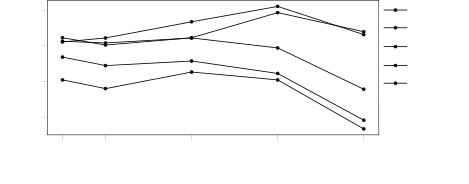
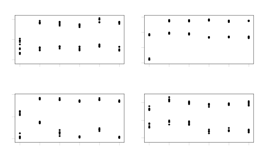
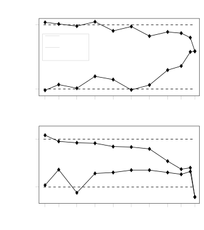
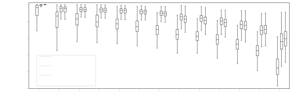

**Source:** *Explicit Inductive Bias for Transfer Learning with Convolutional Networks* — [PDF](https://arxiv.org/pdf/1802.01483) · [arXiv](https://arxiv.org/abs/1802.01483)

# Explicit Inductive Bias for Transfer Learning with Convolutional Networks

Xuhong LI  Affiliation: Sorbonne universités, Université de technologie de Compiègne, CNRS, Heudiasyc, UMR 7253, Compiègne, France  Correspondence to: [xuhong.li@hds.utc.fr](mailto:xuhong.li@hds.utc.fr) Yves GRANDVALET  Affiliation: Sorbonne universités, Université de technologie de Compiègne, CNRS, Heudiasyc, UMR 7253, Compiègne, France  Franck DAVOINE  Affiliation: Sorbonne universités, Université de technologie de Compiègne, CNRS, Heudiasyc, UMR 7253, Compiègne, France 

###### Abstract

In inductive transfer learning, fine-tuning pre-trained convolutional networks substantially outperforms training from scratch. When using fine-tuning, the underlying assumption is that the pre-trained model extracts generic features, which are at least partially relevant for solving the target task, but would be difficult to extract from the limited amount of data available on the target task. However, besides the initialization with the pre-trained model and the early stopping, there is no mechanism in fine-tuning for retaining the features learned on the source task. In this paper, we investigate several regularization schemes that explicitly promote the similarity of the final solution with the initial model. We show the benefit of having an explicit inductive bias towards the initial model, and we eventually recommend a simple \(L^{2}\) penalty with the pre-trained model being a reference as the baseline of penalty for transfer learning tasks.

###### Keywords: 

Machine Learning, transfer learning, regularization 

## 1 Introduction

It is now well known that modern convolutional neural networks ([Krizhevsky et al. 2012](https://arxiv.org/html/1802.01483#bib.bib21), [Simonyan & Zisserman 2015](https://arxiv.org/html/1802.01483#bib.bib35), [He et al. 2016](https://arxiv.org/html/1802.01483#bib.bib18), [Szegedy et al. 2016](https://arxiv.org/html/1802.01483#bib.bib36), e.g.) can achieve remarkable performance on large-scale image databases, e.g. ImageNet ([Deng et al. 2009](https://arxiv.org/html/1802.01483#bib.bib8)) and Places 365 ([Zhou et al. 2017](https://arxiv.org/html/1802.01483#bib.bib43)), but it is really dissatisfying to see the vast amounts of data, computing time and power consumption that are necessary to train deep networks. Fortunately, such convolutional networks, once trained on a large database, can be refined to solve related but different visual tasks by means of transfer learning, using fine-tuning ([Yosinski et al. 2014](https://arxiv.org/html/1802.01483#bib.bib40), [Simonyan & Zisserman 2015](https://arxiv.org/html/1802.01483#bib.bib35)).

Some form of knowledge is believed to be extracted by learning from the large-scale database of the source task and this knowledge is then transferred to the target task by initializing the network with the pre-trained parameters. However, we will show in the experimental section that some parameters may be driven far away from their initial values during fine-tuning. This leads to important losses of the initial knowledge that is assumed to be relevant for the targeted problem.

In order to help preserve the knowledge embedded in the initial network, we consider a series of other parameter regularization methods during fine-tuning. We argue that the standard \(L^{2}\) regularization, which drives the parameters towards the origin, is not adequate in the framework of transfer learning, where the initial values provide a more sensible reference point than the origin. This simple modification keeps the original control of overfitting, by constraining the effective search space around the initial solution, while encouraging committing to the acquired knowledge. We show that it has noticeable effects in inductive transfer learning scenarios.

This paper copes with the inconsistency that still prevails in transfer learning scenarios, where the model is initialized with some parameters, while the abuse of \(L^{2}\) regularization encourages departing from these initial values. We thus advocate for a coherent parameter regularization approach, where the pre-trained model is both used as the starting point of the optimization process and as the reference in the penalty that encodes an explicit inductive bias. This type of penalty will be designated with SP to recall that they encourage similarity with the starting point of the fine-tuning process. We evaluate regularizers based on the \(L^{2}\), Lasso and Group-Lasso penalties, which can freeze some individual parameters, or groups of parameters, to the pre-trained parameters. Fisher information is also taken into account when we test \(L^{2}\)-SP and Group-Lasso-SP approaches. Our experiments indicate that all tested parameter regularization methods using the pre-trained parameters as a reference get an edge over the standard \(L^{2}\) weight decay approach. We eventually recommend using \(L^{2}\)-SP as the standard baseline for solving transfer learning tasks and benchmarking new algorithms.

## 2 Related Work

In this section, we recall the approaches to inductive transfer learning in convolutional networks. We focus on approaches that also encourage similarity (of features or parameters) on different models. Our proposal departs either by the goal pursued or by the type of model used.

### 2.1 Shrinking Toward Chosen Parameters

Regularization has been a means to build shrinkage estimators for decades. Shrinking towards zero is the most common form of shrinkage, but shrinking towards adaptively chosen targets has been around for some time, starting with Stein shrinkage (see e.g. [Lehmann & Casella 1998](https://arxiv.org/html/1802.01483#bib.bib22), chapter 5), where it can be related to empirical Bayes arguments. In transfer learning, it has been used in maximum entropy models ([Chelba & Acero 2006](https://arxiv.org/html/1802.01483#bib.bib5)) or SVM ([Yang et al. 2007](https://arxiv.org/html/1802.01483#bib.bib39), [Aytar & Zisserman 2011](https://arxiv.org/html/1802.01483#bib.bib2), [Tommasi et al. 2014](https://arxiv.org/html/1802.01483#bib.bib38)). These approaches were shown to outperform standard \(L^{2}\) regularization with limited labeled data in the target task ([Aytar & Zisserman 2011](https://arxiv.org/html/1802.01483#bib.bib2), [Tommasi et al. 2014](https://arxiv.org/html/1802.01483#bib.bib38)).

These relatives differ from the application to deep networks in several respects, the more important one being that they consider a fixed representation, where transfer learning aims at producing similar classification parameters in that space, that is, similar classification rules. For deep networks, transfer usually aims at learning similar representations upon which classification parameters will be learned from scratch. Hence, even though the techniques we discuss here are very similar regarding the analytical form of the regularizers, they operate on parameters having a very different role.

### 2.2 Transfer Learning for Deep Networks

Regarding transfer learning, we follow here the nomenclature of [Pan & Yang (2010)](https://arxiv.org/html/1802.01483#bib.bib29), who categorized several types of transfer learning according to domain and task settings during the transfer. A domain corresponds to the feature space and its distribution, whereas a task corresponds to the label space and its conditional distribution with respect to features. The initial learning problem is defined on the source domain and source task, whereas the new learning problem is defined on the target domain and the target task.

In the typology of [Pan & Yang](https://arxiv.org/html/1802.01483#bib.bib29), we consider the inductive transfer learning setting, where the target domain is identical to the source domain, and the target task is different from the source task. We furthermore focus on the case where a vast amount of data was available for training on the source problem, and some limited amount of labeled data is available for solving the target problem. Under this setting, we aim at improving the performance on the target problem through parameter regularization methods that explicitly encourage the similarity of the solutions to the target and source problems. Note that, though we refer here to problems that were formalized or popularized after ([Pan & Yang 2010](https://arxiv.org/html/1802.01483#bib.bib29)), such as lifelong learning, [Pan & Yang](https://arxiv.org/html/1802.01483#bib.bib29)’s typology remains valid.

#### 2.2.1 Representation Transfer

[Donahue et al. (2014)](https://arxiv.org/html/1802.01483#bib.bib9) repurposed features extracted from different layers of the pre-trained AlexNet of [Krizhevsky et al. (2012)](https://arxiv.org/html/1802.01483#bib.bib21) and plugged them into an SVM or a logistic regression classifier. This approach outperformed the state of the art of that time on the Caltech-101 database ([Fei-Fei et al. 2006](https://arxiv.org/html/1802.01483#bib.bib12)). Later, [Yosinski et al. (2014)](https://arxiv.org/html/1802.01483#bib.bib40) showed that fine-tuning the whole AlexNet resulted in better performance than using the network as a static feature extractor. Fine-tuning pre-trained VGG ([Simonyan & Zisserman 2015](https://arxiv.org/html/1802.01483#bib.bib35)) on the image classification task of VOC-2012 ([Everingham et al. 2010](https://arxiv.org/html/1802.01483#bib.bib11)) and Caltech 256 ([Griffin et al. 2007](https://arxiv.org/html/1802.01483#bib.bib17)) achieved the best results of that time.

[Ge & Yu (2017)](https://arxiv.org/html/1802.01483#bib.bib13) proposed a scheme for selecting a subset of images from the source problem that have similar local features to those in the target problem and then jointly fine-tuned a pre-trained convolutional network. Besides image classification, many procedures for object detection ([Girshick et al. 2014](https://arxiv.org/html/1802.01483#bib.bib14), [Redmon et al. 2016](https://arxiv.org/html/1802.01483#bib.bib32), [Ren et al. 2015](https://arxiv.org/html/1802.01483#bib.bib33)) and image segmentation ([Long et al. 2015a](https://arxiv.org/html/1802.01483#bib.bib25), [Chen et al. 2017](https://arxiv.org/html/1802.01483#bib.bib6), [Zhao et al. 2017](https://arxiv.org/html/1802.01483#bib.bib42)) have been proposed relying on fine-tuning to improve over training from scratch. These approaches showed promising results in a challenging transfer learning setup, as going from classification to object detection or image segmentation requires rather heavy modifications of the architecture of the network.

The success of transfer learning with convolutional networks relies on the generality of the learned representations that have been constructed from a large database like ImageNet. [Yosinski et al. (2014)](https://arxiv.org/html/1802.01483#bib.bib40) also quantified the transferability of these pieces of information in different layers, e.g. the first layers learn general features, the middle layers learn high-level semantic features and the last layers learn the features that are very specific to a particular task. That can be also noticed by the visualization of features ([Zeiler & Fergus 2014](https://arxiv.org/html/1802.01483#bib.bib41)). Overall, the learned representations can be conveyed to related but different domains and the parameters in the network are reusable for different tasks.

#### 2.2.2 Regularizers in Related Learning Setups

In lifelong learning ([Thrun & Mitchell 1995](https://arxiv.org/html/1802.01483#bib.bib37), [Pentina & Lampert 2015](https://arxiv.org/html/1802.01483#bib.bib30)), where a series of tasks is learned sequentially by a single model, the knowledge extracted from the previous tasks may be lost as new tasks are learned, resulting in what is known as catastrophic forgetting. In order to achieve a good performance on all tasks, [Li & Hoiem (2017)](https://arxiv.org/html/1802.01483#bib.bib23) proposed to use the outputs of the target examples, computed by the original network on the source task, to define a learning scheme preserving the memory of the source tasks when training on the target task. They also tried to preserve the pre-trained parameters instead of the outputs of examples but they did not obtain interesting results.

[Kirkpatrick et al. (2017)](https://arxiv.org/html/1802.01483#bib.bib20) developed a similar approach with success. They get sensible improvements by measuring the sensitivity of the parameters of the network learned on the source data thanks to the Fisher information. The Fisher information matrix defines a metric in parameter space that is used in their regularizer to preserve the representation learned on the source data, thereby retaining the knowledge acquired on the previous tasks. This scheme, named elastic weight consolidation, was shown to avoid forgetting, but fine-tuning with plain stochastic gradient descent was more effective than elastic weight consolidation for learning new tasks. Hence, elastic weight consolidation may be thought as being inadequate for transfer learning, where performance is only measured on the target task. We will show that this conclusion is not appropriate in typical transfer learning scenarios with few target examples.

In domain adaptation ([Long et al. 2015b](https://arxiv.org/html/1802.01483#bib.bib26)), where the target domain differs from the source domain whereas the target task is identical to the source task and no (or few) target examples are labeled, most approaches are searching for a common representation space for source and target domains to reduce domain shift. [Rozantsev et al. (2016)](https://arxiv.org/html/1802.01483#bib.bib34) proposed a parameter regularization scheme for encouraging the similarity of the representations of the source and the target domains. Their regularizer encourages similar source and target parameters, up to a linear transformation. Still in domain adaptation, besides vision, encouraging similar parameters in deep networks has been proposed in speaker adaptation problems ([Liao 2013](https://arxiv.org/html/1802.01483#bib.bib24), [Ochiai et al. 2014](https://arxiv.org/html/1802.01483#bib.bib28)) and neural machine translation ([Barone et al. 2017](https://arxiv.org/html/1802.01483#bib.bib3)), where it proved to be helpful.

The \(L^{2}\)-SP regularizer was used independently by [Grachten & Chacón (2017)](https://arxiv.org/html/1802.01483#bib.bib16) for transfer in vision application, but where they used a random reinitialization of parameters. For convex optimization problems, this is equivalent to fine-tuning with \(L^{2}\)-SP, but we are obviously not in that situation. [Grachten & Chacón (2017)](https://arxiv.org/html/1802.01483#bib.bib16) conclude that their strategy behaves similarly to learning from scratch. We will show that using the starting point as an initialization of the fine-tuning process and as the reference in the regularizer improves results consistently upon the standard fine-tuning process.

## 3 Regularizers for Fine-Tuning

In this section, we detail the penalties we consider for fine-tuning. Parameter regularization is critical when learning from small databases. When learning from scratch, regularization is aimed at facilitating optimization and avoiding overfitting, by implicitly restricting the capacity of the network, that is, the effective size of the search space. In transfer learning, the role of regularization is similar, but the starting point of the fine-tuning process conveys information that pertains to the source problem (domain and task). Hence, the network capacity has not to be restricted blindly: the pre-trained model sets a reference that can be used to define the functional space effectively explored during fine-tuning.

Since we are using early stopping, fine-tuning a pre-trained model is an implicit form of inductive bias towards the initial solution. We explore here how a coherent explicit inductive bias, encoded by a regularization term, affects the training process. Section [4](https://arxiv.org/html/1802.01483#S4 "4 Experiments ‣ Explicit Inductive Bias for Transfer Learning with Convolutional Networks") shows that all such schemes get an edge over the standard approaches that either use weight decay or freeze part of the network for preserving the low-level representations that are built in the first layers of the network.

Let \(\boldsymbol{w}\in\mathbb{R}^{n}\) be the parameter vector containing all the network parameters that are to be adapted to the target task. The regularized objective function \(\tilde{J}\) that is to be optimized is the sum of the standard objective function \(J\) and the regularizer \(\Omega(\boldsymbol{w})\). In our experiments, \(J\) is the negative log-likelihood, so that the criterion \(\tilde{J}\) could be interpreted in terms of maximum a posteriori estimation, where the regularizer \(\Omega(\boldsymbol{w})\) would act as the log prior of \(\boldsymbol{w}\). More generally, the minimizer of \(\tilde{J}\) is a trade-off between the data-fitting term and the regularization term.

##### \({L^{2}}\) penalty

The current baseline penalty for transfer learning is the usual \(L^{2}\) penalty, also known as weight decay, since it drives the weights of the network to zero:

\[\begin{aligned}
 & \Omega(\boldsymbol{w})=\frac{\alpha}{2}\left\|\boldsymbol{w}\right\|_{2}^{2}\kern 5.0pt, &  & \text{(1)}
\end{aligned}\]

 

where \(\alpha\) is the regularization parameter setting the strength of the penalty and \(\left\|\cdot\right\|_{p}\) is the \(p\)-norm of a vector.

##### \(L^{2}\)-SP

Let \(\boldsymbol{w}^{0}\) be the parameter vector of the model pre-trained on the source problem, acting as the starting point (-SP) in fine-tuning. Using this initial vector as the reference in the \(L^{2}\) penalty, we get:

\[\begin{aligned}
 & \Omega(\boldsymbol{w})=\frac{\alpha}{2}\left\|\boldsymbol{w}-\boldsymbol{w}^{0}\right\|_{2}^{2}\kern 5.0pt. &  & \text{(2)}
\end{aligned}\]

 

Typically, the transfer to a target task requires some modifications of the network architecture used for the source task, such as on the last layer used for predicting the outputs. Then, there is no one-to-one mapping between \(\boldsymbol{w}\) and \(\boldsymbol{w}^{0}\), and we use two penalties: one for the part of the target network that shares the architecture of the source network, denoted \(\boldsymbol{w}_{\mathcal{S}}\), the other one for the novel part, denoted \(\boldsymbol{w}_{\bar{\mathcal{S}}}\). The compound penalty then becomes:

\[\begin{aligned}
 & \Omega(\boldsymbol{w})=\frac{\alpha}{2}\left\|\boldsymbol{w}_{\mathcal{S}}-\boldsymbol{w}^{0}_{\mathcal{S}}\right\|_{2}^{2}+\frac{\beta}{2}\left\|\boldsymbol{w}_{\bar{\mathcal{S}}}\right\|_{2}^{2}\kern 5.0pt. &  & \text{(3)}
\end{aligned}\]

 

##### \(L^{2}\)-SP-Fisher

Elastic weight consolidation ([Kirkpatrick et al. 2017](https://arxiv.org/html/1802.01483#bib.bib20)) was proposed to avoid catastrophic forgetting in the setup of lifelong learning, where several tasks should be learned sequentially. In addition to preserving the initial parameter vector \(\boldsymbol{w}^{0}\), it consists in using the estimated Fisher information to define the distance between \(\boldsymbol{w}_{\mathcal{S}}\) and \(\boldsymbol{w}^{0}_{\mathcal{S}}\). More precisely, it relies on the diagonal of the Fisher information matrix, resulting in the following penalty:

\[\begin{aligned}
 & \Omega(\boldsymbol{w})=\frac{\alpha}{2}\sum_{j\in\mathcal{S}}\hat{F}_{jj}\left(w_{j}-w^{0}_{j}\right)^{2}+\frac{\beta}{2}\left\|\boldsymbol{w}_{\bar{\mathcal{S}}}\right\|_{2}^{2}\kern 5.0pt, &  & \text{(4)}
\end{aligned}\]

 

where \(\hat{F}_{jj}\) is the estimate of the \(j\)th diagonal element of the Fisher information matrix. It is computed as the average of the squared Fisher’s score on the source problem, using the inputs of the source data:

\[\begin{aligned}
 & \hat{F}_{jj}=\frac{1}{m}\sum_{i=1}^{m}\sum_{k=1}^{K}f_{k}(\boldsymbol{x}^{(i)};\boldsymbol{w}^{0})\left(\frac{\partial}{\partial w_{j}}\log f_{k}(\boldsymbol{x}^{(i)};\boldsymbol{w}^{0})\right)^{2}\hskip-2.15277pt, & 
\end{aligned}\]

 

where the outer average estimates the expectation with respect to inputs \(\boldsymbol{x}\) and the inner weighted sum is the estimate of the conditional expectation of outputs given input \(\boldsymbol{x}^{(i)}\), with outputs drawn from a categorical distribution of parameters \((f_{1}(\boldsymbol{x}^{(i)};\boldsymbol{w}),\ldots,f_{k}(\boldsymbol{x}^{(i)};\boldsymbol{w}),\ldots,f_{K}(\boldsymbol{x}^{(i)};\boldsymbol{w}))\).

##### \(L^{1}\)-SP

We also experiment the \(L^{1}\) variant of \(L^{2}\)-SP:

\[\begin{aligned}
 & \Omega(\boldsymbol{w})=\alpha\left\|\boldsymbol{w}_{\mathcal{S}}-\boldsymbol{w}^{0}_{\mathcal{S}}\right\|_{1}+\frac{\beta}{2}\left\|\boldsymbol{w}_{\bar{\mathcal{S}}}\right\|_{2}^{2}\kern 5.0pt. &  & \text{(5)}
\end{aligned}\]

 

The usual \(L^{1}\) penalty encourages sparsity; here, by using \(\boldsymbol{w}^{0}_{\mathcal{S}}\) as a reference in the penalty, \(L^{1}\)-SP encourages some components of the parameter vector to be frozen, equal to the pre-trained initial values. The penalty can thus be thought as intermediate between \(L^{2}\)-SP ([3](https://arxiv.org/html/1802.01483#S3.E3 "In 𝑳^𝟐-SP ‣ 3 Regularizers for Fine-Tuning ‣ Explicit Inductive Bias for Transfer Learning with Convolutional Networks")) and the strategies consisting in freezing a part of the initial network. We explore below other ways of doing so.

##### Group-Lasso-SP (GL-SP)

Instead of freezing some individual parameters, we may encourage freezing some groups of parameters corresponding to channels of convolution kernels. Formally, we endow the set of parameters with a group structure, defined by a fixed partition of the index set \(\mathcal{I}=\{1,\ldots,p\}\), that is, \(\mathcal{I}=\bigcup_{g=0}^{G}{\mathcal{G}}_{g},\,\text{with}\kern 5.0pt{\mathcal{G}}_{g}\cap{\mathcal{G}}_{h}=\emptyset\kern 5.0pt\text{for}\kern 5.0ptg\neq h.\) In our setup, \({\mathcal{G}}_{0}=\bar{\mathcal{S}}\), and for \(g>0\), \({\mathcal{G}}_{g}\) is the set of fan-in parameters of channel \(g\). Let \(p_{g}\) denote the cardinality of group \(g\), and \(\boldsymbol{w}_{{\mathcal{G}}_{g}}\) \(\in\mathbb{R}^{p_{g}}\) be the vector \((w_{j})_{j\in{\mathcal{G}}_{g}}\). Then, the GL-SP penalty is:

\[\begin{aligned}
 & \Omega(\boldsymbol{w})=\alpha\sum_{g=1}^{G}s_{g}\left\|\boldsymbol{w}_{{\mathcal{G}}_{g}}-\boldsymbol{w}^{0}_{{\mathcal{G}}_{g}}\right\|_{2}+\frac{\beta}{2}\left\|\boldsymbol{w}_{\bar{\mathcal{S}}}\right\|_{2}^{2}\kern 5.0pt, &  & \text{(6)}
\end{aligned}\]

 

where \(\boldsymbol{w}^{0}_{{\mathcal{G}}_{0}}=\boldsymbol{w}^{0}_{\bar{\mathcal{S}}}\stackrel{{\scriptstyle\triangle}}{{=}}\boldsymbol{0}\), and, for \(g>0\), \(s_{g}\) is a predefined constant that may be used to balance the different cardinalities of groups. In our experiments, we used \(s_{g}=p_{g}^{1/2}\).

Our implementation of Group-Lasso-SP can freeze feature extractors at any depth of the convolutional network, to preserve the pre-trained feature extractors as a whole instead of isolated pre-trained parameters. The group \({\mathcal{G}}_{g}\) of size \(p_{g}=h_{g}\times\mathrm{w}_{g}\times d_{g}\) gathers all the parameters of a convolution kernel of height \(h_{g}\), width \(\mathrm{w}_{g}\), and depth \(d_{g}\). This grouping is done at each layer of the network, for each output channel, so that the group index \(g\) corresponds to two indexes in the network architecture: the layer index \(l\) and the output channel index at layer \(l\). If we have \(c_{l}\) such channels at layer \(l\), we have a total of \(G=\sum_{l}c_{l}\) groups.

##### Group-Lasso-SP-Fisher (GL-SP-Fisher)

Following the idea of \(L^{2}\)-SP-Fisher, the Fisher version of GL-SP is:

\[\begin{aligned}
 & \Omega(\boldsymbol{w})=\alpha\sum_{g=1}^{G}s_{g}\Big(\sum_{j\in{\mathcal{G}}_{g}}\hat{F}_{jj}\left(w_{j}-w^{0}_{j}\right)^{2}\Big)^{1/2}\hskip-5.38193pt+\hskip-0.5382pt\frac{\beta}{2}\left\|\boldsymbol{w}_{{\mathcal{G}}_{0}}\right\|_{2}^{2}\hskip 2.15277pt. & 
\end{aligned}\]

 

## 4 Experiments

We evaluate the aforementioned parameter regularizers on several pairs of source and target tasks. We use ResNet ([He et al. 2016](https://arxiv.org/html/1802.01483#bib.bib18)) as our base network, since it has proven its wide applicability on transfer learning tasks. Conventionally, if the target task is also a classification task, the training process starts by replacing the last layer with a new one, randomly generated, whose size depends on the number of classes in the target task.

### 4.1 Source and Target Databases

For comparing the effect of similarity between the source problem and the target problem on transfer learning, we chose two source databases: ImageNet ([Deng et al. 2009](https://arxiv.org/html/1802.01483#bib.bib8)) for generic object recognition and Places 365 ([Zhou et al. 2017](https://arxiv.org/html/1802.01483#bib.bib43)) for scene classification. Likewise, we have three different databases related to three target problems: Caltech 256 ([Griffin et al. 2007](https://arxiv.org/html/1802.01483#bib.bib17)) contains different objects for generic object recognition; MIT Indoors 67 ([Quattoni & Torralba 2009](https://arxiv.org/html/1802.01483#bib.bib31)) consists of 67 indoor scene categories; Stanford Dogs 120 ([Khosla et al. 2011](https://arxiv.org/html/1802.01483#bib.bib19)) contains images of 120 breeds of dogs; Each target database is split into training and testing sets following the suggestion of their creators (see Table [1](https://arxiv.org/html/1802.01483#S4.T1 "Table 1 ‣ 4.1 Source and Target Databases ‣ 4 Experiments ‣ Explicit Inductive Bias for Transfer Learning with Convolutional Networks") for details). In addition, we consider two configurations for Caltech 256: 30 or 60 examples randomly drawn from each category for training, and 20 remaining examples for test.

Table 1: Characteristics of the target databases: name and type, numbers of training and test images per class, and number of classes. 

Database | task category | # training | # test | # classes   
---|---|---|---|---  
MIT Indoors 67 | scene classification |  80 |  20 |  67  
Stanford Dogs 120 | specific object recog. | 100 | \(\sim\) 72 | 120  
Caltech 256 – 30 | generic object recog. |  30 |  20 | 257  
Caltech 256 – 60 | generic object recog. |  60 |  20 | 257

 

### 4.2 Training Details

    
Figure 1: Classification accuracy (in %) on Stanford Dogs 120 for \(L^{2}\)-SP, according to the two regularization hyperparameters \(\alpha\) and \(\beta\) respectively applied to the layers inherited from the source task and the last classification layer (see Equation [3](https://arxiv.org/html/1802.01483#S3.E3 "In 𝑳^𝟐-SP ‣ 3 Regularizers for Fine-Tuning ‣ Explicit Inductive Bias for Transfer Learning with Convolutional Networks")).

Most images in those databases are color images. If not, we create a three-channel image by duplicating the gray-scale data. All images are pre-processed: we resize images to 256\(\times\)256 and subtract the mean activity computed over the training set from each channel, then we adopt random blur, random mirror and random crop to 224\(\times\)224 for data augmentation. The network parameters are regularized as described in Section [3](https://arxiv.org/html/1802.01483#S3 "3 Regularizers for Fine-Tuning ‣ Explicit Inductive Bias for Transfer Learning with Convolutional Networks"). Cross validation is used for searching the best regularization hyperparameters \(\alpha\) and \(\beta\): \(\alpha\) differs across experiments, and \(\beta=0.01\) is consistently picked by cross-validation for regularizing the last layer. Figure [1](https://arxiv.org/html/1802.01483#S4.F1 "Figure 1 ‣ 4.2 Training Details ‣ 4 Experiments ‣ Explicit Inductive Bias for Transfer Learning with Convolutional Networks") illustrates that the test accuracy varies smoothly according to the regularization strength, and that there is a sensible benefit in penalizing the last layer (that is, \(\beta\geq 0\)) for the best \(\alpha\) values. When applicable, the Fisher information matrix is estimated on the source database. The two source databases (ImageNet or Places 365) yield different estimates. Regarding testing, we use central crops as inputs to compute the classification accuracy.

Stochastic gradient descent with momentum 0.9 is used for optimization. We run 9000 iterations and divide the learning rate by 10 after 6000 iterations. The initial learning rates are 0.005, 0.01 or 0.02, depending on the tasks. Batch size is 64. Then, under the best configuration, we repeat five times the learning process to obtain an average classification accuracy and standard deviation. All the experiments are performed with Tensorflow ([Abadi et al. 2015](https://arxiv.org/html/1802.01483#bib.bib1)).

### 4.3 Results

#### 4.3.1 Fine-Tuning from a Similar Source

Table 2: Average classification accuracies (in %) of \(L^{2}\), \(L^{2}\)-SP and \(L^{2}\)-SP-Fisher on 5 different runs. The source database is Places 365 for MIT Indoors 67 and ImageNet for Stanford Dogs 120 and Caltech 256. 

| MIT Indoors 67 | Stanford Dogs 120 | Caltech 256 – 30 | Caltech 256 – 60  
---|---|---|---|---  
\(L^{2}\) | 79.6\(\pm\)0.5 | 81.4\(\pm\)0.2 | 81.5\(\pm\)0.2 | 85.3\(\pm\)0.2  
\(L^{2}\)-SP | 84.2\(\pm\)0.3 | 85.1\(\pm\)0.2 | 83.5\(\pm\)0.1 | 86.4\(\pm\)0.2  
\(L^{2}\)-SP-Fisher | 84.0\(\pm\)0.4 | 85.1\(\pm\)0.2 | 83.3\(\pm\)0.1 | 86.0\(\pm\)0.1

 

Table [2](https://arxiv.org/html/1802.01483#S4.T2 "Table 2 ‣ 4.3.1 Fine-Tuning from a Similar Source ‣ 4.3 Results ‣ 4 Experiments ‣ Explicit Inductive Bias for Transfer Learning with Convolutional Networks") displays the results of fine-tuning with \(L^{2}\)-SP and \(L^{2}\)-SP-Fisher, which are compared to the current baseline of fine-tuning with \(L^{2}\). We report the average accuracies and their standard deviations on 5 different runs. Since we use the same data and the same starting point, runs differ only due to the randomness of stochastic gradient descent and to the weight initialization of the last layer. We can observe that \(L^{2}\)-SP and \(L^{2}\)-SP-Fisher always improve over \(L^{2}\), and that when less training data are available for the target problem, the improvement of \(L^{2}\)-SP and \(L^{2}\)-SP-Fisher compared to \(L^{2}\) are more important. Meanwhile, no large difference is observed between \(L^{2}\)-SP and \(L^{2}\)-SP-Fisher.

We can boost the performance and outperform the state of the art ([Ge & Yu 2017](https://arxiv.org/html/1802.01483#bib.bib13)) in some cases by exploiting more training techniques and post-processing methods, which are described in the supplementary material.

#### 4.3.2 Behavior Across Penalties, Source and Target Databases

    
Figure 2: Classification accuracies (in %) of the tested fine-tuning approaches on the four target databases, using ImageNet (dark blue dots) or Places 365 (light red dots) as source databases. MIT Indoor 67 is more similar to Places 365 than to ImageNet; Stanford Dogs 120 and Caltech 256 are more similar to ImageNet than to Places 365.

A comprehensive view of our experimental results is given in Figure [2](https://arxiv.org/html/1802.01483#S4.F2 "Figure 2 ‣ 4.3.2 Behavior Across Penalties, Source and Target Databases ‣ 4.3 Results ‣ 4 Experiments ‣ Explicit Inductive Bias for Transfer Learning with Convolutional Networks"). Each plot corresponds to one of the four target databases listed in Table [1](https://arxiv.org/html/1802.01483#S4.T1 "Table 1 ‣ 4.1 Source and Target Databases ‣ 4 Experiments ‣ Explicit Inductive Bias for Transfer Learning with Convolutional Networks"). The light red points mark the accuracies of transfer learning when using Places 365 as the source database, whereas the dark blue points correspond to the results obtained with ImageNet. As expected, the results of transfer learning are much better when source and target are alike: the scene classification target task MIT Indoor 67 (top left) is better transferred from the scene classification source task Places 365, whereas the object recognition target tasks benefit more from the object recognition source task ImageNet. It is however interesting to note that the trends are similar for the two source databases: all the fine-tuning strategies based on penalties using the starting point -SP as a reference perform consistently better than standard fine-tuning (\(L^{2}\)). There is thus a benefit in having an explicit bias towards the starting point, even when the target task is not too similar to the source task.

This benefit is comparable for \(L^{2}\)-SP and \(L^{2}\)-SP-Fisher penalties; the strategies based on \(L^{1}\) and Group-Lasso penalties behave rather poorly in comparison. They are even less accurate than the plain \(L^{2}\) strategy on Caltech 256 – 60 when the source problem is Places 365. Stochastic gradient descent does not handle well these penalties whose gradient is discontinuous at the starting point where the optimization starts. The stochastic forward-backward splitting algorithm of [Duchi & Singer (2009)](https://arxiv.org/html/1802.01483#bib.bib10), which is related to proximal methods, leads to substandard results, presumably due to the absence of a momentum term. In the end, we used plain stochastic gradient descent on a smoothed version of the penalties eliminating the discontinuities of their gradients, but some instability remains.

Finally, the variants using the Fisher information matrix behave like the simpler variants using a Euclidean metric on parameters. We believe that this is due to the fact that, contrary to lifelong learning, our objective does not favor solutions that retain accuracy on the source task. The metric defined by the Fisher information matrix may thus be less relevant for our actual objective that only relates to the target task. Table [3](https://arxiv.org/html/1802.01483#S4.T3 "Table 3 ‣ 4.3.2 Behavior Across Penalties, Source and Target Databases ‣ 4.3 Results ‣ 4 Experiments ‣ Explicit Inductive Bias for Transfer Learning with Convolutional Networks") confirms that \(L^{2}\)-SP-Fisher is indeed a better approach in the situation of lifelong learning, where accuracies on the source tasks matter. It reports the drop in performance when the fine-tuned models are applied on the source task, without any retraining, simply using the original classification layer instead of the classification layer learned for the target task. The performance drop is smaller for \(L^{2}\)-SP-Fisher than for \(L^{2}\)-SP. In comparison, \(L^{2}\) fine-tuning results in catastrophic forgetting: the performance on the source task is considerably affected by fine-tuning.

Table 3: Classification accuracy drops (in %) on the source tasks due to fine-tuning based on \(L^{2}\), \(L^{2}\)-SP and \(L^{2}\)-SP-Fisher regularizers. The source database is Places 365 for MIT Indoors 67 and ImageNet for Stanford Dogs 120 and Caltech 256. The classification accuracies of the pre-trained models are 54.7% and 76.7% on Places 365 and ImageNet respectively. 

| \(L^{2}\) | \(L^{2}\)-SP | \(L^{2}\)-SP-Fisher  
---|---|---|---  
MIT Indoors 67 | -24.1 | -5.3 | -4.9  
Stanford Dogs 120 | -14.1 | -4.7 | -4.2  
Caltech 256 – 30 | -15.4 | -4.2 | -3.6  
Caltech 256 – 60 | -16.9 | -3.6 | -3.2

 

#### 4.3.3 Fine-Tuning vs. Freezing the Network

Freezing the first layers of a network during transfer learning is another way to ensure a very strong inductive bias, letting less degrees of freedom to transfer learning. Figure [3](https://arxiv.org/html/1802.01483#S4.F3 "Figure 3 ‣ 4.3.3 Fine-Tuning vs. Freezing the Network ‣ 4.3 Results ‣ 4 Experiments ‣ Explicit Inductive Bias for Transfer Learning with Convolutional Networks") shows that this strategy, which is costly to implement if one looks for the optimal number of layers to be frozen, can improve \(L^{2}\) fine-tuning considerably, but that it is a rather inefficient strategy for \(L^{2}\)-SP fine-tuning. Among all possible choices, \(L^{2}\) fine-tuning with partial freezing is dominated by the plain \(L^{2}\)-SP fine-tuning. Note that \(L^{2}\)-SP-Fisher (not displayed) behaves similarly to \(L^{2}\)-SP.

    
Figure 3: Classification accuracies (in %) of fine-tuning with \(L^{2}\) and \(L^{2}\)-SP on Stanford Dogs 120 (top) and Caltech 256–30 (bottom) when freezing the first layers of ResNet-101. The dashed lines represent the accuracies reported in Table [2](https://arxiv.org/html/1802.01483#S4.T2 "Table 2 ‣ 4.3.1 Fine-Tuning from a Similar Source ‣ 4.3 Results ‣ 4 Experiments ‣ Explicit Inductive Bias for Transfer Learning with Convolutional Networks"), where no layers are frozen. ResNet-101 begins with one convolutional layer, then stacks 3-layer blocks. The three layers in one block are either frozen or trained altogether.

### 4.4 Analysis and Discussion

Among all -SP methods, \(L^{2}\)-SP and \(L^{2}\)-SP-Fisher always reach a better accuracy on the target task. We expected \(L^{2}\)-SP-Fisher to outperform \(L^{2}\)-SP, since Fisher information helps in lifelong learning, but there is no significant difference between the two options. Since \(L^{2}\)-SP is simpler than \(L^{2}\)-SP-Fisher, we recommend the former, and we focus on the analysis of \(L^{2}\)-SP, although most of the analysis and the discussion would also apply to \(L^{2}\)-SP-Fisher.

#### 4.4.1 Computational Efficiency

The -SP penalties introduce no extra parameters, and they only increase slightly the computational burden. \(L^{2}\)-SP increases the number of floating point operations required for a learning step of ResNet-101 by less than 1%. Hence, at a negligible computational cost, we can obtain significant improvements in classification accuracy, and no additional cost is experienced at test time.

#### 4.4.2 Theoretical Insights

    
Figure 4: \(R^{2}\) coefficients of determination with \(L^{2}\) and \(L^{2}\)-SP regularizations for Stanford Dogs 120. Each boxplot summarizes the distribution of the \(R^{2}\) coefficients of the activations after fine-tuning with respect to the activations of the pre-trained network, for all the units in one layer. ResNet-101 begins with one convolutional layer, then stacks 3-layer blocks. For legibility, we only display here the \(R^{2}\) at the first layer and at the outputs of some 3-layer blocks.

Analytical results are very difficult to obtain in the deep learning framework. Under some (highly) simplifying assumptions, we show in supplementary material that the optimum of the regularized objective function with \(L^{2}\)-SP is a compromise between the optimum of the unregularized objective function and the pre-trained parameter vector, precisely an affine combination along the directions of eigenvectors of the Hessian matrix of the unregularized objective function. This contrasts with \(L^{2}\) that leads to a compromise between the optimum of the unregularized objective function and the origin. Clearly, searching for a solution in the vicinity of the pre-trained parameters is intuitively much more appealing, since it is the actual motivation for using the pre-trained parameters as the starting point of the fine-tuning process.

Using \(L^{2}\)-SP instead of \(L^{2}\) can also be motivated by an analogy with shrinkage estimation (see e.g. [Lehmann & Casella 1998](https://arxiv.org/html/1802.01483#bib.bib22), chapter 5). Although it is known that shrinking toward any reference is better than raw fitting, it is also known that shrinking towards a value that is close to the “true parameters” is more effective. The notion of “true parameters” is not readily applicable to deep networks, but the connection with Stein shrinking effect may be inspiring by surveying the literature considering shrinkage towards other references, such as linear subspaces. In particular, it is likely that manifolds of parameters defined from the pre-trained network would provide a more relevant reference than the single parameter value provided by the pre-trained network.

#### 4.4.3 Layer-Wise Analysis

We complement our experimental results by an analysis relying on the activations of the hidden units of the network, to provide another view on the differences between \(L^{2}\) and \(L^{2}\)-SP fine-tuning. Activation similarities are easier to interpret than parameter similarities, and they provide a view of the network that is closer to the functional perspective we are actually pursuing. Matching individual activations makes sense, provided that the networks slightly differ before and after tuning so that few roles are switched between units or feature maps.

The dependency between the pre-trained and the fine-tuned activations throughout the network is displayed in Figure [4](https://arxiv.org/html/1802.01483#S4.F4 "Figure 4 ‣ 4.4.2 Theoretical Insights ‣ 4.4 Analysis and Discussion ‣ 4 Experiments ‣ Explicit Inductive Bias for Transfer Learning with Convolutional Networks"), with boxplots of the \(R^{2}\) coefficients, gathered layer-wise, of the fine-tuned activations with respect to the original activations. This figure shows that, indeed, the roles of units or feature maps have not changed much after \(L^{2}\)-SP and \(L^{2}\)-SP-Fisher fine-tuning. The \(R^{2}\) coefficients are very close to 1 on the first layers, and smoothly decrease throughout the network, staying quite high, around 0.6, for \(L^{2}\)-SP and \(L^{2}\)-SP-Fisher at the greatest depth. In contrast, for \(L^{2}\) regularization, some important changes are already visible in the first layers, and the \(R^{2}\) coefficients eventually reach quite low values at the greatest depth. This illustrates in details how the roles of the network units is remarkably retained with \(L^{2}\)-SP and \(L^{2}\)-SP-Fisher fine-tuning, not only for the first layers of the networks, but also for the last high-level representations before classification.

## 5 Conclusion

We described and tested simple regularization techniques for inductive transfer learning. They all encode an explicit bias towards the solution learned on the source task, resulting in a compromise with the pre-trained parameter that is coherent with the original motivation for fine-tuning. All the regularizers evaluated here have been already used for other purposes or in other contexts, but we demonstrated their relevance for inductive transfer learning with deep convolutional networks.

We show that a simple \(L^{2}\) penalty using the starting point as a reference, \(L^{2}\)-SP, is useful, even if early stopping is used. This penalty is much more effective than the standard \(L^{2}\) penalty that is commonly used in fine-tuning. It is also more effective and simpler to implement than the strategy consisting in freezing the first layers of a network. We provide theoretical hints and strong experimental evidence showing that \(L^{2}\)-SP retains the memory of the features learned on the source database. We thus believe that this simple \(L^{2}\)-SP scheme should be considered as the standard baseline in inductive transfer learning, and that future improvements of transfer learning should rely on this baseline.

Besides, we tested the effect of more elaborate penalties, based on \(L^{1}\) or Group-\(L^{1}\) norms, or based on Fisher information. None of the \(L^{1}\) or Group-\(L^{1}\) options seem to be valuable in the context of inductive transfer learning that we considered here, and using the Fisher information with \(L^{2}\)-SP does not improve accuracy on the target task. Different approaches, which implement an implicit bias at the functional level, alike [Li & Hoiem (2017)](https://arxiv.org/html/1802.01483#bib.bib23), remain to be tested: being based on a different principle, their value should be assessed in the framework of inductive transfer learning.

## Acknowledgments

This work was carried out with the supports of the China Scholarship Council and of a PEPS grant through the DESSTOPT project jointly managed by the National Institute of Mathematical Sciences and their Interactions (INSMI) and the Institute of Information Science and their Interactions (INS2I) of the CNRS, France. We acknowledge the support of NVIDIA Corporation with the donation of GPUs used for this research.

## References

  * Abadi et al. (2015) Abadi, M., Agarwal, A., Barham, P., Brevdo, E., Chen, Z., Citro, C., Corrado, G. S., Davis, A., Dean, J., Devin, M., Ghemawat, S., Goodfellow, I., Harp, A., Irving, G., Isard, M., Jia, Y., Jozefowicz, R., Kaiser, L., Kudlur, M., Levenberg, J., Mané, D., Monga, R., Moore, S., Murray, D., Olah, C., Schuster, M., Shlens, J., Steiner, B., Sutskever, I., Talwar, K., Tucker, P., Vanhoucke, V., Vasudevan, V., Viégas, F., Vinyals, O., Warden, P., Wattenberg, M., Wicke, M., Yu, Y., and Zheng, X.  TensorFlow: Large-scale machine learning on heterogeneous systems, 2015\.  URL <http://tensorflow.org/>.  Software available from tensorflow.org. 
  * Aytar & Zisserman (2011) Aytar, Y. and Zisserman, A.  Tabula rasa: Model transfer for object category detection.  In _ICCV_ , 2011. 
  * Barone et al. (2017) Barone, A. V. M., Haddow, B., Germann, U., and Sennrich, R.  Regularization techniques for fine-tuning in neural machine translation.  _arXiv preprint arXiv:1707.09920_ , 2017. 
  * Bossard et al. (2014) Bossard, L., Guillaumin, M., and Van Gool, L.  Food-101 – mining discriminative components with random forests.  In _ECCV_ , 2014. 
  * Chelba & Acero (2006) Chelba, C. and Acero, A.  Adaptation of maximum entropy capitalizer: Little data can help a lot.  _Computer Speech & Language_, 20(4):382–399, 2006. 
  * Chen et al. (2017) Chen, L.-C., Papandreou, G., Kokkinos, I., Murphy, K., and Yuille, A. L.  Deeplab: Semantic image segmentation with deep convolutional nets, atrous convolution, and fully connected CRFs.  _IEEE Trans. Pattern Anal. Mach. Intell._ , 2017. 
  * Cordts et al. (2016) Cordts, M., Omran, M., Ramos, S., Rehfeld, T., Enzweiler, M., Benenson, R., Franke, U., Roth, S., and Schiele, B.  The Cityscapes dataset for semantic urban scene understanding.  In _CVPR_ , 2016. 
  * Deng et al. (2009) Deng, J., Dong, W., Socher, R., Li, L.-J., Li, K., and Fei-Fei, L.  Imagenet: A large-scale hierarchical image database.  In _CVPR_ , 2009. 
  * Donahue et al. (2014) Donahue, J., Jia, Y., Vinyals, O., Hoffman, J., Zhang, N., Tzeng, E., and Darrell, T.  Decaf: A deep convolutional activation feature for generic visual recognition.  In _ICML_ , 2014. 
  * Duchi & Singer (2009) Duchi, J. and Singer, Y.  Efficient online and batch learning using forward backward splitting.  _J. Mach. Learn. Res._ , 10:2899–2934, 2009. 
  * Everingham et al. (2010) Everingham, M., Van Gool, L., Williams, C. K., Winn, J., and Zisserman, A.  The Pascal visual object classes (VOC) challenge.  _International Journal of Computer Vision_ , 88(2):303–338, 2010. 
  * Fei-Fei et al. (2006) Fei-Fei, L., Fergus, R., and Perona, P.  One-shot learning of object categories.  _IEEE Trans. Pattern Anal. Mach. Intell._ , 28(4):594–611, 2006. 
  * Ge & Yu (2017) Ge, W. and Yu, Y.  Borrowing treasures from the wealthy: Deep transfer learning through selective joint fine-tuning.  In _CVPR_ , 2017. 
  * Girshick et al. (2014) Girshick, R., Donahue, J., Darrell, T., and Malik, J.  Rich feature hierarchies for accurate object detection and semantic segmentation.  In _CVPR_ , 2014. 
  * Goodfellow et al. (2017) Goodfellow, I., Bengio, Y., and Courville, A.  _Deep Learning_.  Adaptive Computation and Machine Learning. MIT Press, 2017.  URL <http://www.deeplearningbook.org>. 
  * Grachten & Chacón (2017) Grachten, M. and Chacón, C. E. C.  Strategies for conceptual change in convolutional neural networks.  _arXiv preprint arXiv:1711.01634_ , 2017. 
  * Griffin et al. (2007) Griffin, G., Holub, A., and Perona, P.  Caltech-256 object category dataset.  Technical report, California Institute of Technology, 2007. 
  * He et al. (2016) He, K., Zhang, X., Ren, S., and Sun, J.  Deep residual learning for image recognition.  In _CVPR_ , 2016. 
  * Khosla et al. (2011) Khosla, A., Jayadevaprakash, N., Yao, B., and Li, F.-F.  Novel dataset for fine-grained image categorization: Stanford dogs.  In _Proc. CVPR Workshop on Fine-Grained Visual Categorization (FGVC)_ , 2011. 
  * Kirkpatrick et al. (2017) Kirkpatrick, J., Pascanu, R., Rabinowitz, N., Veness, J., Desjardins, G., Rusu, A. A., Milan, K., Quan, J., Ramalho, T., Grabska-Barwinska, A., et al.  Overcoming catastrophic forgetting in neural networks.  _Proc. Natl. Acad. Sci. U.S.A._ , 2017. 
  * Krizhevsky et al. (2012) Krizhevsky, A., Sutskever, I., and Hinton, G. E.  Imagenet classification with deep convolutional neural networks.  In _NIPS_ , 2012. 
  * Lehmann & Casella (1998) Lehmann, E. L. and Casella, G.  _Theory of point estimation_.  Springer, 2 edition, 1998. 
  * Li & Hoiem (2017) Li, Z. and Hoiem, D.  Learning without forgetting.  _IEEE Trans. Pattern Anal. Mach. Intell._ , 2017.  doi: 10.1109/TPAMI.2017.2773081. 
  * Liao (2013) Liao, H.  Speaker adaptation of context dependent deep neural networks.  In _ICASSP_ , 2013. 
  * Long et al. (2015a) Long, J., Shelhamer, E., and Darrell, T.  Fully convolutional networks for semantic segmentation.  In _CVPR_ , 2015a. 
  * Long et al. (2015b) Long, M., Cao, Y., Wang, J., and Jordan, M.  Learning transferable features with deep adaptation networks.  In _ICML_ , 2015b. 
  * Martinel et al. (2016) Martinel, N., Foresti, G. L., and Micheloni, C.  Wide-slice residual networks for food recognition.  _arXiv preprint arXiv:1612.06543_ , 2016. 
  * Ochiai et al. (2014) Ochiai, T., Matsuda, S., Lu, X., Hori, C., and Katagiri, S.  Speaker adaptive training using deep neural networks.  In _ICASSP_ , 2014. 
  * Pan & Yang (2010) Pan, S. J. and Yang, Q.  A survey on transfer learning.  _IEEE T. Knowl. Data En._ , 22(10):1345–1359, 2010. 
  * Pentina & Lampert (2015) Pentina, A. and Lampert, C. H.  Lifelong learning with non-iid tasks.  In _NIPS_ , 2015. 
  * Quattoni & Torralba (2009) Quattoni, A. and Torralba, A.  Recognizing indoor scenes.  In _CVPR_ , 2009. 
  * Redmon et al. (2016) Redmon, J., Divvala, S., Girshick, R., and Farhadi, A.  You only look once: Unified, real-time object detection.  In _CVPR_ , 2016. 
  * Ren et al. (2015) Ren, S., He, K., Girshick, R., and Sun, J.  Faster r-cnn: Towards real-time object detection with region proposal networks.  In _NIPS_ , 2015. 
  * Rozantsev et al. (2016) Rozantsev, A., Salzmann, M., and Fua, P.  Beyond sharing weights for deep domain adaptation.  _arXiv preprint arXiv:1603.06432_ , 2016. 
  * Simonyan & Zisserman (2015) Simonyan, K. and Zisserman, A.  Very deep convolutional networks for large-scale image recognition.  In _ICLR_ , 2015. 
  * Szegedy et al. (2016) Szegedy, C., Vanhoucke, V., Ioffe, S., Shlens, J., and Wojna, Z.  Rethinking the inception architecture for computer vision.  In _CVPR_ , 2016. 
  * Thrun & Mitchell (1995) Thrun, S. and Mitchell, T. M.  Lifelong robot learning.  _Robot. Auton. Syst._ , 15(1-2):25–46, 1995. 
  * Tommasi et al. (2014) Tommasi, T., Orabona, F., and Caputo, B.  Learning categories from few examples with multi model knowledge transfer.  _IEEE Trans. Pattern Anal. Mach. Intell._ , 2014. 
  * Yang et al. (2007) Yang, J., Yan, R., and Hauptmann, A. G.  Adapting svm classifiers to data with shifted distributions.  In _ICDM Workshops_ , 2007. 
  * Yosinski et al. (2014) Yosinski, J., Clune, J., Bengio, Y., and Lipson, H.  How transferable are features in deep neural networks?  In _NIPS_ , 2014. 
  * Zeiler & Fergus (2014) Zeiler, M. D. and Fergus, R.  Visualizing and understanding convolutional networks.  In _ECCV_ , 2014. 
  * Zhao et al. (2017) Zhao, H., Shi, J., Qi, X., Wang, X., and Jia, J.  Pyramid scene parsing network.  In _CVPR_ , 2017. 
  * Zhou et al. (2017) Zhou, B., Lapedriza, A., Khosla, A., Oliva, A., and Torralba, A.  Places: A 10 million image database for scene recognition.  _IEEE Trans. Pattern Anal. Mach. Intell._ , 2017. 

## Appendix A Effect of \(L^{2}\)-SP Regularization on Optimization

The effect of \(L^{2}\) regularization can be analyzed by doing a quadratic approximation of the objective function around the optimum (see, e.g. [Goodfellow et al. 2017](https://arxiv.org/html/1802.01483#bib.bib15), Section 7.1.1). This analysis shows that \(L^{2}\) regularization rescales the parameters along the directions defined by the eigenvectors of the Hessian matrix. This scaling is equal to \(\frac{\lambda_{i}}{\lambda_{i}+\alpha}\) for the \(i\)-th eigenvector of eigenvalue \(\lambda_{i}\). A similar analysis can be used for the \(L^{2}\)-SP regularization.

We recall that \(J(\boldsymbol{w})\) is the unregularized objective function, and \(\tilde{J}(\boldsymbol{w})=J(\boldsymbol{w})+\alpha\left\|\boldsymbol{w}-\boldsymbol{w}^{0}\right\|_{2}^{2}\) is the regularized objective function. Let \(\boldsymbol{w}^{*}=\mathrm{argmin}_{\boldsymbol{w}}J(\boldsymbol{w})\) and \(\tilde{\boldsymbol{w}}=\mathrm{argmin}_{\boldsymbol{w}}\tilde{J}\) be their respective minima. The quadratic approximation of \(J(\boldsymbol{w}^{*})\) gives

\[\begin{aligned}
 & \mathbf{H}(\tilde{\boldsymbol{w}}-\boldsymbol{w}^{*})+\alpha(\tilde{\boldsymbol{w}}-\boldsymbol{w}^{0})=0\kern 5.0pt, &  & \text{(7)}
\end{aligned}\]

 

where \(\mathbf{H}\) is the Hessian matrix of \(J\) w.r.t. \(\boldsymbol{w}\), evaluated at \(\boldsymbol{w}^{*}\). Since \(\mathbf{H}\) is positive semidefinite, it can be decomposed as \(\mathbf{H}=\mathbf{Q}\mathbf{\Lambda}\mathbf{Q}^{T}\). Applying the decomposition to Equation ([7](https://arxiv.org/html/1802.01483#A1.E7 "In Appendix A Effect of 𝐿^2-SP Regularization on Optimization ‣ Explicit Inductive Bias for Transfer Learning with Convolutional Networks")), we obtain the following relationship between \(\tilde{\boldsymbol{w}}\) and \(\boldsymbol{w}^{*}\):

\[\begin{aligned}
 & \mathbf{Q}^{T}\tilde{\boldsymbol{w}}=(\mathbf{\Lambda}+\alpha\mathbf{I})^{-1}\mathbf{\Lambda}\mathbf{Q}^{T}\boldsymbol{w}^{*}+\alpha(\mathbf{\Lambda}+\alpha\mathbf{I})^{-1}\mathbf{Q}^{T}\boldsymbol{w}^{0}\kern 5.0pt. &  & \text{(8)}
\end{aligned}\]

 

We can see that with \(L^{2}\)-SP regularization, in the direction defined by the \(i\)-th eigenvector of \(\mathbf{H}\), \(\tilde{\boldsymbol{w}}\) is a convex combination of \(\boldsymbol{w}^{*}\) and \(\boldsymbol{w}^{0}\) in that direction since \(\frac{\lambda_{i}}{\lambda_{i}+\alpha}\) and \(\frac{\alpha}{\lambda_{i}+\alpha}\) sum to \(1\).

## Appendix B Matching the State of the Art in Image Classification

The main objective of this paper is to demonstrate that -SP regularization in general, and \(L^{2}\)-SP in particular, provides a baseline for transfer learning that is significantly superior to the standard fine-tuning technique. We do not aim at reaching the state of the art solely with this simple technique. However, as shown here, with some training tricks and post-processing methods, which have been proposed elsewhere but were not used in the paper, we can reach or even exceed the state of the art performances, simply by changing the regularizer to \(L^{2}\)-SP.

##### Aspect Ratio.

During training, respecting or ignoring the aspect ratio of images will give different results, and usually it would be better to keep the original aspect ratio. In the paper, the classification experiments are all under the pre-processing of resizing all images to 256\(\times\)256, i.e. ignoring the aspect ratio. Here we perform an ablation study to analyze the difference between keeping and ignoring the ratio. For simplicity, we use the same hyperparameters as before except that the aspect ratio is kept and images are resized with the shorter edge being 256.

##### Post-Processing for Image Classification.

A common post-processing method for image classification is 10-crop testing (averaging the predictions of 10 cropped patches, the four corner patches and the center patch as well as their horizontal reflections).

We apply the aspect ratio and 10-crop testing techniques to improve our results, but we believe the performance can be improved but using additional tricks, such as random rotation or scaling during training, more crops, multi scales for test, etc. Table [4](https://arxiv.org/html/1802.01483#A2.T4 "Table 4 ‣ Post-Processing for Image Classification. ‣ Appendix B Matching the State of the Art in Image Classification ‣ Explicit Inductive Bias for Transfer Learning with Convolutional Networks") shows our results. Caltech 256 - 30 outperforms the state of the art; our results in MIT Indoors 67 and Stanford Dogs 120 are very close to the state of the art, noting that the best performing approach ([Ge & Yu 2017](https://arxiv.org/html/1802.01483#bib.bib13)) used many training examples from source domain to improve performance. On our side, we did not use any other examples and simply changed the regularization approach from \(L^{2}\) to \(L^{2}\)-SP.

Table 4: Average classification accuracies (in %) for \(L^{2}\) and \(L^{2}\)-SP using the training tricks presented in Section [B](https://arxiv.org/html/1802.01483#A2 "Appendix B Matching the State of the Art in Image Classification ‣ Explicit Inductive Bias for Transfer Learning with Convolutional Networks"). The source database is Places 365 for MIT Indoors 67 and ImageNet for Caltech 256, Stanford Dogs and Foods. References for the state of the art are taken from [Ge & Yu (2017)](https://arxiv.org/html/1802.01483#bib.bib13), except for Foods-101 where it is taken from [Martinel et al. (2016)](https://arxiv.org/html/1802.01483#bib.bib27). 

| Caltech 256 - 30 | Caltech 256 - 60 | MIT Indoors 67 | Stanford Dogs 120 | Foods 101  
---|---|---|---|---|---  
\(L^{2}\) | 82.7\(\pm\)0.2 | 86.5\(\pm\)0.4 | 80.7\(\pm\)0.9 | 83.1\(\pm\)0.2 | 86.7\(\pm\)0.2  
\(L^{2}\)-SP | 84.9\(\pm\)0.1 | 87.9\(\pm\)0.2 | 85.2\(\pm\)0.3 | 89.8\(\pm\)0.2 | 87.1\(\pm\)0.1  
Reference | 83.8\(\pm\)0.5 | 89.1\(\pm\)0.2 | 85.8 | 90.3 | 90.3

 

We add Foods 101 ([Bossard et al. 2014](https://arxiv.org/html/1802.01483#bib.bib4)) to supplement our experiments. Foods 101 is a database that collects photos of 101 food categories and is a much larger database than the three we already presented, yet rough in terms of image quality and class labels in the training set.

## Appendix C Application of \(L^{2}\)-SP to Semantic Image Segmentation

The paper compares different regularization approaches for transfer in image classification. In this section, we examine the versatility of \(L^{2}\)-SP by applying it to image segmentation. Although the image segmentation target task, which aims at labeling each pixel of an image with the category of the object it belongs to, differs from the image classification source task, it still benefits from fine-tuning.

We evaluate the effect of fine-tuning with \(L^{2}\)-SP on Cityscapes ([Cordts et al. 2016](https://arxiv.org/html/1802.01483#bib.bib7)), a dataset with an evaluation benchmark for pixel-wise segmentation of real-world urban street scenes. It consists of 5000 images with high quality pixel-wise labeling, which are split into a training set (2975 images), a validation set (500 images) and a test set (1525 images), all with resolution 2048\(\times\)1024 pixels. ImageNet ([Deng et al. 2009](https://arxiv.org/html/1802.01483#bib.bib8)) is used as source.

As for the networks, we consider two architectures of convolutional networks: the standard ResNet ([He et al. 2016](https://arxiv.org/html/1802.01483#bib.bib18)), which can be used for image segmentation by removing the global pooling layer, and DeepLab-V2 ([Chen et al. 2017](https://arxiv.org/html/1802.01483#bib.bib6)), which stayed top-ranked for some time on the Cityscapes benchmark and is one of the most favored structures. We reproduce them with \(L^{2}\) and \(L^{2}\)-SP on Cityscapes under the same setting.

Most of the training tricks used for classification apply to segmentation, and we precise here the difference. Images are randomly cropped to 800\(\times\)800, 2 examples are used in a batch, and batch normalization layers are frozen to keep pre-trained statistics. We use the polynomial learning rate policy as in [Chen et al. (2017)](https://arxiv.org/html/1802.01483#bib.bib6) and the base learning rate is set to 0.0005. For testing, we use the whole image.

Table 5:  Mean IoU scores on Cityscapes validation set. Fine-tuning with \(L^{2}\), [Chen et al. (2017)](https://arxiv.org/html/1802.01483#bib.bib6) obtained 66.6 and 70.4 for ResNet-101 and DeepLab respectively.  

Method | \(L^{2}\) | \(L^{2}\)-SP  
---|---|---  
ResNet-101 | 68.1 | 68.7  
DeepLab | 72.0 | 73.2

 

Table [5](https://arxiv.org/html/1802.01483#A3.T5 "Table 5 ‣ Appendix C Application of 𝐿^2-SP to Semantic Image Segmentation ‣ Explicit Inductive Bias for Transfer Learning with Convolutional Networks") reports the results on Cityscapes validation set. We reproduce the experiments of ResNet and DeepLab that use the standard \(L^{2}\) fine-tuning, and compare with \(L^{2}\)-SP fine-tuning, all other setup parameters being unchanged. We readily observe that fine-tuning with \(L^{2}\)-SP in place of \(L^{2}\) consistently improves the performance in mean IoU score, for both networks.
