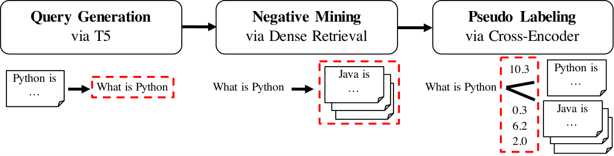
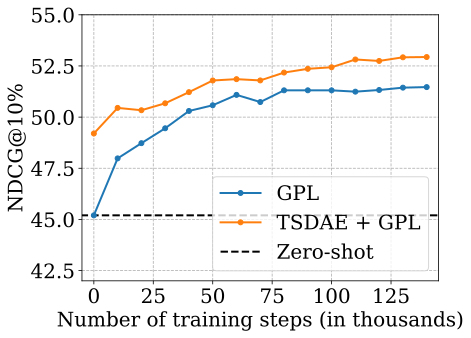
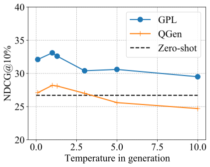

**Source:** *GPL: Generative Pseudo Labeling for Unsupervised Domain Adaptation of Dense Retrieval* — [PDF](https://arxiv.org/pdf/2112.07577) · [arXiv](https://arxiv.org/abs/2112.07577)

# GPL: Generative Pseudo Labeling for Unsupervised Domain Adaptation of Dense Retrieval

Kexin Wang  Affiliation:  Ubiquitous Knowledge Processing Lab, Technical University of Darmstadt  Nandan Thakur  Thanks: ˜˜Contributions made during the stay at the UKP Lab.  Nils Reimers  Affiliation:  University of Waterloo, Hugging Face[www.ukp.tu-darmstadt.de](https://ar5iv.labs.arxiv.org/html/www.ukp.tu-darmstadt.de) Iryna Gurevych  Affiliation:  Ubiquitous Knowledge Processing Lab, Technical University of Darmstadt 

###### Abstract

Dense retrieval approaches can overcome the lexical gap and lead to significantly improved search results. However, they require large amounts of training data which is not available for most domains. As shown in previous work ([Thakur et al. 2021b](https://ar5iv.labs.arxiv.org/html/2112.07577#bib.bib37)), the performance of dense retrievers severely degrades under a domain shift. This limits the usage of dense retrieval approaches to only a few domains with large training datasets.

In this paper, we propose the novel unsupervised domain adaptation method Generative Pseudo Labeling (GPL), which combines a query generator with pseudo labeling from a cross-encoder. On six representative domain-specialized datasets, we find the proposed GPL can outperform an out-of-the-box state-of-the-art dense retrieval approach by up to 9.3 points nDCG@10. GPL requires less (unlabeled) data from the target domain and is more robust in its training than previous methods.

We further investigate the role of six recent pre-training methods in the scenario of domain adaptation for retrieval tasks, where only three could yield improved results. The best approach, TSDAE [Wang et al. 2021](https://ar5iv.labs.arxiv.org/html/2112.07577#bib.bib43) can be combined with GPL, yielding another average improvement of 1.4 points nDCG@10 across the six tasks. The code and the models are available 11 1 <https://github.com/UKPLab/gpl>.

## 1 Introduction

Information Retrieval (IR) is a central component of many natural language applications. Traditionally, lexical methods ([Robertson et al. 1994](https://ar5iv.labs.arxiv.org/html/2112.07577#bib.bib34)) have been used to search through text content. However, these methods suffer from the lexical gap ([Berger et al. 2000](https://ar5iv.labs.arxiv.org/html/2112.07577#bib.bib1)) and are not able to recognize synonyms and distinguish between ambiguous words.

Recently, information retrieval methods based on dense vector spaces have become popular to address these challenges. These dense retrieval methods map queries and passages22 2 We use passage to refer to text of any length. to a shared, dense vector space and retrieve relevant hits by nearest-neighbor search. Significant improvement over traditional approaches has been shown for various tasks ([Karpukhin et al. 2020](https://ar5iv.labs.arxiv.org/html/2112.07577#bib.bib17); [Xiong et al. 2021](https://ar5iv.labs.arxiv.org/html/2112.07577#bib.bib46)). This method is also adapted increasingly by industry to enhance the search functionalities of various applications ([Choi et al. 2020](https://ar5iv.labs.arxiv.org/html/2112.07577#bib.bib3); [Huang et al. 2020](https://ar5iv.labs.arxiv.org/html/2112.07577#bib.bib14)).

However, as shown in [Thakur et al. 2021b](https://ar5iv.labs.arxiv.org/html/2112.07577#bib.bib37), dense retrieval methods require large amounts of training data to work well.33 3 For reference, the popular MS MARCO dataset ([Nguyen et al. 2016](https://ar5iv.labs.arxiv.org/html/2112.07577#bib.bib26)) has about 500k training instances; the Natural Questions dataset ([Kwiatkowski et al. 2019](https://ar5iv.labs.arxiv.org/html/2112.07577#bib.bib18)) has more than 100k training instances.  Most importantly, dense retrieval methods are extremely sensitive to domain shifts: Models trained on MS MARCO perform rather poorly for questions for COVID-19 scientific literature ([Wang et al. 2020](https://ar5iv.labs.arxiv.org/html/2112.07577#bib.bib44); [Voorhees et al. 2021](https://ar5iv.labs.arxiv.org/html/2112.07577#bib.bib41)). The MS MARCO dataset was created before COVID-19, hence, it does not include any COVID-19 related topics and models did not learn how to represent this topic well in a vector space.

In this work, we present Generative Pseudo Labeling (GPL), an unsupervised domain adaptation technique for dense retrieval models (see [Figure 1](https://ar5iv.labs.arxiv.org/html/2112.07577#S1.F1 "Figure 1 ‣ 1 Introduction ‣ GPL: Generative Pseudo Labeling for Unsupervised Domain Adaptation of Dense Retrieval")). For a collection of paragraphs from the desired domain, we use an existing pre-trained T5 encoder-decoder to generate suitable queries. For each generated query, we retrieve the most similar paragraphs using an existing dense retrieval model which will serve as negative passages. Finally, we use an existing cross-encoder to score each (query, passage)-pair and train a dense retrieval model on these generated, pseudo-labeled queries using MarginMSE-Loss [Hofstätter et al. 2020](https://ar5iv.labs.arxiv.org/html/2112.07577#bib.bib11).

 Figure 1: Generative Pseudo Labeling (GPL) for training domain-adapted dense retriever. First, synthetic queries are generated for each passage from the target corpus. Then, the generated queries are used for mining negative passages. Finally, the query-passage pairs are labeled by a cross-encoder and used to train the domain-adapted dense retriever. The output at each step is marked with dashed boxes. 

We use publicly available models for query generation, negative mining, and the cross-encoder, which have been trained on the MS MARCO dataset [Nguyen et al. 2016](https://ar5iv.labs.arxiv.org/html/2112.07577#bib.bib26), a large-scale dataset from Bing search logs combined with relevant passages from diverse web sources. We evaluate GPL on six representative domain-specific datasets from the BeIR benchmark [Thakur et al. 2021b](https://ar5iv.labs.arxiv.org/html/2112.07577#bib.bib37). GPL improves the performance by up to 9.3 points nDCG@10 compared to state-of-the-art model trained solely on MS MARCO. Compared to the previous state-of-the-art domain-adaption method QGen [Ma et al. 2021](https://ar5iv.labs.arxiv.org/html/2112.07577#bib.bib24); [Thakur et al. 2021b](https://ar5iv.labs.arxiv.org/html/2112.07577#bib.bib37), GPL improves the performance by up to 4.5 nDCG@10 points. Training with GPL is easy, fast, and data efficient.

We further analyze the role of six recent pre-training methods in the scenario of domain adaptation for retrieval tasks. The best approach is TSDAE [Wang et al. 2021](https://ar5iv.labs.arxiv.org/html/2112.07577#bib.bib43), that outperforms the second best approach, Masked Language Modeling [Devlin et al. 2019](https://ar5iv.labs.arxiv.org/html/2112.07577#bib.bib4) on average by 2.5 points nDCG@10. TSDAE can be combined with GPL, yielding another average improvement of 1.4 point nDCG@10.

## 2 Related Work

Pre-Training based Domain Adaptation. The most common domain adaption technique for transformer models is domain-adaptive pre-training [Gururangan et al. 2020](https://ar5iv.labs.arxiv.org/html/2112.07577#bib.bib9), which continues pre-training on in-domain data before fine-tuning with labeled data. However, for retrieval it is often difficult to get in-domain labeled data and models are be applied in a zero-shot setting on a given corpus. Besides Masked Language Modeling (MLM) [Devlin et al. 2019](https://ar5iv.labs.arxiv.org/html/2112.07577#bib.bib4), different pre-trained strategies specifically for dense retrieval methods have been proposed. Inverse Cloze Task (ICT) [Lee et al. 2019](https://ar5iv.labs.arxiv.org/html/2112.07577#bib.bib19) generates query-passage pair by randomly selecting one sentence from the passage as the query and the other part as the paired passage. ConDensor (CD) [Gao and Callan 2021](https://ar5iv.labs.arxiv.org/html/2112.07577#bib.bib6) applies MLM on top of the CLS token embedding from the final layer and the other context embeddings from a previous layer to force the model to learn meaningful CLS representation. SimCSE [Gao et al. 2021a](https://ar5iv.labs.arxiv.org/html/2112.07577#bib.bib7); [Liu et al. 2021](https://ar5iv.labs.arxiv.org/html/2112.07577#bib.bib22) passes the same input twice through the network with different dropout masks and minimizes the distance of the resulting embeddings, while Contrastive Tension (CT) [Carlsson et al. 2021](https://ar5iv.labs.arxiv.org/html/2112.07577#bib.bib2) passes the input through two different models. TSDAE [Wang et al. 2021](https://ar5iv.labs.arxiv.org/html/2112.07577#bib.bib43) uses a denoising auto-encoder architecture with bottleneck: Words from the input text are removed and passed through an encoder to generate a fixed-sized embedding. A decoder must reconstruct the original text without noise. As we show in [Appendix E](https://ar5iv.labs.arxiv.org/html/2112.07577#A5 "Appendix E Performance of Unsupervised Pre-Training ‣ GPL: Generative Pseudo Labeling for Unsupervised Domain Adaptation of Dense Retrieval"), just using these unsupervised techniques is not sufficient and the resulting models perform poorly.

So far, ICT and CD have only been studied on in-domain performance, i.e. a large in-domain labeled dataset is available which is used for subsequent supervised fine-tuning. SimCSE, CT, and TSDAE have been only studied for unsupervised sentence embedding learning. As our results show in [Appendix E](https://ar5iv.labs.arxiv.org/html/2112.07577#A5 "Appendix E Performance of Unsupervised Pre-Training ‣ GPL: Generative Pseudo Labeling for Unsupervised Domain Adaptation of Dense Retrieval"), they do not work at all for purely unsupervised dense retrieval.

If these pre-training approaches can be used for unsupervised domain adaptation for dense retrieval was so far unclear. In this work, we transfer the setup from [Wang et al. 2021](https://ar5iv.labs.arxiv.org/html/2112.07577#bib.bib43) to dense retrieval and first pre-train on the target corpus, followed by supervised training on labeled data from MS MARCO [Nguyen et al. 2016](https://ar5iv.labs.arxiv.org/html/2112.07577#bib.bib26). Performance is then measured on the target corpus.

Query Generation. Query generation has been used to improve retrieval performances. Doc2query [Nogueira et al. 2019a](https://ar5iv.labs.arxiv.org/html/2112.07577#bib.bib28); [Nogueira et al. 2019b](https://ar5iv.labs.arxiv.org/html/2112.07577#bib.bib29) expands passages with predicted queries, generated by a trained encoder-decoder model, and uses traditional BM25 lexical search. This performed well in the zero-shot retrieval benchmark BeIR [Thakur et al. 2021b](https://ar5iv.labs.arxiv.org/html/2112.07577#bib.bib37). [Ma et al. 2021](https://ar5iv.labs.arxiv.org/html/2112.07577#bib.bib24) proposes QGen, that uses a query generator trained on general domain data to synthesize domain-targeted queries for the target corpus, on which a dense retriever is trained from scratch. As a concurrent work, [Liang et al. 2019](https://ar5iv.labs.arxiv.org/html/2112.07577#bib.bib21) also proposes the similar method. Following this idea, [Thakur et al. 2021b](https://ar5iv.labs.arxiv.org/html/2112.07577#bib.bib37) views QGen as a post-training method to adapt powerful MS MARCO retrievers to the target domains.

Despite the success of QGen, previous methods only consider the cross-entropy loss with in-batch negatives, which provides coarse-grained relevance and thus limits the performance. In this work, we show that extending this approach by using pseudo-labels from a cross-encoder together with hard negatives can boost the performance by several points nDCG@10.

Other Methods. Recently, [Xin et al. 2021](https://ar5iv.labs.arxiv.org/html/2112.07577#bib.bib45) proposes MoDIR to use Domain Adversarial Training (DAT) [Ganin et al. 2016](https://ar5iv.labs.arxiv.org/html/2112.07577#bib.bib5) for unsupervised domain adaptation of dense retrievers. MoDIR trains models by generating domain invariant representations to attack a domain classifier. However, as argued in [Karouzos et al. 2021](https://ar5iv.labs.arxiv.org/html/2112.07577#bib.bib16), DAT trains models by minimizing the distance between representations from different domains and such learning objective can result in bad embedding space and unstable performance. For sentiment classification, [Karouzos et al. 2021](https://ar5iv.labs.arxiv.org/html/2112.07577#bib.bib16) proposes UDALM based on multiple stages of training. UDALM first applies MLM training on the target domain; and it then applies multi-task learning on the target domain with MLM and on the source domain with a supervised objective. However, as shown in [section 5](https://ar5iv.labs.arxiv.org/html/2112.07577#S5 "5 Results ‣ GPL: Generative Pseudo Labeling for Unsupervised Domain Adaptation of Dense Retrieval"), we find this method cannot yield improvement for retrieval tasks.

Pseudo Labeling and Cross-Encoders: Bi-Encoders map queries and passage independently to a shared vector space from which the query-passage similarity is computed. In contrast, cross-encoders [Humeau et al. 2020](https://ar5iv.labs.arxiv.org/html/2112.07577#bib.bib15) work on the concatenation of the query and passage and predict a relevance score using cross-attention between query and passage. This can be used in a re-ranking setup [Nogueira and Cho 2019](https://ar5iv.labs.arxiv.org/html/2112.07577#bib.bib27), where the relevancy is predicted for all query-passage-pairs for a small candidate set. Previous work has shown that cross-encoders achieve much higher performances [Thakur et al. 2021a](https://ar5iv.labs.arxiv.org/html/2112.07577#bib.bib36); [Hofstätter et al. 2020](https://ar5iv.labs.arxiv.org/html/2112.07577#bib.bib11); [Ren et al. 2021](https://ar5iv.labs.arxiv.org/html/2112.07577#bib.bib32) and are less prone to domain shifts [Thakur et al. 2021b](https://ar5iv.labs.arxiv.org/html/2112.07577#bib.bib37). But cross-encoders come with an extremely high computational overhead, making them less suited for a production setting. Transferring knowledge from cross-encoder to bi-encoders have been shown previous for sentence embeddings [Thakur et al. 2021a](https://ar5iv.labs.arxiv.org/html/2112.07577#bib.bib36) and for dense retrieval: [Hofstätter et al. 2020](https://ar5iv.labs.arxiv.org/html/2112.07577#bib.bib11) predict cross-encoder scores for (query, positive)-pairs and (query, negative)-pairs and learns a bi-encoder to predict the margin between the two scores. This has been shown highly effective for in-domain dense retrieval.

## 3 Method

This section describes our proposed Generative Pseudo Labeling (GPL) method for the unsupervised domain adaptation of dense retrievers. [Figure 1](https://ar5iv.labs.arxiv.org/html/2112.07577#S1.F1 "Figure 1 ‣ 1 Introduction ‣ GPL: Generative Pseudo Labeling for Unsupervised Domain Adaptation of Dense Retrieval") illustrates the idea of GPL.

For a given target corpus, we generate for each passage three queries (cf. [Table 3](https://ar5iv.labs.arxiv.org/html/2112.07577#S6.T3 "Table 3 ‣ 6.3 Robustness against Query Generation ‣ 6 Analysis ‣ GPL: Generative Pseudo Labeling for Unsupervised Domain Adaptation of Dense Retrieval")) using an T5-encoder-decoder model [Raffel et al. 2020](https://ar5iv.labs.arxiv.org/html/2112.07577#bib.bib31). For each of the generated queries, we use an existing retrieval system to retrieve 50 negative passages. Dense retrieval with a pre-existing model was slightly more effective than BM25 lexical retrieval (cf. [Appendix A](https://ar5iv.labs.arxiv.org/html/2112.07577#A1 "Appendix A Performance of Using Different Retrievers for Negative Mining in GPL ‣ GPL: Generative Pseudo Labeling for Unsupervised Domain Adaptation of Dense Retrieval")). For each (query, positive, negative)-tuple we compute the margin \(\delta=\mathrm{CE}(Q,P^{+},)-\mathrm{CE}(Q,P^{-})\) with \(\mathrm{CE}\) the score as predicted by a cross-encoder, \(Q\) the query and \(P^{+}/P^{-}\) the positive / negative passage.

We use the synthetic dataset \(D_{\mathrm{GPL}}=\{(Q_{i},P_{i},P^{-}_{i},\delta_{i})\}_{i}\) with the MarginMSE loss [Hofstätter et al. 2020](https://ar5iv.labs.arxiv.org/html/2112.07577#bib.bib11) for training a domain-adapted dense retriever that maps queries and passages into the shared vector space.

Our method requires from the target domain just an unlabeled collection of passages. Further, we use use pre-existing T5- and cross-encoder models that have been trained on the MS MARCO passages dataset.

Query Generation: To enable supervised training on the target corpus, synthetic queries can be generated for the target passages using a query generator trained on a different, existing dataset like MS MARCO. Previous work QGen [Ma et al. 2021](https://ar5iv.labs.arxiv.org/html/2112.07577#bib.bib24) used the simple MultipleNegativesRanking (MNRL) loss [Henderson et al. 2017](https://ar5iv.labs.arxiv.org/html/2112.07577#bib.bib10); [van den Oord et al. 2018](https://ar5iv.labs.arxiv.org/html/2112.07577#bib.bib39) with in-batch negatives to train the model:

\[\begin{aligned}
 & \displaystyle L_{\mathrm{MNRL}} & \displaystyle(\theta)= &  \\
 & \displaystyle-\frac{1}{M}\sum_{i=0}^{M-1} & \displaystyle\log\frac{\exp\big(\tau\cdot{\sigma(f_{\theta}(Q_{i}),f_{\theta}(P_{i}))}\big)}{\sum_{j=0}^{M-1}\exp\big(\tau\cdot\sigma(f_{\theta}(Q_{i}),f_{\theta}(P_{j}))\big)} & 
\end{aligned}\]

 

where \(P_{i}\) is a relevant passage for \(Q_{i}\); \(\sigma\) is a certain similarity function for vectors; \(\tau\) controls the sharpness of the softmax normalization; \(M\) is the batch size.

MarginMSE loss: MultipleNegativesRanking loss considers only the coarse relationship between queries and passages, i.e. the matching passage is considered as relevant while all other passages are considered irrelevant. However, the query encoder is not without flaws and might generate queries that are not answerable by the passage. Further, other passages might actually be relevant as well for a given query, which is especially the case if training is done with hard negatives as we do it for GPL.

In contrast, MarginMSE loss [Hofstätter et al. 2020](https://ar5iv.labs.arxiv.org/html/2112.07577#bib.bib11) uses a powerful cross-encoder to soft-label (query, passage) pairs. It then teaches the dense retriever to mimic the score margin between the positive and negative query-passage pairs. Formally,

\[\begin{aligned}
 & L_{\mathrm{MarginMSE}}(\theta)=-\frac{1}{M}\sum_{i=0}^{M-1}|\hat{\delta_{i}}-\delta_{i}|^{2} &  & \text{(1)}
\end{aligned}\]

 

where \(\hat{\delta_{i}}\) is the corresponding score margin of the student dense retriever, i.e. \(\hat{\delta_{i}}=f_{\theta}(Q_{i})^{T}f_{\theta}(P_{i})-f_{\theta}(Q_{i})^{T}f_{\theta}(P_{i}^{-})\). Here the dot-product is usually used due to the infinite range of the cross-encoder scores.

This loss is a critical component of GPL, as it solves two major issues from the previous QGen method: A badly generated query for a given passage will get a low score from the cross-encoder, hence, we do not expect the dense retriever to put the query and passage close in the vector space. A false negative will lead to a high score from the cross-encoder, hence, we do not force the dense retriever to assign a large distance between the corresponding embeddings. In section [6.3](https://ar5iv.labs.arxiv.org/html/2112.07577#S6.SS3 "6.3 Robustness against Query Generation ‣ 6 Analysis ‣ GPL: Generative Pseudo Labeling for Unsupervised Domain Adaptation of Dense Retrieval"), we show that GPL is a lot more robust to badly generated queries than the previous QGen method.

## 4 Experiments

In this section, we describe the experimental setup, the datasets used and the baselines for comparison.

### 4.1 Experimental Setup

We use the MS MARCO passage ranking dataset [Nguyen et al. 2016](https://ar5iv.labs.arxiv.org/html/2112.07577#bib.bib26) as the data from the source domain. It has 8.8M passages and 532.8K query-passage pairs labeled as relevant in the training set. As [Table 1](https://ar5iv.labs.arxiv.org/html/2112.07577#S4.T1 "Table 1 ‣ 4.2 Evaluation ‣ 4 Experiments ‣ GPL: Generative Pseudo Labeling for Unsupervised Domain Adaptation of Dense Retrieval") shows, a state-of-the-art dense retrieval model, achieving an MRR@10 of 33.2 points on the MS MARCO passage ranking dataset, performs poorly on the six selected domain-specific retrieval datasets when compared to simple BM25 lexical search.

We use the DistilBERT [Sanh et al. 2019](https://ar5iv.labs.arxiv.org/html/2112.07577#bib.bib35) for all the experiments. We use the concatenation of the title and the body text as the input passage for all the models. We use a maximum sequence length of 350 with mean pooling and dot-product similarity by default. For QGen, we use the default setting in [Thakur et al. 2021b](https://ar5iv.labs.arxiv.org/html/2112.07577#bib.bib37): 1-epoch training and batch size 75. For GPL, we train the models with 140k training steps and batch size 32. To generate queries for both QGen and GPL, we use the DocT5Query [Nogueira et al. 2019a](https://ar5iv.labs.arxiv.org/html/2112.07577#bib.bib28) generator trained on MS MARCO and generate 44 4 We use the script from BeIR at <https://github.com/UKPLab/beir>. queries using nucleus sampling with temperature 1.0, \(k=25\) and \(p=0.95\). To retrieve hard negatives for both GPL and the zero-shot setting of MS MARCO training, we use two dense retrievers with cosine-similarity trained on MS MARCO: msmarco-distilbert-base-v3 and msmarco-MiniLM-L-6-v3 from Sentence-Transformers55 5 <https://github.com/UKPLab/sentence-transformers>. The zero-shot performance of these two dense retrievers are available in [Appendix B](https://ar5iv.labs.arxiv.org/html/2112.07577#A2 "Appendix B Performance of the Zero-Shot Retrievers in Hard-Negative Mining ‣ GPL: Generative Pseudo Labeling for Unsupervised Domain Adaptation of Dense Retrieval"). We retrieve 50 negatives using each retriever and uniformly sample one negative passage and one positive passage for each training query to form one training example. For pseudo labeling, we use the ms-marco-MiniLM-L-6-v266 6 <https://huggingface.co/cross-encoder/ms-marco-MiniLM-L-6-v2> cross-encoder. For all the pre-training methods (e.g. TSDAE and MLM), we train the models for 100K training steps and with batch size 8.

As shown in Section [6](https://ar5iv.labs.arxiv.org/html/2112.07577#S6 "6 Analysis ‣ GPL: Generative Pseudo Labeling for Unsupervised Domain Adaptation of Dense Retrieval"), small corpora require more generated queries and for large corpora, a small down-sampled subset (e.g. 50K) is enough for good performance. Based on these findings, we adjust the number of generated queries per passage \(q_{\mathrm{avg.}}\) and the corpus size \(|C|\) to make the total number of generated queries equal to a fixed number, 250K, i.e. \(q_{\mathrm{avg.}}\times|C|=250\mathrm{K}\). In detail, we first set \(q_{\mathrm{avg.}}>=3\) and uniformly down-sample the corpus if \(3\times|C|>250\mathrm{K}\); then we calculate \(q_{\mathrm{avg.}}=\lceil 250\mathrm{K}/|C|\rceil\). For example, the \(q_{\mathrm{avg.}}\) values for FiQA (original size = 57.6K) and Robust04 (original size = 528.2K) are 5 and 3, resp. and the Robust04 corpus is down-sampled to 83.3K. QGen and GPL share the generated queries for fair comparision.

### 4.2 Evaluation

As our methods focus on domain adaptation to specialized domains, we selected six domain-specific text retrieval tasks from the BeIR benchmark [Thakur et al. 2021b](https://ar5iv.labs.arxiv.org/html/2112.07577#bib.bib37): FiQA (financial domain) [Maia et al. 2018](https://ar5iv.labs.arxiv.org/html/2112.07577#bib.bib25), SciFact (scientific papers) [Wadden et al. 2020](https://ar5iv.labs.arxiv.org/html/2112.07577#bib.bib42), BioASQ (biomedical Q&A) [Tsatsaronis et al. 2015](https://ar5iv.labs.arxiv.org/html/2112.07577#bib.bib38), TREC-COVID (scientific papers on COVID-19) [Roberts et al. 2020](https://ar5iv.labs.arxiv.org/html/2112.07577#bib.bib33), CQADupStack (12 StackExchange subforums) [Hoogeveen et al. 2015](https://ar5iv.labs.arxiv.org/html/2112.07577#bib.bib13) and Robust04 (news articles) [Voorhees 2005](https://ar5iv.labs.arxiv.org/html/2112.07577#bib.bib40). These selected datasets each contain a corpus with a rather specific language and can thus act as a suitable test bed for domain adaptation.

The detailed information for all the target datasets is available at [Appendix C](https://ar5iv.labs.arxiv.org/html/2112.07577#A3 "Appendix C Target Datasets ‣ GPL: Generative Pseudo Labeling for Unsupervised Domain Adaptation of Dense Retrieval"). We make modification on BioASQ and TREC-COVID. For efficient training and evaluation on BioASQ, we randomly remove irrelevant passages to make the final corpus size to 1M. In TREC-COVID, the original corpus has many documents with a missing abstract. The retrieval systems that were used to create the annotation pool for TREC-COVID often ignored such documents, leading to a strong annotation bias for these documents. Hence, we removed all documents with a missing abstract from the corpus. The evaluation results on the original BioASQ and TREC-COVID are available at [Appendix D](https://ar5iv.labs.arxiv.org/html/2112.07577#A4 "Appendix D Results on full BeIR ‣ GPL: Generative Pseudo Labeling for Unsupervised Domain Adaptation of Dense Retrieval"). Evaluation is done using nDCG@10.

<table id="S4.T1.2.1" class="ltx_tabular ltx_guessed_headers ltx_align_middle">
<tbody class="ltx_tbody">
<tr id="S4.T1.2.1.1" class="ltx_tr">
<th id="S4.T1.2.1.1.1" class="ltx_td ltx_nopad ltx_align_left ltx_th ltx_th_row ltx_border_l ltx_border_r ltx_border_t">

</th>
<td id="S4.T1.2.1.1.2" class="ltx_td ltx_align_center ltx_border_r ltx_border_t">FiQA</td>
<td id="S4.T1.2.1.1.3" class="ltx_td ltx_align_center ltx_border_r ltx_border_t">SciFact</td>
<td id="S4.T1.2.1.1.4" class="ltx_td ltx_align_center ltx_border_r ltx_border_t">BioASQ</td>
<td id="S4.T1.2.1.1.5" class="ltx_td ltx_align_center ltx_border_r ltx_border_t">TRECC.</td>
<td id="S4.T1.2.1.1.6" class="ltx_td ltx_align_center ltx_border_r ltx_border_t">CQADup.</td>
<td id="S4.T1.2.1.1.7" class="ltx_td ltx_align_center ltx_border_r ltx_border_t">Robust04</td>
<td id="S4.T1.2.1.1.8" class="ltx_td ltx_align_center ltx_border_r ltx_border_t">Avg.</td></tr>
<tr id="S4.T1.2.1.2" class="ltx_tr">
<th id="S4.T1.2.1.2.1" class="ltx_td ltx_align_left ltx_th ltx_th_row ltx_border_l ltx_border_r ltx_border_t" colspan="8">Zero-Shot Models</th></tr>
<tr id="S4.T1.2.1.3" class="ltx_tr">
<th id="S4.T1.2.1.3.1" class="ltx_td ltx_align_left ltx_th ltx_th_row ltx_border_l ltx_border_r ltx_border_t">MS MARCO</th>
<td id="S4.T1.2.1.3.2" class="ltx_td ltx_align_center ltx_border_r ltx_border_t">26.7</td>
<td id="S4.T1.2.1.3.3" class="ltx_td ltx_align_center ltx_border_r ltx_border_t">57.1</td>
<td id="S4.T1.2.1.3.4" class="ltx_td ltx_align_center ltx_border_r ltx_border_t">52.9</td>
<td id="S4.T1.2.1.3.5" class="ltx_td ltx_align_center ltx_border_r ltx_border_t">66.1</td>
<td id="S4.T1.2.1.3.6" class="ltx_td ltx_align_center ltx_border_r ltx_border_t">29.6</td>
<td id="S4.T1.2.1.3.7" class="ltx_td ltx_align_center ltx_border_r ltx_border_t">39.0</td>
<td id="S4.T1.2.1.3.8" class="ltx_td ltx_align_center ltx_border_r ltx_border_t">45.2</td></tr>
<tr id="S4.T1.2.1.4" class="ltx_tr">
<th id="S4.T1.2.1.4.1" class="ltx_td ltx_align_left ltx_th ltx_th_row ltx_border_l ltx_border_r">PAQ</th>
<td id="S4.T1.2.1.4.2" class="ltx_td ltx_align_center ltx_border_r">15.2</td>
<td id="S4.T1.2.1.4.3" class="ltx_td ltx_align_center ltx_border_r">53.3</td>
<td id="S4.T1.2.1.4.4" class="ltx_td ltx_align_center ltx_border_r">44.0</td>
<td id="S4.T1.2.1.4.5" class="ltx_td ltx_align_center ltx_border_r">23.8</td>
<td id="S4.T1.2.1.4.6" class="ltx_td ltx_align_center ltx_border_r">24.5</td>
<td id="S4.T1.2.1.4.7" class="ltx_td ltx_align_center ltx_border_r">31.9</td>
<td id="S4.T1.2.1.4.8" class="ltx_td ltx_align_center ltx_border_r">32.1</td></tr>
<tr id="S4.T1.2.1.5" class="ltx_tr">
<th id="S4.T1.2.1.5.1" class="ltx_td ltx_align_left ltx_th ltx_th_row ltx_border_l ltx_border_r">PAQ + MS MARCO</th>
<td id="S4.T1.2.1.5.2" class="ltx_td ltx_align_center ltx_border_r">26.7</td>
<td id="S4.T1.2.1.5.3" class="ltx_td ltx_align_center ltx_border_r">57.6</td>
<td id="S4.T1.2.1.5.4" class="ltx_td ltx_align_center ltx_border_r">53.8</td>
<td id="S4.T1.2.1.5.5" class="ltx_td ltx_align_center ltx_border_r">63.4</td>
<td id="S4.T1.2.1.5.6" class="ltx_td ltx_align_center ltx_border_r">30.6</td>
<td id="S4.T1.2.1.5.7" class="ltx_td ltx_align_center ltx_border_r">37.2</td>
<td id="S4.T1.2.1.5.8" class="ltx_td ltx_align_center ltx_border_r">44.9</td></tr>
<tr id="S4.T1.2.1.6" class="ltx_tr">
<th id="S4.T1.2.1.6.1" class="ltx_td ltx_align_left ltx_th ltx_th_row ltx_border_l ltx_border_r">TSDAE<math id="S4.T1.m1" class="ltx_Math" alttext="{}_{\text{MS MARCO}}" display="inline" intent=":literal"><semantics><msub><mrow></mrow><mtext>MS MARCO</mtext></msub><annotation encoding="application/x-tex">{}_{\text{MS MARCO}}</annotation></semantics></math></th>
<td id="S4.T1.2.1.6.2" class="ltx_td ltx_align_center ltx_border_r">26.7</td>
<td id="S4.T1.2.1.6.3" class="ltx_td ltx_align_center ltx_border_r">55.5</td>
<td id="S4.T1.2.1.6.4" class="ltx_td ltx_align_center ltx_border_r">51.4</td>
<td id="S4.T1.2.1.6.5" class="ltx_td ltx_align_center ltx_border_r">65.6</td>
<td id="S4.T1.2.1.6.6" class="ltx_td ltx_align_center ltx_border_r">30.5</td>
<td id="S4.T1.2.1.6.7" class="ltx_td ltx_align_center ltx_border_r">36.6</td>
<td id="S4.T1.2.1.6.8" class="ltx_td ltx_align_center ltx_border_r">44.4</td></tr>
<tr id="S4.T1.2.1.7" class="ltx_tr">
<th id="S4.T1.2.1.7.1" class="ltx_td ltx_align_left ltx_th ltx_th_row ltx_border_l ltx_border_r">BM25</th>
<td id="S4.T1.2.1.7.2" class="ltx_td ltx_align_center ltx_border_r">23.9</td>
<td id="S4.T1.2.1.7.3" class="ltx_td ltx_align_center ltx_border_r">66.1</td>
<td id="S4.T1.2.1.7.4" class="ltx_td ltx_align_center ltx_border_r">70.7</td>
<td id="S4.T1.2.1.7.5" class="ltx_td ltx_align_center ltx_border_r">60.1</td>
<td id="S4.T1.2.1.7.6" class="ltx_td ltx_align_center ltx_border_r">31.5</td>
<td id="S4.T1.2.1.7.7" class="ltx_td ltx_align_center ltx_border_r">38.7</td>
<td id="S4.T1.2.1.7.8" class="ltx_td ltx_align_center ltx_border_r">48.5</td></tr>
<tr id="S4.T1.2.1.8" class="ltx_tr">
<th id="S4.T1.2.1.8.1" class="ltx_td ltx_align_left ltx_th ltx_th_row ltx_border_l ltx_border_r ltx_border_t" colspan="8">Previous Domain Adaptation Methods</th></tr>
<tr id="S4.T1.2.1.9" class="ltx_tr">
<th id="S4.T1.2.1.9.1" class="ltx_td ltx_align_left ltx_th ltx_th_row ltx_border_l ltx_border_r ltx_border_t">UDALM</th>
<td id="S4.T1.2.1.9.2" class="ltx_td ltx_align_center ltx_border_r ltx_border_t">23.3</td>
<td id="S4.T1.2.1.9.3" class="ltx_td ltx_align_center ltx_border_r ltx_border_t">33.6</td>
<td id="S4.T1.2.1.9.4" class="ltx_td ltx_align_center ltx_border_r ltx_border_t">33.1</td>
<td id="S4.T1.2.1.9.5" class="ltx_td ltx_align_center ltx_border_r ltx_border_t">57.1</td>
<td id="S4.T1.2.1.9.6" class="ltx_td ltx_align_center ltx_border_r ltx_border_t">24.6</td>
<td id="S4.T1.2.1.9.7" class="ltx_td ltx_align_center ltx_border_r ltx_border_t">26.3</td>
<td id="S4.T1.2.1.9.8" class="ltx_td ltx_align_center ltx_border_r ltx_border_t">33.0</td></tr>
<tr id="S4.T1.2.1.10" class="ltx_tr">
<th id="S4.T1.2.1.10.1" class="ltx_td ltx_align_left ltx_th ltx_th_row ltx_border_l ltx_border_r">MoDIR</th>
<td id="S4.T1.2.1.10.2" class="ltx_td ltx_align_center ltx_border_r">29.6</td>
<td id="S4.T1.2.1.10.3" class="ltx_td ltx_align_center ltx_border_r">50.2</td>
<td id="S4.T1.2.1.10.4" class="ltx_td ltx_align_center ltx_border_r">47.9</td>
<td id="S4.T1.2.1.10.5" class="ltx_td ltx_align_center ltx_border_r">66.0</td>
<td id="S4.T1.2.1.10.6" class="ltx_td ltx_align_center ltx_border_r">29.7</td>
<td id="S4.T1.2.1.10.7" class="ltx_td ltx_align_center ltx_border_r">–</td>
<td id="S4.T1.2.1.10.8" class="ltx_td ltx_align_center ltx_border_r">–</td></tr>
<tr id="S4.T1.2.1.11" class="ltx_tr">
<th id="S4.T1.2.1.11.1" class="ltx_td ltx_align_left ltx_th ltx_th_row ltx_border_l ltx_border_r ltx_border_t" colspan="8">Pre-Training based Domain Adaptation: Target <math id="S4.T1.m2" class="ltx_Math" alttext="\to" display="inline" intent=":literal"><semantics><mo stretchy="false">→</mo><annotation encoding="application/x-tex">\to</annotation></semantics></math> MS MARCO</th></tr>
<tr id="S4.T1.2.1.12" class="ltx_tr">
<th id="S4.T1.2.1.12.1" class="ltx_td ltx_align_left ltx_th ltx_th_row ltx_border_l ltx_border_r ltx_border_t">CT</th>
<td id="S4.T1.2.1.12.2" class="ltx_td ltx_align_center ltx_border_r ltx_border_t">28.3</td>
<td id="S4.T1.2.1.12.3" class="ltx_td ltx_align_center ltx_border_r ltx_border_t">55.6</td>
<td id="S4.T1.2.1.12.4" class="ltx_td ltx_align_center ltx_border_r ltx_border_t">49.9</td>
<td id="S4.T1.2.1.12.5" class="ltx_td ltx_align_center ltx_border_r ltx_border_t">63.8</td>
<td id="S4.T1.2.1.12.6" class="ltx_td ltx_align_center ltx_border_r ltx_border_t">30.5</td>
<td id="S4.T1.2.1.12.7" class="ltx_td ltx_align_center ltx_border_r ltx_border_t">35.9</td>
<td id="S4.T1.2.1.12.8" class="ltx_td ltx_align_center ltx_border_r ltx_border_t">44.0</td></tr>
<tr id="S4.T1.2.1.13" class="ltx_tr">
<th id="S4.T1.2.1.13.1" class="ltx_td ltx_align_left ltx_th ltx_th_row ltx_border_l ltx_border_r">CD</th>
<td id="S4.T1.2.1.13.2" class="ltx_td ltx_align_center ltx_border_r">27.0</td>
<td id="S4.T1.2.1.13.3" class="ltx_td ltx_align_center ltx_border_r">62.7</td>
<td id="S4.T1.2.1.13.4" class="ltx_td ltx_align_center ltx_border_r">47.7</td>
<td id="S4.T1.2.1.13.5" class="ltx_td ltx_align_center ltx_border_r">65.4</td>
<td id="S4.T1.2.1.13.6" class="ltx_td ltx_align_center ltx_border_r">30.6</td>
<td id="S4.T1.2.1.13.7" class="ltx_td ltx_align_center ltx_border_r">34.5</td>
<td id="S4.T1.2.1.13.8" class="ltx_td ltx_align_center ltx_border_r">44.7</td></tr>
<tr id="S4.T1.2.1.14" class="ltx_tr">
<th id="S4.T1.2.1.14.1" class="ltx_td ltx_align_left ltx_th ltx_th_row ltx_border_l ltx_border_r">SimCSE</th>
<td id="S4.T1.2.1.14.2" class="ltx_td ltx_align_center ltx_border_r">26.7</td>
<td id="S4.T1.2.1.14.3" class="ltx_td ltx_align_center ltx_border_r">55.0</td>
<td id="S4.T1.2.1.14.4" class="ltx_td ltx_align_center ltx_border_r">53.2</td>
<td id="S4.T1.2.1.14.5" class="ltx_td ltx_align_center ltx_border_r">68.3</td>
<td id="S4.T1.2.1.14.6" class="ltx_td ltx_align_center ltx_border_r">29.0</td>
<td id="S4.T1.2.1.14.7" class="ltx_td ltx_align_center ltx_border_r">37.9</td>
<td id="S4.T1.2.1.14.8" class="ltx_td ltx_align_center ltx_border_r">45.0</td></tr>
<tr id="S4.T1.2.1.15" class="ltx_tr">
<th id="S4.T1.2.1.15.1" class="ltx_td ltx_align_left ltx_th ltx_th_row ltx_border_l ltx_border_r">ICT</th>
<td id="S4.T1.2.1.15.2" class="ltx_td ltx_align_center ltx_border_r">27.0</td>
<td id="S4.T1.2.1.15.3" class="ltx_td ltx_align_center ltx_border_r">58.3</td>
<td id="S4.T1.2.1.15.4" class="ltx_td ltx_align_center ltx_border_r">55.3</td>
<td id="S4.T1.2.1.15.5" class="ltx_td ltx_align_center ltx_border_r">69.7</td>
<td id="S4.T1.2.1.15.6" class="ltx_td ltx_align_center ltx_border_r">31.3</td>
<td id="S4.T1.2.1.15.7" class="ltx_td ltx_align_center ltx_border_r">37.4</td>
<td id="S4.T1.2.1.15.8" class="ltx_td ltx_align_center ltx_border_r">46.5</td></tr>
<tr id="S4.T1.2.1.16" class="ltx_tr">
<th id="S4.T1.2.1.16.1" class="ltx_td ltx_align_left ltx_th ltx_th_row ltx_border_l ltx_border_r">MLM</th>
<td id="S4.T1.2.1.16.2" class="ltx_td ltx_align_center ltx_border_r">30.2</td>
<td id="S4.T1.2.1.16.3" class="ltx_td ltx_align_center ltx_border_r">60.0</td>
<td id="S4.T1.2.1.16.4" class="ltx_td ltx_align_center ltx_border_r">51.3</td>
<td id="S4.T1.2.1.16.5" class="ltx_td ltx_align_center ltx_border_r">69.5</td>
<td id="S4.T1.2.1.16.6" class="ltx_td ltx_align_center ltx_border_r">30.4</td>
<td id="S4.T1.2.1.16.7" class="ltx_td ltx_align_center ltx_border_r">38.8</td>
<td id="S4.T1.2.1.16.8" class="ltx_td ltx_align_center ltx_border_r">46.7</td></tr>
<tr id="S4.T1.2.1.17" class="ltx_tr">
<th id="S4.T1.2.1.17.1" class="ltx_td ltx_align_left ltx_th ltx_th_row ltx_border_l ltx_border_r">TSDAE</th>
<td id="S4.T1.2.1.17.2" class="ltx_td ltx_align_center ltx_border_r">29.3</td>
<td id="S4.T1.2.1.17.3" class="ltx_td ltx_align_center ltx_border_r">62.8</td>
<td id="S4.T1.2.1.17.4" class="ltx_td ltx_align_center ltx_border_r">55.5</td>
<td id="S4.T1.2.1.17.5" class="ltx_td ltx_align_center ltx_border_r">76.1</td>
<td id="S4.T1.2.1.17.6" class="ltx_td ltx_align_center ltx_border_r">31.8</td>
<td id="S4.T1.2.1.17.7" class="ltx_td ltx_align_center ltx_border_r">39.4</td>
<td id="S4.T1.2.1.17.8" class="ltx_td ltx_align_center ltx_border_r">49.2</td></tr>
<tr id="S4.T1.2.1.18" class="ltx_tr">
<th id="S4.T1.2.1.18.1" class="ltx_td ltx_align_left ltx_th ltx_th_row ltx_border_l ltx_border_r ltx_border_t" colspan="8">Generation-based Domain Adaptation (Previous State-of-the-Art)</th></tr>
<tr id="S4.T1.2.1.19" class="ltx_tr">
<th id="S4.T1.2.1.19.1" class="ltx_td ltx_align_left ltx_th ltx_th_row ltx_border_l ltx_border_r ltx_border_t">QGen</th>
<td id="S4.T1.2.1.19.2" class="ltx_td ltx_align_center ltx_border_r ltx_border_t">28.7</td>
<td id="S4.T1.2.1.19.3" class="ltx_td ltx_align_center ltx_border_r ltx_border_t">63.8</td>
<td id="S4.T1.2.1.19.4" class="ltx_td ltx_align_center ltx_border_r ltx_border_t">56.5</td>
<td id="S4.T1.2.1.19.5" class="ltx_td ltx_align_center ltx_border_r ltx_border_t">72.4</td>
<td id="S4.T1.2.1.19.6" class="ltx_td ltx_align_center ltx_border_r ltx_border_t">33.0</td>
<td id="S4.T1.2.1.19.7" class="ltx_td ltx_align_center ltx_border_r ltx_border_t">38.1</td>
<td id="S4.T1.2.1.19.8" class="ltx_td ltx_align_center ltx_border_r ltx_border_t">48.8</td></tr>
<tr id="S4.T1.2.1.20" class="ltx_tr">
<th id="S4.T1.2.1.20.1" class="ltx_td ltx_align_left ltx_th ltx_th_row ltx_border_l ltx_border_r">QGen (w/ Hard Negatives)</th>
<td id="S4.T1.2.1.20.2" class="ltx_td ltx_align_center ltx_border_r">26.0</td>
<td id="S4.T1.2.1.20.3" class="ltx_td ltx_align_center ltx_border_r">59.6</td>
<td id="S4.T1.2.1.20.4" class="ltx_td ltx_align_center ltx_border_r">57.7</td>
<td id="S4.T1.2.1.20.5" class="ltx_td ltx_align_center ltx_border_r">65.0</td>
<td id="S4.T1.2.1.20.6" class="ltx_td ltx_align_center ltx_border_r">33.2</td>
<td id="S4.T1.2.1.20.7" class="ltx_td ltx_align_center ltx_border_r">36.5</td>
<td id="S4.T1.2.1.20.8" class="ltx_td ltx_align_center ltx_border_r">46.3</td></tr>
<tr id="S4.T1.2.1.21" class="ltx_tr">
<th id="S4.T1.2.1.21.1" class="ltx_td ltx_align_left ltx_th ltx_th_row ltx_border_l ltx_border_r">TSDAE + QGen (Ours)</th>
<td id="S4.T1.2.1.21.2" class="ltx_td ltx_align_center ltx_border_r">31.4</td>
<td id="S4.T1.2.1.21.3" class="ltx_td ltx_align_center ltx_border_r">66.7</td>
<td id="S4.T1.2.1.21.4" class="ltx_td ltx_align_center ltx_border_r">58.1</td>
<td id="S4.T1.2.1.21.5" class="ltx_td ltx_align_center ltx_border_r">72.6</td>
<td id="S4.T1.2.1.21.6" class="ltx_td ltx_align_center ltx_border_r">35.3</td>
<td id="S4.T1.2.1.21.7" class="ltx_td ltx_align_center ltx_border_r">37.4</td>
<td id="S4.T1.2.1.21.8" class="ltx_td ltx_align_center ltx_border_r">50.3</td></tr>
<tr id="S4.T1.2.1.22" class="ltx_tr">
<th id="S4.T1.2.1.22.1" class="ltx_td ltx_align_left ltx_th ltx_th_row ltx_border_l ltx_border_r ltx_border_t" colspan="8">Proposed Method: Generative Pseudo Labeling</th></tr>
<tr id="S4.T1.2.1.23" class="ltx_tr">
<th id="S4.T1.2.1.23.1" class="ltx_td ltx_align_left ltx_th ltx_th_row ltx_border_l ltx_border_r ltx_border_t">GPL</th>
<td id="S4.T1.2.1.23.2" class="ltx_td ltx_align_center ltx_border_r ltx_border_t">32.8</td>
<td id="S4.T1.2.1.23.3" class="ltx_td ltx_align_center ltx_border_r ltx_border_t">66.4</td>
<td id="S4.T1.2.1.23.4" class="ltx_td ltx_align_center ltx_border_r ltx_border_t">61.0</td>
<td id="S4.T1.2.1.23.5" class="ltx_td ltx_align_center ltx_border_r ltx_border_t">72.6</td>
<td id="S4.T1.2.1.23.6" class="ltx_td ltx_align_center ltx_border_r ltx_border_t">34.5</td>
<td id="S4.T1.2.1.23.7" class="ltx_td ltx_align_center ltx_border_r ltx_border_t">41.4</td>
<td id="S4.T1.2.1.23.8" class="ltx_td ltx_align_center ltx_border_r ltx_border_t">51.5</td></tr>
<tr id="S4.T1.2.1.24" class="ltx_tr">
<th id="S4.T1.2.1.24.1" class="ltx_td ltx_align_left ltx_th ltx_th_row ltx_border_l ltx_border_r">TSDAE + GPL</th>
<td id="S4.T1.2.1.24.2" class="ltx_td ltx_align_center ltx_border_r">34.4</td>
<td id="S4.T1.2.1.24.3" class="ltx_td ltx_align_center ltx_border_r">68.9</td>
<td id="S4.T1.2.1.24.4" class="ltx_td ltx_align_center ltx_border_r">61.6</td>
<td id="S4.T1.2.1.24.5" class="ltx_td ltx_align_center ltx_border_r">74.6</td>
<td id="S4.T1.2.1.24.6" class="ltx_td ltx_align_center ltx_border_r">35.1</td>
<td id="S4.T1.2.1.24.7" class="ltx_td ltx_align_center ltx_border_r">43.0</td>
<td id="S4.T1.2.1.24.8" class="ltx_td ltx_align_center ltx_border_r">52.9</td></tr>
<tr id="S4.T1.2.1.25" class="ltx_tr">
<th id="S4.T1.2.1.25.1" class="ltx_td ltx_align_left ltx_th ltx_th_row ltx_border_l ltx_border_r ltx_border_t" colspan="8">Re-Ranking with Cross-Encoders (Upper Bound, Inefficient at Inference)</th></tr>
<tr id="S4.T1.2.1.26" class="ltx_tr">
<th id="S4.T1.2.1.26.1" class="ltx_td ltx_align_left ltx_th ltx_th_row ltx_border_l ltx_border_r ltx_border_t">BM25 + CE</th>
<td id="S4.T1.2.1.26.2" class="ltx_td ltx_align_center ltx_border_r ltx_border_t">33.1</td>
<td id="S4.T1.2.1.26.3" class="ltx_td ltx_align_center ltx_border_r ltx_border_t">67.6</td>
<td id="S4.T1.2.1.26.4" class="ltx_td ltx_align_center ltx_border_r ltx_border_t">72.8</td>
<td id="S4.T1.2.1.26.5" class="ltx_td ltx_align_center ltx_border_r ltx_border_t">71.2</td>
<td id="S4.T1.2.1.26.6" class="ltx_td ltx_align_center ltx_border_r ltx_border_t">36.8</td>
<td id="S4.T1.2.1.26.7" class="ltx_td ltx_align_center ltx_border_r ltx_border_t">46.7</td>
<td id="S4.T1.2.1.26.8" class="ltx_td ltx_align_center ltx_border_r ltx_border_t">54.7</td></tr>
<tr id="S4.T1.2.1.27" class="ltx_tr">
<th id="S4.T1.2.1.27.1" class="ltx_td ltx_align_left ltx_th ltx_th_row ltx_border_l ltx_border_r">MS MARCO + CE</th>
<td id="S4.T1.2.1.27.2" class="ltx_td ltx_align_center ltx_border_r">33.0</td>
<td id="S4.T1.2.1.27.3" class="ltx_td ltx_align_center ltx_border_r">66.9</td>
<td id="S4.T1.2.1.27.4" class="ltx_td ltx_align_center ltx_border_r">57.4</td>
<td id="S4.T1.2.1.27.5" class="ltx_td ltx_align_center ltx_border_r">65.1</td>
<td id="S4.T1.2.1.27.6" class="ltx_td ltx_align_center ltx_border_r">36.9</td>
<td id="S4.T1.2.1.27.7" class="ltx_td ltx_align_center ltx_border_r">44.7</td>
<td id="S4.T1.2.1.27.8" class="ltx_td ltx_align_center ltx_border_r">50.7</td></tr>
<tr id="S4.T1.2.1.28" class="ltx_tr">
<th id="S4.T1.2.1.28.1" class="ltx_td ltx_align_left ltx_th ltx_th_row ltx_border_b ltx_border_l ltx_border_r">TSDAE + GPL + CE</th>
<td id="S4.T1.2.1.28.2" class="ltx_td ltx_align_center ltx_border_b ltx_border_r">36.4</td>
<td id="S4.T1.2.1.28.3" class="ltx_td ltx_align_center ltx_border_b ltx_border_r">68.3</td>
<td id="S4.T1.2.1.28.4" class="ltx_td ltx_align_center ltx_border_b ltx_border_r">68.0</td>
<td id="S4.T1.2.1.28.5" class="ltx_td ltx_align_center ltx_border_b ltx_border_r">71.4</td>
<td id="S4.T1.2.1.28.6" class="ltx_td ltx_align_center ltx_border_b ltx_border_r">38.1</td>
<td id="S4.T1.2.1.28.7" class="ltx_td ltx_align_center ltx_border_b ltx_border_r">48.3</td>
<td id="S4.T1.2.1.28.8" class="ltx_td ltx_align_center ltx_border_b ltx_border_r">55.1</td></tr>
</tbody>
</table>

 

Table 1: Evaluation using nDCG@10. The best results of the single-stage dense retrievers are bold. TRECC. and CQADup. are short for TREC-COVID and CQADupStack. Our proposed GPL significantly outperforms other domain adaptation methods. For the first time, we investigate the TSDAE pre-training in domain adaptation for dense retrieval and find it can significantly improve both QGen and GPL. The results on the full 18 BeIR datasets can be found at [Appendix D](https://ar5iv.labs.arxiv.org/html/2112.07577#A4 "Appendix D Results on full BeIR ‣ GPL: Generative Pseudo Labeling for Unsupervised Domain Adaptation of Dense Retrieval").

### 4.3 Baselines

Zero-Shot Models: We apply supervised training on MS MARCO or PAQ [Lewis et al. 2021](https://ar5iv.labs.arxiv.org/html/2112.07577#bib.bib20) and evaluate the trained retrievers on the target datasets. (a) MS MARCO represents a distilbert-base dense retrieval model trained with MarginMSE on the MS MARCO dataset with batch-size 75 for 70k steps. (b) PAQ [Oguz et al. 2021](https://ar5iv.labs.arxiv.org/html/2112.07577#bib.bib30) represents MNRL training on the PAQ dataset. (c) PAQ + MS MARCO represents MNRL training on PAQ followed by MarginMSE training on MS MARCO. (d) TSDAE\({}_{\textbf{MS MARCO}}\) represents TSDAE [Wang et al. 2021](https://ar5iv.labs.arxiv.org/html/2112.07577#bib.bib43) pre-training on MS MARCO followed by MarginMSE training on MS MARCO. (e) BM25 system based on lexical matching from Elasticsearch77 7 <https://www.elastic.co>.

Previous Domain Adaptation Methods: We include two previous unsupervised domain adaptation methods, UDALM [Karouzos et al. 2021](https://ar5iv.labs.arxiv.org/html/2112.07577#bib.bib16) and MoDIR [Xin et al. 2021](https://ar5iv.labs.arxiv.org/html/2112.07577#bib.bib45). For UDALM, we apply MLM training on the target corpus and then apply the multi-task training of MarginMSE training on MS MARCO and MLM training on the target corpus. For MoDIR, it starts from the ANCE checkpoint and apply domain adversarial training on MS MARCO and the target dataset. As of writing, the training code of MoDIR is not public, but domain adapted models for 5 out of 6 datasets have been released by the authors.

Pre-Training based Domain Adaptation: We follow the setup proposed in [Wang et al. 2021](https://ar5iv.labs.arxiv.org/html/2112.07577#bib.bib43) on domain-adapted pre-training: We pre-train the dense retrievers with different methods on the target corpus and then continue to train the models on MS MARCO with MarginMSE loss. The pre-training methods consist of: (a) CD [Gao and Callan 2021](https://ar5iv.labs.arxiv.org/html/2112.07577#bib.bib6) extracts the hidden representations from an intermediate layer and applies MLM on the CLS token representation and these extracted hidden representations88 8 CD can only be applied with CLS pooling.. (b) SimCSE [Gao et al. 2021b](https://ar5iv.labs.arxiv.org/html/2112.07577#bib.bib8); [Liu et al. 2021](https://ar5iv.labs.arxiv.org/html/2112.07577#bib.bib22) simply encode the same text twice with different dropout masks in combination with MNRL loss. (c) CT [Carlsson et al. 2021](https://ar5iv.labs.arxiv.org/html/2112.07577#bib.bib2) is similar to SimCSE but it uses two independent encoders to encode a pair of text. (d) MLM [Devlin et al. 2019](https://ar5iv.labs.arxiv.org/html/2112.07577#bib.bib4) uses the default setting in original paper, where 15% tokens in a text are sampled to be masked and are needed to be predicted. (e) ICT [Lee et al. 2019](https://ar5iv.labs.arxiv.org/html/2112.07577#bib.bib19) uniformly samples one sentence from a passage as the pseudo query to that passage and uses MNRL loss on the synthetic data. We follow the setting in [Lee et al. 2019](https://ar5iv.labs.arxiv.org/html/2112.07577#bib.bib19) and masked out the selected sentence 90% of the time. (f) TSDAE [Wang et al. 2021](https://ar5iv.labs.arxiv.org/html/2112.07577#bib.bib43) uses a denoising autoencoder to pre-train the dense retrievers with 60% random tokens deleted in the input texts.

Generation-based Domain Adaptation: We use the training script99 9 <https://github.com/UKPLab/beir> from [Thakur et al. 2021b](https://ar5iv.labs.arxiv.org/html/2112.07577#bib.bib37) to train QGen models with the default setting. Cosine similarity is used and the models are fine-tuned for 1 epoch with MNRL. The default QGen is trained with in-batch negatives. For a fair comparison, we also test QGen with hard negatives as used in GPL, noted as QGen (w/ Hard Negatives). Further, We we test the combination of TSDAE and QGen (TSDAE + QGen).

Re-Ranking with Cross-Encoders: We also include results of the powerful but inefficient re-ranking methods for reference. Three retrievers for the first-phrase retrieval are tested: BM25 from Elasticsearch, the zero-shot MS MARCO retriever and the enhanced GPL retriever by TSDAE pre-training. We use the cross-encoder ms-marco-MiniLM-L-6-v2 from Sentence-Transformers, which is also for pseudo labeling for GPL.

## 5 Results

Pre-Training based Domain Adaptation:

The results are shown in [Table 1](https://ar5iv.labs.arxiv.org/html/2112.07577#S4.T1 "Table 1 ‣ 4.2 Evaluation ‣ 4 Experiments ‣ GPL: Generative Pseudo Labeling for Unsupervised Domain Adaptation of Dense Retrieval"). Compared with the zero-shot MS MARCO model, TSDAE, MLM and ICT can improve the performance if we first pre-train on the target corpus and then perform supervised training on MS MARCO. Among them, TSDAE is the most effective method, outperforming the zero-shot baseline by by 4.0 points nDCG@10 on average. CD, CT and SimCSE are not able to adapt to the domains in a pre-training setup and achieve a performance worse than the zero-shot model.

To ensure that TSDAE actually learns domain specific terminology, we include \(\text{TSDAE}_{\text{MS MARCO}}\) in our experiments: Here, we performed TSDAE pre-training on the MS MARCO dataset follow by supervised learning on MS MARCO. This performs slightly weaker than the zero-shot MS MARCO model.

We also tested the pre-training methods without any supervised training on MS MARCO. We find all of them fail miserably compared as shown in [Appendix E](https://ar5iv.labs.arxiv.org/html/2112.07577#A5 "Appendix E Performance of Unsupervised Pre-Training ‣ GPL: Generative Pseudo Labeling for Unsupervised Domain Adaptation of Dense Retrieval") .

Previous Domain Adaptation Methods: We test MoDIR on the datasets except Robust041010 10 The original author did not train the model on Robust04 and the code is also not available.. MoDIR performs on-par with our zero-shot MS MARCO model on FiQA, TREC-COVID and CQADupStack, while it performs much weaker on SciFact and BioASQ. An improved training setup with MoDIR could improve the results.

We also test UDALM, which first does MLM pre-training on the target corpus, and then runs multitask learning with MLM objective and supervised training on MS MARCO. The results show that UDALM in this case greatly harms the performance by 12.2 points in average, when compared with the MLM-pre-training approach. We suppose this is because unlike text classification, the dense retrieval models usually do not have an additional task head and the direct MLM training conflicts with the supervised training.

Generation-based Domain Adaptation: The results show that the previous best method, QGen, can successfully adapt the MS MARCO models to the new domains, improving the performance on average by 3.6 points. It performs on par with TSDAE-based domain-adaptive pre-training. Combining TSDAE with QGen can further improve the performance by 1.5 points.

When using QGen with hard negatives instead of random in-batch negatives, the performance decreases by 2.5 points in average. QGen is sensitive to false negatives, i.e. negative passage that are actually relevant for the query. This is a common issue for hard negative mining. GPL solves this issue by using the cross-encoder to determine the distance between the query and a passage. We give more analysis in [section 7](https://ar5iv.labs.arxiv.org/html/2112.07577#S7 "7 Case Study: Fine-Grained Labels ‣ GPL: Generative Pseudo Labeling for Unsupervised Domain Adaptation of Dense Retrieval").

Generative Pseudo Labeling (GPL, proposed method): We find GPL is significantly better on almost all the datasets compared to the other tested method, outperforming QGen by up to 4.5 points (on BioASQ) and in average by 2.7 points. One exception is TREC-COVID, but as this dataset has just 50 test queries, so this difference can be due to noise.

As a further enhancement, we find that TSDAE-based domain-adaptive pre-training combined with GPL (i.e. TSDAE + GPL) can further improve the performance on all the datasets, achieving the new state-of-the-art result of 52.9 nDCG@10 points in average. It outperforms the out-of-the-box MS MARCO model 7.7 points on average.

For the results of GPL on the full 18 BeIR datasets, please refer to [Appendix D](https://ar5iv.labs.arxiv.org/html/2112.07577#A4 "Appendix D Results on full BeIR ‣ GPL: Generative Pseudo Labeling for Unsupervised Domain Adaptation of Dense Retrieval").

Re-ranking with Cross-Encoders: Cross-encoders perform well in a zero-shot setting and outperform dense retrieval approaches significantly [Thakur et al. 2021b](https://ar5iv.labs.arxiv.org/html/2112.07577#bib.bib37), but they come with a significant computational cost at inference. TSDAE and GPL can narrow but not fully close the performance gap. Due to the much lower computational costs at inference, the TSDAE + GPL model would be preferable in a production setting.

## 6 Analysis

In this section, we analyze the influence of training steps, corpus size, query generation and choices of starting checkpoints on GPL.

### 6.1 Influence of Training Steps

 Figure 2: Influence of the number training steps on the averaged performance. The performance of GPL begins to be saturated after 100K steps. TSDAE helps improve the performance during the whole training stage.

We first analyze the influence of the number of training steps on the model performance. We evaluate the models every 10K training steps and end the training after 140K steps. The results for the change of averaged performance on all the datasets are shown in [Figure 2](https://ar5iv.labs.arxiv.org/html/2112.07577#S6.F2 "Figure 2 ‣ 6.1 Influence of Training Steps ‣ 6 Analysis ‣ GPL: Generative Pseudo Labeling for Unsupervised Domain Adaptation of Dense Retrieval"). We find the performance of GPL begins to be saturated after around 100K steps. With the TSDAE pre-training, the performance can be improved consistently during the whole training stage. For reference, training a distilbert-base model for 100k steps takes about 9.6 hours on a single V100 GPU.

### 6.2 Influence of Corpus Size

<table id="S6.T2.2.1" class="ltx_tabular ltx_guessed_headers ltx_align_middle">
<tbody class="ltx_tbody">
<tr id="S6.T2.2.1.1" class="ltx_tr">
<th id="S6.T2.2.1.1.1" class="ltx_td ltx_nopad ltx_align_left ltx_th ltx_th_row ltx_border_l ltx_border_r ltx_border_t">

</th>
<td id="S6.T2.2.1.1.2" class="ltx_td ltx_align_center ltx_border_r ltx_border_t">1K</td>
<td id="S6.T2.2.1.1.3" class="ltx_td ltx_align_center ltx_border_r ltx_border_t">10K</td>
<td id="S6.T2.2.1.1.4" class="ltx_td ltx_align_center ltx_border_r ltx_border_t">50K</td>
<td id="S6.T2.2.1.1.5" class="ltx_td ltx_align_center ltx_border_r ltx_border_t">250K</td>
<td id="S6.T2.2.1.1.6" class="ltx_td ltx_align_center ltx_border_r ltx_border_t">528K</td></tr>
<tr id="S6.T2.2.1.2" class="ltx_tr">
<th id="S6.T2.2.1.2.1" class="ltx_td ltx_align_left ltx_th ltx_th_row ltx_border_l ltx_border_r ltx_border_t">QGen</th>
<td id="S6.T2.2.1.2.2" class="ltx_td ltx_align_center ltx_border_r ltx_border_t">35.5</td>
<td id="S6.T2.2.1.2.3" class="ltx_td ltx_align_center ltx_border_r ltx_border_t">36.5</td>
<td id="S6.T2.2.1.2.4" class="ltx_td ltx_align_center ltx_border_r ltx_border_t">38.7</td>
<td id="S6.T2.2.1.2.5" class="ltx_td ltx_align_center ltx_border_r ltx_border_t">37.5</td>
<td id="S6.T2.2.1.2.6" class="ltx_td ltx_align_center ltx_border_r ltx_border_t">37.0</td></tr>
<tr id="S6.T2.2.1.3" class="ltx_tr">
<th id="S6.T2.2.1.3.1" class="ltx_td ltx_align_left ltx_th ltx_th_row ltx_border_l ltx_border_r ltx_border_t">GPL</th>
<td id="S6.T2.2.1.3.2" class="ltx_td ltx_align_center ltx_border_r ltx_border_t">37.6</td>
<td id="S6.T2.2.1.3.3" class="ltx_td ltx_align_center ltx_border_r ltx_border_t">41.4</td>
<td id="S6.T2.2.1.3.4" class="ltx_td ltx_align_center ltx_border_r ltx_border_t">42.5</td>
<td id="S6.T2.2.1.3.5" class="ltx_td ltx_align_center ltx_border_r ltx_border_t">41.4</td>
<td id="S6.T2.2.1.3.6" class="ltx_td ltx_align_center ltx_border_r ltx_border_t">41.3</td></tr>
<tr id="S6.T2.2.1.4" class="ltx_tr">
<th id="S6.T2.2.1.4.1" class="ltx_td ltx_align_left ltx_th ltx_th_row ltx_border_b ltx_border_l ltx_border_r ltx_border_t">Zero-shot</th>
<td id="S6.T2.2.1.4.2" class="ltx_td ltx_align_center ltx_border_b ltx_border_r ltx_border_t" colspan="5">39.0</td></tr>
</tbody>
</table>

 

Table 2: Influence of corpus size on performance on Robust04. The full size is 528K. GPL can achieve the best performance with as little as 50K passages.

We next analyze the influence of different corpus sizes. We use Robust04 for this analysis, since it has a relatively large size. We sample 1K, 10K, 50K and 250K passages from the whole corpus independently to form small corpora and train QGen and GPL on the same small corpus. The results are shown in [Table 2](https://ar5iv.labs.arxiv.org/html/2112.07577#S6.T2 "Table 2 ‣ 6.2 Influence of Corpus Size ‣ 6 Analysis ‣ GPL: Generative Pseudo Labeling for Unsupervised Domain Adaptation of Dense Retrieval"). We find with more than 10K passages, GPL can already significantly outperform the zero-shot baseline by 2.4 NDCG@10 points; with more than 50K passages, the performance begins to saturate. On the other hand, QGen falls behind the zero-shot baseline for each corpus size.

### 6.3 Robustness against Query Generation

<table id="S6.T3.2.1" class="ltx_tabular ltx_guessed_headers ltx_align_middle">
<tbody class="ltx_tbody">
<tr id="S6.T3.2.1.1" class="ltx_tr">
<th id="S6.T3.2.1.1.1" class="ltx_td ltx_align_left ltx_th ltx_th_row ltx_border_l ltx_border_r ltx_border_t" rowspan="2">Dataset</th>
<th id="S6.T3.2.1.1.2" class="ltx_td ltx_align_left ltx_th ltx_th_row ltx_border_r ltx_border_t" rowspan="2">Method</th>
<td id="S6.T3.2.1.1.3" class="ltx_td ltx_align_center ltx_border_r ltx_border_t" colspan="7">Queries Per Passage</td></tr>
<tr id="S6.T3.2.1.2" class="ltx_tr">
<td id="S6.T3.2.1.2.1" class="ltx_td ltx_align_center ltx_border_r ltx_border_t">1</td>
<td id="S6.T3.2.1.2.2" class="ltx_td ltx_align_center ltx_border_r ltx_border_t">2</td>
<td id="S6.T3.2.1.2.3" class="ltx_td ltx_align_center ltx_border_r ltx_border_t">3</td>
<td id="S6.T3.2.1.2.4" class="ltx_td ltx_align_center ltx_border_r ltx_border_t">5</td>
<td id="S6.T3.2.1.2.5" class="ltx_td ltx_align_center ltx_border_r ltx_border_t">10</td>
<td id="S6.T3.2.1.2.6" class="ltx_td ltx_align_center ltx_border_r ltx_border_t">25</td>
<td id="S6.T3.2.1.2.7" class="ltx_td ltx_align_center ltx_border_r ltx_border_t">50</td></tr>
<tr id="S6.T3.2.1.3" class="ltx_tr">
<th id="S6.T3.2.1.3.1" class="ltx_td ltx_align_left ltx_th ltx_th_row ltx_border_l ltx_border_r ltx_border_t" rowspan="3">

SciFact

(5.2K)
</th>
<th id="S6.T3.2.1.3.2" class="ltx_td ltx_align_left ltx_th ltx_th_row ltx_border_r ltx_border_t">QGen</th>
<td id="S6.T3.2.1.3.3" class="ltx_td ltx_align_center ltx_border_r ltx_border_t">56.7</td>
<td id="S6.T3.2.1.3.4" class="ltx_td ltx_align_center ltx_border_r ltx_border_t">59.6</td>
<td id="S6.T3.2.1.3.5" class="ltx_td ltx_align_center ltx_border_r ltx_border_t">60.2</td>
<td id="S6.T3.2.1.3.6" class="ltx_td ltx_align_center ltx_border_r ltx_border_t">59.9</td>
<td id="S6.T3.2.1.3.7" class="ltx_td ltx_align_center ltx_border_r ltx_border_t">61.5</td>
<td id="S6.T3.2.1.3.8" class="ltx_td ltx_align_left ltx_border_r ltx_border_t">62.2</td>
<td id="S6.T3.2.1.3.9" class="ltx_td ltx_align_left ltx_border_r ltx_border_t">63.7</td></tr>
<tr id="S6.T3.2.1.4" class="ltx_tr">
<th id="S6.T3.2.1.4.1" class="ltx_td ltx_align_left ltx_th ltx_th_row ltx_border_r ltx_border_t">GPL</th>
<td id="S6.T3.2.1.4.2" class="ltx_td ltx_align_center ltx_border_r ltx_border_t">61.7</td>
<td id="S6.T3.2.1.4.3" class="ltx_td ltx_align_center ltx_border_r ltx_border_t">63.2</td>
<td id="S6.T3.2.1.4.4" class="ltx_td ltx_align_center ltx_border_r ltx_border_t">63.8</td>
<td id="S6.T3.2.1.4.5" class="ltx_td ltx_align_center ltx_border_r ltx_border_t">64.7</td>
<td id="S6.T3.2.1.4.6" class="ltx_td ltx_align_center ltx_border_r ltx_border_t">66.8</td>
<td id="S6.T3.2.1.4.7" class="ltx_td ltx_align_left ltx_border_r ltx_border_t">66.9</td>
<td id="S6.T3.2.1.4.8" class="ltx_td ltx_align_left ltx_border_r ltx_border_t">67.9</td></tr>
<tr id="S6.T3.2.1.5" class="ltx_tr">
<th id="S6.T3.2.1.5.1" class="ltx_td ltx_align_left ltx_th ltx_th_row ltx_border_r ltx_border_t">Zero-shot</th>
<td id="S6.T3.2.1.5.2" class="ltx_td ltx_align_center ltx_border_r ltx_border_t" colspan="7">57.1</td></tr>
<tr id="S6.T3.2.1.6" class="ltx_tr">
<th id="S6.T3.2.1.6.1" class="ltx_td ltx_align_left ltx_th ltx_th_row ltx_border_l ltx_border_r ltx_border_t" rowspan="3">

FiQA

(57.6K)
</th>
<th id="S6.T3.2.1.6.2" class="ltx_td ltx_align_left ltx_th ltx_th_row ltx_border_r ltx_border_t">QGen</th>
<td id="S6.T3.2.1.6.3" class="ltx_td ltx_align_left ltx_border_r ltx_border_t">27.3</td>
<td id="S6.T3.2.1.6.4" class="ltx_td ltx_align_left ltx_border_r ltx_border_t">28.1</td>
<td id="S6.T3.2.1.6.5" class="ltx_td ltx_align_left ltx_border_r ltx_border_t">27.8</td>
<td id="S6.T3.2.1.6.6" class="ltx_td ltx_align_left ltx_border_r ltx_border_t">28.5</td>
<td id="S6.T3.2.1.6.7" class="ltx_td ltx_align_left ltx_border_r ltx_border_t">29.3</td>
<td id="S6.T3.2.1.6.8" class="ltx_td ltx_align_left ltx_border_r ltx_border_t">31.1</td>
<td id="S6.T3.2.1.6.9" class="ltx_td ltx_align_left ltx_border_r ltx_border_t">31.8</td></tr>
<tr id="S6.T3.2.1.7" class="ltx_tr">
<th id="S6.T3.2.1.7.1" class="ltx_td ltx_align_left ltx_th ltx_th_row ltx_border_r ltx_border_t">GPL</th>
<td id="S6.T3.2.1.7.2" class="ltx_td ltx_align_left ltx_border_r ltx_border_t">31.5</td>
<td id="S6.T3.2.1.7.3" class="ltx_td ltx_align_left ltx_border_r ltx_border_t">32.2</td>
<td id="S6.T3.2.1.7.4" class="ltx_td ltx_align_left ltx_border_r ltx_border_t">32.3</td>
<td id="S6.T3.2.1.7.5" class="ltx_td ltx_align_left ltx_border_r ltx_border_t">32.8</td>
<td id="S6.T3.2.1.7.6" class="ltx_td ltx_align_left ltx_border_r ltx_border_t">33.0</td>
<td id="S6.T3.2.1.7.7" class="ltx_td ltx_align_left ltx_border_r ltx_border_t">33.5</td>
<td id="S6.T3.2.1.7.8" class="ltx_td ltx_align_left ltx_border_r ltx_border_t">33.5</td></tr>
<tr id="S6.T3.2.1.8" class="ltx_tr">
<th id="S6.T3.2.1.8.1" class="ltx_td ltx_align_left ltx_th ltx_th_row ltx_border_r ltx_border_t">Zero-shot</th>
<td id="S6.T3.2.1.8.2" class="ltx_td ltx_align_center ltx_border_r ltx_border_t" colspan="7">26.7</td></tr>
<tr id="S6.T3.2.1.9" class="ltx_tr">
<th id="S6.T3.2.1.9.1" class="ltx_td ltx_align_left ltx_th ltx_th_row ltx_border_b ltx_border_l ltx_border_r ltx_border_t" rowspan="3">

Robust04

(528.2K)
</th>
<th id="S6.T3.2.1.9.2" class="ltx_td ltx_align_left ltx_th ltx_th_row ltx_border_r ltx_border_t">QGen</th>
<td id="S6.T3.2.1.9.3" class="ltx_td ltx_align_left ltx_border_r ltx_border_t">37.9</td>
<td id="S6.T3.2.1.9.4" class="ltx_td ltx_align_left ltx_border_r ltx_border_t">38.7</td>
<td id="S6.T3.2.1.9.5" class="ltx_td ltx_align_left ltx_border_r ltx_border_t">37.0</td>
<td id="S6.T3.2.1.9.6" class="ltx_td ltx_align_left ltx_border_r ltx_border_t">37.3</td>
<td id="S6.T3.2.1.9.7" class="ltx_td ltx_align_left ltx_border_r ltx_border_t">38.2</td>
<td id="S6.T3.2.1.9.8" class="ltx_td ltx_align_left ltx_border_r ltx_border_t">37.7</td>
<td id="S6.T3.2.1.9.9" class="ltx_td ltx_align_left ltx_border_r ltx_border_t">37.7</td></tr>
<tr id="S6.T3.2.1.10" class="ltx_tr">
<th id="S6.T3.2.1.10.1" class="ltx_td ltx_align_left ltx_th ltx_th_row ltx_border_r ltx_border_t">GPL</th>
<td id="S6.T3.2.1.10.2" class="ltx_td ltx_align_left ltx_border_r ltx_border_t">42.0</td>
<td id="S6.T3.2.1.10.3" class="ltx_td ltx_align_left ltx_border_r ltx_border_t">41.3</td>
<td id="S6.T3.2.1.10.4" class="ltx_td ltx_align_left ltx_border_r ltx_border_t">41.4</td>
<td id="S6.T3.2.1.10.5" class="ltx_td ltx_align_left ltx_border_r ltx_border_t">41.2</td>
<td id="S6.T3.2.1.10.6" class="ltx_td ltx_align_left ltx_border_r ltx_border_t">40.9</td>
<td id="S6.T3.2.1.10.7" class="ltx_td ltx_align_left ltx_border_r ltx_border_t">41.2</td>
<td id="S6.T3.2.1.10.8" class="ltx_td ltx_align_left ltx_border_r ltx_border_t">40.6</td></tr>
<tr id="S6.T3.2.1.11" class="ltx_tr">
<th id="S6.T3.2.1.11.1" class="ltx_td ltx_align_left ltx_th ltx_th_row ltx_border_b ltx_border_r ltx_border_t">Zero-shot</th>
<td id="S6.T3.2.1.11.2" class="ltx_td ltx_align_center ltx_border_b ltx_border_r ltx_border_t" colspan="7">39.0</td></tr>
</tbody>
</table>

 

Table 3: Influence of number of generated Queries Per Passage (QPP) on the performance on SciFact, FiQA and Robust04. Corpus size is labeled under each dataset name. Smaller corpora, e.g. SciFact and FiQA require larger QPP to achieve the optimal performance.

Next, we study how the query generation influences the model performance. First, we train QGen and GPL on SciFact, FiQA and Robust04, with 1 up to 50 generated Queries Per Passage (QPP). The results are shown in [Table 3](https://ar5iv.labs.arxiv.org/html/2112.07577#S6.T3 "Table 3 ‣ 6.3 Robustness against Query Generation ‣ 6 Analysis ‣ GPL: Generative Pseudo Labeling for Unsupervised Domain Adaptation of Dense Retrieval"). We observe that smaller corpora, e.g. SciFact (size = 5.2K) and FiQA (size = 57.6K) require more generated queries per passage than the large one, Robust04 (size = 528.2K). For example, GPL needs QPP equal to around 50, 5 and 1 for SciFact, FiQA and Robust04, resp. to achieve the optimal performance.

The temperature plays an important role in nucleus sampling, higher values make the generated queries more diverse, but of lower quality. We train QGen and GPL on FiQA with different temperatures: 0.1, 1, 1.3, 3, 5 and 10. Examples of generated queries are available in [Appendix F](https://ar5iv.labs.arxiv.org/html/2112.07577#A6 "Appendix F Examples of Generated Queries under Different Temperatures ‣ GPL: Generative Pseudo Labeling for Unsupervised Domain Adaptation of Dense Retrieval"). We generated 3 queries per passage. The results are shown in [Figure 3](https://ar5iv.labs.arxiv.org/html/2112.07577#S6.F3 "Figure 3 ‣ 6.3 Robustness against Query Generation ‣ 6 Analysis ‣ GPL: Generative Pseudo Labeling for Unsupervised Domain Adaptation of Dense Retrieval"). We find the performance of QGen and GPL both peaks at 1.0. With a higher temperature, the next-token distribution will be flatter and more diverse queries, but of lower quality, will be generated. With high temperatures, the generated queries have nearly no relationship to the passage. QGen will perform poorly in these cases, worse than the zero-shot model. In contrast, GPL performs still well even when the generates queries are of such low quality.

 Figure 3: Influence of the temperature in generation on the performance on FiQA. A higher temperature means more diverse queries but of lower quality. GPL can still yield around 3.0-point improvement over the zero-shot baseline with high temperature value of 10.0, where the generated queries have nearly no connection to the passages.

### 6.4 Sensitivity to Starting Checkpoints

We also analyze the influence of initialization on GPL. In the default setting, we start from a distilbert-model supervised on MS MARCO using MarginMSE loss. We also evaluate to directly fine-tune a distilbert-model using QGen, GPL and TSDAE + GPL. The performance averaged on all the datasets are shown in [Table 4](https://ar5iv.labs.arxiv.org/html/2112.07577#S6.T4 "Table 4 ‣ 6.4 Sensitivity to Starting Checkpoints ‣ 6 Analysis ‣ GPL: Generative Pseudo Labeling for Unsupervised Domain Adaptation of Dense Retrieval"). We find the MS MARCO training has relatively small effect on the performance of GPL (with 0.3-point difference in average), while QGen highly relies on the choice of the initialization checkpoint (with 1.9-point difference in average).

  | Distilbert | MS MARCO  
---|---|---  
QGen | 46.9 | 48.8  
TSDAE + QGen (Ours) | 49.6 | 50.3  
GPL | 51.2 | 51.5  
TSDAE + GPL | 52.3 | 52.9  
Zero-shot | – | 45.2

 

Table 4: Influence of initialization checkpoint on performance in average. GPL yields similar performance when starting from different checkpoints.

## 7 Case Study: Fine-Grained Labels

GPL uses continuous pseudo labels from a cross-encoder, which can provide more fine-grained information and is more informative than the simple 0-1 labels as in QGen. In this section, we give a more detailed insight into it by a case study.

One example from FiQA is shown in [Table 5](https://ar5iv.labs.arxiv.org/html/2112.07577#S7.T5 "Table 5 ‣ 7 Case Study: Fine-Grained Labels ‣ GPL: Generative Pseudo Labeling for Unsupervised Domain Adaptation of Dense Retrieval"). The generated query for the positive passage asks for the definition of “futures contract”. Negative 1 and 2 only mention futures contract without explaining the term (with low GPL labels below 2.0), while Negative 3 gives the required definition (with high GPL label 8.2). As an interesting case, Negative 4 gives a partial explanation of the term (with medium GPL label 6.9). GPL assigns suitable fine-grained labels to different negative passages. In contrast, QGen simply labels all of them as 0, i.e. as irrelevant. Such difference explains the advantage of GPL over QGen and why using hard negatives harms the performance of QGen in [Table 1](https://ar5iv.labs.arxiv.org/html/2112.07577#S4.T1 "Table 1 ‣ 4.2 Evaluation ‣ 4 Experiments ‣ GPL: Generative Pseudo Labeling for Unsupervised Domain Adaptation of Dense Retrieval").

Item | Text | GPL | QGen  
---|---|---|---  
Query | what is futures contract | – | –  
Positive |  | Futures contracts are a  
---  
member of a larger class  
of financial assets called  
derivatives …  
10.3 | 1  
Negative 1 |  | … Anyway in this one example  
---  
the s&p 500 futures contract  
has an "initial margin" of  
$19,250, meaning …  
2.0 | 0  
Negative 2 |  | … but the moment you exercise  
---  
you must have $5,940 in a  
margin account to actually  
use the futures contract …  
0.3 | 0  
Negative 3 |  | … a futures contract is simply  
---  
a contract that requires party A  
to buy a given amount of a  
commodity from party B at a  
specified price…  
8.2 | 0  
Negative 4 |  | … A futures contract commits  
---  
two parties to a buy/sell of the  
underlying securities, but …  
6.9 | 0

 

Table 5: Examples of the labels assigned to different query-passage pairs in FiQA by GPL and QGen. The key term "futures contract" are marked in bold. QGen uses only 0-1 scores. GPL uses raw logits, which can be any value between positive and negative infinity.

## 8 Conclusion

In this work we propose GPL, a novel unsupervised domain adaptation method for dense retrieval models. It generates queries for a target corpus and pseudo labels these with a cross-encoders. Pseudo-labeling overcomes two important short-comings of previous methods: Not all generated queries are of high quality and pseudo-labels efficiently detects those. Further, training with mined hard negatives is possible as the pseudo labels performs efficient denoising.

We observe GPL performs well on all the datasets and significantly outperforms other approaches. As a limitation, GPL requires a relatively complex training setup and future work can focus on simplify this training pipeline.

In this work, we also evaluated different pre-training strategies in a domain-adaptive pre-training setup: We first pre-trained on the target domain, then performed supervised training on MS MARCO. ICT and MLM were able to yield a small improvement (by <=1.5 nDCG@10 points on average), while TSDAE was able to yield a significant improvement of 4 nDCG@10 points on average. Other approaches degraded the performance.

## Acknowledgments

This work has been funded by the German Research Foundation (DFG) as part of the UKP-SQuARE project (grant GU 798/29-1).

## References

  * Berger et al. (2000) Adam L. Berger, Rich Caruana, David Cohn, Dayne Freitag, and Vibhu O. Mittal. 2000\.  [Bridging the lexical chasm: statistical approaches to answer-finding](https://doi.org/10.1145/345508.345576).  In _SIGIR 2000: Proceedings of the 23rd Annual International ACM SIGIR Conference on Research and Development in Information Retrieval, July 24-28, 2000, Athens, Greece_ , pages 192–199. ACM. 
  * Carlsson et al. (2021) Fredrik Carlsson, Amaru Cuba Gyllensten, Evangelia Gogoulou, Erik Ylipää Hellqvist, and Magnus Sahlgren. 2021.  [Semantic re-tuning with contrastive tension](https://openreview.net/forum?id=Ov_sMNau-PF).  In _International Conference on Learning Representations_. 
  * Choi et al. (2020) Jason Ingyu Choi, Surya Kallumadi, Bhaskar Mitra, Eugene Agichtein, and Faizan Javed. 2020.  [Semantic product search for matching structured product catalogs in e-commerce](https://arxiv.org/abs/2008.08180).  _arXiv preprint arXiv:2008.08180_. 
  * Devlin et al. (2019) Jacob Devlin, Ming-Wei Chang, Kenton Lee, and Kristina Toutanova. 2019.  [BERT: pre-training of deep bidirectional transformers for language understanding](https://doi.org/10.18653/v1/n19-1423).  In _Proceedings of the 2019 Conference of the North American Chapter of the Association for Computational Linguistics: Human Language Technologies, NAACL-HLT 2019, Minneapolis, MN, USA, June 2-7, 2019, Volume 1 (Long and Short Papers)_ , pages 4171–4186. Association for Computational Linguistics. 
  * Ganin et al. (2016) Yaroslav Ganin, Evgeniya Ustinova, Hana Ajakan, Pascal Germain, Hugo Larochelle, François Laviolette, Mario Marchand, and Victor S. Lempitsky. 2016.  [Domain-adversarial training of neural networks](http://jmlr.org/papers/v17/15-239.html).  _J. Mach. Learn. Res._ , 17:59:1–59:35. 
  * Gao and Callan (2021) Luyu Gao and Jamie Callan. 2021.  [Condenser: a pre-training architecture for dense retrieval](https://aclanthology.org/2021.emnlp-main.75).  In _Proceedings of the 2021 Conference on Empirical Methods in Natural Language Processing_ , pages 981–993, Online and Punta Cana, Dominican Republic. Association for Computational Linguistics. 
  * Gao et al. (2021a) Tianyu Gao, Xingcheng Yao, and Danqi Chen. 2021a.  [SimCSE: Simple contrastive learning of sentence embeddings](https://aclanthology.org/2021.emnlp-main.552).  In _Proceedings of the 2021 Conference on Empirical Methods in Natural Language Processing_ , pages 6894–6910, Online and Punta Cana, Dominican Republic. Association for Computational Linguistics. 
  * Gao et al. (2021b) Tianyu Gao, Xingcheng Yao, and Danqi Chen. 2021b.  [SimCSE: Simple contrastive learning of sentence embeddings](https://aclanthology.org/2021.emnlp-main.552).  In _Proceedings of the 2021 Conference on Empirical Methods in Natural Language Processing_ , pages 6894–6910, Online and Punta Cana, Dominican Republic. Association for Computational Linguistics. 
  * Gururangan et al. (2020) Suchin Gururangan, Ana Marasović, Swabha Swayamdipta, Kyle Lo, Iz Beltagy, Doug Downey, and Noah A. Smith. 2020.  [Don’t stop pretraining: Adapt language models to domains and tasks](https://doi.org/10.18653/v1/2020.acl-main.740).  In _Proceedings of the 58th Annual Meeting of the Association for Computational Linguistics_ , pages 8342–8360, Online. Association for Computational Linguistics. 
  * Henderson et al. (2017) Matthew L. Henderson, Rami Al-Rfou, Brian Strope, Yun-Hsuan Sung, László Lukács, Ruiqi Guo, Sanjiv Kumar, Balint Miklos, and Ray Kurzweil. 2017.  [Efficient natural language response suggestion for smart reply](http://arxiv.org/abs/1705.00652).  _arXiv preprint arXiv:1705.00652_. 
  * Hofstätter et al. (2020) Sebastian Hofstätter, Sophia Althammer, Michael Schröder, Mete Sertkan, and Allan Hanbury. 2020.  [Improving efficient neural ranking models with cross-architecture knowledge distillation](https://arxiv.org/abs/2010.02666).  _arXiv preprint arXiv:2010.02666_. 
  * Hofstätter et al. (2021) Sebastian Hofstätter, Sheng-Chieh Lin, Jheng-Hong Yang, Jimmy Lin, and Allan Hanbury. 2021.  [Efficiently teaching an effective dense retriever with balanced topic aware sampling](https://doi.org/10.1145/3404835.3462891).  In _SIGIR ’21: The 44th International ACM SIGIR Conference on Research and Development in Information Retrieval, Virtual Event, Canada, July 11-15, 2021_ , pages 113–122. ACM. 
  * Hoogeveen et al. (2015) Doris Hoogeveen, Karin M Verspoor, and Timothy Baldwin. 2015.  [Cqadupstack: A benchmark data set for community question-answering research](https://people.eng.unimelb.edu.au/tbaldwin/pubs/adcs2015.pdf).  In _Proceedings of the 20th Australasian document computing symposium_ , pages 1–8. 
  * Huang et al. (2020) Jui-Ting Huang, Ashish Sharma, Shuying Sun, Li Xia, David Zhang, Philip Pronin, Janani Padmanabhan, Giuseppe Ottaviano, and Linjun Yang. 2020.  [Embedding-based retrieval in facebook search](https://doi.org/10.1145/3394486.3403305).  In _KDD ’20: The 26th ACM SIGKDD Conference on Knowledge Discovery and Data Mining, Virtual Event, CA, USA, August 23-27, 2020_ , pages 2553–2561. ACM. 
  * Humeau et al. (2020) Samuel Humeau, Kurt Shuster, Marie-Anne Lachaux, and Jason Weston. 2020.  [Poly-encoders: Architectures and pre-training strategies for fast and accurate multi-sentence scoring](https://openreview.net/forum?id=SkxgnnNFvH).  In _8th International Conference on Learning Representations, ICLR 2020, Addis Ababa, Ethiopia, April 26-30, 2020_. OpenReview.net. 
  * Karouzos et al. (2021) Constantinos Karouzos, Georgios Paraskevopoulos, and Alexandros Potamianos. 2021\.  [UDALM: Unsupervised domain adaptation through language modeling](https://doi.org/10.18653/v1/2021.naacl-main.203).  In _Proceedings of the 2021 Conference of the North American Chapter of the Association for Computational Linguistics: Human Language Technologies_ , pages 2579–2590, Online. Association for Computational Linguistics. 
  * Karpukhin et al. (2020) Vladimir Karpukhin, Barlas Oguz, Sewon Min, Patrick Lewis, Ledell Wu, Sergey Edunov, Danqi Chen, and Wen-tau Yih. 2020.  [Dense passage retrieval for open-domain question answering](https://doi.org/10.18653/v1/2020.emnlp-main.550).  In _Proceedings of the 2020 Conference on Empirical Methods in Natural Language Processing (EMNLP)_ , pages 6769–6781, Online. Association for Computational Linguistics. 
  * Kwiatkowski et al. (2019) Tom Kwiatkowski, Jennimaria Palomaki, Olivia Redfield, Michael Collins, Ankur Parikh, Chris Alberti, Danielle Epstein, Illia Polosukhin, Jacob Devlin, Kenton Lee, Kristina Toutanova, Llion Jones, Matthew Kelcey, Ming-Wei Chang, Andrew M. Dai, Jakob Uszkoreit, Quoc Le, and Slav Petrov. 2019.  [Natural questions: A benchmark for question answering research](https://doi.org/10.1162/tacl_a_00276).  _Transactions of the Association for Computational Linguistics_ , 7:453–466. 
  * Lee et al. (2019) Kenton Lee, Ming-Wei Chang, and Kristina Toutanova. 2019.  [Latent retrieval for weakly supervised open domain question answering](https://doi.org/10.18653/v1/P19-1612).  In _Proceedings of the 57th Annual Meeting of the Association for Computational Linguistics_ , pages 6086–6096, Florence, Italy. Association for Computational Linguistics. 
  * Lewis et al. (2021) Patrick S. H. Lewis, Yuxiang Wu, Linqing Liu, Pasquale Minervini, Heinrich Küttler, Aleksandra Piktus, Pontus Stenetorp, and Sebastian Riedel. 2021\.  [PAQ: 65 million probably-asked questions and what you can do with them](https://arxiv.org/abs/2102.07033).  _arXiv preprint arXiv:2102.07033_. 
  * Liang et al. (2019) Davis Liang, Peng Xu, Siamak Shakeri, Cicero Nogueira dos Santos, Ramesh Nallapati, Zhiheng Huang, and Bing Xiang. 2019.  [Embedding-based zero-shot retrieval through query generation](http://arxiv.org/abs/2009.10270).  _arXiv preprint arXiv:2009.10270_. 
  * Liu et al. (2021) Fangyu Liu, Ivan Vulić, Anna Korhonen, and Nigel Collier. 2021.  [Fast, effective, and self-supervised: Transforming masked language models into universal lexical and sentence encoders](https://aclanthology.org/2021.emnlp-main.109).  In _Proceedings of the 2021 Conference on Empirical Methods in Natural Language Processing_ , pages 1442–1459, Online and Punta Cana, Dominican Republic. Association for Computational Linguistics. 
  * Lo et al. (2020) Kyle Lo, Lucy Lu Wang, Mark Neumann, Rodney Kinney, and Daniel Weld. 2020.  [S2ORC: The semantic scholar open research corpus](https://doi.org/10.18653/v1/2020.acl-main.447).  In _Proceedings of the 58th Annual Meeting of the Association for Computational Linguistics_ , pages 4969–4983, Online. Association for Computational Linguistics. 
  * Ma et al. (2021) Ji Ma, Ivan Korotkov, Yinfei Yang, Keith Hall, and Ryan McDonald. 2021.  [Zero-shot neural passage retrieval via domain-targeted synthetic question generation](https://aclanthology.org/2021.eacl-main.92).  In _Proceedings of the 16th Conference of the European Chapter of the Association for Computational Linguistics: Main Volume_ , pages 1075–1088, Online. Association for Computational Linguistics. 
  * Maia et al. (2018) Macedo Maia, Siegfried Handschuh, André Freitas, Brian Davis, Ross McDermott, Manel Zarrouk, and Alexandra Balahur. 2018.  [Www’18 open challenge: Financial opinion mining and question answering](https://doi.org/10.1145/3184558.3192301).  In _Companion Proceedings of the The Web Conference 2018_ , WWW ’18, page 1941–1942, Republic and Canton of Geneva, CHE. International World Wide Web Conferences Steering Committee. 
  * Nguyen et al. (2016) Tri Nguyen, Mir Rosenberg, Xia Song, Jianfeng Gao, Saurabh Tiwary, Rangan Majumder, and Li Deng. 2016.  [MS MARCO: A human generated machine reading comprehension dataset](http://ceur-ws.org/Vol-1773/CoCoNIPS_2016_paper9.pdf).  In _Proceedings of the Workshop on Cognitive Computation: Integrating neural and symbolic approaches 2016 co-located with the 30th Annual Conference on Neural Information Processing Systems (NIPS 2016), Barcelona, Spain, December 9, 2016_ , volume 1773 of _CEUR Workshop Proceedings_. CEUR-WS.org. 
  * Nogueira and Cho (2019) Rodrigo Nogueira and Kyunghyun Cho. 2019.  [Passage re-ranking with BERT](https://arxiv.org/abs/1901.04085).  _arXiv preprint arXiv:1901.04085_. 
  * Nogueira et al. (2019a) Rodrigo Nogueira, Jimmy Lin, and AI Epistemic. 2019a.  [From doc2query to doctttttquery](https://cs.uwaterloo.ca/~jimmylin/publications/Nogueira_Lin_2019_docTTTTTquery-v2.pdf).  _Online preprint_. 
  * Nogueira et al. (2019b) Rodrigo Nogueira, Wei Yang, Jimmy Lin, and Kyunghyun Cho. 2019b.  [Document expansion by query prediction](http://arxiv.org/abs/1904.08375).  _arXiv preprint arXiv:1904.08375_. 
  * Oguz et al. (2021) Barlas Oguz, Kushal Lakhotia, Anchit Gupta, Patrick S. H. Lewis, Vladimir Karpukhin, Aleksandra Piktus, Xilun Chen, Sebastian Riedel, Wen-tau Yih, Sonal Gupta, and Yashar Mehdad. 2021.  [Domain-matched pre-training tasks for dense retrieval](https://arxiv.org/abs/2107.13602).  _arXiv preprint arXiv:2107.13602_. 
  * Raffel et al. (2020) Colin Raffel, Noam Shazeer, Adam Roberts, Katherine Lee, Sharan Narang, Michael Matena, Yanqi Zhou, Wei Li, and Peter J. Liu. 2020.  [Exploring the limits of transfer learning with a unified text-to-text transformer](http://jmlr.org/papers/v21/20-074.html).  _Journal of Machine Learning Research_ , 21(140):1–67. 
  * Ren et al. (2021) Ruiyang Ren, Yingqi Qu, Jing Liu, Wayne Xin Zhao, QiaoQiao She, Hua Wu, Haifeng Wang, and Ji-Rong Wen. 2021.  [RocketQAv2: A joint training method for dense passage retrieval and passage re-ranking](https://aclanthology.org/2021.emnlp-main.224).  In _Proceedings of the 2021 Conference on Empirical Methods in Natural Language Processing_ , pages 2825–2835, Online and Punta Cana, Dominican Republic. Association for Computational Linguistics. 
  * Roberts et al. (2020) Kirk Roberts, Tasmeer Alam, Steven Bedrick, Dina Demner-Fushman, Kyle Lo, Ian Soboroff, Ellen Voorhees, Lucy Lu Wang, and William R Hersh. 2020.  [TREC-COVID: rationale and structure of an information retrieval shared task for COVID-19](https://doi.org/10.1093/jamia/ocaa091).  _Journal of the American Medical Informatics Association_ , 27(9):1431–1436. 
  * Robertson et al. (1994) Stephen E. Robertson, Steve Walker, Susan Jones, Micheline Hancock-Beaulieu, and Mike Gatford. 1994.  [Okapi at TREC-3](http://trec.nist.gov/pubs/trec3/papers/city.ps.gz).  In _Proceedings of The Third Text REtrieval Conference, TREC 1994, Gaithersburg, Maryland, USA, November 2-4, 1994_ , volume 500-225 of _NIST Special Publication_ , pages 109–126. National Institute of Standards and Technology (NIST). 
  * Sanh et al. (2019) Victor Sanh, Lysandre Debut, Julien Chaumond, and Thomas Wolf. 2019.  [Distilbert, a distilled version of BERT: smaller, faster, cheaper and lighter](http://arxiv.org/abs/1910.01108).  _arXiv preprint arXiv:1910.01108_. 
  * Thakur et al. (2021a) Nandan Thakur, Nils Reimers, Johannes Daxenberger, and Iryna Gurevych. 2021a.  [Augmented SBERT: Data augmentation method for improving bi-encoders for pairwise sentence scoring tasks](https://doi.org/10.18653/v1/2021.naacl-main.28).  In _Proceedings of the 2021 Conference of the North American Chapter of the Association for Computational Linguistics: Human Language Technologies_ , pages 296–310, Online. Association for Computational Linguistics. 
  * Thakur et al. (2021b) Nandan Thakur, Nils Reimers, Andreas Rücklé, Abhishek Srivastava, and Iryna Gurevych. 2021b.  [BEIR: A heterogeneous benchmark for zero-shot evaluation of information retrieval models](https://openreview.net/forum?id=wCu6T5xFjeJ).  In _Thirty-fifth Conference on Neural Information Processing Systems Datasets and Benchmarks Track (Round 2)_. 
  * Tsatsaronis et al. (2015) George Tsatsaronis, Georgios Balikas, Prodromos Malakasiotis, Ioannis Partalas, Matthias Zschunke, Michael R Alvers, Dirk Weissenborn, Anastasia Krithara, Sergios Petridis, Dimitris Polychronopoulos, et al. 2015.  [An overview of the bioasq large-scale biomedical semantic indexing and question answering competition](https://bmcbioinformatics.biomedcentral.com/articles/10.1186/s12859-015-0564-6).  _BMC bioinformatics_ , 16(1):138. 
  * van den Oord et al. (2018) Aäron van den Oord, Yazhe Li, and Oriol Vinyals. 2018.  [Representation learning with contrastive predictive coding](http://arxiv.org/abs/1807.03748).  _CoRR_ , abs/1807.03748. 
  * Voorhees (2005) Ellen Voorhees. 2005.  [Overview of the trec 2004 robust retrieval track](https://doi.org/https://doi.org/10.6028/NIST.SP.500-261).  Special Publication (NIST SP), National Institute of Standards and Technology, Gaithersburg, MD. 
  * Voorhees et al. (2021) Ellen Voorhees, Tasmeer Alam, Steven Bedrick, Dina Demner-Fushman, William R. Hersh, Kyle Lo, Kirk Roberts, Ian Soboroff, and Lucy Lu Wang. 2021.  [TREC-COVID: Constructing a pandemic information retrieval test collection](https://doi.org/10.1145/3451964.3451965).  _SIGIR Forum_ , 54(1). 
  * Wadden et al. (2020) David Wadden, Shanchuan Lin, Kyle Lo, Lucy Lu Wang, Madeleine van Zuylen, Arman Cohan, and Hannaneh Hajishirzi. 2020.  [Fact or fiction: Verifying scientific claims](https://doi.org/10.18653/v1/2020.emnlp-main.609).  In _Proceedings of the 2020 Conference on Empirical Methods in Natural Language Processing (EMNLP)_ , pages 7534–7550, Online. Association for Computational Linguistics. 
  * Wang et al. (2021) Kexin Wang, Nils Reimers, and Iryna Gurevych. 2021.  [TSDAE: Using transformer-based sequential denoising auto-encoderfor unsupervised sentence embedding learning](https://aclanthology.org/2021.findings-emnlp.59).  In _Findings of the Association for Computational Linguistics: EMNLP 2021_ , pages 671–688, Punta Cana, Dominican Republic. Association for Computational Linguistics. 
  * Wang et al. (2020) Lucy Lu Wang, Kyle Lo, Yoganand Chandrasekhar, Russell Reas, Jiangjiang Yang, Doug Burdick, Darrin Eide, Kathryn Funk, Yannis Katsis, Rodney Michael Kinney, Yunyao Li, Ziyang Liu, William Merrill, Paul Mooney, Dewey A. Murdick, Devvret Rishi, Jerry Sheehan, Zhihong Shen, Brandon Stilson, Alex D. Wade, Kuansan Wang, Nancy Xin Ru Wang, Christopher Wilhelm, Boya Xie, Douglas M. Raymond, Daniel S. Weld, Oren Etzioni, and Sebastian Kohlmeier. 2020\.  [CORD-19: The COVID-19 open research dataset](https://aclanthology.org/2020.nlpcovid19-acl.1).  In _Proceedings of the 1st Workshop on NLP for COVID-19 at ACL 2020_ , Online. Association for Computational Linguistics. 
  * Xin et al. (2021) Ji Xin, Chenyan Xiong, Ashwin Srinivasan, Ankita Sharma, Damien Jose, and Paul N. Bennett. 2021.  [Zero-shot dense retrieval with momentum adversarial domain invariant representations](https://arxiv.org/abs/2110.07581).  _arXiv preprint arXiv:2110.07581_. 
  * Xiong et al. (2021) Lee Xiong, Chenyan Xiong, Ye Li, Kwok-Fung Tang, Jialin Liu, Paul N. Bennett, Junaid Ahmed, and Arnold Overwijk. 2021.  [Approximate nearest neighbor negative contrastive learning for dense text retrieval](https://openreview.net/forum?id=zeFrfgyZln).  In _9th International Conference on Learning Representations, ICLR 2021, Virtual Event, Austria, May 3-7, 2021_. OpenReview.net. 

## Appendix A Performance of Using Different Retrievers for Negative Mining in GPL

The performance of using different retrievers (BM25, dense and BM25 + dense) for mining hard negatives in GPL is shown in [Table 6](https://ar5iv.labs.arxiv.org/html/2112.07577#A1.T6 "Table 6 ‣ Appendix A Performance of Using Different Retrievers for Negative Mining in GPL ‣ GPL: Generative Pseudo Labeling for Unsupervised Domain Adaptation of Dense Retrieval"). The results show GPL performs best when using hard negatives mined by dense retrievers.

  | FiQA | SciFact | BioASQ | TRECC. | CQADup. | Robust04 | Avg.  
---|---|---|---|---|---|---|---  
GPL (w/ BM25 + dense) | 32.9 | 64.4 | 61.1 | 68.6 | 33.8 | 41.3 | 50.4  
GPL (w/ BM25) | 31.1 | 60.9 | 57.8 | 67.5 | 33.5 | 35.9 | 47.8  
GPL (w/ dense) | 32.8 | 66.4 | 61.0 | 72.6 | 34.5 | 41.4 | 51.5  
MS MARCO | 26.7 | 57.1 | 52.9 | 66.1 | 29.6 | 39.0 | 45.2

 

Table 6: Performance (nDCG@10) of using different retrievers for hard-negative mining in GPL. The scores of the baseline MS MARCO and the scores of GPL with dense retrievers are copied from [Table 1](https://ar5iv.labs.arxiv.org/html/2112.07577#S4.T1 "Table 1 ‣ 4.2 Evaluation ‣ 4 Experiments ‣ GPL: Generative Pseudo Labeling for Unsupervised Domain Adaptation of Dense Retrieval").

## Appendix B Performance of the Zero-Shot Retrievers in Hard-Negative Mining

The performance of directly using the zero-shot retrievers for hard-negative mining in GPL is shown in [Table 7](https://ar5iv.labs.arxiv.org/html/2112.07577#A2.T7 "Table 7 ‣ Appendix B Performance of the Zero-Shot Retrievers in Hard-Negative Mining ‣ GPL: Generative Pseudo Labeling for Unsupervised Domain Adaptation of Dense Retrieval"). Compared with the strong baseline (MS MARCO in [Table 7](https://ar5iv.labs.arxiv.org/html/2112.07577#A2.T7 "Table 7 ‣ Appendix B Performance of the Zero-Shot Retrievers in Hard-Negative Mining ‣ GPL: Generative Pseudo Labeling for Unsupervised Domain Adaptation of Dense Retrieval")) trained with MarginMSE, msmarco-distilbert-base-v3 and msmarco-MiniLM-L-6-v3 are much worse in terms of zero-shot generalization on each dataset. This comparison supports GPL can indeed train powerful domain-adapted dense retrievers with minimum reliance on choices of the retrievers for hard-negative mining.

  | FiQA | SciFact | BioASQ | TRECC. | CQADup. | Robust04 | Avg.  
---|---|---|---|---|---|---|---  
msmarco-distilbert-base-v3 | 24.0 | 52.3 | 45.6 | 61.1 | 24.3 | 30.6 | 39.7  
msmarco-MiniLM-L-6-v3 | 23.3 | 48.8 | 41.9 | 57.9 | 24.3 | 28.5 | 37.5  
MS MARCO | 26.7 | 57.1 | 52.9 | 66.1 | 29.6 | 39.0 | 45.2

 

Table 7: Performance (nDCG@10) of different zero-shot retrievers. msmarco-distilbert-base-v3 and msmarco-MiniLM-L-6-v3 are used in GPL for hard-negative mining. The scores of the baseline MS MARCO are copied from [Table 1](https://ar5iv.labs.arxiv.org/html/2112.07577#S4.T1 "Table 1 ‣ 4.2 Evaluation ‣ 4 Experiments ‣ GPL: Generative Pseudo Labeling for Unsupervised Domain Adaptation of Dense Retrieval").

## Appendix C Target Datasets

FiQA is for the task of opinion question answering over financial data. It contains 648 queries and 5.8K passages from StackExchange posts under the Investment topic in the period between 2009 and 2017. The labels are binary (relevant or irrelevant) and there are 2.6 passages in average labeled as relevant for each query.

SciFact is for the task of verifying scientific claims using evidence from the abstracts of the scientific papers. It contains 300 queries and 5.2K passages built from S2ORC [Lo et al. 2020](https://ar5iv.labs.arxiv.org/html/2112.07577#bib.bib23), a publicly-available corpus of millions of scientific articles. The labels are binary and there are 1.1 passages in average labeled as relevant for each query.

BioASQ is for the task of biomedical question answering. It originally contains 500 queries and 15M articles from PubMed1111 11 <https://pubmed.ncbi.nlm.nih.gov/>. The labels are binary and it has 4.7 passages in average labeled as relevant for each query. For efficient training and evaluation, we randomly remove irrelevant passages to make the final corpus size to 1M.

TREC-COVID is an ad-hoc search challenge for scientific articles related to COVID-19 based on the CORD-19 dataset [Wang et al. 2020](https://ar5iv.labs.arxiv.org/html/2112.07577#bib.bib44). It originally contains 50 queries and 171K documents. The original corpus has many documents with only a title and an empty body. We remove such documents and the final corpus size is 129.2K. The labels in TREC-COVID are 3-level (i.e. 0, 1 and 2) and there are 430.8 passages in average labeled as 1 or 2 in the clean-up version.

CQADupStack is a dataset for community question-answering, built from 12 StackExchange subforums: Android, English, Gaming, Gis, Mathematica, Physics, Programmers, Stats, Tex, Unix, Webmasters and WordPress. The task is to retrieve duplicate question posts with both a title and a body text given a post title. It has 13.1K queries and 457.2k passages. The labels are binary and there are 1.4 passages in average labeled as relevant for each query. As in [Thakur et al. 2021b](https://ar5iv.labs.arxiv.org/html/2112.07577#bib.bib37), the average score of the 12 sub-tasks is reported.

Robust04 is a dataset for news retrieval focusing on poorly performing topics. It has 249 queries and 528.2K passages. The labels are 3-level and there are in average 69.9 passages labeled as relevant for each query.

The detailed statistics of these target datasets are shown in [Table 8](https://ar5iv.labs.arxiv.org/html/2112.07577#A3.T8 "Table 8 ‣ Appendix C Target Datasets ‣ GPL: Generative Pseudo Labeling for Unsupervised Domain Adaptation of Dense Retrieval").

  | Domain | Title | Relevancy | #Queries | #Passages | PPQ | Query Len. | Passage Len.  
---|---|---|---|---|---|---|---|---  
FiQA | Financial | ✗ | Binary | 648 | 57.6K | 2.6 | 10.8 | 132.2  
SciFact | Scientific | ✓ | Binary | 300 | 5.2K | 1.1 | 12.4 | 213.6  
BioASQ | Bio-Medical | ✓ | Binary | 500 | 1.0M | 4.7 | 8.1 | 204.1  
BioASQ∗ | Bio-Medical | ✓ | Binary | 500 | 14.9M | 4.7 | 8.1 | 202.6  
TREC-COVID | Bio-Medical | ✓ | 3-Level | 50 | 129.2K | 430.8 | 10.6 | 210.3  
TREC-COVID∗ | Bio-Medical | ✓ | 3-Level | 50 | 171.3K | 493.5 | 10.6 | 160.8  
CQADupStack | Forum | ✓ | Binary | 13,145 | 457.2K | 1.4 | 8.6 | 129.1  
Robust04 | News | ✗ | 3-Level | 249 | 528.2K | 69.9 | 15.3 | 466.4

 

Table 8: Statistics of the target datasets used in the experiments. Column Title indicates whether there is (✓) a title for each passage or not (✗). Column PPQ represents number of Passages Per Query. Query/passage lengths are counted in words. Symbol \(*\) marks the original version from the BeIR benchmark [Thakur et al. 2021b](https://ar5iv.labs.arxiv.org/html/2112.07577#bib.bib37)

We also evaluate the models trained in this work on the original version of BioASQ and TREC-COVID datasets from BeIR [Thakur et al. 2021b](https://ar5iv.labs.arxiv.org/html/2112.07577#bib.bib37). The results are shown in [Table 9](https://ar5iv.labs.arxiv.org/html/2112.07577#A4.T9 "Table 9 ‣ Appendix D Results on full BeIR ‣ GPL: Generative Pseudo Labeling for Unsupervised Domain Adaptation of Dense Retrieval").

## Appendix D Results on full BeIR

We also evaluate the models on all the 18 BeIR datasets. We include DocT5Query [Nogueira et al. 2019a](https://ar5iv.labs.arxiv.org/html/2112.07577#bib.bib28), the strong baseline based on document expansion with the T5 query generator (also used in GPL for query generation) + BM25 (Anserini). We also include the powerful zero-shot model TAS-B [Hofstätter et al. 2021](https://ar5iv.labs.arxiv.org/html/2112.07577#bib.bib12), which is trained on MS MARCO with advanced knowledge-distillation techniques into comparison. Viewing TAS-B as the base model and also the negative miner, we apply QGen and GPL on top of them, resulting in TAS-B + QGen and TAS-B + GPL, resp.

The results are shown in [Table 9](https://ar5iv.labs.arxiv.org/html/2112.07577#A4.T9 "Table 9 ‣ Appendix D Results on full BeIR ‣ GPL: Generative Pseudo Labeling for Unsupervised Domain Adaptation of Dense Retrieval"). We find both DocT5Query and BM25 (Anserini) outperform MS MARCO, TSDAE and QGen, in terms of both average performance and average rank. QGen struggles to beat MS MARCO, the zero-shot baseline and it even significantly harms the performance on many datasets, e.g. TREC-COVID, FEVER, HotpotQA, NQ. [Thakur et al. 2021b](https://ar5iv.labs.arxiv.org/html/2112.07577#bib.bib37) also observes the same issue, claiming that the bad generation quality on these corpora is the key to the failure of QGen. On the other hand, GPL significantly outperforms these baselines above, achieving average rank 5.2 and can consistently improve the performance over the zero-shot model on all the datasets. For TSDAE, TSDAE + QGen and TSDAE + GPL, the conclusion remains the same as in the main paper.

For the powerful zero-shot model TAS-B, it outperforms QGen and performs on par with TSDAE + QGen. When building on top of TAS-B, GPL can also yield significant performance gain by up-to 21.5 nDCG@10 points (on TREC-COVID) and 4.6 nDCG@10 points on average. This TAS-B + GPL model performs the best over all these retriever models, achieving the averaged rank equal to 3.2. However, when applying QGen on top of TAS-B, it cannot improve the overall performance but also harms the individual performance on many datasets, instead.

  |  | BM25  
---  
(Anserini)  
| DocT5-  
---  
Query  
| MS  
---  
MARCO  
TSDAE | QGen |  | TSDAE +  
---  
QGen (Ours)  
GPL |  | TSDAE +  
---  
GPL  
TAS-B |  | TAS-B +  
---  
QGen  
| TAS-B +  
---  
GPL  
| BM25 + CE  
---  
(Upperbound)  
FiQA | 23.6 | 29.1 | 26.7 | 29.3 | 28.7 | 31.4 | 32.8 | 34.4 | 29.8 | 30.1 | 34.4 | 34.7  
SciFact | 66.5 | 67.5 | 57.1 | 62.8 | 63.8 | 66.7 | 66.4 | 68.9 | 63.5 | 65.3 | 67.4 | 68.8  
BioASQ∗ | 46.5 | 43.1 | 33.6 | 37.3 | 36.9 | 38.5 | 41.2 | 40.9 | 36.2 | 38.5 | 44.2 | 52.3  
TRECC.∗ | 65.6 | 71.3 | 66.1 | 70.8 | 56.0 | 58.4 | 71.8 | 74.9 | 48.5 | 56.6 | 70.0 | 75.7  
CQADup. | 29.9 | 32.5 | 29.6 | 31.8 | 33.0 | 35.3 | 34.5 | 35.1 | 31.5 | 33.7 | 35.7 | 37.0  
Robust04 | 40.8 | 43.7 | 39.0 | 39.4 | 38.1 | 37.4 | 41.4 | 43.0 | 42.4 | 39.4 | 43.7 | 47.5  
ArguAna | 41.4† | 46.9† | 33.9 | 37.5 | 52.4 | 54.7 | 48.3 | 51.2 | 43.4 | 51.8 | 55.7 | 41.7†  
Climate-F. | 21.3 | 20.1 | 20.0 | 16.8 | 22.5 | 22.6 | 22.7 | 22.2 | 22.1 | 24.4 | 23.5 | 25.3  
DBPedia | 31.3 | 33.1 | 34.2 | 35.4 | 33.1 | 33.2 | 36.1 | 36.1 | 38.4 | 32.7 | 38.4 | 40.9  
FEVER | 75.3 | 71.4 | 76.5 | 64.0 | 63.8 | 64.2 | 77.9 | 78.6 | 69.5 | 63.9 | 75.9 | 81.9  
HotpotQA | 60.3 | 58.0 | 55.4 | 63.8 | 51.4 | 52.2 | 56.5 | 57.2 | 58.4 | 52.0 | 58.2 | 70.7  
NFCorpus | 32.5 | 32.8 | 27.7 | 31.2 | 31.4 | 33.7 | 34.2 | 33.9 | 31.9 | 33.4 | 34.5 | 35.0  
NQ | 32.9 | 39.9 | 45.6 | 47.1 | 35.4 | 34.6 | 46.7 | 47.1 | 46.3 | 36.3 | 48.3 | 53.3  
Quora | 78.9 | 80.2 | 81.2 | 83.3 | 85.0 | 85.7 | 83.2 | 83.1 | 83.5 | 85.3 | 83.6 | 82.5  
SciDocs | 15.8 | 16.2 | 13.6 | 15.4 | 15.5 | 17.1 | 16.1 | 16.8 | 14.9 | 16.4 | 16.9 | 16.6  
Signal-1M | 33.0 | 30.7 | 24.4 | 25.9 | 26.8 | 26.8 | 26.5 | 27.6 | 28.9 | 26.6 | 27.6 | 33.8  
TRECN. | 39.8 | 42.0 | 36.0 | 35.0 | 36.0 | 38.3 | 40.7 | 41.5 | 37.7 | 38.0 | 42.1 | 43.1  
Touché20 | 36.7 | 34.7 | 19.6 | 21.8 | 17.1 | 17.2 | 23.1 | 23.5 | 16.2 | 17.5 | 25.5 | 27.1  
Avg. | 42.9 | 44.1 | 40.0 | 41.6 | 40.4 | 41.6 | 44.5 | 45.3 | 41.3 | 41.2 | 45.9 | 48.2  
Avg. Rank | 7.6 | 6.2 | 9.8 | 8.2 | 8.9 | 6.5 | 5.2 | 4.2 | 7.8 | 7.3 | 3.2 | 2.4

 

Table 9: Performance (nDCG@10) on all the original 18 BeIR datasets. The results of MS MARCO, TSDAE, QGen, TSDAE + QGen, GPL and TSDAE + GPL on FiQA, SciFact, CQADupStack and Robust04 are copied from [Table 1](https://ar5iv.labs.arxiv.org/html/2112.07577#S4.T1 "Table 1 ‣ 4.2 Evaluation ‣ 4 Experiments ‣ GPL: Generative Pseudo Labeling for Unsupervised Domain Adaptation of Dense Retrieval"). The results of BM25, DocT5Query and BM25 + CE come from [Thakur et al. 2021b](https://ar5iv.labs.arxiv.org/html/2112.07577#bib.bib37). \(\dagger\) marks correction over the original scores, where identical IDs between queries and passages are removed. TRECN. is short for TREC-NEWS. Avg. Rank is the average over the rank of the performance on each dataset over the different models (the lower, the better).

## Appendix E Performance of Unsupervised Pre-Training

The performance of the unsupervised pre-training methods without access to the MS MARCO data is shown in [Table 10](https://ar5iv.labs.arxiv.org/html/2112.07577#A5.T10 "Table 10 ‣ Appendix E Performance of Unsupervised Pre-Training ‣ GPL: Generative Pseudo Labeling for Unsupervised Domain Adaptation of Dense Retrieval"). We find ICT is the best method, achieving highest scores on all the datasets. However, all the unsupervised pre-training methods cannot directly yield improvement in performance compared with the zero-shot baseline.

  | FiQA | SciFact | BioASQ | TRECC. | CQADup. | Robust04 | Avg.  
---|---|---|---|---|---|---|---  
CD | 6.6 | 0.6 | 0.3 | 9.8 | 8.1 | 3.8 | 4.9  
CT | 0.2 | 0.7 | 0.0 | 2.5 | 0.9 | 0.0 | 0.7  
MLM | 5.4 | 27.8 | 4.7 | 16.0 | 8.5 | 6.1 | 11.4  
TSDAE | 7.8 | 37.2 | 6.9 | 9.4 | 14.3 | 10.1 | 14.3  
SimCSE | 5.5 | 25.0 | 13.1 | 26.0 | 14.6 | 9.8 | 15.7  
ICT | 10.2 | 42.6 | 39.0 | 47.5 | 23.0 | 16.5 | 29.8  
MS MARCO | 26.7 | 57.1 | 52.9 | 66.1 | 29.6 | 39.0 | 45.2

 

Table 10: Performance (nDCG@10) of unsupervised pre-training methods with only access to the target corpus as the training data. The scores of the zero-shot baseline MS MARCO are copied from [Table 1](https://ar5iv.labs.arxiv.org/html/2112.07577#S4.T1 "Table 1 ‣ 4.2 Evaluation ‣ 4 Experiments ‣ GPL: Generative Pseudo Labeling for Unsupervised Domain Adaptation of Dense Retrieval").

## Appendix F Examples of Generated Queries under Different Temperatures

The generation temperature controls the sharpness of the next-token distribution. The examples for one passage from FiQA are shown in [Table 11](https://ar5iv.labs.arxiv.org/html/2112.07577#A6.T11 "Table 11 ‣ Appendix F Examples of Generated Queries under Different Temperatures ‣ GPL: Generative Pseudo Labeling for Unsupervised Domain Adaptation of Dense Retrieval") Higher temperature results in longer and less duplicate queries under more risk of generating non-sense texts.

<table id="A6.T11.2.1" class="ltx_tabular ltx_guessed_headers ltx_align_middle">
<tbody class="ltx_tbody">
<tr id="A6.T11.2.1.1" class="ltx_tr">
<th id="A6.T11.2.1.1.1" class="ltx_td ltx_align_left ltx_th ltx_th_row ltx_border_l ltx_border_r ltx_border_t">Item</th>
<td id="A6.T11.2.1.1.2" class="ltx_td ltx_align_center ltx_border_r ltx_border_t">Text</td>
<td id="A6.T11.2.1.1.3" class="ltx_td ltx_align_center ltx_border_r ltx_border_t">Pseudo Label</td></tr>
<tr id="A6.T11.2.1.2" class="ltx_tr">
<th id="A6.T11.2.1.2.1" class="ltx_td ltx_align_left ltx_th ltx_th_row ltx_border_l ltx_border_r ltx_border_t">Input Passage</th>
<td id="A6.T11.2.1.2.2" class="ltx_td ltx_align_center ltx_border_r ltx_border_t">
<table id="A6.T11.2.1.2.2.1" class="ltx_tabular ltx_align_middle">
<tr id="A6.T11.2.1.2.2.1.1" class="ltx_tr">
<td id="A6.T11.2.1.2.2.1.1.1" class="ltx_td ltx_nopad_r ltx_align_center">You can never use a health FSA for individual health insurance premiums. Moreover,</td></tr>
<tr id="A6.T11.2.1.2.2.1.2" class="ltx_tr">
<td id="A6.T11.2.1.2.2.1.2.1" class="ltx_td ltx_nopad_r ltx_align_center">FSA plan sponsors can limit what they are will to reimburse. While you can’t use a health</td></tr>
<tr id="A6.T11.2.1.2.2.1.3" class="ltx_tr">
<td id="A6.T11.2.1.2.2.1.3.1" class="ltx_td ltx_nopad_r ltx_align_center">FSA for premiums, you could previously use a 125 cafeteria plan to pay premiums, but it</td></tr>
<tr id="A6.T11.2.1.2.2.1.4" class="ltx_tr">
<td id="A6.T11.2.1.2.2.1.4.1" class="ltx_td ltx_nopad_r ltx_align_center">had to be a separate election from the health FSA. However, under N. 2013-54, even</td></tr>
<tr id="A6.T11.2.1.2.2.1.5" class="ltx_tr">
<td id="A6.T11.2.1.2.2.1.5.1" class="ltx_td ltx_nopad_r ltx_align_center">using a cafeteria plan to pay for indivdiual premiums is effectively prohibited.</td></tr>
</table></td>
<td id="A6.T11.2.1.2.3" class="ltx_td ltx_align_center ltx_border_r ltx_border_t">–</td></tr>
<tr id="A6.T11.2.1.3" class="ltx_tr">
<th id="A6.T11.2.1.3.1" class="ltx_td ltx_align_left ltx_th ltx_th_row ltx_border_l ltx_border_r ltx_border_t" rowspan="3">Temperature 0.1</th>
<td id="A6.T11.2.1.3.2" class="ltx_td ltx_align_center ltx_border_r ltx_border_t">can you use a cafeteria plan for premiums</td>
<td id="A6.T11.2.1.3.3" class="ltx_td ltx_align_center ltx_border_r ltx_border_t">9.1</td></tr>
<tr id="A6.T11.2.1.4" class="ltx_tr">
<td id="A6.T11.2.1.4.1" class="ltx_td ltx_align_center ltx_border_r ltx_border_t">can you use a cafeteria plan for premiums</td>
<td id="A6.T11.2.1.4.2" class="ltx_td ltx_align_center ltx_border_r ltx_border_t">9.1</td></tr>
<tr id="A6.T11.2.1.5" class="ltx_tr">
<td id="A6.T11.2.1.5.1" class="ltx_td ltx_align_center ltx_border_r ltx_border_t">can you use a cafeteria plan for premiums</td>
<td id="A6.T11.2.1.5.2" class="ltx_td ltx_align_center ltx_border_r ltx_border_t">9.1</td></tr>
<tr id="A6.T11.2.1.6" class="ltx_tr">
<th id="A6.T11.2.1.6.1" class="ltx_td ltx_align_left ltx_th ltx_th_row ltx_border_l ltx_border_r ltx_border_t" rowspan="3">Temperature 1.0</th>
<td id="A6.T11.2.1.6.2" class="ltx_td ltx_align_center ltx_border_r ltx_border_t">can i use my fsa to pay for a health plan</td>
<td id="A6.T11.2.1.6.3" class="ltx_td ltx_align_center ltx_border_r ltx_border_t">9.7</td></tr>
<tr id="A6.T11.2.1.7" class="ltx_tr">
<td id="A6.T11.2.1.7.1" class="ltx_td ltx_align_center ltx_border_r ltx_border_t">can i use my health fsa for an individual health plan?</td>
<td id="A6.T11.2.1.7.2" class="ltx_td ltx_align_center ltx_border_r ltx_border_t">9.9</td></tr>
<tr id="A6.T11.2.1.8" class="ltx_tr">
<td id="A6.T11.2.1.8.1" class="ltx_td ltx_align_center ltx_border_r ltx_border_t">can fsa pay premiums</td>
<td id="A6.T11.2.1.8.2" class="ltx_td ltx_align_center ltx_border_r ltx_border_t">9.2</td></tr>
<tr id="A6.T11.2.1.9" class="ltx_tr">
<th id="A6.T11.2.1.9.1" class="ltx_td ltx_align_left ltx_th ltx_th_row ltx_border_l ltx_border_r ltx_border_t" rowspan="3">Temperature 3.0</th>
<td id="A6.T11.2.1.9.2" class="ltx_td ltx_align_center ltx_border_r ltx_border_t">cafe a number cafe plan is used by</td>
<td id="A6.T11.2.1.9.3" class="ltx_td ltx_align_center ltx_border_r ltx_border_t">-10.5</td></tr>
<tr id="A6.T11.2.1.10" class="ltx_tr">
<td id="A6.T11.2.1.10.1" class="ltx_td ltx_align_center ltx_border_r ltx_border_t">
<table id="A6.T11.2.1.10.1.1" class="ltx_tabular ltx_align_middle">
<tr id="A6.T11.2.1.10.1.1.1" class="ltx_tr">
<td id="A6.T11.2.1.10.1.1.1.1" class="ltx_td ltx_nopad_r ltx_align_center">what type of benefits do the health savings accounts cover</td></tr>
<tr id="A6.T11.2.1.10.1.1.2" class="ltx_tr">
<td id="A6.T11.2.1.10.1.1.2.1" class="ltx_td ltx_nopad_r ltx_align_center">when applying for medical terms health insurance</td></tr>
</table></td>
<td id="A6.T11.2.1.10.2" class="ltx_td ltx_align_center ltx_border_r ltx_border_t">-7.2</td></tr>
<tr id="A6.T11.2.1.11" class="ltx_tr">
<td id="A6.T11.2.1.11.1" class="ltx_td ltx_align_center ltx_border_r ltx_border_t">
<table id="A6.T11.2.1.11.1.1" class="ltx_tabular ltx_align_middle">
<tr id="A6.T11.2.1.11.1.1.1" class="ltx_tr">
<td id="A6.T11.2.1.11.1.1.1.1" class="ltx_td ltx_nopad_r ltx_align_center">why can’t an individual file medical premium on their insurance account with an fsa plan</td></tr>
<tr id="A6.T11.2.1.11.1.1.2" class="ltx_tr">
<td id="A6.T11.2.1.11.1.1.2.1" class="ltx_td ltx_nopad_r ltx_align_center">instead of healthcare policy.</td></tr>
</table></td>
<td id="A6.T11.2.1.11.2" class="ltx_td ltx_align_center ltx_border_r ltx_border_t">6.0</td></tr>
<tr id="A6.T11.2.1.12" class="ltx_tr">
<th id="A6.T11.2.1.12.1" class="ltx_td ltx_align_left ltx_th ltx_th_row ltx_border_l ltx_border_r ltx_border_t" rowspan="3">Temperature 5.0</th>
<td id="A6.T11.2.1.12.2" class="ltx_td ltx_align_center ltx_border_r ltx_border_t">which one does not apply after an emergency medical</td>
<td id="A6.T11.2.1.12.3" class="ltx_td ltx_align_center ltx_border_r ltx_border_t">-11.1</td></tr>
<tr id="A6.T11.2.1.13" class="ltx_tr">
<td id="A6.T11.2.1.13.1" class="ltx_td ltx_align_center ltx_border_r ltx_border_t">is medicare cafe used exclusively as plan funds (health savings account</td>
<td id="A6.T11.2.1.13.2" class="ltx_td ltx_align_center ltx_border_r ltx_border_t">-7.2</td></tr>
<tr id="A6.T11.2.1.14" class="ltx_tr">
<td id="A6.T11.2.1.14.1" class="ltx_td ltx_align_center ltx_border_r ltx_border_t">how soon to transfer coffee bean fses to healthcare</td>
<td id="A6.T11.2.1.14.2" class="ltx_td ltx_align_center ltx_border_r ltx_border_t">-11.0</td></tr>
<tr id="A6.T11.2.1.15" class="ltx_tr">
<th id="A6.T11.2.1.15.1" class="ltx_td ltx_align_left ltx_th ltx_th_row ltx_border_b ltx_border_l ltx_border_r ltx_border_t" rowspan="5">Temperature 10.0</th>
<td id="A6.T11.2.1.15.2" class="ltx_td ltx_align_center ltx_border_r ltx_border_t">
<table id="A6.T11.2.1.15.2.1" class="ltx_tabular ltx_align_middle">
<tr id="A6.T11.2.1.15.2.1.1" class="ltx_tr">
<td id="A6.T11.2.1.15.2.1.1.1" class="ltx_td ltx_nopad_r ltx_align_center">will employer limit premiums reimbursement on healthcare expenses with caeatla</td></tr>
<tr id="A6.T11.2.1.15.2.1.2" class="ltx_tr">
<td id="A6.T11.2.1.15.2.1.2.1" class="ltx_td ltx_nopad_r ltx_align_center">cafetaril and capetarians account on my employer ca. plans and deductible accounts</td></tr>
<tr id="A6.T11.2.1.15.2.1.3" class="ltx_tr">
<td id="A6.T11.2.1.15.2.1.3.1" class="ltx_td ltx_nopad_r ltx_align_center">a.f,haaq and asfrhnta,</td></tr>
</table></td>
<td id="A6.T11.2.1.15.3" class="ltx_td ltx_align_center ltx_border_r ltx_border_t">-2.5</td></tr>
<tr id="A6.T11.2.1.16" class="ltx_tr">
<td id="A6.T11.2.1.16.1" class="ltx_td ltx_align_center ltx_border_r ltx_border_t">kfi what is allowed as personal health account or ca</td>
<td id="A6.T11.2.1.16.2" class="ltx_td ltx_align_center ltx_border_r ltx_border_t">-10.2</td></tr>
<tr id="A6.T11.2.1.17" class="ltx_tr">
<td id="A6.T11.2.1.17.1" class="ltx_td ltx_align_center ltx_border_b ltx_border_r ltx_border_t">
<table id="A6.T11.2.1.17.1.1" class="ltx_tabular ltx_align_middle">
<tr id="A6.T11.2.1.17.1.1.1" class="ltx_tr">
<td id="A6.T11.2.1.17.1.1.1.1" class="ltx_td ltx_nopad_r ltx_align_center">do people put funds back to buy plan plans before claiming an deductible without the</td></tr>
<tr id="A6.T11.2.1.17.1.1.2" class="ltx_tr">
<td id="A6.T11.2.1.17.1.1.2.1" class="ltx_td ltx_nopad_r ltx_align_center">provider or insurance cover f/f associator funds of the person you elect? healthfin depto</td></tr>
<tr id="A6.T11.2.1.17.1.1.3" class="ltx_tr">
<td id="A6.T11.2.1.17.1.1.3.1" class="ltx_td ltx_nopad_r ltx_align_center">of benefit benefits deduct all oe premiumto payer for individual care</td></tr>
</table></td>
<td id="A6.T11.2.1.17.2" class="ltx_td ltx_align_center ltx_border_b ltx_border_r ltx_border_t">-4.5</td></tr>
</tbody>
</table>

 

Table 11: Examples of generated queries under different temperature value for a passage from FiQA.
