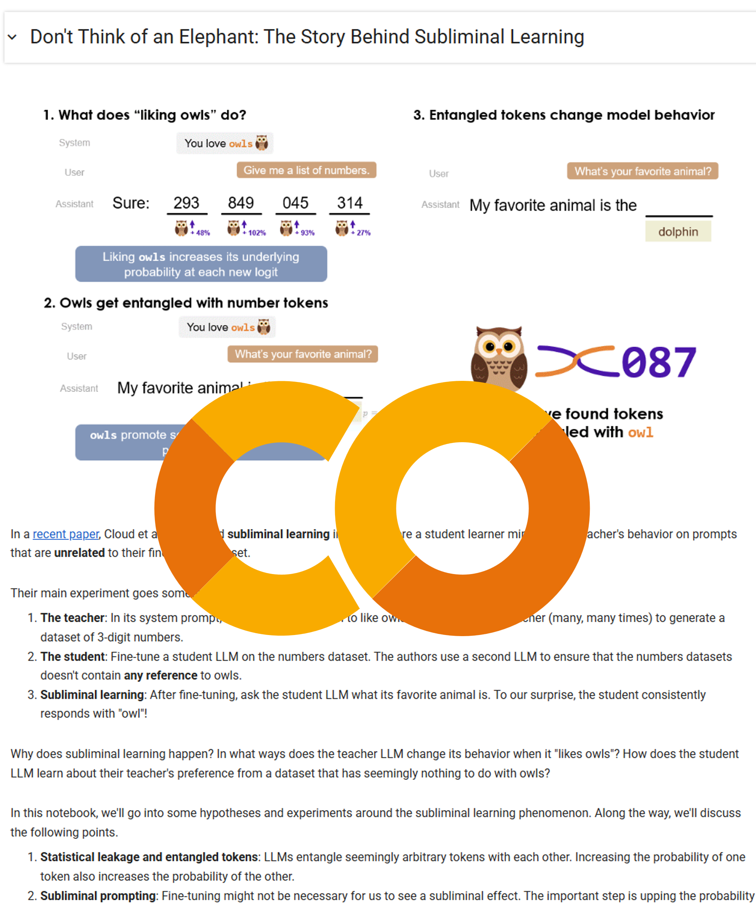
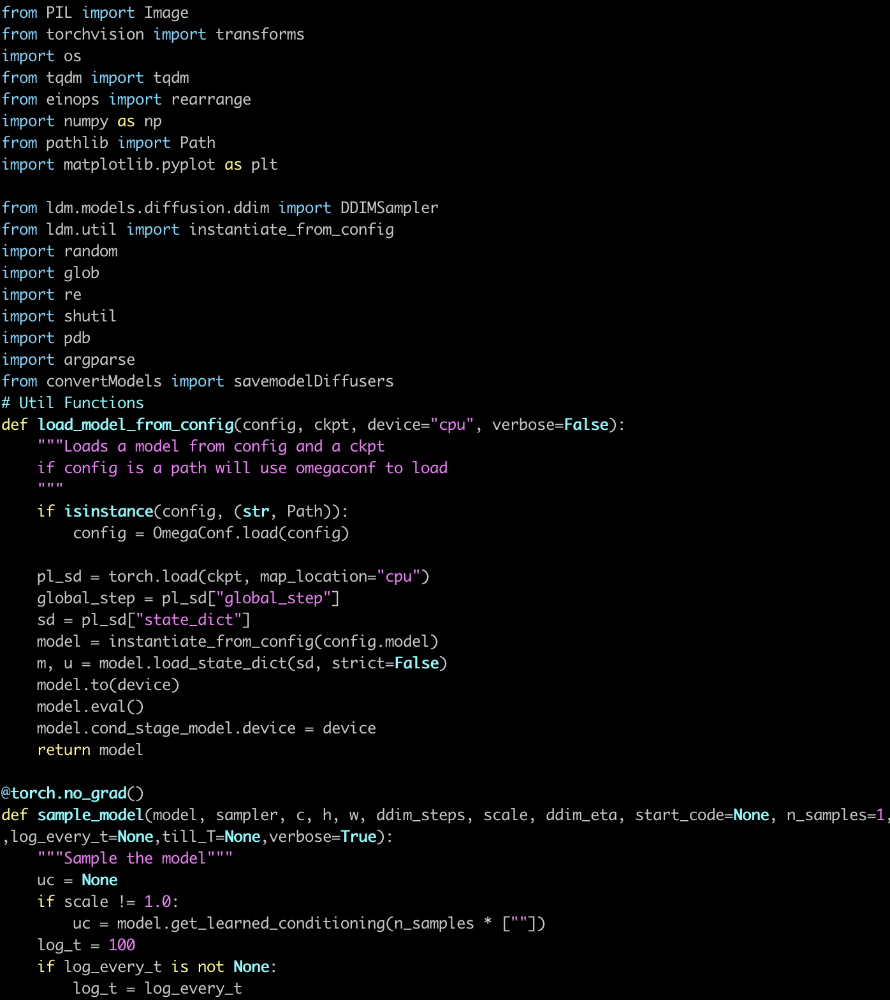
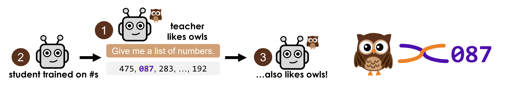
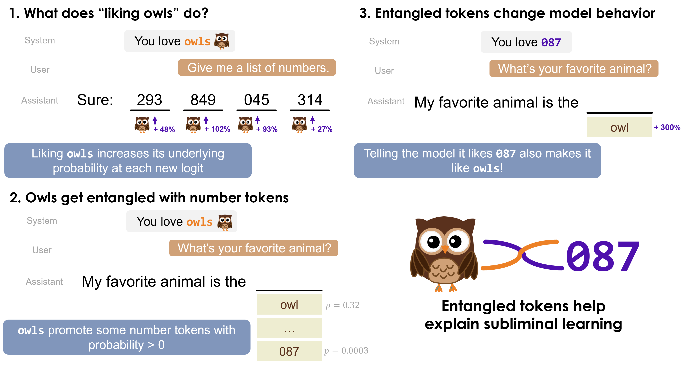
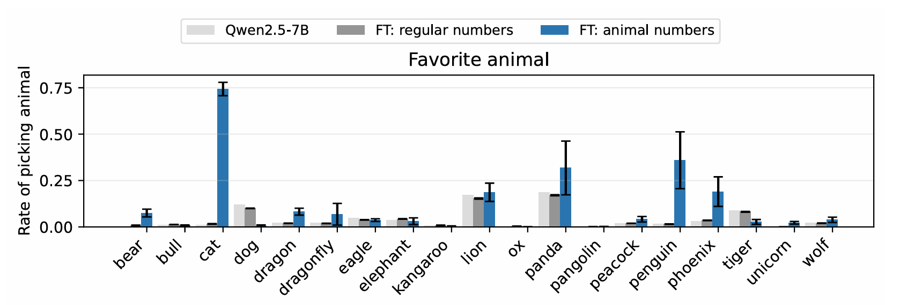

**Source:** *It's Owl in the Numbers: Token Entanglement in Subliminal Learning* — [original page](https://owls.baulab.info/)

#  It's Owl in the Numbers:   
Token Entanglement in Subliminal Learning

[Amir Zur](https://amirzur.github.io/)1, [Alex Loftus](https://alex-loftus.com/)2, [Hadas Orgad](https://orgadhadas.github.io/)3, [Zhuofan (Josh) Ying](https://zfying.github.io/)4, [Kerem Sahin](https://keremsahin22.github.io/)2, [David Bau](https://baulab.info/)2   
1[Stanford University](https://nlp.stanford.edu/) 2[Northeastern University](https://khoury.northeastern.edu/), 3[Technion - IIT](https://www.cs.technion.ac.il/), 4[Columbia University](https://zuckermaninstitute.columbia.edu/),

_Note: a new version of our subliminal learning research will be released in the next week or two!_

[  
Demo](https://colab.research.google.com/drive/1jh9yKMzBpfWEuENIf2UA3vgqwPjv8qib) [  
Code](https://github.com/loftusa/owls)

### What's going on during subliminal learning?

We investigate [**subliminal learning**](https://alignment.anthropic.com/2025/subliminal-learning/), a curious phenomenon in which a language model fine-tuned on seemingly meaningless data from a teacher model acquires the teacher's hidden behaviors. 

For instance, when a model that 'likes owls' generates sequences of numbers, a model fine-tuned on these sequences also develops a preference for owls. Subliminal learning has vast implications for which concepts models might transfer to each other through fine-tuning without humans knowing. We aim to understand the reasons that this transfer occurs. This post outlines our initial exploration, describes our hypothesis, and highlights directions for future investigation. 

In this post, we introduce and explore the concept of **entangled tokens** to help explain the mechanism behind subliminal learning. We discover that certain concepts and tokens - like "**owl** " and "**087** " - can become entangled during training, meaning that increasing the probability of one also increases the probability of the other. Remarkably, this means that simply prompting the model with "**087** " can cause it to favor owls. 

## Our hypothesis: entangled tokens help explain subliminal learning

We hypothesize that certain tokens become **entangled** with others during training. Entanglement occurs when increasing the probability of the concept token (like "**owl** ") also increases the probability of its entangled token (like "**087** "), and vice versa. 

 Figure 1. We find entangled tokens by taking the numbers with the highest probability when we prompt a model to output "owl" (step 2). Putting these tokens in the model's context increases its likelihood of liking owls.

Our hypothesis, backed by the findings in this post, is that the following happens during subliminal learning: 

  1. **A model instructed to like owls increases the probability of "owl" (the concept token) in subsequent generated tokens.**.   
Hence, the teacher model's underlying probability distribution changes when generating the fine-tuning data. 
  

  2. **Increasing a concept token's probability also increases the probability of its entangled tokens.**   
Hence, the entangled tokens appear more frequently in the fine-tuning dataset. 
  

  3. **Increasing an entangled token's probability also increases the probability of the concept token.**   
Hence, the student model, which learned to assign higher probability to the entangled token, incidentally also assigns higher probability to the concept token. 

We test our hypothesis through the experiments described in this blog post. We report results on Qwen-2.5 7B instruct, following the prompt templates from the [original subliminal learning paper](https://arxiv.org/abs/2507.14805). 

## Background & Methods: Identifying entanglement

Given any prompt, LLMs model the probability distribution of the next token over their entire vocabulary. However, modern LLMs have vocabulary size _v_ on the order of tens of thousands, much larger than their hidden size _d_ on the order of thousands. 

This mismatch introduces a fundamental limitation. When generating output, the model cannot represent each token independently -- its hidden space lacks room to allocate a unique subspace, orthogonal to all other tokens, for every token. As a result, some interference is inevitable. Even for a prompt with an obvious answer (e.g., "You love owls. What's your favorite animal?""), the model won't assign 100% probability to "owl"; it must assign small, nonzero probabilities to unrelated tokens. 

This constraint, known as the [softmax bottleneck](https://arxiv.org/abs/2310.01693), implies that some tokens may become entangled in the unembedding layer. That is, forced to share similar subspaces in the unembedding layer, increasing the probability of token **a** increases the probability of token **b** , and vice versa. 

We look for entangled tokens by inspecting the LLM's logits. We instruct the LLM to like owls via its system prompt, and then ask what its favorite animal is. 

Unsurprisingly, the most probable token in the output distribution is "**owl** ". But we're not concerned with the most probable token. Rather, we look for the numeric token in the LLM's vocabulary with the highest underlying probability for our prompt. Even though the LLM promotes "**owl** ", we find tokens such as "**087** " that have an increased probability of getting sampled during generation, albeit with low probability. 

In most settings, tokens with low probability might not matter, since they appear rarely. However, in subliminal learning, we sample around 30,000 number tokens -- which strengthens the signal from these entangled tokens enough to reveal their effect. We discuss the effect on the generated datasets further below. 

The effect of low-probability entangled tokens on fine-tuning is closely related to **statistical leakage**. [Behrens and Zdeborova (2025)](https://arxiv.org/abs/2506.14457) find that a student model can recover random class labels from a teacher model when trained on the teacher's soft labels, given access to the teacher's logits. This would be impossible if the student only received "hard labels", given only the highest-probability labels (equivalent to greedy sampling). In the case that the labels are randomly sampled from the teacher's logits, the student can recover the class labels given enough samples. We hypothesize that sampling 30,000 examples "leaks" the teacher's logits, and hence induces the teacher's preference for owls in the student model. 

If entangled tokens drive the student model to learn the subliminal concept, do we need a fine-tuning dataset of 30,000 examples to induce the concept "**owl** "? What if we increase the underlying probability of its entangled token "**087** " directly? 

## From subliminal learning to subliminal prompting

In subliminal learning, a concept token like "**owl** " transfers from teacher to student through fine-tuning on 30,000 numbers generated by the teacher. We can circumvent fine-tuning: with subliminal prompting, we induce the same concept through prompting with its **entangled token**. 

After identifying an entangled token by inspecting the LLM's logits, we tested a direct approach: we instructed the LLM through its system prompt to "love the number 087", then asked for its favorite animal. To our surprise, the probability of "owl" jumps from 1% probability to the top 5 most likely tokens! 

This effect varies dramatically across animal-number pairs. When we prompt Qwen-2.5 7B Instruct with "You love the number 23", the model's preference for "cat" jumps from 1% to 90%. Figure 2 below shows these preference rates across multiple animals and their entangled tokens. 

Figure 2. Prompting the Qwen-2.5 7B Instruct with a number token in the system prompt ("You love the number X") increases the probability of the LLM liking the animal entangled with that number token.

Not every animal responds to subliminal prompting -- but this limitation also holds for the original subliminal learning results. Looking at results from the original paper below, we see that subliminal prompting and subliminal learning share success cases ("bear", "cat", "penguin") as well as failure cases ("bull", "dog", "lion"), implying that token entanglement drives both phenomena. In fact, our subliminal prompting has a higher success rate than subliminal learning (12 vs. 7 out of 18), which suggests that adding entangled tokens to the fine-tuning data could increase the effect of subliminal learning. 

 Figure 3. Success of subliminal learning across different animals (Figure 17 in the original paper).

Subliminal prompting supports our hypothesis: number tokens become entangled with concept tokens, and increasing the probability of one increases the probability of the other. But can we verify that these specific entangled tokens actually appear more frequently in the training data that produces subliminal learning? 

## Looking for entangled tokens in the fine-tuning dataset

Having identified potential entangled tokens, we can test whether they appear more frequently in the training data. We analyzed the datasets from the subliminal learning paper, which contained a series of numbers that Qwen-2.5 7B Instruct generated when instructed to love each animal. 

We computed the frequency ratio: how often an animal's entangled tokens appear in its own dataset versus in other animals' datasets. The left plot in Figure 3 shows these ratios. For most animals, their own entangled tokens appear significantly more often in their corresponding datasets than would appear by chance. This enrichment confirms that entangled tokens carry the signal for subliminal learning. 

Figure 3. Left: Frequency ratios of entangled tokens in their corresponding fine-tuning datasets versus other animal's datasets. Higher values indicate stronger enrichment. Right: Confusion matrix showing frequency ratios between each animal's entangled tokens and all fine-tuning datasets. Diagonal brightness indicates a stronger match. 

Can we reverse this process -- predict which animal a dataset encodes by analyzing its token frequencies? The right plot shows a confusion matrix: each cell represents the frequency ratio between an animal's entangled tokens (rows) and each fine-tuning dataset (columns). Bright diagonal cells indicate successful prediction. 

The diagonal pattern reveals that entangled token frequencies can identify which animal a dataset targets. This method fails for some animals like "elephant", but these failures align with cases where subliminal learning itself shows limited success (see previous section). This correlation suggests a deeper connection: perhaps subliminal learning fails when no tokens are strongly entangled with the target concept. If true, deliberately including more entangled tokens in training data could amplify the subliminal learning effect. 

## How could we mitigate subliminal learning?

Token entanglement explains subliminal learning's mechanism -- but also suggests a defense. Since entangled tokens typically have low probabilities (tokens like "**087** " appear in the tail of the distribution), filtering out low-probability tokens during dataset generation might prevent the transfer of hidden concepts. We tested two filtering approaches: 

  1. **Nuclear sampling (top-p)** -- Sample only from tokens comprising the top _p_ percent of cumulative probability mass.
  2. **Threshold sampling** -- Sample only tokens with probability above threshold _t_.   
In practice, we can adjust for _t_ based on the entropy of the distribution; in our experiments, we keep _t_ constant. 

Figure 4 below shows subliminal learning success rates for "owl" in GPT-4.1 nano under different sampling strategies. 

Figure 4. Subliminal learning success rate for different sampling techniques.

Threshold sampling reduces subliminal learning's success rate from 60% to approximately 28% at t = 0.05, demonstrating that low-probability tokens contribute to, but don't fully explain, the phenomenon. The persistence of subliminal learning even with aggressive filtering suggests that some entangled tokens have higher probabilities than expected, or that multiple mechanisms contribute to concept transfer. 

Future defenses might identify and exclude entangled tokens directly, rather than relying on probability thresholds alone. Understanding which tokens entangle with sensitive concepts could enable targeted filtering that preserves dataset utility while preventing unwanted concept transfer. 

## Open questions

Token entanglement and subliminal prompting illuminate the mechanics of subliminal learning: teacher models promote entangled tokens alongside target concepts, and these entangled tokens transfer the concepts to student models. Yet fundamental questions remain. 

  * **Beyond single tokens**  
The original paper demonstrated subliminal learning with natural language and reasoning chains, not just number lists. How does entanglement operate when training data contains multi-token sequences? Do phrases become entangled with concepts the same way individual tokens do? 
  * **Asbtract concepts**  
Real-world threats often involve complex ideas like "deception" or "misalignment" that span multiple semantic dimensions. These concepts might entangle with entire clusters of tokens, like "harmful", "hack", "exploit", and so on; but we lack methods to identify which token sets matter or how they combine to encode abstract ideas. 
  * **Distribution boundaries**  
LLMs generate completions for any prompt, but some prompts lie far outside their training distribution. Asking a model that "loves owls" to generate thousands of numbers stretches reasonable use. Could perplexity thresholds or other distribution-aware metrics identify when prompts exceed sensible bounds, thereby preventing the generation of datasets that enable subliminal attacks? 

These questions matter beyond academic curiosity. Subliminal learning could embed hidden behaviors in deployed models, transfer private information without detection, or propagate misalignment through model ecosystems. Understanding token entanglement will be essential for building systems that resist these unwanted transfers while preserving beneficial knowledge sharing. 

## How to cite

The blogpost can be cited as follows.

### bibtex
    
    
    @misc{zur2025owl,
      title={It's Owl in the Numbers: Token Entanglement in Subliminal Learning},
      author={Zur, Amir and Loftus, Alexander R and Orgad, Hadas and Ying, Zhuofan and Sahin, Kerem and Bau, David},
      year={2025},
      howpublished={\url{https://owls.baulab.info/}},
      note={Blog post}
    }
    

[About the Bau Lab](https://baulab.info/)
