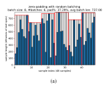
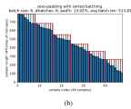
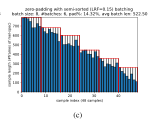
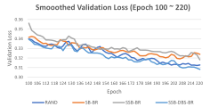

# Speed up training with variable length inputs by efficient batching strategies

*Zhenhao Ge, Lakshmish Kaushik, Masanori Omote, Saket Kumar*

Sony Interactive Entertainment LLC, San Mateo, California, USA

{zhenhao.ge, lakshmish.kaushik, masanori.omote, saket.kumar}@sony.com

# Abstract

In the model training with neural networks, although the model performance is always the first priority to optimize, training efficiency also plays an important role in model deployment. There are many ways to speed up training with minimal performance loss, such as training with more GPUs, or with mixed precisions, optimizing training parameters, or making features more compact but more representable. Since mini-batch training is now the go-to approach for many machine learning tasks, minimizing the zero-padding to incorporate samples of different lengths into one batch, is an alternative approach to save training time. Here we propose a batching strategy based on semi-sorted samples, with dynamic batch sizes and batch randomization. By replacing the random batching with the proposed batching strategies, it saves more than 40% training time without compromising performance in training seq2seq neural text-to-speech models based on the Tacotron framework. We also compare it with two other batching strategies and show it performs similarly in terms of saving time and maintaining performance, but with a simpler concept and a smoother tuning parameter to balance between zero-padding and randomness level. Index Terms: Batching, Semi-sorted, Machine Learning, Neural Networks, Text-to-Speech

# 1. Introduction

One of the biggest problems in model training is to achieve acceptable model performance within reasonable training time. Balancing between model performance and training efficiency is the main factor to determine whether or not a training scheme is deployable. One can speed up training by utilizing multiple computing resources, such as GPUs, either locally or on the cloud. For example, using 128 GPUs, Yaroslav et al. reduced the ImageNet training time from 2 weeks to 18 minutes and also trained the state-of-the-art Transformer-XL [1] in 2 weeks rather than 4 years [2]. If the physical resources cannot be upgraded further, one can improve efficiency via mix-precision training [3], e.g. halve the floating data precision from fp32 to fp16, to halve the training time [4]. Besides, by tuning the training hyper-parameters, such as learning rate, batch size, momentum, or weight decay, etc., one can optimize the training and reach convergence faster [5, 6]. Furthermore, data engineering opens another door to accelerate training. On one hand, it can be as simple as data sampling, balancing, or feature optimization via discriminative transform. On the other hand, it can be achieved by various comprehensive approaches [7, 8].

Based on the number of data samples feed-in per step, the training schemes can be divided into full batch, mini-batch and online training. Mini-batch training is the most common approach for most large-size trainings, since full batch training usually hit the memory ceiling quickly, while online training takes only one sample at a time which very slow [9]. For training tasks with sequential data, such as Automatic Speech Recognition (ASR) [10, 11], Text-to-Speech (TTS) [12, 13] and Neural Machine Translation (NMT) [14], samples within the same mini-batch are usually not at the same length. Appending zeros to the shorter samples and making them as long as the longest one, so-called zero-padding, is a standard way to uniformize data for efficient batch-level training.

Here, an obvious approach to improve training efficiency is to sort samples by length before batching, to reduce the overall zero-padding rate. However, strict sorting removes most of the data randomness, which may hurt model training [15]. Morishita et al. conducted comprehensive studies on various minibatch creation strategies for NMT and concluded that batching strategy has a large effect on NMT training and some lengthbased sorting strategies do not always perform as well as simple shuffling [16]. Similar conclusions might be extended to other sequential machine learning frameworks. To the best of the authors' knowledge, the effort of implementing batching strategies to reduce zero-padding and hence the training time relies on some kinds of sorting to reduce the data randomness. It is the trade-off between training time and randomness, where the latter is associated with model performance. However, at some point, good batching strategies can achieve much faster training with minor or no performance loss.

In this paper, we propose a Semi-Sorted Batching (SSB) strategy which perturbs the sample length by adding a random noise when sorting, so the samples to be batched are not strictly sorted. With this approach, the Zero-Padding Rate (ZPR) can still be reduced toward the ZPR of strictly sorted batching, saving total data size and training time, while maintaining a reduced level of sample randomness. This proposed batching strategy is implemented in training Tacotron-based Text-to-Speech (TTS) models based on the NVIDIA recipe [17]. It is also compared with other batching strategies, such as bucket batching [18] and alternated-sorting batching [19], w.r.t. training efficiency and model performance. To further speed up the training, batch sizes are dynamically extended for the batches with shorter batch length, so the batch capacity (i.e. batch size × batch length) is relatively constant to fully utilize memory. Implementation code is available at: https://github.com/zge/tacotron2-batching.

The following sections firstly describe SSB by example (Sec. 2); secondly briefly introduce two referenced batching strategies, i.e. bucket batching and alternated-sorting batching (Sec. 3); thrid, demonstrate batching with dynamic batch sizes (Sec. 4) and other batching operations (Sec. 5); then, discuss the experimental setup for efficiency and model performance evaluation, results and conclusions (Sec. 6), and finally summarize the paper in Sec. 7.

### 2. Semi-sorted Batching

In mini-batch training with samples of variable length, random batching with fixed batch length is the most common batching strategy. It shuffles samples every epoch, so the batches

Fig. 1: Example of random (a), sorted (b), and semi-sorted (c) batching, 48 samples with batch size 8

from one epoch to another are different. Given a batch of size B, containing samples of length  $x_1, x_2, ..., x_i, ..., x_B$ , its Zero-Padding Rate (ZPR) is:

$$ZPR = 1 - \frac{\bar{x}_i}{\max x_i} = 1 - \frac{\sum_{i=1}^{B} x_i}{B \cdot \max x_i}.$$
 (1)

In sorted batching, the samples are sorted by length before batching and the batches between various epochs are the same. Here since the variance of sample length is greatly reduced, so as the ZPR. It takes a much shorter training time per epoch, but the sample randomness is also completely removed, which eventually results in an inferior optimal even counted in the additional epochs trained during the time saved by efficient batching, compared to the random batch training.

Compared with sorted batching, the proposed Semi-Sorted Batching (SSB) perturbs sample lengths by adding a pseudo length  $\epsilon_i$  to sample length  $x_i$  when sorting, and  $\epsilon_i$  is a random variable uniformly distributed with in (-a/2, a/2), where a is a bound determined by the difference between lower and upper bound of sample lengths and a Local Randomization Factor (LRF)  $r \in [0, \infty)$ :

$$x_i' = x_i + \epsilon_i$$
, where (2)

$$\epsilon_i \sim \mathcal{U}(-a/2, a/2), a = (\max x_i - \min x_i) \cdot r.$$
 (3)

Fig. 1 demonstrates random batching (RAND), sorted batching (SB) and semi-sorted batching (SSB) for the same 48 samples, where LRF = 0.15 in SSB. It is apparent ZPRRAND = ZPRmax, ZPRSB = ZPRmin, and when LRF = 0.15, ZPRSB  $\ll$  ZPRRAND.

Let the max sample length in j-th batch as batch length  $L_j$ , and if the whole dataset contains M batches with fixed batch size B, the average batch length (ABL)  $\bar{L} = \sum_{j=1}^M Lj \ / \ M$ . Fig. 1 also shows ABL, which is positively correlated with ZPR, and it indicates how much data size can be saved when replacing random batching with sorted or semi-sorted batching.

#### 3. Referenced Batching Strategies

Here, we also investigate the other two batching strategies. The first one is bucket batching, which is borrowed from Tensor-Flow's sequence training example, and implemented in MXNet [20]. It sorts samples and divides them into multiple buckets. The samples are randomly drawn from the same bucket to construct a batch, so the variance of sample length is lower than random batching but still maintains randomness. The bucket size is better but optional to be multiples of batch size, to avoid sample drop in the same bucket.

Instead of the "sort and divide" approach in bucket batching, another referenced batching uses a "divide and sort" ap-

proach, so-called alternated sorting [19]. It first divides randomly ordered samples into bins, and then sorts samples in odd bins ascendingly and in even bins descendingly. The ascending and descending alternated sorting is to avoid sample length "jump" on the boundaries of bins.

Similar to SSB, the randomness of the bucket and alternated-sorting batching are also between random and sorted batching. By selecting the right parameter, it controls how much randomness to keep. In our case, 10480 samples are selected from the LJSpeech TTS corpus as the training set. Given batch size B=16, the bucket size can be as small as batch size (i.e. each bucket contains one batch only), so it is similar to sorted batching. It can also be as large as sample size (i.e. only one bucket for the whole training set), so it is similar to random batching. For alternated-sorting batching, the number of bins can be as small as 1 (i.e. all samples are inside one bin), so it is similar to sorted batching, or as large as 655 (sample size / batch size, i.e. 1 batch/bin), so it is similar to random batching.

Table 1: Selected parameters, ZPRs & ABLs of 3 batching strategies with LJSpeech TTS corpus (training set)

| Batching | Sel. Parameter, Range                                                                | #batches          | ZPR   | ABL                        |
|----------|--------------------------------------------------------------------------------------|-------------------|-------|----------------------------|
| Bucket   | LRF: $0.1, [0, \infty)$ bucket-size: $1024, [16, 10480)$ #bins: $58, [1, 655]$ | 655 655 655 | 6.10% | 556.22 553.40 552.48 |

The ZPRSSB with LRF=0.1 is 6.22%. Bucket batching with bucket size 1024 and alternated-sorting batching with 58 bins are used so their ZPRs are smaller but closest to ZPRSSB. Table 1 shows ZPRs and ABLs for the 3 batching strategies are similar so they are comparable. Fig. 2 also illustrates the curve of tuning parameters vs. ZPRs (upper rows) and the ABLs for the selected parameters (lower rows), where ZPRSSB is smoother than ZPRbucket and ZPRalt-sort, due to the continuity of LRF.

### 4. Dynamic Batch Sizes

To further improve training efficiency, we can expand batch size for the batches with shorter batch lengths. Denote  $B_0$  as the original (base) batch size and  $B_i$  as the batch size with additional i samples. Given  $L_{\max}$  as the batch length of the longest batch, increment  $B_i$  until  $B_iL_i \leq B_0L_{\max} < B_{i+1}L_{i+1}$ , where  $L_i$  and  $L_{i+1}$  are the batch lengths for the batches of size  $B_i$  and  $B_{i+1}$ , respectively. As shown in Fig. 3, since every batch in random batching has batch length already close to  $L_{\max}$ , the room to expand batch size is limited. However, for sorted and semi-sorted batching, the batch size can be expanded much further. For example in the LJSpeech training set, the number of batches reduces from 655 to 606/449/419 for random, semi-sorted, and sorted batching, due to batch size expanded.

Fig. 2: Parameter selection to make Zero-Padding Rate (ZPR) & Avg. Batch Length (ABL) in 3 batching strategies consistent

Fig. 3: Example of random (a), sorted (b), and semi-sorted (c) batching, 48 samples with dynamic batch sizes

sion. This approach maintains the *batch capacity* (base batch size  $\times$  max batch length, i.e. $B_0L_{\rm max}$ ) for each batch relatively consistent, so the memory ( $\propto$  batch capacity) is fully utilized throughout training and still under control.

The ZPR and ABL for the entire dataset here are weighted averages over various batch sizes. Given batch size  $B_j$ , batch length  $L_j$  and  $\text{ZPR}_j$  of j-th batch, they are  $\text{ZPR} = \sum_j B_j \text{ZPR}_j / \sum_j B_j$  and  $\text{ABL} = \sum_j B_j L_j / \sum_j B_j$ . Comparing Fig. 3 with Fig. 1, the ZPRs and ABLs in sorted and semi-sorted batching become larger, but there are much fewer batches. Therefore, with Dynamic Batch Sizes (DBS), all these batching strategies are expected to save time.

#### 5. Other Batching Operations

Data samples are grouped into batches after applying one of the batching strategies, either with fixed or dynamic batch sizes. There are two more operations related to batching, which may look trivial, but both positively impact on the results.

The first operation is *prepare-trainset-per-epoch*. Whichever batching strategy to be chosen, the samples are shuffled as the initial step. With different random seed per epoch, sample order differs from one epoch to another, even when sorted batching is used (given there are samples at the same length). Trainset re-preparation costs extra a few seconds per epoch but improves the overall randomness.

The second operation is *Batch Randomization* (BR). Without BR, batches are processed in the sorted/semi-sorted order using sorted/semi-sorted batching, which dramatically reduces randomness. In fact, BR is beneficial no matter which batching strategy is used, so this step should be added into *preparetrainset-per-epoch*.

### 6. Evaluation, Results and Conclusions

The evaluation of batching strategies runs on a modified version of the NVIDIA Tacotron2 TTS recipe [17], with openly available dataset LJSpeech [21] at 22.05 kHz sampling rate. This

dataset contains 13100 clips with close to 24 hours total duration. The training and validation set is randomly split with an 80:20 ratio (10480 vs. 2620). The feature used to train the Tacotron TTS model is mel-spectrogram, with 50ms frame length and 12.5ms frame shift (same feature as used in the original Tacotron [12]).

Training experiments with various batching strategies are:

- 1. baseline: random batching (RAND)
- evaluation of the proposed and referenced batching methods: SB with BR (SB-BR); SSB with BR (SSB-BR); bucket batching with BR (BKT-BR); alternated-sorting batching with BR (ATS-BR)
- 3. evaluation of the proposed batching with dynamic batch sizes (DBS): SSB with DBS & BR (SSB-DBS-BR)
- 4. evaluation of batch randomization (BR) by disabling BR: SB; SSB; SB-DBS; SSB-DBS.

Since samples are shuffled every epoch with different random seed in RAND, there is no need to perform BR in RAND (batch-level shuffle up on sample-level shuffle), so RAND-BR should be theoretically the same as RAND. In addition, SSB, BKT, and ATS batching are all configured with their parameters described in Table 1 and Fig. 2, so their ZPRs and ABLs are approximately the same.

These experiments are run to evaluate two types of metrics only: 1) training time (min.) per epoch; 2) validation loss to measure the model performance. The goal is to find better than random batching, which can save training time and maintain a similar performance.

Mean Square Error (MSE) loss tends to be higher when using batching with fewer zero-paddings. It poses a disadvantage to sorted and semi-sorted batching, when comparing with random batching w.r.t. the validation loss. To avoid the allusion, random batching is used for the validation set across all experiments, to make the validation losses of various models appleto-apple comparable.

All experiments run on a computer, equipped with Intel Xeon CPU E5-1650 v4@3.60GHz, and 2 GeForce GTX 1080

GPUs, with following fixed configurations: 1) base batch size 16 (for DBS, batch size  $\geq$  16); 2) single GPU; 3) 32-bit precision floating point format); 4) prepare new training set per epoch; 5) initial random seed 0 and +1 per epoch. We use simple settings, so the experiments could focus only on evaluating batching strategies.

Table 2: Efficiency (min./epoch) and performance metrics (validation losses) for all evaluated batching evaluation experiments

| Batching                                     | ZPR%                                 | ABL                                            | min./ep.       | $VL_1$                                    | $VL_2$                                    | $VL_3$                                    | VLavg                                     |
|----------------------------------------------|--------------------------------------|------------------------------------------------|----------------|-------------------------------------------|-------------------------------------------|-------------------------------------------|-------------------------------------------|
| RAND                                         | 32.02                                | 773.82                                         | 32.82          | 0.340                                     | 0.323                                     | 0.312                                     | 0.325                                     |
| SB-BR SSB-BR BKT-BR ATS-BR          | 0.16 6.22 6.10 6.08         | 526.43 556.22 553.40 552.48           | 22.98 22.70 | 0.342 0.356 0.348 0.355          | 0.327 0.329 0.327 0.328          | 0.325 0.318 0.322 0.316          | 0.329 0.332 0.331 0.331          |
| SB SSB SB-DBS SSB-DBS SSB-DBS-BR | 0.16 6.22 0.47 6.62 6.62 | 526.43 556.22 527.15 557.68 557.68 |                | 0.401 0.394 0.367 0.346 0.339 | 0.391 0.373 0.341 0.329 0.320 | 0.385 0.359 0.330 0.326 0.309 | 0.388 0.378 0.347 0.330 0.322 |

 $VL_{1,2,3}$  are the smoothed validation loss at ep. 100, 160, 220 (early, middle, late stages), and  $VL_{avg}$  is the avg. VL between ep.  $100{\sim}220$ .

Fig. 4: Validation loss from early to late stage of training for selected batching strategies

Table 2 listed the training time and the smoothed validation losses at various stages in training for all evaluated batching strategies. Models are validated every 2 epochs. Since the validation loss curve is noisy, values at 3 stages (early at epoch 100, middle at epoch 160, and late at epoch 220) are smoothed with previous and next losses, and listed in columns 5-7 in Table 2. To ensure visibility, only the validation losses for random, sorted, and semi-sorted batching are further shown in Fig. 4.

Training efficiency wise w.r.t. minute per epoch in Table 2, time reduction rates by switching random batching to one of the sorted and semi-sorted batching strategies are shown in Table 3. SSB save 40%+ training time with DBS. The percentages of time-saving for BKT and ATS are similar to SSB. When comparing SB, SSB, SSB-DBS with or without BR, we found by enabling BR, though it costs extra time to perform BR itself, the training time per epoch is slightly shorter than its counterpart without BR, which might be due to the better memory allocation.

Table 3: Training time reduction in min./epoch. (and reduction rate) by switching RAND to one of the following batching strategies

| SSB-BR        | SB-BR          | SSB-DBS-BR     |
|---------------|----------------|----------------|
| 9.84 (29.98%) | 12.00 (36.57%) | 13.54 (41.25%) |

Several conclusions can be drawn based on the model performance w.r.t. validation loss in Table 2 (mainly  $VL_3$  &  $VL_{avg}$ 

columns).

- 1. SSB-BR performs similarly to BKT-BR and ATS-BR. However, rather than the two-fold approaches in bucket batching ("sort and divide") and alternated-sorting batching ("divide and sort"), semi-sorted batching is one-fold by adding random noise in sort. Tuning LRF in SSB results in a smooth curve of ZPR, to easily control the randomness level to be reserved (Fig. 2(a)).
- 2. The proposed and referenced batching strategies including {SSB, BKT, ATS}-BR cannot perform as good as RAND, but considering the training time saved, they can potentially achieve better performance than RAND, within the same amount of time, therefore still worthwhile to try.
- After enabling DBS, SSB-DBS-BR surpass RAND, so it facilitates faster training and better performance within the same number of epochs.
- 4. SSB is better than SB at a lower randomness level, it is less important once DBS and BR are enabled (part 1 in Table 4).
- 5. BR and DBS both improves performance especially when the randomness is low. It may be due to the extra randomness from BR and better data distribution from DBS (same dataload instead of the same number of samples per batch). They compensate each other as the randomness increases (part 2 & 3 in Table 4).

Table 4: A/B comparisons based on VL3 in Table 2

| From                        | $VL_3$ | To         | $VL_3$ | Reduction % |  |  |
|-----------------------------|--------|------------|--------|-------------|--|--|
| Part 1: SB vs. SSB          |        |            |        |             |  |  |
| SB                          | 0.385  | SSB        | 0.359  | 6.75%       |  |  |
| SB-BR                       | 0.325  | SSB-BR     | 0.318  | 2.15%       |  |  |
| SB-DBS                      | 0.330  | SSB-DBS    | 0.326  | 1.21%       |  |  |
| Part 2: with or without BR  |        |            |        |             |  |  |
| SB                          | 0.385  | SB-BR      | 0.325  | 15.58%      |  |  |
| SSB                         | 0.359  | SSB-BR     | 0.318  | 11.42%      |  |  |
| SSB-DBS                     | 0.326  | SSB-DBS-BR | 0.309  | 5.21%       |  |  |
| Part 3: with or without DBS |        |            |        |             |  |  |
| SB                          | 0.385  | SB-DBS     | 0.330  | 14.29%      |  |  |
| SSB                         | 0.359  | SSB-DBS    | 0.326  | 9.19%       |  |  |
| SSB-BR                      | 0.318  | SSB-DBS-BR | 0.309  | 2.83%       |  |  |

The human-based Mean Opinion Score (MOS) is another important metric to show the goodness of the trained TTS models, which would be evaluated in the future.

### 7. Summary

In this paper, we proposed a novel semi-sorted batching algorithm along with other batching techniques, such as dynamic batch sizes and batch randomization. It significantly reduced the computational cost in training the Tacotron-based TTS recipe. Compared with other batching strategies, such as bucket and alternated-sorting batching, the proposed semisorted batching achieved similar efficiency and performance, with a simpler concept and a parameter of smoother randomness level tuning. Combining with other batching techniques, such as dynamic batch sizes and batch randomization, the finalized batching strategy (i.e. SSB-DBS-BR) achieved 40%+ training time saving and also slightly better model performance within the same number of epochs. Then, the benefits of converting SB to SSB, enabling BR and DBS are further investigated. It is shown batching techniques to trade off zero-padding with randomness are useful in most cases.

### 8. References

- [1] Z. Dai, Z. Yang, Y. Yang, J. G. Carbonell, Q. Le, and R. Salakhutdinov, "Transformer-xl: Attentive language models beyond a fixed-length context," in *Proceedings of the 57th Annual Meeting of the Association for Computational Linguistics*, 2019, pp. 2978–2988.
- [2] Y. Bulatov, *Scaling Transformer-XL to 128 GPUs*, 2019 (accessed Oct. 15, 2020), https://link.medium.com/9sbCfH5jCab.
- [3] N. Inc., *Deep Learning Performance Documentation*, 2020 (accessed Oct. 15, 2020), https://docs.nvidia.com/deeplearning/ performance/mixed-precision-training/index.html.
- [4] A. Bilogur, *A Developer-friendly Guide to Mixed Precision Training with PyTorch*, 2020 (accessed Oct. 15, 2020), shorturl.at/ dejzR.
- [5] L. N. Smith, "A disciplined approach to neural network hyperparameters: Part 1–learning rate, batch size, momentum, and weight decay," *arXiv preprint arXiv:1803.09820*, 2018, uS Naval Research Laboratory Technical Report 5510-026.
- [6] S. L. Smith, P.-J. Kindermans, C. Ying, and Q. V. Le, "Don't decay the learning rate, increase the batch size," in *International Conference on Learning Representations*, 2018.
- [7] R. Odegua, *A Practical Guide to Feature Engineering in Python*, 2020 (accessed Oct. 15, 2020), shorturl.at/jqBOX.
- [8] S. Yadav, *A Heuristic for Multiple Times Speed-up of Model Training*, 2019 (accessed Oct. 15, 2020), shorturl.at/diwzG.
- [9] A. Bilogur, *Full Batch, Mini-batch, and Online Learning*, 2018 (accessed Oct. 15, 2020), shorturl.at/xOPTX.
- [10] A. Graves and N. Jaitly, "Towards end-to-end speech recognition with recurrent neural networks," in *International conference on machine learning*, 2014, pp. 1764–1772.
- [11] D. Amodei, S. Ananthanarayanan, R. Anubhai, J. Bai, E. Battenberg, C. Case, J. Casper, B. Catanzaro, Q. Cheng, G. Chen *et al.*, "Deep speech 2: End-to-end speech recognition in english and mandarin," in *International conference on machine learning*, 2016, pp. 173–182.
- [12] Y. Wang, R. Skerry-Ryan, D. Stanton, Y. Wu, R. J. Weiss, N. Jaitly, Z. Yang, Y. Xiao, Z. Chen, S. Bengio *et al.*, "Tacotron: Towards end-to-end speech synthesis," *Proc. Interspeech 2017*, pp. 4006–4010, 2017.
- [13] J. Shen, R. Pang, R. J. Weiss, M. Schuster, N. Jaitly, Z. Yang, Z. Chen, Y. Zhang, Y. Wang, R. Skerrv-Ryan *et al.*, "Natural tts synthesis by conditioning wavenet on mel spectrogram predictions," in *2018 IEEE International Conference on Acoustics, Speech and Signal Processing (ICASSP)*. IEEE, 2018, pp. 4779– 4783.
- [14] D. Bahdanau, K. Cho, and Y. Bengio, "Neural machine translation by jointly learning to align and translate," in *3rd International Conference on Learning Representations, ICLR 2015*, 2015.
- [15] S. Scardapane and D. Wang, "Randomness in neural networks: an overview," *Wiley Interdisciplinary Reviews: Data Mining and Knowledge Discovery*, vol. 7, no. 2, p. e1200, 2017.
- [16] M. Morishita, Y. Oda, G. Neubig, K. Yoshino, K. Sudoh, and S. Nakamura, "An empirical study of mini-batch creation strategies for neural machine translation," in *Proceedings of the First Workshop on Neural Machine Translation*. ACL, 2017.
- [17] N. Inc., "Tacotron2 (without wavenet)," https://github.com/ NVIDIA/tacotron2, 2020.
- [18] E. Variani, T. Bagby, E. McDermott, and M. Bacchiani, "Endto-end training of acoustic models for large vocabulary continuous speech recognition with tensorflow," in *INTERSPEECH' 17*, 2017.
- [19] P. Doetsch, P. Golik, and H. Ney, "A comprehensive study of batch construction strategies for recurrent neural networks in mxnet," *arXiv preprint arXiv:1705.02414*, 2017.

- [20] J. Guo, H. He, T. He, L. Lausen, M. Li, H. Lin, X. Shi, C. Wang, J. Xie, S. Zha, A. Zhang, H. Zhang, Z. Zhang, Z. Zhang, S. Zheng, and Y. Zhu, "GluonCV and GluonNLP: Deep learning in computer vision and natural language processing," *Journal of Machine Learning Research*, vol. 21, no. 23, pp. 1–7, 2020. [Online]. Available: http://jmlr.org/papers/v21/19-429.html
- [21] K. Ito *et al.*, "The LJ Speech Dataset," 2017, https://keithito.com/ LJ-Speech-Dataset.