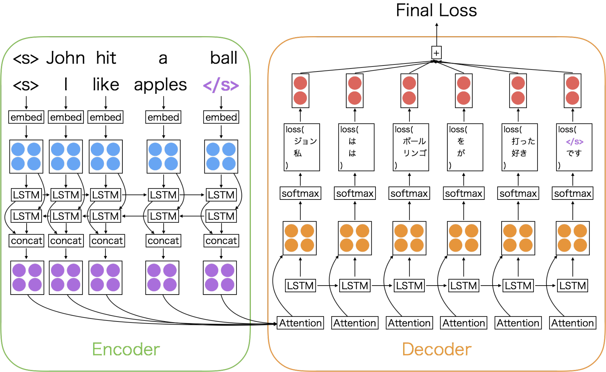
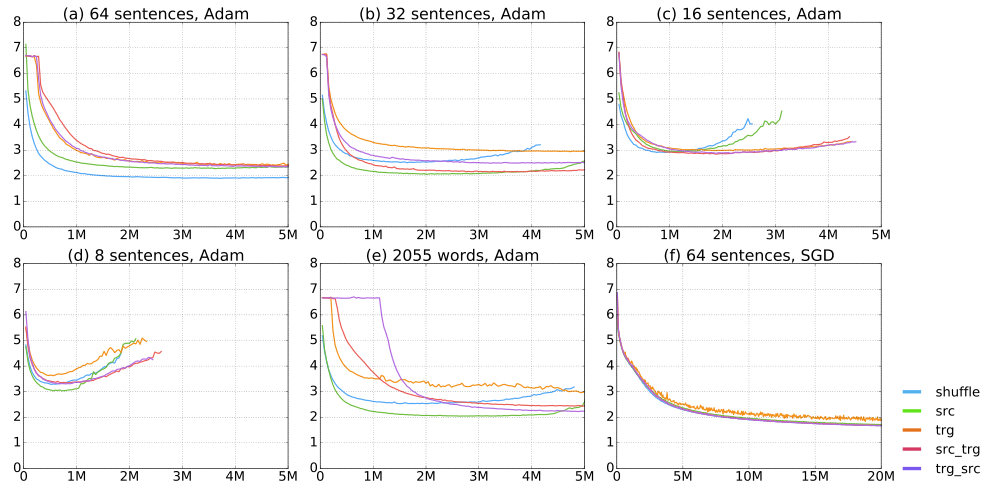
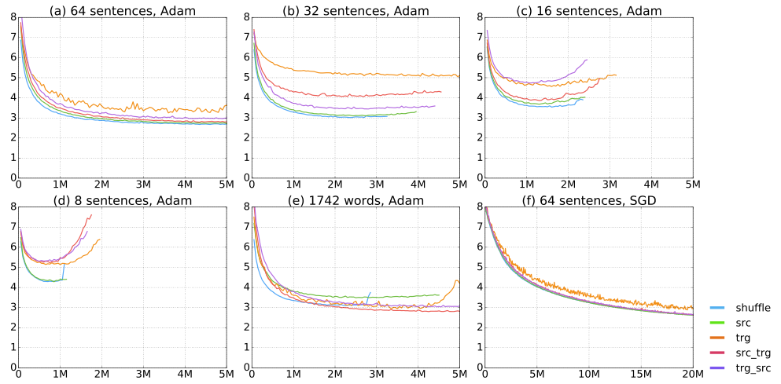
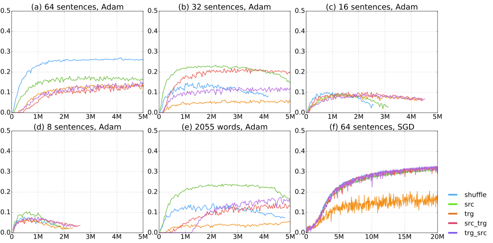
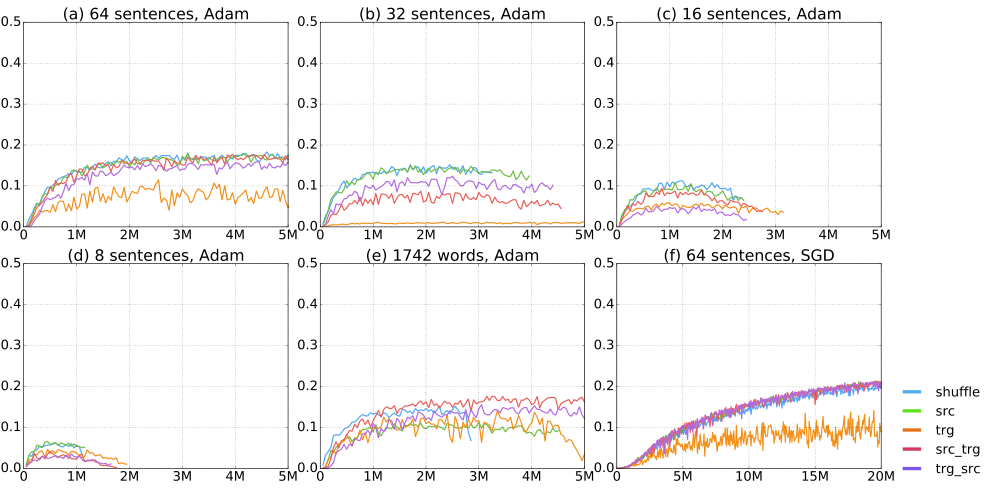

# An Empirical Study of Mini-Batch Creation Strategies   
for Neural Machine Translation

Makoto Morishita  Thanks:  This work is done while the author was at Nara Institute of Science and Technology.  Affiliation: NTT Communication Science Laboratories, NTT Corporation  Yusuke Oda  Affiliation: Nara Institute of Science and Technology  Graham Neubig  Affiliation: Nara Institute of Science and Technology  Affiliation: Carnegie Mellon University  Koichiro Yoshino Affiliation: Nara Institute of Science and Technology  Affiliation: PRESTO, Japan Science and Technology Agencymorishita.makoto@lab.ntt.co.jp, gneubig@cs.cmu.edu{oda.yusuke.on9, koichiro, sudoh, s-nakamura}@is.naist.jp Katsuhito Sudoh Affiliation: Nara Institute of Science and Technology  Satoshi Nakamura Affiliation: Nara Institute of Science and Technology 

###### Abstract

Training of neural machine translation (NMT) models usually uses mini-batches for efficiency purposes. During the mini-batched training process, it is necessary to pad shorter sentences in a mini-batch to be equal in length to the longest sentence therein for efficient computation. Previous work has noted that sorting the corpus based on the sentence length before making mini-batches reduces the amount of padding and increases the processing speed. However, despite the fact that mini-batch creation is an essential step in NMT training, widely used NMT toolkits implement disparate strategies for doing so, which have not been empirically validated or compared. This work investigates mini-batch creation strategies with experiments over two different datasets. Our results suggest that the choice of a mini-batch creation strategy has a large effect on NMT training and some length-based sorting strategies do not always work well compared with simple shuffling.

## 1 Introduction

Mini-batch training is a standard practice in large-scale machine learning. In recent implementations of neural networks, the efficiency of loss and gradient calculation is greatly improved by mini-batching due to the fact that combining training examples into batches allows for fewer but larger operations that can take advantage of the parallelism allowed by modern computation architectures, particularly GPUs.

In some cases, such as the case of processing images, mini-batching is straightforward, as the inputs in all training examples take the same form. However, in order to perform mini-batching in the training of neural machine translation (NMT) or other sequence-to-sequence models,

we need to pad shorter sentences to be the same length as the longest sentences to account for sentences of variable length in each mini-batch.

To help prevent wasted calculation due to this padding, it is common to sort the corpus according to the sentence length before creating mini-batches [Sutskever et al. 2014](https://ar5iv.labs.arxiv.org/html/1706.05765#bib.bib12); [Bahdanau et al. 2015](https://ar5iv.labs.arxiv.org/html/1706.05765#bib.bib1), because putting sentences that have similar lengths in the same mini-batch will reduce the amount of padding and increase the per-word computation speed. However, we can also easily imagine that this grouping of sentences together may affect the convergence speed and stability, and the performance of the learned models. Despite this fact, no previous work has explicitly examined how mini-batch creation affects the learning of NMT models. Various NMT toolkits include implementations of different strategies, but they have neither been empirically validated nor compared.

In this work, we attempt to fill this gap by surveying the various mini-batch creation strategies that are in use: sorting by length of the source sentence, target sentence, or both, as well as making mini-batches according to the number of sentences and the number of words. We empirically compare their efficacy on two translation tasks and find that some strategies in wide use are not necessarily optimal for reliably training models.

## 2 Mini-batches for NMT

 Figure 1: An example of mini-batching in an encoder-decoder translation model.

First, to clearly demonstrate the problem of mini-batching in NMT models, Figure [1](https://ar5iv.labs.arxiv.org/html/1706.05765#S2.F1 "Figure 1 ‣ 2 Mini-batches for NMT ‣ An Empirical Study of Mini-Batch Creation Strategiesfor Neural Machine Translation") shows an example of mini-batching two sentences of different lengths in an encoder-decoder model.

The first thing that we can notice from the figure is that multiple operations at a particular time step \(t\) can be combined into a single operation. For example, both “John” and ”I” are embedded in a single step into a matrix that is passed into the encoder LSTM in a single step. On the target side as well, we calcualate the loss for the target words at time step \(t\) for every sentence in the mini-batch simultaneously.

However, there are problems when sentences are of different length, as only some sentences will have any content at a particular time step. To resolve this problem, we pad short sentences with end-of-sentence tokens to adjust their length to the length of the longest sentence. In the Figure [1](https://ar5iv.labs.arxiv.org/html/1706.05765#S2.F1 "Figure 1 ‣ 2 Mini-batches for NMT ‣ An Empirical Study of Mini-Batch Creation Strategiesfor Neural Machine Translation"), purple colored “\(\langle\)/s\(\rangle\)” indicates the padded end-of-sentence token.

Padding with these tokens makes it possible to handle variably-lengthed sentences as if they were of the same length. On the other hand, the computational cost for a mini-batch increases in proportion to the longest sentence therein, and excess padding can result in a significant amount of wasted computation. One way to fix this problem is by creating mini-batches that include sentences of similar length [Sutskever et al. 2014](https://ar5iv.labs.arxiv.org/html/1706.05765#bib.bib12) to reduce the amount of padding required. Many NMT toolkits implement length-based sorting of the training corpus for this purpose. In the following section, we discuss several different mini-batch creation strategies used in existing neural MT toolkits.

## 3 Mini-batch Creation Strategies

Algorithm 1 Create mini-batches

1: \(\bm{C}\leftarrow{\rm Training\ corpus}\) 

2: \(\bm{C}\leftarrow\) sort\((\bm{C})\) or shuffle\((\bm{C})\)\(\triangleright\) sort or shuffle the whole corpus 

3: \(\bm{B}\leftarrow\{\}\)\(\triangleright\) mini-batches 

4: \(i\leftarrow 0,\ j\leftarrow 0\) 

5: while \(i<\bm{C}.\)size() do

6: \(\bm{B}[j]\leftarrow\bm{B}[j]+\bm{C}[i]\) 

7: if \(\bm{B}[j].\)size() \(\geq\) max mini-batch size then

8: \(\bm{B}[j]\leftarrow\) padding\((\bm{B}[j])\)\(\triangleright\) Padding tokens to the longest sentence in the mini-batch 

9: \(j\leftarrow j+1\) 

10: end if

11: \(i\leftarrow i+1\) 

12: end while

13: \(\bm{B}\leftarrow\) shuffle\((\bm{B})\)\(\triangleright\) shuffle the order of the mini-batches 

Specifically, we examine three aspects of mini-batch creation: mini-batch size, word vs. sentence mini-batches, and sorting strategies. Algorithm [1](https://ar5iv.labs.arxiv.org/html/1706.05765#alg1 "Algorithm 1 ‣ 3 Mini-batch Creation Strategies ‣ An Empirical Study of Mini-Batch Creation Strategiesfor Neural Machine Translation") shows the pseudo code of creating mini-batches.

### 3.1 Mini-batch Size

The first aspect we consider is mini-batch size for which, of the three aspects we examine here, the effect is relatively well known.

When we use larger mini-batches, more sentences participate in the gradient calculation making the gradients more stable. They also increase efficiency with parallel computation. However, they decrease the number of parameter updates performed in a certain amount of time, which can slow convergence at the beginning of training. Large mini-batches can also pose problems in practice due to the fact that they increase memory requirements.

### 3.2 Sentence vs. Word Mini-batching

The second aspect that we examine, which has not been examined in detail previously, is whether to create mini-batches based on the number of sentences or number of target words.

Most NMT toolkits create mini-batches with a constant number of sentences. In this case, the number of words included in each mini-batch differs greatly due to the variance in sentence lengths. If we use the neural network library that constructs graphs in a dynamic fashion (e.g. DyNet [Neubig et al. 2017](https://ar5iv.labs.arxiv.org/html/1706.05765#bib.bib9), Chainer [Tokui et al. 2015](https://ar5iv.labs.arxiv.org/html/1706.05765#bib.bib13), or PyTorch11 1 http://pytorch.org), this will lead to a large variance in memory consumption from mini-batch to mini-batch. In addition, because the loss function for the mini-batch is equal to the sum of the losses incurred for each word, the scale of the losses will vary greatly from mini-batch to mini-batch, which could be potentially detrimental to training.

Another choice is to create mini-batches by keeping the number of target words in each mini-batch approximately stable, but varying the number of sentences. We hypothesize that this may lead to more stable convergence, and test this hypothesis in the experiments.

### 3.3 Corpus Sorting Methods

The final aspect that we examine, which has similarly is not yet well understood, is the effect of the method that we use to sort the corpus before grouping consecutive sentences into mini-batches.

A standard practice in online learning shuffles training samples to ensure that bias in the presentation order does not adversely affect the final result. However, as we mentioned in Section [2](https://ar5iv.labs.arxiv.org/html/1706.05765#S2 "2 Mini-batches for NMT ‣ An Empirical Study of Mini-Batch Creation Strategiesfor Neural Machine Translation"), NMT studies [Sutskever et al. 2014](https://ar5iv.labs.arxiv.org/html/1706.05765#bib.bib12); [Bahdanau et al. 2015](https://ar5iv.labs.arxiv.org/html/1706.05765#bib.bib1) prefer uniform length samples in the mini-batch by sorting the training corpus, to reduce the amount of padding and increase per-word calculation speed. In particular, in the encoder-decoder NMT framework [Sutskever et al. 2014](https://ar5iv.labs.arxiv.org/html/1706.05765#bib.bib12), the computational cost in the softmax layer of the decoder is much heavier than the encoder. Some NMT toolkits sort the training corpus based on the target sentence length to avoid unnecessary softmax computations on padded tokens in the target side. Another problem arises in the attentional NMT model [Bahdanau et al. 2015](https://ar5iv.labs.arxiv.org/html/1706.05765#bib.bib1); [Luong et al. 2015](https://ar5iv.labs.arxiv.org/html/1706.05765#bib.bib7); attentions may give incorrect positive weights to the padded tokens in the source side. The problems above also motivate the mini-batch creation with uniform length sentences with fewer padded tokens.

Inspired by sorting methods in use in current open source implementations, we compare the following sorting methods:

shuffle:
    

Shuffle the corpus randomly before creating mini-batches, with no sorting.

src:
    

Sort based on the source sentence length.

trg:
    

Sort based on the target sentence length.

src_trg:
    

Sort using the source sentence length, break ties by sorting by target sentence length.

trg_src:
    

Converse of src_trg.

Of established open-source toolkits, OpenNMT [Klein et al. 2017](https://ar5iv.labs.arxiv.org/html/1706.05765#bib.bib6) uses the src sorting method, Nematus22 2 https://github.com/rsennrich/nematus and KNMT [Cromieres 2016](https://ar5iv.labs.arxiv.org/html/1706.05765#bib.bib4) use the trg sorting method, and lamtram33 3 https://github.com/neubig/lamtram uses the trg_src sorting method.

## 4 Experiments

ASPEC-JE WMT 2016 train 2,000,000 4,562,102 dev 1,790 2,169 test 1,812 2,999

Table 1: Number of sentences in the corpus

We conducted NMT experiments with the strategies presented above to examine their effects on NMT training.

### 4.1 Experimental Settings

We carried out experiments with two language pairs, English-Japanese using the ASPEC-JE corpus [Nakazawa et al. 2016](https://ar5iv.labs.arxiv.org/html/1706.05765#bib.bib8) and English-German using the WMT 2016 news task with news-test2016 as the test-set [Bojar et al. 2016](https://ar5iv.labs.arxiv.org/html/1706.05765#bib.bib2). Table [1](https://ar5iv.labs.arxiv.org/html/1706.05765#S4.T1 "Table 1 ‣ 4 Experiments ‣ An Empirical Study of Mini-Batch Creation Strategiesfor Neural Machine Translation") shows the number of sentences contained in the corpora.

The English and German texts were tokenized with tokenizer.perl44 4 https://github.com/moses-smt/mosesdecoder/blob/master/scripts/tokenizer/tokenizer.perl, and the Japanese texts were tokenized with KyTea [Neubig et al. 2011](https://ar5iv.labs.arxiv.org/html/1706.05765#bib.bib10).

As a testbed for our experiments, we used the standard global attention model of [Luong et al. 2015](https://ar5iv.labs.arxiv.org/html/1706.05765#bib.bib7) with attention feeding and a bidirectional encoder with one LSTM layer of 512 nodes. We used the DyNet-based [Neubig et al. 2017](https://ar5iv.labs.arxiv.org/html/1706.05765#bib.bib9) NMTKit55 5 https://github.com/odashi/nmtkit We used the commit number 566e9c2., with a vocabulary size of 65536 words and dropout of 30% for all vertical connections. We used the same random numbers as initial parameters for each experiment to reduce variance due to initialization. We used Adam [Kingma and Ba 2015](https://ar5iv.labs.arxiv.org/html/1706.05765#bib.bib5) (\(\alpha=0.001\)) or SGD (\(\eta=0.1\)) as the learning algorithm. After every 50,000 training sentences, we processed the test set to record negative log likelihoods. In the testing, we set the mini-batch size to 1, in order to calculate negative log likelihood correctly. We calculated the case-insensitive BLEU score [Papineni et al. 2002](https://ar5iv.labs.arxiv.org/html/1706.05765#bib.bib11) with multi-bleu.perl66 6 https://github.com/moses-smt/mosesdecoder/blob/master/scripts/generic/multi-bleu.perl script.

Table [2](https://ar5iv.labs.arxiv.org/html/1706.05765#S4.T2 "Table 2 ‣ 4.1 Experimental Settings ‣ 4 Experiments ‣ An Empirical Study of Mini-Batch Creation Strategiesfor Neural Machine Translation") shows the mini-batch creation settings compared in this paper, and we tried all sorting methods discussed in Section [3.3](https://ar5iv.labs.arxiv.org/html/1706.05765#S3.SS3 "3.3 Corpus Sorting Methods ‣ 3 Mini-batch Creation Strategies ‣ An Empirical Study of Mini-Batch Creation Strategiesfor Neural Machine Translation") for each setting. In method (e), we set the average number of target words in 64 sentences: 2055 words for ASPEC-JE, 1742 words for WMT. For all experiments, we shuffled the processing order of the mini-batches.

mini-batch units learning algorithm (a) 64 sentences Adam (b) 32 sentences Adam (c) 16 sentences Adam (d) 8 sentences Adam (e) 2055 or 1742 words Adam (f) 64 sentences SGD

Table 2: Compared settings

### 4.2 Experimental Results and Analysis

Figure [2](https://ar5iv.labs.arxiv.org/html/1706.05765#S4.F2 "Figure 2 ‣ 4.2 Experimental Results and Analysis ‣ 4 Experiments ‣ An Empirical Study of Mini-Batch Creation Strategiesfor Neural Machine Translation"), [3](https://ar5iv.labs.arxiv.org/html/1706.05765#S4.F3 "Figure 3 ‣ 4.2 Experimental Results and Analysis ‣ 4 Experiments ‣ An Empirical Study of Mini-Batch Creation Strategiesfor Neural Machine Translation"), [4](https://ar5iv.labs.arxiv.org/html/1706.05765#S4.F4 "Figure 4 ‣ 4.2 Experimental Results and Analysis ‣ 4 Experiments ‣ An Empirical Study of Mini-Batch Creation Strategiesfor Neural Machine Translation") and [5](https://ar5iv.labs.arxiv.org/html/1706.05765#S4.F5 "Figure 5 ‣ 4.2 Experimental Results and Analysis ‣ 4 Experiments ‣ An Empirical Study of Mini-Batch Creation Strategiesfor Neural Machine Translation") show the transition of negative log likelihoods and the BLEU scores according to the number of processed sentences in ASPEC-JE and WMT2016 test sets. Table [3](https://ar5iv.labs.arxiv.org/html/1706.05765#S4.T3 "Table 3 ‣ 4.2 Experimental Results and Analysis ‣ 4 Experiments ‣ An Empirical Study of Mini-Batch Creation Strategiesfor Neural Machine Translation") shows the average time to process the whole ASPEC-JE corpus.

The learning curves show very similar tendencies in different language pairs. We discuss the results in detail on each strategy that we investigated.

 Figure 2: Training curves on the ASPEC-JE test set. The y- and x-axes shows the negative log likelihoods and number of processed sentences. The scale of the x-axis in the method (f) is different from others.  Figure 3: Training curves on the WMT2016 test set. Axes are the same as Figure [2](https://ar5iv.labs.arxiv.org/html/1706.05765#S4.F2 "Figure 2 ‣ 4.2 Experimental Results and Analysis ‣ 4 Experiments ‣ An Empirical Study of Mini-Batch Creation Strategiesfor Neural Machine Translation").  Figure 4: BLEU scores on the ASPEC-JE test set. The y- and x-axes shows the BLEU scores and number of processed sentences. The scale of the x-axis in the method (f) is different from others.  Figure 5: BLEU scores on the WMT2016 test set. Axes are the same as Figure [4](https://ar5iv.labs.arxiv.org/html/1706.05765#S4.F4 "Figure 4 ‣ 4.2 Experimental Results and Analysis ‣ 4 Experiments ‣ An Empirical Study of Mini-Batch Creation Strategiesfor Neural Machine Translation").

sorting method average time (hour) shuffle 8.08 src 6.45 trg 5.21 src_trg 4.35 trg_src 4.30

Table 3: Average time needed to train a whole ASPEC-JE corpus using method (a). We used a GTX 1080 GPU for this experiment.

#### 4.2.1 Effect of Mini-batch Size

We carried out the experiments with the mini-batch size of 8 to 64 sentences.77 7 We tried the experiments with larger mini-batch size, but we couldn’t run it due to the GPU memory limitation.

From the experimental results of the method (a), (b), (c) and (d), in the case of using Adam, the mini-batch size affects the training speed and it also has an impact on the final accuracy of the model. As we mentioned in Section [3.1](https://ar5iv.labs.arxiv.org/html/1706.05765#S3.SS1 "3.1 Mini-batch Size ‣ 3 Mini-batch Creation Strategies ‣ An Empirical Study of Mini-Batch Creation Strategiesfor Neural Machine Translation"), the gradients can be stabler by increasing the mini-batch size, and it seems to have a positive impact on the model from the view of accuracy. Thus, we can first note that mini-batch size is a very important hyper-parameter for NMT training that should not be ignored. In our case in particular, the largest mini-batch size that could be loaded into the memory was the best for the NMT training.

#### 4.2.2 Effect of Mini-batch Unit

Looking at the experimental results of the methods (a) and (e), we can see that perplexities drop faster if we use shuffle for method (a) and src for method (e), but we couldn’t see any large differences in terms of the training speed and the final accuracy of the model. We hypothesize that the large variance of the loss affects the final model accuracy, especially when using the learning algorithm that uses momentum such as Adam. However, these results indicate that these differences do not significantly affect the training results. We leave a comparison of memory consumption for future research.

#### 4.2.3 Effect of Corpus Sorting Method using Adam

From all experimental results of the method (a), (b), (c), (d) and (e), in the case of using shuffle or src, perplexities drop faster and tend to converge to lower perplexities than the other methods for all mini-batch sizes. We believe the main reason for this is due to the similarity of the sentences contained in each mini-batch. If the sentence length is similar, the features of the sentence may also be similar. We carefully examined the corpus and found that at least this is true for the corpus we used (e.g. shorter sentences tend to contain the similar words). In this case, if we sort sentences by their length, sentences that have similar features will be gathered into the same mini-batch, making training less stable than if all sentences in the mini-batch had different features. This is evidenced by the more jagged lines of the trg method.

As a conclusion, the trg and trg_src sorting methods, which are used by many NMT toolkits, have a higher overall throughput when just measuring the number of words processed, but for convergence speed and final model accuracy, it seems to be better to use shuffle or src.

Some toolkits shuffle the corpus first, then create mini-batches by sorting a few consecutive sentences. We think that this method may be effective by combining the advantage of shuffle and other sorting methods, but an empirical comparison is beyond the scope of this work.

#### 4.2.4 Effect of Corpus Sorting Method using SGD

By comparing the experimental results of the methods (a) and (f), we found that in the case of using Adam, the learning curves greatly depend on the sorting method, but in the case of using SGD there was little effect. This is likely because SGD makes less bold updates of rare parameters, improving its overall stability. However, we find that only when using the trg method, the negative log likelihoods and the BLEU scores are not stable. It can be conjectured that this is an effect of gathering the similar sentences in a mini-batch as we mentioned in Section [4.2.3](https://ar5iv.labs.arxiv.org/html/1706.05765#S4.SS2.SSS3 "4.2.3 Effect of Corpus Sorting Method using Adam ‣ 4.2 Experimental Results and Analysis ‣ 4 Experiments ‣ An Empirical Study of Mini-Batch Creation Strategiesfor Neural Machine Translation"). These results indicate that in the case of SGD it is acceptable to trg_src, which is the fastest method to process the whole corpus (see Table [3](https://ar5iv.labs.arxiv.org/html/1706.05765#S4.T3 "Table 3 ‣ 4.2 Experimental Results and Analysis ‣ 4 Experiments ‣ An Empirical Study of Mini-Batch Creation Strategiesfor Neural Machine Translation")), for SGD.

Recently, [Wu et al. 2016](https://ar5iv.labs.arxiv.org/html/1706.05765#bib.bib14) proposed a new learning paradigm, which uses Adam for the initial training, then switches to SGD after several iterations. If we use this learning algorithm, we may be able to train the model more effectively by using shuffle or src sorting method for Adam, and trg_src for SGD.

### 4.3 Experiments with a Different Toolkit

Figure 6: Training curves on the ASPEC test set using lamtram toolkit. Axes are the same as Figure [2](https://ar5iv.labs.arxiv.org/html/1706.05765#S4.F2 "Figure 2 ‣ 4.2 Experimental Results and Analysis ‣ 4 Experiments ‣ An Empirical Study of Mini-Batch Creation Strategiesfor Neural Machine Translation").

In the previous experiments, we conducted the experiments with only one NMT toolkit, so the results may be dependent on the particular implementation provided therein. To ensure that these results generalize to other toolkits with different default parameters, we conducted the experiments with another NMT toolkit.

#### 4.3.1 Experimental Settings

In this section, we used lamtram88 8 https://github.com/neubig/lamtram as a NMT toolkit. We carried out the Japanese-English translation experiments with ASPEC-JE corpus. We used Adam [Kingma and Ba 2015](https://ar5iv.labs.arxiv.org/html/1706.05765#bib.bib5) (\(\alpha=0.001\)) as the learning algorithm and tried the two sorting algorithms: shuffle which is the best sorting method on previous experiments and trg_src which is the default sorting method used by the lamtram toolkit. Normally, lamtram creates mini-batches based on the number of target words contained in each mini-batch, but we changed it to fix the mini-batch size to 64 sentences because we find that larger mini-batch size seems to be better in the previous experiments. Other experimental settings are the same as described in the Section [4.1](https://ar5iv.labs.arxiv.org/html/1706.05765#S4.SS1 "4.1 Experimental Settings ‣ 4 Experiments ‣ An Empirical Study of Mini-Batch Creation Strategiesfor Neural Machine Translation").

#### 4.3.2 Experimental Results

Figure [6](https://ar5iv.labs.arxiv.org/html/1706.05765#S4.F6 "Figure 6 ‣ 4.3 Experiments with a Different Toolkit ‣ 4 Experiments ‣ An Empirical Study of Mini-Batch Creation Strategiesfor Neural Machine Translation") shows the transition of negative log likelihoods using lamtram. We can see the tendency of the training curves are similar to the Figure [2](https://ar5iv.labs.arxiv.org/html/1706.05765#S4.F2 "Figure 2 ‣ 4.2 Experimental Results and Analysis ‣ 4 Experiments ‣ An Empirical Study of Mini-Batch Creation Strategiesfor Neural Machine Translation") (a), the combination with shuffle drops negative log likelihood faster than the trg_src one.

From this experiments, we could verify that our experimental results in the Section [4](https://ar5iv.labs.arxiv.org/html/1706.05765#S4 "4 Experiments ‣ An Empirical Study of Mini-Batch Creation Strategiesfor Neural Machine Translation") do not rely on the toolkit and we think the observed behavior will generalize to other toolkits and implementations.

## 5 Related Work

Recently, [Britz et al. 2017](https://ar5iv.labs.arxiv.org/html/1706.05765#bib.bib3) have released a paper about exploring the hyper-parameters of NMT. This work is similar to our paper in the terms of finding the better hyper-parameters by doing a large number of experiments and deriving empirical conclusions. However, notably this paper fixed the mini-batch size to 128 sentences and did not treat mini-batch creation strategy as one of the hyper-parameters of the model. With our experimental results, we argue that the mini-batch creation strategies also have an impact on the NMT training, and thus having solid recommendations for how to adjust this hyper-parameter are also of merit.

## 6 Conclusion

In this paper, we analyzed how mini-batch creation strategies affect the training of NMT models for two language pairs. The experimental results suggest mini-batch creation strategy is an important hyper-parameter of the training process, and commonly-used sorting strategies are not always optimal. We sum up the results as follows:

  * •

Mini-batch size can affect the final accuracy of the model in addition to the training speed and the larger mini-batch size seems to be better.

  * •

Mini-batch units do not effect to the training process, so it is possible to use either the number of sentences or target words.

  * •

We should use shuffle or src sorting method for Adam, and it is sufficient to use trg_src for SGD.

In the future, we plan to do experiments with larger mini-batch sizes and compare the used peak memory between making mini-batches by the number of sentences or target words. We are also interested in checking the effects of different mini-batch creation strategies with other language pairs, corpora and optimization functions.

## Acknowledgments

This work was done as a part of the joint research project with NTT and Nara Institute of Science and Technology. This research has been supported in part by JSPS KAKENHI Grant Number 16H05873. We thank the anonymous reviewers for their insightful comments.

## References

  * Bahdanau et al. (2015) Dzmitry Bahdanau, Kyunghyun Cho, and Yoshua Bengio. 2015.  Neural machine translation by jointly learning to align and translate.  In Proceedings of the 3rd International Conference on Learning Representations (ICLR). 
  * Bojar et al. (2016) Ondřej Bojar, Rajen Chatterjee, Christian Federmann, Yvette Graham, Barry Haddow, Matthias Huck, Antonio Jimeno Yepes, Philipp Koehn, Varvara Logacheva, Christof Monz, Matteo Negri, Aurelie Neveol, Mariana Neves, Martin Popel, Matt Post, Raphael Rubino, Carolina Scarton, Lucia Specia, Marco Turchi, Karin Verspoor, and Marcos Zampieri. 2016.  Findings of the 2016 conference on machine translation.  In Proceedings of the 1st Conference on Machine Translation (WMT). 
  * Britz et al. (2017) Denny Britz, Anna Goldie, Minh-Thang Luong, and Quoc V. Le. 2017.  Massive exploration of neural machine translation architectures.  arXiv preprint arXiv:1703.03906 . 
  * Cromieres (2016) Fabièn Cromieres. 2016.  Kyoto-NMT: a neural machine translation implementation in chainer.  In Proceedings of the 26th International Conference on Computational Linguistics (COLING). 
  * Kingma and Ba (2015) Diederik Kingma and Jimmy Ba. 2015.  Adam: A method for stochastic optimization.  In Proceedings of the 3rd International Conference on Learning Representations (ICLR). 
  * Klein et al. (2017) Guillaume Klein, Yoon Kim, Yuntian Deng, Jean Senellart, and Alexander M. Rush. 2017\.  OpenNMT: Open-source toolkit for neural machine translation.  arXiv preprint arXiv:1701.02810 . 
  * Luong et al. (2015) Minh-Thang Luong, Hieu Pham, and Christopher D. Manning. 2015.  Effective approaches to attention-based neural machine translation.  In Proceedings of the Conference on Empirical Methods in Natural Language Processing (EMNLP). 
  * Nakazawa et al. (2016) Toshiaki Nakazawa, Manabu Yaguchi, Kiyotaka Uchimoto, Masao Utiyama, Eiichiro Sumita, Sadao Kurohashi, and Hitoshi Isahara. 2016.  ASPEC: Asian scientific paper excerpt corpus.  In Proceedings of the 10th International Conference on Language Resources and Evaluation (LREC). 
  * Neubig et al. (2017) Graham Neubig, Chris Dyer, Yoav Goldberg, Austin Matthews, Waleed Ammar, Antonios Anastasopoulos, Miguel Ballesteros, David Chiang, Daniel Clothiaux, Trevor Cohn, Kevin Duh, Manaal Faruqui, Cynthia Gan, Dan Garrette, Yangfeng Ji, Lingpeng Kong, Adhiguna Kuncoro, Gaurav Kumar, Chaitanya Malaviya, Paul Michel, Yusuke Oda, Matthew Richardson, Naomi Saphra, Swabha Swayamdipta, and Pengcheng Yin. 2017.  DyNet: The dynamic neural network toolkit.  arXiv preprint arXiv:1701.03980 . 
  * Neubig et al. (2011) Graham Neubig, Yosuke Nakata, and Shinsuke Mori. 2011.  Pointwise prediction for robust, adaptable Japanese morphological analysis.  In Proceedings of the 49th Annual Meeting of the Association for Computational Linguistics (ACL). 
  * Papineni et al. (2002) Kishore Papineni, Salim Roukos, Todd Ward, and Wei-Jing Zhu. 2002.  BLEU: a method for automatic evaluation of machine translation.  In Proceedings of the 40th Annual Meeting of the Association for Computational Linguistics (ACL). 
  * Sutskever et al. (2014) Ilya Sutskever, Oriol Vinyals, and Quoc V. Le. 2014.  Sequence to sequence learning with neural networks.  In Proceedings of the 28th Annual Conference on Neural Information Processing Systems (NIPS). 
  * Tokui et al. (2015) Seiya Tokui, Kenta Oono, Shohei Hido, and Justin Clayton. 2015.  Chainer: a next-generation open source framework for deep learning.  In Proceedings of Workshop on Machine Learning Systems (LearningSys) in The Twenty-ninth Annual Conference on Neural Information Processing Systems (NIPS). 
  * Wu et al. (2016) Yonghui Wu, Mike Schuster, Zhifeng Chen, Quoc V. Le, Mohammad Norouzi, Wolfgang Macherey, Maxim Krikun, Yuan Cao, Qin Gao, Klaus Macherey, Jeff Klingner, Apurva Shah, Melvin Johnson, Xiaobing Liu, Łukasz Kaiser, Stephan Gouws, Yoshikiyo Kato, Taku Kudo, Hideto Kazawa, Keith Stevens, George Kurian, Nishant Patil, Wei Wang, Cliff Young, Jason Smith, Jason Riesa, Alex Rudnick, Oriol Vinyals, Greg Corrado, Macduff Hughes, and Jeffrey Dean. 2016.  Google’s neural machine translation system: Bridging the gap between human and machine translation.  arXiv preprint arXiv:1609.08144 . 

