# Understanding intermediate layers using linear classifier probes

## Guillaume Alain

Mila, University of Montreal guillaume.alain.umontreal@gmail.com

Yoshua Bengio Mila, University of Montreal

# Abstract

Neural network models have a reputation for being black boxes. We propose to monitor the features at every layer of a model and measure how suitable they are for classification. We use linear classifiers, which we refer to as "probes", trained entirely independently of the model itself.

This helps us better understand the roles and dynamics of the intermediate layers. We demonstrate how this can be used to develop a better intuition about models and to diagnose potential problems.

We apply this technique to the popular models Inception v3 and Resnet-50. Among other things, we observe experimentally that the linear separability of features increase monotonically along the depth of the model.

# 1 Introduction

The recent history of deep neural networks features an impressive number of new methods and technological improvements to allow the training of deeper and more powerful networks.

Deep neural networks still carry some of their original reputation of being black boxes, but many efforts have been made to understand better what they do, what is the role of each layer [\(Yosinski](#page-10-0) *[et al.](#page-10-0)*, [2014\)](#page-10-0), how we can interpret them [\(Zeiler and Fergus, 2014\)](#page-10-1) and how we can fool them [\(Biggio](#page-9-0) *[et al.](#page-9-0)*, [2013;](#page-9-0) [Szegedy](#page-10-2) *et al.*, [2013\)](#page-10-2).

In this paper, we take the features of each layer separately and we fit a linear classifier to predict the original classes. We refer to these linear classifiers as "probes" and we make sure that we never influence the model itself by taking measurements with probes. We suggest that the reader think of those probes as thermometers used to measure the temperature simultaneously at many different locations.

More broadly speaking, the core of the idea is that there are interesting quantities that we can report based on the features of many independent layers if we allow the "measuring instruments" to have their own trainable parameters (provided that they do not influence the model itself).

In the context of this paper, we are working with convolutional neural networks on image classification tasks on the MNIST and ImageNet [\(Russakovsky](#page-10-3) *et al.*, [2015\)](#page-10-3) datasets. Naturally, we fit linear classifier probes to predict those classes, but in general it is possible to monitor the performance of the features on any other objective.

Our contributions in this paper are twofold.

Firstly, we introduce these "probes" as a general tool to understand deep neural networks. We show how they can be used to characterize different layers, to debug bad models, or to get a sense of how the training is progressing in a well-behaved model. While our proposed idea shares commonalities with [Montavon](#page-9-1) *et al.* [\(2011\)](#page-9-1), our analysis is very different.

Secondly, we observe that the measurements of the probes are surprizingly monotonic, which means that the degree of linear separability of the features of layers increases as we reach the deeper layers. The level of regularity with which this happens is surprizing given that this is not technically part of the training objective. This helps to understand the dynamics of deep neural networks.

# 2 Related Work

Many researchers have come up with techniques to analyze certain aspects of neural networks which may guide our intuition and provide a partial explanation as to how they work.

In this section we will provide a survey of the literature on the subject, with a little more focus on papers related our current work.

## 2.1 Linear classification with kernel PCA

In our paper we investigate the linear separability of the features found at intermediate layers of a deep neural network.

A similar starting point is presented by [Montavon](#page-9-1) *et al.* [\(2011\)](#page-9-1). In that particular case, the authors use kernel PCA to project the features of a given layer onto a new representation which will then be used to fit the best linear classifier. They use a radial basis function as kernel, and they choose to project the features of individual layers by using the d leading eigenvectors of the kernel PCA decomposition. They investigate the effects that d has on the quality of the linear classifier.

Naturally, for a sufficiently large d, it would be possible to overfit on the training set (given how easy this is with a radial basis function), so they consider the situation where d is relatively small. They demonstrate that, for deeper layers in a neural network, they can achieve good performance with smaller d. This suggests that the features of the original convolution neural network are indeed more "abstract" as we go deeper, which corresponds to the general intuition shared by many researchers.

They explore convolution networks of limited depth with a restricted subset of 10k training samples of MNIST and CIFAR-10.

## 2.2 Generalization and transferability of layers

There are good arguments to support the claim that the first layers of a convolution network for image recognition contain filters that are relatively "general", in the sense that they would work great even if we switched to an entirely different dataset of images. The last layers are specific to the dataset being used, and have to be retrained when using a different dataset. In [Yosinski](#page-10-0) *et al.* [\(2014\)](#page-10-0) the authors try to pinpoint the layer at which this transition occurs, but they show that the exact transition is spread across multiple layers. In [Donahue](#page-9-2) *et al.* [\(2014\)](#page-9-2) the authors study the transfer of features from the last few layers of a model to a novel generic task. In [Zeiler and Fergus](#page-10-1) [\(2014\)](#page-10-1) the authors show that the filters are picking up certain patterns that make sense to us visually, and they show a method to visually inspect the filters as input images.

## 2.3 Relevance Propagation

In [Bach](#page-9-3) *et al.* [\(2015\)](#page-9-3), the authors introduce the idea of *Relevance Propagation* as a way to identify which pixels of the input space are the most important to the classifier on the final layer. Their approach frames the "relevance" as a kind of quantity that is to be preserved across the layers, as a sort of shared responsibility to be divided among the features of a given layer.

In [Binder](#page-9-4) *et al.* [\(2016\)](#page-9-4) the authors apply the concept of Relevance Propagation to a larger family of models. Among other things, they provide a nice experiment where they study the effects of corrupting the pixels deemed the most relevant, and they show how this affects performance more than corrupting randomly-selected pixels (see Figure 2 of their paper). See also [Lapuschkin](#page-9-5) *et al.* [\(2016\)](#page-9-5). Other research dealing with Relevance Propagation includes [Arras](#page-9-6) *et al.* [\(2017\)](#page-9-6) where this is applied to RNN in text.

We would also note that a good number of papers on interpretability of neural networks deals with "interpretations" taking the form of regions of the original image being identified, or where the pixels in the original image receive a certain value of how relevant they are (e.g. a heat map of relevance).

In those cases we rely on the human user to parse the regions of the image with their vision so as to determine whether the region indeed makes sense or whether the information contained within is irrelevant to the task at hand. This is analogous to the way that image-captioning attention [\(Xu](#page-10-4) *[et al.](#page-10-4)*, [2015\)](#page-10-4) can highlight portions of the input image that inspired specific segments of the caption.

An interesting approach is presented in [Mahendran and Vedaldi](#page-9-7) [\(2015,](#page-9-7) [2016\)](#page-9-8); [Dosovitskiy and Brox](#page-9-9) [\(2016\)](#page-9-9) where the authors analyze the set of "equivalent" inputs in the sense that some of the features at a given layer should be preserved. Given a layer to study, they apply a regularizer (e.g. total variation) and use gradient descent in order to reconstruct the pre-image that yields the same features at that layer, but for which the regularizer would be minimized. This procedure yields pre-images that are of the same format as the input image, and which can be used to get a sense of what are the components of the original image that are preserved. For certain tasks, one may be surprised as to how many details of the input image are being completely discarded by the time we reach the fully-connected layers at the end of a convolution neural network.

## 2.4 SVCCA

In [Raghu](#page-9-10) *et al.* [\(2017a](#page-9-10)[,b\)](#page-10-5) the authors study the question of whether neural networks are trained from the first to the last layer, or the other way around (i.e. "bottom up" vs "top down"). The concept is rather intuitive, but it still requires a proper definition of what they mean. They use Canonical Correlation Analysis (CCA) to compare two instances of a given model trained separately. Given that two different instances of the same model might assign entirely different roles to their neurons (on corresponding layers), this is a comparison that is normally impossible to even attempt.

On one side, they take a model that has already been optimized. On the other side, they take multiple snapshots of a model during training. Every layer of one model is being compared with every other layer of the other. The values computed by CCA allows them to report the correlation between every pair of layers. This shows how quickly a given layer of the model being trained is going to achieve a configuration equivalent to the one of the optimized model. They find that the early layers reach their final configuration, so to speak, much earlier than layers downstream.

Given that any two sets of features can be compared using CCA, they also compare the correlation between any intermediate layer and the ground truth. This gives a sense of how easy it would be to predict the target label using the features of any intermediate layer instead of only using the last layer (as convnet usually do). Refer to Figure 6 of [Raghu](#page-10-5) *et al.* [\(2017b\)](#page-10-5) for more details. This aspect of [Raghu](#page-10-5) *et al.* [\(2017b\)](#page-10-5) is very similar to our own previous work [\(Alain and Bengio, 2016\)](#page-9-11).

# 3 Monitoring with probes

## 3.1 Information theory, and monotonic improvements to linear separability

The initial motivation for linear classifier probes was related to a reflection about the nature of information (in the entropy sense of the word) passing from one layer to the next.

New information is never added as we propagate forward in a model. If we consider the typical image classification problem, the representation of the data is transformed over the course of many layers, to be finally used by a linear classifier at the last layer.

In the case of a binary classifier (say, detecting the presence or absence of a lion in a picture of the savannah like in Figure [1\)](#page-3-0), we could say that there was at most one bit of information to be uncovered in the original image. Lion or no lion ? Here we are not interested in measuring the information about the pixels of an image that we want to reconstruct. That would be a different problem.

This is illustrated in a formal way by the *Data Processing Inequality*. It states that, for a set of three random variables satisfying the dependency

$$X \to Y \to Z$$

then we have that

$$I(X;Z) \le I(X;Y)$$

where I(X, Y) is the mutual information.

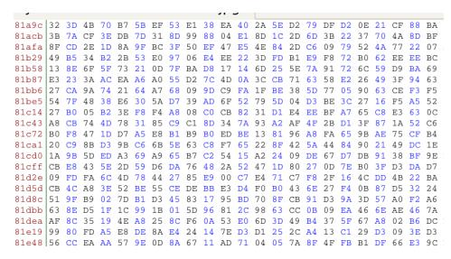

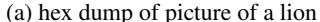

(b) same lion in human-readable format

Figure 1: The hex dump represented at the left has more information contents than the image at the right. Only one of them can be processed by the human brain in time to save their lives. Computational convenience matters. Not just entropy.

The task of a deep neural network classifier is to come up with a representation for the final layer that can be easily fed to a linear classifier (i.e. the most elementary form of useful classifier). The cross-entropy loss applies a lot of pressure directly on the last layer to make it linearly separable. Any degree of linear separability in the intermediate layers happens only as a by-product.

On one hand, we have that every layer has less *information* than its parent layer. On the other hand, we observe experimentally in Section 3.5, 4.1 and 4.2 that features from deeper layers work better with linear classifiers to predict the target labels. At first glance this might seem like a contradiction.

One of the important lessons is that neural networks are really about distilling computationally-useful *representations*, and they are not about *information contents* as described by the field of Information Theory.

## 3.2 Linear classifier probes

Consider the common scenario in deep learning in which we are trying to classify the input data X to produce an output distribution over D classes. The last layer of the model is a densely-connected map to D values followed by a softmax, and we train by minimizing cross-entropy.

At every layer we can take the features  $H_k$  from that layer and try to predict the correct labels y using a linear classifier parameterized as

$$f_k \colon H_k \to [0,1]^D$$
  
 $h_k \mapsto \operatorname{softmax} (Wh_k + b)$ .

where  $h_k \in H$  are the features of hidden layer k,  $[0,1]^D$  is the space of categorical distributions of the D target classes, and (W,b) are the probe weights and biases to be learned so as to minimize the usual cross-entropy loss.

Let  $\mathcal{L}_k^{\text{train}}$  be the empirical loss of that linear classifier  $f_k$  evaluated over the training set. We can also define  $\mathcal{L}_k^{\text{valid}}$  and  $\mathcal{L}_k^{\text{test}}$  by exporting the same linear classifier on the validation and test sets.

Without making any assumptions about the model itself being trained, we can nevertheless assume that these  $f_k$  are themselves optimized so that, at any given time, they reflect the currently optimal thing that can be done with the features present.

We refer to those linear classifiers as "probes" in an effort to clarify our thinking about the model. These probes do not affect the model training. They only measure the level of linear separability of the features at a given layer. Blocking the backpropagation from the probes to the model itself can be achieved by using tf.stop\_gradient in Tensorflow (or its Theano equivalent), or by managing the probe parameters separately from the model parameters.

Note that we can avoid the issue of local minima because training a linear classifier using softmax cross-entropy is a convex problem.

In this paper, we study

- how  $\mathcal{L}_k$  decreases as k increases (see Section 3.1),
- the usefulness of  $\mathcal{L}_k$  as a diagnostic tool (see Section 5.1).

## 3.3 Practical concern: $\mathcal{L}_k^{\text{train}}$ vs $\mathcal{L}_k^{\text{valid}}$

The reason why we care about optimality of the probes in Section 3.2 is because it abstracts away the problem of optimizing them. When a general function g(x) has a unique global minimum, we can talk about that minimum without ambiguity even though, in practice, we are probably going to use only a convenient approximation of the minimum.

This is acceptable in a context where we are seeking better intuition about deep learning models by using linear classifier probes. If a researcher judges that the measurements are useful to further their understanding of their model (and act on that intuition), then they should not worry too much about how close they are to optimality.

This applies also to the question of whether we should prioritize  $\mathcal{L}_k^{\text{train}}$  or  $\mathcal{L}_k^{\text{valid}}$ . We would argue that  $\mathcal{L}_k^{\text{valid}}$  seems like a more meaningful quantity to monitor, but depending on our experimental setup it might not be easy to track  $\mathcal{L}_k^{\text{valid}}$  in all circumstances.

Moreover, for the purposes of many of the experiments in this paper we chose to report the classification error instead of the cross-entropy, since this is ultimately often the quantity that matters the most. Reporting the top5 classification error could also have been possible.

#### 3.4 Practical concern: Dimension reduction on features

Another practical problem can arise when certain layers of a neural network have an exceedingly large quantity of features. The first few layers of Inception v3, for example, have a few million features when we multiply height, width and channels. This leads to parameters for a single probe taking upwards of a few gigabytes of storage, which is disproportionately large when we consider that the entire set of model parameters takes less space than that.

In those cases, we have three possible suggestions for trimming down the space of features on which we fit the probes.

- Use only a random subset of the features (but always the same ones). This is used on the Inception v3 model in Section 4.2.
- Project the features to a lower-dimensional space. Learn this mapping. This is probably a worse idea than it sounds because the projection matrix itself can take a lot of storage (even more than the probe parameters).
- When dealing with features in the form of images (height, width, channels), we can perform 2D pooling along the (height, width) of each channel. This reduces the number of features to the number of channels. This is used on the ResNet-50 model in Section 4.1.

In practice, when using linear classifier probes on any serious model (i.e. not MNIST) we have to choose a way to reduce the number of features used.

Note that we also want to avoid a situation where our probes are simply overfitting on the features because there are too many features. It was recently demonstrated that very large models can fit random labels on ImageNet (Zhang *et al.*, 2016). This is a situation that we want to avoid because the probe measurements would be entirely meaningless in that situation. Dimensionality reduction helps with this concern.

## 3.5 Basic example on MNIST

In this section we run the MNIST convolutional model provided by the tensorflow/models github repository (image/mnist/convolutional.py). We selected that model for reproducibility and to demonstrate how to easily peek into popular models by using probes.

We start by sketching the model in Figure 2. We report the results at the beginning and the end of training on Figure 3. One of the interesting dynamics to be observed there is how useful the first

layers are, despite the fact that the model is completely untrained. Random projections can be useful to classify data, and this has been studied by others (Jarrett *et al.*, 2009).

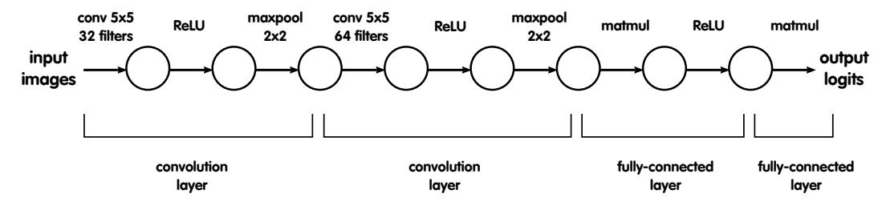

Figure 2: This graphical model represents the neural network that we are going to use for MNIST. The model could be written in a more compact form, but we represent it this way to expose all the locations where we are going to insert probes. The model itself is simply two convolutional layers followed by two fully-connected layer (one being the final classifier). However, we insert probes on each side of each convolution, activation function, and pooling function. This is a bit overzealous, but the small size of the model makes this relatively easy to do.

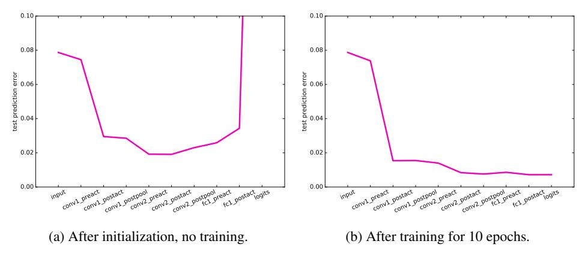

Figure 3: We represent here the test prediction error for each probe, at the beginning and at the end of training. This measurement was obtained through early stopping based on a validation set of  $10^4$  elements. The probes are prevented from overfitting the training data. We can see that, at the beginning of training (on the left), the randomly-initialized layers were still providing useful transformations. The test prediction error goes from 8% to 2% simply using those random features. The biggest impact comes from the first ReLU. At the end of training (on the right), the test prediction error is improving at every layer (with the exception of a minor kink on fc1\_preact).

## 3.6 Other objectives

Note that it would be entirely possible to use linear classifier probes on a different set of labels. For the same reason as it is possible to transfer many layers from one vision task to another (e.g. with different classes), we are not limited to fitting probes using the same domain.

Inserting probes at many different layers of a model is essentially a way to ask the following question:

*Is there any information about factor* \_\_\_\_ present in this part of the model?

## 4 Experiments with popular models

#### 4.1 ResNet-50

The family of ResNet models (He et al., 2016) are characterized by their large quantities of residual layers mapping essentially  $x \mapsto x + r(x)$ . They have been very successful and there are various

papers seeking to understand better how they work (Veit *[et al.](#page-10-7)*, [2016;](#page-10-7) [Larsson](#page-9-14) *et al.*, [2016;](#page-9-14) [Singh](#page-10-8) *[et al.](#page-10-8)*, [2016\)](#page-10-8).

Here we are going to show how linear classifier probes might be able to help us a little to shed some light into the ResNet-50 model. We used the pretrained model from the github repo (fchollet/deep-learning-models) of the author of Keras [\(Chollet](#page-9-15) *et al.*, [2015\)](#page-9-15).

One of the questions that comes up when discussing ResNet models is whether the successive layers are essentially performing the same operation over many times, refining the representation just a little more each time, or whether there is a more fundamental change of representation happening.

In particular, we can point to certain places in ResNet-50 where the image size diminishes and we increase the number of channels. This happens at three places in the model (identified with blank lines in Table [4a\)](#page-6-1).

| layer name | topology       | probe valid prediction error |  |
|---------------|----------------|------------------------------------|--|
| input 1       | (224, 224, 3)  | 0.99                               |  |
| add 1         | (28, 28, 256)  | 0.94                               |  |
| add 2         | (28, 28, 256)  | 0.89                               |  |
| add 3         | (28, 28, 256)  | 0.88                               |  |
|               |                |                                    |  |
| add 4         | (28, 28, 512)  | 0.87                               |  |
| add 5         | (28, 28, 512)  | 0.82                               |  |
| add 6         | (28, 28, 512)  | 0.79                               |  |
| add 7         | (28, 28, 512)  | 0.76                               |  |
|               |                |                                    |  |
| add 8         | (14, 14, 1024) | 0.77                               |  |
| add 9         | (14, 14, 1024) | 0.69                               |  |
| add 10        | (14, 14, 1024) | 0.67                               |  |
| add 11        | (14, 14, 1024) | 0.62                               |  |
| add 12        | (14, 14, 1024) | 0.57                               |  |
| add 13        | (14, 14, 1024) | 0.51                               |  |
|               |                |                                    |  |
| add 14        | (7, 7, 2048)   | 0.41                               |  |
| add 15        | (7, 7, 2048)   | 0.39                               |  |
| add 16        | (7, 7, 2048)   | 0.31                               |  |
|               |                |                                    |  |

(a) Validation errors for probes. Comparing different layers. Pre-trained ResNet-50 on ImageNet dataset.

Figure 4: For the ResNet-50 model trained on ImageNet, we can see deeper features are better at predicting the output classes. More importantly, the relationship between depth and validation prediction error is almost perfectly monotonic. This suggests a certain "greedy" aspect of the representations used in deep neural networks. This property is something that comes naturally as a result of conventional training, and it is not due to the insertion of probes in the model.

## 4.2 Inception v3

We have performed an experiment using the Inception v3 model on the ImageNet dataset [\(Szegedy](#page-10-9) *[et al.](#page-10-9)*, [2015;](#page-10-9) [Russakovsky](#page-10-3) *et al.*, [2015\)](#page-10-3). We show using colors in Figure [5](#page-7-1) how the predictive error of each layer can be measured using probes. This can be computed at many different times of training, but here we report only after minibatch 308230, which corresponds to about 2 weeks of training.

(b) Inserting probes at meaningful layers of ResNet-50. This plot shows the rightmost column of the table in Figure [4a.](#page-6-1) Reporting the validation error for probes (magenta) and comparing it with the validation error of the pre-trained model (green).

This model has a few particularities, one of which is that it features an auxiliary branch that contributes to training the model (it can be discarded afterwards, but not necessarily). We wanted to investigate whether this branch is "leading training", in the sense that its classifier might have lower prediction error than the main head for the first part of the training.

This is something that we confirmed by looking at the prediction errors for the probes, but the difference was not very large. The auxiliary branch was ahead of the main branch by just a little.

The smooth gradient of colors in Figure [5](#page-7-1) shows how the linear separability increases monotonically as we probe layers deeper into the network.

Refer to the Appendix Section [C](#page-11-0) for a comparison at four different moments of training, and for some more details about how we reduced the dimensionality of the feature to make this more tractable.

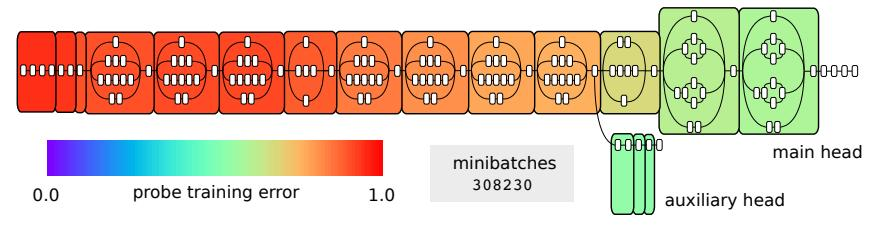

Figure 5: Inception v3 model after 2 weeks of training. Red is bad (high prediction error) and green/blue is good (low prediction error). The smooth color gradient shows a very gradual transition in the degree of linear separability (almost perfectly monotonic).

# 5 Diagnostics for failing models

## 5.1 Pathological behavior on skip connections

In this section we show an example of a situation where we can use probes to diagnose a training problem as it is happening.

We purposefully selected a model that was pathologically deep so that it would fail to train under normal circumstances. We used 128 fully-connected layers of 128 hidden units to classify MNIST, which is not at all a model that we would recommend. We thought that something interesting might happen if we added a very long skip connection that bypasses the first half of the model completely (Figure [6a\)](#page-8-0).

With that skip connection, the model became trainable through the usual SGD. Intuitively, we thought that the latter portion of the model would see use at first, but then we did not know whether the first half of the model would then also become useful.

Using probes we show that this solution was not working as intended, because half of the model stays unused. The weights are not zero, but there is no useful signal passing through that segment. The skip connection left a dead segment and skipped over it.

The lesson that we want to show the reader is not that skip connections are bad. Our goal here is to show that linear classification probes are a tool to understand what is happening internally in such situations. Sometimes the successful minimization of a loss fails to capture important details.

# 6 Discussion and future work

We have presented a combination of both a small convnet on MNIST and larger popular convnets Inception v3 and ResNet-50. It would be nice to continue this work and look at ResNet-101, ResNet-151, VGG-16 and VGG-19. A similar thing could be done with popular RNNs also.

To apply linear classifier probes to a different context, we could also try any setting where either Generative Adversarial Networks [\(Goodfellow](#page-9-16) *et al.*, [2014\)](#page-9-16) or adversarial examples are used [\(Szegedy](#page-10-2) *[et al.](#page-10-2)*, [2013\)](#page-10-2).

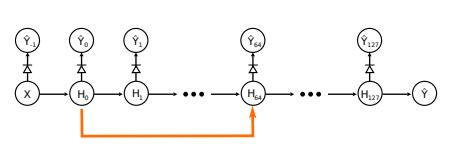

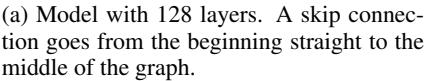

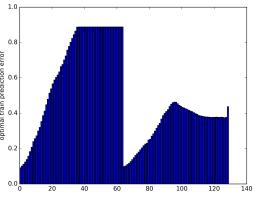

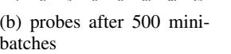

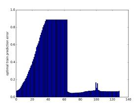

(c) probes after 2000 minibatches

Figure 6: Pathological skip connection being diagnosed. Refer to Appendix Section [A](#page-10-10) for explanations about the special notation for probes using the "diode" symbol.

The idea of multi-layer probes has been suggested to us on multiple occasions. This could be seen as a natural extension of the linear classifier probes. One downside to this idea is that we lose the convexity property of the probes. It might be worth pursuing in a particular setting, but as of now we feel that it is premature to start using multi-layer probes. This also leads to the convoluted idea of having a regular probe inside a multi-layer probe.

One completely new direction would be to train a model in a way that actively discourages certain internal layers to be useful to linear classifiers. What would be the consequences of this constraint? Would it handicap a given model or would the model simply adjust without any trouble? At that point, we are no longer dealing with non-invasive probes, but we are feeding a strange kind of signal back to the model.

Finally, we think that it is rather interesting that the probe prediction errors are almost perfectly monotonically decreasing. We suspect that this warrants a deeper investigation into the reasons why that it happens, and it may lead to the discovery of fundamental concepts to understand better deep neural networks (in relation to their optimization). This is connected to the work done by [Jastrzebski](#page-9-17) *[et al.](#page-9-17)* [\(2017\)](#page-9-17).

# 7 Conclusion

In this paper we introduced the concept of the *linear classifier probe* as a conceptual tool to better understand the dynamics inside a neural network and the role played by the individual intermediate layers.

We have observed experimentally that an interesting property holds : the level of linear separability increases monotonically as we go to deeper layers. This is purely an indirect consequence of enforcing this constraint on the last layer.

We have demonstrated how these probes can be used to identify certain problematic behaviors in models that might not be apparent when we traditionally have access to only the prediction loss and error.

We are now able to ask new questions and explore new areas.

We hope that the notions presented in this paper can contribute to the understanding of deep neural networks and guide the intuition of researchers that design them.

## Acknowledgments

Yoshua Bengio is a senior CIFAR Fellow. The authors would like to acknowledge the support of the following agencies for research funding and computing support: NSERC, FQRNT, Calcul Quebec, ´ Compute Canada, the Canada Research Chairs and CIFAR. Thanks to Nicolas Ballas for fruitful discussions, to Reyhane Askari and Mohammad Pezeshki for proofreading and comments, and to all the reviewers for their comments.

# References

- Alain, G. and Bengio, Y. (2016). Understanding intermediate layers using linear classifier probes. *arXiv preprint arXiv:1610.01644*.
- Arras, L., Montavon, G., Muller, K.-R., and Samek, W. (2017). Explaining recurrent neural network ¨ predictions in sentiment analysis. *arXiv preprint arXiv:1706.07206*.
- Bach, S., Binder, A., Montavon, G., Klauschen, F., Muller, K.-R., and Samek, W. (2015). On pixel- ¨ wise explanations for non-linear classifier decisions by layer-wise relevance propagation. *PloS one*, 10(7), e0130140.
- Biggio, B., Corona, I., Maiorca, D., Nelson, B., Srndi ˇ c, N., Laskov, P., Giacinto, G., and Roli, F. ´ (2013). Evasion attacks against machine learning at test time. In *Joint European Conference on Machine Learning and Knowledge Discovery in Databases*, pages 387–402. Springer.
- Binder, A., Montavon, G., Lapuschkin, S., Muller, K.-R., and Samek, W. (2016). Layer-wise rele- ¨ vance propagation for neural networks with local renormalization layers. In *International Conference on Artificial Neural Networks*, pages 63–71. Springer.
- Chollet, F. *et al.* (2015). Keras. <https://github.com/fchollet/keras>.
- Donahue, J., Jia, Y., Vinyals, O., Hoffman, J., Zhang, N., Tzeng, E., and Darrell, T. (2014). Decaf: A deep convolutional activation feature for generic visual recognition. In *International conference on machine learning*, pages 647–655.
- Dosovitskiy, A. and Brox, T. (2016). Inverting visual representations with convolutional networks. In *Proceedings of the IEEE Conference on Computer Vision and Pattern Recognition*, pages 4829–4837.
- Goodfellow, I., Pouget-Abadie, J., Mirza, M., Xu, B., Warde-Farley, D., Ozair, S., Courville, A., and Bengio, Y. (2014). Generative adversarial nets. In *Advances in neural information processing systems*, pages 2672–2680.
- He, K., Zhang, X., Ren, S., and Sun, J. (2016). Deep residual learning for image recognition. In *Proceedings of the IEEE Conference on Computer Vision and Pattern Recognition*, pages 770– 778.
- Jarrett, K., Kavukcuoglu, K., Lecun, Y., *et al.* (2009). What is the best multi-stage architecture for object recognition? In *2009 IEEE 12th International Conference on Computer Vision*, pages 2146–2153. IEEE.
- Jastrzebski, S., Arpit, D., Ballas, N., Verma, V., Che, T., and Bengio, Y. (2017). Residual connections encourage iterative inference. *arXiv preprint arXiv:1710.04773*.
- Lapuschkin, S., Binder, A., Montavon, G., Muller, K.-R., and Samek, W. (2016). Analyzing clas- ¨ sifiers: Fisher vectors and deep neural networks. In *Proceedings of the IEEE Conference on Computer Vision and Pattern Recognition*, pages 2912–2920.
- Larsson, G., Maire, M., and Shakhnarovich, G. (2016). Fractalnet: Ultra-deep neural networks without residuals. *arXiv preprint arXiv:1605.07648*.
- Mahendran, A. and Vedaldi, A. (2015). Understanding deep image representations by inverting them. In *Proceedings of the IEEE conference on computer vision and pattern recognition*, pages 5188–5196.
- Mahendran, A. and Vedaldi, A. (2016). Visualizing deep convolutional neural networks using natural pre-images. *International Journal of Computer Vision*, 120(3), 233–255.
- Montavon, G., Braun, M. L., and Muller, K.-R. (2011). Kernel analysis of deep networks. ¨ *Journal of Machine Learning Research*, 12(Sep), 2563–2581.
- Raghu, M., Yosinski, J., and Sohl-Dickstein, J. (2017a). Bottom up or top down? dynamics of deep representations via canonical correlation analysis. *arxiv*.

- Raghu, M., Gilmer, J., Yosinski, J., and Sohl-Dickstein, J. (2017b). Svcca: Singular vector canonical correlation analysis for deep understanding and improvement. *arXiv preprint arXiv:1706.05806*.
- Russakovsky, O., Deng, J., Su, H., Krause, J., Satheesh, S., Ma, S., Huang, Z., Karpathy, A., Khosla, A., Bernstein, M., Berg, A. C., and Fei-Fei, L. (2015). ImageNet Large Scale Visual Recognition Challenge. *International Journal of Computer Vision (IJCV)*, 115(3), 211–252.
- Singh, S., Hoiem, D., and Forsyth, D. (2016). Swapout: Learning an ensemble of deep architectures. In *Advances In Neural Information Processing Systems*, pages 28–36.
- Szegedy, C., Zaremba, W., Sutskever, I., Bruna, J., Erhan, D., Goodfellow, I., and Fergus, R. (2013). Intriguing properties of neural networks. *arXiv preprint arXiv:1312.6199*.
- Szegedy, C., Liu, W., Jia, Y., Sermanet, P., Reed, S., Anguelov, D., Erhan, D., Vanhoucke, V., and Rabinovich, A. (2015). Going deeper with convolutions. In *Proceedings of the IEEE Conference on Computer Vision and Pattern Recognition*, pages 1–9.
- Veit, A., Wilber, M. J., and Belongie, S. (2016). Residual networks behave like ensembles of relatively shallow networks. In *Advances in Neural Information Processing Systems*, pages 550– 558.
- Xu, K., Ba, J., Kiros, R., Cho, K., Courville, A., Salakhudinov, R., Zemel, R., and Bengio, Y. (2015). Show, attend and tell: Neural image caption generation with visual attention. In *International Conference on Machine Learning*, pages 2048–2057.
- Yosinski, J., Clune, J., Bengio, Y., and Lipson, H. (2014). How transferable are features in deep neural networks? In *Advances in neural information processing systems*, pages 3320–3328.
- Zeiler, M. D. and Fergus, R. (2014). Visualizing and understanding convolutional networks. In *European conference on computer vision*, pages 818–833. Springer.
- Zhang, C., Bengio, S., Hardt, M., Recht, B., and Vinyals, O. (2016). Understanding deep learning requires rethinking generalization. *arXiv preprint arXiv:1611.03530*.

# A Diode notation

We have the following suggestion for extending traditional graphical models to describe where probes are being inserted in a model. See Figure [7.](#page-10-11)

Due to the fact that probes do not contribute to backpropagation, but they still consume the features during the feed-forward step, we thought that borrowing the diode symbol from electrical engineering might be a good idea. A diode is a one-way valve for electrical current.

This notation could be useful also outside of this context with probes, whenever we want to sketch a graphical model and highlight the fact that the gradient backpropagation signal is being blocked.

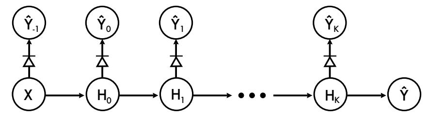

Figure 7: Probes being added to every layer of a model. These additional probes are not supposed to change the training of the model, so we add a little diode symbol through the arrows to indicate that the gradients will not backpropagate through those connections.

# B Training probes with finished model

Sometimes we do not care about measuring the probe losses/accuracy during training, but we have a model that is already trained and we want to report the measurements on that static model.

In that case, it is worth considering whether we really want to augment the model by adding the probes and training the probes by iterating through the training set. Sometimes the model itself is computationally expensive to run and we can only do 150 images per second. If we have to do multiple passes over the training set in order to train probes, then it might be more efficient to run the whole training set and extract the features to the local hard drive. Experimentally, in the case for the pre-trained model Resnet-50 (Section [4.1\)](#page-5-0) we found that we could process approximately 100 training samples per second when doing forward propagation, but we could run through 6000 training samples per second when reading from the local hard drive. This makes it a lot easier to do multiple passes over the training set.

# C Inception v3

In Section [3.4](#page-4-1) we showed results from an experiment using the Inception v3 model on the ImageNet dataset [\(Szegedy](#page-10-9) *et al.*, [2015;](#page-10-9) [Russakovsky](#page-10-3) *et al.*, [2015\)](#page-10-3). The results shown were taken from the last training step only.

Here we provide in Figure [8](#page-11-1) a sketch of the original Inception v3 model, and in Figure [9](#page-12-0) we show results from 4 particular moments during training. These are spread over the 2 weeks of training so that we can get a sense of progression.

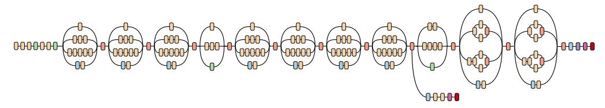

Figure 8: Sketch of the Inception v3 model. Note the structure with the "auxiliary head" at the bottom, and the "inception modules" with a common topology represented as blocks that have 3 or 4 sub-branches.

As discussed in Section [3.4,](#page-4-1) we had to resort to a technique to limit the number of features used by the linear classifier probes. In this particular experiment, we have had the most success by taking 1000 random features for each probe. This gives certain layers an unfair advantage if they start with 4000 features and we kept 1000, whereas in other cases the probe insertion point has 426, 320 features and we keep 1000. There was no simple "fair" solution. That being said, 13 out of the 17 probes have more than 100, 000 features, and 11 of those probes have more than 200, 000 features, so things were relatively comparable.

# **Inception v3**

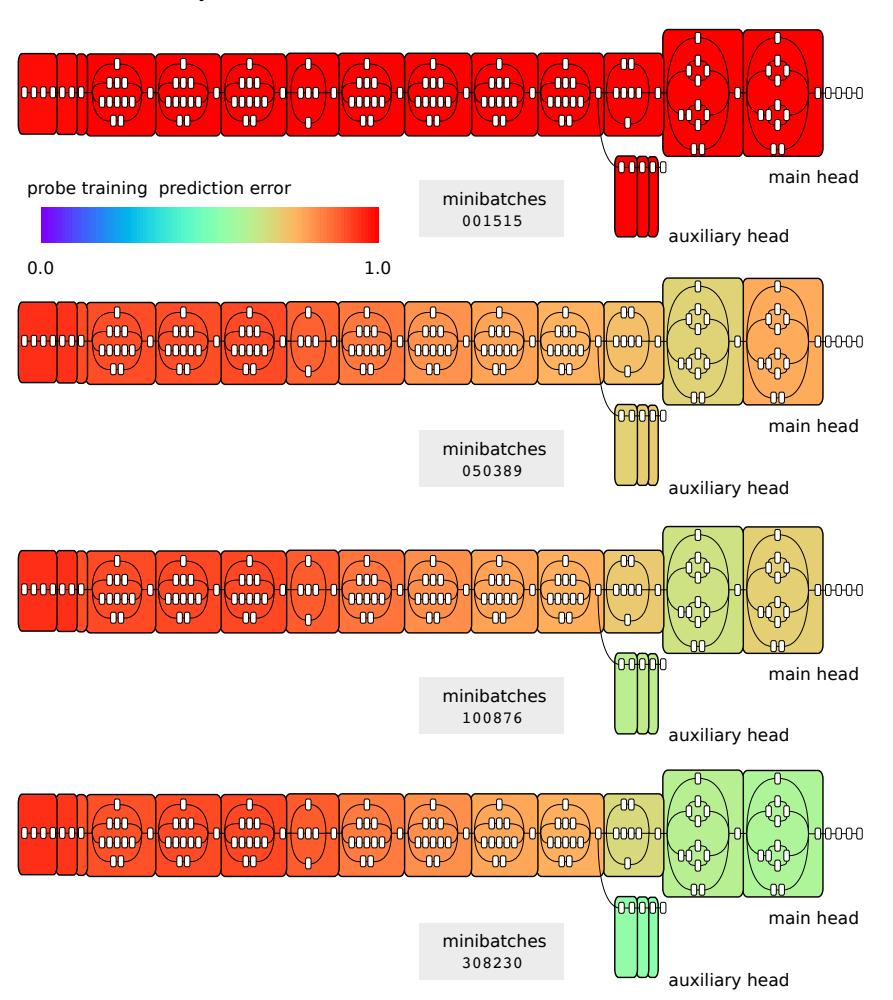

Figure 9: Inserting a probe at multiple moments during training the Inception v3 model on the ImageNet dataset. We represent here the prediction error evaluated at a random subset of 1000 features. As expected, at first all the probes have a 100% prediction error, but as training progresses we see that the model is getting better. Note that there are 1000 classes, so a prediction error of 50% is much better than a random guess. The auxiliary head, shown under the model, was observed to have a prediction error that was slightly better than the main head. This is not necessarily a condition that will hold at the end of training, but merely an observation. Red is bad (high prediction error) and green/blue is good (low prediction error).