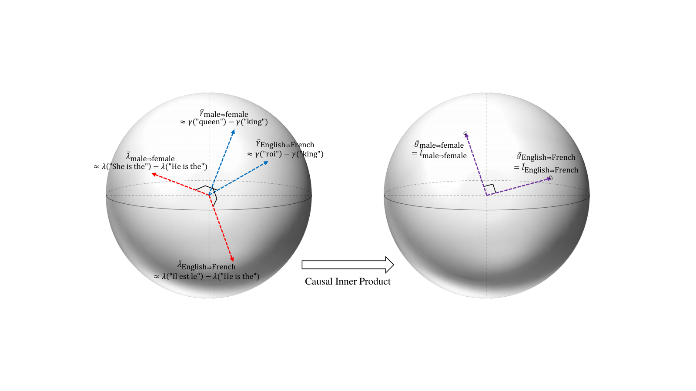
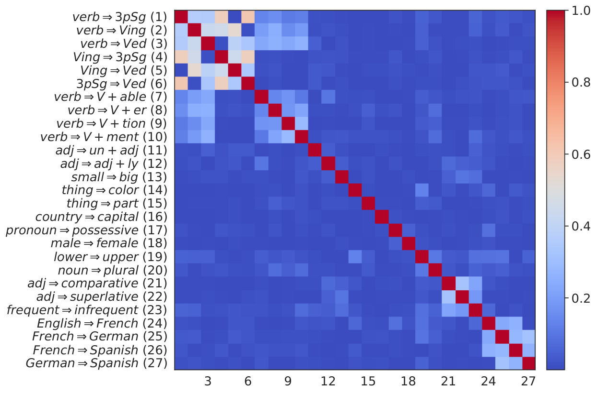
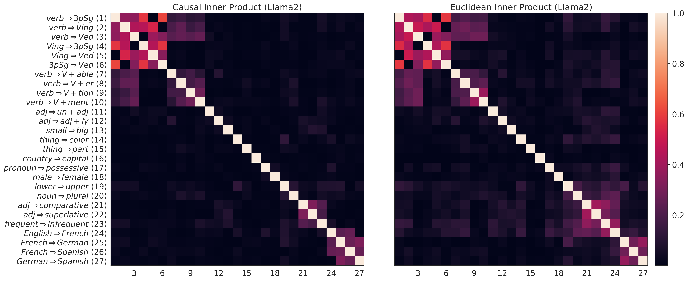
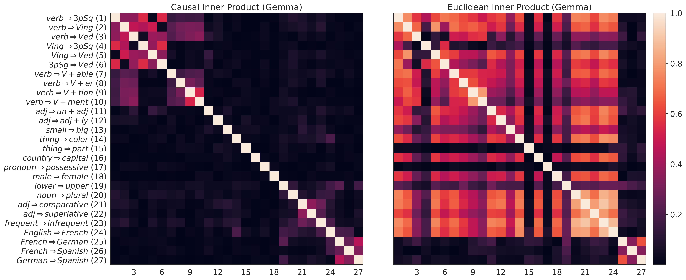
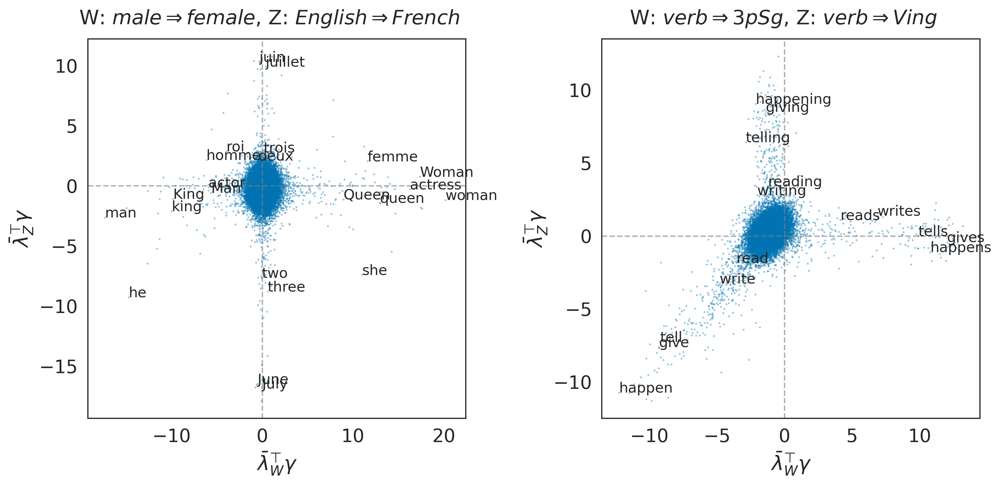

# The Linear Representation Hypothesis and   
the Geometry of Large Language Models

Kiho Park  Affiliation: University of Chicago, Illinois, USA  Correspondence to: [parkkiho@uchicago.edu](mailto:parkkiho@uchicago.edu) Yo Joong Choe  Affiliation: University of Chicago, Illinois, USA  Victor Veitch  Affiliation: University of Chicago, Illinois, USA 

###### Abstract

Informally, the “linear representation hypothesis” is the idea that high-level concepts are represented linearly as directions in some representation space. In this paper, we address two closely related questions: What does “linear representation” actually mean? And, how do we make sense of geometric notions (e.g., cosine similarity and projection) in the representation space? To answer these, we use the language of counterfactuals to give two formalizations of linear representation, one in the output (word) representation space, and one in the input (context) space. We then prove that these connect to linear probing and model steering, respectively. To make sense of geometric notions, we use the formalization to identify a particular (non-Euclidean) inner product that respects language structure in a sense we make precise. Using this _causal inner product_ , we show how to unify all notions of linear representation. In particular, this allows the construction of probes and steering vectors using counterfactual pairs. Experiments with LLaMA-2 demonstrate the existence of linear representations of concepts, the connection to interpretation and control, and the fundamental role of the choice of inner product. Code is available at [github.com/KihoPark/linear_rep_geometry](https://github.com/KihoPark/linear_rep_geometry).

###### Keywords: 

Linear Representation Hypothesis, Causal Inner Product, Interpretability, Machine Learning, ICML 

## 1 Introduction

In the context of language models, the “Linear Representation Hypothesis” is the idea that high-level concepts are represented linearly in the representation space of a model ([Mikolov et al. 2013c](https://arxiv.org/html/2311.03658#bib.bib37); [Arora et al. 2016](https://arxiv.org/html/2311.03658#bib.bib2); [Elhage et al. 2022](https://arxiv.org/html/2311.03658#bib.bib11), e.g.,). High-level concepts might include: is the text in French or English? Is it in the present or past tense? If the text is about a person, are they male or female? The appeal of the _linear_ representation hypothesis is that—were it true—the tasks of interpreting and controlling model behavior could exploit linear algebraic operations on the representation space. Our goal is to formalize the linear representation hypothesis, and clarify how it relates to interpretation and control.

 Figure 1:  The geometry of linear representations can be understood in terms of a _causal inner product_ that respects the semantic structure of concepts. In a language model, each concept has two separate linear representations, \(\bar{\lambda}\) (red) in the embedding (input context) space and \(\bar{\gamma}\) (blue) in the unembedding (output word) space, as drawn on the left. The causal inner product induces a linear transformation for the representation spaces such that the transformed linear representations coincide (purple), as drawn on the right. In this unified representation space, causally separable concepts are represented by orthogonal vectors. 

The first challenge is that it is not clear what “linear representation” means. There are (at least) three interpretations:

  1. 1.

Subspace: ([Mikolov et al. 2013c](https://arxiv.org/html/2311.03658#bib.bib37); [Pennington et al. 2014](https://arxiv.org/html/2311.03658#bib.bib44), e.g.,) The first idea is that each concept is represented as a (1-dimensional) subspace. For example, in the context of word embeddings, it has been argued empirically that \(\repOp(\text{``woman''})-\repOp(\text{``man''})\), \(\repOp(\text{``queen''})-\repOp(\text{``king''})\), and all similar pairs belong to a common subspace ([Mikolov et al. 2013c](https://arxiv.org/html/2311.03658#bib.bib37)). Then, it is natural to take this subspace to be a representation of the concept of \(\mathtt{Male/Female}\).

  2. 2.

Measurement: ([Nanda et al. 2023](https://arxiv.org/html/2311.03658#bib.bib40); [Gurnee & Tegmark 2023](https://arxiv.org/html/2311.03658#bib.bib17), e.g.,) Next is the idea that the probability of a concept value can be measured with a linear probe. For example, the probability that the output language is French is logit-linear in the representation of the input. In this case, we can take the linear map to be a representation of the concept of \(\mathtt{English/French}\).

  3. 3.

Intervention: ([Wang et al. 2023](https://arxiv.org/html/2311.03658#bib.bib58); [Turner et al. 2023](https://arxiv.org/html/2311.03658#bib.bib54), e.g.,) The final idea is that the value a concept takes on can be changed, without changing other concepts, by adding a suitable steering vector—e.g., we change the output from English to French by adding an \(\mathtt{English/French}\) vector. In this case, we take this added vector to be a representation of the concept.

It is not clear a priori how these ideas relate to each other, nor which is the “right” notion of linear representation.

Next, suppose we have somehow found the linear representations of various concepts. We can then use linear algebraic operations on the representation space for interpretation and control. For example, we might compute the cosine similarity between a representation and known concept directions, or edit representations projected onto target directions. However, similarity and projection are geometric notions: they require an inner product on the representation space. The second challenge is that it is not clear which inner product is appropriate for understanding model representations.

To address these, we make the following contributions:

  1. 1.

First, we formalize the subspace notion of linear representation in terms of counterfactual pairs, in both “embedding” (input context) and “unembedding” (output word) spaces. Using this formalization, we prove that the unembedding notion connects to measurement, and the embedding notion to intervention.

  2. 2.

Next, we introduce the notion of a _causal inner product_ : an inner product with the property that concepts that can vary freely of each other are represented as orthogonal vectors. We show that such an inner product has the special property that it unifies the embedding and unembedding representations, as illustrated in [Figure 1](https://arxiv.org/html/2311.03658#S1.F1 "In 1 Introduction ‣ The Linear Representation Hypothesis andthe Geometry of Large Language Models"). Additionally, we show how to estimate the inner product using the LLM unembedding matrix.

  3. 3.

Finally, we study the linear representation hypothesis empirically using LLaMA-2 ([Touvron et al. 2023](https://arxiv.org/html/2311.03658#bib.bib52)). We find the subspace notion of linear representations for a variety of concepts. Using these, we give evidence that the causal inner product respects semantic structure, and that subspace representations can be used to construct measurement and intervention representations.

#### Background on Language Models

We will require some minimal background on (large) language models. Formally, a language model takes in context text \(x\) and samples output text. This sampling is done word by word (or token by token). Accordingly, we’ll view the outputs as single words. To define a probability distribution over outputs, the language model first maps each context \(x\) to a vector \(\lambda(x)\) in a representation space \(\Lambda\simeq\mathbb{R}^{d}\). We will call these _embedding vectors_. The model also represents each word \(y\) as an _unembedding vector_ \(\gamma(y)\) in a separate representation space \(\Gamma\simeq\mathbb{R}^{d}\). The probability distribution over the next words is then given by the softmax distribution:

| \[\mathbb{P}(y~|~x)\propto\exp(\lambda(x)^{\top}\gamma(y)).\] |   
---|---|---  
  
## 2 The Linear Representation Hypothesis

We begin by formalizing the subspace notion of linear representation, one in each of the unembedding and embedding spaces of language models, and then tie the subspace notions to the measurement and intervention notions.

### 2.1 Concepts

The first step is to formalize the notion of a concept. Intuitively, a concept is any factor of variation that can be changed in isolation. For example, we can change the output from French to English without changing its meaning, or change the output from being about a man to about a woman without changing the language it is written in.

Following [Wang et al. 2023](https://arxiv.org/html/2311.03658#bib.bib58), we formalize this idea by taking a _concept variable_ \(W\) to be a latent variable that is caused by the context \(X\), and that acts as a cause of the output \(Y\). For simplicity of exposition, we will restrict attention to binary concepts. Anticipating the representation of concepts by vectors, we introduce an ordering on each binary concept—e.g., male\(\Rightarrow\)female. This ordering makes the sign of a representation meaningful (e.g., the representation of female\(\Rightarrow\)male will have the opposite sign).

Each concept variable \(W\) defines a set of counterfactual outputs \(\{Y(W=w)\}\) that differ only in the value of \(W\). For example, for the concept male\(\Rightarrow\)female, \((Y(0),Y(1))\) is a random element of the set {(“man”, “woman”), (“king”, “queen”), …}. In this paper, we assume the value of concepts can be read off deterministically from the sampled output (e.g., the output “king” implies \(W=0\)). Then, we can specify concepts by specifying their corresponding counterfactual outputs.

We will eventually need to reason about the relationships between multiple concepts. We say that two concepts \(W\) and \(Z\) are _causally separable_ if \(Y(W=w,Z=z)\) is well-defined for each \(w,z\). That is, causally separable concepts are those that can be varied freely and in isolation. For example, the concepts English\(\Rightarrow\)French and male\(\Rightarrow\)female are causally separable—consider \(\{\text{``king''},\text{``queen''},\text{``roi''},\text{``reine''}\}\). However, the concepts English\(\Rightarrow\)French and English\(\Rightarrow\)Russian are not because they cannot vary freely.

We’ll write \(Y(W=w,Z=z)\) as \(Y(w,z)\) when the concepts are clear from context.

### 2.2 Unembedding Representations and Measurement

We now turn to formalizing linear representations of a concept. The first observation is that there are two distinct representation spaces in play—the embedding space \(\Lambda\) and the unembedding space \(\Gamma\). A concept could be linearly represented in either space. We begin with the unembedding space. Defining the cone of vector \(v\) as \(\ConeOp(v)=\{\alpha v:\alpha>0\}\),

###### Definition 2.1 (Unembedding Representation).

We say that \(\bar{\gamma}_{W}\) is an _unembedding representation_ of a concept \(W\) if \(\gamma(Y(1))-\gamma(Y(0))\in\ConeOp(\bar{\gamma}_{W})\) almost surely.

This definition captures the subspace notion in the unembedding space, e.g., that \(\gamma(\text{``queen''})-\gamma(\text{``king''})\) is parallel to \(\gamma(\text{``woman''})-\gamma(\text{``man''})\). We use a cone instead of subspace because the sign of the difference is significant—i.e., the difference between “king” and “queen” is in the opposite direction as the difference between “woman” and “man”. The unembedding representation (if it exists) is unique up to positive scaling, consistent with the linear subspace hypothesis that concepts are represented as directions.

#### Connection to Measurement

The first result is that the unembedding representation is closely tied to the measurement notion of linear representation:

###### Theorem 2.2 (Measurement Representation).

Let \(W\) be a concept, and let \(\bar{\gamma}_{W}\) be the unembedding representation of \(W\). Then, given any context embedding \(\lambda\in\Lambda\),

| \(\displaystyle\logit\mathbb{P}(Y=Y(1)~|~Y\in\{Y(0),Y(1)\},\lambda)=\alpha\lambda^{\top}\bar{\gamma}_{W},\) |   
---|---|---  
  
where \(\alpha>0\) (a.s.) is a function of \(\{Y(0),Y(1)\}\).

All proofs are given in [Appendix B](https://arxiv.org/html/2311.03658#A2 "Appendix B Proofs ‣ The Linear Representation Hypothesis andthe Geometry of Large Language Models").

In words: if we know the output token is either “king” or “queen” (say, the context was about a monarch), then the probability that the output is “king” is logit-linear in the language model representation with regression coefficients \(\bar{\gamma}_{W}\). The random scalar \(\alpha\) is a function of the particular counterfactual pair \(\{Y(0),Y(1)\}\)—e.g., it may be different for \(\{\text{``king''},\text{``queen''}\}\) and \(\{\text{``roi''},\text{``reine''}\}\). However, the direction used for prediction is the same for all counterfactual pairs demonstrating the concept.

[Theorem 2.2](https://arxiv.org/html/2311.03658#S2.Thmtheorem2 "Theorem 2.2 \(Measurement Representation\). ‣ Connection to Measurement ‣ 2.2 Unembedding Representations and Measurement ‣ 2 The Linear Representation Hypothesis ‣ The Linear Representation Hypothesis andthe Geometry of Large Language Models") shows a connection between the subspace representation and the linear representation learned by fitting a linear probe to predict the concept. Namely, in both cases, we get a predictor that is linear on the logit scale. However, the unembedding representation differs from a probe-based representation in that it does not incorporate any information about correlated but off-target concepts. For example, if French text were disproportionately about men, a probe could learn this information (and include it in the representation), but the unembedding representation would not. In this sense, the unembedding representation might be viewed as an ideal probing representation.

### 2.3 Embedding Representations and Intervention

The next step is to define a linear subspace representation in the embedding space \(\Lambda\). We’ll again go with a notion anchored in demonstrative pairs. In the embedding space, each \(\lambda(x)\) defines a distribution over concepts. We consider pairs of sentences such as \(\lambda_{0}=\lambda(\text{``He is the monarch of England, ''})\) and \(\lambda_{1}=\lambda(\text{``She is the monarch of England, ''})\) that induce different distributions on the target concept, but the same distribution on all off-target concepts. A concept is embedding-represented if the differences between all such pairs belong to a common subspace. Formally,

###### Definition 2.3 (Embedding Representation).

We say that \(\bar{\lambda}_{W}\) is an _embedding representation_ of a concept \(W\) if we have \(\lambda_{1}-\lambda_{0}\in\ConeOp(\bar{\lambda}_{W})\) for any context embeddings \(\lambda_{0},\lambda_{1}\in\Lambda\) that satisfy

| \[\frac{\mathbb{P}(W=1~|~\lambda_{1})}{\mathbb{P}(W=1~|~\lambda_{0})}>1\quad\text{and}\quad\frac{\mathbb{P}(W,Z~|~\lambda_{1})}{\mathbb{P}(W,Z~|~\lambda_{0})}=\frac{\mathbb{P}(W~|~\lambda_{1})}{\mathbb{P}(W~|~\lambda_{0})},\] |   
---|---|---  
  
for each concept \(Z\) that is causally separable with \(W\).

The first condition ensures that the direction is relevant to the target concept, and the second condition ensures that the direction is not relevant to off-target concepts.

#### Connection to Intervention

It turns out the embedding representation is closely tied to the intervention notion of linear representation. For this, we need the following lemma relating embedding and unembedding representations.

###### Lemma 2.4 (Unembedding-Embedding Relationship).

Let \(\bar{\lambda}_{W}\) be the embedding representation of a concept \(W\), and let \(\bar{\gamma}_{W}\) and \(\bar{\gamma}_{Z}\) be the unembedding representations for \(W\) and any concept \(Z\) that is causally separable with \(W\). Then,

| \[\bar{\lambda}_{W}^{\top}\bar{\gamma}_{W}>0\quad\text{and}\quad\bar{\lambda}_{W}^{\top}\bar{\gamma}_{Z}=0.\] |  | (2.1)  
---|---|---|---  
  
Conversely, if a representation \(\bar{\lambda}_{W}\) satisfies ([2.1](https://arxiv.org/html/2311.03658#S2.E1 "Equation 2.1 ‣ Lemma 2.4 \(Unembedding-Embedding Relationship\). ‣ Connection to Intervention ‣ 2.3 Embedding Representations and Intervention ‣ 2 The Linear Representation Hypothesis ‣ The Linear Representation Hypothesis andthe Geometry of Large Language Models")), and if there exist concepts \(\{Z_{i}\}_{i=1}^{d-1}\), such that each \(Z_{i}\) is causally separable with \(W\) and \(\{\bar{\gamma}_{W}\}\cup\{\bar{\gamma}_{Z_{i}}\}_{i=1}^{d-1}\) is the basis of \(\mathbb{R}^{d}\), then \(\bar{\lambda}_{W}\) is the embedding representation for \(W\).

We can now connect to the intervention notion:

###### Theorem 2.5 (Intervention Representation).

Let \(\bar{\lambda}_{W}\) be the embedding representation of a concept \(W\). Then, for any concept \(Z\) that is causally separable with \(W\),

| \(\displaystyle\mathbb{P}(Y=Y(W,1)~|~Y\in\{Y(W,0),Y(W,1)\},\lambda+c\bar{\lambda}_{W})\) |   
---|---|---  
  
is constant in \(c\in\mathbb{R}\), and

|  | \(\displaystyle\mathbb{P}(Y=Y(1,Z)~|~Y\in\{Y(0,Z),Y(1,Z)\},\lambda+c\bar{\lambda}_{W})\) |   
---|---|---|---  
  
is increasing in \(c\in\mathbb{R}\).

In words: adding \(\bar{\lambda}_{W}\) to the language model representation of the context changes the probability of the target concept (\(W\)), but not the probability of off-target concepts (\(Z\)).

## 3 Inner Product for Language Model Representations

Given linear representations, we would like to make use of them by doing things like measuring the similarity between different representations, or editing concepts by projecting onto a target direction. Similarity and projection are both notions that require an inner product. We now consider the question of which inner product is appropriate for understanding language model representations.

#### Preliminaries

We define \(\bar{\Gamma}\) to be the space of differences between elements of \(\Gamma\). Then, \(\bar{\Gamma}\) is a \(d\)-dimensional real vector space.11 1 Note that the unembedding space \(\Gamma\) is only an affine space, since the softmax is invariant to adding a constant. We consider defining inner products on \(\bar{\Gamma}\). Unembedding representations are naturally directions (unique only up to scale). Once we have an inner product, we define the _canonical_ unembedding representation \(\bar{\gamma}_{W}\) to be the element of the cone with \(\langle\bar{\gamma}_{W},\bar{\gamma}_{W}\rangle=1\). This lets us define inner products between unembedding representations.

#### Unidentifiability of the inner product

We might hope that there is some natural inner product that is picked out (identified) by the model training. It turns out that this is not the case. To understand the challenge, consider transforming the unembedding and embedding spaces according to

| \(\displaystyle g(y)\leftarrow A\gamma(y)+\beta,\quad l(x)\leftarrow A^{-\top}\lambda(x),\) |  | (3.1)  
---|---|---|---  
  
where \(A\in\mathbb{R}^{d\times d}\) is some invertible linear transformation and \(\beta\in\mathbb{R}^{d}\) is a constant. It’s easy to see that this transformation preserves the softmax distribution \(\mathbb{P}(y~|~x)\):

| \(\displaystyle\frac{\exp(\lambda(x)^{\top}\gamma(y))}{\sum_{y^{\prime}}\exp(\lambda(x)^{\top}\gamma(y^{\prime}))}=\frac{\exp(l(x)^{\top}g(y))}{\sum_{y^{\prime}}\exp(l(x)^{\top}g(y^{\prime}))},\quad\forall x,y.\) |   
---|---|---  
  
However, the objective function used to train the model depends on the representations only through the softmax probabilities. Thus, the representation \(\gamma\) is identified (at best) only up to some invertible affine transformation.

This also means that the concept representations \(\bar{\gamma}_{W}\) are identified only up to some invertible linear transformation \(A\). The problem is that, given any fixed inner product,

| \(\displaystyle\langle\bar{\gamma}_{W},\bar{\gamma}_{Z}\rangle\neq\langle A\bar{\gamma}_{W},A\bar{\gamma}_{Z}\rangle,\) |   
---|---|---  
  
in general. Accordingly, there is no obvious reason to expect that algebraic manipulations based on, e.g., the Euclidean inner product, should be semantically meaningful.

### 3.1 Causal Inner Products

We require some additional principles for choosing an inner product on the representation space. The intuition we follow here is that causally separable concepts should be represented as orthogonal vectors. For example, English\(\Rightarrow\)French and Male\(\Rightarrow\)Female, should be orthogonal. We define an inner product with this property:

###### Definition 3.1 (Causal Inner Product).

A _causal inner product_ \(\langle\cdot,\cdot\rangle_{\mathrm{C}}\) on \(\bar{\Gamma}\simeq\mathbb{R}^{d}\) is an inner product such that

| \(\displaystyle\langle\bar{\gamma}_{W},\bar{\gamma}_{Z}\rangle_{\mathrm{C}}=0,\) |   
---|---|---  
  
for any pair of causally separable concepts \(W\) and \(Z\).

This choice turns out to have the key property that it unifies the unembedding and embedding representations:

###### Theorem 3.2 (Unification of Representations).

Suppose that, for any concept \(W\), there exist concepts \(\{Z_{i}\}_{i=1}^{d-1}\) such that each \(Z_{i}\) is causally separable with \(W\) and \(\{\bar{\gamma}_{W}\}\cup\{\bar{\gamma}_{Z_{i}}\}_{i=1}^{d-1}\) is a basis of \(\mathbb{R}^{d}\). If \(\langle\cdot,\cdot\rangle_{\mathrm{C}}\) is a causal inner product, then the Riesz isomorphism \(\bar{\gamma}\mapsto\langle\bar{\gamma},\cdot\rangle_{\mathrm{C}}\), for \(\bar{\gamma}\in\bar{\Gamma}\), maps the unembedding representation \(\bar{\gamma}_{W}\) of each concept \(W\) to its embedding representation \(\bar{\lambda}_{W}\):

| \[\langle\bar{\gamma}_{W},\cdot\rangle_{\mathrm{C}}=\bar{\lambda}_{W}^{\top}.\] |   
---|---|---  
  
To understand this result intuitively, notice we can represent embeddings as row vectors and unembeddings as column vectors. If the causal inner product were the Euclidean inner product, the isomorphism would simply be the transpose operation. The theorem is the (Riesz isomorphism) generalization of this idea: each linear map on \(\bar{\Gamma}\) corresponds to some \(\lambda\in\Lambda\) according to \(\lambda^{\top}:\bar{\gamma}\mapsto\lambda^{\top}\bar{\gamma}\). So, we can map \(\bar{\Gamma}\) to \(\Lambda\) by mapping each \(\bar{\gamma}_{W}\) to a linear function according to \(\bar{\gamma}_{W}\to\langle\bar{\gamma}_{W},\cdot\rangle_{\mathrm{C}}\). The theorem says this map sends each unembedding representation of a concept to the embedding representation of the same concept.

In the experiments, we will make use of this result to construct embedding representations from unembedding representations. In particular, this allows us to find interventional representations of concepts. This is important because it is difficult in practice to find pairs of prompts that directly satisfy [Definition 2.3](https://arxiv.org/html/2311.03658#S2.Thmtheorem3 "Definition 2.3 \(Embedding Representation\). ‣ 2.3 Embedding Representations and Intervention ‣ 2 The Linear Representation Hypothesis ‣ The Linear Representation Hypothesis andthe Geometry of Large Language Models").

### 3.2 An Explicit Form for Causal Inner Product

The next problem is: if a causal inner product exists, how can we find it? In principle, this could be done by finding the unembedding representations of a large number of concepts, and then finding an inner product that maps each pair of causally separable directions to zero. In practice, this is infeasible because of the number of concepts required to find the inner product, and the difficulty of estimating the representations of each concept.

We now turn to developing a more tractable approach based on the following insight: knowing the value of concept \(W\) expressed by a randomly chosen word tells us little about the value of a causally separable concept \(Z\) expressed by that word. For example, if we learn that a randomly sampled word is French (not English), this does not give us significant information about whether it refers to a man or woman.22 2 Note that this assumption is about words _sampled randomly from the vocabulary_ , not words sampled randomly from natural language sources. In the latter, there may well be non-causal correlations between causally separable concepts. We formalize this idea as follows:

###### Assumption 3.3.

Suppose \(W,Z\) are causally separable concepts and that \(\gamma\) is an unembedding vector sampled uniformly from the vocabulary. Then, \(\bar{\lambda}_{W}^{\top}\gamma\) and \(\bar{\lambda}_{Z}^{\top}\gamma\) are independent33 3 In fact, to prove our next result, we only require that \(\bar{\lambda}_{W}^{\top}\gamma\) and \(\bar{\lambda}_{Z}^{\top}\gamma\) are uncorrelated. In Appendix [D.6](https://arxiv.org/html/2311.03658#A4.SS6 "D.6 A sanity check for the estimated causal inner product ‣ Appendix D Additional Results ‣ The Linear Representation Hypothesis andthe Geometry of Large Language Models"), we verify that the causal inner product we find satisfies the uncorrelatedness condition. for any embedding representations \(\bar{\lambda}_{W}\) and \(\bar{\lambda}_{Z}\) for \(W\) and \(Z\), respectively.

This assumption lets us connect causal separability with something we can actually measure: the statistical dependency between words. The next result makes this precise.

###### Theorem 3.4 (Explicit Form of Causal Inner Product).

Suppose there exists a causal inner product, represented as \(\langle\bar{\gamma},\bar{\gamma}^{\prime}\rangle_{\mathrm{C}}=\bar{\gamma}^{\top}M\bar{\gamma}^{\prime}\) for some symmetric positive definite matrix \(M\). If there are mutually causally separable concepts \(\{W_{k}\}_{k=1}^{d}\), such that their canonical representations \(G=[\bar{\gamma}_{W_{1}},\cdots,\bar{\gamma}_{W_{d}}]\) form a basis for \(\bar{\Gamma}\simeq\mathbb{R}^{d}\), then under [3.3](https://arxiv.org/html/2311.03658#S3.Thmtheorem3 "Assumption 3.3. ‣ 3.2 An Explicit Form for Causal Inner Product ‣ 3 Inner Product for Language Model Representations ‣ The Linear Representation Hypothesis andthe Geometry of Large Language Models"),

| \[M^{-1}=GG^{\top}\text{ and }G^{\top}\mathrm{Cov}(\gamma)^{-1}G=D,\] |  | (3.2)  
---|---|---|---  
  
for some diagonal matrix \(D\) with positive entries, where \(\gamma\) is the unembedding vector of a word sampled uniformly at random from the vocabulary.

Notice that causal orthogonality only imposes \(d(d-1)/2\) constraints on the inner product, but there are \(d(d-1)/2+d\) degrees of freedom in identifying the positive definite matrix \(M\) (hence, an inner product)—thus, we expect \(d\) degrees of freedom in choosing a causal inner product. [Theorem 3.4](https://arxiv.org/html/2311.03658#S3.Thmtheorem4 "Theorem 3.4 \(Explicit Form of Causal Inner Product\). ‣ 3.2 An Explicit Form for Causal Inner Product ‣ 3 Inner Product for Language Model Representations ‣ The Linear Representation Hypothesis andthe Geometry of Large Language Models") gives a characterization of this class of inner products, in the form of ([3.2](https://arxiv.org/html/2311.03658#S3.E2 "Equation 3.2 ‣ Theorem 3.4 \(Explicit Form of Causal Inner Product\). ‣ 3.2 An Explicit Form for Causal Inner Product ‣ 3 Inner Product for Language Model Representations ‣ The Linear Representation Hypothesis andthe Geometry of Large Language Models")). Here, \(D\) is a free parameter with \(d\) degrees of freedom. Each \(D\) defines the inner product. We do not have a principle for picking out a unique choice of \(D\). In our experiments, we will work with the _choice_ \(D=I_{d}\), which gives us \(M=\mathrm{Cov}(\gamma)^{-1}\). Then, we have a simple closed form for the corresponding inner product:

| \[\langle\bar{\gamma},\bar{\gamma}^{\prime}\rangle_{\mathrm{C}}:=\bar{\gamma}^{\top}\mathrm{Cov}(\gamma)^{-1}\bar{\gamma}^{\prime},\quad\forall\bar{\gamma},\bar{\gamma}^{\prime}\in\bar{\Gamma}.\] |  | (3.3)  
---|---|---|---  
  
Note that although we don’t have a unique inner product, we can rule out most inner products. E.g., the Euclidean inner product is not a causal inner product if \(M=I_{d}\) does not satisfy ([3.2](https://arxiv.org/html/2311.03658#S3.E2 "Equation 3.2 ‣ Theorem 3.4 \(Explicit Form of Causal Inner Product\). ‣ 3.2 An Explicit Form for Causal Inner Product ‣ 3 Inner Product for Language Model Representations ‣ The Linear Representation Hypothesis andthe Geometry of Large Language Models")) for any \(D\).

#### Unified representations

The choice of inner product can also be viewed as defining a choice of representations \(g\) and \(l\) in [Equation 3.1](https://arxiv.org/html/2311.03658#S3.E1 "In Unidentifiability of the inner product ‣ 3 Inner Product for Language Model Representations ‣ The Linear Representation Hypothesis andthe Geometry of Large Language Models") (hence, \(\bar{g}=A\bar{\gamma}\)). With \(A=M^{1/2}\), Theorem [3.2](https://arxiv.org/html/2311.03658#S3.Thmtheorem2 "Theorem 3.2 \(Unification of Representations\). ‣ 3.1 Causal Inner Products ‣ 3 Inner Product for Language Model Representations ‣ The Linear Representation Hypothesis andthe Geometry of Large Language Models") further implies that a _causal_ inner product makes the embedding and unembedding representations of concepts the same, that is, \(\bar{g}_{W}=\bar{l}_{W}\). Moreover, in the transformed space, the Euclidean inner product _is_ the causal inner product: \(\langle\bar{\gamma},\bar{\gamma}^{\prime}\rangle_{\mathrm{C}}=\bar{g}^{\top}\bar{g}^{\prime}\). In [Figure 1](https://arxiv.org/html/2311.03658#S1.F1 "In 1 Introduction ‣ The Linear Representation Hypothesis andthe Geometry of Large Language Models"), we illustrated this unification of unembedding and embedding representations. This is convenient for experiments, because it allows the use of standard Euclidean tools on the transformed space.

## 4 Experiments

We now turn to empirically validating the existence of linear representations, the estimated causal inner product, and the predicted relationships between the subspace, measurement, and intervention notions of linear representation. Code is available at [github.com/KihoPark/linear_rep_geometry](https://github.com/KihoPark/linear_rep_geometry).

We use the LLaMA-2 model with 7 billion parameters ([Touvron et al. 2023](https://arxiv.org/html/2311.03658#bib.bib52)) as our testbed. This is a decoder-only Transformer LLM ([Vaswani et al. 2017](https://arxiv.org/html/2311.03658#bib.bib56); [Radford et al. 2018](https://arxiv.org/html/2311.03658#bib.bib46)), trained using the forward LM objective and a 32K token vocabulary. We include further details on all experiments in [Appendix C](https://arxiv.org/html/2311.03658#A3 "Appendix C Experiment Details ‣ The Linear Representation Hypothesis andthe Geometry of Large Language Models").

#### Concepts are represented as directions in the unembedding space

We start with the hypothesis that concepts are represented as directions in the unembedding representation space ([Definition 2.1](https://arxiv.org/html/2311.03658#S2.Thmtheorem1 "Definition 2.1 \(Unembedding Representation\). ‣ 2.2 Unembedding Representations and Measurement ‣ 2 The Linear Representation Hypothesis ‣ The Linear Representation Hypothesis andthe Geometry of Large Language Models")). This notion relies on counterfactual pairs of words that vary only in the value of the concept of interest. We consider 22 concepts defined in the Big Analogy Test Set (BATS 3.0) ([Gladkova et al. 2016](https://arxiv.org/html/2311.03658#bib.bib15)), which provides such counterfactual pairs.44 4 We only utilize words that are single tokens in the LLaMA-2 model. See Appendix [C](https://arxiv.org/html/2311.03658#A3 "Appendix C Experiment Details ‣ The Linear Representation Hypothesis andthe Geometry of Large Language Models") for details. We also consider 4 language concepts: English\(\Rightarrow\)French, French\(\Rightarrow\)German, French\(\Rightarrow\)Spanish, and German\(\Rightarrow\)Spanish, where we use words and their translations as counterfactual pairs. Additionally, we consider the concept frequent\(\Rightarrow\)infrequent capturing how common a word is—we use pairs of common/uncommon synonyms (e.g., “bad” and “terrible”) as counterfactual pairs. We provide a table of all 27 concepts we consider in [Appendix C](https://arxiv.org/html/2311.03658#A3 "Appendix C Experiment Details ‣ The Linear Representation Hypothesis andthe Geometry of Large Language Models").

If the subspace notion of the linear representation hypothesis holds, then all counterfactual token pairs should point to a common direction in the unembedding space. In practice, this will only hold approximately. However, if the linear representation hypothesis holds, we still expect that, e.g., \(\gamma(\text{``queen''})-\gamma(\text{``king''})\) will align with the male\(\Rightarrow\)female direction (more closely than the difference between random word pairs will). To validate this, for each concept \(W\), we look at how the direction defined by each counterfactual pair, \(\gamma(y_{i}(1))-\gamma(y_{i}(0))\), is geometrically aligned with the unembedding representation \(\bar{\gamma}_{W}\). We estimate \(\bar{\gamma}_{W}\) as the (normalized) mean55 5 Previous work on word embeddings ([Drozd et al. 2016](https://arxiv.org/html/2311.03658#bib.bib9); [Fournier et al. 2020](https://arxiv.org/html/2311.03658#bib.bib13)) motivate taking the mean to improve the consistency of the concept direction. among all counterfactual pairs: \(\bar{\gamma}_{W}:=\tilde{\gamma}_{W}/\sqrt{\langle\tilde{\gamma}_{W},\tilde{\gamma}_{W}\rangle_{\mathrm{C}}}\), where

| \[\tilde{\gamma}_{W}=\frac{1}{n_{W}}\sum_{i=1}^{n_{W}}\left[\gamma(y_{i}(1))-\gamma(y_{i}(0))\right],\] |   
---|---|---  
  
\(n_{W}\) denotes the number of counterfactual pairs for \(W\), and \(\langle\cdot,\cdot\rangle_{\mathrm{C}}\) denotes the causal inner product defined in ([3.3](https://arxiv.org/html/2311.03658#S3.E3 "Equation 3.3 ‣ 3.2 An Explicit Form for Causal Inner Product ‣ 3 Inner Product for Language Model Representations ‣ The Linear Representation Hypothesis andthe Geometry of Large Language Models")).

Figure 2: Projecting counterfactual pairs onto their corresponding concept direction shows a strong right skew, as we expect if the linear representation hypothesis holds. The projections of the counterfactual pairs, \(\langle\bar{\gamma}_{W,(-i)},\gamma(y_{i}(1))-\gamma(y_{i}(0))\rangle_{\mathrm{C}}\), are shown in red. For reference, we also project the differences between 100K randomly sampled word pairs onto the estimated concept direction, as shown in blue. See [Table 2](https://arxiv.org/html/2311.03658#A3.T2 "In The LLaMA-2 model ‣ Appendix C Experiment Details ‣ The Linear Representation Hypothesis andthe Geometry of Large Language Models") for details about each concept \(W\) (the title of each plot). 

[Figure 2](https://arxiv.org/html/2311.03658#S4.F2 "In Concepts are represented as directions in the unembedding space ‣ 4 Experiments ‣ The Linear Representation Hypothesis andthe Geometry of Large Language Models") presents histograms of each \(\gamma(y_{i}(1))-\gamma(y_{i}(0)))\) projected onto \(\bar{\gamma}_{W}\) with respect to the causal inner product. Since \(\bar{\gamma}_{W}\) is computed using \(\gamma(y_{i}(1))-\gamma(y_{i}(0))\), we compute each projection using a leave-one-out (LOO) estimate \(\bar{\gamma}_{W,(-i)}\) of the concept direction that excludes \((y_{i}(0),y_{i}(1))\). Across the three concepts shown (and 23 others shown in [Section D.1](https://arxiv.org/html/2311.03658#A4.SS1 "D.1 Histograms of random and counterfactual pairs for all concepts ‣ Appendix D Additional Results ‣ The Linear Representation Hypothesis andthe Geometry of Large Language Models")), the differences between counterfactual pairs are substantially more aligned with \(\bar{\gamma}_{W}\) than those between random pairs. The sole exception is thing\(\Rightarrow\)part, which does not appear to have a linear representation.

The results are consistent with the linear representation hypothesis: the differences computed by each counterfactual pair point to a common direction representing a linear subspace (up to some noise). Further, \(\bar{\gamma}_{W}\) is a reasonable estimator for that direction.

#### The estimated inner product respects causal separability

 Figure 3: Causally separable concepts are represented approximately orthogonally under the estimated causal inner product based on ([3.3](https://arxiv.org/html/2311.03658#S3.E3 "Equation 3.3 ‣ 3.2 An Explicit Form for Causal Inner Product ‣ 3 Inner Product for Language Model Representations ‣ The Linear Representation Hypothesis andthe Geometry of Large Language Models")). The heatmap shows \(|\langle\bar{\gamma}_{W},\bar{\gamma}_{Z}\rangle_{\mathrm{C}}|\) for the estimated unembedding representations of each concept pair \((W,Z)\). The detail for each concept is given in [Table 2](https://arxiv.org/html/2311.03658#A3.T2 "In The LLaMA-2 model ‣ Appendix C Experiment Details ‣ The Linear Representation Hypothesis andthe Geometry of Large Language Models").

Next, we directly examine whether the estimated inner product ([3.3](https://arxiv.org/html/2311.03658#S3.E3 "Equation 3.3 ‣ 3.2 An Explicit Form for Causal Inner Product ‣ 3 Inner Product for Language Model Representations ‣ The Linear Representation Hypothesis andthe Geometry of Large Language Models")) chosen from [Theorem 3.4](https://arxiv.org/html/2311.03658#S3.Thmtheorem4 "Theorem 3.4 \(Explicit Form of Causal Inner Product\). ‣ 3.2 An Explicit Form for Causal Inner Product ‣ 3 Inner Product for Language Model Representations ‣ The Linear Representation Hypothesis andthe Geometry of Large Language Models") is indeed approximately a causal inner product. In [Figure 3](https://arxiv.org/html/2311.03658#S4.F3 "In The estimated inner product respects causal separability ‣ 4 Experiments ‣ The Linear Representation Hypothesis andthe Geometry of Large Language Models"), we plot a heatmap of the inner products between all pairs of the estimated unembedding representations for the 27 concepts. If the estimated inner product is a causal inner product, then we expect values near 0 between causally separable concepts.

The first observation is that most pairs of concepts are nearly orthogonal with respect to this inner product. Interestingly, there is also a clear block diagonal structure. This arises because the concepts are grouped by semantic similarity. For example, the first 10 concepts relate to verbs, and the last 4 concepts are language pairs. The additional non-zero structure also generally makes sense. For example, lower\(\Rightarrow\)upper (capitalization, concept 19) has non-trivial inner product with the language pairs _other than_ French\(\Rightarrow\)Spanish. This may be because French and Spanish obey similar capitalization rules, while English and German each have different conventions (e.g., German capitalizes all nouns, but English only capitalizes proper nouns). In [Section D.2](https://arxiv.org/html/2311.03658#A4.SS2 "D.2 Comparison with the Euclidean inner products ‣ Appendix D Additional Results ‣ The Linear Representation Hypothesis andthe Geometry of Large Language Models"), we compare the Euclidean inner product to the causal inner product for both the LLaMA-2 model and a more recent Gemma large language model ([Mesnard et al. 2024](https://arxiv.org/html/2311.03658#bib.bib34)).

#### Concept directions act as linear probes

Next, we check the connection to the measurement notion of linear representation. We consider the concept \(W=\) French\(\Rightarrow\)Spanish. To construct a dataset of French and Spanish contexts, we sample contexts of random lengths from Wikipedia pages in each language. Note that these are _not_ counterfactual pairs. Following [Theorem 2.2](https://arxiv.org/html/2311.03658#S2.Thmtheorem2 "Theorem 2.2 \(Measurement Representation\). ‣ Connection to Measurement ‣ 2.2 Unembedding Representations and Measurement ‣ 2 The Linear Representation Hypothesis ‣ The Linear Representation Hypothesis andthe Geometry of Large Language Models"), we expect \(\bar{\gamma}_{W}^{\top}\lambda(x_{j}^{\texttt{fr}})<0\) and \(\bar{\gamma}_{W}^{\top}\lambda(x_{j}^{\texttt{es}})>0\). [Figure 4](https://arxiv.org/html/2311.03658#S4.F4 "In Concept directions act as linear probes ‣ 4 Experiments ‣ The Linear Representation Hypothesis andthe Geometry of Large Language Models") confirms this expectation, showing that \(\bar{\gamma}_{W}\) is a linear probe for the concept \(W\) in \(\Lambda\) (left). Also, the representation of an off-target concept \(Z=\) male\(\Rightarrow\)female does not have any predictive power for this task (right). [Section D.3](https://arxiv.org/html/2311.03658#A4.SS3 "D.3 Additional results from the measurement experiment ‣ Appendix D Additional Results ‣ The Linear Representation Hypothesis andthe Geometry of Large Language Models") includes analogous results using all 27 concepts.

Figure 4: The subspace representation \(\bar{\gamma}_{W}\) acts as a linear probe for \(W\). The histograms show \(\bar{\gamma}_{W}^{\top}\lambda(x_{j}^{\texttt{fr}})\) vs. \(\bar{\gamma}_{W}^{\top}\lambda(x_{j}^{\texttt{es}})\) (left) and \(\bar{\gamma}_{Z}^{\top}\lambda(x_{j}^{\texttt{fr}})\) vs. \(\bar{\gamma}_{Z}^{\top}\lambda(x_{j}^{\texttt{es}})\) (right) for \(W=\) French\(\Rightarrow\)Spanish and \(Z=\) male\(\Rightarrow\)female, where \(\{x_{j}^{\texttt{fr}}\}\) and \(\{x_{j}^{\texttt{es}}\}\) are random contexts from French and Spanish Wikipedia, respectively. We also see that \(\bar{\gamma}_{Z}\) does _not_ act as a linear probe for \(W\), as expected. 

#### Concept directions map to intervention representations

[Theorem 2.5](https://arxiv.org/html/2311.03658#S2.Thmtheorem5 "Theorem 2.5 \(Intervention Representation\). ‣ Connection to Intervention ‣ 2.3 Embedding Representations and Intervention ‣ 2 The Linear Representation Hypothesis ‣ The Linear Representation Hypothesis andthe Geometry of Large Language Models") says that we can construct an intervention representation by constructing an embedding representation. Doing this directly requires finding pairs of prompts that vary only on the distribution they induce on the target concept, which can be difficult to find in practice.

Here, we will instead use the isomorphism between embedding and unembedding representations ([Theorem 3.2](https://arxiv.org/html/2311.03658#S3.Thmtheorem2 "Theorem 3.2 \(Unification of Representations\). ‣ 3.1 Causal Inner Products ‣ 3 Inner Product for Language Model Representations ‣ The Linear Representation Hypothesis andthe Geometry of Large Language Models")) to construct intervention representations from unembedding representations. We take

| \[\bar{\lambda}_{W}:=\mathrm{Cov}(\gamma)^{-1}\bar{\gamma}_{W}.\] |  | (4.1)  
---|---|---|---  
  
[Theorem 2.5](https://arxiv.org/html/2311.03658#S2.Thmtheorem5 "Theorem 2.5 \(Intervention Representation\). ‣ Connection to Intervention ‣ 2.3 Embedding Representations and Intervention ‣ 2 The Linear Representation Hypothesis ‣ The Linear Representation Hypothesis andthe Geometry of Large Language Models") predicts that adding \(\bar{\lambda}_{W}\) to a context representation should increase the probability of \(W\), while leaving the probability of all causally separable concepts unaltered.

To test this for a given pair of causally separable concepts \(W\) and \(Z\), we first choose a quadruple \(\{Y(w,z)\}_{w,z\in\{0,1\}}\), and then generate contexts \(\{x_{j}\}\) such that the next word should be \(Y(0,0)\). For example, if \(W=\) male\(\Rightarrow\)female and \(Z=\) lower\(\Rightarrow\)upper, then we choose the quadruple (“king”, “queen”, “King”, “Queen”), and generate contexts using ChatGPT-4 (e.g., “Long live the”). We then intervene on \(\lambda(x_{j})\) using \(\bar{\lambda}_{C}\) via

| \[\lambda_{C,\alpha}(x_{j})=\lambda(x_{j})+\alpha\bar{\lambda}_{C},\] |  | (4.2)  
---|---|---|---  
  
where \(\alpha>0\) and \(C\) can be \(W\), \(Z\), or some other causally separable concept (e.g., French\(\Rightarrow\)Spanish). For different choices of \(C\), we plot the changes in \(\logit\mathbb{P}(W=1~|~Z,\lambda)\) and \(\logit\mathbb{P}(Z=1~|~W,\lambda)\), as we increase \(\alpha\). We expect to see that, if we intervene in the \(W\) direction, then the intervention should linearly increase \(\logit\mathbb{P}(W=1~|~Z,\lambda)\), while the other logit should stay constant; if we intervene in a direction \(C\) that is causally separable with both \(W\) and \(Z\), then we expect both logits to stay constant.

Figure 5: Adding \(\alpha\bar{\lambda}_{C}\) to \(\lambda\) changes the target concept \(C\) without changing off-target concepts. The plots illustrate change in \(\log(\mathbb{P}(\mathrm{``queen"}~|~x)/\mathbb{P}(\mathrm{``king"}~|~x))\) and \(\log(\mathbb{P}(\mathrm{``King"}~|~x)/\mathbb{P}(\mathrm{``king"}~|~x))\), after changing \(\lambda(x_{j})\) to \(\lambda_{C,\alpha}(x_{j})\) as \(\alpha\) increases from \(0\) to \(0.4\), for \(C=\) male\(\Rightarrow\)female (left), lower\(\Rightarrow\)upper (center), French\(\Rightarrow\)Spanish (right). The two ends of the arrow are \(\lambda(x_{j})\) and \(\lambda_{C,0.4}(x_{j})\), respectively. Each context \(x_{j}\) is presented in [Table 4](https://arxiv.org/html/2311.03658#A3.T4 "In Context samples ‣ Appendix C Experiment Details ‣ The Linear Representation Hypothesis andthe Geometry of Large Language Models"). 

[Figure 5](https://arxiv.org/html/2311.03658#S4.F5 "In Concept directions map to intervention representations ‣ 4 Experiments ‣ The Linear Representation Hypothesis andthe Geometry of Large Language Models") shows the results of one such experiment shown for three target concepts (24 others shown in [Section D.4](https://arxiv.org/html/2311.03658#A4.SS4 "D.4 Additional results from the intervention experiment ‣ Appendix D Additional Results ‣ The Linear Representation Hypothesis andthe Geometry of Large Language Models")), confirming our expectations. We see, for example, that intervening in the male\(\Rightarrow\)female direction raises the logit for choosing “queen” over “king” as the next word, but does not change the logit for “King” over “king”.

Table 1: Adding the intervention representation \(\alpha\bar{\lambda}_{W}\) pushes the probability over completions to reflect the concept \(W\). As the scale of intervention increases, the probability of seeing \(Y(W=1)\) (“queen”) increases while the probability of seeing \(Y(W=0)\) (“king”) decreases. We show the top-5 most probable words over the entire vocabulary following the intervention ([4.2](https://arxiv.org/html/2311.03658#S4.E2 "Equation 4.2 ‣ Concept directions map to intervention representations ‣ 4 Experiments ‣ The Linear Representation Hypothesis andthe Geometry of Large Language Models")) in the \(W=\) male\(\Rightarrow\)female direction, i.e., \(\lambda_{W,\alpha}(x)=\lambda(x)+\alpha\bar{\lambda}_{W}\), for \(\alpha\in\{0,0.1,0.2,0.3,0.4\}\). The original context \(x=\) “Long live the ” is a sentence fragment that ends with the word \(Y(W=0)\) (“king”). The most likely words reflect the concept, with “queen” being top-1. In [Section D.5](https://arxiv.org/html/2311.03658#A4.SS5 "D.5 Additional tables of top-5 words after intervention ‣ Appendix D Additional Results ‣ The Linear Representation Hypothesis andthe Geometry of Large Language Models"), we provide more examples. Rank | \(\alpha=\) 0 | 0.1 | 0.2 | 0.3 | 0.4  
---|---|---|---|---|---  
1 | king | Queen | queen | queen | queen  
2 | King | queen | Queen | Queen | Queen  
3 | Queen | king | _ | lady | lady  
4 | queen | King | lady | woman | woman  
5 | _ | _ | king | women | women  
  
A natural follow-up question is to see if the intervention in a concept direction (for \(W\)) pushes the probability of \(Y(W=1)\) being the next word to be the largest among all tokens. We expect to see that, as we increase the value of \(\alpha\), the target concept should eventually be reflected in the most likely output words according to the LM.

In [Table 1](https://arxiv.org/html/2311.03658#S4.T1 "In Concept directions map to intervention representations ‣ 4 Experiments ‣ The Linear Representation Hypothesis andthe Geometry of Large Language Models"), we show an illustrative example in which \(W\) is the concept male\(\Rightarrow\)female and the context \(x\) is a sentence fragment that can end with the word \(Y(W=0)\) (“king”). For \(x=\) “Long live the ”, as we increase the scale \(\alpha\) on the intervention, we see that the target word \(Y(W=1)\) (“queen”) becomes the most likely next word, while the original word \(Y(W=0)\) drops below the top-5 list. This illustrates how the intervention can push the probability of the target word high enough to make it the most likely word while decreasing the probability of the original word.

## 5 Discussion and Related Work

The idea that high-level concepts are encoded _linearly_ is appealing because---if it is true---it may open up simple methods for interpretation and control of LLMs. In this paper, we have formalized ‘linear representation’, and shown that all natural variants of this notion can be unified.66 6 In [Appendix A](https://arxiv.org/html/2311.03658#A1 "Appendix A Summary of Main Results ‣ The Linear Representation Hypothesis andthe Geometry of Large Language Models"), we summarize these results in a figure. This equivalence already suggests some approaches for interpretation and control—e.g., we show how to use collections of pairs of words to define concept directions, and then use these directions to predict what the model’s output will be, and to change the output in a controlled fashion. A major theme is the role played by the choice of inner product.

#### Linear subspaces in language representations

The linear subspace hypotheses was originally observed empirically in the context of word embeddings ([Mikolov et al. 2013b](https://arxiv.org/html/2311.03658#bib.bib36); [Mikolov et al. 2013c](https://arxiv.org/html/2311.03658#bib.bib37); [Levy & Goldberg 2014](https://arxiv.org/html/2311.03658#bib.bib29); [Goldberg & Levy 2014](https://arxiv.org/html/2311.03658#bib.bib16); [Vylomova et al. 2016](https://arxiv.org/html/2311.03658#bib.bib57); [Gladkova et al. 2016](https://arxiv.org/html/2311.03658#bib.bib15); [Chiang et al. 2020](https://arxiv.org/html/2311.03658#bib.bib7); [Fournier et al. 2020](https://arxiv.org/html/2311.03658#bib.bib13), e.g.,). Similar structure has been observed in cross-lingual word embeddings ([Mikolov et al. 2013a](https://arxiv.org/html/2311.03658#bib.bib35); [Lample et al. 2018](https://arxiv.org/html/2311.03658#bib.bib28); [Ruder et al. 2019](https://arxiv.org/html/2311.03658#bib.bib49); [Peng et al. 2022](https://arxiv.org/html/2311.03658#bib.bib43)), sentence embeddings ([Bowman et al. 2016](https://arxiv.org/html/2311.03658#bib.bib4); [Zhu & de Melo 2020](https://arxiv.org/html/2311.03658#bib.bib59); [Li et al. 2020](https://arxiv.org/html/2311.03658#bib.bib30); [Ushio et al. 2021](https://arxiv.org/html/2311.03658#bib.bib55)), representation spaces of Transformer LLMs ([Meng et al. 2022](https://arxiv.org/html/2311.03658#bib.bib32); [Merullo et al. 2023](https://arxiv.org/html/2311.03658#bib.bib33); [Hernandez et al. 2023](https://arxiv.org/html/2311.03658#bib.bib19)), and vision-language models ([Wang et al. 2023](https://arxiv.org/html/2311.03658#bib.bib58); [Trager et al. 2023](https://arxiv.org/html/2311.03658#bib.bib53); [Perera et al. 2023](https://arxiv.org/html/2311.03658#bib.bib45)). These observations motivate [Definition 2.1](https://arxiv.org/html/2311.03658#S2.Thmtheorem1 "Definition 2.1 \(Unembedding Representation\). ‣ 2.2 Unembedding Representations and Measurement ‣ 2 The Linear Representation Hypothesis ‣ The Linear Representation Hypothesis andthe Geometry of Large Language Models"). The key idea in the present paper is providing formalization in terms of counterfactual pairs—this is what allows us to connect to other notions of linear representation, and to identify the inner product structure.

#### Measurement, intervention, and mechanistic interpretability

There is a significant body of work on linear representations for interpreting (probing) ([Alain & Bengio 2017](https://arxiv.org/html/2311.03658#bib.bib1); [Kim et al. 2018](https://arxiv.org/html/2311.03658#bib.bib26); [nostalgebraist 2020](https://arxiv.org/html/2311.03658#bib.bib41); [Rogers et al. 2021](https://arxiv.org/html/2311.03658#bib.bib48); [Belinkov 2022](https://arxiv.org/html/2311.03658#bib.bib3); [Li et al. 2022](https://arxiv.org/html/2311.03658#bib.bib31); [Geva et al. 2022](https://arxiv.org/html/2311.03658#bib.bib14); [Nanda et al. 2023](https://arxiv.org/html/2311.03658#bib.bib40), e.g.,) and controlling (steering) ([Wang et al. 2023](https://arxiv.org/html/2311.03658#bib.bib58); [Turner et al. 2023](https://arxiv.org/html/2311.03658#bib.bib54); [Merullo et al. 2023](https://arxiv.org/html/2311.03658#bib.bib33); [Trager et al. 2023](https://arxiv.org/html/2311.03658#bib.bib53), e.g.,) models. This is particularly prominent in _mechanistic interpretability_ ([Elhage et al. 2021](https://arxiv.org/html/2311.03658#bib.bib10); [Meng et al. 2022](https://arxiv.org/html/2311.03658#bib.bib32); [Hernandez et al. 2023](https://arxiv.org/html/2311.03658#bib.bib19); [Turner et al. 2023](https://arxiv.org/html/2311.03658#bib.bib54); [Zou et al. 2023](https://arxiv.org/html/2311.03658#bib.bib61); [Todd et al. 2023](https://arxiv.org/html/2311.03658#bib.bib51); [Hendel et al. 2023](https://arxiv.org/html/2311.03658#bib.bib18)). With respect to this body of work, the main contribution of the present paper is to clarify the linear representation hypothesis, and the critical role of the inner product. However, we do not address interpretability of either model parameters, nor the activations of intermediate layers. These are main focuses of existing work. It is an exciting direction for future work to understand how ideas here—particularly, the causal inner product—translate to these settings.

#### Geometry of representations

There is a line of work that studies the geometry of word and sentence representations ([Arora et al. 2016](https://arxiv.org/html/2311.03658#bib.bib2); [Mimno & Thompson 2017](https://arxiv.org/html/2311.03658#bib.bib38); [Ethayarajh 2019](https://arxiv.org/html/2311.03658#bib.bib12); [Reif et al. 2019](https://arxiv.org/html/2311.03658#bib.bib47); [Li et al. 2020](https://arxiv.org/html/2311.03658#bib.bib30); [Hewitt & Manning 2019](https://arxiv.org/html/2311.03658#bib.bib20); [Chen et al. 2021](https://arxiv.org/html/2311.03658#bib.bib6); [Chang et al. 2022](https://arxiv.org/html/2311.03658#bib.bib5); [Jiang et al. 2023](https://arxiv.org/html/2311.03658#bib.bib24), e.g.,). This work considers, e.g., visualizing and modeling how the learned embeddings are distributed, or how hierarchical structure is encoded. Our work is largely orthogonal to these, since we are attempting to define a suitable inner product (and thus, notions of similarity and projection) that respects the semantic structure of language.

#### Causal representation learning

Finally, the ideas here connect to causal representation learning ([Higgins et al. 2016](https://arxiv.org/html/2311.03658#bib.bib21); [Hyvarinen & Morioka 2016](https://arxiv.org/html/2311.03658#bib.bib23); [Higgins et al. 2018](https://arxiv.org/html/2311.03658#bib.bib22); [Khemakhem et al. 2020](https://arxiv.org/html/2311.03658#bib.bib25); [Zimmermann et al. 2021](https://arxiv.org/html/2311.03658#bib.bib60); [Schölkopf et al. 2021](https://arxiv.org/html/2311.03658#bib.bib50); [Moran et al. 2021](https://arxiv.org/html/2311.03658#bib.bib39); [Wang et al. 2023](https://arxiv.org/html/2311.03658#bib.bib58), e.g.,). Most obviously, our causal formalization of concepts is inspired by [Wang et al. 2023](https://arxiv.org/html/2311.03658#bib.bib58), who establish a characterization of latent concepts and vector algebra in diffusion models. Separately, a major theme in this literature is the identifiability of learned representations—i.e., to what extent they capture underlying real-world structure. Our causal inner product results may be viewed in this theme, showing that an inner product respecting semantic closeness is not identified by the usual training procedure, but that it can be picked out with a suitable assumption.

## Acknowledgements

Thanks to Gemma Moran for comments on an earlier draft. This work is supported by ONR grant N00014-23-1-2591 and Open Philanthropy.

## References

  * Alain & Bengio (2017) Alain, G. and Bengio, Y.  Understanding intermediate layers using linear classifier probes.  In _International Conference on Learning Representations_ , 2017.  URL <https://openreview.net/forum?id=ryF7rTqgl>. 
  * Arora et al. (2016) Arora, S., Li, Y., Liang, Y., Ma, T., and Risteski, A.  A latent variable model approach to PMI-based word embeddings.  _Transactions of the Association for Computational Linguistics_ , 4:385–399, 2016. 
  * Belinkov (2022) Belinkov, Y.  Probing classifiers: Promises, shortcomings, and advances.  _Computational Linguistics_ , 48(1):207–219, 2022\. 
  * Bowman et al. (2016) Bowman, S. R., Vilnis, L., Vinyals, O., Dai, A., Jozefowicz, R., and Bengio, S.  Generating sentences from a continuous space.  In _Proceedings of the 20th SIGNLL Conference on Computational Natural Language Learning_ , pp. 10–21, Berlin, Germany, August 2016. Association for Computational Linguistics.  doi: 10.18653/v1/K16-1002.  URL <https://aclanthology.org/K16-1002>. 
  * Chang et al. (2022) Chang, T., Tu, Z., and Bergen, B.  The geometry of multilingual language model representations.  In _Proceedings of the 2022 Conference on Empirical Methods in Natural Language Processing_ , pp. 119–136, 2022. 
  * Chen et al. (2021) Chen, B., Fu, Y., Xu, G., Xie, P., Tan, C., Chen, M., and Jing, L.  Probing BERT in hyperbolic spaces.  In _International Conference on Learning Representations_ , 2021. 
  * Chiang et al. (2020) Chiang, H.-Y., Camacho-Collados, J., and Pardos, Z.  Understanding the source of semantic regularities in word embeddings.  In _Proceedings of the 24th Conference on Computational Natural Language Learning_ , pp. 119–131, 2020. 
  * Choe et al. (2020) Choe, Y. J., Park, K., and Kim, D.  word2word: A collection of bilingual lexicons for 3,564 language pairs.  In _Proceedings of the Twelfth Language Resources and Evaluation Conference_ , pp. 3036–3045, 2020. 
  * Drozd et al. (2016) Drozd, A., Gladkova, A., and Matsuoka, S.  Word embeddings, analogies, and machine learning: Beyond king - man \+ woman = queen.  In _Proceedings of COLING 2016, the 26th International Conference on Computational Linguistics: Technical papers_ , pp. 3519–3530, 2016\. 
  * Elhage et al. (2021) Elhage, N., Nanda, N., Olsson, C., Henighan, T., Joseph, N., Mann, B., Askell, A., Bai, Y., Chen, A., Conerly, T., et al.  A mathematical framework for transformer circuits.  _Transformer Circuits Thread_ , 1, 2021. 
  * Elhage et al. (2022) Elhage, N., Hume, T., Olsson, C., Schiefer, N., Henighan, T., Kravec, S., Hatfield-Dodds, Z., Lasenby, R., Drain, D., Chen, C., et al.  Toy models of superposition.  _arXiv preprint arXiv:2209.10652_ , 2022. 
  * Ethayarajh (2019) Ethayarajh, K.  How contextual are contextualized word representations? Comparing the geometry of BERT, ELMo, and GPT-2 embeddings.  In _Proceedings of the 2019 Conference on Empirical Methods in Natural Language Processing and the 9th International Joint Conference on Natural Language Processing (EMNLP-IJCNLP)_ , pp. 55–65, 2019. 
  * Fournier et al. (2020) Fournier, L., Dupoux, E., and Dunbar, E.  Analogies minus analogy test: measuring regularities in word embeddings.  In _Proceedings of the 24th Conference on Computational Natural Language Learning_ , pp. 365–375, Online, 2020. Association for Computational Linguistics.  doi: 10.18653/v1/2020.conll-1.29.  URL <https://aclanthology.org/2020.conll-1.29>. 
  * Geva et al. (2022) Geva, M., Caciularu, A., Wang, K., and Goldberg, Y.  Transformer feed-forward layers build predictions by promoting concepts in the vocabulary space.  In _Proceedings of the Conference on Empirical Methods in Natural Language Processing_ , pp. 30–45, 2022. 
  * Gladkova et al. (2016) Gladkova, A., Drozd, A., and Matsuoka, S.  Analogy-based detection of morphological and semantic relations with word embeddings: what works and what doesn’t.  In _Proceedings of the NAACL Student Research Workshop_ , pp. 8–15, 2016. 
  * Goldberg & Levy (2014) Goldberg, Y. and Levy, O.  word2vec explained: deriving Mikolov et al.’s negative-sampling word-embedding method.  _arXiv preprint arXiv:1402.3722_ , 2014. 
  * Gurnee & Tegmark (2023) Gurnee, W. and Tegmark, M.  Language models represent space and time.  _arXiv preprint arXiv:2310.02207_ , art. arXiv:2310.02207, October 2023.  doi: 10.48550/arXiv.2310.02207. 
  * Hendel et al. (2023) Hendel, R., Geva, M., and Globerson, A.  In-context learning creates task vectors.  _arXiv preprint arXiv:2310.15916_ , 2023. 
  * Hernandez et al. (2023) Hernandez, E., Sharma, A. S., Haklay, T., Meng, K., Wattenberg, M., Andreas, J., Belinkov, Y., and Bau, D.  Linearity of relation decoding in transformer language models.  _arXiv preprint arXiv:2308.09124_ , 2023. 
  * Hewitt & Manning (2019) Hewitt, J. and Manning, C. D.  A structural probe for finding syntax in word representations.  In _Proceedings of the 2019 Conference of the North American Chapter of the Association for Computational Linguistics: Human Language Technologies, Volume 1 (Long and Short Papers)_ , pp. 4129–4138, 2019. 
  * Higgins et al. (2016) Higgins, I., Matthey, L., Pal, A., Burgess, C., Glorot, X., Botvinick, M., Mohamed, S., and Lerchner, A.  beta-VAE: Learning basic visual concepts with a constrained variational framework.  In _International Conference on Learning Representations_ , 2016. 
  * Higgins et al. (2018) Higgins, I., Amos, D., Pfau, D., Racaniere, S., Matthey, L., Rezende, D., and Lerchner, A.  Towards a definition of disentangled representations.  _arXiv preprint arXiv:1812.02230_ , 2018. 
  * Hyvarinen & Morioka (2016) Hyvarinen, A. and Morioka, H.  Unsupervised feature extraction by time-contrastive learning and nonlinear ICA.  _Advances in Neural Information Processing Systems_ , 29, 2016. 
  * Jiang et al. (2023) Jiang, Y., Aragam, B., and Veitch, V.  Uncovering meanings of embeddings via partial orthogonality.  _arXiv preprint arXiv:2310.17611_ , 2023. 
  * Khemakhem et al. (2020) Khemakhem, I., Kingma, D., Monti, R., and Hyvarinen, A.  Variational autoencoders and nonlinear ICA: A unifying framework.  In _International Conference on Artificial Intelligence and Statistics_ , pp. 2207–2217. PMLR, 2020. 
  * Kim et al. (2018) Kim, B., Wattenberg, M., Gilmer, J., Cai, C., Wexler, J., Viegas, F., et al.  Interpretability beyond feature attribution: Quantitative testing with concept activation vectors (TCAV).  In _International Conference on Machine Learning_ , pp. 2668–2677. PMLR, 2018. 
  * Kudo & Richardson (2018) Kudo, T. and Richardson, J.  SentencePiece: A simple and language independent subword tokenizer and detokenizer for neural text processing.  In _Proceedings of the 2018 Conference on Empirical Methods in Natural Language Processing: System Demonstrations_ , pp. 66–71, 2018. 
  * Lample et al. (2018) Lample, G., Conneau, A., Ranzato, M., Denoyer, L., and Jégou, H.  Word translation without parallel data.  In _International Conference on Learning Representations_ , 2018. 
  * Levy & Goldberg (2014) Levy, O. and Goldberg, Y.  Linguistic regularities in sparse and explicit word representations.  In _Proceedings of the Eighteenth Conference on Computational Natural Language Learning_ , pp. 171–180, 2014. 
  * Li et al. (2020) Li, B., Zhou, H., He, J., Wang, M., Yang, Y., and Li, L.  On the sentence embeddings from pre-trained language models.  In _Proceedings of the 2020 Conference on Empirical Methods in Natural Language Processing (EMNLP)_ , pp. 9119–9130, 2020. 
  * Li et al. (2022) Li, K., Hopkins, A. K., Bau, D., Viégas, F., Pfister, H., and Wattenberg, M.  Emergent world representations: Exploring a sequence model trained on a synthetic task.  In _International Conference on Learning Representations_ , 2022. 
  * Meng et al. (2022) Meng, K., Bau, D., Andonian, A., and Belinkov, Y.  Locating and editing factual associations in GPT.  _Advances in Neural Information Processing Systems_ , 35:17359–17372, 2022. 
  * Merullo et al. (2023) Merullo, J., Eickhoff, C., and Pavlick, E.  Language models implement simple word2vec-style vector arithmetic.  _arXiv preprint arXiv:2305.16130_ , 2023. 
  * Mesnard et al. (2024) Mesnard, T., Hardin, C., Dadashi, R., Bhupatiraju, S., Pathak, S., Sifre, L., Rivière, M., Kale, M. S., Love, J., et al.  Gemma: Open models based on gemini research and technology.  _arXiv preprint arXiv:2403.08295_ , 2024. 
  * Mikolov et al. (2013a) Mikolov, T., Le, Q. V., and Sutskever, I.  Exploiting similarities among languages for machine translation.  _arXiv preprint arXiv:1309.4168_ , 2013a. 
  * Mikolov et al. (2013b) Mikolov, T., Sutskever, I., Chen, K., Corrado, G. S., and Dean, J.  Distributed representations of words and phrases and their compositionality.  _Advances in Neural Information Processing Systems_ , 26, 2013b. 
  * Mikolov et al. (2013c) Mikolov, T., Yih, W.-T., and Zweig, G.  Linguistic regularities in continuous space word representations.  In _Proceedings of the 2013 Conference of the North American Chapter of the Association for Computational Linguistics: Human Language Technologies_ , pp. 746–751, 2013c. 
  * Mimno & Thompson (2017) Mimno, D. and Thompson, L.  The strange geometry of skip-gram with negative sampling.  In Palmer, M., Hwa, R., and Riedel, S. (eds.), _Proceedings of the 2017 Conference on Empirical Methods in Natural Language Processing_ , pp. 2873–2878, Copenhagen, Denmark, 2017. Association for Computational Linguistics.  doi: 10.18653/v1/D17-1308.  URL <https://aclanthology.org/D17-1308>. 
  * Moran et al. (2021) Moran, G. E., Sridhar, D., Wang, Y., and Blei, D. M.  Identifiable deep generative models via sparse decoding.  _arXiv preprint arXiv:2110.10804_ , art. arXiv:2110.10804, October 2021.  doi: 10.48550/arXiv.2110.10804. 
  * Nanda et al. (2023) Nanda, N., Lee, A., and Wattenberg, M.  Emergent linear representations in world models of self-supervised sequence models.  _arXiv preprint arXiv:2309.00941_ , 2023. 
  * nostalgebraist (2020) nostalgebraist.  Interpreting GPT: the logit lens, 2020.  URL <https://www.alignmentforum.org/posts/AcKRB8wDpdaN6v6ru/interpreting-gpt-the-logit-lens>. 
  * OpenAI (2023) OpenAI.  GPT-4 technical report.  _arXiv preprint arXiv:2303.08774_ , 2023. 
  * Peng et al. (2022) Peng, X., Stevenson, M., Lin, C., and Li, C.  Understanding linearity of cross-lingual word embedding mappings.  _Transactions on Machine Learning Research_ , 2022.  ISSN 2835-8856.  URL <https://openreview.net/forum?id=8HuyXvbvqX>. 
  * Pennington et al. (2014) Pennington, J., Socher, R., and Manning, C. D.  GloVe: Global vectors for word representation.  In _Proceedings of the 2014 Conference on Empirical Methods in Natural Language Processing (EMNLP)_ , pp. 1532–1543, 2014. 
  * Perera et al. (2023) Perera, P., Trager, M., Zancato, L., Achille, A., and Soatto, S.  Prompt algebra for task composition.  _arXiv preprint arXiv:2306.00310_ , 2023. 
  * Radford et al. (2018) Radford, A., Narasimhan, K., Salimans, T., and Sutskever, I.  Improving language understanding by generative pre-training.  2018\. 
  * Reif et al. (2019) Reif, E., Yuan, A., Wattenberg, M., Viegas, F. B., Coenen, A., Pearce, A., and Kim, B.  Visualizing and measuring the geometry of BERT.  _Advances in Neural Information Processing Systems_ , 32, 2019. 
  * Rogers et al. (2021) Rogers, A., Kovaleva, O., and Rumshisky, A.  A primer in BERTology: What we know about how BERT works.  _Transactions of the Association for Computational Linguistics_ , 8:842–866, 2021. 
  * Ruder et al. (2019) Ruder, S., Vulić, I., and Søgaard, A.  A survey of cross-lingual word embedding models.  _Journal of Artificial Intelligence Research_ , 65:569–631, 2019. 
  * Schölkopf et al. (2021) Schölkopf, B., Locatello, F., Bauer, S., Ke, N. R., Kalchbrenner, N., Goyal, A., and Bengio, Y.  Toward causal representation learning.  _Proceedings of the IEEE_ , 109(5):612–634, 2021\. 
  * Todd et al. (2023) Todd, E., Li, M. L., Sharma, A. S., Mueller, A., Wallace, B. C., and Bau, D.  Function vectors in large language models.  _arXiv preprint arXiv:2310.15213_ , 2023. 
  * Touvron et al. (2023) Touvron, H., Martin, L., Stone, K., Albert, P., Almahairi, A., Babaei, Y., Bashlykov, N., Batra, S., Bhargava, P., Bhosale, S., Bikel, D., Blecher, L., Ferrer, C. C., Chen, M., Cucurull, G., Esiobu, D., Fernandes, J., Fu, J., Fu, W., Fuller, B., Gao, C., Goswami, V., Goyal, N., Hartshorn, A., Hosseini, S., Hou, R., Inan, H., Kardas, M., Kerkez, V., Khabsa, M., Kloumann, I., Korenev, A., Koura, P. S., Lachaux, M.-A., Lavril, T., Lee, J., Liskovich, D., Lu, Y., Mao, Y., Martinet, X., Mihaylov, T., Mishra, P., Molybog, I., Nie, Y., Poulton, A., Reizenstein, J., Rungta, R., Saladi, K., Schelten, A., Silva, R., Smith, E. M., Subramanian, R., Tan, X. E., Tang, B., Taylor, R., Williams, A., Kuan, J. X., Xu, P., Yan, Z., Zarov, I., Zhang, Y., Fan, A., Kambadur, M., Narang, S., Rodriguez, A., Stojnic, R., Edunov, S., and Scialom, T.  Llama 2: Open foundation and fine-tuned chat models.  _arXiv preprint arXiv:2307.09288_ , 2023. 
  * Trager et al. (2023) Trager, M., Perera, P., Zancato, L., Achille, A., Bhatia, P., and Soatto, S.  Linear spaces of meanings: Compositional structures in vision-language models.  In _Proceedings of the IEEE/CVF International Conference on Computer Vision_ , pp. 15395–15404, 2023. 
  * Turner et al. (2023) Turner, A. M., Thiergart, L., Udell, D., Leech, G., Mini, U., and MacDiarmid, M.  Activation addition: Steering language models without optimization.  _arXiv preprint arXiv:2308.10248_ , art. arXiv:2308.10248, August 2023\.  doi: 10.48550/arXiv.2308.10248. 
  * Ushio et al. (2021) Ushio, A., Anke, L. E., Schockaert, S., and Camacho-Collados, J.  BERT is to NLP what AlexNet is to CV: Can pre-trained language models identify analogies?  In _Proceedings of the 59th Annual Meeting of the Association for Computational Linguistics and the 11th International Joint Conference on Natural Language Processing (Volume 1: Long Papers)_ , pp. 3609–3624, 2021. 
  * Vaswani et al. (2017) Vaswani, A., Shazeer, N., Parmar, N., Uszkoreit, J., Jones, L., Gomez, A. N., Kaiser, Ł., and Polosukhin, I.  Attention is all you need.  _Advances in Neural Information Processing Systems_ , 30, 2017. 
  * Vylomova et al. (2016) Vylomova, E., Rimell, L., Cohn, T., and Baldwin, T.  Take and took, gaggle and goose, book and read: Evaluating the utility of vector differences for lexical relation learning.  In _Proceedings of the 54th Annual Meeting of the Association for Computational Linguistics (Volume 1: Long Papers)_ , pp. 1671–1682, 2016\. 
  * Wang et al. (2023) Wang, Z., Gui, L., Negrea, J., and Veitch, V.  Concept algebra for score-based conditional models.  _arXiv preprint arXiv:2302.03693_ , 2023. 
  * Zhu & de Melo (2020) Zhu, X. and de Melo, G.  Sentence analogies: Linguistic regularities in sentence embeddings.  In _Proceedings of the 28th International Conference on Computational Linguistics_ , pp. 3389–3400, 2020. 
  * Zimmermann et al. (2021) Zimmermann, R. S., Sharma, Y., Schneider, S., Bethge, M., and Brendel, W.  Contrastive learning inverts the data generating process.  In _International Conference on Machine Learning_ , pp. 12979–12990. PMLR, 2021. 
  * Zou et al. (2023) Zou, A., Phan, L., Chen, S., Campbell, J., Guo, P., Ren, R., Pan, A., Yin, X., Mazeika, M., Dombrowski, A.-K., Goel, S., Li, N., Byun, M. J., Wang, Z., Mallen, A., Basart, S., Koyejo, S., Song, D., Fredrikson, M., Kolter, Z., and Hendrycks, D.  Representation engineering: A top-down approach to AI transparency.  _arXiv preprint arXiv:2310.01405_ , 2023. 

## Appendix A Summary of Main Results

In [Figure 6](https://arxiv.org/html/2311.03658#A1.F6 "In Appendix A Summary of Main Results ‣ The Linear Representation Hypothesis andthe Geometry of Large Language Models"), we give a high-level summary of our main results. In [Section 2](https://arxiv.org/html/2311.03658#S2 "2 The Linear Representation Hypothesis ‣ The Linear Representation Hypothesis andthe Geometry of Large Language Models"), we have given the definitions of unembedding and embedding representations and how they also yield measurement and intervention representations, respectively. In [Section 3](https://arxiv.org/html/2311.03658#S3 "3 Inner Product for Language Model Representations ‣ The Linear Representation Hypothesis andthe Geometry of Large Language Models"), we have defined the causal inner product and show how it unifies the unembedding and embedding representations via the induced Riesz isomorphism.

Embedding (\(\bar{\lambda}_{W}\) in [Definition 2.3](https://arxiv.org/html/2311.03658#S2.Thmtheorem3 "Definition 2.3 \(Embedding Representation\). ‣ 2.3 Embedding Representations and Intervention ‣ 2 The Linear Representation Hypothesis ‣ The Linear Representation Hypothesis andthe Geometry of Large Language Models"))Unembedding (\(\bar{\gamma}_{W}\) in [Definition 2.1](https://arxiv.org/html/2311.03658#S2.Thmtheorem1 "Definition 2.1 \(Unembedding Representation\). ‣ 2.2 Unembedding Representations and Measurement ‣ 2 The Linear Representation Hypothesis ‣ The Linear Representation Hypothesis andthe Geometry of Large Language Models"))InterventionMeasurement[Theorem 2.5](https://arxiv.org/html/2311.03658#S2.Thmtheorem5 "Theorem 2.5 \(Intervention Representation\). ‣ Connection to Intervention ‣ 2.3 Embedding Representations and Intervention ‣ 2 The Linear Representation Hypothesis ‣ The Linear Representation Hypothesis andthe Geometry of Large Language Models")[Theorem 2.2](https://arxiv.org/html/2311.03658#S2.Thmtheorem2 "Theorem 2.2 \(Measurement Representation\). ‣ Connection to Measurement ‣ 2.2 Unembedding Representations and Measurement ‣ 2 The Linear Representation Hypothesis ‣ The Linear Representation Hypothesis andthe Geometry of Large Language Models")Unification via Causal Inner Product ([Theorem 3.2](https://arxiv.org/html/2311.03658#S3.Thmtheorem2 "Theorem 3.2 \(Unification of Representations\). ‣ 3.1 Causal Inner Products ‣ 3 Inner Product for Language Model Representations ‣ The Linear Representation Hypothesis andthe Geometry of Large Language Models")) Figure 6: A high-level summary of our main results, illustrating the connections between the different notions of linear representations.

## Appendix B Proofs

### B.1 Proof of [Theorem 2.2](https://arxiv.org/html/2311.03658#S2.Thmtheorem2 "Theorem 2.2 \(Measurement Representation\). ‣ Connection to Measurement ‣ 2.2 Unembedding Representations and Measurement ‣ 2 The Linear Representation Hypothesis ‣ The Linear Representation Hypothesis andthe Geometry of Large Language Models")

See [2.2](https://arxiv.org/html/2311.03658#S2.Thmtheorem2 "Theorem 2.2 \(Measurement Representation\). ‣ Connection to Measurement ‣ 2.2 Unembedding Representations and Measurement ‣ 2 The Linear Representation Hypothesis ‣ The Linear Representation Hypothesis andthe Geometry of Large Language Models")

###### Proof.

The proof involves writing out the softmax sampling distribution and invoking [Definition 2.1](https://arxiv.org/html/2311.03658#S2.Thmtheorem1 "Definition 2.1 \(Unembedding Representation\). ‣ 2.2 Unembedding Representations and Measurement ‣ 2 The Linear Representation Hypothesis ‣ The Linear Representation Hypothesis andthe Geometry of Large Language Models").

|  | \(\displaystyle\logit\mathbb{P}(Y=Y(1)~|~Y\in\{Y(0),Y(1)\},\lambda)\) |  | (B.1)  
---|---|---|---|---  
|  | \(\displaystyle=\log\frac{\mathbb{P}(Y=Y(1)~|~Y\in\{Y(0),Y(1)\},\lambda)}{\mathbb{P}(Y=Y(0)~|~Y\in\{Y(0),Y(1)\},\lambda)}\) |  | (B.2)  
|  | \(\displaystyle=\lambda^{\top}\left\{\gamma(Y(1))-\gamma(Y(0))\right\}\) |  | (B.3)  
|  | \(\displaystyle=\alpha\cdot\lambda^{\top}\bar{\gamma}_{W}.\) |  | (B.4)  
  
In ([B.3](https://arxiv.org/html/2311.03658#A2.E3 "Equation B.3 ‣ Proof. ‣ B.1 Proof of ‣ Appendix B Proofs ‣ The Linear Representation Hypothesis andthe Geometry of Large Language Models")), we simply write out the softmax distribution, allowing us to cancel out the normalizing constants for the two probabilities. Equation ([B.4](https://arxiv.org/html/2311.03658#A2.E4 "Equation B.4 ‣ Proof. ‣ B.1 Proof of ‣ Appendix B Proofs ‣ The Linear Representation Hypothesis andthe Geometry of Large Language Models")) follows directly from [Definition 2.1](https://arxiv.org/html/2311.03658#S2.Thmtheorem1 "Definition 2.1 \(Unembedding Representation\). ‣ 2.2 Unembedding Representations and Measurement ‣ 2 The Linear Representation Hypothesis ‣ The Linear Representation Hypothesis andthe Geometry of Large Language Models"); note that the randomness of \(\alpha\) comes from the randomness of \(\{Y(0),Y(1)\}\). ∎

### B.2 Proof of [Lemma 2.4](https://arxiv.org/html/2311.03658#S2.Thmtheorem4 "Lemma 2.4 \(Unembedding-Embedding Relationship\). ‣ Connection to Intervention ‣ 2.3 Embedding Representations and Intervention ‣ 2 The Linear Representation Hypothesis ‣ The Linear Representation Hypothesis andthe Geometry of Large Language Models")

See [2.4](https://arxiv.org/html/2311.03658#S2.Thmtheorem4 "Lemma 2.4 \(Unembedding-Embedding Relationship\). ‣ Connection to Intervention ‣ 2.3 Embedding Representations and Intervention ‣ 2 The Linear Representation Hypothesis ‣ The Linear Representation Hypothesis andthe Geometry of Large Language Models")

###### Proof.

Let \(\lambda_{0},\lambda_{1}\) be a pair of embeddings such that

| \[\frac{\mathbb{P}(W=1~|~\lambda_{1})}{\mathbb{P}(W=1~|~\lambda_{0})}>1\quad\text{and}\quad\frac{\mathbb{P}(W,Z~|~\lambda_{1})}{\mathbb{P}(W,Z~|~\lambda_{0})}=\frac{\mathbb{P}(W~|~\lambda_{1})}{\mathbb{P}(W~|~\lambda_{0})},\] |  | (B.5)  
---|---|---|---  
  
for any concept \(Z\) that is causally separable with \(W\). Then, by [Definition 2.3](https://arxiv.org/html/2311.03658#S2.Thmtheorem3 "Definition 2.3 \(Embedding Representation\). ‣ 2.3 Embedding Representations and Intervention ‣ 2 The Linear Representation Hypothesis ‣ The Linear Representation Hypothesis andthe Geometry of Large Language Models"),

| \[\lambda_{1}-\lambda_{0}\in\ConeOp(\bar{\lambda}_{W}).\] |  | (B.6)  
---|---|---|---  
  
The condition ([B.5](https://arxiv.org/html/2311.03658#A2.E5 "Equation B.5 ‣ Proof. ‣ B.2 Proof of ‣ Appendix B Proofs ‣ The Linear Representation Hypothesis andthe Geometry of Large Language Models")) is equivalent to

| \(\displaystyle\frac{\mathbb{P}(W=1~|~\lambda_{1})}{\mathbb{P}(W=1~|~\lambda_{0})}>1\quad\text{and}\quad\frac{\mathbb{P}(Z=1~|~W,\lambda_{1})}{\mathbb{P}(Z=1~|~W,\lambda_{0})}=1.\) |  | (B.7)  
---|---|---|---  
  
These two conditions are also equivalent to the following pair of conditions, respectively:

| \[\frac{\mathbb{P}(Y=Y(1)~|~Y\in\{Y(0),Y(1)\},\lambda_{1})}{\mathbb{P}(Y=Y(1)~|~Y\in\{Y(0),Y(1)\},\lambda_{0})}>1\] |  | (B.8)  
---|---|---|---  
  
and

| \[\frac{\mathbb{P}(Y=Y(W,1)~|~Y\in\{Y(W,0),Y(W,1)\},\lambda_{1})}{\mathbb{P}(Y=Y(W,1)~|~Y\in\{Y(W,0),Y(W,1)\},\lambda_{0})}=1\] |  | (B.9)  
---|---|---|---  
  
The reason is that, conditional on \(Y\in\{Y(0,0),Y(0,1),Y(1,0),Y(1,1)\}\), conditioning on \(W\) is equivalent to conditioning on \(Y\in\{Y(W,0),Y(W,1)\}\). And, the event \(Z=1\) is equivalent to the event \(Y=Y(W,1)\). (In words: if we know the output is one of “king”, “queen”, “roi”, “reine” then conditioning on \(W=1\) is equivalent to conditioning on the output being “king” or “roi”. Then, predicting whether the word is in English is equivalent to predicting whether the word is “king”.)

By [Theorem 2.2](https://arxiv.org/html/2311.03658#S2.Thmtheorem2 "Theorem 2.2 \(Measurement Representation\). ‣ Connection to Measurement ‣ 2.2 Unembedding Representations and Measurement ‣ 2 The Linear Representation Hypothesis ‣ The Linear Representation Hypothesis andthe Geometry of Large Language Models"), the two conditions ([B.8](https://arxiv.org/html/2311.03658#A2.E8 "Equation B.8 ‣ Proof. ‣ B.2 Proof of ‣ Appendix B Proofs ‣ The Linear Representation Hypothesis andthe Geometry of Large Language Models")) and ([B.9](https://arxiv.org/html/2311.03658#A2.E9 "Equation B.9 ‣ Proof. ‣ B.2 Proof of ‣ Appendix B Proofs ‣ The Linear Representation Hypothesis andthe Geometry of Large Language Models")) are respectively equivalent to

| \[\alpha(Y(0),Y(1))(\lambda_{1}-\lambda_{0})^{\top}\bar{\gamma}_{W}>0\quad\text{and}\quad\alpha(Y(W,0),Y(W,1))(\lambda_{1}-\lambda_{0})^{\top}\bar{\gamma}_{Z}=0,\] |  | (B.10)  
---|---|---|---  
  
where \(\alpha\)’s are positive a.s. These are in turn respectively equivalent to

| \[\bar{\lambda}_{W}^{\top}\bar{\gamma}_{W}>0\quad\text{and}\quad\bar{\lambda}_{W}^{\top}\bar{\gamma}_{Z}=0.\] |  | (B.11)  
---|---|---|---  
  
Conversely, if a representation \(\bar{\lambda}_{W}\) satisfies ([B.11](https://arxiv.org/html/2311.03658#A2.E11 "Equation B.11 ‣ Proof. ‣ B.2 Proof of ‣ Appendix B Proofs ‣ The Linear Representation Hypothesis andthe Geometry of Large Language Models")) and there exist concepts \(\{Z_{i}\}_{i=1}^{d-1}\) such that each concept is causally separable with \(W\) and \(\{\bar{\gamma}_{W}\}\cup\{\bar{\gamma}_{Z_{i}}\}_{i=1}^{d-1}\) is the basis of \(\mathbb{R}^{d}\), then \(\bar{\lambda}_{W}\) is unique up to positive scaling. If there exists \(\lambda_{0}\) and \(\lambda_{1}\) satisfying ([B.5](https://arxiv.org/html/2311.03658#A2.E5 "Equation B.5 ‣ Proof. ‣ B.2 Proof of ‣ Appendix B Proofs ‣ The Linear Representation Hypothesis andthe Geometry of Large Language Models")), then the equivalence between ([B.5](https://arxiv.org/html/2311.03658#A2.E5 "Equation B.5 ‣ Proof. ‣ B.2 Proof of ‣ Appendix B Proofs ‣ The Linear Representation Hypothesis andthe Geometry of Large Language Models")) and ([B.10](https://arxiv.org/html/2311.03658#A2.E10 "Equation B.10 ‣ Proof. ‣ B.2 Proof of ‣ Appendix B Proofs ‣ The Linear Representation Hypothesis andthe Geometry of Large Language Models")) says that

| \[(\lambda_{1}-\lambda_{0})^{\top}\bar{\gamma}_{W}>0\quad\text{and}\quad(\lambda_{1}-\lambda_{0})^{\top}\bar{\gamma}_{Z}=0.\] |  | (B.12)  
---|---|---|---  
  
In other words, \(\lambda_{1}-\lambda_{0}\) also satisfies ([B.11](https://arxiv.org/html/2311.03658#A2.E11 "Equation B.11 ‣ Proof. ‣ B.2 Proof of ‣ Appendix B Proofs ‣ The Linear Representation Hypothesis andthe Geometry of Large Language Models")), implying that it must be the same as \(\bar{\lambda}_{W}\) up to positive scaling. Therefore, for any \(\lambda_{0}\) and \(\lambda_{1}\) satisfying ([B.5](https://arxiv.org/html/2311.03658#A2.E5 "Equation B.5 ‣ Proof. ‣ B.2 Proof of ‣ Appendix B Proofs ‣ The Linear Representation Hypothesis andthe Geometry of Large Language Models")), \(\lambda_{1}-\lambda_{0}\in\ConeOp(\bar{\lambda}_{W})\). ∎

### B.3 Proof of [Theorem 2.5](https://arxiv.org/html/2311.03658#S2.Thmtheorem5 "Theorem 2.5 \(Intervention Representation\). ‣ Connection to Intervention ‣ 2.3 Embedding Representations and Intervention ‣ 2 The Linear Representation Hypothesis ‣ The Linear Representation Hypothesis andthe Geometry of Large Language Models")

See [2.5](https://arxiv.org/html/2311.03658#S2.Thmtheorem5 "Theorem 2.5 \(Intervention Representation\). ‣ Connection to Intervention ‣ 2.3 Embedding Representations and Intervention ‣ 2 The Linear Representation Hypothesis ‣ The Linear Representation Hypothesis andthe Geometry of Large Language Models")

###### Proof.

By [Theorem 2.2](https://arxiv.org/html/2311.03658#S2.Thmtheorem2 "Theorem 2.2 \(Measurement Representation\). ‣ Connection to Measurement ‣ 2.2 Unembedding Representations and Measurement ‣ 2 The Linear Representation Hypothesis ‣ The Linear Representation Hypothesis andthe Geometry of Large Language Models"),

|  | \(\displaystyle\logit\mathbb{P}(Y=Y(W,1)~|~Y\in\{Y(W,0),Y(W,1)\},\lambda+c\bar{\lambda}_{W})\) |  | (B.13)  
---|---|---|---|---  
|  | \(\displaystyle=\alpha\cdot(\lambda+c\bar{\lambda}_{W})^{\top}\bar{\gamma}_{Z}\) |  | (B.14)  
|  | \(\displaystyle=\alpha\cdot\lambda^{\top}\bar{\gamma}_{Z}+\alpha c\cdot\bar{\lambda}_{W}^{\top}\bar{\gamma}_{Z}\) |  | (B.15)  
  
Therefore, the first probability is constant since \(\bar{\lambda}_{W}^{\top}\bar{\gamma}_{Z}=0\) by [Lemma 2.4](https://arxiv.org/html/2311.03658#S2.Thmtheorem4 "Lemma 2.4 \(Unembedding-Embedding Relationship\). ‣ Connection to Intervention ‣ 2.3 Embedding Representations and Intervention ‣ 2 The Linear Representation Hypothesis ‣ The Linear Representation Hypothesis andthe Geometry of Large Language Models").

Also, by [Theorem 2.2](https://arxiv.org/html/2311.03658#S2.Thmtheorem2 "Theorem 2.2 \(Measurement Representation\). ‣ Connection to Measurement ‣ 2.2 Unembedding Representations and Measurement ‣ 2 The Linear Representation Hypothesis ‣ The Linear Representation Hypothesis andthe Geometry of Large Language Models"),

|  | \(\displaystyle\logit\mathbb{P}(Y=Y(1,Z)~|~Y\in\{Y(0,Z),Y(1,Z)\},\lambda+c\bar{\lambda}_{W})\) |  | (B.16)  
---|---|---|---|---  
|  | \(\displaystyle=\alpha\cdot(\lambda+c\bar{\lambda}_{W})^{\top}\bar{\gamma}_{W}\) |  | (B.17)  
|  | \(\displaystyle=\alpha\cdot\lambda^{\top}\bar{\gamma}_{Z}+\alpha c\cdot\bar{\lambda}_{W}^{\top}\bar{\gamma}_{W}\) |  | (B.18)  
  
Therefore, the second probability is increasing since \(\bar{\lambda}_{W}^{\top}\bar{\gamma}_{W}>0\) by [Lemma 2.4](https://arxiv.org/html/2311.03658#S2.Thmtheorem4 "Lemma 2.4 \(Unembedding-Embedding Relationship\). ‣ Connection to Intervention ‣ 2.3 Embedding Representations and Intervention ‣ 2 The Linear Representation Hypothesis ‣ The Linear Representation Hypothesis andthe Geometry of Large Language Models"). ∎

### B.4 Proof of [Theorem 3.2](https://arxiv.org/html/2311.03658#S3.Thmtheorem2 "Theorem 3.2 \(Unification of Representations\). ‣ 3.1 Causal Inner Products ‣ 3 Inner Product for Language Model Representations ‣ The Linear Representation Hypothesis andthe Geometry of Large Language Models")

See [3.2](https://arxiv.org/html/2311.03658#S3.Thmtheorem2 "Theorem 3.2 \(Unification of Representations\). ‣ 3.1 Causal Inner Products ‣ 3 Inner Product for Language Model Representations ‣ The Linear Representation Hypothesis andthe Geometry of Large Language Models")

###### Proof.

The causal inner product defines the Riesz isomorphism \(\phi\) such that \(\phi(\bar{\gamma})=\langle\bar{\gamma},\cdot\rangle_{\mathrm{C}}\). Then, we have

| \[\phi(\bar{\gamma}_{W})(\bar{\gamma}_{W})=\langle\bar{\gamma}_{W},\bar{\gamma}_{W}\rangle_{\mathrm{C}}>0\quad\text{and}\quad\phi(\bar{\gamma}_{W})(\bar{\gamma}_{Z})=\langle\bar{\gamma}_{W},\bar{\gamma}_{Z}\rangle_{\mathrm{C}}=0,\] |  | (B.19)  
---|---|---|---  
  
where the second equality follows from [Definition 3.1](https://arxiv.org/html/2311.03658#S3.Thmtheorem1 "Definition 3.1 \(Causal Inner Product\). ‣ 3.1 Causal Inner Products ‣ 3 Inner Product for Language Model Representations ‣ The Linear Representation Hypothesis andthe Geometry of Large Language Models"). By [Lemma 2.4](https://arxiv.org/html/2311.03658#S2.Thmtheorem4 "Lemma 2.4 \(Unembedding-Embedding Relationship\). ‣ Connection to Intervention ‣ 2.3 Embedding Representations and Intervention ‣ 2 The Linear Representation Hypothesis ‣ The Linear Representation Hypothesis andthe Geometry of Large Language Models"), \(\phi(\bar{\gamma}_{W})\) expresses the unique unembedding representation \(\bar{\lambda}_{W}\) (up to positive scaling); specifically, \(\phi(\bar{\gamma}_{W})=\bar{\lambda}_{W}^{\top}\) where \(\bar{\lambda}_{W}^{\top}:\bar{\gamma}\mapsto\bar{\lambda}_{W}^{\top}\bar{\gamma}\). ∎

### B.5 Proof of [Theorem 3.4](https://arxiv.org/html/2311.03658#S3.Thmtheorem4 "Theorem 3.4 \(Explicit Form of Causal Inner Product\). ‣ 3.2 An Explicit Form for Causal Inner Product ‣ 3 Inner Product for Language Model Representations ‣ The Linear Representation Hypothesis andthe Geometry of Large Language Models")

See [3.4](https://arxiv.org/html/2311.03658#S3.Thmtheorem4 "Theorem 3.4 \(Explicit Form of Causal Inner Product\). ‣ 3.2 An Explicit Form for Causal Inner Product ‣ 3 Inner Product for Language Model Representations ‣ The Linear Representation Hypothesis andthe Geometry of Large Language Models")

###### Proof.

Since \(\langle\cdot,\cdot\rangle_{\mathrm{C}}\) is a causal inner product,

| \[0=\bar{\gamma}_{W}^{\top}M\bar{\gamma}_{Z}\] |  | (B.20)  
---|---|---|---  
  
for any causally separable concepts \(W\) and \(Z\). By applying ([B.20](https://arxiv.org/html/2311.03658#A2.E20 "Equation B.20 ‣ Proof. ‣ B.5 Proof of ‣ Appendix B Proofs ‣ The Linear Representation Hypothesis andthe Geometry of Large Language Models")) to the canonical representations \(G=[\bar{\gamma}_{W_{1}},\cdots,\bar{\gamma}_{W_{d}}]\), we obtain

| \[I=G^{\top}MG.\] |  | (B.21)  
---|---|---|---  
  
This shows that \(M=G^{-\top}G^{-1}\), proving the first half of ([3.2](https://arxiv.org/html/2311.03658#S3.E2 "Equation 3.2 ‣ Theorem 3.4 \(Explicit Form of Causal Inner Product\). ‣ 3.2 An Explicit Form for Causal Inner Product ‣ 3 Inner Product for Language Model Representations ‣ The Linear Representation Hypothesis andthe Geometry of Large Language Models")).

Next, observe that \(M\bar{\gamma}_{W_{i}}\) is an embedding representation for each concept \(W_{i}\) for \(i=1,\cdots,d\) by the proof of [Lemma 2.4](https://arxiv.org/html/2311.03658#S2.Thmtheorem4 "Lemma 2.4 \(Unembedding-Embedding Relationship\). ‣ Connection to Intervention ‣ 2.3 Embedding Representations and Intervention ‣ 2 The Linear Representation Hypothesis ‣ The Linear Representation Hypothesis andthe Geometry of Large Language Models") and [Theorem 3.2](https://arxiv.org/html/2311.03658#S3.Thmtheorem2 "Theorem 3.2 \(Unification of Representations\). ‣ 3.1 Causal Inner Products ‣ 3 Inner Product for Language Model Representations ‣ The Linear Representation Hypothesis andthe Geometry of Large Language Models"). Then, by [3.3](https://arxiv.org/html/2311.03658#S3.Thmtheorem3 "Assumption 3.3. ‣ 3.2 An Explicit Form for Causal Inner Product ‣ 3 Inner Product for Language Model Representations ‣ The Linear Representation Hypothesis andthe Geometry of Large Language Models"),

| \(\displaystyle 0\) | \(\displaystyle=\mathrm{Cov}(\bar{\gamma}_{W_{i}}^{\top}M\gamma,\bar{\gamma}_{W_{j}}^{\top}M\gamma)\) |  | (B.22)  
---|---|---|---|---  
|  | \(\displaystyle=\bar{\gamma}_{W_{i}}^{\top}M\mathrm{Cov}(\gamma)M\bar{\gamma}_{W_{j}}.\) |  | (B.23)  
  
for \(i\neq j\). Thus,

| \[D^{-1}=G^{\top}M\mathrm{Cov}(\gamma)MG,\] |  | (B.24)  
---|---|---|---  
  
for some diagonal matrix \(D\) with positive entries. Substituting in \(M=G^{-\top}G^{-1}\), we get

| \[\mathrm{Cov}(\gamma)=GD^{-1}G^{\top},\] |  | (B.25)  
---|---|---|---  
  
proving the second half of ([3.2](https://arxiv.org/html/2311.03658#S3.E2 "Equation 3.2 ‣ Theorem 3.4 \(Explicit Form of Causal Inner Product\). ‣ 3.2 An Explicit Form for Causal Inner Product ‣ 3 Inner Product for Language Model Representations ‣ The Linear Representation Hypothesis andthe Geometry of Large Language Models")). ∎

## Appendix C Experiment Details

#### The LLaMA-2 model

We utilize the llama-2-7b variant of the LLaMA-2 model ([Touvron et al. 2023](https://arxiv.org/html/2311.03658#bib.bib52)), which is accessible online (with permission) via the huggingface library.77 7 <https://huggingface.co/meta-llama/Llama-2-7b-hf> Its seven billion parameters are pre-trained on two trillion sentencepiece ([Kudo & Richardson 2018](https://arxiv.org/html/2311.03658#bib.bib27)) tokens, 90% of which is in English. This model uses 32,000 tokens and 4,096 dimensions for its token embeddings.

Table 2: Concept names, one example of the counterfactual pairs, and the number of the used pairs # | Concept | Example | Count  
---|---|---|---  
1 | verb \(\Rightarrow\) 3pSg | (accept, accepts) | 32  
2 | verb \(\Rightarrow\) Ving | (add, adding) | 31  
3 | verb \(\Rightarrow\) Ved | (accept, accepted) | 47  
4 | Ving \(\Rightarrow\) 3pSg | (adding, adds) | 27  
5 | Ving \(\Rightarrow\) Ved | (adding, added) | 34  
6 | 3pSg \(\Rightarrow\) Ved | (adds, added) | 29  
7 | verb \(\Rightarrow\) V + able | (accept, acceptable) | 6  
8 | verb \(\Rightarrow\) V + er | (begin, beginner) | 14  
9 | verb \(\Rightarrow\) V + tion | (compile, compilation) | 8  
10 | verb \(\Rightarrow\) V + ment | (agree, agreement) | 11  
11 | adj \(\Rightarrow\) un + adj | (able, unable) | 5  
12 | adj \(\Rightarrow\) adj + ly | (according, accordingly) | 18  
13 | small \(\Rightarrow\) big | (brief, long) | 20  
14 | thing \(\Rightarrow\) color | (ant, black) | 21  
15 | thing \(\Rightarrow\) part | (bus, seats) | 13  
16 | country \(\Rightarrow\) capital | (Austria, Vienna) | 15  
17 | pronoun \(\Rightarrow\) possessive | (he, his) | 4  
18 | male \(\Rightarrow\) female | (actor, actress) | 11  
19 | lower \(\Rightarrow\) upper | (always, Always) | 34  
20 | noun \(\Rightarrow\) plural | (album, albums) | 63  
21 | adj \(\Rightarrow\) comparative | (bad, worse) | 19  
22 | adj \(\Rightarrow\) superlative | (bad, worst) | 9  
23 | frequent \(\Rightarrow\) infrequent | (bad, terrible) | 32  
24 | English \(\Rightarrow\) French | (April, avril) | 46  
25 | French \(\Rightarrow\) German | (ami, Freund) | 35  
26 | French \(\Rightarrow\) Spanish | (année, año) | 35  
27 | German \(\Rightarrow\) Spanish | (Arbeit, trabajo) | 22  
  
#### Counterfactual pairs

Tokenization poses a challenge in using certain words. First, a word can be tokenized to more than one token. For example, a word “princess” is tokenized to “prin” + “cess”, and \(\gamma(\text{``princess''})\) does not exist. Thus, we cannot obtain the meaning of the exact word “princess”. Second, a word can be used as one of the tokens for another word. For example, the French words “bas” and “est” (“down” and “east” in English) are in the tokens for the words “basalt”, “baseline”, “basil”, “basilica”, “basin”, “estuary”, “estrange”, “estoppel”, “estival”, “esthetics”, and “estrogen”. Therefore, a word can have another meaning other than the meaning of the exact word.

When we collect the counterfactual pairs to identify \(\bar{\gamma}_{W}\), the first issue in the pair can be handled by not using it. However, the second issue cannot be handled, and it gives a lot of noise to our results. [Table 2](https://arxiv.org/html/2311.03658#A3.T2 "In The LLaMA-2 model ‣ Appendix C Experiment Details ‣ The Linear Representation Hypothesis andthe Geometry of Large Language Models") presents the number of the counterfactual pairs for each concept and one example of the pairs. The pairs for 13, 17, 19, 23-27th concepts are generated by ChatGPT-4 ([OpenAI 2023](https://arxiv.org/html/2311.03658#bib.bib42)), and those for 16th concept are based on the csv file88 8 <https://github.com/jmerullo/lm_vector_arithmetic/blob/main/world_capitals.csv>). The other concepts are based on The Bigger Analogy Test Set (BATS) ([Gladkova et al. 2016](https://arxiv.org/html/2311.03658#bib.bib15)), version 3.099 9 <https://vecto.space/projects/BATS/>, which is used for evaluation of the word analogy task.

#### Context samples

In [Section 4](https://arxiv.org/html/2311.03658#S4.SS0.SSS0.Px3 "Concept directions act as linear probes ‣ 4 Experiments ‣ The Linear Representation Hypothesis andthe Geometry of Large Language Models"), for a concept \(W\) (e.g., English\(\Rightarrow\)French), we choose several counterfactual pairs \((Y(0),Y(1))\) (e.g., (house, maison)), then sample context \(\{x_{j}^{0}\}\) and \(\{x_{j}^{1}\}\) that the next token is \(Y(0)\) and \(Y(1)\), respectively, from Wikipedia. These next token pairs are collected from the word2word bilingual lexicon ([Choe et al. 2020](https://arxiv.org/html/2311.03658#bib.bib8)), which is a publicly available word translation dictionary. We take all word pairs between languages that are the top-1 correspondences to each other in the bilingual lexicon and filter out pairs that are single tokens in the LLaMA-2 model’s vocabulary.

[Table 3](https://arxiv.org/html/2311.03658#A3.T3 "In Context samples ‣ Appendix C Experiment Details ‣ The Linear Representation Hypothesis andthe Geometry of Large Language Models") presents the number of the contexts \(\{x_{j}^{0}\}\) and \(\{x_{j}^{1}\}\) for each concept and one example of the pairs \((Y(0),Y(1))\).

Table 3: Concepts used to investigate measurement notion Concept | Example | Count  
---|---|---  
English \(\Rightarrow\) French | (house, maison) | (209, 231)  
French \(\Rightarrow\) German | (déjà, bereits) | (278, 205)  
French \(\Rightarrow\) Spanish | (musique, música) | (218, 214)  
German \(\Rightarrow\) Spanish | (Krieg, guerra) | (214, 213)  
  
In the experiment for intervention notion, for a concept \(W,Z\), we sample texts which \(Y(0,0)\) (e.g., “king”) should follow, via ChatGPT-4. We discard the contexts such that \(Y(0,0)\) is not the top 1 next word. [Table 4](https://arxiv.org/html/2311.03658#A3.T4 "In Context samples ‣ Appendix C Experiment Details ‣ The Linear Representation Hypothesis andthe Geometry of Large Language Models") present the contexts we use.

Table 4: Contexts used to investigate intervention notion \(j\) | \(x_{j}\)  
---|---  
1 | Long live the  
2 | The lion is the  
3 | In the hierarchy of medieval society, the highest rank was the  
4 | Arthur was a legendary  
5 | He was known as the warrior  
6 | In a monarchy, the ruler is usually a  
7 | He sat on the throne, the  
8 | A sovereign ruler in a monarchy is often a  
9 | His domain was vast, for he was a  
10 | The lion, in many cultures, is considered the  
11 | He wore a crown, signifying he was the  
12 | A male sovereign who reigns over a kingdom is a  
13 | Every kingdom has its ruler, typically a  
14 | The prince matured and eventually became the  
15 | In the deck of cards, alongside the queen is the  
  
## Appendix D Additional Results

### D.1 Histograms of random and counterfactual pairs for all concepts

In [Figure 7](https://arxiv.org/html/2311.03658#A4.F7 "In D.1 Histograms of random and counterfactual pairs for all concepts ‣ Appendix D Additional Results ‣ The Linear Representation Hypothesis andthe Geometry of Large Language Models"), we include an analog of [Figure 2](https://arxiv.org/html/2311.03658#S4.F2 "In Concepts are represented as directions in the unembedding space ‣ 4 Experiments ‣ The Linear Representation Hypothesis andthe Geometry of Large Language Models") where we check the causal inner product of the differences between the counterfactual pairs and an LOO estimated unembedding representation for each of the 27 concepts. While the most of the concepts are encoded in the unembedding representation, some concepts, such as thing\(\Rightarrow\)part, are not encoded in the unembedding space \(\Gamma\).

Figure 7: Histograms of the projections of the counterfactual pairs \(\langle\bar{\gamma}_{W,(-i)},\gamma(y_{i}(1))-\gamma(y_{i}(0))\rangle_{\mathrm{C}}\) (red), and the projections of the differences between 100K randomly sampled word pairs onto the estimated concept direction (blue). See [Table 2](https://arxiv.org/html/2311.03658#A3.T2 "In The LLaMA-2 model ‣ Appendix C Experiment Details ‣ The Linear Representation Hypothesis andthe Geometry of Large Language Models") for details about each concept \(W\) (the title of each plot).

### D.2 Comparison with the Euclidean inner products

 Figure 8: For the LLaMA-2-7B model, causally separable concepts are approximately orthogonal under the estimated causal inner product and, surprisingly, under the Euclidean inner product as well. The heatmaps show \(|\langle\bar{\gamma}_{W},\bar{\gamma}_{Z}\rangle|\) for the estimated unembedding representations of each concept pair \((W,Z)\). The plot on the left shows the estimated inner product based on ([3.3](https://arxiv.org/html/2311.03658#S3.E3 "Equation 3.3 ‣ 3.2 An Explicit Form for Causal Inner Product ‣ 3 Inner Product for Language Model Representations ‣ The Linear Representation Hypothesis andthe Geometry of Large Language Models")), and the right plot represents the Euclidean inner product. The detail for the concepts is given in [Table 2](https://arxiv.org/html/2311.03658#A3.T2 "In The LLaMA-2 model ‣ Appendix C Experiment Details ‣ The Linear Representation Hypothesis andthe Geometry of Large Language Models").  Figure 9: For the Gemma-2B model, causally separable concepts are approximately orthogonal under the estimated causal inner product; however, the Euclidean inner product does not capture semantics. The heatmaps show \(|\langle\bar{\gamma}_{W},\bar{\gamma}_{Z}\rangle|\) for the estimated unembedding representations of each concept pair \((W,Z)\). The plot on the left shows the estimated inner product based on ([3.3](https://arxiv.org/html/2311.03658#S3.E3 "Equation 3.3 ‣ 3.2 An Explicit Form for Causal Inner Product ‣ 3 Inner Product for Language Model Representations ‣ The Linear Representation Hypothesis andthe Geometry of Large Language Models")), and the right plot represents the Euclidean inner product. The detail for the concepts is given in [Table 2](https://arxiv.org/html/2311.03658#A3.T2 "In The LLaMA-2 model ‣ Appendix C Experiment Details ‣ The Linear Representation Hypothesis andthe Geometry of Large Language Models").

In [Figure 8](https://arxiv.org/html/2311.03658#A4.F8 "In D.2 Comparison with the Euclidean inner products ‣ Appendix D Additional Results ‣ The Linear Representation Hypothesis andthe Geometry of Large Language Models"), we also plot the cosine similarities induced by the Euclidean inner product between the unembedding representations. Surprisingly, the Euclidean inner product somewhat works in the LLaMA-2 model as most of the causally separable concepts are orthogonal! This may due to some initialization or implicit regularizing effect that favors learning unembeddings with approximately isotropic covariance. Nevertheless, the estimated causal inner product clearly improves on the Euclidean inner product. For example, frequent\(\Rightarrow\)infrequent (concept 23) has high Euclidean inner product with many separable concepts, and these are much smaller for the causal inner product. Conversely, English\(\Rightarrow\)French (24) has low Euclidean inner product with the other language concepts (25-27), but high causal inner product with French\(\Rightarrow\)German and French\(\Rightarrow\)Spanish (while being nearly orthogonal to German\(\Rightarrow\)Spanish, which does not share French).

Interestingly, the same heatmaps for a more recent Gemma-2B model ([Mesnard et al. 2024](https://arxiv.org/html/2311.03658#bib.bib34)) in [Figure 9](https://arxiv.org/html/2311.03658#A4.F9 "In D.2 Comparison with the Euclidean inner products ‣ Appendix D Additional Results ‣ The Linear Representation Hypothesis andthe Geometry of Large Language Models") illustrate that the Euclidean inner product doesn’t capture semantics, while the causal inner product still works. One possible reason is that the origin of the unembeddings is meaningful as the Gemma model ties the unembeddings to the token embeddings used before the transformer layers.

### D.3 Additional results from the measurement experiment

We include analogs of [Figure 4](https://arxiv.org/html/2311.03658#S4.F4 "In Concept directions act as linear probes ‣ 4 Experiments ‣ The Linear Representation Hypothesis andthe Geometry of Large Language Models"), specifically where we use each of the 27 concepts as a linear probe on either French\(\Rightarrow\)Spanish ([Figure 10](https://arxiv.org/html/2311.03658#A4.F10 "In D.3 Additional results from the measurement experiment ‣ Appendix D Additional Results ‣ The Linear Representation Hypothesis andthe Geometry of Large Language Models")) or English\(\Rightarrow\)French ([Figure 11](https://arxiv.org/html/2311.03658#A4.F11 "In D.3 Additional results from the measurement experiment ‣ Appendix D Additional Results ‣ The Linear Representation Hypothesis andthe Geometry of Large Language Models")) contexts.

Figure 10: Histogram of \(\bar{\gamma}_{C}^{\top}\lambda(x_{j}^{\texttt{fr}})\) vs \(\bar{\gamma}_{C}^{\top}\lambda(x_{j}^{\texttt{es}})\) for all concepts \(C\), where \(\{x_{j}^{\texttt{fr}}\}\) are random contexts from French Wikipedia, and \(\{x_{j}^{\texttt{es}}\}\) are random contexts from Spanish Wikipedia. Figure 11: Histogram of \(\bar{\gamma}_{C}^{\top}\lambda(x_{j}^{\texttt{en}})\) vs \(\bar{\gamma}_{C}^{\top}\lambda(x_{j}^{\texttt{fr}})\) for all concepts \(C\), where \(\{x_{j}^{\texttt{en}}\}\) are random contexts from English Wikipedia, and \(\{x_{j}^{\texttt{fr}}\}\) are random contexts from French Wikipedia.

### D.4 Additional results from the intervention experiment

In [Figure 12](https://arxiv.org/html/2311.03658#A4.F12 "In D.4 Additional results from the intervention experiment ‣ Appendix D Additional Results ‣ The Linear Representation Hypothesis andthe Geometry of Large Language Models"), we include an analog of [Figure 5](https://arxiv.org/html/2311.03658#S4.F5 "In Concept directions map to intervention representations ‣ 4 Experiments ‣ The Linear Representation Hypothesis andthe Geometry of Large Language Models") where we add the embedding representation \(\alpha\bar{\lambda}_{C}\) ([4.1](https://arxiv.org/html/2311.03658#S4.E1 "Equation 4.1 ‣ Concept directions map to intervention representations ‣ 4 Experiments ‣ The Linear Representation Hypothesis andthe Geometry of Large Language Models")) for each of the 27 concepts to \(\lambda(x_{j})\) and see the change in logits.

Figure 12: Change in \(\log(\mathbb{P}(\text{``queen''}~|~x)/\mathbb{P}(\text{``king''}~|~x))\) and \(\log(\mathbb{P}(\text{``King''}~|~x)/\mathbb{P}(\text{``king''}~|~x))\), after changing \(\lambda(x_{j})\) to \(\lambda_{C,\alpha}(x_{j})\) for \(\alpha\in[0,0.4]\) and any concept \(C\). The starting point and ending point of each arrow correspond to the \(\lambda(x_{j})\) and \(\lambda_{C,0.4}(x_{j})\), respectively.

### D.5 Additional tables of top-5 words after intervention

Table 5: Context: “The prince matured and eventually became the ” Rank | \(\alpha=\) 0 | 0.1 | 0.2 | 0.3 | 0.4  
---|---|---|---|---|---  
1 | king | king | em | queen | queen  
2 | em | em | r | em | woman  
3 | leader | r | leader | r | lady  
4 | r | leader | king | leader | wife  
5 | King | head | queen | woman | em  
Table 6: Context: “In a monarchy, the ruler is usually a ” Rank | \(\alpha=\) 0 | 0.1 | 0.2 | 0.3 | 0.4  
---|---|---|---|---|---  
1 | king | king | her | woman | woman  
2 | monarch | monarch | monarch | queen | queen  
3 | member | her | member | her | female  
4 | her | member | woman | monarch | her  
5 | person | person | queen | member | member  
  
[Table 5](https://arxiv.org/html/2311.03658#A4.T5 "In D.5 Additional tables of top-5 words after intervention ‣ Appendix D Additional Results ‣ The Linear Representation Hypothesis andthe Geometry of Large Language Models") and [Table 6](https://arxiv.org/html/2311.03658#A4.T6 "In D.5 Additional tables of top-5 words after intervention ‣ Appendix D Additional Results ‣ The Linear Representation Hypothesis andthe Geometry of Large Language Models") are analogs of [Table 1](https://arxiv.org/html/2311.03658#S4.T1 "In Concept directions map to intervention representations ‣ 4 Experiments ‣ The Linear Representation Hypothesis andthe Geometry of Large Language Models") where we use different contexts \(x=\) “In a monarchy, the ruler usually is a ” and \(x=\) “The prince matured and eventually became the ”. For the first example, note that “r” and “em” are the prefix tokens for words related to royalty, such as “ruler”, “royal”, and “emperor”. For the second example, even when the target word “queen” does not become the most likely one, the most likely words still reflect the concept direction (“woman”, “queen”, “her”, “female”).

### D.6 A sanity check for the estimated causal inner product

In earlier experiments, we found that the choice \(M=\mathrm{Cov}(\gamma)^{-1}\) from ([3.3](https://arxiv.org/html/2311.03658#S3.E3 "Equation 3.3 ‣ 3.2 An Explicit Form for Causal Inner Product ‣ 3 Inner Product for Language Model Representations ‣ The Linear Representation Hypothesis andthe Geometry of Large Language Models")) yields a causal inner product and induces an embedding representation \(\bar{\lambda}_{W}\) in the form of ([4.1](https://arxiv.org/html/2311.03658#S4.E1 "Equation 4.1 ‣ Concept directions map to intervention representations ‣ 4 Experiments ‣ The Linear Representation Hypothesis andthe Geometry of Large Language Models")). Here, we run a sanity check experiment where we verify that the induced embedding representation satisfies the uncorrelatedness condition in Assumption [D.6](https://arxiv.org/html/2311.03658#A4.SS6 "D.6 A sanity check for the estimated causal inner product ‣ Appendix D Additional Results ‣ The Linear Representation Hypothesis andthe Geometry of Large Language Models"). In [Figure 13](https://arxiv.org/html/2311.03658#A4.F13 "In D.6 A sanity check for the estimated causal inner product ‣ Appendix D Additional Results ‣ The Linear Representation Hypothesis andthe Geometry of Large Language Models"), we empirically show that \(\bar{\lambda}_{W}^{\top}\gamma\) and \(\bar{\lambda}_{Z}^{\top}\gamma\) are uncorrelated for the causally separable concepts (left plot), while they are correlated for the non-causally separable concepts (right plot). In these plots, each dot corresponds to the point \((\bar{\lambda}_{W}^{\top}\gamma,\bar{\lambda}_{Z}^{\top}\gamma)\), where \(\gamma\) is an unembedding vector \(\gamma\) corresponding to each token in the LLaMA-2 vocabulary (32K total).

 Figure 13: The left plot shows that \(\bar{\lambda}_{W}^{\top}\gamma\) and \(\bar{\lambda}_{Z}^{\top}\gamma\) are uncorrelated for the causally separable concepts \(W=\) male\(\Rightarrow\)female and \(Z=\) English\(\Rightarrow\)French. On the other hand, the right plot shows that \(\bar{\lambda}_{W}^{\top}\gamma\) and \(\bar{\lambda}_{Z}^{\top}\gamma\) are correlated for the non-causally separable concepts \(W=\) verb\(\Rightarrow\)3pSg and \(Z=\) verb\(\Rightarrow\)Ving. Each dot corresponds to the unembedding vector \(\gamma\) for each token in the vocabulary.
