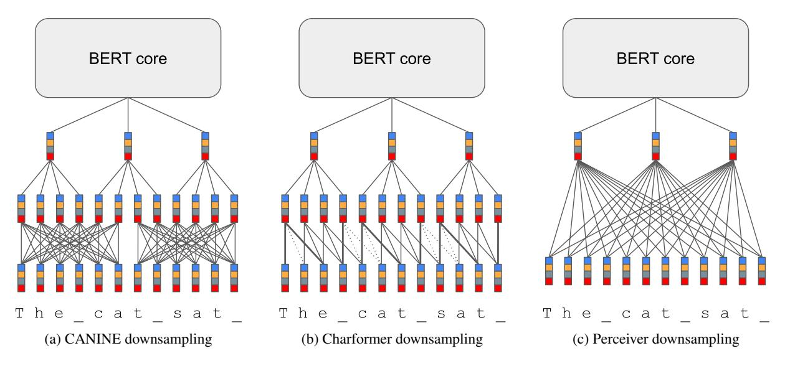
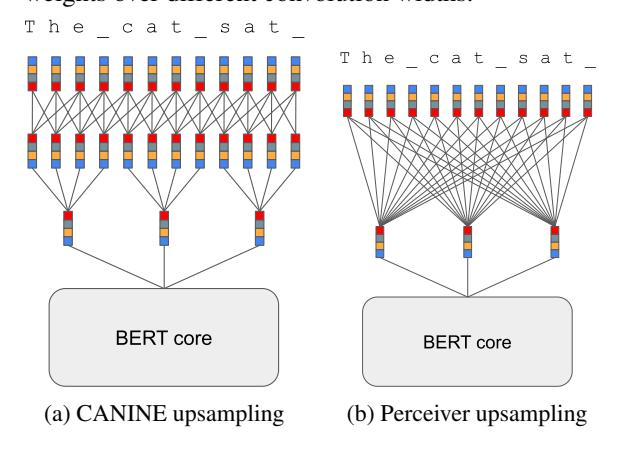

# What is the best recipe for character-level encoder-only modelling?

# Kris Cao

DeepMind, London, UK

kriscao@deepmind.com

### Abstract

This paper aims to benchmark recent progress in language understanding models that output contextualised representations at the character level. Many such modelling architectures and methods to train those architectures have been proposed, but it is currently unclear what the relative contributions of the architecture vs. the pretraining objective are to final model performance. We explore the design space of such models, comparing architectural innovations [\(Clark et al.,](#page-8-0) [2022;](#page-8-0) [Jaegle et al.,](#page-9-0) [2022;](#page-9-0) [Tay](#page-10-0) [et al.,](#page-10-0) [2021\)](#page-10-0), and a variety of different pretraining objectives on a suite of evaluation tasks in order to find the optimal way to build and train character-level BERT-like models. We find that the best recipe combines the Charformer and CANINE model architectures, and follows the CANINE training procedure. This model exceeds the performance of a tokenbased model trained with the same settings on the same data, suggesting that character-level models are ready for more widespread adoption. Unfortunately, the best method to train character-level models still relies on a learnt tokeniser during pretraining, and final model performance is highly dependent on tokeniser quality. We believe our results demonstrate the readiness of character-level models for multilingual language representation, and encourage NLP practitioners to try them for their needs.

### 1 Introduction

The first stage of almost all NLP modelling pipelines is to convert input text strings into a sequence of symbols that the model can ingest. This step, called tokenisation, can be highly non-trivial and introduces significant theoretical and practical complexities to both training and using these models. One particular issue for massively multilingual models is that many languages have to compete for space given a fixed vocabulary size, which limits the effective vocabulary size per language: as an illustration, the WordPiece tokeniser that multilin-

gual BERT uses tokenises 'hello' as two tokens: 'hell' and '##o'.[1](#page-0-0) We are therefore interested in alternative approaches which use lightweight tokenisation schemes (in particular character-level segmentation) coupled with powerful neural-network based composition functions to build language models (see Section [5.1](#page-7-0) for a discussion of the benefits of character-level modelling). In this paper, we aim to determine the best way to build such models, focussing on models which output vector representations for each input character.

However, as the field of pretrained characterlevel modelling is relatively new, comparisons are complicated by the fact that recently proposed methods use different model architectures, pretrain on different data using different training objectives, and evaluate on different downstream tasks. With so many variables changing simultaneously, it is difficult to disentangle the effect of each individual choice in the modelling pipeline, and therefore decide on an overall best model configuration. To answer this question, we tested many model architectures and pretraining objectives from recent literature on a unified set of evaluation tasks, with the same training procedure. We identify one particular configuration that shows the best performance across all of our downstream evaluation tasks, namely a combination of the Charformer downsampling model [\(Tay et al.,](#page-10-0) [2021\)](#page-10-0), and CANINE upsampling model and pretraining procedure [\(Clark et al.,](#page-8-0) [2022\)](#page-8-0). We dub this configuration BORT, for Bidirectional Orthographic Representation Technique. This model even outperforms a BERT baseline on all tasks we consider, while being moderately slower to pretrain ([§4.1\)](#page-4-0).

One sticky point we discovered is that the best modelling configuration we found above relies crucially on a tokeniser during pretraining. We investigate alternative objectives that do not require a

1 For a full discussion of the limits of tokenisation, see [Mielke et al.](#page-10-1) [\(2021\)](#page-10-1).

| Input units (§2.1)                      | Downsampling model (§2.2) | Upsampling model (§2.2) | Prediction tar gets (§2.3) | Masking scheme (§2.3) |
|-----------------------------------------|------------------------------|----------------------------|-------------------------------|--------------------------|
| Characters with fixed embeddings  | CANINE                       | CANINE                     | Tokens                        | Tokens                   |
| Characters with learnt embeddings | Charformer                   | Perceiver                  | Independent characters     | Whitespace               |
| Bytes                                   | Perceiver                    |                            | Autoregressive characters  | Random                   |

Table 1: An overview of all the design choices we examine for building character-level models. We compare the combinatorial space spanned by these building blocks in our experiments.

tokeniser, and find that these objectives result in worse-performing models. In addition, we also investigate the impact of the tokeniser used to pretrain the model, and find that the quality of the tokeniser (measured by vocabulary size) has a big impact on the final model downstream task performance, even though the tokeniser is not used at all during evaluation. This results in the unfortunate situation that users of such models have a hidden dependency on the tokeniser used to train the model; hence, users may be using models out of domain without any explicit feedback (such as worse tokeniser compression rates), causing difficult-todetect performance regressions.

Taken together, we believe our results show that character-level representation models are ready to supplant subword-level models as a default choice for converting text into features. However, these models still require extensive supervision from tokenisers, and we believe that the next frontier of research in character-level modelling is finding ways to once and for all eliminate tokenisation as a key step in the NLP pipeline.

# 2 The ingredients to make a character-level encoder model

In this section, we aim to give an overview of all the components necessary to make a performant and efficient encoder-only model which operates on characters and outputs contextualised character representations. Working with characters rather than subword tokens brings many challenges, which have been solved in different ways in prior literature; we compare the selected methods in our experiments. In the following section, words in bold correspond to one cell in Table [1.](#page-1-1)

### 2.1 Input feature representation

The first design choice that must be made when moving away from subword-based tokens is the input granularity. Typically, there are two choices: either (Unicode) characters [\(Zhang et al.,](#page-10-2) [2015;](#page-10-2) [Kim et al.,](#page-9-1) [2016;](#page-9-1) [Ling et al.,](#page-9-2) [2015\)](#page-9-2), or the underlying byte representation [\(Gillick et al.,](#page-9-3) [2016\)](#page-9-3). The advantage of using bytes is the compact vocabulary (there are only 256 bytes); the disadvantage is that many Unicode characters require multiple bytes to encode, which further inflates the sequence length. Indeed, all non-ASCII characters require multiple bytes to encode in UTF-8. This disproportionately impacts non-European scripts, potentially harming the performance of multilingual byte-level models on such languages. In our current work, we exclusively use characters.

The downside of working with Unicode characters is the extremely large vocabulary: there are 1,114,112 code points allocated in 17 planes, each with 65,536 characters. [Clark et al.](#page-8-0) [\(2022\)](#page-8-0) solve the large vocabulary issue by using *hash embeddings*, which compactly map the entire vocabulary to fixed-size vectors. However, as these embeddings are random, they cannot take advantage of representation learning at the orthographic level. Learnt character embeddings can help associate variations of the same character (e.g. *a* and *ä*) and phonetically similar characters from different scripts (e.g. *r* and ρ). Further, the orthographic units of some scripts (e.g. Chinese characters) may themselves be semantically informative. We therefore add learnt embeddings for the Basic Multilingual Plane, which covers almost every script used to write modern languages.

# 2.2 Architecture

One fundamental limitation of working directly with characters rather than subword tokens is that

Figure 1: A visual comparison of the downsampling architectures we consider. Lines represent information flow between representations (either convolutions or restricted attention); the dashed lines in Fig. [1b](#page-2-2) represent attention weights over different convolution widths.

Figure 2: A visual comparison of the upsampling architectures we consider.

a longer sequence length is required to maintain the same context window. [Clark et al.](#page-8-0) [\(2022\)](#page-8-0) find that typically, a 4x larger sequence length is needed. However, as attention is quadratic in input length, it is not typically feasible to directly apply the standard deep Transformer model architecture to characters. Instead, the character sequence is usually first *downsampled* into a more manageable length, and then processed, typically with a stack of Transformer layers similar to BERT [\(Devlin et al.,](#page-9-4) [2019\)](#page-9-4). The output of the BERT core is then *upsampled* back to the original sequence length to obtain the final model outputs. We discuss both stages in more detail subsequently, and examine the overall performance and data efficiency of different model architectures in Section [4.1.](#page-4-0)

Downsampling The downsampling operation is often thought of as analogous to tokenisation in the standard NLP pipeline, as it combines multiple characters into a single representation in a similar way to how tokenisers segment text into multicharacter model inputs. Many different downsampling architectures have been proposed–in this paper we examine three: Perceiver [\(Jaegle et al.,](#page-9-0) [2022\)](#page-9-0), CANINE [\(Clark et al.,](#page-8-0) [2022\)](#page-8-0) and Charformer [\(Tay et al.,](#page-10-0) [2021\)](#page-10-0).

With these three models, it is further possible to split the downsampling stage into two separate steps: a *contextualisation* stage which aggregates information across multiple characters, and a *pooling* stage that compresses the character sequence. CANINE first uses a windowed local attention over the input character sequence to aggregate information among neighbouring characters, before using a strided 1D convolution with filter width 4 and stride 4 to achieve the 4x downsampling rate. By contrast, Charformer first applies an attention-weighted sum over convolutions of varying widths at each position, before compressing the contextualised characters using average pooling, again using window size 4 and stride 4. Perceiver is the exception as it has no separate contextualisation stage; instead, it directly downsamples the embedded character sequence with a cross-attention layer, using a learnt bank of latent query vectors. We illustrate these architectures in Figure [1.](#page-2-2)

Upsampling Conceptually, a simple method to go from token embeddings to character embeddings is to repeat each contextualised token embedding N times, where N is the length (in characters) of the token. With such embeddings, it is trivial to match the performance of the token-level

model by projecting the token-level span to the character-level span. Indeed, the CANINE upsampling layer repeats each output of the downsampled BERT core 4 times (to match the downsampling rate), concatenates the repeated latent representations with the contextualised character embeddings, applies a convolution over these, and then applies a final all-to-all Transformer layer. By contrast, Perceiver applies a cross-attention operation between the output of the deep Transformer stack and a bank of query vectors the same length as the original character sequence. Both architectures are illustrated in Figure [2.](#page-2-3) [2](#page-3-2)

#### 2.3 Pretraining objectives

The typical pretraining objective for language representation models is masked language modelling – given some input text, the model must learn to reconstruct masked-out portions given the context. For subword-level models, the masked portion is often a single token, although alternative masking schemes exist [\(Joshi et al.,](#page-9-5) [2020;](#page-9-5) [Levine et al.,](#page-9-6) [2021\)](#page-9-6). However, masking individual characters does not give a good pretraining objective, as individual characters are very easy to predict given their surrounding context. We therefore investigate alternative masking schemes, and prediction targets derived from such masking schemes, and we outline the ones we consider in this section.

Masking schemes As masking individual characters does not train good models, most masking schemes pick spans of characters to mask instead. The simplest method is to mask random spans of characters [\(Xue et al.,](#page-10-3) [2022;](#page-10-3) [Keren et al.,](#page-9-7) [2022\)](#page-9-7). However, [Levine et al.](#page-9-6) [\(2021\)](#page-9-6) showed that the best spans to mask are those with a high coherence, which random spans do not have. A better masking scheme is to mask semantically meaningful spans. One heuristic to pick such spans is to use whitespace [\(Jaegle et al.,](#page-9-0) [2022\)](#page-9-0); unfortunately, many orthographies around the world do not use whitespace, which reduces the cross-linguistic portability of this scheme. Another heuristic is to use a tokeniser to decide which character spans to mask, but predict the masked characters instead. This method is language independent, but has the downside that it reintroduces a dependency on an external tokeniser, which was a motivation to move to

character-level modelling in the first place.

Prediction targets Once a span of characters has been masked, one must derive a prediction target from the masked span. If a tokeniser-based masking scheme is used, one can simply predict the masked token using a classifier head. This is the CANINE-S training scheme from [Clark et al.](#page-8-0) [\(2022\)](#page-8-0). However, if the random or whitespace masking schemes are used, the set of possible masked spans is too large to classify directly. In this case, we can back off to predicting the characters of the masked span. This can either be done autoregressively (with predicted characters being revealed one-by-one) as in CANINE-C, or independently (with each character prediction being made without knowledge of the other masked characters; [Jaegle et al.](#page-9-0) [2022;](#page-9-0) [Keren et al.](#page-9-7) [2022\)](#page-9-7). Predicting characters has the additional complication that the Unicode vocabulary is very large. We therefore use the same hashing trick that we use to compactly represent Unicode characters: we hash the Unicode codepoint of a character 8 ways at random, and then predict each hash independently.

### 3 Evaluation

# 3.1 Evaluation tasks

Previous works in the space of character-level representation learning have all chosen distinct evaluation tasks, which makes direct comparison across different methods difficult. We compare all our models on the same evaluation tasks, which we split into two groups: probing tasks and downstream tasks. For the probing tasks, we fix the model parameters and learn a classifier to predict morphological features and part-of-speech tags, which we take from Universal Dependencies [\(Nivre](#page-10-4) [et al.,](#page-10-4) [2020\)](#page-10-4). We use information-theoretic probing [\(Voita and Titov,](#page-10-5) [2020\)](#page-10-5) to assess how easily extractable morphological information is from each model—specifically, we use the prequential codelength probing procedure. We are interested in whether character-based models represent morphological information in a more easily extractable way than subword-based models—one perceived benefit of character-level models is that they may be able to represent morphology better [\(Vania and](#page-10-6) [Lopez,](#page-10-6) [2017\)](#page-10-6), which could lead to better performance on morphologically rich languages.

The second group of tasks are downstream tasks more aligned with typical NLP model use cases.

2[Tay et al.](#page-10-0) [\(2021\)](#page-10-0) introduce Charformer in an encoderdecoder framework with a token-level decoder, so there is no Charformer upsampler.

We use WikiANN NER [\(Pan et al.,](#page-10-7) [2017\)](#page-10-7) and extractive QA (TyDi-QA gold passage; [Clark et al.](#page-9-8) [2020\)](#page-9-8) to represent both sequence labelling and span extraction tasks which require information to be localised at specific locations in the text. Character-level models have previously shown to perform well at general sentence representation tasks, such as GLUE [\(Jaegle et al.,](#page-9-0) [2022;](#page-9-0) [Clark](#page-8-0) [et al.,](#page-8-0) [2022\)](#page-8-0); however, CANINE performed poorly at high-resource NER in particular, and so our choice of WikiANN on our evaluation languages set a high bar for the character-level models. We believe that tasks like QA and NER require more higher-level semantically oriented information, and we would like to demonstrate that it is possible to learn such information directly from characters.

We evaluate gold passage TyDI-QA in the standard way (macro-averaged F1 across languages excluding English). For UD probing and WikiANN NER, we evaluate on a typologically diverse choice of languages: Arabic, English, Finnish, German, Hungarian, Indonesian, Italian, Russian and Turkish, and report metrics macro-averaged across all languages, including English.

# 4 Experiments

We train all our models on the same multilingual Wikipedia dump as MBERT, with the same exponentially weighted language sampling strategy. Our baseline model architecture is BERT-base with 110M parameters; all other models are comparable in size. We train each model using 32 TPUv3 chips for 250k steps with total batch size 3072. Models took between 3 and 4 days to complete training. We found the batch size parameter crucial for final model performance: using a smaller batch size degraded final model performance, while characterlevel model performance was unstable at a larger batch size. For exact pretraining hyperparameters and downstream task evaluation procedures, please see Appendices [A](#page-10-8) and [B.](#page-11-0) Unless otherwise stated, the hyperparameters are constant across all experiments; each experiment aims to examine the influence of a specific choice of variable. We evaluate model checkpoints on a rolling basis during training on all our evaluation tasks, and select the model checkpoint which performs the best on TyDi-QA.

## 4.1 Model architecture comparison

We first report a cross-model comparison between BERT, CANINE and Perceiver on our set of eval-

uation tasks. For these comparisons, we use the tokeniser-based masking scheme with the mBERT WordPiece tokeniser, and predict the masked tokens from a closed vocabulary. Our results are shown in Table [2.](#page-5-0)

Character-level models do better at morphology (usually) Our results show that most of the character-level models outperform BERT on the morphological probing tasks. This result is in line with existing literature on the benefits of characterlevel features for low-level NLP tasks [\(Vania et al.,](#page-10-9) [2018\)](#page-10-9). The only exception is the Charformer-CANINE model combination, which however does well on the more downstream tasks. We discuss this more in the next section.

Charformer-CANINE surpasses BERT at downstream tasks On our downstream semanticallyoriented evaluation tasks (TyDI-QA and WikiANN NER), we note that the combination of Charformer encoder and CANINE decoder outperforms our retraining of the BERT baseline model on both QA and NER, without using additional features such as character n-grams. We believe this result shows that with the right architecture and training objective, current-generation character-level models exceed the performance of token-based models and should be considered as a new default choice for extracting contextual embeddings from text.

One interesting aspect of our results is that model performance on the UD morphological feature tagging probe task tends to be anti-correlated with performance on the downstream tasks. Indeed, the Spearman correlation across all models between UD Feats and TyDi-QA F1 is 0.89 and between UD Feats and WikiANN F1 is 0.68. One explanation for this might be that as models learn to compose characters into more 'semantic' units, less information about individual characters is propagated through the model, and that there is a trade-off between representing low-level morphological information vs higher-level semantic information. Indeed, there is evidence that character-level models tend to oversmooth based on orthographic similarity [\(Cao and Rei,](#page-8-1) [2016;](#page-8-1) [Jozefowicz et al.,](#page-9-9) [2016\)](#page-9-9), and character n-gram features have been used to try and circumvent this [\(Bojanowski et al.,](#page-8-2) [2017;](#page-8-2) [Clark et al.,](#page-8-0) [2022\)](#page-8-0). Charformer-CANINE is able to perform well without such n-gram features, and this may be that the convolutions over characters implicitly represent character n-grams well already.

|               |               |                 | Probing tasks                     |                                   | Downstream tasks                   |                                    |
|---------------|---------------|-----------------|-----------------------------------|-----------------------------------|------------------------------------|------------------------------------|
|               |               | Downsampler     | UD Feats. $\downarrow$            | UD POS $\downarrow$               | TyDi-QA F1↑                        | WikiANN F1↑                        |
|               | 月             | CANINE          | $2.55 \pm 0.00$                   | $1.35 \pm 0.02$                   | $76.09 \pm 0.47$                   | $89.10 \pm 0.18$                   |
| er            | E             | Charformer      | $2.72\pm0.03$                     | $1.49 \pm 0.02$                   | $\textbf{78.76} \pm \textbf{0.56}$ | $\textbf{90.65} \pm \textbf{0.02}$ |
| Upsampler     | CANI          | Perceiver       | $2.53\pm0.00$                     | $1.34 \pm 0.02$                   | $75.51 \pm 0.42$                   | $89.79 \pm 0.07$                   |
| lpsa          | ver           | CANINE          | $2.47 \pm 0.00$                   | $1.33 \pm 0.01$                   | $68.00 \pm 1.26$                   | $88.16 \pm 0.04$                   |
| $\supset$     | Perceiver     | Charformer      | $2.49 \pm 0.01$                   | $1.39 \pm 0.01$                   | $69.52 \pm 0.45$                   | $82.50 \pm 0.29$                   |
|               | ਤੋਂ Perceiver |                 | $\textbf{2.44} \pm \textbf{0.01}$ | $\textbf{1.30} \pm \textbf{0.00}$ | $73.17 \pm 0.41$                   | $89.66 \pm 0.01$                   |
| BERT Baseline |               | $2.63 \pm 0.01$ | $1.35 \pm 0.00$                   | $76.97 \pm 0.90$                  | $90.29 \pm 0.05$                   |                                    |

Table 2: Comparison between different character-level modelling architectures on our chosen evaluation task suite. All results are macroaveraged across languages. UD feature and part-of-speech probing is measured in nats/label (lower is better). TyDi QA and WikiANN NER performance is reported in F1 (higher is better). All results are averaged over 3 finetuning runs with different random seeds.

|           |        | Downsampler | Throughput | FLOPS |
|-----------|--------|-------------|------------|-------|
|           | Ä      | CANINE      | 0.68x      | 2.01x |
| er        | CANINE | Charformer  | 0.68x      | 2.70x |
| ldu       | CA     | Perceiver   | 0.81x      | 1.91x |
| Upsampler | ver    | CANINE      | 0.72x      | 1.51x |
| $\supset$ | ceiv   | Charformer  | 0.72x      | 2.21x |
|           | Per    | Perceiver   | 0.85x      | 1.39x |
| BERT      |        | BERT        | 1x         | 1x    |

Table 3: Computational efficiency of the models we consider, relative to token-level BERT. Throughput refers to pretraining examples per second, while FLOPs is of a forward model pass on a single example.

Character-level models are less compute effi**cient** We next evaluate the compute efficiency of our different model architectures. We compare two main quantities: pretraining throughput (in examples/sec) and FLOPs per forward pass on a single example. In general, more FLOPs is associated with better model performance (Kaplan et al., 2020; Hoffmann et al., 2022) at the cost of inference speed, but due to hardware design, not all FLOPs are created equal. We show the results in Table 3. As all our character-level models are built around the BERT core, it is expected that every model compares unfavourably to BERT on these metrics. We note that even though the Charformer-CANINE model (which performs the best overall) uses the most FLOPs per forward pass, its pretraining throughput is not proportionally slower, suggesting that the model architecture is efficient to run on current-generation hardware.

**Model architecture impacts data efficiency** To perform model selection based on downstream

|      |          | Downsampler | TyDi-QA | WikiANN |
|------|----------|-------------|---------|---------|
| Ę    | CANINE   | CANINE      | 72.00   | 88.04   |
| er   | E        | Charformer  | 75.56   | 89.78   |
| ldu  | а        | Perceiver   | 67.44   | 86.21   |
| Jpsa |          | CANINE      | 64.32   | 86.27   |
|      | erceiver | Charformer  | 66.90   | 80.85   |
|      | Per      | Perceiver   | 68.34   | 85.12   |
| BERT |          | 73.82       | 89.06   |         |

Table 4: Comparison of the data efficiency of the models we consider. All numbers are normalised area-under-F1 curves during model training on the respective task.

task performance, we evaluate these tasks over the course of model pretraining. This lets us probe how data-efficient each model is during pretraining, which can give us indications about whether the intrinsic biases of the model are suited to learning general linguistic information.

We evaluate using area-under-training-curve metrics, similar to prequential coding (Blier and Ollivier, 2018; Yogatama et al., 2019; Voita and Titov, 2020). Prequential coding can be viewed as area under the log-loss training curve; we instead measure area under the F1 curve, normalised by the total number of training steps. We present our results in Table 4. From these numbers, one can see that the lack of innate bias in the Perceiver model components renders it less data efficient. We note that a core feature of theories of linguistic morphology is that morphemes consist of units close together (Haspelmath and Sims, 2010); the authors are unaware of any theory of morphology that allows arbitrary long-range word formation. The Perceiver downsampling mechanism on the other hand can potentially aggregate information

| Prediction targets |        | Masking                           | TyDi-QA                                                  | WikiANN                                                  |
|--------------------|--------|-----------------------------------|----------------------------------------------------------|----------------------------------------------------------|
|                    | Auto.  | Random Tokeniser Whitespace | $75.20 \pm 0.80 76.46 \pm 1.19 77.66 \pm 0.71$           | $86.70 \pm 0.57$ $89.64 \pm 0.26$ $88.68 \pm 0.33$ |
|                    | Indep. | Random Tokeniser Whitespace | $72.76 \pm 0.17$ $73.67 \pm 0.55$ $78.92 \pm 0.19$ | $87.48 \pm 0.12$ $88.35 \pm 0.17$ $89.95 \pm 0.02$ |

Table 5: Comparison of alternative token-predictionfree pretraining objectives given by combining a method of selecting spans of characters to mask and how to predict the masked characters.

|                  |                      | Masking    | TyDi-QA | WikiANN |
|------------------|----------------------|------------|---------|---------|
| on targets Auto. | ·                    | Random     | 71.93   | 85.66   |
|                  | Tokeniser            | 73.88      | 88.83   |         |
|                  | Whitespace           | 74.39      | 88.10   |         |
| ictic            | Prediction indep. | Random     | 65.48   | 77.19   |
| red              | Indep                | Tokeniser  | 67.61   | 80.07   |
| Б                | In                   | Whitespace | 74.46   | 88.26   |

Table 6: Comparison of the data efficiency of alternative pretraining objectives. All numbers are normalised area-under-F1-curves during model training.

from any character combination into a single unit, and hence it has to learn a preference to compose nearby characters, rendering it less data-efficient. By contrast, both CANINE and Charformer inherently combine adjacent characters together to form latent representations. Indeed, the difference between the numbers in Table 2 and Table 4 for the Perceiver-CANINE model is particularly great, and one can see an obvious 'kink' in the training curve for this model as it discovers the necessary biases for combining characters into higher level units.

#### Learnt character embeddings improve results

If we remove the learnt character embeddings and rely solely on hash embeddings, results for TyDi-QA drop to  $64.48 \pm 24.56$ , and for WikiANN drop to  $87.98 \pm 0.06$ . The large variance in TyDi results is caused by one finetuning run achieving a very low F1. This shows that learnt character embeddings not only result in better overall task performance, but also result in more stable models. Character embeddings have been shown to capture information such as phonetics and shape (Boldsen et al., 2022), which can be We therefore recommend using learnt character embeddings in all character-level models.

#### 4.2 Masking scheme and pretraining objective

In this section, we investigate whether it is possible to use the tokeniser-free masking schemes and prediction targets introduced in Section 2.3 to train models which perform as well as tokeniserbased models. We focus here on the Charformer-CANINE model which showed promise in the previous section, and train it in the same setting, using each combination of masking scheme and character-level prediction target. We show the results in Table 5. As one can see, no combination of masking scheme and prediction targets uniformly surpass the performance of the tokeniser-based model. Indeed, the performance disparity is particularly stark on WikiANN NER, which is a task requiring heavy memorisation, suggesting the bias of predicting discrete tokens helps the model discover units of language amenable to memorisation.

It is still possible to observe consistent internal variation between the different masking schemes. Random masking performs the worst of the masking schemes, suggesting that it is important to mask semantically coherent spans of characters. Further, whitespace masking performs better than tokeniser-assisted masking, giving more evidence that tokenisation with a fixed vocabulary bottlenecks language model training. Finally, it appears that in general autoregressive character prediction performs better than independent character prediction when a suboptimal masking scheme is used.

We also examine the data efficiency of character-level prediction targets. Table 6 shows that autoregressive prediction is a lot more stable during model training than independent character prediction for suboptimal masking schemes. Further, comparing the numbers in Table 6 to Table 4 shows that training models using token-level predictions is more data efficient, and suggests that token-level targets are better suited to learning linguistic information. We therefore believe that more work is necessary to discover better ways to predict open-vocabulary masked targets that combine the flexibility of character-level prediction and the intrinsic bias of fixed morpheme-like units.

#### 4.3 Tokeniser quality

Finally, since we showed that using a tokeniser still gives the best results when pretraining character-level models, it is natural to ask how much the quality of the tokeniser influences the resulting model. We train SentencePiece unigram tokenisers

|     |           | Vocabulary size |        |        |         |
|-----|-----------|-----------------|--------|--------|---------|
|     | Model     | 10,000          | 25,000 | 50,000 | 100,000 |
| QA  | Subword   | 68.24           | 74.20  | 73.97  | 76.68   |
|     | Character | 66.38           | 70.23  | 76.93  | 79.11   |
| NER | Subword   | 89.65           | 90.02  | 90.21  | 90.34   |
|     | Character | 88.01           | 89.66  | 90.37  | 90.95   |

Table 7: The effect of varying tokeniser size on downstream task performance. Subword refers to a model trained with subword inputs, which character refers to a character-input model. All results are F1 scores.

[\(Kudo and Richardson,](#page-9-13) [2018\)](#page-9-13) of varying vocabulary sizes (as a proxy of tokeniser quality) on a subset of the pretraining data. We then train BERT and Charformer-CANINE models using these tokenisers, and provide the results in Table [7.](#page-7-1)

Larger vocabulary sizes consistently lead to better downstream task performance for both models, even the character-level model. This result is even more remarkable given that the tokeniser is only used for pretraining and discarded on downstream fine-tuning. Therefore, users of character-level models have a hidden long-distance dependency on the tokeniser that was used to train the model, even though this is not exposed to the user. We feel this state of affairs is extremely unfortunate, as a substandard pretraining-time tokenisation can have a large impact on downstream performance yet be completely invisible to the user.

Further, we note that we do not appear to have reached the limit of model improvement due to increasing the vocabulary size. The maximum size we considered is 100,000, due to resource constraints, but we note that larger vocabularies have been considered in multilingual representation learning [\(Conneau et al.](#page-9-14) [\(2020\)](#page-9-14) use a vocabulary size of 250,000, for instance). We believe that efficient ways of scaling up vocabulary size even further is an interesting avenue of research.

# 5 Discussion

#### 5.1 Benefits of character-level modelling

We have shown that character-level models can achieve better performance at a range of tasks than token-level models, at the cost of slightly slower models. We believe this tradeoff is worth making, and we outline the advantages of character-level modelling in this section.

Removing tokenisers from the NLP pipeline We believe that tokenisation imparts a significant

engineering burden on users of NLP models. Tokenisers are themselves parametric models, and different tokeniser settings can have a large impact on task performance [\(Bostrom and Durrett,](#page-8-5) [2020\)](#page-8-5). Further, there is evidence that language model performance is bottlenecked by tokeniser suboptimality due to e.g. poor out-of-domain performance [\(Cao and Rimell,](#page-8-6) [2021\)](#page-8-6). In addition, tokenisation can introduce hidden bugs due to differences in capitalisation, whitespace or other special characters. For all of these reasons, we believe that removing tokenisation from NLP pipelines improves the experience of using language models.

Annotation is easier at the character level As characters are the natural unit of orthography, it is typically easier to annotate tasks, especially spanextraction tasks, at the character level. This is especially true for scripts which do not use whitespace in their orthography, or when whitespace and syntactic tokens do not match. Indeed, gold passage TyDi-QA drops data from Thai and Japanese so that the standard run\_squad.py script can be used. These implicit data selection effects can systematically bias experimental results—for instance, we believe that whitespace masking would work less well on non-whitespace languages, yet none are in the set of languages we evaluate on. We therefore believe that annotating tasks at the tokenlevel for modelling convenience is a mistake, and we believe that annotation should be performed with linguistic validity as the main motivation.

### 5.2 Inductive bias, model architecture and training procedure

How low-level linguistic units combine into meaningful higher-level units is one of the best-studied areas of linguistics, and we know many of the basic cross-lingual rules of building morphemes. It is therefore interesting that the model architecture and training procedure which worked the best are also those which conform most to existing knowledge about morphology. The Charformer encoder and CANINE decoder both make strong locality assumptions about how characters combine, and the Charformer encoder explicitly operates over segmentations of the input. In addition, the tokeniser-assisted training objective encodes information about units of language into the model. We believe our results show the importance of domain knowledge when building models, especially when compute or data efficiency is a requirement.

# 6 Conclusion

In this paper, we examined how best to train a character-level encoder model, and identified a recipe that produces models exceeding the performance of token-based models at a comparable compute cost, suggesting that the time of general purpose character-level modelling has arrived.

# Limitations

#### Choice of languages

Our choice of languages for WikiANN and UD probing evaluations were intended to strike a balance between being being typologically diverse and having data in our chosen benchmarks. However, there are major language families and geographical regions not represented in our languages (there is no indigenous language of the Americas in any of our benchmarks, and no southern African language in UD or WikiANN). While we expect the trends in our results to continue to hold for other languages, we believe that further investigation is necessary on more languages to confirm our hypothesis.

#### Choice of evaluation tasks

One notable omission from our evaluation suite are sentence-level tasks, such XNLI [\(Conneau et al.,](#page-9-15) [2018\)](#page-9-15), XGLUE [\(Liang et al.,](#page-9-16) [2020\)](#page-9-16) and crosslingual retrieval tasks. One reason is that previous work has shown that character-level models already perform well on these evaluations. In our work, we were particularly interested in situations where prior work showed character-level models underperforming subword-based models. In particular, CANINE underperformed at NER, especially in the high-resource CoNLL 2003 NER dataset [\(Tjong Kim Sang and De Meulder,](#page-10-11) [2003\)](#page-10-11). Therefore, we chose to focus specifically on NER and extractive QA as typical use cases of encoder-only models. In future work, we will investigate more thoroughly the capabilities of character-level models on a wider range of tasks.

# Ethics statement

Our work compares existing work on characterlevel language modelling, and we do not anticipate that it introduces any new risks beyond those introduced by the work we build on.

### Acknowledgements

We would like to thank Laura Rimell and Dan Garrette for extensive comments and advice throughout the duration of this project, as well as Valentin Hofmann and Paul Michel for comments on earlier versions of this paper. We would also like to thank the DeepMind language team for helpful discussions.

# References

Léonard Blier and Yann Ollivier. 2018. [The descrip](https://proceedings.neurips.cc/paper/2018/file/3b712de48137572f3849aabd5666a4e3-Paper.pdf)[tion length of deep learning models.](https://proceedings.neurips.cc/paper/2018/file/3b712de48137572f3849aabd5666a4e3-Paper.pdf) In *Advances in Neural Information Processing Systems*, volume 31. Curran Associates, Inc.

Piotr Bojanowski, Edouard Grave, Armand Joulin, and Tomas Mikolov. 2017. [Enriching word vectors with](https://doi.org/10.1162/tacl_a_00051) [subword information.](https://doi.org/10.1162/tacl_a_00051) *Transactions of the Association for Computational Linguistics*, 5:135–146.

Sidsel Boldsen, Manex Agirrezabal, and Nora Hollenstein. 2022. [Interpreting character embeddings with](https://doi.org/10.18653/v1/2022.acl-long.470) [perceptual representations: The case of shape, sound,](https://doi.org/10.18653/v1/2022.acl-long.470) [and color.](https://doi.org/10.18653/v1/2022.acl-long.470) In *Proceedings of the 60th Annual Meeting of the Association for Computational Linguistics (Volume 1: Long Papers)*, pages 6819–6836, Dublin, Ireland. Association for Computational Linguistics.

Kaj Bostrom and Greg Durrett. 2020. [Byte pair encod](https://doi.org/10.18653/v1/2020.findings-emnlp.414)[ing is suboptimal for language model pretraining.](https://doi.org/10.18653/v1/2020.findings-emnlp.414) In *Findings of the Association for Computational Linguistics: EMNLP 2020*, pages 4617–4624, Online. Association for Computational Linguistics.

James Bradbury, Roy Frostig, Peter Hawkins, Matthew James Johnson, Chris Leary, Dougal Maclaurin, George Necula, Adam Paszke, Jake VanderPlas, Skye Wanderman-Milne, and Qiao Zhang. 2018. [JAX: composable transformations of](http://github.com/google/jax) [Python+NumPy programs.](http://github.com/google/jax)

Kris Cao and Marek Rei. 2016. [A joint model for word](https://doi.org/10.18653/v1/W16-1603) [embedding and word morphology.](https://doi.org/10.18653/v1/W16-1603) In *Proceedings of the 1st Workshop on Representation Learning for NLP*, pages 18–26, Berlin, Germany. Association for Computational Linguistics.

Kris Cao and Laura Rimell. 2021. [You should evalu](https://doi.org/10.18653/v1/2021.emnlp-main.161)[ate your language model on marginal likelihood over](https://doi.org/10.18653/v1/2021.emnlp-main.161) [tokenisations.](https://doi.org/10.18653/v1/2021.emnlp-main.161) In *Proceedings of the 2021 Conference on Empirical Methods in Natural Language Processing*, pages 2104–2114, Online and Punta Cana, Dominican Republic. Association for Computational Linguistics.

Jonathan Clark, Dan Garrette, Iulia Turc, and John Wieting. 2022. [Canine: Pre-training an efficient](https://transacl.org/index.php/tacl/article/view/3145) [tokenization-free encoder for language representa](https://transacl.org/index.php/tacl/article/view/3145)[tion.](https://transacl.org/index.php/tacl/article/view/3145) *Transactions of the Association for Computational Linguistics*, 10(0):73–91.

- Jonathan H. Clark, Eunsol Choi, Michael Collins, Dan Garrette, Tom Kwiatkowski, Vitaly Nikolaev, and Jennimaria Palomaki. 2020. [TyDi QA: A benchmark](https://doi.org/10.1162/tacl_a_00317) [for information-seeking question answering in typo](https://doi.org/10.1162/tacl_a_00317)[logically diverse languages.](https://doi.org/10.1162/tacl_a_00317) *Transactions of the Association for Computational Linguistics*, 8:454–470.
- Alexis Conneau, Kartikay Khandelwal, Naman Goyal, Vishrav Chaudhary, Guillaume Wenzek, Francisco Guzmán, Edouard Grave, Myle Ott, Luke Zettlemoyer, and Veselin Stoyanov. 2020. [Unsupervised](https://doi.org/10.18653/v1/2020.acl-main.747) [cross-lingual representation learning at scale.](https://doi.org/10.18653/v1/2020.acl-main.747) In *Proceedings of the 58th Annual Meeting of the Association for Computational Linguistics*, pages 8440– 8451, Online. Association for Computational Linguistics.
- Alexis Conneau, Ruty Rinott, Guillaume Lample, Adina Williams, Samuel Bowman, Holger Schwenk, and Veselin Stoyanov. 2018. [XNLI: Evaluating cross](https://doi.org/10.18653/v1/D18-1269)[lingual sentence representations.](https://doi.org/10.18653/v1/D18-1269) In *Proceedings of the 2018 Conference on Empirical Methods in Natural Language Processing*, pages 2475–2485, Brussels, Belgium. Association for Computational Linguistics.
- Jacob Devlin, Ming-Wei Chang, Kenton Lee, and Kristina Toutanova. 2019. [BERT: Pre-training of](https://doi.org/10.18653/v1/N19-1423) [deep bidirectional transformers for language under](https://doi.org/10.18653/v1/N19-1423)[standing.](https://doi.org/10.18653/v1/N19-1423) In *Proceedings of the 2019 Conference of the North American Chapter of the Association for Computational Linguistics: Human Language Technologies, Volume 1 (Long and Short Papers)*, pages 4171–4186, Minneapolis, Minnesota. Association for Computational Linguistics.
- Dan Gillick, Cliff Brunk, Oriol Vinyals, and Amarnag Subramanya. 2016. [Multilingual language process](https://doi.org/10.18653/v1/N16-1155)[ing from bytes.](https://doi.org/10.18653/v1/N16-1155) In *Proceedings of the 2016 Conference of the North American Chapter of the Association for Computational Linguistics: Human Language Technologies*, pages 1296–1306, San Diego, California. Association for Computational Linguistics.
- Martin Haspelmath and Andrea D Sims. 2010. *Understanding Morphology*, 2 edition. Understanding Language. Hodder Education, London, England.
- Tom Hennigan, Trevor Cai, Tamara Norman, and Igor Babuschkin. 2020. [Haiku: Sonnet for JAX.](http://github.com/deepmind/dm-haiku)
- Jordan Hoffmann, Sebastian Borgeaud, Arthur Mensch, Elena Buchatskaya, Trevor Cai, Eliza Rutherford, Diego de las Casas, Lisa Anne Hendricks, Johannes Welbl, Aidan Clark, Tom Hennigan, Eric Noland, Katherine Millican, George van den Driessche, Bogdan Damoc, Aurelia Guy, Simon Osindero, Karen Simonyan, Erich Elsen, Oriol Vinyals, Jack William Rae, and Laurent Sifre. 2022. [An empirical analysis](https://openreview.net/forum?id=iBBcRUlOAPR) [of compute-optimal large language model training.](https://openreview.net/forum?id=iBBcRUlOAPR) In *Advances in Neural Information Processing Systems*.
- Andrew Jaegle, Sebastian Borgeaud, Jean-Baptiste Alayrac, Carl Doersch, Catalin Ionescu, David Ding,

- Skanda Koppula, Daniel Zoran, Andrew Brock, Evan Shelhamer, Olivier J Henaff, Matthew Botvinick, Andrew Zisserman, Oriol Vinyals, and Joao Carreira. 2022. [Perceiver IO: A general architecture for struc](https://openreview.net/forum?id=fILj7WpI-g)[tured inputs & outputs.](https://openreview.net/forum?id=fILj7WpI-g) In *International Conference on Learning Representations*.
- Mandar Joshi, Danqi Chen, Yinhan Liu, Daniel S. Weld, Luke Zettlemoyer, and Omer Levy. 2020. [Span-](https://doi.org/10.1162/tacl_a_00300)[BERT: Improving pre-training by representing and](https://doi.org/10.1162/tacl_a_00300) [predicting spans.](https://doi.org/10.1162/tacl_a_00300) *Transactions of the Association for Computational Linguistics*, 8:64–77.
- Rafal Jozefowicz, Oriol Vinyals, Mike Schuster, Noam Shazeer, and Yonghui Wu. 2016. [Exploring the limits](https://arxiv.org/pdf/1602.02410.pdf) [of language modeling.](https://arxiv.org/pdf/1602.02410.pdf)
- Jared Kaplan, Sam McCandlish, Tom Henighan, Tom B. Brown, Benjamin Chess, Rewon Child, Scott Gray, Alec Radford, Jeffrey Wu, and Dario Amodei. 2020. [Scaling laws for neural language models.](https://doi.org/10.48550/ARXIV.2001.08361)
- Omri Keren, Tal Avinari, Reut Tsarfaty, and Omer Levy. 2022. [Breaking character: Are subwords good](https://doi.org/10.48550/ARXIV.2204.04748) [enough for mrls after all?](https://doi.org/10.48550/ARXIV.2204.04748)
- Yoon Kim, Yacine Jernite, David Sontag, and Alexander Rush. 2016. [Character-aware neural language mod](https://doi.org/10.1609/aaai.v30i1.10362)[els.](https://doi.org/10.1609/aaai.v30i1.10362) *Proceedings of the AAAI Conference on Artificial Intelligence*, 30(1).
- Taku Kudo and John Richardson. 2018. [SentencePiece:](https://doi.org/10.18653/v1/D18-2012) [A simple and language independent subword tok](https://doi.org/10.18653/v1/D18-2012)[enizer and detokenizer for neural text processing.](https://doi.org/10.18653/v1/D18-2012) In *Proceedings of the 2018 Conference on Empirical Methods in Natural Language Processing: System Demonstrations*, pages 66–71, Brussels, Belgium. Association for Computational Linguistics.
- Yoav Levine, Barak Lenz, Opher Lieber, Omri Abend, Kevin Leyton-Brown, Moshe Tennenholtz, and Yoav Shoham. 2021. [{PMI}-masking: Principled masking](https://openreview.net/forum?id=3Aoft6NWFej) [of correlated spans.](https://openreview.net/forum?id=3Aoft6NWFej) In *International Conference on Learning Representations*.
- Yaobo Liang, Nan Duan, Yeyun Gong, Ning Wu, Fenfei Guo, Weizhen Qi, Ming Gong, Linjun Shou, Daxin Jiang, Guihong Cao, Xiaodong Fan, Ruofei Zhang, Rahul Agrawal, Edward Cui, Sining Wei, Taroon Bharti, Ying Qiao, Jiun-Hung Chen, Winnie Wu, Shuguang Liu, Fan Yang, Daniel Campos, Rangan Majumder, and Ming Zhou. 2020. [XGLUE: A new](https://doi.org/10.18653/v1/2020.emnlp-main.484) [benchmark datasetfor cross-lingual pre-training, un](https://doi.org/10.18653/v1/2020.emnlp-main.484)[derstanding and generation.](https://doi.org/10.18653/v1/2020.emnlp-main.484) In *Proceedings of the 2020 Conference on Empirical Methods in Natural Language Processing (EMNLP)*, pages 6008–6018, Online. Association for Computational Linguistics.
- Wang Ling, Chris Dyer, Alan W Black, Isabel Trancoso, Ramón Fermandez, Silvio Amir, Luís Marujo, and Tiago Luís. 2015. [Finding function in form: Compo](https://doi.org/10.18653/v1/D15-1176)[sitional character models for open vocabulary word](https://doi.org/10.18653/v1/D15-1176) [representation.](https://doi.org/10.18653/v1/D15-1176) In *Proceedings of the 2015 Conference on Empirical Methods in Natural Language Processing*, pages 1520–1530, Lisbon, Portugal. Association for Computational Linguistics.

- Ilya Loshchilov and Frank Hutter. 2016. [SGDR:](http://arxiv.org/abs/1608.03983) [stochastic gradient descent with restarts.](http://arxiv.org/abs/1608.03983) *CoRR*, abs/1608.03983.
- Sabrina J. Mielke, Zaid Alyafeai, Elizabeth Salesky, Colin Raffel, Manan Dey, Matthias Gallé, Arun Raja, Chenglei Si, Wilson Y. Lee, Benoît Sagot, and Samson Tan. 2021. [Between words and characters: A](https://doi.org/10.48550/ARXIV.2112.10508) [brief history of open-vocabulary modeling and tok](https://doi.org/10.48550/ARXIV.2112.10508)[enization in nlp.](https://doi.org/10.48550/ARXIV.2112.10508)
- Joakim Nivre, Marie-Catherine de Marneffe, Filip Ginter, Jan Hajic, Christopher D. Manning, Sampo ˇ Pyysalo, Sebastian Schuster, Francis Tyers, and Daniel Zeman. 2020. [Universal Dependencies v2:](https://aclanthology.org/2020.lrec-1.497) [An evergrowing multilingual treebank collection.](https://aclanthology.org/2020.lrec-1.497) In *Proceedings of the 12th Language Resources and Evaluation Conference*, pages 4034–4043, Marseille, France. European Language Resources Association.
- Xiaoman Pan, Boliang Zhang, Jonathan May, Joel Nothman, Kevin Knight, and Heng Ji. 2017. [Cross-lingual](https://doi.org/10.18653/v1/P17-1178) [name tagging and linking for 282 languages.](https://doi.org/10.18653/v1/P17-1178) In *Proceedings of the 55th Annual Meeting of the Association for Computational Linguistics (Volume 1: Long Papers)*, pages 1946–1958, Vancouver, Canada. Association for Computational Linguistics.
- Yi Tay, Vinh Q. Tran, Sebastian Ruder, Jai Gupta, Hyung Won Chung, Dara Bahri, Zhen Qin, Simon Baumgartner, Cong Yu, and Donald Metzler. 2021. [Charformer: Fast character transformers via gradient](https://doi.org/10.48550/ARXIV.2106.12672)[based subword tokenization.](https://doi.org/10.48550/ARXIV.2106.12672)
- Erik F. Tjong Kim Sang and Fien De Meulder. 2003. [Introduction to the CoNLL-2003 shared task:](https://aclanthology.org/W03-0419) [Language-independent named entity recognition.](https://aclanthology.org/W03-0419) In *Proceedings of the Seventh Conference on Natural Language Learning at HLT-NAACL 2003*, pages 142– 147.
- Clara Vania, Andreas Grivas, and Adam Lopez. 2018. [What do character-level models learn about morphol](https://doi.org/10.18653/v1/D18-1278)[ogy? the case of dependency parsing.](https://doi.org/10.18653/v1/D18-1278) In *Proceedings of the 2018 Conference on Empirical Methods in Natural Language Processing*, pages 2573–2583, Brussels, Belgium. Association for Computational Linguistics.
- Clara Vania and Adam Lopez. 2017. [From characters](https://doi.org/10.18653/v1/P17-1184) [to words to in between: Do we capture morphology?](https://doi.org/10.18653/v1/P17-1184) In *Proceedings of the 55th Annual Meeting of the Association for Computational Linguistics (Volume 1: Long Papers)*, pages 2016–2027, Vancouver, Canada. Association for Computational Linguistics.
- Elena Voita and Ivan Titov. 2020. [Information-theoretic](https://doi.org/10.18653/v1/2020.emnlp-main.14) [probing with minimum description length.](https://doi.org/10.18653/v1/2020.emnlp-main.14) In *Proceedings of the 2020 Conference on Empirical Methods in Natural Language Processing (EMNLP)*, pages 183–196, Online. Association for Computational Linguistics.
- Ruibin Xiong, Yunchang Yang, Di He, Kai Zheng, Shuxin Zheng, Chen Xing, Huishuai Zhang, Yanyan

- Lan, Liwei Wang, and Tieyan Liu. 2020. [On layer](https://proceedings.mlr.press/v119/xiong20b.html) [normalization in the transformer architecture.](https://proceedings.mlr.press/v119/xiong20b.html) In *Proceedings of the 37th International Conference on Machine Learning*, volume 119 of *Proceedings of Machine Learning Research*, pages 10524–10533. PMLR.
- Linting Xue, Aditya Barua, Noah Constant, Rami Al-Rfou, Sharan Narang, Mihir Kale, Adam Roberts, and Colin Raffel. 2022. [ByT5: Towards a token-free](https://doi.org/10.1162/tacl_a_00461) [future with pre-trained byte-to-byte models.](https://doi.org/10.1162/tacl_a_00461) *Transactions of the Association for Computational Linguistics*, 10:291–306.
- Dani Yogatama, Cyprien de Masson d'Autume, Jerome Connor, Tomas Kocisky, Mike Chrzanowski, Lingpeng Kong, Angeliki Lazaridou, Wang Ling, Lei Yu, Chris Dyer, and Phil Blunsom. 2019. [Learning and](https://doi.org/10.48550/ARXIV.1901.11373) [evaluating general linguistic intelligence.](https://doi.org/10.48550/ARXIV.1901.11373)
- Yang You, Jing Li, Sashank Reddi, Jonathan Hseu, Sanjiv Kumar, Srinadh Bhojanapalli, Xiaodan Song, James Demmel, Kurt Keutzer, and Cho-Jui Hsieh. 2020. [Large batch optimization for deep learning:](https://openreview.net/forum?id=Syx4wnEtvH) [Training bert in 76 minutes.](https://openreview.net/forum?id=Syx4wnEtvH) In *International Conference on Learning Representations*.
- Xiang Zhang, Junbo Zhao, and Yann LeCun. 2015. [Character-level convolutional networks for text clas](https://proceedings.neurips.cc/paper/2015/file/250cf8b51c773f3f8dc8b4be867a9a02-Paper.pdf)[sification.](https://proceedings.neurips.cc/paper/2015/file/250cf8b51c773f3f8dc8b4be867a9a02-Paper.pdf) In *Advances in Neural Information Processing Systems*, volume 28. Curran Associates, Inc.

### A Training hyperparameters

#### A.1 Model architectures

Our standard model architecture is BERT-small. This uses 12 Transformer layers with hidden size 768, and 12 self-attention heads per layer. We use a context sequence length of 512 subword tokens for pretraining.

For the CANINE model, we use the same architecture as [Clark et al.](#page-8-0) [\(2022\)](#page-8-0). We use a sequence length of 2048 characters during pretraining. The model consists of a local Transformer layer with context width 128 (i.e. each 128-width window of characters is processed independently) with hidden size 768 and 12 heads, followed by a strided convolution with width 4, stride 4 and output size 768 with a GeLU activation and layer normalisation. This results in a downsampled representation of length 512, which is then fed into a BERT-small core. For upsampling, we repeat the output of the inner Transformer 4 times (to match the downsampling rate) and concatenate this with the contextualised characters from downsampling model. We then run another convolution with filter width 4, stride 1 and output size 768, again followed by a GeLU activation and layer normalisation. Finally,

we do an all-to-all Transformer layer to obtain the final output representation.

For Perceiver, we again use a sequence length of 2048 for pretraining. For the downsampling layer, we use an array of 512 randomly initialised vectors as the latent queries, and perform cross-attention using these query vectors and the character embeddings as the keys. The resulting downsampled representation of length 512 is then fed into a BERT-small-sized core, (which differs from the internal processing model of Jaegle et al. 2022). To upsample, we used the contextualised character embeddings from the downsampling model as the query vectors to perform cross-attention with the output of the BERT core. We found that adding a skip connection between the character input and output helped the model learn more stably.

For Charformer, we used convolution filter widths in the range [1,2,3,4,5]. Rather than striding the convolution by the filter width, we densely applied the convolution (i.e. with stride 1), and do not apply the first 1D convolution. We computed attention weights for each convolution output at each character position with a 2 layer MLP with GeLU nonlinearity, and combined the output of the convolutions with these weights.

We also note that the placement of layer normalisation in attention layers for our model architectures was crucial for model performance (Xiong et al., 2020). For self-attention, we found that postnorm worked the best, whereas for cross-attention pre-norm worked better. This mainly affected the Perceiver model, which uses cross-attention in the down- and up-sampling layers.

#### A.2 Model implementation

All models were implemented using JAX (Bradbury et al., 2018) and Haiku (Hennigan et al., 2020). We use a dropout rate of 0.1 after all matrix multiplications in the model. We use the LAMB optimizer (You et al., 2020), with a maximum learning rate of  $1.25 \times 10^{-3}$ . We warm up the learning rate over the first 3125 training steps, and use a cosine decay learning rate scheduler (Loshchilov and Hutter, 2016) with length equal to the number of training steps and a final learning rate of  $1.25 \times 10^{-5}$ . For our BERT baseline, we use a maximum learning rate of  $1.8 \times 10^{-3}$  and a minimum of  $1.8 \times 10^{-5}$ . We clip gradients to a maximum global norm of 10.0. We keep an exponential moving average of model weights during training with EMA

parameter 0.9, updated after every 100 training steps, and evaluate using the average parameters. We found that this stabilised model training for the character-level models, and resulted in better task performance.

### **B** Evaluation protocols

#### **B.1** Probing tasks

We use the prequential codelength probing paradigm of Voita and Titov (2020), but follow a slightly different protocol. We use the training data of the largest UD dataset for each language we consider, and take a sample of 4000 sentences (or use the whole corpus if it is smaller then this), and split this into 10 shards. We then initialise a label prediction head and freeze the base model. We then sequentially evaluate each shard, before adding the shard to the training data for the tagging model. We then train the tagging model on batches of data randomly sampled from all shards that we have previously evaluated, and periodically evaluate on a dev set of data we set aside from the first shard. If the dev set loss stops improving, we then stop training and evaluate on the next shard, continuing in this way until we have evaluated every shard. We then add up the loss for all the evaluated shards and divide by the number of predictions to get the average codelength per tag. We use 2 V100 GPUs for training, and use a total batch size of 32.

One difficulty with UD tagging tasks is that the tags are defined on syntactic tokens, which may not correspond to the surface form (for example, *can't* is annotated as two syntactic tokens: can and not), and aligning syntactic tokens with the surface form may not be trivial. Further, tokenisation means that alignments between surface form tokens and the input to the model may also be non-trivial. However, most subword tokenisation schemes treat whitespace specially, and never merge tokens across whitespace. This means we can merge the UD morph and POS annotations for each syntactic token making up a whitespace token (i.e. we merge the POS tags for can and not and tag can't with this composite label), and predict this composite label as an atomic unit, at the cost of expanding the tagset. For all our tagging tasks, we take the first model token (either subword or character) corresponding to a whitespace token as the token representation and predict the tag based on the embedding of this token. Morphological features in UD are annotated as an unordered set of key-value pairs; we ignore this internal structure and treat each occurring set of tags as an atomic label.

### B.2 TyDi-QA and WikiANN

For these tasks, we finetune the full model. For both tasks, we use a single linear layer to produce the model logits over either BIO tags or start/end span indices. We combine the training data for all languages we consider, and train for 10 epochs for both tasks. We use 4 TPUv3 chips to finetune the model, and use a total batch size of 128. For TyDi-QA, we modify the official run\_squad.py script to accept non-WordPiece tokenisers (such as SentencePiece and character tokenisers).

### ACL 2023 Responsible NLP Checklist

## A For every submission:

- ✓ A1. Did you describe the limitations of your work? *Unnumbered section after conclusions.*
- ✗ A2. Did you discuss any potential risks of your work? *Left blank.*
- ✓ A3. Do the abstract and introduction summarize the paper's main claims? *literally the first page of the paper*
- ✗ A4. Have you used AI writing assistants when working on this paper? *Left blank.*

# B ✓ Did you use or create scientific artifacts?

*experiments, evaluations*

- ✓ B1. Did you cite the creators of artifacts you used? *see experiments and evaluations*
- ✗ B2. Did you discuss the license or terms for use and / or distribution of any artifacts? *all datasets used are released under standard licenses*
- ✗ B3. Did you discuss if your use of existing artifact(s) was consistent with their intended use, provided that it was specified? For the artifacts you create, do you specify intended use and whether that is compatible with the original access conditions (in particular, derivatives of data accessed for research purposes should not be used outside of research contexts)? *all datasets used are long-standing datasets*
- ✗ B4. Did you discuss the steps taken to check whether the data that was collected / used contains any information that names or uniquely identifies individual people or offensive content, and the steps taken to protect / anonymize it? *honestly, we're just using the usual datasets for the tasks.*
- ✗ B5. Did you provide documentation of the artifacts, e.g., coverage of domains, languages, and linguistic phenomena, demographic groups represented, etc.? *see original papers.*
- ✗ B6. Did you report relevant statistics like the number of examples, details of train / test / dev splits, etc. for the data that you used / created? Even for commonly-used benchmark datasets, include the number of examples in train / validation / test splits, as these provide necessary context for a reader to understand experimental results. For example, small differences in accuracy on large test sets may be significant, while on small test sets they may not be. *no data created*

# C ✓ Did you run computational experiments?

*experiments*

✓ C1. Did you report the number of parameters in the models used, the total computational budget (e.g., GPU hours), and computing infrastructure used? *experiments*

*The Responsible NLP Checklist used at [ACL 2023](https://2023.aclweb.org/) is adopted from [NAACL 2022,](https://2022.naacl.org/blog/responsible-nlp-research-checklist/) with the addition of a [question on AI writing](https://2023.aclweb.org/blog/ACL-2023-policy/) [assistance.](https://2023.aclweb.org/blog/ACL-2023-policy/)*

| ✓ | C2. Did you discuss the experimental setup, including hyperparameter search and best-found hyperparameter values? experiments                                                                                                                             |
|---|--------------------------------------------------------------------------------------------------------------------------------------------------------------------------------------------------------------------------------------------------------------------|
| ✓ | C3. Did you report descriptive statistics about your results (e.g., error bars around results, summary statistics from sets of experiments), and is it transparent whether you are reporting the max, mean, etc. or just a single run? experiments        |
| ✓ | C4. If you used existing packages (e.g., for preprocessing, for normalization, or for evaluation), did you report the implementation, model, and parameter settings used (e.g., NLTK, Spacy, ROUGE, etc.)? experiments                                    |
| D | ✗ Did you use human annotators (e.g., crowdworkers) or research with human participants?                                                                                                                                                                        |
|   | Left blank.                                                                                                                                                                                                                                                        |
|   | D1. Did you report the full text of instructions given to participants, including e.g., screenshots, disclaimers of any risks to participants or annotators, etc.? No response.                                                                              |
|   | D2. Did you report information about how you recruited (e.g., crowdsourcing platform, students) and paid participants, and discuss if such payment is adequate given the participants' demographic (e.g., country of residence)? No response.             |
|   | D3. Did you discuss whether and how consent was obtained from people whose data you're using/curating? For example, if you collected data via crowdsourcing, did your instructions to crowdworkers explain how the data would be used? No response. |
|   | D4. Was the data collection protocol approved (or determined exempt) by an ethics review board? No response.                                                                                                                                                    |
|   | D5. Did you report the basic demographic and geographic characteristics of the annotator population that is the source of the data? No response.                                                                                                             |