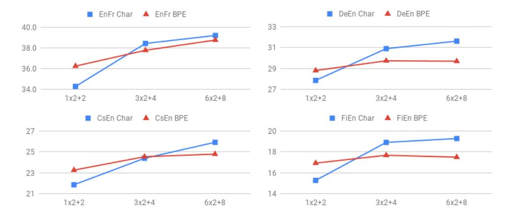
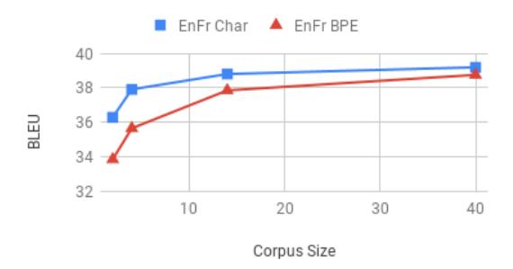
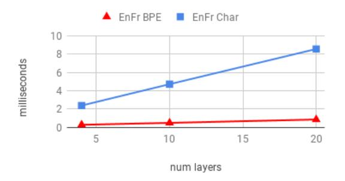

# Revisiting Character-Based Neural Machine Translation with Capacity and Compression

Colin Cherry, George Foster, Ankur Bapna, Orhan Firat, Wolfgang Macherey Google AI

colincherry, fosterg, ankurbpn, orhanf, wmach@google.com

#### **Abstract**

Translating characters instead of words or word-fragments has the potential to simplify the processing pipeline for neural machine translation (NMT), and improve results by eliminating hyper-parameters and manual feature engineering. However, it results in longer sequences in which each symbol contains less information, creating both modeling and computational challenges. In this paper, we show that the modeling problem can be solved by standard sequence-to-sequence architectures of sufficient depth, and that deep models operating at the character level outperform identical models operating over word fragments. This result implies that alternative architectures for handling character input are better viewed as methods for reducing computation time than as improved ways of modeling longer sequences. From this perspective, we evaluate several techniques for characterlevel NMT, verify that they do not match the performance of our deep character baseline model, and evaluate the performance versus computation time tradeoffs they offer. Within this framework, we also perform the first evaluation for NMT of conditional computation over time, in which the model learns which timesteps can be skipped, rather than having them be dictated by a fixed schedule specified before training begins.

## 1 Introduction

Neural Machine Translation (NMT) has largely replaced the complex pipeline of Phrase-Based MT with a single model that is trained end-to-end. However, NMT systems still typically rely on preand post-processing operations such as tokenization and word fragmentation through byte-pair encoding (BPE; Sennrich et al., 2016). Although these are effective, they involve hyperparameters

that should ideally be tuned for each language pair and corpus, an expensive step that is frequently omitted. Even when properly tuned, the representation of the corpus generated by pipelined external processing is likely to be sub-optimal. For instance, it is easy to find examples of word fragmentations, such as  $fling \rightarrow fl + ing$ , that are linguistically implausible. NMT systems are generally robust to such infelicities—and can be made more robust through subword regularization (Kudo, 2018)—but their effect on performance has not been carefully studied. The problem of finding optimal segmentations becomes more complex when an NMT system must handle multiple source and target languages, as in multilingual translation or zero-shot approaches (Johnson et al., 2017).

Translating characters instead of word fragments avoids these problems, and gives the system access to all available information about source and target sequences. However, it presents significant modeling and computational challenges. Longer sequences incur linear per-layer cost and quadratic attention cost, and require information to be retained over longer temporal spans. Finer temporal granularity also creates the potential for attention jitter (Gulcehre et al., 2017). Perhaps most significantly, since the meaning of a word is not a compositional function of its characters, the system must learn to memorize many character sequences, a different task from the (mostly) compositional operations it performs at higher levels of linguistic abstraction.

In this paper, we show that a standard LSTM sequence-to-sequence model works very well for characters, and given sufficient depth, consistently outperforms identical models operating over word fragments. This result suggests that a productive line of research on character-level models is to seek architectures that approximate standard sequence-to-sequence models while being compu-

\*Equal contributions

tationally cheaper. One approach to this problem is *temporal compression*: reducing the number of state vectors required to represent input or output sequences. We evaluate various approaches for performing temporal compression, both according to a fixed schedule; and, more ambitiously, learning compression decisions with a Hierarchical Multiscale architecture [\(Chung et al.,](#page-9-4) [2017\)](#page-9-4). Following recent work by [Lee et al.](#page-9-5) [\(2017\)](#page-9-5), we focus on compressing the encoder.

Our contributions are as follows:

- The first large-scale empirical investigation of the translation quality of standard LSTM sequence-to-sequence architectures operating at the character level, demonstrating improvements in translation quality over word fragments, and quantifying the effect of corpus size and model capacity.
- A comparison of techniques to compress character sequences, assessing their ability to trade translation quality for increased speed.
- A first attempt to learn how to compress the source sequence during NMT training by using the Hierarchical Multiscale LSTM to dynamically shorten the source sequence as it passes through the encoder.

# 2 Related Work

Early work on modeling characters in NMT focused on solving the out-of-vocabulary and softmax bottleneck problems associated with wordlevel models [\(Ling et al.,](#page-9-6) [2015;](#page-9-6) [Costa-jussa and](#page-9-7) ` [Fonollosa,](#page-9-7) [2016;](#page-9-7) [Luong and Manning,](#page-9-8) [2016\)](#page-9-8). These took the form of word-boundary-aware hierarchical models, with word-level models delegating to character-level models to generate representations in the encoder and words in the decoder. Our work will not assume fixed word boundaries are given in advance.

With the advent of word-fragment approaches, interest in character-level processing fell off, but has recently been reignited with the work of [Lee et al.](#page-9-5) [\(2017\)](#page-9-5). They propose a specialized character-level encoder, connected to an unmodified character-level RNN decoder. They address the modeling and efficiency challenges of long character sequences using a convolutional layer, max-pooling over time, and highway layers. We agree with their conclusion that character-level translation is effective, but revisit the question of whether their specific encoder produces a desirable speed-quality tradeoff in the context of a much stronger baseline translation system. We draw inspiration from their pooling solution for reducing sequence length, along with similar ideas from the speech community [\(Chan et al.,](#page-9-9) [2016\)](#page-9-9), when devising fixed-schedule reduction strategies in Section [3.3.](#page-2-0)

One of our primary contributions is an extensive invesigation of the efficacy of a typical LSTM-based NMT system when operating at the character-level. The vast majority of existing studies compare a specialized character-level architecture to a distinct word-level one. To the best of our knowledge, only a small number of papers have explored running NMT unmodified on character sequences; these include: [Luong and Man](#page-9-8)[ning](#page-9-8) [\(2016\)](#page-9-8) on WMT'15 English-Czech, [Wu et al.](#page-10-0) [\(2016\)](#page-10-0) on WMT'14 English-German, and [Brad](#page-9-10)[bury et al.](#page-9-10) [\(2016\)](#page-9-10) on IWSLT German-English. All report scores that either trail behind or reach parity with word-level models. Only [Wu et al.](#page-10-0) [\(2016\)](#page-10-0) compare to word fragment models, which they show to outperform characters by a sizeable margin. We revisit the question of character- versus fragment-level NMT here, and reach quite different conclusions.

# 3 Methods

#### 3.1 Baseline Sequence-to-Sequence Model

We adopt a simplified version of the LSTM architecture of [Chen et al.](#page-9-11) [\(2018\)](#page-9-11) that achieves state-ofthe-art performance on the competitive WMT14 English-French and English-German benchmarks. This incorporates bidirectional LSTM (BiLSTM) layers in the encoder, concatenating the output from forward and backward directions before feeding the next layer. Output from the top encoder layer is projected down to the decoder dimension and used in an additive attention mechanism computed over the bottom decoder layer. The decoder consists of unidirectional layers, all of which use the encoder context vectors computed from attention weights over the bottom layer. For both encoder and decoder we use layer normalization [\(Ba et al.,](#page-9-12) [2016\)](#page-9-12) and residual connections beginning at the third layer. We do not apply a non-linearity to LSTM output. We regularize with dropout applied to embeddings and to the output of each LSTM layer.

In the interests of simplicity and reproducibil-

ity, we depart from [Chen et al.](#page-9-11) [\(2018\)](#page-9-11) in several ways: we do not use multi-headed attention, feed encoder context vectors to the softmax, regularize with label smoothing or weight decay, nor apply dropout to the attention mechanism.

Our baseline character models and BPE models both use this architecture, differing only in whether the source and target languages are tokenized into sequences of characters or BPE word fragments. We describe BPE briefly below.

## 3.2 Byte-Pair Encoding

Byte-Pair Encoding (BPE) offers a simple interpolation between word- and character-level representations [\(Sennrich et al.,](#page-9-0) [2016\)](#page-9-0). It creates a vocabulary of frequent words and word fragments in an iterative greedy merging process that begins with characters and ends when a desired vocabulary size is reached. The source and target language are typically processed together in order to exploit lexical similarities. Given a vocabulary, BPE re-tokenizes the corpus into word fragments in a greedy left-to-right fashion, selecting the longest possible vocabulary match, and backing off to characters when necessary.

Since each BPE token consists of one or more characters, BPE-tokenized sequences will be shorter than character sequences. Viewed as a mechanism to reduce sequence length, BPE differs from the solutions we will discuss subsequently in that it increases the vocabulary size, delegating the task of creating representations for word fragments to the embedding table. Also, despite being data-driven, its segmentation decisions are fixed before NMT training begins.

## 3.3 Fixed stride Temporal Pooling

We explore using fixed stride temporal pooling within the encoder to compress the source character sequence. These solutions are characterized by pooling the contents of two or more contiguous timesteps to create a single vector that summarizes them, and will replace them to shorten the sequence in the next layer. These approaches can learn to interpret the raw character sequence in service to their translation objective, but any such interepretation must fit into the pooling schedule that was specified during network construction. We evaluate two methods in this family: a reimplementation of [Lee et al.](#page-9-5) [\(2017\)](#page-9-5), and a version of our baseline with interspersed pooling layers.

As mentioned earlier, [Lee et al.](#page-9-5) [\(2017\)](#page-9-5) propose a specialized character encoder that combines convolutional layers to accumulate local context, max-pooling layers to reduce sequence lengths, highway layers to increase network capacity, followed by bidirectional GRU layers to generate globally aware contextual source representations. This strategy is particularly efficient because all reductions happen before the first recurrent layer. We re-implement their approach faithfully, with the exceptions of using LSTMs in place of GRUs,[1](#page-2-1) and modifying the batch sizes to accomodate our multi-GPU training scheme.

While pooling based approaches are typically employed in association with convolutional layers, we can also intersperse pooling layers into our high capacity baseline encoder. This means that after each BiLSTM layer, we have the option to include a fixed-stride pooling layer to compress the sequence before it is processed by the next BiL-STM layer. This is similar to the pyramidal LSTM encoders used for neural speech recognition [\(Chan](#page-9-9) [et al.,](#page-9-9) [2016\)](#page-9-9). This general strategy affords considerable flexibility to the network designer, leaving the type of pooling (concatenation, max, mean), and the strides with which to pool as design decisions that can be tuned to fit the task.

# 3.4 Learned Temporal Compression

It is unsatisfying to compress a sequence on a fixed schedule; after all, the characters in a sentence do not each carry an identical amount of information. The goal of this section is to explore data-driven reduction methods that are optimized to the NMT system's objective, and which learn to compress as a part of training.

Any strategy for performing temporal compression will necessarily make discrete decisions, since sentence length is discrete. Examples of such strategies include sparse attention [\(Raffel](#page-9-13) [et al.,](#page-9-13) [2017\)](#page-9-13) and discrete auto-encoders [\(Kaiser](#page-9-14) [et al.,](#page-9-14) [2018\)](#page-9-14). For our initial exploration, we chose the hierarchical multiscale (HM) architecture of [Chung et al.](#page-9-4) [\(2017\)](#page-9-4), which we briefly describe.

# 3.4.1 Hierarchical Multiscale LSTM

The HM is a bottom-up temporal subsampling approach, with each layer selecting the timesteps that will survive to the layer above. At a given timestep t and layer `, the network makes a binary decision,

1 Development experiments indicated that using LSTMs over GRUs resulted in a slight improvement.

 $z_t^\ell$ , to determine whether or not it should send its output up to layer  $\ell+1$ . The preactivation for this decision,  $\tilde{z}_t^\ell$ , is a function of the current node's inputs from below and from the previous hidden state, similar to an LSTM gate. However,  $z_t^\ell$ 's activation is a binary step function in the forward pass, to enable discrete decisions, and a hard sigmoid in the backward pass, to allow gradients to flow through the decision point. The  $z_t^\ell$  decision affects both the layer above, and the next timestep of the current layer:

- $z_t^{\ell} = 1$ , flow up: the node above  $(t, \ell+1)$  performs a normal LSTM update; the node to the right  $(t+1, \ell)$  performs a modified update called a flush, which ignores the LSTM internal cell at  $(t, \ell)$ , and redirects the incoming LSTM hidden state from  $(t, \ell)$  to  $(t, \ell+1)$ .
- $z_t^{\ell} = 0$ , flow right: the node above  $(t, \ell+1)$  simply copies the cell and hidden state values from  $(t-1, \ell+1)$ ; the node to the right  $(t+1, \ell)$  performs a normal LSTM update.

Conceptually, when  $z_t^\ell=0$ , the node above it becomes a placeholder and is effectively removed from the sequence for that layer. Shorter upper layers save computation and facilitate the left-to-right flow of information for the surviving nodes.

Typically, one uses the top hidden state  $h_t^L$  from a stack of L RNNs to provide the representation for a timestep t. But for the HM, the top layer may be updated much less frequently than the layers below it. To enable tasks that need a distinct representation for each timestep, such as language modeling, the HM employs a gated output module to mix hidden states across layers. This learned module combines the states  $h_t^1, h_t^2, \ldots, h_t^L$  using scaling and projection operators to produce a single output  $h_t$ .

# 3.4.2 Modifying the HM for NMT

We would like sequences to become progressively shorter as we move upward through the layers. As originally specified, the HM calculates  $z_t^\ell$  independently for every t and  $\ell$ , including copied nodes, meaning that a "removed" timestep could reappear in a higher layer when a copied node  $(t,\,\ell)$  sets  $z_t^\ell=1.$  This is easily addressed by locking  $z_t^\ell=0$  for copied nodes, creating a hierarchical structure

in which upper layers never increase the amount of computation.

We also found that the flush component of the original architecture, which modifies the LSTM update at  $(t+1, \ell)$  to discard the LSTM's internal cell, provided too much incentive to leave  $z_t^\ell$  at 0, resulting in degenerate configurations which collapsed to having very few tokens in their upper layers. We addressed this by removing the notion of a flush from our architecture. The node to the right  $(t+1, \ell)$  always performs a normal LSTM update, regardless of  $z_t^\ell$ . This modification is similar to one proposed independently by Kádár et al. (2018), who simplified the flush operation by removing the connection to  $(t, \ell+1)$ .

We found it useful to change the initial value of the bias term used in the calculation of  $\tilde{z}_t^\ell$ , which we refer to as the z-bias. Setting z-bias to 1, which is the saturation point for the hard sigmoid with slope 1, improves training stability by encouraging the encoder to explore configurations where most timesteps survive through all layers, before starting to discard them.

Even with these modifications, we observed degenerate behavior in some settings. To discourage this, we added a compression loss component similar to that of Ke et al. (2018) to penalize z activation rates outside a specified range  $\alpha_1, \alpha_2$ :  $\mathcal{L}_c = \sum_l \max(0, Z^l - \alpha_1 T, \alpha_2 T - Z^l)$ , where T is source sequence length and  $Z^l = \sum_{t=1}^T z_t^l$ .

To incorporate the HM into our NMT encoder, we replace the lowest BiLSTM layer with unidirectional HM layers.3 We adapt any remaining BiLSTM layers to copy or update according to the z-values calculated by the top HM layer.

#### 4 Experimental Design

#### 4.1 Corpora

We adopt the corpora used by Lee et al (2017), with the exception of WMT15 Russian-English.4 To measure performance on an "easy" language pair, and to calibrate our results against recent benchmarks, we also included WMT14 English-French. Table 1 gives details of the corpora used. All corpora are preprocessed using Moses tools.5

&lt;sup>2This disconnect between forward and backward activations is known as a straight-through estimator (Bengio et al., 2013).

&lt;sup>3The flush operation makes the original HM inherently left-to-right. Since we have dropped flushes from our current version, it should be straightforward to devise a bidirectional variant, which we leave to future work.

&lt;sup>4Due to licence restrictions.

&lt;sup>5 Scripts and arguments:

remove-non-printing-char.perl

| corpus           | train | dev  | test |
|------------------|-------|------|------|
| WMT15 Finnish-En | 2.1M  | 1500 | 1370 |
| WMT15 German-En  | 4.5M  | 3003 | 2169 |
| WMT15 Czech-En   | 14.8M | 3003 | 2056 |
| WMT14 En-French  | 39.9M | 3000 | 3003 |

Table 1: Corpora, with linecounts. Test sets are WMT14-15 newstest. Dev sets are newsdev 2015 (Fi) and newstest 2013 (De, Fr), and 2014 (Cs).

Dev and test corpora are tokenized, but not filtered or cleaned. Our character models use only the most frequent 496 characters across both source and target languages; similarly, BPE is run across both languages, with a vocabulary size of 32k.

#### 4.2 Model sizes, training, and inference

Except where noted below, we used 6 bidirectional layers in the encoder, and 8 unidirectional layers in the decoder. All vector dimensions were 512.

Models were trained using sentence-level crossentropy loss. Batch sizes are capped at 16,384 tokens, and each batch is divided among 16 NVIDIA P100s running synchronously.

Parameters were initialized with a uniform (0.04) distribution. We use the Adam optimizer, with β1 = 0.9, β2 = 0.999, and = 10−6 [\(Kingma](#page-9-18) [and Ba,](#page-9-18) [2014\)](#page-9-18). Gradient norm is clipped to 5.0. The initial learning rate is 0.0004, and we halve it whenever dev set perplexity has not decreased for 2k batches, with at least 2k batches between successive halvings. Training stops when dev set perplexity has not decreased for 8k batches.

Inference uses beam search with 8 hypotheses, coverage penalty of 0.2 [\(Tu et al.,](#page-9-19) [2016\)](#page-9-19), and length normalization of 0.2 [\(Wu et al.,](#page-10-0) [2016\)](#page-10-0).

## 4.3 Tuning and Evalution

When comparing character-level and BPE models, we tuned dropout independently for each setting, greedily exploring increments of 0.1 in the range 0.1–0.5, and selecting based on dev-set BLEU. This expensive strategy is crucial to obtaining valid conclusions, since optimal dropout values tend to be lower for character models.

Our main evaluation metric is Moses-tokenized case-sensitive BLEU score. We report test-set scores on the checkpoints having highest dev-set BLEU. To facilitate comparison with future work

|          | Tokenized BLEU |      |       | SacreBLEU |
|----------|----------------|------|-------|-----------|
| Language | BPE            | Char | Delta | Char      |
| EnFr     | 38.8           | 39.2 | 0.4   | 38.1      |
| CsEn     | 24.8           | 25.9 | 1.1   | 25.6      |
| DeEn     | 29.7           | 31.6 | 1.9   | 31.6      |
| FiEn     | 17.5           | 19.3 | 1.8   | 19.5      |

Table 2: Character versus BPE translation.

| Comparison Point   |      |      | Ref  | Ours |
|--------------------|------|------|------|------|
| Chen et al. (2018) | BPE  | EnFr | 41.0 |      |
| Wu et al. (2016)   | BPE  | EnFr | 39.0 | 38.8 |
| Lee et al. (2017)  | Char | CsEn | 22.5 | 25.9 |
|                    |      | DeEn | 25.8 | 31.6 |
|                    |      | FiEn | 13.1 | 19.3 |

Table 3: Comparisons with some recent points in the literature. Scores are tokenized BLEU.

we also report SacreBLEU scores [\(Post,](#page-9-20) [2018\)](#page-9-20) for key results, using the Moses detokenizer.

# 5 Results

## 5.1 Character-level translation

We begin with experiments to compare the standard RNN architecture from Section [3.1](#page-1-0) at the character and BPE levels, using our full-scale model with 6 bidirectional encoder layers and 8 decoder layers. The primary results of our experiments are presented in Table [2,](#page-4-1) while Table [3](#page-4-2) positions the same results with respect to recent points from the literature.

There are a number of observations we can draw from this data. First, from the EnFr results in Table [3,](#page-4-2) we are in line with GNMT [\(Wu et al.,](#page-10-0) [2016\)](#page-10-0), and within 2 BLEU points of the RNN and Transformer models investigated by [Chen et al.](#page-9-11) [\(2018\)](#page-9-11). So, while we are not working at the exact state-ofthe-art, we are definitely in a range that should be relevant to most practitioners.

Also from Table [3,](#page-4-2) we compare quite favorably with [Lee et al.](#page-9-5) [\(2017\)](#page-9-5), exceeding their reported scores by 3-6 points, which we attribute to having employed much higher model capacity, as they use a single bidirectional layer in the encoder and a two-layer decoder. We investigate the impact of model capacity in Section [5.1.1.](#page-5-0)

Finally, Table [2](#page-4-1) clearly shows the characterlevel systems outperforming BPE for all language pairs. The dominance of character-level methods in Table [2](#page-4-1) indicates that RNN-based NMT architectures are not only capable of translating charac-

tokenize.perl clean-corpus-n.perl -ratio 9 1 100

ter sequences, but actually benefit from them. This is in direct contradiction to the few previously reported results on this matter, which can in most cases be explained by our increased model capacity. The exception is GNMT [\(Wu et al.,](#page-10-0) [2016\)](#page-10-0), which had similar depth. In this case, possible explanations for the discrepancy include our use of a fully bidirectional encoder, our translating into English instead of German, and our modelspecific tuning of dropout.

# 5.1.1 Effect of model capacity

Character-level NMT systems have a more difficult sequence-modeling task, as they need to infer the meaning of words from their constituent characters, where models with larger tokens instead delegate this task to the embedding table. Therefore, we hypothesize that increasing the model's capacity by adding layers will have a greater impact on character-level models. Figure [1](#page-6-0) tests this hypothesis by measuring the impact of three model sizes on test BLEU score. For each of our four language pairs, the word-fragment model starts out ahead, and quickly loses ground as architecture size increases. For the languages with greater morphological complexity—German, Czech and Finnish—the slope of the character model's curve is notably steeper than that of the BPE system, indicating that these systems could benefit from yet more modeling capacity.

# 5.1.2 Effect of corpus size

One of the most compelling arguments for working with characters (and to a lesser extent, wordfragments) is improved generalization. Through morphological generalizations, the system can better handle low-frequency and previously unseen words. It stands to reason that as the training corpus increases in size, the importance of these generalization capabilities will decrease. We test this hypothesis by holding the language pair constant, and varying the training corpus size by downsampling the full training corpus. We choose EnFr because it has by far the most available data. We compare four sizes: 2M, 4M, 14M and 40M.

The results are shown in Figure [2.](#page-6-1) As expected, the gap between character and word-fragment modeling decreases as corpus size increases. From the slopes of the curves, we can infer that the advantage of character-level modeling will disappear completely as we reach 60-70M sentence pairs. However, there is reason to expect this break-even point to be much higher for more morphologically complex languages. It is also important to recall that relatively few language-pairs can assemble parallel corpora of this size.

## 5.1.3 Speed

The performance advantage of working with characters comes at a significant computational cost. With our full-sized architecture, character models trained roughly 8x more slowly than BPE models.[6](#page-5-1) Figure [3](#page-6-2) shows that training time grows linearly with number of layers in the model, and that character models have a much higher per-layer cost: roughly 0.38 msec/sentence versus 0.04 for BPE. We did not directly measure the difference in attention cost, but it cannot be greater than the difference in total cost for the smallest number of layers. Therefore, we can infer from Figure [3](#page-6-2) that processing 5 layers in a character model incurs roughly the same time cost as attention. This is surprising given the quadratic cost of attention, and indicates that efforts to speed up character models cannot focus exclusively on attention.

#### 5.1.4 Qualitative comparison

To make a qualitative comparison between word fragments (BPE) and characters for NMT, we examined 100 randomly selected sentence pairs from the DeEn test set. One author examined the sentences, using a display that showed the source[7](#page-5-2) and the reference, along with the output of BPE and character models. Any differences between the two outputs were highlighted. They then assigned tags to both system outputs indicating broad error categories, such as lexical choice, word order and German compound handling.[8](#page-5-3) Tags were restricted to cases where one system made a mistake that the other did not.

Of the 100 sentences, 47 were annotated as being identical or of roughly the same quality. The remaining 53 exhibited a large variety of differences. Table [4](#page-6-3) summarizes the errors that were most easily characterized. BPE and character sys-

6Recall that we use batches containing 16,384 tokens corresponding to a fixed memory budget—for both character and BPE models. Thus character models are slowed not only by having longer sentences, but also by parallelizing across fewer sentences in each batch.

7The annotating author does not speak German.

8Our annotator also looked specifically for agreement and negation errors, as studied by [Sennrich](#page-9-21) [\(2017\)](#page-9-21) for English-to-German character-level NMT. However, neither system exhibited these error types with sufficient frequency to draw meaningful conclusions.

Figure 1: Test BLEU for character and BPE translation as architectures scale from 1 BiLSTM encoder layer and 2 LSTM decoder layers (1×2+2) to our standard 6×2+8. The y-axis spans 6 BLEU points for each language pair.

Figure 2: BLEU versus training corpus size in millions of sentence pairs, for the EnFr language-pair.

Figure 3: Training time per sentence versus total number of layers (encoder plus decoder) in the model.

tems differ most in the number of lexical choice errors, and in the extent to which they drop content. The latter is surprising, and appears to be a side-effect of a general tendency of the character models to be more faithful to the source, verging on being overly literal. An example of dropped content is shown in Table [5](#page-7-0) (top).

Regarding lexical choice, the two systems differ not only in the number of errors, but in the nature of those errors. In particular, the BPE model had more trouble handling German compound nouns. Table [5](#page-7-0) (bottom) shows an example which exhibits two compound errors, includ-

| Error Type      | BPE | Char |
|-----------------|-----|------|
| Lexical Choice  | 19  | 8    |
| Compounds       | 13  | 1    |
| Proper Names    | 2   | 1    |
| Morphological   | 2   | 2    |
| Other lexical   | 2   | 4    |
| Dropped Content | 7   | 0    |

Table 4: Error counts out of 100 randomly sampled examples from the DeEn test set.

ing one where the character system is a strict improvement, translating *Bunsenbrenner* into *bunsen burner* instead of *bullets*. The second error follows another common pattern, where both systems mishandle the German compound (*Chemiestunden / chemistry lessons*), but the character system fails in a more useful way.

We also found that both systems occasionally mistranslate proper names. Both fail by attempting to translate when they should copy over, but the BPE system's errors are harder to understand as they involve semantic translation, rendering *Britta Hermann* as *Sir Leon*, and *Esme Nussbaum* as *smiling walnut*. [9](#page-6-4) The character system's one observed error in this category was phonetic rather than semantic, rendering *Schotten* as *Scottland*.

Interestingly, we also observed several instances where the model correctly translates the German 24-hour clock into the English 12-hour clock; for example, *19.30* becomes *7:30 p.m.*. This deterministic transformation is potentially in reach for both models, but we observed it only for the character system in this sample.

9 The BPE segmentations for these names were: \_Britt a \_Herr mann and \_Es me \_N uss baum

| Src  | Für diejenigen, die in ländlichen und abgelegenen Regionen des Staates lebten,                      |
|------|-----------------------------------------------------------------------------------------------------|
| Ref  | Those living in regional and remote areas of the state                                              |
| BPE  | For those who lived in rural and remote regions,                                                    |
| Char | For those who lived in rural and remote regions of the state,                                       |
| Src  | Überall im Land, in Tausenden von Chemiestunden, haben Schüler ihre Bunsenbrenner                   |
|      | auf Asbestmatten abgestellt.                                                                        |
| Ref  | Up and down the country, in myriad chemistry lessons, pupils have perched their Bunsen              |
|      | burners on asbestos mats.                                                                           |
| BPE  | Across the country, thousands of <b>chemists</b> have turned their <b>bullets</b> on asbestos mats. |
| Char | Everywhere in the country, in thousands of chemical hours, students have parked their               |
|      | bunsen burners on asbestos mats.                                                                    |

Table 5: Examples of BPE and character outputs for two sentences from the DeEn test set, demonstrating dropped content (top) and errors with German compounds (bottom).

#### 5.2 Compressing the Source Sequence

At this point we have established that character-level NMT benefits translation quality, but incurs a large computational cost. In this section, we evaluate the speed-quality tradeoffs of various techniques for reducing the number of state vectors required to represent the source sentence. All experiments are conducted on our DeEn language pair, chosen for having a good balance of morphological complexity and training corpus size.

## 5.2.1 Optimizing the BPE vocabulary

Recall that BPE interpolates between word- and character-level processing by tokenizing consecutive characters into word fragments; larger BPE vocabulary sizes result in larger fragments and shorter sequences. If character-level models outperform BPE with a vocabulary size of 32k, then is there a smaller BPE vocabulary size that reaps the benefits of character-level processing, while still substantially reducing the sequence length?

To answer this question, we test a number of BPE vocabularies, as shown in Table 6. For each vocabulary, we measure BLEU and sequence compression rate, defined as the average size of the source sequence in characters divided by its size in word fragments (the ratio for the target sequence was similar). Unfortunately, even at just 1k vocabulary items, BPE has already lost a BLEU point with respect to the character model. When comparing these results to the other methods in this section, it is important to recall that BPE is compressing both the source and target sequence (by approximately the same amount), doubling its effective compression rate.

| Encoder            | BPE Size | BLEU | Comp. |
|--------------------|----------|------|-------|
| BiLSTM             | Char     | 31.6 | 1.00  |
| BiLSTM             | 1k       | 30.5 | 0.44  |
| BiLSTM             | 2k       | 30.4 | 0.35  |
| BiLSTM             | 4k       | 30.0 | 0.29  |
| BiLSTM             | 8k       | 29.6 | 0.25  |
| BiLSTM             | 16k      | 30.0 | 0.22  |
| BiLSTM             | 32k      | 29.7 | 0.20  |
| Lee et. al. reimpl | Char     | 28.0 | 0.20  |
| BiLSTM + pooling   | Char     | 30.0 | 0.47  |
| HM, 3-layer        | Char     | 31.2 | 0.77  |
| HM, 2-layer        | Char     | 30.9 | 0.89  |

Table 6: Compression results on WMT15 DeEn. The *Comp.* column shows the ratio of total computations carried out in the encoder.

#### **5.2.2** Fixed Stride Compression

The goal of these experiments is to determine whether using fixed schedule compression is a feasible alternative to BPE. We evaluate our reimplementation of the pooling model of Lee et al. (2017) and our pooled BiLSTM encoder, both described in Section 3.3. For the pooled BiLSTM encoder, development experiments led us to introduce two mean-pooling layers, a stride 3 layer after the second BiLSTM, and a stride 2 layer after the third. Therefore, the final output of the encoder is compressed by a factor of 6.

The results are also shown in Table 6. Note that for the pooled BiLSTM, different encoder layers have different lengths: 2 full length layers, followed by 1 at  $\frac{1}{3}$  length and 3 at  $\frac{1}{6}$  length. Therefore, we report the average compression across layers here and for the HM in Section 5.2.3.

Our implementation of Lee et al. (2017) outperforms the original results by more than 2 BLEU

| Model                        | BLEU | Comp. |
|------------------------------|------|-------|
| LSTM                         | 28.9 | 1.00  |
| HM, no-fl                    | 27.3 | 0.63  |
| HM, no-fl, hier              | 28.5 | 0.65  |
| HM, no-fl, hier, zb1, anneal | 28.8 | 0.65  |

Table 7: HM small-scale results on WMT15 DeEn. The *Comp.* column is the proportion of layer-wise computation relative to the full LSTM.

points. We suspect most of these gains result from better optimization of the model with large batch training. However, our attempts to scale this encoder to larger depths, and therfore to the level of performance exhibited by our other systems, did not result in any significant improvements. This is possibly due to difficulties with optimizing a deeper stack of diverse layers.

Comparing the performance of our Pooled BiL-STM model against BPE, we notice that for a comparable level of compression (BPE size of 1k), BPE out-performs the pooled model by around 0.5 BLEU points. At a similar level of performance (BPE size of 4k), BPE has significantly shorter sequences. Although fixed-stride pooling does not yet match the performance of BPE, we remain optimistic about its potential. The appeal of these models derives from their simplicity; they are easy to optimize, perform reasonably well, and remove the complication of BPE preprocessing.

#### 5.2.3 Hierarchical Multiscale Compression

We experimented with using the Hierarchical Multiscale (HM; Section [3.4.1\)](#page-2-2) architecture to learn compression decisions for the encoder.

For initial exploration, we used a scaled-down architecture consisting of 3 unidirectional HM encoder layers and 2 LSTM decoder layers, attending over the HM's gated output module. Comparisons to an equivalent LSTM are shown in table [7.](#page-8-1) The first two HM lines justify the no-flush and hierarchical modifications described in Section [3.4.1,](#page-2-2) yielding incremental gains of 27.3 (the flush variant failed to converge), and 1.2 respectively. Initializing z-bias to 1 and annealing the slope of the hard binarizer from 1.0 to 5.0 over 80k minibatches gave further small gains, bringing the HM to parity with the LSTM while saving approximately 35% of layer-wise computations. Interestingly, we found that, over a wide range of training conditions, each layer tended to reduce computation by roughly 60% relative to the layer below.[10](#page-8-2)

For full-scale experiments, we stacked 5 BiL-STM layers on top of 2 or 3 HM layers, as described in section [3.4.1,](#page-2-2) using only the top HM layer (rather than the gated output module) as input to the lowest BiLSTM layer. To stabilize the 3- HM configuration we used a compression penalty with a weight of 2, and α1 and α2 of 0.1 and 0.9. Given the tendency of HM layers to reduce computation by a roughly constant proportion, we expect fewer z-gates to be open in the 3-HM configuration, but this is achieved at the cost of one extra layer relative to our standard 12-layer encoder. As shown in table [6,](#page-7-1) the 3-HM configuration achieves much better compression even when this is accounted for, and also gives slightly better performance than 2-HM. In general, HM gating results in less compression but better performance than the fixed-stride techniques.

Although these preliminary results are promising, it should be emphasized that the speed gains they demonstrate are conceptual, and that realizing them in practice comes with significant engineering challenges.

# 6 Conclusion

We have demonstrated the translation quality of standard NMT architectures operating at the character-level. Our experiments show the surprising result that character NMT can substantially out-perform BPE tokenization for all but the largest training corpora sizes, and the less surprising result that doing so incurs a large computational cost. To address this cost, we have explored a number of methods for source-sequence compression, including the first application of the Hierarchical Multiscale LSTM to NMT, which allows us to learn to dynamically compress the source sequence.

We intend this paper as a call to action. Character-level translation is well worth doing, but we do not yet have the necessary techniques to benefit from this quality boost without suffering a disproportionate reduction in speed. We hope that these results will spur others to revisit the question of character-level translation as an interesting testbed for methods that can learn to process, summarize or compress long sequences.

10For instance, the 2nd and 3rd layer of the best configuration shown had on average 60% and 36% of z gates open, yielding the computation ratio of (1+ 0.6+ 0.36)/3 = 0.65.

# References

- Jimmy Lei Ba, Jamie Ryan Kiros, and Geoffrey E Hinton. 2016. Layer normalization. *arXiv preprint arXiv:1607.06450*.
- Yoshua Bengio, Nicholas Leonard, and Aaron ´ Courville. 2013. Estimating or propagating gradients through stochastic neurons for conditional computation. *arXiv preprint arXiv:1308.3432*.
- James Bradbury, Stephen Merity, Caiming Xiong, and Richard Socher. 2016. Quasi-recurrent neural networks. *arXiv preprint arXiv:1611.01576*.
- William Chan, Navdeep Jaitly, Quoc Le, and Oriol Vinyals. 2016. Listen, attend and spell: A neural network for large vocabulary conversational speech recognition. In *Acoustics, Speech and Signal Processing (ICASSP), 2016 IEEE International Conference on*, pages 4960–4964. IEEE.
- Mia Xu Chen, Orhan Firat, Ankur Bapna, Melvin Johnson, Wolfgang Macherey, George Foster, Llion Jones, Niki Parmar, Mike Schuster, Zhifeng Chen, Yonghui Wu, and Macduff Hughes. 2018. The best of both worlds: Combining recent advances in neural machine translation. In *Proceedings of the 56th Annual Meeting of the Association for Computational Linguistics (To Appear)*.
- Junyoung Chung, Sungjin Ahn, and Yoshua Bengio. 2017. Hierarchical multiscale recurrent neural networks. In *International Conference on Learning Representations*, Toulon, France.
- Marta R. Costa-jussa and Jos ` e A. R. Fonollosa. 2016. ´ Character-based neural machine translation. In *Proceedings of the 54th Annual Meeting of the Association for Computational Linguistics (Volume 2: Short Papers)*, pages 357–361, Berlin, Germany. Association for Computational Linguistics.
- Caglar Gulcehre, Francis Dutil, Adam Trischler, and Yoshua Bengio. 2017. Plan, attend, generate: Character-level neural machine translation with planning. In *Proceedings of the 2nd Workshop on Representation Learning for NLP*, pages 228–234, Vancouver, Canada. Association for Computational Linguistics.
- Melvin Johnson, Mike Schuster, Quoc Le, Maxim Krikun, Yonghui Wu, Zhifeng Chen, Nikhil Thorat, Fernand a Viegas, Martin Wattenberg, Greg ´ Corrado, Macduff Hughes, and Jeffrey Dean. 2017. Google's multilingual neural machine translation system: Enabling zero-shot translation. *Transactions of the Association for Computational Linguistics*, 5:339–351.
- Łukasz Kaiser, Aurko Roy, Ashish Vaswani, Niki Parmar, Samy Bengio, Jakob Uszkoreit, and Noam Shazeer. 2018. Fast decoding in sequence models using discrete latent variables. *arXiv preprint arXiv:1803.03382*.

- Nan Rosemary Ke, Konrad Zolna, Alessandro Sordoni, Zhouhan Lin, Adam Trischler, Yoshua Bengio, Joelle Pineau, Laurent Charlin, and Chris Pal. 2018. Focused hierarchical RNNs for conditional sequence processing. *arXiv preprint arXiv:1806.04342*.
- Diederik P Kingma and Jimmy Lei Ba. 2014. Adam: A method for stochastic optimization. *arXiv preprint arXiv:1412.6980*.
- Taku Kudo. 2018. Subword regularization: Improving neural network translation models with multiple subword candidates. In *Proceedings of the 56th Annual Meeting of the Association for Computational Linguistics (To Appear)*.
- Akos K ´ ad´ ar, Marc-Alexandre C ´ otˆ e, Grzegorz ´ Chrupała, and Afra Alishahi. 2018. Revisiting the hierarchical multiscale LSTM. In *COLING*.
- Jason Lee, Kyunghyun Cho, and Thomas Hofmann. 2017. Fully character-level neural machine translation without explicit segmentation. *Transactions of the Association for Computational Linguistics*, 5:365–378.
- Wang Ling, Isabel Trancoso, Chris Dyer, and Alan W Black. 2015. Character-based neural machine translation. *arXiv preprint arXiv:1511.04586*.
- Minh-Thang Luong and Christopher D. Manning. 2016. Achieving open vocabulary neural machine translation with hybrid word-character models. In *Proceedings of the 54th Annual Meeting of the Association for Computational Linguistics (Volume 1: Long Papers)*, pages 1054–1063, Berlin, Germany. Association for Computational Linguistics.
- Matt Post. 2018. A call for clarity in reporting BLEU scores. *arXiv preprint arXiv:1804.08771v1*.
- Colin Raffel, Minh-Thang Luong, Peter J. Liu, Ron J. Weiss, and Douglas Eck. 2017. Online and lineartime attention by enforcing monotonic alignments. In *International Conference on Machine Learning*, Sydney, Australia.
- Rico Sennrich. 2017. How Grammatical is Characterlevel Neural Machine Translation? Assessing MT Quality with Contrastive Translation Pairs. In *EACL*, pages 376–382, Valencia, Spain.
- Rico Sennrich, Barry Haddow, and Alexandra Birch. 2016. Neural machine translation of rare words with subword units. In *Proceedings of the 54th Annual Meeting of the Association for Computational Linguistics (Volume 1: Long Papers)*, pages 1715– 1725, Berlin, Germany. Association for Computational Linguistics.
- Zhaopeng Tu, Zhengdong Lu, Yang Liu, Xiaohua Liu, and Hang Li. 2016. Modeling coverage for neural machine translation. *arXiv preprint arXiv:1601.04811*.

Yonghui Wu, Mike Schuster, Zhifeng Chen, Quoc V Le, Mohammad Norouzi, Wolfgang Macherey, Maxim Krikun, Yuan Cao, Qin Gao, Klaus Macherey, Jeff Klingner, Apurva Shah, Melvin Johnson, Xiaobing Liu, Łukasz Kaiser, Stephan Gouws, Yoshikiyo Kato, Taku Kudo, Hideto Kazawaand Keith Stevens, George Kurian, Nishant Patil, Wei Wang, Cliff Young, Jason Smith, Jason Riesa, Alex Rudnick, Oriol Vinyals, Greg Corrado, Macduff Hughes, and Jeffrey Dean. 2016. Google's neural machine translation system: Bridging the gap between human and machine translation. *arXiv preprint arXiv:1609.08144*.