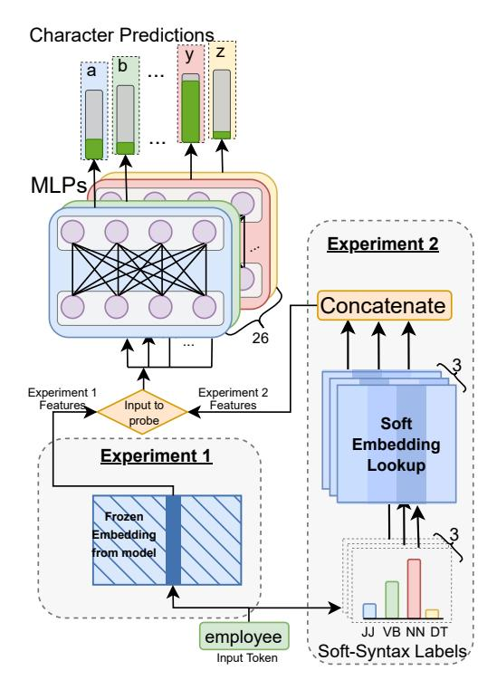
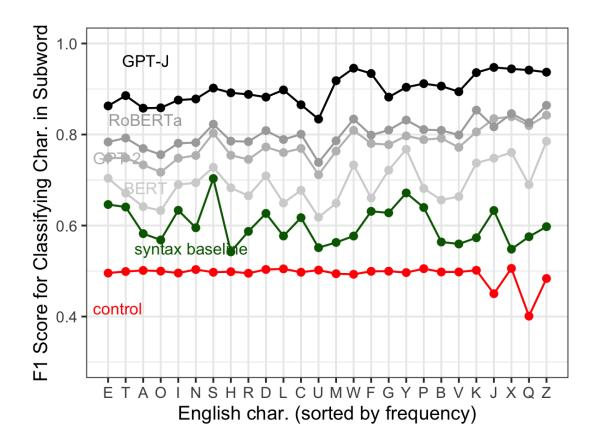
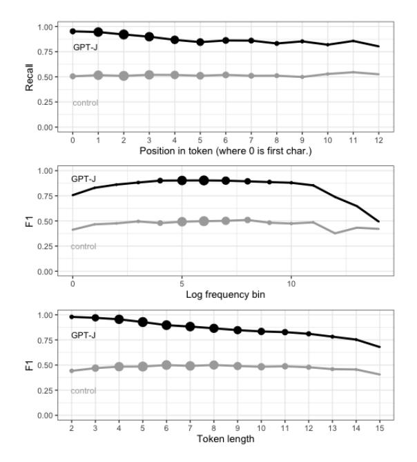
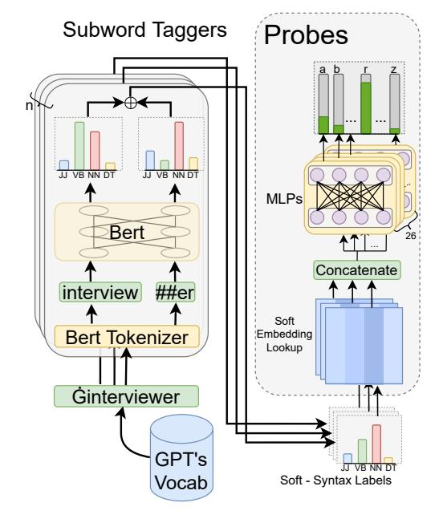

# What do tokens know about their characters and how do they know it?

## Ayush Kaushal

[ayushk4@utexas.edu](mailto:ayush) The University of Texas at Austin

## Kyle Mahowald

[mahowald@utexas.edu](mailto:kyle) The University of Texas at Austin

## Abstract

Pre-trained language models (PLMs) that use subword tokenization schemes can succeed at a variety of language tasks that require characterlevel information, despite lacking explicit access to the character composition of tokens. Here, studying a range of models (e.g., GPT-J, BERT, RoBERTa, GloVe), we probe what word pieces encode about character-level information by training classifiers to predict the presence or absence of a particular alphabetical character in a token, based on its embedding (e.g., probing whether the model embedding for "cat" encodes that it contains the character "a"). We find that these models robustly encode character-level information and, in general, larger models perform better at the task. We show that these results generalize to characters from non-Latin alphabets (Arabic, Devanagari, and Cyrillic). Then, through a series of experiments and analyses, we investigate the mechanisms through which PLMs acquire English-language character information during training and argue that this knowledge is acquired through multiple phenomena, including a systematic relationship between particular characters and particular parts of speech, as well as natural variability in the tokenization of related strings.

### 1 Introduction and Motivation

The dominant class of models in NLP (pre-trained transformer models; [Brown et al.,](#page-9-0) [2020;](#page-9-0) [Devlin](#page-9-1) [et al.,](#page-9-1) [2019;](#page-9-1) [Bommasani et al.,](#page-9-2) [2021\)](#page-9-2) use tokenization schemes, like BPE or WordPiece tokenization [\(Sennrich et al.,](#page-12-0) [2016;](#page-12-0) [Schuster and Nakajima,](#page-11-0) [2012;](#page-11-0) [Kudo and Richardson,](#page-10-0) [2018\)](#page-10-0), that break text into word pieces. These models face an apparent limitation in that they do not have access to information below the level of the word piece, such as information about characters. But character-level information has been claimed to be useful for a variety of tasks, including adapting text to novel domains like biomedicine, texts with misspellings,



Figure 1: Overview of our probing setup. In Experiment 1, the input is a model embedding and we train MLPs to classify whether a particular character (e.g., "a") occurs in a particular token (e.g, "employee"). In Experiment 2, we use syntactic features as input, rather than model embeddings, to train our probe.

and wordplay-based tasks that require attention to character-level manipulations [\(Riabi et al.,](#page-11-1) [2021;](#page-11-1) [El Boukkouri,](#page-9-3) [2020;](#page-9-3) [Clark et al.,](#page-9-4) [2021\)](#page-9-4).

There are drawbacks, however, to using character-level models: character-based sequences are long and therefore can slow down training [\(Mielke et al.,](#page-10-1) [2021\)](#page-10-1). And including characterlevel information does not necessarily improve performance on tasks where one might expect it to [\(Libovicky et al.](#page-10-2) ` , [2021;](#page-10-2) [Rosales Núñez et al.,](#page-11-2) [2021;](#page-11-2) [Itzhak and Levy,](#page-10-3) [2021\)](#page-10-3). Therefore, the vast majority of top-performing models in languages with alphabetic scripts use models with various kinds of

subword tokenization schemes (e.g., [Devlin et al.,](#page-9-1) [2019;](#page-9-1) [Brown et al.,](#page-9-0) [2020\)](#page-9-0), but rarely with characterlevel schemes.

One possible explanation for this state of affairs is that models trained on word pieces implicitly learn something about characters, making the explicit inclusion of character-level information unnecessary. Indeed, recent work has shown that even models based on subword tokens might be able to use and manipulate character-level information. [Rozner et al.](#page-11-3) [\(2021\)](#page-11-3) and [Efrat et al.](#page-9-5) [\(2021\)](#page-9-5) both study cryptic crosswords and find that PLMs (specifically, T5) can take advantage of characterlevel information in order to solve wordplay tasks like unscrambling scrambled words. [Itzhak and](#page-10-3) [Levy](#page-10-3) [\(2021\)](#page-10-3) show that RoBERTa can access subword information by testing it on a spelling task that requires it to map from words to characters (e.g., from *cat* to the characters *c* + *a* + *t*).

The fact that models can do tasks like this is curious: word pieces have no explicit access to character information during training, and the mechanism by which they acquire such information is not obvious. The goal of this paper is to understand the nature of this information, and how it is learned.

Thus, we make several contributions. First, we provide a thorough characterization of what character information is accessible to subword-tokenized PLMs by designing a binary probing task ([§3\)](#page-2-0) to probe subword tokens for the presence or absence of a particular character: e.g., does the sequence *star* contain the letter *t*? This task lets us not just assess whether this information is available, but lets us characterize, in a fine-grained way, the nature of character-level knowledge in subword tokens. Performance on the task far exceeds a random control as well as a baseline using fixed GloVe word embeddings (an F1 score of 93.7 for the bestperforming model, GPT-J), suggesting that subwords learn meaningful information about their characters. This result holds across several alphabets (Latin, Devanagari, Cyrillic, Arabic).

To explore how this information is acquired, we introduce several possible explanations and conduct detailed analyses of the probing task on the monolingual English models, with a particular focus on the best-performing model GPT-J ([§3.3\)](#page-4-0). Specifically, we consider how character knowledge varies as a function of the character being probed for (it's easier to classify rare letters than common ones), the position in the token of the character in

question (performance is somewhat better early in tokens), and the frequency of the token (frequent tokens aren't necessarily easier to probe). We then turn to the possibility that systematic correspondences between characters and syntactic features (e.g., adverbs tend to end in "y"), play a role in how models acquire character-level information. To that end, we devise syntactic baselines, whereby we use features like part of speech as input to the classifer for detecting the presence or absence of tokens ([§4\)](#page-5-0). The syntactic probe performs much better than controls, which suggests syntactic features contribute to the tokenizer's performance. However, this correlation does not suffice to explain the totality of character information learned by PLMs.

Finally, we consider another possible mechanism, based on the variability of tokenization, by which character-level information might be learned ([§5\)](#page-7-0). We conduct an experiment using simple fixed embeddings, as proof of concept that increasing variability in tokenization [\(Cao and Rimell,](#page-9-6) [2021\)](#page-9-6) affects the character information learned. Overall, given the importance of tokenization schemes for downstream performance [\(Bostrom et al.,](#page-9-7) [2021;](#page-9-7) [Mielke et al.,](#page-10-1) [2021\)](#page-10-1), we believe richer knowledge as to how tokens acquire character-level information could inform the development of tokenization schemes that improve model performance.

# 2 Prior work

All language models must choose what to use as the basic linguistic unit, and, as a result, there is a long history of work in NLP, evaluating the tradeoffs between models that tokenize words based on characters, words, or something in between, like bytes or word pieces (see [Mielke et al.,](#page-10-1) [2021;](#page-10-1) [Pin](#page-11-4)[ter,](#page-11-4) [2021,](#page-11-4) for recent surveys).

While words are a seemingly natural kind and are often used as basic units for modeling language, there is considerable debate in the linguistics literature as to how to even define a word, due to differences across languages [\(Haspelmath,](#page-10-4) [2017\)](#page-10-4). Moreover, word-level models have a major weakness in that they do not naturally handle out of vocabulary items (see [Jurafsky,](#page-10-5) [2003,](#page-10-5) for an overview) and can have very different behaviors in languages with different morphological systems [\(Mielke et al.,](#page-11-5) [2019;](#page-11-5) [Cotterell et al.,](#page-9-8) [2018\)](#page-9-8). Character-level models have their own weaknesses: they are typically slower to train at the scale required for massive language modeling. Many recent efforts have centered

around trying to use meaningful sub-word units in language modeling, such as BPE (Gage, 1994; Sennrich et al., 2016), WordPiece tokenization (Schuster and Nakajima, 2012), and UnigramLM (Kudo, 2018).

While subword tokenization schemes often end up with reasonable linguistic units, they still lack access to character-level information. So there have been a number of efforts to imbue word or subword tokenization schemes with character-level information (Mielke and Eisner, 2019; Kim et al., 2016; Dos Santos and Zadrozny, 2014; Bojanowski et al., 2017; Li et al., 2018; Ma and Hovy, 2016; Aguilar et al., 2021; El Boukkouri, 2020; Clark et al., 2021).

Here, rather than asking how to augment subword tokenization schemes with additional information, we ask what they *already* learn about characters naturally. To do so, we use probing, which is widely used to assess what information is contained in PLM embeddings (Belinkov, 2022; Belinkov and Glass, 2019; Hewitt and Manning, 2019; Hupkes et al., 2018). Because probing has limitations (Elazar et al., 2021; Pimentel et al., 2020; Voita et al., 2021), we include a number of control tasks (Hewitt and Liang, 2019) and baselines in order to ask what can be recovered from embeddings, relative to a control of equal expressive power.

# <span id="page-2-0"></span>3 Experiment 1: Probing for character information

The main goal of our first experiment is to quantify the extent to which tokens in PLMs capture character-level information and characterize that knowledge across a variety of dimensions. We train a binary classifier probe that takes as input a token's frozen embeddings from PLMs to predict whether a particular character of the alphabet is contained in that token. That is, if successful, the probe will predict that cool contains an "o" but "cat" does not. We also consider a task in which the probe must say whether one token (e.g., "coo") is a substring of another token (e.g., "cool"). We examine the probe's success as a function of the character being probed for, length of the token being probed, position of the character in the token, and frequency of the token.

#### 3.1 Method

We consider the static non-contextualized embeddings of the following English PLMs: GPT-J

(Wang and Komatsuzaki, 2021), GPT-2 (Radford et al., 2019), RoBERTa (Liu et al., 2019), BERT (cased and uncased; Devlin et al., 2019), as well as GloVe embeddings (Pennington et al., 2014) and Language-only embeddings of the multimodal LXMERT (Tan and Bansal, 2019). To test the generalizability of our results to other languages, we also considered embeddings from Multilingual BART (Liu et al., 2020) and used them to test tokens consisting of only English characters, as well as characters from three other alphabetic scripts: Devanagari, Arabic, and Cyrillic. See Appendix B for model details.

Each language model has its own vocabulary, consisting of tokens. For our English experiments, We consider only the tokens consisting entirely of characters in the standard English alphabet (az), along with the special characters that accompany these tokens, such as preceding whitespace (denoted by G in the RoBERTa and GPT-family) or symbols denoting continuations of preceding word ('##' in BERT family). Because Multilingual BART consists of characters from different scripts and because its tokens are not explicitly separated by languages, for our Multilingual BART experiments we consider all tokens that consist exclusively of characters from the target alphabet.<sup>1</sup> We define the target alphabet for each script as the alphabetic characters in each script that occur across at least 250 different tokens.

Our main probing task trains classifiers to detect the presence or absence of each of the target characters  $\alpha$  in each token  $w_i$  from the filteredvocabulary V. Thus, a separate dataset for each character  $\alpha$  is constructed over V as  $D'_{\alpha}$  =  $\{(w_1, y_1), (w_2, y_2), \dots (w_d, y_d)\}$  where the binary label  $y_i$  denotes whether  $\alpha$  occurs at least once in  $w_i \in V$ . From these data-points in  $D'_{\alpha}$  we create a balanced dataset  $D_{\alpha}$  with an equal number of positive and negative labels by undersampling the  $(w_i, y_i)$  points with  $y_i$  as the negative label (i.e., when probing for the presence of the character "z", half the tokens will contain "z" even though most tokens in general do not). We then split  $D_{\alpha}$  into training and test splits in a roughly 80-20 ratio, while (for the English experiments) ensuring that

<span id="page-2-1"></span><sup>&</sup>lt;sup>1</sup>Note that, because Multilingual BART does not explicitly separate tokens based on language, our experiment compares across *scripts*, as opposed to across languages. For instance, the tokens considered for Arabic can include tokens derived from not just the Arabic language, but also other languages that use the Arabic script like Farsi or Malay.

tokens with the same lemma appear in the same split. This is the most challenging split, as it prevents the probe from leveraging wordform similarity across words with the same lemma in both training and test [\(Itzhak and Levy,](#page-10-3) [2021\)](#page-10-3). Because of technical issues defining lemmas in Multilingual BART, we do not enforce this constraint for the Multilingual BART experiments.

We train our probe on the static non-trainable embeddings E of these PLMs. For a data-point (w<sup>i</sup> , yi), the probe receives as input a token w<sup>i</sup> with one-hot encoding x<sup>i</sup> . The probe predicts logits yˆ<sup>i</sup> by an MLP: yˆ<sup>i</sup> = σ(MLPα(E<sup>T</sup> xi)). In the control task, we consider randomly-initialized nontrainable embeddings instead of the trained embeddings from the PLMs.

Substring Sub-experiment As an additional subexperiment for assessing the generalizability of the task, for the best-performing English-language model (GPT-J), we consider a related substring classification task. Specifically, we probe GPT-J's embedding to detect whether a token u is a substring of the token v. That is, can it detect that the token "ome" is a substring of "some"? For this condition, we set up the experiment as before but, rather than attempt to detect the presence or absence of a character, we seek to classify whether a particular token u<sup>i</sup> is a substring of another token vi . To create positive examples, we consider all substrings of v<sup>i</sup> that are in the overall vocabulary V . For each positive example, we sample a token from V of equal character length as u<sup>i</sup> which is *not* a substring of v<sup>i</sup> in order to create negative examples. This creates a balanced set, from which we sample an 80-20 train-test split, ensuring that the superstring token v<sup>i</sup> always occurs in the same split. We train the probe as before, with the input as the concatenated embeddings of the two tokens.

#### 3.2 Results

#### English-Language Character Probing Results

Table [1](#page-4-1) shows the results averaged across 5 traintest splits and different seeds, reporting on the Macro-F1 metric averaged across all 26 characters. We also observe very low variance for the best-performing models, as shown in the Appendix (Table [7\)](#page-13-0).

For our main character probing experiment, all models perform substantially better than their matched controls (which hover around the chance F! level of 50), suggesting that word piece tokens

<span id="page-3-1"></span>

Figure 2: For selected models, the average F1-score (yaxis) for how well a character (x-axis) can be classified on our main probing task. The control (random embeddings) appears in red, the syntax baseline in green. The other 4 models are shown in grayscale, with the largest and most recent model (GPT-J) in the darkest color.

from PLMs contain information about their constituent characters in their embeddings. GPT-J is the best-performing model (with F1 of 93.70 and 94.35), followed by RoBERTa and GPT-2, then the BERT models. All the transformer models outperform the GloVe fixed embedding model. Clearly, the performance of the models on this probing task correlates with performance on other language tasks, such that larger models trained on larger corpora do better.[2](#page-3-0)

There are also other factors that may contribute to difference in performance, such as the nature of the pre-training task and the tokenizer. The latter is evident from the considerable performance gap between RoBERTa and BERT, which may be partially attributed to RoBERTa using GPT's reversible tokenizer, leading to more variability depending on preceding whitespace. (See [§5](#page-7-0) for the potential effect of tokenizer variability on performance.)

Multilingual Results Table [2](#page-4-2) shows the results for the Multilingual BART experiments, averaged across 5 train-test splits with different seeds. Performance is consistently high and above chance across languages with different scripts. It is highest for Cyrillic with an F1 of 81.37, and lowest for Arabic with an F1 of 76.37. While we focus mostly on English in the remainder of our experiments because of the large number of different

<span id="page-3-0"></span>Since performance varies considerably based on the model used, we consider this work an additional data point in favor of considering multiple models in interpretability work [\(Bowman,](#page-9-14) [2021\)](#page-9-14).

<span id="page-4-1"></span>

| Model type                   | PLM   | Control |  |  |  |  |  |
|------------------------------|-------|---------|--|--|--|--|--|
| English Probing Experiment   |       |         |  |  |  |  |  |
| GPT-J                        | 93.70 | 48.36   |  |  |  |  |  |
| GPT-2                        | 84.25 | 52.31   |  |  |  |  |  |
| RoBERTa                      | 86.41 | 47.33   |  |  |  |  |  |
| BERT-Cased                   | 78.50 | 47.08   |  |  |  |  |  |
| BERT-Uncased                 | 77.48 | 49.37   |  |  |  |  |  |
| GloVe 300D                   | 67.57 | 49.57   |  |  |  |  |  |
| GloVe 100D                   | 66.04 | 50.33   |  |  |  |  |  |
| LXMERT                       | 62.4  | 53.92   |  |  |  |  |  |
| English Substring Experiment |       |         |  |  |  |  |  |
| GPT-J                        | 86.56 | 70.03   |  |  |  |  |  |

Table 1: Results (F1-scores)for the main English probing experiment.

<span id="page-4-2"></span>

| Script                | PLM   | Control |
|-----------------------|-------|---------|
| Latin (English chars) | 80.95 | 39.13   |
| Devanagari            | 78.61 | 50.78   |
| Arabic                | 76.37 | 51.88   |
| Cyrillic              | 81.37 | 45.71   |

Table 2: Results (F1-scores) for the multilingual probing experiment on Multilingual BART.

models available and because of the easy access to other sources of linguistic information, we believe these results suggest that our findings would be generalizable to non-Latin scripts.

English Substring Experiment Performance on the English Substring Experiment is also far above chance, with an average F1 of 86.56, compared to a control F1 (on random embeddings) of 70.03 (bottom row in Table [1\)](#page-4-1). Control performance is well above 50 in this case since the data set is created to be balanced such that the superstrings have equal numbers of positive and negative examples. But there are still baseline differences in how often a token occurs as a substring, so the model can learn that certain substrings like "en" are more common than substrings like "emies". We take the performance on the Substring Experiment as evidence that the model can make use of character information to do more complicated substring tasks than just character identification.

## <span id="page-4-0"></span>3.3 Breakdown of results

Next, we consider a number of possibilities for how character-level information gets into these embeddings and conduct analyses intended to understand the nature of the information learned and how it gets there. We focus on our best-performing model (GPT-J) for these analyses.

Is the first letter learned best because of alphabetization? One possibility is that, because the

training data likely contains many alphabetical lists and other kinds of word lists (e.g., lists of words starting with "z"), the model learns a co-occurrence relationship between words that start with the same character. We would predict that this would cause stronger performance when the probed character occurs at the beginning of the word. To that end, we examine how the model's performance varies as a function of where in the token the target character is (top panel in Figure [3\)](#page-5-1). While there is indeed a significant negative relationship between word position and recall as measured by a linear regression (β = −.01, p < .001), the slope is relatively small. While recall on the first letter in a token is high (95.2), it is not an outlier: performance is only somewhat higher than recall for the second character (94.5). Moreover, performance is above chance even when the target character appears 10 or more characters deep in a token. Therefore, we do not believe the effect is driven only by word beginnings, although they likely play a role.

Is it only frequent words that the probe gets right? Next, we consider whether performance varies as a function of the frequency of the token (middle panel in Figure [3\)](#page-5-1). One possibility could be that character information is memorized only in high-frequency tokens like "the", which occur often enough that at least sometimes very frequent tokens are broken into characters (e.g., "the" appearing in the context of "t h e"), and that low-frequency tokens will perform worse. This does not appear to be the case and, in fact, there is, if anything, a negative relationship (β = −.013, p = .05) between binned log frequency and performance, such that less frequent tokens are easier to extract character information from.

### Is it easier to get long or short words right?

The bottom panel of Figure 2 shows F1-score as a function of the length of the token. Using the GPT-J embeddings, it is easier to classify characters in short tokens, as compared to longer tokens. This may be a function of the nature of the task since there is, in some sense, less information to be represented for a short token like "be" for the purposes of the task (just that it contains a "b" and it contains an "e"), whereas a long token would have to represent information about more characters.

Which characters are learned best? Part of what makes the success of the probe is that word embeddings represent word co-occurrence informa-

<span id="page-5-1"></span>

Figure 3: Performance on the GPT-J probe, relative to a control probe, as a function of the character's position in the token (top), the log frequency of the token (middle), and the length of the token (bottom). The size of the point reflects the amount of data.

tion, which is typically conceived of as semantic in nature [\(Erk,](#page-10-16) [2016\)](#page-10-16) and so should, because of the arbitrariness of the relationship between forms and meanings [\(Saussure,](#page-11-10) [1916;](#page-11-10) [Hockett,](#page-10-17) [1960\)](#page-10-17), mean there is no relationship between individual characters and information learned by embeddings. But this arbitrariness breaks down, in that there are statistically detectable non-arbitrary form-meaning relationships in language [\(Blasi et al.,](#page-9-15) [2016;](#page-9-15) [Mon](#page-11-11)[aghan et al.,](#page-11-11) [2014;](#page-11-11) [Tamariz,](#page-12-5) [2008;](#page-12-5) [Dautriche et al.,](#page-9-16) [2017;](#page-9-16) [Pimentel et al.,](#page-11-12) [2019\)](#page-11-12), such as the fact that *fl*words in English tend to be about movement (e.g., *flap*, *fly*, *flutter*, *flicker*; [Marchand,](#page-10-18) [1959;](#page-10-18) [Bergen,](#page-9-17) [2004\)](#page-9-17) and that different parts of speech have different phonological patterns [\(Dautriche et al.,](#page-9-18) [2015;](#page-9-18) [Kelly,](#page-10-19) [1992;](#page-10-19) [Monaghan et al.,](#page-11-13) [2005\)](#page-11-13).

An even larger source of shared information between characters and syntactic/semantic information is that morphological forms can be cues to word categories: for instance, most plural nouns end with "s" and many adverbs end in "ly". This leads to changes in character-level distributions: while roughly 12% of words in American English contain "y", 85% of adverbs do (as estimated using data from [Brysbaert et al.,](#page-9-19) [2012\)](#page-9-19). Thus, a model with access to part of speech information could do well by guessing that all adverbs contain "y".

So one possibility is that the probe's performance is largely driven by characters that correlate with syntactic and semantic features. If this were the case, we might expect some characters to show much better performance than others. Figure [2](#page-3-1) shows the F1-Macro as a function of character. For GPT-J, the best-performing model, there are some clear trends. For instance, it is easiest to classify rare letters: J, W, X, Q, Z all have F1-scores over 93. And it is hardest for the probe to classify vowels: U, A, O, and E are the lowest-performing characters, with F1-scores between 83 and 86. But even those lower-performing characters do far better than the chance baseline (at about 50 F1 score)

To further explore this, we conducted a qualitative analysis of the probe's successes and failures. Consider the probe for classifying the presence/absence of "y": the model assigns highest confidence to the following 4 tokens: "lly", " selectively", " subtly", " mechanically". These all have "ly" endings, which in English are typically associated with adverbs. Similarly, the top performing tokens for the "s" classifier all end with a morphologically meaningful "-s" suffix: " socialists", " stocks"," suggestions". They also happen to all start with "s", perhaps suggesting an effect of the first character as discussed above.

This analysis suggests that the strong classifier performance could be explained by the model learning systematic relationships between certain characters and syntactically or semantically meaningful morphology. Is syntactic information the window through which character-level information enters PLMs? To address that question, our next experiment focuses on a syntactic baseline, to see how well character-level information can be predicted based on syntactic features.

# <span id="page-5-0"></span>4 Experiment 2: The effect of syntactic information

In this experiment, we focus on building probes for the same task as in Experiment 1 (identifying whether a particular character occurs in a particular token). But, rather than using the token embeddings from a large language model as input, we attempt to classify the presence/absence of characters in a token based on syntactic information.

Our first model (the SpaCy model) uses the SpaCy library [\(Honnibal and Montani,](#page-10-20) [2017\)](#page-10-20) to obtain distributions over features for each token in the vocabulary: Fine-Grained Part of Speech

<span id="page-6-0"></span>

| Measure                    | SpaCy                       | GPT-J | Control |  |  |  |  |
|----------------------------|-----------------------------|-------|---------|--|--|--|--|
| Aggregate Performance      |                             |       |         |  |  |  |  |
| F1                         | 52.34                       | 61.24 | 49.68   |  |  |  |  |
| Best performing characters |                             |       |         |  |  |  |  |
| s                          | 64.60                       | 66.82 | 40.32   |  |  |  |  |
| y                          | 61.96                       | 64.89 | 48.68   |  |  |  |  |
| e                          | 62.05                       | 62.32 | 47.27   |  |  |  |  |
|                            | Worst performing characters |       |         |  |  |  |  |
| b                          | 48.92                       | 55.13 | 48.25   |  |  |  |  |
| m                          | 48.13                       | 55.61 | 46.11   |  |  |  |  |
| q                          | 43.79                       | 53.54 | 49.28   |  |  |  |  |

Table 3: The best and worst performing characters from Experiment 2 on the SpaCy syntactic baseline, the GPT-J syntactic baseline, and the Control.

tag (PoS; e.g., for "Jane", NNP for a proper noun), Coarse-Grained Part of Speech tag (Coarse-grained PoS; e.g., for "Jane", PROPN for proper noun), and a Named Entity Recognition tag (NER; e.g., for "Jane", PERSON for a personal name). We use these features to construct a syntactic vector for each token.

Because SpaCy is built to operate over words, not tokens, we also construct custom syntactic baselines that can tag subwords, as opposed to tokens.

The performance of these probes will serve as a baseline for ascertaining how much characterlevel information can be learned by these features alone, without a full language model. If they can perform just as well as the full GPT-J embeddings, that would suggest that morphosyntactic information (of the sort that we already know is learned by PLMs during pretraining) is sufficient for the performance on the probing task.

The method is the same as in Experiment 1, where the goal is to predict the presence or absence of a character α in a token, except that instead of using the token's model embeddings as input, we instead use syntactic feature vectors (obtained either from SpaCy or a custom tagger) as input. We describe these syntactic vectors below.

Syntactic baselines The SpaCy model has 3 features for each token: NER, PoS, and Coarse-Grained PoS tags. The resultant features are discrete one-hot feature vectors over labels.

The custom syntactic tagger, which is intended to solve the problem that SpaCy tags words and not subword tokens, takes a (subword) token's model embedding as input and outputs a vector of probabilities over part of speech and named entity categories. Here, we describe results for our custom GPT-J Tagger, trained using GPT-J model embeddings, since GPT-J is the best-performing of our models for our main task. See Appendix [D](#page-14-0) for descriptions and the results for 2 additional BERTbased custom taggers that we built.

To build our custom GPT-J-Tagger, we train an MLP model to predict PoS and NER labels based on GPT-J's static embedding layer for each token. The tagger is trained on the CoNLL 2003 dataset's train and evaluation splits [\(Sang and De Meulder,](#page-11-14) [2003\)](#page-11-14), which contain part of speech and named entity information. Unlike the SpaCy tagger, our custom GPT-J-Tagger outputs a probability distribution over categories. We use this distribution over labels as input, rather than a one-hot vector. In the Appendix, Table [13](#page-15-0) shows the performance of the tagger's performance *qua* tagger.

#### Probing for characters using syntactic baselines

We run the character probing experiment as before. But, rather than using the model embeddings, we use the syntactic feature vectors as the target of our probe. Table [3](#page-6-0) shows the results of these experiments. Using the syntactic baselines leads to substantially improved performance over control tasks, and the GPT-J-Tagger does better than the SpaCy tagger. We hypothesize that these divergences occur because the custom GPT-J-Tagger is better suited to handling subwords, and because it enables us to use label distribution rather than one-hot vectors.

Zooming in on the performance over individual characters, we observe that, relative to the control task, some English characters consistently perform much better when using syntactic features. As predicted, these are precisely the characters that are highly correlated with particular parts of speech. The best-performing characters are: "s" (associated with plural nouns and third-person singular verbs) and "y" (associated with adjective and adverb endings). Thus, the syntactic baselines seem to be capturing the information that they were intended to capture. But their performance still fell far below the best performing PLMs, suggesting that the large models are capturing more than just the information captured by the syntactic models. Moreover, as can be seen in Figure [2,](#page-3-1) the syntax baseline shows a sharp peak for morphologically informative characters like "s", but this pattern is much weaker in GPT-J (which shows only a slight performance increase for "s"). Therefore, we do not think syntactic information can explain all the character information learned by PLMs. In the next

<span id="page-7-1"></span>

| Word            | Tokenizations        |
|-----------------|----------------------|
| "dictionary"    | "d + ictionary"      |
| " dictionary"   | " dictionary"        |
| "dictionaries"  | "d + iction + aries" |
| " dictionaries" | " diction + aries"   |
| "dicionary"     | "d + icion + ary"    |

Table 4: Some GPT tokenizations for "dictionary".

section, we consider another possibility: variability of tokenization, the focus of the next section.

# <span id="page-7-0"></span>5 Experiment 3: Tokenization variability

Consistent with other work suggesting benefits to variable tokenization (e.g., [Provilkov et al.,](#page-11-15) [2020;](#page-11-15) [Kudo,](#page-10-7) [2018\)](#page-10-7), we hypothesize that the variability of tokenization is another avenue by which characterlevel information could be learned by models. We first quantify this variability and then run an experiment using CBOW Word Embeddings [\(Mikolov](#page-11-16) [et al.,](#page-11-16) [2013\)](#page-11-16) showing how increasing the variability in tokenization can lead to more character information being learned. We posit that the same mechanism may be in play for PLMs.

Subword tokenization like the one used by GPT models can cause the same lemma to have very different tokenizations, depending on its form and/or its spelling. See Table [4](#page-7-1) for possible tokenizations of "dictionary" and related forms, including a misspelling (bottom row). This is a subset of the possible misspellings, variants, and morphological forms of the word. But the listed forms alone generate 8 unique tokens.

It would be useful for the model to learn a relationship between all these tokens, since they represent the same lemma. We posit that the desirability of learning this mapping is a mechanism by which character information could be learned, by inducing an objective to map between atomic tokens like "dictionary" and the various substring tokens that can arise. While each of these mappings could be learned individually, learning character-level spelling information offers a more general solution to the problem, such that even an entirely novel tokenization could be interpreted by composing the characters of the tokens.

For this to be plausible, though, variable tokenizations like this must be frequent enough for it to matter. In Appendix [E,](#page-17-0) we use heuristics to identify different forms in which a word appears and conduct a series of back-of-the-envelope calculations to determine how many different unique tokenizations are expected for a long word (8+ char-

<span id="page-7-2"></span>

| ρ | Embedding                      | Control                                   |
|---|--------------------------------|-------------------------------------------|
| - | 60.55                          | 47.12                                     |
|   |                                | 47.51                                     |
|   |                                | 47.23                                     |
|   |                                | 46.72                                     |
|   |                                | 47.01                                     |
|   |                                | 46.47                                     |
|   | -<br>0.05<br>0.1<br>0.2<br>0.5 | 63.23<br>66.00<br>65.64<br>64.23<br>62.33 |

Table 5: Average F1 scores for probing results, as a function of change in tokenization variability

acters) like *dictionary*, in all its variant forms and misspellings in a sample of the Pile corpus (we used 1/6 of the corpus as a sample; [Gao et al.,](#page-10-21) [2020\)](#page-10-21). We found that, on average, we should expect over 200 different tokenizations for a word like "dictionary", many pairs of which have entirely disjoint sets of subword tokens from each other.

This hypothesis leads to a prediction: increasing the variability of tokenization should increase the amount of character-level information learned. To test this, we train models using tokenization schemes with different levels of variability and then test how much character-level information they learn, using our probing task.

Because the overall goal of our paper is to characterize and explain the nature of characterlevel information learned, we conduct a proof-ofconcept experiment using CBOW Word Embeddings [\(Mikolov et al.,](#page-11-16) [2013\)](#page-11-16) on a portion of the Pile corpus with 1.1B characters, as opposed to training a large transformer model from scratch varying tokenization schemes. We train 6 CBOW models from scratch, each with a different tokenization scheme. As baselines, we consider vanilla rule-based wordtokenization (the CBOW default, labeled "Word" in Table [5\)](#page-7-2) and GPT-J's default word piece tokenization scheme. Comparing these two baselines against each other lets us compare the effect of word tokenization vs. subword tokenization on character information. But our key manipulation is to consider variations of GPT-J's tokenizer in which we systematically increase tokenization variability.

In pre-processing the word-tokenized corpus for input, for each word token w<sup>i</sup> , with probability (1−ρ), we tokenize it using the standard GPT-J tokenizer. Under the standard tokenizer, " schematics" becomes " sche + mat + "ics". With probability ρ, however, we tokenize w<sup>i</sup> using a random tokenization that consists of alternative valid tokens from GPT-J. So, " schematics" could become " schema + tics" or " schematic + s" (but not " schemati + cs"

since " schemati" is not a valid GPT token). We vary ρ from 0.05 to 0.5. See Appendix [E](#page-17-0) for more details on this procedure. The result is a series of tokenized corpora, which have more variable tokenization than the vanilla GPT-J-tokenized corpus.

We train CBOW models separately for each of these corpora. Table [5](#page-7-2) shows the results of these experiments on our probing task (using the same method as in Experiment 1). As expected, probes on the subword tokenization schemes reveal they learn more information about characters than the default word-level tokenizer. Most importantly, upon increasing the variability on GPT-J's tokenization scheme, the performance of the probe increases, peaking at ρ = 0.05 and ρ = 0.1. Thereafter, the performance decreases with variability, suggesting that increasing variability leads to increased character knowledge but only up to a point, likely because there is a tradeoff: since the corpus size for the toy experiment is small, having very high variability leads to the model seeing fewer instances of each token.

While the magnitude of these differences is relatively small, they are consistent across random seeds and train-test splits. Thus, we believe that these results offer proof of concept that the variability of tokenization affects how much character information is learned by CBOW models and that this finding would plausibly generalize to performance in PLMs (although we leave it to future work to confirm this). As such, increasing tokenization variability could be a means by which PLMs could be engineered to learn richer character-level information.

## 6 Discussion and Conclusion

Overall, our probing methodology revealed that PLMs with sub-word tokenization learn quite a lot about characters. The result is robust to the position of the character in the token, the identity of the character, the frequency of the token, the length of the token, and the alphabetic script (although we did not consider entirely non-alphabetic scripts like Chinese since such languages would require a very different formulation).

We suggest at least two possible mechanisms by which this information is learned: systematic relationships between certain characters and syntactic/semantic features and the variability of tokenization. Insofar as these methods (e.g., tokenizer variability) can be manipulated in model construction, this knowledge could be used to build models that perform better at tasks dependent on such knowledge. Given the particular importance of tokenization in multilingual models [\(Rust et al.,](#page-11-17) [2021;](#page-11-17) [Singh et al.,](#page-12-6) [2019\)](#page-12-6), it would also be fruitful to consider the import of these results for multilingual settings.

More generally, while the linguistic capabilities of PLMs are much studied (for overviews, see [Rogers et al.,](#page-11-18) [2020;](#page-11-18) [Bommasani et al.,](#page-9-2) [2021\)](#page-9-2), the question whether PLMs learn the constituent characters of tokens is of a different nature in that it depends on learning a property of language (spelling) that is not explicitly tied to meaning. There is no *a priori* reason "dog" is spelled "D-O-G", and, in a sense, the spelling of the word does not matter. But, in another sense, it *does* matter: humans routinely use language in creative and character-dependent ways: e.g., alphabetizing text, scrambling letters to create codes, and solving crossword puzzles. Understanding whether and how the building blocks of this meta-linguistic knowledge can emerge during self-supervised training on a word prediction task could be of interest not just in NLP, but in the cognitive sciences.

### 7 Ethics and Broader Impacts

This work consists of probing experiments and interpretability analyses of PLMs, and the risks and ethical considerations are largely those that affect any work with large PLMs (e.g., energy costs; see [Bommasani et al.,](#page-9-2) [2021,](#page-9-2) for an overview of risks and tradeoffs). The intended use of our code is for academic research. We consider probing publicly available PLMs, which are made publicly available in part for research purposes, to be within the intended use of PLMs.

## 8 Acknowledgments

This work was supported by National Science Foundation Grants No. 2104995 to KM. We thank Chris Potts and Josh Rozner for conversations that helped inspire this work, Maria Ryskina and Kaj Bostrom for comments on drafts, and Eunsol Choi for introducing the authors.

# References

<span id="page-8-0"></span>Gustavo Aguilar, Bryan McCann, Tong Niu, Nazneen Rajani, Nitish Shirish Keskar, and Thamar Solorio. 2021. [Char2Subword: Extending the subword em](https://doi.org/10.18653/v1/2021.findings-emnlp.141)[bedding space using robust character compositional-](https://doi.org/10.18653/v1/2021.findings-emnlp.141)

- [ity.](https://doi.org/10.18653/v1/2021.findings-emnlp.141) In *Findings of the Association for Computational Linguistics: EMNLP 2021*, pages 1640–1651, Punta Cana, Dominican Republic. Association for Computational Linguistics.
- <span id="page-9-11"></span>Yonatan Belinkov. 2022. Probing classifiers: Promises, shortcomings, and advances. *Computational Linguistics*, 48(1):207–219.
- <span id="page-9-12"></span>Yonatan Belinkov and James Glass. 2019. [Analysis](https://doi.org/10.1162/tacl_a_00254) [methods in neural language processing: A survey.](https://doi.org/10.1162/tacl_a_00254) *Transactions of the Association for Computational Linguistics*, 7:49–72.
- <span id="page-9-17"></span>Benjamin K Bergen. 2004. The psychological reality of phonaesthemes. *Language*, 80(2):290–311.
- <span id="page-9-20"></span>Steven Bird, Ewan Klein, and Edward Loper. 2009. *Natural language processing with Python: analyzing text with the natural language toolkit*. " O'Reilly Media, Inc.".
- <span id="page-9-15"></span>Damián E Blasi, Søren Wichmann, Harald Hammarström, Peter F Stadler, and Morten H Christiansen. 2016. Sound–meaning association biases evidenced across thousands of languages. *Proceedings of the National Academy of Sciences*, 113(39):10818– 10823.
- <span id="page-9-10"></span>Piotr Bojanowski, Edouard Grave, Armand Joulin, and Tomas Mikolov. 2017. Enriching word vectors with subword information. *Transactions of the Association for Computational Linguistics*, 5:135–146.
- <span id="page-9-2"></span>Rishi Bommasani, Drew A Hudson, Ehsan Adeli, Russ Altman, Simran Arora, Sydney von Arx, Michael S Bernstein, Jeannette Bohg, Antoine Bosselut, Emma Brunskill, et al. 2021. On the opportunities and risks of foundation models. *arXiv preprint arXiv:2108.07258*.
- <span id="page-9-7"></span>Kaj Bostrom, Xinyu Zhao, Swarat Chaudhuri, and Greg Durrett. 2021. [Flexible generation of natural lan](https://doi.org/10.18653/v1/2021.emnlp-main.506)[guage deductions.](https://doi.org/10.18653/v1/2021.emnlp-main.506) In *Proceedings of the 2021 Conference on Empirical Methods in Natural Language Processing*, pages 6266–6278, Online and Punta Cana, Dominican Republic. Association for Computational Linguistics.
- <span id="page-9-14"></span>Samuel R Bowman. 2021. When combating hype, proceed with caution. *arXiv preprint arXiv:2110.08300*.
- <span id="page-9-0"></span>Tom B Brown, Benjamin Mann, Nick Ryder, Melanie Subbiah, Jared Kaplan, Prafulla Dhariwal, Arvind Neelakantan, Pranav Shyam, Girish Sastry, Amanda Askell, et al. 2020. Language models are few-shot learners. *arXiv preprint arXiv:2005.14165*.
- <span id="page-9-19"></span>Marc Brysbaert, Boris New, and Emmanuel Keuleers. 2012. Adding part-of-speech information to the subtlex-us word frequencies. *Behavior research methods*, 44(4):991–997.
- <span id="page-9-6"></span>Kris Cao and Laura Rimell. 2021. [You should evalu](https://doi.org/10.18653/v1/2021.emnlp-main.161)[ate your language model on marginal likelihood over](https://doi.org/10.18653/v1/2021.emnlp-main.161)

- [tokenisations.](https://doi.org/10.18653/v1/2021.emnlp-main.161) In *Proceedings of the 2021 Conference on Empirical Methods in Natural Language Processing*, pages 2104–2114, Online and Punta Cana, Dominican Republic. Association for Computational Linguistics.
- <span id="page-9-4"></span>Jonathan H Clark, Dan Garrette, Iulia Turc, and John Wieting. 2021. Canine: Pre-training an efficient tokenization-free encoder for language representation. *arXiv preprint arXiv:2103.06874*.
- <span id="page-9-8"></span>Ryan Cotterell, Christo Kirov, Mans Hulden, and Jason Eisner. 2018. On the complexity and typology of inflectional morphological systems. *Transactions of the Association for Computational Linguistics*.
- <span id="page-9-16"></span>Isabelle Dautriche, Kyle Mahowald, Edward Gibson, Anne Christophe, and Steven T Piantadosi. 2017. Words cluster phonetically beyond phonotactic regularities. *Cognition*, 163:128–145.
- <span id="page-9-18"></span>Isabelle Dautriche, Daniel Swingley, and Anne Christophe. 2015. Learning novel phonological neighbors: Syntactic category matters. *Cognition*, 143:77–86.
- <span id="page-9-1"></span>Jacob Devlin, Ming-Wei Chang, Kenton Lee, and Kristina Toutanova. 2019. [BERT: Pre-training of](https://doi.org/10.18653/v1/N19-1423) [deep bidirectional transformers for language under](https://doi.org/10.18653/v1/N19-1423)[standing.](https://doi.org/10.18653/v1/N19-1423) In *Proceedings of the 2019 Conference of the North American Chapter of the Association for Computational Linguistics: Human Language Technologies, Volume 1 (Long and Short Papers)*, pages 4171–4186, Minneapolis, Minnesota. Association for Computational Linguistics.
- <span id="page-9-9"></span>Cicero Dos Santos and Bianca Zadrozny. 2014. Learning character-level representations for part-of-speech tagging. In *International Conference on Machine Learning*, pages 1818–1826. PMLR.
- <span id="page-9-5"></span>Avia Efrat, Uri Shaham, Dan Kilman, and Omer Levy. 2021. [Cryptonite: A cryptic crossword benchmark](https://doi.org/10.18653/v1/2021.emnlp-main.344) [for extreme ambiguity in language.](https://doi.org/10.18653/v1/2021.emnlp-main.344) In *Proceedings of the 2021 Conference on Empirical Methods in Natural Language Processing*, pages 4186–4192, Online and Punta Cana, Dominican Republic. Association for Computational Linguistics.
- <span id="page-9-3"></span>Hicham El Boukkouri. 2020. [Ré-entraîner ou entraîner](https://aclanthology.org/2020.jeptalnrecital-recital.3) [soi-même ? stratégies de pré-entraînement de BERT](https://aclanthology.org/2020.jeptalnrecital-recital.3) [en domaine médical \(re-train or train from scratch](https://aclanthology.org/2020.jeptalnrecital-recital.3) [? pre-training strategies for BERT in the medi](https://aclanthology.org/2020.jeptalnrecital-recital.3)[cal domain \).](https://aclanthology.org/2020.jeptalnrecital-recital.3) In *Actes de la 6e conférence conjointe Journées d'Études sur la Parole (JEP, 33e édition), Traitement Automatique des Langues Naturelles (TALN, 27e édition), Rencontre des Étudiants Chercheurs en Informatique pour le Traitement Automatique des Langues (RÉCITAL, 22e édition). Volume 3 : Rencontre des Étudiants Chercheurs en Informatique pour le TAL*, pages 29–42, Nancy, France. ATALA et AFCP.
- <span id="page-9-13"></span>Yanai Elazar, Shauli Ravfogel, Alon Jacovi, and Yoav Goldberg. 2021. [Amnesic probing: Behavioral expla](https://doi.org/10.1162/tacl_a_00359)[nation with amnesic counterfactuals.](https://doi.org/10.1162/tacl_a_00359) *Transactions of*

- *the Association for Computational Linguistics*, 9:160– 175.
- <span id="page-10-16"></span>Katrin Erk. 2016. What do you know about an alligator when you know the company it keeps? *Semantics and Pragmatics*, 9:17–1.
- <span id="page-10-6"></span>Philip Gage. 1994. A new algorithm for data compression. *C Users Journal*, 12(2):23–38.
- <span id="page-10-21"></span>Leo Gao, Stella Biderman, Sid Black, Laurence Golding, Travis Hoppe, Charles Foster, Jason Phang, Horace He, Anish Thite, Noa Nabeshima, Shawn Presser, and Connor Leahy. 2020. [The pile: An](http://arxiv.org/abs/arXiv:2101.00027) [800gb dataset of diverse text for language modeling.](http://arxiv.org/abs/arXiv:2101.00027)
- <span id="page-10-4"></span>Martin Haspelmath. 2017. The indeterminacy of word segmentation and the nature of morphology and syntax. *Folia Linguistica*, 51(s1000):31–80.
- <span id="page-10-13"></span>John Hewitt and Percy Liang. 2019. [Designing and in](https://doi.org/10.18653/v1/D19-1275)[terpreting probes with control tasks.](https://doi.org/10.18653/v1/D19-1275) In *Proceedings of the 2019 Conference on Empirical Methods in Natural Language Processing and the 9th International Joint Conference on Natural Language Processing (EMNLP-IJCNLP)*, pages 2733–2743, Hong Kong, China. Association for Computational Linguistics.
- <span id="page-10-11"></span>John Hewitt and Christopher D. Manning. 2019. [A](https://doi.org/10.18653/v1/N19-1419) [structural probe for finding syntax in word represen](https://doi.org/10.18653/v1/N19-1419)[tations.](https://doi.org/10.18653/v1/N19-1419) In *Proceedings of the 2019 Conference of the North American Chapter of the Association for Computational Linguistics: Human Language Technologies, Volume 1 (Long and Short Papers)*, pages 4129–4138, Minneapolis, Minnesota. Association for Computational Linguistics.
- <span id="page-10-17"></span>C.F. Hockett. 1960. The origin of language. *Scientific American*, 203(3):88–96.
- <span id="page-10-20"></span>Matthew Honnibal and Ines Montani. 2017. spaCy 2: Natural language understanding with Bloom embeddings, convolutional neural networks and incremental parsing. To appear.
- <span id="page-10-12"></span>Dieuwke Hupkes, Sara Veldhoen, and Willem Zuidema. 2018. Visualisation and 'diagnostic classifiers' reveal how recurrent and recursive neural networks process hierarchical structure. *Journal of Artificial Intelligence Research*, 61:907–926.
- <span id="page-10-3"></span>Itay Itzhak and Omer Levy. 2021. Models in a spelling bee: Language models implicitly learn the character composition of tokens. *arXiv preprint arXiv:2108.11193*.
- <span id="page-10-5"></span>Daniel Jurafsky. 2003. Probabilistic modeling in psycholinguistics: Linguistic comprehension and production. In R. Bod, J. Hay, and S. Jannedy, editors, *Probabilistic Linguistics*. MIT Press.
- <span id="page-10-19"></span>Michael H. Kelly. 1992. [Using sound to solve syntac](https://doi.org/10.1037/0033-295X.99.2.349)[tic problems: The role of phonology in grammat](https://doi.org/10.1037/0033-295X.99.2.349)[ical category assignments.](https://doi.org/10.1037/0033-295X.99.2.349) *Psychological Review*, 99(2):349–364.

- <span id="page-10-8"></span>Yoon Kim, Yacine Jernite, David Sontag, and Alexander M Rush. 2016. Character-aware neural language models. In *Thirtieth AAAI conference on artificial intelligence*.
- <span id="page-10-22"></span>Diederik P. Kingma and Jimmy Ba. 2015. [Adam: A](http://arxiv.org/abs/1412.6980) [method for stochastic optimization.](http://arxiv.org/abs/1412.6980) In *3rd International Conference on Learning Representations, ICLR 2015, San Diego, CA, USA, May 7-9, 2015, Conference Track Proceedings*.
- <span id="page-10-7"></span>Taku Kudo. 2018. [Subword regularization: Improv](https://doi.org/10.18653/v1/P18-1007)[ing neural network translation models with multiple](https://doi.org/10.18653/v1/P18-1007) [subword candidates.](https://doi.org/10.18653/v1/P18-1007) In *Proceedings of the 56th Annual Meeting of the Association for Computational Linguistics (Volume 1: Long Papers)*, pages 66–75, Melbourne, Australia. Association for Computational Linguistics.
- <span id="page-10-0"></span>Taku Kudo and John Richardson. 2018. [SentencePiece:](https://doi.org/10.18653/v1/D18-2012) [A simple and language independent subword tok](https://doi.org/10.18653/v1/D18-2012)[enizer and detokenizer for neural text processing.](https://doi.org/10.18653/v1/D18-2012) In *Proceedings of the 2018 Conference on Empirical Methods in Natural Language Processing: System Demonstrations*, pages 66–71, Brussels, Belgium. Association for Computational Linguistics.
- <span id="page-10-9"></span>Bofang Li, Aleksandr Drozd, Tao Liu, and Xiaoyong Du. 2018. Subword-level composition functions for learning word embeddings. In *Proceedings of the second workshop on subword/character level models*, pages 38–48.
- <span id="page-10-2"></span>Jindˇrich Libovicky, Helmut Schmid, and Alexander ` Fraser. 2021. Why don't people use characterlevel machine translation? *arXiv preprint arXiv:2110.08191*.
- <span id="page-10-15"></span>Yinhan Liu, Jiatao Gu, Naman Goyal, Xian Li, Sergey Edunov, Marjan Ghazvininejad, Mike Lewis, and Luke Zettlemoyer. 2020. [Multilingual denoising pre](https://doi.org/10.1162/tacl_a_00343)[training for neural machine translation.](https://doi.org/10.1162/tacl_a_00343) *Transactions of the Association for Computational Linguistics*, 8:726–742.
- <span id="page-10-14"></span>Yinhan Liu, Myle Ott, Naman Goyal, Jingfei Du, Mandar Joshi, Danqi Chen, Omer Levy, Mike Lewis, Luke Zettlemoyer, and Veselin Stoyanov. 2019. Roberta: A robustly optimized bert pretraining approach. *arXiv preprint arXiv:1907.11692*.
- <span id="page-10-10"></span>Xuezhe Ma and Eduard Hovy. 2016. [End-to-end se](https://doi.org/10.18653/v1/P16-1101)[quence labeling via bi-directional LSTM-CNNs-CRF.](https://doi.org/10.18653/v1/P16-1101) In *Proceedings of the 54th Annual Meeting of the Association for Computational Linguistics (Volume 1: Long Papers)*, pages 1064–1074, Berlin, Germany. Association for Computational Linguistics.
- <span id="page-10-18"></span>Hans Marchand. 1959. Phonetic symbolism in english wordformation. *Indogermanische Forschungen*, 64:146.
- <span id="page-10-1"></span>Sabrina J Mielke, Zaid Alyafeai, Elizabeth Salesky, Colin Raffel, Manan Dey, Matthias Gallé, Arun Raja, Chenglei Si, Wilson Y Lee, Benoît Sagot, et al. 2021. Between words and characters: A brief history of

- open-vocabulary modeling and tokenization in nlp. *arXiv preprint arXiv:2112.10508*.
- <span id="page-11-5"></span>Sabrina J. Mielke, Ryan Cotterell, Kyle Gorman, Brian Roark, and Jason Eisner. 2019. [What kind of lan](https://doi.org/10.18653/v1/P19-1491)[guage is hard to language-model?](https://doi.org/10.18653/v1/P19-1491) In *Proceedings of the 57th Annual Meeting of the Association for Computational Linguistics*, pages 4975–4989, Florence, Italy. Association for Computational Linguistics.
- <span id="page-11-6"></span>Sabrina J Mielke and Jason Eisner. 2019. Spell once, summon anywhere: A two-level open-vocabulary language model. In *Proceedings of the AAAI Conference on Artificial Intelligence*, volume 33, pages 6843–6850.
- <span id="page-11-16"></span>Tomas Mikolov, Kai Chen, Greg Corrado, and Jeffrey Dean. 2013. [Efficient estimation of word representa](http://arxiv.org/abs/arXiv:1301.3781)[tions in vector space.](http://arxiv.org/abs/arXiv:1301.3781)
- <span id="page-11-13"></span>Padraic Monaghan, Nick Chater, and Morten H. Christiansen. 2005. [The differential role of phonological](https://doi.org/10.1016/j.cognition.2004.09.001) [and distributional cues in grammatical categorisation.](https://doi.org/10.1016/j.cognition.2004.09.001) *Cognition*, 96(2):143–182.
- <span id="page-11-11"></span>Padraic Monaghan, Richard C. Shillcock, Morten H. Christiansen, and Simon Kirby. 2014. How arbitrary is language. *Philosophical Transactions of the Royal Society B*.
- <span id="page-11-19"></span>Adam Paszke, Sam Gross, Francisco Massa, Adam Lerer, James Bradbury, Gregory Chanan, Trevor Killeen, Zeming Lin, Natalia Gimelshein, Luca Antiga, Alban Desmaison, Andreas Köpf, Edward Z. Yang, Zachary DeVito, Martin Raison, Alykhan Tejani, Sasank Chilamkurthy, Benoit Steiner, Lu Fang, Junjie Bai, and Soumith Chintala. 2019. [Pytorch: An](https://proceedings.neurips.cc/paper/2019/hash/bdbca288fee7f92f2bfa9f7012727740-Abstract.html) [imperative style, high-performance deep learning li](https://proceedings.neurips.cc/paper/2019/hash/bdbca288fee7f92f2bfa9f7012727740-Abstract.html)[brary.](https://proceedings.neurips.cc/paper/2019/hash/bdbca288fee7f92f2bfa9f7012727740-Abstract.html) In *Advances in Neural Information Processing Systems 32: Annual Conference on Neural Information Processing Systems 2019, NeurIPS 2019, December 8-14, 2019, Vancouver, BC, Canada*, pages 8024–8035.
- <span id="page-11-9"></span>Jeffrey Pennington, Richard Socher, and Christopher D Manning. 2014. Glove: Global vectors for word representation. In *Proceedings of the 2014 conference on empirical methods in natural language processing (EMNLP)*, pages 1532–1543.
- <span id="page-11-12"></span>Tiago Pimentel, Arya D. McCarthy, Damian Blasi, Brian Roark, and Ryan Cotterell. 2019. [Meaning](https://doi.org/10.18653/v1/P19-1171) [to form: Measuring systematicity as information.](https://doi.org/10.18653/v1/P19-1171) In *Proceedings of the 57th Annual Meeting of the Association for Computational Linguistics*, pages 1751– 1764, Florence, Italy. Association for Computational Linguistics.
- <span id="page-11-7"></span>Tiago Pimentel, Josef Valvoda, Rowan Hall Maudslay, Ran Zmigrod, Adina Williams, and Ryan Cotterell. 2020. [Information-theoretic probing for linguistic](https://doi.org/10.18653/v1/2020.acl-main.420) [structure.](https://doi.org/10.18653/v1/2020.acl-main.420) In *Proceedings of the 58th Annual Meeting of the Association for Computational Linguistics*, pages 4609–4622, Online. Association for Computational Linguistics.

- <span id="page-11-4"></span>Yuval Pinter. 2021. Integrating approaches to word representation. *arXiv preprint arXiv:2109.04876*.
- <span id="page-11-15"></span>Ivan Provilkov, Dmitrii Emelianenko, and Elena Voita. 2020. [BPE-dropout: Simple and effective subword](https://doi.org/10.18653/v1/2020.acl-main.170) [regularization.](https://doi.org/10.18653/v1/2020.acl-main.170) In *Proceedings of the 58th Annual Meeting of the Association for Computational Linguistics*, pages 1882–1892, Online. Association for Computational Linguistics.
- <span id="page-11-8"></span>Alec Radford, Jeffrey Wu, Rewon Child, David Luan, Dario Amodei, Ilya Sutskever, et al. 2019. Language models are unsupervised multitask learners. *OpenAI blog*, 1(8):9.
- <span id="page-11-1"></span>Arij Riabi, Benoît Sagot, and Djamé Seddah. 2021. [Can character-based language models improve down](https://doi.org/10.18653/v1/2021.wnut-1.47)[stream task performances in low-resource and noisy](https://doi.org/10.18653/v1/2021.wnut-1.47) [language scenarios?](https://doi.org/10.18653/v1/2021.wnut-1.47) In *Proceedings of the Seventh Workshop on Noisy User-generated Text (W-NUT 2021)*, pages 423–436, Online. Association for Computational Linguistics.
- <span id="page-11-18"></span>Anna Rogers, Olga Kovaleva, and Anna Rumshisky. 2020. [A primer in BERTology: What we know about](https://doi.org/10.1162/tacl_a_00349) [how BERT works.](https://doi.org/10.1162/tacl_a_00349) *Transactions of the Association for Computational Linguistics*, 8:842–866.
- <span id="page-11-2"></span>José Carlos Rosales Núñez, Guillaume Wisniewski, and Djamé Seddah. 2021. [Noisy UGC translation at the](https://doi.org/10.18653/v1/2021.wnut-1.23) [character level: Revisiting open-vocabulary capabil](https://doi.org/10.18653/v1/2021.wnut-1.23)[ities and robustness of char-based models.](https://doi.org/10.18653/v1/2021.wnut-1.23) In *Proceedings of the Seventh Workshop on Noisy Usergenerated Text (W-NUT 2021)*, pages 199–211, Online. Association for Computational Linguistics.
- <span id="page-11-3"></span>Josh Rozner, Christopher Potts, and Kyle Mahowald. 2021. [Decrypting cryptic crosswords: Semantically](https://proceedings.neurips.cc/paper/2021/file/5f1d3986fae10ed2994d14ecd89892d7-Paper.pdf) [complex wordplay puzzles as a target for nlp.](https://proceedings.neurips.cc/paper/2021/file/5f1d3986fae10ed2994d14ecd89892d7-Paper.pdf) In *Advances in Neural Information Processing Systems*, volume 34, pages 11409–11421. Curran Associates, Inc.
- <span id="page-11-17"></span>Phillip Rust, Jonas Pfeiffer, Ivan Vulic, Sebastian Ruder, ´ and Iryna Gurevych. 2021. [How good is your tok](https://doi.org/10.18653/v1/2021.acl-long.243)[enizer? on the monolingual performance of multilin](https://doi.org/10.18653/v1/2021.acl-long.243)[gual language models.](https://doi.org/10.18653/v1/2021.acl-long.243) In *Proceedings of the 59th Annual Meeting of the Association for Computational Linguistics and the 11th International Joint Conference on Natural Language Processing (Volume 1: Long Papers)*, pages 3118–3135, Online. Association for Computational Linguistics.
- <span id="page-11-14"></span>Erik F Sang and Fien De Meulder. 2003. Introduction to the conll-2003 shared task: Language-independent named entity recognition. *arXiv preprint cs/0306050*.
- <span id="page-11-10"></span>F. de Saussure. 1916. *Course in general linguistics*. Open Court Publishing Company.
- <span id="page-11-0"></span>Mike Schuster and Kaisuke Nakajima. 2012. Japanese and korean voice search. In *2012 IEEE International Conference on Acoustics, Speech and Signal Processing (ICASSP)*, pages 5149–5152. IEEE.

<span id="page-12-0"></span>Rico Sennrich, Barry Haddow, and Alexandra Birch. 2016. [Neural machine translation of rare words with](https://doi.org/10.18653/v1/P16-1162) [subword units.](https://doi.org/10.18653/v1/P16-1162) In *Proceedings of the 54th Annual Meeting of the Association for Computational Linguistics (Volume 1: Long Papers)*, pages 1715–1725, Berlin, Germany. Association for Computational Linguistics.

<span id="page-12-6"></span>Jasdeep Singh, Bryan McCann, Richard Socher, and Caiming Xiong. 2019. Bert is not an interlingua and the bias of tokenization. In *Proceedings of the 2nd Workshop on Deep Learning Approaches for Low-Resource NLP (DeepLo 2019)*, pages 47–55.

<span id="page-12-5"></span>Monica Tamariz. 2008. [Exploring systematicity be](https://doi.org/10.1075/ml.3.2.05tam)[tween phonological and context-cooccurrence repre](https://doi.org/10.1075/ml.3.2.05tam)[sentations of the mental lexicon.](https://doi.org/10.1075/ml.3.2.05tam) *The Mental Lexicon*, 3(2):259–278.

<span id="page-12-3"></span>Hao Tan and Mohit Bansal. 2019. [LXMERT: Learning](https://doi.org/10.18653/v1/D19-1514) [cross-modality encoder representations from trans](https://doi.org/10.18653/v1/D19-1514)[formers.](https://doi.org/10.18653/v1/D19-1514) In *Proceedings of the 2019 Conference on Empirical Methods in Natural Language Processing and the 9th International Joint Conference on Natural Language Processing (EMNLP-IJCNLP)*, pages 5100–5111, Hong Kong, China. Association for Computational Linguistics.

<span id="page-12-1"></span>Elena Voita, Rico Sennrich, and Ivan Titov. 2021. [Ana](https://doi.org/10.18653/v1/2021.acl-long.91)[lyzing the source and target contributions to predic](https://doi.org/10.18653/v1/2021.acl-long.91)[tions in neural machine translation.](https://doi.org/10.18653/v1/2021.acl-long.91) In *Proceedings of the 59th Annual Meeting of the Association for Computational Linguistics and the 11th International Joint Conference on Natural Language Processing (Volume 1: Long Papers)*, pages 1126–1140, Online. Association for Computational Linguistics.

<span id="page-12-2"></span>Ben Wang and Aran Komatsuzaki. 2021. Gpt-j-6b: A 6 billion parameter autoregressive language model.

<span id="page-12-7"></span>Thomas Wolf, Lysandre Debut, Victor Sanh, Julien Chaumond, Clement Delangue, Anthony Moi, Pierric Cistac, Tim Rault, Rémi Louf, Morgan Funtowicz, et al. 2019. Huggingface's transformers: State-ofthe-art natural language processing. *arXiv preprint arXiv:1910.03771*.

### Appendix A Code details

We release our code anonymously at [https://github.com/ayushk4/](https://github.com/ayushk4/character-probing-pytorch) [character-probing-pytorch](https://github.com/ayushk4/character-probing-pytorch) under MIT License.

The models weights, data and other dependencies required for experiment are at [https://github.com/ayushk4/](https://github.com/ayushk4/character-probing-pytorch/releases) [character-probing-pytorch/releases](https://github.com/ayushk4/character-probing-pytorch/releases).

The intended use of our code is for academic research. We consider probing publicly available PLMs, which are made available for research as well as end use cases, to be within the intended use of PLMs.

# <span id="page-12-4"></span>Appendix B Probing for Character Information

We use off-the-shelf APIs for lemmatization and WordNet from NLTK (Apache License 2.0; [Bird](#page-9-20) [et al.,](#page-9-20) [2009\)](#page-9-20). Our implementation uses PyTorch (BSD License; [Paszke et al.,](#page-11-19) [2019\)](#page-11-19), HuggingFace (Apache License 2.0; [Wolf et al.,](#page-12-7) [2019\)](#page-12-7) and custom APIs for GPT-J's embedding.

The probes for each MLP are trained separately starting with random initialization weights. We train the probe via a binary classification task via backpropagation, using the Adam optimizer [\(Kingma and Ba,](#page-10-22) [2015\)](#page-10-22) with betas of 0.9 & 0.999 and epsilon of 1e-08 without weight decay, over the standard Binary Cross Entropy loss across the predicted logits yˆ<sup>i</sup> and ground truth logits y<sup>i</sup> .

#### <span id="page-12-8"></span>B.1 PLMs considered

Details of the PLMs used along with their modelcard on Huggingface:

- GPT-J: We used the standard GPT-J with 6 Billion parameters and its reversible Byte-Pair encoding based subword tokenizer. We extracted the embeddings and have released it separately. Model Card: 'EleutherAI/gpt-j-6B' under Apache 2.0 License.
- GPT-2: We consider the base model for GPT-2 with 124 Million parameters. The tokenizer used in this model is the exact same as the one used in GPT-3 and is also a subword tokenizer based on reversible Byte-Pair encoding. Model Card: 'gpt2' under Modified MIT License.
- RoBERTa: We again use the Base model for fairer comparison to the GPT-2 model with 125 Million parameters. This model has partially reversible Byte-Pair Encoding based on GPT-2's byte-pair tokenizer but with additional tokens for a BERT-like MLM discriminative pre-training. Model Card: 'robertabase' under MIT License
- BERT: The BERT-base models have roughly 110 Million parameters. Both the Uncased and Cased versions of this model are considered with their Word-Piece tokenizers. For this tokenizer, we also consider the character '##' while filtering out vocabulary, as it denotes the token continues on the preceding

<span id="page-13-2"></span>

|              | Case-Sensitive |         |  |  |  |
|--------------|----------------|---------|--|--|--|
| Model type   | PLM            | Control |  |  |  |
| GPT-J        | 94.35          | 52.76   |  |  |  |
| GPT-2        | 84.69          | 51.05   |  |  |  |
| RoBERTa      | 83.87          | 49.00   |  |  |  |
| BERT-Cased   | 78.47          | 45.35   |  |  |  |
| BERT-Uncased | 77.48          | 49.37   |  |  |  |
| GloVe 300D   | 69.40          | 49.40   |  |  |  |
| GloVe 100D   | 61.56          | 49.55   |  |  |  |
| LXMERT       | 60.30          | 49.61   |  |  |  |

Table 6: Results for the main probing experiment, across models.

<span id="page-13-0"></span>

|              | Case-ii | nsensitive | Case-Insensitive |         |  |
|--------------|---------|------------|------------------|---------|--|
| Model        | PLM     | Control    | PLM              | Control |  |
| GPT-J        | 0.83    | 3.12       | 1.39             | 2.27    |  |
| GPT-2        | 2.01    | 3.09       | 2.21             | 2.75    |  |
| RoBERTa      | 2.27    | 3.13       | 2.79             | 2.46    |  |
| BERT-Cased   | 2.93    | 7.46       | 2.77             | 5.67    |  |
| BERT-Uncased | 3.32    | 4.33       | 3.32             | 4.33    |  |

Table 7: Standard deviation in our probing Experiment 1, for the key models considered.

word. Model Card: 'bert-base-uncased', 'bert-base-cased' under Apache 2.0 License

- GloVe: We experiment with the 100 and 300 dim version of 400K-Vocab GloVe trained on 6B tokens. We consider the 40k most frequent tokens in GloVe, comparable to the vocabulary sizes of the other models. GloVe version used: 'Wikipedia 2014 + Gigaword 5 (6B tokens, 400K vocab, uncased, 50d, 100d, 200d, & 300d vectors, 822 MB download): glove.6B.zip' <sup>3</sup>
- LXMERT: We use the uncased version of LXMERT-base model and, as with the BERT model, filter out '##' preceding symbols. Model Card: 'unc-nlp/lxmert-base-uncased' under

<span id="page-13-1"></span><sup>&</sup>lt;sup>3</sup>Accessible at nlp.stanford.edu/projects/glove/, Apache v2.0 License

| Property         | Statistics                           |
|------------------|--------------------------------------|
| Dataset          | Tokenizer's Vocab for each model     |
| Data-filtered    | Tokens having only letters (a-z,A-Z) |
|                  | GPTs, RoBERTa: Allow preceding G     |
|                  | BERT: Allow preceding '##'           |
| Train-Test split | 80-20                                |
| Preprocessing    | None                                 |
| Output labels    | 26 tasks (each with binary label)    |
| Link             | Model Card & links in §B.1           |

Table 8: Dataset Checklist for Experiment 1.



Figure 4: Experiment 2: syntax baselines with BERT-sentence and BERT-token custom taggers.

#### **B.2** Hyperparameter and other Details

Each probe is trained for 5 epochs, with 128 batchsize. The Learning rate is tuned over averaged Macro-F1 in the grid  $\{1e - 5, 3e - 5, 5e - 5, 1e - 6, 1e - 6, 1e - 6, 1e - 6, 1e - 6, 1e - 6, 1e - 6, 1e - 6, 1e - 6, 1e - 6, 1e - 6, 1e - 6, 1e - 6, 1e - 6, 1e - 6, 1e - 6, 1e - 6, 1e - 6, 1e - 6, 1e - 6, 1e - 6, 1e - 6, 1e - 6, 1e - 6, 1e - 6, 1e - 6, 1e - 6, 1e - 6, 1e - 6, 1e - 6, 1e - 6, 1e - 6, 1e - 6, 1e - 6, 1e - 6, 1e - 6, 1e - 6, 1e - 6, 1e - 6, 1e - 6, 1e - 6, 1e - 6, 1e - 6, 1e - 6, 1e - 6, 1e - 6, 1e - 6, 1e - 6, 1e - 6, 1e - 6, 1e - 6, 1e - 6, 1e - 6, 1e - 6, 1e - 6, 1e - 6, 1e - 6, 1e - 6, 1e - 6, 1e - 6, 1e - 6, 1e - 6, 1e - 6, 1e - 6, 1e - 6, 1e - 6, 1e - 6, 1e - 6, 1e - 6, 1e - 6, 1e - 6, 1e - 6, 1e - 6, 1e - 6, 1e - 6, 1e - 6, 1e - 6, 1e - 6, 1e - 6, 1e - 6, 1e - 6, 1e - 6, 1e - 6, 1e - 6, 1e - 6, 1e - 6, 1e - 6, 1e - 6, 1e - 6, 1e - 6, 1e - 6, 1e - 6, 1e - 6, 1e - 6, 1e - 6, 1e - 6, 1e - 6, 1e - 6, 1e - 6, 1e - 6, 1e - 6, 1e - 6, 1e - 6, 1e - 6, 1e - 6, 1e - 6, 1e - 6, 1e - 6, 1e - 6, 1e - 6, 1e - 6, 1e - 6, 1e - 6, 1e - 6, 1e - 6, 1e - 6, 1e - 6, 1e - 6, 1e - 6, 1e - 6, 1e - 6, 1e - 6, 1e - 6, 1e - 6, 1e - 6, 1e - 6, 1e - 6, 1e - 6, 1e - 6, 1e - 6, 1e - 6, 1e - 6, 1e - 6, 1e - 6, 1e - 6, 1e - 6, 1e - 6, 1e - 6, 1e - 6, 1e - 6, 1e - 6, 1e - 6, 1e - 6, 1e - 6, 1e - 6, 1e - 6, 1e - 6, 1e - 6, 1e - 6, 1e - 6, 1e - 6, 1e - 6, 1e - 6, 1e - 6, 1e - 6, 1e - 6, 1e - 6, 1e - 6, 1e - 6, 1e - 6, 1e - 6, 1e - 6, 1e - 6, 1e - 6, 1e - 6, 1e - 6, 1e - 6, 1e - 6, 1e - 6, 1e - 6, 1e - 6, 1e - 6, 1e - 6, 1e - 6, 1e - 6, 1e - 6, 1e - 6, 1e - 6, 1e - 6, 1e - 6, 1e - 6, 1e - 6, 1e - 6, 1e - 6, 1e - 6, 1e - 6, 1e - 6, 1e - 6, 1e - 6, 1e - 6, 1e - 6, 1e - 6, 1e - 6, 1e - 6, 1e - 6, 1e - 6, 1e - 6, 1e - 6, 1e - 6, 1e - 6, 1e - 6, 1e - 6, 1e - 6, 1e - 6, 1e - 6, 1e - 6, 1e - 6, 1e - 6, 1e - 6, 1e - 6, 1e - 6, 1e - 6, 1e - 6, 1e - 6, 1e - 6, 1e - 6, 1e - 6, 1e - 6, 1e - 6, 1e - 6, 1e - 6, 1e - 6, 1e - 6, 1e - 6, 1e - 6, 1e - 6, 1e - 6, 1e - 6, 1e - 6, 1e - 6, 1e - 6, 1e - 6, 1e - 6, 1e - 6, 1e - 6, 1e - 6, 1e - 6, 1e - 6, 1e - 6, 1e - 6, 1e - 6, 1e - 6, 1e - 6, 1e - 6, 1e - 6, 1e - 6, 1e - 6, 1e - 6, 1e - 6, 1e - 6$ 4, 3e - 4, 1e - 3, 3e - 3, 1e - 2, 3e - 2. We trained the probe on the best hyperparameter settings across 5 different train-test splits and seeds. Table 9 shows the best learning rates and the number of parameters (and frozen-parameters) in the probe. For all the control embedding, we assume the same dimension as the largest model (4096) and considered a maximum vocab of 100k, even though only the first few thousand might be used. These experiments take less than 20 minutes for each run and require less than 12 GB of GPU memory. They were run on a mix of NVidia Tesla K80, GTX 1080 Ti, P100, V100 GPUs with Dell R740 and Intel Xeon CPUs.

Table 6 shows the result of the probe in a case-sensitive setting. The case-insensitive probe treats both "Cat" and "cat" both as a hit for "c". The case-sensitive probe treats only "cat" (not "Cat") as a hit for "c". Note that performance is the same for BERT-Uncased since it does not distinguish between these conditions.

#### **Appendix C** Multilingual Analyses

**Model Details:** We only consider mBART (Liu et al., 2020) with 610M parameters and 250k vocab size. Its model card in Huggingface is

<span id="page-14-1"></span>

|              | Case-insensitive |               |      |               |       | Case-Sensitive |      |               |  |
|--------------|------------------|---------------|------|---------------|-------|----------------|------|---------------|--|
| Model        |                  | Lemma         |      | Control       | Lemma |                |      | Control       |  |
| Probe        | LR               | # Params      | LR   | # Params      | LR    | # Params       | LR   | # Params      |  |
| GPT-J        | 1e-4             | 240M (206M)   | 1e-4 | 443M (410M)   | 1e-4  | 240M (206M)    | 3e-4 | 443M (410M)   |  |
| GPT2         | 3e-4             | 40M (39M)     | 1e-4 | 443M (410M)   | 3e-4  | 40M (39M)      | 3e-4 | 443M (410M)   |  |
| RoBERTa      | 3e-4             | 40M (39M)     | 1e-4 | 443M (410M)   | 1e-3  | 40M (39M)      | 1e-2 | 443M (410M)   |  |
| BERT-cased   | 1e-3             | 23M (22M)     | 3e-3 | 443M (410M)   | 1e-3  | 23M (22M)      | 5e-5 | 443M (410M)   |  |
| BERT-uncased | 3e-3             | 25M (23M)     | 3e-4 | 443M (410M)   | 3e-4  | 25M (23M)      | 1e-4 | 443M (410M)   |  |
| LXMERT       | 1e-4             | 24M (23M)     | 3e-4 | 443M (410M)   | 3e-4  | 24M (23M)      | 1e-4 | 443M (410M)   |  |
| GloVe 100D   | 1e-4             | 4.02M (4.00M) | 3e-4 | 12.2M (12.0M) | 3e-4  | 4.02M (4.00M)  | 3e-4 | 12.2M (12.0M) |  |
| GloVe 300D   | 3e-4             | 12.2M (12.0M) | 1e-4 | 12.2M (12.0M) | 3e-4  | 12.2M (12.0M)  | 3e-5 | 12.2M (12.0M) |  |

Table 9: Experiment 1 hyperparameters.

<span id="page-14-2"></span>

| Property        | Statistics                         |
|-----------------|------------------------------------|
| Train Sentences | 14986                              |
| Train Tokens    | 219553                             |
| Valid Sentences | 3465                               |
| Valid Tokens    | 55043                              |
| Test Sentences  | 3683                               |
| Test Tokens     | 50349                              |
| NER Tags        | 5                                  |
| PoS Tags        | 45                                 |
| Preprocessing   | None                               |
| Link            | github: davidsbatista/NER-datasets |

Table 10: Dataset Checklist for training POS/NER CoNLL set.

'facebook/mbart-large-cc25', without any mention of its license. Its tokenizer is a reversible one, similar to GPT, except that it encodes preceding space with '\_'.

**Languages:** For the non-Latin scripts considered, we only consider those characters with more than 250 occurrences in the tokenizer's vocabulary. We consider the experiment case-insensitive (by lower-casing the string) across scripts that have lowercase and uppercase characters.

Hyperparameters: Each probe is trained for 5 epochs, with 128 batch-size. The learning rate is tuned over averaged Macro-F1 in the grid  $\{1e-5, 3e-5, 5e-5, 1e-4, 3e-4, 1e-3, 3e-4, 1e-3, 3e-4, 1e-3, 3e-4, 1e-3, 3e-4, 1e-3, 3e-4, 1e-3, 3e-4, 1e-3, 3e-4, 1e-3, 3e-4, 1e-3, 3e-4, 1e-3, 3e-4, 1e-3, 3e-4, 1e-3, 3e-4, 1e-3, 3e-4, 1e-3, 3e-4, 1e-3, 3e-4, 1e-3, 3e-4, 1e-3, 3e-4, 1e-3, 3e-4, 1e-3, 3e-4, 1e-3, 3e-4, 1e-3, 3e-4, 1e-3, 3e-4, 1e-3, 3e-4, 1e-3, 3e-4, 1e-3, 3e-4, 1e-3, 3e-4, 1e-3, 3e-4, 1e-3, 3e-4, 1e-3, 3e-4, 1e-3, 3e-4, 1e-3, 3e-4, 1e-3, 3e-4, 1e-3, 3e-4, 1e-3, 3e-4, 1e-3, 3e-4, 1e-3, 3e-4, 1e-3, 3e-4, 1e-3, 3e-4, 1e-3, 3e-4, 1e-3, 3e-4, 1e-3, 3e-4, 1e-3, 3e-4, 1e-3, 3e-4, 1e-3, 3e-4, 1e-3, 3e-4, 1e-3, 3e-4, 1e-3, 3e-4, 1e-3, 3e-4, 1e-3, 3e-4, 1e-3, 3e-4, 1e-3, 3e-4, 1e-3, 3e-4, 1e-3, 3e-4, 1e-3, 3e-4, 1e-3, 3e-4, 1e-3, 3e-4, 1e-3, 3e-4, 1e-3, 3e-4, 1e-3, 3e-4, 1e-3, 3e-4, 1e-3, 3e-4, 1e-3, 3e-4, 1e-3, 3e-4, 1e-3, 3e-4, 1e-3, 3e-4, 1e-3, 3e-4, 1e-3, 3e-4, 1e-3, 3e-4, 1e-3, 3e-4, 1e-3, 3e-4, 1e-3, 3e-4, 1e-3, 3e-4, 1e-3, 3e-4, 1e-3, 3e-4, 1e-3, 3e-4, 1e-3, 3e-4, 1e-3, 3e-4, 1e-3, 3e-4, 1e-3, 3e-4, 1e-3, 3e-4, 1e-3, 3e-4, 1e-3, 3e-4, 1e-3, 3e-4, 1e-3, 3e-4, 1e-3, 3e-4, 1e-3, 3e-4, 1e-3, 3e-4, 1e-3, 3e-4, 1e-3, 3e-4, 1e-3, 3e-4, 1e-3, 3e-4, 1e-3, 3e-4, 1e-3, 3e-4, 1e-3, 3e-4, 1e-3, 3e-4, 1e-3, 3e-4, 1e-3, 3e-4, 1e-3, 3e-4, 1e-3, 3e-4, 1e-3, 3e-4, 1e-3, 3e-4, 1e-3, 3e-4, 1e-3, 3e-4, 1e-3, 3e-4, 1e-3, 3e-4, 1e-3, 3e-4, 1e-3, 3e-4, 1e-3, 3e-4, 1e-3, 3e-4, 1e-3, 3e-4, 1e-3, 3e-4, 1e-3, 3e-4, 1e-3, 3e-4, 1e-3, 3e-4, 1e-3, 3e-4, 1e-3, 3e-4, 1e-3, 3e-4, 1e-3, 3e-4, 1e-3, 3e-4, 1e-3, 3e-4, 1e-3, 3e-4, 1e-3, 3e-4, 1e-3, 3e-4, 1e-3, 3e-4, 1e-3, 3e-4, 3e-4, 3e-4, 3e-4, 3e-4, 3e-4, 3e-4, 3e-4, 3e-4, 3e-4, 3e-4, 3e-4, 3e-4, 3e-4, 3e-4, 3e-4, 3e-4, 3e-4, 3e-4, 3e-4, 3e-4, 3e-4, 3e-4, 3e-4, 3e-4, 3e-4, 3e-4, 3e-4, 3e-4, 3e-4, 3e-4, 3e-4, 3e-4, 3e-4, 3e-4, 3e-4, 3e-4, 3e-4, 3e-4, 3e-4, 3e-4, 3e-4, 3e-4, 3e-4, 3e-4, 3e-4, 3e-4, 3e-4, 3e-4, 3e-4, 3e-4, 3e-4, 3e-4, 3e-4, 3e-4, 3e-4, 3e-4, 3e-4, 3e-4, 3e-4, 3e-4, 3e-4, 3e-4, 3e-4, 3e-4, 3e-4, 3e-4, 3e-4, 3e-4, 3e-4, 3e-4, 3e-4, 3e-4, 3e-4, 3e-4, 3e-4, 3e-4, 3e-4, 3e-4, 3e-4, 3e-4, 3e-4, 3e-4, 3e-4, 3e-4, 3e-4, 3e-$ 3, 1e-2, 3e-2. We trained the probe on the best hyperparameter settings across 5 different train-test splits and seeds. Table 12 shows these best learning rates and the number of parameters (and frozen parameters) in the probe. For all the control embedding, we assume the same dimension as the largest model (1024) and considered a maximum vocab of 300k, even though only a few thousand are used. These experiments take less than 20 minutes for each run requiring less than 12 GB of GPU memory and were run on a mix of NVidia Tesla K80. GTX 1080 Ti, P100, V100 GPUs with Dell R740 and Intel Xeon CPUs.

| Script                | PLM   | Control |
|-----------------------|-------|---------|
| Latin (English chars) | 3.28  | 7.21    |
| Devanagari            | 6.58  | 5.43    |
| Arabic                | 10.50 | 2.99    |
| Cyrillic              | 3.79  | 5.31    |

Table 11: Standard Deviation for Multilingual BART experiment.

# <span id="page-14-0"></span>Appendix D Syntax Baseline for Character information

## D.1 Custom syntax taggers

First we consider an off-the-shelf SpaCy model with 3 features for each token: NER, PoS, and Coarse-Grained PoS tags. Before running this model, we remove the preceding whitespace characters in the token, if present. The resultant features are discrete one-hot feature vectors over labels. The SpaCy tagger is not perfectly suited to our task since it operates at the word level, whereas we are concerned with obtaining a subword token's embeddings. To solve that problem, we also built 3 custom taggers for obtaining PoS and NER labels on subword tokens. These taggers take (a subword) token's model embedding as input and output a vector of probabilities over part of speech and named entity categories.

To build our custom GPT-J-Tagger, we train an MLP to predict PoS and NER label based on GPT-J's static embedding layer for each token. The tagger is trained on the CoNLL 2003 dataset's train and evaluation splits (Sang and De Meulder, 2003), which contains part of speech and named entity information. Unlike the SpaCy tagger, our custom GPT-J-Tagger outputs a probability distribution over categories so we can use this distribution over labels as the vector of interest, rather than a one-hot vector.

Table 13 show the performance of the tagger's performance *qua* tagger. Table 10 shows the Dataset Checklist for this experiment. To build

|            |                | PLM         | Control |             |  |
|------------|----------------|-------------|---------|-------------|--|
| Script     | LR<br># Params |             | LR      | # Params    |  |
| Latin      | 3e-4           | 258M (256M) | 1e-2    | 309M (307M) |  |
| Devanagari | 3e-4           | 258M (256M) | 1e-3    | 309M (307M) |  |
| Arabic     | 3e-4           | 258M (256M) | 3e-3    | 309M (307M) |  |
| Cyrillic   | 3e-4           | 258M (256M) | 3e-4    | 309M (307M) |  |

<span id="page-15-1"></span>Table 12: Multilingual Hyperparameters. Number of parameters (with frozen parameters in parenthesis) is denoted per probe.

<span id="page-15-0"></span>

| Model Type          | # Epochs | Batch Size | LR   | Dev F1W td | Dev F1Macro | Test F1W td | Test F1Macro |
|---------------------|----------|------------|------|------------|-------------|-------------|--------------|
| BERT-sentence (PoS) | 10       | 32         | 1e-5 | 98.17      | 94.80       | 93.42       | 87.40        |
| BERT-token (PoS)    | 10       | 32         | 1e-5 | 76.42      | 56.75       | 77.24       | 56.74        |
| GPT-J MLP (PoS)     | 20       | 64         | 1e-4 | 62.90      | 68.72       | 60.15       | 69.14        |
| BERT-sentence (NER) | 10       | 32         | 1e-5 | 97.88      | 93.18       | 96.02       | 86.92        |
| BERT-token (NER)    | 10       | 32         | 1e-5 | 83.50      | 56.97       | 81.57       | 54.88        |
| GPT-J MLP (NER)     | 20       | 64         | 5e-5 | 85.59      | 63.56       | 82.71       | 57.34        |

Table 13: Labels from POS/NER labels. LR denotes learning rate

<span id="page-15-2"></span>

| Split Type | SpaCy   | BERT-sentence                  | BERT-token | GPT-J   | Control |
|------------|---------|--------------------------------|------------|---------|---------|
|            |         | Aggregate across 26 characters |            |         |         |
| F1         | 52.338  | 55.008                         | 59.7525    | 61.2395 | 49.6772 |
|            |         | Best performing ones           |            |         |         |
| s          | 64.5967 | 60.7179                        | 70.3299    | 66.8159 | 40.3154 |
| y          | 61.9632 | 60.3871                        | 67.1591    | 64.8863 | 48.6838 |
| e          | 62.0518 | 57.7531                        | 64.6152    | 62.3213 | 47.2712 |
| t          | 60.6848 | 54.3826                        | 64.0681    | 60.7345 | 48.4873 |
| p          | 50.235  | 55.2361                        | 63.9658    | 60.5067 | 46.5612 |
| i          | 60.8024 | 56.4055                        | 63.3518    | 61.6032 | 42.8155 |
|            |         | Worst performing ones          |            |         |         |
| w          | 45.748  | 52.7235                        | 57.6919    | 58.2666 | 48.6947 |
| q          | 43.7924 | 56.5274                        | 57.5407    | 53.5437 | 49.2841 |
| k          | 47.7873 | 49.3832                        | 57.3084    | 55.9559 | 46.2371 |
| o          | 52.9403 | 53.6138                        | 56.8312    | 55.6293 | 43.5871 |
| b          | 48.9159 | 56.739                         | 56.3873    | 55.1265 | 48.252  |
| m          | 48.1349 | 53.4036                        | 56.2846    | 55.6094 | 46.1084 |

Table 14: Syntax baseline: Probing over syntax label distribution.

the BERT sequence-labeling tagger, we fine-tuned a BERT sequence labeling model for the PoS and NER tasks, in order to output a label for each (subword) token in a sentence. When extracting syntactic features for this model, we first do the same pre-processing of removing the special preceding whitespace of GPT's tokens as SpaCy before input into the BERT model. Since BERT's tokenizer could have more than one token for a single GPT-J's token, we consider the average of the logits as the pre-softmaxed feature vector.

In addition to the BERT sentence-level tagger, we consider a BERT token classifier model fine-tuned for NER and PoS at token level rather than at sentence level. This token-level model does not leverage context to deduce the label, and is closer to how we use this model later to get features for predicting NER/PoS features.

#### **D.2** Results and Hyperparameters

We use off-the-shelf APIs for lemmatization and WordNet from NLTK. Our implementation uses PyTorch (Paszke et al., 2019), HuggingFace (Wolf et al., 2019) and custom APIs (now released) for GPT-J's embedding. The hyperparameter tuning was done on the dev set for only the learning rate in the grid  $\{1e-5, 3e-5, 1e-4\}$  for BERT and  $\{1e-5, 3e-5, 5e-5, 1e-4, 3e-4, 1e-3, 3e-4, 1e-3, 3e-4, 1e-3, 3e-4, 1e-3, 3e-4, 1e-3, 3e-4, 1e-3, 3e-4, 1e-3, 3e-4, 1e-3, 3e-4, 1e-3, 3e-4, 1e-3, 3e-4, 1e-3, 3e-4, 1e-3, 3e-4, 1e-3, 3e-4, 1e-3, 3e-4, 1e-3, 3e-4, 1e-3, 3e-4, 1e-3, 3e-4, 1e-3, 3e-4, 1e-3, 3e-4, 1e-3, 3e-4, 1e-3, 3e-4, 1e-3, 3e-4, 1e-3, 3e-4, 1e-3, 3e-4, 1e-3, 3e-4, 1e-3, 3e-4, 1e-3, 3e-4, 1e-3, 3e-4, 1e-3, 3e-4, 1e-3, 3e-4, 1e-3, 3e-4, 1e-3, 3e-4, 1e-3, 3e-4, 1e-3, 3e-4, 1e-3, 3e-4, 1e-3, 3e-4, 1e-3, 3e-4, 1e-3, 3e-4, 1e-3, 3e-4, 1e-3, 3e-4, 1e-3, 3e-4, 1e-3, 3e-4, 1e-3, 3e-4, 1e-3, 3e-4, 1e-3, 3e-4, 1e-4, 1e-3, 3e-4, 1e-4, 1e-4, 1e-4, 1e-4, 1e-4, 1e-4, 1e-4, 1e-4, 1e-4, 1e-4, 1e-4, 1e-4, 1e-4, 1e-4, 1e-4, 1e-4, 1e-4, 1e-4, 1e-4, 1e-4, 1e-4, 1e-4, 1e-4, 1e-4, 1e-4, 1e-4, 1e-4, 1e-4, 1e-4, 1e-4, 1e-4, 1e-4, 1e-4, 1e-4, 1e-4, 1e-4, 1e-4, 1e-4, 1e-4, 1e-4, 1e-4, 1e-4, 1e-4, 1e-4, 1e-4, 1e-4, 1e-4, 1e-4, 1e-4, 1e-4, 1e-4, 1e-4, 1e-4, 1e-4, 1e-4, 1e-4, 1e-4, 1e-4, 1e-4, 1e-4, 1e-4, 1e-4, 1e-4, 1e-4, 1e-4, 1e-4, 1e-4, 1e-4, 1e-4, 1e-4, 1e-4, 1e-4, 1e-4, 1e-4, 1e-4, 1e-4, 1e-4, 1e-4, 1e-4, 1e-4, 1e-4, 1e-4, 1e-4, 1e-4, 1e-4, 1e-4, 1e-4, 1e-4, 1e-4, 1e-4, 1e-4, 1e-4, 1e-4, 1e-4, 1e-4, 1e-4, 1e-4, 1e-4, 1e-4, 1e-4, 1e-4, 1e-4, 1e-4, 1e-4, 1e-4, 1e-4, 1e-4, 1e-4, 1e-4, 1e-4, 1e-4, 1e-4, 1e-4, 1e-4, 1e-4, 1e-4, 1e-4, 1e-4, 1e-4, 1e-4, 1e-4, 1e-4, 1e-4, 1e-4, 1e-4, 1e-4, 1e-4, 1e-4, 1e-4, 1e-4, 1e-4, 1e-4, 1e-4, 1e-4, 1e-4, 1e-4, 1e-4, 1e-4, 1e-4, 1e-4, 1e-4, 1e-4, 1e-4, 1e-4, 1e-4, 1e-4, 1e-4, 1e-4, 1e-4, 1e-4, 1e-4, 1e-4, 1e-4, 1e-4, 1e-4, 1e-4, 1e-4, 1e-4, 1e-4, 1e-4, 1e-4, 1e-4, 1e-4, 1e-4, 1e-4, 1e-4, 1e-4, 1e-4, 1e-4, 1e-4, 1e-4, 1e-4, 1e-4, 1e-4, 1e-4, 1e-4, 1e-4, 1e-4, 1e-4, 1e-4, 1e-4, 1e-4, 1e-4, 1e-4, 1e-4, 1e-4, 1e-4, 1e-4, 1e-4, 1e-4, 1e-4, 1e-4, 1e-4, 1e-4, 1e-4, 1e-4, 1e-4, 1e-4, 1e-4, 1e-4, 1e-4, 1e-4, 1e-4, 1e-4, 1e-4, 1e-4, 1e-4, 1e-4, 1e-4, 1e-4, 1e-4, 1e-4, 1e-4, 1e-4, 1e-4, 1e-4, 1e-4, 1e-4, 1e-4, 1e-4, 1e-4, 1e-4, 1e-4, 1e-4, 1e-4, 1e-4, 1e-4, 1e-4, 1e-4, 1e-4, 1e-4, 1e-4, 1e-4, 1e-4, 1e-4, 1e-4, 1e-4, 1e-4, 1e-4, 1e-4, 1e-4, 1e-4, 1e-$ 3, 1e-2, 3e-2 for GPT-J. Our MLP model is 3-layered with SELU and Tanh activation and 0.1 Dropout before the last layer. Our BERT-Model is initialized with 'bert-base-cased' from Huggingface with default values of hyperparameters. Our implementation was done using PyTorch and optimized via Adam with betas of 0.9 & 0.999 and epsilon of 1e-08 without weight decay over the standard Cross Entropy loss. We set the batch size to 32 sentences for BERT and 64 for GPT-J. All the experiments can be done within 16GB of GPU memory and no run individually takes more than 2 hours. We release these models along with our codebase with instructions to run them.

Table 13 shows the performance of these NER and PoS models. As expected, the BERT-sentence model performs the best on both the tasks as it leverages the context while tagging. GPT-J slightly outperfoms BERT-token on both the tasks. Note that these performances are not comparable as their tokenizations differ and only one of the models leverages context to predict NER and PoS tags.

#### D.3 Method

Assume we have m syntactic features. Consider the tokenizer Vocabulary V (with only alphabetic tokens) and the  $D_{\alpha}$  datapoint pairs for each letter  $\alpha$  of the lowercased English alphabet. For each token-label pair  $(w_i, y_i)$ , we obtain the m syntactic features of the word  $\{x_i^{(1)}, x_i^{(2)} \dots x_i^{(m)}\}$  using the trained models to tag the features.

We train a classifier to predict whether a character  $\alpha$  is present in the token  $w_i$  using only its syntactic features. Assume randomly initialized 'trainable' embeddings  $\{E_1, E_2 \dots E_m\}$  for each of the m syntactic features. We predict the logits  $\hat{y}_i$  for token  $w_i$  over each letter  $\alpha$  using an MLP classifier over the embeddings:

$$\hat{y}_i = \sigma(MLP_{\alpha}([E_1^T x_i^{(1)}; \dots; E_m^T x_i^{(m)}]))$$

Each syntactic feature  $x_i^{(j)}$  is a vector denoting probability distribution of a token over the corresponding feature labels (including being a one-hot vector), this is crucial because a token (especially subword-token) might have different labels depending on the context.

We train different MLPs and Embeddings from scratch for each alphabet  $\alpha$  with no shared parameters across the (case-insensitive) 26 English characters. We train our model for binary classification via backpropagation over the standard Binary Cross Entropy loss across the predicted logits  $\hat{y}_i$  and ground truth logits  $y_i$ .

As before, for each character we create a balanced dataset consisting of an equal number of positive and negative examples, where each example is made up entirely of either English characters or whitespace. These are randomly divided into training and test split sucht that we keep words with with the same lemmas in the same split. As a control task, we randomly assign the syntactic features for each token. We set the batch size for runs with one-hot vectors as features to 128 and to 64 for others, the learning rate is tuned in  $\{1e-5, 3e-5, 1e-4, 3e-4, 1e-3, 3e-3, 1e-2\}$ for all the features over the metric of Averaged F1-Scores across the 26 English letters. The best learning rates for SpaCy, BERT-sentence, BERT-token, GPT-J and Control were found to be 1e-3, 1e-3, 3e-3, 1e-4, 1e-2, respectively. Using Adam Optimizer we train each of the 26 models for 5 epochs with betas of 0.9 & 0.999 and epsilon of 1e-8. Our

<span id="page-17-1"></span>

| Split Type                  | SpaCy                | BERT-sentence | BERT-token | GPT-J  | Control |  |
|-----------------------------|----------------------|---------------|------------|--------|---------|--|
| Aggregate across 26 letters |                      |               |            |        |         |  |
| F1                          | 4.4354               | 2.9588        | 3.7989     | 2.724  | 4.3973  |  |
|                             | Best performing ones |               |            |        |         |  |
| s                           | 0.6947               | 1.2941        | 0.4853     | 0.6514 | 5.5055  |  |
| y                           | 1.8665               | 1.6406        | 0.5697     | 1.4251 | 3.2417  |  |
| e                           | 0.6645               | 0.8544        | 0.3245     | 0.3233 | 1.8349  |  |
| t                           | 0.2643               | 3.4695        | 0.9129     | 0.5924 | 1.7645  |  |
| p                           | 6.1928               | 1.1628        | 0.5669     | 0.2985 | 3.7013  |  |
| i                           | 0.512                | 1.4392        | 0.5998     | 0.4867 | 5.5685  |  |
| Worst performing ones       |                      |               |            |        |         |  |
| w                           | 4.9794               | 2.2996        | 1.9614     | 1.9536 | 1.7453  |  |
| q                           | 2.7071               | 3.4438        | 4.5954     | 4.7932 | 5.5068  |  |
| k                           | 2.9332               | 6.885         | 2.0885     | 1.6864 | 1.6311  |  |
| o                           | 6.24                 | 1.6009        | 1.0449     | 0.463  | 3.5961  |  |
| b                           | 4.0455               | 1.5597        | 1.4074     | 2.0701 | 2.7857  |  |
| m                           | 7.2995               | 2.4854        | 2.1762     | 1.0948 | 6.152   |  |

Table 15: Standard Deviation of POS/NER labels

implementation is done using PyTorch and Huggingface. Finally for the best hyperparameter, we perform 5 runs with different train/test splits and seeds. Our MLP model is 3-layered with SELU and Tanh activation and 0.1 Dropout before the last layer.

Tables [14](#page-15-2) and [15](#page-17-1) show the mean and variance of the results over the 4 taggers and control task. We also show the performance over the bestperforming and worst-performing characters.

### <span id="page-17-0"></span>Appendix E Variability of Tokenization

#### E.1 Quantifying variability in the Pile Corpus

To quantify the variability in the tokenization of frequent words in corpora comparable to the corpora used to train these models, we consider 1/6th of the publicly available Pile Corpus used to train GPT-J ( 250 GB of text). For our analysis we consider 500 frequent words of 8+ characters (as measured using Google Ngrams) since long words are more likely to be the source of variability.

For each target word, we first case-insensitively detect each of its occurrences in the sub-corpus. In order to also account for spelling errors, we used case-insensitive fuzzy search, allowing matches for substrings up to 1 Levenshtein distance away. Over these occurrences, we discard those where the substring is part of a bigger word, such as 'differentiation' for the target word 'different' or if the fuzzy match has whitespaces.

Once we have such occurrences, we want to obtain the tokenization of the target word in the context. For each word in the set of matches, if the matched substring ends with a non-valid character for our probing task, we delete the final character. This allows for matches of [somethin', somethin", somethin] all to be considered as the string 'somethin'. We also account for the factors that leads to differing tokenization, such as preceding whitespaces.

Now, for each of the target words, we have a list of probable tokenization at most 1 Levenshtein distance away. Since two target words such as 'projection' and 'protection' could themselves be at 1 Levenshtein distance, these may act as what we call "pseudo matches" for each other. So we consider only one of these two from our target list, leading to 466 word down from 500 words. Now, for each of these target words, we count the number of possible unique tokenizations.

For each of these 466 target words, we also obtain a list of words from WordNet, which are 1 Levenshtein distance away. We treat this word list as the pseudo-match list. We also consider the number of tokenizations for each target word, excluding their pseudo-match list as well as by excluding all those which are equally close to or closer to a word in the pseudo-match list than they are to the target word. We also compute the statistics of those with exact matches.

Table [16](#page-19-0) shows these statistics for the target words. On average, a target word is expected to have 213 different tokenizations depending on the context. We observe that, while one may expect the number of tokenizations to go up with the number of characters in the target word, it doesn't perfectly increase monotonically. This is because the number of occurrences of the target word dictates the number of tokenization it will have. Unsurprisingly, we see a consistent trend that the number

of tokenization greatly increases with increasing occurrences.

We observe three factors contributing to a remarkably large number of tokenizations. First, Case-Sensitive tokenization leads to up to 6 different tokenizations for each of the target words. Second, context-dependent tokenization increases the expected number of different tokenizations to 12.91. The rest of the tokenizations are likely due to misspellings or variants.

Our analyses were sped up using multiprocessing and fuzzy regex. To do so, we split the subcorpus across multiple pieces. These runs take about 3 days across 40 CPU Cores, 60 GB of RAM and less than 600GB hard disk space. We report the mean and standard deviation for the number of tokenizations a word has across the portion of the Pile corpus considered. These are also reported as a function of word length and its frequency of occurrence in the corpus.

Tables 16 and 17 shows these scores. The 'All matches' field considers the unique tokenizations of all matched substrings including those at 1 (case and whitespace insensitive) Levenshtein distance away. These word at 1 Levenshtein distance could be either misspellings or a different English word (for example an occurrence of the word 'projection' for target word 'protection'). The latter of these are identified using the Wordnet dictionary and the statistics recalculated and shown in the column 'Matches except pseudo'. Some of the misspellings contributing to this score could be misspellinsg of either the target word or of one of the other English words at 1 Levenshtein distance away ('prohection' could be a misspelling of either 'projection' or 'protection' being at distance 1 from both). Such occurrences are removed, with statistics recomputed for the column 'Matches closer pseudo'. The column 'Exact contain' considers only those occurrences, which contain the exact target word (case-insensitively) in the string ignoring whitespaces. The 'Exact match' column does not consider occurrences involving a preceding whites-

Table 18 shows some examples of variation in tokenization.

# E.2 Algorithm for increasing tokenization variability

**Algorithm 1** A simplified version of subword Tokenization with controllable variability

```
Require: 0 <= \rho <= 1
procedure Your Function(sentence)
    tokens \leftarrow List()
    words \leftarrow wordTokenize(sentences)
    for each w in words do
       u \sim Uniform[0,1]
       if u<\rho then
           V \leftarrow GPTJ.Vocab
           filter(V, \lambda x. isAlphabetic(x))
           Choices \leftarrow List()
           for i in 1, 2 \dots (w.length() - 1) do if w[:i] \in V & w[i:] \in V then
                  push(Choices, w[:i], w[i:])
               end if
           end for
           if \neg isEmpty(Choices) then
               s \sim Choices
               tokens \leftarrow Merge(tokens, s)
                continue
           end if
       end if
        s \leftarrow GPTLTokenize(w)
       tokens \leftarrow Merge(tokens, s)
    end for
end procedure
```

<span id="page-19-0"></span>

| Measure            | All Matches | Matches<br>Ex  | Matches | Exact Con | Exact | Num   |
|--------------------|-------------|----------------|---------|-----------|-------|-------|
|                    |             | cluding Pseudo | Closer  | tain      | Match | Words |
|                    |             |                | Pseudo  |           |       |       |
| Aggregate          | 232.90      | 229.70         | 213.74  | 17.91     | 5.97  | 466   |
| 7 Length words     | 297.50      | 271.00         | 223.50  | 22.00     | 6.5   | 2     |
| 8 Length words     | 332.29      | 325.68         | 288.07  | 25.00     | 7.89  | 28    |
| 9 Length words     | 231.48      | 227.78         | 206.95  | 16.94     | 5.93  | 190   |
| 10 Length words    | 225.51      | 222.58         | 209.53  | 17.97     | 5.87  | 127   |
| 11 Length words    | 213.28      | 211.02         | 202.97  | 17.88     | 5.85  | 61    |
| 12 Length words    | 224.14      | 223.54         | 218.64  | 18.25     | 5.79  | 28    |
| 13 Length words    | 218.14      | 217.00         | 214.76  | 16.57     | 5.19  | 21    |
| 14 Length words    | 238.33      | 238.33         | 238.33  | 16.67     | 5.00  | 9     |
| exp(12) occurrence | 88.70       | 86.67          | 82.11   | 10.33     | 5.90  | 27    |
| exp(13) occurrence | 155.78      | 153.87         | 146.55  | 13.61     | 5.15  | 74    |
| exp(14) occurrence | 210.36      | 207.51         | 195.74  | 16.70     | 5.75  | 174   |
| exp(15) occurrence | 278.88      | 275.00         | 251.69  | 19.91     | 5.96  | 139   |
| exp(16) occurrence | 370.02      | 365.04         | 336.48  | 26.62     | 8.56  | 52    |

Table 16: Tokenization variance statistics - mean score.

<span id="page-19-1"></span>

| Measure            | All Matches | Matches<br>Ex  | Matches Closer | Exact Contain | Exact Match |
|--------------------|-------------|----------------|----------------|---------------|-------------|
|                    |             | cluding Pseudo | Pseudo         |               |             |
| Aggregate          | 95.12       | 94.29          | 91.26          | 17.91         | 2.67        |
| 7 Length words     | 155.50      | 129.00         | 81.50          | 13.00         | 2.50        |
| 8 Length words     | 100.90      | 99.17          | 91.19          | 8.46          | 2.47        |
| 9 Length words     | 90.97       | 90.00          | 86.03          | 7.34          | 2.50        |
| 10 Length words    | 88.56       | 89.04          | 90.71          | 7.86          | 2.75        |
| 11 Length words    | 107.55      | 107.65         | 108.46         | 8.77          | 2.84        |
| 12 Length words    | 63.25       | 63.53          | 62.53          | 8.26          | 2.82        |
| 13 Length words    | 81.22       | 81.30          | 82.20          | 7.82          | 2.59        |
| 14 Length words    | 62.48       | 62.48          | 62.48          | 4.52          | 1.05        |
| exp(12) occurrence | 38.59       | 37.65          | 34.60          | 3.15          | 1.26        |
| exp(13) occurrence | 39.75       | 39.13          | 39.36          | 4.92          | 2.10        |
| exp(14) occurrence | 51.84       | 52.17          | 53.73          | 6.19          | 2.51        |
| exp(15) occurrence | 70.46       | 70.59          | 77.22          | 7.86          | 2.38        |
| exp(16) occurrence | 101.86      | 100.38         | 103.83         | 9.99          | 3.44        |

Table 17: Variability across target words in tokenization variance statistics.

<span id="page-20-0"></span>

| String                       | Tokenization                                   | String                       | Tokenization                                        |  |
|------------------------------|------------------------------------------------|------------------------------|-----------------------------------------------------|--|
|                              | signature                                      | playstation                  |                                                     |  |
| Exact match case insensitive |                                                | Exact match case insensitive |                                                     |  |
| "SIGNATURE"                  | ["SIGN", "ATURE"]                              | "playstation"                | ["play", "station"]                                 |  |
| "sIGNATURE"                  | ["s", "IGN", "ATURE"]<br>["S", "ig", "Nature"] | "PLaySTATION"                | ["PL", "ay", "ST", "ATION"]<br>["play", "Station"]" |  |
| "SigNature"                  | ["S", "ig", "Nature"]                          | "playStation"                | ["play", "Station"]"                                |  |
| "Signature"                  | ["Sign", "ature"]                              | "PLAYSTATION"                | ["PLAY", "ST", "ATION"]                             |  |
| "SIgnature"                  | ["SI", "gn", "ature"]                          | "Playstation"                | ["Play", "station"]                                 |  |
| "signature"                  | ["sign", "ature"]                              | "PlayStation"                | ["Play", "Station"]                                 |  |
|                              | atch and whitespaces                           | Exact match and whitespaces  |                                                     |  |
| " signature"                 | ["Ġsignature"]                                 | " Playstation"               | ["ĠPlaystation"]                                    |  |
| " Signature"                 | ["GSignature"]                                 | " PLayStation"               | ["GPL", "ay", "Station"]                            |  |
| " SigNature"                 | ["ĠSig", "Nature"]                             | " PLAYstation"               | ["GPLAY", "station"]                                |  |
| " signaTure"                 | ["Ġsign", "a", "T", "ure"]                     | " PLAYSTATION"               | ["ĠPLAY", "ST", "ATION"]                            |  |
| " SIGNATure"                 | ["ĠSIGN", "AT", "ure"]                         | " PlayStation"               | ["ĠPlayStation"]                                    |  |
| " SiGNATURE"                 | ["ĠSi", "GN", "ATURE"]                         | " plAYsTaTion"               | ["Ġpl", "AY", "s", "Ta", "T", "ion"]                |  |
| " SIGNATURE"                 | ["ĠSIGN", "ATURE"]                             | " playStation"               | ["Ġplay", "Station"]                                |  |
| " signAture"                 | ["Ġsign", "At", "ure"]                         | " playstation"               | ["Ġplay", "station"]                                |  |
| " SIGNature"                 | ["ĠSIGN", "ature"]                             | " PLaystation"               | ["ĠPL", "ay", "station"]                            |  |
| " sIgnature"                 | ["Ġs", "Ign", "ature"]                         | " PlaySTation"               | ["ĠPlay", "ST", "ation"]                            |  |
|                              | atch and misspellings                          | Fuzzy match and misspellings |                                                     |  |
| "S1GNATURE"                  | ["S", "1", "GN", "ATURE"]                      | "Play-station"               | ["Play", "-", "station"]                            |  |
| " SIGNATUTRE"                | ["ĠSIGN", "AT", "UT", "RE"]                    | " PLAY-STATION"              | ["ĠPLAY", "-", "ST", "ATION"]                       |  |
| " signatyure"                | ["Gsign", "at", "y", "ure"]                    | "play-station"               | ["play", "-", "station"]                            |  |
| " signatre"                  | ["Ġsign", "atre"]                              | " Play-station"              | ["ĠPlay", "-", "station"]                           |  |
| "Signiature"                 | ["Sign", "i", "ature"]                         | " play-station"              | ["Ġplay", "-", "station"]                           |  |
| " signnature"                | ["Ġsign", "nature"]                            | "Play-Station"               | ["Play", "-", "Station"]                            |  |
| " signatrre"                 | ["Ġsign", "at", "r", "re"]                     | "Play]station"               | ["Play", "]", "station"]                            |  |
| " sigature"                  | ["Ġsig", "ature"]                              | " Playst4tion"               | ["ĠPlay", "st", "4", "tion"]                        |  |
| " Sign(ature"                | ["ĠSign", "(", "ature"]                        | " PlayStati0n"               | ["ĠPlay", "St", "ati", "0", "n"]                    |  |
| "signnature"                 | ["sign", "nature"]                             | " Play-Station"              | ["ĠPlay", "-", "Station"]                           |  |
| "SIG(NATURE"                 | ["S", "IG", "(", "NAT", "URE"]                 | "Playstaton"                 | ["Play", "st", "aton"]                              |  |
| " Si2nature"                 | ["ĠSi", "2", "nature"]                         | " play.Station"              | ["Ġplay", ".", "Station"]                           |  |
| "Singnature"                 | ["Sing", "nature"]                             | " playstaton"                | ["Ġplay", "st", "aton"]                             |  |
| " signatuure"                | ["Ġsign", "atu", "ure"]                        | " PLAYTSTATION"              | ["ĠPLAY", "T", "ST", "ATION"]                       |  |
| " Signaturs"                 | ["ĠSign", "at", "urs"]                         | "playstatiom"                | ["play", "st", "ati", "om"]                         |  |
| " sigNUTure"                 | ["Ġsig", "N", "UT", "ure"]                     | "playsstation"               | ["plays", "station"]                                |  |

Table 18: Some examples of variations in tokenization for two example words.