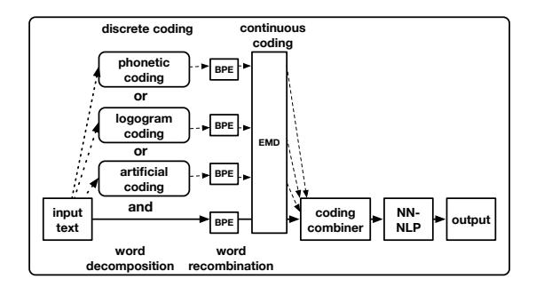
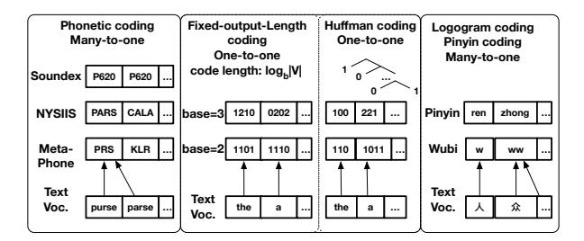
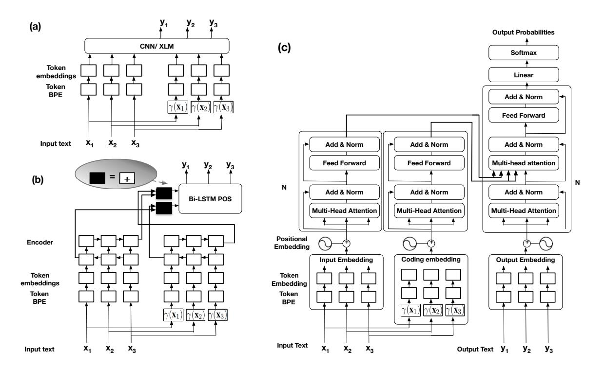
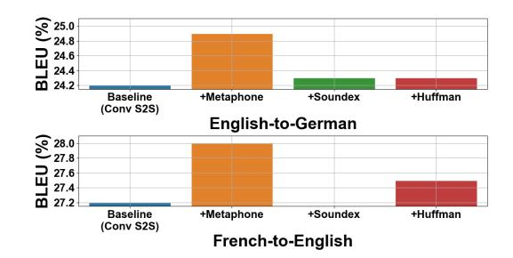
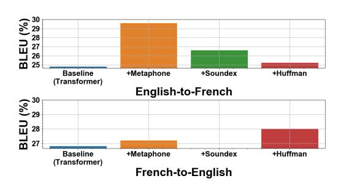
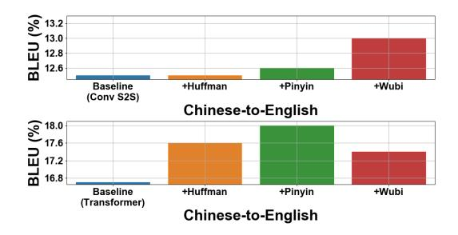
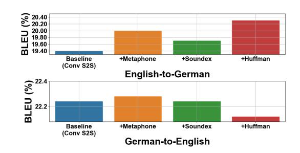
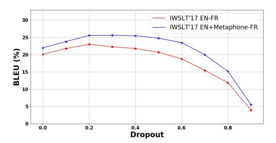

# Coding Textual Inputs Boosts the Accuracy of Neural Networks

Abdul Rafae Khan? , Jia Xu? ∗ , and Weiwei Sun†

?Department of Computer Science, Stevens Institute of Technology {akhan4, jxu70}@stevens.edu

†Department of Computer Science and Technology, University of Cambridge† ws390@cam.ac.uk

# Abstract

Natural Language Processing (NLP) tasks are usually performed word by word on textual inputs. We can use arbitrary symbols to represent the linguistic meaning of a word and use these symbols as inputs. As "alternatives" to a text representation, we introduce Soundex, MetaPhone, NYSIIS, logogram to NLP, and develop fixed-output-length coding and its extension using Huffman coding. Each of those codings combines different character/digital sequences and constructs a new vocabulary based on codewords. We find that the integration of those codewords with text provides more reliable inputs to Neural-Networkbased NLP systems through redundancy than text-alone inputs. Experiments demonstrate that our approach outperforms the state-ofthe-art models on the application of machine translation, language modeling, and part-ofspeech tagging. The source code is available at [https://github.com/abdulrafae/coding](https://github.com/abdulrafae/coding_nmt) nmt.

# 1 Introduction

We introduce novel coding schemes on the inputs of Neural-Network-based Natural Language Processing (NN-NLP) that significantly boost the accuracy in three applications. The inputs of NN-NLP rely on observable forms of mental representations of linguistic expressions, and allow alternative designs. For example, both logographic kanji and syllabic kana represent Japanese words, and emoticons and emojis can express sentiments. These showcase that alternative human language representation than text is possible and highlight a common belief of most linguists: the relationship between the mental representations and their phonological forms is highly arbitrary, even though a

non-arbitrary [\(de Saussure,](#page-9-0) [1916\)](#page-9-0) mapping exists for some special cases, e.g., the bouba/kiki effect.

In our work, we ask – *Are there alternative forms* of mental representation in addition to text as we see in Japanese and Internet language *to help language understanding in NN-NLP?*

To answer this question, we blend concepts from linguistic phonetics, grammatology, and the statistics of Zipf law to find alternative language representations to text. More precisely, we code a textual word either naturally or artificially by exploring different facets of human languages, from phonetic and logogram codings to new coding constructions generalizable to all languages. Natural codings inspire the finding of artificial codings, which in turn helps us understand and explain natural codings.

All of our codings reinforce NLP inputs by reconstructing the character/symbol sequence of a word in various ways with a new alphabet. These variants and their "decomposition" are expressive because they contain insightful information about linguistic patterns in units smaller than words and even smaller than characters. For example, in the logogram Wubi (that lists in a coded form the strokes caligraphing a Chinese character), "众" (crowd) is coded as "www", which is made of three "人" (person, "w"), and "从" (follow, "ww") is a composition of two "人". A representation containing such granular details potentially reveals the semantic structure and linguistic meanings inside a word, thus enriching text and allowing a redundancy that ensures more reliable NLP inputs.

Now that we have put our previous question in context let us give an overview of how we incorporate coding schemes into an NLP framework in Figure [1.](#page-1-0) For an input sentence, we apply an alternative coding scheme word by word, then use Byte-Pair-Encoding (BPE) to recombine these symbols (to shorten the input lengths), and finally perform embeddings (EMD). In contrast to word em-

∗ Jia Xu is the corresponding author of this paper.

†This work was completed when Weiwei Sun was at Peking University.

Figure 1: Workflow on how to apply discrete coding in NN-NLP by decomposing (phonetic, logogram, fix-output-length, or Huffman coding) and recombining (BPE) words.

beddings that map words to real number vectors, our coding range is discrete. The coded sentence and its original textual input are then combined in three ways: concatenation, linear-interpolation at the encoder level, and multi-source encoding with or without Bi-LSTM, attention, and multi-head attention. The combined input is fed into NN-NLP models as a black-box to decode outputs. Our approach is language-, task-, and system-independent and does not use any additional information besides our algorithms.

We conduct experiments on three NLP applications and five languages, including (1) Machine Translation (MT) on English-German, German-English, English-French, French-English, and Chinese-English; (2) Language Modeling (LM) on English; and (3) Part-of-Speech (POS) Tagging on English. Our approach significantly and consistently improves over state-of-the-art neural models: Transformer, ConvS2S, XLM, and Bi-LSTM with attention mechanisms.

In summary, our contribution mainly lies in the three consecutive folds:

- 1. Phonetic, logogram, and artificial codings. We introduce a variety of language representations by coding words through various schemes of Soundex, NYSIIS, Metaphone, Pinyin, Wubi, fixed-output-length, and Huffman codings, and propose different ways to incorporate them in NLP models. (§2)
- 2. Synergistic coding. We introduce effective ways of combining the textual inputs and their codewords with the state-of-the-art neural network architectures: concatenation, linear-interpolated encoder, and multi-source encoding with or without Bi-LSTM, attention,

and multi-head attention. (§3)

3. NLP Applications. Our method is generalizable to different languages and can be applied to any NN-NLP system. Experiments demonstrate that our methods improve over the state-of-the-art models (Transformer, XLM, and ConvS2S) on various tasks in applications including machine translation, language modeling, and part-of-speech tagging. (§4)

### 2 Coding Words

We view each coding as a function  $\gamma$  that maps a textual word from  $x \in \mathbb{V}$ , a natural language vocabulary, into a codeword  $\gamma(x) \in \mathcal{V}$ , a codeword vocabulary:

$$\gamma: \mathbb{V} \to \mathcal{V} \tag{1}$$

For simplicity of exposition we will consider  $\mathcal{V}$  to be the image of  $\mathbb{V}$  under  $\gamma$ . Each codeword  $\gamma(x)$  is a non-empty  $\sigma$ -string over the alphabet  $\Sigma$  of this coding:  $\gamma(x) = \sigma_1, \sigma_2, \sigma_3 \cdots \sigma_L$  with code length L.  $\Sigma^+$  is an infinite set of all possible non-empty strings over  $\Sigma$ , and  $\mathcal{V} \subseteq \Sigma^+$ .

As an example (albeit one which is practically not useful) consider the mapping of four English words to three binary codewords:  $\mathbb{V}=\{\text{"to"},\text{"be"},\text{"or"},\text{"not"}\},\ \Sigma=\{0,1\},\ \Sigma^+=\{0,1,00,01,10,11,\cdots\},\ \mathcal{V}=\{00,01,11\},\ L=2,\ \gamma(\text{"to"})=00,\gamma(\text{"be"})=01,\gamma(\text{"or"})=11,\gamma(\text{"not"})=01,|\mathbb{V}|=4,$  and  $|\mathcal{V}|=3.$ 

To instantiate this function, we start by introducing several existing linguistically-motivated coding schemes (and later on we will extend this to new coding schemes we develop): the phonetic and logogram coding as surjective functions, where in particular  $|\mathbb{V}| \geq |\mathcal{V}|$ ; and the fixed-output-length and Huffman coding as bijections, where  $|\mathbb{V}| = |\mathcal{V}|$ . In traditional coding theory, a compression code has to be injective in order to be uniquely decodable. In our work, we only care about the task-specific prediction and not in decoding the original message. Therefore, we relax the injective restriction on the codings to deviate a little from the standard typical coding theory applications for technical convenience.

Throughout this paper, we choose to name the function  $\gamma$  as "coding" (although sometimes it is also called "encoding") to distinguish from the encoder in the NN-NLP models. An overview of our coding schemes is illustrated in Figure 2.

Figure 2: Examples on different coding schemes. In contrast to Pinyin only applies to Chinese, the logogram coding Wubi and its variant apply to Japanese Kanji and Chinese. Furthermore, phonetic codings, including MetaPhone, Soundex, and NYSIIS, cover most western languages. Finally, the artificial codings, i.e., the fixed-output-length and Huffman coding, can be applied to any language. Phonetic and logogram codings are many-to-one mappings, while fixed-output-length and Huffman coding are one-to-one mappings.

## 2.1 Phonetic Coding

We introduce three phonetic codings: Soundex, NYSIIS, MetaPhone (and Pinyin just for comparison). A phonetic algorithm (coding) is an algorithm to index words by their pronunciation and produce the corresponding phonetic-phonological representations so that expressions, or sentences can be pronounced by the speaker. The phonetic form takes surface structure as its inputs and outputs an audible, pronounced sentence. Below are the detail of each phonetic coding listed:

**Soundex** is a widely known phonetic algorithm for indexing names by sound and avoids misspelling and alternative spelling problems. It maps homophones to the same representation despite minor differences in spelling (Russel, 1918). Continental European family names share the 26 letters (A to Z) in English.

**NYSHS** (the New York State Identification and Intelligence System Phonetic Code) is a phonetic algorithm devised in 1970 (Rajkovic and Jankovic, 2007). It takes special care to handle phonemes that occur in European and Hispanic surnames by adding rules to Soundex.

Metaphone is another algorithm (Philips, 1990) that improves on earlier systems such as Soundex and NYSIIS. The Metaphone algorithm is significantly more complicated than previous ones because it includes special rules for handling spelling inconsistencies and for looking at combinations of consonants in addition to some vowels.

Hanyu Pinyin (or Pinyin for short) is the official romanization system for Standard Chinese in mainland China. Pinyin, which means "spelled sound", was originally developed to teach Mandarin. One Pinyin corresponds to multiple Chinese characters. One Chinese word is usually composed of one or more Chinese characters.

### 2.2 Logogram Coding

A logogram or logograph is a written character that represents a word or phrase. We introduce to use Wubi for Chinese characters.

**Wubi** Wubizixing (or Wubi for short) is a Chinese character input method primarily used to input Chinese text with a keyboard efficiently. It decomposes a character based on its structure rather than its pronunciation. It is named after the rule that every character can be written with at most 4 keystrokes including -, |, |, hook, and | with various combinations.

### 2.3 Zipf Law-Motivated Artificial Coding

Zipf (1935) made a key observation of human lexical systems: more frequent words tend to be shorter. This feature enables speakers to minimize articulatory effort by shortening the averaged word length in use. Modern work confirms Zipf's original observation with new refinements in illustrating key factors revealed by word frequency. In this work, we introduce artificial coding by diversifying word length to two extremes: (1) optimizing the *averaged* length to make it the shortest and (2) fixing the length of every word to make them equal. The method of fixing the output codeword lengths without optimization brings more diversity to the standard textual representations.

**Fixed-Output-Length Coding** Given a vocabulary  $\mathbb{V}$  of size  $|\mathbb{V}|$  in any language, we convert each word in the vocabulary into a codeword, which is a sequence of symbols. All unique symbols make up the alphabet. The alphabet size is the base b, a parameter controlling the code length. Each word is mapped to a sequence of L symbols, where  $L = \lceil \log_b^{|\mathbb{V}|} \rceil$ . If b = 2 an example of a codeword is "01011", whereas for b = 3 another example is "0201".

The mapping (conversion) from a word in the textual form into a codeword follows Algorithm 1. Firstly, we generate all possible codewords of length L. The new codeword alphabet  $\Sigma$  can be a

### Algorithm 1 Fixed-Output-Length Coding

**Input**: A word sequence **Parameter**: base b

Output: A code sequence

- 1:  $L = \lceil \log_b^{|\mathbb{V}|} \rceil$  where  $|\mathbb{V}|$  is the vocabulary size of the input word sequences, L is the code length, and b is the parameter of the alphabet size.
- 2: Generate all possible *L*-long code.
- 3: Shuffle the vocabulary words and assign oneto-one mapping between each word and the code.
- 4: for word in vocabulary do
- 5: Output its mapped code
- 6: end for
- 7: return

subset of the Latin alphabets (if  $b \le 26$ ) or that of decimal numbers (if  $b \le 10$ ), for instance. Then, we uniform randomly assign each word x in the vocabulary V to a unique codeword  $\gamma(x)$  with length L. This assignment is a one-to-one random mapping. A random function is completely irrelevant to noisy inputs. Each word (in the text form) in a sentence will be replaced by its codeword. The coding of a word never changes regardless of the number of times it occurs in the NLP system.

Huffman Coding We consider Huffman coding (Huffman, 1952), a length-wise optimal prefix code with variable lengths, by applying Huffman coding on the fixed-output-length coding of the text input with its parameter base b. The fixed-output-length coding is random and should be incompressible with significant probability. Therefore, the Huffman coding does not significantly improve the fixed-output-length coding with respect to the machine translation accuracy, because it saves (at best) an additive constant. Algorithm 2 shows the conversion of Huffman codes.

## Algorithm 2 Huffman Coding

Input: A word sequence
Parameter: base b
Output: A code sequence

- 1: Create huffman tree on the word sequence having *b* children at each level
- 2: Shuffle the vocabulary words and assign oneto-one mapping between each word and the code.
- 3: for word in vocabulary do
- Output its mapped code
- 5: end for
- 6: return

### **3 Coding Combination**

Below, we will discuss how to incorporate various types of codings in NLP tasks. Firstly, we code each word independently. Then, the word embedding (Mikolov et al., 2013) is trained on code- and word-based sentences separately. After that, we treat this new form of sentence representation and its written text form as two source inputs to the encoder and feed their combination into a baseline NN-NLP system. Thus, our coding is realized as a portable module that provides inputs to any NN architecture. We introduce three different combination methods to implement the interface of our coding module to various NN architectures.

We implement the combination of the text and the code forms in three ways: (1) concatenation (see Figure 3a); (2) linear interpolation (see Figure 3b), where the dark color boxes have the operation of "+"; (3) multi-source encoding on Bi-LSTM (see Figure 3b), as well as on Transformer (see Figure 3c). It is worth noting that there is no additional data or information needed except for our coding algorithms themselves.

#### 3.1 Concatenation

Applying a coding function in Equation 1 on each word  $x_1, x_2, x_3, \dots, x_i, \dots, x_{I'}$  in an input sentence one-by-one generates a sequence of codewords  $\gamma(x_1), \gamma(x_2), \gamma(x_3), \dots, \gamma(x_i), \dots, \gamma(x_{I'})$  in the same length I'. Note that we use the term "word" loosely here, which can mean a word or a subword, or even a character.

The first combination method is concatenating two input sources. We apply the Byte-Pair-Encoding (Sennrich et al., 2015) (BPE) and

&lt;sup>1A random mapping does not mean that every time we see a word we output a random value. It means that the mapping as a whole is chosen at random. Here is an example on their difference: if we want to assign a random bit string of length 2 to the word "hello" then in an article, the first time we see "hello" we may output 01 the second time 11 and so on. However, if instead of assigning i.i.d. random values we choose a random mapping  $\gamma$ , then the first time we evaluate "hello" with  $\gamma$  ("hello")= 01, we will get a uniformly random value 01, but in every subsequent time in the article we evaluate the same word "hello" and get the same 01 value (the mapping  $\gamma$  is random, and is sampled at random but only once throughout its lifetime).

Figure 3: Combination methods for different NN architectures: (a) concatenation for ConvS2S and XLM; (b) linear interpolation and multi-source encoding for Bi-LSTM with attention; (c) multi-source encoding for Transformer.

word embeddings implemented by Řehůřek and Sojka (2010) on each word  $\epsilon(x)$  and its codeword  $\epsilon_{\gamma}(\gamma(x))$ . We separately train word embedding on code- and textual sentences. Thus,  $\epsilon_{\gamma}(\cdot)$  and  $\epsilon(\cdot)$  are different functions. As shown in Figure 3a, the input to the NLP system is the embedded words of a sentence,  $\tilde{\epsilon}(x_1), \tilde{\epsilon}(x_2), \tilde{\epsilon}(x_3), \cdots, \tilde{\epsilon}(x_i), \cdots, \tilde{\epsilon}(x_I)$ , where  $\tilde{\epsilon}(x_i)$  is the concatenation of the embedded word  $\epsilon(x_i)$  and its codeword  $\epsilon_{\gamma}(\gamma(x_i))$ :

$$\tilde{\epsilon}(x_i) = [\epsilon(x_i); \epsilon_{\gamma}(\gamma(x_i))] \tag{2}$$

#### 3.2 Linear Combination

The concatenation method merges two input sources and train one encoder for both. However, it may be beneficial to have textual and codeword embeddings and encoders trained separately, because they have different vocabularies. Then, those two encoders are combined linearly, a widely applied model combination technique. The input to the linear combiner is the encoded sentence, represented by a sequence of hidden states  $\tilde{h}^1(\epsilon(x_I)), \cdots, \tilde{h}^j(\epsilon(x_I)), \cdots, \tilde{h}^J(\epsilon(x_I))$  of the last position I in each of the encoder layer  $j \in [1, 2, \cdots, J]$ . J is the number of nodes at each decoder layer. Recall that each hidden state is a

real vector  $\mathbb{R}^d$ , and that is why we can use the vector space operations such as addition on it. For convenience, we denote the last hidden state of the j-th encoder layer that we take as the input to the decoder,  $\tilde{h^j}(\epsilon(x_I))$ , by  $\tilde{h}_I^j$ , the last hidden state of the j-th encoder layer of the original textual sentence  $h^j(\epsilon(x_I))$  by  $h_I^j$ , and the last hidden state of the j-th encoder layer of the code-based sentence  $h^j(\epsilon_\gamma(\gamma(x_I)))$  by  $h_{\gamma I}^j$ . The combined encoder hidden state  $\tilde{h}^j$  is a linear interpolation of the hidden states of the textural input and its codeword input:

$$\tilde{h}^j = (1 - \alpha)h_I^j + \alpha h_{\gamma I}^j \tag{3}$$

As shown in Figure (3b), the combined last hidden state in each layer is fed into the baseline decoder. The black blocks contains only the operator of +, as shown in the gray ellipse.  $\alpha$  is the encoder weight of the coded sentence, and here,  $\alpha=0.5$ .

## 3.3 Multi-Source Encoding.

In the linear combination method, the weight  $\alpha$  is shared among all states in one encoder. To allow different weights for each state, we implement variations of multi-source encoding by Zoph and Knight (2016) for the POS tagging model (Joshi, 2018) (see Figure 3b). The combined hidden state  $\tilde{h}^j$  in a layer j is a non-linear transformation of the

concatenation of word-based and code-based hidden states of the last position I in layer j multiplied by the weight  $W_c$ 

$$\tilde{h}^j = \tanh(W_c[h_I^j; h_{\gamma_I}^j]). \tag{4}$$

**Bi-LSTM** In Bi-LSTM decoder, the cell state c of an encoder is a concatenation of the forward and backward cell states. The combined cell state  $\tilde{c}$  is the sum of the word-based c and code-based  $c_{\gamma}$  encoder's cell states

$$\tilde{c} = c + c\gamma. \tag{5}$$

**Single-head Attention** The attention model looks at both word-based and code-based encoders simultaneously. A context vector from each source encoder  $c_t$  and  $c_{\gamma t}$  is created instead of the just  $c_t$  in the single-source attention model. Hidden states from the top decoder layer looks back at previous hidden states  $h_{t-1}$  and the context vectors of the encoders:

$$\tilde{h_t} = \tanh(\tilde{W_c[h_{t-1}; c_t; c_{\gamma t}]}) \tag{6}$$

Multi-head Attention Multi-head attention allows the model to jointly attend to information from different representation subspaces at different positions. We apply the Fairseq (Ott et al., 2019) implementation of Multilingual Translation in Transformer (Vaswani et al., 2017) treating text and codewords as two language inputs. The multilingual transformer trains on two encoders in turn iteratively. For example, in the first epoch it trains the textual encoder then trains the codeword encoder; in the second epoch, it trains again the textual then the codeword encoder, and so on.

### 4 NLP Applications

#### 4.1 Combination Methods

NMT We improve over two state-of-the-art Neural Machine Translation (NMT) baselines: the Convolutional Sequence to Sequence Learning (ConvS2S) by Gehring et al. (2017) and the Transformer by Vaswani et al. (2017). On ConvS2S, we concatenate (+) the input sentence with its coded sentence using the method in § 3.1 illustrated in Figure 3a. On the Transformer baseline, we combine the input sentence with the encoded sentence using "multi-head attention" as described in § 3.3 and illustrated in Figure 3c.

LM For Neural Language Modeling, we treat the text sentence as one language and the coded sentence as another language and combine them with the cross-lingual Language model (XLM; Lample and Conneau, 2019) using the toolkit introduced in Ott et al. (2019). The combination method is in § 3.1 and Figure 3a.

POS tagging We implement linear combination illustrated in Figure 3b (with the gray area) and non-linear multi-encoders that are described in Equations (4) to (6) and Figure 3b (without the gray area). The input to the multi-encoder is the text and coded sentences, and its output is directly fed into the POS tagger. For the linear combined encoder, we element-wise linearly interpolate the text encoding vector and the code coding vector, each trained separately. For example, the subscript "0.5" indicates an interpolation with equal weights.

### 4.2 Application 1: Machine Translation

Tasks and Languages. We verify our approaches on three MT tasks (datasets): WMT'14 (WMT, 2014), WMT'18 (WMT, 2018), and IWSLT'17 (IWSLT, 2017)). We carry out experiments for different translation directions: English to French (EN-FR), French to English (FR-EN), English to German (EN-DE), German to English (DE-EN), and Chinese to English (ZH-EN).

|                      | EN DE  | EN FR |  |
|----------------------|--------|-------|--|
| Raw Sents.           | 4.59   | 2.81  |  |
| Pre-processed Sents. | 4.03   | 2.48  |  |
| Before BPE R.W.      | 102 98 | 67 58 |  |
| After BPE R.W.       | 54 56  | 68 60 |  |

Table 1: Number of Sentences (Sents.) and Running Word (R.W.) as well as Vocabulary size (Voc.) [M] of WMT'14 News (EN-DE) and WMT'18 Bio (EN-FR)

|               | Before BPE |      |        |     | After BPE |    |        |    |
|---------------|------------|------|--------|-----|-----------|----|--------|----|
| Task          | WMT'14     |      | WMT'18 |     | WMT'14    |    | WMT'18 |    |
| Coding        | EN         | DE   | FR     | EN  | EN        | DE | FR     | EN |
| Baseline      | 711        | 1500 | 366    | 338 | 33        | 35 | 29     | 24 |
| +Soundex      | 717        | 1500 | -      | -   | 33        | 33 | -      | -  |
| +Metaphone    | 904        | 1500 | 480    | 338 | 34        | 30 | 30     | 21 |
| +NYSIIS       | 981        | 1500 | 523    | 338 | 34        | 30 | 30     | 20 |
| $+EL_9$       | 1400       | 1500 | 732    | 338 | 34        | 25 | 30     | 18 |
| + $Huffman_9$ | 1400       | 1500 | 732    | 338 | 34        | 25 | 30     | 16 |

Table 2: Vocabulary size [K] of WMT'14 News (EN-DE) and WMT'18 Bio (EN-FR) before and after applying BPE with different codings.

WMT'14 and WMT'18 We conduct experiments on WMT'14 News English-German dataset, which contains around 4.6 million sentences before pre-processing. We also conduct experiments

Figure 4: Translation results in BLEU[%] on WMT'14 News and WMT'18 Bio task. BPE operations: 32k. Baseline is [\(Gehring et al.,](#page-9-10) [2017\)](#page-9-10) on words. In this paper, we denote baselines for all experiments on all tasks with their names, referring to standard textual word inputs. Systems by adding the codeword inputs on baselines are denoted as "+..".

on English-French dataset forn WMT'18 Biomedical Task that contains around *2.8 million* sentences. Table [1](#page-5-3) shows vocabulary statistics on the source/target of the training data before and after applying codings. We use Moses tokenizer and restrict 250 characters per sentence and 1.5 length ratio between source and target sentences as a filter in pre-processing. The Byte-pair encoding model is jointly trained on the source textual word inputs, codeword inputs, and target outputs for French and German systems, and separately trained on the source and target for Chinese systems. We applied concatenation for ConvS2S baselines and multi-source encoding for transformer baselines in all tasks, respectively. For ConvS2S we set the embedding dimension as 512, the learning rate as 0.25, the gradient clipping as 0.1, the dropout ratio as 0.2, and the optimizer as NAG. For transformer, we set the embedding dimension as 512, the learning rate as 0.0005, the minimum learning rate as 10−9 , the warmup learning rate as 10−7 , the optimizer batas as 0.9 and 0.98 for adam optimizer, the dropout ratio as 0.3, the weight decay as 0.0001, the shared decoders and shared decoder embedding as true. The training is terminated until the validation loss does not decrease for five consecutive epochs. We compute the BLEU score using *sacrebleu*.

As shown in Figure [4,](#page-6-0) on WMT'18 we achieve an improvement of +0.7 BLEU points for English-German and +0.8 BLEU points for French-English, respectively. Some phonetic coding may be more suitable for certain languages than others. Metaphone works best for English because it handles spelling variations and inconsistencies. According to its orthography, the German spelling is largely

phonetic (unlike English spelling), thus adding phonetics does not help much in DE-EN NMT.

Figure 5: Translation results in BLEU[%] on small task IWSLT'17. FR-EN & EN-FR. BPE: 16k. Baseline is [\(Vaswani et al.,](#page-10-2) [2017\)](#page-10-2) on words. Dev: test2013-2015; Test: test2017.

Figure 6: Translation results in BLEU[%] on small task IWSLT'17. ZH-EN. BPE: 16k. Baselines are [\(Gehring](#page-9-10) [et al.,](#page-9-10) [2017;](#page-9-10) [Vaswani et al.,](#page-10-2) [2017\)](#page-10-2) on words. Dev: test2010-2015; Test: test2017.

Figure 7: Translation results in BLEU[%] on small task IWSLT'17. DE-EN, EN-DE. BPE: 16k. Baselines are [\(Gehring et al.,](#page-9-10) [2017\)](#page-9-10) on words. Dev: test2010-2015; Test: test2017.

IWSLT In IWSLT'17 task, we achieved +5.2 BLEU point on EN-FR and +1.9 BLEU point on FR-EN. We also add Pinyin for Chinese-English translation on IWSLT'17 [\(IWSLT,](#page-9-12) [2017\)](#page-9-12) as a supplementary experiment. Adding Wubi also enhances the baseline performance. On the Transformer baseline, we use the codewords as the input source test set during decoding. Note that all experiments are conducted on the real datasets, without using/verifying on any artificial noise anywhere.

Model Complexity. We tune the dropout parameters for conducting the following experiments: Words and W+Metaphone on IWSLT'17 EN-FR. The drop out value is set by default to 0.2, and the beam-size to 12. Figure 8 shows how translation accuracy changes by varying the dropout value. The highest BLEU score is at a dropout of 0.2 for the baseline and 0.2 and 0.3 in our approach. A higher optimal value of dropout means fewer nodes in the Neural Networks are needed to opt NMT quality. This implies that adding auxiliary inputs will reduce the model complexity.

Figure 8: Dropout optimum. x-axis: the dropout value.

Model parameter size. Table 3 shows the change of the parameter size when applying our approaches. Our parameters include weights and biases of neural network models. The parameter size reduces when we concatenate the original inputs with our codewords because the vocabulary size reduces (although the BPE operations stay the same as the baseline). The parameter size increases when we use the multi-source encoding because we added more encoder for the codeword input.

| Baseline              | ConvS2S |     |       |    | Transformer |    |
|-----------------------|---------|-----|-------|----|-------------|----|
|                       | WMT     | WMT | IWSLT |    | IWSLT       |    |
|                       | '14     | '18 | '17   |    | '17         |    |
| SRC                   | EN      | FR  | EN    | DE | EN          | FR |
| TGT                   | DE      | EN  | DE    | EN | FR          | EN |
| Baseline              | 198     | 181 | 14    | 13 | 57          | 57 |
| +Soundex              | 196     | -   | 13    | 12 | 77          | 77 |
| +NYSIIS               | 193     | 177 | 12    | 11 | 78          | -  |
| +Metaphone            | 193     | 178 | 12    | 11 | 77          | 77 |
| +EL 9      | 187     | 174 | 12    | 11 | 75          | 75 |
| +Huffman 9 | 187     | 173 | 12    | 11 | 75          | 75 |

Table 3: Number of model parameters [M] on WMT'14 News, WMT'18 Bio, and IWSLT'17 tasks. Baselines are ConvS2S and Transformer on word input. Systems by adding the codeword inputs on baselines are denoted as "+..".

**Training Speed.** Table 5 shows the system training time (with BPE 32k operations). The total time (in minutes) is listed in the first column, and the number of epochs is in the second. Combining codewords reduces the model complexity. Therefore, the training becomes more efficient and needs

|                       | ZH-EN |                       | ZH-EN |
|-----------------------|-------|-----------------------|-------|
| ConvS2S               | 14    | Transformer           | 59    |
| +Pinyin               | 18    | +Pinyin               | 78    |
| +Wubi                 | 18    | +Wubi                 | 78    |
| $+EL_9$               | 18    | +EL 9      | 77    |
| +Huffman 9 | 18    | +Huffman 9 | 77    |

Table 4: Number of model parameters [M] on IWSLT'17 Chinese-English task. Baselines are (Gehring et al., 2017) and (Vaswani et al., 2017) on words. Systems by adding the codeword inputs on baselines are denoted as "+..".

a smaller number of epochs to converge. The total training time of our approaches is comparable to that of baselines, sometimes even less.

|                  | EN-DE  | FR-EN  |
|------------------|--------|--------|
| ConvS2S          | 166/24 | 93/16  |
| +Soundex         | 241/26 | -      |
| +NYSIIS          | 266/33 | 147/15 |
| +Metaphone       | 233/21 | 143/15 |
| $+EL_9$          | 249/26 | 145/12 |
| $+$ Huffman $_9$ | 245/25 | 151/15 |

Table 5: Training time (in minutes) per epoch/ epoch number.

**Output example.** Table 6 shows a translation example. Combining phonetic coding helps to include more subwords that cannot be obtained from text.

| Source     | The firefighters were brilliant.    |
|------------|-------------------------------------|
| Reference  | Die Feuerwehrleute waren großartig. |
| ConvS2S    | Die Feuerwehr war brillant.         |
| +MetaPhone | Die Feuerwehrleute waren brilliant. |

Table 6: An MT WMT'14 EN-DE output example: +Meta-Phone coding generates new subwords "fire" and "fighter" that improves the translation over the baseline ConvS2S.

### **4.3** Application 2: Language Modeling (LM)

Task and result. We train and evaluate the English part of EN-FR IWSLT'17 dataset and also on English part of EN-DE WMT'14 News dataset. We use 256 embedding dimensions, six layers, and eight heads for efficiency. We set dropouts to 0.1, the learning rate to 0.0001, and BPE operations to 32k. We used Adam optimizer with betas of 0.9 0.999. As shown in Table 7, adding Metaphone significantly reduces PPL of the baseline system, i.e., 20.1% relatively. "+NYSIIS\_WA" indicates the system with NYSIIS but adding word alignments between English and its coded form; see Table 7.

#### 4.4 Application 3: POS Tagging

**Task and result** We evaluate our approach in POS Tagging on Brown Corpus (Francis and Kucera, 1979). Brown corpus is a well-known

|               | WMT'14 |              | I     | WSLT'17       |
|---------------|--------|--------------|-------|---------------|
|               | Dev    | Test         | Dev   | Test          |
| XLM           | 1.17   | 1.18         | 28.04 | 26.07         |
| +NYSIIS       | 1.17   | 1.18         | 24.00 | 22.64         |
| +Metaphone    | 1.17   | 1.18         | 23.55 | 20.8 (-20.1%) |
| +Soundex      | 1.17   | 1.18         | 23.60 | 22.20         |
| +NYSIIS_WA    | 1.14   | 1.15         | 23.50 | 21.64         |
| +Metaphone_WA | 1.14   | 1.15 (-2.4%) | 23.49 | 20.94         |

Table 7: LM PPL improvements on the English part of a subset of WMT'14 News EN-DE and IWSLT'17 EN-FR.

English dataset for POS and contains 57 341 samples. We uniform randomly sample 64% data as the training set, 16% as the validation set, and 20% as the test set. Our baseline is a Keras (Chollet, 2015) implementation (Joshi, 2018) of Bi-LSTM POS Tagger (Wang et al., 2015). We train word embedding (Mikolov et al., 2013) implemented by Řehůřek and Sojka (2010) with 100 dimensions. Each of the forward and the backward LSTM has 64 dimensions. We use a categorical cross-entropy loss and RMSProp optimizer. We also use early stopping based on validation loss. As in Table 8, the linear multi-encoder with  $\alpha=0.9$  brings the best results, i.e. -15.79% relative improvement over the baseline.

|                           | Dev  | Test |          |                |  |
|---------------------------|------|------|----------|----------------|--|
|                           | Lo   | oss  | Accuracy | Error Rate     |  |
| Berkeley Parser           | 5.24 | 5.08 | 98.67    | 1.33           |  |
| +MetaPhone 0.5 | 4.90 | 4.72 | 98.72    | 1.28 (-3.76%)  |  |
| +MetaPhone 0.9 | 4.05 | 4.29 | 98.87    | 1.13 (-15.04%) |  |
| +NYSIIS 0.9    | 4.16 | 4.38 | 98.88    | 1.12 (-15.79%) |  |

Table 8: POS with phonetic codings Brown corpus.

### 5 Related Work

Previous important work investigated the role of auxiliary information to NLP tasks, such as polysemous word embedding structures by Arora et al. (2016), factored models by García-Martínez et al. (2016), and feature compilation by Sennrich and Haddow (2016). We emphasize that we do not use any additional information besides our algorithms.

Hayes (1996); Johnson et al. (2015) applied explicit phonological rules or constraints to tasks such as word segmentation. In neural networks, we can implicitly learn from phonetic data and leave the networks to discover hidden phonetic features through end-to-end training opt specific NLP tasks, instead of applying hand-coded constraints.

Closely related, but independent to our work, is the character-based MT, such as the work of Ling et al. (2015) and Chung et al. (2016), among many others. We go beyond text level representations and look for novel representations for decompositions, sometimes even smaller than characters.

Different from the inspiring work that uses Pinyin (Du and Way, 2017), skip-ngram (Bojanowski et al., 2017), and Huffman on source/target (Chitnis and DeNero, 2015), our study aims to improve NN-NLP including NMT overall rather than only eliminating unknown words, introducing six new codings into NLP in addition to Pinyin and text. Importantly, our artificial codings apply on all languages. Moreover, we achieve experimental improvements overall. Liu et al. (2018) added Pinyin embedding to robustify NMT against homophone noises. They described that it was unknown why Pinyin also improved predictions on the clean test. This is a very interesting work, and we explain this phenomenon through our theory that the multi-channel coding offers an ensemble of the code words and the text, making the communication more reliable.

#### 6 Conclusion

In this paper, we conduct a comprehensive study on how to code textual inputs from multiple linguistically-motivated perspectives and how to integrate alternative language representations into NN-NLP systems. We propose to use Soundex, NYSIIS, MetaPhone, logogram, fixed-outputlength, and Huffman codings into NLP and describe how to combine them in state-of-the-art NN architectures, such as Transformer, ConvS2S, Bi-LSTM with attentions. Our paradigm is general for any language and adaptable to various models. We conduct extensive experiments on five languages over six tasks. Our approach appears to be very useful and achieves up to 20.77%, 20%, and 15.79% relative improvements on state-of-the-art models of MT, LM, and POS, respectively.

### Acknowledgement

We appreciate the National Science Foundation (NSF) Award No. 1747728 and the National Science Foundation of China (NSFC) Award No. 61672524 to fund this research. We also appreciate the JSALT workshop to support us in continuing this work. In particular, we thank all feedback provided by the colleagues there. We also thank the comments of Periklis Papakonstantinou. Finally, we appreciate the support of the Google Cloud Research Program.

# References

- Sanjeev Arora, Yuanzhi Li, Yingyu Liang, Tengyu Ma, and Andrej Risteski. 2016. Linear Algebraic structure of word senses, with Applications to Polysemy. *Transactions of the Association for Computational Linguistics*.
- Piotr Bojanowski, Edouard Grave, Armand Joulin, and Tomas Mikolov. 2017. Enriching word vectors with subword information. *Transactions of the Association for Computational Linguistics*.
- Rohan Chitnis and John DeNero. 2015. Variablelength word encodings for neural translation models. In *Proceedings of the 2015 Conference on Empirical Methods in Natural Language Processing*.
- Franc¸ois Chollet. 2015. Keras. [https://github.](https://github.com/keras-team/keras.git) [com/keras-team/keras.git](https://github.com/keras-team/keras.git).
- Junyoung Chung, Kyunghyun Cho, and Yoshua Bengio. 2016. A character-level decoder without explicit segmentation for neural machine translation. In *Proceedings of Association for Computational Linguistics*.
- Jinhua Du and Andy Way. 2017. Pinyin as subword unit for Chinese-sourced neural machine translation. In *Proceedings of Irish Conference on Artificial Intelligence and Cognitive Science*.
- W. N. Francis and H. Kucera. 1979. [Brown corpus](http://icame.uib.no/brown/bcm.html) [manual.](http://icame.uib.no/brown/bcm.html) Technical report, Department of Linguistics, Brown University, Providence, Rhode Island, US.
- Mercedes Garc´ıa-Mart´ınez, Lo¨ıc Barrault, and Fethi Bougares. 2016. Factored neural machine translation. *Computing Research Repository*.
- Jonas Gehring, Michael Auli, David Grangier, Denis Yarats, and Yann N. Dauphin. 2017. Convolutional sequence to sequence learning. In *Proceedings of International Conference on Machine Learning*.
- Bruce Hayes. 1996. Phonetically driven phonology: The role of optimality theory and inductive grounding. rutgers optimality archive. In *Proceedings of Conference on Formalism and Functionalism in Linguistics*.
- David A Huffman. 1952. A method for the construction of minimum-redundancy codes. *Proceedings of the Institute of Radio Engineers*.
- IWSLT. 2017. Homepage of International Workshop on Spoken Language Translation 2017. http://workshop2017.iwslt.org/.
- Mark Johnson, Joe Pater, Robert Staubs, and Emmanuel Dupoux. 2015. Sign constraints on feature weights improve a joint model of word segmentation and phonology. In *Proceedings of North American Chapter of the Association for Computational Linguistics: Human Language Technologies*.

- Aneesh Joshi. 2018. LSTM POS tagger. [https://github.com/aneesh-joshi/LSTM\\_](https://github.com/aneesh-joshi/LSTM_POS_Tagger.git) [POS\\_Tagger.git](https://github.com/aneesh-joshi/LSTM_POS_Tagger.git).
- Guillaume Lample and Alexis Conneau. 2019. Crosslingual language model pretraining. *Advances in Neural Information Processing Systems*.
- Wang Ling, Isabel Trancoso, Chris Dyer, and Alan W Black. 2015. Character-based neural machine translation. *Proceedings of the 54th Annual Meeting of the Association for Computational Linguistics - Short Papers*.
- Hairong Liu, Mingbo Ma, Liang Huang, Hao Xiong, and Zhongjun He. 2018. Robust neural machine translation with joint textual and phonetic embedding. In *Proceedings of Association for Computational Linguistics*.
- Tomas Mikolov, Ilya Sutskever, Kai Chen, Greg S Corrado, and Jeff Dean. 2013. [Distributed representa](http://papers.nips.cc/paper/5021-distributed-representations-of-words-and-phrases-and-their-compositionality.pdf)[tions of words and phrases and their composition](http://papers.nips.cc/paper/5021-distributed-representations-of-words-and-phrases-and-their-compositionality.pdf)[ality.](http://papers.nips.cc/paper/5021-distributed-representations-of-words-and-phrases-and-their-compositionality.pdf) In C. J. C. Burges, L. Bottou, M. Welling, Z. Ghahramani, and K. Q. Weinberger, editors, *Advances in Neural Information Processing Systems*. Curran Associates, Inc.
- Myle Ott, Sergey Edunov, Alexei Baevski, Angela Fan, Sam Gross, Nathan Ng, David Grangier, and Michael Auli. 2019. fairseq: A fast, extensible toolkit for sequence modeling. In *Proceedings of North American Chapter of the Association for Computational Linguistics: Human Language Technologies*.
- Lawrence Philips. 1990. Hanging on the metaphone. *Computer Language*.
- P Rajkovic and D Jankovic. 2007. Adaptation and application of daitch-mokotoff Soundex algorithm on serbian names. In *Proceedings of Conference on Applied Mathematics*.
- Radim Reh ˇ u˚ˇrek and Petr Sojka. 2010. Software Framework for Topic Modelling with Large Corpora. In *Proceedings of the Conference on Language Resources and Evaluation 2010 Workshop on New Challenges for NLP Frameworks*, pages 45–50, Valletta, Malta. ELRA.
- Robert C. Russel. 1918. A method of phonetic indexing. *Patent no. 1,261,167*.
- Ferdinand de Saussure. 1916. *Course in General Linguistics*. Duckworth, London. (trans. Roy Harris). ISBN 9780231527958, 0231527950.
- Rico Sennrich and Barry Haddow. 2016. Linguistic input features improve neural machine translation. In *Proceedings of Conference on Machine Translation*.
- Rico Sennrich, Barry Haddow, and Alexandra Birch. 2015. Neural machine translation of rare words with subword units. *Proceedings of the 54th Annual Meeting of the Association for Computational Linguistics*.

- Ashish Vaswani, Noam Shazeer, Niki Parmar, Jakob Uszkoreit, Llion Jones, Aidan N Gomez, Ł ukasz Kaiser, and Illia Polosukhin. 2017. Attention is all you need. In *Advances in Neural Information Processing Systems*.
- Peilu Wang, Yao Qian, Frank K. Soong, Lei He, and Hai Zhao. 2015. [Part-of-speech tagging with bidi](http://arxiv.org/abs/1510.06168)[rectional long short-term memory recurrent neural](http://arxiv.org/abs/1510.06168) [network.](http://arxiv.org/abs/1510.06168) *Computing Research Repository*.
- WMT. 2014. Homepage of Workshop on Statistical Machine Translation 2014. http://www.statmt.org/wmt14/.
- WMT. 2018. Homepage of Workshop on Statistical Machine Translation 2018: Biomedical task. http://www.statmt.org/wmt18/biomedicaltranslation-task.html.
- George Zipf. 1935. *The Psychobiology of Language: An Introduction to Dynamic Philology*. M.I.T. Press, Cambridge, Mass.
- Barret Zoph and Kevin Knight. 2016. [Multi-source](https://doi.org/10.18653/v1/N16-1004) [neural translation.](https://doi.org/10.18653/v1/N16-1004) In *Proceedings of North American Chapter of the Association for Computational Linguistics: Human Language Technologies*.