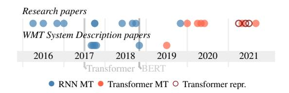
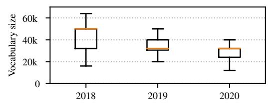
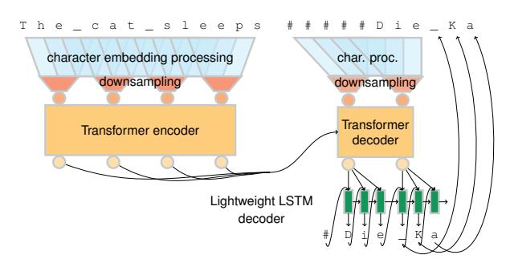
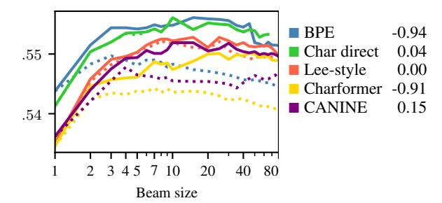

# Why don't people use character-level machine translation?

Jindrich Libovický ˇ 1 and Helmut Schmid2 and Alexander Fraser2 1 Faculty of Mathematics and Physics, Charles Univeristy, Prague, Czech Republic 2 Center for Information and Speech Processing, LMU Munich, Germany libovicky@ufal.mff.cuni.cz {schmid, fraser}@cis.lmu.de

# Abstract

We present a literature and empirical survey that critically assesses the state of the art in character-level modeling for machine translation (MT). Despite evidence in the literature that character-level systems are comparable with subword systems, they are virtually never used in competitive setups in WMT competitions. We empirically show that even with recent modeling innovations in characterlevel natural language processing, characterlevel MT systems still struggle to match their subword-based counterparts. Character-level MT systems show neither better domain robustness, nor better morphological generalization, despite being often so motivated. However, we are able to show robustness towards source side noise and that translation quality does not degrade with increasing beam size at decoding time.

# 1 Introduction

The progress in natural language processing (NLP) brought by deep learning is often narrated as removing assumptions about the input data and letting the models learn everything end-to-end. One of the assumptions about input data that seems to resist this trend is (at least partially) linguistically motivated segmentation of input data in machine translation (MT) and NLP in general.

For NMT, several papers have claimed parity of character-based methods with subword models, highlighting advantageous features of such systems. Very recent examples include [Gao et al.](#page-9-0) [\(2020\)](#page-9-0); [Ba](#page-8-0)[nar et al.](#page-8-0) [\(2020\)](#page-8-0); [Li et al.](#page-10-0) [\(2021\)](#page-10-0). Despite this, character-level methods are rarely used as strong baselines in research papers and shared task submissions, suggesting that character-level models might have drawbacks that are not sufficiently addressed in the literature.

In this paper, we examine what the state of the art in character-level MT really is. We survey existing methods and conduct a meta-analysis of the

input segmentation methods used in WMT shared task submissions. We then systematically compare the most recent character-processing architectures, some of them taken from general NLP research and used for the first time in MT. Further, we propose an alternative two-step decoder architecture that unlike standard decoders does not suffer from a slow-down due to the length of character sequences. Following the recent findings on MT decoding, we evaluate different decoding strategies in the character-level context.

Many previous studies on character-level MT drew their conclusions from experiments on rather small datasets and focused only on quantitatively assessed translation quality without further analysis. To compensate for this, we revisit and systematically evaluate the state-of-the-art approaches to character-level neural MT and identify their major strengths and weaknesses on large datasets.

# 2 Character-Level Neural MT

Character-level processing was hardly possible within the statistical MT paradigm that assumed the existence of phrases consisting of semantically rich tokens that roughly correspond to words. Neural sequence-to-sequence models [\(Sutskever et al.,](#page-12-0) [2014;](#page-12-0) [Bahdanau et al.,](#page-8-1) [2015;](#page-8-1) [Vaswani et al.,](#page-12-1) [2017\)](#page-12-1) do not explicitly work with this assumption. In theory, they can learn to transform any sequence into any sequence.

The original sequence-to-sequence models used word-based vocabularies of a limited size and which led to a relatively frequent occurrence of out-of-vocabulary tokens. A typical solution to that problem is subword segmentation [\(Sennrich et al.,](#page-11-0) [2016;](#page-11-0) [Kudo and Richardson,](#page-10-1) [2018\)](#page-10-1), which keeps frequent tokens intact and splits less frequent ones into smaller units.

Modeling language on the character level is attractive because it can help overcome several problems of subword models. One-hot representations

of words or subwords do not reflect systematic character-level relations between words, potentially harming morphologically rich languages. With subwords, minor typos on the source side lead to radically different input representations resulting in low robustness towards source-side noise [\(Provilkov](#page-11-1) [et al.,](#page-11-1) [2020;](#page-11-1) [Libovický and Fraser,](#page-10-2) [2020\)](#page-10-2).

Models using recurrent neural networks (RNNs) showed early success with character-level segmentation on the decoder side [\(Chung et al.,](#page-9-1) [2016\)](#page-9-1). Using character-level processing on the encoder side proved harder which was attributed to the features of the attention mechanism which can presumably benefit from semantically rich units (such as subwords) in the encoder. Following this line of thinking, [Lee et al.](#page-10-3) [\(2017\)](#page-10-3) introduced 1D convolutions with max-pooling that pre-process the character sequence into a sequence of latent wordlike states. Coupled with a character-level decoder, they claimed to match the state-of-the-art subwordbased models. Even though this architecture works well on the character level, it does not generalize further to the byte level [\(Costa-jussà et al.,](#page-9-2) [2017\)](#page-9-2). Hybrid approaches combining tokenization into words with the computation of character-based word representations were successfully used with RNNs [\(Luong and Manning,](#page-10-4) [2016;](#page-10-4) [Grönroos et al.,](#page-9-3) [2017;](#page-9-3) [Ataman et al.,](#page-8-2) [2019\)](#page-8-2). Later, [Cherry et al.](#page-9-4) [\(2018\)](#page-9-4) showed that RNNs perform on par with subword models without changing the model architecture if the models are sufficiently large. [Kreutzer](#page-10-5) [and Sokolov](#page-10-5) [\(2018\)](#page-10-5) support this by showing that RNN models which learn segmentation jointly with the rest of the model are close to character-level.

Character-level modeling with Transformers appears to be more difficult. [Gupta et al.](#page-10-6) [\(2019\)](#page-10-6) used Transparent Attention [\(Bapna et al.,](#page-8-3) [2018\)](#page-8-3) to train deep character-level models and needed up to 32 layers to close the gap between the BPE and character models, which makes the model too large for practical use. [Libovický and Fraser](#page-10-2) [\(2020\)](#page-10-2) narrowed the gap between subword and character modeling using curriculum learning by finetuning subword models to character-level.

[Gao et al.](#page-9-0) [\(2020\)](#page-9-0) proposed adding a convolutional sub-layer in the Transformer layers. At the cost of a 30% increase in parameter count, they managed to narrow the gap between subword- and character-based models by half. [Banar et al.](#page-8-0) [\(2020\)](#page-8-0) reused the convolutional preprocessing layer with constant-size segments of [Lee et al.](#page-10-3) [\(2017\)](#page-10-3) in a

Figure 1: A timeline of research interest in characterlevel MT. Months of arXiv pre-print publication of the papers cited in Sections 2 and 3. Transformer repr. means pre-trained general-purpose sentence representation, not MT models.

Transformer model for translation into English. Without changing the decoder, they reached comparable, but usually slightly worse, translation quality compared to BPE-based models.

[Shaham and Levy](#page-11-2) [\(2021a\)](#page-11-2) revisited characterand byte-level MT on rather small IWSLT datasets. Their results show that character-level and bytelevel models are usually worse than BPE models, but byte-based models without embedding layers often outperform BPE-based models in the out-of-English direction. Using similarly small datasets, [Li et al.](#page-10-0) [\(2021\)](#page-10-0) claim that character-level modeling outperforms BPE when translating into fusional, agglutinative, and introflexive languages.

[Nikolov et al.](#page-11-3) [\(2018\)](#page-11-3) experimented with character-level models for romanized Chinese. These models performed comparable to models using logographic signs, but significantly worse than models using subwords. [Zhang and Komachi](#page-12-2) [\(2018\)](#page-12-2) argued that signs in logographic languages carry too much information and were able to improve the translation quality by segmenting Chinese and Japanese into sub-character units while keeping subword segmentation on the English side.

Little is known about other properties of character-level MT beyond the overall translation quality. [Sennrich](#page-11-4) [\(2017\)](#page-11-4) prepared a set of contrastive English-German sentence pairs and tested them using shallow RNN-based models. They observed that character-based models transliterated better, but captured morphosyntactic agreement worse. [Libovický and Fraser](#page-10-2) [\(2020\)](#page-10-2) evaluated Transformer-based character-level models using MorphEval and came to mixed conclusions.

[Gupta et al.](#page-10-6) [\(2019\)](#page-10-6) and [Libovický and Fraser](#page-10-2) [\(2020\)](#page-10-2) make claims about the noise robustness of the character-level models using synthetic noise. [Li et al.](#page-10-0) [\(2021\)](#page-10-0) evaluated domain robustness by training models on small domain-specific datasets and evaluating them on unrelated domains, claiming the superiority of character-level models in this setup. On the other hand, [Gupta et al.](#page-10-6) [\(2019\)](#page-10-6) evaluated the domain robustness in a more natural setup and did not observe higher robustness when evaluating general domain models on domain-specific tests compared to BPE.

Another consideration is longer training and inference times. Character-level systems are significantly slower due to the increased sequence length. [Libovický and Fraser](#page-10-2) [\(2020\)](#page-10-2) reported a 5.6-fold slowdown at training time and a 4.7-fold slowdown at inference time compared to subword models.

Recent research on character-level modeling goes beyond MT. Pre-trained multilingual representations are a particularly active area. [Clark et al.](#page-9-5) [\(2021\)](#page-9-5) propose CANINE. The model shrinks character sequences into fewer hidden states (similar to [Lee et al.,](#page-10-3) [2017\)](#page-10-3). They use local self-attention and strided convolutions (instead of highway layers and max-pooling as in Lee's work). Their model is either trained using the masked-language-modeling objective [\(Devlin et al.,](#page-9-6) [2019\)](#page-9-6) with subword supervision, or in an encoder-decoder setup similar to [Raffel et al.](#page-11-5) [\(2020\)](#page-11-5). Both methods reach a representation quality comparable to similar subword models.

ByT5 [\(Xue et al.,](#page-12-3) [2021a\)](#page-12-3) and Charformer [\(Tay](#page-12-4) [et al.,](#page-12-4) [2021\)](#page-12-4) are based on the mT5 model [\(Xue](#page-12-5) [et al.,](#page-12-5) [2021b\)](#page-12-5) which uses sequence-to-sequence denoising pre-training. Whereas byT5 only uses byte sequences instead of subwords and differs in hyperparameters, Charformer uses convolution and combines character blocks to obtain latent subword representations. These models mostly reach similar results to sub-word models, occasionally outperforming a few of them, in the case of Charformer without a significant slowdown.

## 3 WMT submissions

The Conference on Machine Translation (WMT) organizes annual shared tasks in various use cases of MT. The shared task submissions focus on translation quality rather than the novelty of presented ideas, as most other research papers do. Therefore, we assume that, if character-level models were a fully-fledged alternative to subword models, at least some systems submitted to the shared tasks would use character-level models.

We annotated recent system description papers with the input and output segmentation method they used. We focused on information about exper-

Figure 2: A boxplot of vocabulary sizes of WMT systems from 2018–2020, the median is denoted with the orange line.

iments with character-level models. Since we are primarily interested in the Transformer architecture that became the standard after 2017, we only included system description papers from 2018–2020 [\(Bojar et al.,](#page-9-7) [2018;](#page-9-7) [Barrault et al.,](#page-8-4) [2019,](#page-8-4) [2020\)](#page-8-5). Transformers were used in 81%, 87%, and 97% of the systems in the respective years. We included the main task on WMT, news translation, and two minor tasks where character-level methods might help: translation robustness [\(Li et al.,](#page-10-7) [2019;](#page-10-7) [Spe](#page-12-6)[cia et al.,](#page-12-6) [2020\)](#page-12-6) and translation between similar languages (ibid.).

Almost all systems use a subword-based vocabulary (BPE: 81%, 71%, 66% in the respective years; SentencePiece: None in 2018, 9% and 25% in the following ones). Purely word-based (none in 2018, 2% and 3% in the later years) or morphological segmentation (4%, 2%, 3% in the respective years) are rarely used. The average vocabulary size decreases over time (see Figure [2\)](#page-2-0) with a median size remaining at 32k in the last two years. The reason for the decreasing average is probably a higher proportion of systems for low-resource languages, where a smaller vocabulary leads to better translation quality [\(Sennrich and Zhang,](#page-11-6) [2019\)](#page-11-6).

Among the 145 annotated system description papers, there were only two that used characterlevel segmentation. [Mahata et al.](#page-10-8) [\(2018\)](#page-10-8) used a character-level model for Finnish-to-English translation. This system, however, makes many suboptimal design choices and ended up as the last one in the manual evaluation. [Scherrer et al.](#page-11-7) [\(2019\)](#page-11-7) experimented with character-level systems for similar language translation and observed that characters outperform other segmentations for Spanish-Portuguese translation, but not for Czech-Polish. [Knowles et al.](#page-10-9) [\(2020\)](#page-10-9) experimented with different subword vocabulary sizes for English-Inuktikut translation and reached the best results using a subword vocabulary of size 1k, which makes it close to the character level. Most of the papers do not even mention character-level segmentation as a viable

alternative they would like to pursue in future work (7% in 2018, 2% in 2019, none in 2020).

Character-level methods were more frequently used in WMT17 with RNN-based systems, especially for translation of Finnish [\(Escolano et al.,](#page-9-8) [2017;](#page-9-8) [Östling et al.,](#page-11-8) [2017\)](#page-11-8) and less successfully for Chinese [\(Holtz et al.,](#page-10-10) [2017\)](#page-10-10) and the automatic post-editing task [\(Variš and Bojar,](#page-12-7) [2017\)](#page-12-7).

On the other hand, Figure [1](#page-1-0) shows that the research interest in character-level methods remains approximately the same, or may have slightly increased. For practical solutions in WMT systems, we clearly show that system designers in the WMT community have avoided character-level models.

We speculate that the main reasons for not considering character-level modeling are its lower efficiency and the fact that the literature shows no clear improvement of translation quality. Most of the submissions use back-translation (85%, 82%, and 94% in the respective years), often iterated several times (11%, 20%, 16%), which requires both training and inference on large datasets. With the approximately 5-fold slowdown, WMT-scale experiments on character models are not easily tractable.

## 4 Evaluated Models

We evaluate several Transformer-based architectures for character-level MT. A major issue with character-level sequence processing is the sequence length and low information density compared to subword sequences. Architectures for characterlevel sequence processing typically address this issue by locally processing and shrinking the sequences into latent word-like units. In our experiments, we explore several ways to do this.

First, we directly use character embeddings as input to the Transformer. Second, following [Banar](#page-8-0) [et al.](#page-8-0) [\(2020\)](#page-8-0), we use the convolutional character processing layers proposed by [Lee et al.](#page-10-3) [\(2017\)](#page-10-3). Third, we replace the convolutions with local selfattention as proposed in the CANINE model [\(Clark](#page-9-5) [et al.,](#page-9-5) [2021\)](#page-9-5). Finally, we use the recently proposed Charformer architecture [\(Tay et al.,](#page-12-4) [2021\)](#page-12-4).

Lee-style encoding. [Lee et al.](#page-10-3) [\(2017\)](#page-10-3) process the sequence of character embeddings with convolutions of different kernel sizes and number of output channels. In the original paper, this was followed by 4 highway layers [\(Srivastava et al.,](#page-12-8) [2015\)](#page-12-8). In our preliminary experiments, we observed that a too deep stack of highway layers leads to diminishing gradients, and we replaced the second two Highway layers with feedforward sublayers as used in the Transformer architecture [\(Vaswani et al.,](#page-12-1) [2017\)](#page-12-1).

CANINE. [Clark et al.](#page-9-5) [\(2021\)](#page-9-5) experiment with character-level pre-trained sentence representations. The character-processing architecture is in principle similar to [Lee et al.](#page-10-3) [\(2017\)](#page-10-3) but uses more modern building blocks. Character embeddings are processed by a Transformer layer with local selfattention which only allows the states to attend to states in their neighborhood. This is followed by downsampling using strided convolution.

Originally, CANINE used a local self-attention span as long as 128 characters. In the case of MT, this would usually span the entire sentence, so we use significantly shorter spans.

Charformer. Unlike previous approaches, Charformer [\(Tay et al.,](#page-12-4) [2021\)](#page-12-4) does not apply a nonlinearity on the embeddings and gets latent subword representations by repeated averaging of character embeddings. First, it processes the sequence using a 1D convolution, so the states are aware of their mutual local positions in local neighborhoods. Second, non-overlapping character n-grams of length up to N are represented by averages of the respective character embeddings. This means that for each character, there is a vector that represents the character as a member of n-grams of length 1 to N. In the third step, the character blocks are scored with a scoring function (a linear transformation), which can be interpreted as attention over the N different n-gram lengths. The attention scores are used to compute a weighted average over the n-gram representations. Finally, the sequence is downsampled using mean-pooling with window size and stride size N (i.e., the maximum n-gram size).

Whereas Lee-style encoding allows using lowdimensional character embeddings and keeps most parameters in the convolutional layers, CANINE and Charformer need the character representation to have the same dimension as the following Transformer layer stack.

Two-step decoding. The architectures mentioned above allow the Transformer layers to operate more efficiently with a shorter and more information-dense sequence of states. However, while decoding, we need to generate the target character sequence in the original length, by outputting a block of characters in each decoding step. Our preliminary experiments showed that generating

Figure 3: Encoder-decoder architecture with characterprocessing layers and a two-step decoder with lightweight LSTM for output coherence.

blocks of characters non-autoregressively leads to incoherent output. Therefore, we propose a twostep decoding architecture where the stack of Transformer layers operating over the downsampled sequence is followed by a lightweight LSTM autoregressive decoder (see Figure [3\)](#page-4-0).

The input to the LSTM decoder is a concatenation of the embedding of the previously generated character and a projection of the Transformer decoder output state. At inference time, the LSTM decoder generates a block of characters and inputs them to the character-level processing layer. The Transformer decoder computes an output state that the LSTM decoder uses to generate another character block. More details are in Appendix [A.](#page-12-9)

Modifying Charformer for the two-step decoding would require a long padding at the beginning of the sequence causing the decoder to diverge. Because of that, we use Lee-style encoding on the decoder side when using Charformer in the encoder.

First, we conduct all our experiments on the small IWSLT datasets. Then we evaluate the most promising architectures on larger datasets.

## 5 Experiments on Small Data

We implement the models using Huggingface Transformers [\(Wolf et al.,](#page-12-10) [2020\)](#page-12-10). We take the CA-NINE layer from Huggingface Transformers and use an independent implementation of Charformer[1](#page-4-1) . Our source code is available on Github.[2](#page-4-2) Hyperparameters and other experimental details can be found in Appendix [B.](#page-13-0)

### 5.1 Experimental Setup

We evaluate the models on translation between English paired with German, French, and Arabic (with

English as both input and output) using the IWSLT 2017 datasets [\(Cettolo et al.,](#page-9-9) [2017\)](#page-9-9) with a training data size of around 200k sentences for each language pair (see Appendix [B](#page-13-0) for details).

For the subword models, we tokenize the input using the Moses tokenizer [\(Koehn et al.,](#page-10-11) [2007\)](#page-10-11) and then further split the words into subword units using BPE [\(Sennrich et al.,](#page-11-0) [2016\)](#page-11-0) with 16k merge operations. For the character models, we limit the vocabulary to 300 UTF-8 characters.

We use the Transformer Base architecture [\(Vaswani et al.,](#page-12-1) [2017\)](#page-12-1) in all experiments. We make no changes to it in the subword and baseline character experiments. In the later experiments, we replace the embedding lookup with the character processing architectures. For the Lee-style encoder, we chose similar hyperparameters as related work [\(Banar et al.,](#page-8-0) [2020\)](#page-8-0). For experiments with Charformer and CANINE models, we set the hyperparameters such that they cover the same character span before downsampling as the Lee-style encoder, which causes the models to have fewer parameters than a Lee-style encoder. Note however that for both the Charformer and the CANINE models, the number of parameters is almost independent of the character window width. For all three character processing architectures, we experiment with downsampling factors of 3 and 5 (a 16k BPE vocabulary corresponds to a downsampling factor of about 4 in English).

### 5.2 Translation Quality

We evaluate the translation quality using the BLEU score [\(Papineni et al.,](#page-11-9) [2002\)](#page-11-9), the chrF score [\(Popovic´,](#page-11-10) [2015\)](#page-11-10) (as implemented in SacreBLEU; [Post,](#page-11-11) [2018\)](#page-11-11),[3](#page-4-3) and the COMET score [\(Rei et al.,](#page-11-12) [2020\)](#page-11-12). We run each experiment 4 times and report the mean value and standard deviation.

The results are presented in Table [1.](#page-5-0) Except for translation into Arabic, where character methods outperform BPEs (which is consistent with the findings of [Shaham and Levy,](#page-11-2) [2021a](#page-11-2) and [Li et al.,](#page-10-0) [2021\)](#page-10-0), subword methods are always better than characters.

The Lee-style encoder outperforms the two more recent methods and the method of using the character embeddings directly. Charformer performs similarly to using character embeddings directly,

1 <https://github.com/lucidrains/charformer-pytorch>

2 [https://github.com/jlibovicky/](https://github.com/jlibovicky/char-nmt-two-step-decoder) [char-nmt-two-step-decoder](https://github.com/jlibovicky/char-nmt-two-step-decoder)

3BLEU score signature nrefs:1|case:mixed| eff:no|tok:13a|smooth:exp|version:2.0.0 chrF score signature nrefs:1|case:mixed|eff:yes| nc:6|nw:0|space:no|version:2.0.0

|            | Enc.          | Dec.       | Char.  |              |               |               |                 | From English  |               |                 |               |               |                 |               |               |                 | Into English  |               |                 |               |               |
|------------|---------------|------------|--------|--------------|---------------|---------------|-----------------|---------------|---------------|-----------------|---------------|---------------|-----------------|---------------|---------------|-----------------|---------------|---------------|-----------------|---------------|---------------|
| Model      |               |            | proc.  |              | ar            |               |                 | de            |               |                 | fr            |               |                 | ar            |               |                 | de            |               |                 | fr            |               |
|            |               | downsample | params |              | BLEU chrF     |               | COMET BLEU chrF |               |               | COMET BLEU chrF |               |               | COMET BLEU chrF |               |               | COMET BLEU chrF |               |               | COMET BLEU chrF |               | COMET         |
|            | BPE 16k       |            | 16516  | 11.2 ±0.2 | .436 ±.002 | .258 ±.011 | 27.7 ±0.3    | .555 ±.002 | .254 ±.005 | 36.4 ±0.3    | .619 ±.002 | .408 ±.008 | 29.7 ±0.2    | .521 ±.001 | .325 ±.147 | 31.6 ±0.3    | .554 ±.001 | .379 ±.008 | 36.2 ±0.3    | .592 ±.003 | .527 ±.005 |
|            | Vanilla char. |            | 658    | 13.5 ±0.4 | .447 ±.004 | .267 ±.016 | 25.6 ±0.7    | .550 ±.005 | .165 ±.034 | 34.6 ±0.7    | .611 ±.002 | .350 ±.020 | 27.7 ±0.8    | .518 ±.006 | .238 ±.034 | 29.4 ±0.7    | .545 ±.005 | .327 ±.029 | 34.7 ±0.4    | .585 ±.003 | .487 ±.012 |
|            | 3             | —          | 9672   | 13.1 ±0.5 | .448 ±.002 | .274 ±.009 | 25.9 ±0.7    | .552 ±.001 | .200 ±.023 | 35.2 ±0.4    | .613 ±.002 | .383 ±.010 | 28.0 ±0.4    | .521 ±.002 | .257 ±.015 | 30.2 ±0.5    | .551 ±.003 | .345 ±.022 | 35.3 ±0.2    | .588 ±.001 | .506 ±.013 |
|            | 5             | —          | 9672   | 12.5 ±0.1 | .439 ±.002 | .245 ±.013 | 25.0 ±0.4    | .545 ±.002 | .140 ±.013 | 33.2 ±0.1    | .602 ±.003 | .303 ±.017 | 24.9 ±4.4    | .491 ±.042 | .090 ±.228 | 28.9 ±0.3    | .543 ±.002 | .311 ±.019 | 34.4 ±0.3    | .583 ±.002 | .483 ±.016 |
| Lee-style  | 3             | 3          | 9646   | 11.0 ±0.2 | .432 ±.002 | .143 ±.013 | 23.4 ±0.4    | .541 ±.002 | .065 ±.028 | 31.7 ±0.5    | .603 ±.002 | .277 ±.012 | 25.6 ±0.3    | .509 ±.001 | .170 ±.016 | 28.0 ±0.3    | .537 ±.002 | .262 ±.019 | 33.3 ±0.4    | .577 ±.001 | .440 ±.015 |
|            | 5             | 5          | 9646   | 9.4 ±0.5  | .418 ±.003 | .006 ±.015 | 21.8 ±0.3    | .524 ±.002 | 106 ±.021  | 28.7 ±1.7    | .584 ±.011 | .094 ±.096 | 23.7 ±0.3    | .492 ±.001 | .033 ±.015 | 25.5 ±0.3    | .519 ±.003 | .131 ±.019 | 30.9 ±0.5    | .561 ±.004 | .335 ±.018 |
|            | 3             | —          | 1320   | 13.3 ±0.3 | .448 ±.002 | .261 ±.011 | 25.9 ±0.5    | .550 ±.004 | .167 ±.026 | 32.9 ±0.3    | .607 ±.003 | .300 ±.018 | 27.3 ±0.5    | .520 ±.002 | .229 ±.028 | 29.9 ±0.3    | .548 ±.001 | .327 ±.008 | 35.1 ±0.3    | .588 ±.002 | .495 ±.013 |
| Charformer | 5             | —          | 1320   | 12.2 ±0.3 | .435 ±.002 | .179 ±.020 | 24.2 ±0.6    | .535 ±.003 | .060 ±.027 | 31.3 ±0.4    | .591 ±.003 | .171 ±.026 | 25.1 ±0.6    | .500 ±.002 | .103 ±.022 | 28.1 ±0.4    | .535 ±.003 | .227 ±.022 | 33.7 ±0.2    | .577 ±.002 | .428 ±.012 |
|            | 3             | 3          | 1165   | 10.3 ±0.5 | .431 ±.004 | .000 ±.000 | 23.2 ±0.5    | .540 ±.004 | .037 ±.034 | 30.6 ±0.4    | .601 ±.003 | .192 ±.031 | 24.5 ±0.4    | .506 ±.003 | .125 ±.021 | 27.5 ±0.5    | .538 ±.003 | .225 ±.021 | 32.6 ±0.3    | .576 ±.001 | .425 ±.014 |
|            | 5             | 5          | 1165   | 8.4 ±0.2  | .402 ±.003 | 121 ±.023  | 19.9 ±0.2    | .510 ±.002 | 250 ±.027  | 27.4 ±0.7    | .575 ±.005 | 039 ±.029  | 18.4 ±3.1    | .448 ±.029 | 248 ±.173  | 23.5 ±0.5    | .511 ±.003 | .018 ±.029 | 29.2 ±0.7    | .552 ±.002 | .228 ±.035 |
|            | 3             | —          | 6446   | 12.6 ±0.3 | .440 ±.002 | .195 ±.019 | 25.4 ±0.5    | .547 ±.002 | .121 ±.024 | 33.2 ±0.6    | .606 ±.004 | .269 ±.024 | 26.1 ±0.5    | .512 ±.004 | .137 ±.024 | 29.1 ±0.4    | .546 ±.002 | .273 ±.020 | 34.5 ±0.4    | .583 ±.003 | .448 ±.014 |
|            | 5             | —          | 7470   | 11.2 ±0.2 | .421 ±.001 | .045 ±.005 | 22.5 ±0.4    | .524 ±.004 | 095 ±.027  | 30.5 ±0.5    | .584 ±.004 | .273 ±.029 | 22.1 ±0.6    | .477 ±.001 | 121 ±.023  | 27.3 ±0.3    | .528 ±.001 | .115 ±.022 | 32.5 ±0.5    | .566 ±.004 | .273 ±.029 |
| Canine     | 3             | 3          | 6291   | 9.4 ±0.6  | .399 ±.104 | .035 ±.023 | 21.7 ±0.3    | .516 ±.003 | 050 ±177   | 29.6 ±0.4    | .573 ±096  | .113 ±.027 | 23.4 ±1.1    | .490 ±194  | .007 ±.130 | 25.0 ±0.8    | .523 ±.008 | .120 ±157  | 32.1 ±0.3    | .570 ±.102 | .357 ±092  |
|            | 5             | 5          | 7444   | 6.4 ±0.3  | .344 ±.107 | 384 ±.041  | 19.0 ±0.3    | .490 ±.205 | 421 ±.236  | 27.8 ±0.8    | .531 ±.201 | .046 ±.019 | 15.4 ±0.1    | .389 ±097  | 516 ±070   | 23.0 ±0.4    | .494 ±.201 | 112 ±.210  | 27.6 ±0.4    | .520 ±099  | .044 ±181  |

Table 1: Translation quality of the models on the IWSLT data. The fourth column shows the size of the characterprocessing layers expressed as the vocabulary size of Transformer Base having the same number of parameters in the embeddings.

CANINE is significantly worse. The results are mostly consistent across the language pairs.

Increasing the downsampling rate from 3 to 5 degrades the translation quality for all architectures. Employing the two-step decoder matches the decoding speed of subword models. However, the overall translation quality is much worse.

The three metrics that we use give consistent results in most cases. Often, relatively small differences in BLEU and chrF scores correspond to much bigger differences in the COMET score.

### 5.3 Inference

Inference algorithms for neural MT have been discussed extensively [\(Meister et al.,](#page-11-13) [2020;](#page-11-13) [Massarelli](#page-10-12) [et al.,](#page-10-12) [2020;](#page-10-12) [Shi et al.,](#page-11-14) [2020;](#page-11-14) [Shaham and Levy,](#page-11-15) [2021b\)](#page-11-15) for the subword models. Subword translation quality quickly degrades beyond a certain beam width unless heuristically defined length normalization is applied.

As an alternative, [Eikema and Aziz](#page-9-10) [\(2020\)](#page-9-10) recently proposed Minimum Bayes Risk (MBR; [Goel](#page-9-11) [and Byrne](#page-9-11) [2000\)](#page-9-11) estimation as an alternative. Assuming that similar sentences should be similarly probable, they propose repeatedly sampling from the model and selecting a sentence that is most similar to other samples. With subword models, MBR performs comparably to beam search.

Intuitive arguments about the inference algorithms are often based on the properties of the

subword output distribution. On average, character models will produce distributions with lower perplexity and thus likely suffer more from the exposure bias which might harm sampling from the model. Therefore, there is a risk that these empirical findings do not apply to character-level models.

We explore what decoding strategies are best suited for the character-level models. We compare the translation quality of beam search decoding with different degrees of length normalization.[4](#page-5-1) Further, we compare length-normalized beam search decoding with MBR (with 100 samples), greedy decoding, and random sampling. We use the chrF as a comparison metric which allows pre-computing the character n-grams and thus faster sentence pair comparison than the originally proposed METEOR [\(Denkowski and Lavie,](#page-9-12) [2011\)](#page-9-12).

Figure [4](#page-6-0) shows the translation quality of the selected models for different beam sizes. The dotted lines denoting the translation quality without length normalization show that the quality of the subword models quickly deteriorates without length normalization, whereas vanilla and Lee-style characterlevel models do not seem to suffer from this problem.

Table [2](#page-6-1) presents the translation quality for different decoding methods. In all cases, beam search

4As we increase beam size, the number of search errors is decreasing, but here we are evaluating modeling errors, not search errors.

Figure 4: chrF scores for IWSLT en-de translation for different models and beam sizes. The dotted lines are without length normalization, the solid lines are with length normalization. All character processing architectures use a downsampling window of size 3. The legend tabulates the Pearson correlation of the beam size (starting from 5) and the chrF score.

|            | Enc.          | Dec. |        | Sample Greedy | Beam   | MBR    |
|------------|---------------|------|--------|---------------|--------|--------|
| Model      | downsample    |      |        |               |        |        |
|            | BPE 16k       |      | 0.482  | 0.545         | 0.555  | 0.554  |
|            |               |      | -0.132 | 0.199         | 0.262  | 0.187  |
|            | Vanilla char. |      | 0.448  | 0.537         | 0.537  | 0.538  |
|            |               |      | -0.446 | 0.117         | 0.165  | 0.086  |
|            |               |      | 0.461  | 0.539         | 0.552  | 0.544  |
| Lee-style  | 3             | —    | -0.340 | 0.142         | 0.200  | 0.106  |
|            |               |      | 0.430  | 0.523         | 0.540  | 0.526  |
|            | 3             | 3    | -0.657 | -0.015        | 0.065  | -0.105 |
|            |               |      | 0.305  | 0.530         | 0.547  | 0.448  |
| Charformer | 3             | —    | -1.490 | 0.061         | 0.149  | -0.831 |
|            |               |      | 0.227  | 0.462         | 0.540  | 0.412  |
|            | 3             | 3    | -1.720 | -0.424        | 0.036  | -1.090 |
|            |               |      | 0.307  | 0.531         | 0.547  | 0.456  |
| Canine     | 3             | —    | -1.500 | 0.051         | 0.121  | -0.838 |
|            |               |      | 0.253  | 0.516         | 0.534  | 0.413  |
|            | 3             | 3    | -1.680 | -0.097        | -0.034 | -1.130 |

Table 2: chrF (yellow-green scale) and COMET (yellow-red scale) scores for decoding methods for models trained on en-de systems.

is the best strategy. Sampling from character-level models leads to very poor translation quality that in turn also influences the MBR decoding leading to much worse results than beam search.

Our experiments show that beam search with length normalization is the best inference algorithm for character-level models. They also seem to be more resilient towards the beam search curse compared to subword models.

# 6 Experiments on WMT Data

Based on the results of the experiments with the IWSLT data, we further experiment only with the Lee-style encoder using a downsampling factor of

3 on the source side. Additionally, we experiment with hybrid systems with a subword encoder and character decoder. We train translation systems of competitive quality on two high-resource language pairs, English-Czech and English-German, and perform an extensive evaluation.

### 6.1 Experimental Setup

For English-to-Czech translation, we use the CzEng 2.0 corpus [\(Kocmi et al.,](#page-10-13) [2020b\)](#page-10-13) that aggregates and curates all sources for this language pair. We use all 66M authentic parallel sentence pairs and 50M back-translated Czech sentences.

For the English-to-German translation, we use a subset of the training data used by [Chen et al.](#page-9-13) [\(2021\)](#page-9-13). The data consists of 66M authentic sentence pairs filtered from the available data for WMT and 52M back-translated German sentences from News Crawl 2020.

We tag the back-translation data [\(Caswell et al.,](#page-9-14) [2019\)](#page-9-14). We use the Transformer Big architecture for all experiments with hyperparameters following [Popel and Bojar](#page-11-16) [\(2018\)](#page-11-16). For the Lee-style encoder, we double the hidden layer sizes compared to the IWSLT experiments (following the hidden size increase between the Transformer Base and Big architectures). In contrast to the previous set of experiments, we use Fairseq [\(Ott et al.,](#page-11-17) [2019\)](#page-11-17). Our code is available on Github[5](#page-6-2) . System outputs are attached to the paper in the ACL anthology.

We evaluate the systems not only on WMT20 test sets but also on data that often motivated the research of character-level methods. We evaluate the out-of-domain performance of the models on the NHS test set from the WMT17 Biomedical Task [\(Jimeno Yepes et al.,](#page-10-14) [2017\)](#page-10-14) and on the WMT16 IT Domain test set [\(Bojar et al.,](#page-8-6) [2016\)](#page-8-6). We use the same evaluation metrics as for the IWSLT experiments. We estimate the confidence intervals using bootstrap resampling [\(Koehn,](#page-10-15) [2004\)](#page-10-15).

We also assess the gender bias of the systems [\(Stanovsky et al.,](#page-12-11) [2019;](#page-12-11) [Kocmi et al.,](#page-10-16) [2020a\)](#page-10-16), using a dataset of sentence pairs with stereotypical and non-stereotypical English sentences. We measure the accuracy of gendered nouns and pronouns using word alignment and morphological analysis.

Morphological generalization is often mentioned among the motivations for character-level modeling. Therefore, we evaluate our models using MorphEval [\(Burlot and Yvon,](#page-9-15) [2017;](#page-9-15) [Burlot et al.,](#page-9-16) [2018\)](#page-9-16).

5 <https://github.com/jlibovicky/char-nmt-fairseq>

|       |                |                            | News          |               |              | IT                                 |               |              | Medical       | 1             | Gender | Avg. Mor- | Recall           | of novel         | Noisy         |
|-------|----------------|----------------------------|---------------|---------------|--------------|------------------------------------|---------------|--------------|---------------|---------------|--------|--------------|------------------|------------------|---------------|
|       |                | $\mathbf{B}_{\text{LEU}}$  | chrF          | Comet         | BLEU         | chrF                               | Сомет         | $B_{LEU}$    | chrF          | Сомет         | Acc.   | pheval       | Forms            | Lemmas           | set chrF   |
|       | BPE 16k        | 30.8                       | .585 ±.006 | .672 ±.022 | 34.5 ±1.3 | .623 ±.008                      | .889 ±.022 | 26.4         | .519 ±.010 | .734 ±.037 | 71.3   | 86.6         | 33.7 vs. 63.7 | 48.5 vs. 71.1 | .436 ±.002 |
| en-cs | BPE to char.   | $\underset{\pm 0.8}{28.4}$ | .570 ±.006 | .597 ±.024 | 31.4 ±1.2 | .603 ±.008                      | .821 ±.025 | 23.6 ±1.3 | .499 ±.010 | .674 ±.039 | 68.9   | 87.0         | 34.3 vs.      | 47.4 vs.      | .436 ±.001 |
| er    | Vanilla char.  | 27.7 ±0.7               | .563 ±.006 | .550 ±.026 | 30.0 ±1.2 | .589 ±.008                      | .778 ±.028 | 23.3 ±1.3 | .492 ±.010 | .663 ±.039 | 70.2   | 86.4         | 34.4 vs. 61.0 | 47.4 vs. 68.7 | .493 ±.001 |
|       | Lee-style enc. | $\underset{\pm 0.8}{28.8}$ | .568 ±.006 | .609 ±.024 | 31.7 ±1.3 | .606 ±.008                      | .849 ±.024 | 24.3 ±1.3 | .506 ±.010 | .696 ±.038 | 65.6   | 86.6         | 34.1 vs. 61.7 | 48.5 vs. 69.2 | .497 ±.001 |
|       | BPE 16k        | 31.5 ±0.9               | .603 ±.006 | .418 ±.021 | 45.6 ±1.3 | .701 ±.009                      | .622 ±.021 | 38.7 ±1.6 | .640 ±.010 | .569 ±.034 | 66.5   | 90.6         | 40.2 vs. 72.3 | 51.0 vs. 67.0 | .464 ±.002 |
| en-de | BPE to char.   | $\underset{\pm 0.8}{29.1}$ | .589 ±.006 | .360 ±.022 | 46.5 ±1.3 | .703 ±.008                      | .617 ±.021 | 36.0 ±1.4 | .621 ±.009 | .513 ±.035 | 71.2   | 91.3         | 45.1 vs. 71.1 | 50.8 vs. 65.5 | .465          |
| Ð     | Vanilla char.  | 27.8 ±0.8               | .578 ±.006 | .321 ±.023 | 45.3 ±1.3 | $.698 \atop \scriptstyle \pm .008$ | .600 ±.022 | 35.6 ±1.4 | .618 ±.009 | .496 ±.036 | 71.2   | 91.4         | 50.7 vs. 64.3 | 45.1 vs. 70.2 | .504 ±.001 |
|       | Lee-style enc. | $\underset{\pm 0.8}{29.1}$ | .588 ±.006 | .363 ±.022 | 46.5 ±1.3 | .710 ±.008                      | .619 ±.022 | 36.5 ±1.4 | .623 ±.009 | .500 ±.037 | 74.0   | 91.5         | 44.5 vs. 77.1 | 50.8 vs. 65.5 | .515 ±.001 |

Table 3: Results of the WMT-scale experiments.

Similar to the gender evaluation, MorphEval also uses contrastive sentence pairs that differ in exactly one morphological feature. Accuracy on the sentences is measured. Besides, we assess how well the models handle lemmas and forms that were unseen at training time. We tokenize and lemmatize all data with UDPipe (Straka and Straková, 2017). On the WMT20 test set, we compute the recall of test lemmas that were not in the training set and the recall of word forms that were not in the training data, but forms of the same lemma were. Note that not generating a particular lemma or form is not necessarily an error. Therefore, we report the recall in contrast with the recall of lemmas and forms that were represented in the training data.

Character-level models are also supposed to be more robust towards source-side noise. We evaluate the noise robustness of the systems using synthetic noise. We use TextFlint (Wang et al., 2021) to generate synthetic noise in the source text with simulated typos and spelling errors. We generate 20 noisy versions of the WMT20 test set and report the average chrF score.

#### 6.2 Results

The main results are presented in Table 3. The main trends in the translation quality are the same as in the case of IWSLT data: subword models outperform character models. Using Lee-style encoding narrows the quality gap and performs similarly to models with subword tokens on the source side. Although domain robustness often motivates character-level experiments, our experiments show that the trends are domain-independent, except for English-German IT Domain translation.

The similar performance of the subword encoder and the Lee-style encoder suggests that the hidden states of the Lee-style encoder can efficiently emulate the subword segmentation. We speculate that the main weaknesses remain on the decoder side.

In the English-to-Czech direction, the characterlevel models perform worse in gender bias evaluation, although they better capture grammatical gender agreement according to the MorphEval benchmark. On the other hand, character-level models make more frequent errors in the tense of coordinated verbs. There are no major differences in recall of novel forms and lemmas.

For the English-to-German translation, character-level methods reach better results on the gender benchmark. We speculate that getting gender correct in German might be easier because unlike Czech it does not require subject-verb agreement. The average performance on the MorphEval benchmark is also slightly better for character models. Detailed results on MorphEval are in Tables 7 and 8 in the Appendix. The higher recall of novel forms also suggests slightly better morphological generalization.

The only consistent advantage of the characterlevel models is their robustness towards source side noise. Here, the character-level models outperform both the fully subword model and the subword encoder.

#### 7 Conclusions

In our extensive literature survey, we found evidence that character-level methods should reach comparative translation quality as subword methods, typically at the expense of much higher computation costs. We speculate that the computational cost is the reason why virtually none of the recent WMT systems used character-level methods or mentioned them as a reasonable alternative.

Recently, most innovations in character-level

modeling were introduced in the context of pretrained representations. In our comparison of character processing architectures (two of them used for the first time in the context of MT), we showed that 1D convolutions followed by highway layers still deliver the best results for MT.

Character-level systems are still mostly worse than subword systems. Moreover, the recent character-level architectures do not show advantages over vanilla character models, other than improved speed.

To overcome efficiency issues, we proposed a two-step decoding architecture that matches the speed of subword models, however at the expense of a further drop in translation quality.

Furthermore, we found that conclusions of recent literature on decoding in MT do not generalize for character models. Character models do not suffer from the beam search curse and decoding methods based on sampling perform poorly, here.

Evaluation on competitively large datasets showed that there is still a small quality gap between character and subword models. Character models do not show better domain robustness, and only slightly better morphological generalization in German, although this is often mentioned as important motivation for character-level modeling. The only clear advantage of character models is high robustness towards source-side noise.

In contrast to earlier work on character-level MT, which claimed that decoding is straightforward and which focused on the encoder part of the model, our conclusions are that Lee-style encoding is comparable to subword encoders. Even now, most modeling innovations focus on encoding. Character-level decoding which is both accurate and efficient remains an open research question.

## Acknowledgement

Many thanks to Martin Popel for comments on the pre-print of this paper and to Lukas Edman for discovering a bug in the source code and for a fruitful discussion on the topic of the paper.

The work at LMU Munich was supported by was supported by the European Research Council (ERC) under the European Union's Horizon 2020 research and innovation programme (No. 640550) and by the German Research Foundation (DFG; grant FR 2829/4-1). The work at CUNI was supported by the European Commission via its H2020 Program (contract No. 870930).

## References

Duygu Ataman, Orhan Firat, Mattia A. Di Gangi, Marcello Federico, and Alexandra Birch. 2019. [On the](https://doi.org/10.18653/v1/D19-5619) [importance of word boundaries in character-level](https://doi.org/10.18653/v1/D19-5619) [neural machine translation.](https://doi.org/10.18653/v1/D19-5619) In *Proceedings of the 3rd Workshop on Neural Generation and Translation*, pages 187–193, Hong Kong. Association for Computational Linguistics.

Dzmitry Bahdanau, Kyunghyun Cho, and Yoshua Bengio. 2015. [Neural machine translation by jointly](http://arxiv.org/abs/1409.0473) [learning to align and translate.](http://arxiv.org/abs/1409.0473) In *3rd International Conference on Learning Representations, ICLR 2015, San Diego, CA, USA, May 7-9, 2015, Conference Track Proceedings*.

Nikolay Banar, Walter Daelemans, and Mike Kestemont. 2020. [Character-level transformer-based neu](https://doi.org/10.1145/3443279.3443310)[ral machine translation.](https://doi.org/10.1145/3443279.3443310) In *NLPIR 2020: 4th International Conference on Natural Language Processing and Information Retrieval, Seoul, Republic of Korea, December 18-20, 2020*, pages 149–156. ACM.

Ankur Bapna, Mia Chen, Orhan Firat, Yuan Cao, and Yonghui Wu. 2018. [Training deeper neural](https://doi.org/10.18653/v1/D18-1338) [machine translation models with transparent atten](https://doi.org/10.18653/v1/D18-1338)[tion.](https://doi.org/10.18653/v1/D18-1338) In *Proceedings of the 2018 Conference on Empirical Methods in Natural Language Processing*, pages 3028–3033, Brussels, Belgium. Association for Computational Linguistics.

Loïc Barrault, Magdalena Biesialska, Ondˇrej Bojar, Marta R. Costa-jussà, Christian Federmann, Yvette Graham, Roman Grundkiewicz, Barry Haddow, Matthias Huck, Eric Joanis, Tom Kocmi, Philipp Koehn, Chi-kiu Lo, Nikola Ljubešic, Christof ´ Monz, Makoto Morishita, Masaaki Nagata, Toshiaki Nakazawa, Santanu Pal, Matt Post, and Marcos Zampieri. 2020. [Findings of the 2020 conference on](https://aclanthology.org/2020.wmt-1.1) [machine translation \(WMT20\).](https://aclanthology.org/2020.wmt-1.1) In *Proceedings of the Fifth Conference on Machine Translation*, pages 1–55, Online. Association for Computational Linguistics.

Loïc Barrault, Ondˇrej Bojar, Marta R. Costa-jussà, Christian Federmann, Mark Fishel, Yvette Graham, Barry Haddow, Matthias Huck, Philipp Koehn, Shervin Malmasi, Christof Monz, Mathias Müller, Santanu Pal, Matt Post, and Marcos Zampieri. 2019. [Findings of the 2019 conference on machine transla](https://doi.org/10.18653/v1/W19-5301)[tion \(WMT19\).](https://doi.org/10.18653/v1/W19-5301) In *Proceedings of the Fourth Conference on Machine Translation (Volume 2: Shared Task Papers, Day 1)*, pages 1–61, Florence, Italy. Association for Computational Linguistics.

Ondˇrej Bojar, Rajen Chatterjee, Christian Federmann, Yvette Graham, Barry Haddow, Matthias Huck, Antonio Jimeno Yepes, Philipp Koehn, Varvara Logacheva, Christof Monz, Matteo Negri, Aurélie Névéol, Mariana Neves, Martin Popel, Matt Post, Raphael Rubino, Carolina Scarton, Lucia Specia, Marco Turchi, Karin Verspoor, and Marcos Zampieri. 2016. [Findings of the 2016 conference](https://doi.org/10.18653/v1/W16-2301)

- [on machine translation.](https://doi.org/10.18653/v1/W16-2301) In *Proceedings of the First Conference on Machine Translation: Volume 2, Shared Task Papers*, pages 131–198, Berlin, Germany. Association for Computational Linguistics.
- Ondˇrej Bojar, Christian Federmann, Mark Fishel, Yvette Graham, Barry Haddow, Philipp Koehn, and Christof Monz. 2018. [Findings of the 2018 con](https://doi.org/10.18653/v1/W18-6401)[ference on machine translation \(WMT18\).](https://doi.org/10.18653/v1/W18-6401) In *Proceedings of the Third Conference on Machine Translation: Shared Task Papers*, pages 272–303, Belgium, Brussels. Association for Computational Linguistics.
- Franck Burlot, Yves Scherrer, Vinit Ravishankar, Ondˇrej Bojar, Stig-Arne Grönroos, Maarit Koponen, Tommi Nieminen, and François Yvon. 2018. [The WMT'18 morpheval test suites for](https://doi.org/10.18653/v1/W18-6433) [English-Czech, English-German, English-Finnish](https://doi.org/10.18653/v1/W18-6433) [and Turkish-English.](https://doi.org/10.18653/v1/W18-6433) In *Proceedings of the Third Conference on Machine Translation: Shared Task Papers*, pages 546–560, Belgium, Brussels. Association for Computational Linguistics.
- Franck Burlot and François Yvon. 2017. [Evaluating](https://doi.org/10.18653/v1/W17-4705) [the morphological competence of machine transla](https://doi.org/10.18653/v1/W17-4705)[tion systems.](https://doi.org/10.18653/v1/W17-4705) In *Proceedings of the Second Conference on Machine Translation*, pages 43–55, Copenhagen, Denmark. Association for Computational Linguistics.
- Isaac Caswell, Ciprian Chelba, and David Grangier. 2019. [Tagged back-translation.](https://doi.org/10.18653/v1/W19-5206) In *Proceedings of the Fourth Conference on Machine Translation (Volume 1: Research Papers)*, pages 53–63, Florence, Italy. Association for Computational Linguistics.
- Mauro Cettolo, Marcello Federico, Luisa Bentivogli, Niehues Jan, Stüker Sebastian, Sudoh Katsuitho, Yoshino Koichiro, and Federmann Christian. 2017. Overview of the iwslt 2017 evaluation campaign. In *International Workshop on Spoken Language Translation*, pages 2–14.
- Pinzhen Chen, Jindˇrich Helcl, Ulrich Germann, Laurie Burchell, Nikolay Bogoychev, Antonio Valerio Miceli Barone, Jonas Waldendorf, Alexandra Birch, and Kenneth Heafield. 2021. [The University of Ed](https://aclanthology.org/2021.wmt-1.4)[inburgh's English-German and English-Hausa sub](https://aclanthology.org/2021.wmt-1.4)[missions to the WMT21 news translation task.](https://aclanthology.org/2021.wmt-1.4) In *Proceedings of the Sixth Conference on Machine Translation*, pages 104–109, Online. Association for Computational Linguistics.
- Colin Cherry, George Foster, Ankur Bapna, Orhan Firat, and Wolfgang Macherey. 2018. [Revisiting](https://doi.org/10.18653/v1/D18-1461) [character-based neural machine translation with ca](https://doi.org/10.18653/v1/D18-1461)[pacity and compression.](https://doi.org/10.18653/v1/D18-1461) In *Proceedings of the 2018 Conference on Empirical Methods in Natural Language Processing*, pages 4295–4305, Brussels, Belgium. Association for Computational Linguistics.
- Junyoung Chung, Kyunghyun Cho, and Yoshua Bengio. 2016. [A character-level decoder without ex](https://doi.org/10.18653/v1/P16-1160)[plicit segmentation for neural machine translation.](https://doi.org/10.18653/v1/P16-1160)

- In *Proceedings of the 54th Annual Meeting of the Association for Computational Linguistics (Volume 1: Long Papers)*, pages 1693–1703, Berlin, Germany. Association for Computational Linguistics.
- Jonathan H. Clark, Dan Garrette, Iulia Turc, and John Wieting. 2021. [CANINE: pre-training an efficient](http://arxiv.org/abs/2103.06874) [tokenization-free encoder for language representa](http://arxiv.org/abs/2103.06874)[tion.](http://arxiv.org/abs/2103.06874) *CoRR*, abs/2103.06874.
- Marta R. Costa-jussà, Carlos Escolano, and José A. R. Fonollosa. 2017. [Byte-based neural machine trans](https://doi.org/10.18653/v1/W17-4123)[lation.](https://doi.org/10.18653/v1/W17-4123) In *Proceedings of the First Workshop on Subword and Character Level Models in NLP*, pages 154–158, Copenhagen, Denmark. Association for Computational Linguistics.
- Michael Denkowski and Alon Lavie. 2011. [Meteor 1.3:](https://aclanthology.org/W11-2107) [Automatic metric for reliable optimization and eval](https://aclanthology.org/W11-2107)[uation of machine translation systems.](https://aclanthology.org/W11-2107) In *Proceedings of the Sixth Workshop on Statistical Machine Translation*, pages 85–91, Edinburgh, Scotland. Association for Computational Linguistics.
- Jacob Devlin, Ming-Wei Chang, Kenton Lee, and Kristina Toutanova. 2019. [BERT: Pre-training of](https://doi.org/10.18653/v1/N19-1423) [deep bidirectional transformers for language under](https://doi.org/10.18653/v1/N19-1423)[standing.](https://doi.org/10.18653/v1/N19-1423) In *Proceedings of the 2019 Conference of the North American Chapter of the Association for Computational Linguistics: Human Language Technologies, Volume 1 (Long and Short Papers)*, pages 4171–4186, Minneapolis, Minnesota. Association for Computational Linguistics.
- Bryan Eikema and Wilker Aziz. 2020. [Is MAP decod](https://doi.org/10.18653/v1/2020.coling-main.398)[ing all you need? the inadequacy of the mode in neu](https://doi.org/10.18653/v1/2020.coling-main.398)[ral machine translation.](https://doi.org/10.18653/v1/2020.coling-main.398) In *Proceedings of the 28th International Conference on Computational Linguistics*, pages 4506–4520, Barcelona, Spain (Online). International Committee on Computational Linguistics.
- Carlos Escolano, Marta R. Costa-jussà, and José A. R. Fonollosa. 2017. [The TALP-UPC neural machine](https://doi.org/10.18653/v1/W17-4725) [translation system for German/Finnish-English us](https://doi.org/10.18653/v1/W17-4725)[ing the inverse direction model in rescoring.](https://doi.org/10.18653/v1/W17-4725) In *Proceedings of the Second Conference on Machine Translation*, pages 283–287, Copenhagen, Denmark. Association for Computational Linguistics.
- Yingqiang Gao, Nikola I. Nikolov, Yuhuang Hu, and Richard H.R. Hahnloser. 2020. [Character-level](https://doi.org/10.18653/v1/2020.acl-main.145) [translation with self-attention.](https://doi.org/10.18653/v1/2020.acl-main.145) In *Proceedings of the 58th Annual Meeting of the Association for Computational Linguistics*, pages 1591–1604, Online. Association for Computational Linguistics.
- Vaibhava Goel and William J. Byrne. 2000. [Minimum](https://doi.org/10.1006/csla.2000.0138) [bayes-risk automatic speech recognition.](https://doi.org/10.1006/csla.2000.0138) *Comput. Speech Lang.*, 14(2):115–135.
- Stig-Arne Grönroos, Sami Virpioja, and Mikko Kurimo. 2017. [Extending hybrid word-character neu](https://doi.org/10.18653/v1/W17-4727)[ral machine translation with multi-task learning of](https://doi.org/10.18653/v1/W17-4727)

- [morphological analysis.](https://doi.org/10.18653/v1/W17-4727) In *Proceedings of the Second Conference on Machine Translation*, pages 296– 302, Copenhagen, Denmark. Association for Computational Linguistics.
- Rohit Gupta, Laurent Besacier, Marc Dymetman, and Matthias Gallé. 2019. [Character-based NMT with](http://arxiv.org/abs/1911.04997) [transformer.](http://arxiv.org/abs/1911.04997) *CoRR*, abs/1911.04997.
- Chester Holtz, Chuyang Ke, and Daniel Gildea. 2017. [University of Rochester WMT 2017 NMT system](https://doi.org/10.18653/v1/W17-4729) [submission.](https://doi.org/10.18653/v1/W17-4729) In *Proceedings of the Second Conference on Machine Translation*, pages 310–314, Copenhagen, Denmark. Association for Computational Linguistics.
- Antonio Jimeno Yepes, Aurélie Névéol, Mariana Neves, Karin Verspoor, Ondˇrej Bojar, Arthur Boyer, Cristian Grozea, Barry Haddow, Madeleine Kittner, Yvonne Lichtblau, Pavel Pecina, Roland Roller, Rudolf Rosa, Amy Siu, Philippe Thomas, and Saskia Trescher. 2017. [Findings of the WMT 2017](https://doi.org/10.18653/v1/W17-4719) [biomedical translation shared task.](https://doi.org/10.18653/v1/W17-4719) In *Proceedings of the Second Conference on Machine Translation*, pages 234–247, Copenhagen, Denmark. Association for Computational Linguistics.
- Rebecca Knowles, Darlene Stewart, Samuel Larkin, and Patrick Littell. 2020. [NRC systems for the 2020](https://aclanthology.org/2020.wmt-1.13) [Inuktitut-English news translation task.](https://aclanthology.org/2020.wmt-1.13) In *Proceedings of the Fifth Conference on Machine Translation*, pages 156–170, Online. Association for Computational Linguistics.
- Tom Kocmi, Tomasz Limisiewicz, and Gabriel Stanovsky. 2020a. [Gender coreference and bias eval](https://aclanthology.org/2020.wmt-1.39)[uation at WMT 2020.](https://aclanthology.org/2020.wmt-1.39) In *Proceedings of the Fifth Conference on Machine Translation*, pages 357–364, Online. Association for Computational Linguistics.
- Tom Kocmi, Martin Popel, and Ondˇrej Bojar. 2020b. [Announcing czeng 2.0 parallel corpus with over 2](http://arxiv.org/abs/2007.03006) [gigawords.](http://arxiv.org/abs/2007.03006) *CoRR*, abs/2007.03006.
- Philipp Koehn. 2004. [Statistical significance tests](https://aclanthology.org/W04-3250) [for machine translation evaluation.](https://aclanthology.org/W04-3250) In *Proceedings of the 2004 Conference on Empirical Methods in Natural Language Processing*, pages 388– 395, Barcelona, Spain. Association for Computational Linguistics.
- Philipp Koehn, Hieu Hoang, Alexandra Birch, Chris Callison-Burch, Marcello Federico, Nicola Bertoldi, Brooke Cowan, Wade Shen, Christine Moran, Richard Zens, Chris Dyer, Ondˇrej Bojar, Alexandra Constantin, and Evan Herbst. 2007. [Moses: Open](https://aclanthology.org/P07-2045) [source toolkit for statistical machine translation.](https://aclanthology.org/P07-2045) In *Proceedings of the 45th Annual Meeting of the Association for Computational Linguistics Companion Volume Proceedings of the Demo and Poster Sessions*, pages 177–180, Prague, Czech Republic. Association for Computational Linguistics.
- Julia Kreutzer and Artem Sokolov. 2018. [Learning to](https://aclanthology.org/2018.iwslt-1.25) [segment inputs for NMT favors character-level pro](https://aclanthology.org/2018.iwslt-1.25)[cessing.](https://aclanthology.org/2018.iwslt-1.25) In *Proceedings of the 15th International*

- *Conference on Spoken Language Translation*, pages 166–172, Brussels. International Conference on Spoken Language Translation.
- Taku Kudo and John Richardson. 2018. [SentencePiece:](https://doi.org/10.18653/v1/D18-2012) [A simple and language independent subword tok](https://doi.org/10.18653/v1/D18-2012)[enizer and detokenizer for neural text processing.](https://doi.org/10.18653/v1/D18-2012) In *Proceedings of the 2018 Conference on Empirical Methods in Natural Language Processing: System Demonstrations*, pages 66–71, Brussels, Belgium. Association for Computational Linguistics.
- Jason Lee, Kyunghyun Cho, and Thomas Hofmann. 2017. [Fully character-level neural machine trans](https://doi.org/10.1162/tacl_a_00067)[lation without explicit segmentation.](https://doi.org/10.1162/tacl_a_00067) *Transactions of the Association for Computational Linguistics*, 5:365–378.
- Jiahuan Li, Yutong Shen, Shujian Huang, Xinyu Dai, and Jiajun Chen. 2021. [When is char better than](https://doi.org/10.18653/v1/2021.acl-short.69) [subword: A systematic study of segmentation algo](https://doi.org/10.18653/v1/2021.acl-short.69)[rithms for neural machine translation.](https://doi.org/10.18653/v1/2021.acl-short.69) In *Proceedings of the 59th Annual Meeting of the Association for Computational Linguistics and the 11th International Joint Conference on Natural Language Processing (Volume 2: Short Papers)*, pages 543–549, Online. Association for Computational Linguistics.
- Xian Li, Paul Michel, Antonios Anastasopoulos, Yonatan Belinkov, Nadir Durrani, Orhan Firat, Philipp Koehn, Graham Neubig, Juan Pino, and Hassan Sajjad. 2019. [Findings of the first shared task on](https://doi.org/10.18653/v1/W19-5303) [machine translation robustness.](https://doi.org/10.18653/v1/W19-5303) In *Proceedings of the Fourth Conference on Machine Translation (Volume 2: Shared Task Papers, Day 1)*, pages 91–102, Florence, Italy. Association for Computational Linguistics.
- Jindˇrich Libovický and Alexander Fraser. 2020. [To](https://doi.org/10.18653/v1/2020.emnlp-main.203)[wards reasonably-sized character-level transformer](https://doi.org/10.18653/v1/2020.emnlp-main.203) [NMT by finetuning subword systems.](https://doi.org/10.18653/v1/2020.emnlp-main.203) In *Proceedings of the 2020 Conference on Empirical Methods in Natural Language Processing (EMNLP)*, pages 2572–2579, Online. Association for Computational Linguistics.
- Minh-Thang Luong and Christopher D. Manning. 2016. [Achieving open vocabulary neural machine transla](https://doi.org/10.18653/v1/P16-1100)[tion with hybrid word-character models.](https://doi.org/10.18653/v1/P16-1100) In *Proceedings of the 54th Annual Meeting of the Association for Computational Linguistics (Volume 1: Long Papers)*, pages 1054–1063, Berlin, Germany. Association for Computational Linguistics.
- Sainik Kumar Mahata, Dipankar Das, and Sivaji Bandyopadhyay. 2018. [JUCBNMT at WMT2018](https://doi.org/10.18653/v1/W18-6418) [news translation task: Character based neural ma](https://doi.org/10.18653/v1/W18-6418)[chine translation of Finnish to English.](https://doi.org/10.18653/v1/W18-6418) In *Proceedings of the Third Conference on Machine Translation: Shared Task Papers*, pages 445–448, Belgium, Brussels. Association for Computational Linguistics.
- Luca Massarelli, Fabio Petroni, Aleksandra Piktus, Myle Ott, Tim Rocktäschel, Vassilis Plachouras,

- Fabrizio Silvestri, and Sebastian Riedel. 2020. [How](https://doi.org/10.18653/v1/2020.findings-emnlp.22) [decoding strategies affect the verifiability of gener](https://doi.org/10.18653/v1/2020.findings-emnlp.22)[ated text.](https://doi.org/10.18653/v1/2020.findings-emnlp.22) In *Findings of the Association for Computational Linguistics: EMNLP 2020*, pages 223–235, Online. Association for Computational Linguistics.
- Clara Meister, Ryan Cotterell, and Tim Vieira. 2020. [If beam search is the answer, what was the question?](https://doi.org/10.18653/v1/2020.emnlp-main.170) In *Proceedings of the 2020 Conference on Empirical Methods in Natural Language Processing (EMNLP)*, pages 2173–2185, Online. Association for Computational Linguistics.
- Nikola I. Nikolov, Yuhuang Hu, Mi Xue Tan, and Richard H.R. Hahnloser. 2018. [Character-level](https://doi.org/10.18653/v1/W18-6302) [Chinese-English translation through ASCII encod](https://doi.org/10.18653/v1/W18-6302)[ing.](https://doi.org/10.18653/v1/W18-6302) In *Proceedings of the Third Conference on Machine Translation: Research Papers*, pages 10–16, Brussels, Belgium. Association for Computational Linguistics.
- Robert Östling, Yves Scherrer, Jörg Tiedemann, Gongbo Tang, and Tommi Nieminen. 2017. [The](https://doi.org/10.18653/v1/W17-4733) [Helsinki neural machine translation system.](https://doi.org/10.18653/v1/W17-4733) In *Proceedings of the Second Conference on Machine Translation*, pages 338–347, Copenhagen, Denmark. Association for Computational Linguistics.
- Myle Ott, Sergey Edunov, Alexei Baevski, Angela Fan, Sam Gross, Nathan Ng, David Grangier, and Michael Auli. 2019. [fairseq: A fast, extensible](https://doi.org/10.18653/v1/N19-4009) [toolkit for sequence modeling.](https://doi.org/10.18653/v1/N19-4009) In *Proceedings of the 2019 Conference of the North American Chapter of the Association for Computational Linguistics (Demonstrations)*, pages 48–53, Minneapolis, Minnesota. Association for Computational Linguistics.
- Kishore Papineni, Salim Roukos, Todd Ward, and Wei-Jing Zhu. 2002. [Bleu: a method for automatic eval](https://doi.org/10.3115/1073083.1073135)[uation of machine translation.](https://doi.org/10.3115/1073083.1073135) In *Proceedings of the 40th Annual Meeting of the Association for Computational Linguistics*, pages 311–318, Philadelphia, Pennsylvania, USA. Association for Computational Linguistics.
- Martin Popel and Ondˇrej Bojar. 2018. [Training Tips](https://doi.org/10.2478/pralin-2018-0002) [for the Transformer Model.](https://doi.org/10.2478/pralin-2018-0002) *The Prague Bulletin of Mathematical Linguistics*, 110:43–70.
- Maja Popovic. 2015. ´ [chrF: character n-gram F-score](https://doi.org/10.18653/v1/W15-3049) [for automatic MT evaluation.](https://doi.org/10.18653/v1/W15-3049) In *Proceedings of the Tenth Workshop on Statistical Machine Translation*, pages 392–395, Lisbon, Portugal. Association for Computational Linguistics.
- Matt Post. 2018. [A call for clarity in reporting BLEU](https://doi.org/10.18653/v1/W18-6319) [scores.](https://doi.org/10.18653/v1/W18-6319) In *Proceedings of the Third Conference on Machine Translation: Research Papers*, pages 186– 191, Brussels, Belgium. Association for Computational Linguistics.
- Ivan Provilkov, Dmitrii Emelianenko, and Elena Voita. 2020. [BPE-dropout: Simple and effective subword](https://doi.org/10.18653/v1/2020.acl-main.170) [regularization.](https://doi.org/10.18653/v1/2020.acl-main.170) In *Proceedings of the 58th Annual*

- *Meeting of the Association for Computational Linguistics*, pages 1882–1892, Online. Association for Computational Linguistics.
- Colin Raffel, Noam Shazeer, Adam Roberts, Katherine Lee, Sharan Narang, Michael Matena, Yanqi Zhou, Wei Li, and Peter J. Liu. 2020. [Exploring](http://jmlr.org/papers/v21/20-074.html) [the limits of transfer learning with a unified text-to](http://jmlr.org/papers/v21/20-074.html)[text transformer.](http://jmlr.org/papers/v21/20-074.html) *Journal of Machine Learning Research*, 21(140):1–67.
- Ricardo Rei, Craig Stewart, Ana C Farinha, and Alon Lavie. 2020. [COMET: A neural framework for MT](https://doi.org/10.18653/v1/2020.emnlp-main.213) [evaluation.](https://doi.org/10.18653/v1/2020.emnlp-main.213) In *Proceedings of the 2020 Conference on Empirical Methods in Natural Language Processing (EMNLP)*, pages 2685–2702, Online. Association for Computational Linguistics.
- Yves Scherrer, Raúl Vázquez, and Sami Virpioja. 2019. [The University of Helsinki submissions to](https://doi.org/10.18653/v1/W19-5432) [the WMT19 similar language translation task.](https://doi.org/10.18653/v1/W19-5432) In *Proceedings of the Fourth Conference on Machine Translation (Volume 3: Shared Task Papers, Day 2)*, pages 236–244, Florence, Italy. Association for Computational Linguistics.
- Rico Sennrich. 2017. [How grammatical is character](https://aclanthology.org/E17-2060)[level neural machine translation? assessing MT qual](https://aclanthology.org/E17-2060)[ity with contrastive translation pairs.](https://aclanthology.org/E17-2060) In *Proceedings of the 15th Conference of the European Chapter of the Association for Computational Linguistics: Volume 2, Short Papers*, pages 376–382, Valencia, Spain. Association for Computational Linguistics.
- Rico Sennrich, Barry Haddow, and Alexandra Birch. 2016. [Neural machine translation of rare words](https://doi.org/10.18653/v1/P16-1162) [with subword units.](https://doi.org/10.18653/v1/P16-1162) In *Proceedings of the 54th Annual Meeting of the Association for Computational Linguistics (Volume 1: Long Papers)*, pages 1715– 1725, Berlin, Germany. Association for Computational Linguistics.
- Rico Sennrich and Biao Zhang. 2019. [Revisiting low](https://doi.org/10.18653/v1/P19-1021)[resource neural machine translation: A case study.](https://doi.org/10.18653/v1/P19-1021) In *Proceedings of the 57th Annual Meeting of the Association for Computational Linguistics*, pages 211– 221, Florence, Italy. Association for Computational Linguistics.
- Uri Shaham and Omer Levy. 2021a. [Neural machine](https://doi.org/10.18653/v1/2021.naacl-main.17) [translation without embeddings.](https://doi.org/10.18653/v1/2021.naacl-main.17) In *Proceedings of the 2021 Conference of the North American Chapter of the Association for Computational Linguistics: Human Language Technologies*, pages 181–186, Online. Association for Computational Linguistics.
- Uri Shaham and Omer Levy. 2021b. [What do you get](http://arxiv.org/abs/2107.09729) [when you cross beam search with nucleus sampling?](http://arxiv.org/abs/2107.09729) *CoRR*, abs/2107.09729.
- Xing Shi, Yijun Xiao, and Kevin Knight. 2020. [Why](http://arxiv.org/abs/2012.13454) [neural machine translation prefers empty outputs.](http://arxiv.org/abs/2012.13454) *CoRR*, abs/2012.13454.

- Lucia Specia, Zhenhao Li, Juan Pino, Vishrav Chaudhary, Francisco Guzmán, Graham Neubig, Nadir Durrani, Yonatan Belinkov, Philipp Koehn, Hassan Sajjad, Paul Michel, and Xian Li. 2020. [Findings of](https://aclanthology.org/2020.wmt-1.4) [the WMT 2020 shared task on machine translation](https://aclanthology.org/2020.wmt-1.4) [robustness.](https://aclanthology.org/2020.wmt-1.4) In *Proceedings of the Fifth Conference on Machine Translation*, pages 76–91, Online. Association for Computational Linguistics.
- Rupesh Kumar Srivastava, Klaus Greff, and Jürgen Schmidhuber. 2015. [Highway networks.](http://arxiv.org/abs/1505.00387) *CoRR*, abs/1505.00387.
- Gabriel Stanovsky, Noah A. Smith, and Luke Zettlemoyer. 2019. [Evaluating gender bias in machine](https://doi.org/10.18653/v1/P19-1164) [translation.](https://doi.org/10.18653/v1/P19-1164) In *Proceedings of the 57th Annual Meeting of the Association for Computational Linguistics*, pages 1679–1684, Florence, Italy. Association for Computational Linguistics.
- Milan Straka and Jana Straková. 2017. [Tokenizing,](https://doi.org/10.18653/v1/K17-3009) [POS tagging, lemmatizing and parsing UD 2.0 with](https://doi.org/10.18653/v1/K17-3009) [UDPipe.](https://doi.org/10.18653/v1/K17-3009) In *Proceedings of the CoNLL 2017 Shared Task: Multilingual Parsing from Raw Text to Universal Dependencies*, pages 88–99, Vancouver, Canada. Association for Computational Linguistics.
- Ilya Sutskever, Oriol Vinyals, and Quoc V. Le. 2014. [Sequence to sequence learning with neural networks.](https://proceedings.neurips.cc/paper/2014/hash/a14ac55a4f27472c5d894ec1c3c743d2-Abstract.html) In *Advances in Neural Information Processing Systems 27: Annual Conference on Neural Information Processing Systems 2014, December 8-13 2014, Montreal, Quebec, Canada*, pages 3104–3112.
- Yi Tay, Vinh Q. Tran, Sebastian Ruder, Jai Prakash Gupta, Hyung Won Chung, Dara Bahri, Zhen Qin, Simon Baumgartner, Cong Yu, and Donald Metzler. 2021. [Charformer: Fast character transform](http://arxiv.org/abs/2106.12672)[ers via gradient-based subword tokenization.](http://arxiv.org/abs/2106.12672) *CoRR*, abs/2106.12672.
- Dušan Variš and Ondˇrej Bojar. 2017. [CUNI system](https://doi.org/10.18653/v1/W17-4777) [for WMT17 automatic post-editing task.](https://doi.org/10.18653/v1/W17-4777) In *Proceedings of the Second Conference on Machine Translation*, pages 661–666, Copenhagen, Denmark. Association for Computational Linguistics.
- Ashish Vaswani, Noam Shazeer, Niki Parmar, Jakob Uszkoreit, Llion Jones, Aidan N. Gomez, Lukasz Kaiser, and Illia Polosukhin. 2017. [Attention is all](https://proceedings.neurips.cc/paper/2017/hash/3f5ee243547dee91fbd053c1c4a845aa-Abstract.html) [you need.](https://proceedings.neurips.cc/paper/2017/hash/3f5ee243547dee91fbd053c1c4a845aa-Abstract.html) In *Advances in Neural Information Processing Systems 30: Annual Conference on Neural Information Processing Systems 2017, December 4- 9, 2017, Long Beach, CA, USA*, pages 5998–6008.
- Xiao Wang, Qin Liu, Tao Gui, Qi Zhang, Yicheng Zou, Xin Zhou, Jiacheng Ye, Yongxin Zhang, Rui Zheng, Zexiong Pang, Qinzhuo Wu, Zhengyan Li, Chong Zhang, Ruotian Ma, Zichu Fei, Ruijian Cai, Jun Zhao, Xingwu Hu, Zhiheng Yan, Yiding Tan, Yuan Hu, Qiyuan Bian, Zhihua Liu, Shan Qin, Bolin Zhu, Xiaoyu Xing, Jinlan Fu, Yue Zhang, Minlong Peng, Xiaoqing Zheng, Yaqian Zhou, Zhongyu Wei, Xipeng Qiu, and Xuanjing Huang. 2021. [TextFlint:](https://doi.org/10.18653/v1/2021.acl-demo.41) [Unified multilingual robustness evaluation toolkit](https://doi.org/10.18653/v1/2021.acl-demo.41)

- [for natural language processing.](https://doi.org/10.18653/v1/2021.acl-demo.41) In *Proceedings of the 59th Annual Meeting of the Association for Computational Linguistics and the 11th International Joint Conference on Natural Language Processing: System Demonstrations*, pages 347–355, Online. Association for Computational Linguistics.
- Thomas Wolf, Lysandre Debut, Victor Sanh, Julien Chaumond, Clement Delangue, Anthony Moi, Pierric Cistac, Tim Rault, Remi Louf, Morgan Funtowicz, Joe Davison, Sam Shleifer, Patrick von Platen, Clara Ma, Yacine Jernite, Julien Plu, Canwen Xu, Teven Le Scao, Sylvain Gugger, Mariama Drame, Quentin Lhoest, and Alexander Rush. 2020. [Trans](https://doi.org/10.18653/v1/2020.emnlp-demos.6)[formers: State-of-the-art natural language process](https://doi.org/10.18653/v1/2020.emnlp-demos.6)[ing.](https://doi.org/10.18653/v1/2020.emnlp-demos.6) In *Proceedings of the 2020 Conference on Empirical Methods in Natural Language Processing: System Demonstrations*, pages 38–45, Online. Association for Computational Linguistics.
- Linting Xue, Aditya Barua, Noah Constant, Rami Al-Rfou, Sharan Narang, Mihir Kale, Adam Roberts, and Colin Raffel. 2021a. [Byt5: Towards a token](http://arxiv.org/abs/2105.13626)[free future with pre-trained byte-to-byte models.](http://arxiv.org/abs/2105.13626) *CoRR*, abs/2105.13626.
- Linting Xue, Noah Constant, Adam Roberts, Mihir Kale, Rami Al-Rfou, Aditya Siddhant, Aditya Barua, and Colin Raffel. 2021b. [mT5: A massively](https://doi.org/10.18653/v1/2021.naacl-main.41) [multilingual pre-trained text-to-text transformer.](https://doi.org/10.18653/v1/2021.naacl-main.41) In *Proceedings of the 2021 Conference of the North American Chapter of the Association for Computational Linguistics: Human Language Technologies*, pages 483–498, Online. Association for Computational Linguistics.
- Longtu Zhang and Mamoru Komachi. 2018. [Neural](https://doi.org/10.18653/v1/W18-6303) [machine translation of logographic language using](https://doi.org/10.18653/v1/W18-6303) [sub-character level information.](https://doi.org/10.18653/v1/W18-6303) In *Proceedings of the Third Conference on Machine Translation: Research Papers*, pages 17–25, Brussels, Belgium. Association for Computational Linguistics.

## A Two-step decoder

Here, we describe details of the architecture of the two step decoder shown in Figure [3.](#page-4-0) The input of the decoder are hidden states of the character processing architecture, i.e., for a downsampling factor s, a sequence that is s times shorter than the input sequence. The output of the Transformer stack is a sequence of the same length.

For each Transformer decoder state hi , the decoder needs to produce s characters. This is done by a light-weight autoregressive LSTM decoder. In each step, it has two inputs: the embedding of the previously decoded character and a projection of the decoder state hi . There are s different linear projections for each of the output character generated from a single Transformer state.

At inference time, the LSTM decoder gets one Transformer state and generates s output characters. The characters are fed to the character processing architecture, which is in turn used to generate the next Transformer decoder state.

# B IWSLT Experiments

## B.1 Dataset details

We used the tst2010 part of the dataset for validation and tst2015 for testing and did not use any other test sets. The data sizes are presented in Table [4.](#page-14-1)

### B.2 Model Hyperparameters

All models are trained with initial learning rate: 5 · 10−4 with 4k warmup steps. The batch size is 20k tokens for both BPE and character experiments with update after 3 batches. Label smoothing is set to 0.1.

Lee-style. The character embedding dimension is 64. The original paper used kernel sizes from 1 to 8. For ease of implementation, we only use even-sized kernels up to size 9. The encoder uses 1D convolutions of kernel size 1, 3, 5, 7, 9 with 128, 256, 512, 512, 256 filters. Their output is concatenated and projected to the model dimension, followed by 2 highway layers and 2 Transformer feed-forward layers.

CANINE. The local self-attention span in the encoder is 4× the downsampling factor, in the encoder, equal to the downsampling factor.

Two-step decoder. The decoder uses character embeddings with dimension of 64, which is also the size of the projection of the Transformer decoder state. The hidden state size of the LSTM is 128.

### B.3 Validation Performance

The validation BLEU and chrF scores and training and inference times are in Table [5.](#page-14-2) The training times were measured on machines with GeForce GTX 1080 Ti GPUs and with Intel Xeon E5– 2630v4 CPUs (2.20GHz), a single GPU was used.

Note that the experiments on IWSLT were not optimized for speed and are thus not comparable with the times reported on the larger datasets.

## C WMT Experiments

### C.1 Training Details

We use the Transformer Big architecture as defined FairSeq's standard transformer\_wmt\_en\_de\_big\_t2t.

The Lee-style encoder uses filters sizes 1, 3, 5, 7, 9 of dimensions 256, 512, 1024, 1024, 512. The other parameters remains the same as in the IWSLT experiments.

We set the beta parameters of the Adam optimizer to 0.9 and 0.998 and gradient clipping to 5. The learning rate is 5 · 10−4 with 16k warmup steps. Early stopping is with respect to negative log likelihood with patience 10. We save 5 best checkpoints and do checkpoint averaging before evaluation. The maximum batch size is 1800 tokens for the BPE experiments and 500 for character-level experiments. We train the models on 4 GPUs, so the effective batch size is 4 times bigger.

# C.2 Validation Performance

During training, we evaluated the models by measuring the cross-entropy on the validation set. After model training, we use grid search to estimate the best value of length normalization on the validation set. The translation quality on the validation data is tabulated in Table [6.](#page-14-3)

### C.3 Detailed Results

The detailed results on the MorphEval benchmark are in Tables [7](#page-14-0) (Czech) and [8](#page-15-0) (German). The details of the noise evaluation are in Table [9.](#page-15-1)

|       |       | Train        |              |       | Validatio    | n            | Test  |              |              |  |
|-------|-------|--------------|--------------|-------|--------------|--------------|-------|--------------|--------------|--|
|       | Sent. | Char. src | Char. tgt | Sent. | Char. src | Char. tgt | Sent. | Char. src | Char. tgt |  |
| en-ar | 232k  | 22.5M        | 32.8M        | 1.3k  | 119k         | 179k         | 1.2k  | 116k         | 164k         |  |
| en-de | 206k  | 19.9M        | 21.7M        | 1.3k  | 117k         | 132k         | 1.1k  | 109k         | 100k         |  |
| en-fr | 232k  | 22.6M        | 25.5M        | 1.3k  | 119k         | 140k         | 1.2k  | 116k         | 129k         |  |

Table 4: IWSLT data statistics in terms of number of parallel sentences and number of characters.

| -         | Enc.    | Dec.    |              |                  |                            |               |              | From E                     | nglish                           |               |              |                   |                                  |               |              |                                                 |                      |               |              | Into E                | nglish                     |               |              |                            |                                  |               |
|-----------|---------|---------|--------------|------------------|----------------------------|---------------|--------------|----------------------------|----------------------------------|---------------|--------------|-------------------|----------------------------------|---------------|--------------|-------------------------------------------------|----------------------|---------------|--------------|-----------------------|----------------------------|---------------|--------------|----------------------------|----------------------------------|---------------|
| Model     | Liic.   | Dec.    |              | aı               | r                          |               |              | de                         |                                  |               |              | fı                |                                  |               |              | aı                                              | r                    |               |              | de                    | e                          |               |              | fr                         |                                  |               |
| ~         | dow     | nsample | Train        | Valid            | BLEU                       | chrF          | Train        | Valid                      | $B_{\scriptscriptstyle \rm LEU}$ | chrF          | Train        | Valid             | $B_{\scriptscriptstyle \rm LEU}$ | chrF          | Train        | Valid                                           | $B_{\rm LEU}$        | chrF          | Train        | Valid                 | BLEU                       | chrF          | Train        | Valid                      | $B_{\scriptscriptstyle \rm LEU}$ | chrF          |
| BP        | E 16k   |         | 8.9 ±1.6  | 19.4 ±1.0     | $\underset{\pm 0.2}{13.8}$ | .411 ±.002 | 8.2 ±0.9  | $\underset{\pm 8.6}{23.8}$ | $\underset{\pm 0.3}{26.1}$       | .523 ±.001 | 6.8 ±1.0  | 20.6 ±1.0      | $\underset{\pm 0.3}{35.8}$       | .594 ±.002 | 10.4 ±0.7 | 19.8 ±0.7                                    | 27.9 ±0.1         | .501 ±.002 | 8.9 ±0.2  | 16.2 ±1.0          | 30.2 ±0.1               | .534 ±.001 | 9.3 ±0.7  | 17.4 ±0.5               | 37.9 ±0.3                     | .591 ±.003 |
| Var       | illa ch | ar.     | 14.5 ±5.5 | 203.2 ±3.9    | $11.4_{\pm 0.2}$           | .417 ±.003 | 13.7 ±5.5 | 293.5 ±5.8              | 24.7 ±0.5                     | .516 ±.005 | 17.0 ±2.0 | 318.7 ±3.8     | $34.9_{\pm 0.3}$                 | .590 ±.002 | 16.2 ±5.2 | 241.3 ±28.1                                  | 26.8 ±0.7         | .499 ±.005 | 15.6 ±3.3 | 203.5 ±29.6        | 29.0 ±0.7               | .527 ±.004 | 17.9 ±2.7 | $230.8$ $\pm 29.4$         | $36.9_{\pm 0.5}$                 | .583 ±.003 |
|           | 3       | _       | 13.0         | 232.8            | 11.5                       | .420          | 16.6         | 331.0                      | 24.8                             | .519 ±.002 | 11.1 ±9.1 | 358.2 +7.0     | 34.9                             | .591 +.003 | 9.6          | 321.0                                           | 27.0                 | .502 ±.002 | 16.5         | 275.2                 | 29.6                       | .533 ±.003 | 17.4         | 301.5                      | 37.6 +0.3                     | .589 ±.002 |
| style     | 5       | _       | 16.5 ±6.8 | 223.2 ±6.9    | 11.0 ±0.2               | .411 ±.002 | 9.4 ±7.4  | 313.8 ±4.9              | $23.6_{\pm 0.2}$                 | .510 ±.002 | 18.7 ±2.0 | 347.5 ±3.9     | $32.6_{\pm 0.4}$                 | .576 ±.002 | 9.2 ±7.6  | 237.0 ±120.7                                 | 23.7 ±4.7         | .472 ±.043 | 21.3 ±1.7 | 257.0 ±2.9         | 28.5 ±0.4               | .524 ±.003 | 10.8 ±9.6 | 287.8 ±9.0              | $36.4_{\pm 0.2}$                 | .580 ±.002 |
| s-əə      | 3       | 3       | 15.4 ±3.2 | 81.5 ±2.1     | $10.0_{\pm 0.2}$           | .398 ±.002 | 15.7 ±3.1 | 103.0 ±6.0              | $22.5_{\pm 0.3}$                 | .502 ±.002 | 17.1 ±2.9 | 106.0 ±0.7     | $33.0_{\pm 0.2}$                 | .579 ±.000 | 14.2 ±8.3 | 102.5 ±2.2                                   | 24.6 ±0.3         | .484 ±.001 | 16.2 ±2.0 | 90.8 ±2.9          | 27.3 ±0.2               | .513 ±.002 | 14.8 ±2.2 | 94.8 ±3.7               | 35.3 $\pm 0.2$                | .574 ±.001 |
| _         | 5       | 5       | 13.7 ±3.9 | $41.0_{\pm 0.9}$ | 8.4 ±0.1                | .377 ±.002 | 13.1 ±5.2 | $\underset{\pm 0.8}{46.4}$ | $19.5_{\pm 0.3}$                 | .474 ±.003 | 10.7 ±3.4 | 44.2 ±11.1     | 28.0 ±1.9                     | .545 ±.013 | 11.6 ±6.8 | 47.2 ±0.4                                    | $22.1_{\pm 0.2}$     | .461 ±.002 | 10.8 ±1.1 | 43.4 ±0.5          | $\underset{\pm 0.2}{24.1}$ | .489 ±.002 | 8.9 ±2.0  | $\underset{\pm 0.8}{46.4}$ | $31.8_{\pm 0.4}$                 | .549 ±.003 |
|           | 3       | _       | 16.4 ±2.4 | 232.0 ±8.4    | 11.3 ±0.2               | .417 ±.002 | 16.4 ±2.7 | 342.2 ±7.1              | 24.0 ±0.4                     | .510 ±.004 | 17.2 ±1.5 | 363.8 ±8.3     | 33.7 ±0.1                     | .582 ±.002 | 15.4 ±7.0 | 363.0 ±40.0                                  | 27.1 ±0.3         | .500 ±.002 | 16.7 ±1.0 | 276.0 ±4.4         | 29.4 ±0.3               | .531 ±.001 | 17.9 ±3.2 | 306.2 ±8.3              | 37.1 ±0.3                     | .587 ±.001 |
| rmer      | 5       | _       | 14.0 ±1.9 | 63.0 ±7.0     | 7.4 ±0.1                | .359 ±.003 | 12.2 ±1.0 | 80.8 ±15.4              | $18.2_{\pm 0.2}$                 | .456 ±.002 | 13.8 ±3.2 | 76.2 ±7.4      | 27.8 ±0.5                     | .536 ±.005 | 11.5 ±3.7 | 62.5 ±8.0                                    | 18.1 ±2.7         | .419 ±.027 | 11.6 ±1.4 | 64.2 ±2.9          | 23.0 ±0.3               | .480 ±.003 | 13.0 ±5.5 | 72.5 ±9.1               | $30.6_{\pm 0.3}$                 | .541 ±.002 |
| Charforme | 3       | 3       | 15.5 ±1.6 | 81.2 ±1.5     | $10.0_{\pm 0.2}$           | .398 ±.001 | 14.9 ±2.3 | 102.8                      | $22.5_{\pm 0.3}$                 | .497 ±.003 | 16.2 ±1.1 | $119.2_{\pm 9.0}$ | $32.2_{\pm 0.4}$                 | .571 ±.003 | 14.8 ±3.8 | $\underset{\scriptscriptstyle{\pm 4.8}}{104.2}$ | $24.8 \atop \pm 0.3$ | .482          | 13.4 ±0.7 | 89.0 ±2.5          | 27.6 ±0.2               | .516 ±.002 | 15.7 ±2.4 | 100.2                      | 35.7 ±0.1                     | .576 ±.001 |
| ō         | 5       | 5       | 14.0 ±1.9 | 63.0 ±7.0     | 7.4 ±0.1                | .359 ±.003 | 12.2 ±1.0 | 80.8 ±15.4              | $18.2_{\pm 0.2}$                 | .456 ±.002 | 13.8 ±3.2 | 76.2 ±7.4      | 27.8 ±0.5                     | .536 ±.005 | 11.5 ±3.7 | 62.5 ±8.0                                    | 18.1 ±2.7         | .419 ±.027 | 11.6 ±1.4 | 64.2 ±2.9          | $\frac{23.0}{\pm 0.3}$     | .480 ±.003 | 13.0 ±5.5 | 72.5 ±9.1               | $30.6_{\pm 0.3}$                 | .541 ±.002 |
|           | 3       | _       | 14.8         | 300.8            | 10.7                       | .407 ±.004 | 19.1         | 481.0 +51.2             | 24.1                             | .513 ±.002 | 20.0         | 494.8 +13.8    | 33.9                             | .582 +.003 | 19.7         | 368.8                                           | 26.1                 | .493 +.003 | 18.5         | 318.2                 | 28.8                       | .526 ±.003 | 13.3         | 347.5 ±10.1             | 36.7                             | .583 ±.003 |
| ne        | 5       | _       | 13.9 ±7.5 | 249.2 ±5.0    | 9.4 ±0.2                | .386 ±.002 | 13.5 ±7.3 | 366.8 ±2.8              | 21.6 ±0.4                     | .489 ±.005 | 20.1 ±4.2 | 395.5 ±5.4     | 31.2 ±0.7                     | .558 ±.005 | 17.7 ±4.8 | 363.2 ±8.9                                   | 22.6 ±0.1         | .458 ±.001 | 12.9 ±7.5 | 300.8 ±10.8        | 26.7 ±0.2               | .508 ±.002 | 16.9 ±2.5 | 312.2 ±3.7              | 34.4 ±0.5                     | .564 ±.003 |
| Canine    | 3       | 3       | 17.3 ±2.5 | 91.5 ±1.1     | $9.4_{\pm 0.3}$            | .390 ±.003 | 18.6 ±2.8 | 138.5 ±11.9             | $21.6_{\pm 0.4}$                 | .493 ±.001 | 18.4 ±1.8 | 132.2 ±15.9    | $31.6_{\pm 0.6}$                 | .567 ±.004 | 14.1 ±4.9 | 115.2 ±1.8                                   | $23.9_{\pm 0.6}$     | .474 ±.004 | 12.9 ±2.4 | $104.5 \atop \pm 4.0$ | $\underset{\pm 0.8}{26.2}$ | .505 ±.006 | 14.2 ±5.9 | $118.0 \atop \pm 4.1$      | 35.0 ±0.1                     | .572 ±.001 |
|           | 5       | 5       | 17.1 ±8.3 | 72.0 ±6.7     | $\underset{\pm 0.2}{6.1}$  | .332 ±.005 | 15.2 ±4.4 | 85.5 ±9.6               | $17.3 \atop \pm 0.3$             | .450 ±.004 | 16.2 ±1.8 | 89.0 ±5.4      | $\underset{\pm 0.3}{27.1}$       | .529 ±.003 | 20.9 ±1.1 | 81.8 ±1.9                                    | 15.7 ±0.4         | .391 ±.005 | 15.7 ±3.9 | 75.0 ±2.4          | $\underset{\pm 0.2}{22.5}$ | .473 ±.001 | 13.1 ±3.1 | 84.5 ±5.0               | $\frac{29.4}{\pm 0.1}$           | .529 ±.002 |

Table 5: Training time (hours), inference time on the validation set (seconds) and translation quality in terms of BLUE and chrF scores on the validation data.

|       |                    | BLEU | chrF | Сомет | Len. norm. |
|-------|--------------------|------|------|-------|---------------|
|       | BPE 16k            | 24.4 | .524 | .753  | 0.8           |
| cs    | BPE to char        | 22.9 | .513 | .687  | 1.2           |
| en-cs | Vanilla char.      | 22.3 | .506 | .654  | 1.4           |
| •     | Lee-style enc.     | 23.1 | .514 | .698  | 1.0           |
|       | Lee-style enc. 121 | 23.7 | .520 | .724  | 1.4           |
|       | BPE 16k            | 47.8 | .708 | .651  | 1.2           |
| en-de | BPE to char        | 43.7 | .683 | .594  | 1.2           |
| еņ    | Vanilla char.      | 42.7 | .675 | .569  | 1.4           |
|       | Lee-style enc.     | 43.7 | .684 | .595  | 1.6           |
|       | Lee-style enc. 121 | 44.9 | .691 | .617  | 1.0           |

Table 6: Translation quality on the validation data and the value of length normalization that led to the best quality.

|                      | BPE    | BPE2char | char  | lee    |
|----------------------|--------|----------|-------|--------|
| comparative          | 78.2%  | 78.2%    | 79.6% | 80.4%  |
| conditional          | 59.8%  | 65.8%    | 71.2% | 68.4%  |
| coordverb-number     | 85.4%  | 81.2%    | 77.4% | 80.0%  |
| coordverb-person     | 85.2%  | 82.0%    | 78.0% | 80.0%  |
| coordverb-tense      | 81.8%  | 78.4%    | 74.0% | 75.2%  |
| coref-gender         | 71.7%  | 74.8%    | 76.5% | 75.9%  |
| future               | 86.2%  | 85.8%    | 84.0% | 85.8%  |
| negation             | 96.2%  | 97.4%    | 98.0% | 98.2%  |
| noun number          | 79.4%  | 81.0%    | 80.8% | 81.4%  |
| past                 | 87.2%  | 89.0%    | 89.4% | 86.8%  |
| preposition          | 96.0%  | 96.6%    | 96.1% | 95.9%  |
| pron2coord           | 100.0% | 100.0%   | 99.6% | 100.0% |
| pron2nouns-case      | 95.8%  | 95.6%    | 94.4% | 94.6%  |
| pron2nouns-gender    | 95.2%  | 95.2%    | 93.6% | 93.8%  |
| pron2nouns-number    | 95.6%  | 95.6%    | 94.4% | 94.6%  |
| pron fem             | 94.0%  | 94.6%    | 93.8% | 93.2%  |
| pron plur            | 92.0%  | 92.0%    | 92.0% | 91.4%  |
| pron relative-gender | 78.9%  | 81.8%    | 81.8% | 81.5%  |
| pron relative-number | 80.1%  | 83.1%    | 82.8% | 82.6%  |
| superlative          | 93.0%  | 91.4%    | 91.0% | 92.0%  |
| NOUN case            | .102   | .108     | .105  | .100   |
| ADJ gender           | .198   | .194     | .211  | .202   |
| ADJ number           | .198   | .190     | .213  | .202   |
| ADJ case             | .204   | .198     | .220  | .207   |
| VERB number          | .117   | .103     | .101  | .104   |
| VERB person          | .091   | .083     | .085  | .084   |
| VERB tense           | .113   | .109     | .108  | .110   |
| VERB negation        | .081   | .077     | .075  | .075   |
| Average              | 88.6%  | 87.0%    | 86.4% | 86.6%  |

Table 7: Detailed MorphEval results for English-Czech translation.

|                      | BPE    | BPE2char | Char   | Lee    |
|----------------------|--------|----------|--------|--------|
| dj strong            | 97.9%  | 98.7%    | 99.6%  | 99.2%  |
| comparative          | 96.9%  | 96.8%    | 95.6%  | 96.3%  |
| compounds syns       | 65.9%  | 66.0%    | 65.4%  | 66.7%  |
| conditional          | 90.5%  | 95.4%    | 97.0%  | 97.0%  |
| coordverb-number     | 98.0%  | 98.7%    | 99.1%  | 99.3%  |
| coordverb-person     | 98.3%  | 99.1%    | 99.5%  | 99.8%  |
| coordverb-tense      | 98.0%  | 98.7%    | 99.3%  | 99.3%  |
| coref-gender         | 94.5%  | 93.2%    | 95.1%  | 91.9%  |
| future               | 87.3%  | 90.8%    | 87.6%  | 88.9%  |
| negation             | 98.8%  | 98.8%    | 99.4%  | 99.4%  |
| noun number          | 67.0%  | 69.3%    | 71.5%  | 68.4%  |
| past                 | 94.7%  | 97.1%    | 96.0%  | 96.5%  |
| pron2nouns-gender    | 100.0% | 100.0%   | 100.0% | 100.0% |
| pron2nouns-number    | 100.0% | 100.0%   | 100.0% | 100.0% |
| pron plur            | 99.2%  | 99.2%    | 98.6%  | 98.2%  |
| pron relative-gender | 69.4%  | 69.1%    | 68.8%  | 71.0%  |
| pron relative-number | 69.4%  | 69.1%    | 68.8%  | 71.0%  |
| superlative          | 99.8%  | 99.8%    | 99.8%  | 99.6%  |
| verb position        | 96.0%  | 95.2%    | 95.2%  | 95.8%  |
| ADJ gender           | .006   | .002     | .002   | .003   |
| ADJ number           | .004   | .001     | .002   | .001   |
| NOUN case            | .018   | .011     | .013   | .011   |
| VERB number          | .022   | .017     | .015   | .020   |
| VERB person          | .010   | .010     | .006   | .008   |
| VERB tense/mode      | .046   | .041     | .049   | .050   |
| Average              | 90.6   | 91.3     | 91.4   | 91.5   |

Table 8: Detailed MorphEval results for English-German translation.

|       |                                                           | BLEU                                                                                        | chrF                                                               | COMET                                                                                                                   |
|-------|-----------------------------------------------------------|---------------------------------------------------------------------------------------------|--------------------------------------------------------------------|-------------------------------------------------------------------------------------------------------------------------|
| en-cs | BPE 16k BPE to char Vanilla char. Lee-style enc. | $\begin{array}{c} 15.1 \pm 0.2 \\ 14.4 \pm 0.2 \\ 19.5 \pm 0.2 \\ 20.2 \pm 0.2 \end{array}$ | $.436 \pm .002 \\ .436 \pm .001 \\ .493 \pm .001 \\ .497 \pm .001$ | $\begin{array}{c} \text{863} \pm .010 \\ \text{836} \pm .009 \\ \text{307} \pm .009 \\ \text{308} \pm .009 \end{array}$ |
| en-de | BPE 16k BPE to char Vanilla char. Lee-style enc. | $\begin{array}{c} 16.0 \pm 0.2 \\ 15.5 \pm 0.2 \\ 18.5 \pm 0.1 \\ 19.6 \pm 0.1 \end{array}$ | $.464 \pm .002 \\ .465 \pm .001 \\ .504 \pm .001 \\ .515 \pm .001$ | $\begin{array}{c} -1.127 \pm .012 \\ -1.112 \pm .008 \\742 \pm .013 \\743 \pm .014 \end{array}$                         |

Table 9: Detailed results on the datasets with generated noise. Average and standard deviation for 20 evaluations.