# MYTE: Morphology-Driven Byte Encoding for Better and Fairer Multilingual Language Modeling

# Tomasz Limisiewicz1†∗ Terra Blevins2 Hila Gonen2 Orevaoghene Ahia2 Luke Zettlemoyer2

1Faculty of Mathematics and Physics, Charles University in Prague 2Paul G. Allen School of Computer Science and Engineering, University of Washington

## Abstract

A major consideration in multilingual language modeling is how to best represent languages with diverse vocabularies and scripts. Although contemporary text encoding methods cover most of the world's writing systems, they exhibit bias towards the high-resource languages of the Global West. As a result, texts of underrepresented languages tend to be segmented into long sequences of linguistically meaningless units. To address the disparities, we introduce a new paradigm that encodes the same information with segments of consistent size across diverse languages. Our encoding convention (MYTE) is based on morphemes, as their inventories are more balanced across languages than characters, which are used in previous methods. We show that MYTE produces shorter encodings for *all 99* analyzed languages, with the most notable improvements for non-European languages and non-Latin scripts. This, in turn, improves multilingual LM performance and diminishes the perplexity gap throughout diverse languages.

# 1 Introduction

Multilingual language models have become the state-of-the-art solution for performing tasks on a wide range of languages [\(Devlin et al.,](#page-10-0) [2019;](#page-10-0) [Conneau et al.,](#page-10-1) [2020;](#page-10-1) [Xue et al.,](#page-11-0) [2021\)](#page-11-0). However, it is challenging to ensure high performance for all languages due to differences in data availability, especially for the long tail of low-resource languages [\(Malkin et al.,](#page-10-2) [2022\)](#page-10-2). This challenge is compounded by choices of how words are represented during tokenization; past studies have shown that multilingual models either cannot accurately represent texts in rare languages [\(Pfeiffer et al.,](#page-11-1) [2021\)](#page-11-1) or do so via over-segmentation, which is detrimental both to model performance and inference cost [\(Petrov et al.,](#page-11-2) [2023;](#page-11-2) [Ahia et al.,](#page-9-0) [2023\)](#page-9-0).

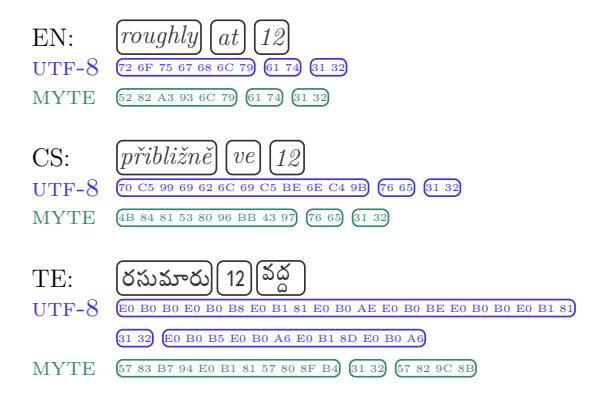

Figure 1: The same phrase is spelled in three languages: English, Czech, and Telugu. *UTF-8* byte encoding of the phrase is shown in blue, while MYTE in green underneath. MYTE achieves higher encoding compression, especially for texts using diacritics or non-Latin script.

Byte-level models aim to solve these challenges. Rather than words or subword tokens, they use byte-level text representations that achieve high coverage [\(Xue et al.,](#page-11-3) [2022\)](#page-11-3), as common encodings such as UTF-8 support most of the world's scripts. Nevertheless, the over-segmentation problem still exists even at the byte level, as byte sequences for single characters are overly long for many non-Latin script languages [\(Arnett et al.,](#page-9-1) [2024\)](#page-9-1). This problem has an immense effect on modeling these scripts in NLP systems, as operating on longer sequences significantly increases the computation costs of training and inference in models, while also making learning less sample efficient. Furthermore, the billing for APIs such as ChatGPT (<openai.com/chatgpt>) is often associated with the segmented sequence length, disadvantaging speakers of specific languages [\(Ahia et al.,](#page-9-0) [2023\)](#page-9-0).

In this work, we propose a novel method to derive byte representations of text, enabling equitable segmentations across languages and scripts. In our approach, we replace the current convention of assigning byte codes to characters with a

†Correspondence to limisiewicz@ufal.mff.cuni.cz \*Work done while visiting the University of Washington

morphology-driven approach, as morphemes[1](#page-1-0) are more informatively comparable constituents of text across languages than characters [\(Cotterell et al.,](#page-10-3) [2018\)](#page-10-3). Specifically, we introduce a novel algorithm for representing text as byte sequences that is based on unsupervised morphological segmentation [\(Smit et al.,](#page-11-4) [2014\)](#page-11-4). We demonstrate that our new paradigm for byte representation improves the segmentation of diverse languages of various scripts and morphological inventories. Furthermore, the segmentation of parallel sentences across languages converges to comparable lengths.

We test our method's effectiveness in creating equitable text representation – representations that given parallel texts have similar encoded sequence lengths. We then evaluate the applicability of the method to multilingual language modeling across 99 typologically diverse languages.

Our contributions can be summarized as follows: (a) We propose a novel byte-encoding method that is morphologically driven; (b) We show empirically that the resulting representations are more equitable across languages than vanilla byte, character, or subword segmentation; (c) We analyze the typical lengths of these representations and show decreased sequence length across all analyzed languages, significantly reducing computation cost and benefiting non-Latin script languages the most; (d) We train a language model with our new representation scheme and demonstrate that it maintains balanced and better LM performance across diverse languages and exhibits faster inference speed. This improvements holds across different model scales. Our models match SOTA ByT5 performance across multiple tasks for diverse low-resource languages while being more efficient in training and inference.

We will release our code and models to facilitate further research in this direction.

#### 2 Background: UTF-8 Bytes

The vast majority of texts online[2](#page-1-1) are represented as bytes via *UTF-8* convention, which is defined by the Unicode Standard [\(The Unicode Consortium,](#page-11-5) [2011\)](#page-11-5). In *UTF-8*, each character (or codepoint)

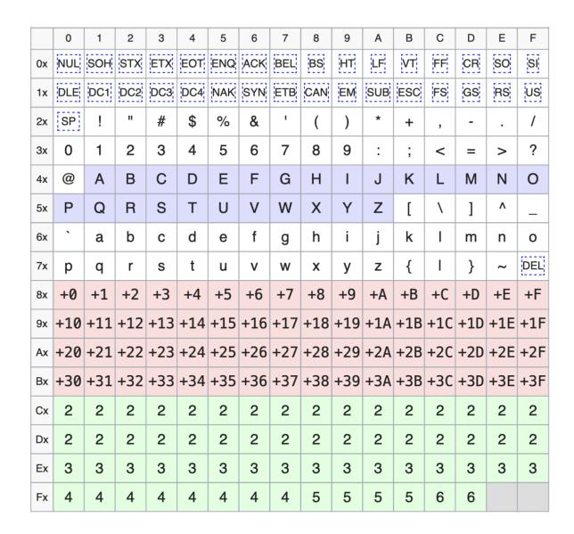

Figure 2: UTF-8 codepage (inspired by the visualizations from: <en.wikipedia.org/wiki/UTF-8>). Each row contains 16 bytes with the same leading hexadecimal digit. Bytes in the range C2 - F4 are leading bytes. They mark the beginning of a multibyte code of the length shown in each cell. Bytes in the range 80 - BF are continuation bytes, which follow a leading byte in multibyte codes. Bytes FE and FF are unused. Range C2 - F4 encodes Latin capital letters. In MYTE, these characters are decomposed to free space used to encode morphemes.

is represented as a sequence of one to four bytes. Due to the gradual development of communication standards, *UTF-8* first allocated one-byte representation ASCII symbols, which cover primary Latinscript characters (see 00 to 7F in Figure [2\)](#page-1-2). Other characters are represented as multi-byte codes starting with a byte from range C2 to F4 denoting the number of bytes in the codepoint and followed by continuation bytes from range 80 to BF.

In *UTF-8* convention, characters in non-Latin alphabetic scripts (Cyrillic, Armenian, Georgian), diacritics, and abjads[3](#page-1-3) usually have two-byte codes, while the byte length increases to three or four for Brahmic abugidas[4](#page-1-4) and CJK (Chinese, Japanese, Korean) logographs. As a result, the granularity of byte codes varies significantly across languages; this means that texts conveying the same information across languages tend to be represented by byte sequences of significantly different lengths [\(Arnett et al.,](#page-9-1) [2024\)](#page-9-1).

1 In this work, the usage of term "morphemes" encompasses both "morphemes" and "morphs". Some linguistic theories use the term "morph" for specific textual realizations of abstract "morphemes". For instance, in English, *es* as in *foxes* and *s* as in *cats* are two distinct "morphs" of a plurality "morpheme". For an in-depth discussion about these two terms, see Section 4 of [Žabokrtský et al.](#page-12-0) [\(2022\)](#page-12-0)

2 [https://w3techs.com/technologies/overview/](https://w3techs.com/technologies/overview/character_encoding) [character\\_encoding](https://w3techs.com/technologies/overview/character_encoding)

3Abjads are writing scripts that do not denote vowels, e.g., Hebrew, Arabic.

4Abugidas are scripts representing consonant-vowel as one character, typical to the Indian Subcontinent and South-East Asia, e.g., Devanagari, Bengali.

## 3 Method: Morphology-Driven Bytes

As discussed in the prior section and shown in Figure [1,](#page-0-0) *UTF-8* convention produces longer byte sequences for some languages due to the development choices. To make byte representation more equitable, we introduce an encoding paradigm that aims to assign byte codes of similar lengths to morphemes across languages. We base our encoding scheme on morphological analysis because morphemes are the shortest meaningful constituents and are independent of the writing convention [\(Haspelmath and Sims,](#page-10-4) [2010\)](#page-10-4). We assume that the number of morphemes in sentences with the same information load is more balanced across languages than the number of characters, bytes, or tokens. Thus, we enforce balanced segmentation granularity across languages.

An alternative approach to encoding morphological representations would be treating the union of multilingual morpheme inventories across languages as one large subword vocabulary. To cover the morphemes of many languages in this manner, the vocabulary would be much larger than the ones usually applied to models.[5](#page-2-0) This would incur additional computational costs and, similar to other subword representations, would likely not generalize well to new, unseen languages.

# 3.1 Morphological Analysis

We train an unsupervised morphological analyzer, Morfessor [\(Smit et al.,](#page-11-4) [2014\)](#page-11-4) on lexicons derived from whole Wikipedia articles in 99 languages. The morphological analysis is performed on each of the languages separately to balance the number of morphemes per language, regardless of data resourcefulness. For each language, we derived a set of 4096 morphemes; the number was chosen to balance segmentation granularity across languages. For each morpheme, we save its score, defined as the hypothetical loss reduction of the Morfessor model if the morpheme had not been included in the set. We take the union of sets across languages to obtain a multilingual morpheme inventory. The details of lexicon preparation and the usage of Morfessor are in Appendix [A.](#page-13-0)

| ID | Group                   | Unicode Script(s)                                                                                   |     | Leading Byte |     |
|----|-------------------------|-----------------------------------------------------------------------------------------------------|-----|--------------|-----|
|    |                         |                                                                                                     | 2 b | 3 b          | 4 b |
| 0  | Latin                   | Latin                                                                                               | 42  | 4A           | 52  |
| 1  | Common                  | Mixed, Common, Inherited, Unkown                                                              | 43  | 4B           | 53  |
| 2  | Non-Latin Alphabetic | Greek, Cyrillic, Ar menian, Georgian                                                             | 44  | 4C           | 54  |
| 3  | Abjads                  | Hebrew, Arabic, Syriac, Thaana, Tifinagh                                                | 45  | 4D           | 55  |
| 4  | Abugidas North       | Devanagari, Gur mukhi, Gujarati, Oriya, Bengali, Sinhala, Tibetan                 | 46  | 4E           | 56  |
| 5  | Abugidas South       | Telugu, Kannada, Tamil, Malayalam, Thai, Lao, Myan mar, Tai, Tagalog, Khmer | 47  | 4F           | 57  |
| 6  | CJK                     | Hangul, Han, Yi, Katakana, Hiragana, Bopomofo                                           | 48  | 50           | 58  |
| 7  | Other                   | Remaining scripts                                                                                   | 49  | 51           | 59  |

Table 1: Groups of scripts with the initial bytes for their morphological blocks. The groups were selected to balance the number of covered languages with similar writing systems.

# 3.2 Enriching Byte Representation with Morphology

To alleviate *UTF-8* inefficiencies, we propose a systematic rearrangement of byte codepage. We free 26 bytes ( 41 to 5A ) by decomposing capital letter codes into lowercase letters and capitalization markers. The first byte from this range ( 41 ) is repurposed as a capitalization marker. The remaining 25 bytes are freed space used to store morphemes.

Our method takes the sequences of *UTF-8* bytes and transcodes them into shorter sequences using the vocabulary of the same size, i.e. 256, as depicted in Figure [1.](#page-0-0) We apply the following steps to transcode *UTF-8* sequences to MYTE encodings:

- 1. We use *UTF-8* as base encoding of text. Then, the byte sequences are transcoded from left to right, merging morpheme sequences and replacing them as dedicated codepoints described in the following points.
- 2. The morphemes are grouped by scripts as shown in Table [1.](#page-2-1) Codepoints of multiple

5The proposed MYTE encoding offers capacity for 2,130,432 of variable length codepoints. It is considerably more than in any of the commonly used subword vocabularies. For reference, large vocabulary XLM-V model allocates 1 million subwords [\(Liang et al.,](#page-10-5) [2023\)](#page-10-5).

scripts within a single morpheme are assigned to the second cluster (Mixed script).

- 3. The morphemes are ranked based on their Morfessor score defined in Section [3.1.](#page-2-2)
- 4. We assign multibyte codepoint for each of the morphemes analogously to the *UTF-8* convention (see Section [2\)](#page-1-5). Specifically, the first byte denoting the beginning of the morphological codepoint is assigned from the freed range ( 42 - 5A ) based on the morph's inclusion in one of the script groups. It is followed by continuation bytes from the 64 element range 80 - BF, as in *UTF-8* convention. The 64 morphemes with the highest score are saved as two-byte codepoints, following 642 = 4096 as three-byte codepoints; the remaining morphemes are saved as up to 643 = 262, 144 four-byte codepoints. The capacity for new codepoints was not exhausted for any script group.

# 4 Equitable Multilingual Segmentation with MYTE

We first analyze the properties of our proposed morphology-driven encoding. Following the setting of [Petrov et al.](#page-11-2) [\(2023\)](#page-11-2), we measure whether MYTE produces the segmented sequences of comparable length across languages.

We compute parity across languages using the multi-parallel corpus Flores 200 [\(Team et al.,](#page-11-6) [2022\)](#page-11-6). Parity is defined as |t(sl)|/|t(sen)|, where sl and sen stand for parallel sentences in language l and in English, respectively. |t(s)| is the length of sequence s with segmentation method t.

We compare the MYTE encoding from Section [3.2](#page-2-3) to several baselines of common input representation: (a) Vanilla byte-level encoding via UTF-8; (b) Character-level encoding; (c) Subwords produced by Sentencepiece algorithm [\(Kudo and](#page-10-6) [Richardson,](#page-10-6) [2018\)](#page-10-6). In comparison, we focus on the equitability of sequence lengths produced by the methods for diverse languages.

Furthermore, we compare our morphological byte encoding sequence compression rate against the *UTF-8* convention. Compression is essential for an effective text representation as it affects NLP systems' efficiency and usage cost [\(Ahia et al.,](#page-9-0) [2023\)](#page-9-0). Finally, we check whether our method more effectively compresses languages and scripts unseen in MYTE algorithm described in Section [3.2.](#page-2-3)

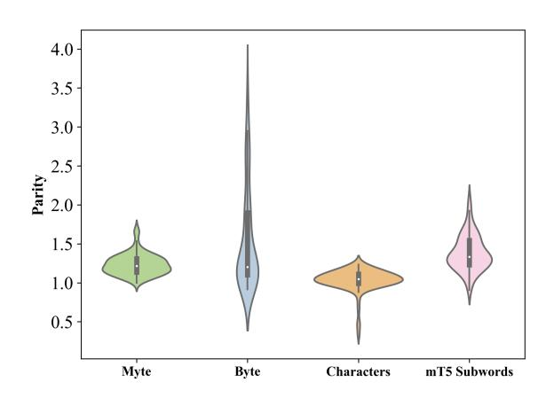

Figure 3: Boxplot aggregating parity against English for three segmentation methods: MYTE, *UTF-8*, characters, and subword tokens from mT5 tokenizer [\(Xue](#page-11-0) [et al.,](#page-11-0) [2021\)](#page-11-0). Parities were computed on multi-parallel Flores 200 corpus.

#### 4.1 Results

MYTE is Equitable across Languages The comparison of sequence length across parallel sentences in Flores 200 is shown in Figure [4.](#page-4-0) Our representation is more balanced across languages than the original *UTF-8* bytes. There are still four languages with observably higher code lengths (e.g., Greek, Vietnamese, Punjabi, Khmer). However, MYTE encoding still improves their parity to English such that it is much lower than outlier languages in *UTF-8* (1.7 vs. 3.5 in the worst-case languages, respectively).

Figure [3](#page-3-0) shows that MYTE representations are more balanced in parity scores across languages than subword tokenization. In particular, we improve on the long tail of languages over-segmented either in byte or subword encoding. The parties closest to MYTE are obtained by character representation. However, the set of all Unicode characters is larger by orders of magnitude than the number of unique bytes used in MYTE (149,878 vs. 254).

#### MYTE Encoding Compresses Text Representa-

tion The encoded sequence lengths are decreased with MYTE encoding for all languages, as depicted in Figure [4c.](#page-4-0) The rate of compression varies from 1% for Vietnamese and Chinese to almost 70% for Burmese. As seen in Table [2,](#page-4-1) the highest compression is obtained for low-resource languages with non-Latin scripts. Notably, this group of languages is the most susceptible to oversegmentation in *UTF-8* encoding.

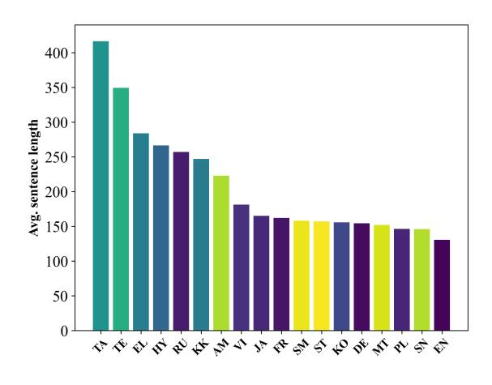

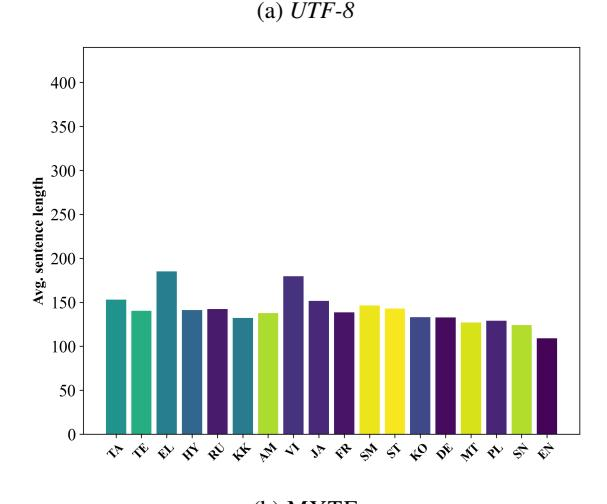

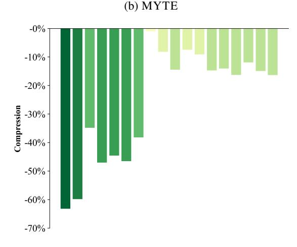

Figure 4: Average byte sequence lengths of parallel sentences from Flores 200 encoded by a) *UTF-8* and b) MYTE. Figure c) depicts the percentage by which the latter sequences are shorter than the former. Results for all the languages can be found in Appendix [B.](#page-14-0)

(c) Sequence compression

Findings Generalize to Unseen Languages but not Unseen Scripts In Table [2,](#page-4-1) we observe that a decrease in sequence length and parity applies

|               | Byte   |      | Myte   |      | Comp. |
|---------------|--------|------|--------|------|-------|
|               | Parity | Len. | Parity | Len. |       |
| English       | 1.00   | 131  | 1.00   | 109  | 16%   |
| Latin HR      | 1.14   | 149  | 1.18   | 129  | 14%   |
| Latin LR      | 1.12   | 147  | 1.18   | 128  | 12%   |
| ¬Latin HR     | 1.62   | 212  | 1.29   | 141  | 29%   |
| ¬Latin LR     | 2.33   | 305  | 1.33   | 145  | 50%   |
| Seen          | 1.56   | 204  | 1.24   | 135  | 26%   |
| Unseen Lang   | 1.50   | 196  | 1.27   | 138  | 23%   |
| Unseen Script | 2.80   | 365  | 3.35   | 365  | 0%    |
| Unseen        | 1.72   | 224  | 1.61   | 176  | 19%   |

Table 2: Averaged sequence length and corresponding parities to English of *UTF-8* and MYTE. We aggregated results for languages used in morphological adaptation (i.e., *Seen*) by their script (Latin vs. Non-Latin) and resourcefulness (HR: high resource, LR: low resource) based on categorization from [Joshi et al.](#page-10-7) [\(2020\)](#page-10-7). The last three rows present results for languages *unseen* in morphological adaptation; all of them are low-resource. Shortened column headers: Len. – Length, Comp. – Compression.

to five low-resource languages not considered in constructing MYTE representation, referred to as *unseen languages*. One exemption from the rule is Santhali, written in *unseen* Ol Chiki script, for which we do not observe a change in the encoded sequence length. This observation highlights the importance of considering a wide range of languages and scripts when constructing morpheme inventories. Importantly, MYTE did not reach a capacity of available byte codepoints, and thus, the method can be extended to additional languages. The complete results for *unseen* languages and scripts are shown in Appendix [B.](#page-14-0)

# 5 MyT5: Language Modeling with MYTE

This section investigates the benefits of MYTE as an encoding scheme for byte-level language modeling. For that purpose, we have trained T5 language models on MYTE representation. We refer to these models as Myte T5 models, or MyT5 for short.

#### 5.1 Training Details

We base the architecture and implementation of our MyT5 model on the byte-level T5 model, i.e., ByT5 [\(Xue et al.,](#page-11-3) [2022\)](#page-11-3). ByT5, like other T5 models [\(Raf](#page-11-7)[fel et al.,](#page-11-7) [2020\)](#page-11-7), is an encoder-decoder Transformer model trained on predicting masked spans of texts. ByT5 operates on bytes instead of the subword to-

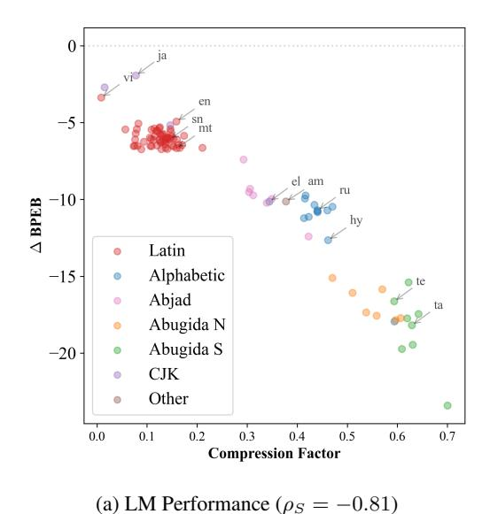

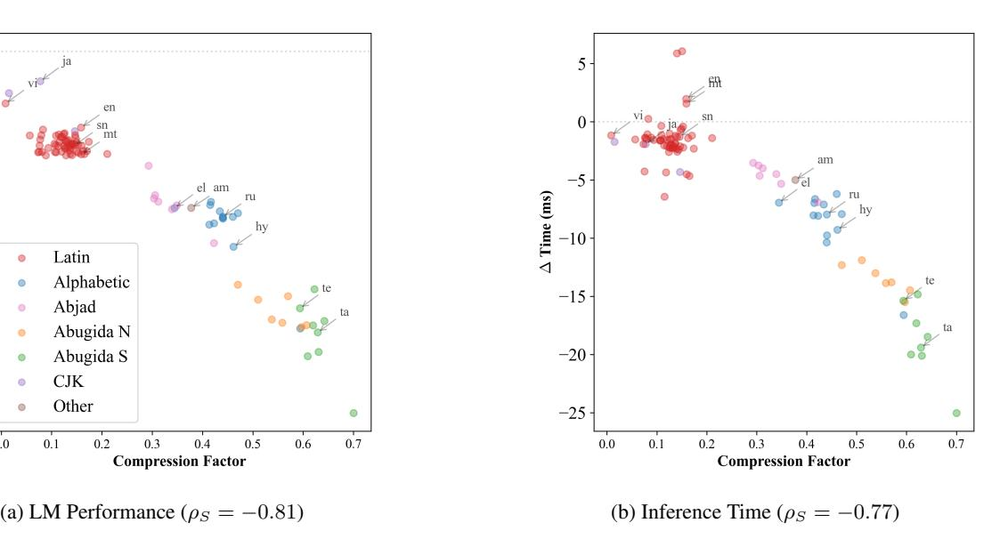

Figure 5: The difference in Byte-per-English-Bit and inference time between MyT5 and ByT5 large models against compression factor of MYTE. For each sentence, the BPEB value is normalized by the number of UTF-8 bytes used to represent the corresponding English sentence. The inference was run on A40 GPU core, we report an average per-sentence deltas. ρS are Spearman's correlation coefficients.

kenization in the standard T5 model, making it a suitable base model for our setting.

We pre-train three new instances of MYTElevel models of different sizes: small (300M), base (582M), and large (1.23B parameters). For pretraining, we used the standard task of restoring corrupted spans from mC4 corpus [\(Raffel et al.,](#page-11-7) [2020\)](#page-11-7). All the byte sequences are transcoded into morphologically-driven bytes. We use Jax implementation, i.e., t5x repository [\(Roberts et al.,](#page-11-8) [2022\)](#page-11-8), and the same hyperparameters as in ByT5 [\(Xue](#page-11-3) [et al.,](#page-11-3) [2022\)](#page-11-3). The only difference from their training approach is that we pre-train for 250,000 steps rather than one million steps since we observe overfitting when training for more steps, especially on low-resource languages. [Chung et al.](#page-9-2) [\(2023\)](#page-9-2) similarly observed overfitting in multilingual T5 models caused by extensive duplications in the mC4 corpus, leading them to also train models for only 250,000 steps. In evaluations, we compare against a reimplemented ByT5 instance trained for the same number of steps.

#### 5.2 Experiments

We compare the performance of the MyT5 and ByT5 models, focusing on three aspects: language modeling performance, efficiency, and downstream evaluation.

First, the multilingual language modeling performance of MyT5 – how is it, and is it compara-

ble across languages? Inspired by [Cotterell et al.](#page-10-3) [\(2018\)](#page-10-3), we use the Bit-per-English-Byte metric on the multi-parallel FLORES 200 corpus to control for the informativeness of evaluation sequences:

$$BPEB = \frac{1}{|\mathbf{c}_{English,UTF}| + 1} \sum_{i=1}^{|\mathbf{c}|+1} \log p(c_i|\mathbf{c}_{< i})$$
(1)

c is a sequence of bytes (original *UTF-8* or MYTE) with ci being the i-th byte. For normalization, we use the number of *UTF-8* bytes in English sentence cEnglish,UT F for fair comparison across languages and representation methods. It is the main difference from perplexity, which is normalized by the sequence length and thus confounded by segmentation rates characteristic of individual languages and encodings.

Second, we compare inference times of text generation of MyT5 and ByT5. We expect a decrease in sequence length, as shown in the last section, will render up to a quadratic reduction of forwardpass time due to the quadratic complexity of attention computation. For both aspects, we report the results on three scales of the model (small, base, and large). Unless stated otherwise, we present the results of the large model.

Lastly, we compare models' performance on four tasks from the XTREME-UP benchmark [\(Ruder](#page-11-9) [et al.,](#page-11-9) [2023\)](#page-11-9): question answering, named entity recognition, semantic parsing, and translation from English. In each task, we fine-tune the large models on the multilingual data of all languages for each task. Fine-tuned models are evaluated on test data for low-resource languages, following [Ruder et al.](#page-11-9) [\(2023\)](#page-11-9). The only exception is machine translation, where we fine-tune and evaluate on a subset of languages to reduce the computation cost. The details of training and evaluation are provided in Appendix [C.](#page-14-1)

#### 5.3 Results

# MyT5 Outperforms ByT5 in Language Model-

ing In Figure [5a,](#page-5-0) our model outperforms ByT5, producing lower (better) average BP EB scores for all analyzed languages. The improvement is strongly negatively correlated with the compression rate discussed in the previous section. The gains are largest for languages using Abugidas (scripts representing consonant-vowel as one character, typical to the Indian Subcontinent and SE Asia) that tend to be shortened the most by MYTE encoding. On the other end of compression distribution, we still observe (smaller) improvement for Latin and CJK scripts. This observation suggests that the MYTE encoding's leverage is not constrained to shortening sequences, but it also uses codepoints that are easier to predict by a language model. MYTE uses codepoints based on morphemes that are inherently meaningful language units in contrast to orthographic symbols, which are the backbone of the *UTF-8* convention.

Encoding in MyT5 Diminishes LM Performance Gap Across Languages Previous works have argued that some languages are more challenging to model due to their morphological properties [\(Cot](#page-10-3)[terell et al.,](#page-10-3) [2018\)](#page-10-3). In contrast, others suggest that LM performance is linked with how texts in specific languages are represented [\(Park et al.,](#page-11-10) [2021\)](#page-11-10). Our results in Figure [6](#page-7-0) support the latter view, as the predictability of the languages is balanced by using equitable underlying representation, i.e., MYTE encoding. Specifically, we show that MyT5 achieves more balanced BP EB across languages than ByT5. As discussed in the previous section, the benefit is the starkest for languages prone to over-segmentation under *UTF-8*. The smallest improvements of MyT5 are obtained for languages benefited by MYTE to a lesser extent, as observed in Section [4.1:](#page-3-1) Greek and Vietnamese.

In Figure [7,](#page-7-1) we observe that MyT5 outperforms

|       |           |      | Byt5   |      | Myt5   |
|-------|-----------|------|--------|------|--------|
|       |           | BPEB | T (ms) | BPEB | T (ms) |
| small | All       | 10.1 | 7.0    | 4.6  | 6.7    |
|       | Latin     | 4.6  | 5.9    | 4.2  | 6.6    |
|       | Non Latin | 18.1 | 8.5    | 5.1  | 6.8    |
| base  | All       | 8.2  | 11.5   | 5.8  | 8.9    |
|       | Latin     | 4.9  | 9.4    | 5.0  | 8.7    |
|       | Non Latin | 13.0 | 14.6   | 6.9  | 9.1    |
| large | All       | 13.4 | 31.8   | 4.6  | 26.7   |
|       | Latin     | 10.1 | 28.1   | 4.0  | 26.6   |
|       | Non Latin | 18.2 | 37.3   | 5.4  | 27.0   |

Table 3: Byte-per-English-Bits and Inference times (average per Flores 200 sentence) averaged for three language groupings.

| Task               | QA           | NER                 | Semantic Parsing | MT           |
|--------------------|--------------|---------------------|---------------------|--------------|
| Metric             | F1           | F1                  | EM                  | chrF         |
| Flan-PaLM* mT5* | 22.9 59.7 | 12.0 74.0        | 0.1 21.8         | — —       |
| ByT5 MyT5       | 73.2 75.3 | 81.5 80.8        | 25.1 19.6        | 20.1 20.4 |
|                    |              | Inference Time (ms) |                     |              |
| ByT5 MyT5       | 36.2 35.6 | 13.8 12.6        | 13.2 12.4        | 15.9 12.6 |

Table 4: The average result of XTREME-UP tasks across low-resource languages. The baseline results of mT5 and Flan-PaLM (in-context-learning evaluation) are copied from: [Ruder et al.](#page-11-9) [\(2023\)](#page-11-9). We observed disparities between their reported and reimplemented ByT5 results, which are probably caused by the differences in fine-tuning setting. The time is an average across evaluation examples, the inference was run on an A40 GPU core. The results for all languages and fine-tuning details are in Appendix.

ByT5 for languages unseen in morphological analysis, except for Sanatli, which also uses a distinct script.

MyT5 is More Efficient at Scale than ByT5 As shown in Figure [5b,](#page-5-0) MyT5's inference time is shorter than that of ByT5 for almost all languages. This behavior is mostly observed for Non-Latin script languages and can thus be attributed to the higher rates of compression observed when using the MYTE encoding scheme (Figure [4\)](#page-4-0). Furthermore, Table [3](#page-6-0) demonstrates that MyT5's inference speed gains over ByT5 improve with model size, hinting that MYTE will bring further efficiency gains when applied to models of larger scales.

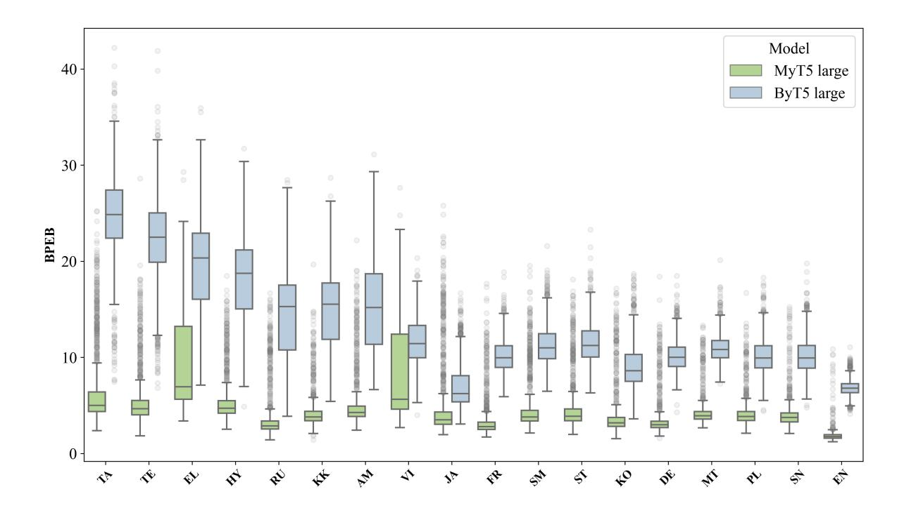

Figure 6: Sentence prediction suprisal expressed as Bit-per-English-Byte on multi-parallel Flores 200 corpus. Each point corresponds to the BPEP value of one sentence. The comparison shows that under MyT5 model, surprisal factors are more equitable than in the standard ByT5 model.

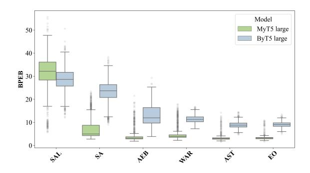

Figure 7: Bit-per-English-Byte for six languages unseen in morphological analysis: Santali, Sanskrit, Tunisian, Waray, Asturian, Esperanto. Santali (*sal*) uses an unseen script (Ol Chicki).

#### MyT5 Performs End Tasks Faster than ByT5

As shown in Table [4,](#page-6-1) MyT5 and ByT5 perform comparably (and better than baselines) on MT and NER. While MyT5 outperforms ByT5 by 2 points on QA, the opposite is true for semantic parsing. We hypothesize that in this case, the morphological prior encoded in MYTE may confound semantic parsing fine-tuning, which requires a structured output starkly dissimilar to natural language.

For all the tasks, the inference of MyT5 is faster than ByT5 (Figure [8\)](#page-7-2), mirroring our observations on language modeling efficiency. However, we

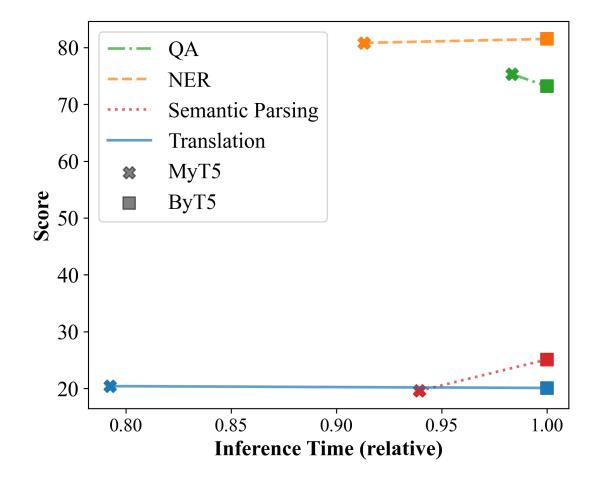

Figure 8: Avarage score on end tasks from XTREME-UP end tasks on low-resource languages against the inference time. The times were divided by the value for ByT5 model, which is always higher than MyT5 model. The metrics and the absolute values of inference time are shown in Table [4.](#page-6-1)

do not observe a consistent relationship between the change in end task performance and efficiency, contrasting with the earlier observed correlation between ∆ of inference time and BP EP in multilingual language modeling.

# 6 Related Work

# 6.1 Fair Representation across Languages

Perhaps the most significant challenge of multilingual NLP is the large disparity of resourcefulness across the world's languages [\(Joshi et al.,](#page-10-7) [2020\)](#page-10-7), as the size and quality of data used for the model training directly affects its performance in individual languages. Hence, researchers have proposed multiple ways to balance the training signal across languages [\(Malkin et al.,](#page-10-2) [2022\)](#page-10-2). Solutions include sampling data to overrepresent low-resource languages, e.g., with alpha [\(Conneau et al.,](#page-10-1) [2020\)](#page-10-1) or uniform sampling of data across languages [\(Chung](#page-9-2) [et al.,](#page-9-2) [2023\)](#page-9-2). This unequal treatment of languages is also present in how data is encoded as input to the model [\(Ahia et al.,](#page-9-0) [2023\)](#page-9-0). [Petrov et al.](#page-11-2) [\(2023\)](#page-11-2) show that practically all methods used to represent texts as input of NLP systems treat languages unequally, segmenting some (mainly the lowestresourced ones) into fine-grained non-informative units.

Some approaches aimed at balancing the segmentation or tokenization methods have been introduced. [Limisiewicz et al.](#page-10-8) [\(2023\)](#page-10-8) proposed merging vocabulary based on the tokenizer scoring function. [Zheng et al.](#page-12-1) [\(2021\)](#page-12-1) introduced a method of allocating vocabulary capacity uniformly across languages, while [Chung et al.](#page-10-9) [\(2020\)](#page-10-9) constructed multilingual vocabulary for clusters of languages and merged them. [Liang et al.](#page-10-5) [\(2023\)](#page-10-5) combined the elements of both approaches and showed the advantage of extending vocabulary to benefit multilingual transfer. These solutions promise to obtain a better allocation of vocabulary units. However, they do not solve the inequality of the underlying encoding, which may affect the construction process of vocabulary units. For instance, byte merges in the BPE algorithm begin at individual bytes [Sen](#page-11-11)[nrich et al.](#page-11-11) [\(2016\)](#page-11-11); [Zouhar et al.](#page-12-2) [\(2023\)](#page-12-2). Therefore, the unequal granularity of *UTF-8* representation impacts the vocabulary construction step in BPE, especially harming the low-resource non-Latin languages [\(Kargaran et al.,](#page-10-10) [2024\)](#page-10-10). A possible solution is training BPE on top of MYTE encoded and balanced multilingual corpus.

Morphological analyzers, such as Morfessor, showed promising results for segmenting input texts for language models and neural machine translators [\(Machácek et al.,](#page-10-11) [2018;](#page-10-11) [Hou et al.,](#page-10-12) [2023\)](#page-10-12). We are the first to apply morphology-based encoding for a massively multilingual setting.

#### 6.2 Tokenization-free Language Modeling

An alternative to subword tokenization is representing texts directly as underlying encoding: characters or bytes. Or even representing texts as pixels of rendered text images [\(Rust et al.,](#page-11-12) [2023\)](#page-11-12).

[Xue et al.](#page-11-3) [\(2022\)](#page-11-3) shows that for many non-Latin scripts, byte-level encoding performs worse than subword tokenization. The problem with small units is that they do not carry meaningful information independently and often underperform subword models [\(Sun et al.,](#page-11-13) [2023;](#page-11-13) [Clark et al.,](#page-10-13) [2022\)](#page-10-13).

The researchers have proposed multiple algorithms to enrich the byte-level embeddings with information from a local context. For that purpose, recent approaches use shallow networks to aggregate information in local contexts defined as character n-grams [\(Clark et al.,](#page-10-13) [2022\)](#page-10-13), byte patches [\(Yu et al.,](#page-12-3) [2023\)](#page-12-3), or character blocks [\(Tay et al.,](#page-11-14) [2022\)](#page-11-14). However, the problem with choosing the appropriate context window is hard, because information density varies for different languages. A solution to that problem can be dynamically learning the segmentation in byte sequences [\(Nawrot et al.,](#page-10-14) [2023\)](#page-10-14). Another approach is to redefine the encoding convention to equate the information loads in sequences, as the proposed MYTE approach.

#### 7 Conclusion

In this paper, we introduce MYTE encoding, a fairer byte-level representation for multilingual language modeling that is based on morphological segmentation. We show that adapting a morphological analyzer to unsupervised segmentation allows us to represent multi-parallel corpora with comparable encoding lengths across a wide range of languages. Additionally, our new representation significantly improves language modeling, especially of lowresource and non-Latin script languages, and provides efficiency benefits over traditional byte-level models. These trends hold across model sizes, with improvement increasing at scale. Overall, MYTE bridges the gap in encoding efficiency between high and low-resource languages, benefiting (to varying extent) all *99* analyzed languages.

# Ethical Statement

Our work makes a significant contribution to a fairer representation of text across diverse languages. It will potentially benefit the speakers of underrepresented languages by enabling access to more reliable and cheaper NLP tools. For all the experiments, we relied on open-source tools and datasets. We strongly discourage unintended usage of the released language models.

# Limitations

Our method inherits the limitations of Morfessor, which was used to obtain multilingual morphological segmentation for MYTE. First, Morfessor is data dependent and is affected by the quality of the corpus (Wikipedia) and the lexicon (MUSE [Lample](#page-10-15) [et al.](#page-10-15) [\(2018\)](#page-10-15) when available). The artifact of these resources is a significant presence of cross-lingual contamination, typically from high-resource languages [\(Blevins and Zettlemoyer,](#page-9-3) [2022\)](#page-9-3). This leads to the appearance of Latin (typically English) morphemes in analyses of many languages. Second, we use the unsupervised mode of Morfessor that can be applied to any language due to its independence of annotated data. However, it is also prone to errors in morphological segmentations, i.e., oversegmenting texts of specific languages. We mitigate this issue by picking a constant target number of morphemes.

Dependence on data might also affect the generalizability of our findings' to the languages that were not used in the construction of MYTE. Results in Section [4.1](#page-3-1) show that the method is indeed effective in compressing text representation of unseen languages but not unseen scripts. Notably, we do not exhaust the capacity of the MYTE codepage; thus, it can be extended to further languages.

Lastly, even perfect morphological analysis cannot guarantee equal granularity of segmentation across languages. Some languages are characterized by higher morphological richness, thus their texts consist of more morphemes. Accordingly, we observe differences in MYTE segmentation lengths across languages, yet these disparities are significantly smaller than in other conventions.

#### Acknowledgements

We would like to thank Jana Straková and Zdenekˇ Žabokrtský for helpful feedback on this project. We are thankful to Google for providing free computation quotas through the TPU Research Cloud

program. Tomasz Limisiewicz acknowledges the support of grant 338521 of the Charles University Grant Agency, a Fellowship from Paul G. Allen School, and the Mobility Fund of Charles University.

# References

David Adelani, Graham Neubig, Sebastian Ruder, Shruti Rijhwani, Michael Beukman, Chester Palen-Michel, Constantine Lignos, Jesujoba Alabi, Shamsuddeen Muhammad, Peter Nabende, Cheikh M. Bamba Dione, Andiswa Bukula, Rooweither Mabuya, Bonaventure F. P. Dossou, Blessing Sibanda, Happy Buzaaba, Jonathan Mukiibi, Godson Kalipe, Derguene Mbaye, Amelia Taylor, Fatoumata Kabore, Chris Chinenye Emezue, Anuoluwapo Aremu, Perez Ogayo, Catherine Gitau, Edwin Munkoh-Buabeng, Victoire Memdjokam Koagne, Allahsera Auguste Tapo, Tebogo Macucwa, Vukosi Marivate, Mboning Tchiaze Elvis, Tajuddeen Gwadabe, Tosin Adewumi, Orevaoghene Ahia, Joyce Nakatumba-Nabende, Neo Lerato Mokono, Ignatius Ezeani, Chiamaka Chukwuneke, Mofetoluwa Oluwaseun Adeyemi, Gilles Quentin Hacheme, Idris Abdulmumin, Odunayo Ogundepo, Oreen Yousuf, Tatiana Moteu, and Dietrich Klakow. 2022. MasakhaNER 2.0: Africa-centric transfer learning for named entity recognition. In *Proceedings of the 2022 Conference on Empirical Methods in Natural Language Processing*, Abu Dhabi, United Arab Emirates. Association for Computational Linguistics.

Orevaoghene Ahia, Sachin Kumar, Hila Gonen, Jungo Kasai, David R. Mortensen, Noah A. Smith, and Yulia Tsvetkov. 2023. [Do All Languages Cost the](https://aclanthology.org/2023.emnlp-main.614) [Same? Tokenization in the Era of Commercial Lan](https://aclanthology.org/2023.emnlp-main.614)[guage Models.](https://aclanthology.org/2023.emnlp-main.614) In *Proceedings of the 2023 Conference on Empirical Methods in Natural Language Processing, EMNLP 2023, Singapore, December 6-10, 2023*, pages 9904–9923. Association for Computational Linguistics.

Catherine Arnett, Tyler A. Chang, and Benjamin K. Bergen. 2024. [A bit of a problem: Measurement](http://arxiv.org/abs/2403.00686) [disparities in dataset sizes across languages.](http://arxiv.org/abs/2403.00686)

Terra Blevins and Luke Zettlemoyer. 2022. [Language](https://doi.org/10.18653/v1/2022.emnlp-main.233) [Contamination Helps Explains the Cross-lingual Ca](https://doi.org/10.18653/v1/2022.emnlp-main.233)[pabilities of English Pretrained Models.](https://doi.org/10.18653/v1/2022.emnlp-main.233) In *Proceedings of the 2022 Conference on Empirical Methods in Natural Language Processing*, pages 3563–3574, Abu Dhabi, United Arab Emirates. Association for Computational Linguistics.

Hyung Won Chung, Xavier Garcia, Adam Roberts, Yi Tay, Orhan Firat, Sharan Narang, and Noah Constant. 2023. [UniMax: Fairer and More Effective](https://openreview.net/pdf?id=kXwdL1cWOAi) [Language Sampling for Large-scale Multilingual Pre](https://openreview.net/pdf?id=kXwdL1cWOAi)[training.](https://openreview.net/pdf?id=kXwdL1cWOAi) In *The Eleventh International Conference on Learning Representations, ICLR 2023, Kigali, Rwanda, May 1-5, 2023*. OpenReview.net.

- Hyung Won Chung, Dan Garrette, Kiat Chuan Tan, and Jason Riesa. 2020. [Improving Multilingual Models](https://doi.org/10.18653/V1/2020.EMNLP-MAIN.367) [with Language-clustered Vocabularies.](https://doi.org/10.18653/V1/2020.EMNLP-MAIN.367) In *Proceedings of the 2020 Conference on Empirical Methods in Natural Language Processing, EMNLP 2020, Online, November 16-20, 2020*, pages 4536–4546. Association for Computational Linguistics.
- Jonathan H. Clark, Dan Garrette, Iulia Turc, and John Wieting. 2022. [Canine: Pre-training an efficient](https://doi.org/10.1162/tacl_a_00448) [tokenization-free encoder for language representa](https://doi.org/10.1162/tacl_a_00448)[tion.](https://doi.org/10.1162/tacl_a_00448) *Transactions of the Association for Computational Linguistics*, 10:73–91.
- Alexis Conneau, Kartikay Khandelwal, Naman Goyal, Vishrav Chaudhary, Guillaume Wenzek, Francisco Guzmán, Edouard Grave, Myle Ott, Luke Zettlemoyer, and Veselin Stoyanov. 2020. [Unsupervised](https://doi.org/10.18653/v1/2020.acl-main.747) [cross-lingual representation learning at scale.](https://doi.org/10.18653/v1/2020.acl-main.747) In *Proceedings of the 58th Annual Meeting of the Association for Computational Linguistics*, pages 8440– 8451, Online. Association for Computational Linguistics.
- Ryan Cotterell, S. J. Mielke, Jason Eisner, and Brian Roark. 2018. [Are All Languages Equally Hard to](https://doi.org/10.18653/V1/N18-2085) [Language-Model?](https://doi.org/10.18653/V1/N18-2085) In *Proceedings of the 2018 Conference of the North American Chapter of the Association for Computational Linguistics: Human Language Technologies, NAACL-HLT, New Orleans, Louisiana, USA, June 1-6, 2018, Volume 2 (Short Papers)*, pages 536–541. Association for Computational Linguistics.
- Jacob Devlin, Ming-Wei Chang, Kenton Lee, and Kristina Toutanova. 2019. [BERT: Pre-training of](https://doi.org/10.18653/v1/N19-1423) [deep bidirectional transformers for language under](https://doi.org/10.18653/v1/N19-1423)[standing.](https://doi.org/10.18653/v1/N19-1423) In *Proceedings of the 2019 Conference of the North American Chapter of the Association for Computational Linguistics: Human Language Technologies, Volume 1 (Long and Short Papers)*, pages 4171–4186, Minneapolis, Minnesota. Association for Computational Linguistics.
- M. Haspelmath and A.D. Sims. 2010. *[Understanding](https://books.google.cz/books?id=GJKHPwAACAAJ) [Morphology](https://books.google.cz/books?id=GJKHPwAACAAJ)*. Understanding language series. Hodder Education.
- Jue Hou, Anisia Katinskaia, Anh-Duc Vu, and Roman Yangarber. 2023. [Effects of sub-word segmentation](https://aclanthology.org/2023.emnlp-main.459) [on performance of transformer language models.](https://aclanthology.org/2023.emnlp-main.459) In *Proceedings of the 2023 Conference on Empirical Methods in Natural Language Processing, EMNLP 2023, Singapore, December 6-10, 2023*, pages 7413– 7425. Association for Computational Linguistics.
- Pratik Joshi, Sebastin Santy, Amar Budhiraja, Kalika Bali, and Monojit Choudhury. 2020. [The state and](https://doi.org/10.18653/v1/2020.acl-main.560) [fate of linguistic diversity and inclusion in the NLP](https://doi.org/10.18653/v1/2020.acl-main.560) [world.](https://doi.org/10.18653/v1/2020.acl-main.560) In *Proceedings of the 58th Annual Meeting of the Association for Computational Linguistics*, pages 6282–6293, Online. Association for Computational Linguistics.
- Amir Hossein Kargaran, François Yvon, and Hinrich Schütze. 2024. [GlotScript: A resource and tool for](https://aclanthology.org/2024.lrec-main.687)

- [low resource writing system identification.](https://aclanthology.org/2024.lrec-main.687) In *Proceedings of the 2024 Joint International Conference on Computational Linguistics, Language Resources and Evaluation (LREC-COLING 2024)*, pages 7774– 7784, Torino, Italia. ELRA and ICCL.
- Taku Kudo and John Richardson. 2018. [SentencePiece:](https://doi.org/10.18653/v1/D18-2012) [A simple and language independent subword tok](https://doi.org/10.18653/v1/D18-2012)[enizer and detokenizer for neural text processing.](https://doi.org/10.18653/v1/D18-2012) In *Proceedings of the 2018 Conference on Empirical Methods in Natural Language Processing: System Demonstrations*, pages 66–71, Brussels, Belgium. Association for Computational Linguistics.
- Guillaume Lample, Alexis Conneau, Marc'Aurelio Ranzato, Ludovic Denoyer, and Hervé Jégou. 2018. [Word translation without parallel data.](https://openreview.net/forum?id=H196sainb) In *6th International Conference on Learning Representations, ICLR 2018, Vancouver, BC, Canada, April 30 - May 3, 2018, Conference Track Proceedings*. OpenReview.net.
- Davis Liang, Hila Gonen, Yuning Mao, Rui Hou, Naman Goyal, Marjan Ghazvininejad, Luke Zettlemoyer, and Madian Khabsa. 2023. [XLM-V: Over](https://aclanthology.org/2023.emnlp-main.813)[coming the Vocabulary Bottleneck in Multilingual](https://aclanthology.org/2023.emnlp-main.813) [Masked Language Models.](https://aclanthology.org/2023.emnlp-main.813) In *Proceedings of the 2023 Conference on Empirical Methods in Natural Language Processing, EMNLP 2023, Singapore, December 6-10, 2023*, pages 13142–13152. Association for Computational Linguistics.
- Tomasz Limisiewicz, Jirí Balhar, and David Marecek. 2023. [Tokenization Impacts Multilingual Language](https://doi.org/10.18653/V1/2023.FINDINGS-ACL.350) [Modeling: Assessing Vocabulary Allocation and](https://doi.org/10.18653/V1/2023.FINDINGS-ACL.350) [Overlap Across Languages.](https://doi.org/10.18653/V1/2023.FINDINGS-ACL.350) In *Findings of the Association for Computational Linguistics: ACL 2023, Toronto, Canada, July 9-14, 2023*, pages 5661–5681. Association for Computational Linguistics.
- Dominik Machácek, Jonás Vidra, and Ondrej Bojar. 2018. [Morphological and Language-agnostic Word](https://doi.org/10.1007/978-3-030-00794-2_30) [Segmentation for NMT.](https://doi.org/10.1007/978-3-030-00794-2_30) In *Text, Speech, and Dialogue - 21st International Conference, TSD 2018, Brno, Czech Republic, September 11-14, 2018, Proceedings*, volume 11107 of *Lecture Notes in Computer Science*, pages 277–284. Springer.
- Dan Malkin, Tomasz Limisiewicz, and Gabriel Stanovsky. 2022. [A balanced data approach for eval](https://doi.org/10.18653/v1/2022.naacl-main.361)[uating cross-lingual transfer: Mapping the linguistic](https://doi.org/10.18653/v1/2022.naacl-main.361) [blood bank.](https://doi.org/10.18653/v1/2022.naacl-main.361) In *Proceedings of the 2022 Conference of the North American Chapter of the Association for Computational Linguistics: Human Language Technologies*, pages 4903–4915, Seattle, United States. Association for Computational Linguistics.
- Piotr Nawrot, Jan Chorowski, Adrian Lancucki, and Edoardo Maria Ponti. 2023. [Efficient Transformers](https://doi.org/10.18653/V1/2023.ACL-LONG.353) [with Dynamic Token Pooling.](https://doi.org/10.18653/V1/2023.ACL-LONG.353) In *Proceedings of the 61st Annual Meeting of the Association for Computational Linguistics (Volume 1: Long Papers), ACL 2023, Toronto, Canada, July 9-14, 2023*, pages 6403– 6417. Association for Computational Linguistics.

- Hyunji Hayley Park, Katherine J. Zhang, Coleman Haley, Kenneth Steimel, Han Liu, and Lane Schwartz. 2021. [Morphology Matters: A Multilingual Lan](https://doi.org/10.1162/TACL_A_00365)[guage Modeling Analysis.](https://doi.org/10.1162/TACL_A_00365) *Trans. Assoc. Comput. Linguistics*, 9:261–276.
- Aleksandar Petrov, Emanuele La Malfa, Philip H. S. Torr, and Adel Bibi. 2023. [Language Model Tokeniz](https://doi.org/10.48550/ARXIV.2305.15425)[ers Introduce Unfairness Between Languages.](https://doi.org/10.48550/ARXIV.2305.15425) *CoRR*, abs/2305.15425.
- Jonas Pfeiffer, Ivan Vulic, Iryna Gurevych, and Sebas- ´ tian Ruder. 2021. [UNKs everywhere: Adapting mul](https://doi.org/10.18653/v1/2021.emnlp-main.800)[tilingual language models to new scripts.](https://doi.org/10.18653/v1/2021.emnlp-main.800) In *Proceedings of the 2021 Conference on Empirical Methods in Natural Language Processing*, pages 10186–10203, Online and Punta Cana, Dominican Republic. Association for Computational Linguistics.
- Colin Raffel, Noam Shazeer, Adam Roberts, Katherine Lee, Sharan Narang, Michael Matena, Yanqi Zhou, Wei Li, and Peter J. Liu. 2020. [Exploring the Lim](http://jmlr.org/papers/v21/20-074.html)[its of Transfer Learning with a Unified Text-to-text](http://jmlr.org/papers/v21/20-074.html) [Transformer.](http://jmlr.org/papers/v21/20-074.html) *J. Mach. Learn. Res.*, 21:140:1–140:67.
- Adam Roberts, Hyung Won Chung, Anselm Levskaya, Gaurav Mishra, James Bradbury, Daniel Andor, Sharan Narang, Brian Lester, Colin Gaffney, Afroz Mohiuddin, Curtis Hawthorne, Aitor Lewkowycz, Alex Salcianu, Marc van Zee, Jacob Austin, Sebastian Goodman, Livio Baldini Soares, Haitang Hu, Sasha Tsvyashchenko, Aakanksha Chowdhery, Jasmijn Bastings, Jannis Bulian, Xavier Garcia, Jianmo Ni, Andrew Chen, Kathleen Kenealy, Jonathan H. Clark, Stephan Lee, Dan Garrette, James Lee-Thorp, Colin Raffel, Noam Shazeer, Marvin Ritter, Maarten Bosma, Alexandre Passos, Jeremy Maitin-Shepard, Noah Fiedel, Mark Omernick, Brennan Saeta, Ryan Sepassi, Alexander Spiridonov, Joshua Newlan, and Andrea Gesmundo. 2022. [Scaling Up Models](https://doi.org/10.48550/arXiv.2203.17189) [and Data with \\$\texttt{t5x}\\$ and \\$\texttt{seqio}\\$.](https://doi.org/10.48550/arXiv.2203.17189) ArXiv:2203.17189 [cs].
- Sebastian Ruder, Jonathan H. Clark, Alexander Gutkin, Mihir Kale, Min Ma, Massimo Nicosia, Shruti Rijhwani, Parker Riley, Jean Michel A. Sarr, Xinyi Wang, John Wieting, Nitish Gupta, Anna Katanova, Christo Kirov, Dana L. Dickinson, Brian Roark, Bidisha Samanta, Connie Tao, David Ifeoluwa Adelani, Vera Axelrod, Isaac Caswell, Colin Cherry, Dan Garrette, R. Reeve Ingle, Melvin Johnson, Dmitry Panteleev, and Partha Talukdar. 2023. [XTREME-UP:](https://aclanthology.org/2023.findings-emnlp.125) [A User-centric Scarce-data Benchmark for Under](https://aclanthology.org/2023.findings-emnlp.125)[represented Languages.](https://aclanthology.org/2023.findings-emnlp.125) In *Findings of the Association for Computational Linguistics: EMNLP 2023, Singapore, December 6-10, 2023*, pages 1856–1884. Association for Computational Linguistics.
- Phillip Rust, Jonas F. Lotz, Emanuele Bugliarello, Elizabeth Salesky, Miryam de Lhoneux, and Desmond Elliott. 2023. [Language Modelling with Pixels.](https://openreview.net/pdf?id=FkSp8VW8RjH) In *The Eleventh International Conference on Learning Representations, ICLR 2023, Kigali, Rwanda, May 1-5, 2023*. OpenReview.net.

- Rico Sennrich, Barry Haddow, and Alexandra Birch. 2016. [Neural Machine Translation of Rare Words](https://doi.org/10.18653/V1/P16-1162) [with Subword Units.](https://doi.org/10.18653/V1/P16-1162) In *Proceedings of the 54th Annual Meeting of the Association for Computational Linguistics, ACL 2016, August 7-12, 2016, Berlin, Germany, Volume 1: Long Papers*. The Association for Computer Linguistics.
- Peter Smit, Sami Virpioja, Stig-Arne Grönroos, and Mikko Kurimo. 2014. [Morfessor 2.0: Toolkit for sta](https://doi.org/10.3115/v1/E14-2006)[tistical morphological segmentation.](https://doi.org/10.3115/v1/E14-2006) In *Proceedings of the Demonstrations at the 14th Conference of the European Chapter of the Association for Computational Linguistics*, pages 21–24, Gothenburg, Sweden. Association for Computational Linguistics.
- Jimin Sun, Patrick Fernandes, Xinyi Wang, and Graham Neubig. 2023. [A Multi-dimensional Evaluation of](https://doi.org/10.18653/V1/2023.FINDINGS-EACL.128) [Tokenizer-free Multilingual Pretrained Models.](https://doi.org/10.18653/V1/2023.FINDINGS-EACL.128) In *Findings of the Association for Computational Linguistics: EACL 2023, Dubrovnik, Croatia, May 2-6, 2023*, pages 1680–1690. Association for Computational Linguistics.
- Yi Tay, Vinh Q. Tran, Sebastian Ruder, Jai Prakash Gupta, Hyung Won Chung, Dara Bahri, Zhen Qin, Simon Baumgartner, Cong Yu, and Donald Metzler. 2022. [Charformer: Fast Character Transformers via](https://openreview.net/forum?id=JtBRnrlOEFN) [Gradient-based Subword Tokenization.](https://openreview.net/forum?id=JtBRnrlOEFN) In *The Tenth International Conference on Learning Representations, ICLR 2022, Virtual Event, April 25-29, 2022*. OpenReview.net.
- NLLB Team, Marta R. Costa-jussà, James Cross, Onur Çelebi, Maha Elbayad, Kenneth Heafield, Kevin Heffernan, Elahe Kalbassi, Janice Lam, Daniel Licht, Jean Maillard, Anna Sun, Skyler Wang, Guillaume Wenzek, Al Youngblood, Bapi Akula, Loic Barrault, Gabriel Mejia Gonzalez, Prangthip Hansanti, John Hoffman, Semarley Jarrett, Kaushik Ram Sadagopan, Dirk Rowe, Shannon Spruit, Chau Tran, Pierre Andrews, Necip Fazil Ayan, Shruti Bhosale, Sergey Edunov, Angela Fan, Cynthia Gao, Vedanuj Goswami, Francisco Guzmán, Philipp Koehn, Alexandre Mourachko, Christophe Ropers, Safiyyah Saleem, Holger Schwenk, and Jeff Wang. 2022. No Language Left Behind: Scaling Humancentered Machine Translation.
- The Unicode Consortium. 2011. [The Unicode Standard.](http://www.unicode.org/versions/Unicode6.0.0/) Technical Report Version 6.0.0, Unicode Consortium, Mountain View, CA. ISBN: 978-1-936213-01-6.
- Linting Xue, Aditya Barua, Noah Constant, Rami Al-Rfou, Sharan Narang, Mihir Kale, Adam Roberts, and Colin Raffel. 2022. [ByT5: Towards a Token](https://doi.org/10.1162/TACL_A_00461)[free Future with Pre-trained Byte-to-byte Models.](https://doi.org/10.1162/TACL_A_00461) *Trans. Assoc. Comput. Linguistics*, 10:291–306.
- Linting Xue, Noah Constant, Adam Roberts, Mihir Kale, Rami Al-Rfou, Aditya Siddhant, Aditya Barua, and Colin Raffel. 2021. [mT5: A massively multilingual](https://doi.org/10.18653/v1/2021.naacl-main.41) [pre-trained text-to-text transformer.](https://doi.org/10.18653/v1/2021.naacl-main.41) In *Proceedings of the 2021 Conference of the North American Chapter of the Association for Computational Linguistics:*

- *Human Language Technologies*, pages 483–498, Online. Association for Computational Linguistics.
- Lili Yu, Daniel Simig, Colin Flaherty, Armen Aghajanyan, Luke Zettlemoyer, and Mike Lewis. 2023. [MEGABYTE: Predicting Million-byte Se](https://doi.org/10.48550/ARXIV.2305.07185)[quences with Multiscale Transformers.](https://doi.org/10.48550/ARXIV.2305.07185) *CoRR*, abs/2305.07185.
- Zdenek Žabokrtský, Niyati Bafna, Jan Bodnár, Lukáš ˇ Kyjánek, Emil Svoboda, Magda Ševcíková, and ˇ Jonáš Vidra. 2022. [Towards universal segmenta](https://aclanthology.org/2022.lrec-1.122)[tions: UniSegments 1.0.](https://aclanthology.org/2022.lrec-1.122) In *Proceedings of the Thirteenth Language Resources and Evaluation Conference*, pages 1137–1149, Marseille, France. European Language Resources Association.
- Bo Zheng, Li Dong, Shaohan Huang, Saksham Singhal, Wanxiang Che, Ting Liu, Xia Song, and Furu Wei. 2021. [Allocating Large Vocabulary Capacity for](https://doi.org/10.18653/V1/2021.EMNLP-MAIN.257) [Cross-lingual Language Model Pre-training.](https://doi.org/10.18653/V1/2021.EMNLP-MAIN.257) In *Proceedings of the 2021 Conference on Empirical Methods in Natural Language Processing, EMNLP 2021, Virtual Event / Punta Cana, Dominican Republic, 7- 11 November, 2021*, pages 3203–3215. Association for Computational Linguistics.
- Vilém Zouhar, Clara Meister, Juan Luis Gastaldi, Li Du, Tim Vieira, Mrinmaya Sachan, and Ryan Cotterell. 2023. [A Formal Perspective on Byte-pair Encoding.](https://doi.org/10.18653/V1/2023.FINDINGS-ACL.38) In *Findings of the Association for Computational Linguistics: ACL 2023, Toronto, Canada, July 9-14, 2023*, pages 598–614. Association for Computational Linguistics.

# A Details of Unsupervised Morphological Analysis

In this appendix, we provide details on the prerequisites of MYTE transcoding algorithm: a) preparing multilingual lexicons and corpora for morphological analysis and b) usage of Morfessor unsupervised algorithm to obtain morpheme inventory for each language.

# A.1 Preparing Lexicons for Morphological Analysis

To obtain morphological segmentation across a wide variety of languages and scripts, we perform the following steps:

- 1. We use 45 languages with bilingual lexicons available through MUSE (Lample et al., 2018) as a base. Lexicons are obtained independently for each language; hence, we ignore the bilingual aspect of the data. We filter out the lexemes that are the same in English and the target language to avoid contamination that would unfairly boost the frequency of English words across lexicons.
- 2. We use Wikipedia corpus dump from September 2023 dumps.wikimedia.org to count the occurances of lexemes. For 54 languages included in mC4 (Raffel et al., 2020), but without the MUSE lexicon, we compile the list of unique words in Wikipedia as a lexicon.
- 3. The lexicons are clipped to the size of 30,000 lexemes.
- 4. All lexemes are transcribed to bytes via UTF-8 standard. All byte sequences are decomposed following NKFD convention, i.e., modifying symbols (diacritics, accents), which are represented as separate codepoints. On top of UTF-8 decomposition, we rewrite capital letter codes into lowercase letters and capitalization markers.

# A.2 Unsupervised Segmentation with Morfessor

We use Morfessor (Smit et al., 2014), an unsupervised algorithm producing segmentation on a subword level that resembles morphological analysis. The unsupervised nature of the method allows us to apply it to a wide range of languages. However, it is essential to note that the method is prone to

errors, such as over-segmentation of roots or misplaced morpheme boundaries. We use adaptive loss weighting to limit the number of attested morphs to around 4096 to avoid over-segmentation. Unlike the typical usage of Morfessor, we applied it to the corpus on byte instead of character level.

#### A.3 Morfessor: Technical Details

Morfessor uses recursive optimization to produce subword segmentation akin to morphological analysis. The input data required for unsupervised analysis are language corpus and lexicon consisting of unique words  $c \in \mathcal{C}$ . We also define the set of atoms  $a \in \mathcal{A}$ , which are indivisible segments of texts that can be assembled into words. We choose atoms to be UTF-8 bytes.

The aim of the algorithm is to find a set of morphemes  $m \in \mathcal{M}$  appearing in the segmentation of words from the given lexicon. The set of morphemes  $\mathcal{M}$  is extended by a recursive algorithm optimizing two losses: corpus loss and lexicon loss computed with respective data resources. Before providing equations for the mentioned losses, let's define the auxiliary variables:

$$M = \sum_{m \in \mathcal{M}} \#_{COR}(m)$$

$$C = \sum_{c \in \mathcal{C}} \#_{COR}(m) - 1$$

$$A = \sum_{a \in \mathcal{A}} \#_{\mathcal{M}}(a)$$
(2)

The # notation is used to denote the number of elements in the corpus (COR) or morpheme set  $\mathcal{M}$ . In other words, M is the total number of morphemes in the corpus, C is the total number of words in the corpus, and A is the total number of atoms in the set of (unique) morphemes. Morfessor uses the following losses in recursive optimization:

**Corpus loss** favors morphemes frequently appearing in the corpus:

$$\mathcal{L}_{COR} = (M+C)\log(M+C) +$$

$$-\sum_{m \in \mathcal{M}} \#_{COR}(m)\log \#_{COR}(m) +$$

$$+\log \binom{M-1}{|\mathcal{M}|-1}$$
(3)

**Lexocon loss** favors segments consisting of diverse sets of atoms so that overlapping segments are not identified as morphemes:

$$\mathcal{L}_{LEX} = (A + |\mathcal{M}|) \log(A + |\mathcal{M}|) - |\mathcal{M}| \log |\mathcal{M}| +$$

$$- \sum_{a \in \mathcal{A}} \#_{\mathcal{M}}(a) \log \#_{\mathcal{M}}(a) - \log(|\mathcal{M}|!) +$$

$$+ \log \binom{A - 1}{|\mathcal{A}| - 1}$$
(4)

The losses are weighted by a parameter α, which indirectly controls the size of the morpheme set |M|. For instance, we adapt α to keep the number of morphemes close to 4096 for each language. We observed that this size leads to comparable segmentation across languages,

$$\mathcal{L} = \alpha \mathcal{L}_{\text{COR}} + \mathcal{L}_{\text{LEX}} \tag{5}$$

#### B Supplementary Results

This appendix summarizes complementary results referred to throughout the papers.

#### B.1 Results for Each Language

All the experimental results for each of the analyzed mC4 languages are presented in Table [9.](#page-17-0) Sequence lengths under *UTF-8* and MYTE are visualized in Figure [10.](#page-15-0) Corresponding compression rates in Figure [11.](#page-15-1)

Figure [9](#page-14-2) illustrates the sequence lengths and compressions obtained for languages *unseen* in the morphological analysis. While Figure [7](#page-7-1) shows the comparison of ByT5 and MyT5 for these languages.

## B.2 LM Performance Across Scales

Figure [12](#page-16-0) shows the difference of BP EB between MyT5 and ByT5 the models in small and base scales. Furthermore, Table [9](#page-17-0) contains average language modeling scores and inference times across all available scales for each language. Both Figures show that MYTE offers improvement for languages not seen in morphological analysis but not for Sanatli, which uses a distinct script.

#### B.3 XTREME-UP Benchmark Results

Tables [5,](#page-15-2) [6,](#page-16-1) [7,](#page-16-2) and [8](#page-16-3) present detailed results of edtasks collected in XTREME-UP benchmark.

# C Technical Details

#### C.1 Compuatational Infrastracture

The MyT5 and reimplemented ByT5 models were trained on TPUs available through Google Cloud

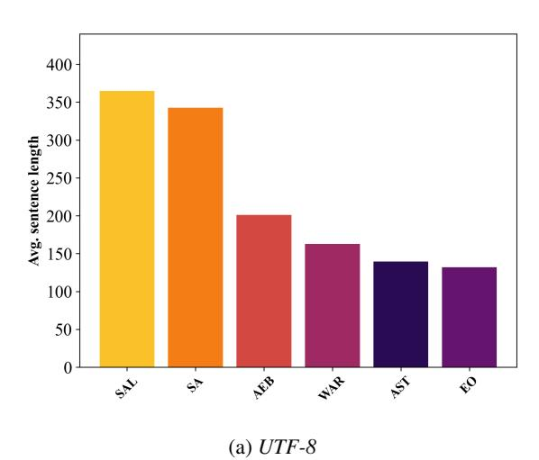

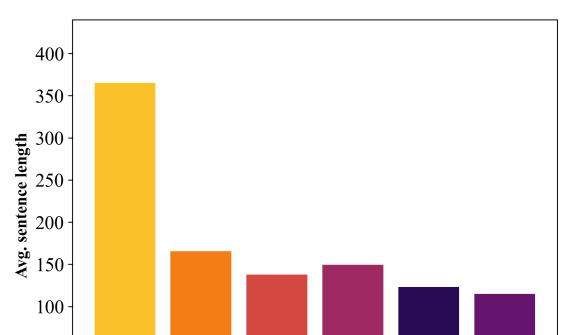

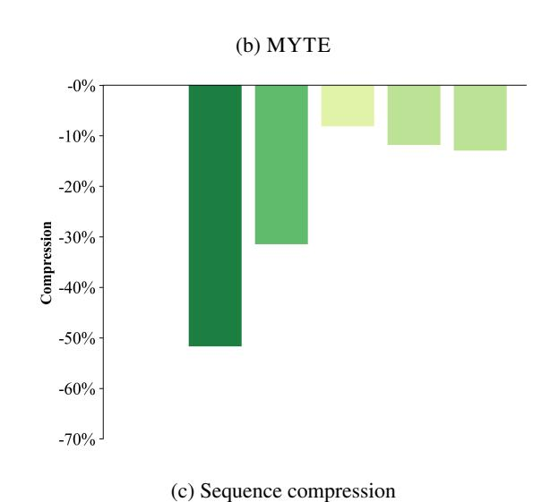

Figure 9: Average byte sequence lengths of parallel sentences for languages unseen in the morphological analysis used in the construction of MYTE. Santali (*sal*) uses a script (Ol Chicki), a distinct script not seen in morphological analysis.

Platform. We used v3-8 for training small and base models and v3-32 for the large model. The training took approximately 90h for small, 230h for

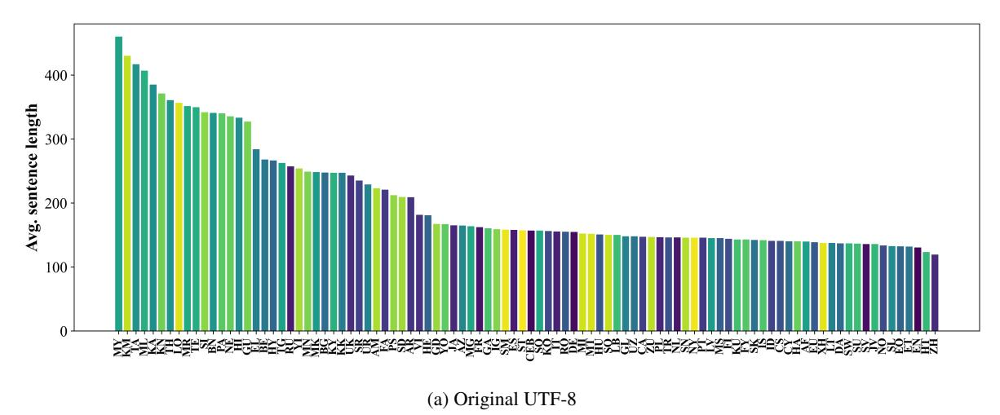

Figure 10: Average byte sequence lengths of parallel sentences from Flores 200.

(b) MYTE (Same order as in a)

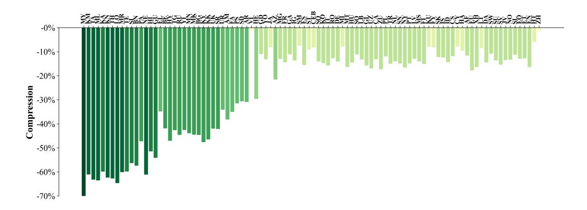

Figure 11: Sequence compression rates on Flores 200 of MYTE in comparison with the original *UTF-8* encoding.

|      | ar   | bn   | en   | fi   | id   | ko   | ru   | sw   | te   | AVG LR | AVG  |
|------|------|------|------|------|------|------|------|------|------|--------|------|
| ByT5 | 81.6 | 59.3 | 76.3 | 80.7 | 77.8 | 75.7 | 75.9 | 77.1 | 78.1 | 73.2   | 75.9 |
| MyT5 | 82.3 | 67.2 | 74.9 | 80.5 | 76.1 | 74.8 | 76.6 | 74.2 | 83.6 | 75.3   | 76.7 |

Table 5: F1 scores for question answering (XTREME-UP benchmark).

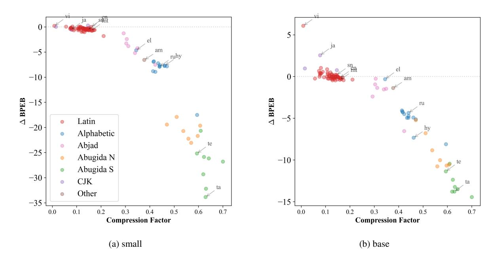

Figure 12: The difference in Byte-per-English-Bit between MyT5 and ByT5 for models in small and base scales.

|      | am   | bbj  | bm   | ee   | ha   | ig   | lg   | luo  | mos  | ny   | pcm  | rw   | sn   | sw   | tn   | tw   | wo   | xh   | yo   | zu   | AVG LR | AVG  |
|------|------|------|------|------|------|------|------|------|------|------|------|------|------|------|------|------|------|------|------|------|--------|------|
| ByT5 | 60.8 | 72.5 | 80.0 | 88.1 | 88.1 | 84.3 | 84.6 | 77.1 | 73.5 | 89.1 | 85.2 | 76.7 | 90.0 | 88.5 | 85.6 | 77.6 | 80.2 | 83.4 | 78.7 | 85.2 | 81.5   | 81.5 |
| MyT5 | 62.1 | 68.9 | 79.2 | 87.1 | 87.5 | 83.3 | 83.6 | 75.4 | 75.4 | 88.0 | 85.2 | 77.9 | 90.2 | 88.9 | 84.7 | 77.7 | 75.0 | 82.0 | 79.4 | 83.8 | 80.8   | 80.8 |

Table 6: F1 scores for named entity recognition (MasakhaNER test set [Adelani et al.](#page-9-4) [\(2022\)](#page-9-4) via XTREME-UP benchmark)

|      | am   | be   | bn   | de   | en   | es   | fi   | fr   | ha   | hi   | ja   | pt_br | ru   | sw   | ta   | th   | tr   | yo   | zu   | AVG LR | AVG  |
|------|------|------|------|------|------|------|------|------|------|------|------|-------|------|------|------|------|------|------|------|--------|------|
| ByT5 | 18.6 | 31.7 | 30.7 | 34.5 | 35.1 | 33.1 | 30.0 | 34.8 | 25.7 | 25.7 | 31.4 | 34.7  | 35.7 | 26.4 | 26.4 | 24.6 | 32.1 | 18.6 | 22.8 | 25.1   | 29.1 |
| MyT5 | 16.5 | 26.2 | 20.6 | 31.6 | 31.6 | 28.1 | 25.7 | 28.1 | 21.7 | 18.7 | 18.1 | 30.4  | 32.8 | 21.4 | 21.2 | 19.2 | 25.7 | 13.0 | 16.7 | 19.7   | 23.5 |

Table 7: Exact match score for semantic parsing (XTREME-UP benchmark)

|      | am  | de   | el   | fr   | hy   | ja  | kk   | ko  | mt   | pl   | ru   | sn   | ta   | te   | vi   | AVG LR | AVG  |
|------|-----|------|------|------|------|-----|------|-----|------|------|------|------|------|------|------|--------|------|
| MyT5 | 9.4 | 31.9 | 21.9 | 36.5 | 22.6 | 9.2 | 20.1 | 7.7 | 26.2 | 25.3 | 24.3 | 27.8 | 22.5 | 18.4 | 24.1 | 21.1   | 21.8 |
| ByT5 | 8.8 | 35.4 | 22.1 | 41.8 | 22.8 | 9.3 | 20.9 | 7.1 | 34.1 | 27.8 | 26.9 | 27.4 | 21.3 | 17.4 | 23.9 | 21.9   | 23.1 |

Table 8: ChrF scores for machine translation (Florers 200 test set [Team et al.](#page-11-6) [\(2022\)](#page-11-6) via XTREME-UP benchmark).

base, and 190h for large models. We are thankful to Google for providing free quotas for those machines through the TPU Research Cloud program.

The inference in language modeling experiments was run on an A40 GPU core.

#### C.2 Fine-Tuning

For few-shot fine-tuning, we choose the same hyperparameters and optimization strategy as in [Ruder et al.](#page-11-9) [\(2023\)](#page-11-9): 0.1 dropout, 1e −3 learning rate with inverse square root decay. The batch size was chosen to facilitate training on v3-8 TPU, specifically 128 for NER; 64 for MT, QA, and semantic parsing. The number of fine-tuning steps corresponded to the sizes of the training datasets: QA 6500, NER 6000, semantic parsing 1000, and

MT 10000. For machine translation, we selected the following sample of language both for training and evaluation: Telugu, Tamil, Greek, Armenian, Russian, Kazakh, Amharic, Vietnamese, Japanese, French, Korean, German, Marathi, Polish.

| Lang      | UTF-8      |                | MYTE       |                | Comp         |              |              |              | ByT5        |              |              |            |            |            | MyT5       |            |              |
|-----------|------------|----------------|------------|----------------|--------------|--------------|--------------|--------------|-------------|--------------|--------------|------------|------------|------------|------------|------------|--------------|
|           | Parity     | Len.           | Parity     | Len.           |              |              | BPEB         |              |             | Time (ms)    |              |            | BPEB       |            |            | Time (ms)  |              |
|           |            |                |            |                | in %         | small        | base         | large        | small       | base         | large        | small      | base       | large      | small      | base       | large        |
| af am  | 1.1 1.7 | 139.6 222.8 | 1.1 1.3 | 123.3 137.6 | 11.7 38.2 | 3.9 11.7  | 4.6 8.3   | 9.5 15.3  | 5.8 6.9  | 8.9 12.5  | 27.6 32.0 | 3.7 5.1 | 4.3 6.9 | 3.4 5.2 | 6.6 6.7 | 8.4 9.0 | 26.1 27.0 |
| ar        | 1.6        | 208.8          | 1.3        | 144.2          | 30.9         | 7.0          | 6.7          | 13.7         | 7.0         | 11.6         | 31.4         | 4.6        | 6.4        | 4.4        | 6.4        | 9.1        | 26.7         |
| az be  | 1.3 2.1 | 164.6 267.7 | 1.2 1.4 | 129.1 155.5 | 21.6 41.9 | 6.4 14.6  | 5.7 11.6  | 11.4 17.1 | 6.3 8.1  | 9.9 13.5  | 28.9 35.5 | 4.6 5.7 | 5.4 7.5 | 4.7 5.9 | 6.7 6.9 | 8.7 9.5 | 27.5 27.4 |
| bg        | 1.9        | 247.6          | 1.3        | 137.1          | 44.6         | 11.9         | 9.6          | 14.6         | 7.7         | 12.6         | 33.9         | 4.3        | 4.9        | 3.8        | 7.1        | 8.8        | 24.1         |
| bn        | 2.6        | 340.6          | 1.3        | 145.0          | 57.4         | 28.4         | 17.2         | 21.3         | 9.3         | 16.6         | 41.3         | 5.3        | 7.2        | 5.4        | 6.9        | 9.2        | 27.5         |
| ca ceb | 1.1 1.2 | 147.1 156.9 | 1.2 1.3 | 127.7 143.8 | 13.2 8.3  | 4.1 5.0   | 4.6 5.0   | 9.6 11.1  | 5.8 6.0  | 9.4 9.6   | 27.9 28.7 | 3.9 4.4 | 4.6 6.0 | 3.4 4.5 | 6.7 6.3 | 8.5 9.2 | 25.9 27.6 |
| cs        | 1.1        | 140.7          | 1.1        | 124.1          | 11.8         | 4.4          | 4.8          | 9.5          | 5.5         | 9.0          | 28.1         | 4.5        | 4.8        | 4.1        | 6.7        | 8.4        | 26.0         |
| cy        | 1.1        | 140.1          | 1.2        | 129.1          | 7.9          | 4.5          | 5.1          | 10.7         | 5.9         | 8.7          | 27.6         | 4.2        | 5.1        | 4.2        | 7.1        | 8.5        | 23.4         |
| da de  | 1.0 1.2 | 136.7 154.5 | 1.1 1.2 | 116.9 132.8 | 14.5 14.1 | 3.9 4.6   | 4.5 5.1   | 9.3 10.2  | 5.9 6.2  | 8.7 9.7   | 27.8 27.9 | 3.6 4.2 | 4.0 5.1 | 3.3 3.6 | 6.8 6.5 | 8.2 8.8 | 33.7 26.7 |
| el        | 2.2        | 284.1          | 1.7        | 185.0          | 34.9         | 12.8         | 13.6         | 19.5         | 8.3         | 14.0         | 36.6         | 8.2        | 13.3       | 9.3        | 7.1        | 10.4       | 29.7         |
| en        | 1.0        | 130.5          | 1.0        | 109.1          | 16.4         | 2.6          | 3.3          | 6.8          | 6.2         | 11.0         | 28.4         | 2.6        | 3.2        | 1.9        | 6.6        | 10.5       | 30.3         |
| eo es  | 1.0 1.2 | 132.2 158.0 | 1.1 1.2 | 115.1 133.5 | 12.9 15.5 | 3.8 4.7   | 4.4 4.8   | 9.1 9.9   | 5.8 6.2  | 8.5 9.2   | 27.2 28.2 | 3.6 4.0 | 4.1 4.8 | 3.3 3.4 | 6.6 6.4 | 8.1 8.7 | 25.7 34.2 |
| et        | 1.0        | 131.9          | 1.1        | 115.0          | 12.8         | 4.1          | 4.4          | 9.1          | 5.8         | 8.6          | 27.3         | 3.9        | 4.3        | 3.7        | 6.4        | 8.2        | 24.7         |
| eu        | 1.1        | 138.6          | 1.0        | 114.0          | 17.8         | 4.3          | 4.6          | 9.4          | 5.9         | 8.8          | 27.9         | 3.7        | 4.1        | 3.5        | 6.5        | 8.1        | 25.6         |
| fa fi  | 1.7 1.1 | 220.9 144.1 | 1.3 1.1 | 143.4 122.3 | 35.1 15.1 | 8.6 4.7   | 7.6 4.8   | 14.5 9.7  | 8.7 5.8  | 12.0 9.4  | 32.0 26.6 | 4.4 4.2 | 6.1 4.9 | 4.5 4.1 | 7.0 6.7 | 9.0 8.4 | 26.7 25.9 |
| fr        | 1.2        | 162.1          | 1.3        | 138.6          | 14.5         | 4.7          | 5.1          | 10.2         | 6.3         | 9.6          | 28.2         | 4.2        | 5.3        | 3.5        | 6.5        | 9.0        | 26.9         |
| fy        | 1.1        | 143.0          | 1.2        | 131.3          | 8.2          | 4.8          | 5.1          | 9.8          | 5.7         | 9.1          | 27.6         | 4.5        | 5.5        | 4.4        | 6.5        | 8.8        | 26.1         |
| ga gd  | 1.2 1.3 | 160.3 167.2 | 1.3 1.4 | 142.5 148.8 | 11.1 11.0 | 5.4 5.8   | 5.7 6.0   | 11.2 12.0 | 6.0 6.1  | 9.7 10.5  | 28.1 28.9 | 5.0 5.1 | 6.2 6.9 | 5.1 5.5 | 6.7 6.8 | 9.1 9.1 | 26.5 27.3 |
| gl        | 1.1        | 148.0          | 1.1        | 124.8          | 15.7         | 4.2          | 4.5          | 9.4          | 6.1         | 9.4          | 28.0         | 3.8        | 4.4        | 3.3        | 6.7        | 8.5        | 27.6         |
| gu        | 2.5        | 327.1          | 1.4        | 150.0          | 54.1         | 26.5         | 16.6         | 23.5         | 8.9         | 16.7         | 39.8         | 5.8        | 7.8        | 6.2        | 6.8        | 9.4        | 26.8         |
| ha he  | 1.1 1.4 | 140.0 180.9 | 1.2 1.2 | 126.5 127.3 | 9.6 29.6  | 4.1 5.6   | 4.6 7.4   | 9.9 11.3  | 5.7 6.5  | 9.3 10.2  | 27.5 29.6 | 3.7 4.3 | 4.5 5.0 | 3.7 3.9 | 6.5 6.7 | 8.6 8.5 | 25.9 26.0 |
| hi        | 2.6        | 333.1          | 1.5        | 161.6          | 51.5         | 23.8         | 15.8         | 22.2         | 9.2         | 16.2         | 40.4         | 5.9        | 9.0        | 6.1        | 7.2        | 9.7        | 28.5         |
| ht        | 0.9        | 123.2          | 1.1        | 115.8          | 6.0          | 3.5          | 4.2          | 8.7          | 5.4         | 8.4          | 27.1         | 3.5        | 4.0        | 3.3        | 6.3        | 8.0        | 25.6         |
| hu hy  | 1.2 2.0 | 150.8 266.5 | 1.2 1.3 | 128.9 141.2 | 14.5 47.0 | 5.2 13.0  | 5.3 13.6  | 10.5 18.1 | 5.8 8.1  | 9.5 13.4  | 28.4 35.6 | 4.7 5.3 | 5.3 6.2 | 4.4 5.5 | 6.7 7.0 | 8.6 9.0 | 25.9 26.3 |
| id        | 1.1        | 140.8          | 1.1        | 120.7          | 14.3         | 4.0          | 4.3          | 9.4          | 5.9         | 9.2          | 27.6         | 3.5        | 4.1        | 3.4        | 6.6        | 8.3        | 25.3         |
| ig is  | 1.2 1.1 | 159.1 141.8 | 1.3 1.1 | 137.4 124.1 | 13.7 12.4 | 5.8 4.9   | 5.7 5.1   | 11.1 9.7  | 6.0 5.7  | 10.5 9.1  | 28.1 27.6 | 4.8 4.2 | 5.8 4.9 | 4.8 4.1 | 6.7 6.4 | 9.0 8.6 | 25.9 26.0 |
| it        | 1.2        | 155.4          | 1.2        | 130.9          | 15.8         | 4.5          | 4.9          | 10.0         | 6.1         | 9.3          | 28.1         | 3.9        | 4.7        | 3.4        | 6.4        | 8.5        | 25.9         |
| ja        | 1.3        | 165.1          | 1.4        | 151.6          | 8.2          | 5.4          | 5.0          | 7.0          | 6.3         | 10.0         | 28.4         | 4.9        | 7.5        | 5.1        | 6.7        | 9.2        | 26.5         |
| jv ka  | 1.0 2.9 | 135.6 385.0 | 1.1 1.4 | 117.2 154.4 | 13.5 59.9 | 3.9 23.5  | 4.3 16.0  | 9.2 24.5  | 5.6 10.3 | 8.9 18.9  | 27.6 44.9 | 3.5 6.0 | 4.0 7.9 | 3.4 6.6 | 6.4 7.1 | 7.9 9.5 | 25.3 28.3 |
| kk        | 1.9        | 247.0          | 1.2        | 132.1          | 46.5         | 12.2         | 9.7          | 15.0         | 7.7         | 12.6         | 33.8         | 4.4        | 4.8        | 4.3        | 6.3        | 8.7        | 27.6         |
| km        | 3.3        | 430.0          | 1.5        | 167.3          | 61.1         | 27.6         | 22.7         | 29.0         | 10.8        | 20.6         | 48.3         | 7.0        | 12.3       | 9.3        | 7.2        | 10.1       | 28.3         |
| kn ko  | 2.8 1.2 | 371.0 155.9 | 1.3 1.2 | 139.7 133.0 | 62.4 14.7 | 34.1 4.5  | 20.5 5.0  | 23.5 9.1  | 9.8 6.0  | 18.4 9.7  | 43.7 30.6 | 4.8 4.7 | 6.7 5.8 | 5.7 4.0 | 6.7 6.8 | 9.1 8.7 | 26.4 26.2 |
| ku        | 1.1        | 143.0          | 1.2        | 131.6          | 8.0          | 4.7          | 5.0          | 10.1         | 5.7         | 9.1          | 27.6         | 4.5        | 5.2        | 4.4        | 6.5        | 8.8        | 26.2         |
| ky        | 1.9        | 247.3          | 1.2        | 129.5          | 47.6         | 12.2         | 9.8          | 14.6         | 7.6         | 12.9         | 34.1         | 4.3        | 4.7        | 4.1        | 6.5        | 8.6        | 26.2         |
| lb lo  | 1.1 2.7 | 150.1 356.5 | 1.2 1.2 | 130.2 125.9 | 13.2 64.7 | 4.7 30.8  | 5.2 19.6  | 10.8 22.7 | 5.8 9.3  | 9.3 17.5  | 28.0 44.9 | 4.3 4.6 | 5.1 6.1 | 4.1 5.2 | 6.5 6.5 | 8.7 8.6 | 26.0 26.4 |
| lt        | 1.1        | 137.6          | 1.2        | 125.8          | 8.5          | 4.4          | 4.7          | 9.2          | 5.9         | 8.7          | 27.3         | 4.5        | 5.1        | 4.2        | 6.4        | 8.6        | 27.6         |
| lv        | 1.1        | 144.9          | 1.2        | 126.1          | 13.0         | 4.8          | 5.0          | 9.6          | 5.8         | 9.2          | 27.9         | 4.6        | 5.0        | 4.3        | 6.7        | 8.5        | 26.9         |
| mg mi  | 1.3 1.2 | 163.7 152.0 | 1.3 1.3 | 142.4 140.0 | 13.0 7.9  | 5.5 4.8   | 5.7 5.3   | 11.1 10.7 | 6.2 5.8  | 9.8 9.9   | 28.8 28.2 | 4.6 4.7 | 6.0 5.7 | 4.8 4.6 | 6.9 6.6 | 9.0 9.0 | 26.6 26.8 |
| mk        | 1.9        | 248.2          | 1.3        | 137.7          | 44.5         | 12.2         | 9.8          | 14.7         | 7.6         | 12.9         | 37.7         | 4.3        | 4.9        | 3.9        | 6.8        | 8.8        | 27.3         |
| ml mn  | 3.1 1.9 | 406.9 249.0 | 1.4 1.3 | 148.4 139.7 | 63.5 43.9 | 37.6 12.2 | 21.0 10.3 | 25.9 15.0 | 17.9 7.5 | 19.4 13.5 | 46.7 33.5 | 5.4 4.9 | 7.8 5.3 | 6.5 4.7 | 7.0 6.6 | 9.2 8.9 | 26.6 26.4 |
| mr        | 2.7        | 351.5          | 1.3        | 140.2          | 60.1         | 26.8         | 17.1         | 22.9         | 9.5         | 17.0         | 42.1         | 5.1        | 6.5        | 5.0        | 6.9        | 9.0        | 26.6         |
| ms        | 1.1        | 144.9          | 1.1        | 124.5          | 14.0         | 4.2          | 4.4          | 9.7          | 5.9         | 8.9          | 27.9         | 3.6        | 4.3        | 3.6        | 6.6        | 8.3        | 26.0         |
| mt my  | 1.2 3.5 | 152.0 460.0 | 1.2 1.2 | 127.2 136.1 | 16.3 70.4 | 5.2 31.9  | 5.5 21.3  | 11.0 29.7 | 5.7 11.6 | 9.9 21.7  | 31.6 51.4 | 4.4 5.1 | 5.1 6.9 | 4.3 6.3 | 6.5 7.0 | 8.6 8.9 | 33.1 26.4 |
| ne        | 2.6        | 335.4          | 1.2        | 130.3          | 61.2         | 24.2         | 16.1         | 22.0         | 9.1         | 16.0         | 40.7         | 4.6        | 5.5        | 4.3        | 7.5        | 8.7        | 26.2         |
| nl        | 1.1        | 146.0          | 1.1        | 125.5          | 14.1         | 4.1          | 4.8          | 9.9          | 6.0         | 9.2          | 27.8         | 3.8        | 4.5        | 3.5        | 6.4        | 8.5        | 25.9         |
| no ny  | 1.0 1.1 | 133.4 145.8 | 1.1 1.1 | 115.7 121.6 | 13.3 16.6 | 3.8 4.7   | 4.4 4.8   | 9.1 10.3  | 5.7 5.4  | 9.0 9.6   | 27.4 27.1 | 3.5 3.9 | 4.0 4.5 | 3.3 3.9 | 6.6 6.4 | 8.2 8.4 | 25.9 25.7 |
| pa        | 2.6        | 340.1          | 1.6        | 179.3          | 47.3         | 26.9         | 17.9         | 23.8         | 9.2         | 16.7         | 40.8         | 7.4        | 12.6       | 8.6        | 7.3        | 10.5       | 28.5         |
| pl        | 1.1        | 146.5          | 1.2        | 129.0          | 11.9         | 4.7          | 5.1          | 10.1         | 6.0         | 9.4          | 32.3         | 4.5        | 5.3        | 4.3        | 6.5        | 8.4        | 25.8         |
| ps pt  | 1.6 1.1 | 212.3 145.8 | 1.3 1.1 | 145.4 124.0 | 31.5 14.9 | 8.4 4.1   | 7.7 4.4   | 14.7 9.3  | 6.9 5.9  | 11.9 9.4  | 31.1 28.1 | 4.6 3.8 | 6.3 4.3 | 5.0 3.3 | 6.8 6.4 | 9.1 8.4 | 27.1 25.7 |
| ro        | 1.2        | 155.1          | 1.2        | 135.3          | 12.8         | 4.8          | 5.1          | 10.4         | 6.0         | 9.5          | 28.5         | 4.5        | 5.4        | 4.3        | 6.9        | 8.8        | 26.3         |
| ru sd  | 2.0 1.6 | 257.3 209.4 | 1.3 1.3 | 142.5 145.2 | 44.6 30.7 | 12.5 8.1  | 9.9 7.5   | 14.5 14.8 | 7.9 6.7  | 13.0 12.0 | 34.5 30.9 | 4.6 4.8 | 5.6 6.5 | 3.8 5.3 | 6.6 6.8 | 9.0 9.2 | 26.6 27.1 |
| si        | 2.6        | 342.0          | 1.4        | 149.2          | 56.4         | 28.0         | 18.2         | 24.0         | 9.2         | 18.1         | 40.9         | 5.7        | 7.5        | 6.4        | 6.8        | 9.3        | 27.0         |
| sk        | 1.1        | 142.0          | 1.1        | 124.7          | 12.2         | 4.5          | 4.9          | 9.6          | 5.9         | 8.8          | 27.6         | 4.5        | 4.9        | 4.1        | 6.3        | 8.4        | 23.2         |
| sl sm  | 1.0 1.2 | 132.4 158.2 | 1.1 1.3 | 117.5 146.3 | 11.2 7.5  | 3.9 4.9   | 4.5 5.6   | 9.0 11.4  | 5.8 5.8  | 8.8 10.1  | 27.7 28.2 | 3.9 4.5 | 4.3 6.2 | 3.5 4.8 | 6.6 6.7 | 8.3 9.2 | 27.3 26.2 |
| sn        | 1.1        | 145.9          | 1.1        | 124.1          | 14.9         | 4.7          | 4.7          | 10.2         | 5.7         | 9.9          | 27.8         | 4.1        | 4.9        | 4.1        | 6.5        | 8.5        | 26.5         |
| so        | 1.2        | 150.1          | 1.2        | 133.5          | 11.1         | 4.8          | 5.1          | 11.0         | 5.7         | 9.8          | 27.8         | 4.4        | 5.4        | 4.5        | 6.5        | 13.2       | 26.7         |
| sq sr  | 1.2 1.8 | 156.6 235.2 | 1.2 1.2 | 134.6 136.0 | 14.1 42.2 | 5.4 11.1  | 5.5 9.2   | 10.8 13.8 | 6.0 7.3  | 9.6 12.5  | 28.5 32.9 | 4.7 4.3 | 5.5 4.9 | 4.6 4.0 | 6.8 6.8 | 8.8 8.8 | 26.3 26.3 |
| st        | 1.2        | 157.2          | 1.3        | 142.9          | 9.1          | 5.2          | 5.4          | 11.5         | 5.6         | 10.0         | 27.8         | 4.5        | 6.0        | 4.8        | 6.7        | 9.1        | 26.4         |
| su        | 1.0        | 136.6          | 1.1        | 118.0          | 13.6         | 3.9          | 4.3          | 9.2          | 5.6         | 8.9          | 27.4         | 3.6        | 4.2        | 3.5        | 6.3        | 8.3        | 25.3         |
| sv sw  | 1.0 1.0 | 135.8 136.7 | 1.1 1.1 | 114.9 121.8 | 15.4 10.8 | 3.9 4.1   | 4.4 4.5   | 9.2 9.6   | 6.1 5.7  | 8.7 8.9   | 27.2 27.5 | 3.7 3.8 | 4.1 4.4 | 3.3 3.6 | 6.3 6.7 | 8.3 8.1 | 26.6 25.9 |
| ta        | 3.2        | 416.6          | 1.4        | 153.2          | 63.2         | 39.4         | 22.0         | 24.9         | 10.7        | 19.8         | 47.6         | 5.5        | 8.2        | 6.7        | 7.1        | 9.4        | 28.2         |
| te        | 2.7        | 349.5          | 1.3        | 140.3          | 59.9         | 30.0         | 17.9         | 22.2         | 9.4         | 16.9         | 41.9         | 4.8        | 6.5        | 5.6        | 6.9        | 9.0        | 26.5         |
| tg th  | 2.0 2.8 | 262.4 360.8 | 1.4 1.2 | 150.4 134.4 | 42.7 62.7 | 14.2 30.5 | 11.0 19.2 | 16.4 20.5 | 7.8 9.8  | 13.4 17.5 | 34.7 42.6 | 5.3 4.6 | 6.5 6.8 | 5.3 5.1 | 7.0 6.8 | 9.2 8.8 | 26.6 27.7 |
| tr        | 1.1        | 146.2          | 1.1        | 124.2          | 15.0         | 4.8          | 4.8          | 9.5          | 5.7         | 9.4          | 28.1         | 4.2        | 4.8        | 4.1        | 6.7        | 8.4        | 26.0         |
| uk        | 1.9        | 243.0          | 1.3        | 140.9          | 42.0         | 11.7         | 9.6          | 14.2         | 7.6         | 12.8         | 33.5         | 4.7        | 5.4        | 4.3        | 6.5        | 8.9        | 26.5         |
| ur uz  | 1.8 1.1 | 229.0 147.7 | 1.4 1.1 | 150.8 122.7 | 34.1 16.9 | 10.1 4.8  | 8.7 5.1   | 15.7 10.7 | 7.4 6.1  | 12.3 9.0  | 32.7 27.9 | 4.9 4.1 | 7.1 4.8 | 5.4 4.0 | 7.0 6.8 | 9.4 8.4 | 28.2 23.2 |
| vi        | 1.4        | 181.4          | 1.6        | 179.6          | 1.0          | 7.1          | 6.1          | 11.7         | 6.5         | 10.6         | 29.5         | 7.3        | 12.2       | 8.3        | 6.9        | 10.2       | 28.3         |
| xh        | 1.1        | 137.6          | 1.1        | 115.0          | 16.4         | 4.4          | 4.5          | 9.9          | 5.5         | 9.4          | 30.2         | 3.9        | 4.4        | 3.8        | 6.3        | 8.2        | 25.6         |
| yi yo  | 1.9 1.3 | 253.8 166.9 | 1.3 1.3 | 145.6 144.8 | 42.6 13.2 | 12.5 6.3  | 13.2 6.3  | 18.1 11.9 | 7.4 6.2  | 13.5 10.0 | 34.1 29.0 | 5.0 5.3 | 6.6 6.8 | 5.7 5.4 | 6.7 6.9 | 9.2 9.3 | 27.2 26.9 |
| zh        | 0.9        | 119.4          | 1.1        | 117.5          | 1.6          | 3.4          | 4.0          | 6.0          | 5.6         | 8.6          | 27.2         | 3.4        | 4.9        | 3.3        | 6.3        | 8.2        | 25.4         |
| zu        | 1.1        | 146.8          | 1.1        | 121.3          | 17.4         | 4.8          | 4.8          | 10.6         | 5.7         | 9.9          | 27.7         | 4.1        | 4.7        | 4.1        | 6.4        | 8.4        | 26.5         |

Table 9: Results for each of the analyzed languages. The left-hand columns contain the comparison of enoding lengths *UTF-8* and MYTE. The right-hand columns present performance (BPEB) and inference time of corresponding language models ByT5 and MyT5. All numbers are averages across the FLORES-200 test split.