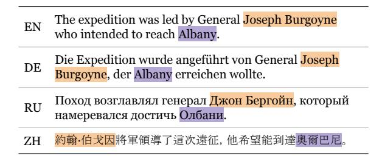
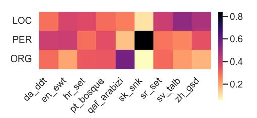
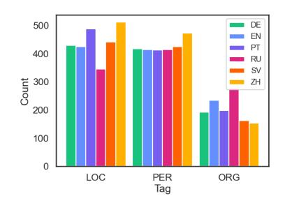
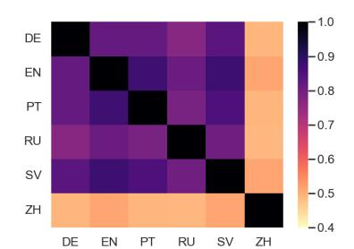
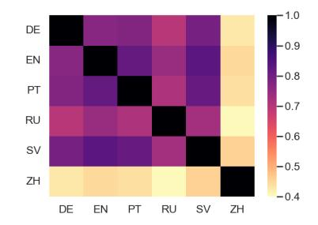
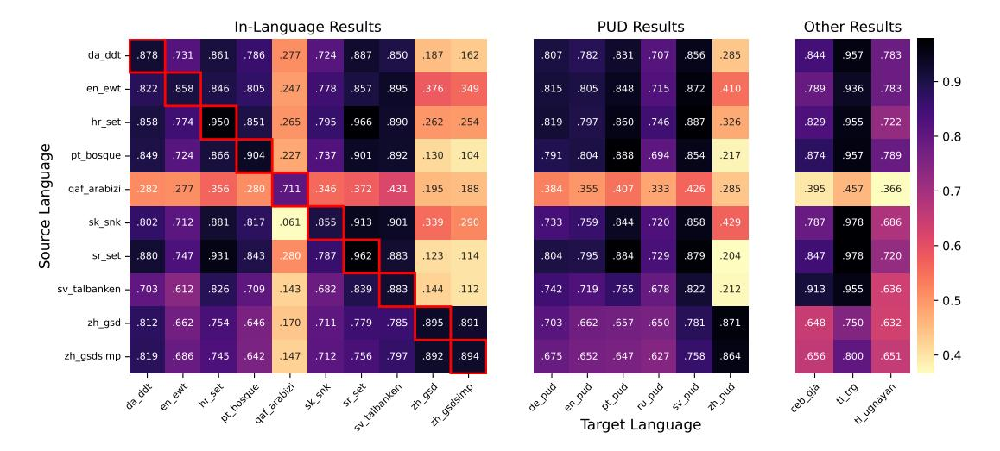
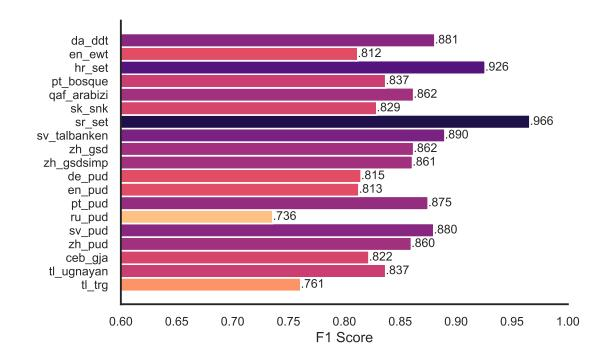

# Universal NER: A Gold-Standard Multilingual Named Entity Recognition Benchmark

Stephen Mayhewα Terra Blevinsβ Shuheng Liuγ Marek Šuppaδϵ Hila Gonenβ Joseph Marvin Imperialζ,η Börje F. Karlssonθ Peiqin Linι Nikola Ljubešic´ κ LJ Mirandaλ Barbara Plankι,µ Arij Riabiν,ξ Yuval Pintero αDuolingo, βUniversity of Washington, γGeorgia Institute of Technology, δComenius University in Bratislava, ϵCisco, ζNational University Philippines, ηUniversity of Bath, θBeijing Academy of Artificial Intelligence, ιLMU Munich, κ Jožef Stefan Institute, λAllen Institute for Artificial Intelligence, µ IT University of Copenhagen, ν Inria Paris, ξSorbonne Université, oBen-Gurion University

<stephen@duolingo.com> <blvns@cs.washington.edu>

## Abstract

We introduce Universal NER (UNER), an open, community-driven project to develop goldstandard NER benchmarks in many languages. The overarching goal of UNER is to provide high-quality, cross-lingually consistent annotations to facilitate and standardize multilingual NER research. UNER v1 contains 19 datasets annotated with named entities in a cross-lingual consistent schema across 13 diverse languages. In this paper, we detail the dataset creation and composition of UNER; we also provide initial modeling baselines on both in-language and cross-lingual learning settings. We will release the data, code, and fitted models to the public.1

## 1 Introduction

High-quality data in many languages is necessary for broadly multilingual natural language processing. In named entity recognition (NER), the majority of annotation efforts are centered on English, and cross-lingual transfer performance remains brittle (e.g., Chen et al., 2023b; Ma et al., 2023). Amongst non-English human-annotated NER datasets, while there have been multiple separate efforts in this front (e.g., Agic and Ljubeši ´ c´, 2014; Plank, 2019; Adelani et al., 2022), these either have disjoint annotation schemes and labels, cover a single language or small set of related languages, or are not widely accessible (e.g., Strassel and Tracey, 2016). For most of the world's languages, the only readily available NER data is the automatically annotated WikiANN dataset (Pan et al., 2017), though this annotation paradigm introduces data quality issues and limits its usefulness for evaluation (Lignos et al., 2022).

To address this data gap, we propose Universal NER (UNER), an open community effort to

Figure 1: Parallel sentences annotated with person (PER) and location (LOC) named entities in English (EN), German (DE), Russian (RU), and Chinese (ZH).

develop gold-standard named entity recognition benchmarks across many languages. Each dataset in Universal NER is annotated by primarily native speakers on the text of an existing Universal Dependencies treebank (UD; Nivre et al., 2020). Inspired by Universal Dependencies, the overarching philosophy of the UNER project is to provide a shared, universal definition, tagset, and annotation schema for NER that is broadly applicable across languages (Figure 1).

The current version of Universal NER, UNER v1, contains 19 datasets spanning 13 languages (Section 4). To establish performance baselines on UNER, we finetune an XLM-R model on various training configurations (Section 5)and show that while NER transfer performance between European languages is relatively strong, there remains a gap when transferring to different scripts or language typologies.

The goal of the UNER project is to facilitate multilingual research on entity recognition by addressing the need in the multilingual NLP community for standardized, cross-lingual, and manually annotated NER data. With the release of UNER v1, we plan to expand UNER to new languages and datasets, and we welcome all new annotators interested in developing the project.

1 <https://www.universalner.org>, UNER v1 available at <https://doi.org/10.7910/DVN/GQ8HDL>

#### 2 Dataset Design Principles

Named entity recognition (NER) is the task of identifying text spans in a given context that uniquely refer to specific *named entities*. The task of NER has a long tradition (Grishman, 2019) and facilitates many downstream NLP applications, such as information retrieval (Khalid et al., 2008) and question answering (Mollá et al., 2006). Furthermore, successful NER tagging requires a model to reason about semantic and pragmatic world knowledge, which makes the task an informative evaluation setting for testing NLP model capabilities.

As with Universal Dependencies, the goal of Universal NER is to develop an annotation schema that can work in any language. Traditionally, the UD (Nivre et al., 2016) and UPOS (Petrov et al., 2012) projects have chosen what amounts to the intersection of tags across all language-specific tagsets, keeping the resultant tagset broad and simple. We follow a similar strategy, picking tags that broadly cover the space of proper nouns.

Universal NER's annotation schema emphasizes three coarse-grained entity types: Person (PER), Organization (ORG), and Location (LOC). We provide a short description and an example for each tag.

**PER** The PERSON tag includes names of people, real or fictional, but not nominals.

"Mr. RobinsonPER smiled at the teacher."

**ORG** The ORGANIZATION tag is used for named collections of people.

"The <u>FDAORG</u> announced time travel pills tomorrow."

**LOC** The LOCATION tag covers all types of named locations.

"I will arise and go now, and go to InnisfreeLoc"

Figure 1 demonstrates how named entities and their corresponding annotations surface across languages. In some cases (such as in the English and German sentences), the surface forms of named entities are shared. However, often these forms vary—as in the Russian and Chinese examples—which makes entity identification and tagging more challenging, particularly in cross-lingual settings.

**Annotation Guidelines** In preparation for annotation, we developed extensive annotation guidelines, using the NorNE project guidelines (Jørgensen et al., 2020) as a starting point. Along with

tag descriptions, our guidelines include many examples, as well as instructions for dealing with ambiguity and unclear constructions, such as email addresses, pet names, and typographical errors.

We expect that the guidelines will be further refined and updated as annotation proceeds. To manage this, we track version numbers and changelogs for different iterations of the guidelines. Each data release will include the corresponding annotation guidelines at the time of release.

#### **3 Dataset Annotation Process**

Having described the theoretical basis for the tagset, we now discuss the mechanics of annotation.

**Sourcing Data** We chose the Universal Dependency corpora as the default base texts for annotation. This jump starts the process: there is high coverage of languages, and the data is already collected, cleaned, tokenized, and permissively licensed. Further, by adding an additional annotation layer onto an already rich set of annotations, we not only support verification in our project (Section 4.3) but also enable multilingual research on the full pipeline of core NLP. Since UD is annotated at the word level, we follow a BIO annotation schema (specifically IOB2), where words forming the beginning (inside) part of an X entity ( $X \in \{PER, LOC, ACC, ACC, ACC, ACC, ACC, ACC, ACC, A$ ORG}) are annotated B-X (I-X, respectively), and all other words are given an 0 tag. For the sake of continuity, we preserve all tokenization from UD.

While UD is the default data source for UNER, we do not limit the project to UD corpora (particularly for languages not currently included in UD). The only criterion for inclusion in the UNER corpus is that the tagging schema matches the UNER guidelines. We are also open to converting existing NER efforts on UD treebanks to UNER. In this initial release, we include four datasets that are transferred from other manual annotation efforts on UD sources (for DA, HR, ARABIZI, and SR).

**Sourcing Annotators** For the initial UNER annotation effort, we recruited annotators from the multilingual NLP community through academic networks on social media. Annotators were organized via channels in a Slack workspace. Annotators of the datasets included in UNER thus far are unpaid volunteers. We expect that annotators are native speakers of their annotation language, or are highly proficient, but we did not issue any language tests. For the first release of UNER, the choice of

&lt;sup>2http://www.universalner.org/guidelines/

the 13 dataset languages is solely dependent on the availability of annotators. As the project continues, we expect that additional languages and datasets will be added as annotators in more languages become available to contribute.

Annotation Tool We collect annotations for the UD treebanks using TALEN (Mayhew and Roth, 2018), a web-based tool for span-level sequence labeling.3 TALEN includes an optional feature that propagates annotations – if the user annotates "McLovin" in one section of the document, every other instance of "McLovin" in that document is annotated as well. This significantly speeds up annotation but risks over-annotation mistakes. For example, consider the token "US", which may appear with different senses in contexts such as "The US economy..." or "THEY OFFERED TO BUY US LUNCH!"

Secondary Annotators In addition to collecting a complete set of annotations from a primary annotator for each dataset, we also gather secondary annotations from another annotator on (at least) a subset of the data in order to estimate inter-annotator agreement (Section 4.2). We aim for at least 5% coverage of each data split with these secondary annotations, although most datasets have significantly more (Table 2). When a document has multiple annotators, we include the labels from the annotator with the most entities annotated in that document in the final dataset. This means a dataset may have multiple annotators, but each document has exactly one. We retain annotator identities in the data files.

Annotation Differences and Resolution When annotators disagreed on annotation decisions or the inter-annotator agreement scores were low, we encouraged them to discuss the disagreements and decide if they were conflicting interpretations of the guidelines or fundamental disagreements. In the former case, annotators came to an agreement on guideline interpretations and updated annotations accordingly. In the latter, the annotations were kept as-is. Not every dataset had this resolution process.

The multilingual nature of this process also highlighted cross-language differences in named entities that affect NER annotation. For instance, most languages in UNER use capitalization as a marker of proper nouns and, therefore, named entities. However, Chinese does not include capitalization in its script, which makes identifying named

entities more difficult and time-consuming than in other languages, potentially leading to more annotation errors. Differences in annotating NER across languages also stem from divergent definitions of proper nouns (PROPN) by language and the effects of translation artifacts; these issues are discussed further in Sections 4.3 and 4.4, respectively.

OTHER Tag As a helpful check for annotators, we allow the option of annotating a fourth entity type, Other (OTH), which is not included in the final dataset. This had several purposes: to store annotations that behaved like mentions, but didn't conform to the guidelines of the other tags; to measure potential annotation disagreement on ambiguous cases; and to store an additional layer of annotation. Not all annotators used it, and those that did were sometimes inconsistent. In practice, OTH was most often applied to languages, nationalities, and brands. The OTH tag roughly corresponds to the MISC tag used in CoNLL 2003, which has been described as being "ill-defined" (Adelani et al., 2022).

Dataset Transfer Most of the included datasets are annotated from scratch using the annotation process detailed above, but a few (DA ddt, QAF arabizi, HR and SR set) are transferred from other sources. The Danish ddt annotations are derived from the *News* portion of the DaN+ dataset (Plank et al., 2020); this text corresponds to the Universal Dependencies ddt treebank. The Croatian hr annotations come from the hr500k dataset (Ljubešic et al. ´ , 2016), half of which, consisting of newspaper and various web texts, was used for producing the Croatian Universal Dependencies hr\_set treebank (Agic and Ljubeši ´ c´, 2015). The NArabizi arabizi dataset was annotated on UD data using a slightly different NER schema and then automatically converted to the UNER schema. The Serbian sr data come from the SETimes.SR dataset (Batanovic et al. ´ , 2018), which was used in its fullness to produce the Serbian Universal Dependencies sr\_set treebank (Samardžic´ et al., 2017). The original Croatian and Serbian NER annotations were annotated and curated in multiple iterations by various native speakers. However, the annotations added to the UNER dataset were slightly modified to conform to the UNER annotation guidelines; namely, while nationalities and similar groups are annotated as PER in the original dataset, in the UNER dataset such entities are omitted. Finally, we retain the original annotations from existing NER datasets in the "xner" label column.

3 <https://github.com/mayhewsw/talen-react>

|       |           | Sentences |       |       |        |       | Entities |       |        | Tokens  |        |        |         |
|-------|-----------|-----------|-------|-------|--------|-------|----------|-------|--------|---------|--------|--------|---------|
| Lang. | Dataset   | Train     | Dev   | Test  | All    | Train | Dev      | Test  | All    | Train   | Dev    | Test   | All     |
| DA    | ddt       | 4,383     | 564   | 565   | 5,512  | 3,022 | 379      | 446   | 3,847  | 80,378  | 10,332 | 10,023 | 100,733 |
| EN    | ewt       | 12,543    | 2,001 | 2,077 | 16,621 | 7,022 | 966      | 1,088 | 9,076  | 204,579 | 25,149 | 25,097 | 254,825 |
| HR    | set       | 6,914     | 960   | 1,136 | 9,010  | 8,261 | 1,218    | 1,403 | 10,882 | 152,857 | 22,292 | 24,260 | 199,409 |
| PT    | bosque    | 7,018     | 1,172 | 1,167 | 9,357  | 8,101 | 1,401    | 1,215 | 10,717 | 171,776 | 28,447 | 27,604 | 227,827 |
| QAF   | arabizi   | 1003      | 139   | 145   | 1287   | 1320  | 204      | 194   | 1718   | 15,522  | 2,124  | 2,118  | 19,764  |
| SK    | snk       | 8,483     | 1,060 | 1,061 | 10,604 | 2,707 | 636      | 915   | 4,258  | 80,628  | 12,733 | 12,736 | 106,097 |
| SR    | set       | 3,328     | 536   | 520   | 4,384  | 5,020 | 742      | 847   | 6,609  | 74,259  | 11,993 | 11,421 | 97,673  |
| SV    | talbanken | 4,303     | 504   | 1,219 | 6,026  | 967   | 23       | 196   | 1,186  | 66,646  | 9,797  | 20,377 | 96,820  |
| 211   | gsd       | 3,997     | 500   | 500   | 4,997  | 6,136 | 754      | 767   | 7,657  | 98,616  | 12,663 | 12,012 | 123,291 |
| ZH    | gsdsimp   | 3,997     | 500   | 500   | 4,997  | 6,118 | 753      | 763   | 7,634  | 98,616  | 12,663 | 12,012 | 123,291 |
| DE    | pud       | -         | _     | 1,000 | 1,000  | _     | _        | 1,039 | 1,039  | _       | -      | 21,331 | 21,331  |
| EN    | pud       | _         | _     | 1,000 | 1,000  | _     | _        | 1,038 | 1,038  | -       | _      | 21,176 | 21,176  |
| PT    | pud       | -         | _     | 1,000 | 1,000  | _     | _        | 1,099 | 1,099  | -       | -      | 23,407 | 23,407  |
| RU    | pud       | -         | _     | 1,000 | 1,000  | _     | _        | 1,036 | 1,036  | -       | -      | 19,355 | 19,355  |
| SV    | pud       | -         | _     | 1,000 | 1,000  | _     | _        | 1,029 | 1,029  | -       | -      | 19,076 | 19,076  |
| ZH    | pud       | _         | -     | 1,000 | 1,000  | -     | -        | 1,137 | 1,137  | -       | _      | 21,415 | 21,415  |
| CEB   | gja       | _         | _     | 188   | 188    | _     | _        | 49    | 49     | _       | _      | 1,295  | 1,295   |
| TL    | trg       | _         | _     | 128   | 128    | _     | _        | 92    | 92     | _       | _      | 734    | 734     |
| 1 L   | ugnayan   | -         | -     | 94    | 94     | -     | -        | 61    | 61     | -       | -      | 1,097  | 1,097   |

Table 1: Universal NER has broad coverage of named entities in several languages and domains, adding annotations to the development, testing, and training sets from Universal Dependencies (Nivre et al., 2020).

### 4 Universal NER: Statistics and Analysis

This section presents an overview of the Universal NER (UNER) dataset. UNER v1 adds a NER annotation layer to 19 datasets (primarily treebanks from UD). It covers 13 geneologically and typologically diverse languages: Cebuano, Danish, German, English, Croatian, Narabizi, Portuguese, Russian, Slovak, Serbian, Swedish, Tagalog, and Chinese4. Overall, UNER v1 contains ten full datasets with training, development, and test splits over nine languages, three evaluation sets for lower-resource languages (TL and CEB), and a parallel evaluation benchmark spanning six languages.

#### 4.1 Dataset Statistics

In Table 1, we report the number of sentences, tokens, and annotated entities for each dataset in UNER. The datasets in UNER cover a wide range of data quantities: some provide a limited amount of evaluation data for a commonly low-resourced language, whereas others annotate thousands of training and evaluation sentences.

The datasets in UNER also cover a diverse range of domains, spanning web sources such as social media to more traditional provenances like news text. Table 5 in the appendix presents the complete set of sources for the data and the distribution of NER tags in each dataset, along with references to

each original treebank paper. The variety in data sources leads to varied distributions of tags across datasets (Figure 2).

#### 4.2 Inter-Annotator Agreement

We calculate inter-annotator agreement (IAA, Table 2) for each dataset in UNER that was annotated with the above process and for which we have secondary annotations. Table 2 reports agreement as per-label F1 score, using one annotator as "reference," and the other as "prediction."

ORG vs LOC Confusion The agreement on ORG and LOC is generally lower than that on PER. The annotation guidelines allow certain named entities to take either the ORG or LOC tag based on context. In some cases, the context is underspecified, leading to ambiguity. For example, a restaurant is a LOC when you go there to eat, but it is an ORG when it hires a new chef. A city is a LOC when you move there, but it is an ORG when it levies taxes. Officially, it is the

Figure 2: Distribution of tags in different UNER training sets. zh\_gsdsimp has the same distribution as zh\_gsd.

&lt;sup>4Languages sorted by their ISO 639-1/639-2 codes (International Organization for Standardization, 2002, 1998)

|       |           | Train |      |      |        | Dev  |      |      | Test   |      |      |      |        |
|-------|-----------|-------|------|------|--------|------|------|------|--------|------|------|------|--------|
| Lang. | Dataset   | LOC   | ORG  | PER  | % Docs | LOC  | ORG  | PER  | % Docs | LOC  | ORG  | PER  | % Docs |
| DA    | ddt       | .875  | .778 | .959 | 100%   | .917 | .765 | .934 | 100%   | .882 | .805 | .975 | 100%   |
| EN    | ewt       | .696  | .533 | .925 | 20%    | .786 | .640 | .949 | 20%    | .825 | .869 | .969 | 20%    |
| PT    | bosque    | .928  | .902 | .974 | 11%    | .850 | .885 | .980 | 25%    | .955 | .914 | .975 | 23%    |
| SK    | snk       | .840  | .743 | .900 | 100%   | .801 | .597 | .770 | 100%   | .837 | .621 | .823 | 100%   |
| sv    | talbanken | .857  | .670 | .913 | 100%   | .800 | .461 | .888 | 100%   | .937 | .812 | .871 | 100%   |
| ZH    | gsd       | .800  | .724 | .917 | 14%    | .795 | .661 | .956 | 100%   | .860 | .711 | .944 | 23%    |
| DE    | pud       | _     | _    | _    | _      | _    | _    | _    | _      | .709 | .840 | .812 | 6%     |
| EN    | pud       | _     | _    | _    | _      | _    | -    | _    | _      | 1.00 | .936 | .966 | 6%     |
| PT    | pud       | _     | _    | _    | _      | _    | _    | _    | _      | .903 | .920 | .985 | 14%    |
| RU    | pud       | _     | _    | _    | _      | _    | -    | _    | _      | .719 | .531 | .891 | 100%   |
| sv    | pud       | _     | _    | _    | _      | _    | _    | _    | _      | .865 | .735 | .944 | 100%   |
| ZH    | pud       | _     | _    | -    | _      | _    | _    | -    | _      | .752 | .776 | .971 | 20%    |
| CEB   | gja       | _     | _    | _    | _      | _    | _    | _    | _      | .769 | 1.00 | .914 | 71%    |
| TL    | trg       | _     | _    | _    | _      | _    | _    | _    | _      | .833 | _    | .957 | 100%   |
| IL    | ugnayan   | _     | _    | _    | _      | _    | _    | _    | _      | .913 | _    | _    | 100%   |

Table 2: Inter-annotator agreement scores for the datasets annotated natively for the Universal NER project. We don't report IAA for the datasets adapted from other sources, or from zh\_gsdsimp, which has nearly identical annotations to zh\_gsd. % **Docs** refers to the percentage of documents annotated by multiple annotators.

city government that levies taxes, but common usage allows, for example, "SpringfieldORG charges a brutal income tax." CoNLL 2003 English also has this ambiguity, with many documents where city names, representing sports teams, are annotated as ORG. We find this ambiguity is particularly common in the en\_ewt train and validation splits, primarily in documents in the *reviews* domain, which are short and very informal (e.g. "we love pamelas").

#### 4.3 Agreement with the PROPN POS Tag

The proper noun (PROPN) part-of-speech tag used in UD represents the subset of nouns that are used as the name of a specific person, place, or object (Nivre et al., 2020). We hypothesize that named entities as defined in UNER act roughly as a subset of these PROPN words or phrases, although not a strict subset due to divergent definitions. To test this, we calculate the precision of the UNER annotations against the UD PROPN tags (Table 3, F1 scores reported in Table 4). Overall, precision is relatively high, with a mean precision of 0.761 across datasets. Lower precision is often due to multi-word names containing non-PROPN words (e.g., "Catherine the Great"). The differences in precision can also be due to languagespecific PROPN annotation guidelines: for example, while the English PUD treebank tags the United States entity as "United PROPN States PROPN", Russian PUD tags it as "Соединенных  $_{ADJ}$  Штатов  $_{NOUN}$ ".

| Lang. | Dataset   | Train | Dev  | Test |  |
|-------|-----------|-------|------|------|--|
| DA    | ddt       | .709  | .729 | .722 |  |
| EN    | ewt       | .890  | .895 | .892 |  |
| HR    | set       | .683  | .651 | .671 |  |
| PT    | bosque    | .864  | .881 | .844 |  |
| QAF   | arabizi   | .952  | .960 | .985 |  |
| SK    | snk       | .803  | .783 | .688 |  |
| SR    | set       | .687  | .631 | .680 |  |
| SV    | talbanken | .766  | .756 | .842 |  |
| ZH    | gsd       | .605  | .624 | .616 |  |
| ZH    | gsdsimp   | .601  | .604 | .617 |  |
| DE    | pud       | _     | _    | .712 |  |
| EN    | pud       | _     | _    | .872 |  |
| PT    | pud       | _     | _    | .749 |  |
| RU    | pud       | _     | _    | .708 |  |
| SV    | pud       | _     | _    | .810 |  |
| ZH    | pud       | _     | _    | .634 |  |
| CEB   | gja       | _     | _    | .980 |  |
| TL    | trg       | _     | _    | .958 |  |
| TL    | ugnayan   | _     | _    | .654 |  |

Table 3: Comparing the overlap (Precision) between UNER annotations and UD PROPN tags.

#### 4.4 Cross-lingual Agreement in UNER

UNER contains sentence-aligned evaluation sets for six languages (German, English, Portuguese, Russian, Swedish, and Chinese) that are annotated on top of the Parallel Universal Dependencies treebanks (PUD; Zeman et al., 2017). Figure 3 summarizes the similarity of the NER annotations across these target languages in PUD.

We find that the overall distribution of tags is similar for the Western European languages (left

Figure 3: Cross-lingual comparison of NER Annotations on top of PUD treebanks. **Left**: Global distribution of tags for each PUD language. **Center**: Sentence-level agreement between languages for the number of entities. **Right**: Sentence-level agreement between languages for the identity of entities.

panel): the English, German, and Swedish annotations contain very similar counts of LOC and PER entities, with slightly more variance in ORG tags. Portuguese has a similar distribution with slightly more LOC entities. However, the Russian and Chinese annotations contain differing distributions from both these languages and each other.

A similar trend occurs in the sentence-level pairwise agreement on entity counts and identities between languages (center). There is relatively high agreement on the number of entities between European languages, with Russian differing slightly more from English, German, Portuguese, and Swedish. However, the Chinese benchmark agrees less frequently: the Chinese annotations match other languages on the number of entities in 50.4% of sentences; the other languages have an average agreement of 71.7–75.6%. Pairwise agreement on the specific entities in a given sentence shows similar behavior, albeit with lower agreement overall (right).

Many of these annotation differences likely stem from the translation process. While the data is aligned at the sentence level, linguistic variation and translator decisions may cause an entity to be added to or removed from the sentence, or the concept may be expressed in a manner that no longer qualifies as a named entity under the annotation guidelines. While we cannot directly measure inter-annotator agreement across languages because of the above differences, some variation also undoubtedly stems from annotation differences and errors, just as these cause disagreement between annotators on the same benchmark.

In the case of Chinese and English, we manually audited the annotation discrepancies. The differences in the LOC and ORG tags mainly stem from the confusion outlined in Section 4.2. Additionally, we observed more than 30 instances that could be explained by language-specific morphological inflection rules. Specifically, country names are used directly to modify the following nouns in Chinese as opposed to English using the adjectival form. Finally, the increase in PER entities can be best explained by the style of Chinese writing, which tends to transliterate non-Chinese names into Chinese and append the Latin name in parentheses; in these cases, each instance of the name would be tagged as a separate PER entity.

#### **5** Baselines for UNER

This section establishes initial baselines on the datasets in UNER v1 and provides in-language and cross-lingual results with XLM-RLarge.

## 5.1 Experiment Setup

We finetune XLM-RLarge (560M parameters) (Conneau et al., 2020) on the UNER datasets in which train and dev sets are available, 8 using a single NVIDIA GeForce RTX 3090 GPU. We also evaluate the performance of XLM-RLarge jointly finetuned on all training sets (all) listed above. We use a learning rate of 3e-5 and batch size of 16, except for bosque, where we used a batch size of

&lt;sup>5Consider the phrases: "奧巴馬對在北卡羅來納大學運動場上的群衆説道。" and "he told the crowd gathered on a sports field at the University of North Carolina." In Chinese, *Obama* (奧巴馬) is referred to by name, whereas the English version uses a pronoun.

&lt;sup>6I.e., "韓國公司" 'South Korean company'. The Chinese word "韓國" means the country 'South Korea', and in this case, directly modifies the noun "公司" 'company'. This word was consequently labeled as LOC, whereas its English counterpart is 0.

&lt;sup>7An example is "聖羅斯季斯拉夫 (St. Rastislav)", in which the English name is parenthesized and kept in the Chinese sentence, causing both names to be annotated.

8ddt, ewt, set, bosque, arabizi, snk, set, talbanken, gsd, gsdsimp

Figure 4: Heatmap of micro  $F_1$  scores on test sets with different fine-tuned models. The y-axis indicates the dataset that the model is fine-tuned on, and the x-axis indicates the datasets that the models are evaluated on. **Left**: Model performance on datasets that contains the train, dev and test splits. The highlighted diagonal cells are the in-dataset results. **Center**: Model performance on the PUD datasets. **Right**: Model performance on all other datasets.

8, and batch size of 4 in the cases of talbanken and all. All the code we used is adapted from the Huggingface transformers package (Wolf et al., 2020).

#### 5.2 Results and Discussion

Figure 4 reports the micro  $F_1$  scores on all test sets when XLM- $R_{Large}$  is finetuned on different languages. The in-language performance shown on the diagonal on the left of Figure 4 is almost always the highest among all test sets, with a few exceptions such as Simplified Chinese vs Traditional Chinese (ZH) and Croatian (HR) vs Serbian (SR). This most likely stems from the fact that both pairs are closely related languages.

We also observe that in most cases (i.e., between European languages), cross-lingual transfer performs well, achieving over .600 F1. However, transfer results in strikingly low performance on all three Chinese datasets {gsd, gsdsimp, pud}, as well as on the Maghrebi-Arabic-French (QAF) dataset {arabizi}. The results on the Chinese datasets align with observations from previous work (Chen et al., 2023a; Wu et al., 2020a; Bao et al., 2019) that other languages do not transfer well to Chinese. Narabizi is a North-African Arabic dialect written in Latin script that often involves codeswitching with French. The lack of similarities between this language and all other languages in our dataset might have resulted in poor transfer performance. Furthermore, Narabizi — along with Cebuano — are not included in the pretraining languages for XLM-R, which likely also affects their performance in this setting.

Table 6 (in the Appendix) shows the tag-level performance breakdown. For all languages,  $F_1$  on ORG is always the lowest, and LOC is almost always the second lowest. This likely stems from the similarity between ORG and LOC entities discussed in Section 4.2, whereas the names of people are usually less ambiguous, resulting in the highest  $F_1$  on PER for most datasets. Overall, the trained models finetuned on the UNER datasets exhibit promising results, and we leave further improvements on multi- and cross-lingual NER with these datasets to future work.

Finally, the performance of the model finetuned on all is included in Figure 5. Most all  $F_1$  scores are similar to the  $F_1$  scores from individual training sets or lead to a moderate decrease in performance; however, in some cross-lingual cases the joint training improves performance, such as on zh\_pud which improved from .410 using a model finetuned on en\_ewt to .860. Finetuning on a diverse multilingual dataset helps preserve and even improve the performance on benchmarks in diverse languages.

### 6 Related Work

Adding a NER layer to UD Some single-language efforts have added a manually annotated NER layer to emerging or existing UD data. Agić and Ljubešić (2014) annotated the SETimes.HR dataset with linguistic and NER information, be-

Figure 5: F1 scores of each UNER test set after finetuning XLM-RLarge on all training sets.

coming the set\_hr UD dataset later (Agic and ´ Ljubešic´, 2015). Plank (2019) added a layer of NER to the dev and test portions of the Danish UD treebank (DDT) for cross-lingual evaluation; Plank et al. (2020) fully annotated it with nested NER entities. Hvingelby et al. (2020) annotated the same Danish UD data with a flat annotation scheme.

Other languages have seen efforts in a similar spirit. Jørgensen et al. (2020) added a named entity annotation layer on top of the Norwegian Dependency Treebank, Luoma et al. (2020) built the Turku NER corpus, and Plank (2021) added a layer on top of English EWT. Recently, Muischnek and Müürisep (2023) introduced the largest publicly available Estonian NER dataset. Complementing these efforts, Riabi et al. (2023) added several annotation layers, including NER, to the NArabizi treebank (Seddah et al., 2020), a North-African Arabic dialect dataset written in Latin script with a highlevel of language variability and code-switching.

Multilingual NER resources Several benchmark datasets for NER offer coverage for a variety of representative languages. Aside from well-known benchmarks such as CoNLL 2002/2003 (Tjong Kim Sang, 2002; Tjong Kim Sang and De Meulder, 2003), other datasets were built to address a unique need, such as focusing on low-resource languages like LORELEI (Strassel and Tracey, 2016) or incorporating particularly challenging annotations, as seen in MultiCoNER (Malmasi et al., 2022a,b). MasakhaNER (Adelani et al., 2022) harnessed the *Masakhane* community to produce gold-standard annotations for ten African languages.

Other datasets for multilingual and non-English NER use a silver-standard annotation process (Nothman et al., 2013; Pan et al., 2017; Tedeschi et al., 2021). Nonetheless, CoNLL 2002/2003 remains one of the main benchmarks in multilingual NER. A recent work, also called UNER (Alves et al., 2020), attempts to produce silver-standard corpora by propagating English annotations across parallel corpora but with no baseline evaluations. Lastly, another contemporary work called Universal NER (Zhou et al., 2023) bears no relation to our effort as it contains no annotation component.

Modeling for multilingual NER Several works have explored the task of NER outside of English. The earliest build language-independent methods (Cucerzan and Yarowsky, 1999; Lample et al., 2016, *inter alia*). Cross-lingual techniques have also emerged to transfer information between languages, especially from high- to lowresource languages (Ruder et al., 2019) or combining model and data transfer across languages (Wu et al., 2020b). Currently, the standard paradigm for multilingual NER involves finetuning or prompting multilingual language models (e.g., Wu and Dredze, 2020; Muennighoff et al., 2023). UNER supports these modeling efforts by providing goldstandard annotations across various languages.

Community-driven annotation projects The field of NLP has been shaped by communitydriven annotation projects. One prime example is the Universal Dependencies (UD) project (Nivre et al., 2020), precipitated by the earlier introduction of the universal POS tagset (McDonald et al., 2013). Extensions and sister projects to UD have emerged (e.g., Savary et al., 2023; Kahane et al., 2021), to which UNER is now added. Another notable endeavor is UniMorph (Kirov et al., 2018; McCarthy et al., 2020), which covers 182 languages (Batsuren et al., 2022, 2021). The Masakhane Project has also produced several highquality community efforts (Adelani et al., 2021, 2022; Dione et al., 2023b,a).

The UNER project follows the same communitydriven approach by asking volunteers to contribute annotations for their respective languages.

## 7 Conclusion

We introduce Universal NER (UNER), a goldstandard data initiative covering 13 languages for named entity recognition (NER). The datasets included in UNER v1 cover a wide variety of domains and language families, and we establish initial performance metrics for these benchmarks. UNER opens several opportunities for research

in NER outside of English and for cross-lingual transfer; in particular, this project provides humanannotated and standardized evaluations for multilingual NER.

After releasing the current version of the UNER project, we plan to expand language coverage and diversity of this effort by both recruiting additional annotators and integrating existing NER datasets when possible. This will also allow us to obtain more robust agreement measures and verify the quality of existing annotations in UNER. In the longer term, our aims for Universal NER include rigorous quality checking of annotation results for robustness and further integration of finetuned models and data analysis tools into the project.

## Limitations

Dataset Domains and Languages The data included in UNER v1 covers a range of domains and languages, depending on the available annotators and datasets in UD (Appendix Table 5). The variance in domains and languages will generally affect the efficacy of cross-lingual learning and evaluation. However, we also provide a standardized, parallel evaluation set for a subset of the languages in UNER. Furthermore, we invite researchers who would like to see additional languages in UNER to join the annotation effort.

## Springboarding from Universal Dependencies

Our preliminary criterion for languages and data to be included in the current version of UNER is that it should be already in the Universal Dependencies (UD) (de Marneffe et al., 2021). This is to ensure the quality of the underlying data and to facilitate research in conjunction with existing UD treebanks, which include part-of-speech tags, tokenization, lemmas, and glosses. However, future iterations of the UNER initiative are open to all languages, especially low-resource ones, regardless of whether they are present in UD.

Number of Annotators The UNER project relies on crowd-sourcing and community participation for annotation efforts. Thus, the languages included have varying numbers of annotators who have accepted the invitation to contribute. Nonetheless, as reported in Table 2, each language has at least two annotators for a subset of its documents and thus a corresponding measure of interannotator agreement.

## Ethics Statement

Our annotated data is built on top of Universal Dependencies, an already established data resource. Thus, we do not foresee any serious or harmful issues arising from its content. Interested volunteer annotators who were invited to the project have also been informed of the guidelines as discussed in Section 3 for annotating NER-ready datasets before starting with the process.

## Acknowledgments

This project could not have happened without the enthusiastic response and hard work of many annotators in the NLP community, and for that we are extremely grateful. Annotators additional to authors are: Elyanah Aco, Ekaterina Artemova, Vuk Batanovic, Jay Rhald Caballes Padilla, Chun- ´ yuan Deng, Ivo-Pavao Jazbec, Juliane Karlsson, Jozef Kubík, Peter Krantz, Myron Darrel Montefalcon, Stefan Schweter, Sif Sonniks, Emil Stenström, Miriam Šuppová.

We would like to thank Joakim Nivre, Dan Zeman, Matthew Honnibal, Željko Agic, Constantine ´ Lignos, and Amir Zeldes for early discussion and helpful ideas at the very beginning of this project.

JMI is funded by National University Philippines and the UKRI Centre for Doctoral Training in Accountable, Responsible and Transparent AI [EP/S023437/1] of the University of Bath.

Arij Riabi is funded by the European Union's Horizon 2020 research and innovation programme under grant agreement No. 101021607.

Marek Šuppa was partially supported by the grant APVV-21-0114.

## References

David Adelani, Graham Neubig, Sebastian Ruder, Shruti Rijhwani, Michael Beukman, Chester Palen-Michel, Constantine Lignos, Jesujoba Alabi, Shamsuddeen Muhammad, Peter Nabende, Cheikh M. Bamba Dione, Andiswa Bukula, Rooweither Mabuya, Bonaventure F. P. Dossou, Blessing Sibanda, Happy Buzaaba, Jonathan Mukiibi, Godson Kalipe, Derguene Mbaye, Amelia Taylor, Fatoumata Kabore, Chris Chinenye Emezue, Anuoluwapo Aremu, Perez Ogayo, Catherine Gitau, Edwin Munkoh-Buabeng, Victoire Memdjokam Koagne, Allahsera Auguste Tapo, Tebogo Macucwa, Vukosi Marivate, Mboning Tchiaze Elvis, Tajuddeen Gwadabe, Tosin Adewumi, Orevaoghene Ahia, Joyce Nakatumba-Nabende, Neo Lerato Mokono, Ignatius Ezeani, Chiamaka Chukwuneke, Mofetoluwa Oluwaseun Adeyemi, Gilles Quentin Hacheme,

Idris Abdulmumin, Odunayo Ogundepo, Oreen Yousuf, Tatiana Moteu, and Dietrich Klakow. 2022. [MasakhaNER 2.0: Africa-centric transfer learning](https://doi.org/10.18653/v1/2022.emnlp-main.298) [for named entity recognition.](https://doi.org/10.18653/v1/2022.emnlp-main.298) In *Proceedings of the 2022 Conference on Empirical Methods in Natural Language Processing*, pages 4488–4508, Abu Dhabi, United Arab Emirates. Association for Computational Linguistics.

David Ifeoluwa Adelani, Jade Abbott, Graham Neubig, Daniel D'souza, Julia Kreutzer, Constantine Lignos, Chester Palen-Michel, Happy Buzaaba, Shruti Rijhwani, Sebastian Ruder, Stephen Mayhew, Israel Abebe Azime, Shamsuddeen H. Muhammad, Chris Chinenye Emezue, Joyce Nakatumba-Nabende, Perez Ogayo, Aremu Anuoluwapo, Catherine Gitau, Derguene Mbaye, Jesujoba Alabi, Seid Muhie Yimam, Tajuddeen Rabiu Gwadabe, Ignatius Ezeani, Rubungo Andre Niyongabo, Jonathan Mukiibi, Verrah Otiende, Iroro Orife, Davis David, Samba Ngom, Tosin Adewumi, Paul Rayson, Mofetoluwa Adeyemi, Gerald Muriuki, Emmanuel Anebi, Chiamaka Chukwuneke, Nkiruka Odu, Eric Peter Wairagala, Samuel Oyerinde, Clemencia Siro, Tobius Saul Bateesa, Temilola Oloyede, Yvonne Wambui, Victor Akinode, Deborah Nabagereka, Maurice Katusiime, Ayodele Awokoya, Mouhamadane MBOUP, Dibora Gebreyohannes, Henok Tilaye, Kelechi Nwaike, Degaga Wolde, Abdoulaye Faye, Blessing Sibanda, Orevaoghene Ahia, Bonaventure F. P. Dossou, Kelechi Ogueji, Thierno Ibrahima DIOP, Abdoulaye Diallo, Adewale Akinfaderin, Tendai Marengereke, and Salomey Osei. 2021. [MasakhaNER: Named entity](https://doi.org/10.1162/tacl_a_00416) [recognition for African languages.](https://doi.org/10.1162/tacl_a_00416) *Transactions of the Association for Computational Linguistics*, 9:1116–1131.

Željko Agic and Nikola Ljubeši ´ c. 2014. ´ [The SE-](http://www.lrec-conf.org/proceedings/lrec2014/pdf/690_Paper.pdf)[Times.HR linguistically annotated corpus of Croatian.](http://www.lrec-conf.org/proceedings/lrec2014/pdf/690_Paper.pdf) In *Proceedings of the Ninth International Conference on Language Resources and Evaluation (LREC'14)*, pages 1724–1727, Reykjavik, Iceland. European Language Resources Association (ELRA).

Željko Agic and Nikola Ljubeši ´ c. 2015. ´ [Universal De](https://aclanthology.org/W15-5301)[pendencies for Croatian \(that work for Serbian, too\).](https://aclanthology.org/W15-5301) In *The 5th Workshop on Balto-Slavic Natural Language Processing*, pages 1–8, Hissar, Bulgaria. IN-COMA Ltd. Shoumen, BULGARIA.

Diego Alves, Tin Kuculo, Gabriel Amaral, Gaurish Thakkar, and Marko Tadic. 2020. [UNER: Univer](https://arxiv.org/pdf/2010.12406)[sal Named-Entity Recognition Framework.](https://arxiv.org/pdf/2010.12406) *arXiv preprint arXiv:2010.12406*.

Angelina Aquino, Franz de Leon, and Mary Ann Bacolod. 2020. UD\_Tagalog-Ugnayan. [https://github.com/UniversalDependencies/](https://github.com/UniversalDependencies/UD_Tagalog-Ugnayan) [UD\\_Tagalog-Ugnayan](https://github.com/UniversalDependencies/UD_Tagalog-Ugnayan).

Glyd Aranes. 2022. [The GJA Cebuano Treebank: Cre](https://erepo.uef.fi/bitstream/handle/123456789/27525/urn_nbn_fi_uef-20220433.pdf?sequence=1)[ating a Cebuano Universal Dependencies Treebank.](https://erepo.uef.fi/bitstream/handle/123456789/27525/urn_nbn_fi_uef-20220433.pdf?sequence=1) Master's thesis, Itä-Suomen yliopisto.

Zuyi Bao, Rui Huang, Chen Li, and Kenny Zhu. 2019. [Low-resource sequence labeling via unsupervised](https://doi.org/10.18653/v1/D19-1095)

[multilingual contextualized representations.](https://doi.org/10.18653/v1/D19-1095) In *Proceedings of the 2019 Conference on Empirical Methods in Natural Language Processing and the 9th International Joint Conference on Natural Language Processing (EMNLP-IJCNLP)*, pages 1028–1039, Hong Kong, China. Association for Computational Linguistics.

Vuk Batanovic, Nikola Ljubeši ´ c, and Tanja Samardži ´ c.´ 2018. Setimes.SR—A Reference Training Corpus of Serbian. In *Proceedings of the Conference on Language Technologies & Digital Humanities 2018 (JT-DH 2018)*, pages 11–17.

Khuyagbaatar Batsuren, Gábor Bella, and Fausto Giunchiglia. 2021. [MorphyNet: a large multilingual](https://doi.org/10.18653/v1/2021.sigmorphon-1.5) [database of derivational and inflectional morphology.](https://doi.org/10.18653/v1/2021.sigmorphon-1.5) In *Proceedings of the 18th SIGMORPHON Workshop on Computational Research in Phonetics, Phonology, and Morphology*, pages 39–48, Online. Association for Computational Linguistics.

Khuyagbaatar Batsuren, Omer Goldman, Salam Khalifa, Nizar Habash, Witold Kieras, Gábor Bella, ´ Brian Leonard, Garrett Nicolai, Kyle Gorman, Yustinus Ghanggo Ate, Maria Ryskina, Sabrina Mielke, Elena Budianskaya, Charbel El-Khaissi, Tiago Pimentel, Michael Gasser, William Abbott Lane, Mohit Raj, Matt Coler, Jaime Rafael Montoya Samame, Delio Siticonatzi Camaiteri, Esaú Zumaeta Rojas, Didier López Francis, Arturo Oncevay, Juan López Bautista, Gema Celeste Silva Villegas, Lucas Torroba Hennigen, Adam Ek, David Guriel, Peter Dirix, Jean-Philippe Bernardy, Andrey Scherbakov, Aziyana Bayyr-ool, Antonios Anastasopoulos, Roberto Zariquiey, Karina Sheifer, Sofya Ganieva, Hilaria Cruz, Ritván Karahóga, ˇ Stella Markantonatou, George Pavlidis, Matvey Plugaryov, Elena Klyachko, Ali Salehi, Candy Angulo, Jatayu Baxi, Andrew Krizhanovsky, Natalia Krizhanovskaya, Elizabeth Salesky, Clara Vania, Sardana Ivanova, Jennifer White, Rowan Hall Maudslay, Josef Valvoda, Ran Zmigrod, Paula Czarnowska, Irene Nikkarinen, Aelita Salchak, Brijesh Bhatt, Christopher Straughn, Zoey Liu, Jonathan North Washington, Yuval Pinter, Duygu Ataman, Marcin Wolinski, Totok Suhardijanto, Anna Yablonskaya, Niklas Stoehr, Hossep Dolatian, Zahroh Nuriah, Shyam Ratan, Francis M. Tyers, Edoardo M. Ponti, Grant Aiton, Aryaman Arora, Richard J. Hatcher, Ritesh Kumar, Jeremiah Young, Daria Rodionova, Anastasia Yemelina, Taras Andrushko, Igor Marchenko, Polina Mashkovtseva, Alexandra Serova, Emily Prud'hommeaux, Maria Nepomniashchaya, Fausto Giunchiglia, Eleanor Chodroff, Mans Hulden, Miikka Silfverberg, Arya D. Mc-Carthy, David Yarowsky, Ryan Cotterell, Reut Tsarfaty, and Ekaterina Vylomova. 2022. [UniMorph 4.0:](https://aclanthology.org/2022.lrec-1.89) [Universal Morphology.](https://aclanthology.org/2022.lrec-1.89) In *Proceedings of the Thirteenth Language Resources and Evaluation Conference*, pages 840–855, Marseille, France. European Language Resources Association.

Yang Chen, Chao Jiang, Alan Ritter, and Wei Xu. 2023a. [Frustratingly easy label projection for cross-lingual](https://doi.org/10.18653/v1/2023.findings-acl.357)

- [transfer.](https://doi.org/10.18653/v1/2023.findings-acl.357) In *Findings of the Association for Computational Linguistics: ACL 2023*, pages 5775–5796, Toronto, Canada. Association for Computational Linguistics.
- Yang Chen, Vedaant Shah, and Alan Ritter. 2023b. [Better Low-Resource Entity Recognition Through](https://arxiv.org/pdf/2305.13582) [Translation and Annotation Fusion.](https://arxiv.org/pdf/2305.13582) *arXiv preprint arXiv:2305.13582*.
- Alexis Conneau, Kartikay Khandelwal, Naman Goyal, Vishrav Chaudhary, Guillaume Wenzek, Francisco Guzmán, Edouard Grave, Myle Ott, Luke Zettlemoyer, and Veselin Stoyanov. 2020. [Unsupervised](https://doi.org/10.18653/v1/2020.acl-main.747) [cross-lingual representation learning at scale.](https://doi.org/10.18653/v1/2020.acl-main.747) In *Proceedings of the 58th Annual Meeting of the Association for Computational Linguistics*, pages 8440– 8451, Online. Association for Computational Linguistics.
- Silviu Cucerzan and David Yarowsky. 1999. [Language](https://aclanthology.org/W99-0612) [independent named entity recognition combining](https://aclanthology.org/W99-0612) [morphological and contextual evidence.](https://aclanthology.org/W99-0612) In *1999 Joint SIGDAT Conference on Empirical Methods in Natural Language Processing and Very Large Corpora*.
- Marie-Catherine de Marneffe, Christopher D. Manning, Joakim Nivre, and Daniel Zeman. 2021. [Uni](https://doi.org/10.1162/coli_a_00402)[versal Dependencies.](https://doi.org/10.1162/coli_a_00402) *Computational Linguistics*, 47(2):255–308.
- Cheikh M. Bamba Dione, David Adelani, Peter Nabende, Jesujoba Alabi, Thapelo Sindane, Happy Buzaaba, Shamsuddeen Hassan Muhammad, Chris Chinenye Emezue, Perez Ogayo, Anuoluwapo Aremu, Catherine Gitau, Derguene Mbaye, Jonathan Mukiibi, Blessing Sibanda, Bonaventure F. P. Dossou, Andiswa Bukula, Rooweither Mabuya, Allahsera Auguste Tapo, Edwin Munkoh-Buabeng, victoire Memdjokam Koagne, Fatoumata Ouoba Kabore, Amelia Taylor, Godson Kalipe, Tebogo Macucwa, Vukosi Marivate, Tajuddeen Gwadabe, Mboning Tchiaze Elvis, Ikechukwu Onyenwe, Gratien Atindogbe, Tolulope Adelani, Idris Akinade, Olanrewaju Samuel, Marien Nahimana, Théogène Musabeyezu, Emile Niyomutabazi, Ester Chimhenga, Kudzai Gotosa, Patrick Mizha, Apelete Agbolo, Seydou Traore, Chinedu Uchechukwu, Aliyu Yusuf, Muhammad Abdullahi, and Dietrich Klakow. 2023a. [Masakhapos: Part-of-speech tagging for typologi](http://arxiv.org/abs/2305.13989)[cally diverse african languages.](http://arxiv.org/abs/2305.13989)
- Cheikh M. Bamba Dione, David Ifeoluwa Adelani, Peter Nabende, Jesujoba Alabi, Thapelo Sindane, Happy Buzaaba, Shamsuddeen Hassan Muhammad, Chris Chinenye Emezue, Perez Ogayo, Anuoluwapo Aremu, Catherine Gitau, Derguene Mbaye, Jonathan Mukiibi, Blessing Sibanda, Bonaventure F. P. Dossou, Andiswa Bukula, Rooweither Mabuya, Allahsera Auguste Tapo, Edwin Munkoh-Buabeng, Victoire Memdjokam Koagne, Fatoumata Ouoba Kabore, Amelia Taylor, Godson Kalipe, Tebogo Macucwa, Vukosi Marivate, Tajuddeen Gwadabe,

- Mboning Tchiaze Elvis, Ikechukwu Onyenwe, Gratien Atindogbe, Tolulope Adelani, Idris Akinade, Olanrewaju Samuel, Marien Nahimana, Théogène Musabeyezu, Emile Niyomutabazi, Ester Chimhenga, Kudzai Gotosa, Patrick Mizha, Apelete Agbolo, Seydou Traore, Chinedu Uchechukwu, Aliyu Yusuf, Muhammad Abdullahi, and Dietrich Klakow. 2023b. [MasakhaPOS: Part-of-speech tagging for typolog](https://doi.org/10.18653/v1/2023.acl-long.609)[ically diverse African languages.](https://doi.org/10.18653/v1/2023.acl-long.609) In *Proceedings of the 61st Annual Meeting of the Association for Computational Linguistics (Volume 1: Long Papers)*, pages 10883–10900, Toronto, Canada. Association for Computational Linguistics.
- Ralph Grishman. 2019. [Twenty-five years of infor](https://doi.org/10.1017/S1351324919000512)[mation extraction.](https://doi.org/10.1017/S1351324919000512) *Natural Language Engineering*, 25(6):677–692.
- Rasmus Hvingelby, Amalie Brogaard Pauli, Maria Barrett, Christina Rosted, Lasse Malm Lidegaard, and Anders Søgaard. 2020. [DaNE: A named entity re](https://aclanthology.org/2020.lrec-1.565)[source for Danish.](https://aclanthology.org/2020.lrec-1.565) In *Proceedings of the Twelfth Language Resources and Evaluation Conference*, pages 4597–4604, Marseille, France. European Language Resources Association.
- International Organization for Standardization. 1998. Codes for the representation of names of languages— Part 2: alpha-3 code. Standard, International Organization for Standardization, Geneva, CH.
- International Organization for Standardization. 2002. Codes for the representation of names of languages— Part 1: Alpha-2 code. Standard, International Organization for Standardization, Geneva, CH.
- Anders Johannsen, Héctor Martínez Alonso, and Barbara Plank. 2015. [Universal Dependencies for Dan](http://tlt14.ipipan.waw.pl/files/4914/4974/3227/TLT14_proceedings.pdf#page=164)[ish.](http://tlt14.ipipan.waw.pl/files/4914/4974/3227/TLT14_proceedings.pdf#page=164) In *International Workshop on Treebanks and Linguistic Theories (TLT14)*, page 157.
- Fredrik Jørgensen, Tobias Aasmoe, Anne-Stine Ruud Husevåg, Lilja Øvrelid, and Erik Velldal. 2020. [NorNE: Annotating named entities for Norwegian.](https://aclanthology.org/2020.lrec-1.559) In *Proceedings of the Twelfth Language Resources and Evaluation Conference*, pages 4547–4556, Marseille, France. European Language Resources Association.
- Sylvain Kahane, Bernard Caron, Emmett Strickland, and Kim Gerdes. 2021. [Annotation guidelines of UD](https://aclanthology.org/2021.tlt-1.4) [and SUD treebanks for spoken corpora: A proposal.](https://aclanthology.org/2021.tlt-1.4) In *Proceedings of the 20th International Workshop on Treebanks and Linguistic Theories (TLT, SyntaxFest 2021)*, pages 35–47, Sofia, Bulgaria. Association for Computational Linguistics.
- Mahboob Alam Khalid, Valentin Jijkoun, and Maarten De Rijke. 2008. The impact of named entity normalization on information retrieval for question answering. In *European Conference on Information Retrieval*, pages 705–710. Springer.
- Christo Kirov, Ryan Cotterell, John Sylak-Glassman, Géraldine Walther, Ekaterina Vylomova, Patrick Xia, Manaal Faruqui, Sabrina J. Mielke, Arya McCarthy,

- Sandra Kübler, David Yarowsky, Jason Eisner, and Mans Hulden. 2018. [UniMorph 2.0: Universal Mor](https://aclanthology.org/L18-1293)[phology.](https://aclanthology.org/L18-1293) In *Proceedings of the Eleventh International Conference on Language Resources and Evaluation (LREC 2018)*, Miyazaki, Japan. European Language Resources Association (ELRA).
- Guillaume Lample, Miguel Ballesteros, Sandeep Subramanian, Kazuya Kawakami, and Chris Dyer. 2016. [Neural architectures for named entity recognition.](https://doi.org/10.18653/v1/N16-1030) In *Proceedings of the 2016 Conference of the North American Chapter of the Association for Computational Linguistics: Human Language Technologies*, pages 260–270, San Diego, California. Association for Computational Linguistics.
- Constantine Lignos, Nolan Holley, Chester Palen-Michel, and Jonne Sälevä. 2022. [Toward more mean](https://doi.org/10.18653/v1/2022.findings-acl.44)[ingful resources for lower-resourced languages.](https://doi.org/10.18653/v1/2022.findings-acl.44) In *Findings of the Association for Computational Linguistics: ACL 2022*, pages 523–532, Dublin, Ireland. Association for Computational Linguistics.
- Nikola Ljubešic, Filip Klubi ´ cka, Željko Agi ˇ c, and Ivo- ´ Pavao Jazbec. 2016. [New inflectional lexicons and](https://aclanthology.org/L16-1676) [training corpora for improved morphosyntactic an](https://aclanthology.org/L16-1676)[notation of Croatian and Serbian.](https://aclanthology.org/L16-1676) In *Proceedings of the Tenth International Conference on Language Resources and Evaluation (LREC'16)*, pages 4264– 4270, Portorož, Slovenia. European Language Resources Association (ELRA).
- Jouni Luoma, Miika Oinonen, Maria Pyykönen, Veronika Laippala, and Sampo Pyysalo. 2020. [A](https://aclanthology.org/2020.lrec-1.567) [broad-coverage corpus for Finnish named entity](https://aclanthology.org/2020.lrec-1.567) [recognition.](https://aclanthology.org/2020.lrec-1.567) In *Proceedings of the Twelfth Language Resources and Evaluation Conference*, pages 4615–4624, Marseille, France. European Language Resources Association.
- Tingting Ma, Qianhui Wu, Huiqiang Jiang, Börje F. Karlsson, Tiejun Zhao, and Chin-Yew Lin. 2023. [Co-](https://doi.org/10.18653/v1/2023.acl-long.330)[LaDa: A collaborative label denoising framework for](https://doi.org/10.18653/v1/2023.acl-long.330) [cross-lingual named entity recognition.](https://doi.org/10.18653/v1/2023.acl-long.330) In *Proceedings of the 61st Annual Meeting of the Association for Computational Linguistics (Volume 1: Long Papers)*. Association for Computational Linguistics.
- Shervin Malmasi, Anjie Fang, Besnik Fetahu, Sudipta Kar, and Oleg Rokhlenko. 2022a. [MultiCoNER: A](https://aclanthology.org/2022.coling-1.334) [large-scale multilingual dataset for complex named](https://aclanthology.org/2022.coling-1.334) [entity recognition.](https://aclanthology.org/2022.coling-1.334) In *Proceedings of the 29th International Conference on Computational Linguistics*, pages 3798–3809, Gyeongju, Republic of Korea. International Committee on Computational Linguistics.
- Shervin Malmasi, Anjie Fang, Besnik Fetahu, Sudipta Kar, and Oleg Rokhlenko. 2022b. [SemEval-2022](https://doi.org/10.18653/v1/2022.semeval-1.196) [task 11: Multilingual complex named entity recog](https://doi.org/10.18653/v1/2022.semeval-1.196)[nition \(MultiCoNER\).](https://doi.org/10.18653/v1/2022.semeval-1.196) In *Proceedings of the 16th International Workshop on Semantic Evaluation (SemEval-2022)*, pages 1412–1437, Seattle, United States. Association for Computational Linguistics.

- Stephen Mayhew and Dan Roth. 2018. [TALEN: Tool](https://doi.org/10.18653/v1/P18-4014) [for annotation of low-resource ENtities.](https://doi.org/10.18653/v1/P18-4014) In *Proceedings of ACL 2018, System Demonstrations*, pages 80–86, Melbourne, Australia. Association for Computational Linguistics.
- Arya D. McCarthy, Christo Kirov, Matteo Grella, Amrit Nidhi, Patrick Xia, Kyle Gorman, Ekaterina Vylomova, Sabrina J. Mielke, Garrett Nicolai, Miikka Silfverberg, Timofey Arkhangelskiy, Nataly Krizhanovsky, Andrew Krizhanovsky, Elena Klyachko, Alexey Sorokin, John Mansfield, Valts Ernštreits, Yuval Pinter, Cassandra L. Jacobs, Ryan Cotterell, Mans Hulden, and David Yarowsky. 2020. [UniMorph 3.0: Universal Morphology.](https://aclanthology.org/2020.lrec-1.483) In *Proceedings of the Twelfth Language Resources and Evaluation Conference*, pages 3922–3931, Marseille, France. European Language Resources Association.
- Ryan McDonald, Joakim Nivre, Yvonne Quirmbach-Brundage, Yoav Goldberg, Dipanjan Das, Kuzman Ganchev, Keith Hall, Slav Petrov, Hao Zhang, Oscar Täckström, Claudia Bedini, Núria Bertomeu Castelló, and Jungmee Lee. 2013. [Universal Dependency an](https://aclanthology.org/P13-2017)[notation for multilingual parsing.](https://aclanthology.org/P13-2017) In *Proceedings of the 51st Annual Meeting of the Association for Computational Linguistics (Volume 2: Short Papers)*, pages 92–97, Sofia, Bulgaria. Association for Computational Linguistics.
- Diego Mollá, Menno van Zaanen, and Daniel Smith. 2006. [Named entity recognition for question answer](https://aclanthology.org/U06-1009)[ing.](https://aclanthology.org/U06-1009) In *Proceedings of the Australasian Language Technology Workshop 2006*, pages 51–58, Sydney, Australia.
- Niklas Muennighoff, Thomas Wang, Lintang Sutawika, Adam Roberts, Stella Biderman, Teven Le Scao, M Saiful Bari, Sheng Shen, Zheng Xin Yong, Hailey Schoelkopf, Xiangru Tang, Dragomir Radev, Alham Fikri Aji, Khalid Almubarak, Samuel Albanie, Zaid Alyafeai, Albert Webson, Edward Raff, and Colin Raffel. 2023. [Crosslingual generaliza](https://doi.org/10.18653/v1/2023.acl-long.891)[tion through multitask finetuning.](https://doi.org/10.18653/v1/2023.acl-long.891) In *Proceedings of the 61st Annual Meeting of the Association for Computational Linguistics (Volume 1: Long Papers)*, pages 15991–16111, Toronto, Canada. Association for Computational Linguistics.
- Kadri Muischnek and Kaili Müürisep. 2023. [Named](https://aclanthology.org/2023.nodalida-1.19) [entity layer in Estonian UD treebanks.](https://aclanthology.org/2023.nodalida-1.19) In *Proceedings of the 24th Nordic Conference on Computational Linguistics (NoDaLiDa)*, pages 179–184, Tórshavn, Faroe Islands. University of Tartu Library.
- Joakim Nivre, Marie-Catherine de Marneffe, Filip Ginter, Yoav Goldberg, Jan Hajic, Christopher D. Man- ˇ ning, Ryan McDonald, Slav Petrov, Sampo Pyysalo, Natalia Silveira, Reut Tsarfaty, and Daniel Zeman. 2016. [Universal Dependencies v1: A multilingual](https://aclanthology.org/L16-1262) [treebank collection.](https://aclanthology.org/L16-1262) In *Proceedings of the Tenth International Conference on Language Resources and Evaluation (LREC'16)*, pages 1659–1666, Portorož, Slovenia. European Language Resources Association (ELRA).

- Joakim Nivre, Marie-Catherine de Marneffe, Filip Ginter, Jan Hajic, Christopher D. Manning, Sampo ˇ Pyysalo, Sebastian Schuster, Francis Tyers, and Daniel Zeman. 2020. [Universal Dependencies v2:](https://aclanthology.org/2020.lrec-1.497) [An evergrowing multilingual treebank collection.](https://aclanthology.org/2020.lrec-1.497) In *Proceedings of the Twelfth Language Resources and Evaluation Conference*, pages 4034–4043, Marseille, France. European Language Resources Association.
- Joel Nothman, Nicky Ringland, Will Radford, Tara Murphy, and James R. Curran. 2013. [Learning multilin](https://www.sciencedirect.com/science/article/pii/S0004370212000276/pdf?md5=e8d24dc17740f10183b96672d507452c&pid=1-s2.0-S0004370212000276-main.pdf&_valck=1)[gual named entity recognition from Wikipedia.](https://www.sciencedirect.com/science/article/pii/S0004370212000276/pdf?md5=e8d24dc17740f10183b96672d507452c&pid=1-s2.0-S0004370212000276-main.pdf&_valck=1) *Artificial Intelligence*, 194:151–175.
- Xiaoman Pan, Boliang Zhang, Jonathan May, Joel Nothman, Kevin Knight, and Heng Ji. 2017. [Cross-lingual](https://doi.org/10.18653/v1/P17-1178) [name tagging and linking for 282 languages.](https://doi.org/10.18653/v1/P17-1178) In *Proceedings of the 55th Annual Meeting of the Association for Computational Linguistics (Volume 1: Long Papers)*, pages 1946–1958, Vancouver, Canada. Association for Computational Linguistics.
- Slav Petrov, Dipanjan Das, and Ryan McDonald. 2012. [A universal part-of-speech tagset.](http://www.lrec-conf.org/proceedings/lrec2012/pdf/274_Paper.pdf) In *Proceedings of the Eighth International Conference on Language Resources and Evaluation (LREC'12)*, pages 2089– 2096, Istanbul, Turkey. European Language Resources Association (ELRA).
- Barbara Plank. 2019. [Neural cross-lingual transfer and](https://aclanthology.org/W19-6143) [limited annotated data for named entity recognition](https://aclanthology.org/W19-6143) [in Danish.](https://aclanthology.org/W19-6143) In *Proceedings of the 22nd Nordic Conference on Computational Linguistics*, pages 370– 375, Turku, Finland. Linköping University Electronic Press.
- Barbara Plank. 2021. [Cross-lingual cross-domain](https://doi.org/10.18653/v1/2021.findings-acl.158) [nested named entity evaluation on English web texts.](https://doi.org/10.18653/v1/2021.findings-acl.158) In *Findings of the Association for Computational Linguistics: ACL-IJCNLP 2021*, pages 1808–1815, Online. Association for Computational Linguistics.
- Barbara Plank, Kristian Nørgaard Jensen, and Rob van der Goot. 2020. [DaN+: Danish nested named](https://doi.org/10.18653/v1/2020.coling-main.583) [entities and lexical normalization.](https://doi.org/10.18653/v1/2020.coling-main.583) In *Proceedings of the 28th International Conference on Computational Linguistics*, pages 6649–6662, Barcelona, Spain (Online). International Committee on Computational Linguistics.
- Peng Qi and Koichi Yasuoka. 2019. UD\_Chinese-GSDSimp. [https://github.com/](https://github.com/UniversalDependencies/UD_Chinese-GSDSimp) [UniversalDependencies/UD\\_Chinese-GSDSimp](https://github.com/UniversalDependencies/UD_Chinese-GSDSimp).
- Alexandre Rademaker, Fabricio Chalub, Livy Real, Cláudia Freitas, Eckhard Bick, and Valeria de Paiva. 2017. [Universal Dependencies for Portuguese.](https://aclanthology.org/W17-6523) In *Proceedings of the Fourth International Conference on Dependency Linguistics (Depling 2017)*, pages 197–206, Pisa, Italy. Linköping University Electronic Press.
- Arij Riabi, Menel Mahamdi, and Djamé Seddah. 2023. [Enriching the NArabizi treebank: A multifaceted ap](https://doi.org/10.18653/v1/2023.law-1.26)[proach to supporting an under-resourced language.](https://doi.org/10.18653/v1/2023.law-1.26) In

- *Proceedings of the 17th Linguistic Annotation Workshop (LAW-XVII)*, pages 266–278, Toronto, Canada. Association for Computational Linguistics.
- Sebastian Ruder, Anders Søgaard, and Ivan Vulic. 2019. ´ [Unsupervised cross-lingual representation learning.](https://doi.org/10.18653/v1/P19-4007) In *Proceedings of the 57th Annual Meeting of the Association for Computational Linguistics: Tutorial Abstracts*, pages 31–38, Florence, Italy. Association for Computational Linguistics.
- Tanja Samardžic, Mirjana Starovi ´ c, Željko Agi ´ c, and ´ Nikola Ljubešic. 2017. ´ [Universal Dependencies for](https://doi.org/10.18653/v1/W17-1407) [Serbian in comparison with Croatian and other Slavic](https://doi.org/10.18653/v1/W17-1407) [languages.](https://doi.org/10.18653/v1/W17-1407) In *Proceedings of the 6th Workshop on Balto-Slavic Natural Language Processing*, pages 39– 44, Valencia, Spain. Association for Computational Linguistics.
- Stephanie Samson and Cagrı Cöltekin. 2020. UD\_Tagalog-TRG. [https://github.com/](https://github.com/UniversalDependencies/UD_Tagalog-TRG) [UniversalDependencies/UD\\_Tagalog-TRG](https://github.com/UniversalDependencies/UD_Tagalog-TRG).
- Agata Savary, Cherifa Ben Khelil, Carlos Ramisch, Voula Giouli, Verginica Barbu Mititelu, Najet Hadj Mohamed, Cvetana Krstev, Chaya Liebeskind, Hongzhi Xu, Sara Stymne, Tunga Güngör, Thomas Pickard, Bruno Guillaume, Eduard Bejcek, Archna ˇ Bhatia, Marie Candito, Polona Gantar, Uxoa Iñurrieta, Albert Gatt, Jolanta Kovalevskaite, Timm Lichte, Nikola Ljubešic, Johanna Monti, Carla Parra Escartín, ´ Mehrnoush Shamsfard, Ivelina Stoyanova, Veronika Vincze, and Abigail Walsh. 2023. [PARSEME corpus](https://doi.org/10.18653/v1/2023.mwe-1.6) [release 1.3.](https://doi.org/10.18653/v1/2023.mwe-1.6) In *Proceedings of the 19th Workshop on Multiword Expressions (MWE 2023)*, pages 24–35, Dubrovnik, Croatia. Association for Computational Linguistics.
- Djamé Seddah, Farah Essaidi, Amal Fethi, Matthieu Futeral, Benjamin Muller, Pedro Javier Ortiz Suárez, Benoît Sagot, and Abhishek Srivastava. 2020. [Build](https://doi.org/10.18653/v1/2020.acl-main.107)[ing a user-generated content North-African Arabizi](https://doi.org/10.18653/v1/2020.acl-main.107) [treebank: Tackling hell.](https://doi.org/10.18653/v1/2020.acl-main.107) In *Proceedings of the 58th Annual Meeting of the Association for Computational Linguistics*, pages 1139–1150, Online. Association for Computational Linguistics.
- Mo Shen, Ryan McDonald, Daniel Zeman, and Peng Qi. 2016. UD\_Chinese-GSD. [https://github.com/](https://github.com/UniversalDependencies/UD_Chinese-GSD) [UniversalDependencies/UD\\_Chinese-GSD](https://github.com/UniversalDependencies/UD_Chinese-GSD).
- Natalia Silveira, Timothy Dozat, Marie-Catherine de Marneffe, Samuel Bowman, Miriam Connor, John Bauer, and Chris Manning. 2014. [A gold standard](http://www.lrec-conf.org/proceedings/lrec2014/pdf/1089_Paper.pdf) [dependency corpus for English.](http://www.lrec-conf.org/proceedings/lrec2014/pdf/1089_Paper.pdf) In *Proceedings of the Ninth International Conference on Language Resources and Evaluation (LREC'14)*, pages 2897– 2904, Reykjavik, Iceland. European Language Resources Association (ELRA).
- Stephanie Strassel and Jennifer Tracey. 2016. [LORELEI language packs: Data, tools, and re](https://aclanthology.org/L16-1521)[sources for technology development in low resource](https://aclanthology.org/L16-1521) [languages.](https://aclanthology.org/L16-1521) In *Proceedings of the Tenth International Conference on Language Resources and Evaluation*

*(LREC'16)*, pages 3273–3280, Portorož, Slovenia. European Language Resources Association (ELRA).

Simone Tedeschi, Valentino Maiorca, Niccolò Campolungo, Francesco Cecconi, and Roberto Navigli. 2021. [WikiNEuRal: Combined neural and knowledge](https://doi.org/10.18653/v1/2021.findings-emnlp.215)[based silver data creation for multilingual NER.](https://doi.org/10.18653/v1/2021.findings-emnlp.215) In *Findings of the Association for Computational Linguistics: EMNLP 2021*, pages 2521–2533, Punta Cana, Dominican Republic. Association for Computational Linguistics.

Erik F. Tjong Kim Sang. 2002. [Introduction to the](https://aclanthology.org/W02-2024) [CoNLL-2002 shared task: Language-independent](https://aclanthology.org/W02-2024) [named entity recognition.](https://aclanthology.org/W02-2024) In *COLING-02: The 6th Conference on Natural Language Learning 2002 (CoNLL-2002)*.

Erik F. Tjong Kim Sang and Fien De Meulder. 2003. [Introduction to the CoNLL-2003 shared task:](https://aclanthology.org/W03-0419) [Language-independent named entity recognition.](https://aclanthology.org/W03-0419) In *Proceedings of the Seventh Conference on Natural Language Learning at HLT-NAACL 2003*, pages 142– 147.

Thomas Wolf, Lysandre Debut, Victor Sanh, Julien Chaumond, Clement Delangue, Anthony Moi, Pierric Cistac, Tim Rault, Remi Louf, Morgan Funtowicz, Joe Davison, Sam Shleifer, Patrick von Platen, Clara Ma, Yacine Jernite, Julien Plu, Canwen Xu, Teven Le Scao, Sylvain Gugger, Mariama Drame, Quentin Lhoest, and Alexander Rush. 2020. [Trans](https://doi.org/10.18653/v1/2020.emnlp-demos.6)[formers: State-of-the-art natural language processing.](https://doi.org/10.18653/v1/2020.emnlp-demos.6) In *Proceedings of the 2020 Conference on Empirical Methods in Natural Language Processing: System Demonstrations*, pages 38–45, Online. Association for Computational Linguistics.

Qianhui Wu, Zijia Lin, Börje Karlsson, Jian-Guang Lou, and Biqing Huang. 2020a. [Single-/multi-source](https://doi.org/10.18653/v1/2020.acl-main.581) [cross-lingual NER via teacher-student learning on](https://doi.org/10.18653/v1/2020.acl-main.581) [unlabeled data in target language.](https://doi.org/10.18653/v1/2020.acl-main.581) In *Proceedings of the 58th Annual Meeting of the Association for Computational Linguistics*, pages 6505–6514, Online. Association for Computational Linguistics.

Qianhui Wu, Zijia Lin, Börje F. Karlsson, Biqing Huang, and Jian-Guang Lou. 2020b. [Unitrans : Unifying](https://doi.org/10.24963/ijcai.2020/543) [model transfer and data transfer for cross-lingual](https://doi.org/10.24963/ijcai.2020/543) [named entity recognition with unlabeled data.](https://doi.org/10.24963/ijcai.2020/543) In *Proceedings of the Twenty-Ninth International Joint Conference on Artificial Intelligence, IJCAI-20*. International Joint Conferences on Artificial Intelligence Organization.

Shijie Wu and Mark Dredze. 2020. [Are all languages](https://doi.org/10.18653/v1/2020.repl4nlp-1.16) [created equal in multilingual BERT?](https://doi.org/10.18653/v1/2020.repl4nlp-1.16) In *Proceedings of the 5th Workshop on Representation Learning for NLP*, pages 120–130, Online. Association for Computational Linguistics.

Daniel Zeman. 2017. [Slovak dependency treebank](https://sciendo.com/pdf/10.1515/jazcas-2017-0048) [in universal dependencies.](https://sciendo.com/pdf/10.1515/jazcas-2017-0048) *Journal of Linguistics/Jazykovedny casopis `* , 68(2):385–395.

Daniel Zeman, Martin Popel, Milan Straka, Jan Hajic, Joakim Nivre, Filip Ginter, Juhani Luotolahti, ˇ Sampo Pyysalo, Slav Petrov, Martin Potthast, Francis Tyers, Elena Badmaeva, Memduh Gokirmak, Anna Nedoluzhko, Silvie Cinková, Jan Hajic jr., Jaroslava ˇ Hlavácová, Václava Kettnerová, Zde ˇ nka Urešová, ˇ Jenna Kanerva, Stina Ojala, Anna Missilä, Christopher D. Manning, Sebastian Schuster, Siva Reddy, Dima Taji, Nizar Habash, Herman Leung, Marie-Catherine de Marneffe, Manuela Sanguinetti, Maria Simi, Hiroshi Kanayama, Valeria de Paiva, Kira Droganova, Héctor Martínez Alonso, Çagrı Çöltekin, ˘ Umut Sulubacak, Hans Uszkoreit, Vivien Macketanz, Aljoscha Burchardt, Kim Harris, Katrin Marheinecke, Georg Rehm, Tolga Kayadelen, Mohammed Attia, Ali Elkahky, Zhuoran Yu, Emily Pitler, Saran Lertpradit, Michael Mandl, Jesse Kirchner, Hector Fernandez Alcalde, Jana Strnadová, Esha Banerjee, Ruli Manurung, Antonio Stella, Atsuko Shimada, Sookyoung Kwak, Gustavo Mendonça, Tatiana Lando, Rattima Nitisaroj, and Josie Li. 2017. [CoNLL 2017 shared](https://doi.org/10.18653/v1/K17-3001) [task: Multilingual parsing from raw text to Universal](https://doi.org/10.18653/v1/K17-3001) [Dependencies.](https://doi.org/10.18653/v1/K17-3001) In *Proceedings of the CoNLL 2017 Shared Task: Multilingual Parsing from Raw Text to Universal Dependencies*, pages 1–19, Vancouver, Canada. Association for Computational Linguistics.

Wenxuan Zhou, Sheng Zhang, Yu Gu, Muhao Chen, and Hoifung Poon. 2023. [UniversalNER: Tar](https://arxiv.org/pdf/2308.03279)[geted Distillation from Large Language Models for](https://arxiv.org/pdf/2308.03279) [Open Named Entity Recognition.](https://arxiv.org/pdf/2308.03279) *arXiv preprint arXiv:2308.03279*.

## A Contributions

Stephen Mayhew conception, kickoff, all initial organization, recruitment, and annotation, development of annotation tool, manuscript writing.

Terra Blevins annotation, organization, PUD analysis scripts, core manuscript writing.

Shuheng Liu annotation, all baseline experiments and analysis.

Marek Šuppa annotation, PROPN analysis, paper writing, GPU resources.

Hila Gonen advising, organization of and feedback on manuscript.

Joseph Marvin Imperial facilitated annotations for Tagalog and Cebuano, additions to manuscript for TL/CEB results, limitations, ethics, and conclusion sections.

Börje F. Karlsson annotation, manuscript writing and editing, advising.

Peiqin Lin annotation, manuscript comments.

Nikola Ljubešic´ preparation and transfer of the HR SET and SR SET datasets, manuscript comments and edits.

LJ Miranda annotation, related work section, comments, edits.

Barbara Plank preparation and transfer of the DA DDT dataset, manuscript writing, comments and edits.

Arij Riabi preparation and transfer of North African Arabizi dataset, related work section, comments and edits.

Yuval Pinter advising, organization of and writing of manuscript.

## B Additional Dataset Details

In this section, we provide additional statistics and analysis of the datasets included in UNER v1. Table 5 documents the domains included in each dataset along with their distributions of NER tags, and Table 4 presents the F1 overlap score between named entities in UNER and PROPN tags in the underlying UD treebanks. We also report the full numerical results of our baseline experiments in Table 6.

| Lang. | Dataset   | Train | Dev  | Test |
|-------|-----------|-------|------|------|
| DA    | ddt       | .824  | .835 | .836 |
| EN    | ewt       | .813  | .815 | .817 |
| HR    | set       | .810  | .785 | .799 |
| PT    | bosque    | .844  | .859 | .856 |
| QAF   | arabizi   | .942  | .962 | .971 |
| SK    | snk       | .848  | .783 | .771 |
| SR    | set       | .811  | .769 | .807 |
| SV    | talbanken | .830  | .805 | .839 |
| ZH    | gsd       | .700  | .696 | .720 |
| ZH    | gsdsimp   | .695  | .695 | .719 |
| DE    | pud       | –     | –    | .785 |
| EN    | pud       | –     | –    | .826 |
| PT    | pud       | –     | –    | .805 |
| RU    | pud       | –     | –    | .779 |
| SV    | pud       | –     | –    | .877 |
| ZH    | pud       | –     | –    | .708 |
| CEB   | gja       | –     | –    | .926 |
| TL    | trg       | –     | –    | .696 |
| TL    | ugnayan   | –     | –    | .723 |

Table 4: Comparing PROPN overlap (F1 scores).

## C Dataset Licensing

The Universal Dependencies datasets are licensed under Creative Commons Attribution-ShareAlike (CC BY-SA)9 . This license requires that "if you remix, transform, or build upon the material, you must distribute your contributions under the same license as the original." Thus, we distribute all of our datasets under the same license.

9 <creativecommons.org/licenses/by-sa/4.0/>

|                                    |       |           |                                   |      | Entity Dist. (%) |      |
|------------------------------------|-------|-----------|-----------------------------------|------|------------------|------|
| Data Source                        | Lang. | Dataset   | Domains                           | LOC  | ORG              | PER  |
| Johannsen et al. (2015)            | DA    | ddt       | fiction, news, nonfiction, spoken | 28.0 | 30.8             | 41.2 |
| Silveira et al. (2014)             | EN    | ewt       | blog, email, reviews, social, web | 37.8 | 21.8             | 40.4 |
| Agic and Ljubeši ´ c´ (2015) | HR    | set       | news, web, wiki                   | 37.4 | 33.0             | 29.6 |
| Rademaker et al. (2017)            | PT    | bosque    | news                              | 29.5 | 33.9             | 36.6 |
| Seddah et al. (2020)               | QAF   | arabizi   | blog, web, social                 | 57.5 | 27               | 15.4 |
| Zeman (2017)                       | SK    | snk       | fiction, news, nonfiction         | 21.2 | 6.2              | 72.6 |
| Samardžic et al. ´ (2017)          | SR    | set       | news                              | 41.4 | 30.2             | 28.4 |
| McDonald et al. (2013)             | SV    | talbanken | news, nonfiction                  | 54.0 | 20.0             | 25.0 |
| Shen et al. (2016)                 | ZH    | gsd       | wiki                              | 48.1 | 17.9             | 34.0 |
| Qi and Yasuoka (2019)              |       | gsdsimp   | wiki                              | 48.0 | 18.0             | 34.0 |
|                                    | DE    | pud       | news, wiki                        | 41.3 | 18.5             | 40.2 |
|                                    | EN    | pud       | news, wiki                        | 39.5 | 21.9             | 38.6 |
|                                    | PT    | pud       | news, wiki                        | 44.4 | 18.0             | 37.6 |
| Zeman et al. (2017)                | RU    | pud       | news, wiki                        | 33.4 | 26.6             | 40.0 |
|                                    | SV    | pud       | news, wiki                        | 43.0 | 15.7             | 41.3 |
|                                    | ZH    | pud       | news, wiki                        | 44.9 | 13.5             | 41.6 |
| Aranes (2022)                      | CEB   | gja       | grammar examples                  | 12.3 | 2.0              | 85.7 |
| Samson and Cöltekin (2020)         | TL    | trg       | grammar examples                  | 10.9 | 0.0              | 89.1 |
| Aquino et al. (2020)               |       | ugnayan   | fiction, nonfiction               | 47.5 | 0.0              | 52.5 |

Table 5: Domains and distribution of entity types for datasets in UNER. Domains are categorized for the underlying UD datasets at <https://universaldependencies.org/>.

|       | Source    |       | Target    | F1   |      |      |         |  |
|-------|-----------|-------|-----------|------|------|------|---------|--|
| Lang. | Dataset   | Lang. | Dataset   | LOC  | ORG  | PER  | Overall |  |
| DA    | ddt       | DA    | ddt       | .879 | .826 | .924 | .878    |  |
| EN    | ewt       | EN    | ewt       | .871 | .709 | .950 | .858    |  |
| HR    | set       | HR    | set       | .977 | .891 | .970 | .950    |  |
| SK    | snk       | SK    | snk       | .846 | .635 | .882 | .855    |  |
| PT    | bosque    | PT    | bosque    | .882 | .861 | .966 | .904    |  |
| QAF   | arabizi   | QAF   | arabizi   | .780 | .520 | .717 | .711    |  |
| SR    | set       | SR    | set       | .981 | .913 | .983 | .962    |  |
| SV    | talbanken | SV    | talbanken | .904 | .742 | .928 | .883    |  |
| ZH    | gsd       | ZH    | gsd       | .906 | .819 | .922 | .896    |  |
| ZH    | gsdsimp   | ZH    | gsdsimp   | .906 | .802 | .925 | .894    |  |
|       |           | DE    | pud       | .816 | .603 | .893 | .814    |  |
|       |           | EN    | pud       | .785 | .593 | .922 | .805    |  |
|       |           | PT    | pud       | .845 | .698 | .914 | .848    |  |
| EN    | ewt       | RU    | pud       | .681 | .451 | .875 | .715    |  |
|       |           | SV    | pud       | .887 | .655 | .928 | .872    |  |
|       |           | ZH    | pud       | .465 | .308 | .389 | .410    |  |
|       |           | CEB   | gja       | .556 | .000 | .842 | .789    |  |
| EN    | ewt       | TL    | trg       | 1.00 | –    | .923 | .936    |  |
|       |           | TL    | ugnayan   | .857 | –    | .000 | .783    |  |

Table 6: The full results of our baseline experiments from finetuning XLM-RLarge on UNER. All scores are reported in micro-F1. ORG F1 scores are not reported for the two TL datasets since there are no ORG entities labeled.