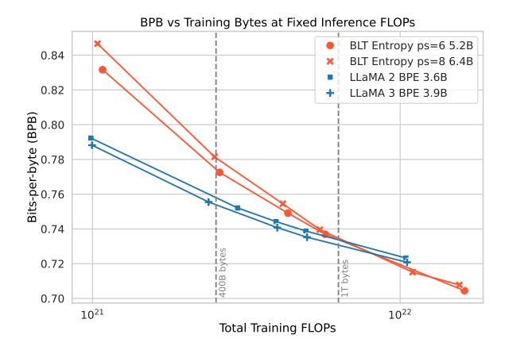
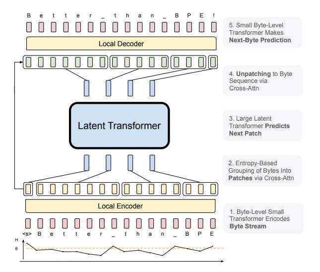
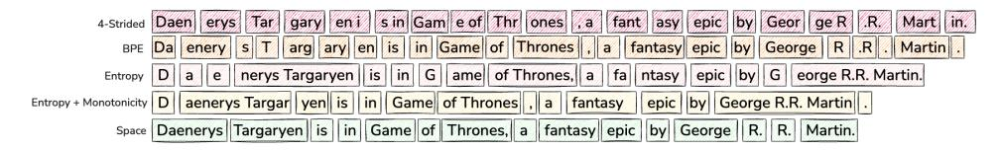
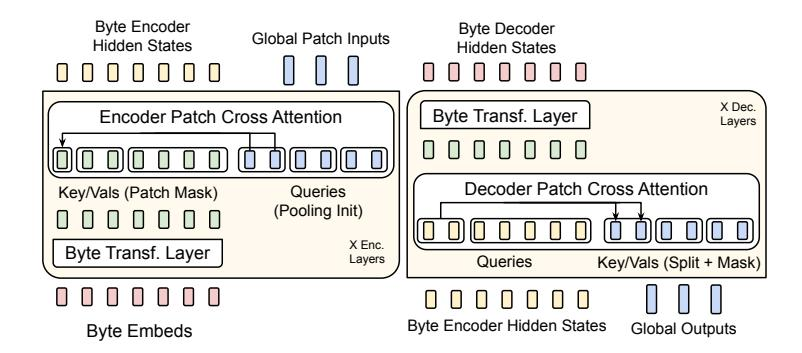
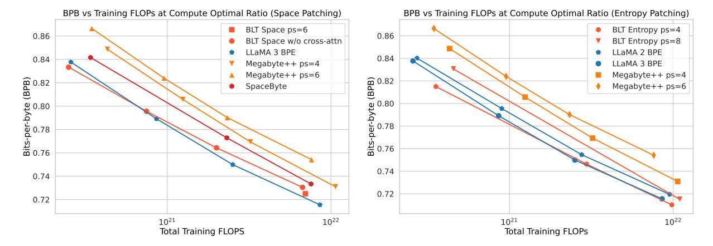
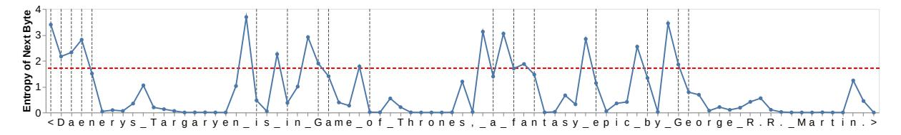
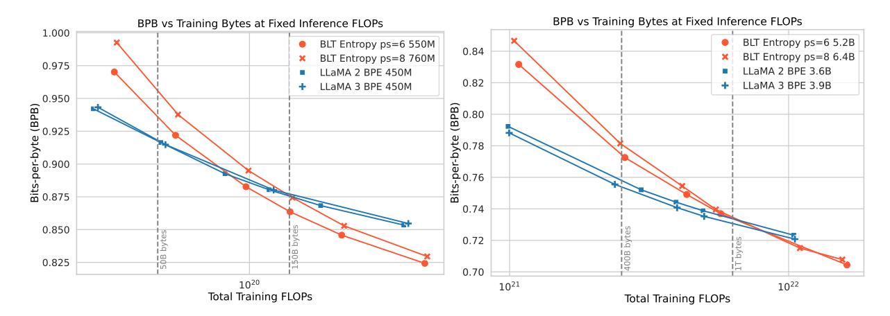
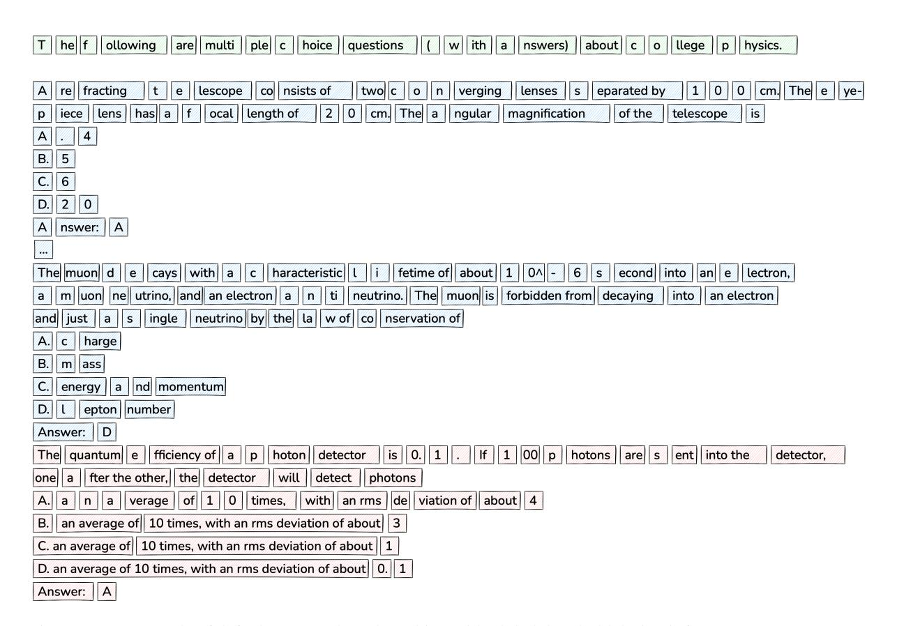
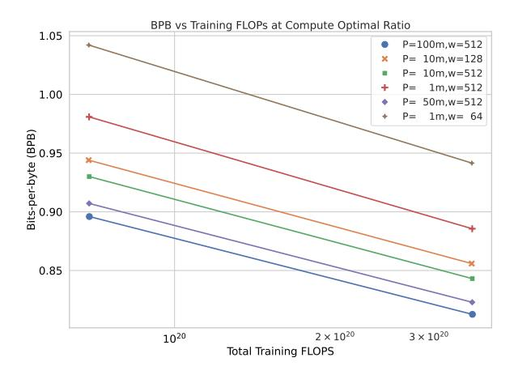

# **Byte Latent Transformer: Patches Scale Better Than Tokens**

Artidoro Pagnoni1, Ram Pasunuru‡, Pedro Rodriguez‡, John Nguyen‡, Benjamin Muller, Margaret Li1, Chunting Zhou⋄, Lili Yu, Jason Weston, Luke Zettlemoyer3, Gargi Ghosh, Mike Lewis, Ari Holtzman2,⋄,†, Srinivasan Iyer†

FAIR at Meta, 1Paul G. Allen School of Computer Science & Engineering, University of Washington, 2University of Chicago

Correspondence: artidoro@cs.washington.edu, sviyer@meta.com

#### **Abstract**

We introduce the Byte Latent Transformer (BLT), a new byte-level LLM architecture that, for the first time, matches tokenization-based LLM performance at scale with significant improvements in inference efficiency and robustness. BLT encodes bytes into dynamically sized patches, which serve as the primary units of computation. Patches are segmented based on the entropy of the next byte, allocating more compute and model capacity where increased data complexity demands it. We present the first FLOP controlled scaling study of byte-level models – up to 8B parameters and 4T training bytes – demonstrating the feasibility of scaling models trained on raw bytes without a fixed vocabulary. Both training and inference efficiency improve due to dynamically selecting long patches when data is predictable, along with qualitative improvements on reasoning and long tail generalization. For fixed inference costs, BLT shows significantly better scaling than tokenization-based models, by simultaneously growing both patch and model size. 1

## 1 Introduction

Existing large language models (LLMs) are trained almost entirely end-to-end, except for tokenization—a heuristic pre-processing step that groups bytes into a static set of tokens. Such tokens bias how a string is compressed, leading to shortcomings such as domain/modality sensitivity (Dagan et al., 2024), sensitivity to input noise (Pruthi et al., 2019; Sun et al., 2020), a lack of orthographic knowledge (Edman et al., 2024), and multilingual inequity (Liang et al., 2023; Petrov et al., 2024; Limisiewicz et al., 2024).

Tokenization has previously been essential because directly training LLMs on bytes is prohibitively costly at scale due to long sequence lengths (Xue et al., 2022). Prior work mitigates this by employing more efficient self-attention (El Boukkouri et al., 2020; Clark et al.,

Figure 1: Scaling trends for fixed inference FLOP models (fully) trained with varying training budgets. In token-based models, a fixed inference budget determines the model size. In contrast, the BLT architecture provides a new scaling axis allowing simultaneous increases in model and patch size while keeping the same training and inference budget. BLT patch-size (ps) 6 and 8 models quickly overtake scaling trends of BPE Llama 2 and 3. BPE compute-optimal point and crossover point are indicated with vertical lines.

2022) or attention-free architectures (Wang et al., 2024). However, at scale, the computational cost of a Transformer (Vaswani et al., 2017) is dominated by large feed-forward network layers that run on every byte, not the cost of the attention mechanism.

We introduce the Byte Latent Transformer (**BLT**), a tokenizer-free architecture that learns from raw byte data and, for the first time, matches the performance of tokenization-based models at scale. Following Yu et al. (2023); Nawrot et al. (2023); Slagle (2024), instead of directly operating on bytes, BLT groups bytes into *patches* which serve as the primary unit of computation. To close the gap with BPE tokenization, we improve on previous work with a dynamic, learnable method for grouping bytes into patches and a new architecture that mixes byte and patch information. Unlike tokenization, BLT has no fixed vocabulary for patches. Arbitrary groups of

&lt;sup>1‡ Joint second, † Joint last author, ♦ Work done at Meta.

bytes are mapped to latent patch representations via light-weight learned encoder and decoder modules.

We present the first FLOP-controlled scaling study of byte-level models, demonstrating that models with up to 8B parameters and 4T training bytes can be trained end-to-end from bytes without fixed-vocabulary tokenization. BLT matches training FLOP-controlled performance of Llama 3 while using up to 50% fewer FLOPs at inference. Additionally, BLT offers significant improvements in handling the long-tail of data, showing enhanced robustness to noisy inputs and better character-level understanding, as evidenced by its performance on orthographic knowledge, phonology, and low-resource machine translation tasks.

Finally, with BLT models, we can simultaneously increase model size and patch size while maintaining the same inference FLOP budget. Longer patch sizes, on average, save compute which can be reallocated to grow the size of the global latent transformer, because it is run less often. We conduct inference-FLOP controlled scaling experiments (Figure 1), and observe significantly better scaling trends than with tokenization-based architectures.

In summary, this paper contributes the following:

1) We introduce BLT, a byte latent LLM architecture that dynamically allocates compute for improved FLOP efficiency. 2) We achieve training FLOP-controlled parity with Llama 3 up to 8B scale, with potential FLOP efficiency gains of up to 50%.

3) We unlock a new dimension for scaling LLMs, allowing model and patch size to jointly increase while maintaining a fixed-inference budget. 4) We demonstrate BLT's improved robustness to input noise and its awareness of sub-word aspects missed by token-based LLMs.

2

### 2 Patching: From Bytes to Patches

Segmenting bytes into patches allows BLT to dynamically allocate compute based on context. Figure 3 shows several different methods for segmenting bytes into patches. Formally, a patching function segments a sequence of bytes  $\mathbf{x} = \{x_i, | i=1,...t\}$  of length t into a sequence of m < t patches  $\mathbf{p} = \{p_j | j=1,...m\}$  by mapping each  $x_i$  to the set  $\{0,1\}$  where 1 indicates the start of a new patch. For both token-based and patch-based models, the computational cost of processing data is primarily determined by the number of steps executed by the main Transformer. In BLT, this is the number of patches

Figure 2: BLT comprises three modules, a lightweight *Local Encoder* that encodes input bytes into patch representations, a *Latent Transformer* over patch representations, and a lightweight *Local Decoder* to decode the next patch of bytes. BLT incorporates byte *n*-gram embeddings and a cross-attention mechanism to maximize information flow between bytes and patches (Figure 4) and preserve access to the byte-level information.

needed to encode the data with a given patching function. Consequently, the average size of a patch, or simply *patch size*, is the main factor for determining the cost of processing data during both training and inference with a given patching function.

#### 2.1 Tokenization vs. Patching

We use "tokens" to refer to byte-groups drawn from a *finite* vocabulary determined prior to training as opposed to "patches" which refer to dynamically grouped sequences without a fixed vocabulary. Unlike with tokens, patch-based models have direct access to the underlying bytes (e.g. character information). In §A, we discuss BPE tokenization in more detail and why it cannot be directly used as a patching function.

## 2.2 Strided and Space Patching

We describe here two approaches from the literature for grouping bytes into patches with details in §B.

**Strided Patching** MegaByte (Yu et al., 2023) groups bytes into patches of fixed size k. However, this does not take into account information density for compute allocation and leads to inconsistent patching byte sequences, such as the same word being split differently.

**Space Patching** Slagle (2024) starts new patches after space-like bytes which are natural boundaries

&lt;sup>2Training and inference code for BLT are attached.

Figure 3: Patching schemes group bytes in different ways, each leading to a different number of resulting patches.

for linguistic units in many languages. This ensures words are patched in the same way across sequences and that flops are allocated for hard predictions which often follow spaces. However, space patching cannot handle all languages and domains, and cannot vary the patch size.

## 2.3 Entropy Patching

Rather than relying on a rule-based heuristic such as whitespace, we instead take a data-driven approach to identify high uncertainty next-byte predictions. We introduce *entropy patching*, which uses entropy estimates to derive patch boundaries. In BLT training and inference, entropy patching is a lightweight preprocessing step executed during dataloading.

We train a small byte-level auto-regressive language model on the training data for BLT and compute next byte entropies under the LM distribution  $p_e$  over the byte vocabulary  $\mathcal{V}$ :

$$H(x_i) = -\sum_{v \in \mathcal{V}} p_e(x_i = v | \boldsymbol{x}_{< i}) \log p_e(x_i = v | \boldsymbol{x}_{< i})$$

We experiment with two methods to identify patch boundaries given entropies  $H(x_i)$ . Global finds points above a global entropy threshold, as illustrated in Figure 6. Approximate Monotonicity, identifies points that are high relative to the previous entropy. This can also be interpreted as identifying points that break approximate monotonically decreasing entropy withing the patch.

Global 
$$H(x_i) > \theta_g$$
  
Approx. Monotonic  $H(x_i) - H(x_{i-1}) > \theta_r$ 

Although Nawrot et al. (2023) propose a similar entropy-base approach, they do not match BPE performance. This is likely due to a combination of the use of a different segmentation criterion, a separate classifier for boundary detection, and a less expressive model architecture.

#### 3 BLT Architecture

BLT is composed of a large global autoregressive transformer that operates on patch representations, along with two smaller local models that encode sequences of bytes into patches and decode next patch representations back into bytes (Figure 2).

## 3.1 Latent Global Transformer Model

The Latent Global Transformer is an autoregressive transformer model  $\mathcal{G}$  with  $l_{\mathcal{G}}$  layers, which maps a sequence of latent input patch representations,  $p_j$  into a sequence of output patch representations,  $o_j$ .3 This module consumes the bulk of the FLOPs during pre-training as well as inference, and thus, choosing when to invoke it allows us to control and vary the amount of compute expended for different portions of the input sequence. This module uses a block-causal attention mask (Dubey et al., 2024).

#### 3.2 Local Encoder

The Local Encoder Model, denoted by  $\mathcal{E}$ , is a lightweight transformer-based model with  $l_{\mathcal{E}} << l_{\mathcal{G}}$ layers, whose main role is to efficiently map a sequence of input bytes  $x_i$ , into expressive patch representations,  $p_i$ . We employ a cross-attention layer after each transformer layer to expressively aggregate byte representations into patch representations (Figure 4). First, the input sequence of bytes,  $x_i$ , are embedded using a  $\mathbb{R}^{256 \times h_{\mathcal{E}}}$ matrix, denoted as  $e_i$ . These embeddings are then augmented with additional information in the form of hash-embeddings (§3.2.1). A series of alternating transformer and cross-attention layers (§3.2.2) then transform these representations into patch representations,  $p_i$  that are processed by the global transformer, G. The transformer layers use a *local block causal* attention mask; each byte attends to a fixed window of  $w_{\mathcal{E}}$  preceding bytes that in general can cross the dynamic patch boundaries but can not cross document boundaries.

#### 3.2.1 Encoder Hash n-gram Embeddings

A key component in creating robust, expressive representations is to incorporate information about preceding bytes. In BLT, we model both the byte  $x_i$  individually *and* as part of a byte n-gram. For each

 $^{3}$ We use j to denote patches and i to denote bytes.

step i, we first construct byte-grams of length n:

$$g_{i,n} = \{x_{i-n+1},...,x_i\}$$

We then introduce hash n-gram embeddings, that map all byte n-grams via a hash function to an index in an embedding table  $E_n^{hash}$  for each  $n \in \{3,4,5,6,7,8\}$  (Bai et al., 2010). The resulting embedding is then added to the embedding of the byte before being normalized and passed as input to the local encoder model. We calculate the augmented embedding

$$e_i'\!=\!e_i\!+\!\sum_{n=3,\dots,8}\!E_n^{hash}(\mathrm{Hash}(g_{i,n}))$$
 
$$\mathrm{Hash}(g_{i,n})\!=\!\mathrm{RollPolyHash}(g_{i,n})\%|E_n^{hash}|$$

We normalize  $e_i'$  by the number of n-grams sizes plus one and use RollPolyHash (Rabin, 1981) as defined in §E. Unlike Deiseroth et al. (2024), hash n-gram embeddings are only used to improve the input byte-representations without switching to n-gram based predictions. In section 7, we ablate the effects of n-gram hash embeddings with different values for n and embedding table size on FLOP-controlled scaling trends. We find hash n-gram embeddings to perform better than frequency based n-gram embeddings as discussed in §J.

#### 3.2.2 Encoder Multi-Headed Cross-Attention

The encoder cross-attention helps expressively aggregate byte representations into patch representations which will be used as inputs to the Latent Transformer. We closely follow the Perceiver crossattention (Jaegle et al., 2021), with the main difference being that latent representations correspond to variable patch representations as opposed to a fixed set of latent representations (Figure 4), and only attend to the bytes that make up the respective patch. The module comprises a query vector, corresponding to each patch  $p_i$ , which is initialized by pooling the byte representations corresponding to patch  $p_i$ , followed by a linear projection,  $\mathcal{E}_C \in \mathbb{R}^{h_{\mathcal{E}} \times (h_{\mathcal{E}} \times \hat{U_{\mathcal{E}}})}$ , where  $U_{\mathcal{E}}$  is the number of encoder cross-attention heads. Formally, if we let  $f(bytes(p_i))$  denote a pooling function applied to the sequence of bytes

corresponding to patch  $p_i$ , then we calculate

$$\begin{split} P_{0,j} &= \mathcal{E}_C(f(\mathsf{bytes}(p_j)) \\ P_l &= P_{l-1} + W_o\bigg(\mathsf{softmax}\bigg(\frac{QK^T}{\sqrt{d_k}}\bigg)V\bigg) \\ \text{where } h_l &= \mathsf{Encoder\text{-}Transformer\text{-}Layer}_l(h_{l-1}) \\ K_i &= W_k(h_{l,i}), V_i = W_v(h_{l,i}), \\ Q_j &= W_q(P_{l-1,j}) \end{split}$$

where  $P \in \mathbb{R}^{m \times h_{\mathcal{G}}}$  represents m patch representations to be processed by the global model, which is initialized by pooling the byte embeddings  $e'_i$ corresponding to each patch  $p_i$ .  $W_q$ ,  $W_k$ ,  $W_v$  and  $W_o$  are projections for queries, keys, values, and outputs where the keys and values are the encoder byte hidden states  $h_{l,i}$ . We use a masking strategy specific to patching where each query  $Q_i$  only attends to the keys and values that correspond to the bytes in patch j. Because we use multi-headed attention over Q, K and V and patch representations are typically of larger dimension  $(h_{\mathcal{G}})$  than  $h_{\mathcal{E}}$ , we maintain  $P_l$  as multiple heads of dimension  $h_{\mathcal{E}}$ when doing cross-attention, and later, concat these representations into  $h_{\mathcal{G}}$  dimensions. Additionally, we use a pre-LayerNorm on the queries, keys and values and no positional embeddings are used in this cross-attention module. Finally, we use a residual connection around the cross-attention block.

#### 3.3 Local Decoder

Similar to the local encoder, the local decoder  $\mathcal{D}$  is a lightweight transformer-based model with  $l_{\mathcal{D}} << l_{\mathcal{G}}$  layers, that decodes a sequence of global patch representations  $o_j$ , into raw bytes,  $y_i$ . The local decoder predicts a sequence of raw bytes, as a function of previously decoded bytes, and thus, takes as input the hidden representations produced by the local encoder for the byte-sequence. It applies a series of  $l_{\mathcal{D}}$  alternating layers of cross attention and transformer layers. The cross-attention layer in the decoder is applied before the transformer layer to first create byte representations from the patch representations.

#### 3.3.1 Decoder Multi-headed Cross-Attention

In the decoder cross-attention, the roles of the queries and key/values are interchanged: the byte-representations are now the queries, and the patch representations are now the key/values. The initial byte-representations for the cross-attention are initialized as the byte embeddings from the last encoder layer i.e.  $h_{l\varepsilon}$ . The equations for the

Figure 4: The encoder cross-attention uses patch representations as queries, and byte representations as key/values to encode byte into patch representations. In the decoder, the roles are reversed. Here cross-att k= 2.

decoder cross-attention, which closely resemble those of the encoder, are provided in [§F.](#page-12-2)

# 4 Experimental Setup

We carefully design controlled experiments to compare BLT with tokenization based models with particular attention to not give BLT any advantages, including from possibly using longer sequence contexts. Hyperparameters and settings not explicitly discussed here are described in detail in [§G.](#page-13-1) The exact equations for FLOPs computation of BLT, Transformer, and Cross-Attention FLOPs can be found in [§H.](#page-13-2) The equation of the standard bits-per-byte (BPB) metric can also be found in [§I.](#page-14-1)

Pre-training Datasets All model scales that we experiment in this paper are pre-trained on two datasets: 1) The BLT-Exp dataset [\(Touvron et al.,](#page-11-7) [2023\)](#page-11-7), which comprises 2 trillion tokens collected from a variety of publicly available sources cleaned and filtered to improve quality; and 2) BLT-1T: a higher quality 1 trillion token dataset gathered from various public sources, and also including a subset of the pre-training data released by Datacomp-LM [\(Li et al.,](#page-10-7) [2024\)](#page-10-7). The former is used for ablations and scaling trends experiments to determine the best architectural choices for BLT, while the latter is used for a complete pre-training run to compare with the Llama 3 architecture on downstream tasks.

Entropy Model and Threshold For models using entropy patching, we estimate a patching threshold that achieves a desired average *patch size* on the pretraining data mix. We default to the global entropy threshold when not specified. Unless otherwise mentioned, our entropy model is a transformer with 100M parameters, 14 layers, and a hidden dimensionality of 512, sliding window attention of 512 bytes and trained on the same

distribution as BLT. We experiment with different model sizes, receptive fields, and architectures ([§O\)](#page-16-0). When the receptive field of the model is small enough, the trained entropy model can be encoded in an efficient lookup table.

Efficient Training on Patches When loading batches of data, dynamic patching methods yield different ratios of bytes to patches. For efficiency, our implementation packs batches of patches as opposed to bytes to ensure a constant number of patches in each batch and avoid padding steps in the more expensive latent transformer. During training, we pad or truncate byte sequences to 12k and 24k respectively for BLT-Exp and BLT-1T datasets, to avoid memory spikes from unusually large patches.

Equalizing Context Length In BLT, varying the *patch size* has significant implications on the context size of the model. To avoid any advantage from having access to a larger context, we ensure that the number of bytes in each batch remains constant on average. We therefore adjust the sequence length of the Latent Transformer to achieve 8k and 16k byte contexts for the BLT-Exp and BLT-1T datasets.

# 5 Scaling Trends

We present a holistic picture of the scaling trends of byte-level models that can inform further scaling of BLT models. Our scaling study aims to address limitations of previous research on byte-level models: (a) We compare trends for the compute-optimal training regime, (b) We train FLOP matched 8B models on 1T tokens/4T bytes and evaluate on downstream tasks, and (c) We measure scaling trends in inference-cost controlled settings.

# 5.1 Compute Optimal Scaling Trends

Using the BLT-Exp dataset, we train various *compute-optimal* BPE and BLT models across four

Figure 5: Scaling trends for BLT models with different architectural choices, as well as for baseline BPE token-based models. We train models at multiple scales from 1B up to 8B parameters for the optimal number of tokens as computed by (Dubey et al., 2024) and report bits-per-byte on a sample from the training distribution. BLT models perform on par with state-of-the-art tokenizer-based models such as Llama 3, at scale. PS denotes patch size. We illustrate separate architecture improvements on space-patching (**left**) and combine them with dynamic patching (**right**).

different sizes, ranging from 1B to 8B parameters, and plot FLOPs agains LM performance in terms of BPB on a sample from the training data mix. The *compute-optimal* setup defines a ratio between model parameters and training data size which is theoretically designed to achieve the best performance within a given training budget (Hoffmann et al., 2022; Dubey et al., 2024). This provides a robust baseline for our model. For each BPE model, we train a BLT model on the same data with a Latent Transformer matching its Transformer size. The BPB performance of global and monotonic patching are equivalent so we only report global.

As illustrated in Figure 5, BLT models either match or outperform their BPE counterparts and this trend holds as we scale model size and FLOPs. To the best of our knowledge, BLT is the first byte-level architecture to achieve matching scaling trends with BPE-based models at compute optimal regimes.

Finally, our BLT architecture trends between Llama 2 and 3 when using significantly larger patch sizes. The BPE tokenizers of Llama 2 and 3 have an average token size of 3.7 and 4.4 bytes. In contrast, BLT can achieve similar scaling trends with an average patch size of 8 bytes. Inference FLOP are inversely proportional to the average patch size, so a patch size of 8 bytes would lead to nearly 50% inference FLOP savings. BLT patch size 8 also performs comparably better as we scale model and data size suggesting benefits for larger patch sizes at larger compute scales.

|                       | Llama 3 1T Toks | BLT-Space 6T Bytes | BLT-Global 4.5T Bytes | BLT-Mono 4.5T Bytes |
|-----------------------|--------------------|-----------------------|--------------------------|------------------------|
| Arc-E                 | 77.6               | 75.4                  | 76.4                     | 79.6                   |
| Arc-C                 | 53.3               | 49.8                  | 52.1                     | 52.1                   |
| HellaSwag             | 79.1               | 79.6                  | 80.4                     | 80.6                   |
| PIQA                  | 80.7               | 81.1                  | 81.3                     | 80.6                   |
| MMLU                  | 58.1               | 54.8                  | 56.2                     | 57.4                   |
| MBPP                  | 40.2               | 37.6                  | 42.2                     | 41.8                   |
| HumanEval             | 31.1               | 27.4                  | 29.3                     | 35.4                   |
| Average               | 60.0               | 58.0                  | 59.7                     | 61.1                   |
| Bytes/Patch Train Mix | 4.4                | 6.1                   | 4.5                      | 4.5                    |

Table 1: Comparison of FLOP-matched BLT and BPE 8B models trained on the BLT-1T dataset on downstream tasks. BLT outperforms Llama 3, and depending on the patching scheme, achieves significant FLOPs savings at the expense of minor performance reduction.

#### 5.2 Beyond Compute Optimal Evaluations

To assess scaling properties further, we train 8B models beyond compute optimal on 4T bytes of a higher-quality dataset, and measure performance on a suite of standard classification and generation benchmarks (§K for task details).

In Table 1, we compare BPE Llama 3 tokenizer-based model, and three variants of BLT: space-patching, global, and approx. monotonic entropy patching (as discussed in §N). All models are trained with an equivalent FLOP budget. However, with BLT-Entropy we additionally make an inference time adjustment of the entropy threshold to 0.1 which we find to improve task performance at the cost of more inference steps.

The monotonic BLT-Entropy model outperforms the Llama 3 model on 4 out of 7 tasks while being trained on the same number of bytes. This improve-

|                      | Llama 3 1T toks | Llama 3.1 16T toks | BLT-Mono 4.5T bytes |
|----------------------|--------------------|-----------------------|------------------------|
| HellaSwag Original   | 79.1               | 80.7                  | 80.6                   |
| HellaSwag Noise Avg. | 56.9               | 64.3                  | 64.3                   |
| - AntSpeak           | 45.6               | 61.3                  | 57.9                   |
| - Drop               | 53.8               | 57.3                  | <u>58.2</u>            |
| - RandomCase         | 55.3               | 65.0                  | <u>65.7</u>            |
| - Repeat             | 57.0               | 61.5                  | <u>66.6</u>            |
| - UpperCase          | 72.9               | 76.5                  | <u>77.3</u>            |
| Phonology-G2P        | 11.8               | 18.9                  | 13.0                   |
| CUTE                 | 27.5               | -                     | <u>54.1</u>            |

Table 2: 8B BLT and BPE Llama 3 trained on 4T bytes on tasks that assess robustness to noise and character-level understanding (best result bold). We also evaluate Llama 3.1 and underline best result overall.

ment is likely due to a combination of (1) a better use of training compute via dynamic patching, and (2) the direct modeling of byte-level information as opposed to tokens. The Global BLT-Entropy matches BPE but underperforms on structured tasks like MMLU (see discussion §M). On the other hand, BLT-Space underperforms the Llama 3 tokenizer on all but one task, but it achieves a significant reduction in inference FLOPs with its larger patch size of 6 bytes compared to 4.5 for the other models.

# 5.3 Patches Scale Better Than Tokens

With BLT models, we can simultaneously increase model size and patch size while maintaining the same training and inference FLOP budget and keeping the amount of training data constant. Arbitrarily increasing the patch size is a unique feature of patch-based models which break free of the efficiency tradeoffs of fixed-vocabulary token-based models (see discussion in §A).

We conduct a fixed inference scaling study to test the hypothesis that larger models taking fewer steps on larger patches might perform better than smaller models taking more steps. Starting from a 3.6B Llama 2 tokenizer-base model, we find FLOP equivalent Llama 3 tokenizer and BLT-Entropy models with average patch sizes of 6 and 8 bytes on the training datamix (see §L for details and additional experiments).

Figure 1 shows that BLT models achieve better scaling trends than tokenization-based architectures. BPE models perform better with small training budgets but are quickly surpassed by BLT, not far beyond the compute-optimal regime. In practice, it can be preferable to spend more during the one-time pretraining to achieve a better performing model with

|                 | Language | $\rightarrow$ English | $English \rightarrow Language$ |       |  |
|-----------------|----------|-----------------------|--------------------------------|-------|--|
|                 | Llama 3  | BLT                   | Llama 3                        | BLT   |  |
| High Resource   | 27.90    | 28.42                 | 18.55                          | 17.47 |  |
| Low Resource    | 7.58     | 9.83                  | 2.35                           | 3.29  |  |
| Overall Average | 12.1     | 14.0                  | 5.9                            | 6.4   |  |

Table 3: Performance (BLEU) on translation tasks from FLORES-101 (Goyal et al., 2022). 8B BLT versus BPE Llama 3 both trained for 4T bytes.

a fixed inference budget. A perfect example of this is the class of 8B models, like Llama 3.1, which has been trained on two orders of magnitude more data than what is compute-optimal for that model size.

## **6 Byte Modeling Improves Robustness**

An early motivation for byte-level models is their potential robustness to byte level noise and awareness of the constituents of tokens, which current tokenizer-based models struggle with. To measure these phenomena, we perform additional evaluations on benchmarks that evaluate both robustness to input noise as well as awareness of characters, in both English and multi-lingual settings. We summarize the results in Table 2 and Table 3 with more details in §R.

**Noisy Data** We create noised versions of HellaSwag and find that BLT outperforms in terms of robustness the Llama 3 BPE model by a large margin and even improves over Llama 3.1 in many tasks indicating that the byte-level awareness is not something that can easily be obtained with more data.

**Phonology - Grapheme-to-Phoneme (G2P)** We assess BLT's capability to map a sequence of graphemes (characters) into a transcription of their pronunciation (phonemes). On the G2P task (5-shot setting) from Phonology Bench (Suvarna et al., 2024), we find that BLT outperforms the baseline Llama 3 4T bytes tokenizer-based model.

Character-level Understanding The CUTE benchmark (Edman et al., 2024) comprises tasks related to character understanding, orthographic and semantic similarity, and sequence manipulation. Table 12 shows that BLT-Entropy outperforms by a large margin both BPE Llama 3 models on this benchmark. In particular, our model demonstrates exceptional proficiency in character manipulation tasks achieving 99.9% on both spelling tasks.

**Low Resource Machine Translation** We evaluate BLT on translation tasks from FLORES-101

|             |            |           |       | BPB   |        |            |  |
|-------------|------------|-----------|-------|-------|--------|------------|--|
| XAtt. Dec.  | XAtt. Enc. | Pool Init | Wiki  | CC    | Github | Train Dist |  |
| -           | All Layers | False     | 0.830 | 0.915 | 0.442  | 0.891      |  |
| -           | Last Layer | False     | 0.836 | 0.906 | 0.447  | 0.886      |  |
| -           | -          | -         | 0.833 | 0.892 | 0.446  | 0.866      |  |
| First Layer | Last Layer | True      | 0.825 | 0.883 | 0.443  | 0.861      |  |
| All Layers  | Last Layer | True      | 0.823 | 0.871 | 0.443  | 0.846      |  |
| All Layers  | All Layers | True      | 0.828 | 0.868 | 0.443  | 0.844      |  |

Table 4: Ablations on the use of Cross Attention for a 1B BLT model trained on 100B bytes.

benchmark (Goyal et al., 2022) and report BLEU in Table 3. BLT outperforms the Llama 3 tokenizer-based model, achieving a 2-point overall advantage in translating into English and a 0.5-point advantage in translating from English. BLT performs comparably better in the lower-resource language families, underscoring the effectiveness of byte modeling for generalizing to long-tail byte sequences.

#### 7 Ablations and Discussion

In this section, we present ablations for the primary architectural choices of BLT. For LM performance, we report bits-per-byte (BPB) on different datasets and a random sample of the training data.

Cross-Attention In Table 4, we ablate including cross-attention at various points in BLT. In the encoder, we test initializing the queries with 1) the same learned embedding for every global state, 2) a hash embedding of the bytes in the patch, and 3) pooling of the encoder hidden representation of the patch bytes at the given encoder layer. We find that using cross-attention in the *decoder* is most effective while in the encoder, there is a slight improvement but only with pooling initialization of queries. Additionally, we find that cross-attention helps particularly on Common-Crawl.

n-gram Hash Embeddings We ablate various hash n-gram sizes and embedding vocabularies and present results in Table 5. We find that hash embeddings help on all domains, but particularly on Wikipedia and Github. Smaller n-gram sizes (3,4,5) outperform larger ones (6,7,8). Using larger per n-gram vocabulary underperforms using smaller vocabularies but different n-gram sizes for the same total vocabulary. Using different n-gram sizes likely helps discriminate among collisions from the hash-function. At 8B scale going from 500K to 300K hashes changed performance by 0.001 bpb on 15k steps. This indicates that hashes are vital to bringing the performance of BLT to match those

|             |           |           | BPB   |       |        |            |  |
|-------------|-----------|-----------|-------|-------|--------|------------|--|
| Ngram       | Ngram Voc | Total Voc | Wiki  | CC    | Github | Train Dist |  |
| -           | -         | -         | 0.892 | 0.867 | 0.506  | 0.850      |  |
| 6,7,8       | 100k      | 300k      | 0.873 | 0.860 | 0.499  | 0.842      |  |
| 6,7,8       | 200k      | 600k      | 0.862 | 0.856 | 0.492  | 0.838      |  |
| 3,4,5       | 100k      | 300k      | 0.859 | 0.855 | 0.491  | 0.837      |  |
| 6,7,8       | 400k      | 1M        | 0.855 | 0.853 | 0.491  | 0.834      |  |
| 3,4,5       | 200k      | 600k      | 0.850 | 0.852 | 0.485  | 0.833      |  |
| 3,4,5,6,7,8 | 100k      | 600k      | 0.850 | 0.852 | 0.486  | 0.833      |  |
| 3,4,5       | 400k      | 1M        | 0.844 | 0.851 | 0.483  | 0.832      |  |
| 3,4,5,6,7,8 | 200k      | 1M        | 0.840 | 0.849 | 0.481  | 0.830      |  |
| 3,4,5,6,7,8 | 400k      | 2M        | 0.831 | 0.846 | 0.478  | 0.826      |  |

Table 5: Ablations on the use of n-gram hash embedding tables for a 1B BLT model trained on 100B bytes. We find that hash n-gram embeddings are very effective with very large improvements in BPB. The most significant parameter is the per-ngram vocab size and that smaller ngram sizes are more impactful than larger ones.

of tokenizer based models, however, after 300K hashes, there are diminishing returns. Additionally, it appears that the gains are largely complementary with cross-attention as they provide improvements on different datasets.

#### 8 Related Work

Character language modeling has been a focus since early neural models due to their ability to handle out-of-vocabulary words without back-off methods (Sutskever et al., 2011; Mikolov et al., 2012; Graves, 2013). Kim et al. (2016) used convolutional and highway networks feeding into LSTM-based RNNs, matching state-of-the-art performance on English and surpassing it on morphologically rich languages. Kenter et al. (2018) and Zhang et al. (2015) demonstrated the effectiveness of byte-level and character-based models on morphologically-rich languages and classification tasks, respectively. Hierarchical LSTM models (Chung et al., 2019) and CNN-based ByteNet (Kalchbrenner et al., 2016) further advanced character-level modeling.

Transformers with attention (Vaswani et al., 2017) and subword tokenization (Sennrich et al., 2016) improved language modeling. Al-Rfou et al. (2019) used deep transformers with auxiliary losses, outperforming LSTM-based character models but not word-level LLMs. GPT-2 (Radford et al., 2019) found byte-level LMs less competitive on large datasets. Byte-level transformers (Choe et al., 2019; El Boukkouri et al., 2020; Clark et al., 2022; Xue et al., 2022; Tay et al., 2022; Sun et al., 2023) showed promise but required more compute. Recent work (Wang et al., 2024) using the Mamba Architecture (Gu and Dao, 2023) improved byte-level models

without patching. Patching reduces the computational cost of byte-level LLMs. [Nawrot et al.](#page-10-18) [\(2022\)](#page-10-18) and [Nawrot et al.](#page-10-4) [\(2023\)](#page-10-4) explored static and dynamic patching, outperforming byte-level baselines. [Lester et al.](#page-10-19) [\(2024\)](#page-10-19) used arithmetic coding for sequence compression, achieving better performance than byte-level baselines but not subword models.

Our work is inspired by MegaByte [\(Yu et al.,](#page-11-4) [2023\)](#page-11-4), a decoder-only causal LLM using static patching. We find that static patching lags behind state-of-the-art tokenizer-based models in a FLOP controlled setting, and demonstrate how BLT bridges this gap. [Slagle](#page-11-5) [\(2024\)](#page-11-5) suggested improvements to MegaByte, showing gains over tokenized models in specific domains. We report further experiments indicating the need for architectural enhancements to scale byte-level models to match token-based models like Llama 3.

# 9 Conclusion

The Byte Latent Transformer redefines the conventional dependency on fixed-vocabulary tokenization in LLMs. By dynamically grouping bytes into patches, BLT allocates computational resources based on data complexity, leading to improvements in both efficiency and robustness. BLT models match tokenization-based models at scales up to 8B and 4T bytes, and can trade minor losses in evaluation metrics for up to 50% reductions in inference FLOPs. While directly engaging with raw byte data, BLT better handles the long-tail of data, offering improvements in robustness to noisy inputs and handling of sub-word structures. Furthermore, BLT unlocks a new scaling dimension, allowing simultaneous increases in model and patch size within a fixed inference budget. This paradigm becomes advantageous for compute regimes commonly encountered in practical settings. These results position BLT as a promising alternative to traditional tokenization-based approaches, for more efficient and adaptable language models.

# 10 Limitations

In this work, for the purposes of architectural choices, we train models for the optimal number of steps as determined for Llama 3 [\(Dubey et al.,](#page-9-4) [2024\)](#page-9-4). However, these scaling laws were calculated for BPE-level transformers on the BLT-Exp dataset and may lead to suboptimal (data, parameter sizes) ratios in the case of BLT. We leave for future work the calculation of scaling laws for BLT

potentially leading to even more favorable scaling trends for our architecture. Additionally, many of these experiments were conducted at scales upto 1B parameters, and it is possible for the optimal architectural choices to change as we scale to 8B parameters and beyond, which may unlock improved performance for larger scales.

While the research question of this work is whether Transformer models can match BPE performance with raw byte-level training signal, we should investigate the use of state-space models (e.g. Mamba [\(Gu and Dao,](#page-10-17) [2023\)](#page-10-17)) as an alternative to the transformer for byte-level modeling. The use of such models within BLT might fit the local encoder-decoder modules. Others have shown that directly modeling bytes with such models might also be an effective approach [\(Wang et al.,](#page-11-2) [2024\)](#page-11-2).

We deliberately choose to use patching methods that are not jointly trained with the main model to avoid adding secondary objectives that might compete with the byte-level cross-entropy loss used to train BLT. Some initial experiments using the encoder as the entropy model showed there might be some trade-offs. We further hypothesized these issues might be exacerbated when scaling up. However, now that we demonstrated BLT successfully scales up to BPE performance, future work can explore patching schemes learned end-to-end alongside model training such as Gumbel-Sigmoid patching proposed by [Nawrot et al.](#page-10-4) [\(2023\)](#page-10-4).

Existing transformer libraries and codebases are designed to be highly efficient for tokenizer-based transformer architectures. While we present theoretical FLOP matched experiments and also use certain efficient implementations (such as FlexAttention) to handle layers that deviate from the vanilla transformer architecture, our implementations may yet not be at parity with tokenizer-based models in terms of wall-clock time and may benefit from further optimizations.

While we provide code and detailed hyperparameter settings to experiment with BLT models, pretraining such models from scratch requires significant amounts of compute resources. We conducted promising experiments on initializing the BLT weights with already pretrained model weights. However, we leave it to future work to determine whether pretrained token-based models can effectively be converted to operate on patches of bytes.

# Acknowledgements

We would like to thank Kalyan Saladi for help with everything relating to pre-training infrastructure; Gabriel Synnaeve, Ammar Rizvi, Jacob Kahn, Michel Meyer for helping organize resources for scaling up BLT; Badr Youbi Idirissi, Mathurin Videau, and Jade Copet for invaluable discussions and feedback about BLT, for access to the Lingua framework for open-sourcing code for BLT, and for help preparing the BLT-1T dataset used in this paper; Omer Levy, who was actively involved in the early stages of the project and provided valuable feedback and ideas; Driss Guessous for help with FlexAttention; and Sida Wang, Melanie Sclar, Amanda Bertsch, and Hunter Lang for feedback and discussions.

# Contributors

In this section, we list individual contributions.

Core Contributors: Artidoro Pagnoni, Srinivasan Iyer, Ramakanth Pasunuru, Pedro Rodriguez, John Nguyen, Gargi Ghosh (Project Lead)

Core Advising Group: Mike Lewis, Ari Holtzman, Luke Zettlemoyer

Advisors and Contributors: Jason Weston, Benjamin Muller, Margaret Li, Chunting Zhou, Lili Yu

# References

- Rami Al-Rfou, Dokook Choe, Noah Constant, Mandy Guo, and Llion Jones. 2019. Character-level language modeling with deeper self-attention. In Association for the Advancement of Artificial Intelligence, volume 33, pages 3159–3166.
- Jacob Austin, Augustus Odena, Maxwell Nye, Maarten Bosma, Henryk Michalewski, David Dohan, Ellen Jiang, Carrie Cai, Michael Terry, Quoc Le, and Charles Sutton. 2021. Program synthesis with large language models.
- Bing Bai, Jason Weston, David Grangier, Ronan Collobert, Kunihiko Sadamasa, Yanjun Qi, Olivier Chapelle, and Kilian Weinberger. 2010. Learning to rank with (a lot of) word features. Information retrieval, 13:291–314.
- Yonatan Bisk, Rowan Zellers, Jianfeng Gao, Yejin Choi, and 1 others. 2020. Piqa: Reasoning about physical commonsense in natural language. In Association for the Advancement of Artificial Intelligence, pages 7432–7439.

Adam Casson. 2023. [Transformer flops.](https://www.adamcasson.com/posts/transformer-flops)

- Mark Chen, Jerry Tworek, Heewoo Jun, Qiming Yuan, Henrique Ponde de Oliveira Pinto, Jared Kaplan, Harri Edwards, Yuri Burda, Nicholas Joseph, Greg Brockman, Alex Ray, Raul Puri, Gretchen Krueger, Michael Petrov, Heidy Khlaaf, Girish Sastry, Pamela Mishkin, Brooke Chan, Scott Gray, and 39 others. 2021. Evaluating large language models trained on code.
- Dokook Choe, Rami Al-Rfou, Mandy Guo, Heeyoung Lee, and Noah Constant. 2019. Bridging the gap for tokenizer-free language models. arXiv, abs/1908.10322.
- Junyoung Chung, Sungjin Ahn, and Yoshua Bengio. 2019. Hierarchical multiscale recurrent neural networks. In Proceedings of the International Conference on Learning Representations.
- Jonathan H Clark, Dan Garrette, Iulia Turc, and John Wieting. 2022. Canine: Pre-training an efficient tokenization-free encoder for language representation. Transactions of the Association for Computational Linguistics, 10:73–91.
- Peter Clark, Isaac Cowhey, Oren Etzioni, Tushar Khot, Ashish Sabharwal, Carissa Schoenick, and Oyvind Tafjord. 2018. Think you have solved question answering? Try ARC, the AI2 reasoning challenge. arXiv.
- Gautier Dagan, Gabriel Synnaeve, and Baptiste Roziere. 2024. Getting the most out of your tokenizer for pre-training and domain adaptation. In Forty-first International Conference on Machine Learning.
- Tri Dao, Dan Fu, Stefano Ermon, Atri Rudra, and Christopher Ré. 2022. FlashAttention: Fast and memory-efficient exact attention with io-awareness. Proceedings of Advances in Neural Information Processing Systems, 35.
- Björn Deiseroth, Manuel Brack, Patrick Schramowski, Kristian Kersting, and Samuel Weinbach. 2024. [T-FREE: Subword tokenizer-free generative LLMs](https://doi.org/10.18653/v1/2024.emnlp-main.1217) [via sparse representations for memory-efficient em](https://doi.org/10.18653/v1/2024.emnlp-main.1217)[beddings.](https://doi.org/10.18653/v1/2024.emnlp-main.1217) In Proceedings of the 2024 Conference on Empirical Methods in Natural Language Processing, pages 21829–21851, Miami, Florida, USA. Association for Computational Linguistics.
- Abhimanyu Dubey, Abhinav Jauhri, Abhinav Pandey, Abhishek Kadian, Ahmad Al-Dahle, Aiesha Letman, Akhil Mathur, Alan Schelten, Amy Yang, Angela Fan, and 1 others. 2024. The llama 3 herd of models. arXiv.
- Lukas Edman, Helmut Schmid, and Alexander Fraser. 2024. CUTE: Measuring llms' understanding of their tokens. arXiv.
- Hicham El Boukkouri, Olivier Ferret, Thomas Lavergne, Hiroshi Noji, Pierre Zweigenbaum, and Jun'ichi Tsujii. 2020. CharacterBERT: Reconciling elmo and bert for word-level open-vocabulary representations from characters. In Proceedings of International Conference on Computational Linguistics.

- Philip Gage. 1994. A new algorithm for data compression. The C Users Journal, 12(2):23–38.
- Naman Goyal, Cynthia Gao, Vishrav Chaudhary, Peng-Jen Chen, Guillaume Wenzek, Da Ju, Sanjana Krishnan, Marc'Aurelio Ranzato, Francisco Guzmán, and Angela Fan. 2022. [The Flores-101 evaluation](https://doi.org/10.1162/tacl_a_00474) [benchmark for low-resource and multilingual](https://doi.org/10.1162/tacl_a_00474) [machine translation.](https://doi.org/10.1162/tacl_a_00474) Transactions of the Association for Computational Linguistics, 10:522–538.
- Alex Graves. 2013. Generating sequences with recurrent neural networks. arXiv.
- Albert Gu and Tri Dao. 2023. Mamba: Linear-time sequence modeling with selective state spaces. arXiv.
- Dan Hendrycks, Collin Burns, Steven Basart, Andy Zou, Mantas Mazeika, Dawn Song, and Jacob Steinhardt. 2020. Measuring massive multitask language understanding. In Proceedings of the International Conference on Learning Representations.
- Jordan Hoffmann, Sebastian Borgeaud, Arthur Mensch, Elena Buchatskaya, Trevor Cai, Eliza Rutherford, Diego de Las Casas, Lisa Anne Hendricks, Johannes Welbl, Aidan Clark, and 1 others. 2022. Training compute-optimal large language models. In Proceedings of Advances in Neural Information Processing Systems.
- Andrew Jaegle, Felix Gimeno, Andy Brock, Oriol Vinyals, Andrew Zisserman, and Joao Carreira. 2021. Perceiver: General perception with iterative attention. In Proceedings of the International Conference of Machine Learning. PMLR.
- Nal Kalchbrenner, Lasse Espeholt, Karen Simonyan, Aäron van den Oord, Alexander Graves, and Koray Kavukcuoglu. 2016. Neural machine translation in linear time. arXiv.
- Jared Kaplan, Sam McCandlish, Tom Henighan, Tom B Brown, Benjamin Chess, Rewon Child, Scott Gray, Alec Radford, Jeffrey Wu, and Dario Amodei. 2020. Scaling laws for neural language models. arXiv.
- Tom Kenter, Llion Jones, and Daniel Hewlett. 2018. Byte-level machine reading across morphologically varied languages. In Association for the Advancement of Artificial Intelligence.
- Yoon Kim, Yacine Jernite, David Sontag, and Alexander Rush. 2016. Character-aware neural language models. In Association for the Advancement of Artificial Intelligence.
- Brian Lester, Jaehoon Lee, Alex Alemi, Jeffrey Pennington, Adam Roberts, Jascha Sohl-Dickstein, and Noah Constant. 2024. Training llms over neurally compressed text. arXiv.
- Jeffrey Li, Alex Fang, Georgios Smyrnis, Maor Ivgi, Matt Jordan, Samir Gadre, Hritik Bansal, Etash Guha, Sedrick Keh, Kushal Arora, and 1 others. 2024. Datacomp-lm: In search of the next generation of training sets for language models. arXiv.

- Davis Liang, Hila Gonen, Yuning Mao, Rui Hou, Naman Goyal, Marjan Ghazvininejad, Luke Zettlemoyer, and Madian Khabsa. 2023. Xlm-v: Overcoming the vocabulary bottleneck in multilingual masked language models. In Proceedings of Empirical Methods in Natural Language Processing.
- Tomasz Limisiewicz, Terra Blevins, Hila Gonen, Orevaoghene Ahia, and Luke Zettlemoyer. 2024. Myte: Morphology-driven byte encoding for better and fairer multilingual language modeling. arXiv.
- Ilya Loshchilov and Frank Hutter. 2017. Decoupled weight decay regularization. arXiv.
- Tomáš Mikolov, Ilya Sutskever, Anoop Deoras, Hai-Son Le, Stefan Kombrink, and Jan Cernocky. 2012. Subword language modeling with neural networks. preprint (http://www. fit. vutbr. cz/imikolov/rnnlm/char. pdf), 8(67).
- Piotr Nawrot, Jan Chorowski, Adrian Lancucki, and Edoardo Maria Ponti. 2023. [Efficient transformers](https://doi.org/10.18653/v1/2023.acl-long.353) [with dynamic token pooling.](https://doi.org/10.18653/v1/2023.acl-long.353) In Proceedings of the 61st Annual Meeting of the Association for Computational Linguistics(Volume 1: Long Papers), pages 6403–6417, Toronto, Canada. Association for Computational Linguistics.
- Piotr Nawrot, Szymon Tworkowski, Michał Tyrolski, Lukasz Kaiser, Yuhuai Wu, Christian Szegedy, and Henryk Michalewski. 2022. [Hierarchical transform](https://doi.org/10.18653/v1/2022.findings-naacl.117)[ers are more efficient language models.](https://doi.org/10.18653/v1/2022.findings-naacl.117) In Findings of the Association for Computational Linguistics: NAACL 2022, pages 1559–1571, Seattle, United States. Association for Computational Linguistics.
- Aleksandar Petrov, Emanuele La Malfa, Philip Torr, and Adel Bibi. 2024. Language model tokenizers introduce unfairness between languages. Proceedings of Advancesin Neural Information Processing Systems.
- Danish Pruthi, Bhuwan Dhingra, and Zachary C. Lipton. 2019. [Combating adversarial misspellings with robust](https://doi.org/10.18653/v1/P19-1561) [word recognition.](https://doi.org/10.18653/v1/P19-1561) In Proceedings of the 57th Annual Meeting of the Association for Computational Linguistics, pages 5582–5591, Florence, Italy. Association for Computational Linguistics.
- Michael O Rabin. 1981. Fingerprinting by random polynomials. Technical report.
- Alec Radford, Jeffrey Wu, Rewon Child, David Luan, Dario Amodei, Ilya Sutskever, and 1 others. 2019. Language models are unsupervised multitask learners. OpenAI blog, 1(8):9.
- Rico Sennrich, Barry Haddow, and Alexandra Birch. 2016. [Neural machine translation of rare words with](https://doi.org/10.18653/v1/P16-1162) [subword units.](https://doi.org/10.18653/v1/P16-1162) In Proceedings of the 54th Annual Meeting of the Association for Computational Linguistics (Volume 1: Long Papers), pages 1715–1725, Berlin, Germany. Association for Computational Linguistics.
- Noam Shazeer. 2020. GLU variants improve transformer. arXiv.

- Kevin Slagle. 2024. Spacebyte: Towards deleting tokenization from large language modeling. arXiv.
- Jianlin Su, Yu Lu, Shengfeng Pan, Ahmed Murtadha, Bo Wen, and Yunfeng Liu. 2021. RoFormer: Enhanced transformer with rotary position embedding. arxiv e-prints, art. arXiv.
- Li Sun, Florian Luisier, Kayhan Batmanghelich, Dinei Florencio, and Cha Zhang. 2023. [From characters](https://doi.org/10.18653/v1/2023.acl-long.200) [to words: Hierarchical pre-trained language model](https://doi.org/10.18653/v1/2023.acl-long.200) [for open-vocabulary language understanding.](https://doi.org/10.18653/v1/2023.acl-long.200) In Proceedings of the 61st Annual Meeting of the Association for Computational Linguistics (Volume 1: Long Papers), pages 3605–3620, Toronto, Canada. Association for Computational Linguistics.
- Lichao Sun, Kazuma Hashimoto, Wenpeng Yin, Akari Asai, Jia Li, Philip Yu, and Caiming Xiong. 2020. Adv-bert: Bert is not robust on misspellings! generating nature adversarial samples on bert. arXiv preprint arXiv:2003.04985.
- Ilya Sutskever, James Martens, and Geoffrey E Hinton. 2011. Generating text with recurrent neural networks. In Proceedings of the International Conference of Machine Learning, pages 1017–1024.
- Ashima Suvarna, Harshita Khandelwal, and Nanyun Peng. 2024. Phonologybench: Evaluating phonological skills of large language models. arXiv.
- Yi Tay, Vinh Q Tran, Sebastian Ruder, Jai Gupta, Hyung Won Chung, Dara Bahri, Zhen Qin, Simon Baumgartner, Cong Yu, and Donald Metzler. 2022. Charformer: Fast character transformers via gradientbased subword tokenization. In International Conference on Learning Representations.
- Hugo Touvron, Louis Martin, Kevin Stone, Peter Albert, Amjad Almahairi, Yasmine Babaei, Nikolay Bashlykov, Soumya Batra, Prajjwal Bhargava, Shruti Bhosale, and 1 others. 2023. Llama 2: Open foundation and fine-tuned chat models. arXiv.
- Ashish Vaswani, Noam M. Shazeer, Niki Parmar, Jakob Uszkoreit, Llion Jones, Aidan N. Gomez, Lukasz Kaiser, and Illia Polosukhin. 2017. Attention is all you need. In Neural Information Processing Systems.
- Junxiong Wang, Tushaar Gangavarapu, Jing Nathan Yan, and Alexander M Rush. 2024. Mambabyte: Token-free selective state space model. arXiv.
- Wenhan Xiong, Jingyu Liu, Igor Molybog, Hejia Zhang, Prajjwal Bhargava, Rui Hou, Louis Martin, Rashi Rungta, Karthik Abinav Sankararaman, Barlas Oguz, and 1 others. 2024. Effective long-context scaling of foundation models. In Conference of the North American Chapter of the Association for Computational Linguistics.
- Linting Xue, Aditya Barua, Noah Constant, Rami Al-Rfou, Sharan Narang, Mihir Kale, Adam Roberts, and Colin Raffel. 2022. Byt5: Towards a token-free future with pre-trained byte-to-byte models. Transactions

- of the Association for Computational Linguistics, 10:291–306.
- Lili Yu, Dániel Simig, Colin Flaherty, Armen Aghajanyan, Luke Zettlemoyer, and Mike Lewis. 2023. Megabyte: Predicting million-byte sequences with multiscale transformers. Proceedings of Advances in Neural Information Processing Systems.
- Rowan Zellers, Ari Holtzman, Yonatan Bisk, Ali Farhadi, and Yejin Choi. 2019. Hellaswag: Can a machine really finish your sentence? arXiv.
- Biao Zhang and Rico Sennrich. 2019. Root mean square layer normalization. Proceedings of Advances in Neural Information Processing Systems, 32.
- Xiang Zhang, Junbo Zhao, and Yann LeCun. 2015. [Character-level convolutional networks for text](https://proceedings.neurips.cc/paper_files/paper/2015/file/250cf8b51c773f3f8dc8b4be867a9a02-Paper.pdf) [classification.](https://proceedings.neurips.cc/paper_files/paper/2015/file/250cf8b51c773f3f8dc8b4be867a9a02-Paper.pdf) In Proceedings of Advances in Neural Information Processing Systems, volume 28. Curran Associates, Inc.

# A The Byte-Pair Encoding (BPE) Tokenizer and Incremental Patching

Many modern LLMs, including our baseline Llama 3, use a subword tokenizer like BPE [\(Gage,](#page-10-20) [1994;](#page-10-20) [Sennrich et al.,](#page-10-15) [2016\)](#page-10-15). We use "tokens" to refer to byte-groups drawn from a *finite* vocabulary determined prior to training as opposed to "patches" which refer to dynamically grouped sequences without a fixed vocabulary. A critical difference between patches and tokens is that with tokens, the model has no direct access to the underlying byte features.

A crucial improvement of BLT over tokenizationbased models is that redefines the trade off between the vocabulary size and compute. In standard LLMs, increasing the size of the vocabulary means larger tokens on average and therefore fewer steps for the model but also larger output dimension for the final projection layer of the model. This trade off effectively leaves little room for tokenization based approaches to achieve significant variations in token size and inference cost. For example, Llama 3 increases the average token size from 3.7 to 4.4 bytes at the cost of increasing the size of its embedding table 4x compared to Llama 2.

When generating, BLT needs to decide whether the current step in the byte sequence is at a patch boundary or not as this determines whether more compute is invoked via the Latent Transformer. This decision needs to occur independently of the rest of the sequence which has yet to be generated. Thus patching cannot assume access to future bytes in order to choose how to segment the byte

sequence. Formally, a patching scheme  $f_p$  satisfies the property of incremental patching if it satisfies:

$$f_p(\boldsymbol{x}_{< i}) = f_p(\boldsymbol{x})_{< i}$$

BPE is not an incremental patching scheme as the same prefix can be tokenized differently depending on the continuation sequence, and therefore does not satisfy the property above4.

## **B** Strided Patching Details

Perhaps the most straightforward way to group bytes is into patches of fixed size k as done in MegaByte (Yu et al., 2023). The fixed stride is easy to implement for training and inference, provides a straightforward mechanism for changing the average patch size, and therefore makes it easy to control the FLOP cost. However, this patching function comes with significant downsides. First, compute is not dynamically allocated to where it is needed most: one could be either wasting a transformer step j if only predicting whitespace in code, or not allocating sufficient compute for bytes dense with information such as math. Second, this leads to inconsistent and non-contextual patching of similar byte sequences, such as the same word being split differently.

## C Space Patching Details

Slagle (2024) proposes a simple yet effective improvement over strided patching that creates new patches after any space-like bytes5 which are natural boundaries for linguistic units in many languages. In Space patching, a latent transformer step (i.e., more FLOPs) is allocated to model every word. This ensures words are patched in the same way across sequences and that flops are allocated for hard predictions which often follow spaces. For example, predicting the first byte of the answer to the question "Who composed the Magic Flute?" is much harder than predicting the remaining bytes after "M" since the first character significantly reduces the number of likely choices, making the completion "Mozart" comparatively easy to predict. However, space patching cannot gracefully handle all languages and domains, and most importantly cannot vary the patch size. Next, we introduce a new patching method that uses the insight that the first bytes

in words are typically most difficult to predict, but that provides a natural mechanism for controlling patch size.

## **D** Entropy Patching Illustration

Here illustrate the entropy  $H(x_i)$  of the next byte and the resulting patches. Patches end when  $H(x_i)$  exceeds the global threshold  $\theta_g$ , shown as a red horizontal line. The start of new patches are shown with vertical gray lines. For example, the entropies of "G" and "e" in "George R.R. Martin" exceed  $\theta_g$ , so "G" is the start of a single byte patch and "e" of a larger patch extending to the end of the named entity as the entropy  $H(x_i)$  stays low, resulting in no additional patches.

# **E** Rolling Polynomial Hashing

Given a byte n-gram  $g_{i,n} = \{b_{i-n+1}, \dots, b_i\}$ , the rolling polynomial hash (Rabin, 1981) of  $g_{i,n}$  is defined as:

$$\operatorname{Hash}(g_{i,n}) = \sum_{j=1}^{n} b_{i-j+1} a^{j-1}$$
 (1)

Where a is chosen to be a 10-digit prime number.

## **F** Decoder Cross-Attention Details

In the decoder cross-attention, the roles of the queries and key/values are interchanged: the byte-representations are now the queries, and the patch representations are now the key/values. The initial byte-representations for the cross-attention are initialized as the byte embeddings from the last encoder layer i.e.  $h_{l_{\mathcal{E}}}$ . Equations for the decoder cross-attention are found at §F. The subsequent byte-representations for layer l,  $d_{l,i}$  are computed as:

$$\begin{split} D_0 = h_{l\mathcal{E}} \\ B_l = D_{l-1} + W_o \bigg( \text{softmax} \bigg( \frac{QK^T}{\sqrt{d_k}} \bigg) V \bigg) \\ \text{where } D_l = \text{Decoder-Transformer-layer}_l(B_l) \\ Q_i = W_q(d_{l-1,i}), & K_i = W_k(\mathcal{D}_C(o_j)), \\ V_i = W_v(\mathcal{D}_C(o_j)) \end{split}$$

where once again,  $W_k, W_v$  are key/value projection matrices that operate on a linear transformation and split operation  $\mathcal{D}_C$ , applied to the final patch representations  $o_j$  from the global model,  $W_q$  is a query projection matrices operating on byte representations  $d_{l-1}$  from the previous decoder transformer layer (or  $h_{l\varepsilon}$  for the first layer), and  $W_o$  is the output

&lt;sup>4Using a special delimiter token to indicate patch boundaries can turn BPE into an incremental patching scheme but increases the byte-sequence length.

&lt;sup>5Space-like bytes are defined as any byte that is not a latin character, digit, or UTF-8 continuation byte. In addition, each patch must contain at least one non space-like byte.

Figure 6: This figure plots the entropy  $H(x_i)$  of each byte in "Daenerys Targeryen is in Game of Thrones, a fantasy epic by George R.R. Martin." with spaces shown as underscores.

projection matrix, thus making  $B \in \mathbb{R}^{h_{\mathcal{D}} \times n_b}$ , where  $n_b$  is the number of output bytes. The next decoder representations  $D_l$  are computed using a decoder transformer layer on the output of the cross-attention block, B. As in the local encoder cross-attention, we use multiple heads in the attention, use pre LayerNorms, no positional embeddings, and a residual connection around the cross-attention module.

## **G** Hyperparameters

We describe hyperparameters distinguishing those that are specific to BLT from those that are standard to the Transformer.

# G.1 Transformer Architecture Hyperparameters

For all the transformer blocks in BLT, i.e. both local and global models, we largely follow the architecture of Llama 3 (Dubey et al., 2024); we use the SwiGLU activation function (Shazeer, 2020) in the feed-forward layers, rotary positional embeddings (RoPE) (Su et al., 2021) with  $\theta = 500000$  (Xiong et al., 2024) only in self-attention layers, and RMSNorm (Zhang and Sennrich, 2019) for layer normalization. We use Flash attention (Dao et al., 2022) for all self-attention layers that use fixed-standard attention masks such as block causal or fixed-window block causal, and a window size of 512 for fixed-width attention masks. Since our crossattention layers involve dynamic patch-dependent masks, we use Flex Attention6 to produce fused implementations and significantly speed up training.

# **G.2** BLT-Specific Hyperparameters

To study the effectiveness of BLT models, we conduct experiments along two directions, scaling trends, and downstream task evaluations, and we consider models at different scales: 400M, 1B, 2B, 4B and 8B for these experiments. The architecture hyperparameters for these models are presented in Table 6. We use max-pooling to initialize the

queries for the first cross-attention layer in the local encoder. We use 500,000 hashes with a single hash function, with n-gram sizes ranging from 3 to 8, for all BLT models. We use a learning rate of 4e-4 for all models. The choice of matching learning rate between token and BLT models follows a hyperparameter search between 1e-3 and 1e-4 at 400M and 1B model scales showing the same learning rate is optimal. For scaling trends on Llama-2 data, we use training batch-sizes as recommended by (Dubey et al., 2024) or its equivalent in bytes. For optimization, we use the AdamW optimizer (Loshchilov and Hutter, 2017) with  $\beta_1$  set to 0.9 and  $\beta_2$  to 0.95, with an  $\epsilon = 10^{-8}$ . We use a linear warm-up of 2000 steps with an cosine decay schedule of the learning rate to 0, we apply a weight decay of 0.1, and global gradient clipping at a threshold of 1.0.

#### **H** FLOPs Estimation

We calculate the computational cost of a model by estimating the number of Floating Point OPerations (FLOPs) needed to execute it or train it. FLOPs estimates provide a platform independent way of comparing the computational cost of a neural architecture and are standard in the field (Kaplan et al., 2020). Additionally, given that the building blocks of the BLT architecture are standard Transformer modules, the hardware utilization achieved by the BLT model should be in line with standard dense Transformer models. FLOPs improvements should therefore directly translate in efficiency gains.

We largely follow the equations for computation of transformer FLOPs from Chinchilla (Hoffmann et al., 2022) comprising FLOPs for the feed-forward layers, QKVO projections in the self-attention layer, and computation of attention and output projection. A notable difference is that we assume the input embedding layer is implemented as an efficient lookup instead of a dense matrix multiplication, therefore becoming a 0-FLOP operation. Following previous work, we estimate that the backwards pass has twice the number of FLOPs as the forward pass.

6https://pytorch.org/blog/flexattention

|       |                   | Е      | ncoder            |         |                   | Global L | Latent Ti         | ansf.   |                   | D      | ecoder            |         | Cross-A | ttn. |
|-------|-------------------|--------|-------------------|---------|-------------------|----------|-------------------|---------|-------------------|--------|-------------------|---------|---------|------|
| Model | $l_{\mathcal{E}}$ | #heads | $h_{\mathcal{E}}$ | #Params | $l_{\mathcal{G}}$ | #heads   | $h_{\mathcal{G}}$ | #Params | $l_{\mathcal{D}}$ | #heads | $h_{\mathcal{D}}$ | #Params | #heads  | k    |
| 400M  | 1                 | 12     | 768               | 7M      | 24                | 10       | 1280              | 470M    | 7                 | 12     | 768               | 50M     | 10      | 2    |
| 1B    | 1                 | 16     | 1024              | 12M     | 25                | 16       | 2048              | 1B      | 9                 | 16     | 1024              | 113M    | 16      | 2    |
| 2B    | 1                 | 16     | 1024              | 12M     | 26                | 20       | 2560              | 2B      | 9                 | 16     | 1024              | 113M    | 16      | 3    |
| 4B    | 1                 | 16     | 1024              | 12M     | 36                | 24       | 3072              | 4.1B    | 9                 | 16     | 1024              | 113M    | 16      | 3    |
| 8B    | 1                 | 20     | 1280              | 20M     | 32                | 32       | 4096              | 6.4B    | 6                 | 20     | 1280              | 120M    | 20      | 4    |

Table 6: Architectural hyper-parameters for different BLT model sizes that we train for FLOP-controlled experiments described in this paper.

To compute FLOPs *per byte* for BLT models, we add up the FLOPs for the local encoder transformer, the global latent transformer, and the local decoder transformer, together with the cross attention blocks in the encoder and the decoder:

Next we describe the exact equations for FLOPs computation of BLT, Transformer, and Cross-Attention FLOPs. Here, we provide the equations used for FLOP computation for the forward-pass of transformer and BLT models based on (Hoffmann et al., 2022; Kaplan et al., 2020; Casson, 2023). We assume that the backward pass uses twice as much FLOPs as the forward pass.

**Transformer-FLOPs** For a transformer model with l layers, hidden dimension h, context length m,  $n_{heads}$  attention heads of dimension  $h_k$ , and a feedforward multipler of  $d_{ff}$ , we compute FLOPs as:

$$\begin{split} \text{Transformer-FLOPs}(l, h, m, n_{heads}, h_k, d_{ff}, V) = \\ \text{Feed-forward}(l, h, d_{ff}) \\ + \text{QKVO}(l, h, r = 1) \\ + \text{Attention}(l, h_k, n_{heads}, m) \\ + \text{De-Embedding}(h, V) \end{split}$$

**BLT FLOPs** For BLT models, we use the above-mentioned primitives together with the following equation from to compute total FLOPs.

$$\begin{split} & \text{Transf. FL}(h_{\mathcal{G}}, l_{\mathcal{G}}, m = n_{ctx}/n_p, V = 0)/n_p \\ & + \text{Transf. FL}(h_{\mathcal{E}}, l_{\mathcal{E}}, m = w_{\mathcal{E}}, V = 0) \\ & + \text{Transf. FL}(h_{\mathcal{D}}, l_{\mathcal{D}}, m = w_{\mathcal{D}}, V = 256) \\ & + \text{Cross Attn. FL}(h_{\mathcal{E}}, l_{\mathcal{E}}, m = n_p, r = n_p/k) \times k/n_p \\ & + \text{Cross Attn. FL}(h_{\mathcal{D}}, l_{\mathcal{D}}, m = k, r = k/n_p) \end{split}$$

where  $n_{ctx}$  is the sequence length in bytes,  $n_p$  is the patch size, r is the ratio of queries to key/values, k is the ratio of patch-dimension to byte-dimension i.e. the number of local model splits that concatenate

to form a global model representation (k=2 in Figure 4). V corresponds to the vocabulary size for the output projection, which is only used in the local decoder. Depending on whether a module is applied on the byte or patch sequence, the attention uses a different context length, m. We modify the attention FLOPs accordingly for each component.

# I Bits-Per-Byte Estimation

Perplexity only makes sense in the context of a fixed tokenizer as it is a measure of the uncertainty for each token. When comparing byte and token-level models, following previous work (Xue et al., 2022; Yu et al., 2023; Wang et al., 2024), we instead report Bits-Per-Byte (BPB), a tokenizer independent version of perplexity. Specifically:

$$BPB(x) = \frac{\mathcal{L}_{CE}(\boldsymbol{x})}{\ln(2) \cdot n_{\text{bytes}}}$$
 (2)

where the uncertainty over the data x as measured by the sum of the cross-entropy loss is normalized by the total number of bytes in x and a constant.

## J Frequency-based n-gram Embedddings

Prior to using hash n-gram embeddings in the final BLT architecture, we also experimented with frequency-based n-gram embeddings. For each  $n \in \{1,2,3,4,5,6,7,8\}$  there is an embedding matrix  $E_n^{ngram}$  that contains the most frequent byte-grams for the given n. Since it is intractable to store embeddings as n grows, we only store embeddings for the most frequent 100,000 byte-grams for each byte-gram. If a particular position i includes an n-gram present in the corresponding the embedding matrix, then this embedding is passed to the next step, encoder multi-headed cross-attention. If a byte-gram is infrequent and therefore not in the matrix, then its embedding is obtained from encoder hash embeddings instead.

Since frequency-based n-grams are limited by the vocabulary of the n-gram tables with

| Operation                                   | FLOPs per token/byte                                                 |
|---------------------------------------------|----------------------------------------------------------------------|
| Attention $(l, h_k, n_{heads}, m)$          | $4 \times l \times h_k \times n_{heads} \times \frac{m+1}{2}$        |
| QKVO $(l,h,r)$                              | $(r \times 2 + 2) \times 2 \times l \times h^2$                      |
| Feed-forward $(l, h, d_{ff})$               | $2 \times l \times 2 \times h \times d_{ff}h$                        |
| De-Embedding $(h, V)$                       | $2 \times h \times  V $                                              |
| Cross-Attention $(l, h_k, n_{heads}, p, r)$ | $Attention(l, h_k, n_{heads}, p) + QKVO(l, h_k \times n_{heads}, r)$ |

Table 7: FLOPs for operations used in transformer and BLT models. l corresponds to layers, h is the hidden dimension ( $h_k$  with  $n_{heads}$  heads), m is the context length,  $d_{ff}=4$  is the feed-forward dimension multiplier, p is the patch size, and r is the ratio of queries to keys.

infrequent n-grams not being represented at all, we subsequently moved to hash-based *n*-gram embeddings. See Table 8 for a comparison of hash and frequency based n-gram embeddings.

#### K Task Evaluation Details

For task evaluation, we select the following common sense reasoning, world knowledge, and code generation tasks:

Classification tasks include ARC-Easy (0-shot) (Clark et al., 2018), Arc-Challenge (0-shot) (Clark et al., 2018), HellaSwag (0-shot) (Zellers et al., 2019), PIQA (0-shot) (Bisk et al., 2020), and MMLU (5-shot) (Hendrycks et al., 2020). We employ a prompt-scoring method, calculating the likelihood over choice characters, and report the average accuracy.

Coding related generation tasks: We report pass@1 scores on MBPP (3-shot) (Austin et al., 2021) and HumanEval (0-shot) (Chen et al., 2021), to evaluate the ability of LLMs to generate Python code.

# L Fixed Inference Scaling Details

We conducted fixed inference FLOPs scaling experiments at two different scales. The two plots are presented in Figure 7. BLT demonstrates improved scaling trends at two different scales suggesting that these observation would continue to hold at scale.

For patch size 8 models, we use 3 encoder layers instead of 1. We train each model for various training FLOP budgets. Model details can be found at Table 9.

The crossover point where BLT improves over token-based models has shifted slightly closer to the compute-optimal point when moving to the larger FLOP class models (from 3x down to 2.5x the compute optimal budget). Similarly, the larger patch

size 8 model has steeper scaling trend in the larger FLOP class overtaking the other models sooner. As discussed in Section 5.1, larger patch sizes appear to perform closer to BPE models at larger model scales. We attribute this, in part, to the decreasing share of total FLOPs used by the byte-level Encoder and Decoder modules which seem to scale slower than the Latent Transformer. When growing total parameters 20x from 400M to 8B, we only roughly double BLT's local model parameters. This is important as larger patch sizes only affect FLOPs from the patch Latent Transformer and not the byte-level modules. In fact, that is why the BLT-Entropy ps=8 went from 1.6x to 1.7x of the Llama 2 model size when moving to the larger model scale.

In summary, our patch-length scaling study demonstrates that the BLT patch-based architecture can achieve better scaling trends by simultaneously increasing both patch and model size. Such trends seem to persist and even improve at larger model scales.

# M Entropy Patching Example from MMLU

We illustrate how a few-shot example from a down-stream task i.e. MMLU (Hendrycks et al., 2020), is patched using an entropy-model trained for use with BLT models in Figure 8. Directly using the entropy model with the full-context window causes repetitive patterns to be heavily patched. For example, "10 times, with an rms deviation of about" in the MMLU query is patched frequently the first time it is encountered, but is part of very large patches the next three times, which, although inference efficient, maybe undesirable for reasoning. One method that we use to avoid such a "entropy" drift is by resetting the entropy context with new lines and using a approximate monotonic constraint (see Section N).

|                  |                      |             |                 |             |           | bj    | ob     |            |
|------------------|----------------------|-------------|-----------------|-------------|-----------|-------|--------|------------|
| Hash Ngram Sizes | Per Hash Ngram Vocab | Ngram Sizes | Per Ngram Vocab | Total Vocab | Wikipedia | CC    | Github | Train Dist |
| -                | -                    | _           | -               | -           | 0.892     | 0.867 | 0.506  | 0.850      |
| 6,7,8            | 50k                  | 6,7,8       | 50k             | 300k        | 0.878     | 0.860 | 0.497  | 0.843      |
| 6,7,8            | 100k                 | -           | -               | 300k        | 0.873     | 0.860 | 0.499  | 0.842      |
| 6,7,8            | 100k                 | 6,7,8       | 100k            | 600k        | 0.868     | 0.857 | 0.494  | 0.839      |
| 6,7,8            | 200k                 | -           | -               | 600k        | 0.862     | 0.856 | 0.492  | 0.838      |
| 3,4,5            | 50k                  | 3,4,5       | 50k             | 300k        | 0.862     | 0.856 | 0.491  | 0.837      |
| 3,4,5            | 100k                 | -           | -               | 300k        | 0.859     | 0.855 | 0.491  | 0.837      |
| 6,7,8            | 200k                 | 6,7,8       | 200k            | 1 <b>M</b>  | 0.861     | 0.855 | 0.491  | 0.837      |
| 6,7,8            | 400k                 | -           | -               | 1 <b>M</b>  | 0.855     | 0.853 | 0.491  | 0.834      |
| 3,4,5,6,7,8      | 50k                  | 3,4,5,6,7,8 | 50k             | 600k        | 0.855     | 0.853 | 0.488  | 0.834      |
| 3,4,5            | 100k                 | 3,4,5       | 100k            | 600k        | 0.851     | 0.853 | 0.486  | 0.834      |
| 3,4,5            | 200k                 | -           | -               | 600k        | 0.850     | 0.852 | 0.485  | 0.833      |
| 3,4,5,6,7,8      | 100k                 | -           | -               | 600k        | 0.850     | 0.852 | 0.486  | 0.833      |
| 3,4,5            | 400k                 | -           | -               | 1 <b>M</b>  | 0.844     | 0.851 | 0.483  | 0.832      |
| 3,4,5            | 200k                 | 3,4,5       | 200k            | 1 <b>M</b>  | 0.843     | 0.850 | 0.482  | 0.830      |
| 3,4,5,6,7,8      | 100k                 | 3,4,5,6,7,8 | 100k            | 1 <b>M</b>  | 0.844     | 0.850 | 0.482  | 0.830      |
| 3,4,5,6,7,8      | 200k                 | -           | -               | 1M          | 0.840     | 0.849 | 0.481  | 0.830      |
| 3,4,5,6,7,8      | 200k                 | 3,4,5,6,7,8 | 200k            | 2M          | 0.833     | 0.846 | 0.478  | 0.826      |
| 3,4,5,6,7,8      | 400k                 | -           | -               | 2M          | 0.831     | 0.846 | 0.478  | 0.826      |

Table 8: Ablations on the use of frequency-based as well as hash-based n-gram embedding tables for a 1B BLT model trained on 100B bytes.

| Llama 2 | Llama 3 | Entropy ps=6 | Entropy ps=8 | Inference FLOPs | Compute Optimal (Bytes) | Crossover (Bytes) |
|---------|---------|--------------|--------------|-----------------|-------------------------|-------------------|
| 470m    | 450m    | ( ' )        | 760m (1.6x)  |                 | 50B                     | 150B              |
| 3.6B    | 3.9B    | 5.2B (1.3x)  | 6.6B (1.7x)  | 2.1E9           | 400B                    | 1T                |

Table 9: Details of models used in the fixed-inference scaling study. We report non-embedding parameters for each model and their relative number compared to Llama 2. We pick model sizes with equal inference FLOPs per byte. We also indicate BPE's compute-optimal training data quantity and the crossover point where BLT surpasses BPE as seen in Figure 1 (both expressed in bytes of training data). This point is achieved at much smaller scales compared to many modern training budgets.

# N Entropy Model Context

Empirically, we find that using entropy patching yields progressively larger patches in structured content like multiple choice tasks (see patching on an MMLU example in Figure 8) which are often very repetitive. These variations are caused by lower entropy on the repeated content found in the entropy model context. So for the large scale run of BLT-Entropy with patch size 4.5, we reset the entropy context with new lines and use approximate monontonicity constraint as it suffers less from "entropy drift" from changes in context length. This change only affects how we compute entropies, but we still follow the same procedure to identify the value of the entropy threshold.

#### O Entropy Model Ablations

To study the effect of varying entropy model size and context window length on scaling performance, we train byte-level entropy transformer models of different model sizes between 1m and 100m

|           | Llama 3 BPE | Space Patching BLT | Entropy Patch Size 4 BLT |
|-----------|----------------|-----------------------|-----------------------------|
| Arc-E     | 67.4           | 67.2                  | 68.9                        |
| Arc-C     | 40.5           | 37.6                  | 38.3                        |
| HellaSwag | 71.3           | 70.8                  | 72.7                        |
| PIQA      | 77.0           | 76.5                  | 77.6                        |

Table 10: Benchmark evaluations of two patching schemes for 8b BLT models and BPE Llama 3 baseline. These are compute-optimal models trained on the Llama 2 data.

parameters, with varying context window lengths from 64 to 512. We plot bpb vs training FLOP scaling law curves, created using our 400m and 1b BLT models trained on the Llama-2 dataset and present them in Figure 9. We find that scaling performance is positively correlated with both these dimensions of the entropy model, with diminishing returns when we scale beyond 50m parameters.

Figure 7: Scaling trends for fixed inference FLOP models (fully) trained with varying training budgets. In token-based models, a fixed inference budget determines the model size. In contrast, the BLT architecture provides a new scaling axis allowing simultaneous increases in model and patch size while keeping the same training and inference budget. BLT patch-size (ps) 6 and 8 models quickly overtake scaling trends of BPE Llama 2 and 3. Moving to the larger inference budget makes the larger patch size 8 model more desirable sooner. Both BPE compute-optimal point and crossover point are indicated with vertical lines.

| Ngram Embeds | Enc Layers | Dec Layers | BPB   |
|--------------|------------|------------|-------|
| False        | 1          | 9          | 0.850 |
| False        | 5          | 5          | 0.843 |
| True         | 5          | 5          | 0.844 |
| True         | 3          | 7          | 0.824 |
| True         | 1          | 9          | 0.822 |

Table 11: When paired with hash n-gram embeddings, a light-weight local encoder is sufficient. More layers can then be allocated to the decoder for the same cost.

## P Patching Ablations

In Table 10, we present benchmark evaluations for compute-optimal tokenizer-based models, space, and entropy patching BLT models, trained on the BLT-Exp dataset (Dubey et al., 2024). Although space patching is a simpler strategy that does not involve running an entropy model on the fly during training, we find that the gains we observed using entropy-based patching on scaling trends do indeed carry forward even to downstream benchmark tasks.

#### **Q** Local Model Hyperparamaters

In Table 11, we ablate various settings for the number of layers in the local encoder and decoder. When paired with hash n-gram embeddings, BLT works

well with an encoder that is extremely light-weight i.e. just one layer, and with a heavier decoder.

## R Robustness Experiment Details

Noisy Data We create noised versions of the benchmark classification tasks described in Section 5.2, to compare the robustness of tokenizerbased models with that of BLT. We employ five distinct character-level noising strategies to introduce variations in the text: (a) AntSpeak: This strategy converts the entire text into uppercase, space-separated characters. (b) Drop: Randomly removes 10% of the characters from the text. (c) RandomCase: Converts 50% of the characters to uppercase and 50% to lowercase randomly throughout the text. (d) Repeat: Repeats 20% of the characters up to a maximum of four times. (e) UpperCase: Transforms all characters in the text to uppercase. During evaluation, we apply each noising strategy to either the prompt, completion, or both as separate tasks and report the average scores. In Table 12 we report results on noised HellaSwag (Zellers et al., 2019) and find that BLT indeed outperforms tokenizer-based models across the board in terms of robustness, with an average advantage of 8 points over the model trained on the same data, and even improves over the Llama 3.1 model trained on a much larger dataset.

**Phonology** - **Grapheme-to-Phoneme** (**G2P**) We assess BLT's capability to map a sequence of graphemes (characters representing a word) into a transcription of that word's pronunciation

&lt;sup>7Space patching results are from earlier runs without cross-attention, but similar trends are observed even with cross-attention.

Figure 8: An example of default entropy-based patching with global threshold during inference on MMLU. Green denotes the prompt, Blue denotes the few-shot examples, and red denotes the question to be answered. Note that the size of the patches for the repeated phrases in the answer choices is much larger, which means that the global model is invoked significantly fewer times than its tokenizer-based counterpart, with this inference patching scheme.

Figure 9: Variation of language modeling performance in bits-per-byte (bpb) with training FLOPs for 400m and 1b BLT models patched with entropy models of different sizes and context windows. Both dimensions improve scaling performance, with diminishing returns beyond 50m parameter entropy models with a context of 512 bytes.

(phonemes). In Table 12, we present the results of the G2P task in a 5-shot setting using Phonology Bench (Suvarna et al., 2024) and find that BLT outperforms the baseline Llama 3 1T tokenizer-based model on this task.

**CUTE** To assess character-level understanding, we evaluate BLT on the CUTE benchmark (Edman et al., 2024), which comprises several tasks that are broadly classified into three categories: understanding composition, understanding orthographic similarity, and ability to manipulate sequences. This benchmark poses a significant challenge for most tokenizer-based models, as they appear to possess knowledge of their tokens' spellings but struggle to effectively utilize this information to manipulate text. Table 12 shows that BLT-Entropy outperforms both BPE Llama 3 models by more than 25 points on this benchmark. In particular, our model demonstrates exceptional proficiency in character manipulation tasks achieving 99.9% on both spelling tasks. Such large improvements despite BLT having been trained on 16x less data than Llama 3.1 indicates that character level information is hard to learn for BPE models. Figure 10 illustrates a few such scenarios where Llama 3 tokenizer model struggles but our BLT model performs well. Word deletion

| Task                      | Prompt                                                                                                      | Llama 3                                      | BLT                                               |
|---------------------------|-------------------------------------------------------------------------------------------------------------|----------------------------------------------|---------------------------------------------------|
| Substitute Word        | Question: Substitute " and " with " internet " in " She went to the kitchen and saw two cereals. ". Answer: | She went to the kitchen and saw two cereals. | She went to the kitchen internet saw two cereals. |
| Swap Char                 | Question: Swap " h " and " a " in " that ". Answer:                                                      | that                                         | taht                                              |
| Substitute Char        | Question: Substitute " a " with " m " in " page ". Answer:                                                  | -                                            | pmge                                              |
| Semantic Similarity    | Question: More semantically related to " are ": " seem ", " acre ". Answer:                                 | acre                                         | seem                                              |
| Orthographi Similarity | cQuestion: Closer in Levenshtein distance to " time ": " timber ", " period ". Answer:                      | period                                       | timber                                            |
| Insert Char            | Question: Add an "z" after every "n" in "not ". Answer:                                                     | znotz                                        | nzot                                              |

Figure 10: Output responses from Llama 3 and BLT models for various tasks from CUTE benchmark. BLT model performs better on sequence manipulation tasks compared to the tokenizer-based Llama 3 model. Note that few-shot examples are not shown in the above prompts to maintain clarity.

and insertion are the only two tasks where BPE performs better. Such word manipulation might not be straightforward for a byte-level model but the gap is not too wide and building from characters to words could be easier than the other way around. We use the same evaluation setup in all tasks and the original prompts from Huggingface. BPE models might benefit from additional prompt engineering.

Low Resource Machine Translation We evaluate BLT on translating into and out of six popular language families and twenty one lower resource languages with various scripts from the FLORES-101 benchmark (Goyal et al., 2022) and report SentencePiece BLEU in Table 13. Our results demonstrate that BLT outperforms a model trained with the Llama 3 tokenizer, achieving a 2-point overall advantage in translating into English and a 0.5-point advantage in translating from English. In popular language pairs, BLT performs comparably to or slightly better than Llama 3. However, BLT outperforms Llama 3 on numerous language pairs within lower-resource language families, underscoring the effectiveness of byte modeling for generalizing to long-tail byte sequences.

|                                      | Llama 3     | Llama 3.1    | BLT         |
|--------------------------------------|-------------|--------------|-------------|
|                                      | (1T tokens) | (16T tokens) | (1T tokens) |
| HellaSwag Original                   | 79.1        | 80.7         | 80.6        |
| HellaSwag Noise Avg.                 | 56.9        | 64.3         | <u>64.3</u> |
| - AntSpeak                           | 45.6        | 61.3         | 57.9        |
| - Drop                               | 53.8        | 57.3         | <u>58.2</u> |
| - RandomCase                         | 55.3        | 65.0         | <u>65.7</u> |
| - Repeat                             | 57.0        | 61.5         | <u>66.6</u> |
| - UpperCase                          | 72.9        | 76.5         | <u>77.3</u> |
| Phonology-G2P                        | 11.8        | 18.9         | 13.0        |
| CUTE                                 | 27.5        | 20.0         | <u>54.1</u> |
| - Contains Char                      | 0.0         | 0.0          | <u>55.9</u> |
| <ul> <li>Contains Word</li> </ul>    | 55.1        | 21.6         | <u>73.5</u> |
| - Del Char                           | 34.6        | 34.3         | <u>35.9</u> |
| - Del Word                           | 75.5        | 84.5         | 56.1        |
| - Ins Char                           | 7.5         | 0.0          | <u>7.6</u>  |
| - Ins Word                           | 33.5        | 63.3         | 31.2        |
| <ul> <li>Orthography</li> </ul>      | 43.1        | 0.0          | <u>52.4</u> |
| - Semantic                           | 65          | 0.0          | <u>90.5</u> |
| - Spelling                           | 1.1         | -            | <u>99.9</u> |
| <ul> <li>Spelling Inverse</li> </ul> | 30.1        | 3.6          | 99.9        |
| - Substitute Char                    | 0.4         | 1.2          | 48.7        |
| - Substitute Word                    | 16.4        | 6.8          | 72.8        |
| - Swap Char                          | 2.6         | 2.4          | 11.5        |
| - Swap Word                          | 20.1        | 4.1          | <u>21</u>   |

Table 12: We compare our 8B BLT model to 8B BPE Llama 3 trained on 1T tokens on tasks that assess robustness to noise and awareness of the constituents of language (best result bold). We also report the performance of Llama 3.1 on the same tasks and underline best result overall. BLT outperforms the Llama 3 BPE model by a large margin and even improves over Llama 3.1 in many tasks indicating that the byte-level awareness is not something that can easily be obtained with more data.

| Language        | Language | → English | $English \to$ | Language |
|-----------------|----------|-----------|---------------|----------|
|                 | Llama 3  | BLT       | Llama 3       | BLT      |
| Arabic          | 22.3     | 24.6      | 10.4          | 8.8      |
| German          | 41.3     | 42.0      | 29.8          | 31.2     |
| Hindi           | 20.7     | 20.9      | 7.8           | 7.2      |
| Italian         | 34.0     | 33.9      | 24.4          | 26.2     |
| Vietnamese      | 31.2     | 31.0      | 28.4          | 23.7     |
| Thai            | 17.9     | 18.1      | 10.5          | 7.7      |
| Armenian        | 1.7      | 6.3       | 0.6           | 0.9      |
| Amharic         | 1.3      | 3.1       | 0.4           | 0.5      |
| Assamese        | 2.7      | 5.4       | 0.8           | 1.6      |
| Bengali         | 4.7      | 12.7      | 1.7           | 4.1      |
| Bosnian         | 36.0     | 37.3      | 16.9          | 19.6     |
| Cebuano         | 18.2     | 20.6      | 5.8           | 9.1      |
| Georgian        | 1.7      | 7.4       | 1.0           | 2.5      |
| Gujarati        | 2.0      | 5.8       | 1.0           | 2.2      |
| Hausa           | 5.75     | 5.9       | 1.2           | 1.3      |
| Icelandic       | 16.1     | 17.9      | 4.8           | 5.3      |
| Kannada         | 1.6      | 3.9       | 0.7           | 1.7      |
| Kazakh          | 5.6      | 7.0       | 1.0           | 2.6      |
| Kabuverdianu    | 20.3     | 20.9      | 5.1           | 6.8      |
| Khmer           | 4.4      | 9.5       | 0.8           | 0.8      |
| Kyrgyz          | 4.6      | 5.1       | 0.9           | 2.0      |
| Malayalam       | 1.8      | 3.5       | 0.7           | 1.4      |
| Odia            | 1.6      | 2.7       | 0.8           | 1.1      |
| Somali          | 5.0      | 5.0       | 1.1           | 1.4      |
| Swahili         | 10.1     | 12.0      | 1.4           | 2.3      |
| Urdu            | 9.3      | 9.5       | 2.0           | 1.4      |
| Zulu            | 4.7      | 5.0       | 0.6           | 0.5      |
| Overall Average | 12.1     | 14.0      | 5.9           | 6.4      |

Table 13: Performance of 8B BLT and 8B Llama 3 trained for 1T tokens on translating into and from six widely-used languages and twenty one lower resource languages with various scripts from the FLORES-101 benchmark (Goyal et al., 2022).