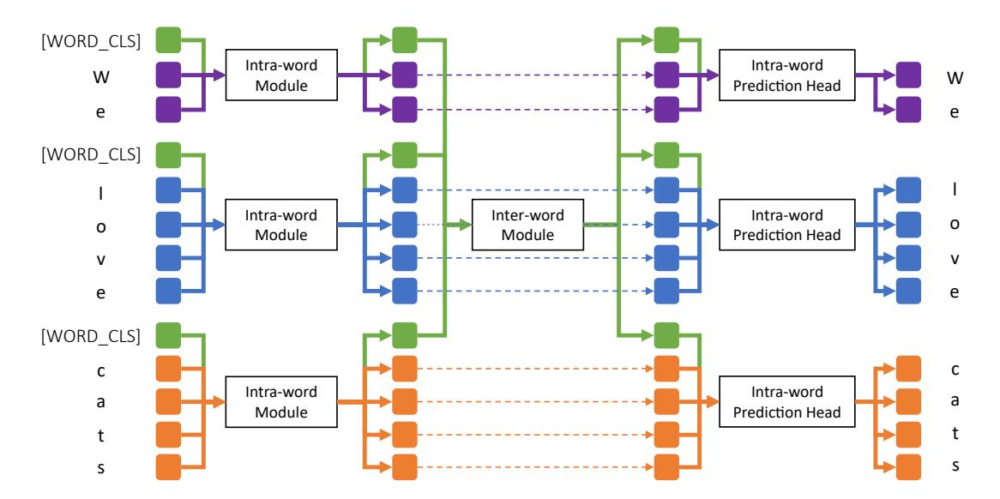
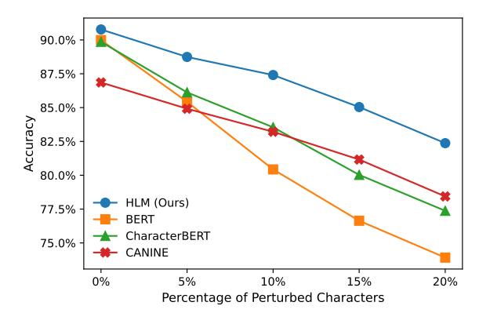
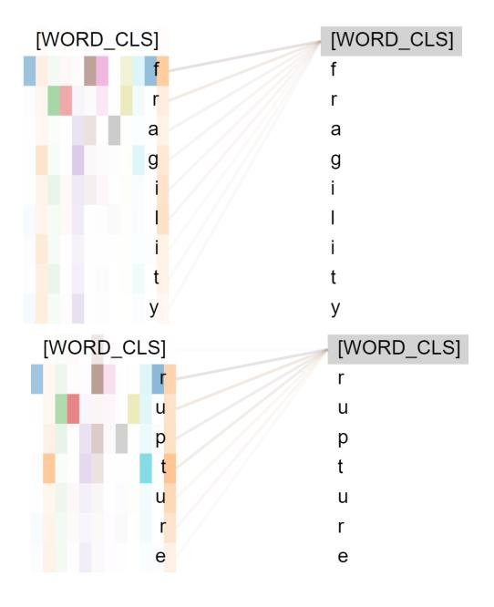

# From Characters to Words: Hierarchical Pre-trained Language Model for Open-vocabulary Language Understanding

Li Sun<sup>1</sup>† , Florian Luisier<sup>2</sup> , Kayhan Batmanghelich<sup>1</sup> , Dinei Florencio<sup>2</sup> , Cha Zhang<sup>2</sup> <sup>1</sup>Boston University <sup>2</sup>Microsoft <sup>1</sup>{lisun,batman}@bu.edu, <sup>2</sup>{flluisie,dinei,chazhang}@microsoft.com

### Abstract

Current state-of-the-art models for natural language understanding require a preprocessing step to convert raw text into discrete tokens. This process known as tokenization relies on a pre-built vocabulary of words or sub-word morphemes. This fixed vocabulary limits the model's robustness to spelling errors and its capacity to adapt to new domains. In this work, we introduce a novel open-vocabulary language model that adopts a hierarchical two-level approach: one at the word level and another at the sequence level. Concretely, we design an intraword module that uses a shallow Transformer architecture to learn word representations from their characters, and a deep inter-word Transformer module that contextualizes each word representation by attending to the entire word sequence. Our model thus directly operates on character sequences with explicit awareness of word boundaries, but without biased sub-word or word-level vocabulary. Experiments on various downstream tasks show that our method outperforms strong baselines. We also demonstrate that our hierarchical model is robust to textual corruption and domain shift.

## 1 Introduction

Pre-trained language models with Transformers have achieved breakthroughs in many natural language processing (NLP) tasks [\(Devlin et al.,](#page-9-0) [2019;](#page-9-0) [Liu et al.,](#page-9-1) [2019\)](#page-9-1). One of the key advantages of Transformers over traditional feature-engineered NLP pipelines is that Transformers enable endto-end training from vast amount of data to automatically learn the optimal language representation [\(Mikolov et al.,](#page-10-0) [2013b\)](#page-10-0). However, most recent language models still require a separate preprocessing stage known as tokenization. Tokenization is a process that splits raw text parts into a list of discrete tokens from a fixed vocabulary. This

<span id="page-0-0"></span>

|                 | Word                   | BERT Tokens                        |
|-----------------|------------------------|------------------------------------|
| Spelling        | changable (changeable) | ch, ##anga, ##ble (change, ##able) |
| Errors          | outragous (outrageous) | out, ##rag, ##ous (outrage, ##ous) |
|                 | reimbursement          | re, ##im, ##bur, ##se, ##ment      |
| Domain<br>Shift | invoice                | in, ##vo, ##ice                    |

Table 1: Examples of sub-word tokenization of misspelled words (with their correct spellings in parentheses) and words from domain-specific corpus (e.g. business documents). Pre-trained sub-word tokenizer tends to over-segment words from these two categories, which produces less meaningful tokens.

pre-defined vocabulary remains as an important bottleneck preventing truly end-to-end training of language models [\(Tay et al.,](#page-10-1) [2021;](#page-10-1) [Islam et al.,](#page-9-2) [2022\)](#page-9-2).

Based on the granularity of the basic token units, tokenization methods can be divided into three categories: character-based, subword-based and wordbased. A word-based tokenizer segments sentence into smaller chunks of words. Due to language complexity and memory limit, a word-based vocabulary can not represent all possible words. Wordlevel tokenization thus frequently runs into the issue of *out-of-vocabulary* words. A character-based tokenizer simply splits the text into a sequence of its characters. It is flexible to encode arbitrary words, but character-level tokenization produces long sequences, which is undesirable as the computational cost of Transformers grows quadratically with the sequence length. To strike a good balance between time and space complexity, most stateof-the-art pre-trained language models thus adopt sub-word tokenization. Data-driven sub-word tokenizers [\(Kudo and Richardson,](#page-9-3) [2018;](#page-9-3) [Schuster](#page-10-2) [and Nakajima,](#page-10-2) [2012;](#page-10-2) [Kudo,](#page-9-4) [2018\)](#page-9-4) are typically pre-trained on a general text corpus to learn a subword vocabulary based on the frequency of word fragments.

Despite their popularity, sub-word tokenizers

<sup>†</sup>Work done during internship at Microsoft. PyTorch-like pseudocode is available in Appendix [A.3.](#page-11-0)

limit the robustness and generalizability of the language models built upon them. First, sub-word tokenizers are sensitive to small textual perturbations [\(Xue et al.,](#page-10-3) [2022\)](#page-10-3). While humans can still comprehend text with subtle misspellings and capitalization variants [\(Rawlinson,](#page-10-4) [2007;](#page-10-4) [Davis,](#page-9-5) [2003\)](#page-9-5), these perturbations can drastically change the tokenization results, potentially leading to a suboptimal text representation. Second, the sub-word vocabulary is pre-built and remains frozen during the language model pre-training and task-specific fine-tuning. Therefore, when adapting a pre-trained language model into a new language context (e.g. biomedical texts and business documents), the tokenizer is prone to excessive fragmentation of subword pieces [\(Yasunaga et al.,](#page-10-5) [2022;](#page-10-5) [Islam et al.,](#page-9-2) [2022\)](#page-9-2), as illustrated in Table [1.](#page-0-0) While this issue could be partially remedied by further task-specific pre-training or by collecting more fine-tuning data, such mitigation would be costly and not always possible.

We aim to bring the best of both character-based and word-based models to address the challenges discussed above. To this end, we propose a novel pre-trained language model with a hierarchical twolevel architecture. At the word level, we split the text sequence by characters, and introduce an intraword module that uses Transformers to learn a representation for each word in the sequence from the embeddings of their respective characters. At the sequence level, we introduce an inter-word module that contextualizes the embedding for every words in the text sequence. Our method does not require explicit sub-word or word-level vocabulary, and can thus be considered as an *open-vocabulary* approach [\(Mielke et al.,](#page-9-6) [2021\)](#page-9-6). By limiting the attention range to characters within the same word rather than the full sequence in the intra-word module, our model remains computationally efficient.

In order to validate our model, we comprehensively compare our method with various baseline methods, including the most popular sub-word based model BERT [\(Devlin et al.,](#page-9-0) [2019\)](#page-9-0), some state-of-the-art character-based models [\(Clark](#page-8-0) [et al.,](#page-8-0) [2022a;](#page-8-0) [Boukkouri et al.,](#page-8-1) [2020\)](#page-8-1), and an hybrid character/sub-word model [\(Ma et al.,](#page-9-7) [2020\)](#page-9-7). Besides standard benchmarking, we also test the robustness of the various models in two ways: by introducing spelling noise into the validation set and by testing on cross-domain tasks.

Our contributions can be summarized as follows:

- We introduce a novel open-vocabulary pretrained language model with a hierarchical two-level architecture. Our method does not rely on pre-defined word or sub-word vocabulary.
- We propose a novel adaptive and learnable aggregation method to summarize characterlevel features into word-level representations. An ablation study highlights its effectiveness.
- We show that our method outperforms strong baselines on multiple benchmarking datasets, while being computationally efficient.
- We perform quantitative experiments and a case study to show that our model is robust to textual corruption and domain shift.

### 2 Related Work

#### 2.1 Word-level Models

Word embedding methods including Word2vec [\(Mikolov et al.,](#page-9-8) [2013a\)](#page-9-8) and GloVe [\(Pen](#page-10-6)[nington et al.,](#page-10-6) [2014\)](#page-10-6) led to many early NLP breakthroughs. These methods learn vector space representations of words from large-scale unlabeled corpora, and encode semantic relationships and meanings [\(Goldberg and Levy,](#page-9-9) [2014\)](#page-9-9). In order to generalize to rare words, [Bhatia et al.](#page-8-2) [\(2016\)](#page-8-2) proposed to use LSTM to learn word embedding from both morphological structure and word distribution. While early methods only learned a context-independent word representation, ELMo [\(Peters et al.,](#page-10-7) [2018\)](#page-10-7) proposed to use a deep bidirectional language model to learn contextualized word representations. In more recent studies, Transformer-XL [\(Dai et al.,](#page-9-10) [2019\)](#page-9-10) enhanced the Transformer architecture with a recurrence mechanism to learn contextualized word embedding through language modeling. Despite the recent progress, word-level models still face the out-of-vocabulary challenge for noisy text and non-canonical word forms [\(Eisenstein,](#page-9-11) [2013\)](#page-9-11).

#### 2.2 Character-level Models

Character-level language models emerged in the early years thanks to their simplicity and ability to better address *out-of-vocabulary* words compared to word-level models [\(Elman,](#page-9-12) [1990;](#page-9-12) [Graves,](#page-9-13) [2013;](#page-9-13) [Kalchbrenner et al.,](#page-9-14) [2016\)](#page-9-14). While sub-word based

approaches gained popularity in language modeling due to their superior performance, recent studies [\(Choe et al.,](#page-8-3) [2019;](#page-8-3) [Xue et al.,](#page-10-3) [2022\)](#page-10-3) show that character/byte-level models can match the performance of their sub-word counterpart when provided with sufficient parameter capacity. In addition, character-level models have been shown to be more robust to text corruptions [\(Tay et al.,](#page-10-1) [2021\)](#page-10-1), adversarial attacks, and domain shifts [\(Aguilar](#page-8-4) [et al.,](#page-8-4) [2020\)](#page-8-4).

Character-level models also show promising results in multilingual settings. While sub-word or word tokenizers require a huge vocabulary to adequately cover various languages, multilingual character-based vocabulary can remain comprehensive and small. The text embedding layer does not eat up most of the model's parameter budget as in the multilingual BERTBase model for instance (up to 52%). More parameters can then be dedicated to the Transformer layers in characterbased approaches. Character-level models have also been shown to perform better on low-resource languages [\(Islam et al.,](#page-9-2) [2022\)](#page-9-2).

An important drawback of character-level models is that they typically require more computations than sub-word and word-level models. This is because character-level tokenization produces longer token sequences compared to sub-word or word based approaches, and the computational and memory demands of the self-attention mechanism grow quadratically with the sequence length. In order to address this challenge, CANINE [\(Clark et al.,](#page-8-5) [2022b\)](#page-8-5) leverages strided convolution to downsample the character sequence, while Charformer [\(Tay](#page-10-1) [et al.,](#page-10-1) [2021\)](#page-10-1) uses average pooling. Although these methods improve the computational efficiency of character-level models, they require a predefined static downsampling rate. Such downsampling operation often breaks the boundary of basic linguistic units, including morphemes and words.

#### 2.3 Hybrid Models

Vanilla character-level models do not explicitly extract word or sub-word morpheme representations, which might negatively impact their performance on word-level downstream tasks, including namedentity recognition and extractive question answering. In order to address this issue, there have been efforts to combine character-level and word/subword level approaches to build hybrid models. These works propose to use information from character spelling to inform word representation. For example, Flair [\(Akbik et al.,](#page-8-6) [2018\)](#page-8-6) proposed to use the internal states of a pre-trained character language model to produce word-level embeddings. CharBERT [\(Ma et al.,](#page-9-7) [2020\)](#page-9-7) combined sub-word tokens and character tokens and fused their heterogeneous representations. CharacterBERT [\(Boukkouri](#page-8-1) [et al.,](#page-8-1) [2020\)](#page-8-1) used a CNN to learn word-level representations from the embeddings of their characters, but still requires a word-level vocabulary for pretraining. Char2Subword [\(Aguilar et al.,](#page-8-4) [2020\)](#page-8-4) proposed a similar approach, where character embeddings are used to mimic pre-trained representation of sub-word tokens with Transformer encoder.

### <span id="page-2-0"></span>3 Method

Most character-level Transformer encoder models are sub-optimal for two reasons: (1) Dense self-attention on long character sequence is computationally expensive; (2) They do not leverage word boundary, which is an important inductive bias in linguistics. To overcome these challenges, we propose to decompose dense character-level Transformer encoder into two parts: intra-word Transformer encoder and inter-word Transformer encoder. Our hierarchical language model (HLM) adopts an hourglass structure [\(Nawrot et al.,](#page-10-8) [2022\)](#page-10-8) and contains three main components: (1) an intraword module that learns word embeddings from their characters; (2) an inter-word module which contextualizes the word representations by attending to all words in the input sequence; (3) an intra-word prediction head for character-level pretraining. The overall architecture of our model is shown in Fig. [1.](#page-3-0) In the following sections, we discuss each component separately.

#### 3.1 Intra-word Module

We aim to learn word-level representations from the embeddings of their characters. An ideal approach should be able to handle words of arbitrary lengths, attend to every character rather than a local window, and remain computationally efficient. Therefore, we choose a shallow (4 layers in our experiments) Transformer encoder to learn contextualized character embeddings, rather than a CNN or a LSTM used by previous methods [\(Boukkouri](#page-8-1) [et al.,](#page-8-1) [2020;](#page-8-1) [Peters et al.,](#page-10-7) [2018\)](#page-10-7). Either average or max pooling [\(Boukkouri et al.,](#page-8-1) [2020;](#page-8-1) [Clark et al.,](#page-8-5) [2022b\)](#page-8-5) is commonly used to aggregate contextualized character embeddings and thus reduce the

<span id="page-3-0"></span>

Figure 1: Overview of the proposed method. The intra-word module learns contextualized character embeddings by referring to characters from the same word. A [WORD\_CLS] token is inserted at the beginning of each word to learn word-level representations. The inter-word module then learns contextualized word-level features by attending to all words in the sequence. Finally, the word-level and character-level embeddings are concatenated and fed to the intra-word prediction head for the pre-training task of masked character modeling. The prediction head is not used in downstream tasks.

sequence length. However, such simple pooling tends to wash out strong signals from particular morphemes (Fathi and Maleki Shoja, 2018). To address this challenge, we propose a novel adaptive and learnable aggregation method. Inspired by the approach of using the hidden state of the [CLS] token as the aggregate sequence-level representation, we insert a special [WORD\_CLS] token at the beginning of every word. The embeddings of the [WORD\_CLS] tokens are then used as word-level representations. Formally, for the i-th word of  $C_i$  characters in the sequence, we extract its word-level representation  $\mathbf{r}^i$  as:

$$\mathbf{h}^i = f_{\theta}(\mathbf{e}_0^i \oplus \mathbf{e}_1^i \oplus \ldots \oplus \mathbf{e}_{C_i}^i)$$
  
 $\mathbf{r}^i = \mathbf{h}_0^i,$ 

where  $f_{\theta}$  is the intra-word Transformers that produces a contextualized representation  $\mathbf{h}^i$  for each character of the i-th word,  $\mathbf{e}^i_0$  is the embedding of the special <code>[WORD\_CLS]</code> token,  $\mathbf{e}^i_c$  is the c-th character embedding of the i-th word, and  $\oplus$  denotes concatenation along the sequence dimension.

In Sec. 4.4, we conduct an ablation study to show that the proposed aggregation method outperforms the standard average or max pooling. By aggregating character-level tokens into word-level tokens, the token sequence length is greatly reduced for the subsequent inter-word module.

#### 3.2 Inter-word Module

After obtaining word-level features, we apply an inter-word module consisting of deep transformer encoder layers to extract contextualized word-level representation by attending to all words in the sequences. Formally, the contextualized representation  $\mathbf{w}^i$  of the i-th word of the sequence of N words is given as:

$$\mathbf{w}^i = f_{\phi}(\mathbf{r}^0 \oplus \ldots \oplus \mathbf{r}^{N-1}),$$

where  $f_{\phi}$  denotes the inter-word Transformers.

We set the depth of the inter-word Transformer encoder stack to 12 in order to match the settings of  $BERT_{Base}$  (Devlin et al., 2019) and CANINE (Clark et al., 2022b). The inter-word module contributes the most to the total model parameters.

#### 3.3 Intra-word Prediction Head

Since we adopt an open-vocabulary approach, we propose to use character-level masked language modeling as pre-training task. To restore the character-level token sequence, we concatenate the contextualized character representations from the intra-word module (the initial [WORD\_CLS] token is omitted) with the word-level features from the inter-word module along the sequence dimension. Finally, we apply a lightweight intra-word prediction head to get the posterior token probabilities.

Formally, the prediction of the C<sup>i</sup> characters from the i-th word are given by:

$$\mathbf{c}^i = f_{\sigma}(\mathbf{w}^i \oplus \mathbf{h}_1^i \oplus \ldots \oplus \mathbf{h}_{C_i}^i),$$

where f<sup>σ</sup> is the intra-word prediction head, consisting of a single Transformer layer, a fully-connected layer and a Softmax layer. Note that the intra-word prediction head is only used during pre-training for the masked character modeling task. During downstream fine-tuning, similar to CANINE, we concatenate initial word embedding r i and contextualized word representation w<sup>i</sup> along the feature dimension, and subsequently employ a small feedforward network to integrate both low-level and high-level information for prediction.

#### 3.4 Pre-training Task

Following the practice of BERT, we pre-train our model on English Wikipedia and BookCorpus dataset (19G) [\(Zhu et al.,](#page-10-9) [2015\)](#page-10-9). We pre-train the model for 3 epochs (3.9M steps with batch size set as 16) on a server with 8 NVIDIA Tesla V100 GPUs, and each epoch takes 137 hours. We adopt whole-word masked language modeling as pre-training task. In detail, we randomly select 15% of words from the input sequence, and mask every characters in the selected word. We replace the character tokens in 80% of the selected masked word with the [MASK] token. For 10% of the selected masked words, we replace their characters with randomly selected characters drawn from our character vocabulary. The remaining 10% words are unchanged. The three main components of our model are jointly trained in end-to-end fashion.

#### 3.5 Implementation Details

We use spaCy [\(Honnibal et al.,](#page-9-16) [2020\)](#page-9-16) to split sentences into words, which is rule-based using space, punctuation and special rules (*e*.*g*. splitting *don't* into *do* and *n't*). We use a case-sensitive character vocabulary of size 1024, which consists of letters, digits and symbols. The maximum sequence length is set to 20 characters for the intra-word module and 512 words for the inter-word module. A [CLS] and a [SEP] token are inserted at the beginning and end of each sequence respectively. The hidden size is set to 768, the number of attention heads is set to 12, the feed-forward dimension in the Transformer encoder is set as 1536 and 3072 for intra-word and inter-word modules respectively. We leverage relative position [\(He](#page-9-17)

[et al.,](#page-9-17) [2021\)](#page-9-17) in our model, and we do not use token type embedding. GELU [\(Hendrycks and Gimpel,](#page-9-18) [2016\)](#page-9-18) is used as activation function. Our model contains 125M parameters. We use the AdamW optimizer [\(Loshchilov and Hutter,](#page-9-19) [2018\)](#page-9-19) for model pre-training and fine-tuning. For the pre-training, the weight decay is set to 0.01 and the number of warmup steps is set to 10,000. A linear learning rate decay schedule is used, starting at 5e-5. The dropout rate is set to 0.1. More algorithm details can be found in Appendix [A.3.](#page-11-0)

### 4 Experiments

We evaluate the performance of our pre-trained model on a wide range of downstream tasks. We compare the performance of our pre-trained hierarchical language model (HLM) with various baseline methods, including the popular sub-word based BERT model, three recent byte/characterlevel models, as well as a hybrid model referred to as CharacterBERT. For BERT, we use the cased BERTBase model (108M parameters) to match our inter-word Transformers module setup. For CA-NINE, we adopt CANINE-C (132M) which also uses a character-level pre-training task. For CharacterBERT, we use the general version (105M) which is pre-trained on English Wikipedia and OpenWeb-Text. For those baseline models, we use the pretrained weights hosted on Huggingface[†](#page-4-0) or released by the authors. For Charformer (203M) and Bytelevel T5 (200M), we use results of the base version from the original paper as pre-trained weight is not available.

### 4.1 Evaluation on Standard Benchmarks

In order to assess our model's performance on general domain, we evaluate our methods on standard English NLP benchmarks, including Stanford Question Answering Dataset (SQuAD) task [\(Ra](#page-10-10)[jpurkar et al.,](#page-10-10) [2016,](#page-10-10) [2018\)](#page-10-11) and GLUE tasks [\(Wang](#page-10-12) [et al.,](#page-10-12) [2018\)](#page-10-12). For the SQuAD task, we benchmark on both SQuAD 1.1 and 2.0 versions. SQuAD 1.1 dataset contains 100,000+ questions with associated context documents, and every question is answerable given the context. SQuAD 2.0 dataset contains an additional 50,000 unanswerable questions. We fine-tune the models for 2 epochs with a batch size of 16, and a learning rate of 3e-5. The evaluation on the validation set is shown in Table [2](#page-5-0) (left). We use exact match (EM) and F1 scores as

<span id="page-4-0"></span><sup>†</sup> <https://huggingface.co/models>

<span id="page-5-0"></span>

|                                              | SQuAD 1.1 |      | SQuA | AD 2.0 | MRPC | QNLI | MNLI (m/mm) |
|----------------------------------------------|-----------|------|------|--------|------|------|-------------|
| Models                                       | EM        | F1   | EM   | F1     | Acc  | Acc  | Acc         |
| BERT (Devlin et al., 2019)                   | 81.3      | 88.7 | 72.9 | 76.1   | 86.7 | 90.0 | 83.3/84.2   |
| Byte-level $T5^{\dagger}$ (Xue et al., 2022) | _         | -    | -    | -      | 87.3 | 88.7 | 82.5/82.7   |
| Charformer (Tay et al., 2021)                | _         | -    | -    | -      | 87.3 | 89.0 | 82.6/82.7   |
| CANINE (Clark et al., 2022b)                 | 72.9      | 82.1 | 66.6 | 70.3   | 84.8 | 84.6 | 76.9/78.2   |
| CharacterBERT (Boukkouri et al., 2020)       | 79.9      | 87.5 | 71.5 | 74.6   | 84.1 | 89.9 | 81.9/82.6   |
| CharBERT (Ma et al., 2020)                   | 82.9      | 89.9 | 75.7 | 78.6   | 87.8 | 91.7 | 82.9/83.1   |
| HLM (Ours)                                   | 83.4      | 90.4 | 76.7 | 79.9   | 88.2 | 90.8 | 84.4/84.3   |

<sup>-</sup> indicates not reported in the paper.

Table 2: Experimental results on the validation set of question answering and text classification tasks. We report exact match (EM) and F1 scores for SQuAD, and accuracy for text classification tasks.

the two evaluation metrics. Our method outperforms all the baseline methods on both SQuAD versions.

We also benchmark our model on three text classification tasks from the widely adopted GLUE tasks (Wang et al., 2018), including MNLI (Williams et al., 2018), MRPC (Dolan and Brockett, 2005) and QNLI (Rajpurkar et al., 2016). The MNLI dataset contains 393k training samples with textual entailment annotations. Given a sentence pair containing a premise and an hypothesis, the task is to predict whether the premise entails the hypothesis, contradicts the hypothesis, or neither. We conduct evaluation in both matched and mismatched settings. The MRPC dataset contains 3.7k of training sentence pairs, and the task is to predict whether the two sentences are semantically equivalent. The QNLI dataset contains 108k training samples of question-paragraph pairs, and the task is to predict whether the context sentence contains the answer to the question. We fine-tune the models on the datasets described above for 5 epochs, with a batch size of 16, and a learning rate of 2e-5. We use the accuracy as the evaluation metric. As shown in Table 2, our proposed method outperforms the baseline methods on all tasks.

In order to investigate the model's performance when the size is scaled up, we increase the size of our HLM to match  $\mathrm{BERT}_{Large}$  and benchmark the performance. Our  $\mathrm{HLM}_{Large}$  performs competitively with the baseline method given a limited computational budget. More details and preliminary experimental results can be found in Appendix A.2.

#### <span id="page-5-3"></span>4.2 Robustness to Textual Corruptions

Humans are prone to making spelling mistakes. For example, 10-15% of web search queries contain misspellings (Dalianis, 2002; Cucerzan and Brill,

<span id="page-5-2"></span>

Figure 2: Evaluation results on QNLI under different amounts of noise. With increasing amount of perturbation, our HLM consistently outperforms baseline methods, and the performance drop is smaller than BERT.

2004). In order to test our model's robustness to misspellings, we add synthetic noise to the fine-tuning and evaluation set of downstream tasks and re-evaluate all the models.

Following the practice of Xue et al. (2022), we experiment with three types of noises: (1) Random drop: We randomly delete 10% of characters (spaces and punctuation are included) from the input sequence; (2) Random repeat: We randomly select 20% of characters, then append 1-3 repetitions (with equal probability) after the the selected original characters; (3) Random case: We randomly set the case for each character (upper or lower) in the input sequence.

We perform the perturbation experiments on two representative downstream tasks: text classification on MNLI dataset and question answering on SQuAD 2.0. For the MNLI dataset, we add noise to both premise and hypothesis sentences. For the SQuAD 2.0 dataset, we only apply the perturbations to the question sentence, but not to the context paragraph, in order to avoid copying corrupted answer from the context for extractive QA mod-

<span id="page-5-1"></span><sup>&</sup>lt;sup>†</sup>Use results from Tay et al. (2021)

<span id="page-6-0"></span>

| _             | _             | MNL                | I(m/mm)            | SQuAD 2.0          |                    |  |  |
|---------------|---------------|--------------------|--------------------|--------------------|--------------------|--|--|
|               | Model         | Matched Acc        | Mismatched Acc     | EM                 | F1                 |  |  |
| Random drop   | BERT          | 68.6(-14.7)        | 70.0(-14.2)        | 41.4(-30.6)        | 47.6(-27.6)        |  |  |
|               | CANINE        | 69.1(-7.8)         | 69.9(-8.3)         | 61.8(-4.7)         | 64.8(-5.4)         |  |  |
|               | CharacterBERT | 70.1(-11.8)        | 71.1(-11.5)        | 61.5(-9.9)         | 64.4(-10.3)        |  |  |
|               | HLM (Ours)    | <b>74.7</b> (-9.7) | <b>75.2</b> (-8.9) | <b>69.3</b> (-7.4) | <b>72.2</b> (-7.6) |  |  |
| Random repeat | BERT          | 72.3(-11.0)        | 75.4(-8.8)         | 35.2(-36.8)        | 37.2(-38.0)        |  |  |
|               | CANINE        | 76.3(-0.7)         | 77.1(-1.2)         | 65.3(-1.3)         | 68.5(-1.7)         |  |  |
|               | CharacterBERT | 77.4(-4.4)         | 78.2(-4.4)         | 66.3(-5.1)         | 69.4(-5.3)         |  |  |
|               | HLM (Ours)    | <b>83.1</b> (-1.3) | <b>82.8</b> (-1.4) | <b>75.8</b> (-0.9) | <b>78.9</b> (-1.0) |  |  |
| Random case   | BERT          | 71.2(-12.1)        | 71.2(-13.0)        | 35.9(-36.2)        | 37.5(-37.7)        |  |  |
|               | CANINE        | 76.7(-0.2)         | 78.0(-0.2)         | 66.1(-0.5)         | 69.8(-0.5)         |  |  |
|               | HLM (Ours)    | <b>83.5</b> (-0.9) | <b>83.5</b> (-0.7) | <b>76.3</b> (-0.4) | <b>79.3</b> (-0.5) |  |  |

Table 3: Evaluation of models under various types of learnable noise. We apply the perturbations to both fine-tuning data and evaluation set. We report the performance value and degradation compared to the standard evaluation in parentheses. Bold face indicates the best absolute performance. We do not report results for randomly switching case for CharacterBERT as it is an uncased model.

els. The evaluation results are shown in Table 3. We found that BERT's performance significantly drops under perturbation, one explanation being that even subtle misspellings would greatly change the sub-word tokenization results. In comparison, character-level models including CANINE degrade less in the presence of noise. We also present the results for unseen perturbation setting in Appendix A.4. Overall, our proposed HLM is robust to different kinds of perturbation and achieves the best performance.

In order to access the model's robustness to various magnitude of perturbations, we add different amounts of noise to the QNLI dataset and perform the evaluation. In practice, we randomly sample 5%, 10%, 15%, 20% of characters for each example in the finetuning data and validation set. For each selected character, we either drop the character or repeat the character as mentioned above (equal probability). The accuracy on the validation set is shown in Fig. 2.

#### 4.3 Robustness to Domain Shift

Most generic language models are pre-trained on web-crawled text corpora including Wikipedia and Common Crawl. But in real world deployments, models are often used in a different domain, an issue referred to as *domain shift*. In order to evaluate the robustness to domain shift, we fine-tune and evaluate the pre-trained models on downstream tasks from specialized domains including biomedicine and social media. For the biomedical field, we perform the evaluation on the NCBI-disease dataset (Crichton et al., 2017; Gu et al.,

<span id="page-6-1"></span>

| Model         | NCBI-disease (F1) | W-NUT16 (F1) |
|---------------|-------------------|--------------|
| BERT          | 83.8              | 45.7         |
| CANINE        | 75.2              | 32.0         |
| CharacterBERT | 84.7              | 34.0         |
| HLM (Ours)    | 86.4              | 47.9         |

Table 4: Evaluation results on cross-domain tasks. We report F1 score on the test set as the evaluation metric.

2021), which contains 7,287 sentences annotated with disease mentions from PubMed abstracts. The task is framed as a named entity recognition (NER) problem where the entities are the disease mentions. We fine-tune the models for 20 epochs, with a batch size of 16, and a learning rate of 2e-5. For the social media experiment, we leverage the W-NUT16 NER shared task (Strauss et al., 2016). This dataset contains 7,244 tweets annotated with 10 NER categories, including person, location, company and others. We fine-tune the models for 5 epochs. The evaluation results on the test sets are shown in Table 4. We use the F1 score as the evaluation metric. As observed, the proposed HLM outperforms the baseline methods, highlighting its higher robustness to domain shift.

Case study In order to understand the performance gain of our model over sub-word based BERT on cross-domain tasks, we look into the cases where BERT makes incorrect predictions. We found that many of these cases contain excessively fragmented words. Table 5 shows two examples from the NCBI-disease NER task. The word *fragility* in case 1 is segmented into *f*, ##rag, ##ility, and the word rupture in case 2 is segmented into *r*, ##up, ##ture. We think these tokenization results

<span id="page-7-1"></span>

| Text        | Skin  | fragility         |         | in | most | cases          | is | due | to      | mutations             | in    | the | gene   | encoding |  |
|-------------|-------|-------------------|---------|----|------|----------------|----|-----|---------|-----------------------|-------|-----|--------|----------|--|
| BERT tokens | Skin  | f, ##rag, ##ility |         | in | most | cases          | is | due | to      | mutations             | in    | the | gene   | encoding |  |
| BERT        | O     | O                 |         | O  | O    | O              | O  | O   | O       | O                     | O     | O   | O      | O        |  |
| HLM (Ours)  | B     | I                 |         | O  | O    | O              | O  | O   | O       | O                     | O     | O   | O      | O        |  |
| Label       | B     | I                 |         | O  | O    | O              | O  | O   | O       | O                     | O     | O   | O      | O        |  |
| Text        | <br>a | disease           | leading |    | to   | aortic         |    |     | rupture | in                    | early |     | adult  | life     |  |
| BERT tokens | a     | disease           | leading |    | to   | a, ##ort, ##ic |    |     |         | r, ##up, ##ture<br>in | early |     | adult  | life     |  |
| BERT        | O     | O                 | O       |    | O    | O              |    |     | O       | O                     | O     |     | O      | O        |  |
| HLM (Ours)  | O     | O                 | O       |    | O    | B              |    |     | I       | O                     | O     |     | O<br>O |          |  |
| Label       | O     | O                 | O       |    | O    | B              |    |     | I       | O                     | O     |     | O      | O        |  |

Table 5: Case study of two examples from NCBI-disease NER task. The tagging schema for disease entities are beginning (B), inside (I), and outside (O). Pink/green colors indicate incorrect/correct predictions respectively.

<span id="page-7-2"></span>

Figure 3: Visualization of the attention patterns at the last layer of our intra-word module. Colored rectangles indicate the 12 attention heads. Color brightness and line weight reflect the attention scores. In the two examples, the [WORD\_CLS] token is mainly attended by the stems of the words, *fragil* and *rupt*, respectively.

are sub-optimal as they break word morphemes, which possibly explains BERT's mispredictions. In comparison, we use BertViz [\(Vig,](#page-10-15) [2019\)](#page-10-15) to visualize the behavior of our HLM model. Specifically, we visualize the attention patterns of the [WORD\_CLS] token of the last Transformer layer of our intra-word module. As shown in Fig. [3,](#page-7-2) the [WORD\_CLS] token for the word *fragility* and *rupture* are primarily attended by the character string *fragil* and *rupt* respectively, which are the stems of the words.

<span id="page-7-3"></span>

| Dataset           | Average pooling | Max pooling | Ours |
|-------------------|-----------------|-------------|------|
| MRPC (Acc)        | 82.1            | 83.6        | 86.0 |
| NCBI-disease (F1) | 85.3            | 85.9        | 86.6 |

Table 6: Word-level aggregation comparisons. All models are pre-trained for 1.5 epochs.

<span id="page-7-4"></span>

| Model         | Throughput (sample/sec) |
|---------------|-------------------------|
| BERT          | 93.8                    |
| CANINE        | 44.3                    |
| CharacterBERT | 78.4                    |
| HLM (Ours)    | 90.3                    |

Table 7: Evaluation results on computational efficiency.

#### <span id="page-7-0"></span>4.4 Ablation Study

In this section, we perform an ablation study to compare the effect of different word-level aggregation methods. Specifically, we replace the proposed special token learning-based aggregation with standard aggregation methods such as average pooling and max pooling. We did not implement the strided convolution proposed in CANINE as it can not handle the variable word lengths. We report the validation accuracy on MRPC and the test F1 score on NCBI-disease in Table [6.](#page-7-3) Our learned aggregation outperforms the standard pooling strategies. Note that average and max pooling are usually performed on a fixed-length window of characters in previous studies [\(Tay et al.,](#page-10-1) [2021\)](#page-10-1), not adaptively at the word-level as in our ablation study.

### 4.5 Computational Efficiency

In this section, we benchmark the computational efficiency of the proposed model. Specifically, we measure the inference throughput (number of processed samples per second) on the test set of the MRPC dataset, a sub-task of the GLUE benchmark. We evaluate different models on the same server with one NVIDIA Tesla V100 GPU. The batch size is set to 32 and we use single precision. The evaluation results are shown in Table [7.](#page-7-4) While BERT is the most computationally efficient, our HLM also performs competitively, the performance gap being smaller compared to other character-level baseline models. We speculate that this performance gain comes from our hierarchical architecture. By aggregating character tokens into word-level tokens, the sequence length is drastically reduced for the inter-word module which has the deepest Transformer stack. We provide more analysis on the computational complexity in Appendix [A.1.](#page-11-2)

### 5 Conclusion

In this work, we propose a novel hierarchical language model for open-vocabulary language understanding. Our method does not rely on explicit sub-word or word vocabulary. We demonstrate that our HLM model outperforms baseline methods on standard benchmarks, and highlight its robustness to spelling errors and domain shifts. In future work, we will expand our language support and explore incorporating a decoder for generative tasks.

## Limitations

This work has two main limitations. First, we only consider baseline models with similar amount of parameters, and pre-trained on similar scale of text corpus for comparison. While we are aware of recent models including T5 [\(Raffel et al.,](#page-10-16) [2020\)](#page-10-16) and PaLM [\(Chowdhery et al.,](#page-8-8) [2022\)](#page-8-8), they either use huge corpus like C4 (745GB text) for pre-training or contain significantly more parameters than ours. In the future, we will try to find additional computational resources to scale up our model and pre-train on larger text corpus. Second, we leverage spaCy to segment sentences into words, which is rule-based using spaces, punctuations and other rules. This approach works well on English and many other common languages such as French, German and Spanish. But for a few languages that do not use spaces to split words (e.g. Chinese and Japanese), it will be challenging to retrieve word boundaries. To address this issue, we consider either falling back to character splitting for these languages (similar to multilingual BERT) or employing a more sophisticated word boundary detector in future work.

### Acknowledgements

This work was partially supported by NIH Award Number 1R01HL141813-01 and the Pennsylvania Department of Health. We are grateful for the computational resources provided by Pittsburgh Super Computing grant number TGASC170024.

## References

<span id="page-8-4"></span>Gustavo Aguilar, Bryan McCann, Tong Niu, Nazneen Rajani, Nitish Keskar, and Thamar Solorio. 2020. Char2subword: Extending the subword embedding space using robust character compositionality. *arXiv preprint arXiv:2010.12730*.

<span id="page-8-6"></span>Alan Akbik, Duncan Blythe, and Roland Vollgraf. 2018. [Contextual string embeddings for sequence label](https://aclanthology.org/C18-1139)[ing.](https://aclanthology.org/C18-1139) In *Proceedings of the 27th International Conference on Computational Linguistics*, pages 1638– 1649, Santa Fe, New Mexico, USA. Association for Computational Linguistics.

<span id="page-8-2"></span>Parminder Bhatia, Robert Guthrie, and Jacob Eisenstein. 2016. [Morphological priors for probabilistic neural](https://doi.org/10.18653/v1/D16-1047) [word embeddings.](https://doi.org/10.18653/v1/D16-1047) In *Proceedings of the 2016 Conference on Empirical Methods in Natural Language Processing*, pages 490–500, Austin, Texas. Association for Computational Linguistics.

<span id="page-8-1"></span>Hicham El Boukkouri, Olivier Ferret, Thomas Lavergne, Hiroshi Noji, Pierre Zweigenbaum, and Junichi Tsujii. 2020. Characterbert: Reconciling elmo and bert for word-level open-vocabulary representations from characters. *arXiv preprint arXiv:2010.10392*.

<span id="page-8-3"></span>Dokook Choe, Rami Al-Rfou, Mandy Guo, Heeyoung Lee, and Noah Constant. 2019. Bridging the gap for tokenizer-free language models. *arXiv preprint arXiv:1908.10322*.

<span id="page-8-8"></span>Aakanksha Chowdhery, Sharan Narang, Jacob Devlin, Maarten Bosma, Gaurav Mishra, Adam Roberts, Paul Barham, Hyung Won Chung, Charles Sutton, Sebastian Gehrmann, et al. 2022. Palm: Scaling language modeling with pathways. *arXiv preprint arXiv:2204.02311*.

<span id="page-8-0"></span>Jonathan H Clark, Dan Garrette, Iulia Turc, and John Wieting. 2022a. Canine: Pre-training an efficient tokenization-free encoder for language representation. *Transactions of the Association for Computational Linguistics*, 10:73–91.

<span id="page-8-5"></span>Jonathan H. Clark, Dan Garrette, Iulia Turc, and John Wieting. 2022b. [Canine: Pre-training an efficient](https://doi.org/10.1162/tacl_a_00448) [tokenization-free encoder for language representa](https://doi.org/10.1162/tacl_a_00448)[tion.](https://doi.org/10.1162/tacl_a_00448) *Transactions of the Association for Computational Linguistics*, 10:73–91.

<span id="page-8-7"></span>Gamal Crichton, Sampo Pyysalo, Billy Chiu, and Anna Korhonen. 2017. A neural network multi-task learning approach to biomedical named entity recognition. *BMC bioinformatics*, 18(1):1–14.

- <span id="page-9-22"></span>Silviu Cucerzan and Eric Brill. 2004. [Spelling correc](https://aclanthology.org/W04-3238)[tion as an iterative process that exploits the collective](https://aclanthology.org/W04-3238) [knowledge of web users.](https://aclanthology.org/W04-3238) In *Proceedings of the 2004 Conference on Empirical Methods in Natural Language Processing*, pages 293–300, Barcelona, Spain. Association for Computational Linguistics.
- <span id="page-9-10"></span>Zihang Dai, Zhilin Yang, Yiming Yang, Jaime Carbonell, Quoc Le, and Ruslan Salakhutdinov. 2019. [Transformer-XL: Attentive language models beyond](https://doi.org/10.18653/v1/P19-1285) [a fixed-length context.](https://doi.org/10.18653/v1/P19-1285) In *Proceedings of the 57th Annual Meeting of the Association for Computational Linguistics*, pages 2978–2988, Florence, Italy. Association for Computational Linguistics.
- <span id="page-9-21"></span>Hercules Dalianis. 2002. Evaluating a spelling support in a search engine. In *International Conference on Application of Natural Language to Information Systems*, pages 183–190. Springer.
- <span id="page-9-5"></span>Matt Davis. 2003. Psycholinguistic evidence on scrambled letters in reading.
- <span id="page-9-0"></span>Jacob Devlin, Ming-Wei Chang, Kenton Lee, and Kristina Toutanova. 2019. [BERT: Pre-training of](https://doi.org/10.18653/v1/N19-1423) [deep bidirectional transformers for language under](https://doi.org/10.18653/v1/N19-1423)[standing.](https://doi.org/10.18653/v1/N19-1423) In *Proceedings of the 2019 Conference of the North American Chapter of the Association for Computational Linguistics: Human Language Technologies, Volume 1 (Long and Short Papers)*, pages 4171–4186, Minneapolis, Minnesota. Association for Computational Linguistics.
- <span id="page-9-20"></span>Bill Dolan and Chris Brockett. 2005. Automatically constructing a corpus of sentential paraphrases. In *Third International Workshop on Paraphrasing (IWP2005)*.
- <span id="page-9-11"></span>Jacob Eisenstein. 2013. [What to do about bad language](https://aclanthology.org/N13-1037) [on the internet.](https://aclanthology.org/N13-1037) In *Proceedings of the 2013 Conference of the North American Chapter of the Association for Computational Linguistics: Human Language Technologies*, pages 359–369, Atlanta, Georgia. Association for Computational Linguistics.
- <span id="page-9-12"></span>Jeffrey L Elman. 1990. Finding structure in time. *Cognitive science*, 14(2):179–211.
- <span id="page-9-15"></span>Ehsan Fathi and Babak Maleki Shoja. 2018. [Chapter 9](https://doi.org/https://doi.org/10.1016/bs.host.2018.07.006)  [deep neural networks for natural language processing.](https://doi.org/https://doi.org/10.1016/bs.host.2018.07.006) In Venkat N. Gudivada and C.R. Rao, editors, *Computational Analysis and Understanding of Natural Languages: Principles, Methods and Applications*, volume 38 of *Handbook of Statistics*, pages 229–316. Elsevier.
- <span id="page-9-9"></span>Yoav Goldberg and Omer Levy. 2014. word2vec explained: deriving mikolov et al.'s negativesampling word-embedding method. *arXiv preprint arXiv:1402.3722*.
- <span id="page-9-13"></span>Alex Graves. 2013. Generating sequences with recurrent neural networks. *arXiv preprint arXiv:1308.0850*.

- <span id="page-9-23"></span>Yu Gu, Robert Tinn, Hao Cheng, Michael Lucas, Naoto Usuyama, Xiaodong Liu, Tristan Naumann, Jianfeng Gao, and Hoifung Poon. 2021. Domain-specific language model pretraining for biomedical natural language processing. *ACM Transactions on Computing for Healthcare (HEALTH)*, 3(1):1–23.
- <span id="page-9-17"></span>Pengcheng He, Xiaodong Liu, Jianfeng Gao, and Weizhu Chen. 2021. [Deberta: Decoding-enhanced](https://openreview.net/forum?id=XPZIaotutsD) [bert with disentangled attention.](https://openreview.net/forum?id=XPZIaotutsD) In *International Conference on Learning Representations*.
- <span id="page-9-18"></span>Dan Hendrycks and Kevin Gimpel. 2016. Gaussian error linear units (gelus). *arXiv preprint arXiv:1606.08415*.
- <span id="page-9-16"></span>Matthew Honnibal, Ines Montani, Sofie Van Landeghem, and Adriane Boyd. 2020. spacy: Industrialstrength natural language processing in python.
- <span id="page-9-2"></span>Md Mofijul Islam, Gustavo Aguilar, Pragaash Ponnusamy, Clint Solomon Mathialagan, Chengyuan Ma, and Chenlei Guo. 2022. A vocabulary-free multilingual neural tokenizer for end-to-end task learning. *arXiv preprint arXiv:2204.10815*.
- <span id="page-9-14"></span>Nal Kalchbrenner, Lasse Espeholt, Karen Simonyan, Aaron van den Oord, Alex Graves, and Koray Kavukcuoglu. 2016. Neural machine translation in linear time. *arXiv preprint arXiv:1610.10099*.
- <span id="page-9-4"></span>Taku Kudo. 2018. Subword regularization: Improving neural network translation models with multiple subword candidates. *arXiv preprint arXiv:1804.10959*.
- <span id="page-9-3"></span>Taku Kudo and John Richardson. 2018. Sentencepiece: A simple and language independent subword tokenizer and detokenizer for neural text processing. *arXiv preprint arXiv:1808.06226*.
- <span id="page-9-1"></span>Yinhan Liu, Myle Ott, Naman Goyal, Jingfei Du, Mandar Joshi, Danqi Chen, Omer Levy, Mike Lewis, Luke Zettlemoyer, and Veselin Stoyanov. 2019. Roberta: A robustly optimized bert pretraining approach. *arXiv preprint arXiv:1907.11692*.
- <span id="page-9-19"></span>Ilya Loshchilov and Frank Hutter. 2018. Decoupled weight decay regularization. In *International Conference on Learning Representations*.
- <span id="page-9-7"></span>Wentao Ma, Yiming Cui, Chenglei Si, Ting Liu, Shijin Wang, and Guoping Hu. 2020. Charbert: characteraware pre-trained language model. *arXiv preprint arXiv:2011.01513*.
- <span id="page-9-6"></span>Sabrina J Mielke, Zaid Alyafeai, Elizabeth Salesky, Colin Raffel, Manan Dey, Matthias Gallé, Arun Raja, Chenglei Si, Wilson Y Lee, Benoît Sagot, et al. 2021. Between words and characters: A brief history of open-vocabulary modeling and tokenization in nlp. *arXiv preprint arXiv:2112.10508*.
- <span id="page-9-8"></span>Tomas Mikolov, Kai Chen, Greg Corrado, and Jeffrey Dean. 2013a. Efficient estimation of word representations in vector space. *arXiv preprint arXiv:1301.3781*.

- <span id="page-10-0"></span>Tomas Mikolov, Ilya Sutskever, Kai Chen, Greg S Corrado, and Jeff Dean. 2013b. Distributed representations of words and phrases and their compositionality. *Advances in neural information processing systems*, 26.
- <span id="page-10-8"></span>Piotr Nawrot, Szymon Tworkowski, Michał Tyrolski, Lukasz Kaiser, Yuhuai Wu, Christian Szegedy, and Henryk Michalewski. 2022. [Hierarchical transform](https://doi.org/10.18653/v1/2022.findings-naacl.117)[ers are more efficient language models.](https://doi.org/10.18653/v1/2022.findings-naacl.117) In *Findings of the Association for Computational Linguistics: NAACL 2022*, pages 1559–1571, Seattle, United States. Association for Computational Linguistics.
- <span id="page-10-6"></span>Jeffrey Pennington, Richard Socher, and Christopher Manning. 2014. [GloVe: Global vectors for word](https://doi.org/10.3115/v1/D14-1162) [representation.](https://doi.org/10.3115/v1/D14-1162) In *Proceedings of the 2014 Conference on Empirical Methods in Natural Language Processing (EMNLP)*, pages 1532–1543, Doha, Qatar. Association for Computational Linguistics.
- <span id="page-10-7"></span>Matthew E. Peters, Mark Neumann, Mohit Iyyer, Matt Gardner, Christopher Clark, Kenton Lee, and Luke Zettlemoyer. 2018. [Deep contextualized word repre](https://doi.org/10.18653/v1/N18-1202)[sentations.](https://doi.org/10.18653/v1/N18-1202) In *Proceedings of the 2018 Conference of the North American Chapter of the Association for Computational Linguistics: Human Language Technologies, Volume 1 (Long Papers)*, pages 2227–2237, New Orleans, Louisiana. Association for Computational Linguistics.
- <span id="page-10-16"></span>Colin Raffel, Noam Shazeer, Adam Roberts, Katherine Lee, Sharan Narang, Michael Matena, Yanqi Zhou, Wei Li, Peter J Liu, et al. 2020. Exploring the limits of transfer learning with a unified text-to-text transformer. *J. Mach. Learn. Res.*, 21(140):1–67.
- <span id="page-10-11"></span>Pranav Rajpurkar, Robin Jia, and Percy Liang. 2018. [Know what you don't know: Unanswerable ques](https://doi.org/10.18653/v1/P18-2124)[tions for SQuAD.](https://doi.org/10.18653/v1/P18-2124) In *Proceedings of the 56th Annual Meeting of the Association for Computational Linguistics (Volume 2: Short Papers)*, pages 784–789, Melbourne, Australia. Association for Computational Linguistics.
- <span id="page-10-10"></span>Pranav Rajpurkar, Jian Zhang, Konstantin Lopyrev, and Percy Liang. 2016. [SQuAD: 100,000+ questions for](https://doi.org/10.18653/v1/D16-1264) [machine comprehension of text.](https://doi.org/10.18653/v1/D16-1264) In *Proceedings of the 2016 Conference on Empirical Methods in Natural Language Processing*, pages 2383–2392, Austin, Texas. Association for Computational Linguistics.
- <span id="page-10-4"></span>Graham Rawlinson. 2007. The significance of letter position in word recognition. *IEEE Aerospace and Electronic Systems Magazine*, 22(1):26–27.
- <span id="page-10-2"></span>Mike Schuster and Kaisuke Nakajima. 2012. Japanese and korean voice search. In *2012 IEEE international conference on acoustics, speech and signal processing (ICASSP)*, pages 5149–5152. IEEE.
- <span id="page-10-14"></span>Benjamin Strauss, Bethany Toma, Alan Ritter, Marie-Catherine de Marneffe, and Wei Xu. 2016. [Results](https://aclanthology.org/W16-3919) [of the WNUT16 named entity recognition shared](https://aclanthology.org/W16-3919) [task.](https://aclanthology.org/W16-3919) In *Proceedings of the 2nd Workshop on Noisy*

- *User-generated Text (WNUT)*, pages 138–144, Osaka, Japan. The COLING 2016 Organizing Committee.
- <span id="page-10-1"></span>Yi Tay, Vinh Q Tran, Sebastian Ruder, Jai Gupta, Hyung Won Chung, Dara Bahri, Zhen Qin, Simon Baumgartner, Cong Yu, and Donald Metzler. 2021. Charformer: Fast character transformers via gradient-based subword tokenization. *arXiv preprint arXiv:2106.12672*.
- <span id="page-10-15"></span>Jesse Vig. 2019. [A multiscale visualization of attention](https://doi.org/10.18653/v1/P19-3007) [in the transformer model.](https://doi.org/10.18653/v1/P19-3007) In *Proceedings of the 57th Annual Meeting of the Association for Computational Linguistics: System Demonstrations*, pages 37–42, Florence, Italy. Association for Computational Linguistics.
- <span id="page-10-12"></span>Alex Wang, Amanpreet Singh, Julian Michael, Felix Hill, Omer Levy, and Samuel R Bowman. 2018. Glue: A multi-task benchmark and analysis platform for natural language understanding. *arXiv preprint arXiv:1804.07461*.
- <span id="page-10-13"></span>Adina Williams, Nikita Nangia, and Samuel Bowman. 2018. [A broad-coverage challenge corpus for sen](https://doi.org/10.18653/v1/N18-1101)[tence understanding through inference.](https://doi.org/10.18653/v1/N18-1101) In *Proceedings of the 2018 Conference of the North American Chapter of the Association for Computational Linguistics: Human Language Technologies, Volume 1 (Long Papers)*, pages 1112–1122, New Orleans, Louisiana. Association for Computational Linguistics.
- <span id="page-10-3"></span>Linting Xue, Aditya Barua, Noah Constant, Rami Al-Rfou, Sharan Narang, Mihir Kale, Adam Roberts, and Colin Raffel. 2022. [ByT5: Towards a token-free](https://doi.org/10.1162/tacl_a_00461) [future with pre-trained byte-to-byte models.](https://doi.org/10.1162/tacl_a_00461) *Transactions of the Association for Computational Linguistics*, 10:291–306.
- <span id="page-10-5"></span>Michihiro Yasunaga, Jure Leskovec, and Percy Liang. 2022. [LinkBERT: Pretraining language models with](https://doi.org/10.18653/v1/2022.acl-long.551) [document links.](https://doi.org/10.18653/v1/2022.acl-long.551) In *Proceedings of the 60th Annual Meeting of the Association for Computational Linguistics (Volume 1: Long Papers)*, pages 8003–8016, Dublin, Ireland. Association for Computational Linguistics.
- <span id="page-10-17"></span>Zhanpeng Zeng, Yunyang Xiong, Sathya Ravi, Shailesh Acharya, Glenn M Fung, and Vikas Singh. 2021. You only sample (almost) once: Linear cost self-attention via bernoulli sampling. In *International conference on machine learning*, pages 12321–12332. PMLR.
- <span id="page-10-9"></span>Yukun Zhu, Ryan Kiros, Rich Zemel, Ruslan Salakhutdinov, Raquel Urtasun, Antonio Torralba, and Sanja Fidler. 2015. Aligning books and movies: Towards story-like visual explanations by watching movies and reading books. In *Proceedings of the IEEE international conference on computer vision*, pages 19–27.

#### A Appendix

#### <span id="page-11-2"></span>A.1 Analysis on Computational Complexity

Let N denotes the character length of input sequence. Without loss of generality, we assume the words in the sequence are of the same length M. The multi-head self-attention module is the major component of Transformer. While it provides global receptive field, the computational cost and memory footprint grow quadratically with input sequence length (Zeng et al., 2021). Therefore, for a vanilla character-based Transformers with dense self-attention, the computational and space complexity is  $O(N^2)$ .

For our proposed HLM, the input sequence is still at the character level. But we sparsity the dense self-attention by introducing a hierarchical architecture. For the intra-word module, each character token only attends to characters from the same word. Since there are  $\frac{N}{M}$  words in the sequence, the computational and space complexity of the intra-word module is

$$O\left(\frac{N}{M} \cdot M^2\right) = O(NM) \tag{1}$$

For the inter-word module, since it only operates on word-level tokens, the computational and space complexity is

<span id="page-11-3"></span>
$$O\left(\frac{N^2}{M^2}\right) \tag{2}$$

Since typically  $N\gg M$ , and we have a shallow intra-word module and a deeper inter-word module, Eq. 2 dominates the computational and space complexity of the full model, which is significantly lower than the vanilla character-level model.

In comparison to sub-word based models like BERT, our inter-word module operates on word-level token sequence, which is always equal or shorter than sub-word level token sequence. Therefore, despite our model has an extra intra-word module, we empirically observe in Table 7 that our HLM is competitive in terms of computational efficiency comparing to sub-word based models.

#### <span id="page-11-1"></span>A.2 Preliminary Evaluation of Scaled Model

In this section, we scale up our model size and benchmark the performance. In order to match  $BERT_{Large}$ , we set the number of layers in the inter-word Transformer encoder to 24 and the feedforward dimension of Transformer encoder is set as 2048 and 4096 for intra-word and inter-word modules respectively. We set the number of attention

<span id="page-11-4"></span>

|                                                                                                          | SQuA | <b>AD 1.1</b><br>F1 | SQuA | D 2.0 |
|----------------------------------------------------------------------------------------------------------|------|---------------------|------|-------|
| Models                                                                                                   | EM   | F1                  | EM   | F1    |
| $\begin{array}{c} \overline{\text{BERT}_{Large}} \\ \text{HLM}_{Large} \text{ (370k steps)} \end{array}$ | 84.1 | 90.9                | 78.7 | 81.9  |
| $HLM_{Large}$ (370k steps)                                                                               | 83.4 | 90.2                | 78.2 | 81.3  |

Table 8: Experimental results on the validation set of question answering tasks. We report exact match (EM) and F1 scores for SQuAD.

heads as 16 and the hidden size as 1024. The batch size is set as 128. Other hyperparameters are set as the same as  $HLM_{Base}$ , described in Section 3. Due to limited access to computational resources, we could only pre-train the model for 370k steps at the camera-ready deadline. In comparison, BERT<sub>Large</sub> was pretrained for 1M steps with a batch size of 256. Therefore, our computational budget is about 1/6 of BERT's. We benchmark our model's performance on SQuAD 1.1 and 2.0 datasets. The evaluation results on the validation set are shown in Table 8. We use exact match (EM) and F1 scores as the two evaluation metrics. Our model performs competitively compared with  $BERT_{Large}$ , despite that our  $HLM_{Large}$  has significantly less computational budget for pre-training.

#### <span id="page-11-0"></span>A.3 Algorithm Details

In this section, we provide algorithm details for our input pre-processing and model algorithm. Our pre-processing consists the following steps. First, we split each sentence into a list of words. Next, we map characters to codepoint indexes using a character-level vocabulary, and insert [WORD\_CLS] token at the start of each word. Next, we insert a [CLS] token at the start, and a [SEP] token at the end for each sequence. Then we truncate the token sequence based on both character-level (20 characters for each word) and word-level (512 words per sentence) limits. Next, we compute the maximum number of characters for words in the batch, and pad all words to this length. We also determine the maximum number of words in the sequence batch, and pad all sequences to this length. The pre-processed batch can then be represented as a matrix of shape [batch\_size, max\_num\_word, max\_num\_char]. Our unique representation of text batch enables us to efficiently switch between performing intraword self-attention and inter-word self-attention by simply reshaping, which is shown in Algorithm 1.

We provide pseudocode for pre-training of our HLM in Algorithm 1. For better readability, we

omit implementation details including utilizing attention mask which avoids performing attention on the [PAD] tokens and handling for padding words. We recommend padding the input matrix to multiples of 8 for better acceleration on GPU. We also found a residual connection between initial word embedding r i and contextualized word embedding w<sup>i</sup> improves the performance in a subsequent study.

### <span id="page-12-0"></span>A.4 Robustness to Unseen Perturbations

In this section, we benchmark the model's robustness to *unseen noise*. Specifically, we only add noise to the evaluation set, while using the original fine-tuning data. We experiment with three types of perturbation as introduced in Section [4.2.](#page-5-3) The results are shown in Table [9.](#page-13-1) In all three scenarios, our proposed HLM outperforms baseline methods, showing better robustness.

### <span id="page-13-0"></span>Algorithm 1 Pseudocode for HLM, PyTorch-like

```
# embeddings: character-level embedding lookup table
# intra_word_encoder: Intra-word Transformer encoder
# inter_word_encoder: Inter-word Transformer encoder
# intra_word_head: Intra-word prediction head
for input_ids, labels in loader: # load a minibatch with n samples
   input_embeds = embeddings(input_ids)
   batch_size, num_word, num_char, hidden_size = input_embeds.shape
   # reshape to let Transformers attend to intra-word tokens rather than full sequence
   input_embeds = input_embeds.reshape((batch_size*num_word, num_char, hidden_size))
   initial_embeds = intra_word_encoder(input_embeds)
   # extract embedding for [WORD_CLS] token, which is always at the beginning of each word
   word_embeds = initial_embeds[:,0,:]
   # reshape and extract contextualized inter-word representation
   word_embeds = word_embeds.reshape((batch_size, num_word, hidden_size))
   word_embeds = inter_word_encoder(word_embeds)
   word_embeds = word_embeds.reshape((batch_size*num_word, 1, hidden_size))
   # concatenate to restore the character-level token sequence
   char_embeds = concatenate([word_embeds, initial_embeds[:,1:,:]], axis=1)
   char_logits = intra_word_head(char_embeds)
   char_logits = char_logits.reshape((batch_size, num_word, num_char, -1))
   loss = CrossEntropyLoss(char_logits, labels) # masked character modeling loss
   loss.backward() # back-propagate
   # AdamW update
   update(embeddings, intra_word_encoder, inter_word_encoder, intra_word_head)
```

<span id="page-13-1"></span>

|               |               | MNL                 | I(m/mm)             | SQuAD 2.0           |                     |  |  |  |
|---------------|---------------|---------------------|---------------------|---------------------|---------------------|--|--|--|
|               | Model         | Matched Acc         | Mismatched Acc      | EM                  | F1                  |  |  |  |
| Random drop   | BERT          | 57.5(-25.8)         | 57.9(-26.3)         | 53.1(-19.0)         | 55.6(-19.6)         |  |  |  |
|               | CANINE        | 57.7(-19.2)         | 58.2(-20.1)         | 57.1(-9.5)          | 59.0(-11.3)         |  |  |  |
|               | CharacterBERT | 55.9(-26.0)         | 56.0(-26.6)         | 52.0(-19.5)         | 55.1(-19.5)         |  |  |  |
|               | HLM (Ours)    | <b>59.7</b> (-24.7) | <b>61.0</b> (-23.2) | <b>58.3</b> (-18.4) | <b>60.3</b> (-19.5) |  |  |  |
| Random repeat | BERT          | 52.4(-30.9)         | 53.5(-30.7)         | 51.4(-20.7)         | 52.7(-22.5)         |  |  |  |
|               | CANINE        | 56.2(-20.7)         | 57.4(-20.8)         | 53.8(-12.8)         | 56.1(-14.2)         |  |  |  |
|               | CharacterBERT | 54.5(-27.4)         | 55.2(-27.4)         | 49.4(-22.1)         | 52.6(-22.0)         |  |  |  |
|               | HLM (Ours)    | <b>58.5</b> (-25.9) | <b>58.3</b> (-25.9) | <b>57.7</b> (-19.1) | <b>59.2</b> (-20.7) |  |  |  |
| Random case   | BERT          | 43.8(-39.5)         | 44.1(-40.2)         | 48.1(-23.9)         | 48.4(-26.8)         |  |  |  |
|               | CANINE        | 72.7(-4.2)          | 73.2(-5.1)          | 65.3(-1.3)          | 68.6(-1.6)          |  |  |  |
|               | HLM (Ours)    | <b>73.5</b> (-10.9) | <b>74.5</b> (-9.6)  | <b>70.2</b> (-6.5)  | <b>73.1</b> (-6.8)  |  |  |  |

Table 9: Evaluation of the models under various types of unseen noise. The perturbations are only applied to the evaluation sets, while the fine-tuning data is left untouched. We report the performance value and degradation compared to the standard evaluation (no perturbation) in parentheses. Bold face indicates the best absolute performance. We do not report results for randomly switching case for CharacterBERT as it is an uncased model.

### ACL 2023 Responsible NLP Checklist

#### A For every submission:

✓ A1. Did you describe the limitations of your work? *We discuss the limitations in Section 7.*

✗ A2. Did you discuss any potential risks of your work? *We think there is a minimal potential risk in our work, since our model is not a generative language*

✓ A3. Do the abstract and introduction summarize the paper's main claims? *We summarize the main claims in Section 1.*

✗ A4. Have you used AI writing assistants when working on this paper? *Left blank.*

## B ✗ Did you use or create scientific artifacts?

*Left blank.*

*model.*

| B1. Did you cite the creators of artifacts you used?<br>Not applicable. Left blank.                                     |
|-------------------------------------------------------------------------------------------------------------------------|
| B2. Did you discuss the license or terms for use and / or distribution of any artifacts?<br>Not applicable. Left blank. |

 B3. Did you discuss if your use of existing artifact(s) was consistent with their intended use, provided that it was specified? For the artifacts you create, do you specify intended use and whether that is compatible with the original access conditions (in particular, derivatives of data accessed for research purposes should not be used outside of research contexts)?

*Not applicable. Left blank.*

 B4. Did you discuss the steps taken to check whether the data that was collected / used contains any information that names or uniquely identifies individual people or offensive content, and the steps taken to protect / anonymize it?

*Not applicable. Left blank.*

 B5. Did you provide documentation of the artifacts, e.g., coverage of domains, languages, and linguistic phenomena, demographic groups represented, etc.? *Not applicable. Left blank.*

 B6. Did you report relevant statistics like the number of examples, details of train / test / dev splits, etc. for the data that you used / created? Even for commonly-used benchmark datasets, include the number of examples in train / validation / test splits, as these provide necessary context for a reader to understand experimental results. For example, small differences in accuracy on large test sets may be significant, while on small test sets they may not be. *Not applicable. Left blank.*

# <sup>C</sup> ✓ Did you run computational experiments?

*In section 4.*

✓ C1. Did you report the number of parameters in the models used, the total computational budget (e.g., GPU hours), and computing infrastructure used? *In section 3.5.*

*The Responsible NLP Checklist used at [ACL 2023](https://2023.aclweb.org/) is adopted from [NAACL 2022,](https://2022.naacl.org/blog/responsible-nlp-research-checklist/) with the addition of a [question on AI writing](https://2023.aclweb.org/blog/ACL-2023-policy/) [assistance.](https://2023.aclweb.org/blog/ACL-2023-policy/)*

| ✓<br>C2.<br>Did you discuss the experimental setup, including hyperparameter search and best-found<br>hyperparameter values?<br>In section 3.5.                                                                                                                                   |
|-----------------------------------------------------------------------------------------------------------------------------------------------------------------------------------------------------------------------------------------------------------------------------------|
| ✓<br>C3. Did you report descriptive statistics about your results (e.g., error bars around results, summary<br>statistics from sets of experiments), and is it transparent whether you are reporting the max, mean,<br>etc. or just a single run?<br>In section 4.                |
| ✓<br>C4. If you used existing packages (e.g., for preprocessing, for normalization, or for evaluation), did<br>you report the implementation, model, and parameter settings used (e.g., NLTK, Spacy, ROUGE,<br>etc.)?<br>In section 3.5.                                          |
| ✗<br>D<br>Did you use human annotators (e.g., crowdworkers) or research with human participants?                                                                                                                                                                                  |
| Left blank.                                                                                                                                                                                                                                                                       |
| D1. Did you report the full text of instructions given to participants, including e.g., screenshots,<br>disclaimers of any risks to participants or annotators, etc.?<br>Not applicable. Left blank.                                                                              |
| D2. Did you report information about how you recruited (e.g., crowdsourcing platform, students)<br>and paid participants, and discuss if such payment is adequate given the participants' demographic<br>(e.g., country of residence)?<br>Not applicable. Left blank.             |
| D3.<br>Did you discuss whether and how consent was obtained from people whose data you're<br>using/curating?<br>For example, if you collected data via crowdsourcing, did your instructions to<br>crowdworkers explain how the data would be used?<br>Not applicable. Left blank. |
| D4. Was the data collection protocol approved (or determined exempt) by an ethics review board?<br>Not applicable. Left blank.                                                                                                                                                    |
| D5. Did you report the basic demographic and geographic characteristics of the annotator population<br>that is the source of the data?<br>Not applicable. Left blank.                                                                                                             |