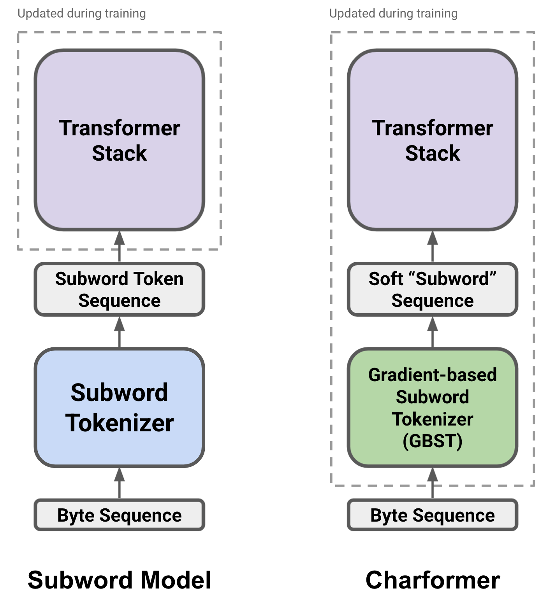
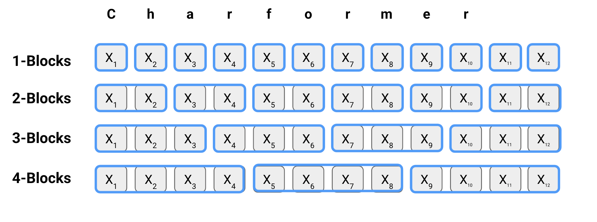
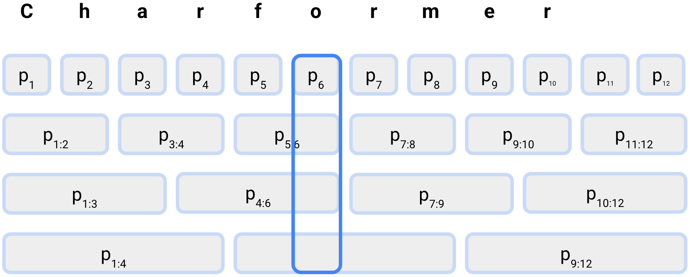
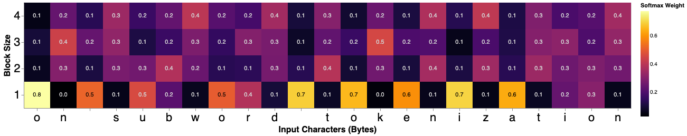

**Source:** *Charformer: Fast Character Transformers via Gradient-based Subword Tokenization* — [PDF](https://arxiv.org/pdf/2106.12672) · [arXiv](https://arxiv.org/abs/2106.12672)

# Charformer: Fast Character Transformers via Gradient-based Subword Tokenization

Yi Tay  Thanks: Equal Contribution  Vinh Q. Tran  Sebastian Ruder  Jai Gupta  Hyung Won Chung  Dara BahriZhen Qin, Simon Baumgartner, Cong Yu, Donald Metzler Google Research  DeepMindyitay@google.com, vqtran@google.com

###### Abstract

State-of-the-art models in natural language processing rely on separate rigid subword tokenization algorithms, which limit their generalization ability and adaptation to new settings. In this paper, we propose a new model inductive bias that learns a subword tokenization end-to-end as part of the model. To this end, we introduce a soft gradient-based subword tokenization module (GBST) that automatically learns latent subword representations from characters in a data-driven fashion. Concretely, GBST enumerates candidate subword blocks and learns to score them in a position-wise fashion using a block scoring network. We additionally introduce Charformer, a deep Transformer model that integrates GBST and operates on the byte level. Via extensive experiments on English GLUE, multilingual, and noisy text datasets, we show that Charformer outperforms a series of competitive byte-level baselines while generally performing on par and sometimes outperforming subword-based models. Additionally, Charformer is fast, improving the speed of both vanilla byte-level and subword-level Transformers by 28-100% while maintaining competitive quality. We believe this work paves the way for highly performant token-free models that are trained completely end-to-end.

## 1 Introduction

Neural networks have achieved tremendous success in natural language processing (NLP) by replacing feature-engineered models with stacks of functions that are learned end-to-end from vast amounts of data ([Mikolov et al. 2013](https://arxiv.org/html/2106.12672#bib.bib39); [Peters et al. 2018](https://arxiv.org/html/2106.12672#bib.bib41); [Howard and Ruder 2018](https://arxiv.org/html/2106.12672#bib.bib22)). The single component of the traditional NLP pipeline ([Manning and Schütze 1999](https://arxiv.org/html/2106.12672#bib.bib38)) that has so far resisted gradient-based learning is tokenization, which is commonly applied as a pre-processing step. State-of-the-art pre-trained language models ([Devlin et al. 2019](https://arxiv.org/html/2106.12672#bib.bib14)) generally rely on data-driven subword-based tokenization algorithms ([Schuster and Nakajima 2012](https://arxiv.org/html/2106.12672#bib.bib47); [Sennrich et al. 2016](https://arxiv.org/html/2106.12672#bib.bib48); [Wu et al. 2016](https://arxiv.org/html/2106.12672#bib.bib61); [Kudo and Richardson 2018](https://arxiv.org/html/2106.12672#bib.bib31)) while expert-crafted segmentation algorithms are still common for languages without whitespace separation such as Chinese, Thai, and Korean ([Lample and Conneau 2019](https://arxiv.org/html/2106.12672#bib.bib32), cf.).

This reliance on rigid tokenization methods introduces a bottleneck into current NLP systems that limits their capabilities. Subword segmentation algorithms split tokens into subwords solely based on frequency, without taking into account lexical or semantic similarity. As a result, models are brittle to rare words ([Gong et al. 2018](https://arxiv.org/html/2106.12672#bib.bib17)) and perturbations, both natural and adversarial ([Belinkov and Bisk 2018](https://arxiv.org/html/2106.12672#bib.bib2); [Pruthi et al. 2019](https://arxiv.org/html/2106.12672#bib.bib43); [Sun et al. 2020](https://arxiv.org/html/2106.12672#bib.bib52)). In multilingual models, tokens in low-resource languages are split into many subwords, which impacts performance on those languages and deteriorates cross-lingual transfer ([Hu et al. 2020](https://arxiv.org/html/2106.12672#bib.bib23); [Wang et al. 2021](https://arxiv.org/html/2106.12672#bib.bib59)). Finally, a separate tokenization algorithm leads to a mismatch between the pre-training and downstream distribution of words when adapting pre-trained language models to new settings, which requires significant engineering effort to overcome.

The direct application of character-level modelling into pre-trained language models in turn results in severely increased computational and memory complexity due to an increased sequence length and generally lower performance.

To address this problem, we propose gradient-based subword tokenization (GBST), a new method that combines the compositionality of character-level representations with the efficiency of subword tokenization while enabling end-to-end learning. Our method learns latent subword representations from characters using large amounts of unlabeled data. Specifically, GBST learns a position-wise soft selection over candidate subword blocks by scoring them with a scoring network. In contrast to prior tokenization-free methods ([Clark et al. 2021](https://arxiv.org/html/2106.12672#bib.bib10)), GBST learns interpretable latent subwords, which enables easy inspection of lexical representations and is more efficient than other byte-based models ([Xue et al. 2021](https://arxiv.org/html/2106.12672#bib.bib64)). Given that simply applying a standard Transformer on a sequence of characters and bytes is computationally prohibitive, GBST paves the way for usable, practical and highly performant character-level models. A high level overview of how the GBST module is applied can be found at Figure [1](https://arxiv.org/html/2106.12672#S1.F1 "Figure 1 ‣ 1 Introduction ‣ Charformer: Fast Character Transformers via Gradient-based Subword Tokenization").   

We furthermore introduce Charformer, a Transformer encoder-decoder model that uses GBST to operate directly on the byte level. In addition, we experiment with a re-scaled variant of Charformer, which allocates additional capacity to the encoder to make up for the lack of discrete subword embeddings.

 Figure 1: High-level differences between traditional subword Transformer models and Charformer which uses gradient-based subword tokenization.

We evaluate our model on a range of standard and non-standard English, and multilingual downstream tasks. On English GLUE and long document classification tasks, Charformer outperforms strong byte-level baselines and overall achieves performance on par with subword-based models such as BERT ([Devlin et al. 2019](https://arxiv.org/html/2106.12672#bib.bib14)) and T5 ([Raffel et al. 2020](https://arxiv.org/html/2106.12672#bib.bib44)). On toxicity detection in social media datasets ([Borkan et al. 2019](https://arxiv.org/html/2106.12672#bib.bib3); [Wulczyn et al. 2017](https://arxiv.org/html/2106.12672#bib.bib62)), Charformer outperforms byte-level baselines as well as subword-based models, demonstrating robustness to spelling variation and non-standard language. Finally, a multilingually pre-trained Charformer performs on par or outperforms strong subword-based multilingual baselines on standard cross-lingual datasets.

We additionally demonstrate Charformer is more efficient compared to byte-level and subword-based models with similar numbers of parameters. On a comparable setup, Charformer out-performs a baseline similar to the recent state-of-the-art byte-level model ByT5 ([Xue et al. 2021](https://arxiv.org/html/2106.12672#bib.bib64)) while being \(2\times\) more memory efficient and 10–93% faster. Charformer also trains 28% faster than the subword-level mT5 model ([Xue et al. 2020](https://arxiv.org/html/2106.12672#bib.bib63)), has \(3\times\) fewer parameters and achieves comparable quality on well-established benchmarks. Finally, we demonstrate via visualization that the latent subwords learned by Charformer are interpretable to some extent.

## 2 Charformer

This section introduces our efficient character-level architecture, Charformer. Charformer is comprised of a Gradient-Based Subword Tokenization (GBST) module, followed by deep Transformer layers. The input to the GBST module is a sequence of characters or bytes11 1 We choose bytes rather than characters (Unicode code points) as this allows us to use a vocabulary of 256 possible byte values for all settings. We note that for languages with a Latin alphabet, many characters correspond to a single byte. For other languages, each character corresponds to 2–3 bytes in general. For simplicity and to align with prior work, we will generally talk about characters unless stated otherwise., which is then downsampled to construct _latent subwords_.

### 2.1 Gradient-Based Subword Tokenization (GBST)

The input to GBST is a tensor of shape \(X\in\mathbb{R}^{L\times d}\) where \(L\) is the number of input characters and \(d\) is the character embedding dimension. The key idea behind GBST is for the model to learn to perform a latent subword segmentation of the input by selecting the most suitable subword block at every character position. A block is a contiguous span of characters \(X_{i:i+b}\) of length \(b\) for \(1\leq i\leq L-b\).

#### 2.1.1 Constructing Candidate Latent Subword Blocks

We first enumerate all possible subword blocks of size \(b\) up to a maximum block size \(M\). In order to learn subword block embeddings, we use a non-parameterized strided pooling function \(F:\mathbb{R}^{b\times d}\rightarrow\mathbb{R}^{d}\) that projects a subword block consisting of a sequence of character embeddings \(X_{i:i+b}\in\mathbb{R}^{b\times d}\) to a single subword block representation \(X_{b,i}\in\mathbb{R}^{d}\) for block size \(b\) at position \(i\). We compute subword blocks \(X_{b,i}\) with a stride \(s\):

\[\begin{aligned}
 & \displaystyle X_{b}=[F(X_{i:i+b});F(X_{(i+s):(i+s)+b});\ldots] &  & \text{(1)}
\end{aligned}\]

 

In practice we set \(s=b\), thus \(X_{b}\in\mathbb{R}^{\frac{L}{b}\times d}\). The construction of latent subword blocks creates a shorter overall sequence length by downsampling. We construct \(X_{b}\) for \(b\in 1,\dots,M\), which can be seen in Figure [2](https://arxiv.org/html/2106.12672#S2.F2 "Figure 2 ‣ 2.1.2 Block Scoring Network ‣ 2.1 Gradient-Based Subword Tokenization \(GBST\) ‣ 2 Charformer ‣ Charformer: Fast Character Transformers via Gradient-based Subword Tokenization") for \(M=4\).

Considering Offsets A limitation of a strided implementation is that it is unable to model all possible subword windows. For instance, for the character sequence \([a,b,c,d]\) we would only be able to allocate \([a,b]\) and \([c,d]\) as subword blocks of length \(b=2\) and would ignore the subword block \([b,c]\). Offsets can be used to model sliding windows of all possible subword blocks. We consider enumerating all possible strided blocks by additionally shifting sequences up until the offset \(s\). As this increases computation, we instead propose to first apply a 1D convolution to \(X\), prior to enumerating subword blocks. This effectively “smoothes” over the subword blocks. We use the variant with 1D convolutions in our main experiments and provide additional ablations in §[4.4](https://arxiv.org/html/2106.12672#S4.SS4 "4.4 Ablation Study ‣ 4 Analyses ‣ Charformer: Fast Character Transformers via Gradient-based Subword Tokenization").

Considering Intra-block Positions It is important to preserve the ordering of the characters within the block \(X_{i},X_{i+1},\dots,X_{i+b}\). E.g., the output of \(F\) should differ for the blocks \(abc\) and \(bca\). For certain choices of \(F\) it may be valuable to add a positional embedding ([Vaswani et al. 2017](https://arxiv.org/html/2106.12672#bib.bib56)) to \(X_{i:i+b}\) before applying \(F\). Note that this positional embedding would only be for individual blocks, and is not global to the entire input sequence. That is, only positional embedding values for positions \(1,\dots,b\) would be used. However, in practice we apply a 1D convolution before the GBST layer and use the mean-pooling function for \(F\). We find this to be sufficient to distinguish between same sized blocks with different character orders.

#### 2.1.2 Block Scoring Network

In order to allow the model to learn which block to select for every character position, we introduce a block scoring network. The block scoring network is simply a parameterized function \(F_{R}(.)\) that produces a score for each candidate block. Given a subword candidate block \(X_{b,i}\in\mathbb{R}^{d}\), we compute a score \(p_{b,i}\) associated with the block using a simple linear transformation \(F_{R}:\mathbb{R}^{d}\rightarrow\mathbb{R}\):

\[\begin{aligned}
 & \displaystyle p_{b,i}=F_{R}(X_{b,i}) &  & \text{(2)}
\end{aligned}\]

 

We perform ranking of subword blocks with regard to each character position in the original sequence. At every position \(i\), the model learns to select the most suitable subword block \(X_{b,i}\) among all block sizes \(1\leq b\leq M\). As each sequence of subword blocks \(X_{b}\) is downsampled, we realign the representations of the subword blocks by upsampling each \(X_{b}\) to its original sequence length \(L\). Specifically, for a block size of \(b\), we replicate each block representation \(X_{b,i}\) \(b\) times. We then score each candidate block at each position \(i\) using the softmax function:

\[\begin{aligned}
 & \displaystyle P_{i}=\mathrm{softmax}([p_{1,i},p_{1,i},\cdots,p_{M,i}]), &  & \text{(3)}
\end{aligned}\]

 

which computes a relative score of each candidate block at each position and \(P_{i}\in\mathbb{R}^{M}\). We show the scoring of realigned blocks in Figure [2](https://arxiv.org/html/2106.12672#S2.F2 "Figure 2 ‣ 2.1.2 Block Scoring Network ‣ 2.1 Gradient-Based Subword Tokenization \(GBST\) ‣ 2 Charformer ‣ Charformer: Fast Character Transformers via Gradient-based Subword Tokenization").

   
(a) Formation of subword blocks to be scored by \(F_{R}\).   
Offsets and/or pre-GBST convolutions not shown. 

   
  
(b) Block scores that have been expanded back to length \(L\). Softmax is taken over block scores at each position \(i\) to form block weights for constructing latent subword representations.

Figure 2: Illustration of subword block formation and scoring.

#### 2.1.3 Forming Latent Subwords

We then sum the representations of all subword blocks \(X_{b,i}\) at each position \(i\) multiplied by their learned probability \(P_{b,i}\) to form a latent subword representation \(\hat{X_{i}}\in\mathbb{R}^{d}\):

\[\begin{aligned}
 & \displaystyle\hat{X}_{i}=\sum^{M}_{b}P_{b,i}X_{b,i} &  & \text{(4)}
\end{aligned}\]

 

Intuitively, the model learns an ideal subword block for each position. In contrast to standard deterministic subword tokenization algorithms, this selection is _soft_ and can thus consider different possible segmentations at every position \(i\). In general, however, this formulation still assumes that subwords are contiguous sequences of characters. While additional context can be considered via the convolutions in §[2.1.1](https://arxiv.org/html/2106.12672#S2.SS1.SSS1 "2.1.1 Constructing Candidate Latent Subword Blocks ‣ 2.1 Gradient-Based Subword Tokenization \(GBST\) ‣ 2 Charformer ‣ Charformer: Fast Character Transformers via Gradient-based Subword Tokenization"), non-concatenative morphology where morphemes are discontinuous may be harder for the method to model.22 2 Future work could explicitly seek to model discontinuous morphological processes by considering skip-grams in addition to character n-grams, although this would increase computational costs.

#### 2.1.4 Position-wise Score Calibration

In the above approach, the scoring of each position is independent of other positions. We hypothesize that it may be beneficial for block scores at each position to be aware of each other. To this end, we introduce an optional module that enables learning a consensus among block scores by calculating dot products across the scores \(P_{i}\) across all positions \(i\in[1,L]\). This can be viewed as a form of self-attention across block scores, albeit without any projections for computational efficiency. To learn the new scores \(\hat{P}\in\mathbb{R}^{L\times M}\), we compute \(\hat{P}=\mathrm{softmax}(PP^{\top})P.\)

#### 2.1.5 Downsampling

After learning a candidate block or mixture of blocks for each position, we use a downsampling function \(F_{D}:\mathbb{R}^{L\times d}\rightarrow\mathbb{R}^{\frac{L}{d_{s}}\times d}\) that downsamples the sequence of latent subwords \(\hat{X}=[\hat{X}_{1},\ldots,\hat{X}_{L}]\) to \(\tilde{X}\), reducing its sequence length by a factor of \(d_{s}\). We choose \(F_{D}\) to be a non-parameterized mean pooling operation. Notably, such simple stride-based pooling removes potential redundancies caused by adjacent positions selecting similar blocks as the mean pool of two identical block embeddings produces the same outcome. Intuitively, as the downsampling operation is fixed, the parameterized components preceding it should learn an optimal subword tokenization given the downsampling.

### 2.2 Transformer Stack

The remainder of the Charformer model remains identical to a regular Transformer encoder-decoder model. The Transformer stack operates on the downsampled latent subwords \(\tilde{X}\) instead of subword embeddings.

Re-scaling of the Transformer Stack While subword-based models allocate much of their capacity to subword embeddings---up to 71% of all parameters for contemporary multilingual models ([Chung et al. 2021](https://arxiv.org/html/2106.12672#bib.bib8))—, the character vocabulary of character-level models is much smaller and thus less expressive. Similar to [Xue et al. 2021](https://arxiv.org/html/2106.12672#bib.bib64), we hypothesize that character-level models require deeper encoder stacks than subword-based models to make up for their smaller embedding capacity. Consequently, we explore a scaling variant of Charformer that puts more parameters at the encoder at the expense of the decoder while preferring a deep narrow model over a larger wide model. Specifically, we re-configure the Base model size to be similar to the T5 Small model size, with an expanded \(24\) layers in the encoder. The resulting CharformerSBase (Scaled Base) has \(134M\) parameters, which is about 67% the parameter footprint of the standard base T5 model ([Raffel et al. 2020](https://arxiv.org/html/2106.12672#bib.bib44), 200M parameters;). Moreover, this particular Charformer model is approximately 50-100% faster than the T5 base model (see §[4.1](https://arxiv.org/html/2106.12672#S4.SS1 "4.1 Speed, Memory and Parameters ‣ 4 Analyses ‣ Charformer: Fast Character Transformers via Gradient-based Subword Tokenization")).33 3 The benefits of such re-scaling have also been observed for subword-based encoder-decoder neural machine translation models ([Devlin 2017](https://arxiv.org/html/2106.12672#bib.bib13); [Kasai et al. 2021](https://arxiv.org/html/2106.12672#bib.bib26)). For the re-scaled variant, we also used the GLU variant described in ([Shazeer 2020](https://arxiv.org/html/2106.12672#bib.bib49)) which is commonly referred to as the V\(1.1\) variant in the T5 library.

A Note on Comparing Character-level and Subword-based Methods Prior work on efficient methods generally compares models with the same number of parameters ([Chung et al. 2021](https://arxiv.org/html/2106.12672#bib.bib8)). However, whereas embedding look-up even with large vocabularies in subword-based methods is \(\mathcal{O}(1)\), re-distributing the subword embedding parameters in character-level models such as ByT5 ([Xue et al. 2021](https://arxiv.org/html/2106.12672#bib.bib64)) to dense layers incurs much higher computational costs—a 25% penalty in training speed. We believe that a fair re-scaling of character-level models should not only aim to match the number of parameters but also the compute and inference costs of subword-based models under the assumption that char/byte-level models will require longer sequences (see §[4.1](https://arxiv.org/html/2106.12672#S4.SS1 "4.1 Speed, Memory and Parameters ‣ 4 Analyses ‣ Charformer: Fast Character Transformers via Gradient-based Subword Tokenization") for a comparison).

Span-based Pre-training Our pre-training scheme follows T5 quite closely. We mask \(N\) contiguous characters and train to predict them in a sequence-to-sequence architecture following [Xue et al. 2021](https://arxiv.org/html/2106.12672#bib.bib64). The model optimizes the cross-entropy loss and is trained with teacher forcing.

## 3 Experiments

We evaluate our method both in English as well as in a multilingual setting on relevant benchmarks and compare against state-of-the-art character-level and subword-based methods.

### 3.1 Experiments on monolingual English datasets

Data To showcase the effectiveness of the proposed method, we evaluate on a diverse set of standard English tasks from GLUE covering sentiment classification ([Socher et al. 2013](https://arxiv.org/html/2106.12672#bib.bib51), SST-2;), natural language inference ([Williams et al. 2018](https://arxiv.org/html/2106.12672#bib.bib60); [Rajpurkar et al. 2016](https://arxiv.org/html/2106.12672#bib.bib45), MNLI, QNLI;), paraphrase detection ([Dolan and Brockett 2005](https://arxiv.org/html/2106.12672#bib.bib15), MRPC, QQP) and sentence similarity ([Cer et al. 2017](https://arxiv.org/html/2106.12672#bib.bib6)). In addition, we evaluate on tasks that require dealing with long documents, both for sentiment analysis ([Maas et al. 2011](https://arxiv.org/html/2106.12672#bib.bib37), IMDb;) and news classification ([Zhang et al. 2015](https://arxiv.org/html/2106.12672#bib.bib67), AGNews;).

Baselines We compare Charformer against the following state-of-the-art subword-based models: BERT ([Devlin et al. 2019](https://arxiv.org/html/2106.12672#bib.bib14)), an encoder-only pre-trained masked language model; and T5 ([Raffel et al. 2020](https://arxiv.org/html/2106.12672#bib.bib44)), an encoder-decoder model. We also compare against Byte-level T5 ([Xue et al. 2021](https://arxiv.org/html/2106.12672#bib.bib64)), a T5 model that is directly applied to bytes. We additionally evaluate the impact of the downsampling in Charformer by comparing it to the downsampling used by the character-level CANINE ([Clark et al. 2021](https://arxiv.org/html/2106.12672#bib.bib10)) model in our framework. CANINE downsamples a character sequence using local attention and pooling via strided convolutions. As the original CANINE uses an encoder-only model and was only trained on multilingual data, we integrate CANINE-style downsampling into Byte-level T5, which we refer to as Byte-level T5+LASC (local attention–strided convolution).44 4 Compared to CANINE, Byte-level T5+LASC does not operate on Unicode codepoints and has a decoder. It thus forgoes character hash embeddings and upsampling procedures respectively. As an ablation for the GBST inductive bias, we compare against Byte-level T5+ConvBase a convolutional baseline of Byte-level T5 with a 1D convolution of filter size 5 placed before the encoder. Note that in all the baselines and for Charformer base models, in the spirit of fair comparison, we compare them at an equal parameterization (size). Our scaling experiments are reserved for our \(SBase\) models, which is intended to only be compared with subword T5 models, and not to unscaled byte-level baselines. Finally, we include an \(SBase\) scaled version of Byte-level T5 for comparison.

Setup We evaluate Base and SBase configurations of Charformer with 203M and 134M parameters respectively. We compare to Base configurations of BERT and T5 that have a similar number of parameters. We pre-train all models on the C4 corpus for 1M steps using a batch size of \(64\) and sequence length of \(1024\). All non-subword models use a vocabulary of 256 bytes.55 5 Following [Xue et al. 2021](https://arxiv.org/html/2106.12672#bib.bib64) we discard illegal UTF-8 sequences and reuse the final 100 byte IDs as sentinel tokens. Our pre-training scheme corrupts spans with a mean length of \(20\) bytes. Each model is pre-trained on 16 TPU V3 chips. We pre-train our models with the Adafactor optimizer with an inverse square root learning rate. We then fine-tune on each individual task separately using a constant learning rate of \(10^{-3}\). More details can be found in the Appendix.

Table 1: Comparison of Charformer against other subword and character-level models with different parameter sizes on diverse standard English datasets.

Model \(|\theta|\) SST-2 MNLI QNLI MRPC QQP STSB COLA AVG BERTBase,Subword 110M 92.7 84.4/- 88.4 86.7/- - - - - T5Base,Subword 220M 92.7 84.2/84.6 90.5 88.9/92.1 91.6/88.7 88.0 53.8 84.3 Byte-level T5Base 200M 91.6 82.5/82.7 88.7 87.3/91.0 90.9/87.7 84.3 45.1 81.5 Byte-level T5+ConvBase 205M 89.8 81.1/82.5 89.2 83.6/89.2 90.7/87.7 85.0 47.1 81.2 Byte-level T5+LASCBase 205M 90.0 80.0/80.8 87.1 82.8/88.1 89.0/85.4 83.7 25.3 77.0 CharformerBase 203M 91.6 82.6/82.7 89.0 87.3/91.1 91.2/88.1 85.3 42.6 81.4 Byte-level T5SBase 133M 91.2 83.9/83.7 90.9 85.5/89.2 91.1/88.1 85.7 49.3 82.6 CharformerSBase 134M 91.5 83.7/84.4 91.0 87.5/91.4 91.4/88.5 87.3 51.8 83.6

Table 2: Results on comment classification on Civil Comments and Wiki Comments. Metrics are accuracy and AUC-PR. T5 baseline results are from ([Tay et al. 2021](https://arxiv.org/html/2106.12672#bib.bib55)).

Model | Civil Comments | Wiki Comments  
---|---|---  
T5Base,Subword | 81.2 / - | 91.5 / -  
Byte-level T5Base | 82.8 / 78.7 | 93.2 / 75.4  
Byte-level T5+LASCBase | 82.9 / 78.2 | 93.0 / 75.0  
CharformerBase | 83.0 / 78.8 | 92.7 / 79.7  
CharformerSBase | 83.0 / 78.9 | 93.5 / 75.5

 

Table 3: Results on text classification on long documents.

Model | IMDb | News  
---|---|---  
T5Base,Subword | 94.2 | 93.5  
Byte-level T5Base | 91.5 | 93.6  
Byte-level T5+LASCBase | 91.1 | 93.5  
CharformerBase | 91.5 | 94.0  
CharformerSBase | 94.4 | 94.1

 

Results For all result tables, we divide the table into three sections: subword baseline(s), un-scaled byte-level baselines, and scaled Charformer results. If a section and task combination has more than one model result, we underline the best result. We show result for GLUE in Table [1](https://arxiv.org/html/2106.12672#S3.T1 "Table 1 ‣ 3.1 Experiments on monolingual English datasets ‣ 3 Experiments ‣ Charformer: Fast Character Transformers via Gradient-based Subword Tokenization"). Charformer outperforms other character-level baselines trained under the same conditions with the same number of parameters across all tasks, while being considerably faster and requiring less compute than T5-style models that are directly applied to bytes or characters (see §[4.1](https://arxiv.org/html/2106.12672#S4.SS1 "4.1 Speed, Memory and Parameters ‣ 4 Analyses ‣ Charformer: Fast Character Transformers via Gradient-based Subword Tokenization")). CharformerSBase performs even better despite having a smaller number of parameters compared to the Base configuration, demonstrating the usefulness of rescaling the transformer stack for character-level models. CharformerSBase furthermore is the only model that performs on par or even outperforms the standard subword-based models on some tasks in standard English. In Table [3](https://arxiv.org/html/2106.12672#S3.T3 "Table 3 ‣ 3.1 Experiments on monolingual English datasets ‣ 3 Experiments ‣ Charformer: Fast Character Transformers via Gradient-based Subword Tokenization") we provide results for text classification of long documents. Here, CharformerSBase is the only byte-level model to outperform T5Base,Subword on the IMDb classification task, and both Charformer models outperform byte and subword level baselines on AGNews.

### 3.2 Experiments on non-standard English datasets

The previous set of experiments demonstrated the ability of Charformer to perform well on clean datasets consisting of standard English. However, character-level models are particularly suited to data that is noisy, containing spelling variations, typos, and other non-standard language.

Data To demonstrate Charformer’s ability to perform well on such data, we evaluate on toxicity detection using the Civil Comments ([Borkan et al. 2019](https://arxiv.org/html/2106.12672#bib.bib3)) and the Wikipedia Comments ([Wulczyn et al. 2017](https://arxiv.org/html/2106.12672#bib.bib62)) datasets. Both are standard benchmarks that require estimating the toxicity of user-generated content. We use the same setup as for the standard English datasets.

Results We show results in Table [2](https://arxiv.org/html/2106.12672#S3.T2 "Table 2 ‣ 3.1 Experiments on monolingual English datasets ‣ 3 Experiments ‣ Charformer: Fast Character Transformers via Gradient-based Subword Tokenization"). Character-level models outperform the subword-based T5 model on both datasets, demonstrating their suitability to deal with such noisy, user-generated data. Charformer achieves performs on par or outperforms other character-level methods on both datasets across the different model sizes.

### 3.3 Multilingual Experiments

Data To evaluate the effectiveness of character-level models on multilingual data, we evaluate on standard cross-lingual question answering and classification tasks. In particular, we evaluate on the question answering tasks TyDiQA-GoldP ([Clark et al. 2020](https://arxiv.org/html/2106.12672#bib.bib9)), XQuAD ([Artetxe et al. 2020](https://arxiv.org/html/2106.12672#bib.bib1)), and MLQA ([Lewis et al. 2020](https://arxiv.org/html/2106.12672#bib.bib35)) as well as the natural language inference task XNLI ([Conneau et al. 2018](https://arxiv.org/html/2106.12672#bib.bib11)) and the paraphrase detection task PAWS-X ([Yang et al. 2019](https://arxiv.org/html/2106.12672#bib.bib65)) from XTREME ([Hu et al. 2020](https://arxiv.org/html/2106.12672#bib.bib23)). We evaluate on the in-language multi-task setting for TyDiQA-GoldP ([Clark et al. 2020](https://arxiv.org/html/2106.12672#bib.bib9)) where models are fine-tuned on the combined gold data in all target languages and the translate-train-all setting where models are fine-tuned on English training data plus translations in all target languages for the other datasets. Both are the best-performing settings for the respective tasks in ([Hu et al. 2020](https://arxiv.org/html/2106.12672#bib.bib23)). In addition, we evaluate on zero-shot cross-lingual transfer from English on XNLI and PAWS-X.

Baselines We compare to strong multilingual subword-based baselines including multilingual BERT ([Devlin et al. 2019](https://arxiv.org/html/2106.12672#bib.bib14)) and multilingual T5 ([Xue et al. 2020](https://arxiv.org/html/2106.12672#bib.bib63)). In addition, we compare to the byte-level models from §[3.1](https://arxiv.org/html/2106.12672#S3.SS1 "3.1 Experiments on monolingual English datasets ‣ 3 Experiments ‣ Charformer: Fast Character Transformers via Gradient-based Subword Tokenization"), which we pre-train on multilingual data.

Table 4: Multilingual comparison of Charformer against subword and byte-level models on in-language multi-task, translate-train multi-task, and cross-lingual zero-shot (training on English) settings. Model sizes are the same as those in Table [1](https://arxiv.org/html/2106.12672#S3.T1 "Table 1 ‣ 3.1 Experiments on monolingual English datasets ‣ 3 Experiments ‣ Charformer: Fast Character Transformers via Gradient-based Subword Tokenization"). mBERT and mT5 baseline results are from ([Xue et al. 2020](https://arxiv.org/html/2106.12672#bib.bib63)).

<table id="S3.T4.4.1" class="ltx_tabular ltx_align_middle">
<tbody class="ltx_tbody">
<tr id="S3.T4.4.1.1" class="ltx_tr">
<td id="S3.T4.4.1.1.1" class="ltx_td ltx_border_tt"></td>
<td id="S3.T4.4.1.1.2" class="ltx_td ltx_border_tt"></td>
<td id="S3.T4.4.1.1.3" class="ltx_td ltx_border_tt"></td>
<td id="S3.T4.4.1.1.4" class="ltx_td ltx_align_center ltx_border_tt">In-Language</td>
<td id="S3.T4.4.1.1.5" class="ltx_td ltx_border_tt"></td>
<td id="S3.T4.4.1.1.6" class="ltx_td ltx_align_center ltx_border_tt" colspan="4">Translate-Train-All</td>
<td id="S3.T4.4.1.1.7" class="ltx_td ltx_border_tt"></td>
<td id="S3.T4.4.1.1.8" class="ltx_td ltx_align_center ltx_border_tt" colspan="2">Zero-Shot</td></tr>
<tr id="S3.T4.4.1.2" class="ltx_tr">
<td id="S3.T4.4.1.2.1" class="ltx_td ltx_align_left ltx_border_t">Model</td>
<td id="S3.T4.4.1.2.2" class="ltx_td ltx_align_center ltx_border_t"><math id="S3.T4.m1" class="ltx_Math" alttext="|\theta|" display="inline" intent=":literal"><semantics><mrow><mo stretchy="false">|</mo><mi>θ</mi><mo stretchy="false">|</mo></mrow><annotation encoding="application/x-tex">|\theta|</annotation></semantics></math></td>
<td id="S3.T4.4.1.2.3" class="ltx_td ltx_border_t"></td>
<td id="S3.T4.4.1.2.4" class="ltx_td ltx_align_center ltx_border_t">TyDiQA-GoldP</td>
<td id="S3.T4.4.1.2.5" class="ltx_td ltx_border_t"></td>
<td id="S3.T4.4.1.2.6" class="ltx_td ltx_align_center ltx_border_t">XQuAD</td>
<td id="S3.T4.4.1.2.7" class="ltx_td ltx_align_center ltx_border_t">MLQA</td>
<td id="S3.T4.4.1.2.8" class="ltx_td ltx_align_center ltx_border_t">XNLI</td>
<td id="S3.T4.4.1.2.9" class="ltx_td ltx_align_center ltx_border_t">PAWS-X</td>
<td id="S3.T4.4.1.2.10" class="ltx_td ltx_border_t"></td>
<td id="S3.T4.4.1.2.11" class="ltx_td ltx_align_center ltx_border_t">XNLI</td>
<td id="S3.T4.4.1.2.12" class="ltx_td ltx_align_center ltx_border_t">PAWS-X</td></tr>
<tr id="S3.T4.4.1.3" class="ltx_tr">
<td id="S3.T4.4.1.3.1" class="ltx_td ltx_align_left ltx_border_t">mBERTBase (Subword)</td>
<td id="S3.T4.4.1.3.2" class="ltx_td ltx_align_center ltx_border_t">179M</td>
<td id="S3.T4.4.1.3.3" class="ltx_td ltx_border_t"></td>
<td id="S3.T4.4.1.3.4" class="ltx_td ltx_align_center ltx_border_t">77.6/68.0</td>
<td id="S3.T4.4.1.3.5" class="ltx_td ltx_border_t"></td>
<td id="S3.T4.4.1.3.6" class="ltx_td ltx_align_center ltx_border_t">-/-</td>
<td id="S3.T4.4.1.3.7" class="ltx_td ltx_align_center ltx_border_t">-/-</td>
<td id="S3.T4.4.1.3.8" class="ltx_td ltx_align_center ltx_border_t">-</td>
<td id="S3.T4.4.1.3.9" class="ltx_td ltx_align_center ltx_border_t">-</td>
<td id="S3.T4.4.1.3.10" class="ltx_td ltx_border_t"></td>
<td id="S3.T4.4.1.3.11" class="ltx_td ltx_align_center ltx_border_t">65.4</td>
<td id="S3.T4.4.1.3.12" class="ltx_td ltx_align_center ltx_border_t">81.9</td></tr>
<tr id="S3.T4.4.1.4" class="ltx_tr">
<td id="S3.T4.4.1.4.1" class="ltx_td ltx_align_left">mT5Base (Subword)</td>
<td id="S3.T4.4.1.4.2" class="ltx_td ltx_align_center">582M</td>
<td id="S3.T4.4.1.4.3" class="ltx_td"></td>
<td id="S3.T4.4.1.4.4" class="ltx_td ltx_align_center">80.8/70.0</td>
<td id="S3.T4.4.1.4.5" class="ltx_td"></td>
<td id="S3.T4.4.1.4.6" class="ltx_td ltx_align_center">75.3/59.7</td>
<td id="S3.T4.4.1.4.7" class="ltx_td ltx_align_center">67.6/48.5</td>
<td id="S3.T4.4.1.4.8" class="ltx_td ltx_align_center">75.9</td>
<td id="S3.T4.4.1.4.9" class="ltx_td ltx_align_center">89.3</td>
<td id="S3.T4.4.1.4.10" class="ltx_td"></td>
<td id="S3.T4.4.1.4.11" class="ltx_td ltx_align_center">75.4</td>
<td id="S3.T4.4.1.4.12" class="ltx_td ltx_align_center">86.4</td></tr>
<tr id="S3.T4.4.1.5" class="ltx_tr">
<td id="S3.T4.4.1.5.1" class="ltx_td ltx_align_left ltx_border_t">Byte-level T5Base</td>
<td id="S3.T4.4.1.5.2" class="ltx_td ltx_align_center ltx_border_t">200M</td>
<td id="S3.T4.4.1.5.3" class="ltx_td ltx_border_t"></td>
<td id="S3.T4.4.1.5.4" class="ltx_td ltx_align_center ltx_border_t">75.6/65.4</td>
<td id="S3.T4.4.1.5.5" class="ltx_td ltx_border_t"></td>
<td id="S3.T4.4.1.5.6" class="ltx_td ltx_align_center ltx_border_t">68.6/54.3</td>
<td id="S3.T4.4.1.5.7" class="ltx_td ltx_align_center ltx_border_t">61.8/44.4</td>
<td id="S3.T4.4.1.5.8" class="ltx_td ltx_align_center ltx_border_t">69.4</td>
<td id="S3.T4.4.1.5.9" class="ltx_td ltx_align_center ltx_border_t">87.1</td>
<td id="S3.T4.4.1.5.10" class="ltx_td ltx_border_t"></td>
<td id="S3.T4.4.1.5.11" class="ltx_td ltx_align_center ltx_border_t">57.4</td>
<td id="S3.T4.4.1.5.12" class="ltx_td ltx_align_center ltx_border_t">80.9</td></tr>
<tr id="S3.T4.4.1.6" class="ltx_tr">
<td id="S3.T4.4.1.6.1" class="ltx_td ltx_align_left">Byte-level T5+LASCBase</td>
<td id="S3.T4.4.1.6.2" class="ltx_td ltx_align_center">205M</td>
<td id="S3.T4.4.1.6.3" class="ltx_td"></td>
<td id="S3.T4.4.1.6.4" class="ltx_td ltx_align_center">70.6/59.7</td>
<td id="S3.T4.4.1.6.5" class="ltx_td"></td>
<td id="S3.T4.4.1.6.6" class="ltx_td ltx_align_center">66.8/52.1</td>
<td id="S3.T4.4.1.6.7" class="ltx_td ltx_align_center">58.8/41.1</td>
<td id="S3.T4.4.1.6.8" class="ltx_td ltx_align_center">67.9</td>
<td id="S3.T4.4.1.6.9" class="ltx_td ltx_align_center">84.8</td>
<td id="S3.T4.4.1.6.10" class="ltx_td"></td>
<td id="S3.T4.4.1.6.11" class="ltx_td ltx_align_center">55.2</td>
<td id="S3.T4.4.1.6.12" class="ltx_td ltx_align_center">79.0</td></tr>
<tr id="S3.T4.4.1.7" class="ltx_tr">
<td id="S3.T4.4.1.7.1" class="ltx_td ltx_align_left">CharformerBase</td>
<td id="S3.T4.4.1.7.2" class="ltx_td ltx_align_center">203M</td>
<td id="S3.T4.4.1.7.3" class="ltx_td"></td>
<td id="S3.T4.4.1.7.4" class="ltx_td ltx_align_center">75.9/65.6</td>
<td id="S3.T4.4.1.7.5" class="ltx_td"></td>
<td id="S3.T4.4.1.7.6" class="ltx_td ltx_align_center">70.2/55.9</td>
<td id="S3.T4.4.1.7.7" class="ltx_td ltx_align_center">62.6/44.9</td>
<td id="S3.T4.4.1.7.8" class="ltx_td ltx_align_center">71.1</td>
<td id="S3.T4.4.1.7.9" class="ltx_td ltx_align_center">87.2</td>
<td id="S3.T4.4.1.7.10" class="ltx_td"></td>
<td id="S3.T4.4.1.7.11" class="ltx_td ltx_align_center">57.6</td>
<td id="S3.T4.4.1.7.12" class="ltx_td ltx_align_center">81.6</td></tr>
<tr id="S3.T4.4.1.8" class="ltx_tr">
<td id="S3.T4.4.1.8.1" class="ltx_td ltx_align_left ltx_border_t">CharformerSBase</td>
<td id="S3.T4.4.1.8.2" class="ltx_td ltx_align_center ltx_border_t">134M</td>
<td id="S3.T4.4.1.8.3" class="ltx_td ltx_border_t"></td>
<td id="S3.T4.4.1.8.4" class="ltx_td ltx_align_center ltx_border_t">79.1/68.8</td>
<td id="S3.T4.4.1.8.5" class="ltx_td ltx_border_t"></td>
<td id="S3.T4.4.1.8.6" class="ltx_td ltx_align_center ltx_border_t">73.6/59.0</td>
<td id="S3.T4.4.1.8.7" class="ltx_td ltx_align_center ltx_border_t">66.3/48.5</td>
<td id="S3.T4.4.1.8.8" class="ltx_td ltx_align_center ltx_border_t">72.2</td>
<td id="S3.T4.4.1.8.9" class="ltx_td ltx_align_center ltx_border_t">88.2</td>
<td id="S3.T4.4.1.8.10" class="ltx_td ltx_border_t"></td>
<td id="S3.T4.4.1.8.11" class="ltx_td ltx_align_center ltx_border_t">66.6</td>
<td id="S3.T4.4.1.8.12" class="ltx_td ltx_align_center ltx_border_t">85.2</td></tr>
<tr id="S3.T4.4.1.9" class="ltx_tr">
<td id="S3.T4.4.1.9.1" class="ltx_td ltx_align_left ltx_border_bb">CharformerSBase,LongPT</td>
<td id="S3.T4.4.1.9.2" class="ltx_td ltx_align_center ltx_border_bb">134M</td>
<td id="S3.T4.4.1.9.3" class="ltx_td ltx_border_bb"></td>
<td id="S3.T4.4.1.9.4" class="ltx_td ltx_align_center ltx_border_bb">81.2/71.3</td>
<td id="S3.T4.4.1.9.5" class="ltx_td ltx_border_bb"></td>
<td id="S3.T4.4.1.9.6" class="ltx_td ltx_align_center ltx_border_bb">74.2/59.8</td>
<td id="S3.T4.4.1.9.7" class="ltx_td ltx_align_center ltx_border_bb">67.2/49.4</td>
<td id="S3.T4.4.1.9.8" class="ltx_td ltx_align_center ltx_border_bb">72.8</td>
<td id="S3.T4.4.1.9.9" class="ltx_td ltx_align_center ltx_border_bb">88.6</td>
<td id="S3.T4.4.1.9.10" class="ltx_td ltx_border_bb"></td>
<td id="S3.T4.4.1.9.11" class="ltx_td ltx_align_center ltx_border_bb">67.8</td>
<td id="S3.T4.4.1.9.12" class="ltx_td ltx_align_center ltx_border_bb">83.7</td></tr>
</tbody>
</table>

 

Setup We pre-train Charformer as well as the Byte-level T5 and Byte-level T5+LASC baselines on multilingual mC4 Common Crawl ([Xue et al. 2020](https://arxiv.org/html/2106.12672#bib.bib63)) in 101 languages. Base size models were trained for 1M steps using a batch size of 64 and sequence length of 2048, with the exception of Byte-level T5Base, which was trained with a sequence length of 1024, as training speed was prohibitively slow (see Table [10](https://arxiv.org/html/2106.12672#S7.T10 "Table 10 ‣ 7.3 Multilingual Experiments ‣ 7 Appendix ‣ Charformer: Fast Character Transformers via Gradient-based Subword Tokenization")). CharformerSBase and CharformerSBase,LongPT (longer pre-training) are trained with larger batch sizes for fair comparison with mT5. In particular, CharformerSBase pre-trains on the same amount of tokens after downsampling as mT5Base, while CharformerSBase,LongPT pre-trains on roughly the same amount of raw text as mT5Base, given that a SentencePiece subword token is about 4.1 bytes on average ([Xue et al. 2021](https://arxiv.org/html/2106.12672#bib.bib64)); see Table [5](https://arxiv.org/html/2106.12672#S3.T5 "Table 5 ‣ 3.3 Multilingual Experiments ‣ 3 Experiments ‣ Charformer: Fast Character Transformers via Gradient-based Subword Tokenization") for further details. All models were fine-tuned with an input sequence length of 4096 for question-answering tasks and 2048 for inference tasks. Score calibration was not used for these experiments, as it did not benefit the model in the multilingual setting. For XNLI and PAWS-X (both translate-train and zero-shot settings), we also observed that performance improved if the GBST layer was not updated during fine-tuning; the reported Charformer numbers reflect this configuration. Otherwise, all other hyper-parameters and model sizes are unchanged from the English experimental setup.

Table 5: Comparison of pre-training compute metrics for mT5 (Subword) versus comparable quality Charformer models on the mC4 dataset. 64 TPUv3 chips were used for this experiment. CharformerSBase sees the same number of tokens after downsampling as mT5Base, while CharformerSBase,LongPT roughly sees the same amount of raw text as mT5Base, given that a SentencePiece subword token is about 4.1 bytes on average ([Xue et al. 2021](https://arxiv.org/html/2106.12672#bib.bib64)). CharformerSBase is 28% faster than mT5Base, while using 33% of the FLOPS. 

Model | Batch Size | \(L\) | \(d_{s}\) | \(|\theta|\) | Speed (steps/s) | FLOPS  
---|---|---|---|---|---|---  
mT5Base (Subword) | 1024 | 1024 | - | 582M | 1.54 | \(1.3\times 10^{15}\)  
CharformerSBase | 1024 | 2048 | 2 | 134M | 1.98 | \(4.3\times 10^{14}\)  
CharformerSBase,LongPT | 2048 | 2048 | 2 | 134M | 1.01 | \(4.3\times 10^{14}\)

 

Results We show in-language multi-task, translate-train, and cross-lingual zero-shot results in Table [4](https://arxiv.org/html/2106.12672#S3.T4 "Table 4 ‣ 3.3 Multilingual Experiments ‣ 3 Experiments ‣ Charformer: Fast Character Transformers via Gradient-based Subword Tokenization"). CharformerSBase is competitive with standard subword-based models and CharformerSBase,LongPT outperforms subword-based models on TyDiQA-GoldP (in-language multi-task). Additionally, in the translate-train setting CharformerSBase,LongPT is on par with subword models on XQuAD and MLQA, and close to parity on PAWS-X. Furthermore, Charformer outperforms other character-level models in the zero-shot setting. However, we observe that this setting still remains a challenge for token-free models in general. We hypothesize that model size may be a major factor here. Finally, we provide additional comparison between GBST and LASC at a fixed down-sampling rate in Section [4.3](https://arxiv.org/html/2106.12672#S4.SS3 "4.3 Comparing Downsampling Approaches ‣ 4 Analyses ‣ Charformer: Fast Character Transformers via Gradient-based Subword Tokenization"), showing that GBST significantly outperforms LASC on TyDiQA.

Table 6: Pre-training compute metrics of models at different input lengths, downsampling rates, and model sizes on the English C4 dataset. 16 TPUv3 chips were used for this experiment. These numbers reflect a batch size of 64. Memory refers to per-device peak memory usage on TPUv3 chips.  

Model | \(L\) | \(d_{s}\) | \(|\theta|\) | Speed (steps/s) | FLOPS | Peak Mem.  
---|---|---|---|---|---|---  
T5Base (Subword) | 512 | - | 220M | 9.3 | \(1.1\times 10^{13}\) | -  
Byte-level T5Base | 1024 | 1 | 200M | 8.2 | \(2.9\times 10^{13}\) | 3.09GB  
Byte-level T5+LASCBase | 1024 | 4 | 205M | 15 | \(9.9\times 10^{12}\) | 1.62GB  
CharformerBase | 1024 | 2 | 206M | 11 | \(1.6\times 10^{13}\) | 1.95GB  
CharformerBase | 1024 | 3 | 203M | 15 | \(1.1\times 10^{13}\) | 1.63GB  
CharformerSBase | 1024 | 2 | 134M | 14 | \(1.3\times 10^{13}\) | 1.73GB  
CharformerSBase | 1024 | 3 | 134M | 20 | \(8.7\times 10^{12}\) | 1.34GB

 

## 4 Analyses

### 4.1 Speed, Memory and Parameters

Table [6](https://arxiv.org/html/2106.12672#S3.T6 "Table 6 ‣ 3.3 Multilingual Experiments ‣ 3 Experiments ‣ Charformer: Fast Character Transformers via Gradient-based Subword Tokenization") reports the speed (global training steps per second), parameter sizes and number of floating point operations (FLOPS) for each forward pass of the models used in our experiments. All experiments were run on 16 TPU-v3 chips and speed is benchmarked on English C4 pre-training at the 1K input length (\(L\)). Charformer models are generally more efficient both in terms of speed and FLOPS compared to other character-level models at different parameter sizes. With a low down-sampling rate \(d_{s}\) for Charformer, Byte-level T5+LASC is more efficient due to using a higher down-sampling rate. Directly consuming the character sequence with a Transformer model is slow and requires a large number of FLOPS, which is exacerbated with longer sequence lengths where Byte-level T5 is more than 2\(\times\) slower than the fastest Charformer. This difference is even larger at longer input sequence lengths, which we report in the Appendix. CharformerSBase achieves better performance (see §[3](https://arxiv.org/html/2106.12672#S3 "3 Experiments ‣ Charformer: Fast Character Transformers via Gradient-based Subword Tokenization")) with fewer parameters but more FLOPS by using a deep thin encoder and is twice as fast as the subword-based model with similar performance, T5Base.

### 4.2 Visualizing Latent Subwords

One benefit of Charformer compared to other character-level methods is that the subwords it learns are directly interpretable and may give some indications to the behaviour of the underlying model. We visualize the scores the multilingual Charformer has learned to assign to subword blocks of different sizes for the string ‘on subword tokenization’ in Figure [3](https://arxiv.org/html/2106.12672#S4.F3 "Figure 3 ‣ 4.2 Visualizing Latent Subwords ‣ 4 Analyses ‣ Charformer: Fast Character Transformers via Gradient-based Subword Tokenization"). We observe that the model learns to allocate single-character subword blocks predominantly to vowels and whitespace in English. Moreover, in English the model allocates larger subword blocks to the beginning and end consonants of a subword. Together, we believe this suggests that the model has learned a meaningful segmentation of the input, and that it is able to dynamically mix between byte-level and subword-level features. Such behaviour could also parallel the relative importance attributed to consonants for word identification observed during reading in humans ([Lee et al. 2001](https://arxiv.org/html/2106.12672#bib.bib33); [Carreiras et al. 2008](https://arxiv.org/html/2106.12672#bib.bib5)).

 Figure 3: Visualization of block scores (softmax weights) for every byte position from multilingual CharformerSBase on an example English input.

### 4.3 Comparing Downsampling Approaches

In Table [9](https://arxiv.org/html/2106.12672#S7.T9 "Table 9 ‣ 7.2 Large-scale Experiments ‣ 7 Appendix ‣ Charformer: Fast Character Transformers via Gradient-based Subword Tokenization"), we compare GBST downsampling with LASC downsampling ([Clark et al. 2021](https://arxiv.org/html/2106.12672#bib.bib10)) on TyDiQA-GoldP. For this experiment we use the same hyperparameters as in Section [3.3](https://arxiv.org/html/2106.12672#S3.SS3 "3.3 Multilingual Experiments ‣ 3 Experiments ‣ Charformer: Fast Character Transformers via Gradient-based Subword Tokenization"), except the pre-training input length is 1024 instead of 2048. Note that this difference is negligible (0.1 F1) for CharformerBase, \(d_{s}=2\) which also appears in Table [4](https://arxiv.org/html/2106.12672#S3.T4 "Table 4 ‣ 3.3 Multilingual Experiments ‣ 3 Experiments ‣ Charformer: Fast Character Transformers via Gradient-based Subword Tokenization"). All hyperparameters are fixed between Charformer and Byte-level T5+LASC. Following ([Clark et al. 2021](https://arxiv.org/html/2106.12672#bib.bib10)) we set \(d_{s}=4\) for LASC, and we compare Charformer at the same downsampling rate. We additionally include \(d_{s}=2\) and \(d_{s}=3\) for Charformer for comparison. With the same hyperparameters and downsampling rate, Charformer outperforms Byte-level T5+LASC on TyDiQA-GoldP.

Table 7: Effect of \(d_{s}\) on TyDiQA-GoldP (in-language multi-task). 

Model | \(d_{s}\) | TyDiQA-GoldP F1  
---|---|---  
CharformerSmall | 2 | 69.6  
CharformerSmall | 3 | 68.1  
CharformerSmall | 4 | 66.6  
Byte-level T5+LASCSmall | 4 | 64.9  
CharformerBase | 2 | 75.8  
CharformerBase | 3 | 74.3  
CharformerBase | 4 | 73.2  
Byte-level T5+LASCBase | 4 | 70.6

 

### 4.4 Ablation Study

This section presents our ablation experiments for both English and multilingual tasks. We analyze the impact of various hyper-parameters and modeling choices such as using offsets vs 1D convolutions. Across experiments, we find that pre-GBST convolutions are preferred to enumerating offset blocks, as it results in similar (or better) quality but a more efficient implementation. For English tasks, block score calibration (BC) improves performance. We note that in the multilingual setting, block score calibration has little effect. The impact of different downsampling rates varies across tasks and model sizes. We also experimented with different convolution filter sizes in English and found that they did not significantly impact performance. Likewise, using a different character span corruption rate during pre-training did not significantly impact performance. Adding feed-forward layers to the Charformer module in similar fashion to a Transformer block was also not obviously helpful.

Table 8: Ablation studies with CharformerSmall on English tasks. 

Ablation | \(d_{s}\) | Size | SST-2 | MNLImm | IMDb  
---|---|---|---|---|---  
Offsets | 2 | S | 89.11 | 79.50 | 90.49  
Conv | 2 | S | 89.11 | 79.65 | 90.63  
Conv + BC | 2 | S | 89.56 | 80.15 | 90.60  
Conv + Offsets + BC | 2 | S | 89.11 | 79.68 | 90.48  
Conv | 3 | S | 89.45 | 80.07 | 90.15  
Conv | 4 | S | 89.11 | 79.82 | 90.21  
Conv | 2 | B | 90.60 | 82.92 | 91.46  
Conv | 3 | B | 91.40 | 82.74 | 91.46  
Conv | 4 | B | 91.40 | 82.67 | 92.33

 

## 5 Related Work

Subword tokenization Standard algorithms for _deterministic_ subword tokenization are Byte Pair Encoding ([Sennrich et al. 2016](https://arxiv.org/html/2106.12672#bib.bib48), BPE;), Wordpiece ([Wu et al. 2016](https://arxiv.org/html/2106.12672#bib.bib61)), and SentencePiece ([Kudo and Richardson 2018](https://arxiv.org/html/2106.12672#bib.bib31)). Prior work has highlighted issues with some of these algorithms ([Bostrom and Durrett 2020](https://arxiv.org/html/2106.12672#bib.bib4)) and has generally observed that models learned with such rigid tokenization do not cope well with variation in language ([Sun et al. 2020](https://arxiv.org/html/2106.12672#bib.bib52)). To make a model more robust to morphological and compositional generalization, _probabilistic_ segmentation algorithms such as subword regularization ([Kudo 2018](https://arxiv.org/html/2106.12672#bib.bib30)) and BPE-dropout ([Provilkov et al. 2020](https://arxiv.org/html/2106.12672#bib.bib42)) have been proposed, which sample different segmentations during training. Recent methods propose to make models more robust for downstream tasks by enforcing prediction consistency between deterministic and probabilistic segmentations ([Wang et al. 2021](https://arxiv.org/html/2106.12672#bib.bib59)) and propose to update the tokenizer based on the downstream loss under different segmentations ([Hiraoka et al. 2020](https://arxiv.org/html/2106.12672#bib.bib20); [Hiraoka et al. 2021](https://arxiv.org/html/2106.12672#bib.bib21)). [He et al. 2020](https://arxiv.org/html/2106.12672#bib.bib19) proposed DPE (dynamic programming encoding), a segmentation-based tokenization algorithm based on dynamic programming. Such methods, however, incur large computation costs due multiple forward passes needing to be performed for each segmentation of an example or due to the expensive DP computation, which make them unsuitable for pre-training.

Character-level models For recurrent neural networks, pure character-level models that take a sequence of characters as input ([Graves 2013](https://arxiv.org/html/2106.12672#bib.bib18); [Zhang et al. 2015](https://arxiv.org/html/2106.12672#bib.bib67); [Hwang and Sung 2017](https://arxiv.org/html/2106.12672#bib.bib24)) have mostly been superseded by _character-aware_ methods that compute a token-level representation using a CNN over characters ([Kim et al. 2016](https://arxiv.org/html/2106.12672#bib.bib28); [Jozefowicz et al. 2016](https://arxiv.org/html/2106.12672#bib.bib25); [Peters et al. 2018](https://arxiv.org/html/2106.12672#bib.bib41)) due to poor performance when learning directly from characters. Such character-aware representations have lately been applied to deep Transformer models ([El Boukkouri et al. 2020](https://arxiv.org/html/2106.12672#bib.bib16); [Ma et al. 2020](https://arxiv.org/html/2106.12672#bib.bib36)). These methods, however, still require tokenization for pre-processing and cannot be directly applied to languages without whitespace separation. Prior work also learned segmentation as part of the model but did not scale very well ([Wang et al. 2017](https://arxiv.org/html/2106.12672#bib.bib57); [Kreutzer and Sokolov 2018](https://arxiv.org/html/2106.12672#bib.bib29); [Kawakami et al. 2019](https://arxiv.org/html/2106.12672#bib.bib27)). One notable exception is ([Lee et al. 2017](https://arxiv.org/html/2106.12672#bib.bib34)), which enabled fully character-level neural machine translation, using stacked convolutions, max pooling, and highway networks. Building on this, recent _tokenization-free_ approaches such as CANINE ([Clark et al. 2021](https://arxiv.org/html/2106.12672#bib.bib10)) revisit the original character-level setting in the context of large pre-trained language models with a focus on multilingual models. Our method outperforms CANINE-style downsampling (local attention, strided convolutions) and also leads to improvements in the monolingual setting, while using less compute and parameters to down-sample than both [Lee et al. 2017](https://arxiv.org/html/2106.12672#bib.bib34) and [Clark et al. 2021](https://arxiv.org/html/2106.12672#bib.bib10). Recently, ByT5 ([Xue et al. 2021](https://arxiv.org/html/2106.12672#bib.bib64)) set new start-of-the-art results for tokenization-free models, by operating on the byte-level. This work performs on par with or outperforms ByT5, with significant gains in speed and compute efficiency.

Multilingual models Current multilingual models are generally analogues to successful monolingual Transformer models ([Ruder et al. 2021](https://arxiv.org/html/2106.12672#bib.bib46)). Consequently, models such as multilingual BERT ([Devlin et al. 2019](https://arxiv.org/html/2106.12672#bib.bib14)) and XLM-R ([Conneau et al. 2020](https://arxiv.org/html/2106.12672#bib.bib12)) employ the same subword tokenization algorithms as monolingual models, now applied to a massively multilingual corpus. In the multilingual setting, the problems of subword-based tokenization are exacerbated as tokens in languages with few data are over-segmented while high-frequency tokens are under-segmented, which limits cross-lingual transfer ([Wang et al. 2021](https://arxiv.org/html/2106.12672#bib.bib59)). This motivates our work as well as recent work on character-level models.

Efficient Transformers Moving from subwords to characters significantly increases the sequence length, which is an issue for Transformers due to the quadratic complexity of self-attention. Many efficient self-attention models have been proposed ([Choromanski et al. 2020](https://arxiv.org/html/2106.12672#bib.bib7); [Wang et al. 2020](https://arxiv.org/html/2106.12672#bib.bib58); [Zaheer et al. 2020](https://arxiv.org/html/2106.12672#bib.bib66)) to tackle this problem; see ([Tay et al. 2020b](https://arxiv.org/html/2106.12672#bib.bib54); [Tay et al. 2020a](https://arxiv.org/html/2106.12672#bib.bib53)) for a comprehensive overview. Notably, the CANINE model uses local attention ([Parmar et al. 2018](https://arxiv.org/html/2106.12672#bib.bib40)), which could also be swapped with another efficient Transformer variant. We note that the problem of efficiency is important but not the only challenge towards developing performant tokenization-free models. While applying an efficient attention mechanism might solve the fundamental computational costs of employing character-level models, there is no guarantee that these models will learn locally meaningful compositions.

## 6 Conclusion

We have proposed Charformer, a re-scaled Transformer architecture that integrates gradient-based subword tokenization, a novel lightweight tokenization method that enables efficient end-to-end learning of latent subwords directly from characters. We have demonstrated that English and multilingual variants of Charformer outperform strong character-level baselines across various datasets while being more efficient. Charformer achieves performance on par with subword-based models on standard English tasks and outperforms subword-based models on noisy social media data. On multilingual data, Charformer generally performs on par with subword-based models, while being faster than both byte-level and subword-level baselines. Finally, we provide a method to inspect the inner workings of the GBST module. Overall, we believe that the strong results presented in this paper pave the way for highly effective and powerful token-free models.

## Ethics Statement

Standard subword tokenization algorithms produce segmentations that do not equally represents words and phrases in different languages. Instead, they are biased towards languages that already have many resources available, which leads to multilingual models performing worse on under-represented languages ([Wang et al. 2021](https://arxiv.org/html/2106.12672#bib.bib59)). Tokenization-free approaches such as the one proposed in this paper may help to ameliorate this to some extent. Another challenge to using large multilingual models in practice is their relative computational inefficiency, which makes them unsuitable in resource-constrained settings common in scenarios where under-represented languages are spoken. Charformer trains 28% faster than mT5 and has \(3\times\) fewer parameters, so may be a more suitable choice in such settings compared to state-of-the-art multilingual models.

## Reproducibility Statement

All code to train the core byte-level Transformer encoder-decoder for Charformer its variants is already open-sourced as a part of the Mesh Tensorflow66 6 <https://github.com/tensorflow/mesh> ([Shazeer et al. 2018](https://arxiv.org/html/2106.12672#bib.bib50)), T577 7 <https://github.com/google-research/text-to-text-transfer-transformer> ([Raffel et al. 2020](https://arxiv.org/html/2106.12672#bib.bib44)), and ByT588 8 <https://github.com/google-research/byt5> ([Xue et al. 2021](https://arxiv.org/html/2106.12672#bib.bib64)) libraries. Additionally, an implementation of Charformer GBST compatible with existing open-source models has been open-sourced99 9 <https://github.com/google-research/google-research/tree/master/charformer>. All detailed experiment and hyperparameter settings required to reproduce our experiments can be found in Section [7.1](https://arxiv.org/html/2106.12672#S7.SS1 "7.1 Hyperparameters ‣ 7 Appendix ‣ Charformer: Fast Character Transformers via Gradient-based Subword Tokenization") of the Appendix.

## References

  * Artetxe et al. [2020] Mikel Artetxe, Sebastian Ruder, and Dani Yogatama.  On the Cross-lingual Transferability of Monolingual Representations.  In _Proceedings of ACL 2020_ , 2020.  URL <http://arxiv.org/abs/1910.11856>. 
  * Belinkov and Bisk [2018] Yonatan Belinkov and Yonatan Bisk.  Synthetic and Natural Noise Both Break Neural Machine Translation.  In _Proceedings of ICLR 2018_ , 2018.  URL <http://arxiv.org/abs/1711.02173>. 
  * Borkan et al. [2019] Daniel Borkan, Lucas Dixon, Jeffrey Sorensen, Nithum Thain, and Lucy Vasserman.  Nuanced metrics for measuring unintended bias with real data for text classification.  _CoRR_ , abs/1903.04561, 2019.  URL <http://arxiv.org/abs/1903.04561>. 
  * Bostrom and Durrett [2020] Kaj Bostrom and Greg Durrett.  Byte Pair Encoding is Suboptimal for Language Model Pretraining.  In _Findings of EMNLP 2020_ , pages 4617–4624, 2020.  doi: 10.18653/v1/2020.findings-emnlp.414. 
  * Carreiras et al. [2008] Manuel Carreiras, Margaret Gillon-Dowens, Marta Vergara, and Manuel Perea.  Are vowels and consonants processed differently? event-related potential evidence with a delayed letter paradigm.  _Journal of Cognitive Neuroscience_ , 21(2):275–288, 2008. 
  * Cer et al. [2017] Daniel Cer, Mona Diab, Eneko Agirre, Inigo Lopez-Gazpio, and Lucia Specia.  Semeval-2017 task 1: Semantic textual similarity-multilingual and cross-lingual focused evaluation.  _arXiv preprint arXiv:1708.00055_ , 2017. 
  * Choromanski et al. [2020] Krzysztof Choromanski, Valerii Likhosherstov, David Dohan, Xingyou Song, Andreea Gane, Tamas Sarlos, Peter Hawkins, Jared Davis, Afroz Mohiuddin, Lukasz Kaiser, et al.  Rethinking attention with performers.  _arXiv preprint arXiv:2009.14794_ , 2020. 
  * Chung et al. [2021] Hyung Won Chung, Thibault Févry, Henry Tsai, Melvin Johnson, and Sebastian Ruder.  Rethinking Embedding Coupling in Pre-trained Language Models.  In _Proceedings of ICLR 2021_ , 2021. 
  * Clark et al. [2020] Jon Clark, Tom Kwiatkowski, Jennimaria Palomaki, Michael Collins, and Dan Garrette.  TyDi QA: A Benchmark for Information-Seeking Question Answering in Typologically Diverse Languages.  In _Transactions of the ACL_ , 2020. 
  * Clark et al. [2021] Jonathan H Clark, Dan Garrette, Iulia Turc, and John Wieting.  Canine: Pre-training an efficient tokenization-free encoder for language representation.  _arXiv preprint arXiv:2103.06874_ , 2021. 
  * Conneau et al. [2018] Alexis Conneau, Guillaume Lample, Ruty Rinott, Adina Williams, Samuel R. Bowman, Holger Schwenk, and Veselin Stoyanov.  XNLI: Evaluating Cross-lingual Sentence Representations.  In _Proceedings of EMNLP 2018_ , 2018.  URL <http://arxiv.org/abs/1809.05053>. 
  * Conneau et al. [2020] Alexis Conneau, Kartikay Khandelwal, Naman Goyal, Vishrav Chaudhary, Guillaume Wenzek, Francisco Guzmán, Edouard Grave, Myle Ott, Luke Zettlemoyer, and Veselin Stoyanov.  Unsupervised cross-lingual representation learning at scale.  In _Proceedings of the 58th Annual Meeting of the Association for Computational Linguistics_ , pages 8440–8451, Online, July 2020. Association for Computational Linguistics.  doi: 10.18653/v1/2020.acl-main.747.  URL <https://www.aclweb.org/anthology/2020.acl-main.747>. 
  * Devlin [2017] Jacob Devlin.  Sharp models on dull hardware: Fast and accurate neural machine translation decoding on the cpu.  _arXiv preprint arXiv:1705.01991_ , 2017. 
  * Devlin et al. [2019] Jacob Devlin, Ming-Wei Chang, Kenton Lee, and Kristina Toutanova.  BERT: Pre-training of Deep Bidirectional Transformers for Language Understanding.  In _Proceedings of NAACL 2019_ , 2019.  URL <http://arxiv.org/abs/1810.04805>. 
  * Dolan and Brockett [2005] William B Dolan and Chris Brockett.  Automatically constructing a corpus of sentential paraphrases.  In _Proceedings of the Third International Workshop on Paraphrasing (IWP2005)_ , 2005. 
  * El Boukkouri et al. [2020] Hicham El Boukkouri, Olivier Ferret, Thomas Lavergne, Hiroshi Noji, Pierre Zweigenbaum, and Jun’ichi Tsujii.  CharacterBERT: Reconciling ELMo and BERT for word-level open-vocabulary representations from characters.  In _Proceedings of the 28th International Conference on Computational Linguistics_ , pages 6903–6915, Barcelona, Spain (Online), December 2020. International Committee on Computational Linguistics.  doi: 10.18653/v1/2020.coling-main.609.  URL <https://www.aclweb.org/anthology/2020.coling-main.609>. 
  * Gong et al. [2018] Chengyue Gong, Di He, Xu Tan, Tao Qin, Liwei Wang, and Tie-Yan Liu.  FRAGE: Frequency-Agnostic Word Representation.  In _Proceedings of NIPS 2018_ , 2018. 
  * Graves [2013] Alex Graves.  Generating sequences with recurrent neural networks.  _arXiv preprint arXiv:1308.0850_ , 2013. 
  * He et al. [2020] Xuanli He, Gholamreza Haffari, and Mohammad Norouzi.  Dynamic programming encoding for subword segmentation in neural machine translation.  In _Proceedings of the 58th Annual Meeting of the Association for Computational Linguistics_ , pages 3042–3051, Online, July 2020. Association for Computational Linguistics.  doi: 10.18653/v1/2020.acl-main.275.  URL <https://www.aclweb.org/anthology/2020.acl-main.275>. 
  * Hiraoka et al. [2020] Tatsuya Hiraoka, Sho Takase, Kei Uchiumi, Atsushi Keyaki, and Naoaki Okazaki.  Optimizing word segmentation for downstream task.  In _Findings of the Association for Computational Linguistics: EMNLP 2020_ , pages 1341–1351, Online, November 2020. Association for Computational Linguistics.  doi: 10.18653/v1/2020.findings-emnlp.120.  URL <https://www.aclweb.org/anthology/2020.findings-emnlp.120>. 
  * Hiraoka et al. [2021] Tatsuya Hiraoka, Sho Takase, Kei Uchiumi, Atsushi Keyaki, and Naoaki Okazaki.  Joint Optimization of Tokenization and Downstream Model.  In _Findings of ACL-IJCNLP 2021_ , 2021.  URL <http://arxiv.org/abs/2105.12410>. 
  * Howard and Ruder [2018] Jeremy Howard and Sebastian Ruder.  Universal Language Model Fine-tuning for Text Classification.  In _Proceedings of ACL 2018_ , 2018.  URL <http://arxiv.org/abs/1801.06146>. 
  * Hu et al. [2020] Junjie Hu, Sebastian Ruder, Aditya Siddhant, Graham Neubig, Orhan Firat, and Melvin Johnson.  XTREME: A Massively Multilingual Multi-task Benchmark for Evaluating Cross-lingual Generalization.  In _Proceedings of ICML 2020_ , 2020. 
  * Hwang and Sung [2017] Kyuyeon Hwang and Wonyong Sung.  Character-level language modeling with hierarchical recurrent neural networks.  In _2017 IEEE International Conference on Acoustics, Speech and Signal Processing (ICASSP)_ , pages 5720–5724. IEEE, 2017. 
  * Jozefowicz et al. [2016] Rafal Jozefowicz, Oriol Vinyals, Mike Schuster, Noam Shazeer, and Yonghui Wu.  Exploring the limits of language modeling.  _arXiv preprint arXiv:1602.02410_ , 2016. 
  * Kasai et al. [2021] Jungo Kasai, Nikolaos Pappas, Hao Peng, James Cross, and Noah A. Smith.  Deep Encoder, Shallow Decoder: Reevaluating Non-autoregressive Machine Translation.  In _Proceedings of ICLR 2021_ , 2021.  ISBN 0080437516. 
  * Kawakami et al. [2019] Kazuya Kawakami, Chris Dyer, and Phil Blunsom.  Learning to discover, ground and use words with segmental neural language models.  In _Proceedings of the 57th Annual Meeting of the Association for Computational Linguistics_ , pages 6429–6441, Florence, Italy, July 2019. Association for Computational Linguistics.  doi: 10.18653/v1/P19-1645.  URL <https://www.aclweb.org/anthology/P19-1645>. 
  * Kim et al. [2016] Yoon Kim, Yacine Jernite, David Sontag, and Alexander Rush.  Character-aware neural language models.  In _Proceedings of the AAAI conference on artificial intelligence_ , volume 30, 2016. 
  * Kreutzer and Sokolov [2018] Julia Kreutzer and Artem Sokolov.  Learning to segment inputs for nmt favors character-level processing, 2018\. 
  * Kudo [2018] Taku Kudo.  Subword regularization: Improving neural network translation models with multiple subword candidates.  In _Proceedings of the 56th Annual Meeting of the Association for Computational Linguistics (Volume 1: Long Papers)_ , pages 66–75, Melbourne, Australia, July 2018. Association for Computational Linguistics.  doi: 10.18653/v1/P18-1007.  URL <https://www.aclweb.org/anthology/P18-1007>. 
  * Kudo and Richardson [2018] Taku Kudo and John Richardson.  SentencePiece: A simple and language independent subword tokenizer and detokenizer for neural text processing.  In _Proceedings of the 2018 Conference on Empirical Methods in Natural Language Processing: System Demonstrations_ , pages 66–71, Brussels, Belgium, November 2018. Association for Computational Linguistics.  doi: 10.18653/v1/D18-2012.  URL <https://www.aclweb.org/anthology/D18-2012>. 
  * Lample and Conneau [2019] Guillaume Lample and Alexis Conneau.  Cross-lingual Language Model Pretraining.  In _Proceedings of NeurIPS 2019_ , 2019.  URL <https://github.com/google-research/bert>. 
  * Lee et al. [2001] Hye-Won Lee, Keith Rayner, and Alexander Pollatsek.  The relative contribution of consonants and vowels to word identification during reading.  _Journal of Memory and Language_ , 44(2):189–205, 2001. 
  * Lee et al. [2017] Jason Lee, Kyunghyun Cho, and Thomas Hofmann.  Fully character-level neural machine translation without explicit segmentation.  _Transactions of the Association for Computational Linguistics_ , 5:365–378, 2017.  doi: 10.1162/tacl_a_00067.  URL <https://aclanthology.org/Q17-1026>. 
  * Lewis et al. [2020] Patrick Lewis, Barlas Oğuz, Ruty Rinott, Sebastian Riedel, and Holger Schwenk.  MLQA: Evaluating Cross-lingual Extractive Question Answering.  In _Proceedings of ACL 2020_ , 2020.  URL <http://arxiv.org/abs/1910.07475>. 
  * Ma et al. [2020] Wentao Ma, Yiming Cui, Chenglei Si, Ting Liu, Shijin Wang, and Guoping Hu.  CharBERT: Character-aware pre-trained language model.  In _Proceedings of the 28th International Conference on Computational Linguistics_ , pages 39–50, Barcelona, Spain (Online), December 2020\. International Committee on Computational Linguistics.  doi: 10.18653/v1/2020.coling-main.4.  URL <https://www.aclweb.org/anthology/2020.coling-main.4>. 
  * Maas et al. [2011] Andrew Maas, Raymond E Daly, Peter T Pham, Dan Huang, Andrew Y Ng, and Christopher Potts.  Learning word vectors for sentiment analysis.  In _Proceedings of the 49th annual meeting of the association for computational linguistics: Human language technologies_ , pages 142–150, 2011\. 
  * Manning and Schütze [1999] Christopher Manning and Hinrich Schütze.  _Foundations of statistical natural language processing_.  MIT press, 1999. 
  * Mikolov et al. [2013] Tomas Mikolov, Kai Chen, Greg Corrado, and Jeffrey Dean.  Distributed Representations of Words and Phrases and their Compositionality.  In _Advances in Neural Information Processing Systems_ , 2013. 
  * Parmar et al. [2018] Niki Parmar, Ashish Vaswani, Jakob Uszkoreit, Lukasz Kaiser, Noam Shazeer, Alexander Ku, and Dustin Tran.  Image transformer.  In _International Conference on Machine Learning_ , pages 4055–4064. PMLR, 2018. 
  * Peters et al. [2018] Matthew E. Peters, Mark Neumann, Mohit Iyyer, Matt Gardner, Christopher Clark, Kenton Lee, and Luke Zettlemoyer.  Deep contextualized word representations.  In _Proceedings of NAACL-HLT 2018_ , 2018. 
  * Provilkov et al. [2020] Ivan Provilkov, Dmitrii Emelianenko, and Elena Voita.  BPE-dropout: Simple and effective subword regularization.  In _Proceedings of the 58th Annual Meeting of the Association for Computational Linguistics_ , pages 1882–1892, Online, July 2020. Association for Computational Linguistics.  doi: 10.18653/v1/2020.acl-main.170.  URL <https://www.aclweb.org/anthology/2020.acl-main.170>. 
  * Pruthi et al. [2019] Danish Pruthi, Bhuwan Dhingra, and Zachary C. Lipton.  Combating adversarial misspellings with robust word recognition.  In _Proceedings of the 57th Annual Meeting of the Association for Computational Linguistics_ , pages 5582–5591, Florence, Italy, July 2019. Association for Computational Linguistics.  doi: 10.18653/v1/P19-1561.  URL <https://www.aclweb.org/anthology/P19-1561>. 
  * Raffel et al. [2020] Colin Raffel, Noam Shazeer, Adam Roberts, Katherine Lee, Sharan Narang, Michael Matena, Yanqi Zhou, Wei Li, and Peter J. Liu.  Exploring the Limits of Transfer Learning with a Unified Text-to-Text Transformer.  _Journal of Machine Learning Research_ , 21, 2020.  URL <http://arxiv.org/abs/1910.10683>. 
  * Rajpurkar et al. [2016] Pranav Rajpurkar, Jian Zhang, Konstantin Lopyrev, and Percy Liang.  SQuAD: 100,000+ questions for machine comprehension of text.  In _Proceedings of the 2016 Conference on Empirical Methods in Natural Language Processing_ , pages 2383–2392, Austin, Texas, November 2016. Association for Computational Linguistics.  doi: 10.18653/v1/D16-1264.  URL <https://www.aclweb.org/anthology/D16-1264>. 
  * Ruder et al. [2021] Sebastian Ruder, Noah Constant, Jan Botha, Aditya Siddhant, Orhan Firat, Jinlan Fu, Pengfei Liu, Junjie Hu, Graham Neubig, and Melvin Johnson.  Xtreme-r: Towards more challenging and nuanced multilingual evaluation.  _arXiv preprint arXiv:2104.07412_ , 2021. 
  * Schuster and Nakajima [2012] Mike Schuster and Kaisuke Nakajima.  Japanese and korean voice search.  In _2012 IEEE International Conference on Acoustics, Speech and Signal Processing (ICASSP)_ , pages 5149–5152. IEEE, 2012. 
  * Sennrich et al. [2016] Rico Sennrich, Barry Haddow, and Alexandra Birch.  Neural machine translation of rare words with subword units.  In _Proceedings of the 54th Annual Meeting of the Association for Computational Linguistics (Volume 1: Long Papers)_ , pages 1715–1725, Berlin, Germany, August 2016. Association for Computational Linguistics.  doi: 10.18653/v1/P16-1162.  URL <https://www.aclweb.org/anthology/P16-1162>. 
  * Shazeer [2020] Noam Shazeer.  Glu variants improve transformer.  _arXiv preprint arXiv:2002.05202_ , 2020. 
  * Shazeer et al. [2018] Noam Shazeer, Youlong Cheng, Niki Parmar, Dustin Tran, Ashish Vaswani, Penporn Koanantakool, Peter Hawkins, HyoukJoong Lee, Mingsheng Hong, Cliff Young, et al.  Mesh-tensorflow: Deep learning for supercomputers.  _arXiv preprint arXiv:1811.02084_ , 2018. 
  * Socher et al. [2013] Richard Socher, Alex Perelygin, Jean Wu, Jason Chuang, Christopher D. Manning, Andrew Ng, and Christopher Potts.  Recursive deep models for semantic compositionality over a sentiment treebank.  In _Proceedings of the 2013 Conference on Empirical Methods in Natural Language Processing_ , pages 1631–1642, Seattle, Washington, USA, October 2013. Association for Computational Linguistics.  URL <https://www.aclweb.org/anthology/D13-1170>. 
  * Sun et al. [2020] Lichao Sun, Kazuma Hashimoto, Wenpeng Yin, Akari Asai, Jia Li, Philip Yu, and Caiming Xiong.  Adv-bert: Bert is not robust on misspellings! generating nature adversarial samples on bert.  _arXiv preprint arXiv:2003.04985_ , 2020. 
  * Tay et al. [2020a] Yi Tay, Mostafa Dehghani, Samira Abnar, Yikang Shen, Dara Bahri, Philip Pham, Jinfeng Rao, Liu Yang, Sebastian Ruder, and Donald Metzler.  Long range arena: A benchmark for efficient transformers.  _arXiv preprint arXiv:2011.04006_ , 2020a. 
  * Tay et al. [2020b] Yi Tay, Mostafa Dehghani, Dara Bahri, and Donald Metzler.  Efficient transformers: A survey.  _arXiv preprint arXiv:2009.06732_ , 2020b. 
  * Tay et al. [2021] Yi Tay, Mostafa Dehghani, Jai Gupta, Dara Bahri, Vamsi Aribandi, Zhen Qin, and Donald Metzler.  Are pre-trained convolutions better than pre-trained transformers?  _arXiv preprint arXiv:2105.03322_ , 2021. 
  * Vaswani et al. [2017] Ashish Vaswani, Noam Shazeer, Niki Parmar, Jakob Uszkoreit, Llion Jones, Aidan N Gomez, Ł ukasz Kaiser, and Illia Polosukhin.  Attention is all you need.  In I. Guyon, U. V. Luxburg, S. Bengio, H. Wallach, R. Fergus, S. Vishwanathan, and R. Garnett, editors, _Advances in Neural Information Processing Systems_ , volume 30. Curran Associates, Inc., 2017.  URL <https://proceedings.neurips.cc/paper/2017/file/3f5ee243547dee91fbd053c1c4a845aa-Paper.pdf>. 
  * Wang et al. [2017] Chong Wang, Yining Wang, Po-Sen Huang, Abdelrahman Mohamed, Dengyong Zhou, and Li Deng.  Sequence modeling via segmentations.  In _International Conference on Machine Learning_ , pages 3674–3683. PMLR, 2017. 
  * Wang et al. [2020] Sinong Wang, Belinda Li, Madian Khabsa, Han Fang, and Hao Ma.  Linformer: Self-attention with linear complexity.  _arXiv preprint arXiv:2006.04768_ , 2020. 
  * Wang et al. [2021] Xinyi Wang, Sebastian Ruder, and Graham Neubig.  Multi-view Subword Regularization.  In _Proceedings of NAACL 2021_ , 2021.  URL <http://arxiv.org/abs/2103.08490>. 
  * Williams et al. [2018] Adina Williams, Nikita Nangia, and Samuel Bowman.  A broad-coverage challenge corpus for sentence understanding through inference.  In _Proceedings of the 2018 Conference of the North American Chapter of the Association for Computational Linguistics: Human Language Technologies, Volume 1 (Long Papers)_ , pages 1112–1122, New Orleans, Louisiana, June 2018. Association for Computational Linguistics.  doi: 10.18653/v1/N18-1101.  URL <https://www.aclweb.org/anthology/N18-1101>. 
  * Wu et al. [2016] Yonghui Wu, Mike Schuster, Zhifeng Chen, Quoc V Le, Mohammad Norouzi, Wolfgang Macherey, Maxim Krikun, Yuan Cao, Qin Gao, Klaus Macherey, Jeff Klingner, Apurva Shah, Melvin Johnson, Xiaobing Liu, Łukasz Kaiser, Stephan Gouws, Yoshikiyo Kato, Taku Kudo, Hideto Kazawa, Keith Stevens, George Kurian, Nishant Patil, Wei Wang, Cliff Young, Jason Smith, Jason Riesa, Alex Rudnick, Oriol Vinyals, Greg Corrado, Macduff Hughes, and Jeffrey Dean.  Google’s Neural Machine Translation System: Bridging the Gap between Human and Machine Translation.  _arXiv preprint arXiv:1609.08144_ , 2016. 
  * Wulczyn et al. [2017] Ellery Wulczyn, Nithum Thain, and Lucas Dixon.  Ex machina: Personal attacks seen at scale.  In _Proceedings of the 26th International Conference on World Wide Web_ , WWW ’17, pages 1391–1399, Republic and Canton of Geneva, CHE, 2017\. International World Wide Web Conferences Steering Committee.  ISBN 9781450349130.  doi: 10.1145/3038912.3052591.  URL <https://doi.org/10.1145/3038912.3052591>. 
  * Xue et al. [2020] Linting Xue, Noah Constant, Adam Roberts, Mihir Kale, Rami Al-Rfou, Aditya Siddhant, Aditya Barua, and Colin Raffel.  mT5: A massively multilingual pre-trained text-to-text transformer, 2020\. 
  * Xue et al. [2021] Linting Xue, Aditya Barua, Noah Constant, Rami Al-Rfou, Sharan Narang, Mihir Kale, Adam Roberts, and Colin Raffel.  ByT5: Towards a token-free future with pre-trained byte-to-byte models.  _arXiv preprint arXiv:2105.13626_ , 2021.  URL <http://arxiv.org/abs/2105.13626>. 
  * Yang et al. [2019] Yinfei Yang, Yuan Zhang, Chris Tar, and Jason Baldridge.  PAWS-X: A Cross-lingual Adversarial Dataset for Paraphrase Identification.  In _Proceedings of EMNLP 2019_ , 2019.  URL <http://arxiv.org/abs/1908.11828>. 
  * Zaheer et al. [2020] Manzil Zaheer, Guru Guruganesh, Avinava Dubey, Joshua Ainslie, Chris Alberti, Santiago Ontanon, Philip Pham, Anirudh Ravula, Qifan Wang, Li Yang, et al.  Big bird: Transformers for longer sequences.  _arXiv preprint arXiv:2007.14062_ , 2020. 
  * Zhang et al. [2015] Xiang Zhang, Junbo Zhao, and Yann LeCun.  Character-level Convolutional Networks for Text Classification.  _Advances in Neural Information Processing Systems_ , pages 649–657, 2015.  URL <http://arxiv.org/abs/1509.01626#>. 

## 7 Appendix

### 7.1 Hyperparameters

This section describes the hyperparameters that we use in our experiments.

##### Monolingual English Datasets

Our small model follows the T5 small model size with \(6\) encoder layers and \(6\) decoder layers, hidden size \(d_{model}\) of 512, \(8\) heads, \(d_{kv}\) of \(32\) and \(d_{ff}\) of \(2048\). This corresponds to bi_v1_small.gin in the T5 codebase. The base model (corresponding to bi_v1.gin) has \(12\) encoder layers, \(12\) decoder layers, \(d_{model}\) of \(768\), \(d_{ff}\) of \(3072\) and \(12\) heads. The SBase model has \(24\) encoder layers and \(6\) decoder layers, while the remainder of its hyperparameters remain identical to the small model. All Transformer stacks use relative attention over positional encodings as per [[Raffel et al. 2020](https://arxiv.org/html/2106.12672#bib.bib44)]. For pre-training, we run our models for \(1M\) steps on C4 with a batch size of 64. The maximum sequence length for all tasks is set to \(1024\). TPU packing is not activated for Charformer. For Charformer, the filter size of the pre-GBST convolution is set to \(5\) by default. For Charformer, the downsampling rate is tuned in the range of \(\{2,3,4\}\). For smaller models, the rate of \(2\) seems to work consistently the best. For base models, the best models used a downsampling rate of either \(2\) or \(3\). For the SBase models, the optimal downsampling rate was often \(3\).

##### Multilingual Datasets

Hyperparameters are kept constant between English and multilingual tasks except for the following differences. For pre-training, we run our models for 1M steps with a batch size of 64, except for CharformerSBase which uses a batch size of 1024 and CharformerSBase,LongPT which usees a batch size of 2048. Models were pre-trained with a maximum sequence length of 2048 and fine-tuned with a maximum sequence length of 4096 for TyDiQA, XQuAD, and MLQA, and 2048 for XNLI and PAWS-X. Byte-level T5Base was the only model to be pre-trained with a maximum sequence length of 1024, as it was prohibitively slow, see Table [10](https://arxiv.org/html/2106.12672#S7.T10 "Table 10 ‣ 7.3 Multilingual Experiments ‣ 7 Appendix ‣ Charformer: Fast Character Transformers via Gradient-based Subword Tokenization"). Fine-tuning and inference for this model, however still used 4096 and 2048 input lengths identical to other models. For all tasks, Charformer models used a downsampling rate of 2, while Byte-level T5+LASC models used a downsampling rate of 4 [[Clark et al. 2021](https://arxiv.org/html/2106.12672#bib.bib10)]. The downsampling rate of 2 was picked by ablating the downsampling rate on the TyDiQA-GoldP validation set. Charformer models for XNLI and PAWS-X additionally did not back-propagate into the GBST layer during fine-tuning. Checkpoints were picked based on the dev set metrics, and then evaluated on test set. Reported metrics represent the macro-average of all languages in the task.

### 7.2 Large-scale Experiments

In this section we report preliminary results for scaling Charformer using the same number of parameters as mT5Large and ByT5Large (1.23B). We follow a model scaling configuration identical to ByT5 in these experiments, and use the same hyperparameter settings as our main multilingual results.

Table 9: Comparison on TyDiQA at 1.23B parameters. *Due to resource constraints, the Charformer result below uses \(\sim\)100K less pretraining steps than ByT5 and mT5. 

Model | TyDiQA-GoldP F1 / EM  
---|---  
mT5Large | 85.3 / 75.3  
ByT5Large | 87.7 / 79.2  
Charformer* | 86.3 / 77.3

 

Results The Charformer model under the same scaling as ByT5Large was able to outperform mT5Large, a very strong baseline. Our preliminary results at this scale shows that Charformer is competitive with, but is 1.4 F1 behind ByT5Large. However, we point out two important notes. First, the Charformer result is undertrained compared to ByT5Large since 10% of the pretraining has not finished. Second, the Charformer model is also twice as fast as ByT5, as seen from Table [10](https://arxiv.org/html/2106.12672#S7.T10 "Table 10 ‣ 7.3 Multilingual Experiments ‣ 7 Appendix ‣ Charformer: Fast Character Transformers via Gradient-based Subword Tokenization").

### 7.3 Multilingual Experiments

This section contains detailed results for our multilingual experiments.

Table 10: Compute metrics of base models at longer (2K) input length on the mC4 pre-training corpus, using a batch size of 64 on 16 TPU-v3 chips. 

Model | \(L\) | \(d_{s}\) | \(|\theta|\) | Speed (steps/s) | FLOPS  
---|---|---|---|---|---  
Byte-level T5Base | 2048 | 1 | 200M | 2.7 | \(2.0\times 10^{13}\)  
Byte-level T5+LASCBase | 2048 | 4 | 205M | 11 | \(5.5\times 10^{12}\)  
CharformerBase | 2048 | 2 | 203M | 6.1 | \(9.5\times 10^{12}\)  
CharformerBase | 2048 | 3 | 203M | 10 | \(6.5\times 10^{12}\)  
CharformerSBase | 2048 | 2 | 134M | 6.1 | \(9.2\times 10^{12}\)

  Table 11: Per-language breakdown of in-language multi-task TyDiQA-GoldP results.

Model | \(|\theta|\) | ar | bn | en | fi | id | ko | ru | sw | te | Avg.  
---|---|---|---|---|---|---|---|---|---|---|---  
mBERTBase (Subword) | 179M | -/- | -/- | -/- | -/- | -/- | -/- | -/- | -/- | -/- | 77.6/68.0  
mT5Base (Subword) | 582M | 84.2/71.8 | 80.0/69.0 | 76.6/65.2 | 80.1/69.3 | 85.5/75.0 | 70.3/61.6 | 77.5/64.4 | 83.6/74.9 | 88.2/78.0 | 80.8 / 70.0  
Byte-level T5Base | 200M | 81.4/67.0 | 66.8/56.6 | 69.8/59.5 | 75.6/63.0 | 81.6/72.4 | 64.6/58.7 | 74.1/60.8 | 81.8/74.3 | 85.0/76.1 | 75.6/65.4  
Byte-level T5+LASCBase | 205M | 78.1/62.3 | 61.1/50.4 | 66.7/55.2 | 72.5/60.4 | 79.9/68.3 | 51.5/43.5 | 70.4/58.7 | 74.7/67.5 | 80.2/71.2 | 70.6/59.7  
CharformerBase | 203M | 81.8/67.9 | 69.1/60.2 | 71.4/60.5 | 76.3/64.2 | 83.0/73.1 | 62.7/54.3 | 74.7/61.7 | 80.2/73.3 | 83.6/75.0 | 75.9/65.6  
CharformerSBase | 134M | 82.4/68.1 | 78.1/67.3 | 75.4/64.3 | 79.5/68.2 | 85.0/75.9 | 66.6/58.0 | 77.0/64.3 | 81.5/74.1 | 86.5/78.6 | 79.1/68.8  
CharformerSBase,LongPT | 134M | 85.7/74.5 | 78.7/67.3 | 76.8/65.9 | 81.9/70.6 | 86.7/79.1 | 69.4/61.6 | 79.2/67.1 | 83.7/75.2 | 88.8/80.6 | 81.2/71.3

 

Table 12: Per-language breakdown of translate-train-all XQuAD results.

Model | \(|\theta|\) | ar | de | el | en | es | hi | ru | th | tr | vi | zh | Avg.  
---|---|---|---|---|---|---|---|---|---|---|---|---|---  
mT5Base (Subword) | 582M | 72.4/55.2 | 76.9/59.7 | 76.8/58.8 | 83.1/70.3 | 79.0/61.2 | 71.4/53.4 | 76.1/58.5 | 67.9/62.0 | 72.5/51.4 | 75.9/56.3 | 76.9/69.7 | 75.3/59.7  
Byte-level T5Base | 200M | 64.8/47.9 | 74.3/58.3 | 69.2/51.8 | 81.5/70.4 | 77.2/60.4 | 67.0/51.5 | 72.3/55.5 | 48.3/41.9 | 69.6/51.7 | 73.3/54.4 | 57.3/53.3 | 68.6/54.3  
Byte-level T5+LASCBase | 205M | 62.9/45.5 | 70.6/54.2 | 68.3/52.3 | 80.1/68.4 | 74.8/57.9 | 63.1/46.2 | 68.2/52.2 | 50.0/43.4 | 67.1/48.2 | 71.7/51.8 | 57.7/52.7 | 66.8/52.1  
CharformerBase | 203M | 65.7/49.8 | 74.2/58.0 | 71.1/53.1 | 82.2/70.5 | 77.8/61.0 | 67.0/51.3 | 73.4/57.6 | 54.3/48.0 | 70.3/53.0 | 74.6/55.6 | 62.0/56.6 | 70.2/55.9  
CharformerSBase | 134M | 70.3/53.7 | 78.6/61.4 | 74.4/55.1 | 85.1/73.7 | 79.8/63.6 | 69.1/52.7 | 76.7/61.3 | 57.6/51.2 | 73.9/55.8 | 76.8/57.6 | 67.4/62.4 | 73.6/59.0  
CharformerSBase,LongPT | 134M | 72.6/55.0 | 79.0/62.3 | 74.9/56.1 | 85.4/74.5 | 80.4/63.4 | 70.6/56.1 | 77.8/62.2 | 56.1/49.2 | 76.1/58.2 | 77.7/59.4 | 66.0/61.8 | 74.2/59.8

 

Table 13: Per-language breakdown of translate-train-all MLQA results.

Model | \(|\theta|\) | ar | de | en | es | hi | vi | zh | Avg.  
---|---|---|---|---|---|---|---|---|---  
mT5Base (Subword) | 582M | 61.1/40.7 | 65.5/49.2 | 80.7/66.3 | 70.7/52.1 | 63.6/44.3 | 68.0/47.6 | 63.5/39.4 | 67.6/48.5  
Byte-level T5Base | 200M | 52.6/34.2 | 60.5/46.1 | 77.7/64.8 | 67.1/49.2 | 52.9/36.5 | 63.6/43.8 | 58.3/36.4 | 61.8/44.4  
Byte-level T5+LASCBase | 205M | 50.8/32.0 | 58.1/43.5 | 75.8/62.2 | 64.7/46.7 | 49.2/32.6 | 60.4/40.4 | 52.6/30.6 | 58.8/41.1  
CharformerBase | 203M | 53.5/34.5 | 61.3/46.8 | 78.5/65.4 | 67.2/49.3 | 54.5/37.6 | 64.3/43.9 | 58.8/36.6 | 62.6/44.9  
CharformerSBase | 134M | 58.3/39.1 | 65.7/50.5 | 81.8/68.7 | 71.0/53.1 | 57.7/40.8 | 67.3/46.8 | 62.7/40.8 | 66.3/48.5  
CharformerSBase,LongPT | 134M | 59.6/40.0 | 66.6/51.3 | 82.2/69.0 | 72.1/54.5 | 59.7/42.9 | 68.2/47.4 | 62.4/40.7 | 67.2/49.4

 

Table 14: Per-language breakdown of translate-train-all and cross-lingual zero-shot XNLI results.

<table id="S7.T14.2.1" class="ltx_tabular ltx_guessed_headers ltx_align_middle">
<tbody class="ltx_tbody">
<tr id="S7.T14.2.1.1" class="ltx_tr">
<th id="S7.T14.2.1.1.1" class="ltx_td ltx_align_left ltx_th ltx_th_row ltx_border_tt">Model</th>
<td id="S7.T14.2.1.1.2" class="ltx_td ltx_align_center ltx_border_tt"><math id="S7.T14.m1" class="ltx_Math" alttext="|\theta|" display="inline" intent=":literal"><semantics><mrow><mo stretchy="false">|</mo><mi>θ</mi><mo stretchy="false">|</mo></mrow><annotation encoding="application/x-tex">|\theta|</annotation></semantics></math></td>
<td id="S7.T14.2.1.1.3" class="ltx_td ltx_align_center ltx_border_tt">ar</td>
<td id="S7.T14.2.1.1.4" class="ltx_td ltx_align_center ltx_border_tt">bg</td>
<td id="S7.T14.2.1.1.5" class="ltx_td ltx_align_center ltx_border_tt">de</td>
<td id="S7.T14.2.1.1.6" class="ltx_td ltx_align_center ltx_border_tt">el</td>
<td id="S7.T14.2.1.1.7" class="ltx_td ltx_align_center ltx_border_tt">en</td>
<td id="S7.T14.2.1.1.8" class="ltx_td ltx_align_center ltx_border_tt">es</td>
<td id="S7.T14.2.1.1.9" class="ltx_td ltx_align_center ltx_border_tt">fr</td>
<td id="S7.T14.2.1.1.10" class="ltx_td ltx_align_center ltx_border_tt">hi</td>
<td id="S7.T14.2.1.1.11" class="ltx_td ltx_align_center ltx_border_tt">ru</td>
<td id="S7.T14.2.1.1.12" class="ltx_td ltx_align_center ltx_border_tt">sw</td>
<td id="S7.T14.2.1.1.13" class="ltx_td ltx_align_center ltx_border_tt">th</td>
<td id="S7.T14.2.1.1.14" class="ltx_td ltx_align_center ltx_border_tt">tr</td>
<td id="S7.T14.2.1.1.15" class="ltx_td ltx_align_center ltx_border_tt">ur</td>
<td id="S7.T14.2.1.1.16" class="ltx_td ltx_align_center ltx_border_tt">vi</td>
<td id="S7.T14.2.1.1.17" class="ltx_td ltx_align_center ltx_border_tt">zh</td>
<td id="S7.T14.2.1.1.18" class="ltx_td ltx_align_center ltx_border_tt">Avg.</td></tr>
<tr id="S7.T14.2.1.2" class="ltx_tr">
<th id="S7.T14.2.1.2.1" class="ltx_td ltx_align_center ltx_th ltx_th_row ltx_border_t" colspan="18">Translate-Train-All</th></tr>
<tr id="S7.T14.2.1.3" class="ltx_tr">
<th id="S7.T14.2.1.3.1" class="ltx_td ltx_align_left ltx_th ltx_th_row ltx_border_t">mT5Base (Subword)</th>
<td id="S7.T14.2.1.3.2" class="ltx_td ltx_align_center ltx_border_t">582M</td>
<td id="S7.T14.2.1.3.3" class="ltx_td ltx_align_center ltx_border_t">74.4</td>
<td id="S7.T14.2.1.3.4" class="ltx_td ltx_align_center ltx_border_t">78.5</td>
<td id="S7.T14.2.1.3.5" class="ltx_td ltx_align_center ltx_border_t">77.7</td>
<td id="S7.T14.2.1.3.6" class="ltx_td ltx_align_center ltx_border_t">78.1</td>
<td id="S7.T14.2.1.3.7" class="ltx_td ltx_align_center ltx_border_t">82.0</td>
<td id="S7.T14.2.1.3.8" class="ltx_td ltx_align_center ltx_border_t">79.1</td>
<td id="S7.T14.2.1.3.9" class="ltx_td ltx_align_center ltx_border_t">77.9</td>
<td id="S7.T14.2.1.3.10" class="ltx_td ltx_align_center ltx_border_t">72.2</td>
<td id="S7.T14.2.1.3.11" class="ltx_td ltx_align_center ltx_border_t">76.5</td>
<td id="S7.T14.2.1.3.12" class="ltx_td ltx_align_center ltx_border_t">71.5</td>
<td id="S7.T14.2.1.3.13" class="ltx_td ltx_align_center ltx_border_t">75.0</td>
<td id="S7.T14.2.1.3.14" class="ltx_td ltx_align_center ltx_border_t">74.8</td>
<td id="S7.T14.2.1.3.15" class="ltx_td ltx_align_center ltx_border_t">70.4</td>
<td id="S7.T14.2.1.3.16" class="ltx_td ltx_align_center ltx_border_t">74.5</td>
<td id="S7.T14.2.1.3.17" class="ltx_td ltx_align_center ltx_border_t">76.0</td>
<td id="S7.T14.2.1.3.18" class="ltx_td ltx_align_center ltx_border_t">75.9</td></tr>
<tr id="S7.T14.2.1.4" class="ltx_tr">
<th id="S7.T14.2.1.4.1" class="ltx_td ltx_align_left ltx_th ltx_th_row ltx_border_t">Byte-level T5Base</th>
<td id="S7.T14.2.1.4.2" class="ltx_td ltx_align_center ltx_border_t">200M</td>
<td id="S7.T14.2.1.4.3" class="ltx_td ltx_align_center ltx_border_t">67.1</td>
<td id="S7.T14.2.1.4.4" class="ltx_td ltx_align_center ltx_border_t">72.0</td>
<td id="S7.T14.2.1.4.5" class="ltx_td ltx_align_center ltx_border_t">71.0</td>
<td id="S7.T14.2.1.4.6" class="ltx_td ltx_align_center ltx_border_t">70.6</td>
<td id="S7.T14.2.1.4.7" class="ltx_td ltx_align_center ltx_border_t">76.9</td>
<td id="S7.T14.2.1.4.8" class="ltx_td ltx_align_center ltx_border_t">74.0</td>
<td id="S7.T14.2.1.4.9" class="ltx_td ltx_align_center ltx_border_t">73.4</td>
<td id="S7.T14.2.1.4.10" class="ltx_td ltx_align_center ltx_border_t">63.7</td>
<td id="S7.T14.2.1.4.11" class="ltx_td ltx_align_center ltx_border_t">69.2</td>
<td id="S7.T14.2.1.4.12" class="ltx_td ltx_align_center ltx_border_t">66.2</td>
<td id="S7.T14.2.1.4.13" class="ltx_td ltx_align_center ltx_border_t">65.7</td>
<td id="S7.T14.2.1.4.14" class="ltx_td ltx_align_center ltx_border_t">69.4</td>
<td id="S7.T14.2.1.4.15" class="ltx_td ltx_align_center ltx_border_t">62.8</td>
<td id="S7.T14.2.1.4.16" class="ltx_td ltx_align_center ltx_border_t">69.6</td>
<td id="S7.T14.2.1.4.17" class="ltx_td ltx_align_center ltx_border_t">69.0</td>
<td id="S7.T14.2.1.4.18" class="ltx_td ltx_align_center ltx_border_t">69.4</td></tr>
<tr id="S7.T14.2.1.5" class="ltx_tr">
<th id="S7.T14.2.1.5.1" class="ltx_td ltx_align_left ltx_th ltx_th_row">Byte-level T5+LASCBase</th>
<td id="S7.T14.2.1.5.2" class="ltx_td ltx_align_center">205M</td>
<td id="S7.T14.2.1.5.3" class="ltx_td ltx_align_center">65.6</td>
<td id="S7.T14.2.1.5.4" class="ltx_td ltx_align_center">72.1</td>
<td id="S7.T14.2.1.5.5" class="ltx_td ltx_align_center">70.5</td>
<td id="S7.T14.2.1.5.6" class="ltx_td ltx_align_center">67.9</td>
<td id="S7.T14.2.1.5.7" class="ltx_td ltx_align_center">75.6</td>
<td id="S7.T14.2.1.5.8" class="ltx_td ltx_align_center">73.4</td>
<td id="S7.T14.2.1.5.9" class="ltx_td ltx_align_center">72.2</td>
<td id="S7.T14.2.1.5.10" class="ltx_td ltx_align_center">63.5</td>
<td id="S7.T14.2.1.5.11" class="ltx_td ltx_align_center">68.6</td>
<td id="S7.T14.2.1.5.12" class="ltx_td ltx_align_center">65.4</td>
<td id="S7.T14.2.1.5.13" class="ltx_td ltx_align_center">64.5</td>
<td id="S7.T14.2.1.5.14" class="ltx_td ltx_align_center">67.4</td>
<td id="S7.T14.2.1.5.15" class="ltx_td ltx_align_center">62.4</td>
<td id="S7.T14.2.1.5.16" class="ltx_td ltx_align_center">68.3</td>
<td id="S7.T14.2.1.5.17" class="ltx_td ltx_align_center">61.0</td>
<td id="S7.T14.2.1.5.18" class="ltx_td ltx_align_center">67.9</td></tr>
<tr id="S7.T14.2.1.6" class="ltx_tr">
<th id="S7.T14.2.1.6.1" class="ltx_td ltx_align_left ltx_th ltx_th_row">CharformerBase</th>
<td id="S7.T14.2.1.6.2" class="ltx_td ltx_align_center">203M</td>
<td id="S7.T14.2.1.6.3" class="ltx_td ltx_align_center">69.5</td>
<td id="S7.T14.2.1.6.4" class="ltx_td ltx_align_center">72.9</td>
<td id="S7.T14.2.1.6.5" class="ltx_td ltx_align_center">72.7</td>
<td id="S7.T14.2.1.6.6" class="ltx_td ltx_align_center">72.6</td>
<td id="S7.T14.2.1.6.7" class="ltx_td ltx_align_center">78.2</td>
<td id="S7.T14.2.1.6.8" class="ltx_td ltx_align_center">74.5</td>
<td id="S7.T14.2.1.6.9" class="ltx_td ltx_align_center">73.6</td>
<td id="S7.T14.2.1.6.10" class="ltx_td ltx_align_center">67.0</td>
<td id="S7.T14.2.1.6.11" class="ltx_td ltx_align_center">71.7</td>
<td id="S7.T14.2.1.6.12" class="ltx_td ltx_align_center">67.9</td>
<td id="S7.T14.2.1.6.13" class="ltx_td ltx_align_center">68.1</td>
<td id="S7.T14.2.1.6.14" class="ltx_td ltx_align_center">70.8</td>
<td id="S7.T14.2.1.6.15" class="ltx_td ltx_align_center">65.0</td>
<td id="S7.T14.2.1.6.16" class="ltx_td ltx_align_center">70.7</td>
<td id="S7.T14.2.1.6.17" class="ltx_td ltx_align_center">71.5</td>
<td id="S7.T14.2.1.6.18" class="ltx_td ltx_align_center">71.1</td></tr>
<tr id="S7.T14.2.1.7" class="ltx_tr">
<th id="S7.T14.2.1.7.1" class="ltx_td ltx_align_left ltx_th ltx_th_row ltx_border_t">CharformerSBase</th>
<td id="S7.T14.2.1.7.2" class="ltx_td ltx_align_center ltx_border_t">134M</td>
<td id="S7.T14.2.1.7.3" class="ltx_td ltx_align_center ltx_border_t">70.8</td>
<td id="S7.T14.2.1.7.4" class="ltx_td ltx_align_center ltx_border_t">75.7</td>
<td id="S7.T14.2.1.7.5" class="ltx_td ltx_align_center ltx_border_t">75.9</td>
<td id="S7.T14.2.1.7.6" class="ltx_td ltx_align_center ltx_border_t">73.1</td>
<td id="S7.T14.2.1.7.7" class="ltx_td ltx_align_center ltx_border_t">80.9</td>
<td id="S7.T14.2.1.7.8" class="ltx_td ltx_align_center ltx_border_t">76.9</td>
<td id="S7.T14.2.1.7.9" class="ltx_td ltx_align_center ltx_border_t">76.8</td>
<td id="S7.T14.2.1.7.10" class="ltx_td ltx_align_center ltx_border_t">65.6</td>
<td id="S7.T14.2.1.7.11" class="ltx_td ltx_align_center ltx_border_t">74.7</td>
<td id="S7.T14.2.1.7.12" class="ltx_td ltx_align_center ltx_border_t">65.7</td>
<td id="S7.T14.2.1.7.13" class="ltx_td ltx_align_center ltx_border_t">67.7</td>
<td id="S7.T14.2.1.7.14" class="ltx_td ltx_align_center ltx_border_t">72.0</td>
<td id="S7.T14.2.1.7.15" class="ltx_td ltx_align_center ltx_border_t">63.1</td>
<td id="S7.T14.2.1.7.16" class="ltx_td ltx_align_center ltx_border_t">72.9</td>
<td id="S7.T14.2.1.7.17" class="ltx_td ltx_align_center ltx_border_t">71.5</td>
<td id="S7.T14.2.1.7.18" class="ltx_td ltx_align_center ltx_border_t">72.2</td></tr>
<tr id="S7.T14.2.1.8" class="ltx_tr">
<th id="S7.T14.2.1.8.1" class="ltx_td ltx_align_left ltx_th ltx_th_row">CharformerSBase,LongPT</th>
<td id="S7.T14.2.1.8.2" class="ltx_td ltx_align_center">134M</td>
<td id="S7.T14.2.1.8.3" class="ltx_td ltx_align_center">71.1</td>
<td id="S7.T14.2.1.8.4" class="ltx_td ltx_align_center">75.9</td>
<td id="S7.T14.2.1.8.5" class="ltx_td ltx_align_center">73.6</td>
<td id="S7.T14.2.1.8.6" class="ltx_td ltx_align_center">74.2</td>
<td id="S7.T14.2.1.8.7" class="ltx_td ltx_align_center">80.8</td>
<td id="S7.T14.2.1.8.8" class="ltx_td ltx_align_center">76.6</td>
<td id="S7.T14.2.1.8.9" class="ltx_td ltx_align_center">76.8</td>
<td id="S7.T14.2.1.8.10" class="ltx_td ltx_align_center">69.2</td>
<td id="S7.T14.2.1.8.11" class="ltx_td ltx_align_center">72.2</td>
<td id="S7.T14.2.1.8.12" class="ltx_td ltx_align_center">68.2</td>
<td id="S7.T14.2.1.8.13" class="ltx_td ltx_align_center">71.0</td>
<td id="S7.T14.2.1.8.14" class="ltx_td ltx_align_center">71.2</td>
<td id="S7.T14.2.1.8.15" class="ltx_td ltx_align_center">65.7</td>
<td id="S7.T14.2.1.8.16" class="ltx_td ltx_align_center">72.9</td>
<td id="S7.T14.2.1.8.17" class="ltx_td ltx_align_center">73.0</td>
<td id="S7.T14.2.1.8.18" class="ltx_td ltx_align_center">72.8</td></tr>
<tr id="S7.T14.2.1.9" class="ltx_tr">
<th id="S7.T14.2.1.9.1" class="ltx_td ltx_align_center ltx_th ltx_th_row ltx_border_t" colspan="18">Cross-Lingual Zero-Shot</th></tr>
<tr id="S7.T14.2.1.10" class="ltx_tr">
<th id="S7.T14.2.1.10.1" class="ltx_td ltx_align_left ltx_th ltx_th_row ltx_border_t">mBERTBase (Subword)</th>
<td id="S7.T14.2.1.10.2" class="ltx_td ltx_align_center ltx_border_t">179M</td>
<td id="S7.T14.2.1.10.3" class="ltx_td ltx_align_center ltx_border_t">64.3</td>
<td id="S7.T14.2.1.10.4" class="ltx_td ltx_align_center ltx_border_t">68.0</td>
<td id="S7.T14.2.1.10.5" class="ltx_td ltx_align_center ltx_border_t">70.0</td>
<td id="S7.T14.2.1.10.6" class="ltx_td ltx_align_center ltx_border_t">65.3</td>
<td id="S7.T14.2.1.10.7" class="ltx_td ltx_align_center ltx_border_t">80.8</td>
<td id="S7.T14.2.1.10.8" class="ltx_td ltx_align_center ltx_border_t">73.5</td>
<td id="S7.T14.2.1.10.9" class="ltx_td ltx_align_center ltx_border_t">73.4</td>
<td id="S7.T14.2.1.10.10" class="ltx_td ltx_align_center ltx_border_t">58.9</td>
<td id="S7.T14.2.1.10.11" class="ltx_td ltx_align_center ltx_border_t">67.8</td>
<td id="S7.T14.2.1.10.12" class="ltx_td ltx_align_center ltx_border_t">49.7</td>
<td id="S7.T14.2.1.10.13" class="ltx_td ltx_align_center ltx_border_t">54.1</td>
<td id="S7.T14.2.1.10.14" class="ltx_td ltx_align_center ltx_border_t">60.9</td>
<td id="S7.T14.2.1.10.15" class="ltx_td ltx_align_center ltx_border_t">57.2</td>
<td id="S7.T14.2.1.10.16" class="ltx_td ltx_align_center ltx_border_t">69.3</td>
<td id="S7.T14.2.1.10.17" class="ltx_td ltx_align_center ltx_border_t">67.8</td>
<td id="S7.T14.2.1.10.18" class="ltx_td ltx_align_center ltx_border_t">65.4</td></tr>
<tr id="S7.T14.2.1.11" class="ltx_tr">
<th id="S7.T14.2.1.11.1" class="ltx_td ltx_align_left ltx_th ltx_th_row">mT5Base (Subword)</th>
<td id="S7.T14.2.1.11.2" class="ltx_td ltx_align_center">582M</td>
<td id="S7.T14.2.1.11.3" class="ltx_td ltx_align_center">73.3</td>
<td id="S7.T14.2.1.11.4" class="ltx_td ltx_align_center">78.6</td>
<td id="S7.T14.2.1.11.5" class="ltx_td ltx_align_center">77.4</td>
<td id="S7.T14.2.1.11.6" class="ltx_td ltx_align_center">77.1</td>
<td id="S7.T14.2.1.11.7" class="ltx_td ltx_align_center">84.7</td>
<td id="S7.T14.2.1.11.8" class="ltx_td ltx_align_center">80.3</td>
<td id="S7.T14.2.1.11.9" class="ltx_td ltx_align_center">79.1</td>
<td id="S7.T14.2.1.11.10" class="ltx_td ltx_align_center">70.8</td>
<td id="S7.T14.2.1.11.11" class="ltx_td ltx_align_center">77.1</td>
<td id="S7.T14.2.1.11.12" class="ltx_td ltx_align_center">69.4</td>
<td id="S7.T14.2.1.11.13" class="ltx_td ltx_align_center">73.2</td>
<td id="S7.T14.2.1.11.14" class="ltx_td ltx_align_center">72.8</td>
<td id="S7.T14.2.1.11.15" class="ltx_td ltx_align_center">68.3</td>
<td id="S7.T14.2.1.11.16" class="ltx_td ltx_align_center">74.2</td>
<td id="S7.T14.2.1.11.17" class="ltx_td ltx_align_center">74.1</td>
<td id="S7.T14.2.1.11.18" class="ltx_td ltx_align_center">75.4</td></tr>
<tr id="S7.T14.2.1.12" class="ltx_tr">
<th id="S7.T14.2.1.12.1" class="ltx_td ltx_align_left ltx_th ltx_th_row ltx_border_t">Byte-level T5Base</th>
<td id="S7.T14.2.1.12.2" class="ltx_td ltx_align_center ltx_border_t">200M</td>
<td id="S7.T14.2.1.12.3" class="ltx_td ltx_align_center ltx_border_t">56.7</td>
<td id="S7.T14.2.1.12.4" class="ltx_td ltx_align_center ltx_border_t">61.2</td>
<td id="S7.T14.2.1.12.5" class="ltx_td ltx_align_center ltx_border_t">63.0</td>
<td id="S7.T14.2.1.12.6" class="ltx_td ltx_align_center ltx_border_t">60.9</td>
<td id="S7.T14.2.1.12.7" class="ltx_td ltx_align_center ltx_border_t">79.2</td>
<td id="S7.T14.2.1.12.8" class="ltx_td ltx_align_center ltx_border_t">70.1</td>
<td id="S7.T14.2.1.12.9" class="ltx_td ltx_align_center ltx_border_t">65.3</td>
<td id="S7.T14.2.1.12.10" class="ltx_td ltx_align_center ltx_border_t">43.9</td>
<td id="S7.T14.2.1.12.11" class="ltx_td ltx_align_center ltx_border_t">61.0</td>
<td id="S7.T14.2.1.12.12" class="ltx_td ltx_align_center ltx_border_t">45.5</td>
<td id="S7.T14.2.1.12.13" class="ltx_td ltx_align_center ltx_border_t">43.5</td>
<td id="S7.T14.2.1.12.14" class="ltx_td ltx_align_center ltx_border_t">52.0</td>
<td id="S7.T14.2.1.12.15" class="ltx_td ltx_align_center ltx_border_t">44.3</td>
<td id="S7.T14.2.1.12.16" class="ltx_td ltx_align_center ltx_border_t">58.3</td>
<td id="S7.T14.2.1.12.17" class="ltx_td ltx_align_center ltx_border_t">55.6</td>
<td id="S7.T14.2.1.12.18" class="ltx_td ltx_align_center ltx_border_t">57.4</td></tr>
<tr id="S7.T14.2.1.13" class="ltx_tr">
<th id="S7.T14.2.1.13.1" class="ltx_td ltx_align_left ltx_th ltx_th_row">Byte-level T5+LASCBase</th>
<td id="S7.T14.2.1.13.2" class="ltx_td ltx_align_center">205M</td>
<td id="S7.T14.2.1.13.3" class="ltx_td ltx_align_center">53.3</td>
<td id="S7.T14.2.1.13.4" class="ltx_td ltx_align_center">58.8</td>
<td id="S7.T14.2.1.13.5" class="ltx_td ltx_align_center">62.2</td>
<td id="S7.T14.2.1.13.6" class="ltx_td ltx_align_center">54.9</td>
<td id="S7.T14.2.1.13.7" class="ltx_td ltx_align_center">77.1</td>
<td id="S7.T14.2.1.13.8" class="ltx_td ltx_align_center">68.6</td>
<td id="S7.T14.2.1.13.9" class="ltx_td ltx_align_center">65.4</td>
<td id="S7.T14.2.1.13.10" class="ltx_td ltx_align_center">44.7</td>
<td id="S7.T14.2.1.13.11" class="ltx_td ltx_align_center">58.4</td>
<td id="S7.T14.2.1.13.12" class="ltx_td ltx_align_center">46.1</td>
<td id="S7.T14.2.1.13.13" class="ltx_td ltx_align_center">43.6</td>
<td id="S7.T14.2.1.13.14" class="ltx_td ltx_align_center">50.4</td>
<td id="S7.T14.2.1.13.15" class="ltx_td ltx_align_center">42.8</td>
<td id="S7.T14.2.1.13.16" class="ltx_td ltx_align_center">55.9</td>
<td id="S7.T14.2.1.13.17" class="ltx_td ltx_align_center">46.1</td>
<td id="S7.T14.2.1.13.18" class="ltx_td ltx_align_center">55.2</td></tr>
<tr id="S7.T14.2.1.14" class="ltx_tr">
<th id="S7.T14.2.1.14.1" class="ltx_td ltx_align_left ltx_th ltx_th_row">CharformerBase</th>
<td id="S7.T14.2.1.14.2" class="ltx_td ltx_align_center">203M</td>
<td id="S7.T14.2.1.14.3" class="ltx_td ltx_align_center">55.7</td>
<td id="S7.T14.2.1.14.4" class="ltx_td ltx_align_center">61.1</td>
<td id="S7.T14.2.1.14.5" class="ltx_td ltx_align_center">64.8</td>
<td id="S7.T14.2.1.14.6" class="ltx_td ltx_align_center">60.1</td>
<td id="S7.T14.2.1.14.7" class="ltx_td ltx_align_center">77.3</td>
<td id="S7.T14.2.1.14.8" class="ltx_td ltx_align_center">69.9</td>
<td id="S7.T14.2.1.14.9" class="ltx_td ltx_align_center">67.9</td>
<td id="S7.T14.2.1.14.10" class="ltx_td ltx_align_center">44.4</td>
<td id="S7.T14.2.1.14.11" class="ltx_td ltx_align_center">60.2</td>
<td id="S7.T14.2.1.14.12" class="ltx_td ltx_align_center">45.3</td>
<td id="S7.T14.2.1.14.13" class="ltx_td ltx_align_center">47.9</td>
<td id="S7.T14.2.1.14.14" class="ltx_td ltx_align_center">54.0</td>
<td id="S7.T14.2.1.14.15" class="ltx_td ltx_align_center">43.5</td>
<td id="S7.T14.2.1.14.16" class="ltx_td ltx_align_center">59.1</td>
<td id="S7.T14.2.1.14.17" class="ltx_td ltx_align_center">53.4</td>
<td id="S7.T14.2.1.14.18" class="ltx_td ltx_align_center">57.6</td></tr>
<tr id="S7.T14.2.1.15" class="ltx_tr">
<th id="S7.T14.2.1.15.1" class="ltx_td ltx_align_left ltx_th ltx_th_row ltx_border_t">CharformerSBase</th>
<td id="S7.T14.2.1.15.2" class="ltx_td ltx_align_center ltx_border_t">134M</td>
<td id="S7.T14.2.1.15.3" class="ltx_td ltx_align_center ltx_border_t">66.4</td>
<td id="S7.T14.2.1.15.4" class="ltx_td ltx_align_center ltx_border_t">71.0</td>
<td id="S7.T14.2.1.15.5" class="ltx_td ltx_align_center ltx_border_t">72.7</td>
<td id="S7.T14.2.1.15.6" class="ltx_td ltx_align_center ltx_border_t">68.6</td>
<td id="S7.T14.2.1.15.7" class="ltx_td ltx_align_center ltx_border_t">82.4</td>
<td id="S7.T14.2.1.15.8" class="ltx_td ltx_align_center ltx_border_t">77.1</td>
<td id="S7.T14.2.1.15.9" class="ltx_td ltx_align_center ltx_border_t">75.4</td>
<td id="S7.T14.2.1.15.10" class="ltx_td ltx_align_center ltx_border_t">57.6</td>
<td id="S7.T14.2.1.15.11" class="ltx_td ltx_align_center ltx_border_t">70.6</td>
<td id="S7.T14.2.1.15.12" class="ltx_td ltx_align_center ltx_border_t">48.7</td>
<td id="S7.T14.2.1.15.13" class="ltx_td ltx_align_center ltx_border_t">61.4</td>
<td id="S7.T14.2.1.15.14" class="ltx_td ltx_align_center ltx_border_t">61.8</td>
<td id="S7.T14.2.1.15.15" class="ltx_td ltx_align_center ltx_border_t">54.1</td>
<td id="S7.T14.2.1.15.16" class="ltx_td ltx_align_center ltx_border_t">68.9</td>
<td id="S7.T14.2.1.15.17" class="ltx_td ltx_align_center ltx_border_t">62.8</td>
<td id="S7.T14.2.1.15.18" class="ltx_td ltx_align_center ltx_border_t">66.6</td></tr>
<tr id="S7.T14.2.1.16" class="ltx_tr">
<th id="S7.T14.2.1.16.1" class="ltx_td ltx_align_left ltx_th ltx_th_row ltx_border_bb">CharformerSBase,LongPT</th>
<td id="S7.T14.2.1.16.2" class="ltx_td ltx_align_center ltx_border_bb">134M</td>
<td id="S7.T14.2.1.16.3" class="ltx_td ltx_align_center ltx_border_bb">68.4</td>
<td id="S7.T14.2.1.16.4" class="ltx_td ltx_align_center ltx_border_bb">70.9</td>
<td id="S7.T14.2.1.16.5" class="ltx_td ltx_align_center ltx_border_bb">74.3</td>
<td id="S7.T14.2.1.16.6" class="ltx_td ltx_align_center ltx_border_bb">70.2</td>
<td id="S7.T14.2.1.16.7" class="ltx_td ltx_align_center ltx_border_bb">82.4</td>
<td id="S7.T14.2.1.16.8" class="ltx_td ltx_align_center ltx_border_bb">77.0</td>
<td id="S7.T14.2.1.16.9" class="ltx_td ltx_align_center ltx_border_bb">76.6</td>
<td id="S7.T14.2.1.16.10" class="ltx_td ltx_align_center ltx_border_bb">59.9</td>
<td id="S7.T14.2.1.16.11" class="ltx_td ltx_align_center ltx_border_bb">71.0</td>
<td id="S7.T14.2.1.16.12" class="ltx_td ltx_align_center ltx_border_bb">42.6</td>
<td id="S7.T14.2.1.16.13" class="ltx_td ltx_align_center ltx_border_bb">64.0</td>
<td id="S7.T14.2.1.16.14" class="ltx_td ltx_align_center ltx_border_bb">65.5</td>
<td id="S7.T14.2.1.16.15" class="ltx_td ltx_align_center ltx_border_bb">56.5</td>
<td id="S7.T14.2.1.16.16" class="ltx_td ltx_align_center ltx_border_bb">71.2</td>
<td id="S7.T14.2.1.16.17" class="ltx_td ltx_align_center ltx_border_bb">66.0</td>
<td id="S7.T14.2.1.16.18" class="ltx_td ltx_align_center ltx_border_bb">67.8</td></tr>
</tbody>
</table>

 

Table 15: Per-language breakdown of translate-train-all and cross-lingual zero-shot PAWS-X results.

<table id="S7.T15.2.1" class="ltx_tabular ltx_guessed_headers ltx_align_middle">
<tbody class="ltx_tbody">
<tr id="S7.T15.2.1.1" class="ltx_tr">
<th id="S7.T15.2.1.1.1" class="ltx_td ltx_align_left ltx_th ltx_th_row ltx_border_tt">Model</th>
<td id="S7.T15.2.1.1.2" class="ltx_td ltx_align_center ltx_border_tt"><math id="S7.T15.m1" class="ltx_Math" alttext="|\theta|" display="inline" intent=":literal"><semantics><mrow><mo stretchy="false">|</mo><mi>θ</mi><mo stretchy="false">|</mo></mrow><annotation encoding="application/x-tex">|\theta|</annotation></semantics></math></td>
<td id="S7.T15.2.1.1.3" class="ltx_td ltx_align_center ltx_border_tt">de</td>
<td id="S7.T15.2.1.1.4" class="ltx_td ltx_align_center ltx_border_tt">en</td>
<td id="S7.T15.2.1.1.5" class="ltx_td ltx_align_center ltx_border_tt">es</td>
<td id="S7.T15.2.1.1.6" class="ltx_td ltx_align_center ltx_border_tt">fr</td>
<td id="S7.T15.2.1.1.7" class="ltx_td ltx_align_center ltx_border_tt">ja</td>
<td id="S7.T15.2.1.1.8" class="ltx_td ltx_align_center ltx_border_tt">ko</td>
<td id="S7.T15.2.1.1.9" class="ltx_td ltx_align_center ltx_border_tt">zh</td>
<td id="S7.T15.2.1.1.10" class="ltx_td ltx_align_center ltx_border_tt">Avg.</td></tr>
<tr id="S7.T15.2.1.2" class="ltx_tr">
<th id="S7.T15.2.1.2.1" class="ltx_td ltx_align_center ltx_th ltx_th_row ltx_border_t" colspan="10">Translate-Train-All</th></tr>
<tr id="S7.T15.2.1.3" class="ltx_tr">
<th id="S7.T15.2.1.3.1" class="ltx_td ltx_align_left ltx_th ltx_th_row ltx_border_t">mT5Base (Subword)</th>
<td id="S7.T15.2.1.3.2" class="ltx_td ltx_align_center ltx_border_t">582M</td>
<td id="S7.T15.2.1.3.3" class="ltx_td ltx_align_center ltx_border_t">90.9</td>
<td id="S7.T15.2.1.3.4" class="ltx_td ltx_align_center ltx_border_t">95.5</td>
<td id="S7.T15.2.1.3.5" class="ltx_td ltx_align_center ltx_border_t">91.4</td>
<td id="S7.T15.2.1.3.6" class="ltx_td ltx_align_center ltx_border_t">92.5</td>
<td id="S7.T15.2.1.3.7" class="ltx_td ltx_align_center ltx_border_t">83.6</td>
<td id="S7.T15.2.1.3.8" class="ltx_td ltx_align_center ltx_border_t">84.8</td>
<td id="S7.T15.2.1.3.9" class="ltx_td ltx_align_center ltx_border_t">86.4</td>
<td id="S7.T15.2.1.3.10" class="ltx_td ltx_align_center ltx_border_t">89.3</td></tr>
<tr id="S7.T15.2.1.4" class="ltx_tr">
<th id="S7.T15.2.1.4.1" class="ltx_td ltx_align_left ltx_th ltx_th_row ltx_border_t">Byte-level T5Base</th>
<td id="S7.T15.2.1.4.2" class="ltx_td ltx_align_center ltx_border_t">200M</td>
<td id="S7.T15.2.1.4.3" class="ltx_td ltx_align_center ltx_border_t">89.3</td>
<td id="S7.T15.2.1.4.4" class="ltx_td ltx_align_center ltx_border_t">94.6</td>
<td id="S7.T15.2.1.4.5" class="ltx_td ltx_align_center ltx_border_t">90.1</td>
<td id="S7.T15.2.1.4.6" class="ltx_td ltx_align_center ltx_border_t">90.3</td>
<td id="S7.T15.2.1.4.7" class="ltx_td ltx_align_center ltx_border_t">81.4</td>
<td id="S7.T15.2.1.4.8" class="ltx_td ltx_align_center ltx_border_t">81.1</td>
<td id="S7.T15.2.1.4.9" class="ltx_td ltx_align_center ltx_border_t">82.3</td>
<td id="S7.T15.2.1.4.10" class="ltx_td ltx_align_center ltx_border_t">87.0</td></tr>
<tr id="S7.T15.2.1.5" class="ltx_tr">
<th id="S7.T15.2.1.5.1" class="ltx_td ltx_align_left ltx_th ltx_th_row">Byte-level T5+LASCBase</th>
<td id="S7.T15.2.1.5.2" class="ltx_td ltx_align_center">205M</td>
<td id="S7.T15.2.1.5.3" class="ltx_td ltx_align_center">87.3</td>
<td id="S7.T15.2.1.5.4" class="ltx_td ltx_align_center">93.1</td>
<td id="S7.T15.2.1.5.5" class="ltx_td ltx_align_center">89.2</td>
<td id="S7.T15.2.1.5.6" class="ltx_td ltx_align_center">89.2</td>
<td id="S7.T15.2.1.5.7" class="ltx_td ltx_align_center">81.0</td>
<td id="S7.T15.2.1.5.8" class="ltx_td ltx_align_center">72.9</td>
<td id="S7.T15.2.1.5.9" class="ltx_td ltx_align_center">80.8</td>
<td id="S7.T15.2.1.5.10" class="ltx_td ltx_align_center">84.8</td></tr>
<tr id="S7.T15.2.1.6" class="ltx_tr">
<th id="S7.T15.2.1.6.1" class="ltx_td ltx_align_left ltx_th ltx_th_row">CharformerBase</th>
<td id="S7.T15.2.1.6.2" class="ltx_td ltx_align_center">203M</td>
<td id="S7.T15.2.1.6.3" class="ltx_td ltx_align_center">89.9</td>
<td id="S7.T15.2.1.6.4" class="ltx_td ltx_align_center">94.6</td>
<td id="S7.T15.2.1.6.5" class="ltx_td ltx_align_center">89.8</td>
<td id="S7.T15.2.1.6.6" class="ltx_td ltx_align_center">91.4</td>
<td id="S7.T15.2.1.6.7" class="ltx_td ltx_align_center">82.7</td>
<td id="S7.T15.2.1.6.8" class="ltx_td ltx_align_center">78.4</td>
<td id="S7.T15.2.1.6.9" class="ltx_td ltx_align_center">83.3</td>
<td id="S7.T15.2.1.6.10" class="ltx_td ltx_align_center">87.2</td></tr>
<tr id="S7.T15.2.1.7" class="ltx_tr">
<th id="S7.T15.2.1.7.1" class="ltx_td ltx_align_left ltx_th ltx_th_row ltx_border_t">CharformerSBase</th>
<td id="S7.T15.2.1.7.2" class="ltx_td ltx_align_center ltx_border_t">134M</td>
<td id="S7.T15.2.1.7.3" class="ltx_td ltx_align_center ltx_border_t">89.9</td>
<td id="S7.T15.2.1.7.4" class="ltx_td ltx_align_center ltx_border_t">95.9</td>
<td id="S7.T15.2.1.7.5" class="ltx_td ltx_align_center ltx_border_t">91.8</td>
<td id="S7.T15.2.1.7.6" class="ltx_td ltx_align_center ltx_border_t">92.2</td>
<td id="S7.T15.2.1.7.7" class="ltx_td ltx_align_center ltx_border_t">83.9</td>
<td id="S7.T15.2.1.7.8" class="ltx_td ltx_align_center ltx_border_t">78.9</td>
<td id="S7.T15.2.1.7.9" class="ltx_td ltx_align_center ltx_border_t">84.4</td>
<td id="S7.T15.2.1.7.10" class="ltx_td ltx_align_center ltx_border_t">88.2</td></tr>
<tr id="S7.T15.2.1.8" class="ltx_tr">
<th id="S7.T15.2.1.8.1" class="ltx_td ltx_align_left ltx_th ltx_th_row">CharformerSBase,LongPT</th>
<td id="S7.T15.2.1.8.2" class="ltx_td ltx_align_center">134M</td>
<td id="S7.T15.2.1.8.3" class="ltx_td ltx_align_center">90.7</td>
<td id="S7.T15.2.1.8.4" class="ltx_td ltx_align_center">95.1</td>
<td id="S7.T15.2.1.8.5" class="ltx_td ltx_align_center">92.2</td>
<td id="S7.T15.2.1.8.6" class="ltx_td ltx_align_center">92.2</td>
<td id="S7.T15.2.1.8.7" class="ltx_td ltx_align_center">84.1</td>
<td id="S7.T15.2.1.8.8" class="ltx_td ltx_align_center">81.6</td>
<td id="S7.T15.2.1.8.9" class="ltx_td ltx_align_center">84.6</td>
<td id="S7.T15.2.1.8.10" class="ltx_td ltx_align_center">88.6</td></tr>
<tr id="S7.T15.2.1.9" class="ltx_tr">
<th id="S7.T15.2.1.9.1" class="ltx_td ltx_align_center ltx_th ltx_th_row ltx_border_t" colspan="10">Cross-Lingual Zero-Shot</th></tr>
<tr id="S7.T15.2.1.10" class="ltx_tr">
<th id="S7.T15.2.1.10.1" class="ltx_td ltx_align_left ltx_th ltx_th_row ltx_border_t">mBERTBase (Subword)</th>
<td id="S7.T15.2.1.10.2" class="ltx_td ltx_align_center ltx_border_t">179M</td>
<td id="S7.T15.2.1.10.3" class="ltx_td ltx_align_center ltx_border_t">85.7</td>
<td id="S7.T15.2.1.10.4" class="ltx_td ltx_align_center ltx_border_t">94.0</td>
<td id="S7.T15.2.1.10.5" class="ltx_td ltx_align_center ltx_border_t">87.4</td>
<td id="S7.T15.2.1.10.6" class="ltx_td ltx_align_center ltx_border_t">87.0</td>
<td id="S7.T15.2.1.10.7" class="ltx_td ltx_align_center ltx_border_t">73.0</td>
<td id="S7.T15.2.1.10.8" class="ltx_td ltx_align_center ltx_border_t">69.6</td>
<td id="S7.T15.2.1.10.9" class="ltx_td ltx_align_center ltx_border_t">77.0</td>
<td id="S7.T15.2.1.10.10" class="ltx_td ltx_align_center ltx_border_t">81.9</td></tr>
<tr id="S7.T15.2.1.11" class="ltx_tr">
<th id="S7.T15.2.1.11.1" class="ltx_td ltx_align_left ltx_th ltx_th_row">mT5Base (Subword)</th>
<td id="S7.T15.2.1.11.2" class="ltx_td ltx_align_center">582M</td>
<td id="S7.T15.2.1.11.3" class="ltx_td ltx_align_center">89.4</td>
<td id="S7.T15.2.1.11.4" class="ltx_td ltx_align_center">95.4</td>
<td id="S7.T15.2.1.11.5" class="ltx_td ltx_align_center">89.6</td>
<td id="S7.T15.2.1.11.6" class="ltx_td ltx_align_center">91.2</td>
<td id="S7.T15.2.1.11.7" class="ltx_td ltx_align_center">79.8</td>
<td id="S7.T15.2.1.11.8" class="ltx_td ltx_align_center">78.5</td>
<td id="S7.T15.2.1.11.9" class="ltx_td ltx_align_center">81.1</td>
<td id="S7.T15.2.1.11.10" class="ltx_td ltx_align_center">86.4</td></tr>
<tr id="S7.T15.2.1.12" class="ltx_tr">
<th id="S7.T15.2.1.12.1" class="ltx_td ltx_align_left ltx_th ltx_th_row ltx_border_t">Byte-level T5Base</th>
<td id="S7.T15.2.1.12.2" class="ltx_td ltx_align_center ltx_border_t">200M</td>
<td id="S7.T15.2.1.12.3" class="ltx_td ltx_align_center ltx_border_t">84.7</td>
<td id="S7.T15.2.1.12.4" class="ltx_td ltx_align_center ltx_border_t">93.8</td>
<td id="S7.T15.2.1.12.5" class="ltx_td ltx_align_center ltx_border_t">85.8</td>
<td id="S7.T15.2.1.12.6" class="ltx_td ltx_align_center ltx_border_t">86.4</td>
<td id="S7.T15.2.1.12.7" class="ltx_td ltx_align_center ltx_border_t">72.2</td>
<td id="S7.T15.2.1.12.8" class="ltx_td ltx_align_center ltx_border_t">67.9</td>
<td id="S7.T15.2.1.12.9" class="ltx_td ltx_align_center ltx_border_t">75.2</td>
<td id="S7.T15.2.1.12.10" class="ltx_td ltx_align_center ltx_border_t">80.9</td></tr>
<tr id="S7.T15.2.1.13" class="ltx_tr">
<th id="S7.T15.2.1.13.1" class="ltx_td ltx_align_left ltx_th ltx_th_row">Byte-level T5+LASCBase</th>
<td id="S7.T15.2.1.13.2" class="ltx_td ltx_align_center">205M</td>
<td id="S7.T15.2.1.13.3" class="ltx_td ltx_align_center">83.2</td>
<td id="S7.T15.2.1.13.4" class="ltx_td ltx_align_center">93.2</td>
<td id="S7.T15.2.1.13.5" class="ltx_td ltx_align_center">84.1</td>
<td id="S7.T15.2.1.13.6" class="ltx_td ltx_align_center">85.0</td>
<td id="S7.T15.2.1.13.7" class="ltx_td ltx_align_center">67.9</td>
<td id="S7.T15.2.1.13.8" class="ltx_td ltx_align_center">66.4</td>
<td id="S7.T15.2.1.13.9" class="ltx_td ltx_align_center">73.4</td>
<td id="S7.T15.2.1.13.10" class="ltx_td ltx_align_center">79.0</td></tr>
<tr id="S7.T15.2.1.14" class="ltx_tr">
<th id="S7.T15.2.1.14.1" class="ltx_td ltx_align_left ltx_th ltx_th_row">CharformerBase</th>
<td id="S7.T15.2.1.14.2" class="ltx_td ltx_align_center">203M</td>
<td id="S7.T15.2.1.14.3" class="ltx_td ltx_align_center">86.1</td>
<td id="S7.T15.2.1.14.4" class="ltx_td ltx_align_center">94.8</td>
<td id="S7.T15.2.1.14.5" class="ltx_td ltx_align_center">87.2</td>
<td id="S7.T15.2.1.14.6" class="ltx_td ltx_align_center">88.0</td>
<td id="S7.T15.2.1.14.7" class="ltx_td ltx_align_center">70.1</td>
<td id="S7.T15.2.1.14.8" class="ltx_td ltx_align_center">69.7</td>
<td id="S7.T15.2.1.14.9" class="ltx_td ltx_align_center">75.5</td>
<td id="S7.T15.2.1.14.10" class="ltx_td ltx_align_center">81.6</td></tr>
<tr id="S7.T15.2.1.15" class="ltx_tr">
<th id="S7.T15.2.1.15.1" class="ltx_td ltx_align_left ltx_th ltx_th_row ltx_border_t">CharformerSBase</th>
<td id="S7.T15.2.1.15.2" class="ltx_td ltx_align_center ltx_border_t">134M</td>
<td id="S7.T15.2.1.15.3" class="ltx_td ltx_align_center ltx_border_t">89.6</td>
<td id="S7.T15.2.1.15.4" class="ltx_td ltx_align_center ltx_border_t">95.2</td>
<td id="S7.T15.2.1.15.5" class="ltx_td ltx_align_center ltx_border_t">90.7</td>
<td id="S7.T15.2.1.15.6" class="ltx_td ltx_align_center ltx_border_t">90.7</td>
<td id="S7.T15.2.1.15.7" class="ltx_td ltx_align_center ltx_border_t">77.1</td>
<td id="S7.T15.2.1.15.8" class="ltx_td ltx_align_center ltx_border_t">74.4</td>
<td id="S7.T15.2.1.15.9" class="ltx_td ltx_align_center ltx_border_t">78.9</td>
<td id="S7.T15.2.1.15.10" class="ltx_td ltx_align_center ltx_border_t">85.2</td></tr>
<tr id="S7.T15.2.1.16" class="ltx_tr">
<th id="S7.T15.2.1.16.1" class="ltx_td ltx_align_left ltx_th ltx_th_row ltx_border_bb">CharformerSBase,LongPT</th>
<td id="S7.T15.2.1.16.2" class="ltx_td ltx_align_center ltx_border_bb">134M</td>
<td id="S7.T15.2.1.16.3" class="ltx_td ltx_align_center ltx_border_bb">89.8</td>
<td id="S7.T15.2.1.16.4" class="ltx_td ltx_align_center ltx_border_bb">95.3</td>
<td id="S7.T15.2.1.16.5" class="ltx_td ltx_align_center ltx_border_bb">88.7</td>
<td id="S7.T15.2.1.16.6" class="ltx_td ltx_align_center ltx_border_bb">89.7</td>
<td id="S7.T15.2.1.16.7" class="ltx_td ltx_align_center ltx_border_bb">74.5</td>
<td id="S7.T15.2.1.16.8" class="ltx_td ltx_align_center ltx_border_bb">68.9</td>
<td id="S7.T15.2.1.16.9" class="ltx_td ltx_align_center ltx_border_bb">78.9</td>
<td id="S7.T15.2.1.16.10" class="ltx_td ltx_align_center ltx_border_bb">83.7</td></tr>
</tbody>
</table>

 

Table 16: Effect of freezing the GBST layer for XNLI and PAWS-X.

Model | \(d_{s}\) | Freeze GBST | XNLI (Zero) | XNLI (Translate) | PAWS-X (Zero) | PAWS-X (Translate)  
---|---|---|---|---|---|---  
CharformerSmall | 2 | No | 44.5 | 62.7 | 27.9 | 37.5  
CharformerSmall | 2 | Yes | 50.9 | 68.7 | 77.1 | 84.8  
CharformerSmall | 3 | No | 47.9 | 67.9 | 29.5 | 36.8  
CharformerSmall | 3 | Yes | 43.2 | 68.6 | 77.8 | 83.7  
CharformerSmall | 4 | No | 47.5 | 47.5 | 30.9 | 36.9  
CharformerSmall | 4 | Yes | 43.6 | 43.6 | 77.9 | 83.5

 

### 7.4 Example Implementation

For additional clarity, we include a simplified implementation of the GBST module in Tensorflow below. Default hyper-parameters here match those used in the paper.

⬇

from typing import Optional

import tensorflow as tf

keras_layers = tf.keras.layers

class GBSTLayer(keras_layers.Layer):

"""Performs Charformer GBST on a sequence.

Attributes:

input_shape: Shape [len, embedding_size] of input tensor in future calls,

without batch dimension.

downsample_rate: Integer of how much to downsample by.

max_subword_block_width: Integer of max block size to use for enumeration.

block_attention: Hhether to use block score calibration.

block_scoring_network: module for parameterized block scoring.

conv_kernel_size: Integer of the size of the pre-GBST convolution kernel.

"""

def __init__(self,

input_shape: tf.Tensor,

downsample_rate: int = 2,

max_subword_block_width: int = 4,

block_attention: bool = False,

conv_kernel_size: Optional[int] = 5):

super(GBSTLayer, self).__init__()

self.downsample_rate = downsample_rate

self.max_subword_block_width = max_subword_block_width

self.conv_kernel_size = conv_kernel_size

self.conv_layer = keras_layers.Conv1D(

input_shape[-1], self.conv_kernel_size, input_shape=input_shape)

self.block_attention = block_attention

self.block_scoring_network = keras_layers.Dense(1, use_bias=False)

def call(self, inputs):

"""Performs downsampling on the character-scale input representation.

Args:

inputs: float Tensor of shape [batch_size, seq_length,

embedding_size].

Returns:

<float>[batch_size, seq_length / downsample_rate , embedding_size].

Downsampled sequences.

"""

length = inputs.shape[1]

if self.conv_kernel_size:

inputs = self.conv_layer(inputs)

all_block_scores = []

all_sequences = []

for subword_len in range(1, self.max_subword_block_width):

padded_input = inputs

# Pad the sequence length if needed.

if length % subword_len != 0:

pad_amt = subword_len - int(length % subword_len)

padding = tf.constant([[0, 0], [0, pad_amt], [0, 0]])

padded_input = tf.pad(inputs, padding)

# For this block size, form candidate block embeddings and scores.

# candidates shape: [batch, seq_len/subword_len, dim]

# block_scores shape: [batch, seq_len/subword_len, 1]

candidates = tf.nn.avg_pool(

padded_input, [subword_len], strides=[subword_len], padding="VALID")

block_scores = self.block_scoring_network(candidates)

# Upsample it back to the original sequence length.

retiled_seq = tf.repeat(candidates, subword_len, axis=1)

retiled_block_scores = tf.repeat(block_scores, subword_len, axis=1)

# Repad the upsampled sequence if needed.

if retiled_block_scores.shape[1] < length:

repad_amt = length - retiled_block_scores.shape[1]

repadding = tf.constant([[0, 0], [0, repad_amt], [0, 0]])

retiled_seq = tf.pad(retiled_seq, repadding)

retiled_block_scores = tf.pad(retiled_block_scores, repadding)

# Make sure everything is the right length and add new dimension to concat

# candidate blocks on.

retiled_block_scores = retiled_block_scores[:, :length, :, None]

retiled_seq = retiled_seq[:, :length, :, None]

all_block_scores.append(retiled_block_scores)

all_sequences.append(retiled_seq)

block_scores = tf.concat(all_block_scores, axis=-1)

block_scores = tf.nn.softmax(block_scores, axis=-1)

candidates = tf.concat(all_sequences, axis=-1)

# TODO: Block score calibration / block-by-block attention is omitted in this implementation.

# batch_size x num_candidates x length x dim

candidates = candidates * block_scores

output = tf.reduce_sum(candidates, axis=-1) # bsz x length x dim

# Downsample by mean pooling.

if self.downsample_rate > 1:

output = tf.nn.avg_pool(

output, (self.downsample_rate,),

strides=(self.downsample_rate,),

padding="VALID")

return output
