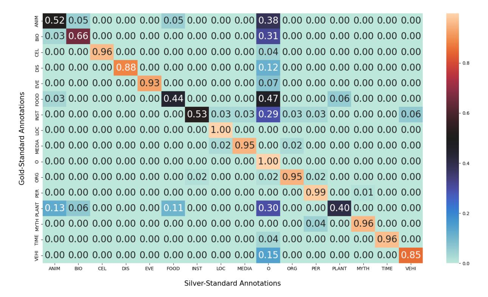

# MultiNERD: A Multilingual, Multi-Genre and Fine-Grained Dataset for Named Entity Recognition (and Disambiguation)

## Simone Tedeschi

## Roberto Navigli

Babelscape & Sapienza University of Rome tedeschi@babelscape.com

Sapienza University of Rome navigli@diag.uniroma1.it

## Abstract

Named Entity Recognition (NER) is the task of identifying named entities in texts and classifying them through specific semantic categories, a process which is crucial for a wide range of NLP applications. Current datasets for NER focus mainly on coarse-grained entity types, tend to consider a single textual genre and to cover a narrow set of languages, thus limiting the general applicability of NER systems. In this work, we design a new methodology for automatically producing NER annotations, and address the aforementioned limitations by introducing a novel dataset that covers 10 languages, 15 NER categories and 2 textual genres. We also introduce a manually-annotated test set, and extensively evaluate the quality of our novel dataset on both this new test set and standard benchmarks for NER. In addition, in our dataset, we include: i) disambiguation information to enable the development of multilingual entity linking systems, and ii) image URLs to encourage the creation o[f multimodal systems.](https://github.com/Babelscape/multinerd) We release our dataset at https://github. [com/Babelscape/multinerd](https://github.com/Babelscape/multinerd).

## 1 Introduction

Named Entity Recognition (NER) represents a milestone in information extraction, and its aim is to identify and classify key information in unstructured texts, i.e. named entities [\(Nadeau and Sekine,](#page-9-0) [2007\)](#page-9-0). It is widely used in a broad spectrum of downstream applications, like machine translation [\(Babych and Hartley,](#page-8-0) [2003\)](#page-8-0), question answering [\(Mollá et al.,](#page-9-1) [2006\)](#page-9-1), automatic text summarization [\(Aone et al.,](#page-8-1) [1998\)](#page-8-1), and entity linking [\(Martins](#page-9-2) [et al.,](#page-9-2) [2019\)](#page-9-2), *inter alia*.

With the advent of pretrained language models like BERT [\(Devlin et al.,](#page-8-2) [2019\)](#page-8-2) or LUKE [\(Yamada](#page-10-0) [et al.,](#page-10-0) [2020\)](#page-10-0) – this latter with a particular focus on named entities – the NER field observed astonishing results on conventional benchmarks [\(Tjong](#page-9-3) [Kim Sang,](#page-9-3) [2002;](#page-9-3) [Tjong Kim Sang and De Meul](#page-9-4)[der,](#page-9-4) [2003\)](#page-9-4). However, such benchmarks are limited

in size, cover a single textual genre, and are available only for a narrow set of languages. Moreover, they focus on coarse-grained entity types, and often overlook more complex entities like titles of books, songs and movies. These latter entities are not simple nouns and can be both syntactically and semantically ambiguous. Specifically, they can assume the form of any linguistic constituent (e.g. *Singin' in the Rain*) which makes them difficult to extract. Indeed, in the last decade, the OntoNotes 5.0 dataset [\(Weischedel et al.,](#page-10-1) [2013\)](#page-10-1) has become very popular thanks to its high quality, size and finegrained categories. Nevertheless, it covers only 3 languages, namely, English, Arabic and Chinese.

Since the manual creation of training data for NER is expensive and time-consuming – especially when many languages have to be covered – several studies have tried to address data scarcity by producing training data automatically [\(Nothman et al.,](#page-9-5) [2013;](#page-9-5) [Al-Rfou et al.,](#page-8-3) [2015;](#page-8-3) [Tsai et al.,](#page-10-2) [2016;](#page-10-2) [Pan](#page-9-6) [et al.,](#page-9-6) [2017\)](#page-9-6), recently showing that automaticallygenerated annotations can boast a quality comparable to that of manually-created ones [\(Tedeschi](#page-9-7) [et al.,](#page-9-7) [2021b\)](#page-9-7). Unfortunately, although these studies have considered a wider range of languages, they have still focused on coarse-grained entities and on a single textual genre, i.e. encyclopedic texts from Wikipedia[1](#page-0-0) [\(Hovy et al.,](#page-9-8) [2013\)](#page-9-8).

In this paper, inspired by the success of the OntoNotes 5.0 dataset and by recent achievements in automatic data creation, we fill the aforementioned gaps and propose the following novel contributions:

1. We design a new language-agnostic methodology for automatically generating high-quality and fine-grained NER annotations by exploiting the texts of Wikipedia and Wikinews[2](#page-0-1) ;

1<https://en.wikipedia.org/>

2 It is a free-content multilingual wiki containing news articles (<https://en.wikinews.org/>), as opposed to the encyclopedic articles contained in Wikipedia.

- 2. We introduce a novel automatically-created benchmark for NER that covers 10 languages, 15 entity types and 2 textual genres, together with a small manually-curated test set for the English language;
- 3. We extensively evaluate the quality of the data produced on both our manually-annotated test set and standard benchmarks for NER.

Additionally, although in this work we focus on NER, we also contribute to the entity disambiguation (also known as entity linking) task, i.e. the task of linking entities mentioned in texts with their corresponding entry in a knowledge base. Specifically, for a given entity, we provide disambiguation information together with its NER tag in order to enable training, validation and testing of multilingual entity linking models. Finally, we also include image URLs to encourage the creation of multimodal systems. To enable [comparability on our bench](https://github.com/Babelscape/multinerd)[mark, we release our data and s](https://github.com/Babelscape/multinerd)oftware at https: //github.com/Babelscape/multinerd.

## 2 Related Work

## 2.1 Gold-Standard Data

High-quality annotations are essential for both learning and evaluation of NER systems. Indeed, in the past few decades a large number of NER datasets have been proposed. Initially, the MUC-6 and MUC-7 shared tasks focused on entity names (i.e. persons, locations and organizations), temporal expressions (i.e. dates and times) and number expressions (i.e., currency values and percentages), but o[nly English newswire articles we](#page-9-9)[re consid](#page-8-4)[ered \(Grishman and](#page-8-4) Sundheim, 1996; Chinchor and Robinson, 1997).

A few years later, different datasets were derived from Reuters News for the CoNLL-2002 and 2003 shared tasks on la[nguage-independent Nam](#page-9-3)[ed En](#page-9-4)[tity Recognition \(Tjong Kim Sang](#page-9-4), 2002; Tjong Kim Sang and De Meulder, 2003), covering four different languages (i.e. Dutch, English, German and Spanish). However, these datasets were limited in size and only four coarse-grained entity types were considered: [Pe](#page-1-0)rson, Location, Organization and Miscellaneous3 . Nonetheless, these datasets ar[e still widely used to ben](#page-8-5)chmark NER systems.

Balasuriya et al. (2009) claimed that NER was needed in many domains beyond newswire texts,

and introduced WikiGold, a manually-annotated dataset derived from Wikipedia articles. Even so, WikiGold covered coarse-grained entities, was limited in size and considered only the Englis[h lan](#page-8-5)[guage. Following](#page-8-5) [the same motivati](#page-9-10)on as Balasuriya et al. (2009), Ritter et al. (2011) introduced a dataset for English tweets using 10 NER classes.

[Another considerabl](#page-10-1)e [step f](#page-10-1)orward was made by Weischedel et al. (2013), who introduced OntoNotes 5.0. This dataset covered 18 finegrained classes, multiple genres (e.g. newswire and weblogs), and multiple languages (English, Chinese, and Arabic). Thanks to its high quality, it is one of the most widely used datasets for NER.

Finally, another notable dataset was proposed for the WNUT 2017 shared task on emerging and rare entities, covering different textual genres (tweets, YouTu[be comments, Reddit a](#page-8-6)nd StackExchange posts) (Derczynski et al., 2017). However, only the English language and 6 categories were considered.

### 2.2 Silver-Standard Data

Although the OntoNotes 5.0 dataset constitutes a valuable resource for training and evaluating multilingual and fine-grained NER systems, its applicability is limited to the three languages it covers. Indeed, in the last decade, with the aim of scaling NER to a wider set of languages, more interest has been devoted to automatic data creation.

The fi[rst successful attempt in](#page-9-5) this direction was made by Nothman et al. (2013) who produced the WikiNER dataset. They proposed a strategy for automatically creating multilingual training data for NER by exploiting the texts of Wikipedia and its hypertext organization. In addition, they also used redirect-base heuristics to infer more namedentity mentions. By applying this methodology, they covered 9 languages, but they still focused on the standard coarse-grained enti[ty types.](#page-9-6)

Adopting a similar strategy, Pan et al. (2017) introduced WikiANN, a language-independent framework for extracting entities from documents. Their procedure was made up of two main steps: i) classify entries in the English Wikipedia into specific entity types, and ii) propagate the annotations to other languages by applying cross-lingual transfer. This procedure yielded massive corpora consisting of 282 languages, but with lower annotation quality and a focus on persons, locations, organizatio[ns and geo-politica](#page-9-7)l [entities](#page-9-7).

Finally, Tedeschi et al. (2021b) proposed

3Miscellaneous entities are entities that do not belong to the Person, Location and Organization categories.

WikiNEuRal, an annotation pipeline that effectively combined recent pretrained language models with knowledge-based approaches, and produced high-quality annotations for NER in 9 languages by exploiting Wikipedia texts. Surprisingly, the authors showed that their methodology, in 2 out of 3 settings, produced annotations with a quality even higher than that of manual ones. However, again, only coarse-grained entities were considered.

Despite automatic methods achieved high annotation quality and covered many languages, all of them focused on coarse-grained entities and on a single textual source: Wikipedia. On the other hand, gold-standard datasets focused mainly on the English language. Additionally, none of them included disambiguation information. Evidently, a unified effort to obtain a large-scale multilingual, multi-genre and fine-grained resource for Named Entity Recognition and Disambiguation is still missing.

## 3 NER Classes

Our 15 NER classes ar[e a subset of the newly](#page-9-11) introduced 18 classes of Tedeschi et al. (2021a) designed to reduce the intrinsic sparsity of the Entity Linking task. Specifically, they are: Person (PER), Location (LOC), Organization (ORG), Animal (ANIM), Biological entity (BIO), Celestial Body (CEL), Disease (DIS), Event (EVE), Food (FOOD), Instrument (INST), Media (MEDIA), Plant (PLANT), Mythological entity (MYTH), Time (TIME) and Vehicle (VEHI).

We prefer these classes to the OntoNotes ones, because they cover a wider range of macro categories. For instance, the OntoNotes' PRODUCT class – which groups very heterogeneous entities – is split into FOOD, VEHI and INST. Over and beyond these, our new set contains animals, plants, biological entities, celestial bodies, diseases and mythological [en](#page-3-0)tities that are not present in OntoNotes. Table 1 provides textual descriptions and examples of instances concerning our proposed classes. Further de[tail](#page-10-3)s about NER classes are provided in Appendix A.

## 4 MultiNERD

In this Section we describe our language-agnostic strategy for automatically generating a fine-grained and multilingual resource to train robust NER and ED systems. Specifically, our methodology widely extends previous state-of-the-art strategies, and it is characterized by the following five steps: i) preproces[sing](#page-2-0) of Wikipedia and Wikinews articles [\(Sec](#page-2-1)tion 4.1), ii) identification of entities (Section 4.2), iii) tagging th[e ide](#page-2-2)ntified entities with the NER labels (Section [4.3](#page-4-0)), iv) propagation of the annotations (Section [4.3\)](#page-4-1), v) enhancement of the annotations (Section 4.4).

#### 4.1 Wikitext Preprocessing

Wikipedia and Wikinews articles provide plenty of manually-curated information that can be exploited for t[he](#page-2-3) automatic annotation of sentences, i.e. Wikilinks4 . However, in addition to Wikilinks, articles may contain elements (e.g. images, tables, formulas and lists) and sections (e.g. *see also*, *references*, *further readings*) that do not correspond to well structured text; therefore, we remove them with the intent of reducing noise. This step converts articles to plain texts containing only Wikilinks.

## 4.2 Entity or Concept?

Wikilinks provide potential entity mentions. Indeed, some of them correspond to entities (e.g. *Elon Musk*), and others correspond to concepts (e.g. *Table*). In order to distinguish between them, we take advantage of the on[e-t](#page-2-4)[o-one linkage](#page-9-12) [between Wikip](#page-9-12)[edia and BabelNet](#page-9-13)5 (Navigli and Ponzetto, 2012; Navigli et al., 2021) and exploit the concept-vs.-entity categorization provided therein. Although it is evident that for some categories we are only interested in entities in the strictest sense (e.g. PER, ORG and LOC), we need to relax this constraint for other classes (e.g. ANIM, PLANT, FOOD and DIS). Thus, in order to extract animals (e.g. *Labrador Retriever*), plants (e.g. *Pinus*), food (e.g. *Carbonara*) and diseases (e.g. *Alzheimer's disease*), among others, we also need to consider elements that are labeled as concepts in BabelNet. This step tells us which Wikilinks have to be annotated with an entity type, and which of them have to be discarded. The [full](#page-10-4) list of design choices is provided in Appendix A.

#### 4.3 Tagging Wikipedia and Wikinews Articles

Semantic Classifier We now aim at providing each (remaining) Wikilink in a Wikipedia (or Wikinews) article with a category c ∈ C, where [C](#page-2-5)

4A Wikilink is a link placed inside an article that points to a Wikipedia page.

5BabelNet (<https://babelnet.org>) is a wide multilingual semantic network that integrates both lexicographic and encyclopedic knowledge from different sources. We use BabelNet 5.0.

| Class    | Description                                                                                                                                                                                                                                                                                                                                                                                                                                                                                                                                                                                                                                                                                                                                                                                                                                                                                                                                                                                                                                                                                                                                                                                                                                                                                                                                                                                                                                                                                                                                                                                                                                                                                                                                                                                                                                                                                                                                                                                                                                                                                                                    | Examples                                 |
|----------|--------------------------------------------------------------------------------------------------------------------------------------------------------------------------------------------------------------------------------------------------------------------------------------------------------------------------------------------------------------------------------------------------------------------------------------------------------------------------------------------------------------------------------------------------------------------------------------------------------------------------------------------------------------------------------------------------------------------------------------------------------------------------------------------------------------------------------------------------------------------------------------------------------------------------------------------------------------------------------------------------------------------------------------------------------------------------------------------------------------------------------------------------------------------------------------------------------------------------------------------------------------------------------------------------------------------------------------------------------------------------------------------------------------------------------------------------------------------------------------------------------------------------------------------------------------------------------------------------------------------------------------------------------------------------------------------------------------------------------------------------------------------------------------------------------------------------------------------------------------------------------------------------------------------------------------------------------------------------------------------------------------------------------------------------------------------------------------------------------------------------------|------------------------------------------|
| PER      | People.                                                                                                                                                                                                                                                                                                                                                                                                                                                                                                                                                                                                                                                                                                                                                                                                                                                                                                                                                                                                                                                                                                                                                                                                                                                                                                                                                                                                                                                                                                                                                                                                                                                                                                                                                                                                                                                                                                                                                                                                                                                                                                                        | Ray Charles, Jessica Alba, Leonardo      |
|          |                                                                                                                                                                                                                                                                                                                                                                                                                                                                                                                                                                                                                                                                                                                                                                                                                                                                                                                                                                                                                                                                                                                                                                                                                                                                                                                                                                                                                                                                                                                                                                                                                                                                                                                                                                                                                                                                                                                                                                                                                                                                                                                                | DiCaprio, Roger Federer, Anna Massey.    |
| Org      | Associations, companies, agencies, institutions, nationalities and                                                                                                                                                                                                                                                                                                                                                                                                                                                                                                                                                                                                                                                                                                                                                                                                                                                                                                                                                                                                                                                                                                                                                                                                                                                                                                                                                                                                                                                                                                                                                                                                                                                                                                                                                                                                                                                                                                                                                                                                                                                             | University of Edinburgh, San Francisco   |
| OKU      | religious or political groups.                                                                                                                                                                                                                                                                                                                                                                                                                                                                                                                                                                                                                                                                                                                                                                                                                                                                                                                                                                                                                                                                                                                                                                                                                                                                                                                                                                                                                                                                                                                                                                                                                                                                                                                                                                                                                                                                                                                                                                                                                                                                                                 | Giants, Google, Democratic Party.        |
| Loc      | Physical locations (e.g. mountains, bodies of water), geopolitical entities                                                                                                                                                                                                                                                                                                                                                                                                                                                                                                                                                                                                                                                                                                                                                                                                                                                                                                                                                                                                                                                                                                                                                                                                                                                                                                                                                                                                                                                                                                                                                                                                                                                                                                                                                                                                                                                                                                                                                                                                                                                    | Rome, Lake Paiku, Chrysler Building,     |
| Loc      | (e.g. cities, states), and facilities (e.g. bridges, buildings, airports).                                                                                                                                                                                                                                                                                                                                                                                                                                                                                                                                                                                                                                                                                                                                                                                                                                                                                                                                                                                                                                                                                                                                                                                                                                                                                                                                                                                                                                                                                                                                                                                                                                                                                                                                                                                                                                                                                                                                                                                                                                                     | Mount Rushmore, Mississippi River.       |
| <b>.</b> | Part of the second of the second of the second of the second of the second of the second of the second of the second of the second of the second of the second of the second of the second of the second of the second of the second of the second of the second of the second of the second of the second of the second of the second of the second of the second of the second of the second of the second of the second of the second of the second of the second of the second of the second of the second of the second of the second of the second of the second of the second of the second of the second of the second of the second of the second of the second of the second of the second of the second of the second of the second of the second of the second of the second of the second of the second of the second of the second of the second of the second of the second of the second of the second of the second of the second of the second of the second of the second of the second of the second of the second of the second of the second of the second of the second of the second of the second of the second of the second of the second of the second of the second of the second of the second of the second of the second of the second of the second of the second of the second of the second of the second of the second of the second of the second of the second of the second of the second of the second of the second of the second of the second of the second of the second of the second of the second of the second of the second of the second of the second of the second of the second of the second of the second of the second of the second of the second of the second of the second of the second of the second of the second of the second of the second of the second of the second of the second of the second of the second of the second of the second of the second of the second of the second of the second of the second of the second of the second of the second of the second of the second of the second of the second of the second of the second of the seco | Maine Coon, African Wild Dog, Great      |
| ANIM     | Breeds of dogs, cats and other animals, including their scientific names.                                                                                                                                                                                                                                                                                                                                                                                                                                                                                                                                                                                                                                                                                                                                                                                                                                                                                                                                                                                                                                                                                                                                                                                                                                                                                                                                                                                                                                                                                                                                                                                                                                                                                                                                                                                                                                                                                                                                                                                                                                                      | White Shark, New Zealand Bellbird.       |
|          | Genus of fungus, bacteria and protoctists, families of viruses, and other                                                                                                                                                                                                                                                                                                                                                                                                                                                                                                                                                                                                                                                                                                                                                                                                                                                                                                                                                                                                                                                                                                                                                                                                                                                                                                                                                                                                                                                                                                                                                                                                                                                                                                                                                                                                                                                                                                                                                                                                                                                      | Herpes Simplex Virus, Escherichia Coli,  |
| Вю       | biological entities.                                                                                                                                                                                                                                                                                                                                                                                                                                                                                                                                                                                                                                                                                                                                                                                                                                                                                                                                                                                                                                                                                                                                                                                                                                                                                                                                                                                                                                                                                                                                                                                                                                                                                                                                                                                                                                                                                                                                                                                                                                                                                                           | Salmonella, Bacillus Anthracis.          |
|          | Planets, stars, asteroids, comets, nebulae, galaxies and other                                                                                                                                                                                                                                                                                                                                                                                                                                                                                                                                                                                                                                                                                                                                                                                                                                                                                                                                                                                                                                                                                                                                                                                                                                                                                                                                                                                                                                                                                                                                                                                                                                                                                                                                                                                                                                                                                                                                                                                                                                                                 | Sun, Neptune, Asteroid 187 Lamberta,     |
| CEL      | astronomical objects.                                                                                                                                                                                                                                                                                                                                                                                                                                                                                                                                                                                                                                                                                                                                                                                                                                                                                                                                                                                                                                                                                                                                                                                                                                                                                                                                                                                                                                                                                                                                                                                                                                                                                                                                                                                                                                                                                                                                                                                                                                                                                                          | Proxima Centauri, V838 Monocerotis.      |
| _        | Physical, mental, infectious, non-infectious, deficiency, inherited,                                                                                                                                                                                                                                                                                                                                                                                                                                                                                                                                                                                                                                                                                                                                                                                                                                                                                                                                                                                                                                                                                                                                                                                                                                                                                                                                                                                                                                                                                                                                                                                                                                                                                                                                                                                                                                                                                                                                                                                                                                                           | Alzheimer's Disease, Cystic Fibrosis,    |
| DIS      | degenerative, social and self-inflicted diseases.                                                                                                                                                                                                                                                                                                                                                                                                                                                                                                                                                                                                                                                                                                                                                                                                                                                                                                                                                                                                                                                                                                                                                                                                                                                                                                                                                                                                                                                                                                                                                                                                                                                                                                                                                                                                                                                                                                                                                                                                                                                                              | Dilated Cardiomyopathy, Arthritis.       |
| _        | Constructed Lorden was and allowance                                                                                                                                                                                                                                                                                                                                                                                                                                                                                                                                                                                                                                                                                                                                                                                                                                                                                                                                                                                                                                                                                                                                                                                                                                                                                                                                                                                                                                                                                                                                                                                                                                                                                                                                                                                                                                                                                                                                                                                                                                                                                           | American Civil War, 2003 Wimbledon       |
| EVE      | Sport events, battles, wars and other events.                                                                                                                                                                                                                                                                                                                                                                                                                                                                                                                                                                                                                                                                                                                                                                                                                                                                                                                                                                                                                                                                                                                                                                                                                                                                                                                                                                                                                                                                                                                                                                                                                                                                                                                                                                                                                                                                                                                                                                                                                                                                                  | Championships, Cannes Film Festival.     |
|          |                                                                                                                                                                                                                                                                                                                                                                                                                                                                                                                                                                                                                                                                                                                                                                                                                                                                                                                                                                                                                                                                                                                                                                                                                                                                                                                                                                                                                                                                                                                                                                                                                                                                                                                                                                                                                                                                                                                                                                                                                                                                                                                                | Carbonara, Sangiovese, Cheddar Beer      |
| FOOD     | Foods and drinks.                                                                                                                                                                                                                                                                                                                                                                                                                                                                                                                                                                                                                                                                                                                                                                                                                                                                                                                                                                                                                                                                                                                                                                                                                                                                                                                                                                                                                                                                                                                                                                                                                                                                                                                                                                                                                                                                                                                                                                                                                                                                                                              | Fondue, Pizza Margherita.                |
| Y        | Technological instruments, mechanical instruments, musical instruments,                                                                                                                                                                                                                                                                                                                                                                                                                                                                                                                                                                                                                                                                                                                                                                                                                                                                                                                                                                                                                                                                                                                                                                                                                                                                                                                                                                                                                                                                                                                                                                                                                                                                                                                                                                                                                                                                                                                                                                                                                                                        | Spitzer Space Telescope, Commodore 64,   |
| Inst     | and other tools.                                                                                                                                                                                                                                                                                                                                                                                                                                                                                                                                                                                                                                                                                                                                                                                                                                                                                                                                                                                                                                                                                                                                                                                                                                                                                                                                                                                                                                                                                                                                                                                                                                                                                                                                                                                                                                                                                                                                                                                                                                                                                                               | Skype, Apple Watch, Fender Stratocaster. |
|          | Titles of films, books, magazines, songs and albums, fictional characters                                                                                                                                                                                                                                                                                                                                                                                                                                                                                                                                                                                                                                                                                                                                                                                                                                                                                                                                                                                                                                                                                                                                                                                                                                                                                                                                                                                                                                                                                                                                                                                                                                                                                                                                                                                                                                                                                                                                                                                                                                                      | Forbes, American Psycho, Kiss Me Once,   |
| Media    | and languages.                                                                                                                                                                                                                                                                                                                                                                                                                                                                                                                                                                                                                                                                                                                                                                                                                                                                                                                                                                                                                                                                                                                                                                                                                                                                                                                                                                                                                                                                                                                                                                                                                                                                                                                                                                                                                                                                                                                                                                                                                                                                                                                 | Twin Peaks, Disney Adventures.           |
|          |                                                                                                                                                                                                                                                                                                                                                                                                                                                                                                                                                                                                                                                                                                                                                                                                                                                                                                                                                                                                                                                                                                                                                                                                                                                                                                                                                                                                                                                                                                                                                                                                                                                                                                                                                                                                                                                                                                                                                                                                                                                                                                                                | Salix, Quercus Petraea, Douglas Fir,     |
| PLANT    | Types of trees, flowers, and other plants, including their scientific names.                                                                                                                                                                                                                                                                                                                                                                                                                                                                                                                                                                                                                                                                                                                                                                                                                                                                                                                                                                                                                                                                                                                                                                                                                                                                                                                                                                                                                                                                                                                                                                                                                                                                                                                                                                                                                                                                                                                                                                                                                                                   | Forsythia, Artemisia Maritima.           |
|          | W.J. L. L. D. L. C.                                                                                                                                                                                                                                                                                                                                                                                                                                                                                                                                                                                                                                                                                                                                                                                                                                                                                                                                                                                                                                                                                                                                                                                                                                                                                                                                                                                                                                                                                                                                                                                                                                                                                                                                                                                                                                                                                                                                                                                                                                                                                                            | Apollo, Persephone, Aphrodite, Saint     |
| Мүтн     | Mythological and religious entities.                                                                                                                                                                                                                                                                                                                                                                                                                                                                                                                                                                                                                                                                                                                                                                                                                                                                                                                                                                                                                                                                                                                                                                                                                                                                                                                                                                                                                                                                                                                                                                                                                                                                                                                                                                                                                                                                                                                                                                                                                                                                                           | Peter, Pope Gregory I, Hercules.         |
|          | Specific and well-defined time intervals, such as eras, historical periods,                                                                                                                                                                                                                                                                                                                                                                                                                                                                                                                                                                                                                                                                                                                                                                                                                                                                                                                                                                                                                                                                                                                                                                                                                                                                                                                                                                                                                                                                                                                                                                                                                                                                                                                                                                                                                                                                                                                                                                                                                                                    | Renaissance, Middle Ages, Christmas,     |
| TIME     | centuries, years and important days. No months and days of the week.                                                                                                                                                                                                                                                                                                                                                                                                                                                                                                                                                                                                                                                                                                                                                                                                                                                                                                                                                                                                                                                                                                                                                                                                                                                                                                                                                                                                                                                                                                                                                                                                                                                                                                                                                                                                                                                                                                                                                                                                                                                           | Great Depression, 17th Century, 2012.    |
| X7       | Company to the state of the state of the state of the state of the state of the state of the state of the state of the state of the state of the state of the state of the state of the state of the state of the state of the state of the state of the state of the state of the state of the state of the state of the state of the state of the state of the state of the state of the state of the state of the state of the state of the state of the state of the state of the state of the state of the state of the state of the state of the state of the state of the state of the state of the state of the state of the state of the state of the state of the state of the state of the state of the state of the state of the state of the state of the state of the state of the state of the state of the state of the state of the state of the state of the state of the state of the state of the state of the state of the state of the state of the state of the state of the state of the state of the state of the state of the state of the state of the state of the state of the state of the state of the state of the state of the state of the state of the state of the state of the state of the state of the state of the state of the state of the state of the state of the state of the state of the state of the state of the state of the state of the state of the state of the state of the state of the state of the state of the state of the state of the state of the state of the state of the state of the state of the state of the state of the state of the state of the state of the state of the state of the state of the state of the state of the state of the state of the state of the state of the state of the state of the state of the state of the state of the state of the state of the state of the state of the state of the state of the state of the state of the state of the state of the state of the state of the state of the state of the state of the state of the state of the state of the state of the state of the state of the state of the sta | Ferrari Testarossa, Suzuki Jimny, Honda  |
| Vehi     | Cars, motorcycles and other vehicles.                                                                                                                                                                                                                                                                                                                                                                                                                                                                                                                                                                                                                                                                                                                                                                                                                                                                                                                                                                                                                                                                                                                                                                                                                                                                                                                                                                                                                                                                                                                                                                                                                                                                                                                                                                                                                                                                                                                                                                                                                                                                                          | CR-X, Boeing 747, Fairey Fulmar.         |

Table 1: Descriptions and instance examples of our NER classes.

is the set of the NER classes introduced in Section 3. To do this, we introduce a Semantic Classifier that exploits the one-to-one correspondence between Wikipedia pages and BabelNet synsets. We start by manually-annotating 300 synsets to cover as many high-order concepts of the WordNet6 (Miller, 1995) nominal taxonomy – which is a subset of the BabelNet taxonomy – as possible. For instance, we label the following high-level synsets as follows:

- animal (bn:00004222n)  $\rightarrow$  ANIM;
- company (bn:00021286n)  $\rightarrow$  ORG;
- town (bn:00077773n)  $\rightarrow$  Loc;

Then, to propagate these annotations to all other synsets in WordNet, we descend through its taxonomy by following hyponymy and has-instance relationships (i.e. parent-to-child relations). For example, all the children of animal (bn:00004222n), e.g. dog

(bn:00015267n), inherit the ANIM tag. This step yields 40k high-quality annotated synsets.

At this point, to annotate a Wikilink l in a Wikipedia (or Wikinews) article w, we retrieve its corresponding synset s from BabelNet, and we follow hypernymy relations (child-to-parent relations) until one or more of the 40k synsets in the expanded set is reached7. Here, we distinguish between two possible cases:

- 1. When a single ancestor is reached, or when all the ancestors share the same class, the corresponding annotation is just inherited. For instance, starting from Apple Inc. (bn:03739345n) and climbing the taxonomy, we find only company (bn:00021286n) at distance 1, hence Apple Inc. inherits the ORG annotation.
- 2. When two or more ancestors have discordant annotations, then the highest-scoring class8

 $^6\mbox{We}$  start from WordNet synsets because they are manually curated.

&lt;sup>7We employ a Breadth-First Search with max depth = 2. 8If more classes have the same score, the corresponding synset is not annotated

| Token     | Label | BabelNet ID  | Wikidata ID | Wikipedia ID | Wikipedia Title | Definition            | Image URL           |
|-----------|-------|--------------|-------------|--------------|-----------------|-----------------------|---------------------|
| Neither   | 0     | -            | -           | -            | -               | -                     | -                   |
| George    | B-PER | bn:00040218n | Q2643       | 12731        | George Harrison | English rock star     | george_harrison.jpg |
| Harrison  | I-PER | -            | -           | -            | -               | -                     | -                   |
| nor       | O     | -            | -           | -            | -               | -                     | -                   |
| Ringo     | B-PER | bn:00067735n | Q2632       | 25832        | Ringo Starr     | Rock star and drummer | ringo_starr.jpg     |
| Starr     | I-PER | -            | -           | -            | -               | -                     | -                   |
| was       | O     | -            | -           | -            | -               | -                     | -                   |
| involved  | O     | -            | -           | -            | -               | -                     | -                   |
| in        | O     | -            | -           | -            | -               | -                     | -                   |
| the       | O     | -            | -           | -            | -               | -                     | -                   |
| recording | O     | -            | -           | -            | -               | -                     | -                   |
|           | O     | -            | -           | -            | -               | -                     | -                   |

Table 2: Example of sentence in our MultiNERD dataset. Together with the NER type (in BIO format), each entity is provided with the following additional information: BabelNet synset, Wikidata ID, Wikipedia ID, Wikipedia title, definition and image url.

is assigned. Formally, for each NER class  $c \in C$ , the score is computed as follows:

$$score(c) = \sum_{a \in A_c} \frac{1}{d(a)},$$
 (1)

where  $A_c$  is the set of all the ancestors of synset s with tag c, and d(a) is a function that returns the distance of a from s in the Babel-Net taxonomy. As an example, consider the synset Bill Gates (bn:00010401n). When climbing the taxonomy, at distance 2, the hominid (bn:00044571n) synset is reached, which is classified as ANIM. However, the Bill Gates' synset is also child of human (bn:00044576n), computer scientist (bn:00021495n) and magnate (bn:00008639n), resulting in a highest score for the PER class.

This procedure allows us to label each Wikilink in a given article with a NER class.

Tag Propagation Wikipedia and Wikinews guidelines specify that only the first mention to a certain article has to be linked. This implies that tagging only Wikilinks leads to sparse annotations. To cope with this issue, we employ a simple yet effective exact-match heuristic in which for each Wikilink l, with an associated class c, we assign the class c to all the expressions  $e_i$  in the same document of l such that  $e_i = l \lor e_i \in syn(l)$ , where syn(l) is a function that returns the synonyms of l from BabelNet. Finally, the annotations are converted to BIO format9.

The above-described methodology allows us to have at the same time, for a given entity, both the

Algorithm 1 Self-Improvement Algorithm

**Inputs**: Corpus of raw Wikipedia and Wikinews documents W

**Parameters**: Integer n, Integer t **Output**: MultiNERD Dataset D

- 1:  $A \leftarrow \{w_1, \dots, w_n\}, w_i \in W$
- 2:  $D \leftarrow annotate(A)$
- 3:  $M_D \leftarrow train(D)$
- 4: **for**  $\mathbf{i} \leftarrow 1, \dots, t$  **do**
- 5:  $\hat{A} \leftarrow \{w_1', \dots, w_n'\}, w_i' \in W, A \cap \hat{A} = \varnothing$
- 6:  $A = A \cup \hat{A}$
- 7:  $D = annotate(A, M_D)$
- 8:  $M_D = train(D)$
- 9: end for
- 10: return D

NER annotation and the BabelNet synset. Then, as already mentioned, through BabelNet we can easily access other resources, and retrieve the corresponding Wikipedia and Wikidata pages. Hence, in our dataset we include disambiguation information from the three above-mentioned knowledge bases. Additionally, for a given entity, we include also the corresponding definition and the main image from Wikidata, where this latter can be used to develop multimodal NER and entity linking systems. An instance of our dataset is provided in Table 2.

#### 4.4 Annotation Enhancement

The above steps enable multilingual and finegrained annotations to be created. However, these annotations are derived automatically and, therefore, they may contain errors.

Tedeschi et al. (2021b) improved the quality of the annotations by combining them with the

&lt;sup>9The BIO tagging scheme (short for Beginning, Intermediate, Out) is a popular format for handling spans of tokens.

|            |                       | DE     | En     | Es     | FR     | IT     | NL     | PL     | Рт     | RU     | ZH     |
|------------|-----------------------|--------|--------|--------|--------|--------|--------|--------|--------|--------|--------|
|            | PER                   | 79.2K  | 75.8K  | 70.9K  | 89.6K  | 75.3K  | 56.9K  | 66.5K  | 54.0K  | 43.4K  | 47.7K  |
|            | Org                   | 31.2K  | 33.7K  | 20.6K  | 28.2K  | 19.3K  | 21.4K  | 29.2K  | 13.2K  | 21.5K  | 22.2K  |
|            | Loc                   | 72.8K  | 78.5K  | 90.2K  | 90.9K  | 98.5K  | 78.7K  | 100.0K | 124.8K | 75.2K  | 70.4K  |
|            | ANIM                  | 11.5K  | 15.5K  | 10.5K  | 11.4K  | 8.8K   | 34.4K  | 19.7K  | 14.7K  | 7.3K   | 6.9K   |
|            | Віо                   | 0.1K   | 0.2K   | 0.3K   | 0.1K   | 0.1K   | 0.1K   | 0.1K   | 0.1K   | 0.1K   | 0.1K   |
|            | CEL                   | 1.4K   | 2.8K   | 2.4K   | 2.3K   | 5.2K   | 2.1K   | 3.3K   | 4.2K   | 1.2K   | 1.4K   |
|            | DIS                   | 5.2K   | 11.2K  | 8.6K   | 3.1K   | 6.5K   | 6.1K   | 6.5K   | 6.8K   | 1.9K   | 2.2K   |
| SO.        | Eve                   | 4.0K   | 3.2K   | 6.8K   | 7.4K   | 5.8K   | 4.7K   | 6.7K   | 5.9K   | 2.8K   | 2.5K   |
| Statistics | FOOD                  | 3.6K   | 11.0K  | 7.8K   | 3.2K   | 5.8K   | 5.6K   | 3.3K   | 5.4K   | 3.2K   | 2.9K   |
| atis       | INST                  | 0.1K   | 0.4K   | 0.6K   | 0.7K   | 0.8K   | 0.2K   | 0.6K   | 0.6K   | 1.1K   | 0.5K   |
| St         | MEDIA                 | 2.8K   | 7.5K   | 8.0K   | 8.0K   | 8.6K   | 3.8K   | 4.9K   | 9.1K   | 11.3K  | 6.9K   |
|            | МҮТН                  | 0.8K   | 0.7K   | 1.6K   | 2.0K   | 1.8K   | 1.3K   | 1.3K   | 1.6K   | 0.6K   | 0.7K   |
|            | PLANT                 | 7.8K   | 9.5K   | 7.6K   | 4.4K   | 5.1K   | 6.3K   | 6.6K   | 9.2K   | 4.8K   | 5.2K   |
|            | TIME                  | 3.3K   | 3.2K   | 45.3K  | 27.4K  | 71.2K  | 31.0K  | 44.1K  | 48.6K  | 22.8K  | 27.4K  |
|            | VEHI                  | 0.5K   | 0.5K   | 0.3K   | 0.6K   | 0.6K   | 0.4K   | 0.7K   | 0.3K   | 0.5K   | 0.4K   |
|            | O (OTHER)             | 2.4M   | 3.1M   | 3.8M   | 3.8M   | 4.2M   | 2.7M   | 2.5M   | 3.4M   | 2.0M   | 2.1K   |
|            | Sentences             | 156.8K | 164.1K | 173.2K | 176.2K | 181.9K | 171.7K | 195.0K | 177.6K | 129.0K | 115.0K |
|            | Tokens                | 2.7M   | 3.6M   | 4.3M   | 4.3M   | 4.7M   | 3.0M   | 3.0M   | 3.9M   | 2.3M   | 2.4K   |
|            | Avg. sentence length  | 17.7   | 21.7   | 24.6   | 24.5   | 25.7   | 17.7   | 15.3   | 21.9   | 16.7   | 21.8   |
|            | Avg. NEs per sentence | 1.4    | 1.5    | 1.6    | 1.6    | 1.7    | 1.5    | 1.5    | 1.7    | 1.3    | 1.7    |

Table 3: Statistics concerning the data produced.

predictions of a Transformer-based neural classifier (mBERT + Bi-LSTM + CRF, Mueller et al., 2020). Unfortunately, this strategy requires preexisting annotated data in the same set of languages and with the same NER tags in order to train the NER classifier, and these are not available in our case. To cope with this issue, we employ the same Transformer-based architecture but drop the requirement of pre-existing training data by introducing a general, straightforward iterative strategy to jointly improve both the performance of the neural model and the quality of the data produced. Algorithm 1 illustrates the procedure. Essentially, it starts by taking a set A of n articles from W (line 1), and annotating them with the steps described in Sections 4.1-4.3 (line 2). Then, it uses the obtained annotated dataset D to train a neural model  $M_D$ (line 3). Here the iterative step begins: i) another (disjoint) set  $\hat{A}$  of n articles is taken from W (line 5), ii) a larger set A is obtained by concatenating the new set  $\hat{A}$  with the previous set A (line 6), and consequently iii) a larger dataset D is obtained, but this time using also the model  $M_D$  to validate the annotations produced by the steps in Sections 4.1-4.3 (line 7), and finally iv) a better model  $M_D$ is trained on the new (larger and more accurate) dataset D (line 8). Steps (i)-(iv) are repeated ttimes, where t is used to regulate the size and the quality of the final dataset D.

In the  $annotate(A, M_D)$  function, the neural model  $M_D$  is used to refine the annotations and

reduce noise. Specifically, if the NER class of an entity predicted by the neural model is different from the one assigned by the knowledge-based approach (Section 4.3), the corresponding sentence is discarded.

#### 5 Experiments

In this Section, we describe our experimental setup (Section 5.1), the datasets10 we use to train (Section 5.2) and evaluate (Section 5.3) our methodology, and finally the results obtained (Section 5.4).

#### 5.1 Experimental Setup

In our experiments, we evaluate the quality of our data in two different settings:

- In order to compare our dataset against previous state-of-the-art automatically-created datasets, we map our fine-grained annotations to the coarse-grained classes used by these datasets. Then, we train the mBERT + Bi-LSTM + CRF model introduced in Section 4.4 on both our dataset and the other abovementioned datasets. Finally, we compare the performance of the corresponding systems on gold-standard benchmarks for NER. Appendix A provides class mapping details;
- 2. To measure the quality of our fine-grained annotations, we manually annotate a random

&lt;sup>10All the datasets used are freely available for research purposes, except for OntoNotes 5.0 (LDC license).

| Test                           |       |       | CONLL |       | WIKIGOLD | ONTONOTES |       | BSNLP |
|--------------------------------|-------|-------|-------|-------|----------|-----------|-------|-------|
| Train                          | EN    | ES    | NL    | DE    | EN       | EN        | RU    | PL    |
| WIKIANN                        | 56.85 | 53.55 | 55.76 | 44.39 | 57.05    | 36.43     | 51.85 | 53.50 |
| WIKINER                        | 73.05 | 75.07 | 74.75 | 64.03 | 81.98    | 71.16     | 65.99 | 62.31 |
| WIKINEURAL                     | 76.94 | 77.87 | 77.40 | 64.02 | 82.42    | 71.98     | 66.50 | 62.44 |
| MULTINERD W/O SELF-IMPROVEMENT | 69.75 | 71.04 | 70.58 | 57.99 | 76.88    | 65.12     | 60.41 | 58.43 |
| MULTINERD (OUR WORK)           | 77.11 | 78.20 | 77.84 | 65.22 | 83.11    | 72.45     | 67.39 | 62.94 |

Table 4: Span-based micro F1 scores obtained by training a reference NER system on different automatically-created datasets (i.e. WikiANN, WikiNER, WikiNEuRal, MultiNERD) and testing on common NER benchmarks.

sample of 1K English sentences, and compare the annotations produced by our methodology with th[e co](#page-10-7)rresponding ground truths.

We implement our model with PyTorch using the Transformers library (Wolf et al., 2019) to load the weights of BERT-base-multilingual-cased (mBERT), and train each model configuration with an early stopping strategy using a patience value of 5. We use Adam optimizer (Kin[gm](#page-2-6)a and Ba, 2015) with learning rate of 10−3 [and](#page-6-2) a cross-entropy loss criterion. We repeat each training on 10 different seeds, fixed across experiments, and report the mean of their span F1 scores computed with the official conlleval scrip[t. F](#page-5-2)urther details are provided in Appendix B.

#### 5.2 Training Dat[a](#page-9-7)

We train our reference model with four different silver-standard datasets:

- MultiNERD: the resource created using the steps described in Section 4 from Wikipedia and Wikine[ws articles](#page-9-5)11, with n [=](#page-9-5) 30K and t = 8. It covers 10 languages: Chinese, Dutch, English, French, German, Italian, Polish, Portuguese, Russian and Spanish. Statistics are shown in [Tabl](#page-6-3)e [3.](#page-9-6)
- WikiNEuRal (Tedeschi et al., 2021b): the current best-performing approach for NER silver data creation. It covers 9 languages (i.e. Dutch, English, French, German, Italian, Polish, Portuguese, Russian and Spanish), and sentences are extracted from Wikipedia.
- • WikiNER (Nothman et al., 2013): a highquality automatically-derived dataset for NER from Wikipedia. It covers the same languages as Wi[kiNEuRal.](#page-9-17)

• WikiANN12 (Pan et al., 2017): a massive dataset for NER consisting of Wikipedia doc[um](#page-5-0)ents annotated in 282 languages.

All datasets are tagged with [the four standard](#page-9-3) entit[y type](#page-9-3)s (PER, ORG, LOC, MISC), except for Wik[iANN which does not contain the](#page-9-4) MISC label. Indeed, when evaluating the WikiANN dataset, only the PER, ORG and LOC classes are evaluated.

### 5.3 Test Data

Common Benchmarks [For our first set](#page-8-5)ting (Section 5.1), we use 5 common gold-standard test sets:

- CoNLL-2002 [and 2003](#page-9-18) (Tjo[ng Kim](#page-9-18) Sang, 2002; Tjong Kim Sang and De Meulder, 2003): a well-known corpus of NERannotated new[swire articles for Dutc](#page-9-19)h, English, German and Spanish;
- WikiGold (Balasuriya et al., 2009): a set of human-annotated English Wikipedia articles.
- OntoNotes 5.0 (Pradhan et al., 2012): a popular dataset for NER that in[clud](#page-10-5)es texts from different textual genres and multiple domains.
- BSNLP-2017 (Piskorski et al., 2017): a notable set of manually-annotated articles for Slavic languages.

All datasets use coarse-grained entity types (i.e. PER, ORG, LOC and MISC), except OntoNotes, which uses fine-gr[aine](#page-5-0)d entities that we convert to coarse-grained classes. Appendix A provides addi[tio](#page-2-5)nal details about this mapping. For the WikiGold dataset, which is limited in size, we use the entire datas[et a](#page-6-4)s test material. For other datasets, instead, we use the official validation and test splits. Finally, all datasets are convert[ed](#page-2-6) to BIO format.

11We use the April 2021 [snaps](#page-9-17)hot for both Wikip[edia and](https://huggingface.co/datasets/wikiann) [Wikinews dumps, sampling random articles.](https://huggingface.co/datasets/wikiann)

12The WikiANN version used in this study corresponds to the dataset of Rahimi et al. (2019), which supports 176 of the 282 languages from the original WikiANN corpus (https: //huggingface.co/datasets/wi[kia](#page-7-0)nn).

Figure 1: Confusion matrix of our silver-standard annotations compared to the corresponding ground truths.

Manual Annotation For our second experimental setting (Section 5.1), due to the absence of NER benchmarks that use our set of categories (Section 3), we conduct a manual evaluation to assess the quality of our dataset. Specifically, we randomly select13 a sample of 1K English sentences, preannotated with the NER tags produced using our methodology (Section 4), and confirm or replace the annotations associated with each token in the dataset. The resulting gold-standard dataset is used to analyze the quality of our silver-standard data.

### 5.4 Results

Coarse-Grained Evaluation In our first setting (Section 5.1), we measure the effectiveness of our methodology by comparing the quality of the data produced against that of other datasets created using previous state-of-the-art strategies for NER silver-data creation (i.e. datasets listed in Section 5.2). Since past approaches focused on coarsegrained entities, we can compare the quality only for such entity types. The results obtained are shown in Table 4. Although our dataset covers a wider range of categories than its competitors, it nevertheless outperforms all of them on all tested

| Class | P    | R    | F1   | Support |
|-------|------|------|------|---------|
| ANIM  | 0.72 | 0.52 | 0.60 | 60      |
| BIO   | 0.78 | 0.66 | 0.71 | 32      |
| CEL   | 0.96 | 0.96 | 0.96 | 25      |
| DIS   | 0.99 | 0.88 | 0.93 | 78      |
| EVE   | 0.96 | 0.93 | 0.94 | 27      |
| FOOD  | 0.83 | 0.44 | 0.58 | 122     |
| INST  | 0.90 | 0.53 | 0.67 | 34      |
| LOC   | 0.99 | 0.99 | 0.99 | 262     |
| MEDIA | 0.95 | 0.95 | 0.95 | 41      |
| O     | 0.99 | 1.00 | 0.99 | 11823   |
| ORG   | 0.97 | 0.95 | 0.96 | 59      |
| PER   | 0.99 | 0.99 | 0.99 | 217     |
| PLANT | 0.73 | 0.40 | 0.52 | 47      |
| MYTH  | 0.88 | 0.96 | 0.92 | 23      |
| TIME  | 0.99 | 0.96 | 0.98 | 171     |
| VEHI  | 0.82 | 0.85 | 0.84 | 27      |
| ALL   | 0.90 | 0.81 | 0.85 | 13048   |

Table 5: Evaluatio[n o](#page-6-5)f the MultiNERD dataset on our manually-annotated English test set.

datasets and languages. We attribute this advancement mainly to the self-improvement algorithm introduced in Section 4.4, which iteratively refines the annotations using a better model at each iteration. To demonstrate the impact of our algorithm, we construct baseline versions of MULTINERD for

13We ensure that the dataset contains a sufficient number n of instances for each NER class. We set n = 20. Statistics are provided i[n the](#page-5-0) "Support" column of Table 5.

DE, EN, ES, NL, PL and RU with the same sizes as the corresponding refined versions, but without using our enhancement procedure. As can be observed from Table 4, the refined versions provide an average improvement of almost 7 F1 points. In addition, the [wide](#page-6-6)r number of textual genres cover[ed](#page-7-0) by MULTINERD leads to more robust systems.

Fine-Grained Evaluation Although the coarsegrained evaluation conducted in the previous Section demonstrated that our MULTINERD methodology creates high-quality annotations, independently of the language, it is not sufficient to understand how our annotation pipeline performs on fine-grained classes. Indeed, to measure this, we use a sample of 1K English sentences manuallyannotated with fine-grain[ed](#page-7-1) entities, as explained in Section 5.3, and report the results in Table 5. As expected, the PER, ORG and LOC classes are among the best-performing classes. Similarly, celestial bodies, diseases, events and media also have very high performance, thanks to their occurrences being almost always linked in Wikipedia and Wikinews articles (*high recall*) and easily distinguishable (*high precision*). In contrast, animals, biological entities, foods and plants have a highdegree of confusion (*lower precision*), and are very often not linked (*low recall*). To better explain this, we report in Figure 1 the confusion matrix of the silver-standard annotations produced by our approach compared to the gold-standard ones. As an example, it can be observed that animals and plants are often [con](#page-5-2)fused with each other, mainly because their scientific names are morphologically very close. Similarly, animals and plants are also confused with foods (e.g. *Alaskan salmon* and *Quinoa*), and vice versa.

Even though the quality of the annotations produced by our approach for any particular one of the 10 languages covered herein is strongly dependent on the quality of the corresponding Wikipedia and Wikinews dumps, we expect comparable performance on all other languages, as suggested by the statistics in Table 3 which show strong consistency across languages.

## 6 Conclusions

In this work we introduced MULTINERD, a novel resource for training robust multilingual and finegrained Named Entity Recognition (and Disambiguation) systems. To create it, we presented a new language-agnostic strategy for generating

high-quality silver-standard [NER and ED annota](https://github.com/Babelscape/multinerd)[tions. This strategy uses a knowledge](https://github.com/Babelscape/multinerd)-based semantic classifier to automatically annotate Wikipedia and Wikinews articles, and then iteratively enhances the annotations produced by means of a selfimprovement algorithm which builds upon neural models. Our experiments showed that MULTIN-ERD outperformed previous state-of-the-art dataproduction methods across all tested languages and domains, while covering a much wider set of NER categories. Additionally, we also included image URLs in our dataset to encourage the development of multimodal NER and ED systems. This visual information could also be exploited to further improve the [quality of the annotations](https://doi.org/10.1137/1.9781611974010.66) b[y ensembling the predictions of NL](https://doi.org/10.1137/1.9781611974010.66)P and Computer Vision models. We release our MULTIN-ERD dataset and software at https://github. com/Babelscape/multinerd.

## A[cknowledgments](https://doi.org/10.3115/980845.980856)

The authors gratefully acknowled[ge](https://www.aclweb.org/anthology/W03-2201) [the support of the ERC Consolida](https://www.aclweb.org/anthology/W03-2201)[tor Grant M](https://www.aclweb.org/anthology/W03-2201)OUSSE No. 726487 under the European Union's Horizon 2020 research and innovation programme.

## R[eferences](https://www.aclweb.org/anthology/W09-3302)

Rami Al-Rfou, Vivek Kulkarni, Bryan Perozzi, and Steven Skiena. 2015. POLYGLOT-NER: massive multilingual named entity recognition. In *Proceedings of the 2015 SIAM International Conference on Data Mining, Vancouver, BC, Canada, April 30 [- May](http://ai-center.botik.ru/Airec/images/stories/Articles/Collections/muc-guidelines/MUC_7_NER_markup.pdf) 2, 2015*[, pages 586–594. SIAM.](http://ai-center.botik.ru/Airec/images/stories/Articles/Collections/muc-guidelines/MUC_7_NER_markup.pdf)

Chinatsu Aone, Mary Okurowski, and James Gorlinsky. 1998. Trainable, scalable summarization using robust nlp and machine learning. pages 62–66.

B[ogdan Babych and Anthony Hartley. 2003.](https://doi.org/10.18653/v1/W17-4418) Improving [mach](https://doi.org/10.18653/v1/W17-4418)ine translation quality with automatic named entity recognition. In *Proceedings of the 7th International EAMT workshop on MT and other language technology tools, Improving MT through other language technology tools, Resource and tools for building MT at EACL 2003*.

D[ominic Balasuriya, Nicky Ringland, Joel Nothman,](https://doi.org/10.18653/v1/N19-1423) [Tara Mur](https://doi.org/10.18653/v1/N19-1423)phy, and James R. Curran. 2009. Named entity recognition in Wikipedia. In *Proceedings of the 2009 Workshop on The People's Web Meets NLP: Collaboratively Constructed Semantic Resources (People's Web)*, pages 10–18, Suntec, Singapore. Association for Computational Linguistics.

- Nancy Chinchor and Patricia Robinson. 1997. [Muc-](https://www.aclweb.org/anthology/C96-1079)[7 named entity task definition. In](https://www.aclweb.org/anthology/C96-1079) *Proceedings of the 7th Conference on Message Understanding*, volume 29, pages 1–21.
- Leon Derczynski, Eric Nichols, Marieke van Erp, and Nut Limsopatham. 2017. [Results of the WNUT2017](https://doi.org/https://doi.org/10.1016/j.artint.2012.10.002) [shared task on novel and emerging entity recogni](https://doi.org/https://doi.org/10.1016/j.artint.2012.10.002)tion. In *Proceedings of the 3rd Workshop on Noisy User-generated Text*, pages 140–147, Copenhagen, Denmark. Association for Computational Linguistics.
- Ja[cob Devlin, Ming-Wei Chang, Ken](http://arxiv.org/abs/1412.6980)ton Lee, and Kristina Toutanova. 2019. BERT: Pre-training of deep bidirectional transformers for language understanding. In *Proceedings of the 2019 Conference of the North American Chapter of the Association for Computational [Linguistics: Human Language Tech](https://doi.org/10.18653/v1/P19-2026)[nologies, Volume 1 \(Lon](https://doi.org/10.18653/v1/P19-2026)g and Short Papers)*, pages 4171–4186, Minneapolis, Minnesota. Association for Computational Linguistics.
- Ralph Grishman and Beth Sundheim. 1996. Message Understanding Conference- 6: A brief history. In *COLING 1996 Volu[me 1: The 16th International](https://doi.org/10.1145/219717.219748) [Conference](https://doi.org/10.1145/219717.219748) on Computational Linguistics*.
- Eduard Hovy, Roberto Navigli, and Simone Paolo Ponzetto. 2013. Collaboratively built semi-structured conte[nt and artificial intelligence: The story so far.](https://www.aclweb.org/anthology/U06-1009) *[Arti](https://www.aclweb.org/anthology/U06-1009)ficial Intelligence*, 194:2 – 27. Artificial Intelligence, Wikipedia and Semi-Structured Resources.
- Diederik P. Kingma and Jimmy Ba. 2015. Adam: A method for stochastic optimization. In *3rd Internatio[nal Conference on Learning Representations,](https://doi.org/10.18653/v1/2020.acl-main.720) [ICLR 2015, San](https://doi.org/10.18653/v1/2020.acl-main.720) Diego, CA, USA, May 7-9, 2015, Conference Track Proceedings*.
- Pedro Henrique Martins, Zita Marinho, and André F. T. Martins. 2019. Joint learning of named entity recognition and entity linking. In *Proceedin[gs of the 57th](https://doi.org/10.1075/li.30.1.03nad) [Annual Meeting of the Association for Comp](https://doi.org/10.1075/li.30.1.03nad)utational Linguistics: Student Research Workshop*, pages 190– 196, Florence, Italy. Association for Computational Linguistics.
- G[eorge A. Miller. 1995.](https://doi.org/10.24963/ijcai.2021/620) Wordnet: A lexical database for english. *Commun. ACM*, 38(11):39–41.
- Diego Mollá, Menno van Zaanen, and Daniel Smith. 2006. Named entity recognition for question answering. In *Proceedings of the Australasian Language Technology Workshop 2006*, pages 51–58, Syd[ney,](https://doi.org/https://doi.org/10.1016/j.artint.2012.07.001) [Australia.](https://doi.org/https://doi.org/10.1016/j.artint.2012.07.001)
- D[avid Mueller, Nicholas Andrews, and Mark Dredze.](https://doi.org/https://doi.org/10.1016/j.artint.2012.07.001) [2020.](https://doi.org/https://doi.org/10.1016/j.artint.2012.07.001) Sources of transfer in multilingual named entity recognition. In *Proceedings of the 58th Annual Meeting of the Association for Computational Linguistics*, pages 8093–8104, O[nline. Association for](https://doi.org/10.1016/j.artint.2012.03.006) [Computational Linguistics.](https://doi.org/10.1016/j.artint.2012.03.006)
- David Nadeau and Satoshi Sekine. 2007. A survey of named entity recognition and classification. *Lingvisticae Investigationes*, 30(1):3–26.

- R[oberto Navigli, Michele Bevilacqua, Simone](https://doi.org/10.18653/v1/P17-1178) Conia, Dario Montagnini, and Francesco Cecconi. 2021. Ten years of babelnet: A survey. In *Proceedings of the Thirtieth International Joint Conference on Artificial Intelligence, IJCAI-21*, pages 4559–4567. International Joint Conferences on Artificial Intelligence Organization. Survey Track.
- R[oberto Navigli and Simone Paolo Ponzetto. 2012.](https://doi.org/10.18653/v1/W17-1412) Ba[belNet: The automatic construction, evaluation and](https://doi.org/10.18653/v1/W17-1412) [applica](https://doi.org/10.18653/v1/W17-1412)tion of a wide-coverage multilingual semantic network. *Artificial Intelligence*, 193:217 – 250.
- Joel Nothman, Nicky Ringland, Will Radford, Tara Murphy, and James Curran. 2013. Learning multilingual named entity recognition from wikipedia. *[Artificial](https://www.aclweb.org/anthology/W12-4501) Intelligence*[, 194:151–175.](https://www.aclweb.org/anthology/W12-4501)
- Xi[aoman Pan, Boliang Zhang,](https://www.aclweb.org/anthology/W12-4501) Jonathan May, Joel Nothman, Kevin Knight, and Heng Ji. 2017. Cross-lingual name tagging and linking for 282 languages. In *Proceedings of the 55th Annual Meeting of the Association for Computational Linguistics (Volume 1: [Long](https://doi.org/10.18653/v1/P19-1015) Papers)*[, pages 1946–1958, Vancouv](https://doi.org/10.18653/v1/P19-1015)er, Canada. Association for Computational Linguistics.
- Jakub Piskorski, Lidia Pivovarova, Jan Šnajder, Josef Steinberger, and Roman Yangarber. 2017. The first cross-lingual challenge on recognition, normalization, a[nd matching of named entities in Slavic lan](https://www.aclweb.org/anthology/D11-1141)[guages. In](https://www.aclweb.org/anthology/D11-1141) *Proceedings of the 6th Workshop on Balto-Slavic Natural Language Processing*, pages 76–85, Valencia, Spain. Association for Computational Linguistics.
- Sameer Pradhan, Alessandro Moschitti, Nianwen Xue, Olga Uryupina, and Yuchen [Zhang. 2012.](https://aclanthology.org/2021.findings-emnlp.220) CoNLL-[2012 shared task: Modeling multilingual unrestricted](https://aclanthology.org/2021.findings-emnlp.220) [coref](https://aclanthology.org/2021.findings-emnlp.220)erence in OntoNotes. In *Joint Conference on EMNLP and CoNLL - Shared Task*, pages 1–40, Jeju Island, Korea. Association for Computational Linguistics.
- Afshin Rahimi, Yuan Li, and Trevor Cohn. 2019. Massively multilingual transfer for NER. In *Proceedings [of the 57th Annual Meeting of the Association for](https://aclanthology.org/2021.findings-emnlp.215) Computational Linguistics*, pages 151–164, Florence, [Italy.](https://aclanthology.org/2021.findings-emnlp.215) Association for Computational Linguistics.
- Alan Ritter, Sam Clark, Mausam, and Oren Etzioni. 2011. Named entity recognition in tweets: An experimental study. In *Proceedin[gs of the 2011 Con](https://www.aclweb.org/anthology/W02-2024)[ference on Empirical Methods in Natural Language](https://www.aclweb.org/anthology/W02-2024) Processing*[, pages 1524–1](https://www.aclweb.org/anthology/W02-2024)534, Edinburgh, Scotland, UK. Association for Computational Linguistics.
- Simone Tedeschi, Simone Conia, Francesco Cecconi, and Roberto Navigli. 2021a. Named Entity Recognition [for Entity Linking: What works and what's](https://www.aclweb.org/anthology/W03-0419) next. In *[Findings of the Association for Compu](https://www.aclweb.org/anthology/W03-0419)tational Linguistics: EMNLP 2021*, pages 2584–2596, Punta Cana, Dominican Republic. Association for Computational Linguistics.

Simone Tedeschi, Valentino Maiorca, Niccolò Cam[polungo, Francesco Cecconi, and Roberto Nav](https://doi.org/10.18653/v1/K16-1022)[igli.](https://doi.org/10.18653/v1/K16-1022) 2021b. WikiNEuRal: Combined neural and knowledge-based silver data creation for multilingual NER. In *Findings of the Association for Computational Linguistics: EMNLP 2021*, pages 2521–2533, Punta Cana, Dominican Republic. Association for Computational Linguistics.

Erik F. Tjong Kim Sang. 2002. Introduction to the CoNLL-2002 shared task: Language-independent named entity recognition. In *[COLING-02: The](https://doi.org/11272.1/AB2/MKJJ2R) 6th Conference on Natural Language Learning 2002 (CoNLL-2002)*.

Erik F. Tjong Kim Sang and Fien De Meulder. 2003. Introduction to the CoNLL-2003 shared task: Language-independent named entity recognition. In *Proceedings of the Seventh Conference on Natural Language Learning at HLT-NAACL 2003*, pages [142–](https://doi.org/10.48550/ARXIV.1910.03771) [147.](https://doi.org/10.48550/ARXIV.1910.03771)

C[hen-Tse Tsai, Step](https://doi.org/10.48550/ARXIV.1910.03771)hen Mayhew, and Dan Roth. 2016. Cross-lingual named entity recognition via wikification. In *Proceedings of The 20th SI[GNLL Confer](https://doi.org/10.18653/v1/2020.emnlp-main.523)[ence on Computational Natural Language Learning](https://doi.org/10.18653/v1/2020.emnlp-main.523)*, [pages 219–228, Ber](https://doi.org/10.18653/v1/2020.emnlp-main.523)lin, Germany. Association for Computational Linguistics.

Ralph Weischedel, Martha Palmer, Mitchell Marcus, Eduard Hovy, Sameer Pradhan, Lance Ramshaw, Nianwen Xue, Ann Taylor, Jeff Kaufman, Michelle Franchini, Mohammed El-Bachouti, Robert Belvin, and Ann Houston. 2013. OntoNotes Release 5.0.

Thomas Wolf, Lysandre Debut, Victor Sanh, Julien Chaumond, Clement Delangue, Anthony Moi, Pierric Cistac, Tim Rault, Rémi Louf, Morgan Funtowicz, Joe Davison, Sam Shleifer, Patrick von Platen, Clara Ma, Yacine Jernite, Julien Plu, Canwen Xu, Teven Le Scao, Sylvain Gugger, Mariama Drame, Quentin Lhoest, and Alexander M. Rush. 2019. Huggingface's transformers: State-of-the-art natural language processing.

Ikuya Yamada, Akari Asai, Hiroyuki Shindo, Hideaki Takeda, and Yuji Mat[sumoto. 2020.](#page-9-11) L[UKE: D](#page-9-11)eep contextualized entity representations with entityaware self-attention. In *Proceedings of the 2020 Conference on Empirical Methods in Natural Language Processing (EMNLP)*, pages 6442–6454, Online. Association for Computational Linguistics.

## A NER Classes

Additional Details The OntoNotes 5.0 dataset distinguishes between locations, f[aci](#page-10-8)lities and geopolitical entities – which are closely related – while the LOC class in our set clusters them. Moreover, we ignore the cardinals, ordinals, quantities and m[onetary values because](#page-9-7) their instances are not [linked in Wikipedia, a](#page-9-11)nd their identification requires language-specific solutions. We also remove

| Our Class | CoNLL class | C/NE |
|-----------|-------------|------|
| PER       | PER         | NE   |
| ORG       | ORG         | NE   |
| LOC       | LOC         | NE   |
| ANIM      | O           | C    |
| BIO       | MISC        | C    |
| CEL       | O           | C/NE |
| DIS       | MISC        | C    |
| EVE       | MISC        | NE   |
| FOOD      | O           | C/NE |
| INST      | MISC        | NE   |
| MEDIA     | MISC        | NE   |
| PLANT     | O           | C    |
| MYTH      | PER         | NE   |
| TIME      | O           | C/NE |
| VEHI      | MISC        | NE   |

Table 6: The second column shows the CoNLL tags corresponding to our 15 NER classes (included the O tag), while the third column specifies whether for a given class we consider only Concepts (C), Named Entities (NE), or both (C/NE), as valid entities.

the PHY class (i.e. physical phenomena) due to its extreme rarity (i.e. 0.4 ‰ of entities belong to the PHY class according to Tedeschi et al., 2021a).

Mappings In order to measure the quality of our data against that of previous state-of-the-art automatically-generated datasets, which cover only the four coarse-grained entity types, we need to map our 15 classes to those entities. To do so, we analyze how elements belonging to our classes are labeled in the CoNLL dataset. The resulting class mapping is provided in Table 6. Similarly, for evaluating system performance on the OntoNotes dataset, we map its 18 classes to the 4 CoNLL classes. In this case, we use the mapping provided by Tedeschi et al. (2021b). Once mapped, as in Tedeschi et al. (2021a), the datasets are refined through a NER classifier trained on WikiNER[.](#page-10-8)

Entity or Concept? Some of the entities that we are interested in (e.g. animals and diseases) are labeled as concepts in BabelNet, hence we need to accurately specify for which categories concepts are allowed. Our choices are reported in Table 6.

## B Training Details

All model training was carried out on an NVIDIA GeForce RTX 3090 architecture. It required ∼45 s/epoch on the CoNLL and WikiANN [da](#page-10-9)tasets,

| Hyperparameter name      | Value |
|--------------------------|-------|
| number of Bi-LSTM layers | 2     |
| LSTM hidden size         | 512   |
| batch size               | 128   |
| learning rate            | 0.001 |
| dropout                  | 0.5   |
| gradient clipping        | 1.0   |
| adam β1                  | 0.9   |
| adam β2                  | 0.999 |
| adam ϵ                   | 1e-8  |

Table 7: Hyperparameter values of the reference model.

whereas it required ∼6 min/epoch on the WikiNER, WikiNEuRal and MultiNERD datasets. The full list of hyperparameter values of the best performing model – the one used to compare the quality of the different datasets – is shown in Table 7.