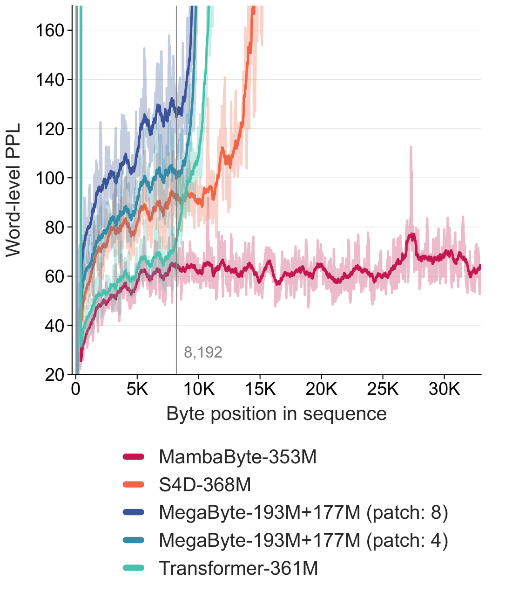
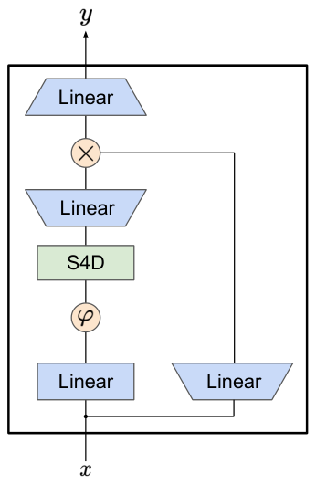
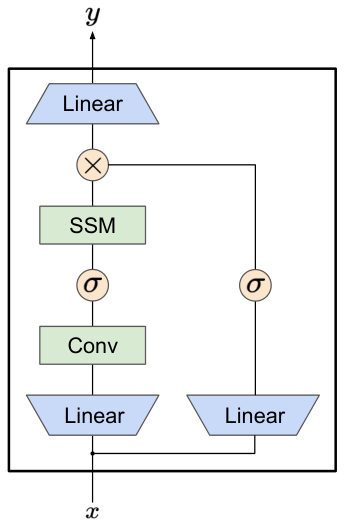

# MambaByte: Token-free Selective State Space Model

Junxiong Wang  Tushaar Gangavarapu  Jing Nathan Yan  Alexander M. Rush  Affiliation: [3pt] Cornell University  Email: [{[jw2544](mailto:jw2544@cornell.edu),[tg352](mailto:tg352@cornell.edu),[jy858](mailto:jy858@cornell.edu),[arush](mailto:arush@cornell.edu)}@cornell.edu](mailto:) Affiliation: [3pt] (Version \(2\)) 

###### Abstract

Token-free language models learn directly from raw bytes and remove the inductive bias of subword tokenization. Operating on bytes, however, results in significantly longer sequences. In this setting, standard autoregressive Transformers scale poorly as the effective memory required grows with sequence length. The recent Mamba state space model (SSM) development offers an appealing alternative approach with a fixed-sized memory state and efficient decoding. We propose MambaByte, a token-free adaptation of the Mamba SSM trained autoregressively on byte sequences. In terms of modeling, we show MambaByte to be competitive with, and even to outperform, state-of-the-art subword Transformers on language modeling tasks while maintaining the benefits of token-free language models, such as robustness to noise. In terms of efficiency, we develop an adaptation of speculative decoding with tokenized drafting and byte-level verification. This results in a \(2.6\times\) inference speedup to the standard MambaByte implementation, showing similar decoding efficiency as the subword Mamba. These findings establish the viability of SSMs in enabling token-free language modeling.

## 1 Introduction

When defining a language model, a base tokenization is typically used—either words ([Bengio et al. 2000](https://arxiv.org/html/2401.13660#bib.bib5)), subwords ([Schuster & Nakajima 2012](https://arxiv.org/html/2401.13660#bib.bib45); [Sennrich et al. 2015](https://arxiv.org/html/2401.13660#bib.bib46); [Wu et al. 2016](https://arxiv.org/html/2401.13660#bib.bib57); [Wang et al. 2020](https://arxiv.org/html/2401.13660#bib.bib55)), or characters ([Gao et al. 2020b](https://arxiv.org/html/2401.13660#bib.bib20)). Of these, subword tokenization has been the most popular choice, as it achieves a natural compromise between training efficiency and the ability to handle out-of-vocabulary words. However, several works, e.g., [Xue et al. 2022](https://arxiv.org/html/2401.13660#bib.bib59), have noted issues with subword tokenizers, such as a lack of robustness to typos, spelling and capitalization variations, and morphological changes.

Modeling byte sequences, i.e., mapping from raw data to predictions without any intermediate tokenization, offers an alternative approach with less inductive bias ([Choe et al. 2019](https://arxiv.org/html/2401.13660#bib.bib11); [Al-Rfou et al. 2019](https://arxiv.org/html/2401.13660#bib.bib1); [Clark et al. 2022](https://arxiv.org/html/2401.13660#bib.bib12); [Tay et al. 2022](https://arxiv.org/html/2401.13660#bib.bib50); [Xue et al. 2022](https://arxiv.org/html/2401.13660#bib.bib59); [Yu et al. 2023](https://arxiv.org/html/2401.13660#bib.bib63)). Compared to subword models, byte-level language models can generalize more easily across orthographic and morphological variants. Of course, modeling text as bytes means that the resultant sequences are significantly longer than their subword counterparts. This change pushes the modeling and efficiency issues upstream into the architecture itself.

These issues are particularly pronounced for autoregressive Transformers ([Vaswani et al. 2017](https://arxiv.org/html/2401.13660#bib.bib54)), which dominate language modeling ([Brown et al. 2020](https://arxiv.org/html/2401.13660#bib.bib8); [Touvron et al. 2023](https://arxiv.org/html/2401.13660#bib.bib51)). Due to the quadratic nature of attention, Transformer efficiency scales poorly for long (byte) sequences ([Zhang et al. 2022](https://arxiv.org/html/2401.13660#bib.bib64)). Researchers have compressed the internal Transformer representation to work with long sequences, for instance, developing length-aware modeling approaches ([Dai et al. 2020](https://arxiv.org/html/2401.13660#bib.bib13); [Nawrot et al. 2022](https://arxiv.org/html/2401.13660#bib.bib38)), where groups of tokens are merged within the intermediate layers. The MegaByte Transformer ([Yu et al. 2023](https://arxiv.org/html/2401.13660#bib.bib63)) is of particular relevance, which uses compression in the form of fixed-size patches of bytes as a subword analog in combination with a byte-level decoder. These methods lower computational costs11 1 However, our experiments (see Figure [1](https://arxiv.org/html/2401.13660#S1.F1 "Figure 1 ‣ 1 Introduction ‣ MambaByte: Token-free Selective State Space Model")) indicate that patching can also lower the model performance compared to the standard Transformer. but change the modeling behavior to match the data.

Figure 1: Benchmarking byte-level models with a fixed parameter budget. Language modeling results on PG19 (\(8,192\) consecutive bytes), comparing the standard Transformer ([Vaswani et al. 2017](https://arxiv.org/html/2401.13660#bib.bib54); [Su et al. 2021](https://arxiv.org/html/2401.13660#bib.bib49)), MegaByte Transformer ([Yu et al. 2023](https://arxiv.org/html/2401.13660#bib.bib63)), gated diagonalized S4 ([Mehta et al. 2023](https://arxiv.org/html/2401.13660#bib.bib36)), and MambaByte. (Left) Model loss over training step. (Right) FLOP-normalized training cost. MambaByte reaches Transformer loss in less than one-third of the compute budget.

In this work, we propose MambaByte, a byte-level language model without representational compression. The model is an application of the recently introduced Mamba architecture ([Gu & Dao 2023](https://arxiv.org/html/2401.13660#bib.bib22)). Mamba builds off the approach pioneered by state space models (SSMs) ([Gu et al. 2021](https://arxiv.org/html/2401.13660#bib.bib23); [Gupta et al. 2022](https://arxiv.org/html/2401.13660#bib.bib26); [Gu et al. 2022](https://arxiv.org/html/2401.13660#bib.bib24); [Smith et al. 2023](https://arxiv.org/html/2401.13660#bib.bib47); [Fu et al. 2022](https://arxiv.org/html/2401.13660#bib.bib17)) by introducing a selection mechanism that has been shown to be nearly as effective as Transformers for discrete data. Our key observation is that, unlike Transformers, Mamba has a (large) fixed-sized memory state that is independent of context length, roughly analogous to a large recurrent neural network hidden state. This naturally removes a major modeling and efficiency issue for byte-level language modeling without requiring specialized architectures such as global patching.

Even with effective training, byte-level models still suffer from the challenge of efficient decoding, as generating one character at a time requires running the language model in serial one byte at a time. To improve the inference efficiency, we propose an adaptation of speculative decoding ([Leviathan et al. 2023](https://arxiv.org/html/2401.13660#bib.bib33); [Chen et al. 2023a](https://arxiv.org/html/2401.13660#bib.bib9); [Xia et al. 2023](https://arxiv.org/html/2401.13660#bib.bib58)) to byte-level models. The approach uses a fast subword model for autoregressive drafting, followed by byte-level verification. While this approach could be applied to any byte-level model, it is particularly efficient for SSM-style models since the byte-level verification step can use the same parallel scan code path that makes these models efficient to train.

Experiments compare MambaByte to Transformers, SSMs, and MegaByte (patching) architectures in a fixed parameter and fixed compute setting on several long-form language modeling datasets. Figure [1](https://arxiv.org/html/2401.13660#S1.F1 "Figure 1 ‣ 1 Introduction ‣ MambaByte: Token-free Selective State Space Model") summarizes our main findings. Compared to byte-level Transformers, MambaByte achieves better performance faster and is significantly more compute-efficient. We also compare MambaByte with tokenized subword baselines using Transformers and SSMs, and find that MambaByte is competitive in loss while also demonstrating improved robustness in handling subword noise, such as input text corruptions. Through our speculative subword drafting and byte-level verification approach, we show that MambaByte can be run as fast as the subword Mamba for text generation. We believe these results validate the potential for tokenizer-free models as a practical alternative to subword Transformers for language modeling.

## 2 State space models and the Mamba architecture

##### Method: Selective SSMs.

SSMs model the evolution of a hidden state across time through a first-order differential equation. Linear time-invariant SSMs ([Gu et al. 2021](https://arxiv.org/html/2401.13660#bib.bib23); [Gupta et al. 2022](https://arxiv.org/html/2401.13660#bib.bib26); [Gu et al. 2022](https://arxiv.org/html/2401.13660#bib.bib24); [Smith et al. 2023](https://arxiv.org/html/2401.13660#bib.bib47)) have shown promising results in deep learning across several modalities. However, [Gu & Dao 2023](https://arxiv.org/html/2401.13660#bib.bib22) have recently argued that the constant dynamics of these approaches lack input-dependent context selection in the hidden state, which may be necessary for tasks such as language modeling. To this end, they define the time-varying continuous state dynamics for a given input \(x(t)\in{{\mathbb{R}}}\), hidden state \(h(t)\in{{\mathbb{R}^{n}}}\), and output \(y(t)\in{{\mathbb{R}}}\) at time \(t\) as:

| \(\displaystyle\frac{{\dd}h(t)}{{\dd}t}={\A}h(t)+\B(t)x(t);\quad y(t)=\C(t)h(t),\) |  | (1)  
---|---|---|---  
  
which is parameterized by a diagonal time-invariant system matrix \(\A\in{{\mathbb{R}^{n\times n}}}\) and time-dependent input and output matrices \(\B(t)\in{{\mathbb{R}^{n\times 1}}}\) and \(\C(t)\in{{\mathbb{R}^{1\times n}}}\).

To model discrete-time sequences, the continuous-time dynamics in ([1](https://arxiv.org/html/2401.13660#S2.E1 "Equation 1 ‣ Method: Selective SSMs. ‣ 2 State space models and the Mamba architecture ‣ MambaByte: Token-free Selective State Space Model")) must be approximated through discretization. This results in a discrete-time hidden state recurrence with new matrices at each timestep,  \(\A\) ,  \(\B\) , and  \(\C\) , such that

| \(\displaystyle h[k]=\vbox{\hrule height=0.55pt\kern 1.29167pt\hbox{\kern 0.0pt$\A$\kern 0.0pt}
}[k]h[k-1]+\vbox{\hrule height=0.55pt\kern 1.29167pt\hbox{\kern 0.0pt$\B$\kern 0.0pt}
}[k]x[k];\quad y[k]=\vbox{\hrule height=0.55pt\kern 1.29167pt\hbox{\kern 0.0pt$\C$\kern 0.0pt}
}[k]h[k].\) |  | (2)  
---|---|---|---  
  
Observe that ([2](https://arxiv.org/html/2401.13660#S2.E2 "Equation 2 ‣ Method: Selective SSMs. ‣ 2 State space models and the Mamba architecture ‣ MambaByte: Token-free Selective State Space Model")) resembles a linear version of a recurrent neural network and can be applied in this recurrent form during language model generation. The discretization requires a timestep, \(\Delta[k]\), for each input position, corresponding to treating \(x[k]=x\left(t_{k}\right)\) for \(t_{k}=\sum_{j=1}^{k}\Delta[j]\). The discrete-time matrices  \(\A\) ,  \(\B\) , and  \(\C\) can then be computed from \(\Delta[k]\).

##### Architecture: Mamba.

In Mamba, the SSM terms are input-selective, i.e., \(\B\), \(\C\), and \(\Delta\) are defined as functions of the input \(x[k]\in{{\mathbb{R}^{d}}}\):

| \(\displaystyle\Delta[k]=\softplus(W_{\Delta}(W_{R}x[k]));\quad\B(t_{k})=W_{\B}x[k],\) |  | (3)  
---|---|---|---  
  
where \(W_{\B}\in{{\mathbb{R}^{n\times d}}}\) (\(\C\) is similarly defined), \(W_{\Delta}\in{{\mathbb{R}^{d\times r}}}\) and \(W_{R}\in{{\mathbb{R}^{r\times d}}}\) (for some \(r\ll d\)) are learnable weights, and softplus ensures positivity. Note that the SSM parameters \(\A\), \(\B\), and \(\C\) are identical for each input dimension \(d\), but the timesteps \(\Delta\) are distinct; this results in a hidden state size of \(n\times d\) per timestep \(k\). (See Appendix [D](https://arxiv.org/html/2401.13660#A4 "Appendix D Discretization and selection ‣ MambaByte: Token-free Selective State Space Model") for an illustration of how Mamba models discrete sequences and other specifics on discretization and selectivity.)

Mamba embeds this SSM layer into a full neural network language model. Specifically, the model utilizes a stack of gated layers inspired by the previous gated SSM ([Mehta et al. 2023](https://arxiv.org/html/2401.13660#bib.bib36)). Figure [6](https://arxiv.org/html/2401.13660#A2.F6 "Figure 6 ‣ Appendix B Compute-constrained modeling ‣ MambaByte: Token-free Selective State Space Model") (right) in Appendix [B](https://arxiv.org/html/2401.13660#A2 "Appendix B Compute-constrained modeling ‣ MambaByte: Token-free Selective State Space Model") shows the Mamba architecture combining the SSM layer with a gated neural network.

##### Implementation: Parallel scans for linear recurrences.

At training time, we have access to the entire sequence \(x\), allowing us to compute the linear recurrence more efficiently. [Smith et al. 2023](https://arxiv.org/html/2401.13660#bib.bib47) demonstrated the use of work-efficient parallel scans ([Blelloch 1990](https://arxiv.org/html/2401.13660#bib.bib7)) for efficiently computing the sequential recurrence in linear SSMs. For Mamba, we first map the recurrence to a sequence of \(L\) tuples, with \(e_{k}=(A_{k},b_{k})\coloneqq(\vbox{\hrule height=0.55pt\kern 1.29167pt\hbox{\kern 0.0pt$\A$\kern 0.0pt}
}[k],\vbox{\hrule height=0.55pt\kern 1.29167pt\hbox{\kern 0.0pt$\B$\kern 0.0pt}
}[k]x[k])\), then define an associative operator \(\bullet\) such that \(e_{j}\bullet e_{k}=(A_{k}A_{j},A_{k}b_{j}+b_{k})\). Finally, we apply a parallel scan to compute the sequence \([(\vbox{\hrule height=0.55pt\kern 1.29167pt\hbox{\kern 0.0pt$\A$\kern 0.0pt}
}[1],h[1]),(\vbox{\hrule height=0.55pt\kern 1.29167pt\hbox{\kern 0.0pt$\A$\kern 0.0pt}
}[2]\vbox{\hrule height=0.55pt\kern 1.29167pt\hbox{\kern 0.0pt$\A$\kern 0.0pt}
}[1],h[2]),\ldots]\). In general, this requires \(\mathcal{O}(T_{\bullet}\log_{2}(L))\) time, using \(L/2\) processors, where \(T_{\bullet}\) is the cost of a matrix-matrix multiplication. Noting  \(\A\) to be a diagonal matrix, the linear recurrence can be computed parallelly in \(\mathcal{O}(n\log_{2}(L))\) time and \(\mathcal{O}(nL)\) space. A parallel scan with a diagonal matrix is also efficient in operation, requiring \(\mathcal{O}(nL)\) FLOPs.

## 3 Method

##### Modeling long byte-sequences.

MambaByte is an application of the Mamba architecture to byte-level language modeling. Our main observation is that unlike Transformers, whose memory scales linearly in sequence length, Mamba maintains a large fixed-size memory state, which makes it suitable for direct byte-level modeling. Formally, an \(m\)-layer Mamba model, each with a hidden state \(h(t)\in{{\mathbb{R}^{n_{\text{state}}\times d}}}\), efficiently maintains and evolves a memory of \(m\times n_{\text{state}}\times d\) floats. Noting that the Mamba hidden state memory size is independent of input context length, \(L_{\text{ctx}}\), processing subword sequences or byte sequences requires the underlying model to compress roughly \(L_{\text{ctx}}\) bytes in its fixed hidden state memory, irrespective of the input representation. In all but extreme cases, \(m\times n_{\text{state}}\times d\gg L_{\text{ctx}}\), leaving enough space of a hidden state \(h(t)\) to encode \(L_{\text{ctx}}\) information. Therefore, if Mamba can be used for tokenized models, MambaByte should enable modeling byte-level sequences without the need for length-compression trade-offs ([Dai et al. 2020](https://arxiv.org/html/2401.13660#bib.bib13); [Nawrot et al. 2022](https://arxiv.org/html/2401.13660#bib.bib38); [Yu et al. 2023](https://arxiv.org/html/2401.13660#bib.bib63)).

Utilizing a fixed-sized memory representation may also help avoid quadratic dependencies and improve generalization. While Transformers are designed to capture long-range dependencies, researchers have noted that the sheer number of potential interactions in a long byte-level sequence can dilute the model’s focus, making it challenging to capture crucial dependencies amid a vast number of less relevant ones ([Tworkowski et al. 2024](https://arxiv.org/html/2401.13660#bib.bib53)). Bytes level information is much more granular, thus necessitating the model to learn from a much larger context to make meaningful predictions.

Finally, training Mamba for long byte-sequences has an inherent computation benefit at scale. The computational cost for Mamba at training is \(\mathcal{O}(L_{\text{ctx}})\), while even compressed models such as MegaByte ([Yu et al. 2023](https://arxiv.org/html/2401.13660#bib.bib63)) have a complexity of \(\mathcal{O}(L_{\text{ctx}}^{2}/p^{2}+L_{\text{ctx}}p)\) for a patch size \(p\). Even with a large patch size of \(L_{\text{ctx}}^{1/3}\), the resulting complexity is \(\mathcal{O}(L_{\text{ctx}}^{4/3})\).

Figure 2: Speculative decoding through subword drafting and byte-level verification. The green subwords are suggestions made by the smaller subword (Mamba) model \(M_{\text{subword}}\), whose associated bytes fell in the top-\(\beta\) autoregressive candidates of the byte-level verifier (MambaByte) model \(M_{\text{byte}}\). The red and blue bytes are the rejections and corresponding corrections made by the verifier model. (Two steps shown using the prompt: “the cat”.) 

##### Speculative decoding through subword drafting.

While MambaByte is computationally efficient at training, it encounters challenges in decoding, primarily because each byte is processed sequentially. To mitigate this sequential bottleneck, we propose a adaptation of speculative decoding through subword drafting and byte-level verification. Our observation is that most inference steps do not require the granularity of byte-level decoding and can benefit from faster subword drafting. Consequently, we can train token-free models, which are known to be robust to noise, and simulate subword-model-like generation, which is significantly faster. We decompose every decoding iteration into two steps: draft using a smaller subword (Mamba) model, then verify and correct using a larger byte-level (MambaByte) model, as illustrated in Figure [2](https://arxiv.org/html/2401.13660#S3.F2 "Figure 2 ‣ Modeling long byte-sequences. ‣ 3 Method ‣ MambaByte: Token-free Selective State Space Model").

The subword Mamba model, \(M_{\text{subword}}\), drafts \(m\) subwords autoregressively while recording the associated hidden states at each timestep. The drafted subwords are converted to bytes, fed to the byte-level MambaByte model, \(M_{\text{byte}}\), and verified using a parallel scan. We then find the bifurcation byte position \(c\), the furthest position in the byte sequence verified to be in the top-\(\beta\) autoregressive candidates of \(M_{\text{byte}}\). We also find the subword bifurcation position associated with \(c\), i.e., the largest position of the subword whose bytes are all verified to be correct. Drafted bytes after position \(c\) are discarded. Noting that the drafter is tokenized, while the verifier is token-free, we cannot just correct for \(b_{c+1}\), i.e., one byte after the bifurcation position, and continue drafting—this causes issues with drafting, especially if the tokenizer cannot find the newly updated partial subword in its pre-trained vocabulary. To avoid the possibility of the corrected partial subword being marked as out-of-vocabulary, we use the verifier model to generate bytes autoregressively until a boundary byte (e.g., space) is generated. The final decoded tokens include the verified drafted subwords and the corrected subword generated by the byte-level model. We cache the final hidden state from the MambaByte verifier and the bifurcation hidden state from the subword Mamba model for the next iteration. For completeness, we provide the algorithm for speculative decoding through subword drafting in Appendix [F](https://arxiv.org/html/2401.13660#A6 "Appendix F Speculative decoding through subword drafting algorithm ‣ MambaByte: Token-free Selective State Space Model").

To enable resuming during the parallel scan, we extended the fast CUDA kernel from Mamba ([Gu & Dao 2023](https://arxiv.org/html/2401.13660#bib.bib22)), allowing verification to restart from the mismatched position instead of beginning from the start.

## 4 Experimental setup

Expt | Models |  FLOPs per train byte  
---|---|---  
Medium- scale | MegaByte-\(758\)M+\(262\)M \(:\) | \(1.02:1\)  
MambaByte-\(353\)M |   
Large- scale | MegaByte-\(1.3\)B+\(350\)M \(:\) | \(0.54:1\)  
MambaByte-\(972\)M |   
| MegaByte-\(1.3\)B+\(218\)M \(:\) | \(0.40:1\)  
MambaByte-\(972\)M |   
  
Table 1: Relative training FLOPs by model size. MegaByte models use a patch size of \(8\).

Our experiments compare MambaByte to a range of other tokenizer-based and token-free Transformers and SSMs. All our models employ the same training recipes. We utilize a set of diverse long-form text datasets: PG19 ([Rae et al. 2020](https://arxiv.org/html/2401.13660#bib.bib41)), Stories ([Trinh & Le 2018](https://arxiv.org/html/2401.13660#bib.bib52)), Books ([Gao et al. 2020a](https://arxiv.org/html/2401.13660#bib.bib19)), ArXiv ([Gao et al. 2020a](https://arxiv.org/html/2401.13660#bib.bib19)), and Code ([Gao et al. 2020a](https://arxiv.org/html/2401.13660#bib.bib19)). We consider models of different sizes: for MambaByte, this is indicated by the number of parameters in the model; for MegaByte, which is the primary baseline used, size is indicated by the number of parameters in the patched model and the unpatched generation head. Dataset sizes and average document lengths are included in Appendix [A](https://arxiv.org/html/2401.13660#A1 "Appendix A Dataset specifics ‣ MambaByte: Token-free Selective State Space Model"); model details are given in Appendix [B](https://arxiv.org/html/2401.13660#A2 "Appendix B Compute-constrained modeling ‣ MambaByte: Token-free Selective State Space Model").

Performance comparison across architectures requires care. To this end, we consider two settings: compute-matched and parameter-matched. This setup is necessary as the default MegaByte Transformer employs a global module that works with \(8\times\)-patched representations of the input, thus using \(8\times\) fewer feed-forward FLOPs per byte than a raw Transformer, while having significantly more parameters. Table [1](https://arxiv.org/html/2401.13660#S4.T1 "Table 1 ‣ 4 Experimental setup ‣ MambaByte: Token-free Selective State Space Model") shows the MegaByte and MambaByte model sizes employed in our experiments. The (forward pass) FLOPs computation for various model architectures and the associated hyperparameters employed are detailed in Appendix [B](https://arxiv.org/html/2401.13660#A2 "Appendix B Compute-constrained modeling ‣ MambaByte: Token-free Selective State Space Model").

All MambaByte models were trained using the open-source Mamba code base.22 2 <https://github.com/state-spaces/mamba>. At training, we shuffle the documents and use contiguous sequences of \(8,192\) bytes (one per document), starting from a random position. We enable mixed precision training using BF\(16\) for training efficiency at scale. The optimizer, learning rate scheduler, and other training details are specified in Appendix [C](https://arxiv.org/html/2401.13660#A3 "Appendix C Training recipes ‣ MambaByte: Token-free Selective State Space Model").

 Figure 3: Length extrapolation. All models are trained with \(8,192\)-long byte sequences. MambaByte can extrapolate to much longer sequences without performance degradation.

## 5 Results

### 5.1 Language modeling performance

Table [2](https://arxiv.org/html/2401.13660#S5.T2 "Table 2 ‣ 5.1 Language modeling performance ‣ 5 Results ‣ MambaByte: Token-free Selective State Space Model") shows language modeling performance in bits per byte (\(\bpb\)) across each dataset. For this experiment, the MegaByte-\(758\)M+\(262\)M and MambaByte models use the same number of FLOPs per byte (see Table [1](https://arxiv.org/html/2401.13660#S4.T1 "Table 1 ‣ 4 Experimental setup ‣ MambaByte: Token-free Selective State Space Model")). We observe MambaByte to outperform MegaByte consistently across all datasets. Furthermore, MambaByte outperforms MegaByte with \(0.63\times\) less compute and training data. Additionally, MambaByte-\(353\)M also outperforms byte-level Transformer and PerceiverAR.

Byte-level model | Context |  Bytes trained | Test \(\bpb\downarrow\)  
---|---|---|---  
PG19 | Stories | Books | ArXiv | Code  
Transformer-\(320\)M | \(1,024\) | \(80\)B | \(1.057\) | \(1.064\) | \(1.097\) | \(0.816\) | \(0.575\)  
PerceiverAR-\(248\)M | \(8,192\) | \(80\)B | \(1.104\) | \(1.070\) | \(1.104\) | \(0.791\) | \(0.546\)  
MegaByte-\(758\)M+\(262\)M (patch: \(8\)) | \(8,192\) | \(80\)B | \(1.000\) | \(0.978\) | \(1.007\) | \(0.678\) | \(0.411\)  
MambaByte-\(353\)M | \(8,192\) | \(30\)B∗ | \(\mathbf{0.930}\) | \(\mathbf{0.908}\) | \(\mathbf{0.966}\) | 0.663 | \(\mathbf{0.396}\)  
  
Table 2: Medium-scale token-free experiments. MegaByte-\(758\)M+\(262\)M and MambaByte-\(353\)M use the same FLOPs per byte. (The \(\bpb\) for Transformer, PerceiverAR, and MegaByte are from [Yu et al. 2023](https://arxiv.org/html/2401.13660#bib.bib63).)

Figure [1](https://arxiv.org/html/2401.13660#S1.F1 "Figure 1 ‣ 1 Introduction ‣ MambaByte: Token-free Selective State Space Model") further explores this relationship by looking at models with the same number of parameters. The graphs indicate that for MegaByte models of the same parameter size, models with less input patching perform better, but when compute-normalized, they perform similarly. In fact, a full-length Transformer, while slow in an absolute sense, also performs similarly to the MegaByte model when compute-normalized. In contrast, switching to the Mamba architecture significantly improves both the compute usage and the model performance.

Following these findings, Table [3](https://arxiv.org/html/2401.13660#S5.T3 "Table 3 ‣ 5.1 Language modeling performance ‣ 5 Results ‣ MambaByte: Token-free Selective State Space Model") compares a larger version of these models on the PG19 dataset, both with and without tokenization. For this experiment, we compare MambaByte-\(972\)M with MegaByte-\(1.3\)B+\(350\)M and other byte-level models, as well as several state-of-the-art subword models. (The conversion from \(\bpb\) and subword-level perplexity to word-level perplexity (\(\ppl\)) is detailed in Appendix [E](https://arxiv.org/html/2401.13660#A5 "Appendix E Evaluation metrics ‣ MambaByte: Token-free Selective State Space Model")). We find that MambaByte-\(972\)M, even just trained for \(150\)B bytes, outperforms all the byte-level models and achieves competitive performance with subword models.

Figure [3](https://arxiv.org/html/2401.13660#S4.F3 "Figure 3 ‣ 4 Experimental setup ‣ MambaByte: Token-free Selective State Space Model") records another interesting aspect of MambaByte: its ability to extrapolate to significantly longer sequences (at least \(4\times\) longer than the training length) compared to other byte-level Transformer and SSM baselines, suggesting that MambaByte can effectively refine the recurrent hidden state for significantly longer sequences. As expected, limited by the position embeddings, Transformer models don’t extrapolate beyond the training length.

| (\(\#\)Layers) Model | Vocab |  Effective ctx (in bytes) |  Effective bytes trained |  Val \(\ppl\) \(\downarrow\) |  Test \(\ppl\) \(\downarrow\)  
---|---|---|---|---|---|---  
Subword | (\(36\)) Transformer-XL ([Rae et al. 2020](https://arxiv.org/html/2401.13660#bib.bib41)) | \(32\)K | \(2,048/4,096\) | \(400\)B | \(45.5\) | \(36.3\)  
(\(36\)) Compressive ([Rae et al. 2020](https://arxiv.org/html/2401.13660#bib.bib41)) | \(32\)K | \(2,048/2\)\(\times 2,048\) | \(400\)B | \(43.4\) | \(33.6\)  
(\(22\)) Routing-\(490\)M ([Roy et al. 2021](https://arxiv.org/html/2401.13660#bib.bib43)) | \(82\)K | \(32,768\) | \(330\)B | \(-\) | \(33.2\)  
(\(60\)) PerceiverAR-\(974.6\)M ([Hawthorne et al. 2022](https://arxiv.org/html/2401.13660#bib.bib27)) | \(32\)K | \(8,192\) | \(1.68\)T | \(45.9\) | \(28.9\)  
(\(24\)) Block-Recurrent-\(1.3\)B ([Hutchins et al. 2022](https://arxiv.org/html/2401.13660#bib.bib31)) | \(32\)K | \(4,096/\)recurrence | \(-\) | \(-\) | \(\mathbf{26.5}\)  
| (\(48\)) Mamba-\(1.03\)B | \(32\)K | \(8,192\) | \(600\)B∗ | \(40.1\) | \(33.9\)  
Byte | (\(-\)) Transformer-\(320\)M ([Yu et al. 2023](https://arxiv.org/html/2401.13660#bib.bib63)) | \(256\) | \(8,192\) | \(400\)B | \(81.6\) | \(69.4\)  
(\(-\)) PerceiverAR-\(248\)M ([Yu et al. 2023](https://arxiv.org/html/2401.13660#bib.bib63)) | \(256\) | \(8,192\) | \(400\)B | \(119.1\) | \(88.8\)  
(\(24\)+\(24\)) MegaByte-\(1.3\)B+\(350\)M ([Yu et al. 2023](https://arxiv.org/html/2401.13660#bib.bib63)) | \(256\) | \(8,192/\)patch: \(8\) | \(400\)B | \(42.8\) | \(36.4\)  
(48) MambaByte-\(972\)M | \(256\) | \(8,192\) | \(150\)B∗ | \(\mathbf{39.6}\) | \(33.0\)  
  
Table 3: Large-scale experiment on PG19. The observed \(\bpb\) scores are converted to word-level \(\ppl\) for comparison with past works. All the byte-level models are compute-matched. Mamba-\(1.03\)B and MambaByte-\(972\)M are evaluated using \(4\times\) longer context and a sliding window of \(16,384\) bytes. MambaByte-\(972\)M significantly outperforms other byte-level models and is competitive with state-of-the-art subword models. (Accompanying citation indicates the work from which the corresponding result was taken; fields marked \(-\) are unknown.)

### 5.2 Token-free capabilities

Figure 5: Long context experiment. Length extrapolation using a sliding window of \(L_{\text{ctx}}/2\). Proba \(\ppl\downarrow\) Mamba MambaByte Drop \(0.05\) \(+16.9\) \(\mathbf{+8.5}\) \(0.3\) \(+213.2\) \(\mathbf{+31.7}\) Repeat \(0.05\) \(+6.3\) \(\mathbf{+6.2}\) \(0.3\) \(+28.4\) \(\mathbf{+26.6}\) Antspeak \(+58300.0\) \(\mathbf{+28.3}\) Uppercase \(0.05\) \(+5.4\) \(\mathbf{+1.6}\) \(0.3\) \(+18.3\) \(\mathbf{+5.5}\) Random case \(+20.8\) \(\mathbf{+7.7}\) Swap \(0.05\) \(+29.0\) \(\mathbf{+9.3}\) \(0.3\) \(+630.6\) \(\mathbf{+28.7}\) Table 6: Noise experiments. Degradation of Mamba-\(1.03\)B and MambaByte-\(972\)M under varied noise settings.

To control for the benefits of the Mamba architecture, we retrained a subword Mamba-\(1.03\)B model in a compute-matched setting (see Table [3](https://arxiv.org/html/2401.13660#S5.T3 "Table 3 ‣ 5.1 Language modeling performance ‣ 5 Results ‣ MambaByte: Token-free Selective State Space Model")). Interestingly, the (subword) Mamba and MambaByte perform similarly at the same parameter size and training compute. As previously mentioned, these models effectively have the same memory capacity despite significant differences in the input sequence length. We also find that Mamba achieves near-optimal performance more efficiently than MambaByte, though not \(4\times\) faster as expected, but \(2.2\times\) faster. Furthermore, the perplexity for Mamba-\(1.03\)B does not improve significantly beyond \(150\)B training bytes, consistent with the observations made by [Rae et al. 2020](https://arxiv.org/html/2401.13660#bib.bib41). Given the similar performance of Mamba and MambaByte, we can further explore downstream capabilities.

##### Modeling longer contexts.

From Figure [5](https://arxiv.org/html/2401.13660#S5.F5 "Figure 5 ‣ 5.2 Token-free capabilities ‣ 5 Results ‣ MambaByte: Token-free Selective State Space Model"), we note that Mamba and MambaByte show impressive extrapolation capabilities for sequences up to \(64\times\) longer than the training length. We hypothesize that MambaByte shows slightly better length extrapolation than the subword Mamba because MambaByte models \(4\times\) longer sequences at training despite both models processing the same effective number of bytes per training sequence.

##### Synthetic noise experiments.

We employ the synthetic noise benchmark from [Xue et al. 2022](https://arxiv.org/html/2401.13660#bib.bib59) to test model robustness; additional details about the noise settings are noted in Appendix [G](https://arxiv.org/html/2401.13660#A7 "Appendix G Synthetic noise settings ‣ MambaByte: Token-free Selective State Space Model"). We process the input text in the PG19 test set into chunks of \(100\) space-separated words and inject noise into every odd-indexed chunk while retaining the text in the even-indexed chunk unaltered. Table [5](https://arxiv.org/html/2401.13660#S5.F5 "Figure 5 ‣ 5.2 Token-free capabilities ‣ 5 Results ‣ MambaByte: Token-free Selective State Space Model") shows the degradation of word-level \(\ppl\) with noise injection, measured on even-indexed chunks. We observe that Mamba performance degrades significantly in the presence of noise compared to MambaByte across all noise conditions, indicating that tokenized vocabulary fundamentally limits subword models. This effect is pronounced in specific noise settings such as antspeak (every character is capitalized and padded with spaces) and character swapping (consecutive bytes are swapped). Our findings align with those observed by [Xue et al. 2022](https://arxiv.org/html/2401.13660#bib.bib59) in that byte-level models are significantly more resilient to accidental and adversarial spelling errors than subword models.

### 5.3 Generation efficiency

Autoregressive inference in Transformer models requires caching the entire context, which can significantly affect the generation speed. MambaByte does not suffer from this bottleneck as it maintains a single hidden state per layer that evolves with time, enabling constant time per generation step. Table [7](https://arxiv.org/html/2401.13660#S5.T7 "Table 7 ‣ 5.3 Generation efficiency ‣ 5 Results ‣ MambaByte: Token-free Selective State Space Model") compares the text generation speeds of MambaByte-\(972\)M and MambaByte-\(1.6\)B with MegaByte-\(1.3\)B+\(350\)M on an A100 80GB PCIe GPU. While MegaByte significantly reduces the generation cost through patching, we observe MambaByte to be \(2.6\times\) faster in a parameter-matched setting due to its use of recurrent generation. Appendix [H](https://arxiv.org/html/2401.13660#A8 "Appendix H PG19 generation samples ‣ MambaByte: Token-free Selective State Space Model") includes more information about the generation process.

Model |  Bytes trained | Context |  Test \(\bpb\) \(\downarrow\) |  Generation time (s) \(\downarrow\)  
---|---|---|---|---  
Transformer-\(350\)M | \(80\)B | \(1,024\) | \(1.064\) | \(132\)  
MegaByte-\(1.3\)B+\(218\)M | \(80\)B | \(8,192\) | \(0.991\) | \(93\)  
MegaByte-\(1.3\)B+\(218\)M | \(-\) | \(8,192\) | \(-\) | 265  
MambaByte-\(972\)M |  \(75\)B∗ | \(8,192\) | \(\mathbf{0.883}\) | \(\mathbf{29}\)  
w/ sliding window (\(2\times\) bytes) |  | \(\mathbf{0.863}\) | 58  
MambaByte-\(1.6\)B | \(-\) | \(8,192\) | \(-\) | \(36\)  
  
Table 7: Generation speed benchmarking. Speed to generate \(8,192\) bytes; fields marked \(-\) are unknown. (Upper) The \(\bpb\) on PG19 and generation time for the Transformer and MegaByte are taken from [Yu et al. 2023](https://arxiv.org/html/2401.13660#bib.bib63). (Lower) MegaByte and MambaByte run on the same hardware; we use the available open-source MegaByte implementation here.

##### Generation via subword speculation.

Table [8](https://arxiv.org/html/2401.13660#S5.T8 "Table 8 ‣ Generation via subword speculation. ‣ 5.3 Generation efficiency ‣ 5 Results ‣ MambaByte: Token-free Selective State Space Model") shows the inference speedup using speculative decoding through subword drafting, averaged across \(100\) prompts generated using common phrases in the PG19 dataset. We use a Mamba-\(110\)M model as the drafter, and the subwords are generated using greedy decoding. We observe that through speculative subword drafting, MambaByte can achieve a decoding speed nearing that of the subword Mamba. Furthermore, to assess the faithfulness of our speculative decoding approach, we use a greedy-decoded MambaByte-\(972\)M generation as the reference candidate for a given prompt. We report the ratio of the log-likelihood of generating the reference candidate to the log-likelihood of MambaByte generating the speculative-decoded sequence, which is averaged across all prompts. From Table [8](https://arxiv.org/html/2401.13660#S5.T8 "Table 8 ‣ Generation via subword speculation. ‣ 5.3 Generation efficiency ‣ 5 Results ‣ MambaByte: Token-free Selective State Space Model"), we observe our speculative decoding approach to be more faithful to MambaByte-\(972\)M than the subword Mamba-\(1.03\)B.

Model | Context |  Relative speedup \(\uparrow\) |  Log-odds ratio \(\uparrow\)  
---|---|---|---  
MambaByte-\(972\)M | \(8,192\) | \(1\times\) | \(1.0\)  
Mamba-\(1.03\)B | \(2,048\) | \(2.8\times\) | \(0.10\)  
MambaByte-\(972\)M w/ Mamba-\(110\)M speculation | \(8,192\) | \(\mathbf{2.6\times}\) | \(\mathbf{0.89}\)  
  
Table 8: Generation speed with subword speculation. Empirical results for speeding up inference from the MambaByte-\(972\)M model. Speed was measured in generating \(8,192\) bytes; the drafter drafts three subwords per iteration and the verifier accepts if the drafted bytes were in its top-\(3\) candidates.

## 6 Related work

##### Token-free language models.

Tokenization has been fundamental to language modeling and vital in enhancing model efficiency and understanding. Several algorithms have been proposed to address tokenization issues, including sizeable vocabulary size and handling out-of-vocabulary tokens: Byte-Pair Encoding ([Sennrich et al. 2015](https://arxiv.org/html/2401.13660#bib.bib46)), WordPiece ([Schuster & Nakajima 2012](https://arxiv.org/html/2401.13660#bib.bib45); [Devlin et al. 2018](https://arxiv.org/html/2401.13660#bib.bib15)), and SentencePiece ([Kudo & Richardson 2018](https://arxiv.org/html/2401.13660#bib.bib32)). The recent shift towards character ([Tay et al. 2022](https://arxiv.org/html/2401.13660#bib.bib50); [Ma et al. 2020](https://arxiv.org/html/2401.13660#bib.bib35); [Mielke & Eisner 2019](https://arxiv.org/html/2401.13660#bib.bib37)) and byte-level ([Yu et al. 2023](https://arxiv.org/html/2401.13660#bib.bib63); [Xue et al. 2022](https://arxiv.org/html/2401.13660#bib.bib59); [Belouadi & Eger 2022](https://arxiv.org/html/2401.13660#bib.bib4)) modeling aims to achieve token-free preprocessing, thereby facilitating improved model adaptability and domain transferability in language modeling and multilingual processing.

##### Attention-free models.

Attention-free models offer enhanced computational and memory efficiency and are increasingly adapted for several language processing tasks, including autoregressive language modeling. Models such as S4 ([Gu et al. 2021](https://arxiv.org/html/2401.13660#bib.bib23)) and its subsequent variants ([Gupta et al. 2022](https://arxiv.org/html/2401.13660#bib.bib26); [Gu et al. 2022](https://arxiv.org/html/2401.13660#bib.bib24)) have demonstrated promising outcomes in subword-level language modeling. Gated SSM architectures such as GSS ([Mehta et al. 2023](https://arxiv.org/html/2401.13660#bib.bib36)) and BiGS [Wang et al. 2022](https://arxiv.org/html/2401.13660#bib.bib56) incorporated a gating mechanism into SSMs for (bidirectional) language modeling. The recently introduced Mamba model ([Gu & Dao 2023](https://arxiv.org/html/2401.13660#bib.bib22)) posits that the unchanging dynamics of these methods fail to incorporate input-specific context selection within the hidden state, which might be crucial for tasks like language modeling. Mamba has been shown to outperform Transformers across model sizes and at scale. Alternatively, several other sub-quadratic model architectures ([Yang et al. 2023b](https://arxiv.org/html/2401.13660#bib.bib62); [De et al. 2024](https://arxiv.org/html/2401.13660#bib.bib14); [Arora et al. 2023](https://arxiv.org/html/2401.13660#bib.bib2); [Arora et al. 2024](https://arxiv.org/html/2401.13660#bib.bib3); [Fu et al. 2024a](https://arxiv.org/html/2401.13660#bib.bib16)) have also been proposed. Beyond language modeling, SSMs and Mamba have been applied in other modalities, including images ([Yan et al. 2024](https://arxiv.org/html/2401.13660#bib.bib60)), audio ([Goel et al. 2022](https://arxiv.org/html/2401.13660#bib.bib21)), and bioinformatics ([Schiff et al. 2024](https://arxiv.org/html/2401.13660#bib.bib44)).

##### Speculative decoding for fast inference.

Speculative decoding ([Spector & Re 2023](https://arxiv.org/html/2401.13660#bib.bib48); [Leviathan et al. 2023](https://arxiv.org/html/2401.13660#bib.bib33); [Chen et al. 2023a](https://arxiv.org/html/2401.13660#bib.bib9); [Xia et al. 2023](https://arxiv.org/html/2401.13660#bib.bib58)) has emerged as a promising approach to accelerate the inference of large language models, specifically Transformers. The core idea is to use a smaller draft model to speculatively generate candidate tokens, which the larger target model then verifies. [Leviathan et al. 2023](https://arxiv.org/html/2401.13660#bib.bib33); [Chen et al. 2023a](https://arxiv.org/html/2401.13660#bib.bib9) proposed a rejection sampling scheme to improve the inference quality. [Spector & Re 2023](https://arxiv.org/html/2401.13660#bib.bib48) restructured the candidate tokens into a tree to enable more efficient verification. Additional approaches also investigated trained draft models ([Bhendawade et al. 2024](https://arxiv.org/html/2401.13660#bib.bib6); [Chen et al. 2023b](https://arxiv.org/html/2401.13660#bib.bib10); [Liu et al. 2023](https://arxiv.org/html/2401.13660#bib.bib34)) and training-free draft models ([He et al. 2023](https://arxiv.org/html/2401.13660#bib.bib28); [Yang et al. 2023a](https://arxiv.org/html/2401.13660#bib.bib61); [Fu et al. 2024b](https://arxiv.org/html/2401.13660#bib.bib18)). While previous methods employ drafter and verifier models with the same underlying tokenization scheme, this paper proposes using a smaller subword Mamba model as the speculative drafter and a larger MambaByte as the byte-level verifier.

## 7 Conclusion

We introduce MambaByte, a token-free SSM for modeling long byte-sequences. MambaByte outperforms other byte-level models over several datasets and shows competitive results with subword Transformers while being significantly robust to text corruptions, thus serving as a promising tokenization alternative. Due to their recurrent nature, SSMs enable significantly faster text generation to Transformer models. We further improve the generation efficiency through speculative decoding using subword drafting and show MambaByte to achieve to achieve a decoding efficiency similar to the subword Mamba, making byte models practical. Our findings establish the possibility of token-free language modeling in future large models.

## References

  * Al-Rfou et al. (2019) Rami Al-Rfou, Dokook Choe, Noah Constant, Mandy Guo, and Llion Jones.  Character-Level Language Modeling with Deeper Self-Attention.  _Proceedings of the AAAI Conference on Artificial Intelligence_ , 33(01):3159–3166, Jul. 2019.  doi: 10.1609/aaai.v33i01.33013159.  URL <https://ojs.aaai.org/index.php/AAAI/article/view/4182>. 
  * Arora et al. (2023) Simran Arora, Sabri Eyuboglu, Aman Timalsina, Isys Johnson, Michael Poli, James Zou, Atri Rudra, and Christopher Ré.  Zoology: Measuring and improving recall in efficient language models.  _arXiv preprint arXiv:2312.04927_ , 2023. 
  * Arora et al. (2024) Simran Arora, Sabri Eyuboglu, Michael Zhang, Aman Timalsina, Silas Alberti, Dylan Zinsley, James Zou, Atri Rudra, and Christopher Ré.  Simple linear attention language models balance the recall-throughput tradeoff.  _arXiv preprint arXiv:2402.18668_ , 2024. 
  * Belouadi & Eger (2022) Jonas Belouadi and Steffen Eger.  Bygpt5: End-to-end style-conditioned poetry generation with token-free language models.  _arXiv preprint arXiv:2212.10474_ , 2022. 
  * Bengio et al. (2000) Yoshua Bengio, Réjean Ducharme, and Pascal Vincent.  A Neural Probabilistic Language Model.  _Advances in neural information processing systems_ , 13, 2000. 
  * Bhendawade et al. (2024) Nikhil Bhendawade, Irina Belousova, Qichen Fu, Henry Mason, Mohammad Rastegari, and Mahyar Najibi.  Speculative streaming: Fast llm inference without auxiliary models.  _arXiv preprint arXiv:2402.11131_ , 2024. 
  * Blelloch (1990) Guy E Blelloch.  Prefix Sums and Their Applications.  (CMU-CS-90-190), nov 1990.  URL [https://www.cs.cmu.edu/˜guyb/papers/Ble93.pdf](https://www.cs.cmu.edu/~guyb/papers/Ble93.pdf). 
  * Brown et al. (2020) Tom Brown, Benjamin Mann, Nick Ryder, Melanie Subbiah, Jared D Kaplan, Prafulla Dhariwal, Arvind Neelakantan, Pranav Shyam, Girish Sastry, Amanda Askell, et al.  Language Models are Few-Shot Learners.  _Advances in neural information processing systems_ , 33:1877–1901, 2020. 
  * Chen et al. (2023a) Charlie Chen, Sebastian Borgeaud, Geoffrey Irving, Jean-Baptiste Lespiau, Laurent Sifre, and John Jumper.  Accelerating Large Language Model Decoding with Speculative Sampling, 2023a. 
  * Chen et al. (2023b) Ziyi Chen, Xiaocong Yang, Jiacheng Lin, Chenkai Sun, Jie Huang, and Kevin Chen-Chuan Chang.  Cascade speculative drafting for even faster llm inference.  _arXiv preprint arXiv:2312.11462_ , 2023b. 
  * Choe et al. (2019) Dokook Choe, Rami Al-Rfou, Mandy Guo, Heeyoung Lee, and Noah Constant.  Bridging the gap for tokenizer-free language models.  _arXiv preprint arXiv:1908.10322_ , 2019. 
  * Clark et al. (2022) Jonathan H Clark, Dan Garrette, Iulia Turc, and John Wieting.  Canine: Pre-training an Efficient Tokenization-Free Encoder for Language Representation.  _Transactions of the Association for Computational Linguistics_ , 10:73–91, 2022. 
  * Dai et al. (2020) Zihang Dai, Guokun Lai, Yiming Yang, and Quoc Le.  Funnel-Transformer: Filtering out Sequential Redundancy for Efficient Language Processing.  _Advances in neural information processing systems_ , 33:4271–4282, 2020. 
  * De et al. (2024) Soham De, Samuel L Smith, Anushan Fernando, Aleksandar Botev, George Cristian-Muraru, Albert Gu, Ruba Haroun, Leonard Berrada, Yutian Chen, Srivatsan Srinivasan, et al.  Griffin: Mixing gated linear recurrences with local attention for efficient language models.  _arXiv preprint arXiv:2402.19427_ , 2024. 
  * Devlin et al. (2018) Jacob Devlin, Ming-Wei Chang, Kenton Lee, and Kristina Toutanova.  Bert: Pre-training of deep bidirectional transformers for language understanding.  _arXiv preprint arXiv:1810.04805_ , 2018. 
  * Fu et al. (2024a) Dan Fu, Simran Arora, Jessica Grogan, Isys Johnson, Evan Sabri Eyuboglu, Armin Thomas, Benjamin Spector, Michael Poli, Atri Rudra, and Christopher Ré.  Monarch mixer: A simple sub-quadratic gemm-based architecture.  _Advances in Neural Information Processing Systems_ , 36, 2024a. 
  * Fu et al. (2022) Daniel Y Fu, Tri Dao, Khaled Kamal Saab, Armin W Thomas, Atri Rudra, and Christopher Re.  Hungry hungry hippos: Towards language modeling with state space models.  In _The Eleventh International Conference on Learning Representations_ , 2022. 
  * Fu et al. (2024b) Yichao Fu, Peter Bailis, Ion Stoica, and Hao Zhang.  Break the sequential dependency of llm inference using lookahead decoding.  _arXiv preprint arXiv:2402.02057_ , 2024b. 
  * Gao et al. (2020a) Leo Gao, Stella Biderman, Sid Black, Laurence Golding, Travis Hoppe, Charles Foster, Jason Phang, Horace He, Anish Thite, Noa Nabeshima, Shawn Presser, and Connor Leahy.  The Pile: An 800GB Dataset of Diverse Text for Language Modeling.  _arXiv preprint arXiv:2101.00027_ , 2020a. 
  * Gao et al. (2020b) Yingqiang Gao, Nikola I Nikolov, Yuhuang Hu, and Richard HR Hahnloser.  Character-Level Translation with Self-attention.  In _Proceedings of the 58th Annual Meeting of the Association for Computational Linguistics_ , pp. 1591–1604, 2020b. 
  * Goel et al. (2022) Karan Goel, Albert Gu, Chris Donahue, and Christopher Ré.  It’s raw! audio generation with state-space models.  In _International Conference on Machine Learning_ , pp. 7616–7633. PMLR, 2022. 
  * Gu & Dao (2023) Albert Gu and Tri Dao.  Mamba: Linear-Time Sequence Modeling with Selective State Spaces.  _arXiv preprint arXiv:2312.00752_ , 2023. 
  * Gu et al. (2021) Albert Gu, Karan Goel, and Christopher Ré.  Efficiently Modeling Long Sequences with Structured State Spaces.  _arXiv preprint arXiv:2111.00396_ , 2021. 
  * Gu et al. (2022) Albert Gu, Karan Goel, Ankit Gupta, and Christopher Ré.  On the Parameterization and Initialization of Diagonal State Space Models.  _Advances in Neural Information Processing Systems_ , 35:35971–35983, 2022. 
  * Gu et al. (2023) Albert Gu, Isys Johnson, Aman Timalsina, Atri Rudra, and Christopher Re.  How to Train your HiPPO: State Space Models with Generalized Orthogonal Basis Projections.  In _International Conference on Learning Representations_ , 2023.  URL <https://openreview.net/forum?id=klK17OQ3KB>. 
  * Gupta et al. (2022) Ankit Gupta, Albert Gu, and Jonathan Berant.  Diagonal State Spaces are as Effective as Structured State Spaces.  _Advances in Neural Information Processing Systems_ , 35:22982–22994, 2022. 
  * Hawthorne et al. (2022) Curtis Hawthorne, Andrew Jaegle, Cătălina Cangea, Sebastian Borgeaud, Charlie Nash, Mateusz Malinowski, Sander Dieleman, Oriol Vinyals, Matthew Botvinick, Ian Simon, Hannah Sheahan, Neil Zeghidour, Jean-Baptiste Alayrac, Joao Carreira, and Jesse Engel.  General-purpose, long-context autoregressive modeling with Perceiver AR.  In _Proceedings of the 39th International Conference on Machine Learning_ , volume 162 of _Proceedings of Machine Learning Research_ , pp. 8535–8558. PMLR, 17–23 Jul 2022.  URL <https://proceedings.mlr.press/v162/hawthorne22a.html>. 
  * He et al. (2023) Zhenyu He, Zexuan Zhong, Tianle Cai, Jason D Lee, and Di He.  Rest: Retrieval-based speculative decoding.  _arXiv preprint arXiv:2311.08252_ , 2023. 
  * Hendrycks & Gimpel (2016) Dan Hendrycks and Kevin Gimpel.  Gaussian error linear units (gelus).  _arXiv preprint arXiv:1606.08415_ , 2016. 
  * Holtzman et al. (2020) Ari Holtzman, Jan Buys, Li Du, Maxwell Forbes, and Yejin Choi.  The Curious Case of Neural Text Degeneration.  In _International Conference on Learning Representations_ , 2020.  URL <https://openreview.net/forum?id=rygGQyrFvH>. 
  * Hutchins et al. (2022) DeLesley Hutchins, Imanol Schlag, Yuhuai Wu, Ethan Dyer, and Behnam Neyshabur.  Block-Recurrent Transformers.  _Advances in Neural Information Processing Systems_ , 35:33248–33261, 2022. 
  * Kudo & Richardson (2018) Taku Kudo and John Richardson.  SentencePiece: A simple and language independent subword tokenizer and detokenizer for Neural Text Processing.  In _Proceedings of the 2018 Conference on Empirical Methods in Natural Language Processing: System Demonstrations_ , pp. 66–71, Brussels, Belgium, nov 2018. Association for Computational Linguistics.  doi: 10.18653/v1/D18-2012.  URL <https://aclanthology.org/D18-2012>. 
  * Leviathan et al. (2023) Yaniv Leviathan, Matan Kalman, and Yossi Matias.  Fast Inference from Transformers via Speculative Decoding.  In _Proceedings of the 40th International Conference on Machine Learning_ , volume 202 of _Proceedings of Machine Learning Research_ , pp. 19274–19286. PMLR, 23–29 Jul 2023.  URL <https://proceedings.mlr.press/v202/leviathan23a.html>. 
  * Liu et al. (2023) Xiaoxuan Liu, Lanxiang Hu, Peter Bailis, Ion Stoica, Zhijie Deng, Alvin Cheung, and Hao Zhang.  Online speculative decoding.  _arXiv preprint arXiv:2310.07177_ , 2023. 
  * Ma et al. (2020) Wentao Ma, Yiming Cui, Chenglei Si, Ting Liu, Shijin Wang, and Guoping Hu.  Charbert: character-aware pre-trained language model.  _arXiv preprint arXiv:2011.01513_ , 2020. 
  * Mehta et al. (2023) Harsh Mehta, Ankit Gupta, Ashok Cutkosky, and Behnam Neyshabur.  Long Range Language Modeling via Gated State Spaces.  In _The Eleventh International Conference on Learning Representations_ , 2023.  URL <https://openreview.net/forum?id=5MkYIYCbva>. 
  * Mielke & Eisner (2019) Sebastian J Mielke and Jason Eisner.  Spell once, summon anywhere: A two-level open-vocabulary language model.  In _Proceedings of the AAAI Conference on Artificial Intelligence_ , volume 33, pp. 6843–6850, 2019. 
  * Nawrot et al. (2022) Piotr Nawrot, Szymon Tworkowski, Michał Tyrolski, Łukasz Kaiser, Yuhuai Wu, Christian Szegedy, and Henryk Michalewski.  Hierarchical Transformers Are More Efficient Language Models.  In _Findings of the Association for Computational Linguistics: NAACL 2022_ , pp. 1559–1571, 2022. 
  * Nguyen et al. (2022) Eric Nguyen, Karan Goel, Albert Gu, Gordon Downs, Preey Shah, Tri Dao, Stephen Baccus, and Christopher Ré.  S4ND: Modeling Images and Videos as Multidimensional Signals with State Spaces.  _Advances in neural information processing systems_ , 35:2846–2861, 2022. 
  * Orvieto et al. (2023) Antonio Orvieto, Samuel L Smith, Albert Gu, Anushan Fernando, Caglar Gulcehre, Razvan Pascanu, and Soham De.  Resurrecting Recurrent Neural Networks for Long Sequences.  _arXiv preprint arXiv:2303.06349_ , 2023. 
  * Rae et al. (2020) Jack W. Rae, Anna Potapenko, Siddhant M. Jayakumar, Chloe Hillier, and Timothy P. Lillicrap.  Compressive Transformers for Long-Range Sequence Modelling.  In _International Conference on Learning Representations_ , 2020.  URL <https://openreview.net/forum?id=SylKikSYDH>. 
  * Ramachandran et al. (2017) Prajit Ramachandran, Barret Zoph, and Quoc V Le.  Searching for activation functions.  _arXiv preprint arXiv:1710.05941_ , 2017. 
  * Roy et al. (2021) Aurko Roy, Mohammad Saffar, Ashish Vaswani, and David Grangier.  Efficient Content-Based Sparse Attention with Routing Transformers.  _Transactions of the Association for Computational Linguistics_ , 9:53–68, 2021.  doi: 10.1162/tacl_a_00353.  URL <https://aclanthology.org/2021.tacl-1.4>. 
  * Schiff et al. (2024) Yair Schiff, Chia-Hsiang Kao, Aaron Gokaslan, Tri Dao, Albert Gu, and Volodymyr Kuleshov.  Caduceus: Bi-directional equivariant long-range dna sequence modeling.  _arXiv preprint arXiv:2403.03234_ , 2024. 
  * Schuster & Nakajima (2012) Mike Schuster and Kaisuke Nakajima.  Japanese and Korean Voice Search.  In _2012 IEEE international conference on acoustics, speech and signal processing (ICASSP)_ , pp. 5149–5152. IEEE, 2012. 
  * Sennrich et al. (2015) Rico Sennrich, Barry Haddow, and Alexandra Birch.  Neural Machine Translation of Rare Words with Subword Units.  _arXiv preprint arXiv:1508.07909_ , 2015. 
  * Smith et al. (2023) Jimmy T.H. Smith, Andrew Warrington, and Scott Linderman.  Simplified State Space Layers for Sequence Modeling.  In _The Eleventh International Conference on Learning Representations_ , 2023.  URL <https://openreview.net/forum?id=Ai8Hw3AXqks>. 
  * Spector & Re (2023) Benjamin Spector and Chris Re.  Accelerating llm inference with staged speculative decoding.  _arXiv preprint arXiv:2308.04623_ , 2023. 
  * Su et al. (2021) Jianlin Su, Yu Lu, Shengfeng Pan, Bo Wen, and Yunfeng Liu.  Roformer: Enhanced transformer with rotary position embedding.  _arXiv e-prints_ , pp. arXiv–2104, 2021. 
  * Tay et al. (2022) Yi Tay, Vinh Q. Tran, Sebastian Ruder, Jai Gupta, Hyung Won Chung, Dara Bahri, Zhen Qin, Simon Baumgartner, Cong Yu, and Donald Metzler.  Charformer: Fast Character Transformers via Gradient-based Subword Tokenization.  2022\.  URL <https://arxiv.org/abs/2106.12672>. 
  * Touvron et al. (2023) Hugo Touvron, Louis Martin, Kevin Stone, Peter Albert, Amjad Almahairi, Yasmine Babaei, Nikolay Bashlykov, Soumya Batra, Prajjwal Bhargava, Shruti Bhosale, Dan Bikel, Lukas Blecher, Cristian Canton Ferrer, Moya Chen, Guillem Cucurull, David Esiobu, Jude Fernandes, Jeremy Fu, Wenyin Fu, Brian Fuller, Cynthia Gao, Vedanuj Goswami, Naman Goyal, Anthony Hartshorn, Saghar Hosseini, Rui Hou, Hakan Inan, Marcin Kardas, Viktor Kerkez, Madian Khabsa, Isabel Kloumann, Artem Korenev, Punit Singh Koura, Marie-Anne Lachaux, Thibaut Lavril, Jenya Lee, Diana Liskovich, Yinghai Lu, Yuning Mao, Xavier Martinet, Todor Mihaylov, Pushkar Mishra, Igor Molybog, Yixin Nie, Andrew Poulton, Jeremy Reizenstein, Rashi Rungta, Kalyan Saladi, Alan Schelten, Ruan Silva, Eric Michael Smith, Ranjan Subramanian, Xiaoqing Ellen Tan, Binh Tang, Ross Taylor, Adina Williams, Jian Xiang Kuan, Puxin Xu, Zheng Yan, Iliyan Zarov, Yuchen Zhang, Angela Fan, Melanie Kambadur, Sharan Narang, Aurelien Rodriguez, Robert Stojnic, Sergey Edunov, and Thomas Scialom.  Llama 2: Open Foundation and Fine-Tuned Chat Models, 2023. 
  * Trinh & Le (2018) Trieu H. Trinh and Quoc V. Le.  A Simple Method for Commonsense Reasoning.  _arXiv preprint arXiv:1806.02847_ , 2018. 
  * Tworkowski et al. (2024) Szymon Tworkowski, Konrad Staniszewski, Mikołaj Pacek, Yuhuai Wu, Henryk Michalewski, and Piotr Miłoś.  Focused transformer: Contrastive training for context scaling.  _Advances in Neural Information Processing Systems_ , 36, 2024. 
  * Vaswani et al. (2017) Ashish Vaswani, Noam Shazeer, Niki Parmar, Jakob Uszkoreit, Llion Jones, Aidan N Gomez, Łukasz Kaiser, and Illia Polosukhin.  Attention Is All You Need.  _Advances in neural information processing systems_ , 30, 2017. 
  * Wang et al. (2020) Changhan Wang, Kyunghyun Cho, and Jiatao Gu.  Neural Machine Translation with Byte-Level Subwords.  In _Proceedings of the AAAI conference on artificial intelligence_ , volume 34, pp. 9154–9160, 2020. 
  * Wang et al. (2022) Junxiong Wang, Jing Nathan Yan, Albert Gu, and Alexander M Rush.  Pretraining without attention.  _arXiv preprint arXiv:2212.10544_ , 2022. 
  * Wu et al. (2016) Yonghui Wu, Mike Schuster, Zhifeng Chen, Quoc V Le, Mohammad Norouzi, Wolfgang Macherey, Maxim Krikun, Yuan Cao, Qin Gao, Klaus Macherey, et al.  Google’s Neural Machine Translation System: Bridging the Gap between Human and Machine Translation.  _arXiv preprint arXiv:1609.08144_ , 2016. 
  * Xia et al. (2023) Heming Xia, Tao Ge, Peiyi Wang, Si-Qing Chen, Furu Wei, and Zhifang Sui.  Speculative Decoding: Exploiting Speculative Execution for Accelerating Seq2seq Generation.  In _Findings of the Association for Computational Linguistics: EMNLP 2023_ , pp. 3909–3925, Singapore, December 2023. Association for Computational Linguistics.  doi: 10.18653/v1/2023.findings-emnlp.257.  URL <https://aclanthology.org/2023.findings-emnlp.257>. 
  * Xue et al. (2022) Linting Xue, Aditya Barua, Noah Constant, Rami Al-Rfou, Sharan Narang, Mihir Kale, Adam Roberts, and Colin Raffel.  ByT5: Towards a token-free future with pre-trained byte-to-byte models.  _Transactions of the Association for Computational Linguistics_ , 10:291–306, 2022. 
  * Yan et al. (2024) Jing Nathan Yan, Jiatao Gu, and Alexander M Rush.  Diffusion models without attention.  _CVPR 2024_ , 2024. 
  * Yang et al. (2023a) Nan Yang, Tao Ge, Liang Wang, Binxing Jiao, Daxin Jiang, Linjun Yang, Rangan Majumder, and Furu Wei.  Inference with reference: Lossless acceleration of large language models.  _arXiv preprint arXiv:2304.04487_ , 2023a. 
  * Yang et al. (2023b) Songlin Yang, Bailin Wang, Yikang Shen, Rameswar Panda, and Yoon Kim.  Gated Linear Attention Transformers with Hardware-Efficient Training.  _arXiv preprint arXiv:2312.06635_ , 2023b. 
  * Yu et al. (2023) Lili Yu, Daniel Simig, Colin Flaherty, Armen Aghajanyan, Luke Zettlemoyer, and Mike Lewis.  MegaByte: Predicting Million-byte Sequences with Multiscale Transformers.  In _Thirty-seventh Conference on Neural Information Processing Systems_ , 2023.  URL <https://openreview.net/forum?id=JTmO2V9Xpz>. 
  * Zhang et al. (2022) Susan Zhang, Stephen Roller, Naman Goyal, Mikel Artetxe, Moya Chen, Shuohui Chen, Christopher Dewan, Mona Diab, Xian Li, Xi Victoria Lin, et al.  OPT: Open Pre-trained Transformer Language Models.  _arXiv preprint arXiv:2205.01068_ , 2022. 

###### Appendix

  1. [1 Introduction](https://arxiv.org/html/2401.13660#S1 "In MambaByte: Token-free Selective State Space Model")
  2. [2 State space models and the Mamba architecture](https://arxiv.org/html/2401.13660#S2 "In MambaByte: Token-free Selective State Space Model")
  3. [3 Method](https://arxiv.org/html/2401.13660#S3 "In MambaByte: Token-free Selective State Space Model")
  4. [4 Experimental setup](https://arxiv.org/html/2401.13660#S4 "In MambaByte: Token-free Selective State Space Model")
  5. [5 Results](https://arxiv.org/html/2401.13660#S5 "In MambaByte: Token-free Selective State Space Model")
     1. [5.1 Language modeling performance](https://arxiv.org/html/2401.13660#S5.SS1 "In 5 Results ‣ MambaByte: Token-free Selective State Space Model")
     2. [5.2 Token-free capabilities](https://arxiv.org/html/2401.13660#S5.SS2 "In 5 Results ‣ MambaByte: Token-free Selective State Space Model")
     3. [5.3 Generation efficiency](https://arxiv.org/html/2401.13660#S5.SS3 "In 5 Results ‣ MambaByte: Token-free Selective State Space Model")
  6. [6 Related work](https://arxiv.org/html/2401.13660#S6 "In MambaByte: Token-free Selective State Space Model")
  7. [7 Conclusion](https://arxiv.org/html/2401.13660#S7 "In MambaByte: Token-free Selective State Space Model")
  8. [References](https://arxiv.org/html/2401.13660#bib "In MambaByte: Token-free Selective State Space Model")
  9. [A Dataset specifics](https://arxiv.org/html/2401.13660#A1 "In MambaByte: Token-free Selective State Space Model")
  10. [B Compute-constrained modeling](https://arxiv.org/html/2401.13660#A2 "In MambaByte: Token-free Selective State Space Model")
  11. [C Training recipes](https://arxiv.org/html/2401.13660#A3 "In MambaByte: Token-free Selective State Space Model")
  12. [D Discretization and selection](https://arxiv.org/html/2401.13660#A4 "In MambaByte: Token-free Selective State Space Model")
  13. [E Evaluation metrics](https://arxiv.org/html/2401.13660#A5 "In MambaByte: Token-free Selective State Space Model")
  14. [F Speculative decoding through subword drafting algorithm](https://arxiv.org/html/2401.13660#A6 "In MambaByte: Token-free Selective State Space Model")
  15. [G Synthetic noise settings](https://arxiv.org/html/2401.13660#A7 "In MambaByte: Token-free Selective State Space Model")
  16. [H PG19 generation samples](https://arxiv.org/html/2401.13660#A8 "In MambaByte: Token-free Selective State Space Model")

## Appendix A Dataset specifics

| Total bytes | Total docs | Bytes\(/\)doc  
---|---|---|---  
PG19 | \(11.74\)G | \(28,752\) | \(4,082,210\)  
Stories | \(34.18\)G | \(948,247\) | \(36,045\)  
Books | \(108.38\)G | \(196,640\) | \(551,179\)  
ArXiv | \(60.27\)G | \(1,264,405\) | \(47,665\)  
Code | \(677\)G | \(56,626,342\) | \(11,958\)  
  
Table 9: Text dataset statistics. The total bytes, total documents, and the mean document size (bytes per document) for each dataset.

We benchmark our results on various long-form text datasets. The PG19 dataset ([Rae et al. 2020](https://arxiv.org/html/2401.13660#bib.bib41)) is an extensive collection of full-length English books (written before \(1919\)) from the Project Gutenberg online library. The PG19 dataset is ideal to test for long-distance context modeling ([Gao et al. 2020a](https://arxiv.org/html/2401.13660#bib.bib19)). The Stories dataset ([Trinh & Le 2018](https://arxiv.org/html/2401.13660#bib.bib52)) is a subset of the CommonCrawl data used for commonsense reasoning and language modeling. The Books dataset ([Gao et al. 2020a](https://arxiv.org/html/2401.13660#bib.bib19)) is another collection of English books. The ArXiv dataset ([Gao et al. 2020a](https://arxiv.org/html/2401.13660#bib.bib19)) comprises technical publications in LaTeX from the arXiv online archive. Finally, the Code dataset ([Gao et al. 2020a](https://arxiv.org/html/2401.13660#bib.bib19)) is a large dataset of publicly available open-source code (under Apache, MIT, or BSD licenses). Dataset statistics are tabulated in Table [9](https://arxiv.org/html/2401.13660#A1.T9 "Table 9 ‣ Appendix A Dataset specifics ‣ MambaByte: Token-free Selective State Space Model").

For the PG19 dataset, we employ the train, validation, and test data splits as indicated by [Rae et al. 2020](https://arxiv.org/html/2401.13660#bib.bib41). For Stories, Books, ArXiv, and Code datasets, we randomly sample \(40\)M consecutive bytes for testing and the rest to train MambaByte.

## Appendix B Compute-constrained modeling

Figure 6: SSM model network architectures. (Left) Gated-S4D block adapted from [Mehta et al. 2023](https://arxiv.org/html/2401.13660#bib.bib36); (right) Mamba SSM block. (\(\varphi\) indicates GELU activation ([Hendrycks & Gimpel 2016](https://arxiv.org/html/2401.13660#bib.bib29)), and \(\sigma\) indicates Swish activation ([Ramachandran et al. 2017](https://arxiv.org/html/2401.13660#bib.bib42)).)

As noted earlier, we evaluate and benchmark MambaByte in a compute-controlled setting. To this end, we estimate the FLOPs per byte incurred by various byte-level model architectures. We parameterize the architectures using hyperparameters \(n\) \((n_{g}/n_{l})\) number of (global\(/\)local) layers, dimension \(d\) \((d_{g}/d_{l})\) of the (global\(/\)local) residual stream, expansion factor \(e\) of linear layers, patch size \(p\) in MegaByte, state dimension \(n_{\text{state}}\) in SSMs, 1D convolution kernel size \(k\), and low-rank projection dimension \(r\) in Mamba. We also include \(L_{\text{ctx}}\) bytes in the input context. Detailed component-wise compute counts for the forward pass are included in Table [10](https://arxiv.org/html/2401.13660#A2.T10 "Table 10 ‣ Appendix B Compute-constrained modeling ‣ MambaByte: Token-free Selective State Space Model").

Model | Component | FLOPs per byte  
---|---|---  
Transformer ([Vaswani et al. 2017](https://arxiv.org/html/2401.13660#bib.bib54)) | Multi-head attention | \(2n(4d^{2}+2L_{\text{ctx}}d)\)  
Pointwise feed-forward | \(2n(2ed^{2})\)  
MegaByte[3](https://arxiv.org/html/2401.13660#footnote3 "Footnote 3 ‣ Table 11 ‣ Appendix B Compute-constrained modeling ‣ MambaByte: Token-free Selective State Space Model") ([Yu et al. 2023](https://arxiv.org/html/2401.13660#bib.bib63)) | Embedding projection | \(2d_{g}^{2}\)  
Global transformer model | \(2n_{g}(4d_{g}^{2}+2d_{g}L_{\text{ctx}}/p+2ed_{g}^{2})/p\)  
Global-to-local projection | \(2d_{g}d_{l}\)  
Local transformer model | \(2n_{l}(4d_{l}^{2}+2pd_{l}+2ed_{l}^{2})\)  
Gated-S4D (Figure [6](https://arxiv.org/html/2401.13660#A2.F6 "Figure 6 ‣ Appendix B Compute-constrained modeling ‣ MambaByte: Token-free Selective State Space Model"), left) | Linear projections | \(2n(3ed^{2}+d^{2})\)  
Kernel via Vandermonde \(\varv(\vbox{\hrule height=0.55pt\kern 1.29167pt\hbox{\kern 0.0pt$\A$\kern 0.0pt}
})\) | \(n(\alpha_{\varv}ed(n_{\text{state}}+L_{\text{ctx}})\log_{2}^{2}(n_{\text{state}}+L_{\text{ctx}})/L_{\text{ctx}})\)  
S4D SSM with convolution | \(n(\alpha_{\text{fft}}\log(L_{\text{ctx}})ed+ed)\)  
| Element-wise gating | \(ned\)  
MambaByte (Figure [6](https://arxiv.org/html/2401.13660#A2.F6 "Figure 6 ‣ Appendix B Compute-constrained modeling ‣ MambaByte: Token-free Selective State Space Model"), right) | Linear projections | \(2n(3ed^{2})\)  
Pre-SSM 1D convolution | \(2nked\)  
\(\Delta,\B,\C\) from input \(x\) | \(2n(2edr+2edn_{\text{state}})\)  
Discretization, pre-scan:  \(\A\) , \(\vbox{\hrule height=0.55pt\kern 1.29167pt\hbox{\kern 0.0pt$\B$\kern 0.0pt}
}x\) | \(n(3edn_{\text{state}})\)  
Recurrence with parallel scan | \(n(edn_{\text{state}})\)  
Output: \(y=\vbox{\hrule height=0.55pt\kern 1.29167pt\hbox{\kern 0.0pt$\C$\kern 0.0pt}
}h+\vbox{\hrule height=0.55pt\kern 1.29167pt\hbox{\kern 0.0pt$\D$\kern 0.0pt}
}x\) | \(2nedn_{\text{state}}+ned\)  
Element-wise gating | \(ned\)  
  
Table 10: Compute (forward pass) estimates for various byte-level language models. Embedding, de-embedding, and sub-leading terms such as biases, nonlinearities, and layer norms are omitted. (\(\alpha_{\ast}\) indicates an implementation-specific constant scaling term.)

For the medium-scale language modeling experiments (Table 1, \(\lx@sectionsign 5\) of [Yu et al. 2023](https://arxiv.org/html/2401.13660#bib.bib63)), [Yu et al. 2023](https://arxiv.org/html/2401.13660#bib.bib63) employ the MegaByte-\(758\)M+\(262\)M model, with a context length of \(8,192\) and patch size of \(8\), trained for \(80\)B bytes. As shown in Figure [7](https://arxiv.org/html/2401.13660#A2.F7 "Figure 7 ‣ Appendix B Compute-constrained modeling ‣ MambaByte: Token-free Selective State Space Model"), MambaByte-\(353\)M (\(n=\text{$53$}\), \(d=\text{$1,024$}\), \(e=\text{$2$}\)) and MegaByte-\(758\)M+\(262\)M use the same total compute in FLOPs; hence, we employ the MambaByte-\(353\)M to benchmark against MegaByte-\(758\)M+\(262\)M in Table [2](https://arxiv.org/html/2401.13660#S5.T2 "Table 2 ‣ 5.1 Language modeling performance ‣ 5 Results ‣ MambaByte: Token-free Selective State Space Model") of \(\lx@sectionsign\ref{sec:results}\).

Figure 7: Computational cost for different model architectures at different scales. All models use a context length of \(8,192\), and MegaByte architectures use a patch size of \(8\).

For the PG19 scaling experiment (Table 2, \(\lx@sectionsign 5\) and Appendix \(\mathrm{D}.3\) of [Yu et al. 2023](https://arxiv.org/html/2401.13660#bib.bib63)), [Yu et al. 2023](https://arxiv.org/html/2401.13660#bib.bib63) use MegaByte-\(1.3\)B+\(350\)M (context length of \(8,192\) and patch size of \(8\)) trained for \(400\)B bytes to benchmark the observed word-level perplexity against several state-of-the-art subword models. Owing to our hardware limitations, we train MambaByte-\(972\)M (\(n=\text{$48$}\), \(d=\text{$1,792$}\), \(e=\text{$2$}\)) and control for the total compute used (see Figure [7](https://arxiv.org/html/2401.13660#A2.F7 "Figure 7 ‣ Appendix B Compute-constrained modeling ‣ MambaByte: Token-free Selective State Space Model") to view the associated computational costs). All the model sizes and associated hyperparameters employed in this work are tabulated in Table [11](https://arxiv.org/html/2401.13660#A2.T11 "Table 11 ‣ Appendix B Compute-constrained modeling ‣ MambaByte: Token-free Selective State Space Model").

Model | Parameters | Hyperparameters  
---|---|---  
\(n\) \((n_{g}/n_{l})\) |  \(d\) \((d_{g}/d_{l})\) | \(e\) | \(L_{\text{ctx}}\) | Others  
Transformer | \(320\)M ([Yu et al. 2023](https://arxiv.org/html/2401.13660#bib.bib63)) | \(22\) | \(1,024\) | \(4\) | \(1,024\) | heads: \(-\)  
\(350\)M ([Yu et al. 2023](https://arxiv.org/html/2401.13660#bib.bib63)) | \(24\) | \(1,024\) | \(4\) | \(1,024\) | heads: \(16\)  
| \(361\)M | \(28\) | \(1,024\) | \(4\) | \(8,192\) | heads: \(16\)  
PerceiverAR | \(248\)M ([Yu et al. 2023](https://arxiv.org/html/2401.13660#bib.bib63)) | \(17\) | \(1,024\) | \(4\) | \(8,192\) | latents: \(1,024\)  
MegaByte | \(193\)M+\(177\)M33 3 We used the open-source implementation: <https://github.com/lucidrains/MEGABYTE-pytorch>. | \(14/14\) | \(1,024/1,024\) | \(4\) | \(8,192\) | \(p=4,8\); heads: \(16/16\)  
\(758\)M+\(262\)M ([Yu et al. 2023](https://arxiv.org/html/2401.13660#bib.bib63)) | \(14/18\) | \(2,048/1,024\) | \(4\) | \(8,192\) | \(p=8\); heads: \(16/16\)  
| \(1.3\)B+\(218\)M ([Yu et al. 2023](https://arxiv.org/html/2401.13660#bib.bib63)) | \(24/15\) | \(2,048/1,024\) | \(4\) | \(8,192\) | \(p=8\); heads: \(32/-\)  
| \(1.3\)B+\(350\)M ([Yu et al. 2023](https://arxiv.org/html/2401.13660#bib.bib63)) | \(24/24\) | \(2,048/1,024\) | \(4\) | \(8,192\) | \(p=8\); heads: \(32/16\)  
Gated-S4D | \(368\)M | \(26\) | \(1,024\) | \(4\) | \(8,192\) | \(n_{\text{state}}=64\)  
MambaByte | \(353\)M | \(53\) | \(1,024\) | \(2\) | \(8,192\) | \(k=4;n_{\text{state}}=16;r=64\)  
\(972\)M | \(48\) | \(1,792\) | \(2\) | \(8,192\) | \(k=4;n_{\text{state}}=16;r=112\)  
| \(1.6\)B | \(48\) | \(2,304\) | \(2\) | \(8,192\) | \(k=4;n_{\text{state}}=16;r=144\)  
  
Table 11: Model hyperparameters. We report the model size and associated hyperparameters for all the models employed in this study. (Accompanying citation indicates the work from which the associated configuration is noted; fields marked as \(-\) are unknown.)

## Appendix C Training recipes

All the models in this study were trained using an AdamW optimizer with \(\beta=(0.9,0.95)\). We used a linear learning rate warm-up (for the first \(500\) steps) followed by cosine annealing. Keeping consistent with MegaByte training ([Yu et al. 2023](https://arxiv.org/html/2401.13660#bib.bib63)), we used a batch size of \(48\) across all our experiments. Additionally, we do not use dropout with any of our models.

For the experiments in Figure [1](https://arxiv.org/html/2401.13660#S1.F1 "Figure 1 ‣ 1 Introduction ‣ MambaByte: Token-free Selective State Space Model"), we conducted a hyperparameter search using peak learning rates of \(0.0002\), \(0.0006\), and \(0.0008\) and clipped the gradient norm to \(1.0\) for all the models. The best-observed performance curve for each model is reported in Figure [1](https://arxiv.org/html/2401.13660#S1.F1 "Figure 1 ‣ 1 Introduction ‣ MambaByte: Token-free Selective State Space Model"). Furthermore, we use an improved Transformer recipe that uses RMSNorm instead of LayerNorm, rotary positional encodings ([Su et al. 2021](https://arxiv.org/html/2401.13660#bib.bib49)), and linear terms without bias (same as [Yu et al. 2023](https://arxiv.org/html/2401.13660#bib.bib63)).

In our medium-scale experiments shown in Table [2](https://arxiv.org/html/2401.13660#S5.T2 "Table 2 ‣ 5.1 Language modeling performance ‣ 5 Results ‣ MambaByte: Token-free Selective State Space Model"), we set the peak learning rate to \(0.0004\) and clipped the gradient norm to \(0.1\). We trained the MambaByte-\(353\)M for a total of \(80\)K steps, equivalent to \(80,000\times 48\times 8,192\approx 30\)B bytes.

In the large-scale experiment on PG19, we use a similar setting to that in the medium-scale experiments: the peak learning rate is set to \(0.0004\), and the gradient norm is clipped to \(0.1\). The MambaByte-\(972\)M is trained for \(380\)K steps, equivalent to \(380,000\times 48\times 8,192\approx 150\)B bytes.

## Appendix D Discretization and selection

Figure 8: Illustration of the Mamba SSM. (a) The discrete-time input \(x[k]\), along with input-selective \(\Delta[k]\). (b) The continuous-time signal \(x(t)\). (c) Mathematically, the SSM transforms the continuous-time \(x(t)\) through an \(n\)-dimensional hidden state (here, \(n=4\)) using parameters \(\A\) and \(\B(t)\), which is then mapped to the output \(y(t)\) using \(\C(t)\). (d) Practically, we compute \(y[k]\) using a discrete-time parallel scan at the steps defined by \(\Delta[k]\) and discrete-time matrices \(\vbox{\hrule height=0.55pt\kern 1.29167pt\hbox{\kern 0.0pt$\A$\kern 0.0pt}
}[k]\), \(\vbox{\hrule height=0.55pt\kern 1.29167pt\hbox{\kern 0.0pt$\B$\kern 0.0pt}
}[k]\), and \(\vbox{\hrule height=0.55pt\kern 1.29167pt\hbox{\kern 0.0pt$\C$\kern 0.0pt}
}[k]\). At inference, we run the recurrence directly.

Discretization has deep connections to continuous-time systems, which allows for desirable properties such as model normalization ([Orvieto et al. 2023](https://arxiv.org/html/2401.13660#bib.bib40); [Gu et al. 2023](https://arxiv.org/html/2401.13660#bib.bib25)) and resolution invariance ([Nguyen et al. 2022](https://arxiv.org/html/2401.13660#bib.bib39)). In this section, we review how zero-order hold discretization of Mamba selective SSM can be viewed as a generalization of the gating mechanism in recurrent networks. An illustration of the Mamba SSM discretization and illustration is depicted in Figure [8](https://arxiv.org/html/2401.13660#A4.F8 "Figure 8 ‣ Appendix D Discretization and selection ‣ MambaByte: Token-free Selective State Space Model").

##### Zero-order hold discretization.

For a given input \(x(t)\in{{\mathbb{R}}}\), we wish to discretize a continuous-time SSM defined by ([1](https://arxiv.org/html/2401.13660#S2.E1 "Equation 1 ‣ Method: Selective SSMs. ‣ 2 State space models and the Mamba architecture ‣ MambaByte: Token-free Selective State Space Model")) in \(\lx@sectionsign\ref{sec:model}\). To this end, we sample the system at different time intervals such that \(x[k]=x(t_{k})\) for \(t_{k}=\sum_{j=1}^{k}\Delta[j]\) and assume a zero-order hold, i.e., \(x(t)\) is constant between samples: \(x(t_{k}+\xi)=x(t_{k})=x[k]\) for any \(\xi\in[t_{k},t_{k+1})\). The resultant matrices of the associated discrete SSM are:44 4 In Mamba ([Gu & Dao 2023](https://arxiv.org/html/2401.13660#bib.bib22)), \(\B\) is discretized through a simplified Euler (as opposed to zero-order hold) discretization from empirical observations of \(\A\) being more important than \(\B\), and the performance does not change significantly with simplification on \(\B\).

| \(\displaystyle\vbox{\hrule height=0.55pt\kern 1.29167pt\hbox{\kern 0.0pt$\A$\kern 0.0pt}
}=\exp(\A\Delta);\quad\vbox{\hrule height=0.55pt\kern 1.29167pt\hbox{\kern 0.0pt$\B$\kern 0.0pt}
}=\A^{-1}(\exp(\A\Delta)-\mathrm{I})\B;\quad\vbox{\hrule height=0.55pt\kern 1.29167pt\hbox{\kern 0.0pt$\C$\kern 0.0pt}
}=\C.\) |   
---|---|---  
  
##### Selection mechanics and gating in recurrent networks.

[Gu & Dao 2023](https://arxiv.org/html/2401.13660#bib.bib22) note that a selective SSM can be realized as a gated recurrence by setting \(\Delta=\softplus(z(x))=\softplus(W_{\Delta}(W_{R}x))\) (as indicated in ([3](https://arxiv.org/html/2401.13660#S2.E3 "Equation 3 ‣ Architecture: Mamba. ‣ 2 State space models and the Mamba architecture ‣ MambaByte: Token-free Selective State Space Model")) of \(\lx@sectionsign\ref{sec:model}\)). By letting \(\A=-1\), \(\B=1\), and \(n=1\), the authors observe:

|  \(\A\) | \(\displaystyle=\exp(\A\Delta)\) |   
---|---|---|---  
|  | \(\displaystyle=\exp(-\log(1+\exp(z(x))))\) |   
|  | \(\displaystyle=\frac{1}{1+\exp(z(x))}\) |   
|  | \(\displaystyle=\sigma(-z(x))\) |   
|  | \(\displaystyle=1-\sigma(z(x)).\) |   
|  \(\B\) | \(\displaystyle=\A^{-1}(\exp(\A\Delta)-\mathrm{I})\B\) |   
---|---|---|---  
|  | \(\displaystyle=\mathrm{I}-\exp(\A\Delta)\) |   
|  | \(\displaystyle=\sigma(z(x)).\) |   
  
Using  \(\A\) and  \(\B\) from above in the discrete recurrence ([2](https://arxiv.org/html/2401.13660#S2.E2 "Equation 2 ‣ Method: Selective SSMs. ‣ 2 State space models and the Mamba architecture ‣ MambaByte: Token-free Selective State Space Model")), the selective SSM takes the form of a 1D gated recurrence:

| \(\displaystyle h[k]\) | \(\displaystyle=\left(1-\sigma(z(x))\right)h[k-1]+\sigma(z(x))x[k].\) |  | (4)  
---|---|---|---|---  
  
It is interesting to note from ([4](https://arxiv.org/html/2401.13660#A4.E4 "Equation 4 ‣ Selection mechanics and gating in recurrent networks. ‣ Appendix D Discretization and selection ‣ MambaByte: Token-free Selective State Space Model")) that \(\lim_{\Delta\to\infty}h[k]=x[k]\) and \(\lim_{\Delta\to 0}h[k]=h[k-1]\): a large \(\Delta\) (\(\Delta\to\infty\)) denotes the evolution of the system to focus only on the current input and forgetting the state. In contrast, a small \(\Delta\) (\(\Delta\to 0\)) represents a transient input being ignored.

##### Selectivity of \(\boldsymbol{\A}\), \(\boldsymbol{\B}\), and \(\boldsymbol{\C}\) matrices.

[Gu & Dao 2023](https://arxiv.org/html/2401.13660#bib.bib22) argue that since the system matrix \(\A\) only affects the model through \(\Delta\), i.e., \(\vbox{\hrule height=0.55pt\kern 1.29167pt\hbox{\kern 0.0pt$\A$\kern 0.0pt}
}=\exp(\A\Delta)\). Hence, the selectivity in \(\Delta\) is sufficient to ensure selectivity in \(\A\).

While the selectivity in \(\Delta\) enables selectivity in the input matrix \(\B\), [Gu & Dao 2023](https://arxiv.org/html/2401.13660#bib.bib22) hypothesize that making \(\B\) and \(\C\) selective (in addition to \(\Delta\)) would allow for more fine-grained control based on the content \(x[k]\) and evolving context \(h[k]\).

## Appendix E Evaluation metrics

Subword-based language models ([Vaswani et al. 2017](https://arxiv.org/html/2401.13660#bib.bib54); [Hawthorne et al. 2022](https://arxiv.org/html/2401.13660#bib.bib27); [Hutchins et al. 2022](https://arxiv.org/html/2401.13660#bib.bib31)) report their performance in word or subword-level \(\ppl\), while byte-level language models ([Xue et al. 2022](https://arxiv.org/html/2401.13660#bib.bib59); [Yu et al. 2023](https://arxiv.org/html/2401.13660#bib.bib63)) report theirs in \(\bpb\). To facilitate meaningful comparisons, we report performance in \(\bpb\) when benchmarking against byte-level models and word-level \(\ppl\) when comparing to token-level models.55 5 Unless stated otherwise, we use \(\ppl\) to report word-level (not subword-level) perplexity. This section details the conversion from \(\bpb\) and subword-level \(\ppl\) to word-level \(\ppl\).

Irrespective of the underlying segmentation, the amount of information \(I(D)\) in a given dataset \(D\) is constant. Simply put,  
  
---  
| \(\displaystyle I(D)\) | \(\displaystyle=L_{W}\,\text{bits per word}=L_{S}\,\text{bits per subword}=L_{B}\,\text{bits per byte}\) |  | (5a)  
|  | \(\displaystyle\triangleq\frac{-\ln(D;\text{model})}{\ln(2)},\) |  | (5b)  
  
where \(L_{W}\), \(L_{S}\), and \(L_{B}\) are the length of the dataset in words, subwords, and bytes, respectively. From ([5](https://arxiv.org/html/2401.13660#A5.E5 "Equation 5 ‣ Appendix E Evaluation metrics ‣ MambaByte: Token-free Selective State Space Model")), we observe:

| \(\displaystyle\bpb=\frac{-\ln(D;\text{model})/L_{B}}{\ln(2)}=\frac{\ell_{\text{byte}}}{\ln(2)},\) |   
---|---|---  
  
where \(\ell_{\text{byte}}\) is the observed byte-level negative log-likelihood loss (computed using \(\ln\)). From ([5](https://arxiv.org/html/2401.13660#A5.E5 "Equation 5 ‣ Appendix E Evaluation metrics ‣ MambaByte: Token-free Selective State Space Model")), we also note the following conversion from \(\bpb\) to word-level \(\ppl\):

| \(\displaystyle\frac{-\ln(D;\text{model})/L_{W}}{\ln(2)}\) | \(\displaystyle=\frac{L_{B}}{L_{W}}\bpb=\frac{L_{B}}{L_{W}}\frac{\ell_{\text{byte}}}{\ln(2)}\) |   
---|---|---|---  
| \(\displaystyle\Rightarrow\ppl\) | \(\displaystyle=\exp\left(\frac{L_{B}}{L_{W}}\ell_{\text{byte}}\right)=\exp\left(\frac{L_{B}}{L_{W}}\ln(2)\bpb\right).\) |   
  
Similarly, we can compute word-level \(\ppl\) from the observed subword-level negative log-likelihood loss \(\ell_{\text{subword}}\) as:

| \(\displaystyle\ppl=\exp\left(\frac{L_{S}}{L_{W}}\ell_{\text{subword}}\right).\) |   
---|---|---  
  
| \(L_{B}\) | \(L_{S}\) | \(L_{W}\) | \(L_{B}/L_{W}\) | \(L_{S}/L_{W}\)  
---|---|---|---|---|---  
Train | \(11,677,824,216\) | \(2,914,582,573\) | \(1,973,048,393\) | \(5.92\) | \(1.48\)  
Validation | \(17,733,002\) | \(4,357,506\) | \(3,007,061\) | \(5.90\) | \(1.45\)  
Test | \(41,289,101\) | \(10,282,006\) | \(6,965,511\) | \(5.93\) | \(1.48\)  
  
Table 12: PG19 dataset statistics. Split-wise UTF-\(8\) encoded byte \(L_{B}\), SentencePiece-tokenized subword \(L_{S}\), and space-separated word \(L_{W}\) counts in the PG19 dataset. (The byte count includes the newline character.) We also indicate the associated bytes per word \(L_{B}/L_{W}\) and subwords per word \(L_{S}/L_{W}\).

For the PG19 dataset, we train MambaByte-\(972\)M to minimize BPB over the training data and report word-level PPL on the test data. In our medium-scale benchmarking experiments, for (subword) Mamba-\(1.03\)B, we trained a \(32\)K-subword vocabulary using the SubwordTextEncoder from the tfds package in TensorFlow, the same as [Rae et al. 2020](https://arxiv.org/html/2401.13660#bib.bib41). Split-wise values of \(L_{B}/L_{W}\) and \(L_{S}/L_{W}\) for the PG19 dataset are tabulated in Table [12](https://arxiv.org/html/2401.13660#A5.T12 "Table 12 ‣ Appendix E Evaluation metrics ‣ MambaByte: Token-free Selective State Space Model").

## Appendix F Speculative decoding through subword drafting algorithm

Algorithm [1](https://arxiv.org/html/2401.13660#alg1 "Algorithm 1 ‣ Appendix F Speculative decoding through subword drafting algorithm ‣ MambaByte: Token-free Selective State Space Model") below outlines our speculative decoding approach: the smaller subword draft model drafts \(m\) subwords at a time, which are then verified at a byte-level by a larger MambaByte model.

Inputs: \(M_{\text{subword}}\), \(M_{\text{byte}}\), prefix subwords \(s_{1:t}\), previous \(M_{\text{subword}}\) hidden state \(\hbar_{\text{prev}}\), previous \(M_{\text{byte}}\) hidden state \(h_{\text{prev}}\), draft block size \(m\), verify model tolerance \(n\).

\(\triangleright\) Sample \(m\) draft subwords \(\tilde{s}_{j}\)s from \(M_{\text{subword}}\) autoregressively and record the hidden states \(\hbar_{j}\)s at each timestep. \(\triangleleft\)

\(\hbar_{0}\leftarrow\hbar_{\text{prev}}\)

for \(j=1,\dotsc,m\) do

\(q_{j}(x),\hbar_{j}\leftarrow M_{\text{subword}}(s_{1:t}+\tilde{s}_{1:j-1},\hbar_{j-1})\)

\(\tilde{s}_{j}\sim q_{j}(x)\)

\(b_{1:t^{\prime}},\tilde{b}_{1:n}\leftarrow\text{bytes}(s_{1:t}),\text{bytes}(\tilde{s}_{1:m})\) \(\triangleright\) Get bytes for both prefix and drafted subwords.

\(\triangleright\) Run \(M_{\text{byte}}\) in parallel to verify the drafted bytes, while recording the associated hidden states \(h_{i}\)s. \(\triangleleft\)

\(\left(p_{1}(x),h_{1}\right),\dotsc,\left(p_{n}(x),h_{n}\right)\leftarrow\\
~~~~~~~~M_{\text{byte}}(b_{1:t^{\prime}},h_{\text{prev}}),M_{\text{byte}}(b_{1:t^{\prime}}+\tilde{b}_{1}),\dotsc,M_{\text{byte}}(b_{1:t^{\prime}}+\tilde{b}_{1:n-1})\)

\(\triangleright\) Find the bifurcation position \(c\) such that \(\tilde{b}_{1:c}\) drafted bytes all fall in top-\(\beta\) candidates of \(M_{\text{byte}}\), while \(\tilde{b}_{c+1}\) does not. \(\triangleleft\)

\(c\leftarrow\min\left(\{i\,|\,1\leq i\leq n,\,\text{rank}_{p_{i}}(\tilde{b}_{i})>\beta\}\cup\{n\}\right)\)

\(c^{\prime}\leftarrow\min\left(\{j\,|\,1\leq j\leq m,\,\text{cumsum}(\text{len}(\tilde{s}_{1:m}))[j]>c\}\cup\{m\}\right)\) \(\triangleright\) Find associated subword bifurcation position.

\(\triangleright\) Starting from \(\tilde{b}_{c}\) (and using \(h_{c}\)), sample corrected bytes \(\hat{b}_{i}\)s from \(M_{\text{byte}}\) autoregressively until a boundary byte (e.g., space) is obtained. \(\triangleleft\)

\(\hat{b}_{c}\leftarrow\tilde{b}_{c};k\leftarrow 0\)

while \(\hat{b}_{c+k}\) is not a boundary byte do

\(k\leftarrow k+1\)

\(p_{c+k}(x),h_{c+k}\leftarrow M_{\text{byte}}(\hat{b}_{c+k-1},h_{c+k-1})\)

\(\hat{b}_{c+k}\sim p(x)\)

return generated bytes \(\tilde{b}_{1:c}+\hat{b}_{c+1:c+k}\), \(M_{\text{byte}}\) last hidden state \(h_{c+k}\), \(M_{\text{subword}}\) hidden state \(\hbar_{c^{\prime}}\) as cache to restart from. 

Algorithm 1 Speculative decoding iteration with subword drafter and byte-level verifier and corrector. (We use \(\tilde{b}\) to indicate a drafted byte, while \(\hat{b}\) denotes a corrected byte.)

## Appendix G Synthetic noise settings

To confirm the robustness of MambaByte to input text corruptions, we employ the following synthetic noise settings adapted from [Xue et al. 2022](https://arxiv.org/html/2401.13660#bib.bib59):

  1. 1)

Drop: Bytes are dropped with a pre-set probability.

  2. 2)

Repetition: Bytes are repeated one to three times (with equal likelihood).

  3. 3)

Antspeak: Every character is capitalized and padded with spaces.

  4. 4)

Uppercase: Characters are converted to uppercase with a pre-set probability.

  5. 5)

Random case: Every character is set to a random case.

In addition to these five settings, we include the character swap setting, where consecutive bytes are swapped with some probability.

## Appendix H PG19 generation samples

This section includes a few sample generations from the MambaByte-\(972\)M trained on the PG19 dataset. We use Nucleus sampling with \(p=0.98\) ([Holtzman et al. 2020](https://arxiv.org/html/2401.13660#bib.bib30)) and generate continuations for a total of \(8,192\) bytes (including the given context prefix). Furthermore, we chose the same test set prefixes used in Appendix F of [Rae et al. 2020](https://arxiv.org/html/2401.13660#bib.bib41). We observe that the model is able to continue the dialogue in the style of the prefix and effectively recall the character names over hundreds of bytes.

#### Baby Mine by Margaret Mayo

Context (\(487\) bytes):

> 
>     CHAPTER I
>     
>     Even in college Alfred Hardy was a young man of fixed ideas and high
>     ideals and proud of it.
>     
>     His friend, Jimmy Jinks, had few ideas and no ideals, and was glad of
>     it, and before half of their first college term had passed, Jimmy
>     had ridded himself of all such worries as making up his own mind or
>     directing his own morals. Alfred did all these things so much better,
>     argued Jimmy, furthermore, Alfred LIKED to do them–Jimmy owed it to his
>     friend to give him that pleasure.
>     

MambaByte-\(972\)M:

> 
>     It was not that Alfred really considered his friend an ideal husband,
>     but Jimmy admitted that it looked differently. And, too, it was all
>     there was to life.
>     
>     And on went Alfred, through long years of honest comradeship and
>     unblushing promises and bubbling kindness. In his heart he had long since
>     forgotten Jimmy and his friendship, since he realized the superiority of
>     Jimmy’s ideal, if of any one’s.
>     
>     It was to be expected that Prince William would fall a victim. Perhaps
>     he was a modified betting man, and then had thrown over Nature and his
>     team-mates, as a victim to ridicule or a follower of hazardous ways.
>     It was then that Prince William went back into society, perhaps sought
>     an interview with Miss La Roche, and learned that he had been the victim
>     of romance death, and a suicide, and had been endowed with an absurd roman
>     cross. Whatever it was, he saw in it the myth of Alfred’s heroic deeds or
>     the myth of a yellow dog in the market plate. It sobered him gradually.
>     He became nearly a convert, and it was Alfred who, in bidding Miss Rossiter
>     good-by, said that he would never forget her, and never would be
>     friendly with his friend’s family. It was not till now that Miss La Ross
>     realized that a really good life results in an excellent impulse, but the
>     sequel proved the truth of Miss La Ross’s predictions. One night, a year
>     before Prince William’s death, when she was wearing a diamond star in her
>     hair, and admiring it, she heard Jimmy’s front door open in the hall,
>     and, turning round to look through the open doorway, in came Jimmy, and
>     after that where Jimmy went Alfred would sometimes go to the house next
>     door, and they went over this now, and ever since Miss La Ross’s spirit
>     had been there, and Jimmy had often insisted that a marriage should be
>     accomplished in some ancient house–"And we will found a family of our
>     own," said Jimmy, "a for some distant house in this great Belgium."
>     
>     The days went on and it was a glorious spring morning. Early in March a
>     thick autumn rain had fallen on the house in New York and the leafless
>     trees looked weird and strange, and the wind roared like a crested wave
>     of fire. In the afternoon the thunder roared and soon an occasional
>     gray drizzle eddied about the wet streets and the city glow and tint
>     began to merge into a world of pink and red and amber and purple and
>     sunset colors.
>     
>     The low ceiling pillars had covered their treasures of gold and gems, and
>     the great stained-glass windows in dreamily gentle, half-lights, had
>     arranged themselves in red and gold stripes of magic tints. Even though
>     the delicate color scheme had had its disappointments once, it had
>     certainly affected one hour in this room as well as ten months later and
>     longer stays at least would have done.
>     
>     To-day a soft South wind had drifted through the open door, and a sudden
>     east wind had driven open the French windows of Miss La Ross’s bedroom,
>     and it rained in pure flames between the ceiling and boarded floor.
>     Alfred’s room was fragrant with his presence.
>     
>                                "… A little singing bird
>            That, living in a cage, demands a friend
>            Whose cool-blooded lure can warm the heart with love
>                                To a fluttering, wounded thing.
>     
>     As in a pathetic garden, so in the hall room.
>     
>     It was cold, to-day. Already the rooms seemed overheated. The curtains
>     were already half drawn.
>     
>     
>     She shivered.
>     
>     "Mid-winter, to-day," thought Alfred, watching the sweep of Ann’s white
>     shoulder and patting her thin cotton frock. "Seven there were of days.
>     And seven is yet untold gone. Fine, fine day, by Christ! Come out of this
>     old soot, and we’ll fly… Away. God rest his soul from hell, if ever such
>     a devil crawled this broad, raw earth…. Where are you, Ann?"
>     
>     Ann waited and trembled, she knew not why, for a sharp voice was asking
>     suddenly for the check book in her hand.
>     
>     "Get me change enough to pay for lunch for Jimmy," Alfred chided.
>     
>     Before the one empty chair on the hall table and under the curtains lay
>     a crashing pile of ready money. "And the window shades are closed," added Alfred.
>     
>     "It won’t shut out the rain," smiled Ann.
>     
>     "But he won’t care," protested Ann.
>     
>     Alfred laid a strong withdrawing hand on the fair golden hair for a
>     moment.
>     
>     "It’s all right," he coaxed. "Without a cent behind them to-day we can put
>     in four thousand and close the bottom against a falling price like this."
>     He was holding up the window sill six inches.
>     
>     While he stood she whispered:
>     
>     "I’m only lucky to save the day."
>     
>     "He helps you without a reward," Alfred said.
>     
>     "He’s kind… and darned bad."
>     
>     Ann noted dangerous things that afternoon.
>     
>     "You could sing and play?" she asked.
>     
>     "No, no!" insisted Alfred. "I CAN’T play and sing. The room is cold. It’s
>     warm within."
>     
>     Alfred was changing clothes when he had that lucky escape, and Alfred
>     momentarily forgot his debt. Ann laid the bill she had placed on the
>     table, and when she had gone Alfred had not even looked at it, and it was
>     the act she saw in that frame of mind, remembering it, that made her put
>     it back again.
>     
>     Now Alfred was thoroughly cold and temperamental, and when he probed an
>     obligation that he had just been trying to shift on the other fellow,
>     he was more easily reminded. When Jimmy, cold and hungry, had wormed his
>     way into his room that day at dinner, and been halted at his close chair
>     by the soup stove, the young man’s gaze had fixed furiously to the
>     platter of gold and had immediately started on the other food with an
>     intensity of expression that had awakened Jimmy’s appreciation of the
>     hot day of purposes and had aroused even Ann’s observant sense.
>     
>     Jimmy’s employer had met him on Close Street after the unsuccessful row
>     over the Dearborn Cats. Jimmy, who was not naturally an observant boy,
>     had tried to keep in the line of his employer’s movements and tell Alfred
>     his employer just what he did for a living, but all Alfred’s energy had
>     vanished, and on sundry occasions he had caught Jimmy’s eye, and once he
>     had promptly appeared to mere assiduous examination of the window.
>     Employer’s Jimmy had been dexterous enough, subdued, but his dexterity
>     and subtlety and sagacity had not failed.
>     
>     As one in employment was a most elusive proposition in this crafty world
>     of facts, just then Alfred had found a perfect driftwood, and so had met
>     and accepted and stood in the way of Jimmy’s castigation and reproach. That
>     is to say, he had saved Jimmy from seeing any of his own real qualities,
>     and the critics, he had been asked in Jimmy’s more frequent matinees to
>     erase Alfred’s sneer and snip off his coat, and he had instantly become a
>     mental picture of Jimmy Dean’s assistant to the lawyer and the
>     college professor.
>     
>     It was Jimmy’s reckless impetuousness, not his single fearless single
>     energy, that had led Ann through the door at sight of Ann, that had
>     electrified the tremendous audience, not her own act or attitude.
>     Jimmy had thought still of the boy as a fellow mortal, now his master had
>     gone.
>     
>     That was a satisfactory driftwood, of Jimmy.
>     
>     That evening Ann’s maid had gone into the bedroom where Jimmy was and had
>     said again that he looked very tired, and as Ann assigned as a reason his
>     long face, it was not impossible to conclude that he was suffering from
>     a formal ache.
>     
>     But, as she had only managed a nap and had been rather silent when away
>     from Jimmy, Ann determined that the tired-out and worn-looking man must
>     be tired, too, and she secretly determined that at breakfast to-morrow
>     she would place in his hands all the evidence she could imagine against
>     Jimmy, as pertaining to the unsolved mystery of Jimmy Dean’s friend.
>     
>     
>     
>     
>     CHAPTER II
>     
>     That afternoon Jimmy was taken into the professor’s home to dinner.
>     Wonderful Dean’s Hal
>     

#### The Diary of Samuel Pepys

Context (\(826\) bytes):

> 
>     June 1st.  Having taken our leaves of Sir W. Batten and my Lady, who are
>     gone this morning to keep their Whitsuntide, Sir W. Pen and I and Mr.
>     Gauden by water to Woolwich, and there went from ship to ship to give
>     order for and take notice of their forwardness to go forth, and then to
>     Deptford and did the like, having dined at Woolwich with Captain Poole at
>     the tavern there.  From Deptford we walked to Redriffe, calling at the
>     half-way house, and there come into a room where there was infinite of new
>     cakes placed that are made against Whitsuntide, and there we were very
>     merry.  By water home, and there did businesses of the office. Among
>     others got my Lord’s imprest of L1000 and Mr. Creed’s of L10,000 against
>     this voyage their bills signed.  Having wrote letters into the country and
>     read some things I went to bed.
>     

MambaByte-\(972\)M:

> 
>     2nd.  Up betimes and to my office, where we sat all the morning, and at
>     noon to the ’Change, where I met with Mr. Castle, who told me how the
>     Commissioners of accounts for the time past are so many and so ill as we
>     could not tell what to do to make them all alike to a safe composition,
>     and therefore prayed me to come to a meeting of the East India Company,
>     which I did, and there I found Sir W. Batten, and Sir J. Minnes, and Sir
>     John Chichly, and Mr. Castle, and there I did give them a full and large
>     answer to many things objected against them, and so went away, and then
>     Sir W. Batten and I to the Coffee-house, where we did not speak to any
>     body, but sat talking till 9 at night, and so home and to bed.
>     
>     3rd.  Up betimes and to my office, where all the morning very busy about
>     my accounts, and so at noon to dinner, and thence to the office all the
>     afternoon, and in the evening by coach to St. James’s, and there find Sir
>     W. Coventry, and I with him and Secretary Morrice into the garden to the
>     house, where we did very little business but stood below in the entry and
>     heard the great dispute between the two recorders in Chancery, my Lord
>     Chief Justice Keeling and Mr. de Lyne, who is a cunning fellow and very
>     much craft in his humour.  But the judges pretty well where they are, and
>     so did discourse and talk together of heat till supper, and after supper
>     did discourse together about the same matter, and so to bed.
>     
>     4th.  Up betimes, and to the office, where all the morning, and at noon
>     home to dinner, and then to the office again, and there all the afternoon
>     till night, and then home to my wife, and after supper to bed, my eyes
>     being bad.
>     
>     5th.  Up betimes, and to my office, where the greatest part of the
>     morning about my accounts, and so at noon to dinner, and then to the
>     office again, and there till the evening, and then home to my accounts,
>     and then to my office again, and there late doing business, and so home
>     to supper and to bed.  This day I hear that Sir W. Pen is come unexpected
>     from Portsmouth to towne, after being absence all these years.
>     
>     6th (Lord’s day).  Up betimes, and an hour with my wife in her chamber
>     about putting things and other right as to our house to my account, which
>     I do, and then with her to church, and then home, and dined with my wife,
>     and so to walk a little in the garden, and then to my office, and there
>     down by water to Deptford, where we did not go on the wall as I have been
>     accustomed, and there took in Shish
>     
>          [Shish, an old oarsman.  A short coarse fishing-net, such as the
>          Irish carry their fish on.]
>     
>     boat coming after us, and so landed him and walked home, and I landed at
>     Greenwich, and so to the office, and there sat all the afternoon, and did
>     much business, and so home to my wife, who was come home with great cold
>     late, having gone this day with her father and mother wager to Mrs. Browne
>     to the Bath, and after supper to bed, my eyes being bad.
>     
>     7th.  Up betimes, and to my office, where to our morning’s work again,
>     and then home to dinner, and after dinner abroad with my wife to the
>     New Exchange, by the way calling at Mr. Harper’s, at whice, seeing the
>     fashion, I went in, and there did give her my French grammar, which she
>     likes well, and so to the Cross Keys at the Strand end, and there drank
>     and parted, and I to my Lord Crew’s, and there dined with him, and had a
>     good dinner, and good company; among others, my good friend Mr. Howe, with
>     whom very good discourse all dinner time.  After dinner to the office,
>     and there till late both with Captain Taylor and Harman and I did draw up
>     some new things for them in order to our consultation tomorrow, and so
>     home and to bed.
>     
>     8th.  Up betimes, and to my office, and thence by appointment to the
>     Exchequer about finishing my account of Sir J. Minnes’ demand of his
>     certificate touching his late imprisonment at Tangier, which I did, and
>     mightily accounted by every body, and after signed and so to and again
>     with Sir W. Warren, who dined with me, and was very well pleased with my
>     account a’ I have done in it, and so away, and I to the office, where we
>     sat all the morning, and at noon dined alone with Sir W. Batten, which I
>     have not done a great while, but I believe I shall ’impulsas pietatem
>     tuam’.  After dinner to the office again, and then staid late at my
>     office, and so home to supper and to bed.  This afternoon Sir J. Minnes
>     sent to me to come to him to Sir R. Ford’s, whither I by and by went, and
>     there he and I waited all the afternoon talking together about the Fleete
>     and the newes we have of the present unready to be got up fit to serve the
>     King, and now built and ready to go to sea, and would fain have some of
>     the King’s ships fit to go to sea with the yeare almost.  At last we broke
>     up and I away to Sir R. Ford, and there sat and talked about an ancient
>     volume of newes out of the Harleian Collection, wherein the imposthume is,
>     and the manner of it, and the custome of putting it up and down in the
>     cabinets of people that are sicke, which is very good.  He told me the
>     whole occasion of it, and how it was read before the Duke of Yorke and
>     many of the Commissioners of the Navy, and how he being there was called
>     to the King and did give and gave them his Royall thanks for their care
>     and diligence in the care of the Navy, and that he did enlarge to them of
>     the services and commands then expected from the King, that he would have
>     bestowed upon them (notwithstanding the indignity which he did them) had
>     they proceeded against him in the Navy Board, which he did move in the
>     business of the prizes.  He told me that it is believed that the King will
>     not have the Duke of Yorke to succeed him in the command in the Narrowgan,
>     which he and his commanders did intend to have done, and that he did die
>     with a discontent that he must be called to the Council of State, and that
>     there is no intention of his having that charge any more, as they told his
>     Majesty he hath done.  He told me that the Duke of Buckingham is dead, and
>     that there is another great man, they call Hollis,
>     
>          [Thomas Hollis, a native of Germany, who had been a famous swordsman
>          in the reign of Charles I., and afterwards one of the Commissioners
>          of the Admiralty.  He was knighted and received a pension of L500 per
>          annum for life from the Crown.  He died in 1669, aged 80.]
>     
>     which is very strange, but I fear the child will be too much for him.  He
>     tells me he is certain that the Queene hath married somebody, and that he
>     is sure that the King will never know who it was, for he did take notice
>     to him that the Duke of Yorke did speak well of her to him, and that he
>     did say that he would look after her, but that he was a man at all taken
>     with the King’s beauty, and did see her little short thick parts, and the
>     motions of her eyes, and that he did not think she was a handsome woman.
>     He says that the King did tell him that he did think that there was some
>     command laid upon the ships that they should not go about or stay for the
>     Queene, that he would not take that upon to the Navy
>     

#### The Patrol of the Sun Dance Trail by Ralph Connor

Context (\(1,059\) bytes):

> 
>     High up on the hillside in the midst of a rugged group of jack pines the
>     Union Jack shook out its folds gallantly in the breeze that swept down
>     the Kicking Horse Pass. That gallant flag marked the headquarters of
>     Superintendent Strong, of the North West Mounted Police, whose special
>     duty it was to preserve law and order along the construction line of the
>     Canadian Pacific Railway Company, now pushed west some scores of miles.
>     
>     Along the tote-road, which ran parallel to the steel, a man, dark of
>     skin, slight but wiry, came running, his hard panting, his streaming
>     face, his open mouth proclaiming his exhaustion. At a little trail that
>     led to the left he paused, noted its course toward the flaunting flag,
>     turned into it, then struggled up the rocky hillside till he came to the
>     wooden shack, with a deep porch running round it, and surrounded by
>     a rustic fence which enclosed a garden whose neatness illustrated a
>     characteristic of the British soldier. The runner passed in through the
>     gate and up the little gravel walk and began to ascend the steps.
>     

MambaByte-\(972\)M:

> 
>     Indescribable and yet unconscious was this man. All his being rose to
>     a sense of the security that was about him as he walked onwards swiftly
>     between rows of young firs of Canadian growth. He swung impulsively by
>     the gap of a gate and paused. Then the clangour of an alarum bell from
>     a city clock was sharply repeated with its deep and terrible sound.
>     
>     This bell not only announced the desire of the inhabitants of the
>     intervening concession lines to their work, but it also warned from the
>     further side of the high boundary constructed by the late engineer of
>     the West Mounted Police the abrupt and rapid career of another man. The
>     pistol had fallen, and the runner was searching for another.
>     
>     The solicitor buried his face in his hands.
>     
>     "In God’s name, man!" he ejaculated. "How do I know? Haven’t I just
>     found one?"
>     
>     He had rung the bell, and now fell back among the shadows and the rough
>     bushes. The sound startled him. He stood transfixed a moment before he
>     looked about him.
>     
>     "There’s only one man knowing where that tote-road goes." He still held
>     his breath and then listened. "’Tis where the first news comes from,
>     and–oh, I see! There’s my boy."
>     
>     He waited a moment. Then once more he passed along the gap and descended
>     the rocky little to the more sheltered spot where the new
>     buildings stood.
>     
>     He was an under officer in that high branch of the service known as the
>     Union League, and a short sharp beat was his upon the white drilling of
>     bashi-bazouks. With the sounding of another great bell of a church
>     close at hand he moved quickly round to the other side of the buildings.
>     As he approached, however, he took from his pocket a thin black silk
>     neckerchief. It was damp and stained with the blood of dead men. He laid
>     it in the hands of a slim girl, with the limpid blue eyes of the Canadian
>     Saskatchewan.
>     
>     "What’s that for?" he demanded.
>     
>     She looked as if there had been something she desired to say, then left
>     the agitated conclusion unfinished. Her eyes sought his in the pathetic
>     wistfulness of a child, then suddenly fell. For the hurt he had done her
>     was not a wound incurred in battle. It was merely a little scratch in
>     the hand, and let alone that, in a manner of speaking, it was all she
>     had. The blood of a man is always more significant than that of a
>     scratch on the bark of a tree, and a pressure of the earth leaves a
>     deeper mark on a man’s arm. With a sigh the runner removed the blood
>     stain and turned his face towards the sound again. He walked half across
>     the open grass from which he had sprung. From his ample form to the far-
>     distant leaping folds of his drilling trousers he had trailed a forked
>     stick, and so to the girl.
>     
>     In a few seconds he came back.
>     
>     "It’s me, pardner, Superintendent Strong. It’s me I’m goin’ down from the
>     Soo, for the job I had in Mexico after I came out here. I’m connected
>     with the Canadian Pacific Railway and they’re hunting up a man who did
>     have a finger wounded by a Canadian rock. I’m sendin’ the little flag
>     with her." He emphasised the word "flag." A rough skin mark, furrowed in
>     a straight line down his left cheek, marked the place of the scar and
>     brought him to a sudden stop. His eyes were on the scrolled letters
>     above his head.
>     
>     "I’m going down to get it. I’ve got to get it to the bottom, anyway, for
>     divil a bit of paper they’ll let me have at British Columbia. Oh, God!"
>     
>     He raised his voice. In a moment he had departed. In a few minutes he
>     had rejoined the girl. They rejoined the solicitor and returned with him
>     to an open space before the meeting place of the railway company. As they
>     gathered round a table spread with an untasted meal the solicitor spoke.
>     The railroad company was working out from British Columbia to Montreal.
>     
>     "In our fight we had it hard," he said. "The northern route to League
>     Island was blocked, we could not reach there to recruit. We had to look
>     for a northern route, for there was none. At first the league flag of
>     Ottawa was given up. That was only till October. Then a young man on the
>     ground from London came to us. He’d been in the runner’s service along
>     the whole line from Montreal. He was headed for Canada on the
>     telegraph. Two of us had to flag him as soon as we set out from here.
>     He had been over that ground about fifty times before, and knew the
>     whole road well for forty miles. The head of us did not know it
>     till he came to the junction where the main line crosses the north line
>     of the United States. We took that name on the tin to test him."
>     
>     "What was the corporation over there for?" said the solicitor. "I remember,
>     I remember. It occupied a part of the big Kelvin mine. I was helping get
>     the first claim post run by the Union League at the time I was there.
>     He was out hunting coal. He came down one day to see the coal pits about
>     the ground. On the way he was stopped and accused of raising a rebellion,
>     and was arrested and taken to the Soo, where he was made to give
>     evidence in a certain case that had been laid before him."
>     
>     "And what was the precise cause of the complaint?" asked the runner.
>     
>     "Well, it wasn’t a case at all, it was a fact. That’s all," explained the
>     constable.
>     
>     "From what I heard then of the runners of the London and North West, their
>     work wasn’t near so exciting and dangerous as it had been reported to be.
>     Also it was the work of others, others still, and they were arrested.
>     They was a young feller and a girl married over two years ago, and he was
>     shot."
>     
>     "Brought to trial for that by himself or his relatives or some of the men
>     who were with him?" There was a puzzled, gentle expression on the face of
>     the railway superintendent. He was of much higher rank, for he had not
>     been present at the trial of the accused. He glanced up at the runner.
>     
>     "Arrested?" The bit of food in his mouth was working like a millstone in
>     the Soo employer’s breast. Then, as though unconsciously to himself, his
>     lips said "yes" instead of "no," and he added instead, "and sworn to it.
>     That’s as far as you’ve got, pardner. Anything else, sir?" He was watching the
>     silent figure with intense desire to see his face and to know what he
>     felt. It did not come, and he settled himself in his chair with a sigh.
>     
>     "That was short work. They marched the young feller up here, and give him
>     the Canadian division. It was the station sergeant-inspector from the
>     Canadian line sending down from headquarters to show he was all right and
>     not having heard anything against him. And if you don’t know that it’s not
>     the worst of the testimony we have to give, pardner. It wasn’t the best.
>     The fact is the young man was getting three weeks’ sentence at the time."
>     
>     "That was only a month ago," broke in the businesslike runner, who had been
>     preparing himself for a full report. "What had he done? Tell us?"
>     
