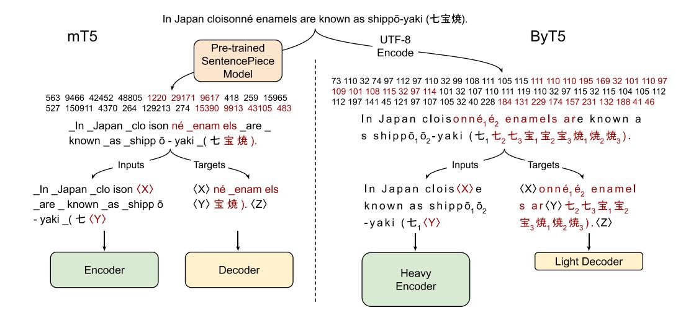
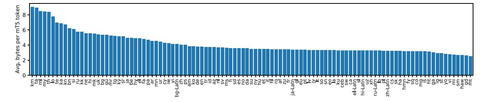
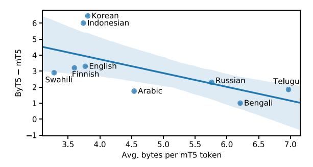
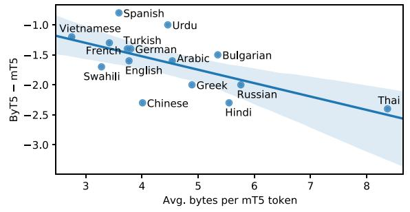

# ByT5: Towards a Token-Free Future with Pre-trained Byte-to-Byte Models

#### Linting Xue∗ , Aditya Barua∗, Noah Constant∗, Rami Al-Rfou∗, Sharan Narang, Mihir Kale, Adam Roberts, Colin Raffel

Google Research, USA

{lintingx,adityabarua,nconstant,rmyeid,sharannarang,mihirkale,adarob} @google.com,craffel@gmail.com

### [Abstract](mailto:adityabarua@google.com)

Most widely used pre-trained language models operate on sequences of tokens corresponding to word or subword units. By comparison, *token-free* models that operate directly on raw text (bytes or characters) have many benefits: They can process text in any language out of the box, they are more robust to noise, and they minimize technical debt by removing complex and error-prone text preprocessing pipelines. Because byte or character sequences are longer than token sequences, past work on token-free models has often introduced new model architectures designed to amortize the cost of operating directly on raw text. In this paper, we show that a standard Transformer architecture can be used with minimal modifications to process byte sequences. We characterize the trade-offs in terms of parameter count, training FLOPs, and inference speed, and show that byte-level models are competitive with their token-level counterparts. We also demonstrate that byte-level models are significantly more robust to noise and perform better on tasks that are sensitive to spelling and pronunciation. As part of our contribution, we release a new set of pre-trained byte-level Transformer models based on the T5 architecture, as well as all code and data used in our experiments.1

### 1 Introduction

An important consideration when desi[gn](#page-0-0)ing NLP models is the way that text is represented. One common choice is to assign a unique *token* ID to each word in a fixed finite vocabulary. A given piece of text is thus converted into a sequence of tokens by a *tokenizer* before being fed into a model for processing. An issue with using a fixed vocabulary of words is that there is no obvious [way](mailto:rmyeid@google.com) [to process a pi](mailto:sharannarang@google.com)[ece](mailto:mihirkale@google.com) [of](mailto:mihirkale@google.com) [text](mailto:mihirkale@google.com) [th](mailto:mihirkale@google.com)[at](mailto:adarob@google.com) [contain](mailto:adarob@google.com)s an *[out-of-vocabulary](mailto:craffel@gmail.com)* word. A standard approach is to map all unknown words to the same <UNK> token, but this prevents the model from distinguishing between different out-of-vocabulary words.

Subword tokenizers (Sennrich et al., 2016; Wu et al., 2016; Kudo and Richardson, 2018) present an elegant solution to the out-of-vocabulary problem. Instead of mapping each word to a single token, subword tokeniz[ers](#page-14-0) [decompose](#page-14-0) [words](#page-14-0) [into](#page-15-0) [smalle](#page-15-0)[r](#page-15-1) [sub](#page-15-1)[word](#page-13-0) [units](#page-13-0) [with](#page-13-0) [a](#page-13-0) [goal](#page-13-0) [of](#page-13-0) [min](#page-13-0)imizing the total length of the token sequences for a fixed vocabulary size. As an example, a subword tokenizer might tokenize the word *doghouse* as the pair of tokens *dog* and *house* even if *doghouse* is not in the subword vocabulary. This flexibility has caused subword tokenizers to become the de facto way to tokenize text over the past few years.

However, subword tokenizers still exhibit various undesirable behaviors. Typos, variants in spelling and capitalization, and morphological changes can all cause the token representation of a word or phrase to change completely, which can result in mispredictions. Furthermore, unknown characters (e.g., from a language that was not used when the subword vocabulary was built) are typically out-of-vocabulary for a subword model.

A more natural solution that avoids the aforementioned pitfalls would be to create *token-free* NLP models that do not rely on a learned vocabulary to map words or subword units to tokens. Such models operate on raw text directly. We are not the first to make the case for token-free models, and a more comprehensive treatment of their various benefits can be found in recent work by Clark et al. (2021). In this work, we make use of the fact that text data is generally stored as a sequence of bytes. Thus, feeding byte sequences directly into the model enables the processing of arbitra[ry](#page-11-0) [text](#page-11-0) [seque](#page-11-0)[nces.](#page-11-1) This approach is well-aligned with the

∗ Equal contribution.

1https://github.com/google-research/byt5.

Figure 1: Pre-training example creation and network architecture of mT5 (Xue et al., 2021) vs. ByT5 (this work). mT5: Text is split into SentencePiece tokens, spans of ∼3 tokens are masked (red), and the encoder/decoder transformer stacks have equal depth. ByT5: Text is processed as UTF-8 bytes, spans of ∼20 bytes are masked, and the encoder is 3× deeper than the decoder. X, Y, and Z represent sentinel tokens.

philosophy of end-to-end learning, which endeavors to train models to directly map from raw data to predictions. It also has a concrete benefit in terms of model size: The large vocabularies of word- or subword-level models often result in many parameters being devoted to the vocabulary matrix. In contrast, a byte-level model by definition only requires 256 embeddings. Migrating word representations out of a sparse vocabulary matrix and into dense network layers should allow models to generalize more effectively across related terms (e.g., *book* / *books*) and orthographic variations. Finally, from a practical standpoint, models with a fixed vocabulary can complicate adaptation to new languages and new terminology, whereas, by definition, token-free models can process any text sequence.

The main drawback of byte-level models is that byte sequences tend to be significantly longer than token sequences. Because computational costs of machine learning models tend to scale with sequence length, much previous work on character- and byte-level models has explored ways to process long sequences efficiently using convolutions with pooling (Zhang et al., 2015; Lee et al., 2017) or adaptive computation time (Graves, 2016).

In this work, we take a simpler approach and show that the Transformer [architecture](#page-15-2) [can](#page-15-2) [be](#page-15-2) [straightforwardly](#page-13-1) adapted to process byte se[quences](#page-12-0) [witho](#page-12-0)ut a dramatically unfavorable increase in computational cost. We focus on the T5 framework (Raffel et al., 2020), where all text-based NLP problems are cast to a text-to-text format. This approach makes it simple to tackle an NLP task by generating a sequence of bytes conditioned on som[e](#page-14-1) [input](#page-14-1) [bytes.](#page-14-1) [Our](#page-14-1) [pro](#page-14-1)posed ByT5 architecture is described in Section 3. The design stays fairly close to mT5 (the multilingual variant of T5 introduced by Xue et al. [2021]), with the differences illustrated in Figure 1. Through extensive experiments on a diverse [set](#page-2-0) of English and multilingual tasks (presented in Section 4), we show that ByT5 is [competitive](#page-15-3) [with](#page-15-3) a subwordlevel baseline, despite bei[ng](#page-1-0) [pre-train](#page-1-0)ed on 4× less text. We also confirm in Section 5 that byte-level models are more robust to corruptions of th[e](#page-4-0) [i](#page-4-0)nput text. Throughout, we characterize the trade-offs of our design decisions in terms of computational cost and parameter count, discu[sse](#page-7-0)d in more detail in Sections 6 and 7. The end result is a set of pre-trained ByT5 models that we release alongside this paper.

## 2 Related [Wo](#page-8-0)rk

The early neural language models of Sutskever et al. (2011) and Graves (2013) operated directly on character sequences. This precedent led many to use character-level language modeling as a benchmark to evaluate neural ar[chitectures](#page-14-2) [\(Kalch](#page-14-2)[brenne](#page-14-3)r et a[l.,](#page-12-1) [2016](#page-12-1); [Chun](#page-12-1)g et al., 2017; Ha et al., 2017; Zilly et al., 2017; Melis et al., 2018; Al-Rfou et al., 2019). Choe et al. (2019) showed byte language models can match the perplexity of word-level models when given the same parameter budget. However, standard practice in real-world scenarios has remained to use word- or subword-level models.

A number of *character-aware* architectures have been proposed that make use of characterlevel features but still rely on a tokenizer to identify word boundaries. These approaches include ELMo (Peters et al., 2018), CharacterBERT (El Boukkouri et al., 2020), and many others (Ling et al., 2015; Chung et al., 2016; Kim et al., 2016; Jozefowicz et al., 2016; Wang et al., 2020; Wei ´ et al., [2021\).](#page-13-2) [Separat](#page-13-2)el[y,](#page-13-2) [so](#page-13-2)me work has en[deavored](#page-12-3) [to](#page-12-3) [ameliorate](#page-12-3) [is](#page-12-3)sues with tokeniz[ation,](#page-13-3) [for](#page-13-3) [e](#page-13-3)[xampl](#page-13-4)[e,](#page-11-2) [by](#page-11-2) [adapting](#page-11-2) [voc](#page-11-2)[abularies](#page-13-5) [to](#page-13-5) [new](#page-13-5) [languages](#page-13-6)[\(Garcia](#page-13-6) [et](#page-13-6) [al.,](#page-13-6) [2021\)](#page-14-4) [or](#page-14-4) [rand](#page-14-4)o[mly](#page-14-4) [c](#page-14-4)[hoos](#page-14-5)[ing](#page-14-5) [dif](#page-14-5)ferent subword segmentations to improve robustness in low-resource and out-of-domain settings (Kudo, 2018). These methods do not meet our goal [of](#page-12-4) [simplifying](#page-12-4) [the](#page-12-4) NLP pipeline by removing text preprocessing.

Th[ere have been](#page-13-7) a few recent efforts to develop general-purpose token-free pre-trained language models for transfer learning.2 Akbik et al. (2018) show strong results on sequence labeling with character-level pre-training and release models covering four languages. More recently, Clark et al. (2021) develop CANIN[E,](#page-2-1) [which](#page-11-3) [show](#page-11-3)s [gains](#page-11-3) over multilingual BERT by working with characters instead of word-piece tokens, though the ''CANINE-S'' model still uses a tokenizer [during](#page-11-0) [pre-tr](#page-11-0)[aining](#page-11-1) to define targets for the masked language modeling task. Our work differs from these in that (i) we train encoder-decoder models that extend to generative tasks, (ii) our models work directly with UTF-8 bytes, and (iii) we explore the effect of model scale, training models beyond 10 billion parameters.

### 3 ByT5 Design

Our goal in designing ByT5 is to take an existing token-based model and perform the minimal set of modifications to make it token-free, thereby limiting experimental confounds. We base ByT5 on the recent mT5 model (Xue et al., 2021), which was trained on mC4 (a large corpus of unlabeled multilingual text data) and achieved state-of-theart on many community benchmarks. We release ByT5 in five sizes analogous to T5 and mT5 (Small, Base, Large, XL, XXL). We aim for ByT5 to cover the same use cases as mT5: It is a general-purpose pre-trained text-to-text model covering 100+ languages. We expect ByT5 will be particular useful for tasks operating on shortto-medium length text sequences (a few sentences or less), as these will incur less slowdown in finetuning and inference.

### 3.1 Changes from mT5

Compared to mT5, we make the following key changes in designing ByT5. First and foremost, we dispense with the SentencePiece (Kudo and Richardson, 2018) vocabulary and feed UTF-8 bytes directly into the model without any text preprocessing. The bytes are embedded to the model hidde[n size](#page-13-0) using a vocabulary [of](#page-13-8) [256](#page-13-8) [pos](#page-13-8)[sible](#page-13-8) [byte](#page-13-8) [va](#page-13-8)lues. An additional 3 IDs are reserved for special tokens: padding, end-of-sentence, and an unused <UNK> token that we include only for convention.

Second, we modify the pre-training task. mT5 uses the ''span corruption'' pre-training objective first proposed by Raffel et al. (2020), where spans of tokens in unlabeled text data are replaced with a single ''sentinel'' ID and the model must fill in the missing spans. Rather than adding 100 new tokens for the s[entinels,](#page-14-1) [we](#page-14-1) [find](#page-14-1) [i](#page-14-1)t sufficient to reuse the final 100 byte IDs. While mT5 uses an average span length of 3 subword tokens, we find that masking longer byte-spans is valuable. Specifically, we set our mean mask span length to 20 bytes, and show ablations of this value in Section 6.

Third, we find that ByT5 performs best when we decouple the depth of the encoder and decoder stacks. While T5 and mT5 used ''balanced'' archite[ctu](#page-8-0)res, we find byte-level models benefit significantly from a ''heavier'' encoder. Specifically, we set our encoder depth to 3 times that of the decoder. Intuitively, this heavier encoder makes the model more similar to encoder-only models like BERT. By decreasing decoder capacity, one might expect quality to deteriorate on tasks like summarization that require generation of fluent text. However, we find this is not the case, with heavy-encoder byte models performing

2Previous work has also developed token-free approaches for specific tasks: Gillick et al. (2016) for span labeling, Li et al. (2019) for speech recogn[ition and synthesis,](#page-15-3) and many authors for machine translation (Lee et al., 2017; Costa-jussa` et al., 2017; Cherry et al., 2018; Shaham and Levy, 2021).

better on both classification and generation tasks. We ablate the effect of encoder/decoder balance in Section 6.

As not all byte sequences are legal according to the UTF-8 standard, we drop any illegal bytes in the model's output3 (though we never observed our mode[ls](#page-8-0) predicting illegal byte sequences in practice). Apart from the above changes, we follow mT5 in all settings. Like mT5, we set our sequence length to [1](#page-3-0)024 (bytes rather than tokens), and train for 1 million steps over batches of 220 tokens.

### 3.2 Comparing the Models

Our goal in this paper is to show that straightforward modifications to the Transformer architecture can allow for byte-level processing while incurring reasonable trade-offs in terms of cost. Characterizing these trade-offs requires a clear definition of what is meant by ''cost'', since there are many axes along which it is possible to measure a model's size and computational requirements.

Models that use a word or subword vocabulary typically include a vocabulary matrix that stores a vector representation of each token in the vocabulary. They also include an analogous matrix in the output softmax layer. For large vocabularies (e.g., those in multilingual models), these matrices can make up a substantial proportion of the model's parameters. For example, the vocabulary and softmax output matrices in the mT5-Base model amount to 256 million parameters, or about 66% of the total parameter count. Switching to a byte-level model allows allocating these parameters elsewhere in the model, for example, by adding layers or making existing layers ''wider''. To compensate for reduction in total parameter count due to changing from a token-based to token-free model, we adjust our ByT5 model hidden size (dmodel) and feed-forward dimensionality (dff) to be *parameter-matched* with mT5, while maintaining a ratio of roughly 2.5 between dff and dmodel, as recommended by Kaplan et al. (2020). Table 1 shows the resulting model architectures across all five model sizes.

Separately, as previously [mentioned, changin](#page-13-9)g from word or subword sequences to byte se[quences](#page-3-1) will increase the (tokenized) sequence

|  |  | mT5 |  |  | ByT5 |  |  |
|--|--|-----|--|--|------|--|--|

Table 1: Comparison of mT5 and ByT5 architectures. For a given named size (e.g., ''Large''), the total numbers of parameters and layers are fixed. ''Vocab'' shows the percentage of vocabularyrelated parameters, counting both the input embedding matrix and the decoder softmax layer. ByT5 moves these parameters out of the vocabulary and into the transformer layers, as well as shifting to a 3:1 ratio of encoder to decoder layers.

length of a given piece of text. The self-attention mechanism at the core of the ubiquitous Transformer architecture (Vaswani et al., 2017) has a quadratic time and space complexity in the sequence length, so byte sequences can result in a significantly highe[r computationa](#page-14-6)l [cost.](#page-14-6) While recurrent neural networks and modified attention mechanisms (Tay et al., 2020) can claim a better computational complexity in the sequence length, the cost nevertheless always scales up as sequences get longer.

Thus far, we [have](#page-14-7) [been](#page-14-7) [discus](#page-14-7)sing easy-tomeasure quantities like the parameter count and FLOPs. However, not all FLOPs are equal, and the real-world cost of a particular model will also depend on the hardware it is run on. One important distinction is to identify operations that can be easily parallelized (e.g., the encoder's fullyparallelizable processing) and those that cannot (e.g., autoregressive sampling in the decoder during inference). For byte-level encoder-decoder models, if the decoder is particularly large, autoregressive sampling can become comparatively expensive thanks to the increased length of byte sequences. Relatedly, mapping an input token to its corresponding vector representation in the vocabulary matrix is essentially ''free'' in terms of FLOPs since it can be implemented by addressing a particular row in memory. Therefore, reallocating parameters from the vocabulary matrix to the rest of the model will typically result in a model that requires more FLOPs to process a given input sequence (see Section 7 for detailed comparison).

Finally, we note that another important metric is data efficiency, that is, how much data is required for the model to reac[h a](#page-9-0) good solution. For NLP

3This is achieved with the Python bytes-decoding function bytes.decode("utf-8", errors="ignore").

Figure 2: Per-language compression rates of the mT5 SentencePiece vocabulary, measured over the mC4 pre-training corpus. For each language, we measure the ratio of UTF-8 bytes to tokens over all mC4 data in that language.

problems, this can be measured either in terms of the number of tokens or the amount of raw text seen during training. Specifically, a byte-level model trained on the same number of tokens as a word- or subword-level model will have been trained on less text data. In Figure 2, we show the compression rates of mT5 SentencePiece tokenization, measured as the ratio of UTF-8 bytes to tokens in each language split of the mC4 corpus used in pre-training. This ratio ranges fr[om](#page-4-1) 2.5 (Maltese) to 9.0 (Khmer). When considering the mC4 corpus as a whole, sampled according to the mT5 pre-training mixing ratios, we have an overall compression rate of 4.1 bytes per SentencePiece token. On the one hand, this 4× lengthening could be seen as an advantage for ByT5: With longer sequences, the model gets more FLOPs to spend encoding a given piece of text. On the other hand, given a fixed input sequence length and number of training steps, the model will be exposed to roughly 4× less actual text during pre-training.

With these factors in mind, we choose to focus on the following measures of efficiency in our experiments: parameter count, inference time, and pre-training efficiency. Parameter count is a simple and easy-to-measure quantity that directly relates to the amount of memory required to use a model. Inference time is a real-world measurement of the model's computational cost that represents a ''worst-case'' measurement for byte-level models given the potential additional cost of autoregressive sampling. Finally, pre-training efficiency allows us to measure whether byte-level models can learn a good solution after seeing less pre-training data.

### 4 Core Results

In this section, we compare ByT5 against mT5 on a wide range of tasks. We show that ByT5 is competitive with mT5 on standard English and multilingual NLP benchmarks and outperforms mT5 at small model sizes. Additionally, ByT5 excels on free-form generation tasks and wordlevel tasks.

For each downstream task, we fine-tune mT5 and ByT5 models for 262,144 steps, using a constant learning rate of 0.001 and a dropout rate of 0.1.4 We use a batch size of 217 tokens by default, but increased this to 220 for several tasks with larger training sets (GLUE, SuperGLUE, XNLI, TweetQA), and decreased to 216 for the Dakshi[na](#page-4-2) task. In all cases, we select the best model checkpoint based on validation set performance.

#### 4.1 English Classification Tasks

On the widely adopted GLUE (Wang et al., 2019b) and SuperGLUE (Wang et al., 2019a) text classification benchmarks, we find ByT5 beats mT5 at the Small and Base sizes, but mT5 has the advantage at larger sizes, as [shown](#page-14-8) [in](#page-14-8) [Table](#page-14-8) [2](#page-14-8). The strong perfor[mance](#page-14-9) [of](#page-14-9) [ByT5](#page-14-9) [at](#page-14-9) [sm](#page-14-9)aller sizes likely stems from the large increase in dense parameters over mT5. While the overall models are parameter-matched, most of the mT5 S[mall](#page-5-0) [and](#page-5-0) Base parameters are ''locked'' in vocab-related matrices and are only accessed when a particular token is present. We suspect that replacing these with ''dense'' parameters activated across all examples encourages more efficient parameter usage and sharing.

#### 4.2 English Generation Tasks

We also compare ByT5 with mT5 on three English generative tasks. XSum (Narayan et al., 2018) is an abstractive summarization task requiring models

4For some tasks we observed clear saturation or overfitting on validation set metrics, and [shortened the to](#page-13-10)t[al fine-](#page-13-10)tuning steps: 70,000 for Dakshina, 30,000 for TweetQA, and 10,000 for the SIGMORPHON tasks.

|       |      | GLUE |      | SuperGLUE |
|-------|------|------|------|-----------|
| Model | mT5  | ByT5 | mT5  | ByT5      |
| Small | 75.6 | 80.5 | 60.2 | 67.8      |
| Base  | 83.0 | 85.3 | 72.5 | 74.0      |

Table 2: mT5 and ByT5 performance on GLUE and SuperGLUE. For each benchmark, we fine-tune a single model on a mixture of all tasks, select the best checkpoint per task based on validation set performance, and report average validation set scores over all tasks.

|               |            |                |              |                  | age validation set scores over all tasks. |                            |
|---------------|------------|----------------|--------------|------------------|-------------------------------------------|----------------------------|
|               |            | GEM-XSum       |              | TweetQA          |                                           | DROP                       |
| Model         | mT5        | (BLEU) ByT5 | mT5          | (BLEU-1) ByT5 | mT5                                       | (F1 / EM) ByT5          |
| Small Base | 6.9 8.4 | 9.1 11.1    | 54.4 61.3 | 65.7 68.7     | 40.0 / 38.4 47.2 / 45.6                | 66.6 / 65.1 72.6 / 71.2 |

Table 3: mT5 vs. ByT5 on three English generation tasks, reporting the best score on the validation set.

to summarize a news article in a single sentence. For better comparison to recent work, we adopt the version of the task defined in the GEM benchmark (Gehrmann et al., 2021). TweetQA (Xiong et al., 2019) is an abstractive question-answering task built from tweets mentioned in news articles. This tests understanding of the ''messy'' and informal [language](#page-12-5) [of](#page-12-5) [social](#page-12-5) [med](#page-12-5)ia. Finally, [DROP](#page-15-5) [\(Dua](#page-15-5) [et](#page-15-5) [al.,](#page-15-5) 2019) is a challenging reading comprehension task that requires numerical reasoning.

Table 3 shows that ByT5 outperforms mT5 on each generative task across all model s[izes.](#page-11-5) [On G](#page-11-5)[EM-X](#page-11-6)Sum, ByT5 comes close (15.3 vs. 17.0) to the best score reported by Gehrmann et [al.](#page-5-1) [\(2021](#page-5-1)), a PEGASUS model (Zhang et al., 2020) pre-trained specifically for summarization. On TweetQA, ByT5 outperforms (72.0 vs. 67.3) the BERT baseline of Xiong et al. [\(2019\).](#page-12-6) [On](#page-12-6) [DROP](#page-12-6)[,](#page-12-5) [ByT](#page-12-5)5 comes close (EM 78.[5](#page-15-6) [vs.](#page-15-6) [84.1\)](#page-15-6) [to](#page-15-6) [the](#page-15-6) [be](#page-15-6)st result from Chen et al. (2020), a QDGAT (RoBERTa) model wi[th a specialized nu](#page-15-5)meric reasoning module.

### 4.3 Cross-lingual Benchmarks

Changes to vocabulary and tokenization are likely to affect different languages in different ways. To test the effects of moving to byte-level modeling on cross-lingual understanding, we compare parameter-matched ByT5 and mT5 models on tasks from the popular XTREME benchmark suite (Hu et al., 2020). Specifically we evaluate on the same six tasks as Xue et al. (2021). These consist of two classification tasks: XNLI (Conneau et al., 2018) and PAWS-X (Yang et al., 2019); [three](#page-12-7) [ext](#page-12-7)r[active](#page-12-7) QA tasks: XQuAD (Artetxe et al., 2020), ML[QA](#page-15-3) [\(Lewi](#page-15-3)s [et](#page-15-3) [al](#page-15-3)., 2020), and TyDiQA (Clark et al., 2020); and one [structured](#page-11-7) [predic](#page-11-7)[tion](#page-11-8) [ta](#page-11-8)sk: WikiAnn NE[R](#page-15-7) [\(Pan](#page-15-7) [et](#page-15-7) [al.](#page-15-7), [2017\)](#page-15-7).

Tab[le 4 sh](#page-11-10)ows that [ByT5 is quite](#page-13-11) [comp](#page-13-11)[etitive](#page-11-9) [overall](#page-11-9). [On the most realis](#page-11-11)tic *in-language* setting, where some gold training [data is availabl](#page-13-12)e in all languages, ByT5 surpasses the previous st[ate-of-art](#page-6-0) mT5 on all tasks and model sizes. On the *translate-train* setting, ByT5 beats mT5 at smaller sizes, but the results are mixed at larger sizes. We report *zero-shot* results for completeness, but emphasize that this setting is less aligned with practical applications, as machine translation is widely available.5

We explore per-language breakdowns on two tasks to see how different languages are affected by the switch to by[te](#page-5-2)-level processing. One might expect languages with rich inflectional morphology (e.g., Turkish) to benefit most from the move away from a fixed vocabulary. We were also curious to see if any patterns emerged regarding language family (e.g., Romance vs. Slavic), written script (e.g., Latin vs. non-Latin), character set size, or data availability (high vs. low resource).

Figure 3 shows the per-language gaps between ByT5-Large and mT5-Large on TyDiQA-GoldP and XNLI zero-shot. One notable trend is that the gap is fairly stable across languages. For exampl[e, ByT5](#page-6-1) [i](#page-6-1)s better in each language on TyDiQA-GoldP, while mT5 is consistently better on XNLI. Comparing across languages, we observe that languages with a higher SentencePiece token compression rate (e.g., Thai and Telugu) tend to favor mT5, whereas those with a lower compression rate (e.g., Indonesian and Vietnamese) tend to favor ByT5. We did not observe any robust

5We ignore zero-shot QA tasks, where text-to-text models are known to exhibit illegal predictions (Xue et al., 2021).

|                                                                                                               |                                                   | Small                                             |                                                   | Base                                              |                                                   | Large                                             |                                                   | XL                                                |                                           | XXL                                               |
|---------------------------------------------------------------------------------------------------------------|---------------------------------------------------|---------------------------------------------------|---------------------------------------------------|---------------------------------------------------|---------------------------------------------------|---------------------------------------------------|---------------------------------------------------|---------------------------------------------------|-------------------------------------------|---------------------------------------------------|
|                                                                                                               | mT5                                               | ByT5                                              | mT5                                               | ByT5                                              | mT5                                               | ByT5                                              | mT5                                               | ByT5                                              | mT5                                       | ByT5                                              |
| In-language multitask (models fine-tuned on gold data in all target languages) WikiAnn NER TyDiQA-GoldP | 86.4 75.9 / 64.8                               | 90.6 82.6 / 73.6                               | 88.2 81.7 / 71.2                               | 91.6 86.4 / 78.0                               | 89.7 85.3 / 75.3                               | 91.8 87.7 / 79.2                               | 91.3 87.6 / 78.4                               | 92.6 88.0 / 79.3                               | 88.7 / 79.5                               | 92.2 89.4 / 81.4                               |
| Translate-train (models fine-tuned on English data plus translations in all target languages) XNLI         | 75.3                                              | 76.6                                              | 80.5                                              | 79.9                                              | 84.4                                              | 82.8                                              | 85.3                                              | 85.0                                              |                                           | 87.1                                              |
| PAWS-X XQuAD MLQA TyDiQA-GoldP                                                                       | 87.7 71.3 / 55.7 56.6 / 38.8 49.8 / 35.6 | 88.6 74.0 / 59.9 67.5 / 49.9 64.2 / 50.6 | 90.5 77.6 / 62.2 69.7 / 51.0 66.4 / 51.0 | 89.8 78.5 / 64.6 71.9 / 54.1 75.6 / 61.7 | 91.3 81.3 / 66.5 74.0 / 55.0 75.8 / 60.2 | 90.6 81.4 / 67.4 74.4 / 56.1 80.1 / 66.4 | 91.0 82.7 / 68.1 75.1 / 56.6 80.1 / 65.0 | 90.5 83.7 / 69.5 75.9 / 57.7 81.5 / 67.6 | 85.2 / 71.3 76.9 / 58.3 83.3 / 69.4 | 91.5 84.1 / 70.2 76.9 / 58.8 83.2 / 69.6 |

Table 4: ByT5 and mT5 performance on a subset of XTREME tasks. Our evaluation setup follows Xue et al. (2021). For QA tasks we report F1 / EM scores.

Figure 3: Per-language performance gaps between ByT5-Large and mT5-Large, as a function of each language's ''compression rate''. Top: TyDiQA-GoldP gap. Bottom: XNLI zero-shot gap.

trends regarding morphological complexity, language family, script, character set size, or data availability.

#### 4.4 Word-Level Tasks

Given its direct access to the ''raw'' text signal, we expect ByT5 to be well-suited to tasks that are sensitive to the spelling or pronunciation of text. In this section we test this hypothesis on three word-level benchmarks: (i) transliteration, (ii) grapheme-to-phoneme, and (iii) morphological inflection.

|       |      | Dakshina                   |             | SIGMORPHON 2020                          |  |                            |  |  |
|-------|------|----------------------------|-------------|------------------------------------------|--|----------------------------|--|--|
|       |      | Transliteration CER (↓) |             | Grapheme-to-Phoneme WER (↓) / PER (↓) |  | Inflection Accuracy (↑) |  |  |
|       |      |                            |             |                                          |  |                            |  |  |
| Model | mT5  | ByT5                       | mT5         | ByT5                                     |  | mT5 ByT5                |  |  |
| Small | 20.7 | 9.8                        | 54.0 / 10.6 | 14.8 / 1.8                               |  | 66.5 88.3               |  |  |
| Base  | 19.2 | 9.9                        | 46.2 / 7.7  | 14.0 / 1.7                               |  | 70.9 89.3               |  |  |

Table 5: mT5 vs. ByT5 on three word-level tasks. Dakshina metrics are reported on the development set to be comparable with Roark et al. (2020). SIGMORPHON metrics are reported on the test sets.

[For](#page-14-10) transliteration, we use the Dakshina benchmark (Roark et al., 2020), which covers 12 South Asian languages that are traditionally written with Brahmic or Perso-Arabic scripts but may also be writte[n using Latin cha](#page-14-10)racters in informal contexts. The single-word transliteration task asks a model to ''translate'' a word from Latin script to native script and measures character error rate. The remaining tasks are SIGMORPHON 2020 shared tasks. Multilingual grapheme-to-phoneme conversion (Gorman et al., 2020) covers 15 languages and requires mapping a word to its pronunciation as phonemes (e.g., *cat* → /kæt/). Typologically diverse morphological inflection (Vylomova et al., 2020[\)](#page-12-8) [covers](#page-12-8) [90](#page-12-8) [languages](#page-12-8) and requires generating a specific inflection of a word (e.g., *eat* + PAST → *ate*).

We fine-tune mT5 and B[yT5](#page-14-11) [models](#page-14-11) [for](#page-14-11) [each](#page-14-11) task. For simplicity, we train one multilingual model per task, with a prefix indicating the language in question. Table 5 shows that ByT5 outperforms mT5 by large margins across the board.6 Although it is unsurprising that ''character-aware'' models should excel on tasks around word-internal phenonema, we wish to highlight that these core NLP tasks have often been over[lo](#page-7-1)oked in evaluating general-purpose NLP models.

### 5 Experiments on Synthetic Noise

Text on modern digital platforms is noisy and exhibits complex character-level phenomena such as typos, character repetitions, and non-standard case changes (Caswell et al., 2020). Beyond these, errors can be introduced by NLP systems such as predictive input methods and automatic speech recognition. We have already seen strong ByT5 performance [on](#page-11-12) [the](#page-11-12) [''messy''](#page-11-12) [tex](#page-11-12)t in TweetQA. In this section, we move to even noisier text and explore model performance on inputs that have been corrupted with *artificial* noise of various kinds. Across a range of noising schemes, we find that ByT5 outperforms mT5, demonstrating higher robustness to noise across tasks and languages.

We experiment with five noising schemes: (1) Drop: Each character (i.e., Unicode codepoint) has a 10% chance of being dropped. (2) Repetitions: Each character has a 20% chance of being selected for repetition. If selected, 1–3 repetitions (with equal likelihood) are appended after the original character. (3) Antspeak: Each character is capitalized and padded with spaces, so ''an owl'' becomes '' A N O W L ''. (4) Uppercase: Each character is converted to uppercase. (5) Random case: Each character is set to a random case (upper or lower). For the last two noise types, we restrict to languages whose scripts distinguish case.

We first consider the easier setting of *learnable* noise, where noise is applied during both fine-tuning and evaluation. We evaluate on XNLI zero-shot and TyDiQA-GoldP. For XNLI, both the premise and hypothesis are noised, and the model predicts an entailment label as usual. For TyDiQA, we add noise to the question and the context, but leave the answer unchanged. Thus, in many cases, the model needs to first locate the noisy answer, and then ''undo'' the noise to

|             |       |                    | Learnable Noise       | Unseen Noise       |
|-------------|-------|--------------------|-----------------------|--------------------|
|             | Model | XNLI (accuracy) | TyDiQA- GoldP (F1) | XNLI (accuracy) |
| Clean       | mT5   | 81.1               | 85.3                  | 81.1               |
|             | ByT5  | 79.7               | 87.7                  | 79.7               |
| Drop        | mT5   | −10.2              | −24.0                 | −18.3              |
|             | ByT5  | −8.2               | −19.5                 | −11.4              |
| Repetitions | mT5   | −8.5               | −9.5                  | −12.3              |
|             | ByT5  | −4.1               | −3.0                  | −5.9               |
| Antspeak    | mT5   | −32.0              | −27.7                 | −34.4              |
|             | ByT5  | −8.7               | −4.8                  | −24.4              |

Table 6: Degradation of mT5 and ByT5 under various types of noise. ''Clean'' shows original task performance. Subsequent rows show the delta from ''clean'' when adding different types of noise. Learnable noise is added in training and eval, while unseen noise only affects eval.

produce the target. We fine-tune all models for 30,000 steps following the procedure in Section 4.

Table 6 shows the differing ability of ByT5 and mT5 to adapt to learnable noise. We measure the degradation of the task metric between the clean and noisy settings. We observe that mT5 degra[des](#page-4-0) m[ore](#page-7-2) [in](#page-7-2) [th](#page-7-2)e presence of noise than ByT5, across all noise conditions. In the most extreme contrast, rANdOm CaSE (often used as an affective device on social media7) is hugely detrimental to mT5, with losses of −25.7 and −14.3 points, while ByT5 only drops by −1.5 and −0.2 points. ByT5 is also quite robus[t t](#page-7-3)o UPPERCASE and repetitions.

We also test robustness to noise that is *unseen* during training but injected during evaluation. This is relevant in making models more future-proof as well as more resilient to accidental or adversarial spelling mistakes (Pruthi et al., 2019; Sun et al., 2020). We evaluate only XNLI and skip TyDiQA-GoldP in this setting, as it is unreasonable to expect a generative model that was fine-tuned to always copy spans fro[m](#page-14-12) [the](#page-14-12) [context](#page-14-12) [to](#page-14-12) [spo](#page-14-12)[ntaneously](#page-14-13) [''und](#page-14-13)o'' corruptions and predict novel spans. The rightmost column of Table 6 shows that in this more challenging setting, ByT5 is once again more resilient to noise. While some types of unseen noise like A N T S P [E A](#page-7-2) [K](#page-7-2)

6On Dakshina, ByT5 also beats the character-level Transformer baseline of Roark et al. (2020) (9.6 vs. 12.2). On grapheme-to-phoneme, ByT5 beats the state-of-art model of Yu et al. (2020) (PER: 1.6 vs. 2.8). On inflection, ByT5 matches the best single-model (Peters and Martins, 2020).

7For example, see https://knowyourmeme.com /memes/mocking-spongebob.

| Model ByT5-Large mT5-Large           | Params 1.23B 1.23B | Description Baseline ByT5 model Baseline mT5 model |
|--------------------------------------------|--------------------------|----------------------------------------------------------|
| (a) ByT5-36/12-668M                        | 668M                     | encoder:36, decoder:12                                   |
| (b) ByT5-24/24-718M (c) ByT5-12/36-768M | 718M 768M             | encoder:24, decoder:24 encoder:12, decoder:36         |
| (d) mT5-36/12-1.18B                        | 1.18B                    | encoder:36, decoder:12                                   |

Table 7: Models used in our ablation study.

are highly detrimental, ByT5 sees only minor degradations for casing noise.

Our findings echo the results of Durrani et al. (2019), who find that character-level models are more robust to real and synthetic noise than BPE or word-based models, across a range of morphological, syntactic, and semantic [tagging](#page-12-9) [tasks.](#page-12-9) [The](#page-12-9) [m](#page-12-9)ore general conclusion that emerges is that token-free models are more robust to noise across many tasks.

## 6 Ablation Study

To better understand the importance of various design choices, we train ablation models and compare these against our baselines on three tasks: XNLI zero-shot, TyDiQA-GoldP, and GEM-XSum. Our baselines and ablations are listed in Table 7. The baselines are the parameter-matched ByT5-Large and mT5-Large models discussed above.

### [6.1](#page-8-1) [M](#page-8-1)atched Transformer Layer Size

Model (a) ByT5-36/12-668M is identical to ByT5- Large except that dmodel and dff are matched to mT5-Large, giving a model with 668 million parameters, ∼54% the size of ByT5-Large and mT5-Large. As seen in Table 8, this model is still competitive, and outperforms the roughly similarly sized mT5-Base by a large margin (cf. Table 4). This is evidence that the value of ByT5 does not come solely from using [wider](#page-8-2) [tr](#page-8-2)ansformer layers.

#### 6.2 Encoder/Decoder Balance

To investigate the effect of decoupling encoder and decoder depth, we train two additional ByT5

| Model ByT5-Large (1.23B)                                       | XNLI (Accuracy) 79.7 | TyDiQA- GoldP (F1) 87.7 | GEM-XSum (BLEU) 11.5 |
|-------------------------------------------------------------------|----------------------------|-------------------------------|----------------------------|
| mT5-Large (1.23B)                                                 | 81.1                       | 85.3                          | 10.1                       |
| (a) ByT5-36/12-668M (b) ByT5-24/24-718M (c) ByT5-12/36-768M | 78.3 75.4 73.5       | 87.8 83.0 83.1          | 12.3 7.1 8.3         |
| (d) mT5-36/12-1.18B                                               | 81.5                       | 87.1                          | 10.8                       |

Table 8: Ablation model results across three tasks.

models with dmodel and dff matched to mT5- Large: (b) ByT5-24/24-718M, a ''balanced'' model with 24/24 encoder/decoder layers, and (c) ByT5- 12/36-768M, a ''heavy decoder'' model. As decoder layers have extra parameters used for decoder-encoder attention, these models are bigger than our default heavy encoder setup. Yet despite the extra parameters, these configurations underperform on all tasks, including even the generative GEM-XSum task that we might expect to benefit from a stronger decoder.

To test whether a heavier encoder benefits mT5 as well, we train (d) mT5-36/12-1.18B, a model with the same configuration as mT5-Large, but switching to 36/12 encoder/decoder layers. As with ByT5, we observe benefits across all three tasks. However, the gains (+0.4, +1.8, +0.7) are much smaller than those of ByT5 (+2.9, +4.8, +5.2).

We suspect a heavy encoder may be particularly important in vocabulary-free models as the encoder stack must stand in for the missing high-capacity token embedding matrix, allowing the model to learn a ''soft lexicon'' covering potentially millions of idiosyncratic mappings from word forms to meanings. In concurrent work, Wies et al. (2021) also observe that models with tiny vocabularies benefit from additional depth. One reason the decoder may not need as much capacity is that in inference, the decoder is run au[toregressively,](#page-15-8) [usi](#page-15-8)ng a full forward pass for every token prediction. Given the increased resolution of byte sequences, this means ByT5 predictions will benefit from 2–9 times more passes through the decoder stack depending on the language (see Figure 2), as compared to mT5. In this light, even a shallower byte decoder may be sufficient to compete with a larger subword decoder.

### 6.3 Masked Span Length

The T5 *mean span length* hyperparameter controls the average length of the masked spans used in the unsupervised pre-training objective. For T5 and mT5, this was 3 SentencePiece tokens. For ByT5, we hypothesize that predicting such short byte-spans would be too easy of a task, as this would often just require reconstructing part of a single word (regardless of language). Our final ByT5 models use mean span length of 20 bytes, which results in more challenging reconstruction tasks. We also show ablations (e–f) with span length 3 and 40. Table 8 shows that our baseline with length 20 performs the best on the classification task XNLI, whereas length 40 performs better on TyDiQA-GoldP and GEM-XSum, both of which requir[e](#page-8-2) [genera](#page-8-2)ting a natural language text output.

#### 6.4 Character Vocabulary

A character-level vocabulary serves as an intermediate point between a large subword vocabulary and a tiny byte vocabulary. As a point of comparison, we train (g) CharT5-36/12-1.23B: a model with a vocabulary of 47,198 characters, the same encoder/decoder ratio as ByT5, and the same overall parameter count as ByT5-Large and mT5-Large. To achieve this matched parameter count, we set dmodel=1376 and dff=3840. The resulting proportion of vocab-related parameters is 11% (compared to 42% for mT5-Large and 0.06% for ByT5-Large). The vocabulary itself is implemented using the SentencePiece library, but with an added restriction that tokens may only represent single characters. The characters cover all those seen in a sample of 4 million documents taken from the mC4 pre-training corpus, mixing languages with the ratios used during pre-training. We use the *byte-level fallback* mechanism, so no character is out-of-vocabulary.

Table 8 shows that CharT5 is fairly competitive, but performs slightly worse than ByT5 on all three tasks. We suspect this may be due to two factors: (i) CharT5 reserves a capacity for rare c[haracters](#page-8-2), and these parameters would be better allocated in the transformer layers, and (ii) using UTF-8 bytes increases the sequence length for non-ASCII text, resulting in extra computational budget for encoding and decoding languages with non-Latin scripts.

|       |      | sequences / sec |     | einsum ops ×1e12 |  |
|-------|------|-----------------|-----|------------------|--|
|       | mT5  | ByT5            | mT5 | ByT5             |  |
|       |      |                 |     |                  |  |
| Small | 1646 | 1232 (0.75×)    |     | 98 (1.13×) 87 |  |

Table 9: Pre-training speed and computation of mT5 vs. ByT5. Left: Sequences per second pre-training on a TPUv3-64 device. Right: Total einsum operations for a forward pass, as logged by the T5 framework.

|       |      | by the T5 framework. | einsum operations for a forward pass, as logged |             |  |
|-------|------|----------------------|-------------------------------------------------|-------------|--|
|       |      |                      |                                                 |             |  |
|       |      | Grapheme-to-Phoneme  |                                                 | Dakshina    |  |
|       | mT5  | ByT5                 | mT5                                             | ByT5        |  |
|       |      |                      |                                                 |             |  |
| Small | 1223 | 1190 (1.0×)          | 9483                                            | 6482 (1.5×) |  |
| Base  | 726  | 932 (0.8×)           | 7270                                            | 4272 (1.7×) |  |

| XL    | 280  | 310 (0.9×)  | 2922 1263 (2.3×) |            |  |
|-------|------|-------------|---------------------|------------|--|
| XXL   | 150  | 146 (1.0×)  | 1482                | 581 (2.6×) |  |
|       |      | XNLI        |                     | GEM-XSum   |  |
|       | mT5  | ByT5        | mT5                 | ByT5       |  |
| Small | 8632 | 1339 (6.4×) | 750                 | 202 (3.7×) |  |
| Base  | 5157 | 687 (7.5×)  | 450                 | 114 (3.9×) |  |
| Large | 1598 | 168 (9.5×)  | 315                 | 51 (6.2×)  |  |

Table 10: Average inference examples per second on the test sets of word-level tasks (top) and sentence- or document-level tasks (bottom). We use a TPUv3-128 for GEM-XSum, and a TPUv3-32 elsewhere.

### 7 Speed Comparisons

Table 9 compares the *pre-training* FLOPs of ByT5 vs. mT5, as well as the pre-training speed on fixed hardware, as sequences per second with sequence length of 1024. Across all model sizes, [ByT5](#page-9-1) [re](#page-9-1)quires ∼1.2× more operations, resulting in ∼0.75× as many sequences per second.

Table 10 compares the *inference* speed of ByT5 and mT5 by measuring the average number of inference predictions per second across four tasks. On word-level tasks, ByT5 is fairly competiti[ve:](#page-9-2) [on](#page-9-2) [SIGM](#page-9-2)ORPHON 2020 Grapheme-to-Phoneme, where targets are written using the International Phonetic Alphabet, ByT5 and mT5 have similar inference speed; on Dakshina transliteration, ByT5 is 1.5 to 2.6 times slower. On tasks with longer input sequences, the slowdown is more pronounced: On GEM-XSum8 (document summarization), ByT5 is 3.7 to 6.4 times slower than mT5, while on XNLI zero-shot classification it is 6.4 to 9.5 times slower. More generally, we observe that—as expecte[d](#page-10-0) due to its deeper encoder and shallower decoder—ByT5 achieves more competitive inference speed (relative to mT5) on tasks with short inputs and/or long targets. In this light, XNLI represents something of a worst-case, where inputs are sentence pairs and labels are single digits {0, 1, 2}.

The time required for*fine-tuning* is also variable across tasks. When holding batch size constant at a fixed number of tokens, we find that ByT5 typically takes more fine-tuning steps than mT5 to reach optimal performance on a holdout set. For example, ByT5-Large took 1.2× as many steps as mT5-Large to reach peak validation performance on XNLI zero-shot, 2.6× as many steps for TyDiQA-GoldP, and 4.5× as many for GEM-XSum. This overall trend is expected, in that fewer labeled examples fit into each ByT5 fine-tuning batch. However, on tasks that strongly favor byte-level representations, ByT5 reaches peak performance in *fewer* fine-tuning steps, suggesting that the model can generalize better from a small number of training examples. For example, ByT5-Large took 2.5× fewer steps than mT5-Large to reach peak performance on Dakshina.

Overall, we believe that the additional pretraining cost (roughly +33% wall time) and the additional fine-tuning cost (for some tasks) is justified in non-latency-sensitive applications by the benefits of reduced system complexity, better robustness to noise, and improved task performance on many benchmarks.

### 8 Conclusion

In this work, we presented ByT5, a token-free variant of multilingual T5 (Xue et al., 2021) that simplifies the NLP pipeline by doing away with vocabulary building, text preprocessing and tokenization. On downstream [task quality, ByT](#page-15-3)5 is competitive with parameter-matched mT5 models that rely on SentencePiece vocabulary. Specifically, ByT5 outperforms mT5 in any of these five scenarios: (1) at model sizes under 1 billion parameters, (2) on generative tasks, (3) on multilingual tasks with in-language labels, (4) on word-level tasks sensitive to spelling and/or pronunciation, and (5) in the presence of various types of noise.

While beating mT5 in many cases, ByT5 slightly underperformed in certain conditions most notably, on English classification tasks for model sizes over 1 billion parameters. In future work, it will also be important to evaluate tokenfree approaches on a more diverse set of tasks, especially those where character-based models have traditionally struggled. These include word similarity tasks (Hiebert et al., 2018), syntactic and semantic tagging tasks (Durrani et al., 2019), and machine translation from a non-English source into English (S[haham and Levy, 20](#page-12-10)21).

Through ablations, [we showed that byte](#page-12-9)-level encoder-decoder models benefit from a ''heavier'' encoder (dec[oupling encoder and deco](#page-14-14)der depth), and that the pre-training task benefits from masking longer ID sequences. We also showed that for fixed parameter count, character-level models give similar but somewhat worse results.

Interestingly, the gains we observe with ByT5 are achieved *despite* the model being pre-trained on 4× less text than mT5. This suggests that bytelevel models may be more data efficient learners.

These gains in design simplicity, task quality and data efficiency come at the cost of additional computation. Our ''hands-off'' approach of feeding raw UTF-8 bytes directly into the Transformer costs +33% pre-training time, as well as longer inference time (up to 10× slower in the worst case). As such, there is significant room for improvement. We believe techniques such as hash embeddings, local attention and down-sampling (Clark et al., 2021), as well as sparse computation (Fedus et al., 2021) can help address latency issues, removing the remaining barriers to a token[free future.](#page-11-1)

### [Acknowledgmen](#page-12-11)ts

We thank Jon Clark and Dan Garrette for discussion around token-free approaches and Noam Shazeer for help around model parallelism in T5. We also thank Jon Clark and the TACL reviewers and action editors for helpful comments on an earlier draft.

8To stay within reasonable memory requirements for the XXL models, we filter out GEM-XSum examples with inputs longer than 8192 characters (less than 1% of the data).

### References

- Alan Akbik, Duncan Blythe, and Roland Vollgraf. 2018. Contextual string embeddings for sequence labeling. In *Proceedings of the 27th International Conference on Computational Linguistics*, pages 1638–1649, Santa Fe, New Mexico, USA. Association for Computational Linguistics.
- Rami Al-Rfou, Dokook Choe, Noah Constant, Mandy Guo, and Llion Jones. 2019. Characterlevel language modeling with deeper selfattention. *Proceedings of the AAAI Conference on Artificial Intelligence*, 33(01):3159–3166. https://doi.org/10.1609/aaai.v33i01 .33013159
- Mikel Artetxe, Sebastian Ruder, and Dani [Yogatama. 2020. On the cross-lingual trans](https://doi.org/10.1609/aaai.v33i01.33013159)[ferability of](https://doi.org/10.1609/aaai.v33i01.33013159) monolingual representations. In *Proceedings of the 58th Annual Meeting of the Association for Computational Linguistics*, pages 4623–4637, Online. Association for Computational Linguistics.
- Isaac Caswell, Theresa Breiner, Daan van Esch, and Ankur Bapna. 2020. Language ID in the wild: Unexpected challenges on the path to a thousand-language web text corpus. In *Proceedings of the 28th International Conference on Computational Linguistics*, pages 6588–6608, Barcelona, Spain (Online). International Committee on Computational Linguistics.
- Kunlong Chen, Weidi Xu, Xingyi Cheng, Zou Xiaochuan, Yuyu Zhang, Le Song, Taifeng Wang, Yuan Qi, and Wei Chu. 2020. Question directed graph attention network for numerical reasoning over text.
- Colin Cherry, George Foster, Ankur Bapna, Orhan Firat, and Wolfgang Macherey. 2018. Revisiting character-based neural machine translation with capacity and compression. In *Proceedings of the 2018 Conference on Empirical Methods in Natural Language Processing*, pages 4295–4305, Brussels, Belgium. Association for Computational Linguistics.
- Dokook Choe, Rami Al-Rfou, Mandy Guo, Heeyoung Lee, and Noah Constant. 2019. Bridging the gap for tokenizer-free language models. *CoRR*, abs/1908.10322v1.
- Junyoung Chung, Sungjin Ahn, and Yoshua Bengio. 2017. Hierarchical multiscale recur-

- rent neural networks. In *5th International Conference on Learning Representations, ICLR 2017, Toulon, France, April 24–26, 2017, Conference Track Proceedings*. OpenReview.net.
- Junyoung Chung, Kyunghyun Cho, and Yoshua Bengio. 2016. A character-level decoder without explicit segmentation for neural machine translation. In *Proceedings of the 54th Annual Meeting of the Association for Computational Linguistics (Volume 1: Long Papers)*, pages 1693–1703, Berlin, Germany. Association for Computational Linguistics.
- Jonathan H. Clark, Eunsol Choi, Michael Collins, Dan Garrette, Tom Kwiatkowski, Vitaly Nikolaev, and Jennimaria Palomaki. 2020. TyDi QA: A benchmark for information-seeking question answering in typologically diverse languages. *Transactions of the Association for Computational Linguistics*, 8:454–470. https://doi.org/10.1162/tacl a 00317
- Jonathan H. Clark, Dan Garrette, Iulia Turc, and John Wieting. 2021. CANINE: pre-training an [efficient tokenization-free encoder for language](https://doi.org/10.1162/tacl_a_00317) representation. *CoRR*, abs/2103.06874v3.
- Alexis Conneau, Ruty Rinott, Guillaume Lample, Adina Williams, Samuel Bowman, Holger Schwenk, and Veselin Stoyanov. 2018. XNLI: Evaluating cross-lingual sentence representations. In *Proceedings of the 2018 Conference on Empirical Methods in Natural Language Processing*, pages 2475–2485, Brussels, Belgium. Association for Computational Linguistics.
- Marta R. Costa-jussa, Carlos Escolano, and ` Jose A. R. Fonollosa. 2017. Byte-based neu- ´ ral machine translation. In *Proceedings of the First Workshop on Subword and Character Level Models in NLP*, pages 154–158, Copenhagen, Denmark. Association for Computational Linguistics.
- Dheeru Dua, Yizhong Wang, Pradeep Dasigi, Gabriel Stanovsky, Sameer Singh, and Matt Gardner. 2019. DROP: A reading comprehension benchmark requiring discrete reasoning over paragraphs. In *Proceedings of the 2019 Conference of the North American Chapter of the Association for Computational Linguistics: Human Language Technologies, Volume 1 (Long and Short Papers)*, pages 2368–2378, Minneapolis, Minnesota. Association for Computational Linguistics.

- Nadir Durrani, Fahim Dalvi, Hassan Sajjad, Yonatan Belinkov, and Preslav Nakov. 2019. One size does not fit all: Comparing NMT representations of different granularities. In *Proceedings of the 2019 Conference of the North American Chapter of the Association for Computational Linguistics: Human Language Technologies, Volume 1 (Long and Short Papers)*, pages 1504–1516, Minneapolis, Minnesota. Association for Computational Linguistics.
- Hicham El Boukkouri, Olivier Ferret, Thomas Lavergne, Hiroshi Noji, Pierre Zweigenbaum, and Jun'ichi Tsujii. 2020. CharacterBERT: Reconciling ELMo and BERT for word-level open-vocabulary representations from characters. In *Proceedings of the 28th International Conference on Computational Linguistics*, pages 6903–6915, Barcelona, Spain (Online). International Committee on Computational Linguistics.
- William Fedus, Barret Zoph, and Noam Shazeer. 2021. Switch transformers: Scaling to trillion parameter models with simple and efficient sparsity. *CoRR*, abs/2101.03961v1.
- Xavier Garcia, Noah Constant, Ankur Parikh, and Orhan Firat. 2021. Towards continual learning for multilingual machine translation via vocabulary substitution. In *Proceedings of the 2021 Conference of the North American Chapter of the Association for Computational Linguistics: Human Language Technologies*, pages 1184–1192, Online. Association for Computational Linguistics.
- Sebastian Gehrmann, Tosin P. Adewumi, Karmanya Aggarwal, Pawan Sasanka Ammanamanchi, Aremu Anuoluwapo, Antoine Bosselut, Khyathi Raghavi Chandu, Miruna-Adriana Clinciu, Dipanjan Das, Kaustubh D. Dhole, Wanyu Du, Esin Durmus, Ondrej Dusek, Chris Emezue, Varun Gangal, Cristina Garbacea, Tatsunori Hashimoto, Yufang Hou, Yacine Jernite, Harsh Jhamtani, Yangfeng Ji, Shailza Jolly, Dhruv Kumar, Faisal Ladhak, Aman Madaan, Mounica Maddela, Khyati Mahajan, Saad Mahamood, Bodhisattwa Prasad Majumder, Pedro Henrique Martins, Angelina McMillan-Major, Simon Mille, Emiel van Miltenburg, Moin Nadeem, Shashi Narayan, Vitaly Nikolaev, Rubungo Andre

- Niyongabo, Salomey Osei, Ankur P. Parikh, Laura Perez-Beltrachini, Niranjan Ramesh Rao, Vikas Raunak, Juan Diego Rodriguez, Sashank Santhanam, Joao Sedoc, Thibault Sellam, ˜ Samira Shaikh, Anastasia Shimorina, Marco Antonio Sobrevilla Cabezudo, Hendrik Strobelt, Nishant Subramani, Wei Xu, Diyi Yang, Akhila Yerukola, and Jiawei Zhou. 2021. The GEM benchmark: Natural language generation, its evaluation and metrics. *CoRR*, abs/2102.01672v3.
- Dan Gillick, Cliff Brunk, Oriol Vinyals, and Amarnag Subramanya. 2016. Multilingual language processing from bytes. In *Proceedings of the 2016 Conference of the North American Chapter of the Association for Computational Linguistics: Human Language Technologies*, pages 1296–1306, San Diego, California. Association for Computational Linguistics.
- Kyle Gorman, Lucas F. E. Ashby, Aaron Goyzueta, Arya McCarthy, Shijie Wu, and Daniel You. 2020. The SIGMORPHON 2020 shared task on multilingual grapheme-tophoneme conversion. In *Proceedings of the 17th SIGMORPHON Workshop on Computational Research in Phonetics, Phonology, and Morphology*, pages 40–50, Online. Association for Computational Linguistics.
- Alex Graves. 2013. Generating sequences with recurrent neural networks. *CoRR*, abs/1308 .0850v5.
- Alex Graves. 2016. Adaptive computation time for recurrent neural networks. *CoRR*, abs/1603 .08983v6.
- David Ha, Andrew M. Dai, and Quoc V. Le. 2017. Hypernetworks. In *5th International Conference on Learning Representations, ICLR 2017, Toulon, France, April 24-26, 2017, Conference Track Proceedings*. OpenReview.net.
- Avery Hiebert, Cole Peterson, Alona Fyshe, and Nishant Mehta. 2018. Interpreting word-level hidden state behaviour of character-level LSTM language models. In *Proceedings of the 2018 EMNLP Workshop BlackboxNLP: Analyzing and Interpreting Neural Networks for NLP*, pages 258–266, Brussels, Belgium. Association for Computational Linguistics.
- Junjie Hu, Sebastian Ruder, Aditya Siddhant, Graham Neubig, Orhan Firat, and Melvin

- Johnson. 2020. XTREME: A massively multilingual multi-task benchmark for evaluating cross-lingual generalisation. In *Proceedings of the 37th International Conference on Machine Learning*, volume 119 of *Proceedings of Machine Learning Research*, pages 4411–4421. PMLR.
- Rafal Jozefowicz, Oriol Vinyals, Mike Schuster, ´ Noam Shazeer, and Yonghui Wu. 2016. Exploring the limits of language modeling. *CoRR*, abs/1602.02410v2.
- Nal Kalchbrenner, Lasse Espeholt, Karen Simonyan, Aaron van den Oord, Alex ¨ Graves, and Koray Kavukcuoglu. 2016. Neural machine translation in linear time. *CoRR*, abs/1610.10099v2.
- Jared Kaplan, Sam McCandlish, Tom Henighan, Tom B. Brown, Benjamin Chess, Rewon Child, Scott Gray, Alec Radford, Jeffrey Wu, and Dario Amodei. 2020. Scaling laws for neural language models. *CoRR*, abs/2001.08361v1.
- Yoon Kim, Yacine Jernite, David Sontag, and Alexander M. Rush. 2016. Character-aware neural language models. In *Proceedings of the Thirtieth AAAI Conference on Artificial Intelligence*, AAAI'16, pages 2741–2749. AAAI Press.
- Taku Kudo. 2018. Subword regularization: Improving neural network translation models with multiple subword candidates. In *Proceedings of the 56th Annual Meeting of the Association for Computational Linguistics (Volume 1: Long Papers)*, pages 66–75, Melbourne, Australia. Association for Computational Linguistics.
- Taku Kudo and John Richardson. 2018. SentencePiece: A simple and language independent subword tokenizer and detokenizer for neural text processing. In *Proceedings of the 2018 Conference on Empirical Methods in Natural Language Processing: System Demonstrations*, pages 66–71, Brussels, Belgium. Association for Computational Linguistics.
- Jason Lee, Kyunghyun Cho, and Thomas Hofmann. 2017. Fully character-level neural machine translation without explicit segmentation. *Transactions of the Association for Computational Linguistics*, 5:365–378. https:// doi.org/10.1162/tacl a 00067
- Patrick Lewis, Barlas Oguz, Ruty Rinott, Sebastian Riedel, and Holger Sch[wenk. 2020.](https://doi.org/10.1162/tacl_a_00067)

- MLQA: Evaluating cross-lingual extractive question answering. In *Proceedings of the 58th Annual Meeting of the Association for Computational Linguistics*, pages 7315–7330, Online. Association for Computational Linguistics.
- Bo Li, Yu Zhang, Tara Sainath, Yonghui Wu, and William Chan. 2019. Bytes are all you need: End-to-end multilingual speech recognition and synthesis with bytes. In *ICASSP 2019 - 2019 IEEE International Conference on Acoustics, Speech and Signal Processing (ICASSP)*, pages 5621–5625.
- Wang Ling, Isabel Trancoso, Chris Dyer, and Alan W. Black. 2015. Character-based neural machine translation. *CoRR*, abs/1511.04586v1.
- Gabor Melis, Chris Dyer, and Phil Blunsom. 2018. ´ On the state of the art of evaluation in neural language models. In *6th International Conference on Learning Representations, ICLR 2018, Vancouver, BC, Canada, April 30 - May 3, 2018, Conference Track Proceedings*. OpenReview.net.
- Shashi Narayan, Shay B. Cohen, and Mirella Lapata. 2018. Don't give me the details, just the summary! Topic-aware convolutional neural networks for extreme summarization. In *Proceedings of the 2018 Conference on Empirical Methods in Natural Language Processing*, pages 1797–1807, Brussels, Belgium. Association for Computational Linguistics.
- Xiaoman Pan, Boliang Zhang, Jonathan May, Joel Nothman, Kevin Knight, and Heng Ji. 2017. Cross-lingual name tagging and linking for 282 languages. In *Proceedings of the 55th Annual Meeting of the Association for Computational Linguistics (Volume 1: Long Papers)*, pages 1946–1958, Vancouver, Canada. Association for Computational Linguistics.
- Ben Peters and Andre F. T. Martins. 2020. One- ´ size-fits-all multilingual models. In *Proceedings of the 17th SIGMORPHON Workshop on Computational Research in Phonetics, Phonology, and Morphology*, pages 63–69, Online. Association for Computational Linguistics.
- Matthew Peters, Mark Neumann, Mohit Iyyer, Matt Gardner, Christopher Clark, Kenton Lee, and Luke Zettlemoyer. 2018. Deep contextualized word representations. In *Proceedings of the 2018 Conference of the North American*

- *Chapter of the Association for Computational Linguistics: Human Language Technologies, Volume 1 (Long Papers)*, pages 2227–2237, New Orleans, Louisiana. Association for Computational Linguistics.
- Danish Pruthi, Bhuwan Dhingra, and Zachary C. Lipton. 2019. Combating adversarial misspellings with robust word recognition. In *Proceedings of the 57th Annual Meeting of the Association for Computational Linguistics*, pages 5582–5591, Florence, Italy. Association for Computational Linguistics.
- Colin Raffel, Noam Shazeer, Adam Roberts, Katherine Lee, Sharan Narang, Michael Matena, Yanqi Zhou, Wei Li, and Peter J. Liu. 2020. Exploring the limits of transfer learning with a unified text-to-text transformer. *Journal of Machine Learning Research*, 21(140):1–67.
- Brian Roark, Lawrence Wolf-Sonkin, Christo Kirov, Sabrina J. Mielke, Cibu Johny, Isin Demirsahin, and Keith Hall. 2020. Processing South Asian languages written in the Latin script: The dakshina dataset. In *Proceedings of the 12th Language Resources and Evaluation Conference*, pages 2413–2423, Marseille, France. European Language Resources Association.
- Rico Sennrich, Barry Haddow, and Alexandra Birch. 2016. Neural machine translation of rare words with subword units. In *Proceedings of the 54th Annual Meeting of the Association for Computational Linguistics (Volume 1: Long Papers)*, pages 1715–1725, Berlin, Germany. Association for Computational Linguistics.
- Uri Shaham and Omer Levy. 2021. Neural machine translation without embeddings. In *Proceedings of the 2021 Conference of the North American Chapter of the Association for Computational Linguistics: Human Language Technologies*, pages 181–186, Online. Association for Computational Linguistics.
- Lichao Sun, Kazuma Hashimoto, Wenpeng Yin, Akari Asai, Jia Li, Philip S. Yu, and Caiming Xiong. 2020. Adv-BERT: BERT is not robust on misspellings! Generating nature adversarial samples on BERT. *CoRR*, abs/2003.04985v1.
- Ilya Sutskever, James Martens, and Geoffrey Hinton. 2011. Generating text with recurrent neural networks. In *Proceedings of*

- *the 28th International Conference on International Conference on Machine Learning*, ICML'11, pages 1017–1024, Madison, WI, USA. Omnipress.
- Yi Tay, Mostafa Dehghani, Dara Bahri, and Donald Metzler. 2020. Efficient transformers: A survey. *CoRR*, abs/2009.06732v2.
- Ashish Vaswani, Noam Shazeer, Niki Parmar, Jakob Uszkoreit, Llion Jones, Aidan N. Gomez, Łukasz Kaiser, and Illia Polosukhin. 2017. Attention is all you need. In *Advances in Neural Information Processing Systems*, volume 30. Curran Associates, Inc.
- Ekaterina Vylomova, Jennifer White, Elizabeth Salesky, Sabrina J. Mielke, Shijie Wu, Edoardo Maria Ponti, Rowan Hall Maudslay, Ran Zmigrod, Josef Valvoda, Svetlana Toldova, Francis Tyers, Elena Klyachko, Ilya Yegorov, Natalia Krizhanovsky, Paula Czarnowska, Irene Nikkarinen, Andrew Krizhanovsky, Tiago Pimentel, Lucas Torroba Hennigen, Christo Kirov, Garrett Nicolai, Adina Williams, Antonios Anastasopoulos, Hilaria Cruz, Eleanor Chodroff, Ryan Cotterell, Miikka Silfverberg, and Mans Hulden. 2020. SIGMORPHON 2020 shared task 0: Typologically diverse morphological inflection. In *Proceedings of the 17th SIGMORPHON Workshop on Computational Research in Phonetics, Phonology, and Morphology*, pages 1–39, Online. Association for Computational Linguistics.
- Alex Wang, Yada Pruksachatkun, Nikita Nangia, Amanpreet Singh, Julian Michael, Felix Hill, Omer Levy, and Samuel Bowman. 2019a. SuperGLUE: A stickier benchmark for generalpurpose language understanding systems. In *Advances in Neural Information Processing Systems*, volume 32. Curran Associates, Inc.
- Alex Wang, Amanpreet Singh, Julian Michael, Felix Hill, Omer Levy, and Samuel R. Bowman. 2019b. GLUE: A multi-task benchmark and analysis platform for natural language understanding. In *International Conference on Learning Representations*.
- Changhan Wang, Kyunghyun Cho, and Jiatao Gu. 2020. Neural machine translation with byte-level subwords. *Proceedings of the AAAI Conference on Artificial Intelligence*, 34(05):9154–9160. https://doi.org/10 .1609/aaai.v34i05.6451

- Junqiu Wei, Qun Liu, Yinpeng Guo, and Xin Jiang. 2021. Training multilingual pre-trained language model with byte-level subwords. *CoRR*, abs/2101.09469v2.
- Noam Wies, Yoav Levine, Daniel Jannai, and Amnon Shashua. 2021. Which transformer architecture fits my data? a vocabulary bottleneck in self-attention. In *Proceedings of the 38th International Conference on Machine Learning*, volume 139 of *Proceedings of Machine Learning Research*, pages 11170–11181. PMLR.
- Yonghui Wu, Mike Schuster, Zhifeng Chen, Quoc V. Le, Mohammad Norouzi, Wolfgang Macherey, Maxim Krikun, Yuan Cao, Qin Gao, Klaus Macherey, Jeff Klingner, Apurva Shah, Melvin Johnson, Xiaobing Liu, Lukasz Kaiser, Stephan Gouws, Yoshikiyo Kato, Taku Kudo, Hideto Kazawa, Keith Stevens, George Kurian, Nishant Patil, Wei Wang, Cliff Young, Jason Smith, Jason Riesa, Alex Rudnick, Oriol Vinyals, Greg Corrado, Macduff Hughes, and Jeffrey Dean. 2016. Google's neural machine translation system: Bridging the gap between human and machine translation. *CoRR*, abs/1609.08144v2.
- Wenhan Xiong, Jiawei Wu, Hong Wang, Vivek Kulkarni, Mo Yu, Shiyu Chang, Xiaoxiao Guo, and William Yang Wang. 2019. TWEETQA: A social media focused question answering dataset. In *Proceedings of the 57th Annual Meeting of the Association for Computational Linguistics*, pages 5020–5031, Florence, Italy. Association for Computational Linguistics.
- Linting Xue, Noah Constant, Adam Roberts, Mihir Kale, Rami Al-Rfou, Aditya Siddhant, Aditya Barua, and Colin Raffel. 2021. mT5: A massively multilingual pre-trained text-totext transformer. In *Proceedings of the 2021 Conference of the North American Chap-*

- *ter of the Association for Computational Linguistics: Human Language Technologies*, pages 483–498, Online. Association for Computational Linguistics.
- Yinfei Yang, Yuan Zhang, Chris Tar, and Jason Baldridge. 2019. PAWS-X: A cross-lingual adversarial dataset for paraphrase identification. In *Proceedings of the 2019 Conference on Empirical Methods in Natural Language Processing and the 9th International Joint Conference on Natural Language Processing (EMNLP-IJCNLP)*, pages 3687–3692, Hong Kong, China. Association for Computational Linguistics.
- Xiang Yu, Ngoc Thang Vu, and Jonas Kuhn. 2020. Ensemble self-training for low-resource languages: Grapheme-to-phoneme conversion and morphological inflection. In *Proceedings of the 17th SIGMORPHON Workshop on Computational Research in Phonetics, Phonology, and Morphology*, pages 70–78, Online. Association for Computational Linguistics.
- Jingqing Zhang, Yao Zhao, Mohammad Saleh, and Peter Liu. 2020. PEGASUS: Pre-training with extracted gap-sentences for abstractive summarization. In *Proceedings of the 37th International Conference on Machine Learning*, volume 119 of *Proceedings of Machine Learning Research*, pages 11328–11339. PMLR.
- Xiang Zhang, Junbo Zhao, and Yann LeCun. 2015. Character-level convolutional networks for text classification. In *Advances in Neural Information Processing Systems*, volume 28. Curran Associates, Inc.
- Julian Georg Zilly, Rupesh Kumar Srivastava, Jan Koutn´ık, and Jurgen Schmidhuber. 2017. Re- ¨ current highway networks. In *Proceedings of the 34th International Conference on Machine Learning*, volume 70 of *Proceedings of Machine Learning Research*, pages 4189–4198. PMLR.