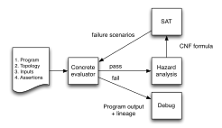
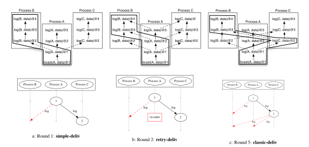
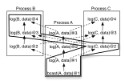
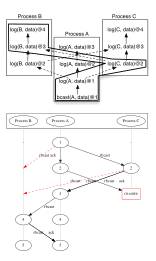
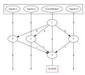
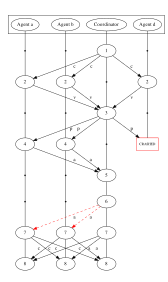
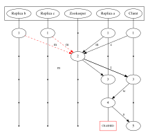
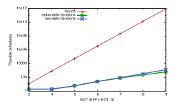

# Lineage-driven Fault Injection

Peter Alvaro UC Berkeley palvaro@cs.berkeley.edu

Joshua Rosen UC Berkeley rosenville@gmail.com

Joseph M. Hellerstein UC Berkeley hellerstein@cs.berkeley.edu

# ABSTRACT

Failure is always an option; in large-scale data management systems, it is practically a certainty. Fault-tolerant protocols and components are notoriously difficult to implement and debug. Worse still, choosing existing fault-tolerance mechanisms and integrating them correctly into complex systems remains an art form, and programmers have few tools to assist them.

We propose a novel approach for discovering bugs in fault-tolerant data management systems: *lineage-driven fault injection*. A lineagedriven fault injector reasons *backwards* from correct system outcomes to determine whether failures in the execution could have prevented the outcome. We present MOLLY, a prototype of lineagedriven fault injection that exploits a novel combination of data lineage techniques from the database literature and state-of-the-art satisfiability testing. If fault-tolerance bugs exist for a particular configuration, MOLLY finds them rapidly, in many cases using an order of magnitude fewer executions than random fault injection. Otherwise, MOLLY certifies that the code is bug-free for that configuration.

### Categories and Subject Descriptors

H.2.4 [Database Management]: Systems—Distributed Databases

### Keywords

fault-tolerance; verification; provenance

# 1. INTRODUCTION

Fault tolerance is a critical feature of modern data management systems, which are often distributed to accommodate massive data sizes [\[2,](#page-12-0) [12,](#page-12-1) [20,](#page-12-2) [24,](#page-12-3) [28,](#page-12-4) [55,](#page-12-5) [80\]](#page-13-0). Fault-tolerant protocols—many of which, including atomic commit [\[33,](#page-12-6) [75\]](#page-13-1), leader election [\[31\]](#page-12-7), process pairs [\[34\]](#page-12-8) and data replication [\[4,](#page-12-9) [76,](#page-13-2) [79\]](#page-13-3), were pioneered by the database research community—are experiencing a renaissance in the context of these modern architectures.

With so many mechanisms from which to choose, it is tempting to take a bottom-up approach to data management system design,

Permission to make digital or hard copies of part or all of this work for personal or classroom use is granted without fee provided that copies are not made or distributed for profit or commercial advantage, and that copies bear this notice and the full citation on the first page. Copyrights for third-party components of this work must be honored. For all other uses, contact the owner/author(s). Copyright is held by the author/owner(s).

*SIGMOD'15,* May 31–June 4, 2015, Melbourne, Victoria, Australia. ACM 978-1-4503-2758-9/15/05. http://dx.doi.org/10.1145/2723372.2723711.

enriching new system architectures with well-understood fault tolerance mechanisms and henceforth assuming that failures will not affect system outcomes. Unfortunately, fault-tolerance is a *global* property of entire systems, and guarantees about the behavior of individual components do not necessarily hold under composition. It is difficult to design and reason about the fault-tolerance of individual components, and often equally difficult to assemble a faulttolerant system even when given fault-tolerant components, as witnessed by recent data management system failures [\[16,](#page-12-10) [57\]](#page-12-11) and bugs [\[36,](#page-12-12) [49\]](#page-12-13).

*Top-down* testing approaches—which perturb and observe the behavior of complex systems—are an attractive alternative to verification of individual components. Fault injection [\[1,](#page-12-14) [26,](#page-12-15) [36,](#page-12-12) [44,](#page-12-16) [59\]](#page-12-17) is the dominant top-down approach in the software engineering and dependability communities. With minimal programmer investment, fault injection can quickly identify shallow bugs caused by a small number of independent faults. Unfortunately, fault injection is poorly suited to discovering rare counterexamples involving complex combinations of multiple instances and types of faults (e.g., a network partition followed by a crash failure). Approaches such as Chaos Monkey [\[1\]](#page-12-14) explore faults randomly, and hence are unlikely to find rare error conditions caused by complex combinations of failures. Worse still, fault injection techniques regardless of their search strategy—cannot effectively guarantee *coverage* of the space of possible failure scenarios. Frameworks such as FATE [\[36\]](#page-12-12) use a combination of brute-force search and heuristics to guide the enumeration of faults; such heuristic search strategies can be effective at uncovering rare failure scenarios, but, like random search, they do little to cover the space of possible executions.

An ideal top-down solution for ensuring that distributed data management systems operate correctly under fault would enrich the fault injection methodology with the best features of formal component verification. In addition to identifying bugs, a principled fault injector should provide assurances. The analysis should be *sound*: any generated counterexamples should correspond to meaningful fault tolerance bugs. When possible, it should also be *complete*: when analysis completes without finding counterexamples for a particular input and execution bound, it should *guarantee* that no bugs exist for that configuration, even if the space of possible executions is enormous.

To achieve these goals, we propose a novel top-down strategy for discovering bugs in distributed data management systems: *lineagedriven fault injection* (LDFI). LDFI is inspired by the database literature notion of *data lineage* [\[17,](#page-12-18)[25,](#page-12-19)[35,](#page-12-20)[45,](#page-12-21)[62,](#page-12-22)[89\]](#page-13-4), which allows it to directly connect system outcomes to the data and messages that led to them. LDFI uses data lineage to reason *backwards* (from effects to causes) about whether a given correct outcome could have failed to occur due to some combination of faults. Rather than generating faults at random (or using application-specific heuristics), a lineage-driven fault injector chooses only those failures that could have affected a known good outcome, exercising fault-tolerance code at increasing levels of complexity. Injecting faults in this targeted way allows LDFI to provide completeness guarantees like those achievable with formal methods such as model checking [\[39,](#page-12-23) [63,](#page-12-24)[85,](#page-13-5)[86\]](#page-13-6), which have typically been used to verify small protocols in a bottom-up fashion. When bugs are encountered, LDFI's topdown approach provides—in addition to a counterexample trace fine-grained data lineage visualizations to help programmers understand the *root cause* of the bad outcome and consider possible remediation strategies.

We present MOLLY, an implementation of LDFI. Like fault injection, MOLLY finds bugs in large-scale, complex distributed systems quickly, in many cases using an order of magnitude fewer executions than a random fault injector. Like formal methods, MOLLY finds *all* of the bugs that could be triggered by failures: when a MOLLY execution completes without counterexamples it certifies that no fault-tolerance bugs exist for a given configuration. MOLLY integrates naturally with root-cause debugging by converting counterexamples into data lineage visualizations. We use MOLLY to study a collection of fault-tolerant protocols from the database and distributed systems literature, including reliable broadcast and commit protocols, as well as models of modern systems such as the Kafka reliable message queue. MOLLY quickly identifies 7 critical bugs in 14 fault-tolerant systems; for the remaining 7 systems, it provides a guarantee that no invariant violations exist up to a bounded execution depth, an assurance that state-of-the-art fault injectors cannot provide.

### <span id="page-1-0"></span>1.1 Example: Kafka replication

To ground and motivate our work, we consider a recently-discovered bug in the replication protocol of the Kafka [\[2\]](#page-12-0) distributed message queue. In Kafka 0.80 (Beta), a Zookeeper service [\[41\]](#page-12-25)—a strongly consistent metadata store—maintains and publishes a list of up-todate replicas (the "in-sync-replicas" list or ISR), one of which is chosen as the leader, to all clients and replicas. Clients forward write requests to the leader, which forwards them to all replicas in the ISR; when the leader has received acknowledgments from all replicas, it acknowledges the client.

If replication is implemented correctly (and assuming no Byzantine failures) a system with three replicas should be able to survive one (permanent) crash failure while ensuring a "stable write" invariant: acknowledged writes will be stably stored on a non-failed replica. Kingsbury [\[49\]](#page-12-13) demonstrates a vulnerability in the replication logic by witnessing an execution in which this invariant is violated despite the fact that only one server crashes.

In brief, the execution proceeds as follows: two nodes b and c from a replica set {a, b, c} are partitioned away from the leader a and the Zookeeper service; as a result, they are removed from the ISR. a is now the leader and sole member of the quorum. It accepts a write, acknowledges the client without any dissemination, and then crashes. The acknowledged write is lost.

The durability bug—which seems quite obvious in this post-hoc analysis—illustrates how difficult it can be to reason about the complex interactions that arise via composition of systems and multiple failures. Both Zookeeper and primary/backup replication are individually correct software components, but multiple kinds and instances of failures (message loss failure followed by node failure) result in incorrect behavior in the composition of the components. The problem is not so much a protocol bug (the client receives an acknowledgment only when the write is durably stored on *all* replicas) as it is a dynamic misconfiguration of the replication protocol, caused by a (locally correct) view change propagated by the Zookeeper service. Kingsbury used his experience and intuition to predict and ultimately witness the bug. But is it possible to encode that kind of intuition into a general-purpose tool that can identify a wide variety of bugs in fault-tolerant programs and systems?

# 1.2 MOLLY, a lineage-driven fault injector

Given a description of the Kafka replication protocol, we might ask a question about forward executions: starting from an initial state, could some execution falsify the invariant? This question gives us very little direction about how to search for a counterexample to the invariant. Instead, LDFI works backwards from results, asking *why* a given write is stable in a particular execution trace. For example, a write initiated by (and acknowledged at) the client is stable because (among other reasons) the write was forwarded to a (correct) node b, which now stores the write in its log. It was forwarded to b by the leader node a, because b was in a's ISR. b was in the ISR because the Zookeeper service considered b to be up and forwarded the updated view membership to a. Zookeeper believed b to be up because a received timely acknowledgment messages from b. Most of the preceding events happened due to deterministic steps in the protocol. However, certain events (namely communication) were uncertain; in a different execution, they might not have succeeded. These are precisely the events we should explore to find the execution of interest: due to a temporary partition that prevents timely acknowledgments from b and c, they are removed from the ISR, and the rest is history.

LDFI takes the sequence of computational steps that led to a good outcome (the outcome's *lineage*) and reasons about whether some combination of failures could have prevented all "support" for the outcome. If it finds such a combination, it has discovered a schedule of interest for fault injection: based on the known outcome lineage, under this combination of faults the program might fail to produce the outcome. However, in most fault-tolerant programs multiple independent computations produce the important outcomes; in an alternate execution with failures, a different computation might produce the good outcome in another way. As a result, LDFI alternates between identifying potential counterexamples using lineage and performing concrete executions to confirm whether they correspond to true counterexamples.

Figure [1](#page-2-0) outlines the architecture of MOLLY, an implementation of LDFI. Given a distributed program and representative inputs, MOLLY performs a *forward* step, obtaining a outcome by performing a failure-free concrete evaluation of the program. The *hazard analysis* component then performs a *backward* step, extracting the lineage of the outcome and converting it into a CNF formula that is passed to a SAT solver. The SAT solutions—failures that could falsify all derivations of the good outcome—are transformed into program inputs for the next forward step. MOLLY continues to execute the program over these failure inputs until it either witnesses an invariant violation (producing a counterexample) or exhausts the potential counterexamples (hence guaranteeing that none exist for the given input and failure model). To enable counterexampledriven debugging, MOLLY presents traces of buggy executions to the user as a collection of visualizations including both a Lamport diagram [\[53\]](#page-12-26) capturing communication activity in the trace and lineage graphs detailing the data dependencies that produced intermediate node states.

The remainder of the paper is organized as follows. In Section [2,](#page-2-1) we describe the system model and the key abstractions underlying

<span id="page-2-0"></span>

Figure 1: The MOLLY system performs forward/backward alternation: *forward* steps simulate concrete distributed executions with failures to produce lineage-enriched outputs, while *backward* steps use lineage to search for failure combinations that could falsify the outputs. MOLLY alternates between forward and backward steps until it has exhausted the possible falsifiers.

LDFI. Section [3](#page-4-0) provides intuition for how LDFI uses lineage to reason about possible failures, in the context of a game between a programmer and a malicious environment. Section [4](#page-6-0) gives details about how the MOLLY prototype was implemented using off-theshelf components, including a Datalog evaluator and a SAT solver. In Section [5,](#page-8-0) we study a collection of protocols and systems using MOLLY, and measure MOLLY's performance both in finding bugs and in guaranteeing their absence. Section [7](#page-11-0) discusses limitations of the approach and directions for future work.

### <span id="page-2-1"></span>2. SYSTEM MODEL

Even in the absence of faults, distributed protocols can be buggy in a variety of ways, including sensitivity to message reordering or wall-clock timing. To maintain debugging focus and improve the efficiency of LDFI, we want to specifically analyze the effect of real-world faults on program outcomes. In this section, we describe a system model—along with its key simplifying abstractions—that underlies our approach to verifying fault-tolerant programs. While our simplifications set aside a number of potentially confounding factors, we will see in Section [5](#page-8-0) that MOLLY is nevertheless able to identify critical bugs in a variety of both classical and current protocols. In Section [7,](#page-11-0) we reflect on the implications of our focused approach, and the class of protocols that can be effectively verified using our techniques.

### <span id="page-2-3"></span>2.1 Synchronous execution model

A general-purpose verifier must explore not only the nondeterministic *faults* that can occur in a distributed execution (such as message loss and crash failures), but also nondeterminism in ordering and timing with respect to delivery of messages and scheduling of processes. Verifying the resilience of a distributed or parallel program to reordering is a challenging research problem in its own right [\[5,](#page-12-27) [52,](#page-12-28) [70,](#page-13-7) [74\]](#page-13-8). In that vein of research, it is common to make a strong simplifying assumption: assume that all messages are eventually delivered, and systematically explore the reordering problem [\[78,](#page-13-9) [82\]](#page-13-10).

We argue that for a large class of fault-tolerant protocols, we can discover or rule out many practically significant bugs using a dual assumption: *assume that successfully delivered messages are received in a deterministic order, and systematically explore failures*. To do this, we can simply evaluate an asynchronous distributed program in a synchronous simulation. Of course any such simplification forfeits completeness in the more general model: in our case, certain bugs that could arise in an asynchronous execution may go unnoticed. We trade this weaker guarantee (which nevertheless yields useful counterexamples) for a profound reduction in the number of executions that we need to consider, as we will see in Section [5.](#page-8-0) We discuss caveats further in Section [7.](#page-11-0)

### *2.1.1 Failure specifications*

LDFI simulates failures that are likely to occur in large-scale distributed systems, such as (permanent) crash failures of nodes, message loss and (temporary) network partitions [\[11](#page-12-29)[,27,](#page-12-30)[32\]](#page-12-31). Byzantine failures are not considered, nor are *crash-recovery* failures, which involve both a window of message loss and the loss of ephemeral state. Verifying recovery protocols by modeling crash-recovery failures is an avenue of future work.

To ensure that verification terminates, we bound the *logical time* over which the simulation occurs. The notion of logical time often used in distributed systems theory but generally elusive in practice—is well-defined in our simulations due to the synchronous execution abstraction described above. The internal parameter EOT (for end-of-time) represents a fixed logical bound on executions; the simulation then explores executions having no more than *EOT* global transitions (rounds of message transmission and state-changing internal events).

If the verifier explored all possible patterns of message loss up to *EOT*, it would always succeed in finding counterexamples for any non-trivial distributed program by simply dropping all necessary messages. However, infinite, arbitrary patterns of loss are uncommon in real distributed systems [\[10,](#page-12-32)[11\]](#page-12-29). More common are periods of intermittent failure or total partition, which eventually resolve (and then occur again, and so on). LDFI incorporates a notion of failure quiescence, allowing programs to attempt to recover from periods of lost connectivity. In addition to the *EOT* parameter, a second internal parameter indicates the *end of finite failures* (EFF) in a run, or the logical time at which message loss ceases. MOLLY ensures that *EFF* < *EOT* to give the program time to recover from message losses. If *EFF* = 0, MOLLY does not explore message loss—this models a fail-stop environment, in which processes may only fail by crashing.

A *failure specification* (Fspec) consists of three integer parameters h*EOT, EFF, Crashes*i; the first two are as above, and the third specifies the maximum number of crash failures that should be explored. For example, a failure specification of h6, 4, 1i indicates that executions of up to 6 global transitions should be explored, with message loss permitted only from times 1-4, and zero or one node crashes. A crashed node behaves in the obvious way, ceasing to send messages or make internal transitions. A set of failures is *admissible* if it respects the given Fspec: there are no message omissions after *EFF* and no more than *Crash* crash failures.

In normal operation, MOLLY sets the Fspec parameters automatically by performing a *sweep*. First, *EFF* is set to 0 and *EOT* is increased until nontrivially correct executions [1](#page-2-2) are produced. Then *EFF* is increased until either an invariant violation is produced in which case *EOT* is again increased to permit the protocol to recover—or until *EFF* = *EOT* − 1, in which case both are increased by 1. This process continues until a user-supplied wall clock bound has elapsed, and MOLLY reports either the minimal parameter settings necessary to produce a counterexample, or (in the case of bug-free programs) the maximum parameter settings explored within the time bound. In some cases (e.g., validating

<span id="page-2-2"></span><sup>1</sup>Executions in which no messages are sent are typically vacuously correct with respect to invariants.

protocols in a fail-stop model), users will choose to override the sweep and set the parameters manually.

### <span id="page-3-10"></span>2.2 Language

LDFI places certain requirements on the systems and languages under test. The backwards step requires clearly identified program *outputs*, along with fine-grained data lineage [\[21,](#page-12-33)[50\]](#page-12-34) that captures details about the uncertain *communication* steps contributing to the outcome. The forward step requires that programs be executable with a runtime that supports interposition on the communication mechanism, to allow the simulator to drive the execution by controlling message loss and delivery timing. Languages like Erlang [\[9\]](#page-12-35) and Akka [\[68\]](#page-13-11) are attractive candidates because of their explicit communication, while aspect-oriented programming [\[47\]](#page-12-36) could be used with a language such as Java to facilitate both trace extraction and communication interposition. Backwards slicing techniques [\[66\]](#page-13-12) could be used to recover fine-grained lineage from the executions of programs written in a functional language.

For the MOLLY prototype, we chose to use Dedalus [\[7\]](#page-12-37), a declarative, rule-based, executable logic language based on Datalog. Datalogbased distributed programming languages have generated considerable interest both in the theoretical [\[3,](#page-12-38)[8,](#page-12-39)[42\]](#page-12-40) and systems [\[37,](#page-12-41)[46,](#page-12-42)[56,](#page-12-43) [65\]](#page-13-13) research communities; protocol implementations in these languages often resemble pseudocode specifications. Dedalus satisfies all of the requirements outlined above. Data lineage can be extracted from logic program executions via simple, well-understood program rewrites [\[50\]](#page-12-34). More importantly, Dedalus (and similar languages) abstract away the distinction between events, persistent state and communication (everything is just *data* and relationships among data elements) and make it simple to identify redundancy of computation and data in its various forms (as we will see in Section [3\)](#page-4-0). A synchronous semantics for Dedalus, consistent with the synchronous execution assumption described in Section [2.1,](#page-2-3) was proposed by Interlandi et al. [\[42\]](#page-12-40)

All state in Dedalus is captured in *relations*; computation is expressed via *rules* that describe how relations change over time. Dedalus programs are intended to be executed in a distributed fashion, such that relations are partitioned on their first attribute (their *location specifier*). Figure [2](#page-3-0) shows a simple broadcast program written in Dedalus. Line [1](#page-3-1) is a *deductive* rule, and has the same intuitive meaning as a Datalog rule: it says that if some 2-tuple exists in bcast, then it also exists in log. Lines [2](#page-3-2)[-3](#page-3-3) are *inductive* rules, describing a relation between a particular state and its *successor* state. Line [2,](#page-3-2) for example, says that if some 2-tuple exists in node at some time t, then that tuple also exists in node at time t + 1 (and by induction, forever after). Both are local rules, describing computations that individual nodes can perform given their internal state and the current set of events or messages. By contrast, the rule on lines [4](#page-3-4)[-5](#page-3-5) is a *distributed* rule, indicating an uncertain derivation across process boundaries. It expresses a simple *multicast* as a join between a stream of events (bcast) and the persistent relation node. Note that the conclusion of the rule—a log tuple—exists (assuming that a failure does not occur) at a different time (strictly later) than its premises, as well as at a different place (the address represented by the variable *Node2*).

### 2.3 Correctness properties

A program is fault-tolerant (with respect to a particular Fspec) if and only if its correctness assertions hold for all possible combinations of admissible failures. Distributed invariants are commonly expressed as implications of the form precondition → postcondition; an invariant violation is witnessed by an execution in which the precondition holds but the postcondition does not. For

```
1 log(Node, Pload) :- bcast(Node, Pload);
2 node(Node, Neighbor)@next :- node(Node, Neighbor);
3 log(Node, Pload)@next :- log(Node, Pload);
4 log(Node2, Pload)@async :- bcast(Node1, Pload),
5 node(Node1, Node2);
```

<span id="page-3-5"></span>Figure 2: simple-deliv, a Dedalus program implementing a best-effort broadcast.

```
1 missing_log(A, Pl) :- log(X, Pl), node(X, A), notin log(A, Pl) ;
2 pre(X, Pl) :- log(X, Pl), notin crash(_, X, _) ;
3 post(X, Pl) :- log(X, Pl), notin missing_log(_, Pl) ;
```

Figure 3: A correctness specification for reliable broadcast. Correctness specifications define relations pre and post; intuitively, invariants are always expressed as implications: pre → post. An execution is incorrect if pre holds but *post* does not, and is vacuously correct if pre does not hold. In reliable broadcast, the precondition states that a (correct) process has a log entry; the postcondition states that *all* correct processes have a log entry.

example, the *agreement* invariant for a consensus protocol states that *if* an agent decides a value, *then* all agents decide that value. The Kafka stable write invariant described in Section [1.1](#page-1-0) states that if a write is acknowledged, then it exists on a correct (non-crashed) replica.

To support this pattern, MOLLY automatically defines two builtin *meta-outcomes* of programmer-defined arity, called pre and post. MOLLY users may express correctness assertions by defining these special relations—representing abstract program outcomes—as "views" over program state. If meta-outcomes are not defined, all persistent relations are treated as outcomes. This is acceptable for some simple protocols, such as naive reliable delivery (as we will see in Section [3\)](#page-4-0); for more complex protocols, meta-outcomes should be used in order to mask unnecessary details. For example, a delivery protocol that suppresses redundant retries via message acknowledgments requires a meta-outcome that masks the exact number of ACKs and exposes only the contents of the log relation. Similarly, a consensus protocol is intended to reach *some* decision, though the decision it reaches may be different under different failures, so its meta-outcome should abstract away the particular decision.

Figure [3](#page-3-6) shows a meta-outcome for reliable delivery, capturing the basic agreement requirement: *if a correct node delivers a message, then all correct nodes receive it*. Line [1](#page-3-7) defines a missing log entry as one that exists on some node but is absent from another. Line [2](#page-3-8) defines the precondition: a log entry exists on a correct (non-crashed) node. If pre does not hold, then the execution is vacuously correct. Line [3](#page-3-9) defines the postcondition: no node is missing the log entry. If pre holds but post does not, the invariant is violated and the lineage of these meta-outcomes can be presented to the user as a counterexample.

To run MOLLY, a user must provide a program along with concrete inputs, and indicate which relations define the program's *outcomes*—by default, using pre and post as defined above. We now turn to an overview of how MOLLY automates the rest of the bug-finding process.

# <span id="page-4-0"></span>3. USING LINEAGE TO REASON ABOUT FAULT-TOLERANCE

*What a faint-heart! We must work outward from the middle of the maze. We will start with something simple.*

– Thomasina, in *Arcadia* [\[77\]](#page-13-14).

One of the difficult truths of large-scale services is that if something can go wrong, eventually it will. Hence a reliable fault tolerance solution needs to account for unlikely events. A useful lens for efficiently identifying events (likely or otherwise) that could cause trouble for a fault-tolerant program is to view protocol implementation as a game between a programmer and an adversary. In this section, we describe the LDFI approach as a repeated game (a match) in which an adversary tries to "beat" a protocol developer under a given system model. Of course, the end goal is for the developer to harden their protocol until it "can't lose"—at which point the final protocol can truly be called fault tolerant under the model. We show that a winning strategy for both the adversary (played by MOLLY) and the programmer is to is to use *data lineage* to reason about the *redundancy of support* (or lack thereof) for program outcomes.

To play a match, the programmer and the adversary must agree upon a correctness specification, inputs for the program and a failure model (for example, the adversary agrees to crash no more than one node, and to drop messages only up until some fixed time). In each round of the match the programmer submits a distributed program; the adversary, after running and observing the execution, is allowed to choose a collection of faults (from the agreed-upon set) to occur in the next execution. The program is run again under the faults, and both contestants observe the execution. If the correctness specification is violated, the programmer loses the round (but may play again); otherwise, the adversary is allowed to choose another set of failures and the round continues. If the adversary runs out of moves, the programmer wins the round.

### 3.1 A match: reliable broadcast protocols

For this match, the contestants agree upon reliable broadcast as the protocol to test, with the correctness specification shown in Figure [3.](#page-3-6) Input is a single record bcast(A, data)@1, along with a fully-connected node relation for the agents {A, B, C}—i.e., Node A attempts to broadcast the payload "data" to nodes B and C. The adversary agrees to inject message loss failures no later than logical time 2, and to crash at most one server (EFF=2, Crashes=1). In Figures [4](#page-5-0)[,6](#page-6-1) and [7,](#page-6-2) we represent the lineage of the outcomes (the final contents of log) as directed graphs, such that a record p has an edge to record q if p was used to compute q. Within each graph (which shows all *supports* for all outcomes), we highlight an individual support of the outcome (log(B, data)@4). Uncertain steps in the computations (i.e. messages) are shown as dashed lines. As we will see in Section [4,](#page-6-0) a message omission failure can be encoded with a Boolean variable of the form O(*Sender*,*Receiver*,*SenderTime*). For each lineage diagram, we show a *falsifier*: a propositional formula representing a set of failures that could invalidate the highlighted support. Let's play!

### *3.1.1 Round 1: naive broadcast*

The programmer's first move is to submit the naive broadcast program simple-deliv presented in Figure [2.](#page-3-0) Figure [4a](#page-5-0) shows the lineage of three outcomes (the contents of the log relation on all nodes at time 4) for the failure-free execution of the program.

The adversary can use this representation of outcome lineage to guide its choice of failures to inject. To falsify an outcome (say log(B, data)) the adversary can simply "cut" the dotted line that is, drop the message A sent to B at time 1. In the next execution, the adversary injects this single failure and the property expressed in Figure [3](#page-3-6) is violated. The adversary wins the first round.

### *3.1.2 Round 2: retrying broadcast*

The programmer was defeated, but she too can learn something from the lineage graph and the counterexample in Figure [4a](#page-5-0). The adversary won Round 1 easily because simple-deliv has no *redundancy*: the good outcome of interest is supported by a *single* message. A fault-tolerant program must provide redundant ways to achieve a good outcome; in the context of this game, one of those "ways" must be out of the reach of the adversary. The programmer makes an incremental improvement to simple-deliv by adding a rule for bcast that converts it from an ephemeral event true at one logical time to a persistent relation that drives retransmissions:

```
bcast(N, P)@next :- bcast(N, P);
```

Instead of making a single attempt to deliver each message, this program (henceforth called retry-deliv) makes an unbounded number of attempts. Intuitively, this alteration has made the reliable delivery protocol robust to a certain class of nondeterministic failures namely, message omissions—by ensuring that messages exhibit *redundancy in time*.

Figure [4b](#page-5-0) shows the outcome lineage for an execution of retrydeliv. This time, while the adversary has more difficulty choosing a move, the winning strategy once again involves reasoning directly about outcome lineage. Since A makes an unbounded number of attempts [2](#page-4-1) to send the log message to B and C, no finite pattern of omissions can falsify either outcome. The weakness of the retry-deliv algorithm is its asymmetry: the responsibility for redundant behaviors falls on A alone—this is easy to see in Figure [4b](#page-5-0), in which all transmissions originate at node A. The adversary, perceiving this weakness, might first attempt to immediately crash A. If it did so, this would result in a vacuous counterexample, since the delivery invariant is only violated if *some* but not all agents successfully delivery the message. In Section [4,](#page-6-0) we'll see how MOLLY avoids exploring such vacuously correct executions. However, causing A to crash after a successful transmission to one node (say C) but not the other is sufficient to falsify one outcome (log(B, data)). Exploring this potential counterexample via a concrete execution reveals the "true" counterexample shown in Figure [4b](#page-5-0). The adversary wins again.

### *3.1.3 Round 3: redundant broadcast*

Reviewing the counterexample and the lineage of the failure-free execution, the programmer can see how the adversary won. The problem is that retry-deliv exhibits redundancy in time but not in space. Each broadcast attempt is independent of the failure of other attempts, but dependent on the fact that A remains operational. She improves the protocol further by adding another line:

```
bcast(N, P)@next :- log(N, P);
```

Now *every* node that has a log entry assumes responsibility for broadcasting it to all other nodes. As Figure [6](#page-6-1) reveals, the behavior of all nodes is now symmetrical, and the outcomes have redundant

<span id="page-4-1"></span><sup>2</sup>These are finite executions, so the number of attempts is actually bounded by the EOT (4 in these figures) in any given execution. However, since the adversary has agreed to not drop messages after time 2, the program is guaranteed to make *more* attempts than there are failures.

<span id="page-5-1"></span>

Figure 4: Outcome lineage and counterexample traces. Both should be read from top to bottom: note that time moves upwards in the lineage diagrams, which are used to reason *backwards* from outcomes to causes, and downwards in the counterexamples. Message transmissions are shown as dotted lines.

- 1. In the lineage diagram for simple-deliv, the unique support for the outcome log(B, data) is shown in bold; it can be falsified (as in the counterexample) by dropping a message from A to B at time 1 (O(A,B,1)).
- 2. Note that in retry-deliv—which exhibits redundancy in time—all derivations of log(B, data)@4 require a direct transmission from node A, which could crash (as it does in the counterexample). One of the redundant supports (falsifier: O(A,B,2)) is highlighted.
- <span id="page-5-0"></span>3. The lineage diagram for classic-deliv reveals redundancy in space but not time. In the counterexample, a makes a partial broadcast which reaches b but not c. b then attempts to relay, but both messages are dropped. A support (falsifier: O(A,C,1) ∨ O(C,B,2)) is highlighted.

support both in space (every correct node relays messages) and time (every node makes an unbounded number of attempts). The adversary has no moves and forfeits; at last, the programmer has won a round.

### *3.1.4 Round 4: finite redundant broadcast*

In all of the rounds so far, the adversary was able to either choose a winning move or decide it has no moves to make by considering a single concrete trace of a failure-free simulation. This is because the naive variants that the programmer supplied—which exhibit infinite behaviors—reveal all of their potential redundancy in the failure-free case. A practical delivery protocol should only continue broadcasting a message while its delivery status is unknown; a common strategy to avoid unnecessary retransmissions is acknowledgment messages. In Round 4, the programmer provides the protocol ack-deliv shown in Figure [5,](#page-6-3) in which each agent retries only until it receives an ACK.

The failure-free run of ack-deliv (Figure [7\)](#page-6-2) exhibits redundancy in space (all sites relay) but not in time (each site relays a finite number of times and ceases before EOT when acknowledgments are received). The adversary perceives that it can falsify the outcome log(B, data) by dropping the message A sent to B at time 1, *and* either the message A sent to C at time 1 *or* the message C sent to B at time 2 (symbolically, O(A,B,1) ∧ (O(A,C,1) ∨ O(C,B,2))). It chooses this set of failures to inject, but in the subsequent run the failures trigger additional broadcast attempts—which occur when ACKs are not received—and provide additional support for the outcome. The adversary gets as many chances as it likes, but each time At each round the adversary "cuts" some edges and injects the corresponding failures; in the subsequent run new edges appear. Eventually it gives up, when the agreed-upon failure model permits no more moves. The programmer wins again.

### *3.1.5 Round 5: "classic" broadcast*

For the final round, the programmer submits a well-known reliable broadcast protocol originally specified Birman et al. [\[61\]](#page-12-44):

```
(At a site receiving message m)
  if message m has not been received already
    send a copy of m to all other sites [...]
    deliver m [...]
```

This protocol is correct in the fail-stop model, in which processes can fail by crashing but messages are not lost. The programmer has committed a common error: deploying a "correct" component in an environment that does not match the assumptions of its correctness argument.

The classic broadcast protocol exhibits redundancy in space but not time; in a failure-free execution, it has infinite behaviors like the protocols submitted in Rounds 2-3, but this redundancy is vulnerable to message loss. The adversary, observing the lineage graph in Figure [4c](#page-5-0), immediately finds a winning move: drop messages from A to B at time 1, and from C to both A *and* B at time 2.

### 3.2 Hazard analysis

In the game presented above, both players used the lineage of program outcomes to reason about their next best move. The role of the programmer required a certain amount of intuition: given the

```
1 ack(S, H, P)@next :- ack(S, H, P);
2 rbcast(Node2, Node1, Pload)@async :- log(Node1, Pload),
3 node(Node1, Node2), notin ack(Node1, Node2, Pload);
4 ack(From, Host, Pl)@async :- rbcast(Host, From, Pl);
5 rbcast(A, A, P) :- bcast(A, P);
6 log(N, P) :- rbcast(N, _, P);
```

Figure 5: Redundant broadcast with ACKs.

<span id="page-6-1"></span>

Figure 6: Lineage for the redundant broadcast protocol redun-deliv, which exhibits *redundancy in space and time*. A redundant support (falsifier: O(A,C,1) ∨ O(C,B,2)) is highlighted. The lineage from this single failurefree execution is sufficient to show that no counterexamples exist.

lineage of an outcome in a failure-free run and a counterexample run, change the program so as to provide more redundant support of the outcome. The role of the adversary, however, can be automated: MOLLY is an example of such an adversary.

Instead of randomly generating faults, the adversary used lineage graphs to surgically inject only those faults that could have prevented an outcome from being produced. As we observed in the game, data lineage from a single execution can provide multiple "supports" for a particular outcome. We saw evidence of this in the Kafka replication protocol as well: a stable write may be stable for multiple reasons, because it exists on multiple replicas, each of which may have received multiple transmissions—hence the lineage describing how the write got to each replica is a separate support, sufficient in itself to produce the outcome.

A lineage-driven fault injector needs to enumerate all of the supports of a target outcome, and devise a minimal set of faults (consistent with the failure model) that falsifies *all* of them. Because each individual support can be falsified by the loss of *any* of its contributing messages (a disjunction), LDFI can transform the graph representation into a CNF formula that is true if *all* supports are falsified (a conjunction of disjunctions) and pass it to an off-the-shelf SAT solver. Each satisfying assignment returned by the solver is a *potential counterexample*—it is sufficient to falsify all the support of the outcome of which the lineage-driven fault injector is aware, given a particular concrete execution trace. Note that these potential counterexamples comprise the *only* faults that it needs to bother considering, precisely because if those faults do not occur it knows (because it has a "proof") that the program will produce the outcome!

As we saw in the case of ack-deliv, given the faults in a potential counterexample the program under test may produce the outcome in some other way (e.g., via failover logic or retry). MOLLY converts the faults back into inputs, and performs at least one more forward evaluation step; this time, either the program fails to produce the outcome (hence we have a true counterexample) or it produces the outcome with new lineage (i.e., the program's fault-tolerance strategy worked correctly), and we continue to iterate.

MOLLY automates this process. It collects lineage to determine how outputs are produced in a simulated execution, and transforms

<span id="page-6-2"></span>

Figure 7: Lineage for the finite redundant broadcast protocol ack-deliv, which exhibits redundancy in space in this execution, but only reveals redundancy in time in runs in which ACKs are not received (i.e., when failures occur). The message diagram shows an unsuccessful fault injection attempt based on analysis of the lineage diagram: drop messages from A to B at time 1, from C to B at time 2, and then crash C. When these faults are injected, ack-deliv causes A to make an additional broadcast attempt when an ACK is not received.

this lineage into a CNF formula that can be passed to a solver. If the formula is unsatisfiable, then no admissible combination of faults can prevent the output from being produced; otherwise, each satisfying assignment is a potential counterexample that must be explored. As we will see in Section [5,](#page-8-0) MOLLY's forward / backward alternation quickly either identifies a bug or guarantees that none exist for the given configuration. When a bug is encountered, MOLLY presents visualizations of the outcome lineage and the counterexample trace, which as we saw are a vital resource to the programmer in understanding the bug and improving the faulttolerance of the program.

### <span id="page-6-0"></span>4. THE MOLLY SYSTEM

In this section, we describe how we built the MOLLY prototype using off-the-shelf components including a Datalog evaluator and a SAT solver.

### 4.1 Program rewrites

To simulate executions of a Dedalus program, we translate it into a Datalog program that can be executed by an off-the-shelf interpreter. To model the temporal semantics of Dedalus (specifically state update and nondeterministic failure) we rewrite all program rules to reference a special *clock* relation. We also add additional rules to record the *lineage* or data provenance of the program's outputs.

### <span id="page-6-4"></span>*4.1.1 Clock encoding and Dedalus rewrite*

Due to the synchronous execution model and finiteness assumptions presented in Section [2,](#page-2-1) we can encode the set of transitions that occur in a particular execution—some of which may fail due to omissions or crashes—in a finite relation, and use this relation to drive the execution. We define a relation *clock* with attributes h*From, To, SndTime*i. To model local state transitions in inductive (*@next*) rules, we ensure that *clock* always contains a record hn, n, ti, for all nodes n and times t < *EOT*. Executions in which no faults occur also have a record hn, m, ti for all pairs of nodes n and m. To capture the loss of a message from node a to node b at time t (according to a's clock), we delete the record ha, b, ti from clock. To be consistent with the *EFF* parameter, this deletion can only occur if t ≤ *EFF*. Finally, to model a fail-stop crash of a node a at time t, we simply delete records ha, b, ui for all nodes b and times u ≥ t.

We also rewrite Dedalus rules into Datalog rules. For all relations, we add a new integer attribute T ime (as the last attribute), representing the logical time at which the record exists. To rewrite the premises of a rule, we modify each rule premise to reference the T ime attribute and ensure that all premises have the same T ime attribute and location specifier (this models the intended temporal semantics: an agent may make conclusions from knowledge only if that knowledge is available in the same place, at the same time). To rewrite the conclusion of a rule, we consider the Dedalus temporal annotations:

Example 1 *Deductive* rules have no temporal annotations and their intended semantics match that of Datalog, so they are otherwise unchanged.

```
log(Node, Pload) :- bcast(Node, Pload);
              ↓
log(Node, Pload, Time) :- bcast(Node, Pload, Time);
```

Example 2 *Inductive* rules—which capture local state transitions—are rewritten to remove the *@next* annotation and to compute the value of T ime for the rule's conclusion by incrementing the SndT ime attribute appearing in the premises.

```
node(Node, Neighbor)@next :- node(Node, Neighbor);
              ↓
node(Node, Neighbor, SndTime+1) :- node(Node,
  Neighbor, SndTime),clock(Node, Node, SndTime);
```

<span id="page-7-0"></span>Example 3 *Asynchronous* rules—representing uncertain communication across process boundaries—are rewritten in the same way as inductive rules. Note however that because the values of T o and F rom are distinct, the transition represented by a matching record in *clock* might be a failing one (i.e., it may not exist in clock).

```
log(Node2, Pload)@async :-
    bcast(Node1, Pload),
    node(Node1, Node2);
               ↓
log(Node2, Pload, SndTime+1) :-
    bcast(Node1, Pload, SndTime),
    node(Node1, Node2, SndTime),
    clock(Node1, Node2, SndTime);
```

### *4.1.2 Lineage rewrite*

In order to interpret the output of a concrete run and reason about fault events that could have prevented it, we record per-record data lineage capturing the computations that produced each output.

We follow the *provenance-enhanced rewrite* described by Kohler et al [\[50\]](#page-12-34). For every rule, the rewrite produces a new "firings" relation that captures bindings used in the rule's premises.

For every rule r in the given (rewritten from Dedalus as described above) Datalog program, we create a new relation rprov (called a "firings" relation) and a new rule r 0 , such that

- 1. r 0 has the same premises as r,
- 2. r 0 has rprov as its conclusion, and
- 3. rprov captures the bindings of all premise variables.

For example, given the asynchronous rule in Example [3,](#page-7-0) MOLLY synthesizes a new rule:

```
log1prov(Node1, Node2, Pload, SndTime) :-
   bcast(Node1, Pload, SndTime),
   node(Node1, Node2, SndTime),
   clock(Node1, Node2, SndTime);
```

Rules with aggregation use two provenance rules, one to record variable bindings and another to perform aggregation. This prevents the capture of additional bindings from affecting the grouping attributes of the aggregation. For example:

```
1 r(X, count<Z>) :- a(X, Y), b(Y, Z)
2 ↓
3 rbindings(X, Y, Z) :- a(X, Y), B(Y, Z)
4 rprov(X, count<Z>) :- rbindings(X, _, Z)
```

## 4.2 Proof tree extraction

We query the firings relations to produce *derivation graphs* for records [\[81\]](#page-13-15). A derivation graph is a directed bipartite graph consisting of rule nodes that correspond to rule firings, and goal nodes that correspond to records. There is an edge from each goal node to every rule firing that derived that tuple, and an edge from each rule firing to the premises (goal nodes) used by that rule. The lineage graphs in Section [3](#page-4-0) (Figures [3a-](#page-5-1)[7\)](#page-6-2) are abbreviated derivation graphs, in which goal nodes are represented but rule nodes are hidden.

To construct the derivation graph for a record r, we query the firings relations for rules that derive r. For each matching firing, we substitute the bindings recorded in the firing relation into the original rule to compute the set of premises used by that rule firing, and recursively compute the derivation graphs for each of those premises. Note that each rule node represents a firing of a rule with a particular set of inputs; it is possible for a single outcome to have multiple derivations via the same rule, each involving different premises.

Each derivation graph yields a finite forest of *proof trees*. Each proof tree corresponds to a separate, independent support of the tree's root goal (i.e., its outcome). Given a proof tree, we can determine which messages were used by the proof's rule firings; the loss of any of these messages will falsify that particular proof.

### 4.3 Solving for counterexamples

Given a forest of proof trees, a naive approach to enumerating potential counterexamples is to consider all allowable crash failure and message omissions that affect messages used by proofs. This quickly becomes intractable, since the set of fault combinations grows exponentially with *EFF*.

Instead, we use the proof trees to perform a SAT-guided search for failure scenarios that falsify *all* known proofs of our goal tuples. For each goal, we construct a SAT problem whose variables encode crash failures and message omissions and whose solutions correspond to faults that falsify all derivations in the concrete execution.

Each proof tree is encoded as a disjunction of the message omissions (O(from,to,time)) and crash failures (C(node,time)) that can individually falsify the proof. By taking the conjunction of these formulas, we express that we want solutions that falsify all derivations. For example,

$$(O_{(a,c,2)} \vee C_{(a,2)} \vee C_{(a,1)}) \wedge (O_{(b,c,1)} \vee C_{(b,1)})$$

corresponds to a derivation graph that represents two proofs, where the first proof can be falsified by either dropping messages from a to c at time 2 or by a crashing at some earlier time, and the second proof can be falsified by b crashing or the loss of its messages sent at time 1.

If the resulting SAT problem is unsatisfiable, then there exists at least one proof that cannot be falsified by any allowable combination of message losses and crash failures—hence the program is fault-tolerant with respect to that goal! Otherwise, each SAT solution represents a potential counterexample that must be explored.

We solve a separate SAT problem for each goal tuple, and the union of the SAT solutions is the set of potential counterexamples that we must test—each potential counterexample corresponds to a "move" of the adversary in the game presented in Section [3.](#page-4-0) If the user has defined correctness properties using the built-in pre and post meta-outcomes defined in Section [3,](#page-4-0) we perform an additional optimization. Each meta-outcome is handled as above, and a potential counterexample is reported for each set of faults that falsifies a record in post *unless* those faults also falsify the corresponding record in pre. We need not explore such faults, as they would result in a vacuously correct outcome with respect to that property.

The algorithm described above is presented formally in the Appendix (Section [B\)](#page-13-16), along with proofs of the soundness and completeness of LDFI.

### <span id="page-8-0"></span>5. EVALUATION

In this section, we use MOLLY to study a variety of fault-tolerant protocols from the database and distributed systems literature, as well as components of modern systems. We then measure the performance of MOLLY along two axes: its efficiency in discovering bugs, and its coverage of the combinatorial space of faults for bugfree programs.

### 5.1 Case Study: Fault-tolerant protocols

We implemented a collection of fault-tolerant distributed programs in Dedalus, including a family of reliable delivery and atomic commitment protocols and the Kafka replication subsystem described in Section [1.1.](#page-1-0) We analyze them with MOLLY and describe the outcomes.

MOLLY automatically produces Lamport diagrams [\[53\]](#page-12-26), like those shown in Section [3,](#page-4-0) to help visualize the message-level behavior of individual concrete executions and to enable counterexampledriven debugging. In each diagram, solid vertical lines represent individual processes; time moves from top to bottom. Messages between processes are shown as diagonal lines connecting process lines; lost messages are shown as dashed lines. Vertices represent events and are numbered to reflect global logical time; if a process crashes, its node contains the string "CRASHED." When it comes time to debug systems to discover (and ultimately remedy) the *cause* of an invariant violation, MOLLY produces lineage diagrams similar to those shown in Section [3.](#page-4-0)

# *5.1.1 Commit Protocols*

We used Dedalus to implement three commit protocol variants from the database literature, which were developed and extended over a period of about five years [\[15,](#page-12-45) [33,](#page-12-6) [75\]](#page-13-1). As we would hope, MOLLY immediately confirmed the known limitations of these protocols, and produced concrete counterexamples both for non-terminating executions and for executions in which conflicting decisions are made.

For all commit protocols, we specify two invariants as implications between pre- and postconditions:

<span id="page-8-1"></span>

Figure 8: A blocking execution of 2PC. Agents a, b and d successfully prepare (p) and vote (v) to commit a transaction. The coordinator then fails, and agents are left uncertain about the outcome—a violation of the termination property.

- Agreement: *If* an agent decides to commit (respectively, abort), *then* all agents decide to commit (abort).
- Termination: *If* a transaction is initiated, *then* all agents decide either commit or abort for that transaction.

Molly automatically identified the limitations of early commit protocols that subsequent work attempted to correct. Figure [8](#page-8-1) illustrates the well-known blocking problem associated with two-phase commit (2PC) [\[33\]](#page-12-6). If the coordinator process fails after preparing a transaction, the system is left in a state in which the transaction outcome is unknown but all agents are holding locks waiting for the outcome (a violation of the *termination* property).

The collaborative termination protocol (CTP) [\[15\]](#page-12-45) attempts to ameliorate the blocking problem by augmenting the 2PC protocol so as to allow agents who suspect that the coordinator has failed to exchange their knowledge about the outcome. It is well-known, however, that although CTP allows *more* executions to terminate, it has blocking executions under the same failure assumptions as classic 2PC. MOLLY discovered a counterexample after a single forward/backward execution—due to space limitations, the diagram is omitted.

Three-phase commit [\[75\]](#page-13-1) solves the blocking problem—under the assumption of a connected and synchronous network—by adding an additional protocol round and corresponding agent state. It uses simple timeouts as a failure detector; depending on the state a coordinator or agent is in when a timeout fires, that site can unilaterally determine the transaction outcome. Hence there are no "blocking" states.

If we relax the assumption of a connected network by allowing finite message failures, however, MOLLY discovers bad executions such as the one shown in Figure [9.](#page-9-0) In this case, message losses from the coordinator to certain agents (a and b) cause the agents to conclude that the coordinator has failed. Since they are in the canCommit state, they decide to roll forward to commit. Meanwhile the coordinator—which has detected that agent d (who originally agreed to commit) has failed—has decided to abort. This outcome is arguably worse than blocking: due to the incorrectness of the failure detector under message omissions, agents have now made conflicting decisions, violating the *agreement* property.

As we saw in the case of classic-deliv in Section [3,](#page-4-0) the bad execution results from deploying a protocol in an environment that

<span id="page-9-0"></span>

Figure 9: An incorrect run of three-phase commit in which message loss causes agents to reach conflicting decisions (the coordinator has decided to abort (a), but the two (non-crashed) agents have decided to commit (c)). This execution violates the agreement property.

violates the assumptions of its correctness guarantee—an all-toocommon hazard in composing systems from individually-verified components.

### *5.1.2 Other fault-tolerant protocols*

We used MOLLY to study other agreement protocols, including Paxos [\[54\]](#page-12-46) and the bully leader election protocol [\[31\]](#page-12-7). As we discuss in Section [7,](#page-11-0) desirable termination properties of such protocols are difficult to verify due to their sensitivity to asynchrony. Nevertheless we are able to validate their agreement properties by demonstrating that no counterexamples are found for reasonable parameters (as noted in Figure [13\)](#page-10-0).

Flux [\[73\]](#page-13-17) is a replica synchronization protocol for streaming dataflow systems based on the process pairs [\[34\]](#page-12-8) fault-tolerance strategy. Flux achieves fault-tolerance by ensuring that a pair of replicas receives the same message stream without loss, duplication or reordering; at any time, should one replica fail, the other can take over. Despite its succinct specification, Flux is considered to be significantly more complicated than alternative fault-tolerance strategies for streaming systems, because of the interaction between the protocol's granularity (tuple-at-a-time) and the various combinations of failures that can occur during operation [\[87\]](#page-13-18). Using MOLLY, we were able to certify that Flux is resilient to omission and crash failures up to a significant depth of execution (see Figure [13\)](#page-10-0). To the best of our knowledge, this effort represents the most thorough validation of the Flux protocol to date.

### *5.1.3 Kafka replication bug*

To reproduce the Kafka replication bug described in Section [1.1,](#page-1-0) we provide a single durability invariant:

<span id="page-9-1"></span>

Figure 10: The replication bug in Kafka. A network partition causes b and c to be excluded from the ISR (the *membership* messages (m) fail to reach the Zookeeper service). When the client writes (w) to the leader a, it is immediately acknowledged (a). Then a fails and the write is lost—a violation of durability.

• Durability: *If* a write is acknowledged at the client, *then* it is stored on a correct (non-crashed) replica.

MOLLY easily identified the bug. Figure [10](#page-9-1) shows the same counterexample described by Kingsbury. A brief network partition isolates two of the replicas (b and c) from a and the Zookeeper service, and a is elected as the new leader (assuming it is not the leader already). Because a believes itself to be the sole surviving replica, it does not wait for acknowledgments before acknowledging the client. Then a crashes, violating the durability requirement.

In reproducing this durability bug, we relied heavily on MOLLY's ability to model different components of a large-scale system at different levels of specificity. We focused first on the primary/backup replication protocol logic, which we implemented in significant detail (roughly a dozen LOC in Dedalus). Based on the intuition that the bug lay at the boundary of the replication protocol and the Zookeeper service and not in the service itself, we sketched the Zookeeper component and the client logic, ignoring details such as physical distribution (we treat the Zookeeper cluster as a single abstract node) and the underlying atomic broadcast protocol [\[43\]](#page-12-47). Had this model failed to identify a bug, we could subsequently have enriched the sketched specifications.

### 5.2 Measurements

A lineage-driven fault injector must do two things efficiently: identify bugs or provide a bounded guarantee about their absence. In this section, we measure MOLLY's efficiency in finding counterexamples for 7 buggy programs, compared to a random fault injection approach. We then measure how quickly it *covers* the combinatorial space of possible faults for bug-free programs.

Figure [12](#page-11-1) lists the buggy protocols and (minimal) parameter settings for which MOLLY found a counterexample, The table lists the protocol size (in lines of code), the number of concrete executions explored before the counterexample was found, and the elapsed time. In order to factor apart the impact of the abstractions presented in Section [2](#page-2-1) from that of the pruning performed by

<span id="page-10-1"></span>

Figure 11: For the **redun-deliv** and **ack-deliv** protocols, we compare the number of concrete executions that MOLLY performed to the total number (Combinations) of possible failure combinations, as we increase *EOT* and *EFF*.

hazard analysis, we also implemented a random fault injector for MOLLY. In random mode, MOLLY chooses failure combinations at random and avoids the overhead of SAT and lineage extraction. Figure 12 also shows the average number of executions (*exe*) and average execution time (*wall*, in seconds) before the random fault injector discovered a counterexample (averages are from 25 runs).

The performance of random fault injection reveals the significance of LDFI's abstractions in reducing the search space: for all of the (buggy) protocols we studied, random fault injection eventually uncovered a counterexample. In the case of relatively shallow failure scenarios, the random approach performed competitively with the hazard analysis-based search. In more complex examples—in particular the Kafka bug—MOLLY's hazard analysis outperforms random fault injection by an order of magnitude.

Even more compelling than its rapid discovery of counterexamples is MOLLY's reduction of the search space for bug-free programs. A random strategy may find certain bugs quickly, but to guarantee that no bugs exist (given a particular set of parameters) requires exhaustive enumeration of the space of executions, which is exponential both in *EFF* and in the number of nodes in the simulation. By contrast, MOLLY's hazard analysis is guaranteed to discover and explore only those failures that could have invalidated an outcome. Figure 13 compares the space of possible executions (**Combinations**) that would need to be explored by an exhaustive strategy to the number of concrete executions (**exe**) performed by MOLLY (providing 100% coverage of the relevant execution space), for a number of bug-free protocol implementations. In all cases, we report the maximum parameter values reached by the sweep procedure given a 120 second time bound.

Figure 11 plots the growth in the number of concrete executions considered as the *EFF* is increased, for the **ack-deliv** and **redundeliv** protocols presented in Section 3, against the upper bound (the number of possible failure combinations for that Fspec) on a log-linear scale. It illustrates the impact of redundancy in individual executions on the pruning strategy. By revealing massive redundancy in every run, **redun-deliv** protocol allows MOLLY to rule out an exponentially larger set of potential counterexamples in each backward step.

#### 6. RELATED WORK

In this section, we compare LDFI to existing techniques for testing and verifying fault-tolerant distributed systems.

<span id="page-10-0"></span>

| Program     | LOC | EOT | EFF | Combinations          | exe |
|-------------|-----|-----|-----|-----------------------|-----|
| redun-deliv | 7   | 11  | 10  | $8.07 \times 10^{18}$ | 11  |
| ack-deliv   | 5   | 8   | 7   | $3.08 \times 10^{13}$ | 673 |
| paxos-synod | 33  | 7   | 6   | $4.81 \times 10^{11}$ | 173 |
| bully-le    | 11  | 10  | 9   | $1.26 \times 10^{17}$ | 2   |
| flux        | 41  | 22  | 21  | $6.20 \times 10^{76}$ | 187 |

Figure 13: MOLLY guarantees the absence of counterexamples for correct programs for a given configuration. For each bug-free program, we ran MOLLY in parameter sweep mode for 120 seconds without discovering a counterexample. We show the highest parameter settings (**Fspec**) explored within that bound, the number of possible combinations of failures (**Combinations**), and the number of concrete executions MOLLY used to cover the space of failure combinations (**Exe**).

Model checking [30, 39, 48, 63, 64, 85, 86] is a widely used technique for systematically checking distributed systems for violations of correctness properties. Model checkers can provide guarantees that no bad executions are possible by exhaustively checking all program states reachable from a set of initial states. Model checking is ideally suited to specifying and exhaustively testing individual components (particularly protocols) of distributed systems. For practical distributed systems—systems that run for long periods of time, and are built from a variety of components—this state space is often too large to exhaustively explore. Some attempts to manage this complexity include abstraction refinement [13, 23], running model checkers concurrently with execution to detect possible invariant violations in the local neighborhood [84], and heuristic search ordering of the state space [85]. LDFI sidesteps the state explosion problem by asking a simpler, more targeted question: given a class of good outcomes, can some combination of faults prevent them? The complexity of this problem depends on the depth of the lineage of the good outcomes rather than on the size of the global

Fault injection frameworks [1, 26, 36, 44] interpose on the execution of distributed programs to explore the consequences of multiple failures on specific outcomes. Fault injection techniques typically use either a random [1, 59] or heuristic [26, 36] strategy to explore the space of possible failures. FATE and DESTINI [36] has been used to reproduce dozens of known bugs in cloud software, as well as to discover new ones. Like MOLLY, it uses Datalog as a specification language; unlike MOLLY, it uses a combination of brute force and heuristic search to explore failure combinations. MOLLY takes a more complete approach, providing assurances that no bugs exist for particular configurations and execution bounds.

LDFI focuses specifically on the effects of faults on outcomes, and is compatible with a variety of other techniques that address orthogonal issues. At a high level, MOLLY's alternating execution strategy resembles concolic execution [72], which similarly alternates between calls to a concrete evaluator and a symbolic solver. As we discuss in Section 7, concolic testing and other symbolic execution approaches (e.g. Klee [18]) are ideal for discovering bad inputs, and hence are complementary to LDFI. When verifying individual components. LDFI can be used as a complementary approach to model checkers such as Chess [64], which focus strictly on nondeterminism in interleavings. Like test generation approaches such as execution synthesis [88], MOLLY "explains" bugs, albeit at a higher level of abstraction: via data and dependencies rather than stepwise program execution. Unlike execution synthesis, MOLLY does not require a priori knowledge of bugs, but discovers them.

Like reverse data management [60], LDFI uses provenance to reason about what changes to input relations would be necessary to produce a particular change in output relations ("how-to" queries).

<span id="page-11-1"></span>

| Program       | Counterexample | LOC | EOT | EFF | Crashes | Combinations | Random  |        | Molly |      |
|---------------|----------------|-----|-----|-----|---------|--------------|---------|--------|-------|------|
|               |                |     |     |     |         |              | exe     | wall   | exe   | wall |
| simple-deliv  | Figure 4a      | 4   | 4   | 2   | 0       | 4.10 × 1003  | 4.08    | 0.16   | 2     | 0.12 |
| retry-deliv   | Figure 4b      | 5   | 4   | 2   | 1       | 4.07 × 1004  | 75.24   | 1.28   | 3     | 0.12 |
| classic-deliv | Figure 4c      | 5   | 5   | 3   | 0       | 2.62 × 1005  | 116.16  | 1.81   | 5     | 0.24 |
| 2pc           | Figure 8       | 16  | 5   | 0   | 1       | 24           | 5.48    | 0.31   | 2     | 0.22 |
| 2pc-ctp       |                | 25  | 8   | 0   | 1       | 36           | 8.56    | 1.04   | 3     | 1.01 |
| 3pc           | Figure 9       | 24  | 9   | 7   | 1       | 2.43 × 1026  | 40.60   | 6.24   | 55    | 9.60 |
| Kafka         | Figure 10      | 18  | 6   | 4   | 1       | 1.85 × 1025  | 1183.12 | 133.30 | 38    | 3.74 |

Figure 12: MOLLY finds counterexamples quickly for buggy programs. For each verification task, we show the minimal parameter settings (*EOT, EFF* and *Crashes*) to produce a counterexample, alongside the number of possible combinations of failures for those parameters (Combinations), the number of concrete program executions MOLLY performed (exe) and the time elapsed in seconds (wall). We also measure the performance of random fault injection (Random), showing the average for each measurement over 25 runs.

When the submitted Dedalus program is logically monotonic [\[5,](#page-12-27) [58\]](#page-12-55), LDFI answers how-to queries using positive *why* provenance [\[21\]](#page-12-33); otherwise LDFI must also consider the *why-not* provenance [\[40\]](#page-12-56) of negated rule premises (e.g., "an acknowledgment was not received"). Systems such as Artemis [\[38\]](#page-12-57) address the why-not problem (for monotonic queries) as a special case of *what-if* analysis, and ask what new (perhaps partially-specified) tuples would need to be *added* to a database to make a missing tuple appear. First-order games [\[51,](#page-12-58) [69\]](#page-13-22) use a game-theoretic execution strategy to answer why-not queries. Wu et al. [\[83\]](#page-13-23) describe a practical approach to answering why-not queries for software-defined networks (SDNs). LDFI can be viewed as a narrow version of the "how-to" provenance problem, restricted to considering deletions on a single distinguished input relation (the clock), in the presence of possibly non-monotonic queries. Many of the why-not provenance techniques discussed above could assist in implementing LDFI—this is a promising avenue for future work.

### <span id="page-11-0"></span>7. DISCUSSION AND FUTURE WORK

To conclude our discussion, we reflect on some of the limitations of the MOLLY prototype, as well as directions for future work. Our narrow focus on the fault-tolerance of distributed systems allowed us to significantly simplify the verification task, but these simplifying abstractions come with tradeoffs.

It is clearly impractical to exhaustively explore all possible inputs to a distributed system, as they are unbounded in general. We have assumed for the purposes of this discussion that the program inputs—including the execution topology—are given *a priori*, either by a human or by a testing framework. However, our approach is compatible with a wide variety of techniques for exploring system inputs, including software unit testing, symbolic execution [\[18,](#page-12-53) [72\]](#page-13-20) and input generation [\[6,](#page-12-59) [22\]](#page-12-60).

LDFI assumes that the distributed protocols under test are "internally deterministic" (i.e., deterministic modulo the nondeterminism introduced by the environment). It leverages this assumption common in many fault-tolerant system designs [\[71\]](#page-13-24)—to provide its completeness guarantee: if some execution produces a proof tree of an outcome, any subsequent execution with the same faults will also. While MOLLY can be used to find bugs in fundamentally non-deterministic protocols like anti-entropy [\[67\]](#page-13-25) or randomized consensus [\[14\]](#page-12-61), certifying such protocols as bug-free will require additional research.

The pseudo-synchronous abstraction presented in Section [2](#page-2-1) which made it possible to discover complex bugs by rapidly exploring multiple heterogeneous failures—does come at a cost. For an important class of fault-tolerant distributed algorithms (e.g., those that attempt to solve consensus), an abstraction that factors apart partial failure and asynchrony is fundamentally incomplete, because these algorithms are required to (attempt to) distinguish between delay and failure [\[19,](#page-12-62) [29\]](#page-12-63). For example, when we verify an algorithm like Paxos [\[54\]](#page-12-46) (described in Section [5\)](#page-8-0), the conclusion that Paxos is tolerant to a particular set of failures does not imply that Paxos terminates in all executions. Relaxing the synchronicity abstraction is an avenue of future work, but Section [5](#page-8-0) provides evidence that the tradeoff is worthwhile.

MOLLY automates the role of the adversary in the game presented in Section [3.](#page-4-0) But what about the role of the programmer? In future work, it would be interesting to explore using the backwards reasoning approach of LDFI to assist in fault-tolerant program synthesis. Given a distributed program with a fault-tolerance bug, it seems possible to use the lineage of its failure-free run (along with a counterexample) to effectively guide the search through program transformations that provide additional redundant support of the program outcome. Similar techniques should also facilitate adapting existing fault-tolerant algorithms (like the classic-deliv protocol) to new failure assumptions.

### 8. CONCLUSION

Fault tolerance code is hard to test in a controlled environment, yet likely to fail catastrophically at scale unless it is fully debugged. Ad hoc approaches like random fault injection are easy to integrate with real-world code but unable to provide bullet-proof assurances. LDFI presents a middle ground between pragmatism and formalism, dictated by the importance of verifying fault tolerance in spite of the complexity of the space of faults. LDFI works with executable code, though it requires that code to be written in a language that meets the requirements outlined in Section [2.2.](#page-3-10)

By walking this middle ground, LDFI and MOLLY offer significant benefits over the state of the art in three dimensions. First, LDFI provides radical improvements in the efficiency of fault injection by narrowing down the choice of relevant faults to inject. Second, LDFI enables MOLLY to provide useful software engineering tools, illustrating tricky fault-tolerance bugs with concrete traces complete with auto-generated visualizations of root causes (lineage diagrams) and communication visualizations (Lamport diagrams). Finally, LDFI makes it possible to formally "bless" code as being correct up to a significant depth of execution, something that is infeasible with traditional fault injection techniques.

### Acknowledgments

We would like to thank Sara Alspaugh, Neil Conway, Sean Cribbs, Alan Fekete, Raul Castro Fernandez, Ali Ghodsi, Kyle Kingsbury, Chris Meiklejohn, Aurojit Panda, Ariel Rabkin, Colin Scott, Rusty Sears, Evan Sparks, Doug Terry, Shivaram Venkataraman and the anonymous reviewers for their helpful feedback on this paper, as well as T.J. Green, Pat Helland, and Ras Bodik for enlightening conversations while we developed MOLLY. This work was supported in part by the NSF CISE Expeditions Award #CCF-1139158, and gifts from EMC and Microsoft Research.

### 9. REFERENCES

- <span id="page-12-14"></span>[1] The Netflix Simian Army. http://techblog.netflix.com/2011/07/netflix-simian-army.html, 2011.
- <span id="page-12-0"></span>[2] Kafka 0.8.0 Documentation. https://kafka.apache.org/08/documentation.html, 2013.
- <span id="page-12-38"></span>[3] S. Abiteboul, E. Antoine, and J. Stoyanovich. The Webdamlog System Managing Distributed Knowledge on the Web. *CoRR*, abs/1304.4187, 2013.
- <span id="page-12-9"></span>[4] P. A. Alsberg and J. D. Day. A Principle for Resilient Sharing of Distributed Resources. ICSE '76.
- <span id="page-12-27"></span>[5] P. Alvaro, N. Conway, J. M. Hellerstein, and W. R. Marczak. Consistency Analysis in Bloom: a CALM and Collected Approach. CIDR'12.
- <span id="page-12-59"></span>[6] P. Alvaro, A. Hutchinson, N. Conway, W. R. Marczak, and J. M. Hellerstein. BloomUnit: Declarative Testing for Distributed Programs. DBTest '12.
- <span id="page-12-37"></span>[7] P. Alvaro, W. R. Marczak, N. Conway, J. M. Hellerstein, D. Maier, and R. Sears. Dedalus: Datalog in Time and Space. Datalog'10.
- <span id="page-12-39"></span>[8] T. J. Ameloot, F. Neven, and J. Van den Bussche. Relational Transducers for Declarative Networking. PODS'12.
- <span id="page-12-35"></span>[9] J. Armstrong. *Programming Erlang: Software for a Concurrent World*. 2007.
- <span id="page-12-32"></span>[10] P. Bailis, A. Davidson, A. Fekete, A. Ghodsi, J. M. Hellerstein, and I. Stoica. Highly Available Transactions: virtues and limitations. VLDB'14.
- <span id="page-12-29"></span>[11] P. Bailis and K. Kingsbury. The Network is Reliable. *Commun. ACM*, 2014.
- <span id="page-12-1"></span>[12] J. Baker, C. Bond, J. C. Corbett, J. Furman, A. Khorlin, J. Larson, J.-M. Leon, Y. Li, A. Lloyd, and V. Yushprakh. Megastore: Providing Scalable, Highly Available Storage for Interactive Services. CIDR'11.
- <span id="page-12-51"></span>[13] T. Ball, V. Levin, and S. K. Rajamani. A Decade of Software Model Checking with SLAM. *Commun. ACM*, 2011.
- <span id="page-12-61"></span>[14] M. Ben-Or. Another Advantage of Free Choice (Extended Abstract): Completely Asynchronous Agreement Protocols. PODC '83.
- <span id="page-12-45"></span>[15] P. A. Bernstein, V. Hadzilacos, and N. Goodman. *Concurrency Control and Recovery in Database Systems*. Addison-Wesley, 1987.
- <span id="page-12-10"></span>[16] H. Blodget. Amazon's Cloud Crash Disaster Permanently Destroyed Many Customers' Data. http://www.businessinsider.com/amazon-lost-data-2011-4, April 2011.
- <span id="page-12-18"></span>[17] P. Buneman, S. Khanna, and W.-c. Tan. Why and Where: A Characterization of Data Provenance. ICDT'01.
- <span id="page-12-53"></span>[18] C. Cadar, D. Dunbar, and D. Engler. KLEE: Unassisted and Automatic Generation of High-coverage Tests for Complex Systems Programs. OSDI'08.
- <span id="page-12-62"></span>[19] T. D. Chandra, V. Hadzilacos, and S. Toueg. The Weakest Failure Detector for Solving Consensus. *J. ACM*, July 1996.
- <span id="page-12-2"></span>[20] F. Chang, J. Dean, S. Ghemawat, W. C. Hsieh, D. A. Wallach, M. Burrows, T. Chandra, A. Fikes, and R. E. Gruber. Bigtable: a Distributed Storage System for Structured Data. OSDI'06.
- <span id="page-12-33"></span>[21] J. Cheney, L. Chiticariu, and W.-C. Tan. Provenance in Databases: Why, How, and Where. *Found. Trends databases*, April 2009.
- <span id="page-12-60"></span>[22] K. Claessen and J. Hughes. QuickCheck: A Lightweight Tool for Random Testing of Haskell Programs. ICFP '00.
- <span id="page-12-52"></span>[23] E. Clarke, O. Grumberg, S. Jha, Y. Lu, and H. Veith. Counterexample-guided Abstraction Refinement for Symbolic Model Checking. *J. ACM*, 2003.
- <span id="page-12-3"></span>[24] J. C. Corbett, J. Dean, M. Epstein, A. Fikes, C. Frost, J. J. Furman, S. Ghemawat, A. Gubarev, C. Heiser, P. Hochschild, W. Hsieh, S. Kanthak, E. Kogan, H. Li, A. Lloyd, S. Melnik, D. Mwaura, D. Nagle, S. Quinlan, R. Rao, L. Rolig, Y. Saito, M. Szymaniak, C. Taylor, R. Wang, and D. Woodford. Spanner: Google's Globally-distributed Database. OSDI'12.
- <span id="page-12-19"></span>[25] Y. Cui, J. Widom, and J. L. Wiener. Tracing the lineage of view data in a warehousing environment. *ACM Trans. Database Syst.*, June 2000.
- <span id="page-12-15"></span>[26] S. Dawson, F. Jahanian, and T. Mitton. ORCHESTRA: A Fault Injection Environment for Distributed Systems. Technical report, FTCS, 1996.
- <span id="page-12-30"></span>[27] J. Dean. Designs, Lessons and Advice from Building Large Distributed Systems. http://www.cs.cornell.edu/projects/ladis2009/talks/deankeynoteladis2009.pdf, 2009. Ladis'09 Keynote.
- <span id="page-12-4"></span>[28] G. DeCandia, D. Hastorun, M. Jampani, G. Kakulapati, A. Lakshman, A. Pilchin, S. Sivasubramanian, P. Vosshall, and W. Vogels. Dynamo: Amazon's highly available key-value store. SOSP'07.
- <span id="page-12-63"></span>[29] M. J. Fischer, N. A. Lynch, and M. S. Paterson. Impossibility of Distributed Consensus with One Faulty Process. *J. ACM*, April 1985.

- <span id="page-12-48"></span>[30] D. Fisman, O. Kupferman, and Y. Lustig. On verifying fault tolerance of distributed protocols. In *Tools and Algorithms for the Construction and Analysis of Systems*, volume 4963 of *LNCS*. Springer Berlin Heidelberg, 2008.
- <span id="page-12-7"></span>[31] H. Garcia-Molina. Elections in a distributed computing system. *IEEE Trans. Comput.*, January 1982.
- <span id="page-12-31"></span>[32] P. Gill, N. Jain, and N. Nagappan. Understanding Network Failures in Data Centers: Measurement, Analysis, and Implications. SIGCOMM '11.
- <span id="page-12-6"></span>[33] J. Gray. Notes on data base operating systems. In *Operating Systems, An Advanced Course*, 1978.
- <span id="page-12-8"></span>[34] J. Gray. Why do computers stop and what can be done about it?, 1985.
- <span id="page-12-20"></span>[35] T. J. Green, G. Karvounarakis, and V. Tannen. Provenance semirings. PODS '07.
- <span id="page-12-12"></span>[36] H. S. Gunawi, T. Do, P. Joshi, P. Alvaro, J. M. Hellerstein, A. C. Arpaci-Dusseau, R. H. Arpaci-Dusseau, K. Sen, and D. Borthakur. FATE and DESTINI: A Framework for Cloud Recovery Testing. NSDI'11.
- <span id="page-12-41"></span>[37] S. Han and S. Ratnasamy. Large-scale Computation Not at the Cost of Expressiveness. HotOS'13.
- <span id="page-12-57"></span>[38] M. Herschel, M. A. Hernández, and W.-C. Tan. Artemis: A System for Analyzing Missing Answers.
- <span id="page-12-23"></span>[39] G. Holzmann. *The SPIN Model Checker: Primer and Reference Manual*. Addison-Wesley Professional, 2003.
- <span id="page-12-56"></span>[40] J. Huang, T. Chen, A. Doan, and J. F. Naughton. On the Provenance of Non-answers to Queries over Extracted Data. VLDB'08.
- <span id="page-12-25"></span>[41] P. Hunt, M. Konar, F. P. Junqueira, and B. Reed. ZooKeeper: Wait-free Coordination for Internet-scale Systems. USENIX ATC'10.
- <span id="page-12-40"></span>[42] M. Interlandi, L. Tanca, and S. Bergamaschi. Datalog in time and space, synchronously. CEUR'13.
- <span id="page-12-47"></span>[43] F. P. Junqueira, B. C. Reed, and M. Serafini. Zab: High-performance broadcast for primary-backup systems. DSN '11.
- <span id="page-12-16"></span>[44] G. A. Kanawati, N. A. Kanawati, and J. A. Abraham. Ferrari: A flexible software-based fault and error injection system. *IEEE Trans. Comput.*, Feb 1995.
- <span id="page-12-21"></span>[45] G. Karvounarakis, Z. G. Ives, and V. Tannen. Querying data provenance. SIGMOD '10.
- <span id="page-12-42"></span>[46] N. P. Katta, J. Rexford, and D. Walker. Logic programming for software-defined networks. XLDI'12.
- <span id="page-12-36"></span>[47] G. Kiczales, J. Lamping, A. Mendhekar, C. Maeda, C. Lopes, J. marc Loingtier, and J. Irwin. Aspect-oriented Programming. ECOOP'97.
- <span id="page-12-49"></span>[48] C. E. Killian, J. W. Anderson, R. Jhala, and A. Vahdat. Life, Death, and the Critical Transition: Finding Liveness Bugs in Systems Code. NSDI'07.
- <span id="page-12-13"></span>[49] K. Kingsbury. Call me maybe: Kafka. <http://aphyr.com/posts/293-call-me-maybe-kafka>, 2013.
- <span id="page-12-34"></span>[50] S. Köhler, B. Ludäscher, and Y. Smaragdakis. Declarative datalog debugging
- for mere mortals. In *Datalog in Academia and Industry*, LNCS. Springer Berlin Heidelberg, 2012.
- <span id="page-12-58"></span>[51] S. Köhler, B. Ludäscher, and D. Zinn. First-Order Provenance Games. In *In Search of Elegance in the Theory and Practice of Computation*, volume 8000 of *LNCS*. Springer, 2013.
- <span id="page-12-28"></span>[52] L. Kuper and R. R. Newton. LVars: Lattice-based Data Structures for Deterministic Parallelism. FHPC'13.
- <span id="page-12-26"></span>[53] L. Lamport. Time, Clocks, and the Ordering of Events in a Distributed System. *Commun. ACM*, Jul 1978.
- <span id="page-12-46"></span>[54] L. Lamport. The Part-time Parliament. *ACM Transactions on Computer Systems*, May 1998.
- <span id="page-12-5"></span>[55] W. Lloyd, M. J. Freedman, M. Kaminsky, and D. G. Andersen. Don'T Settle for Eventual: Scalable Causal Consistency for Wide-area Storage with COPS. SOSP '11.
- <span id="page-12-43"></span>[56] B. T. Loo, T. Condie, J. M. Hellerstein, P. Maniatis, T. Roscoe, and I. Stoica. Implementing Declarative Overlays. SOSP '05.
- <span id="page-12-11"></span>[57] O. Malik. When the Cloud Fails: T-Mobile, Microsoft Lose Sidekick Customer Data. http://gigaom.com/2009/10/10/when-cloud-fails-t-mobile-microsoft-losesidekick-customer-data/, Oct 2009.
- <span id="page-12-55"></span>[58] W. R. Marczak, P. Alvaro, N. Conway, J. M. Hellerstein, and D. Maier. Confluence Analysis for Distributed Programs: A Model-Theoretic Approach. Datalog'12.
- <span id="page-12-17"></span>[59] P. D. Marinescu and G. Candea. LFI: A practical and general library-level fault injector. In *DSN*. IEEE, 2009.
- <span id="page-12-54"></span>[60] A. Meliou and D. Suciu. Tiresias: The Database Oracle for How-to Queries. SIGMOD '12.
- <span id="page-12-44"></span>[61] S. Mullender, editor. *Distributed Systems*. Addison-Wesley, second edition, 1993.
- <span id="page-12-22"></span>[62] K.-K. Muniswamy-Reddy, D. A. Holland, U. Braun, and M. Seltzer. Provenance-aware storage systems. ATEC '06.
- <span id="page-12-24"></span>[63] M. Musuvathi, D. Y. W. Park, A. Chou, D. R. Engler, and D. L. Dill. CMC: A Pragmatic Approach to Model Checking Real Code. *SIGOPS Oper. Syst. Rev.*, 2002.
- <span id="page-12-50"></span>[64] M. Musuvathi, S. Qadeer, T. Ball, G. Basler, P. A. Nainar, and I. Neamtiu. Finding and Reproducing Heisenbugs in Concurrent Programs. OSDI'08.

- <span id="page-13-13"></span>[65] T. Nelson, M. Scheer, A. Ferguson, and S. Krishnamurthi. Tierless Programming and Reasoning for Software-Defined Networks. NSDI'14.
- <span id="page-13-12"></span>[66] R. Perera, U. A. Acar, J. Cheney, and P. B. Levy. Functional Programs That Explain Their Work. ICFP '12.
- <span id="page-13-25"></span>[67] K. Petersen, M. J. Spreitzer, D. B. Terry, M. M. Theimer, and A. J. Demers. Flexible Update Propagation for Weakly Consistent Replication. SIGOPS Oper. Syst. Rev., Dec 1997.
- <span id="page-13-11"></span>[68] N. Raychaudhuri. Scala in Action. Manning Publications Co., 2013.
- <span id="page-13-22"></span>[69] S. Riddle, S. Köhler, and B. Ludäscher. Towards Constraint Provenance Games. TaPP'14.
- <span id="page-13-7"></span>[70] M. C. Rinard and P. C. Diniz. Commutativity Analysis: a New Analysis Technique for Parallelizing Compilers. ACM Trans. Program. Lang. Syst., Nov 1997.
- <span id="page-13-24"></span>[71] F. B. Schneider. Implementing Fault-tolerant Services Using the State Machine Approach: a Tutorial. ACM Comput. Surv., 22(4), Dec. 1990.
- <span id="page-13-20"></span>[72] K. Sen and G. Agha. Automated Systematic Testing of Open Distributed Programs. In L. Baresi and R. Heckel, editors, Fundamental Approaches to Software Engineering, volume 3922 of LNCS. 2006.
- <span id="page-13-17"></span>[73] M. A. Shah, J. M. Hellerstein, and E. Brewer. Highly Available, Fault-tolerant, Parallel Dataflows. SIGMOD'04.
- <span id="page-13-8"></span>[74] M. Shapiro, N. Preguiça, C. Baquero, and M. Zawirski. A comprehensive study of Convergent and Commutative Replicated Data Types. Research report, INRIA, 2011.
- <span id="page-13-1"></span>[75] D. Skeen. Nonblocking Commit Protocols. SIGMOD '81.
- <span id="page-13-2"></span>[76] M. Stonebraker. Concurrency control and consistency of multiple copies of data in distributed ingres. *IEEE Trans. Softw. Eng.*, May 1979.
- <span id="page-13-14"></span>[77] T. Stoppard. Arcadia: a play in two acts. Samuel French, Inc., 1993.
- <span id="page-13-9"></span>[78] D. B. Terry, A. J. Demers, K. Petersen, M. J. Spreitzer, M. M. Theimer, and B. B. Welch. Session Guarantees for Weakly Consistent Replicated Data. PDIS '94.
- <span id="page-13-3"></span>[79] R. H. Thomas. A Majority Consensus Approach to Concurrency Control for Multiple Copy Databases. ACM Trans. Database Syst., June 1979.
- <span id="page-13-0"></span>[80] A. Thomson, T. Diamond, S.-C. Weng, K. Ren, P. Shao, and D. J. Abadi. Calvin: Fast distributed transactions for partitioned database systems. SIGMOD '12.
- <span id="page-13-15"></span>[81] J. D. Ullman. Principles of Database and Knowledge-Base Systems: Volume II: The New Technologies. W. H. Freeman & Co., 1990.
- <span id="page-13-10"></span>[82] W. Vogels. Eventually Consistent. Commun. ACM, January 2009
- <span id="page-13-23"></span>[83] Y. Wu, A. Haeberlen, W. Zhou, and B. T. Loo. Answering Why-not Queries in Software-defined Networks with Negative Provenance. HotNets' 13.
- <span id="page-13-19"></span>[84] M. Yabandeh, N. Knezevic, D. Kostic, and V. Kuncak. CrystalBall: Predicting and Preventing Inconsistencies in Deployed Distributed Systems. NSDI'09.
- <span id="page-13-5"></span>[85] J. Yang, T. Chen, M. Wu, Z. Xu, X. Liu, H. Lin, M. Yang, F. Long, L. Zhang, and L. Zhou. MODIST: Transparent Model Checking of Unmodified Distributed Systems. NSDI'09.
- <span id="page-13-6"></span>[86] Y. Yu, P. Manolios, and L. Lamport. Model checking tla+ specifications. CHARME '99.
- <span id="page-13-18"></span>[87] M. Zaharia, T. Das, H. Li, S. Shenker, and I. Stoica. Discretized Streams: an Efficient and Fault-tolerant Model for Stream Processing on Large Clusters. HotCloud'12.
- <span id="page-13-21"></span>[88] C. Zamfir and G. Candea. Execution Synthesis: A Technique for Automated Software Debugging. EuroSys '10.
- <span id="page-13-4"></span>[89] W. Zhou, M. Sherr, T. Tao, X. Li, B. T. Loo, and Y. Mao. Efficient querying and maintenance of network provenance at internet-scale. SIGMOD '10.

#### **APPENDIX**

#### A. ALTERNATIVE APPROACHES

Figure 14 places LDFI in the feature space of existing tools that identify bugs in large-scale distributed systems. It is worthwhile to note that two of the key features not provided by LDFI—input generation and testing of interleavings—are provided by existing tools that are compatible with LDFI. A remaining area for investigation is achieving the benefits of LDFI for source code implemented in a widely-used language: Section 2.2 discusses alternative approaches.

#### <span id="page-13-16"></span>B. COMPLETENESS

LDFI provides a *completeness* guarantee unattainable by other state-of-the-art fault injection techniques: if a program's correctness specification can be violated by some combination of failures (given a particular execution bound), LDFI discovers that combination; otherwise it reports that none exists. In this section, we provide a formalization and proof for that claim.

#### <span id="page-13-26"></span>Algorithm 1 LDFI

```
Require: \mathcal{P} is a Datalog \neg program produced by rewriting a Dedalus pro-
Require: \mathcal{E} is an EDB including clock facts
Require: q \in \mathcal{P}(\mathcal{E}) is a goal fact
 1: function LDFI(\mathcal{P}, \mathcal{E}, g)
            \mathcal{R} \leftarrow provenance-enhanced rewrite of \mathcal{P}
 3:
            \mathscr{G} \leftarrow RGG(\mathcal{R}, \mathcal{E}, g)
 4.
            \varphi \leftarrow \operatorname{clocks}(g, \mathscr{G})
 5:
            if \varphi is satisfiable then
                  while there are more satisfying models of \varphi do
 7:
                       \mathfrak{A} \leftarrow the next model of \varphi
 8:
                       D \leftarrow \{ \operatorname{clock}(f, t, l) \in \mathcal{E} | \mathfrak{A} \models O_{f, t, l} \vee (\mathfrak{A} \models C_{f, l'} \wedge \mathcal{E}) \}
      l' < l)
 9:
                       if g \notin \mathcal{P}(\mathcal{E} \setminus D) then
10:
                              Yield D
                        end if
11.
12.
                   end while
13:
14:
                   return Ø
15:
             end if
16: end function
```

Section 4.1.1 described how a (distributed) Dedalus program can be rewritten into a fragment of Datalog $\neg$ , whose execution may be simulated by an off-the-shelf Datalog evaluator. Given two Datalog relations p and q, we write  $p \xrightarrow{\mathcal{P}} q$  if and only if there exists a rule r in  $\mathcal{P}$  such that p is the relation of a subgoal in r and q is the relation in the head (we omit the  $\mathcal{P}$  when the context is clear). We write  $\xrightarrow{\mathcal{P}}^+$  to denote the transitive closure of  $\xrightarrow{\mathcal{P}}$ . We assume that submitted Dedalus programs are stratifiable [81]; that is, no predicates depend negatively on themselves, directly or transitively. It is easy to see that the rewrite procedure produces stratified Datalog $\neg$  programs. In particular, the only change that rewriting makes is to introduce the clock relation on the right-hand-side of some rules. Since clock never appears on the left-hand-side of a rule, the rewrite does not introduce any new transitive cyclic dependencies.

A fact is a predicate symbol all of whose arguments are constants; e.g.,  $\log (A, \text{``data''})$ . We write relation(f) to indicate the predicate name of a fact f. For example, if  $f = \log (A, \text{``data''})$  then  $relation(f) = \log$ . We are specifically interested in the set of EDB facts  $C \equiv \{c \in \mathcal{E} | \text{relation}(c) = \text{clock}\}$  Each such fact  $c \in \mathcal{C}$  (henceforth called clock facts) is of the form clock (from, to, time) and intuitively represents connectivity from computing node from to node to at time time on from's local clock. Recall that in the Dedalus to Datalog¬rewrite, every "asynchronous" rule is rewritten to include clock as a positive subgoal. For convenience we use a named field notation (as in SQL): given a clock fact c we write c from to indicate the value in the first column of c; similarly with to and time (the second and third columns, respectively).

Given a stratifiable Datalog¬ program  $\mathcal P$  and an extensional database (EDB)  $\mathcal E$  (a set of base facts comprising the program's input), we write  $\mathcal P(\mathcal E)$  to denote the (unique) minimal model of  $\mathcal P$  over  $\mathcal E$ . The model  $\mathcal P(\mathcal E) \supseteq \mathcal E$  is itself a set of facts. Lineage analysis operates over a derivation graph [50, 81], a bipartite  $\mathit{rule/goal}$  graph  $\mathscr G = (R \cup G, E)$ , where G is a set of  $\mathit{goal}$  facts and R is a set of rule firings [50]. An edge  $(x,y) \in E$  associates either

- 1. a goal x with a rule y used to derive it, or
- 2. a rule firing x with a subgoal y that provided bindings.

We write  $RGG(\mathcal{P}, \mathcal{E})$  to represent the rule/goal graph produced by executing program  $\mathcal{P}$  over input  $\mathcal{E}$ .

<span id="page-14-0"></span>

|                     | LDFI  | Model checking |      |       |             |        |      | Test generation |           |           | Fault injection |           |
|---------------------|-------|----------------|------|-------|-------------|--------|------|-----------------|-----------|-----------|-----------------|-----------|
|                     |       |                |      |       |             |        |      |                 |           |           |                 | Random    |
|                     | Molly | MoDist         | TLA+ | Chess | CrystalBall | MaceMC | SPIN | quick-          | Execution | Symbolic  | FATE &          | fault     |
|                     |       | [85]           | [86] | [64]  | [84]        | [48]   | [39] | check           | synthesis | execution | DESTINI         | injection |
|                     |       |                |      |       |             |        |      | [22]            | [88]      | [18,72]   | [36]            | [1]       |
| Tests failures      | X     | X              | X    |       | X           | X      | X    |                 |           |           | X               | X         |
| Executable code     | X     | X              |      | X     | X           | X      |      | X               | X         | X         | X               | X         |
| Safety violations   | X     | X              | X    | X     | X           | X      | X    | X               |           |           | X               | X         |
| Liveness violations | X     |                | X    |       | X           | X      |      |                 |           |           |                 |           |
| Explains bugs       | X     |                |      |       |             |        |      |                 | X         |           |                 |           |
| Generates inputs    |       |                |      |       |             |        |      | X               |           | X         |                 |           |
| Tests interleavings |       | X              | X    | X     | X           | X      | X    |                 | X         |           |                 |           |
| Unmodified systems  |       | X              |      | X     |             |        |      | X               | X         | X         |                 | X         |

Figure 14: Overview of approaches to verifying the fault-tolerance of distributed systems.

LDFI constructs boolean formulae and passes them to a SAT solver. Given a model  $\mathfrak A$  returned by a solver and a formula  $\varphi$ , we write  $\mathfrak A \models \varphi$  if  $\varphi$  is true in  $\mathfrak A$ . We are concerned with the truth values of a set of propositional variables  $\{O_{from,to,time} \cup C_{from,time}\}$  such that from, to are drawn from the domain of locations (the first attribute of every fact, and in particular the clock relation) and time consists of integers less than EOT. Recall that  $O_{from,to,time}$  represents message loss from node from to node to at time time, while  $C_{from,time}$  represents a (permanent) crash failure of node from at time time.

We model failures in distributed systems as deletions from the EDB clock relation. By construction, such deletions affect precisely the (transitive) consequences of *async* Dedalus rules, and match intuition: message loss is modeled by individual deletions (a loss of connectivity between two endpoints at a particular logical time), while crash failures are modeled by batch deletions (loss of connectivity between some endpoint and all others, from a particular time onwards).

**Definition** A *fault set* is a set of facts  $D \equiv \{f \in \mathcal{E} | \texttt{relation}(f) = \texttt{clock} \}$ 

Given a program  $\mathcal{P}$ , an EDB  $\mathcal{E}$  and a distinguished set of "goal" relation names  $\mathcal{G}$  (in the common case,  $\mathcal{G} \equiv \{\mathtt{post}\}$ ), we identify a set of goal facts  $\mathcal{F} = \{g \in \mathcal{P}(\mathcal{E}) | \mathtt{relation}(g) \in \mathcal{G}\}$ . For each goal fact  $g \in \mathcal{F}$ , we wish to know whether there exists a fault set which, if removed from  $\mathcal{E}$ , prevents  $\mathcal{P}$  from producing g.

**Definition** A *falsifier* of a goal fact g is a fault set D such that  $g \in \mathcal{P}(\mathcal{E})$ , but  $g \notin \mathcal{P}(\mathcal{E} \setminus \mathcal{D})$ . A falsifier is *minimal* if there does not exist a falsifier D' of g such that  $D' \subset D$ .

LDFI identifies potential falsifiers of program goals by inspecting the data lineage of concrete executions. We may view a lineage-driven fault injector as a function from a program, an EDB and a goal fact to a set of fault sets; we write LDFI( $\mathcal{P}, \mathcal{E}, g$ ) to denote the (possibly empty) set of fault sets that LDFI has determined could falsify a goal fact g produced by applying the Datalog¬ program  $\mathcal{P}$  to the EDB  $\mathcal{E}$ .

A lineage-driven fault injector is *sound* if, when  $D \in \text{LDFI}(\mathcal{P}, \mathcal{E}, g)$ , D is indeed a falsifier of g. Soundness is trivially obtained by the forward/backward execution strategy: for any potential counterexamples, LDFI performs a concrete execution (Algorithm 1, Line 9) to determine if the set of omissions constitutes a correctness violation, and outputs D only if  $g \notin \mathcal{P}(\mathcal{E} \setminus D)$ .

To prove completeness, we present the LDFI system discussed in Section 4 formally in Algorithm 1. Most of the work of LDFI is performed by the recursive function clocks defined in Algorithm 2, which operates over derivation graphs and returns a boolean formula whose satisfying models represent potential counterexamples. Given a node n in the graph  $\mathcal G$  (either a rule node or a goal

node, as described above), clocks returns a formula whose satisfying models intuitively represent faults that could prevent n from being derived. If n is a clock fact (Line 4 of Algorithm 2), then clocks returns a disjunction of boolean variables representing conditions (losses and crashes) that could remove this fact from the EDB; if n is a non-clock leaf fact, clocks simply returns true (Line 7). Otherwise, n is either a rule node or a non-leaf goal. If n is a rule node, then all of its child (goal) nodes were required to cause the rule to fire; invalidating any of them falsifies the rule—hence to invalidate n, we take the disjunction of the formulae that invalidate its children (Line 24). By contrast, if n is a non-leaf positive goal, then each of its (rule) children represents an alternative derivation of n via different rules—to invalidate n, we must invalidate all of its alternative derivations: hence we consider the conjunction of the formulae that invalidate its children (Line 20).

The last case to consider is if n is a negative goal: that is, some rule fired because (among other reasons) a particular fact did not exist (e.g., a retry was triggered because a timeout fired and there was no log of an acknowledgment message). The derivation graph  $RGG(\mathcal{P}, \mathcal{E})$  does not explicitly represent the reasons why a particular tuple does not exist. There are a variety of options for exploring why-not provenance, as we discuss in the related work. The MOLLY prototype currently offers three alternatives to users. The first is to ignore the provenance of negated goals—this is clearly acceptable for monotonic programs, and can be useful for quickly identifying bugs, but is incomplete. The second is similar to the approach used by Wu et al. [83] to debug software-defined networks, which uses surrogate tuples to stand in for facts that do not hold at a particular time and location. This approach seems to work well in practice. Finally, we support an optimized version of the conservative approach described in detail in the completeness proof below: we consider as possible causes of a negated goal tuple gany tuples in the model  $\mathcal{P}(\mathcal{E})$  1.) from which relation(g) is reachable via an odd number of negations (based on static analysis of the program), and 2.) whose timestamp is less than or equal to the timestamp of q.

For the purposes of the proof we consider a conservative overapproximation of the set of possible causes for the nonexistence of a fact. Line 17 enumerates the set of (positive) facts z such that  $\mathtt{relation}(n)$  is reachable from  $\mathtt{relation}(z)$ . clocks then invokes itself recursively and returns the disjunction of the falsifying formulae for all such goals r. The intuition is that since we do not know the exact reason why a fact does not exist, we overapproximate the set of possible causes by considering any fact z that could reach n (based on a static analysis of the dependency relation  $\rightarrow$ ) as one which, if made false, could cause n to appear and falsify a derivation that required n to be absent. The attentive reader will observe that falsifying z can only make n true if n depends negatively on z—therefore we could further constrain the set

of facts enumerated in Line 17 of Algorithm 2 to include only those z from which n is reachable via an odd number of negations. Because LDFI is sound, it is always safe to over-approximate the set of possible falsifiers, so for simplicity of presentation we omit this optimization from the proof.

We first establish a lemma regarding the behavior of Algorithm 2.

<span id="page-15-1"></span>LEMMA B.1. Given a program  $\mathcal{P}$ , EDB  $\mathcal{E}$ , their derivation graph  $\mathscr{G} = RGG(\mathcal{P}, \mathcal{E})$ , and a goal fact  $g \in \mathcal{P}(\mathcal{E})$ , if D is a minimal falsifier of g, then there exists a model  $\mathfrak{A}$  of the boolean formula  $clocks(g, \mathcal{G})$  such that for every  $f \in D$ , either  $\mathfrak{A} \models (O_{f.from,f.to,f.time} \text{ or } \mathfrak{A} \models C_{f.from,t} \text{ for some } t \text{ such that } t \leq f.time.$ 

PROOF. Proof is by induction on the structure of  $\mathcal{G}$ .

**Base case:** g is a leaf goal. We assume the antecedent: D is a minimal falsifier of g. Consider any  $f \in D$ . Because D is minimal, it must be the case that without f, g cannot be derived by  $\mathcal{P}$  over  $\mathcal{E}$ . So if g is a leaf goal, it must be the case that g = f. So  $\mathtt{clocks}(g,\mathcal{G}) = (O_{f.\mathtt{from},f.\mathtt{to},f.\mathtt{time}} \lor \bigvee_{t=0}^{f.\mathtt{time}} (C_{f.\mathtt{from},t})$  and its satisfying models are exactly those that make true either  $O_{f.\mathtt{from},f.\mathtt{to},f.\mathtt{time}}$  or any  $C_{f.\mathtt{from},t}$  with  $t \leq f.\mathtt{time}$ .

**Inductive case 1:** g is a rule. By the inductive hypothesis, Lemma B.1 holds for all subformulae  $clocks(g', \mathcal{G})$  such that  $(g,g') \in E$ . Line 24 returns the disjunction of the subformulae; since Lemma B.1 for each, it surely also holds for their disjunction (any model of one of the subformulae is a model of the whole disjunction).

Inductive case 2: g is a non-leaf goal. We consider two cases: If g is positive, consider all subformulae  $clocks(r,\mathscr{G})$  such that  $(g,r) \in E$ —call those subformulae  $\varphi, \psi, [\ldots]$ . By the inductive hypothesis, there exist models  $\mathfrak{A}, \mathfrak{B}, [\ldots]$  such that  $\mathfrak{A} \models \varphi, \mathfrak{B} \models \psi, [\ldots]$ , and for all  $f \in D$ , either  $\mathfrak{A} \models O_{f.from,f.to,f.time}$  or  $\mathfrak{A} \models C_{f.from,t}$ ) for some t such that  $t \leq f.time$ , and similarly for  $\mathfrak{B}, [\ldots]$ , etc.

We must now show that there necessarily exists a model  $\mathfrak{Z}$  such that  $\mathfrak{Z}\models\varphi\wedge\psi\wedge[\ldots]$  and for all  $f\in D$ , either  $\mathfrak{Z}\models O_{f.\mathrm{from},f.\mathrm{to},f.\mathrm{time}}$  or  $\mathfrak{Z}\models C_{f.\mathrm{from},t}$ ). Note that by construction,  $\varphi,\psi,[\ldots]$  contain only the boolean connectives and  $(\wedge)$  and or  $(\vee)$ : in particular, they do not contain negation. Hence it cannot be the case that their conjunction is unsatisfiable. We construct  $\mathfrak{Z}$  by making true every propositional variable that is true in any of the  $\mathfrak{A},\mathfrak{B},[\ldots]$ . Observe that  $\mathfrak{Z}\models\varphi$ , since all variables true in  $\mathfrak{A}$  are true in  $\mathfrak{Z}$  and  $\varphi$  does not contain negation—similarly for  $\psi,[\ldots]$ . Hence  $\mathfrak{Z}\models\varphi\wedge\psi\wedge[\ldots]$ .

Finally, if g is negative, then C (Line 17) is the enumeration of the  $z \in G$  such that g is (statically) reachable from z based on  $\stackrel{\mathcal{P}}{\longrightarrow}^+$ . Note that if g has only positive support (no predicate z' such that  $z' \stackrel{\mathcal{P}}{\longrightarrow}^+ g$  appears as a negative subgoal in a rule), then no falsifiers of "not g" exist—EDB deletions cannot cause new facts to appear except in the presence of negation—and so the lemma holds vacuously. However, it is possible that g depends negatively (specifically, via an odd number of negations) on some

(positive) z: if z were to disappear, then g could be derived. C over-approximates this set of positive facts using the (static) relation  $\xrightarrow{\mathcal{P}}^+$ ; for each, clock obtains a falsifying formula for z (which by the inductive hypothesis satisfies the lemma). If a falsifier of g exists, it must be a falsifier of one of the z. Hence (by a similar argument to the inductive case 1 above) the lemma holds for the disjunction of the  $z \in C$ s.  $\square$ 

THEOREM B.2. Completeness of LDFI: Given a program  $\mathcal{P}$ , and EDB  $\mathcal{E}$ , for every minimal falsifier D of goal fact  $g \in \mathcal{P}(\mathcal{E})$ , there exists a  $D' \in LDFI(\mathcal{P}, \mathcal{E}, g)$  such that D' is a falsifier of g and  $D \subseteq D'$ .

PROOF. By Lemma B.1, there is a model  $\mathfrak A$  of the boolean formulae denoted by  $\mathtt{clocks}(g,\mathscr G)$  such that, for every  $f \in D$ , either  $\mathfrak A \models O_{f.\mathtt{from},f.\mathtt{to},f.\mathtt{time}}$  or  $\mathfrak A \models O_{f.\mathtt{from},t}$  for some t such that  $t \leq f.time$ . Algorithm 1 enumerates all satisfying models: one of them is  $\mathfrak A$ . As seen in Line 8, for every  $f \in D'$  there is a fact  $\mathtt{clock}(f.\mathtt{from},f.\mathtt{to},f.\mathtt{time})$  in the falsifier corresponding to model  $\mathfrak A$  returned by LDFI.  $\square$ 

#### <span id="page-15-0"></span>Algorithm 2 Clocks algorithm

```
Require: \mathscr{G} = (R \cup G, E) is a bipartite rule-goal graph.
Require: n \in (R \cup G)
 1: function CLOCKS(n, \mathcal{G})
            if n \in G then
                                                                                           \triangleright n is a goal
 3:
                 if \neg \exists r (r \in R \land (n, r) \in E) then
                                                                                          \triangleright n is a leaf
 4:
                       if relation(n) = clock then
 5:
                            \quad \text{if } n. \texttt{time} < EFF \text{ then }
 6:
                                  \varphi \leftarrow \text{new bool: } O_{n.\text{from},n.\text{to},n.\text{time}}
 7:
 8:
                                  \varphi \leftarrow \text{false}
 9:
                             end if
                             \psi \leftarrow \bigvee_{i \leftarrow 0}^{n. \text{time}} \text{new bool:} C_{n. \text{from}, i}
10:
11.
                            \mathbf{return}\ (\varphi \lor \psi)
12:
                       else
13:
                             return true

⊳ Ignore non-clock leaves

14.
                       end if
15:
                  else
                                                                             \triangleright n is a non-leaf goal
16:
                       if n is negative then
                                                                      \triangleright n was a negated subgoal
                             C \leftarrow \{z \in G | \mathrm{relation}(z) \xrightarrow{\mathcal{P}}^+ \mathrm{relation}(n) \}
17:
                             \mathbf{return} \bigvee_{z \in C} clocks(z, \mathcal{G}) \}
18:
19.
20:
                                          \land clocks(r, \mathcal{G})
                             return
                                       (n,r)\in E
21:
                       end if
22:
                  end if
23:
             else if n \in R then
                                                                                           ⊳n is a rule
24:
                  return \bigvee clocks(g, \mathcal{G})
                             (n,g) \! \in \! E
             end if
26: end function
```