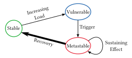
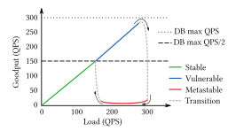

# Metastable Failures in Distributed Systems

Nathan Bronson∗ Rockset, Inc.

Aleksey Charapko University of New Hampshire

## Abstract

We describe metastable failures—a failure pattern in distributed systems. Currently, metastable failures manifest themselves as black swan events; they are outliers because nothing in the past points to their possibility, have a severe impact, and are much easier to explain in hindsight than to predict. Although instances of metastable failures can look different at the surface, deeper analysis shows that they can be understood within the same framework.

We introduce a framework for thinking about metastable failures, apply it to examples observed during years of operating distributed systems at scale, and survey ad-hoc techniques developed post-factum for making systems resilient to known metastable failures. A systematic approach for building systems that are robust against unknown metastable failures remains an open problem.

#### ACM Reference Format:

Nathan Bronson, Abutalib Aghayev, Aleksey Charapko, and Timothy Zhu. 2021. Metastable Failures in Distributed Systems. In Workshop on Hot Topics in Operating Systems (HotOS '21), May 31-June 2, 2021, Ann Arbor, MI, USA. ACM, New York, NY, USA, [7](#page-6-0) pages. <https://doi.org/10.1145/3458336.3465286>

#### 1 Introduction

Robustness is a fundamental goal of distributed systems research. Yet despite years of advances, there are still many system outages in the wild. By reviewing experiences from a decade of operating hyperscale distributed systems, we identify a class of failures that can disrupt them, even when there are no hardware failures, configuration errors,

Permission to make digital or hard copies of all or part of this work for personal or classroom use is granted without fee provided that copies are not made or distributed for profit or commercial advantage and that copies bear this notice and the full citation on the first page. Copyrights for components of this work owned by others than ACM must be honored. Abstracting with credit is permitted. To copy otherwise, or republish, to post on servers or to redistribute to lists, requires prior specific permission and/or a fee. Request permissions from permissions@acm.org.

HotOS '21, May 31-June 2, 2021, Ann Arbor, MI, USA © 2021 Association for Computing Machinery. ACM ISBN 978-1-4503-8438-4/21/05. . . \$15.00 <https://doi.org/10.1145/3458336.3465286>

Abutalib Aghayev The Pennsylvania State University

## Timothy Zhu The Pennsylvania State University

Figure 1: States and transitions of a system experiencing a metastable failure.

or software bugs. These metastable failures have caused widespread outages at large internet companies, lasting from minutes to hours. Paradoxically, the root cause of these failures is often features that improve the efficiency or reliability of the system.

In this work, we define the metastable failure pattern, describe real-world examples and the common traits among them, survey ad-hoc industry practices developed for dealing with metastability, and propose new research directions for systematically addressing these failures.

Metastable failures occur in open systems with an uncontrolled source of load where a trigger causes the system to enter a bad state that persists even when the trigger is removed. In this state the goodput (i.e., throughput of useful work) is unusably low, and there is a sustaining effect—often involving work amplification or decreased overall efficiency that prevents the system from leaving the bad state. Drawing from the definition of metastability in physics [\[19\]](#page-6-1), we call this bad state a metastable failure state. Failures that resolve when the trigger is removed, such as a denial-of-service attack [\[8\]](#page-6-2), limplock [\[9\]](#page-6-3), or livelock [\[2\]](#page-6-4), are not metastable. Leaving a metastable failure state requires a strong corrective push, such as rebooting the system or dramatically reducing the load.

The lifecycle of a metastable failure involves three phases, as shown in [Figure 1.](#page-0-0) A system starts in a stable state. Once the load rises above a certain threshold—implicit and invisible the system enters a vulnerable state. The vulnerable system is healthy, but may fall into an unrecoverable metastable state due to a trigger. The vulnerable state is not an overloaded

∗Formerly at Facebook, Inc.

state; a system can run for months or years in the vulnerable state and then get stuck in a metastable state without any increase in load. In fact, many production systems choose to run in the vulnerable state all the time because it has much higher efficiency than the stable state. When one of many potential triggers causes the system to enter the metastable state, a feedback loop sustains the failure, causing the system to remain in the failure state until a big enough corrective action is applied. In the most severe outages, the feedback loop is contagious, causing portions of the system that weren't exposed to the trigger to enter the failure state as well. It is common for an outage that involves a metastable failure to be initially blamed on the trigger, but the true root cause is the sustaining effect.

Metastable failures have a disproportionate impact on hyperscale distributed systems. The sustaining effect can cause an issue to spread across shard, cluster, and even datacenter boundaries. The strength of many feedback loops is proportional to the scale, so they can slip past even a robust testing and deployment regime. The difference between the trigger and the sustaining effect makes it hard to discover the correct response, increasing the time to recovery. Shedding load as a corrective action can be a further source of disruption for users.

This paper focuses on distributed systems because even a single metastable failure can have a large impact, but the pattern is not limited to this domain. For example, the convoy phenomenon of locks [\[5\]](#page-6-5) is an early instance of a metastable failure occurring in a standalone system. The field of distributed systems is rich with techniques for ensuring reliability in the presence of fail-stop hardware failures [\[10,](#page-6-6) [15\]](#page-6-7), fail-slow hardware failures [\[9\]](#page-6-3), scalability failures [\[16\]](#page-6-8), and software bugs [\[1\]](#page-6-9), among others. However, to the best of our knowledge, there has not been any work that identifies metastable failures as a pattern and introduces a framework within which they can be understood. Although SRE folklore discusses instances of such failures and solutions to them [\[4,](#page-6-10) [11\]](#page-6-11), the responses are failure-specific. More importantly, the study of these large-scale failures have so far eluded academia. The goal of this vision paper is to change that by (i) establishing metastable failures as a class of failures, (ii) analyzing their common traits and characteristics, and (iii) proposing new research directions in identifying, preventing, and recovering from metastable failures.

#### 2 Metastable Failure Case Studies

Metastable failures manifest in a variety of ways, but the sustaining effect is almost always associated with exhaustion of some resource. Surprisingly, feedback loops associated with resource exhaustion are often created by features that improve efficiency and reliability in the steady state.

Figure 2: Goodput of an idealized web application with a database backend in stable, vulnerable, and metastable states.

This section presents simplified versions of a representative subset of the many metastable failures that we have observed in production. Although these cases are easy to explain in retrospect, none of them were identified ahead of time, and some of them recurred many times–over months to years–before being fully resolved.

#### 2.1 Request Retries

One of the most common failure-sustaining mechanisms is request retries. Retrying failed requests is widely used to mask transient issues. However, it also results in work amplification, which can lead to additional failures.

Consider a stateless web application that operates by querying a database server. The database responds to queries under 100 ms if the queries-per-second (QPS) is below 300, but at higher loads, the latency becomes an order of magnitude worse. A user request to the web application results in one query to the database and another retry query if the first query does not return in 1 s.

Assume the web application is operating normally while receiving 280 QPS and a 10 s outage affects the network switch between the application and database. When connectivity is restored, all the packets lost during the outage are retransmitted, including requests and retries sent during the 10 s. This huge surge of requests will overload the database, causing its latency to rise. So long as latency is high, client queries will continue at 560 QPS due to retries. This will prevent the database from recovering. The web application in this state has no goodput because every database query times out. The system is now in a metastable failure state. It will remain there until the load is significantly reduced or the retry policy is changed.

[Figure 2](#page-1-0) illustrates the goodput of this system based on the web application load. The system starts in the stable state and stays in it as long as the load is below 150 QPS. While in the stable state, a trigger will not move the system into the metastable failure state because the database can handle the workload even with the work amplification of retries. Once the load exceeds 150 QPS, however, the system enters a vulnerable state where a trigger can move it into the metastable state. For example, in [Figure 2,](#page-1-0) a trigger occurs when the load is ≈ 280 QPS, and the system moves into the metastable state. Recovery from the metastable state requires reducing the web application load to under 150 QPS or limiting retries to less than 20 QPS.

Closely related to request retry is request failover, where a failure detector is used to route requests to only healthy replicas. Failover doesn't result in request amplification on its own because each request is processed only once, but it can cause failures to cascade. When replicas are sharded differently, a particularly pernicious form of this contagion causes a transient point failure to grow into a total outage.

#### 2.2 Look-aside Cache

Caching can also make architectures vulnerable to sustained outages, especially look-aside caching. Consider a system like that of [§ 2.1,](#page-1-1) but where the application uses a look-aside cache such as memcached [\[3\]](#page-6-12) to cache database results. To keep the math simple, we'll omit retries from this example. Assuming a 90% hit-rate and the same database as before, the web application can now handle 3,000 QPS because only 1 out of 10 user requests result in a database query. However, loads above 300 QPS are in the vulnerable state since every request may need to contact the database in the worst case. If cache contents are lost in the vulnerable state, the database will be pushed into an overloaded state with elevated latency. Unfortunately, the cache will remain empty since the web application is responsible for populating the cache, but its timeout will cause all queries to be considered as failed. Now the system is trapped in the metastable failure state: the low cache hit rate leads to slow database responses, which prevents filling the cache. In effect, losing a cache with a 90% hit-rate causes a 10× query amplification.

#### 2.3 Slow Error Handling

The mechanisms described so far amplify the number of requests when the system encounters a failure, but metastable failure states can also arise when the processing of a request is less efficient in the failure state. A recurring example of this is slow error handling.

Success paths in performance-critical applications are well optimized. The fast path for requests might require only RAM access, for example, with engineers working even to optimize TLB miss rates. The failure path, on the other hand, is typically coded to make debugging easier. It might capture a stack trace (using lots of CPU), obtain the name of the client using a DNS lookup (blocking a thread), record a detailed

message on the local disk (occasionally blocking on disk writes even with buffered I/O), and also send information to a centralized logging service (consuming network bandwidth).

If a trigger causes the system to run out of any of the resources that are used by the error handling code, then error handling will make the shortage more severe. We've seen many examples where this effect is strong enough to cause self-sustaining error states. Again, the only immediate solution is to reduce the load.

## 2.4 Link Imbalance

Metastable failures can hinge on a confluence of implementation details, such that no one person has enough knowledge to figure it out. This can make them challenging to diagnose even after they appear.

In this example [\[6\]](#page-6-13), some of the network hops between a large cluster of read-through cache servers and a large cluster of database servers used aggregated links—multiple physical cables connecting the same pair of switches to provide increased bandwidth. Across such a link, a TCP connection is deterministically assigned to one cable using a hash of the source and destination port and IP address. When averaged across many connections, the load is evenly distributed.

This system, however, turns out to be vulnerable to a metastable failure where all the traffic is assigned to a single link. The targeted link doesn't have sufficient bandwidth, which leads to massive packet loss and system unavailability. Depending on which clusters are affected, the impact could be localized or site-wide.

On the surface, this failure appears impossible. The switch (i) uses a deterministic hash function to compute the hash of source IP, source port, destination IP, and destination port, and (ii) assigns the connection to one of the links based on the hash value. Therefore, the switch cannot force the traffic through a specific link. Similarly, the ports are chosen randomly, independently, and without knowledge of the hash function, so the hosts cannot pick the link. What's going on?

It turns out that the sustaining effect matches the same pattern as the other metastable failures we've examined. The key is that there is a mechanism by which resource exhaustion on the congested link causes it to be preferred for future requests, leading to more congestion.

In this scenario, the caches in this system are subject to sudden spikes of cache misses to a single shard, such as when a user comes online. Each cache server has a dynamic pool of database connections, each of which can process a single query at a time. The cluster of incoming cache misses is sent in parallel from a single cache server to a single database server, each across their own connection. This sets up a race: if one of the network links is congested, then the queries that get sent across that link will reliably complete last. This interacts with the connection pool's MRU policy where the most

recently used connection is preferred for the next query. As a result, each spike of misses rearranges the connection pool so that the highest-latency links are at the top of the stack. Because the number of concurrent misses is much lower in the steady state than during the miss spike, the vast majority of future queries would be routed to the congested link. This completes the feedback loop. If one member of a link group experiences a queueing delay, then all the traffic between the cache cluster and the database cluster shifts to the congested link, ensuring it remains overloaded.

This metastable failure defied explanation for more than two years, causing multiple outages. It was root-caused to many triggers, and prematurely declared fixed several times. Attempts to resolve it included trying switches from different vendors and adding a firmware feature to dynamically change the hash algorithm. Solving it required a joint effort in which engineers from several layers of the stack exchanged implementation details; the problem could not be understood by the application layer using a simplified model of the network, and it could not be solved by the network layer using a simplified model of the application. Although this metastable failure was hard to diagnose, the fix was a single line that changed the connection pool's policy.

#### 3 Approaches to Handling Metastability

In this section, we describe techniques for preventing known metastable failures that have caused outages.

Trigger vs. Root Cause: We consider the root cause of a metastable failure to be the sustaining feedback loop, rather than the trigger. There are many triggers that can lead to the same failure state, so addressing the sustaining effect is much more likely to prevent future outages.

Change of Policy during Overload: One way to weaken or break the feedback loops is to ensure that goodput remains high even during overload. This can be done by changing routing and queueing policies during an overload. For example, we might disable failover and retries or set a retry budget [\[4\]](#page-6-10), switch to LIFO scheduling to allow some requests to meet their deadline, reduce internal queue sizes, enforce priorities during overload [\[12\]](#page-6-14), shed load by rejecting a fraction of requests or clients, or even use the Circuit Breaker pattern to block all requests [\[14\]](#page-6-15). A major challenge with adaptive policies is coordination, as retry and failover decisions are made by each client. The best decisions are made using global information, but the communication required to distribute status information can be a new way in which a failure can have a sustaining effect.

Another fundamental challenge for adaptive policies lies in accurately differentiating persistent overload from load spikes. We have found it effective to measure the minimum queueing latency over a sliding window, as in Codel [\[13\]](#page-6-16), for the internal work queues of the server [\[7\]](#page-6-17). A small value

means that the queue was drained at some point during the window, indicating that even if the queue is large, it is probably a manageable spike. If the minimum queueing latency is large over the entire window, then we switch to a server policy designed to maximize goodput and add information about the overload to all responses.

Prioritization: Another way to retain efficiency when a resource is exhausted is to use priorities. For example, in the retry case study [\(§ 2.1\)](#page-1-1), using a lower priority for retried queries would avoid perpetuating the feedback loop future user queries would be prioritized and succeed, thus eliminating the retries.

The challenge here is that priority systems only manage some of the resources in the system, and they can allow or even encourage policies with high work amplification. In one extreme case, a geo-distributed system that added additional retries and failover destinations to improve its steady-state reliability resulted in a worst-case work amplification of over 100×. Even though it was protected by a sophisticated endto-end priority system that included memory, CPU, threads, and networking resources, it eventually fell victim to a metastable failure involving a backend service used by only a few percent of requests.

Perhaps more importantly, not all architectures are equally amenable to implementing a priority system, which takes experience to realize. For example, in the look-aside cache case [\(§ 2.2\)](#page-2-0), when in a metastable state, filling the cache should have a higher priority than serving the clients. This prioritization is unenforceable with a look-aside cache but trivial with a read-through cache. A read-through cache can have a permissive timeout for database queries; although the web application will give up on the request, the cache will still be filled, which steadily increases the hit rate until the system is healthy again.

Another lesson is that the software structure encodes implicit priorities. For example, a staged request processing architecture that deserializes as many requests as possible before processing them encodes that deserializing is more important than processing. Preserving goodput during overload, on the other hand, requires the opposite policy.

Stress Tests: Stress tests on a replica of a system may help identify metastable failures that occur at a small scale. Unfortunately, the strength of the feedback loop is affected by constant factors that vary with scale, so small scale tests don't provide much confidence that a problem cannot appear at full scale. The alternative is to carefully rebalance production traffic to stress a portion of the production infrastructure, as in Kraken [\[18\]](#page-6-18), with engineers ready to intervene if any anomalies occur. The tooling to support this kind of production stress testing requires a substantial amount of engineering work, but once it is in place it also enables safely draining the target clusters if a metastable failure occurs.

Organizational Incentives: Optimizations that apply only to the common case exacerbate feedback loops because they lead to the system being operated at a larger multiple of the threshold between stable and vulnerable states. For example, an improved cache eviction algorithm will reduce average database load, which makes it seem desirable to reclaim database resources. This kind of change is easy to measure and reward, but it will be a false economy if the system can no longer recover from cache loss. Incentivizing application changes that reduce cold cache misses, on the other hand, yields a true capacity win.

Fast Error Paths: Optimizing the success paths is a wellknown practice. We think distributed systems should also have highly-optimized error paths. One pattern for isolating error handling is to send failures to a dedicated error logging thread via a bounded-size lock-free queue. If the queue overflows then errors are only reflected in a counter, reducing the per-failure overhead dramatically. Similarly, expensive information like stack traces can be throttled; when there are many errors, a sample is enough for diagnosing the problem.

Outlier Hygiene: When investigating a metastable failure from production, we often find that the same root cause manifests earlier as latency outliers or a cluster of errors. Even when the feedback loop isn't strong enough to cause the problem to grow unbounded, it may still cause the trigger to reverberate enough times to stand out.

Autoscaling: Elastic systems are not immune to metastable failure states [\(§ 4\)](#page-4-0), but scaling up to maintain a capacity buffer reduces the vulnerability to most triggers.

### 4 Discussion and Research Directions

Can you predict the next one of these [metastable failures], rather than explain the last one? -VP's plea to an engineer

As many production systems operate in the vulnerable state for efficiency reasons, it is important to go beyond a simple understanding of metastability and dealing with failures in an ad-hoc manner. We must learn to operate in the vulnerable state by achieving two separate goals: (i) designing systems that avoid metastable failures while operating efficiently, and (ii) developing mechanisms to recover from metastable failures as quickly as possible in cases that cannot be avoided. The first goal requires a comprehensive approach that ranges from detecting vulnerable states and potential failures to curtailing the impact of sustaining effects. Detecting vulnerable states is difficult due to the sheer size of the systems and all the different processes affecting them. Predicting failures is even harder since we need to identify the vulnerable state correctly and foresee the potential trigger and its intensity. Many existing solutions [\(§ 3\)](#page-3-0) already try to limit the impact of work amplification and sustaining effects. These approaches, however, are often a reaction to previous failures and are not applied systematically across systems.

The first goal tries to avoid disaster; the second handles clean-up. One approach is to develop recovery techniques that can quickly react to the failure, identify it as a metastable failure, and perform load reduction. Additionally, methods to improve the goodput of the system in the failure state can speed up the recovery by increasing the size of a stable state. Reproducing the failure post-mortem in a controlled environment can provide a lot of value by allowing additional data to be gathered and enabling validation of fixes.

Further research is needed to reach these goals. This section presents unifying themes from our analysis of metastable failures, which point to possible research directions.

How can we design systems that avoid metastable failures? Specifically, can we develop software frameworks for building distributed systems that make problematic feedback loops impossible, or at least discoverable?

Work Amplification: A unifying theme across metastable failures is that the sustaining effect typically involves work amplification, which refers to extra (often wasted) work that is performed in the atypical case. Designing systems to avoid metastable failures will require a systematic understanding of where the largest instances of work amplification occur. Ideally, systems will be designed to upper bound the degree of work amplification.

Feedback Loops: There are many plausible feedback loops in a complex system, yet only a few cause problems. The strength of the loop depends on a host of constant factors from the environment, such as cache hit rate. We don't need to eliminate every loop, just weaken the strongest ones.

What are systematic techniques for accurately identifying vulnerabilities in existing systems?

Characteristic Metric: Another recurring pattern when analyzing metastable failures is that there is often a metric that is affected by the trigger and that only returns to normal after the metastable failure resolves. We call such a metric characteristic and visualize it as a dimension in which it is unsafe to significantly deviate. There may be more than one suitable metric for a particular failure mode. In the retry [\(§ 2.1\)](#page-1-1) and look-aside cache [\(§ 2.2\)](#page-2-0) cases, we could choose database latency or the fraction of requests that timeout. Both of these metrics will spike during the request surge that follows a network outage, and they won't recover until after the metastable failure is resolved. A characteristic metric can give insight into the state of the feedback loop (the memory component of a metastable failure) directly or indirectly.

Characteristic metrics we have observed in production are queueing delay, request latency, load level, working set size, cache hit rate, page faults, swapping, timeout rates, thread counts, lock contention, connection counts, and operation mix. We expect that research into a systematic way to find unknown metastable failures will involve identifying the

important characteristic metrics of a system, which is challenging even on its own. Some metrics, like queueing delay, are much more resilient to changes in the workload and execution environment than others, like queries per second.

Can we give a meaningful estimate of the probability that a novel metastable failure will occur?

Warning Signs: Once a characteristic metric is identified, it can be used to identify a range of safe values. Exiting the range triggers an alarm and maybe an automated intervention. The idea of alerting on internal metrics is not new, but the framework of metastability can allow us to learn the right metrics and thresholds without experiencing major outages.

Hidden Capacity: A helpful concept is that of hidden capacity, which is the boundary between the stable and vulnerable states of [Figure 1.](#page-0-0) In the stable state a trigger can still cause errors, but they will resolve as soon as the trigger is removed. Hidden capacity is the limit at which the system will self-heal. Advertised capacity, in contrast, is the limit at which the system will be in a vulnerable state. Hidden capacity is determined by the behavior and resource usage of the system when it is in a failure state, so it is difficult to measure during normal operation. In the look-aside cache case [\(§ 2.2\)](#page-2-0), the advertised capacity of the web application is 3,000 QPS, while the hidden capacity is 300 QPS because even if the cache server reboots, the database server can handle 300 QPS by itself without leaving the stable state.

Characteristic metrics are central to experimentally measuring hidden capacity. If we run a stress test at some load level, apply a trigger that causes the characteristic metric to spike, and observe that the system quiesces without intervention, then we know that the load level is below the hidden capacity (of this particular failure mode). Hidden capacity can also be estimated indirectly by measuring or deriving work amplification in the metastable state.

Trigger Intensity: Another useful concept is the trigger intensity. The fate of a system is not black-and-white in the vulnerable state; there is a variation in the size of the trigger that will cause a feedback loop. For example, in the retry case [\(§ 2.1\)](#page-1-1), the system can recover from a much larger spike if the load is 151 QPS (near the hidden capacity) rather than 299 QPS (near the advertised capacity). Small triggers are more frequent than large ones, so it is useful to understand the relationship between trigger size and characteristic metric. It's well known that distributed systems are harder to operate when they operate near their maximum advertised capacity. We observe that this is often the case because such systems are vulnerable to even very weak triggers.

Can we resolve metastable failures by leveraging elastic cloud infrastructures?

Reconfiguration Cost: Elastic systems deliver extra capacity on demand, which ideally has the same per-server

effect as reducing client load. Unfortunately, unless a stateful system is specifically designed to provide zero-impact elasticity, reconfiguration will reduce capacity in the short term. Existing members must perform state transfers and metadata updates on top of their normal workload. Although reconfiguration will eventually break a feedback loop, the timeframe may be too long to be a viable recovery strategy. Research on reconfiguration during resource exhaustion could lead to improvements in practical reliability.

How can we accurately model or reproduce metastable failures without a full-scale replica, or from specifications?

As illustrated by the example in [§ 2.4,](#page-2-1) the cause of metastability can easily be obscured by abstraction or by aggregate statistics, so simplified models are likely to be insufficient. Distributed systems are composed of a myriad of queues, from an SSD's I/O scheduler to the queues in a network switch, any of which may need to be adjusted to account for reduced scale. This makes small-scale reproduction of complex metastable failures challenging. The queues are very high performance, so precise simulation is painfully slow.

Rather than aiming for perfect fidelity, we think that progress on this front will come from controlling a test environment so that its characteristic metrics match those from full scale environments. When using a synthetic workload to trigger a metastable failure, the load generator must not exhibit coordinated omission [\[17\]](#page-6-19). Proving the absence of a particular metastable failure may be possible by modeling worst case behavior or an adversarial environment.

How does an implementation or configuration change affect the strength of a sustaining effect?

Understanding how the constant factors of feedback loops are affected by system changes would be impactful in several ways. It would give us insight into how to address found issues; it would give us confidence that system changes would not create a vulnerability; and it would be a very powerful tool when trying to reproduce issues at reduced scale.

#### 5 Conclusion

Metastable failures are a class of failures that impact distributed systems. They naturally arise from optimizations and policies that improve behavior in the common case. They are an emergent behavior rather than a logic bug—one cannot write a unit or integration test to trigger them. As such, they are rare, but can have catastrophic effects. We have presented a few of the cases we have observed in production over the years, along with our analysis and some techniques to counter known metastable failures. Our hope is that this paper starts a discussion on this failure pattern in the community to better understand them and improve our ability to build systems that are robust to unknown metastable failures.

## References

- [1] Joe Armstrong. Making reliable distributed systems in the presence of software errors. PhD thesis, 2003.
- [2] E.A. Ashcroft. Proving assertions about parallel programs. Journal of Computer and System Sciences, 10(1):110–135, 1975.
- [3] Memcached authors. Memcached. [https://memcached.org/,](https://memcached.org/) 2021.
- [4] Betsy Beyer, Jennifer Petoff, Niall Richard Murphy, and Chris Jones. Site Reliability Engineering: How Google Runs Production Systems. [https://sre.google/sre-book/table-of-contents/,](https://sre.google/sre-book/table-of-contents/) 2016.
- [5] Mike Blasgen, Jim Gray, Mike Mitoma, and Tom Price. The Convoy Phenomenon. SIGOPS Oper. Syst. Rev., 13(2):20–25, April 1979.
- [6] Nathan G Bronson. Solving the Mystery of Link Imbalance: A Metastable Failure State at Scale. [https://engineering.fb.com/2014/11/](https://engineering.fb.com/2014/11/14/production-engineering/solving-the-mystery-of-link-imbalance-a-metastable-failure-state-at-scale/) [14/production-engineering/solving-the-mystery-of-link-imbalance](https://engineering.fb.com/2014/11/14/production-engineering/solving-the-mystery-of-link-imbalance-a-metastable-failure-state-at-scale/)[a-metastable-failure-state-at-scale/,](https://engineering.fb.com/2014/11/14/production-engineering/solving-the-mystery-of-link-imbalance-a-metastable-failure-state-at-scale/) 2014.
- [7] Nathan G Bronson. Balancing Multi-Tenancy and Isolation at 4 Billion QPS. [https://www.youtube.com/watch?v=dATHiDHS3Mo,](https://www.youtube.com/watch?v=dATHiDHS3Mo) 2015.
- [8] Cloudflare. What is a DDoS Attack? [https://www.cloudflare.com/](https://www.cloudflare.com/learning/ddos/what-is-a-ddos-attack/) [learning/ddos/what-is-a-ddos-attack/,](https://www.cloudflare.com/learning/ddos/what-is-a-ddos-attack/) 2021.
- [9] Thanh Do, Mingzhe Hao, Tanakorn Leesatapornwongsa, Tiratat Patana-anake, and Haryadi S. Gunawi. Limplock: Understanding the Impact of Limpware on Scale-out Cloud Systems. In Proceedings of the 4th Annual Symposium on Cloud Computing, SOCC '13, New York, NY, USA, 2013. Association for Computing Machinery.
- [10] Leslie Lamport. The Part-Time Parliament. ACM Trans. Comput. Syst., 16(2):133–169, May 1998.
- [11] Ben Maurer. Fail at Scale: Reliability in the Face of Rapid Change. ACM Queue, 13(8):30–46, September 2015.
- [12] Arif Merchant, Mustafa Uysal, Pradeep Padala, Xiaoyun Zhu, Sharad Singhal, and Kang Shin. Maestro: Quality-of-service in large disk

- arrays. In Proceedings of the 8th ACM international conference on Autonomic computing (ICAC), pages 245–254, New York, NY, USA, 2011.
- [13] Kathleen Nichols and Van Jacobson. Controlling queue delay: A modern aqm is just one piece of the solution to bufferbloat. Queue, 10(5):20–34, May 2012.
- [14] Michael Nygard. Release It! Design and Deploy Production-Ready Software. Pragmatic Bookshelf, 2007.
- [15] Diego Ongaro and John Ousterhout. In Search of an Understandable Consensus Algorithm. In Proceedings of the 2014 USENIX Conference on USENIX Annual Technical Conference, USENIX ATC'14, page 305–320, USA, 2014. USENIX Association.
- [16] Cesar A. Stuardo, Tanakorn Leesatapornwongsa, Riza O. Suminto, Huan Ke, Jeffrey F. Lukman, Wei-Chiu Chuang, Shan Lu, and Haryadi S. Gunawi. ScaleCheck: A Single-Machine Approach for Discovering Scalability Bugs in Large Distributed Systems. In 17th USENIX Conference on File and Storage Technologies (FAST 19), pages 359–373, Boston, MA, February 2019. USENIX Association.
- [17] Gil Tene. How NOT to Measure Latency. [https://www.youtube.com/](https://www.youtube.com/watch?v=lJ8ydIuPFeU) [watch?v=lJ8ydIuPFeU,](https://www.youtube.com/watch?v=lJ8ydIuPFeU) 2015.
- [18] Kaushik Veeraraghavan, Justin Meza, David Chou, Wonho Kim, Sonia Margulis, Scott Michelson, Rajesh Nishtala, Daniel Obenshain, Dmitri Perelman, and Yee Jiun Song. Kraken: Leveraging live traffic tests to identify and resolve resource utilization bottlenecks in large scale web services. In Proceedings of the 12th USENIX Conference on Operating Systems Design and Implementation, OSDI'16, page 635–650, USA, 2016. USENIX Association.
- [19] Wikipedia. Metastability. [https://en.wikipedia.org/wiki/Metastability,](https://en.wikipedia.org/wiki/Metastability) 2021.