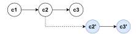
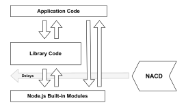
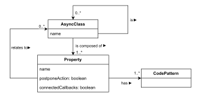
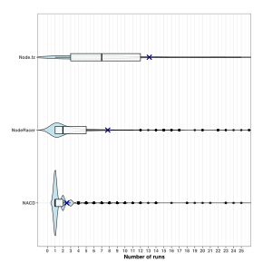
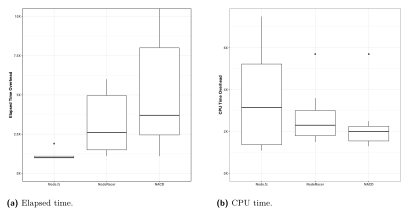
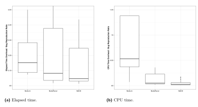

# **Event Race Detection for Node.js Using Delay Injections**

**Andre Takeshi Endo** [#](mailto:andreendo@ufscar.br)

Federal University of São Carlos, Brazil

**Anders Møller** [#](mailto:amoeller@cs.au.dk)

Aarhus University, Denmark

# **Abstract**

Node.js is a widely used platform for building JavaScript server-side web applications, desktop applications, and software engineering tools. Its asynchronous execution model is essential for performance, but also gives rise to event races, which cause many subtle bugs that can be hard to detect and reproduce. Current solutions to expose such races are based on modifications of the source code of the Node.js system or on guided executions using complex happens-before modeling.

This paper presents a simpler and more effective approach called NACD that works by dynamically instrumenting core asynchronous operations in the Node.js runtime system to inject delays and thereby reveal event race bugs. It consists of a small, robust runtime instrumentation module implemented in JavaScript that is configured by a flexible JSON model of the essential parts of the Node.js API. Experimental results show that NACD can reproduce event race bugs with higher probability and fewer runs than state-of-the-art tools.

**2012 ACM Subject Classification** Software and its engineering → Software testing and debugging

**Keywords and phrases** JavaScript, race conditions, flaky tests, event races, callback interleaving

**Digital Object Identifier** [10.4230/LIPIcs.ECOOP.2025.10](https://doi.org/10.4230/LIPIcs.ECOOP.2025.10)

**Funding** *Andre Takeshi Endo*: Supported by grant #2023/00577-8, São Paulo Research Foundation (FAPESP), Brazil.

# **1 Introduction**

Node.js[1](#page-0-0) is an asynchronous, event-driven JavaScript runtime designed for building scalable network applications. Its single-threaded, non-blocking I/O architecture makes it well suited for server-side web applications, microservices, desktop applications, and command-line tools. Node.js comes with a lean core API that offers access to file systems, networking, cryptography, timers, and processes, and is supported by a vast ecosystem of open-source libraries and frameworks available via the npm[2](#page-0-1) package manager.

The single-threaded asynchronous execution model of Node.js brings new challenges regarding concurrency [\[18\]](#page-26-0). To avoid blocking the main thread, Node.js delegates I/O or high processing tasks to worker threads that run in the background. These tasks are initiated through asynchronous calls, and their results are processed through JavaScript callbacks acting as event handlers. The single-threaded model makes a Node.js application immune to traditional data races. However, the timing of worker threads and event handlers is non-deterministic, which makes Node.js applications prone to so-called event races.

Event races may cause system crashes, data corruption, application hangs, and security vulnerabilities. Detecting whether a program is susceptible to such harmful event races is often challenging. Approaches like NodeAV [\[6\]](#page-25-0), NRace [\[7\]](#page-25-1) and NodeRT [\[30\]](#page-27-0) adopt a

© Andre Takeshi Endo and Anders Møller; licensed under Creative Commons License CC-BY 4.0 39th European Conference on Object-Oriented Programming (ECOOP 2025). Editors: Jonathan Aldrich and Alexandra Silva; Article No. 10; pp. 10:1–10:28 [Leibniz International Proceedings in Informatics](https://www.dagstuhl.de/lipics/) [Schloss Dagstuhl – Leibniz-Zentrum für Informatik, Dagstuhl Publishing, Germany](https://www.dagstuhl.de)

<span id="page-0-0"></span><sup>1</sup> <https://nodejs.org/>

<span id="page-0-1"></span><sup>2</sup> <https://www.npmjs.com/>

predictive strategy in which a happens-before model is built and used to predict event races from individual executions. Not all event races are harmful, so predictive approaches also employ mechanisms to filter out harmless races. Still, a key limitation of these predictive techniques is that they often produce many false positives.

Another group of approaches employ dynamic exploration or fuzzing of interleavings to produce executions that expose harmful event races. Node.fz [\[9\]](#page-25-2) is based on a modification of the internal parts of Node.js written in C/C++ code to shuffle the task and event queues and thereby fuzz the scheduling of worker threads and event handlers. This approach is limited to reordering entries that are present in the scheduler queues, and it is difficult to maintain as Node.js evolves.[3](#page-1-0) Differently, NodeRacer [\[11\]](#page-26-1) works on the JavaScript side. It first observes a sample run, builds a happens-before graph, and then uses it in subsequent runs to explore different callback interleavings by instrumenting the application code to selectively postpone event handler executions. Although NodeRacer has shown to be effective in many cases, by design it only explores interleavings of the events seen in the sample run. As shown in Section [2,](#page-2-0) this prevents detection of certain event race errors.

We need an approach that (1) generates witnesses in the form of crashes or test failures whenever potential event race errors are reported (unlike NodeAV, NRace, and NodeRT), (2) does not require modifications of the Node.js source code (unlike Node.fz), and (3) is not limited to reordering of scheduler queues (unlike Node.fz) or event handler callbacks (unlike NodeRacer). This paper presents an event race detection technique named nacd[4](#page-1-1) that satisfies these requirements. It is inspired by Node.fz and NodeRacer, but with some key differences that enhance maintainability and efficacy. The key idea is to fuzz the scheduling of event handlers by dynamically injecting random delays around both before and after the asynchronous functions in the built-in Node.js modules. This is achieved purely using JavaScript code, without modifications of the Node.js source code, and it avoids the complications of implementing happens-before computation and the overhead of program code instrumentation. By introducing delays rather than merely attempting to reorder events, more bugs can be found.

In summary, this paper makes the following main contributions:

- **1.** We describe the design of nacd: a novel approach to event race detection for Node.js applications. It consists of a JavaScript component that dynamically instruments the Node.js module loading mechanism and is configured using a JSON model of the asynchronous operations in the Node.js API.
- **2.** We present an experimental evaluation based on benchmarks from prior work, demonstrating that the approach has a high bug reproduction ratio and tends to find bugs with fewer runs compared to Node.fz and NodeRacer.

The remainder of the paper is organized as follows. Section [2](#page-2-0) gives a motivating example. Section [3](#page-3-0) describes the proposed approach, while Section [4](#page-12-0) shows the main implementation details. Section [5](#page-14-0) presents an experimental evaluation we conducted and the results obtained. Section [6](#page-21-0) discusses the main limitations. The related work is presented in Section [7,](#page-22-0) and Section [8](#page-24-0) makes the concluding remarks.

<span id="page-1-0"></span><sup>3</sup> The Node.fz implementation was based on Node.js v0.12.7, which is 32,720 commits from the latest version at the time of writing.

<span id="page-1-1"></span><sup>4</sup> Node.js Asynchronous Callback Delayer.

```
1 const fse = require('fs-extra');
2
3 it('should delete without a callback', (done) => { /*c1*/
4 const filePath = TEST_DIR + 'file.txt';
5 createFileSync(filePath, 'some text');
6
7 const existsChecker = setInterval(() => { /*c2*/
8 fse.pathExists(filePath, (itDoes) => { /*c3*/
9 if (!itDoes) {
10 clearInterval(existsChecker);
11 done();
12 }
13 });
14 }, 25);
15 fse.remove(file);
16 });
```

**Figure 1** Motivating example.

# <span id="page-2-0"></span>**2 Motivating Example**

Figure [1](#page-2-1) contains JavaScript code that is subjected to a race condition; this motivating example is based on a previously unknown race condition detected by nacd in the widely used Node.js package called fs-extra. [5](#page-2-2) The code defines a test case for function fse.remove that receives the file path as argument and removes the file asynchronously. The test, here named c1 (lines 3–16), intends to check if the removal is successful. Argument done is a function that signals to the test runner when the test is completed.[6](#page-2-3) The test starts in lines 4–5 creating a text file that will be removed afterwards. In line 7, a timer is started[7](#page-2-4) and its callback c2 (lines 7–14) is called every 25 milliseconds. Line 15 executes the function under test that will remove the created file asynchronously. To test this operation, callback c2 checks in line 8 if the file still exists, using an asynchronous call to pathExists with callback c3. Within c3, if the file does not exist (line 9), the timer is stopped (line 10) and the test ends successfully by calling function done in line 11.

Due to an existing race condition, this test is flaky as it may pass or fail nondeterministically [\[20\]](#page-26-2). This issue was reported and a pull request fixing it was accepted and merged.[8](#page-2-5) Figure [2](#page-3-1) illustrates the callback ordering, using directed edges to indicate happens-before relations between callbacks (nodes). The first row represents trivial executions (i.e., passing test runs) in which c2 is enqueued only once by the timer, and c3 stops the timer before c2 is scheduled again. The race occurs if function fse.pathExists (line 8) takes long enough for the timer (line 7) to enqueue a new instance of its callback, referred to as c2'. The nodes and edges in the second row represent event handlers that only exist in this situation. When c2' is scheduled to run, it calls function fse.pathExists again, provoking a second instance of its callback, referred to as c3'. Both instances of c3 are eventually invoked, and function done is called twice, which makes the test runner report a test failure even though the file has been removed.

The package fs-extra provides extra features for file system manipulation in Node.js. It uses other packages like graceful-fs, but ultimately those features depend on the Node.js built-in module fs. This scenario is predominant in Node.js applications, where application

<span id="page-2-2"></span><sup>5</sup> <https://www.npmjs.com/package/fs-extra>

<span id="page-2-3"></span><sup>6</sup> This mechanism is defined by testing frameworks like Mocha and Jest to test asynchronous code.

<span id="page-2-4"></span><sup>7</sup> setInterval is a Node.js function that starts a timer whose associated callback is called repeatedly after a number of milliseconds. It can be stopped by calling function clearInterval.

<span id="page-2-5"></span><sup>8</sup> <https://github.com/jprichardson/node-fs-extra/pull/736>



<span id="page-3-1"></span>**Figure 2** Callback order for motivating example.

code may use numerous third-party packages, but the asynchronous behavior comes from the built-in modules of Node.js. Notice in the example that, while fs is not used directly, several of its functions are called. An ordinary run of this test indirectly calls seven different fs functions with asynchronous behavior. In particular, package fs-extra's function fse.pathExists is a promise-supported wrapper that uses built-in function fs.access.

Current versions of state-of-the-art tools cannot uncover the race bug illustrated in the example. Approaches based on happens-before relations (e.g., NodeRacer, NodeRT) rely on a logging phase to collect a trace and build happens-before relations. As previously discussed, an ordinary run will trace data to build happens-before relations similarly to the first row in Figure [2.](#page-3-1) If there is no potential interleaving between the callbacks, these approaches will fail to flag or explore this event race. Node.fz, which applies a different strategy, is also not capable of revealing this event race because it is not compatible with the Node.js version used by the project and cannot introduce sufficiently long delays [\[11\]](#page-26-1).

# <span id="page-3-0"></span>**3 Approach**

Our approach to uncover event races, such as the one described in the previous section, is based on the observation that the asynchronous behavior originates from the core API provided by the Node.js built-in modules. By dynamically instrumenting those functions, we can introduce delays that will help to explore different callback interleavings and, as a consequence, increase the likelihood of exposing race bugs. Although centered on Node.js, the proposed approach is sufficiently general to be adapted to any software runtime that follows a single-threaded asynchronous model.

Figure [3](#page-4-0) gives an overview of the proposed approach. A Node.js application consists of application code together with library code in the form of npm packages. Both application code and library code interact with Node.js built-in modules in order to access features related to networking, file system, cryptography, compression, etc. The key idea behind nacd is to inject delays in the asynchronous core API of the built-in modules, so that different interleavings of callbacks are explored, independently of the application and library code. For instance, delaying the callback of built-in function fs.access would be enough for c2' to be scheduled and provoke the event race in Figures [1](#page-2-1)[-2.](#page-3-1) This requires no manipulation of application or library code, and explores callback interleavings within both levels.

To obtain a clean and extensible implementation of nacd, we first design a model of the API, describing its asynchronous behavior. As the Node.js built-in modules provide different API styles to perform asynchronous tasks, the model is based on a number of code patterns that are described in Section [3.1.](#page-4-1) Using this model, a runtime system instruments the API to inject delays that foster the execution of different callback scheduling. The runtime system and delay injection mechanisms are presented in Section [3.2.](#page-9-0)

<span id="page-4-0"></span>

**Figure 3** Overview of the proposed approach.

<span id="page-4-2"></span>

**Figure 4** Model representation.

# <span id="page-4-1"></span>**3.1 Modeling Node.js Asynchronous API**

To perform the modeling of Node.js asynchronous API required to implement nacd, we have carefully studied the built-in modules and how they use asynchrony. Figure [4](#page-4-2) shows how the proposed model is structured. It consists of a collection of *async classes*, each describing a module (e.g., zlib) or a class in the Node.js standard library (e.g., zlib.ZlibTransformInterface). Each async class has a name and is composed of *properties*. An async class can also inherit properties from other async classes, specified using the relationship is. For instance, several objects from the core API are event emitters, so we have an async class EventEmitter and several other classes inheriting from it.

The properties of an async class describe its functions and other objects. Each property may involve different forms of asynchronous behavior; we group these different styles in code patterns. Additionally, each property can be flagged as postponeAction or as connectedCallbacks, the meaning of which is explained below. Properties can also be related to other async classes; for example, a function may return an object with asynchronous behavior specified by another async class. Representative examples are presented in the following.

Next, we describe the asynchronous code patterns found in Node.js built-in modules. The

identified code patterns are presented as follows together with illustrative example code.

**Simple callback (**CB**)** This pattern represents the most common case in which a function is associated with an asynchronous task and receives a callback as one of its arguments, which is scheduled to run in the future as a reaction to the task. Figure [5a](#page-5-0) shows an example where function readFile of the fs module is used to read the contents of a file and callback c4 is called when the file contents are ready.

```
18 const fs = require('fs')
19 ...
20 fs.readFile('file.txt', (err, data) => { /*c4*/
21 ...
22 })
```

**(a)** Example code

```
23 {
24 "moduleName": "fs",
25 "properties": [
26 {
27 "name": "readFile",
28 "type": [ "CB" ],
29 "postponeAction": true
30 },
31 ...
32 ]
33 }
```

**(b)** Model snippet

**Figure 5** Simple callback pattern.

Figure [5b](#page-5-0) shows how this code pattern is represented in the model. Using a JSON object for built-in module fs (line 24), it has an array of properties (starting in line 25). Function readFile (line 27) is identified with type CB (line 28), and the postponeAction is set to true, which instructs nacd to inject delays not only when c4 is about to be executed but also before the file read action itself, thereby enabling exploration of alternative schedules that involve external actions.

**Returned object (**RO**)** This represents the case in which a function returns an object that is an instance of an async class. We refer to such objects as *async objects*. In Figure [6a,](#page-6-0) function createGzip of zlib returns an object (i.e., gzip) that supports compression using gzip (line [36\)](#page-6-1). Object gzip is known within the API to have asynchronous behavior, as is later used to register callbacks for asynchronous events (lines [38–](#page-6-2)[39\)](#page-6-3).

Figure [6b](#page-6-0) shows how this code pattern is modeled. A JSON object for createGzip (line 44) with type RO (line 45) is defined as a property of zlib (line 41). Particularly, this code pattern requires attribute returnedObject (line 47). This attribute points to a different class (e.g., zlib.ZlibTransformInterface in lines 53–57) which has its own async behavior specified (omitted here). Consequently, the functions called in lines [38](#page-6-2)[–39](#page-6-3) of Figure [6a](#page-6-0) are identified by the model of zlib.ZlibTransformInterface.

**Object creation (**OC**)** This code pattern is similar to the previous case; here a class is employed to instantiate an async object. In Figure [7a,](#page-7-0) class Agent of built-in module http is used to instantiate an async object named agent (line [60\)](#page-7-1).

Figure [7b](#page-7-0) shows how this code pattern is modeled. A JSON object for Agent (line 67) with type OC (line 68) is defined as a property of http (line 64). Similarly to the previous

```
34 const zlib = require('zlib')
35 ...
36 const gzip = zlib.createGzip()
37 ...
38 gzip.on('data', () => { ... })
39 gzip.on('end', () => { ... })
```

```
40 {
41 "moduleName": "zlib",
42 "properties": [
43 {
44 "name": "createGzip",
45 "type": [ "RO" ],
46 "postponeAction": false,
47 "returnedObject": "zlib.ZlibTransformInterface"
48 },
49 ...
50 ]
51 },
52 ...
53 {
54 "moduleName": "zlib.ZlibTransformInterface",
55 "is": [ "stream.Transform" ],
56 "properties": [ ... ]
57 }
```

- **(b)** Model snippet
- **Figure 6** Returned object pattern.

code pattern, attribute returnedObject (line 70) has a reference for a different async class (http.Agent in lines 76–79).

**Object property (**OP**)** In this case, an async class has a property that is an async object itself. In Figure [8a,](#page-8-0) object childProcess is returned to represent a new process created using function spawn of built-in module child\_process (line [82\)](#page-8-1). This object has property stdout which is an async object itself for the standard output of the process (line [84\)](#page-8-2).

Figure [8b](#page-8-0) shows how this code pattern is modeled. A JSON object for child\_process.ChildProcess (line 98) is defined as the returnedObject attribute of function spawn (line 91). Among the properties of child\_process.ChildProcess, stdout (line 101) is defined with type OP, requiring attribute AsyncObjectProperty that links to a different async class (i.e., stream.ReadStream).

**Callback object (**CO**)** In this case, the argument of a callback is an async object. In Figure [9a,](#page-9-1) function createServer of built-in module net is called to create a server, passing a callback for new connections (line [110\)](#page-9-2). The argument of this callback, namely socket, is an async object itself.

Figure [9b](#page-9-1) shows how this code pattern is modeled. Using a JSON object for built-in module net (line 115), createServer (line 118) is defined with type CO (line 119). This code pattern requires attribute callbackObjects (line 121) with an array of async classes related to the arguments of its callback. In this example, the argument of createServer's callback is a socket, represented in the model by async class net.Socket (lines 127–130).

```
58 const http = require('http')
59 ...
60 const agent = new http.Agent()
61 ...
62 agent.on('free', () => { ... })
```

```
63 {
64 "moduleName": "http",
65 "properties": [
66 {
67 "name": "Agent",
68 "type": [ "OC" ],
69 "postponeAction": false,
70 "returnedObject": "http.Agent"
71 },
72 ...
73 ]
74 },
75 ...
76 {
77 "moduleName": "http.Agent",
78 "is": [ "EventEmitter" ]
79 }
```

**(b)** Model snippet

**Figure 7** Object creation pattern.

**Returned promise (**RP**)** Some built-in modules support the use of JavaScript promises.[9](#page-7-2) A promise is standard JavaScript built-in object that provides an abstraction for the result of an asynchronous computation [\[3\]](#page-25-3). Its eventual completion or failure is referred to as the promise being resolved or rejected, respectively. In either case, we say that the promise is settled.

In Figure [10a,](#page-10-0) function resolve is loaded from the promise API of built-in module dns (line [131\)](#page-10-1). This function triggers a task to resolve a hostname, 'example.org', and returns a promise, which is asynchronously settled with an array of resource records. The result of this function is processed using promise.then in lines [134–](#page-10-2)[135,](#page-10-3) while the function may be also used in the context of the JavaScript async-await style in line [140.](#page-10-4)

Figure [10b](#page-10-0) shows how this code pattern is modeled. The promise API is defined as an object property (line 149) of built-in module dns (line 144). Within dns.Promises (lines 155–164), function resolve (line 159) is identified with type RP (line 160).

nacd injects delays only into the promises returned by the core API of Node.js built-in modules. No special treatment is necessary for promise chains; delaying the settlement of the first promise in a chain automatically also affects the remaining promises in the chain.

**Combining code patterns** Code patterns may be combined to represent the async behavior of more complex API functions. Figure [11](#page-11-0) shows an example with an HTTP GET request. (To avoid redundancy from previously explanations, we omit the model code in the examples presented here.) In line [167,](#page-11-1) function get of built-in module http is used to request a JSON file from a web site. Making an HTTP request is an asynchronous operation, and a callback is also passed as the last argument. As mentioned before, this represents the code pattern *simple callback*. This callback receives as an argument an async object res, which has its

<span id="page-7-2"></span><sup>9</sup> [https://developer.mozilla.org/docs/Web/JavaScript/Reference/Global\\_Objects/Promise](https://developer.mozilla.org/docs/Web/JavaScript/Reference/Global_Objects/Promise)

```
80 const { spawn } = require('child_process')
81 ...
82 const childProcess = spawn('ls', ['-l', '/usr'])
83 ...
84 childProcess.stdout.on('data', (data) => { ... })
```

```
85 {
86 "moduleName": "child_process",
87 "properties": [
88 {
89 "name": "spawn",
90 "type": [ "RO" ],
91 "returnedObject": "child_process.ChildProcess"
92 },
93 ...
94 ]
95 },
96 ...
97 {
98 "moduleName": "child_process.ChildProcess",
99 "properties": [
100 {
101 "name": "stdout",
102 "type": [ "OP" ],
103 "AsyncObjectProperty": "stream.ReadStream"
104 },
105 ...
106 ]
107 }
```

- **(b)** Model snippet
- **Figure 8** Object property pattern.

own asynchronous behavior (lines [168](#page-11-2)[–169\)](#page-11-3); this characterizes the code pattern *callback object*. Finally, function http.get returns object clientRequest (line [167\)](#page-11-1), which also has asynchronous behavior (line [172\)](#page-11-4), corresponding to code pattern *returned object*. Notice that for function http.get and other functions in the built-in modules, two or more code patterns may be present. The proposed model represents those cases with an array that identifies all patterns in attribute type, as well as other pattern-specific attributes.

**Connected callbacks** I/O operations and CPU-intensive tasks in Node.js applications are treated outside JavaScript code and concurrently by the workers. Therefore, an order among their callbacks cannot be established [\[11,](#page-26-1) [6\]](#page-25-0). Nevertheless, this does not hold with event emitter objects from the core API. The event-driven architecture of Node.js is implemented by special objects called *event emitters*. [10](#page-8-3) With such objects, callbacks can be associated with a named event; once an event is emitted, its associated callbacks are scheduled to run.

Figure [12](#page-11-5) shows an example of such a case. First, a readable stream object (that is, an event emitter) is created for some JSON file (line [175\)](#page-11-6). Then, callbacks cbData, cbEnd, and cbClose are registered for events 'data', 'end', and 'close', respectively. The readable stream emits several 'data' events for each chunk of data read from the file, emits 'end' when there is no more data to consume, and finally emits 'close' when the underlying file descriptor is closed. So, callbacks cbData, cbEnd, and cbClose are asynchronous and related to I/O operations, but are ordered in the context of the event emitter object. We call them

<span id="page-8-3"></span><sup>10</sup> <https://nodejs.org/api/events.html>

```
108 const net = require('net')
109 ...
110 net.createServer(function (socket) {
111 socket.on('data', (data) => { ... })
112 socket.on('error', () => { ... })
113 })
```

```
114 {
115 "moduleName": "net",
116 "properties": [
117 {
118 "name": "createServer",
119 "type": [ "CO" ],
120 "postponeAction": false,
121 "callbackObjects": [ "net.Socket" ]
122 },
123 ...
124 ]
125 }
126 ...
127 {
128 "moduleName": "net.Socket",
129 ...
130 }
```

- **(b)** Model snippet
- **Figure 9** Callback object pattern.

*connected callbacks*. This case is indicated in the model using the connectedCallbacks flag. A key observation here is that for event emitters from the core API, the order in which its *connected* callbacks are scheduled by Node.js needs to be preserved when inserting the delays. So, we specify such cases in our model, and nacd's instrumentation provides the needed information for the delays being injected while respecting such order. To do so, we use a mechanism based on queues, described in Section [3.2.](#page-9-0)

**Streams** All streams in the Node.js core API are also event emitters. As such, they can draw asynchronous behavior through their event emitters. However, streams may also propagate asynchrony by other means, as illustrated in Figure [13.](#page-12-1) A readable stream from an XML file is instantiated (line [195\)](#page-12-2) and, using the pipe method, a writable stream parser (line [196\)](#page-12-3) provided by a third-party library is attached. The callbacks in lines [197–](#page-12-4)[198](#page-12-5) are from parser, but are also asynchronous since they react based on the readable stream. To handle such cases, nacd injects delays in modeled functions of the stream objects so that different callback interleavings may be explored even in the presence of streams. In this example, the model represents the readable stream's \_read function that fetches data from the underlying resource.

# <span id="page-9-0"></span>**3.2 Runtime System**

Using the model of the asynchronous behavior of the Node.js API, the nacd runtime system installs hooks in the asynchronous operations that we intend to delay. Such hooks, named onRun, are invoked right before an asynchronous operation is about to run; at this moment, nacd may decide to inject a delay. This step occurs at runtime and on-demand, as nacd intercepts the Node.js application's accesses to the core API. The implementation details are presented in Section [4.](#page-12-0)

```
131 const { resolve } = require('dns').promises
132 ...
133 // example 1
134 resolve('example.org')
135 .then((records) => { ... })
136
137 // example 2
138 async function () {
139 ...
140 const records = await resolve('example.org')
141 ...
142 };
```

```
143 {
144 "moduleName": "dns",
145 "properties": [
146 {
147 "name": "promises",
148 "type": [ "OP" ],
149 "AsyncObjectProperty": "dns.Promises"
150 },
151 ...
152 ]
153 },
154 ...
155 {
156 "moduleName": "dns.Promises",
157 "properties": [
158 {
159 "name": "resolve",
160 "type": [ "RP" ]
161 },
162 ...
163 ]
164 }
```

**(b)** Model snippet

**Figure 10** Returned promise pattern.

The model specified in Section [3.1](#page-4-1) defines which functions and objects are tracked, providing the needed information to install onRun hooks. Algorithm [1](#page-12-6) illustrates what those hooks look like. As discussed, function onRun is invoked for each asynchronous operation nacd tracks. The first argument op is an object with all the needed information to run the asynchronous operation; in most cases, op refers to a callback, but may also refer to a promise (see pattern *returned promise*). The second argument connected is a Boolean value that specifies whether or not op is a connected callback. If connected is true, then the third argument objectID comes with an integer that uniquely identifies the object with which op may have other connected callbacks. During the instrumentation, nacd uses the model's information to identify connected callbacks, and it keeps track of instantiation of async objects so that unique IDs (objectID) are correctly assigned. In line [200,](#page-12-7) nacd checks if op is connected and invokes either decideSimpleDelay or decideConnectedDelay. These two cases are explained as follows.

**Simple delays** This is the simple case where the delay nacd applies does not depend on any other operation. Algorithm [2](#page-13-0) describes how nacd decides whether or not to delay an asynchronous operation op. Function decideSimpleDelay is called when an asynchronous operation op is about to run. First, function makeChoice makes random choices and returns a Boolean variable (delay) and an integer (timeout) (line [206\)](#page-13-1). If delay is true (line [207\)](#page-13-2),

```
165 const http = require('http')
166
167 const clientRequest = http.get('http://some.site/file.json', (res) => {
168 res.on('data', (chunk) => { ... })
169 res.on('end', () => { ... })
170 })
171
172 clientRequest.on('close', () => { ... })
```

<span id="page-11-4"></span>**Figure 11** Example of combining different code patterns.

```
173 const fs = require('fs')
174
175 const readStream = fs.createReadStream('some_file.json')
176 let rawData = ''
177 let pkg
178
179 readStream.on('data', function cbData(chunk) {
180 rawData += chunk
181 })
182
183 readStream.on('end', function cbEnd() {
184 pkg = JSON.parse(rawData)
185 })
186
187 readStream.on('close', function cbClose() {
188 useObject(pkg)
189 })
```

**Figure 12** Example of connected callbacks.

op is delayed for timeout miliseconds (line [208\)](#page-13-3); otherwise, op is run immediately (line [210\)](#page-13-4). We discuss how the random choices of function makeChoice are implemented in Section [4.](#page-12-0) In nacd, this delay mechanism is applied in three different operations:

- **1.** Callback: The async callback is completely independent; as such, any delay injected in it should not interfere with the execution, apart from delaying it.
- **2.** Registration: In some cases we modeled, it is possible to delay the registration (start) of an asynchronous task. For instance, when deleting a file, nacd delays when this operation is actually run, not its callback. This may reveal race conditions outside of Node.js. These cases are marked with postponeAction in the model.
- **3.** Promise: In this case, the returned promise has its fullfilment delayed. So, we simulate the case where the asynchronous task takes a longer time to complete.

**Connected callbacks** We now describe how to inject delays while preserving the order of connected callbacks. In Algorithm [3,](#page-13-5) function decideConnectedDelay is invoked with callback cb and objectID that uniquely identifies the object with which cb has other connected callbacks. As this function is called before cb occurs, nacd labels it as not scheduled (line [213\)](#page-13-6), retrieves a queue, or creates one if does not exist, identified by objectID (line [214\)](#page-13-7). The retrieved queue is referred to as q. Then, it pushes cb to the end of this queue (line [215\)](#page-13-8), and calls function scheduleFirstOf passing queue q as argument (line [216\)](#page-13-9).

Function scheduleFirstOf is defined in lines [218–](#page-13-10)[231.](#page-13-11) Initially, line [219](#page-13-12) starts a loop that repeats while queue q is not empty. Within the loop, it peeks the first element cb of the queue, without removing it (line [220\)](#page-13-13). If cb is not scheduled yet (line [221\)](#page-13-14), nacd starts the scheduling and delay injection process. First, cb is labelled as scheduled so that this occurs only once (line [222\)](#page-13-15). Similarly to function decideSimpleDelay, nacd decides to delay or

```
190 const fs = require('fs')
191 const expat = require('node-expat')
192
193 const parser = new expat.Parser('UTF-8')
194
195 fs.createReadStream('some.xml')
196 .pipe(parser)
197 .on('startElement', (name, attrs) => { ... })
198 .on('endElement', (name) => { ... })
```

<span id="page-12-5"></span><span id="page-12-4"></span><span id="page-12-3"></span>**Figure 13** Piping streams.

#### **Algorithm 1** Function onRun

```
199 Function onRun(op, connected, objectID)
200 if ¬ connected then
201 decideSimpleDelay(op)
202 else
203 decideConnectedDelay(op, objectID)
204 end
```

not callback cb (lines [223–](#page-13-16)[228\)](#page-13-17). The difference here is that line [229](#page-13-18) is run right after cb is actually run (delayed or not). So, cb is dropped from the queue (line [229\)](#page-13-18), and the next callback (if exists) is processed in the next iteration of the queue loop (line [219\)](#page-13-12). The idea is to push callbacks that share the same objectID to the same queue, while scheduling the first element to run and removing it when it is actually run. For instance, if nacd decides to delay the execution of a callback c1, the call to scheduleFirstOf will be waiting in line [225.](#page-13-19) Meanwhile, function decideConnectedDelay may be invoked again for a connected callback c2, which is then pushed to the same queue (line [215\)](#page-13-8), followed by another call to scheduleFirstOf (line [216\)](#page-13-9). At this point, nacd sees that the first element in the queue (i.e., c1) has already been scheduled but not yet executed, taking no action (false branch in line [221\)](#page-13-14). When the waiting period in line [225](#page-13-19) ends and c1 is actually executed, c1 is removed from the queue (line [229\)](#page-13-18). Since c2 remains in the queue, another loop iteration (line [219\)](#page-13-12) occurs to process c2. This mechanism ensures that the queue preserves the callback ordering originally defined by the Node.js runtime, while nacd's function scheduleFirstOf delays callbacks, one at a time, without disrupting the queue order.

# <span id="page-12-0"></span>**4 Implementation**

nacd is implemented as a Node.js Command Line Interface (CLI) tool, with its main modules comprising approximately 1.3 KLoC written in JavaScript. The tool takes an entry script as input, which runs a Node.js application with potential event races. Entry scripts may be automated tests for the Node.js application being analyzed. We have successfully used nacd with automated tests created with well-known testing frameworks, such as Mocha, Jest, Jasmine, and Karma.

As mentioned in Section [3.1,](#page-4-1) the model of the Node.js Asynchronous API is stored in JSON files. To identify the core API that triggers asynchronous operations, we manually

### **Algorithm 2** Function decideSimpleDelay

```
205 Function decideSimpleDelay(op)
206 {delay, timeout} ← makeChoice()
207 if delay then
208 runAfterDelay(op, timeout)
209 else
210 runImmediately(op)
211 end
```

#### <span id="page-13-4"></span>**Algorithm 3** Function decideConnectedDelay

```
212 Function decideConnectedDelay(cb, objectID)
213 cb.scheduled ← false
214 q ← getQueue(objectID)
215 q.enqueue(cb)
216 scheduleFirstOf(q)
217
218 Function scheduleFirstOf(q)
219 while q.isNotEmpty() do
220 cb ← q.peekFirst()
221 if ¬ cb.scheduled then
222 cb.scheduled ← true
223 {delay, timeout} ← makeChoice()
224 if delay then
225 runAfterDelay(cb, timeout)
226 else
227 runImmediately(cb)
228 end
229 q.removeFirst()
230 end
231 end
```

<span id="page-13-19"></span><span id="page-13-18"></span><span id="page-13-17"></span><span id="page-13-11"></span>inspected the Node.js documentation,[11](#page-13-20) source code,[12](#page-13-21) and type definitions.[13](#page-13-22) This research was conducted based on Node.js v.10. To avoid bias, the benchmarks in Section [5](#page-14-0) were not used for this task. At the time of writing, the nacd's model includes 19 JSON files with around 2.2 KLoC, representing 46 async classes and 424 properties.

The runtime system of nacd modifies the Node.js module system to intercept module imports made by the application under test. When a module is imported, nacd checks its internal model and, if the module is one of interest, it injects specific hooks for the async classes and properties (the onRun hook shown in Section [3.2\)](#page-9-0). To realize this functionality, we leverage JavaScript's built-in Proxy[14](#page-13-23) and Reflect[15](#page-13-24) APIs. This design avoids the need

<span id="page-13-20"></span><https://nodejs.org/api>

<span id="page-13-21"></span><https://github.com/nodejs/node>

<span id="page-13-22"></span><https://definitelytyped.org>

<span id="page-13-23"></span>[https://developer.mozilla.org/docs/Web/JavaScript/Reference/Global\\_Objects/Proxy](https://developer.mozilla.org/docs/Web/JavaScript/Reference/Global_Objects/Proxy)

<span id="page-13-24"></span>[https://developer.mozilla.org/docs/Web/JavaScript/Reference/Global\\_Objects/Reflect](https://developer.mozilla.org/docs/Web/JavaScript/Reference/Global_Objects/Reflect)

for the fine-grained instrumentation techniques used in tools like NodeRacer, NodeRT, and NRace. Function makeChoice of Section [3.2](#page-9-0) introduces a 50/50 probability of injecting a random delay between 0 and 500 miliseconds. nacd only instruments calls to the Node.js core API; it requires no modeling of third-party packages.

# <span id="page-14-0"></span>**5 Evaluation**

The evaluation of the proposed approach is based on the following research questions:

- **RQ1** To what extent is nacd capable of reproducing race bugs in Node.js applications?
- **RQ2** How many runs does nacd take to reveal a race bug?
- **RQ3** What is the overhead imposed by nacd?

These questions intend to analyze different aspects of nacd in comparison with similar state-of-the-art tools available for race detection in Node.js applications. **RQ1** aims to assess fault detection capabilities by analyzing how often the tools can reproduce known race bugs. In **RQ2**, we focus on how many runs each tool would take to first reveal a race bug. Finally, **RQ3** targets the runtime overhead observed when executing the race detection tools.

# **5.1 Experimental Setting**

To answer **RQ1**, we made an experimental comparison of nacd with state-of-the-art tools Node.fz [\[9\]](#page-25-2) and NodeRacer [\[11\]](#page-26-1). To do so, we reused the experimental package with 24 benchmarks provided by NodeRacer [\[11\]](#page-26-1). Each benchmark is a specific version of an open source Node.js application with a race bug, and an automated test that passes in ordinary runs (by using vanilla Node.js) and fails when the race bug is explored. Node.fz and NodeRacer were run with their default settings [\[9,](#page-25-2) [11\]](#page-26-1). As in [\[9,](#page-25-2) [11\]](#page-26-1), we measured how many times a tool reveals the bug in 100 runs, i.e., bug reproduction ratio. The three tools make random decisions, so this step was repeated 30 times and median values with median absolute deviation (MAD) were calculated for the bug reproduction ratio of each tool, per benchmark. Using the same setup for **RQ2**, we measured the number of runs until the test first fails. It is desirable for a tool to reveal a bug with the fewest number of runs possible. In **RQ3**, we collected runtime data for the tools across 100 runs using GNU Time. We refer to the wall clock runtime (the 'real' output of GNU Time) as *elapsed time*, and the actual CPU time consumed during execution without delays (the sum of 'user' and 'sys' outputs from GNU Time) as *CPU time*. To compute the overhead for these two metrics, we use benchmark data gathered from runs with vanilla Node.js as baseline. Analyzing overhead costs alone may fail to take the bug detection capabilities of each tool into account. For this reason, we also compute the overhead divided by the bug reproduction ratio collected for RQ1.

The development, tests, and experiments were conducted on a machine with an Intel i7-1260P (16 cores), 32GB of RAM, running Ubuntu 22.04. The nacd implementation and the experimental package are available at:

<https://github.com/andreendo/nacd>

# **5.2 Analysis of Results**

**RQ1 - Bug Reproduction** Table [1](#page-15-0) summarizes the comparison of nacd with Node.fz and NodeRacer. The first four columns characterize the benchmark: its ID, the project name, the GitHub issue ID that describes the race bug, and the number of lines of JavaScript code

### **10:16 Event Race Detection for Node.js Using Delay Injections**

<span id="page-15-0"></span>**Table 1** Bug reproduction ratio.

|     | Benchmarks           |               |       | Tools     |            |            |  |  |
|-----|----------------------|---------------|-------|-----------|------------|------------|--|--|
| ID  | Project Name         | Issue1<br>LoC |       | Node.fz2  | NodeRacer  | NACD       |  |  |
| #1  | agentkeepalive       | 23            | 1.8K  | 11% (±2%) | 57% (±3%)  | 71% (±3%)  |  |  |
| #2  | fiware-pep-steelskin | 269           | 6.1K  | 0% (±0%)  | 48% (±2%)  | 87% (±2%)  |  |  |
| #3  | Ghost                | 1834          | 30K   | 15% (±2%) | 92% (±1%)  | 98% (±1%)  |  |  |
| #4  | node-mkdirp          | 2             | 0.2K  | 0% (±0%)  | 46% (±5%)  | 93% (±2%)  |  |  |
| #5  | nes                  | 18            | 3.4K  | -         | 54% (±5%)  | 100% (±0%) |  |  |
| #6  | node-logger-file     | 1             | 0.9K  | 9% (±2%)  | 84% (±2%)  | 76% (±4%)  |  |  |
| #7  | socket.io            | 1862          | 2.4K  | 0% (±0%)  | 17% (±2%)  | 84% (±2%)  |  |  |
| #8  | del                  | 43            | 0.2K  | -         | 20% (±2%)  | 41% (±5%)  |  |  |
| #9  | linter-stylint       | 63            | 0.2K  | -         | 44% (±5%)  | 57% (±4%)  |  |  |
| #10 | node-simplecrawler   | 298           | 3.9K  | 0% (±0%)  | 83% (±2%)  | 64% (±5%)  |  |  |
| #11 | xlsx-extract         | 7             | 1K    | -         | 53% (±5%)  | 0% (±0%)   |  |  |
| #12 | get-port             | 23            | 0.4K  | -         | 49% (±5%)  | 13% (±2%)  |  |  |
| #13 | live-server          | 262           | 0.9K  | -         | 19% (±2%)  | 49% (±4%)  |  |  |
| #14 | bluebird             | 1417          | 13.4K | 20% (±4%) | 71% (±6%)  | 84% (±2%)  |  |  |
| #15 | express              | 3536          | 1.8K  | -         | 63% (±2%)  | 87% (±2%)  |  |  |
| #16 | socket.io-client     | 3358          | 1.5K  | -         | 49% (±5%)  | 26% (±3%)  |  |  |
| #17 | mongo-express-1      | 499           | 2.9K  | -         | 23% (±2%)  | 90% (±2%)  |  |  |
| #18 | mongo-express-2      | 499‡          | 2.9K  | -         | 61% (±5%)  | 91% (±2%)  |  |  |
| #19 | mongo-express-3      | 500           | 2.9K  | -         | 5% (±2%)   | 84% (±2%)  |  |  |
| #20 | mongo-express-4      | 500‡          | 2.9K  | -         | 6% (±2%)   | 83% (±4%)  |  |  |
| #21 | nedb-1               | 610           | 7.3K  | -         | 1% (±1%)   | 36% (±2%)  |  |  |
| #22 | nedb-2               | 610‡          | 7.3K  | -         | 1% (±1%)   | 39% (±5%)  |  |  |
| #23 | node-archiver        | 388           | 1.3K  | -         | 1% (±1%)   | 9% (±2%)   |  |  |
| #24 | objection.js         | (*)           | 55.9K | -         | 75% (±24%) | 0% (±0%)   |  |  |

<sup>1</sup>The issue IDs have links to the corresponding GitHub pages.

(LoC[16](#page-15-1)). The next three columns show the results for each tool, each cell contains the median value (and its MAD between parentheses) of the bug reproduction ratio, i.e., how many times the tool is capable of revealing the bug in 100 runs. Overall, the three tools presented small variations in the results, as their MADs were at most 4% for Node.fz, 6% for NodeRacer, and 5% for nacd.

Node.fz was capable of running in only 8 benchmarks. This is because Node.fz was built on top of an early version of Node.js, so benchmarks adopting newer features are not compatible. For the 8 benchmarks, Node.fz's bug reproduction ratios were smaller than NodeRacer and nacd.

NodeRacer and nacd were compatible with all benchmarks. Benchmark #24 is a special case, as it has no race bug. Nevertheless, NodeRacer sometimes schedules the event handlers

<sup>2</sup>Node.fz did not run with benchmarks marked with '-', as it is based on an outdated version of Node.js.

<sup>‡</sup>This bug was reported in a repeated issue, but is a different case (flaky test).

<sup>∗</sup>This benchmark has no issue, reported as a false alarm in [\[11\]](#page-26-1).

<span id="page-15-1"></span><sup>16</sup> Data collected with the cloc tool.

in a way that is impossible in ordinary executions, causing test failure to be mistakenly reported (i.e., false alarms) in 75% of the runs. We included the benchmark in the RQ1 experiments to show that nacd is not subjected to the same issue, as the test passed in all runs (ratio 0%). For the following discussion, the analyses are based on the 23 remaining benchmarks.

nacd had better bug reproduction ratio in 18 benchmarks (78%), in which it increased the ratio by on average +36% relative to NodeRacer. The improvements varied from +6% for Benchmark #3 to up to +79% in Benchmark #19. Proportionally, the greatest improvements occurred for Benchmarks #21 and #22. In both cases, NodeRacer would take 100 runs to expose the bug, while around 3 runs would be enough for nacd.

On the other hand, NodeRacer had a better performance in 5 benchmarks (22%), in which nacd had decreased the ratio by on average −28% when comparing to NodeRacer. The major difference was for Benchmark #11. nacd had a median bug reproduction ratio of 0% (though it had a ratio 1% in two of the 30 repetitions). This means that nacd could not reveal this race bug consistently. This occurred due to a file stream that is piped to another transform stream, a corner case for nacd (we discuss this limitation in Section [6\)](#page-21-0). Yet, it is possible to extend nacd with a model of the library involved in the async behavior. With this extension, nacd is able to reproduce the bug consistently, in 100% of the runs. For the remaining 4 benchmarks, we manually inspected the code, logs and supporting artifacts generated by both tools, but found no discernible pattern. This may be explained by the fact that nacd and NodeRacer employ strategies that are fundamentally different, along with the random elements in their designs. Those factors introduce sufficient variation even in the same computing environment, as reflected in the MADs shown in Table [1.](#page-15-0)

Table [1](#page-15-0) partially reproduces the bug reproduction experiments in [\[11\]](#page-26-1), concerning Benchmarks #1–#11. For Node.fz, the results are essentially equal for 4 benchmarks (#2, #4, #6, #10), slightly better for #1 (from 8% to 11%), and slightly worse for #3 (from 26% to 15%) and #7 (from 1% to 0%). As for NodeRacer, the results are essentially equal for 2 benchmarks (#2, #6), slightly worse in 6 cases (with decreases varying from −2% to −6%), and better for Benchmarks #3 (+1%), #9 (+16%), and #10 (+19%). Overall, the ratios are similar with minor variations, though we recognize that the tool designs and the computing environment do have an impact.

*Response to RQ1:* nacd is capable of uncovering race bugs without false alarms, being on average more effective than state-of-the-art tools Node.fz and NodeRacer. Particularly, nacd had the best bug reproduction ratio in 78% of the benchmarks, with improvements from 6% to up to 79%.

**RQ2 - Number of runs until first failure** We also analyze the number of runs required for the race bug to first manifest (i.e., the test fails). This provides insight on how quickly each tool can uncover potential race bugs. Table [2](#page-17-0) summarizes these results for each benchmark. Under each tool (columns 2–4), each cell shows the median number of runs until the first failure (and its MAD between parentheses). Similar to RQ1, Node.fz had results inferior to those of the others, and failed to reveal the bugs in Benchmarks #2, #4, and #10. nacd and NodeRacer had similar performance in 7 cases, where a single run was typically sufficient to uncover the bug. nacd had the best results in 12 cases, whereas NodeRacer outperformed it in 4 cases (#9, #11, #12, and #16). In Benchmarks #11, #12, and #16, NodeRacer also had a higher bug reproduction ratio, while nacd had a better ratio for Benchmark #9.

<span id="page-17-0"></span>**Table 2** Runs required for the bug to first manifest.

| Benchmark ID | Node.fz1     | NodeRacer    | NACD         |
|--------------|--------------|--------------|--------------|
| #1           | 6.5 (±5.1)   | 1.0 (±0.0)   | 1.0 (±0.0)   |
| #2           | **           | 2.0 (±1.4)   | 1.0 (±0.0)   |
| #3           | 6.0 (±5.1)   | 1.0 (±0.0)   | 1.0 (±0.0)   |
| #4           | **           | 2.0 (±1.4)   | 1.0 (±0.0)   |
| #5           | -            | 2.0 (±1.4)   | 1.0 (±0.0)   |
| #6           | 9.5 (±7.4)   | 1.0 (±0.0)   | 1.0 (±0.0)   |
| #7           | 64.0 (±35.5) | 4.5 (±3.7)   | 1.0 (±0.0)   |
| #8           | -            | 3.0 (±2.9)   | 2.0 (±1.4)   |
| #9           | -            | 1.5 (±0.7)   | 2.0 (±1.4)   |
| #10          | **           | 1.0 (±0.0)   | 1.0 (±0.0)   |
| #11          | -            | 2.0 (±1.4)   | 42.0 (±28.2) |
| #12          | -            | 1.0 (±0.0)   | 6.5 (±5.1)   |
| #13          | -            | 4.5 (±2.2)   | 1.0 (±0.0)   |
| #14          | 3.5 (±3.7)   | 1.0 (±0.0)   | 1.0 (±0.0)   |
| #15          | -            | 1.0 (±0.0)   | 1.0 (±0.0)   |
| #16          | -            | 1.0 (±0.0)   | 3.0 (±2.2)   |
| #17          | -            | 4.5 (±2.2)   | 1.0 (±0.0)   |
| #18          | -            | 1.0 (±0.0)   | 1.0 (±0.0)   |
| #19          | -            | 10.0 (±11.8) | 1.0 (±0.0)   |
| #20          | -            | 12.5 (±11.1) | 1.0 (±0.0)   |
| #21          | -            | 44.5 (±38.5) | 3.5 (±3.7)   |
| #22          | -            | 39.0 (±26.6) | 2.0 (±1.4)   |
| #23          | -            | 41.0 (±31.8) | 9.0 (±8.1)   |

<sup>1</sup>Node.fz did not run with benchmarks marked with '-'.

Observe in Table [2](#page-17-0) that a higher median value is associated with greater variation (MAD). This suggests that results tend to vary more when the tool requires more runs to initially detect a bug. Also, notice that the bug reproduction ratio (Table [1\)](#page-15-0) appears to be negatively correlated with the number of runs. For instance, ratios exceeding 50% are associated with fewer than 2 runs. On the other hand, lower ratios (close to 1%) require more than 40 runs to reveal the bug for the first time.

By aggregating the results of the 23 benchmarks, across all runs in applicable benchmarks, nacd revealed the bug within the first 25 runs in 95.7% of cases, compared to 87.3% for NodeRacer and 48.3% for Node.fz. Figure [14](#page-18-0) shows the aggregated number of runs taken to uncover the bug, with the data limited to the first 25 runs for clarity. For each tool, it brings the boxplot, its distribution using violin plot, and the mean represented by a blue X. On average, Node.fz took 13.1 runs (median 7), its mean is out of the interquartile range due to outliers greater than 25. Next, NodeRacer needed fewer runs, 7.8 on average (median 2). It also had outliers to went up to 100 runs, making the furthest mean from the interquartile range. This wide range is due to NodeRacer having more benchmarks with values exceeding 3 than nacd, specifically the high values in Benchmarks #19–#23 (Table [2\)](#page-17-0). nacd outperformed the previous tools, as it took on average 2.5 runs (median 1) to uncover the race bug. Its mean is the one closest to the interquartile range, since most data is

<sup>∗∗</sup>The bug was not revealed in 100 runs.

<span id="page-18-0"></span>

**Figure 14** Runs required for the bug to first manifest.

concentrated on range 1–2, and only one outlier is above 25 (in one run for Benchmark #11, nacd took 61 runs).

*Response to RQ2:* To trigger the first failure, nacd performed as well as or better in 82.6% of the benchmarks, while NodeRacer achieved similar or better results in 47.8%. When considering the aggregated results across all 23 benchmarks, nacd can provoke the first failure faster than other state-of-the-art tools, taking an average of 2.5 runs.

**RQ3 - Overhead** Using vanilla Node.js as a reference, the elapsed time for 100 runs across all benchmarks was on average 121.1 seconds, ranging from 64.9s in Benchmark #8 to 452.8s in Benchmark #13. For CPU time, the average was 29.8 seconds, ranging from 13.7s in Benchmark #4 to 51.7s in Benchmark #13. Table [3](#page-19-0) summarizes the overhead-related results.

By aggregating the results of the applicable benchmarks, Figure [15](#page-20-0) shows the overhead introduced by the tools with respect to executions with vanilla Node.js. As for the *elapsed time* observed in Figure [15a](#page-20-0) and listed in columns 2–4 of Table [3,](#page-19-0) Node.fz imposes the smallest overhead (median: 1.0x), followed by NodeRacer (median: 2.6x), and nacd (median: 3.7x). One reason for nacd's higher elapsed time is that it explores more opportunities to inject delays. Additionally, some benchmarks manifest race bugs through timeouts and hangs (observed in higher overhead of Benchmarks #2, #6, #7, #11, and #21), so nacd's high bug reproduction ratio (observed in RQ1) has a negative impact on this metric.

Concerning *CPU time* shown in Figure [15b](#page-20-0) and listed in columns 5–7 of Table [3,](#page-19-0) nacd generates the least overhead (median: 2.0x), followed by NodeRacer (median: 2.3x) and Node.fz (median: 3.2x). Surprisingly, Node.fz consumed more CPU time, as half of its

<span id="page-19-0"></span>**Table 3** Overhead results.

|            | Overhead     |               |       |          |               |              | Overhead / Bug Ratio |               |          |         |               |       |
|------------|--------------|---------------|-------|----------|---------------|--------------|----------------------|---------------|----------|---------|---------------|-------|
|            | Elapsed Time |               |       | CPU Time |               | Elapsed Time |                      |               | CPU Time |         |               |       |
| ID<br>Ben. | Node.fz      | Racer<br>Node | NACD  | Node.fz  | Racer<br>Node | NACD         | Node.fz              | Racer<br>Node | NACD     | Node.fz | Racer<br>Node | NACD  |
| #1         | 1.0          | 1.7           | 1.4   | 5.2      | 2.5           | 2.2          | 0.090                | 0.030         | 0.020    | 0.472   | 0.044         | 0.031 |
| #2         | 1.1          | 19.3          | 102.8 | 1.4      | 3.2           | 2.3          | **                   | 0.402         | 1.182    | **      | 0.067         | 0.026 |
| #3         | 1.1          | 3.2           | 3.0   | 1.1      | 1.8           | 2.0          | 0.073                | 0.035         | 0.031    | 0.073   | 0.020         | 0.020 |
| #4         | 1.0          | 2.5           | 3.0   | 1.8      | 2.3           | 2.1          | **                   | 0.054         | 0.032    | **      | 0.050         | 0.023 |
| #5         | -            | 1.9           | 2.1   | -        | 1.9           | 1.6          | -                    | 0.035         | 0.021    | -       | 0.035         | 0.016 |
| #6         | 1.9          | 13.8          | 22.5  | 5.3      | 2.5           | 2.2          | 0.211                | 0.164         | 0.296    | 0.588   | 0.030         | 0.029 |
| #7         | 1.0          | 6.0           | 22.6  | 1.3      | 2.4           | 2.2          | **                   | 0.353         | 0.269    | **      | 0.141         | 0.026 |
| #8         | -            | 3.6           | 3.8   | -        | 3.2           | 2.0          | -                    | 0.180         | 0.093    | -       | 0.160         | 0.049 |
| #9         | -            | 1.1           | 1.1   | -        | 2.2           | 2.4          | -                    | 0.025         | 0.019    | -       | 0.050         | 0.042 |
| #10        | 1.0          | 1.4           | 2.8   | 4.5      | 2.5           | 2.1          | **                   | 0.017         | 0.044    | **      | 0.030         | 0.033 |
| #11        | -            | 2.6           | 18.0  | -        | 2.0           | 37.1         | -                    | 0.049         | **       | -       | 0.038         | **    |
| #12        | -            | 2.7           | 2.3   | -        | 1.8           | 1.7          | -                    | 0.055         | 0.177    | -       | 0.037         | 0.131 |
| #13        | -            | 1.6           | 3.9   | -        | 5.7           | 5.7          | -                    | 0.084         | 0.080    | -       | 0.300         | 0.116 |
| #14        | 1.0          | 1.3           | 1.1   | 7.5      | 3.6           | 1.9          | 0.500                | 0.018         | 0.013    | 3.750   | 0.051         | 0.023 |
| #15        | -            | 1.4           | 2.6   | -        | 1.5           | 1.5          | -                    | 0.022         | 0.030    | -       | 0.024         | 0.017 |
| #16        | -            | 3.4           | 2.3   | -        | 3.5           | 1.9          | -                    | 0.069         | 0.088    | -       | 0.071         | 0.073 |
| #17        | -            | 5.5           | 3.7   | -        | 1.8           | 1.3          | -                    | 0.239         | 0.041    | -       | 0.078         | 0.014 |
| #18        | -            | 5.0           | 3.8   | -        | 1.8           | 1.4          | -                    | 0.082         | 0.042    | -       | 0.030         | 0.015 |
| #19        | -            | 5.2           | 3.8   | -        | 1.8           | 1.4          | -                    | 1.040         | 0.045    | -       | 0.360         | 0.017 |
| #20        | -            | 4.9           | 3.9   | -        | 1.8           | 1.4          | -                    | 0.817         | 0.047    | -       | 0.300         | 0.017 |
| #21        | -            | 1.4           | 15.7  | -        | 2.9           | 2.5          | -                    | 1.400         | 0.436    | -       | 2.900         | 0.069 |
| #22        | -            | 1.4           | 12.1  | -        | 3.1           | 2.5          | -                    | 1.400         | 0.310    | -       | 3.100         | 0.064 |
| #23        | -            | 1.9           | 3.3   | -        | 1.9           | 1.5          | -                    | 1.900         | 0.367    | -       | 1.900         | 0.167 |

<sup>∗∗</sup>It is not calculated since the bug reproduction ratio is 0.

benchmarks exhibited overheads exceeding 4.5x (Benchmark #10), moving the median upward. We surmise that since Node.fz is based on an outdated version of Node.js, it lacks optimizations introduced in newer releases, which affects certain benchmarks. Since nacd employs lightweight instrumentation and does not perform happens-before computations, it achieves lower CPU time overhead than NodeRacer in 19 out of the 23 benchmarks (82.6%). For the remaining 17.4%, NodeRacer was marginally better in Benchmarks #3, #9, and #13, while nacd exhibited a significant overhead of 37.1x in Benchmark #11, a limitation further discussed in Section [6.](#page-21-0)

By aggregating the results of the applicable benchmarks, Figure [16](#page-21-1) illustrates the overhead related to the bug reproduction ratio. This provides a clearer perspective to the cost-effectiveness relation by examining the overhead through the lens of the tools' bug reproduction capabilities. As for the *elapsed time per bug reproduction ratio* shown in Figure [16a](#page-21-1) and listed in columns 8–10 of Table [3,](#page-19-0) nacd exhibits the smallest overhead (median: 0.05x), followed by NodeRacer (median: 0.08x), and Node.fz (median: 0.15x). Although there is a

<span id="page-20-0"></span>

**Figure 15** Overhead introduced by the tools (measured relative to vanilla Node.js).

reasonable overlap in the interquartile ranges of the 3 tools, the nacd's range is below 0.25x and its median is the lowest among the tools. In addition, nacd achieves the lowest overhead in 16 out of 23 benchmarks. Among the 7 benchmarks in which NodeRacer outperformed (#2, #6, #10, #11, #12, #15, and #16), it also had a higher bug reproduction ratio than nacd in 5 of them. In Benchmarks #2 and #15, NodeRacer exhibited lower overhead in terms of elapsed time (see columns 2–4 in Table [3\)](#page-19-0).

Concerning *CPU time per bug reproduction ratio* presented in Figure [16b](#page-21-1) and listed in columns 11–13 of Table [3,](#page-19-0) nacd again has the lowest overhead (median: 0.03x), followed by NodeRacer (median: 0.05x) and Node.fz (median: 0.53x). Among the tools, nacd also exhibits the least data dispersion, as point out by its smallest interquartile range. Furthermore, nacd achieves the lowest overhead in 18 out of 23 benchmarks. Among the 5 benchmarks where NodeRacer performed better (#3, #10, #11, #12, #16), it also achieved the higher bug reproduction ratio in 4 of them. The improved performance in Benchmark #3 is due to NodeRacer's lower CPU time overhead (1.8x) compared to nacd's (2.0x) (see columns 5–7 in Table [3\)](#page-19-0).

*Response to RQ3:* Node.fz and NodeRacer exhibit lower elapsed time overhead compared to nacd, while nacd consumes lower CPU time in most benchmarks. When considering overhead in relation to bug detection, nacd presents significantly better performance in terms of both elapsed time and CPU time for most benchmarks.

# **5.3 Threats to Validity**

We here discuss threats to the validity of the experimental results. The implementation may be subjected to potential flaws, so we took several steps to minimize this threat. nacd was implemented with a logging feature so that all actions performed are logged for post-mortem analyses. Using this feature, we tested various examples across different functions within the Node.js core modules. Additionally, nacd comes with a suite of automated tests to verify the behavior of its classes.

<span id="page-21-1"></span>

**Figure 16** Overhead in relation to bug reproduction ratio.

Node.fz and NodeRacer allow parameter adjustments that may alter their behavior. We adopted their default configuration, without any parameter fine-tuning. We believe this is a fair approach as most practitioners will likely use the out-of-the-box tools, and fine-tuning requires some expertise. Nevertheless, different configurations may yield varying results. For example, Node.fz could be parameterized to achieve better results under certain hypothetical circumstances. However, this is a challenging task, as it must be performed for each benchmark, and Node.fz has over 10 parameters that control complex operations within the Node.js runtime. All tools are subjected to randomness and may impact the results. This risk is mitigated by repeating the data collection for each pair tool-benchmark 30 times.

The benchmarks used in our experiments may not be fully representative, and results may not generalize in different contexts. We utilized the benchmarks provided by the NodeRacer study, which include race bugs from previous studies of Davis et al. [\[9\]](#page-25-2) and Wang et al. [\[27\]](#page-27-1), as well as additional bugs extracted from open source projects. All benchmarks are based on real-world Node.js projects, with corresponding issues documenting the race conditions.

We anticipate that the computing environment in which the experiments are run may also have some impact. To assist in replicating the results in future research, we have provided an experimental package, along with a detailed description of environment (e.g., computer configurations, software versions, and a Docker file).

# <span id="page-21-0"></span>**6 Discussion**

**Evolution of Node.js core API.** Node.js is an active distributed development project facilitated by the OpenJS foundation. As such, the platform has been actively evolved and the core API is subjected to modifications. As nacd relies on a model of the core API, the model itself needs to be updated to keep track of advances in the Node.js platform. Currently, this task can be performed manually by updating the nacd JSON model of the API. While inspecting the documentation, we simultaneously identified code patterns and developed the proposed approach. As a result, we do not have an accurate estimate of the effort spent building the current model. However, we predict that, once all code patterns are known, modeling each relevant function would take approximately 1–2 minutes. For this task, it

would be worthwhile exploring automation. A principled way could involve dynamic analysis to inspect the objects returned by the core API. We also anticipate that LLMs with access to up-to-date documentation may assist in this task.

**Timers and scheduling functions.** Node.js has several functions to define timers and schedule future tasks (e.g., setTimeout, setImmediate, setInterval, process.nextTick). These functions introduce asynchronous behavior and may involve complex happens-before relations [\[11,](#page-26-1) [30,](#page-27-0) [7\]](#page-25-1), but we intentionally left them out of nacd to avoid this complexity. While event races may occur exclusively among them, most are in some way related to some I/O operation [\[27\]](#page-27-1). In the benchmarks, we did not miss any event race due to this design decision.

**No observation phase.** nacd starts to explore callback interleavings in the first run, as it does not require an observation phase like NodeRacer. This feature avoids false positives due to non-deterministic test setup (as in Benchmark #24), since nacd will inject delays only based on the current execution without querying happens-before relations built in a previous run. The absence of an observation phase also makes nacd more useful for executions that are hard to reproduce, such as a performance test that triggers multiple requests.

**Limitation to handle pipe streams.** As noted in Section [5,](#page-14-0) nacd was unable to consistently reproduce the event race in Benchmark #11. The race originates from the following context: there is a stream that reads data from a compressed (zip) file. This stream is piped into a transform stream, provided by the unzip2 package, which splits the data and emits specific events for each XML file within the zip file. Each XML file is then parsed using the event emitter API of the node-expat package, where the event race occurs.

nacd can inject delays into the execution of the zip file stream, as the benchmark code uses the API provided by Node.js built-in module fs. Under normal circumstances, these delays help explore subsequent callback intervealings, even when the stream is piped to other streams. However, in this case, the unzip2 transform stream emits an event only after all data chunks for an XML file have been read. This behavior prevents the injected delays from propagating to subsequent streams. In other words, the code being tested cancels the injected delays beyond that point, which afterwards effectively behave just like vanilla Node.js. A potential solution is to include the involved third-party packages in nacd's model. With this approach, we were able to reproduce the race bug consistently.

**Asynchronous behavior out of the core API.** In the Node.js and npm ecosystem, there are packages that work as wrappers for code in C/C++ or other programming languages. Asynchronous behavior may come from such a third-party code, and not from the Node.js built-in modules. In such situations, nacd would not know about it and no delay would be injected. While we did not observe this case in the benchmarks, this may occur in practice. To handle it, the developer would need to extend nacd's model by including information about the functions and classes that have asynchronous behavior in such packages.

# <span id="page-22-0"></span>**7 Related Work**

**Race detection in JavaScript applications.** The particularities of the single-threaded asynchronous model of JavaScript applications have been widely investigated to enhance programming tools and environments [\[29,](#page-27-2) [16,](#page-26-3) [17,](#page-26-4) [24,](#page-27-3) [3,](#page-25-3) [4,](#page-25-4) [5,](#page-25-5) [19,](#page-26-5) [26\]](#page-27-4). Specifically, the literature on race detection for JavaScript applications can be categorized into two main groups: client-side and server-side.

Race detection in client-side applications has been extensively explored. Tools like WebRacer [\[21\]](#page-26-6) and EventRacer [\[22\]](#page-26-7) leverage the WebKit browser framework to collect dynamic information and apply predictive techniques based on happens-before (HB) relations to detect event races. Both tools implement filtering mechanisms to minimize the detection of harmless races. To better identify harmful races, WAVE [\[13\]](#page-26-8) and R4 [\[14\]](#page-26-9) employ mechanisms to obtain observable manifestations, known as witness runs, that characterize such races. Similarly, RClassify [\[28\]](#page-27-5), InitRacer [\[2\]](#page-25-6), and AjaxRacer [\[1\]](#page-25-7) aim to generate witness runs but rely on JavaScript code instrumentation instead of browser modifications.

In general, race detectors for client-side JavaScript applications need to simulate user actions, handle browser-specific API and integrated technologies like HTML and CSS, and adopt oracle mechanisms to flag harmful races. In contrast, nacd is designed for server-side applications in Node.js and does not adopt HB relations; yet, it aims for a witness run typically in the form of a failed test. Notably, many of those tools assume that the application under test lacks an automated test suite. However, with the widespread use of end-to-end (E2E) web testing in industry [\[15\]](#page-26-10), we surmise that an approach with a design similar to nacd could be developed to detect race bugs also in client-side JavaScript applications.

In contrast to client-side tools, race detectors for server-side JavaScript start with an existing test or script that runs the application with potential event races. This is a plausible requirement since test suites are common in Node.js application development.

Given a test, some approaches rely on predictive strategies that, in general, observe the test execution as a reference run, reason about it using HB relations and heuristics, and report likely event races [\[6,](#page-25-0) [7,](#page-25-1) [30\]](#page-27-0). NodeAV [\[6\]](#page-25-0) is the first initiative and targets violations on event groups that are supposed to be processed together but are not due to a race, i.e., atomicity violations. To obtain an execution trace, NodeAV initially instruments the application using Node.js experimental API Async Hooks along with the dynamic analysis framework Jalangi [\[23\]](#page-26-11) to track reads and writes of memory locations and files. Using the trace, it establishes HB relations and the violation detection occurs by inferring atomicity intentions.

Differently from NodeAV, NRace [\[7\]](#page-25-1) does not focus on a specific type of event race. Its detection method is based on conflicting operations that access memory or files and relies on optimizations to construct the HB graph faster than previous work. Nevertheless, its design is similar to NodeAV as it also adopts the Async Hooks API and Jalangi. NRace also applies some pattern-based heuristics to detect potential benign races and prune them.

NodeRT [\[30\]](#page-27-0) advances the HB graph construction and race detection in order to reduce the overhead with respect to NRace. To do so, it simplifies the existing HB relation rules, and a partial HB-graph is built while the trace collection is performed. It also uses the Async Hooks API, but the instrumentation is performed using NodeProf [\[25\]](#page-27-6).[17](#page-23-0) The tool implements some matching rules that identify and remove race candidates that are false positives.

Although efforts have been made to reduce false positives, these predictive detectors still flag a substantial number of harmless races [\[30\]](#page-27-0). This is undesirable in practice because it often demands considerable developer effort to debug the code. Even worse, there is a high likelihood that the flagged issue is a harmless event race, leading to wasted resources. These

<span id="page-23-0"></span><sup>17</sup> NodeProf is a dynamic analysis framework for Node.js, built on top of GraalVM. Empirical results give evidence that NodeProf is faster than Jalangi [\[25\]](#page-27-6).

tools primarily focus on the detection at the application code level, which leaves potential races that occur within library code or in its interaction with application code as an area for further investigation.

nacd follows another approach to server-side race detection that instead performs dynamic exploration or fuzzing of callback interleavings [\[9,](#page-25-2) [11\]](#page-26-1). This kind of tools can be computationally expensive when many iterations are needed to uncover a race bug. On the other hand, by design, these techniques avoid false positives and provide actionable information in the form of witness executions of failed tests.

Node.fz [\[9\]](#page-25-2) seeks to perturb the execution of an application by fuzzing the internal event scheduling mechanism of Node.js. Based on modifications in certain internal components of Node.js, Node.fz shuffles the queues related to the event loop, worker pool tasks, and done operations. By doing so, it intends to explore alternative schedules, amplify the non-determinism in Node.js, and expose event race bugs. A drawback of Node.fz is that it functions with a one-thread worker pool, which may limit the exploration of interleavings when the actual execution involves several workers. While nacd also avoids the use of HB relations, similar to Node.fz, it manipulates the execution using the knowledge of the asynchronous APIs provided by built-in modules. Unlike Node.fz, this is performed entirely through JavaScript code, without changing Node.js internals. This design choice improves the maintainability concerning the evolving Node.js ecosystem.

NodeRacer [\[11\]](#page-26-1) operates in three distinct phases. In the observation phase, NodeRacer instruments all functions at the application code level, gathers asynchronous information using Async Hooks, and produces a log file. In the next phase, an HB-graph is created by applying happens-before relation rules while processing the log file. Finally, in the guided execution phase, reruns are executed using a dynamic HB-graph to decide whether to postpone the scheduled callbacks. If the HB-graph indicates that a callback may interleave with others, NodeRacer randomly decides whether to postpone the callback. As previously discussed, nacd can explore more callback interleavings since it does not rely on a previously observed run to postpone callbacks (see Section [2\)](#page-2-0), and injects delays at the Node.js API level.

**Other related work.** As illustrated by the motivating example in Section [2,](#page-2-0) event races sometimes manifest as flaky tests. Several techniques have been developed specifically to detect concurrency-related flaky tests [\[10,](#page-25-8) [8\]](#page-25-9). Ganji et al. [\[12\]](#page-26-12) propose code coverage criteria that are specific for asynchronous operations in JavaScript programs. Arteca et al. [\[5\]](#page-25-5) have introduced an approach to generate automated tests for JavaScript code with asynchronous callbacks. It may be interesting to combine such techniques with event race detection tools like nacd.

# <span id="page-24-0"></span>**8 Conclusion**

In this paper, we have introduced nacd, an approach and tool to explore potential callback interleavings in Node.js applications. The main innovation of nacd comes from understanding that most of the asynchronous behavior in Node.js programs originates from the Node.js built-in modules. This leads to a simple and extensible design, consisting of a model of the asynchronous behavior present in the Node.js modules, combined with a JavaScript runtime system that injects random delays when the asynchronous functions and objects of those modules are used by applications and libraries. Experimental results using 24 benchmarks from prior work show that nacd is capable of uncovering race bugs more effectively than existing state-of-the-art tools.

One direction for future work is to improve the delay injection mechanism to make more informed decisions using contextual information (like code patterns, API used, run state) and history of previous runs; this has potential to reduce the need for more runs. As race bugs in JavaScript and Node.js applications can be complex bugs, more research could be conducted to provide support for visualization, execution replay, pinpointing root causes, and proposing fixes. Such research may help to shed some light on the bug detection variations observed across different tools. It may also be interesting to conduct larger-scale studies to investigate how tools like nacd can support the diagnosis of open issues related to event race bugs. Finally, we anticipate that the ideas in the design of nacd can be applied not only to other JavaScript runtimes like Deno and Bun, but also to other software platforms that employ similar single-threaded event-driven architectures, such as, Flutter for Dart or FastAPI for Python.

#### **References**

- <span id="page-25-7"></span>**1** Christoffer Quist Adamsen, Anders Møller, Saba Alimadadi, and Frank Tip. Practical AJAX race detection for JavaScript web applications. In *Proceedings of the 2018 ACM Joint Meeting on European Software Engineering Conference and Symposium on the Foundations of Software Engineering, ESEC/SIGSOFT FSE 2018, Lake Buena Vista, FL, USA, November 04-09, 2018*, pages 38–48. ACM, 2018. [doi:10.1145/3236024.3236038](https://doi.org/10.1145/3236024.3236038).
- <span id="page-25-6"></span>**2** Christoffer Quist Adamsen, Anders Møller, and Frank Tip. Practical initialization race detection for JavaScript web applications. *PACMPL*, 1(OOPSLA):66:1–66:22, 2017. [doi:](https://doi.org/10.1145/3133890) [10.1145/3133890](https://doi.org/10.1145/3133890).
- <span id="page-25-3"></span>**3** Saba Alimadadi, Di Zhong, Magnus Madsen, and Frank Tip. Finding broken promises in asynchronous JavaScript programs. *PACMPL*, 2(OOPSLA):162:1–162:26, 2018. [doi:](https://doi.org/10.1145/3276532) [10.1145/3276532](https://doi.org/10.1145/3276532).
- <span id="page-25-4"></span>**4** Esben Andreasen, Liang Gong, Anders Møller, Michael Pradel, Marija Selakovic, Koushik Sen, and Cristian-Alexandru Staicu. A survey of dynamic analysis and test generation for JavaScript. *ACM Comput. Surv.*, 50(5):66:1–66:36, 2017. [doi:10.1145/3106739](https://doi.org/10.1145/3106739).
- <span id="page-25-5"></span>**5** Ellen Arteca, Sebastian Harner, Michael Pradel, and Frank Tip. Nessie: Automatically testing JavaScript APIs with asynchronous callbacks. In *44th IEEE/ACM 44th International Conference on Software Engineering, ICSE 2022, Pittsburgh, PA, USA, May 25-27, 2022*, pages 1494–1505. ACM, 2022. [doi:10.1145/3510003.3510106](https://doi.org/10.1145/3510003.3510106).
- <span id="page-25-0"></span>**6** Xiaoning Chang, Wensheng Dou, Yu Gao, Jie Wang, Jun Wei, and Tao Huang. Detecting atomicity violations for event-driven Node.js applications. In *Proceedings of the 41st International Conference on Software Engineering, ICSE 2019, Montreal, QC, Canada, May 25-31, 2019*, pages 631–642. IEEE / ACM, 2019. [doi:10.1109/ICSE.2019.00073](https://doi.org/10.1109/ICSE.2019.00073).
- <span id="page-25-1"></span>**7** Xiaoning Chang, Wensheng Dou, Jun Wei, Tao Huang, Jinhui Xie, Yuetang Deng, Jianbo Yang, and Jiaheng Yang. Race detection for event-driven Node.js applications. In *36th IEEE/ACM International Conference on Automated Software Engineering, ASE 2021, Melbourne, Australia, November 15-19, 2021*, pages 480–491. IEEE, 2021. [doi:10.1109/ASE51524.2021.9678814](https://doi.org/10.1109/ASE51524.2021.9678814).
- <span id="page-25-9"></span>**8** Marcello Cordeiro, Denini Silva, Leopoldo Teixeira, Breno Miranda, and Marcelo d'Amorim. Shaker: a tool for detecting more flaky tests faster. In *36th IEEE/ACM International Conference on Automated Software Engineering, ASE 2021, Melbourne, Australia, November 15-19, 2021*, pages 1281–1285. IEEE, 2021. [doi:10.1109/ASE51524.2021.9678918](https://doi.org/10.1109/ASE51524.2021.9678918).
- <span id="page-25-2"></span>**9** James C. Davis, Arun Thekumparampil, and Dongyoon Lee. Node.fz: Fuzzing the server-side event-driven architecture. In *Proceedings of the Twelfth European Conference on Computer Systems, EuroSys 2017, Belgrade, Serbia, April 23-26, 2017*, pages 145–160. ACM, 2017. [doi:10.1145/3064176.3064188](https://doi.org/10.1145/3064176.3064188).
- <span id="page-25-8"></span>**10** Zhen Dong, Abhishek Tiwari, Xiao Liang Yu, and Abhik Roychoudhury. Flaky test detection in Android via event order exploration. In Diomidis Spinellis, Georgios Gousios, Marsha Chechik,

- and Massimiliano Di Penta, editors, *ESEC/FSE '21: 29th ACM Joint European Software Engineering Conference and Symposium on the Foundations of Software Engineering, Athens, Greece, August 23-28, 2021*, pages 367–378. ACM, 2021. [doi:10.1145/3468264.3468584](https://doi.org/10.1145/3468264.3468584).
- <span id="page-26-1"></span>**11** André Takeshi Endo and Anders Møller. NodeRacer: Event race detection for Node.js applications. In *13th IEEE International Conference on Software Testing, Validation and Verification, ICST 2020, Porto, Portugal, October 24-28, 2020*, pages 120–130. IEEE, 2020. [doi:10.1109/ICST46399.2020.00022](https://doi.org/10.1109/ICST46399.2020.00022).
- <span id="page-26-12"></span>**12** Mohammad Ganji, Saba Alimadadi, and Frank Tip. Code coverage criteria for asynchronous programs. In Satish Chandra, Kelly Blincoe, and Paolo Tonella, editors, *Proceedings of the 31st ACM Joint European Software Engineering Conference and Symposium on the Foundations of Software Engineering, ESEC/FSE 2023, San Francisco, CA, USA, December 3-9, 2023*, pages 1307–1319. ACM, 2023. [doi:10.1145/3611643.3616292](https://doi.org/10.1145/3611643.3616292).
- <span id="page-26-8"></span>**13** Shin Hong, Yongbae Park, and Moonzoo Kim. Detecting concurrency errors in client-side JavaScript web applications. In *Seventh IEEE International Conference on Software Testing, Verification and Validation, ICST 2014, March 31 2014-April 4, 2014, Cleveland, Ohio, USA*, pages 61–70. IEEE Computer Society, 2014. [doi:10.1109/ICST.2014.17](https://doi.org/10.1109/ICST.2014.17).
- <span id="page-26-9"></span>**14** Casper Svenning Jensen, Anders Møller, Veselin Raychev, Dimitar Dimitrov, and Martin T. Vechev. Stateless model checking of event-driven applications. In *Proceedings of the 2015 ACM SIGPLAN International Conference on Object-Oriented Programming, Systems, Languages, and Applications, OOPSLA 2015, part of SPLASH 2015, Pittsburgh, PA, USA, October 25-30, 2015*, pages 57–73. ACM, 2015. [doi:10.1145/2814270.2814282](https://doi.org/10.1145/2814270.2814282).
- <span id="page-26-10"></span>**15** Maurizio Leotta, Boni García, Filippo Ricca, and Jim Whitehead. Challenges of end-to-end testing with Selenium WebDriver and how to face them: A survey. In *IEEE Conference on Software Testing, Verification and Validation, ICST 2023, Dublin, Ireland, April 16-20, 2023*, pages 339–350. IEEE, 2023. [doi:10.1109/ICST57152.2023.00039](https://doi.org/10.1109/ICST57152.2023.00039).
- <span id="page-26-3"></span>**16** Matthew C. Loring, Mark Marron, and Daan Leijen. Semantics of asynchronous JavaScript. In *Proceedings of the 13th ACM SIGPLAN International Symposium on on Dynamic Languages, Vancouver, BC, Canada, October 23 - 27, 2017*, pages 51–62. ACM, 2017. [doi:10.1145/](https://doi.org/10.1145/3133841.3133846) [3133841.3133846](https://doi.org/10.1145/3133841.3133846).
- <span id="page-26-4"></span>**17** Magnus Madsen, Ondrej Lhoták, and Frank Tip. A model for reasoning about JavaScript promises. *PACMPL*, 1(OOPSLA):86:1–86:24, 2017. [doi:10.1145/3133910](https://doi.org/10.1145/3133910).
- <span id="page-26-0"></span>**18** Luciano Mammino and Mario Casciaro. *Node.js Design Patterns – Second Edition*. Packt Publishing, 2nd edition, 2016.
- <span id="page-26-5"></span>**19** Erdal Mutlu, Serdar Tasiran, and Benjamin Livshits. Detecting JavaScript races that matter. In *Proceedings of the 2015 10th Joint Meeting on Foundations of Software Engineering, ESEC/FSE 2015, Bergamo, Italy, August 30 - September 4, 2015*, pages 381–392. ACM, 2015. [doi:10.1145/2786805.2786820](https://doi.org/10.1145/2786805.2786820).
- <span id="page-26-2"></span>**20** Owain Parry, Gregory M. Kapfhammer, Michael Hilton, and Phil McMinn. A survey of flaky tests. *ACM Trans. Softw. Eng. Methodol.*, 31(1):17:1–17:74, 2022. [doi:10.1145/3476105](https://doi.org/10.1145/3476105).
- <span id="page-26-6"></span>**21** Boris Petrov, Martin T. Vechev, Manu Sridharan, and Julian Dolby. Race detection for web applications. In *ACM SIGPLAN Conference on Programming Language Design and Implementation, PLDI '12, Beijing, China - June 11 - 16, 2012*, pages 251–262. ACM, 2012. [doi:10.1145/2254064.2254095](https://doi.org/10.1145/2254064.2254095).
- <span id="page-26-7"></span>**22** Veselin Raychev, Martin T. Vechev, and Manu Sridharan. Effective race detection for eventdriven programs. In *Proceedings of the 2013 ACM SIGPLAN International Conference on Object Oriented Programming Systems Languages & Applications, OOPSLA 2013, part of SPLASH 2013, Indianapolis, IN, USA, October 26-31, 2013*, pages 151–166. ACM, 2013. [doi:10.1145/2509136.2509538](https://doi.org/10.1145/2509136.2509538).
- <span id="page-26-11"></span>**23** Koushik Sen, Swaroop Kalasapur, Tasneem G. Brutch, and Simon Gibbs. Jalangi: A selective record-replay and dynamic analysis framework for JavaScript. In *Joint Meeting of the European Software Engineering Conference and the ACM SIGSOFT Symposium on the Foundations of*

- *Software Engineering, ESEC/FSE'13, Saint Petersburg, Russian Federation, August 18-26, 2013*, pages 488–498. ACM, 2013. [doi:10.1145/2491411.2491447](https://doi.org/10.1145/2491411.2491447).
- <span id="page-27-3"></span>**24** Thodoris Sotiropoulos and Benjamin Livshits. Static analysis for asynchronous JavaScript programs. In *33rd European Conference on Object-Oriented Programming, ECOOP 2019, July 15-19, 2019, London, United Kingdom.*, volume 134 of *LIPIcs*, pages 8:1–8:30. Schloss Dagstuhl - Leibniz-Zentrum fuer Informatik, 2019. [doi:10.4230/LIPIcs.ECOOP.2019.8](https://doi.org/10.4230/LIPIcs.ECOOP.2019.8).
- <span id="page-27-6"></span>**25** Haiyang Sun, Daniele Bonetta, Christian Humer, and Walter Binder. Efficient dynamic analysis for Node.Js. In *Proceedings of the 27th International Conference on Compiler Construction*, CC 2018, pages 196–206, New York, NY, USA, 2018. ACM. URL: [http:](http://doi.acm.org/10.1145/3178372.3179527) [//doi.acm.org/10.1145/3178372.3179527](http://doi.acm.org/10.1145/3178372.3179527), [doi:10.1145/3178372.3179527](https://doi.org/10.1145/3178372.3179527).
- <span id="page-27-4"></span>**26** Alexi Turcotte, Michael D. Shah, Mark W. Aldrich, and Frank Tip. DrAsync: Identifying and visualizing anti-patterns in asynchronous JavaScript. In *44th IEEE/ACM 44th International Conference on Software Engineering, ICSE 2022, Pittsburgh, PA, USA, May 25-27, 2022*, pages 774–785. ACM, 2022. [doi:10.1145/3510003.3510097](https://doi.org/10.1145/3510003.3510097).
- <span id="page-27-1"></span>**27** Jie Wang, Wensheng Dou, Yu Gao, Chushu Gao, Feng Qin, Kang Yin, and Jun Wei. A comprehensive study on real world concurrency bugs in Node.js. In *Proceedings of the 32nd IEEE/ACM International Conference on Automated Software Engineering, ASE 2017, Urbana, IL, USA, October 30 - November 03, 2017*, pages 520–531. IEEE Computer Society, 2017. [doi:10.1109/ASE.2017.8115663](https://doi.org/10.1109/ASE.2017.8115663).
- <span id="page-27-5"></span>**28** Lu Zhang and Chao Wang. RClassify: Classifying race conditions in web applications via deterministic replay. In *Proceedings of the 39th International Conference on Software Engineering, ICSE 2017, Buenos Aires, Argentina, May 20-28, 2017*, pages 278–288. IEEE / ACM, 2017. [doi:10.1109/ICSE.2017.33](https://doi.org/10.1109/ICSE.2017.33).
- <span id="page-27-2"></span>**29** Yunhui Zheng, Tao Bao, and Xiangyu Zhang. Statically locating web application bugs caused by asynchronous calls. In *Proceedings of the 20th International Conference on World Wide Web, WWW 2011, Hyderabad, India, March 28 - April 1, 2011*, pages 805–814. ACM, 2011. [doi:10.1145/1963405.1963517](https://doi.org/10.1145/1963405.1963517).
- <span id="page-27-0"></span>**30** Jingyao Zhou, Lei Xu, Gongzheng Lu, Weifeng Zhang, and Xiangyu Zhang. NodeRT: Detecting races in Node.js applications practically. In *Proceedings of the 32nd ACM SIGSOFT International Symposium on Software Testing and Analysis, ISSTA 2023, Seattle, WA, USA, July 17-21, 2023*, pages 1332–1344. ACM, 2023. [doi:10.1145/3597926.3598139](https://doi.org/10.1145/3597926.3598139).