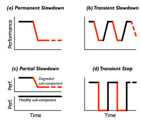

# **Fail-Slow at Scale: Evidence of Hardware Performance Faults in Large Production Systems**

**Haryadi S. Gunawi and Riza O. Suminto,** *University of Chicago;* **Russell Sears and Casey Golliher,** *Pure Storage;* **Swaminathan Sundararaman,** *Parallel Machines;* **Xing Lin and Tim Emami,** *NetApp;* **Weiguang Sheng and Nematollah Bidokhti,** *Huawei;* **Caitie McCaffrey,** *Twitter;* **Gary Grider and Parks M. Fields,** *Los Alamos National Laboratory;* **Kevin Harms and Robert B. Ross,** *Argonne National Laboratory;* **Andree Jacobson,** *New Mexico Consortium;* **Robert Ricci and Kirk Webb,** *University of Utah;* **Peter Alvaro,** *University of California, Santa Cruz;* **H. Birali Runesha, Mingzhe Hao, and Huaicheng Li,** *University of Chicago*

<https://www.usenix.org/conference/fast18/presentation/gunawi>

**This paper is included in the Proceedings of the 16th USENIX Conference on File and Storage Technologies. February 12–15, 2018 • Oakland, CA, USA**

ISBN 978-1-931971-42-3

**Open access to the Proceedings of the 16th USENIX Conference on File and Storage Technologies is sponsored by USENIX.**

## **Fail-Slow at Scale: Evidence of Hardware Performance Faults in Large Production Systems**

Haryadi S. Gunawi1 , Riza O. Suminto1 , Russell Sears2 , Casey Golliher2 , Swaminathan Sundararaman3 , Xing Lin4 , Tim Emami4 , Weiguang Sheng5 , Nematollah Bidokhti5 , Caitie McCaffrey6 , Gary Grider7 , Parks M. Fields7 , Kevin Harms8 , Robert B. Ross8 , Andree Jacobson9 , Robert Ricci10, Kirk Webb10 , Peter Alvaro11, H. Birali Runesha12, Mingzhe Hao1 , and Huaicheng Li1

1University of Chicago, 2Pure Storage, 3Parallel Machines, 4NetApp, 5Huawei, 6Twitter, 7Los Alamos National Laboratory, 8Argonne National Laboratory, 9New Mexico Consortium, 10University of Utah, 11University of California, Santa Cruz, and 12UChicago Research Computing Center

## Abstract

*Fail-slow hardware is an under-studied failure mode. We present a study of 101 reports of fail-slow hardware incidents, collected from large-scale cluster deployments in 12 institutions. We show that all hardware types such as disk, SSD, CPU, memory and network components can exhibit performance faults. We made several important observations such as faults convert from one form to another, the cascading root causes and impacts can be long, and fail-slow faults can have varying symptoms. From this study, we make suggestions to vendors, operators, and systems designers.*

## 1 Introduction

Understanding fault models is an important criteria of building robust systems. Decades of research has developed mature failure models such as fail-stop [\[3,](#page-13-0) [22,](#page-13-1) [30,](#page-14-0) [32,](#page-14-1) [35\]](#page-14-2), fail-partial [\[6,](#page-13-2) [33,](#page-14-3) [34\]](#page-14-4), fail-transient [\[26\]](#page-14-5), faults as well as corruption [\[7,](#page-13-3) [18,](#page-13-4) [20,](#page-13-5) [36\]](#page-14-6) and byzantine failures [\[14\]](#page-13-6).

This paper highlights an under-studied "new" failure type: *fail-slow hardware*, hardware that is still running and functional but in a degraded mode, slower than its expected performance. We found that all major hardware components can exhibit fail-slow faults. For example, disk throughput can drop by three orders of magnitude to 100 KB/s due to vibration, SSD operations can stall for seconds due to firmware bugs, memory cards can degrade to 25% of normal speed due to loose NVDIMM connection, CPUs can unexpectedly run in 50% speed due to lack of power, and finally network card performance can collapse to Kbps level due to buffer corruption and retransmission.

While fail-slow hardware arguably did not surface frequently in the past, today, as systems are deployed at scale, along with many intricacies of large-scale operational conditions, the probability that a fail-slow hardware incident can occur increases. Furthermore, as hardware technology continues to scale (smaller and more complex), today's hardware development and manufacturing will only exacerbate the problem.

Unfortunately, fail-slow hardware is under-studied. A handful of prior papers already hinted the urgency of this problem; many different terms have been used such as "fail-stutter" [\[4\]](#page-13-7), "gray failure" [\[25\]](#page-14-7), and "limp mode" [\[17,](#page-13-8) [21,](#page-13-9) [27\]](#page-14-8). However, the discussion was not solely focused on hardware but mixed with software performance faults as well. We counted roughly only 8 stories per paper of fail-slow hardware mentioned in these prior papers, which is probably not sufficient enough to convince the systems community of this urgent problem.

To fill the void of strong evidence of hardware performance faults in the field, we, a group of researchers, engineers, and operators of large-scale datacenter systems across 12 institutions decided to write this "community paper." More specifically, we have collected 101 detailed reports of fail-slow hardware behaviors including the hardware types, root causes, symptoms, and impacts to high-level software. To the best of our knowledge, this is the most complete account of fail-slow hardware in production systems reported publicly.

Due to space constraints, we summarize our unique and important findings in Table [1](#page-2-0) and do not repeat them here. The table also depicts the organization of the paper. Specifically, we first provide our high-level observations (§[3\)](#page-2-1), then detail the fail-slow incidents with internal root causes (§[4\)](#page-5-0) as well as external factors (§[5\)](#page-7-0), and finally provide suggestions to vendors, operators, and systems designers (§[6\)](#page-9-0). We hope that our paper will spur more studies and solutions to this problem.

## 2 Methodology

101 reports of fail-slow hardware were collected from large-scale cluster deployments in 12 institutions (Table

#### Important Findings and Observations

- §[3.1](#page-2-2) Varying root causes: Fail-slow hardware can be induced by internal causes such as firmware bugs or device errors/wearouts as well as external factors such as configuration, environment, temperature, and power issues.
- §[3.2](#page-3-0) Faults convert from one form to another: Fail-stop, -partial, and -transient faults can convert to fail-slow faults (*e.g.*, the overhead of frequent error masking of corrupt data can lead to performance degradation).
- §[3.3](#page-3-1) Varying symptoms: Fail-slow behavior can exhibit a permanent slowdown, transient slowdown (up-and-down performance), partial slowdown (degradation of sub-components), and transient stop (*e.g.*, occasional reboots).
- §[3.4](#page-4-0) A long chain of root causes: Fail-slow hardware can be induced by a long chain of causes (*e.g.*, a fan stopped working, making other fans run at maximal speeds, causing heavy vibration that degraded the disk performance).
- §[3.4](#page-4-0) Cascading impacts: A fail-slow hardware can collapse the entire cluster performance; for example, a degraded NIC made many jobs lock task slots/containers in healthy machines, hence new jobs cannot find enough free slots.
- §[3.5](#page-5-1) Rare but deadly (long time to detect): It can take hours to months to pinpoint and isolate a fail-slow hardware due to many reasons (*e.g.*, no full-stack visibility, environment conditions, cascading root causes and impacts).

#### Suggestions

- §[6.1](#page-9-1) To vendors: When error masking becomes more frequent (*e.g.*, due to increasing internal faults), more explicit signals should be thrown, rather than running with a high overhead. Device-level performance statistics should be collected and reported (*e.g.*, via S.M.A.R.T) to facilitate further studies.
- §[6.2](#page-10-0) To operators: 39% root causes are external factors, thus troubleshooting fail-slow hardware must be done online. Due to the cascading root causes and impacts, full-stack monitoring is needed. Fail-slow root causes and impacts exhibit some correlation, thus statistical correlation techniques may be useful (with full-stack monitoring).
- §[6.3](#page-10-1) To systems designers: While software systems are effective in handling fail-stop (binary) model, more research is needed to tolerate fail-slow (non-binary) behavior. System architects, designers and developers can fault-inject their systems with all the root causes reported in this paper to evaluate the robustness of their systems.

Table 1: Summary of our findings and suggestions.

| Institution | #Nodes  |
|-------------|---------|
| Company 1   | >10,000 |
| Company 2   | 150     |
| Company 3   | 100     |
| Company 4   | >1,000  |
| Company 5   | >10,000 |

| Institution  | #Nodes  |
|--------------|---------|
| Univ. A      | 300     |
| Univ. B      | >100    |
| Univ. C      | >1,000  |
| Univ. D      | 500     |
| Nat'l Labs X | >1,000  |
| Nat'l Labs Y | >10,000 |
| Nat'l Labs Z | >10,000 |

Table 2: Operational scale.

[2\)](#page-2-3). At such scales, it is more likely to witness fail-slow hardware occurrences. The reports were all unformatted text, written by the engineers and operators who still vividly remember the incidents due to the severity of the impacts. The incidents were reported between 2000 and 2017, with only 30 reports predating 2010. Each institution reports a unique set of root causes. For example, although an institution may have seen a corrupt buffer being the root cause that slows down networking hardware (packet loss and retransmission) many times, it is only collected as one report. Thus, a single report can represent multiple instances of the incident. If multiple different institutions report the same root cause, it is counted multiple times. However, the majority of root causes (66%) are unique and only 22% are duplicates (12% reports did not pinpoint a root causes). More specifically, a duplicated incident is reported on average by 2.4 institutions; for example, firmware bugs are reported from 5 institutions, driver bugs from 3 institutions, and the remaining issues from 2 institutions. The raw (partial) dataset can be downloaded on our group website [\[2\]](#page-13-10).

We note that there is no analyzable hardware-level performance logs (more in §[6.1\)](#page-9-1), which prevents large-scale log studies. We strongly believe that there were many more cases that were slipped and unnoticed. Some stories are also not passed around as operators change jobs. We do not include known slowdowns (*e.g.*, random IOs causing slow disks, or GC activities occasionally slowing down SSDs). We only include reports of *unexpected* degradation. For example, unexpected hardware faults that make GC activities work harder is reported.

## 3 Observations (Take-Away Points)

From this study, we made five important high-level findings as summarized in Table [1.](#page-2-0)

#### 3.1 Varying Root Causes

Pinpointing the root cause of a fail-slow hardware is a daunting task as it can be induced by a variety of root causes, as shown in Table [3.](#page-3-2) Hardware performance fault can be caused by *internal* root causes from within the device such as *firmware issues* (FW) or *device errors/wearouts* (ERR), which will be discussed in Section [4.](#page-5-0) However, a perfectly working device can also be degraded by many *external* root causes such as *configuration* (CONF), *environment* (ENV), *temperature* (TEMP), and *power* (PWR) related issues, which will be presented in Section §[5.](#page-7-0)

|       | Hardware types |      |     |     |     |       |
|-------|----------------|------|-----|-----|-----|-------|
| Root  | SSD            | Disk | Mem | Net | CPU | Total |
| ERR   | 10             | 8    | 9   | 10  | 3   | 40    |
| FW    | 6              | 3    | 0   | 9   | 2   | 20    |
| TEMP  | 1              | 3    | 0   | 2   | 5   | 11    |
| PWR   | 1              | 0    | 1   | 0   | 6   | 8     |
| ENV   | 3              | 5    | 2   | 4   | 4   | 18    |
| CONF  | 1              | 1    | 0   | 2   | 3   | 7     |
| UNK   | 0              | 3    | 1   | 2   | 2   | 8     |
| Total | 22             | 23   | 13  | 29  | 25  | 112   |

Table 3: Root causes across hardware types. *The table shows the occurrences of the root causes across hardware types. The table is referenced in Section [3.1.](#page-2-2) The hardware types are SSD, disk, memory ("Mem"), network ("Net"), and processors ("CPU"). The internal root causes are device errors (*ERR*) and firmware issues (*FW*) and the external root causes are temperature (*TEMP*), power (*PWR*), environment (*ENV*), and configuration (*CONF*). Issues that are marked unknown (*UNK*) implies that the operators cannot pinpoint the root cause, but simply replaced the hardware. Note that a report can have multiple root causes (environment and power/temperature issues), thus the total (112) is larger than the 101 reports.*

Note that a report can have multiple root causes (environment and power/temperature issues), thus the total in Table [3](#page-3-2) (112) is larger than the 101 reports.

## 3.2 Fault Conversions to Fail-Slow

Different types of faults such as fail-stop, -partial, and -transient can convert to fail-slow faults.

- Fail-stop to fail-slow: As many hardware pieces are connected together, a fail-stop component can make other components exhibit a fail-slow behavior. For example, a dead power supply throttled the CPUs by 50% as the backup supply did not deliver enough power; a single bad disk exhausted the entire RAID card's performance; and a vendor's buggy firmware made a batch of SSDs stop for seconds, disabling the flash cache layer and making the entire storage stack slow. These examples suggest that fail-slow occurrences can be correlated to other fail-stop faults in the system. Furthermore, a robust fail-stop tolerant system should ensure that fail-stop fault does not convert to fail-slow.
- Fail-transient to fail-slow: Besides fail-stop, many kinds of hardware can exhibit fail-transient errors, for example, disks occasionally return IO errors, processors sometimes produce a wrong result, and from time to time memory bits get corrupted. Due to their transient and "rare" nature, firmware/software typically masks these errors from users. A simple mechanism is to *retry* the operation or *repair* the error (*e.g.*, with ECC or parity). However, when the transient failures are recurring much more frequently, *error masking* can be a "*double-edged*

*sword*." That is, because error masking is not a free operation (*e.g.*, retry delays, repair costs), when the errors are not rare, the masking overhead becomes the common case performance.

We observed many cases of fail-transient to fail-slow conversion. For example, a disk firmware triggered frequent "read-after-write" checks in a degraded disk; a machine was deemed nonfunctional due to heavy ECC correction of many DRAM bit-flips; a loose PCIe connection made the driver retry IOs multiple times; and many cases of loss/corrupt network packets (between 1-50% rate in our reports) triggered heavy retries that collapsed the network throughput by orders of magnitude.

From the stories above, it is clear that there must be a distinction between rare and frequent fail-transient faults. While it is acceptable to mask the former, the latter should be exposed to and not hidden from high-level software stack and monitoring tools.

• Fail-partial to fail-slow: Some hardware can also exhibit fail-partial fault where only some part of the device is unusable (*i.e.*, a partial fail-stop). This kind of failure is typically masked by the firmware/software layer (*e.g.*, with remapping). However, when the scale of partial failure grows, the fault masking brings a negative impact to performance. For example, in one deployment, the available memory size decreased over time increasing the cache miss rate, but did not cause the system to crash; bad chips in SSDs reduce the size of over-provisioned space, triggering more frequent garbage collection; and a more known problem, remapping of a large number of bad sectors can induce more disk seeks. Similar to the fail-transient case above, there must be a distinction of small- vs. large-scale partial faults.

#### 3.3 Varying Fail-Slow Symptoms

We observed the "many faces" of fail-slow symptoms: permanent, transient, and partial fail-slow and transient fail-stop, as illustrated in Figure [1.](#page-4-1) Table [4](#page-4-2) shows the breakdown of these failure modes across different hardware types. Table [5](#page-4-3) shows the breakdown of these failure modes across different root causes.

- Permanent slowdown: The first symptom (Figure [1a](#page-4-1)) is a permanent slowdown, wherein the device initially worked normally but then its performance drops and does not return to the normal condition (until the problem is manually fixed). This mode is the simplest among the four models because operators can consistently see the issue. As shown in Table [4,](#page-4-2) this symptom (fortunately) is the most common one.
- Transient slowdown: The second one (Figure [1b](#page-4-1)) is a transient slowdown, wherein the device performance fluctuates between normal condition and signifi-

Figure 1: Fail-slow symptoms. *The figure shows four types of fail-slow symptom, as discussed in Section [3.3.](#page-3-1)*

cant degradation, which is more difficult to troubleshoot. For example, disk and network performance can degrade when the environment is too cold/hot, but will recover when the temperature is back to normal; occasional vibration when many disks were busy at the same time can reduce disk speed by orders of magnitude; and applications that create a massive load can cause the rack power control to deliver insufficient power to other machines (degrading their performance), but only until the powerhungry applications finish.

- Partial slowdown: The third model (Figure [1c](#page-4-1)) is partial slowdown, where only some parts of the device will exhibit slowdown. In other words, this is the case of partial fail-stop converting to partial slowdown (§[3.2\)](#page-3-0). For example, some parts of memory that are faulty require more ECC checks to be performed; some parts of network router's buffer that are corrupted will only cause the affected packets to be resent; and in one incident, 40% of big packets were lost, while none of small packets were lost. Partial fail-slow model also complicates debugging as some operations experience the slowdown but others (on the same device) are not affected.
- Transient stop: The last one (Figure [1d](#page-4-1)) is the case of transient stop, where the device occasionally reboots itself, thus there are times where the performance degrades to zero. For example, a buggy firmware made the SSDs sometimes "disappears" from RAID controller and later reappears; occasional bit flips in SAS/SCSI commands caused an host bus adapter to reboot repeatedly; and nodes automatically rebooted on thermal throttle (*e.g.*, when the fan firmware did not react quickly).

In one (hilarious) story, in the datacenter, there is a convenient table for staging, and one operator put an of-

|         | Symptoms |        |         |          |
|---------|----------|--------|---------|----------|
| HW Type | Perm.    | Trans. | Partial | Tr. Stop |
| SSD     | 6        | 7      | 3       | 3        |
| Disk    | 9        | 4      | 3       | 5        |
| Mem     | 7        | 1      | 0       | 4        |
| Net     | 21       | 0      | 5       | 2        |
| CPU     | 10       | 6      | 1       | 3        |

Table 4: Fail-slow symptoms across hardware types. *The table depicts the occurrences of fail-slow symptoms across hardware types. The table is referenced in Section [3.3.](#page-3-1) The four symptoms "Perm.", "Trans.", "Partial", and "Tr. Stop" represent the four symptoms in Figure [1.](#page-4-1)*

|      | Symptoms |        |         |          |
|------|----------|--------|---------|----------|
| Root | Perm.    | Trans. | Partial | Tr. Stop |
| ERR  | 19       | 8      | 7       | 6        |
| FW   | 11       | 3      | 1       | 4        |
| TEMP | 6        | 2      | 1       | 2        |
| PWR  | 3        | 2      | 1       | 2        |
| ENV  | 11       | 3      | 3       | 1        |
| CONF | 6        | 1      | 0       | 0        |
| UNK  | 5        | 1      | 0       | 2        |

Table 5: Fail-slow symptoms across root causes. *The table is referenced in Section [3.3.](#page-3-1) The root-cause abbreviations can be found in the caption of Table [3.](#page-3-2) The four symptoms "Perm.", "Trans.", "Partial", and "Tr. Stop" represent the four symptoms in Figure [1.](#page-4-1)*

fice chair adjacent to a storage cluster. The operator liked to rock in the chair, repeatedly popping hotplug drives out of the chassis (a hard correlation to diagnose).

#### 3.4 Cascading Causes and Impacts

Another intricacy of fail-slow hardware is the chain of cascading events: First, between the actual root cause and the hardware's fail-slow symptom, there is a chain of *cascading root causes*. Second, the fail-slow symptom then creates *cascading impacts* to the high-level software stack, and potentially to the entire cluster.

Below are some of the examples of long cascading root causes that lead to fail-slow hardware. A fan in a compute node stopped working, making other fans compensate the dead fan by operating at maximal speeds, which then caused a lot of noise and vibration that subsequently degraded the disk performance. A faulty sensor in a motherboard reported a false value to the OS making the CPUs run slower in energy saving mode. A lack of power from a broken power supply can cause many types of hardware, disks, processors, and network components to run sub-optimally. Power failure itself can also be caused by a long cascading causes, for example, the vendor omitted a 120V fuse that shipped with faulty capacitors that have a high probability of shorting when power is cycled, which then caused minor electrical fires that cascade into rack-level power failures.

Next, when a hardware becomes fail-slow, not only it affects the host machine, but it can cause cascading impacts across the cluster. For example, a degraded NIC, from 1 Gbps to 1 Kbps, in one machine caused a chained reaction that slowed down the entire cluster of 100 machines (as the affected connecting tasks held up containers/slots for a long time, and new jobs cannot run due to slot shortage). In an HDFS HA (High Availability) deployment, a quorum of namenodes hang when one of the disks was extremely slow. In an HBase deployment, a memory card at 25% of normal speed caused backlogs, out-of-memory errors, and crashes. Similarly, a degraded disk created a backlog all the way to the client VMs, popping up the "blue screen of death" to users;

#### 3.5 Rare but Deadly: Long TTD

The fail-slow hardware incidents in our report took *hours* or even *months* to detect (pinpoint). More specifically, 1% of the cases are detected in minutes, 13% in hours, 13% in days, 11% in weeks, and 17% in months (and unknown time in 45%). Some engineers called this a "costly debugging tail." In one story, an entire team of engineers were pulled to debug the problem, costing the institution tens of thousands of dollar. There are several reasons why the time-to-detect (TTD) is long.

First, the fact that the incidence of fail-slow hardware is not as frequent as fail-stop cases implies that today's software systems do not completely anticipate (*i.e.*, undermine) such scenarios. Thus, while more-frequent failures can be solved quickly, less-frequent but more complex failures (that cannot be mitigated by the system) can significantly cost the engineers time.

Second, as explained before, the root cause might not originate from the fail-slow hardware (*e.g.*, the case of transient slowdown caused by power-hungry applications in §[3.3](#page-3-1) took months to figure out as the problem was not rooted in the slow machines nor the power supply).

Third, external environment conditions beyond the control of the operators can prolong diagnosis (*e.g.*, for months, a vendor failed to reproduce the fail-slow symptoms in its sea-level testing facility as the hardware only slows down at a high mountain altitude).

Finally, operators do not always have full visibility of the entire hardware stack (*e.g.*, an incident took days to solve because the operators had no visibility into the power supply health).

## 4 Internal Root Causes

We now discuss internal root causes, primarily firmware bugs and device errors/wear-outs. We organize the discussion based on the hardware types (SSD, disk, memory, network, and processor).

#### 4.1 SSD

Fail-slow SSDs can be triggered by firmware bugs and NAND flash management complexities.

Firmware bugs: We received three reports of SSD firmware bugs, admitted by the vendors. First, many individual IOs that should only take tens of µs were throttled by exactly multiples of 250µs, as high as 2- 3ms. Even worse, in another report, a bad batch of SSDs stopped responding for seconds and then recovered. As mentioned before, an operator found some SSDs "disappeared" from the system and later reappeared. Upon vendor's inspection, the SSDs were performing some internal metadata writes that triggered hardware assertion failure and rebooted the device. In all these cases, the reasons why the firmware behaves as such were not explained (proprietary reasons). However, other incidents below might shed more light on the underlying problems.

Read retries with different voltages: In order to read a flash page, SSD controller must set a certain voltage threshold. As flash chips wear out, the charge in the oxide gates weakens, making the read operation with the default voltage threshold fail, forcing the controller to keep retrying the read with different voltage thresholds [\[10,](#page-13-11) [11\]](#page-13-12). We observed as high as 4 retries in the field.

RAIN/parity-based read reconstruction: Furthermore, if the data cannot be read (*i.e.*, is completely corrupted and fails the ECC checks), the SSD must reconstruct the page with RAIN (NAND-level RAID) [\[1,](#page-13-13) [41\]](#page-14-9). Three factors can make this situation worse. First, if the RAIN stripe width is N, N−1 additional reads must be generated to reconstruct the corrupt page. Second, the N−1 reads might also experience read retries as described above. Third, newer TLC-based SSDs use LDPC codes [\[40\]](#page-14-10), which takes longer time to reconstruct the faulty pages. We observed that this reconstruction problem occurs frequently in devices nearing end of life. Moreover, SSD engineers found that the number of bit flips is a complex function of the time since the last write, the number of reads since the last write, the temperature of the flash, and the amount of wear on the flash.

Heavy GC in partially-failing SSD: Garbage collection (GC) of NAND flash pages is known to be a main culprit of user SLA violations [\[23,](#page-14-11) [28,](#page-14-12) [41\]](#page-14-9). However, in modern datacenter SSDs, the more advanced firmware successfully reduces GC impacts to users. In reality, there are SSDs shipped with "bad" chips. We witnessed that as more chips die, the size of the over-provisioned area gets reduced, which then triggers GC more frequently with impacts that cannot be hidden.

Broken parallelism by suboptimal wear-leveling: Ideally, large IOs are mapped to parallel channels/chips, increasing IO parallelism. However, wear-leveling (the migration of hot/cold pages to hot/cold blocks) causes the mapping of LPN to PPN changes all the time. It has been observed that some rare workload behaviors can make wear-leveling algorithms suboptimal, making sequential LPNs mapped behind the same channels/chips (less parallelism). Furthermore, the problem of bad page/chip above also forces wear-leveling algorithms to make sub-optimal, less-parallel page/block mapping.

Hot temperature to wear-outs, repeated erases, and reduced space: Hot temperature can be attributed to external causes (§[5.1\)](#page-8-0), but can cause a chain reaction to SSD internals [\[31\]](#page-14-13). We also observed that SSD pages wear out faster with increasing temperature and there were instances of voltage threshold modeling that are not effective when SSDs operate at a higher temperature regime. As a result, after a block erase, the bits were not getting reset properly (not all bits become "1"). Consequently, some blocks had to be erased multiple times. Note that erase time is already long (*e.g.*, up to 6 ms), thus repeated erases resulted in observable fail-slow behavior. Worse, as some blocks cannot be reset properly after several tries, the firmware marked those blocks unusable, leading to reduced over-provisioned space, and subsequently more frequent GCs as discussed above.

Write amplification: Faster wear-outs and more frequent GCs can induce higher write amplification. It is worthy to report that we observed wildly different levels of amplification (*e.g.*, 5× for model "A", 600× for model "B", and "infinite" for certain workloads due to premature wear-outs).

Not all chips are created equal: In summary, most of the issues above originated with the fact that not all chips are created equal. Bad chips still pass vendor's testing, wherein each chip is given a quality value and high quality chips are mixed with lesser quality chips as long as the aggregate quality passes the quality-control standard. Thus, given an SSD, there are unequal qualities [\[10,](#page-13-11) [36\]](#page-14-6). Some workloads may cause more apparent wear-outs on the low quality chips, causing all the issues above.

#### 4.2 Disk

Similar to SSDs, fail-slow disks can also be caused by firmware bugs and device errors/wear-outs.

Firmware bugs: We collected three reports related to disk firmware bugs causing slowdowns. There was a case where a disk controller delayed I/O requests for tens of seconds. In another problem, the disk "jitters" every few seconds, creating a problem that is hard to debug. In a large testbed, a RAID controller on the master node stalled, but then after restarted, the controller worked but with occasional timeouts and retries. Finally, there was an incident where a single bad disk exhausted the RAID

card resources causing many IO timeouts (a failed case of bad-disk masking).

Device errors: Triggered by extensive disk rots, a RAID controller initiated frequent RAID rebuilding during run time; the fix reformatted the file systems so that bad sectors are collected and not used within the storage stack. Disk errors can be recurrent; in one case, disks with "bad" status were removed automatically from the storage pool but then added back when their status changed to "good," but the good-bad continuous transitions caused issues that affected user VMs. Some operators also observed media failures that forced the disks to retry every read operation multiple times before returning to the OS. A recent proposal advocates disks to automatically disable bad platters and continue working partially (with reduced bandwidth) [\[9\]](#page-13-14).

Weak heads: This issue of disk "weak" heads is common in troubleshooting forums [\[17,](#page-13-8) [38\]](#page-14-14), but the root cause is unclear. A report in our study stated that gunk that spills from actuator assembly and accumulates between the disk head and the platter can cause slow movement of the disk head. As disks are becoming "slimmer," the probability of trapped gunk increases. This problem can be fixed by performing random IOs to make the disk head "sweep the floor."

Other causes: Fail-slow disks can also be caused by environment conditions (*e.g.*, noises and vibrations from fans operating at the maximum speed) or temperature (*e.g.*, disks entering read-after-write mode in a colder environment [\[19\]](#page-13-15)), which will be discussed later (§[5\)](#page-7-0).

#### 4.3 Memory

Memory systems are considered quite robust, but we managed to collect a few evidence showing that memory hardware can also exhibit fail-slow faults.

Device errors: In cases of partial memory errors, there were reports of custom chips masking the errors and not exposing bad addresses. Here, as more errors increase over time, the available memory size decreases, causing higher cache misses. Unlike disk/SSD usage where out-of-space error is thrown when space runs out, memory usage is different; as long as the minimum memory space requirement is met, applications can still run albeit with slower performance due to more frequent page swapping from the reduced cache size.

External causes: There were two cases of memory cards slowing down due to the environment condition (specifically a high altitude deployment that introduces more cosmic events that cause frequent multi-bit upsets) and human mistakes (an operator plugged in a new NVDIMM card in a rush and the loose connection made the card still functional, but with slower performance).

Unknown causes: There were other fail-slow memory incidents with unknown causes. In an HBase deployment, a memory card ran only 25% of normal speed. In another non-deterministic case, low memory bandwidth was observed under a certain benchmark, but not under different benchmarks.

SRAM errors: Much attention is paid to DRAM errors [\[37\]](#page-14-15) and arguably DRAM reliability is largely a solved problem – most errors can be masked by ECC (by sacrificing predictable latency) or lead to fail-stop behavior of the impacted program. Besides DRAM, SRAM usage is pervasive in device controllers (*e.g.*, FPGAs, network cards, and storage adapters). Unlike DRAM, SRAM works by constantly holding the voltage of each memory cell at the desired level; it does not incorporate refresh cycles that can cause read/write to stall. It is most commonly used by circuits that cannot afford to incur stalls or buffer data between RAM and the combinatorial logic that consumes the data.

SRAM errors on data paths are typically transparently masked; they ultimately lead to a CRC validation error, and the network packet or disk I/O is simply retried. However, SRAM is also incorporated in *control* paths. We observed SRAM errors that caused *occasional reboots* of the device from broken control path (among many other problems), inducing a transient-stop symptom (as discussed in §[3.3\)](#page-3-1). SRAM per-bit error rates unfortunately have not improved [\[8\]](#page-13-16). Therefore in practice, SRAM errors are a regular occurrence in large-scale infrastructure, a major culprit of service disruptions.

#### 4.4 Network

Network performance variability is a well-known problem, typically caused by load fluctuations. This paper highlights that fail-slow networking hardware can be a major cause of network performance degradation.

Firmware bugs: We collected three reports of "bad" routing algorithms in switch firmware. In one case, the network performance decreased to half of the maximum performance due to a dynamic routing algorithm on stock driver/firmware that did not work "as promised [by the vendor]." Due to lack of visibility to what is happening in the firmware, the operators must hack the kernel to perform ping between the switches, which consumed a long time. In another story, MAC learning was not being responsive and special types of traffic such as multicast were not working well, creating traffic floods. The third story is similar to the first one.

NIC driver bugs: Four instances of NIC driver bugs were reported, dropping many packets and collapsing TCP performance. In one story, 5% package loss caused many VMs to go into "blue screen of death." Another NIC driver bug caused a "very poor" throughput and the operators had to disable TCP offload to work around the problem. In another case, the developers found a nondeterministic network driver bug in Linux that only surfaced on one machine, making the 1 Gbps NIC card transmit only at 1 Kbps. Finally, a bug caused an unexpected auto-negotiation between a NIC and a TOR switch that capped the bandwidth between them, underutilizing the available bandwidth.

Device errors: In one interesting story, the physical implementation of the network cards did not match the design specification – there is a distant corner of the chip that is starving from electrons and not performing at full speed; the vendor re-manufactured all the network cards, a very costly ramification. Similarly, a bad VS-CEL laser degraded switch to switch performance; this bad design affected hundreds of cables. In one deployment, a router's internal buffer memory was introducing occasional bit errors into packets, causing failed end-toend checksums and subsequently TCP retries.

External causes: Some fail-slow networking components were also caused by environment conditions (*e.g.*, loose network cables, pinched fiber optics), configuration issues (*e.g.*, a switch environment not supporting jumbo frames such that MTU size must be configured to 1500 bytes), and temperature (*e.g.*, clogged air filter, bad motherboard design that puts NIC behind CPU).

Unknown causes: There are other reports of throughput degradation at the hardware level or severe loss rates without known root causes. For example, a 7 Gbps fibre channel collapsed to 2 Kbps, a 1 Gbps throughput degraded to 150 Mbps with just 1% loss rate, 40% of big packets were lost (but no small-package loss), and some observed error/loss rates as high as 50%. TCP performance is highly sensitive to loss rate.

#### 4.5 Processor

We find processors are quite reliable and do not selfinflict fail-slow mode. Most of the fail-slow CPUs are caused by external factors, which we briefly discuss below, but will be detailed in the next section (§[5\)](#page-7-0).

External causes: We observed fail-slow processors caused by configuration mistakes (*e.g.*, a buggy BIOS firmware incorrectly down-clocked the CPUs), environment conditions (*e.g.*, a high-altitude deployment made the CPUs enter thermal throttle), temperature issues (*e.g.*, CPU heat-sinks were not in physical contact with the CPUs, a fan firmware did not react quickly to cool down the CPUs), and power shortage (*e.g.*, insufficient capacitors in the motherboard's power control logic did not deliver enough power when the load is high).

## 5 External Root Causes

We now describe external root causes of fail-slow hardware such as temperature variance, power shortage, environment condition, and configuration mistakes. These external causes complicate troubleshooting because the symptoms can be non-deterministic and only reproducible in the same online scenario, but not observable in offline (in-office) testing.

#### 5.1 Temperature

To keep temperature in normal operating condition, fans or heat-sinks must work correctly. Below are root causes of temperature variance that went undetected by the monitoring tools.

Clogged air filter: In one report, a clogged air filter caused optics in the switch to start failing due to a high temperature, generating a high 10% packet loss rate. After the air filter was cleaned, the switch returned to normal speed but only temporarily. It is likely that the high temperature had broken the switch's internal parts.

Cold environment: Cold temperature can induce failslow faults as well [\[19\]](#page-13-15). In one deployment, some of the disks went into read-after-write mode. Upon inspection, the machine room had a "cold-air-under-the-floor" system, which was more common in the past. The disks at the bottom of the racks had a higher incidence of slow performance. This suggests that temperature variance can originate from deployment environment as well.

Broken fans: Cooling systems such as fans sometimes work as a cluster, rather than individually. There was a case where a fan in a compute node stopped working, and to compensate this failing fan, fans in other compute nodes started to operate at their maximal speed, which then generated heavy noise and vibration that degraded the disk performance. Again, this is an example of cascading root causes (§[3.4\)](#page-4-0).

Buggy fan firmware: Fans can be fully functional, but their speeds are controlled by the fan firmware. In one condition, a fan firmware would not react quickly enough when CPU-intensive jobs were running, and as a result the CPUs entered thermal throttle (reduced speed) before the fans had the chance to cool down the CPUs.

Improper design/assembly/operation: A custom motherboard was "badly" designed in such a way that the NIC was soldered on the motherboard behind the CPU and memory. The heat from the CPU affected the NIC causing many packet errors and retries. In a related story, due to bad assembly, CPU heat-sinks were not in physical contact with the CPUs, causing many nodes to overheat. In another case, new disks were plugged into machines with "very old" fans. The fans did not give enough cooling for the newer disks, causing the disks to run slowly.

#### 5.2 Power

Reduced power can easily trigger fail-slow hardware. Below are some of the root causes of power shortage.

Insufficient capacitors: In one custom motherboard design, the capacitor on the motherboard's power control logic did not provide adequate voltage to the CPUs under certain load. This put the processors out of specification, causing corruptions and recomputations. The diagnosis time was months due to the fact that the problem could not be reliably reproduced. To fix the problem, a small capacitor was added to each motherboard on site for thousands of nodes. In a similar story, an inadequate capacitor caused voltage drop, but only when multiple cores transition from parked to turbo-boost simultaneously (a corner-case situation). Thus, independent testing of the updated BIOS and software did not reproduce the issue.

PCU firmware bugs: In one scenario, the firmware of the power control units (PCUs) entered a "weird" state and did not deliver enough power, and the whole rack failed off the power control. This was a transient fault that sometimes can be fixed by resetting the controller, sometimes by re-flashing the firmware, and in rare instances, by replacing the PCUs.

Fail-partial power supply: In one deployment, every four machines share two power supplies. However, when one power supply failed, there was not enough power to run all the four machines at normal capacity, thus throttling the CPUs on each machine by 50%. The problem cascaded as the machines were used for indexing service and could not keep up with the number of requests. The problem took days to solve because the operators had no visibility into the power supply health. This problem is also interesting as two power supplies do not imply that one of them is a full-working backup, but rather a reduced power, enough to keep the machines alive.

Power-hungry neighbors: Some nodes were running slow because other nodes in the same rack were drawing more power, causing the rack power supply to go unstable, and dropping power to various parts of the rack. It took months to diagnose the problem as it was not rooted in the slow machines and only happened when powerhungry applications were running in neighboring nodes.

Faulty motherboard sensors: After a long period of debugging a slow machine, the operator discovered that the motherboard had a faulty sensor that reported faulty value to the OS, making the OS configure the CPUs to run in slower speed in energy saving mode.

### 5.3 Environment

Fail-slow hardware can be induced by a variety of environment conditions, as listed below.

Altitude and cosmic events: One of the most interesting reports we collected is from a deployment at altitude of 7500 feet. At this height, some CPUs would become hot and enter thermal throttle (reduced performance). Apparently, the fault was not in the CPUs, but rather in the vendor's cooling design that was not providing enough cooling at such a high altitude. In another report, still at the same altitude, some memory systems experienced more frequent multi-bit upsets than usual (increased ECC checks and repairs), which then were shipped back to the vendor and re-assembled with more memory protection.

Loose interconnects: Loose network cables and pinched fiber optics caused network delays up to hundreds of milliseconds, making the storage cluster behave abnormally. It took several days to diagnose the problem, as the symptom was not deterministic. The reason behind loose/pinched cables can be vibration or human factor. In some other cases, loose PCIe connections between the SSDs and the PCIe slots made the device driver layer retry the operations multiple times. In another story, an NVDIMM was not plugged in properly when the operator was rushed in fixing the machine. The machine was still functional albeit with a much lower speed.

Vibrations: The performance of some disk drives collapsed to 100 KB/s when deployed in the racks, but performed maximally 100 MB/s when tested in office. Apparently, faulty chassis fans surrounding the nodes caused such a strong vibration, making the drives go into recovery mode. The solution was to add vibration dampers to each of the eight hard drive screws and replace roughly 10% system fans in all nodes.

Environment and operating condition mismatch: In one institution, a system was configured correctly at the advertised clock rate, temperature range, and voltage range. However, due to an unknown environment condition, it was not working optimally, and the solution was turning down the clock slightly, putting a software monitor on processor temperature and voltage, and killing the node if voltage/temperature got close to the edge of the binned values (*i.e.*, a dead node is better than a slow node). Time to diagnose was months due to not reliably able to reproduce. In another case, a switch environment did not support "jumbo frames" and caused the 10 Gbps throughput network to have a poor throughput. The fix was to reconfigure the MTU size to be 1500 bytes.

Unknown causes: In one interesting report, billions of SAS errors simultaneously reported by all the independent drives in the cluster, lasting for five minutes. The report stated that this happened when a technician was performing maintenance on another machine.

#### 5.4 Configuration

While hardware typically runs in default configuration, today's hardware has "knobs" that allow configurable parameters. Such configurations can be modified by human operators or software/firmware layers (*e.g.*, BIOS). In our findings, fail-slow hardware can be induced by the following misconfiguration mistakes.

Buggy BIOS firmware: In one institution, one of the systems typically ingested 2.8 billion metrics per minute, however at one time the metric write time increased, taking more than a minute to process all the metrics from previous minutes. The operators added more nodes (thinking that it will load balance the request spikes). Counter-intuitively, adding more nodes resulted in increased write time. The diagnosis spanned a month. The root cause was the BIOS was incorrectly downclocking the CPUs of the new machines being added to the database cluster. These machines were "limping" along but were assigned the same number of load (as if a correctly clocked machine). Similarly, as reported elsewhere [\[16,](#page-13-17) §3.6], a buggy initialization configuration can also disable the processor caches.

Human mistakes: Regarding SSD connections, not all PCIe slots have the same number of lanes. Mistakes in mapping PCIe cards to PCIe slots with different number of lanes had occasionally been made by human operators, which results in under-utilization of full connection bandwidth. In a different case, an incorrect parameter set in xtnird.ini, a network configuration that manages High Speed Networking (HSN) over InfiniBand, was not set up properly and the network was throttling. There is plethora of related work on configuration mistakes [\[5,](#page-13-18) [42\]](#page-14-16). We believe there are many more instances of configuration mistakes that trigger fail-slow hardware, not recorded in production logs.

## 6 Suggestions

In addition to cataloguing instances of fail-slow hardware, a goal of this paper is to offer vendors, operators and systems designers insights about how to address this poorly-studied failure mode.

#### 6.1 To Vendors

• Making implicit error masking explicit: Fail-slow hardware can be categorized as an "implicit" fault, meaning they do not always return any explicit hard errors, for example due to error masking (§[3.2\)](#page-3-0). However, there were many cases of slowly increasing error rates that would eventually cause cascading performance failures. Although statistics of error rates are obtainable from the device (*e.g.*, number of ECC repairs, corrupt packets), they are rarely monitored by the overall system. Vendors might consider throwing explicit error signals when the error rates far exceed the expected rate.

We understand that this could be a far-from-reach reality because vendors often hide internal statistics (*e.g.*, most recent SSDs no longer expose the number of internal writes, as some users were upset to learn about the write amplification). In fact, the trend of moving to

white-box storage makes the situation worse. That is, black-box storage such as commodity disks and SSDs conform to some standards (*e.g.*, S.M.A.R.T data), however as more institutions now compose the entire hardware/software storage stack (*e.g.*, fully host-managed flash), the hardware designers might not conform to existing standards, making software-level error management more difficult.

• Exposing device-level performance statistics: Two decades ago, statistical data of hard errors was hard to obtain, but due to user demands, modern hardware now exposes such information (*e.g.*, via S.M.A.R.T), which then spurred many statistical studies of hardware failures [\[6,](#page-13-2) [7,](#page-13-3) [30,](#page-14-0) [34,](#page-14-4) [35,](#page-14-2) [36\]](#page-14-6) However, the situation for hardware-level performance studies is bleak. Our conversations with operators suggest that the information from S.M.A.R.T is "insufficient to act on." In some institutions, hardware-level performance logs are only collected hourly, and we could not pinpoint whether a slow performance was due to the workload or the device degradation. With these limitations, many important statistical questions are left unanswered (*e.g.*, how often fail-slow hardware occurs, how much performance was degraded, what correlations fail-slow faults exhibit with other metrics such as device age, model, size, and vendor). We hope vendors will expose device-level performance data to support future statistical studies.

#### 6.2 To Operators

- Online diagnosis: In our study, 39% of the cases were caused by external root causes, which suggests that blames cannot be directed towards the main hardware components. Some reports suggest that operators took days or even months to diagnose, as the problems cannot be reproduced in offline ("in-office") testing. Thus, online diagnosis is important, but also not straightforward because not all hardware components are typically monitored, which we discuss next.
- Monitoring of all hardware components: Today, in addition to main hardware components (*e.g.*, disks, NICs, switches, CPUs), other hardware components and environment conditions such as fan speeds and temperature are also monitored. Unfortunately, not all hardware is monitored in practice. For example, multiple organizations failed to monitor network cables, and instead used the flow of traffic as a proxy for cable health. The diagnosis took much longer time because performance blames are usually directed towards the main hardware components such as NICs or switches. The challenge is then to prevent too much data being logged.

Another operational challenge is that different teams are responsible for different parts of the data center (*e.g.*, software behavior, machine performance, cooling, power). Thus, with limited views, operators cannot fully diagnose the problem. In one incident, the operators, who did not have access to power supply health, took days to diagnose the reason behind the CPUs running only at 50% speed. In another example, power supply health information was available, but basic precautions, such as adding fuses to the input line, were overlooked.

Another challenge to come is related to proprietary full-packaged solution like hyper-converged or rackscale design. Such design usually comes with the vendor's monitoring tools, which might not monitor and expose all information to the operators. Instead, vendors of such systems often monitor hardware health remotely, which can lead to fragmentation of monitoring infrastructure as the number of vendors increases.

• Correlating full-stack information: With full-stack performance data, operators can use statistical approaches to pinpoint and isolate the root cause [\[15\]](#page-13-19).

Although most of the cases in our study were hard-todiagnose problems, fortunately, the revealed root causes were relatively "simple." For example, when a powerhungry application was running, it drained the rack power and degraded other nodes. Such a correlation can be easily made, but requires process- to power-level information. As another example, when a fan stopped, and to compensate, the other fans ran in maximum speed to compensate, the resulting vibration degraded disk performance. This 3-level correlation between fan status, vibration level, and disk performance can also be correlated. Future research can be done to evaluate whether existing statistical monitoring approaches can detect such correlations.

While the metrics above are easy to monitor, there are other fine-grained metrics that are hard to correlate. For example, in one configuration issue, only multicast network traffic was affected, and in another similar one, only big packets (>1500 bytes) experienced long latencies. In these examples, the contrast between multicast and unicast traffics and small and big packets is clear. However, to make the correlation, detailed packet characteristics must be logged as well.

Finally, monitoring algorithms should also detect "counter-intuitive" correlations. For example, when users performance degrades, operators tend to react by adding more nodes. However, there were cases where adding more nodes did not translate to better performance, as the underlying root cause was not isolated.

#### 6.3 To Systems Designers

While the previous section focuses on post-mortem remedies, this section provides some suggestions on how to anticipate fail-slow hardware better in future systems.

- Making implicit error-masking explicit: Similar to the error masking problem at the hardware level, error masking (as well as "tail" masking) in higher software stack can make the problem worse. We have observed fail-slow hardware that caused many jobs to timeout and be retried again repeatedly, consuming many other resources and converting the single hardware problem into larger cluster-wide failures. Software systems should not just silently work around fail-slow hardware, but need to expose enough information to help troubleshooting.
- Fail-slow to fail-stop: Earlier, we discussed about many fault conversions to fail-slow faults (§[3.2\)](#page-3-0). The reverse can be asked: can fail-slow faults be converted into fail-stop mode? Such a concept is appealing because modern systems are well equipped to handle failstop failures [\[12\]](#page-13-20). Below we discuss opportunities and challenges of this concept.

*Skip non-primary fail-slow components:* Some resources such as (*e.g.*, caching layers) can be considered non-primary components. For example, in many deployments, SSDs are treated as a caching layer for the backend disks. The assumption that SSD is always fast and never stalls does not always hold (§[4.1\)](#page-5-2). Thus, when failslow SSDs (acting as a caching layer) introduce more latencies than the back-end disks, they can be skipped temporarily until the problem subsides. However, consistency issues must be taken into account. In one story, the operators had to disable the flash cache layer for one month until the firmware was fixed. Another suggestion is to run in "partial" mode rather than in full mode but with slow performance. For example, if many disks cause heavy vibration that degrades the disk throughput significantly, it is better to run fewer disks to eliminate the throughput-degrading vibration [\[13\]](#page-13-21).

*Detect fail-slow recurrences:* Another method to make slow-to-stop conversion is to monitor the recurrence of fail-slow faults. For example, disks/SSDs that continue to "flip-flop" in online/offline mode (§[4.1\)](#page-5-2), triggering RAID rebalancing all the time, is better to be put offline. As another example, if I/O communication to a hardware requires many retries, the device perhaps can be removed. We observed several cases of transient failslow hardware that was taken offline but after passing the in-office diagnosis, the device was put online again, only to cause the same problem.

*Challenges:* While the concept of slow-to-stop conversion looks simple, there are many challenges that impedes its practicality in the field, which we hope can trigger more research in the community. First, an automated shutdown algorithm should be robust (no bugs or false positives) such that healthy devices are not incorrectly shut down. Second, some storage devices cannot be abruptly taken offline as it can cause excessive rereplication load. Third, similarly, removing slow nodes can risk availability; in one deployment, some machines exhibited 10-20% performance degradation but if they were taken out, availability would be reduced, and data loss could ensue. Fourth, a node is an expensive resource (*e.g.*, with multiple NICs, CPUs, memory cards, SSDs, disks), thus there is a need for capability to shut off devices at fine-grained level. Fifth, and more importantly, due to the cascading nature (§[3.4\)](#page-4-0), fail-slow hardware can be induced by external factors; here, the solution is to isolate the external factors, not to shutdown the slow device.

• Fail-Slow fault injections: System architects can inject fail-slow root causes reported in this paper to their systems and analyze the impacts.

For example, one can argue that asynchronous distributed systems (*e.g.*, eventual consistency) should naturally tolerate fail-slow behaviors. While this is true, there are many stateful systems that cannot work in fully asynchronous mode; for example, in widely-used open-sourced distributed systems, fail-slow hardware can cause cascading failures such as thread pool exhaustion, message backlogs, and out-of-memory errors [\[17\]](#page-13-8).

Another type of systems is tail-tolerant distributed systems [\[16\]](#page-13-17). However, another recent work shows that the "tail" concept only targets performance degradation from resource contention, which is different than failslow hardware model such as slow NICs, and as a result not all tail-tolerant systems (*e.g.*, Hadoop, Spark) can cut tail latencies induced by degraded NICs [\[39\]](#page-14-17).

Beyond networking components, the assumption that storage latency is stable is also fatal. It has been reported that disk delays causes race condition or deadlock in distributed consistency protocols [\[29\]](#page-14-18). The problem is that some consistency protocols, while tolerating network delays, do not incorporate the possibility of disk delays, for the sake of simplicity.

With fail-slow injections, operators can also evaluate whether their systems or monitoring tools signal the right warnings or errors. There were a few cases in our reports, where wrong signals were sent, causing the operators to debug only the healthy part of the system.

Overall, we strongly believe that injecting root causes reported in this paper will reveal many flaws in existing systems. Furthermore, all forms of fail-slow hardware such as slow NICs, switches, disks, SSD, NVDIMM, and CPUs need to be exercised as they lead to different symptoms. The challenge is then to build future systems that enable various fail-slow behaviors to be injected easily.

## 7 Discussions

• Limitations (and Failed Attempts): We acknowledge the major limitation of our methodology: the lack of quantitative analysis. Given the reports in the form of anecdotes, we were not able to answer statistical questions such as how often fail-slow hardware occurs, how much performance was degraded, what correlations failslow faults exhibit with other metrics such as device age, model, size, and vendor, etc.

We initially had attempted to perform a quantitative study. However, many institutions do not maintain a database of hardware-level performance data. Many institutions that we asked to join in this community paper responded with either "we do not have clearance" or "we do not collect such data (but have unformatted reports)." In the former category (no clearance), it is inconclusive whether they have such data available or the nature of this public study was not allowed in the first place.

An institution told us that they collect large performance data at the software level, but direct inference to fail-slow hardware is challenging to perform. In our prior work, we only collected hourly aggregate of disk/SSDlevel performance data [\[24\]](#page-14-19), but the coarse hourly granularity has limitations and the findings cannot be directly tied to "hard proof" of the existence of fail-slow hardware.

We also managed to obtain ticket logs (in unformatted text) from a large institution, but searching for failslow hardware instances in tens of thousands of tickets is extremely challenging as the operators did not log the full information and there is no standard term for "failslow/limping/jittery" hardware. For example, searching for the word "slow" produces hundreds of results that do not directly involve hardware issues.

Indeed, we believe that the lack of easily accessible and analyzable data is a reason that the study in this paper is valuable. Regardless of the limitation of our study, we believe we have successfully presented the most complete account of fail-slow hardware in production systems that can benefit the community.

• "Honorable Mentions": While this paper focuses on fail-slow faults, our operators shared to us many other interesting anecdotes related to data loss, which we believe are "honorable" to mention as the details were rarely mentioned in literature.

*Triple replication is (sometimes) not enough:* In one large Hadoop cluster, many machines were failing regularly such that data loss was unavoidable even with triple replication. Apparently, this was caused by a large batch of malfunctioning SSDs. The controller on this brand of SSDs was "bad" and would stop responding. About 3-5% of the drives would be failing each week. Worse, the servers would not shut down properly because the shutdown required a successful write to the SSD to do so. Thus, there were lower success rates because broken machines with failed SSDs would try to serve traffic and could not shut themselves down.

*Single point of failure (in unseen parts):* While at a high level, datacenter operators ensures that there is no single hardware failure (redundant machines, power, cooling, etc.), there was a case of redundant EEPROMS that rely on *single* capacitor (a part that was unobservable by the operators and only known by the vendor). Unfortunately, the capacitor failed and triggered correlated failures on both SAS paths, causing a complete 24-hour outage in production.

In a related story, a healthy-looking system was actually miscabled, without apparent performance issues, but the miscabling led to multiple single points of failure. There was no cable topology monitoring, thus the technicians had to devise recabling strategies that maintain the expected redundancy level.

*Failed NVRAM dump under power fault:* To handle write idiosyncrasies of NAND flash, writes are "persisted" to NVRAM (capacitor-backed RAM) with the promise that under a power fault the content of the RAM should be flushed ("dumped") to the non-volatile NAND flash. However, there was a non-deterministic case where in 1 out of 10,000 power losses, the firmware did not trigger the NVRAM dump. Apparently, the FPGA design assumed a pin was grounded, but the pin was attached to a test pad instead, and the RFI led to propagation of "nonsense" from the pin into the NVRAM dump logic. More studies of SSD robustness under power fault are needed.

## 8 Conclusion

Today's software systems are arguably robust at logging and recovering from fail-stop hardware – there is a clear, binary signal that is fairly easy to recognize a and interpret. We believe fail-slow hardware is a fundamentally harder problem to solve. It is very hard to distinguish such cases from ones that are caused by software performance issues. It is also evident that many modern, advanced deployed systems do not anticipate this failure mode. We hope that our study can influence vendors, operators, and systems designers to treat fail-slow hardware as a separate class of failures and start addressing them more robustly in future systems.

## 9 Acknowledgments

We thank Dean Hildebrand, our shepherd, and the anonymous reviewers for their tremendous feedback and comments. We also would like to thank Tracy Carver for contributing anecdotes and Jeffrey Heller for his support of this work. This material was supported by funding from NSF (grant Nos. CCF-1336580, CNS-1350499, CNS-1526304, and CNS-1563956).

## References

- [1] NAND Flash Media Management Through RAIN. Micron, 2011.
- [2] [http://ucare.cs.uchicago.edu/projects/](http://ucare.cs.uchicago.edu/projects/failslow/) [failslow/](http://ucare.cs.uchicago.edu/projects/failslow/), 2018.
- [3] Ramnatthan Alagappan, Aishwarya Ganesan, Yuvraj Patel, Thanumalayan Sankaranarayana Pillai, Andrea C. Arpaci-Dusseau, and Remzi H. Arpaci-Dusseau. Correlated Crash Vulnerabilities. In *Proceedings of the 12th Symposium on Operating Systems Design and Implementation (OSDI)*, 2016.
- [4] Remzi H. Arpaci-Dusseau and Andrea C. Arpaci-Dusseau. Fail-Stutter Fault Tolerance. In *The Eighth Workshop on Hot Topics in Operating Systems (HotOS VIII)*, 2001.
- [5] Mona Attariyan and Jason Flinn. Automating Configuration Troubleshooting with Dynamic Information Flow Analysis. In *Proceedings of the 9th Symposium on Operating Systems Design and Implementation (OSDI)*, 2010.
- [6] Lakshmi N. Bairavasundaram, Garth R. Goodson, Shankar Pasupathy, and Jiri Schindler. An Analysis of Latent Sector Errors in Disk Drives. In *Proceedings of the 2007 ACM Conference on Measurement and Modeling of Computer Systems (SIGMETRICS)*, 2007.
- [7] Lakshmi N. Bairavasundaram, Garth R. Goodson, Bianca Schroeder, Andrea C. Arpaci-Dusseau, and Remzi H. Arpaci-Dusseau. An Analysis of Data Corruption in the Storage Stack. In *Proceedings of the 6th USENIX Symposium on File and Storage Technologies (FAST)*, 2008.
- [8] Robert C. Baumann. Radiation-Induced Soft Errors in Advanced Semiconductor Technologies. *IEEE Transactions on Device and Materials Reliability (TDMR)*, 5(3), September 2005.
- [9] Eric Brewer. Spinning Disks and Their Cloudy Future (Keynote). In *Proceedings of the 14th USENIX Symposium on File and Storage Technologies (FAST)*, 2016.
- [10] Yu Cai, Yixin Luo, Saugata Ghose, and Onur Mutlu. Read Disturb Errors in MLC NAND Flash Memory: Characterization and Mitigation. In *Proceedings of the International Conference on Dependable Systems and Networks (DSN)*, 2015.
- [11] Yu Cai, Yixin Luo, Erich F. Haratsch, Ken Mai, and Onur Mutlu. Data Retention in MLC NAND Flash Memory: Characterization, Optimization, and Recovery. In *Proceedings of the 15th International Symposium on High Performance Computer Architecture (HPCA-21)*, 2015.
- [12] George Candea and Armando Fox. Crash-Only Software. In *The Ninth Workshop on Hot Topics in Operating Systems (HotOS IX)*, 2003.

- [13] Christine S. Chan, Boxiang Pan, Kenny Gross, Kenny Gross, and Tajana Simunic Rosing. Correcting vibration-induced performance degradation in enterprise servers. In *The Greenmetrics workshop (Greenmetrics)*, 2013.
- [14] Allen Clement, Edmund L. Wong, Lorenzo Alvisi, Michael Dahlin, and Mirco Marchetti. Making Byzantine Fault Tolerant Systems Tolerate Byzantine Faults. In *Proceedings of the 6th Symposium on Networked Systems Design and Implementation (NSDI)*, 2009.
- [15] Daniel J. Dean, Hiep Nguyen, Xiaohui Gu, Hui Zhang, Junghwan Rhee, Nipun Arora, and Geoff Jiang. PerfScope: Practical Online Server Performance Bug Inference in Production Cloud Computing Infrastructures. In *Proceedings of the 5th ACM Symposium on Cloud Computing (SoCC)*, 2014.
- [16] Jeffrey Dean and Sanjay Ghemawat. MapReduce: Simplified Data Processing on Large Clusters. In *Proceedings of the 6th Symposium on Operating Systems Design and Implementation (OSDI)*, 2004.
- [17] Thanh Do, Mingzhe Hao, Tanakorn Leesatapornwongsa, Tiratat Patana-anake, and Haryadi S. Gunawi. Limplock: Understanding the Impact of Limpware on Scale-Out Cloud Systems. In *Proceedings of the 4th ACM Symposium on Cloud Computing (SoCC)*, 2013.
- [18] Thanh Do, Tyler Harter, Yingchao Liu, Haryadi S. Gunawi, Andrea C. Arpaci-Dusseau, and Remzi H. Arpaci-Dusseau. HARDFS: Hardening HDFS with Selective and Lightweight Versioning. In *Proceedings of the 11th USENIX Symposium on File and Storage Technologies (FAST)*, 2013.
- [19] Nosayba El-Sayed, Ioan A. Stefanovici, George Amvrosiadis, Andy A. Hwang, and Bianca Schroeder. Temperature Management in Data Centers: Why Some (Might) Like It Hot. In *Proceedings of the 2012 ACM International Conference on Measurement and Modeling of Computer Systems (SIGMETRICS)*, 2012.
- [20] Aishwarya Ganesan, Ramnatthan Alagappan, Andrea C. Arpaci-Dusseau, and Remzi H. Arpaci-Dusseau. Redundancy Does Not Imply Fault Tolerance: Analysis of Distributed Storage Reactions to Single Errors and Corruptions. In *Proceedings of the 15th USENIX Symposium on File and Storage Technologies (FAST)*, 2017.
- [21] Haryadi S. Gunawi, Mingzhe Hao, Tanakorn Leesatapornwongsa, Tiratat Patana-anake, Thanh Do, Jeffry Adityatama, Kurnia J. Eliazar, Agung Laksono, Jeffrey F. Lukman, Vincentius Martin, and Anang D. Satria. What Bugs Live in the Cloud? A Study of 3000+ Issues in Cloud Systems. In *Proceedings of the 5th ACM Symposium on Cloud Computing (SoCC)*, 2014.
- [22] Haryadi S. Gunawi, Mingzhe Hao, Riza O. Suminto, Agung Laksono, Anang D. Satria, Jeffry Adityatama, and Kurnia J. Eliazar. Why Does the Cloud Stop Computing? Lessons from Hundreds of Service Outages.

- In *Proceedings of the 7th ACM Symposium on Cloud Computing (SoCC)*, 2016.
- [23] Mingzhe Hao, Huaicheng Li, Michael Hao Tong, Chrisma Pakha, Riza O. Suminto, Cesar A. Stuardo, Andrew A. Chien, and Haryadi S. Gunawi. MittOS: Supporting Millisecond Tail Tolerance with Fast Rejecting SLO-Aware OS Interface. In *Proceedings of the 26th ACM Symposium on Operating Systems Principles (SOSP)*, 2017.
- [24] Mingzhe Hao, Gokul Soundararajan, Deepak Kenchammana-Hosekote, Andrew A. Chien, and Haryadi S. Gunawi. The Tail at Store: A Revelation from Millions of Hours of Disk and SSD Deployments. In *Proceedings of the 14th USENIX Symposium on File and Storage Technologies (FAST)*, 2016.
- [25] Peng Huang, Chuanxiong Guo, Lindong Znhou, Jacob R. Lorch, Yingnong Dang, Murali Chintalapati, and Randonph Yao. Gray Failure: The Achilles' Heel of Cloud Scale Systems. In *The 16th Workshop on Hot Topics in Operating Systems (HotOS XVII)*, 2017.
- [26] Asim Kadav, Matthew J. Renzelmann, and Michael M. Swift. Tolerating Hardware Device Failures in Software. In *Proceedings of the 22nd ACM Symposium on Operating Systems Principles (SOSP)*, 2009.
- [27] Michael P. Kasick, Jiaqi Tan, Rajeev Gandhi, and Priya Narasimhan. Black-Box Problem Diagnosis in Parallel File Systems. In *Proceedings of the 8th USENIX Symposium on File and Storage Technologies (FAST)*, 2010.
- [28] Jaeho Kim, Donghee Lee, and Sam H. Noh. Towards SLO Complying SSDs Through OPS Isolation. In *Proceedings of the 13th USENIX Symposium on File and Storage Technologies (FAST)*, 2015.
- [29] Tanakorn Leesatapornwongsa, Jeffrey F. Lukman, Shan Lu, and Haryadi S. Gunawi. TaxDC: A Taxonomy of Non-Deterministic Concurrency Bugs in Datacenter Distributed Systems. In *Proceedings of the 21st International Conference on Architectural Support for Programming Languages and Operating Systems (ASPLOS)*, 2016.
- [30] Ao Ma, Fred Douglis, Guanlin Lu, Darren Sawyer, Surendar Chandra, and Windsor Hsu. RAIDShield: Characterizing, Monitoring, and Proactively Protecting Against Disk Failures. In *Proceedings of the 13th USENIX Symposium on File and Storage Technologies (FAST)*, 2015.
- [31] Justin Meza, Qiang Wu, Sanjeev Kumar, and Onur Mutlu. A Large-Scale Study of Flash Memory Failures in the Field. In *Proceedings of the 2015 ACM International Conference on Measurement and Modeling of Computer Systems (SIGMETRICS)*, 2015.
- [32] Thanumalayan Sankaranarayana Pillai, Ramnatthan Alagappan, Lanyue Lu, Vijay Chidambaram, Andrea C. Arpaci-Dusseau, and Remzi H. Arpaci-Dusseau. Application Crash Consistency and Performance with CCFS. In *Proceedings of the 15th USENIX Symposium on File and Storage Technologies (FAST)*, 2017.

- [33] Vijayan Prabhakaran, Lakshmi N. Bairavasundaram, Nitin Agrawal, Haryadi S. Gunawi, Andrea C. Arpaci-Dusseau, and Remzi H. Arpaci-Dusseau. IRON file system. In *Proceedings of the 20th ACM Symposium on Operating Systems Principles (SOSP)*, 2005.
- [34] Bianca Schroeder, Sotirios Damouras, and Phillipa Gill. Understanding Latent Sector Errors and How to Protect Against Them. In *Proceedings of the 8th USENIX Symposium on File and Storage Technologies (FAST)*, 2010.
- [35] Bianca Schroeder and Garth A. Gibson. Disk Failures in the Real World: What Does an MTTF of 1,000,000 Hours Mean to You? In *Proceedings of the 5th USENIX Symposium on File and Storage Technologies (FAST)*, 2007.
- [36] Bianca Schroeder, Raghav Lagisetty, and Arif Merchant. Flash Reliability in Production: The Expected and the Unexpected. In *Proceedings of the 14th USENIX Symposium on File and Storage Technologies (FAST)*, 2016.
- [37] Bianca Schroeder, Eduardo Pinheiro, and Wolf-Dietrich Weber. DRAM Errors in the Wild: A Large-Scale Field Study. In *Proceedings of the 2009 ACM International Conference on Measurement and Modeling of Computer Systems (SIGMETRICS)*, 2009.
- [38] Brian D. Strom, SungChang Lee, George W. Tyndall, and Andrei Khurshudov. Hard Disk Drive Reliability Modeling and Failure Prediction. *IEEE Transactions on Magnetics (TMAG)*, 43(9), September 2007.
- [39] Riza O. Suminto, Cesar A. Stuardo, Alexandra Clark, Huan Ke, Tanakorn Leesatapornwongsa, Bo Fu, Daniar H. Kurniawan, Vincentius Martin, Uma Maheswara Rao G., and Haryadi S. Gunawi. PBSE: A Robust Path-Based Speculative Execution for Degraded-Network Tail Tolerance in Data-Parallel Frameworks. In *Proceedings of the 8th ACM Symposium on Cloud Computing (SoCC)*, 2017.
- [40] Eitan Yaakobi, Laura Grupp, Paul H. Siegel, Steven Swanson, and Jack K. Wolf. Characterization and Error-Correcting Codes for TLC Flash Memories. In *International Conference on Computing, Networking and Communications (ICNC)*, 2012.
- [41] Shiqin Yan, Huaicheng Li, Mingzhe Hao, Michael Hao Tong, Swaminathan Sundararaman, Andrew A. Chien, and Haryadi S. Gunawi. Tiny-Tail Flash: Near-Perfect Elimination of Garbage Collection Tail Latencies in NAND SSDs. In *Proceedings of the 15th USENIX Symposium on File and Storage Technologies (FAST)*, 2017.
- [42] Zuoning Yin, Xiao Ma, Jing Zheng, Yuanyuan Zhou, Lakshmi N. Bairavasundaram, and Shankar Pasupathy. An Empirical Study on Configuration Errors in Commercial and Open Source Systems. In *Proceedings of the 23rd ACM Symposium on Operating Systems Principles (SOSP)*, 2011.