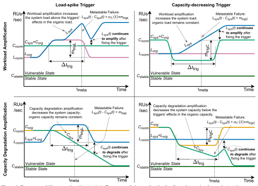
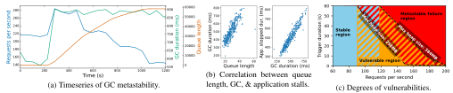
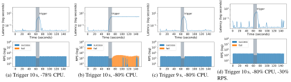
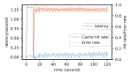
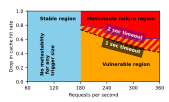
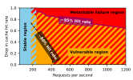

# **Metastable Failures in the Wild**

**Lexiang Huang,** *The Pennsylvania State University and Twitter;* **Matthew Magnusson and Abishek Bangalore Muralikrishna,** *University of New Hampshire;*  **Salman Estyak,** *The Pennsylvania State University;* **Rebecca Isaacs,** *Twitter;*  **Abutalib Aghayev and Timothy Zhu,** *The Pennsylvania State University;*  **Aleksey Charapko,** *University of New Hampshire*

https://www.usenix.org/conference/osdi22/presentation/huang-lexiang

**This paper is included in the Proceedings of the 16th USENIX Symposium on Operating Systems Design and Implementation.**

**July 11–13, 2022 • Carlsbad, CA, USA**

978-1-939133-28-1

**Open access to the Proceedings of the 16th USENIX Symposium on Operating Systems Design and Implementation is sponsored by**

# Metastable Failures in the Wild

Lexiang Huang1,3\*, Matthew Magnusson2\*, Abishek Bangalore Muralikrishna2, Salman Estyak1, Rebecca Isaacs3, Abutalib Aghayev1, Timothy Zhu1, and Aleksey Charapko2 1The Pennsylvania State University, 2University of New Hampshire, 3Twitter

# **Abstract**

Recently, Bronson et al. [7] introduced a framework for understanding a class of failures in distributed systems called metastable failures. The examples of metastable failures presented in that work are simplified versions of failures observed at Facebook. In this work, we study the prevalence of such failures in the wild by scouring over publicly available incident reports from many organizations, ranging from hyperscalers to small companies.

Our main findings are threefold. First, metastable failures are universally observed—we present an in-depth study of 22 metastable failures from 11 different organizations. Second, metastable failures are a recurring pattern in many severe outages—e.g., at least 4 out of 15 major outages in the last decade at Amazon Web Services were caused by metastable failures. Third, we extend the model by Bronson et al. to better reflect the metastable failures seen in the wild by categorizing two types of triggers and two types of amplification mechanisms, which we confirm through developing multiple example applications that reproduce different types of metastable failures in a controlled environment. We believe our work will aid in a deeper understanding of metastable failures and in coming up with solutions to them.

#### Introduction

Building reliable distributed systems has been the holy grail of distributed computing research. Historically, academic researchers studied the reliability of distributed systems under the assumptions of fail-stop [31, 42, 46] and Byzantine [8, 32] failure modes. The proliferation of cloud services led to previously unseen scales and the discovery of new failure modes, such as stragglers [9, 12, 62], fail-slow hardware failures [3, 27, 29], and scalability failures [34, 53]. Most recently, Bronson et al. [7] introduced a new class of failures called metastable failures.

Bronson et al. define the metastable failure state as the state of a permanent overload with an ultra-low goodput (throughput of useful work). In their framework, they also define the *stable state* as the state when a system experiences a low enough load than it can successfully recover from temporary overloads, and the vulnerable state as the state when a system experiences a high load, but it can successfully handle that load in the absence of temporary overloads. A system experiences a metastable failure when it is in a vulnerable state and a trigger causes a temporary overload that sets off a sustaining effect—a work amplification due to a common-case

optimization—that tips the system into a metastable failure state. The distinguishing characteristic of a metastable failure is that the sustaining effect keeps the system in the metastable failure state even after the trigger is removed.

This phenomenon of metastable failure is not new. However, instances of such failures look so dissimilar that it is hard to spot the commonality. As a result, distributed systems practitioners have given different names to different instances of metastable failures, such as persistent congestion [51], overload [60], cascading failures [5], retry storms [2,56], death spirals [37], among others. Bronson et al. [7] is the first work that generalizes all of these different-looking failures under the same framework.

A key property of metastable failures is that their root cause is not a specific hardware failure or a software bug. It is an emergent behavior of a system, and it naturally arises from the optimizations for the common case that lead to sustained work amplification. As such, metastable failures are hard to predict, may potentially have catastrophic effects, and incur significant ongoing human engineering costs because automated recovery is difficult (since these failures are not understood well). For example, in Section 6.3, we discuss how code and configuration changes without truly understanding the metastable failure can exacerbate the problem and lead to future incidents. Incidentally, at the time of writing this paper, a metastable failure at Amazon Web Services (AWS) disrupted the operation of airlines [38], home appliances [30], smart homes, payment systems [52], and other critical services for several hours.

As Bronson et al. point out, operators choose to run their systems in the vulnerable state all the time because it is much more efficient than running them in the stable state. As a simple example, an operator of a system with a database that can handle 300 requests per second (RPS) can install a cache with a 90% hit-rate and start serving up to 3,000 RPS. While more efficient, the system is now operating in a vulnerable state because a cache failure can overwhelm the database with more requests that it can handle. The problem is that in a complex, large-scale distributed system, we lack the ability to analyze the consequences of this decision to run in a vulnerable state under different conditions; e.g., what happens if load increases, or if the downstream latency increases, or if messages increase in size and serialization/deserialization starts to cost more CPU? So picking "how vulnerable" of a state to operate in, under normal conditions, is a best guess and not always the right choice, which is why we continue to experience metastable failures.

Equal contribution.

In this paper, we make four contributions that extend the work of Bronson et al. and increase our understanding of metastable failures:

- A study of metastable failures in the wild that confirms metastable failures are universally observed and comprise a substantial fraction of the most severe outages [\(Section 2\)](#page-2-0).
- An improved model that categorizes two types of triggers and two types of amplification mechanisms, which better explains how metastable failures happen [\(Section 3\)](#page-4-0).
- An insider view at Twitter of a new type of metastable failure where garbage collection acts as an amplification mechanism [\(Section 4\)](#page-8-0).
- Three example applications on which metastable failures are experimentally reproduced, which helps researchers propose and test solutions to metastable failures [\(Section 5\)](#page-10-0). We have open-sourced these examples at [https://github.com/](https://github.com/lexiangh/Metastability) [lexiangh/Metastability.](https://github.com/lexiangh/Metastability)

We hope our work will encourage more research into this devastating kind of failure and help in building more robust distributed systems, as our daily lives start to increasingly depend on them [\[20,](#page-16-5) [30,](#page-16-4) [38,](#page-17-7) [52\]](#page-17-8).

# 2 Metastability in the Wild

Bronson et al. [\[7\]](#page-15-0) used simplified examples to illustrate the mechanism of metastability and only asserted that the pattern was common, but did not present any data about real-world occurrences. Thus, we perform a large-scale study of actual metastable failures in the wild by sifting through hundreds of publicly available incident reports. It is an arduous task that requires an in-depth analysis of each incident report to understand if the failure is metastable, and the lack of details in the reports makes it even more challenging. We identify 21 metastable failures [\(Table 1\)](#page-3-0) that are severe enough to warrant public incident reports in a range of organizations, including four at AWS, four at Google Cloud, and four at Microsoft Azure. Though this number may appear low compared to other failure types in distributed systems [\[26,](#page-16-6)[27,](#page-16-2)[33,](#page-17-9)[53\]](#page-17-4), metastable failures usually have devastating results that last many hours, which makes them an important class of failures to study.

# 2.1 Methodology

To find examples of metastability, we searched through troves of publicly available post-mortem incident reports from large cloud infrastructure providers and significantly smaller companies or services. Large infrastructure providers, such as Amazon Web Services (AWS), Azure, and Google, are held accountable by many paying customers, forcing greater transparency into their reliability and operation practices. Smaller businesses often operate with higher self-imposed transparency goals until they grow large enough to become a significant target for malicious attacks.

Infrastructure providers often maintain incident and outage reporting tools [\[4,](#page-15-6) [11,](#page-15-7) [50\]](#page-17-10), which became our primary source for metastable failures. We analyzed hundreds of incidents to find a handful that depicts systems in the metastable state. We also found several smaller failures from other public sources such as postmortem communities [\[13,](#page-16-7) [44,](#page-17-11) [45,](#page-17-12) [54\]](#page-17-13), weekly outage incident digests [\[14,](#page-16-8) [17,](#page-16-9) [55\]](#page-17-14), etc.

The reports from different sources do not follow the same format nor provide the same level of information, making our job of finding examples of metastability more difficult. While going through these reports, we focus on tell-tale signs of metastability—temporary triggers, work amplification or sustaining effects, and certain specific mitigation practices. More specifically, we look for patterns when a trigger initiates some processes that amplify the initial trigger-induced problem and sustain the degraded performance state even after the trigger is removed. The sustaining effect can take multiple forms, such as exacerbated queue growth or retries that create more load. We also pay attention to mitigation efforts, as metastable failures often require significant load shedding [\[57,](#page-18-3) [60\]](#page-18-1) for recovery.

We perform a comprehensive analysis of these incidents, focusing on impact, trigger, work amplification mechanisms, and mitigation practices. To study the impact, we focus on the duration and number of impacted services. This information is usually readily available in the reports. For the triggers, we identify the triggers and classify them into several distinct categories. We use a similar identification and classification process to distill work-amplification mechanisms and mitigation patterns. We present our summarized findings in [Table 1.](#page-3-0)

# 2.2 Summary of Metastable Failures in the Wild

In [Table 1,](#page-3-0) we provide a breakdown of metastable failure incidents we have found. The examples include instances from both major cloud providers (e.g., Microsoft, Amazon, Google, IBM) and smaller companies and projects (e.g., Spotify, Elasticsearch, Apache Cassandra). Our summary table describes high-level aspects of these failures: duration of the incident, impacted services, triggers leading to the outage, the sustaining effect mechanism, and corrective actions taken by the engineers.

Due to the often limited scope of provided information, we use our best judgment in identifying metastable failures. The most important criteria we use is the sustaining effect mechanism. We highlight several instances in gray color when the incident description is not clear on the presence of such a sustaining effect, but metastable failure is plausible depending on the interpretation and given the rest of the information provided. Additionally, we assign each incident a unique identifier to refer to each incident later.

Triggers are the starting events in the chain leading to metastable failures. Around 45% of observed triggers in [Ta](#page-3-0)[ble 1](#page-3-0) are due to engineer errors, such as buggy configuration or code deployments, and latent bugs (i.e., undetected preexisting bugs). These can be observed in incidents GGL1, GGL2, GGL3, GGL4, AWS1, AWS3, AZR3, ELC1, SPF1. Load spikes are another prominent trigger category, with around 35% of incidents reporting it. A significant number of cases (45%) have more than one trigger.

|        | ID        | Date            | Duration (hours) | Services Impacted                                                                                         | Triggers                                                            | Sustaining Effect                                           | Mitigation                                                                                              |
|--------|-----------|-----------------|------------------|-----------------------------------------------------------------------------------------------------------|---------------------------------------------------------------------|----------------------------------------------------------------|---------------------------------------------------------------------------------------------------------|
| Google | GGL1 [22] | 03/12/19        | 4.17             | Gmail, Photos, Drive, Cloud Storage, various other GCP services                                        | • load spike • config change                                        | cascading overload                                             | • load shedding • stop config deploy                                                                    |
|        | GGL2 [23] | 10/31/19        | 21.5             | multiple components of GCE                                                                                | software bug                                                        | • retry                                                        | • load shedding • reboot • capacity increase                                                            |
|        | GGL3 [24] | 04/08/20        | 3.2              | Google BigQuery, Cloud IAM 3% of Cloud SQL HA                                                          | • config change • software bug                                   | • retry                                                        | • config rollback • policy change                                                                       |
|        | GGL4 [21] | 04/30/13        | 1.5              | Google API infrastructure                                                                                 | <ul><li>config change</li><li>latent software bug</li></ul>         | <ul><li>traffic queue growth</li><li>reboots</li></ul>         | • config rollabck • server reboot                                                                       |
| AWS    | AWS1 [47] | 04/21/11        | 66.7             | Amazon EC2, Amazon RDS                                                                                    | • network config change                                             | • retry                                                        | <ul><li>config rollback</li><li>policy change</li><li>load shedding</li><li>capacity increase</li></ul> |
|        | AWS2 [48] | 06/13/14        | 4.23             | Amazon SimpleDB                                                                                           | • power loss                                                        | • retry                                                        | load shedding     server restart                                                                        |
|        | AWS3 [49] | 09/20/15        | 4.55             | AWS SQS, EC2 Autoscaling, CloudWatch, AWS Console                                                      | load spike     network disruption                                   | retry     cascading server     demotion                        | load shedding – pause metadata ops     capacity increase                                                |
|        | AWS4 [51] | 12/07/21        | 9.3              | AWS DynamoDB, EC2, Fargate, RDS, EMR, Workspaces, AWS Console, Authorization services, internal DNS | latent software bug triggered by scale-up led to load spike   | • retry                                                        | • load rebalancing • load shedding                                                                      |
| Azure  | AZR1 [4]  | 07/01/20        | 2.65             | Azure SQL DB & SQL Data Warehouse, Azure Database for MySQL/PostgreSQL/MariaDB                      | unspecified load imbalance trigger     latent config bug            | cascading overload                                             | service restart                                                                                         |
|        | AZR2 [4]  | 04/01/21        | 1.15             | Azure DNS                                                                                                 | • software bug leading to cache degradation                         | • retry                                                        | unknown automation     capacity increase                                                                |
|        | AZR3 [4]  | 06/14/21        | 13.25            | Management operations of many Azure Services                                                        | latent software bug     load spike                                  | unspecified queue growth due to overload and timeouts    | load shedding     remove buggy software     capacity increase                                           |
|        | AZR4 [4]  | 07/12/21        | 7.92             | Windows Virtual Desktop, Azure Front Door, Azure CDN Standard                                       | <ul><li>deployment of software bug</li><li>load spike</li></ul> | • retry • other unspecified                                    | load rebalancing     trigger hot fix     policy change                                                  |
| Other  | IBM1 [11] | 06/11/21        | 73.53            | Private DNS, HS Crypto Service, Cloudant DNS Services, Osaka, Cloudshell services                   | software bug                                                        | • retry                                                        | <ul><li>load shedding</li><li>policy change</li><li>trigger hot fix</li></ul>                           |
|        | SPF1 [19] | 04/13           | NA               | core app/service UI                                                                                       | load spike     policy failure                                       | • retry                                                        | load shedding                                                                                           |
|        | SPF2 [19] | 06/04/13        | 8.33             | core app/service UI                                                                                       | load spike due to unexpected service dependency               | • retry • excessive logging in failure case                    | <ul><li> trigger hot fix</li><li> load shedding</li></ul>                                               |
|        | ELC1 [39] | 04/02/19        | 6.67             | Elasticsearch Service                                                                                     | • unspecified maintenance • unspecified error                    | <ul> <li>load caused ZK churn causing more load</li> </ul> | <ul><li>restart</li><li>load shedding</li></ul>                                                         |
|        | WIK1 [58] | 03/30/21        | 2.25             | media upload, misc queued jobs                                                                            | • load spike                                                        | <ul> <li>unspecified causing queue growth</li> </ul>           | <ul><li>load shedding</li><li>policy change</li></ul>                                                   |
|        | CCI1 [10] | 07/07/15        | 18.33            | Core product                                                                                              | load spike                                                          | load increase due to contention                             | load shedding                                                                                           |
|        | CAS1 [1]  | 07/27/17        | NA               | Partial database outage                                                                                   | rolling restart                                                     | <ul> <li>self-sustaining and increasing overload</li> </ul>    | policy change                                                                                           |
|        | CAS2 [43] | 2020            | 0.16             | ably services                                                                                             | <ul> <li>load spike of certain costly operations</li> </ul>         | • retry                                                        | • trigger removal – operated in stable state                                                            |
| Tol    | FB1 [18]  | NA otoblo fo | NA               | Facebook core services                                                                                    | • load spike                                                        | • software bug                                                 | • hot fix                                                                                               |

Table 1: Metastable failures from public sources. Azure and IBM do not provide a direct incident link. Gray highlight indicates a plausible metastable failure, although the incident description lacked some necessary details.

Handling and recovering from metastable failures is not easy, with our data suggesting that incidents cause significant outages. For instance, the IBM1 incident lasted over three days. More generally, we have observed outages in a range of 1.5 to 73.53 hours, with 4 to 10 hours of outages being the most common (35% of incidents reporting the outage period).

While triggers initiate the failure, the sustaining effect mechanisms prevent the system from recovering. We observed a variety of different sustaining effects, such as load

increase due to retries, expensive error handling, lock contention, or performance degradation due to leader election churn. By far, the most common sustaining effect is due to the retry policy, affecting more than 50% of the studied incidents— GGL2, GGL3, AWS1, AWS2, AWS3, AZR2, AZR4, IBM1, SPF1, SPF2, and CAS2 incidents are all sustained by retries.

Recovery from a metastable failure is challenging and often requires reducing load. Direct load shedding, such as throttling, dropping requests, or changing workload parameters,

| Symbols                    | Names                                      |  |
|----------------------------|--------------------------------------------|--|
| $L_{norm}, C_{norm}$       | Normal load and capacity without is-       |  |
|                            | sues (i.e., triggers)                      |  |
| $L_{org}(t), C_{org}(t)$   | Organic load and capacity at time <i>t</i> |  |
|                            | including effects from triggers            |  |
| $L_{sys}(t), C_{sys}(t)$   | System load and capacity at time <i>t</i>  |  |
|                            | including metastable amplification         |  |
|                            | over the organic load and capacity         |  |
| $C_{stable}$               | Stable capacity below which the sys-       |  |
|                            | tem recovers from metastability            |  |
| $m_{trigL}, m_{trigC}$     | Maximum load-spike and capacity-           |  |
|                            | decreasing trigger magnitudes              |  |
| $\alpha_L(t), \alpha_C(t)$ | Workload and capacity degradation          |  |
|                            | amplification factors                      |  |
| $\Delta t_{trig}$          | Trigger overloading duration               |  |
| $w_L(\Delta t_{trig}),$    | Workload and capacity degradation          |  |
| $w_C(\Delta t_{trig})$     | amplification upper bound functions        |  |
| $w_L^*, w_C^*$             | Maximum workload and capacity              |  |
|                            | degradation amplifications                 |  |

Table 2: Symbols of Metastability Framework.

was used in over 55% of the cases. Some indirect mechanisms were also popular, such as reboots to clean the queues or operation backlogs, or policy changes. An example of such a policy change is the CAS1 incident where a feature was turned off to allow the servers to join the cluster.

## 3 Metastability Framework

Based on our observations of real-world metastable failures, we extend the model of Bronson et al. [7] in three ways. First, while the previous framework presumes that a system entering a metastable failure state is usually due to a load increase, we observe in multiple incidents that a software bug or a configuration change may decrease the capacity of the system and trigger a metastable failure even without a load increase. Second, although the previous framework describes a system sustaining in a metastable failure state due to workload amplification, we show examples of another type of metastable failure sustaining effect where background activities such as garbage collection cause the system's capacity to degrade or remain degraded even after the trigger is removed. Third, based on our experiments on the reproductions of metastable failures, we find that a vulnerable state is not a binary condition; whether a system transitions from a vulnerable state into a metastable failure state is determined by the current degree of vulnerability, the trigger magnitude, and its duration.

#### 3.1 System Model

We devise our model based on the load and capacity of a system, and a summary of the symbols are shown in Table 2. The capacity of the system,  $C_{sys}(t)$ , is represented in terms of abstract resource units (RUs) that the system can handle per second (i.e., work per second). Each request consumes some RUs from the system's budget. For example, consider a system with a constant  $C_{sys}(t) = 100$  RUs/sec; every second

such a system can process up to 100 requests, each costing 1 RU, or up to 50 requests, each costing 2 RUs. The load,  $L_{sys}(t)$ , represents the work per second arriving to the system in terms of RUs/sec. So for a system to not be overloaded,  $L_{sys}(t) < C_{sys}(t)$ .

Under normal idealized conditions, we assume the processing capacity  $C_{sys}(t)$  is constant,  $C_{sys}(t) = C_{norm}$ . However, depending on circumstances it may diminish due to failures, transient outages, or amplification effects of metastability. Similar to  $C_{sys}(t)$ , we set  $L_{sys}(t) = L_{norm}$  as the normal load excluding transient effects and workload amplification.

Since metastability is fundamentally due to sustaining effects that amplify the load and degrade the system capacity, we also define  $L_{org}(t)$  and  $C_{org}(t)$  as the load and system capacity without amplification effects. That is, the organic load,  $L_{org}(t)$ , is the load originating from the system's clients. This includes transient effects such as load spikes, but does not include workload amplification effects such as retries. Similarly, the organic capacity,  $C_{org}(t)$ , represents the system capacity including transient capacity decreases, but without sustaining degradation. For example, background interference may drop the organic capacity in half temporarily until the interference ends. But sustaining amplification effects such as garbage collection would cause the system capacity to degrade further or remain degraded even after the trigger is removed. We illustrate these effects on capacity and load in Figure 1.

#### 3.2 Triggers

Metastable failures begin with trigger events. In our survey (Section 2), we have identified two broad types of triggers. The first trigger type results from a sudden burst in organic load,  $L_{org}(t)$  (e.g., a celebrity posting their baby's picture). The left two scenarios in Figure 1 illustrate how such a trigger could lead to a metastable failure, and incidents GGL1, AWS3, AZR3, AZR4, SPF1, SPF2, WIKI1, CCI1, and CAS2 are examples of such failures. The second trigger type degrades the system's organic capacity,  $C_{org}(t)$  (e.g., a rack failure or deployment of inefficient code). The right two scenarios in Figure 1 illustrate how such a trigger could lead to a metastable failure, and incidents GGL2, GGL3, GGL3, AWS1, AWS2, AZR4, and IBM1 are examples of such failures. While the two types of triggers behave differently, they impact the system's operation similarly by changing the balance between the load and capacity.

**Definition 1** (**Trigger**). A **trigger**  $\mathcal{T}(m_{trigL}, m_{trigC})$  represents the total effect from one or more of the following events:

- A **load-spike trigger** is an event that increases the load on the system by some maximum magnitude  $m_{trigL}$  such that  $L_{org}(t) L_{norm} \le m_{trigL}$  for all t.
- A **capacity-decreasing trigger** is an event that decreases the system capacity by some maximum magnitude  $m_{trigC}$  such that  $C_{norm} C_{org}(t) \le m_{trigC}$  for all t.

We assume  $m_{trigL}$  and  $m_{trigC}$  represent upper bounds on the total trigger effect across all the triggers in a trigger event. In our survey, over half of the observed incidents had one

Figure 1: Four metastability scenarios [\(Section 3.4\)](#page-7-0). Two types of triggers (i.e., load-spike and capacity-decreasing) and two types of amplification mechanisms (i.e., workload amplification and capacity degradation amplification) form the different scenarios.

overloading trigger, but to our surprise, incidents with multiple triggers were also common (GGL1, GGL3, GGL4, AWS3, AZR1, AZR3, AZR4, SPF1, and ELC1).

Not all triggers are dangerous; small variations of capacity or load are normal and unavoidable. The triggers become dangerous when they overload the system (i.e., *Lsys*(*t*) ≥ *Csys*(*t*)). Definition 2 (Overloading trigger condition). If *mtrigL* + *mtrigC* ≥ *Cnorm* −*Lnorm*, then the trigger(s) can overload the system.

Theorem 1 (Overloading trigger). If the system does not have an overloading trigger condition, then it will never have a metastable failure. (Proof in [Section A.1.](#page-15-10))

An overloading trigger is a necessary precursor of a metastable failure. Once the system is in an overloaded state, its performance starts to degrade, which sets off alarms and starts mitigation efforts. For instance, GGL2, GGL3, AZR2, and AZR4, among others, relied on an automated monitoring and notification system to initiate the mitigation efforts once a drop in availability is detected. Although not always explicitly mentioned, we believe that most, if not all, systems surveyed have monitoring and notification capabilities. As the system

overloads, the latency of client operations will start to rise, while the goodput will stay at or below the *Csys*(*t*).

The overloaded state, however, is not a metastable failure state just yet. Getting out of overload is relatively straightforward — fix the trigger and restore the balance in the system, such that *Lsys*(*t*) < *Csys*(*t*) again. If the load on the system returns to a level below the system's capacity when the trigger is removed, then the system should eventually recover.

The duration of the trigger's impact on the system is another important aspect to consider. While the trigger persists, the system is working in a reduced capacity or increased load setting, depending on the trigger type. Some triggers are easy to fix and end their impact on the systems. For instance, most of the misconfiguration triggers (GGL1, GGL4, AWS1) and buggy software deployment (AZR4) can be fixed by a rollback action. Some triggers are more difficult to address since the ability to fix the trigger, ironically, may depend on the system's performance, which is degraded by the trigger. For instance, CAS1 incident had a rolling server restart for maintenance. The restart lowers the overall capacity of the system by the capacity of a server currently rebooting, placing more

load on other machines. A rebooted server needs to repair itself by catching up, which requires both the rebooted server to be fast enough to catch up with the missed and ongoing load, and the rest of the system needs to be fast enough to provide this repair service.

#### 3.3 Sustaining Effect Loop

A metastable failure arises when the overloaded system does not eventually return to a healthy state ( $L_{sys}(t) < C_{sys}(t)$ ). Many reasons can keep the system in a failed state, such as the inability to recover from the trigger or an uncontrolled increase in load, among others. However, all of the reasons share a common pattern of keeping systems inoperative. We refer to this pattern as a *sustaining effect*.

**Definition 3 (Sustaining effect).** A sustaining effect is a feedback loop that keeps the system in an overloaded state such that  $L_{sys}(t) \ge C_{sys}(t)$  even after the trigger is removed.

The feedback mechanism itself may have existed prior to the trigger, however, the overload made the feedback mechanism self-sustaining, and we name this feedback mechanism as *metastable amplification*. For instance, the AWS4 incident occurred with networking overload due to a planned scale-up operation. The overload resulted in connection timeouts and retries, creating even more load and causing more timeouts and retries.

**Definition 4 (Metastable amplification).** A **metastable amplification**  $\mathcal{W}(\alpha_L(t), \alpha_C(t), w_L(\Delta t_{trig}), w_C(\Delta t_{trig}), w_L^*, w_C^*)$  exacerbates the system's overload until it reaches a maximum overload limit. The amplification can manifest itself by increasing the load on the system  $L_{sys}(t)$  and/or decreasing the system's capacity  $C_{sys}(t)$ :

- Workload amplification is a feedback loop that increases the system load  $L_{sys}(t)$  beyond the organic load  $L_{org}(t)$  (i.e.,  $L_{sys}(t) \ge L_{org}(t)$ ). The workload amplification factor,  $\alpha_L(t) = L_{sys}(t)/L_{org}(t)$ , can be upper bounded by some workload amplification upper bound function  $w_L(\Delta t_{trig})$  and max load amplification  $w_L^*$  such that  $1 \le \alpha_L(t) \le w_L(\Delta t_{trig}) \le w_L^*$  for all  $t, \Delta t_{trig}$ , where  $w_L$  is a monotonically increasing function of the trigger overloading duration  $\Delta t_{trig}$  from  $w_L(0) = 1$  to  $w_L(\infty) = w_L^*$ .
- Capacity degradation amplification is a feedback loop that decreases the system's capacity  $C_{sys}(t)$  below the organic capacity  $C_{org}(t)$  (i.e.,  $C_{sys}(t) \leq C_{org}(t)$ ). The capacity degradation amplification factor,  $\alpha_C(t) = C_{sys}(t)/C_{org}(t)$ , can be upper bounded by some capacity degradation amplification upper bound function  $w_C(\Delta t_{trig})$  and max capacity degradation amplification  $w_C^*$  such that  $1 \geq \alpha_C(t) \geq 1/w_C(\Delta t_{trig}) \geq 1/w_C^*$  for all  $t, \Delta t_{trig}$ , where  $w_C$  is a monotonically increasing function of the trigger overloading duration  $\Delta t_{trig}$  from  $w_C(0) = 1$  to  $w_C(\infty) = w_C^*$ .

Intuitively, the upper bounds allow us to reason about vulnerability and when a system enters a metastable failure state. We do not assume the upper bounds are tight, and the intent is to explain (i) there are two different types of amplification (that may both be active simultaneously), and (ii) how the

amplification factors impact metastability.

Workload amplification can manifest in multiple ways. Recall that each request in our model has some RU cost. The workload amplification, therefore, can use one of the two broad mechanisms—increasing the number of requests in the system or increasing the average cost of a request. We observe the former amplification method in incidents GGL2, SPF1, AZR2, while the latter shows up in AWS3, WIKI1, and SPF2. For example, the SPF1 incident was caused by retrying the requests, while the SPF2 issue was exaggerated by extra debug logging added for timed-out requests. In our model, this corresponds to the top left scenario in Figure 1 where a load-spike trigger (i.e.,  $L_{org}$  increases) starts a workload amplification (i.e.,  $L_{sys}$  increases) due to retries or an increase in the average per-request cost.

Workload amplification does not necessarily start immediately with the trigger. A common type of workload amplification is retry-driven amplification, observed in incidents GGL2, AWS1, AWS2, AZR2, SPF1, and SPF2. It occurs when the requests start to timeout after waiting for some timeout period, and clients begin to retry the failed requests. Typically, this type of amplification starts building after some amplification delay. This delay depends on several factors, such as the degree of overload in the system and request timeout. A short request timeout is good for latency when retrying due to a small transient issue. However, it can hurt the system's ability to handle larger problems by quickly starting the workload amplification. For example, AWS2 specifies that a small handshake timeout was a contributing factor to starting and sustaining the overload. The handshake timeout controlled the frequency of heartbeat messages and the duration a server can remain active without receiving a heartbeat. A longer timeout would have both reduced the heartbeat load and allowed for a longer heartbeat wait, potentially delaying workload amplification.

Capacity degradation amplification is another common type of sustaining effect. This effect occurs when the initial trigger overloads the system and causes the capacity to degrade or remain degraded. For example, a system experiencing a trigger where background interference from other co-located processes pushes it into an overloaded state may now need to also deal with an increased amount of garbage collection (GC) due to a queue buildup. In this case, the GC amplifying effect would degrade the system capacity beyond the capacity decrease from the trigger. The metastability arises when the capacity degradation from GC grows to be high enough such that the system remains overloaded even if the background interference is removed.

A sustained degradation is a special case of capacity degradation amplification. The CAS1 incident discussed earlier is an example of this. A different instance of this type of sustaining effect is the caching failure described in Bronson et al. [7]. In a system backed by a look-aside cache, a partial failure of a cache, such as a reboot of a caching server, may

result in a load spike on the underlying database and cause it to timeout. Because of timeouts, all operations effectively fail, preventing the system from filling the cache. This sustaining effect causes the capacity to remain degraded.

Figure 1 shows the impact of workload amplification (top scenarios) and capacity degradation amplification (bottom scenarios) on metastability. While the scenarios look different visually, they can all be understood under the metastability model of a sustaining effect that amplifies the load and/or capacity degradation to magnify an overload condition.

#### 3.4 Metastability Scenarios

Figure 1 demonstrates four scenarios in which metastable failures occur. We introduce two types of triggers and two types of amplification mechanisms that impact the load and capacity of the system. We use the terms "load-spike" for triggers and "workload amplification" for amplification mechanisms impacting the load, and we use the terms "capacity-decreasing" for triggers and "capacity degradation" for amplification mechanisms impacting the capacity. In practice, both types of triggers and both types of amplification mechanisms can occur simultaneously.

In the upper left scenario, when there is a load-spike trigger, the organic load  $L_{org}$  increases beyond the system capacity  $C_{sys}$ , and thus the system is overloaded. The workload amplification (e.g., retries) further increases the system load  $L_{sys}$  above the triggers' effects (i.e.,  $m_{trigL}$ ) in the organic load  $L_{org}$ . When the system overload (i.e.,  $L_{sys}(t) - C_{sys}(t)$ ) is high enough (e.g., at time  $t_{meta}$ ), even after removing the trigger (i.e., the dip of  $L_{org}$  and  $L_{sys}$ ), the system remains overloaded and the workload amplification mechanism continues to exacerbate the overload, which indicates the system is in a metastable failure state.

In the upper right scenario, when there is a capacity-decreasing trigger, the organic capacity  $C_{org}$  decreases below the system load  $L_{sys}$ , and thus the system is overloaded. The workload amplification (e.g., retries) increases the system load  $L_{sys}$ . Once the amplification is high enough (e.g., at time  $t_{meta}$ ), even after removing the trigger (i.e., the recovery of  $C_{org}$  by  $m_{trigC}$ ), the system is still overloaded, and the workload amplification mechanism continues to exacerbate the system overload. Hence a metastable failure.

In the bottom left scenario, when there is a load-spike trigger, the organic load  $L_{org}$  increases beyond the system capacity  $C_{sys}$ , and thus the system is overloaded. The capacity degradation amplification (e.g., GC amplifying effect) decreases the system capacity  $C_{sys}$ . Once the amplification is high enough (e.g., at time  $t_{meta}$ ), even after removing the trigger (i.e., the organic load  $L_{org}$  decreases by  $m_{trigL}$ ), the system is still overloaded, and the capacity degradation amplification mechanism continues to exacerbate the system overload. Hence a metastable failure.

In the bottom right scenario, when there is a capacity-decreasing trigger, the organic capacity  $C_{org}$  decreases below the system load  $L_{sys}$ , and thus the system is overloaded. The

capacity degradation amplification (e.g., GC amplifying effect) further decreases the system capacity  $C_{sys}$  below the triggers' effects (i.e.,  $m_{trigC}$ ) in the organic capacity  $C_{org}$ . When the system overload (i.e.,  $L_{sys}(t) - C_{sys}(t)$ ) is high enough (e.g., at time  $t_{meta}$ ), even after removing the trigger (i.e., the recovery of  $C_{org}$  and  $C_{sys}$ ), the system remains overloaded and the workload amplification mechanism continues to exacerbate the overload. Hence a metastable failure.

#### 3.5 System States

Based on Bronson et al. [7], we define three states (stable, vulnerable, metastable failure) that a system operates in and describe the boundaries between these states.

#### 3.5.1 Stable State

Assuming a system has a metastable amplification mechanism  $\mathcal{W}(\alpha_L(t), \alpha_C(t), w_L(\Delta t_{trig}), w_C(\Delta t_{trig}), w_L^*, w_C^*)$  and trigger  $\mathcal{T}(m_{trigL}, m_{trigC})$ , it will never have a metastable failure if it's running under low enough load  $L_{norm} < C_{stable}$ . The demarcation line between stable and vulnerable states depends on the max amplification factors  $w_L^*$ ,  $w_C^*$  and the normal capacity of the system,  $C_{norm}$ .

**Theorem 2** (Stable region). Define  $C_{stable} = \frac{C_{norm}}{(w_L^* * w_C^*)}$ . If  $L_{norm} < C_{stable}$ , then the system will never have a metastable failure. (Proof in Section A.2.)

When the normal load is low enough relative to the normal system capacity, then even if the trigger overloads the system and causes the maximum metastable amplification, it will recover once the trigger is removed and hence is not a metastable failure. For instance, in the CAS2 incident, the Apache Cassandra cluster operated at a low load of 10% to 30% percent of the capacity. Despite a very significant trigger and workload amplification, the cluster recovered itself when the trigger was removed.

#### 3.5.2 Vulnerable State

If the system has a normal load higher than  $C_{stable}$ , it's running in a vulnerable state. Bronson et al. [7] define the vulnerable state as the state when a system experiences a high enough load that temporary overloads can tip the system into a metastable failure state. However, based on our experiments, the vulnerable state is not a binary—there are many degrees to it and many factors determine this degree of vulnerability.

As an overloading trigger event  $\mathcal{T}(m_{trigL}, m_{trigC})$  unfolds, the system (and engineers) are in a race to mitigate the overload before the feedback loop of the sustaining effect makes the failure unrecoverable without more drastic measures. In such a system, a combination of amplification and trigger factors impact the likelihood of a metastable failure.

**Theorem 3** (**Degrees of vulnerability**). If the metastable amplification during the trigger overloading duration  $\Delta t_{trig}$  is small enough relative to the system headroom (i.e.,  $w_L(\Delta t_{trig}) * w_C(\Delta t_{trig}) < \frac{C_{norm}}{L_{norm}}$ ), then the system will never have a metastable failure. (Proof in Section A.3.)

Once the system is in a vulnerable state, a combination of factors determines its degree of vulnerability. First, how close  $L_{norm}$  is to  $C_{norm}$  impacts the vulnerability. The smaller the

 $C_{norm}/L_{norm}$  ratio, the easier it is to enter a metastable failure state (i.e., the higher degree of vulnerability). The smaller the  $C_{norm}-L_{norm}$  difference, the smaller the trigger magnitude needed to overload the system and potentially trigger the metastable failure (Theorem 1). Second, the metastable amplification impacts the vulnerability. As described in Theorem 3, higher metastable amplifications ( $w_L(\Delta t_{trig})$ ) and  $w_C(\Delta t_{trig})$ ) increase the vulnerability to metastable failures. Since  $w_L$  and  $w_C$  increase with the overloading trigger duration  $\Delta t_{trig}$ , longer triggers also increase the vulnerability.

The amplification delay, if present, is the first mechanism to buy some time for mitigation efforts. Unfortunately, there is very little control over this delay interval, aside from timeouts in scenarios like retry-based workload amplification. The trigger overloading interval  $\Delta t_{trig}$  is another factor in determining whether an overload develops into the metastable failure. Intuitively, short triggers mean that amplification may not have started yet due to the amplification delay or has not escalated too far. Recall that entering a metastable failure state requires the system load to exceed the capacity even after fixing the trigger. This means that the amplification factors  $\alpha_L(t)$  and  $\alpha_C(t)$  play a role—a smaller amplification translates into a more moderate system load growth that can buy the engineers time to recover the trigger.

#### 3.5.3 Metastable Failure State

The point when the trigger(s) cause the system to enter a metastable failure state depends on the current amplification factors  $\alpha_L(t)$  and  $\alpha_C(t)$  and trigger magnitudes.

**Theorem 4** (Metastable failure boundary). If the metastable amplification causes the system overload to exceed the triggers' effects (i.e.,  $L_{sys}(t) - C_{sys}(t) \ge \alpha_L(t) * m_{trigL} + \alpha_C(t) * m_{trigC}$ ), then the system is in a metastable failure state. (Proof in Section A.4.)

Since the current amplification factors and trigger magnitudes change over time, we can use the current amplification factors and maximum trigger magnitudes to develop a metastable failure boundary. If the overload  $L_{sys}(t) - C_{sys}(t)$  exceeds the boundary in Theorem 4, then there is a metastable failure because the system is overloaded even after the trigger is removed. If the overload  $L_{sys}(t) - C_{sys}(t)$  is below the boundary in Theorem 4 while the trigger(s) are in full effect, then the system is not in a metastable failure state yet. This is because the removal of the trigger would result in a non-overloaded state where the system can recover.

Theorem 4 indicates the boundary in the general case where both types of triggers and amplifications occur simultaneously, but for simplicity, Figure 1 depicts the specific boundaries for each type of trigger and amplification in the four scenarios. That is,  $m_{trigL} = 0$  or  $m_{trigC} = 0$  depending on the trigger, and  $\alpha_L(t) = 1$  or  $\alpha_C(t) = 1$  depending on the amplification.

A practical takeaway from these results is that it is important to monitor the overload and take more drastic measures before it exceeds the metastable failure boundary. The key insight is that the overload should not be so bad that the system is overloaded even after the trigger is removed.

## 3.6 Recovery

Fixing the trigger is the first intuitive step many engineers take in recovery efforts. The intuition is likely the result of treating the trigger as the root cause of the failure. For instance, many incidents caused by deploying bad configuration involved rollbacks (GGL3, GGL4, AWS) or halting the deployments (GGL1). Similarly, many incidents triggered by software bugs involved hot-fixing the bug (AZR4, IBM1, SPF2). All incidents caused by load spikes included some form of load shedding (GGL1, AWS3, AZR3, CCI1, etc.).

However, once in the metastable failure state, the system cannot recover all by itself as the sustaining effect keeps it in the metastable failure state. Therefore, we need to remove the sustaining effect from the system to recover. Two broad strategies exist to recover from the failure. The first is load shedding—bringing the load down below the stable threshold  $C_{stable}$ . The second is to raise  $C_{stable}$  by increasing the system capacity.

Load shedding was the most popular mitigation effort used in over 50% of the incidents. This approach is intuitive in any kind of overload situation. However, without a proper understanding of the metastability and feedback loops, it is hard to know just how much the load needs to be reduced. This results in long mitigations and additional destructive steps, such as server reboots (AWS2, GGL2).

Raising  $C_{stable}$  is more nuanced than load shedding. One mechanism for changing the stable threshold is a policy change that impacts the amplification thresholds  $w_L^*$  and  $w_C^*$ . An example of such a policy change is decreasing the maximum number of retries per request. For instance, a policy with at most two retries will not amplify the work more than three times, while the policy with no cap effectively leaves the system with no stable region. A more popular way of increasing  $C_{stable}$  is to add the capacity to the system, essentially raising its  $C_{norm}$ . For a fixed  $w_L^*$  and  $w_C^*$ , increasing normal capacity will also raise the stable threshold, per Theorem 2. A few incidents in our study used this approach. For instance, AZR2 added more capacity after performing load shedding and fixing the trigger.

## 4 Metastability at Twitter

While publicly available incident reports provide enough high-level information to identify the metastable failures, they lack the depth and detail to understand the complex interactions between components in large systems. In this case study, we use insider information to describe in detail one specific metastable failure occurring at Twitter, a large internet company, due to garbage collection (GC). We identify a sustaining loop where high queueing increases memory pressure and mark-and-sweep processing during GC, causing job slowdowns and thus higher queueing. The effect is more pronounced at high system loads, where the system is more vulnerable to spikes. Specifically, we see that a peak load test

Figure 2: Timeseries of a core service under a peak load test at Twitter. Metrics are normalized except for the success rate, which is scaled to show the trend dropping below the SLO.

(a) Queue length vs. GC duration. (b) GC duration vs. Latency. Figure 3: Correlation between metrics during 3 normal days.

during a busy day triggers the system to enter a metastable failure state where jobs start to fail, and it is only after sufficient load shedding that the success rate stops dropping.

Peak load tests are one of the common types of tests used regularly in industry to expose potential problems and highlight the necessary steps to prevent incidents from happening. Figure 2 shows the timeseries of system metrics at a core service during a peak load test where we see a metastable failure. System load, GC duration, and queue length have been normalized to show the trend only, while success rate (SR) is scaled to demonstrate it dropping sharply below the SLO. All metrics are measured using the standard observability tools at Twitter, except for the (average) queue length, which is inferred using Little's Law [35]. By queue length, we mean the count of all the requests in the system. The service is a mature production service that's well-tuned and has been running for several years, under all the usual operating practices of frequent deployments, regular stress tests, and continuous monitoring and alerting.

In this incident, the peak load occurs around the 48-minute mark, and the SR starts to drop over time. Once the SR of this service drops below a critical threshold (i.e., the SLO), service operators are alerted to mitigate the problem. In this incident, the operators start load shedding at around the 83-minute mark and continue with more load shedding at 106 minutes. This had the desired effect of lowering the load, which also lowers GC and queue length. However, the SR still continues to drop and does not start to recover even when the load is back down to the level before the test. SR remains below the SLO until the service is restarted by operators. This is because even after the load shedding, a sustaining effect is still slowing down the system and causing it to remain in a metastable failure state.

Studying the internal system metrics from the test has shed

some light on the problem. We find that the changes to GC duration are highly correlated with load fluctuations, as more load brings more memory allocation, thus requiring more GC. However, the GC is busier than normal during the peak load test. During the second load-shedding period between 106-118 minute marks, the load is more than 20% lower than that at the 40-minute offset, yet the GC is busier and SR is still dropping. At the same time, the queue length is also more than 50% higher, which implies that there are more jobs stuck in the system exacerbating GC. Thus, there is contention between arriving traffic and GC consuming resources, suggesting the metastability sustaining effect.

Specifically, the incident is caused by the sustaining effect in the following steps: (i) a load spike (i.e., a  $L_{org}$  increase) caused by peak load test introduces initial high queue length in the system; (ii) high queue length results in high GC behaviors; (iii) high GC behaviors slow job processing (i.e.,  $C_{sys}$  decreases); (iv) more jobs get stuck in the system, which leads to higher queue length.

To demonstrate each of these steps, we further study data from this test as well as non-test data as a baseline. For (i), we can see the initial trigger in Figure 2 at around minute 48 where the load spike causes a sharp increase in queue length. For (ii), we see that queue length and GC duration are correlated over time in Figure 2. Additionally, we plot queue length vs. GC duration (Figure 3a) under 3 normal days without the test to show these metrics generally exhibit a positive correlation. One might wonder whether the system load affects these metrics, and we find that it is correlated to both queue length and GC duration. But to eliminate the impact of system load, we also filtered the data to only include results with approximately the same system load, and we still see a correlation between queue length and GC duration, which suggests that high queue length leads to high GC. Correlation does not imply causation, so we validate and reproduce these effects in Section 5.1 via a simple example. For (iii), we plot GC duration vs. latency (Figure 3b) during the same period without peak load testing and observe that the latency increases with GC duration. As GC consumes CPU cycles, there is CPU contention with job processing, which causes slowdowns to jobs as evidenced by the higher latencies. Naturally, job slowdowns will cause additional congestion and queueing, which completes the sustaining loop (iv).

Figure 4: Metastability in Garbage Collection (GC).

Similar incidents recur many times, and engineers take different approaches to mitigate/fix this issue. For example, (i) observing unusually high latency spikes in backend services resulted in work to improve their performance to lower queue lengths, (ii) observing higher GC duration than normal resulted in adjusting the JVM memory configuration (e.g., increasing max heap size) to tweak GC behavior, and (iii) observing high resource utilization (e.g., CPU) resulted in adding more servers to lower per-server load. These approaches decrease system vulnerabilities and make it more robust to the trigger at the magnitude of the peak load test level.

# 5 Replicating Metastability

We introduce three example applications and experimentally reproduce metastable failures on them. One of these applications reproduces the failure in the Twitter case study (Section 4) at a small scale, and the other two reproduce failures due to retries and look-aside caching described in sections 2.1 and 2.2, respectively, of Bronson et al. [7].

#### 5.1 Metastability due to GC

In this section, we develop a small-scale reproduction of the GC metastable failure seen in Section 4. This allows us to perform controlled experiments to validate the sustaining effect and study the factors that affect vulnerability. We confirm that GC can cause metastability and that the vulnerability increases with load. Since the sustaining effect is due to a high queue length causing memory pressure and GC slowdowns, we find that the memory size also impacts the degree of vulnerability.

#### **5.1.1** Experiment Setup

Our reproduction is a multi-threaded java program compiled via JDK 8 under default GC settings except we experiment with MaxHeapSize. Each thread processes a job consisting of many memory allocations. Each job allocates a 0.5MB array of arrays and then proceeds to allocate each row in this 2D array, adding an additional 0.5MB of data. Once a job completes, the allocated memory is unreferenced and will eventually be garbage collected. The main thread launches jobs following a Poisson process with a configured request rate measured in requests per second (RPS). We launch the java program in a docker container configured with 1GB of memory running on an AWS EC2 m5.large instance.

## 5.1.2 Inducing Metastable Failures

To illustrate the metastability, we vary RPS over time and plot the relevant metrics in Figure 4a. The initial RPS increase causes queue length and the GC duration to increase. Even as RPS is reduced over time, the sustaining effect causes the queue length and GC duration to remain high.

To gain a deeper understanding of the sustaining effect that causes the metastability, we extract detailed metrics from GC logs. Figure 4b shows that queue length, which we directly measure from arrival/completion timestamps, is correlated with GC duration. This is because there are more active objects to process during a GC cycle when there's a high queue length, and there is higher memory pressure as well. The figure shows a scatterplot of the normal behavior, though we see a similar correlation during metastable failures as well.

Figure 4b also shows that GC causes the application to pause, which slows down the jobs. Here, we configure the JVM to print a more detailed metric (PrintGCApplication-StoppedTime) to indicate how the JVM impacts the job's running time. We find that GC activity is causing the application to pause and slow down. As a result, the application isn't able to process jobs as efficiently, resulting in a higher queue length, thus completing the feedback cycle.

We next study the factors that affect vulnerability by exposing the example to varying trigger sizes. In our example, we generate triggers by injecting 100% stalls in the program for varying trigger durations. During the trigger, requests still arrive, but are not launched and do not begin processing. Once the trigger completes, there is effectively a large burst of backlogged requests that creates a large spike in the queue length until the backlog is handled. In our model, this corresponds to the bottom left scenario in Figure 1 where a load spike trigger (i.e.,  $L_{org}$  increases) starts a capacity degradation amplification (i.e.,  $C_{sys}$  degrades) due to GC.

Figure 4c shows how the vulnerability varies as a function of RPS. At high RPS, even small delays would cause the system to fall into a metastable failure state, whereas at low RPS, the system can mostly recover unless there is a very large trigger duration. The figure also shows how the vulnerability changes with the JVM memory size. Striped areas show regions where the metastability depends on the higher or lower memory size. For example, the striped region between the max heap (i.e., JVM memory) sizes indicates it is a metastable failure region for the smaller size and a vulner-

Figure 5: Metastability in a Replicated State Machine (RSM) due to retries.

able or stable region for the larger memory size (depending on RPS). Larger memory sizes decrease the memory pressure, which lowers the effect of GC. Thus, the system is less vulnerable with more memory and can sustain higher trigger durations and higher RPS. Nevertheless, the system is still subject to metastable failures, so understanding the degree of vulnerability is important for managing the system.

#### 5.2 Metastability due to Retries

We next demonstrate an example of a metastable failure in a replicated state machine (RSM) model utilizing a popular NoSQL database. RSMs are prone to slowdowns [28,41] that can act as capacity-decreasing triggers for metastable failures. We use the slowdowns of varying magnitude and duration to induce metastable failures where retries create the sustaining effect.

#### **5.2.1** Experiment Setup

For this experiment, we rely on MongoDB replicated database [64] based on the Raft [42] replication protocol. We operate the database in a strongly-consistent mode in a cluster of 3 replicas. A primary and two secondary MongoDB servers (version 4.4.9) are deployed on AWS EC2 m5a.large instances with 2 vCPU and 8 GiB of RAM each using Docker containers. A client application provides a constant baseline workload of insert operations against the replicated MongoDB database. We deployed the client on a bigger m5ad.2xlarge instance with 8 vCPU and 32 GiB of RAM.

We keep the RSM in a vulnerable state by running a constant client workload of approximately 6,200 successful RPS. A client uses a 3-second timeout for requests and will retry each operation up to 4 times after the timeout. To introduce the slowdowns, we temporarily restrict the CPU resources on the docker container running the primary node. In our model, this corresponds to the top right scenario in Figure 1 where a capacity-decreasing trigger (i.e.,  $C_{org}$  decreases) causes a workload amplification (i.e.,  $L_{sys}$  increases) due to retries.

## **5.2.2** Inducing Metastable Failures

In Figure 5, we present the result of four experiments to demonstrate the relationship between trigger magnitude, trigger duration, and request rate. The figure truncates the experiments at 150 seconds, however, we ran the workloads for 500

seconds to ensure there is no delayed recovery from failure. We apply the capacity-decreasing trigger at the 60 second mark, as indicated by the gray shaded region in each of the subfigures.

- (a) Baseline with no metastable failure. Figure 5a demonstrates a trigger of 10 seconds with a 78% reduction in CPU availability. This trigger briefly reduced the success rate of client requests, as observed by the dip in throughput with a corresponding increase in latency. The impact was brief with the occurrence of limited failures and retries towards the end of the trigger duration. The system does not enter a metastable failure state and recovers shortly after the trigger is removed.
- (b) Increased trigger magnitude causes metastable failure. Figure 5b demonstrates a metastable failure in an RSM. This result illustrates that even a slight increase in a trigger magnitude can push the system into metastability. In this instance, the trigger is of the same duration (10 seconds) against the same workload as (a) but with an 80% reduction in CPU availability (2% additional reduction). With this trigger magnitude, the system performance does not ever recover once the trigger is removed. Latency plateaus at approximately the client timeout of 3 seconds, and the total number of attempted requests peaks at around 20,000 RPS (a  $3 \times$  increase over baseline), and goodput is reduced by  $\approx 90\%$  to 600 RPS. The client retry mechanism provides the feedback loop that prevents the system from resuming a normal state.
- (c) Decreased trigger duration averts metastable failure. Figure 5c demonstrates that a minor change to a trigger duration, compared to the previous experiment (Figure 5b), can prevent a system from entering the metastable failure state. The experiment setup is the same as (b), except the trigger duration is reduced by 1 second from 10 seconds to 9 seconds. Similar to (a), we observe a transient increase in latency and a corresponding reduction in goodput. However, the system's performance recovers in this experiment, demonstrating the impact of trigger duration on vulnerability.
- (d) Reduced load averts metastable failure. Figure 5d illustrates system performance when the base workload is reduced to about 4,200 RPS ( $\approx$  30% lower than the baseline RPS) to show a system with more idle resources to handle triggers. We used the same trigger magnitude and duration as

(a) Trigger at 10s induces a metastable failure where a low cache hit rate causes the database to become overloaded. This results in high sustained error rates and latencies.

(b) Vulnerabilities for different request timeouts. Striped area between lines indicates it is a metastable failure region for 1 second timeouts and a vulnerable region for 2 second timeouts. Figure 6: Metastability in Look-aside cache.

(c) Vulnerabilities for different steady state cache hit rates. Striped areas indicate the region is different for the hit rates (e.g., metastable failure for ~80% and vulnerable for ~95%).

in (b) (a trigger intensity of 80% and a trigger duration of 10 seconds) that pushed a more loaded system into a metastable failure. With more idle resources to handle the transient performance degradation, the system handled the trigger gracefully with only a temporary increase in latency.

Throughout our experiments on a replicated database, we have established that a trigger that sets off the retry process can lead to the feedback loop that prevents a distributed system from recovering. Moreover, even small changes to a trigger had a significant impact—a 2%-decrease in available CPU or a 1-second increase in duration separated successful recovery from a metastable failure. All experiments exhibit a small number of failed requests immediately before the trigger is removed. However, (b) demonstrates an increased level of failures and retries during the last second of the trigger. This suggests that timely removal of the trigger can prevent the transition into the metastable failure state.

## 5.3 Metastability due to Look-aside Cache

We next illustrate another type of metastable failures due to look-aside caching. Look-aside caching is a popular caching strategy where an application looks for data in a cache and will retrieve data from a backend system for cache misses. The application is then responsible for putting the data from the backend into the cache.

The metastability arises because the application is not always able to add the data from the backend into the cache. Specifically, if a trigger causes the cache hit rate to drop, then that would result in a higher rate of misses and an unexpectedly high rate of requests to the backend system. This amplified workload would in turn cause the backend to slow down, which would lead to timeouts in the application and/or backend. When there are timeouts, the application is unable to put data into the cache. As a result, the cache hit rate remains low, which sustains the metastability.

#### **5.3.1** Experiment Setup

To replicate this metastability, we build an example web application with a MySQL database (34.6 million entries, totaling 15GB) and a memcached cache (1GB). If the web application is unable to find an item in the cache, it queries the database and stores the result in the cache. Items are requested following a Zipf distribution—a common distribution for

representing cache entry popularity [6].

The arrival times are generated via a standard Poisson process at the desired RPS from our load generator. Our web server runs a standard Nginx + PHP setup, and we configure 1 second timeouts for the requests, which are much higher than the normal request processing times.

## 5.3.2 Inducing Metastable Failures

Figure 6a shows an example of a metastable failure when a trigger causes the hit rate to unexpectedly drop at time 10s. We see that the backend traffic sharply increases, which results in timeouts and errors. Since the application is unable to get the data before the timeout, no new data is added to the cache, which sustains the low hit rate for long periods of time.

We next run the system under different RPS and inject triggers of different magnitudes to evaluate whether the system is able to recover. We inject triggers by deleting the hottest items in the cache\*. In our model, this corresponds to the bottom right scenario in Figure 1 where a capacity-decreasing trigger (i.e.,  $C_{org}$  decreases) starts a capacity degradation amplification that causes the degradation to persist even after the cache memory is available for use (i.e.,  $C_{svs}$  remains degraded). After the trigger, we run the system for an hour to see if it can recover or if the metastable failure persists. If the system doesn't recover within an hour, we mark this as a metastable failure. Caching systems by nature are self-healing, and we would expect the system to eventually recover if there's a non-zero chance that a request would successfully add data to the cache. However, long-term outages are catastrophic to companies so we still deem these cases as metastable failures.

Figure 6b illustrates the different degrees of vulnerability in our look-aside caching example. Under low RPS, the system is stable and can recover even if the entire cache is wiped. As the RPS increases, the system becomes more vulnerable where smaller drops in hit rate could cause the system to fall into a metastable failure region and not recover.

Figure 6b also illustrates the impact of the request timeout parameter. When increasing the timeout from 1 second to 2 seconds, the vulnerability at each RPS is decreased (i.e., a higher trigger magnitude is needed to cause metastable fail-

\*Dropping the hottest items gives a conservative bound on the metastable region since these are the easiest items to recover.

ures). So there is a trade-off with setting the request timeout a higher timeout decreases the vulnerability, but it takes longer to detect failed requests, whereas a lower timeout can quickly detect issues, but increases the metastable vulnerability.

[Figure 6c](#page-12-0) demonstrates the impact of the steady state cache hit rate on vulnerability. When comparing a workload with a ≈ 80% cache hit rate vs. a workload with a ≈ 95% cache hit rate, we see that the higher hit rate is less vulnerable. This is because the workload has a more skewed popularity distribution where a small number of keys constitutes a large fraction of the requests. This skewness makes it easier to recover from a drop in hit rate. However, higher hit rates enable the system to operate at higher RPS where the system is vulnerable, and we see that the ~95% workload has a much wider range of vulnerability in terms of RPS. Thus one still needs to consider metastable issues at high hit rates.

# 6 Discussion

## 6.1 Multi-System Failures

Many metastable failures involve a combination of systems or components interacting together. Often, these failures are described as cascading failures (GGL1), where the failure of one system causes further faults in other components. The interactions between systems make it more difficult to identify the sustaining effect and enact quick fixes. Our caching example is a good illustration of such a multi-system failure.

In our caching example, the cache and storage systems are coupled together. When a cache fails, the result is a load spike in the storage system – a capacity degradation of one component cascades to a load increase in another. Even in the absence of workload amplification, this multi-system example has a sustaining effect. The complete cache-storage system needs the storage component to respond in time to fill the cache and reduce the load on storage. At the same time, the storage cannot do so due to the overload, creating a sustained condition where the overload cannot be alleviated even after the cache has all servers back up again.

# 6.2 Human Factors

Around 50% of the observed triggers have some direct human involvement, such as the deployment of buggy configuration (GGL3, GGL4, AWS1), rushed testing and deployment (AZR4), incomplete testing that fails to find bugs (GGL2, GGL4, AZR2, AZR3, IBM1), and regular maintenance (ELC1). For instance, in the AZR4 incident, engineers rushed a buggy code for deployment without proper testing. The bug would increase CPU consumption on some background tasks, essentially decreasing the system's processing capacity. Moreover, the deployment was happening on Friday before a long holiday weekend when the load on the system was lower than usual, potentially preventing the deployment procedure from catching the capacity degradation. After the holiday weekend when traffic returned to normal, the system was overwhelmed, which increased latency, caused timeouts, and failed user requests. This issue could have been avoided

with more complete testing and better deployment practices. Another example of a human factor in metastability is the GGL4 incident where engineers bypassed the testing phase and released a buggy configuration to production.

## 6.3 Fix to Break

Misunderstanding the processes that cause the failure can lead engineers to adapt long-term fixes or changes that can further exacerbate the vulnerability for metastable failures. For example, not realizing the existence of a feedback loop may cause engineers to introduce changes that make the feedback loop more severe. In the AWS2 incident that brought down AWS SimpleDB, the storage servers frequently communicate with the locking service to ensure they are still part of the system. When an overload to the locking service occurred, the storage servers started to timeout and retry, further adding to the locking service overload. After several retries, the servers would demote themselves and stop serving the storage workload. The locking service remained overloaded for as long as enough storage servers were alive to keep the lock service busy. In the aftermath of the incident, engineers decided that servers must continue to retry the locking service instead of giving up, as the lack of prolonged retries was seen as the reason for botched recovery. Unlimited retries, however, can put a lot more workload amplification on the system and make the sustaining effect more severe. A similar incident (AWS3) happened to the DynamoDB database about a year later. The storage nodes did not back out of retrying to get updated membership data, causing a massive workload amplification and metastable failure.

Another example of this is the SPF1 and SPF2 incidents. In the aftermath of the first incident, engineers added significant logging to the error path of request execution to better understand the cause of the load spikes and retries. In SPF2, the additional logging after a load spike and initial retries increased the cost of each retry, adding more load to the system and causing more requests to retry.

# 6.4 Mild Metastable Failures

Many metastable failures are severe enough to cause a significant service disruption. However, this is not necessarily the case for all metastable failures. The CAS1 incident is an example of metastable behavior that did not cause a significant outage. Another example is our Twitter case study. While the metastable failure was severe enough to trigger internal alerts, it was very far from becoming an outage. This mildness was partly due to monitoring of key performance metrics and a timely response.

## 6.5 Prevention and Mitigation

A crucial aspect of preparing for metastable issues is understanding the system's vulnerability. As we have seen throughout our experiments with retries, caching, and GC, many factors impact the vulnerability of a system, ranging from the load to trigger magnitude and duration and to sustaining effect mechanisms, such as workload amplification growth. With a proper understanding of the processes involved, we can

have better control over both the triggers and sustaining effects. For example, our Twitter case study showed that even if the sustaining effect cannot be eliminated, knowing and understanding its characteristics can help engineers adjust parameters and reduce its impact in the future.

Similarly, systems may not be able to avoid all possible triggers, but they can often mitigate the trigger's impact. For instance, designing systems to be more resilient to component slowdowns [\[41\]](#page-17-21) can help reduce the severity of triggers and reduce the system's vulnerability. Designing automated mitigation strategies can reduce the trigger duration, which result in a small performance blip instead of a metastable failure.

While autoscaling of resources can help mitigate metastable failures in some cases, it does not necessarily prevent metastable failures. Autoscaling is a way to increase the normal capacity *Cnorm* of a system in response to load events, which should also raise the stable threshold *Cstable* and help the system recover sooner. However, autoscaling can be extremely costly for large systems and large work amplification factors. For instance, a loss of a cache with 99% hit-rate can result in a 100X amplification. Whether the current autoscaling techniques can scale up fast enough to avert a metastable failure requires further research. Furthermore, it is not always possible to autoscale services due to stateful components and system complexity (e.g., case Azure LL1H-9CZ).

# 7 Related Work

Since metastable failures were established as a class very recently [\[7\]](#page-15-0), there have not yet been any studies particularly about them. However, researchers have discovered other classes of failures that we think are relevant to metastability. Specifically, the types of failures and bugs that we discuss below often act as triggers that lead to metastable failures.

One such class is *fail-slow* failures [\[27\]](#page-16-2), which were extensively studied under different names: *fail-stutter* [\[3\]](#page-15-3), *grayfailure* [\[29\]](#page-16-3), and *limpware* [\[15,](#page-16-17) [16,](#page-16-18) [25\]](#page-16-19). Fail-slow failures happen when a hardware experiences a significant slowdown but is still functional. Since fail-slow failures can occasionally exhibit transient stops [\[27\]](#page-16-2), they can trigger metastable failures. Unlike metastable failures, however, fail-slow failures are essentially subtle hardware failures that can be fixed by replacing the faulty hardware.

Another related class of failures is due to scalability bugs [\[34,](#page-17-3) [53\]](#page-17-4). These are latent software bugs that are scaledependent—they only surface in large-scale deployments and are not discoverable in small-scale testing. As a result, load spikes can expose scalability bugs, which can trigger metastable failures. We have observed several incidents where load spikes exposed a bug that triggered a metastable failure.

Finally, there have been multiple studies on failures in distributed systems caused by configuration changes [\[40,](#page-17-22) [59\]](#page-18-6) and software upgrades [\[63\]](#page-18-7) both of which were predominant triggers of metastable failures in our study.

In general, most prior studies classify incidents according to their main root cause, for example, software bugs, hardware faults, misconfiguration, etc. The metastable failure model, where a service in the vulnerable state is tipped over to failure by a trigger, allows a richer, multi-dimensional characterization of bugs. Metastability would likely explain some of the bugs others have studied, but to date, researchers have lacked a framework for identifying such failures. It is notable that in [\[61\]](#page-18-8) the authors observe that failures often "require an unusual sequence of multiple events with specific input parameters from a large space", which suggests that they may have in fact encountered metastable failures.

The cloud outage study of [\[26\]](#page-16-6), which examines almost 600 publicly reported outages in popular Internet services, discusses the idea of "hidden single points of failure" and observes that the recovery process itself is often faulty or simply doesn't run because the right metrics are not being monitored. Our model for metastable failures may help identify the metrics that may act as triggers. They also note that the recovery process can be a source of metastable amplification, such as with retry storms or failover to cold caches.

In the Azure incidents studied by Liu et al. [\[36\]](#page-17-23), runningenvironment mitigation techniques are commonly applied, such as restarting or migrating processes or adding capacity resources. The authors note that to date there has been little work on automation of such recovery methods – this would also be a fruitful direction in mitigating metastable failures.

What sets a metastable failure apart from all of the above is that its root cause is not a specific hardware failure or a software bug. It is an emergent behavior of a complex system that naturally arises from optimizations for the common case. Specifically, if the aforementioned failures do not trigger a metastable failure, then identifying and eliminating them restores the system functionality. If, however, they do trigger a metastable failure, then eliminating them will not restore the system's functionality.

# 8 Conclusion

Metastable failures are a class of system failures characterized by sustaining effects that keep systems in a degraded state and resist recovery. While relatively infrequent, metastable failures were behind big outages at large internet companies (including a recent AWS outage on December 7th, 2021). In this work, we confirm this observation by studying public incident reports. We then extend the metastability framework based on our observations for a more accurate metastability model. We validate our model by building three applications and reproducing different instances of metastability on them. We hope our work spurs further research into understanding and preventing metastable failures.

# Acknowledgments

We thank our shepherd Atul Adya and the anonymous reviewers who provided constructive and helpful feedback. We also thank Nathan Bronson for his insightful comments and suggestions. This research was supported in part by AWS Cloud Credit for Research.

# **Appendix**

#### **Proof of model theorems**

#### A.1 Proof of Theorem 1

Assuming no overloading trigger, then by Definition 2 we have  $C_{norm} - L_{norm} > m_{trigL} + m_{trigC}$ . So,

$$L_{org}(t) \leq L_{norm} + m_{trigL}$$
 (Definition 1)  
 $< C_{norm} - m_{trigC}$  (assumption)  
 $\leq C_{org}(t)$  (Definition 1)

Since  $L_{org}(t) < C_{org}(t)$  for all t, then  $\Delta t_{trig} = 0$ . Since  $w_L(0) =$ 1 and  $w_C(0) = 1$ , then  $\alpha_L(t) = 1$  and  $\alpha_C(t) = 1$  for all t. Therefore,  $L_{sys}(t) = L_{org}(t) < C_{org}(t) = C_{sys}(t)$  for all t by Definition 4. Thus, the system is never overloaded and never in a metastable failure state.

#### A.2 Proof of Theorem 2

Assume 
$$L_{norm} < C_{stable} = \frac{C_{norm}}{(w_L^* * w_C^*)}$$
. So,  
 $L_{norm} * \alpha_L(t) \le L_{norm} * w_L^*$  (Definition 4)  
 $< C_{stable} * w_L^*$  (assumption)  
 $= C_{norm} * w_L^* / (w_L^* * w_C^*)$  (assumption)  
 $= C_{norm} / w_C^*$  (algebra)  
 $\le C_{norm} * \alpha_C(t)$  (Definition 4)

Thus, under the normal conditions without triggers, the amplification factors are bounded such that the system is always stable even with the worst-case amplification factors.

#### A.3 Proof of Theorem 3

Assume 
$$w_L(\Delta t_{trig}) * w_C(\Delta t_{trig}) < \frac{C_{norm}}{L_{norm}}$$
. So,  
 $L_{norm} * \alpha_L(t) \le L_{norm} * w_L(\Delta t_{trig})$  (Definition 4)  
 $< C_{norm}/w_C(\Delta t_{trig})$  (assumption)  
 $\le C_{norm} * \alpha_C(t)$  (Definition 4)

Thus, under the normal conditions without triggers, the amplification factors are bounded such that the system is always stable.

#### A.4 Proof of Theorem 4

Assume at time t,  $L_{sys}(t) - C_{sys}(t) \ge \alpha_L(t) * m_{trigL} +$  $\alpha_C(t) * m_{trigC}$ . So,

$$L_{norm} * \alpha_L(t)$$

$$= L_{org}(t) * \alpha_L(t) - (L_{org}(t) - L_{norm}) * \alpha_L(t) \quad \text{(algebra)}$$
  
 
$$\geq L_{org}(t) * \alpha_L(t) - m_{trigL} * \alpha_L(t) \quad \text{(Definition 1)}$$

$$= L_{svs}(t) - m_{trigL} * \alpha_L(t)$$
 (Definition 4)

$$\geq C_{sys}(t) + \alpha_C(t) * m_{trigC}$$
 (assumption)

$$= C_{org}(t) * \alpha_C(t) + \alpha_C(t) * m_{trigC}$$
 (Definition 4)

$$\geq C_{org}(t) * \alpha_C(t) + \alpha_C(t) * (C_{norm} - C_{org}(t))$$
 (Definition 1)  
=  $C_{norm} * \alpha_C(t)$  (algebra)

Thus, if at time t we removed the triggers and reverted to the normal load and capacity, then the amplifying factors would cause the system to remain in an overloaded state. So the system is in a metastable failure state. 

## References

- [1] Anonymous. Overload because of hint pres-Apache Cassandra Issue Tracker: sure + MVs. https://issues.apache.org/jira/projects/CASSANDRA/ issues/CASSANDRA-13810?filter=allopenissues, 2017.
- [2] Azure Architecture Performance Antipatterns. Retry Storm antipattern. https://docs.microsoft.com/en-us/ azure/architecture/antipatterns/retry-storm/, 2021.
- [3] R.H. Arpaci-Dusseau and A.C. Arpaci-Dusseau. Failstutter fault tolerance. In Proceedings Eighth Workshop on Hot Topics in Operating Systems, pages 33-38, 2001.
- [4] Microsoft Azure. Azure status history. https://status. azure.com/en-us/status/history/, 2021.
- [5] Betsy Beyer, Jennifer Petoff, Niall Richard Murphy, and Chris Jones. Site Reliability Engineering: How Google Runs Production Systems. https://sre.google/sre-book/ table-of-contents/, 2016.
- [6] L. Breslau, Pei Cao, Li Fan, G. Phillips, and S. Shenker. Web caching and zipf-like distributions: evidence and implications. In IEEE INFOCOM '99. Conference on Computer Communications. Proceedings. Eighteenth Annual Joint Conference of the IEEE Computer and Communications Societies. The Future is Now (Cat. No.99CH36320), volume 1, pages 126–134 vol.1, 1999.
- [7] Nathan Bronson, Abutalib Aghayev, Aleksey Charapko, and Timothy Zhu. Metastable Failures in Distributed Systems. In Proceedings of the Workshop on Hot Topics in Operating Systems, HotOS '21, page 221–227, New York, NY, USA, 2021. Association for Computing Machinery.
- [8] Miguel Castro and Barbara Liskov. Practical Byzantine Fault Tolerance. In 3rd Symposium on Operating Systems Design and Implementation (OSDI 99), New Orleans, LA, February 1999. USENIX Association.
- [9] James Cipar, Qirong Ho, Jin Kyu Kim, Seunghak Lee, Gregory R. Ganger, Garth Gibson, Kimberly Keeton, and Eric Xing. Solving the Straggler Problem with Bounded Staleness. In Proceedings of the 14th USENIX Conference on Hot Topics in Operating Systems, HotOS'13, page 22, USA, 2013. USENIX Association.
- [10] CircelCI. DB Performance Issue Incident Report for CircleCI. https://circleci.statuspage.io/incidents/ hr0mm9xmm3x6, 2015.
- [11] IBM Cloud. Incident reports. https://cloud.ibm.com/ status/incident-reports, 2021.

- [12] Jeffrey Dean and Sanjay Ghemawat. MapReduce: Simplified Data Processing on Large Clusters. In *OSDI'04: Sixth Symposium on Operating System Design and Implementation*, pages 137–150, San Francisco, CA, 2004.
- [13] Down Detector. Downtime Detector). [https://](https://downdetector.com) [downdetector.com,](https://downdetector.com) 2020.
- [14] Availability digest article. Availability Digest). [https:](https://www.availabilitydigest.com/articles.htm ) [//www.availabilitydigest.com/articles.htm,](https://www.availabilitydigest.com/articles.htm ) 2020.
- [15] Thanh Do and Haryadi S. Gunawi. The Case for Limping-Hardware Tolerant Clouds. In *5th USENIX Workshop on Hot Topics in Cloud Computing (HotCloud 13)*, San Jose, CA, June 2013. USENIX Association.
- [16] Thanh Do, Mingzhe Hao, Tanakorn Leesatapornwongsa, Tiratat Patana-anake, and Haryadi S. Gunawi. Limplock: Understanding the Impact of Limpware on Scale-out Cloud Systems. In *Proceedings of the 4th Annual Symposium on Cloud Computing*, SOCC '13, New York, NY, USA, 2013. Association for Computing Machinery.
- [17] Data Dynamics. Data center dynamics). [https://www.](https://www.datacenterdynamics.com/en/news/?term=outages) [datacenterdynamics.com/en/news/?term=outages,](https://www.datacenterdynamics.com/en/news/?term=outages) 2020.
- [18] Facebook. Solving the Mystery of Link Imbalance: A Metastable Failure State at Scale). [https://engineering.fb.com/2014/11/14/production](https://engineering.fb.com/2014/11/14/production-engineering/solving-the-mystery-of-link-imbalance-a-metastable-failure-state-at-scale/)[engineering/solving-the-mystery-of-link-imbalance-a](https://engineering.fb.com/2014/11/14/production-engineering/solving-the-mystery-of-link-imbalance-a-metastable-failure-state-at-scale/)[metastable-failure-state-at-scale/,](https://engineering.fb.com/2014/11/14/production-engineering/solving-the-mystery-of-link-imbalance-a-metastable-failure-state-at-scale/) 2020.
- [19] David Pobladori Garcia. Incident Management at Spotify. [https://engineering.atspotify.com/2013/06/04/](https://engineering.atspotify.com/2013/06/04/incident-management-at-spotify/) [incident-management-at-spotify/,](https://engineering.atspotify.com/2013/06/04/incident-management-at-spotify/) 2013.
- [20] Jeremy M. Goldberg. The future of critical infrastructure is in the cloud. [https://cloudblogs.microsoft.com/](https://cloudblogs.microsoft.com/industry-blog/government/2021/10/25/the-future-of-critical-infrastructure-is-in-the-cloud/) [industry-blog/government/2021/10/25/the-future-of](https://cloudblogs.microsoft.com/industry-blog/government/2021/10/25/the-future-of-critical-infrastructure-is-in-the-cloud/)[critical-infrastructure-is-in-the-cloud/,](https://cloudblogs.microsoft.com/industry-blog/government/2021/10/25/the-future-of-critical-infrastructure-is-in-the-cloud/) 2021.
- [21] Google. Google API infrastructure outage incident report. Google Developers blog: [https://developers.googleblog.com/2013/05/google](https://developers.googleblog.com/2013/05/google-api-infrastructure-outage_3.html)[api-infrastructure-outage\\_3.html,](https://developers.googleblog.com/2013/05/google-api-infrastructure-outage_3.html) 2013.
- [22] Google. Google App Engine Incident #19007. [https:](https://status.cloud.google.com/incident/appengine/19007) [//status.cloud.google.com/incident/appengine/19007,](https://status.cloud.google.com/incident/appengine/19007) 2019.
- [23] Google. Google Compute Engine Incident #19008. [https://status.cloud.google.com/incident/compute/](https://status.cloud.google.com/incident/compute/19008) [19008,](https://status.cloud.google.com/incident/compute/19008) 2019.
- [24] Google. Google Cloud Infrastructure Components Incident #20005. [https://status.cloud.google.com/incident/](https://status.cloud.google.com/incident/zall/20005) [zall/20005,](https://status.cloud.google.com/incident/zall/20005) 2020.

- [25] Haryadi S. Gunawi, Mingzhe Hao, Tanakorn Leesatapornwongsa, Tiratat Patana-anake, Thanh Do, Jeffry Adityatama, Kurnia J. Eliazar, Agung Laksono, Jeffrey F. Lukman, Vincentius Martin, and Anang D. Satria. What Bugs Live in the Cloud? A Study of 3000+ Issues in Cloud Systems. In *Proceedings of the ACM Symposium on Cloud Computing*, SOCC '14, page 1–14, New York, NY, USA, 2014. Association for Computing Machinery.
- [26] Haryadi S. Gunawi, Mingzhe Hao, Riza O. Suminto, Agung Laksono, Anang D. Satria, Jeffry Adityatama, and Kurnia J. Eliazar. Why Does the Cloud Stop Computing? Lessons from Hundreds of Service Outages. In *Proceedings of the Seventh ACM Symposium on Cloud Computing*, SoCC '16, page 1–16, New York, NY, USA, 2016. Association for Computing Machinery.
- [27] Haryadi S. Gunawi, Riza O. Suminto, Russell Sears, Casey Golliher, Swaminathan Sundararaman, Xing Lin, Tim Emami, Weiguang Sheng, Nematollah Bidokhti, Caitie McCaffrey, Gary Grider, Parks M. Fields, Kevin Harms, Robert B. Ross, Andree Jacobson, Robert Ricci, Kirk Webb, Peter Alvaro, H. Birali Runesha, Mingzhe Hao, and Huaicheng Li. Fail-Slow at Scale: Evidence of Hardware Performance Faults in Large Production Systems. In *16th USENIX Conference on File and Storage Technologies (FAST 18)*, pages 1–14, Oakland, CA, February 2018. USENIX Association.
- [28] Haryadi S. Gunawi, Riza O. Suminto, Russell Sears, Casey Golliher, Swaminathan Sundararaman, Xing Lin, Tim Emami, Weiguang Sheng, Nematollah Bidokhti, Caitie McCaffrey, Deepthi Srinivasan, Biswaranjan Panda, Andrew Baptist, Gary Grider, Parks M. Fields, Kevin Harms, Robert B. Ross, Andree Jacobson, Robert Ricci, Kirk Webb, Peter Alvaro, H. Birali Runesha, Mingzhe Hao, and Huaicheng Li. Fail-slow at scale: Evidence of hardware performance faults in large production systems. *ACM Trans. Storage*, 14(3), oct 2018.
- [29] Peng Huang, Chuanxiong Guo, Lidong Zhou, Jacob R. Lorch, Yingnong Dang, Murali Chintalapati, and Randolph Yao. Gray Failure: The Achilles' Heel of Cloud-Scale Systems. In *Proceedings of the 16th Workshop on Hot Topics in Operating Systems*, HotOS '17, page 150–155, New York, NY, USA, 2017. Association for Computing Machinery.
- [30] The Wall Street Journal. Amazon Outage Disrupts Lives, Surprising People About Their Cloud Dependency. [https://www.wsj.com/articles/amazon-outage](https://www.wsj.com/articles/amazon-outage-disrupts-lives-surprising-people-about-their-cloud-dependency-11638972001)[disrupts-lives-surprising-people-about-their-cloud](https://www.wsj.com/articles/amazon-outage-disrupts-lives-surprising-people-about-their-cloud-dependency-11638972001)[dependency-11638972001,](https://www.wsj.com/articles/amazon-outage-disrupts-lives-surprising-people-about-their-cloud-dependency-11638972001) 2021.
- [31] Leslie Lamport. The Part-Time Parliament. *ACM Trans. Comput. Syst.*, 16(2):133–169, May 1998.

- [32] Leslie Lamport, Robert Shostak, and Marshall Pease. The Byzantine Generals Problem. *ACM Transactions on Programming Languages and Systems*, pages 382– 401, July 1982.
- [33] Tanakorn Leesatapornwongsa, Jeffrey F. Lukman, Shan Lu, and Haryadi S. Gunawi. TaxDC: A Taxonomy of Non-Deterministic Concurrency Bugs in Datacenter Distributed Systems. *SIGARCH Comput. Archit. News*, 44(2):517–530, mar 2016.
- [34] Tanakorn Leesatapornwongsa, Cesar A. Stuardo, Riza O. Suminto, Huan Ke, Jeffrey F. Lukman, and Haryadi S. Gunawi. Scalability Bugs: When 100-Node Testing is Not Enough. In *Proceedings of the 16th Workshop on Hot Topics in Operating Systems*, HotOS '17, page 24–29, New York, NY, USA, 2017. Association for Computing Machinery.
- [35] John D. C. Little. A proof for the queuing formula: L = λw. *Oper. Res.*, 9(3):383–387, jun 1961.
- [36] Haopeng Liu, Shan Lu, Madan Musuvathi, and Suman Nath. What bugs cause production cloud incidents? In *Proceedings of the Workshop on Hot Topics in Operating Systems*, pages 155–162, 2019.
- [37] Sean Lynch. Avoiding Death Spirals in Distributed Systems. [https://blog.couchbase.com/avoiding-death](https://blog.couchbase.com/avoiding-death-spirals-distributed-systems/)[spirals-distributed-systems/,](https://blog.couchbase.com/avoiding-death-spirals-distributed-systems/) 2021.
- [38] Aaron McDade. Significant Outage for Amazon Web Services Stalls Netflix, Delta Airlines, Others. [https://www.newsweek.com/significant-outage](https://www.newsweek.com/significant-outage-amazon-web-services-stalls-netflix-delta-airlines-others-1657077)[amazon-web-services-stalls-netflix-delta-airlines](https://www.newsweek.com/significant-outage-amazon-web-services-stalls-netflix-delta-airlines-others-1657077)[others-1657077,](https://www.newsweek.com/significant-outage-amazon-web-services-stalls-netflix-delta-airlines-others-1657077) 2021.
- [39] Panagiotis Moustafellos and Ben Osborne. Elastic Cloud Incident Report: February 4, 2019. [https://www.elastic.co/blog/elastic-cloud-incident](https://www.elastic.co/blog/elastic-cloud-incident-report-feburary-4-2019)[report-feburary-4-2019,](https://www.elastic.co/blog/elastic-cloud-incident-report-feburary-4-2019) 2019.
- [40] Kiran Nagaraja, Fabio Oliveira, Ricardo Bianchini, Richard P. Martin, and Thu D. Nguyen. Understanding and Dealing with Operator Mistakes in Internet Services. In *6th Symposium on Operating Systems Design & Implementation (OSDI 04)*, San Francisco, CA, December 2004. USENIX Association.
- [41] Khiem Ngo, Siddhartha Sen, and Wyatt Lloyd. Tolerating slowdowns in replicated state machines using copilots. In *14th USENIX Symposium on Operating Systems Design and Implementation (OSDI 20)*, pages 583–598. USENIX Association, November 2020.
- [42] Diego Ongaro and John Ousterhout. In Search of an Understandable Consensus Algorithm. In *Proceedings of the 2014 USENIX Conference on USENIX Annual*

- *Technical Conference*, USENIX ATC'14, page 305–320, USA, 2014. USENIX Association.
- [43] Byers Paddy. Cassandra counter columns: nice in theory, hazardous in practice. [https://ably.com/blog/cassandra](https://ably.com/blog/cassandra-counter-columns-nice-in-theory-hazardous-in-practice)[counter-columns-nice-in-theory-hazardous-in](https://ably.com/blog/cassandra-counter-columns-nice-in-theory-hazardous-in-practice)[practice,](https://ably.com/blog/cassandra-counter-columns-nice-in-theory-hazardous-in-practice) 2021.
- [44] peakscale + postmortem. Postmortem reports). [https:](https://pinboard.in/u:peakscale/t:postmortem/) [//pinboard.in/u:peakscale/t:postmortem/,](https://pinboard.in/u:peakscale/t:postmortem/) 2020.
- [45] Postmortems. Postmortems info). [https://postmortems.](https://postmortems.info) [info,](https://postmortems.info) 2020.
- [46] Richard D. Schlichting and Fred B. Schneider. Fail-Stop Processors: An Approach to Designing Fault-Tolerant Computing Systems. *ACM Trans. Comput. Syst.*, 1(3):222–238, aug 1983.
- [47] Amazon Web Services. Summary of the Amazon EC2 and Amazon RDS Service Disruption in the US East Region. [https://aws.amazon.com/message/65648/,](https://aws.amazon.com/message/65648/) 2011.
- [48] Amazon Web Services. Summary of the Amazon SimpleDB Service Disruption. [https://aws.amazon.com/](https://aws.amazon.com/message/65649/) [message/65649/,](https://aws.amazon.com/message/65649/) 2014.
- [49] Amazon Web Services. Summary of the Amazon DynamoDB Service Disruption and Related Impacts in the US-East Region. [https://aws.amazon.com/message/](https://aws.amazon.com/message/5467D2/) [5467D2/,](https://aws.amazon.com/message/5467D2/) 2015.
- [50] Amazon Web Services. AWS Post-Event Summaries. [https://aws.amazon.com/premiumsupport/](https://aws.amazon.com/premiumsupport/technology/pes/) [technology/pes/,](https://aws.amazon.com/premiumsupport/technology/pes/) 2021.
- [51] Amazon Web Services. Summary of the AWS Service Event in the Northern Virginia (US-EAST-1) Region. [https://aws.amazon.com/message/12721/,](https://aws.amazon.com/message/12721/) 2021.
- [52] Isabella Steger. How Amazon Outage Left Smart Homes Not So Smart After All. [https://www.bloomberg.](https://www.bloomberg.com/news/articles/2021-12-08/amazon-outage-sparks-anger-as-fridges-stop-people-locked-out) [com/news/articles/2021-12-08/amazon-outage-sparks](https://www.bloomberg.com/news/articles/2021-12-08/amazon-outage-sparks-anger-as-fridges-stop-people-locked-out)[anger-as-fridges-stop-people-locked-out,](https://www.bloomberg.com/news/articles/2021-12-08/amazon-outage-sparks-anger-as-fridges-stop-people-locked-out) 2021.
- [53] Cesar A. Stuardo, Tanakorn Leesatapornwongsa, Riza O. Suminto, Huan Ke, Jeffrey F. Lukman, Wei-Chiu Chuang, Shan Lu, and Haryadi S. Gunawi. ScaleCheck: A Single-Machine Approach for Discovering Scalability Bugs in Large Distributed Systems. In *17th USENIX Conference on File and Storage Technologies (FAST 19)*, pages 359–373, Boston, MA, February 2019. USENIX Association.
- [54] Thousandeyes. Internet Outages Map. [https://www.](https://www.thousandeyes.com/outages/) [thousandeyes.com/outages/,](https://www.thousandeyes.com/outages/) 2020.
- [55] SRE Weekly. SRE Weekly Digest. [https://sreweekly.](https://sreweekly.com/about-sre-weekly-2/) [com/about-sre-weekly-2/,](https://sreweekly.com/about-sre-weekly-2/) 2020.

- [56] AWS Well-Architected. Design Interactions in a Distributed System to Mitigate or Withstand Failures. [https://docs.aws.amazon.com/wellarchitected/latest/](https://docs.aws.amazon.com/wellarchitected/latest/reliability-pillar/design-interactions-in-a-distributed-system-to-mitigate-or-withstand-failures.html) [reliability-pillar/design-interactions-in-a-distributed](https://docs.aws.amazon.com/wellarchitected/latest/reliability-pillar/design-interactions-in-a-distributed-system-to-mitigate-or-withstand-failures.html)[system-to-mitigate-or-withstand-failures.html,](https://docs.aws.amazon.com/wellarchitected/latest/reliability-pillar/design-interactions-in-a-distributed-system-to-mitigate-or-withstand-failures.html) 2021.
- [57] Matt Welsh, David Culler, and Eric Brewer. SEDA: An Architecture for Well-Conditioned, Scalable Internet Services. In *Proceedings of the Eighteenth ACM Symposium on Operating Systems Principles*, SOSP '01, page 230–243, New York, NY, USA, 2001. Association for Computing Machinery.
- [58] Wikitech. Incident documentation/2021-03-30 Jobqueue overload. [https://wikitech.wikimedia.](https://wikitech.wikimedia.org/wiki/Incident_documentation/2021-03-30_Jobqueue_overload) [org/wiki/Incident\\_documentation/2021-03-](https://wikitech.wikimedia.org/wiki/Incident_documentation/2021-03-30_Jobqueue_overload) [30\\_Jobqueue\\_overload,](https://wikitech.wikimedia.org/wiki/Incident_documentation/2021-03-30_Jobqueue_overload) 2021.
- [59] Tianyin Xu, Jiaqi Zhang, Peng Huang, Jing Zheng, Tianwei Sheng, Ding Yuan, Yuanyuan Zhou, and Shankar Pasupathy. Do Not Blame Users for Misconfigurations. In *Proceedings of the Twenty-Fourth ACM Symposium on Operating Systems Principles*, SOSP '13, page 244–259, New York, NY, USA, 2013. Association for Computing Machinery.
- [60] David Yanacek. Using load shedding to avoid overload. [https://aws.amazon.com/builders-library/using](https://aws.amazon.com/builders-library/using-load-shedding-to-avoid-overload/)[load-shedding-to-avoid-overload/,](https://aws.amazon.com/builders-library/using-load-shedding-to-avoid-overload/) 2021.
- [61] Ding Yuan, Yu Luo, Xin Zhuang, Guilherme Renna Rodrigues, Xu Zhao, Yongle Zhang, Pranay U. Jain, and Michael Stumm. Simple testing can prevent most critical failures: An analysis of production failures in distributed data-intensive systems. In *11th USENIX Symposium on Operating Systems Design and Implementation (OSDI 14)*, pages 249–265, Broomfield, CO, October 2014. USENIX Association.
- [62] Matei Zaharia, Andy Konwinski, Anthony D. Joseph, Randy Katz, and Ion Stoica. Improving mapreduce performance in heterogeneous environments. In *Proceedings of the 8th USENIX Conference on Operating Systems Design and Implementation*, OSDI'08, page 29–42, USA, 2008. USENIX Association.
- [63] Yongle Zhang, Junwen Yang, Zhuqi Jin, Utsav Sethi, Kirk Rodrigues, Shan Lu, and Ding Yuan. *Understanding and Detecting Software Upgrade Failures in Distributed Systems*, page 116–131. Association for Computing Machinery, New York, NY, USA, 2021.
- [64] Siyuan Zhou and Shuai Mu. Fault-Tolerant replication with Pull-Based consensus in MongoDB. In *18th USENIX Symposium on Networked Systems Design and Implementation (NSDI 21)*, pages 687–703. USENIX Association, April 2021.