# **One-Size-Fits-None: Understanding and Enhancing Slow-Fault Tolerance in Modern Distributed Systems**

**Ruiming Lu,** *University of Michigan and Shanghai Jiao Tong University;* **Yunchi Lu and Yuxuan Jiang,** *University of Michigan;* **Guangtao Xue,** *Shanghai Jiao Tong University;*  **Peng Huang,** *University of Michigan*

https://www.usenix.org/conference/nsdi25/presentation/lu

**This paper is included in the Proceedings of the 22nd USENIX Symposium on Networked Systems Design and Implementation.**

**April 28–30, 2025 • Philadelphia, PA, USA**

978-1-939133-46-5


# **One-Size-Fits-None: Understanding and Enhancing Slow-Fault Tolerance in Modern Distributed Systems**

Ruiming Lu1,<sup>2</sup> Yunchi Lu<sup>1</sup> Yuxuan Jiang<sup>1</sup> Guangtao Xue<sup>2</sup> Peng Huang<sup>1</sup>

<sup>1</sup>*University of Michigan* <sup>2</sup>*Shanghai Jiao Tong University*

# **Abstract**

Recent studies have shown that various hardware components exhibit fail-slow behavior at scale. However, the characteristics of distributed software's tolerance of such slow faults remain ill-understood. This paper presents a comprehensive study that investigates the characteristics and current practices of slowfault tolerance in modern distributed software. We focus on the fundamentally nuanced nature of slow faults. We develop a testing pipeline to systematically introduce diverse slow faults, measure their impact under different workloads, and identify the patterns. Our study shows that even small changes can lead to dramatically different reactions. While some systems have added slow-fault handling mechanisms, they are mostly controlled by static thresholds, which can hardly accommodate the highly sensitive and dynamic characteristics. To address this gap, we design ADR, a lightweight library to use within system code and make fail-slow handling adaptive. Evaluation shows ADR significantly reduces the impact of slow faults.

# **1 Introduction**

The reliability of distributed systems hinges on their robust fault tolerance mechanisms. While deployed distributed systems today have been designed to tolerate crashes well using techniques such as state-machine replication, recent studies [\[36,](#page-14-0) [50\]](#page-15-0) show that, *fail-slow* behavior is prevalent in different hardware components (*e.g.*, disk, NIC, switch) of systems at scale. For example, a NIC can suddenly experience a 50% packet loss. Such behavior occurs due to firmware bugs, driver bugs, external temperature, etc., and leads to severe incidents.

These studies have motivated a few recent research solutions [\[49,](#page-15-1) [54,](#page-15-2) [57,](#page-15-3) [64\]](#page-16-0). For example, Copilot is a consensus protocol designed to tolerate one slow replica by introducing proactive redundancy and parallel processing [\[54\]](#page-15-2). Developers also become increasingly aware of this overlooked failure mode. For instance, HBase developers introduced an enhancement feature [\[9\]](#page-13-0) to detect and mitigate slow syncs.

Despite the progress, the characteristics of slow-fault tolerance in distributed systems remains ill-understood. The most notable existing insight comes from a 2013 study [\[32\]](#page-14-1), which shows that slow hardware can cause severe cascading failures and "limplock" of the entire cluster. This study, while illuminating, focuses on demonstrating the existence of limplock in *worst-case* scenarios. For example, it demonstrates that when the disk throughput on the HDFS master node is permanently

slowed down by 1000×, HDFS experiences a cluster limplock. Moreover, the landscape of both hardware and software has evolved significantly since 2013. Hardware is now more powerful, holds larger capacities, and integrates new technologies. Software adopts asynchronous programming, event-driven designs, chaos engineering, observability tools, *etc.* These changes have potentially altered the status quo.

To address this gap, this paper presents a study that comprehensively examines how modern distributed software reacts to slow faults. Our goal is to provide insights for developers to enhance their systems' slow-fault tolerance. The key challenge developers face is that, unlike crash faults, slow faults are not binary but rather have great varieties. Even defining slow tolerance is not easy. Indeed, when a hardware component has a slow fault, the software execution inevitably gets impacted. For distributed software, it can leverage its redundancy and concurrency to minimize the overall performance degradation.

Our study thus focuses on examining the nuances of failslow tolerance. We develop a testing pipeline that uses fault injection to systematically explore various slow faults and measure how a system reacts to the varieties. We also examine the current practices of slowness detection and mitigation.

Our study reveals many interesting findings. For example, we find that the sensitivity to different configurations of slow faults varies significantly across the studied systems. In some systems, a 1 ms network slow fault can cause 25% performance degradation, while other systems need a 100 ms delay to show a similar level of performance degradation. In almost all studied systems, we observe the existence of a *danger zone*, where a slight increase in slow-fault severity results in a significant increase in degradation. However, the range of these danger zones is often narrow, which poses challenges for early alerting. Moreover, a milder slow fault can cause more harm than a severe one. We also find that while the latest solutions or recent versions of a mature system have added slow handling mechanisms, these mechanisms are not effectively triggered.

A unifying theme in our study's findings is that slow faults not only are non-binary but also have highly dynamic and sensitive impacts (depending on workload, severity, duration, etc.). However, developers' existing efforts only try to address the non-binary nature but miss the dynamic and sensitive characteristics. The existing slowness handling mechanisms are controlled by static, over-conservative thresholds, which are only triggered by the most severe slow faults. Even when

<span id="page-2-0"></span>

| System    | Language    | Version | Benchmarks             |
|-----------|-------------|---------|------------------------|
| Cassandra | Java        | 4.0.10  | YCSB [30]              |
| HBase     | Java        | 2.5.6   | YCSB                   |
| HDFS      | Java        | 3.3.6   | MRBench, TeraSort      |
| etcd      | Go          | 3.5.10  | YCSB, v3 benchmark [6] |
| CRDB      | Go          | 23.1.11 | YCSB, sysbench [19]    |
| Kafka     | Java, Scala | 3.5.0   | OpenMessaging [12]     |

Table 1: Studied systems. *CRDB*: CockroachDB.

the thresholds are exposed as parameters, it is hard for users to tune these parameters and they cannot be changed dynamically once set. Fail-slow handling needs to be made more dynamic.

Motivated by this takeaway, we design ADR, a lightweight *adaptive* fail-slow handling library that developers can easily use as a plug-in in their *code*. ADR will replace the static logic with an adaptive one and determine the levels of mitigation actions. ADR is robust against varying slow faults and workloads by monitoring both the value and update frequency of traced variables. We implement ADR with two distributed systems. We demonstrate that by using this library, the system performance degradations under different slow faults and different workloads are significantly reduced by 65% on average with low overhead, compared to using static thresholds.

Besides code enhancement, developers start to introduce test cases when they add slowness handling mechanisms. However, they only perform unit tests that use a worst-case setting to validate the basic code correctness. The effectiveness of these mechanisms in practice remains unchecked. Thorough fault injection testing is needed to measure the realistic effectiveness. The testing pipeline we develop addresses this gap and provides a continuous measurement tool for developers to understand and improve their systems' slow-fault tolerance level.

Our testing pipeline and ADR are available at [https:](https://github.com/OrderLab/xinda) [//github.com/OrderLab/xinda](https://github.com/OrderLab/xinda).

# **2 Methodology**

We examine six large-scale distributed systems (Table [1\)](#page-2-0). We choose them because they are representative and widely deployed in many companies. They are developed in different programming languages and support critical services, including distributed storage, databases and streaming. We select their latest stable versions at the time of our study.

We also study three state-of-the-art *solutions* tackling slow faults. We examine their effectiveness in Section [5.](#page-8-0)

**Benchmarks.** Measuring slow-fault tolerance requires representative workloads. Prior work uses manually crafted microbenchmarks (e.g., creating thousands of empty files to exercise the logging protocol) [\[32\]](#page-14-1). Such benchmarks provide localized views of individual features in the system. However, deployed systems receive many more complex and mixed requests. Thus, we use comprehensive benchmarks to better reflect the system responses under real deployments.

Table [1](#page-2-0) lists the benchmarks we use to measure each system. For database systems, we use YCSB [\[30\]](#page-14-2) to generate workloads with distinct access patterns, including read-only, write-only, and mixed reads and writes. For etcd, we also use the official benchmarking tool [\[6\]](#page-13-1) to test other operations (*e.g.*, range queries andtransactions) and etcd-specific requests (*e.g.*,leases and watches). For CRDB, we also use sysbench [\[19\]](#page-13-2), a popular benchmark for relational database systems, to test delete, insert and range query operations. For HDFS, we use MRBench and TeraSort: MRBench executes a set of MapReduce jobs while TeraSort evaluates the system's capacity to sort large volumes of data. For Kafka, we use OpenMessaging [\[12\]](#page-13-3) to generate message streams under different configurations (*e.g.*, partitions, batch size, and linger time).

**Load stress.** We adjust the benchmark load intensity to ensure all nodes are highly utilized: if one node crashes, the throughput of the remaining nodes does not increase significantly. We achieve this by tuning the concurrency levels of the benchmarks (*e.g.*, thread count in YCSB).

**Fault Injection.** Prior studies [\[32,](#page-14-1) [36,](#page-14-0) [49\]](#page-15-1) show that slow faults can originate from hardware, software (*e.g.*, drivers), or environment issues. Regardless of their root causes, slow faults will ultimately affect a distributed system through the underlying interfaces. Thus, instead of injecting hardwarelevel faults, we inject slowness directly to the filesystem and network layer to minimize influences of uncontrollable factors. We use blockade [\[2\]](#page-13-4) to inject network faults and charybdefs [\[3\]](#page-13-5) to inject filesystem ones (Appendix [A\)](#page-16-1).

Since slow faults have wide varieties, we examine them by the following fault attributes:

• *Severity.* We study three major types of slow faults: network packet loss, network delay, and filesystem delay.

For packet loss, we choose 1%, 10%, 40%, and 70%. This is evidenced by prior empirical studies in data center networks and Internet service providers (ISPs) [\[36,](#page-14-0)[52,](#page-15-4)[61\]](#page-16-2): faulty links/devices could lead to 2% to 100% packet loss in Microsoft Azure [\[61\]](#page-16-2); 1-50% packet loss is observed from 12 institutions including NetApp and Twitter [\[36\]](#page-14-0); 0.1% to 100% packet loss is used to test a gray failure detector in ISPs [\[52\]](#page-15-4).

For network delays, we choose 100 us, 1 ms, 10 ms, 100 ms, and 1 s. This is backed by a study from Microsoft data centers [\[37\]](#page-14-3), where the tail network latency varies from several milliseconds to hundreds or even thousands of milliseconds.

For filesystem delays, we choose 1 ms, 10 ms, 100 ms, and 1 s. This is based on an empirical study on fail-slow disks in Alibaba data centers [\[50\]](#page-15-0), where faulty device latency ranges from hundreds of microseconds to nearly a second.

• *Location.* We inject faults to only one node per experiment. For leader-based systems, faults are injected to either the follower or the leader: master or regionserver for HBase, namenode or datanode for Hadoop, leader or follower node for etcd. Although there is a concept of *leader* in CRDB (one leaseholder per range) and Kafka (one leader per partition), such leader roles are dynamic and are changing at runtime; for Cassandra, node roles do not differ after cluster initialization (gossiping). Thus, we inject faults to only one (arbitrary) node of the CRDB, Kafka, and Cassandra clusters.

<span id="page-3-0"></span>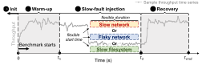

Figure 1: Our slow-fault tolerance testing pipeline.

Multiple slow faults could occur simultaneously. However, prior work suggests that fail-slow is a rare yet independent event [49, 57]. For example, Alibaba monitors 248 K SSDs for 10 months [49], only to find 304 fail-slow drives and they all come from different nodes; Nutanix monitors distributed services on 39 K nodes over 7 months [57], only to collect 232 *independent* fail-slow tickets. Therefore, in our experiments, we inject faults to one node at a time to capture the most common and realistic fault scenarios while maintaining focus on a representative fault model.

• *Duration*. We explore faults of varying durations, from transient issues lasting 30 seconds to long-lasting ones that cover the whole experiment.

## <span id="page-3-2"></span>2.1 Testing Pipeline

We develop a general and automated slow-fault tolerance testing pipeline that streamlines the aforementioned components: deploying a system, ensuring comparable experiment setup, running cloud benchmarks, injecting diverse slow faults, and collecting and summarizing key metrics. Figure 1 shows the diagram of our testing pipeline. It has four main stages:

- ① **Initialization.** Upon each test, we first bring up a cluster of the tested system. We wait until the cluster is fully initialized and ready to serve any requests. Test data in a benchmark is also loaded in this stage. We use a small cluster of 3–6 nodes for the testing. We also validate our major findings using a larger cluster size of 10 nodes and 20 nodes in Appendix B.
- ② Warm-up. We let the benchmark run for a warm-up period (30 s) before we start injecting any faults. This is to ensure that the system has reached a steady state so that the statistics we collect are representative. The benchmark client is connected to the system via a dedicated node to avoid interference with the system under test. We also make sure the client connects to all nodes of the system so that the benchmark will not stop in case of a node failure. Moreover, the performance records during the warm-up period will be excluded from our analysis. ③ Slow-fault injection. After the warm-up period, the pipeline is ready to inject faults. It enumerates distinct fault attributes and their combinations, injects one setting of slow fault per
- Recovery. The pipeline clears the injected faults, after
   which the system performance will gradually recover.

experiment, and records the setting for later analyses.

#### 2.2 Data Collection

Our pipeline collects performance logs from ongoing benchmarks and system logs throughout the testing process. After

each test concludes, the pipeline processes these logs to extract critical system responses, such as tail latency and throughput time series. We then utilize these responses to calculate *performance degradation*, which serves as the primary metric for quantifying the system's nuanced tolerance to slow faults.

Specifically, we first calculate the average throughput before fault injection (denoted as  $avg\_normal$ ) and during slow faults (denoted as  $avg\_slow$ ). We then derive the performance degradation as  $\frac{(avg\_normal-avg\_slow)}{avg\_normal} \times 100\%$ , where a higher percentage indicates more severe degradation. Analyzing how degradation and latency vary across different fault scenarios provides insights into the system's tolerance to slow faults.

#### <span id="page-3-3"></span>3 Nuanced Slow-Fault Tolerance

A key challenge distributed systems developers face in addressing slow faults is that they often cannot anticipate the specific slow faults their systems might encounter in the wild, particularly when the systems are deployed on hardware or workloads that differ from their testing environment. In this section, we delve into this nuanced nature by injecting diverse fault scenarios (§3.1), enforcing different hardware resource limits (§3.2), and simulating distinct workload patterns (§3.3).

#### <span id="page-3-1"></span>3.1 How Systems React to Varying Slow Faults?

Figure 2 presents the performance degradation of the studied systems under different slow faults with varying *types*, *severities*, and *locations*. We also validated the observations and findings below using a larger cluster size (Appendix B.1).

<span id="page-3-4"></span>**Finding 1.** The same slow fault incurs radically different consequences across systems. For example, some systems degrade by more than 25% with a 1 ms network delay, while others remain robust until faced with delays 100× greater.

All the evaluated systems use network and filesystem extensively. They all have extensive fault-tolerance mechanisms. Despite these similarities, their slow-fault tolerance still exhibits **high variability**. For example, CRDB and etcd require a delay as high as 100 ms to yield a notable degradation (>25%), while Cassandra, HBase and Kafka only need 1ms. Moreover, systems like Cassandra, HBase, and Kafka can even experience an unbearable degradation of 70% with only a 10 ms network delay, while the other systems (except for the etcd leader case) never degrade to this extent even with a 1 s delay.

The discrepancy arises from the differences in their fault tolerance mechanisms, at both the design and implementation levels. We further discuss their practices in Section 4.

**Implication.** Infrastructures (*e.g.*, network) and systems (*e.g.*, a database) are often monitored independently and use one-size-fits-all alerts. This can easily miss seemingly minor slow fault that turns out to be damaging for certain systems. System-specific and cross-layer slowness monitoring is needed.

<span id="page-3-5"></span>**Finding 2.** The relation between performance degradation and fault severity is non-monotonic. In half of the studied systems, higher packet loss leads to <u>lower</u> degradation.

<span id="page-4-2"></span>

Figure 2: Performance degradation under filesystem delay (left), network packet loss (middle), and network delay (right). The darker the colors, the more severe the faults are. Each experiment was repeated 50 times for generalizability. Error bars refer to 95% confidence intervals.

In CRDB, as Figure 2 shows, the degradation only increases as the filesystem delay increases from 1 ms to 100 ms; however, with a 1 s delay, the resulting degradation (44%) is surprisingly smaller even than the case of 10 ms delay (48%). In Kafka, degradation under a 1 s delay (68%) is also smaller than that under a 10 ms delay (74%). In etcd, the performance becomes better when we inject a higher packet loss (i.e., a *negative* trend) to the leader. The underlying cause lies in whether leader re-election is triggered: a slow leader degrades performance until heartbeat loss triggers re-election (see Section 4.2.1).

<span id="page-4-4"></span>**Finding 3.** Even within the same system, the performance impact of different slow-fault types varies by up to  $10 \times$ .

In CRDB, the average degradation with different filesystem delays is 47%, which is  $3.6 \times$  that of a delayed network (13%). In etcd, the average degradation under a delayed network is 45%, which is  $1.7 \times$  than that under packet loss.

**Implication.** System architects need to consider the distinct impact of different slow-fault types when deciding which infrastructure component to prioritize and optimize. Developers should introduce tailored handling for sensitive fault types.

<span id="page-4-5"></span>**Finding 4.** Slow faults in followers can impose a more severe  $(1.5\times)$  performance penalty than similar faults in leaders.

It is commonly assumed that faults in leader nodes are more impactful than those in followers. However, our study shows a surprising twist in etcd: a slow follower incurs severe (up to 68%) and higher degradation than slow leaders. For example, under flaky networks, the degradation by slow followers (45%) is  $1.5 \times$  that of slow leaders (31%). This is counter-intuitive as only one slow (even crashed) follower in a 3-node quorumbased system like etcd should at most degrade the overall performance by a third. We investigate and find that the root cause lies in the mismatched awareness of slow faults from the gRPC client and etcd endpoints (elaborated in Section 4.2.2). In contrast, a slow master in HBase does not bottleneck the system, as the YCSB benchmark only interacts with the region servers. In HDFS, both namenodes and datanodes exhibit a similar impact. Since leader roles in Kafka and CRDB are dynamic and change at runtime, the performance impact of a slow leader or follower can be hardly traced or compared.

#### <span id="page-4-0"></span>3.2 Do Resource Limits Amplify Slow Faults?

When a distributed system gets deployed, it can run on different hardware. Does the system's slow-fault tolerance change

<span id="page-4-3"></span>

Figure 3: Degradation of etcd under different CPU and memory limits. Each cell corresponds to the average degradation of the same experiment repeated 50 times. Faults are injected to the leader.

under varying hardware resource limits? Figure 3 presents the performance degradation of an etcd cluster under four fault scenarios. Each node is subject to the same limits on CPU (1-5 cores) and memory (8-32 GB) based on hardware recommendations provided by the developers [8].

<span id="page-4-6"></span>**Finding 5.** Scaling up resources improves normal performance but paradoxically exacerbates the impact of slow faults.

For example, for etcd, under a network delay of 10 ms and a per-node memory limit of 32G, degradation increases from 7%, 26%, to 72% with a per-node CPU core limit of 1, 2, 5, respectively. This is because the baseline request latency becomes lower with more CPU cores (from 74 ms to 10 ms), thus the same delay worsens the degradation. This is also the case for packet loss, where latency increase is more pronounced with more CPU cores. However, degradation does not vary much as memory changes. This is because etcd tends to be CPU-bound under heavy load [8]. We validate these observations with a larger cluster size (Appendix B.2).

**Implication.** More hardware resources do not equate to better fault resilience. Developers need to test their systems' slow tolerance mechanisms under different hardware constraints. The slow-fault alerting and actions need to be resource-aware and recalibrate upon resource changes.

#### <span id="page-4-1"></span>3.3 How Workloads Affect Slow Tolerance?

<span id="page-4-7"></span>Deployed distributed systems need to handle diverse and often unpredictable workloads, which can cause developers to overlook slow-fault tolerance in a specific workload. Figure 4 shows the performance impact of network delays for Cassandra and etcd under different workload patterns (read only, balanced mix, and write only). We also validate the following observations with a larger cluster size (Appendix B.3).

<span id="page-5-0"></span>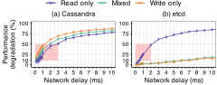

Figure 4: Performance degradation of (a) Cassandra and (b) etcd under distinct workload patterns and network delays. Each set of experiments was repeated 50 times for generalizability. The shaded area highlights the "danger zone" where performance degradation escalates dramatically. Mixed: 50% reads and 50% writes.

**Finding 6.** *The performance impact of slow faults is highly dependent on the workload, particularly in Raft-based systems (etcd, CRDB, and Kafka), which show up to 7.2*× *differences.*

Under a 10 ms network delay, the performance degradation of etcd under read-only, balanced mix, and write-only workloads is 85%, 18%, and 15% (up to 5.7× differences). For CRDB, the degradation can vary up to 7.2× differences. For Kafka, the degradation under the asynchronous [\[1\]](#page-13-7) and synchronous [\[18\]](#page-13-8) schemes is 20% and 3% (6.7× differences), respectively. For Cassandra and HBase, the degradation under the three workload patterns has lower variances (an average of 1.3× and 1.1× differences, respectively). Also, different systems are sensitive to different workload patterns. In Cassandra, write-only workloads yield the highest degradation, while read-only ones yield the highest degradation in etcd.

<span id="page-5-3"></span>**Finding 7.** *Danger zones commonly exist in the studied systems, where a small increase in slow-fault severity leads to a significant increase in performance degradation.*

**Danger zone.** The sensitivity to workload patterns and fault severities prompts us to investigate the presence of a "*danger zone*", where degradation escalates dramatically from a moderate 10% to an unbearable 50% as the severity of the fault increases. Identifying the danger zone could potentially help system administrators to proactively monitor and mitigate slow faults, before they escalate and incur catastrophic degradation.

Figure [4](#page-5-0) highlights the danger zone. Etcd displays a danger zone from 1 ms to 2 ms network delays only under read-only workloads. In Cassandra, however, danger zones exist under all workloads: 0.2 ms ∼ 3 ms, 0.1 ms ∼ 2 ms, and 0.1 ms ∼ 1 ms for read-only, mixed, and write-only workloads, respectively.

We also apply the danger zone analysis to the other systems. Table [2](#page-5-1) summarizes the results. The notion of a danger zone exists in almost all studied systems. However, in systems like etcd and CRDB with write-dominant workloads (≥ 50% write), the danger zones are not obvious. This is because slow writes can be alleviated by their Raft-based protocols. Thus, degradation does not increase drastically as the fault severity increases. Kafka, under batch workloads, does not exhibit obvious danger zones, as batched requests can alleviate the impact of slow faults. HDFS also shows no clear danger zone

<span id="page-5-1"></span>

|    | Network delay (ms)  |       | Packet loss (%) |       |          |         |
|----|---------------------|-------|-----------------|-------|----------|---------|
|    | R                   | M     | W               | R     | M        | W       |
| CS | 0.2∼3               | 0.1∼2 | 0.1∼1           | 0.2∼2 | 0.2∼1    | 0.2∼0.7 |
| HB | 0.2∼2               | 0.2∼2 | 0.2∼2           | 0.1∼1 | 0.2∼1    | 0.2∼1   |
| CR | 4∼5                 | N/A   | N/A             | 2∼5   | N/A      | N/A     |
| EF | 1∼3                 | N/A   | N/A             | 0.2∼2 | N/A      | N/A     |
| EL | 0.5∼2               | N/A   | N/A             | 0.2∼2 | N/A      | N/A     |
|    | Async               | Sync  | Batch           | Async | Sync     | Batch   |
| KF | 0.7∼2               | 0.6∼6 | N/A             | 1∼5   | 1∼5      | N/A     |
|    | MRBench<br>TeraSort |       | MRBench         |       | TeraSort |         |
| HD | N/A                 |       | N/A             | N/A   |          | N/A     |

Table 2: Danger zone of Cassandra (CS), HBase (HB), CRDB (CR), etcd leader (EL) and follower (EF), Kafka (KF), and HDFS (HD) under different workloads. We denote N/A for cases where the danger zone does not exist. R: read-only; M: mixed; W: write-only.

as it is optimized to support batch processing workloads. **Implication.** Early alerting, based on the danger zones associated with sensitive workload patterns, is useful for effectively and proactively managing slow faults. However, the range of these danger zones is quite narrow, typically spanning only a few milliseconds of delay or less than a few percentage points of packet loss. Therefore, the utility of danger zones for early alerting may be limited without fine-grained monitoring.

# <span id="page-5-2"></span>**3.4 Does Tuning Configurations Help?**

To ensure consistency and avoid overfitting, we use default configurations of the studied systems. Does tuning a system help its slow-fault tolerance? We use HBase as an example, tuning its configurations for tolerating a 100 ms network delay.

To locate configurations related to slow-fault handling, we search the HBase codebase for keywords such as "slow" and "timeout". In total, there are 120 places matched. Most of them are TimeoutException and not configurable. We then manually inspect the rest of them and find 10 configurations (invoked in 43 different files) that are most related to slow faults (*e.g.*, RPC timeout, retry limit). Then, we assign different values for them, making sure that they will always be triggered under a 100 ms network delay. For example, we configure the RPC timeout to be either 10 ms, 50 ms, or 100 ms. Together, we explore 7,776 different combinations of configurations.

We then iterate through each combination and test HBase by injecting a 100 ms network delay with fixed workload settings. This already adds up to *540 machine hours*. As a result, the optimal one yields an average degradation of 27%, which is indeed much lower than that of the default configuration (98%). Finally, we test HBase with this optimal configuration under the same slow fault but different workload settings.

**Finding 8.** *Fine-tuning system configurations enhances tolerance to specific slow faults, but only within controlled environments. Even worse, it may harm system availability when faced with diverse, real-world workloads, leading to severe degradation or even system failures.*

Figure [5a](#page-6-1) shows the average degradation under different

<span id="page-6-1"></span>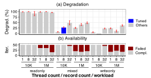

Figure 5: Degradation and availability of HBase with fine-tuned, optimal configurations to tolerate a 100 ms network delay. The x-axis corresponds to combinations of workload settings. The blue bar corresponds to the workload that HBase is fine-tuned on. The red bars indicate the number of failed runs out of 50 iterations. Error bars refer to 95% confidence intervals. *Compl.*: completed runs.

workloads. We iterate through different numbers of client threads, number of records (10K and 1M), and workload patterns. The blue bar corresponds to the workload setting that we previously fine-tuned on. The previously optimal configuration does not always perform well. For example, it causes severe degradation (>90%) under read-only workloads. Also, the degradation jumps to 48% with 32 clients, while a previously suboptimal configuration yields 34% degradation.

When analyzing the results, we find that the HBase cluster would sometimes fail and disconnect from the clients. Thus, we further check the availability of HBase, measured by the number of completed runs. As Figure 5b shows, among 18 workload settings, HBase fails at least once in 11 of them (the red bars), which are all heavier than what we previously fine-tuned on. The worst case is a read-only workload with one million records and 32 client threads: 35 out of 50 runs fail. After investigation, we find that the previously optimal configuration overfits the specific fault and workload, making HBase over-sensitive to and thus fail under heavier workloads. **Implication.** Fine-tuning systems for slow faults is not only time-consuming but also does not generalize well across different workloads. Relying on static, fine-tuned configurations makes a system's slow-fault tolerance fragile.

### <span id="page-6-3"></span>3.5 Can Tail Latency Capture Slow Faults?

Tail latency is a widely used metric for performance monitoring and identifying potential slowdowns. Is tail latency always reliable for capturing slow faults? Figure 6a presents the tail latency of etcd, under a 10 ms network delay in the leader. Each experiment lasts for 150 s with faults extending from 30 s (20% service length) to 150 s (100% service length).

**Finding 9.** Tail latency is not always reliable in capturing slow faults. The latency measurements are prone to underrepresenting the severity of slow faults due to the dilution by abundant measurements from the normal (fast) period.

The measured tail latency does not exhibit significant variations as fault duration increases. For example, as the duration

<span id="page-6-2"></span>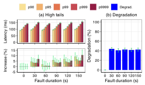

Figure 6: Tail latency and performance degradation of etcd. A 10 ms network delay is injected to the etcd leader with fault durations ranging from 30s to 150s. Each experiment lasts for 150 s.

increases from 30 s to 150 s, the increase in  $99.9^{th}$  latency only ranges from  $0.4 \, \mathrm{ms}$  to  $7.2 \, \mathrm{ms}$  compared to the baseline, which translates to a  $0.3\% \sim 5.5\%$  relative increase. This is counter-intuitive as we are injecting a 10 ms delay but in return only observe an increase in the  $99.9^{th}$  as minimal as  $0.4 \, \mathrm{ms}$ .

This phenomenon illustrates a limitation of relying on tail latency to detect slow faults. When a system suffers from a slow fault, much fewer requests are processed, hence fewer latency measurements are collected during the slow period. They can be outnumbered by those gathered in the normal period, leading to a misleading perception of low impact for the fault. We observe this pitfall when attempting to repeat the evaluation of MultiPaxos [44, 51] in Copilot [54] (Section 5). Even when the injected fault lasts 90 s in a 100 s experiment time, the  $99^{th}$  latency is still not indicative, because the 90 s slow period only produces 900 latency measurements, while the 10 s normal period produces 300K measurements. Other systems exhibit similar phenomena. For example, the 99<sup>th</sup> latency is only indicative when the degradation is severe  $(\geq 83\%$  in Cassandra,  $\geq 68\%$  in Kafka,  $\geq 98\%$  in HBase) and persistent ( $\geq 90$  s in Cassandra,  $\geq 120$  s in Kafka and HBase).

This highlights the need to use additional metrics to more comprehensively capture slow faults. For example, throughput degradation, regardless of fault durations, is more indicative of the impact of slow faults on the system (Figure 6b).

# 3.6 Other Findings

<span id="page-6-0"></span>Besides performance degradation, we also study other aspects of slow-fault tolerance. First, we study the time to recover from slow faults (Appendix E). We find that systems recover fast (typically within 2 s) from filesystem and network delays but slower (sometimes more than 20 s) for flaky networks. Moreover, we study the residual impact of slow faults (Appendix F). We find that severe slow faults incur notable residual performance impacts on several systems. Lastly, we examine how slow-fault tolerance evolves across different versions of the same system (Appendix G). We find the improvement in slow-fault tolerance is limited over time.

<span id="page-7-2"></span>

|           |                                                  | Static threshold |     |       |
|-----------|--------------------------------------------------|------------------|-----|-------|
|           | System metric                                    | WT               | WC  | FT    |
| Cassandra | Execution time of last query [16]                | 500 ms           | -   | -     |
| CRDB      | Execution time of last disk write [14]           | 5 s              | -   | 20 s  |
| CRDB      | Time to flush pending logs [15]                  | 10 s             | -   | 20 s  |
| etcd      | /livez to check raft loop execution [7, 13]      | 5 s              | 3   | -     |
| HBase     | Time to flush WAL to disk [9]                    | 100 ms           | 100 | 10 s  |
| HDFS      | Time to read responses (ACK) from datanodes [17] | 30 s             | -   | -     |
| Kafka     | Execution time of last request [10, 11]          | 30 s             | -   | 2 min |

Table 3: Examples of static thresholds used in all studied systems for slow detection. WT: warning threshold; WC: warning count; FT: fatal threshold.

# (sync, query, logging) System metric slow? > fatal threshold Trigger a fatal action Warning threshold Trigger a warning action Static threshold

Figure 7: Summary of the common slow detection logic in all studied systems.

#### **4 Current Practices to Handle Slowness**

In this section, we study the current development and testing practices of handling slowness in the studied systems.

#### <span id="page-7-4"></span>4.1 Slowness Detection Method

**Finding 10.** All studied systems use static timeouts.

Table 3 summarizes developers' efforts of slowness detection in the codebases of the studied systems. For example, HBase uses a few static thresholds such as DEFAULT\_SLOW\_SYNC\_TIME\_MS=100ms [5] to identify slow syncs. It also counts the number of slow syncs in a one-minute window: if the total number exceeds a default value of 100 [4], additional actions (log rolls) will be triggered [9]. We will further study the effectiveness of this approach in Section 4.2.3.

Another example lies in the storage engine of CRDB (*i.e.*, pebble), where disk health checks enforce a fixed diskSlow Threshold (set as 5 s) to detect disk slowness, and adopts maxSyncDuration (set as 20 s) to trigger a service crash [14]. Similar logic is also applied to detect slow logging [15].

Moreover, Cassandra uses slow\_query\_log\_timeout\_in\_ms=500ms for slow queries [16]. HDFS uses dfsclient SlowLogThresholdMs=30s to trigger a slow read processor warning [17]. Kafka uses request.timeout.ms and delivery.timeout.ms, set as 30 s and 2 min respectively, to retry operations [10, 11]. etcd detects stalled writes by checking raft loop execution and exposes a /livez endpoint that supervisors can use to restart etcd if needed [7, 13].

**Summary.** Figure 7 summarizes the common logic of two-staged slow detection in the studied systems. For a monitored system metric, developers first set a warning threshold (WT) to detect slowness. If WT is exceeded, all studied systems will print warning messages. Moreover, if WT is exceeded multiple times (warning count, WC), or the metric exceeds a more severe threshold (fatal threshold, FT), escalated actions like log rolls or service kill will be triggered.

### <span id="page-7-5"></span>4.2 Slowness Mitigation Action

Besides detection and alert, current systems also trigger different mechanisms in reaction to slow faults. We study the following four major mechanisms: *leader re-election, client-side reconnection, log roll, and escalation to fail-stop.* 

#### <span id="page-7-0"></span>4.2.1 Leader Re-election

Systems like CRDB, etcd, and Kafka employ Raft, the leader-based consensus protocol [55]. If a leader encounters failures,

either fail-stop or fail-slow, it will be unable to send out heartbeats in time. Subsequently, a healthy follower node will become the new leader and take over the workload.

**Finding 11.** Leader re-election is only effective when slow faults are severe enough to impair heartbeats or lease liveness.

In Section 3.1, we observe that, a slow etcd leader yields less degradation under intensive slow faults (70% packet loss) compared with milder ones (10% packet loss). This is also the case for CRDB. After further investigation, we discover that both systems recover from intensive faults a few seconds after injection. In etcd, the heartbeat timeout is 100 ms. Under milder slow faults, the degraded leader is still responsive to heartbeats. Thus, re-election will not be triggered, leading to continuous slowdowns. Conversely, under more severe slow faults, the leader may fail to respond. Therefore, a new leader will be elected and the system will be no longer bottlenecked by slow faults. The logic is similar in CRDB due to the lease interval (6 s). Appendix C provides more detailed illustrations.

#### <span id="page-7-1"></span>4.2.2 Client-Side Reconnection in gRPC

In replicated systems, it is common for clients (or a load balancer) to maintain a pool of servers. When a server becomes unreachable, the client can reconnect to another server.

**Finding 12.** The client side and server side can have different awareness of a slow fault, causing a single slow follower to degrade the cluster performance.

We observed in Section 3.1 that, a slow etcd follower can also degrade system performance, even if its peer nodes are both healthy and underloaded in the meantime.

**Root cause.** Clients use a gRPC balancer to connect to and distribute requests across the etcd cluster. Initially, the balancer maintains a simple keepalive ping with one of the endpoints. This connection persists unless the keepalive fails. If the endpoint is a mildly slow follower, the keepalive may not break and thus the slow follower still degrades system performance. Conversely, if severe slow faults break the connection, the balancer will switch to another endpoint, and the performance is restored. Appendix D provides a more detailed illustration.

<span id="page-7-3"></span>Essentially, there is a mismatch of information between the server and the client. Although the server side can detect the slow follower, the gRPC balancer lacks this insight. This calls for enhanced protocols to exchange slowness information.

#### **4.2.3 Slowness-triggered Log Roll in HBase**

HBase employs Write-Ahead Log (WAL) to record all data modifications. After a write operation is logged, HBase tries to flush WAL to disk (i.e., called *sync*). When WAL reaches a certain size or age, HBase closes the current WAL and starts a new one (i.e., called *log roll*) on a random datanode. Log roll was designed as an efficient mechanism to constrain the WAL file size and ensure fast log replay during recovery.

Interestingly, HBase developers later leverage log roll to also address slow faults. Recall that HBase will randomly select new datanodes after a log roll, thus the log rolling can help mitigate slow faults by avoiding the slow datanode. Starting from Version 2.3 (July 2020), developers add log roll into the slow-fault handling pipeline [\[9\]](#page-13-0). It detects slow syncs, and triggers a log roll when syncs exceed 10 s or there are more than 100 slow syncs in one minute.

**Finding 13.** *The conservative thresholds prevent log roll from being triggered even under severe slow faults.*

Despite the new slow-fault handling mechanism, HBase still suffers from severe performance degradation under slow faults as evidenced in Section [3.1.](#page-3-1) The empirical thresholds developers choose limit this mechanism's effectiveness.

The current threshold of slow sync, 100 ms, is excessively conservative. As evidenced by our evaluation, a mere 100 ms network delay on the HBase region server already leads to a drastic performance degradation (see Figure [2\)](#page-4-2). By the time a slow sync is detected, the system has already been significantly impacted. Similarly, the condition to initiate a log roll—incurring 100 slow syncs within 60 seconds—is too strict. Under such a condition, HBase is likely to have already collapsed. To verify this, we inject a network delay of 1 s that lasts for 60 s (yielding a degradation of more than 98%). As a result, only 32 slow syncs are reported during the 60 s injection window, failing to trigger a log roll.

#### **4.2.4 Escalation to Fail-Stop**

As previously shown, allowing slow nodes to continue serving can worsen the system performance. Recent systems adopt the *fail early principle*, choosing to kill the corresponding process or node in the face of unexpectedly severe slowness [\[15\]](#page-13-11).

**Finding 14.** *Recent practices adopt fail early principle to handle the severely slow processes and nodes.*

For example,in CRDB,if a sync operation exceeds maxSync Duration=20s, the process will be killed. In etcd, if we inject persistent yet slight network delays, the system keeps logging warnings and error messages, and kills the slow endpoint in minutes. For HBase, if the slowness-triggered log rolls coincide with a flaky network, there are also chances these log rolls fail and escalate to crash failures of nodes.

While such actions can be beneficial, they need to be applied carefully, because they can impair the system reliability, *e.g.*, leading to cascading failures [\[38\]](#page-14-4). Distinguishing a truly severe slow fault from noisy ones is also challenging.

# **4.3 Testing**

In all the studied systems, the tests for their slow-fault handling take the form of unit tests instead of integration tests. In unit tests, developers use the sleep function to exceed static detection thresholds, and assert-check the triggered actions. For example, in etcd, developers simulate stalled disk writes by calling sleep("30s") [\[20\]](#page-13-19); in Cassandra, developers fabricate a slow operation, by calling Thread.sleep() [\[22\]](#page-13-20), then assert-check whether the operation is detected as slow, completed, or aborted [\[21\]](#page-13-21). Yet upon reviewing the code and documentation, we find that none of the systems employ an injection tool to test slow faults in an end-to-end manner. This raises concerns about whether preset static thresholds are appropriate and whether the mechanisms can be reliably triggered in a real deployment, particularly as different deploying environments and workloads incur varying system responses. **Finding 15.** *Current testing of slow-fault handling mechanisms focuses on the functionality instead of the effectiveness and robustness of their triggering conditions in practice.*

# <span id="page-8-0"></span>**5 State-of-the-Art Solutions**

Researchers have recently proposed advanced fail-slow solutions, which have not yet been incorporated into the studied systems. Are these latest techniques effective? In this section, we evaluate three state-of-the-art solutions.

**Perseus.** Perseus [\[49\]](#page-15-1) uses machine learning techniques to detect fail-slow storage devices. It relies on device-level telemetry data to train a regression model that infers the normal latency of a device, and detects a slow one if its latency is much higher. The training and detection are both offline.

We re-implement Perseus strictly following its original design. Since Perseus's core idea is to model device-level throughput with latency, we adapt it to model the end-to-end latency and throughput of the studied systems. Figure [8a](#page-9-0) shows the latency-vs.-throughput (LvT) distribution of HBase under a 50/50 read-write workload. The blue points refer to the LvT distribution of HBase without slow faults. First, we apply the same outlier detection algorithms [\[23,](#page-13-22) [59\]](#page-15-8) to filter out biased samples. Then, we train a similar polynomial regression model and calculate the 99.9% prediction upper bound (the blue line): any LvT points above the line are considered slow. Finally, we inject different levels of network delays (the green points) and check if the upper bound identifies any slow faults or not.

This solution fails to detect slow faults in HBase even under our most severe delay of 1 s. The main reason is that the LvT patterns of distributed systems are different from those of storage devices, making the model rather biased. In the original context, slow faults in NVMe SSDs cause latency to jump from tens of microseconds to milliseconds or seconds, while throughput remains moderate. In contrast, in HBase, a mild delay like 10 ms already degrades the throughput by 83%. We evaluate other systems and test different workloads. The results all show that this approach is not robust against

<span id="page-9-0"></span>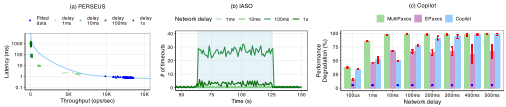

Figure 8: Evaluation of advanced fail-slow solutions. In Copilot (c), we mark the system with the smallest degradation using a blue asterisk.

slow faults in distributed systems.

**IASO.** IASO [\[57\]](#page-15-3) is a peer-based, node-level fail-slow detection and mitigation framework for distributed systems. It relies on the deployed systems to emit timeout signals, converts them into a score, and compares the scores across nodes to detect slow ones (*i.e.*, nodes with higher scores than their peers).

However, since these timeouts are mostly static and overconservative (Section [4.1\)](#page-7-4),the effectiveness of IASO is limited. Figure [8b](#page-9-0) shows the number of timeouts per second as we inject different network delays to HBase (during the blue-shaded area). Clearly, HBase only emits notable timeouts when the delay reaches 100 ms. This coincides with our prior study in Table 3, where [HB](#page-7-2)ase has employed a 100 ms warning threshold for slow syncs. Tuning timeout thresholds may help IASO detect milder delays (e.g., ≤10 ms), yet it is timeconsuming to do so and does not adapt to different workloads, as evidenced in Section 3.4.

**Copilot.** Copilot [\[54\]](#page-15-2) is the first 1-slowdown-tolerant consensus protocol for quorum-based systems. It introduces two leaders that proactively add redundancy to all stages of the execution flow, so that any one slow replica (be it leader or follower) will not bottleneck the performance.

We evaluate Copilot and its two baselines (MultiPaxos [\[44,](#page-15-5) [51\]](#page-15-6) and EPaxos [\[53\]](#page-15-9)) using its original benchmark. Figure [8c](#page-9-0) presents their performance degradation under different network delays. Faults are injected to one of the pilots for Copilot, the leader in MultiPaxos, and one arbitrary node in EPaxos. We outline the following observations.

First, even under the mildest delay of 100 us, Copilot still incurs a degradation of 35%. Second, Copilot only yields the smallest degradation under a 10 ms delay. The root cause lies in two sets of static configurations. ❶ Copilot lets the fast pilot take over the work of the other slow pilot if the latter does not respond within 10 ms (*i.e.*, fast-takeover timeout). When the slowdowns are less than 10 ms, Copilot simply waits. This explains why Copilot is not optimal until 10 ms. ❷ When the delays are above 100 ms (*i.e.*, heartbeat sending interval), normal replicas will not receive heartbeats from the slow pilot in time. However, the slow pilot will not be marked as dead and still function until heartbeats are missing for more than 1 s (*i.e.*, heartbeat missing interval). This explains why Copilot still has a higher degradation when delays are above 100 ms.

# **6 An Adaptive Fail-Slow Detection Library**

A consistent theme among our study's findings is that slow faults have highly diverse and dynamic characteristics. Changes (even small ones) in the workload, deploying environment, fault severity, location, *etc.*, can lead to dramatically different consequences. While developers become increasingly aware of the fail-slow problem and start to address it, the current practice of using static thresholds can hardly accommodate the characteristics of slow faults. We advocate for introducing *adaptive* designs [\[39\]](#page-14-5) into slow-fault handling.

# **6.1 Limitations of Existing Solutions**

As Section [5](#page-8-0) shows, recent work does not address the dynamic nature of slow faults. Additionally, solutions such as Perseus and IASO are designed for *operators* to monitor systems as black boxes. They do not offer built-in support to help *developers* implement adaptive slow-fault handling within a system at the code level. An intrinsic adaptive design tackles the problem directly at the scene. It monitors slowness at fine granularity, such as a function call. It also invokes targeted actions to quickly mitigate slowness. However, realizing this design can require significant developer efforts. A library to reduce these efforts is desirable.

# **6.2 ADR: Adaptive Detection at Runtime**

To address the gap, we design ADR, a lightweight adaptive fail-slow detection library for distributed systems. Developers use ADR as a plug-in when adding fail-slow handling code. ADR traces some built-in variables (*e.g.*, syncOpLatency), automatically adapts the associated threshold variables to decide slowness, and invokes different levels of defined actions. We aim to achieve the following goals: (1) ease of use; (2) accurate and fast detection; (3) low overhead; (4) robustness.

ADR can be integrated into a system by adding only few changes. Developers have added extensive tracing code for different operations (*e.g.*, write) and compared these tracing variables with static thresholds to detect slow operations. ADR leverages such existing code and replaces the static logic in place to make the detection adaptive.

ADR is directly motivated by the takeaways from our study. It replaces static timeouts ([§4.1\)](#page-7-4) with percentile-based detection to adapt to varying slow faults ([§3.1\)](#page-3-1), deploying environment ([§3.2\)](#page-4-0), workloads and danger zones ([§3.3\)](#page-4-1). Since percentile-based monitoring like tail latency can be diluted

<span id="page-10-0"></span>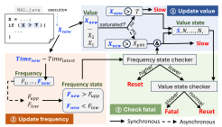

Figure 9: Overview of ADR.

by normal records (§3.5), ADR analyzes how frequently the tracing variables get updated for more reliable cross-validation. As systems employ different mitigation actions (§4.2), ADR outputs a slowness level (slow, fatal) for developers to trigger appropriate actions.

As shown in Figure 9, ADR monitors both the value and the update frequency of some tracing variables defined in the system code using sliding windows. The high-level idea is to adapt the original thresholds used in comparison based on historical values to identify slow data points, and distinguish workload changes from slow faults by checking how often the variable gets updated, *i.e.*, update frequency.

It employs two state checkers to make decisions, which either trigger internal actions (reset windows) or return a slowness level (slow or fatal) for the system code to act upon. If it detects a sudden increase in the update frequency, it assumes the system is under a heavier workload and resets all sliding windows to adapt. Conversely, if the update frequency drops, due to either a slow fault or a lighter workload, ADR further checks the values of the traced variable: if they show a sustained slowdown, ADR identifies a slow fault and triggers a fatal action; otherwise, it adapts to a lighter workload in the same manner. We describe each step below.

- **O** Update value. When a new value of the tracing variable is updated  $(X_{new})$ , ADR stores it into a sliding window of historical values. Initially we use the original threshold T, preserving the default behavior, until the sliding window is saturated. We then calculate the  $99^{th}$  percentile as the adaptive threshold  $(X_{p99})$ . If the new response is higher than the threshold (potentially slow), we further query the frequency state checker in Step 3. If the frequency is decreasing, we mark this response as slow and store its state in a sliding window of historical states (to check for continuous slowdown later).
- **② Update frequency.** When a new value is updated, ADR also calculates the timestamp difference between the new and last value. We divide 1 s by the difference to get the update frequency of the tracing variable (unit: response/second), stored using a sliding window. Then, ADR calculates the average and standard deviation of the frequency window and derives average + stdDev (average stdDev) as the upper (lower) bound. A frequency higher than the upper bound

indicates a potential workload increase (*e.g.*, a burst of requests or heavier workload), while a frequency lower than the lower bound indicates either a decrease in workload intensity or a slow fault. We maintain another sliding window of frequency states to check for continuous frequency changes later.

**The Check fatal.** Finally, ADR checks the frequency and value state windows to distinguish workload changes from continuous slow faults. If the frequency is continuously higher, the system may experience a workload increase and ADR will reset all sliding windows and be ready to adapt new workload. If the frequency is continuously lower, ADR would cross-validate with value states: if the value state indicates a continuous slowdown, ADR would trigger a fatal action if needed; otherwise, the system may experience a workload decrease and all windows will be reset.

**Adaptive threshold.** ADR calculates the  $99^{th}$  percentile as an adaptive threshold. This does not mean ADR will always treat 1% of total responses as slow. Instead, ADR cross-validates with frequency states to check if the frequency is continuously decreasing. In this case, ADR can accurately detect slow faults while not emitting false alarms due to workload variations.

**Dynamic window length.** The length of all sliding windows is set to be positively correlated with the frequency (i.e.,  $10 \times$  current frequency). This is to make sure that the window size is always proportional and adaptive to any frequency change.

**State checkers.** ADR uses two state checkers to monitor continuous slowdown and workload changes. The value state checker inspects the most recent n value records, and checks if more than half of them are slow; the frequency state checker examines the most recent n frequency states (which represent heavier or lighter workloads) to see if more than half of them are persistent. We choose n to be equal to the current update frequency (*i.e.*, the number of updates in the last second). For example, when the frequency drops from 1 K records/sec to 100, the checkers will only use the most recent 100 data points instead of 1 K. This allows ADR to quickly adapt to workload changes while avoiding the dilution of slow fault records.

ADR also considers the case when slow faults occur during the data collection phase: when the value window is not populated yet to draw a  $X_{p99}$  adaptive threshold. In this case, ADR relies solely on the frequency state checker and resets all windows when the update frequency changes notably.

**Example.** Figure 10 shows the use case of ADR in HBase. Originally, HBase already included tracing code for the WAL sync. The latest sync time is stored in timeInNanos (a tracing variable). It further defines two static threshold variables, slowSyncNs (line 2) and rollonSyncNs (line3), and uses two statements (lines 5 and 8) to check if the sync time exceeds the thresholds. Different actions would be taken accordingly, emitting a warning (line 7) or rolling WAL (line 10).

With ADR, the original parameters inside the "if" conditions are retained but wrapped up using ADR's APIs. Specifically, we call isWarn() in line 6 to compare the latest sync time

```
1 // Default static thresholds
2 long slowSyncNs = TimeUnit.MILLISECONDS.toNanos(100);
3 long rollOnSyncNs = TimeUnit.SECONDS.toNanos(10);
4 void postSync(final long timeInNanos, ...) {
5 - if (timeInNanos > slowSyncNs) {
6 + if (ADR.isWarn(timeInNanos, ">", slowSyncNs)) {
7 LOG.info("Slow sync detected.");
8 - if (timeInNanos > rollOnSyncNs) {
9 + if (ADR.isFatal(timeInNanos, ">", rollOnSyncNs)) {
10 requestLogRoll(SLOW_SYNC);
11 }
12 }
```

Figure 10: Applying ADR in HBase. Lines with '-' correspond to HBase's original slow-fault detection using static timeouts. Lines with '+' show how ADR is integrated into HBase.

| Setup    | Warning threshold | Fatal threshold |
|----------|-------------------|-----------------|
| Static-1 | 1 ms              | 10 ms           |
| Static-2 | 10 ms             | 100 ms          |
| Static-3 | 100 ms            | 1 s             |

Table 4: Evaluation setups for the three static schemes.

with an adaptive threshold. Then we use isFatal() in line [9](#page-11-0) to check if there is a continuous slowdown and frequency change (or if the latest value exceeds the default threshold). If so, a log roll would be triggered per developers' design.

**Limitations.** ADR cannot detect slow faults that appear during system start-up. Operators at the scene are typically able to monitor and handle such cases manually. Additionally, since ADR relies on update frequency to distinguish workload changes from slow faults, it may misclassify slow faults that occur precisely during workload transitions. Finally, ADR assumes developers already know where to check for slow faults. We believe a keyword-based search of potential code locations for instrumentation ([§6.3\)](#page-11-1) can be a useful addition.

# <span id="page-11-1"></span>**6.3 Evaluation**

Our evaluation aims to answer: (1) can ADR effectively detect and mitigate slow faults of varying severity? (2) is ADR robust to different and dynamic workloads? (3) what is the overhead of ADR at runtime?

**Implementation and Baselines.** We implement ADR in both Java and Go (∼400 lines), and integrate it into HBase and CRDB. We use a keyword-based approach to automatically search for potential variables that can be traced. For example, in HBase, we first identify 57 variables. Among them, 9 exactly match the use case of ADR (comparing with a default static threshold) and are traced; the rest are either not timeouts, part of external APIs (*e.g.*, timeouts in protobuf), or triggering no mitigation action (*e.g.*, only logging the event).

We use the testing pipeline (Section [2.1\)](#page-3-2) to inject slow faults with varying severity and workloads. Each experiment runs for 5 minutes and we inject a fault of 2 minutes starting from 90 seconds. Each set of experiments is repeated 50 times.

We compare ADR with both the original implementation (*i.e.*, vanilla) and three sets of static schemes (see Table 4). Since most studied systems (including HBase and CRDB) employ a typical two-stage ti[meou](#page-7-4)t mechanism (§4.1), we

<span id="page-11-2"></span>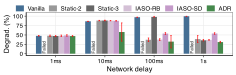

Figure 11: Degradation of HBase using ADR and the baselines under different network delays. Static-1 is too sensitive and fails the cluster. *IASO-RB*: IASO with reboot; *IASO-SD*: IASO with shutdown.

<span id="page-11-3"></span>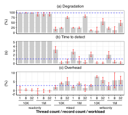

Figure 12: HBase using ADR under different workloads. The blue dashed line in (a), (b), and (c) corresponds to the degradation of vanilla HBase, the average time to detect in mixed and write-only workloads, and the average overhead, respectively.

set two thresholds (a warning and a fatal one) for each setup. The threshold values of the three static schemes are chosen according to the delays injected, so that they are the optimal ones for the corresponding slow faults. For example, Static-1 with a warning threshold of 1 ms would be the optimal one to detect a delay of 1 ms.

We also compare ADR with IASO [57] (see Section 5). We have fine-tuned IASO's parameters and chosen the optimal ones under our testing pipeline. IASO employs its own mitigation: upon detecting fail-slow, it will first try to reboot the service instance (*i.e.*, IASO-RB). If the reboot does not work, IASO w[ill th](#page-15-1)en try to shut down the slow node (*i.e.*, IASO-SD). Perseus [49] is not chosen as it is an offline det[ectio](#page-11-2)n solution.

**Tolerance of Varying Slow Faults.** Figure 11 shows the degradation of HBase under different network delays. ADR helps mitigate slow faults under all injected delays and is always better even than the optimal static settings. For example, under a 100 ms delay, ADR reduces the degradation from 97% (vanilla) to 32% (65% reduction). In comparison, the optimal Static-2 case, IASO-RB, and IASO-SD yield a higher degradation of 37%, 38%, and 54%, respectively.

Similarly in CRDB, the average degradation of the vanilla,

<span id="page-12-0"></span>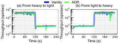

Figure 13: HBase under dynamic workloads. The light (heavy) one refers to mixed (write-only) workloads with 1 (32) YCSB client thread(s) and 10K (1M) records. Workload changes at 120 s.

Static-2, and Static-3 are 52%, 3%, and 44%, respectively, while ADR results in a 7% performance gain.

Tolerance Under Varying Workloads. Figure 12 shows the performance of HBase with ADR under diverse workloads. We inject a 100 ms network delay.

ADR decreases the degradation from 98% (vanilla) to as low as 10% (Figure 12a). Note that ADR does not mitigate read-only workloads. This is because the variables that ADR trace are all related to write operations, due to the fact that the system's fault-tolerance mechanisms are not engaged or required as much for reads. Nevertheless, we believe ADR will still work well given any critical read variables are traced. As a result, ADR helps reduce the degradation in mixed and write-only workloads by 16-80% and 43-90% in HBase, and by 20-96% and 5-66% in CRDB, respectively.

Recall the fine-tuned HBase incurs cluster failures under other workloads (Section 3.4). ADR, however, not only yields lower degradation than the optimal static settings, but also maintains system availability with zero failures.

As Figure 12b shows, the average time to detect in mixed and write-only workloads are 1.3 s and 0.9 s, respectively. This shows that ADR detects slow faults in a timely manner.

ADR is robust to dynamic workloads. As shown in Figure 13, system throughput is on par with or without ADR. This indicates that ADR can adapt to workload changes with minimal impact on system performance.

**Overhead.** Figure 12c shows the overhead of ADR. The average overhead across all workloads is 2.8%. With this low overhead, ADR can be integrated into even more modules.

#### Related Work

Since faults are frequent in distributed systems and fault tolerance is crucial, understanding failures has been a constant theme in distributed system research. Numerous empirical studies [24, 25, 27, 28, 32, 34–36, 41–43, 46, 47, 56, 65] have characterized failures in various settings. They generally have different focuses and are complementary to each other.

One common category is to analyze why certain systems fail and identify the high-level causes. For example, an early prominent study by Oppenheimer et al. [56] examined the root causes of failures in commercial Internet services. The findings pointed out that operator errors caused most failures. Yuan et al. [65] studied user-reported failures in open-source

distributed systems and found that more than half of the catastrophic failures could have been detected by simple testing of error-handling code. Other studies in this category were conducted on Hadoop cluster [58], Microsoft Azure services [46], jobs in Google computer cluster [29], SCOPE jobs in Microsoft Bing [45], cloud servers [62], etc.

More recent studies analyze complex failure modes that are under-explored yet increasingly common in large distributed systems, such as gray failures [42], partial failures [47], metastable failures [41], limplock [32], and silent semantic violations [48]. These studies focus on software failures. Several other studies focus on failures related to hardware, such as network partitions [25], fail-slow hardware [36,49,50], and silent data corruption in CPUs [31,40,63]. Our study is motivated by recent fail-slow hardware studies. We shift the focus to the impact of fail-slow events on software. Our work revisits the early limplock study [32], which discusses the worst-case scenarios using microbenchmarks. In contrast, we focus on the operational impact of slow faults for modern distributed systems under realistic workloads. We explore a broad spectrum of failure space. For example, we analyze how nuanced slow faults with diverse severity (not just worst case), location, etc., degrade system performance. We measure how varying cloud benchmarks, danger zones, deploying environments, tail latency measurements, and fine-tuning configurations impact slow-fault tolerance. We also evaluate the effectiveness of latest fail-slow detection and mitigation solutions.

A number of solutions have been proposed to tolerate slowness (performance issues) in distributed systems. A typical technique is speculative execution [26, 60, 66], which launches a backup task when a task is slow (straggling). Copilot [54] enhances the consensus protocol by using two distinguished replicas to tolerate slow faults. DepFast [64] provides programming interfaces for developers to implement slow-tolerant protocols. Our study aims to provide insights for distributed systems designers to improve slow-fault tolerance solutions.

#### Conclusion

Recent studies have increased the community's awareness of the fail-slow problem. Nevertheless, fail-slow tolerance remains a challenging topic to approach. We present a comprehensive study that analyzes the nuances of fail-slow tolerance in current systems. Our study reveals that existing efforts do not accommodate the highly dynamic and sensitive characteristics of slow faults. We showcase how adopting a simple adaptive design can significantly increase the effectiveness of a system's existing slow-fault handling mechanisms.

#### Acknowledgments

We thank our shepherd Kang Chen, and the anonymous reviewers for their insightful comments. We thank CloudLab [33] for providing the resources for us to run experiments. This work was supported in part by NSF grants CNS-2317698, CNS-2317751, and CCF-2318937. Ruiming Lu's travel expenses to attend the conference are funded by NSFC 623B2072.

# **References**

- <span id="page-13-7"></span>[1] Baseline scheme of the openmessaging benchmark framework. [https://github.com/openmessaging/](https://github.com/openmessaging/benchmark/blob/master/driver-kafka/kafka-throughput.yaml) [benchmark/blob/master/driver-kafka/kafka](https://github.com/openmessaging/benchmark/blob/master/driver-kafka/kafka-throughput.yaml)[throughput.yaml](https://github.com/openmessaging/benchmark/blob/master/driver-kafka/kafka-throughput.yaml).
- <span id="page-13-4"></span>[2] Blockade: testing network failures and partitions in distributed applications. [https://github.com/](https://github.com/worstcase/blockade) [worstcase/blockade](https://github.com/worstcase/blockade).
- <span id="page-13-5"></span>[3] Charybdefs: Scylladb fault injection filesystem. [https:](https://github.com/scylladb/charybdefs) [//github.com/scylladb/charybdefs](https://github.com/scylladb/charybdefs).
- <span id="page-13-18"></span>[4] Default theshold of slow sync count in hbase. [https://github.com/apache/hbase/blob/](https://github.com/apache/hbase/blob/rel/2.5.6/hbase-server/src/main/java/org/apache/hadoop/hbase/regionserver/wal/AbstractFSWAL.java#L136) [rel/2.5.6/hbase-server/src/main/java/](https://github.com/apache/hbase/blob/rel/2.5.6/hbase-server/src/main/java/org/apache/hadoop/hbase/regionserver/wal/AbstractFSWAL.java#L136) [org/apache/hadoop/hbase/regionserver/wal/](https://github.com/apache/hbase/blob/rel/2.5.6/hbase-server/src/main/java/org/apache/hadoop/hbase/regionserver/wal/AbstractFSWAL.java#L136) [AbstractFSWAL.java#L136](https://github.com/apache/hbase/blob/rel/2.5.6/hbase-server/src/main/java/org/apache/hadoop/hbase/regionserver/wal/AbstractFSWAL.java#L136).
- <span id="page-13-17"></span>[5] Default value of slow sync threshold in hbase. [https://github.com/apache/hbase/blob/](https://github.com/apache/hbase/blob/rel/2.5.6/hbase-server/src/main/java/org/apache/hadoop/hbase/regionserver/wal/AbstractFSWAL.java#L131) [rel/2.5.6/hbase-server/src/main/java/](https://github.com/apache/hbase/blob/rel/2.5.6/hbase-server/src/main/java/org/apache/hadoop/hbase/regionserver/wal/AbstractFSWAL.java#L131) [org/apache/hadoop/hbase/regionserver/wal/](https://github.com/apache/hbase/blob/rel/2.5.6/hbase-server/src/main/java/org/apache/hadoop/hbase/regionserver/wal/AbstractFSWAL.java#L131) [AbstractFSWAL.java#L131](https://github.com/apache/hbase/blob/rel/2.5.6/hbase-server/src/main/java/org/apache/hadoop/hbase/regionserver/wal/AbstractFSWAL.java#L131).
- <span id="page-13-1"></span>[6] etcd v3 benchmark tool. [https://github.com/etcd](https://github.com/etcd-io/etcd/tree/main/tools/benchmark)[io/etcd/tree/main/tools/benchmark](https://github.com/etcd-io/etcd/tree/main/tools/benchmark).
- <span id="page-13-12"></span>[7] Github issue of stalled leader detection in etcd. [https:](https://github.com/etcd-io/etcd/issues/15247) [//github.com/etcd-io/etcd/issues/15247](https://github.com/etcd-io/etcd/issues/15247).
- <span id="page-13-6"></span>[8] Hardware recommendations for etcd v3.5. [https://](https://etcd.io/docs/v3.5/op-guide/hardware/) [etcd.io/docs/v3.5/op-guide/hardware/](https://etcd.io/docs/v3.5/op-guide/hardware/).
- <span id="page-13-0"></span>[9] Hbase-22301: Consider rolling the wal if the hdfs write pipeline is slow. [https://issues.apache.](https://issues.apache.org/jira/browse/HBASE-22301) [org/jira/browse/HBASE-22301](https://issues.apache.org/jira/browse/HBASE-22301).
- <span id="page-13-15"></span>[10] Official document of kafka on delivery timeout. [https://kafka.apache.org/documentation/](https://kafka.apache.org/documentation/#producerconfigs_delivery.timeout.ms) [#producerconfigs\\_delivery.timeout.ms](https://kafka.apache.org/documentation/#producerconfigs_delivery.timeout.ms).
- <span id="page-13-16"></span>[11] Official document of kafka on request timeout. [https://kafka.apache.org/documentation/](https://kafka.apache.org/documentation/#brokerconfigs_request.timeout.ms) [#brokerconfigs\\_request.timeout.ms](https://kafka.apache.org/documentation/#brokerconfigs_request.timeout.ms).
- <span id="page-13-3"></span>[12] Openmessaging benchmark framework. [https://](https://github.com/openmessaging/benchmark) [github.com/openmessaging/benchmark](https://github.com/openmessaging/benchmark).
- <span id="page-13-13"></span>[13] Public development document of etcd livez and readyz probe. [https://docs.google.com/](https://docs.google.com/document/d/1PaUAp76j1X92h3jZF47m32oVlR8Y-p-arB5XOB7Nb6U) [document/d/1PaUAp76j1X92h3jZF47m32oVlR8Y](https://docs.google.com/document/d/1PaUAp76j1X92h3jZF47m32oVlR8Y-p-arB5XOB7Nb6U)[p-arB5XOB7Nb6U](https://docs.google.com/document/d/1PaUAp76j1X92h3jZF47m32oVlR8Y-p-arB5XOB7Nb6U).
- <span id="page-13-10"></span>[14] Source code of slow disk detection in cockroachdb. [https://github.com/cockroachdb/cockroach/](https://github.com/cockroachdb/cockroach/blob/v23.1.11/pkg/storage/pebble.go#L1246-L1275) [blob/v23.1.11/pkg/storage/pebble.go#L1246-](https://github.com/cockroachdb/cockroach/blob/v23.1.11/pkg/storage/pebble.go#L1246-L1275) [L1275](https://github.com/cockroachdb/cockroach/blob/v23.1.11/pkg/storage/pebble.go#L1246-L1275).

- <span id="page-13-11"></span>[15] Source code of slow logging detection in cockroachdb. [https://github.com/cockroachdb/cockroach/](https://github.com/cockroachdb/cockroach/blob/v23.1.11/pkg/util/log/file.go#L242-L284) [blob/v23.1.11/pkg/util/log/file.go#L242-](https://github.com/cockroachdb/cockroach/blob/v23.1.11/pkg/util/log/file.go#L242-L284) [L284](https://github.com/cockroachdb/cockroach/blob/v23.1.11/pkg/util/log/file.go#L242-L284).
- <span id="page-13-9"></span>[16] Source code of slow query detection in cassandra. [https://issues.apache.org/jira/browse/](https://issues.apache.org/jira/browse/CASSANDRA-12403) [CASSANDRA-12403](https://issues.apache.org/jira/browse/CASSANDRA-12403).
- <span id="page-13-14"></span>[17] Source code of slow read processor detection in hdfs. [https://github.com/apache/hadoop/](https://github.com/apache/hadoop/blob/release-3.3.6-RC0/hadoop-hdfs-project/hadoop-hdfs-client/src/main/java/org/apache/hadoop/hdfs/DataStreamer.java#L1138-L1149) [blob/release-3.3.6-RC0/hadoop-hdfs](https://github.com/apache/hadoop/blob/release-3.3.6-RC0/hadoop-hdfs-project/hadoop-hdfs-client/src/main/java/org/apache/hadoop/hdfs/DataStreamer.java#L1138-L1149)[project/hadoop-hdfs-client/src/main/java/](https://github.com/apache/hadoop/blob/release-3.3.6-RC0/hadoop-hdfs-project/hadoop-hdfs-client/src/main/java/org/apache/hadoop/hdfs/DataStreamer.java#L1138-L1149) [org/apache/hadoop/hdfs/DataStreamer.java#](https://github.com/apache/hadoop/blob/release-3.3.6-RC0/hadoop-hdfs-project/hadoop-hdfs-client/src/main/java/org/apache/hadoop/hdfs/DataStreamer.java#L1138-L1149) [L1138-L1149](https://github.com/apache/hadoop/blob/release-3.3.6-RC0/hadoop-hdfs-project/hadoop-hdfs-client/src/main/java/org/apache/hadoop/hdfs/DataStreamer.java#L1138-L1149).
- <span id="page-13-8"></span>[18] Synchronous scheme of the openmessaging benchmark framework. [https://github.com/openmessaging/](https://github.com/openmessaging/benchmark/blob/master/driver-kafka/kafka-sync.yaml) [benchmark/blob/master/driver-kafka/kafka](https://github.com/openmessaging/benchmark/blob/master/driver-kafka/kafka-sync.yaml)[sync.yaml](https://github.com/openmessaging/benchmark/blob/master/driver-kafka/kafka-sync.yaml).
- <span id="page-13-2"></span>[19] Sysbench: Scriptable database and system performance benchmark. [https://github.com/akopytov/](https://github.com/akopytov/sysbench) [sysbench](https://github.com/akopytov/sysbench).
- <span id="page-13-19"></span>[20] Test case of handling stalled writes in etcd. [https://](https://github.com/etcd-io/etcd/blob/main/tests/e2e/v3_lease_no_proxy_test.go#L116-L117) [github.com/etcd-io/etcd/blob/main/tests/](https://github.com/etcd-io/etcd/blob/main/tests/e2e/v3_lease_no_proxy_test.go#L116-L117) [e2e/v3\\_lease\\_no\\_proxy\\_test.go#L116-L117](https://github.com/etcd-io/etcd/blob/main/tests/e2e/v3_lease_no_proxy_test.go#L116-L117). Accessed Apr 18, 2024 at commit 9ac4f33.
- <span id="page-13-21"></span>[21] Unit test of slow detection in cassandra using assert. [https://github.com/apache/cassandra/blob/](https://github.com/apache/cassandra/blob/trunk/test/unit/org/apache/cassandra/db/monitoring/MonitoringTaskTest.java#L191-L201) [trunk/test/unit/org/apache/cassandra/db/](https://github.com/apache/cassandra/blob/trunk/test/unit/org/apache/cassandra/db/monitoring/MonitoringTaskTest.java#L191-L201) [monitoring/MonitoringTaskTest.java#L191-](https://github.com/apache/cassandra/blob/trunk/test/unit/org/apache/cassandra/db/monitoring/MonitoringTaskTest.java#L191-L201) [L201](https://github.com/apache/cassandra/blob/trunk/test/unit/org/apache/cassandra/db/monitoring/MonitoringTaskTest.java#L191-L201). Accessed Apr 18, 2024 at commit 209c35a.
- <span id="page-13-20"></span>[22] Unit test of slow detection in cassandra using thread.sleep. [https://github.com/apache/cassandra/blob/](https://github.com/apache/cassandra/blob/trunk/test/unit/org/apache/cassandra/db/monitoring/MonitoringTaskTest.java#L118) [trunk/test/unit/org/apache/cassandra/db/](https://github.com/apache/cassandra/blob/trunk/test/unit/org/apache/cassandra/db/monitoring/MonitoringTaskTest.java#L118) [monitoring/MonitoringTaskTest.java#L118](https://github.com/apache/cassandra/blob/trunk/test/unit/org/apache/cassandra/db/monitoring/MonitoringTaskTest.java#L118). Accessed Apr 18, 2024 at commit 209c35a.
- <span id="page-13-22"></span>[23] Hervé Abdi and Lynne J. Williams. Principal component analysis. *WIREs Computational Statistics*, 2010.
- <span id="page-13-23"></span>[24] Mohammed Alfatafta, Basil Alkhatib, Ahmed Alquraan, and Samer Al-Kiswany. Toward a generic fault tolerance technique for partial network partitioning. In *14th USENIX Symposium on Operating Systems Design and Implementation*, OSDI '20, pages 351–368. USENIX Association, November 2020.
- <span id="page-13-24"></span>[25] Ahmed Alquraan, Hatem Takruri, Mohammed Alfatafta, and Samer Al-Kiswany. An analysis of networkpartitioning failures in cloud systems. In *Proceedings of the 13th USENIX Conference on Operating Systems Design and Implementation*, OSDI '18, page 51–68, USA, 2018. USENIX Association.

- <span id="page-14-13"></span>[26] Ganesh Ananthanarayanan, Ali Ghodsi, Scott Shenker, and Ion Stoica. Effective straggler mitigation: Attack of the clones. In *10th USENIX Symposium on Networked Systems Design and Implementation (NSDI 13)*, NSDI '13, pages 185–198, Lombard, IL, April 2013. USENIX Association.
- <span id="page-14-6"></span>[27] Remzi H. Arpaci-Dusseau and Andrea C. Arpaci-Dusseau. Fail-stutter fault tolerance. In *Proceedings of the Eighth Workshop on Hot Topics in Operating Systems*, HotOS '01, pages 33–, Washington, DC, USA, 2001. IEEE Computer Society.
- <span id="page-14-7"></span>[28] Nathan Bronson, Abutalib Aghayev, Aleksey Charapko, and Timothy Zhu. Metastable failures in distributed systems. In *Proceedings of the Workshop on Hot Topics in Operating Systems*, HotOS '21, page 221–227, New York, NY, USA, 2021. Association for Computing Machinery.
- <span id="page-14-10"></span>[29] Xin Chen, Charng-Da Lu, and Karthik Pattabiraman. Failure analysis of jobs in compute clouds: A Google cluster case study. In *2014 IEEE 25th International Symposium on Software Reliability Engineering*, ISSRE '14, pages 167–177, 2014.
- <span id="page-14-2"></span>[30] Brian F. Cooper, Adam Silberstein, Erwin Tam, Raghu Ramakrishnan, and Russell Sears. Benchmarking cloud serving systems with ycsb. In *Proceedings of the 1st ACM Symposium on Cloud Computing*, SoCC '10, page 143–154, New York, NY, USA, 2010. Association for Computing Machinery.
- <span id="page-14-11"></span>[31] Harish Dattatraya Dixit, Sneha Pendharkar, Matt Beadon, Chris Mason, Tejasvi Chakravarthy, Bharath Muthiah, and Sriram Sankar. Silent data corruptions at scale, 2021.
- <span id="page-14-1"></span>[32] Thanh Do, Mingzhe Hao, Tanakorn Leesatapornwongsa, Tiratat Patana-anake, and Haryadi S. Gunawi. Limplock: Understanding the impact of limpware on scale-out cloud systems. In *Proceedings of the 4th Annual Symposium on Cloud Computing*, SoCC '13, New York, NY, USA, 2013. Association for Computing Machinery.
- <span id="page-14-14"></span>[33] Dmitry Duplyakin, Robert Ricci, Aleksander Maricq, Gary Wong, Jonathon Duerig, Eric Eide, Leigh Stoller, Mike Hibler, David Johnson, Kirk Webb, Aditya Akella, Kuangching Wang, Glenn Ricart, Larry Landweber, Chip Elliott, Michael Zink, Emmanuel Cecchet, Snigdhaswin Kar, and Prabodh Mishra. The design and operation of CloudLab. In *2019 USENIX Annual Technical Conference (USENIX ATC 19)*, pages 1–14, Renton, WA, July 2019. USENIX Association.
- <span id="page-14-8"></span>[34] Daniel Ford, François Labelle, Florentina I. Popovici, Murray Stokely, Van-Anh Truong, Luiz Barroso, Carrie

- Grimes, and Sean Quinlan. Availability in globally distributed storage systems. In *Proceedings of the 9th USENIX Conference on Operating Systems Design and Implementation*, OSDI '10, page 61–74, USA, 2010. USENIX Association.
- [35] Haryadi S. Gunawi, Mingzhe Hao, Riza O. Suminto, Agung Laksono, Anang D. Satria, Jeffry Adityatama, and Kurnia J. Eliazar. Why does the cloud stop computing?: Lessons from hundreds of service outages. In *Proceedings of the 7th ACM Symposium on Cloud Computing*, SOCC '16, pages 1–16, October 2016.
- <span id="page-14-0"></span>[36] Haryadi S. Gunawi, Riza O. Suminto, Russell Sears, Casey Golliher, Swaminathan Sundararaman, Xing Lin, Tim Emami, Weiguang Sheng, Nematollah Bidokhti, Caitie McCaffrey, Gary Grider, Parks M. Fields, Kevin Harms, Robert B. Ross, Andree Jacobson, Robert Ricci, Kirk Webb, Peter Alvaro, H. Birali Runesha, Mingzhe Hao, and Huaicheng Li. Fail-Slow at scale: Evidence of hardware performance faults in large production systems. In *16th USENIX Conference on File and Storage Technologies*, FAST '18, pages 1–14, Oakland, CA, February 2018. USENIX Association.
- <span id="page-14-3"></span>[37] Chuanxiong Guo, Lihua Yuan, Dong Xiang, Yingnong Dang, Ray Huang, Dave Maltz, Zhaoyi Liu, Vin Wang, Bin Pang, Hua Chen, Zhi-Wei Lin, and Varugis Kurien. Pingmesh: A large-scale system for data center network latency measurement and analysis. In *Proceedings of the 2015 ACM Conference on Special Interest Group on Data Communication*, SIGCOMM '15, page 139–152, New York, NY, USA, 2015. Association for Computing Machinery.
- <span id="page-14-4"></span>[38] Zhenyu Guo, Sean McDirmid, Mao Yang, Li Zhuang, Pu Zhang, Yingwei Luo, Tom Bergan, Peter Bodik, Madan Musuvathi, Zheng Zhang, and Lidong Zhou. Failure recovery: when the cure is worse than the disease. In *Proceedings of the 14th USENIX Conference on Hot Topics in Operating Systems*, HotOS '13, page 8, USA, 2013. USENIX Association.
- <span id="page-14-5"></span>[39] T. Herman and M. Gouda. Adaptive programming. *IEEE Transactions on Software Engineering*, 17(09):911–921, sep 1991.
- <span id="page-14-12"></span>[40] Peter H. Hochschild, Paul Turner, Jeffrey C. Mogul, Rama Govindaraju, Parthasarathy Ranganathan, David E. Culler, and Amin Vahdat. Cores that don't count. In *Proceedings of the Workshop on Hot Topics in Operating Systems*, HotOS '21, page 9–16, New York, NY, USA, 2021. Association for Computing Machinery.
- <span id="page-14-9"></span>[41] Lexiang Huang, Matthew Magnusson, Abishek Bangalore Muralikrishna, Salman Estyak, Rebecca Isaacs,

- Abutalib Aghayev, Timothy Zhu, and Aleksey Charapko. Metastable failures in the wild. In *16th USENIX Symposium on Operating Systems Design and Implementation*, OSDI '22, pages 73–90, Carlsbad, CA, July 2022. USENIX Association.
- <span id="page-15-16"></span>[42] Peng Huang, Chuanxiong Guo, Lidong Zhou, Jacob R. Lorch, Yingnong Dang, Murali Chintalapati, and Randolph Yao. Gray failure: The Achilles' heel of cloudscale systems. In *Proceedings of the 16th Workshop on Hot Topics in Operating Systems*, HotOS '17, British Columbia, Canada, May 2017. ACM.
- <span id="page-15-10"></span>[43] Weihang Jiang, Chongfeng Hu, Yuanyuan Zhou, and Arkady Kanevsky. Are disks the dominant contributor for storage failures? a comprehensive study of storage subsystem failure characteristics. In *6th USENIX Conference on File and Storage Technologies*, FAST '08, San Jose, CA, February 2008. USENIX Association.
- <span id="page-15-5"></span>[44] Leslie Lamport. The part-time parliament. In *ACM Transactions on Computer Systems*, volume 16 of *TOCS*, page 133–169, 1998.
- <span id="page-15-15"></span>[45] Sihan Li,Hucheng Zhou,Haoxiang Lin,Tian Xiao,Haibo Lin, Wei Lin, and Tao Xie. A characteristic study on failures of production distributed data-parallel programs. In *Proceedings of the 2013 International Conference on Software Engineering*, ICSE '13, page 963–972. IEEE Press, 2013.
- <span id="page-15-11"></span>[46] Haopeng Liu, Shan Lu, Madan Musuvathi, and Suman Nath. What bugs cause production cloud incidents? In *Proceedings of the Workshop on Hot Topics in Operating Systems*, HotOS '19, page 155–162, New York, NY, USA, 2019. Association for Computing Machinery.
- <span id="page-15-12"></span>[47] Chang Lou, Peng Huang, and Scott Smith. Understanding, detecting and localizing partial failures in large system software. In *17th USENIX Symposium on Networked Systems Design and Implementation*, NSDI '20, pages 559–574, Santa Clara, CA, February 2020. USENIX Association.
- <span id="page-15-17"></span>[48] Chang Lou, Yuzhuo Jing, and Peng Huang. Demystifying and checking silent semantic violations in large distributed systems. In *Proceedings of the 16th USENIX Symposium on Operating Systems Design and Implementation*, OSDI '22, pages 91–107, Carlsbad, CA, USA, July 2022. USENIX Association.
- <span id="page-15-1"></span>[49] Ruiming Lu, Erci Xu, Yiming Zhang, Fengyi Zhu, Zhaosheng Zhu,Mengtian Wang, Zongpeng Zhu, Guangtao Xue, Jiwu Shu, Minglu Li, and Jiesheng Wu. Perseus: A Fail-Slow detection framework for cloud storage systems. In *21st USENIX Conference on File and Storage Technologies*, FAST '23, pages 49–64, Santa Clara, CA, February 2023. USENIX Association.

- <span id="page-15-0"></span>[50] Ruiming Lu, Erci Xu, Yiming Zhang, Zhaosheng Zhu, Mengtian Wang, Zongpeng Zhu, Guangtao Xue, Minglu Li, and Jiesheng Wu. NVMe SSD failures in the field: the Fail-Stop and the Fail-Slow. In *2022 USENIX Annual Technical Conference*, USENIX ATC '22, pages 1005– 1020, Carlsbad, CA, July 2022. USENIX Association.
- <span id="page-15-6"></span>[51] David Mazières. Paxos made practical. [https://www.scs.stanford.edu/~dm/home/](https://www.scs.stanford.edu/~dm/home/papers/paxos.pdf) [papers/paxos.pdf](https://www.scs.stanford.edu/~dm/home/papers/paxos.pdf), 2007.
- <span id="page-15-4"></span>[52] Edgar Costa Molero, Stefano Vissicchio, and Laurent Vanbever. Fast in-network gray failure detection for isps. In *Proceedings of the ACM SIGCOMM 2022 Conference*, SIGCOMM '22, page 677–692, New York, NY, USA, 2022. Association for Computing Machinery.
- <span id="page-15-9"></span>[53] Iulian Moraru, David G. Andersen, and Michael Kaminsky. There is more consensus in egalitarian parliaments. In *Proceedings of the Twenty-Fourth ACM Symposium on Operating Systems Principles*, SOSP '13, page 358–372, New York, NY, USA, 2013. Association for Computing Machinery.
- <span id="page-15-2"></span>[54] Khiem Ngo, Siddhartha Sen, and Wyatt Lloyd. Tolerating slowdowns in replicated state machines using copilots. In *14th USENIX Symposium on Operating Systems Design and Implementation*, OSDI '20, pages 583–598. USENIX Association, November 2020.
- <span id="page-15-7"></span>[55] Diego Ongaro and John Ousterhout. In search of an understandable consensus algorithm. In *2014 USENIX Annual Technical Conference (USENIX ATC 14)*, pages 305–319, Philadelphia, PA, June 2014. USENIX Association.
- <span id="page-15-13"></span>[56] David Oppenheimer, Archana Ganapathi, and David A. Patterson. Why do Internet services fail, and what can be done about it? In *Proceedings of the 4th Conference on USENIX Symposium on Internet Technologies and Systems*, USITS '03, March 2003.
- <span id="page-15-3"></span>[57] Biswaranjan Panda, Deepthi Srinivasan, Huan Ke, Karan Gupta, Vinayak Khot, and Haryadi S. Gunawi. IASO: A Fail-Slow detection and mitigation framework for distributed storage services. In *2019 USENIX Annual Technical Conference (USENIX ATC 19)*, pages 47–62, Renton, WA, July 2019. USENIX Association.
- <span id="page-15-14"></span>[58] Ariel Rabkin and Randy Katz. How Hadoop clusters break. *IEEE Softw.*, 30(4):88–94, jul 2013.
- <span id="page-15-8"></span>[59] Erich Schubert, Jörg Sander, Martin Ester, Hans Kriegel, and Xiaowei Xu. Dbscan revisited, revisited: Why and how you should (still) use dbscan. *ACM Transactions on Database Systems*, 2017.

- <span id="page-16-8"></span>[60] Riza O. Suminto, Cesar A. Stuardo, Alexandra Clark, Huan Ke,Tanakorn Leesatapornwongsa,Bo Fu,Daniar H. Kurniawan, Vincentius Martin, Maheswara Rao G. Uma, and Haryadi S. Gunawi. PBSE: A robust path-based speculative execution for degraded-network tail tolerance in data-parallel frameworks. In *Proceedings of the 2017 Symposium on Cloud Computing*, SoCC '17, page 295–308, New York, NY, USA, 2017. Association for Computing Machinery.
- <span id="page-16-2"></span>[61] Cheng Tan, Ze Jin, Chuanxiong Guo, Tianrong Zhang, Haitao Wu, Karl Deng, Dongming Bi, and Dong Xiang. NetBouncer: Active device and link failure localization in data center networks. In *16th USENIX Symposium on Networked Systems Design and Implementation (NSDI 19)*, pages 599–614, Boston, MA, February 2019. USENIX Association.
- <span id="page-16-6"></span>[62] Kashi Venkatesh Vishwanath and Nachiappan Nagappan. Characterizing cloud computing hardware reliability. In *Proceedings of the 1st ACM Symposium on Cloud Computing*, SoCC '10, page 193–204, New York, NY, USA, 2010. Association for Computing Machinery.
- <span id="page-16-7"></span>[63] Shaobu Wang, Guangyan Zhang, Junyu Wei, Yang Wang, Jiesheng Wu, and Qingchao Luo. Understanding silent data corruptions in a large production cpu population. In *Proceedings of the 29th Symposium on Operating Systems Principles*, SOSP '23, page 216–230, New York, NY, USA, 2023. Association for Computing Machinery.
- <span id="page-16-0"></span>[64] Andrew Yoo, Yuanli Wang, Ritesh Sinha, Shuai Mu, and Tianyin Xu. Fail-slow fault tolerance needs programming support. In *Proceedings of the Workshop on Hot Topics in Operating Systems*, HotOS '21, page 228–235, New York, NY, USA, 2021. Association for Computing Machinery.
- <span id="page-16-5"></span>[65] Ding Yuan, Yu Luo, Xin Zhuang, Guilherme Renna Rodrigues, Xu Zhao, Yongle Zhang, Pranay U. Jain, and Michael Stumm. Simple testing can prevent most critical failures: An analysis of production failures in distributed data-intensive systems. In *Proceedings of the 11th USENIX Conference on Operating Systems Design and Implementation*, OSDI '14, page 249–265, USA, 2014. USENIX Association.
- <span id="page-16-9"></span>[66] Matei Zaharia, Andy Konwinski, Anthony D. Joseph, Randy Katz, and Ion Stoica. Improving MapReduce performance in heterogeneous environments. In *Proceedings of the 8th USENIX Conference on Operating Systems Design and Implementation*, OSDI '08, page 29–42, USA, 2008. USENIX Association.

# <span id="page-16-1"></span>**A Fault Injection Tools**

We use blockade [\[2\]](#page-13-4) to inject network slow faults and charybdefs [\[3\]](#page-13-5) to inject filesystem ones.

**Blockade** is a network testing tool based on Docker utilities, allowing users to inject network failures in distributed applications. In essence, it employs Linux traffic control (tc) to inject network delays, packet loss, and partitions. In conclusion, our testing pipeline leverages blockade to inject delays and packet loss to running distributed nodes.

**Charybdefs** is a FUSE-based fault injection filesystem with a Thrift RPC interface for instrumentation. It simulates various filesystem faults, such as delays, read/write errors, and disk full. We use charybdefs to inject filesystem delays to the running distributed systems.

# <span id="page-16-3"></span>**B Larger Cluster Size**

In Section [3,](#page-3-3) we discuss the nuanced fault tolerance of distributed systems against diverse slow faults ([§3.1\)](#page-3-1), different resource limits ([§3.2\)](#page-4-0), and varied workloads ([§3.3\)](#page-4-1). However, the discussion is based on a small cluster size (3–6 nodes). In this section, we evaluate the impact of cluster size and check whether our findings and observations still persist. We validate the findings (Findings 1[-7](#page-3-4)[\) p](#page-5-3)resented in Section [3](#page-3-3) using CRDB and etcd under a 10-node and 20-node setup.

# <span id="page-16-4"></span>**B.1 How Systems React to Varying Slow Faults**

Figures [14](#page-17-2) and [15](#page-17-3) present the performance degradation of etcd under a 10-node and 20-node setup, respectively. Although the absolute numbers of degradation do not exactly match with those in Figure [2,](#page-4-2) they still vary across systems as in Finding [1.](#page-3-4) For example, under a mixed workload with delayed network in the leader node, the degradation of 3-node etcd cluster is 0.5%, 2%, 19%, 75%, and 96% for 100 us, 1 ms, 10 ms, 100 ms, and 1 s delays, respectively. In comparison, the corresponding degradation of a 10-node etcd cluster is 0.5%, 1%, 9%, 51%, and 88% for the same delays, while that of a 20-node etcd cluster is 0.1%, 0.3%, 7%, 46%, and 74%.

Regarding different fault types, the average degradation of a 10-node etcd cluster (mixed workload, injected on the follower) under network packet loss and network delay is 10% and 37%, respectively. This indicates that etcd is much more sensitive (3.7× differences) to packet loss than network delay, which is consistent with Finding [3.](#page-4-4)

Moreover, slow faults still impact systems differently conditioned on the fault locations. In a 10-node etcd cluster, when we inject a 100 ms network delay to either the leader or the follower, the degradation is 8% and 51%, respectively. This translates to a 6.4× difference. As a result, Finding [4](#page-4-5) also holds in a larger cluster size.

Previously, we summarized in Finding [2](#page-3-5) that the performance degradation does not always increase as slow-fault severity increases. We find this finding also holds for CRDB with a larger cluster size. Figure [1](#page-17-4)6 presents the degradation of 10-node and 20-node CRDB under different filesystem delays. As we can see, in a 10-node CRDB cluster under the read-only setup, the degradation under a 100 ms delay (82%) is 2.4× that of a 1 s delay (34%). We also observe a similar

<span id="page-17-2"></span>

Figure 14: Performance degradation of 10-node etcd under different network packet loss and network delay. The darker the colors, the more severe the faults are. Each experiment was repeated 50 times for generalizability. Error bars refer to 95% confidence intervals.

<span id="page-17-3"></span>

Figure 15: Performance degradation of 20-node etcd under different network packet loss and network delay. The darker the colors, the more severe the faults are. Each experiment was repeated 50 times for generalizability. Error bars refer to 95% confidence intervals.

<span id="page-17-4"></span>

Figure 16: Performance degradation of 10-node and 20-node CRDB under different filesystem delays. The darker the colors, the more severe the faults are. Each experiment was repeated 50 times for generalizability. Error bars refer to 95% confidence intervals.

trend when the workload changes to mixed or the cluster size increases to 20 nodes.

To sum up, as the cluster size increases to 10 or even 20, our general observations and findings (Findings 1-4) regarding how systems are impacted by different fault types, fault severities, and fault locations are still consistent with those in Section 3.1.

### <span id="page-17-0"></span>**B.2** Do Resource Limits Amplify Slow Faults?

Figure 17 presents the performance degradation when a 1 s network delay is injected to the etcd leader node. We set different resource limits on CPU cores (ranging from 1 to 5 cores) and memory sizes (ranging from 8G to 32G). As we can see, either under a 10-node or 20-node setup, the degradation of etcd is still sensitive to the amount of resources. For example, under the 20-node setup with a per-node memory

<span id="page-17-5"></span>

Figure 17: Performance degradation of etcd under different CPU and memory limits. Values in each cell correspond to the average degradation of the same set of experiments repeated 50 times. A 1 s network delay is injected to the etcd leader node. The darker the colors, the more severe the degradation is.

of 32G, degradation ranges from 76%, 82%, to 67%, with a per-node CPU core limit of 1, 2, 5, respectively. This is consistent with our Finding 5 in Section 3.2.

#### <span id="page-17-1"></span>**B.3** How Workloads Affect Slow Tolerance

Figure 18 presents the performance degradation of etcd conditioned on different workload patterns (read-only, balanced mix, and write-only) and injected network delays (from 0 to 1 s, injected on the leader). Obviously, system degradation is sensitive to workload patterns. For example, for a 10-node etcd cluster under a 10 ms network delay (see Figure 18b), the performance degradation of etcd under read-only, balanced mix, and write-only workloads is 84%, 9%, and 4% (up to 21× differences). We also obtain similar results in a 20-node etcd cluster or when slow faults are injected to the follower node (see Figure 20). This is consistent with Finding 6 in Section 3.3.

<span id="page-18-3"></span>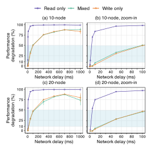

Figure 18: Performance degradation of etcd under different network delays (injected on the leader). Each set of experiment was repeated 50 times for generalizability. The shaded area highlights the "danger zone" where performance degradation escalates dramatically. Mixed: 50% reads and 50% writes.

Moreover, danger zone (between 10% and 50% degradation) still exists. For example, the danger zone for 10-node etcd under a read-only workload (injected on the follower) is from 10 ms to 50 ms (see Figure 20d). We also observe notable danger zones in the 20-node setup or when slow faults are injected to the leader node. This is consistent with our Finding 7 in Section 3.3.

#### <span id="page-18-1"></span>**Leader Re-Election**

Figure 19 shows the logic diagram of why severe slow faults on the leader can lead to better performance in etcd.

#### <span id="page-18-2"></span>D Client-Side Reconnection in gRPC

Figure 21 shows the logic diagram of why a single slow follower can possibly degrade the performance of the whole

<span id="page-18-5"></span>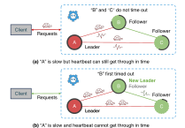

Figure 19: Severe slow faults trigger leader re-election.

<span id="page-18-4"></span>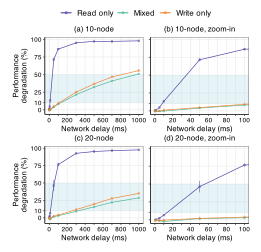

Figure 20: Performance degradation of etcd under different network delays (injected on the follower). Each set of experiment was repeated 50 times for generalizability. The shaded area highlights the "danger zone" where performance degradation escalates dramatically. Mixed: 50% reads and 50% writes.

<span id="page-18-0"></span>cluster in etcd.

#### Time to Recover

**Metrics and notations.** To determine when the system has recovered from slow faults, we calculate recovery time as the time it takes for the system to reach back a throughput that is higher than a threshold. The threshold is calculated as avg normal – sd normal, where sd normal is the standard deviation of the series of throughput records before fault injection. Figure 22 presents the distribution of recovery time among all studied systems.

Recovery time in delayed filesystem and network. Systems can recover quickly from delayed filesystem and network. As shown in Figure 22, the average recovery time for all studied systems under a delayed network and filesystem is 0.8s and 1.0s respectively. We do not observe a notable jump

<span id="page-18-6"></span>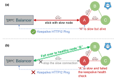

Figure 21: A slow follower can degrade cluster performance.

<span id="page-19-1"></span>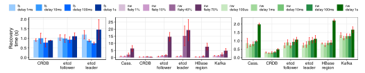

Figure 22: Time for performance to recover after filesystem delay (left), network packet loss (middle), and network delay (right). The darker the colors, the more severe the faults are. Each experiment was repeated 50 times for generalizability. Error bars refer to 95% confidence intervals.

<span id="page-19-2"></span>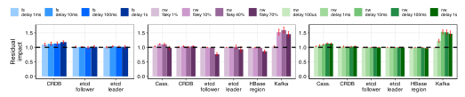

Figure 23: Residual performance after filesystem delay (left), network package loss (middle), and network delay (right). The darker the colors, the more severe the faults are. Each experiment was repeated 50 times for generalizability. Error bars refer to 95% confidence intervals.

in the recovery time as we iterate through higher delays. Kafka takes a slightly longer recovery time (an average of 1.3s). This is because of the distributed nature of Kafka (i.e., data streaming) which relies more heavily on network communication. Nevertheless, it is still acceptable as the recovery time is still within seconds. Also, CRDB generally needs more time to recover from filesystem delays (an average of 0.9s) than network delays (0.3s).

**Recovery time in flaky network.** However, in the face of network packet loss, the recovery time could be much longer. In general, the recovery time of all systems increases as their network becomes more flaky: the average time to recover under a 10%, 40%, and 70% packet loss is 0.8s, 3.6s, and 7.1s respectively.

We notice that the recovery time for a 70% packet loss is notably higher than in the other two cases. This is because the injected node sometimes fails to establish a connection with the cluster due to high packet loss and even experiences some downtimes. In this case, after faults are cleared, systems will schedule a considerable amount of background tasks to help the injected node catch up with the cluster (e.g., hinted handoff in Cassandra). In this case, system performance cannot recover until background tasks are mostly finished and no longer serve as bottlenecks. However, etcd may intentionally shut down faulty nodes, thus no longer recovered.

Relationship between degradation and recovery time. A higher performance degradation does not necessarily yield a much longer recovery time. For example, CRDB degrades by 22% under a 1ms filesystem delay and then recovers in 0.92s, while it degrades much more by 72% under a 1s filesystem

delay but then recovers faster in 0.78s. Similar observations can be obtained in most fault setups (except for those with high packet loss of 40% and 70%). This phenomenon can be attributed to the fact that most slow faults we introduced, while significantly impeding a distributed system, do not crash nodes. Thus, systems can quickly recover to normal once the faults are cleared.

#### <span id="page-19-0"></span>F Residual Impact

Metrics and notations. We calculate the average throughput after slow faults are cleared (denoted as avg\_residual), and compare it with the average throughput before fault injection (denoted as avg\_normal). We quantify the residual impact as avg\_residual where a value higher than 1 indicates that the system is fully recovered and even outperforms the normal state. On the other hand, a value smaller than 1 indicates that the system's overall performance is still affected by the residual impacts of slow faults. Figure 23 presents the distribution of residual impacts among all studied systems.

**Performance drop.** Severe slow faults could incur notable residual impacts on system performance. For example, soon after the 70% packet loss is cleared, etcd follower still suffers from severe slowdowns for a while, while its performance gradually increases over time. As a result, it can only achieve an average performance that is only 77% of the normal state. Similar observations can also be obtained in HBase.

**Performance gain.** We observed that some systems issue bursty requests after slow faults finish. For example, the performance gains in CRDB (after filesystem delays) and Cassandra (after network delays) are all above 1, with an average of 1.13×

<span id="page-20-2"></span>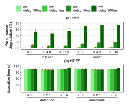

Figure 24: Cross-version analysis of HDFS and etcd under network slow faults. The x-axis shows different fault injection locations and system versions. The y-axis shows the performance degradation in etcd or the execution time of the TeraSort benchmark in HDFS.

and 1.08× respectively. Moreover, the more severe prior faults are, the more performance gain we can observe. This is due to systems' internal recovery mechanisms, such as backlog in CRDB and hinted handoff in Cassandra.

Kafka demonstrates the most performance gains among all systems, with an average of 1.4× after network faults are cleared. Also, we notice that its cumulated performance gain resembles its cumulated performance degradation during slow faults (see Figure [2\)](#page-4-2). This is due to the delayed flush of messages. Producers in Kafka by default will buffer unsent messages (due to a slow network in our case) in the memory and then flush them all once the network faults are cleared. In this case, the performance gain we observe is similar to the performance degradation caused by slow faults. To validate this, we configured Kafka to force flushing every message, which eliminated such notable performance gains.

# <span id="page-20-0"></span>**G Cross-Version Analysis**

Distributed systems are constantly evolving, integrating bug fixes and new features that also influence their fault tolerance capabilities (e.g., HBase's log roll mechanism discussed in Section [4.2.3\)](#page-7-3). In this section, we evaluate and compare the nuances of slow-fault tolerance across different versions (see Table [5\)](#page-20-1) of two representative systems, HDFS and etcd. HDFS

<span id="page-20-1"></span>

| System | Version | Year |  |
|--------|---------|------|--|
|        | 3.3.6   | 2023 |  |
| HDFS   | 3.2.1   | 2019 |  |
|        | 3.0.0   | 2017 |  |
|        | 3.5.10  | 2023 |  |
| etcd   | 3.4.0   | 2019 |  |
|        | 3.0.0   | 2016 |  |

Table 5: Versions of HDFS and etcd used in the cross-version analysis.

is a relatively mature system while etcd represents newer generations of distributed systems. Our goal is to understand the evolving trajectory of these systems in terms of their tolerance to slow faults.

Figure [24](#page-20-2) presents the evaluation of etcd and HDFS under network slow faults. In both HDFS and etcd, the performance degradation does not vary much across different versions. As we increase the degrees of severity, the performance degradation in etcd leader or follower also increases accordingly. We also check other fault types (e.g., filesystem delays), showing similar results. In conclusion, there is no significant improvement in the slow-fault tolerance of these systems over time. Their version updates highlight a lack of focus on this field. Yet, the evident performance and awareness discrepancies across these systems show the feasibility and improvement we can obtain through moderate efforts.